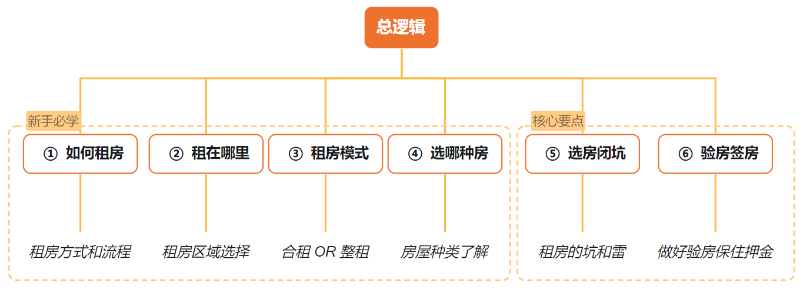
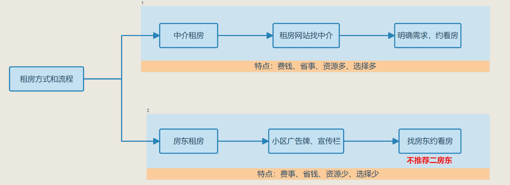
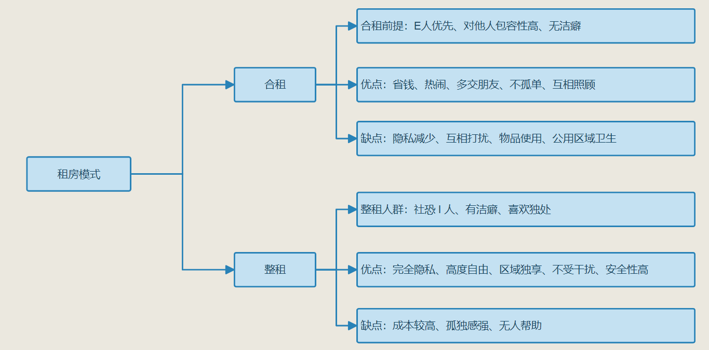
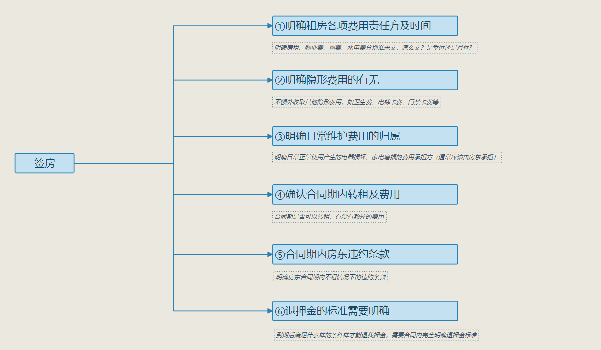

# 租房流程及闭坑指南

## 一、租房方式和流程

**PS:不推荐二房东的房子，请尽量避开**

## 二、租赁区域选择

**推荐选择公司附近5公里内地铁站附近的小区，同时要注意甄别偏僻小区，免得周末外卖都不好点**

## 三、合租 OR 整租

## 四、房屋种类了解

*   **普通住宅**：**最推荐类型**，配套齐全、有燃气，民水民电价格低
    
*   **商住两用（公寓楼）**：价格高，商水商电生活成本高，一般无燃气
    
*   **回迁房**：小区质量一般较低，环境比较杂乱，噪音大
    
*   **自建房**：凭运气，看房东，蚊虫多，隔音差，位置偏
    

## 五、租房的坑和雷

| 序号   | 雷点           | 注意事项                                                     |
| :----- | :------------- | :----------------------------------------------------------- |
| **1**  | 新装修         | 甲醛超标，快跑。要命！                                       |
| **2**  | 审串房         | 甲醛超标，快跑。要命！                                       |
| **3**  | 电器是否完备   | 注意查看空调、冰箱、洗衣机、热水器是否都有                   |
| **4**  | 空调是否干净   | 开空调闻是否有霉味，掀开机盖看是否发黑                       |
| **5**  | 冰箱是否干净   | 打开冰箱看是否干净，是否恶臭                                 |
| **6**  | 热水器是否干净 | 龙头放热水器水看是否浑浊有水垢                               |
| **7**  | 高级别电器能效 | 能效越低越省电，尽量避开，三级能效以上还是不要选，日常电费太高 |
| **8**  | 水电价格       | 建议民水民电，若是商水商电问好价格。避开房东代缴+自由定价的房东 |
| **9**  | “智能”电表     | 避大雷，如果不能通过电网缴纳的个人电表房屋不建议租赁         |
| **10** | 低楼层+落地窗  | 个人隐私容易暴露                                             |
| **11** | 一楼           | 容易水淹、蚊虫多、噪音大、室内采光差                         |
| **12** | 阴面房间       | 常年不见阳光、通风差、易发霉，白天至少看一次房，观察采光     |
| **13** | 隔音差         | 避大坑                                                       |
| **14** | 电器运行声音大 | 避大坑                                                       |
| **15** | 周边有工地     | 避大坑                                                       |
| **16** | 楼道卫生差     | 蚂蚁蟑螂多                                                   |
| **17** | 一楼商户开饭店 |                                                              |
| **18** | 卫生间反味     | 避开 OR房东增加防味地漏                                      |
| **19** | 插座           | 床头、书桌旁、卫生间镜子为超必要插座                         |
| **20** | 待更新         |                                                              |
| **21** | 待更新         |                                                              |
| **22** | 待更新         |                                                              |
| **23** | 待更新         |                                                              |
| **24** | 待更新         |                                                              |
| **25** | 待更新         |                                                              |
| **26** | 待更新         |                                                              |

## 六、验房签房：

