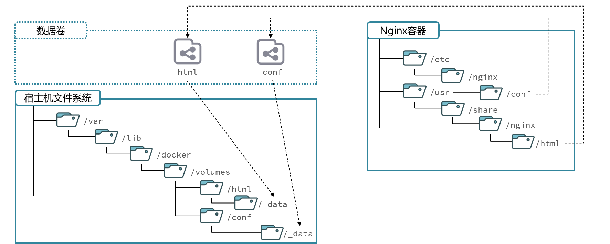

# 基本概念

> 首先要有一个认知，就是要先大概对Docker中的**“容器”**有点认识，这里的容器本质上是一个**“进程“**
>
> ”进程“最根本的本质是**资源容器**，所以这里的**“容器”**就是**进程**
>
> > 要是初学者的话，可以暂时这样理解：
> >
> > - **容器**是一个可以被运行的软件，这个软件的代码，就是我们放到容器中的代码，运行容器，就是运行我们的代码
> >
> > - 把代码及其和代码相关的各种东西都放到容器内部，从而进行统一，容器无论在哪里运行，因为内部统一，运行都不会有差异
>
> Docker实际上就是一个软件，是一个容器管理平台，只不过它的功能有点特殊而已

- **Docker的功能**：调用操作系统内核提供的能力，去**创建、管理和运行“容器”**


- **Docker**解决的问题：
  - **一致性问题**：通过打包应用和环境，解决了“我的电脑可以，你的不行”的这种运行差异问题
  - **部署效率问题**：通过标准化部署单元，解决了手动部署复杂、缓慢和高风险的问题
  - **依赖冲突问题**：通过隔离，解决了“依赖地狱”问题
  - **资源利用率问题**：通过轻量化，解决了虚拟机的资源浪费和高成本问题


- Docker 的核心价值是**隔离**
  - **主机端口**不是应用程序本身占用的端口，而是 Docker 为了在不破坏隔离性的前提下，提供的一种**功能更强大、更灵活的外部访问机制**
  - **容器端口**是应用程序在它自己**被隔离的、私有的**网络环境里，**实际占用和监听**的端口


# 虚拟机和Docker

- **虚拟机**：用来**模拟硬件**，之后我们下载的**操作系统**就可以在里面**操作这些模拟的“硬件”**
- **Docker**：用来**利用操作系统**，**创建、管理和运行“容器”**


# Docker安装

> 安装之前先输入“问题”中的第一个指令，这是最完美的方案

- 官方文档网址：https://docs.docker.com/engine/install/

- 黑马程序员文档：https://b11et3un53m.feishu.cn/wiki/Rfocw7ctXij2RBkShcucLZbrn2d#Kjd5dFHCGo76s9xGnMic9a7fnXf
- csdn某个文章：[CentOS-7安装Docker（更新时间：2025-03-12）_centos7安装docker-CSDN博客](https://blog.csdn.net/weixin_42541479/article/details/146209159?ops_request_misc=%7B%22request%5Fid%22%3A%22a0171de80562d4e494971dff01a1dab2%22%2C%22scm%22%3A%2220140713.130102334..%22%7D&request_id=a0171de80562d4e494971dff01a1dab2&biz_id=0&utm_medium=distribute.pc_search_result.none-task-blog-2~all~top_positive~default-4-146209159-null-null.142^v102^pc_search_result_base2&utm_term=centos7安装docker&spm=1018.2226.3001.4187)
  - 另一个：https://blog.csdn.net/weixin_52597907/article/details/141113817
- https://cloud.tencent.com/developer/article/2486234


## 步骤

- 后面会补


### 问题

#### yum报错

- 输入下面这个（这个建议打开Linux就立马输入，我第一次中途试失败了）

  ```bash
   bash <(curl -sSL https://gitee.com/SuperManito/LinuxMirrors/raw/main/ChangeMirrors.sh)
  ```


# 目录相关

- Docker在linux上的根目录`/var/lib/docker/`
- 镜像的地址`/var/lib/docker/overlay2/`
- 容器的地址`/var/lib/docker/containers/<容器ID>/`


# DockerFile

## **官方定义**

- A Dockerfile is a text document that contains all the commands a user could call on the command line to assemble an image. Using `docker build` users can create an automated build that executes several command-line instructions in succession.

  > Dockerfile 是一个文本文档，它包含了用户可以在命令行上调用以组装成一个镜像的所有命令。
  >
  > 通过使用 `docker build` 命令，用户可以创建一个自动化构建过程，该过程会连续执行多条命令行指令

- 唯一目的是**定义**如何一步步地 **构建一个 Docker 镜像**

  它详细描述了需要什么样的基础环境、安装哪些软件、拷贝什么文件进去，以及最后应该如何运行程序


# 镜像

- 简单看的话，初学者可以先把可以把 **Docker 镜像** 想象成您已经**安装完毕、静静躺在硬盘上**的**软件**

  - 也有一种类比，说可以把**镜像**看作**Java中的类**，把**容器**看作**类的实例**

## **官方定义**

- 官方英文叫法是：**`image`**

- An **image** is a read-only template with instructions for creating a Docker container. Often, an image is based on another image, with some additional customization. For example, you may build an image which is based on the `ubuntu` image, but installs the Apache web server and your application, as well as the configuration details needed to make your application run.

  >镜像是一个带有创建 Docker 容器指令的**只读模板**。通常，一个镜像会基于另一个镜像，并加上一些额外的定制。
  >
  >例如，你可能会构建一个基于 `ubuntu` 镜像的镜像，但其中安装了 Apache Web 服务器和你的应用程序，以及运行你的应用所需的所有配置细节

## 其它概念

- 所有的镜像都基于一个**基础镜像**构建


# 容器

> 通过将**代码及其完整的运行环境**在**逻辑上放入** **容器**中，可以确保无论这个容器在哪里运行，其表现都完全一致，没有差异

## 官方定义

- 官方英文叫法是：**`container`**

- A container is a runnable instance of an image. You can create, start, stop, move, or delete a container using the Docker API or CLI. A container is defined by its image as well as any configuration options you provide to it at creation time. When a container is removed, any changes to its state that are not stored in persistent storage disappear.

  >容器是镜像的一个**可运行实例**。
  >
  >你可以使用 Docker API 或命令行工具（CLI）来创建、启动、停止、移动或删除容器。
  >
  >容器由其镜像以及在创建时提供给它的任何配置选项所定义。
  >
  >当一个容器被移除时，任何未存储在持久化存储中的状态变更都会消失

- **容器**是根据静态的**镜像**创建出来的。容器是一个**可以被启动、停止和删除**的实例，而镜像本身永远是静止不变的**模板**

- 现在初学者可以简单先把 **Docker 容器** 想象成您**双击了软件的图标后，弹出来的那个正在运行的软件窗口**


## 其它概念

- **容器**不是 Docker **软件“里面”**的东西，而是**由 Docker “管理”**的、由**操作系统内核直接创造和隔离的“特殊进程”**

- 由于**网络命名空间 (Network Namespace)** 的隔离，**每一个容器**都拥有自己一套**完整且私有**的端口号，范围从 1 到 65535

- 每个容器都拥有自己独立的端口集和至少一个唯一的内部 IP 地址

- 关于**端口**

  - **`<主机端口>` **: 

    - **主机端口**不是应用程序本身占用的端口，而是 Docker 为了在不破坏隔离性的前提下，提供的一种**功能更强大、更灵活的外部访问机制**

    - 主机端口是你希望在宿主机上**暴露**的端口。外部客户端将通过这个端口来访问服务。

      这个端口必须是宿主机上尚未被其他程序占用的端口

      

  - **`<容器端口>` **: 

    - **容器端口**是应用程序在它自己**被隔离的、私有的**网络环境里，**实际占用和监听**的端口

    - 容器内应用程序**正在监听**的端口

      这个端口是由镜像的开发者决定的（例如，Nginx 默认在容器内监听 80 端口，MySQL 默认监听 3306 端口）


- 容器本身，作为一个抽象的“盒子”或“环境”，它自己**不占用任何端口**

  真正占用端口的，永远是运行在容器这个隔离环境**内部的那个应用程序进程**

  > 比如 mysql


# 仓库

- **Docker 仓库** 其实就是**集中存放和分发 Docker 镜像的地方**，**类似于Maven仓库**

  > 其实我把它视为存放Docker镜像的Maven仓库


## 官方定义

### 注册服务器

> Registry

- A *registry* is a storage and content delivery system, holding named Docker images, available in different tagged versions. [...] Docker Hub is a public registry pre-configured by default.

  > 一个**注册服务器 (Registry)** 是一个存储和内容分发系统，它持有带名称的 Docker 镜像，这些镜像可以有不同的标签版本。......Docker Hub 是一个默认预先配置好的公共注册服务器。


### 仓库

> Repository

- A *repository* contains all the versions of a specific image. It's a collection of different images with the same name, but different tags. For example, `ubuntu` is a repository, and it contains images like `ubuntu:22.04`, `ubuntu:20.04`, etc.

  >一个**仓库 (Repository)** 包含了某一特定镜像的所有版本。它是拥有相同名称但不同标签的一系列镜像的集合。例如，`ubuntu` 是一个仓库，它包含了像 `ubuntu:22.04`、`ubuntu:20.04` 等镜像。


# 数据卷

> Volume

- 数据卷是**一个或多个容器专用的、存在于宿主机文件系统中的一个特殊目录**

  关键点在于，这个目录**由 Docker 自己进行管理**

- 数据卷可以想象成一个给 Docker 容器外挂的 **“U盘” 或 “移动硬盘”**


## 图




## 官方定义

- Volumes are the preferred mechanism for persisting data generated by and used by Docker containers. While bind mounts are dependent on the directory structure and OS of the host machine, volumes are completely managed by Docker. [...] Volumes are the best way to persist data in Docker.

  > **数据卷 (Volumes)** 是 Docker 官方**推荐的机制 (preferred mechanism)**，用于持久化 Docker 容器所产生和使用的数据。
  >
  > 与依赖于宿主机目录结构和操作系统的绑定挂载不同，**数据卷完全由 Docker 进行管理**。
  >
  > ......数据卷是在 Docker 中持久化数据的**最佳方式 (best way)**。


# DockerCompose

## 1. 是什么

- 想象一下，你正在构建一个复杂的应用程序，比如一个博客网站。这个网站至少需要三个部分协同工作：

  1. **Web 服务器** (例如 Nginx)，用来接收用户请求。
  2. **应用程序本身** (例如 WordPress)，用来处理逻辑。
  3. **数据库** (例如 MySQL)，用来存储文章和用户信息。

  在 Docker 中，这三个部分需要分别在三个独立的容器中运行。如果手动管理它们，你需要执行一长串的 `docker run` 命令，并且要手动配置它们之间的网络连接、数据卷等，非常繁琐且容易出错。

- **Docker Compose** 就是为了解决这个问题而生的。它是一个用来 **定义和运行多容器 Docker 应用程序** 的工具。你只需要在一个 YAML 文件 (`docker-compose.yml`) 中配置好你的应用服务，然后用一个简单的命令，就能创建并启动所有服务。


## 2. `docker-compose.yml`

- Docker Compose 的所有魔力都源于 `docker-compose.yml` 这个配置文件。

### **示例**

```yaml
# Compose 文件的版本号，建议使用 "3.8" 或更高版本
version: "3.8"

# 定义所有的服务 (即容器)
services:
  # 第一个服务：数据库
  db:
    image: mysql:5.7          # 使用的镜像
    container_name: my-mysql-db # 容器的友好名称
    volumes:                  # 数据卷，用于数据持久化
      - db_data:/var/lib/mysql
    environment:              # 环境变量，用于配置容器
      MYSQL_ROOT_PASSWORD: mysecretpassword
      MYSQL_DATABASE: wordpress
      MYSQL_USER: wordpressuser
      MYSQL_PASSWORD: wordpresspassword
    restart: always           # 容器退出时总是自动重启
    networks:                 # 指定容器连接的网络
      - app-network

  # 第二个服务：WordPress 应用
  wordpress:
    image: wordpress:latest
    container_name: my-wordpress-app
    ports:                    # 端口映射 <主机端口>:<容器端口>
      - "8080:80"
    environment:
      WORDPRESS_DB_HOST: db:3306 # 连接数据库，'db' 是上面定义的服务名
      WORDPRESS_DB_USER: wordpressuser
      WORDPRESS_DB_PASSWORD: wordpresspassword
      WORDPRESS_DB_NAME: wordpress
    restart: always
    depends_on:               # 依赖关系，确保 db 服务先于 wordpress 启动
      - db
    networks:
      - app-network

# 定义网络
networks:
  app-network:
    driver: bridge            # 使用 bridge 驱动创建新网络

# 定义数据卷
volumes:
  db_data:                    # 创建一个名为 db_data 的具名数据卷
```


### 文件解析

- **`version`**: 指定 Compose 文件的语法版本。
- **`services`**: 这是核心部分，定义了应用包含的各个服务（容器）。
  - `db` 和 `wordpress` 是我们自定义的服务名称。
  - **`image`**: 指定服务所使用的 Docker 镜像。
  - **`container_name`**: 为容器指定一个易于识别的名字。
  - **`ports`**: 将主机的端口映射到容器的端口。格式为 `HOST:CONTAINER`。例如 `"8080:80"` 表示访问主机的 8080 端口，流量会被转发到容器的 80 端口。
  - **`environment`**: 设置环境变量。这通常用于传递配置信息，如数据库密码、用户名等。
  - **`volumes`**: 用于数据持久化。
    - `db_data:/var/lib/mysql` 是一个 **具名卷 (Named Volume)** 的例子。Docker 会创建一个名为 `db_data` 的卷来存储 MySQL 的数据。即使 `db` 容器被删除，这个卷和里面的数据也会被保留下来。
  - **`depends_on`**: 定义服务之间的启动顺序。在这里，`wordpress` 依赖于 `db`，所以 Compose 会先启动 `db` 服务，再启动 `wordpress` 服务。
- **`networks`**: 定义容器所连接的 Docker 网络。
  - `app-network` 是我们自定义的网络名称。
  - 将所有服务放在同一个网络下，它们就可以通过 **服务名** (例如 `db`) 作为主机名直接相互通信，而无需关心容器的 IP 地址。
- **`volumes`**: 声明在 `services` 中使用的具名卷。


## 3. 常用命令

- 你需要在包含 `docker-compose.yml` 文件的目录下运行这些命令。

  - **启动所有服务**

    ```bash
    # 在后台启动并运行所有服务
    docker-compose up -d
    ```

    - `-d` (detached mode) 参数表示在后台运行。
    - 第一次运行时，它会自动拉取镜像、创建数据卷、网络和容器。

  - **停止并移除所有服务**

    ```bash
    # 停止并移除由 up 命令创建的容器、网络
    docker-compose down
    ```

    - 如果想同时移除数据卷，可以加上 `--volumes` 参数：`docker-compose down --volumes`。

  - **查看服务状态**

    ```bash
    # 列出当前 Compose 项目中的所有容器及其状态
    docker-compose ps
    ```

  - **查看服务日志**

    ```bash
    # 查看所有服务的日志输出
    docker-compose logs
    
    # 持续跟踪日志 (类似 tail -f)
    docker-compose logs -f
    
    # 只查看特定服务的日志
    docker-compose logs -f wordpress
    ```

  - **构建或重新构建服务** 如果你的服务依赖于本地的 `Dockerfile` 而不是远程镜像，这个命令会很有用。

    ```bash
    docker-compose build
    ```

  - **启动/停止/重启服务**

    ```bash
    docker-compose start   # 启动已存在的容器
    docker-compose stop    # 停止正在运行的容器
    docker-compose restart # 重启服务
    ```

  - **在服务中执行命令**

    ```bash
    # 在 my-wordpress-app 容器中启动一个 bash shell
    docker-compose exec wordpress bash
    ```

    - 这对于调试或进入容器内部查看情况非常有用


# Docker命令

- 绝大多数 Docker 命令都是在**操作系统的终端里**输入的，而不是在 Docker 容器的 `bash` 中


## 命令图


## 语法格式

- 所有 Docker 命令都遵循一个通用的格式，理解这个格式可以帮助你更快地掌握所有命令：

  ```cmd
  docker <管理对象> <具体动作> [选项] [参数]
  ```

  - **`docker`**: 所有命令的固定前缀。

  - **`<管理对象>`**

    - 你想要操作的目标，例如 `container` (容器)、`image` (镜像)、`network` (网络)、`volume` (数据卷)等

      这是 Docker 推荐的、更具结构化的新版命令格式

  - **`<具体动作>`**: 你要执行的操作，例如 `ls` (列出)、`rm` (删除)、`run` (运行)等

  - **`[选项]`**: 用来调整命令的行为，例如 `-d` (后台运行)、`-p` (端口映射)

  - **`[参数]`**: 命令操作的具体对象，例如镜像名称、容器ID等


## **新版和旧版命令格式**

- 你可能会在很多教程中看到两种命令格式，它们的功能是完全一样的

  - **新版格式 (推荐)**: `docker container ls`, `docker image rm`
    - 逻辑清晰，符合 `<管理对象> <具体动作>` 的结构。

  - **旧版格式 (兼容)**: `docker ps`, `docker rmi`
    - 这是早期的直接命令，可以看作是新命令的“快捷方式”或“别名”

- **建议**：

  - 在学习和使用时，**尽量使用新版的命令格式**，因为它更规范，也是官方推荐的方向

    同时，了解旧的格式能让你无障碍地看懂任何教程


## 常用命令

- 后面提到的`[:标签]`表示版本


- 默认情况下，每次重启虚拟机我们都需要手动启动Docker和Docker中的容器。通过命令可以实现开机自启

```bash
# Docker开机自启
systemctl enable docker

# Docker容器开机自启
docker update --restart=always [容器名/容器id]
```


### 镜像管理

> Image Management

- 镜像是创建 Docker 容器的模板。这里的管理对象是 `image`


#### 列出本地镜像

```bash
docker image ls			或		docker images
```

- **核心作用**: 查看已经下载到本地或在本地构建的所有镜像。这是进行任何本地镜像管理（如清理、版本确认、查找可用镜像）的第一步，相当于盘点你本地的“软件仓库”


- **语法解析**: `docker image ls [选项] [仓库名[:标签]]`
  - **管理对象**: `image`
  - **具体动作**: `ls` (list)
  - **选项**: 用于控制输出格式，如 `-a`, `-q`, `--filter`
  - **仓库名[:标签]**: (可选) 只列出指定仓库和标签的镜像，可以用来快速筛选


- **输出详解**:
  - `REPOSITORY`: 镜像所在的仓库名称。如果看到 `<none>`，这通常意味着该镜像是一个“悬空镜像”（dangling image），可能是构建新镜像后遗留的旧镜像层
  - `TAG`: 镜像的标签，通常用来表示版本信息（如 `1.0`, `latest`）。
    `latest` 是一个特殊的默认标签，但并不总是代表最新版本，它只是一个可以移动的指针。同一个镜像 ID 可以拥有多个标签
  - `IMAGE ID`: 镜像的唯一标识符（SHA256 哈希值的前12位）。这是镜像内容的“指纹”，是它唯一的身份证明
  - `CREATED`: 镜像被构建的时间，而不是被你拉取到本地的时间
  - `SIZE`: 镜像所有层解压后的大小总和。由于 Docker 的分层存储机制，多个镜像可以共享相同的层，所以所有镜像大小的简单相加并不等于实际占用的磁盘空间


- **常用选项**:
  - `-a`, `--all`: 列出所有镜像，包括在构建过程中为了缓存而产生的、没有标签的中间层镜像。这在深度调试镜像问题时很有用
  - `-q`, `--quiet`: 只显示镜像的 `IMAGE ID`。这个选项是脚本化操作的利器，常用于与其他命令（如 `docker image rm`）组合，实现批量处理
  - `--no-trunc`: 显示完整的镜像 ID，而不是默认的12位截断版
  - `-f`, `--filter <过滤条件>`: 这是个非常强大的选项，可以根据特定条件筛选镜像
    - `dangling=true`: 只显示悬空镜像，是清理无用镜像时最常用的过滤器
    - `before=<镜像名:标签>`: 列出在指定镜像之前创建的镜像
    - `since=<镜像名:标签>`: 列出在指定镜像之后创建的镜像
  - `--format <Go模板字符串>`: 可以自定义输出的格式，对于需要提取特定信息并进行后续处理的场景非常方便


- **示例**:

  ```bash
  # 查看所有本地镜像
  docker image ls
  
  # 只查看镜像ID
  docker image ls -q
  
  # 查看所有悬空镜像，准备进行清理
  docker image ls -f "dangling=true"
  
  # 查找所有仓库名为 "ubuntu" 的镜像
  docker image ls ubuntu
  
  # 结合-q选项，删除所有悬空镜像
  docker image rm $(docker image ls -f "dangling=true" -q)
  
  # 使用format选项，只输出镜像的仓库名和标签，用冒号分隔
  docker image ls --format "{{.Repository}}:{{.Tag}}"
  ```


#### 从仓库拉取镜像

```bash
docker image pull		或		docker pull
```

- **核心作用**: 从远程镜像仓库（Registry），如默认的 Docker Hub，下载指定的镜像到本地。这是获取官方或他人制作好的应用环境最直接、最常用的方式。当你执行 `docker run` 一个本地不存在的镜像时，Docker 也会在后台自动执行 `pull` 操作。

- **语法解析**: `docker image pull [选项] 镜像名[:标签|@摘要]`

  - **管理对象**: `image`
  - **具体动作**: `pull`
  - **选项**: 用于控制拉取过程的参数，例如指定平台架构。
  - **镜像名[:标签|@摘要]**: 要拉取的镜像的名称。
    - 如果不指定 `:标签`，Docker 会默认使用 `:latest` 标签。**注意**：`latest` 并不保证是最新版本，它只是一个开发者可以移动的标签。
    - 使用 `@摘要` (digest，一个SHA256哈希值)可以精确地拉取一个特定版本的镜像层，这可以保证环境的绝对一致性，不受标签变动的影响。

- **常用选项**:

  - `-a`, `--all-tags`: 拉取该仓库下的所有标签的镜像。通常用于备份或离线使用场景。
  - `-q`, `--quiet`: 安静模式，拉取过程中只输出最终的镜像ID，不显示详细的下载进度条。
  - `--platform <平台>`: 在支持多架构的镜像中，指定要拉取的平台/架构，例如 `linux/amd64` 或 `linux/arm64`。这在 M1/M2 Mac 或其他 ARM 架构的机器上非常有用。

- **示例**:

  ```bash
  # 拉取最新版的 Nginx 镜像 (等同于 docker image pull nginx:latest)
  docker image pull nginx
  
  # 拉取指定版本的 Redis 镜像
  docker image pull redis:6.2
  
  # 拉取 Alpine Linux 3.18 版本的镜像
  docker image pull alpine:3.18
  
  # 从 Google 的镜像仓库拉取镜像
  docker image pull gcr.io/google-containers/pause:3.2
  
  # 在 ARM 架构的机器上，明确指定拉取 amd64 版本的 ubuntu
  docker image pull --platform linux/amd64 ubuntu:22.04
  ```


#### 删除本地镜像

```bash
docker image rm			或		docker rmi
```

- **核心作用**: 删除一个或多个不再需要的本地镜像，以释放磁盘空间。这是 Docker 系统维护中非常重要的一个环节，可以防止磁盘被大量无用或过时的镜像占满。默认情况下，你不能删除一个被现有容器（即使是已停止的容器）所引用的镜像

- **语法解析**: `docker image rm [选项] 镜像 [镜像...]`

  - **管理对象**: `image`
  - **具体动作**: `rm` (remove)
  - **选项**: 用于控制删除行为的参数，最常用的就是强制删除
  - **镜像 [镜像...]**: 一个或多个要删除的镜像的名称、标签或ID

- **常用选项**:

  - `-f`, `--force`: **强制删除镜像**。这是一个强大但有风险的选项。如果一个镜像被某个容器所使用，使用 `-f` 会在不先删除容器的情况下，强行移除该镜像的标签引用。这可能导致该容器虽然还能运行，但其来源镜像会显示为 `<none>`，给后续管理带来困惑。建议的最佳实践是先用 `docker rm` 删除相关容器，再删除镜像
  - `--no-prune`: 不要删除该镜像依赖的、未被打标签的父镜像层。这个选项在复杂场景下使用，日常维护中较少用到

- **示例**:

  ```bash
  # 通过 "仓库名:标签" 的方式删除镜像
  docker image rm hello-world:latest
  
  # 通过镜像的短ID删除镜像（通常ID的前几位不重复即可）
  docker image rm a24bb4013296
  
  # 一次性删除多个镜像
  docker image rm redis:6.2 alpine:3.18
  
  # 强制删除一个被容器引用的镜像 (请谨慎操作)
  docker image rm -f nginx
  
  # 清理所有悬空镜像 (dangling images)，这是最安全、最常用的清理命令
  # 悬空镜像是没有标签，且不被任何容器使用的镜像层
  docker image prune -f
  
  # 或者使用经典的组合命令来达到同样的效果
  docker image rm $(docker image ls -f "dangling=true" -q)
  ```


#### 通过 Dockerfile 构建镜像

```bash
docker build
```

- **核心作用**: 根据 `Dockerfile` 文件中的指令，自动地、一步步地执行操作，最终创建一个全新的自定义镜像。这是实现“基础架构即代码”的關鍵，也是 Docker 工作流中最核心的命令，它将你的应用程序、依赖和环境配置打包成一个不可变的、可移植的单元。

- **语法解析**: `docker build [选项] 构建上下文路径`

  - **具体动作**: `build` (这是一个直接的顶级命令，不隶属于 `image` 管理对象)
  - **选项**: 用于控制构建过程的各种参数，例如为镜像打标签、指定 Dockerfile 路径、处理缓存等。
  - **构建上下文路径**: 这是一个**至关重要的概念**。它是一个本地目录或 Git 仓库的 URL，其中的所有文件（包括 `Dockerfile`）都会被打包发送给 Docker 守护进程（daemon）。Docker 守护进程只能访问这个上下文中的文件。最常用的路径是 `.`，代表当前目录。

- **关键概念**:

  - **Dockerfile**: 一个纯文本文件，包含了一系列用户可以自定义的指令。每一条指令都会在镜像中创建一个新的层（layer）。例如 `FROM` 指定基础镜像，`COPY` 复制文件，`RUN` 执行命令，`CMD` 定义容器启动时默认执行的命令。
  - **构建上下文 (Build Context)**: 为了安全和效率，Docker 构建时与主机是隔离的，它只能“看到”你指定的构建上下文路径里的东西。因此，`COPY ./app /app` 这样的指令，`./app` 必须位于上下文中。**最佳实践**是保持构建上下文尽可能小，只包含构建所需的文件，可以使用 `.dockerignore` 文件来排除不需要的文件（类似 `.gitignore`）。

- **常用选项**:

  - `-t`, `--tag <名称:标签>`: **(最常用)** 为成功构建的镜像打上标签，格式通常是 `仓库名:标签` 或 `用户名/仓库名:标签`。一个镜像可以有多个标签。
  - `-f`, `--file <Dockerfile路径>`: 默认情况下，`docker build` 会在构建上下文的根目录寻找名为 `Dockerfile` 的文件。使用此选项可以指定一个不同名称或位于不同路径（相对于上下文）的 Dockerfile。
  - `--no-cache`: 构建时不使用任何缓存。默认情况下，Docker 会缓存每一层的构建结果，如果指令和相关文件没有变化，会直接使用缓存来加速构建。在需要确保拉取最新依赖或调试构建问题时，这个选项非常有用。
  - `--build-arg <变量名=值>`: 向 Dockerfile 中传递构建时变量。这允许你在构建时动态传入一些参数，而不是硬编码在 Dockerfile 中。
  - `--pull`: 总是尝试拉取镜像的更新版本。即使本地已有基础镜像，也会尝试从远程仓库拉取最新的版本。
  - `--progress=plain`: 以纯文本格式显示构建输出，不会合并多个步骤的输出，便于查看每个命令的详细日志。

- **示例**:

  ```bash
  # 最基础的构建命令：在当前目录(.)下寻找 Dockerfile，并构建一个镜像
  # 构建出的镜像是悬空的（没有标签）
  docker build .
  
  # 最常用的方式：构建并为镜像打上标签 "myapp:1.0"
  docker build -t myapp:1.0 .
  
  # 为同一个镜像打上多个标签
  docker build -t myapp:1.0 -t myapp:latest .
  
  # 使用位于 conf/ 目录下的 Dockerfile.dev 文件进行构建
  docker build -t myapp-dev -f conf/Dockerfile.dev .
  
  # 构建时传入 HTTP_PROXY 环境变量
  docker build --build-arg HTTP_PROXY=[http://proxy.example.com](http://proxy.example.com) .
  
  # 直接从一个 GitHub 仓库构建镜像
  docker build -t my-git-app [https://github.com/docker/getting-started.git](https://github.com/docker/getting-started.git)
  
  # 构建时不使用缓存，确保所有步骤都重新执行
  docker build --no-cache -t myapp:1.1 .
  ```


#### 查看镜像构建历史

```bash
docker image history
```

- **核心作用**: 展示一个指定镜像的构建历史记录。它会列出构成该镜像的每一层（layer）以及创建该层的 Dockerfile 指令。这个命令对于理解镜像的结构、调试构建问题、或者查看基础镜像是否包含非预期的操作都非常有用。你可以把它看作是镜像的“家谱”或“构建日志”。

- **语法解析**: `docker image history [选项] 镜像`

  - **管理对象**: `image`
  - **具体动作**: `history`
  - **选项**: 用于控制输出的格式，例如是否截断长命令。
  - **镜像**: 你想要探查的镜像的名称、标签或ID。

- **输出详解**:

  - `IMAGE`: 这一层的唯一ID。对于最顶层，它就是该镜像的ID。
  - `CREATED`: 这一层是什么时候被创建的。
  - `CREATED BY`: **(最关键的信息)** 创建这一层的 Dockerfile 指令。通过这个字段，你可以逆向推断出构建这个镜像的 `Dockerfile` 的大致内容。
  - `SIZE`: 这一层自身的大小。将所有层的大小相加，大致等于镜像的总大小。
  - `COMMENT`: 层的注释，通常为空。

- **常用选项**:

  - `--no-trunc`: **(非常实用)** 不要截断 `CREATED BY` 列的输出。默认情况下，为了显示整齐，过长的构建指令会被截断。使用此选项可以看到完整的、未删节的指令，这对于调试至关重要。
  - `-H`, `--human`: 以人类可读的格式打印镜像大小（例如 `10MB` 而不是 `10485760`）。默认值为 `true`。
  - `-q`, `--quiet`: 安静模式，只显示每一层的镜像ID。

- **示例**:

  ```bash
  # 查看 redis 最新版镜像的构建历史
  docker image history redis:latest
  
  # 查看 alpine 镜像的历史，并且不截断构建指令
  # 你会看到非常详细的 RUN /bin/sh -c ... 指令
  docker image history --no-trunc alpine:latest
  
  # 查看你本地构建的 myapp:1.0 镜像是如何分层的
  docker image history myapp:1.0
  ```


#### 查看镜像详细信息

```bash
docker image inspect
```

- **核心作用**: 以 JSON 格式返回关于一个或多个镜像的**全部元数据**。与 `history` 命令关注于“如何构建”不同，`inspect` 命令关注的是镜像“是什么”。它提供了关于镜像配置的底层、详尽的信息，是进行高级调试、自动化脚本编写和深入了解镜像内部构造的终极工具。

- **语法解析**: `docker image inspect [选项] 镜像 [镜像...]`

  - **管理对象**: `image`
  - **具体动作**: `inspect`
  - **选项**: 用于控制输出的格式，最强大的就是 `--format` 选项。
  - **镜像 [镜像...]**: 你想要查看的一个或多个镜像的名称、标签或ID。

- **关键概念**:

  - **JSON 输出**: 此命令的输出是一个大型 JSON 对象（或数组，如果查询多个镜像）。这个对象包含了关于镜像的所有信息，例如：
    - 镜像的 ID, 标签, 创建时间。
    - 构建它的 Docker 版本信息。
    - 操作系统（OS）和架构（Architecture）。
    - 镜像配置中定义的环境变量（`ENV`）。
    - 默认暴露的端口（`EXPOSE`）。
    - 默认的工作目录（`WORKDIR`）。
    - 容器启动时默认执行的命令（`Cmd` 和 `Entrypoint`）。
    - 定义的数据卷（`VOLUME`）。
    - 每一层的 SHA256 摘要。

- **常用选项**:

  - `-f`, `--format <Go模板字符串>`: **(最强大、最实用的选项)** 使用 Go 语言的模板语法来提取并格式化输出 JSON 中的特定信息。这使得从复杂的 JSON 数据中精确地抓取你需要的值变得非常简单，是自动化脚本的绝佳伴侣。

- **示例**:

  ```bash
  # 查看 redis:latest 镜像的所有详细信息 (会输出一个巨大的 JSON 对象)
  docker image inspect redis:latest
  
  # 使用 --format 选项，只提取镜像的架构 (e.g., "amd64", "arm64")
  docker image inspect -f '{{.Architecture}}' redis:latest
  
  # 提取并列出镜像中通过 EXPOSE 指令暴露的所有端口
  docker image inspect -f '{{json .Config.ExposedPorts}}' redis:latest
  
  # 获取镜像中定义的默认启动命令 (Cmd)
  docker image inspect -f '{{json .Config.Cmd}}' redis:latest
  
  # 检查镜像构建时使用的 Docker 版本
  docker image inspect -f '{{.DockerVersion}}' redis:latest
  
  # 一个更复杂的例子：迭代并打印出镜像中定义的所有环境变量
  docker image inspect -f '{{range .Config.Env}}{{println .}}{{end}}' redis:latest
  ```


#### 为镜像添加标签

```bash
docker image tag		或		docker tag
```

- **核心作用**: 为一个已经存在的本地镜像创建一个新的别名或“指针”。这个操作**不会**复制或创建一个新的镜像，它只是让同一个镜像 ID 拥有一个新的、可供引用的名称和标签。这主要用于两个场景：1）为镜像赋予有意义的版本标识（如 `myapp:1.0`, `myapp:latest`）；2）在将镜像推送到远程仓库前，将其重命名为符合仓库要求的格式（如 `username/repository:tag`）。

- **语法解析**: `docker image tag 源镜像[:标签] 目标镜像[:标签]`

  - **管理对象**: `image`
  - **具体动作**: `tag`
  - **源镜像[:标签]**: 你想要为其创建别名的、已经存在的本地镜像。
  - **目标镜像[:标签]**: 你要为该镜像赋予的、新的名称和标签。

- **关键概念**:

  - **指针而非复制**: `docker image tag` 是一个非常轻量级的操作。它不会占用额外的磁盘空间（除了元数据的一点点）。当你执行 `docker image ls` 时，你会看到一个新的条目，但它的 `IMAGE ID` 与源镜像完全相同。这意味着它们指向的是同一个底层镜像。
  - **推送命名规范**: 远程仓库（如 Docker Hub）要求镜像名称必须遵循 `<用户名>/<仓库名>:<标签>` 的格式。因此，在你将本地构建的镜像（如 `myapp:1.0`）推送上去之前，**必须**先使用 `tag` 命令将其重命名为 `your-username/myapp:1.0`。

- **常用选项**:

  - `docker image tag` 命令本身没有常用选项，它的功能非常纯粹和直接。

- **示例**:

  ```bash
  # 假设我们本地有一个名为 "myapp:1.0" 的镜像
  # 为它添加一个 "latest" 标签
  docker image tag myapp:1.0 myapp:latest
  
  # 此时执行 docker image ls myapp，你会看到两条记录，但 IMAGE ID 相同：
  # REPOSITORY   TAG      IMAGE ID       CREATED         SIZE
  # myapp        1.0      a1b2c3d4e5f6   5 minutes ago   120MB
  # myapp        latest   a1b2c3d4e5f6   5 minutes ago   120MB
  
  # 准备将 myapp:1.0 推送到 Docker Hub，用户名为 johndoe
  # 必须先将其标记为符合 Docker Hub 格式的名称
  docker image tag myapp:1.0 johndoe/myapp:1.0
  
  # 现在你可以执行 docker image push johndoe/myapp:1.0 来推送它了
  
  # 也可以用镜像ID来打标签
  # 假设 a1b2c3d4e5f6 是 myapp:1.0 的ID
  docker image tag a1b2c3d4e5f6 johndoe/myapp:v1-stable
  ```


#### 推送镜像到仓库

```bash
docker image push		或		docker push
```

- **核心作用**: 将一个本地的镜像上传到一个远程的镜像仓库（Registry）。这是实现镜像共享、团队协作和持续集成/持续部署（CI/CD）流程的关键步骤。最常见的公共仓库是 Docker Hub，但你也可以推送到私有仓库，如 Harbor、GitLab Registry 或云服务商提供的仓库（AWS ECR, GCP GCR 等）。

- **语法解析**: `docker image push [选项] 镜像名[:标签]`

  - **管理对象**: `image`
  - **具体动作**: `push`
  - **选项**: 用于控制推送过程的参数。
  - **镜像名[:标签]**: 你想要推送的镜像的名称。**这个名称必须符合远程仓库的命名规范**。

- **关键概念**:

  - **命名规范 (非常重要)**: 在执行 `push` 之前，你必须确保你的本地镜像名称是符合目标仓库格式的。对于 Docker Hub，格式是 `<你的用户名>/<你的仓库名>:<标签>`。如果你的镜像名不符合这个格式（例如，你本地的镜像是 `myapp:1.0`），你**必须**先使用 `docker image tag` 命令给它创建一个符合规范的别名（如 `johndoe/myapp:1.0`）。

  - **认证 (Authentication)**: 推送镜像到远程仓库是一个需要权限的操作。在推送之前，你必须先使用 `docker login` 命令登录到目标仓库。

    ```bash
    # 登录到 Docker Hub
    docker login
    # Username: your-username
    # Password: your-password or access-token
    # Login Succeeded
    
    # 登录到私有仓库
    docker login my-private-registry.com
    ```

  - **分层上传**: Docker 的推送非常高效。它会检查远程仓库中是否已存在某些镜像层（layers）。如果存在，它将只上传本地有而远程没有的那些层，从而避免了重复数据的传输，大大加快了推送速度。

- **常用选项**:

  - `-a`, `--all-tags`: 推送该仓库下的所有标签。例如，如果 `johndoe/myapp` 这个镜像在本地有 `1.0` 和 `latest` 两个标签，使用此选项会把它们都推送上去。
  - `-q`, `--quiet`: 安静模式，推送过程中不显示详细的进度信息。

- **示例 (完整流程)**:

  ```bash
  # 步骤 0: 假设我们已经构建好了一个名为 myapp:1.0 的本地镜像
  
  # 步骤 1: 登录到 Docker Hub
  docker login
  
  # 步骤 2: 使用 'tag' 命令为镜像创建一个符合 Docker Hub 规范的别名
  # 假设我的 Docker Hub 用户名是 johndoe
  docker image tag myapp:1.0 johndoe/myapp:1.0
  
  # (可选) 同时为它打上 latest 标签
  docker image tag myapp:1.0 johndoe/myapp:latest
  
  # 步骤 3: 推送带 '1.0' 标签的镜像
  docker image push johndoe/myapp:1.0
  
  # (可选) 推送所有标签的镜像
  docker image push --all-tags johndoe/myapp
  
  # 步骤 4: 推送完成后，你和你的同事就可以在任何地方通过 'docker pull johndoe/myapp:1.0' 来拉取这个镜像了
  ```


### 容器管理

> Container Management

- 容器是镜像的运行实例。这里的管理对象是 `container`


#### 创建并运行新容器

```bash
docker run
```

- **核心作用**: 这是 Docker 中功能最丰富、最核心的命令，没有之一。它像一个启动器，一步到位地完成**基于指定镜像创建新容器**并**立即启动它**的全过程。你可以通过它精细地控制容器的方方面面，包括网络、存储、资源限制、运行模式等。几乎所有关于容器的动态行为都是从这个命令开始的。


- **语法解析**: **`docker run [选项] 镜像名[:标签] [要在容器中执行的命令] [命令参数...]`**
  - **具体动作**: `run` (这是一个复合动作，直接跟在 `docker` 后面，没有 `container` 管理对象前缀)
  - **选项**: 大量的选项，用于精细配置和控制容器的运行环境。
  - **镜像名[:标签]**: 创建容器所依赖的镜像模板。
  - **要在容器中执行的命令**: (可选) 这部分会覆盖掉镜像 `Dockerfile` 中定义的默认 `CMD` 指令。
  - **命令参数...**: (可选) 传递给你在前面指定的命令的参数


- **关键概念**:

  - **复合命令**: `docker run` 命令在底层实际上是 `docker create` (根据镜像创建一个容器，但处于停止状态) 和 `docker start` (启动这个已创建的容器) 两个命令的组合。
  - **前台模式 (Foreground)**: 这是 `docker run` 的默认模式。你的终端会直接连接到容器的主进程的标准输入、输出和错误流。如果容器里的应用是一个交互式 Shell，你就可以直接操作；如果是一个服务，你会看到服务的日志输出。**关闭终端窗口会导致容器停止**。
  - **后台模式 (Detached)**: 通过 `-d` 选项启用。容器会在后台启动并持续运行，你的终端会立即被释放，可以继续执行其他命令。这是部署 Web 服务器、数据库等长期运行服务的标准做法

  

- **常用选项 (非常重要)**:

  - `-d`, `--detach`: **后台运行模式**。让容器在后台运行，并打印出容器的完整 ID
  - `-it`: **交互模式**。这是 `-i` (`--interactive`, 保持 STDIN 打开) 和 `-t` (`--tty`, 分配一个伪终端) 的组合。通常用于进入容器的 Shell 环境进行调试或操作
  - `-p`, `--publish <主机端口>:<容器端口>`: **端口映射**。将主机的端口流量转发到容器的指定端口，这是让外部网络访问容器内服务的关键
  - `--name <容器名>`: 为容器指定一个易于记忆和引用的唯一名称。如果不指定，Docker 会随机生成一个（如 `vigilant_murdock`）
  - **`-v`, `--volume <主机路径>:<容器路径>`**: **挂载数据卷**。将主机的目录或文件挂载到容器的指定路径，实现数据的持久化和主机与容器间的数据共享。这是管理有状态应用（如数据库）数据的核心方式
  - `-e`, `--env <KEY=VALUE>`: **设置环境变量**。向容器内部传递环境变量，常用于配置数据库密码、API 密钥等敏感信息
  - `--rm`: **自动清理**。当容器的主进程退出时，自动删除该容器。非常适合用于执行一次性的、临时的任务脚本，避免留下垃圾容器
  - `--network <网络名>`: 将容器连接到指定的 Docker 网络，用于实现容器间的通信
  - `-w`, `--workdir <路径>`: 指定容器内的工作目录，后续的命令会在此目录下执行


- **示例**:

  ```bash
  # 运行一个最简单的 hello-world 容器，它会输出信息然后自动退出
  docker run hello-world
  
  # 在后台运行一个 Nginx 容器，命名为 my-web-server，并将主机的 8080 端口映射到容器的 80 端口
  # 这样你就可以通过访问 http://localhost:8080 来看到 Nginx 的欢迎页面
  docker run -d -p 8080:80 --name my-web-server nginx
  
  # 启动一个 Alpine Linux 容器，并进入其交互式的 shell 环境
  # `--rm` 选项保证了当你输入 `exit` 退出 shell 后，这个容器会被自动删除
  docker run -it --rm alpine /bin/sh
  
  # 运行一个 Postgres 数据库容器，通过环境变量设置密码，并通过数据卷挂载实现数据持久化
  # 即使删除了这个容器，只要主机上的 /my/local/pgdata 目录还在，数据就不会丢失
  docker run -d \
    --name some-postgres \
    -p 5432:5432 \
    -e POSTGRES_PASSWORD=mysecretpassword \
    -v /my/local/pgdata:/var/lib/postgresql/data \
    postgres:13
  
  # 运行一个 MySQL 数据库容器，通过环境变量设置 root 密码和时区
  # 注意：此命令未挂载数据卷，意味着容器被删除后，所有数据库数据都将丢失
  docker run -d \
    --name mysql \
    -p 3306:3306 \
    -e TZ=Asia/Shanghai \
    -e MYSQL_ROOT_PASSWORD=123 \
    mysql
  
  # 在当前目录下运行一个临时的 Node.js 容器来执行一个脚本文件 app.js
  # -v $(pwd):/app 将当前目录挂载到容器的 /app 目录
  # -w /app 设置工作目录为 /app
  # node:18-alpine 是镜像
  # node app.js 是要在容器中执行的命令
  docker run -it --rm -v $(pwd):/app -w /app node:18-alpine node app.js
  ```


#### 列出容器

```bash
docker container ls		或		docker ps
```

- **核心作用**: 查看当前 Docker 主机上的容器列表。这是日常管理和监控容器状态最基础、最频繁使用的命令。通过它，你可以快速了解哪些应用正在运行、它们的 ID 和名称是什么、占用了哪些端口，以及它们的健康状况（是正在运行还是已经退出）。

- **语法解析**: `docker container ls [选项]`

  - **管理对象**: `container`
  - **具体动作**: `ls` (list)
  - **选项**: 用于控制列出哪些容器以及输出内容的格式。

- **输出详解**:

  - `CONTAINER ID`: 容器的唯一ID（短哈希值）。你可以使用这个ID来操作特定的容器。
  - `IMAGE`: 创建该容器所使用的镜像。
  - `COMMAND`: 容器启动时在内部执行的命令。
  - `CREATED`: 容器创建的时间点（例如 "2 hours ago"）。
  - `STATUS`: 容器当前的状态。常见的状态有 `Up` (正在运行)、`Exited` (已退出)、`Created` (已创建但未启动)、`Paused` (已暂停)。`Exited` 后面通常会跟着一个括号内的退出码，`Exited (0)` 表示正常退出，非零值则表示异常退出。
  - `PORTS`: 显示容器的端口映射情况。例如 `0.0.0.0:8080->80/tcp` 表示主机的 `8080` 端口映射到了容器的 `80` 端口。
  - `NAMES`: 你为容器指定的名称（通过 `docker run --name`），或者是 Docker 自动生成的随机名称。

- **关键概念**:

  - **运行中 vs. 所有**: `docker ps` 命令默认只显示**正在运行中**的容器。这对于快速查看当前活动的服务很有用。而已停止的容器（无论是正常退出还是异常崩溃）默认是隐藏的，需要使用 `-a` 选项才能看到它们，这对于调试和清理非常重要。

- **常用选项**:

  - `-a`, `--all`: 列出所有容器，包括已停止运行的。这是调试时最常用的选项之一。
  - `-q`, `--quiet`: 只显示容器的 `CONTAINER ID`。这个选项是脚本化操作的利器，常用于与其他命令（如 `docker stop`, `docker rm`）组合，实现批量处理。
  - `-s`, `--size`: 显示容器占用的磁盘空间大小。包含容器可写层的大小和镜像大小。
  - `-n <数量>`: 只显示最近创建的 `n` 个容器（无论其状态如何）。
  - `-f`, `--filter <过滤条件>`: 这是个非常强大的选项，可以根据特定条件筛选容器。
    - `status=exited`: 只显示已停止的容器。
    - `name=my-web`: 查找名称中包含 "my-web" 的容器。
    - `ancestor=nginx:latest`: 查找所有基于 `nginx:latest` 镜像创建的容器。
  - `--format <Go模板字符串>`: 可以自定义输出的格式，对于需要提取特定信息并进行后续处理的场景非常方便。

- **示例**:

  ```bash
  # 查看当前正在运行的容器
  docker container ls
  
  # 查看所有容器（包括已停止的），这是最常用的查看方式之一
  docker ps -a
  
  # 只获取所有已停止容器的ID，准备批量删除
  docker ps -a -q -f "status=exited"
  
  # 查找所有基于 "postgres" 镜像创建的容器
  docker ps -a --filter "ancestor=postgres"
  
  # 只显示最近创建的 5 个容器
  docker ps -n 5
  
  # 使用format选项，自定义输出格式，只显示容器ID、镜像和名称
  docker ps -a --format "table {{.ID}}\t{{.Image}}\t{{.Names}}"
  
  # 结合-q选项，停止所有正在运行的容器（危险操作，请谨慎使用）
  docker stop $(docker ps -q)
  ```


#### 容器的生命周期管理

```bash
docker container start
docker container stop
docker container restart
docker container kill
docker container pause
docker container unpause
```

- **核心作用**: 对已经创建的容器进行状态控制。这些命令是你与正在运行或已停止的容器进行交互的主要工具，用于服务的启停、重启更新、调试和维护。理解每个命令之间的细微差别（尤其是 `stop` 和 `kill`）对于稳定地管理应用至关重要。

- **语法解析**: `docker container <具体动作> [选项] 容器 [容器...]`

  - **管理对象**: `container`
  - **具体动作**: `start`, `stop`, `restart`, `kill`, `pause`, `unpause`
  - **选项**: 用于微调具体动作的参数。
  - **容器 [容器...]**: 一个或多个目标容器的名称或 ID。

- **命令详解**:

  - `start`: 启动一个或多个**已停止**的容器。容器将恢复到它停止前的状态，并继续执行其启动命令。
  - `stop`: **优雅地停止**一个或多个正在运行的容器。它会首先向容器的主进程发送一个 `SIGTERM` 信号，请求程序自行关闭。如果在指定的超时时间（默认为10秒）后容器还未停止，Docker 会接着发送一个 `SIGKILL` 信号来强制终止它。这是推荐的、最安全的停止容器方式。
  - `restart`: 重启一个或多个容器。这个命令相当于依次执行 `stop` 和 `start`。
  - `kill`: **强制停止**一个或多个正在运行的容器。它会直接向容器的主进程发送 `SIGKILL` 信号，立即终止进程，不会给应用程序任何清理或保存工作的机会。这是一种“暴力”手段，只应在 `stop` 命令无效时使用。
  - `pause`: **暂停**容器中的所有进程。这会使用 cgroup 的 freezer 功能，将容器“冻结”起来，此时容器内的所有进程都会暂停执行，但容器本身的状态和内存数据会保留下来。
  - `unpause`: **恢复**一个被暂停的容器，使其内部所有进程继续运行。

- **常用选项**:

  - `-t`, `--time <秒数>`: (仅适用于 `stop` 命令) 指定优雅停止的等待超时时间（默认为10秒）。如果在指定时间内容器未能自行关闭，则会被强制杀死。

- **示例**:

  ```bash
  # 假设我们有一个名为 my-web-server 的正在运行的 Nginx 容器
  
  # 优雅地停止它
  docker container stop my-web-server
  
  # 停止后，再重新启动它
  docker container start my-web-server
  
  # 一步到位地重启它
  docker container restart my-web-server
  
  # 优雅地停止，但只给它 5 秒的响应时间
  docker container stop -t 5 my-web-server
  
  # 如果容器卡死，`stop` 命令长时间没反应，可以强制杀死它
  docker container kill my-web-server
  
  # 暂停容器，让其暂时不处理任何请求
  docker container pause my-web-server
  # ...执行一些维护操作...
  # 恢复容器的运行
  docker container unpause my-web-server
  
  # 批量操作：同时重启两个容器
  docker restart my-web-server my-database
  ```


#### 删除容器

```bash
docker container rm		或		docker rm
```

- **核心作用**: 永久性地删除一个或多个已经停止的容器。这是一个清理操作，一旦执行，容器及其可写层中的所有数据都将被移除（除非数据存储在挂载的数据卷中）。定期删除不再需要的容器是保持 Docker 主机整洁高效的好习惯。

- **语法解析**: `docker container rm [选项] 容器 [容器...]`

  - **管理对象**: `container`
  - **具体动作**: `rm` (remove)
  - **选项**: 用于控制删除行为的参数。
  - **容器 [容器...]**: 一个或多个要删除的容器的名称或 ID。

- **关键概念**:

  - **只能删除已停止的容器**: 默认情况下，为了防止误操作导致正在运行的服务中断，`docker rm` 命令不允许删除一个仍在运行的容器。你必须先使用 `docker stop` 或 `docker kill` 将其停止。
  - **数据卷的生命周期**: 删除容器时，默认情况下**不会**删除与之关联的数据卷（无论是匿名卷还是命名卷）。这是 Docker 的一种保护机制，旨在防止意外的数据丢失。如果你确认卷中的数据也不再需要，必须手动删除或在删除容器时使用特定选项。

- **常用选项**:

  - `-f`, `--force`: **强制删除**。这个选项可以让你跳过 `stop` 步骤，直接删除一个正在运行的容器。它在后台会先执行 `kill` 操作，然后再进行删除。这在需要快速清理环境的脚本中很有用，但日常手动操作时建议先 `stop` 再 `rm`。
  - `-v`, `--volumes`: **删除关联的匿名卷**。在删除容器的同时，一并删除掉通过 `-v` 或 `--volume` 选项创建的、并且没有被命名的**匿名卷**。它**不会**删除命名卷。
  - `-l`, `--link`: （旧功能）删除指定的链接。

- **示例**:

  ```bash
  # 假设我们有一个名为 old-task 的已停止容器
  # 删除这个容器
  docker container rm old-task
  
  # 强制删除一个名为 my-web-server 的正在运行的容器（不推荐）
  docker rm -f my-web-server
  
  # 删除一个容器，并同时清理它关联的匿名数据卷
  docker rm -v some-temp-db
  
  # 批量操作：删除所有已停止的容器（这是最常用的清理命令之一）
  docker rm $(docker ps -a -q -f "status=exited")
  
  # 一个更现代、更简单的批量清理命令
  # 该命令会删除所有已停止的容器，并会提示你确认
  docker container prune
  # 添加 -f 选项可以跳过确认
  docker container prune -f
  ```


#### 查看容器日志

```bash
docker container logs		或		docker logs
```

- **核心作用**: 获取一个容器的日志输出。这些日志通常是容器内主进程的标准输出（`STDOUT`）和标准错误（`STDERR`）流。对于开发和运维人员来说，这是诊断应用问题、监控服务状态、理解容器内部行为的首要工具。几乎所有的故障排查工作都是从查看日志开始的。

- **语法解析**: `docker container logs [选项] 容器`

  - **管理对象**: `container`
  - **具体动作**: `logs`
  - **选项**: 用于控制日志的输出方式，如实时跟踪、显示行数等。
  - **容器**: 要查看日志的目标容器的名称或 ID。

- **关键概念**:

  - **日志流向**: Docker 的日志机制设计哲学是“面向标准输出”。最佳实践是让你的应用程序直接将日志打印到控制台（标准输出/标准错误），而不是写入容器内的文件。Docker 的日志驱动（logging driver）会捕获这些输出，`docker logs` 命令就是从默认的 `json-file` 驱动中读取这些记录。
  - **日志驱动 (Logging Driver)**: Docker 支持多种日志驱动，可以将容器日志发送到不同的地方，如 `syslog`, `journald`, `fluentd`, `Splunk` 等。但 `docker logs` 命令只能读取使用 `json-file` 或 `journald` 驱动的容器日志。

- **常用选项**:

  - `-f`, `--follow`: **实时跟踪日志**。执行此命令后，终端会保持连接，并持续输出容器新产生的日志，效果类似于 Linux 命令 `tail -f`。按 `Ctrl+C` 可以停止跟踪。
  - `-t`, `--timestamps`: 在每条日志行的前面**显示时间戳**。
  - `--tail <行数>`: 只显示日志的**最后 N 行**。默认是显示所有日志。例如, `--tail 100` 会显示最新的100行日志。
  - `--since <时间戳>`: 只显示某个时间点**之后**的日志。时间戳可以是 RFC3339 日期格式、UNIX 时间戳，或者相对时间（如 `10m` 表示10分钟前，`1h` 表示1小时前）。
  - `--until <时间戳>`: 只显示某个时间点**之前**的日志。用法同 `--since`。
  - `--details`: 显示为日志提供的额外细节信息。

- **示例**:

  ```bash
  # 假设我们有一个名为 my-app 的正在运行的容器
  
  # 查看该容器自启动以来的所有日志
  docker container logs my-app
  
  # 实时跟踪 my-app 的日志输出，用于实时监控
  docker logs -f my-app
  
  # 只查看最新的 50 行日志
  docker logs --tail 50 my-app
  
  # 实时跟踪最新的 200 行日志，并为每一行都带上时间戳
  docker logs -f -t --tail 200 my-app
  
  # 查看最近 5 分钟内产生的日志
  docker logs --since 5m my-app
  
  # 查看在特定日期范围内的日志
  docker logs --since 2023-10-26T10:00:00Z --until 2023-10-26T10:15:00Z my-app
  ```


#### 在运行的容器中执行命令

```bash
docker exec
```

- **核心作用**: 在一个**正在运行**的容器内部启动一个新的进程来执行命令。这是进行实时调试、检查状态、执行临时维护任务或获取交互式 Shell 的标准方式。你可以把它想象成对容器的“SSH”连接，它允许你在不中断主服务的情况下，进入容器环境进行操作。

- **语法解析**: `docker exec [选项] 容器 命令 [命令参数...]`

  - **具体动作**: `exec` (execute, 这是一个直接动作，没有 `container` 管理对象前缀)
  - **选项**: 用于控制命令的执行方式，最重要的是 `-it`。
  - **容器**: 要执行命令的目标容器的名称或 ID。**该容器必须处于运行状态**。
  - **命令**: 你希望在容器内部执行的命令 (例如 `/bin/bash`, `ls`, `cat` 等)。
  - **命令参数...**: (可选) 传递给你指定的命令的参数 (例如 `ls` 的 `-l /app`)。

- **关键概念**:

  - **`docker exec` vs `docker attach`**: 这是两个容易混淆但完全不同的概念。
    - **`exec`**: 在容器内**创建并运行一个全新的进程**。容器的主进程（PID 1）对此无感。你可以同时对一个容器执行多个 `exec` 会话。这是最常用、最安全的交互方式。
    - **`attach`**: 将你的终端**附着到容器正在运行的主进程（PID 1）**的标准输入/输出/错误流上。你输入的内容会直接被主进程接收。如果你在 `attach` 会话中按下 `Ctrl+C`，很可能会终止容器的主进程，从而导致容器退出。`attach` 主要用于与前台交互式应用互动。

- **常用选项**:

  - `-i`, `--interactive`: **保持标准输入（STDIN）打开**。即使没有连接，也允许你向命令发送输入。这是交互式会话的基础。
  - `-t`, `--tty`: **分配一个伪终端**。这会模拟一个真实的终端环境，让你的 Shell 看起来更正常（例如有命令提示符、颜色等）。
  - `-it`: 这两个选项的**黄金组合**，几乎总是同时使用，用于获取一个功能完整的交互式 Shell。
  - `-d`, `--detach`: 在后台**分离模式**下执行命令。命令会在容器内启动，但你的终端会立即返回，不会等待命令执行完毕。
  - `-u`, `--user <用户名或UID>`: 指定执行命令的用户。你可以在容器内以不同于主进程的用户身份运行命令，例如以非 root 用户执行操作以增强安全性。
  - `-w`, `--workdir <路径>`: 指定在容器内的哪个目录下执行命令。

- **示例**:

  ```bash
  # 假设我们有一个名为 my-web-server 的正在运行的 Nginx 容器
  
  # 非交互式地执行命令：查看 Nginx 默认网站根目录下的文件
  docker exec my-web-server ls -l /usr/share/nginx/html
  
  # 最常用的用法：获取一个交互式的 Bash Shell 以便在容器内自由探索和调试
  docker exec -it my-web-server /bin/bash
  
  # 如果上面的 bash 不存在（比如在 Alpine 等最小化镜像中），可以尝试 sh
  docker exec -it my-alpine-container /bin/sh
  
  # 在容器内执行一个快速的环境变量检查
  docker exec my-web-server env
  
  # 以 www-data 用户身份进入容器的 shell（Nginx 工作进程的常用用户）
  docker exec -it -u www-data my-web-server /bin/bash
  
  # 在一个数据库容器 my-db 中，执行数据库备份命令，并将备份文件输出到容器内的 /tmp 目录
  docker exec my-db bash -c "pg_dump -U myuser -d mydb > /tmp/backup.sql"
  ```


#### 查看容器详细信息

```bash
docker container inspect		或		docker inspect
```

- **核心作用**: 以 JSON 数组的格式，返回关于 Docker 对象（如容器、镜像、数据卷、网络等）的底层详细信息。对于容器而言，`inspect` 命令是获取其完整配置和当前状态的最终信息源，包括网络设置（如 IP 地址）、挂载点、环境变量、启动命令、健康检查状态等等。

- **语法解析**: `docker container inspect [选项] 容器 [容器...]`

  - **管理对象**: `container`
  - **具体动作**: `inspect`
  - **选项**: 用于控制输出格式，最重要的是 `-f`。
  - **容器 [容器...]**: 一个或多个要查看详细信息的目标容器的名称或 ID。

- **关键概念**:

  - **JSON 输出**: `inspect` 命令的原始输出是一个包含了所有信息的庞大 JSON 对象（技术上是一个JSON数组，每个对象对应一个被 inspect 的容器）。这对于程序处理非常友好，但对于人类阅读可能信息过载。
  - **Go 模板格式化**: 该命令最强大的特性是可以通过 `--format` 选项，使用 Go 语言的模板语法来精确提取你需要的特定信息。你不再需要用 `grep`、`awk` 或 `jq` 等工具去解析复杂的 JSON，可以直接让 Docker 帮你完成数据提取。

- **常用选项**:

  - `-f`, `--format <Go模板字符串>`: **格式化输出**。这是 `inspect` 命令的精髓所在。它允许你指定一个模板，从返回的 JSON 数据中提取和格式化你想要的值。
  - `-s`, `--size`: （适用于容器）如果可能，显示总文件大小。

- **示例**:

  ```bash
  # 假设我们有一个名为 my-web-server 的正在运行的容器
  
  # 获取 my-web-server 的所有详细信息（会输出一个巨大的 JSON 对象）
  docker container inspect my-web-server
  
  # ----------------------------------------------------
  # 使用 --format 提取特定信息的示例 (非常实用)
  # ----------------------------------------------------
  
  # 1. 获取容器的 IP 地址
  docker inspect --format='{{range .NetworkSettings.Networks}}{{.IPAddress}}{{end}}' my-web-server
  
  # 2. 获取容器的 MAC 地址
  docker inspect --format='{{range .NetworkSettings.Networks}}{{.MacAddress}}{{end}}' my-web-server
  
  # 3. 获取容器所有挂载卷的源路径和目标路径
  docker inspect --format='{{json .Mounts}}' my-web-server | jq .
  # 或者更精细地格式化输出
  docker inspect --format='{{range .Mounts}}Source: {{.Source}}, Destination: {{.Destination}}{{end}}' my-web-server
  
  # 4. 获取容器的重启策略名称
  docker inspect --format='{{.HostConfig.RestartPolicy.Name}}' my-web-server
  
  # 5. 检查容器是否在后台运行 (detached mode)
  docker inspect --format='{{.Config.AttachStdin}}' my-web-server
  
  # 6. 获取容器使用的镜像的完整 SHA256 ID
  docker inspect --format='{{.Image}}' my-web-server
  
  # 7. 组合多个信息：获取容器名称和其状态
  docker inspect --format='Container {{.Name}} is {{.State.Status}}' my-web-server
  ```


#### 在主机与容器间复制文件

```bash
docker container cp		或		docker cp
```

- **核心作用**: 在主机的文件系统和一个**正在运行或已停止**的容器的文件系统之间，双向复制文件或目录。这是一个非常实用的命令，常用于：

  - 将本地的配置文件、应用程序代码或网站文件部署到容器中。
  - 从容器中导出日志文件、备份数据或应用程序生成的结果以供进一步分析。

- **语法解析**: `docker cp [选项] <源路径> <目标路径>`

  - **具体动作**: `cp` (copy, 这是一个直接动作)
  - **选项**: 用于控制复制行为。
  - **路径格式**:
    - **从主机复制到容器**: `<主机上的源路径> <容器名称或ID>:<容器内的目标路径>`
    - **从容器复制到主机**: `<容器名称或ID>:<容器内的源路径> <主机上的目标路径>`

- **关键概念**:

  - **路径行为**:
    - `SRC_PATH` 指定一个文件：
      - `DEST_PATH` 不存在：将在 `DEST_PATH` 创建一个文件，内容与源文件相同。
      - `DEST_PATH` 存在且是一个文件：目标文件将被源文件的内容覆盖。
      - `DEST_PATH` 存在且是一个目录：源文件将被复制到该目录下，并使用其原始文件名。
    - `SRC_PATH` 指定一个目录：
      - `DEST_PATH` 不存在：将在 `DEST_PATH` 创建一个目录，并将源目录的内容复制过去。
      - `DEST_PATH` 存在且是一个文件：会发生错误。
      - `DEST_PATH` 存在且是一个目录：源目录本身（而不是其内容）将被复制到该目录下。
  - **符号链接 (Symlinks)**: 默认情况下，`docker cp` 不会跟随源路径中的符号链接。如果你需要复制链接指向的实际内容，需要使用 `-L` 选项。
  - **权限**: 复制到容器内的文件会使用 `root` 用户（UID:0, GID:0）的身份创建。

- **常用选项**:

  - `-a`, `--archive`: **归档模式**。这会保留所有的 UID/GID 信息，效果类似于 `tar` 命令。
  - `-L`, `--follow-link`: **跟随符号链接**。如果源路径中有符号链接，此选项会复制链接指向的实际文件或目录，而不是链接本身。

- **示例**:

  ```bash
  # 假设我们有一个名为 my-web-server 的 Nginx 容器和一个名为 my-db 的数据库容器
  # 并且在主机当前目录下有一个名为 index.html 的文件和一个名为 config/ 的目录
  
  # ----------------------------------------------------
  # 示例 1: 从主机复制到容器
  # ----------------------------------------------------
  
  # a. 复制单个文件到容器的指定目录
  # 将本地的 index.html 复制到 Nginx 容器的网站根目录
  docker cp ./index.html my-web-server:/usr/share/nginx/html/
  
  # b. 复制整个目录到容器中
  # 将本地的 config/ 目录复制到容器的 /etc/ 目录下，路径将变为 /etc/config/
  docker cp ./config/ my-web-server:/etc/
  
  # ----------------------------------------------------
  # 示例 2: 从容器复制到主机
  # ----------------------------------------------------
  
  # a. 从容器中复制单个文件到主机的当前目录
  # 将 Nginx 容器的默认配置文件复制到主机的当前目录下，并命名为 nginx.conf.default
  docker cp my-web-server:/etc/nginx/nginx.conf ./nginx.conf.default
  
  # b. 从容器中复制整个目录到主机的指定目录
  # 将 my-db 容器的数据目录 /var/lib/mysql 整个复制到主机的 /tmp/db_backup 目录下
  docker cp my-db:/var/lib/mysql /tmp/db_backup
  ```


### 数据卷管理

> Volume Management

- 数据卷是 Docker 用于持久化容器数据、实现数据在容器间共享的核心机制。它独立于容器的生命周期，解决了容器被删除后数据丢失的问题

#### 创建数据卷

```bash
docker volume create
```

- **核心作用**: 主动地、显式地创建一个由 Docker 管理的**具名数据卷 (Named Volume)**。这是 Docker 官方**最推荐**的数据持久化方式。通过这个命令创建的数据卷，其生命周期独立于任何容器，你可以在多个容器之间安全地共享它，并且可以方便地对其进行备份、迁移和管理。

- **语法解析**: `docker volume create [选项] [数据卷名称]`

  - **管理对象**: `volume`
  - **具体动作**: `create`
  - **选项**: 用于配置数据卷的驱动和元数据。
  - **数据卷名称**: (可选) 你为数据卷指定一个易于识别的名称。如果省略，Docker 会自动生成一个唯一的随机名称。

- **关键概念**:

  - **具名数据卷 (Named Volume)**: 通过 `docker volume create my-data` 或在 `docker run -v my-data:/app/data` 中首次使用时自动创建的数据卷。它们有具体的名称，可以通过 `docker volume ls` 看到和管理。
  - **匿名数据卷 (Anonymous Volume)**: 在 `docker run -v /app/data` 时（只指定容器内路径，不指定卷名）创建的数据卷。它们没有易于记忆的名称，只有一个长长的随机 ID，管理起来非常不便。通常在容器被删除（且未使用 `--rm`）后，需要手动清理。
  - **数据卷 vs 绑定挂载 (Bind Mount)**:
    - **数据卷**: 由 Docker 在其管理的一个特定目录（如 `/var/lib/docker/volumes/`）下创建和管理，与主机的目录结构解耦，性能更好，更安全，也更容易跨平台。**这是首选方式**。
    - **绑定挂载**: 直接将主机上的一个**任意**目录或文件挂载到容器中（如 `docker run -v /host/path:/container/path`）。它简单直接，但紧密耦合了主机的特定文件系统，可能存在权限问题，且不利于跨平台部署。

- **常用选项**:

  - `-d`, `--driver <驱动名称>`: 指定该数据卷使用的驱动。默认是 `local`，表示数据存储在本地 Docker 主机上。在集群环境中，你可能会使用其他驱动，如 `nfs`, `cifs` 或云厂商提供的特定驱动，以实现在不同主机间共享数据卷。
  - `--opt <键=值>`: 为指定的驱动设置选项。例如，使用 `nfs` 驱动时，可以通过 `--opt` 来指定 NFS 服务器的地址和路径。
  - `-l`, `--label <标签>`: 为数据卷添加元数据标签。这对于组织和筛选大量数据卷非常有用，你可以根据项目、环境（开发/生产）等信息来标记数据卷。

- **示例**:

  ```bash
  # 创建一个名为 my-app-data 的标准数据卷
  docker volume create my-app-data
  
  # 创建一个数据卷，并使用标签来标记它属于哪个项目和环境
  docker volume create --label project=myapp --label env=development my-app-dev-db
  
  # 创建一个数据卷，但省略名称，Docker 会自动为其生成一个唯一的 ID
  docker volume create
  
  # （高级用法）创建一个使用特定驱动（例如 nfs）的数据卷，并传递必要的选项
  # 这需要在你的 Docker 环境中安装并配置了相应的 nfs 驱动插件
  docker volume create --driver nfs \
    --opt type=nfs \
    --opt o=addr=192.168.1.1,rw \
    --opt device=:/path/to/dir \
    nfs-volume-example
  
  # 创建完后，可以通过 `docker run` 命令来使用这些数据卷
  docker run -d --name my-container -v my-app-data:/app/data nginx
  ```


#### 列出数据卷

```bash
docker volume ls
```

- **核心作用**: 列出 Docker 主机上存在的所有由 Docker 管理的数据卷。这是盘点、查找和管理本地数据卷最直接的命令，无论是具名数据卷还是匿名数据卷，都可以通过它一览无余。

- **语法解析**: `docker volume ls [选项]`

  - **管理对象**: `volume`
  - **具体动作**: `ls` (list)
  - **选项**: 主要用于对输出结果进行筛选和格式化。

- **输出详解**:

  - `DRIVER`: 显示创建该数据卷所使用的驱动。在单机环境下，这通常是 `local`。
  - `VOLUME NAME`: 数据卷的名称。对于通过 `docker volume create my-data` 创建的具名数据卷，这里会显示 `my-data`；对于匿名数据卷，这里会显示一个很长的、唯一的随机字符串 ID。

- **常用选项**:

  - `-f`, `--filter <过滤条件>`: **强大的筛选器**。这是 `ls` 命令最实用的功能之一，允许你根据特定条件精确查找数据卷。
    - `name=<数据卷名称>`: 根据名称进行精确或部分匹配来查找数据卷。
    - `label=<标签>` 或 `label=<键=值>`: 根据创建时附加的标签来筛选数据卷。
    - `dangling=true`: **非常常用**，用于找出所有“悬空”的数据卷，即那些已创建但当前未被任何容器使用的数据卷。这是清理无用数据卷的第一步。
  - `-q`, `--quiet`: **静默模式**。只输出数据卷的名称，不显示表头和其他信息。这个选项对于编写自动化脚本，特别是与其他命令（如 `docker volume rm`）组合使用时至关重要。
  - `--format <Go模板字符串>`: **自定义输出格式**。允许你使用 Go 模板语法来定义输出的格式，方便提取特定信息。

- **示例**:

  ```bash
  # 列出主机上所有的数据卷
  docker volume ls
  
  # 只显示所有数据卷的名称
  docker volume ls -q
  
  # 查找所有名称中包含 "app" 的数据卷
  docker volume ls --filter name=app
  
  # 查找所有悬空的数据卷（准备清理）
  docker volume ls -f dangling=true
  
  # 结合 -q 选项，删除所有悬空的数据卷 (非常实用的清理命令)
  docker volume rm $(docker volume ls -f dangling=true -q)
  
  # 查找在创建时被标记为 project=myapp 的数据卷
  # (回顾 "docker volume create --label project=myapp ...")
  docker volume ls -f label=project=myapp
  
  # 使用 format 选项，自定义输出格式，显示驱动和卷名
  docker volume ls --format "驱动: {{.Driver}}, 卷名: {{.Name}}"
  ```


#### 查看数据卷详细信息

```
docker volume inspect
```

- **核心作用**: 以 JSON 格式返回一个或多个数据卷的全部底层信息。这是深入了解数据卷配置的权威工具，你可以从中获取到数据卷的名称、驱动、标签、创建时间，以及最重要的——它在**主机上的实际存储路径 (Mountpoint)**。

- **语法解析**: `docker volume inspect [选项] 数据卷 [数据卷...]`

  - **管理对象**: `volume`
  - **具体动作**: `inspect`
  - **选项**: 主要用于格式化输出。
  - **数据卷 [数据卷...]**: 一个或多个要查看详细信息的目标数据卷的名称。

- **关键概念**:

  - **挂载点 (Mountpoint)**: 这是 `inspect` 命令返回的最有价值的信息之一。它告诉你这个由 Docker 管理的数据卷，实际上对应着你主机文件系统上的哪个目录（通常在 `/var/lib/docker/volumes/` 目录下）。知道了这个路径，你就可以直接在主机上访问、备份或操作该数据卷里的文件。
  - **JSON 输出**: 和其他 `inspect` 命令一样，它的原始输出是为机器可读而设计的 JSON 格式。对于人类阅读，我们通常会结合 `--format` 选项或者 `jq` 等工具来提取关键信息。

- **常用选项**:

  - `-f`, `--format <Go模板字符串>`: **格式化输出的利器**。允许你使用 Go 模板语法，从返回的庞大 JSON 数据中精确地提取出你关心的字段。

- **示例**:

  ```bash
  # 假设我们已经创建了一个名为 my-app-data 的数据卷
  docker volume create my-app-data
  
  # 查看 my-app-data 的所有详细信息（会输出一个 JSON 对象）
  docker volume inspect my-app-data
  
  # ----------------------------------------------------
  # 使用 --format 提取特定信息的示例 (非常实用)
  # ----------------------------------------------------
  
  # 1. 获取数据卷在主机上的实际挂载路径 (最常用的用法)
  docker volume inspect --format '{{.Mountpoint}}' my-app-data
  # 输出可能类似于: /var/lib/docker/volumes/my-app-data/_data
  
  # 2. 获取数据卷的驱动类型
  docker volume inspect --format '{{.Driver}}' my-app-data
  
  # 3. 获取数据卷的所有标签 (以 JSON 格式)
  docker volume inspect --format '{{json .Labels}}' my-app-data
  
  # 4. 组合多个信息：获取卷名及其在主机上的路径
  docker volume inspect --format '数据卷 "{{.Name}}" 的主机路径是: {{.Mountpoint}}' my-app-data
  
  # 5. 查看多个数据卷的信息，并分别提取其挂载点
  docker volume create another-data
  docker volume inspect --format '{{.Name}}: {{.Mountpoint}}' my-app-data another-data
  ```


#### 删除数据卷

```
docker volume rm
```

- **核心作用**: 删除一个或多个由 Docker 管理的、不再需要的数据卷。这是一个不可逆的操作，执行前请务必确认数据卷内的数据已经备份或不再需要。默认情况下，为了防止数据丢失，Docker 不允许删除正在被任何容器（无论是运行中还是已停止）使用的数据卷。

- **语法解析**: `docker volume rm [选项] 数据卷 [数据卷...]`

  - **管理对象**: `volume`
  - **具体动作**: `rm` (remove)
  - **选项**: 主要用于控制删除行为，如强制删除。
  - **数据卷 [数据卷...]**: 一个或多个要删除的目标数据卷的名称。

- **关键概念**:

  - **使用中的数据卷 (In-use Volume)**: 只要有一个容器（即使是已停止的容器）被配置为使用某个数据卷，该数据卷就被视为“使用中”。尝试删除一个使用中的数据卷会导致 Docker 报错并拒绝操作，这是一种安全保护机制。
  - **清理流程**: 安全地删除一个数据卷，标准的流程是：
    1. 停止所有使用该数据卷的容器 (`docker stop <容器>`)。
    2. 删除所有使用该数据卷的容器 (`docker rm <容器>`)。
    3. 此时数据卷变为“未使用”状态，再执行 `docker volume rm <数据卷>` 将其删除。

- **常用选项**:

  - `-f`, `--force`: **强制删除**。这个选项目前在 `docker volume rm` 命令中**并没有实际作用**，它被保留可能是为了与其他 `rm` 命令（如 `docker container rm -f`）保持一致性。即使使用了 `-f`，你**仍然无法删除一个正在被容器使用的数据卷**。

- **示例**:

  ```bash
  # 假设我们有两个数据卷: my-app-data 和 another-data
  docker volume create my-app-data
  docker volume create another-data
  
  # 1. 删除单个未使用的数据卷
  docker volume rm another-data
  
  # 2. 尝试删除一个正在被容器使用的数据卷
  # 首先，创建一个使用 my-app-data 的容器
  docker run -d --name temp-container -v my-app-data:/data nginx
  
  # 现在尝试删除 my-app-data，操作会失败并报错
  docker volume rm my-app-data
  # Error response from daemon: remove my-app-data: volume is in use - [容器ID...]
  
  # 3. 正确地删除被使用的数据卷
  # a. 先删除使用它的容器
  docker rm temp-container
  # b. 容器删除后，数据卷不再被使用，现在可以成功删除了
  docker volume rm my-app-data
  
  # 4. 批量删除多个数据卷
  docker volume create vol1 vol2 vol3
  docker volume rm vol1 vol2 vol3
  ```


#### 清理无用的数据卷

```
docker volume prune
```

- **核心作用**: 自动扫描并**一键删除**所有当前**未使用**的本地数据卷。这是一个专门为批量清理而设计的便捷命令，它能有效地回收由“悬空”数据卷（dangling volumes）占用的磁盘空间，保持 Docker 环境的整洁。

- **语法解析**: `docker volume prune [选项]`

  - **管理对象**: `volume`
  - **具体动作**: `prune` (修剪)
  - **选项**: 主要用于筛选要清理的数据卷或跳过交互式确认。

- **关键概念**:

  - **未使用的数据卷 (Unused Volume)**: 与 `docker volume rm` 中的概念相同，指的是当前没有任何容器（无论是运行中还是已停止）正在使用的数据卷。这些数据卷通常是之前运行过容器但容器已被删除后遗留下来的，尤其是那些匿名数据卷。
  - **`prune` vs `rm` 组合命令**: `docker volume prune` 的功能等价于 `docker volume rm $(docker volume ls -f dangling=true -q)`。`prune` 命令是官方提供的更简洁、更具可读性的替代方案。
  - **安全性**: `prune` 命令在执行前会列出将要被删除的数据卷，并请求用户确认（输入 `y` 并回车）。这给了你一个最后检查的机会，以防止误删重要数据。

- **常用选项**:

  - `-f`, `--force`: **强制执行**。使用此选项将跳过交互式的确认步骤，直接执行删除操作。在自动化脚本中使用此命令时非常有用。
  - `--filter <过滤条件>`: **筛选要清理的对象**。允许你根据标签等条件来限制 `prune` 命令的作用范围，只清理符合特定条件的数据卷。
    - `label=<标签>`: 只清理带有特定标签的数据卷。
    - `label!=<标签>`: 清理时排除带有特定标签的数据卷。

- **示例**:

  ```bash
  # 假设我们有几个数据卷，其中 some-data-to-keep 被一个已停止的容器使用
  docker volume create dangling-vol-1
  docker volume create dangling-vol-2
  docker volume create --label protected=true important-data
  docker run -d --name temp-container -v some-data-to-keep:/data alpine sleep 3600
  docker stop temp-container # 容器已停止，但数据卷仍被其占用
  
  # 1. 执行标准的清理操作
  # Docker 会列出 dangling-vol-1, dangling-vol-2 和 important-data 并请求确认
  # some-data-to-keep 因为仍被 temp-container 占用，所以不会被列出
  docker volume prune
  # WARNING! This will remove all local volumes not used by at least one container.
  # Are you sure you want to continue? [y/N] y
  # Deleted Volumes:
  # dangling-vol-1
  # dangling-vol-2
  # important-data
  # ...
  
  # 2. 强制执行清理，不进行确认
  docker volume create dangling-vol-3
  docker volume prune -f
  
  # 3. 使用过滤器，只清理不带 "protected=true" 标签的无用数据卷
  # 这样 important-data 卷就不会被删除
  docker volume create dangling-vol-4
  docker volume prune --filter "label!=protected=true" -f
  ```


### 网络管理

>Network Management

- Docker 网络功能允许容器之间、容器与外部世界进行隔离的、安全的通信。理解网络是构建多服务应用的基石。


#### 创建网络

```
docker network create
```

- **核心作用**: 创建一个自定义的 Docker 网络。这是构建多容器应用（例如 Web 应用 + 数据库）的**关键第一步**。虽然 Docker 默认提供了一个名为 `bridge` 的网络，但**最佳实践**是为每个应用或项目创建自己的**自定义桥接网络 (custom bridge network)**。这样做能提供更好的网络隔离，并且最重要的是，它开启了基于容器名称的**自动服务发现**功能。

- **语法解析**: `docker network create [选项] [网络名称]`

  - **管理对象**: `network`
  - **具体动作**: `create`
  - **选项**: 用于详细配置网络的驱动、子网、网关等。
  - **网络名称**: 你为网络指定一个易于识别的名称。

- **关键概念**:

  - **默认 `bridge` 网络**: Docker 安装后自带的网络。连接到该网络的容器需要通过 `--link` 选项（现已不推荐）或 IP 地址进行通信，它**不支持**通过容器名称自动解析 IP 地址。
  - **自定义 `bridge` 网络**: 通过 `docker network create` 创建的网络（默认驱动就是 `bridge`）。连接到**同一个自定义 `bridge` 网络**的容器，可以**直接通过它们的容器名称互相访问**，Docker 内置的 DNS 服务会自动将容器名解析为对应的 IP 地址。
  - **网络驱动 (Driver)**: Docker 提供了多种网络驱动以适应不同场景：
    - `bridge` (桥接网络): **最常用**的驱动。它会创建一个虚拟的二层网络交换机，所有连接到此网络的容器都会获得一个内部 IP 地址，并通过主机的 NAT 访问外部。
    - `host` (主机网络): 容器将直接共享主机的网络栈，没有网络隔离。性能最高，但牺牲了安全性，容器端口会直接占用主机端口。
    - `overlay` (覆盖网络): 用于多主机环境（如 Docker Swarm），可以让不同主机上的容器像在同一个局域网内一样互相通信。
    - `none` (无网络): 容器拥有自己的网络栈，但不进行任何网络配置。它只有一个 `lo` (loopback) 接口，完全与外界隔离。

- **常用选项**:

  - `-d`, `--driver <驱动名称>`: 指定该网络使用的驱动。默认为 `bridge`。
  - `--subnet <子网>`: 以 CIDR 格式为网络指定一个子网范围 (例如 `172.18.0.0/16`)。
  - `--gateway <网关IP>`: 为指定的子网定义网关 IP 地址 (例如 `172.18.0.1`)。
  - `--ip-range <IP范围>`: 指定容器可以被分配的 IP 地址范围，该范围必须是 `--subnet` 的子集。
  - `--attachable`: （适用于 `overlay` 网络）允许非管理节点上的独立容器连接到该网络。
  - `-o`, `--opt <键=值>`: 设置驱动程序的特定选项。

- **示例**:

  ```bash
  # 1. 创建一个最简单的自定义桥接网络，名为 my-app-net
  docker network create my-app-net
  
  # 2. 运行两个容器，并将它们都连接到 my-app-net 网络
  docker run -d --name container-a --network my-app-net alpine sleep 3600
  docker run -d --name container-b --network my-app-net alpine sleep 3600
  
  # 3. 验证服务发现：在 container-a 内部可以直接 ping 通 container-b 的名称
  docker exec container-a ping container-b
  # PING container-b (172.18.0.3): 56 data bytes
  # 64 bytes from 172.18.0.3: seq=0 ttl=64 time=0.102 ms
  # ...
  
  # 4. 创建一个具有自定义子网和网关的网络
  docker network create --driver bridge \
    --subnet=192.168.99.0/24 \
    --gateway=192.168.99.1 \
    my-custom-net
  
  # 5. （高级用法）创建一个 host 网络（注意，你不能创建多个 host 网络）
  # 这个命令通常不会直接使用，而是在 docker run 中通过 --network host 来指定
  ```


#### 列出网络

```
docker network ls
```

- **核心作用**: 列出 Docker 主机上存在的所有网络。通过这个命令，你可以看到 Docker 默认创建的网络（如 `bridge`, `host`, `none`）以及所有由你手动创建的自定义网络，从而对当前主机上容器的潜在通信环境有一个全局的了解。

- **语法解析**: `docker network ls [选项]`

  - **管理对象**: `network`
  - **具体动作**: `ls` (list)
  - **选项**: 主要用于对输出结果进行筛选和格式化。

- **输出详解**:

  - `NETWORK ID`: 网络的唯一标识符。
  - `NAME`: 网络的名称。
  - `DRIVER`: 创建该网络所使用的驱动，例如 `bridge` 或 `host`。
  - `SCOPE`: 网络的作用范围。`local` 表示该网络仅在当前 Docker 主机上有效。在 Docker Swarm 集群环境中，你还会看到 `swarm` 范围，表示该网络是一个跨主机的 `overlay` 网络。

- **常用选项**:

  - `-f`, `--filter <过滤条件>`: **强大的筛选器**。允许你根据特定条件精确查找网络。
    - `name=<网络名称>`: 根据名称进行精确或部分匹配来查找网络。
    - `driver=<驱动名称>`: 只显示使用特定驱动的网络。
    - `type=custom` 或 `type=builtin`: 只显示自定义网络或 Docker 内置的网络。
    - `label=<标签>`: 根据创建时附加的标签来筛选网络。
  - `-q`, `--quiet`: **静默模式**。只输出网络的 `NETWORK ID`，不显示表头和其他信息。常用于自动化脚本中。
  - `--no-trunc`: 显示完整的网络 ID，而不是默认的截断版。
  - `--format <Go模板字符串>`: **自定义输出格式**。允许你使用 Go 模板语法来定义输出的格式。

- **示例**:

  ```bash
  # 1. 列出主机上所有存在的网络
  docker network ls
  
  # 2. 只显示所有网络的ID
  docker network ls -q
  
  # 3. 筛选出所有使用 "bridge" 驱动的网络
  docker network ls --filter driver=bridge
  
  # 4. 筛选出所有用户自定义的网络（排除 bridge, host, none）
  docker network ls --filter type=custom
  
  # 5. 查找名称中包含 "app" 的网络
  docker network ls --filter name=app
  
  # 6. 使用 format 选项，自定义输出格式，只显示网络名称和驱动类型
  docker network ls --format "网络名: {{.Name}}, 驱动: {{.Driver}}"
  ```


#### 查看网络详细信息

```
docker network inspect
```

- **核心作用**: 以 JSON 格式返回一个或多个网络的全部底层信息。这是诊断网络问题、查看网络拓扑和自动化网络配置的权威工具。通过它，你可以精确地知道一个网络的子网范围、网关地址、驱动选项，以及最重要的——当前连接在该网络上的所有容器及其网络配置（如 IP 地址和 MAC 地址）。

- **语法解析**: `docker network inspect [选项] 网络 [网络...]`

  - **管理对象**: `network`
  - **具体动作**: `inspect`
  - **选项**: 主要用于格式化输出。
  - **网络 [网络...]**: 一个或多个要查看详细信息的目标网络的名称或 ID。

- **关键概念**:

  - **容器列表 (Containers)**: 在 `inspect` 命令返回的 JSON 数据中，`Containers` 字段是一个极其有用的部分。它是一个对象，列出了所有连接到该网络的容器。每个容器条目下都包含了该容器在该网络中的具体配置，如 IPv4 地址。
  - **Go 模板格式化**: 和其他 `inspect` 命令一样，它最强大的地方在于可以通过 `--format` 选项，使用 Go 模板语法来精确地从复杂的 JSON 输出中提取你需要的任何信息。

- **常用选项**:

  - `-f`, `--format <Go模板字符串>`: **格式化输出的利器**。允许你指定一个模板，从返回的 JSON 数据中提取和格式化你想要的值。

- **示例**:

  ```bash
  # 假设我们已经创建了一个名为 my-app-net 的网络，并连接了两个容器 container-a 和 container-b
  docker network create my-app-net
  docker run -d --name container-a --network my-app-net alpine sleep 3600
  docker run -d --name container-b --network my-app-net alpine sleep 3600
  
  # 1. 获取 my-app-net 的所有详细信息（会输出一个巨大的 JSON 对象）
  docker network inspect my-app-net
  
  # ----------------------------------------------------
  # 使用 --format 提取特定信息的示例 (非常实用)
  # ----------------------------------------------------
  
  # a. 获取网络的子网 (Subnet)
  docker network inspect --format='{{range .IPAM.Config}}{{.Subnet}}{{end}}' my-app-net
  
  # b. 获取网络的网关 (Gateway)
  docker network inspect --format='{{range .IPAM.Config}}{{.Gateway}}{{end}}' my-app-net
  
  # c. 获取网络的驱动类型 (Driver)
  docker network inspect --format='{{.Driver}}' my-app-net
  
  # d. (最强大的用法之一) 列出所有连接到该网络的容器的名称及其 IP 地址
  docker network inspect --format='{{range .Containers}}{{.Name}}: {{.IPv4Address}}{{println}}{{end}}' my-app-net
  # 输出可能类似于:
  # container-a: 172.19.0.2/16
  # container-b: 172.19.0.3/16
  
  # e. 只获取连接到该网络的容器名称列表
  docker network inspect --format='{{range .Containers}}{{.Name}} {{end}}' my-app-net
  ```


#### 将容器连接到网络

```
docker network connect
```

- **核心作用**: 将一个**正在运行中**的容器动态地连接到一个已存在的 Docker 网络上。这个命令赋予了你极大的灵活性，允许你在容器启动后，根据需求变化将其“接入”到新的通信网络中，而无需停止和重建容器。一个容器可以同时连接到多个网络，从而实现跨网络环境的通信。

- **语法解析**: `docker network connect [选项] <网络> <容器>`

  - **管理对象**: `network`
  - **具体动作**: `connect`
  - **选项**: 用于配置容器在该网络中的别名、IP地址等。
  - **<网络>**: 目标网络的名称或 ID。
  - **<容器>**: 要连接到该网络的目标容器的名称或 ID。

- **关键概念**:

  - **动态连接**: 与在 `docker run` 时使用 `--network` 选项在容器启动之初就指定网络不同，`connect` 命令作用于**已经运行**的容器。
  - **多网络连接 (Multi-homed)**: `docker network connect` 是实现一个容器连接到多个网络的主要方式。一个容器连接到几个网络，就会有几块虚拟网卡和几个对应的 IP 地址，使其能够与这些不同网络中的其他容器进行通信。
  - **服务发现**: 一旦容器被连接到某个自定义的 `bridge` 网络，它就可以通过其他容器的名称在该网络中与它们通信，反之亦然。

- **常用选项**:

  - `--alias <别名>`: 为容器在该被连接的网络中设置一个额外的网络别名。其他容器可以通过这个别名来访问它，这在需要用一个通用名称（如 `database`）来指向具体容器时非常有用。一个容器可以有多个别名。
  - `--ip <IP地址>`: 为容器在该网络中指定一个静态的 IPv4 地址。请确保该地址在网络的子网范围内且未被占用。
  - `--ip6 <IPv6地址>`: 为容器在该网络中指定一个静态的 IPv6 地址。

- **示例**:

  ```bash
  # 准备环境：创建一个自定义网络和一个独立的容器
  docker network create my-app-net
  docker run -d --name standalone-container alpine sleep 3600
  docker run -d --name container-in-net --network my-app-net alpine sleep 3600
  
  # 此时，standalone-container 无法 ping 通 container-in-net
  
  # 1. 将正在运行的 standalone-container 连接到 my-app-net
  docker network connect my-app-net standalone-container
  
  # 2. 验证连接
  # a. 通过 inspect 查看，会发现 standalone-container 出现在了 my-app-net 的容器列表中
  docker network inspect my-app-net
  
  # b. 在 container-in-net 内部现在可以 ping 通 standalone-container
  docker exec container-in-net ping -c 2 standalone-container
  
  # 3. 使用别名连接容器
  # 假设我们还有一个数据库容器 my-postgres
  docker run -d --name my-postgres postgres:13
  # 我们可以将它连接到应用网络，并给它一个通用的别名 "db"
  docker network connect --alias db my-app-net my-postgres
  
  # 现在，my-app-net 网络中的任何其他容器都可以通过主机名 "db" 来访问这个 postgres 容器
  docker exec container-in-net ping -c 2 db
  ```


#### 将容器与网络断开

```
docker network disconnect
```

- **核心作用**: 将一个**正在运行中**的容器从一个 Docker 网络上动态地断开。这是 `docker network connect` 的逆向操作，允许你在不停止容器的情况下，将其从一个通信环境中移除，从而调整网络拓lopu或隔离容器。

- **语法解析**: `docker network disconnect [选项] <网络> <容器>`

  - **管理对象**: `network`
  - **具体动作**: `disconnect`
  - **选项**: 主要用于强制执行操作。
  - **<网络>**: 容器当前所连接的目标网络的名称或 ID。
  - **<容器>**: 要从该网络断开的目标容器的名称或 ID。

- **关键概念**:

  - **动态断开**: 你可以在容器运行时随时将其从一个或多个网络中断开，而容器本身的主进程会继续运行。
  - **最后网络规则**: Docker 不允许你将一个正在运行的容器从它连接的**最后一个网络**中断开。这样做会使容器失去所有网络连接（除了本地回环接口），因此 Docker 会阻止此操作以防止容器“失联”。要将其从最后一个网络断开，你必须先停止该容器。

- **常用选项**:

  - `-f`, `--force`: **强制断开**。当容器可能正在从该网络进行活动通信时，可以使用此选项强制中断连接。

- **示例**:

  ```bash
  # 准备环境：创建一个网络，并创建一个连接到该网络的容器
  docker network create my-app-net
  docker run -d --name my-container --network my-app-net alpine sleep 3600
  docker run -d --name another-container --network my-app-net alpine sleep 3600
  
  # 验证：此时 my-container 可以 ping 通 another-container
  docker exec my-container ping -c 2 another-container
  
  # 1. 将 my-container 从 my-app-net 网络断开
  docker network disconnect my-app-net my-container
  
  # 2. 验证断开
  # a. inspect 网络，会发现 my-container 已不在容器列表中
  docker network inspect my-app-net
  
  # b. 此时，another-container 无法再 ping 通 my-container 的名称
  docker exec another-container ping -c 2 my-container
  # 这会失败，因为它们不再处于同一个自定义网络中，服务发现失效
  
  # 3. 尝试将容器从其最后一个网络断开（将会失败）
  # another-container 当前只连接了 my-app-net
  docker network disconnect my-app-net another-container
  # Error response from daemon: container another-container has an endpoint in network my-app-net but it is the only network that it is connected to
  
  # 4. 正确地将其从最后一个网络断开
  # a. 先停止容器
  docker stop another-container
  # b. 然后执行断开操作，此时操作会成功
  docker network disconnect my-app-net another-container
  ```


#### 删除网络

```
docker network rm
```

- **核心作用**: 删除一个或多个用户自定义的 Docker 网络。这是一个清理操作，用于移除不再需要的网络隔离环境。为了防止意外中断正在运行的应用，Docker 不允许删除任何仍有容器连接的网络。

- **语法解析**: `docker network rm [选项] <网络> [<网络>...]`

  - **管理对象**: `network`
  - **具体动作**: `rm` (remove)
  - **选项**: 很少使用，因为主要的保护机制是检查网络是否被占用。
  - **<网络> [<网络>...]**: 一个或多个要删除的目标网络的名称或 ID。

- **关键概念**:

  - **活跃端点 (Active Endpoint)**: 只要有任何一个容器（无论是运行中还是已停止）连接到一个网络上，该网络就被认为拥有一个“活跃端点”，从而处于“使用中”的状态。
  - **安全机制**: 尝试删除一个正在被使用的网络，Docker 会报错并拒绝该操作。这是一个重要的安全特性，可以防止你意外地切断正在通信的容器之间的连接。
  - **内置网络**: Docker 的内置网络（`bridge`, `host`, `none`）无法被此命令删除。
  - **清理流程**: 安全地删除一个网络的标准流程是：
    1. 将所有连接在该网络上的容器断开连接 (`docker network disconnect`) 或直接停止 (`docker stop`) 并删除 (`docker rm`) 它们。
    2. 当网络上没有任何容器连接后，执行 `docker network rm <网络>` 将其删除。

- **常用选项**:

  - `-f`, `--force`: **强制删除**。此选项目前在 `docker network rm` 命令中**并没有实际作用**，它被保留可能是为了与其他 `rm` 命令保持一致性。即使使用 `-f`，你**仍然无法删除一个正在被容器使用的网络**。

- **示例**:

  ```bash
  # 准备环境
  docker network create my-app-net
  docker network create temp-net-1
  docker network create temp-net-2
  
  # 1. 删除单个未被使用的网络
  docker network rm temp-net-1
  
  # 2. 尝试删除一个正在被容器使用的网络（将会失败）
  # a. 创建一个连接到 my-app-net 的容器
  docker run -d --name my-container --network my-app-net alpine sleep 3600
  
  # b. 尝试删除 my-app-net
  docker network rm my-app-net
  # Error response from daemon: network my-app-net is in use by container [容器ID...]
  
  # 3. 正确地删除被使用的网络
  # a. 先删除连接在该网络上的容器
  docker rm -f my-container
  
  # b. 容器删除后，网络不再被使用，现在可以成功删除了
  docker network rm my-app-net
  
  # 4. 批量删除多个未被使用的网络
  docker network rm temp-net-2 $(docker network create temp-net-3)
  ```


#### 清理无用的网络

```
docker network prune
```

- **核心作用**: 自动扫描并**一键删除**所有当前**未使用**的用户自定义网络。这是一个专门为批量清理而设计的便捷命令，能够快速回收不再需要的网络资源，保持 Docker 环境的整洁。

- **语法解析**: `docker network prune [选项]`

  - **管理对象**: `network`
  - **具体动作**: `prune` (修剪)
  - **选项**: 主要用于筛选要清理的网络或跳过交互式确认。

- **关键概念**:

  - **未使用的网络 (Unused Network)**: 指的是当前没有任何容器（无论是运行中还是已停止）连接的自定义网络。这些网络通常是之前运行过容器但容器已被删除后遗留下来的。
  - **清理范围**: `prune` 命令只会清理用户**自定义**的网络。Docker 内置的 `bridge`, `host`, `none` 网络不会被此命令触及。
  - **安全性**: 与其他 `prune` 命令一样，它在执行前会列出将要被删除的网络，并请求用户确认（输入 `y` 并回车），提供了一层防止误删的保护。

- **常用选项**:

  - `-f`, `--force`: **强制执行**。使用此选项将跳过交互式的确认步骤，直接执行删除操作。在自动化脚本中使用此命令时非常有用。
  - `--filter <过滤条件>`: **筛选要清理的对象**。允许你根据标签等条件来限制 `prune` 命令的作用范围，只清理符合特定条件的网络。
    - `until=<时间戳>`: 清理在指定时间戳之前创建的网络。时间戳可以是 Go duration 字符串（如 `10m`, `24h`）或 `YYYY-MM-DD` 格式。

- **示例**:

  ```bash
  # 准备环境：创建几个网络，并将其中一个投入使用
  docker network create temp-net-1
  docker network create temp-net-2
  docker network create my-app-net
  docker run -d --name my-container --network my-app-net alpine sleep 3600
  
  # 1. 执行标准的清理操作
  # Docker 会列出 temp-net-1 和 temp-net-2 并请求确认
  # my-app-net 因为被 my-container 占用，所以不会被列出
  docker network prune
  # WARNING! This will remove all custom networks not used by at least one container.
  # Are you sure you want to continue? [y/N] y
  # Deleted Networks:
  # temp-net-1
  # temp-net-2
  
  # 2. 强制执行清理，不进行确认
  docker network create temp-net-3
  docker network prune -f
  
  # 3. 使用过滤器，只清理24小时前创建的无用网络
  # (假设 temp-net-4 是刚刚创建的)
  docker network create temp-net-4
  docker network prune --filter "until=24h" -f
  ```


### 其他常用命令

#### 登录和登出 Docker 仓库

```
docker login / docker logout
```

- **核心作用**: `docker login` 用于向一个 Docker 镜像仓库（Registry）进行身份验证，并将凭证安全地保存在本地。一旦登录，你就可以向该仓库推送（push）你自己构建的镜像，或者从中拉取（pull）私有镜像。`docker logout` 则是清除这些凭证，结束会话。这是参与 Docker 生态协作的基础操作。

##### `docker login` (登录)

- **语法解析**: `docker login [选项] [服务器地址]`

  - **具体动作**: `login`
  - **选项**: 主要用于以非交互式的方式提供用户名和密码。
  - **服务器地址**: (可选) 你要登录的 Docker 仓库的地址。如果省略，默认登录官方的 **Docker Hub** (`docker.io`)。对于私有仓库，你需要指定其完整的域名或 IP 地址，例如 `your-registry.your-company.com`。

- **关键概念**:

  - **凭证存储**: 成功登录后，Docker 会将认证信息（一个认证令牌）编码后存储在本地用户目录下的 `.docker/config.json` 文件中。请注意，这只是 Base64 编码，并非强加密，因此需要妥善保护此文件的权限。
  - **交互式登录**: 直接运行 `docker login` 命令，它会提示你依次输入用户名和密码。这是最简单直接的登录方式。
  - **非交互式登录 (CI/CD 场景)**: 在自动化脚本（如 Jenkins, GitLab CI）中，你不能使用交互式提示。此时，需要通过选项来传递凭证，**最佳实践**是使用 `--password-stdin` 选项，它可以从标准输入管道安全地读取密码，避免密码以明文形式出现在脚本文件或进程历史中。

- **常用选项**:

  - `-u`, `--username <用户名>`: 指定登录的用户名。
  - `-p`, `--password <密码>`: **(不推荐)** 直接在命令行中以明文形式提供密码。这样做非常不安全，因为密码会留在你的 shell 历史记录中。
  - `--password-stdin`: **(推荐)** 从标准输入（STDIN）读取密码。这是在脚本中安全传递密码的首选方式。

- **示例**:

  ```bash
  # 1. 交互式登录到 Docker Hub (最常用)
  docker login
  # Username: your_dockerhub_username
  # Password:
  # Login Succeeded
  
  # 2. 交互式登录到私有仓库
  docker login my-private-registry.com
  
  # 3. (推荐) 在脚本中使用的非交互式登录
  # 将密码存储在文件中或通过CI/CD系统的秘密变量获取，然后通过管道传递
  cat my_password.txt | docker login --username your_username --password-stdin
  
  # 或者使用 echo 命令 (注意 echo 可能会在历史记录中留下痕迹，取决于shell配置)
  echo "your_password" | docker login --username your_username --password-stdin
  
  # 4. (不安全，仅作演示) 使用 -p 选项登录
  docker login -u your_username -p your_password
  ```


##### `docker logout` (登出)

- **核心作用**: 从本地的 `config.json` 文件中移除指定仓库的认证凭证。

- **语法解析**: `docker logout [服务器地址]`

  - **具体动作**: `logout`
  - **服务器地址**: (可选) 你要登出的 Docker 仓库的地址。如果省略，默认登出 Docker Hub。

- **示例**:

  ```bash
  # 1. 从 Docker Hub 登出
  docker logout
  
  # 2. 从指定的私有仓库登出
  docker logout my-private-registry.com
  ```


#### 搜索镜像

```
docker search
```

- **核心作用**: 在命令行中直接从 **Docker Hub** 搜索公开（public）的镜像。这为你提供了一个快速的方式来发现和评估你需要的软件镜像，而无需打开浏览器。你可以通过搜索结果的星级（STARS）、是否为官方镜像（OFFICIAL）等信息来判断镜像的受欢迎程度和可信度。

- **语法解析**: `docker search [选项] <搜索词>`

  - **具体动作**: `search`
  - **选项**: 用于对搜索结果进行筛选和格式化。
  - **<搜索词>**: 你想要搜索的关键词，通常是应用或软件的名称，例如 `mysql`, `redis`, `python`。

- **输出详解**:

  - `NAME`: 镜像的完整名称，格式为 `<用户名>/<镜像名>`。
  - `DESCRIPTION`: 镜像的简短描述，帮助你快速了解其用途。
  - `STARS`: 该镜像在 Docker Hub 上获得的星标数量，是衡量其受欢迎程度的重要指标。星级越高的镜像通常意味着它被更多人使用和认可。
  - `OFFICIAL`: `[OK]` 表示这是由软件官方团队自己构建和维护的镜像，通常是最高质量和最安全的选择。空白则表示是社区用户或第三方组织发布的。
  - `AUTOMATED`: `[OK]` 表示该镜像是通过 Docker Hub 的自动构建服务，从一个公开的源代码仓库（如 GitHub）自动构建的。这增加了一定的透明度，因为你可以追溯到它的构建源头。现在这个标志已不那么常见。

- **常用选项**:

  - `-f`, `--filter <过滤条件>`: **强大的过滤器**。允许你根据特定条件对返回的海量结果进行精确筛选。
    - `stars=<星数>` 或 `is-official=true` 是非常有用的过滤条件。
    - `is-official=true`: 只显示官方镜像。
    - `stars=<星数>`: 只显示星级**大于等于**指定数量的镜像。
  - `--limit <数量>`: 限制返回的搜索结果数量。默认是 25 条，最大可以设置为 100。
  - `--no-trunc`: 显示完整的镜像描述信息，而不是默认的截断版。
  - `--format <Go模板字符串>`: 使用 Go 模板语法来自定义输出的格式。

- **示例**:

  ```bash
  # 1. 搜索所有与 "mysql" 相关的镜像
  docker search mysql
  
  # 2. 只搜索官方的 "python" 镜像
  docker search --filter "is-official=true" python
  
  # 3. 搜索星级在 500 以上的 "redis" 镜像
  docker search --filter "stars=500" redis
  
  # 4. 搜索星级在 1000 以上的官方 "nginx" 镜像
  docker search --filter "is-official=true" --filter "stars=1000" nginx
  
  # 5. 限制搜索结果数量，只显示前 10 条关于 "ubuntu" 的搜索结果
  docker search --limit 10 ubuntu
  
  # 6. 使用 format 选项，只输出镜像的名称和星级
  docker search --format "{{.Name}}: {{.StarCount}}" redis
  ```


#### 查看 Docker 版本信息

```
docker version
```

- **核心作用**: 显示 Docker 客户端 (Client) 和 Docker 服务端守护进程 (Engine/Server) 的详细版本信息。这是诊断环境问题、确认兼容性或报告 Bug 时的首要命令。

- **语法解析**: `docker version [选项]`

  - **具体动作**: `version`
  - **选项**: 主要用于格式化输出。

- **输出详解**:

  - **Client**: 这部分显示的是你正在终端中使用的 `docker` 命令行工具的信息，包括版本号、API 版本、操作系统等。
  - **Server**: 这部分显示的是在后台运行的 Docker 守护进程（Docker Engine）的信息。客户端通过 API 与服务端通信。在大多数本地开发环境中，客户端和服务端在同一台机器上。

- **常用选项**:

  - `-f`, `--format <Go模板字符串>`: 使用 Go 模板语法来精确提取你需要的信息。

- **示例**:

  ```bash
  # 显示完整的客户端和服务端版本信息
  docker version
  
  # 只获取服务端（Docker Engine）的版本号
  docker version --format '{{.Server.Version}}'
  ```


#### 查看 Docker 系统信息

```bash
docker info
```

- **核心作用**: 提供一个关于 Docker 服务端配置和资源使用情况的全面概览。它会显示容器和镜像的数量、存储驱动、网络配置、日志驱动、Docker 根目录等关键的系统级信息。

- **语法解析**: `docker info [选项]`

  - **具体动作**: `info`
  - **选项**: 主要用于格式化输出。

- **常用选项**:

  - `-f`, `--format <Go模板字符串>`: 使用 Go 模板语法来精确提取你需要的信息。

- **示例**:

  ```bash
  # 显示完整的系统信息
  docker info
  
  # 只查看当前使用的存储驱动 (Storage Driver)
  docker info --format '{{.Driver}}'
  
  # 查看当前运行中的容器数量
  docker info --format '{{.ContainersRunning}}'
  ```


#### 清理系统无用资源

```bash
docker system prune
```

- **核心作用**: 一键清理 Docker 中当前未被使用的各类资源，是释放磁盘空间最有效的命令。默认情况下，它会删除所有已停止的容器、所有悬空镜像（dangling images）以及所有未被使用的网络。

- **语法解析**: `docker system prune [选项]`

  - **管理对象**: `system`
  - **具体动作**: `prune` (修剪)
  - **选项**: 用于扩大清理范围。

- **关键概念**:

  - **悬空镜像 (Dangling Image)**: 指那些没有标签，并且不被任何容器引用的镜像层。通常是构建新版本镜像后遗留下来的旧镜像层。
  - **无用资源 (Unused)**: 指没有被任何一个容器（无论是运行中还是已停止）关联的资源。

- **常用选项**:

  - `-a`, `--all`: **扩大清理范围**。除了默认清理的资源外，还会删除**所有**未被任何容器使用的镜像（而不仅仅是悬空镜像）。
  - `--volumes`: **危险选项**。删除所有未被任何容器使用的**数据卷 (volumes)**。请务必谨慎使用此选项，因为它可能会导致持久化数据丢失。
  - `-f`, `--force`: 强制执行清理，不进行交互式确认提示。

- **示例**:

  ```bash
  # 执行标准的清理操作（会提示你确认）
  docker system prune
  
  # 不经确认，强制执行标准清理
  docker system prune -f
  
  # 清理所有未使用的镜像（包括有标签的）和默认资源
  docker system prune -a
  
  # 终极清理：清理所有无用资源，包括数据卷（请在确认数据不再需要后执行！）
  docker system prune -a --volumes -f
  ```
