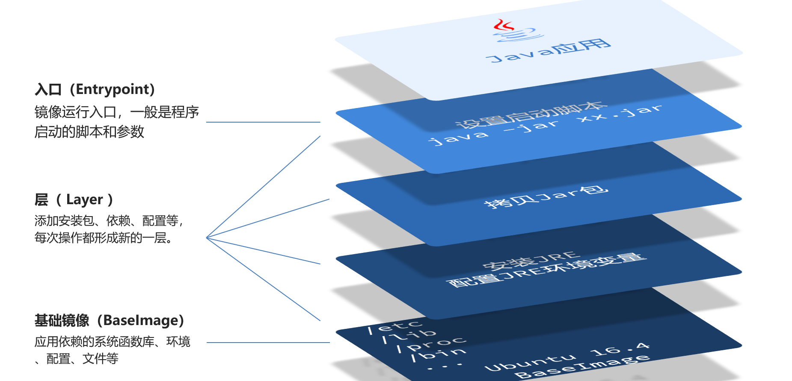
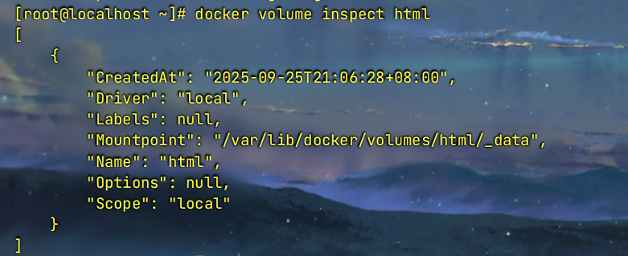
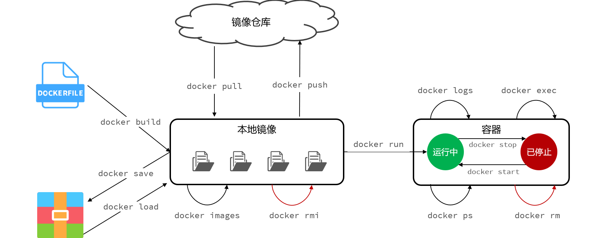

# 基本概念

> 首先要有一个认知，就是要先大概对Docker中的**“容器”**有点认识，这里的容器本质上是一个**“进程“**
>
> ”进程“最根本的本质是**资源容器**，所以这里的**“容器”**就是**进程**
>
> > 要是初学者的话，可以暂时这样理解：
> >
> > - **容器**是一个可以被运行的软件，这个软件的代码，就是我们放到容器中的代码，运行容器，就是运行我们的代码
> >
> > - 把代码及其和代码相关的各种东西都放到容器内部，从而进行统一，容器无论在哪里运行，因为内部统一，运行都不会有差异
>
> Docker实际上就是一个软件，是一个容器管理平台，只不过它的功能有点特殊而已

- **Docker的功能**：调用操作系统内核提供的能力，去**创建、管理和运行“容器”**


- **Docker**解决的问题：
  - **一致性问题**：通过打包应用和环境，解决了“我的电脑可以，你的不行”的这种运行差异问题
  - **部署效率问题**：通过标准化部署单元，解决了手动部署复杂、缓慢和高风险的问题
  - **依赖冲突问题**：通过隔离，解决了“依赖地狱”问题
  - **资源利用率问题**：通过轻量化，解决了虚拟机的资源浪费和高成本问题


- Docker 的核心价值是**隔离**
  - **主机端口**不是应用程序本身占用的端口，而是 Docker 为了在不破坏隔离性的前提下，提供的一种**功能更强大、更灵活的外部访问机制**
  - **容器端口**是应用程序在它自己**被隔离的、私有的**网络环境里，**实际占用和监听**的端口


# 虚拟机和Docker

- **虚拟机**：用来**模拟硬件**，之后我们下载的**操作系统**就可以在里面**操作这些模拟的“硬件”**
- **Docker**：用来**利用操作系统**，**创建、管理和运行“容器”**


# Docker安装

> 安装之前先输入“问题”中的第一个指令，这是最完美的方案

- 官方文档网址：https://docs.docker.com/engine/install/

- 黑马程序员文档：https://b11et3un53m.feishu.cn/wiki/Rfocw7ctXij2RBkShcucLZbrn2d#Kjd5dFHCGo76s9xGnMic9a7fnXf
- csdn某个文章：[CentOS-7安装Docker（更新时间：2025-03-12）_centos7安装docker-CSDN博客](https://blog.csdn.net/weixin_42541479/article/details/146209159?ops_request_misc=%7B%22request%5Fid%22%3A%22a0171de80562d4e494971dff01a1dab2%22%2C%22scm%22%3A%2220140713.130102334..%22%7D&request_id=a0171de80562d4e494971dff01a1dab2&biz_id=0&utm_medium=distribute.pc_search_result.none-task-blog-2~all~top_positive~default-4-146209159-null-null.142^v102^pc_search_result_base2&utm_term=centos7安装docker&spm=1018.2226.3001.4187)
  - 另一个：https://blog.csdn.net/weixin_52597907/article/details/141113817
- https://cloud.tencent.com/developer/article/2486234


## 步骤

- 后面会补


### 问题

#### yum报错

- 输入下面这个（这个建议打开新的Linux就立马输入，我第一次中途试失败了）

  ```bash
   bash <(curl -sSL https://gitee.com/SuperManito/LinuxMirrors/raw/main/ChangeMirrors.sh)
  ```


# 目录相关

- Docker在linux上的根目录`/var/lib/docker/`
- 镜像的地址`/var/lib/docker/overlay2/`
- 容器的地址`/var/lib/docker/containers/<容器ID>/`


# DockerFile

## **官方定义**

- A Dockerfile is a text document that contains all the commands a user could call on the command line to assemble an image. Using `docker build` users can create an automated build that executes several command-line instructions in succession.

  > Dockerfile 是一个文本文档，它包含了用户可以在命令行上调用以组装成一个镜像的所有命令。
  >
  > 通过使用 `docker build` 命令，用户可以创建一个自动化构建过程，该过程会连续执行多条命令行指令

- 唯一目的是**定义**如何一步步地 **构建一个 Docker 镜像**

  它详细描述了需要什么样的基础环境、安装哪些软件、拷贝什么文件进去，以及最后应该如何运行程序


## 概念和知识点

- Dockerfile 是一个纯文本文件，其内部包含了一系列指令和参数。这些指令定义了如何一步步地构建一个 Docker 镜像。你可以将 Dockerfile 视为一个自动化脚本，它的唯一目的就是生成一个包含了特定操作系统、软件、代码、配置和依赖的、可重复构建的 Docker 镜像

  - 它具有以下核心技术特性：

    - **声明性:** 你在文件中声明了最终环境应该“是什么样”，而不是“如何去一步步操作”

    - **可版本化:** 作为一个文本文件，它可以被存储在版本控制系统（如 Git）中，与你的应用程序代码一起进行跟踪、审查和管理

    - **可复现性:** 只要基础镜像和文件上下文不变，任何人在任何机器上使用同一个 Dockerfile 执行构建，都会得到完全一致的镜像
  
- 核心作用：

  **将你的应用程序及其运行所需要的一切（代码、依赖库、配置文件、环境变量、运行时环境等）打包成一个标准的、可移植的、自包含的单元——Docker 镜像**

  > 这个不算违背”隔离性“，因为相关的东西，都是这个应用程序的**”及其运行所需要的一切“**


## 分层

### 知识点

- `docker build` 命令会读取 Dockerfile 中的指令，并按顺序执行。其核心机制是**分层（Layers）**
  1. **基础镜像:** 每个 Dockerfile 的第一条有效指令通常是 `FROM`，它指定了一个父镜像或基础镜像。构建过程从这个基础镜像开始
  2. **创建中间层:** Dockerfile 中的每一条指令（如 `RUN`, `COPY`, `ADD` 等）都会在当前镜像层的顶部创建一个新的、可写的**临时容器**指令在该容器内执行，执行完毕后，文件系统的变更会被提交成一个新的、只读的**镜像层**
  3. **层层叠加:** 后续的每一条指令都在前一条指令生成的层之上重复这个过程，一层一层地叠加
  4. **最终镜像:** 当所有指令执行完毕后，这些有序的、只读的层堆叠在一起，构成了一个完整的 Docker 镜像。最后生成的镜像ID指向最顶层的那个层


### 三大核心优点

- Docker 镜像的分层机制是其高效、轻量和快速的基石
  Dockerfile 中的每一条指令都会在上一层的基础上叠加一个新层，最终组合成完整的镜像
  这种设计带来了以下三个显著的优势：

#### 1. 高效的构建缓存

- 这是分层机制在开发中最直观的好处。Docker 在执行 `docker build` 时，会逐行检查 Dockerfile 指令，并利用缓存机制来加速构建：

  - **自动缓存**：如果某一条指令及其依赖文件没有发生变化，Docker 会直接重用本地已经存在的、由该指令生成的图层，而不是重新执行它

  - **智能跳过**：一旦某一层命中缓存，后续指令会继续尝试使用缓存。只有当某条指令或其依赖（如 `COPY` 的源文件）发生变化时，缓存才会失效，Docker 会从这一层开始重新构建，并重新构建其后的所有层

  - **极致加速**：通过合理安排 Dockerfile 中指令的顺序（将最不常变化的指令放在最前面），可以最大限度地利用缓存，使得日常开发中对代码的修改只需要重新构建最后几层，整个构建过程可能从数分钟缩短到几秒钟

- **示例：**

  ```bash
  # 1. 基础镜像层 (基本不变)
  FROM python:3.9-slim
  
  # 2. 依赖安装层 (仅当 requirements.txt 变化时才重新构建)
  COPY requirements.txt .
  RUN pip install -r requirements.txt
  
  # 3. 源码复制层 (开发中最常变化)
  COPY . .
  
  CMD ["python", "app.py"]
  ```

  > 在这个例子中，只要 `requirements.txt` 文件不改变，安装依赖的步骤就不会重复执行，极大地节省了时间


#### 2. 节省存储空间

- 多个不同的镜像可以共享相同的图层，从而避免了磁盘空间的浪费

  - **共享基础层**：如果你的服务器上有 10 个不同的应用镜像，但它们都是基于 `ubuntu:22.04` 构建的，那么这份体积不小的 Ubuntu 基础镜像在磁盘上**只会存储一份**。所有 10 个镜像都会共享这一公共基础层

  - **增量存储**：每个镜像只需要额外存储自己独有的、在上层添加或修改的部分。这使得即使拥有大量镜像，占用的总磁盘空间也远小于它们体积的总和


#### 3. 快速的应用分发与部署

- 分层机制同样优化了镜像的上传 (`push`) 和下载 (`pull`) 过程

  - **按需传输**：当从仓库拉取一个镜像时，Docker 客户端会首先检查本地已有的图层。它**只会下载本地不存在的那些图层**，对于已存在的共享图层则会直接复用

  - **节省带宽**：这一特性极大地减少了网络传输的数据量，尤其是在更新应用版本时。通常新版本只修改了最上层的少数几个图层，因此推送或拉取更新时，只需要传输这几个MB甚至KB级的变更，而不是整个几百MB的镜像，从而加快了CI/CD流程和部署速度


## Dockerfile 命令

- Dockerfile 是一个用于自动构建 Docker 镜像的文本文件。它包含了一系列指令，`docker build` 命令会按顺序执行这些指令来创建一个新的镜像

### 1. 基础指令

#### `FROM`

- 指定新镜像所基于的父镜像（Base Image）。任何有效的 Dockerfile 都必须以 `FROM` 指令开始

  - **语法**:

    ```bash
    FROM <image>[:<tag>] [AS <name>]
    FROM <image>@<digest> [AS <name>]
    ```

  - **说明**:
    - `<image>[:<tag>]`: 指定基础镜像名和版本标签，如 `ubuntu:22.04`。省略标签默认为 `latest`。
    - `<image>@<digest>`: 通过内容的哈希摘要精确指定镜像版本。
    - `AS <name>`: 在多阶段构建中为当前构建阶段命名，方便后续引用。

  - **示例**:

    ```bash
    # 使用官方的 Python 3.9 slim 版本作为基础镜像
    FROM python:3.9-slim
    ```


### 2. 文件系统操作

#### `RUN`

- 在当前镜像层之上执行命令，并提交结果，形成一个新的镜像层

  - **语法**:
    - Shell 格式: `RUN <command>` (在 `/bin/sh -c` 中执行)
    - Exec 格式: `RUN ["executable", "param1", "param2"]` (推荐)

  - **说明**:
    - 为了减少镜像层数和大小，推荐将多个 `RUN` 命令用 `&&` 连接合并为一条指令

  - **示例**:

    ```bash
    # 更新包列表、安装依赖并清理缓存，以减少镜像体积
    RUN apt-get update && apt-get install -y \
        gcc \
        make \
        && rm -rf /var/lib/apt/lists/*
    ```


#### `COPY`

- 将构建上下文（build context）中的文件或目录复制到镜像的文件系统中

  - **语法**:

    ```bash
    COPY [--chown=<user>:<group>] <src>... <dest>
    ```

  - **说明**:
    - `<src>`: 源文件路径，相对于构建上下文。
    - `<dest>`: 镜像内的目标路径。
    - 路径清晰，行为可预测，是复制文件的首选指令

  - **示例**:

    ```bash
    # 将当前目录下的 requirements.txt 复制到镜像的 /app 目录下
    COPY requirements.txt /app/
    ```


#### `ADD`

- 功能与 `COPY` 类似，但增加了两个额外特性：
  1. 源文件为 URL 时，会自动下载
  2. 源文件为本地 `tar` 压缩包时，会自动解压

- **语法**:

  ```bash
  ADD [--chown=<user>:<group>] <src>... <dest>
  ```

- **最佳实践**:

  - 官方推荐优先使用 `COPY`，因为其行为更明确。仅在确实需要 `ADD` 的自动下载或解压功能时才使用它

- **示例**:

  ```bash
  # 下载并添加一个文件
  ADD [https://example.com/big.file.txt](https://example.com/big.file.txt) /app/
  
  # 自动解压 tar 包
  ADD myapp.tar.gz /usr/src/
  ```


#### `WORKDIR`

- 为后续的 `RUN`, `CMD`, `ENTRYPOINT`, `COPY`, `ADD` 指令设置工作目录。如果目录不存在，会自动创建

  - **语法**:

    ```bash
    WORKDIR /path/to/workdir
    ```

  - **说明**:
    - 使用 `WORKDIR` 可以让 Dockerfile 更清晰、易于维护。

  - **示例**:

    ```bash
    # 设置工作目录为 /app
    WORKDIR /app
    
    # 下面的 COPY 和 RUN 都在 /app 目录内执行
    COPY requirements.txt .
    RUN pip install -r requirements.txt
    COPY . .
    ```


### 3. 运行时配置

#### `CMD`

- 为容器提供默认的执行命令。一个 Dockerfile 中只应有一条 `CMD` 指令（最后一条生效）

  - **语法**:
    1. Exec 格式: `CMD ["executable","param1","param2"]` (推荐)
    2. Shell 格式: `CMD command param1 param2`
    3. 参数格式: `CMD ["param1","param2"]` (作为 `ENTRYPOINT` 的默认参数)

  - **说明**:
    - `docker run` 命令如果指定了其他命令，`CMD` 的值会被覆盖

  - **示例**:

    ```bash
    # 容器启动时默认执行 'python app.py'
    CMD ["python", "app.py"]
    ```


#### `ENTRYPOINT`

- 配置容器启动时运行的命令。它不容易被 `docker run` 覆盖

  - **语法**:
    - Exec 格式: `ENTRYPOINT ["executable", "param1", "param2"]` (推荐)
    - Shell 格式: `ENTRYPOINT command param1 param2`

  - **与 `CMD` 结合**:
    - `ENTRYPOINT` 指定主程序，`CMD` 提供默认参数。`docker run` 命令行中提供的参数会覆盖 `CMD` 的值，并作为参数传递给 `ENTRYPOINT`

  - **示例**:

    ```bash
    ENTRYPOINT ["ping"]
    CMD ["localhost"]
    
    # docker run <image>          -> 执行 'ping localhost'
    # docker run <image> google.com -> 执行 'ping google.com'
    ```


#### `EXPOSE`

- 声明容器在运行时监听的网络端口。这仅作为文档，本身不会发布端口

  > 这个只是一个建议，这个不遵守也不会出错

  - **语法**:
  
    ```bash
    EXPOSE <port> [<port>/<protocol>...]
    ```
  
  - **说明**:
    - 告诉用户该镜像的服务预期使用哪个端口
    - 要实际映射端口，需在 `docker run` 时使用 `-p` 或 `-P` 参数

  - **示例**:
  
    ```bash
    # 声明服务监听 8000 端口
    EXPOSE 8000
    ```


#### `ENV`

- 设置环境变量。此变量在构建过程和容器运行时都可用

  - **语法**:

    ```bash
    ENV <key>=<value> ...
    ```

  - **示例**:

    ```bash
    # 设置环境变量
    ENV APP_VERSION="1.0"
    ENV APP_HOME="/app"
    ```


#### `USER`

设置运行镜像及后续指令时使用的用户名（或 UID）

- **语法**:

  ```bash
  USER <user>[:<group>]
  ```

- **说明**:

  - 出于安全考虑，推荐创建非 root 用户并切换到该用户来运行应用

- **示例**:

  ```bash
  # 创建一个非 root 用户并切换
  RUN useradd --create-home myuser
  USER myuser
  ```


#### `VOLUME`

创建一个挂载点，用于持久化数据或在容器间共享数据

- **语法**:

  ```bash
  VOLUME ["/path/to/volume"]
  ```

- **说明**:

  - 在容器内创建一个匿名卷，避免将数据写入容器的可写层

- **示例**:

  ```bash
  # 将 /data 目录标记为卷，用于存储持久化数据
  VOLUME ["/data"]
  ```


### 4. 构建时控制

#### `ARG`

- 定义一个变量，用户可以在构建时通过 `--build-arg` 标志传递给构建器

  - **语法**:

    ```bash
    ARG <name>[=<default_value>]
    ```

  - **说明**:
    - `ARG` 变量只在镜像构建期间有效
    - `ENV` 指令可以覆盖同名的 `ARG` 变量

  - **示例**:

    ```bash
    ARG APP_VERSION=1.0
    ENV APP_VERSION=${APP_VERSION}
    LABEL version=${APP_VERSION}
    ```

    构建时可通过 `docker build --build-arg APP_VERSION=2.0 .` 来修改版本


#### `ONBUILD`

- 添加一个“触发器”指令。当该镜像被用作其他镜像的基础镜像时，`ONBUILD` 后面的指令才会被执行

  - **语法**:

    ```bash
    ONBUILD <INSTRUCTION>
    ```

  - **示例**:

    ```bash
    # 在父镜像中定义
    ONBUILD COPY . /app/src
    
    # 在子镜像的 Dockerfile 中
    # FROM parent-image
    # 在构建子镜像时，'COPY . /app/src' 会被自动执行。
    ```


### 5. 元数据与健康检查

#### `LABEL`

- 为镜像添加元数据，以键值对的形式

  - **语法**:

    ```bash
    LABEL <key>=<value> <key2>=<value2> ...
    ```

  - **示例**:

    ```bash
    LABEL maintainer="Your Name <your.email@example.com>"
    LABEL version="1.0"
    LABEL description="A demo web application."
    ```


#### `HEALTHCHECK`

- 指定一条命令，用于判断容器的健康状态

  - **语法**:

    ```bash
    HEALTHCHECK [OPTIONS] CMD <command>
    HEALTHCHECK NONE
    ```

  - **常用选项**:
    - `--interval`: 检查间隔 (默认: 30s)
    - `--timeout`: 命令超时 (默认: 30s)
    - `--retries`: 标记为不健康前的重试次数 (默认: 3)
    - `--start-period`: 启动宽限期 (默认: 0s)

  - **示例**:

    ```bash
    # 每 5 分钟检查一次 web 服务的健康状态
    HEALTHCHECK --interval=5m --timeout=3s \
      CMD curl -f http://localhost/ || exit 1
    ```


#### `SHELL`

- 覆盖用于 shell 格式命令的默认 shell

  - **语法**:

    ```bash
    SHELL ["executable", "parameters"]
    ```

  - **示例**:

    ```bash
    # 将默认 shell 从 sh 切换为 bash
    SHELL ["/bin/bash", "-c"]
    RUN source /etc/profile && echo "Shell is bash"
    ```


# 镜像

- 简单看的话，初学者可以先把可以把 **Docker 镜像** 想象成您已经**安装完毕、静静躺在硬盘上**的**软件**

  - 也有一种类比，说可以把**镜像**看作**Java中的类**，把**容器**看作**类的实例**

## **官方定义**

- 官方英文叫法是：**`image`**

- An **image** is a read-only template with instructions for creating a Docker container. Often, an image is based on another image, with some additional customization. For example, you may build an image which is based on the `ubuntu` image, but installs the Apache web server and your application, as well as the configuration details needed to make your application run.

  >镜像是一个带有创建 Docker 容器指令的**只读模板**。通常，一个镜像会基于另一个镜像，并加上一些额外的定制。
  >
  >例如，你可能会构建一个基于 `ubuntu` 镜像的镜像，但其中安装了 Apache Web 服务器和你的应用程序，以及运行你的应用所需的所有配置细节


## 结构图




## 知识点

- Docker 镜像是一个**只读的模板**，用于创建 Docker 容器。可以将其理解为一个包含了软件运行所需一切的静态、完整的打包文件。这个包里封装了应用程序的代码、一个运行时环境、所需的库、环境变量和配置文件

- 镜像是 Docker 容器运行的基础。容器是镜像的一个运行实例。当容器启动时，它会使用镜像的文件系统和配置作为其初始状态。

- 所有的镜像都基于一个**基础镜像**构建


## 关键特性

### 1. 分层结构

- 这是镜像最核心和最精妙的设计。一个 Docker 镜像并非一个单一的、庞大的文件，而是由一系列**只读的层** 堆叠而成

  - **构建过程**：每一条用来构建镜像的指令（例如，在 Dockerfile 中的一条指令）都会创建一个新的层。后一层叠在前一层之上

  - **共享与重用**：这种分层结构极大地提高了效率。如果多个不同的镜像共享相同的基础层（例如，它们都基于同一个操作系统环境），那么在主机上，这个基础层只需要存储一次。这大大节省了磁盘空间

  - **效率**：当修改镜像并重新构建时，只有发生变化的指令所对应的层才会被重新创建，未改变的底层会被直接重用，这使得构建速度非常快


### 2. 只读性与不变性

- 镜像本身是只读的。一旦一个镜像被创建，它的内容就不会再被改变。如果你需要对镜像进行更新（比如升级一个软件包），你不能修改现有的镜像，而是需要创建一个新的镜像。这个新镜像会在原有镜像的顶层添加一个新的层来记录这个变更
  - **一致性保证**：这种不变性确保了从同一个镜像启动的任何容器都具有完全相同的初始环境。这解决了“在我的机器上能跑，到你那里就不行了”的典型问题，保证了环境的高度一致性和可复现性


### 3. 联合文件系统

- 为了实现分层和只读的特性，Docker 使用了联合文件系统技术。它能将多个独立的目录（也就是镜像的各个层）合并（或称为“挂载”）到一个统一的视图中

  - **容器的实现**：当一个容器从镜像启动时，Docker 会在镜像的最顶层之上添加一个**可写的容器层**。所有对容器文件系统的修改（如创建、修改、删除文件）都发生在这个可写层。底层的只读镜像层保持不变

  - **写时复制 (Copy-on-Write)**：如果容器需要修改一个存在于下层只读镜像中的文件，联合文件系统会首先将该文件复制到最上层的可写容器层，然后对这个副本进行修改。原始文件保持不变。这进一步保证了镜像的完整性，并使容器的创建和销毁变得极其快速和轻量


# 容器

> 通过将**代码及其完整的运行环境**在**逻辑上放入** **容器**中，可以确保无论这个容器在哪里运行，其表现都完全一致，没有差异

- 核心理念：**一容器一服务**


## 官方定义

- 官方英文叫法是：**`container`**

- A container is a runnable instance of an image. You can create, start, stop, move, or delete a container using the Docker API or CLI. A container is defined by its image as well as any configuration options you provide to it at creation time. When a container is removed, any changes to its state that are not stored in persistent storage disappear.

  >容器是镜像的一个**可运行实例**。
  >
  >你可以使用 Docker API 或命令行工具（CLI）来创建、启动、停止、移动或删除容器。
  >
  >容器由其镜像以及在创建时提供给它的任何配置选项所定义。
  >
  >当一个容器被移除时，任何未存储在持久化存储中的状态变更都会消失


- **容器**是根据静态的**镜像**创建出来的。容器是一个**可以被启动、停止和删除**的实例，而镜像本身永远是静止不变的**模板**

- 现在初学者可以简单先把 **Docker 容器** 想象成您**双击了软件的图标后，弹出来的那个正在运行的软件窗口**


## 概念和知识点

> 容器就像一个小电脑一样，里面可以正常做事，真不错

- **容器**不是 Docker **软件“里面”**的东西，而是**由 Docker “管理”**的、由**操作系统内核直接创造和隔离的“特殊进程”**

- 由于**网络命名空间 (Network Namespace)** 的隔离，**每一个容器**都拥有自己一套**完整且私有**的端口号，范围从 1 到 65535

- 每个容器都拥有自己独立的端口集和至少一个唯一的内部 IP 地址

- 关于**端口**

  - **`<主机端口>` **: 

    - **主机端口**不是应用程序本身占用的端口，而是 Docker 为了在不破坏隔离性的前提下，提供的一种**功能更强大、更灵活的外部访问机制**

    - 主机端口是你希望在宿主机上**暴露**的端口。外部客户端将通过这个端口来访问服务

      这个端口必须是宿主机上尚未被其他程序占用的端口

    > 我喜欢把它设置的和容器端口相同

    

  - **`<容器端口>` **: 

    - **容器端口**是应用程序在它自己**被隔离的、私有的**网络环境里，**实际占用和监听**的端口

    - 容器内应用程序**正在监听**的端口
  
      这个端口是**由镜像的开发者决定**的（例如，Nginx 默认在容器内监听 80 端口，MySQL 默认监听 3306 端口）


- 容器本身，作为一个抽象的“盒子”或“环境”，它自己**不占用任何端口**

  真正占用端口的，永远是运行在容器这个隔离环境**内部的那个应用程序进程**

  > 比如 mysql


- 一个很重要的知识点，这是理解容器的**关键**！：

  - 在一个网络环境中（无论是在物理机、虚拟机还是 Docker 容器里），**一个端口在同一时间只能被一个进程绑定和监听**

  - **容器内部**：一个容器内可以放置多个软件，但是如果这些软件都需要对外提供网络服务，它们**必须**绑定到容器内各自**不同**的端口上

    >这种“一容器多服务”的模式，因为破坏了隔离性，所以**不被推荐**

  - **端口原则**：无论是容器内还是宿主机上，“一个端口同时只能被一个进程（软件）监听”，这是网络通信的铁律
  - **端口映射**：我们可以通过 `-p` 参数建立从“宿主机端口”到“容器端口”的映射

  > 把上面的总结一下：
  >
  > - 就是想从外部访问一个容器内的多个服务（前提是这些服务已在容器内监听于各自不同的端口）
  >
  >   那么在启动该容器时 (`docker run`)，就必须得使用多个不同的宿主机端口，分别映射到容器**对应的服务端口**上
  >
  >   启动之后，外界就可以通过访问这些不同的宿主机端口，来精确地访问到容器内对应的服务


# 仓库

- **Docker 仓库** 其实就是**集中存放和分发 Docker 镜像的地方**，**类似于Maven仓库**

  > 其实我把它视为存放Docker镜像的Maven仓库


## 注册服务器

> Registry

### 官方定义

- A *registry* is a storage and content delivery system, holding named Docker images, available in different tagged versions. [...] Docker Hub is a public registry pre-configured by default.

  > 一个**注册服务器 (Registry)** 是一个存储和内容分发系统，它持有带名称的 Docker 镜像，这些镜像可以有不同的标签版本。......Docker Hub 是一个默认预先配置好的公共注册服务器


### 更容易理解的定义

- **Registry 是一个集中存储和分发 Docker 镜像的服务。** 你可以把它想象成一个**巨大的、总体的仓库服务平台**

  - **技术定义**：一个 Registry 是一个无状态、可高度扩展的后端应用程序，它负责存储和提供 Docker 镜像。Docker 客户端（`docker` 命令）通过 `docker pull` 和 `docker push` 命令与 Registry 进行交互

  - **核心功能**：
    - 接收 `docker push` 命令，存储上传的镜像。
    - 响应 `docker pull` 命令，提供下载的镜像。

  - **类比**：
    - 如果把代码管理类比过来，**Registry 就相当于 GitHub、GitLab 或 Gitee 整个网站平台**。它是一个托管着成千上万个不同项目（镜像仓库）的地方


### Registry的类型

1. **公共 Registry**：对所有人开放，任何人都可以上传和下载镜像。最著名的例子就是 **Docker Hub**
2. **私有 Registry**：通常部署在组织内部或受保护的云环境中，用于存储和管理内部的、非公开的镜像，以确保安全性和控制权。
   - 例如：
     - 自己搭建的 `Harbor` 或 `Docker Registry` 服务
     - 云服务商提供的 Registry 服务，如 Amazon ECR、Google GCR/Artifact Registry、Azure ACR 等


## 仓库

> Repository

### 官方定义

- A *repository* contains all the versions of a specific image. It's a collection of different images with the same name, but different tags. For example, `ubuntu` is a repository, and it contains images like `ubuntu:22.04`, `ubuntu:20.04`, etc.

  >一个**仓库 (Repository)** 包含了某一特定镜像的所有版本。它是拥有相同名称但不同标签的一系列镜像的集合。例如，`ubuntu` 是一个仓库，它包含了像 `ubuntu:22.04`、`ubuntu:20.04` 等镜像


### 更容易理解的定义

- **Repository 是一个存储着**不同版本**的**同一个镜像**的集合**

  - **技术定义**：一个 Repository 包含了一个镜像的所有历史版本。这些版本通过**标签 (Tag)** 来区分

  - **核心功能**：组织和管理单一镜像的多个版本

  - **类比**：
    - **Repository 就相当于 GitHub 上的一个具体项目**，比如 `tensorflow/tensorflow` 这个代码库。这个代码库里有 `v2.8`、`v2.9` 等不同的版本标签（Tag）
    - **Repository 就类似于 App Store 里的“微信”这个应用**。在“微信”这个条目下，你可以找到 8.0.1 版、8.0.2 版等不同版本


### Repository的命名规则

- 一个 Repository 的完整名称通常是 `<项目名>/<镜像名>` 或者就是 `<镜像名>`

  - **官方镜像**：名称通常很简单，只有一个单词，如 `ubuntu`, `nginx`, `redis`。它们由 Docker 公司或官方组织维护

  - **用户/组织镜像**：名称通常包含用户名或组织名作为前缀，以示区分，如 `bitnami/mongodb`, `johndoe/my-web-app`


# 数据卷

> Volume

- 数据卷是**一个或多个容器专用的、存在于宿主机文件系统中的一个特殊目录**

  关键点在于，这个目录**由 Docker 自己进行管理**

- 数据卷可以想象成一个给 Docker 容器外挂的 **“U盘” 或 “移动硬盘”**


## 官方定义

- Volumes are the preferred mechanism for persisting data generated by and used by Docker containers. While bind mounts are dependent on the directory structure and OS of the host machine, volumes are completely managed by Docker. [...] Volumes are the best way to persist data in Docker.

  > **数据卷 (Volumes)** 是 Docker 官方**推荐的机制 (preferred mechanism)**，用于持久化 Docker 容器所产生和使用的数据
  >
  > 与依赖于宿主机目录结构和操作系统的绑定挂载不同，**数据卷完全由 Docker 进行管理**
  >
  > ......数据卷是在 Docker 中持久化数据的**最佳方式 (best way)**


## 定义与概念

> Docker中的数据卷核心目的之一，就是把容器内指定的文件或目录，映射并保存到宿主机上（容器外部），从而实现数据的持久化和共享

- **数据卷**指定了容器内**用于持久化的那个文件夹**，而这个文件夹**被直接“映射”到了宿主机上的一个目录**。

  容器**对这个文件夹的所有操作**，实际上都是在**直接操作宿主机上的那个目录**

- 在 Docker 中，容器本身是“无状态”且“短暂”的。当一个容器被删除后，其内部文件系统中所做的任何修改（如创建的文件、写入的数据）都会随之丢失。为了解决这个问题，Docker 提供了**数据卷 (Volumes)** 机制，用于**持久化存储**容器的数据

- 数据卷主要解决以下两个核心问题：

  1. **数据持久化**：确保数据在容器被删除或重建后依然存在。这对于数据库、日志文件、用户上传的内容等至关重要
  2. **数据解耦与共享**：将数据与容器的生命周期完全分离开来，使得数据可以在多个容器之间安全地共享和重用

- Docker 提供了三种将数据从宿主机挂载到容器内部的机制：

  - **Volumes (数据卷)**：**官方最推荐的方式**

    由 Docker 进行管理，存储在宿主机文件系统的一个特定部分（通常是 **`/var/lib/docker/volumes/`**），与宿主机的核心功能完全隔离

    > `/var/lib/docker/volumes/`
  
  - **Bind Mounts (绑定挂载)**：将宿主机上的**任意文件或目录**直接挂载到容器中。路径由用户完全控制
  
  - **tmpfs Mounts**：一种临时挂载方式，数据只存在于宿主机的内存中，不会写入磁盘

- 在一个 Docker 主机（或者说一个 Docker Daemon 实例）上，每一个**命名卷（Named Volume）的名称必须是唯一的**


## 特点

- **Docker 管理**：数据卷的整个生命周期由 Docker CLI 或 API 进行管理，用户无需关心它在宿主机上的具体存储位置
- **平台无关**：数据卷的定义方式在 Linux、Windows 和 macOS 上完全一致，增强了可移植性
- **更安全**：数据卷与容器隔离，也与宿主机的核心文件系统隔离，降低了安全风险
- **性能更佳**：在某些场景下，特别是涉及大量写操作时，数据卷的性能优于绑定挂载
- **易于备份和迁移**：可以方便地对数据卷进行备份、恢复或迁移到其他 Docker 主机
- **可以预填充内容**：当一个容器挂载一个空的数据卷时，如果容器镜像在指定挂载点下已经有文件，这些文件会被自动复制到数据卷中


## 挂载数据卷

- 将数据卷“挂载”到容器这个动作，必须在创建容器时通过 **`docker run` (或 `docker create`) 命令**来完成。

  **`docker volume` 命令**本身不具备将卷“附加”到已存在容器的功能

- 对于大多数官方或高质量的第三方镜像，需要**持久化的数据路径通常是预先定义好的**，最佳实践就是去**查阅官方文档**

  其实技术上而言，你可以任意选择容器内持久化的路径，但是为了最佳实践，我们由容器内应用程序的设计来决定


## 数据卷路径

### 图示

> 假设通过  `docker run`或者 `docker volume create`  创建了三个命名卷，分别叫做 `webapp-logs`、`postgres-db` 和 `user-uploads`
>
> 则目录结构如下：

```CMD
/var/lib/docker/
└── volumes/
    ├── webapp-logs/
    │   └── _data/
    │       ├── access.log
    │       └── error.log
    │
    ├── postgres-db/
    │   └── _data/
    │       ├── PG_VERSION
    │       ├── base/
    │       ├── global/
    │       └── ... (其他所有PostgreSQL的数据文件)
    │
    ├── user-uploads/
    │   └── _data/
    │       ├── avatars/
    │       └── documents/
    │
    └── metadata.db  # Docker内部管理的元数据文件
```




### 路径规则

- 对于标准的 Linux Docker 环境，路径规律如下：

  **`/var/lib/docker/volumes/<数据卷名称>/_data`**

  - 我们来分解这个路径：
    1. **`/var/lib/docker/`**: 这是 Docker 的默认根目录，Docker 的所有组件 (镜像、容器、网络、数据卷等) 的数据都存放在这里
    2. **`volumes/`**: 这是专门用来存放所有**命名卷**的总目录
    3. **`<数据卷名称>/`**: 在 `volumes` 目录下，每一个数据卷都会拥有一个与它**同名**的子目录
    4. **`_data/`**: 在每个数据卷的同名目录里，还有一个固定的 `_data` 目录。**这才是真正存储容器内数据的目录**，也就是被挂载到容器内部的那个“共享文件夹”


# 网络

## 容器网络模型 (CNM)

- Docker 的所有网络功能都基于其**容器网络模型 (Container Network Model, CNM)**。

  这个模型定义了 Docker 网络的三个核心组件：

  1. **沙盒 (Sandbox)**

     - **是什么**：一个独立的网络环境，为每个容器隔离了网络栈。它包含了容器独立的网络接口、路由表、端口和 DNS 配置
     - **类比**：可以看作是容器的“独立网卡和网络协议配置”。正是因为沙盒的存在，每个容器才能拥有自己的 IP 地址，而不会与宿主机或其他容器冲突

  2. **端点 (Endpoint)**

     - **是什么**：一个虚拟的网络接口，负责将沙盒连接到网络上
     - **类比**：就像一根虚拟网线的**一端插头**，它的一头插在容器的沙盒里，另一头插在下文提到的“网络”上。一个容器可以有多个端点，从而接入多个不同的网络

  3. **网络 (Network)**

     > 这个东西就是我们需要自定义创建的东西

     - **是什么**：一个由 Docker 管理的虚拟交换机
     - **类比**：就是那根虚拟网线的**另一端所插入的交换机或集线器**。所有连接到同一个“网络”的端点，都意味着它们被接入了同一个交换机，因此可以互相通信


## 五种网络驱动

- 网络驱动是 CNM 模型的具体实现。当你创建一个“网络”时，需要指定一种驱动

### 1. `bridge` (桥接网络) - ⭐最常用

- 这是 Docker 的默认网络模式，也是单机环境下最核心、最常用的模式

- **工作原理**：

  - Docker 在宿主机上创建一个名为 `docker0` 的虚拟网桥（一个虚拟交换机）

    所有使用 `bridge` 驱动的容器，其端点都会连接到这个网桥上，并从网桥的子网中（如 `172.17.0.0/16`）获取一个 IP 地址

- **关键区别：**

  **默认 Bridge vs. 用户自定义 Bridge**

  - **默认 `bridge` 网络**：

    > 这个我从来没有仔细思考过，我也不想思考这个，我也不想学这个，我只学了用户自定义的网络，这个不学，没时间

    - 容器启动时不指定 `--network` 就会连接到这里
    - **缺点**：容器之间只能通过 IP 地址通信，不支持通过容器名直接通信，隔离性也不好。**不推荐在生产环境中使用**

  - **用户自定义 `bridge` 网络**：

    - 通过 `docker network create my-net` 创建

    - **巨大优势**：

      1. **自动 DNS 解析**：连接在同一个自定义网络中的容器，可以**直接通过容器名作为主机名进行通信**

         例如，`webapp` 容器可以直接 `ping db`，Docker 内置的 DNS 服务会自动将其解析为 `db` 容器的 IP 地址。
         这是实现服务发现和微服务通信的关键

      2. **更好的隔离**：不同自定义网络之间是天然隔离的，提供了更安全的环境


### 2. `host` (主机网络)

- **工作原理**：**不创建网络沙盒**。容器直接共享宿主机的网络命名空间，使用宿主机的 IP 地址和端口
- **优点**：网络性能最高，因为数据包不需要经过虚拟化网络栈和 NAT 转换，几乎等同于宿主机上直接运行的进程
- **缺点**：
  - **破坏隔离性**：容器的网络不再与宿主机隔离，安全性降低
  - **端口冲突**：容器内监听的端口会直接占用宿主机的端口，如果多个容器或宿主机本身需要监听同一个端口，就会产生冲突
- **适用场景**：对网络延迟和吞吐量要求极高的应用，如网络性能测试工具、某些监控代理等


### 3. `none` (无网络)

- **工作原理**：为容器创建网络沙盒，但**不配置任何网络接口**。容器内部只有一个 `lo` (loopback) 回环地址
- **比喻**：相当于一台拔掉了所有网线的电脑
- **适用场景**：完全不需要网络的任务，例如执行一次性计算、数据处理的批处理作业，以确保最高的安全性


### 4. `overlay` (覆盖网络) - 跨主机通信

- **工作原理**：这是一种专为**多宿主机集群环境**（如 Docker Swarm）设计的网络。它可以在多个物理主机之上，构建一个统一的虚拟网络层，将不同主机上的容器连接到同一个虚拟子网中
- **核心价值**：让分布在不同物理机上的容器感觉就像在同一个局域网内，可以互相直接通信，屏蔽了底层物理网络的复杂性
- **适用场景**：Docker Swarm 或 Kubernetes 等容器编排平台，用于实现跨主机的服务发现和容器通信


### 5. `macvlan` (MACVLAN 网络)

- **工作原理**：允许你为每个容器分配一个独立的 MAC 地址，使其在物理网络层面看起来就像一台独立的物理设备。容器可以直接连接到宿主机的物理网卡，并从你的局域网 DHCP 服务器获取一个真实的局域网 IP 地址
- **优点**：性能出色，且能无缝融入现有物理网络架构
- **缺点**：需要宿主机网卡开启混杂模式（promiscuous mode），且配置相对复杂
- **适用场景**：需要将容器作为物理网络中的一等公民对待的场景，例如某些需要固定 IP 或需要被网络监控工具扫描的传统应用


## Docker Compose 与网络

- `docker-compose` 极大地简化了网络管理。当你使用 `docker-compose up` 启动一个项目时：
  1. Compose 会自动为该项目创建一个**默认的用户自定义 `bridge` 网络**
  2. `docker-compose.yml` 文件中定义的所有 `services` (容器) 都会自动连接到这个网络
  3. 因此，在 Compose 项目中，任何一个服务都可以直接通过**其他服务的名称**作为主机名来进行通信，无需任何手动网络配置。这使得构建多服务应用变得异常简单


# DockerCompose

## 是什么

### 定义

- **Docker Compose** 是一个用于**定义和运行多容器 Docker 应用程序**的工具

  它允许你使用一个 YAML 文件来配置应用所需的所有服务（容器）、网络和数据卷

  然后，只需一个简单的命令，就可以根据这个配置文件创建并启动所有服务

- 这个工具**以前需要单独下载**，但是 **现在Docker下载会自带它**


## 为什么需要

- 想象一个典型的 Web 应用，它可能包含：

  - 一个 Web 服务器容器 (例如 Nginx)

  - 一个应用后端容器 (例如 Node.js, Python, or PHP)

  - 一个数据库容器 (例如 PostgreSQL or MySQL)

  - 一个缓存容器 (例如 Redis)

- 如果使用 `docker run` 命令来手动管理这个应用，你会面临一系列复杂且繁琐的操作：
  1. 为每个服务编写冗长的 `docker run` 命令，包含端口映射、数据卷挂载、环境变量等
  2. 手动创建一个 Docker 网络，以确保所有容器可以相互通信
  3. 小心地处理容器的启动顺序（例如，必须先启动数据库，再启动应用后端）
  4. 当需要停止或更新应用时，必须手动停止并删除每一个容器

- 这个过程不仅**容易出错**，而且**难以复现和分享**

- **Docker Compose 的核心目的就是解决这个问题**

  它将所有这些复杂的配置和依赖关系都集中定义在一个名为 `docker-compose.yml` 的文件中,将“命令式”的操作转变为“声明式”的配置


## `yml` 常用属性

>docker-compose.yml

- `docker-compose.yml` 文件是 Docker Compose 的核心，它以声明式的方式定义了应用的所有组件，包括服务、网络和数据卷

  通过这个文件，你可以清晰地描述你的应用架构，并轻松地在任何环境中复现

### 核心理念：服务

- 在 `docker-compose.yml` 文件里，你定义的每一个 **`service`** (服务) 就像一个蓝图。Docker Compose 会根据这个蓝图去创建一个或多个功能相同的容器实例

  - **默认情况**：当你运行 `docker-compose up` 时，每个服务默认会启动 **一个** 容器

  - **扩展**

    - Docker Compose 的一个强大功能就是可以轻松地扩展服务。你可以让一个服务运行多个完全相同的容器来分担负载。例如，使用命令 `docker-compose up --scale web=3` 就会为名为 `web` 的服务启动 **三个** 容器

      > 注意点：
      >
      > - 当您使用 `docker-compose up --scale web=3` 这样的命令来扩展服务时，Docker Compose 会自动为这三个容器生成唯一的名称，它**不会**使用 `container_name` 属性
      >
      > - 容器的命名会遵循一个固定的格式：
      >
      >   - **`<项目名>_<服务名>_<序号>`**
      >
      >     - **项目名**: 通常是您 `docker-compose.yml` 文件所在目录的名称
      >
      >     - **服务名**: 就是您在 `docker-compose.yml` 里定义的服务名称(在这个例子里是 `web`)
      >
      >     - **序号**: 从 1 开始递增的数字
      >
      > - **举个例子：**
      >
      >   - 假设您的 `docker-compose.yml` 文件在一个名为 `myapp` 的文件夹里，那么当您运行 `docker-compose up --scale web=3` 后，创建的三个容器名字会是：
      >
      >     - `myapp_web_1`
      >
      >     - `myapp_web_2`
      >
      >     - `myapp_web_3`
      >
      > - **重要的一点是**：`container_name` 属性与服务扩展（scaling）是**不兼容的**。如果您在一个服务中指定了 `container_name`，然后尝试将该服务扩展到多个实例，Docker Compose 会报错，因为它无法创建多个同名的容器。所以，`container_name` 属性只适用于那些您确定永远只有一个实例的服务


### 1. 顶级配置 (Top-Level Keys)

- 这些是 `docker-compose.yml` 文件最外层的配置项，用于定义整个应用的全局设置

  - **`services`** **[核心]** 这是 `docker-compose.yml` 文件最重要的部分。它是一个包含所有服务定义的字典。每个键都是你自定义的服务名称（例如 `webapp`, `db`, `cache`），值则是该服务的具体配置

  - **`networks`** 用于定义供服务连接的自定义网络。虽然 Docker Compose 会为应用创建一个默认网络，但通过自定义网络，你可以实现更复杂的网络拓扑，或者控制哪些服务可以相互通信

    ```yaml
    networks:
      frontend:
      backend:
    ```

  - **`volumes`** 用于定义命名数据卷 (named volumes)。在这里定义的卷可以被文件中的多个服务引用和共享。这是一种由 Docker 管理的持久化数据的方式，比绑定挂载 (bind mounts) 更推荐用于生产环境

    ```yaml
    volumes:
      db_data:
        driver: local
    ```

  - **`secrets`** 和 **`configs`** 这两个配置项用于将敏感数据（如密码、API密钥）和非敏感配置信息（如 Nginx 配置文件）以更安全、更灵活的方式注入到服务中，而无需将它们硬编码到镜像里

  - **`version`** 这个字段曾经用于指定 Compose 文件的版本规范。**在现代的 Docker Compose 中，此字段已被废弃**，是可选的且不再起作用


### 2. 服务级配置

>`services` 下的常用属性

- 在 `services` 键下，每一个子键都代表一个服务（容器）。以下是定义一个服务时最常用的属性

#### 基础配置

- **`image`**

   指定服务所使用的 Docker 镜像

  Docker Compose 会首先在本地查找该镜像，如果找不到，则会从 Docker Hub（或你配置的其他镜像仓库）拉取

  ```yaml
  image: node:18-alpine
  ```


- **`build`** 如果你想使用自己的 `Dockerfile` 来构建镜像，而不是直接使用 `image`，就需要这个属性

  你可以指定一个包含 `Dockerfile` 的路径，或者更详细地指定上下文路径和 `Dockerfile` 文件名

  ```yaml
  # 简单用法
  build: ./backend
  
  # 详细用法
  build:
    context: ./backend
    dockerfile: Dockerfile-dev
  ```

  > **注意**：如果同时指定了 `image` 和 `build`，Compose 会使用 `build` 构建镜像，并给这个镜像打上 `image` 字段指定的标签


- **`container_name`** 为该服务创建的容器指定一个固定的、自定义的名称。如果你不指定，Docker Compose 会自动生成一个名称（格式为 `<项目名>_<服务名>_<序号>`）

  > **警告**：设置 `container_name` 会导致该服务无法被扩展（即无法运行 `docker-compose up --scale ...`），因为容器名称必须是唯一的


#### 网络与端口

- **`ports`** **将宿主机的端口映射到容器的端口**，格式为 `"HOST:CONTAINER"`。这样你就可以从外部访问容器内的服务

  ```yaml
  ports:
    - "8080:80"       # 将宿主机的 8080 端口映射到容器的 80 端口
    - "127.0.0.1:8000:8000" # 仅在宿主机的本地回环地址上映射
  ```


- **`expose`** 仅在容器网络内部暴露端口，供网络内的其他服务访问，但**不会**将端口映射到宿主机

  ```yaml
  expose:
    - "3000"
  ```


- **`networks`** 将服务连接到一个或多个在顶级 `networks` 部分定义的网络

  ```yaml
  networks:
    - frontend
    - backend
  ```


#### 数据与存储

- **`volumes`** 挂载数据卷或绑定挂载，用于持久化数据或将本地代码同步到容器中

  ```yaml
  volumes:
    # 命名卷 (推荐用于数据持久化)
    - db_data:/var/lib/mysql
  
    # 绑定挂载 (推荐用于开发时同步代码)
    - ./src:/app
  
    # 只读绑定挂载
    - ./config.json:/etc/config.json:ro
  ```


#### 命令与执行环境

- **`command`** 覆盖容器启动时默认执行的命令（即覆盖 `Dockerfile` 中的 `CMD` 指令）

  ```yaml
  command: ["npm", "run", "dev"]
  # 或者
  command: npm run dev
  ```


- **`entrypoint`** 覆盖容器的入口点（即覆盖 `Dockerfile` 中的 `ENTRYPOINT` 指令）

  ```yaml
  entrypoint: /docker-entrypoint.sh
  ```


- **`working_dir`** 指定容器内命令执行的工作目录

  ```yaml
  working_dir: /app
  ```


#### 环境与配置

- **`environment`** 在容器内设置环境变量

  ```yaml
  environment:
    - NODE_ENV=production
    - DB_HOST=database
  ```


- **`env_file`** 从一个或多个文件加载环境变量，这有助于将配置与 `docker-compose.yml` 文件分离

  ```yaml
  env_file:
    - ./.env.common
    - ./.env.production
  ```


#### 生命周期与健康检查

- **`restart`** 定义容器退出时的重启策略

  - `no`：默认值，不重启
  - `always`：无论退出状态码是什么，总是重启
  - `on-failure`：仅当退出状态码表示错误时才重启

  ```yaml
  restart: always
  ```


- **`depends_on`** 定义服务间的依赖关系，这会影响服务的启动顺序。例如，`webapp` 依赖于 `db`，那么 `db` 服务会先于 `webapp` 启动

  > **重要**：`depends_on` 只保证**启动顺序**，并不保证被依赖服务内的应用程序已经准备好接收请求

  ```yaml
  services:
    webapp:
      build: .
      depends_on:
        - db
        - redis
    db:
      image: postgres
    redis:
      image: redis
  ```


- **`healthcheck`** 定义一个健康检查命令，Docker 会定期运行它来判断容器是否处于“健康”状态。这对于控制服务依赖关系（例如，等待数据库完全就绪）非常有用

  ```yaml
  healthcheck:
    test: ["CMD", "curl", "-f", "http://localhost"]
    interval: 30s
    timeout: 10s
    retries: 3
  ```


### 3. 综合示例

```yaml
# 'services' - 定义应用的所有服务（容器）
# 这是 docker-compose.yml 文件最核心的部分。
services:

  # --- 服务 1: 数据库 (MySQL) ---
  # 'db' 是我们为这个服务起的名字。在同一个网络中，其他服务可以用这个名字来访问它。
  db:
    # 'image' - 指定服务所使用的 Docker 镜像。
    # 这里我们使用了官方的 mysql 镜像，并固定了版本为 8.0，以确保环境的一致性。
    image: mysql:8.0

    # 'container_name' - 为这个服务生成的容器指定一个固定的、友好的名称。
    # 如果不指定，Compose 会自动生成一个，但可读性较差。
    container_name: my_project_mysql_db

    # 'restart' - 定义容器的重启策略。
    # 'always' 表示无论容器因何种原因退出（正常停止、出错、宿主机重启），Docker 都会尝试自动重启它。
    # 其他常用值: 'no' (不重启), 'on-failure' (仅在出错时重启)。
    restart: always

    # 'environment' - 设置环境变量。
    # 这通常用于向容器内的应用传递配置信息，如数据库凭据。
    # 这里的变量是 MySQL 镜像官方文档要求我们设置的。
    environment:
      MYSQL_ROOT_PASSWORD: mysecretpassword  # 设置 MySQL 的 root 用户密码
      MYSQL_DATABASE: myappdb             # 创建一个默认的数据库
      MYSQL_USER: myuser                  # 创建一个新用户
      MYSQL_PASSWORD: mysecretpassword    # 设置新用户的密码

    # 'volumes' - 数据持久化配置。
    # 这是至关重要的一步，确保即使容器被删除，数据也不会丢失。
    # 格式为: <源>:<目标>
    # 'db-data' 是在文件底部定义的具名数据卷 (Named Volume)。
    # '/var/lib/mysql' 是 MySQL 容器内存储数据的默认路径。
    volumes:
      - db-data:/var/lib/mysql

    # 'networks' - 将此服务连接到指定的网络。
    # 让服务处于同一个自定义网络是最佳实践，可以实现容器间的隔离和便捷通信。
    networks:
      - app-network

    # 'expose' - 在网络内部暴露端口，但不映射到宿主机。
    # 这意味着只有连接到 'app-network' 的其他容器（比如下面的 'web' 服务）
    # 可以通过 3306 端口访问数据库，而外部无法直接访问，更安全。
    expose:
      - "3306"


  # --- 服务 2: Web 应用 (例如一个 Node.js 应用) ---
  # 'web' 是我们为应用服务起的名字。
  web:
    # 'build' - 指定使用 Dockerfile 来构建镜像。
    # '.' 表示 Dockerfile 位于当前目录下。
    # Compose 会先执行构建，然后使用构建好的镜像来启动服务。
    build: .

    # 'container_name' - 为 Web 应用容器指定名称。
    container_name: my_project_web_app

    # 'restart' - 设置重启策略。
    restart: on-failure

    # 'ports' - 将宿主机的端口映射到容器的端口。
    # 格式: "HOST_PORT:CONTAINER_PORT"
    # 这样，我们就可以通过访问宿主机的 8080 端口来访问容器内的 3000 端口了。
    ports:
      - "8080:3000"

    # 'volumes' - 这里我们使用绑定挂载 (Bind Mount)。
    # '.' 代表宿主机的当前目录。
    # '/app' 是容器内的工作目录。
    # 这行配置将当前目录下的所有文件实时同步到容器的 /app 目录中。
    # 这在开发环境中非常有用，因为修改代码后无需重新构建镜像即可生效。
    volumes:
      - .:/app

    # 'networks' - 将此服务也连接到 'app-network'。
    networks:
      - app-network

    # 'depends_on' - 定义服务间的依赖和启动顺序。
    # 这确保了 'db' 服务会先于 'web' 服务启动。
    # 注意: 这只保证启动顺序，不保证 'db' 内部的 MySQL 进程已经完全准备好接收连接。
    # 如需更可靠的等待，需要使用 healthcheck 或其他等待脚本。
    depends_on:
      - db


# [顶级键] 'networks' - 定义供所有服务使用的网络
# 统一管理网络可以提供更好的隔离性和安全性。
networks:
  # 'app-network' 是我们为网络起的名字。
  app-network:
    # 'driver' - 指定网络的驱动类型。
    # 'bridge' 是最常用的驱动，它会创建一个隔离的私有网络。
    driver: bridge


# [顶级键] 'volumes' - 定义供所有服务使用的具名数据卷
# 统一管理数据卷可以方便地进行备份、迁移等操作。
volumes:
  # 'db-data' 是我们为数据卷起的名字，与上面 'db' 服务中使用的名称相对应。
  db-data:
    # 'driver' - 指定数据卷的驱动。
    # 'local' 是默认驱动，表示数据将由 Docker 管理并存储在宿主机的一个特定目录中。
    driver: local
```


## 常用命令

### 1. 应用生命周期管理

- 这些是管理应用从启动到销毁整个过程的核心命令


#### 创建并启动应用

> Application Creation & Startup

- 这是 Docker Compose 工作流中最核心、最根本的命令，负责将 `docker-compose.yml` 文件中定义的所有内容从静态配置变为一个动态运行的应用系统

```cmd
docker compose up [选项] [服务名...]
```

- **核心作用**: 一站式地、按顺序地完成整个应用的构建、创建和启动。它会自动处理服务间的依赖关系、网络配置、数据卷挂载等所有繁杂的细节，是实现“一键启动”的关键

- **语法解析**:

  - **命令**: `docker compose up`
  - **[选项]**: 用来调整启动过程的行为，例如是在后台启动还是前台，是否需要强制重新构建镜像等
  - **[服务名...]**: (可选) 如果提供了一个或多个服务名称，那么命令将只启动这些指定的服务及其依赖项，而不是文件中定义的所有服务

- **动作详解**: 当你执行 `docker compose up` 时，它会按照以下逻辑顺序执行一系列操作：

  1. **读取配置**: 解析当前目录下的 `docker-compose.yml` 文件
  2. **创建网络**: 检查并创建在 `networks` 部分定义的网络，如果未定义，则创建一个默认的桥接网络
  3. **创建数据卷**: 检查并创建在 `volumes` 部分定义的具名数据卷，为数据持久化做准备
  4. **处理镜像**:
     - 对于指定了 `build` 的服务，它会检查镜像是否存在或是否需要更新，并根据情况执行构建过程
     - 对于指定了 `image` 的服务，它会从本地查找镜像，如果找不到则从远程仓库（如 Docker Hub）拉取
  5. **创建容器**: 根据每个服务的配置（包括环境变量、端口映射、数据卷挂载等），创建容器实例。如果容器已存在且配置未变，则会重用
  6. **按序启动**: 按照 `depends_on` 定义的依赖关系顺序启动容器
  7. **附加日志**: 默认情况下，它会将所有容器的日志输出附加到当前终端，让你能实时看到应用的运行情况

- **常用选项**:

  - `-d`, `--detach`: **(最常用)** 在后台（Detached Mode）启动并运行容器。终端将不会被日志占据，你可以继续执行其他命令。这是日常开发和部署的推荐模式
  - `--build`: 在启动容器前，强制重新构建所有使用 `build` 指令的服务镜像，即使镜像已存在。当你修改了 `Dockerfile` 或服务的源代码时，这是必须使用的选项
  - `--force-recreate`: 强制重新创建容器，即使容器的配置和镜像都没有任何变化。这可以用来解决一些容器状态异常的问题
  - `--no-build`: 与 `--build` 相反，即使镜像不存在，也绝不尝试构建，直接报错
  - `--scale <服务名>=<数量>`: 扩展指定服务的实例数量。例如，`--scale web=3` 会启动 3 个 `web` 服务的容器实例，用于负载均衡
  - `--remove-orphans`: 移除那些在 `docker-compose.yml` 文件中已不存在，但之前被 `up` 命令创建的服务的容器

- **示例**:

  ```bash
  # 在前台启动所有服务，方便查看初始日志和调试
  docker compose up
  
  # （推荐）在后台启动所有服务
  docker compose up -d
  
  # 当我修改了后端代码后，强制重新构建镜像并后台启动
  docker compose up -d --build
  
  # 启动应用，并将 web 服务的实例扩展到 3 个
  docker compose up -d --scale web=3
  
  # 只启动数据库(db)和缓存(redis)服务
  docker compose up -d db redis
  ```


#### 停止并移除应用

> Application Shutdown & Removal

- 这是 `docker compose up` 的逆向操作，用于安全、彻底地停止并清理由 Compose 启动的整个应用环境，使其恢复到初始状态

```cmd
docker compose down [选项]
```

- **核心作用**: 一站式地停止并移除当前项目的所有容器和网络。它是维护环境整洁、避免资源浪费以及在重新部署前进行重置的关键命令

- **语法解析**:

  - **命令**: `docker compose down`
  - **[选项]**: 用来控制清理的范围，例如是否要连同数据卷和镜像一起移除

- **动作详解**: 当你执行 `docker compose down` 时，它会执行一系列清理操作：

  1. **查找目标**: 定位由当前项目（`docker-compose.yml`）创建的所有容器和网络
  2. **停止容器**: 优雅地停止所有正在运行的关联容器
  3. **移除容器**: 彻底删除已停止的容器
  4. **移除网络**: 移除为该项目创建的自定义网络

- **常用选项**:

  - `-v`, `--volumes`: **(危险但常用)** 在移除容器和网络的同时，**也移除**在 `volumes` 顶级键中定义的具名数据卷 (named volumes)。**警告：这是一个破坏性操作，会导致容器存储的数据永久丢失**，通常只在确定不再需要这些数据时使用
  - `--rmi <'all'|'local'>`: 在移除容器后，进一步移除相关的 Docker 镜像
    - `'all'`: 移除 `docker-compose.yml` 文件中引用的所有镜像
    - `'local'`: 仅移除那些没有自定义标签的本地镜像（通常是构建产生的）
  - `--remove-orphans`: 移除孤立容器。孤立容器是指那些在 `docker-compose.yml` 文件中已不存在对应服务定义，但之前被 `up` 命令创建的容器

- **示例**:

  ```bash
  # 最常用的方式：停止并移除容器和网络，但保留数据卷
  docker compose down
  
  # 彻底清理：停止并移除容器、网络，并删除所有相关的数据卷
  # 适用于开发环境重置或确定不再需要数据时
  docker compose down -v
  
  # 最彻底的清理：移除所有资源，包括容器、网络、数据卷和镜像
  docker compose down -v --rmi all
  ```


#### 控制已存在的容器

> Existing Container Control

- 这组命令 (`start`, `stop`, `restart`) 用于管理由 `docker compose up` 创建后、当前已存在的容器的运行状态。它们不会重新创建或删除任何东西，因此执行速度非常快，非常适合临时启停应用

```cmd
docker compose start [服务名...]
docker compose stop [选项] [服务名...]
docker compose restart [选项] [服务名...]
```

- **核心作用**: 在不销毁容器的前提下，快速启动、停止或重启一个或多个服务。这对于日常开发中临时释放系统资源，或者让某些配置变更生效（不涉及重构镜像）的场景非常高效

- **语法解析**:

  - **命令**:
    - `start`: 启动已经存在但处于停止状态的容器
    - `stop`: 停止正在运行的容器，容器本身和其文件系统变更都会被保留
    - `restart`: 一个便捷的复合命令，等同于依次执行 `stop` 和 `start`
  - **[选项]**: 主要用于 `stop` 和 `restart`，以控制停止过程
  - **[服务名...]**: (可选) 如果提供了服务名称，命令将只对指定的服务生效

- **动作详解**:

  - **`docker compose start`**: 查找项目中所有处于“已退出”(Exited)状态的容器，并将它们启动到“运行中”(Up)状态
  - **`docker compose stop`**: 查找项目中所有处于“运行中”状态的容器，并向它们发送停止信号（`SIGTERM`），使其优雅地停止。如果超时后仍未停止，则会发送强制停止信号（`SIGKILL`）
  - **`docker compose restart`**: 对项目中的所有服务容器执行 `stop`，然后再执行 `start`

- **常用选项**:

  - `-t`, `--timeout <秒数>`: (适用于 `stop` 和 `restart`) 指定优雅停止的超时时间，单位为秒。如果在超时时间内容器未能正常停止，Compose 将会强制终止它。默认值是 10 秒

- **示例**:

  ```bash
  # 启动项目中所有已停止的容器
  docker compose start
  
  # 停止项目中所有正在运行的容器
  docker compose stop
  
  # 重启所有服务
  docker compose restart
  
  # 只停止 web 和 worker 这两个服务
  docker compose stop web worker
  
  # 设置 5 秒的超时时间来重启数据库服务
  docker compose restart -t 5 db
  ```


### 2. 信息查看与调试

- 这些命令帮助你监控和诊断正在运行的应用


#### 查看服务状态

> Service Status Inquiry

- 这是 Docker Compose 的“仪表盘”或“任务管理器”，用于快速查看当前项目中所有服务的容器状态

```cmd
docker compose ps [选项] [服务名...]
```

- **核心作用**: 在不离开当前项目上下文的情况下，清晰地列出由 `docker-compose.yml` 文件定义的所有容器的当前状态、端口映射和运行命令。它提供了一个项目范围的视图，比通用的 `docker ps` 命令更具针对性

- **语法解析**:

  - **命令**: `docker compose ps`
  - **[选项]**: 用于调整输出的内容和格式
  - **[服务名...]**: (可选) 如果提供了服务名称，将只显示指定服务的容器状态

- **输出详解**:

  - `NAME`: 容器的唯一名称，通常遵循 `<项目名>-<服务名>-<序号>` 的格式
  - `COMMAND`: 容器启动时执行的命令
  - `SERVICE`: 容器所属的服务名称，与 `docker-compose.yml` 文件中的定义一致
  - `STATUS`: **(最关键的列)** 容器的当前健康状况。常见值包括：
    - `running` 或 `up`: 正在健康运行
    - `exited (0)`: 已正常停止
    - `exited (1)` 或其他非零值: 发生错误后停止
    - `restarting`: 正在重启
  - `PORTS`: 宿主机与容器之间的端口映射关系

- **常用选项**:

  - `-q`, `--quiet`: 只显示容器的 ID。这个选项在编写脚本时非常有用，例如，当需要将容器 ID 传递给其他命令时
  - `-a`, `--all`: 显示所有由该项目定义的容器，包括已停止的（在新版 `docker compose` 中，默认行为通常已包含此功能）
  - `--filter <键=值>`: 根据特定条件筛选输出。例如，`--filter status=running` 只会显示正在运行的容器
  - `--format <Go模板字符串>`: 自定义输出格式，允许你精确地提取所需信息

- **示例**:

  ```bash
  # 最常用的方式：查看当前项目中所有服务的状态
  docker compose ps
  
  # 只想知道正在运行的服务有哪些
  docker compose ps --filter status=running
  
  # 只关心 'db' 服务的状态
  docker compose ps db
  
  # 获取项目中所有容器的 ID，以便进行后续的脚本操作
  docker compose ps -q
  ```


#### 查看服务日志

> Service Log Inspection

- 这是排查和监控容器化应用问题的核心工具，用于实时查看或追溯服务容器的标准输出（stdout）和标准错误（stderr）

```cmd
docker compose logs [选项] [服务名...]
```

- **核心作用**: 获取一个或多个服务容器的日志信息。无论是开发调试时查看应用报错，还是在生产环境中监控服务运行状况，`logs` 命令都是不可或缺的。它让你能够“听到”容器内部的声音

- **语法解析**:

  - **命令**: `docker compose logs`
  - **[选项]**: 用于控制日志的输出方式，例如是持续跟踪还是显示时间戳
  - **[服务名...]**: (可选) 如果提供了服务名称，将只显示指定服务的日志。如果省略，则显示所有服务的日志

- **常用选项**:

  - `-f`, `--follow`: **(最常用)** 持续跟踪并实时输出新的日志，而不是显示完历史日志后就退出。按下 `Ctrl+C` 可以停止跟踪
  - `--tail <行数>`: 只显示日志的最后 N 行。当你只关心最近发生的事情时非常有用，可以避免被海量历史日志淹没。例如 `--tail=100`
  - `-t`, `--timestamps`: 在每条日志行的开头显示时间戳。这对于分析事件发生顺序和性能问题非常有帮助
  - `--since <时间戳>`: 只显示某个时间点之后产生的日志。时间戳可以是 `YYYY-MM-DDTHH:MM:SS` 格式或 Go 的 `Duration` 字符串（如 `10m`, `1h30m`）
  - `--until <时间戳>`: 只显示某个时间点之前产生的日志

- **示例**:

  ```bash
  # 查看所有服务的历史日志
  docker compose logs
  
  # 持续实时跟踪所有服务的新日志（开发调试必备）
  docker compose logs -f
  
  # 只跟踪 'backend' 和 'db' 这两个服务的日志
  docker compose logs -f backend db
  
  # 查看 'web' 服务最近 50 行的日志，并附带时间戳
  docker compose logs -t --tail=50 web
  
  # 查看过去 10 分钟内所有服务的日志
  docker compose logs --since 10m
  ```


### 3. 镜像与执行

- 管理服务的 Docker 镜像以及在容器内部执行命令


#### 构建服务镜像

> Service Image Building

- 此命令用于根据服务定义中的 `build` 配置（即指定的 `Dockerfile`），构建或重新构建服务的 Docker 镜像

```cmd
docker compose build [选项] [服务名...]
```

- **核心作用**: 将你的源代码和 `Dockerfile` 中的指令转化为一个可运行的 Docker 镜像。当你更新了应用程序代码、依赖项或 `Dockerfile` 本身时，你需要运行此命令来创建一个包含最新更改的新镜像

- **语法解析**:

  - **命令**: `docker compose build`
  - **[选项]**: 用于控制构建过程的行为，例如是否使用缓存
  - **[服务名...]**: (可选) 如果提供了服务名称，将只构建指定服务的镜像。如果省略，则会构建 `docker-compose.yml` 中所有定义了 `build` 指令的服务

- **常用选项**:

  - `--no-cache`: 在构建镜像时不使用任何缓存。这将确保从头开始执行 `Dockerfile` 中的每一个步骤，通常用于确保构建环境的纯净性或解决缓存引发的疑难问题
  - `--pull`: 总是尝试拉取镜像的更新版本。在构建开始前，会先拉取 `Dockerfile` 中 `FROM` 指令所指定的基础镜像的最新版本
  - `-q`, `--quiet`: 安静模式，构建过程中不打印详细输出，只在最后显示构建好的镜像 ID
  - `--build-arg <键=值>`: 在构建时向 `Dockerfile` 传递构建参数（`ARG`）

- **示例**:

  ```bash
  # 构建配置文件中所有定义了 build 的服务
  docker compose build
  
  # 只构建 'backend' 服务的镜像，并且不使用缓存
  docker compose build --no-cache backend
  
  # 在构建前先拉取最新的基础镜像
  docker compose build --pull
  
  # 构建时传入一个版本号参数
  docker compose build --build-arg VERSION=1.2.3 web
  ```


#### 拉取服务镜像

> Service Image Pulling

- 此命令用于从镜像仓库（如 Docker Hub）中，拉取 `docker-compose.yml` 文件里定义的服务所需要的镜像

```
docker compose pull [选项] [服务名...]
```

- **核心作用**: 预先下载服务依赖的镜像，或确保本地镜像是最新的。对于不使用 `build` 指令而是直接依赖远程镜像的服务，这是一个非常重要的命令，相当于 `docker pull` 的 Compose 版本

- **语法解析**:

  - **命令**: `docker compose pull`
  - **[选项]**: 用于控制拉取过程的行为
  - **[服务名...]**: (可选) 如果提供了服务名称，将只拉取指定服务所需的镜像。如果省略，则会拉取所有服务所需的镜像

- **常用选项**:

  - `-q`, `--quiet`: 安静模式，只打印镜像摘要信息，而不显示详细的下载进度条
  - `--ignore-buildable`: 忽略那些配置了 `build` 指令的服务，只拉取纯粹依赖 `image` 的服务

- **示例**:

  ```bash
  # 拉取所有服务需要的镜像
  docker compose pull
  
  # 只拉取 'redis' 和 'postgres' 这两个服务的镜像
  docker compose pull redis postgres
  
  # 以安静模式拉取所有镜像
  docker compose pull --quiet
  ```


#### 在运行的容器中执行命令

> Execute a Command in a Running Container

- 此命令允许你在一个正在运行的服务容器内部执行任意命令，是调试和管理的强大工具

```cmd
docker compose exec [选项] <服务名> <要执行的命令>
```

- **核心作用**: 提供一个进入正在运行的容器内部的“入口”。与 `docker compose run`（它会创建一个新容器来执行命令）不同，`exec` 是在服务当前运行的容器实例上操作。这对于检查实时状态、手动运行数据库迁移、进入交互式 Shell (如 `bash`) 等场景至关重要

- **语法解析**:

  - **命令**: `docker compose exec`
  - **[选项]**: 用于控制命令的执行方式，例如是否分配交互式终端
  - **<服务名>**: (必需) 你想要在其中执行命令的服务名称，必须是在 `docker-compose.yml` 中定义且正在运行的服务
  - **<要执行的命令>**: (必需) 你希望在容器内部运行的命令及其参数

- **常用选项**:

  - `-d`, `--detach`: 分离模式，在后台执行命令，不把输出附加到当前终端
  - `-T`: 禁止分配 TTY（伪终端）。当你在自动化脚本中执行 `exec` 时，这个选项很有用
  - `-it`: 这是 `-i` (`--interactive`) 和 `-t` (`--tty`) 的组合，是**最常用**的选项。它会创建一个交互式的 TTY 会话，让你能够像操作本地终端一样操作容器内部的 Shell
  - `-u`, `--user <用户名或UID>`: 指定以哪个用户身份来执行命令
  - `-e <KEY=VALUE>`: 为执行的命令设置一个或多个环境变量

- **示例**:

  ```bash
  # 在名为 'backend' 的服务容器中启动一个交互式的 bash shell（最常用的调试方式）
  docker compose exec -it backend bash
  
  # 在 'db' 服务中执行一个非交互式的 psql 命令来检查数据库版本
  docker compose exec -T db psql --version
  
  # 在 'web' 服务中，以 'root' 用户身份查看当前工作目录
  docker compose exec -u root web pwd
  
  # 在后台执行一个长时间运行的脚本
  docker compose exec -d app ./scripts/long_task.sh
  ```


### 4. 资源清理

> Resource Pruning

- 此分类下的命令专注于清理由 Docker Compose 创建但已停止的资源。

#### 移除已停止的服务容器

> Remove Stopped Service Containers

- 此命令用于删除指定服务的**已停止**的容器。

```
docker compose rm [选项] [服务名...]
```

- **核心作用**: 这是 `docker compose down` 命令的一个子集。`down` 会停止并移除容器，而 `rm` 只负责移除那些**已经处于停止状态**的容器。它提供了一种更精细的清理方式，让你可以在不停止整个应用的情况下，只清理掉那些不再需要的、已停止的容器。

- **语法解析**:

  - **命令**: `docker compose rm`
  - **[选项]**: 用于控制移除过程的行为。
  - **[服务名...]**: (可选) 如果提供了服务名称，将只移除指定服务的已停止容器。如果省略，则会移除所有服务的已停止容器。

- **常用选项**:

  - `-f`, `--force`: 强制移除，不进行确认提示。
  - `-s`, `--stop`: 在移除前先停止容器。加上这个参数后，它的行为就非常接近 `docker compose stop` + `docker compose rm` 的组合了。
  - `-v`: 同时移除附加到容器的匿名数据卷。

- **示例**:

  ```
  # 交互式地移除所有已停止的容器（会提示你确认）
  docker compose rm
  
  # 强制移除所有已停止的容器，不进行确认
  docker compose rm -f
  
  # 移除 'worker' 服务的已停止容器
  docker compose rm -f worker
  
  # 停止并移除 'backend' 服务
  docker compose rm -s -f backend
  ```


# Docker命令

- 绝大多数 Docker 命令都是在**操作系统的终端里**输入的，而不是在 Docker 容器的 `bash` 中


## 命令图




## 语法格式

- 所有 Docker 命令都遵循一个通用的格式，理解这个格式可以帮助你更快地掌握所有命令：

  ```cmd
  docker <管理对象> <具体动作> [选项] [参数]
  ```

  - **`docker`**: 所有命令的固定前缀。

  - **`<管理对象>`**

    - 你想要操作的目标，例如 `container` (容器)、`image` (镜像)、`network` (网络)、`volume` (数据卷)等

      这是 Docker 推荐的、更具结构化的新版命令格式

  - **`<具体动作>`**: 你要执行的操作，例如 `ls` (列出)、`rm` (删除)、`run` (运行)等

  - **`[选项]`**: 用来调整命令的行为，例如 `-d` (后台运行)、`-p` (端口映射)

  - **`[参数]`**: 命令操作的具体对象，例如镜像名称、容器ID等


## **新版和旧版命令格式**

- 你可能会在很多教程中看到两种命令格式，它们的功能是完全一样的

  - **新版格式 (推荐)**: `docker container ls`, `docker image rm`
    - 逻辑清晰，符合 `<管理对象> <具体动作>` 的结构。

  - **旧版格式 (兼容)**: `docker ps`, `docker rmi`
    - 这是早期的直接命令，可以看作是新命令的“快捷方式”或“别名”

- **建议**：

  - 在学习和使用时，**尽量使用新版的命令格式**，因为它更规范，也是官方推荐的方向

    同时，了解旧的格式能让你无障碍地看懂任何教程


## 常用命令

- 后面提到的`[:标签]`表示版本


- 默认情况下，每次重启虚拟机我们都需要手动启动Docker和Docker中的容器。通过命令可以实现开机自启

```bash
# Docker开机自启
systemctl enable docker

# Docker容器开机自启
docker update --restart=always [容器名/容器id]
```


### 镜像管理

> Image Management

- 镜像是创建 Docker 容器的模板。这里的管理对象是 `image`


#### 列出本地镜像

```cmd
docker image ls [选项] [仓库名[:标签]]			或		docker images [选项] [仓库名[:标签]]
```

- **核心作用**: 查看已经下载到本地或在本地构建的所有镜像。这是进行任何本地镜像管理（如清理、版本确认、查找可用镜像）的第一步，相当于盘点你本地的“软件仓库”


- **语法解析**: `docker image ls [选项] [仓库名[:标签]]`
  - **管理对象**: `image`
  - **具体动作**: `ls` (list)
  - **选项**: 用于控制输出格式，如 `-a`, `-q`, `--filter`
  - **仓库名[:标签]**: (可选) 只列出指定仓库和标签的镜像，可以用来快速筛选


- **输出详解**:
  - `REPOSITORY`: 镜像所在的仓库名称。如果看到 `<none>`，这通常意味着该镜像是一个“悬空镜像”（dangling image），可能是构建新镜像后遗留的旧镜像层
  - `TAG`: 镜像的标签，通常用来表示版本信息（如 `1.0`, `latest`）。
    `latest` 是一个特殊的默认标签，但并不总是代表最新版本，它只是一个可以移动的指针。同一个镜像 ID 可以拥有多个标签
  - `IMAGE ID`: 镜像的唯一标识符（SHA256 哈希值的前12位）。这是镜像内容的“指纹”，是它唯一的身份证明
  - `CREATED`: 镜像被构建的时间，而不是被你拉取到本地的时间
  - `SIZE`: 镜像所有层解压后的大小总和。由于 Docker 的分层存储机制，多个镜像可以共享相同的层，所以所有镜像大小的简单相加并不等于实际占用的磁盘空间


- **常用选项**:
  - `-a`, `--all`: 列出所有镜像，包括在构建过程中为了缓存而产生的、没有标签的中间层镜像。这在深度调试镜像问题时很有用
  - `-q`, `--quiet`: 只显示镜像的 `IMAGE ID`。这个选项是脚本化操作的利器，常用于与其他命令（如 `docker image rm`）组合，实现批量处理
  - `--no-trunc`: 显示完整的镜像 ID，而不是默认的12位截断版
  - `-f`, `--filter <过滤条件>`: 这是个非常强大的选项，可以根据特定条件筛选镜像
    - `dangling=true`: 只显示悬空镜像，是清理无用镜像时最常用的过滤器
    - `before=<镜像名:标签>`: 列出在指定镜像之前创建的镜像
    - `since=<镜像名:标签>`: 列出在指定镜像之后创建的镜像
  - `--format <Go模板字符串>`: 可以自定义输出的格式，对于需要提取特定信息并进行后续处理的场景非常方便


- **示例**:

  ```bash
  # 查看所有本地镜像
  docker image ls
  
  # 只查看镜像ID
  docker image ls -q
  
  # 查看所有悬空镜像，准备进行清理
  docker image ls -f "dangling=true"
  
  # 查找所有仓库名为 "ubuntu" 的镜像
  docker image ls ubuntu
  
  # 结合-q选项，删除所有悬空镜像
  docker image rm $(docker image ls -f "dangling=true" -q)
  
  # 使用format选项，只输出镜像的仓库名和标签，用冒号分隔
  docker image ls --format "{{.Repository}}:{{.Tag}}"
  ```


#### 从仓库拉取镜像

```bash
docker image pull		或		docker pull
```

- **核心作用**: 从远程镜像仓库（Registry），如默认的 Docker Hub，下载指定的镜像到本地。这是获取官方或他人制作好的应用环境最直接、最常用的方式。当你执行 `docker run` 一个本地不存在的镜像时，Docker 也会在后台自动执行 `pull` 操作

- **语法解析**: `docker image pull [选项] 镜像名[:标签|@摘要]`

  - **管理对象**: `image`
  - **具体动作**: `pull`
  - **选项**: 用于控制拉取过程的参数，例如指定平台架构
  - **镜像名[:标签|@摘要]**: 要拉取的镜像的名称
    - 如果不指定 `:标签`，Docker 会默认使用 `:latest` 标签。**注意**：`latest` 并不保证是最新版本，它只是一个开发者可以移动的标签
    - 使用 `@摘要` (digest，一个SHA256哈希值)可以精确地拉取一个特定版本的镜像层，这可以保证环境的绝对一致性，不受标签变动的影响

- **常用选项**:

  - `-a`, `--all-tags`: 拉取该仓库下的所有标签的镜像。通常用于备份或离线使用场景
  - `-q`, `--quiet`: 安静模式，拉取过程中只输出最终的镜像ID，不显示详细的下载进度条
  - `--platform <平台>`: 在支持多架构的镜像中，指定要拉取的平台/架构，例如 `linux/amd64` 或 `linux/arm64`。这在 M1/M2 Mac 或其他 ARM 架构的机器上非常有用

- **示例**:

  ```bash
  # 拉取最新版的 Nginx 镜像 (等同于 docker image pull nginx:latest)
  docker image pull nginx
  
  # 拉取指定版本的 Redis 镜像
  docker image pull redis:6.2
  
  # 拉取 Alpine Linux 3.18 版本的镜像
  docker image pull alpine:3.18
  
  # 从 Google 的镜像仓库拉取镜像
  docker image pull gcr.io/google-containers/pause:3.2
  
  # 在 ARM 架构的机器上，明确指定拉取 amd64 版本的 ubuntu
  docker image pull --platform linux/amd64 ubuntu:22.04
  ```


#### 删除本地镜像

```bash
docker image rm			或		docker rmi
```

- **核心作用**: 删除一个或多个不再需要的本地镜像，以释放磁盘空间。这是 Docker 系统维护中非常重要的一个环节，可以防止磁盘被大量无用或过时的镜像占满。默认情况下，你不能删除一个被现有容器（即使是已停止的容器）所引用的镜像

- **语法解析**: `docker image rm [选项] 镜像 [镜像...]`

  - **管理对象**: `image`
  - **具体动作**: `rm` (remove)
  - **选项**: 用于控制删除行为的参数，最常用的就是强制删除
  - **镜像 [镜像...]**: 一个或多个要删除的镜像的名称、标签或ID

- **常用选项**:

  - `-f`, `--force`: **强制删除镜像**。这是一个强大但有风险的选项。如果一个镜像被某个容器所使用，使用 `-f` 会在不先删除容器的情况下，强行移除该镜像的标签引用。这可能导致该容器虽然还能运行，但其来源镜像会显示为 `<none>`，给后续管理带来困惑。建议的最佳实践是先用 `docker rm` 删除相关容器，再删除镜像
  - `--no-prune`: 不要删除该镜像依赖的、未被打标签的父镜像层。这个选项在复杂场景下使用，日常维护中较少用到

- **示例**:

  ```bash
  # 通过 "仓库名:标签" 的方式删除镜像
  docker image rm hello-world:latest
  
  # 通过镜像的短ID删除镜像（通常ID的前几位不重复即可）
  docker image rm a24bb4013296
  
  # 一次性删除多个镜像
  docker image rm redis:6.2 alpine:3.18
  
  # 强制删除一个被容器引用的镜像 (请谨慎操作)
  docker image rm -f nginx
  
  # 清理所有悬空镜像 (dangling images)，这是最安全、最常用的清理命令
  # 悬空镜像是没有标签，且不被任何容器使用的镜像层
  docker image prune -f
  
  # 或者使用经典的组合命令来达到同样的效果
  docker image rm $(docker image ls -f "dangling=true" -q)
  ```


#### 将镜像保存为归档文件

```cmd
docker image save [选项] 镜像名[:标签]		或		docker save [选项] 镜像名[:标签]
```

- **核心作用**: 将一个或多个本地 Docker 镜像打包成一个 `.tar` 归档文件。这个归档文件包含了镜像的所有层级（layers）、标签（tags）和元数据（metadata）。它的主要目的是在没有 Docker Registry 的环境中进行镜像的迁移、备份或分发。

- **语法解析**: `docker image save [选项] 镜像名[:标签]`

  - **管理对象**: `image`
  - **具体动作**: `save`
  - **选项**: 用于控制保存过程的参数，最核心的是指定输出文件。
  - **镜像名[:标签]**: 要保存的本地镜像的名称。可以指定一个或多个镜像。

- **常用选项**:

  - `-o`, `--output <文件名>`: 指定输出的归档文件名。
    - 这是**推荐**的使用方式，因为它比使用 shell 的重定向符（`>`) 更清晰，不易出错。

- **配套命令**:

  - `docker load`: 这是与 `docker save` 配套使用的命令，用于从 `.tar` 归档文件中加载镜像到本地。

- **示例**:

  ```bash
  # 将本地的 nginx:latest 镜像保存为 nginx-latest.tar 文件
  docker save -o nginx-latest.tar nginx:latest
  
  # 将 redis:6.2 和 alpine:3.18 两个镜像一起打包到 my-images.tar 文件中
  docker save -o my-images.tar redis:6.2 alpine:3.18
  
  # 在另一台机器上，使用 docker load 恢复镜像
  docker load -i nginx-latest.tar
  docker load -i my-images.tar
  ```

- **关键区别**: `docker save` vs `docker export`

  - `docker save` **操作对象是镜像 (Image)**。它保存的是完整的镜像，包含所有历史记录和层级。恢复后，镜像信息与保存前完全一致。
  - `docker export` **操作对象是容器 (Container)**。它只导出容器当前的文件系统快照，会丢失所有的镜像历史和元数据，导出的文件更小。通常用于制作基础镜像。


#### 从归档文件加载镜像

```cmd
docker image load [选项] 镜像名[:标签]		或		docker load [选项] 镜像名[:标签]
```

- **核心作用**: 从一个 `.tar` 归档文件（通常由 `docker save` 创建）中加载一个或多个镜像到本地 Docker 环境。它会恢复镜像的完整内容，包括所有层级、标签和元数据，是离线环境中部署镜像的关键步骤。

- **语法解析**: `docker image load [选项]`

  - **管理对象**: `image`
  - **具体动作**: `load`
  - **选项**: 用于控制加载过程的参数，最核心的是指定输入文件。

- **常用选项**:

  - `-i`, `--input <文件名>`: 指定要加载的归档文件名。这是**推荐**的使用方式，因为它比使用 shell 的输入重定向符（`<`）更明确。
  - `-q`, `--quiet`: 安静模式，加载成功后不输出加载的镜像列表。

- **配套命令**:

  - `docker save`: 这是与 `docker load` 配套使用的命令，用于创建供 `docker load` 使用的 `.tar` 归档文件。

- **示例**:

  ```bash
  # 从名为 nginx-latest.tar 的文件中加载镜像
  docker load -i nginx-latest.tar
  
  # 从名为 my-images.tar 的文件中加载多个镜像
  docker load --input my-images.tar
  
  # 加载完成后，可以通过 docker images 命令查看到恢复的镜像
  docker images
  ```

- **关键区别**: `docker load` vs `docker import`

  - `docker load` **操作对象是镜像归档 (Image Archive)**。它用于恢复由 `docker save` 创建的、包含完整历史和层级的镜像。
  - `docker import` **操作对象是容器文件系统快照 (Container Filesystem)**。它用于将一个由 `docker export` 创建的、被“压平”的文件系统导入为一个全新的、没有历史记录的镜像。


#### 通过 Dockerfile 构建镜像

```cmd
docker build [选项] 构建上下文路径
```

- **核心作用**: 根据 `Dockerfile` 文件中的指令，自动地、一步步地执行操作，最终创建一个全新的自定义镜像。这是实现“基础架构即代码”的关键，也是 Docker 工作流中最核心的命令，它将你的应用程序、依赖和环境配置打包成一个不可变的、可移植的单元

- **语法解析**: `docker build [选项] 构建上下文路径`

  - **具体动作**: `build` (这是一个直接的顶级命令，不隶属于 `image` 管理对象)

  - **选项**: 用于控制构建过程的各种参数，例如为镜像打标签、指定 Dockerfile 路径、处理缓存等

  - **构建上下文路径**

    - 这是一个**至关重要的概念**

      它是一个本地目录或 Git 仓库的 URL，其中的所有文件（包括 `Dockerfile`）都会被打包发送给 Docker 守护进程

      Docker 守护进程只能访问这个上下文中的文件

      最常用的路径是 **`.`**，代表当前目录

- **关键概念**:

  - **Dockerfile**

    一个纯文本文件，包含了一系列用户可以自定义的指令

    每一条指令都会在镜像中创建一个新的层

    例如 `FROM` 指定基础镜像，`COPY` 复制文件，`RUN` 执行命令，`CMD` 定义容器启动时默认执行的命令

  - **构建上下文**: 

    - 为了安全和效率，Docker 构建时与主机是隔离的，它只能“看到”你指定的构建上下文路径里的东西

      因此，`COPY ./app /app` 这样的指令，`./app` 必须位于上下文中

      **最佳实践**是保持构建上下文尽可能小，只包含构建所需的文件，可以使用 `.dockerignore` 文件来排除不需要的文件（类似 `.gitignore`）

- **常用选项**:

  - `-t`, `--tag <名称:标签>`: **(最常用)** 
    
    - 为成功构建的镜像打上标签，格式通常是 `仓库名:标签` 或 `用户名/仓库名:标签`。一个镜像可以有多个标签
    
    - 如果在使用 `docker build` 构建镜像时，**不指定**版本号（也就是 Tag），
    
      Docker **不会**为这个镜像打上默认的 `:latest` 标签。
    
      它会创建一个没有名称、没有标签的**“悬空镜像” (`<none>:<none>`)**
    
  - `-f`, `--file <Dockerfile路径>`: 默认情况下，`docker build` 会在构建上下文的根目录寻找名为 `Dockerfile` 的文件。使用此选项可以指定一个不同名称或位于不同路径（相对于上下文）的 Dockerfile

  - `--no-cache`: 构建时不使用任何缓存。默认情况下，Docker 会缓存每一层的构建结果，如果指令和相关文件没有变化，会直接使用缓存来加速构建。在需要确保拉取最新依赖或调试构建问题时，这个选项非常有用

  - `--build-arg <变量名=值>`: 向 Dockerfile 中传递构建时变量。这允许你在构建时动态传入一些参数，而不是硬编码在 Dockerfile 中

  - `--pull`: 总是尝试拉取镜像的更新版本。即使本地已有基础镜像，也会尝试从远程仓库拉取最新的版本

  - `--progress=plain`: 以纯文本格式显示构建输出，不会合并多个步骤的输出，便于查看每个命令的详细日志

- **示例**:

  ```bash
  # 最基础的构建命令：在当前目录(.)下寻找 Dockerfile，并构建一个镜像
  # 构建出的镜像是悬空的（没有标签）
  docker build .
  
  # 最常用的方式：构建并为镜像打上标签 "myapp:1.0"
  docker build -t myapp:1.0 .
  
  # 为同一个镜像打上多个标签
  docker build -t myapp:1.0 -t myapp:latest .
  
  # 使用位于 conf/ 目录下的 Dockerfile.dev 文件进行构建
  docker build -t myapp-dev -f conf/Dockerfile.dev .
  
  # 构建时传入 HTTP_PROXY 环境变量
  docker build --build-arg HTTP_PROXY=[http://proxy.example.com](http://proxy.example.com) .
  
  # 直接从一个 GitHub 仓库构建镜像
  docker build -t my-git-app [https://github.com/docker/getting-started.git](https://github.com/docker/getting-started.git)
  
  # 构建时不使用缓存，确保所有步骤都重新执行
  docker build --no-cache -t myapp:1.1 .
  ```


#### 查看镜像构建历史

```bash
docker image history
```

- **核心作用**: 展示一个指定镜像的构建历史记录。它会列出构成该镜像的每一层（layer）以及创建该层的 Dockerfile 指令。这个命令对于理解镜像的结构、调试构建问题、或者查看基础镜像是否包含非预期的操作都非常有用。你可以把它看作是镜像的“家谱”或“构建日志”

- **语法解析**: `docker image history [选项] 镜像`

  - **管理对象**: `image`
  - **具体动作**: `history`
  - **选项**: 用于控制输出的格式，例如是否截断长命令
  - **镜像**: 你想要探查的镜像的名称、标签或ID

- **输出详解**:

  - `IMAGE`: 这一层的唯一ID。对于最顶层，它就是该镜像的ID
  - `CREATED`: 这一层是什么时候被创建的
  - `CREATED BY`: **(最关键的信息)** 创建这一层的 Dockerfile 指令。通过这个字段，你可以逆向推断出构建这个镜像的 `Dockerfile` 的大致内容
  - `SIZE`: 这一层自身的大小。将所有层的大小相加，大致等于镜像的总大小
  - `COMMENT`: 层的注释，通常为空

- **常用选项**:

  - `--no-trunc`: **(非常实用)** 不要截断 `CREATED BY` 列的输出。默认情况下，为了显示整齐，过长的构建指令会被截断。使用此选项可以看到完整的、未删节的指令，这对于调试至关重要
  - `-H`, `--human`: 以人类可读的格式打印镜像大小（例如 `10MB` 而不是 `10485760`）。默认值为 `true`
  - `-q`, `--quiet`: 安静模式，只显示每一层的镜像ID

- **示例**:

  ```bash
  # 查看 redis 最新版镜像的构建历史
  docker image history redis:latest
  
  # 查看 alpine 镜像的历史，并且不截断构建指令
  # 你会看到非常详细的 RUN /bin/sh -c ... 指令
  docker image history --no-trunc alpine:latest
  
  # 查看你本地构建的 myapp:1.0 镜像是如何分层的
  docker image history myapp:1.0
  ```


#### 查看镜像详细信息

```bash
docker image inspect
```

- **核心作用**: 以 JSON 格式返回关于一个或多个镜像的**全部元数据**。与 `history` 命令关注于“如何构建”不同，`inspect` 命令关注的是镜像“是什么”。它提供了关于镜像配置的底层、详尽的信息，是进行高级调试、自动化脚本编写和深入了解镜像内部构造的终极工具

- **语法解析**: `docker image inspect [选项] 镜像 [镜像...]`

  - **管理对象**: `image`
  - **具体动作**: `inspect`
  - **选项**: 用于控制输出的格式，最强大的就是 `--format` 选项。
  - **镜像 [镜像...]**: 你想要查看的一个或多个镜像的名称、标签或ID。

- **关键概念**:

  - **JSON 输出**: 此命令的输出是一个大型 JSON 对象（或数组，如果查询多个镜像）。这个对象包含了关于镜像的所有信息，例如：
    - 镜像的 ID, 标签, 创建时间。
    - 构建它的 Docker 版本信息。
    - 操作系统（OS）和架构（Architecture）。
    - 镜像配置中定义的环境变量（`ENV`）。
    - 默认暴露的端口（`EXPOSE`）。
    - 默认的工作目录（`WORKDIR`）。
    - 容器启动时默认执行的命令（`Cmd` 和 `Entrypoint`）。
    - 定义的数据卷（`VOLUME`）。
    - 每一层的 SHA256 摘要。

- **常用选项**:

  - `-f`, `--format <Go模板字符串>`: **(最强大、最实用的选项)** 使用 Go 语言的模板语法来提取并格式化输出 JSON 中的特定信息。这使得从复杂的 JSON 数据中精确地抓取你需要的值变得非常简单，是自动化脚本的绝佳伴侣

- **示例**:

  ```bash
  # 查看 redis:latest 镜像的所有详细信息 (会输出一个巨大的 JSON 对象)
  docker image inspect redis:latest
  
  # 使用 --format 选项，只提取镜像的架构 (e.g., "amd64", "arm64")
  docker image inspect -f '{{.Architecture}}' redis:latest
  
  # 提取并列出镜像中通过 EXPOSE 指令暴露的所有端口
  docker image inspect -f '{{json .Config.ExposedPorts}}' redis:latest
  
  # 获取镜像中定义的默认启动命令 (Cmd)
  docker image inspect -f '{{json .Config.Cmd}}' redis:latest
  
  # 检查镜像构建时使用的 Docker 版本
  docker image inspect -f '{{.DockerVersion}}' redis:latest
  
  # 一个更复杂的例子：迭代并打印出镜像中定义的所有环境变量
  docker image inspect -f '{{range .Config.Env}}{{println .}}{{end}}' redis:latest
  ```


#### 为镜像添加标签

```bash
docker image tag		或		docker tag
```

- **核心作用**: 为一个已经存在的本地镜像创建一个新的别名或“指针”。这个操作**不会**复制或创建一个新的镜像，它只是让同一个镜像 ID 拥有一个新的、可供引用的名称和标签。这主要用于两个场景：1）为镜像赋予有意义的版本标识（如 `myapp:1.0`, `myapp:latest`）；2）在将镜像推送到远程仓库前，将其重命名为符合仓库要求的格式（如 `username/repository:tag`）

- **语法解析**: `docker image tag 源镜像[:标签] 目标镜像[:标签]`

  - **管理对象**: `image`
  - **具体动作**: `tag`
  - **源镜像[:标签]**: 你想要为其创建别名的、已经存在的本地镜像
  - **目标镜像[:标签]**: 你要为该镜像赋予的、新的名称和标签

- **关键概念**:

  - **指针而非复制**: `docker image tag` 是一个非常轻量级的操作。它不会占用额外的磁盘空间（除了元数据的一点点）。当你执行 `docker image ls` 时，你会看到一个新的条目，但它的 `IMAGE ID` 与源镜像完全相同。这意味着它们指向的是同一个底层镜像
  - **推送命名规范**: 远程仓库（如 Docker Hub）要求镜像名称必须遵循 `<用户名>/<仓库名>:<标签>` 的格式。因此，在你将本地构建的镜像（如 `myapp:1.0`）推送上去之前，**必须**先使用 `tag` 命令将其重命名为 `your-username/myapp:1.0`

- **常用选项**:

  - `docker image tag` 命令本身没有常用选项，它的功能非常纯粹和直接

- **示例**:

  ```bash
  # 假设我们本地有一个名为 "myapp:1.0" 的镜像
  # 为它添加一个 "latest" 标签
  docker image tag myapp:1.0 myapp:latest
  
  # 此时执行 docker image ls myapp，你会看到两条记录，但 IMAGE ID 相同：
  # REPOSITORY   TAG      IMAGE ID       CREATED         SIZE
  # myapp        1.0      a1b2c3d4e5f6   5 minutes ago   120MB
  # myapp        latest   a1b2c3d4e5f6   5 minutes ago   120MB
  
  # 准备将 myapp:1.0 推送到 Docker Hub，用户名为 johndoe
  # 必须先将其标记为符合 Docker Hub 格式的名称
  docker image tag myapp:1.0 johndoe/myapp:1.0
  
  # 现在你可以执行 docker image push johndoe/myapp:1.0 来推送它了
  
  # 也可以用镜像ID来打标签
  # 假设 a1b2c3d4e5f6 是 myapp:1.0 的ID
  docker image tag a1b2c3d4e5f6 johndoe/myapp:v1-stable
  ```


#### 推送镜像到仓库

```bash
docker image push		或		docker push
```

- **核心作用**: 将一个本地的镜像上传到一个远程的镜像仓库（Registry）。这是实现镜像共享、团队协作和持续集成/持续部署（CI/CD）流程的关键步骤。最常见的公共仓库是 Docker Hub，但你也可以推送到私有仓库，如 Harbor、GitLab Registry 或云服务商提供的仓库（AWS ECR, GCP GCR 等）

- **语法解析**: `docker image push [选项] 镜像名[:标签]`

  - **管理对象**: `image`
  - **具体动作**: `push`
  - **选项**: 用于控制推送过程的参数
  - **镜像名[:标签]**: 你想要推送的镜像的名称。**这个名称必须符合远程仓库的命名规范**

- **关键概念**:

  - **命名规范 (非常重要)**: 在执行 `push` 之前，你必须确保你的本地镜像名称是符合目标仓库格式的。对于 Docker Hub，格式是 `<你的用户名>/<你的仓库名>:<标签>`。如果你的镜像名不符合这个格式（例如，你本地的镜像是 `myapp:1.0`），你**必须**先使用 `docker image tag` 命令给它创建一个符合规范的别名（如 `johndoe/myapp:1.0`）

  - **认证 (Authentication)**: 推送镜像到远程仓库是一个需要权限的操作。在推送之前，你必须先使用 `docker login` 命令登录到目标仓库

    ```bash
    # 登录到 Docker Hub
    docker login
    # Username: your-username
    # Password: your-password or access-token
    # Login Succeeded
    
    # 登录到私有仓库
    docker login my-private-registry.com
    ```

  - **分层上传**: Docker 的推送非常高效。它会检查远程仓库中是否已存在某些镜像层（layers）。如果存在，它将只上传本地有而远程没有的那些层，从而避免了重复数据的传输，大大加快了推送速度

- **常用选项**:

  - `-a`, `--all-tags`: 推送该仓库下的所有标签。例如，如果 `johndoe/myapp` 这个镜像在本地有 `1.0` 和 `latest` 两个标签，使用此选项会把它们都推送上去
  - `-q`, `--quiet`: 安静模式，推送过程中不显示详细的进度信息

- **示例 (完整流程)**:

  ```bash
  # 步骤 0: 假设我们已经构建好了一个名为 myapp:1.0 的本地镜像
  
  # 步骤 1: 登录到 Docker Hub
  docker login
  
  # 步骤 2: 使用 'tag' 命令为镜像创建一个符合 Docker Hub 规范的别名
  # 假设我的 Docker Hub 用户名是 johndoe
  docker image tag myapp:1.0 johndoe/myapp:1.0
  
  # (可选) 同时为它打上 latest 标签
  docker image tag myapp:1.0 johndoe/myapp:latest
  
  # 步骤 3: 推送带 '1.0' 标签的镜像
  docker image push johndoe/myapp:1.0
  
  # (可选) 推送所有标签的镜像
  docker image push --all-tags johndoe/myapp
  
  # 步骤 4: 推送完成后，你和你的同事就可以在任何地方通过 'docker pull johndoe/myapp:1.0' 来拉取这个镜像了
  ```


### 容器管理

> Container Management

- 容器是镜像的运行实例。这里的管理对象是 `container`
- 原则：**”一个容器，一个服务“**


#### 创建并运行新容器

```cmd
docker run [选项] 镜像名[:标签] [要在容器中执行的命令] [命令参数...]`
```

- **核心作用**

  - 这是 Docker 中功能最丰富、最核心的命令，没有之一。

    它像一个启动器，一步到位地完成**基于指定镜像创建新容器**并**立即启动它**的全过程。

    你可以通过它精细地控制容器的方方面面，包括网络、存储、资源限制、运行模式等。

    几乎所有关于容器的动态行为都是从这个命令开始的


- **语法解析**: **`docker run [选项] 镜像名[:标签] [要在容器中执行的命令] [命令参数...]`**
  - **具体动作**: `run` (这是一个复合动作，直接跟在 `docker` 后面，没有 `container` 管理对象前缀)
  - **选项**: 大量的选项，用于精细配置和控制容器的运行环境
  - **镜像名[:标签]**: 创建容器所依赖的镜像模板
  - **要在容器中执行的命令**: (可选) 这部分会覆盖掉镜像 `Dockerfile` 中定义的默认 `CMD` 指令
  - **命令参数...**: (可选) 传递给你在前面指定的命令的参数


- **关键概念**:

  - **复合命令**: `docker run` 命令在底层实际上是 `docker create` (根据镜像创建一个容器，但处于停止状态) 和 `docker start` (启动这个已创建的容器) 两个命令的组合

  - **前台模式 (Foreground)**

    - 这是 `docker run` 的默认模式。

      你的终端会直接连接到容器的主进程的标准输入、输出和错误流。如果容器里的应用是一个交互式 Shell，你就可以直接操作；如果是一个服务，你会看到服务的日志输出。

      **关闭终端窗口会导致容器停止**

  - **后台模式 (Detached)**

    - 通过 `-d` 选项启用。容器会在后台启动并持续运行，你的终端会立即被释放，可以继续执行其他命令。

      这是部署 Web 服务器、数据库等长期运行服务的标准做法


- **常用选项 (非常重要)**:

  - `-d`, `--detach`: **后台运行模式**
  
    - 让容器在后台运行，并打印出容器的完整 ID
  
  - `-it`: **交互模式**
  
    - 这是 `-i` (`--interactive`, 保持 STDIN 打开) 和 `-t` (`--tty`, 分配一个伪终端) 的组合。通常用于进入容器的 Shell 环境进行调试或操作
  
  - `-p`, `--publish <主机端口>:<容器端口>`: **端口映射**
  
    - 将主机的端口流量转发到容器的指定端口，这是让外部网络访问容器内服务的关键
  
    > 这里我喜欢把主机端口和容器端口弄成一样的
  
  - `--name <容器名>`
  
    - 为容器指定一个易于记忆和引用的唯一名称。如果不指定，Docker 会随机生成一个（如 `vigilant_murdock`）
  
  - **`-v`, `--volume <卷源路径或卷名>:<容器内目标路径>`**: **挂载数据卷**
  
    - 将主机的目录或文件挂载到容器的指定路径，实现数据的持久化和主机与容器间的数据共享。这是管理有状态应用（如数据库）数据的核心方式
  
      > 对于大多数官方或高质量的第三方镜像，需要持久化的数据路径通常是预先定义好的，最佳实践就是去查阅官方文档
      >
      > 其实技术上而言，你可以任意选择容器内持久化的路径，但是为了最佳实践，我们由容器内应用程序的设计来决定
  
    - 在创建容器时，如果挂载了数据卷且数据卷不存在，会自动创建数据卷
  
  - `-e`, `--env <KEY=VALUE>`
  
    - **设置环境变量**。向容器内部传递环境变量，常用于配置数据库密码、API 密钥等敏感信息
  
  - `--rm`: **自动清理**
  
    - 当容器的主进程退出时，自动删除该容器。非常适合用于执行一次性的、临时的任务脚本，避免留下垃圾容器
  
  - `--network <网络名>`
  
    - 将容器连接到指定的 Docker 网络，用于实现容器间的通信
    - 在这里指定了，就没有默认的bridge了
  
  - `-w`, `--workdir <路径>`
  
    - 指定容器内的工作目录，后续的命令会在此目录下执行


- **示例**:

  ```bash
  # 运行一个最简单的 hello-world 容器，它会输出信息然后自动退出
  docker run hello-world
  
  # 在后台运行一个 Nginx 容器，命名为 my-web-server，并将主机的 8080 端口映射到容器的 80 端口
  # 这样你就可以通过访问 http://localhost:8080 来看到 Nginx 的欢迎页面
  docker run -d -p 8080:80 --name my-web-server nginx
  
  # 启动一个 Alpine Linux 容器，并进入其交互式的 shell 环境
  # `--rm` 选项保证了当你输入 `exit` 退出 shell 后，这个容器会被自动删除
  docker run -it --rm alpine /bin/sh
  
  # 运行一个 Postgres 数据库容器，通过环境变量设置密码，并通过数据卷挂载实现数据持久化
  # 即使删除了这个容器，只要主机上的 /my/local/pgdata 目录还在，数据就不会丢失
  docker run -d \
    --name some-postgres \
    -p 5432:5432 \
    -e POSTGRES_PASSWORD=mysecretpassword \
    -v /my/local/pgdata:/var/lib/postgresql/data \
    postgres:13
  
  # 运行一个 MySQL 数据库容器，通过环境变量设置 root 密码和时区
  # 注意：此命令未挂载数据卷，意味着容器被删除后，所有数据库数据都将丢失
  docker run -d \
    --name mysql \
    -p 3306:3306 \
    -e TZ=Asia/Shanghai \
    -e MYSQL_ROOT_PASSWORD=123 \
    mysql
  
  # 在当前目录下运行一个临时的 Node.js 容器来执行一个脚本文件 app.js
  # -v $(pwd):/app 将当前目录挂载到容器的 /app 目录
  # -w /app 设置工作目录为 /app
  # node:18-alpine 是镜像
  # node app.js 是要在容器中执行的命令
  docker run -it --rm -v $(pwd):/app -w /app node:18-alpine node app.js
  ```


#### 列出容器

```bash
docker container ls		或		docker ps
```

- **核心作用**

  - 查看当前 Docker 主机上的容器列表。这是日常管理和监控容器状态最基础、最频繁使用的命令。

    通过它，你可以快速了解哪些应用正在运行、它们的 ID 和名称是什么、占用了哪些端口，以及它们的健康状况（是正在运行还是已经退出）

- **语法解析**: `docker container ls [选项]`

  - **管理对象**: `container`
  - **具体动作**: `ls` (list)
  - **选项**: 用于控制列出哪些容器以及输出内容的格式。

- **输出详解**:

  - `CONTAINER ID`: 容器的唯一ID（短哈希值）。你可以使用这个ID来操作特定的容器
  - `IMAGE`: 创建该容器所使用的镜像
  - `COMMAND`: 容器启动时在内部执行的命令
  - `CREATED`: 容器创建的时间点（例如 "2 hours ago"）
  - `STATUS`: 容器当前的状态。常见的状态有 `Up` (正在运行)、`Exited` (已退出)、`Created` (已创建但未启动)、`Paused` (已暂停)。`Exited` 后面通常会跟着一个括号内的退出码，`Exited (0)` 表示正常退出，非零值则表示异常退出
  - `PORTS`: 显示容器的端口映射情况。例如 `0.0.0.0:8080->80/tcp` 表示主机的 `8080` 端口映射到了容器的 `80` 端口
  - `NAMES`: 你为容器指定的名称（通过 `docker run --name`），或者是 Docker 自动生成的随机名称

- **关键概念**:

  - **运行中 vs. 所有**: `docker ps` 命令默认只显示**正在运行中**的容器。这对于快速查看当前活动的服务很有用。而已停止的容器（无论是正常退出还是异常崩溃）默认是隐藏的，需要使用 `-a` 选项才能看到它们，这对于调试和清理非常重要

- **常用选项**:

  - `-a`, `--all`: 列出所有容器，包括已停止运行的。这是调试时最常用的选项之一
  - `-q`, `--quiet`: 只显示容器的 `CONTAINER ID`。这个选项是脚本化操作的利器，常用于与其他命令（如 `docker stop`, `docker rm`）组合，实现批量处理
  - `-s`, `--size`: 显示容器占用的磁盘空间大小。包含容器可写层的大小和镜像大小
  - `-n <数量>`: 只显示最近创建的 `n` 个容器（无论其状态如何）
  - `-f`, `--filter <过滤条件>`: 这是个非常强大的选项，可以根据特定条件筛选容器
    - `status=exited`: 只显示已停止的容器
    - `name=my-web`: 查找名称中包含 "my-web" 的容器
    - `ancestor=nginx:latest`: 查找所有基于 `nginx:latest` 镜像创建的容器
  - `--format <Go模板字符串>`: 可以自定义输出的格式，对于需要提取特定信息并进行后续处理的场景非常方便

- **示例**:

  ```bash
  # 查看当前正在运行的容器
  docker container ls
  
  # 查看所有容器（包括已停止的），这是最常用的查看方式之一
  docker ps -a
  
  # 只获取所有已停止容器的ID，准备批量删除
  docker ps -a -q -f "status=exited"
  
  # 查找所有基于 "postgres" 镜像创建的容器
  docker ps -a --filter "ancestor=postgres"
  
  # 只显示最近创建的 5 个容器
  docker ps -n 5
  
  # 使用format选项，自定义输出格式，只显示容器ID、镜像和名称
  docker ps -a --format "table {{.ID}}\t{{.Image}}\t{{.Names}}"
  
  # 结合-q选项，停止所有正在运行的容器（危险操作，请谨慎使用）
  docker stop $(docker ps -q)
  ```


#### 启动已停止的容器

```cmd
docker container start [选项] 容器ID或容器名 [容器ID或容器名...]		
或
docker start [选项] 容器ID或容器名 [容器ID或容器名...]
```

- **核心作用**: 启动一个或多个已经存在但处于**停止状态**的容器。这个命令不会创建新容器，而是让已有的容器重新运行起来。容器将沿用其停止前的配置和文件系统状态。

- **语法解析**: `docker start [选项] 容器ID或容器名 [容器ID或容器名...]`

  - **管理对象**: `container`
  - **具体动作**: `start`
  - **参数**: 你需要提供至少一个容器的唯一标识，可以是它的长/短 ID，或者是它的名称。

- **常用选项**:

  - `-a`, `--attach`: 启动容器后，将当前终端附加（attach）到容器的标准输出（STDOUT）和标准错误（STDERR）上。这会让你实时看到容器的日志输出，效果类似于前台运行。
  - `-i`, `--interactive`: 将终端附加到容器的标准输入（STDIN）上，通常与 `-a` 选项一起使用，以便可以与容器内的进程进行交互。

- **配套命令**:

  - `docker stop`: 停止一个正在运行的容器。
  - `docker restart`: 重启一个容器（相当于 `stop` 后再 `start`）。
  - `docker create`: 创建一个容器但不启动它，之后可以使用 `docker start` 来启动。

- **示例**:

  ```bash
  # 假设我们先创建一个不启动的容器
  docker create --name my-nginx nginx
  
  # 使用容器名启动这个已创建的容器
  docker start my-nginx
  
  # 启动后，可以通过 docker ps 查看它是否在运行
  docker ps
  
  # 启动容器并附加到其日志输出
  docker start -a my-nginx
  
  # 停止容器
  docker stop my-nginx
  
  # 再次启动，并进入交互模式 (假设容器内运行的是一个shell)
  # docker create -it --name my-ubuntu ubuntu:22.04 /bin/bash
  # docker start -ai my-ubuntu
  ```


#### 容器的生命周期管理

```bash
docker container start
docker container stop
docker container restart
docker container kill
docker container pause
docker container unpause
```

- **核心作用**: 对已经创建的容器进行状态控制。这些命令是你与正在运行或已停止的容器进行交互的主要工具，用于服务的启停、重启更新、调试和维护。理解每个命令之间的细微差别（尤其是 `stop` 和 `kill`）对于稳定地管理应用至关重要

- **语法解析**: `docker container <具体动作> [选项] 容器 [容器...]`

  - **管理对象**: `container`
  - **具体动作**: `start`, `stop`, `restart`, `kill`, `pause`, `unpause`
  - **选项**: 用于微调具体动作的参数
  - **容器 [容器...]**: 一个或多个目标容器的名称或 ID

- **命令详解**:

  - `start`: 启动一个或多个**已停止**的容器。容器将恢复到它停止前的状态，并继续执行其启动命令
  - `stop`: **优雅地停止**一个或多个正在运行的容器。它会首先向容器的主进程发送一个 `SIGTERM` 信号，请求程序自行关闭。如果在指定的超时时间（默认为10秒）后容器还未停止，Docker 会接着发送一个 `SIGKILL` 信号来强制终止它。这是推荐的、最安全的停止容器方式
  - `restart`: 重启一个或多个容器。这个命令相当于依次执行 `stop` 和 `start`
  - `kill`: **强制停止**一个或多个正在运行的容器。它会直接向容器的主进程发送 `SIGKILL` 信号，立即终止进程，不会给应用程序任何清理或保存工作的机会。这是一种“暴力”手段，只应在 `stop` 命令无效时使用
  - `pause`: **暂停**容器中的所有进程。这会使用 cgroup 的 freezer 功能，将容器“冻结”起来，此时容器内的所有进程都会暂停执行，但容器本身的状态和内存数据会保留下来
  - `unpause`: **恢复**一个被暂停的容器，使其内部所有进程继续运行

- **常用选项**:

  - `-t`, `--time <秒数>`: (仅适用于 `stop` 命令) 指定优雅停止的等待超时时间（默认为10秒）。如果在指定时间内容器未能自行关闭，则会被强制杀死

- **示例**:

  ```bash
  # 假设我们有一个名为 my-web-server 的正在运行的 Nginx 容器
  
  # 优雅地停止它
  docker container stop my-web-server
  
  # 停止后，再重新启动它
  docker container start my-web-server
  
  # 一步到位地重启它
  docker container restart my-web-server
  
  # 优雅地停止，但只给它 5 秒的响应时间
  docker container stop -t 5 my-web-server
  
  # 如果容器卡死，`stop` 命令长时间没反应，可以强制杀死它
  docker container kill my-web-server
  
  # 暂停容器，让其暂时不处理任何请求
  docker container pause my-web-server
  # ...执行一些维护操作...
  # 恢复容器的运行
  docker container unpause my-web-server
  
  # 批量操作：同时重启两个容器
  docker restart my-web-server my-database
  ```


#### 删除容器

```cmd
docker container rm [选项] 容器[容器...]		或		docker container rm [选项] 容器[容器...]
```

- **核心作用**: 永久性地删除一个或多个已经停止的容器。这是一个清理操作，一旦执行，容器及其可写层中的所有数据都将被移除（除非数据存储在挂载的数据卷中）。定期删除不再需要的容器是保持 Docker 主机整洁高效的好习惯

- **语法解析**: `docker container rm [选项] 容器 [容器...]`

  - **管理对象**: `container`
  - **具体动作**: `rm` (remove)
  - **选项**: 用于控制删除行为的参数
  - **容器 [容器...]**: 一个或多个要删除的容器的名称或 ID

- **关键概念**:

  - **只能删除已停止的容器**: 默认情况下，为了防止误操作导致正在运行的服务中断，`docker rm` 命令不允许删除一个仍在运行的容器。你必须先使用 `docker stop` 或 `docker kill` 将其停止
  - **数据卷的生命周期**: 删除容器时，默认情况下**不会**删除与之关联的数据卷（无论是匿名卷还是命名卷）。这是 Docker 的一种保护机制，旨在防止意外的数据丢失。如果你确认卷中的数据也不再需要，必须手动删除或在删除容器时使用特定选项

- **常用选项**:

  - `-f`, `--force`: **强制删除**。这个选项可以让你跳过 `stop` 步骤，直接删除一个正在运行的容器。它在后台会先执行 `kill` 操作，然后再进行删除。这在需要快速清理环境的脚本中很有用，但日常手动操作时建议先 `stop` 再 `rm`
  - `-v`, `--volumes`: **删除关联的匿名卷**。在删除容器的同时，一并删除掉通过 `-v` 或 `--volume` 选项创建的、并且没有被命名的**匿名卷**。它**不会**删除命名卷
  - `-l`, `--link`: （旧功能）删除指定的链接

- **示例**:

  ```bash
  # 假设我们有一个名为 old-task 的已停止容器
  # 删除这个容器
  docker container rm old-task
  
  # 强制删除一个名为 my-web-server 的正在运行的容器（不推荐）
  docker rm -f my-web-server
  
  # 删除一个容器，并同时清理它关联的匿名数据卷
  docker rm -v some-temp-db
  
  # 批量操作：删除所有已停止的容器（这是最常用的清理命令之一）
  docker rm $(docker ps -a -q -f "status=exited")
  
  # 一个更现代、更简单的批量清理命令
  # 该命令会删除所有已停止的容器，并会提示你确认
  docker container prune
  # 添加 -f 选项可以跳过确认
  docker container prune -f
  ```


#### 查看容器日志

```bash
docker container logs		或		docker logs
```

- **核心作用**: 获取一个容器的日志输出。这些日志通常是容器内主进程的标准输出（`STDOUT`）和标准错误（`STDERR`）流。对于开发和运维人员来说，这是诊断应用问题、监控服务状态、理解容器内部行为的首要工具。几乎所有的故障排查工作都是从查看日志开始的

- **语法解析**: `docker container logs [选项] 容器`

  - **管理对象**: `container`
  - **具体动作**: `logs`
  - **选项**: 用于控制日志的输出方式，如实时跟踪、显示行数等
  - **容器**: 要查看日志的目标容器的名称或 ID

- **关键概念**:

  - **日志流向**: Docker 的日志机制设计哲学是“面向标准输出”。最佳实践是让你的应用程序直接将日志打印到控制台（标准输出/标准错误），而不是写入容器内的文件。Docker 的日志驱动（logging driver）会捕获这些输出，`docker logs` 命令就是从默认的 `json-file` 驱动中读取这些记录
  - **日志驱动 (Logging Driver)**: Docker 支持多种日志驱动，可以将容器日志发送到不同的地方，如 `syslog`, `journald`, `fluentd`, `Splunk` 等。但 `docker logs` 命令只能读取使用 `json-file` 或 `journald` 驱动的容器日志

- **常用选项**:

  - `-f`, `--follow`: **实时跟踪日志**。执行此命令后，终端会保持连接，并持续输出容器新产生的日志，效果类似于 Linux 命令 `tail -f`。按 `Ctrl+C` 可以停止跟踪
  - `-t`, `--timestamps`: 在每条日志行的前面**显示时间戳**
  - `--tail <行数>`: 只显示日志的**最后 N 行**。默认是显示所有日志。例如, `--tail 100` 会显示最新的100行日志
  - `--since <时间戳>`: 只显示某个时间点**之后**的日志。时间戳可以是 RFC3339 日期格式、UNIX 时间戳，或者相对时间（如 `10m` 表示10分钟前，`1h` 表示1小时前）
  - `--until <时间戳>`: 只显示某个时间点**之前**的日志。用法同 `--since`
  - `--details`: 显示为日志提供的额外细节信息

- **示例**:

  ```bash
  # 假设我们有一个名为 my-app 的正在运行的容器
  
  # 查看该容器自启动以来的所有日志
  docker container logs my-app
  
  # 实时跟踪 my-app 的日志输出，用于实时监控
  docker logs -f my-app
  
  # 只查看最新的 50 行日志
  docker logs --tail 50 my-app
  
  # 实时跟踪最新的 200 行日志，并为每一行都带上时间戳
  docker logs -f -t --tail 200 my-app
  
  # 查看最近 5 分钟内产生的日志
  docker logs --since 5m my-app
  
  # 查看在特定日期范围内的日志
  docker logs --since 2023-10-26T10:00:00Z --until 2023-10-26T10:15:00Z my-app
  ```


#### 在运行的容器中执行命令

```bash
docker exec
```

- 这里进去后可以用 `exit` 退出

- **核心作用**: 在一个**正在运行**的容器内部启动一个新的进程来执行命令。这是进行实时调试、检查状态、执行临时维护任务或获取交互式 Shell 的标准方式。你可以把它想象成对容器的“SSH”连接，它允许你在不中断主服务的情况下，进入容器环境进行操作

- **语法解析**: `docker exec [选项] 容器 命令 [命令参数...]`

  - **具体动作**: `exec` (execute, 这是一个直接动作，没有 `container` 管理对象前缀)
  - **选项**: 用于控制命令的执行方式，最重要的是 `-it`
  - **容器**: 要执行命令的目标容器的名称或 ID。**该容器必须处于运行状态**
  - **命令**: 你希望在容器内部执行的命令 (例如 `/bin/bash`, `ls`, `cat` 等)
  - **命令参数...**: (可选) 传递给你指定的命令的参数 (例如 `ls` 的 `-l /app`)

- **关键概念**:

  - **`docker exec` vs `docker attach`**: 这是两个容易混淆但完全不同的概念
    - **`exec`**: 在容器内**创建并运行一个全新的进程**。容器的主进程（PID 1）对此无感。你可以同时对一个容器执行多个 `exec` 会话。这是最常用、最安全的交互方式
    - **`attach`**: 将你的终端**附着到容器正在运行的主进程（PID 1）**的标准输入/输出/错误流上。你输入的内容会直接被主进程接收。如果你在 `attach` 会话中按下 `Ctrl+C`，很可能会终止容器的主进程，从而导致容器退出。`attach` 主要用于与前台交互式应用互动

- **常用选项**:

  - `-i`, `--interactive`: **保持标准输入（STDIN）打开**。即使没有连接，也允许你向命令发送输入。这是交互式会话的基础
  - `-t`, `--tty`: **分配一个伪终端**。这会模拟一个真实的终端环境，让你的 Shell 看起来更正常（例如有命令提示符、颜色等）
  - `-it`: 这两个选项的**黄金组合**，几乎总是同时使用，用于获取一个功能完整的交互式 Shell
  - `-d`, `--detach`: 在后台**分离模式**下执行命令。命令会在容器内启动，但你的终端会立即返回，不会等待命令执行完毕
  - `-u`, `--user <用户名或UID>`: 指定执行命令的用户。你可以在容器内以不同于主进程的用户身份运行命令，例如以非 root 用户执行操作以增强安全性
  - `-w`, `--workdir <路径>`: 指定在容器内的哪个目录下执行命令

- **示例**:

  ```bash
  # 假设我们有一个名为 my-web-server 的正在运行的 Nginx 容器
  
  # 非交互式地执行命令：查看 Nginx 默认网站根目录下的文件
  docker exec my-web-server ls -l /usr/share/nginx/html
  
  # 最常用的用法：获取一个交互式的 Bash Shell 以便在容器内自由探索和调试
  docker exec -it my-web-server /bin/bash
  
  # 如果上面的 bash 不存在（比如在 Alpine 等最小化镜像中），可以尝试 sh
  docker exec -it my-alpine-container /bin/sh
  
  # 在容器内执行一个快速的环境变量检查
  docker exec my-web-server env
  
  # 以 www-data 用户身份进入容器的 shell（Nginx 工作进程的常用用户）
  docker exec -it -u www-data my-web-server /bin/bash
  
  # 在一个数据库容器 my-db 中，执行数据库备份命令，并将备份文件输出到容器内的 /tmp 目录
  docker exec my-db bash -c "pg_dump -U myuser -d mydb > /tmp/backup.sql"
  ```


#### 查看容器详细信息

```bash
docker container inspect		或		docker inspect
```

- **核心作用**: 以 JSON 数组的格式，返回关于 Docker 对象（如容器、镜像、数据卷、网络等）的底层详细信息。对于容器而言，`inspect` 命令是获取其完整配置和当前状态的最终信息源，包括网络设置（如 IP 地址）、挂载点、环境变量、启动命令、健康检查状态等等

- **语法解析**: `docker container inspect [选项] 容器 [容器...]`

  - **管理对象**: `container`
  - **具体动作**: `inspect`
  - **选项**: 用于控制输出格式，最重要的是 `-f`
  - **容器 [容器...]**: 一个或多个要查看详细信息的目标容器的名称或 ID

- **关键概念**:

  - **JSON 输出**: `inspect` 命令的原始输出是一个包含了所有信息的庞大 JSON 对象（技术上是一个JSON数组，每个对象对应一个被 inspect 的容器）。这对于程序处理非常友好，但对于人类阅读可能信息过载
  - **Go 模板格式化**: 该命令最强大的特性是可以通过 `--format` 选项，使用 Go 语言的模板语法来精确提取你需要的特定信息。你不再需要用 `grep`、`awk` 或 `jq` 等工具去解析复杂的 JSON，可以直接让 Docker 帮你完成数据提取

- **常用选项**:

  - `-f`, `--format <Go模板字符串>`: **格式化输出**。这是 `inspect` 命令的精髓所在。它允许你指定一个模板，从返回的 JSON 数据中提取和格式化你想要的值
  - `-s`, `--size`: （适用于容器）如果可能，显示总文件大小

- **示例**:

  ```bash
  # 假设我们有一个名为 my-web-server 的正在运行的容器
  
  # 获取 my-web-server 的所有详细信息（会输出一个巨大的 JSON 对象）
  docker container inspect my-web-server
  
  # ----------------------------------------------------
  # 使用 --format 提取特定信息的示例 (非常实用)
  # ----------------------------------------------------
  
  # 1. 获取容器的 IP 地址
  docker inspect --format='{{range .NetworkSettings.Networks}}{{.IPAddress}}{{end}}' my-web-server
  
  # 2. 获取容器的 MAC 地址
  docker inspect --format='{{range .NetworkSettings.Networks}}{{.MacAddress}}{{end}}' my-web-server
  
  # 3. 获取容器所有挂载卷的源路径和目标路径
  docker inspect --format='{{json .Mounts}}' my-web-server | jq .
  # 或者更精细地格式化输出
  docker inspect --format='{{range .Mounts}}Source: {{.Source}}, Destination: {{.Destination}}{{end}}' my-web-server
  
  # 4. 获取容器的重启策略名称
  docker inspect --format='{{.HostConfig.RestartPolicy.Name}}' my-web-server
  
  # 5. 检查容器是否在后台运行 (detached mode)
  docker inspect --format='{{.Config.AttachStdin}}' my-web-server
  
  # 6. 获取容器使用的镜像的完整 SHA256 ID
  docker inspect --format='{{.Image}}' my-web-server
  
  # 7. 组合多个信息：获取容器名称和其状态
  docker inspect --format='Container {{.Name}} is {{.State.Status}}' my-web-server
  ```


#### 在主机与容器间复制文件

```bash
docker container cp		或		docker cp
```

- **核心作用**: 在主机的文件系统和一个**正在运行或已停止**的容器的文件系统之间，双向复制文件或目录。这是一个非常实用的命令，常用于：

  - 将本地的配置文件、应用程序代码或网站文件部署到容器中
  - 从容器中导出日志文件、备份数据或应用程序生成的结果以供进一步分析

- **语法解析**: `docker cp [选项] <源路径> <目标路径>`

  - **具体动作**: `cp` (copy, 这是一个直接动作)
  - **选项**: 用于控制复制行为
  - **路径格式**:
    - **从主机复制到容器**: `<主机上的源路径> <容器名称或ID>:<容器内的目标路径>`
    - **从容器复制到主机**: `<容器名称或ID>:<容器内的源路径> <主机上的目标路径>`

- **关键概念**:

  - **路径行为**:
    - `SRC_PATH` 指定一个文件：
      - `DEST_PATH` 不存在：将在 `DEST_PATH` 创建一个文件，内容与源文件相同
      - `DEST_PATH` 存在且是一个文件：目标文件将被源文件的内容覆盖
      - `DEST_PATH` 存在且是一个目录：源文件将被复制到该目录下，并使用其原始文件名
    - `SRC_PATH` 指定一个目录：
      - `DEST_PATH` 不存在：将在 `DEST_PATH` 创建一个目录，并将源目录的内容复制过去
      - `DEST_PATH` 存在且是一个文件：会发生错误
      - `DEST_PATH` 存在且是一个目录：源目录本身（而不是其内容）将被复制到该目录下
  - **符号链接 (Symlinks)**: 默认情况下，`docker cp` 不会跟随源路径中的符号链接。如果你需要复制链接指向的实际内容，需要使用 `-L` 选项
  - **权限**: 复制到容器内的文件会使用 `root` 用户（UID:0, GID:0）的身份创建

- **常用选项**:

  - `-a`, `--archive`: **归档模式**。这会保留所有的 UID/GID 信息，效果类似于 `tar` 命令
  - `-L`, `--follow-link`: **跟随符号链接**。如果源路径中有符号链接，此选项会复制链接指向的实际文件或目录，而不是链接本身

- **示例**:

  ```bash
  # 假设我们有一个名为 my-web-server 的 Nginx 容器和一个名为 my-db 的数据库容器
  # 并且在主机当前目录下有一个名为 index.html 的文件和一个名为 config/ 的目录
  
  # ----------------------------------------------------
  # 示例 1: 从主机复制到容器
  # ----------------------------------------------------
  
  # a. 复制单个文件到容器的指定目录
  # 将本地的 index.html 复制到 Nginx 容器的网站根目录
  docker cp ./index.html my-web-server:/usr/share/nginx/html/
  
  # b. 复制整个目录到容器中
  # 将本地的 config/ 目录复制到容器的 /etc/ 目录下，路径将变为 /etc/config/
  docker cp ./config/ my-web-server:/etc/
  
  # ----------------------------------------------------
  # 示例 2: 从容器复制到主机
  # ----------------------------------------------------
  
  # a. 从容器中复制单个文件到主机的当前目录
  # 将 Nginx 容器的默认配置文件复制到主机的当前目录下，并命名为 nginx.conf.default
  docker cp my-web-server:/etc/nginx/nginx.conf ./nginx.conf.default
  
  # b. 从容器中复制整个目录到主机的指定目录
  # 将 my-db 容器的数据目录 /var/lib/mysql 整个复制到主机的 /tmp/db_backup 目录下
  docker cp my-db:/var/lib/mysql /tmp/db_backup
  ```


### 数据卷管理

> Volume Management

- 数据卷是 Docker 用于持久化容器数据、实现数据在容器间共享的核心机制。

  它独立于容器的生命周期，解决了容器被删除后数据丢失的问题

#### 创建数据卷

```bash
docker volume create
```

- **核心作用**

  主动地、显式地创建一个由 Docker 管理的**具名数据卷 (Named Volume)**。这是 Docker 官方**最推荐**的数据持久化方式。

  通过这个命令创建的数据卷，其生命周期独立于任何容器，你可以在多个容器之间安全地共享它，并且可以方便地对其进行备份、迁移和管理

- **语法解析**: `docker volume create [选项] [数据卷名称]`

  - **管理对象**: `volume`
  - **具体动作**: `create`
  - **选项**: 用于配置数据卷的**驱动和元数据**
  - **数据卷名称**

    - (可选) 你**为数据卷指定一个易于识别的名称**

    - **如果省略，Docker 会自动生成一个唯一的随机名称**

- **关键概念**:

  - **具名数据卷**: 通过 `docker volume create my-data` 或在 `docker run -v my-data:/app/data` 中首次使用时自动创建的数据卷。它们有具体的名称，可以通过 `docker volume ls` 看到和管理
  - **匿名数据卷**: 在 `docker run -v /app/data` 时（只指定容器内路径，不指定卷名）创建的数据卷。它们没有易于记忆的名称，只有一个长长的随机 ID，管理起来非常不便。通常在容器被删除（且未使用 `--rm`）后，需要手动清理
  - **数据卷 vs 绑定挂载 (Bind Mount)**:
    - **数据卷**: 由 Docker 在其管理的一个特定目录（如 `/var/lib/docker/volumes/`）下创建和管理，与主机的目录结构解耦，性能更好，更安全，也更容易跨平台。**这是首选方式**
    - **绑定挂载**: 直接将主机上的一个**任意**目录或文件挂载到容器中（如 `docker run -v /host/path:/container/path`）。它简单直接，但紧密耦合了主机的特定文件系统，可能存在权限问题，且不利于跨平台部署

- **常用选项**:

  - `-d`, `--driver <驱动名称>`: 指定该数据卷使用的驱动。默认是 `local`，表示数据存储在本地 Docker 主机上。在集群环境中，你可能会使用其他驱动，如 `nfs`, `cifs` 或云厂商提供的特定驱动，以实现在不同主机间共享数据卷
  - `--opt <键=值>`: 为指定的驱动设置选项。例如，使用 `nfs` 驱动时，可以通过 `--opt` 来指定 NFS 服务器的地址和路径
  - `-l`, `--label <标签>`: 为数据卷添加元数据标签。这对于组织和筛选大量数据卷非常有用，你可以根据项目、环境（开发/生产）等信息来标记数据卷

- **示例**:

  ```bash
  # 创建一个名为 my-app-data 的标准数据卷
  docker volume create my-app-data
  
  # 创建一个数据卷，并使用标签来标记它属于哪个项目和环境
  docker volume create --label project=myapp --label env=development my-app-dev-db
  
  # 创建一个数据卷，但省略名称，Docker 会自动为其生成一个唯一的 ID
  docker volume create
  
  # （高级用法）创建一个使用特定驱动（例如 nfs）的数据卷，并传递必要的选项
  # 这需要在你的 Docker 环境中安装并配置了相应的 nfs 驱动插件
  docker volume create --driver nfs \
    --opt type=nfs \
    --opt o=addr=192.168.1.1,rw \
    --opt device=:/path/to/dir \
    nfs-volume-example
  
  # 创建完后，可以通过 `docker run` 命令来使用这些数据卷
  docker run -d --name my-container -v my-app-data:/app/data nginx
  ```


#### 查看所有数据卷

```bash
docker volume ls
```

- **核心作用**: 列出 Docker 主机上存在的所有由 Docker 管理的数据卷。这是盘点、查找和管理本地数据卷最直接的命令，无论是具名数据卷还是匿名数据卷，都可以通过它一览无余

- **语法解析**: `docker volume ls [选项]`

  - **管理对象**: `volume`
  - **具体动作**: `ls` (list)
  - **选项**: 主要用于对输出结果进行筛选和格式化

- **输出详解**:

  - `DRIVER`: 显示创建该数据卷所使用的驱动。在单机环境下，这通常是 `local`
  - `VOLUME NAME`: 数据卷的名称。对于通过 `docker volume create my-data` 创建的具名数据卷，这里会显示 `my-data`；对于匿名数据卷，这里会显示一个很长的、唯一的随机字符串 ID

- **常用选项**:

  - `-f`, `--filter <过滤条件>`: **强大的筛选器**。这是 `ls` 命令最实用的功能之一，允许你根据特定条件精确查找数据卷
    - `name=<数据卷名称>`: 根据名称进行精确或部分匹配来查找数据卷
    - `label=<标签>` 或 `label=<键=值>`: 根据创建时附加的标签来筛选数据卷
    - `dangling=true`: **非常常用**，用于找出所有“悬空”的数据卷，即那些已创建但当前未被任何容器使用的数据卷。这是清理无用数据卷的第一步
  - `-q`, `--quiet`: **静默模式**。只输出数据卷的名称，不显示表头和其他信息。这个选项对于编写自动化脚本，特别是与其他命令（如 `docker volume rm`）组合使用时至关重要
  - `--format <Go模板字符串>`: **自定义输出格式**。允许你使用 Go 模板语法来定义输出的格式，方便提取特定信息

- **示例**:

  ```bash
  # 列出主机上所有的数据卷
  docker volume ls
  
  # 只显示所有数据卷的名称
  docker volume ls -q
  
  # 查找所有名称中包含 "app" 的数据卷
  docker volume ls --filter name=app
  
  # 查找所有悬空的数据卷（准备清理）
  docker volume ls -f dangling=true
  
  # 结合 -q 选项，删除所有悬空的数据卷 (非常实用的清理命令)
  docker volume rm $(docker volume ls -f dangling=true -q)
  
  # 查找在创建时被标记为 project=myapp 的数据卷
  # (回顾 "docker volume create --label project=myapp ...")
  docker volume ls -f label=project=myapp
  
  # 使用 format 选项，自定义输出格式，显示驱动和卷名
  docker volume ls --format "驱动: {{.Driver}}, 卷名: {{.Name}}"
  ```


#### 查看数据卷详细信息

```
docker volume inspect
```

- **核心作用**: 以 JSON 格式返回一个或多个数据卷的全部底层信息。这是深入了解数据卷配置的权威工具，你可以从中获取到数据卷的名称、驱动、标签、创建时间，以及最重要的——它在**主机上的实际存储路径 (Mountpoint)**

- **语法解析**: `docker volume inspect [选项] 数据卷 [数据卷...]`

  - **管理对象**: `volume`
  - **具体动作**: `inspect`
  - **选项**: 主要用于格式化输出。
  - **数据卷 [数据卷...]**: 一个或多个要查看详细信息的目标数据卷的名称

- **关键概念**:

  - **挂载点 (Mountpoint)**: 这是 `inspect` 命令返回的最有价值的信息之一。它告诉你这个由 Docker 管理的数据卷，实际上对应着你主机文件系统上的哪个目录（通常在 `/var/lib/docker/volumes/` 目录下）。知道了这个路径，你就可以直接在主机上访问、备份或操作该数据卷里的文件
  - **JSON 输出**: 和其他 `inspect` 命令一样，它的原始输出是为机器可读而设计的 JSON 格式。对于人类阅读，我们通常会结合 `--format` 选项或者 `jq` 等工具来提取关键信息

- **常用选项**:

  - `-f`, `--format <Go模板字符串>`: **格式化输出的利器**。允许你使用 Go 模板语法，从返回的庞大 JSON 数据中精确地提取出你关心的字段

- **示例**:

  ```bash
  # 假设我们已经创建了一个名为 my-app-data 的数据卷
  docker volume create my-app-data
  
  # 查看 my-app-data 的所有详细信息（会输出一个 JSON 对象）
  docker volume inspect my-app-data
  
  # ----------------------------------------------------
  # 使用 --format 提取特定信息的示例 (非常实用)
  # ----------------------------------------------------
  
  # 1. 获取数据卷在主机上的实际挂载路径 (最常用的用法)
  docker volume inspect --format '{{.Mountpoint}}' my-app-data
  # 输出可能类似于: /var/lib/docker/volumes/my-app-data/_data
  
  # 2. 获取数据卷的驱动类型
  docker volume inspect --format '{{.Driver}}' my-app-data
  
  # 3. 获取数据卷的所有标签 (以 JSON 格式)
  docker volume inspect --format '{{json .Labels}}' my-app-data
  
  # 4. 组合多个信息：获取卷名及其在主机上的路径
  docker volume inspect --format '数据卷 "{{.Name}}" 的主机路径是: {{.Mountpoint}}' my-app-data
  
  # 5. 查看多个数据卷的信息，并分别提取其挂载点
  docker volume create another-data
  docker volume inspect --format '{{.Name}}: {{.Mountpoint}}' my-app-data another-data
  ```


#### 删除指定数据卷

```
docker volume rm
```

- **核心作用**: 删除一个或多个由 Docker 管理的、不再需要的数据卷。这是一个不可逆的操作，执行前请务必确认数据卷内的数据已经备份或不再需要。默认情况下，为了防止数据丢失，Docker 不允许删除正在被任何容器（无论是运行中还是已停止）使用的数据卷。

- **语法解析**: `docker volume rm [选项] 数据卷 [数据卷...]`

  - **管理对象**: `volume`
  - **具体动作**: `rm` (remove)
  - **选项**: 主要用于控制删除行为，如强制删除
  - **数据卷 [数据卷...]**: 一个或多个要删除的目标数据卷的名称

- **关键概念**:

  - **使用中的数据卷 (In-use Volume)**: 只要有一个容器（即使是已停止的容器）被配置为使用某个数据卷，该数据卷就被视为“使用中”。尝试删除一个使用中的数据卷会导致 Docker 报错并拒绝操作，这是一种安全保护机制
  - **清理流程**: 安全地删除一个数据卷，标准的流程是：
    1. 停止所有使用该数据卷的容器 (`docker stop <容器>`)
    2. 删除所有使用该数据卷的容器 (`docker rm <容器>`)
    3. 此时数据卷变为“未使用”状态，再执行 `docker volume rm <数据卷>` 将其删除

- **常用选项**:

  - `-f`, `--force`: **强制删除**。这个选项目前在 `docker volume rm` 命令中**并没有实际作用**，它被保留可能是为了与其他 `rm` 命令（如 `docker container rm -f`）保持一致性。即使使用了 `-f`，你**仍然无法删除一个正在被容器使用的数据卷**

- **示例**:

  ```bash
  # 假设我们有两个数据卷: my-app-data 和 another-data
  docker volume create my-app-data
  docker volume create another-data
  
  # 1. 删除单个未使用的数据卷
  docker volume rm another-data
  
  # 2. 尝试删除一个正在被容器使用的数据卷
  # 首先，创建一个使用 my-app-data 的容器
  docker run -d --name temp-container -v my-app-data:/data nginx
  
  # 现在尝试删除 my-app-data，操作会失败并报错
  docker volume rm my-app-data
  # Error response from daemon: remove my-app-data: volume is in use - [容器ID...]
  
  # 3. 正确地删除被使用的数据卷
  # a. 先删除使用它的容器
  docker rm temp-container
  # b. 容器删除后，数据卷不再被使用，现在可以成功删除了
  docker volume rm my-app-data
  
  # 4. 批量删除多个数据卷
  docker volume create vol1 vol2 vol3
  docker volume rm vol1 vol2 vol3
  ```


#### 清理无用的数据卷

```
docker volume prune
```

- **核心作用**: 自动扫描并**一键删除**所有当前**未使用**的本地数据卷。这是一个专门为批量清理而设计的便捷命令，它能有效地回收由“悬空”数据卷（dangling volumes）占用的磁盘空间，保持 Docker 环境的整洁

- **语法解析**: `docker volume prune [选项]`

  - **管理对象**: `volume`
  - **具体动作**: `prune` (修剪)
  - **选项**: 主要用于筛选要清理的数据卷或跳过交互式确认

- **关键概念**:

  - **未使用的数据卷 (Unused Volume)**: 与 `docker volume rm` 中的概念相同，指的是当前没有任何容器（无论是运行中还是已停止）正在使用的数据卷。这些数据卷通常是之前运行过容器但容器已被删除后遗留下来的，尤其是那些匿名数据卷
  - **`prune` vs `rm` 组合命令**: `docker volume prune` 的功能等价于 `docker volume rm $(docker volume ls -f dangling=true -q)`。`prune` 命令是官方提供的更简洁、更具可读性的替代方案
  - **安全性**: `prune` 命令在执行前会列出将要被删除的数据卷，并请求用户确认（输入 `y` 并回车）。这给了你一个最后检查的机会，以防止误删重要数据

- **常用选项**:

  - `-f`, `--force`: **强制执行**。使用此选项将跳过交互式的确认步骤，直接执行删除操作。在自动化脚本中使用此命令时非常有用。
  - `--filter <过滤条件>`: **筛选要清理的对象**。允许你根据标签等条件来限制 `prune` 命令的作用范围，只清理符合特定条件的数据卷
    - `label=<标签>`: 只清理带有特定标签的数据卷
    - `label!=<标签>`: 清理时排除带有特定标签的数据卷

- **示例**:

  ```bash
  # 假设我们有几个数据卷，其中 some-data-to-keep 被一个已停止的容器使用
  docker volume create dangling-vol-1
  docker volume create dangling-vol-2
  docker volume create --label protected=true important-data
  docker run -d --name temp-container -v some-data-to-keep:/data alpine sleep 3600
  docker stop temp-container # 容器已停止，但数据卷仍被其占用
  
  # 1. 执行标准的清理操作
  # Docker 会列出 dangling-vol-1, dangling-vol-2 和 important-data 并请求确认
  # some-data-to-keep 因为仍被 temp-container 占用，所以不会被列出
  docker volume prune
  # WARNING! This will remove all local volumes not used by at least one container.
  # Are you sure you want to continue? [y/N] y
  # Deleted Volumes:
  # dangling-vol-1
  # dangling-vol-2
  # important-data
  # ...
  
  # 2. 强制执行清理，不进行确认
  docker volume create dangling-vol-3
  docker volume prune -f
  
  # 3. 使用过滤器，只清理不带 "protected=true" 标签的无用数据卷
  # 这样 important-data 卷就不会被删除
  docker volume create dangling-vol-4
  docker volume prune --filter "label!=protected=true" -f
  ```


### 网络管理

>Network Management

- Docker 网络功能允许容器之间、容器与外部世界进行隔离的、安全的通信。理解网络是构建多服务应用的基石


#### 创建网络

```cmd
docker network create [选项] [网络名称]
```

- **核心作用**

  - 创建一个自定义的 Docker 网络。这是构建多容器应用（例如 Web 应用 + 数据库）的**关键第一步**

    虽然 Docker 默认提供了一个名为 `bridge` 的网络，但**最佳实践**是为每个应用或项目创建自己的**自定义桥接网络**

    这样做能提供更好的网络隔离，并且最重要的是，它开启了**基于容器名称**的**自动服务发现**功能

- **语法解析**: `docker network create [选项] [网络名称]`

  - **管理对象**: `network`
  - **具体动作**: `create`
  - **选项**: 用于详细配置网络的驱动、子网、网关等
  - **网络名称**: 你为网络指定一个易于识别的名称

- **关键概念**:

  - **默认 `bridge` 网络**: Docker 安装后自带的网络。连接到该网络的容器需要通过 `--link` 选项（现已不推荐）或 IP 地址进行通信，它**不支持**通过容器名称自动解析 IP 地址
  - **自定义 `bridge` 网络**: 通过 `docker network create` 创建的网络（默认驱动就是 `bridge`）。连接到**同一个自定义 `bridge` 网络**的容器，可以**直接通过它们的容器名称互相访问**，Docker 内置的 DNS 服务会自动将容器名解析为对应的 IP 地址
  - **网络驱动 (Driver)**: Docker 提供了多种网络驱动以适应不同场景：
    - `bridge` (桥接网络): **最常用**的驱动。它会创建一个虚拟的二层网络交换机，所有连接到此网络的容器都会获得一个内部 IP 地址，并通过主机的 NAT 访问外部
    - `host` (主机网络): 容器将直接共享主机的网络栈，没有网络隔离。性能最高，但牺牲了安全性，容器端口会直接占用主机端口
    - `overlay` (覆盖网络): 用于多主机环境（如 Docker Swarm），可以让不同主机上的容器像在同一个局域网内一样互相通信
    - `none` (无网络): 容器拥有自己的网络栈，但不进行任何网络配置。它只有一个 `lo` (loopback) 接口，完全与外界隔离

- **常用选项**:

  - `-d`, `--driver <驱动名称>`: 指定该网络使用的驱动。默认为 `bridge`
  - `--subnet <子网>`: 以 CIDR 格式为网络指定一个子网范围 (例如 `172.18.0.0/16`)
  - `--gateway <网关IP>`: 为指定的子网定义网关 IP 地址 (例如 `172.18.0.1`)
  - `--ip-range <IP范围>`: 指定容器可以被分配的 IP 地址范围，该范围必须是 `--subnet` 的子集
  - `--attachable`: （适用于 `overlay` 网络）允许非管理节点上的独立容器连接到该网络
  - `-o`, `--opt <键=值>`: 设置驱动程序的特定选项

- **示例**:

  ```bash
  # 1. 创建一个最简单的自定义桥接网络，名为 my-app-net
  docker network create my-app-net
  
  # 2. 运行两个容器，并将它们都连接到 my-app-net 网络
  docker run -d --name container-a --network my-app-net alpine sleep 3600
  docker run -d --name container-b --network my-app-net alpine sleep 3600
  
  # 3. 验证服务发现：在 container-a 内部可以直接 ping 通 container-b 的名称
  docker exec container-a ping container-b
  # PING container-b (172.18.0.3): 56 data bytes
  # 64 bytes from 172.18.0.3: seq=0 ttl=64 time=0.102 ms
  # ...
  
  # 4. 创建一个具有自定义子网和网关的网络
  docker network create --driver bridge \
    --subnet=192.168.99.0/24 \
    --gateway=192.168.99.1 \
    my-custom-net
  
  # 5. （高级用法）创建一个 host 网络（注意，你不能创建多个 host 网络）
  # 这个命令通常不会直接使用，而是在 docker run 中通过 --network host 来指定
  ```


#### 列出网络

```cmd
docker network ls [选项]
```

- **核心作用**: 列出 Docker 主机上存在的所有网络。通过这个命令，你可以看到 Docker 默认创建的网络（如 `bridge`, `host`, `none`）以及所有由你手动创建的自定义网络，从而对当前主机上容器的潜在通信环境有一个全局的了解

- **语法解析**: `docker network ls [选项]`

  - **管理对象**: `network`
  - **具体动作**: `ls` (list)
  - **选项**: 主要用于对输出结果进行筛选和格式化

- **输出详解**:

  - `NETWORK ID`: 网络的唯一标识符
  - `NAME`: 网络的名称
  - `DRIVER`: 创建该网络所使用的驱动，例如 `bridge` 或 `host`
  - `SCOPE`: 网络的作用范围。`local` 表示该网络仅在当前 Docker 主机上有效。在 Docker Swarm 集群环境中，你还会看到 `swarm` 范围，表示该网络是一个跨主机的 `overlay` 网络

- **常用选项**:

  - `-f`, `--filter <过滤条件>`: **强大的筛选器**。允许你根据特定条件精确查找网络
    - `name=<网络名称>`: 根据名称进行精确或部分匹配来查找网络
    - `driver=<驱动名称>`: 只显示使用特定驱动的网络
    - `type=custom` 或 `type=builtin`: 只显示自定义网络或 Docker 内置的网络
    - `label=<标签>`: 根据创建时附加的标签来筛选网络
  - `-q`, `--quiet`: **静默模式**。只输出网络的 `NETWORK ID`，不显示表头和其他信息。常用于自动化脚本中
  - `--no-trunc`: 显示完整的网络 ID，而不是默认的截断版
  - `--format <Go模板字符串>`: **自定义输出格式**。允许你使用 Go 模板语法来定义输出的格式

- **示例**:

  ```bash
  # 1. 列出主机上所有存在的网络
  docker network ls
  
  # 2. 只显示所有网络的ID
  docker network ls -q
  
  # 3. 筛选出所有使用 "bridge" 驱动的网络
  docker network ls --filter driver=bridge
  
  # 4. 筛选出所有用户自定义的网络（排除 bridge, host, none）
  docker network ls --filter type=custom
  
  # 5. 查找名称中包含 "app" 的网络
  docker network ls --filter name=app
  
  # 6. 使用 format 选项，自定义输出格式，只显示网络名称和驱动类型
  docker network ls --format "网络名: {{.Name}}, 驱动: {{.Driver}}"
  ```


#### 查看网络详细信息

```
docker network inspect
```

- **核心作用**: 以 JSON 格式返回一个或多个网络的全部底层信息。这是诊断网络问题、查看网络拓扑和自动化网络配置的权威工具。通过它，你可以精确地知道一个网络的子网范围、网关地址、驱动选项，以及最重要的——当前连接在该网络上的所有容器及其网络配置（如 IP 地址和 MAC 地址）

- **语法解析**: `docker network inspect [选项] 网络 [网络...]`

  - **管理对象**: `network`
  - **具体动作**: `inspect`
  - **选项**: 主要用于格式化输出
  - **网络 [网络...]**: 一个或多个要查看详细信息的目标网络的名称或 ID

- **关键概念**:

  - **容器列表 (Containers)**: 在 `inspect` 命令返回的 JSON 数据中，`Containers` 字段是一个极其有用的部分。它是一个对象，列出了所有连接到该网络的容器。每个容器条目下都包含了该容器在该网络中的具体配置，如 IPv4 地址
  - **Go 模板格式化**: 和其他 `inspect` 命令一样，它最强大的地方在于可以通过 `--format` 选项，使用 Go 模板语法来精确地从复杂的 JSON 输出中提取你需要的任何信息

- **常用选项**:

  - `-f`, `--format <Go模板字符串>`: **格式化输出的利器**。允许你指定一个模板，从返回的 JSON 数据中提取和格式化你想要的值

- **示例**:

  ```bash
  # 假设我们已经创建了一个名为 my-app-net 的网络，并连接了两个容器 container-a 和 container-b
  docker network create my-app-net
  docker run -d --name container-a --network my-app-net alpine sleep 3600
  docker run -d --name container-b --network my-app-net alpine sleep 3600
  
  # 1. 获取 my-app-net 的所有详细信息（会输出一个巨大的 JSON 对象）
  docker network inspect my-app-net
  
  # ----------------------------------------------------
  # 使用 --format 提取特定信息的示例 (非常实用)
  # ----------------------------------------------------
  
  # a. 获取网络的子网 (Subnet)
  docker network inspect --format='{{range .IPAM.Config}}{{.Subnet}}{{end}}' my-app-net
  
  # b. 获取网络的网关 (Gateway)
  docker network inspect --format='{{range .IPAM.Config}}{{.Gateway}}{{end}}' my-app-net
  
  # c. 获取网络的驱动类型 (Driver)
  docker network inspect --format='{{.Driver}}' my-app-net
  
  # d. (最强大的用法之一) 列出所有连接到该网络的容器的名称及其 IP 地址
  docker network inspect --format='{{range .Containers}}{{.Name}}: {{.IPv4Address}}{{println}}{{end}}' my-app-net
  # 输出可能类似于:
  # container-a: 172.19.0.2/16
  # container-b: 172.19.0.3/16
  
  # e. 只获取连接到该网络的容器名称列表
  docker network inspect --format='{{range .Containers}}{{.Name}} {{end}}' my-app-net
  ```


#### 将容器连接到网络

```cmd
docker network connect [选项] <网络> <容器>
```

- **核心作用**: 将一个**正在运行中**的容器动态地连接到一个已存在的 Docker 网络上。这个命令赋予了你极大的灵活性，允许你在容器启动后，根据需求变化将其“接入”到新的通信网络中，而无需停止和重建容器。一个容器可以同时连接到多个网络，从而实现跨网络环境的通信

  > 在这里指定还有默认的`bridge`，在`docker run`那里通过`--network`指定的话，就没有默认的bridge了

- **语法解析**: `docker network connect [选项] <网络> <容器>`

  - **管理对象**: `network`
  - **具体动作**: `connect`
  - **选项**: 用于配置容器在该网络中的别名、IP地址等
  - **<网络>**: 目标网络的名称或 ID
  - **<容器>**: 要连接到该网络的目标容器的名称或 ID

- **关键概念**:

  - **动态连接**: 与在 `docker run` 时使用 `--network` 选项在容器启动之初就指定网络不同，`connect` 命令作用于**已经运行**的容器
  - **多网络连接 (Multi-homed)**: `docker network connect` 是实现一个容器连接到多个网络的主要方式。一个容器连接到几个网络，就会有几块虚拟网卡和几个对应的 IP 地址，使其能够与这些不同网络中的其他容器进行通信
  - **服务发现**: 一旦容器被连接到某个自定义的 `bridge` 网络，它就可以通过其他容器的名称在该网络中与它们通信，反之亦然

- **常用选项**:

  - `--alias <别名>`: 为容器在该被连接的网络中设置一个额外的网络别名。其他容器可以通过这个别名来访问它，这在需要用一个通用名称（如 `database`）来指向具体容器时非常有用。一个容器可以有多个别名
  - `--ip <IP地址>`: 为容器在该网络中指定一个静态的 IPv4 地址。请确保该地址在网络的子网范围内且未被占用
  - `--ip6 <IPv6地址>`: 为容器在该网络中指定一个静态的 IPv6 地址

- **示例**:

  ```bash
  # 准备环境：创建一个自定义网络和一个独立的容器
  docker network create my-app-net
  docker run -d --name standalone-container alpine sleep 3600
  docker run -d --name container-in-net --network my-app-net alpine sleep 3600
  
  # 此时，standalone-container 无法 ping 通 container-in-net
  
  # 1. 将正在运行的 standalone-container 连接到 my-app-net
  docker network connect my-app-net standalone-container
  
  # 2. 验证连接
  # a. 通过 inspect 查看，会发现 standalone-container 出现在了 my-app-net 的容器列表中
  docker network inspect my-app-net
  
  # b. 在 container-in-net 内部现在可以 ping 通 standalone-container
  docker exec container-in-net ping -c 2 standalone-container
  
  # 3. 使用别名连接容器
  # 假设我们还有一个数据库容器 my-postgres
  docker run -d --name my-postgres postgres:13
  # 我们可以将它连接到应用网络，并给它一个通用的别名 "db"
  docker network connect --alias db my-app-net my-postgres
  
  # 现在，my-app-net 网络中的任何其他容器都可以通过主机名 "db" 来访问这个 postgres 容器
  docker exec container-in-net ping -c 2 db
  ```


#### 将容器与网络断开

```cmd
docker network disconnect [选项] <网络> <容器>
```

- **核心作用**: 将一个**正在运行中**的容器从一个 Docker 网络上动态地断开。这是 `docker network connect` 的逆向操作，允许你在不停止容器的情况下，将其从一个通信环境中移除，从而调整网络拓lopu或隔离容器

- **语法解析**: `docker network disconnect [选项] <网络> <容器>`

  - **管理对象**: `network`
  - **具体动作**: `disconnect`
  - **选项**: 主要用于强制执行操作
  - **<网络>**: 容器当前所连接的目标网络的名称或 ID
  - **<容器>**: 要从该网络断开的目标容器的名称或 ID

- **关键概念**:

  - **动态断开**: 你可以在容器运行时随时将其从一个或多个网络中断开，而容器本身的主进程会继续运行
  - **最后网络规则**: Docker 不允许你将一个正在运行的容器从它连接的**最后一个网络**中断开。这样做会使容器失去所有网络连接（除了本地回环接口），因此 Docker 会阻止此操作以防止容器“失联”。要将其从最后一个网络断开，你必须先停止该容器

- **常用选项**:

  - `-f`, `--force`: **强制断开**。当容器可能正在从该网络进行活动通信时，可以使用此选项强制中断连接

- **示例**:

  ```bash
  # 准备环境：创建一个网络，并创建一个连接到该网络的容器
  docker network create my-app-net
  docker run -d --name my-container --network my-app-net alpine sleep 3600
  docker run -d --name another-container --network my-app-net alpine sleep 3600
  
  # 验证：此时 my-container 可以 ping 通 another-container
  docker exec my-container ping -c 2 another-container
  
  # 1. 将 my-container 从 my-app-net 网络断开
  docker network disconnect my-app-net my-container
  
  # 2. 验证断开
  # a. inspect 网络，会发现 my-container 已不在容器列表中
  docker network inspect my-app-net
  
  # b. 此时，another-container 无法再 ping 通 my-container 的名称
  docker exec another-container ping -c 2 my-container
  # 这会失败，因为它们不再处于同一个自定义网络中，服务发现失效
  
  # 3. 尝试将容器从其最后一个网络断开（将会失败）
  # another-container 当前只连接了 my-app-net
  docker network disconnect my-app-net another-container
  # Error response from daemon: container another-container has an endpoint in network my-app-net but it is the only network that it is connected to
  
  # 4. 正确地将其从最后一个网络断开
  # a. 先停止容器
  docker stop another-container
  # b. 然后执行断开操作，此时操作会成功
  docker network disconnect my-app-net another-container
  ```


#### 删除网络

```
docker network rm
```

- **核心作用**: 删除一个或多个用户自定义的 Docker 网络。这是一个清理操作，用于移除不再需要的网络隔离环境。为了防止意外中断正在运行的应用，Docker 不允许删除任何仍有容器连接的网络

- **语法解析**: `docker network rm [选项] <网络> [<网络>...]`

  - **管理对象**: `network`
  - **具体动作**: `rm` (remove)
  - **选项**: 很少使用，因为主要的保护机制是检查网络是否被占用
  - **<网络> [<网络>...]**: 一个或多个要删除的目标网络的名称或 ID

- **关键概念**:

  - **活跃端点 (Active Endpoint)**: 只要有任何一个容器（无论是运行中还是已停止）连接到一个网络上，该网络就被认为拥有一个“活跃端点”，从而处于“使用中”的状态
  - **安全机制**: 尝试删除一个正在被使用的网络，Docker 会报错并拒绝该操作。这是一个重要的安全特性，可以防止你意外地切断正在通信的容器之间的连接
  - **内置网络**: Docker 的内置网络（`bridge`, `host`, `none`）无法被此命令删除
  - **清理流程**: 安全地删除一个网络的标准流程是：
    1. 将所有连接在该网络上的容器断开连接 (`docker network disconnect`) 或直接停止 (`docker stop`) 并删除 (`docker rm`) 它们
    2. 当网络上没有任何容器连接后，执行 `docker network rm <网络>` 将其删除

- **常用选项**:

  - `-f`, `--force`: **强制删除**。此选项目前在 `docker network rm` 命令中**并没有实际作用**，它被保留可能是为了与其他 `rm` 命令保持一致性。即使使用 `-f`，你**仍然无法删除一个正在被容器使用的网络**

- **示例**:

  ```bash
  # 准备环境
  docker network create my-app-net
  docker network create temp-net-1
  docker network create temp-net-2
  
  # 1. 删除单个未被使用的网络
  docker network rm temp-net-1
  
  # 2. 尝试删除一个正在被容器使用的网络（将会失败）
  # a. 创建一个连接到 my-app-net 的容器
  docker run -d --name my-container --network my-app-net alpine sleep 3600
  
  # b. 尝试删除 my-app-net
  docker network rm my-app-net
  # Error response from daemon: network my-app-net is in use by container [容器ID...]
  
  # 3. 正确地删除被使用的网络
  # a. 先删除连接在该网络上的容器
  docker rm -f my-container
  
  # b. 容器删除后，网络不再被使用，现在可以成功删除了
  docker network rm my-app-net
  
  # 4. 批量删除多个未被使用的网络
  docker network rm temp-net-2 $(docker network create temp-net-3)
  ```


#### 清理无用的网络

```
docker network prune
```

- **核心作用**: 自动扫描并**一键删除**所有当前**未使用**的用户自定义网络。这是一个专门为批量清理而设计的便捷命令，能够快速回收不再需要的网络资源，保持 Docker 环境的整洁

- **语法解析**: `docker network prune [选项]`

  - **管理对象**: `network`
  - **具体动作**: `prune` (修剪)
  - **选项**: 主要用于筛选要清理的网络或跳过交互式确认

- **关键概念**:

  - **未使用的网络 (Unused Network)**: 指的是当前没有任何容器（无论是运行中还是已停止）连接的自定义网络。这些网络通常是之前运行过容器但容器已被删除后遗留下来的
  - **清理范围**: `prune` 命令只会清理用户**自定义**的网络。Docker 内置的 `bridge`, `host`, `none` 网络不会被此命令触及
  - **安全性**: 与其他 `prune` 命令一样，它在执行前会列出将要被删除的网络，并请求用户确认（输入 `y` 并回车），提供了一层防止误删的保护

- **常用选项**:

  - `-f`, `--force`: **强制执行**。使用此选项将跳过交互式的确认步骤，直接执行删除操作。在自动化脚本中使用此命令时非常有用
  - `--filter <过滤条件>`: **筛选要清理的对象**。允许你根据标签等条件来限制 `prune` 命令的作用范围，只清理符合特定条件的网络
    - `until=<时间戳>`: 清理在指定时间戳之前创建的网络。时间戳可以是 Go duration 字符串（如 `10m`, `24h`）或 `YYYY-MM-DD` 格式

- **示例**:

  ```bash
  # 准备环境：创建几个网络，并将其中一个投入使用
  docker network create temp-net-1
  docker network create temp-net-2
  docker network create my-app-net
  docker run -d --name my-container --network my-app-net alpine sleep 3600
  
  # 1. 执行标准的清理操作
  # Docker 会列出 temp-net-1 和 temp-net-2 并请求确认
  # my-app-net 因为被 my-container 占用，所以不会被列出
  docker network prune
  # WARNING! This will remove all custom networks not used by at least one container.
  # Are you sure you want to continue? [y/N] y
  # Deleted Networks:
  # temp-net-1
  # temp-net-2
  
  # 2. 强制执行清理，不进行确认
  docker network create temp-net-3
  docker network prune -f
  
  # 3. 使用过滤器，只清理24小时前创建的无用网络
  # (假设 temp-net-4 是刚刚创建的)
  docker network create temp-net-4
  docker network prune --filter "until=24h" -f
  ```


### 其他常用命令

#### 登录和登出 Docker 仓库

```
docker login / docker logout
```

- **核心作用**: `docker login` 用于向一个 Docker 镜像仓库（Registry）进行身份验证，并将凭证安全地保存在本地。一旦登录，你就可以向该仓库推送（push）你自己构建的镜像，或者从中拉取（pull）私有镜像。`docker logout` 则是清除这些凭证，结束会话。这是参与 Docker 生态协作的基础操作

##### `docker login` (登录)

- **语法解析**: `docker login [选项] [服务器地址]`

  - **具体动作**: `login`
  - **选项**: 主要用于以非交互式的方式提供用户名和密码
  - **服务器地址**: (可选) 你要登录的 Docker 仓库的地址。如果省略，默认登录官方的 **Docker Hub** (`docker.io`)。对于私有仓库，你需要指定其完整的域名或 IP 地址，例如 `your-registry.your-company.com`

- **关键概念**:

  - **凭证存储**: 成功登录后，Docker 会将认证信息（一个认证令牌）编码后存储在本地用户目录下的 `.docker/config.json` 文件中。请注意，这只是 Base64 编码，并非强加密，因此需要妥善保护此文件的权限
  - **交互式登录**: 直接运行 `docker login` 命令，它会提示你依次输入用户名和密码。这是最简单直接的登录方式
  - **非交互式登录 (CI/CD 场景)**: 在自动化脚本（如 Jenkins, GitLab CI）中，你不能使用交互式提示。此时，需要通过选项来传递凭证，**最佳实践**是使用 `--password-stdin` 选项，它可以从标准输入管道安全地读取密码，避免密码以明文形式出现在脚本文件或进程历史中

- **常用选项**:

  - `-u`, `--username <用户名>`: 指定登录的用户名
  - `-p`, `--password <密码>`: **(不推荐)** 直接在命令行中以明文形式提供密码。这样做非常不安全，因为密码会留在你的 shell 历史记录中
  - `--password-stdin`: **(推荐)** 从标准输入（STDIN）读取密码。这是在脚本中安全传递密码的首选方式

- **示例**:

  ```bash
  # 1. 交互式登录到 Docker Hub (最常用)
  docker login
  # Username: your_dockerhub_username
  # Password:
  # Login Succeeded
  
  # 2. 交互式登录到私有仓库
  docker login my-private-registry.com
  
  # 3. (推荐) 在脚本中使用的非交互式登录
  # 将密码存储在文件中或通过CI/CD系统的秘密变量获取，然后通过管道传递
  cat my_password.txt | docker login --username your_username --password-stdin
  
  # 或者使用 echo 命令 (注意 echo 可能会在历史记录中留下痕迹，取决于shell配置)
  echo "your_password" | docker login --username your_username --password-stdin
  
  # 4. (不安全，仅作演示) 使用 -p 选项登录
  docker login -u your_username -p your_password
  ```


##### `docker logout` (登出)

- **核心作用**: 从本地的 `config.json` 文件中移除指定仓库的认证凭证

- **语法解析**: `docker logout [服务器地址]`

  - **具体动作**: `logout`
  - **服务器地址**: (可选) 你要登出的 Docker 仓库的地址。如果省略，默认登出 Docker Hub

- **示例**:

  ```bash
  # 1. 从 Docker Hub 登出
  docker logout
  
  # 2. 从指定的私有仓库登出
  docker logout my-private-registry.com
  ```


#### 搜索镜像

```
docker search
```

- **核心作用**: 在命令行中直接从 **Docker Hub** 搜索公开（public）的镜像。这为你提供了一个快速的方式来发现和评估你需要的软件镜像，而无需打开浏览器。你可以通过搜索结果的星级（STARS）、是否为官方镜像（OFFICIAL）等信息来判断镜像的受欢迎程度和可信度

- **语法解析**: `docker search [选项] <搜索词>`

  - **具体动作**: `search`
  - **选项**: 用于对搜索结果进行筛选和格式化
  - **<搜索词>**: 你想要搜索的关键词，通常是应用或软件的名称，例如 `mysql`, `redis`, `python`

- **输出详解**:

  - `NAME`: 镜像的完整名称，格式为 `<用户名>/<镜像名>`
  - `DESCRIPTION`: 镜像的简短描述，帮助你快速了解其用途
  - `STARS`: 该镜像在 Docker Hub 上获得的星标数量，是衡量其受欢迎程度的重要指标。星级越高的镜像通常意味着它被更多人使用和认可
  - `OFFICIAL`: `[OK]` 表示这是由软件官方团队自己构建和维护的镜像，通常是最高质量和最安全的选择。空白则表示是社区用户或第三方组织发布的
  - `AUTOMATED`: `[OK]` 表示该镜像是通过 Docker Hub 的自动构建服务，从一个公开的源代码仓库（如 GitHub）自动构建的。这增加了一定的透明度，因为你可以追溯到它的构建源头。现在这个标志已不那么常见

- **常用选项**:

  - `-f`, `--filter <过滤条件>`: **强大的过滤器**。允许你根据特定条件对返回的海量结果进行精确筛选
    - `stars=<星数>` 或 `is-official=true` 是非常有用的过滤条件
    - `is-official=true`: 只显示官方镜像
    - `stars=<星数>`: 只显示星级**大于等于**指定数量的镜像
  - `--limit <数量>`: 限制返回的搜索结果数量。默认是 25 条，最大可以设置为 100
  - `--no-trunc`: 显示完整的镜像描述信息，而不是默认的截断版
  - `--format <Go模板字符串>`: 使用 Go 模板语法来自定义输出的格式

- **示例**:

  ```bash
  # 1. 搜索所有与 "mysql" 相关的镜像
  docker search mysql
  
  # 2. 只搜索官方的 "python" 镜像
  docker search --filter "is-official=true" python
  
  # 3. 搜索星级在 500 以上的 "redis" 镜像
  docker search --filter "stars=500" redis
  
  # 4. 搜索星级在 1000 以上的官方 "nginx" 镜像
  docker search --filter "is-official=true" --filter "stars=1000" nginx
  
  # 5. 限制搜索结果数量，只显示前 10 条关于 "ubuntu" 的搜索结果
  docker search --limit 10 ubuntu
  
  # 6. 使用 format 选项，只输出镜像的名称和星级
  docker search --format "{{.Name}}: {{.StarCount}}" redis
  ```


#### 查看 Docker 版本信息

```
docker version
```

- **核心作用**: 显示 Docker 客户端 (Client) 和 Docker 服务端守护进程 (Engine/Server) 的详细版本信息。这是诊断环境问题、确认兼容性或报告 Bug 时的首要命令

- **语法解析**: `docker version [选项]`

  - **具体动作**: `version`
  - **选项**: 主要用于格式化输出

- **输出详解**:

  - **Client**: 这部分显示的是你正在终端中使用的 `docker` 命令行工具的信息，包括版本号、API 版本、操作系统等
  - **Server**: 这部分显示的是在后台运行的 Docker 守护进程（Docker Engine）的信息。客户端通过 API 与服务端通信。在大多数本地开发环境中，客户端和服务端在同一台机器上

- **常用选项**:

  - `-f`, `--format <Go模板字符串>`: 使用 Go 模板语法来精确提取你需要的信息

- **示例**:

  ```bash
  # 显示完整的客户端和服务端版本信息
  docker version
  
  # 只获取服务端（Docker Engine）的版本号
  docker version --format '{{.Server.Version}}'
  ```


#### 查看 Docker 系统信息

```bash
docker info
```

- **核心作用**: 提供一个关于 Docker 服务端配置和资源使用情况的全面概览。它会显示容器和镜像的数量、存储驱动、网络配置、日志驱动、Docker 根目录等关键的系统级信息

- **语法解析**: `docker info [选项]`

  - **具体动作**: `info`
  - **选项**: 主要用于格式化输出

- **常用选项**:

  - `-f`, `--format <Go模板字符串>`: 使用 Go 模板语法来精确提取你需要的信息

- **示例**:

  ```bash
  # 显示完整的系统信息
  docker info
  
  # 只查看当前使用的存储驱动 (Storage Driver)
  docker info --format '{{.Driver}}'
  
  # 查看当前运行中的容器数量
  docker info --format '{{.ContainersRunning}}'
  ```


#### 清理系统无用资源

```bash
docker system prune
```

- **核心作用**: 一键清理 Docker 中当前未被使用的各类资源，是释放磁盘空间最有效的命令。默认情况下，它会删除所有已停止的容器、所有悬空镜像（dangling images）以及所有未被使用的网络

- **语法解析**: `docker system prune [选项]`

  - **管理对象**: `system`
  - **具体动作**: `prune` (修剪)
  - **选项**: 用于扩大清理范围。

- **关键概念**:

  - **悬空镜像 (Dangling Image)**: 指那些没有标签，并且不被任何容器引用的镜像层。通常是构建新版本镜像后遗留下来的旧镜像层
  - **无用资源 (Unused)**: 指没有被任何一个容器（无论是运行中还是已停止）关联的资源

- **常用选项**:

  - `-a`, `--all`: **扩大清理范围**。除了默认清理的资源外，还会删除**所有**未被任何容器使用的镜像（而不仅仅是悬空镜像）
  - `--volumes`: **危险选项**。删除所有未被任何容器使用的**数据卷 (volumes)**。请务必谨慎使用此选项，因为它可能会导致持久化数据丢失
  - `-f`, `--force`: 强制执行清理，不进行交互式确认提示

- **示例**:

  ```bash
  # 执行标准的清理操作（会提示你确认）
  docker system prune
  
  # 不经确认，强制执行标准清理
  docker system prune -f
  
  # 清理所有未使用的镜像（包括有标签的）和默认资源
  docker system prune -a
  
  # 终极清理：清理所有无用资源，包括数据卷（请在确认数据不再需要后执行！）
  docker system prune -a --volumes -f
  ```


## 为 Docker 命令设置别名 (Alias)

- **核心作用**: 为常用但冗长的 Docker 命令创建一个简短、易记的快捷方式。这并非 Docker 的内置功能，而是通过利用你所使用的终端（Shell）的别名机制来实现的。设置好别名后，可以极大提高日常操作的效率，减少敲击键盘的次数。
- **实现方式**: 通过修改终端的配置文件（如 `~/.bashrc` 或 `~/.zshrc`）来添加自定义别名。

#### 临时别名 (仅当前终端有效)

- 在终端中直接使用 `alias` 命令可以创建临时别名，关闭当前终端窗口后即失效。

  - **语法**: `alias 新的短命令='原来的长命令'`

  - **示例**:

    ```bash
    # 为 'docker ps -a' 创建别名 'dpsa'
    alias dpsa='docker ps -a'
    
    # 现在可以直接使用 dpsa
    dpsa
    ```

#### 永久别名 (推荐)

- 将别名写入终端的配置文件，这样每次打开新的终端时它们都会自动加载

1. **打开配置文件**:

   - 如果你使用 **Bash** (多数 Linux 发行版的默认 Shell)，编辑 `~/.bashrc` 文件。

     ```bash
     nano ~/.bashrc
     ```

   - 如果你使用 **Zsh** (macOS 的默认 Shell)，编辑 `~/.zshrc` 文件。

     ```bash
     nano ~/.zshrc
     ```

2. **添加别名**: 在文件的末尾，添加你想要定义的别名。建议加上注释，方便日后管理。

   ```bash
   # --- My Docker Aliases ---
   alias dps='docker ps'
   alias dpsa='docker ps -a'
   alias di='docker images'
   alias dlogs='docker logs -f'
   alias dexec='docker exec -it'
   alias dstop='docker stop'
   alias drm='docker rm'
   alias drmi='docker rmi'
   
   # --- 组合命令别名 ---
   # 停止所有正在运行的容器
   alias dstopall='docker stop $(docker ps -aq)'
   
   # 删除所有已停止的容器
   alias drmall='docker rm $(docker ps -aq)'
   ```

3. **激活配置**: 保存并关闭文件后，执行 `source` 命令使配置立即生效（或者简单地重启终端）。

   ```bash
   # 如果是 Bash
   source ~/.bashrc
   
   # 如果是 Zsh
   source ~/.zshrc
   ```

   - 现在，你就可以在任何终端窗口中使用这些快捷命令了。
