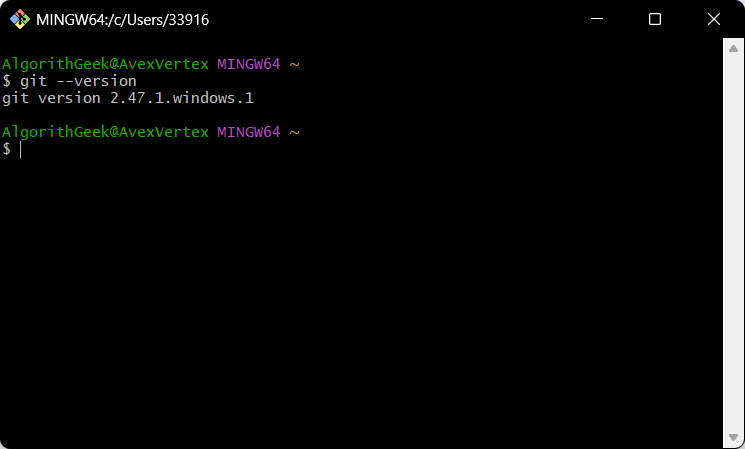

# 简介

- **Git** 是一个强大的**分布式版本控制系统**，它可以帮助你跟踪代码的每一次变化，并与他人高效协作
- **Git** 也可以用来管理**代码之外的任何东西**


# 安装

## Windows

- **去浏览器搜索下载 Git**

  - 官网：https://git-scm.com/

    


- 安装完成后，打开**Git Bash**，输入 **`git --version`**，如果能看到版本号，就说明安装成功了

  


## 初次配置

- 这两个信息将作为你未来所有代码提交的“签名”，这是全局配置

  ```bash
  # 设置你的用户名
  git config --global user.name "你的名字"
  
  # 设置你的邮箱地址
  git config --global user.email "你的邮箱@example.com"
  ```


# 区域

- git有3个区域
  - **工作区 (Working Directory)**：就是你在电脑上能看到的项目文件夹
  - **暂存区 (Staging Area)**：一个临时存放你“打算”提交的修改的地方。它像一个购物车，你可以把想买的（想提交的）东西先放进去
  - **本地仓库 (Local Repository)**：最终存放你所有提交历史记录的地方。一旦提交，修改就会永久保存在这里

- 基本工作流程
  - 在**工作区**修改文件 -> 使用 `git add` 将修改添加到**暂存区** -> 使用 `git commit` 将暂存区的内容提交到**本地仓库**


# 基本实践教程

## **第1步：创建本地仓库**

> `git init`

- 首先，创建一个新的项目文件夹，并进入该文件夹

  ```bash
  # 将这个文件夹初始化为一个 Git 仓库
  git init
  ```

  - 运行 `git init` 后，你会发现文件夹里多了一个隐藏的 `.git` 目录，它就是 Git 仓库的核心，存放着所有的版本信息

## **第2步：进行修改与跟踪**

> `git add` 和 `git status`

- 在 `my-project` 文件夹里创建一个新文件，比如 `readme.txt`，并写入一些内容

  - 现在，查看一下仓库的状态:

    ```bash
    git status
    ```

  - Git 会告诉你，有一个“未跟踪” (untracked) 的文件 `readme.txt`

  - 使用 `git add` 命令来开始跟踪这个文件，并将其添加到暂存区：

    ```bash
    # 添加指定文件到暂存区
    git add readme.txt
    
    # 如果想添加所有修改过的文件，可以使用点号 .
    # git add .
    ```

  - 再次运行 `git status`，你会看到 `readme.txt` 的状态变成了“待提交的变更” (changes to be committed)


## **第3步：提交变更**

> `git commit`

- 现在，我们将暂存区里的内容正式提交到本地仓库

  ```bash
  # 提交并附带一条说明信息
  git commit -m "创建了 readme 文件"
  ```

- `-m` 参数后面的文字是本次提交的说明，**务必清晰地描述你这次提交做了什么**，这对于日回顾历史至关重要


## **第4步：查看历史**

> `git log`

- 如何查看我们刚才的提交记录？

  ```bash
  git log
  ```

- 这个命令会列出所有的提交历史，包括提交的哈希值（一长串唯一ID）、作者、时间和提交说明


## 5. 远程仓库：与他人协作

要与团队协作，或备份你的代码，就需要用到远程仓库（例如 GitHub, Gitee, GitLab）

#### **第1步：克隆一个远程仓库**

> `git clone`

- 如果你想参与一个已有的项目，第一步通常是把它从远程服务器上“克隆”到你的本地电脑

  ```bash
  # 从指定的 URL 克隆仓库
  git clone [https://github.com/example/some-project.git](https://github.com/example/some-project.git)
  ```

  - 这会在当前目录下创建一个 `some-project` 文件夹，并把远程仓库的所有内容和历史记录都下载下来


#### **第2步：关联远程仓库**

> `git remote add`

- 如果你是从本地 `git init` 开始的，你需要告诉本地仓库远程仓库的地址

  ```bash
  # 添加一个名为 origin 的远程仓库地址（origin 是一个默认的习惯叫法）
  git remote add origin [https://github.com/your-username/my-project.git](https://github.com/your-username/my-project.git)
  ```


#### **第3步：推送变更到远程仓库**

> `git push`

- 当你本地有了一些新的提交后，你可以用 `git push` 把这些变更推送到远程仓库，分享给其他人

  ```bash
  # 将本地 main 分支的提交推送到名为 origin 的远程仓库
  git push -u origin main
  ```

  - `-u` 参数会建立本地 `main` 分支与远程 `origin/main` 分支的关联，之后你就可以简化命令为 `git push`。


#### **第4步：从远程仓库拉取变更**

> `git pull`

- 如果团队里的其他人推送了新的变更到远程仓库，你需要把这些变更同步到你的本地仓库

  ```bash
  git pull origin main
  ```

  - 这个命令会抓取远程仓库的最新版本，并与你的本地代码进行合并。在开始新工作前，先 `git pull` 是一个好习惯