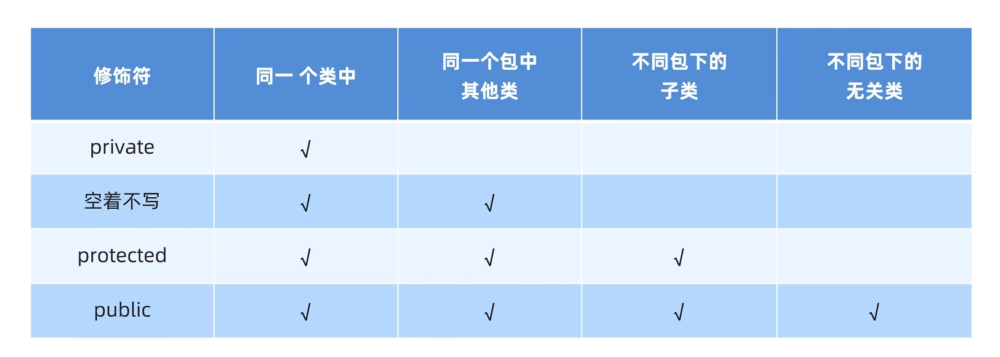
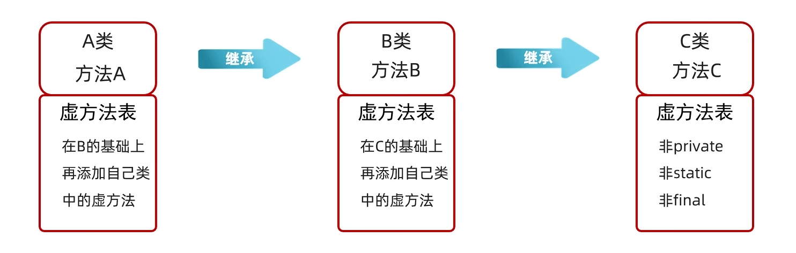
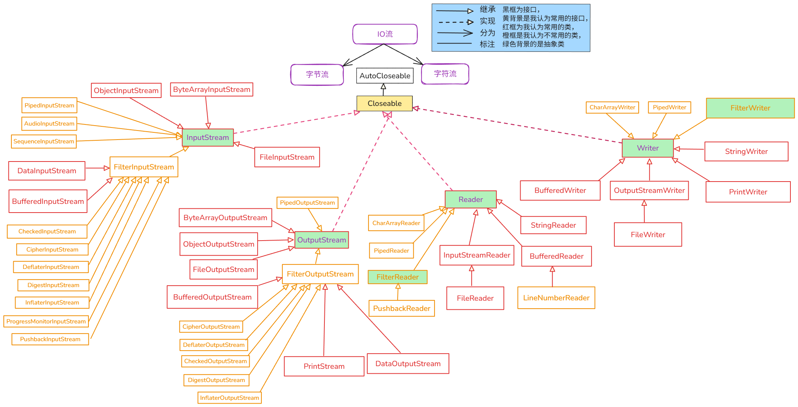

# Java基础

## 数据类型

### 基本数据类型

| 分类       | 关键字 (Keyword) | 内存占用 (字节) | 取值范围                                                     |
| :--------- | :--------------- | :-------------- | :----------------------------------------------------------- |
| **整型**   | **`byte`**       | 1               | -128 ~ 127                                                   |
|            | **`short`**      | 2               | -32,768 ~ 32,767                                             |
|            | **`int`**        | 4               | -2,147,483,648 ~ 2,147,483,647 (约10位)                      |
|            | **`long`**       | 8               | -9,223,372,036,854,775,808 ~ 9,223,372,036,854,775,807 (约19位) |
| **浮点型** | **`float`**      | 4               | &plusmn;3.402823e+38                                         |
|            | **`double`**     | 8               | &plusmn;1.797693e+308                                        |
| **字符型** | **`char`**       | 2               | 0 ~ 65,535 (任意Unicode字符)                                 |
| **布尔型** | **`boolean`**    | 1               | `true` 或 `false`                                            |


### 引用数据类型

除了上面提到的基本数据类型外，数据类型几乎都是引用数据类型


### 包装类

#### 基本数据类型所对应的包装类

| 基本数据类型  | 包装类          |
| ------------- | --------------- |
| **`byte`**    | **`Byte`**      |
| **`short`**   | **`Short`**     |
| **`int`**     | **`Integer`**   |
| **`long`**    | **`Long`**      |
| **`float`**   | **`Float`**     |
| **`double`**  | **`Double`**    |
| **`char`**    | **`Character`** |
| **`boolean`** | **`Boolean`**   |


#### 获取包装类对象的两种方式

##### JDK1.5之前(不包括1.5)(构造方法)

- 构造方法(不推荐)
  - 每次都会创建新的对象

###### Integer

```java
public Integer(int value)		//根据指定的int类型的整数创建一个Integer对象，值超过范围会溢出
public Integer(String s)		//根据传递的字符串创建一个Integer对象，字符串中必须是整数
```

###### Character

```java
public Character(char value)	//根据指定的char类型的字符创建一个Character对象
```

###### Double

```java
public Double(double value)		//根据指定的double类型的浮点数创建一个Double对象
public Double(String s)			//根据传递的字符串创建一个Double对象，字符串中必须是浮点数或整数
```

###### Boolean

```java
public Boolean(boolean value)	//根据指定的boolean值创建一个Boolean对象
public Boolean(String s)		//根据传递的字符串创建一个Boolean对象
    							//如果字符串参数不是null并且忽略大小写后能解析为true,则值为true,否则,值为false
```

###### Byte

```java
public Byte(byte value)			//根据指定的byte类型的整数创建一个Byte对象，值超过范围会溢出
public Byte(String s)			//根据传递的字符串创建一个Byte对象，字符串中必须是整数，值超过范围会会抛出异常
```

###### Short

```java
public Short(short value)		//根据指定的Short类型的整数创建一个Short对象，值超过范围会溢出
public Short(String s)			//根据传递的字符串创建一个Short对象，字符串中必须是整数,值超过范围会抛出异常
```

###### Long

```java
public Long(long value)			//根据指定的Short类型的整数创建一个Long对象，值超过范围会溢出
public Long(String s)			//根据传递的字符串创建一个Long对象，字符串中必须是整数
```

###### Float

```java
public Float(float value)		//根据指定的float类型的浮点数创建一个Float对象	
public Float(double value)		//根据指定的double类型的浮点数创建一个Float对象
public Float(String s)			//根据传递的字符串创建一个Float对象，字符串中必须是浮点数或整数
```


##### JDK1.5之后(包括1.5)(valueOf方法)

- 引入了**`valueOf`**方法(推荐)
  - 一般会利用一些优化机制来提升性能和减少内存使用

###### Integer

```java
public static Integer valueOf(int i)				//根据指定的int类型的整数返回一个Integer对象
public static Integer valueOf(String s)				//根据传递的字符串创建一个Integer对象，字符串中必须是整数
public static Integer valueOf(String s, int radix)	//根据传递的字符串和进制创建一个Integer对象，字符串必须和进制匹配
```

###### Character

```java
public static Character valueOf(char c)				//根据指定的char类型的整数返回一个Character对象
```

###### Double

```java
public static Double valueOf(double d)				//根据指定的double类型的浮点数创建一个Double对象
public static Double valueOf(String s) 				//根据传递的字符串创建一个Double对象，字符串中必须是浮点数或整数
```

###### Boolean

```java
public static Boolean  valueOf(boolean b)			//根据指定的boolean值创建一个Boolean对象
public static Boolean  valueOf(String s)			//根据传递的字符串创建一个Boolean对象
    						 //如果字符串参数不是null并且忽略大小写后能解析为true,则值为true,否则,值为false
```

###### Byte

```java
public static Byte  valueOf(byte b)		 //根据指定的byte类型的整数创建一个Byte对象，值超过范围会溢出
public static Byte  valueOf(String s)    //根据传递的字符串创建一个Byte对象，字符串中必须是整数，值超过范围会会抛出异常
public static Byte  valueOf(String s, int radix)	//根据传递的字符串和进制创建一个Byte对象，字符串必须和进制匹配
```

###### Short

```java
public static Short valueOf(short s)	//根据指定的short类型的整数创建一个Short对象，值超过范围会溢出
public static Short valueOf(String s)    //根据传递的字符串创建一个Short对象，字符串中必须是整数，值超过范围会会抛出异常
public static Short valueOf(String s, int radix)	//根据传递的字符串和进制创建一个Short对象，字符串必须和进制匹配
```

###### Long

```java
public static Long valueOf(long l)		//根据指定的long类型的整数创建一个Long对象，值超过范围会溢出
public static Long valueOf(String s)    //根据传递的字符串创建一个Long对象，字符串中必须是整数，值超过范围会会抛出异常
public static Long valueOf(String s, int radix)	//根据传递的字符串和进制创建一个Long对象，字符串必须和进制匹配
```

###### Float

```java
public static Float valueOf(float f)              //根据指定的float类型的浮点数创建一个Float对象
public static Float valueOf(String s)             //根据传递的字符串创建一个Float对象，字符串中必须是浮点数或整数
```


#### 属性与方法

##### Integer

```java
public static final int MAX_VALUE		// int 可以具有的最大值的常数
public static final int MIN_VALUE		// int 可以具有的最小值的常数
```

```java
public byte 	byteValue()			//将此 Integer 的值作为 byte 返回
public short 	shortValue()		//将此 Integer 的值作为 short 返回
public int 		intValue()			//将此 Integer 的值作为 int 返回		拆箱操作
public long 	longValue()			//将此 Integer 的值作为 long 返回
public float 	floatValue()		//将此 Integer 的值作为 float 返回
public double 	doubleValue()		//将此 Integer 的值作为 double 返回
```

```java
public static int 	compare(int x, int y)				//比较x和y,如果x==y,返回0，如果x<y,返回-1，如果x>y，返回1
public int 			compareTo(Integer  anotherInteger)	//同上，只不过是成员方法

public boolean 		equals(Object obj)					//判断是否相等
    
public static int 	max(int a, int b)					//返回较大值
public static int 	min(int a, int b)					//返回较小值
public static int 	sum(int a, int b)					//计算a+b
    
public static int 	parseInt(String s)				//把字符串转为整数
public static int 	parseInt(String s, int radix)	//把用radix进制字符串表示的数据转为整数
```

```java
public static String toBinaryString(int i)		//把i转为二进制
public static String toOctalString(int i)		//把i转为八进制
public static String toHexString(int i)		//把i转为十六进制
```


##### Character

```java
public char charValue()			//返回此 Character 对象的值
```

```java
public static int compare(char x, char y)			//比较x和y在ASCII表中的位置,x==y,返回0，x<y,返回-1，x>y，返回1
public int compareTo(Character  anotherCharacter)	//同上，只不过是成员方法

public boolean equals(Object obj)				//判断是否相等

public static boolean isDigit(char ch)			//判断指定字符是否为数字
public static boolean isDigit(int codePoint)	//判断指定ASCII编码所对应的字符是否为数字
    
public static boolean isLetter(char ch)			//是否为字母
public static boolean isLetter(int codePoint)	//指定ASCII编码所对应的字符是否为字母

public static boolean isLetterOrDigit(char ch)			//是否为字母或数字
public static boolean isLetterOrDigit(int codePoint)	//指定ASCII编码所对应的字符是否为字母或数字

public static boolean isLowerCase(char ch)			//是否为小写字符
public static boolean isLowerCase(int codePoint)	//指定ASCII编码所对应的字符是否为小写字符
    		
public static boolean isUpperCase(char ch)			//是否为大写字符
public static boolean isUpperCase(int codePoint)	//指定ASCII编码所对应的字符是否为大写字符
    
public static char toLowerCase(char ch)				//将字符参数转换为小写
public static int toLowerCase(int codePoint)		//将ASCII编码所对应的字符转换为小写
    
public static char toUpperCase(char ch)				//将字符参数转换为大写
public static int toUpperCase(int codePoint)		//将ASCII编码所对应的字符转换为大写
```


##### Double

```java
public static final double MAX_VALUE		// double 类型的最大正有限值
public static final double MIN_VALUE		// double 的最小正非零值的常量
```

```java
public byte byteValue()			//将此 Double 的值作为 byte 返回
public short shortValue()		//将此 Double 的值作为 short 返回
public int intValue()			//将此 Double 的值作为 int 返回		
public long longValue()			//将此 Double 的值作为 long 返回
public float floatValue()		//将此 Double 的值作为 float 返回
public double doubleValue()		//将此 Double 的值作为 double 返回	拆箱操作
```

```java
public static int compare(double d1, double d2)	//比较d1和d2大小,d1==d2,返回0，d1<d2,返回-1，d1>d2，返回1
public int compareTo(Double  anotherDouble)		//同上，只不过是成员方法
    
public boolean equals(Object obj)		//判断是否相等
    
public static double max(double a, double b)	//返回较大值
public static double min(double a, double b)	//返回较小值
public static double sum(double a, double b)	//计算a+b
    
public static double parseDouble(String  s)		//把字符串转为Double
```

```java
public static String toHexString(double d)		//将Double转为十六进制
```


##### Byte

```java
public static final byte MAX_VALUE		//最大值
public static final byte MIN_VALUE		//最小值
```

```java
public byte byteValue()			//将此 Byte 的值作为 byte 返回		拆箱操作
public short shortValue()		//将此 Byte 的值作为 short 返回
public int intValue()			//将此 Byte 的值作为 int 返回		
public long longValue()			//将此 Byte 的值作为 long 返回
public float floatValue()		//将此 Byte 的值作为 float 返回
public double doubleValue()		//将此 Byte 的值作为 double 返回	
```

```java
public static int compare(byte x, byte y)	//比较x和y,如果x==y,返回0，如果x<y,返回-1，如果x>y，返回1
public int compareTo(Byte  anotherByte)		//同上，只不过是成员方法

public boolean equals(Object obj)		//判断是否相等
    
public static byte parseByte(String s)				//把字符串转为byte整数
public static byte parseByte(String s, int radix)	//把用radix进制字符串表示的数据转为byte整数
```


##### Short

```java
public static final short MAX_VALUE		//最大值
public static final short MIN_VALUE		//最小值
```

```java
public byte byteValue()			//将此 Byte 的值作为 byte 返回		
public short shortValue()		//将此 Byte 的值作为 short 返回		拆箱操作
public int intValue()			//将此 Byte 的值作为 int 返回		
public long longValue()			//将此 Byte 的值作为 long 返回
public float floatValue()		//将此 Byte 的值作为 float 返回
public double doubleValue()		//将此 Byte 的值作为 double 返回	
```

```java
public static int compare(short x, short y)	//比较x和y,如果x==y,返回0，如果x<y,返回-1，如果x>y，返回1
public int compareTo(Short  anotherShort)	//同上，只不过是成员方法
    
public boolean equals(Object obj)		//判断是否相等
    
public static short parseShort(String  s)				//把字符串转为short整数
public static short parseShort(String  s, int radix)	//把用radix进制字符串表示的数据转为short整数
```


##### Long

```java
public static final long MAX_VALUE		//最大值
public static final long MIN_VALUE		//最小值
```

```java
public byte byteValue()			//将此 Byte 的值作为 byte 返回
public short shortValue()		//将此 Byte 的值作为 short 返回
public int intValue()			//将此 Byte 的值作为 int 返回		
public long longValue()			//将此 Byte 的值作为 long 返回		拆箱操作
public float floatValue()		//将此 Byte 的值作为 float 返回
public double doubleValue()		//将此 Byte 的值作为 double 返回	
```

```java
public static int compare(long x, long y)	//比较x和y,如果x==y,返回0，如果x<y,返回-1，如果x>y，返回1
public int compareTo(Long  anotherLong)		//同上，只不过是成员方法
    
public boolean equals(Object obj)		//判断是否相等
    
public static long max(long a, long b)		//返回较大值
public static long min(long a, long b)		//返回较小值
public static long sum(long a, long b)		//计算a+b
    
public static long parseLong(String s)				//把字符串转为long整数
public static long parseLong(String s, int radix)	//把用radix进制字符串表示的数据转为long整数
```

```java
public static String toBinaryString(long i)		//把i转为二进制
public static String toOctalString(long i)		//把i转为八进制
public static String toHexString(long i)		//把i转为十六进制
```


##### Boolean

```java
public static final Boolean FALSE		//值为 false 的 Boolean 对象
public static final Boolean  TRUE		//值为 true  的 Boolean 对象
```

```java
public boolean booleanValue()			//将此 Boolean 对象的值作为布尔值返回	拆箱
```

```java
public static int compare(boolean x, boolean y)	//比较x和y,如果x==y,返回0，如果x<y,返回-1，如果x>y，返回1
    											//true 被认为 大于 false 
public int compareTo(Boolean b)					//同上，只不过是成员方法

public boolean equals(Object obj)		//判断是否相等

public static boolean logicalAnd(boolean a, boolean b)	//返回a && b 的结果
public static boolean logicalOr(boolean a, boolean b)	//返回a || b 的结果
public static boolean logicalXor(boolean a, boolean b)	//返回a ^ b 的结果，相同为假，不同为真

public static boolean parseBoolean(String  s)		//字符串参数解析为boolean
```


##### Float

```java
public static final float MAX_VALUE			//float 类型的最大正有限值
public static final float MIN_NORMAL		//float 的最小正非零值的常量
```

```java
public byte byteValue()			//将此 Double 的值作为 byte 返回
public short shortValue()		//将此 Double 的值作为 short 返回
public int intValue()			//将此 Double 的值作为 int 返回
public long longValue()			//将此 Double 的值作为 long 返回
public float floatValue()		//将此 Double 的值作为 float 返回		拆箱操作
public double doubleValue()		//将此 Double 的值作为 double 返回
```

```java
public static int compare(float f1, float f2)	//比较f1和f2大小,f1==f2,返回0，f1<f2,返回-1，f1>f2，返回1
public int compareTo(Float  anotherFloat)		//同上，只不过是成员方法

public boolean equals(Object obj)		//判断是否相等
    
public static float max(float a, float b)	//返回较大值
public static float min(float a, float b)	//返回较小值
public static float sum(float a, float b)	//计算a+b
    
public static float parseFloat(String  s)	//把字符串转为Float
```

```java
public static String  toHexString(float f)	//将Float转为十六进制
```


#### 装箱和拆箱

##### 装箱

- 将基本数据类型转换为包装类对象

```java
int a = 10;
Integer obj = Integer.valueOf(a);  // 手动装箱
```

##### 拆箱

- 将包装类对象转换为基本数据类型

```java
Integer i = Integer.valueOf(10);  
int a = i.intValue();  				// 手动拆箱
```


##### 自动装箱和自动拆箱

- 从 **JDK1.5** 开始，Java引入了**自动装箱**和**自动拆箱**机制，允许 Java 编译器在适当的时候自动进行装箱和拆箱操作
- 装箱和拆箱代码是在**编译阶段**插入的


###### 自动装箱

- 基本数据类型自动转换为包装类对象

```java
Integer i = 10;  // 自动装箱，等同于 Integer.valueOf(10);
```

###### 自动拆箱

- 包装类对象自动转换为基本数据类型

```java
Integer i = 10;  // 自动装箱
int a = i;  	 // 自动拆箱，等同于 int a = i.intValue();
```


### 两种数据类型对比


## 运算符

### `>>`

- 右移运算符**`>>`**是**将二进制位向右移动指定的位数**，**左边用符号位(正数为0,负数为1)填充**，之后**向着负无穷大的方向舍入**

  等价于**除以2^n^**后再**向着负无穷大的方向舍入**

  - **正数**：举例：7>>1 = 7/2^1^=3.5向负无穷大方向舍入=3
  - **负数**：举例：-7>>1=-7/2^1^=-3.5向负无穷大方向舍入=-4


## switch语句

### 语法及执行流程


### 格式说明


#### default

- default可以放在任何位置


### case穿透

- 不写break会引发case穿透现象


### switch在 JDK12 引入的新特性

```java
int number = 10;
switch(number){
        case 1 -> {
            System.out.println("一");
        }
        case 10 -> {
            System.out.println("二");
        }
        default -> {
            System.out.println("default");
        }
}
```

如果大括号中只有一行代码，大括号可以省略，上面的代码可以改写为

```
int number = 10;
switch(number){
        case 1  -> System.out.println("一");
        case 10 -> System.out.println("二");
        default -> System.out.println("default");
}
```


## 循环

### do while

```java
do{
    循环体;
    条件控制语句;
}while(条件判断语句);
```


## 数组

- 连续的存储地址，基本数据类型存储值，引用数据类型存储地址值
- **基本数据类型** **语法上不存在地址值**
- 连续的存储地址是指这个数组是连续的，而不是它们内部的元素是连续地址的
- 直接操作某个索引处的值，实际上是操作了这个索引处的指向罢了，永远对这个索引处的地址相关的东西做不了手脚(格子化?后面可能就忘了，忘了的话删了就行，别查)

- 指针化（Java）和格子化（C?），永远没有格子化，格子化也变不了地址，但是格子化可以指定某个地址处的元素，指针化更不行，指针化甚至不能改变某个地址处的元素，只能指向另一个地址处的新元素


### 一维数组

#### 数组的初始化

- 数组的初始化：在内存中，为数组容器开辟空间，并将数据存入容器中的过程。
- 分为静态初始化和动态初始化


##### 静态初始化

> 创建数组的时候就把里面的元素都指定了，所以不用特意声明数组的长度，也没必要，数组的长度就是刚好把这些元素都放进去的长度，如果指定长度，短了容纳不了所有的，多了浪费额外的内存，没必要

- ###### 完整格式

```java
数据类型[] 数组名 = new 数据类型[]{元素1,元素2,元素3 ... };	//注意这种写法[]中没有元素的个数
int[] array1 = new int[]{11,22,33};
double[] array2 = new double[]{11.1,12.1,13.1};
```


- ###### 简化格式

```java
数据类型[] 数组名 = {元素1,元素2,元素3 ... };	//这是简写，和上面的写法一样，同样不用声明一共有多少个元素
int[] array1 = {11,22,33};
double[] array2 = {11.1,12.1,13.1};
```


##### 动态初始化

> 就是数据不太清楚，先把数组创建好，后面再修改和添加元素啥的，所以这种要指定数组长度

- ###### 格式

```java
数据类型[] 数组名 = new 数据类型[数组长度];	//这种在[]中要指定数组的长度
int[] array = new int[3];
```


##### 静态和动态初始化的区别

###### 静态初始化

- 手动**指定数组元素**，系统会**计算出数组的长度**。

- **明确要操作的具体数据**，不用计算出个数，直接静态初始化即可。

###### 动态初始化

- 手动指定**数组长度**，由系统给出**默认初始化值**。

- 只**明确元素个数**，不明确具体值，推荐使用动态初始化


### 二维数组

#### 数组的初始化

##### 静态初始化

###### 完整格式

```java
数据类型[][] 数组名 = new 数据类型[][]{{元素1,元素2},{元素1,元素2}};
int[][] array= new int[][]{{11,22},{33,44}};
```

###### 简化格式

```java
数据类型[][] 数组名 = {{元素1,元素2},{元素1,元素2}};
int[][] array = {{11,22},{33,44}};
```


##### 动态初始化

```java
数据类型[][] 数组名 = new 数据类型[m][n];
int[][] array = new int[2][3];

int[][] arr = new int[][3];//这种也允许写，这种动态允许加入更多的元素
```


### 关于数组和一些特点

- 数组分为**一维数组**和**多维数组(多维数组又分为二维、三维......n维数组)**
- 数组也分为**基本类型数组**和**引用类型数组**
- 基本类型数组**一定**是**一维**的，但是**一维**的**并不一定**是基本类型数组，因为**存储包装类和其它类类型**的一维数组是**引用数据类型数组**
- **多维数组**是**引用类型数组**
- 不允许创建**泛型数组**，这样会**违反泛型的设计目标(编译时类型安全)**
  - 定义的数组如果是泛型，则编译的时候允许数组中添加任何元素，在运行的时候，泛型被擦除，里面添加的元素可能会不匹配啥的，所以不允许创建泛型数组，但是可以用一种方式创建**`Object`**数组，之后**强转为泛型类型**来间接达到**创建指定类型数组的目的**
  - 没办法防止不同的引用(变量)接收后肆意妄为
  - 彻底禁止才是最优做法


## 代码块

### 代码块分类

- 局部代码块
- 构造代码块
- 静态代码块


### 局部代码块

#### 作用

- 节约内存

- **现在已经没用了**


### 构造代码块

#### 什么是构造代码块

- 写在成员位置的代码块

- 现在同样很少用

#### 作用

- 将多个构造方法中重复的代码抽取出来

#### 执行时机

- 创建本类对象的时候，会先执行构造代码块，再执行构造方法

```java
//成员位置直接这样写
{

}
```


### 静态代码块

#### 格式

```java
static{}
```

#### 特点

- 需要通过`static`关键字修饰

- 随着类的加载而加载,并且自动触发,只执行一次

#### 使用场景

在类加载的时候,做一些数据初始化的时候使用


## 方法

### 形参

#### 注意点

- 如果几个重载方法的形参都能接收某个实参，比如**`Object`**和**`Integer`**，**编译器在调用时会选择最匹配的方法**，其**优先级**如下
  - 先优先使用**形参能直接匹配实参**的重载方法（形参：Integer[√]，Object    实参：Integer）
  - **基本类型自动提升**（如int到long）（形参：long[√]，Integer    实参：int）
  - 再优先使用**装箱**（形参：Integer[√]，Object    实参：int）
  - 再优先使用**向上转型**，选择**参数类型的父类**（形参：int，Object[√]  实参：Integer）
  - 再优先使用**拆箱**
  - 如果上面的都不匹配，尝试使用**可变参数（int...)**
  - 如果**模糊调用**，会出错


## 可变参数

- 允许方法接受**0个或多个**同类型参数，简化方法调用

- 格式：参数类型... 参数名

  ```java
  public static void printValues(int... numbers) {
      for (int num : numbers) {
          System.out.println(num);
      }
  }
  ```

- 一个方法**只能有一个**可变参数
- **必须作为最后一个参数**
- 底层是一个**数组**

  - 可以传入数组，如果一个方法中允许可变参数，不仅可以传入一个接一个的元素，还可以传入数组


# 一些关键字

### Java中的所有关键字

| **abstract**   | **assert**       | **boolean**   | **break**      | **byte**   |
| -------------- | ---------------- | :------------ | -------------- | ---------- |
| **case**       | **catch**        | **char**      | **class**      | **const**  |
| **continue**   | **default**      | **do**        | **double**     | **else**   |
| **enum**       | **extends**      | **final**     | **finally**    | **float**  |
| **for**        | **goto**         | **if**        | **implements** | **import** |
| **instanceof** | **int**          | **interface** | **long**       | **native** |
| **new**        | **package**      | **private**   | **protected**  | **public** |
| **return**     | **strictfp**     | **short**     | **static**     | **super**  |
| **switch**     | **synchronized** | **this**      | **throw**      | **throws** |
| **transient**  | **try**          | **void**      | **volatile**   | **while**  |


### static

#### 静态变量和静态方法的特点


#### 内存方面

- 静态成员是随着类的加载而加载的，是优先于对象出现的


#### 注意事项

- **静态方法**只能访问**静态变量和静态方法**
- **非静态方法**可以访问**静态变量**或者**静态方法**，也可以访问**非静态的成员变量和非静态的成员方法**
- 静态方法是属于**类本身**而不是类的任何特定实例的，因此它们**非常独立**。它们的操作不依赖于任何对象的状态（实例变量），也不能直接访问或修改实例变量或调用实例方法（成员方法）。这是因为静态方法在执行时没有this引用（指向当前对象的引用），也没有super引用（指向父类对象的引用）。它们主要用于执行那些与类相关但不依赖于特定对象状态的功能，或者作为工具方法。它们可以自由访问类中的其他**静态成员**（静态变量和静态方法）


### final

- 用`final`修饰的不能被改变


#### 可被final修饰的都有什么

- 变量：被**`final`**修饰的变量叫常量，只能被赋值一次
- 方法：表明该方法是最终方法，不能被重写
- 类：表明该类是最终类，不能被继承


#### 细节

- 如果**`final`**修饰的变量是基本数据类型：那么变量存储的数据值不能发生改变
- 如果**`final`**修饰的变量是引用数据类型：那么变量存储的地址值不能发生改变，但是对象内部的属性什么的可以改变
- 一个 **`final`** 成员变量，必须**在对象创建（构造方法执行）完成之前被赋值**，并且**之后再也不能被修改**
- 一个 **`final`** 局部变量，可以先不赋值，后面再赋值，但是只能赋值一次


# 面向对象相关

## 类

### 定义类的注意点

- 一个Java文件中可以定义多个类，但是只能有一个类是用public修饰的，并且这个public修饰的类名必须是Java代码的文件名


### 成员变量定义的完整格式

- 修饰符 数据类型 变量名称 = 初始化值;

```java
修饰符   数据类型  变量名称 = 初始化值;
private String   name   = "高英哥";
```


### 类的五大成员

- 属性
- 方法
- 构造方法
- 代码块
- 内部类


### 一些注意事项

- **类中方法外**的代码本质上是**成员的声明和初始化**
- **成员变量的初始化（包括 `new` 操作）**会在**类加载（静态成员）**或**对象实例化（实例成员）**时自动执行，符合语言的初始化规则
  - 如果一个类的主体中编写了一个**`new`另外一个类的语句**，
    - 如果是**`static`**修饰的，在**类加载**时就会执行，
    - 如果不是**`static`**修饰的，在**对象创建**时才会被加载


- **方法调用**是需要在程序运行时执行的代码，必须存在于**明确的执行上下文中（如方法、构造函数或初始化块）**

- **类的主体**中**不允许**直接编写**游离的可执行语句**，因为这些代码**没有明确的触发时机（例如，何时执行？由谁调用？）**
  - 在**类中方法外，类的主体中**调用方法只能通过**`new`**和**代码块**的方式来**进行显示或者隐式调用**
    - 在别的地方不行，不能调用方法，一方面是因为**类中方法外**的代码本质上是**成员的声明和初始化**，不允许调用方法，另一方面是因为 **普通方法可能包含任意逻辑**，若允许隐式调用，会破坏代码的明确性和可控性，会有各种问题发生，所以语法上是禁止的


## 内部类

- 一个类的**里面**定义的类

```java
public class OuterClass{		//外部类
    public class InnerClass{	//内部类
        
    }
}
```

- 内部类单独出现没有任何意义
  - 内部类举例：`ArrayList`中的`Itr`类，一个用于迭代的内部类，如果集合都没有了，还迭代个毛啊


### 关于内部类

- **非`static`内部类**可以直接访问外部类的成员， 包括私有

- 外部类要访问内部类的成员， 必须创建对象

- **局部内部类不允许显式声明为 `static`，且它们默认是隐式非静态的**（即依赖于外部类实例）


### 内部类的分类

- 成员内部类	写在外部类的成员位置,并且**无**`static`修饰的类
- 静态内部类        写在外部类的成员位置,并且**有**`static`修饰的类
- 局部内部类        在方法中定义的类
- 匿名内部类        没有名字的内部类，可以在方法中，也可以在类中


#### 非静态成员内部类

##### 定义

- 写在外部类的成员位置,并且**无`static`修饰**的类

```java
public class car{
    String carName;
    int carAge;
    int carColor;
    class Engine{
        String engineName;
        int engineAge;
    }
}
```

##### 注意

- 可以被修饰符所修饰：如`private`,`默认`,`protected`,`publice`,`static`等

- **静态变量**
  - JDK16以前，成员内部类中不能定义**静态常量(static+final)**
  - JDK16开始，成员内部类中才可以定义**静态常量(static+final)**


##### 创建成员内部类的方式

###### 方式1

- 直接在外界用这种格式的语法创建

```java
外部类名.内部类名          对象名 = 创建外部类对象.创建内部类对象;
OuterClass.InnerClass	oi    =  new OuterClass().new InnerClass();
```


###### 方式2

- 在外部类中编写方法，对外提供内部类的对象

```java
public class OuterClass{	//外部类
    class InnerClass{		//内部类

    }
    
    public InnerClass getInstance() {	//用这个方法对外提供内部类的对象
        return new Inner();
    }
}
```


##### 变量重名怎么调用

###### 情景

```java
class Outer{
	private int a = 10;
	class Inner{
		private int a = 20;
		public void show(){
			int a = 30;
			System.out.println(a); // 30
			System.out.println(this.a); // 20
			System.out.println(Outer.this.a); // 10
		}
	}
)
```

- **Outer.this**:获取了外部类对象的地址值
  - Java中内部类是有一个变量叫**Outer.this**的，存的是外部类的地址值的

##### 内存图


#### 静态成员内部类

- 写在外部类的成员位置,并且**有** **`static`**修饰的类
- **Java**中**唯一能用`static`修饰的类**，但是它是独立的，不能像**`static`变量**那样共享

```java
public class Car {
	String carName;
	int carAge;
	int carColor;
	static class Engine{
		String engineName;
		int engineAge;
    }
}
```

- 静态内部类只能访问**外部类**中的**静态变量**和**静态方法**， 如果想要访问非静态的需要创建对象

- 静态内部类是独立的，没有指向外部类的**`Outer.this`**


##### 创建静态内部类对象的格式

```java
外部类名.内部类名 对象名 = new 外部类名.内部类名();
Outer.Inner     oi   =  new Outer.Inner();
```

##### 调用方法的格式

###### 调用非静态方法

- 先创建对象，用对象调用

###### 调用静态方法

```java
外部类名.内部类名.方法名();
Outer.Inner.show();
```


#### 局部内部类

- 在方法或代码块中定义的类,类似于方法里面的局部变量
- 外界无法直接使用， 需要在方法内部创建对象并使用
- 该类可以直接访问外部类的成员， 也可以访问方法内的局部变量
- **不允许显式声明为 `static`，且它们默认是隐式非静态的**（即依赖于外部类实例）


#### 匿名内部类

##### 定义

- 隐藏了名字的内部类，可以在方法中，也可以在类中

##### 匿名内部类格式

```java
new 父类名或者接口名(){
    // 方法重写
    @Override 
    public void method() {
        // 执行语句
    }
};						 
```

- 包含三部分：继承或实现、方法重写、创建对象


##### 本质作用

- 简化代码


##### 前提和格式

- 匿名内部类必须**继承一个父类**或者**实现一个父接口**


## 内部接口

### 关于内部接口

- **内部接口（Inner Interface）** 是定义在另一个接口或类内部的接口。和内部类类似，它的存在是为了更好地组织代码逻辑
- **所有的(ALL)内部接口**都是**静态**，就算你没有手动写**`static`**也是**隐式静态**的，只是有些地方不允许显式使用**`static`关键字**罢了

- **内部接口**中**局部内部接口** **不能** **显式使用`static`修饰**
- **不存在“匿名内部接口”（Anonymous Inner Interface）的概念**


### 内部接口的分类

#### 成员内部接口(静态)

- 直接定义在**类或接口内部成员位置的接口**
- 内部接口一定是**静态**的，默认**隐式静态**（即使不写 **`static`**），可显式声明 **`static`**，但是**冗余**
- 内部接口不像内部类一样有**静态**，也有**非静态**，内部接口只有**静态**的
- 实现一个接口，要重写所有抽象方法，它的内部接口不强制要求实现

**调用方式**

- **外部类中：直接使用 内部接口名**

  - 内部接口名

  ```java
  public class Outer {
      // 成员内部接口
      public interface InnerInterface {
          void hello();
      }
  
      // 在外部类内部使用内部接口
      public void process() {
          // 匿名内部类实现
          InnerInterface h = new InnerInterface() {
              @Override
              public void hello() {
                  System.out.println("Hello World");
              }
          };
          logger.hello(); // 输出：Hello World
      }
  }
  ```

- **外部类外：使用 外部类名.内部接口名**
  - **外部类名.内部接口名**


#### 局部内部接口

- 定义在**方法或代码块内**的接口
- 它也是**隐式静态**的，但是它不允许写**`static`**，它不像**成员内部接口**一样**虽然冗余但是能显式写**，它**直接不让显式写**
- 但是它也是**`static`**的


## 权限修饰符

### 作用

- 用来控制一个成员能够被访问的范围


### 可以修饰什么

- 成员变量
- 构造方法
- 方法
- 内部类

### 修饰符及其作用范围



### 关于protected

- 和别的修饰符有不一样的地方
- 如果一个类中的成员被**`protected`**修饰
  - 同包中的类访问没有限制，不同包中的子类访问静态成员时也没有限制，但是访问非静态成员时有下面的限制
  - 在不同包中的子类中访问**`protected`**成员时，**不能通过父类的实例**来访问这些成员。只能通过**子类自身的实例**来访问，在子类内部使用**`this`**或**`super`**关键字来访问**`protected`**成员
  

## 继承

### 子类从父类中继承的内容

| 内容                 | 非私有(public,protected...)       | 私有(private)          |
| -------------------- | --------------------------------- | ---------------------- |
| 构造方法             | 不能                              | 不能                   |
| 成员变量             | 能                                | 能(但是不能直接去使用) |
| 静态变量             | 不能                              | 不能                   |
| 成员方法(非`static`) | 能(包括`final`，继承和重写不一样) | 不能                   |
| 静态方法             | 不能                              | 不能                   |

- **构造方法：**父类和子类的名字都不一样，肯定不能继承
- **成员变量：**不管父类中私有还是非私有，都继承下来，放到两个不同的空间中.

​			  找变量的时候先在右边子类的变量的空间中找，如果没找到，再去左边从父类继承下来的变量的空间中去找.

​			为什么找变量先在子类空间中去找呢？因为这个变量的引用类型是子类，而不是多态中的父类引用子类对象


- **成员方法：**只继承非私有方法，不继承私有方法

​			它的调用是基于**虚方法表**(记录了所有可以被子类重写的方法)，我们可能会以为"对于所有方法，子类进行调用的时候，先在子类中进行寻找，如果找不到我们再继续在父类中找"，其实不是的，这也太慢了，其实真正的查找是基于虚方法表的,而虚方法表中没有的`private`、`static`以及`final`修饰的方法，则在编译的时候就已经一切都确定下来了，这种也同样不会沿着继承链去找着调用，总而言之，沿着继承链调用是一个很小众的行为。




### 方法重写

#### 方法重写的本质

- 用**自己重写的方法**    **覆盖**了**虚方法表中从父类继承下来的的方法**


#### 注意事项

- 重写方法和父类中方法**必须相同的**：方法的名称、方法的形参列表

- 子类重写父类中的方法时，子类中方法的访问权限必须**大于等于**父类

- 子类重写父类中的方法时，子类中方法的返回值类型子类必须**小于等于**父类

- 子类重写父类中的方法时，子类中方法抛出的异常必须**小于等于**父类

- 只有被添加到虚方法表中的方法才能被重写(比如静态方法不能重写，不然会报错)

- **建议**：重写的方法尽量和父类保持一致(返回值，访问 权限之类的)

  **上面的第二点和第三点是为了防止父类引用调用子类方法时出现错误**


### 构造方法

#### 访问特点

- 父类中的构造方法不会被子类继承
- 子类中所有的构造方法默认都会**先**访问父类中的无参构造，之后再执行自己构造方法中的代码

为什么?

因为子类在初始化的时候，有可能会使用从父类中继承下来的数据，如果父类中的这些数据没有完成初始化，子类将无法使用父类中的数据

- 子类构造方法的第一行默认语句都是**super( )**，就算不手动写也是存在的，并且一定在第一行，如果手动用必须保证他在第一行
- 不过如果在构造方法中调用了**this( )**构造方法，**super( )**就没有了，因为其它构造中第一行有默认**super( )**,但是**this( )**必须在第一行，这样才能保证这个构造方法中第一行也是**super( )**
- 如果想调用父类中的有参构造，必须手动写**super( )**进行调用，但是这个**super( )**也必须在第一行


### 虚方法表

- 快速定位方法
- **虚方法表**是实现**动态绑定**的一种技术手段

#### 虚方法

- **虚方法**实际上就是**可以被重写的方法**

#### 沿**继承链**调用方法的情况

- 绝大多数情况下，调用方法都是直接通过虚方法表快速定位目标方法的,**绝大多数情况下不会沿着继承链寻找方法**
- 当然也有少数情况会**沿着继承链寻找方法**
  - **反射调用方法时**
    - 通过反射（如 `Method.invoke()`）调用方法时，JVM 需要根据方法名和参数类型**动态解析目标方法**。这一过程可能需要遍历继承链
  - **显式调用父类方法(super.method())**
    - 当子类通过 `super` 关键字调用父类方法时，JVM 需要直接定位到父类的方法实现，而非子类的重写版本
  - **类加载时的方法解析**
    - 在类加载阶段，JVM 需要解析方法的符号引用（符号引用转为直接引用）。此时，如果当前类未定义某个方法，会沿着继承链向上查找
  - **接口默认方法的调用**
    - 当类实现多个接口且存在默认方法冲突时，JVM 需要沿着接口继承链查找默认方法的实现
  - **动态代理与某些框架的特殊处理**
    - 在动态代理（如 `Proxy` 类）或字节码增强框架（如 CGLIB）中，生成代理类时可能需要沿继承链查找原始方法


#### `final`、`static`以及`private`的调用

- 我们知道，用这三个关键字修饰的方法**不会**被加载到**虚方法表**中
- 这三个方法的调用是和**静态绑定**相关的，和虚方法表所对应的**动态绑定**不同
  - 它们的调用过程在**编译**时就已决定，而不是依赖于运行时的动态方法查找

>我们可能会以为"对于所有方法，子类进行调用的时候，先在子类中进行寻找，如果找不到我们再继续在父类中找"，其实不是的，这也太慢了，其实真正的查找是基于虚方法表的,而虚方法表中没有的`private`、`static`以及`final`修饰的方法，则在编译的时候就已经一切都确定下来了，这种也同样不会沿着继承链去找着调用，总而言之，沿着继承链调用是一个很小众的行为.


### this和super

#### this

- **`this`可以理解为一个变量**,表示**方法调用者的地址值**
  - 不过在**构造方法**中，`this` 指的是 **当前正在被创建的那个对象实例**

- 其实就是一个**局部变量**

例：

```java
class Cat{
	public int age=10;
	public void method(){
		int age = 200;
		System.out.println(this.age);
	}
}
```

```java
class Test{
	public static void main(String[] args){
		Cat c = new Cat();		//假设这个c的地址值是001
        c.method();				//此时输出的是10而不是200,this代表001,因为调用者是c
	}
}
```


#### this()

- 使用 this() 进行构造函数调用时，**不能形成递归调用链**（例如，构造函数 A 调用 B，构造函数 B 又调用 A）


#### super


#### super()

- 如果一个构造函数**没有显式**地调用 **`this()`** 或 **`super()`**,那么 Java 编译器会自动在构造函数的第一行**隐式地插入**一个对父类**无参数构造函数**的调用，即 **`super()`**
  - 如果父类**没有**提供一个无参数的构造函数（或者这个无参数构造函数是 **private** 的），并且子类的构造函数又没有显式地调用 **`super(...)`**（调用父类带参数的构造函数），那么编译器会报错！
    - 也就是说如果父类中如果父类**没有**提供一个无参数的构造函数（或者这个无参数构造函数是 **private** 的），要想不报错，子类的构造函数就必须要去**显式的**去调用**`super(...)`**


#### this和super


- 使用**this()**和**super()**的时候，**这两条语句必须是构造方法的第一条语句**
  - 这是为了**确保在执行当前构造函数的任何其他代码之前，对象（或者其父类部分）已经被正确地初始化了**
  - **在一个构造函数中，你不能同时调用 this() 和 super()**
  - **this() 和 super() 只能在类的构造函数中被调用，不能在任何普通的实例方法或静态方法中使用**


## 多态

### 向上转型

#### 定义

指将**子类对象**赋值给**父类类型的引用**。示例如下:

```java
父类类型 引用(变量)名称 = 子类对象;
Person  p           =  new Teacher();
```


#### 前提

存在继承关系，必须父类引用指向子类对象才能转换成功，也就是必须**`new`过子类对象**才行


#### 调用成员的特点

##### 成员变量调用

- 编译看左边，运行也看左边

##### 方法的调用

- 编译看左边，运行看右边


#### 注意点

- 如果**`A`类**是**`B`类**的子类，那么**`A`类**的数组**`A[]`**也是**`B`类**的数组**`B[]`**的子类,**同样适用向上转型和向下转型的规则**


### 向下转型

#### 定义

指将**父类类型的引用**转换为**子类类型的引用**。示例如下：

```java
Person p = new Teacher();
Teacher t = (Teacher)p;
```

- 向下转型需要**显式的类型转换**

- 如果引用的实际对象不是目标子类类型，将抛出`ClassCastException`


#### 前提

存在继承关系


#### 注意点

- 如果**`A`类**是**`B`类**的子类，那么**`A`类**的数组**`A[]`**也是**`B`类**的数组**`B[]`**的子类,**同样适用向上转型和向下转型的规则**


## 抽象

### 定义格式

#### 抽象方法的定义格式

```java
public abstract 返回值类型 方法名(参数列表);		//没有方法体
public abstract  void     method(int a);
```

#### 抽象类的定义格式

```java
public abstract class 类名{}
public abstract class Student{}
```


### 注意点

- 抽象类不可以被实例化(不可以被new成一个对象)

- 抽象类中不一定有抽象方法，有抽象方法的类一定是抽象类

- 虽然抽象类不能用来创建对象，但是抽象类可以有构造方法

  - 构造方法的作用是用来在子类创建对象的时候给子类进行赋值的，毕竟子类构造方法第一行都默认是**super( )**

- 抽象类的子类

  - 要么重写抽象类中的所有抽象方法

  - 要么它的子类还是抽象类
    - 不过这样子的话**它的子类的子类**既要重写**它的子类的**抽象方法，也要重写**它的**抽象方法


- 在抽象类中，如果既有抽象方法，也有非抽象方法，那么非抽象方法是可以调用抽象方法的。

  因为抽象类本身不能被实例化，静态方法又不能是抽象的，也不能调用抽象方法，所以不用担心调用这个抽象方法的时候这个抽象方法没有方法体。

  抽象类的非抽象子类可以被创建对象，并且这些子类必须重写那个抽象方法，重写完之后这个抽象方法就有方法体了。在这种情况下，在子类调用原来的非抽象方法时，调用的那个抽象方法，实际上会根据多态的原则，执行子类中重写后的方法。

### 抽象类和抽象方法的意义

- 为了统一规范


## 接口

### 格式

```java
public interface 接口名{}
```


### 注意

- 接口不能实例化
- 接口和类之间是实现关系，通过`implements`关键字表示

```java
public class 类名 implements 接口名{}
```

- 接口的子类(实现类)
  - 要么重写接口中的所有抽象方法
    - 这里有一点要补充的，如果接口中的抽象方法和实现类从**`Object`类**中继承下来的方法**同名**，那么这个方法在**实现类**中如果不重写也不会报错，因为实现类中已经从**`Object`**中继承下来了这些，这个底层好像也是根据虚方法表进行判断的
  - 要么它本身是一个抽象类
  
- 接口允许多实现

```java
public class 类名 implements 接口1,接口2{}
```

- 实现类还可以在继承一个接口的同时实现多个接口

```java
 public class 类名 extends 父类 implements 接口1,接口2{}
```

- 接口允许多继承

```java
interface Inter1{}
interface Inter2{}
public interface Inter3 extends Inter1,Inter2{}
```


### iTable

- 接口中是有**`iTable`**的，类似于类中的**`vTable`**


### 接口中成员的特点

#### 成员变量

- 只能是**常量**
- 成员变量的默认修饰符(就算不写也是这个)：

```java
public static final
```

- 如果改了默认修饰符，比如把`public`改成`private`，代码就会报错
- 接口中的成员变量的修饰符一定是上面那个，所有地方都能访问


#### 构造方法

- **没有**
- **接口没有构造方法**


#### 成员方法

##### JDK7以前

- 接口中只能定义抽象方法

- 默认修饰符


```java
public abstract (没有final，可以继承后重写)
```


##### JDK8的新特性

###### 默认方法

- **这个默认**和**权限修饰符中的默认**不一样，那个默认是**什么都不写**，表示**权限的默认**，但**这个默认**是指写了**`default`**，指**方法体的默认**

- 接口中可以定义有方法体的方法了
- 允许在接口中定义默认方法，需要使用关键字**`default`**修饰
  - 默认方法不是抽象方法，所以**不**强制被重写。
  - `public`可以省略, `default`不能省略

```java
public default 返回值类型 方法名(参数列表){方法体}
public default  void     show(int age){System.out.println(age)}
```


###### 静态方法

- 允许在接口中定义静态方法，需要用`static`修饰
- 静态方法只能通过**接口名**调用， 不能通过实现类名或者对象名调用
- `public`可以省略, `static`不能省略

```java
public static 返回值类型方法名(参数列表){ }
public static void show(){ }
```


##### JDK9的新特性

- 接口中可以定义**私有方法**
- 作用：可抽取出重复代码，供本接口内部使用

###### 非静态私有方法

```java
private 返回值类型 方法名(参数列表){ }
private void      show(){ }
```


###### 静态私有方法

```java
private static 返回值 类型方法名(参数列表){ }
private static void  method(){ }
```


### 接口和类之间的关系

#### 类和类的关系

- 继承关系， 只能**单继承**， 不能**多继承**， 但是可以**多层继承**

```java
class A{}
class B extends A{}
class C extends B{}
```

#### 类和接口的关系

- 实现关系， 可以**单实现**， 也可以**多实现**， 还可以在**继承一个类的同时实现多个接口**
  - 如果多个接口中有同样的抽象方法，只需要实现一个就行了
  - 如果多个接口中有同样的默认方法，必须要重写这个方法来解决冲突


#### 接口和接口的关系

- 继承关系， 可以**单继承**， 也可以**多继承**
  - 接口之间的**继承**可以**多继承**，**类不可以！！！**

```java
public interface Inter1{}
```

```java
public interface Inter2{}
```

```java
public interface Inter3 extends Inter1,Inter2{}
```


### 标记接口(**Marker Interface**)

- **标记接口**，又称**标签接口 (Tag Interface)**，是一个**完全没有任何方法和常量**的空接口
- 它不提供任何**功能或行为上的契约**，它的唯一目的就是“**标记**”一个类，像给这个类盖上一个“戳”或者发一张“通行证”，用来**向编译器或JVM或其他处理程序表明，这个类的实例具有某种特殊的、需要被区别对待的属性或能力**
- 总的来说，它的核心作用是**为类附加元数据 (Metadata)**，并利用Java的类型系统来实现这些元数据的传递和检查
- 在Java 5引入**注解**之后，标记接口的很多使用场景都有了更现代、更灵活的替代方案，它变得**更灵活、目标更精确、语义更清晰**

#### Java中的一些标记接口

- **`java.lang.Cloneable`**
  - **作用**：标记一个类的对象是“**可以被克隆的**”
  - **如何工作**：**`Object` 类**中有一个本地方法 **`clone()`**。如果你尝试在一个没有实现 **`Cloneable` 接口**的类的实例上调用 **`clone()` 方法**，JVM会直接抛出 **`CloneNotSupportedException` 异常**。实现了这个接口，就相当于告诉 **`Object.clone()` 方法**：“嘿，你可以安全地对我进行浅拷贝，我授权了！”
- **`java.io.Serializable`**
  - **作用**：标记一个类的对象是“可以被**序列化和反序列化**的”
  - **如何工作**：Java的序列化机制（主要是 **`ObjectOutputStream`**）在执行 **`writeObject(Object obj)` 方法**时，会先对传入的对象进行一个内部检查。如果你尝试序列化的对象，其所属的类**没有**实现 **`Serializable` 接口**，序列化机制会直接抛出 **`java.io.NotSerializableException` 异常**，拒绝执行序列化操作。实现了这个接口，就相当于告诉序列化机制：“嘿，我已经考虑过序列化的所有细节（比如用 transient 保护敏感数据），我授权你将我的状态转换成字节流。”

- **`java.rmi.Remote`**
  - **作用**：标记一个接口是“可以被远程调用的”。
  - **如何工作**：在Java的RMI（远程方法调用）技术中，只有实现了 **`Remote`接口**的接口，才能被用作远程服务接口。RMI框架会检查这个标记，并为其实例生成特殊的代理对象（称为存根 Stub），以处理网络通信的细节。
- **`java.util.RandomAccess`**
  - **作用**：标记一个 **`List` 实现类**具有“快速随机访问”的能力。
  - **如何工作**：这个标记非常巧妙，它被 **`java.util.Collections`** 框架里的算法使用。比如**` Collections.sort()`** 在排序一个列表时，它会先做一个检查：它通过这个标记来决定采用哪种遍历算法能获得最佳性能。ArrayList 实现了这个接口，而 LinkedList 没有。


# 集合

- Java集合分为**单列集合**和**双列集合**两类，单列集合的最顶级父接口为**`Collection`**，双列集合的最顶级父接口为**`Map`**

## 类与接口结构图

- 结构图中记载和绘制了所有**关系不是很遥远的接口**
- 以及所有**非抽象类和不是很正常的类**   **之外**的类

### 单列集合**`Collection`**


### 双列集合**`Map`**


## 迭代器

- **不依赖索引**的遍历
- **迭代器的接口**是**`Iterator`**,而接口**`Iterable`**用来**标识这个类是可迭代的**
  - 实现了**`Iterable`**接口，就必须实现一个抽象方法，这个方法会返回一个**迭代器`Iterator`对象**，**毕竟可迭代嘛**
  - 实现了**`Iterator`**接口，就必须实现迭代器类的内部细节，这个类定义了一个**迭代器`Iterator`对象**


### **`Iterable`可迭代**

- 因为接口是契约嘛，实现这个必须重写**`iterator()`**方法返回一个迭代器对象，毕竟你都说了**可迭代**，**这样子我们统一规定了获取迭代器对象的方法名**不更好嘛，内部的细节你根据你自己实现的迭代器类去写着弄

#### `Iterable`接口中的方法

```java
Iterator <T> iterator()								//用于返回一个迭代器Iterator对象
default void forEach(Consumer <? super T> action)	//对 Iterable 的每个元素执行给定的操作，直到处理完所有元素或操作													  //引发异常
default Spliterator <T> spliterator()				
```

- **`Collection`接口** **继承**了**`Iterable`**接口，所以**`Collection`系列的集合**都可以使用**迭代器**遍历，**`Iterable`**要求实现类必须实现**`iterator()`方法**，返回一个**`Iterator`类 迭代器对象**
  - 为什么不继承**`Iterator`接口**，而是继承**`Iterable`接口**，因为一般集合类都是定义的**内部类**来实现 **`Iterator`迭代器**的，集合大体只负责实现**`iterator()`方法**，返回一个**`Iterator`类 迭代器对象**

##### `forEach()`方法

```java
//forEach()方法的方法体如下，Collection接口是直接继承了Iterable的这个默认方法，没有重写
public interface Iterable<T> {
    default void forEach(Consumer<? super T> action) {
        Objects.requireNonNull(action); 
        for (T t : this) {
            action.accept(t); 
        }
    }
}
```

###### 底层

- 底层是**增强`for`循环**，而**增强`for`循环**的底层对于单列集合又是**迭代器**


### **`Iterator`迭代器**

#### 游标

- 在迭代器中，有一个很重要的概念叫**游标**，这个非常重要，游标的定义和概念如下
  - **游标始终指向**"**将要正向被访问的下一个元素**"
    
    - 刚开始游标指向**第一个元素**，因为**将要正向访问的下一个元素**是**第一个元素**
    
    - **`hasNext`**的意思是**下一个位置有没有元素**，所以底层是**判断游标的位置(将要正向被访问的下一个元素)有没有元素**
    
    - **`next`**的意思是**下一个**，当前游标指向的是**将要正向被访问的下一个元素**，游标指向的元素，现在**不能被正向访问**，因为它指的是**将要**被访问的，如果要对这个元素要**进行正向访问**，就要**先把游标下移走了，再慢慢访问**，因为这个元素已经不是**将要正向访问的下一个元素**了，所以**先把游标往下移**，之后返回**游标刚才所指向元素的值**
    
      **源码如下**
    
      ```java
      public E next() {
          checkForComodification();
          int i = cursor;
          if (i >= size)
              throw new NoSuchElementException();
          Object[] elementData = ArrayList.this.elementData;
          if (i >= elementData.length)
              throw new ConcurrentModificationException();
          cursor = i + 1;
          return (E) elementData[lastRet = i];
      }
      ```
    
    - **`previous`**的意思是**上一个**，也就是反向访问，当前游标指向的是**将要正向被访问的下一个元素**，要想访问上一个元素，游标就要**向上走一下**，然后再返回**游标此时指向的值**。
    
      为什么这个时候，可以访问游标指向的值了呢？
    
      因为呀，游标指向的元素，是 **如果要正向访问的话**，它指向的是**正向将要**被访问的，这种情况下**正向拒绝访问游标指向的内容**，如果要对这个元素要进行**正向访问**，就要**先把游标下移走了，再慢慢访问**，因为这个元素已经不是**将要正向访问的下一个元素**了，但是如果是我们现在的情境中的**反向访问**，就没有这个限制了，因为它是用来**限制正向**的，反向如果也要限制的话，就很难实现了，毕竟左边的元素**离游标比较远**，实际上代码中已经偷偷体现限制的思想了，故意不用游标的变量哈哈哈
    
      **源码如下**
    
      ```java
      public E previous() {
          checkForComodification();
          int i = cursor - 1;
          if (i < 0)
              throw new NoSuchElementException();
          Object[] elementData = ArrayList.this.elementData;
          if (i >= elementData.length)
              throw new ConcurrentModificationException();
          cursor = i;
          return (E) elementData[lastRet = i];
      }
      ```
    
      
  
- 迭代器中，只要是**返回值**，返回的都是**游标指向的值(都是先移动游标,再返回值,值可能是游标指向的,也可能是游标刚才指向的)**
  - **`next`** **先把游标往下移**，之后返回**游标刚才所指向元素的值**
  - **`previous`** **先左移游标**，再返回**游标此时指向的值**
  
- 迭代器遍历完毕，**游标**是不会复位的，必须重新用**`iterator()`**方法获取一个迭代器对象

#### 迭代器接口中的方法

```java
boolean hasNext()			//判断游标的位置(将要被访问的下一个元素)有没有元素
E  next()					//先把游标往下移，之后返回游标刚才所指向元素的值
    
default void remove()		//具体的迭代器实现必须提供具体的实现,如果某个迭代器没有实现remove()，调用时会抛出			  							  //UnsupportedOperationException
    						//默认实现抛出一个 UnsupportedOperationException 实例,并不执行任何其他操作
        //单列集合系列的实现类中的remove()方法删除的是最后一次通过 next() 或 previous()（对于 ListIterator）返回的元 	    //素，而不是游标当前指向的元素，毕竟可能还要用当前游标处理很多别的事，如果直接删除，会出问题，不好

default void forEachRemaining(Consumer <? super E > action)
    						//对每个剩余元素执行给定的操作，直到处理完所有元素或操作引发异常
```

- **不是所有Java集合都直接实现`Iterable`**，但**所有标准集合类的可遍历实例最终都通过继承关系或视图机制确保可迭代性**
  - 就是说不管是**`Collection`**还是**`Map`**，都会间接或者直接的实现**可迭代**，也就是**`Iterable`**，**`Collection`**是直接实现**`Iterable`**,而**`Map`**是通过方法**`keySet()`**、**`values()`**以及**`entrySet()`**实现的，这三个方法的返回值分别是**`Set<K>`**、**`Collection<V>`**、**`Set<Map.Entry<K,V>>`**，他们在**`Map`接口**中的**方法签名**如下

```java
Set<K> keySet()							//Map系列获取键	
Collection<V> values()					//Map系列获取值
Set<Map.Entry<K ,V>> entrySet()			//Map系列获取键值对
```

- **`Collection`接口** **继承**了**`Iterable`**接口，所以**`Collection`系列**的集合都可以使用**迭代器**遍历，**`Iterable`**要求实现类必须实现**`iterator()`方法**，返回一个**`Iterator`类 迭代器对象**
  - 为什么不继承**`Iterator`接口**，而是继承**`Iterable`接口**，因为一般情况下集合类都是定义的**内部类**来实现 **`Iterator`迭代器**的，集合大体只负责实现**`iterator()`方法**，返回一个**`Iterator`类 迭代器对象**


#### 无法直接通过集合的方法添加或删除元素

- 在迭代器（Iterator）运行期间，如果直接通过**`Collection`系列集合**（如 `List`、`Set`、`Map`）的方法添加或删除元素，会导致 **并发修改异常**（**`ConcurrentModificationException`**）。这一设计是出于对数据一致性和迭代安全的保护
  - 要使用迭代器自身的**`remove()`方法**来进行操作
  - 因为**增强`for`**在遍历**`Collection`系列集合类型元素**的时候底层也是迭代器，所以**增强`for`**中也**不允许直接通过集合的方法添加或者删除元素**


##### 迭代器的「快速失败」机制

- Java **`Collection`系列集合**（如 **`ArrayList`**、**`HashSet`**）的迭代器实现了 **快速失败** 机制。当迭代器遍历集合时，如果发现集合的结构（如元素数量、顺序）被外部直接修改（非通过迭代器自身的方法），就会立即抛出 **`ConcurrentModificationException`**。

###### 触发条件

- 直接调用集合的 **`add()`**、**`remove()`** 等方法修改**`Collection`系列集合**结构。
- **另一个线程**并发修改了集合。

###### 底层实现

- **`Collection`系列集合**内部维护一个 **`modCount`**（修改计数器）变量，每次对集合结构修改（增删元素）时，**`modCount`** 自增。

- 迭代器创建对象时，会记录当前的 **`modCount`** 值（内部有一个变量为 **`expectedModCount`**用来记录）

  **底层源码**

  ```java
  int expectedModCount = modCount;
  ```

  - 每次迭代器的 **`next()`** 或 **`remove()`** 操作前，会检查 **`modCount`** 是否等于 **`expectedModCount`**。若不等，则抛出异常。**`has...()`方法**不参与检查的这个行为，唯一的功能是简洁的进行判断是否存在对应元素的

    **底层源码**

    ```java
    final void checkForComodification() {
        if (modCount != expectedModCount)					//差不多都这逻辑
            throw new ConcurrentModificationException();
    }
    ```

    


##### 为什么不允许直接修改集合

###### 数据一致性被破坏

- 迭代器在遍历时需要依赖集合的内部状态（如索引、链表指针）。
- 如果**`Collection`系列集合**结构被外部修改，迭代器的内部指针可能指向无效位置，导致：
  - 遗漏元素（如删除元素后索引错位）。
  - 重复访问元素（如新增元素导致索引跳转）。
  - 访问已删除元素的空指针异常。

###### 设计哲学：明确职责分离

- 迭代器的职责是 **安全遍历** 集合，并允许通过自身方法（如 **`remove()`**）修改集合。
- 集合的职责是管理元素，但 **不负责** 在迭代过程中维护迭代器的状态。


#### 常用子接口

##### `ListIterator`接口

- 是**`Iterator`**的子接口

- 一个列表的迭代器，它允许程序员在任一方向遍历列表，在迭代期间修改列表，并获得迭代器在列表中的当前位置
- 迭代器中，只要是**返回值**，返回的都是**游标指向的值(可能是先移动,再返回;也可能是先返回,再移动. 但是都是游标指向的值)**
  - **`next`**先返回**游标指向的值**，再**向右移动一位**
  - **`previous`**先**左移游标**，再返回**当前游标指向的值**

###### 常用方法

```java
void add(E  e)			//将指定元素插入列表

boolean hasNext()		//如果此list迭代器在向前遍历列表时有更多元素，则返回 true
boolean hasPrevious()	//如果此list迭代器在反向遍历列表时有更多元素，则返回 true
    
E  next()				//先把游标往下移，之后返回游标刚才所指向元素的值
int nextIndex()			//返回调用 next() 返回的元素的索引（如果游标在最后一个元素的右边，则返回列表大小）

E  previous()			//先左移游标，再返回游标此时指向的值
int previousIndex()		//返回调用 previous() 返回的元素的索引（如果右边指向第一个元素，则返回 -1）
  
//每次调用next或previous会记录最后一次访问的元素的位置吧应该?
void remove()			//从列表中删除 next() 或 previous() 返回的最后一个元素（可选操作）。
    					//每次调用 next 或 previous 只能调用一次。
    					//仅当在最后一次调用 next 或 previous 后未调用 add(E) 时才能进行。
void set(E e)			//用指定的元素替换 next() 或 previous() 返回的最后一个元素（可选操作）
    					//仅当在最后一次调用next()或previous()之后既未调用remove()也未调用add(E)时才能进行此调用
```


### 增强**`for`**

#### 基本格式

```java
for(元素的数据类型 变量名: 数组或者单列集合) {
    // 处理element
   		 ......
}
```


#### 底层实现

- 对于**数组**，**增强`for`循环**其实会被编译器转换为**普通的`for`循环**，使用下标来遍历。
- 对于**`Collection`系列集合类**，则是通过**调用`iterator()`方法获取迭代器**，然后**使用`hasNext()`和`next()`方法**进行遍历

#### 注意事项

- 因为**增强`for`**在遍历**`Collection`系列类型元素** 的时候底层也是迭代器，所以**增强`for`**中也**不允许直接通过`Collection`系列的方法添加或者删除元素**

- **增强`for`**循环隐藏了迭代器的显式使用，用户**无法直接访问迭代器对象**。因此，如果用户**需要在遍历过程中删除元素**，应该改用**显式的迭代器遍历方式**，即通过调用集合的**`iterator()`方法**获取迭代器，然后使用**`while`循环**进行遍历，并在需要时调用迭代器的**`remove()`方法**
  - 还有别的方法嘛？有的兄弟，有的。比如
    - Java 8引入的**`Collection.removeIf()`方法**，该方法接受一个**`Predicate`参数**，可以安全地删除符合条件的元素。这种方法内部使用了**迭代器**，并且是**线程安全**的
    - 另外，如果用户使用的是支持并发修改的集合类，如**`CopyOnWriteArrayList`**，那么即使在**增强`for`循环**中删除元素，也**不会抛出异常**。不过，这类集合通常用于读多写少的场景，并且每次修改都会创建底层数组的副本，可能会有性能开销，需要根据具体场景权衡。


## 单列集合**`Collection`**系列

- **存储单个元素**
- **元素独立存在**

### `Collection`接口

#### `Collection`接口的子接口

- **`List`（`Collection`的子接口)**：**有序**、**允许重复**且**支持索引访问**的集合
- **`Set`（`Collection的`子接口)**：不**允许有重复元素**、**通常无序**、**不提供索引访问**的集合
- **`Queue`（`Collection`的子接口)**：管理元素**处理顺序**的集合，通常遵循**先进先出**（FIFO）规则

#### `Collection`接口的一些方法

- **`Collection`**是**最顶级父接口**，里面有一些共性的**抽象方法**，供后面的子接口继承
- 接口中的方法的**权限修饰符**只能是**`public`**或者**`private`**，而**`private`**的方法是不会被继承下去的，所以这些从**API文档**来的**通用的、会继承的**方法都是**`public`**方法
- 这些方法都是**抽象方法**，后面的**单列集合实现类**必须实现这些方法

```java
Iterator<E> iterator()									//Iterable中继承下来的
```

```java
boolean 	add(E e)									//添加某个元素
    													//返回值是boolean的一个重要原因是因为Set可能会添加失败
boolean 	addAll(Collection <? extends E > c)			//将指定集合中的所有元素添加到此集合
    
void 		clear()										//从此集合中移除所有元素
boolean 	remove(Object  o)							//删除第一次出现的某个元素
    													//删除的元素不存在，就会删除失败
boolean 	removeAll(Collection <?> c)					//删除此集合的所有也包含在指定集合中的元素
boolean 	retainAll(Collection <?> c)					//仅保留此集合中包含在指定集合中的元素
    
boolean 	contains(Object  o)							//集合是否包含指定元素
                                            //底层是根据equals方法进行判断的，如果是自定义对象，一定要重写equals方法
boolean 	containsAll(Collection <?> c)				//集合是否包含指定集合中的所有元素

boolean 	isEmpty()									//集合是否为空
    
int 		size()										//返回此集合中的元素数
```

```java
//将集合中的元素复制到一个 Object[] 数组中，数组长度和元素个数相同
Object[] 	toArray()									
    
//将集合中的元素复制到指定类型的数组中，若数组长度足够则复用，否则创建新数组
//数组长度足够(数组长度 >= 集合大小):将元素填充到传入的数组，剩余位置置为 null，之后返回原来的数组
//数组长度不够(数组长度 < 集合大小):创建并返回一个新数组，类型与原数组相同，长度为集合大小
<T> T[] 	toArray(T[] a)								
```

```java
default Stream <E> stream()								//单线程顺序执行，逐个顺序处理元素	
default Stream <E> parallelStream()						//多线程并行执行，将数据拆分成块并行处理	
```

```java
public void forEach(Consumer <? super E > action)	//对Iterable的每个元素执行给定的操作,直到处理完所有元素或引发异常
```


#### `Collection`类型的遍历方式

##### 1.迭代器遍历

###### 示例代码

```java
Iterator<String> it = list.iterator();
while (it.hasNext()) {
    System.out.println(it.next());
}
```


##### 2.增强`for`遍历

- 底层实际上就是**迭代器**

###### 示例代码

```java
for (String s : list) {
	System.out.println(s);
}
```


##### 3.`forEach()`遍历(`Lambda`)

- **`forEach()方法`**的方法体如下，**`Collection`**接口是直接继承了**`Iterable`**中的这个**默认方法**，没有重写
- 底层是**增强`for`循环**，而**增强`for`循环**的底层对于**单列集合**又是**迭代器**

###### 方法体源码

```java
public interface Iterable<T> {
    default void forEach(Consumer<? super T> action) {
        Objects.requireNonNull(action); 
        for (T t : this) {
            action.accept(t); 
        }
    }
}
```

###### 用法示例

**完整版形式**

```java
col.forEach(new Consumer<String>() {
    @Override
    public void accept(String s) {
        System.out.println(s);
    }
});
```

**`lambda`版形式**

```java
col.forEach(s->System.out.println(s));
```


### `List`接口

- **有序**、**允许重复**且**支持索引访问**的集合

#### 子体系中常用的

##### 接口

- 无（不是没有常用的子接口，是没有子接口）

##### 实现类

- **`ArrayList`(`List`接口的实现类)**
  - 基于动态数组实现，支持快速随机访问，增删元素效率较低，非线程安全，适用于频繁查询场景

- **`LinkedList`(`List`接口和`Deque`接口的实现类)**

  - 基于双向链表实现，增删元素（尤其头尾操作）高效，随机访问需遍历链表，支持队列/双端队列操作，非线程安全。

- **`Vector`(`List`接口的实现类)**

  - 线程安全的动态数组实现，方法通过同步（synchronized）保证线程安全，但性能较差，已逐渐被并发集合替代。

    **|**

  - **`Stack`(`Vector`类的子类)**
    - **继承自`Vector`**的线程安全栈，实现后进先出（LIFO）结构，提供`push`、`pop`等方法，因设计耦合性高，现推荐使用`Deque`接口替代。


#### `List`接口的一些常用方法

```java
Iterator<E> 	 iterator()					//Iterable中继承下来的

//List自己定义的，自己定义，供后面的子接口使用，这个系列的都可以用，因为这是规范，Collection中没有是因为还要考虑Set那些
ListIterator<E>  listIterator()				//列表迭代器，自己定义的，返回此list中元素的列表迭代器
ListIterator<E > listIterator(int index)    //返回此list中元素的列表迭代器（以适当的顺序），从列表中的指定位置开始
    										//指定的位置为游标初始指向的值
```

```java
boolean 	add(E  e)									//将指定的元素附加到此list的末尾
void 		add(int index, E  element)					//在此list中的指定位置插入指定元素
boolean 	addAll(Collection <? extends E > c)			//将指定集合中的所有元素附加到此list的末尾
boolean 	addAll(int index, Collection <? extends E > c)//将指定集合中的所有元素插入此list的指定位置

void 		clear()										//从此list中删除所有元素
boolean 	remove(Object  o)							//从此list中删除第一次出现的指定元素
E  			remove(int index)							//删除此list中指定位置的元素
boolean 	removeAll(Collection <?> c)					//从此list中删除指定集合中包含的所有元素
boolean 	retainAll(Collection <?> c)					//仅保留此list中包含在指定集合中的元素
 
E  			set(int index, E  element)					//用指定的元素替换此list中指定位置的元素
    													//返回原来的元素

E  			get(int index)								//返回此list中指定位置的元素

int 		size()										//返回此list中的元素数
int 		indexOf(Object  o)							//返回此list中指定元素第一次出现的索引
int 		lastIndexOf(Object  o)   					//返回此list中指定元素最后一次出现的索引

boolean 	contains(Object  o)							//如果此list包含指定元素，则返回 true
boolean 	containsAll(Collection <?> c)				//如果此list包含指定集合的所有元素，则返回 true

boolean 	isEmpty()									//如果此list不包含任何元素，则返回 true

List<E> 	subList(int fromIndex, int toIndex)			//返回此list中指定的fromIndex(含)和toIndex(不含)之间的部分
 
default void sort(Comparator <? super E> c)			//根据指定的 Comparator 引起的顺序对该列表进行排序
//JDK10出的
static <E> List<E> copyOf(Collection<? extends E> coll)//返回一个不可修改的列表包含给定Collection的元素,按其迭代顺序
```

```java
//将集合中的元素复制到一个 Object[] 数组中，数组长度和元素个数相同
Object[] 	toArray()									
    
//将集合中的元素复制到指定类型的数组中，若数组长度足够则复用，否则创建新数组
//数组长度足够(数组长度 >= 集合大小):将元素填充到传入的数组，剩余位置置为 null，之后返回原来的数组
//数组长度不够(数组长度 < 集合大小):创建并返回一个新数组，类型与原数组相同，长度为集合大小
<T> T[] 	toArray(T[] a)	
```

```java
//JDK9出的
static <E> List <E> of()				//返回包含零个元素的不可修改列表
static <E> List <E> of(E e1)			//返回包含一个元素的不可修改列表
static <E> List <E> of(E e1, E e2)		//返回包含两个元素的不可修改列表
	......
static <E> List <E> of(E e1,E e2,E e3,E e4,E e5,E e6,E e7,E e8,E e9,E e10)//返回包含十个元素的不可修改的列表
static <E> List <E> of(E... elements)	//返回包含任意数量元素的不可修改列表
```

```java
default void forEach(Consumer <? super T > action)	//对Iterable的每个元素执行给定的操作,直到处理完所有元素或引发异常
default Stream <E> 	stream()						
default Stream <E> 	parallelStream()
default <T> T[] 	toArray(IntFunction <T[]> generator) //返回包含此集合中所有元素的数组
```


#### `List`类型的遍历方式

- 除了**`Collection`**类型的遍历方式，还有**`List`类型**自己的遍历方式

##### 1.迭代器遍历

###### 示例代码

```java
Iterator<String> it = list.iterator();
while (it.hasNext()) {
    System.out.println(it.next());
}
```


##### 2.增强`for`遍历

- 底层实际上就是**迭代器**

###### 示例代码

```java
for (String s : list) {
    System.out.println(s);
}
```


##### 3.`forEach()`遍历(`Lambda`)

- **`forEach()方法`**的方法体如下，**`List`接口** 继承了**`Collection`接口**从**`Iterable`**中继承下来的的这个**默认方法**，没有重写
- 底层是**增强`for`循环**，而**增强`for`循环**的底层对于单列集合又是**迭代器**

###### 方法体源码

```java
public interface Iterable<T> {
    default void forEach(Consumer<? super T> action) {
        Objects.requireNonNull(action); 
        for (T t : this) {
            action.accept(t); 
        }
    }
}
```

###### 用法示例

**完整版**

```java
list.forEach(new Consumer<String>() {
    @Override
    public void accept(String s) {
        System.out.println(s);
    }
});
```

**`Lambda`版**

```java
list.forEach(s-> System.out.println(s));
```


##### 4.普通`for`循环遍历

- **`List`**支持**索引访问**，所以可以使用普通**`for`**循环遍历

###### 示例代码

```java
for (int i = 0; i < list.size(); i++) {
	String s = list.get(i);
    System.out.println(s);
}
```


##### 5.列表迭代器遍历

- **`ListIterator`列表迭代器**是**`Iterator`迭代器**的子类
- 迭代器中，只要是**返回值**，返回的都是**游标指向的值(可能是先移动,再返回;也可能是先返回,再移动. 但是都是游标指向的值)**
  - **`next`**先返回**游标指向的值**，再**向右移动一位**
  - **`previous`**先**左移游标**，再返回**当前游标指向的值**

###### 示例代码

```java
ListIterator<String> lit = list.listIterator();
while (lit.hasNext()) {
    String s = lit.next();
    System.out.println(s);
}
```


#### `ArrayList`类

- **有序**、**允许重复**且**支持索引访问**

##### 获取对象的方式

**构造方法**

```java
public ArrayList()								//构造一个初始容量为 10 的空列表
public ArrayList(int initialCapacity)			//构造一个具有指定初始容量的空列表
public ArrayList(Collection <? extends E> c)	//构造一个包含指定集合元素的列表，按照集合迭代器返回元素的顺序
```

##### 常用方法

```java
public boolean 	add(E  e)											//将指定的一个元素附加到此list的末尾
public void 	add(int index, E  element)							//在此list中的指定位置插入指定的一个元素
public boolean  addAll(Collection <? extends E > c)					//将指定集合中的所有元素追加到此list的末尾
public boolean 	addAll(int index, Collection <? extends E > c)		//将指定集合中的所有元素插入此list的指定位置
    
public void 	clear()												//从此list中删除所有元素
public E  		remove(int index)									//移除此list中指定位置的元素
public boolean 	remove(Object  o)									//从此list中移除第一次出现的指定元素
public boolean 	removeAll(Collection <?> c)							//从此list中移除指定集合中包含的所有元素
public boolean 	retainAll(Collection <?> c)							//仅保留此list中包含在指定集合中的元素

public E  		set(int index, E  element)					//用指定的元素替换此list中指定位置的元素
    														//返回原来的元素

public E  		get(int index)							//返回此list中指定位置的元素

public int 		size()									//返回此list中的元素数
public int 		indexOf(Object  o)						//返回此list中指定元素第一次出现的索引，如果不包含，则返回-1
public int 		lastIndexOf(Object  o)					//返回此list中指定元素最后一次出现的索引,如果不包,则返回-1

public boolean 	isEmpty()								//如果此集合不包含任何元素，则返回 true
public boolean 	contains(Object o)						//如果此list包含指定元素，则返回 true
public boolean  containsAll(Collection<?> c)			//如果此list包含指定集合的所有元素，则返回 true
    
public List<E>  subList(int fromIndex, int toIndex)		//返回此list中指定的fromIndex(含)和toIndex(不含)之间的部分
    
public void 	ensureCapacity(int minCapacity)			//增加或者不变容量,确保它至少可以容纳最小容量参数指定的元素数
public void 	trimToSize()							//将此 ArrayList 实例的容量修剪为列表的当前大小
```

```java
//将集合中的元素复制到一个 Object[] 数组中，数组长度和元素个数相同
public Object[] toArray()									
    
//将集合中的元素复制到指定类型的数组中，若数组长度足够则复用，否则创建新数组
//数组长度足够(数组长度 >= 集合大小):将元素填充到传入的数组，剩余位置置为 null，之后返回原来的数组
//数组长度不够(数组长度 < 集合大小):创建并返回一个新数组，类型与原数组相同，长度为集合大小
public<T> T[]   toArray(T[] a)
```

```java
public void forEach(Consumer <? super E > action)	//对Iterable的每个元素执行给定的操作,直到处理完所有元素或引发异常
public Iterator<E> 		iterator()						//以正确的顺序返回此list中元素的迭代器
public ListIterator<E> 	listIterator()					//返回此list中元素的列表迭代器
public ListIterator<E> 	listIterator(int index)			//返回此list中元素的列表迭代器，从列表中的指定位置开始
```

```java
default Stream <E> stream()							//返回以此集合为源的顺序 Stream
default Stream <E> parallelStream()					//返回可能以此集合为源的并行 Stream。此方法允许返回顺序流
```

```java
default <T> T[] toArray(IntFunction <T[]> generator)	//返回包含此集合中所有元素的数组
default void 	sort(Comparator <? super E> c)			//根据指定的 Comparator 引起的顺序对该列表进行排序
```


##### 底层

- 底层是用**数组**存储数据的

###### 扩容机制总概括

- 用**无参构造**创建的**`ArrayList`集合对象**的**初始容量为0**

  而**别的构造方法**创建的**`ArrayList`集合对象**的初始容量为**指定值**或**初始元素的数量**

- **不管用哪个构造方法**创建**`ArrayList`集合对象**，只要集合创建出来的**元素数量为0**

  - 只有用**无参构造**创建的**`ArrayList`集合对象**在**第一次**添加**数量少于10的元素**时，会**把容量扩容为10**，

    如果**添加的数量大于10**，按**照扩容规则**进行扩容

  - **别的构造方法**创建的**`ArrayList`集合对象**都直接按照**扩容规则**进行扩容

- **扩容规则**

  - 如果当前的**容量足够**，也就是**添加元素后还没装满**，**不扩容**
  - **如果必须要扩容了**，判断**最少要添加的容量(就是新元素放进去刚好装满集合的时候集合的容量-原来没放新元素的时候的容量)**是否**大于** **当前`ArrayList`集合的容量的一半(向负无穷大方向舍入)**
    - 如果**大于**，则	**新容量=老容量+至少要添加的容量(就是新元素放进去刚好装满集合的时候集合的容量-原来没放新元素的时候的容量)**	
    - 如果**小于**，则        **新容量=老容量+添加元素前`ArrayList`集合的容量的一半(向负无穷大方向舍入)**


###### 扩容机制底层分析

- 我们已经知道**`ArrayList`**的底层是一个数组，但是它的**容量**是多少呢？**肯定不能是无穷大**，不然太浪费空间了

**`ArrayList`**扩容是要分情况的，这些情况很多，我们结合它的**三个构造方法**和**`add()`添加方法**来概述

- **`ArrayList`的3种构造方法**

  - **`public ArrayList()`空参构造**

    - 利用这个**空参构造直接创建的集合**，其底层数组 **`elementData`** 被初始化为一个 **默认容量空数组（`DEFAULTCAPACITY_EMPTY_ELEMENTDATA`）**

    - 源码如下

      ```java
      public ArrayList() {										//空参构造
          this.elementData = DEFAULTCAPACITY_EMPTY_ELEMENTDATA;	//让底层数组成为默认容量空数组
      }
      ```

  - **`public ArrayList(int initialCapacity)`构造**

    - 根据**表示初始容量的参数**创建**`ArrayList`对象**的构造方法，创建的**`ArrayList`**对象的**容量和参数相同**

    - 源码如下

      ```java
      public ArrayList(int initialCapacity) {
          if (initialCapacity > 0) {						
              this.elementData = new Object[initialCapacity];	//让底层数组成为一个new出来的Object[]类型的数组
          } else if (initialCapacity == 0) {
              this.elementData = EMPTY_ELEMENTDATA;	//空数组EMPTY_ELEMENTDATA,不是默认容量空数组
          } else {
              throw new IllegalArgumentException("Illegal Capacity: "+ initialCapacity);
          }
      }
      ```

  - **`public ArrayList(Collection<? extends E> c)`**

    - 接收一个**单列集合类型**的参数，然后将这些**集合里的元素**放到这个**`ArrayList`**中，构造一个**`ArrayList`**对象

    - 源码如下

      ```java
      public ArrayList(Collection<? extends E> c) {		//接收一个集合类型的参数
          Object[] a = c.toArray();						//将集合c转换为数组a
          if ((size = a.length) != 0) {					//如果集合中元素的数量不为0
              if (c.getClass() == ArrayList.class) {		//检查c的类是否为ArrayList.class
                  elementData = a;						//如果是，直接将a赋值给集合底层的数组
              } else {									//如果c的类型不是ArrayList实例
                  elementData = Arrays.copyOf(a, size, Object[].class);
                  								//将底层数组强转成Object[]类型的,而不只是像上面的a一样只是接收
              }
          } else {								//如果原来的集合中元素为空
              elementData = EMPTY_ELEMENTDATA;	//直接让底层数组等于空数组EMPTY_ELEMENTDATA
          }
      }
      ```

      

- **`ArrayList`的4种`add()`方法**

  - **`public boolean add(E e)`末尾添加一个元素**

    - 底层是调用了**`ArrayList`**中的另一个**`add()`方法**来实现添加逻辑

      即**`ArrayList`**内部的**`private void add(E e, Object[] elementData, int s)`**

    - 源码如下

      ```java
      public boolean add(E e) {
          modCount++;			//该变量用于迭代器的“快速失败机制”			
          					//用于记录列表结构被修改的次数(如添加、删除元素,但修改元素值不算结构修改)
      						//迭代器会检查modCount是否与初始记录的expectedModCount一致。
          					//若不一致，说明列表在迭代过程中被并发修改，抛出 ConcurrentModificationException
          add(e, elementData, size);	//把当前要添加的元素、集合底层存储数据的数组、以及集合当前的容量	
          return true;		//不管怎么样ArrayList都能添加成功
      }
      ```

    - **`private void add(E e, Object[] elementData, int s)`**

      - 内部是调用了**`grow()`方法**进行扩容
      - 源码如下

      ```java
      private void add(E e, Object[] elementData, int s) {
          if (s == elementData.length)//如果当前集合中元素的数量和数组的长度(集合的容量)一样(集合已经满了)
              elementData = grow();	//扩容,因为集合的容量已经满了,还要添加元素，所以就进行扩容
          
          elementData[s] = e;			//集合还有容量,就算原本没有也已经扩了，
          							//现在在底层数组的s索引处(太巧妙了),把e元素放进去
          size = s + 1;				//之后集合的元素个数+1
      }
      ```

      - **`grow()`方法**

        - 该**`grow()`方法**底层又调用了**最终扩容方法`grow()`**进行扩容
        - 源码如下

        ```java
        private Object[] grow() {
            return grow(size + 1);//参数：集合中的元素数+1
            					  //表示添加完当前元素后，集合中的元素个数
        }
        ```

    

  - **`public void add(int index, E element)`指定位置插入一个元素**

    - 底层也同样是使用了**`grow()`方法**进行扩容

      ```java
      public void add(int index, E element) {			//指定了插入的位置和插入的元素
          rangeCheckForAdd(index);					//检查索引是否合法
          modCount++;									//该变量用于迭代器的“快速失败机制”			
          					//用于记录列表结构被修改的次数(如添加、删除元素,但修改元素值不算结构修改)
      						//迭代器会检查modCount是否与初始记录的expectedModCount一致。
          					//若不一致，说明列表在迭代过程中被并发修改，抛出 ConcurrentModificationException
          final int s;								//声明一个final变量s，用于保存当前ArrayList中元素的个数
          Object[] elementData;						//声明一个数组引用，指向当前存储元素的数组
          if ((s = size) == (elementData = this.elementData).length)//检查底层数组的长度和ArrayList中存储的元															   //素个数是否相同，即检查集合是否已满
              
              elementData = grow();					//执行这一句,证明集合已满,grow()进行扩容
      
          System.arraycopy(elementData, index,		
                           elementData, index + 1,
                       	 s - index);	  //这个方法用于将老数组中的元素拷贝到新数组上,并且留下了新元素的插入位置
          elementData[index] = element;	  //将新元素插入
          size = s + 1;					  //将当前ArrayList中的元素数量+1
      }
      ```

    - **`grow()`方法**

      - 该**`grow()`方法**底层又调用了**最终扩容方法`grow()`**进行扩容

      - 源码如下

        ```java
        private Object[] grow() {
            return grow(size + 1);//参数：集合中的元素数+1
            					  //表示添加完当前元素后，集合中的元素个数
        }
        ```

  

  - **`public boolean addAll(Collection<? extends E> c)`一次在末尾添加多个元素**

    - 底层使用**最终扩容方法`grow()`**进行扩容

    - 源码如下

      ```java
      public boolean addAll(Collection<? extends E> c) {
          Object[] a = c.toArray();			//将集合c转为数组
          modCount++;							//该变量用于迭代器的“快速失败机制”			
          					//用于记录列表结构被修改的次数(如添加、删除元素,但修改元素值不算结构修改)
      						//迭代器会检查modCount是否与初始记录的expectedModCount一致。
          					//若不一致，说明列表在迭代过程中被并发修改，抛出 ConcurrentModificationException
          int numNew = a.length;			//获取待添加元素的数量
          if (numNew == 0)				//如果添加的元素为0,则添加失败
              return false;
          Object[] elementData;			//声明一个变量指向底层数组
          final int s;					//声明一个final变量s，用于保存当前ArrayList中元素的个数
          if (numNew > (elementData = this.elementData).length - (s = size))
              			//如果待添加元素数量比数组剩余容量大，触发扩容
              elementData = grow(s + numNew);	//调用最终扩容方法grow(),把新添加元素后ArrayList的元素个数传递过去
          System.arraycopy(a, 0, elementData, s, numNew);//将元素按要求都放到新数组中
          size = s + numNew;					//将元素数量增加到准确的数目
          return true;						//添加成功
      }
      ```

  

  - **`public boolean addAll(int index, Collection<? extends E> c)`一次在指定位置添加多个元素**

    - 底层也使用**最终扩容方法`grow()`**进行扩容底层使用**最终扩容方法`grow()`**进行扩容

    - 源码如下

      ```java
      public boolean addAll(int index, Collection<? extends E> c) {
          rangeCheckForAdd(index);			//检查索引是否合法
          Object[] a = c.toArray();			//将集合c转为数组
          modCount++;							//该变量用于迭代器的“快速失败机制”			
          					//用于记录列表结构被修改的次数(如添加、删除元素,但修改元素值不算结构修改)
      						//迭代器会检查modCount是否与初始记录的expectedModCount一致。
          					//若不一致，说明列表在迭代过程中被并发修改，抛出 ConcurrentModificationException
          int numNew = a.length;			//获取待添加元素的数量
          if (numNew == 0)				//如果添加的元素为0,则添加失败
              return false;
          Object[] elementData;			//声明一个变量指向底层数组
          final int s;					//声明一个final变量s，用于保存当前ArrayList中元素的个数
          if (numNew > (elementData = this.elementData).length - (s = size))
              			//如果待添加元素数量比数组剩余容量大，触发扩容
              elementData = grow(s + numNew);	//调用最终扩容方法grow(),把新添加元素后ArrayList的元素个数传递过去
      
          int numMoved = s - index;		//计算要移动的元素数量
          if (numMoved > 0)				//如果有元素需要移动，
              System.arraycopy(elementData, index,	//把index开始的元素，移动到index+numNew(添加元素的数量)
                               elementData, index + numNew,
                               numMoved);				//一共操作numMoved个数(要移动的元素数量)
          System.arraycopy(a, 0, elementData, index, numNew);//把a中的元素从index开始，赋值numNew个
          size = s + numNew;				//元素个数添加到正确
          return true;					//添加成功
      }
      ```

      


- **最终扩容方法`grow()`**

  - 源码如下

    ```java
    private Object[] grow(int minCapacity) {//参数表示添加完当前元素的元素个数
        int oldCapacity = elementData.length;	//定义一个变量记录之前的老容量
        if(oldCapacity > 0 || elementData!=DEFAULTCAPACITY_EMPTY_ELEMENTDATA){
            //如果集合的容量大于0或者底层数组不是默认容量空数组(DEFAULTCAPACITY_EMPTY_ELEMENTDATA)
            //为什么要这么写呢?听听我的理解:
            	//容量为0的ArrayList对象的内部数组只有两种,
            	//一种是EMPTY_ELEMENTDATA,这种按照扩容规则来
            	//另一种是DEFAULTCAPACITY_EMPTY_ELEMENTDATA,这种扩容时要考虑默认10的情况
            	//容量>0的ArrayList对象的内部数组只有1种，就是new出来的,这种也是按照扩容规则来
            //由于要区分是否需要按默认容量扩容，前半句可能有点冗余
            
            int newCapacity = ArraysSupport.newLength(//这个类用来对数组提供一些底层操作支持
                                       //这个方法用来计算扩容后的数组长度(用于动态扩容)
                	oldCapacity,				//集合原来的容量
                    minCapacity - oldCapacity, 	//理论上最少要新增的容量
                	oldCapacity >> 1      //首选增长量
                                            //老容量右移>>1,就是老容量除以2再向负无穷大方向舍入
                 	);
            return elementData = Arrays.copyOf(elementData, newCapacity);
        } else {//容量为0且数组是默认容量空数组(DEFAULTCAPACITY_EMPTY_ELEMENTDATA)
            return elementData = new Object[Math.max(DEFAULT_CAPACITY, minCapacity)];
        }
    }
    ```

  - 计算新数组长度**`newLength()`**方法

    - 源码如下

      ```java
      public static int newLength(int oldLength, int minGrowth, int prefGrowth) {
          						//oldLength：当前底层数组的容量(oldCapacity)
                              	//minGrowth：理论上最少需要新增的容量，
          							//即 minCapacity - oldCapacity
           							//(例如添加元素后超出当前容量时，需至少扩容到 minCapacity)
       							//prefGrowth:首选增长量,ArrayList中是oldCapacity >> 1
          							//(即当前容量的 50%,如 10 → 15)
          								
          int prefLength = oldLength + Math.max(minGrowth, prefGrowth);
          					//这里判断的原因是可能至少增加的元素比首选增长量大
          					//导致首选增长量还是不够容纳
          if (0 < prefLength && prefLength <= SOFT_MAX_ARRAY_LENGTH) {
              return prefLength;
          } else {
              return hugeLength(oldLength, minGrowth);
          }
      }
      ```


#### `LinkedList`类

- **有序**、**允许重复**且**支持索引访问**

##### 获取对象的方式

**构造方法**

```java
public LinkedList()									//空参构造，构造一个空链表
public LinkedList(Collection <? extends E > c)		//构造一个包含指定集合元素的列表，按照集合迭代器返回元素的顺序
```

##### 常用方法

```java
public boolean 	add(E  e)											//将指定的一个元素附加到此list的末尾
public void 	add(int index, E  element)							//在此list中的指定位置插入指定的一个元素
public boolean  addAll(Collection <? extends E > c)					//将指定集合中的所有元素追加到此list的末尾
public boolean 	addAll(int index, Collection <? extends E > c)		//将指定集合中的所有元素插入此list的指定位置
public void 	addFirst(E  e)										//在此list的开头插入指定的元素
public void 	addLast(E  e)										//将指定的元素附加到此list的末尾

void 			clear()												//从此list中删除所有元素
public E  		remove()											//检索并删除此list的头部（第一个元素）
public E  		remove(int index)									//移除此list中指定位置的元素
public boolean 	remove(Object  o)									//从此list中移除第一次出现的指定元素
public E  		removeFirst()										//从此list中移除并返回第一个元素
public boolean 	removeFirstOccurrence(Object  o)					//删除此list中第一次出现的指定元素
    																//如果列表不包含该元素，则它不变
public E  		removeLast()										//从此list中移除并返回最后一个元素
public boolean 	removeLastOccurrence(Object  o)						//删除此list中最后一次出现的指定元素
    																//如果列表不包含该元素，则它不变
public boolean 	retainAll(Collection <?> c)							//仅保留此list中包含在指定集合中的元素
    
public E  		set(int index, E  element)							//用指定的元素替换此list中指定位置的元素
    																//返回原来的元素
    
public E  		get(int index)										//返回此list中指定位置的元素
public E  		getFirst()											//返回此list中的第一个元素
public E 		getLast()											//返回此list中的最后一个元素
    
public int 		size()												//返回此list中的元素数
public int 		indexOf(Object  o)									//返回此list中指定元素第一次出现的索引
    																//如果此list不包含该元素，则返回 -1
public int 		lastIndexOf(Object  o)					//返回此list中指定元素最后一次出现的索引,如果不包,则返回-1

public boolean 	isEmpty()											//如果此集合不包含任何元素，则返回 true
public boolean 	contains(Object o)									//如果此list包含指定元素，则返回 true
public boolean  containsAll(Collection<?> c)					//如果此list包含指定集合的所有元素，则返回 true
    
public List<E>  subList(int fromIndex, int toIndex)		//返回此list中指定的fromIndex(含)和toIndex(不含)之间的部分
```

```java
//将集合中的元素复制到一个 Object[] 数组中，数组长度和元素个数相同
public Object[] toArray()									
    
//将集合中的元素复制到指定类型的数组中，若数组长度足够则复用，否则创建新数组
//数组长度足够(数组长度 >= 集合大小):将元素填充到传入的数组，剩余位置置为 null，之后返回原来的数组
//数组长度不够(数组长度 < 集合大小):创建并返回一个新数组，类型与原数组相同，长度为集合大小
public<T> T[]   toArray(T[] a)
```

```java
public void 	push(E  e)											//将一个元素推入此list表示的堆栈中
    																//换句话说，将元素插入此list的前面
public E  		pop()												//从此list表示的堆栈中弹出一个元素
    																//换句话说，删除并返回此list的第一个元素

public E  		element()											//检索但不删除此list的头部（第一个元素）
public boolean 	offer(E  e)											//添加指定元素作为此list的尾部（最后一个元素）
public boolean 	offerFirst(E  e)									//在此list的前面插入指定的元素
public boolean 	offerLast(E  e)										//在此list的末尾插入指定的元素
public E  		peek()												//检索但不删除此list的头部（第一个元素）
public E  		peekFirst()								//检索但不删除此list的第一个元素，如果此list为空，则返回null
public E  		peekLast()								//检索但不删除此list的最后一个元素,如果此list为空,则返回null
public E  		poll()												//检索并删除此list的头部（第一个元素）
public E 		pollFirst()								//检索并删除此list的第一个元素，如果此list为空，则返回 null
public E  		pollLast()								//检索并删除此list的最后一个元素,如果此list为空,则返回 null
```

```java
public void forEach(Consumer <? super E > action)	//对Iterable的每个元素执行给定的操作,直到处理完所有元素或引发异常
public Iterator<E> 		iterator()						//以正确的顺序返回此list中元素的迭代器
public ListIterator<E> 	listIterator()					//返回此list中元素的列表迭代器
public ListIterator<E> 	listIterator(int index)			//返回此list中元素的列表迭代器，从列表中的指定位置开始
public Iterator <E> 	descendingIterator()			//以相反的顺序返回此双端队列中元素的迭代器
```

```java
default <T> T[] toArray(IntFunction <T[]> generator)	//返回包含此集合中所有元素的数组
default void 	sort(Comparator <? super E> c)			//根据指定的 Comparator 引起的顺序对该列表进行排序
```

```java
default Stream <E> stream()							//返回以此集合为源的顺序 Stream
default Stream <E> parallelStream()					//返回可能以此集合为源的并行 Stream。此方法允许返回顺序流
```


##### 底层

- 底层是一个**双向链表**


### `Set`接口

- 不**允许有重复元素**、**通常无序**、**不提供索引访问**的集合

#### 子体系中的一些常用

##### 接口

- **`EventSet`**
  - 不常用，没见过

- **`SortedSet`(`Set`接口的子接口)**

  - 有序**`Set`**接口，核心特性是元素按自然顺序（或自定义`Comparator`）自动排序，支持范围查询，需实现类（如**`TreeSet`**）提供具体逻辑。

  - 保证元素唯一性且有序，但未提供直接的导航方法（如查找最近元素）。

    **|**

  - **`	NavigableSet`(`SortedSet`接口的子接口)**
    - 扩展**`SortedSet`**的接口，提供导航方法（如最近元素查找），在有序基础上增强灵活性，是**`TreeSet`**的直接接口

##### 实现类

- **`TreeSet`(`NavigableSet`接口的实现类)**

  - 基于**红黑树**实现**`SortedSet`**的子接口**`NavigableSet`**接口，元素按自然顺序或自定义**`Comparator`**排序
  - 增删查时间复杂度为$O(log n)$，支持高效范围查询和导航操作，但**不保留插入顺序**，非线程安全。

- **`HashSet`(`Set`接口的实现类)**

  - 基于**哈希表**（数组+链表）**直接实现`Set`接口**，元素无序且唯一

  - 增删查平均时间复杂度$O(1)$，性能最优，但遍历顺序不固定，非线程安全。

    **|**

  - **`LinkHashSet`(`HashSet`类的子类)**

    - **继承`HashSet`**，底层通过**哈希表+双向链表**维护元素**插入顺序**（或访问顺序）	

    - 在**`HashSet`**高效性的基础上，提供可预测的迭代顺序，适合需要保留插入/访问顺序的场景，非线程安全。

- **`EnumSet`(`Set`接口的实现类)**

  - 专为**枚举类型**设计的高效集合，内部用位向量（bit vector）实现
  - 内存占用极小，所有操作时间复杂度$O(1)$，线程不安全，仅支持同类型枚举元素。


#### `Set`接口的一些常用方法

```java
Iterator<E> 	 iterator()					//Iterable中继承下来的
```

```java
boolean add(E e)            //如果指定的元素不存在，则将其添加到此集合，返回true                            									//如果此集合已包含该元素，则调用保持集合不变并返回 false
boolean addAll(Collection <? extends E> c)//将指定集合中的所有元素添加到此集合,只要有一个元素在原来的集合中不存在，true                                          //如果都存在，false
void    clear()                             //从此集合中删除所有元素
boolean remove(Object  o)                   //从此集合中删除第一次出现的指定元素
boolean removeAll(Collection <?> c)         //从此集合中删除指定集合中包含的所有元素
boolean retainAll(Collection <?> c)         //仅保留此集合中包含在指定集合中的元素
    
int     size()                              //返回此集合中的元素数
    
boolean contains(Object  o)                         //如果此集合包含指定元素，则返回 true
boolean containsAll(Collection <?> c)               //如果此集合包含指定集合的所有元素，则返回 true    
boolean isEmpty()                               	//如果此集合不包含任何元素，则返回 true
    
Object[]    toArray()                               //返回包含此集合中所有元素的数组
<T> T[]     toArray(T[] a)                          //同上，但返回数组的运行时类型是指定数组的类型

//JDK10出的
static<E> Set<E> copyOf(Collection <? extends E> coll)//返回一个不可修改的列表包含给定Collection的元素,按其迭代顺序
```

```java
//将集合中的元素复制到一个 Object[] 数组中，数组长度和元素个数相同
Object[] 	toArray()									
    
//将集合中的元素复制到指定类型的数组中，若数组长度足够则复用，否则创建新数组
//数组长度足够(数组长度 >= 集合大小):将元素填充到传入的数组，剩余位置置为 null，之后返回原来的数组
//数组长度不够(数组长度 < 集合大小):创建并返回一个新数组，类型与原数组相同，长度为集合大小
<T> T[] 	toArray(T[] a)	
```

```java
//因为Set集合不允许元素重复，所以这些方法的参数中不允许元素重复
static <E> Set <E> of()					//返回包含零个元素的不可修改集合
static <E> Set <E> of(E e1)				//返回包含一个元素的不可修改集合
static <E> Set <E> of(E e1, E e2)		//返回包含两个元素的不可修改集合
	......
static <E> Set <E> of(E e1,E e2,E e3,E e4,E e5,E e6,E e7,E e8,E e9,E e10)//返回包含十个元素的不可修改的列表
static <E> Set <E> of(E... elements)	//返回包含任意数量元素的不可修改集合
```

```java
Iterator <E> iterator()				//返回迭代器对象
default void forEach(Consumer <? super T > action)	//对Iterable的每个元素执行给定的操作,直到处理完所有元素或引发异常
```

```java
default Stream <E> 	stream()						
default Stream <E> 	parallelStream()
```

```java
default <T> T[] 	toArray(IntFunction <T[]> generator) //返回包含此集合中所有元素的数组
```


#### `Set`类型的遍历方式

- 除了**`Collection`**类型的遍历方式相同

##### 1.迭代器遍历

###### 示例代码

```java
Iterator<String> it = set.iterator();
while (it.hasNext()) {
    System.out.println(it.next());
}
```


##### 2.增强`for`遍历

- 底层实际上就是**迭代器**

###### 示例代码

```java
for (String s : set) {
    System.out.println(s);
}
```


##### 3.`forEach()`遍历(`Lambda`)

- **`forEach()方法`**的方法体如下，**`Set`接口** 继承了**`Collection`接口**从**`Iterable`**中继承下来的的这个**默认方法**，没有重写
- 底层是**增强`for`循环**，而**增强`for`循环**的底层对于**单列集合**又是**迭代器**

###### 方法体源码

```java
public interface Iterable<T> {
    default void forEach(Consumer<? super T> action) {
        Objects.requireNonNull(action); 
        for (T t : this) {
            action.accept(t); 
        }
    }
}
```

###### 用法示例

**完整版**

```java
set.forEach(new Consumer<String>() {
    @Override
    public void accept(String s) {
        System.out.println(s);
    }
});
```

**`Lambda`版**

```java
set.forEach(s-> System.out.println(s));
```


#### `HashSet`类

- **无序**、**不允许重复**、**不支持索引访问**
- **去重**是依赖于对象的**`hashCode()`和`equals()`方法**

##### 获取对象的方式

**构造方法**

```java
public HashSet()						//构造一个具有默认初始容量 (16) 和负载因子 (0.75)的空集
public HashSet(Collection<? extends E> c)//使用与指定集合相同的元素构造一个使用默认加载因子 (0.75)
    									//和足以包含指定集合中的元素的初始容量的HashSet
public HashSet(int initialCapacity)		 //使用指定的初始容量和默认加载因子 (0.75) 构造一个新的空集
public HashSet(int initialCapacity, float loadFactor)//使用指定的初始容量和加载因子构造一个新的空集
```

##### 常用方法

```java
public boolean add(E  e)			//如果指定的元素不存在，则将其添加到此集合中
boolean addAll(Collection <? extends E> c)//将指定集合中的所有元素添加到此集合,只要有一个元素在原来的集合中不存在，true
    
public void clear()					//删除所有元素    
public boolean remove(Object  o)	//如果存在，则从此集合中移除指定元素
boolean removeAll(Collection <?> c)         //从此集合中删除指定集合中包含的所有元素
boolean retainAll(Collection <?> c)         //仅保留此集合中包含在指定集合中的元素
    
public int size()					//元素数
    
public boolean isEmpty()			//如果此集合不包含任何元素，则返回 true
    
public boolean contains(Object  o)	//如果此集合包含指定元素，则返回 true
public boolean containsAll(Collection <?> c)//如果此集合包含指定集合中的所有元素
```

```java
//将集合中的元素复制到一个 Object[] 数组中，数组长度和元素个数相同
public Object[] toArray()									
    
//将集合中的元素复制到指定类型的数组中，若数组长度足够则复用，否则创建新数组
//数组长度足够(数组长度 >= 集合大小):将元素填充到传入的数组，剩余位置置为 null，之后返回原来的数组
//数组长度不够(数组长度 < 集合大小):创建并返回一个新数组，类型与原数组相同，长度为集合大小
public<T> T[]   toArray(T[] a)
```

```java
Iterator <E> iterator()				//返回迭代器对象
default void forEach(Consumer <? super T > action)	//对Iterable的每个元素执行给定的操作,直到处理完所有元素或引发异常
```

```java
default Stream <E> 	stream()						
default Stream <E> 	parallelStream()
```

```java
default <T> T[] 	toArray(IntFunction <T[]> generator) //返回包含此集合中所有元素的数组
```

##### 底层

- 底层是**哈希表**，哈希表是一种对于增删改查数据性能都比较好的结构

- **去重**是依赖于对象的**`hashCode()`和`equals()`方法**

- 事实上这个是一个**`HashMap`**......


#### `LinkedHashSet`类

- **有序**、**不允许重复**、**不支持索引访问**
- **`HashSet`**的**子类**

##### 获取对象的方式

**构造方法**

```java
public LinkedHashSet()						//使用默认初始容量 (16) 和加载因子 (0.75) 构造一个新的空链接哈希集
public LinkedHashSet(Collection<? extends E> c)//使用与指定集合相同的元素构造一个新的链接哈希集
public LinkedHashSet(int initialCapacity)		 //使用指定的初始容量和默认加载因子 (0.75) 构造一个新的空链接哈希集	
public LinkedHashSet(int initialCapacity, float loadFactor)//使用指定的初始容量和加载因子构造一个新的空链接哈希集
```

##### 常用方法

```java
public boolean add(E  e)			//如果指定的元素不存在，则将其添加到此集合中
boolean addAll(Collection <? extends E> c)//将指定集合中的所有元素添加到此集合,只要有一个元素在原来的集合中不存在，true
    
public void clear()					//删除所有元素    
public boolean remove(Object  o)	//如果存在，则从此集合中移除指定元素
boolean removeAll(Collection <?> c)         //从此集合中删除指定集合中包含的所有元素
boolean retainAll(Collection <?> c)         //仅保留此集合中包含在指定集合中的元素
    
public int size()					//元素数
    
public boolean isEmpty()			//如果此集合不包含任何元素，则返回 true
    
public boolean contains(Object  o)	//如果此集合包含指定元素，则返回 true
public boolean containsAll(Collection <?> c)//如果此集合包含指定集合中的所有元素
```

```java
//将集合中的元素复制到一个 Object[] 数组中，数组长度和元素个数相同
public Object[] toArray()									
    
//将集合中的元素复制到指定类型的数组中，若数组长度足够则复用，否则创建新数组
//数组长度足够(数组长度 >= 集合大小):将元素填充到传入的数组，剩余位置置为 null，之后返回原来的数组
//数组长度不够(数组长度 < 集合大小):创建并返回一个新数组，类型与原数组相同，长度为集合大小
public<T> T[]   toArray(T[] a)
```

```java
Iterator <E> iterator()				//返回迭代器对象
default void forEach(Consumer <? super T > action)	//对Iterable的每个元素执行给定的操作,直到处理完所有元素或引发异常
```

```java
default Stream <E> 	stream()						
default Stream <E> 	parallelStream()
```

```java
default <T> T[] 	toArray(IntFunction <T[]> generator) //返回包含此集合中所有元素的数组
```


##### 底层

- 底层多了一个双链表机制，记录存储的顺序


- 事实上这个是一个**`LinkedHashMap`**......


#### `TreeSet`类

- **键唯一**、**自定义顺序或自然顺序**、**不允许重复**、**不支持索引访问**

##### 相关知识

- 集合中只能添加实现了**`Comparable`**这个**函数式接口**的元素，
  或者在创建**`TreeSet`集合**的时候**构造方法**中传入**自定义 `Comparator`** **（这样就不用实现`Comparable`了）**，
  因为**`TreeSet`集合**要根据这个**函数式接口**中的**`compareTo()`方法**来进行**默认排序**，
  如果这两个都没有(**`Comparable`**和**`Comparator`**)，运行时会报异常**`ClassCastException`**
  
  ```java
  public V put(K key, V value) {
      // 如果 comparator(比较器对象) 不为 null，使用 comparator.compare() 比较键
      Comparator<? super K> cmp = comparator;		//看看有没有比较器对象，没有这里就是null
      if (cmp != null) {
          // 通过 cmp.compare(key1, key2) 比较键，不依赖 key.compareTo()
          // ...
      } else {									//如果没有比较器对象，执行下面的代码
          // 若 comparator 为 null，才要求键实现 Comparable
          Comparable<? super K> k = (Comparable<? super K>) key;
          										//如果没有实现Comparable,这里会报ClassCastException
          // ...
      }
  }
  ```
  
  
  
- **默认排序规则**
  
  - 根据元素**内部自己定义的默认规则**进行排序
  - **元素必须实现`Comparable`接口**
  - 是根据要排序的元素的**`compareTo()`方法**比较大小，比如**`String`**、**`Integer`**中的**`compareTo()`方法**等，来进行排序的，用的是**当前元素**的**`compareTo()`方法和返回值**，**负数前面，正数后面，0舍弃(认为已经存在)**
  
- **自定义排序规则**
  - 在创建**`TreeSet`集合**的时候传入**自定义 `Comparator`**
  - 用的是**`Comparator`中**的**`compare()`方法和返回值**，其中**参数一**是**当前元素**，**负数前面，正数后面，0舍弃(认为已经存在)**
  
- **排序规则优先级**
  - 如果同时存在 **`Comparable` 实现(使用默认排序规则)**和**传入的 `Comparator`(自定义排序规则)**，**`Comparator`(自定义排序规则) 的规则会覆盖 `Comparable`(默认排序规则)**

##### 获取对象的方式

**构造方法**

```java
public TreeSet()							//构造一个新的空树集，根据其元素的自然顺序进行排序
public TreeSet(Collection <? extends E > c)	//构造一个新的树集，包含指定集合中的元素，按照自然排序它的元素    
public TreeSet(Comparator <? super E > comparator)	//构造一个新的空树集，根据指定的比较器排序
public TreeSet(SortedSet <E > s)			//构造一个包含相同元素并使用与指定排序集相同顺序的新树集
```

##### 常用方法

```java
boolean add(E  e)			//如果指定的元素不存在，则将其添加到此集合中
boolean addAll(Collection <? extends E> c)//将指定集合中的所有元素添加到此集合,只要有一个元素在原来的集合中不存在，true
    
public void clear()					//删除所有元素    
public boolean remove(Object  o)	//如果存在，则从此集合中移除指定元素
boolean removeAll(Collection <?> c)         //从此集合中删除指定集合中包含的所有元素
boolean retainAll(Collection <?> c)         //仅保留此集合中包含在指定集合中的元素

public int size()					//返回此集合中的元素数
    
public boolean isEmpty()			//如果此集合不包含任何元素，则返回 true
    
public boolean contains(Object  o)	//如果此集合包含指定元素，则返回 true
public boolean containsAll(Collection <?> c)//如果此集合包含指定集合中的所有元素
```

```java
//将集合中的元素复制到一个 Object[] 数组中，数组长度和元素个数相同
public Object[] toArray()									
    
//将集合中的元素复制到指定类型的数组中，若数组长度足够则复用，否则创建新数组
//数组长度足够(数组长度 >= 集合大小):将元素填充到传入的数组，剩余位置置为 null，之后返回原来的数组
//数组长度不够(数组长度 < 集合大小):创建并返回一个新数组，类型与原数组相同，长度为集合大小
public<T> T[]   toArray(T[] a)
```

```java
public E  ceiling(E  e)			//返回此集合中大于或等于给定元素的最小元素，如果没有这样的元素，则返回 null
public E  first()				//返回此集合中当前的第一个（最低）元素
public E  last()				//返回此集合中当前的最后一个（最高）元素
public E  floor(E  e)			//返回此集合中≤(小于等于)给定元素的最大元素，如果没有这样的元素，则返回 null
public E  ceiling(E  e)			//返回此集合中≥(大于等于)给定元素的最小元素，如果没有这样的元素，则返回 null
public E  lower(E  e)			//返回此集合中严格小于给定元素的最大元素，如果没有这样的元素，则返回 null
public E  higher(E  e)			//返回此集合中严格大于给定元素的最小元素，如果没有这样的元素，则返回 null
    
public E  pollFirst()			//检索并删除第一个（最低）元素，如果此集合为空，则返回 null
public E  pollLast()			//检索并删除最后一个（最高）元素，如果此集合为空，则返回 null

public Comparator <? super E> comparator()//返回用于对该集合中的元素进行排序的比较器
    										//如果该集合使用其元素的 自然排序，则返回 null
```

```java
public SortedSet <E> headSet(E  toElement)		//返回此集合中元素严格小于 toElement 的部分的视图
public NavigableSet <E> headSet(E  toElement, boolean inclusive)//返回此集合的部分视图
    											//其元素小于(或等于,如果 inclusive 为真)toElement
public NavigableSet <E> descendingSet()	//返回此集合中包含的元素的倒序视图
public SortedSet <E > subSet(E  fromElement, E  toElement)
    									//返回此集合的部分视图，其元素范围从 fromElement（含）到 toElement（不含）
public NavigableSet <E> subSet(E  fromElement, boolean fromInclusive, E  toElement, boolean toInclusive)
        //返回此集合的部分视图，其元素范围从 fromElement 到 toElement
        //如果 fromElement 和 toElement 相等，则返回的集合为空，除非 fromInclusive 和 toInclusive 都为真。
    	//返回的集合受此集合的支持，因此返回集合中的更改会反映在此集合中，反之亦然。
    	//返回的集合支持该集合支持的所有可选集合操作
public SortedSet <E> tailSet(E  fromElement)	//返回此集合中元素大于或等于 fromElement 的部分的视图
public NavigableSet <E > tailSet(E  fromElement, boolean inclusive)
    							//返回此集合的部分视图，其元素大于（或等于，如果 inclusive 为真） fromElement 
```

```java
Iterator <E> iterator()				//返回迭代器对象
public Iterator <E > descendingIterator()//按降序返回此集合中元素的迭代器
default void forEach(Consumer <? super T > action)	//对Iterable的每个元素执行给定的操作,直到处理完所有元素或引发异常
```

```java
default Stream <E> 	stream()						
default Stream <E> 	parallelStream()
```

```java
default <T> T[] 	toArray(IntFunction <T[]> generator) //返回包含此集合中所有元素的数组
```

##### 底层

- 事实上这个是一个**`TreeMap`**......


### `Queue`接口

- **`Queue`**：管理元素**处理顺序**的集合，通常遵循**先进先出**（FIFO）规则

#### 子体系

##### 子接口

- **`Deque`(`Queue`接口的子接口)**

  - **双端队列**：继承自`Queue`，支持**两端插入/删除**（如**`addFirst()`**、**`pollLast()`**），既可模拟队列（FIFO）也可模拟栈（LIFO）。
  - 提供更灵活的元素操作，典型实现如**`LinkedList`**（链表）和**`ArrayDeque`**（动态循环数组）。

- **`BlockingQueue`(`Queue`接口的子接口)**

  - **阻塞队列**：专为多线程设计，提供**线程安全的队列操作**，当队列满/空时，插入/获取操作会**阻塞或超时等待**。

  - 支持生产者-消费者模型，典型实现如**`ArrayBlockingQueue`**、**`LinkedBlockingQueue`**。

    **|**

  - **`BlockingDeque`(`BlockingQueue`接口的子接口)**

    - **双端阻塞队列**：继承**`BlockingQueue`**和**`Deque`**，支持双端操作的线程安全队列，队列满/空时阻塞或超时。
    - 适用于多线程环境下的双端任务调度，典型实现如**`LinkedBlockingDeque`**。

  - **`TransferQueue`(`BlockingQueue`接口的子接口)**

    - 继承**`BlockingQueue`**，提供**生产者等待消费者接收元素**的机制（如**`transfer()`**方法），确保数据直接传递。
    - 适用于严格的生产者-消费者同步场景，典型实现如**`LinkedTransferQueue`**。

##### 实现类

- **`PriorityQueue`(`Queue`接口的实现类)**
  - 基于**堆**（通常为二叉堆）实现的优先级队列，元素按自然顺序（或自定义`Comparator`）自动排序，队头始终为优先级最高（最小/最大）的元素。
  - 非线程安全，不允许**`null`元素**，迭代顺序不保证有序

- **`ArrayDeque`**（**`Deque`接口的实现类**）
  - 基于**动态循环数组**实现**`Deque`**接口，内存连续，头尾操作高效。
  - 插入/删除时间复杂度$O(1)$，性能优于**`LinkedList`**（尤其高频操作），不允许**`null`**元素，非线程安全。
- **`LinkedList`(`List`接口和`Deque`接口的实现类)**
  - 基于双向链表实现，增删元素（尤其头尾操作）高效，随机访问需遍历链表，支持队列/双端队列操作，非线程安全。


## 双列集合`Map`系列

- **存储键值对（`Map.Entry<K,V>`）**
- **键和值之间存在映射关系**
- **所有实现标准`Map`接口的集合类，键（Key）必须是唯一的，值（Value）没有要求**


### 键值对`Map.Entry`接口

- 是**双列集合的最顶级父类接口** **`Map`**中定义的**内部接口**，表示**键值对**

  > 后面的很多键值对的实现什么的，几乎都要实现或遵循或参考这个最顶级的键值对，所以这个就是最权威的键值对

#### `Map.Entey`接口中的一些方法

```java
K  getKey()				//返回键
V  getValue()			//返回值
V  setValue(V  value)	//用指定值替换与此条目对应的值
```

```java
static<K, V> Map.Entry<K,V> copyOf(Map.Entry <? extends K,? extends V> e)
    					//返回给定 Map.Entry 的副本。返回的实例不与任何map相关联
static <K extends Comparable <? super K>, V> Comparator <Map.Entry <K,V>> comparingByKey()
    					//返回一个比较器，该比较器按键的自然顺序比较 Map.Entry
static <K, V> Comparator <Map.Entry <K,V>> comparingByKey(Comparator <? super K> cmp)
    					//返回一个比较器，该比较器使用给定的 Comparator 按键比较 Map.Entry
static <K, V extends Comparable <? super V>> Comparator <Map.Entry <K,V>> comparingByValue()
    					//返回一个比较器，该比较器按值的自然顺序比较 Map.Entry
static <K, V> Comparator <Map.Entry <K,V>> comparingByValue(Comparator <? super V> cmp)
    					//返回一个比较器，该比较器使用给定的 Comparator 按值比较 Map.Entry
```


### `Map`接口

- **键唯一**、**通常无序**、**不提供索引访问**的**双列集合**

- **`Map`**是**最顶级父接口**，里面有一些共性的**抽象方法**，供后面的子接口继承
- 接口中的方法的**权限修饰符**只能是**`public`**或者**`private`**，而**`private`**的方法是不会被继承下去的，所以这些从**API文档**来的**通用的、会继承的**方法都是**`public`**方法
- 这些方法都是**抽象方法**，后面的**双列集合实现类**必须实现这些方法

#### `Map`接口的一些方法

```java
V  			put(K  key, V  value)						//添加元素,键重复会覆盖数据,并返回原来被覆盖的值,不重复null
void 		putAll(Map <? extends K,? extends V> m)		//添加集合
default V  	putIfAbsent(K  key, V  value)				//仅当键不存在时存入键值对，并返回null,存在不存入返回原值

V  			remove(Object  key)							//根据键删除指定元素,返回值
default 	boolean remove(Object  key, Object  value)	//根据键和值删除指定元素

void 		clear()										//清空双列集合
    
default V  		replace(K  key, V  value)				//当键存在时替换旧值并返回旧值,不存在不操作返回null
default boolean replace(K key, V oldValue, V newValue)	
    										//当键存在且值等于oldValue时替换为newValue并返回true，否则返回false
default void 	replaceAll(BiFunction <? super K ,? super V ,? extends V> function)
    										//遍历所有键值对，用函数计算结果替换每个值
```

```java
V  		  	get(Object  key)							//获取某个键对应的值
default V 	getOrDefault(Object  key, V defaultValue) 	//返回指定键对应的值，不存在返回defaultValue
    
int			size()										//Map中键的数量
boolean 	isEmpty()									//是否为空

boolean 	containsKey(Object  key)					//是否包含某个键
boolean 	containsValue(Object  value)				//是否包含某个值
    

static <K, V> Map.Entry <K,V> entry(K k, V v)		//返回指定键跟值的单个Entry
Set<K> 					  	  keySet()				//将所有的key封装到一个Set集合中返回
Set<Map.Entry <K ,V>> 		  entrySet()			//将所有的Entry封装到一个Set集合中返回
Collection<V> 				  values()				//Collection的形式返回所有值
default void 		  		  forEach(BiConsumer <? super K ,? super V > action)	//遍历
```

```java
static<K, V> Map<K,V> copyOf(Map <? extends K,? extends V> map)			//返回包含给定 Map 条目的 不可修改的map
```

```java
//因为Map不允许元素重复，所以这些方法的参数中的键不允许元素重复
static <K, V> Map <K,V> of()						//返回包含零映射的不可修改的Map
static <K, V> Map <K,V> of(K k1, V v1)				//返回包含单个映射的不可修改的Map
static <K, V> Map <K,V> of(K k1, V v1, K k2, V v2)	//返回包含两个映射的不可修改的Map
......
static <K, V> Map <K,V> of(K k1, V v1, K k2, V v2, K k3, V v3, K k4, V v4, K k5, V v5, K k6, V v6, K k7, V v7, K k8, V v8, K k9, V v9, K k10, V v10)		   //返回包含十个映射的不可修改的Map

@SafeVarargs static<K, V> Map<K,V> ofEntries(Map.Entry <? extends K,? extends V>... entries)‘
    												//返回一个不可修改的Map，其中包含从给定条目中提取的键和值
```

```java
default V  merge(K  key, V  value, BiFunction <? super V ,? super V ,? extends V > remappingFunction)
    												//存在时合并新旧值，不存在时存入新值（例：统计累计值）

default V  compute(K  key, BiFunction <? super K,? super V,? extends V> remappingFunction)
    												//强制用函数计算新值（无论键是否存在都要运算）
default V  computeIfAbsent(K  key, Function <? super K ,? extends V> mappingFunction)
    											 	//键不存在时才用函数生成值（经典场景：缓存/延迟加载）
default V  computeIfPresent(K  key, BiFunction <? super K ,? super V ,? extends V > remappingFunction)
  													//仅当键存在时用函数重新计算值（类似有条件compute）
```


#### `Map`接口的遍历方式

##### 遍历键(key)

- **`keySet()`**

- 通过方法 **`keySet()`** 将所有**键(key)**获取到一个**`Set`集合(`Set<K>`)**中，可通过这个**`Set`集合**获取键，可以通过**`get(Object key)`**方法**获取值**
- 可以使用**`Set`类型**的**所有遍历方式**
  - **迭代器**
  - **增强`for`**,底层是**对于`Set`的迭代器**
  - **`forEach`(可Lambda)**，底层是**上面的增强for**


##### 遍历键值对(Entry)

- **`entrySet()`**

- 通过方法 **`entrySet()`** 将所有的**键值对(`Map.Entry`)** 获取到一个**`Set`集合(`Set<Map.Entry <K ,V>>`)** 中，可通过这个**`Set`集合**获取键值对，可通过**键值对`Map.Entry`**中的**`getKey()`**和**`getValue`**方法分别获取**键**和**值**

- 可以使用**`Set`类型**的**所有遍历方式**
  - **迭代器**
  - **增强`for`**,底层是**对于`Set`的迭代器**
  - **`forEach`(可Lambda)**，底层是**上面的增强for**


##### 遍历值(value)

- **`values()`**

- 通过方法**`values()`**将所有的**值(`values`)**获取到一个**`Collection`**中，可以通过这个**`Collection`集合(`Collection<V>`)**获取值，不过**无法反向得到键**
- 可以使用**`Collection`类型**的**所有遍历方式**
  - **迭代器**
  - **增强`for`**,底层是**对于`Collection`的迭代器**
  - **`forEach`(可Lambda)**，底层是**上面的增强for**


##### `forEach()`遍历(Lambda)

- 传递行为，遍历
- 底层是**对`EntrySet()`返回的`Set`集合的增强for（等同于`Set`中的`forEach()`，只不过Set中的元素变成了`Map.Entry`键值对）**
  - 这个**增强for底层又是对于`Set`的迭代器(这个`Set`存储的元素是`Map.Entry`键值对)**


### `HashMap`类

- **键唯一**、**无序**、**不提供索引访问**的**双列集合**
- **去重**是依赖于对象的**`hashCode()`和`equals()`方法**

#### 获取对象的方式

**构造方法**

```java
public HashMap()					//使用默认初始容量 (16) 和默认负载因子 (0.75) 构造一个空的 HashMap
public HashMap(int initialCapacity)	//构造一个具有指定初始容量和默认加载因子 (0.75) 的空 HashMap
public HashMap(int initialCapacity, float loadFactor)	//构造一个具有指定初始容量和加载因子的空HashMap
public HashMap(Map <? extends K ,? extends V> m)	//构造一个新的 HashMap，其映射与指定的 Map 相同。
    								//HashMap 是使用默认加载因子 (0.75) 和足以容纳指定 Map 中的映射的初始容量创建的
```


#### 常用方法

```java
V  			put(K  key, V  value)						//添加元素,键重复会覆盖数据,并返回原来被覆盖的值,不重复null
void 		putAll(Map <? extends K,? extends V> m)		//添加集合
default V  	putIfAbsent(K  key, V  value)				//仅当键不存在时存入键值对，并返回null,存在不存入返回原值

V  			remove(Object  key)							//根据键删除指定元素,返回值
default 	boolean remove(Object  key, Object  value)	//根据键和值删除指定元素

void 		clear()										//清空双列集合
    
default V  		replace(K  key, V  value)				//当键存在时替换旧值并返回旧值,不存在不操作返回null
default boolean replace(K key, V oldValue, V newValue)	
    										//当键存在且值等于oldValue时替换为newValue并返回true，否则返回false
default void 	replaceAll(BiFunction <? super K ,? super V ,? extends V> function)
    										//遍历所有键值对，用函数计算结果替换每个值
```

```java
V  		  	get(Object  key)							//获取某个键对应的值
default V 	getOrDefault(Object  key, V defaultValue) 	//返回指定键对应的值，不存在返回defaultValue
    
int			size()										//Map中键的数量
boolean 	isEmpty()									//是否为空

boolean 	containsKey(Object  key)					//是否包含某个键
boolean 	containsValue(Object  value)				//是否包含某个值
    
Set<K> 					  	  keySet()				//将所有的key封装到一个Set集合中返回
Set<Map.Entry <K ,V>> 		  entrySet()			//将所有的Entry封装到一个Set集合中返回
Collection<V> 				  values()				//Collection的形式返回所有值
default void 		  		  forEach(BiConsumer <? super K ,? super V > action)	//遍历
```

```java
default V  merge(K  key, V  value, BiFunction <? super V ,? super V ,? extends V > remappingFunction)
    												//存在时合并新旧值，不存在时存入新值（例：统计累计值）

default V  compute(K  key, BiFunction <? super K,? super V,? extends V> remappingFunction)
    												//强制用函数计算新值（无论键是否存在都要运算）
default V  computeIfAbsent(K  key, Function <? super K ,? extends V> mappingFunction)
    											 	//键不存在时才用函数生成值（经典场景：缓存/延迟加载）
default V  computeIfPresent(K  key, BiFunction <? super K ,? super V ,? extends V > remappingFunction)
  													//仅当键存在时用函数重新计算值（类似有条件compute）
```


### `LinkedHashMap`类

- **键唯一**、**有序**、**不提供索引访问**的**双列集合**

#### 获取对象的方式

**构造方法**

```java
public LinkedHashMap()						//使用默认初始容量 (16) 和默认负载因子 (0.75) 构造一个空的LinkedHashMap
public LinkedHashMap(int initialCapacity)	//构造一个具有指定初始容量和默认加载因子 (0.75) 的空 LinkedHashMap
public LinkedHashMap(int initialCapacity, float loadFactor)	//构造一个具有指定初始容量和加载因子的空LinkedHashMap
public LinkedHashMap(int initialCapacity, float loadFactor, boolean accessOrder)
    									//构造一个具有指定初始容量、负载因子和排序模式的空 LinkedHashMap 实例
public LinkedHashMap(Map <? extends K ,? extends V> m)	//构造一个新的LinkedHashMap，其映射与指定的 Map 相同。
    								//LinkedHashMap是使用默认加载因子(0.75)和足以容纳指定 Map 中的映射的初始容量创建的
```


#### 常用方法

```java
V  			put(K  key, V  value)						//添加元素,键重复会覆盖数据,并返回原来被覆盖的值,不重复null
void 		putAll(Map <? extends K,? extends V> m)		//添加集合
default V  	putIfAbsent(K  key, V  value)				//仅当键不存在时存入键值对，并返回null,存在不存入返回原值

V  			remove(Object  key)							//根据键删除指定元素,返回值
default 	boolean remove(Object  key, Object  value)	//根据键和值删除指定元素

void 		clear()										//清空双列集合
    
default V  		replace(K  key, V  value)				//当键存在时替换旧值并返回旧值,不存在不操作返回null
default boolean replace(K key, V oldValue, V newValue)	
    										//当键存在且值等于oldValue时替换为newValue并返回true，否则返回false
default void 	replaceAll(BiFunction <? super K ,? super V ,? extends V> function)
    										//遍历所有键值对，用函数计算结果替换每个值
```

```java
V  		  	get(Object  key)							//获取某个键对应的值
default V 	getOrDefault(Object  key, V defaultValue) 	//返回指定键对应的值，不存在返回defaultValue
    
int			size()										//Map中键的数量
boolean 	isEmpty()									//是否为空

boolean 	containsKey(Object  key)					//是否包含某个键
boolean 	containsValue(Object  value)				//是否包含某个值
    
Set<K> 					  	  keySet()				//将所有的key封装到一个Set集合中返回		内部Set
Set<Map.Entry <K ,V>> 		  entrySet()			//将所有的Entry封装到一个Set集合中返回	内部Set
Collection<V> 				  values()				//Collection的形式返回所有值			内部Set
default void 		  		  forEach(BiConsumer <? super K ,? super V > action)	//遍历
```

```java
default V  merge(K  key, V  value, BiFunction <? super V ,? super V ,? extends V > remappingFunction)
    												//存在时合并新旧值，不存在时存入新值（例：统计累计值）

default V  compute(K  key, BiFunction <? super K,? super V,? extends V> remappingFunction)
    												//强制用函数计算新值（无论键是否存在都要运算）
default V  computeIfAbsent(K  key, Function <? super K ,? extends V> mappingFunction)
    											 	//键不存在时才用函数生成值（经典场景：缓存/延迟加载）
default V  computeIfPresent(K  key, BiFunction <? super K ,? super V ,? extends V > remappingFunction)
  													//仅当键存在时用函数重新计算值（类似有条件compute）
```


### `TreeMap`类

- **键唯一**、**自定义顺序或自然顺序**、**不提供索引访问**的**双列集合**

- 集合中只能添加实现了**`Comparable`**这个**函数式接口**的元素，
  或者在创建**`TreeSet`集合**的时候**构造方法**中传入**自定义 `Comparator`** **（这样就不用实现`Comparable`了）**，
  因为**`TreeSet`集合**要根据这个**函数式接口**中的**`compareTo()`方法**来进行**默认排序**，
  如果这两个都没有(**`Comparable`**和**`Comparator`**)，运行时会报异常**`ClassCastException`**

  ```java
  public V put(K key, V value) {
      // 如果 comparator(比较器对象) 不为 null，使用 comparator.compare() 比较键
      Comparator<? super K> cmp = comparator;		//看看有没有比较器对象，没有这里就是null
      if (cmp != null) {
          // 通过 cmp.compare(key1, key2) 比较键，不依赖 key.compareTo()
          // ...
      } else {									//如果没有比较器对象，执行下面的代码
          // 若 comparator 为 null，才要求键实现 Comparable
          Comparable<? super K> k = (Comparable<? super K>) key;
          										//如果没有实现Comparable,这里会报ClassCastException
          // ...
      }
  }
  ```

  

#### 获取对象的方式

**构造方法**

```java
public TreeMap()									//使用其键的自然顺序构造一个新的TreeMap
public TreeMap(Comparator <? super K> comparator)	//构造一个新的TreeMap，根据给定的比较器排序
public TreeMap(Map <? extends K ,? extends V> m)	//构造一个新TreeMap，包含m中所有的元素，使用自然排序compareTo
public TreeMap(SortedMap <K ,? extends V> m)		//构造一个新TreeMap，包含m中所有的元素，
    												//TreeMap会继承参数SortedMap的排序规则
```


#### 常用方法

```java
V  			put(K  key, V  value)						//添加元素,键重复会覆盖数据,并返回原来被覆盖的值,不重复null
void 		putAll(Map <? extends K,? extends V> m)		//添加集合
default V  	putIfAbsent(K  key, V  value)				//仅当键不存在时存入键值对，并返回null,存在不存入返回原值

V  			remove(Object  key)							//根据键删除指定元素,返回值
default 	boolean remove(Object  key, Object  value)	//根据键和值删除指定元素

void 		clear()										//清空双列集合
    
default V  		replace(K  key, V  value)				//当键存在时替换旧值并返回旧值,不存在不操作返回null
default boolean replace(K key, V oldValue, V newValue)	
    										//当键存在且值等于oldValue时替换为newValue并返回true，否则返回false
default void 	replaceAll(BiFunction <? super K ,? super V ,? extends V> function)
    										//遍历所有键值对，用函数计算结果替换每个值
```

```java
V  		  	get(Object  key)							//获取某个键对应的值
default V 	getOrDefault(Object  key, V defaultValue) 	//返回指定键对应的值，不存在返回defaultValue
    
int			size()										//Map中键的数量
boolean 	isEmpty()									//是否为空

boolean 	containsKey(Object  key)					//是否包含某个键
boolean 	containsValue(Object  value)				//是否包含某个值

default void forEach(BiConsumer <? super K ,? super V > action)	//遍历
```

```java
public Comparator <? super K > comparator()	//返回用于排序此map中的键的比较器，如果此map使用其键的自然排序，则返回null
```

```java
Set<K> 					  	  keySet()					//将所有的key封装到一个Set集合中返回
Set<Map.Entry <K ,V>> 		  entrySet()				//将所有的Entry封装到一个Set集合中返回
Collection<V> 				  values()					//Collection的形式返回所有值

public Map.Entry<K,V> 	ceilingEntry(K key) 			// 找「≥key的最小键」的键值对，没有返回null
public K 				ceilingKey(K key)				// 找「≥key的最小键」（只返回键），没有返回null
public Map.Entry<K,V> 	floorEntry(K key) 				// 找「≤key的最大键」的键值对，没有返回null
public K 				floorKey(K key)					// 找「≤key的最大键」（只返回键），没有返回null

public NavigableSet<K> 		descendingKeySet() 			// 返回键集合的逆序版本（从大到小遍历）
public NavigableMap<K,V> 	descendingMap()				// 返回整个Map的逆序视图（键从大到小排序）

public Map.Entry<K,V> 	firstEntry() 					// 返回第一个（最小）键值对，空Map返回null
public K 				firstKey()						// 返回第一个（最小）键，空Map抛NoSuchElementException
public K 				lastKey() 						// 返回最后一个（最大）键，空Map抛异常
public Map.Entry<K,V> 	lastEntry()						// 返回最后一个（最大）键值对，空Map返回null
    
public SortedMap<K,V> 	 headMap(K toKey) 					 //返回键＜toKey的子Map（不包含toKey）
public NavigableMap<K,V> headMap(K toKey, boolean inclusive) //返回键≤toKey(若inclusive=true)或键＜toKey的子Map
public SortedMap<K,V> 	 tailMap(K fromKey) 				 // 返回键≥fromKey的子Map
public NavigableMap<K,V> tailMap(K fromKey, boolean inclusive)//返回键≥fromKey(inclusive=true)或＜toKey的子Map

public Map.Entry<K,V> 	higherEntry(K key) 				// 找「＞key的最小键」的键值对，没有返回null
public K 				higherKey(K key)				// 找「＞key的最小键」（只返回键），没有返回null
public K 				lowerKey(K key) 				// 找「＜key的最大键」，没有返回null
public Map.Entry<K,V> 	lowerEntry(K key)				// 找「＜key的最大键」的键值对，没有返回null

public Map.Entry<K,V> 	pollFirstEntry() 				// 删除并返回第一个（最小）键值对，空Map返回null
public Map.Entry<K,V> 	pollLastEntry()					// 删除并返回最后一个（最大）键值对，空Map返回null

public SortedMap<K,V> 	 subMap(K fromKey, K toKey) 		// 返回键范围在[fromKey, toKey)的子Map(包左不包右)
public NavigableMap<K,V> subMap(K fromKey, boolean fromInclusive, K toKey, boolean toInclusive)
    														// 更灵活的范围：控制是否包含fromKey和toKey

public NavigableSet<K> 	navigableKeySet()				// 返回可导航的键集合（支持floor/ceiling等操作）
```

```java
default V  merge(K  key, V  value, BiFunction <? super V ,? super V ,? extends V > remappingFunction)
    												//存在时合并新旧值，不存在时存入新值（例：统计累计值）

default V  compute(K  key, BiFunction <? super K,? super V,? extends V> remappingFunction)
    												//强制用函数计算新值（无论键是否存在都要运算）
default V  computeIfAbsent(K  key, Function <? super K ,? extends V> mappingFunction)
    											 	//键不存在时才用函数生成值（经典场景：缓存/延迟加载）
default V  computeIfPresent(K  key, BiFunction <? super K ,? super V ,? extends V > remappingFunction)
  													//仅当键存在时用函数重新计算值（类似有条件compute）
```


### `Properties`类

- 是**`Map`**集合体系中**`Hashtable`类**的子类
- 但是这个类的 **核心是文件的输入/输出**，而不是作为一个普通的内存 **`Map`** 来用
- **`Properties`** 类提供了两个独一无二、至关重要的方法：**`load()`** 和 **`store()`**。这两个方法**都必须依赖 I/O 流**。如果没有了 I/O，**`Properties`** 就退化成了一个功能受限的 **`Hashtable`**，其存在的意义就大打折扣了
- **相关笔记详见 I/O流 `Properties`类**


## 不可变集合

- 不可变集合（Immutable Collection）是指**创建后其内容及结构都不能被修改的集合对象**。任何试图改变内容的操作（添加/删除/修改元素）都会立即抛出`UnsupportedOperationException`异常
- 用**静态方法**获取到的并不是我们日常中所常见的某一个如**`ArrayList`**等类，而是**内部的** **专用优化类**
  - 所有**不可变集合**方法**返回的对象**，都是直接实现了 **`List/Set/Map` 等接口**的实例，其继承关系天然满足接口要求，因此可以直接赋值给接口引用

### 获取不可变集合的方式

#### Java1.2+

- 通过**`Collections`工具类**中的**`unmodifiableXxx()`方法(静态方法)或`emptyXxx()`方法(静态方法)以及`singletonXxx()`方法(静态方法)**获取**不可变集合**

- 但是据说用**`unmodifiableXxx()`**这种方法创建的不可变集合**不是很安全**，可以绕着修改不可变集合

- **`Collections`**中的相关方法如下:

  ```java
  public static<T> Iterator<T> 			emptyIterator()				//返回一个不可变的空迭代器
  public static<T> ListIterator<T> 		emptyListIterator()			//返回一个空列表迭代器
  public static final<T> List<T> 			emptyList()					//返回一个不可变的空列表
  public static final<K, V> Map<K,V> 		emptyMap()					//返回一个不可变的空Map
  public static final<T> Set<T> 			emptySet()					//返回一个不可变的空Set
  public static<T> Enumeration<T> 		emptyEnumeration()			//返回没有元素的枚举
  
  public static final <K, V> NavigableMap <K,V> 	emptyNavigableMap() //返回一个不可变的空navigableMap
  public static <E> NavigableSet <E> 				emptyNavigableSet() //返回一个不可变的空NavigableSet
  public static final <K, V> SortedMap <K,V> 		emptySortedMap()	//返回一个不可变的空SortedMap
  public static <E> SortedSet <E> 				emptySortedSet()	//返回一个不可变的空SortedS
  ```

  ```java
  public static<T> Collection<T> 	unmodifiableCollection(Collection<? extends T> c)
      															//指定了Collection的不可变的Collection
  public static<T> List<T> 		unmodifiableList(List<? extends T> list)//返回指定List的不可变的List
  public static<K, V> Map<K,V> 	unmodifiableMap(Map<? extends K,? extends V> m)//返回指定Map的不可变Map
  public static<T> Set<T> 		unmodifiableSet(Set<? extends T> s)//返回指定Set的不可变Set
  
  public static<K, V> NavigableMap<K,V> 	unmodifiableNavigableMap(NavigableMap<K,? extends V> m)
      															//返回指定NavigableMap的不可变NavigableMap
  public static<T> NavigableSet<T> 		unmodifiableNavigableSet(NavigableSet<T> s)
      															//返回指定NavigableSet的不可变NavigableSet
  public static<K, V> SortedMap<K,V> 		unmodifiableSortedMap(SortedMap<K,? extends V> m)
      															//返回指定SortedMap的不可变SortedMap
  public static<T> SortedSet<T> 			unmodifiableSortedSet(SortedSet<T> s)
      															//返回指定SortedSet的不可变SortedSet
      
  public static <T> Set <T> 		singleton(T o)				//返回一个只包含一个元素o的不可变Set
  public static <T> List <T> 		singletonList(T o)			//返回一个只包含一个元素o的不可变List
  public static <K, V> Map <K,V> 	singletonMap(K key, V value)//返回一个只包含一个键值对的不可变Map
  ```


#### Java9+

- 使用**`List/Set/Map` **等接口中的**`ofXxx()`方法(静态方法)**，非常安全

- 相关方法如下：

  ```java
  static <E> List <E> of()				//返回包含零个元素的不可修改列表
  static <E> List <E> of(E e1)			//返回包含一个元素的不可修改列表
  static <E> List <E> of(E e1, E e2)		//返回包含两个元素的不可修改列表
  	......
  static <E> List <E> of(E e1,E e2,E e3,E e4,E e5,E e6,E e7,E e8,E e9,E e10)//返回包含十个元素的不可修改的列表
  static <E> List <E> of(E... elements)	//返回包含任意数量元素的不可修改列表
  ```

  ```java
  //因为Set集合不允许元素重复，所以这些方法的参数中不允许元素重复
  static <E> Set <E> of()					//返回包含零个元素的不可修改集合
  static <E> Set <E> of(E e1)				//返回包含一个元素的不可修改集合
  static <E> Set <E> of(E e1, E e2)		//返回包含两个元素的不可修改集合
  	......
  static <E> Set <E> of(E e1,E e2,E e3,E e4,E e5,E e6,E e7,E e8,E e9,E e10)//返回包含十个元素的不可修改的列表
  static <E> Set <E> of(E... elements)	//返回包含任意数量元素的不可修改集合
  ```

  ```java
  //因为Map不允许元素重复，所以这些方法的参数中的键不允许元素重复
  //Map中参数不像Set和List中一个一个独立，是两个为一对，所以Map的形参中没有那种可变参数
  static <K, V> Map <K,V> of()						//返回包含零映射的不可修改的Map
  static <K, V> Map <K,V> of(K k1, V v1)				//返回包含单个映射的不可修改的Map
  static <K, V> Map <K,V> of(K k1, V v1, K k2, V v2)	//返回包含两个映射的不可修改的Map
  ......
  static <K, V> Map <K,V> of(K k1, V v1, K k2, V v2, K k3, V v3, K k4, V v4, K k5, V v5, K k6, V v6, K k7, V v7, K k8, V v8, K k9, V v9, K k10, V v10)		   //返回包含十个映射的不可修改的Map
  
  @SafeVarargs static<K, V> Map<K,V> ofEntries(Map.Entry <? extends K,? extends V>... entries)‘
      												//返回一个不可修改的Map，其中包含从给定条目中提取的键和值
                  //可变参数本质是数组，所以这里可用Map.Entry类型的数组传入，这个数组可通过集合框架中有参的toArray()给定
  ```


#### JDK10+

##### `copyOf()`

- 使用**`List/Set/Map` **等接口中的**`copyOf()`方法(静态方法)**，也非常安全

- 相关方法如下

  ```java
  static<E> List<E> 		copyOf(Collection<? extends E> coll)//返回一个不可修改的列表包含给定Collection的元素
  static<E> Set<E> 		copyOf(Collection <? extends E> coll)//返回一个不可修改的列表包含给定Collection的元素
  static<K, V> Map<K,V> 	copyOf(Map <? extends K,? extends V> map)	//返回包含给定 Map 条目的 不可修改的 Map
  ```

##### Stream 流式方法

- **`Collectors.toUnmodifiableXxx()`**相关流式方法**(静态方法)**

- 底层**直接或间接调用`List/Set/Map` **等接口中的**`ofXxx()`方法**

- 相关方法如下

  ```java
  public static<T> Collector<T,?,List <T>> 	toUnmodifiableList()	//返回一个不可修改的List包含给定List的元素
  public static<T> Collector<T,?,Set <T>> 	toUnmodifiableSet()		//返回一个不可修改的Set包含给定Set的元素
      
  
  public static<T, K, U> Collector<T,?,Map <K,U>> toUnmodifiableMap(Function<? super T,? extends K> keyMapper,Function<? super T,? extends U> valueMapper)
  //返回一个不可修改的Map,将元素根据指定的键和值映射函数转换为键值对,如果存在键冲突,将直接抛出IllegalStateException
      
  public static<T, K, U> Collector<T,?,Map <K,U>> toUnmodifiableMap(Function<? super T,? extends K> keyMapper,Function<? super T,? extends U> valueMapper,BinaryOperator<U> mergeFunction)
  //返回一个不可修改的Map，允许通过合并函数解决键冲突
  ```


#### JDK16+

- **`Stream`**中的**`toList()`**方法**(成员方法，非静态方法)**

- **只有这一个**，不像之前的还有`toSet()`什么的

- 方法如下

  ```java
  default List <T > toList()			//用于将 Stream 中的元素收集到一个 不可修改的列表 中
  ```

  

#### 第三方库

- 例如**Guava Immutable**


# File

## 文件的几种路径

### 绝对路径

- **绝对路径**是一个**文件的完整路径**，它**从文件系统的根目录开始，逐级向下，直到文件名本身**
  - **根目录可以被理解为计算机文件系统的**最顶层目录**，是所有其他文件和目录的**起点**或**祖先**
    - **Windows** 采用的是**多根目录**的结构，**每个磁盘分区（盘符）都有自己的根目录**
      - **表示符号**：**盘符 + 冒号 + 反斜杠**，例如 **`C:\`**、**`D:\`** 等
    - **Linux、macOS 以及其他所有类Unix系统**采用的是**单根目录**结构。**整个文件系统只有一个唯一的根目录**。
      - **表示符号**：一个 **单独的正斜杠`/`**

### 相对路径

- **相对路径不是从根目录开始的**，而是从一个**当前工作目录**开始
  - **“当前工作目录”**通常是你**启动Java程序（运行JVM）时所在的目录**
- **表示方法**
  - **`. `**(一个点)：代表**当前目录**。
  - **`.. `**(两个点)：代表**上一级目录**（父目录）。

### ClassPath类路径


## File类

- **`java.io.File`** **对象代表的不是文件或目录本身，而是文件系统中的一个“路径名”的抽象表示**
  - 它的主要作用是**定位**文件系统中的一个东西，并提供**操作**这个东西（创建、删除、重命名等）的方法
  - 它本身**不包含**文件等的**内容数据**（比如文本、图片数据）

### 获取对象的方式

**构造方法**

```java
public File(String  pathname)				//通过将给定的路径名字符串转换为抽象路径名来创建一个新的 File 实例
public File(String  parent, String  child)	//从父路径名字符串和子路径名字符串创建一个新的 File 实例
public File(File  parent, String  child)	//从父抽象路径名和子路径名字符串创建一个新的 File 实例
public File(URI  uri)						//通过将给定的 file: URI 转换为抽象路径名来创建一个新的 File 实例
```


#### 一些字段

```java
public static final String separator  
    							//与系统有关的默认名称分隔符,为了方便,它被表示为一个字符串.(Windows是\,Linux/macOS是/)
public static final char   separatorChar		// 与系统有关的默认名称分隔符。
public static final String pathSeparator		// 路径列表中的路径分隔符。(Windows是 ;，Linux/macOS是 :)
public static final char   pathSeparatorChar	// 与系统有关的路径分隔符。
```


### 常用方法

```java
public String getName()				// 返回由此抽象路径名表示的文件或目录的名称。
public String getParent()			// 返回此抽象路径名的父目录的路径名字符串，如果此路径名没有指定父目录，则返回 null
public File   getParentFile()		// 返回此抽象路径名的父目录的File对象，如果此路径名没有指定父目录，则返回 null
public String getPath()				// 将此File对象转换为路径名字符串，这个路径就是构造时传入的路径。
public String getAbsolutePath() 	// 返回此File对象的绝对路径名字符串
public File   getAbsoluteFile()		// 返回此File对象的绝对路径形式
public String getCanonicalPath()	// 返回此File对象的规范路径名字符串 (会解析 ".." 和 ".")
public File   getCanonicalFile()	// 返回此File对象的规范形式
public long   length()				// 返回由此抽象路径名表示的文件的长度（以字节为单位）。
           					// 注意：如果此路径名表示目录，则返回值未指定。
public long   lastModified()		// 返回此抽象路径名表示的文件最后一次被修改的时间（毫秒时间戳）
public long   getTotalSpace()		// 返回此抽象路径名所在分区的大小（以字节为单位）
public long   getFreeSpace()		// 返回此抽象路径名所在分区的未分配字节数
public long   getUsableSpace()		// 返回此抽象路径名所在分区上可用于此虚拟机的字节数
```

```java
public boolean exists()			// 测试此抽象路径名表示的文件或目录是否存在。（最常用）
public boolean isDirectory()	// 测试此抽象路径名表示的文件是否是一个目录。
public boolean isFile()			// 测试此抽象路径名表示的文件是否是一个标准文件。
public boolean isHidden()		// 测试此抽象路径名命名的文件或文件夹是否是隐藏的。
public boolean isAbsolute()		// 测试此抽象路径名是否为绝对路径。
public boolean canRead()		// 测试应用程序是否可以读取此抽象路径名表示的文件。
public boolean canWrite()		// 测试应用程序是否可以修改此抽象路径名表示的文件。
public boolean canExecute()		// 测试应用程序是否可以执行此抽象路径名表示的文件。
```

```java
public boolean createNewFile()		// 当且仅当具有该名称的文件尚不存在时，原子地创建一个由此抽象路径名命名的新的空文件
public boolean mkdir()				// 创建由此抽象路径名命名的目录。(如果父目录不存在则会失败)
public boolean mkdirs()				// 创建由此抽象路径名命名的目录，包括任何必需但不存在的父目录。（更常用）
public boolean delete()				// 删除由此抽象路径名表示的文件或目录。注意：如果路径是目录，则该目录必须为空才能删除
public void    deleteOnExit()		// 请求在虚拟机终止时，删除此抽象路径名表示的文件或目录。
public boolean renameTo(File dest)	// 重新命名此抽象路径名表示的文件
   								//注意：许多情况下此操作不可靠，推荐使用 Files.move()
public boolean setLastModified(long time)		// 设置由此抽象路径名表示的文件或目录的最后修改时间
public boolean setReadOnly()					// 标记该抽象路径名指定的文件或目录，以便只允许读取操作
public boolean setWritable(boolean writable)	// 设置此抽象路径名的所有者或每个人的写权限。
public boolean setWritable(boolean writable, boolean ownerOnly)//设置所有者或每个人对此抽象路径名的写权限
public boolean setReadable(boolean readable)	// 设置此抽象路径名的所有者或每个人的读权限。
public boolean setReadable(boolean readable, boolean ownerOnly)//设置所有者或所有人对此抽象路径名的读取权限
public boolean setExecutable(boolean executable)// 设置此抽象路径名的所有者或每个人的执行权限
public boolean setExecutable(boolean executable, boolean ownerOnly)//设置所有者或每个人对此抽象路径名的执行权限
```

```java
public String[] list()						// 返回一个字符串数组，这些字符串指定此抽象路径名表示的目录中的文件和目录
public String[] list(FilenameFilter filter)
    								//返回一个字符串数组,这些字符串指定此抽象路径名表示的目录中满足指定过滤器的文件和目录
public File[] listFiles()			//返回一个File对象数组,这些对象表示此抽象路径名表示的目录中的文件和目录(最常用)
public File[] listFiles(FilenameFilter filter)//返回File对象数组,表示此抽象路径名表示的目录中满足指定过滤器的文件和目录
public File[] listFiles(FileFilter filter)	  //返回File对象数组,表示此抽象路径名表示的目录中满足指定过滤器的文件和目录
```

```java
public static File[] listRoots()		// 列出可用的文件系统根。(Windows返回 C:\, D:\ 等，Linux/macOS返回 /)
public static File createTempFile(String prefix,String suffix)
            					//在默认的临时文件目录中创建一个空文件,使用给定的前缀和后缀生成其名称
public static File createTempFile(String prefix,String suffix,File directory)
            					//在指定的目录中创建一个新的空文件,使用给定的前缀和后缀字符串生成其名称
```

```java
public Path     toPath()				// 返回从此抽象路径构造的java.nio.file.Path对象(非常重要，通往现代API的桥梁)
public URI 		toURI()					//构造一个表示此抽象路径名的 file: URI
    
public int      compareTo(File pathname)// 按字典顺序比较两个抽象路径名。
public boolean  equals(Object obj)		// 测试此抽象路径名与给定对象是否相等。
public int 		hashCode()				// 计算此抽象路径名的哈希码。
public String 	toString()				// 返回此抽象路径名的路径名字符串。其实就是 getPath() 的返回值。
```


# I/O流

- 和**Stream流**都是**流**，它的**侧重点在于I/O(输入输出)，它侧重于数据的存储、传输及一些相关操作，它是技术层面的**
  - **Stream流**的**侧重点在于计算，是为了从数据中提取新的信息或价值，是逻辑层面的**


## 文件的分类

- 从计算机最底层的视角看，**所有文件本质上都是二进制文件**，因为它们都由一串0和1的字节序列组成。

  然而，从我们**编程和使用的逻辑视角**看，我们必须根据这串字节的“**用途和编码方式**”将文件划分为两大类：**文本文件和二进制文件**

### 文本文件

#### 相关概念与知识

- 一种由**字符编码**构成的**二进制文件**，其**内容可以直接被人类阅读和理解**。

- **最终读者是『人类』。**

- 它**内部的字节序列**遵循一个**公开的、通用的“翻译协议”——字符编码** (如UTF-8, GBK)

  **任何具备文本处理能力的应用程序，如文本编辑器（Notepad++, VS Code）、集成开发环境（IDE, 如IntelliJ IDEA）、网页浏览器等，都内置了字符解码功能。它们能够遵循指定的字符编码规范（即“协议”），扮演“翻译官”的角色，将底层的字节序列正确地解码为人类可读的字符流。**

- **核心是信息的可读性与正确传达。** **如果翻译错了，就是传说中的“乱码”**。


#### 文本文件举例

- **源代码文件**

  - **`.java`**: Java语言的源代码文件。

  - **`.py`**: Python语言的源代码文件。

  - **`.c`, `.h`, `.cpp`**: C/C++语言的源代码和头文件。

  - **`.js`**: JavaScript脚本文件。

  - **`.go`**: Go语言的源代码文件。

- **网页与样式文件**

  - **`.html` / `.htm`**: 超文本标记语言文件，构成网页的骨架。

  - **`.css`**: 层叠样式表文件，定义网页的样式（颜色、字体、布局等）。

  - **`.svg`**: 可缩放矢量图形文件。虽然是图形，但其内容是用XML（一种文本标记语言）来描述图形的，所以它是一个文本文件。

- **数据交换与配置文件**

  - **`.json`**: 一种轻量级的数据交换格式，广泛用于Web API。

  - **`.xml`**: 可扩展标记语言，常用于配置文件和数据传输。

  - **`.yml` / `.yaml` **: 一种可读性极高的数据序列化格式，常用于配置文件。

  - **`.csv`**: 用逗号分隔值的表格数据文件，可以用Excel打开，但其本质是纯文本。

  - **`.ini`**: Windows早期常用的配置文件格式。

  - **`.properties`**: Java中常用的键值对配置文件。

- **通用文本文档与标记语言**

  - **`.txt`**: 最基本、最纯粹的文本文档。

  - **`.md` **: 一种轻量级标记语言，用于编写带有基本格式的文档。

  - **`.log`**: 程序运行时产生的日志文件，用于记录事件和错误信息。

  - **`.sql`**: 结构化查询语言脚本，用于操作数据库。


### 二进制文件

#### 相关概念与知识

- 是一个广义的概念，指**除文本文件**外，**所有遵循特定程序格式、内容不直接对应人类可读字符的文件**

- **最终读者是『特定程序』**

- 它**内部的字节序列**遵循一个**私有的、专有的“数据格式规范”** (如JPEG, MP4, PDF规范)

  只有**理解这个特定规范的程序（如图片查看器、视频播放器、PDF阅读器）**才能扮演**“解析器”**的角色，将字节流正确地“解析”成图像、声音或格式化文档。

- **核心是数据的结构完整与精确无误**。**如果结构错了，就是传说中的“数据损坏**”。


#### 二进制文件举例

- **图像文件 (Image Files)**

  - **`.jpg` / `.jpeg`**: 一种有损压缩的图片格式，常用于照片。

  - **`.png`**: 一种无损压缩的图片格式，支持透明背景。

  - **`.gif`**: 支持动画和简单透明的图片格式。

  - **`.bmp`**: Windows位图文件，通常未经压缩，文件较大。

  - **`.psd`**: Adobe Photoshop的工程文件，包含图层等复杂信息。

- **音频文件**

  - **`.mp3`**: 目前最流行的有损压缩音频格式。

  - **`.wav`**: 无损的音频格式，音质好但文件大。

  - **`.aac`**: 一种比MP3更先进的音频压缩格式。

  - **`.flac`**: 另一种流行的无损音频压缩格式。

- **视频文件**

  - **`.mp4`**: 目前最流行的视频容器格式，包含视频、音频和字幕等。

  - **`.avi`**: 早期Windows的视频格式。

  - **`.mkv` (Matroska Video)**: 一种开放标准的视频容器格式，功能强大。

  - **`.mov`**: 苹果QuickTime的视频格式。

- **文档与办公文件**

  - **`.pdf` (Portable Document Format)**: Adobe开发的便携式文档格式，能保持排版不变。

  - **`.doc` / `.docx`**: Microsoft Word的文档格式。

  - **`.xls` / `.xlsx`**: Microsoft Excel的电子表格格式。

  - **`.ppt` / `.pptx`**: Microsoft PowerPoint的演示文稿格式。

- **程序与库文件 (Programs & Libraries)**

  - **`.exe`**: Windows平台的可执行文件。

  - **`.dll` (Dynamic Link Library)**: Windows平台的动态链接库。

  - **`.class`**: Java源代码编译后生成的**字节码文件**，由JVM执行。

  - **`.jar`**: Java Archive，将多个.class文件和资源打包成的文件。

  - **`.so`**: Linux平台的共享库文件。

  - **`.a`**: 静态库文件。

- **压缩与归档文件 (Compressed & Archive Files)**

  - **`.zip`**: 一种非常流行的归档文件格式，支持多种压缩算法，被几乎所有操作系统原生支持。

  - **`.rar`**: 一种私有的归档文件格式，以其较高的压缩率而闻名，需要专门的软件（如WinRAR）来创建和完全解压。

  - **`.7z`**: 一种开放标准的归档文件格式，通常使用LZMA算法，以提供极高的压缩率而著称。

  - **`.tar` (Tape Archive)**: 这是一种**归档**格式，它只负责将多个文件和目录“打包”成一个文件，但**本身并不压缩**。

  - **`.gz` (GNU Zip)**: 这是一种**压缩**格式，通常用于压缩**单个文件**。在Linux/Unix世界中，非常常见地将两者结合使用，先用 tar 打包，再用 gz 压缩，形成 .tar.gz 或 .tgz 文件。

- **数据库文件 (Database Files)**

  - **`.db`**: 一个通用的数据库文件扩展名，常被多种数据库软件用作默认后缀。

  - **`.sqlite`**: SQLite数据库的文件格式。SQLite是一种轻量级的、嵌入式的、无服务器的数据库，非常适合移动应用和小型项目。

  - **`.mdb` / `.accdb`**: Microsoft Access数据库的文件格式。.mdb是早期版本（2003及以前）的格式，.accdb是较新版本（2007及以后）的格式。


## 编码和解码

### 字节流和字符流的诞生

​	在**Java**诞生之初，计算机世界的主流思想深受**C语言**的影响。在**C语言中**，**文件操作的基本单位就是字节**(**byte**)（**C**的基本类型没有**`byte`类型**，**C**中**大小为1字节**的基本类型是**`char`类型**，**Java**中**大小为1字节**的基本类型为**`byte`类型**，**Java**中的**`char`**是**2字节**）。**网络传输（如TCP/IP协议）**的单位也是**字节**。所以，Java的创始者们自然而然地设计了一套**基于字节的I/O模型**，**这套模型能够处理计算机世界里的一切数据**——从简单的文本到复杂的图像、声音。

​	所以，**字节流**在**Java的第一个正式版（JDK 1.0）**中就闪亮登场了。

​	很快，随着**Java**开始在**全球范围**内流行，一个**巨大的问题**浮现出来：**国际化**。早期的计算机系统大多基于**ASCII码**，用**一个字节（准确说是7位）就能表示所有英文字母、数字和符号**。用字节流处理起来毫无问题。 但**Java**的目标是 **"Write Once, Run Anywhere"（一次编写，到处运行）**，这个**“Anywhere”**也包括了**非英语国家**，**中文、日文、韩文、阿拉伯文等语言的字符数量远超ASCII的容量**，**必须使用多个字节来表示一个字符**（比如GBK, Big5, Shift_JIS, UTF-8等编码），程序员每次读写**文本**，都必须**手动编码/解码**，**又麻烦又容易出错**，**非常恶心**，只要**读和写用的编码不一致**，或者在**处理多字节字符时发生截断**，**乱码问题**就会像**幽灵**一样缠着开发者，并且IO代码里混杂了大量的**字节数组操作和编码转换逻辑**，**核心的业务逻辑被淹没**了。

​	开发者社区的呼声越来越高：**“我们有时候只是想简单地读写几行日志，或者解析一个配置文件，又不复杂，为什么操作起来这么痛苦？啊啊啊啊啊啊啊啊！！！”**

​	为了解决这个日益严重的国际化文本处理问题，Sun公司的工程师们在**JDK 1.1版本**中，进行了一次意义重大的**升级**，引入了全新的IO分支——**字符流**。这次更新**将复杂的、易错的“字节-字符”转换逻辑封装起来**，并**对程序员隐藏了这些底层细节**，让程序员可以**专注于“字符”和“字符串”**这个更高层次的逻辑概念，而不是底层的**“字节”**，并且提供了一些更**便利的API**，比如直接写入一个字符串(**`writer.write(String)`**)，或者直接读取一行 (**`reader.readLine()`**)等，**操作不再容易出错，变得非常方便和好用。**

​	**字符流诞生了**，**`Reader`** 和 **`Writer`** 作为**字符流的基类**诞生了。


### 字符集和字符编码

#### Unicode字符集(抽象集合) + UTF-8字符编码(规则)

##### 解析规则

- 可以把字节分成两类：**“领头字节 (Leading Byte)”** 和 **“后续字节 (Continuation Byte)”**

  - **对于单字节字符（比如英文字母、数字）**

    - **规则**：这个字节的**第一位**必须是 **0**。

    - **格式**：0xxxxxxx

      > 当计算机读到一个字节，发现它以 0 开头，就立刻知道：“这是一个单字节字符，它自己就代表一个完整的字符，读完它就结束了。” 这也完美兼容了老的 ASCII 编码。


  - **对于多字节字符（比如中文、日文、特殊符号）：**
    - 规则非常精妙，全看**领头字节**的开头有几个 1。
    - **领头字节**：
      - 如果一个字符占 **2个字节**，那么它的领头字节就以 **110** 开头。 (110xxxxx)
      - 如果一个字符占 **3个字节**（中文字符常见于此），领头字节就以 **1110** 开头。 (1110xxxx)
      - 如果一个字符占 **4个字节**，领头字节就以 **11110** 开头。 (11110xxx)
      - 规律：**领头字节里 1 的数量，代表了这个字符总共占多少字节。**

    - **后续字节**：
      - **规则**：所有不属于领头字节的“后续字节”，**都必须以 10 开头**。 (10xxxxxx)


### 乱码

- 乱码的本质就一句话：编码和解码时，使用了两套不同的字符编码方案
  - 比如一个文件，**用UTF-8保存，却用GBK打开**

示例代码

```java
public static void main(String[] args) throws UnsupportedEncodingException {
    String str = "Hello 世界";
    //1.编码
    byte[] bytes1 = str.getBytes(StandardCharsets.UTF_8);
    byte[] bytes2 = str.getBytes("GBK");
    System.out.println(Arrays.toString(bytes1));
    			//[72, 101, 108, 108, 111, 32, -28, -72, -106, -25, -107, -116]
    System.out.println(Arrays.toString(bytes2));
    			//[72, 101, 108, 108, 111, 32, -54, -64, -67, -25]

    //2.解码
    String str1 = new String(bytes1,StandardCharsets.UTF_8);
    String str2 = new String(bytes1,"GBK");
    System.out.println(str1);								//Hello 世界
    System.out.println(str2);								//Hello 涓栫晫

    String str3 = new String(bytes2,StandardCharsets.UTF_8);
    String str4 = new String(bytes2,"GBK");
    System.out.println(str3);								//Hello ����
    System.out.println(str4);								//Hello 世界
}
```


## I/O流体系图(部分)




## I/O流相关类

- 关流遵循”后开先关“原则
- 把包装流关了，里面的流也就关了

### 字节流

- 处理二进制文件

- 以字节（8位）为单位来处理数据
- **字符流可以指定字符编码**，或在构造方法中，或在成员方法中，但是**字节流不能指定，它也无需指定**

#### 字节输入流

##### `InputStream`类

- 抽象类


###### 构造方法

```java
public InputStream() 			// 唯一的构造函数，供子类调用，通常不直接使用。
```

###### 常用方法

```java
public abstract int read()					// 从输入流读取下一个数据字节。这是所有子类必须实现的核心抽象方法。
public int 			read(byte[] b) 			// 从输入流读取一些字节数，并将它们存储到缓冲区数组 b 中。
											//返回读入缓冲区的总字节数；如果因为已到达流末尾而不再有数据，则返回 -1。
public int 			read(byte[] b, int off, int len)	// 从输入流将最多 len 个数据字节读入字节数组。
public byte[] 		readAllBytes() 			// 从此输入流中读取所有剩余字节。(自JDK 9添加)
public byte[] 		readNBytes(int len) 	// 从输入流中读取所请求数量的字节到字节数组中。(自JDK 9添加)
public int 			readNBytes(byte[] b, int off, int len)// 从输入流将所请求数量的字节读入给定的字节数组(JDK 9添加)
    
public void 		close() 	// 关闭此输入流并释放与该流关联的所有系统资源(极其重要，推荐使用try-with-resources)
```

```java
public long 	skip(long n) 		// 跳过和丢弃此输入流中的 n 个数据字节。
public void 	skipNBytes(long n) throws IOException // 跳过并丢弃来自该输入流的 n 个字节的数据
public int 		available() 		// 返回可以不受阻塞地从此输入流读取（或跳过）的字节数的估计值。
public void 	mark(int readlimit) // 在此输入流中标记当前的位置。
public void 	reset() 			// 将此流重新定位到最后一次对此输入流调用 mark 方法时的位置。
public boolean 	markSupported() 	// 测试此输入流是否支持 mark 和 reset 方法。
public long 	transferTo(OutputStream out)
    								// 从此输入流读取所有字节，并按读取的顺序将字节写入给定的输出流。(自JDK 9添加)
    								// 这是实现文件复制等操作的极高效方法
```

```java
public static InputStream nullInputStream()
//返回一个不读取任何字节的InputStream(自JDK 11添加).在到达流末尾时，其read()方法始终返回-1
```


###### 一些方法的用法和细节

- 子类体系中相同方法返回值一样

- **`read()`方法**

  - 字节流中的这个方法，是在物理层面上一个字节一个字节的读取，返回值的范围是 **0 到 255**，代表读取到的那个字节的无符号值
  - 读了之后，下一次使用**`read()`方法**读的时候，会**到下一个字节**，读到流的末尾，会**返回 -1**，内部有指针的

- **`read(byte[] b)`方法**

  - 想要读取速度快，用**`read(byte[] b)`**而不是**`read()`**,**`read(byte[] b)`**的底层做了很大优化，是**一块一块读数据**

    - 传过去一个**“空蓝子”**，底层在读取的时候会尝试用传递过去的 **数组** 装数据，返回值是**这次往数组中装的数据个数(即读到的数据数)**，但是**如果没有读到数据，返回值是-1**，然后每调用一次方法，就把数据往这个数组中进行**尽可能多的装填**，**`byte`数组** 中的数据在每一次被装填的时候都是 **从数组头开始覆盖装填**，纯手写比缓冲流性能还高一点

      > 为啥没读到数据返回的是 -1 ，而不是返回 0？
      >
      > - 一个我认为的原因是为了一致性，即只要是**`read`方法**，读不到数据就返回-1
      >
      > - 还有一个原因是**0**这个返回值主要是为**非阻塞式IO（Non-Blocking IO）**准备的，尤其是在**网络编程**中：
      >   **想象一个网络服务器的场景：**
      >   服务器正在监听一个网络连接（Socket），
      >   它调用 **`socketInputStream.read(buffer)`**，想看看客户端有没有发数据过来。
      >   在这一瞬间，客户端恰好什么都没发。
      >   如果这时方法返回-1，服务器就会以为客户端断开了连接，从而关闭这个socket。这显然是错误的！
      >   所以，这时方法应该返回 **0**！这个0的含义是：“**我现在没收到数据，但这不代表连接断了，你过一会儿再来问问看。**”
      >   服务器看到**返回0**，就知道连接还是好的，于是它可以先去处理其他客户端的请求，稍后再回来检查这个连接。
      > - ......

    - 像缓冲流这种已经加快速度的流中，如果还使用这种方法来读取，会更快


##### `FileInputStream`文件输入流

###### 相关概念和知识

- 文件流

- 用于从文件系统的文件中获取输入字节。它通常用于读取诸如图像数据之类的原始字节流

- 如果文件**不存在**，它会立即抛出 **`FileNotFoundException` 异常**

- **文件指针**

  - 当一个 **`FileInputStream` 对象**被创建时，Java虚拟机会向操作系统请求**打开指定的文件**。操作系统响应此请求，并返回一个唯一的标识——在Unix/Linux中称为**文件描述符 (File Descriptor)**，在Windows中称为**文件句柄 (File Handle)**。这个句柄是程序与文件之间建立连接的凭证。

    这个由操作系统维护的文件句柄是“有状态”的，其核心是内置了一个**文件指针**。当文件被打开时，这个**指针自动被设置为 0**，即指向文件的起始字节。

    每当调用 read() 方法时，操作系统会从文件指针的当前位置开始读取数据。关键在于，**读取操作完成后，操作系统会自动将该指针向后移动相应的字节数**。例如，读取了8个字节，指针就自动前进8位。

    因此，**`FileInputStream`** 本身并不负责追踪或管理读取的位置。它更像一个忠实的“代理”，将Java层面的读取请求直接转发给操作系统，并利用操作系统提供的文件指针自动前进的能力，从而实现了天然的、顺序向前的读取流。

###### 构造方法

```java
public FileInputStream(String name) 
    				// 通过打开一个到实际文件的连接来创建一个 FileInputStream，该文件通过文件系统中的路径名 name 指定。
public FileInputStream(File file) 
    				//通过打开一个到实际文件的连接来创建一个 FileInputStream,该文件通过文件系统中的File对象file指定。
public FileInputStream(FileDescriptor fdObj) 		// 使用文件描述符 fdObj 创建一个 FileInputStream。
```

###### 常见方法

```java
public int 		read() 								// 从此输入流中读取一个数据字节。(调用本地native方法实现)
public int 		read(byte[] b) 						// 从此输入流中将 b.length 个字节的数据读入一个 byte 数组中。
public int 		read(byte[] b, int off, int len)	// 从此输入流中将 len 个字节的数据读入一个 byte 数组中。

public long 	skip(long n) 					// 从输入流中跳过并丢弃 n 个字节的数据。
public int 		available() 					// 返回下一次对此输入流调用方法可以不受阻塞地从此输入流读取的字节数。
public void 	close() 						// 关闭此文件输入流并释放与此流有关的所有系统资源。

public final FileDescriptor getFD() 			// 返回表示到此文件输入流所使用的实际文件连接的文件描述符。
public FileChannel 			getChannel() 		// 返回与此文件输入流有关的唯一 FileChannel 对象。(通往NIO的桥梁)
```


###### 一些方法的用法和细节

- **`read()`**

  - 示例代码

    ```java
    public static void main(String[] args) throws IOException {
        //创建对象
        FileInputStream fis = new FileInputStream("a.txt");
        //循环读取
        int b;
        while((b=fis.read())!=-1){
            System.out.println((char)b);
        }
        fis.close();
    }
    ```

- **`read(byte[] b)`**

  - 示例代码

    ```java
    byte[] buffer = new byte[1024 * 8]; // 8KB buffer
    int bytesRead;
    while ((bytesRead = fis.read(buffer)) != -1) {
        System.out.print(new String(buffer, 0, bytesRead));
    }
    ```

    


##### `ObjectInputStream`反序列化流

- **反序列化 (Deserialization)**：将文件或网络中的字节序列，重新恢复成内存中一模一样的Java对象
- 从底层的字节输入流中读取字节序列，将其反序列化，还原成Java对象
- 序列化的类必须实现**`java.io.Serializable` 接口**
- 序列化和反序列化对象的时候，建议用集合

###### 构造方法

```java
public 	  ObjectInputStream(InputStream in) 	// 创建从指定 InputStream 读取的 ObjectInputStream。
												// 会调用 readStreamHeader() 读取并验证流的头部信息。
protected ObjectInputStream() 	// 为完全重写反序列化的子类提供一种方法，使其不必为 ObjectInputStream 分配私有数据
```

###### 常见方法

```java
public final Object readObject() 
   					 //(最核心方法)从 ObjectInputStream 读取一个对象.对象的类、签名、及其非瞬态和非静态字段的值都会被恢复
    				//读不到会抛出异常
public Object readUnshared() 		// 从 ObjectInputStream 读取一个“非共享”对象。
   							   //此方法与readObject()类似,但它防止后续对同一对象的readObject()调用返回对同一对象的引用
public void defaultReadObject() 
    								// 从此流中读取当前类的非静态和非瞬态字段。只能在反序列化类的 readObject 方法中调用
public ObjectInputStream.GetField readFields() 
    									// 以名-值对的形式从流中读取持久字段。返回一个 GetField 对象，用于访问这些字段
```

```java
public int 		read() 										// 读取数据的字节。
public int 		read(byte[] buf, int off, int len)			// 读入一个字节数组。
public boolean 	readBoolean() 								// 读取一个 boolean 值。
public byte 	readByte() 									// 读取一个 8 位字节。
public int 		readUnsignedByte() 							// 读取一个无符号 8 位字节。
public char 	readChar() 									// 读取一个 16 位 char。
public short 	readShort() 								// 读取一个 16 位 short。
public int 		readUnsignedShort() 						// 读取一个无符号 16 位 short。
public int 		readInt() 									// 读取一个 32 位 int。
public long 	readLong() 									// 读取一个 64 位 long。
public float 	readFloat() 								// 读取一个 32 位 float。
public double 	readDouble() 								// 读取一个 64 位 double。
public String 	readLine() 									// (已弃用) 读取一行以换行符结尾的文本。不推荐使用。
public String 	readUTF() 									// 读取以 modified-UTF-8 格式编码的字符串。
public void 	readFully(byte[] buf) 						//读取字节，阻塞直到读取所有字节
public void 	readFully(byte[] buf, int off, int len) 	//读取字节，阻塞直到读取所有字节
```

```java
public int 		available() 					// 返回可以不受阻塞地读取的字节数。
public void 	close() 						// 关闭输入流。
public void 	registerValidation(ObjectInputValidation obj, int prio)
												// 注册一个在返回对象图前要验证的对象。这对于确保对象的内部一致性很有用
```

```java
protected Object   resolveObject(Object obj) 		//此方法允许 ObjectInputStream 的子类监视或替换从流中读取的对象
protected Class<?> resolveClass(ObjectStreamClass desc)		// 根据指定的类描述符加载本地类。
protected Class<?> resolveProxyClass(String[] interfaces)
   											// 返回一个与代理类描述符中指定的接口相对应的类，用于反序列化动态代理
protected void readStreamHeader()	 		// 读取并验证流魔法数和版本号。如果流无效,则抛出StreamCorruptedException
protected Object  readObjectOverride()
protected ObjectStreamClass readClassDescriptor()			// 从序列化流读取类描述符。
protected boolean enableResolveObject(boolean enable)
									// 允许此流的子类调用 resolveObject。必须传入 true 才能使 resolveObject 生效
```

```java
public final ObjectInputFilter  getObjectInputFilter()				//返回此流的反序列化过滤器
public final void setObjectInputFilter(ObjectInputFilter  filter)	//为流设置反序列化过滤器
public int skipBytes(int len)										//跳过字节
```


###### `Serializable`接口

- 这是一个标记型接口，用来标记一个类的对象是“可以被**序列化和反序列化**的”

- 关于**`serialVersionUID`**

  - **声明：`private static final long serialVersionUID`**

  - **作用：**版本控制、防止数据损坏和程序崩溃、将兼容性的决定权交给程序员等......****

  - 它的唯一目的，就是为这个类提供一个**版本控制的标识符**。

    - **序列化时**: 这个标识符会和对象的具体数据一起被写入字节流

    - **反序列化时**: **`ObjectInputStream`** 会先从流中读取这个 UID，然后与当前JVM中加载的对应类的 UID 进行比较。

      - **如果一致**：则认为版本兼容，继续进行反序列化。即使类增加或减少了字段，它也会尝试兼容处理（新增的字段为null，删除的字段被忽略）

      - **如果不一致**：则认为版本不兼容，立即抛出 **`InvalidClassException`**

        - 如果不想出现不一致的情况，就需要自己指定**`serialVersionUID`**的值,

          - 但是自己指定**必须严格按照** **`private static final long serialVersionUID`** **的格式来指定**,

          - 如果没有按照这个格式声明，那么声明的那个变量对于**Java序列化机制**来说，就**彻底失去了它的特殊意义**，它会将其**视作一个普普通通的成员变量**

- 关于**`transient`**

  - **`transient`** 是一个Java关键字，只能用来修饰类的**成员变量（实例变量）**.  它的唯一作用是：**向Java的默认序列化机制发出一个信号，告诉它在序列化这个对象时，请完全忽略被 transient 修饰的这个字段**

  - 序列化和反序列化时
    - **在序列化时** ：如果一个变量被**`transient`** 修饰，**`ObjectOutputStream`** 会**完全跳过**这个字段，不会为它写入任何数据到字节流中。
    - **在反序列化时**：当 **`ObjectInputStream`** 从字节流中读取数据来“复活”一个对象时，它当然找不到任何关于 **`transient`** 字段的数据。因此，**`ObjectInputStream`** 会将这个字段的值初始化为其**类型的默认值**。这是**极其重要**的一点


##### `ByteArrayInputStream`

- 让我们能像操作文件一样，方便地从内存中的一个字节数组里读取数据

###### 字段

```java
protected byte[] 	buf 		// 流所包含的字节数组缓冲区。
protected int 		pos 		// 要从缓冲区中读取的下一个字符的索引。
protected int 		mark 		// 流中当前标记的位置，默认为0。
protected int 		count 		// 缓冲区中最后一个有效字符的索引+1。其值应始终为非负数。
```


###### 构造方法

```java
public ByteArrayInputStream(byte[] buf) 			// 创建一个 ByteArrayInputStream，使用 buf 作为其缓冲区数组
public ByteArrayInputStream(byte[] buf, int offset, int length)
							//创建ByteArrayInputStream，使用 buf 作为其缓冲区数组，并从指定的偏移量开始，读取指定的长度
```

###### 常见方法

```java
public int 		read() 											// 从此输入流中读取下一个数据字节。
public int 		read(byte[] b, int off, int len)				// 将最多 len 个数据字节从此输入流读入 byte 数组。
public byte[] 	readAllBytes() 									// 从此输入流中读取所有剩余字节
public int 		readNBytes(byte[] b, int off, int len)			// 从输入流将所请求数量的字节读入给定的字节数组
```

```java
public long 	skip(long n) 									// 从此输入流中跳过 n 个输入字节。
public int 		available() 									// 返回可从此输入流读取的剩余字节数。
public boolean 	markSupported() 
    							//测试此InputStream是否支持mark/reset。ByteArrayInputStream支持此功能，返回true
public void 	mark(int readAheadLimit) 						// 在流中设置当前标记位置。
public void 	reset() 										// 将缓冲区的位置重置为标记位置。
public void 	close() 		  //关闭ByteArrayInputStream无效。此方法在关闭该流后仍可被调用，而不会生成IOException
```

```java
public long 	transferTo(OutputStream out)			//从此输入流读取所有字节，并按读取的顺序将字节写入给定的输出流
```


##### `BufferedInputStream`缓冲输入流

- 缓冲流
- **`FilterInputStream`**的子类
- 通过在内存中引入缓冲区（Buffer）来减少实际的 I/O 操作次数，从而提高数据传输的效率
- 默认缓冲区大小在大多数Java版本（包括JDK 8, 11, 17等）中是**8192**
- 关流的时候会把传入的流也关闭
- 底层加速的原理是它底层自动灵活的调用了底层的 **`read(byte[] b)`** 方法
  - 所以我记得在某些情况下，基础读取流会比缓冲流更快


###### 字段

```java
protected byte[] 	buf 		// 存储数据的内部缓冲区数组。
protected int 		count 		// 缓冲区中有效字节的数量。
protected int		pos 		// 缓冲区中下一个要读取的字节的索引。
protected int 		markpos 	// 最后一次调用 mark() 方法时的 pos 值。
protected int 		marklimit 	// 调用 mark() 后，在标记位置失效前允许读取的最大字节数
```

###### 构造方法

```java
public BufferedInputStream(InputStream in) // 创建一个 BufferedInputStream 并保存其参数，即输入流 in，以便将来使用
public BufferedInputStream(InputStream in, int size) // 创建具有指定缓冲区大小的 BufferedInputStream
```

###### 常用方法

```java
public int 		read() 			// 从此输入流中读取下一个数据字节。(从内部缓冲区读取)
public int 		read(byte[] b, int off, int len)	// 将字节从此字节输入流读入指定的 byte 子数组中。

public long 	skip(long n) 	// 跳过和丢弃此输入流中的 n 个数据字节。
public int 		available() 	// 返回可以不受阻塞地从此输入流读取的字节数的估计值。
public void 	close() 		// 关闭此输入流并释放与该流关联的所有系统资源。
public void 	mark(int readlimit) 				// 在此输入流中标记当前的位置。
public void 	reset() 		// 将此流重新定位到最后一次对此输入流调用 mark 方法时的位置。
public boolean 	markSupported() // 测试此输入流是否支持 mark 和 reset 方法。缓冲流支持此功能。
```


##### `DataInputStream`数据输入流

- **它是`FilterInputStream`**的子类
- 允许应用程序以与机器无关的方式从底层输入流中读取基本的Java数据类型

###### 构造方法

```java
public DataInputStream(InputStream in) // 创建一个使用指定的基础 InputStream 的 DataInputStream
```

###### 常见方法

```java
public final boolean 	readBoolean() 		// 从此数据输入流中读取一个 boolean 值。
public final byte 		readByte() 			// 从此数据输入流中读取一个有符号的 8 位值。
public final int 		readUnsignedByte() 	// 从此数据输入流中读取一个无符号的 8 位值。
public final short 		readShort() 		// 从此数据输入流中读取一个有符号的 16 位值。
public final int 		readUnsignedShort() // 从此数据输入流中读取一个无符号的 16 位值。
public final char 		readChar() 			// 从此数据输入流中读取一个 char 值。
public final int 		readInt() 			// 从此数据输入流中读取一个有符号的 32 位整数。
public final long 		readLong() 			// 从此数据输入流中读取一个有符号的 64 位整数。
public final float 		readFloat() 		// 从此数据输入流中读取一个 32 位浮点数。
public final double 	readDouble() 		// 从此数据输入流中读取一个 64 位浮点数。
public final String 	readLine() 			// (已弃用) 读取此数据输入流中的下一行文本
public final String 	readUTF() 			// 读取一个以 modified-UTF-8 格式编码的字符串。
```

```java
public int 			read(byte[] b) 						 //从包含的输入流中读取一些字节数,将它们存储到缓冲区数组b中
public int 			read(byte[] b, int off, int len)	 //从包含的输入流中将 len 个字节读入一个 byte 数组中
public final void 	readFully(byte[] b) 				 //从包含的输入流中读取b.length个字节，并存储到缓冲区数组b中
public final void 	readFully(byte[] b, int off, int len)//从包含的输入流中准确地读取len个字节,并存储到缓冲区数组b中
```

```java
public static final String readUTF(DataInput in)
				// 从流 in 中读取用 modified-UTF-8 格式编码的 Unicode 字符串的表示形式；然后以 String 形式返回此字符串
public final int skipBytes(int n)
```


#### 字节输出流

##### `OutputStream`类

- 是抽象类


###### 构造方法

```java
public OutputStream() // 唯一的构造函数，供子类调用，通常不直接使用
```

###### 常见方法

```java
public abstract void 	write(int b) 			// 将指定的单个字节写入此输出流。这是所有子类必须实现的核心抽象方法。
public void 			write(byte[] b) 				// 将指定字节数组中的所有字节写入此输出流。
public void 			write(byte[] b, int off, int len)//将指定字节数组中从偏移量off开始的len个字节写入此输出流
public void 			flush() 						// 刷新此输出流并强制写出所有缓冲的输出字节
public void 			close() 	//关闭此输出流并释放与该流关联的所有系统资源(极其重要，推荐使用try-with-resources)
```

```java
public static OutputStream nullOutputStream() 	//返回一个新的OutputStream，它会丢弃所有被写入的数据(自JDK 11添加)
    											// 在测试或需要“空操作”输出流时非常有用
```


###### 一些方法的用法和细节

- 子类体系中相同方法返回值一样


##### `FileOutputStream`文件输出流

###### 相关概念和知识

- 用于将数据写入文件等。文件输出流用于写入诸如图像数据之类的原始字节的流

- **`FileOutputStream`** 的构造方法被设计为在默认情况(没有append指定)下**覆盖**写文件

  > 就是有个开关，开了后就能续写，不开就不能续写，默认是关的

  - **如果文件不存在**：它会尝试创建一个新的空文件，前提是父级路径要存在

  - **如果文件已存在**：它会打开该文件，并将其长度截断为0，以便从头开始写入新数据，这就是为什么在还没调用 **`write()`** 方法写入任何数据之前，文件内容就已经消失的原因

  - **如果父级路径不存在**：抛出异常

    ```java
    new FileOutputStream("d:/some/new/folder/data.txt")
        //如果 d:/some/new/folder 这个目录不存在，程序会直接抛出 FileNotFoundException 异常
    ```


###### 构造方法

```java
public FileOutputStream(String name) 
    					// 创建一个向具有指定名称的文件中写入数据的输出文件流。如果文件存在，则旧文件被覆盖。
public FileOutputStream(String name, boolean append)
                        // 创建一个向具有指定名称的文件中写入数据的输出文件流。如果 append 为 true，则将字节写入文件末尾。
public FileOutputStream(File file) 
    					// 创建一个向指定 File 对象表示的文件中写入数据的文件输出流。如果文件存在，则旧文件被覆盖。
public FileOutputStream(File file, boolean append)
					// 创建一个向指定 File 对象表示的文件中写入数据的文件输出流。如果 append 为 true，则将字节写入文件末尾
public FileOutputStream(FileDescriptor fdObj) 
    				// 创建一个向指定文件描述符处写入数据的输出文件流，该文件描述符表示一个到文件系统中某个实际文件的现有连接
```

###### 常见方法

```java
public void write(int b) 						// 将指定的字节写入此文件输出流。 (调用本地native方法实现)
public void write(byte[] b) 					// 将 b.length 个字节从指定 byte 数组写入此文件输出流中。
public void write(byte[] b, int off, int len)	// 将 len 个字节从指定 byte 数组的偏移量 off 处开始写入此文件输出流中
public void close() 							// 关闭此文件输出流并释放与此流有关的所有系统资源。

public final FileDescriptor getFD() // 返回与此流有关的文件描述符。
public FileChannel getChannel() // 返回与此文件输出流有关的唯一 FileChannel 对象。(通往NIO的桥梁)
```


**一些方法的用法和细节**

- **`write(int b)`** **方法会接收你传入的** **int** **值，但它会忽略掉高位的24个比特位，只将最低的8个比特位（也就是最后一个字节）写入到文件中**

- **`write(byte[] b)`**方法会把数组b中的数据**全部写入**，性能要比**`write(int b)`**高，纯手写比缓冲流性能还高一点


##### `ObjectOutputStream`序列化流

- **序列化 (Serialization)**：将内存中的Java对象，转换成一连串特定格式的**字节序列**，以便于存储或传输
- 将Java对象序列化，变成字节序列，并写入到底层的字节输出流
- 序列化的类必须实现**`java.io.Serializable` 接口**
- 序列化和反序列化对象的时候，建议用集合

###### 构造方法

```java
public ObjectOutputStream(OutputStream out) 
    							// 创建写入指定 OutputStream 的 ObjectOutputStream。会向流中写入序列化流头部信息
protected ObjectOutputStream() 	// 为完全重写序列化的子类提供一种方法，使其不必为 ObjectOutputStream 分配私有数据
```

###### 常见方法

```java
public final void 	writeObject(Object obj) 
    			  //(最核心方法)将指定的对象写入 ObjectOutputStream。对象的类、签名、及其非瞬态和非静态字段的值都会被写入
public void 		writeUnshared(Object obj) 	
 						// 将一个“非共享”对象写入 ObjectOutputStream。
    					//此方法与 writeObject() 类似，但它保证总是将一个新对象写入流中，而不是引用之前已写入的同一对象
public void 		defaultWriteObject() 
    					// 将当前类的非静态和非瞬态字段写入此流。此方法只能在序列化类的 writeObject 方法中调用
public ObjectOutputStream.PutField 	putFields() 
    					// 获取用于缓冲要写入流的持久字段的对象。
    					//此方法返回的 PutField 对象将用于在 writeFields 方法中设置字段值
public void 		writeFields() 				// 将已通过 putFields() 缓冲的持久字段写入流
```

```java
public void 		write(int val) 									// 写入一个字节。
public void 		write(byte[] buf) 								// 写入一个字节数组。
public void 		write(byte[] buf, int off, int len)				// 写入字节的子数组。
public void 		writeBoolean(boolean val) 						// 写入一个 boolean 值。
public void 		writeByte(int val) 								// 写入一个 8 位字节。
public void		 	writeShort(int val) 							// 写入一个 16 位 short。
public void 		writeChar(int val) 								// 写入一个 16 位 char。
public void 		writeInt(int val) 								// 写入一个 32 位 int。
public void 		writeLong(long val) 							// 写入一个 64 位 long。
public void 		writeFloat(float val) 							// 写入一个 32 位 float。
public void 		writeDouble(double val) 						// 写入一个 64 位 double。
public void 		writeBytes(String str) 						//以字节序列形式写入一个String(每个字符只写低8位)
public void 		writeChars(String str) 					  // 以字符序列形式写入一个 String (每个字符写2个字节)
public void 		writeUTF(String str)				      //以modified-UTF-8 格式的机器无关方式写入一个String
```

```java
public void 		flush() 	// 刷新流。此操作将所有缓冲的输出字节写入到底层流中。
public void 		reset() 	// 重置将丢弃已写入流的对象的状态。状态被重置为与新的 ObjectOutputStream 相同。
public void 		close() 	// 关闭流。此操作必须在刷新流之后执行。
```

```java
protected Object 	replaceObject(Object obj) 		// 此方法允许 ObjectOutputStream 的子类监视或替换要序列化的对象
protected void 		annotateClass(Class<?> cl) 		// 子类可实现此方法，以便将类数据存储在流中
protected void 		annotateProxyClass(Class<?> cl)	// 子类可实现此方法，以便将代理类数据存储在流中，用于序列化动态代理
protected void 		writeStreamHeader() 			// 写入流魔法数和版本号。如果子类需要追加自己的头部，可以重写此方法
protected void 		writeClassDescriptor(ObjectStreamClass desc)
													// 将指定的类描述符写入 ObjectOutputStream
protected boolean 	enableReplaceObject(boolean enable)
											//允许此流的子类调用replaceObject.必须传入true才能使replaceObject生效
protected void 		writeObjectOverride(Object obj)
											//子类用于重写默认writeObject行为的方法
```

```JAVA
protected void 		drain()								//清空 ObjectOutputStream 中的所有缓冲数据
public void 		useProtocolVersion(int version)		//指定写入流时要使用的流协议版本
```


###### `Serializable`接口

- 这是一个标记型接口，用来标记一个类的对象是“可以被**序列化和反序列化**的”

- 关于**`serialVersionUID`**

  - **声明：`private static final long serialVersionUID`**

  - **作用：**版本控制、防止数据损坏和程序崩溃、将兼容性的决定权交给程序员等......****

  - 它的唯一目的，就是为这个类提供一个**版本控制的标识符**。

    - **序列化时**: 这个标识符会和对象的具体数据一起被写入字节流

    - **反序列化时**: **`ObjectInputStream`** 会先从流中读取这个 UID，然后与当前JVM中加载的对应类的 UID 进行比较。

      - **如果一致**：则认为版本兼容，继续进行反序列化。即使类增加或减少了字段，它也会尝试兼容处理（新增的字段为null，删除的字段被忽略）

      - **如果不一致**：则认为版本不兼容，立即抛出 **`InvalidClassException`**

        - 如果不想出现不一致的情况，就需要自己指定**`serialVersionUID`**的值,

          - 但是自己指定**必须严格按照** **`private static final long serialVersionUID`** **的格式来指定**,

          - 如果没有按照这个格式声明，那么声明的那个变量对于**Java序列化机制**来说，就**彻底失去了它的特殊意义**，它会将其**视作一个普普通通的成员变量**

- 关于**`transient`**
  - **`transient`** 是一个Java关键字，只能用来修饰类的**成员变量（实例变量）**.  它的唯一作用是：**向Java的默认序列化机制发出一个信号，告诉它在序列化这个对象时，请完全忽略被 transient 修饰的这个字段**
  - 序列化和反序列化时
    - **在序列化时** ：如果一个变量被**`transient`** 修饰，**`ObjectOutputStream`** 会**完全跳过**这个字段，不会为它写入任何数据到字节流中。
    - **在反序列化时**：当 **`ObjectInputStream`** 从字节流中读取数据来“复活”一个对象时，它当然找不到任何关于 **`transient`** 字段的数据。因此，**`ObjectInputStream`** 会将这个字段的值初始化为其**类型的默认值**。这是**极其重要**的一点


##### `ByteArrayOutputStream`

- 许你将数据写入到内存中的一个字节数组里，而不是直接写入文件

###### 字段

```java
protected byte[] buf // 存储数据的缓冲区。
protected int count // 缓冲区中的有效字节数。
```


###### 构造方法

```java
public ByteArrayOutputStream() // 创建一个新的 ByteArrayOutputStream，初始容量为 32 字节。
public ByteArrayOutputStream(int size) // 创建一个新的 ByteArrayOutputStream，并指定初始缓冲区容量（以字节为单位）。
```

###### 常见方法

```java
public void 		write(int b) 					 // 将指定的字节写入此字节数组输出流。
public void 		write(byte[] b, int off, int len)//将指定字节数组中从偏移量off开始的len个字节写入此字节数组输出流
public void 		writeBytes(byte[] b) 			 //(自JDK 11添加)将指定字节数组的所有字节写入此输出流
```

```java
public byte[] 		toByteArray() 	//创建一个新分配的字节数组。其大小是此输出流的当前大小，内容是当前输出的有效副本
public String 		toString() 		//使用平台的默认字符集，通过解码字节将缓冲区内容转换为字符串
public String 		toString(String charsetName)//使用指定的字符集名称，通过解码字节将缓冲区内容转换为字符串
public String 		toString(Charset charset) 	//(自JDK 10添加)使用指定的字符集，通过解码字节将缓冲区内容转换为字符串
```

```java
public int 		size() 					// 返回缓冲区的当前大小。
public void 	reset()		 			// 将此字节数组输出流的 count 字段重置为零，从而丢弃输出流中目前已累积的所有输出
public void 	writeTo(OutputStream out) // 将此字节数组输出流的全部内容写入到指定的输出流参数中。
public void 	close() 	     //关闭ByteArrayOutputStream无效。此方法在关闭该流后仍可被调用，而不会生成IOException
```


##### `BufferedOutputStream`缓冲输出流

- **`FilterOutputStream`**的子类
- 通过在内存中引入缓冲区（Buffer）来减少实际的 I/O 操作次数，从而提高数据传输的效率
- 默认缓冲区大小在大多数Java版本（包括JDK 8, 11, 17等）中是**8192**
- 关流的时候会把传入的流也关闭


###### 字段

```java
protected byte[] 	buf 	// 存储数据的内部缓冲区数组。
protected int 		count 	// 缓冲区中有效字节的数量。
```

###### 构造方法

```java
public BufferedOutputStream(OutputStream out) // 创建一个新的缓冲输出流，以将数据写入指定的底层输出流。
public BufferedOutputStream(OutputStream out, int size)
    										// 创建一个新的缓冲输出流，以将具有指定缓冲区大小的数据写入指定的底层输出流。
```

###### 常见方法

```java
public void write(int b) 			// 将指定的字节写入此缓冲的输出流。(写入到内部缓冲区)
public void write(byte[] b, int off, int len)
    								// 将 len 个字节从指定的 byte 数组（偏移量为 off）写入此缓冲的输出流
public void flush() 				// 刷新此缓冲的输出流。这迫使所有缓冲的输出字节被写出到底层输出流中。
```


##### `PrintStream`字节打印流

###### 相关概念和知识

- **`FilterOutputStream`**的子类
- **`System.out`** 就是它的一个实例
- 设计初衷是为了**方便地打印各种数据值的文本表示形式**，它极大地简化了向控制台或文件输出信息的操作
- 它从不抛出 **`IOException`**；相反，异常情况会设置一个内部标志，可以通过 **`checkError()` 方法**测试

- **`System.out` (标准输出流)** **`System.err`** **(标准错误流)**都是这个流

###### 构造方法

```java
public PrintStream(OutputStream out) 					// 创建一个新的打印流。
public PrintStream(OutputStream out, boolean autoFlush) // 创建一个新的打印流，可选择是否开启自动刷新。
public PrintStream(OutputStream out, boolean autoFlush, String encoding) 
    													// 创建一个新的打印流，可指定自动刷新和字符编码。
public PrintStream(OutputStream out, boolean autoFlush, Charset charset) 
    													// (自JDK 10) 创建一个新的打印流，可指定自动刷新和字符集。

public PrintStream(String fileName) 					// 创建一个具有指定文件名的新的打印流，不自动刷新。
public PrintStream(String fileName, String csn)		    // 创建一个具有指定文件名和字符集名称的新的打印流。
public PrintStream(String fileName, Charset charset) 	// (自JDK 10) 创建一个具有指定文件名和字符集的新的打印流。

public PrintStream(File file) 							// 创建一个具有指定文件且不带自动行刷新的新打印流。
public PrintStream(File file, String csn) 				// 创建一个具有指定文件和字符集名称的新打印流。
public PrintStream(File file, Charset charset) 			// (自JDK 10) 创建一个具有指定文件和字符集的新打印流。
```

###### 常用方法

```java
public void 	flush() 				// 刷新该流。
public void 	close() 				// 关闭该流。
public boolean 	checkError() 			// 刷新流并检查其错误状态。如果已经发生错误，此方法将返回 true
protected void 	clearError()			// 清除此流的内部错误状态
```

```JAVA
public void 		write(int b) 						// 将指定的字节写入此流
public void 		write(byte[] buf, int off, int len)	// 将 len 字节从指定的 off 偏移量开始的字节数组写入此流
public void 		write(byte[] b) 					// (新增) 将 b.length 个字节写入此流
public void 		writeBytes(byte[] buf)				// 将指定字节数组中的所有字节写入此流
```

```JAVA
public PrintStream printf(String format, Object... args)	//使用指定格式字符串和参数，将一个格式化字符串写入此输出流
public PrintStream printf(Locale l, String format, Object... args)
    												// 使用指定区域、格式字符串和参数，将一个格式化字符串写入此输出流
public PrintStream format(String format, Object... args)			// 功能同 printf
public PrintStream format(Locale l, String format, Object... args)	// 功能同 printf
```

```JAVA
public void 	print(boolean b) 					// 打印 boolean 值。
public void 	print(char c) 						// 打印字符。
public void 	print(int i)					 	// 打印整数。
public void 	print(long l) 						// 打印 long 整数。
public void 	print(float f) 						// 打印浮点数。
public void 	print(double d) 					// 打印 double 精度浮点数。
public void 	print(char[] s) 					// 打印字符数组。
public void 	print(String s) 					// 打印字符串。
public void 	print(Object obj) 					// 打印对象（通过调用其 toString() 方法）。
    
public void 	println() 							// 通过写入行分隔符字符串终止当前行。
public void	 	println(boolean x) 					// 打印 boolean 值，然后终止行。
public void 	println(char x) 					// 打印字符，然后终止行。
public void 	println(int x) 						// 打印整数，然后终止行。
public void 	println(long x) 					// 打印 long 整数，然后终止行。
public void 	println(float x) 					// 打印浮点数，然后终止行。
public void 	println(double x) 					// 打印 double 精度浮点数，然后终止行。
public void 	println(char[] x) 					// 打印字符数组，然后终止行。
public void 	println(String x) 					// 打印 String，然后终止行。
public void 	println(Object x) 					// 打印 Object，然后终止行。
```

```JAVA
public PrintStream append(char c)				 				// 将指定字符附加到此输出流。
public PrintStream append(CharSequence csq) 					// 将指定字符序列附加到此输出流。
public PrintStream append(CharSequence csq, int start, int end) // 将指定字符序列的子序列附加到此输出流。
```

```JAVA
protected void setError()							//将流的错误状态设置为 true
```


##### `DataOutputStream`数据输出流

- **`FilterOutputStream`**的子类
- 数据输出流允许应用程序以适当的、可移植的方式将基本的Java数据类型写入输出流中

###### 字段

```java
protected int written // 到目前为止写入数据输出流的字节数。
```

###### 构造方法

```java
public DataOutputStream(OutputStream out) // 创建一个新的数据输出流，将数据写入指定的基础输出流。
```

###### 常见方法

```java
public final void 	writeBoolean(boolean v) // 将一个 boolean 值作为 1 字节值写入基础输出流。
public final void 	writeByte(int v) 		// 将一个 byte 值作为 1 字节值写入基础输出流。
public final void 	writeShort(int v) 		// 将一个 short 值作为 2 字节值写入基础输出流（高字节优先）。
public final void 	writeChar(int v) 		// 将一个 char 值作为 2 字节值写入基础输出流（高字节优先）。
public final void 	writeInt(int v) 		// 将一个 int 值作为 4 字节值写入基础输出流（高字节优先）。
public final void 	writeLong(long v) 		// 将一个 long 值作为 8 字节值写入基础输出流（高字节优先）。
public final void 	writeFloat(float v) 	
    						//使用Float.floatToIntBits将浮点参数转换为int值,然后将该int值作为4字节数量写入基础输出流
public final void 	writeDouble(double v) 
    				//使用Double.doubleToLongBits将double参数转换为long值,然后将该long值作为 8 字节数量写入基础输出流
public final void 	writeBytes(String s) //将字符串作为字节序列写入基础输出流。字符串中每个字符按顺序写出，丢弃其高八位。
public final void 	writeChars(String s) //将字符串作为字符序列写入基础输出流。每个字符都使用两个字节写入（高字节优先）
public final void 	writeUTF(String str) //以 modified-UTF-8 格式的机器无关方式将一个字符串写入基础输出流。
```

```java
public void 		write(int b) 			// 将指定字节（参数 b 的低 8 位）写入基础输出流。
public void 		write(byte[] b, int off, int len)
										// 将 len 个字节从指定的 byte 数组（从偏移量 off 处开始）写入基础输出流
public void 		flush() 			// 清空此数据输出流。这迫使所有缓冲的输出字节被写出到底层流中
public final int 	size() 				// 返回计数器 written 的当前值，即到目前为止写入此数据输出流的字节数
```


### 字符流

- 处理文本文件

- 当字符流在未明确指定编码格式的情况下处理数据时，它会使用平台的**默认字符集**。这个默认字符集由Java虚拟机（JVM）在启动时根据底层操作系统的区域设置来决定
- **字符流可以指定字符编码**，或在构造方法中，或在成员方法中，但是**字节流不能指定，它也无需指定**
- 读到不是字符的，会抛异常

#### 字符输入流

##### `Reader`类

- 抽象类


###### 字段

```java
protected Object lock // 用于同步此流上的操作的对象
```

###### 构造方法

```java
protected Reader() // 创建一个新的字符流 reader，其关键部分将同步 reader 自身。
protected Reader(Object lock) // 创建一个新的字符流 reader，其关键部分将同步给定的对象
```

###### 常用方法

```java
public abstract int  read(char[] cbuf, int off, int len)//将字符读入数组的一部分。这是子类必须实现的核心抽象方法之一
public abstract void close() 			// 关闭该流并释放与之关联的所有系统资源。这是子类必须实现的另一个核心抽象方法
```

```java
public int read() 							// 读取单个字符。如果已到达流的末尾，则返回 -1。
public int read(char[] cbuf) 				// 将字符读入数组。返回读入的字符数；如果已到达流末尾，则返回 -1。
public int read(java.nio.CharBuffer target)	// 尝试将字符读入指定的字符缓冲区
```

```java
public long 	skip(long n) 				// 跳过n个字符。
public boolean 	ready() 					// 判断此流是否已经准备好被读取。
public boolean 	markSupported() 			// 判断此流是否支持 mark() 操作。
public void	 	mark(int readAheadLimit) 	// 标记流中的当前位置。
public void 	reset() 					// 重置该流。
```

```java
public long transferTo(Writer out) // 从此 reader 读取所有字符，并按读取的顺序将字符写入给定的 writer(自JDK 10添加)
```

```java
public static Reader nullReader() // 返回一个新的 Reader，它不读取任何字符，并且在流的末尾。(自JDK 11添加)
```


###### 一些方法的用法和细节

- 子类体系中相同方法返回值一样

- **`read()`方法**

  - 和字节流的**`read()`方法**在物理层面上一个字节一个字节的读不同，这里的**`read()`**方法是是**逻辑层面的**。它会先读取一个或多个字节，然后根据指定的字符编码将这些字节**解码**成一个字符，最后才返回，返回值的范围是 **0 到 65535**，代表读取到的那个字符的Unicode码值。如果到达流的末尾，则返回 **-1**
  - Reader **不会只读一个字节就返回**。它会根据构造时指定的**字符编码**（如UTF-8）来分析读取到的字节序列

- **`read(char[] cbuf)`方法**

  - 想让读取速度更快，可以用这个方法

    - 传过去一个**“空蓝子”**，底层在读取的时候会尝试用传递过去的 **数组** 装数据，返回值是**这次往数组中装的数据个数(即读到的数据数)**，但是**如果没有读到数据，返回值是-1**，然后每调用一次方法，就把数据往这个数组中进行**尽可能多的装填**，**`char`数组** 中的数据在每一次被装填的时候都是 **从数组头开始覆盖装填**，纯手写比缓冲流性能还高一点

      > 为啥没读到数据返回的是 -1 ，而不是返回 0？
      >
      > - 一个我认为的原因是为了一致性，即只要是**`read`方法**，读不到数据就返回-1
      >
      > - 还有一个原因是**0**这个返回值主要是为**非阻塞式IO（Non-Blocking IO）**准备的，尤其是在**网络编程**中：
      >   **想象一个网络服务器的场景：**
      >   服务器正在监听一个网络连接（Socket），
      >   它调用 **`socketInputStream.read(buffer)`**，想看看客户端有没有发数据过来。
      >   在这一瞬间，客户端恰好什么都没发。
      >   如果这时方法返回-1，服务器就会以为客户端断开了连接，从而关闭这个socket。这显然是错误的！
      >   所以，这时方法应该返回 **0**！这个0的含义是：“**我现在没收到数据，但这不代表连接断了，你过一会儿再来问问看。**”
      >   服务器看到**返回0**，就知道连接还是好的，于是它可以先去处理其他客户端的请求，稍后再回来检查这个连接。
      > - ......

    - **字符流内部有精巧的机制（缓冲区和状态管理），确保永远不会返回一个“半个字符”。它要么成功解码出一个完整的字符，要么一个都不返回（并等待更多字节）**

    - 像缓冲流这种已经加快速度的流中，如果还使用这种方法来读取，会更快

  

##### `InputStreamReader`转换输入流

- **也是一个装饰器流，功能是“字节-->字符”的转换，也是字符流的基石**

- **文件、网络等数据源中存储的原始数据是字节（bytes），而不是字符（chars），想在字节和字符之间操作，必须通过转换流**

- **`InputStreamReader`**将传入的**字节转换为字符**

- **字符流们并不是是直接把字符写入文件，这是一个错误认知，实际上它们经过了封装和隐藏，内部执行了字节到字符的转换**
- 这个可以用搭配转换输出流将文件进行转码，其实字符流实现的方式很多


###### 构造方法

```java
public InputStreamReader(InputStream in)					 // 创建一个使用平台默认字符集的 InputStreamReader。
public InputStreamReader(InputStream in, String charsetName) // 创建使用指定字符集的InputStreamReader(最常用)
public InputStreamReader(InputStream in, Charset cs)		 //创建使用给定字符集的InputStreamReader(推荐,更健壮)
public InputStreamReader(InputStream in, CharsetDecoder dec) // 创建使用给定字符集解码器的 InputStreamReader。
```

###### 常见方法

```java
public String 		getEncoding() 							// 返回此流使用的字符编码的名称。
public int 			read() 									// 读取单个字符。
public int 			read(char[] cbuf, int off, int len)		// 将字符读入数组的一部分。(实现Reader的核心抽象方法)
public boolean 		ready() 								// 判断此流是否已准备好被读取。
public void 		close() 					// 关闭该流并释放与之关联的所有系统资源。(会关闭底层的InputStream)
```


##### `BufferedReader`缓冲输入流

- 缓冲流
- 通过在内存中引入缓冲区（Buffer）来减少实际的 I/O 操作次数，从而提高数据传输的效率
- 默认缓冲区大小在大多数Java版本（包括JDK 8, 11, 17等）中是**8192**
- 关流的时候会把传入的流也关闭
- 底层加速的原理是它底层自动灵活的调用了底层的**`read(char[] buffer)`** 方法
  - 所以我记得在某些情况下，基础读取流会比缓冲流更快


###### 构造方法

```java
public BufferedReader(Reader in) 			// 创建一个使用默认大小输入缓冲区的缓冲字符输入流。
public BufferedReader(Reader in, int sz) 	// 创建一个使用指定大小输入缓冲区的缓冲字符输入流。
```

###### 常见方法

```java
public int 				read() 								// 读取单个字符。
public int 				read(char[] cbuf, int off, int len) // 将字符读入数组的一部分。
public String 			readLine() 
//(最常用)读取一个文本行。通过下列字符之一即可认为某行已终止:换行('\n')、回车('\r')或回车后直接跟着换行。
public Stream<String> 	lines() // (自JDK 8添加) 返回一个元素为从此 BufferedReader 中读取的行的 Stream。
```

```java
public boolean 	ready() 					// 判断此流是否已经准备好被读取。
public boolean 	markSupported() 			// 判断此流是否支持 mark() 操作。
public void	 	mark(int readAheadLimit) 	// 标记流中的当前位置。
public void 	reset() 					// 重置该流。
public void 	close()						// 关闭流
```

###### 一些方法的用法和细节

- **`readLine()`**非常好用，也很常用


##### `StringReader` 

- 常方便的**内存流**，与 ByteArrayInputStream 对应，但它是**面向字符**的

###### 构造方法

```java
public StringReader(String s) // 创建一个新字符串 reader。其源是参数字符串 s。
```

###### 常见方法

```java
public int 		read() 										// 读取单个字符。
public int 		read(char[] cbuf, int off, int len)			// 将字符读入数组的一部分。
```

```java
public long 		skip(long ns) 				// 跳过输入流中的指定数量的字符。
public boolean 		ready() 					// 判断此流是否已准备好被读取。只要流未关闭，就返回 true。
public boolean 		markSupported() 			// 判断此流是否支持 mark() 操作。StringReader支持此功能，返回 true
public void 		mark(int readAheadLimit) 	// 标记流中的当前位置
public void 		reset() 			// 将该流重置到最新的标记，如果从未标记过，则重置到字符串的开头。
public void 		close() 			// 关闭StringReader无效。此方法在关闭该流后仍可被调用，而不会生成IOException
```


##### `FileReader`

- **`InputStreamReader`转换输入流**的子类

- 非常常见的**文件流**，设计初衷是为了让“读取文本文件”这个常用操作的代码更简洁

- **文件指针**

  - 当一个 **`FileInputStream` 对象**被创建时，Java虚拟机会向操作系统请求**打开指定的文件**。操作系统响应此请求，并返回一个唯一的标识——在Unix/Linux中称为**文件描述符 (File Descriptor)**，在Windows中称为**文件句柄 (File Handle)**。这个句柄是程序与文件之间建立连接的凭证。

    这个由操作系统维护的文件句柄是“有状态”的，其核心是内置了一个**文件指针**。当文件被打开时，这个**指针自动被设置为 0**，即指向文件的起始字节。

    每当调用 read() 方法时，操作系统会从文件指针的当前位置开始读取数据。关键在于，**读取操作完成后，操作系统会自动将该指针向后移动相应的字节数**。例如，读取了8个字节，指针就自动前进8位。

    因此，**`FileInputStream`** 本身并不负责追踪或管理读取的位置。它更像一个忠实的“代理”，将Java层面的读取请求直接转发给操作系统，并利用操作系统提供的文件指针自动前进的能力，从而实现了天然的、顺序向前的读取流。

###### 构造方法

```java
public 	FileReader(String fileName) 		// 在给定文件名的情况下创建一个新 FileReader。
public 	FileReader(File file) 				// 在给定 File 对象的情况下创建一个新 FileReader。
public 	FileReader(FileDescriptor fd) 		// 在给定 FileDescriptor 的情况下创建一个新 FileReader。
public 	FileReader(String fileName, Charset charset)
											// (自JDK 11添加) 在给定文件名和字符集的情况下创建一个新 FileReader
public 	FileReader(File file, Charset charset)
											// (自JDK 11添加) 在给定File对象和字符集的情况下创建一个新FileReader
```

###### 常见方法

- 没有定义任何属于自己的方法，**完全继承**了其父类 **`java.io.InputStreamReader`** 和祖父类 **`java.io.Reader`** 的所有公开方法


###### 一些方法和细节

- **`read()`**

  ```java
  int ch;
  while ((ch = f.read()) != -1) {
      System.out.println((char) ch);
  }
  f.close();
  ```

- **`read(char[] cbuf)`**

  ```java
  int len;
  char[] chars = new char[1024];
  while ((len = f.read(chars)) != -1) {
      System.out.println(new  String(chars,0,len));
  }
  f.close();
  ```

  


#### 字符输出流

##### `Writer`类

- 抽象类
- 没有直接写入字符的，形参为**`char c`**的方法，我感觉不好，服了


###### 字段

```java
protected Object lock // 用于同步此流上的操作的对象
```

###### 构造方法

```java
protected Writer() 				// 创建一个新的字符流 writer，其关键部分将同步 writer 自身。
protected Writer(Object lock) 	// 创建一个新的字符流 writer，其关键部分将同步给定的对象。
```

###### 常见方法

```java
public abstract void write(char[] cbuf, int off, int len)//写入字符数组的一部分。这是子类必须实现的核心抽象方法之一。
public abstract void flush() // 刷新该流的缓冲。这是子类必须实现的另一个核心抽象方法。
public abstract void close() // 关闭此流，在关闭前会先刷新它。这是子类必须实现的第三个核心抽象方法。
```

```java
public void write(int c)		// 写入单个字符。
public void write(char[] cbuf) 	// 写入字符数组。
public void write(String str) 	// 写入字符串。
public void write(String str, int off, int len)// 写入字符串的某一部分。
```

```java
public Writer append(char c) 			// 将指定字符附加到此 writer。
public Writer append(CharSequence csq) 	// 将指定的字符序列附加到此 writer。
public Writer append(CharSequence csq, int start, int end)// 将指定字符序列的子序列附加到此 writer。
```

```java
public static Writer nullWriter() // 返回一个新的 Writer，它会丢弃所有写入的字符数据。(自JDK 11添加)
```


###### 一些方法的用法和细节

- 子类体系中相同方法返回值一样


##### `OutputStreamWriter`转换输出流

- **转换流也是一个装饰器类，功能是”字符-->字节”的转换，也是字符流的基石**

- **文件、网络等数据源中存储的原始数据是字节（bytes），而不是字符（chars），想在字节和字符之间操作，必须通过转换流**

- **`OutputStreamWriter`**将**字节** 转换成 **字符**

- **字符流们并不是是直接把字符写入文件，这是一个错误认知，实际上它们经过了封装和隐藏，内部执行了字节到字符的转换**

- 这个可以用搭配转换输入流将文件进行转码，其实字符流实现的方式很多


###### 构造方法

```java
public OutputStreamWriter(OutputStream out) // 创建一个使用平台默认字符集的 OutputStreamWriter。
public OutputStreamWriter(OutputStream out, String charsetName)
    										// 创建使用指定字符集的 OutputStreamWriter。(最常用)
public OutputStreamWriter(OutputStream out, Charset cs)
											// 创建使用给定字符集的 OutputStreamWriter。(推荐，更健drawn)
public OutputStreamWriter(OutputStream out, CharsetEncoder enc)
											// 创建使用给定字符集编码器的 OutputStreamWriter。
```

###### 常见方法

```java
public String 			getEncoding() 							// 返回此流使用的字符编码的名称。
public void 			write(int c) 							// 写入单个字符。
public void 			write(char[] cbuf, int off, int len)	//写入字符数组的一部分(实现Writer的核心抽象方法)
public void 			write(String str, int off, int len)		// 写入字符串的某一部分。
public void 			flush() 								// 刷新该流的缓冲(会刷新底层的OutputStream)
public void 			close() 						// 关闭此流，在关闭前会先刷新它(会关闭底层的OutputStream)
```


##### `BufferedWriter`缓冲输出流

- 缓冲流
- 通过在内存中引入缓冲区（Buffer）来减少实际的 I/O 操作次数，从而提高数据传输的效率
- 默认缓冲区大小在大多数Java版本（包括JDK 8, 11, 17等）中是**8192**

- 关流的时候会把传入的流也关闭


###### 构造方法

```java
public BufferedWriter(Writer out) 			// 创建一个使用默认大小输出缓冲区的缓冲字符输出流。
public BufferedWriter(Writer out, int sz) 	// 创建一个使用指定大小输出缓冲区的缓冲字符输出流。
```

###### 常见方法

```java
public void newLine() 
    			//(最常用)写入一个行分隔符。该行分隔符字符串由系统属性 line.separator 定义，不一定是一个换行符 ('\n')。
public void write(int c) 							// 写入单个字符。
public void write(char[] cbuf, int off, int len) 	// 写入字符数组的一部分。
public void write(String s, int off, int len) 		// 写入字符串的某一部分。
public void flush() 								// 刷新该流的缓冲。
public void close()									// 关闭流
```


###### 一些方法的用法和细节

- **`write(String s)`和 `newLine()`的搭配**非常好用，也很常用


##### `PrintWriter`字符打印流

- 这是 **`PrintStream`** 的**字符流版本**，也是Java中处理**文本输出**的**首选工具**
- 与 **`PrintStream`** 相比，**`PrintWriter`** 更加规范，因为它严格地操作字符，并且在通过 **`OutputStream`** 构造时，会利用 **`OutputStreamWriter`** 进行正确的字符到字节的转换
- 是处理文本输出的**首选和推荐**方式
- 个人更喜欢，也更想让这个操作控制台，但是没办法哈哈哈

###### 字段

```java
protected Writer out // 此 PrintWriter 所基于的字符输出流。
```

###### 构造方法

```java
public PrintWriter(Writer out) 						// 创建新 PrintWriter，不自动刷新
public PrintWriter(Writer out, boolean autoFlush) 	// 创建新 PrintWriter，可选择是否开启自动行刷新

public PrintWriter(OutputStream out) 				// 根据现有的 OutputStream 创建不带自动行刷新的新 PrintWriter
public PrintWriter(OutputStream out, boolean autoFlush)//根据现有的OutputStream创建新 PrintWriter，可指定自动刷新
public PrintWriter(OutputStream out, boolean autoFlush, Charset charset)
    											// (自JDK 10) 根据现有 OutputStream 和字符集创建新 PrintWriter

public PrintWriter(String fileName) 				// 创建具有指定文件名的、不带自动行刷新的新 PrintWriter
public PrintWriter(String fileName, String csn) 	//创建具有指定文件名和字符集名称的、不带自动行刷新的新PrintWriter
public PrintWriter(String fileName, Charset charset)
    										//(自JDK 10)创建具有指定文件名和字符集的、不带自动行刷新的新PrintWriter

public PrintWriter(File file) 					// 创建具有指定文件的、不带自动行刷新的新 PrintWriter
public PrintWriter(File file, String csn) 		// 创建具有指定文件和字符集名称的、不带自动行刷新的新 PrintWriter
public PrintWriter(File file, Charset charset) 	// (自JDK 10) 创建具有指定文件和字符集的新 PrintWriter
```

###### 常见方法

```java
public void 		flush() 		// 刷新该流。
public void 		close() 		// 关闭该流。
public boolean 		checkError() 	// 如果流未关闭，则刷新流并检查其错误状态。
protected void 		clearError()	//清除此流的错误状态
protected void 		setError() 		// 指示已发生错误。此方法供子类使用。
```

```java
public void 			write(int c) 						// 写入单个字符。
public void 			write(char[] buf, int off, int len)	// 写入字符数组的某一部分。
public void 			write(char[] buf) 					// 写入一个字符数组。
public void 			write(String s, int off, int len)	// 写入字符串的某一部分。
public void 			write(String s) 					// 写入字符串。
```

```java
public PrintWriter 	printf(String format, Object... args)
    												// 使用指定格式字符串和参数，将一个格式化的字符串写入此writer
public PrintWriter 	printf(Locale l, String format, Object... args)
    												//使用指定区域,格式字符串和参数，将一个格式化的字符串写入此writer
public PrintWriter 	format(String format, Object... args)			// 功能同 printf。
public PrintWriter 	format(Locale l, String format, Object... args)	// 功能同 printf。
```

```java
public void 		print(boolean b) 		// 打印 boolean 值。
public void 		print(char c) 			// 打印字符。
public void			print(int i) 			// 打印整数。
public void 		print(long l) 			// 打印 long 整数。
public void 		print(float f) 			// 打印浮点数。
public void 		print(double d) 		// 打印 double 精度浮点数。
public void 		print(char[] s) 		// 打印字符数组。
public void 		print(String s) 		// 打印字符串。
public void 		print(Object obj) 		// 打印对象（通过调用其 toString() 方法）

public void 		println() 				// 通过写入行分隔符字符串终止当前行。
public void 		println(boolean x) 		// 打印 boolean 值，然后终止行。
public void			println(char x) 		// 打印字符，然后终止行。
public void 		println(int x) 			// 打印整数，然后终止行。
public void 		println(long x) 		// 打印 long 整数，然后终止行。
public void 		println(float x) 		// 打印浮点数，然后终止行。
public void 		println(double x) 		// 打印 double 精度浮点数，然后终止行。
public void 		println(char[] x) 		// 打印字符数组，然后终止行。
public void 		println(String x) 		// 打印 String，然后终止行。
public void 		println(Object x) 		// 打印 Object，然后终止行。
```

```java
public PrintWriter 	append(char c) 								// 将指定字符附加到此 writer
public PrintWriter 	append(CharSequence csq) 					// 将指定字符序列附加到此 writer
public PrintWriter 	append(CharSequence csq, int start, int end)// 将指定字符序列的子序列附加到此 writer
```


##### `StringWriter`

- **`OutputStreamWriter`转换输出流**的子类
- 许你将字符数据写入到内存中的一个字符串缓冲区里，而不是直接写入文件

###### 构造方法

```java
public StringWriter() 					// 使用默认初始字符串缓冲区大小创建一个新的字符串 writer。
public StringWriter(int initialSize) 	// 使用指定初始字符串缓冲区大小创建一个新的字符串 writer。
```

###### 常见方法

```java
public void write(int c) 								// 写入单个字符到字符串缓冲区。
public void write(char[] cbuf, int off, int len)		// 写入字符数组的一部分到字符串缓冲区。
public void write(String str) 							// 写入一个字符串到字符串缓冲区。
public void write(String str, int off, int len)			// 写入字符串的某一部分到字符串缓冲区。
```

```java
public String 			toString() 		// 以字符串形式返回该缓冲区的内容。
public StringBuffer 	getBuffer() 	// 返回该 writer 使用的字符串缓冲区本身。
```

```java
public StringWriter 	append(char c) 									// 将指定字符附加到此 writer
public StringWriter 	append(CharSequence csq) 						// 将指定的字符序列附加到此 writer
public StringWriter 	append(CharSequence csq, int start, int end)	// 将指定字符序列的子序列附加到此 writer
```

```java
public void 			flush() 	// 刷新流。刷新此流无效，因为所有内容都直接写入内存中的 StringBuffer。
public void 			close() 	// 关闭 StringWriter 无效。此方法在关闭该流后仍可被调用，而不会生成 IOException。
```


##### `FileWriter` 

- **`OutputStreamWriter`的子类**

- 用于写入字符文件的便捷类

- **`FileWriter`** 的构造方法被设计为在默认情况(没有append指定)下**覆盖**写文件

  > 就是有个开关，开了后就能续写，不开就不能续写，默认是关的

  - - **如果文件不存在**：它会尝试创建一个新的空文件，**前提是父级路径要存在**

    - **如果文件已存在**：它会打开该文件，并将其长度截断为0，以便从头开始写入新数据，这就是为什么在还没调用 **`write()`** 方法写入任何数据之前，文件内容就已经消失的原因

    - **如果父级路径不存在**：抛出异常


###### 构造方法

```java
public FileWriter(String fileName) // 在给定文件名的情况下构造一个 FileWriter 对象。如果文件存在，则覆盖。
public FileWriter(String fileName, boolean append)
						// 在给出文件名以及一个指示是否附加写入数据的 boolean 值的情况下构造一个 FileWriter 对象。
    
public FileWriter(File file) // 在给定 File 对象的情况下构造一个 FileWriter 对象。如果文件存在，则覆盖。
public FileWriter(File file, boolean append)
							// 在给定File对象以及一个指示是否附加写入数据的boolean值的情况下构造一个FileWriter对象
public FileWriter(FileDescriptor fd) // 在给定 FileDescriptor 的情况下构造一个 FileWriter 对象。
    
public FileWriter(String fileName, Charset charset)		
    								// (自JDK 11添加) 在给定文件名和字符集的情况下构造一个新 FileWriter。
public FileWriter(String fileName, Charset charset, boolean append)
									// (自JDK 11添加) 指示是否附加写入数据。
    
public FileWriter(File file, Charset charset)
									// (自JDK 11添加) 在给定 File 对象和字符集的情况下构造一个新 FileWriter。
public FileWriter(File file, Charset charset, boolean append)
									// (自JDK 11添加) 指示是否附加写入数据。
```

###### 常见方法

- 没有定义任何属于自己的方法，**完全继承**了其父类 **`java.io.OutputStreamWriter`** 和祖父类 **`java.io.Writer`** 的所有公开方法


###### 一些方法和细节


### 一些别的流

#### `RandomAccessFile`随机访问流

- **`public class RandomAccessFile extends Object implements DataOutput , DataInput , Closeable`**

- **`RandomAccessFile`** **既不是标准的字节流，也不是字符流，但它的操作核心是基于字节的。**
- 它**既能读又能写**，拥有一个“文件指针”，可以**自由地在文件的任何位置移动**并进行读写操作
- 它实现了 **`DataInput`** 和 **`DataOutput`** 接口，所以它拥有所有 **`DataInputStream`** 和 **`DataOutputStream`** 的功能，可以直接读写Java基本数据类型

##### 构造方法

```java
public RandomAccessFile(String name, String mode) //创建从中读取和向其中写入（可选）的随机访问文件流，该文件具有指定名称
public RandomAccessFile(File file, String mode) //创建从中读取和向其中写入（可选）的随机访问文件流,该文件由File参数指定
```

> **关于 mode 参数的说明:**
>
> - **"`r`"** - 只读。如果文件不存在，则会抛出 FileNotFoundException。
> - **"`rw`"** - 读写。如果文件不存在，则会尝试创建该文件。
> - **"`rws`"** - 读写。要求对文件的内容和元数据（如文件长度、最后修改时间）的每个更新都同步写入到底层存储设备。
> - **"`rwd`"** - 读写。要求对文件内容的每个更新都同步写入到底层存储设备。

##### 常见方法

```java
public void 	seek(long pos) 	// (最核心方法) 设置到此文件开头测量到的文件指针偏移量，在该位置发生下一个读取或写入操作
public long 	getFilePointer() 			// 返回此文件中文件指针的当前偏移量
public long 	length() 		 			// 返回此文件的长度
public void 	setLength(long newLength) 	// 设置此文件的长度。如果新长度小于当前长度，则文件将被截断
```

```JAVA
public int 		  read() 							//从此文件中读取一个数据字节。
public int 		  read(byte[] b, int off, int len)	// 将 len 个数据字节从此文件读入 byte 数组。
public int 		  read(byte[] b) 					// 将 b.length 个数据字节从此文件读入 byte 数组。
public final void readFully(byte[] b) 				// 从此文件将 b.length 个字节读入 byte 数组，从当前文件指针开始
public final void readFully(byte[] b, int off, int len)// 从此文件将 len 个字节读入 byte 数组，从当前文件指针开始
public int 		  skipBytes(int n) 					// 尝试跳过输入的 n 个字节以丢弃跳过的字节。
public boolean 	  readBoolean() 					// 从此文件读取一个 boolean。
public byte 	  readByte() 						// 从此文件读取一个有符号的 8 位值。
public int 		  readUnsignedByte() 				// 从此文件读取一个无符号的 8 位数。
public short 	  readShort() 						// 从此文件读取一个有符号的 16 位数。
public int 		  readUnsignedShort() 				// 从此文件读取一个无符号的 16 位数。
public char	 	  readChar() 						// 从此文件读取一个字符。
public int 		  readInt() 						// 从此文件读取一个有符号的 32 位整数。
public long 	  readLong() 						// 从此文件读取一个有符号的 64 位整数。
public float 	  readFloat() 						// 从此文件读取一个 float。
public double 	  readDouble() 					  	// 从此文件读取一个 double。
public String 	  readLine() 						// 从此文件读取文本的下一行。
public String 	  readUTF() 						// 从此文件读取一个采用 modified-UTF-8 格式的字符串。
```

```JAVA
public void 	write(int b) 					// 向此文件写入指定的字节。
public void 	write(byte[] b) 			// 将 b.length 个字节从指定 byte 数组写入到此文件，并从当前文件指针开始。
public void 	write(byte[] b, int off, int len)// 将 len 个字节从指定 byte 数组的偏移量 off 处开始写入此文件。
public void 	writeBoolean(boolean v) 		// 将 boolean 写出到此文件，用 1 个字节值表示。
public void 	writeByte(int v) 				// 将 byte 写出到此文件，用 1 个字节值表示。
public void 	writeShort(int v) 				// 将 short 写出到此文件，用 2 个字节表示。
public void 	writeChar(int v) 				// 将 char 写出到此文件，用 2 个字节表示。
public void 	writeInt(int v) 				// 将 int 写出到此文件，用 4 个字节表示。
public void 	writeLong(long v) 				// 将 long 写出到此文件，用 8 个字节表示。
public void	 	writeFloat(float v) 			// 将 float 写出到此文件，用 4 个字节表示。
public void 	writeDouble(double v) 			// 将 double 写出到此文件，用 8 个字节表示。
public void 	writeBytes(String s) 			// 将字符串按字节序列写出到此文件。
public void 	writeChars(String s) 			// 将字符串按字符序列写出到此文件。
public void 	writeUTF(String str) 			// 以 modified-UTF-8 格式将一个字符串写入此文件。
```

```JAVA
public void	 				close() 			// 关闭此随机访问文件流并释放与该流相关的所有系统资源。
public final FileDescriptor getFD() 			// 返回与此流有关的不透明文件描述符。
public FileChannel 			getChannel()	 	 	// 返回与此文件关联的唯一 FileChannel 对象。(通往NIO的桥梁)
```


#### `Properties`类

- 是**`Map`**集合体系中**`Hashtable`类**的子类
- 但是 这个类的 **核心是文件的输入/输出**，而不是作为一个普通的内存 **`Map`** 来用
- **`Properties`** 类提供了两个独一无二、至关重要的方法：**`load()`** 和 **`store()`**。这两个方法**都必须依赖 I/O 流**。如果没有了 I/O，**`Properties`** 就退化成了一个功能受限的 **`Hashtable`**，其存在的意义就大打折扣了

##### 字段

```java
protected Properties defaults // 一个属性列表，作为此属性列表的默认值。
```

##### 构造方法

```java
public Properties() 					// 创建一个没有默认值的空属性列表。
public Properties(Properties defaults) // 创建一个带有指定默认值的空属性列表。
```

##### 常见方法

```java
public Object 		setProperty(String key, String value)
							// 调用 Hashtable 的 put 方法。是存储属性的首选方法，因为它强制键和值为字符串。
public String 		getProperty(String key) 
    						// 用指定的键在此属性列表中搜索属性。如果在此属性列表中未找到该键，则接着递归检查默认属性列表。
public String 		getProperty(String key, String defaultValue)
							// 用指定的键在属性列表中搜索属性。如果找不到，则返回提供的默认值。
```

```java
//load是输入操作，把文件（输入流）中的所有数据“倒入”到当前调用load方法的对象的Properties双列集合中
public void load(Reader reader) 				// 按简单的面向行的格式，从输入字符流中读取属性列表（键和元素对）
public void load(InputStream inStream) 			// 从输入字节流中读取属性列表。注意：假定流使用 ISO 8859-1 字符编码
public void loadFromXML(InputStream in) 			// 将 XML 文档所表示的所有属性加载到此属性表中。

//store是输出操作，把当前调用load方法的对象的Properties双列集合中的所有数据“倒出”到文件（输出流）中
//String comments:用来给生成的 .properties 文件在文件顶部添加一段描述性的注释的
public void store(Writer writer, String comments)	// 将此 Properties 表中的属性列表（键和元素对）写入输出字符流
public void store(OutputStream out, String comments)// 将此 Properties 表中的属性列表（键和元素对）写入输出字节流
public void storeToXML(OutputStream os, String comment) 	// 发出一个表示此表中包含的所有属性的XML文档
public void storeToXML(OutputStream os, String comment, String encoding)
														//使用指定的编码，发出一份表示此表中包含的所有属性的XML文档
public void storeToXML(OutputStream os, String comment, Charset charset)
											// (自JDK 10) 使用指定的字符集，发出一份表示此表中包含的所有属性的XML文档
```

```java
public Set<String> 		stringPropertyNames() //返回此属性列表中的键集,其中键及其对应的值是字符串.返回的Set是类型安全的
public void 			list(PrintStream out) // 将属性列表打印到指定的输出流。此方法对调试很有用。
public void 			list(PrintWriter out) // 将属性列表打印到指定的输出流。此方法对调试很有用。
public Enumeration<?> 	propertyNames() 
    						//返回此属性列表中的所有键的枚举，如果在默认属性列表中未找到同名的键，则包括默认属性列表中的键
```


## I/O工具库

### Commons io

- Commons IO 是 Apache 软件基金会 Apache Commons 项目中的一个组件，它是一个专注于简化 Java I/O（输入/输出）操作的工具库
- Java 原生的 java.io 包功能很强大，但对于一些日常、重复性的任务，代码会显得很冗长和繁琐（例如，完整读取一个文件、递归删除目录等）。Commons IO 的目标就是提供一组简单、健壮、高效的工具类，用更少的代码来完成这些常见任务。


# NIO


# 网络编程

## 概念以及一些知识点

- **网络编程就是编写程序，让两台或多台计算机能够通过网络互相交换数据**

- **网络编程**，也称为套接字编程，是指利用编程语言提供的特定API（应用程序编程接口），遵循既定的网络协议（如**`TCP/IP`**），来开发能够在不同计算机之间进行通信的应用程序的过程。

  - **工具：API（应用程序编程接口）**：在Java中，这套API就是 **`java.net`** 包中的 **`Socket`**, **`ServerSocket`** 等类。程序员通过调用这些API来命令计算机进行网络收发操作

  - 通信所必需的两个**关键信息**：**IP地址** 和 **端口号**

    - **IP地址**：标识网络中的**哪一台计算机**

    - **端口号**：**端口 (Port)** 是一个**逻辑通信端点**.

      ​		它是一个虚拟的、非物理存在的接口，专门用于在同一台计算机上区分不同的网络服务或应用程序.

      >概念属于**TCP/IP协议**中的传输层

      - **端口号**的取值范围是从 **0** 到 **65535**

        - **0 - 1023**：**周知端口**。这些端口被严格地分配给最重要、最核心的系统服务。例如：HTTP (**`80`**), HTTPS (**`443`**), FTP (**`21`**), SSH (**`22`**)。在大多数操作系统上，绑定到这个范围的端口需要管理员（root）权限。
        - **1024 - 49151**：**注册端口**。这些端口被分配给特定的应用程序或服务，由IANA（互联网号码分配局）进行注册和管理。例如：MySQL (**`3306`**), PostgreSQL (**`5432`**), Redis (**`6379`**)。虽然它们是注册的，但并不像周知端口那样被强制执行。
        - **49152 - 65535**：**动态/私有端口**。这个范围不会被分配给任何特定的服务。它被设计用于**私有**或**自定义**的应用程序，或者作为客户端发起连接时临时使用的“临时端口”。

      - **最佳实践是：为你的自定义应用程序选择** **49152** **到** **65535** **这个范围内的端口。**最安全、最推荐

        尽管上述是最佳实践，但在日常开发和测试中，开发者们形成了一些约定俗成的习惯：

        - **使用 "Registered Ports" 范围内的“高位”端口**：像 **`3000`, `8000`, `8080`, `5000`** 这样的端口在开发环境中非常常见

  

  - **规则：网络协议（TCP/IP协议）**
    - 网络协议的根本目的，是确保网络中千差万别的计算机和设备，能够**有序、高效、可靠地**进行数据交换和通信。
    - 网络协议中，虽然有很多协议，**但“TCP/IP协议族” 是事实上的全球标准**，基本上可以说目前**TCP/IP**是**唯一的协议族**
    - 其他的很多和 **TCP/IP** 竞争的协议族，基本都竞争失败了。**目前对于互联网和通用计算领域，**可以说**TCP/IP**是**唯一的协议族**
    - 我们平时见到的绝大多数协议，例如 **IP,TCP,UDP,HTTP, HTTPS, FTP, SMTP, POP3, IMAP, DNS, SSH** 等，**全部都属于TCP/IP协议族**


## TCP/IP协议

- **TCP/IP协议**，全称为**传输控制协议/网际协议**，它不是一个单一的协议，而是一个**包含了众多网络通信协议的集合，即协议族或协议套件 **。这个协议族是互联网的基础，它为网络中设备之间的数据交换定义了一套标准的、分层的规则，确保了全球范围内不同类型的计算机和网络能够相互通信


### 分层结构

- **TCP/IP 协议族**是一个四层的协议体系，从上到下依次为**应用层、传输层、网络层和网络接口层**

- 分层以及常见协议如下

  - **应用层 (Application Layer)**

    - 应用层直接为用户的应用程序提供服务，负责处理应用程序的逻辑。

    - 常见的应用层协议包括：

      - **HTTP (HyperText Transfer Protocol):** 超文本传输协议，用于万维网上的数据通信
      - **HTTPS (Hypertext Transfer Protocol Secure):** 在HTTP的基础上加入SSL/TLS协议，是用于在Web服务器和浏览器之间进行加密通信和身份认证的安全应用层协议

      - **FTP (File Transfer Protocol):** 文件传输协议，用于在计算机之间传输文件

      - **SMTP (Simple Mail Transfer Protocol):** 简单邮件传输协议，用于发送和接收电子邮件

      - **DNS (Domain Name System):** 域名系统，用于将域名解析为 IP 地址

      - **Telnet:** 远程登录协议，允许用户远程登录到另一台计算机

      - **SNMP (Simple Network Management Protocol):** 简单网络管理协议，用于网络设备的管理和监控

      - **POP3 (Post Office Protocol version 3):** 邮局协议版本3，用于接收电子邮件
      - ......

  - **传输层 (Transport Layer)**

    - 传输层为两台主机上的应用程序提供端到端的通信

    - 该层主要有两个核心协议：

      - **TCP:** 传输控制协议，提供面向连接的、可靠的数据传输服务。它具有流量控制、超时重传和拥塞控制等特性，确保数据包能够可靠地传输给对方

      - **UDP:** 用户数据报协议，提供无连接的、不可靠的数据传输服务。它不保证数据包是否能抵达对方，但实时性相对更好

  - **网络层 (Internet Layer)**

    - 网络层负责数据包的选路和转发，实现数据在网络中的传输。 它根据 IP 地址来寻找目标主机

    - 网络层的主要协议包括：

      - **IP (Internet Protocol):** 网际协议，是 TCP/IP 协议族的核心，负责将数据包从源主机发送到目标主机

      - **ICMP (Internet Control Message Protocol):** 互联网控制报文协议，用于在 IP 网络中发送控制消息，例如错误报告和网络状态查询

      - **IGMP (Internet Group Management Protocol):** 互联网组管理协议，用于管理多播组成员
      - ......

  - **网络接口层 (Network Interface Layer)**
    - 网络接口层也被称为数据链路层或链路层，它负责处理数据在物理媒介上的传输。该层实现了网卡接口的网络驱动程序，并管理物理地址（MAC 地址）与 IP 地址之间的转换
    - 这一层的协议包括：
      - **Wi-Fi (Wireless Fidelity):** 一套基于IEEE 802.11标准的无线局域网技术，允许电子设备通过无线电波连接到网络
      - **Ethernet (以太网):** 应用最广泛的有线局域网技术，定义了数据如何通过电缆等物理介质进行格式化和传输
      - **ARP (Address Resolution Protocol):** 地址解析协议，根据 IP 地址获取物理地址
      - **RARP (Reverse Address Resolution Protocol):** 逆地址解析协议，用于无盘工作站等设备根据物理地址获取自身的 IP 地址


### 协议细述

#### IP协议

- IP协议分为**IPv4**和**IPv6**
- Java中有一个专门的类**`java.net.InetAddress`**用来表示IP地址
  - **`InetAddress`** 是Java对IP地址（包括**`IPv4`**和**`IPv6`**）的封装。它不仅仅是一个字符串，而是一个包含了主机名和IP地址信息的对象

##### IPv4

- **IPv4 (Internet Protocol version 4)** 是互联网的第四个版本的核心协议，自1983年以来就一直是互联网的支柱。我们今天绝大多数的网络流量依然在通过它来传输。

- **地址格式**

  - **32位地址**: 这是**`IPv4`**最根本的特征。它的地址由32个二进制位组成。
  - **点分十进制表示法**: 为了方便人类记忆，这32位被分成了4个部分，每个部分8位（称为一个字节或八位位组），并用十进制数字表示，中间用点 **`.`**隔开
    - **示例**: **`192.168.1.1`** 或 **`8.8.8.8`**

- **后面地址不够用了**

  - 一个32位的地址，理论上最多可以提供 **2³²**个地址，大约是 **43亿** 个

  - **全球`IPv4`地址在2011年左右就已经被各大机构分配完毕了**

    >全球互联网号码分配局（IANA）管理的顶级IPv4地址池在 **2011年2月3日** 分配了最后一批/8地址块给五个地区的RIR。这标志着中央储备的完全枯竭
    >
    >在IANA的地址池耗尽后，全球五个地区的互联网注册机构（RIR）也相继分配完了各自持有的绝大部分IPv4地址：
    >
    >- **APNIC** (亚太地区): **2011年4月15日**
    >- **RIPE NCC** (欧洲、中东和中亚部分地区): **2012年9月14日**
    >- **LACNIC** (拉丁美洲和加勒比地区): **2014年6月10日**
    >- **ARIN** (美国、加拿大及部分加勒比岛屿): **2015年9月24日**
    >- **AFRINIC** (非洲地区): **2017年4月21日**

    - 现在能上网，全靠一些“续命”技术，比如 **NAT (网络地址转换)**，让一个路由器下的很多设备能共享同一个公网IP


##### IPV6

- 为了从根本上解决**`IPv4`地址耗尽**的问题，**IPv6 (Internet Protocol version 6)** 应运而生
- **核心特点：几乎无限的地址空间**
  - **128位地址**: 这是**`IPv6`**最引人注目的变化。它的地址长度是**`IPv4`**的四倍
  - **冒号十六进制表示法**: 它的地址由8个部分组成，每个部分16位，用十六进制数字表示，中间用冒号 **`:`**隔开。
    - **示例**: **`2001:0db8:85a3:0000:0000:8a2e:0370:7334`**

- **地址绝对够用**
  - **2¹²⁸** 个地址,这个数量级足以**为地球上每一粒沙子都分配一个IP地址**

- IPV6的**简化规则**
  - **省略前导零**: 在任何一个16位的块中，前面的 0 可以省略。
    - 0db8 -> db8
    - 0000 -> 0
    - 0370 -> 370
  - **压缩连续的零**: 如果有连续多个块都是 0，可以用 :: (双冒号) 来代替。**但这个规则在一个地址中只能使用一次**，否则无法确定压缩了多少个零块。


##### 相关Java类

###### **`InetAddress`类**

```java
public class InetAddress extends Object implements Serializable
```

- **Java中专门用来表示IP地址的类，它可以代表`IPv4`和`IPv6`两种类型的地址**
- **`java.net.InetAddress`**

- **`InetAddress`** 是Java对IP地址（包括**`IPv4`**和**`IPv6`**）的封装。它不仅仅是一个字符串，而是一个包含了主机名和IP地址信息的对象


**构造方法**

- 无，必须通过它的**静态工厂方法**来获取实例，获取的实例是它**子类的实例**

**类中方法**

```java
public static InetAddress 	getByName(String host)
													// 在给定主机名的情况下确定主机的 IP 地址
public static InetAddress[] getAllByName(String host)
											// 在给定主机名的情况下，根据系统上配置的名称服务返回其IP地址所组成的数组
public static InetAddress 	getLoopbackAddress()		// 返回环回地址。(通常是 127.0.0.1 或 ::1)
public static InetAddress 	getByAddress(byte[] addr)	// 在给定原始 IP 地址的情况下，返回 InetAddress 对象
public static InetAddress 	getByAddress(String host, byte[] addr)
														// 根据提供的主机名和 IP 地址创建 InetAddress
```

```java
public String 				getHostName() 					// 获取此 IP 地址的主机名。
public String 				getCanonicalHostName() 			// 获取此 IP 地址的完全限定域名。
public byte[] 				getAddress() 					// 返回此 InetAddress 对象的原始 IP 地址
public String 				getHostAddress() 				// 以文本表现形式返回 IP 地址字符串
```

```java
public boolean 				isMulticastAddress() 		// 检查该 InetAddress 是否是一个多播地址
public boolean 				isAnyLocalAddress() 		// 检查该 InetAddress 是否是通配符地址 (0.0.0.0)
public boolean 				isLoopbackAddress() 		// 检查该 InetAddress 是否是环回地址
public boolean 				isLinkLocalAddress() 		// 检查该 InetAddress 是否是链路本地地址
public boolean 				isSiteLocalAddress() 		// 检查该 InetAddress 是否是站点本地地址
public boolean 				isMCGlobal() 				// 检查该多播地址是否具有全局范围
public boolean 				isMCOrgLocal() 				// 检查该多播地址是否具有组织范围
public boolean 				isMCSiteLocal() 			// 检查该多播地址是否具有站点范围
public boolean 				isMCLinkLocal() 			// 检查该多播地址是否具有链路范围
public boolean 				isMCNodeLocal() 			// 检查该多播地址是否具有节点范围
public boolean 				isReachable(int timeout) 	// 测试是否可以访问到该地址
public boolean 				isReachable(NetworkInterface netif, int ttl, int timeout)
														// 测试是否可以访问到该地址，可指定网络接口、TTL等参数
```

```java
public boolean 				equals(Object obj) 			// 将此对象与指定对象进行比较。当且仅当IP地址相同时才返回true
public int 					hashCode() 					// 返回此 IP 地址的哈希码。
public String 				toString() 					
    									// 将此 IP 地址转换为 String。格式通常是：hostname / literal-IP-address
```

```java
public static InetAddress 	getLocalHost() 
    							// 返回本地主机。这通常是通过从操作系统检索主机名，然后将该名称解析为InetAddress来完成的
```


###### **`Inet4Address`类**

- **`InetAddress`类的子类**
- **此类表示 Internet 协议版本 4 (`IPv4`) 地址**

**构造方法**

- 无，实例是通过它的**父类`InetAddress`的静态工厂方法**来获取的

**类中方法**

```java
public boolean 		isMulticastAddress() 
    					// 检查该 InetAddress 是否是一个 IPv4 多播地址 (范围在 224.0.0.0 到 239.255.255.255 之间)
public boolean 		isAnyLocalAddress() // 检查该 InetAddress 是否是通配符地址 ("0.0.0.0")
public boolean 		isLoopbackAddress() 	// 检查该 InetAddress 是否是环回地址 (范围在 127.0.0.0/8 之内)
public boolean 		isLinkLocalAddress() 	// 检查该 InetAddress 是否是链路本地地址 (范围在 169.254.0.0/16 之内)
public boolean 		isSiteLocalAddress() 
    					//检查该InetAddress是否是站点本地地址(范围在10.0.0.0/8,172.16.0.0/12,192.168.0.0/16之内)
public boolean 		isMCGlobal() 			// 检查该多播地址是否具有全局范围。
public boolean 		isMCOrgLocal() 			// 检查该多播地址是否具有组织范围。
public boolean 		isMCSiteLocal() 		// 检查该多播地址是否具有站点范围。
public boolean 		isMCLinkLocal() 		// 检查该多播地址是否具有链路范围。
public boolean 		isMCNodeLocal() 		// 检查该多播地址是否具有节点范围。
```

```java
public int 			hashCode() 				// 返回此 IP 地址的哈希码。对于 IPv4 地址，其哈希码就是其32位整数表示
public boolean 		equals(Object obj) 		// 将此对象与指定对象进行比较
public String 		getHostAddress() 		// 以点分四段式 "d.d.d.d" 的文本表现形式返回 IP 地址字符串
public byte[] 		getAddress() 					// 返回此 InetAddress 对象的原始 IP 地址
```


###### **`Inet6Address`类**

- **`InetAddress`类的子类**
- **此类表示 Internet 协议版本 6 (`IPv6`) 地址**


**构造方法**

- 无，实例是通过它的**父类`InetAddress`或自己的静态工厂方法**来获取的

**类中方法**

```java
public static Inet6Address  getByAddress(String  host, byte[] addr, int scope_id)
    						//以与 InetAddress.getByAddress(String,byte[]) 完全相同的方式创建一个 Inet6Address
public static Inet6Address  getByAddress(String  host, byte[] addr, NetworkInterface  nif)
    						//以 InetAddress.getByAddress(String,byte[]) 的确切方式创建 Inet6Address
```

```java
public byte[] 				getAddress() 					// 返回此 InetAddress 对象的原始 IP 地址
public String 				getHostAddress() 				
    									// 以 RFC 2732 规范定义的文本表示形式返回 IP 地址字符串(例如 2001:db8::1)
public int 					getScopeId()
    								//对于一个有范围(scoped)的IPv6地址，返回其数字范围标识符。如果地址没有范围，则返回0
public NetworkInterface 	getScopedInterface() 	
    								// 对于一个有范围（scoped）的IPv6地址，返回其关联的网络接口
```

```JAVA
public boolean 				isIPv4CompatibleAddress()
   										//检查此InetAddress是否为IPv4兼容的IPv6地址(一种已过时的过渡地址类型)
public boolean 				isMulticastAddress() 
   										// 检查此 InetAddress 是否是一个 IPv6 多播地址 (地址以 ff00::/8 开头)
public boolean 				isAnyLocalAddress()				// 检查此 InetAddress 是否是通配符地址 (即 ::)
public boolean 				isLoopbackAddress() 			// 检查此 InetAddress 是否是环回地址 (即 ::1)
public boolean 				isLinkLocalAddress() 			
   											// 检查此 InetAddress 是否是链路本地地址 (地址以 fe80::/10 开头)
public boolean 				isSiteLocalAddress() 
   						// (已过时) 检查此 InetAddress 是否是站点本地地址。IPv6站点本地地址在 RFC 4291 中已被弃用
public boolean 				isMCGlobal() 					// 检查此多播地址是否具有全局范围
public boolean 				isMCOrgLocal() 					// 检查此多播地址是否具有组织范围
public boolean 				isMCSiteLocal() 				// 检查此多播地址是否具有站点范围
public boolean 				isMCLinkLocal() 				// 检查此多播地址是否具有链路范围
public boolean 				isMCNodeLocal() 				// 检查此多播地址是否具有节点范围
```

```JAVA
public int 					hashCode() 						// 返回此 IP 地址的哈希码
public boolean		 		equals(Object obj) 
    									// 将此对象与指定对象进行比较。当且仅当两个对象的地址字节序列完全相同时返回 true
public String 				toString() 					//将此IP地址转换为 String。通常包含主机名和IP地址的文本表示
```


##### 特殊IP

**`127.0.0.1`**

- 一个专用的 **回环地址 (Loopback Address)**，在IPv4地址空间中被特别保留，用于各种测试和本机通信


##### “IP+端口”类`InetSocketAddress`

- 表示**IP+端口**
- 将 **IP地址 和 端口号** 封装在了同一个对象
- 抽象类**`SocketAddress`**的子类

**构造方法**

```java
public 		InetSocketAddress(int port) 				// 创建一个套接字地址，其中IP地址为通配符地址，端口号为指定值
public 		InetSocketAddress(InetAddress addr, int port)		// 根据 IP 地址和端口号创建套接字地址
public 		InetSocketAddress(String host, int port)	
    										//根据主机名和端口号创建套接字地址。如果 host 为 null，则地址为通配符地址
```

**相关方法**

```java
public static InetSocketAddress createUnresolved(String host, int port)
													// 根据主机名和端口号创建未解析的套接字地址。不会立即尝试解析主机名
```

```java
public final int 				getPort() 					// 获取端口号。
public final InetAddress 		getAddress() 				// 获取 InetAddress。如果地址是未解析的，则返回 null
public final String 			getHostName() 				// 获取主机名。
public final String 			getHostString() 		
    							// 以字符串形式返回主机名，如果地址是未解析的，则返回原始主机名；否则返回IP地址的文本表示
```

```java
public final boolean 			isUnresolved() 				// 检查地址是否已经解析。
```

```java
public final boolean 	equals(Object obj) 					// 将此对象与指定对象进行比较。
public final int 		hashCode() 							// 返回此套接字地址的哈希码。
public final String 	toString() 
    							// 将此 InetSocketAddress 构造成 String。格式通常是 hostname/IP:port 或 IP:port
```


#### TCP协议

##### 相关概念

- TCP是一种**面向连接的、可靠的、基于字节流**的传输层通信协议。它的首要目标是确保数据能够准确、完整、有序地从发送方传输到接收方。
  - **面向连接**：
    - 在数据传输之前，必须先通过**“三次握手” (Three-way Handshake)** 在客户端和服务器之间建立一个可靠的连接。
    - 数据传输结束后，会通过**“四次挥手” (Four-way Wave)** 来断开连接，释放资源。
    - 这个“连接”是一个逻辑上的概念，确保了双方都准备好接收和发送数据。
  - **可靠传输** ：
    - **确认与重传机制**：每当发送方发送一个数据包，接收方收到后都会发送一个确认（ACK）消息。如果发送方在一定时间内没有收到确认，就会认为数据包丢失，并重新发送该数据包。
    - **数据校验**：TCP头部包含校验和（Checksum），用于检测数据在传输过程中是否出错。如果出错，该数据包会被丢弃（然后由重传机制保证重新发送）。
  - **有序传输**：
    - TCP会给每个数据包（段，Segment）一个**序列号 (Sequence Number)**。
    - 接收方会根据序列号对收到的数据包进行排序，即使它们因为网络原因乱序到达，TCP也能将它们重新组合成正确的顺序再交给上层应用。
  - **流量控制**：
    - TCP使用**滑动窗口 (Sliding Window)** 机制。接收方会告诉发送方自己还能接收多少数据，发送方则根据这个信息来调整发送速度，防止过快的数据流淹没接收方。
  - **拥塞控制**：
    - 当网络发生拥堵时，TCP会自动降低发送速率，以缓解网络压力，避免造成网络瘫痪。

- **应用场景：**
  对数据完整性和顺序性要求极高的场景。
  - **Web浏览** (HTTP, HTTPS)
  - **文件传输** (FTP)
  - **电子邮件** (SMTP, POP3, IMAP)
  - **数据库连接**
- **缺点：**
  - 由于需要建立连接、发送确认、进行重传等，开销较大，**传输速度相对较慢**
  - 协议头部信息多，增加了网络负载


##### 相关Java类

- **`Socket`**类和**`ServerSocket`**类
- **"点和大点？"**

> 理解：
>
> **`Socket`**的中文意思是”插座“，但是我目前倾向于把它理解为一个”点“，或者是”连接点“，它只是一个点，然后对于服务端和客户端，也是两个点，只不过**`ServerSocket`**是一个大点。**在客户端创建一个你自己写的Socket对象，把目标服务器的IP地址和它正在监听的端口号传进去，以发起连接请求，`ServerSocket`这个大点对象，通过`accept()`处理这个请求，返回一个已经和你客户端的`Socket`对象建立好连接的服务器端`Socket`对象**

###### `Socket`类

- 倾向于把它理解为一个点


**构造方法**

```java
public 		Socket() 								// 创建一个未连接的套接字，使用系统默认的 SocketImpl
public 		Socket(String host, int port) 			// 创建一个流套接字并将其连接到指定主机上的指定端口号
public 		Socket(InetAddress address, int port) 	// 创建一个流套接字并将其连接到指定 IP 地址的指定端口号
public 		Socket(String host, int port, InetAddress localAddr, int localPort)
					//创建一个套接字并将其连接到指定远程主机上的指定远程端口.在返回之前，套接字将绑定到给定的本地地址和端口号
public 		Socket(InetAddress address, int port, InetAddress localAddr, int localPort)
													// 创建一个套接字并将其连接到指定远程地址上的指定远程端口
public 		Socket(Proxy proxy) 					// 创建一个未连接的套接字，并指定代理类型（如果有）
protected 	Socket(SocketImpl impl) 				// 使用用户指定的 SocketImpl 创建一个未连接的 Socket
```

**相关方法**

```java
public void 	connect(SocketAddress endpoint) 			// 将此套接字连接到服务器
public void 	connect(SocketAddress endpoint, int timeout)// 将此套接字连接到服务器，并指定一个超时值(以毫秒为单位)
public void 	bind(SocketAddress bindpoint) 				// 将套接字绑定到本地地址
public void 	close() 									// 关闭此套接字。一旦关闭，它将不可再用
public void 	shutdownInput() 							// 将此套接字的输入流置于“流的末尾”
public void 	shutdownOutput() 							// 禁用此套接字的输出流
```

```java
public InputStream 			getInputStream() 				// (最核心) 返回此套接字的输入流。用于从服务器读取数据
public OutputStream 		getOutputStream() 				// (最核心) 返回此套接字的输出流。用于向服务器写入数据
```

```java
public InetAddress 			getInetAddress() 				// 返回套接字连接的远程 IP 地址。
public int 					getPort() 						// 返回此套接字连接到的远程端口。
public InetAddress 			getLocalAddress() 				// 获取套接字绑定的本地地址。
public int 					getLocalPort() 					// 返回此套接字绑定到的本地端口。
public SocketAddress 		getRemoteSocketAddress()		// 返回此套接字连接的端点的地址。
public SocketAddress 		getLocalSocketAddress()			// 返回此套接字绑定的端点的地址。
public SocketChannel 		getChannel() 
    									//返回与此套接字关联的唯一java.nio.channels.SocketChannel对象(如果存在)
```

```java
public void 		setTcpNoDelay(boolean on) 				// 启用/禁用 TCP_NODELAY（禁用 Nagle 算法）。
public boolean 		getTcpNoDelay() 						// 测试是否启用 TCP_NODELAY。
public void 		setSoLinger(boolean on, int linger)		// 启用/禁用具有指定逗留时间(以秒为单位)的SO_LINGER
public int 			getSoLinger() 							// 返回 SO_LINGER 的设置
public void 		setSoTimeout(int timeout) 
   								// 启用/禁用带有指定超时值的 SO_TIMEOUT（以毫秒为单位）。读取操作将阻塞最多此时间
public int 			getSoTimeout() 							// 返回 SO_TIMEOUT 的设置
public void 		setSendBufferSize(int size) 			// 设置此 Socket 的 SO_SNDBUF 选项的值
public int 			getSendBufferSize() 					// 获取此 Socket 的 SO_SNDBUF 选项的值
public void 		setReceiveBufferSize(int size)			// 设置此 Socket 的 SO_RCVBUF 选项的值
public int 			getReceiveBufferSize() 					// 获取此 Socket 的 SO_RCVBUF 选项的值
public void 		setKeepAlive(boolean on) 				// 启用/禁用 SO_KEEPALIVE
public boolean 		getKeepAlive() 							// 测试是否启用 SO_KEEPALIVE
public void 		setTrafficClass(int tc) 
   	// 在从此Socket发送的IP数据报的IP头中为流逝的字节设置流量类别(traffic class)或服务类型(type-of-service)八位组
public int 			getTrafficClass() 						//获取从此Socket上发送的包的IP头中的流量类别或服务类型
public void 		setReuseAddress(boolean on) 			// 启用/禁用 SO_REUSEADDR 套接字选项
public boolean 		getReuseAddress() 						// 测试是否启用 SO_REUSEADDR
public void 		setOOBInline(boolean on) 				// 启用/禁用 OOBINLINE（接收 TCP 紧急数据）
public boolean 		getOOBInline() 							// 测试是否启用 OOBINLINE
public void 		sendUrgentData(int data) 				// 在套接字上发送一个紧急数据字节
public <T> T 		getOption(SocketOption <T> name)		//返回套接字选项的值。
public <T> Socket  	setOption(SocketOption <T> name, T value)//设置套接字选项的值
public void 		setPerformancePreferences(int connectionTime, int latency, int bandwidth)
    														//为此套接字设置性能首选项
```

```java
public boolean 		isConnected() 							// 返回套接字的连接状态
public boolean 		isBound() 								// 返回套接字的绑定状态	
public boolean 		isClosed() 								// 返回套接字的关闭状态
public boolean 		isInputShutdown() 						// 返回是否关闭了套接字连接的读取半部分
public boolean 		isOutputShutdown() 						// 返回是否关闭了套接字连接的写入半部分
```

```java
public static synchronized void setSocketImplFactory(SocketImplFactory fac)   //为应用程序设置客户端套接字实现工厂
```

```JAVA
public Set <SocketOption <?>> 	supportedOptions()							  //返回此套接字支持的一组套接字选项
```


###### `ServerSocket`类

- 也倾向于理解为一个点，是一个大点


**构造方法**

```java
public 			ServerSocket() 						// 创建一个未绑定的服务器套接字。
public 			ServerSocket(int port) 				// 创建绑定到特定端口的服务器套接字。
public 			ServerSocket(int port, int backlog) 
    				// 利用指定的backlog创建服务器套接字并将其绑定到指定的本地端口号。backlog 参数是请求连接的最大队列长度
public 			ServerSocket(int port, int backlog, InetAddress bindAddr)
													// 使用指定端口、侦听 backlog 和要绑定到的本地 IP 地址创建服务器
protected 		ServerSocket(SocketImpl  impl)		// 使用用户指定的 SocketImpl 创建服务套接字
```

**相关方法**

```java
public Socket 		accept() 			//(最核心, 阻塞方法) 侦听并接受到此套接字的连接.此方法在连接传入之前一直阻塞
public void 		bind(SocketAddress endpoint) // 将 ServerSocket 绑定到特定地址（IP 地址和端口号）
public void 		bind(SocketAddress endpoint, int backlog)
												// 将 ServerSocket 绑定到特定地址（IP 地址和端口号），并设置backlog
public void 		close() 					// 关闭此套接字。
```

```java
public InetAddress 		getInetAddress() 		// 返回此服务器套接字的本地地址。
public int 				getLocalPort() 			// 返回此套接字在其上侦听的端口。
public SocketAddress 	getLocalSocketAddress()	// 返回此套接字绑定的端点的地址。
public SocketChannel 	getChannel() 			
   								// 返回与此套接字关联的唯一java.nio.channels.ServerSocketChannel对象(如果存在)
public boolean 			isBound() 				// 返回 ServerSocket 的绑定状态
public boolean 			isClosed() 				// 返回 ServerSocket 的关闭状态
```

```java
public void 			setSoTimeout(int timeout) 
   							// 启用/禁用带有指定超时值的 SO_TIMEOUT(以毫秒为单位).accept() 方法将阻塞最多此时间
public int 				getSoTimeout() 					// 获取 SO_TIMEOUT 的设置
public void 			setReuseAddress(boolean on) 	// 启用/禁用 SO_REUSEADDR 套接字选项
public boolean 			getReuseAddress() 				// 测试是否启用 SO_REUSEADDR
public void 			setReceiveBufferSize(int size)
   											// 为从此 ServerSocket 接受的套接字设置 SO_RCVBUF 选项的默认建议值
public int 				getReceiveBufferSize() 	//获取将用于从此ServerSocket接受的套接字的 SO_RCVBUF 选项的默认值
public void 			setPerformancePreferences(int connectionTime, int latency, int bandwidth)
												// 设置此 ServerSocket 的性能偏好
```

```java
public static synchronized void setSocketFactory(SocketImplFactory fac)		// 为应用程序设置服务器套接字实现工厂
public String 					toString() 						// 返回此套接字的实现地址和实现端口的字符串表示形式
```

```JAVA
public <T> T 					getOption(SocketOption <T> name)				//返回套接字选项的值
public <T> ServerSocket  		setOption(SocketOption <T> name, T value)		//设置套接字选项的值
protected final void 			implAccept(Socket  s)				
    											//ServerSocket 的子类使用此方法重写 accept() 以返回自己的套接字子类
public Set <SocketOption <?>> 	supportedOptions()		
    									//返回此服务套接字支持的一组套接字选项。即使套接字已关闭，此方法仍将继续返回选项集
```


#### UDP协议

##### 相关概念

- UDP是一种**无连接的、不可靠的**传输层协议。它追求的是极致的简单和高效，只负责把数据包（数据报，Datagram）发送出去，不保证后续的任何事情。

  - **无连接**：

    - 发送数据前不需要建立连接（没有“三次握手”）。
    - 发送方直接将数据打包成数据报，加上目标地址和端口就扔到网络里，不管接收方是否准备好。

  - **不可靠传输**：

    - UDP不提供任何可靠性保证。它只是“尽力而为” (Best-Effort) 地发送数据。
    - 没有确认机制，没有重传机制，没有超时机制。数据包丢了就丢了。
    - 不保证数据包是否会到达、何时到达。

  - **无序传输**：

    - UDP不保证数据包的到达顺序。后发的数据包完全可能先于先发的数据包到达。
    - 如果应用需要保证顺序，必须在应用层自己实现排序逻辑。

  - **传输速度快**：

    - 因为它没有TCP那些复杂的控制机制，协议头部简单（只有8个字节，TCP头部至少20字节），所以打包和发送的速度非常快，网络开销小

  - **应用场景：**

    对速度要求高，但能容忍少量数据丢失的场景。

    - **实时音视频通话/直播** (VoIP, WebRTC)：丢失一两帧画面或短暂的声音，比为了等待重传而造成整个画面卡顿要好。
    - **在线游戏**：需要快速响应，玩家位置等信息快速同步，偶尔丢一个包影响不大。

    - **DNS (域名系统)**：一次查询请求和响应非常小，用UDP速度快。如果失败了，由应用本身（比如操作系统）发起重试即可。

    - **广播和多播**：向网络中的多个设备发送信息，不需要一一确认它们是否收到。

  - **缺点：**

    - 不可靠，不稳定。
    - 没有流量控制和拥塞控制，容易在网络拥堵时加剧状况。


##### 相关Java类

- **`DatagramPacket`**和**`DatagramSocket`**
- **”包裹和邮局(点)？“**

> 理解：
>
> 理解为邮局发送包裹，**`DatagramPacket`**是包裹，**`DatagramSocket`**是邮局，把详细处理好一切的包裹通过**`DatagramSocket`**(邮局)的**`send()`**发送到包裹上写的地址上，不100%保证一定发到
>
> 在去取包裹的时候，自己拿个空包，把取到的包裹放进来
>
> - 箱到箱？包到包？


###### `DatagramPacket`

- 倾向于把它理解为一个”包裹“或“包”，在寄数据的时候，是把包裹寄过去；在取数据的时候，是把包裹放到包里拿回来。
- 取数据的时候，传参类似于之前的“传进去空篮子”
- 箱到箱？包到包？


**构造方法**

```java
public 		DatagramPacket(byte[] buf, int length, InetAddress address, int port)
												// 构造数据报包，用来将长度为 length 的包发送到指定主机上的指定端口号
public 		DatagramPacket(byte[] buf, int offset, int length, InetAddress address, int port)
												// 构造数据报包，用来将长度为 length 的包发送到指定主机上的指定端口号
public 		DatagramPacket(byte[] buf, int length, SocketAddress address)
													// 构造数据报包，用来将长度为 length 的包发送到指定套接字地址
public 		DatagramPacket(byte[] buf, int length) 	// 构造 DatagramPacket，用来接收长度为 length 的数据包
public 		DatagramPacket(byte[] buf, int offset, int length)
													//构造DatagramPacket,用来接收长度为length的数据包,并指定偏移量
    												//偏移量就是要跳过几个，如果是0，就是从0开始接收
public 		DatagramPacket(byte[] buf, int offset, int length, SocketAddress  address)
    						//构造一个数据报包，用于将长度为 length、偏移量为 offset 的数据包发送到指定主机上的指定端口号
```

**相关方法**

```java
public InetAddress 		getAddress() 					// 返回此包将要发往或刚刚来自的机器的 IP 地址。
public void 			setAddress(InetAddress iaddr) 	// 设置此数据报将要发往的机器的 IP 地址。
public int 				getPort() 						// 返回此包将要发往或刚刚来自的远程主机上的端口号
public void 			setPort(int iport) 				// 设置此数据报将要发往的远程主机上的端口号
public SocketAddress 	getSocketAddress() 				// 获取此包将要发往或刚刚来自的远程主机的 SocketAddress
public void 			setSocketAddress(SocketAddress address)// 设置此数据报将要发往的远程主机的 SocketAddress
public byte[] 			getData() 						// 返回数据缓冲区
public void 			setData(byte[] buf, int offset, int length)// 为此包设置数据缓冲区
public void 			setData(byte[] buf) 			// 为此包设置数据缓冲区
public int 				getLength() 					// 返回将要发送或接收到的数据的长度
public void 			setLength(int length) 			// 设置此包的长度
public int 				getOffset() 					// 返回将要发送或接收到的数据的偏移量
```


###### `DatagramSocket`

- 倾向于理解为一个"邮局"，或一个"点"，寄数据或取数据
- 单播(个人感觉场景几乎100%都是单播)和广播(个人感觉不常用)


**构造方法**

```java
public 		DatagramSocket() 							// 构造数据报套接字并将其绑定到本地主机上任何可用的端口,随机?
public 		DatagramSocket(int port) 					// 构造数据报套接字并将其绑定到本地主机上的指定端口
public 		DatagramSocket(int port, InetAddress laddr)	// 创建一个数据报套接字，将其绑定到指定的本地地址和端口
public 		DatagramSocket(SocketAddress bindaddr) 		// 创建一个数据报套接字，将其绑定到指定的本地套接字地址
protected 	DatagramSocket(DatagramSocketImpl impl)
    										// 使用指定的用户提供的 DatagramSocketImpl 创建一个未绑定的数据报套接字
```

**相关方法**

```java
public void 	send(DatagramPacket p) 		// (核心发送) 从此套接字发送数据报包。
public void 	receive(DatagramPacket p) 
    									  	//(核心接收, 阻塞方法)从此套接字接收数据报包.此方法在接收到数据报前一直阻塞
```

```java
public void 	connect(InetAddress address, int port)
                      	 					// 将套接字连接到此套接字的远程地址。连接后，只能向该地址发送和从该地址接收包
public void 	connect(SocketAddress addr) // 将此数据报套接字连接到远程套接字地址
public void 	disconnect() 				// 断开套接字的连接
public void 	close() 					// 关闭此数据报套接字
public void 	bind(SocketAddress  addr)	// 将此 DatagramSocket 绑定到特定地址和端口
```

```java
public InetAddress 		getInetAddress() 		// 返回此套接字连接的地址。如果套接字未连接，则返回 null。
public int 				getPort() 				// 返回此套接字的端口。如果套接字未连接，则返回 -1。
public InetAddress 		getLocalAddress()		// 获取套接字绑定的本地地址。
public int 				getLocalPort() 			// 返回此套接字绑定到的本地端口。
public SocketAddress 	getRemoteSocketAddress()// 返回此套接字连接的端点的地址。
public SocketAddress 	getLocalSocketAddress()	// 返回此套接字绑定的端点的地址。
public DatagramChannel 	getChannel() 			// 返回与此数据报套接字关联的唯一 DatagramChannel 对象（如果存在）
public boolean 			isBound() 				// 返回套接字的绑定状态。
public boolean 			isClosed() 				// 返回套接字是否已经关闭。
public boolean 			isConnected() 			// 返回套接字的连接状态。
```

```java
public void 			setSoTimeout(int timeout) 
   											// 启用/禁用带有指定超时值的 SO_TIMEOUT。receive() 将阻塞最多此时间
public int 				getSoTimeout() 					// 获取 SO_TIMEOUT 的设置
public void 			setSendBufferSize(int size) 	// 设置 SO_SNDBUF 选项的值
public int 				getSendBufferSize() 			// 获取 SO_SNDBUF 选项的值
public void 			setReceiveBufferSize(int size)	// 设置 SO_RCVBUF 选项的值
public int 				getReceiveBufferSize() 			// 获取 SO_RCVBUF 选项的值
public void 			setReuseAddress(boolean on) 	// 启用/禁用 SO_REUSEADDR 套接字选项
public boolean 			getReuseAddress() 				// 获取 SO_REUSEADDR 的设置
public void 			setBroadcast(boolean on) 		// 启用/禁用 SO_BROADCAST。启用后，可以发送广播包
public boolean 			getBroadcast() 					// 测试是否启用 SO_BROADCAST
public void 			setTrafficClass(int tc)	 		
   												   //为从此DatagramSocket发送的包在IP头中设置流量类别或服务类型
public int 				getTrafficClass() 			   //获取从此DatagramSocket发送的包的IP头中的流量类别或服务类型
```

```JAVA
public <T> T 				getOption(SocketOption <T> name)				//返回套接字选项的值
public <T> DatagramSocket  setOption(SocketOption <T> name, T value)	//设置套接字选项的值
public void 				joinGroup(SocketAddress  mcastaddr, NetworkInterface  netIf)
    														//加入多播组
public void 				leaveGroup(SocketAddress  mcastaddr, NetworkInterface  netIf)
    														//在指定的本地接口上保留多播组
public Set <SocketOption <?>> supportedOptions()			
    									//返回此套接字支持的一组套接字选项。即使套接字已关闭，此方法仍将继续返回选项集
```


###### `MulticastSocket`

- 组播(个人感觉不常用)
- **`DatagramSocket`** 的子类


# 异常

## 相关概念与知识

### 概念

- 在 Java 中，**异常**（Exception）是指在程序执行期间发生的中断正常指令流的**事件**。当程序中发生错误或意外情况，导致无法继续正常执行时，系统会创建一个**异常对象**并将其**抛出**（throw）。这个异常对象包含了错误类型、发生位置（堆栈跟踪信息）等信息

### 异常的传播

- 如果程序中出了一个异常，如果不进行处理，这个异常会沿着**调用栈**（Call Stack）向上传播，直到被某个**异常处理器**（Exception Handler）**捕获**（catch）或者最终到达 JVM（Java 虚拟机），导致程序终止

- 流程如下：

  >假设A方法调用B方法,B方法又调用C方法。如果在C方法中遇到了某个异常，
  >
  >JVM(不是编译器)先在C方法中找匹配的 catch 块，看异常是否能够捕获，
  >
  >- 如果C中找到了匹配的catch
  >
  >  - 异常就被“捕获”了，之后执行catch(先)和finally(后)中的代码
  >
  >- 如果C中找到了catch，但是不匹配
  >
  >  - 如果有finally块，执行完finally块后，继续执行下面没有找到catch的情况
  >
  >  - 如果没有finally块，直接执行下面没有找到catch的情况
  >
  >- 如果C中没找到catch
  >
  >  - 方法就会终止，JVM 会把方法弹出方法调用栈，然后将这个**异常对象** **“抛”** 给**调用该方法的的方法B**
  >
  >  - 之后JVM在B中重复上面的三步，此过程一直沿着**调用栈**向上传递
  >
  >    - 如果异常最终被某个方法的 catch 块捕获，那么程序执行完catch(先)和finally(后)后，将继续执行
  >
  >
  >  - 如果异常一直传播到调用栈的**最顶层**（通常是 main 方法或者线程的 run 方法）**仍然没有被捕获**，那么，这些事情会发生：
  >   - **逐层执行 finally 块：**
  >      在异常从调用栈中逐层“弹出”的过程中，**只要一个方法的try块被进入过，那么在JVM退出该方法之前，其对应的finally块必定会被执行**。这个过程会从调用栈的深处向外层依次发生。这是finally块进行资源清理等“善后”工作的关键保证。
  >   - **线程终止：**
  >      当异常传播到栈顶，并且所有该执行的finally块都执行完毕后，由于异常最终没有被任何catch块捕获，**当前线程会立即终止**。
  >      - 线程终止前，JVM的**默认异常处理器**会接管后续工作，它通常会做两件事：
  >         - **打印堆栈跟踪信息 (Stack Trace)：** 将异常的类型、消息以及它在代码中经过的完整路径（包括所有执行过的finally块的位置）打印到标准错误流（**`System.err`**）。
  >      - **JVM进程终止（可能发生）：** 如果被终止的这个线程是最后一个**非守护（non-daemon）线程**，那么整个JVM进程也会随之终止。
  >

### 注意点

- **编译时错误(compile-time Error)不在异常体系中**
  - **源代码语法/类型/符号错误(比如少写了一个`;`这种)**
  - **违反了Java语言的静态规则**

## 异常体系图

- **Error和Exception的界限的关键在于“catch“块在面对这个问题时是否还有意义和能力**
- **Checked Exceptions和Unchecked Exceptions的界限在于编译阶段"是否有必要"强制要求开发者使用try-catch等方式处理**
  - 当然在实际代码编写中也是有要求开发者进行相应的处理的

- **Compile-time Error和异常体系的界限在于是否违反了Java语言的静态规则**


## 异常类

### `Throwable`

#### 获取对象的方式

```java
Throwable()									// 无参构造，创建一个不带详细信息和原因的 Throwable
Throwable(String message)					// 创建一个带有指定详细信息的 Throwable，没有指定原因
Throwable(String message, Throwable cause)	// 创建一个带有指定详细信息和原因的 Throwable
Throwable(Throwable cause)					// 创建一个带有指定原因的Throwable,详细信息默认为 (cause==null?null
    										//:cause.toString())

protected Throwable(String message, Throwable cause, boolean enableSuppression, boolean writableStackTrace)
    // (受保护) 创建一个 Throwable，允许更精细地控制是否启用抑制和是否写入堆栈跟踪
```


#### 一些方法

```java
Throwable     addSuppressed(Throwable exception)//将指定的异常附加到为了传递此异常而被抑制的异常列表中
    											//(通常用于 try-with-resources)
    
Throwable     		fillInStackTrace()		//填充当前执行的堆栈跟踪信息到此Throwable对象中,供后续获取;返回this引用

Throwable     		getCause()	//返回此Throwable的原因(导致此Throwable被抛出的异常),如果原因不存在或未知则返回null
String       		getLocalizedMessage()	//返回此 Throwable 的本地化描述；子类可覆盖此方法以生成特定于语言环境的消息
String        		getMessage()			//返回此 Throwable 的详细信息字符串(通过构造方法设置)
StackTraceElement[] getStackTrace()			//返回一个表示此 Throwable 的堆栈跟踪的 StackTraceElement 数组
final Throwable[]   getSuppressed()			//返回一个包含所有被抑制异常的数组(通常由 try-with-resources 添加)
    
Throwable     initCause(Throwable cause)	//初始化此Throwable的原因;此方法最多只能调用一次;返回 this 引用

void          printStackTrace()				// 将此 Throwable及其回溯(backtrace)信息打印到标准错误流(System.err)
void          printStackTrace(PrintStream s)// 将此 Throwable 及其回溯信息打印到指定的打印流 (PrintStream)
void          printStackTrace(PrintWriter s)// 将此 Throwable 及其回溯信息打印到指定的打印写入器 (PrintWriter)


void          setStackTrace(StackTraceElement[] stackTrace)//设置将由getStackTrace()返回
    													   //并由printStackTrace() 打印的堆栈跟踪元素
String        toString()				//返回此Throwable对象的简短描述字符串(通常是:类名+": "+getMessage())
```


### `Error`

#### 获取对象的方式

```java
Error()											// 无参构造，创建一个不带详细信息和原因的 Error
Error(String message)							// 创建一个带有指定详细信息的 Error，没有指定原因
Error(String message, Throwable cause)			// 创建一个带有指定详细信息和原因的 Error
Error(Throwable cause)			   //创建一个带有指定原因的Error,详细信息默认为(cause==null?null:cause.toString())

protected Error(String message, Throwable cause, boolean enableSuppression, boolean writableStackTrace)
// (受保护) 创建一个 Error，允许更精细地控制是否启用抑制和是否写入堆栈跟踪
```


#### 一些方法

```java
Throwable     addSuppressed(Throwable exception)//将指定的异常附加到为了传递此异常而被抑制的异常列表中
    											//(通常用于 try-with-resources)
    
Throwable     		fillInStackTrace()		//填充当前执行的堆栈跟踪信息到此Throwable对象中,供后续获取;返回this引用

Throwable     		getCause()	//返回此Throwable的原因(导致此Throwable被抛出的异常),如果原因不存在或未知则返回null
String       		getLocalizedMessage()	//返回此 Throwable 的本地化描述；子类可覆盖此方法以生成特定于语言环境的消息
String        		getMessage()			//返回此 Throwable 的详细信息字符串(通过构造方法设置)
StackTraceElement[] getStackTrace()			//返回一个表示此 Throwable 的堆栈跟踪的 StackTraceElement 数组
final Throwable[]   getSuppressed()			//返回一个包含所有被抑制异常的数组(通常由 try-with-resources 添加)
    
Throwable     initCause(Throwable cause)	//初始化此Throwable的原因;此方法最多只能调用一次;返回 this 引用

void          printStackTrace()				// 将此 Throwable及其回溯(backtrace)信息打印到标准错误流(System.err)
void          printStackTrace(PrintStream s)// 将此 Throwable 及其回溯信息打印到指定的打印流 (PrintStream)
void          printStackTrace(PrintWriter s)// 将此 Throwable 及其回溯信息打印到指定的打印写入器 (PrintWriter)


void          setStackTrace(StackTraceElement[] stackTrace)//设置将由getStackTrace()返回
    													   //并由printStackTrace() 打印的堆栈跟踪元素
String        toString()				//返回此Throwable对象的简短描述字符串(通常是:类名+": "+getMessage())
```


### `Exception`

#### 获取对象的方式

```java
Exception()									// 无参构造，创建一个不带详细信息和原因的 Exception
Exception(String message)					// 创建一个带有指定详细信息的 Exception，没有指定原因
Exception(String message, Throwable cause)	// 创建一个带有指定详细信息和原因的 Exception

Exception(Throwable cause)	   //创建一个带有指定原因的Exception,详细信息默认为(cause==null?null:cause.toString())

protected Exception(String message, Throwable cause, boolean enableSuppression, boolean writableStackTrace)
									//(受保护) 创建一个 Exception，允许更精细地控制是否启用抑制和是否写入堆栈跟踪
```

#### 一些方法

```java
Throwable     addSuppressed(Throwable exception)//将指定的异常附加到为了传递此异常而被抑制的异常列表中
    											//(通常用于 try-with-resources)
    
Throwable     		fillInStackTrace()		//填充当前执行的堆栈跟踪信息到此Throwable对象中,供后续获取;返回this引用

Throwable     		getCause()	//返回此Throwable的原因(导致此Throwable被抛出的异常),如果原因不存在或未知则返回null
String       		getLocalizedMessage()	//返回此 Throwable 的本地化描述；子类可覆盖此方法以生成特定于语言环境的消息
String        		getMessage()			//返回此 Throwable 的详细信息字符串(通过构造方法设置)
StackTraceElement[] getStackTrace()			//返回一个表示此 Throwable 的堆栈跟踪的 StackTraceElement 数组
final Throwable[]   getSuppressed()			//返回一个包含所有被抑制异常的数组(通常由 try-with-resources 添加)
    
Throwable     initCause(Throwable cause)	//初始化此Throwable的原因;此方法最多只能调用一次;返回 this 引用

void          printStackTrace()				// 将此 Throwable及其回溯(backtrace)信息打印到标准错误流(System.err)
void          printStackTrace(PrintStream s)// 将此 Throwable 及其回溯信息打印到指定的打印流 (PrintStream)
void          printStackTrace(PrintWriter s)// 将此 Throwable 及其回溯信息打印到指定的打印写入器 (PrintWriter)


void          setStackTrace(StackTraceElement[] stackTrace)//设置将由getStackTrace()返回
    													   //并由printStackTrace() 打印的堆栈跟踪元素
String        toString()				//返回此Throwable对象的简短描述字符串(通常是:类名+": "+getMessage())
```


## 异常的处理方式

### JVM中对异常的默认处理

- **JVM中对异常的默认处理**指的是
  - 当这个**异常的传播过程(详见“异常的传播”)** **到达终点（调用栈顶）而没有被捕获**时，JVM 所采取的**最后行动**
    - 终止当前线程
    - 调用异常对象的 **`printStackTrace()`**方法(e**是实际异常类型**)，将错误信息和堆栈跟踪打印到**标准错误流 (System.err)**
    - 可能导致整个应用程序退出（如果异常发生在主线程或最后一个非守护线程）
    - 注意刚发现异常的时候还是先**传播**，和**前文中的“异常的传播”相同**

### 我们对异常的显式处理

#### `try-catch`

- **`try`**

  - 将**可能抛出异常的代码块** **包裹** 在 **`try` 块**中
  - 如果 **`try`** 块内的代码执行时发生异常，JVM会立即停止执行 **`try`** 块中后续的代码，并查找匹配的 **`catch`** 块

- **`catch`**

  - 用于**捕获并处理特定类型的异常**

  - **可以有多个 `catch` 块**，**按照从上到下的顺序匹配异常类型**

  - **JVM** 会选择**第一个与抛出的异常类型匹配(或者是其父类型)的`catch` 块**来执行

    - **单一类型捕获**

      - 这种情况下的**变量`e`并不是`final`类型的**，**这个设计不安全，并不好，最开始的设计者并没有强制为`final`**

      - **变量 `e`** 的**编译时类型 (Compile-time Type)** 就是 **`catch` 关键字**后面的括号里**明确声明的那个类型**

      - 示例代码

        ```java
         catch (IOException e) { 
             ...
         }
        ```

    - **多类型捕获 (Java 7+)**

      - **这种情况下的变量`e`是`final`类型的**

        > 变量e是**`final`类型**是为了**保证类型安全**
        >
        > 两种捕获情况下**变量e是否为`final`**的情况**并不相同**，原因是因为**一个被设计者设计了**，**一个没被设计**

      - **变量 `e`** 的**编译时类型**是 这**两个(或多个)异常类型**的**最具体的共同父类型 (Most Specific Common Supertype)**

      - 示例代码

        ```java
        catch (IOException | SQLException e) { //使用 | 分隔，变量 e 隐含为 final
            ...
        } 
        ```


#### `finally`

- **`finally` 块**是**可选**的，它通常**跟在`try` 块或最后一个 `catch` 块之后**

- 无论 **`try` 块**中的代码**是否抛出异常**，也无论 **`catch` 块** **是否捕获并处理了异常**(**甚至在 `try` 或 `catch` 中有 `return`语句**），**`finally` 块**中的代码 ***几乎* 总会被执行**。
  - 唯一的例外如下
    - **在 `try` 或 `catch` 中调用了 `System.exit()`**
    - **JVM 崩溃或所在线程被杀死**
  - 当 **JVM** 在 **`try` 或 `catch` 块**中遇到 **`return` 语句**
    - 它**并不会立即终止方法的执行并将控制权返还给调用者**
    - JVM 会**将计算出的返回值（或者对于 `void` 方法，只是一个“准备返回”的标记）临时保存**起来
    - 之后JVM **检查是否存在关联的 `finally` 块**。如果存在，JVM **立即跳转**去执行 **`finally` 块**中的**所有代码**
    - 只有当 **`finally` 块** **执行完毕后(并且 `finally` 块本身没有导致方法“突然完成”，比如上面的“例外”)**，
      JVM **才会取出之前暂存的返回值，并真正地从方法中返回给调用者**
  - **如果在 `try` 或 `catch` 块中遇到 `break` 或 `continue` 语句，并且存在关联的 `finally` 块**
    - **finally** **块中的代码也同样会在** **break** **或** **continue** **实际执行跳转之前被执行**


#### `try-with-resourse`

- 是为了解决 **资源的正确关闭** 的问题的

- JDK 7 **引入**，JDK 9 **锦上添花** 

  - JDK 7 

    - 语法

      ```java
      try (创建需要关闭的资源对象1;创建需要关闭的资源对象2;创建需要关闭的资源对象3;......) {//有点冗余感觉
          ... 
      } catch (...) {
          ... 
      }
      ```

  - JDK 9 

    - 语法

      ```java
      try (已经创建的对象1;已经创建的对象2;已经创建的对象3;......) {
          ... 
      } catch (...) {
          ... 
      }
      ```

    - 改动
      - **如果一个资源变量是** **`final`** **的，**
        **或者是“事实上的 `final`” (即一个变量，虽然没有用 `final` 关键字修饰它，但在初始化之后，引用没被改变过)，**
        **那么你就可以直接把它写在** **`try-with-resources`** **的括号里，而无需重新声明**
      - JDK 9 的改进是**纯粹的语法糖（Syntactic Sugar）**。它没有改变 **`try-with-resources`** 的任何**底层行为**

- 限制：**放进括号里的对象，其所属的类必须实现了** **`java.lang.AutoCloseable`** **接口**

- 作用：

  - **自动调用 `close()`**：当 **`try`** 代码块执行完毕后（无论是正常结束还是因为异常而终止），Java虚拟机会**自动地、保证地**调用括号中所有资源的 **`close()`** 方法。它在背后为你生成了一个完美的 **`finally`** 块。
  - **正确的关闭顺序**：如果你在括号里声明了多个资源，Java会以**与声明顺序相反的顺序**来关闭它们。这完美地遵循了**“后开先关”**的最佳实践。
  - **更强的异常处理**：如果 **`try`** 块和自动的 **`close()`** 方法都抛出了异常，**`try-with-resources`** 会将 **`close()`** 方法的异常**“抑制”**起来，并优先抛出 **`try`** 块里的那个原始异常。你仍然可以通过 **`getSuppressed()`** 方法拿到被抑制的异常，不会丢失任何信息。

- 注意点

  - **如果用了`try-with-resourse`，在`finally`(自己写的或者是自动生成的)之后，`try`括号里写了的，都将被释放**
  - **如果不想发生上一个事，就别用这个语法**


#### `throw`关键字

- 用于在代码中**显式地 抛出 一个异常对象**(必须是 **`Throwable` 或其子类的实例**),抛出后的行为和**前文中“异常的传播“**相同


#### `throws`关键字

- 实际上的作用**只是让Checked Exception(受检异常)在编译时期不报错**，它**把处理交给了调用者**

- 用在**方法签名中**，用于**声明** **该方法可能抛出的受检异常 (Checked Exceptions)**

- 它表明
  - **该方法不处理这些声明的异常**，而是**将处理责任传递给调用者**
  - 调用该方法的代码**要么必须使用 `try-catch` 捕获这些异常**
  - **要么也必须在自己的方法签名中使用 `throws` 声明这些异常（或其父类型）**

- 对于 **非受检异常 (Unchecked Exceptions)**，即 **RuntimeException、Error 及其子类**，可以选择声明，但不是强制性的


## 自定义异常

- 程序员根据自己应用程序的特定需求**创建的异常类**
- 步骤
  - **选择异常父类**
  - **定义异常类**
  - **添加构造方法**
    - **必须**使用 **`super(...)`** 来调用**父类**
      - 原因如下
        - **核心异常状态(一些核心变量)由父类管理**
          - 异常的关键信息，比如**详细消息 (detail message)** 和 **原因 (cause)**，实际上是定义在 **`java.lang.Throwable` 类**中的**私有 (private) 成员变量**
        - **初始化父类私有变量的唯一途径是调用父类构造器**
        - **保证异常行为的一致性**
  - **(可选)添加自定义字段和方法**


# 类加载

- **类加载**是Java虚拟机在运行时，根据**“按需加载”**的原则，将描述类的数据从 **`.class` 文件**（或其他来源）加载到内存，并对数据进行校验、转换、解析和初始化，最终形成可以被虚拟机直接使用的Java类型的过程
- 类加载过程：**加载→ 验证→ 准备→ 解析→ 初始化**
  - 类的生命周期：**加载→ 验证→ 准备→ 解析→ 初始化→ 使用 → 卸载**


## 类加载器

### 概念

- 是 Java 虚拟机（JVM）中一个非常基础但又极其强大的组件，核心职责就是**根据类的全限定名（例如 `java.lang.String`）来加载类的二进制数据（`.class` 文件）**

### 一些种类

#### 启动类加载器(Bootstrap ClassLoader)

- **实现方式**：由 C++ 实现，是 JVM 自身的一部分，因此在 Java 代码中无法直接获取到它的引用，尝试获取它的结果会是 **`null`**。
- **加载范围**：负责加载 Java 最核心的库。具体来说，是 **`<JAVA_HOME>/lib`** 目录下的类库，或者被 **`-Xbootclasspath`** 参数指定的路径下的类库（例如 **`rt.jar`**）。像 **`java.lang.Object`**、**`java.lang.String`** 等都是由它加载的。
- **层级关系**：它是所有类加载器的“祖先”，但它没有父加载器


#### 平台类加载器(Platform ClassLoader)

- **出现版本**：自 Java 9 开始引入
- **前身**：在 Java 8 及更早的版本中，这个角色由 **扩展类加载器** 担任。从 Java 9 开始，由于引入了模块化系统，扩展机制被移除，取而代之的是**平台类加载器**
- **加载范围**：负责加载一些平台相关的模块，例如 **`java.sql`**、**`java.xml`** 等。可以通过 **`ClassLoader.getPlatformClassLoader()`** 获取
- **父加载器**：**启动类加载器**


#### 应用程序类加载器(Application ClassLoader)

- **也称**：**系统类加载器(System ClassLoader)**
- **加载范围**：它负责**加载我们自己编写的**、位于应用程序**类路径**（**`Classpath`**）上的类。这是**程序中默认的类加载器**。可以通过 **`ClassLoader.getSystemClassLoader()`** 获取
- **父加载器**：**平台类加载器**。在 Java 8 及之前，其父加载器是扩展类加载器


#### 用户自定义类加载器

- **实现方式**：由 Java 开发者通过继承 **`java.lang.ClassLoader`** 类来创建。
- **目的**：为了满足一些特殊的需求，例如：
  - **动态加载**：从网络、数据库或其他非标准来源加载类的字节码。
  - **代码加密**：对 **`.class`** 文件进行加密，在加载时再进行解密，保护代码不被反编译。
  - **热部署**：允许在不重启应用的情况下，重新加载修改后的类，这在 Web 服务器（如 Tomcat）和大型框架中非常常见。
  - **隔离性**：创建隔离的命名空间，防止不同模块间的类冲突。例如，Tomcat 为每个 Web 应用都创建一个独立的类加载器。


## 类的生命周期

### 相关知识与概念

- 一个类的完整生命周期包括七个阶段
  - **加载（Loading）**
  - **验证（Verification）**
  - **准备（Preparation）**
  - **解析（Resolution）**
  - **初始化（Initialization）**
  - **使用（Using）**
  - **卸载（Unloading）**

- 其中，**验证、准备、解析** 这三个部分统称为 **链接（Linking）**
- **加载、验证、准备、解析、初始化 是 类加载过程**


### 类加载的过程

- 阶段的执行过程允许重叠和交叉，但是**阶段开始的顺序是固定的**

  

#### 加载

- 这是类加载过程的第一个阶段。在这个阶段，JVM 需要完成以下三件事情：

  1. **获取字节码流**：通过一个类的全限定名(例如 **`com.example.MyClass`**），找到对应的 **`.class`** 文件，并获取定义这个类的二进制字节码流。这个字节码流可以来自多种来源，如本地文件系统、网络、JAR/WAR 包、甚至是运行时动态生成(例如动态代理) .

  2. **转换成方法区结构**：将这个**字节码流**所代表的静态存储结构**转化**为 JVM 方法区中的**运行时数据结构**

  3. **生成 Class 对象**：在 Java **堆中生成**一个**代表这个类的 `java.lang.Class` 对象**，**作为方法区这个类的各种数据的访问入口**

     > 这是反射机制的入口和基石

**注意：** **加载阶段和链接阶段**的部分内容是**交叉进行**的，加载阶段尚未完成，**链接阶段**可能已经开始。但是**阶段开始的顺序是固定的**


#### 链接

- 链接阶段负责将创建的类合并到 JVM 的运行时状态中

##### 验证

- 这是链接的第一步，目的是确保被加载的 **`.class` 文件**的字节码流中包含的信息符合当前虚拟机的要求，并且不会危害虚拟机自身的安全。如果验证失败，会抛出 **`VerifyError`**

- 验证过程主要包括四个方面的检查：

  - **文件格式验证**：检查字节码流是否符合 **`Class` 文件**格式的规范（例如，是否以 **`0xCAFEBABE`** 开头，主次版本号是否在当前 JVM 处理范围之内等）

  - **元数据验证**：对字节码描述的信息进行语义分析，以保证其描述的信息符合 Java 语言规范的要求（例如，这个类是否有父类，是否继承了 **`final` 类**等）

  - **字节码验证**：通过数据流和控制流分析，确定程序语义是合法的、符合逻辑的。这是整个验证过程中最复杂的一个阶段，保证了方法体内的代码不会做出任何危害虚拟机的行为

  - **符号引用验证**：发生在解析阶段，确保后续的解析动作能正常执行

##### 准备

- 准备阶段是正式为 **类变量（静态变量，即被 `static` 修饰的变量）** 分配内存并设置其 **初始值** 的阶段。

  - **内存分配**：这些变量所使用的内存都将在 **方法区** 中进行分配

  - **初始值**：**这里说的初始值通常是数据类型的“零值”**，**而不是代码中显式赋予的值**
    - 例如 **`public static int value = 123;`**，在准备阶段后，**`value`** 的值是 **`0`**，而不是 **`123`**。将 **`value`** 赋值为 **`123`** 的 **`putstatic`** 指令是在**初始化阶段**才会执行
    - 但对于常量（**`public static final int CONST_VALUE = 123;`**），在准备阶段就会被直接赋值为 **`123`**


##### 解析

- 解析阶段是 JVM 将常量池内的 **符号引用（Symbolic References）** 替换为 **直接引用（Direct References）** 的过程

  > 把不知道的符号替换成确认的东西？

  - **符号引用**：**以一组符号来描述所引用的目标**，例如类的全限定名、字段或方法的名称和描述符等。它和虚拟机的内存布局无关。

  - **直接引用**：可以直接指向目标的指针、相对偏移量或者是一个能间接定位到目标的句柄。它和虚拟机的内存布局是相关的。

- 这个过程主要针对类或接口、字段、类方法、接口方法、方法类型等	


#### 初始化

- 这是类加载过程的最后一步。到了这个阶段，JVM 才**真正开始执行类中定义的 Java 程序代码（或者说字节码）**

  - 初始化阶段就是执行 **类构造器 `<clinit>()` 方法** 的过程

    >简单来说，**初始化阶段就是执行类构造器 `<clinit>()` 方法的过程**。这个阶段的目标是为类中的静态变量赋予开发者指定的初始值，并执行静态代码块中的逻辑
    >
    >- **`<clinit>()` 方法**并不是由你直接编写的，而是由 Java 编译器自动收集类中的所有 **静态变量的赋值动作** 和 **静态代码块（`static {}` 块）** 中的语句合并产生的

    - **`<clinit>()` 方法**是由编译器自动收集类中的所有 **类变量的赋值动作** 和 **静态语句块（`static{}` 块）** 中的语句合并产生的。编译器收集的顺序是由语句在源文件中出现的顺序决定的。

    - JVM 会保证在子类的 **`<clinit>()` 方法**执行前，父类的 **`<clinit>()` 方法**已经执行完毕。因此在 JVM 中，第一个被执行的 **`<clinit>()` 方法**的类肯定是 **`java.lang.Object`**

    - **`<clinit>()` 方法**对于类或接口来说并不是必需的，如果一个类中没有静态语句块，也没有对变量的赋值操作，那么编译器可以不为这个类生成 **`<clinit>()` 方法**

    - JVM 会保证一个类的 **`<clinit>()` 方法**在多线程环境中被正确地加锁、同步。如果多个线程同时去初始化一个类，那么只会有一个线程去执行这个类的 **`<clinit>()` 方法**，其他线程都需要阻塞等待，直到活动线程执行 **`<clinit>()` 方法**完毕


## 类加载的时机

- 这个标题有点问题，但是很好：

  - Java 中类的**生命周期**中，虽然**“加载”**是第一步，但 JVM 规范并没有强制规定类必须在什么时候完成“加载”。但是，它严格规定了在什么情况下必须对一个类进行“**初始化**”。而**初始化阶段是类加载过程的最后一步，一旦一个类被初始化，那么它之前的加载、验证、准备等阶段必然已经完成**

    >类的生命周期：**加载→ 验证→ 准备→ 解析→ 初始化→ 使用 → 卸载**
    >
    >类加载过程：**加载→ 验证→ 准备→ 解析→ 初始化**

    - Java 虚拟机规范 **严格规定**了**有且只有六种情况** **必须立即对类进行“初始化”**，这被称为 **主动引用**。当一个类被主动引用时，如果它还没有被初始化，JVM 就会立即对其进行初始化
    - 反之，所有其他引用类的方式，都不会触发初始化，称为 **被动引用**

### 主动引用六种情况

#### 1.创建类的实例（`new`）

- 这是最常见的情况。当使用 **`new` 关键字**创建一个类的对象时，这个类必须被初始化。

  ```java
  // 这行代码会触发 MyClass 的初始化
  MyClass myObject = new MyClass();
  ```

#### 2.访问类的静态变量（读取或赋值）

- 当读取或设置一个类的静态字段（**`static` 变量**）时，会触发该类的初始化。

  ```Java
  // 读取静态变量，会触发 MyClass 的初始化
  int value = MyClass.staticVar;
  
  // 设置静态变量，也会触发 MyClass 的初始化
  MyClass.staticVar = 100;
  ```

  - **例外**：如果这个静态变量是 **`static final` 的常量**，并且它的**值在编译期就可以确定**，那么**对它的访问不会触发类的初始化**，因为它的**值已经被内联到调用方的常量池中了**。

  ```Java
  // MyClass 中定义: public static final int CONSTANT = 123;
  // 下面的代码不会触发 MyClass 的初始化
  int constValue = MyClass.CONSTANT;
  ```

#### 3.调用类的静态方法

- 当**调用一个类的静态方法（`static` 方法）**时，会触发该类的初始化。

  ```java
  // 调用静态方法，会触发 MyClass 的初始化
  MyClass.staticMethod();
  ```

#### 4.**使用反射** 

- 当使用 **`java.lang.reflect` 包的方法** **对类进行反射调用**时，**如果类没有被初始化，则需要先触发其初始化**。最典型的就是 **`Class.forName()`**

  ```Java
  // Class.forName("com.example.MyClass") 会触发 MyClass 的初始化
  Class.forName("com.example.MyClass");
  ```

#### 5.初始化子类时，父类必须先被初始化

- 当**初始化一个子类时**，JVM 会**确保其所有父类都已经被初始化**。这是一个**递归**的过程。

  ```Java
  // 假设 SubClass 继承自 SuperClass
  // new SubClass() 会先触发 SuperClass 的初始化，然后再触发 SubClass 的初始化
  SubClass sub = new SubClass();
  ```

#### 6.启动类

- 当**虚拟机启动时**，用户需要**指定一个要执行的主类**（**包含 `main()` 方法的那个类**），**虚拟机会先初始化这个主类**


### 被动引用几个例子

#### **子类引用父类的静态字段**

- 通过子类来引用父类中定义的静态字段，只会触发父类的初始化，而不会触发子类的初始化。

```Java
// SuperClass 中定义: public static int value = 10;
// SubClass 继承 SuperClass
// 下面的代码只会触发 SuperClass 的初始化，不会触发 SubClass 的初始化
System.out.println(SubClass.value);
```

#### **通过数组定义来引用类**

- 定义一个类的数组，并不会触发该类的初始化。

```Java
// 这行代码不会触发 MyClass 的初始化
MyClass[] array = new MyClass[10];
```

- 这行代码只会创建一个名为 **`[Lcom.example.MyClass;`** 的数组类，但 **`MyClass` 本身没有被初始化**

#### **引用编译期常量**

- 如前所述，当一个**常量的值在编译阶段就已经确定并存入调用方的常量池**时，对**该常量的引用等同于直接引用常量值**，**不会触发定义该常量的类的初始化**。


## 双亲委派模型(Parents Delegation Model)

- **双亲委派模型**并不是一个强制性的技术规范，而是 Java 设计者推荐并内置在 JDK 中的一种 **类加载器工作机制**

### 核心思想

- 当一个类加载器收到加载类的请求时，它首先不会自己去尝试加载这个类，而是把这个请求 **层层向上委派给父加载器** 去完成，直到委派到最顶层的**启动类加载器**. **只有当父加载器反馈自己无法完成这个加载请求时**(即在它的搜索范围内找不到所需的类），**子加载器才会尝试自己去加载**
  - 这里的**“双亲”并非指继承关系**，而是一种**组合关系**，用于**表示类加载器之间的层级结构**。除了**最顶层的启动类加载器**，**每个加载器都有一个直接的父加载器**。
    - **应用程序类加载器的父加载器是** **平台类加载器**。
    - **平台类加载器** 的父加载器是 **启动类加载器**


### 作用

- **保证类的唯一性，避免重复加载**

  - 这是**最核心的好处**。通过委派机制，可以确保任何一个类在 JVM 中都只对应一个唯一的 **`Class` 对象**。

  > **经典例子：`java.lang.Object`** 试想，如果没有双亲委派模型，每个类加载器都自己加载。那么应用程序类加载器可以加载一个 **`java.lang.Object`**，你依赖的某个框架的自定义加载器也可以加载一个 **`java.lang.Object`**。此时，JVM 中就会存在多个 **`Object`** 类的 **`Class`** 对象。 这将导致灾难性的后果：

  - 类型体系会完全混乱，因为一个对象 **`instanceof Object`** 的结果可能会是 **`false`**。
  - 类型转换会失败，整个 Java 的基石都会崩塌。

  而在双亲委派模型下，任何对 **`java.lang.Object`** 的加载请求，**最终都会被委派到最顶层的启动类加载器**，由它统一加载 JDK 核心库中的那个 **`Object` 类**。因此，无论在程序的任何角落，获取到的 **`Object`** 都是同一个。

- 保证核心库的安全性，防止核心 API 被篡改

  - 这个模型可以保护 Java 核心类库不被恶意代码污染。

  >**安全例子：自定义 `java.lang.String`** 假设一个黑客编写了一个恶意的 **`java.lang.String`** 类，其中包含了一些危险代码，并把它放在了应用的 Classpath 下，企图替换掉 JDK 原生的 **`String`** 类。
  >
  >在双亲委派模型下，当程序需要加载 **`java.lang.String`** 时：
  >
  >1. 应用程序类加载器收到请求，向上委派。
  >2. 平台类加载器收到请求，继续向上委派。
  >3. 启动类加载器收到请求，它在自己的搜索路径（核心库 **`rt.jar`** 或 **`java.base`** 模块）中找到了正版的 **`java.lang.String`** 并成功加载。
  >4. 加载成功后，**`Class`** 对象被返回，加载过程结束。
  >
  >因此，黑客编写的那个恶意 **`String` 类**根本**没有机会被加载**，从而保证了 Java 平台和用户代码的安全。


### 代码实现

- 双亲委派模型的逻辑主要实现在 **`java.lang.ClassLoader`** 的 **`loadClass()` 方法**中。我们可以看一下其简化后的逻辑：

```Java
protected Class<?> loadClass(String name, boolean resolve) throws ClassNotFoundException {
    // 1. 检查这个类是否已经被加载过了
    Class<?> c = findLoadedClass(name);
    if (c == null) {
        // 如果没有加载过
        try {
            // 2. 尝试委派给父加载器去加载
            if (parent != null) {
                c = parent.loadClass(name, false);
            } else {
                // 如果没有父加载器，则委派给启动类加载器
                c = findBootstrapClassOrNull(name);
            }
        } catch (ClassNotFoundException e) {
            // 父加载器抛出异常，说明它找不到这个类
            // 这个 catch 块是空的，因为这是预期行为，我们将继续向下执行
        }
        if (c == null) {
            // 3. 如果所有父加载器都找不到，最后才由自己来加载
            // findClass() 方法会调用我们自己实现的类查找逻辑
            c = findClass(name);
        }
    }
    return c;
}
```

- 从代码中可以清晰地看到“**检查已加载 → 委派父类 → 自己加载**”这个标准流程。因此，如果我们想自定义类加载器，**推荐重写 `findClass()` 方法**，而不是破坏委派模型的 **`loadClass()` 方法**


###  打破双亲委派模型的场景

- 虽然双亲委派模型很优秀，但在某些场景下，它也需要被“打破”才能满足需求，最典型的就是 **SPI（Service Provider Interface）机制**，例如 **JDBC**。

  - **问题**：**JDBC 的接口**（如 **`java.sql.Driver`**）由 Java 核心库提供，由启动类加载器加载。而具体的实现（如 MySQL、Oracle 的驱动 `jar` 包）是由第三方厂商提供的，位于应用的 Classpath 下，由**应用程序类加载器加载**。启动类加载器无法“向下”看到并加载这些实现类。

  - **解决方案**：引入 **线程上下文类加载器（Thread Context ClassLoader）**。Java 核心代码（如 **`DriverManager`**）在需要加载驱动实现时，会从当前线程获取**上下文类加载器**（通常是应用程序类加载器），然后用这**个加载器去加载驱动类**，这实际上是一种“反向委派”，打破了严格的向上委派规则

#### 上下文类加载器

- 线程上下文类加载器（Thread Context ClassLoader）**不是一种特殊类型的ClassLoader**。它只是 **`java.lang.Thread` 类**的一个**成员变量**而已
  - Java中线程的创建有**继承性**。当一个新线程被创建时，它会**自动继承其父线程的上下文类加载器**
  - 上下文加载器是线程中的，一般是应用程序加载器，但是如果我们想要指定加载器，就需要把上下文加载器进行赋值，赋值为我们想要指定的加载器，之后手动调用这个改过的上下文加载器进行加载某个类
  - 默认加载器：当一个类 A 需要加载另一个类 B 时，默认情况下，JVM会使用【加载了类A的那个类加载器】去加载类B


## 相关类

### `java.lang.ClassLoader`

- 一个**抽象类**，是**所有类加载器的基类**。它**定义了类加载器的基本行为**，最重要的方法就是 **`loadClass(String name, boolean resolve)`**，该方法**实现了双亲委派模型的逻辑**。**开发者通过继承这个类来实现自定义的类加载器**

#### 构造方法

```java
protected ClassLoader()
							// 使用 getSystemClassLoader() 的返回值作为父加载器来创建一个新的类加载器
protected ClassLoader(String name, ClassLoader parent)
							// (Java 9+) 创建一个具有指定名称和指定父加载器的新类加载器
protected ClassLoader(ClassLoader parent)
							// 使用指定的父加载器来创建一个新的类加载器
```

#### 方法

```java
public Class<?> 			loadClass(String name)
								// 使用指定的二进制名称加载类。这是双亲委派模型的入口，一般不应被重写。
protected Class<?> 			loadClass(String name, boolean resolve)
								// (已废弃) 使用指定的二进制名称加载类。
protected Class<?> 			findClass(String name)
								// [子类实现的关键] 查找具有指定二进制名称的类。子类应重写此方法以实现自定义的类查找逻辑。
protected Class<?> 			findClass(String moduleName, String name)
								// (Java 9+) 在为此类加载器定义的特定模块中查找具有给定二进制名称的类。
protected final Class<?> 	findLoadedClass(String name)
								// 检查此加载器是否已将具有该二进制名称的类加载为初始加载器。用于“缓存检查”。
protected final Class<?> 	findSystemClass(String name)
								// (已废弃) 查找具有指定二进制名称的系统类。
protected final Class<?> 	defineClass(byte[] b, int off, int len)
								// (已废弃) 被 defineClass(String, byte[], int, int) 替代。
protected final Class<?> 	defineClass(String name, byte[] b, int off, int len)
								// 将一个字节数组转换为 Class 类的实例。
protected final Class<?> 	defineClass(String name, byte[] b, int off, int len, ProtectionDomain protectionDomain)
								// 使用给定的 ProtectionDomain 将字节数组转换为 Class 类的实例。
protected final Class<?> 	defineClass(String name, ByteBuffer b, ProtectionDomain protectionDomain)
								// (Java 9+) 使用给定的 ProtectionDomain 将 ByteBuffer 转换为 Class 类的实例。
protected final void 		resolveClass(Class<?> c)
								// 链接指定的类。这个操作会验证、准备类，并解析其符号引用。
```

```java
public URL 					getResource(String name)
								// 查找具有给定名称的资源。此方法会先委托给父加载器。
public Enumeration<URL> 	getResources(String name)
								// 查找所有具有给定名称的资源。会从父加载器和自身加载器中查找所有匹配项。
public Stream<URL> 			resources(String name)
								// (Java 9+) 返回一个 Stream，其元素是具有给定名称的所有资源的 URL。
public InputStream 			getResourceAsStream(String name)
								// 返回用于读取指定资源的输入流。
protected URL 				findResource(String name)
								// [子类实现的关键] 查找具有给定名称的资源。这是 getResource 的实现部分。
protected URL 				findResource(String moduleName, String name)
								// (Java 9+) 返回指向此类加载器定义的模块中资源的 URL。
protected Enumeration<URL> 	findResources(String name)
								// [子类实现的关键] 返回代表具有给定名称的所有资源的 URL 枚举。
```

```java
public final ClassLoader 	getParent()
								// 返回用于委派的父类加载器
public static ClassLoader 	getSystemClassLoader()
								// 返回系统（应用程序）类加载器
public static ClassLoader 	getPlatformClassLoader()
								// (Java 9+) 返回平台类加载器
public static URL 			getSystemResource(String name)
								// 从系统类加载器的搜索路径中查找指定名称的资源
public static Enumeration<URL> getSystemResources(String name)
								// 从系统类加载器的搜索路径中查找所有同名资源
public static InputStream 	getSystemResourceAsStream(String name)
								// 从系统类加载器的搜索路径中打开指定资源的输入流
```

```java
protected Package 			definePackage(String name, ...)
								// 在此 ClassLoader 中定义一个包及其属性（版本、供应商等）。
protected Package 			getPackage(String name)
								// (已废弃) 返回此加载器或其祖先定义的包。因在委托链中可能产生歧义而被废弃。
public Package[] 			getPackages()
								// 返回此加载器及其祖先定义的所有 Package。
public final Package 		getDefinedPackage(String name)
								// (Java 9+) 返回已由此类加载器（且仅此加载器）定义的 Package。
public final Package[] 		getDefinedPackages()
								// (Java 9+) 返回已由此类加载器（且仅此加载器）定义的所有 Package。
```

```java
public void 				clearAssertionStatus()
								// 清除此类加载器的所有断言状态设置。
public void 				setDefaultAssertionStatus(boolean enabled)
								// 设置此类加载器的默认断言状态。
public void 				setPackageAssertionStatus(String packageName, boolean enabled)
								// 为指定的包设置默认断言状态。
public void 				setClassAssertionStatus(String className, boolean enabled)
								// 为指定的顶级类及其内部类设置断言状态。
```

```java
public String 				getName()
								// (Java 9+) 返回此类加载器的名称，如果未命名则返回 null。
protected Object 			getClassLoadingLock(String className)
								// (Java 7+) 返回用于类加载操作的锁对象，用于支持并行加载。
protected static boolean 	registerAsParallelCapable()
								// (Java 7+) 将调用此方法的类加载器注册为支持并行加载。
public final boolean 		isRegisteredAsParallelCapable()
								// (Java 7+) 如果此类加载器支持并行加载，则返回 true。
public final Module 		getUnnamedModule()
								// (Java 9+) 返回此加载器的未命名模块。
```

```java
protected String 			findLibrary(String libname)
								// [子类实现的关键] 返回本机库（如 .dll, .so）的绝对路径名。
protected final void 		setSigners(Class<?> c, Object[] signers)
								// 设置一个类的签名者。
```


### `java.net.URLClassLoader`

-  **`ClassLoader`** 的一个**重要且常用的具体实现类**。它**可以从本地文件系统或网络的 URL 路径中加载类和资源**
-  在 Java 9 模块化系统之前，**`AppClassLoader`** 和 **`ExtClassLoader`** 都是**继承自它**的。现在，它仍然是**实现自定义类加载器时一个非常方便的基类**

#### 构造方法

```java
public URLClassLoader(URL[] urls)
					// 使用默认的父加载器（getSystemClassLoader()）为给定的 URL 创建一个新的 URLClassLoader。
public URLClassLoader(URL[] urls, ClassLoader parent)
					// 为给定的 URL 和指定的父加载器创建一个新的 URLClassLoader。
public URLClassLoader(URL [] urls, ClassLoader  parent, URLStreamHandlerFactory  factory)
    				//为指定的 URL、父类加载器和 URLStreamHandlerFactory 构造一个新的 URLClassLoader
    
public URLClassLoader(String  name, URL [] urls, ClassLoader  parent)
    				//为指定的 URL 构造一个新的命名 URLClassLoader
public URLClassLoader(String  name, URL [] urls, ClassLoader  parent, URLStreamHandlerFactory  factory)
    				//为指定的 URL、父类加载器和 URLStreamHandlerFactory 构造一个新的名为 URLClassLoader 的对象
```

#### 方法

```java
public static URLClassLoader newInstance(URL[] urls)
					// (已废弃) 为指定的 URL 和默认父类加载器创建一个 URLClassLoader 的新实例
public static URLClassLoader newInstance(URL[] urls, ClassLoader parent)
					// (已废弃) 为指定的 URL 和父类加载器创建一个 URLClassLoader 的新实例
```

```java
protected Class<?> 			findClass(String name)
					// 在此加载器的 URL 搜索路径中查找并加载具有指定名称的类。这是其核心实现
public URL 					findResource(String name)
					// 在 URL 搜索路径上查找具有指定名称的第一个资源，并返回其 URL
public Enumeration<URL> 	findResources(String name)
					// 返回一个 URL 枚举，表示在 URL 搜索路径上具有指定名称的所有资源
public InputStream 			getResourceAsStream(String name)
					// 返回用于读取指定资源的输入流。此方法会覆盖父类实现以优化资源查找
```

```java
public URL[] 				getURLs()
					// 返回用于加载类和资源的 URL 搜索路径数组
protected void 				addURL(URL url)
					// [重要] 将指定的 URL 附加到此类加载器的 URL 搜索路径中，从而在运行时动态扩展 classpath
```

```java
protected Package 				definePackage(String name, Manifest man, URL url)
					// 在此 URLClassLoader 中按名称定义新包，其属性从提供的 Manifest 中获取
protected PermissionCollection 	getPermissions(CodeSource codesource)
					// 返回此加载器授予给定代码源（CodeSource）的权限集合
```

```java
public void 					close()
//(实现了Closeable接口)关闭此 URLClassLoader，释放其打开的资源(例如，它可能已缓存的 JAR 文件).关闭后不能再用于加载新类
```


### `jdk.internal.loader.PlatformClassLoader`

- JDK 内部对平台类加载器加载器的具体实现

### `jdk.internal.loader.AppClassLoader`

- JDK 内部对应用程序类加载器的具体实现


## 类路径

> 类路径就是给 JVM 用的，让 JVM 知道去哪里加载这个 **`.class` 文件**

### 简介

- 从技术上讲，**类路径是一个由一个或多个路径组成的列表**，**Java 虚拟机 (JVM) 和 Java 编译器 (javac) 都使用它来查找所需的类文件 (`.class` 文件)**
  - 这个**列表**中的每一项可以是：
    - **一个目录的路径**：例如 **`C:\Projects\MyProject\bin`** 或 **`/home/user/myproject/classes`**。JVM 会在这个目录下查找 **`.class`** 文件
    - **一个 JAR 文件的路径**：例如 **`C:\libs\mysql-connector-java.jar`** 或 **`/home/user/libs/log4j.jar`**。JVM 会在这个 JAR 文件内部查找 **`.class`** 文件。
      - **JAR文件本质上是一个 ZIP 压缩包**，里面包含了包结构和对应的 **`.class`** 文件
    - **一个包含 JAR 文件的目录**：使用通配符 **`*`**，例如 **`C:\libs\*`** 或 **`/home/user/libs/*`**。这会让 JVM 加载该目录下所有 **`.jar`** 文件（注意：这不会递归搜索子目录）。


### 为什么需要类路径

- Java 的核心优势之一是“一次编译，到处运行”。这意味着你的代码可以依赖很多其他的代码（无论是你自己写的，还是第三方的库）。当你的程序运行时，JVM 需要一种机制来定位并加载所有这些依赖的类

  - **如果没有类路径**： 当你运行 **`java com.myapp.Main`** 时，JVM 怎么知道 **`com.myapp.Main.class`** 文件在哪里？它又怎么知道 **`Main`** 类引用的 **`org.apache.logging.log4j.Logger`** 这个类在哪里？

  - **有了类路径**，JVM 就有了明确的搜索指南。它会按照类路径中指定的顺序，逐个位置查找，直到找到第一个匹配的类为止


### 类路径的根路径

- “类路径的根路径”不是一个地方，而是一个**应用在类路径列表每一个条目上的“起点”概念**
  - 一般情况下， **`target/classes` 目录，就是这个类路径列表的第一个、也是最重要的条目**。这是所有查找的“起点”


### 我们和类路径

- 我们**程序员和类路径打交道**

  1. **决定输出位置**：我们程序员首先规划好，编译后的 **`.class` 文件**要放在哪个目录，比如 **`bin`** 或者 **`target/classes`**。这个目录**将会成为**我们**类路径**的一部分
  
     > 这个target/classes是
  
  2. **编译并输出到该位置**：我们使用 **`javac -d bin ...`** 这样的命令，明确告诉编译器：“请把生成的字节码文件放到 **`bin`** 目录下”
  
  3. **组合类路径并告诉JVM**：在运行程序时，我们使用 **`java -cp ...`** 命令，把**第1步中规划的目录**（现在已经有 **`.class` 文件**了）**以及所有需要的第三方 JAR 包的路径**，**组合起来形成一个完整的类路径**，告诉 JVM
  
  4. **JVM按图索骥**：JVM 拿到我们给的这个**类路径“地址列表”**，严格地按照列表中的顺序去寻找并加载它**需要的所有字节码文件**
  
  > 如果像上面纯手工，不仅非常非常繁琐，还极其容易出错，现在都是用IDEA和Maven这些工具，不会有人自己哇啦哇啦一顿写的


### 项目中对类路径的操作

#### 项目中的一些路径选择

- **Maven项目中**一般不用**绝对路径和相对路径**

  - 绝对路径：这是**硬编码**，可移植性为零。这段代码只能在您的电脑上运行。当项目交给同事、部署到 Linux 服务器、或者在持续集成（CI/CD）服务器上构建时，这个路径百分之百会失效，因为他们的文件系统结构和您完全不同。这是软件开发中的大忌
  - 相对路径：相对路径是相对于 **“当前工作目录” (Current Working Directory)** 的，但是**“当前工作目录”** 是一个非常不稳定的、善变的东西，有时候是相对于这个，有时候是相对于那个，我真服了

- **Maven项目中**一般使用**类路径**

  - **位置稳定**：无论项目**在哪里运行**，**资源或配置文件的目录都是稳定的**，比如**`config.properties`** 相对于**类路径根的位置**永远是 **`/config.properties`**
  - **打包后依然有效**：当您把项目打包成 **`myapp.jar` 文件**时，**`target/classes`** 里的所有内容都会被打包到 **JAR 文件的根目录**。**JVM 的类加载器足够智能**，它**既能从文件系统的目录中加载资源**，**也能从 JAR 文件的内部加载资源**，而我们程序员使用的代码是**完全一样**的

  

#### 关于Maven中使用类路径

- Maven 的一个**核心约定**

  - Maven 会将 **`src/main/resources`** 目录下的所有内容，在**构建时原封不动地复制到编译输出目录的根路径下**，**和编译好的 `.class` 文件放在一起**

    > 示例：
    >
    > 你的Java代码和路径:
    >
    > ```java
    > 项目名/
    > └── src/
    >  └── main/
    >      ├── java/
    >      │   └── com/
    >      │       └── myapp/
    >      │           └── MyService.java			//代码
    >      └── resources/						//资源文件夹
    >          ├── config.properties				//配置文件
    >          └── images/							//图片文件夹
    >              └── logo.png					//图片
    > ```
    >
    > 编译后生成的**类路径**：
    >
    > ```java
    > target/
    > └── classes/
    >  ├── com/
    >  │   └── myapp/
    >  │       └── MyService.class   <-- MyService.java 编译后的结果
    >  ├── config.properties         <-- 从 src/main/resources/ 直接复制过来
    >  └── images/
    >      └── logo.png              <-- 同样，目录结构被完整保留并复制过来
    > ```

  - 当然啊，**Maven的这个生成路径**也**可以更改**的

    - 但是不建议更改哈，我这里不写步骤了，实在想改就很麻烦的去网上搜吧，因为我不建议更改

    

#### 使用类路径获取资源

- 获取类路径下的资源，最常用和推荐的方式是使用 **`Class`** 或 **`ClassLoader`** 对象的 **`getResourceAsStream()`** 方法。它会返回一个 **`InputStream`**，可以用它来读取文件内容


### 类路径资源查找机制

#### 核心原则：直接拼接定位查找

- Java 虚拟机 (JVM) 在查找类路径下的资源时，采用的是一种高效的**“路径拼接定位”**模式，而不是低效的“递归遍历搜索”模式

  > 我的口语化总结：类路径只会遍历根目录和 用根目录进行 拼接，拼接上有就是有，没有就是没有，不会一个一个文件夹去找
  >
  > >这个“根路径”不是一个地方，而是一个**应用在类路径列表每一个条目上的“起点”概念**
  > >
  > >- 一般情况下， **`target/classes` 目录，就是这个类路径列表的第一个、也是最重要的条目**。这是所有查找的“起点”


#### 查找过程的步骤

- Java 类路径 是一个包含多个路径条目（目录或 JAR 文件）的有序列表。当 JVM 类加载器查找资源时，会遵循以下技术步骤：
  1. **解析请求**： 当一个资源加载请求（如 `MyClass.class.getResourceAsStream("/config/db.properties")`）被调用时，类加载器会解析出要查找的资源内部路径，即 `config/db.properties`
  2. **顺序遍历类路径条目**： 类加载器会严格按照类路径列表的顺序，从第一个路径条目（一般是`target/classes/` 目录）开始处理
  3. **路径拼接与验证**： 它将当前遍历到的类路径条目与请求的资源内部路径进行字符串拼接，形成一个完整的、可供文件系统或 JAR 文件内部访问的候选路径。
     - **拼接示例**：`target/classes/` + `config/db.properties` → `target/classes/config/db.properties`
     - 随后，JVM 会验证这个拼接后的路径是否真实存在且可读。
  4. **返回或继续**：
     1. **查找成功**：一旦在某个类路径条目中验证到资源存在(如果路径写对一般在这里都能找到)，查找过程立即停止，并返回该资源的输入流
     2. **查找失败**：如果在当前条目中未找到，则继续处理类路径列表中的下一个路径条目（例如一个 JAR 文件），并重复步骤 3。
     3. **最终结果**：如果遍历完所有类路径条目后仍未找到资源，方法将返回 `null`


### 如何在代码中获取资源

- 结论：使用不同的**`getResourceAsStream()`方法**

#### 方法1: `Class对象.getResourceAsStream()` (推荐)

- **`Class`类**中的方法签名：

  ```java
  public InputStream 				getResourceAsStream(String name)
  									// 通过此类的类加载器查找并打开指定资源的输入流
  ```

- 这是最常用的方式。

  - **`Class.getResourceAsStream()`** 的文档明确规定了两种**路径写法**：

    - **以 `/` 开头**(推荐)：表示从**类路径的根**开始查找。**这是最推荐、最不容易出错的方式**

    - **不以 `/` 开头**(**几乎必报错**)：表示从**当前类所在的包**的路径开始查找。这绝对会有问题的，资源一般都在resource下

- **示例代码：**

```java
package com.myapp;

import java.io.InputStream;
import java.nio.charset.StandardCharsets;
import java.util.Properties;
import java.util.Scanner;

public class MyService {

    public void loadConfig() {
        // 推荐: 使用斜杠(/)从类路径根加载 config.properties
        try (InputStream input = MyService.class.getResourceAsStream("/config.properties")) {
            if (input == null) {
                System.out.println("Sorry, unable to find config.properties");
                return;
            }

            Properties prop = new Properties();
            prop.load(input); // 加载属性文件

            System.out.println("Database URL: " + prop.getProperty("db.url"));
            System.out.println("Database User: " + prop.getProperty("db.user"));

        } catch (Exception e) {
            e.printStackTrace();
        }
    }

    public void readImageInfo() {
        // 推荐: 使用斜杠(/)从类路径根加载 images/logo.png
        try (InputStream input = MyService.class.getResourceAsStream("/images/logo.png")) {
            if (input == null) {
                System.out.println("Sorry, unable to find logo.png");
                return;
            }
            // 只是演示，我们并不真的读取图片，而是打印它的大小（假设）
            System.out.println("Found logo.png, available bytes: " + input.available());

        } catch (Exception e) {
            e.printStackTrace();
        }
    }
}
```


#### 方法2: `ClassLoader对象.getResourceAsStream()`

- 也可以通过类加载器来获取资源

  - **`CLassLoader`接口**中的方法签名

    ```JAVA
    public InputStream 				getResourceAsStream(String name)
    									// 通过此类的类加载器查找并打开指定资源的输入流。
    ```

  - **注意**：**`ClassLoader`** 的 **`getResourceAsStream()`** **总是** **从类路径的根开始查找**，并且路径**不能以 `/` 开头**。

- **示例代码**

  ```JAVA
  public void loadConfigWithClassLoader() {
      try (InputStream input = MyService.class.getClassLoader().getResourceAsStream("config.properties")) {
          // 注意：这里的路径没有开头的斜杠！
          if (input == null) {
              System.out.println("Sorry, unable to find config.properties via ClassLoader");
              return;
          }
          Properties prop = new Properties();
          prop.load(input);
          System.out.println("Loaded via ClassLoader: " + prop.getProperty("db.url"));
      } catch (Exception e) {
          e.printStackTrace();
      }
  }
  ```


#### 最佳实践与总结

1. **最推荐的方式**：为了避免混淆和路径错误，**始终使用 `Class` 对象并配合以 `/` 开头的绝对路径**。这种方式语义最清晰，代码最健壮。

   ```java
   // 明确从类路径根开始查找，无论当前类在哪个包下
   InputStream in = YourClass.class.getResourceAsStream("/config/app.properties");
   ```

2. **Spring 框架的方式**：在 Spring 环境中，更推荐使用其统一的 `ResourceLoader` 接口，并配合 `classpath:` 前缀

   - `classpath:` 是 Spring 框架提供的一个**伪协议前缀 (pseudo-protocol prefix)**，它明确指示 Spring 的资源加载器 (ResourceLoader) 从**类路径的根**开始查找指定的资源

   ```java
   @Autowired
   private ResourceLoader resourceLoader;
   
   public void loadResource() {
       // "classpath:" 前缀的语义与 Class.getResourceAsStream("/") 完全一致
       Resource resource = resourceLoader.getResource("classpath:config/app.properties");
   }
   ```


# 反射

- 反射 是 Java 语言中一个强大且重要的特性。它允许运行中的 Java 程序对自身进行检查和操作，例如在**运行时获取任意一个类的完整结构信息**，并能够**动态地调用其方法、访问其字段**。这种“反向”探查和操作的能力，使得 Java 代码具有了更高的灵活性和动态性，是**许多高级框架和功能实现的基石**
- 反射的核心是 **`java.lang.Class` 类**以及 **`java.lang.reflect` 包**中的一系列类，如 **`Method`, `Field`, `Constructor`** 等


## 反射的绝对核心——`Class`对象

- 反射的**绝对核心**：**`java.lang.Class`对象**
- **在 Java 的世界里，不存在一个“纯粹的”、不绑定任何具体类的 `Class` 对象**
  - 这个**绑定了某个类**的**`Class`对象**里面有着这个类的**”一切“**
- **一个类在JVM中只有一个`Class`对象**，不要因为**创建了很多这个类的【实例】**，而产生了**`Class`对象也有很多个的这种错觉**
  - 一个类
- 这个**`Class`对象**除了**“某2种情况”**之外，剩余的所有情况下，**`Class `对象**  **一定**   是在 **类加载阶段** 的 **“加载”阶段** **被创建**的
  - **“某两种情况”**如下
    1. **基本数据类型**和 **`void`**的**`Class`对象**
       - **`int.class`, `float.class`, `boolean.class`, `void.class`** 等
       - 它们的 **`Class` 对象**并**不是在某个 “加载” 阶段被创建的，而是在 Java 虚拟机启动和引导的过程中，由 JVM 自己预先创建好的**
    2. **数组类型**
       - **`String[].class`, `int[][].class`** 等
       - 数组**没有对应的 `.class` 文件**。它们的 **`Class` 对象**也**不是通过标准的类加载流程创建的**
         - JVM 的做法是“**按需动态创建**”。当程序第一次在代码中需要**用到某个数组类型时**（例如 **`new String[10]`**，或者 **`Class.forName("[Ljava.lang.String;")`**），JVM 会在内部**即时创建**出这个数组类型对应的 **`Class` 对象**。如果已经创建过了，就直接返回
         - **它是一个由 JVM 直接处理的、特殊的内部流程，而非 `ClassLoader` 去解析一个文件的标准“加载”阶段**
- **如果一个类尚未加载，反射至少是会触发“类加载”阶段中的“加载”的**


## 获取`Class`类的方式

### 通过类名`.class` (静态语法)

- **这是最直接、最安全，也是性能最好的一种方式**

- 当你在**编译时就已经明确知道**要操作哪个类时，这应该是你的**首选**方式

  ```java
  // 对于引用类型
  Class<String> stringClass = String.class;
  Class<Thread> threadClass = Thread.class;
  
  // 对于基本数据类型
  Class<Integer> intClass = int.class;
  Class<Boolean> booleanClass = boolean.class;
  
  // 对于void
  Class<Void> voidClass = void.class;
  ```

  - 特点
    - **编译时安全**：在编译代码的时候，编译器会检查这个类是否存在。如果**类名写错了**（例如 **`Stirng.class`**），在**编译阶段就会直接报错**，而不是等到程序运行时
    - **不触发初始化**：这是它非常重要的一个特性。使用 **`.class`** 获取 **`Class` 对象**时，**只会触发类的加载和链接，但不会触发类的初始化**。这意味着类的静态代码块（**`static {}`**）不会被执行，**静态变量也不会被赋值**
    - **性能最高**：由于在编译时就已经确定，无需在运行时进行方法调用或字符串查找，所以它的执行效率是最高的

  - 应用场景
    - **编译时就已经明确知道**要操作哪个类时，这是**首选**


### 通过对象实例的`getClass()`方法

- 这种方式**从一个已经存在的对象实例出发**

  ```java
  String str = "Hello";
  Class<?> strClass = str.getClass(); // 使用通配符?，因为编译时无法确定具体类型
  
  Date date = new Date();
  Class<?> dateClass = date.getClass();
  ```

  - 特点

    - **运行时确定**：你从一个具体的对象获取它的类型信息。这在**多态场景下非常有用**
    - **类已初始化**：能够调用 **`getClass()`** 的前提是你已经有了一个对象实例 。而创建实例的过程本身就已经触发了类的加载、链接和**初始化**。所以，**`getClass()` 方法**本身**不会触发初始化**，但**它操作的对象所属的类一定是已经初始化过的**。
    - **类型不确定**：返回的 **`Class<?>` 对象类型**在**编译时是不确定**的，**取决于运行时对象的实际类型**。

  - 应用场景

    - 当你手头有一个对象，需要根据它的**运行时实际类型**来进行不同的操作时。

      - 最典型的就是**多态**和**`equals`方法**的实现

        ```java
        // 判断两个对象的运行时类型是否完全相同
        public boolean isSameType(Object obj1, Object obj2) {
            if (obj1 == null || obj2 == null) return false;
            return obj1.getClass() == obj2.getClass();	//这里
        }
        ```


### 通过`Class.forName("全限定类名")`

- 这是最能体现反射**动态性**的方式，也是框架开发中最常用的方式

- 这种方式最能体现反射的动态性，因为你可以传入一个字符串变量来决定加载哪个类

  - 在框架设计中非常常见（比如JDBC加载驱动）

  ```java
  try {
      // 需要提供类的完整包名+类名
      Class<?> driverClass = Class.forName("com.mysql.cj.jdbc.Driver");
      Class<?> personClass = Class.forName("com.example.Person");
  } catch (ClassNotFoundException e) {
      // 如果找不到这个类，会抛出异常
      e.printStackTrace();
  }
  ```

  - 特点
    - **高度动态**：类名是一个字符串，这个字符串可以来自配置文件、用户输入、网络请求等，在程序运行前完全可以是未知的
    - **默认触发初始化**：单参数的 **`Class.forName(String className)`** 不仅会加载类，**默认还会立即执行类的初始化**。这是它和 **`.class` 方式**最本质的区别
    - **可控的初始化**：它有一个重载方法 **`Class.forName(String name, boolean initialize, ClassLoader loader)`**，**允许你手动控制是否要初始化类**。如果 **`initialize`** 设置为 **`false`**，它的行为就和 **`.class`** 类似，**只加载不初始化**
    - **性能开销**：由于涉及到字符串查找、可能的磁盘I/O（查找**`.class`文件**）和类加载过程，性能相较于前两种方式要低

  - 应用场景
    - 在需要**根据外部配置动态加载和使用类**的场景。
      - **JDBC加载驱动**：**`Class.forName("com.mysql.cj.jdbc.Driver");`** 这行代码的目的就是为了加载并**初始化**驱动类，让它把自己注册到**`DriverManager`**中。
      - **Spring等框架**：从XML或注解中读取类名字符串，然后通过 **`Class.forName()`** 加载这些类来创建和管理Bean


### 通过类加载器`ClassLoader.loadClass()`

- 这种方式比较底层，主要由框架和服务器开发者使用

  ```JAVA
  ClassLoader classLoader = this.getClass().getClassLoader();
  try {
      Class<?> personClass = classLoader.loadClass("com.example.Person");
  } catch (ClassNotFoundException e) {
      e.printStackTrace();
  }
  ```

  - 特点
    - **只加载，不链接和初始化**：这是它和 **`Class.forName`** 的核心区别。**`loadClass` 方法**执行后，只完成了**“加载”**阶段，甚至**不会进行链接**。初始化只有在类被首次主动使用时才会发生。
    - **懒加载**：它提供了**最大程度的延迟加载**，只有在绝对必要时才会进行后续步骤

  - 应用场景
    - 需要对类的加载过程进行精细控制的场景，例如实现自定义的类加载逻辑、热部署、代码隔离等。普通应用开发中很少直接使用


## 反射的一些常见操作

### 创建对象

- 反射允许你在**不使用`new`关键字的情况下**，**动态地创建任何类的实例**，**即使是调用私有构造器**


#### 核心类和关键方法

- 核心类：**`java.lang.reflect.Constructor`**
- **关键方法**：
  - **`clazz.getConstructor(paramTypes...)`**：获取匹配参数的**公共**构造器。
  - **`clazz.getDeclaredConstructor(paramTypes...)`**：获取匹配参数的**任意**构造器（包括`private`, `protected`, `default`）。
  - **`constructor.setAccessible(true)`**：**“暴力破解”**，关闭访问权限检查，允许调用私有构造器。
  - **`constructor.newInstance(args...)`**：使用此构造器创建实例，并传入构造参数。


#### 操作示例

```java
Class<Person> personClass = Person.class;

// 1. 调用公共有参构造器
System.out.println("--- 调用公共构造器 ---");
Constructor<Person> publicConstructor = personClass.getConstructor(String.class, int.class);
Person p1 = publicConstructor.newInstance("Alice", 25);
p1.showInfo("p1"); // 输出: p1 -> Name: Alice, Age: 25

// 2. 调用私有构造器
System.out.println("\n--- 调用私有构造器 ---");
Constructor<Person> privateConstructor = personClass.getDeclaredConstructor(String.class);
privateConstructor.setAccessible(true); // 关键一步：解除私有限制
Person p2 = privateConstructor.newInstance("Bob");
p2.showInfo("p2"); // 输出: p2 -> Name: Bob, Age: 0
```


### 操作字段

- 可以动态地读取和修改一个对象的任意字段值，包括私有字段和静态字段


#### 核心类和关键方法

- **核心类**：**`java.lang.reflect.Field`**

- **关键方法**：

  - **`clazz.getField(name)`**：获取一个**公共**字段。

  - **`clazz.getDeclaredField(name)`**：获取此类中声明的**任意**字段。

  - **`field.setAccessible(true)`**：关闭私有字段的访问权限检查。

  - **`field.get(objectInstance)`**：获取指定对象的该字段的值。

  - **`field.set(objectInstance, value)`**：设置指定对象的该字段的值。


#### 操作示例

```JAVA
Class<Person> personClass = Person.class;
Person person = new Person("David", 40);

// 1. 操作公共字段 age
System.out.println("--- 操作公共字段 ---");
Field ageField = personClass.getField("age");
int currentAge = (int) ageField.get(person);
System.out.println("Original age: " + currentAge); // 40
ageField.set(person, 41);
person.showInfo("After age set"); // Age: 41

// 2. 操作私有字段 name
System.out.println("\n--- 操作私有字段 ---");
Field nameField = personClass.getDeclaredField("name");
nameField.setAccessible(true); // 解除私有限制
String currentName = (String) nameField.get(person);
System.out.println("Original name: " + currentName); // David
nameField.set(person, "David Copperfield");
person.showInfo("After name set"); // Name: David Copperfield

// 3. 操作私有静态字段 species
System.out.println("\n--- 操作私有静态字段 ---");
Field speciesField = personClass.getDeclaredField("species");
speciesField.setAccessible(true);
// 访问静态字段，对象实例传 null
String speciesValue = (String) speciesField.get(null);
System.out.println("Species: " + speciesValue); // Homo sapiens
```


### 调用方法

- 可以动态调用一个对象的任意方法，包括私有方法和静态方法


#### 核心类和关键方法

- **核心类**：**`java.lang.reflect.Method`**

- **关键方法**：

  - **`clazz.getMethod(name, paramTypes...)`**：获取一个**公共**方法（包括从父类继承的）。

  - **`clazz.getDeclaredMethod(name, paramTypes...)`**：获取此类中声明的**任意**方法（不包括父类的）。

  - **`method.setAccessible(true)`**：关闭私有方法的访问权限检查。

  - **`method.invoke(objectInstance, args...)`**：调用方法。
    - **`objectInstance`**：要调用哪个对象的方法。**如果方法是静态的，此参数传 `null`**。
    - **`args...`**：方法的参数列表。


#### 操作示例

```java
Class<Person> personClass = Person.class;
Person person = new Person("Charlie", 30);

// 1. 调用公共方法
System.out.println("--- 调用公共方法 ---");
Method showInfoMethod = personClass.getMethod("showInfo", String.class);
showInfoMethod.invoke(person, "Public Call"); // 输出: Public Call -> Name: Charlie, Age: 30

// 2. 调用私有方法
System.out.println("\n--- 调用私有方法 ---");
Method getSecretMethod = personClass.getDeclaredMethod("getSecret");
getSecretMethod.setAccessible(true); // 解除私有限制
String secret = (String) getSecretMethod.invoke(person);
System.out.println("Secret from private method: " + secret); // 输出: My secret is Charlie

// 3. 调用静态方法
System.out.println("\n--- 调用静态方法 ---");
Method staticMethod = personClass.getMethod("staticMethod");
staticMethod.invoke(null, null); // 调用静态方法，对象实例为null
```


### 处理数组

- 反射提供了一个专门的**`Array`类**来动态地创建和操作数组


#### 核心类和关键方法

- **核心类**：**`java.lang.reflect.Array`**

- **关键方法**：
  - **`Array.newInstance(componentType, length)`**：创建一个新数组。

  - **`Array.get(arrayObject, index)`**：获取数组中指定索引的元素。

  - **`Array.set(arrayObject, index, value)`**：设置数组中指定索引的元素。

  - **`Array.getLength(arrayObject)`**：获取数组长度。


#### 操作示例

```java
// 动态创建一个 String 数组，长度为 5
Object array = Array.newInstance(String.class, 5);

// 动态设置数组元素
Array.set(array, 0, "Hello");
Array.set(array, 1, "World");

// 动态获取数组元素
String firstElement = (String) Array.get(array, 0);
System.out.println("First element: " + firstElement); // Hello

// 获取数组长度
System.out.println("Array length: " + Array.getLength(array)); // 5
```


### 获取注解

- 现代框架（如Spring, Mybatis)的基石。反射可以在运行时检查类、方法、字段上是否存在某个注解，并读取注解的属性值。


#### 核心方法

- **`element.isAnnotationPresent(Annotation.class)`**：检查是否存在指定注解。
- **`element.getAnnotation(Annotation.class)`**：获取指定的注解对象。
- **`element.getDeclaredAnnotations()`**：获取元素上声明的所有注解。


#### 操作示例

```java
Class<Person> personClass = Person.class;

// 1. 获取类上的注解
if (personClass.isAnnotationPresent(MyInfo.class)) {
    MyInfo classInfo = personClass.getAnnotation(MyInfo.class);
    System.out.println("Class Annotation Value: " + classInfo.value()); // A sample class
}

// 2. 获取方法上的注解
Method showInfoMethod = personClass.getMethod("showInfo", String.class);
if (showInfoMethod.isAnnotationPresent(MyInfo.class)) {
    MyInfo methodInfo = showInfoMethod.getAnnotation(MyInfo.class);
    System.out.println("Method Annotation Value: " + methodInfo.value()); // A public method
}
```


## 动态代理

### 代理

- 所有优秀软件设计都在追求的一个目标——**开闭原则（Open-Closed Principle）**：**对扩展开放，对修改关闭**

- **代理模式**是一种设计模式。简单来说，就是**我们不直接访问目标对象，而是通过一个中介（代理对象）去访问**。这个中介可以在我们访问目标前后，做一些**“额外”的事情**

- 代理模式和装饰器模式在**代码结构**上确实**极其相似**，以至于很多人都会把它们**混淆**。它们都遵循了**“包裹”原始对象**的思想，并且通常都**基于共同的接口**

  - 但是，它们的**设计意图 (Intent)** 是完全不同的

    |              | 代理模式                                                     | 装饰器模式                                                   |
    | ------------ | ------------------------------------------------------------ | ------------------------------------------------------------ |
    | 核心意图     | 控制访问                                                     | 增强功能                                                     |
    | 关注点       | 关注**过程**。代理不关心目标对象的功能是什么，它只关心在调用这个功能**前后**，它需要做什么控制（如权限、缓存、网络连接） | 关注**内容**。装饰器就是为了给目标对象**添加新的、额外的功能**，让它变得更强大。 |
    | 与目标的关系 | 代理类和真实类在功能上通常是**一对一**的。一个代理类通常只代理一种类型的对象。 | 装饰器和真实类可以**自由组合、层层包裹**。一个对象可以被一个或多个不同的装饰器动态地、任意地增强。 |
    | 对客户端     | 代理对客户端是**透明的**。客户端通常不知道自己在使用代理，它以为自己直接在和真实对象交互。 | 装饰器对客户端**通常不是透明的**。客户端需要主动地用装饰器去“包装”一个对象，以获得增强后的功能。 |

  - 代理模式的根本意图是**“控制”**，在这个控制的过程中，常常会表现出**“添加功能”**的现象，但这只是实现控制时**附带的产物**；而装饰器模式的根本意图就是**“增强功能”**本身，它就是为了**添加功能**而生的

    - 代理模式的**“添加功能”**，很多时候是它在完成自己“核心使命”时的一种**自然结果或附带效应**，而不是它的出发点


### 静态代理

- 在动态代理出现之前，我们只能手动编写代理类，我们称之为**“静态代理”**
- 静态代理**不修改原始代码**，而是通过**新增一个代理类**，让这个新类**实现**与目标类相同的接口（或**继承**目标类）。在这个新类的方法中，我们可以自由地**添加**各种增强逻辑，同时在内部**包裹并调用**原始目标对象来完成核心任务。整个过程，原始代码保持不变。
- **静态代理的特点**：代理类是在**编译时**就已经创建好的，它的**`.class`文件**是实实在在存在于硬盘上的
- 缺点：代码冗余、不易维护


### 动态代理

- 动态代理是基于接口的

  > 因为Java是单继承的，你通过动态代理中的**`newProxyInstance(ClassLoader loader, Class<?>[] interfaces, InvocationHandler h)`方法**创建的**类**因为需要具备代理的功能，是继承了**`Proxy`类**的。
  >
  > 而创建的这个类又必须能被当作你的业务对象来使用，所以它必须实现你指定的业务接口.
  >
  > 当然在**`Proxy`类**中创建代理的方法中也要求了让你传入要代理的接口，是强制的，你不行也得行，密码的

- 代理类是在程序**运行时**动态生成的，而不是在编译期就写好的
- 我们只需要编写一个**“处理器”**（Handler），在这个**处理器里**定义通用的**代理逻辑**（例如打印日志、权限校验等）

- 代理类不是我们手动编写的，而是在**程序运行时**，由JVM根据我们提供的信息**动态生成**的。它没有**`.java`源文件**，直接在内存中生成**`.class`字节码**
- 非常灵活，可以为任意接口的实现类生成代理，极大地减少了代码量，实现了业务逻辑与非业务逻辑（如日志、事务）的解耦
- 动态代理**不能**直接**“伸入”到原始方法内部更改内部逻辑**，但是**可以重写整个逻辑**
- 在获取类加载器时，使用**`被代理的对象名.getClass().getClassLoader()`** 比 **`代理的接口名.class.getClassLoader()`**更具普适性。因为这能确保代理类和**被代理的目标实例**使用同一个类加载器，这在更复杂的类加载环境中会更健壮


#### 核心组件

##### **`java.lang.reflect.Proxy`代理类**

- 这是一个**工厂类**，专门用来创建代理对象。最核心的方法是 
  **`newProxyInstance(ClassLoader loader, Class<?>[] interfaces, InvocationHandler h)`**

  ```java
  public static Object newProxyInstance(ClassLoader loader, Class<?>[] interfaces, InvocationHandler h)
  				//返回一个代理类的实例，该代理类会自动实现我们指定的接口数组(即第二个参数)中的所有接口，
      			//并将方法调用分派给指定的调用处理器 h
  ```

- **`Proxy.newProxyInstance(ClassLoader loader, Class<?>[] interfaces, InvocationHandler h)`**

  - **`loader`**: 类加载器，用于**加载动态生成的代理类**。通常用目标类的加载器即可。
  - **`interfaces`**: 一个接口数组，告诉代理对象它需要**实现哪些接口**的代理
  - **`h`**: 一个 **`InvocationHandler` 对象**，它是代理的“大脑”，所有的调用都会被转发给它。


##### **`java.lang.reflect.InvocationHandler`调用处理器** 接口

- 这是一个**接口**，只包含一个方法 **`invoke(Object proxy, Method method, Object[] args)`**。

  ```java
  public Object 			invoke(Object proxy, Method method, Object[] args)
  							// 处理代理实例上的方法调用并返回结果。这是实现所有代理逻辑的核心方法。
  							// proxy: 调用该方法的代理实例。Java运行时系统自动传入的、最终创建好的那个代理对象实例
  							// method: 被调用的 Method 实例。
  							// args: 传递给方法的参数数组；如果方法没有参数，则为 null。
  ```

  

- 当我们调用代理对象的**任何方法**时，这个调用都会被拦截下来，转而执行**`InvocationHandler`**的**`invoke`**方法

- **参数详解**：

  - **`proxy`**: 动态生成的那个代理对象本身。**Java运行时系统自动传入的、最终创建好的那个代理对象实例**
  - **`method`**: 被调用的方法对象（**`Method`类**的实例），比如**`addUser`**方法
  - **`args`**: 调用方法时传入的参数数组

  

#### 动态代理示例

##### 1.定义想被代理的接口

```java
public interface Star {
    //想被代理的接口
    //唱歌
    public String sing(String name);

    //跳舞
    public void dance();
}
```

##### 2.创建接口的实现类

```java
public class BigStar implements Star {
    private String name;

    public BigStar() {
    }

    public BigStar(String name) {
        this.name=name;
    }

    //唱歌
    @Override
    public String sing(String name) {
        System.out.println(this.name + "正在唱 " + name + " 歌曲");
        return "你干嘛";
    }

    //跳舞
    @Override
    public void dance() {
        System.out.println(this.name + "正在跳舞");
    }


    /**
     * 获取
     * @return name
     */
    public String getName() {
        return name;
    }

    /**
     * 设置
     * @param name
     */
    public void setName(String name) {
        this.name = name;
    }

    public String toString() {
        return "BigStar{name = " + name + "}";
    }
}
```

##### 3.创建调用处理器`InvocationHandler`

- 定义代理逻辑

  - 可以写匿名内部类，也可以标准普通写

    > **`java.lang.reflect.Proxy`代理类**
    >
    > ```java
    > public static Object newProxyInstance
    > 						(ClassLoader loader, Class<?>[] interfaces, InvocationHandler h)
    > 				//返回一个代理类的实例，该代理类会自动实现我们指定的接口数组(即第二个参数)中的所有接口，
    >     			//并将方法调用分派给指定的调用处理器 h
    > ```
    >
    > **`java.lang.reflect.InvocationHandler`调用处理器** 接口
    >
    > ```java
    > public Object 		invoke(Object proxy, Method method, Object[] args)
    > 						// 处理代理实例上的方法调用并返回结果。这是实现所有代理逻辑的核心方法。
    > 						// proxy: 调用该方法的代理实例。Java运行时系统自动传入的、最终创建好的那个代理对象实例
    > 						// method: 被调用的 Method 实例。
    > 						// args: 传递给方法的参数数组；如果方法没有参数，则为 null。
    > ```
    
    
    
    ```java
    public static Star createProxy(BigStar bg) throws Exception {
        Star s = (Star) Proxy.newProxyInstance(//调用Proxy实例化一个代理类的对象，
            							//该代理类会自动实现我们指定的接口数组(即第二个参数)中的所有接口
            							//并将方法调用分派给指定的调用处理器 h
            bg.getClass().getClassLoader(), //传入类加载器
        	new Class[]{Star.class} ,	//传入接口数组，告诉代理对象它需要实现哪些接口的代理
           	new InvocationHandler() {//匿名内部类实现调用处理器，调用处理器是代理的“大脑”，所有的调用都会被转发给它
            @Override
            public Object invoke(Object proxy, Method method, Object[] args) throws Throwable {
                	//这个invoke是具体的逻辑，处理代理实例上的方法调用并返回结果。这是实现所有代理逻辑的核心方法
                if("sing".equals(method.getName())){
                    System.out.println("唱歌");
                    System.out.println("收钱");
                }else if("dance".equals(method.getName())){
                    System.out.println("跳舞");
                    System.out.println("发钱");
                }
                //这里单纯展示一下还能调用里面的别的方法，不过不能深入进去直接修改已有逻辑，你可以替代，不能直接那样
                return method.invoke(bg, args);//Method中的invoke方法
                		//表示在指定的参数一对象上，传入 指定的 可变参数二 来调用此 Method 对象所表示的方法
            }
        });
        return s;//方法返回一个Star代理类的实例
    }
    ```
    
    

## 相关类与体系

- 反射相关类是 **`java.lang.Class` 类**以及 **`java.lang.reflect` 包**中的一系列类


### 反射体系图


### 一些重要的类与接口

#### 1

- **`Constructor`**、**`Method`**、**`Field`**

  - **干嘛的？**：这“三巨头”分别代表了类的**构造器**、**方法**和**字段**。它们是反射操作的具体承载者。
    - 用 `Constructor` 对象来 `newInstance()` 创建实例。
    - 用 `Method` 对象来 `invoke()` 调用方法。
    - 用 `Field` 对象来 `get()` 和 `set()` 读写字段值。

  - **`AccessibleObject`**
    - **干嘛的？**：它是 `Constructor`、`Method`、`Field` 这三个类的**父类**。它提供了一个非常重要的方法：`setAccessible(boolean flag)`。我们用它来“暴力破解”私有成员的访问限制，这正是反射强大威力的体现。

- **`Array`**

  - **干嘛的？**：一个专门用来通过反射**动态创建和操作数组**的工具类。比如 `Array.newInstance(componentType, length)` 可以在运行时创建一个指定类型和长度的数组。

- **`Modifier`**

  - **干嘛的？**：一个工具类，里面全是静态方法，用来**解析修饰符**。比如 `Method` 对象有一个 `getModifiers()` 方法返回一个`int`值，你可以用 `Modifier.isPublic(int mod)`、`Modifier.isStatic(int mod)` 等方法来判断这个方法是不是`public`的、是不是`static`的。

- **`InvocationTargetException`**

  - **干嘛的？**：一个特殊的**异常**。当你通过反射调用一个方法（`method.invoke()`）时，如果**被调用的那个方法本身**抛出了一个异常，那么反射机制会把这个原始异常**包装**在 `InvocationTargetException` 里面再抛出来。你需要调用 `getCause()` 方法才能拿到真正的原始异常。

#### 2

- **`Proxy`**

  - **干嘛的？**：用于创建**动态代理**对象。它可以在运行时为一个或多个接口动态地生成一个实现类，让你能够在不修改原有代码的情况下，拦截和增强方法调用（AOP思想）。

  - **重要性**：**非常重要**。是Spring AOP等框架的底层技术基石之一。

- **`InvocationHandler`**

  - **干嘛的？**：它是一个接口，与 `Proxy` 配合使用。`Proxy` 创建出来的代理对象的**所有方法调用**，都会被转发到 `InvocationHandler` 的 `invoke` 方法中。你在这个方法里编写你的增强逻辑（比如打印日志、事务控制）。

  - **重要性**：**非常重要**。`Proxy` 的灵魂伴侣，学 `Proxy` 必学它。

#### 3

- **`Type`**：一个顶层接口，代表Java中所有的类型。它是下面所有`...Type`接口的父接口。

  - **`ParameterizedType`**：代表一个**参数化类型**，比如 `List<String>`。通过它可以拿到尖括号里的实际类型参数（`String`）。

  - **`TypeVariable`**：代表一个**类型变量**，比如 `class MyList<T> {}` 里面的 `T`。

  - **`WildcardType`**：代表一个**通配符类型**，比如 `List<? extends Number>` 里面的 `? extends Number`。

  - **`GenericArrayType`**：代表一个**泛型数组**，比如 `T[]` 或者 `List<String>[]`。

- **`Annotated...` 系列**（`AnnotatedElement`, `AnnotatedType`, `AnnotatedArrayType` 等）
  - **干嘛的？**：`AnnotatedElement` 是一个非常重要的接口，`Class`, `Method`, `Field`等都实现了它，提供了获取**注解**的能力（如`getAnnotation`）。而其他 `Annotated...Type` 接口则允许你获取到更细粒度的注解，比如标注在泛型类型参数上的注解。


### `java.lang.Class`类

#### 方法

- **静态工厂方法**

```java
public static Class<?> 		forName(String className)
								// 返回与具有给定字符串名称的类或接口关联的 Class 对象。
public static Class<?> 		forName(String name, boolean initialize, ClassLoader loader)
								// 使用给定的类加载器返回与给定字符串名称关联的 Class 对象。可指定是否初始化类。
public static Class<?> 		forName(Module module, String name)
								// (Java 9+) 返回给定模块中具有给定二进制名称的 Class。
```


- **类基本信息**

```java
public String 					getName()
									// 返回此 Class 对象表示的实体（类、接口、数组、原始类型或 void）的名称。
public String 					getSimpleName()
									// 返回源代码中给出的基础类的简单名称。
public String 					getCanonicalName()
									// 返回 Java 语言规范定义的基础类的规范名称。
public String 					getTypeName()
									// 返回此类型的名称的信息字符串（可能包含泛型信息）。
public int 						getModifiers()
									// 以整数形式返回此类或接口的 Java 语言修饰符（如 public, static, final）。
public Package 					getPackage()
									// 获取此类的包。
public String 					getPackageName()
									// (Java 9+) 返回此类的包的全限定名。
public ClassLoader 				getClassLoader()
									// 返回此类的类加载器。对于启动类加载器加载的类，可能返回 null。
public Module 					getModule()
									// (Java 9+) 返回此类或接口所属的模块。
public ProtectionDomain 		getProtectionDomain()
									// 返回此类的 ProtectionDomain。
```


- **反射：获取构造方法**

```java
public Constructor<T> 			getConstructor(Class<?>... parameterTypes)
									// 返回指定的公共构造方法对象。
public Constructor<?>[] 		getConstructors()
									// 返回此类所有公共构造方法对象的数组。
public Constructor<T> 			getDeclaredConstructor(Class<?>... parameterTypes)
									// 返回指定的构造方法对象（无论访问修饰符）。
public Constructor<?>[] 		getDeclaredConstructors()
									// 返回此类声明的所有构造方法对象的数组（无论访问修饰符），不包括继承的。
```


- **反射：获取字段**

```java
public Field 					getField(String name)
									// 返回指定的公共字段对象（包括从父类继承的）。
public Field[] 					getFields()
									// 返回此类所有公共字段对象的数组（包括从父类继承的）。
public Field 					getDeclaredField(String name)
									// 返回指定的字段对象（在此类中声明，无论访问修饰符）。
public Field[] 					getDeclaredFields()
									// 返回在此类中声明的所有字段对象的数组（无论访问修饰符），不包括继承的。
```


- **反射：获取方法**

```java
public Method 					getMethod(String name, Class<?>... parameterTypes)
									// 返回指定的公共方法对象（包括从父类和接口继承的）。
public Method[] 				getMethods()
									// 返回此类所有公共方法对象的数组（包括从父类和接口继承的）。
public Method 					getDeclaredMethod(String name, Class<?>... parameterTypes)
									// 返回指定的方法对象（在此类或接口中声明，无论访问修饰符）。
public Method[] 				getDeclaredMethods()
									// 返回在此类或接口中声明的所有方法对象的数组（无论访问修饰符），不包括继承的。
```


- **类层次结构与继承**

```java
public Class<? super T> 		getSuperclass()
									// 返回此类的直接超类的 Class 对象。
public Type 					getGenericSuperclass()
									// 返回此类的直接超类的 Type（包含泛型信息）。
public Class<?>[] 				getInterfaces()
									// 返回此类直接实现的接口的 Class 对象数组。
public Type[] 					getGenericInterfaces()
									// 返回此类直接实现的接口的 Type 数组（包含泛型信息）。
public Class<?>[] 				getClasses()
									//返回所有公共的成员类和接口（包括继承的）。
public Class<?>[] 				getDeclaredClasses()
									//返回所有直接声明的成员类和接口（无论访问修饰符，不含继承的）。
public Class<?> 				getDeclaringClass()
									// 如果此类是内部类，则返回其声明所在的外部类的 Class 对象。
public Class<?> 				getEnclosingClass()
									// 返回此类的直接外层类（如果它是内部类）。
public Method 					getEnclosingMethod()
									// 如果此类是定义在方法内的本地类或匿名类，则返回其外层方法。
public Constructor<?> 			getEnclosingConstructor()
									// 如果此类是定义在构造方法内的本地或匿名类，则返回其外层构造方法。
```


- **注解处理** 

```java
public boolean 						isAnnotationPresent(Class<? extends Annotation> annotationClass)
										// 检查是否存在指定类型的注解。
public<A extends Annotation> A 		getAnnotation(Class<A> annotationClass)
										// 如果存在指定类型的注解，则返回该注解，否则返回 null。
public Annotation[] 				getAnnotations()
										// 返回此元素上存在的所有注解。
public <A extends Annotation> A[] 	getAnnotationsByType(Class<A> annotationClass)
										// 返回此元素上存在的所有指定类型的注解（包括重复注解）。
public <A extends Annotation> A 	getDeclaredAnnotation(Class<A> annotationClass)
										// 如果直接存在指定类型的注解，则返回该注解，否则返回 null（不检查父类）。
public Annotation[] 				getDeclaredAnnotations()
										// 返回直接在此元素上声明的所有注解（不检查父类）。
public <A extends Annotation> A[] 	getDeclaredAnnotationsByType(Class<A> annotationClass)
									//(已核对加入)返回此元素直接或间接存在的所有指定类型注解(用于可重复注解，不检查父类)
public AnnotatedType 				getAnnotatedSuperclass()
										// (Java 8+) 返回一个表示超类的 AnnotatedType 对象（包含类型注解）。
public AnnotatedType[] 				getAnnotatedInterfaces()
										// (Java 8+) 返回表示超接口的 AnnotatedType 对象数组。
```


- **类型检查与转换**

```java
public boolean 						isInstance(Object obj)
										// 判断指定对象是否是此 Class 表示的类或其子类的实例（等价于 instanceof）。
public boolean 						isAssignableFrom(Class<?> cls)
										// 判断此 Class 是否是指定 Class 的父类或父接口。
public<U> Class<? extends U> 		asSubclass(Class<U> clazz)
										// 将此 Class 对象向下转型为其指定子类类型。
public T 							cast(Object obj)
										// 将一个对象强制类型转换为此 Class 表示的类型。
public boolean 						isInterface()
										// 判断此 Class 是否表示一个接口。
public boolean 						isArray()
										// 判断此 Class 是否表示一个数组。
public boolean 						isPrimitive()
										// 判断此 Class 是否表示一个原始类型（如 int, float 等）。
public boolean 						isAnnotation()
										// 判断此 Class 是否表示一个注解接口。
public boolean 						isEnum()
										// 判断此 Class 是否表示一个枚举。
public boolean 						isRecord()
										// (Java 16+) 判断此 Class 是否表示一个记录类。
public boolean 						isSealed()
										// (Java 17+) 判断此 Class 是否表示一个密封类或接口。
public boolean 						isAnonymousClass()
										// 判断此 Class 是否是匿名类。
public boolean 						isLocalClass()
										// 判断此 Class 是否是本地类（方法内定义的类）。
public boolean 						isMemberClass()
										// 判断此 Class 是否是成员内部类。
public boolean 						isSynthetic()
										// 判断此 Class 是否是编译器生成的合成类。
public boolean 						isHidden()
										// (Java 15+) 判断此类是否是隐藏类
```


- **数组、枚举、记录、签名**

```java
public Class<?> 			getComponentType()
								// 如果此类是数组，则返回其组件类型的 Class 对象。
public Class<?> 			componentType()
								// (Java 12+) 功能同 getComponentType()。
public Class<?> 			arrayType()
								// (Java 12+) 返回一个数组类型，其组件类型为此 Class。
public T[] 					getEnumConstants()
								// 如果此类是枚举，则返回其所有枚举实例的数组。
public RecordComponent[] 	getRecordComponents()
								// (Java 16+) 如果此类是记录类，则返回其所有记录组件的数组。
public Object[] 			getSigners()
								// 获取此类的签名者信息（用于安全校验）。
```


- **嵌套、密封类与泛型**

```java
public Class<?> 				getNestHost()
									// (Java 11+) 返回此成员所属的嵌套结构的宿主类。
public Class<?>[] 				getNestMembers()
									// (Java 11+) 返回此宿主类中的所有嵌套成员。
public boolean 					isNestmateOf(Class<?> c)
									// (Java 11+) 判断指定的类是否与此类是同一个嵌套结构的成员。
public Class<?>[] 				getPermittedSubclasses()
									// (Java 17+) 如果此类是密封类，则返回其允许的直接子类/子接口数组。
public TypeVariable<Class<T>>[] getTypeParameters()
									// 返回此泛型声明所声明的类型变量的 TypeVariable 数组。
```


- **资源、实例化与断言**

```java
public URL 						getResource(String name)
									// 通过此类的类加载器查找具有给定名称的资源。
public InputStream 				getResourceAsStream(String name)
									// 通过此类的类加载器查找并打开指定资源的输入流。
public T 						newInstance()
									//(已废弃)调用类的无参构造方法创建新实例.推荐使用getConstructor().newInstance()
public boolean 					desiredAssertionStatus()
									// (已核对加入) 返回此类在初始化时将被分配的断言状态
```


- **字符串与描述符**

```java
public String 					toString()
									// 返回此 Class 对象的字符串表示形式(如 "class java.lang.String")
public String 					toGenericString()
									// 返回描述此 Class 的字符串，包含修饰符和类型参数信息
public String 					descriptorString()
									//(Java 12+)返回此实体(类、接口、数组等)的JVM描述符字符串
public boolean 					desiredAssertionStatus()
									// 返回在调用此方法时，如果此类将被初始化，那么将分配给该类的断言状态。
									// 它的返回值取决于一系列设置和命令行参数的组合（例如 -ea 或 -da）
    								//可以让你在类真正初始化之前，预先判断它的断言开关是打开还是关闭
```


### `java.lang.reflect`包

#### `AnnotatedElement`接口

- **`AnnotatedElement` 接口**代表了在当前 Java 虚拟机中一个“可被注解”的程序元素。所有希望能够存储和反射性地读取注解的程序元素（如 **`Class`, `Method`, `Field`, `Constructor`, `Package`** 等）都实现了这个接口

##### 方法

- **获取存在的注解**

```java
public <T extends Annotation> T 			getAnnotation(Class<T> annotationClass)
												// 如果此元素上存在指定类型的注解，则返回该注解，否则返回 null
public Annotation[] 						getAnnotations()
												// 返回此元素上存在的所有注解的数组
public default <T extends Annotation> T[] 	getAnnotationsByType(Class<A> annotationClass)
												// 返回与此元素关联的所有指定类型的注解（支持可重复注解）。
public default boolean 						isAnnotationPresent(Class<? extends Annotation> annotationClass)
												// 如果指定类型的注解在此元素上存在，则返回 true，否则返回 false。
```


- **获取直接声明的注解**

```java
public Annotation[] 						getDeclaredAnnotations()
												// 返回直接声明在此元素上的所有注解的数组
public default <T extends Annotation> T 	getDeclaredAnnotation(Class<T> annotationClass)
												// 如果指定类型的注解直接存在于此元素上，则返回该注解，否则返回null
public default <T extends Annotation> T[] 	getDeclaredAnnotationsByType(Class<A> annotationClass)
												// 返回直接或间接存在于此元素的指定类型的所有注解（支持可重复注解）
```


#### `AccessibleObject`类

- 基类，为 **`Field`, `Method`, `Constructor`** 提供了共同的核心功能

##### 方法

- **访问控制**

```java
public void 				setAccessible(boolean flag)
								// 设置此反射对象的 accessible 标志。
								// true 表示抑制 Java 语言的访问控制检查，允许访问私有、受保护成员。
								// false 表示实施 Java 语言的访问控制检查。
public final boolean 		trySetAccessible()
								// (Java 9+) 尝试将此反射对象的 accessible 标志设置为 true 并返回操作是否成功。
								// 这是一个更安全的操作，尤其是在有安全管理器（SecurityManager）的环境下。
public final boolean 		canAccess(Object obj)
								// (Java 9+) 测试此反射对象是否可以被调用者访问。这是一个实例级别的检查。
public boolean 				isAccessible()
								// (已废弃) 返回此反射对象的 accessible 标志的值。
								// 废弃原因：方法名有误导性。它并不检查成员是否“可访问”，而是检查“访问控制检查是否被抑制”。
public static void 			setAccessible(AccessibleObject[] array, boolean flag)
								// 一个便捷方法，用一次安全检查来为一组反射对象设置 accessible 标志，效率更高。
```


- **注解处理**

```java
public <T extends Annotation> T 	getAnnotation(Class<T> annotationClass)
										// 如果此元素上存在指定类型的注解，则返回该注解，否则返回 null（会检查继承）。
public Annotation[] 				getAnnotations()
										// 返回此元素上存在的所有注解的数组（会检查继承）。
public <T extends Annotation> T[] 	getAnnotationsByType(Class<T> annotationClass)
										// 返回与此元素关联的所有指定类型的注解（支持可重复注解，会检查继承）。
public <T extends Annotation> T 	getDeclaredAnnotation(Class<T> annotationClass)
										// 如果指定类型的注解直接存在于此元素上，则返回该注解，否则返回 null(不检查继承)
public Annotation[] 				getDeclaredAnnotations()
										// 返回直接声明在此元素上的所有注解的数组（不检查继承）
public <T extends Annotation> T[] 	getDeclaredAnnotationsByType(Class<T> annotationClass)
										// 返回直接或间接存在于此元素的指定类型的所有注解（支持可重复注解，不检查继承）
public boolean 						isAnnotationPresent(Class<? extends Annotation> annotationClass)
										// 如果指定类型的注解在此元素上存在，则返回 true，否则返回 false（会检查继承）
```


#### `Executable`抽象类

- **`Method` 和 `Constructor` 的共享基类**。它提供了**用于分析方法和构造函数的参数、返回类型、异常、修饰符等信息的通用 API**

##### 方法

- **基本信息**

```java
public abstract Class<?> 	getDeclaringClass()
								// 返回声明此可执行文件（方法或构造函数）的类或接口的 Class 对象。
public abstract String 		getName()
								// 返回此可执行文件的名称（对于构造函数，是其类的全限定名）。
public abstract int 		getModifiers()
								// 以整数形式返回此可执行文件的 Java 语言修饰符。
```


- **参数信息**

```java
public int 						getParameterCount()
					// 返回此可执行文件的形式参数数量
public Parameter[] 				getParameters()
					// (Java 8+)返回一个Parameter对象数组，表示此可执行文件的所有参数
public abstract Class<?>[] 		getParameterTypes()
					// 返回一个Class对象数组，表示此可执行文件的所有形式参数类型
public Type[] 					getGenericParameterTypes()
					// 返回一个Type对象数组，表示此可执行文件的所有形式参数类型（包含泛型信息）
public abstract Annotation[][] 	getParameterAnnotations()
					// 返回一个二维数组，表示此可执行文件所有参数上的注解。array[i][j]是第i个参数上的第j个注解
public AnnotatedType[]		 	getAnnotatedParameterTypes()
					// (Java 8+) 返回一个AnnotatedType对象数组，表示此可执行文件所有形式参数的类型(包含类型注解)
public AnnotatedType 			getAnnotatedReceiverType()
					// (Java 8+) 返回一个AnnotatedType对象，表示此可执行文件的接收者类型(即this的类型，包含类型注解)
```


- **返回类型信息**

```java
public abstract AnnotatedType 	getAnnotatedReturnType()
				// (Java 8+) 返回一个 AnnotatedType 对象，表示此可执行文件的返回类型（包含类型注解）。
```


-  **异常信息**

```java
public abstract Class<?>[] 		getExceptionTypes()
						// 返回一个 Class 对象数组，表示此可执行文件声明要抛出的异常类型。
public Type[] 					getGenericExceptionTypes()
						// 返回一个 Type 对象数组，表示此可执行文件声明要抛出的异常类型（包含泛型信息）。
public AnnotatedType[] 			getAnnotatedExceptionTypes()
						// (Java 8+) 返回一个 AnnotatedType 对象数组,表示此可执行文件声明要抛出的异常类型(包含类型注解)
```


-  **其他属性与泛型**

```java
public abstract TypeVariable<?>[] 	getTypeParameters()
						// 返回一个 TypeVariable 对象数组，表示此可执行文件声明的泛型类型参数。
public boolean 						isVarArgs()
						// 如果此可执行文件被声明为接受可变数量的参数（varargs），则返回 true。
public boolean 						isSynthetic()
						// 如果此可执行文件是编译器生成的合成构造，则返回 true。
```


- **注解与字符串表示**

```java
public <T extends Annotation> T 	getAnnotation(Class<T> annotationClass)
						// 如果此元素上存在指定类型的注解，则返回该注解，否则返回 null。
public Annotation[] 				getAnnotations()
						// (已补充) 返回此元素上存在的所有注解的数组。
public <T extends Annotation> T[] 	getAnnotationsByType(Class<T> annotationClass)
						// 返回与此元素关联的所有指定类型的注解（支持可重复注解）。
public Annotation[] 				getDeclaredAnnotations()
						// 返回直接声明在此元素上的所有注解的数组。
public <T extends Annotation> T 	getDeclaredAnnotation(Class<T> annotationClass)
						//如果指定类型的注解直接存在于此元素上，则返回该注解，否则返回 null。
public <T extends Annotation> T[] 	getDeclaredAnnotationsByType(Class<T> annotationClass)
						//返回直接或间接存在于此元素的指定类型的所有注解（支持可重复注解）。
public boolean 						isAnnotationPresent(Class<? extends Annotation> annotationClass)
						//如果指定类型的注解在此元素上存在，则返回 true，否则返回 false。
```


#### `Member`接口

- **`Member`**是一个接口，它反映了单个成员（字段或方法）或构造函数的基本信息。**`Field`**, **`Method`**, 和 **`Constructor`**类都实现了这个接口

##### 常量

```java
public static final int 	DECLARED
					// 标识类或接口的已声明成员的集合。供 Class.getDeclaredClasses() 等方法内部使用。
public static final int 	PUBLIC
					// 标识类或接口的所有公共成员的集合，包括继承的成员。供 Class.getClasses() 等方法内部使用。
```


##### 方法

```java
public Class<?> 			getDeclaringClass()
						// 返回表示声明此成员或构造函数的类或接口的 Class 对象。
public int 					getModifiers()
						// 以整数形式返回此成员或构造函数的 Java 语言修饰符。
public String 				getName()
						// 返回此成员或构造函数的基础简单名称。
public boolean 				isSynthetic()
						// 如果此成员是由编译器引入的合成构造，则返回 true；否则返回 false。
```


#### `Constructor`类

- **构造函数访问**

##### 方法

- **实例化对象**

```java
public T 			newInstance(Object... initargs)
				// 使用此 Constructor 对象表示的构造函数，通过指定的初始化参数来创建并初始化一个新的实例。
```

- **独有方法与重写方法**

```java
public Class<T> 						getDeclaringClass()
				// (重写 Executable) 返回表示声明此构造函数的类的 Class 对象。
public String 							getName()
				// (重写 Executable) 以字符串形式返回此构造函数的名称（即其类的全限定名）。
public int 								getModifiers()
				// (重写 Executable) 以整数形式返回此构造函数的 Java 语言修饰符。
public TypeVariable<Constructor<T>>[] 	getTypeParameters()
				// (重写 Executable) 返回一个 TypeVariable 对象数组，表示此构造函数声明的泛型类型参数。
public AnnotatedType 					getAnnotatedReturnType()
				// (重写 Executable) 返回一个 AnnotatedType 对象，表示此构造函数的返回类型（总是 void）。
public boolean 							equals(Object obj)
				// 比较此 Constructor 与指定对象是否相等。
public int 								hashCode()
				// 返回此 Constructor 的哈希码。
public String 							toString()
				// 返回描述此 Constructor 的字符串。
public String 							toGenericString()
				// (重写 Executable) 返回描述此 Constructor 的字符串，包括其泛型参数。
```


#### `Method`类

- **方法**

##### 方法

- **调用方法**

```java
public Object 			invoke(Object obj, Object... args)
								// 在指定的对象 obj 上，使用指定的参数 args 来调用此 Method 对象所表示的方法。
								// 如果方法是静态的，则 obj 参数应为 null。								
```

- **独有或重写方法**

```java
public Class<?> 		getReturnType()
							// 返回一个 Class 对象，该对象表示此 Method 对象所表示的方法的正式返回类型。
public Type 			getGenericReturnType()
							// 返回一个 Type 对象，该对象表示此 Method 对象所表示的方法的正式返回类型（包含泛型信息）。
public AnnotatedType 	getAnnotatedReturnType()
							// (重写 Executable) 返回一个 AnnotatedType 对象，表示此方法的返回类型（包含类型注解）。
public Object 			getDefaultValue()
							// 返回此 Method 实例所表示的注解成员的默认值。如果成员不是注解类型或没有默认值，则返回 null
public boolean 			isBridge()
							// 如果此方法是编译器生成的桥接方法，则返回 true。
public boolean 			isDefault()
							// 如果此方法是接口中的默认方法，则返回 true。
public Class<?> 		getDeclaringClass()
							// (重写 Executable) 返回表示声明此方法的类或接口的 Class 对象。
public String 			getName()
							// (重写 Executable) 以字符串形式返回此方法的名称。
public int 				getModifiers()
							// (重写 Executable) 以整数形式返回此方法的 Java 语言修饰符。
public TypeVariable<Method>[] 	getTypeParameters()
							// (重写 Executable) 返回一个 TypeVariable 对象数组，表示此方法声明的泛型类型参数。
public boolean			equals(Object obj)
							// 比较此 Method 与指定对象是否相等。
public int 				hashCode()
							// 返回此 Method 的哈希码。
public String 			toString()
							// 返回描述此 Method 的字符串。
public String 			toGenericString()
```


#### `Field`类

- **字段**

##### 方法

- **通用 Get/Set**

```java
public Object 			get(Object obj)
							// 返回指定对象上此 Field 表示的字段的值。如果字段是静态的，则 obj 参数可为 null。
public void 			set(Object obj, Object value)
							// 将指定对象上此 Field 表示的字段设置为指定的新值。
```


- **原始类型get**

```java
public boolean 			getBoolean(Object obj)
							// 获取一个静态或实例 boolean 字段的值。
public byte 			getByte(Object obj)
							// 获取一个静态或实例 byte 字段的值。
public char 			getChar(Object obj)
							// 获取一个静态或实例 char 字段的值。
public double 			getDouble(Object obj)
							// 获取一个静态或实例 double 字段的值。
public float 			getFloat(Object obj)
							// 获取一个静态或实例 float 字段的值。
public int 				getInt(Object obj)
							// 获取一个静态或实例 int 字段的值。
public long 			getLong(Object obj)
							// 获取一个静态或实例 long 字段的值。
public short 			getShort(Object obj)
							// 获取一个静态或实例 short 字段的值。
```


- **原始类型set**

```java
public void 			setBoolean(Object obj, boolean z)
							// 将字段的值在指定对象上设置为一个 boolean 值。
public void 			setByte(Object obj, byte b)
							// 将字段的值在指定对象上设置为一个 byte 值。
public void 			setChar(Object obj, char c)
							// 将字段的值在指定对象上设置为一个 char 值。
public void 			setDouble(Object obj, double d)
							// 将字段的值在指定对象上设置为一个 double 值。
public void 			setFloat(Object obj, float f)
							// 将字段的值在指定对象上设置为一个 float 值。
public void 			setInt(Object obj, int i)
							// 将字段的值在指定对象上设置为一个 int 值。
public void 			setLong(Object obj, long l)
							// 将字段的值在指定对象上设置为一个 long 值。
public void 			setShort(Object obj, short s)
							// 将字段的值在指定对象上设置为一个 short 值。
```


- **字段元数据与类型信息**

```java
public Class<?> 		getDeclaringClass()
							// (实现 Member) 返回表示声明此字段的类或接口的 Class 对象。
public String 			getName()
							// (实现 Member) 返回此 Field 对象所表示字段的名称。
public int 				getModifiers()
							// (实现 Member) 以整数形式返回此字段的 Java 语言修饰符。
public Class<?> 		getType()
							// 返回一个 Class 对象，该对象标识此字段的声明类型。
public Type 			getGenericType()
							// 返回一个 Type 对象，该对象表示此字段的声明类型（包含泛型信息）。
public AnnotatedType 	getAnnotatedType()
							// (Java 8+) 返回一个 AnnotatedType 对象，表示此字段的声明类型（包含类型注解）。
```


- **属性标志与比较**

```java
public boolean 			isEnumConstant()
							// 如果此字段是枚举常量，则返回 true。
public boolean 			isSynthetic()
							// (实现 Member) 如果此字段是编译器生成的合成字段，则返回 true。
public boolean 			equals(Object obj)
							// 比较此 Field 与指定对象是否相等。
public int 				hashCode()
							// 返回此 Field 的哈希码
```


- **字符串**

```java
public String 			toString()
							// 返回描述此 Field 的字符串。
public String 			toGenericString()
							// 返回描述此 Field 的字符串，包括其泛型类型。
```


#### `Array`类

- 数组

##### 方法

- **创建数组**

```java
public static Object 	newInstance(Class<?> componentType, int length)
				// 创建一个具有指定组件类型和长度的新的一维数组。
public static Object 	newInstance(Class<?> componentType, int... dimensions)
				// 创建一个具有指定组件类型和维度的新数组（可用于创建多维数组）。
```


- **获取数组信息与元素**

```java
public static int 		getLength(Object array)
				// 以 int 形式返回指定数组对象的长度。
```


- **get**

```java
public static Object 	get(Object array, int index)
				// 返回指定数组对象中指定索引位置的组件值。
public static boolean 	getBoolean(Object array, int index)
				// 以 boolean 形式返回指定数组对象中指定索引位置的组件值。
public static byte 		getByte(Object array, int index)
				// 以 byte 形式返回指定数组对象中指定索引位置的组件值。
public static char 		getChar(Object array, int index)
				// 以 char 形式返回指定数组对象中指定索引位置的组件值。
public static double 	getDouble(Object array, int index)
				// 以 double 形式返回指定数组对象中指定索引位置的组件值。
public static float 	getFloat(Object array, int index)
				// 以 float 形式返回指定数组对象中指定索引位置的组件值。
public static int 		getInt(Object array, int index)
				// 以 int 形式返回指定数组对象中指定索引位置的组件值。
public static long 		getLong(Object array, int index)
				// 以 long 形式返回指定数组对象中指定索引位置的组件值。
public static short 	getShort(Object array, int index)
				// 以 short 形式返回指定数组对象中指定索引位置的组件值。
```


- **set**

```java
public static void 		set(Object array, int index, Object value)
				// 将指定数组对象的指定索引位置的组件值设置为指定的新值。
public static void 		setBoolean(Object array, int index, boolean z)
				// 将指定数组对象的指定索引位置的组件值设置为指定的 boolean 值。
public static void 		setByte(Object array, int index, byte b)
				// 将指定数组对象的指定索引位置的组件值设置为指定的 byte 值。
public static void 		setChar(Object array, int index, char c)
				// 将指定数组对象的指定索引位置的组件值设置为指定的 char 值。
public static void 		setDouble(Object array, int index, double d)
				// 将指定数组对象的指定索引位置的组件值设置为指定的 double 值。
public static void 		setFloat(Object array, int index, float f)
				// 将指定数组对象的指定索引位置的组件值设置为指定的 float 值。
public static void 		setInt(Object array, int index, int i)
				// 将指定数组对象的指定索引位置的组件值设置为指定的 int 值。
public static void 		setLong(Object array, int index, long l)
				// 将指定数组对象的指定索引位置的组件值设置为指定的 long 值。
public static void 		setShort(Object array, int index, short s)
				// 将指定数组对象的指定索引位置的组件值设置为指定的 short 值。
```


#### `Modifier`类

- **修饰符**

##### 常量

- 这些常量代表了 Java 语言中各种修饰符的 int 值（位掩码）

```java
public static final int 	ABSTRACT
									// 代表 abstract 修饰符的 int 值。
public static final int 	FINAL
									// 代表 final 修饰符的 int 值。
public static final int 	INTERFACE
									// 代表 interface 修饰符的 int 值。
public static final int 	NATIVE
									// 代表 native 修饰符的 int 值。
public static final int 	PRIVATE
									// 代表 private 修饰符的 int 值。
public static final int 	PROTECTED
									// 代表 protected 修饰符的 int 值。
public static final int 	PUBLIC
									// 代表 public 修饰符的 int 值。
public static final int 	STATIC
									// 代表 static 修饰符的 int 值。
public static final int 	STRICT
									// 代表 strictfp 修饰符的 int 值。
public static final int 	SYNCHRONIZED
									// 代表 synchronized 修饰符的 int 值。
public static final int 	TRANSIENT
									// 代表 transient 修饰符的 int 值。
public static final int 	VOLATILE
									// 代表 volatile 修饰符的 int 值。
```


##### 方法

- **修饰符检查方法**

```java
public static boolean 		isAbstract(int mod)
									// 如果整数参数 mod 包含 abstract 修饰符，则返回 true。
public static boolean 		isFinal(int mod)
									// 如果整数参数 mod 包含 final 修饰符，则返回 true。
public static boolean 		isInterface(int mod)
									// 如果整数参数 mod 包含 interface 修饰符，则返回 true。
public static boolean 		isNative(int mod)
									// 如果整数参数 mod 包含 native 修饰符，则返回 true。
public static boolean 		isPrivate(int mod)
									// 如果整数参数 mod 包含 private 修饰符，则返回 true。
public static boolean 		isProtected(int mod)
									// 如果整数参数 mod 包含 protected 修饰符，则返回 true。
public static boolean 		isPublic(int mod)
									// 如果整数参数 mod 包含 public 修饰符，则返回 true。
public static boolean 		isStatic(int mod)
									// 如果整数参数 mod 包含 static 修饰符，则返回 true。
public static boolean 		isStrict(int mod)
									// 如果整数参数 mod 包含 strictfp 修饰符，则返回 true。
public static boolean 		isSynchronized(int mod)
									// 如果整数参数 mod 包含 synchronized 修饰符，则返回 true。
public static boolean 		isTransient(int mod)
									// 如果整数参数 mod 包含 transient 修饰符，则返回 true。
public static boolean 		isVolatile(int mod)
									// 如果整数参数 mod 包含 volatile 修饰符，则返回 true。
```


- **程序元素修饰符集合**

```java
public static int	 		classModifiers()
									// 返回一个 int 值，该值是所有可应用于类的修饰符的按位或（OR）组合。
public static int 			constructorModifiers()
									// 返回一个 int 值，该值是所有可应用于构造函数的修饰符的按位或（OR）组合。
public static int 			fieldModifiers()
									// 返回一个 int 值，该值是所有可应用于字段的修饰符的按位或（OR）组合。
public static int 			interfaceModifiers()
									// 返回一个 int 值，该值是所有可应用于接口的修饰符的按位或（OR）组合。
public static int 			methodModifiers()
									// 返回一个 int 值，该值是所有可应用于方法的修饰符的按位或（OR）组合。
public static int 			parameterModifiers()
									// 返回一个 int 值，该值是所有可应用于参数的修饰符的按位或（OR）组合。
```


- **工具方法**

```java
public static String 		toString(int mod)
				// 返回一个字符串，描述在指定修饰符 mod 中设置的访问修饰符标志。
```


#### `Parameter`类

- **参数**

##### 方法

- 参数信息

```java
public Executable 		getDeclaringExecutable()
							// 返回声明此参数的 Executable 对象（即方法或构造函数）。
public String 			getName()
							// 返回参数的名称。注意：需要编译器开启 -parameters 选项，否则会返回 "argN" 形式的名称。
public int 				getModifiers()
							// 以整数形式返回此参数的修饰符（例如 final）。
```


- **参数类型信息**

```java
public Class<?> 		getType()
							// 返回一个 Class 对象，该对象标识此参数的声明类型。
public Type 			getParameterizedType()
							// 返回一个 Type 对象，该对象标识此参数的参数化类型（包含泛型信息）。
public AnnotatedType 	getAnnotatedType()
							// 返回一个 AnnotatedType 对象，表示此参数的类型（包含类型注解）。
```


- **参数属性标志**

```java
public boolean 			isNamePresent()
							// 如果参数在编译后的 .class 文件中确实有名称，则返回 true。
public boolean 			isImplicit()
							// 如果此参数是在源代码中隐式声明的（例如，内部类的构造函数中对其外部类实例的引用）,则返回 true
public boolean 			isSynthetic()
							// 如果此参数是由编译器生成的合成参数，则返回 true。
public boolean 			isVarArgs()
							// 如果此参数是可变参数（varargs），则返回 true。
```


- **注解处理**

```java
public <T extends Annotation> T 	getAnnotation(Class<T> annotationClass)
										// 返回此参数上存在的指定类型的注解。
public Annotation[] 				getAnnotations()
										// 返回此参数上存在的所有注解的数组。
public <T extends Annotation> T[] 	getAnnotationsByType(Class<T> annotationClass)
										// 返回与此参数关联的所有指定类型的注解。
public <T extends Annotation> T 	getDeclaredAnnotation(Class<T> annotationClass)
										// 返回直接声明在此参数上的指定类型的注解。
public Annotation[] 				getDeclaredAnnotations()
										// 返回直接声明在此参数上的所有注解的数组。
public <T extends Annotation> T[] 	getDeclaredAnnotationsByType(Class<T> annotationClass)
										// 返回直接或间接声明在此参数上的所有指定类型的注解。
```


- **对象方法**

```java
public boolean 		equals(Object obj)
						// 比较此 Parameter 与指定对象是否相等（基于其所属的可执行文件和在参数列表中的索引）。
public int 			hashCode()
						// 返回此 Parameter 的哈希码。
public String 		toString()
						// 返回描述此参数的字符串。
```


#### `Proxy`类

- **动态代理机制**的核心

##### 字段

```java
protected 	InvocationHandler 	h
					// 此代理实例的调用处理器，所有对代理实例的方法调用都会被转发到此处理器的 invoke 方法。
```

##### **构造方法**

```java
protected		 Proxy(InvocationHandler h)
					// 从子类（通常是由 JVM 动态生成的代理类）构造一个新的 Proxy 实例，并为其指定调用处理器。
					// 开发者不应直接调用此构造函数。
```

##### 方法

- **静态工厂方法**

```java
public static Object newProxyInstance(ClassLoader loader, Class<?>[] interfaces, InvocationHandler h)
				//返回一个代理类的实例，该代理类实现了指定加载器中定义的所有接口，并将方法调用分派给指定的调用处理器 h
```


- **静态工具与内省方法**

```java
public static InvocationHandler getInvocationHandler(Object proxy)
				// 返回指定代理实例的调用处理器（InvocationHandler）。
public static boolean 			isProxyClass(Class<?> cl)
				// 如果一个类是通过 getProxyClass 或 newProxyInstance 创建的动态代理类，则返回 true。
public static Class<?> 			getProxyClass(ClassLoader loader, Class<?>... interfaces)
				// (已废弃) 返回代理类的 Class 对象，该代理类给定加载器和接口数组。
				// 废弃原因：在 Java 9 模块化系统后，生成的代理类被封装在其模块内，外部代码无法访问，因此该方法不再可靠。
```


#### `InvocationHandler`接口

- **函数式接口**

- **`InvocationHandler`** 是动态代理类的**调用处理器**所实现的接口

##### 方法

```java
public Object 			invoke(Object proxy, Method method, Object[] args)
							// 处理代理实例上的方法调用并返回结果。这是实现所有代理逻辑的核心方法。
							// proxy: 调用该方法的代理实例。Java运行时系统自动传入的、最终创建好的那个代理对象实例
							// method: 被调用的 Method 实例。
							// args: 传递给方法的参数数组；如果方法没有参数，则为 null。
```

```java
public static Object 	invokeDefault(Object proxy, Method method, Object... args)
							// (Java 9+) 使用给定的参数在指定的代理实例上调用一个接口的默认（default）方法。
```


#### `InvocationTargetException`类

- 包装了由反射调用的方法或构造函数所抛出的实际异常

##### 构造方法

```JAVA
public InvocationTargetException(Throwable target)
				// 构造一个 InvocationTargetException，并指定被包装的目标异常。
public InvocationTargetException(Throwable target, String s)
				// 构造一个 InvocationTargetException，并指定目标异常和详细消息。
protected InvocationTargetException()
				// 构造一个 InvocationTargetException，其目标异常为 null。
```

##### 方法

```java
public Throwable 	getTargetException()
				// 获取被此异常包装的、由被调用方法实际抛出的目标异常。
public Throwable 	getCause()
				// (重写 Throwable) 返回此异常的根本原因。在此类中，它的返回值与 getTargetException() 完全相同。
```

#### `AnnotatedType`接口

- 代表了在程序中一个**类型的使用**

##### 方法

- **核心类型信息**

```java
public Type 					getType()
			// 返回此注解类型所代表的、基础的 java.lang.reflect.Type。
public default AnnotatedType 	getAnnotatedOwnerType()
	//如果此类型是嵌套类型(例如,Outer.Inner),则返回代表其所有者类型(Outer)的AnnotatedType.如果它不是嵌套类型,则返回null
```


- **注解处理**

```JAVA
public <T extends Annotation> T 	getAnnotation(Class<T> annotationClass)
			// 返回此元素上存在的指定类型的注解。
public Annotation[] 				getAnnotations()
			// 返回此元素上存在的所有注解的数组。
public Annotation[] 				getDeclaredAnnotations()
			// 返回直接声明在此元素上的所有注解的数组。
public <T extends Annotation> T 	getDeclaredAnnotation(Class<T> annotationClass)
			// 如果直接存在指定类型的注解，则返回该注解。
public <T extends Annotation> T[] 	getAnnotationsByType(Class<T> annotationClass)
			// 返回与此元素关联的所有指定类型的注解。
public <T extends Annotation> T[] 	getDeclaredAnnotationsByType(Class<T> annotationClass)
			// 返回直接或间接声明在此元素上的所有指定类型的注解。
public boolean 						isAnnotationPresent(Class<? extends Annotation> annotationClass)
           // 检查是否存在指定类型的注解。
```


#### `AnnotatedArrayType`接口

- 代表一个数组类型的**类型使用**，这个使用点上可能存在类型注解

##### 方法

- 核心数组类型信息

```java
public AnnotatedType 		getAnnotatedGenericComponentType()
					// 返回此数组类型的潜在注解组件类型。
					// 例如，对于 String @NonNull []，此方法将返回代表 String @NonNull 的 AnnotatedType
```


- 继承自**`AnnotatedType`**的方法

```java
public Type 			getType()
					// 返回此注解类型所代表的、基础的 java.lang.reflect.Type（即数组的 Class 对象）。
public AnnotatedType 	getAnnotatedOwnerType()
					// 如果此数组类型的组件类型是嵌套类型，则返回代表其所有者类型的 AnnotatedType。
```


- 继承自**`AnnotatedElement`**的方法

```java
public <T extends Annotation> T getAnnotation(Class<T> annotationClass)
					//返回此元素上存在的指定类型的注解。
public Annotation[] 			getAnnotations()
					//返回此元素上存在的所有注解的数组。
public Annotation[] 			getDeclaredAnnotations()
					//返回直接声明在此元素上的所有注解的数组。
```


#### `AnnotatedParameterizedType`接口

- 代表一个**参数化类型**（例如 List<String>）的**类型使用**，这个使用点上可能存在类型注解

##### 方法

- 核心参数化类型信息

```java
public AnnotatedType[] 		getAnnotatedActualTypeArguments()
		// 返回一个 AnnotatedType 数组，该数组代表此参数化类型的实际类型参数。
	//例如,对于Map<@Key String, @Value Object>,此方法将返回一个包含两个元素的数组,分别代表@Key String和@Value Object
```


- 继承自 **`AnnotatedType`** 的方法

```JAVA
public Type 				getType()
			//返回此注解类型所代表的、基础的 java.lang.reflect.Type（即 ParameterizedType 实例）。
public AnnotatedType 		getAnnotatedOwnerType()
			//如果此参数化类型的原始类型是嵌套类型，则返回代表其所有者类型的 AnnotatedType。
```


- 继承自 **`AnnotatedElement`** 的方法

```JAVA
public <T extends Annotation> T getAnnotation(Class<T> annotationClass)
				// 返回此元素上存在的指定类型的注解。
public Annotation[] 			getAnnotations()
				// 返回此元素上存在的所有注解的数组。
public Annotation[] 			getDeclaredAnnotations()
				// 返回直接声明在此元素上的所有注解的数组。
```


#### `AnnotatedTypeVariable`接口

- **类型变量**（例如，泛型定义中的 T）的**类型使用**

##### 方法

- 核心类型变量信息

```java
public AnnotatedType[] getAnnotatedBounds()
		// 返回一个 AnnotatedType 数组，该数组代表此类型变量的边界（bounds）。
	//例如.对于T extends @A Number & @B Serializable此方法将返回代表@A Number和@B Serializable的AnnotatedType对象
```


- 继承自 **`AnnotatedType`** 的方法

```java
public Type 			getType()
			// (已补充) 返回此注解类型所代表的、基础的 java.lang.reflect.Type（即 TypeVariable 实例）。
public AnnotatedType 	getAnnotatedOwnerType()
			// 如果此类型变量是在一个内部类中声明的，则返回其所有者类型的 AnnotatedType。
```


- 继承自**`AnnotatedElement`** 的方法

```java
public <T extends Annotation> T getAnnotation(Class<T> annotationClass)
			// (已补充) 返回此元素上存在的指定类型的注解。
public Annotation[] 			getAnnotations()
			// (已补充) 返回此元素上存在的所有注解的数组。
public Annotation[] 			getDeclaredAnnotations()
			// (已补充) 返回直接声明在此元素上的所有注解的数组。
```


#### `AnnotatedWildcardType`接口

- 代表一个**通配符类型参数**（例如 ? extends Number 或 ? super String）的**类型使用**，这个使用点上可能存在类型注解

##### 方法

- 核心通配符类型信息 (此接口独有)

```java
public AnnotatedType[] 		getAnnotatedLowerBounds()
				// 返回一个 AnnotatedType 数组，该数组代表此通配符的下限（lower bounds）
		// 例如，对于 ? super @A String，此方法将返回代表 @A String 的 AnnotatedType。如果没有显式下限，则返回空数组
public AnnotatedType[] 		getAnnotatedUpperBounds()
				// 返回一个 AnnotatedType 数组，该数组代表此通配符的上限（upper bounds）
		//例如，对于? extends @B Number，此方法将返回代表@B Number 的 AnnotatedType。如果没有显式上限，则隐式为 Object
```


- 继承自 **`AnnotatedType`** 的方法

```java
public Type 			getType()
				// (已补充) 返回此注解类型所代表的、基础的 java.lang.reflect.Type（即 WildcardType 实例）。
public AnnotatedType 	getAnnotatedOwnerType()
				// 如果此通配符类型是在一个内部类中声明的，则返回其所有者类型的 AnnotatedType。
```


- 继承自 **`AnnotatedElement`** 的方法

```java
public <T extends Annotation> T 	getAnnotation(Class<T> annotationClass)
				// 返回此元素上存在的指定类型的注解。
public Annotation[] 				getAnnotations()
				// 返回此元素上存在的所有注解的数组。
public Annotation[] 				getDeclaredAnnotations()
				// 返回直接声明在此元素上的所有注解的数组。
```


#### `TypeVariable`接口

- 各种 Type 子接口的公共超接口，它代表一个**类型变量**。例如，在泛型类 class List<T> { ... } 中，T 就是一个类型变量

##### 方法

- 核心类型变量信息

```java
public String 			getName()
			// 返回此类型变量在源代码中的名称（例如 "T"）。
public D 				getGenericDeclaration()
			// 返回声明了此类型变量的通用声明实体（即 Class、Method 或 Constructor 对象）。
public Type[] 			getBounds()
			// 返回一个 Type 对象数组，该数组表示此类型变量的上限（upper bounds）。
			// 例如，对于T extends Number & Serializable，此方法将返回代表Number和Serializable的Type对象
public AnnotatedType[] 	getAnnotatedBounds()
			// (Java 8+) 返回一个 AnnotatedType 数组，该数组表示此类型变量的上限（包含类型注解）。
```


- 继承自 **`AnnotatedElement`** 的方法

```java
public <T extends Annotation> T 	getAnnotation(Class<T> annotationClass)
				// 如果此类型变量的使用点上存在指定类型的注解，则返回该注解。
public Annotation[] 				getAnnotations()
				// 返回此类型变量的使用点上存在的所有注解。
public Annotation[] 				getDeclaredAnnotations()
				// 返回直接声明在此类型变量的使用点上的所有注解。
```


#### `Type`接口

- **`Type`** 是 Java 编程语言中所有类型的公共超接口。这些类型包括原始类型、参数化类型、数组类型、类型变量和基本类型。它是一个**标记接口**，其主要目的是将所有这些不同的类型种类统一起来。

##### 方法

```java
public default String getTypeName()
			// (Java 8+) 返回描述此类型的字符串，可能包含有关任何类型参数的详细信息。
			// 例如，对于 List<String>，它会返回 "java.util.List<java.lang.String>"。
```


#### `ParameterizedType`接口

- 代表一个**参数化类型**，例如 Collection<String>。这是 Java 泛型在反射中的核心表示

##### 方法

- 核心参数化类型信息

```java
public Type[] 	getActualTypeArguments()
		// 返回一个 Type 对象数组，该数组代表此类型的实际类型参数。
		// 例如，对于 Map<String, Integer>，此方法将返回一个包含 String.class 和 Integer.class 的数组。
public Type 	getOwnerType()
		// 返回一个 Type 对象，该对象表示此类型所属的类型。
		// 例如，对于嵌套类型 Outer.Inner<T>，此方法将返回代表 Outer 的 Type。如果它不是嵌套类型，则返回 null。
public Type 	getRawType()
		// 返回一个 Type 对象，该对象表示声明此参数化类型的原始类或接口。
		// 例如，对于 Map<String, Integer>，此方法将返回 Map.class。
```


- 继承自 **`Type`** 的方法

```JAVA
public default String 	getTypeName()
			// 返回描述此类型的字符串，包括类型参数。
			// 例如，对于 java.util.List<String>，它会返回 "java.util.List<java.lang.String>"。
```


#### `GenericArrayType`接口

- 代表一个数组类型，其组件类型要么是**类型变量**，要么是**参数化类型**。例如，List<String>[] 或 T[] (其中 T 是一个类型变量)。

##### 方法

- 核心数组类型信息

```java
public Type 		getGenericComponentType()
		// 返回一个 Type 对象，该对象表示此数组的组件类型。
		// 例如，对于 T[]，此方法将返回代表 T 的 TypeVariable。
		// 对于 List<String>[]，此方法将返回代表 List<String> 的 ParameterizedType。
```

- 继承自 Type 的方法

```java
public default String 	getTypeName()
			// 返回描述此类型的字符串。
			// 例如，对于 java.util.List<java.lang.String>[]，它会返回 "java.util.List<java.lang.String>[]"。
```


#### `WildcardType`接口

- 代表一个**通配符类型**表达式，例如 ?、? extends Number 或 ? super String

##### 方法

- 核心通配符类型信息

```java
public Type[] 	getLowerBounds()
		// 返回一个 Type 对象数组，该数组表示此通配符类型的下限（lower bounds）。
			// 例如，对于 ? super String，此方法将返回一个包含 String.class 的数组。
    		//对于没有显式下限的通配符（如 ? extends Number）,则返回一个空数组
public Type[] 	getUpperBounds()
		// 返回一个 Type 对象数组，该数组表示此通配符类型的上限（upper bounds）。
			// 例如，对于 ? extends Number，此方法将返回一个包含 Number.class 的数组。
    		//对于没有显式上限的通配符（如 ?），则隐式地以 Object 为上限。
```


- 继承自 **`Type`** 的方法

```JAVA
public default String getTypeName()
		// (已补充) 返回描述此类型的字符串。
		// 例如，对于 ? extends java.lang.Number，它会返回 "? extends java.lang.Number"。
```


# 注解

## 相关概念

- Java 注解是在 Java SE 5.0 版本中引入的一个重要特性。它是一种**元数据 (Metadata)**，可以附加到 Java 代码的各个元素上，如类、方法、字段、参数等。
- 写给**“编译器”或“程序”看的**，**描述代码的元信息**，告诉它们**如何处理这段代码**
  - **注解本身不直接影响代码的执行逻辑**，但**它可以被编译器、框架或工具读取和处理**，从而在**编译时、加载时或运行时实现特定的功能**。它的**标志性语法是 `@` 符号**，**后面跟着注解的名称**


## Java内置的注解

### 用于编译器的一些注解

- 主要用于给编译器提供信息，帮助进行**静态检查**

- **`@Override`**

  - **作用**：检查该方法是否是**重写（覆盖）了父类或接口中的方法**

  - **好处**：**提供编译时安全，防止因拼写错误等原因导致重写失败**

- **`@Deprecated`**

  - **作用**：**表示某个程序元素（类、方法等）已过时**，**不推荐再使用**。

  - **效果**：**编译器在遇到使用被此注解标记的代码时会发出警告**。它通常与 Javadoc 中的 **`@deprecated` 标签**一起使用，以说明为什么过时以及应该用什么替代

  - 示例

    ```java
    /**
     * @deprecated 这个方法已经过时了，请使用 newMethod() 代替。
     */
    @Deprecated
    public void oldMethod() {
        // ...
    }
    ```

- **`@SuppressWarnings`**

  - **作用**：**抑制编译器产生特定的警告信息**。

  - **例子**：**`@SuppressWarnings("unchecked")`** 用于抑制因为泛型类型转换而产生的警告

  - 示例

    ```java
    @SuppressWarnings("unchecked")
    public void someLegacyMethod() {
        java.util.List wordList = new java.util.ArrayList();
        wordList.add("hello"); // 这里会产生 "unchecked" 警告，但被抑制了
    }
    ```


### 元注解

- 元注解是**“用来注解其他注解”的注解**，它们**定义了自定义注解的行为**
- **`@Target`**
  - **作用**：**指定你的注解可以被应用在哪些类型的程序元素上**。
  - **取值**：`ElementType` 枚举，例如：
    - `ElementType.TYPE`：类、接口、枚举
    - `ElementType.FIELD`：字段（成员变量）
    - `ElementType.METHOD`：方法
    - `ElementType.PARAMETER`：方法参数
    - `ElementType.CONSTRUCTOR`：构造函数
    - `ElementType.LOCAL_VARIABLE`：局部变量
- **`@Retention`**
  - **作用**：指定注解的生命周期，即它在什么级别上保留。这是最重要的元注解之一。
  - **取值**：`RetentionPolicy` 枚举：
    - `RetentionPolicy.SOURCE`：注解只保留在源代码文件中，编译后被丢弃（例如 `@SuppressWarnings`）。常用于代码分析或生成。
    - `RetentionPolicy.CLASS`：注解被保留到 `.class` 文件中，但在 JVM 运行时不可见。这是默认值。
    - `RetentionPolicy.RUNTIME`：注解被保留到 `.class` 文件中，并且在 JVM 运行时可以通过**反射 (Reflection)** 读取。这是最常用的策略，像 Spring、JUnit 等框架大量使用。
- **`@Documented`**
  - **作用**：如果一个注解被 `@Documented` 标记，那么在使用这个注解的类的 Javadoc 中，会包含该注解的信息。
- **`@Inherited`**
  - **作用**：允许子类继承父类上的注解。如果一个类使用了被 `@Inherited` 标记的注解，那么它的所有子类也会自动拥有这个注解。


### 其它注解

- **`@FunctionalInterface`** (Java 8+)
  - **作用**：表示一个接口是“函数式接口”，即该接口只包含一个抽象方法。
  - **好处**：如果一个接口被此注解标记，但它包含了多个抽象方法或没有抽象方法，编译器会报错。它主要用于配合 Lambda 表达式使用


## 自定义注解

### 相关概念

- 虽然 Java **内置了 `@Override`、`@Deprecated` 等注解**，但它们的**功能是固定的**。在实际开发中，我们常常需要：
  - **创建标记 (Markers)**：为一个类或方法打上一个特殊的“标签”，以便在后续流程中识别它们。例如，标记某个方法是“需要权限校验的”。
  - **携带元数据 (Metadata)**：将配置信息直接附加到代码上，而不是写在外部的 XML 或 properties 文件中。例如，为一个 API 方法附加它的 URL 路径、请求方法等信息。
  - **编译时生成代码 (Code Generation)**：为特定代码（如数据类）自动生成大量样板代码（如 `getters`, `setters`, `toString`），以简化开发。

- **自定义注解就是为了满足这些需求而生的**

- 如果一个注解元素没有使用 **`default`** 关键字**指定默认值**，那么它就是必需的（Required）。在使用该注解时，必须在括号 **`()`** 中为这个元素显式地赋值。


### 语法规则

- 创建一个注解使用 **`@interface` 关键字**。一个完整的自定义注解定义通常包含四个部分：
  1. **`@interface` 声明**：这是定义注解的关键字
  2. **元注解 (Meta-Annotations)**：用于配置注解自身行为的注解，最重要的是 **`@Retention`** 和 **`@Target`**
  3. **元素 (Elements)**：注解的参数，用于携带数据
  4. **默认值 (Default Values)**：为元素提供默认值，使其变为可选


#### 定义注解语法模板

```java
import java.lang.annotation.*;

// 为了在注解中使用枚举，我们先定义一个
enum HttpMethod {
    GET, POST, PUT, DELETE
}

/**
 * [元注解] - 用于配置注解本身
 */
@Retention(RetentionPolicy.RUNTIME)                 // 1. 指定生命周期为“运行时”
@Target({ElementType.METHOD, ElementType.TYPE})   // 2. 指定可以修饰“方法”和“类”
@Documented                                         // 3. (可选) 将此注解包含到 Javadoc 中
@Inherited                                          // 4. (可选) 允许子类继承

/**
 * [注解声明] - 使用 @interface 关键字
 * 这是一个用于描述API信息的自定义注解
 */
public @interface ApiDoc {

    /**
     * [元素声明] - 格式: 类型 元素名();
     */

    // 1. 特殊元素 value - 只有一个参数且名为value时，使用可简写
    String value();

    // 2. 带默认值的元素 (变为可选项)
    HttpMethod method() default HttpMethod.GET;
    int timeout() default 5000;

    // 3. 数组类型的元素
    String[] tags() default {}; // 默认值是一个空数组

    // 4. Class 类型的元素
    Class<?> response() default Void.class; // Void.class 表示无返回值
}
```

#### 使用注解语法模板

```java
// 示例1：只使用必需的 value 元素，并采用简写形式
@ApiDoc("/users/list")
public class UserController {

    // 示例2：提供所有元素的值，覆盖默认值
    @ApiDoc(
        value = "/users/create",
        method = HttpMethod.POST,
        timeout = 10000,
        tags = {"user", "creation"},
        response = User.class
    )
    public User createUser(String name) {
        // ...
        return new User();
    }

    // 示例3：数组元素只有一个值时的简写
    @ApiDoc(value = "/users/delete", tags = "user") // 等同于 tags = {"user"}
    public void deleteUser(int id) {
        // ...
    }
}
```


#### 示例

##### 定义自定义注解

```java
// 1. 使用元注解定义注解的行为
@Retention(RetentionPolicy.RUNTIME) // 让注解在运行时可用
@Target(ElementType.METHOD)         // 让注解只能用于方法上
public @interface ApiInfo {

    // 2. 定义注解的元素
    String value(); // 一个名为 "value" 的字符串元素

    String author() default "Unknown"; // 一个有默认值的 "author" 元素

    int version() default 1; // 一个有默认值的 "version" 元素
}
```

##### 使用自定义注解

```java
class UserController {

    @ApiInfo(value = "获取用户信息", author = "Alice", version = 2)
    public void getUserInfo(String userId) {
        // ... 业务逻辑 ...
    }

    @ApiInfo("获取所有用户") // 如果注解中只有一个名为 "value" 的元素，可以省略 "value="
    public void getAllUsers() {
        // ... 业务逻辑 ...
    }
}
```


## 注解的底层

- **注解的底层本质**：它是一种特殊的 **接口 (Interface)**，并不神秘

- 你定义了一个注解，生成了一个**`.class`**文件，这个文件的本质上是一个**继承了 `java.lang.annotation.Annotation` 接口的接口**

  - 例子

    当你定义一个注解时，例如：

    ```java
    public @interface MyAnnotation {
        String value();
        int count() default 1;
    }
    ```

    在编译器编译后，生成的 **`MyAnnotation.class`** 文件，其本质上是一个**继承了 `java.lang.annotation.Annotation` 接口的接口**，类似于

    ```java
    // 这是编译器在“幕后”为你生成的，你不需要手动写
    public interface MyAnnotation extends java.lang.annotation.Annotation {
        // 你定义的每个元素，都变成了这个接口里的一个抽象方法
        public abstract String value();
        public abstract int count();
    }
    ```

    - 注意点

      - **继承 `Annotation` 接口**：这是它和普通接口的根本区别，这个“标记”告诉 JVM 和其他工具，这不是一个普通的接口，而是一个注解。

        **元素变为方法**：注解中定义的每一个元素（参数），都变成了这个新接口里的一个抽象方法。方法名就是元素名，返回类型就是元素的类型。

        **我们使用的注解是什么**：当你在代码中使用 **`@MyAnnotation(value="test")`** 时，在运行时，JVM 会通过动态代理技术创建一个 **`MyAnnotation` 接口的实现类实例**。你可以**通过反射获取到这个实例**，然后**调用它的 `value()` 或 `count()` 方法**，**就能得到你赋的值（"test" 和 1）**


## 如何处理注解

### 编译时处理

- **机制**：通过实现 **`javax.annotation.processing.Processor` 接口**来创建**注解处理器**。
- **过程**：在 **`javac`** 编译代码时，注解处理器会被激活。它可以扫描源代码中指定的注解，并根据这些注解生成额外的源文件（如 **`.java`** 文件）、配置文件、文档等。
- **生命周期**：**`RetentionPolicy.SOURCE`**
- **著名案例**：
  - **Lombok**：通过 **`@Getter`, `@Setter`, `@Data`** 等注解，在编译时自动生成 getter/setter、构造函数等样板代码，极大简化了代码
  - **Dagger/Hilt**：用于依赖注入，在编译时生成依赖注入所需的代码，提高了运行效率。


### 运行时处理

- **机制**：利用 Java 的**反射 (Reflection) API**

- **过程**：在程序运行时，可以**通过反射获取类、方法、字段等对象**，然后调用 **`getAnnotation()`** 或 **`getAnnotations()`** 方法来检查它们上面是否存在某个注解，并读取注解元素的值，从而执行相应的逻辑

- **生命周期**：必须是 **`RetentionPolicy.RUNTIME`**

- **著名案例**：

  - **Spring**：启动时扫描所有类，如果发现一个类上有 `@Component` 注解，就通过反射创建这个类的实例，并放入 IoC 容器中管理。

    **JUnit**：在执行测试时，会扫描测试类，找到所有被 `@Test` 注解标记的方法，然后通过反射逐个调用它们来完成测试。

    **Jackson**：在序列化对象时，会检查字段上的 `@JsonProperty("user_name")` 注解，然后将该字段序列化为 JSON 中的 `user_name` 键

- 示例

  - 源代码：您在代码里写下了注解和它的数据

    ```java
    public class MyService {
        @MyAnnotation(value = "这是一个服务") // <-- 数据在这里被指定
        public void doWork() {}
    }
    ```

  - 字节码：`javac` 编译器在编译时，会读取 `@MyAnnotation(value = "这是一个服务")` 这部分信息，然后把它们作为**元数据**，原封不动地**写入到 `MyService.class` 文件中**。（前提是注解的 `@Retention` 策略是 `RUNTIME`）。 现在，`"这是一个服务"` 这个字符串，已经成为了 `MyService.class` 文件的一部分，就像一个永久的标签。

  - JVM内存：当您的程序运行时，JVM 会加载 `MyService.class`，连同它身上的注解元数据，一起加载到内存里。

  - 反射：

    ```java
    Method method = MyService.class.getMethod("doWork");
    MyAnnotation annotationObject = method.getAnnotation(MyAnnotation.class);
    ```

    - 您其实是在对 JVM 说：“请把 `doWork` 方法上贴的那个 `MyAnnotation` 标签给我”。 此时，JVM 会：
      - 在内部使用**动态代理**技术，动态地创建一个实现了 `MyAnnotation` 接口的匿名对象。
      - **最关键的一步**：JVM 会从内存中（也就是从 `.class` 文件加载来的元数据）找到 `value` 元素的值是 `"这是一个服务"`。
      - 然后，它将这个值“绑定”到它刚创建的那个代理对象的 `value()` 方法上。
      - 最后，JVM 把这个**已经填充好数据的代理对象** (`annotationObject`) 返回给您。


# 常用类库与工具

## String

### 所属包

```java
java.lang
```

### 特点

- 字符串不可变，它们的值在创建后不能被更改
- 虽然 String 的值是不可变的，但是它们可以被共享
- 字符串效果上相当于字符数组( char[] )，但是底层原理是字节数组( byte[] )


### 常用构造方法

| 方法名                               | 说明                                    |
| ------------------------------------ | --------------------------------------- |
| public   String()                    | 创建一个空白字符串对象，不含有任何内容  |
| public   String(String original)     | 根据传入的字符串，创建字符串对象        |
| public   String(char[] chs)          | 根据字符数组的内容，来创建字符串对象    |
| public   String(byte[] bys)          | 根据字节数组的内容，来创建字符串对象    |
| public String(StringBuffer buffer)   | 根据一个StringBuffer对象创建字符串对象  |
| public String(StringBuilder builder) | 根据一个StringBuilder对象创建字符串对象 |


### StringPool(字符串常量池)

- 从JDK7开始,字符串常量池被转移到了堆内存中


### 创建字符串的方式

- 直接`=`创建
- 构造方法创建


#### 最常用的创建字符串的方式

```java
String s = "字符串"
```


#### 两种构造字符串的方式和StringPool的关系

- 通过构造方法创建

  ​	通过下面这种 new的方式创建的字符串对象，会在堆中创建字符串对象，就算多个字符串的内容相同，它们的地址值也不相同


```java
String s = new String("字符串");
```

- 直接`=`方式创建

  ​	以下面这种直接赋值的方式创建的字符串，只要字符序列相同(顺序和大小写)，无论在程序代码中出现几次，JVM 都只会建立一个 String 对象，并在字符串常量池中维护

```java
String s = "字符串";
```


### 字符串拼接的一些细节

- 如果在拼接的时候没有变量，如下面的示例代码，就会触发字符串的优化机制，在编译的时候直接变成最终的结果

```java
String s = "a"+"b"+"c";		---编译--->		String s = "abc";	
```

- 如果有变量
  1. 在JDK8及以前，底层会创建StringBuilder对象,之后append(),最后toString()来进行拼接
  2. 从JDK9开始，底层类似于先预估目标字符串的长度，之后创建字符数组，最后变回字符串的流程


## StringBuilder

- 默认容量:16
- 如果16不够，StringBuilder会扩容：扩容的新容量：**老容量*2+2=34**
- 如果34还不够：如果添加元素之后的容量超出默认扩容的容量的话(超出34)，此时StringBuilder的容量**以实际容量为准**


## StringJoiner

| 构造方法                                | 说明                                                   |
| :-------------------------------------- | ------------------------------------------------------ |
| public StringJoiner(间隔符号)           | 创建一个StringJoiner对象,指定拼接时的间隔符号          |
| public StringJoiner(间隔符号,前缀,后缀) | 创建一个String Joiner对象,指定拼接时的间隔、前缀、后缀 |


## Math

- 是一个帮助我们用于数学计算的工具类

### 一些属性及常用方法

```java
public static final double E					//自然对数的底数
public static final double PI					//圆周率
```


```java
public static int abs(int a)					// 返回参数的绝对值,不过有个小bug
public static int absExact(int a)				// 也是返回参数的绝对值，消除了上面的bug,不过它在JDK15才出来
public static double ceil(double a)				// 返回大于或等于参数的最小整数
public static double floor(double a)			// 返回小于或等于参数的最大整数
public static int round(float a)				// 按照四舍五入返回最接近参数的int类型的值
public static int max(int a,int b)				// 获取两个int值中的较大值
public static int min(int a,int b)				// 获取两个int值中的较小值
public static double pow (double a,double b)	// 计算a的b次幂的值
public static double sqrt(double a)				// 计算a的平方根
public static double cbrt(double a)				// 计算a的立方根
public static double random()					// 返回一个[0.0,1.0)的随机值
```


### abs和absExact方法

#### abs方法存在的小bug

以 `int`类型为例, 取值范围: -2147483648 ~ 2147483647

如果没有正数与负数对应,那么传递负数结果会有误

-2147483648这个数没有正数与之对应, 所以 abs结果产生 bug,返回的还是-2147483648

#### 建议

使用absExact方法的时候，如果传递-2147483648这样的数，会抛出异常


## Arrays

- 操作数组的工具类

### 特点

- 构造方法是私有的，无法从外界获取对象
- 方法都是**`static`**的，通过类名调用

### 常用方法

```java
//将一维数组转成字符串展示，如果是多维数组，展示的是地址值
	//用来处理一维数组，基本类型数组和引用类型数组都可以
	//不能完美处理多维数组,多维数组会是地址值
public static String  toString(Object [] a)
public static String  toString(boolean[] a)
public static String  toString(char[] a)
public static String  toString(byte[] a)
public static String  toString(short[] a)
public static String  toString(int[] a)
public static String  toString(long[] a)
public static String  toString(float[] a)
public static String  toString(double[] a)
    
public static String  deepToString(Object [] a)
    //用来处理引用类型的数组，一维和多维的都可以
    //多维数组或者存储引用数据类型的一维数组都是可以的
    //唯一不可以处理的是存储了基本数据类型的数据的基本类型数组，这种数组一定是一维的
------------------------------------------------------------------------------------------------------------
//比较两个一维数组是否相同，如果是多维数组比较的是内部数组的地址值，通常就都是false
public static boolean 	equals(Object[] a, Object[] a2)
public static boolean 	equals(Object[] a, int aleft, int aright, Object[] b, int bleft, int bright)										//这个是比较数组a中[left,right)和数组b中[left,right)是否相同
				......(都有)
public static <T> boolean equals(T[] a, T[] a2, Comparator <? super T> cmp)
public static <T> boolean equals(T[] a,int aleft,int aright,T[] b,int bleft,int bright,Comparator <? super T> cmp)
public static <T> boolean equals(T[] a, T[] a2, Comparator <? super T> cmp)
public static <T> boolean equals(T[] a, int aFromIndex, int aToIndex, T[] b, int bFromIndex, int bToIndex, Comparator <? super T> cmp)
    
//一维和多维都可以，但是前提是必须是引用类型的数组
public static boolean deepEquals(Object [] a1, Object [] a2)	//如果是多维数组，给多维数组也深深的比较
------------------------------------------------------------------------------------------------------------
//查找第一个不匹配元素的索引，如果长度不一样，就短的那个查完为止
public static int mismatch(Object [] a, Object [] b)
public static int mismatch(Object [] a, int aleft, int aright, Object [] b, int bleft, int bright)
    			......(都有)
public static <T> int mismatch(T[] a, T[] b, Comparator <? super T> cmp)
public static <T> int mismatch(T[] a, int aleft, int aright, T[] b, int bleft, int bright, Comparator <? super T> cmp)
```

```java
public static IntStream  		stream(int[] array)
public static IntStream  		stream(int[] array, int startInclusive, int endExclusive)
public static LongStream  		stream(long[] array)
public static LongStream  		stream(long[] array, int startInclusive, int endExclusive)
public static DoubleStream  	stream(double[] array)
public static DoubleStream  	stream(double[] array, int startInclusive, int endExclusive)
public static <T> Stream <T> 	stream(T[] array)
public static <T> Stream <T> 	stream(T[] array, int startInclusive, int endExclusive)
```

```java
public static <T> List <T> asList(T... a)	//把数组变成一个List集合，底层应该是ArrayList
    
//二分搜索
//查到返回索引，没查到返回 (- 插入点索引 - 1)
	//为什么要 -1 呢，如果返回 -插入点，如果插入点在0的话，-0，就有问题了
public static int 		binarySearch(Object [] a, Object  key)
public static int 		binarySearch(Object [] a, int fromIndex, int toIndex, Object  key)
    			......(没有boolean)
public static <T> int 	binarySearch(T[] a, T key, Comparator <? super T> c)
public static <T> int 	binarySearch(T[] a, int fromIndex, int toIndex, T key, Comparator <? super T> c)

//复制数组，两个参数分别是(原数组,新数组长度),如果新数组长度比老数组大，那么新数组剩余部分将用默认值填充
public static int[] 	copyOf(int[] original, int newLength)
    			......(没有Object)
public static <T> T[] 	 copyOf(T[] original, int newLength)
public static <T, U> T[] copyOf(U[] original, int newLength, Class <? extends T[]> newType)//还指定了新数组类型 

//同样是复制参数，只不过这次加了范围，三个参数分别是(原数组,其实索引,结束索引)
    //这个索引包左不包右，新数组的长度由(to-from)决定
public static int[] 	copyOfRange(int[] original, int from, int to)
    			......(也没有Object)
public static <T> T[] 	copyOfRange(T[] original, int from, int to)
public static <T, U> T[] copyOfRange(U[] original, int from, int to, Class <? extends T[]> newType)
   
//指定值填充
public static void 	fill(int[] a, int val)
public static void 	fill(int[] a, int fromIndex, int toIndex, int val)
    			......(都有)
public static void fill(Object [] a, Object  val)
public static void fill(Object [] a, int fromIndex, int toIndex, Object  val)
    
    
//升序排序(主要用于一维数组，多维数组是内存地址的比较)
public static void sort(int[] a)
public static void sort(int[] a, int fromIndex, int toIndex)
    			......(没有boolean)
public static void sort(Object [] a)
public static void sort(Object [] a, int fromIndex, int toIndex)

public static <T> void sort(T[] a, Comparator <? super T> c)
    //可以写Lambda,通过形参和语句的组合决定升序还是降序 (o1,o2)->return o1-o2;
/*
comparator(o1,o2)的官方定义标准:
Compares its two arguments for order. Returns a negative integer, zero, or a positive integer as the first argument is less than, equal to, or greater than the second.
(中文翻译：比较其两个参数以确定顺序。当第一个参数小于、等于或大于第二个参数时，分别返回负整数、零或正整数)
*/
public static <T> void sort(T[] a, int fromIndex, int toIndex, Comparator <? super T> c)
```


## Collections

- **集合工具类**

### 常用方法

```java
public static <T> boolean 	addAll(Collection <? super T> c, T... elements)	//将所有指定元素添加到指定集合中
public static <T> void 		fill(List <? super T> list, T obj)				//用指定元素替换指定列表的所有元素
public static <T> boolean 	replaceAll(List <T> list, T oldVal, T newVal)//将列表中所有出现的一个指定值替换为另一个
public static <T> void 		copy(List <? super T> dest, List <? extends T> src)
    					//将源列表src的所有元素按顺序覆盖复制到目标列表dest中（从索引0开始覆盖，要求dest长度≥src长度）
    
public static void 				reverse(List <?> list)			//反转指定列表中元素的顺序
public static <T> Comparator<T> reverseOrder()					//将对象默认的升序（如String按字母表顺序）反转成降序
public static <T> Comparator<T> reverseOrder(Comparator<T> cmp) //将自定义比较器cmp的排序规则反向
    
public static void 				shuffle(List <?> list)				//使用默认的随机源随机排列指定的列表
public static void 				shuffle(List <?> list, Random  rnd)	//使用指定的随机源随机排列指定的列表
    
//根据集合元素的自然排序或者比较器进行升序排序
public static <T extends Comparable <? super T>> void 	sort(List <T> list)
public static <T> void 	    							sort(List <T> list, Comparator <? super T> c)
    
public static void swap(List <?> list, int i, int j)		//交换指定列表中指定位置的元素
```

```java
public static <T> int 		binarySearch(List <? extends Comparable <? super T>> list, T key)
    		//在已按自然顺序(元素需实现Comparable)排序的列表中二分查找key，返回索引(找到时)或负数(未找到时暗示插入点)
public static <T> int 		binarySearch(List <? extends T> list, T key, Comparator <? super T> c)
    			//通过指定Comparator在已按该规则排序的列表中二分查找key，返回索引(找到时)或负数(未找到时暗示插入点)
  
//返回给定集合用自然排序或指定比较器比较后的最大元素
public static <T extends Object & Comparable <? super T>> T max(Collection <? extends T> coll)   			public static <T> T 		max(Collection <? extends T> coll, Comparator <? super T> comp)

//返回给定集合用自然排序或指定比较器比较后的最小元素    
public static <T extends Object & Comparable <? super T>> T min(Collection <? extends T> coll)  			public static <T> T 		min(Collection <? extends T> coll, Comparator <? super T> comp)

 
public static int 				frequency(Collection<?> c,Object o) //返回指定集合中等于指定对象的元素数
public static<T> Enumeration<T> enumeration(Collection <T> c)		//返回指定集合的枚举
public static boolean 		disjoint(Collection<?> c1,Collection<?> c2)//如果两个指定的集合没有共同的元素,返回true
    
public static int 				indexOfSubList(List <?> source, List <?> target)
    							//在source列表中查找target子列表第一次出现的起始索引，未找到返回-1(元素必须全部吻合)
public static int 				lastIndexOfSubList(List <?> source, List <?> target)
								//在source列表中查找target子列表最后一次出现的起始索引，未找到返回-1(元素必须全部吻合)
```

```java
public static<T> Iterator<T> 			emptyIterator()				//返回一个不可变的空迭代器
public static<T> ListIterator<T> 		emptyListIterator()			//返回一个空列表迭代器
public static final<T> List<T> 			emptyList()					//返回一个不可变的空列表
public static final<K, V> Map<K,V> 		emptyMap()					//返回一个不可变的空Map
public static final<T> Set<T> 			emptySet()					//返回一个不可变的空Set
public static<T> Enumeration<T> 		emptyEnumeration()			//返回没有元素的枚举

public static final <K, V> NavigableMap <K,V> 	emptyNavigableMap() //返回一个不可变的空navigableMap
public static <E> NavigableSet <E> 				emptyNavigableSet() //返回一个不可变的空NavigableSet
public static final <K, V> SortedMap <K,V> 		emptySortedMap()	//返回一个不可变的空SortedMap
public static <E> SortedSet <E> 				emptySortedSet()	//返回一个不可变的空SortedS
```

```java
public static<T> Collection<T> 	unmodifiableCollection(Collection<? extends T> c)
    															//指定了Collection的不可变的Collection
public static<T> List<T> 		unmodifiableList(List<? extends T> list)//返回指定List的不可变的List
public static<K, V> Map<K,V> 	unmodifiableMap(Map<? extends K,? extends V> m)//返回指定Map的不可变Map
public static<T> Set<T> 		unmodifiableSet(Set<? extends T> s)//返回指定Set的不可变Set

public static<K, V> NavigableMap<K,V> 	unmodifiableNavigableMap(NavigableMap<K,? extends V> m)
    															//返回指定NavigableMap的不可变NavigableMap
public static<T> NavigableSet<T> 		unmodifiableNavigableSet(NavigableSet<T> s)
    															//返回指定NavigableSet的不可变NavigableSet
public static<K, V> SortedMap<K,V> 		unmodifiableSortedMap(SortedMap<K,? extends V> m)
    															//返回指定SortedMap的不可变SortedMap
public static<T> SortedSet<T> 			unmodifiableSortedSet(SortedSet<T> s)
    															//返回指定SortedSet的不可变SortedSet
    
public static <T> Set <T> 		singleton(T o)				//返回一个只包含一个元素o的不可变Set
public static <T> List <T> 		singletonList(T o)			//返回一个只包含一个元素o的不可变List
public static <K, V> Map <K,V> 	singletonMap(K key, V value)//返回一个只包含一个键值对的不可变Map
```

```java
public static <T> Collection <T> synchronizedCollection(Collection <T> c)//返回由指定集合支持的同步（线程安全）集合
public static <T> List <T> 		 synchronizedList(List <T> list)		 //返回由指定列表支持的同步（线程安全）列表
public static <K, V> Map <K,V> 	 synchronizedMap(Map <K,V> m)			//返回由指定map支持的同步（线程安全）映射
public static <T> Set <T> 		 synchronizedSet(Set <T> s)				//返回由指定集支持的同步（线程安全）集

public static <K, V> NavigableMap <K,V> synchronizedNavigableMap(NavigableMap <K,V> m)
    														//返回由指定的可导航map支持的同步（线程安全）可导航map
public static <T> NavigableSet <T> 		synchronizedNavigableSet(NavigableSet <T> s)
    														//返回由指定的可导航集支持的同步（线程安全）可导航集
public static <K, V> SortedMap <K,V> 	synchronizedSortedMap(SortedMap <K,V> m)
    														//返回由指定排序映射支持的同步（线程安全）排序映射
public static <T> NavigableSet <T> 		unmodifiableNavigableSet(NavigableSet <T> s)
    														//返回指定可导航集的 不可修改的视图
```


## System

- 提供 JVM 和操作系统级别的全局工具方法

### 常用方法

```java
public static long currentTimeMillis()			// 获取从时间原点开始,到代码运行时所经过的的毫秒值
public static void exit(int status)				// 终止当前正在运行的Java虚拟机,0表示正常退出,非零表示异常退出(手动)
public static native void arraycopy(Object src,int  srcPos,Object dest,int destPos,int length);//拷贝数组 
									//参数一:数据源,要拷贝的数据从哪个数组而来
									//参数二:从数据源数组的第几个索引开始拷贝
									//参数三:目的地,我要把数据拷贝到哪个数组中
									//参数四:目的地数组用来放数据的起始索引
									//参数五:拷贝的数据的个数
                                //1.如果数据源数组和目的地数组都是基本数据类型,那么两者的类型必须保持一致,否则会报错
								//2.拷贝的时候需要考虑数组的长度,如果目标数组长度不够,也会报错
								//3.如果数据源数组和目的地数组都是引用数据类型,那么子类类型可以赋值给父类类型
						//只设置了源和终的拷贝的元素的个数，没有设置拷贝的数据的结束索引
```


## Runtime

- 与Java运行时环境和操作系统深度交互

### 常用方法

```java
public static Runtime getRuntime()		//当前系统的运行环境对象
public void exit(int status)			//停止虚拟机
```

```java
public int availableProcessors()		//获取CPU的线程数
public long maxMemory()				    //JVM能从系统中获取总内存大小（单位byte）
public long totalMemory()				//JVM已经从系统中获取总内存大小（单位byte）
public long freeMemory()				//JVM剩余内存大小（单位byte）
```

```java
public Process exec(String command) 	//运行cmd命令,参数那里用字符串写cmd命令
```

- 常见命令
  - `notepad`打开windows自带的记事本
  - `shutdown` 关机(这个命令后面要加参数才能运行,后面的参数**要用空格隔开**)
    - `/s`关机,默认是1分钟之后关机
    - `/s /t 时间`(中间有空格),指定关机倒计时秒数
    - `/a`取消关机或重启操作(仅在关机倒计时期间,既关机未开始之前有效)
    - `/r`重启,默认是1分钟之后重启
    - `/r /t 时间`(中间有空格),指定重启倒计时秒数
    - `/c`该参数给关机或重启添加注释,必须搭配`/s`和`/r`一起使用
    - `/f`不提示用户保存什么的,在关机瞬间直接强制关闭所有正在运行的应用程序,必须搭配`/s`和`/r`一起使用


## Object

- Java中的顶级父类

### 常见方法

```java
public String toString()				//返回该对象的字符串表示形式(包名类名@地址值)
public boolean equals(Object obj)		//Object中的equals用来比较两个对象地址值是否相等
    									//如果想要比较属性要自己重写方法
```

**克隆**

```java
protected Object clone()    			//对象克隆(浅克隆)
    									//被克隆的类要实现Cloneable接口,否则报错
    									//这个Cloneable接口是一个标记性接口,不含任何成员,仅做标识使用
    									//得重写clone方法,Object中的clone方法是protected修饰的,不能通过父类对象调用
```

用第三方工具实现**深克隆**(`gosn`)

1. 第三方写得代码导入到项目中

   将`jar包`放到与`src`目录平级的`lib`文件夹下，右键点击后点击`Add as Library`就OK了.

2. 编写代码

   ```java
   //创建对象
   Gson gson = new Gson();
   //把对象 user1 变成一个字符串
   String s = gson.toJson(user1);
   //再把字符串变回对象就可以了
   User user2 = gson.fromJson(s, User.class);
   ```

   

## Objects

- 工具类,提供了一些方法用来操作对象

### 常见方法

```java
public static String toString(Object o) 					// 获取对象的字符串表现形式
public static boolean equals(Object a, Object b)			// 比较两个对象是否相等
    				//方法的底层会判断a是否为null,如果为null,返回false
    				//如果不为null,会用a调用equals()方法
    				//如果a对象的类中重写了equals()方法,那么根据多态和虚方法表,会调用重写的equals()方法
    				//如果a对象的类中没有重写equals()方法,那么就会调用从Object类中继承下去的equals()方法比较地址值
public static boolean isNull(Object obj)					// 判断对象是否为null
public static boolean nonNull(Object obj)					// 判断对象是否不为null
```


## BigInteger

- 和字符串一样,内部记录的值不能发生改变,改变了就是新对象了

### 获取对象的方式

#### 构造方法

```java
public BigInteger(int num, Random rnd) 		//获取随机大整数对象,范围:[0 ~ 2的num次方)	包左不包右
    			//参数一(num):指定范围,范围为 [2~2的num次方)
    			//参数二(rnd):一个Random的对象
public BigInteger(String val) 				//获取用字符串指定的大整数对象,这个字符串必须是整数,否则报错,10.0这种都不行
public BigInteger(String val, int radix) 	//获取指定进制的大整数对象,radix为进制参数,默认十进制
                //参数二是解释第一个参数是几进制的,比如("100",2)表示传入了二进制的100,即十进制的4
    			//参数一中的数字必须要跟参数二的进制吻合,比如参数二是2,参数一中的数字只能由0和1组成
```

#### 静态方法

```java
public static BigInteger valueOf(long val) 	//静态方法获取BigInteger的对象，内部有优化
    										//参数是long类型的,表示范围小一点
                        //内部对常用数字[-16,16]进行了优化,它们对应的BigInteger的对象已经提前在静态代码块中创建好了
```


### 常用方法

```java
public BigInteger 	add(BigInteger val)						//加
public BigInteger 	subtract(BigInteger val)				//减
public BigInteger 	multiply(BigInteger val)				//乘
public BigInteger 	divide(BigInteger val)					//除,结果为商
public BigInteger[] divideAndRemainder(BigInteger val)	 	//除,结果为商和余数
```

```java
public  BigInteger  abs()									//绝对值
public  BigInteger  sqrt()									//平方根(从JDK9开始才有这个方法)
public  BigInteger  pow(int exponent) 						//次幂,这个pow和Math中的不一样,这个只有一个参数
public  BigInteger  max(BigInteger val) 					//返回调用者和参数两个数的较大值的地址值,不创建新的对象
public  BigInteger  min(BigInteger val) 					//返回调用者和参数两个数的较小值的地址值,不创建新的对象
public  int         compareTo(BigInteger val)				//小于返回-1,相等返回0,大于返回1
public  BigInteger  gcd(BigInteger val)						//返回调用者和参数两个数的最大公因数
public  boolean 	equals(Object x) 					    //比较值是否相同  
public  String      toString()								//toString
public  String      toString(int radix)						//将对象所表示的数字转换为radix进制后toString
```

```java
public 	byte 	byteValueExact()		//转为byte 类型整数，超出范围数据会抛出异常
public 	short 	shortValueExact()		//转为short类型整数，超出范围数据会抛出异常
    
public  int  	intValue()				//转为int  类型整数，超出范围数据会溢出
public 	int 	intValueExact()			//转为int  类型整数，超出范围数据会抛出异常
    
public 	long 	longValue()				//转为long 类型整数，超出范围数据会溢出
public 	long 	longValueExact()		//转为long 类型整数，超出范围数据会抛出异常
    
public 	float 	floatValue()			//转为float  类型浮点数
    									//超出范围会显示Float.NEGATIVE_INFINITY或Float.POSITIVE_INFINITY
    									//即负无穷大或正无穷大
public 	double 	doubleValue()			//转为double 类型浮点数
    									//超出范围会显示Double.NEGATIVE_INFINITY或Double.POSITIVE_INFINITY
    									//即负无穷大或正无穷大
```


### 底层存储方式

- `BigInteger`中有一个变量`signum`,它用来表示数据的正负
  - 如果为1，这个数是正数
  - 如果为0，这个数是0
  - 如果为-1，这个数是负数
- `BigInteger`中有一个数组为`mag`,它用来存储数据，存储方式如下


### BigInteger的存储上限

1. **Java 中数组的最大长度：** 数组的最大长度是 `int` 类型的最大值，即 **2147483647**（约 **21 亿**）。
2. **`int` 数组中每个元素能表示的数字：** 每个 `int` 类型的元素能表示的数字范围是 **[-2147483648, 2147483647]**。
3. **`int` 类型的数据长度：** 每个 `int` 类型的数据占 **32 个二进制位**,因此，如果将 `BigInteger` 存储的数据分成**2147483647**个 `int` 数组元素，它能够表示的最大二进制位数是：**32*2147483647=68,719,476,704位(600亿位)**
4. 可以用**2<sup>二进制位数</sup>-1**来算出该二进制数能表示的十进制数的最大值，即**2<sup>68,719,476,704</sup>-1**，也就是**2<sup>600亿</sup>-1**，这个数字已经远远超出了宇宙中的粒子数，甚至超过了宇宙可观测范围的大小


## BigDecimal

### 计算机中的小数

- 对于69.875这个浮点数
  - 正数部分的二进制是01000101
  - 小数部分的二进制是111(3位)

- 对于0.9这个浮点数
  - 正数部分的二进制是0
  - 小数部分的二进制是111001100110011001100110011001100110011001101(45位)
- 对于0.226这个浮点数
  - 正数部分的二进制是0
  - 小数部分的二进制是001110011101101100100010110100001110010101100000010000(55位)

某些浮点数的**小数部分**在二进制表示中**非常长**，由于**尾数部分的位数有限**，会导致**精度损失**

| 类型       | 占用字节数  | 总bit位数     | 尾数部分的位数 |
| ---------- | ----------- | ------------- | -------------- |
| **float**  | **4**个字节 | **32**个bit位 | **23**个bit位  |
| **double** | **8**个字节 | **64**个bit位 | **52**个bit位  |

为了处理不精确的这种情况，`BigDecimal`类横空出世.


### BigDecimal作用

- 用于小数的精确运算
- 用来表示很大的小数


### 获取对象的方式

#### 构造方法

```java
public BigDecimal(double val)		//将double转换为BigDecimal,此构造函数的结果不可预测,double并不精确
public BigDecimal(String val)		//将一个小数的字符串表示形式转换为BigDecimal,这个非常精确,exactly 
public BigDecimal(BigInteger val)	//将 BigInteger 翻译成 BigDecimal	
public BigDecimal(int val)			//将一个int整数转换为BigDecimal
public BigDecimal(long val)			//将一个long整数转换为BigDecimal
```

#### 静态方法

```java
public static BigDecimal valueOf(double val)	//也有可能会出错,别搞
public static BigDecimal valueOf(long   val)	//内部对[0,10]进行了优化,它们对应的BigDecimal的对象已经提前创建好了
```


### 常用方法

```java
public  BigDecimal  add(BigDecimal value)				// 加
public  BigDecimal  subtract(BigDecimal value)			// 减
public  BigDecimal  multiply(BigDecimal value)			// 乘
public  BigDecimal  divide(BigDecimal value)			// 除
    
public  BigDecimal  divide(除数,				   精确位数,  舍入模式(如下图)  )
public  BigDecimal  divide(BigDecimal  divisor, int scale, RoundingMode  roundingMode)
-public BigDecimal  divide(BigDecimal  divisor, int scale, int roundingMode)(已弃用)(上面那个是新品,用上面那个)
```

- 舍入方式(弃用版和新版对应着都有)


```java
public  BigDecimal  abs()								//绝对值
public  BigDecimal  pow(int n)							//次幂,这个pow和Math中的不一样,这个只有一个参数
public  BigDecimal  max(BigDecimal  val)				//返回调用者和参数两个数的较大值的地址值,不创建新的对象
public  BigDecimal  min(BigDecimal  val)				//返回调用者和参数两个数的较小值的地址值,不创建新的对象
public  boolean 	equals(Object x)					//判断值是否相等
public  String      toString()							//toString
```

```java
public  byte	    byteValueExact()				//转为byte类型整数,如果有非零小数部分或超出byte范围会抛出异常
public  short       shortValueExact()				//转为short类型整数,如果有非零小数部分或超出short范围会抛出异常
    
public  int         intValue()						//小数部分全部舍弃,转为int类型整数,超出范围会溢出
public  int         intValueExact()					//转为int类型整数,如果有非零小数部分或超出int范围会抛出异常
    
public  long 		longValue()						//小数部分全部舍弃,转为long类型整数,超出范围会溢出
public  long 		longValueExact()				//转为long类型整数,如果有非零小数部分或超出long范围会抛出异常

public  float		floatValue()					//转为float  类型浮点数
    									//超出范围会显示Float.NEGATIVE_INFINITY或Float.POSITIVE_INFINITY
    									//即负无穷大或正无穷大
    									//也可能会出现下溢
public  double 		doubleValue()					//转为double 类型浮点数
    									//超出范围会显示Double.NEGATIVE_INFINITY或Double.POSITIVE_INFINITY
    									//即负无穷大或正无穷大
    									//也可能会出现下溢
```


### 底层存储方式

- 用一个`BigInteger`对象来表示数字，然后又用一个`int`类型的`scale`来表示小数点右移几位数,比如`BigInteger`类型的数据

  `524456`，`scale`的值为`4`,则最终这个`BigDecimal`的值为`5244.56`.

  >我的理解：
  >
  >既然要表示超级大的数,这个`BigInteger`的对象就完全可以满足这个星球上的需求了，然后是要精度，用`scale`就可以了,但是至于为什么`scale`是`int`类型的，我的想法如下：
  >
  >首先是已经够用了,就比如一帮情况下，不会有小数点向后移`21亿`位的情况
  >
  >其次是我们既然最重要的是确定精度，那小数点后面的数要尽量多一点，要超级超级多，这种情况下给小数点设置一个右移上限
  >
  >第三是可能是为了安全性和效率吧
  >
  >事实上如果有个场景真的需要用到超过这个的，早就不屑于用BigDecimal了


## 正则表达式

- 用来校验字符串是否满足一定的规则

### 语法与构成元素

#### 基本字符匹配

##### 普通字符

- **`a`** 匹配字符串中的字母 "a"

- **`1`** 匹配字符串中的数字 "1"

##### 点号**`.`**

- 匹配除了换行符（**`\n`**）以外的任何字符(不需要加**`\`**进行转义)

```java
"你好".matches("..");		//返回true,两个点正好匹配"你好"两个字
```


#### 字符集和字符范围

##### 方括号 `[]`

- 用于表示字符集，匹配其中的任何**一个**字符
  - **`[abc]`** 匹配 "a"、"b" 或 "c"。
- 一个方括号只代表一个字符

> 我怀疑这个方括号有一个机制，就是把它内部的一些符号进行转义，转义成特殊含义，比如`-`符号,还有`^`符号等


##### 连字符`-`

- 指定字符的范围
  - **`[a-z]`** 匹配所有小写字母
  - **`[A-Z]`** 匹配所有大写字母
  - **`[a-zA-Z]`** 匹配所有字母
  - **`[0-9]`** 匹配所有数字
- 必须用在**`[]`**中，才代表指定范围，否则会被翻译成普通的**`-`**字符

```java
System.out.println("b".matches("a-c"));		//false	没写中括号，-是普通的字符-
System.out.println("a-c".matches("a-c"));	//true	
System.out.println("b".matches("[a-c]"));	//true
System.out.println("a-c".matches("[a-c]"));	//false	写了中括号，-是用来指定范围的，已经不是普通的字符-了
System.out.println("[a-c]".matches("[a-c]"));//false 逆天
```


##### 字符集的否定 `[^]`

- 当 **`^`** 位于**方括号内**的**开头**时，匹配**整个中括号中**不在字符集中的字符，相当于**整个中括号取反**
  - **`[^0-9]`** 匹配任何不是数字的字符
  - **`[^a-z]`** 匹配任何不是小写字母的字符
- 必须用在**`[]`**中，并且必须在**方括号的开头**，才代表**非**，否则会有一系列的匹配开头什么的巴拉巴拉的，一堆麻烦

```java
System.out.println("b".matches("^a"));				//false
System.out.println("^a".matches("^a"));				//false,巴拉巴拉
System.out.println("b".matches("[^a]"));			//true，写了中括号，^代表对整个中括号取反
System.out.println("b".matches("[^[c-d]&&[d-g]]")); //true
```


#### 逻辑运算符

##### 交集`&&`

- 指定两个字符集合的交集
  - **`[a-z&&[def]]`**表示范围`a-z`和范围`def`的交集，即`def`
- 必须写成两个**`&&`**，不能写成一个**`&`**，如果写成一个的话，就代表一个简单的**`&`符号**
- 必须用在**`[]`**中，才代表**交集**，否则会被翻译成普通的**`&&`字符**

```java
System.out.println("c".matches("[a-c]&&[c-e]"));	//false，&&没写到[]里面
System.out.println("c".matches("[a-c&&c-e]"));		//true
System.out.println("c".matches("[[a-c]&&[c-e]]"));	//true
```


##### 或者**`|`**

- 左右匹配其中一个即正确
- 这个写不写到**`[]`**里面都没事，都能解析

```java
System.out.println("a".matches("[a-b]|[c-d]"));		//true
System.out.println("a".matches("[[a-b]|[c-d]]"));	//true
```


#### 转义字符`\`

##### 基本概念

- 转义字符
- 这个不用写到**`[]`**中，就生效

##### 注意点

###### 关于`/`

- 理解方式

> Java有自己的语法规则，正则表达式同样有自己的语法规则，
>
> 我们是先从Java中传递符合正则表达式规范的语法给正则表达式引擎，之后正则表达式引擎再对正则表达式进行解析，
>
> 比如说正则表达式中需要一个`\d`，我们需要将一个`\d`传递给正则表达式，但是在Java程序中你不能直接写`\d`，因为在Java中`\`有特殊含义，我们如果要想把一个单纯的`\`传递给正则表达式，我们在Java中需要写`\\`来进行转义，把带有特殊含义的`\`转成一个普通的字符`\`，所以我们在Java中写`\\d`就把一个普通的`\d`传递给正则表达式引擎了，在正则表达式引擎中，接收到了一个`\d`，由于在正则表达式中，`\`是转义字符，`\d`表示数字，这样字就表示匹配一个数字
>
> 再来说说`\\`，在正则表达式中想要一个`\`，但是因为`\`在正则表达式里面是一个转义字符，没办法直接用，所以得用`\\`来进行转义，将其转义为一个普通的字符`\`，也就是说正则表达式引擎现在需要接收Java中传过来的两个普通字符`\\`,但是在Java中如果想传过去两个普通字符`\\`，肯定不能直接写`\\`,因为Java中`\`是转义字符，`\\`只代表一个普通字符`\`，如果想要两个普通字符，就得写`\\\\`来传递过去两个普通字符

> 正则表达式通常是通过 `String` 类型表示的。`Pattern` 类用于处理和编译正则表达式，`Matcher` 类用于在目标字符串中执行匹配。


#### 预定义字符类

##### 任意字符`.`

-   匹配除了换行符（`\n`）以外的任何字符(不需要加**`\`**进行转义)

##### 数字`\d`

- 匹配任何数字，等价于 `[0-9]`

##### 非数字`\D`

- 匹配任何非数字字符，等价于 `[^0-9]`

##### 字母数字下划线`\w`

- 匹配字母、数字或下划线，等价于 `[A-Za-z0-9_]`

##### 非字母数字下划线`\W`

- 匹配任何非字母数字或下划线字符，等价于 `[^A-Za-z0-9_]`

##### 空白字符`\s`

- 匹配任何空白字符，包括空格、制表符、换行符等

##### 非空白字符`\S`

- 匹配任何非空白字符。


#### 量词(后缀)

##### 零或多`*`

- 匹配**零次或多次**。(**0或多**，**包含1**)
  - `a*` 匹配0个或多个字母 "a"

```java
System.out.println(	"".matches("a*")	);		//一个没有,true
System.out.println(	"a".matches("a*")	);		//只有一个，true
System.out.println(	"aaa".matches("a*")	);		//有多个，true
System.out.println(	"b".matches("a*")	);		//对不上，false
```


##### 一或多`+`

- 匹配**一次或多次**。(**1或多**，**不包括0**，**≥1**)
  - `b+` 匹配一个或多个字母 "b"

```java
System.out.println("".matches("b+"));			//一个没有，false
System.out.println("b".matches("b+"));			//只有一个，true
System.out.println("bbb".matches("b+"));		//有多个，true
System.out.println("c".matches("b+"));			//对不上，false
```


##### 零或一`?`

- 匹配**零次或一次**。(**0或1**，**不包括其它**)
  - `c?` 匹配零个或一个字母 "c"

```java
System.out.println("".matches("c?"));			//一个没有，true
System.out.println("c".matches("c?"));			//只有一个，true
System.out.println("cc".matches("c?"));			//有多个,false
System.out.println("d".matches("c?"));			//对不上，false
```


##### 恰好n`{n}`

- 匹配**恰好 n 次**。(**n**)
  - `d{3}` 匹配连续的三个字母 "d"

```java
System.out.println("".matches("d{2}"));			//一个没有，false
System.out.println("d".matches("d{2}"));		//只有一个，false
System.out.println("dd".matches("d{2}"));		//恰好两个，true
System.out.println("ee".matches("d{2}"));		//对不上，false
```


##### 至少n`{n,}`

- 匹配**至少 n 次**。(**≥n**)
  - `e{2,}` 匹配至少两个字母 "e"

```java
System.out.println("".matches("e{2,}"));		//一个没有,false
System.out.println("e".matches("e{2,}"));		//只有一个，false
System.out.println("ee".matches("e{2,}"));		//恰好两个，true
System.out.println("eeee".matches("e{2,}"));	//有很多个，true
System.out.println("ffff".matches("e{2,}"));	//对不上，false
```


##### n到m{n,m}

- 匹配 **n 到 m 次**。(**≥n且≤m**，**n到m**，**大于等于n且小于等于m**)
  - `f{2,4}` 匹配两个到四个字母 "f"

```java
System.out.println("".matches("f{2,4}"));		//一个没有，false
System.out.println("f".matches("f{2,4}"));		//只有一个，false
System.out.println("ff".matches("f{2,4}"));		//正好两个，true
System.out.println("fff".matches("f{2,4}"));	//三个，true
System.out.println("ffff".matches("f{2,4}"));	//正好四个，true
System.out.println("ffffff".matches("f{2,4}"));	//多个(五个),false
System.out.println("ggg".matches("f{2,4}"));	//对不上，false
```


#### 分组`()`

##### 作用

- 控制匹配范围

- 把一部分划分为一个整体

##### 注意

- 虽然**`()`**和**`[]`**很像，但是不能把分组**`()`**当成**`[]`**使用，像**`-`**和**`^`**以及**`&&`**等这些字符直接写在**`()`**中不起作用，必须写到**`[]`**中才可以

- 在有**`|`**的时候要特别注意分组，别弄混了

- 每组其实是有组号的
  - 以左括号为基准，最左边的是第一组，其次为第二组，以此类推


##### 捕获分组与非捕获分组

###### 捕获分组()

**作用**

- 是将正则表达式中某一部分**匹配到的数据**提取出来，供后续使用，这里提取的是模式匹配到的数据，不是模式本身。
- 一般遇到说 "……一致" 这种话，然后就想到之后用


**引用格式**

- **内部:`\组号`**,但是在Java代码中因为**`\`**的原因，要写**`\\数字`**

- **外部:`$组号`**,通常这个只在**`replaceAll`**和**`replaceFirst`**方法中用


**注意**

- 断言不属于捕获分组
  - 正向先行断言**`(?=)`（不属于）**
  - 负向先行断言**`(?!)`（不属于）**
  - 正向回溯断言**`(?<=)`（不属于）**
  - 负向回溯断言**`(?<!)`（不属于）**

**例子**

```java
String regex1 = "(.).+\\1";		//判断一个字符串的开始字符和结束字符是否一致
sout("a123a".matches(regex1));	//true
sout("a123b".matches(regex1));	//false

String regex2 = "(.+).+\\1";	//判断一个字符串的开始 部分 和结束 部分 是否一致
				//这里的两个.+实际上是贪婪和回溯结合的，底层会自动调整和计算出来
sout("abcd123abcd".matches(regex2));
sout("bcf456bcf".matches(regex2));//true
sout("aaa17891aab".matches(regex2));//false

String regex3 = "((.)\\2*).+\\1";//判断一个字符串的开始部分和结束部分是否一致,开始部分内部每个字符也需要一致
System.out.println("aaaa123aaaa".matches(regex3));
System.out.println("aaab123aaab".matches(regex3));

String s  = "我要学学编编编编程程程程程程";
String newS = s.replaceAll("(.)\\1+", "$1");//把重复的内容替换为单个的
System.out.println(newS);//我要学编程
```


###### 非捕获分组(?:)

**作用**

- 在正则表达式中定义一个分组，但是不进行捕获


**注意**

- 断言在某种程度上也算非捕获分组，因为它们不参与分组，但是还是建议用正统的**`?:`**
  - 正向先行断言**`(?=)`**
  - 负向先行断言**`(?!)`**
  - 正向回溯断言**`(?<=)`**
  - 负向回溯断言**`(?<!)`**


#### 修饰符

##### 定义

- 用于改变正则表达式的匹配行为

##### 常见修饰符

###### `忽略大小写(?i)`

- 忽略大小写
- **`?i`**必须写到**`()`**中，不能拆开

```java
System.out.println("Abc".matches("(?i)abc"));	//true，忽略abc的大小写	
System.out.println("AbC".matches("((?i)ab)c"));	//false,只忽略ab的大小写，但是C写得是大写，不匹配
```


#### 断言

##### 先行断言

- 测试当前位置之后的内容是否符合条件

- 先行断言不会将断言中指定的模式（`pattern`）包含在最终的匹配结果中。它只是检查当前位置后面是否符合该模式，但并不将该模式的内容作为匹配的一部分

  > 我的理解：如果前面的数据已经符合了，打印机会检测这段数据后面符不符合定义的规格，符合的话只会给它前面已经符合的数据做标记，不会给它后面用来检测的数据做标记，这样的话人最终划出来的也是前面符合规定的数据

###### 正向先行断言`(?=)`

**格式**

```java
(?=pattern)
```

- 某个位置后面是否**跟着**指定模式的数据
- 最终数据不包括**`pattern`**中的

- **`?=`**必须写到**`()`**中


###### 负向先行断言`(?!)`

**格式**

```java
(?!pattern)
```

- 某个位置后面是否**没有跟着**指定模式的数据
- 最终数据不包括**`pattern`**中的

- **`?!`**必须写到**`()`**中


##### 回溯断言

- 回溯断言用于测试某个位置前面是否满足某个模式

###### 正向回溯断言`(?<=)`

**格式**

```java
(?<=pattern)
```

- 用于检查一个位置前面是否跟着特定模式

- 最终数据不包括**`pattern`**中的
- **`?<=`**必须写到**`()`**中


###### 负向回溯断言`(?<!)`

**格式**

```java
(?<!pattern)
```

- 用于检查某个位置前面是否**不**跟着特定模式

- 最终数据不包括**`pattern`**中的
- **`?<=`**必须写到**`()`**中


#### 贪婪与非贪婪匹配

##### 贪婪爬取

- 在爬取数据的时候尽可能的多获取数据

##### 贪婪量词

- **`*`**：匹配零个或多个字符

- **`+`**：匹配一个或多个字符
- **`?`**：匹配零个或一个字符
- **`{n,}`**：匹配至少 `n` 个字符
- **`{n,m}`**：匹配至少 `n` 个，但不超过 `m` 个字符
- 等


##### 非贪婪爬取

- 在爬取数据的时候尽可能地少获取数据

##### 非贪婪量词

非贪婪量词通过在量词后面加上 **`?`** 来表示

- **`*?`**：匹配零个或多个字符，但尽可能少地匹配

- **`+?`**：匹配一个或多个字符，但尽可能少地匹配。

- **`??`**：匹配零个或一个字符，但尽可能少地匹配
- **`{n,}`**：匹配至少 `n` 个字符，但尽可能少地匹配
- **`{n,m}?`**：匹配至少 `n` 个，但不超过 `m` 个字符，尽可能少地匹配
- 等


#### **`String`**类中和正则表达式相关的方法

```java
public   boolean   matches(String regex)							//检测字符串与正则表达式是否完全匹配
public   String    replaceAll(String regex, String replacement)		//替换字符串中所有符合正则表达式的部分
public   String[]  split(String regex)								//将字符串按照给定的正则表达式分割成多个子字符串
public   String    replaceFirst(String regex, String replacement)	//替换字符串中第一个符合正则表达式的部分
```


### Pattern类

- 正则表达式的核心类，我理解为正则表达式的引擎

  > 我是把这个正则表达式引擎对象类比理解为了一个别具一格的打印机，这个打印机可以用来对符合规格的数据进行标记

#### 常用方法

- public static Pattern compile(String  regex)

  - 官方解释:它将传入的正则表达式字符串编译成一个 `Pattern` 对象，之后可以使用这个 `Pattern` 对象来执行匹配操作

    >我的理解：可以把compile方法理解成给打印机调数据规格参数，里面的正则表达式参数就是打印机要进行检测标记的规则

- public Matcher matcher(CharSequence input)

  - 官方解释:将正则表达式应用于某个输入字符串，创建一个 `Matcher` 对象，供后续的匹配操作使用

    > 我的理解：我把这个matcher方法理解为打印机对电子数据进行操作，然后遇到事先定义好的符合规则的数据的时候，就做一个标记，参数是要传给打印机的电子版数据


### Matcher

- 正则表达式的一个工具类，用于实现正则表达式的查找、替换、分组提取等功能

  > 人类

#### 常用方法

- public boolean find()

  - 官方解释：在目标字符串中查找与正则表达式匹配的下一个部分，底层会记录起始索引和结束索引+1

    > 我的理解：一个人类在从打印机拿出打印机打印好的有标记的纸之后，自己手动的去从头开始一个一个的去寻找符合标记的所有部分，如果找到，说一声找到了，并且在这段文本左右分别做个标记

- public String group()

  - 官方解释：返回当前匹配的子字符串，也就是正则表达式与目标字符串匹配的部分

    > 我的理解：人类直接划出来那个找到的串


### 通常进行抓取数据的流程

- 实际上和上面写的顺序一样

```java
String s = "假设这里是数据";
String regex = "假设这里是正则表达式定义的规则";
Pattern p = Pattern.compile(regex);	//Pattern中的compile方法
Matcher m = p.matcher(s);	//Pattern中的matcher方法

boolean b = m.find();		//Matcher中的find()方法
String result = m.group();	//Matcher中的group()方法

//但是通常上面两句写成这样
while(m.find){
    String result = m.group();
    sout(result);
}
```


### 网络爬取简单模板

```java
public static void main(String[] args) throws IOException {
        //创建一个URL对象
        URL url = new URL("网址");
        //连接上这个网址
        //细节:保证网络是畅通
        URLConnection conn = url.openConnection();//创建一个对象去读取网络中的数据
        BufferedReader br = new BufferedReader(new InputStreamReader(conn.getInputStream()));
        String line;
        //获取正则表达式的对象pattern
        String regex = "要爬取的数据格式的正则表达式";	
        Pattern pattern = Pattern.compile(regex);
        while ((line = br.readLine()) != null) {//在读取的时候每次读一整行
            //人类拿着打印机处理好的对象，之后人类按照标记去读取当前的这一行信息
            Matcher matcher = pattern.matcher(line);
            while (matcher.find()) {
                System.out.println(matcher.group());
            }
        }
        br.close();
    }
```


## 时间

### 时区


### 关于标准时间

- 以前：使用格林尼治时间我国在东八区，时间要加8，在伦敦0点的时候，我们是8点

- 现在：使用原子钟，中国时间还是要+8，UTC+8

### 一些现实中的时间换算

- 1秒      =  1000毫秒
- 1毫秒  =  1000微秒
- 1微秒  =  1000纳秒


### 对于时间处理操作的两大阶段

#### JDK7及以前

- **JDK7**及以前的时间相关类
  - 混乱
  - 不安全
  - 繁冗
  - 命名不直观
  - 易用性差
  - 许多操作要手动完成，易出错
  - 功能支持有限
- 当时的一些类

| 类名                | 包          | 功能描述                           |
| ------------------- | ----------- | ---------------------------------- |
| `Date`              | `java.util` | 表示具体的日期和时间               |
| `Calendar`          | `java.util` | 提供更灵活的日期和时间操作         |
| `GregorianCalendar` | `java.util` | `Calendar` 的具体实现，支持公历    |
| `TimeZone`          | `java.util` | 表示时区信息                       |
| `SimpleTimeZone`    | `java.util` | 定义自定义时区规则                 |
| `Locale`            | `java.util` | 定义与日期相关的语言和地区信息     |
| `DateFormat`        | `java.text` | 日期格式化和解析                   |
| `SimpleDateFormat`  | `java.text` | 自定义日期和时间格式化和解析       |
| `Date`              | `java.sql`  | 用于 SQL 数据库的 `DATE` 类型      |
| `Time`              | `java.sql`  | 用于 SQL 数据库的 `TIME` 类型      |
| `Timestamp`         | `java.sql`  | 用于 SQL 数据库的 `TIMESTAMP` 类型 |
| `Timer`             | `java.util` | 定时任务管理                       |
| `TimerTask`         | `java.util` | 定时任务的实现                     |


#### JDK8及之后

- **JDK8**及之后的时间相关类
  - 安全
  - 功能丰富
  - 易用性高
  - 分工明确：日期、时间、时区分开处理
  - 功能非常全面

- 这时候的一些类

| **类名**            | **包名**             | **功能描述**                                                 |
| ------------------- | -------------------- | ------------------------------------------------------------ |
| `LocalDate`         | `java.time`          | 只表示日期（年、月、日）。                                   |
| `LocalTime`         | `java.time`          | 只表示时间（时、分、秒、纳秒）。                             |
| `LocalDateTime`     | `java.time`          | 同时表示日期和时间，但不包含时区。                           |
| `Instant`           | `java.time`          | 精确到纳秒的时间戳，用于系统间时间记录。                     |
| `DateTimeFormatter` | `java.time.format`   | 格式化和解析日期时间。                                       |
| `Duration`          | `java.time`          | 时间间隔，精确到秒和纳秒。                                   |
| `Period`            | `java.time`          | 日期间隔，精确到年、月、日。                                 |
| `ChronoUnit`        | `java.time.temporal` | 时间间隔，所有时间单位                                       |
| `ZoneId`            | `java.time`          | 表示时区ID，例如`Asia/Shanghai`。                            |
| `ZoneOffset`        | `java.time`          | 表示时区偏移量（如`+08:00`）。                               |
| `ZonedDateTime`     | `java.time`          | 包含日期、时间和时区。                                       |
| `Clock`             | `java.time`          | 当前时间的访问工具，支持自定义时钟。                         |
| `Year`              | `java.time`          | 表示年份。                                                   |
| `YearMonth`         | `java.time`          | 表示某年的某月。                                             |
| `MonthDay`          | `java.time`          | 表示某月的某日。                                             |
| `Month`             | `java.time`          | 表示月份的枚举类型（如`JANUARY` 到 `DECEMBER`）。            |
| `DayOfWeek`         | `java.time`          | 表示星期几的枚举类型（如`MONDAY` 到 `SUNDAY`）。             |
| `OffsetDateTime`    | `java.time`          | 包含日期、时间和时区偏移量（如`2025-01-22T10:15:30+08:00`）。 |
| `OffsetTime`        | `java.time`          | 包含时间和时区偏移量（如`10:15:30+08:00`）。                 |


### JDK7之前的部分时间类

#### Date

> 个人觉得这个像时间戳，一直在说从时间原点开始的毫秒值

##### 获取对象的方式

```java
public Date()				//创建一个当前时间的对象
public Date(long date)		//根据传入的毫秒值创建对象，这个参数是从1970年1月1日8:00(时差)开始经历的毫秒值
```

##### 一些方法

```java
public long getTime()				//返回此 Date 对象表示的自 1970 年 1 月 1 日 08:00:00 (时区) 以来的毫秒数
public void setTime(long time)		//设置自 1970 年 1 月 1 日 08:00:00 (时区) 以来的毫秒数

public boolean before(Date when)	//测试此日期是否早于指定日期
public boolean after(Date when)		//测试此日期是否在指定日期之后

public int compareTo(Date anotherDate)//比较两个日期，如果调用者日期早,返回-1,如果相等,返回0,如果调用者日期晚,返回1
    
public boolean equals(Object obj)		//判断是否相等
public String  toString()
    
public Instant  toInstant()					//将此 Date 对象转换为 Instant 	JDK 1.8
public static Date from(Instant  instant)	//从 Instant 对象获取 Date 的实例	JDK 1.8
```


#### SimpleDateFormat

> 我理解为对时间进行一堆操作，让其好看或者转化的引擎

- 把**`Date`**类型的时间数据转成自己想要的字符串格式
- 把某种字符串格式的数据转成**`Date`**类型的数据，以便用于计算或其他操作

> 最开始我以为这个只是让时间变得好看的，但是忽略了这种好看的时间应该怎么识别什么的问题

##### 构造方法

```java
public SimpleDateFormat()					//使用默认模式创建一个SimpleDateFormat对象
public SimpleDateFormat(String  pattern)	//使用指定模式创建一个SimpleDateFormat对象
```

##### 一些成员方法及静态方法

```java
public String  toPattern()					//返回当前SimpleDateFormat设置的模式字符串

public boolean equals(Object  obj)
```

##### 父类**`DateFormat`**中的方法

```java
public final String format(Date date)		//将一个日期对象转成指定模式的字符串
public Date  parse(String source)			//将字符串表示的日期时间按照指定的模式解析为 Date 对象,解析出错会报异常
```


##### 模式

| Letter | 日期或时间元素                                       | 示例          |
| ------ | ---------------------------------------------------- | ------------- |
| G      | 纪元标志符                                           | AD            |
| y      | 年份                                                 | 1996; 96      |
| M      | 一年中的第几月                                       | July; Jul; 07 |
| w      | 一年中的第几周                                       | 27            |
| W      | 一个月中的第几周                                     | 2             |
| D      | 一年中的第几天                                       | 189           |
| d      | 一个月中的第几天                                     | 10            |
| H      | 指定时间是几点(二十四小时制)（0-23），比如14点，23点 | 14            |
| k      | 一天中的第几个小时（1-24）                           | 11            |
| h      | 上午/下午的几点(12小时制)（1-12）                    | 12            |
| m      | 指定时间的分钟数（0-59）                             | 30            |
| s      | 指定时间的秒数                                       | 55            |
| S      | 指定时间的毫秒数                                     | 978           |
| E      | 星期几                                               | Tuesday; Tue  |
| u      | 星期几的数字表示                                     | 3             |
| F      | 一个月中的第n个星期几，这个 F 表示的是前面的 n       | 2             |
| a      | 上午/下午标记                                        | PM            |


#### Calendar

- 日历类

##### 获取对象的方式

- 它是一个抽象类，不能直接创建对象，通过**`getInstance()`**方法获取一个它的子类对象

```java
public static Calendar  getInstance()
```

##### 常用方法

```java
public abstract void add(int field, int amount)		//向给定的日历字段添加或减去指定的时间量

public boolean before(Object  when)					//测试此时间是否早于指定时间
public boolean after(Object  when)					//测试此时间是否晚于指定时间
public int compareTo(Calendar  anotherCalendar)     //比较两个日期，调用者早,返回-1,相等,返回0,调用者晚,返回1

public int get(int field)				//返回日历某个字段的值
public final Date  getTime()			//返回表示此 Calendar 的时间值的 Date 对象
public long getTimeInMillis()			//返回此日历时间的毫秒值

public void set(int field, int value)	//将给定的日历字段设置为给定的值
public final void set(int year, int month, int date)//年月日
public final void set(int year, int month, int date, int hourOfDay, int minute)//年月日时分
public final void set(int year, int month, int date, int hourOfDay, int minute, int second)//年月日时分秒
public final void setTime(Date date)	//使用给定的 Date 设置此日历的时间
public void setTimeInMillis(long millis)//根据给定的 long 值设置此 Calendar 的当前时间
   
public boolean equals(Object obj)		//判断是否相等
public String  toString()
```

##### 日历字段

| 字段                            | 说明                                           |
| ------------------------------- | ---------------------------------------------- |
| `Calendar.YEAR`                 | 年份                                           |
| `Calendar.MONTH`                | 月份（注意：从 0 开始，0 表示 1 月）           |
| `Calendar.DAY_OF_MONTH`         | 几号（1-31）                                   |
| `Calendar.DAY_OF_YEAR`          | 一年中的第几天（1-365/366）                    |
| `Calendar.HOUR`                 | 上午/下午的第几个小时（0-11）                  |
| `Calendar.HOUR_OF_DAY`          | 24小时制小时（0-23）                           |
| `Calendar.MINUTE`               | 分钟（0-59）                                   |
| `Calendar.SECOND`               | 秒（0-59）                                     |
| `Calendar.MILLISECOND`          | 毫秒（0-999）                                  |
| `Calendar.DAY_OF_WEEK`          | 星期几（1-7，1为星期天，2为星期一，3为星期二） |
| `Calendar.DAY_OF_WEEK_IN_MONTH` | 一个月中的第n个星期几，这里表示的是前面的 n    |
| `Calendar.WEEK_OF_MONTH`        | 一个月中的第几周（1-5）                        |
| `Calendar.WEEK_OF_YEAR`         | 一年中的第几周（1-52）                         |
| `Calendar.ERA`                  | 纪元（如公元前/公元后）                        |


### JDK8及其之后的一些时间类

#### 基本日期时间类

- 处理不含时区的日期和时间

##### LocalDate

- 仅表示**日期**（**年-月-日**），不包含时间和时区信息

###### 获取对象的方式

**构造方法**

- 在 **`LocalDate`** 类的源码中，构造方法被声明为 **`private`**，外界不能创建对它的对象

**静态方法**

```java
public static LocalDate  now()				//从当前系统获取当前日期
public static LocalDate  now(ZoneId  zone)	//从指定时区的系统时钟获取当前日期,本质表示当前Instant 不同时区显示时间不同
public static LocalDate  of(int year, int month, int dayOfMonth)	//根据年月日获取LocalDate
public static LocalDate  of(int year, Month  month, int dayOfMonth) //还是年月日，不过月的类型不一样
public static LocalDate  ofInstant(Instant  instant, ZoneId  zone)  //从Instant和区域ID获取LocalDate的实例
public static LocalDate  ofYearDay(int year, int dayOfYear)			//根据年份和这一年的第几天获取LocalDate
public static LocalDate  ofEpochDay(long epochDay)					//从1970-01-01一共经过了多少天
```

###### 一些成员方法及静态方法

```java
public LocalDateTime  atStartOfDay()				//转为当天0点的LocalDateTime
public ZonedDateTime  atStartOfDay(ZoneId  zone)	//把这个时间解释为指定时区的这个时间
public LocalDateTime  atTime(int hour, int minute)	//和时分结合起来创建一个 LocalDateTime
public LocalDateTime  atTime(int hour, int minute, int second)//和时分秒结合起来创建一个 LocalDateTime
public LocalDateTime  atTime(int hour, int minute, int second, int nanoOfSecond)
    												//和时分秒纳秒结合起来创建一个 LocalDateTime
public LocalDateTime  atTime(LocalTime  time)		//和LocalTime结合创建一个LocalDateTime
public OffsetDateTime  atTime(OffsetTime  time)		//与偏移时间组合以创建 OffsetDateTime
public int compareTo(ChronoLocalDate  other)		//比较时间线 >正差的天数 <负差的天数 =0

public String  format(DateTimeFormatter  formatter)	//用指定模式格式化这个日期之后返回String
public static LocalDate  parse(CharSequence  text)	//从字符串中获取 LocalDate 的实例
public static LocalDate  parse(CharSequence  text, DateTimeFormatter  formatter)//从字符串中按照指定模式获取
public static LocalDate  from(TemporalAccessor  temporal)//从时间对象中获取 LocalDate 的实例    
    
public int 			get(TemporalField  field)			//获取指定字段的值
public int 			getYear()							//获取年份字段
public int 			getMonthValue()						//获取从 1 到 12 的月份字段
public Month  		getMonth()							//使用 Month 枚举获取月份字段
public int 			getDayOfMonth()						//一个月中的第几天，从 1 到 31
public DayOfWeek  	getDayOfWeek()						//获取星期字段，它是一个枚举 DayOfWeek 
public int 			getDayOfYear()						//一年中的第几天，从 1 到 365，或闰年为 366
    
public boolean 		isBefore(ChronoLocalDate  other)		//检查此日期是否在指定日期之前
public boolean 		isAfter(ChronoLocalDate  other)			//检查此日期是否在指定日期之后
public boolean 		isEqual(ChronoLocalDate  other)			//此日期是否等于指定日期
public boolean 		isLeapYear()							//是否为闰年

public LocalDate  with(TemporalField  field, long newValue)	//将指定字段设置为新值
public LocalDate  withYear(int year)						//更改年份
public LocalDate  withMonth(int month)						//更改月份
public LocalDate  withDayOfMonth(int dayOfMonth)			//更改几号（比如31号）
public LocalDate  withDayOfYear(int dayOfYear)				//更改一年中的天数
    
public  LocalDate  plusYears(long years)				//年
public  LocalDate  plusMonths(long months)				//月
public  LocalDate  plusWeeks(long weeks)				//周
public  LocalDate  plusDays(long days)					//日

public OffsetDateTime  minusYears(long years)			//年
public OffsetDateTime  minusMonths(long months)			//月
public OffsetDateTime  minusWeeks(long weeks)			//周
public OffsetDateTime  minusDays(long days)				//日
        
public long toEpochSecond(LocalTime  time, ZoneOffset  offset)//转成自从时间原点来的秒数,第二个参数表示当前时区
public Period  until(ChronoLocalDate  endDateExclusive) //计算时间间隔，返回一个Period
```


##### LocalTime

- 仅表示**时间**（**时:分:秒.纳秒**），不包含日期和时区信息

###### 获取对象的方式

**构造方法**

- 在 **`LocalTime`** 类的源码中，构造方法被声明为 **`private`**，外界不能创建对它的对象

**静态方法**

```java
public static LocalTime  now()				//从当前系统获取当前日期
public static LocalTime  now(ZoneId  zone)	//从指定时区的系统时钟获取当前日期,本质表示当前Instant 不同时区显示时间不同
public static LocalTime  of(int hour, int minute)//时分
public static LocalTime  of(int hour, int minute, int second)//时分秒
public static LocalTime  of(int hour, int minute, int second, int nanoOfSecond)//时分秒纳秒
public static LocalTime  ofInstant(Instant  instant, ZoneId  zone)//从Instant和区域ID获取LocalTime的实例
public static LocalTime  ofSecondOfDay(long secondOfDay)//用于将一天中的秒数转换为对应的 LocalTime 对象
public static LocalTime  ofNanoOfDay(long nanoOfDay)//从一个纳米级的值中获取 LocalTime 的一个实例
```

###### 一些成员方法及静态方法

```java
public LocalDateTime  atDate(LocalDate  date)		//将这个时间与日期结合起来创建一个 LocalDateTime 
public OffsetTime  atOffset(ZoneOffset  offset)		//时间与偏移量结合起来创建一个 OffsetTime
public int compareTo(LocalTime  other)				//比较时间线 >1 <-1 =0

public String  format(DateTimeFormatter  formatter)	//用指定模式格式化这个日期之后返回String
public static LocalTime  parse(CharSequence  text)	//从字符串中获取 LocalTime 的实例
public static LocalTime  parse(CharSequence  text, DateTimeFormatter  formatter)//从字符串中按照指定模式获取
public static LocalTime  from(TemporalAccessor  temporal)//从时间对象中获取 LocalTime 的实例
    
public int 			get(TemporalField  field)			//获取指定字段的值
public int 			getHour()							//获取一天中的小时字段，从 0 到 23
public int 			getMinute()							//小时的分钟数，从 0 到 59
public int 			getSecond()							//秒，从 0 到 59
public int 			getNano()							//纳秒
    
public boolean 		isBefore(LocalTime  other)		//检查此日期是否在指定日期之前
public boolean 		isAfter(LocalTime  other)			//检查此日期是否在指定日期之后

public LocalTime  with(TemporalField  field, long newValue)	//将指定字段设置为新值
public LocalTime  withHour(int hour)						//更改时
public LocalTime  withMinute(int minute)					//更改分
public LocalTime  withSecond(int second)					//更改秒
public LocalTime  withNano(int nanoOfSecond)				//更改纳秒
    
public LocalTime  plusHours(long hoursToAdd)				//时
public LocalTime  plusMinutes(long minutesToAdd)			//分
public LocalTime  plusSeconds(long secondsToAdd)			//秒
public LocalTime  plusNanos(long nanosToAdd)				//纳秒
    
public OffsetDateTime  minusHours(long hoursToSubtract)			//时
public OffsetDateTime  minusMinutes(long minutesToSubtract)		//分
public OffsetDateTime  minusSeconds(long secondsToSubtract)		//秒
public OffsetDateTime  minusNanos(long nanosToSubtract)			//纳秒
    
public long toEpochSecond(LocalDate  date, ZoneOffset  offset)//转成自从时间原点来的秒数,第二个参数表示当前时区
public int toSecondOfDay()		//将时间提取为一天的秒数
public long toNanoOfDay()		//将时间提取为一天的纳秒
```


##### LocalDateTime

- 表示**日期和时间**（**年-月-日T时:分:秒.纳秒**），不包含时区信息

###### 获取对象的方式

**构造方法**

- 在 **`LocalDateTime`** 类的源码中，构造方法被声明为 **`private`**，外界不能创建对它的对象

**静态方法**

```java
public static LocalDateTime  now()				//从当前系统获取当前日期时间
public static LocalDateTime  now(ZoneId  zone)	//获取指定时区的当前日期时间
public static LocalDateTime  of(int year, int month, int dayOfMonth, int hour, int minute)
public static LocalDateTime  of(int year, int month, int dayOfMonth, int hour, int minute, int second)
public static LocalDateTime  of(int year, int month, int dayOfMonth, int hour, int minute, int second, int 									nanoOfSecond)
public static LocalDateTime  of(int year, Month  month, int dayOfMonth, int hour, int minute)
public static LocalDateTime  of(int year, Month  month, int dayOfMonth, int hour, int minute, int second)
public static LocalDateTime  of(int year, Month  month, int dayOfMonth, int hour, int minute, int second, 									int nanoOfSecond)
public static LocalDateTime  of(LocalDate  date, LocalTime  time)
public static LocalDateTime  ofInstant(Instant  instant, ZoneId  zone)//用一个时间戳和时区ID来表示日期时间
public static LocalDateTime  ofEpochSecond(long epochSecond, int nanoOfSecond, ZoneOffset  offset)
    											//使用从时间原点开始经过指定秒数和纳秒数后，指定时区的日期时间
```

###### 一些成员方法及静态方法

```java
public OffsetDateTime  atOffset(ZoneOffset  offset)	//将此日期时间与偏移量组合以创建 OffsetDateTime
public ZonedDateTime  atZone(ZoneId  zone)		//将此日期时间与时区组合以创建 ZonedDateTime 
public int compareTo(ChronoLocalDateTime <?> other)
    										//比较时间线,比较顺序：年份 → 月份 → 日 → 小时 → 分钟 → 秒 → 纳秒
    										//-早 0同 +迟

public String  format(DateTimeFormatter  formatter)	//用指定模式格式化这个日期之后返回String
public static LocalDateTime  parse(CharSequence  text)	//从字符串中获取 LocalDateTime 的实例
public static LocalDateTime  parse(CharSequence  text, DateTimeFormatter  formatter)//从字符串中按照指定模式获取
public static LocalDateTime  from(TemporalAccessor  temporal)	//从时间对象中获取 LocalDateTime 的实例
    
public int 			get(TemporalField  field)			//获取指定字段的值
public int 			getYear()							//获取年份字段
public int 			getMonthValue()						//获取从 1 到 12 的月份字段
public Month  		getMonth()							//使用 Month 枚举获取月份字段
public int 			getDayOfMonth()						//一个月中的第几天，从 1 到 31
public DayOfWeek  	getDayOfWeek()						//获取星期字段，它是一个枚举 DayOfWeek 
public int 			getDayOfYear()						//一年中的第几天，从 1 到 365，或闰年为 366
public int 			getHour()							//获取一天中的小时字段，从 0 到 23
public int 			getMinute()							//小时的分钟数，从 0 到 59
public int 			getSecond()							//秒，从 0 到 59
public int 			getNano()							//纳秒	
    
public boolean 		isBefore(ChronoLocalDateTime <?>  other)		//检查此日期时间是否在指定时刻之前
public boolean 		isAfter(ChronoLocalDateTime <?>  other)			//检查此日期时间是否在指定时刻之后
public boolean 		isEqual(ChronoLocalDateTime <?>  other)			//检查此日期时间是否等于指定时刻
    
public LocalDateTime  with(TemporalField  field, long newValue)	//将指定字段设置为新值
public LocalDateTime  withYear(int year)						//更改年份
public LocalDateTime  withMonth(int month)						//更改月份
public LocalDateTime  withDayOfMonth(int dayOfMonth)			//更改几号（比如31号）
public LocalDateTime  withDayOfYear(int dayOfYear)				//更改一年中的天数
public LocalDateTime  withHour(int hour)						//更改时
public LocalDateTime  withMinute(int minute)					//更改分
public LocalDateTime  withSecond(int second)					//更改秒
public LocalDateTime  withNano(int nanoOfSecond)				//更改纳秒
public LocalDateTime  withOffsetSameInstant(ZoneOffset  offset)//更改偏移量，确保在这个Instant下,显示时间可能会变
public LocalDateTime  withOffsetSameLocal(ZoneOffset  offset)	//更改偏移量，确保显示时间一样，Instant可能会变
    
public LocalDateTime  plusYears(long years)					//年
public LocalDateTime  plusMonths(long months)				//月
public LocalDateTime  plusWeeks(long weeks)					//周
public LocalDateTime  plusDays(long days)					//日
public LocalDateTime  plusHours(long hours)					//时
public LocalDateTime  plusMinutes(long minutes)				//分
public LocalDateTime  plusSeconds(long seconds)				//秒
public LocalDateTime  plusNanos(long nanos)					//纳秒
    
public LocalDateTime  minusYears(long years)			//年
public LocalDateTime  minusMonths(long months)			//月
public LocalDateTime  minusWeeks(long weeks)			//周
public LocalDateTime  minusDays(long days)				//日
public LocalDateTime  minusHours(long hours)			//时
public LocalDateTime  minusMinutes(long minutes)		//分
public LocalDateTime  minusSeconds(long seconds)		//秒
public LocalDateTime  minusNanos(long nanos)			//纳秒

public LocalDate  	  	toLocalDate()						
public LocalTime  		toLocalTime()
```


#### 带时区的日期时间类

- 处理时区相关的日期时间

##### Java时区的两种表示形式

1. **区域ID**
   - 格式：**区域/城市**
     - **区域**是洲名(七大洲的那个洲)或国家名
       - `Asia/Shanghai`
       - `Europe/Paris`
       - `America/New_York`
2. **时区偏移量**
   - 格式：**`±HH:mm`**
     - `+08:00`、`-05:00`


##### ZoneId

- **时区标识类**，用于表示具体的时区规则（如区域名称或偏移量）

###### 获取对象的方式

**构造方法**

- 该类是一个抽象类，不能直接用构造方法获取对象

**静态方法**

```java
public static ZoneId of(String  zoneId)		//获取一个指定时区对象	参数可以是区域ID，也可以是时区偏移量
```

###### 一些成员方法及静态方法

```java
public  boolean 	equals(Object x)					//判断值是否相等
public  String      toString()							//toString
    
public static Instant  parse(CharSequence  text)		//从文本字符串中获取 Instant 的实例

public static Set <String > getAvailableZoneIds()		//获取Java中支持的所有时区
public abstract String  getId()							//获取该对象指定的时区 ID
public static ZoneId  systemDefault()					//获取系统默认时区
```


##### ZoneOffset

- 用于表示**固定时区偏移量**的类

- **`ZoneId`**类的子类

###### 获取对象的方式

**构造方法**

- Java中**`ZoneOffset`**没有公开的构造方法，它的构造方法是受保护的(**`protected`**)，这意味着我们不能通过它的构造方法来创建它的对象，只能通过时间类中统一规范的**`of...`**静态方法来创建它的对象

**静态方法**

```java
public static ZoneOffset of(String  offsetId)	//获取ZoneOffset的实例,参数必须是时区偏移量，不可以是区域ID
public static ZoneOffset ofHours(int hours)		//使用小时获取ZoneOffset		(8)->  +08:00
public static ZoneOffset ofHoursMinutes(int hours, int minutes)//使用小时和分钟获取ZoneOffset (5,30)-> +05:30
public static ZoneOffset ofHoursMinutesSeconds(int hours,int minutes,int seconds)//时分秒(8,30,15)->+08:30:15
public static ZoneOffset ofTotalSeconds(int totalSeconds)		//使用秒获取ZoneOffset (3600)-> +01:00
```

###### 一些成员方法及静态方法

```java
public  boolean 	equals(Object x)					//判断值是否相等
public  String      toString()							//toString
    
public int compareTo(ZoneOffset other)					//好像有bug我去，我滴妈
public String  getId()									//获取规范化区域偏移 ID
```


##### ZonedDateTime

- 表示**带有时区信息的日期和时间**
- 包含**完整的时区信息**，除了**日期、时间和时区偏移**外，它还包含**时区的 ID**（如 `Europe/Paris`)

###### 获取对象的方式

**构造方法**

- 在 **`ZonedDateTime`** 类的源码中，构造方法被声明为 **`private`**，外界不能创建对它的对象

**静态方法**

```java
public static ZonedDateTime now()				//从本系统中默认时区的系统时钟获取当前日期时间
public static ZonedDateTime now(ZoneId  zone)	//从指定时区的系统时钟获取当前日期时间
    
public static ZonedDateTime of(int year, int month, int dayOfMonth, int hour, int minute, int second, int 								   nanoOfSecond, ZoneId  zone)	//根据年月日时分秒纳秒以及时区获取ZonedDateTime对象
public static ZonedDateTime of(LocalDate  date, LocalTime  time, ZoneId  zone)
    						   //从LocalDate日期,LocalTime时间,以及ZoneId时区中获取 ZonedDateTime 的实例
public static ZonedDateTime of(LocalDateTime  localDateTime, ZoneId  zone)
    							//从LocalDateTime和ZoneId中获取 ZonedDateTime 的实例
public static ZonedDateTime ofInstant(Instant  instant, ZoneId  zone)
    							//从 Instant 和 ZoneId 获得 ZonedDateTime 的实例
public static ZonedDateTime ofLocal(LocalDateTime localDateTime, ZoneId zone, ZoneOffset preferredOffset) 	
    							//根据ZoneId、偏移量(可以为null)以及LocalDateTime获取ZonedDateTime的实例
public static ZonedDateTime ofStrict(LocalDateTime  localDateTime, ZoneOffset  offset, ZoneId  zone)
    							//根据LocalDateTime、偏移量以及时区严格验证以及获取ZonedDateTime实例
```


###### 一些成员方法及静态方法

```java
public  boolean 	equals(Object x)					//判断值是否相等
public  String      toString()							//toString
    
public String  format(DateTimeFormatter  formatter)		//用于将带时区的日期时间对象格式化为指定格式的字符串
public static ZonedDateTime  parse(CharSequence  text)	//从字符串中获取 ZonedDateTime 的实例
public static ZonedDateTime  parse(CharSequence  text, DateTimeFormatter  formatter)//从字符串中按照指定模式获取
    
public int 			get(TemporalField  field)			//获取指定字段的值
public ZoneId  		getZone()							//获取时区，例如“欧洲/巴黎”
public ZoneOffset  	getOffset()							//获取区域偏移量，例如“+01:00”
public int 			getYear()							//获取年份字段
public int 			getMonthValue()						//获取从 1 到 12 的月份字段
public Month  		getMonth()							//使用 Month 枚举获取月份字段
public int 			getDayOfMonth()						//一个月中的第几天，从 1 到 31
public DayOfWeek  	getDayOfWeek()						//获取星期字段，它是一个枚举 DayOfWeek 
public int 			getDayOfYear()						//一年中的第几天，从 1 到 365，或闰年为 366
public int 			getHour()							//获取一天中的小时字段，从 0 到 23
public int 			getMinute()							//小时的分钟数，从 0 到 59
public int 			getSecond()							//秒，从 0 到 59
public int 			getNano()							//纳秒	

public ZonedDateTime  with(TemporalField  field, long newValue)	//将指定字段设置为新值
public ZonedDateTime  withYear(int year)						//更改年份
public ZonedDateTime  withMonth(int month)						//更改月份
public ZonedDateTime  withDayOfMonth(int dayOfMonth)			//更改几号（比如31号）
public ZonedDateTime  withDayOfYear(int dayOfYear)				//更改一年中的天数
public ZonedDateTime  withHour(int hour)						//更改时
public ZonedDateTime  withMinute(int minute)					//更改分
public ZonedDateTime  withSecond(int second)					//更改秒
public ZonedDateTime  withNano(int nanoOfSecond)				//更改纳秒
public ZonedDateTime  withZoneSameInstant(ZoneId  zone) 		//更改时区，确保在这个Instant下,显示时间可能会变
public ZonedDateTime  withZoneSameLocal(ZoneId  zone)			//更改时区，确保显示时间一样，Instant可能会变

public ZonedDateTime  plusYears(long years)				//年
public ZonedDateTime  plusMonths(long months)			//月
public ZonedDateTime  plusWeeks(long weeks)				//周
public ZonedDateTime  plusDays(long days)				//日
public ZonedDateTime  plusHours(long hours)				//时
public ZonedDateTime  plusMinutes(long minutes)			//分
public ZonedDateTime  plusSeconds(long seconds)			//秒
public ZonedDateTime  plusNanos(long nanos)				//纳秒
    
public ZonedDateTime  minusYears(long years)			//年
public ZonedDateTime  minusMonths(long months)			//月
public ZonedDateTime  minusWeeks(long weeks)			//周
public ZonedDateTime  minusDays(long days)				//日
public ZonedDateTime  minusHours(long hours)			//时
public ZonedDateTime  minusMinutes(long minutes)		//分
public ZonedDateTime  minusSeconds(long seconds)		//秒
public ZonedDateTime  minusNanos(long nanos)			//纳秒
    
public LocalDate  	  	toLocalDate()						
public LocalTime  		toLocalTime()
public LocalDateTime  	toLocalDateTime()
public OffsetDateTime   toOffsetDateTime()
```


##### OffsetDateTime

- 表示**带有时区偏移的日期和时间**
- 只包含 **UTC 偏移量**，即时区的偏移（例如 `+02:00`），而没有时区的具体标识符（如 `Europe/Paris`）

> 这个类中的工具方法感觉要比ZonedDateTime中的要多，这个个人感觉可以用来处理不频繁转换时区，而是使用指定时区进行各种操作的带时区的时间

###### 获取对象的方式

**构造方法**

- 在 **`OffsetDateTime`** 类的源码中，构造方法被声明为 **`private`**，外界不能创建对它的对象

**静态方法**

```java
public static OffsetDateTime now()				//从本系统中默认时区的系统时钟获取当前日期时间
public static OffsetDateTime now(ZoneId  zone)	//从指定时区的系统时钟获取当前日期时间
    
public static OffsetDateTime  of(int year, int month, int dayOfMonth, int hour, int minute, int second, int 								nanoOfSecond, ZoneOffset  offset)//年月日时分秒纳秒以及偏移量获取OffsetDateTime
public static OffsetDateTime  of(LocalDate  date, LocalTime  time, ZoneOffset  offset)
    							//从LocalDate日期,LocalTime时间,以及ZoneOffset偏移量中获取 OffsetDateTime 的实例
public static OffsetDateTime  of(LocalDateTime  dateTime, ZoneOffset  offset)
    							//从LocalDateTime和ZoneOffset中获取 OffsetDateTime 的实例
public static OffsetDateTime  ofInstant(Instant  instant, ZoneId  zone)
    							//从 Instant 和 ZoneId 获得 OffsetDateTime 的实例
```


###### 一些成员方法及静态方法

```java
public  boolean 	equals(Object x)					//判断值是否相等
public  String      toString()							//toString
    
public ZonedDateTime  atZoneSameInstant(ZoneId  zone)	//与时区组合以创建 ZonedDateTime
    													//确保在这个Instant下,显示时间可能会变
public ZonedDateTime  atZoneSimilarLocal(ZoneId  zone)	//与时区组合以创建一个 ZonedDateTime 
    													//确保显示时间一样，Instant可能会变
public int compareTo(OffsetDateTime  other)				//比较时间线		>1 <-1 =0

public String  format(DateTimeFormatter  formatter)		//用于将带时区的日期时间对象格式化为指定格式的字符串
public static OffsetDateTime  parse(CharSequence  text) //从字符串中获取 OffsetDateTime 的实例
public static OffsetDateTime  parse(CharSequence  text, DateTimeFormatter  formatter)//从字符串中按照指定模式获取
    
public int 			get(TemporalField  field)			//获取指定字段的值
public ZoneOffset  	getOffset()							//获取区域偏移量，例如“+01:00”
public int 			getYear()							//获取年份字段
public int 			getMonthValue()						//获取从 1 到 12 的月份字段
public Month  		getMonth()							//使用 Month 枚举获取月份字段
public int 			getDayOfMonth()						//一个月中的第几天，从 1 到 31
public DayOfWeek  	getDayOfWeek()						//获取星期字段，它是一个枚举 DayOfWeek 
public int 			getDayOfYear()						//一年中的第几天，从 1 到 365，或闰年为 366
public int 			getHour()							//获取一天中的小时字段，从 0 到 23
public int 			getMinute()							//小时的分钟数，从 0 到 59
public int 			getSecond()							//秒，从 0 到 59
public int 			getNano()							//纳秒	
    
public boolean 		isBefore(OffsetDateTime  other)		//检查此时刻是否在指定时刻之前
public boolean 		isAfter(OffsetDateTime  other)		//检查此时刻是否在指定时刻之后
public boolean 		isEqual(OffsetDateTime  other)		//此时刻是否等于指定时刻
    
public OffsetDateTime  with(TemporalField  field, long newValue)//将指定字段设置为新值
public OffsetDateTime  withYear(int year)						//更改年份
public OffsetDateTime  withMonth(int month)						//更改月份
public OffsetDateTime  withDayOfMonth(int dayOfMonth)			//更改几号（比如31号）
public OffsetDateTime  withDayOfYear(int dayOfYear)				//更改一年中的天数
public OffsetDateTime  withHour(int hour)						//更改时
public OffsetDateTime  withMinute(int minute)					//更改分
public OffsetDateTime  withSecond(int second)					//更改秒
public OffsetDateTime  withNano(int nanoOfSecond)				//更改纳秒
public OffsetDateTime  withOffsetSameInstant(ZoneOffset  offset)//更改偏移量，确保在这个Instant下,显示时间可能会变
public OffsetDateTime  withOffsetSameLocal(ZoneOffset  offset)	//更改偏移量，确保显示时间一样，Instant可能会变
    
public OffsetDateTime  plusYears(long years)				//年
public OffsetDateTime  plusMonths(long months)				//月
public OffsetDateTime  plusWeeks(long weeks)				//周
public OffsetDateTime  plusDays(long days)					//日
public OffsetDateTime  plusHours(long hours)				//时
public OffsetDateTime  plusMinutes(long minutes)			//分
public OffsetDateTime  plusSeconds(long seconds)			//秒
public OffsetDateTime  plusNanos(long nanos)				//纳秒
    
public OffsetDateTime  minusYears(long years)			//年
public OffsetDateTime  minusMonths(long months)			//月
public OffsetDateTime  minusWeeks(long weeks)			//周
public OffsetDateTime  minusDays(long days)				//日
public OffsetDateTime  minusHours(long hours)			//时
public OffsetDateTime  minusMinutes(long minutes)		//分
public OffsetDateTime  minusSeconds(long seconds)		//秒
public OffsetDateTime  minusNanos(long nanos)			//纳秒
    
public Instant  		toInstant()
public long 			toEpochSecond()					//返回从时间原点到该时间点的秒数
public LocalDate  	  	toLocalDate()						
public LocalTime  		toLocalTime()
public LocalDateTime  	toLocalDateTime()
public OffsetDateTime   toOffsetDateTime()
public ZonedDateTime  	toZonedDateTime()				//使用偏移量作为区域 ID 将此日期时间转换为 ZonedDateTime
    													//转化之后并不会指定一个具体的区域ID，还是以当前偏移量为ID
```


#### 时间戳和瞬时类

- 表示时间线上的特定点

##### Instant

###### 获取对象的方式

**构造方法**

- 在 **`Instant`** 类的源码中，构造方法被声明为 **`private`**，外界不能创建对它的对象

**静态方法**

```java
public static Instant now()		//从系统时钟获取当前时刻对象
public static Instant ofEpochMilli(long epochMilli)		//从1970-01-01 00:00:00开始使用 毫秒 获取Instant的实例
public static Instant ofEpochSecond(long epochSecond)	//从970-01-01 00:00:00开始使用 秒 获取Instant的实例
```


###### 一些成员方法及静态方法

```java
public  boolean 	equals(Object x)					//判断值是否相等
public  String      toString()							//toString

public int compareTo(ZoneOffset other)					//按降序将此偏移量与另一个偏移量进行比较 >1 <-1 =0
public ZonedDateTime atZone(ZoneId zone)				//指定时区，然后返回一个ZonedDateTime对象

public long getEpochSecond()							//获取从时间原点到该对象所经历的秒数
    
public boolean isBefore(Instant otherInstant)			//检查此时刻是否在指定时刻之前
public boolean isAfter(Instant otherInstant)			//检查此时刻是否在指定时刻之后

public Instant  plusMillis(long millisToAdd)			//添加指定的持续时间（以毫秒为单位）
public Instant  plusNanos(long nanosToAdd)				//添加指定的的指定持续时间（以纳秒为单位）
public Instant  plusSeconds(long secondsToAdd)			//添加指定的持续时间（以秒为单位）

public Instant minusMillis(long millisToSubtract)		//减去指定的持续时间（以毫秒为单位）
public Instant minusNanos(long nanosToSubtract)			//减去指定的的指定持续时间（以纳秒为单位）
public Instant minusSeconds(long secondsToSubtract)		//减去指定的持续时间（以秒为单位）

public long toEpochMilli()								//转为从时间原点到该对象所经历的毫秒数
```


#### 格式化和解析类

- 日期时间的格式化和解析

##### DateTimeFormatter

###### 获取对象的方式

**构造方法**

- 在 **`DateTimeFormatter`** 类的源码中，构造方法被声明为 **默认**，只能通过**本包**当中的类调用,外界不行

**静态方法**

```java
public static DateTimeFormatter  ofPattern(String  pattern)		//使用指定的模式创建DateTimeFormatter
```

###### 一些成员方法及静态方法

```java
public String  format(TemporalAccessor  temporal)				//参数可理解为时间对象，用来解析成指定模式的字符串
public TemporalAccessor  parse(CharSequence  text)				//完全解析生成时间对象的文本
public TemporalAccessor  parse(CharSequence  text, ParsePosition  position)//使用指定模式解析文本
```

###### 模式

| Letter | 日期或时间元素                                               | 示例          |
| ------ | ------------------------------------------------------------ | ------------- |
| G      | 纪元标志符                                                   | AD            |
| y      | 年份                                                         | 1996; 96      |
| u      | 也是年份，在SimpleDateFormatter中表示星期几的数字表示        | 1996,2024     |
| q      | 季度(SimpleDateFormatter不支持)                              | 1、2、3、4    |
| M      | 月份                                                         | July; Jul; 07 |
| w      | 一年中的第几周                                               | 27            |
| W      | 一个月中的第几周                                             | 2             |
| D      | 一年中的第几天                                               | 189           |
| d      | 一个月中的第几天                                             | 10            |
| H      | 指定时间是几点(二十四小时制)（0-23），比如14点，23点         | 14            |
| k      | 一天中的第几个小时（1-24）                                   | 11            |
| h      | 上午/下午的几点(12小时制)(时钟)（1-12）                      | 12            |
| m      | 指定时间的分钟数（0-59）                                     | 30            |
| s      | 指定时间的秒数                                               | 55            |
| S      | 指定时间的毫秒数                                             | 978           |
| E      | 星期几                                                       | Tuesday; Tue  |
| F      | 一个月中的第n个星期几，这个 F 表示的是前面的 n               | 2             |
| a      | 上午/下午标记                                                | PM            |
| z      | 表示时区的缩写                                               | UTC,GMT       |
| Z      | 表示时区的偏移量                                格式：+hhmm或-hhmm | +02:00        |
| x      | 更标准化的时区偏移格式                     格式：+hh:mm或-hh:mm | +02:00        |
| X      | 小时偏移量                                            格式：+hh或-hh | +08           |
| n      | 表示纳秒数（SimpleDateFormatter不支持纳秒哈哈哈哈哈）        | 59869600      |


#### 时间间隔类

- 表示时间段的差异

##### Duration

- 表示以 **秒和纳秒** 为单位的精确时间间隔
- 支持秒（**`seconds`**）、毫秒（**`millis`**）、纳秒（**`nanos`**）等时间单位

> 我的理解：Duration对应LocalTime，Period对应LocalDate，ChronoUnit对应LocalDateTime

###### 获取对象的方式

**构造方法**

- 在 **`Duration`** 类的源码中，构造方法被声明为 **`private`**，外界不能创建对它的对象

**静态方法**

```java
public static Duration  of(long amount, TemporalUnit  unit)//指定数量(左)的单位(右) (3,ChronoUnit.SECONDS)//3秒
public static Duration  ofDays(long days)	//间隔天
public static Duration  ofHours(long hours)	//时
public static Duration  ofMinutes(long minutes)//分
public static Duration  ofSeconds(long seconds)//秒
public static Duration  ofMillis(long millis)//毫秒
public static Duration  ofSeconds(long seconds, long nanoAdjustment)//秒和纳秒
public static Duration  ofNanos(long nanos)//纳秒
```

###### 一些成员方法及静态方法

```java
public static Duration  between(Temporal  startInclusive, Temporal  endExclusive)
    							//获得一个 Duration 表示两个时间对象之间的持续时间

public long get(TemporalUnit  unit)//获取指定单位的值	ChronoUnit.SECONDS
public List <TemporalUnit > getUnits()//获取此间隔类支持的字符集	只能是秒和纳秒。。。
public long getSeconds()			//秒
public int getNano()				//纳秒

public boolean isNegative()		//判断这个持续时间是不是负数,不包括0
public boolean isZero()			//判断这个持续时间是不是0

public Duration  withSeconds(long seconds)//修改秒
public Duration  withNanos(int nanoOfSecond)//修改纳秒

public Duration  plus(Duration  duration)	//添加一个Duration
public Duration  plus(long amountToAdd, TemporalUnit  unit)//要添加多少右边的字段
public Duration  plusDays(long daysToAdd)		//加天
public Duration  plusHours(long hoursToAdd)		//加时
public Duration  plusMinutes(long minutesToAdd)	//加分钟
public Duration  plusSeconds(long secondsToAdd)	//加秒钟
public Duration  plusMillis(long millisToAdd)	//加毫秒
public Duration  plusNanos(long nanosToAdd)		//加纳秒
    
public Duration  minus(Duration  duration)			//减去一个Duration
public Duration  minus(long amountToAdd, TemporalUnit  unit)//要减去多少右边的字段
public Duration  minusDays(long daysToAdd)			//减天
public Duration  minusHours(long hoursToAdd)		//减时
public Duration  minusMinutes(long minutesToAdd)	//减分钟
public Duration  minusSeconds(long secondsToAdd)	//减秒钟
public Duration  minusMillis(long millisToAdd)		//减毫秒
public Duration  minusNanos(long nanosToAdd)		//减纳秒
    
public Duration  negated()		//取反
public Duration  abs()			//绝对值
```


##### Period

- 表示以 **年、月、日** 为单位的日历间隔
- 支持年（**`years`**）、月（**`months`**）、日（**`days`**）

>我的理解：Duration对应LocalTime，Period对应LocalDate，ChronoUnit对应LocalDateTime

###### 获取对象的方式

**构造方法**

- 在 **`Period`** 类的源码中，构造方法被声明为 **`private`**，外界不能创建对它的对象

**静态方法**

```java
public static Period  of(int years, int months, int days)	//获得指定年、月和日间隔数的Period对象
public static Period  ofDays(int days)						//获得指定间隔天数的 Period 
public static Period  ofMonths(int months)					//获得指定间隔月份数的 Period
public static Period  ofWeeks(int weeks)					//获得指定间隔周数的 Period
public static Period  ofYears(int years)					//获得指定间隔年份数的 Period
```

###### 一些成员方法及静态方法

```java
public static Period  between(LocalDate  startDateInclusive, LocalDate  endDateExclusive)	
    							//获得一个Period，基于两个localDate之间的间隔

public long get(TemporalUnit  unit)//获取指定单位的值	ChronoUnit.YEARS ChronoUnit.YEARS ChronoUnit.DAYS
public List <TemporalUnit > getUnits()//获取此间隔类支持的字符集	只能是年月日。。。
public int getYears()			//获取间隔年
public int getMonths()			//获取间隔月
public int getDays()			//获取间隔日

public boolean isNegative()		//检查年月日是否其中一个为负数
public boolean isZero()			//检查年月日是否全部为0

public Period  withYears(int years)//修改年
public Period  withMonths(int months)//修改月
public Period  withDays(int days)//修改天
    
public Period  plusYears(long yearsToAdd)//加年
public Period  plusMonths(long monthsToAdd)//加月
public Period  plusDays(long daysToAdd)//加天
    
public Period  minusYears(long yearsToSubtract)//减年
public Period  minusMonths(long monthsToSubtract)//减月
public Period  minusDays(long daysToSubtract)//减天


public Period  negated()		//把年月日都取反
public Period  normalized()		//使标准化，比如“1 年 15 个月”的时间段将标准化为“2 年 3 个月”
public Period  multipliedBy(int scalar)//把年月日都乘以某个值
    
public long toTotalMonths()		//获取总月数,年和月都转换为月数并返回,天数不管
    
public long toDays()		//获取此持续时间内的天数
public long toHours()		//获取此持续时间内的小时数
public long toMinutes()		//获取此持续时间内的分钟数
public long toSeconds()		//获取此持续时间内的秒数
public long toMillis()		//获取此持续时间内的毫秒数
public long toNanos()		//获取此持续时间内的纳秒数
    
public long toDaysPart()	//获取持续时间中的天数部分
public int toHoursPart()	//获取持续时间中的小时部分
public int toMinutesPart()	//获取持续时间中的分钟部分
public int toSecondsPart()	//获取持续时间中的秒数部分
public int toMillisPart()	//获取持续时间中的毫秒部分
public int toNanosPart()	//获取持续时间中的纳秒部分
```


##### ChronoUnit

- 一个 **枚举类**，定义了多种时间单位（如天、小时、世纪），用于直接计算两个时间点之间的间隔
- 支持从纳秒到世纪的多级时间单位（如 `DAYS`、`HOURS`、`CENTURIES`）

>我的理解：Duration对应LocalTime，Period对应LocalDate，ChronoUnit对应LocalDateTime

###### 获取对象的方式

- 在 Java 中，**枚举类（Enum Class）可以获取其预定义的枚举常量对象**，但**不能通过 `new` 关键字手动创建新的实例**,**枚举常量**在定义时就是 **`public static final`** 的实例，可以**直接通过类名访问**

###### 枚举常量

| 枚举常量        | 描述                                                     | 是否日历相关 | 支持的常见时间类示例                    |
| :-------------- | :------------------------------------------------------- | :----------- | :-------------------------------------- |
| **`NANOS`**     | 纳秒（1秒 = 1,000,000,000纳秒）                          | ❌            | `LocalTime`, `Instant`, `Duration`      |
| **`MICROS`**    | 微秒（1秒 = 1,000,000微秒）                              | ❌            | `LocalTime`, `Instant`                  |
| **`MILLIS`**    | 毫秒（1秒 = 1,000毫秒）                                  | ❌            | `LocalTime`, `Instant`, `ZonedDateTime` |
| **`SECONDS`**   | 秒                                                       | ❌            | 所有时间类（如`LocalDateTime`）         |
| **`MINUTES`**   | 分钟                                                     | ❌            | 所有时间类                              |
| **`HOURS`**     | 小时                                                     | ❌            | 所有时间类                              |
| **`HALF_DAYS`** | 半日（12小时，通常用于表示AM/PM）                        | ❌            | `LocalTime`, `LocalDateTime`            |
| **`DAYS`**      | 天                                                       | ❌            | `LocalDate`, `LocalDateTime`            |
| **`WEEKS`**     | 周（7天）                                                | ❌            | `LocalDate`, `LocalDateTime`            |
| **`MONTHS`**    | 月（基于日历，长度不固定）                               | ✅            | `LocalDate`, `YearMonth`                |
| **`YEARS`**     | 年（基于日历，不考虑闰年天数）                           | ✅            | `LocalDate`, `Year`                     |
| **`DECADES`**   | 十年（10年）                                             | **✅**        | **`LocalDate`**                         |
| **`CENTURIES`** | 世纪（100年）                                            | ✅            | `LocalDate`                             |
| **`MILLENNIA`** | 千年（1000年）                                           | ✅            | `LocalDate`                             |
| **`ERAS`**      | 时代（如BCE/CE，例如`IsoEras.BCE`和`IsoEras.CE`）        | ✅            | `LocalDate`, `JapaneseDate`等           |
| **`FOREVER`**   | 表示无限大的时间单位（仅用于`Temporal.until`的边界场景） | -            | 无具体实现                              |


###### 一些成员方法及静态方法

```java
public long between(Temporal  temporal1Inclusive, Temporal  temporal2Exclusive)	//时间间隔
    				//两个 Temporal 对象必须支持当前 ChronoUnit,比如LocalDate不可以用MINUTE和SECONDS计算
					//对于月份计算，底层会先计算两个日期的月份差，然后检查结束日期的天数是否大于等于起始日期的天数。							如果是，则月份差为月份数之差；否则，月份差为月份数之差减1
    				//对于年份差：先计算结束年份与起始年份的差值（如 结束年份 - 起始年份）													如果日期的月份和天数在起始日期的同一天或之后，直接返回年份差															如果结束日期的月份和天数在起始日期的之前，则年份差减1（因为不足完整一年）
public static ChronoUnit  valueOf(String  name)		//返回具有指定名称的此类的枚举常量
public static ChronoUnit [] values()				//返回一个数组，其中包含此枚举类的常量，按照它们声明的顺序排列
```


#### 工具和辅助类

- 可能包括其他辅助工具或枚举


# 一些其它知识以及想法思考等

## 函数式接口

### 相关概念

- **有且只有一个抽象方法(还可以有多个非抽象方法)** 的**接口**(**不能**是**抽象类**)

- 其注解为**`@FunctionalInterface`**，但是并不是说写了这个注解才算函数式接口，写上这个注解可以让编译器帮你检查
- 函数式接口是从**JDK1.8**引入的，官方的有一部分在**`java.util.function`包**下，我所知道的还有在**`java.util`包**下的......
- 可以自己定义**函数式接口**，但是建议使用**`@FunctionalInterface`**来让编译器检查是否有错误


### 常见的函数式接口

```java
//java.util.function
@FunctionalInterface public interface Function<T,R>		//代表一个接受一个参数T并产生一个结果R的函数R apply(T t)
@FunctionalInterface public interface BiFunction<T,U,R>
@FunctionalInterface public interface IntFunction<R>	//接受一个原始类型int的参数,并产生一个类型为 R 的结果
    													//R  apply(int value)
@FunctionalInterface public interface BinaryOperator<T> extends BiFunction <T,T,T>
@FunctionalInterface public interface UnaryOperator<T> extends Function <T,T>

@FunctionalInterface public interface Consumer<T>		//表示接受单个输入参数且不返回任何结果的操作 accept(T)
@FunctionalInterface public interface BiConsumer<T,U>	//表示接受两个输入参数且不返回任何结果的操作,(key,value)
    
@FunctionalInterface public interface Predicate<T>		//一个条件判断器，专门用来封装返回 boolean 值的逻辑规则
    													//boolean test(T t)
@FunctionalInterface public interface Supplier<T>

@FunctionalInterface public interface BiPredicate<T,U>

```

```java
//java.util
@FunctionalInterface public interface Comparator<T>		//定义两个对象T之间的一种比较方式(或排序规则）
    //int compare(T o1, T o2)
   /*
官方定义标准:
Compares its two arguments for order. Returns a negative integer, zero, or a positive integer as the first argument is less than, equal to, or greater than the second.
(中文翻译：比较其两个参数以确定顺序。当第一个参数小于、等于或大于第二个参数时，分别返回负整数、零或正整数)
   返回值含义：
		负整数: 表示 o1 小于 o2(o1 应该排在 o2 前面)
		零: 表示 o1 等于 o2(它们的相对顺序不重要，或者根据具体排序算法，它们的顺序可能保持不变)
		正整数: 表示 o1 大于 o2(o1 应该排在 o2 后面)
     使用场景：
     Collections.sort(list,comparator);
     Arrays.sort(array, comparator);
     Stream中的sorted(comparator);
     TreeSet 和 TreeMap 的构造函数可以接受一个 Comparator 来指定元素的排序方式;
     Collections.max(collection, comparator);
     Collections.min(collection, comparator);
     Stream的max(comparator)、min(comparator);
    */
```


### 注意

- 如果一些抽象方法和**`Object`**会继承给实现类的方法的名字相同，这种方法不强制要求重写，因为实现类从**`Object`**中已经继承下来非抽象的了


## Lambda表达式

### 概念与特点

- 让代码更加简洁，促进了 **函数式接口** 的使用

- **Lambda**只能用于**函数式接口**，你**自己也可以定义**函数式接口，但是要**保证定义正确**，否则无法使用**Lambda**

- **Lambda 表达式是以函数式接口为目标类型的语法简写形式，其底层通过 `invokedynamic` 指令动态生成实现类，相比传统匿名内部类具有更优的性能特性和内存效率**

  > 我自己总结的是下面这个，但是好像不太对：Lambda表达式是  实现了函数式接口的匿名内部类的语法糖形式

### 格式

```java
()->{}
//小括号对应方法形参		如果只有一个形参，小括号可以省略
//大括号对应方法体		 如果方法体中只有一条语句，大括号和这条语句后面的分号都可以省略，但如果要省略，这两者必须同时省略
```

### 可以省略的语法

- 匿名内部类在创建时使用的**`new`关键字**和**接口名**，**接口名后面的大括号**，以及**方法名**,这几个**必须同时省略**，省略后还**必须**要加上**`->`**

> 并不是所有匿名内部类都可以被Lambda表达式代替和使用，有的匿名内部类实现的接口是函数式接口，这种接口可以被Lambda代替和使用，而有的匿名内部类中可能要实现多个抽象方法，这种就不行，因为所实现的这种接口不是函数式接口，必须是函数式接口，就是只有一个抽象方法的那个接口

- 方法中**形参的类型**也可以省略
- 如果**只有一个形参**，**小括号**可以省略
- 如果**方法体中只有一条语句**，**大括号和这条语句后面的分号**,以及**`return`关键字**都可以省略，但**如果要省略，这些必须同时省略**

#### 示例

```java
()->sout("Hello")
a->sout("a:"+a)
(a,b)->{sout(a);
        sout(b)}
```


## 方法引用

### 相关概念与知识

- **Lambda表达式的简写形式**， 是一种**语法糖**
- 本质上还是**Lambda表达式**

- 使用**` ::`** 符号(**方法引用操作符 (Method Reference Operator)**)
- 使用**方法引用** **替代** **Lambda 表达式**的前提条件
  - **目标类型**必须是**函数式接口**
  - 被引用的方法**必须已经存在**
  - 引用的方法（或构造器）的**签名**必须与目标**函数式接口的抽象方法的签名** **兼容**
    - **参数数量和类型必须兼容**（考虑自动装箱/拆箱、类型转换、可变参数）
    - **返回类型必须兼容**（函数式接口中的 void 兼容任何被引用方法的返回类型，只是返回类型会被丢弃，当然是指有形参的方法能传入void方法，如上所述，当然如果方法没形参，是传不进去参数的，啊呀写的时候尽量写正确吧；函数式接口中的父类兼容被引用方法的子类返回类型。）
    - **异常必须兼容**（引用的方法抛出的检查异常必须与函数式接口声明的异常兼容）


### 方法引用的几种类型

#### 引用静态方法

- 语法： **类名::静态方法名**

- 示例

  ```java
  public static void main(String[] args) {
          ArrayList<String> list = new ArrayList<>();
          Collections.addAll(list,"1","2","3","4","5","6","7","8","9");
          List<Integer> col = list.stream().
              						map(Integer::parseInt).
              						collect(Collectors.toList());
          System.out.println(col);
      }
  ```

#### 引用成员方法

- 语法

  - **引用本类中的成员方法**：**this::成员方法名**

  - **只能在成员方法中用**

    - 示例

      ```java
      public class ThisDemo {
          public void print(String c){
              System.out.println(c);
          }
      
          public void test(Consumer<String> c){
              c.accept("This is a sentence");
          }
      
          public void m() {
              test(this::print);  //此处使用方法引用,引用本类中的print方法,因为它和Consumer中的accept方法兼容
          }
      }
      ```

  - **引用父类中的成员方法**：**super::成员方法名**

  - **只能在成员方法中用**

    - 示例

      ```java
      class Father {
          public void fatherMethod(String s) {
              System.out.println(s);
          }
      }
      
      public class Son extends Father {
          public void test(Consumer<String> c){
              c.accept("This is a test");
          }
          public void m(){
              test(super::fatherMethod);//此处使用方法引用，引用父类中的fatherMethod方法,因为它和accept兼容
          }
      }
      ```

  - **引用其他类中的成员方法**：**其他类的对象::成员方法名**

    - 示例

      ```java
      list.stream().filter(new String()::startsWith).forEach(System.out::println);
      					//引用String中的成员方法startsWith以及PrintStream中的成员方法println
      ```


#### 引用构造方法

- 语法：**类名::new**

- **构造方法**可以理解成**接收参数(或不接收)，返回对应对象的方法**，所以**满足方法引用的前提要求便可用来进行方法引用**

  - 实例

    ```java
    class Student{
        private String name;
        private int age;
        public Student(String s) {		//可以理解为:接收参数(或不接收),返回对应对象的方法
            this.name = s.split(",")[0];
            this.age = Integer.parseInt(s.split(",")[1]);
        }
    }
    
    public class Main{
        public static void main(String[] args) {
        	ArrayList<String> list = new ArrayList<>();
            Collections.addAll(list, "张无忌,15", "周芷若,14", "赵敏,13", "张强,20", "张三丰,100");
            List<Student> col = list.stream().map(Student::new).collect(Collectors.toList());//方法引用
    		System.out.println(col);
        }
    }
    ```


#### 使用类名引用成员方法

- 语法：**类名::成员方法**

- 前提： **被引用的成员方法的返回值要和函数式接口中抽象方法的返回值兼容**；
      **函数式接口中的抽象方法的第一个参数的类型要和引用的方法所在类兼容**；
      **函数式接口中的抽象方法的剩余参数要和被引用的成员方法的参数所匹配，如果没有，说明这个被引用的成员方法无参**；
      **如果被引用的成员方法声明了会抛出检查异常 (Checked Exception)，那么函数式接口的抽象方法也**必须**在它的`throws` 子句中声明这个检查异常，或者是它的父类型异常。否则，编译不通过**

- Java文档中对于**参数**的规定：

  - 函数式接口的抽象方法的**第一个** **形式参数**被用作方法调用的**目标引用 (target reference)** 或**接收者 (receiver)**

    > 这句话的意思是：第一个参数作为被引用方法的调用者
    >
    > 我感觉在Stream流中啊，第一个参数一般都表示流里面的每一个数据

  - 函数式接口的抽象方法的**剩余** **形式参数**作为**参数 (arguments)** 传递给该方法

- 这种**方法引用**的**思想**：

  - **普通成员方法（实例方法）需要对象：** 像 **`length()`**、**`toUpperCase()`**、**`isEmpty()`** 这些方法，它们操作的是对象**内部的数据**（比如字符串里的字符）。所以，你必须先有一个**具体的对象**（比如一个具体的字符串 "hello"），才能调用这些方法。没有对象，这些方法就不知道该对谁操作。正因为这些方法依赖对象内部的状态，所以它们**不能随便变为静态方法** 。 当我们遇到这种情况，想把“**调用某个实例方法**”这个**动作本身**交给别人(比如 Stream API 的 map 操作或者 sort 里的比较器)去用时，我们就可以使用**类名::成员方法名**这种方法去进行方法引用。**“传入谁就调用谁的”** 是它的核心！等真正调用的时候，把传进来的**第一个参数**当作那个**对象实例**，然后**让这个对象实例去执行那个成员方法**。如果还需要其他参数，就用传进来的**第二、第三个参数...**

  - 还可以理解为：**在函数式接口的抽象方法实现中，在抽象方法的方法体中，用这个抽象方法的参数调用这个引用的成员方法**

- 示例

  ```java
  list.stream().map(String::toLowerCase).forEach(System.out::println);
  ```


#### 数组的构造器引用

- 语法：**数组中元素类型名[]::new**

- 用处：用在那些抽象方法接受一个整数（代表数组大小 **`size`**） 并 **返回该类型数组** 的函数式接口上(如**`IntFunction<R>`、`Function<Integer, R>`**)(**`Stream`**中的**`toArray(IntFunction<A[]> generator)`等方法**

  **这个语法天生就是为了匹配 “输入一个整数大小，输出对应类型和大小的数组” 这个操作的**

- 示例：

  ```java
  Integer[] array = list.stream().toArray(Integer[]::new);
  ```

  

## `ArraysSupport`类

### 简述

- `ArraysSupport` 是一个位于 **`jdk.internal.util`** 包中的工具类，属于 JDK 内部实现的一部分，**不直接暴露给开发者使用**。它的主要目的是为 **`java.util.Arrays`** 类和其他需要高性能数组操作的地方(比如我发现的**`ArrayList`**中的扩容那里)**提供底层数组操作的支持**，尤其是在处理基本类型数组（如 **`int[]`**、**`long[]`** 等）时进行优化

### 一些方法

```java
 public static int newLength(int oldLength, int minGrowth, int prefGrowth)	//计算扩容后的数组长度(用于动态扩容)
                        	//oldLength：当前底层数组的容量(oldCapacity)
                        	//minGrowth：理论上最少需要新增的容量，即 minCapacity - oldCapacity
     							//(例如添加元素后超出当前容量时，需至少扩容到 minCapacity)
 							//prefGrowth:首选增长量,ArrayList中是oldCapacity >> 1(即当前容量的 50%,如 10 → 15)
     //核心思想如下
     //确保新容量满足最小需求(minGrowth)
	 //尽可能按“首选增长量”(prefGrowth)扩容(通常是当前容量的一半)
     //避免溢出或超过数组最大长度限制(Integer.MAX_VALUE - 8)
```

### 一些方法的底层源码

- **`newLength()`方法**的底层源码

```java
public static int newLength(int oldLength, int minGrowth, int prefGrowth) {
    						//oldLength：当前底层数组的容量(oldCapacity)
                        	//minGrowth：理论上最少需要新增的容量，
    							//即 minCapacity - oldCapacity
     							//(例如添加元素后超出当前容量时，需至少扩容到 minCapacity)
 							//prefGrowth:首选增长量,ArrayList中是oldCapacity >> 1
    							//(即当前容量的 50%,如 10 → 15)
    								
    int prefLength = oldLength + Math.max(minGrowth, prefGrowth);
    					//这里判断的原因是可能至少增加的元素比首选增长量大
    					//导致首选增长量还是不够容纳
    if (0 < prefLength && prefLength <= SOFT_MAX_ARRAY_LENGTH) {
        return prefLength;
    } else {
        return hugeLength(oldLength, minGrowth);
    }
}
```


## 关于编译运行啥的

- 软件IDEA(编译器)可以在你写代码的过程中就帮你按照你设定的**语法版本**帮你检查错误，比如你设置的是**Java 8**，如果你写了**更高版本(如Java17)才允许的代码**，就会**报错**
- IDEA会把一些参数化的东西，放到设置里或别的地方，方便操作

### 流程

- **Java程序从编写到运行的完整流程**,我个人的理解是(经查无错)：

  **编写`.java`源码 → 编译（没有错误则生成`.class`字节码） → 使用JVM运行`.class`文件**

### 编译细节

- 编译会**检查语法**以及**生成字节码文件等**

- 在编译的时候，其中有很多细节
  - 编译的**`javac`命令**是有参数的，参数可以控制代码的 **语法检查标准**、**字节码版本** 和 **API 兼容性**，IDEA中也有**这方面的**很多设置供我们去实现特定的需求
    - **`-source`参数(JDK1.3+)**控制**源代码的语法版本**，用指定版本进行检查**源代码中语法是否有问题**，**如果用了比指定Java版本高的语法则会报错**
      - IDEA中写代码，编译器进行**语法检查**的时候实际上是根据这个参数检查的
      - 这个可以通过IDEA中**Project Structure**里的几处设置来指定**(优先级从低到高)**
        - **Project中的** **Project SDK处**指定
        - **Project中的** **Language level处**指定
        - **Modules中选择要设置的模块**，之后在**Dependencies的 Module SDK处**指定
        - **Modules中选择要设置的模块**，之后在**Sources中的Language level处**指定
    - **`-target`参数(JDK1.3+)**控制**生成的字节码版本**，进行设置生成的**`.class`文件对应的Java版本**，**如果试图使用一个包含高版本代码的源代码来生成低版本的字节码文件，则会出错**
      - IDEA中写代码，编译器**编译成功后生成字节码文件`.class`**的时候的时候实际上是根据这个参数检查的
      - 这个可以通过IDEA中的一处设置来指定**(优先级从低到高)**
        - **Project Structure里的Project中的** **Project SDK处**指定
        - **Project Structure里，Modules中选择要设置的模块**，之后在**Dependencies的 Module SDK处**指定
        - **Settings中Build, Execution, Deployment里，Compiler下，Java Compiler中的Project bytecode version**处指定**(可以设置为Same as language level)**
    - **`--release`(JDK9+)**控制**语法 + 字节码 + 核心库版本**，用这个参数统一进行设置，使代码同时满足多个要求，**完全兼容**某个Java版本环境
      - **`--release` 参数的三重保障机制**
        1. 语法检查（等同**`-source`**）
        2.  字节码版本（等同**`-target`**}
        3. 核心库版本（自动匹配指定版本的**rt.jar**）
      - 这个也可以通过IDEA的设置来指定**(优先级从低到高)**
        - **Project Structure里的Project中的** **Project SDK处**指定
        - **Project Structure里，Modules中选择要设置的模块**，之后在**Dependencies的 Module SDK处**指定


# 一些常用操作

## 导入第三方jar包

- 将 **jar包** 放到与 **src** 目录平级的 **lib** 文件夹下，右键点击后点击**Add as Library**就OK了
