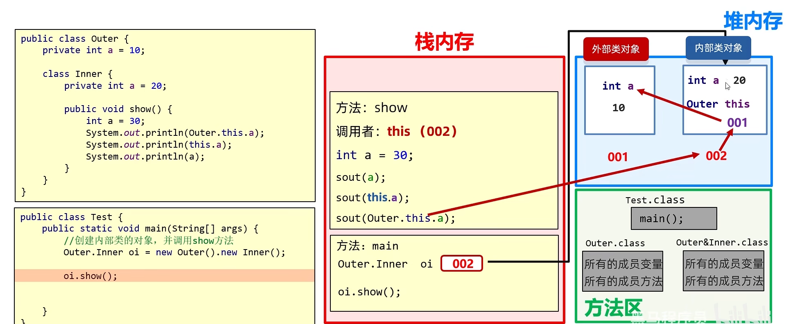
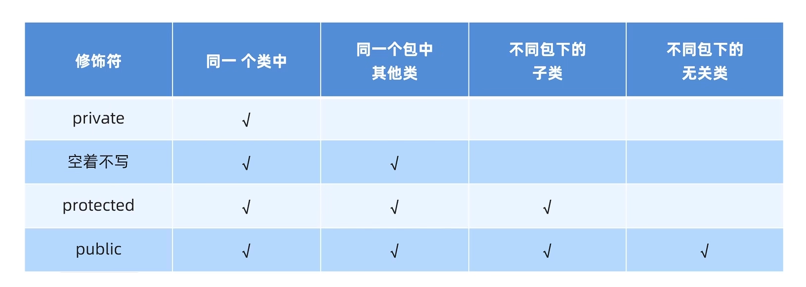
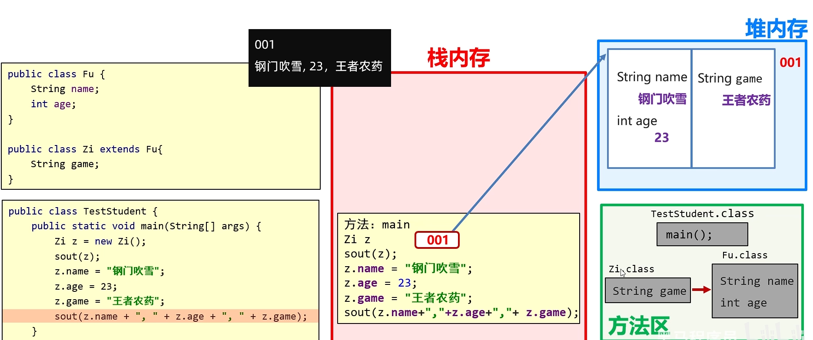
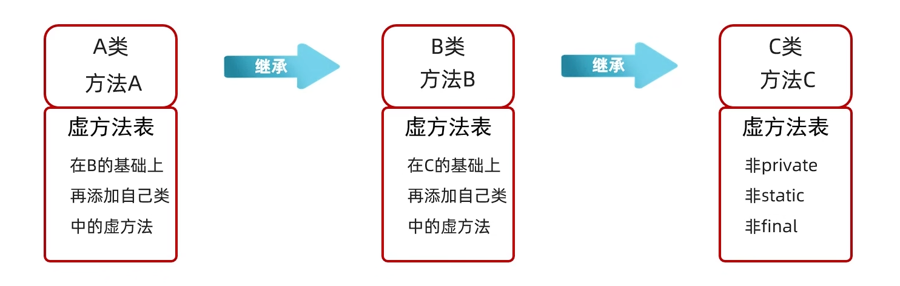
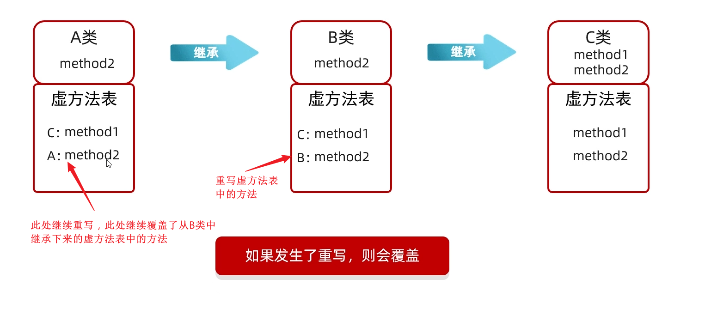
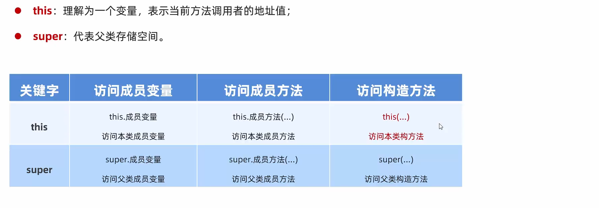

# 面向对象相关

## 类

### 定义类的注意点

- 一个Java文件中可以定义多个类，但是只能有一个类是用public修饰的，并且这个public修饰的类名必须是Java代码的文件名


### 成员变量定义的完整格式

- 修饰符 数据类型 变量名称 = 初始化值;

```java
修饰符   数据类型  变量名称 = 初始化值;
private String   name   = "高英哥";
```


### 类的五大成员

- 属性
- 方法
- 构造方法
- 代码块
- 内部类


### 一些注意事项

- **类中方法外**的代码本质上是**成员的声明和初始化**
- **成员变量的初始化（包括 `new` 操作）**会在**类加载（静态成员）**或**对象实例化（实例成员）**时自动执行，符合语言的初始化规则
  - 如果一个类的主体中编写了一个**`new`另外一个类的语句**，
    - 如果是**`static`**修饰的，在**类加载**时就会执行，
    - 如果不是**`static`**修饰的，在**对象创建**时才会被加载


- **方法调用**是需要在程序运行时执行的代码，必须存在于**明确的执行上下文中（如方法、构造函数或初始化块）**

- **类的主体**中**不允许**直接编写**游离的可执行语句**，因为这些代码**没有明确的触发时机（例如，何时执行？由谁调用？）**
  - 在**类中方法外，类的主体中**调用方法只能通过**`new`**和**代码块**的方式来**进行显示或者隐式调用**
    - 在别的地方不行，不能调用方法，一方面是因为**类中方法外**的代码本质上是**成员的声明和初始化**，不允许调用方法，另一方面是因为 **普通方法可能包含任意逻辑**，若允许隐式调用，会破坏代码的明确性和可控性，会有各种问题发生，所以语法上是禁止的


## 内部类

- 一个类的**里面**定义的类

```java
public class OuterClass{		//外部类
    public class InnerClass{	//内部类
        
    }
}
```

- 内部类单独出现没有任何意义
  - 内部类举例：`ArrayList`中的`Itr`类，一个用于迭代的内部类，如果集合都没有了，还迭代个毛啊


### 关于内部类

- **非`static`内部类**可以直接访问外部类的成员， 包括私有

- 外部类要访问内部类的成员， 必须创建对象

- **局部内部类不允许显式声明为 `static`，且它们默认是隐式非静态的**（即依赖于外部类实例）


### 内部类的分类

- 成员内部类	写在外部类的成员位置,并且**无**`static`修饰的类
- 静态内部类        写在外部类的成员位置,并且**有**`static`修饰的类
- 局部内部类        在方法中定义的类
- 匿名内部类        没有名字的内部类，可以在方法中，也可以在类中


#### 非静态成员内部类

##### 定义

- 写在外部类的成员位置,并且**无`static`修饰**的类

```java
public class car{
    String carName;
    int carAge;
    int carColor;
    class Engine{
        String engineName;
        int engineAge;
    }
}
```

##### 注意

- 可以被修饰符所修饰：如`private`,`默认`,`protected`,`publice`,`static`等

- **静态变量**
  - JDK16以前，成员内部类中不能定义**静态常量(static+final)**
  - JDK16开始，成员内部类中才可以定义**静态常量(static+final)**


##### 创建成员内部类的方式

###### 方式1

- 直接在外界用这种格式的语法创建

```java
外部类名.内部类名          对象名 = 创建外部类对象.创建内部类对象;
OuterClass.InnerClass	oi    =  new OuterClass().new InnerClass();
```


###### 方式2

- 在外部类中编写方法，对外提供内部类的对象

```java
public class OuterClass{	//外部类
    class InnerClass{		//内部类

    }
    
    public InnerClass getInstance() {	//用这个方法对外提供内部类的对象
        return new Inner();
    }
}
```


##### 变量重名怎么调用

###### 情景

```java
class Outer{
	private int a = 10;
	class Inner{
		private int a = 20;
		public void show(){
			int a = 30;
			System.out.println(a); // 30
			System.out.println(this.a); // 20
			System.out.println(Outer.this.a); // 10
		}
	}
)
```

- **Outer.this**:获取了外部类对象的地址值
  - Java中内部类是有一个变量叫**Outer.this**的，存的是外部类的地址值的

##### 内存图




#### 静态成员内部类

- 写在外部类的成员位置,并且**有** **`static`**修饰的类
- **Java**中**唯一能用`static`修饰的类**，但是它是独立的，不能像**`static`变量**那样共享

```java
public class Car {
	String carName;
	int carAge;
	int carColor;
	static class Engine{
		String engineName;
		int engineAge;
    }
}
```

- 静态内部类只能访问**外部类**中的**静态变量**和**静态方法**， 如果想要访问非静态的需要创建对象

- 静态内部类是独立的，没有指向外部类的**`Outer.this`**


##### 创建静态内部类对象的格式

```java
外部类名.内部类名 对象名 = new 外部类名.内部类名();
Outer.Inner     oi   =  new Outer.Inner();
```

##### 调用方法的格式

###### 调用非静态方法

- 先创建对象，用对象调用

###### 调用静态方法

```java
外部类名.内部类名.方法名();
Outer.Inner.show();
```


#### 局部内部类

- 在方法或代码块中定义的类,类似于方法里面的局部变量
- 外界无法直接使用， 需要在方法内部创建对象并使用
- 该类可以直接访问外部类的成员， 也可以访问方法内的局部变量
- **不允许显式声明为 `static`，且它们默认是隐式非静态的**（即依赖于外部类实例）


#### 匿名内部类

##### 定义

- 隐藏了名字的内部类，可以在方法中，也可以在类中

##### 匿名内部类格式

```java
new 父类名或者接口名(){
    // 方法重写
    @Override 
    public void method() {
        // 执行语句
    }
};						 
```

- 包含三部分：继承或实现、方法重写、创建对象


##### 本质作用

- 简化代码


##### 前提和格式

- 匿名内部类必须**继承一个父类**或者**实现一个父接口**


## 内部接口

### 关于内部接口

- **内部接口（Inner Interface）** 是定义在另一个接口或类内部的接口。和内部类类似，它的存在是为了更好地组织代码逻辑
- **所有的(ALL)内部接口**都是**静态**，就算你没有手动写**`static`**也是**隐式静态**的，只是有些地方不允许显式使用**`static`关键字**罢了

- **内部接口**中**局部内部接口** **不能** **显式使用`static`修饰**
- **不存在“匿名内部接口”（Anonymous Inner Interface）的概念**


### 内部接口的分类

#### 成员内部接口(静态)

- 直接定义在**类或接口内部成员位置的接口**
- 内部接口一定是**静态**的，默认**隐式静态**（即使不写 **`static`**），可显式声明 **`static`**，但是**冗余**
- 内部接口不像内部类一样有**静态**，也有**非静态**，内部接口只有**静态**的
- 实现一个接口，要重写所有抽象方法，它的内部接口不强制要求实现

**调用方式**

- **外部类中：直接使用 内部接口名**

  - 内部接口名

  ```java
  public class Outer {
      // 成员内部接口
      public interface InnerInterface {
          void hello();
      }
  
      // 在外部类内部使用内部接口
      public void process() {
          // 匿名内部类实现
          InnerInterface h = new InnerInterface() {
              @Override
              public void hello() {
                  System.out.println("Hello World");
              }
          };
          logger.hello(); // 输出：Hello World
      }
  }
  ```

- **外部类外：使用 外部类名.内部接口名**

  - **外部类名.内部接口名**


#### 局部内部接口

- 定义在**方法或代码块内**的接口
- 它也是**隐式静态**的，但是它不允许写**`static`**，它不像**成员内部接口**一样**虽然冗余但是能显式写**，它**直接不让显式写**
- 但是它也是**`static`**的


## 权限修饰符

### 作用

- 用来控制一个成员能够被访问的范围


### 可以修饰什么

- 成员变量
- 构造方法
- 方法
- 内部类

### 修饰符及其作用范围



### 关于protected

- 和别的修饰符有不一样的地方
- 如果一个类中的成员被**`protected`**修饰
  - 同包中的类访问没有限制，不同包中的子类访问静态成员时也没有限制，但是访问非静态成员时有下面的限制
  - 在不同包中的子类中访问**`protected`**成员时，**不能通过父类的实例**来访问这些成员。只能通过**子类自身的实例**来访问，在子类内部使用**`this`**或**`super`**关键字来访问**`protected`**成员

## 继承

### 子类从父类中继承的内容

| 内容                 | 非私有(public,protected...)       | 私有(private)          |
| -------------------- | --------------------------------- | ---------------------- |
| 构造方法             | 不能                              | 不能                   |
| 成员变量             | 能                                | 能(但是不能直接去使用) |
| 静态变量             | 不能                              | 不能                   |
| 成员方法(非`static`) | 能(包括`final`，继承和重写不一样) | 不能                   |
| 静态方法             | 不能                              | 不能                   |

- **构造方法：**父类和子类的名字都不一样，肯定不能继承
- **成员变量：**不管父类中私有还是非私有，都继承下来，放到两个不同的空间中.

​			  找变量的时候先在右边子类的变量的空间中找，如果没找到，再去左边从父类继承下来的变量的空间中去找.

​			为什么找变量先在子类空间中去找呢？因为这个变量的引用类型是子类，而不是多态中的父类引用子类对象



- **成员方法：**只继承非私有方法，不继承私有方法

​			它的调用是基于**虚方法表**(记录了所有可以被子类重写的方法)，我们可能会以为"对于所有方法，子类进行调用的时候，先在子类中进行寻找，如果找不到我们再继续在父类中找"，其实不是的，这也太慢了，其实真正的查找是基于虚方法表的,而虚方法表中没有的`private`、`static`以及`final`修饰的方法，则在编译的时候就已经一切都确定下来了，这种也同样不会沿着继承链去找着调用，总而言之，沿着继承链调用是一个很小众的行为。




### 方法重写

#### 方法重写的本质

- 用**自己重写的方法**    **覆盖**了**虚方法表中从父类继承下来的的方法**




#### 注意事项

- 重写方法和父类中方法**必须相同的**：方法的名称、方法的形参列表

- 子类重写父类中的方法时，子类中方法的访问权限必须**大于等于**父类

- 子类重写父类中的方法时，子类中方法的返回值类型子类必须**小于等于**父类

- 子类重写父类中的方法时，子类中方法抛出的异常必须**小于等于**父类

- 只有被添加到虚方法表中的方法才能被重写(比如静态方法不能重写，不然会报错)

- **建议**：重写的方法尽量和父类保持一致(返回值，访问 权限之类的)

  **上面的第二点和第三点是为了防止父类引用调用子类方法时出现错误**


### 构造方法

#### 访问特点

- 父类中的构造方法不会被子类继承
- 子类中所有的构造方法默认都会**先**访问父类中的无参构造，之后再执行自己构造方法中的代码

为什么?

因为子类在初始化的时候，有可能会使用从父类中继承下来的数据，如果父类中的这些数据没有完成初始化，子类将无法使用父类中的数据

- 子类构造方法的第一行默认语句都是**super( )**，就算不手动写也是存在的，并且一定在第一行，如果手动用必须保证他在第一行
- 不过如果在构造方法中调用了**this( )**构造方法，**super( )**就没有了，因为其它构造中第一行有默认**super( )**,但是**this( )**必须在第一行，这样才能保证这个构造方法中第一行也是**super( )**
- 如果想调用父类中的有参构造，必须手动写**super( )**进行调用，但是这个**super( )**也必须在第一行


### 虚方法表

- 快速定位方法
- **虚方法表**是实现**动态绑定**的一种技术手段

#### 虚方法

- **虚方法**实际上就是**可以被重写的方法**

#### 沿**继承链**调用方法的情况

- 绝大多数情况下，调用方法都是直接通过虚方法表快速定位目标方法的,**绝大多数情况下不会沿着继承链寻找方法**
- 当然也有少数情况会**沿着继承链寻找方法**
  - **反射调用方法时**
    - 通过反射（如 `Method.invoke()`）调用方法时，JVM 需要根据方法名和参数类型**动态解析目标方法**。这一过程可能需要遍历继承链
  - **显式调用父类方法(super.method())**
    - 当子类通过 `super` 关键字调用父类方法时，JVM 需要直接定位到父类的方法实现，而非子类的重写版本
  - **类加载时的方法解析**
    - 在类加载阶段，JVM 需要解析方法的符号引用（符号引用转为直接引用）。此时，如果当前类未定义某个方法，会沿着继承链向上查找
  - **接口默认方法的调用**
    - 当类实现多个接口且存在默认方法冲突时，JVM 需要沿着接口继承链查找默认方法的实现
  - **动态代理与某些框架的特殊处理**
    - 在动态代理（如 `Proxy` 类）或字节码增强框架（如 CGLIB）中，生成代理类时可能需要沿继承链查找原始方法


#### `final`、`static`以及`private`的调用

- 我们知道，用这三个关键字修饰的方法**不会**被加载到**虚方法表**中
- 这三个方法的调用是和**静态绑定**相关的，和虚方法表所对应的**动态绑定**不同
  - 它们的调用过程在**编译**时就已决定，而不是依赖于运行时的动态方法查找

>我们可能会以为"对于所有方法，子类进行调用的时候，先在子类中进行寻找，如果找不到我们再继续在父类中找"，其实不是的，这也太慢了，其实真正的查找是基于虚方法表的,而虚方法表中没有的`private`、`static`以及`final`修饰的方法，则在编译的时候就已经一切都确定下来了，这种也同样不会沿着继承链去找着调用，总而言之，沿着继承链调用是一个很小众的行为.


### this和super

#### this

- **`this`可以理解为一个变量**,表示**方法调用者的地址值**
  - 不过在**构造方法**中，`this` 指的是 **当前正在被创建的那个对象实例**

- 其实就是一个**局部变量**

例：

```java
class Cat{
	public int age=10;
	public void method(){
		int age = 200;
		System.out.println(this.age);
	}
}
```

```java
class Test{
	public static void main(String[] args){
		Cat c = new Cat();		//假设这个c的地址值是001
        c.method();				//此时输出的是10而不是200,this代表001,因为调用者是c
	}
}
```


#### this()

- 使用 this() 进行构造函数调用时，**不能形成递归调用链**（例如，构造函数 A 调用 B，构造函数 B 又调用 A）


#### super


#### super()

- 如果一个构造函数**没有显式**地调用 **`this()`** 或 **`super()`**,那么 Java 编译器会自动在构造函数的第一行**隐式地插入**一个对父类**无参数构造函数**的调用，即 **`super()`**
  - 如果父类**没有**提供一个无参数的构造函数（或者这个无参数构造函数是 **private** 的），并且子类的构造函数又没有显式地调用 **`super(...)`**（调用父类带参数的构造函数），那么编译器会报错！
    - 也就是说如果父类中如果父类**没有**提供一个无参数的构造函数（或者这个无参数构造函数是 **private** 的），要想不报错，子类的构造函数就必须要去**显式的**去调用**`super(...)`**


#### this和super



- 使用**this()**和**super()**的时候，**这两条语句必须是构造方法的第一条语句**
  - 这是为了**确保在执行当前构造函数的任何其他代码之前，对象（或者其父类部分）已经被正确地初始化了**
  - **在一个构造函数中，你不能同时调用 this() 和 super()**
  - **this() 和 super() 只能在类的构造函数中被调用，不能在任何普通的实例方法或静态方法中使用**


## 多态

### 向上转型

#### 定义

指将**子类对象**赋值给**父类类型的引用**。示例如下:

```java
父类类型 引用(变量)名称 = 子类对象;
Person  p           =  new Teacher();
```


#### 前提

存在继承关系，必须父类引用指向子类对象才能转换成功，也就是必须**`new`过子类对象**才行


#### 调用成员的特点

##### 成员变量调用

- 编译看左边，运行也看左边

##### 方法的调用

- 编译看左边，运行看右边


#### 注意点

- 如果**`A`类**是**`B`类**的子类，那么**`A`类**的数组**`A[]`**也是**`B`类**的数组**`B[]`**的子类,**同样适用向上转型和向下转型的规则**


### 向下转型

#### 定义

指将**父类类型的引用**转换为**子类类型的引用**。示例如下：

```java
Person p = new Teacher();
Teacher t = (Teacher)p;
```

- 向下转型需要**显式的类型转换**

- 如果引用的实际对象不是目标子类类型，将抛出`ClassCastException`


#### 前提

存在继承关系


#### 注意点

- 如果**`A`类**是**`B`类**的子类，那么**`A`类**的数组**`A[]`**也是**`B`类**的数组**`B[]`**的子类,**同样适用向上转型和向下转型的规则**


## 抽象

### 定义格式

#### 抽象方法的定义格式

```java
public abstract 返回值类型 方法名(参数列表);		//没有方法体
public abstract  void     method(int a);
```

#### 抽象类的定义格式

```java
public abstract class 类名{}
public abstract class Student{}
```


### 注意点

- 抽象类不可以被实例化(不可以被new成一个对象)

- 抽象类中不一定有抽象方法，有抽象方法的类一定是抽象类

- 虽然抽象类不能用来创建对象，但是抽象类可以有构造方法

  - 构造方法的作用是用来在子类创建对象的时候给子类进行赋值的，毕竟子类构造方法第一行都默认是**super( )**

- 抽象类的子类

  - 要么重写抽象类中的所有抽象方法

  - 要么它的子类还是抽象类
    - 不过这样子的话**它的子类的子类**既要重写**它的子类的**抽象方法，也要重写**它的**抽象方法


- 在抽象类中，如果既有抽象方法，也有非抽象方法，那么非抽象方法是可以调用抽象方法的。

  因为抽象类本身不能被实例化，静态方法又不能是抽象的，也不能调用抽象方法，所以不用担心调用这个抽象方法的时候这个抽象方法没有方法体。

  抽象类的非抽象子类可以被创建对象，并且这些子类必须重写那个抽象方法，重写完之后这个抽象方法就有方法体了。在这种情况下，在子类调用原来的非抽象方法时，调用的那个抽象方法，实际上会根据多态的原则，执行子类中重写后的方法。

### 抽象类和抽象方法的意义

- 为了统一规范


## 接口

### 格式

```java
public interface 接口名{}
```


### 注意

- 接口不能实例化
- 接口和类之间是实现关系，通过`implements`关键字表示

```java
public class 类名 implements 接口名{}
```

- 接口的子类(实现类)
  - 要么重写接口中的所有抽象方法
    - 这里有一点要补充的，如果接口中的抽象方法和实现类从**`Object`类**中继承下来的方法**同名**，那么这个方法在**实现类**中如果不重写也不会报错，因为实现类中已经从**`Object`**中继承下来了这些，这个底层好像也是根据虚方法表进行判断的
  - 要么它本身是一个抽象类

- 接口允许多实现

```java
public class 类名 implements 接口1,接口2{}
```

- 实现类还可以在继承一个接口的同时实现多个接口

```java
 public class 类名 extends 父类 implements 接口1,接口2{}
```

- 接口允许多继承

```java
interface Inter1{}
interface Inter2{}
public interface Inter3 extends Inter1,Inter2{}
```


### iTable

- 接口中是有**`iTable`**的，类似于类中的**`vTable`**


### 接口中成员的特点

#### 成员变量

- 只能是**常量**
- 成员变量的默认修饰符(就算不写也是这个)：

```java
public static final
```

- 如果改了默认修饰符，比如把`public`改成`private`，代码就会报错
- 接口中的成员变量的修饰符一定是上面那个，所有地方都能访问


#### 构造方法

- **没有**
- **接口没有构造方法**


#### 成员方法

##### JDK7以前

- 接口中只能定义抽象方法

- 默认修饰符


```java
public abstract (没有final，可以继承后重写)
```


##### JDK8的新特性

###### 默认方法

- **这个默认**和**权限修饰符中的默认**不一样，那个默认是**什么都不写**，表示**权限的默认**，但**这个默认**是指写了**`default`**，指**方法体的默认**

- 接口中可以定义有方法体的方法了
- 允许在接口中定义默认方法，需要使用关键字**`default`**修饰
  - 默认方法不是抽象方法，所以**不**强制被重写。
  - `public`可以省略, `default`不能省略

```java
public default 返回值类型 方法名(参数列表){方法体}
public default  void     show(int age){System.out.println(age)}
```


###### 静态方法

- 允许在接口中定义静态方法，需要用`static`修饰
- 静态方法只能通过**接口名**调用， 不能通过实现类名或者对象名调用
- `public`可以省略, `static`不能省略

```java
public static 返回值类型方法名(参数列表){ }
public static void show(){ }
```


##### JDK9的新特性

- 接口中可以定义**私有方法**
- 作用：可抽取出重复代码，供本接口内部使用

###### 非静态私有方法

```java
private 返回值类型 方法名(参数列表){ }
private void      show(){ }
```


###### 静态私有方法

```java
private static 返回值 类型方法名(参数列表){ }
private static void  method(){ }
```


### 接口和类之间的关系

#### 类和类的关系

- 继承关系， 只能**单继承**， 不能**多继承**， 但是可以**多层继承**

```java
class A{}
class B extends A{}
class C extends B{}
```

#### 类和接口的关系

- 实现关系， 可以**单实现**， 也可以**多实现**， 还可以在**继承一个类的同时实现多个接口**
  - 如果多个接口中有同样的抽象方法，只需要实现一个就行了
  - 如果多个接口中有同样的默认方法，必须要重写这个方法来解决冲突


#### 接口和接口的关系

- 继承关系， 可以**单继承**， 也可以**多继承**
  - 接口之间的**继承**可以**多继承**，**类不可以！！！**

```java
public interface Inter1{}
```

```java
public interface Inter2{}
```

```java
public interface Inter3 extends Inter1,Inter2{}
```


### 标记接口(**Marker Interface**)

- **标记接口**，又称**标签接口 (Tag Interface)**，是一个**完全没有任何方法和常量**的空接口
- 它不提供任何**功能或行为上的契约**，它的唯一目的就是“**标记**”一个类，像给这个类盖上一个“戳”或者发一张“通行证”，用来**向编译器或JVM或其他处理程序表明，这个类的实例具有某种特殊的、需要被区别对待的属性或能力**
- 总的来说，它的核心作用是**为类附加元数据 (Metadata)**，并利用Java的类型系统来实现这些元数据的传递和检查
- 在Java 5引入**注解**之后，标记接口的很多使用场景都有了更现代、更灵活的替代方案，它变得**更灵活、目标更精确、语义更清晰**

#### Java中的一些标记接口

- **`java.lang.Cloneable`**
  - **作用**：标记一个类的对象是“**可以被克隆的**”
  - **如何工作**：**`Object` 类**中有一个本地方法 **`clone()`**。如果你尝试在一个没有实现 **`Cloneable` 接口**的类的实例上调用 **`clone()` 方法**，JVM会直接抛出 **`CloneNotSupportedException` 异常**。实现了这个接口，就相当于告诉 **`Object.clone()` 方法**：“嘿，你可以安全地对我进行浅拷贝，我授权了！”
- **`java.io.Serializable`**
  - **作用**：标记一个类的对象是“可以被**序列化和反序列化**的”
  - **如何工作**：Java的序列化机制（主要是 **`ObjectOutputStream`**）在执行 **`writeObject(Object obj)` 方法**时，会先对传入的对象进行一个内部检查。如果你尝试序列化的对象，其所属的类**没有**实现 **`Serializable` 接口**，序列化机制会直接抛出 **`java.io.NotSerializableException` 异常**，拒绝执行序列化操作。实现了这个接口，就相当于告诉序列化机制：“嘿，我已经考虑过序列化的所有细节（比如用 transient 保护敏感数据），我授权你将我的状态转换成字节流。”

- **`java.rmi.Remote`**
  - **作用**：标记一个接口是“可以被远程调用的”。
  - **如何工作**：在Java的RMI（远程方法调用）技术中，只有实现了 **`Remote`接口**的接口，才能被用作远程服务接口。RMI框架会检查这个标记，并为其实例生成特殊的代理对象（称为存根 Stub），以处理网络通信的细节。
- **`java.util.RandomAccess`**
  - **作用**：标记一个 **`List` 实现类**具有“快速随机访问”的能力。
  - **如何工作**：这个标记非常巧妙，它被 **`java.util.Collections`** 框架里的算法使用。比如**` Collections.sort()`** 在排序一个列表时，它会先做一个检查：它通过这个标记来决定采用哪种遍历算法能获得最佳性能。ArrayList 实现了这个接口，而 LinkedList 没有。

