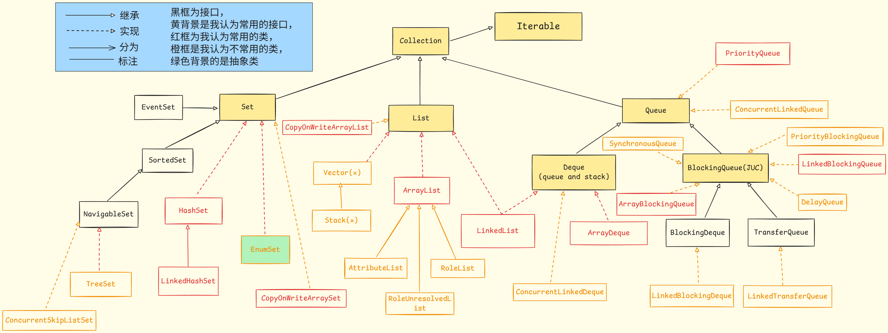
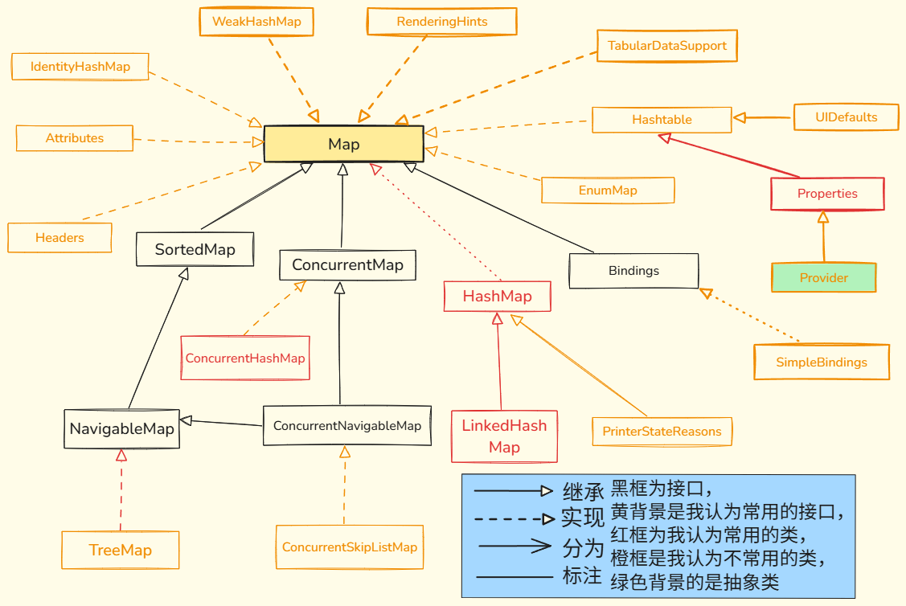

# 集合

**Java 集合框架（Java Collections Framework, JCF）**是 JDK 提供的一套用于统一存储、管理和操作对象的高性能底层架构。它不仅封装了工业级的数据结构与算法（如动态数组、双向链表、哈希表、红黑树等），更通过高度抽象的接口定义，实现了数据模型与具体业务逻辑的深度解耦

在复杂业务开发中，数据往往是动态变化的。Java 集合框架（JCF）的出现，本质上是为了解决**基础数组（Array）在动态扩展和高级操作上的先天缺陷**

在宏观架构上，整个集合体系泾渭分明地划分为两大核心阵营：

- **单列集合（`Collection` 体系）**：

  专注于 **独立元素** 的容器化管理。其下根据存储契约细分为三大分支：支持精确索引访问的 `List`、强制元素唯一性的 `Set`，以及主导元素调度处理顺序的 `Queue/Deque`

- **双列集合（`Map` 体系）**：

  专注于 **Key-Value 键值对** 的映射关联。通过散列机制（Hash）或树形结构（Tree），实现 $O(1)$ 或 $O(\log n)$ 级别的高效数据检索，要求所有的 Key 必须具备唯一性


## 1. 体系概览图

以下为两大核心体系的类与接口继承关系全景图（注：图中剥离了部分非核心接口与远古遗留类）

### A. 单列集合 **`Collection`** 体系




### B. 双列集合 **`Map`** 体系




## 2. 单列集合 **`Collection`** 系列

### A. 单列集合基石 `Collection`

#### a. 概述

**什么是单列集合？** 

- 单列集合是指专门用于存储 **独立元素** 的内存容器。
- 与 `Map` 体系中成对出现的键值对（Key-Value）不同，`Collection` 体系下的每一个元素都是一个独立的个体引用（例如一个单独的字符串、一个独立的 `User` 对象）


**为什么需要 `Collection` 顶级接口？** 

- 这是**面向接口编程（OOP）**在 JDK 底层源码中最极致的体现，其核心思想是提供一个统一的“操作门面”

  - 在 Java 集合框架中，底层的物理数据结构千差万别：

    - `ArrayList` 的底层依赖于一块连续的 **动态数组** 内存

    - `LinkedList` 的底层是零散分布在堆内存中的 **双向链表**

    - `TreeSet` 的底层是高度平衡的 **红黑树**

    如果开发者在操作这些集合时，必须去关心底层的物理存储逻辑，不仅调用成本极高，业务代码的耦合度也会彻底失控

- `Collection` 接口存在的最大意义，就是**制定一套强制性的“行为契约”**

  它置于所有单列集合的最顶端，宣告了无论子类的底层实现是数组、链表还是树，都必须无条件对外提供统一的增删改查逻辑

  这彻底屏蔽了底层数据结构的物理差异，使得业务代码可以依赖抽象接口（如 `Collection<String> c = new ArrayList<>()`），实现数据模型与业务逻辑的完美解耦


#### b. 核心 API 契约

作为所有单列集合的通用标准，`Collection` 接口抛弃了底层物理结构的差异，定义了以下核心操作方法。无论是 `List`、`Set` 还是 `Queue`，都必须无条件支持这些行为


##### 1). 添加操作

- `boolean add(E e)`
  - **作用**: 将指定元素添加到当前集合中。
  - **返回**: 如果集合结构因为该操作发生了改变，则返回 `true`。
  - **特性**: 对于 `List`（允许重复），添加总是返回 `true`；对于 `Set`（强求唯一性），若底层检测到元素已存在，则添加失败并返回 `false`。
- `boolean addAll(Collection<? extends E> c)`
  - **作用**: 将指定集合 `c` 中的所有元素，批量添加到当前集合的末尾。
  - **返回**: 只要当前集合因为添加操作发生了任何改变，就返回 `true`。


##### 2). 删除操作

- `boolean remove(Object o)`

  - **作用**: 从集合中移除 **首次出现** 的指定元素
  - **参数陷阱**: 为什么参数是 `Object` 而不是泛型 `E`？因为 Java 允许传入任何对象去尝试移除，只要传入对象与集合内元素的 `equals()` 比较为 `true` 即可执行移除
  - **返回**: 如果集合包含该元素且成功移除，返回 `true`；若不存在，则返回 `false`

  

- `boolean removeAll(Collection<?> c)`

  - **作用**: 批量删除。移除当前集合中所有也存在于指定集合 `c` 中的元素（相当于数学上的 **求差集**）

  

- `boolean retainAll(Collection<?> c)`

  - **作用**: 批量保留。仅保留当前集合中包含在指定集合 `c` 中的元素，移除其他所有元素（相当于数学上的 **求交集**）

  

- `void clear()`

  - **作用**: 暴力清空。移除集合中的所有元素，调用后集合将变为空


##### 3). 状态与查询

- `boolean contains(Object o)`

  - **作用**: 判断集合中是否包含指定的元素
  - **底层依赖**: 强依赖于对象的 `equals()` 方法。如果是自定义对象，**必须重写 `equals()` 方法**，否则默认比较内存地址，必然导致判断失效

  

- `boolean containsAll(Collection<?> c)`

  - **作用**: 判断当前集合是否 **完全包含** 指定集合 `c` 中的所有元素

  

- `int size()`

  - **作用**: 返回当前集合中的元素总数

  

- `boolean isEmpty()`

  - **作用**: 判断集合是否为空。其逻辑等同于 `size() == 0`，但语义更清晰


##### 4). 转换与流操作

- `Object[] toArray()`

  - **作用**: 将集合中的所有元素转换为一个 `Object` 数组。
  - **缺点**: 返回的是 `Object[]`，后续操作通常需要强转，容易引发 `ClassCastException`

  

- `<T> T[] toArray(T[] a)`

  - **作用**: 将集合元素复制到**指定类型**的数组中（工业界推荐的转换方式）
  - **底层机制**:
    - 数组长度足够 (`a.length >= size()`)：将元素填充到传入的数组 `a` 中，若有剩余位置，则紧跟着的第一个剩余位置会被置为 `null`，然后返回数组 `a`
    - 数组长度不够 (`a.length < size()`)：舍弃传入的数组，利用反射直接在底层创建一个与 `a` 类型相同、长度等于 `size()` 的新数组并返回

  

- `default Stream<E> stream()`

  - **作用**: (Java 8+) 将当前集合作为数据源，返回一个支持顺序处理的 `Stream` 实例，用于声明式数据操作

  

- `default Stream<E> parallelStream()`

  - **作用**: (Java 8+) 返回一个可能支持并行计算的 `Stream` 实例，数据会被底层拆分成块，交由多线程（`ForkJoinPool`）并行处理


#### c. 深度依赖 `equals()`

在实战开发中，初级开发者最常踩的坑之一，就是调用 `contains()` 或 `remove()` 操作 **自定义对象** 时，操作莫名其妙地失效

> 例如：明明刚刚存入了数据，紧接着调用 `contains()` 却返回 `false`）

- **底层原罪**： 

  - `Collection` 接口在执行 `contains(Object o)` 或 `remove(Object o)` 时，并不是去逐个对比对象内部的属性值，而是拿着传入的参数对象，

    **循环调用集合内现有元素的 `equals()` 方法进行比对**

- **事故复现**：

  - 假设你向集合存入了一个对象 `new User(id=1, name="张三")`

    随后，你试图用一段新代码 `collection.contains(new User(id=1, name="张三"))` 去判断该用户是否存在

    如果你的 `User` 类 **没有重写** `equals()` 方法，它将直接继承顶级父类 `Object` 的默认行为——**直接比较内存地址（`==`）**

    这两个对象虽然逻辑内容一模一样，但由于是两次 `new` 出来的，物理内存地址截然不同，底层的比对结果必然判定为 `false`

  

- **工业级规范**： **任何要放入集合框架（尤其是用于查询、删除或在 Set 中去重）的自定义对象，必须且绝对强制地重写 `equals()` 方法！** 

  > *注：若涉及 Hash 表机制的集合如 `HashSet`/`HashMap`，还必须连同 `hashCode()` 一起重写，这点将在后续章节深度展开*


#### d. 对于遍历

`Collection` 体系支持以下三种通用遍历范式。这三种方式广泛适用于 `List`、`Set` 和 `Queue` 体系：

##### a. 增强 `for` 循环

日常开发最高频、语法最精简的遍历方式

```java
for (String element : collection) {
    System.out.println(element);
}
```


##### b. `forEach` 遍历 (JDK 8+)

依赖于 `Iterable` 接口的默认方法，典型的函数式编程风格，通常配合 Lambda 表达式使用

```java
// 标准 Lambda 语法
collection.forEach(element -> System.out.println(element));

// 极简写法：使用方法引用
collection.forEach(System.out::println);
```


##### c. `Iterator` 迭代器

在需要对遍历过程获取完全控制权时的标准选择

```java
Iterator<String> it = collection.iterator();
while (it.hasNext()) {
    String element = it.next();
    System.out.println(element);
}
```

> **认知预警**：不要以为上述三种方式是平行的独立技术。**前两种语法糖在底层编译或执行后，其本质核心全部都是第三种迭代器（`Iterator`）！**


### B. `List` 体系

#### a. `List` 接口

##### 1) 概述

`List` 是 `Collection` 的子接口。它在继承单列集合通用行为的基础上，引入了“位置（Index）”的概念，彻底改变了数据的管理方式


##### 2）设计理念: 线性与索引

`List` 体系与 `Set` 体系存在三大本质区别，这三大特性是所有 `List` 实现类（如 `ArrayList`, `LinkedList`）的共同基础：

1. **有序性**：严格保证元素存入时的先后顺序。遍历时的输出顺序永远等于插入顺序
2. **可重复性**：允许存入多个逻辑上完全相同（即 `equals()` 返回 `true`）的元素，也允许多个 `null` 元素存在
3. **索引寻址**：为每个元素分配一个从 `0` 开始的整数索引，允许通过数学下标直接干预和访问集合中的任意位置


##### 3) API

除了 `Collection` 继承下来的通用方法，`List` 凭借“索引”特性，扩展出了以下用于精确操作的高频核心方法：

###### **a. 定点增改**

- `void add(int index, E element)`
  - **作用**: 在列表的指定 `index` 位置插入元素
  - **机制**: 原本位于该位置及其后续的所有元素，都会向右移动一位（索引值 `+1`）。如果是数组结构，这是一个极其消耗性能的操作


- `boolean addAll(int index, Collection<? extends E> c)`
  - **作用**: 在列表的指定 `index` 位置，批量插入集合 `c` 中的所有元素
  - **返回**: 如果列表发生了改变，返回 `true`


- `E set(int index, E element)`
  - **作用**: 用新元素 `element` 替换指定 `index` 位置上的旧元素
  - **返回**: 返回 **被替换掉的旧元素**（方便业务做记录、日志或回滚）


###### **b. 定点查删**

- `E get(int index)`
  - **作用**: 获取指定 `index` 位置的元素
- `E remove(int index)`
  - **作用**: 移除指定 `index` 位置的元素
  - **返回**: 返回 **被删除的元素**
  - **机制**: 原本位于被删除元素后续的所有元素，都会向左移动一位（索引值 `-1`）


###### **c. 位置探测**

- `int indexOf(Object o)`
  - **作用**: 查找指定元素在列表中 **首次** 出现的 **索引位置**
  - **返回**: 找到则返回索引值；若列表不包含该元素，则返回 `-1`
  - **底层依赖**: 强依赖对象的 `equals()` 方法进行逐个比对


- `int lastIndexOf(Object o)`
  - **作用**: 查找指定元素在列表中 **最后一次** 出现的索引位置（通常底层实现是从后往前遍历查找）
  - **返回**: 找到返回索引值；若不存在返回 `-1`


##### 4）现代化 API：Java 8+

自 Java 8 引入函数式编程理念后，

`List` 接口新增了两个非常强大的默认方法（`default`），允许我们以声明式的方式对列表进行 **就地（In-place）操作**，无需借助外部工具类或繁琐的 `for` 循环


- `default void sort(Comparator<? super E> c)`

  - **作用**: 根据传入的比较器 `c` 的规则，对当前列表进行 **就地排序**

  - **返回**: `void`

  - **优势与机制**: 

    - 它是直接在原列表上修改元素的物理顺序，不会像 Stream 那样产生新的集合对象。

      底层实现通常委托给 `Arrays.sort()`（内部使用高度优化的 TimSort 算法）

  - **实战说明**: 以前排序只能用 `Collections.sort(list, comparator)`，现在直接调用 `list.sort(comparator)`，不仅符合面向对象的语义，代码也更紧凑

  

- `default void replaceAll(UnaryOperator<E> operator)`

  - **作用**: 遍历当前列表，对其中的每个元素执行 `operator` 定义的运算逻辑，并将计算后的返回值 **就地替换** 原位置的元素
  - **返回**: `void`
  - **实战说明**: 假设要把列表中所有的字符串全部转为大写
    - **过去 (指令式)**: 需要写 `for` 循环，然后调用 `list.set(i, list.get(i).toUpperCase())`
    - **现在 (声明式)**: 只需要一句 `list.replaceAll(String::toUpperCase)` 即可搞定，极其优雅


##### 5）`subList` 截取 API

`subList` 是 `List` 接口中一个极其特殊且容易引发线上故障的方法。它的行为与大多数开发者直觉上的“截取”完全不同

- `List<E> subList(int fromIndex, int toIndex)`
  - **作用**: 截取列表中从 `fromIndex`（包含）到 `toIndex`（不包含）的部分
  - **返回**: `List<E>`。返回的是原列表的指定范围的部分视图（View），**而不是**一个全新的、独立的集合


**核心坑点与底层机制**：

1. **视图本质与修改互通**： 由于 `subList` 返回的只是原列表的一个映射视图（底层仍指向同一块内存区域），因此：

   - 对 `subList` 视图中元素的任何修改（增、删、改），都会 **直接作用并反映在原列表上**
   - 反之，只要不涉及结构修改，原列表的元素变更也会反映在子列表中

   

2. **致命的并发修改异常 (`ConcurrentModificationException`)**：

   - **触发条件**：如果你在创建了 `subList` 视图之后，**通过原列表** 进行了结构性修改（如调用了 `原列表.add()` 或 `原列表.remove()` 改变了元素个数）

   - **灾难后果**：

     - 此时只要你再次尝试访问或操作那个 `subList` 视图，系统会当场抛出 `ConcurrentModificationException`

       因为原列表的结构变化导致视图内部维护的索引偏移量失效了


**工业级最佳实践**： 

- 绝不将 `subList` 的结果作为方法的返回值长期暴露或传递

  如果业务上确实需要一个被截取出来的、完全独立的子列表，**必须立即对其进行包装转储（深浅拷贝均可，切断物理联系）**

  ```java
  // ❌ 危险做法：操作 subList 容易引发不可预知的联动修改或异常
  List<String> sub = originalList.subList(0, 10); 
  
  // ✅ 规范做法：利用集合的构造函数，将视图的数据复制到一个全新的独立 ArrayList 中
  List<String> independentList = new ArrayList<>(originalList.subList(0, 10));
  ```


##### 6) `List` 体系遍历

因为 `List` 拥有了 `Set` 和 `Queue` 不具备的**“索引”**特性，它的遍历方式是整个集合框架中最丰富的

在完全兼容 `Collection` 的三大通用遍历（增强 `for`、`forEach`、普通 `Iterator`）之外，`List` 独占了以下两种特化遍历方式：


###### **Ⅰ 普通 `for` 循环 (基于索引)**

这是 `List` 最原生的遍历方式。对于底层是连续数组的 `ArrayList` 而言，这种遍历方式的执行效率是最高的（因为 CPU 缓存亲和性）

```java
// ⚠️ 架构师警告：严禁使用此方式遍历 LinkedList！
// 因为链表每次 get(i) 都要从头/尾重新寻址，这会导致灾难性的 O(n^2) 复杂度
for (int i = 0; i < list.size(); i++) {
    String s = list.get(i);
    System.out.println(s);
}
```


###### **Ⅱ `ListIterator` (列表专属迭代器)**

普通的 `Iterator` 只能“从头到尾单向走”，而且“只能删不能加”。为了配合 `List` 的强大功能，Java 提供了一个超级增强版的游标 `ListIterator`

它赋予了开发者两大特权：

1. **双向游走**：除了正向的 `hasNext()`，它还支持 `hasPrevious()` 和 `previous()` 从后往前反向遍历
2. **边查边改**：支持在遍历的过程中直接调用 `add(E e)` 插入新元素，或调用 `set(E e)` 替换当前元素，且 **绝对不会** 触发并发修改异常

```java
ListIterator<String> lit = list.listIterator();

// 1. 正向遍历（同时安全地插入新数据）
while (lit.hasNext()) {
    String s = lit.next();
    if ("Target".equals(s)) {
        lit.add("New Element"); // 在 Target 后面安全插入新元素
    }
}

// 2. 此时游标已经走到了列表末尾，可以直接开始反向遍历
while (lit.hasPrevious()) {
    String s = lit.previous();
    System.out.println("反向输出: " + s);
}
```

*(注：关于迭代器为什么能安全修改数据，底层的游标机制是如何运转的，我们将在后续的【迭代器专题】中深度解剖。)*


#### b. `ArrayList`

##### 1) 概述:最通用的线性表

`ArrayList` 是 Java 集合框架（JCF）中应用频率最高、最全能的 `List` 接口实现类。它在逻辑上表现为动态扩展的线性表，在物理上则基于连续的数组存储


###### **Ⅰ. 定义与角色**

- **定义**: `ArrayList` 是一个由数组支持的 **动态增长** 对象序列
- **定位**: 作为 `Vector` 的现代化、非同步替代方案，它是大多数开发者在处理线性数据时的首选容器


###### **Ⅱ. 核心技术标签**

- **有序性 (Ordered)**: 严格维护元素的插入顺序
- **重复性 (Repeatable)**: 允许存储重复元素及多个 `null` 值
- **随机访问 (Random Access)**: 实现了 `Random Access` 标记接口，意味着它在根据索引检索元素时具有极高的性能（$O(1)$ 复杂度）
- **线程安全性**: **非线程安全**。在多线程并发修改场景下，需要外部同步或使用 `CopyOnWriteArrayList`


###### **Ⅲ. 适用场景**

- **优势**: 适用于“读多写少”的场景。由于底层是数组，其索引定位速度极快
- **劣势**: 不适合频繁在集合头部或中部进行增删操作，因为这会导致大规模的内存数据搬迁


##### 2) 物理结构与核心属性

要理解 `ArrayList` 的所有行为，必须首先看清它在内存中的物理样子。其核心代码非常精简，主要由一个数组和一个计数器组成


###### **Ⅰ 底层容器**

- **声明：**`Object[] elementData`

- **本质**: 这是 `ArrayList` 真正存放元素的“仓库”
- **属性声明**: `transient Object[] elementData;`
- **深度解析**:
  - **非泛型存储**: 底层使用 `Object[]` 而不是泛型数组 `E[]`。这是因为 Java 泛型在运行时会发生类型擦除，使用 `Object[]` 具有更好的兼容性
  - **transient 关键字**: 标记为不可序列化。这是因为 `elementData` 的容量通常大于实际存储的元素数量，为了节省空间和提升效率，`ArrayList` 自定义了序列化逻辑，只序列化那些真正有数据的部分


###### **Ⅱ 核心计数器：`int size`**

- **作用**: 记录当前集合中 **实际存储** 的元素个数
- **关键差异**: 必须严格区分 `size` 与 `elementData.length`（容量）
  - `size`: 逻辑长度，即你通过 `list.size()` 获取到的值
  - `elementData.length`: 物理容量，即底层数组的总长度。通常情况下，容量 $\ge$ 长度


###### Ⅲ 随机访问原理

为什么是**$O(1)$**？

- `ArrayList` 实现了 `RandomAccess` 接口，这并非偶然，而是由其物理结构决定的：

  1. **连续内存**: 数组在堆内存中占据一块连续的空间	

  2. **寻址公式**: 当你调用 `get(i)` 时，CPU 不需要遍历，而是直接通过简单的数学运算计算出内存地址：

     $$\text{Target Address} = \text{Base Address} + (\text{index} \times \text{Element Size})$$

  3. **性能表现**: 无论列表有一百个元素还是十万个元素，定位到任何一个索引位置的时间开销都是恒定的，这就是所谓的 $O(1)$ 复杂度


##### 3) 实例化策略与“延迟初始化”

`ArrayList` 提供了三种构造方法。在 JDK 1.8 之后，为了极致利用内存，官方引入了“延迟初始化”机制，即在真正存储数据前，并不分配实际的内存空间


###### Ⅰ. 无参构造：延迟初始化

- **源码形态**:

  ```java
  public ArrayList() {
      this.elementData = DEFAULTCAPACITY_EMPTY_ELEMENTDATA;
  }
  ```

- **机制解析**:

  - 当你执行 `new ArrayList<>()` 时，底层并没有立即创建一个长度为 10 的数组
  - 此时 `elementData` 指向的是一个全局共享的空数组常量 `DEFAULTCAPACITY_EMPTY_ELEMENTDATA`，其长度为 **0**
  - **真正的分配时机**: 只有当你第一次调用 `add()` 方法添加元素时，程序才会触发扩容机制，将数组容量初始化为默认值 **10**


###### Ⅱ. **指定初始容量构造**

- **源码形态**:

  ```java
  public ArrayList(int initialCapacity) {
      if (initialCapacity > 0) {
          this.elementData = new Object[initialCapacity];
      } else if (initialCapacity == 0) {
          this.elementData = EMPTY_ELEMENTDATA;
      } else {
          throw new IllegalArgumentException("Illegal Capacity: " + initialCapacity);
      }
  }
  ```

- **实战意义**:

  - 如果你预先知道集合将要存储 100 个元素，通过 `new ArrayList<>(100)` 可以直接在内存中开辟相应空间
  - 这样做可以避免从 10 开始，经历多次“扩容-拷贝-回收”的性能损耗，是工业级代码的 **标准规范**


###### Ⅲ. **集合参数构造**

- **作用**: 将已有的单列集合转换为 `ArrayList`
- **逻辑**: 底层调用 `Collection.toArray()`，并进行必要的类型检查与转储


###### Ⅳ. **为什么设计延迟初始化**

在大型企业级应用中，可能会创建数以万计的 `ArrayList` 实例，但其中相当一部分在生命周期内可能从未被存入过数据，或者很久之后才存入

1. **节约内存**: 避免在对象创建之初就占用堆内存（哪怕只有 10 个引用的空间）
2. **提升响应速度**: 将内存分配的开销推迟到真正需要操作数据的时刻


##### 4) 动态扩容源码追踪

`ArrayList` 之所以被称为“动态数组”，核心就在于其内部维护了一套精妙的扩容机制。当底层数组空间不足以容纳新元素时，它会透明地申请更大的内存并搬运数据


###### Ⅰ **扩容触发时机**

扩容操作通常发生在执行 `add()` 操作时。以下为核心逻辑简述：

1. **边界校验**：在真正放入元素前，系统会调用 `ensureCapacityInternal(size + 1)`
2. **溢出判定**：如果“最小所需容量”（当前 size + 1）大于“当前数组容量”（`elementData.length`），则立即触发 `grow()` 方法


###### Ⅱ 扩容核心方法：`grow`

扩容的数学本质是“创建新数组 + 复制旧数据”

- **计算新容量公式**：

  ```java
  // 关键源码逻辑
  int oldCapacity = elementData.length;
  int newCapacity = oldCapacity + (oldCapacity >> 1);
  ```

- **1.5 倍的设计哲学**：

  - **性能极致**：使用位运算 `>> 1`（右移一位，相当于除以 2）来计算增量。位运算直接操作 CPU 寄存器，速度远快于传统的乘除法
  - **平衡点**：
    - 若倍数太小（如 1.1 倍），会导致频繁扩容，产生大量内存拷贝开销
    - 若倍数太大（如 2 倍），会导致严重的内存碎片和空间浪费
    - **1.5 倍** 是工程实践中公认的、在扩容频率与内存利用率之间的最佳平衡点


###### Ⅲ **特殊情况处理**

1. **首次扩容**：如果是通过无参构造创建的空列表，第一次 `add` 时，`minCapacity`（1）与默认值（10）取最大值，因此首次扩容直接跳到 **10**
2. **极端大容量**：如果 1.5 倍扩容后仍不足以容纳数据（例如调用 `addAll` 一次性加入大量数据），则新容量直接等于 `minCapacity`
3. **容量上限**：数组容量受 JVM 限制，最大通常为 `Integer.MAX_VALUE - 8`（预留 8 个字节存储数组元数据）


###### Ⅳ 数据迁移

计算完 `newCapacity` 后，扩容进入最后阶段：

```java
elementData = Arrays.copyOf(elementData, newCapacity);
```

- **本质**：这是一个**深度的系统调用**。底层会申请一块新的连续内存空间，并调用 `System.arraycopy`（JNI 原生方法）将旧数组中的所有引用快速拷贝到新数组中
- **代价**：这是一个 $O(N)$ 的操作。虽然 `System.arraycopy` 是经过硬件优化的极致拷贝，但当数据量达到百万级时，频繁扩容依然会带来明显的延迟感


##### 5) 性能瓶颈与实战优化

虽然 `ArrayList` 是随机访问的王者，但在特定的操作场景下，其性能表现会急剧下降。了解这些瓶颈并掌握优化 API 是编写高性能代码的关键


###### Ⅰ **插入与删除的性能痛点**

- **现象**: 在 `ArrayList` 的**头部**或**中部**执行 `add(index, e)` 或 `remove(index)` 操作非常缓慢
- **底层机制**:
  - 数组是连续内存结构。当在中间位置插入元素时，该位置之后的所有元素都必须整体向右挪动一位
  - 底层调用 `System.arraycopy()` 执行内存拷贝
- **复杂度**:
  - 最好情况（尾部操作）：$O(1)$
  - 最坏情况（头部操作）：$O(n)$
  - 平均情况：$O(n)$
- **结论**: 严禁在频繁需要“中间插入/删除”的业务场景下使用 `ArrayList`（此类场景应考虑 `LinkedList`）


###### **Ⅱ 批量操作优化：`ensureCapacity`**

- `void ensureCapacity(int minCapacity)`:
  - **作用**: 手动触发扩容逻辑。预先增加 `ArrayList` 实例的容量，确保它至少能容纳指定的最小容量
  - **实战价值**: 在执行大规模循环添加数据（如 `for` 循环 `add` 10万次）之前，提前调用此方法
  - **优化逻辑**: 一次性分配到位，避免在循环中多次触发“1.5倍扩容 -> 申请内存 -> 数据拷贝 -> 垃圾回收”的昂贵链条


###### **Ⅲ 内存精简：`trimToSize`**

- `void trimToSize()`:

  - **作用**: 将底层数组的容量（`capacity`）修改为当前实际存储元素的个数（`size`）

  - **返回**: `void`

  - **实战价值**: 

    - `ArrayList` 在扩容后，往往会有多余的空闲空间（因为 1.5 倍扩容通常会超出需求）

      如果某个长生命周期的列表在填充完毕后不再变化，调用此方法可以回收多余的内存引用，降低 JVM 堆压力


###### **Ⅳ 工业级最佳实践建议**

1. **预判容量**: 只要能预估数据量，创建时务必指定初始容量 `new ArrayList<>(initialCapacity)`
2. **尾部处理**: 尽量通过“追加”方式（末尾 `add`）构建列表
3. **批量操作**: 尽可能使用 `addAll()` 而不是循环调用 `add()`，因为 `addAll` 内部会根据传入集合的大小进行单次精确扩容，效率更高
4. **替换优于删增**: 如果业务逻辑允许，使用 `set(index, e)` 替换现有元素，而不是先 `remove` 再 `add`


#### c. `LinkedList`

##### 1) 概述:双向链表

`LinkedList` 是 Java 集合框架中基于 **双向链表** 实现的线性表。与 `ArrayList` 的连续存储不同，它代表了离散存储的设计哲学

###### **Ⅰ 定义与角色**

- **定义**: `LinkedList` 是由一系列非连续存储的节点（Node）组成的序列，每个节点都保存了指向前一个和后一个节点的引用
- **定位**: 当业务场景涉及频繁的**首尾插入、删除**，或者需要作为**栈/队列**使用时，`LinkedList` 是比 `ArrayList` 更合适的选择


###### **Ⅱ 双重身份**

这是 `LinkedList` 最显著的特点。它在类继承体系中同时实现了两个核心接口：

1. **实现 `List` 接口**: 赋予了它线性表的标准行为（支持索引、有序、可重复）

2. **实现 `Deque` 接口**: 

   - `Deque` 是 `Double Ended Queue`（双端队列）的缩写。这意味着 `LinkedList` 天生支持从两端高效地存取元素，可以完美替代 `Stack`（栈）和 `Queue`（队列）

     > 这里做一个补充说明：
     >
     > - Java 官方在文档里明确建议：**现在实现栈，应该使用 `Deque`（双端队列）接口**


###### **Ⅲ 核心技术标签**

- **有序性**: 维护元素的插入顺序
- **重复性:** 允许存储重复元素及 `null` 值
- **非线程安全**: 与 `ArrayList` 一样，在多线程环境下需要手动同步
- **无扩容概念**: 链表是按需申请内存的，每增加一个元素就申请一个 `Node` 的空间，因此不存在类似数组的“1.5倍扩容”或“预分配空间”带来的内存震荡
- **内存离散**: 元素在物理内存中不必连续存储，通过指针逻辑串联


###### Ⅳ. 核心优势与局限

- **优势**:
  - 插入和删除操作不需要移动其他元素（只需修改指针），在首尾操作时达到 $O(1)$ 的极致性能
- **局限**:
  - 失去了随机访问的能力。由于无法通过数学公式计算地址，访问中间元素必须从头或尾开始遍历，查询效率较低


##### 2）物理结构

与 `ArrayList` 使用连续数组不同，`LinkedList` 的存储空间是零散分布在 JVM 堆内存中的。它通过一个内部类 `Node` 作为载体，实现了元素之间的逻辑串联


###### **Ⅰ `Node<E>` 内部类**

`LinkedList` 的每一个元素都被包装在一个 `Node` 对象中。这是双向链表的最小逻辑单元，其源码结构如下：

- **`E item`**: 存储真正的业务数据引用
- **`Node<E> next`**: 指向后继节点的引用（下一个节点）
- **`Node<E> prev`**: 指向前驱节点的引用（上一个节点）


###### **Ⅱ 头尾索引：`first` 与 `last`**

在 `LinkedList` 类中，维护了两个至关重要的成员变量：

- **`transient Node<E> first`**: 指向链表的第一个节点。如果链表为空，则为 `null`
- **`transient Node<E> last`**: 指向链表的最后一个节点

这种“头尾指针”的设计，使得 `LinkedList` 在执行 `addFirst()`、`addLast()`、`removeFirst()` 等操作时，可以直接定位到目标内存地址，时间复杂度为严格的 $O(1)$


###### **Ⅲ 初始化特性：按需申请**

- **无容量限制**: `LinkedList` 不需要像 `ArrayList` 那样预先指定初始容量（`initialCapacity`）
- **内存分配**: 每次调用 `add()` 方法时，JVM 都会在堆中新创建一个 `Node` 实例
- **对比**:
  - `ArrayList` 是“整块批发”内存（即便没用完也会占据空间）
  - `LinkedList` 是“按需零售”内存（每存一个才申请一个节点，但每个节点需要额外存储两个指针引用，存在额外的内存开销）


###### **Ⅳ 物理形态直观图示**

- 每个节点像一节车厢
- `first` 指向第一节车厢的头部
- `last` 指向最后一节车厢的尾部
- 中间的车厢通过 `prev` 和 `next` 钩子互相钩住，从而在逻辑上形成了连续的线性结构


##### 3) 核心机制：增删查

由于 `LinkedList` 在物理内存中是离散分布的，它无法像 `ArrayList` 那样通过内存偏移量直接定位。为了弥补这一弱点，JDK 在源码中实现了一套富有技巧的“导航”算法


###### **Ⅰ 查找优化：折半遍历逻辑**

当你调用 `get(int index)` 时，底层并不是盲目地从头开始数，而是通过 `node(int index)` 方法进行定位：

- **源码逻辑**：

  ```java
  Node<E> node(int index) {
      // size >> 1 相当于 size / 2
      if (index < (size >> 1)) {
          // 如果索引在前半段，从头节点开始向后找
          Node<E> x = first;
          for (int i = 0; i < index; i++) x = x.next;
          return x;
      } else {
          // 如果索引在后半段，从尾节点开始向前找
          Node<E> x = last;
          for (int i = size - 1; i > index; i--) x = x.prev;
          return x;
      }
  }
  ```

- **性能分析**：

  - **复杂度**：虽然由于折半优化使得查找次数减半，但从大 $O$ 表示法来看，它依然是 $O(n)$
  - **结论**：索引距离两端越近，速度越快；距离中间越近，速度越慢


###### **Ⅱ 增加元素：链接过程**

以最常用的 `add(E e)`（即 `linkLast`）为例，其指针变换逻辑如下：

1. **创建新节点**：其 `prev` 指向当前的 `last`，`next` 为 `null`
2. **建立连接**：将原 `last` 节点的 `next` 引用指向新节点
3. **更新末尾**：将 `LinkedList` 成员变量 `last` 指向这个新节点
4. **复杂度**：由于直接操作指针，且持有 `last` 引用，复杂度为严格的 $O(1)$


###### **Ⅲ 删除元素：断开过程**

当你调用 `remove(Object o)` 时，其核心逻辑是 `unlink(Node<E> x)`：

1. **脱钩**：
   - 让 `x.prev.next` 指向 `x.next`（跳过当前节点）
   - 让 `x.next.prev` 指向 `x.prev`
2. **置空引用**：将 `x` 节点内部的 `item`、`prev`、`next` 全部设为 `null`，以便 GC 回收内存
3. **复杂度**：如果已知节点位置，删除动作本身是 $O(1)$。但如果通过 `remove(Object o)` 调用，则需要先经历一次 $O(n)$ 的遍历查找

**d. 核心差异点图示**

- **增加**：像是在两节车厢中间插入一节新车厢，只需解开原有的钩子，重新挂上四个钩子（新旧节点的 prev/next）
- **查找**：像是要在长长的火车中找某位乘客，你必须挨个车厢敲门询问，直到数到对应的车厢号


##### 4) 接口特性：`Deque` 实现

`LinkedList` 不仅仅是一个 `List`

- 由于它实现了 `Deque`（Double Ended Queue）接口，它拥有操作头尾两端的完整 API。这使得它在 Java 中除了用作链表，还常被用作 **栈**、**队列** 或 **双端队列**


###### **Ⅰ 队列(Queue): 先进先出**

作为标准队列使用时，元素从尾部进入，从头部移出

- **入队**: `boolean offer(E e)`
  - **作用**: 将元素添加到队列末尾（底层调用 `addLast`）
  - **返回**: 成功返回 `true`
- **出队**: `E poll()`
  - **作用**: 移除并返回队列头部的元素
  - **返回**: 如果队列为空，返回 `null`（不会抛异常）
- **查看**: `E peek()`
  - **作用**: 获取但不移除队列头部的元素
  - **返回**: 如果队列为空，返回 `null`


###### **Ⅱ 栈(Stack): 后进先出**

虽然 Java 早期提供过 `Stack` 类，但官方现在推荐使用 `Deque` 的实现类（如 `LinkedList`）来模拟栈操作，那个 `Stack` 我的建议是别用了

- **入栈**: `void push(E e)`

  - **作用**: 将元素压入栈顶（底层调用 `addFirst`）

  

- **出栈**: `E pop()`

  - **作用**: 移除并返回栈顶元素（底层调用 `removeFirst`）
  - **异常**: 如果栈为空，会抛出 `NoSuchElementException`


- **查看**: `E peek()`
  - **作用**: 查看但不移除栈顶元素
  - **返回**: 如果栈为空，返回 `null`


**Ⅲ 多重接口的意义图示**

- **List 视角**: 关注 `get(index)`，像数组一样操作
- **Queue 视角**: 关注 `offer`/`poll`，像排队一样操作
- **Stack 视角**: 关注 `push`/`pop`，像弹夹一样操作


#### `ArrayList` vs `LinkedList`

在 Java 开发中，选择 `ArrayList` 还是 `LinkedList` 不应仅仅凭感觉，而应基于对底层数据结构和硬件特性的理性分析

##### **1）核心维度对比表**

| 特性                           | ArrayList (动态数组)       | LinkedList (双向链表)         |
| ------------------------------ | -------------------------- | ----------------------------- |
| **随机访问 (get/set)**         | $O(1)$ (极快)              | $O(n)$ (需遍历)               |
| **首部增删 (add/removeFirst)** | $O(n)$ (需大搬家)          | $O(1)$ (极快)                 |
| **尾部增删 (add/removeLast)**  | **均摊** $O(1)$            | $O(1)$                        |
| **中间增删 (add/removeIndex)** | $O(n)$ (需搬家)            | $O(n)$ (需先寻址)             |
| **内存占用**                   | 连续空间，存在一定比例预留 | 离散空间，每个节点多 2 个指针 |
| **扩容机制**                   | 需要 (1.5倍)               | 不需要 (按需申请)             |


##### **2) 硬件优势:缓存局部性**

> Cache Locality

即便在某些理论复杂度相同的场景下，`ArrayList` 的表现往往也优于 `LinkedList`

- **`ArrayList` (连续内存)**:

  - 物理存储是连续的数组
  - **CPU 缓存友好**: 当 CPU 读取一个元素时，会顺便把周围的内存块一起加载到 **高速缓存行**。由于元素紧挨着，后续访问极大概率直接命中缓存，速度极快

  

- **`LinkedList` (离散内存)**:

  - 物理存储在内存中四处散落
  - **缓存未命中 (Cache Miss)**: CPU 每次访问下一个节点，都可能需要重新去主存中拉取数据。这种频繁的“主存-缓存”交互导致了巨大的延迟

  

- **结论**: 现代硬件环境下，由于数组对 CPU 缓存的极致利用，即使是 $O(n)$ 的数组拷贝，在中小规模数据量下也可能快过链表的指针操作


##### **3) 内存开销分析**

- **`ArrayList`**:
  - 浪费主要体现在数组末尾预留的空闲空间（1.5 倍扩容导致）
  - 存储的是纯数据引用
- **`LinkedList`**:
  - 每一个数据（Item）都被包裹在 `Node` 对象中
  - 每个 `Node` 必须额外存储 `prev` 和 `next` 两个引用（在 64 位虚拟机上，这通常意味着每个节点多出 16~24 字节的额外开销）
  - **结论**: 在存储大量小对象时，`LinkedList` 消耗的内存显著高于 `ArrayList`


##### **4) 工业级选型指南**

1. **默认选择 `ArrayList`**:
   - 除非你有明确的证据表明 `LinkedList` 会带来显著提升，否则 90% 的场景应优先使用 `ArrayList`
2. **选择 `LinkedList` 的唯一理由**:
   - 你的业务逻辑极其频繁地在 **列表头部** 进行插入和删除操作
   - 你需要将其作为 **栈 (Stack)** 或 **队列 (Queue)** 使用，且非常在意首尾操作的极致稳定性（不希望有扩容带来的毛刺感）
3. **避坑准则**:
   - **严禁** 使用 `LinkedList` 存储大数据量并通过 `for(int i=0; i<size; i++)` 配合 `get(i)` 遍历！这会导致 $O(n^2)$ 的灾难性后果
   - **严禁** 在需要频繁根据索引定位数据的场景使用 `LinkedList`


#### e.时代之泪：`Vector` 与 `Stack`

在 Java 1.2 集合框架正式引入之前，Java 曾提供过一些早期的线性容器。虽然它们至今仍保留在 JDK 中以确保兼容性，但在现代开发中，它们已被视为“遗留代码”


##### **1) `Vector`：同步的沉重代价**

- **本质**: 一个线程安全的动态数组

- **与 `ArrayList` 的区别**:

  - **线程安全**: `Vector` 的几乎所有方法（如 `add`, `get`, `remove`）都使用了 `synchronized` 关键字进行全方法锁
  - **扩容机制**: `Vector` 默认是 **2 倍** 扩容，而 `ArrayList` 是 1.5 倍

  

- **为何被淘汰**:

  1. **性能低下**: 在单线程环境下，`Vector` 依然要进行繁琐的加锁和释放锁操作，导致严重的性能损耗
  2. **设计过时**: 即使在多线程环境下，这种“全方法加锁”的粒度也太粗，无法保证复合操作（如“先判断再添加”）的原子性，开发者往往仍需手动加锁

  

- **现代替代方案**:

  - 如果不需要线程安全：使用 `ArrayList`
  - 如果需要高并发下的线程安全：使用 `java.util.concurrent.CopyOnWriteArrayList` 或使用 `Collections.synchronizedList()` 包装器


##### **2) `Stack`：设计失误**

- **本质**: `Stack` 是 `Vector` 的一个子类，用于实现 **后进先出（LIFO）的栈结构**

- **性能问题**: 由于继承自 `Vector`，它也带有 `synchronized` 的沉重枷锁，性能极差

  

- **核心逻辑问题：破坏封装语义**

  - **致命错误**: `Stack` 继承自 `Vector`，这意味着它不仅拥有 `push()` 和 `pop()`，还继承了 `Vector` 的所有方法（如 `add(int index, E element)`）

  - **后果**: 

    - 开发者竟然可以在一个本该只能从顶端存取的“栈”中间插入元素。这完全违背了栈的严格定义（Encapsulation Violation），属于 Java 早期设计中的重大失误

      > 双端队列虽然也有一些别的API，但是至少它内部是不会让我们在中间插入啊啥的进行那些操作的，伤害没那么大

  

- **现代替代方案**:

  - **官方推荐**: 使用 `Deque` 接口的实现类

  - **首选**: `ArrayDeque`（基于数组的双端队列，性能极高）

  - **备选**: `LinkedList`（基于链表的双端队列）

  - **演示栈**

    ```java
    // ❌ 不推荐
    Stack<String> veryBadStack = new Stack<>(); 
    
    // ✅ 推荐做法 (面向接口编程) ⭐
    Deque<String> veryGoodStack = new ArrayDeque<>();
    goodStack.push("Data");
    goodStack.pop();
    ```


### C. `Set` 体系

#### a. `Set` 接口

`Set` 接口是 `Collection` 体系的另一大分支

- 如果说 `List` 关注的是数据的“顺序与位置”，那么 `Set` 关注的则是数据的“**唯一与归属**”。它在设计上高度模拟了数学中的“集合”概念


##### 1) 概述:数学集合

`Set` 接口的核心特性可以概括为以下三点，这直接决定了它在处理数据去重场景下的统治地位：

###### **Ⅰ 唯一性**

- **核心契约**: 集合内不允许存在重复元素
- **行为逻辑**: 当你尝试向 `Set` 中添加一个已经存在的元素时，`add()` 方法会执行拦截并返回 `false`，新元素将被丢弃，原集合保持不变
- **判定标准**: 判定“重复”的逻辑非常严苛，通常依赖于元素的 `equals()` 方法（哈希流派）或 `compareTo()` 方法（排序流派）


###### **Ⅱ 无序性**

- **定义**: `Set` 接口本身不保证元素的存储顺序和遍历顺序
- **机制**: 在大多数 `Set` 实现（如 `HashSet`）中，元素的存储位置是由其哈希值决定的。这意味着你存入的顺序是 `A -> B -> C`，但遍历出来的顺序可能是 `B -> C -> A`
- **例外**: 并非所有 `Set` 都无序，例如 `LinkedHashSet` 维护了插入顺序，`TreeSet` 维护了大小排序，但这属于实现类的增强功能，而非 `Set` 接口的底层契约


###### **Ⅲ 不包含索引**

- **设计取舍**: 由于 `Set` 的底层结构往往是离散的（如哈希表）或树状的（如红黑树），且不保证顺序，因此“位置”的概念在 `Set` 中失去了意义。
- **后果**: `Set` 接口中彻底去除了 `get(int index)`、`remove(int index)` 等基于下标的操作。
- **访问方式**: 只能通过迭代器（`Iterator`）、增强 `for` 或 `forEach` 进行全量遍历，或者使用 `contains()` 进行存在性判断。


##### 2) API: 极简主义

如果你去翻阅 Java 源码会发现一个有趣的现象：

- `Set` 接口中定义的方法几乎与 `Collection` 接口一模一样。它没有像 `List` 那样增加大量基于索引的操作，而是选择回归“集合”最原始的增删查改

  这种设计并非偷懒，而是 **为了通过“契约”约束子类的行为**


###### Ⅰ 方法来源

- **全量继承** `Set` 接口。

  它没有任何特殊的定位或检索方法。它所拥有的 `add`、`remove`、`contains`、`size` 等方法全部继承自 `Collection`

  这意味着，如果你学会了如何使用最基础的单列集合，你就已经掌握了 `Set` 的用法


###### **Ⅱ 语义重塑：`add` 的返回值** 

虽然方法签名没变，但 `Set` 对 `add` 方法的执行逻辑进行了严格的“语义重塑”：

- **方法签名**: `boolean add(E e)`
- **`List` 中的语义**: 总是返回 `true`（除非发生异常），因为列表允许重复
- **`Set` 中的语义**:
  - 如果集合中 **尚不存在** 该元素：执行添加，并返回 `true`
  - 如果集合中 **已存在** 相同元素：**拦截添加请求**，放弃操作，并返回 `false`
- **实战意义**: 在代码中，你可以通过 `if (!set.add(element))` 直接判断某个元素是否是重复项，而不需要先调用 `contains` 再调用 `add`，从而减少一次查找开销


###### **Ⅲ 成员判定：`contains(Object o)`**

由于 `Set` 的核心使命是维护唯一性，因此 `contains` 是其最高频使用的 API 之一

- **性能预期**: 虽然接口层级没有规定性能，但几乎所有的 `Set` 实现（`HashSet` 为 $O(1)$，`TreeSet` 为 $O(\log n)$）在查询性能上都远超 `List` 的 $O(n)$


###### **Ⅳ 批量操作语义**

- `addAll(Collection<? extends E> c)`: 相当于数学中的 **并集**。将两个集合合并，并自动剔除重复项
- `retainAll(Collection<?> c)`: 相当于数学中的 **交集**。仅保留两个集合共有的元素
- `removeAll(Collection<?> c)`: 相当于数学中的 **差集**。从当前集合中减去另一个集合中存在的元素


##### 3) 判定“重复”的两种流派

在 `List` 中，两个对象是否相等通常只影响 `indexOf` 的结果；但在 `Set` 中，判定结果直接决定了一个元素能否“活着”进入容器

- Java 针对不同的 `Set` 实现，设计了两套判定“重复”的流派


###### **Ⅰ 哈希流派**

> **`hashCode` + `equals`**

这是 `HashSet` 和 `LinkedHashSet` 遵循的法则。它们判定重复不是靠一双眼睛，而是靠两道防线：

1. **第一道防线：`hashCode()` (效率优先)**

   - 当一个元素试图进入集合时，系统先计算它的哈希值（内存地址或属性的散列计算）
   - 如果这个位置没有其他元素，直接放行
   - **逻辑**：如果两个对象的哈希值都不一样，那它们肯定不相等

   

2. **第二道防线：`equals()` (精准判定)**

   - 如果两个对象的哈希值撞车了（哈希冲突），系统会启动第二道防线，调用 `a.equals(b)`
   - 如果 `equals` 返回 `true`，判定为重复，拒绝进入
   - 如果 `equals` 返回 `false`，判定为不重复，以链表或红黑树形式共存


在哈希流派中，**如果两个对象 `equals` 相等，它们的 `hashCode` 必须也相等**。否则，同一个逻辑对象会因为哈希值不同而被存入不同的桶中，导致 `Set` 去重功能彻底失效


###### **Ⅱ 排序流派**

> **`compareTo` / `compare`**

这是 `TreeSet` 遵循的法则。令人惊讶的是，**`TreeSet` 判定重复时完全不看 `equals()` 和 `hashCode()`**

- **判定契约**：它只看比较器的逻辑
  - 如果是自然排序，看 `obj1.compareTo(obj2) == 0`
  - 如果是定制排序，看 `comparator.compare(obj1, obj2) == 0`
- **行为表现**：只要比较方法返回了 `0`，`TreeSet` 就认为这两个对象是同一个，从而拒绝第二个元素进入
- **潜在风险**：如果你的 `compareTo` 逻辑写得不严谨（例如只比较了 `id` 而没看 `name`），即使两个对象的 `equals` 返回 `false`，它们也无法同时存在于 `TreeSet` 中


###### **Ⅲ 对比总结**

| 维度         | 哈希流派 (`HashSet` 等)   | 排序流派 (`TreeSet`)                   |
| ------------ | ------------------------- | -------------------------------------- |
| **判定武器** | `hashCode()` & `equals()` | `Comparable` / `Comparator`            |
| **首要逻辑** | 物理存储位置是否冲突      | 逻辑大小是否相等 (返回 0)              |
| **关联性**   | 必须同时重写两个方法      | 与 `equals` 无物理关联，但建议逻辑一致 |
| **性能表现** | $O(1)$ 极快               | $O(\log n)$ 较快                       |


##### 4) 对于遍历

###### Ⅰ 遍历方式

与 `List` 拥有丰富的专属遍历方式不同，`Set` 体系 **彻底抛弃了索引**。

因此，它 **绝对无法** 使用普通 `for(int i = 0; ...)` 循环遍历，也 **没有** 类似 `ListIterator` 的专属增强型迭代器

它完全且只能依赖 `Collection` 的三大通用遍历方式（增强 `for`、`forEach`、普通 `Iterator`）


###### Ⅱ **遍历的“顺序”陷阱**

在遍历 `Set` 时，你必须对当前使用的具体实现类有绝对的清醒认知，否则输出的顺序绝对会让你在 Debug 时怀疑人生：

**`HashSet`（混沌无序）**

- **表现**：遍历输出的顺序与你 `add` 存入的顺序 **毫无关系**

- **隐患**：

  - 随着数据的不断加入触发底层数组扩容（Rehash），同一个集合的遍历顺序甚至可能会在未来发生改变。

    **在工业级代码中，绝不能依赖 `HashSet` 的遍历顺序编写业务逻辑！**

- **示例**

  ```java
  Set<String> hashSet = new HashSet<>(List.of("C", "A", "B"));
  // 输出可能是 A, B, C，也可能是 C, A, B，全凭底层的哈希值分布
  for (String s : hashSet) {
      System.out.print(s + " "); 
  }
  ```

  


**`LinkedHashSet`（严格按插入顺序）**

- **表现**：无论你怎么遍历，输出的顺序**永远等于**你第一次 `add` 成功的先后顺序

- **原理**：底层由双向链表强行保障了时间线的秩序

- **示例**

  ```java
  Set<String> linkedSet = new LinkedHashSet<>(List.of("C", "A", "B"));
  // 输出永远严格是: C A B
  linkedSet.forEach(s -> System.out.print(s + " "));
  ```


**`TreeSet`（严格按比较规则）**

- **表现**：无论你以什么乱序存入，遍历时永远按照 **从小到大**（自然排序或自定义比较器）的顺序依次输出

- **原理**：底层红黑树的中序遍历天然保证了数据的升序输出

- **示例**

  ```java
  Set<String> treeSet = new TreeSet<>(List.of("C", "A", "B"));
  // 输出永远严格是: A B C (字典序排列)
  Iterator<String> it = treeSet.iterator();
  while (it.hasNext()) {
      System.out.print(it.next() + " ");
  }
  ```


#### b. `HashSet`

##### 1) 概述: 基于哈希表

`HashSet` 是 Java 集合框架中实现 `Set` 接口最常用、性能最强悍的类。它通过哈希表（Hash Table）技术，实现了近乎瞬时的数据存取与去重


###### **Ⅰ 定义与地位**

- **定义**: `HashSet` 是一个由 **哈希表**（实际上是 `HashMap`）支撑的集合，它不保证元素的迭代顺序，并允许使用 `null` 元素
- **地位**: 当你需要一个高性能的容器来存储不重复的数据，且对元素的存入顺序没有任何要求时，`HashSet` 是绝对的默认首选


###### **Ⅱ 核心技术标签**

- **唯一性 (Unique)**: 严格遵守 `Set` 契约，自动过滤重复元素
- **无序性 (Unordered)**: 元素的存储位置由哈希值决定，遍历顺序通常与插入顺序完全不同，且顺序可能随时间发生变化（如扩容后）
- **高性能**: 理想状态下，添加（`add`）、删除（`remove`）和查询（`contains`）的时间复杂度均为 $O(1)$
- **非线程安全**: 如果多个线程同时操作 `HashSet` 且至少有一个线程修改了它，必须进行外部同步


###### **Ⅲ 为什么性能是** $O(1)$**？**

- 在 `ArrayList` 中找元素像是在整条街上挨家挨户敲门（$O(n)$）
- 在 `HashSet` 中找元素像是你直接拥有每户人家的“门牌号”（哈希值）。你跳过了所有无关的元素，直接定位到目标数据所在的“桶”，这种直接寻址的能力是其高性能的核心


###### **Ⅳ 使用边界**

- **允许 Null**: 允许存入一个 `null` 元素（因为哈希表允许一个 `null` 键）
- **快速失败**: 在迭代过程中，如果集合结构被修改（除非通过迭代器自身的 `remove` 方法），将抛出 `ConcurrentModificationException`


##### 2) 物理结构: `HashMap`

打开 `HashSet` 的源码，你会惊讶地发现，作为一个集合类，它内部几乎没有任何复杂的算法逻辑

- 它更像是一个“中转站”，将所有的工作都外包给了一个内部持有的 `HashMap` 实例


###### **Ⅰ 真相:成员变量 `HashMap`**

在 `HashSet` 的源码开头，定义了两个最关键的成员变量：

- **`private transient HashMap<E,Object> map;`**

  - 这是 `HashSet` 的真正核心。你存入 `HashSet` 的每一个元素，其实都被当作了 `map` 的 **Key**

  

- **`private static final Object PRESENT = new Object();`**: 

  - 这是一个虚拟的、无意义的占位对象

    因为 `HashMap` 要求每一对数据必须有键（Key）有值（Value），而 `Set` 只需要键。为了填补 Value 的空位，`HashSet` 定义了这个全局统一的 `PRESENT` 常量


###### **Ⅱ 内部的逻辑转换**

当你调用 `HashSet` 的方法时，底层发生的转换如下：

| HashSet 操作         | 底层对应的 HashMap 操作   | 逻辑说明                                    |
| -------------------- | ------------------------- | ------------------------------------------- |
| `add(E e)`           | `map.put(e, PRESENT)`     | 将元素作为 Key 存入，Value 统一传 `PRESENT` |
| `remove(Object o)`   | `map.remove(o)`           | 从 Map 中移除对应的 Key                     |
| `contains(Object o)` | `map.containsKey(o)`      | 判断 Map 中是否存在该 Key                   |
| `iterator()`         | `map.keySet().iterator()` | 返回 Map 中所有 Key 的迭代器                |


###### **Ⅲ 为什么选择 `HashMap` 的 Key？**

这源于 `HashMap` 键（Key）的天然特性：

1. **唯一性**: `HashMap` 的 Key 是不允许重复的。当存入相同的 Key 时，旧的值会被覆盖，而 Key 保持不变。这完美契合了 `Set` 的唯一性契约
2. **极速寻址**: `HashMap` 的 Key 拥有 $O(1)$ 的定位能力，这让 `HashSet` 继承了顶级的查询性能


###### Ⅳ 细微内存浪费：`PRESENT`

虽然 `PRESENT` 是一个静态常量（全局只有一个实例），但 `HashSet` 的设计依然存在细微的内存浪费：

- 每个 `HashSet` 的元素在底层其实都是一个 `Map.Entry`（或者 Node）节点
- 这个节点除了存储你的数据（Key），还必须存储那个指向 `PRESENT` 的引用
- **结论**: 相比于直接使用数组，`HashSet` 这种“马甲”结构为了实现高性能和唯一性，牺牲了一定的内存空间


###### Ⅴ 实际物理形态简述

- 外层是一个 `HashSet` 对象
- 内层包裹着一个 `HashMap`。
- 每一个 `Set` 元素都挂在 `HashMap` 数组的“桶”里，作为 Key 存在，而它们的 Value 通通指向同一个 `Object` 对象。


#### c. `LinkedHashSet`

##### 1) 概述:唯一且有序

`LinkedHashSet` 是 `HashSet` 的直接子类。它在继承了父类强大的哈希去重能力的基础上，通过增加一条双向链表，为原本无序的哈希表注入了“时间顺序”

###### **Ⅰ 定义与角色**

- **定义**: `LinkedHashSet` 是基于 **哈希表** 和 **双向链表** 实现的 `Set` 接口实现类
- **定位**: 它是 `HashSet` 的增强版。当你既需要集合保证元素的唯一性，又希望在遍历时能够按照元素 **存入的先后顺序** 输出时，它是唯一的选择


###### **Ⅱ 核心技术标签**

- **唯一性 (Unique)**: 继承自 `HashSet`，确保不重复
- **有序性 (Ordered)**: **维护插入顺序**。这是它与 `HashSet` 的本质区别
- **非线程安全**: 多线程环境下需外部同步
- **性能平衡**: 其查询、添加、删除的理论复杂度依然是 $O(1)$


###### **Ⅲ 核心：解决“数据失序”痛点** 

在 `HashSet` 中，元素的存储位置由哈希值决定，导致遍历结果往往杂乱无章。但在某些业务场景下，顺序至关重要：

- **场景示例：搜索历史记录** 

  你希望存储用户的搜索关键词（去重），且展示时必须按照用户搜索的时间先后排序

  如果用 `HashSet`，顺序会乱掉；如果用 `ArrayList`，去重效率太低。此时，`LinkedHashSet` 便是教科书级的解决方案


###### **Ⅳ 迭代表现**

- **稳定性**: 无论你运行多少次程序，`LinkedHashSet` 的迭代输出顺序永远与你的 `add` 顺序严格一致
- **效率**: 由于它内部维护了一条专门用于遍历的双向链表，其迭代性能甚至在某些情况下略优于 `HashSet`（因为它不需要扫描哈希桶中的空位，而是直接沿着链表“走直线”）


##### 2) 物理结构：哈希表 + 双向链表

`LinkedHashSet` 的实现堪称 Java 设计模式中“复用”思想的典范。它并没有自己去造轮子，而是通过一种极其隐蔽的方式，修改了父类 `HashSet` 的底层引擎


###### **Ⅰ 揭秘隐藏构造方法**

在 `HashSet` 的源码中，藏着一个专门为子类 `LinkedHashSet` 准备的、受保护（`package-private`）的构造器：

```java
// HashSet 源码中的“后门”构造方法
HashSet(int initialCapacity, float loadFactor, boolean dummy) {
    map = new LinkedHashMap<>(initialCapacity, loadFactor);
}
```

- **逻辑精妙点**: 

  - 当你 `new LinkedHashSet()` 时，它会调用这个构造方法

    注意那个 `boolean dummy` 参数，它在逻辑上没有任何作用，唯一的存在意义就是 **为了与 `HashSet` 其他公共构造方法形成重载区分**

- **引擎切换**: 通过这个方法，`HashSet` 内部持有的 `map` 成员变量不再是普通的 `HashMap`，而是进化成了 **`LinkedHashMap`**


###### **Ⅱ 节点的进化：`LinkedHashMap.Entry`**

由于底层切换到了 `LinkedHashMap`，其存储的每一个节点也发生了质变：

1. **基础基因**: 依然继承自 `HashMap.Node`，保留了 `hash`、`key`、`value` 和用于解决冲突的 `next` 指针
2. **新增属性**: 额外增加了两个引用——**`before`** 和 **`after`**
   - `before`: 指向逻辑上的前一个插入元素
   - `after`: 指向逻辑上的后一个插入元素


###### **Ⅲ 哈希表 + 顺序链**

你可以把 `LinkedHashSet` 的物理结构想象成两张网重叠在一起：

1. **哈希网 (Hash Table)**: 负责“定位”。它依然是一个数组 + 链表/红黑树的结构，决定了元素在内存中的大致坐标，确保 $O(1)$ 的去重性能
2. **顺序链 (Doubly Linked List)**: 负责“秩序”。这条链穿梭在所有的哈希桶之间，像一根绳子一样，按照存入的时间先后，将散落在各处的节点串联起来


###### **Ⅳ 物理形态直观阐述**

- **纵轴视角**: 你看到的是一个个哈希桶，元素散乱分布
- **横轴视角**: 你看到的是一条红色的细线（双向指针），它整齐地从第一个存入的元素出发，依次穿过第二个、第三个...直到最后一个元素

- **结论**: 这种“混合动力”结构赋予了 `LinkedHashSet` 两种超能力：

  - 找东西时，看“哈希网”（极快）

  - 遍历时，走“顺序链”（有序）


##### 3) 稳定的迭代顺序

`LinkedHashSet` 的核心魅力在于其迭代结果的“确定性”。这种确定性是由其底层维护的双向链表决定的


###### **Ⅰ 遍历逻辑**

在遍历 `Set` 集合时，底层发生的操作截然不同：

- **`HashSet` (扫描式)**: 

  - 迭代器会遍历底层的哈希桶数组（`table`）

    它会逐个检查每个格子，如果格子有数据就输出，没数据就跳过。由于哈希分布是随机的，且扩容后元素位置会变，因此输出顺序不可预测

- **`LinkedHashSet` (路径式)**: 

  - 迭代器完全无视哈希桶的物理分布，它直接从双向链表的 `header`（头节点）出发，顺着 `after` 指针依次访问下一个节点
    - **逻辑**: 就像在一座迷宫（哈希桶）中拉了一根红线，你不需要搜遍每个房间，只需要顺着红线走就能按顺序走出迷宫


###### **Ⅱ 顺序的稳定性**

1. **插入顺序**: 默认情况下，迭代顺序与元素被 `add()` 进入集合的先后顺序严格一致
2. **不受扩容影响**: 
   - 即便集合发生了扩容（Rehash），虽然元素在哈希桶中的物理位置变了，但它们在双向链表中的前后引用关系保持不变。这意味着扩容前后，遍历的结果依然是稳定的
3. **重新插入不影响顺序**: 如果你尝试添加一个已存在的元素（`add` 返回 `false`），该元素在链表中的位置 **不会** 移动到末尾，顺序保持初次存入时的位置


###### **Ⅲ 唯一性判定的“继承性”**

尽管 `LinkedHashSet` 增加了链表结构，但它并没有发明新的去重算法：

- **逻辑复用**: 它完全继承了 `HashSet` 的去重逻辑
- **判定核心**: 依然依赖元素的 `hashCode()` 定位桶位，依赖 `equals()` 判定是否为同一个 Key
- **结论**: 如果一个类在 `HashSet` 中能去重成功，那么在 `LinkedHashSet` 中也一定能成功


###### **Ⅳ 迭代性能的微妙优势**

在某些特殊情况下，`LinkedHashSet` 的遍历效率甚至高于 `HashSet`：

- **稀疏集合场景**: 

  - 假设一个 `HashSet` 容量为 1000，但只存了 10 个元素

    `HashSet` 遍历时需要扫描全部 1000 个桶位；而 `LinkedHashSet` 只需要沿着链表走 10 次，完全跳过了那些空桶


##### 4) 空间换取有序性

正如计算机科学中经典的“空间换时间”或“空间换功能”权衡一样，`LinkedHashSet` 为了提供稳定的迭代顺序，在物理内存和操作开销上都付出了一定的代价


###### **Ⅰ 内存开销**

这是 `LinkedHashSet` 最直观的代价

1. **节点体积对比**:

   - **`HashSet` (底层 `HashMap.Node`)**: 包含 `hash`, `key`, `value`, `next` 四个字段
   - **`LinkedHashSet` (底层 `LinkedHashMap.Entry`)**: 在继承了上述四个字段的基础上，增加了 `before` 和 `after` 两个引用字段

   

2. **内存占用计算**:

   - 在 64 位 JVM（开启压缩指针）环境下，这两个额外的引用通常占用 **8 字节**。

     加上对象头开销，每个元素在 `LinkedHashSet` 中比在 `HashSet` 中多消耗约 **30%~50%** 的结构性内存

   - **结论**: 如果你的集合需要存储数百万甚至千万级的数据，且内存资源极其紧张，请务必三思是否真的需要“有序性”

   

###### **Ⅱ 时间性能：微小的维护成本**

虽然 `LinkedHashSet` 的时间复杂度在理论上依然是 $O(1)$，但在实际执行时，它比 `HashSet` 稍微慢一点点：

1. **添加操作 (`add`)**:
   - `HashSet`: 只需计算哈希并放入桶中
   - `LinkedHashSet`: 除了放入桶中，还需要额外修改双向链表的末尾指针（涉及 4 个引用的指向变更）
2. **删除操作 (`remove`)**:
   - `HashSet`: 找到并移除节点即可
   - `LinkedHashSet`: 移除节点后，还需要将该节点的前驱和后继节点重新“勾手”连接
3. **查询操作 (`contains`)**:
   - 两者完全一致。因为查询只走哈希路径，不涉及链表


###### **Ⅲ 综合选型**

为了方便决策，我们可以参考以下逻辑：

| 场景需求                           | 推荐实现        | 理由                                         |
| ---------------------------------- | --------------- | -------------------------------------------- |
| **极致去重性能，不在意顺序**       | `HashSet`       | 内存利用率最高，CPU 抖动最小                 |
| **需要去重，且必须按进入顺序展示** | `LinkedHashSet` | 唯一的标准解法，避免了手动维护 List 的复杂性 |
| **内存极度敏感的高并发环境**       | `HashSet`       | 减少 GC 压力，每个节点更轻量                 |
| **作为 LRU 缓存的底层基础**        | `LinkedHashSet` | 其底层 `LinkedHashMap` 天然支持访问顺序记录  |


#### d. `TreeSet`

##### 1) 概述

###### Ⅰ 基本概念与知识点

- `TreeSet` 是 Java 集合框架中一个“血统高贵”的实现类。它不像 `HashSet` 那样只满足于基本的去重，而是通过多重接口的约束，进化成了一个全能的排序与搜索工具

- `TreeSet` 最令人惊叹的特性在于其“自发性”的秩序。

  即便你不进行任何额外配置，它也能让乱序进入的元素在内部整齐划一。这种行为被称为 **自然排序**，当然你也可以手动引入排序规则进行指定如何进行排序

- `TreeSet` 在类继承体系中同时承载了两个核心使命：
  1. **实现 `Set` 接口**: 继承了单列集合的“唯一性”基因。它保证容器内绝不会出现两个逻辑相等的元素
  2. **实现 `SortedSet` 与 `NavigableSet` 接口**:
     - **`SortedSet`**: 赋予了它“天生有序”的特性。无论你以什么顺序存入，它都会按照既定规则排好序
     - **`NavigableSet`**: 赋予了它“导航”能力。它能感知元素的边界，支持查找“最接近某值”或“某个范围内”的元


###### Ⅱ 对于 `null` 的存入

在 Java 集合框架中，大部分容器（如 `ArrayList`、`HashSet`）对 `null` 都表现得相当宽容

- 然而，`TreeSet` 却是一个明确的“禁区”：一旦你尝试存入 `null`，程序会立即崩溃并抛出 `NullPointerException,`当然这是之你没有传入自定义比较器的清空

  - 默认情况下，因为要用默认规则进行比较，`null` 会导致空指针，所以不行

  - 但如果你在构造时传入了一个**能够处理 null 的自定义比较器 (`Comparator`)**，理论上是可以存入的：

    ```JAVA
    // 一个允许 null 且认为 null 最小的比较器
    TreeSet<String> set = new TreeSet<>(Comparator.nullsFirst(Comparator.naturalOrder()));
    set.add(null); // ✅ 此时运行正常，null 被排在最前面
    ```


###### Ⅲ 底层实现

- 就像 `HashSet` 底层是一个 `HashMap` 一样，`TreeSet` 也是一个典型的“外包项目”：

  - **核心容器**: `private transient NavigableMap<E,Object> m;`

  - **真相**: 当你创建一个 `TreeSet` 时，系统在底层实际上初始化了一个 **`TreeMap`**

  - **存储逻辑**: 你存入 `TreeSet` 的值，都被当作了底层 `TreeMap` 的 **Key**；而 Value 则统一指向一个全局共享的虚拟对象（`PRESENT`）

- 物理形态：

  - 由于底层是 `TreeMap`，`TreeSet` 的物理形态是一棵**自平衡的二叉搜索树**：

    - **结构优势**: 元素按照大小逻辑分布在树的各个分支上

    - **复杂度**: 这种结构保证了即便在处理数百万级的数据时，查找、插入和删除操作都能在 $O(\log n)$（对数级别）的时间内完成

    - **对比**:
      - `HashSet` 像是一个巨大的**平面停车场**（$O(1)$，找东西快但没顺序）
      - `TreeSet` 像是一座**多层自动仓库**（$O(\log n)$，找东西稍慢但极其整齐）


###### Ⅳ 实战场景

在日常开发中，如果你只是想“去重”，无脑选 `HashSet`。但如果遇到以下场景，`TreeSet` 则是教科书级的解决方案：

1. **实时排行榜系统**
   - 例如：记录游戏玩家的积分，你需要随时获取“分数最高的前 10 名”。`TreeSet` 能让你在数据进入的那一刻就排好序
2. **范围区间检索**
   - 例如：你有一堆带有时间戳的日志数据，你需要快速提取“2023年5月1日到5月10日”之间的所有记录
3. **字典序去重输出**
   - 例如：爬取了一堆英文单词，需要过滤掉重复词，并严格按照 A-Z 的字母表顺序输出


##### 2) 排序依据

- 排序是按照`Comparable` 或者 `Comparator` 来的，可以参考同目录下的 “排序.md” 笔记

- **`TreeSet` 在判断两个元素是否重复（是否允许存入）时，绝对不会调用对象的 `hashCode()`，也绝对不会调用 `equals()`**

  它只根据 “比较方法” 的返回值来确定，如果是0，表示重复

- Java 官方给出了强烈建议： **比较逻辑（`compareTo` 或 `compare`）的判定结果为 0 的条件，应当与 `equals()` 方法返回 `true` 的条件保持绝对一致**


##### 3) API

`TreeSet` 之所以强大，是因为它不仅实现了 `SortedSet`（保证排序），还实现了更高级的 `NavigableSet`（提供导航功能）。

在处理具有连续性或区间特征的数据时，它的这套 API 堪称神器


###### **Ⅰ 极值获取：头尾操作**

在有序集合中，获取最大值或最小值是最基本的需求：

- **只读极值**:

  - `E first()`: 返回集合中当前 **最小**（排在最前面）的元素
  - `E last()`: 返回集合中当前 **最大**（排在最后面）的元素

  

- **弹出极值 (获取并移除)**:

  - `E pollFirst()`: 取出并删除最小元素（常用于实现优先级任务调度）
  - `E pollLast()`: 取出并删除最大元素


###### **Ⅱ 临界探测**

这是 `TreeSet` 最具含金量的一组 API。假设你的 `TreeSet` 里存了学生的考试分数：`[60, 75, 80, 90]`。你可以通过以下方法进行模糊匹配式的查找：

1. **`E lower(E e)` (严格小于 `<`)**:
   - **作用**: 返回集合中 **严格小于** 给定元素的最大元素
   - **示例**: 找最高的不及格分数。`lower(60)` 会返回 `null`（因为没有比 60 更小的）
2. **`E floor(E e)` (小于等于 `<=`)**:
   - **作用**: 返回集合中 **小于等于** 给定元素的最大元素
   - **示例**: 寻找不超过预算的最高价格。`floor(80)` 会返回 `80`，`floor(79)` 会返回 `75`
3. **`E ceiling(E e)` (大于等于 `>=`)**:
   - **作用**: 返回集合中 **大于等于** 给定元素的最小元素
   - **示例**: 寻找刚好能穿下的最小衣服尺码。`ceiling(70)` 会返回 `75`
4. **`E higher(E e)` (严格大于 `>`)**:
   - **作用**: 返回集合中 **严格大于** 给定元素的最小元素。
   - **示例**: 寻找比 80 分更高的下一个分数。`higher(80)` 会返回 `90`


###### **Ⅲ 范围视图**

类似于 `List` 的 `subList`，`TreeSet` 也提供了截取子集的功能，而且更加灵活：

- `NavigableSet<E> subSet(E fromElement, boolean fromInclusive, E toElement, boolean toInclusive)`

  - **作用**: 返回一个区间子集。你可以通过布尔参数自由控制是否包含边界（开闭区间）

  

- `SortedSet<E> headSet(E toElement)` / `tailSet(E fromElement)`

  - **作用**: 快速截取“小于某值”的全部头部数据，或“大于等于某值”的全部尾部数据


#### Set 体系选型指南

| 维度 / 集合       | `HashSet` (哈希表)        | `LinkedHashSet` (哈希表+链表) | `TreeSet` (红黑树)                    |
| ----------------- | ------------------------- | ----------------------------- | ------------------------------------- |
| **首要关注点**    | 极速去重                  | 去重且保留进入顺序            | 去重、自动排序、范围检索              |
| **元素顺序**      | 混沌无序                  | 严格等于插入顺序              | 严格按照比较规则排序                  |
| **判定重复标准**  | `hashCode()` + `equals()` | `hashCode()` + `equals()`     | **仅仅看 排序值是否为0**              |
| **增删查性能**    | **最高 (**$O(1)$**)**     | 极高 ($O(1)$，略慢于前者)     | 较低 ($O(\log n)$)                    |
| **内存开销**      | 最小                      | 中等                          | **最大**                              |
| **是否允许 null** | 允许 (最多 1 个)          | 允许 (最多 1 个)              | **通常抛错** (`NullPointerException`) |


### D. `Queue` 体系

#### a. `Queue` 接口

##### 1) 队列哲学: 先进先出

在 Java 集合框架中，`Queue`（队列）是一个非常特殊的接口。

- 如果你把它当普通的容器来用，会觉得它处处受限；但如果你把它当作 **数据流转的传送带** ，就会惊叹于它设计的精妙


###### **Ⅰ 概念隐喻：排队买票模型**

`Queue` 的核心设计哲学可以用四个字母概括：**FIFO**（First-In-First-Out，先进先出）

- 想象一下在火车站排队买票的场景：
  - **入队 (Enqueue)**：新来的人只能老老实实排在队伍的 **最末尾**（Tail）
  - **出队 (Dequeue)**：售票窗口永远只服务队伍 **最前面** 的那个人（Head），服务完后他离开队伍
- 队列在物理世界中强制执行了“先来后到”的公平原则，在程序世界中，它则完美解决了 **任务的顺序调度问题**


###### **Ⅱ 核心约束：克制的力量**

我们不妨将 `Queue` 与之前学过的两大体系做一个感性对比，你会发现 `Queue` 的强大恰恰来源于它的“克制”：

1. **对比 `List` (指哪打哪)**:

   - `List` 给了你上帝视角。通过索引，你可以在任何位置插入或删除元素（哪怕这会带来极差的性能）
   - `Queue` **没收了你的索引**。它不允许你“插队”，强制要求数据必须从一端进、另一端出

   

2. **对比 `Set` (只看存在与否)**:

   - `Set` 关心的是数据的“归属”与“唯一性”，它像一个海关安检员
   - `Queue` 根本不在乎数据重不重复，它只关心数据的 **处理顺序**。它像是一条流水线传送带


###### **Ⅲ 宏观应用**

在普通的单线程 CRUD 业务中，你可能很少直接去 `new` 一个普通的 `Queue`。但只要涉及到 **架构级** 的设计，队列无处不在：

- **广度优先搜索 (BFS)** 等经典算法的底层依赖
- **消息缓冲池**：当生产数据的速度大于消费速度时，用队列将数据暂时屯起来


##### 2) 接口设计的双面性

>抛异常 vs 返回特殊值

打开 `Queue` 的源码或 API 文档，你会发现一个奇怪的现象：

- 为了完成“入队”、“出队”和“查看”这三个动作，Java 居然提供了 6 个方法。它们被泾渭分明地分成了两组，也就是我们常说的“两幅面孔”


###### **Ⅰ API 镜像对照表**

这两组方法在功能上是完全对应的，唯一的区别在于**当队列遇到极端情况（如队列满了、或者队列空了）时，它们的反应截然不同**：

| 操作类型           | 第一组：粗暴报错 💥 (抛出异常)                  | 第二组：温柔拒绝 🛡️ (返回特殊值) |
| ------------------ | ---------------------------------------------- | ------------------------------- |
| **入队 (Insert)**  | `add(e)`*(满时抛 `IllegalStateException`)*     | `offer(e)`*(满时返回 `false`)*  |
| **出队 (Remove)**  | `remove()`*(空时抛 `NoSuchElementException`)*  | `poll()`*(空时返回 `null`)*     |
| **检视 (Examine)** | `element()`*(空时抛 `NoSuchElementException`)* | `peek()`*(空时返回 `null`)*     |


###### **Ⅱ 为什么要设计两套？**

如果你一直用 `LinkedList` 作为队列，可能永远体会不到这两套 API 的区别。

- 因为 `LinkedList` 是 **无界队列**（只要内存够，永远装不满），此时 `add` 和 `offer` 表现一模一样


这两套 API 的真正发力点，在于 **容量受限的有界队列**：

1. **场景一：必须成功的强依赖（使用 💥 第一组）**

   - 假设你的业务逻辑要求任务 **必须** 进入队列，如果队伍满了说明系统出现了不可逾越的故障（比如配置错误）

     此时你应该用 `add(e)`。一旦装不下，程序直接抛出异常崩溃，触发警报

2. **场景二：允许失败的弹性架构（使用 🛡️ 第二组）**

   - 假设你在做一个高并发的日志收集器，队列最多缓存 10000 条日志。如果某台机器瞬间产生 20000 条日志，队伍满了

   - 此时如果你用 `add(e)`，整个系统会被异常直接打挂

   - 正确的做法是使用 `offer(e)`

     当队伍满时，它默默返回 `false`。你的代码捕获到 `false` 后，可以选择把多余的日志丢弃（降级策略），或者写到本地磁盘，从而 **保护了主系统的存活**


###### **Ⅲ 关于 `remove()` 和 `poll()`**

同样的逻辑适用于出队操作。当你试图从一个空荡荡的队列中取数据时：

- `remove()` 会直接抛出异常，劈头盖脸告诉你“没有元素了！”
- `poll()` 则会温柔地递给你一个 `null`，暗示你“现在没东西，等会再来看看吧”

**【架构师黄金法则】**： 

- 在绝大多数的工业级开发中，**我们几乎总是无脑偏向使用 `offer`、`poll` 和 `peek` 这一组防御性 API**

  通过判断返回值（`false` 或 `null`）来处理边界情况，远比捕获异常（Exception）带来的性能开销小得多，代码的控制流也更加清晰


##### 3) 生产环境避坑指南

理解了 `Queue` 的两套 API 之后，在实际的工业级代码编写中，有两条必须死死守住的底线


###### **Ⅰ 优先使用 `offer/poll/peek`**

在绝大多数业务场景下，队列是作为系统组件之间的“缓冲带”存在的。对于缓冲带，我们希望它的容错率越高越好

- **异常的代价**: 

  - 在 Java 中，抛出异常（Exception）是一个非常“重”的操作，它需要捕获当前线程的执行堆栈，这会消耗大量的 CPU 资源

    如果仅仅因为队列空了就抛出异常，在极高并发的场景下，系统性能会被瞬间拖垮

- **优雅的控制流**: 使用 `offer` 和 `poll`，你可以通过一个简单的 `if` 判断来决定下一步的动作

  ```java
  // ✅ 优雅的生产端降级
  if (!queue.offer(task)) {
      log.warn("队列已满，任务转入本地磁盘暂存...");
      saveToDisk(task);
  }
  
  // ✅ 优雅的消费端等待
  Task task = queue.poll();
  if (task == null) {
      // 队列空了，线程睡一小会儿再来拉取
      Thread.sleep(100); 
  }
  ```


###### Ⅱ 不要向队列中存入 `null`

这是 `Queue` 体系中最隐蔽的一个大坑。我们刚才说到，当你调用 `poll()` 或者 `peek()` 时，如果队列是空的，它们会返回 `null`

- **致命的语义歧义**： 想象一下，如果你往队列里存入了一个真实的 `null` 数据：

  1. 你调用 `queue.offer(null)`，把一个空值塞进了队伍
  2. 消费者调用 `Object item = queue.poll()`，拿到了一个 `null`
  3. **此时，消费者彻底懵了**：这个 `null` 到底是因为“队列已经空了”，还是因为“刚才有人往队列里塞了一个单纯的 `null` 值”？

  为了彻底消灭这种可怕的歧义，Java 官方在设计现代 `Queue` 实现类（如 `PriorityQueue`、`ArrayDeque` 以及 JUC 下的所有阻塞队列）时，下达了死命令：

  **严禁存入 `null` 元素！一旦尝试存入，立即抛出 `NullPointerException`**


###### **Ⅲ 历史遗留的“内鬼”：`LinkedList`**

凡事皆有例外，`Queue` 家族中混进了一个“内鬼”，那就是我们非常熟悉的 `LinkedList`

- **原罪**: 

  - `LinkedList` 不仅实现了 `Queue`，它还实现了 `List` 接口

    而在 `List` 的契约中，是完全允许存入多个 `null` 元素的。为了兼顾 `List` 的老规矩，`LinkedList` 不得不妥协，允许你往里面 `offer(null)`

- **架构师警告**: 

  - 尽管编译器不会阻拦你，但 **当你把 `LinkedList` 作为队列使用时，请在业务逻辑上绝对禁止自己存入 `null`**，

    否则一旦发生线上数据丢失或死循环，排查起来将是灾难级的


##### 4) 关于遍历

在常规业务逻辑中，**我们极少去“遍历”一个队列**


#### b. `PriorityQueue `(优先级队列)

> `Queue` 的实现类

##### 1) 优先级队列

在 Java 集合框架中，`PriorityQueue` 绝对算是一个“异类”。如果你单纯把它当作普通的排队容器来用，它的行为绝对会让你大跌眼镜


###### **Ⅰ 反常识的非先进先出**

普通的队列就像在超市收银台排队，讲究的是“先来后到”（FIFO）。但 `PriorityQueue` 更像是在医院的急诊室：

- **行为表现**: 无论你是什么时候调用 `offer` 进行入队操作的，当你试图离开队伍时（调用 `poll`），永远都是 **当前队伍中“病情最重（优先级最高）”的那个人先出列**
- **底层契约**: 每次调用 `poll()` 或 `peek()` 获取队头元素时，返回的永远是队列中 **最小**（根据既定排序规则）或 **优先级最高** 的那个元素


###### **Ⅱ 排序引擎复用：谁的优先级更高**

既然不按时间排队，那 `PriorityQueue` 是靠什么判断优先级的？这就不得不请出我们在 `TreeSet` 中提过的两位老朋友了：

1. **自然排序 (`Comparable`)**:

   - 如果你存入的是 `Integer`、`String`，它们内部自带比较能力（实现了 `Comparable` 接口）

     `PriorityQueue` 默认会将较小的值（如数字较小、字母表靠前）视为高优先级，排在队头

   

2. **定制排序 (`Comparator`)**:

   - 如果你要存入自定义对象（如 `Task` 任务类），或者你想**逆转默认规则**（比如想让最大的数字先出列），你就必须在创建 `PriorityQueue` 时，在构造方法中传入一个“裁判”：

   ```java
   // 逆转规则：大顶堆（最大的数字优先级最高，先出队）
   PriorityQueue<Integer> pq = new PriorityQueue<>((a, b) -> b - a);
   ```


###### **Ⅲ Null 的绝对禁区**

在前面我们提到，现代队列为了避免 `poll()` 返回值的语义歧义，普遍禁止存入 `null`。而在 `PriorityQueue` 中，禁止 `null` 还有一个更致命的底层原因：

- **排序的代价**: 优先队列在每次有新元素入队（`offer`）或出队（`poll`）时，都必须执行“比大小”的操作，以便重新排列队伍

- **崩溃复现**: 

  - 如果你存入了一个 `null`，底层比较器试图调用 `null.compareTo(other)` 时，程序会毫不留情地抛出 `NullPointerException`

    除非你用了某种特殊比较器

    因此，**`PriorityQueue` 是 `null` 的禁区**


##### 2) 物理结构: 数组里的二叉树

如果你带着寻找“树节点”（比如 `left`、`right` 指针）的预期去翻看 `PriorityQueue` 的源码，你会彻底迷失。因为它底层根本没有任何树结构的节点定义

###### **Ⅰ 底层真相：平平无奇的数组**

`PriorityQueue` 在内存中的物理形态极其朴素，就是一个动态扩容的 `Object` 数组：

```java
// PriorityQueue 源码中的核心存储结构
transient Object[] queue;
private int size = 0;
```

- **物理优势**: 

  - 因为它是连续的数组内存，所以它完美继承了 `ArrayList` 对 CPU 缓存友好的特性（Cache Locality）

    它不需要像 `TreeSet` 的红黑树那样，为每个节点额外开辟空间来存储前后左右的指针


###### **Ⅱ 逻辑投影：什么是“二叉堆”？**

虽然物理上是一条直线（数组），但在逻辑上，这个数组被严格按照 **完全二叉树**（Complete Binary Tree）的规则进行投影

- 这种被数组承载的特殊的完全二叉树，在数据结构中被称为**二叉堆 (Binary Heap)**

1. **完全二叉树的约束**: 树的生成必须从上往下、从左往右依次填满，绝不允许中间出现空洞。这保证了数组中不会有空间的浪费
2. **默认的“小顶堆”机制**:
   - `PriorityQueue` 默认是一个 **小顶堆**
   - **核心规则**: 任何一个父节点的值，都必须 **小于或等于** 它的两个子节点
   - **绝对真理**: 基于上述规则，堆顶（树的根节点，也就是数组的第 `0` 个元素 `queue[0]`）永远是整个队列中 **最小** 的那个元素


###### **Ⅲ 数学寻址魔术：无需指针的树**

既然没有 `left` 和 `right` 指针，程序怎么知道“节点 A”的左孩子是谁？父节点又是谁？ 这就是二叉堆最令人拍案叫绝的地方：**它靠纯粹的数学公式进行寻址**

假设当前节点在数组中的索引位置为 `i`：

- **找父节点 (Parent)**: 索引为 `(i - 1) / 2` （整数除法，自动向下取整）
- **找左子节点 (Left Child)**: 索引为 `2 * i + 1`
- **找右子节点 (Right Child)**: 索引为 `2 * i + 2`

- **推演示例**: 假设数组里存了 `[10, 20, 30, 40, 50]`
  1. 根节点 `10` 在 `index = 0`
  2. 它的左孩子：`2 * 0 + 1 = 1`，即 `20`
  3. 它的右孩子：`2 * 0 + 2 = 2`，即 `30`
  4. 节点 `20` (在 `index = 1`) 的左孩子：`2 * 1 + 1 = 3`，即 `40`
  5. 节点 `40` (在 `index = 3`) 的父节点：`(3 - 1) / 2 = 1`，精准找回 `20`！

**小结**: 通过数学公式，`PriorityQueue` 在 $O(1)$ 的时间内就能完成父子节点的相互定位，彻底省去了维护指针的内存开销与复杂逻辑。这种结构极大地提升了算法的执行效率


##### 3) 上浮 与 下沉

维持二叉堆（小顶堆）平衡的核心秘诀，在于两个极其著名的内部算法动作：**上浮（SiftUp）** 和 **下沉（SiftDown）**

每次增删元素，本质上都是在这棵隐形的树上进行节点的交换


###### **Ⅰ 入队重排:上浮 (SiftUp)**

当你调用 `offer(E e)` 向优先队列中添加一个新元素时，底层会触发“上浮”操作

1. **占位**：首先，新来的元素会被直接放到数组的 **最末尾**（即二叉树的最后一个叶子节点位置）
2. **比对父节点**：系统通过数学公式 `(i - 1) / 2` 找到它的父节点，并比较它们的大小
3. **上位（交换）**：
   - 如果新元素 **小于** 它的父节点，这打破了小顶堆的规则。于是，新元素与父节点互换位置
   - 互换后，继续用新元素与它 **现在的父节点** 比较
4. **停止条件**：这个过程会一直重复，直到新元素大于等于父节点，或者它已经上浮到了堆顶（`index = 0`）

- **生活隐喻**：
  - 一个新员工入职（放在最底层）。如果他能力特别强（优先级极高），他会不断挤掉他的直属领导，一路晋升，直到他遇到比他更强的老板，或者自己当上了 CEO（堆顶）


###### Ⅱ 出队重排:下沉 (SiftDown)

当你调用 `poll()` 获取并移除队头元素（队列中最小的值）时，底层会触发“下沉”操作

1. **拔除堆顶**：系统将数组第 0 个元素（CEO）取出并准备返回。此时，堆顶位置空缺了
2. **末尾顶替**：为了保持完全二叉树的结构不留空洞，系统会毫不犹豫地把数组的 **最后一个元素**（最底层的资历最浅的员工）直接拎到堆顶（`index = 0`）来填补空缺
3. **向下比对**：
   - 显然，这个“临时顶替”的元素通常是比较大的，它不配坐在堆顶
   - 系统通过公式找到它的两个子节点（`2*i+1` 和 `2*i+2`）
   - **关键点**：在这两个子节点中，找出 **较小** 的那一个，让临时堆顶与它交换位置
4. **停止条件**：这个元素会顺着树枝一路向下“跌落”，直到它小于等于自己的两个子节点，或者它跌落成了叶子节点（没有孩子了）

- **生活隐喻**：
  - 老 CEO 退休了。董事会临时把基层的一个小员工提拔到 CEO 位置。结果下面两个副总都不服气（能力比他强），于是能力最强的那个副总顶替了他的位置，他被降级。降级后，他又遇到下面两个总监，比不过，继续降级...直到他落到了一个符合他能力的位置


###### **Ⅲ 性能代价：**$O(\log n)$

普通的队列（如 `LinkedList` 作为队列），无论是队尾进还是队头出，都只需要简单地断开和连接指针，时间复杂度是极其完美的 $O(1)$

但在 `PriorityQueue` 中：

- 因为二叉树的高度是 $\log_2(N)$，所以一次上浮或下沉，最多只需要交换 $\log_2(N)$ 次
- **添加 (`offer`)** 和 **移除 (`poll`)** 的时间复杂度稳定在 $O(\log n)$
- **检视 (`peek`)** 则是 $O(1)$，因为只是看一眼数组的第 0 个元素，不发生任何结构变动

**总结**：`PriorityQueue` 放弃了普通队列极致的 $O(1)$ 吞吐量，用 $O(\log n)$ 的微弱代价，换取了全局永远保持动态有序的逆天能力


##### 4) 算法实战：无敌的 Top-K 问题

在理解了 `PriorityQueue` 的底层运转机制后，如果你只是用它来做一个简单的任务排队系统，那就大材小用了。它在算法世界里有一个绝对的统治区：**Top-K 问题**


###### **Ⅰ 海量数据找前 10 名**

- **场景描述**：

  - 假设你有一个极其庞大的日志文件，里面记录了 10 亿个用户的积分（数据量约 4GB），由于内存限制（假设只有 10MB 可用），你无法把数据全部加载到内存中

    请问如何用最快的时间、最少的内存，找出积分 **最高的前 10 名** 用户？

- **初级思维 (全量排序)**：把所有数据放进 `ArrayList`，然后调用 `sort()`。**结果：内存直接 OOM（溢出）当场宕机**

- **高级思维 (优先队列)**：维护一个容量固定为 10 的 `PriorityQueue`，遍历这 10 亿条数据


###### **Ⅱ 逆向思维：找最大，为什么要用“小顶堆”？**

这是一个极其经典的“反直觉”陷阱！很多人觉得找“最大”的前 10 个，就应该建一个大顶堆。**错！找最大的 K 个数，必须使用小顶堆（`PriorityQueue` 的默认形态）**

- **门槛挤占逻辑 (VIP 俱乐部隐喻)**：
  1. 假设堆的容量是 10（这个堆就像一个只有 10 个名额的 VIP 俱乐部）
  2. 因为是 **小顶堆**，所以堆顶（`peek()` 取出的元素）永远是这 10 个人里 **积分最低** 的那个人，他就像是站在俱乐部大门口的“守门员”
  3. 当第 11 个人的数据进来时，他不需要和俱乐部里最牛的人比，他只需要和“守门员”（堆顶）比
  4. 如果新来的比守门员还弱（小），直接丢弃（连最弱的都打不过，肯定进不了前 10）
  5. **如果新来的比守门员强（大）**，立刻把守门员踢出局（`poll()`），让新来的进场（`offer()`）。系统会自动进行“下沉”重排，选出新的、稍微强一点的“守门员”顶在堆顶
  6. 当 10 亿条数据全经过一遍后，留在堆里的这 10 个人，就是全宇宙最强的 10 个人！


###### **Ⅲ 核心实战代码模板**

这段代码是解决所有 Top-K 问题的万能模板，建议刻进 DNA 里：

```java
public List<Integer> findTopK(int[] nums, int k) {
    // 1. 创建一个小顶堆（PriorityQueue 默认就是小顶堆）
    PriorityQueue<Integer> minHeap = new PriorityQueue<>();
    
    // 2. 遍历海量数据
    for (int num : nums) {
        if (minHeap.size() < k) {
            // 如果俱乐部还没满，直接进
            minHeap.offer(num);
        } else {
            // 俱乐部满了，挑战“守门员”（堆顶最小值）
            if (num > minHeap.peek()) {
                minHeap.poll(); // 踢掉最弱的
                minHeap.offer(num); // 新大佬入驻
            }
        }
    }
    
    // 3. 此时堆里剩下的就是最大的 K 个数
    return new ArrayList<>(minHeap);
}
```


###### **Ⅳ 降维打击的性能分析**

对比一下全量排序，优先队列的优势是碾压级的：

- **空间复杂度 (内存)**：$O(K)$。无论你有 10 亿还是 100 亿条数据，内存里永远只存 K 个对象。对于 Top 10，几乎不占内存
- **时间复杂度 (CPU)**：$O(N \log K)$。遍历 N 条数据是 $O(N)$，每次替换堆顶元素触发重排是 $O(\log K)$。比全量排序的 $O(N \log N)$ 快了几个数量级


#### c. `Deque` 接口 (双端队列)

##### 1) 概念: 双向开口

标准的 `Queue` 是一条单向传送带，严格遵守先进先出（FIFO）的死规矩：只能从尾部进，从头部出。

但在真实的复杂计算机系统中，单向传送带往往不够用。于是，Java 引入了 `Deque` 接口，彻底打破了单向通行的限制

###### Ⅰ **结构定义：什么是双端队列？**

- **名称解析**: `Deque` 的全称是 **Double Ended Queue**（通常发音为 "deck"）
- **物理隐喻**: 如果说普通的 `Queue` 是一个单行道的隧道，那么 `Deque` 就是一个**两端完全敞开的透明管道**
- **核心突破**: 它允许你同时从管道的“头部（Head）”和“尾部（Tail）”进行元素的插入（Insert）、删除（Remove）和检视（Examine）操作


###### **Ⅱ 线性结构的“瑞士军刀”**

正是因为两端都可以自由进出，`Deque` 获得了无与伦比的灵活性。在 Java 集合框架中，它凭借一己之力，同时包揽了两个极其重要的角色：

1. **扮演“队列 (Queue)” (FIFO)**:

   - 当你限制自己 **只从尾部进、从头部出 **时，它就是一个完美的标准队列
   - 而且，它为首尾操作提供了更加显式的 API 名称（如 `addLast` 和 `pollFirst`），让代码的语义比普通队列更加清晰

   

2. **扮演“栈 (Stack)” (LIFO)**:

   > Java 的 “官方栈”

   - 当你限制自己 **只从同一头进（头部）、并从同一头出（头部）**时，后进去的元素就会把先进去的元素压在底下

     这不就是一个标准的后进先出（Last-In-First-Out）的“栈”吗？

   - 没错，Java 官方正是利用 `Deque` 的这个特性，完美实现了现代化栈结构的基础


##### 2) 核心 API

因为 `Deque` 一人分饰多角，所以它的方法非常多。但不用死记硬背，为了方便理解，我们可以把它的 API 划分为三套截然不同的操作逻辑：


###### **Ⅰ 队列操作**

当你想把 `Deque` 当作普通的“单向传送带”使用时，可以直接使用从 `Queue` 接口继承来的经典方法。数据默认从 **尾部进，头部出**：

- **入队**: `offer(e)` (等同于向尾部添加)
- **出队**: `poll()` (等同于从头部移除并返回)
- **查看**: `peek()` (等同于查看队头元素)


###### **Ⅱ 栈操作**

这是 Java 官方为替换老旧 `Stack` 类而专门设计的 **原生栈 API**。数据默认从**头部进，从头部出**（把头部当作栈顶）：

- **压栈**: `push(e)` (强行塞入队头，注意：如果容量满会抛异常 `IllegalStateException`)
- **弹栈**: `pop()` (从队头移除并返回，如果为空会抛异常 `NoSuchElementException`)
- **查看**: `peek()` (查看队头，与队列一样)

> *💡 **小贴士**：*
>
> - *以后在 Java 中写算法题或业务逻辑用到栈，请无脑写 `Deque<String> stack = new ArrayDeque<>();`，*
>
>   *然后快乐地使用 `push` 和 `pop`，彻底忘记 `java.util.Stack` 吧！*


###### **Ⅲ 双端专属操作**

上面两套 API 虽然方便，但混在一起用时，极其容易让人产生语义混淆（比如 `peek()` 到底是在看队列头，还是在看栈顶？）

- 为了消除歧义，`Deque` 提供了一套 **绝对对称且显式** 的双端操作 API，这是工业界最推荐的用法：

| 操作位置              | 抛出异常版 💥 (满/空时报错)                   | 返回特殊值版 🛡️ (满/空时返回 false/null)           |
| --------------------- | -------------------------------------------- | ------------------------------------------------- |
| **头部 (Head/First)** | `addFirst(e)`  `removeFirst()`  `getFirst()` | `offerFirst(e)` 🛡️ `pollFirst()` 🛡️ `peekFirst()` 🛡️ |
| **尾部 (Tail/Last)**  | `addLast(e)`  `removeLast()`  `getLast()`    | `offerLast(e)` 🛡️ `pollLast()` 🛡️ `peekLast()` 🛡️    |

> 在阅读或编写源码时，无论你把它当什么数据结构用，
>
> - **只要你看到 `offerLast()`，你就绝对清楚它是往尾部加数据；看到 `pollFirst()`，你就绝对清楚它是从头部拿数据**
>
>   在生产环境中，优先使用带有 `First/Last` 后缀，且属于“返回特殊值”（🛡️）那一组的 API，不仅语义最清晰，而且容错率最高


##### 3) 彻底埋葬遗留类 `Stack`

在算法世界中，“栈（Stack）”是一种极其基础且重要的数据结构，它的铁律只有一个：**后进先出（LIFO）**，只允许在栈顶进行操作

Java 1.0 时代就提供了一个名为 `java.util.Stack` 的类。

- 然而，随着 Java 集合框架的演进，这个类被钉在了设计的“耻辱柱”上，而 `Deque` 的诞生，很大程度上就是为了给它“擦屁股”


###### **Ⅰ 遗留类 `Stack` 的三大“原罪”**

为什么工业界严禁使用 `java.util.Stack`？因为它在底层架构上犯了面向对象设计的致命错误 —— **错误地使用了继承而不是组合**

1. **认贼作父 (继承 `Vector`)**: `Stack` 居然是 `Vector` 的子类。这意味着 `Stack` 被迫继承了 `Vector` 的所有方法

2. **破坏封装 (致命伤)**: 

   - 因为继承了 `Vector`，一个本该只能从栈顶操作的 `Stack`，居然暴露了 `add(int index, E element)` 和 `remove(int index)` 方法！

     这意味着 **开发者可以随意在栈的底部或中间插入、删除数据**。这彻底破坏了栈“后进先出”的严谨语义，导致代码极不安全

3. **性能枷锁**: 

   - `Vector` 是一个古老的线程安全类，它几乎所有的方法都加了粗粒度的 `synchronized` 锁

     因此，即便是单线程环境，使用 `Stack` 的 `push` 和 `pop` 也会产生极大的锁争用开销，性能极其低下


###### **Ⅱ 官方的“劝退”声明**

鉴于 `Stack` 已经发布，为了向前兼容，Java 官方无法将其删除。但从 JDK 1.6 开始，官方在 `Stack` 类的源码文档（JavaDoc）中加上了极为强烈的警告：

> *"A more complete and consistent set of LIFO stack operations is provided by the Deque interface and its implementations, which should be used in preference to this class."* 
>
> > **（翻译：`Deque` 接口及其实现类提供了一套更完整、更一致的 LIFO 栈操作，应优先使用 `Deque` 而不是本类）**


###### Ⅲ `Deque` 的降维打击

为了完美替代 `Stack`，`Deque` 接口在设计上做出了教科书级的应对：

1. **语义纯粹**: 它在接口层面原生定义了 `push()`、`pop()` 和 `peek()` 这三个最正宗的栈方法。当你把它当作栈用时，语义极度清晰
2. **解绑锁机制**: `Deque` 只是一个接口，它的主流实现类（如 `ArrayDeque` 和 `LinkedList`）默认都是非线程安全的，剥离了沉重的锁开销，性能直接起飞


###### **Ⅳ 代码实战对比**

在刷 LeetCode 算法题或编写日常业务代码时，请养成以下肌肉记忆：

```java
// ❌ 历史糟粕：性能差，且容易被误用（能在中间插数据）
Stack<String> veryBadStack = new Stack<>();
badStack.push("A");

// ✅ 现代标杆：性能极速，语义严谨
Deque<String> veryGoodStack = new ArrayDeque<>();
goodStack.push("A");
String topElement = goodStack.pop();
```


##### 4) 关于遍历

在常规业务逻辑中，**我们极少去“遍历”一个 栈 或者 队列**


#### d. `ArrayDeque` ( `Deque` 实现类)

##### 1) 概述：官方钦定的“性能之王”

在 Java 单列集合的舞台上，大家最熟悉的面孔总是 `ArrayList`、`HashSet` 或者 `LinkedList`

- 然而，在底层的算法实现和高性能框架中，`ArrayDeque` 才是当之无愧的“隐形王者”


###### **Ⅰ 基于数组的双端队列**

- **血统**: `ArrayDeque` 实现了 `Deque` 接口，这意味着它天生支持在头部和尾部进行元素的进出操作
- **物理底座**: 令人惊讶的是，它的名字虽然带有 "Deque"，但底层并没有使用链表（Node）结构，而是使用了一块 **连续的动态数组 (`Object[] elements`)**
- **核心定位**: 在单线程环境下，它是 Java 官方指定的、用于实现 **栈 (Stack)** 和 **队列 (Queue)** 的**绝对首选容器**


###### **Ⅱ 核心约束：封杀 Null 元素**

在前面我们提到过队列极其讨厌 `null`。`ArrayDeque` 将这条规则贯彻到了极致：

- **铁律**: `ArrayDeque` **绝对不允许** 存储 `null` 元素

- **原因重申**: 

  - 因为它作为队列或栈使用时，`poll()` 或 `peek()` 方法在集合为空时会返回 `null`。

    如果允许存入 `null`，调用者将永远无法分辨返回的 `null` 到底是“真数据”还是“集合已空”的信号

- **代码表现**: 任何试图 `add(null)` 或 `offer(null)` 的行为，都会在第一行代码被无情地抛出 `NullPointerException`


###### **Ⅲ 降维打击：官方的霸气宣言**

如果你翻开 JDK 中 `ArrayDeque` 的源码，会在它的类注释上看到一句极其狂妄的官方宣言：

> *"This class is likely to be faster than `Stack` when used as a stack, and faster than `LinkedList` when used as a queue."* 
>
> > **（翻译：作为栈使用时，此类可能比 `Stack` 更快；作为队列使用时，可能比 `LinkedList` 更快。）**

- **比 `Stack` 快**: 这很好理解，前面我们说过 `Stack` 带着沉重的 `synchronized` 锁，而 `ArrayDeque` 甩掉了历史包袱，轻装上阵

- **比 `LinkedList` 快**: 

  - 这就极其反直觉了！我们知道，在数组的头部删除元素（出队操作），传统上会导致数组内部发生大规模的“数据搬家”，时间复杂度高达 $O(n)$

    而链表在头部删除元素只需断开指针，是完美的 $O(1)$

- **悬念**: 凭什么一个 **基于数组** 的数据结构，敢号称在队列（频繁操作头部）的场景下，比 **基于链表** 的结构还要快？

这就引出了 `ArrayDeque` 最核心的机密 —— 它是如何将一个扁平的数组，弯折成一个神奇的“环”的


##### 2) 物理结构：精妙的“环形数组”

要理解 `ArrayDeque` 性能霸权的秘密，我们首先要看看普通的动态数组（如 `ArrayList`）在处理队列操作时究竟遇到了什么无解的物理痛点


###### **Ⅰ 痛点溯源：“数据搬家”逻辑**

假设我们有一个 `ArrayList` 作为队列，里面排着 5 个人：`[A, B, C, D, E]`

- **入队 (尾部进)**: 把 `F` 加到末尾，变成 `[A, B, C, D, E, F]`。直接根据索引放进去，时间复杂度 $O(1)$，非常完美

- **出队 (头部出)**: 队伍最前面的 `A` 买完票离开了。为了保持数组的连续性，`B` 必须往前挪一个位置，`C` 挪到 `B` 的位置……以此类推

- **灾难后果**: 

  - 仅仅为了让队头出列，后续的 **所有元素** 都要执行一次向左的物理拷贝 (`System.arraycopy`)。

    如果有 10 万个元素，这就是一次 $O(n)$ 的重度操作，作为高频访问的队列来说，这绝对是性能灾难


###### **Ⅱ 破局：移动指针，而不是数据**

`ArrayDeque` 的设计者转变了思路：**既然移动数据太慢，那我们就移动“大门”！** 它在底层数组中引入了两个极其关键的整型指针：

1. **`int head` (头指针)**: 

   - 永远指向队列的**第一个有效元素**。

     当你调用 `poll()` 出队时，不去挪动后面的数据，而是直接把 `head` 所在位置的数据清空，然后让 `head` 指针向后移动一步（`head++`）

2. **`int tail` (尾指针)**: 

   - 永远指向队列末尾的**下一个空闲可用位置**。

     当你调用 `offer()` 入队时，直接把数据放在 `tail` 的位置，然后让 `tail` 指针向后移动一步（`tail++`）


###### **Ⅲ 魔法：首尾相接的“环形数组”**

双指针解决了“搬家”的问题，但引出了一个新问题：如果 `tail` 指针一直往后走，走到数组的物理尽头（`length - 1`）怎么办？难道直接抛弃前面 `head` 走过空出来的大片空地，去触发昂贵的扩容吗？

这就是 **Ring Buffer（环形缓冲区）** 登场的时刻： `ArrayDeque` 在逻辑上将一根笔直的数组，首尾相接弯折成了一个**“环”**

- 当 `tail` 走到数组最后一名，再往后走一步时，它不会越界崩溃，而是会 **神奇地“瞬移”回到数组的第 0 个位置**（前提是那里有空位）

- 同理，如果你把 `ArrayDeque` 当作栈，一直调用 `addFirst()` 向头部压入数据，`head` 指针会一直往前减小

  当 `head` 减到 `0` 再往前走时，它会**瞬间跳跃到数组的最后一名**（`length - 1`）


###### **Ⅳ 物理形态直观推演**

我们用一个容量为 8 的数组来推演这个过程：

1. **初始状态**: 空队列。`head = 0`, `tail = 0`
2. **尾部入队 4 个元素**: `offer(A, B, C, D)`
   - 数组变样: `[A, B, C, D, _, _, _, _]`
   - `head = 0` (指向 A)
   - `tail = 4` (指向 D 后面的空位)
3. **头部出队 2 个元素**: `poll()` 两次 (移除了 A, B)
   - 数组变样: `[_, _, C, D, _, _, _, _]`
   - `head = 2` (指向 C)
   - `tail = 4` (指向空位) *(注意：此时没有任何元素发生移动，仅仅是 `head` 指针变了，耗时真正的* $O(1)$*！)*
4. **继续尾部入队 5 个元素**: `offer(E, F, G, H, I)`
   - E, F, G, H 顺利填满末尾，当装入 `I` 时，`tail` 触底反弹，绕回头部！
   - 数组变样: `[I, _, C, D, E, F, G, H]`
   - `head = 2` (依然指向 C)
   - `tail = 1` (指向 I 后面的空位)


##### 3) 引擎：指针游走与位运算魔术

我们前面说到，环形数组的关键在于当 `tail` 或 `head` 指针走到数组尽头时，能瞬间“瞬移”到数组的另一头。这种操作被称为**越界回绕 (Boundary Wraparound)**


###### **Ⅰ 常规思维：取模运算 (`%`)**

如果是普通程序员来实现这个功能，直觉上一定会使用取模运算（求余数）：

- **向后走 (`tail++`)**: `tail = (tail + 1) % length`
  - 假设容量是 8，`tail` 是 7。`tail + 1 = 8`，`8 % 8 = 0`。完美回到头部
- **向前走 (`head--`)**: `head = (head - 1 + length) % length`
  - 假设 `head` 是 0。`head - 1 = -1`，`(-1 + 8) % 8 = 7`。完美回到尾部

虽然逻辑正确，但在极致追求性能的底层框架中，**取模运算（`%`）是一项非常昂贵的操作**。它涉及复杂的 CPU 除法指令，耗时远高于加减法和位运算


###### **Ⅱ 极客设计：强制 2 的幂次方容量**

为了彻底干掉 `%` 运算，Java 的设计者在早期的 JDK（如 JDK 8）中为 `ArrayDeque` 定下了一条极其霸道的铁律：

- **底层数组的长度（容量），必须永远是 2 的幂次方（如 8, 16, 32, 64...）！** 

如果你在构造函数里传入一个非 2 的幂次方（比如 10），系统会通过位运算强行把它向上纠正为最近的 2 的幂次方（即 16）

为什么非要是 2 的幂次方？这就是为了给接下来的位运算魔术铺路


###### **Ⅲ 魔法揭秘：`&` 替代 `%`**

在 `ArrayDeque` 的源码中，所有的指针移动全部采用了**按位与（`&`）** 运算。

其核心公式为：

- **向后移动（入队）**：`tail = (tail + 1) & (length - 1)` 
- **向前移动（出队）**：`head = (head - 1) & (length - 1)`

我们用长度 `length = 8` 来见证奇迹： 

- 如果 `length` 是 8（二进制 `1000`），那么 `length - 1` 就是 7，其二进制是 **`0111`**。这个 `0111` 就像一个 **天然的遮罩（Mask）**


1. **场景 1：正常递增不越界**

   - 当前 `tail = 3`，新元素入队，`tail` 应该变成 4
   - 计算：`(3 + 1) & 7` $\rightarrow$ `4 & 7`
   - 二进制：`0100 & 0111 = 0100` (十进制的 4)。正确！

   

2. **场景 2：触碰右边界，回绕到头部**

   - 当前 `tail = 7`（数组最后一位），新元素入队，`tail` 应该绕回 0
   - 计算：`(7 + 1) & 7` $\rightarrow$ `8 & 7`
   - 二进制：`1000 & 0111 = 0000` (十进制的 0)。**奇迹发生！没有任何判断语句，它自动变成了 0**

   

3. **场景 3：触碰左边界，回绕到尾部**

   - 当前 `head = 0`，向头部插入元素，`head` 应该绕回最后一位（7）
   - 计算：`(0 - 1) & 7` $\rightarrow$ `-1 & 7`
   - 二进制：在计算机中，`-1` 的补码是全 1（即 `1111...1111`）
   - `...1111 & 0111 = 0111` (十进制的 7)。**再次见证奇迹！它精准地指回了数组的末尾**


##### 4) 扩容机制：当头尾相撞的瞬间

普通的 `ArrayList` 扩容非常简单粗暴，直接申请一块更大的内存，把旧数据从头到尾拷过去就行了。但 `ArrayDeque` 不行，因为它的数据是“首尾相连”甚至“黑白颠倒”的


###### **Ⅰ 头尾指针的“追尾事故”**

由于 `tail` 永远指向下一个空闲位置，当你调用 `add` 或 `offer` 放入一个新元素后，`tail` 指针会向前走一步。 

如果走完这一步，发现 `tail == head`，这意味着什么？ 这意味着**追尾了**！

原本留给 `tail` 的最后一个空位刚刚被填满，现在 `tail` 绕了一圈，直接顶在了 `head` 的屁股后面。

此时系统判定：**环形数组已满负荷，必须立即触发扩容（`doubleCapacity()`）**


###### **Ⅱ 直接拷贝的灾难**

假设我们有一个容量为 8 的环形数组，它被填满了：

- 旧数组: `[E5, E6, E7, E8, E1, E2, E3, E4]`
- 当前状态: `head = 4` (指向 E1)，`tail = 4` (指向 E1，因为刚装满绕回来了)
- 逻辑顺序: 真实的排队顺序应该是 `E1 -> E2 -> E3 -> E4 -> E5 -> E6 -> E7 -> E8`

如果我们像 `ArrayList` 那样，申请一个容量为 16 的新数组，然后原封不动地用 `System.arraycopy` 拷过去，会变成什么样？

- 新数组: `[E5, E6, E7, E8, E1, E2, E3, E4, _, _, _, _, _, _, _, _]`

- **致命错误**：

  - 此时如果继续从 `head = 4` 往后读数据，读到索引 7 的 `E4` 时，再往后就是一堆毫无意义的空位（`_`）了，原本该在它后面的 `E5` 跑到了数组最前面。

    **整个环的逻辑被彻底撕裂！**


###### **Ⅲ 破环成线：两次内存拷贝魔术**

为了解决这个逻辑撕裂的问题，`ArrayDeque` 在扩容时，必须执行一个名为**“破环成线 (Flattening the Ring)”**的动作。

- 它要借着扩容的机会，把原本弯曲折叠的队列，重新展平成一条直通通的直线

这需要调用 **两次** 底层原生的 `System.arraycopy` 方法：

1. **第一次拷贝：搬运右半段**
   - 动作：把从 `head` 开始，一直到旧数组物理最末尾的元素，拷到新数组的最前面（索引 0 处）
   - 结果：新数组变成了 `[E1, E2, E3, E4, _, _, _, _, _, _, _, _, _, _, _, _]`
2. **第二次拷贝：搬运左半段（被折叠的部分）**
   - 动作：把旧数组从索引 0 开始，到 `head` 之前的元素，紧接着第一批元素后面拷入新数组
   - 结果：新数组变成了 `[E1, E2, E3, E4, E5, E6, E7, E8, _, _, _, _, _, _, _, _]`


###### **Ⅳ 重置指针与容量翻倍**

完成这两次极速的内存搬家后，环形数组被完美“展平”了：

- `head` 指针被重置为 **0**
- `tail` 指针被重置为 **原数组的长度 (8)**（恰好指向新数组第一个空位）
- 容量严格执行 **2 倍扩容**（例如从 8 变成 16，从 16 变成 32），以确保下一轮运转中，按位与运算（`&`）替代取模的魔法依然有效


##### `ArrayDeque` vs `LinkedList`

在前面的章节中我们知道，作为队列或栈使用时，

- `LinkedList` 凭借其双向链表的特性，在头部和尾部操作的时间复杂度是完美的 $O(1)$
- 而 `ArrayDeque` 借助环形数组和双指针，同样实现了首尾操作的 $O(1)$

既然理论时间复杂度打平，为什么 Java 官方要在源码注释中毫不留情地宣称 `ArrayDeque` 更快？这场双雄对决，其实早在底层物理架构上就已经分出了胜负


###### **Ⅰ 时间复杂度**

- **`LinkedList` (绝对** $O(1)$**)**: 

  - 它的每次 `offer` 或 `poll` 都是极其稳定的断开/连接指针操作。哪怕存入一亿个数据，单次操作的耗时也是恒定的，绝不会出现偶尔卡顿的情况

- **`ArrayDeque` (均摊** $O(1)$**)**: 

  - 它的绝大多数操作是极速的指针游走。但不可否认，当触发扩容时，它需要执行“破环成线”的数据拷贝，这是一次 $O(n)$ 的操作

- **胜负手**: 

  - 表面看 `LinkedList` 赢了。但 `ArrayDeque` 扩容采用的是指数级增长（容量翻倍），且底层由极其优化的 C++ JNI (`System.arraycopy`) 兜底

    在海量数据测试中，扩容被均摊到无数次 $O(1)$ 的操作中，其宏观耗时可以忽略不计


###### **Ⅱ 内存开销与 GC 压力**

- **`LinkedList` (沉重的锁链)**: 

  - 它的每一个真实数据，都必须被包装在一个 `Node` 对象中

    在 64 位 JVM 下，除了对象头，每个节点还要额外存储 `prev` 和 `next` 两个内存地址引用（通常占用 16 字节）

    更要命的是，这些节点零散分布在堆内存中，频繁的入队出队会产生海量的内存碎片，给垃圾回收器（GC）带来极大的标记和清理压力

- **`ArrayDeque` (紧凑的货架)**: 

  - 它在内存中只维护一个单纯的 `Object[]` 数组。没有额外的节点包装，没有指针开销，空间利用率极高

    废弃元素出队时，只需将数组对应位置设为 `null`，GC 很快就能回收原对象

- **胜负手**: **`ArrayDeque` 碾压式获胜**


###### **Ⅲ CPU 缓存亲和性**

这是高级架构师最关注的底层硬件指标。CPU 的运算速度远远大于主存（RAM）的读取速度。为了弥补这个鸿沟，CPU 内部有极速的高速缓存（L1/L2/L3 Cache）

- **`ArrayDeque` (极度亲和)**: 

  - 因为它的底层是连续数组，

    当 CPU 试图读取队列第一个元素时，硬件不仅会把这个元素加载到缓存，还会“顺手牵羊”把紧挨着它的后续一整段元素一并加载到 **缓存行 (Cache Line)** 中。

    接下来几次出队/入队操作，CPU 直接在超高速缓存中命中，快如闪电！

- **`LinkedList` (极度排斥)**: 

  - 它的节点像撒芝麻一样散落在物理内存的各个角落。

    CPU 刚读完这个节点，顺着指针去读下一个节点时，大概率发现它不在缓存里（**Cache Miss 缓存未命中**）。

    CPU 只能被迫停下运算，苦苦等待主存把数据传过来。

- **胜负手**: 在现代计算机体系架构下，**`ArrayDeque` 凭借对 CPU 缓存的极致利用，完成了对 `LinkedList` 的绝杀**


#### e. `BlockingQueue` (JUC)

阻塞队列，由于位处 JUC ，这里不进行深入


## 3. 迭代器

### A. 为什么需要迭代器？

在学习具体的 API 之前，我们必须先站在架构师的高度，思考一个终极问题：**Java 为什么大费周章地搞出一个迭代器体系？**


#### a. 痛点溯源：底层物理结构

想象一下，如果没有统一的标准，我们要怎么遍历不同的数据结构？

- **数组 (`ArrayList`)**: 内存是连续的，我们需要用索引：`for (int i=0; i<size; i++) list.get(i);`
- **链表 (`LinkedList`)**: 内存是离散的，没有索引，我们必须用指针：`for (Node n=first; n!=null; n=n.next);`
- **红黑树 (`TreeSet`)**: 是立体的树状结构，我们必须写复杂的递归代码进行中序遍历
- **哈希表 (`HashSet`)**: 是一堆散列的桶和链表，遍历起来更是灾难

**灾难后果**：

- 如果你的业务代码（比如一个打印报表的方法）直接依赖了具体的遍历方式

  当你为了优化性能，决定把底层的 `ArrayList` 换成 `HashSet` 时，你的业务遍历代码必须 **全部推翻重写** ！这严重违反了面向对象设计中“高内聚、低耦合”的原则


#### **b. 救世主：迭代器模式**

为了解决这个痛点，Java 集合框架引入了 23 种经典设计模式之一的 **迭代器模式**。 它的核心思想只有一句话：**将“遍历逻辑”与“底层物理结构”彻底解耦**

- **统一门面**：集合框架向外暴露了一个名为 `Iterator` 的统一接口

- **黑盒操作**：无论是连续的数组、离散的链表还是复杂的红黑树，它们在内部都自己写好了一个实现了 `Iterator` 的内部类，把复杂的寻址逻辑藏在里面

- **最终效果**：

  - 作为调用者，你根本不需要关心底层数据是怎么存的。

    你只需要像傻瓜一样，无脑循环调用 `hasNext()`（探路）和 `next()`（获取）即可，实现了真正的数据抽象


### B. `Iterable` vs `Iterator`

在查阅 JDK 源码时，很多开发者都会被两个长得极像的顶级接口搞晕：`Iterable`（可迭代的） 和 `Iterator`（迭代器）

它们在 Java 集合框架中分工明确，各自扮演着不可替代的角色


#### **a. 身份的界定：能力与工具**

要理清这两个接口，我们可以从词性上进行最直观的区分：

1. **`Iterable` (形容词：可迭代的) —— 能力标识**

   - **定义**: 它代表一种 **能力** 。当一个类实现了 `Iterable` 接口，它就是在向外界宣告：“我是可以被遍历的”
   - **核心契约**: 它只强制要求实现一个工厂方法：`Iterator<T> iterator();`。也就是说，它自己不负责遍历，它只负责 **“生产”** 一个能遍历它的工具
   - **家族地位**: `Collection` 顶级接口继承了 `Iterable`，所以所有的单列集合天生都具备“可被遍历”的能力，且天然支持增强 `for` 循环语法糖

   

2. **`Iterator` (名词：迭代器) —— 遍历引擎**

   - **定义**: 它是真正的 **干活的工具人 / 遍历引擎**
   - **核心契约**: 它内部定义了真正的游走逻辑，包含了 `hasNext()`（探路）、`next()`（获取）和 `remove()`（安全删除）等方法
   - **家族地位**: 它是由 `Iterable` 生产出来的临时工，专门负责维护当前这一次遍历的进度状态（即 **游标 Cursor**）


#### **b. 为什么 `Collection` 不直接实现 `Iterator`？**

> *问题：既然所有的集合都需要被遍历，而且它们内部也都有遍历的具体实现逻辑，为什么 `Collection` 接口不直接继承 `Iterator` 接口（让集合自己拥有 `hasNext` 和 `next` 方法），而是非要拐个弯去继承 `Iterable` 呢？*

**答案揭秘：为了实现“状态隔离 (State Isolation)”**

我们可以用 **反证法** 来推演一下： 假设 `ArrayList` 直接实现了 `Iterator`。这意味着 `ArrayList` 自身必须维护一个 `int cursor`（游标）成员变量，用来记录当前遍历到了第几个元素

- **灾难场景 1（嵌套循环）**: 

  - 假设你在单线程里写了一个双层 `for` 循环，外层循环正在遍历这个集合，内层循环也要遍历同一个集合。

    因为大家都共用集合对象里的同一个 `cursor`，内层循环一旦走完，游标就到底了，外层循环直接崩溃退出！

- **灾难场景 2（多线程并发读）**: 

  - 线程 A 正在遍历集合，走到了一半（游标 = 5）。

    此时线程 B 也想从头遍历这个集合。一读取，发现游标已经在 5 了，前面的数据全部丢失，游标瞬间错乱！


#### **c. 正确设计：工厂模式的胜利**

通过让 `Collection` 实现 `Iterable`，集合本身 **绝对不保存** 遍历进度。 每次你调用 `collection.iterator()` 时，集合都会 `new` 一个 **全新且独立的迭代器对象（通常作为集合的内部类存在）**交给你

这样，**每一个迭代器对象都拥有自己独立的一套 `cursor` 游标体系**。成千上万个线程可以同时向集合索要迭代器，它们拿着各自的游标在集合上游走，彼此之间 **绝对互不干扰**

**代码印证：游标的独立性**

```java
List<String> list = List.of("A", "B", "C");

// 获取迭代器 1 号
Iterator<String> it1 = list.iterator(); 
System.out.println(it1.next()); // 输出 A，此时 it1 游标指向 A 和 B 之间

// 获取迭代器 2 号，它的状态是全新的，完全不受 it1 影响！
Iterator<String> it2 = list.iterator(); 
System.out.println(it2.next()); // 依然输出 A，it2 的游标从头开始计算
```


### C. 游标 (Cursor) 机制

在前面我们说过，每个 `Iterator` 对象内部都维护着属于自己的独立状态。这个状态，在源码中通常被命名为 `cursor`（游标）


#### **a. 纠正“指向”的致命误区**

很多初学者认为：“游标就像一个指针，一开始指向第一个元素，调用 `next()` 后指向第二个元素”。 **这是一个极其容易导致后续理解混乱的错误直觉！**

- **真相 (The Truth)**：在 Java 的迭代器体系中，游标 **永远不指向任何具体的元素**。它指向的是 **元素与元素之间的“缝隙”**（或者理解为“即将被跨越的门槛”）
- **初始状态**：当你刚拿到一个全新的迭代器时，游标位于第一个元素 **之前** 的那个缝隙

**图示理解**：假设集合里有 `[A, B, C]` 三个元素，游标（^）的合法位置其实有 4 个：

```
初始状态： ^ A   B   C   (游标在 A 的前面)
走了一步：   A ^ B   C   (游标在 A 和 B 的中间)
走到尽头：   A   B   C ^ (游标在 C 的后面)
```


#### **b. `hasNext()`：谨慎的探路者**

- **动作**：`hasNext()` 方法就像是一个探照灯，它站在当前游标的缝隙处，**向右探头看一眼**，看看右边到底还有没有元素
- **返回值**：如果有，返回 `true`；如果右边已经是尽头了，返回 `false`
- **绝对规则**：**`hasNext()` 绝对不会移动游标！** 无论你连续调用一百次 `hasNext()`，只要你不调用 `next()`，游标永远纹丝不动
- *(源码印证：在 `ArrayList.Itr` 中，`hasNext()` 的逻辑仅仅是 `return cursor != size;`)*


#### **c. `next()`：跨越与拾取**

这才是真正让车轮转动起来的引擎。当你调用 `next()` 时，底层会发生两个极其连贯的动作：

1. **跨越 (Move)**：游标向右跨越一个元素，跳到下一个缝隙
2. **拾取 (Return)**：把刚刚 **被跨过去** 的那个元素抓起来，作为方法的返回值交给你

**动态推演**：

```java
List<String> list = List.of("A", "B", "C");
Iterator<String> it = list.iterator(); 

// 初始： ^ A B C
it.hasNext(); // 探头看，右边是 A，返回 true
it.next();    // 跨过 A，游标变成: A ^ B C。返回被跨越的 "A"
it.next();    // 跨过 B，游标变成: A B ^ C。返回被跨越的 "B"
it.next();    // 跨过 C，游标变成: A B C ^。返回被跨越的 "C"

it.hasNext(); // 此时探头看，右边没东西了，返回 false
it.next();    // ❌ 如果此时还要强行跨越，直接抛出 NoSuchElementException！
```


#### **d. 一次性消耗品**

基于上述游标“跨越”的模型，我们会得出一个极其重要的结论： **普通的 `Iterator` 是单向、不可逆的“一次性消耗品”**

当游标走到集合的最末尾（`hasNext()` 返回 `false`）时，这个迭代器对象的生命周期就彻底结束了。 Java 原生的 `Iterator` 接口 **没有** 提供诸如 `reset()` 或 `rewind()` 这样让游标回到起点的复位方法

- **避坑**：如果你想把同一个集合再重新遍历一遍，唯一的办法就是：**丢弃旧的迭代器，重新调用 `collection.iterator()` 获取一张全新的门票**


### D. Fail-Fast 机制与并发修改异常

在日常开发中，如果你一边遍历集合，一边试图动态地删除或添加元素，大概率会触发 Java 集合框架中最著名的“地雷”——并发修改异常（`ConcurrentModificationException`）


#### **a. 事故现场：增强 for 循环的崩溃**

假设我们有一个名单，想要在遍历的过程中，把名字为 "B" 的人踢出名单：

```java
List<String> list = new ArrayList<>(List.of("A", "B", "C"));

// ❌ 灾难代码：边遍历边调用集合的 remove()
for (String s : list) {
    if ("B".equals(s)) {
        list.remove(s); // 这里会立即触发 ConcurrentModificationException
    }
}
```

- **被隐藏的真相**：

  - 我们在前面提到过，增强 `for` 循环在编译后，本质上 **就是 `Iterator` 迭代器的 `while` 循环**

    所以，上述代码的本质是：你拿着迭代器的游标在走，却偷偷调用了 **集合本身** 的 `remove` 方法把数据抽走了


#### **b. 底层追凶**

> `modCount` 与 `expectedModCount`

为什么迭代器会发现集合被“偷偷”修改了？这是因为 JDK 在底层设计了一套极其严密的 **防篡改监控系统** ，涉及两个关键变量：

1. **`modCount` (集合的修改计数器)**

   - 存在于集合（如 `ArrayList`）的内部
   - **作用**：记录这个集合在生命周期中发生“结构性修改”的次数。无论是 `add`、`remove` 还是 `clear`，只要导致元素个数或位置发生变化，`modCount` 就会 `+1`

   

2. **`expectedModCount` (迭代器的底片快照)**

   - 存在于迭代器（`Iterator` 对象）的内部
   - **作用**：当迭代器被创建（`iterator()` 被调用）的那一瞬间，它会拍下一张底片，将当时集合的 `modCount` 记录在自己的 `expectedModCount` 中
   - `int expectedModCount = modCount;`


#### **c. 引爆机制**

> `checkForComodification()`

迭代器是一个极其缺乏安全感的“偏执狂”。

- 在它的眼里，只要集合的内部结构变了，它当前的游标位置可能就已经失效了（比如删了前面的元素，后面的元素会整体左移，游标再往下走就会跳过数据）

因此，在每次调用 `next()` 跨越元素，或者调用自身的 `remove()` 时，迭代器都会 **强行执行一次安检**：

```java
// ArrayList.Itr 内部类的安检源码
final void checkForComodification() {
    if (modCount != expectedModCount)
        throw new ConcurrentModificationException();
}
```

- **案情复盘**：
  1. 迭代器创建时：`modCount = 3`，`expectedModCount = 3`
  2. 你偷偷调用了 `list.remove("B")`。此时集合的 `modCount` 变成了 4
  3. 下一次循环，增强 `for` 循环隐式调用了 `it.next()`
  4. `next()` 内部触发安检：发现 `4 != 3`。底片对不上了！
  5. 迭代器当场掀桌子，抛出 `ConcurrentModificationException`

**这就是 Java 著名的 快速失败 (Fail-Fast) 机制：** 

- 与其让你基于一个结构已经错乱的集合继续读取脏数据（这可能导致更严重的业务级灾难），不如在发现数据被篡改的瞬间，立刻让程序崩溃报警


#### **d. 唯一生路：解铃还须系铃人**

如果你非要在遍历的过程中删除元素，该怎么办？ **绝对不能调用集合的 `remove`，必须且只能调用迭代器自身的 `remove()`！**

```java
List<String> list = new ArrayList<>(List.of("A", "B", "C"));
Iterator<String> it = list.iterator();

// ✅ 架构师规范：安全删除的唯一姿势
while (it.hasNext()) {
    String s = it.next();
    if ("B".equals(s)) {
        it.remove(); // 调用迭代器自己的 remove 方法
    }
}
```

- **为什么迭代器的 `remove()` 就是安全的？** 

  如果你翻开 `Itr.remove()` 的源码，会发现它在底层做了一件极其贴心的事情：

  它在调用完集合底层的删除逻辑（导致 `modCount++`）之后，**紧接着偷偷把自己手里的底片也更新了**！ 

  `expectedModCount = modCount; // 核心救命代码` 

  这样一来，下一次调用 `next()` 时，安检依然能够顺利通过


### E. 进阶兵器：`ListIterator` 

在前面的章节中，我们见识了普通 `Iterator` 的克制与严谨：它只能“一直往前走”（`next`），并且在修改结构时只能“删”（`remove`）

但这对于拥有“索引”特性的 `List` 体系（如 `ArrayList`、`LinkedList`）来说，显得有些捉襟见肘

- 因此，Java 提供了一个更强大的子接口：**`ListIterator`（列表迭代器）**。它是 `List` 体系的亲儿子，`Set` 和 `Queue` 根本无权使用


#### **a. 双向游走机制**

普通的迭代器是一条单行道，走过了就回不去了。而 `ListIterator` 支持“挂倒挡”

它在 `hasNext()` 和 `next()` 的基础上，新增了一对反向探路方法

- **`hasPrevious()`**: 探头看看游标 **左边**（后面）还有没有元素
- **`previous()`**: 向左跨越，并获取元素

**🔍 游标逆向运作推演：** 我们在前面过，游标停在元素之间的“缝隙”中。 假设我们有一个列表 `[A, B, C]`，并且刚刚调用了两次 `next()`

```
状态 1 (调用两次 next 后)： A   B ^ C  (游标在 B 和 C 之间)
```

此时如果你调用 `previous()`，底层动作是极其对称的：

1. **左移游标**: 游标从 `B` 和 `C` 之间，倒退回 `A` 和 `B` 之间
2. **返回拾取**: 返回刚刚被跨过去的那个元素 `B`

```
状态 2 (调用 previous 后)： A ^ B   C  (返回值是 B)
```


#### **b. 破除只读限制：安全的插入与修改**

这是 `ListIterator` 最具杀伤力的特权。在普通 **增强 `for` 循环** 里，只要你试图往集合里加点什么，必定会触发 `ConcurrentModificationException`

但在 `ListIterator` 中，你可以光明正大地一边遍历一边修改：

1. **`set(E e)` (原地替换)**：将刚刚被 `next()` 或 `previous()` 越过的那个元素，直接替换成新元素
2. **`add(E e)` (原地插入)**：在当前游标所在的位置，直接插入一个新元素


#### **c. 代码实战与底层原理解密**

为什么 `ListIterator` 的 `add` 和 `set` 不会引发快速失败（Fail-Fast）机制？ 我们来看一段极其经典的实战代码：

```java
List<String> list = new ArrayList<>(List.of("A", "B", "C"));
// 获取专属迭代器
ListIterator<String> lit = list.listIterator();

while (lit.hasNext()) {
    String s = lit.next(); // 游标跨过元素
    if ("B".equals(s)) {
        // ✅ 安全插入：在 B 的后面插队一个 "X"
        lit.add("X"); 
    } else if ("C".equals(s)) {
        // ✅ 安全替换：把 C 换成 "Y"
        lit.set("Y");
    }
}
// 最终 list 变成了: [A, B, X, Y]
```

- **免死金牌的真相**： 

  如果你去翻看底层的 `Itr.add(E e)` 源码，你会发现它和 `remove()` 一样，做了一件“瞒天过海”的事情。 

  当它调用集合本身的 `add` 方法把数据塞进去，导致集合的 `modCount++` 之后，

  **它紧接着执行了 `expectedModCount = modCount`，偷偷更新了自己的底片快照！** 

  正因为迭代器内部主动同步了数据变化，下一次循环触发安检时，自然能够顺利通过


#### d. 增强 `for` 与 `forEach `揭秘

在 Java 中，“语法糖（Syntactic Sugar）”是指那些能让代码写起来更爽、读起来更顺畅，但实际上并没有引入什么底层新技术的语法。

- 对于单列集合的遍历，增强 `for` 和 `forEach` 就是最典型的两颗糖


##### **Ⅰ 增强 `for` 循环的“底裤”**

假设你写了这样一段极其优美的代码：

```java
List<String> list = List.of("A", "B", "C");

// 优美的增强 for 循环
for (String s : list) {
    System.out.println(s);
}
```

这段代码真的有什么神奇的魔法吗？并没有。 如果你把编译后的 `.class` 文件扔进反编译工具（如 JD-GUI 或 CFR），你会惊奇地发现，这段代码被打回了原形：

```java
// 反编译后的真实面目 (等价代码)
List<String> list = List.of("A", "B", "C");

Iterator<String> iterator = list.iterator();
while (iterator.hasNext()) {
    String s = iterator.next();
    System.out.println(s);
}
```

- **真相大白**：**增强 `for` 循环只是编译器（Javac）给开发者的一个障眼法。在编译的那一瞬间，它被 100% 翻译成了最原始的 `Iterator` 迭代器 `while` 循环！**

- **破案**：

  - 现在你终于明白了，为什么在增强 `for` 循环里调用 `list.remove()` 会触发 `ConcurrentModificationException`？

    因为它的本质就是迭代器遍历！你在迭代器隐式调用 `next()` 的过程中，用集合自己的方法篡改了结构，底层的 `modCount` 校验自然无法通过


##### **Ⅱ `forEach` (Java 8+)**

随着 Java 8 拥抱函数式编程，`Iterable` 接口中新增了一个极其强大的默认方法：`forEach`

```java
// 极简的声明式遍历
list.forEach(s -> System.out.println(s));
```

它引入了一个全新的架构概念：

- **外部迭代 (External Iteration)**：比如增强 `for` 循环。控制权在开发者手里，我们自己拿游标、自己取数据、自己写处理逻辑
- **内部迭代 (Internal Iteration)**：
  - 比如 `forEach`。控制权交还给集合。我们只负责写好“处理逻辑（Lambda 表达式）”，然后像扔包裹一样传给集合，集合自己在内部完成循环分发


**`forEach` 的底层究竟是什么？**

既然是“内部迭代”，那集合内部到底是用的什么黑科技遍历的呢？ 我们直接点开 `java.lang.Iterable` 源码中的 `forEach` 方法：

```java
// JDK 源码中的 forEach 默认实现
default void forEach(Consumer<? super T> action) {
    Objects.requireNonNull(action);
    // 竟然又是一个增强 for 循环？！
    for (T t : this) {
        action.accept(t);
    }
}
```

- **无限套娃**：看到这里你是不是笑了？你以为 `forEach` 有多高级，结果它内部用的是增强 `for` 循环；而增强 `for` 循环编译后，底层用的还是 `Iterator` 迭代器！


## 4. 双列集合 `Map` 系列

### A. Map 接口

如果说 `Collection` 解决的是“如何存放一组数据”的问题，那么 `Map` 解决的就是 **“如何寻找数据的羁绊（关系）”** 的问题


#### a. 映射：Key-Value 键值对模型

在 `Collection` 中，每一个元素都是一个孤零零的个体（例如一个独立的字符串 `"Apple"`）。

- 但在真实的复杂业务世界中，数据往往不是孤立存在的，它们之间有着天然的“指向性”关系


##### **Ⅰ 现实世界的隐喻**

理解 `Map` 最好的方式就是回想现实生活中的 **字典（Dictionary）**或者 **通讯录（Phonebook）**

- **字典**：你不会像看小说（`List`）那样从第一页逐字往下读。当你遇到一个生僻字时，你会根据拼音或偏旁部首（**Key**）快速翻到指定页，从而查出这个字的释义（**Value**）
- **通讯录**：你不会从头到尾背诵所有的电话号码。你只需要记住朋友的名字（**Key**），就能在通讯录中瞬间提取出他的电话号码（**Value**）

在这种模型中，数据总是成双成对地出现。我们把这种结构称为 **键值对 (Key-Value Pair)** 模型


##### **Ⅱ 为什么要引入 Map？**

假设你是一个班主任，手里有全班 50 个学生的学号和对应的成绩对象 `StudentScore`

- **使用 `List` (单列思维)**：

  - 你把 50 个对象全扔进 `ArrayList`。

    当你想查“学号 025 的成绩”时，你必须写一个 `for` 循环，从第一个人开始挨个问：“你是 025 吗？”。最坏情况下你要问 50 次，时间复杂度是 $O(n)$

- **使用 `Map` (双列思维)**：

  - 你把学号作为 **Key**，成绩对象作为 **Value** 存入 `Map`。

    当你想查 025 的成绩时，只需要一句 `map.get("025")`。

    底层引擎会通过哈希或红黑树技术，瞬间把成绩送到你手里，时间复杂度降维到极其可怕的 $O(1)$ 或 $O(\log n)$


##### **Ⅲ Map 宇宙的三大“铁律”**

在 `Map` 接口的设计契约中，规定了处理 Key 和 Value 的三条绝对原则，这是所有实现类（`HashMap`、`TreeMap` 等）必须遵守的底线：

1. **Key（键）绝对唯一，犹如身份证**

   - `Map` 的核心意义在于“精准制导”。如果你允许存在两个相同的 Key，当你调用 `get(key)` 时，系统根本不知道该把哪个 Value 给你
   - **覆盖机制**：如果你非要向 `Map` 中存入一个已经存在的 Key，系统**不会报错**，而是会毫不留情地用新的 Value **覆盖（替换）**掉旧的 Value

2. **Value（值）允许重复，犹如重名**

   - 虽然身份证号（Key）是唯一的，但全国叫“张三”（Value）的人可以有很多个。多个不同的 Key 完全可以映射到逻辑上完全相同的 Value

3. **单向映射**

   - `Map` 是一个极度偏科的数据结构。

     **“通过 Key 找 Value”是极速的**，但如果你想**“通过 Value 反查 Key”**，`Map` 没有提供任何极速的 API

     你只能用最笨的办法：把整个 `Map` 遍历一遍挨个对比


#### b. 最小单元 `Map.Entry`

当我们在业务代码中调用 `map.put(key, value)` 时，直觉上我们以为是把两个独立的东西扔进了 `Map` 里。

- 但实际上，在集合的底层，`Key` 和 `Value` 在进入大门的那一刻，就被强行“熔炼”成了一个不可分割的整体

这个整体的官方称呼，叫做 **`Map.Entry`（条目）**


##### **Ⅰ 底层真相：神秘的嵌套接口**

如果你打开 `java.util.Map` 的源码，会发现在这个顶级接口的内部，居然还嵌套定义了另一个接口：

```java
public interface Map<K, V> {
    // ... Map 的各种方法 ...

    // 内部嵌套接口：代表一个键值对实体
    interface Entry<K, V> {
        K getKey();
        V getValue();
        V setValue(V value);
        // ... 其他比较器方法 ...
    }
}
```


##### **Ⅱ 为什么要设计这个内部接口？**

Java 官方大费周章地搞出一个 `Map.Entry`，绝不只是为了炫技，而是出于极其深刻的架构考量：

1. **物理层面的“强内聚”** 

   - 在现实中，档案的“编号 (Key)”和“文件内容 (Value)”是必须装在同一个档案袋里的。 

     在内存中也是如此：无论是 `HashMap` 中的链表节点（`Node`），还是 `TreeMap` 中的红黑树节点（`Entry`），它们在底层**无一例外全都实现了 `Map.Entry` 接口**

     `Map.Entry` 就像是双列宇宙中的“原子”，它是构建所有复杂结构（哈希桶、红黑树）的最小物理细胞

   

2. **极致的遍历性能** 想象一下，如果你想要遍历输出全班学生的“学号和成绩”

   - **低效做法**：

     - 先拿到所有的学号（Key），然后写一个 `for` 循环，每次都调用 `map.get(学号)` 去查成绩

       这意味着系统每次都要重新计算哈希值、重新在底层找一遍，极其浪费 CPU！

   - **高效做法**：

     - 直接把底层的“档案袋（`Map.Entry`）”一锅端出来。

       每个袋子里天然就同时装着 Key 和 Value，你可以直接通过 `entry.getKey()` 和 `entry.getValue()` 获取，**一次寻址，双重收获**


##### **Ⅲ 核心 API 语义**

作为一个“细胞”，`Map.Entry` 对外暴露的 API 非常克制且精准：

- `K getKey()`: 
  - 获取该条目的键。由于键是唯一的且决定了物理位置，所以 **没有提供 `setKey()` 方法**（一旦存入，Key 绝不允许被篡改）
- `V getValue()`: 
  - 获取该条目的值
- `V setValue(V value)`: 
  - 替换该条目的值。这个操作不仅会修改当前 Entry 的对象状态，还会 **直接同步并映射到底层的 Map 中**


#### c. 核心 API

由于 `Map` 操作的是键值对（Key-Value），它的 API 命名和返回值语义与 `Collection` 有着本质的区别。

- 尤其是 Java 8 的到来，为 `Map` 接口注入了大量强大的默认方法（`default`），彻底颠覆了传统的编码范式


##### Ⅰ `put` 返回旧值

- **方法签名**: `V put(K key, V value)`

- **语义解析**: 当你尝试向 `Map` 中添加一对数据时，`put` 方法其实是一个“二合一”的复合操作：

  1. **如果 Key 不存在**：直接将该键值对存入，并返回 `null`。
  2. **如果 Key 已存在**：它 **不会** 报错，而是用新的 `value` 强行覆盖旧的 `value`，并且 **将那个被覆盖掉的旧 `value` 作为返回值交给你**

- **实战意义**: 这种设计非常适合用于实现“状态流转记录”或“数据回滚”。你可以通过判断 `put` 的返回值是否为 `null`，来确切得知这次操作是“新增”还是“修改”

- **防御性补充：**

  - **`putIfAbsent` (Java 8+)** 如果你不希望旧数据被无脑覆盖，可以使用 `putIfAbsent(K key, V value)`

    它只有在 Key 不存在（或映射的值为 `null`）时才会存入新值


##### Ⅱ 容错性获取：`getOrDefault`

- **传统痛点**: 

  - 在过去，调用 `map.get(key)` 如果找不到对应的键，会返回 `null`。

    如果你拿着这个 `null` 去调用方法或参与计算，立马就会触发灾难性的 `NullPointerException`。

    为了防范，代码里充满了臃肿的 `if (val != null)`

- **优雅解法**: `default V getOrDefault(Object key, V defaultValue)`

- **语义解析**: 尝试获取键对应的值。如果找到了，就返回真实值；如果找不到，就返回你传入的 `defaultValue`（兜底值），**绝对不会返回 `null`**

- **场景**: 比如统计分数时，如果没查到某人的成绩，默认当 0 分处理：`int score = map.getOrDefault("张三", 0);`


##### **Ⅲ 声明式数据处理 (Java 8+)**

这是现代 Java 开发中最令人拍案叫绝的一组 API。它们将“条件判断”和“数据处理”融为一体，直接在集合内部完成计算

**1. 极简的缓存/延迟加载：`computeIfAbsent`**

- **痛点场景**: 假设你有一个 `Map<String, List<String>>` 用来存储每个部门的员工列表。每次想给某个部门加人，你得先判断这个部门的 `List` 初始化了没有

- **旧时代写法 (繁琐且非线程安全)**:

  ```java
  List<String> list = map.get("研发部");
  if (list == null) {
      list = new ArrayList<>(); // 没有就先 new 一个
      map.put("研发部", list);
  }
  list.add("张三");
  ```

- **现代写法 (一行搞定)**:

  ```java
  // 如果没有“研发部”，自动执行后面的 new ArrayList<>() 并放入 Map 中，然后返回该 List
  map.computeIfAbsent("研发部", k -> new ArrayList<>()).add("张三");
  ```


**2. 极简的统计累加：`merge`**

- **痛点场景**: 经典的“词频统计”问题。遍历一篇文章，统计每个单词出现的次数。

- **旧时代写法**:

  ```java
  Integer count = map.get(word);
  if (count == null) {
      map.put(word, 1); // 第一次出现
  } else {
      map.put(word, count + 1); // 累加
  }
  ```

- **现代写法 (一行搞定)**:

  ```java
  // 逻辑：如果 word 不存在，存入 1；如果存在，将 旧值(oldVal) 和 新值(1) 进行相加(sum)
  map.merge(word, 1, Integer::sum);
  ```


##### **Ⅳ 其他基础 API**

除了上述高阶玩法，`Map` 也提供了必备的基础骨架方法：

- **删除**: `V remove(Object key)` (根据键删除，返回被删除的值)

- **探测**: `boolean containsKey(Object key)` / `boolean containsValue(Object value)`。

  > *(注意：`containsKey` 通常是极速的* $O(1)$ *或* $O(\log n)$*，但 `containsValue` 几乎永远是极慢的* $O(n)$ *全表扫描，因为 Map 不会对 Value 建索引)*

- **状态**: `int size()` / `boolean isEmpty()` / `void clear()`


#### d. 三种遍历方式

与单列集合直接实现 `Iterable` 接口不同，**`Map` 接口本身是不可迭代的**。你不能直接把一个 `Map` 对象塞进增强 `for` 循环里

为了遍历 `Map`，我们必须先调用特定的 API，将双列的 `Map` 转换为单列的 `Collection` 或 `Set`（这被称为 **视图提取** ）

Java 为我们提供了三条大路，但它们的性能和适用场景有着天壤之别


##### **Ⅰ `keySet()`**

- **操作逻辑**: 提取出 `Map` 中所有的 Key，封装成一个 `Set<K>` 返回

- **经典反面教材 (性能陷阱)**: 很多初学者喜欢先拿到所有的 Key，然后在循环内部通过 `map.get(key)` 去获取对应的 Value

  ```java
  // ❌ 业余写法：性能极其低下
  Set<String> keys = map.keySet();
  for (String key : keys) {
      // 致命痛点：每次调用 get 都要重新计算一次哈希值，重新去底层数组和链表里找一遍！
      Integer value = map.get(key); 
      System.out.println(key + " = " + value);
  }
  ```

- **点评**: 

  - 这种写法相当于你拿着 50 个学生的学号，每次都跑到档案室（Map）重新查一次档案

    虽然单次查询是 $O(1)$，但对于大集合来说，重新计算哈希和寻址的常数级性能损耗累加起来是非常可观的

- **唯一适用场景**: 当你的业务逻辑**只需要用到 Key**，完全不关心 Value 时，使用 `keySet()` 才是合理的


##### **Ⅱ `values()`**

- **操作逻辑**: 提取出 `Map` 中所有的 Value，封装成一个 `Collection<V>` 返回（注意：因为 Value 允许重复，所以返回的是 `Collection` 而不是 `Set`）

- **实战应用**:

  ```java
  // ✅ 只需要聚合统计 Value 时使用
  Collection<Integer> scores = map.values();
  int total = 0;
  for (Integer score : scores) {
      total += score;
  }
  ```

- **局限性**: 这是一个纯粹的单行道。一旦你提取出了 Value 集合，你就 **彻底丢失了 Key 的信息**。你无法通过 95 分这个 Value，反向查出它到底是哪个学生的成绩


##### **Ⅲ `entrySet()` —— 首选**

- **操作逻辑**: 将 `Map` 中的每一个键值对，原封不动地作为一个 `Map.Entry<K, V>` 对象，整体提取到一个 `Set` 中

- **工业级最佳实践**:

  ```java
  // ✅ 架构师规范：一次寻址，双重收获
  Set<Map.Entry<String, Integer>> entries = map.entrySet();
  for (Map.Entry<String, Integer> entry : entries) {
      // 直接从当前档案袋里拿出 Key 和 Value，彻底省去了底层的重新查询过程！
      String key = entry.getKey();
      Integer value = entry.getValue();
      System.out.println(key + " = " + value);
  }
  ```

- **性能碾压**: 

  - 这种方式底层直接遍历哈希桶和链表上的 Node 节点。当你拿到这个 Node（即 Entry）时，Key 和 Value 就在你手里，**实现了真正的** $O(n)$ **全量遍历，没有任何多余的寻址开销**


##### **Ⅳ 现代语法糖：`forEach`**

如果你觉得写 `Map.Entry` 太长、太繁琐，Java 8 为你提供了一个极其优雅的语法糖：

```java
// ✅ 现代极简写法：底层自动优化
map.forEach((key, value) -> {
    System.out.println(key + " = " + value);
});
```

- **底层真相**: 如果你点开 `Map.forEach` 的默认源码，你会发现 Java 官方比你更懂性能。它在底层 **正是使用 `entrySet()` 的增强 `for` 循环来实现的！**


### B. `HashMap`

在整个 Java 集合框架中，如果要评选出一个“人气之王”与“设计巅峰”，那绝对非 `HashMap` 莫属。

它不仅是日常 CRUD 业务中最常被 `new` 出来的对象，更是将“空间换时间”的算法思想发挥到极致的艺术品

#### a. 核心定位：“绝对主力”

`HashMap` 是基于**哈希表（Hash Table）**实现的 `Map` 接口的具体类。

- 在没有特殊需求（如排序、并发、LRU 缓存）的 99% 的日常开发场景中，它是承载 Key-Value 映射的绝对主力


##### **Ⅰ 核心技术标签**

1. **极速读写 (Ultra-Fast)**

   - **表现**: 在理想状态下（没有发生严重的哈希碰撞），它的 `get`（查询）和 `put`（添加）操作的时间复杂度都是极其完美的 $O(1)$
   - **原理**: 它通过计算 Key 的哈希值，直接映射到底层数组的内存地址上，实现了“指哪打哪”的瞬间定位

   

2. **绝对无序 (Unordered)**

   - **表现**: 就像我们在 `HashSet` 中强调过的那样（因为 `HashSet` 底层就是它），你存入数据的先后顺序，与你遍历 `entrySet()` 时输出的顺序 **毫无关系**
   - **陷阱**: 随着数据的增加触发了底层数组的扩容（Rehash），同一个 `HashMap` 在不同时刻的遍历顺序甚至会发生“乾坤大挪移”。**绝不能依赖它的遍历顺序编写业务！**

    

3. **对 Null 的极度宽容**

   - **表现**: `HashMap` 允许存入 **最多一个 `null` 键（Key）**，以及**无数个 `null` 值（Value）**

   - **底层特权**: 

     - 当系统检测到你传入的 Key 是 `null` 时，它甚至都不去计算哈希值，而是直接把它作为一个“特权户”，强行安放在底层数组的第 0 号位置（`table[0]`）

       > *(注：这种宽容在并发集合 `ConcurrentHashMap` 中是被绝对禁止的。)*

   

4. **非线程安全 (Not Thread-Safe)**

   - **表现**: 

     - 在多线程环境下，如果有两个以上的线程同时对 `HashMap` 执行写操作（尤其是触发扩容时），会导致致命的灾难。

       在 JDK 1.7 中可能导致**死循环**（CPU 100% 飙满），在 JDK 1.8 中会导致 **数据覆盖丢失**


##### **Ⅱ 为什么它是“集大成者”？**

很多新手以为 `HashMap` 就是一个简单的数组。

- 但实际上，为了在 **查询速度** 和 **内存开销** 之间寻找完美的平衡，并且防御极端情况下的恶意攻击（哈希碰撞攻击），JDK 1.8 版本的 `HashMap` 揉合了三种完全不同的数据结构：

  - **数组 (Array)**：负责大框架的 $O(1)$ 极速寻址

  - **链表 (Linked List)**：负责作为缓冲带，解决哈希冲突（即两个不同的 Key 算出了相同的数组位置）

  - **红黑树 (Red-Black Tree)**：负责在链表过长、查询性能急剧恶化时，挺身而出，将最坏情况的复杂度从 $O(n)$ 降维到 $O(\log n)$


#### b. 核心 API

内部都是基于 Map 的 API 实现，没有自己的独立的 API


#### c. 数组+链表+红黑树

如果你只把 `HashMap` 当作一个简单的数组，那你就大大低估了 Java 架构师的智慧

在 JDK 1.7 时代，`HashMap` 还是“数组 + 链表”的二维结构；而到了 JDK 1.8，为了抵御极端情况下的性能崩塌，它进化成了**“数组 + 链表 + 红黑树”**的三位一体结构


##### Ⅰ 第一层：哈希桶数组

这是 `HashMap` 最底层的地基，所有的元素最终都要依附于这个数组

- **源码声明**: `transient Node<K,V>[] table;`
- **物理形态**: 一块连续的内存空间。数组中的每一个格子，在源码的语境中被称为一个**“桶（Bucket）”**
- **核心职责**: 
  - 提供 $O(1)$ 级别的极速内存寻址。当系统计算出 Key 的哈希值后，会通过路由算法将其映射为数组的索引（例如 `index = 5`），然后瞬间定位到对应的桶位


##### **Ⅱ 第二层：单向链表**

理想很丰满，现实很骨感。数组空间是有限的，而 Key 的数量是无限的，因此必然会出现 **哈希冲突**：两个完全不同的 Key，经过计算后被路由到了同一个桶位（比如都算出了 `index = 5`）

为了解决冲突，Java 采用了经典的**“拉链法”**：

- **内部节点**: 存入 `HashMap` 的数据被包装成 `Node` 对象（实现了 `Map.Entry` 接口）

  ```java
  // 典型的单向链表节点
  static class Node<K,V> implements Map.Entry<K,V> {
      final int hash;
      final K key;
      V value;
      Node<K,V> next; // 指向下一个发生冲突的节点
  }
  ```

- **挂载机制**: 当冲突发生时，后来者会被挂在现有节点的后面，形成一条**单向链表**

- **性能隐患**: 链表的查询复杂度是 $O(n)$。如果某个桶位上的冲突极其严重，链表变得非常长，那么每次在这个桶里找数据，就从极速的 $O(1)$ 退化成了缓慢的挨个遍历


##### **Ⅲ 第三层：红黑树 (JDK 1.8)**

在早期（JDK 1.7），如果黑客恶意构造大量哈希值相同的 Key 并疯狂请求服务器（**Hash DOS 攻击**），会导致服务器所有的请求都卡死在遍历超长链表上，直接把 CPU 跑满打挂

为了解决这个致命漏洞，JDK 1.8 引入了第三层结构：

- **内部节点**: 当链表过长时，普通的 `Node` 会被升级为庞大的 `TreeNode`（不仅有 `next`，还有 `parent`, `left`, `right`, `red` 属性）

- **树化机制**: 当某一个桶位下的链表长度达到 **8**，并且整个数组的长度达到 **64** 时，这条单向链表会瞬间扭转，重构成一棵 **红黑树**

- **降维防御**: 

  - 红黑树的查询时间复杂度是稳定的 $O(\log n)$。

    就算黑客造出 10,000 个冲突的 Key，在红黑树下也最多只需比较 14 次即可找到目标，彻底粉碎了 Hash DOS 攻击的威胁


### C. `LinkedHashMap`


### D. `TreeMap`


### E. 一些其它 Map

#### `HashTable`

在 Java 1.0 时代（那是连集合框架都还没成型的远古时期），Java 官方提供了两个最基础的数据结构：代表动态数组的 `Vector`，和代表键值对映射的 `Hashtable`

当 JDK 1.2 引入现代集合框架时，为了向前兼容，`Hashtable` 被迫“招安”，实现了 `Map` 接口。因此，**`Hashtable` 就是 `Map` 体系里的 `Vector`**


##### **Ⅰ 与 `HashMap` 的对比**

`Hashtable` 几乎永远是作为 `HashMap` 的反面教材出现的：

1. **线程安全性 (Thread-Safe)**

   - `HashMap`: 非线程安全
   - `Hashtable`: **线程安全**。它的绝大多数公共方法（如 `put`, `get`, `remove`）都使用了 `synchronized` 关键字进行修饰

   

2. **对 Null 的容忍度**

   - `HashMap`: 允许 1 个 `null` 键和无数个 `null` 值

   - `Hashtable`: **绝对禁区**。无论你是传入 `null` 键还是 `null` 值，都会当场抛出 `NullPointerException`

   - *架构师拷问：为什么 `Hashtable` 严禁 `null`？*

     - 因为它是为多线程设计的。

       如果允许存 `null` 值，当你调用 `get(key)` 返回 `null` 时，你根本无法分辨是“没有这个键”，还是“这个键对应的值就是 null”。

       在单线程的 `HashMap` 中，你可以接着调用 `containsKey(key)` 来确认；

       但在多线程的 `Hashtable` 中，这两个调用的间隙，数据可能早就被别的线程改了（缺乏原子性）。因此，创始人 Doug Lea 直接从源头上封杀了 `null`


##### **Ⅱ 致命缺陷：粒度极粗的锁机制**

既然 `Hashtable` 是线程安全的，为什么现在的企业级开发中严禁使用它？

- **全表锁**： 

  - `Hashtable` 实现线程安全的方式极其简单粗暴：把 `synchronized` 加在了方法签名上。这意味着，这把锁锁住的是 **整个 `Hashtable` 对象（`this`）**

- **性能灾难**： 

  - 假设 `Hashtable` 底层有 16 个桶。

    线程 A 正在往 0 号桶写数据，此时线程 B 仅仅是想从 15 号桶读一点数据。

    逻辑上这俩完全不冲突，但在 `Hashtable` 中，线程 B 必须在门外苦苦排队，直到线程 A 写完释放了对象锁

    **在多核 CPU 的高并发场景下，这种“一锁锁全表”的机制会引发极其严重的线程竞争，直接把系统的吞吐量拉到谷底**


##### **Ⅲ 现代替代方案**

`Hashtable` 已经彻底沦为时代的眼泪，请在任何新代码中将其封杀：

- **单线程环境**：无脑使用 `HashMap`

- **高并发多线程环境**：

  - 使用 JUC 并发包下的 **`ConcurrentHashMap`**

    它通过极其精妙的 CAS 算法和“局部锁（分段锁 / 锁桶头）”机制，在保证绝对线程安全的同时，实现了堪比 `HashMap` 的极速并发吞吐量


#### `Properties`

如果你去查看 `Properties` 类的源码，会发现它的类签名是这样的： `public class Properties extends Hashtable<Object,Object>`

没错，它是 `Hashtable` 的亲儿子。这意味着它完全继承了 `Hashtable` 的所有缺点：**全方法加锁（性能差）**、**绝对禁止 null 键和 null 值**

但为什么它至今仍活跃在 Java 开发的一线？因为它从诞生之初，就不是被当作普通的“内存缓存”来使用的，它有着一项其他所有 Map 都无法替代的核心使命


##### **Ⅰ 处理 `.properties` 配置文件**

在工业级开发中，我们绝不能把数据库密码、服务器端口、外部接口 URL 等敏感且易变的信息直接写死在 Java 源码里（Hardcode）

标准的做法是把它们抽离到一个纯文本的配置文件（通常以 `.properties` 为后缀）中：

```java
# db.properties 配置文件示例
jdbc.driver=com.mysql.cj.jdbc.Driver
jdbc.url=jdbc:mysql://localhost:3306/mydb
jdbc.username=root
jdbc.password=123456
```

而 `Properties` 类，就是 Java 官方专门设计用来 **在内存中接载这些配置信息** 的专属容器


##### **Ⅱ 强制的类型契约**

> String to String

虽然由于历史遗留原因（泛型出现得太晚），它的父类是 `Hashtable<Object, Object>`，

但在实际使用 `Properties` 时，有一条不成文的工业界铁律： **它的 Key 和 Value 必须，也只能是 `String` 类型**

为了防止开发者乱存对象，`Properties` 强烈建议你 **不要使用** 从 `Map` 继承来的 `put()` 和 `get()` 方法，而是使用它自己独创的、强制限定字符串类型的专属 API：

- **`setProperty(String key, String value)`**: 强制存入字符串键值对
- **`getProperty(String key)`**: 根据字符串键获取字符串值
- **`getProperty(String key, String defaultValue)`**: 带兜底的获取方法（如果找不到配置，使用默认值）


##### **Ⅲ 与 I/O 流的深度绑定**

如果没有 I/O 流，`Properties` 就只是一个残疾的 `Hashtable`。它之所以伟大，全靠以下两个与 I/O 流深度绑定的灵魂方法：

1. **加载配置：`load(InputStream in)` / `load(Reader reader)`**

   - **作用**: 你只需要给它一个指向配置文件的输入流，它就能自动把文本文件里那些用 `=` 或 `:` 分隔的键值对，一行一行地解析出来，并装载到自己的 Map 内存中

   - **实战**:

     ```java
     Properties props = new Properties();
     // 通过类加载器读取 classpath 下的配置文件
     try (InputStream in = PropertiesDemo.class.getClassLoader().getResourceAsStream("db.properties")) {
         props.load(in); // 一键解析装载！
         System.out.println("URL: " + props.getProperty("jdbc.url"));
     }
     ```

2. **持久化配置：`store(OutputStream out, String comments)` / `store(Writer writer, String comments)`**

   - **作用**: 把内存中修改好的 `Properties` 键值对，重新按标准的 `.properties` 格式写回到磁盘文件中，甚至还能帮你加上注释（comments）


## 5. 不可变集合

在前面的章节中，我们学习的所有集合（`ArrayList`、`HashSet`、`HashMap`）都有一个共同的特征：它们都是 **可变的（Mutable）**。

你可以随时向里面 `add`、`remove` 或者 `clear`

但在庞大而复杂的企业级系统中，数据的“随意篡改”往往是万恶之源。

不可变集合（Immutable Collections）应运而生，它规定：**集合一旦被创建，里面的元素及其物理结构就绝对不允许发生任何改变**


### A. 为什么我们需要“不可变”？

在现代软件工程中，推崇不可变集合主要基于三大核心哲学：

#### a. 绝对的线程安全

在多线程高并发的环境下，操作普通的 `ArrayList` 或 `HashMap` 会引发灾难（数据丢失、死循环、`ConcurrentModificationException`）

为了解决这个问题，传统的做法是加锁（如 `Vector`、`Hashtable` 或 JUC 的并发集合），但**只要有锁，就会有竞争，有竞争就会有性能损耗**

不可变集合给出了一种“降维打击”的解法：**没有修改，就没有竞争。** 

既然集合一旦创建就只能“读”，不能“写”，那么成千上万个线程同时来读取它，也绝对不会发生任何数据错乱


#### b. 防御性编程

这是不可变集合在业务代码中最核心的价值。它像是一条护城河，保护着对象内部的脆弱状态不被外部恶意或无意地破坏

**❌ 危险的灾难现场（可变集合泄露内部状态）：**

```java
public class User {
    // 用户的权限列表
    private List<String> permissions = new ArrayList<>(List.of("READ", "WRITE"));

    // 危险的 Getter！直接把内部的引用交给了外部
    public List<String> getPermissions() { return permissions; }
}

// 外部调用者的无意破坏：
User user = new User();
List<String> perms = user.getPermissions();
perms.clear(); // 💥 灾难发生！外部代码直接清空了 User 内部的权限列表！
```


**✅ 防御手段（不可变结界）：**

```java
public class User {
    private List<String> permissions = new ArrayList<>(List.of("READ", "WRITE"));

    public List<String> getPermissions() {
        // 返回一个不可变集合（外部只能看，不能改）
        return List.copyOf(permissions); 
    }
}

// 外部调用者的动作被强行拦截：
User user = new User();
List<String> perms = user.getPermissions();
perms.add("ADMIN"); // 🛡️ 当场抛出 UnsupportedOperationException！防御成功！
```


#### c. 内存与性能的极致压榨

可变集合为了支持未来的动态扩容，在物理内存上总是“铺张浪费”的

- 你 `new ArrayList()` 放 2 个元素，它底层往往要开辟 10 个格子的数组
- 你 `new HashMap()` 放 1 个键值对，它底层要开辟 16 个哈希桶，还要维护 `modCount`、`loadFactor` 等一大堆扩容用的元数据

**不可变集合的降维优化**： 既然不可变集合从出生那一刻起，就知道自己这辈子 **绝对不会再增加或减少** 任何元素，那它还要那些预留空间干什么？还要扩容参数干什么？

- **零浪费**：你有 2 个元素，底层就只给你刚好能装 2 个元素的内存
- **极致紧凑**：剔除所有没用的成员变量（如 `modCount`），使得不可变集合在内存占用上极其小巧，且 CPU 缓存命中率极高


### B. 不可变集合的演进

在 Java 的历史长河中，实现“不可变集合”经历了三代技术更迭。很多老项目至今仍在使用第一代的老旧 API，这往往是线上诡异 Bug 的温床


#### a. 第一代（Java 8 及之前）：`Collections.unmodifiableXXX()` 的“伪装”

在 Java 8 的时代，如果你想把一个普通的 `ArrayList` 变成只读的，官方提供的唯一标准解法是使用 `Collections` 工具类：

```java
List<String> realList = new ArrayList<>(List.of("A", "B"));
// 生成一个不可变的“包装器”
List<String> unmodifiableList = Collections.unmodifiableList(realList);

unmodifiableList.add("C"); // 🛡️ 拦截成功，抛出 UnsupportedOperationException
```

- **本质：包装器模式 (Wrapper Pattern)** 

  - 它并没有创建一个新的集合，它只是做了一个没有写权限的“套子”罩在了原集合上。你调用 `add` 时，这个套子会抛出异常；你调用 `get` 时，套子会把请求转发给底层的原集合

- **致命缺陷：它是“只读视图”，不是“绝对不可变”！** 

  - 只要外部还持有原集合 `realList` 的引用，外部依然可以往 `realList` 里加数据。

    由于两者共享同一块底层物理内存，`unmodifiableList` 里的数据居然会跟着“神秘改变”！这在防御性编程中是一个巨大的漏洞


#### b. 第二代（第三方霸主）：Guava `Immutable*` 家族

因为 Java 官方的不可变集合做得太弱（只有伪装器），Google 实在看不下去了

他们在自家的 Guava 库中，推出了大名鼎鼎的 `ImmutableList`、`ImmutableSet` 和 `ImmutableMap`

```java
// Guava 的真·不可变集合
ImmutableList<String> list = ImmutableList.of("A", "B", "C");
```

- **核心贡献：防御性拷贝 (Defensive Copy)** 
  - Guava 彻底抛弃了“包装器”的做法。
  - 当你用一个现有的可变集合去创建 `ImmutableList` 时，Guava 会 **在物理内存中开辟一块全新的空间，把数据死死地拷贝进去，然后彻底封死**
- **历史地位**：它教育了整整一代 Java 程序员什么才是真正的“绝对不可变”，并在很长一段时间内统治了企业级开发。直到 Java 9 的到来


#### b. 第三代（Java 9+ 官方正统）：工厂方法 `List.of()` 系列

Oracle 终于吸收了 Guava 的先进理念，在 JDK 9 中推出了官方的原生不可变集合工厂方法。这是对 Java 集合框架的一次“降维打击”

```java
// 现代 Java 架构师的标配写法
List<String> list = List.of("A", "B", "C");
Set<Integer> set = Set.of(1, 2, 3);
Map<String, Integer> map = Map.of("A", 1, "B", 2);
```

- **绝对的权力**：它返回的是 Java 内部极其特殊的私有类（如 `ImmutableCollections.ListN`）。它不仅拦截了所有修改方法，甚至连底层的反射破解都做了严密防范
- **极度苛刻的契约**：
  - **对 Null 零容忍**：绝不允许传入任何 `null`，否则立刻抛出 `NullPointerException`
  - **去重零容忍 (仅限 Set/Map)**：
    - 如果你写出 `Set.of("A", "A")`，普通的 `HashSet` 会默默合并，但 `Set.of()` 会当场抛出 `IllegalArgumentException`，它认为你在写脏代码
- **极致的内存压榨**：由于已知容量且绝对不会扩容，官方为它编写了大量丧心病狂的特化类（6.4 节将为你展示源码底层的内存魔法）


#### c. 补齐拼图（Java 10+）：`copyOf()` 终结历史

`List.of()` 非常适合“从零开始”创建不可变集合。但如果我们在业务逻辑中，已经经过各种复杂的计算得到了一个 `ArrayList`，此时我们要如何把它安全地返回给调用者？

在 Java 10 中，官方补齐了最后一块拼图：

```java
List<String> dirtyList = new ArrayList<>();
dirtyList.add("A");
dirtyList.add("B");

// ✅ 将可变集合，进行物理拷贝，冻结为绝对不可变集合
List<String> safeList = List.copyOf(dirtyList);
```

- **智能的零成本抽象**： 

  - `copyOf()` 非常聪明。如果你传给它的是一个普通的 `ArrayList`，它会进行深度物理拷贝，切断一切联系。

    但如果你传给它的**已经是一个 `List.of()` 产生的不可变集合**，它什么都不会做，直接把原引用返回给你，绝对不浪费一丝一毫的内存！
