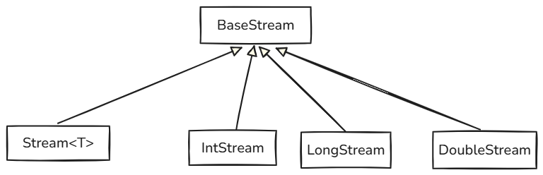

# Stream流

- 和**I/O流**都是**流**，但它的**侧重点在于计算，是为了从数据中提取新的信息或价值，是逻辑层面的**
  - **I/O流**的**侧重点在于I/O(输入输出)，它侧重于数据的存储、传输及一些相关操作，它是技术层面的**

## 相关概念与理解

- 数据处理的抽象管道（非IO流）

> 我是把它理解成了一个 超级长 的流水线，然后在流水线的运行过程中，上面的人(程序员,也就是写代码的你)会对下面流水线上的人(代码中)下发各种指令，然后使得最后的产品或结果是自己想要的，比如你让流水线上的人留下没有损坏的水果，或者你可以下达别的指令和要求让下面的人做，其实刻薄一点，你不用管他们想什么办法解决这个问题，你只要下达指令就行，比如你让流水线上的人留下所有重量大于524g的水果，必须超级精确的留下，不管他们把苹果从流水线上拿下来用秤称重一下再放上去也好还是用别的方法，必须非常精确的把这件事完成，流水线也许转动的会非常慢？完成就行，啊呀肯定能完成，管他呢

- Java Stream体系的所有类或接口等 **全部都**在 **`java.util.stream` 包**中，当然内部实现中或许会使用到别的包中的东西，但这和我说的前半句话并不冲突

- **`Stream<T>` 接口是 Java Stream 体系中最权威、最外显的核心抽象**，但完整的 Stream 生态 还需要**函数式接口、收集器和 `Spliterator<T>`等共同支撑**

  - 包括和它**平级**的**基本类型流**的 **`IntStream`** 等也是模仿它的设计

- 其实Stream API本质上就只有四种流:**`Stream<T>`流，`IntStream`流，`LongStream`流，`DoubleStream`流**

  - **`Stream<T>`**
    - 用来处理引用类型数据，如集合啊啥的(集合中没有基本类型数据，里面的数据最理想也是基本类型数据对应的包装类，是引用类型，所以不会和下面的三个流冲突)

  - **`IntStream`**
    - 高效处理基本类型`int`数据，避免装箱/拆箱开销

  - **`LongStream`**
    - 处理大范围整数（`long`类型），适用于时间戳、ID生成等

  - **`DoubleStream`**
    - 处理浮点数（`double`类型），适合科学计算、统计分析

- 有很多**中间方法(返回的还是流)**和**终端方法(返回的不再是流)**

  - **Stream**的**中间操作确实会返回一个新的 Stream 对象实例**，**但是这些新的 Stream 对象实例并不是独立的、包含数据的副本，而是构建了一个“懒加载”的处理管道 (pipeline)，并且它们都共享同一个底层的“数据源迭代器”或“数据源状态”**

  - **只能使用一次终端方法**

    - Stream 的**中间操作**（filter, map 等）并不立即执行。它们**只是构建了一个执行计划**（一个“配方”）。只有**当终端操作被调用时**，数据才真正开始从源头流出，并按照这个配方进行处理

      >并不是说Stream流在每次调用中间方法的时候，流的状态就被改变然后新生成了一个新的流乌拉乌拉的，这是错误的，这也是我以前的理解方式，
      >
      >事实上，Stream流调用中间和终端方法有这样一种理解方式，我通过漫威中的奇异博士利用时间宝石去看未来举例：
      >每次调用中间方法，实际上都是一种行为，比如钢铁侠没有抢夺宝石，或者是奇异博士没有交出宝石等等等等，这些都是通过看未来知道的一些未来的情况，区别就在于你可以选择某一种操作去做，去影响未来，这些都是看到的未来，我们可以把调用中间方法理解成查看做某种选择之后导致的未来是什么样子的，把调用终端方法理解成按照所选择的操作都做了，然后获取到了结果，当然如果已经使用终端方法获取到结果了，就相当于已经到现在这个未来了，就没办法使用别的一些中间方法去在过去的节点下做的别的选择了
      >
      >
      >
      >**中间方法 = 查看不同的未来（基于选择）**
      >
      >- 奇异博士利用时间宝石去看未来：这完美对应了 Stream 的惰性求值。查看未来并不改变当前现实，只是探索可能性。
      >- 每次调用中间方法，实际上都是一种行为...比如钢铁侠没有抢夺宝石...：这对应了每个中间操作（如 filter, map）定义了一个特定的转换或筛选规则——一个“如果这样选择会怎样”的场景。
      >- 这些都是通过看未来知道的一些未来的情况...我们可以把调用中间方法理解成查看做某种选择之后导致的未来是什么样子的：完全正确！每个中间操作返回的新 Stream，就是对“如果应用了这个规则，数据流会是什么样子”的一种描述或“预览”（一个想象中的未来）。你可以基于这个预览继续添加规则（看更远的未来）。
      >
      >**终端方法 = 选择一条未来路径并经历它**
      >
      >- 把调用终端方法理解成按照所选择的操作都做了，然后获取到了结果：精准！终端操作就是奇异博士最终**选定了一条他看到的未来路径**（由所有中间操作定义），然后**让时间真正流向那个未来**，最终到达那个未来的**结局**（产生结果）。
      >- 这个过程**触发了所有之前规划好的步骤**（中间操作）的实际执行。
      >
      >**Stream 被消费 = 时间线已确定，无法回到过去的选择点**
      >
      >- 当然如果已经使用终端方法获取到结果了，就相当于已经到现在这个未来了：是的，终端操作完成，你就到达了那个特定的结果状态。
      >- 就没办法使用别的一些中间方法去在过去的节点下做的别的选择了：这完美解释了 Stream 为何不能重用！一旦你经历了选定的那条时间线到达了结局，你就不能回到你“查看未来”的那个时刻，用**同一个“查看实例”**去探索另一条基于不同选择的路径了。那个“查看未来的过程”（Stream 实例）已经指向并完成了** **一次**特定的时间线演化。


## Stream体系

### 接口体系

- **`Stream`流**的接口大致体系如下



- 每个接口也**在JDK内部会有对应的实现类**，可以用这个接口类型进行接收对应的对象

## 获取对象的方式

- 不同的情况下有不同的**获取Stream流的方式**
- 我咋这里列举了一些常见的方式，当然也可能会有这些方式之外的方式


### 数组

- 此处列举两种方式

  - 使用**数组工具类`Arrays`中的`stream()`方法获取Stream流**

    - 它会**根据传入的数组的类型不同，返回不同的Stream流**

    ```java
    public static IntStream  		stream(int[] array)
    public static IntStream  		stream(int[] array, int startInclusive, int endExclusive)
    public static LongStream  		stream(long[] array)
    public static LongStream  		stream(long[] array, int startInclusive, int endExclusive)
    public static DoubleStream  	stream(double[] array)
    public static DoubleStream  	stream(double[] array, int startInclusive, int endExclusive)
    public static <T> Stream <T> 	stream(T[] array)
    public static <T> Stream <T> 	stream(T[] array, int startInclusive, int endExclusive)
    ```

  - 通过**把数组传入** **`Stream`**或**`IntStream`**或**`LongStream`**或**`DoubleStream`**中的**静态方法`ofXxx()`获取不同的Stream流**

    - **`Stream`接口中**

      ```java
      static<T> Stream<T> of(T... values)					//返回包含参数中所有元素的Stream
      ```

    - **`IntStream`**

      ```java
      static IntStream  of(int... values)					//返回包含参数中所有元素的Stream
      ```

    - **`LongStream`**

      ```java
      static LongStream  of(long... values)				//返回包含参数中所有元素的LongStream
      ```

    - **`DoubleStream`**

      ```java
      static DoubleStream  of(double... values)			//返回包含参数中所有元素的DoubleStream
      ```

### 集合

- **集合只支持单列集合(Collection系列集合)直接生成流**，**双列集合(Map系列集合)得通过键单列集合、值单列集合、键值对单列集合集合间接生成流**

- 这里同样列举两种方法

  - **使用`Collection`接口中的默认方法`stream()`或`parallelStream()`获取Stream流**

    ```java
    default Stream <E> stream()								//单线程顺序执行，逐个顺序处理元素	
    default Stream <E> parallelStream()						//多线程并行执行，将数据拆分成块并行处理	
    ```

  - **(没必要)**先**使用`Collection`系列集合中的`toArray()`或`toArray(T[] a)`方法把集合转为数组**，之后**再使用将数组转为Stream的方式生成流**(方式见上数组)


### 直接获取

- 使用**`Stream`或`IntStream`或`LongStream`或`DoubleStream`**中的很多**静态方法**获取，具体方法见下面相关部分


## `Stream`相关体系中的方法

### `Stream`中的一些方法

```java
static<T> Stream<T>         of(T t)                             // 返回包含单个元素的顺序流
@SafeVarargs static<T> Stream<T> of(T... values)                // 返回包含多个元素的顺序流
static<T> Stream<T>         ofNullable(T t)                     // 若t非空则返回单元素流，否则返回空流
   
static<T> Stream<T>         empty()                             // 返回空流
static<T> Stream<T>         concat(Stream<? extends T> a, Stream<? extends T> b)//合并两个流,会找最近公共超类型

static<T> Stream<T>         generate(Supplier<? extends T> s)   // 生成无限流（元素由Supplier生成）

static<T> Stream<T>         iterate(T seed, Predicate<? super T> hasNext, UnaryOperator<T> next) 
   															// 有限流（初始值+条件判断+迭代函数，JDK9+）
static<T> Stream<T>         iterate(T seed, UnaryOperator<T> f) // 生成无限流（初始值+迭代函数）

static<T> Stream.Builder<T> builder()                           // 创建流构建器
```

```java
Stream<T>           filter(Predicate<? super T> predicate)      // 过滤保留满足条件的元素
    
<R> Stream<R>       map(Function<? super T, ? extends R> mapper)// 将元素映射为另一种类型的元素,我认为可更新元素
    															//第一个泛型，表示流中原本的数据类型
        														//第二个泛型，转换成的目标类型
    														//实际上就是遍历，之后apply接收一个，之后吐出一个而已
IntStream           mapToInt(ToIntFunction<? super T> mapper)   // 映射为IntStream（原始int流）
LongStream          mapToLong(ToLongFunction<? super T> mapper) // 映射为LongStream（原始long流）
DoubleStream        mapToDouble(ToDoubleFunction<? super T> mapper) // 映射为DoubleStream（原始double流）
 
default<R> Stream<R> 	mapMulti(BiConsumer <? super T ,? super Consumer <R>> mapper)
    			//将流中的每个元素，通过提供的映射逻辑，替换为零个、一个或多个 任意类型 的新元素，并汇集成一个新的对象流
default IntStream  		mapMultiToInt(BiConsumer <? super T ,? super IntConsumer > mapper)
    		//将流中的每个元素，通过提供的映射逻辑，替换为零个、一个或多个 int 类型 的新元素，并汇集成一个新的 IntStream
default LongStream  	mapMultiToLong(BiConsumer <? super T ,? super LongConsumer > mapper)
    		//将流中的每个元素，通过提供的映射逻辑，替换为零个、一个或多个 long 类型 的新元素，并汇集成一个新的 LongStream
default DoubleStream  	mapMultiToDouble(BiConsumer <? super T ,? super DoubleConsumer > mapper)
    	//将流中的每个元素，通过提供的映射逻辑，替换为零个、一个或多个 double 类型 的新元素，并汇集成一个新的 DoubleStream
    
<R> Stream<R>       flatMap(Function<? super T, ? extends Stream<? extends R>> mapper) // 展开元素为子流并合并
IntStream           flatMapToInt(Function<? super T, ? extends IntStream> mapper)     //展开并合并为IntStream
LongStream          flatMapToLong(Function<? super T, ? extends LongStream> mapper)  //展开并合并为LongStream
DoubleStream        flatMapToDouble(Function<? super T, ? extends DoubleStream> mapper)
    																				//展开并合并为DoubleStream
Stream<T>           distinct()                  // 去重（依赖equals和hashCode）
Stream<T>           sorted()                    // 自然顺序排序（元素需实现Comparable）
Stream<T>           sorted(Comparator<? super T> comparator)    // 按Comparator排序
Stream<T>           peek(Consumer<? super T> action)            // 观察元素（调试用，不影响流内容）
Stream<T>           limit(long maxSize)         // 截取前maxSize个元素
Stream<T>           skip(long n)                // 跳过前n个元素
default Stream <T> 	takeWhile(Predicate <? super T > predicate)   // 保留满足条件的元素直到首次不满足（JDK9+）
default Stream <T> 	dropWhile(Predicate <? super T > predicate)   // 丢弃满足条件的元素直到首次不满足（JDK9+）
```

```java
void                forEach(Consumer<? super T> action)         // 遍历元素（不保证顺序）
void                forEachOrdered(Consumer<? super T> action)  // 按流顺序遍历元素
    
Optional<T>         reduce(BinaryOperator<T> accumulator)       // 合并元素（无初始值，返回Optional）
T                   reduce(T identity, BinaryOperator<T> accumulator) // 合并元素（提供初始值identity）
<U> U              	reduce(U identity, BiFunction<U, ? super T, U> accumulator, BinaryOperator<U> combiner) 																		// 并行流优化归约

Optional<T>         min(Comparator<? super T> comparator)       // 返回最小元素（按Comparator）
Optional<T>         max(Comparator<? super T> comparator)       // 返回最大元素（按Comparator）
long                count()                     // 返回元素总数

boolean             anyMatch(Predicate<? super T> predicate)    // 是否至少一个元素满足条件
boolean             allMatch(Predicate<? super T> predicate)    // 是否所有元素满足条件
boolean             noneMatch(Predicate<? super T> predicate)   // 是否没有元素满足条件

Optional<T>         findFirst()                // 返回第一个元素（顺序流确定）
Optional<T>         findAny()                  // 返回任意元素（并行流高效）

default List <T > 	toList()                   // 返回不可变列表（JDK16+）  
```

```java
//把Stream流转成数组几乎只能用这两种方式，别的我估计你也弄不出来
Object[]            toArray()                                   // 返回一个Object数组
<A> A[]             toArray(IntFunction<A[]> generator)         // 返回指定类型数组（如String[]::new）
    	//参数的这个函数式接口IntFunction<R>的含义是:接受一个原始类型int的参数,并产生一个类型为R的结果R apply(int value)
    					//			此处是:接收一个原始类型int的参数,并产生一个类型为A[]的结果A[] apply(int value)
    					//泛型:数组的类型		
    					//apply方法中int参数:数组长度		apply返回值:具体类型的数组	apply方法体:创建数组	
    					//底层:
    					//遍历流->收集元素到临时缓冲区&计算大小->调用apply创建数组->从缓冲区复制元素到数组->返回最终数组
    	/*示例代码:
    	list.stream().toArray(new IntFunction<String[]>() {
            @Override
            public String[] apply(int value) {
                return new String[value];
            }
        });
        
        list.stream().toArray(value->new String[value]);
    	*/
```

```java
<R> R     	 collect(Supplier<R> supplier, BiConsumer<R, ? super T> accumulator, BiConsumer<R, R> combiner) 														// 自定义归约(我不用反正,除非不好)
<R, A> R 	 collect(Collector <? super T,A,R> collector) // 使用收集器汇总元素(如Collectors.toList())(最常用)
 /*示例:
 	Map<String, Integer> map = list.stream().collect(
                Collectors.toMap(
                        new Function<String, String>() {
                            @Override
                            public String apply(String s) {
                                return s.split("-")[0];
                            }
                        }, new Function<String, Integer>() {
                            @Override
                            public Integer apply(String s) {
                                return Integer.parseInt(s.split("-")[1]);
                            }
                        }));
     Lambda表达式形式:
     		Map<String, Integer> map = list.stream().
                collect(
                        Collectors.toMap(k -> k.split("-")[0],
                                k -> Integer.parseInt(k.split("-")[1]))
                );
 */
```

```java
void                close()                    // 关闭流（从BaseStream继承，通常由try-with-resources自动调用）
    
Iterator<T>         iterator()                 // 返回流迭代器（从BaseStream继承）
Spliterator<T>      spliterator()              // 返回流分裂迭代器（从BaseStream继承）

S  					parallel()                  // 转换为并行流（中间操作）
S  					sequential()                // 转换为顺序流（中间操作）
S  					unordered()                 // 标记流为无序（可能优化并行操作）
S  					onClose(Runnable  closeHandler)             // 添加关闭处理句柄（从BaseStream继承）
    
boolean 			isParallel()							//如果要执行终端操作，则返回此流是否会并行执行
```


### `IntStream`中的一些方法

```java
static IntStream         of(int t)                           // 返回包含单个int元素的顺序流
static IntStream         of(int... values)                   // 返回包含多个int元素的顺序流
    
static IntStream         range(int startInclusive, int endExclusive)    // 生成有序int序列 [start, end)
static IntStream         rangeClosed(int startInclusive, int endInclusive) // 生成有序int序列 [start, end]
    
static IntStream         generate(IntSupplier s)             // 无限流，元素由IntSupplier生成
static IntStream         iterate(int seed, IntPredicate hasNext, IntUnaryOperator next) 
   														// 有限流（初始值+条件判断+迭代函数，JDK9+）
static IntStream         iterate(int seed, IntUnaryOperator f)          // 无限流（初始值+迭代函数）
    
static IntStream         concat(IntStream a, IntStream b)    // 合并两个流,会找最近公共超类型
static IntStream         empty()                             // 返回空流
static IntStream.Builder builder()                           // 创建IntStream的构建器
```

```java
IntStream          filter(IntPredicate predicate)            // 过滤保留满足条件的元素

IntStream          map(IntUnaryOperator mapper)              // 将每个int元素转换为新int值
LongStream         mapToLong(IntToLongFunction mapper)       // 转换为LongStream（原始long流）
DoubleStream       mapToDouble(IntToDoubleFunction mapper)   // 转换为DoubleStream（原始double流）
<U> Stream<U>      mapToObj(IntFunction<? extends U> mapper) // 映射为对象流（Stream<U>）

default IntStream  mapMulti(IntStream.IntMapMultiConsumer  mapper)
   //将每个int元素动态映射为多个int元素到新流中,通过mapper中的IntConsumer多次调用accept来收集结果，返回合并后的IntStream 

IntStream          flatMap(IntFunction<? extends IntStream> mapper) // 展开元素为子流并合并

IntStream          distinct()                 // 去重（基于int值唯一性）
IntStream          sorted()                   // 按自然顺序排序（升序）
IntStream          peek(IntConsumer action)   // 观察元素（调试用，不影响流内容）

IntStream          limit(long maxSize)        // 截取前maxSize个元素
IntStream          skip(long n)               // 跳过前n个元素
default IntStream  takeWhile(IntPredicate  predicate) // 保留满足条件的元素直到首次不满足（JDK9+）
default IntStream  dropWhile(IntPredicate  predicate) // 丢弃满足条件的元素直到首次不满足（JDK9+）

Stream<Integer>    boxed()						//返回一个 Stream 由该流的元素组成，每个元素装箱到一个 Integer
   
LongStream         asLongStream()             // 将int元素转换为long流
DoubleStream       asDoubleStream()           // 将int元素转换为double流
```

```java
void               	 forEach(IntConsumer action)               // 遍历元素（不保证顺序）
void               	 forEachOrdered(IntConsumer action)        // 按流顺序遍历元素

int[]              	 toArray()                                 // 返回int数组

int                	 sum()                                     // 计算所有元素的总和
OptionalInt        	 min()                                     // 返回最小元素（若流为空则OptionalInt为空）
OptionalInt        	 max()                                     // 返回最大元素（若流为空则OptionalInt为空）
long               	 count()                                   // 返回元素总数
OptionalDouble     	 average()                                 // 计算平均值（若流为空则OptionalDouble为空）
IntSummaryStatistics summaryStatistics()                       // 返回统计摘要（总和、最大、最小等）

OptionalInt        reduce(IntBinaryOperator op)              // 合并元素（无初始值，返回OptionalInt）
int                reduce(int identity, IntBinaryOperator op)// 合并元素（提供初始值identity）

<R> R              collect(Supplier<R> supplier, ObjIntConsumer<R> accumulator, BiConsumer<R,R> combiner) 
   														// 自定义收集操作

boolean            anyMatch(IntPredicate predicate)          // 是否至少一个元素满足条件
boolean            allMatch(IntPredicate predicate)          // 是否所有元素满足条件
boolean            noneMatch(IntPredicate predicate)         // 是否没有元素满足条件

OptionalInt        findFirst()                // 返回第一个元素（顺序流确定）
OptionalInt        findAny()                  // 返回任意元素（并行流高效）
```

```java
void                close()                    // 关闭流（从BaseStream继承，通常由try-with-resources自动调用）
    
Iterator<T>         iterator()                 // 返回流迭代器（从BaseStream继承）
Spliterator<T>      spliterator()              // 返回流分裂迭代器（从BaseStream继承）

S  					parallel()                  // 转换为并行流（中间操作）
S  					sequential()                // 转换为顺序流（中间操作）
S  					unordered()                 // 标记流为无序（可能优化并行操作）
S  					onClose(Runnable  closeHandler)             // 添加关闭处理句柄（从BaseStream继承）
    
boolean 			isParallel()							//如果要执行终端操作，则返回此流是否会并行执行
```


### `LongStream`中的一些方法

```java
static LongStream        of(long t)                          // 返回包含单个long元素的顺序流
static LongStream        of(long... values)                  // 返回包含多个long元素的顺序流
    
static LongStream        range(long startInclusive, long endExclusive)    // 生成有序long序列 [start, end)
static LongStream        rangeClosed(long startInclusive, long endInclusive) // 生成有序long序列 [start, end]
static LongStream        generate(LongSupplier s)            // 无限流，元素由LongSupplier生成
static LongStream        iterate(long seed, LongPredicate hasNext, LongUnaryOperator next) 
   														// 有限流（初始值+条件判断+迭代函数，JDK9+）
static LongStream        iterate(long seed, LongUnaryOperator f)          // 无限流（初始值+迭代函数）
    
static LongStream        concat(LongStream a, LongStream b)  // 合并两个流的元素,会找最近公共超类型
static LongStream        empty()                             // 返回空流
static LongStream.Builder builder()                          // 创建LongStream的构建器
```

```java
LongStream          filter(LongPredicate predicate)          // 过滤保留满足条件的元素
LongStream          map(LongUnaryOperator mapper)            // 将每个long元素转换为新long值
IntStream           mapToInt(LongToIntFunction mapper)       // 转换为IntStream（原始int流）
DoubleStream        mapToDouble(LongToDoubleFunction mapper) // 转换为DoubleStream（原始double流）
<U> Stream<U>       mapToObj(LongFunction<? extends U> mapper) // 映射为对象流（Stream<U>）

default LongStream  mapMulti(LongStream.LongMapMultiConsumer  mapper)
 //将每个long元素动态映射为多个long元素到新流中,通过mapper中的LongConsumer多次调用accept收集结果,返回合并后的LongStream
    
LongStream          flatMap(LongFunction<? extends LongStream> mapper) // 展开元素为子流并合并

LongStream          distinct()               // 去重（基于long值唯一性）
LongStream          sorted()                 // 按自然顺序排序（升序）
LongStream          peek(LongConsumer action)// 观察元素（调试用，不影响流内容）

LongStream          limit(long maxSize)      // 截取前maxSize个元素
LongStream          skip(long n)             // 跳过前n个元素
default LongStream  takeWhile(LongPredicate  predicate) // 保留满足条件的元素直到首次不满足（JDK9+）
default LongStream  dropWhile(LongPredicate  predicate) // 丢弃满足条件的元素直到首次不满足（JDK9+）

DoubleStream        asDoubleStream()         // 将long元素转换为double流
Stream<Long>        boxed()                  // 将long元素装箱为Long对象流
```

```java
void                forEach(LongConsumer action)             // 遍历元素（不保证顺序）
void                forEachOrdered(LongConsumer action)      // 按流顺序遍历元素

long[]              toArray()                                // 返回long数组

long                sum()                                    // 计算所有元素的总和
OptionalLong        min()                                    // 返回最小元素（若流为空则OptionalLong为空）
OptionalLong        max()                                    // 返回最大元素（若流为空则OptionalLong为空）
long                count()                                  // 返回元素总数
OptionalDouble      average()                                // 计算平均值（若流为空则OptionalDouble为空）
LongSummaryStatistics summaryStatistics()                    // 返回统计摘要（总和、最大、最小等）

OptionalLong        reduce(LongBinaryOperator op)            // 合并元素（无初始值，返回OptionalLong）
long                reduce(long identity, LongBinaryOperator op) // 合并元素（提供初始值identity）

<R> R              collect(Supplier<R> supplier, ObjLongConsumer<R> accumulator, BiConsumer<R,R> combiner) 																	// 自定义收集操作

boolean             anyMatch(LongPredicate predicate)        // 是否至少一个元素满足条件
boolean             allMatch(LongPredicate predicate)        // 是否所有元素满足条件
boolean             noneMatch(LongPredicate predicate)       // 是否没有元素满足条件

OptionalLong        findFirst()               // 返回第一个元素（顺序流确定）
OptionalLong        findAny()                 // 返回任意元素（并行流高效）
```

```java
void                close()                    // 关闭流（从BaseStream继承，通常由try-with-resources自动调用）
    
Iterator<T>         iterator()                 // 返回流迭代器（从BaseStream继承）
Spliterator<T>      spliterator()              // 返回流分裂迭代器（从BaseStream继承）

S  					parallel()                  // 转换为并行流（中间操作）
S  					sequential()                // 转换为顺序流（中间操作）
S  					unordered()                 // 标记流为无序（可能优化并行操作）
S  					onClose(Runnable  closeHandler)             // 添加关闭处理句柄（从BaseStream继承）
    
boolean 			isParallel()							//如果要执行终端操作，则返回此流是否会并行执行
```


### `DoubleStream`中的一些方法

```java
static DoubleStream        of(double t)                            // 返回包含单个double元素的顺序流
static DoubleStream        of(double... values)                    // 返回包含多个double元素的顺序流
static DoubleStream        generate(DoubleSupplier s)              // 无限流，元素由DoubleSupplier生成
static DoubleStream        iterate(double seed, DoublePredicate hasNext, DoubleUnaryOperator next)
   															// 有限流（初始值+条件判断+迭代函数，JDK9+）
static DoubleStream        iterate(double seed, DoubleUnaryOperator f)            // 无限流（初始值+迭代函数）
static DoubleStream        concat(DoubleStream a, DoubleStream b)  // 合并两个流的元素,会找最近公共超类型
static DoubleStream        empty()                                 // 返回空流
static DoubleStream.Builder builder()                              // 创建DoubleStream的构建器
```

```java
DoubleStream          filter(DoublePredicate predicate)            // 过滤保留满足条件的元素
    
DoubleStream          map(DoubleUnaryOperator mapper)              // 将每个double元素转换为新double值
IntStream             mapToInt(DoubleToIntFunction mapper)         // 转换为IntStream（原始int流）
LongStream            mapToLong(DoubleToLongFunction mapper)       // 转换为LongStream（原始long流）
<U> Stream<U>         mapToObj(DoubleFunction<? extends U> mapper) // 映射为对象流（Stream<U>）

default DoubleStream  mapMulti(DoubleStream.DoubleMapMultiConsumer  mapper)
//将每个double元素映射为多个double元素到新流中,通过mapper中的DoubleConsumer调用accept收集结果,返回合并后的DoubleStream
    
DoubleStream          flatMap(DoubleFunction<? extends DoubleStream> mapper) // 展开元素为子流并合并

DoubleStream          distinct()                   // 去重（基于double值唯一性）
DoubleStream          sorted()                     // 按自然顺序排序（升序）
DoubleStream          peek(DoubleConsumer action)  // 观察元素（调试用，不影响流内容）

DoubleStream          limit(long maxSize)          // 截取前maxSize个元素
DoubleStream          skip(long n)                 // 跳过前n个元素
default DoubleStream  takeWhile(DoublePredicate  predicate) // 保留满足条件的元素直到首次不满足（JDK9+）
default DoubleStream  dropWhile(DoublePredicate  predicate) // 丢弃满足条件的元素直到首次不满足（JDK9+）

Stream<Double>        boxed()                      // 将double元素装箱为Double对象流
```

```java
void                  forEach(DoubleConsumer action)              // 遍历元素（不保证顺序）
void                  forEachOrdered(DoubleConsumer action)       // 按流顺序遍历元素

double[]              toArray()                                   // 返回double数组

double                sum()                                       // 计算所有元素的总和（可能溢出）
OptionalDouble        min()                                       // 返回最小元素（若流为空则OptionalDouble为空）
OptionalDouble        max()                                       // 返回最大元素（若流为空则OptionalDouble为空）
long                  count()                                     // 返回元素总数
OptionalDouble        average()                                   // 计算平均值（若流为空则OptionalDouble为空）
DoubleSummaryStatistics summaryStatistics()                       // 返回统计摘要（总和、最大、最小等）

OptionalDouble        reduce(DoubleBinaryOperator op)             // 合并元素（无初始值，返回OptionalDouble）
double                reduce(double identity, DoubleBinaryOperator op) // 合并元素（提供初始值identity）

<R> R                collect(Supplier<R> supplier, ObjDoubleConsumer<R> accumulator, BiConsumer<R,R> combiner) // 自定义收集操作

boolean               anyMatch(DoublePredicate predicate)         // 是否至少一个元素满足条件
boolean               allMatch(DoublePredicate predicate)         // 是否所有元素满足条件
boolean               noneMatch(DoublePredicate predicate)        // 是否没有元素满足条件
OptionalDouble        findFirst()                  // 返回第一个元素（顺序流确定）
OptionalDouble        findAny()                    // 返回任意元素（并行流高效）
```

```java
void                close()                    // 关闭流（从BaseStream继承，通常由try-with-resources自动调用）
    
Iterator<T>         iterator()                 // 返回流迭代器（从BaseStream继承）
Spliterator<T>      spliterator()              // 返回流分裂迭代器（从BaseStream继承）

S  					parallel()                  // 转换为并行流（中间操作）
S  					sequential()                // 转换为顺序流（中间操作）
S  					unordered()                 // 标记流为无序（可能优化并行操作）
S  					onClose(Runnable  closeHandler)             // 添加关闭处理句柄（从BaseStream继承）
    
boolean 			isParallel()							//如果要执行终端操作，则返回此流是否会并行执行
```


## Collector接口

- 是一个定义了**如何执行可变汇聚操作（Mutable Reduction）的规范（Specification）或配方（Recipe）** 的接口。它是 **`Stream`**中**`collect() `**方法的核心驱动力，告诉 collect 方法具体应该**如何**收集流中的元素

  > 可以把它想象成一份详细的说明书，指导如何将一堆散乱的零件（流中的元素 T）组装成一个有用的成品（最终结果 R），可能还需要一个临时的组装台（中间累加器 A）

- 它与 **`Stream`**中的**`collect(Collector)`** 方法紧密配合。

- **`java.util.stream.Collectors `**工具类提供了大量预先定义好的、实现了 **`Collector`**接口的实例

  - 我看了一下，**`Collections`**工具类中所有的方法的返回值都是**`Collector`**

- 它的内部有着各种各样的**收集相关的信息**

- 其实我感觉这个**也是为了`Stream`中的`collect(Collector)`方法量身定做的，懒得喷**

  

## `Collectors`工具类

- **所有的方法的返回值**都是**`Collector`**，极其兼容**`Stream`**中的**`collect`方法**
  - 妈的逼我就直说了：**它就是为了配合 `Stream`中的`collect(Collector)` 方法而设计的**，别处我反正没见到有地方用

### 一些方法

-  **收集到单列集合**

```java
static Collector<T, ?, List<T>> toList()						// 将流元素收集到一个新的 ArrayList 中
static Collector<T, ?, List<T>> toUnmodifiableList()			// 将流元素收集到一个不可修改的 List 中(JDK 10+)
static Collector<T, ?, Set<T>>  toSet()							// 将流元素收集到一个新的 HashSet 中（自动去重）
static Collector<T, ?, Set<T>>  toUnmodifiableSet()		// 将流元素收集到一个不可修改的 Set 中(自动去重)(JDK 10+)
static Collector<T, ?, C extends Collection<T>> toCollection(Supplier<C> collectionFactory)
    													// 将流元素收集到由提供的 Supplier 创建的特定类型集合中
```

- **收集到双列集合**

```java
static Collector<T, ?, Map<K,V>> 
    	toMap(Function<? super T, ? extends K> keyMapper, Function<? super T, ? extends V> valueMapper)								// 将元素收集到 HashMap，键和值由函数生成(键冲突时抛异常)
  		/*
  		两个参数分别代表键的生成规则和值的生成规则：
  		底层应该是遍历Stream，之后调用这里的apply方法，把流中的数据作为参数传递进去，之后返回自己想要的数据，毕竟方法体是自己定义的，因为Function是接收一个参数返回一个参数嘛，转换，所以：
   		toMap的第一个形参：
  			泛型一:流中数据的类型
  			泛型二:生成的Map集合中键的数据类型
        toMap的第二个形参：
        	泛型一：流中数据的类型
        	泛型二：生成的Map集合中值的数据类型
        	
        	Map<String, Integer> map = list.stream().collect(
                Collectors.toMap(
                        new Function<String, String>() {
                            @Override
                            public String apply(String s) {
                                return s.split("-")[0];
                            }
                        }, new Function<String, Integer>() {
                            @Override
                            public Integer apply(String s) {
                                return Integer.parseInt(s.split("-")[1]);
                            }
                        }));
            如果键有冲突会报错
        	Lambda表达式形式:
        	Map<String, Integer> map = list.stream().
                collect(
                        Collectors.toMap(k -> k.split("-")[0],
                                k -> Integer.parseInt(k.split("-")[1]))
                );
   		*/
static Collector<T, ?, Map<K,V>> toMap(Function<? super T, ? extends K> keyMapper, Function<? super T, ? extends V> valueMapper, BinaryOperator<V> mergeFunction)		// 将元素收集到 HashMap，并使用合并函数处理键冲突
static Collector<T, ?, Map<K,V>> toMap(Function<? super T, ? extends K> keyMapper, Function<? super T, ? extends V> valueMapper, BinaryOperator<V> mergeFunction, Supplier<M> mapFactory)
    													// 将元素收集到指定类型的 Map 中，并处理键冲突
    
static Collector<T, ?, Map<K,V>> toUnmodifiableMap(Function<? super T, ? extends K> keyMapper, Function<? super T, ? extends V> valueMapper)					// 将元素收集到不可修改的 Map 中（键冲突时抛异常）(JDK 10+)
static Collector<T, ?, Map<K,V>> toUnmodifiableMap(Function<? super T, ? extends K> keyMapper, Function<? super T, ? extends V> valueMapper, BinaryOperator<V> mergeFunction)
     										// 将元素收集到不可修改的 Map 中，并使用合并函数处理键冲突(JDK 10+)
static Collector<T, ?, ConcurrentMap<K,V>> toConcurrentMap(Function<? super T, ? extends K> keyMapper, Function<? super T, ? extends V> valueMapper)			// 将元素收集到 ConcurrentHashMap（键冲突时抛异常）
static Collector<T, ?, ConcurrentMap<K,V>> toConcurrentMap(Function<? super T, ? extends K> keyMapper, Function<? super T, ? extends V> valueMapper, BinaryOperator<V> mergeFunction)
     											// 将元素收集到 ConcurrentHashMap，并使用合并函数处理键冲突
static Collector<T, ?, ConcurrentMap<K,V>> toConcurrentMap(Function<? super T, ? extends K> keyMapper, Function<? super T, ? extends V> valueMapper, BinaryOperator<V> mergeFunction, Supplier<M> mapFactory)
												// 将元素收集到指定类型的 ConcurrentMap 中，并处理键冲突
```

- **连接字符串**

```java
static Collector<CharSequence, ?, String> joining()					// 将 CharSequence 流的元素连接成一个字符串
static Collector<CharSequence,?,String> joining(CharSequence delimiter)
    												//使用指定分隔符将CharSequence流的元素连接成字符串
static Collector<CharSequence, ?, String> joining(CharSequence delimiter, CharSequence prefix, CharSequence suffix)												// 使用分隔符、前缀和后缀将 CharSequence 流的元素连接成字符串
```

- **聚合与摘要计算**

```java
static Collector<T, ?, Long>	 counting()									// 计算流中元素的总数。
static Collector<T, ?, Integer> summingInt(ToIntFunction<? super T> mapper)	// 计算从元素映射出的 int 值的总和
static Collector<T, ?, Long> 	summingLong(ToLongFunction<? super T> mapper)	//计算从元素映射出的long值的总和
static Collector<T, ?, Double>  summingDouble(ToDoubleFunction<? super T> mapper)
    																	// 计算从元素映射出的 double 值的总和
static Collector<T, ?, Double>  averagingInt(ToIntFunction<? super T> mapper)// 计算从元素映射出的 int 值的平均值
static Collector<T, ?, Double>  averagingLong(ToLongFunction<? super T> mapper)//计算从元素映射出的long值的平均值
static Collector<T, ?, Double>  averagingDouble(ToDoubleFunction<? super T> mapper)
    																	//计算从元素映射出的 double 值的平均值
static Collector<T, ?, Optional<T>> maxBy(Comparator<? super T> comparator)		// 根据比较器查找流中的最大元素
static Collector<T, ?, Optional<T>> minBy(Comparator<? super T> comparator)		// 根据比较器查找流中的最小元素
static Collector<T, ?, IntSummaryStatistics> 		summarizingInt(ToIntFunction<? super T> mapper)
											// 收集关于映射 int 值的统计信息（count, sum, min, average, max）
static Collector<T, ?, LongSummaryStatistics> 		summarizingLong(ToLongFunction<? super T> mapper)
												// 收集关于映射 long 值的统计信息
static Collector<T, ?, DoubleSummaryStatistics> 	summarizingDouble(ToDoubleFunction<? super T> mapper)
												// 收集关于映射 double 值的统计信息
```

- **归约操作**

```java
static Collector<T, ?, Optional<T>> reducing(BinaryOperator<T> op)
							// 使用二元运算符对流元素进行归约，返回 Optional。
static Collector<T, ?, T> reducing(T identity, BinaryOperator<T> op)
							// 使用标识值和二元运算符对流元素进行归约。
static Collector<T, ?, U> reducing(U identity, Function<? super T, ? extends U> mapper, BinaryOperator<U> op)							// 在归约前对元素进行映射，然后使用标识值和二元运算符归约。
```

- **分组**

```java
static Collector<T, ?, Map<K, List<T>>> groupingBy(Function<? super T, ? extends K> classifier)
									// 根据分类函数将元素分组到 Map，值为包含该组元素的 List
static Collector<T, A, Map<K, D>> groupingBy(Function<? super T, ? extends K> classifier, Collector<? super T, A, D> downstream)
									// 根据分类函数分组，并对每个分组应用下游收集器
static Collector<T, A, M extends Map<K, D>> groupingBy(Function<? super T, ? extends K> classifier, Supplier<M> mapFactory, Collector<? super T, A, D> downstream)
									// 根据分类函数分组到指定类型 Map，并应用下游收集器
static Collector<T, ?, ConcurrentMap<K, List<T>>> groupingByConcurrent(Function<? super T, ? extends K> classifier)							// 并发地根据分类函数将元素分组到 ConcurrentMap
static Collector<T, A, ConcurrentMap<K, D>> groupingByConcurrent(Function<? super T, ? extends K> classifier, Collector<? super T, A, D> downstream)	// 并发分组，并对每个分组应用下游收集器
static Collector<T, A, M extends ConcurrentMap<K, D>> groupingByConcurrent(Function<? super T, ? extends K> classifier, Supplier<M> mapFactory, Collector<? super T, A, D> downstream)
										// 并发分组到指定类型 ConcurrentMap，并应用下游收集器
```

- **分区**

```java
static Collector<T, ?, Map<Boolean, List<T>>> partitioningBy(Predicate<? super T> predicate)
											// 根据谓词将元素分区为两组（true/false），值为包含元素的 List
static Collector<T, A, Map<Boolean, D>> partitioningBy(Predicate<? super T> predicate, Collector<? super T, A, D> downstream)								// 根据谓词分区，并对每个分区应用下游收集器。
```

- **下游与组合收集器**

```java
static Collector<T, A, R> mapping(Function<? super T, ? extends U> mapper, Collector<? super U, A, R> downstream)											// 在元素传递给下游收集器前，先应用映射函数。
static Collector<T, A, R> filtering(Predicate<? super T> predicate, Collector<? super T, A, R> downstream)
													// 在元素传递给下游收集器前，先应用过滤谓词(JDK 9+)
static Collector<T, A, R> flatMapping(Function<? super T, ? extends Stream<? extends U>> mapper, Collector<? super U, A, R> downstream)								// 在元素传递给下游收集器前，先扁平化映射为流并合并(JDK 9+)
static Collector<T, A, RR> collectingAndThen(Collector<T, A, R> downstream, Function<R, RR> finisher)
													// 先用下游收集器收集，然后对结果应用最终的完成函数
static Collector<T, ?, R> teeing(Collector<? super T, ?, R1> downstream1, Collector<? super T, ?, R2> downstream2, BiFunction<? super R1, ? super R2, R> merger)
    												//使用两个独立下游收集器同时处理流，然后将结果合并(JDK 12+)
```
