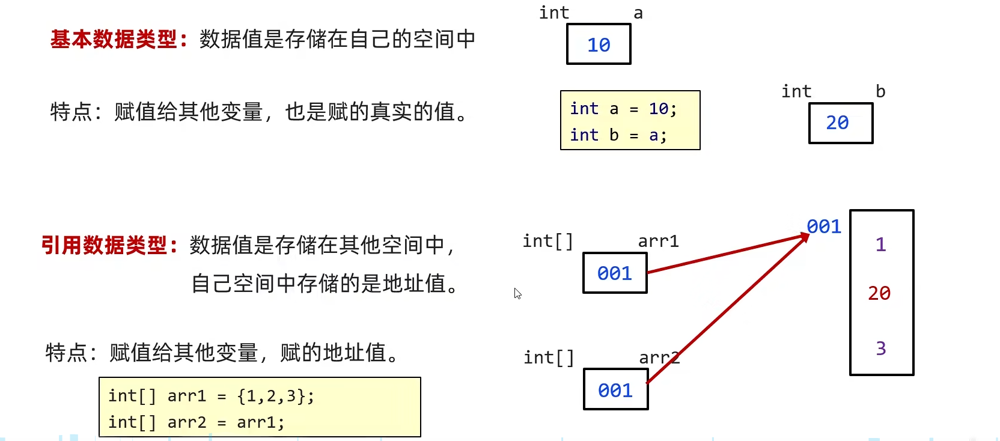
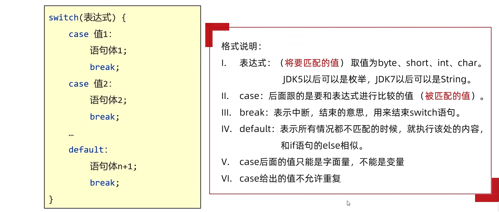

# Java基础

## Java中的所有关键字

| **abstract**   | **assert**       | **boolean**   | **break**      | **byte**   |
| -------------- | ---------------- | :------------ | -------------- | ---------- |
| **case**       | **catch**        | **char**      | **class**      | **const**  |
| **continue**   | **default**      | **do**        | **double**     | **else**   |
| **enum**       | **extends**      | **final**     | **finally**    | **float**  |
| **for**        | **goto**         | **if**        | **implements** | **import** |
| **instanceof** | **int**          | **interface** | **long**       | **native** |
| **new**        | **package**      | **private**   | **protected**  | **public** |
| **return**     | **strictfp**     | **short**     | **static**     | **super**  |
| **switch**     | **synchronized** | **this**      | **throw**      | **throws** |
| **transient**  | **try**          | **void**      | **volatile**   | **while**  |

## 数据类型

### 基本数据类型

| 分类       | 关键字 (Keyword) | 内存占用 (字节) | 取值范围                                                     |
| :--------- | :--------------- | :-------------- | :----------------------------------------------------------- |
| **整型**   | **`byte`**       | 1               | -128 ~ 127                                                   |
|            | **`short`**      | 2               | -32,768 ~ 32,767                                             |
|            | **`int`**        | 4               | -2,147,483,648 ~ 2,147,483,647 (约10位)                      |
|            | **`long`**       | 8               | -9,223,372,036,854,775,808 ~ 9,223,372,036,854,775,807 (约19位) |
| **浮点型** | **`float`**      | 4               | &plusmn;3.402823e+38                                         |
|            | **`double`**     | 8               | &plusmn;1.797693e+308                                        |
| **字符型** | **`char`**       | 2               | 0 ~ 65,535 (任意Unicode字符)                                 |
| **布尔型** | **`boolean`**    | 1               | `true` 或 `false`                                            |


### 引用数据类型

除了上面提到的基本数据类型外，数据类型几乎都是引用数据类型


### 包装类

#### 基本数据类型所对应的包装类

| 基本数据类型  | 包装类          |
| ------------- | --------------- |
| **`byte`**    | **`Byte`**      |
| **`short`**   | **`Short`**     |
| **`int`**     | **`Integer`**   |
| **`long`**    | **`Long`**      |
| **`float`**   | **`Float`**     |
| **`double`**  | **`Double`**    |
| **`char`**    | **`Character`** |
| **`boolean`** | **`Boolean`**   |


#### 获取包装类对象的两种方式

##### JDK1.5之前(不包括1.5)(构造方法)

- 构造方法(不推荐)
  - 每次都会创建新的对象

###### Integer

```java
public Integer(int value)		//根据指定的int类型的整数创建一个Integer对象，值超过范围会溢出
public Integer(String s)		//根据传递的字符串创建一个Integer对象，字符串中必须是整数
```

###### Character

```java
public Character(char value)	//根据指定的char类型的字符创建一个Character对象
```

###### Double

```java
public Double(double value)		//根据指定的double类型的浮点数创建一个Double对象
public Double(String s)			//根据传递的字符串创建一个Double对象，字符串中必须是浮点数或整数
```

###### Boolean

```java
public Boolean(boolean value)	//根据指定的boolean值创建一个Boolean对象
public Boolean(String s)		//根据传递的字符串创建一个Boolean对象
    							//如果字符串参数不是null并且忽略大小写后能解析为true,则值为true,否则,值为false
```

###### Byte

```java
public Byte(byte value)			//根据指定的byte类型的整数创建一个Byte对象，值超过范围会溢出
public Byte(String s)			//根据传递的字符串创建一个Byte对象，字符串中必须是整数，值超过范围会会抛出异常
```

###### Short

```java
public Short(short value)		//根据指定的Short类型的整数创建一个Short对象，值超过范围会溢出
public Short(String s)			//根据传递的字符串创建一个Short对象，字符串中必须是整数,值超过范围会抛出异常
```

###### Long

```java
public Long(long value)			//根据指定的Short类型的整数创建一个Long对象，值超过范围会溢出
public Long(String s)			//根据传递的字符串创建一个Long对象，字符串中必须是整数
```

###### Float

```java
public Float(float value)		//根据指定的float类型的浮点数创建一个Float对象	
public Float(double value)		//根据指定的double类型的浮点数创建一个Float对象
public Float(String s)			//根据传递的字符串创建一个Float对象，字符串中必须是浮点数或整数
```


##### JDK1.5之后(包括1.5)(valueOf方法)

- 引入了**`valueOf`**方法(推荐)
  - 一般会利用一些优化机制来提升性能和减少内存使用

###### Integer

```java
public static Integer valueOf(int i)				//根据指定的int类型的整数返回一个Integer对象
public static Integer valueOf(String s)				//根据传递的字符串创建一个Integer对象，字符串中必须是整数
public static Integer valueOf(String s, int radix)	//根据传递的字符串和进制创建一个Integer对象，字符串必须和进制匹配
```

###### Character

```java
public static Character valueOf(char c)				//根据指定的char类型的整数返回一个Character对象
```

###### Double

```java
public static Double valueOf(double d)				//根据指定的double类型的浮点数创建一个Double对象
public static Double valueOf(String s) 				//根据传递的字符串创建一个Double对象，字符串中必须是浮点数或整数
```

###### Boolean

```java
public static Boolean  valueOf(boolean b)			//根据指定的boolean值创建一个Boolean对象
public static Boolean  valueOf(String s)			//根据传递的字符串创建一个Boolean对象
    						 //如果字符串参数不是null并且忽略大小写后能解析为true,则值为true,否则,值为false
```

###### Byte

```java
public static Byte  valueOf(byte b)		 //根据指定的byte类型的整数创建一个Byte对象，值超过范围会溢出
public static Byte  valueOf(String s)    //根据传递的字符串创建一个Byte对象，字符串中必须是整数，值超过范围会会抛出异常
public static Byte  valueOf(String s, int radix)	//根据传递的字符串和进制创建一个Byte对象，字符串必须和进制匹配
```

###### Short

```java
public static Short valueOf(short s)	//根据指定的short类型的整数创建一个Short对象，值超过范围会溢出
public static Short valueOf(String s)    //根据传递的字符串创建一个Short对象，字符串中必须是整数，值超过范围会会抛出异常
public static Short valueOf(String s, int radix)	//根据传递的字符串和进制创建一个Short对象，字符串必须和进制匹配
```

###### Long

```java
public static Long valueOf(long l)		//根据指定的long类型的整数创建一个Long对象，值超过范围会溢出
public static Long valueOf(String s)    //根据传递的字符串创建一个Long对象，字符串中必须是整数，值超过范围会会抛出异常
public static Long valueOf(String s, int radix)	//根据传递的字符串和进制创建一个Long对象，字符串必须和进制匹配
```

###### Float

```java
public static Float valueOf(float f)              //根据指定的float类型的浮点数创建一个Float对象
public static Float valueOf(String s)             //根据传递的字符串创建一个Float对象，字符串中必须是浮点数或整数
```


#### 属性与方法

##### Integer

```java
public static final int MAX_VALUE		// int 可以具有的最大值的常数
public static final int MIN_VALUE		// int 可以具有的最小值的常数
```

```java
public byte 	byteValue()			//将此 Integer 的值作为 byte 返回
public short 	shortValue()		//将此 Integer 的值作为 short 返回
public int 		intValue()			//将此 Integer 的值作为 int 返回		拆箱操作
public long 	longValue()			//将此 Integer 的值作为 long 返回
public float 	floatValue()		//将此 Integer 的值作为 float 返回
public double 	doubleValue()		//将此 Integer 的值作为 double 返回
```

```java
public static int 	compare(int x, int y)				//比较x和y,如果x==y,返回0，如果x<y,返回-1，如果x>y，返回1
public int 			compareTo(Integer  anotherInteger)	//同上，只不过是成员方法

public boolean 		equals(Object obj)					//判断是否相等
    
public static int 	max(int a, int b)					//返回较大值
public static int 	min(int a, int b)					//返回较小值
public static int 	sum(int a, int b)					//计算a+b
    
public static int 	parseInt(String s)				//把字符串转为整数
public static int 	parseInt(String s, int radix)	//把用radix进制字符串表示的数据转为整数
```

```java
public static String toBinaryString(int i)		//把i转为二进制
public static String toOctalString(int i)		//把i转为八进制
public static String toHexString(int i)		//把i转为十六进制
```


##### Character

```java
public char charValue()			//返回此 Character 对象的值
```

```java
public static int compare(char x, char y)			//比较x和y在ASCII表中的位置,x==y,返回0，x<y,返回-1，x>y，返回1
public int compareTo(Character  anotherCharacter)	//同上，只不过是成员方法

public boolean equals(Object obj)				//判断是否相等

public static boolean isDigit(char ch)			//判断指定字符是否为数字
public static boolean isDigit(int codePoint)	//判断指定ASCII编码所对应的字符是否为数字
    
public static boolean isLetter(char ch)			//是否为字母
public static boolean isLetter(int codePoint)	//指定ASCII编码所对应的字符是否为字母

public static boolean isLetterOrDigit(char ch)			//是否为字母或数字
public static boolean isLetterOrDigit(int codePoint)	//指定ASCII编码所对应的字符是否为字母或数字

public static boolean isLowerCase(char ch)			//是否为小写字符
public static boolean isLowerCase(int codePoint)	//指定ASCII编码所对应的字符是否为小写字符
    		
public static boolean isUpperCase(char ch)			//是否为大写字符
public static boolean isUpperCase(int codePoint)	//指定ASCII编码所对应的字符是否为大写字符
    
public static char toLowerCase(char ch)				//将字符参数转换为小写
public static int toLowerCase(int codePoint)		//将ASCII编码所对应的字符转换为小写
    
public static char toUpperCase(char ch)				//将字符参数转换为大写
public static int toUpperCase(int codePoint)		//将ASCII编码所对应的字符转换为大写
```


##### Double

```java
public static final double MAX_VALUE		// double 类型的最大正有限值
public static final double MIN_VALUE		// double 的最小正非零值的常量
```

```java
public byte byteValue()			//将此 Double 的值作为 byte 返回
public short shortValue()		//将此 Double 的值作为 short 返回
public int intValue()			//将此 Double 的值作为 int 返回		
public long longValue()			//将此 Double 的值作为 long 返回
public float floatValue()		//将此 Double 的值作为 float 返回
public double doubleValue()		//将此 Double 的值作为 double 返回	拆箱操作
```

```java
public static int compare(double d1, double d2)	//比较d1和d2大小,d1==d2,返回0，d1<d2,返回-1，d1>d2，返回1
public int compareTo(Double  anotherDouble)		//同上，只不过是成员方法
    
public boolean equals(Object obj)		//判断是否相等
    
public static double max(double a, double b)	//返回较大值
public static double min(double a, double b)	//返回较小值
public static double sum(double a, double b)	//计算a+b
    
public static double parseDouble(String  s)		//把字符串转为Double
```

```java
public static String toHexString(double d)		//将Double转为十六进制
```


##### Byte

```java
public static final byte MAX_VALUE		//最大值
public static final byte MIN_VALUE		//最小值
```

```java
public byte byteValue()			//将此 Byte 的值作为 byte 返回		拆箱操作
public short shortValue()		//将此 Byte 的值作为 short 返回
public int intValue()			//将此 Byte 的值作为 int 返回		
public long longValue()			//将此 Byte 的值作为 long 返回
public float floatValue()		//将此 Byte 的值作为 float 返回
public double doubleValue()		//将此 Byte 的值作为 double 返回	
```

```java
public static int compare(byte x, byte y)	//比较x和y,如果x==y,返回0，如果x<y,返回-1，如果x>y，返回1
public int compareTo(Byte  anotherByte)		//同上，只不过是成员方法

public boolean equals(Object obj)		//判断是否相等
    
public static byte parseByte(String s)				//把字符串转为byte整数
public static byte parseByte(String s, int radix)	//把用radix进制字符串表示的数据转为byte整数
```


##### Short

```java
public static final short MAX_VALUE		//最大值
public static final short MIN_VALUE		//最小值
```

```java
public byte byteValue()			//将此 Byte 的值作为 byte 返回		
public short shortValue()		//将此 Byte 的值作为 short 返回		拆箱操作
public int intValue()			//将此 Byte 的值作为 int 返回		
public long longValue()			//将此 Byte 的值作为 long 返回
public float floatValue()		//将此 Byte 的值作为 float 返回
public double doubleValue()		//将此 Byte 的值作为 double 返回	
```

```java
public static int compare(short x, short y)	//比较x和y,如果x==y,返回0，如果x<y,返回-1，如果x>y，返回1
public int compareTo(Short  anotherShort)	//同上，只不过是成员方法
    
public boolean equals(Object obj)		//判断是否相等
    
public static short parseShort(String  s)				//把字符串转为short整数
public static short parseShort(String  s, int radix)	//把用radix进制字符串表示的数据转为short整数
```


##### Long

```java
public static final long MAX_VALUE		//最大值
public static final long MIN_VALUE		//最小值
```

```java
public byte byteValue()			//将此 Byte 的值作为 byte 返回
public short shortValue()		//将此 Byte 的值作为 short 返回
public int intValue()			//将此 Byte 的值作为 int 返回		
public long longValue()			//将此 Byte 的值作为 long 返回		拆箱操作
public float floatValue()		//将此 Byte 的值作为 float 返回
public double doubleValue()		//将此 Byte 的值作为 double 返回	
```

```java
public static int compare(long x, long y)	//比较x和y,如果x==y,返回0，如果x<y,返回-1，如果x>y，返回1
public int compareTo(Long  anotherLong)		//同上，只不过是成员方法
    
public boolean equals(Object obj)		//判断是否相等
    
public static long max(long a, long b)		//返回较大值
public static long min(long a, long b)		//返回较小值
public static long sum(long a, long b)		//计算a+b
    
public static long parseLong(String s)				//把字符串转为long整数
public static long parseLong(String s, int radix)	//把用radix进制字符串表示的数据转为long整数
```

```java
public static String toBinaryString(long i)		//把i转为二进制
public static String toOctalString(long i)		//把i转为八进制
public static String toHexString(long i)		//把i转为十六进制
```


##### Boolean

```java
public static final Boolean FALSE		//值为 false 的 Boolean 对象
public static final Boolean  TRUE		//值为 true  的 Boolean 对象
```

```java
public boolean booleanValue()			//将此 Boolean 对象的值作为布尔值返回	拆箱
```

```java
public static int compare(boolean x, boolean y)	//比较x和y,如果x==y,返回0，如果x<y,返回-1，如果x>y，返回1
    											//true 被认为 大于 false 
public int compareTo(Boolean b)					//同上，只不过是成员方法

public boolean equals(Object obj)		//判断是否相等

public static boolean logicalAnd(boolean a, boolean b)	//返回a && b 的结果
public static boolean logicalOr(boolean a, boolean b)	//返回a || b 的结果
public static boolean logicalXor(boolean a, boolean b)	//返回a ^ b 的结果，相同为假，不同为真

public static boolean parseBoolean(String  s)		//字符串参数解析为boolean
```


##### Float

```java
public static final float MAX_VALUE			//float 类型的最大正有限值
public static final float MIN_NORMAL		//float 的最小正非零值的常量
```

```java
public byte byteValue()			//将此 Double 的值作为 byte 返回
public short shortValue()		//将此 Double 的值作为 short 返回
public int intValue()			//将此 Double 的值作为 int 返回
public long longValue()			//将此 Double 的值作为 long 返回
public float floatValue()		//将此 Double 的值作为 float 返回		拆箱操作
public double doubleValue()		//将此 Double 的值作为 double 返回
```

```java
public static int compare(float f1, float f2)	//比较f1和f2大小,f1==f2,返回0，f1<f2,返回-1，f1>f2，返回1
public int compareTo(Float  anotherFloat)		//同上，只不过是成员方法

public boolean equals(Object obj)		//判断是否相等
    
public static float max(float a, float b)	//返回较大值
public static float min(float a, float b)	//返回较小值
public static float sum(float a, float b)	//计算a+b
    
public static float parseFloat(String  s)	//把字符串转为Float
```

```java
public static String  toHexString(float f)	//将Float转为十六进制
```


#### 装箱和拆箱

##### 装箱

- 将基本数据类型转换为包装类对象

```java
int a = 10;
Integer obj = Integer.valueOf(a);  // 手动装箱
```

##### 拆箱

- 将包装类对象转换为基本数据类型

```java
Integer i = Integer.valueOf(10);  
int a = i.intValue();  				// 手动拆箱
```


##### 自动装箱和自动拆箱

- 从 **JDK1.5** 开始，Java引入了**自动装箱**和**自动拆箱**机制，允许 Java 编译器在适当的时候自动进行装箱和拆箱操作
- 装箱和拆箱代码是在**编译阶段**插入的


###### 自动装箱

- 基本数据类型自动转换为包装类对象

```java
Integer i = 10;  // 自动装箱，等同于 Integer.valueOf(10);
```

###### 自动拆箱

- 包装类对象自动转换为基本数据类型

```java
Integer i = 10;  // 自动装箱
int a = i;  	 // 自动拆箱，等同于 int a = i.intValue();
```


### 两种数据类型对比




## 运算符

### `>>`

- 右移运算符**`>>`**是**将二进制位向右移动指定的位数**，**左边用符号位(正数为0,负数为1)填充**，之后**向着负无穷大的方向舍入**

  等价于**除以2^n^**后再**向着负无穷大的方向舍入**

  - **正数**：举例：7>>1 = 7/2^1^=3.5向负无穷大方向舍入=3
  - **负数**：举例：-7>>1=-7/2^1^=-3.5向负无穷大方向舍入=-4


## switch语句

### 语法及执行流程


### 格式说明




#### default

- default可以放在任何位置


### case穿透

- 不写break会引发case穿透现象


### switch在 JDK12 引入的新特性

```java
int number = 10;
switch(number){
        case 1 -> {
            System.out.println("一");
        }
        case 10 -> {
            System.out.println("二");
        }
        default -> {
            System.out.println("default");
        }
}
```

如果大括号中只有一行代码，大括号可以省略，上面的代码可以改写为

```
int number = 10;
switch(number){
        case 1  -> System.out.println("一");
        case 10 -> System.out.println("二");
        default -> System.out.println("default");
}
```


## 循环

### do while

```java
do{
    循环体;
    条件控制语句;
}while(条件判断语句);
```


## 数组

- 连续的存储地址，基本数据类型存储值，引用数据类型存储地址值
- **基本数据类型** **语法上不存在地址值**
- 连续的存储地址是指这个数组是连续的，而不是它们内部的元素是连续地址的
- 直接操作某个索引处的值，实际上是操作了这个索引处的指向罢了，永远对这个索引处的地址相关的东西做不了手脚(格子化?后面可能就忘了，忘了的话删了就行，别查)

- 指针化（Java）和格子化（C?），永远没有格子化，格子化也变不了地址，但是格子化可以指定某个地址处的元素，指针化更不行，指针化甚至不能改变某个地址处的元素，只能指向另一个地址处的新元素


### 一维数组

#### 数组的初始化

- 数组的初始化：在内存中，为数组容器开辟空间，并将数据存入容器中的过程。
- 分为静态初始化和动态初始化


##### 静态初始化

> 创建数组的时候就把里面的元素都指定了，所以不用特意声明数组的长度，也没必要，数组的长度就是刚好把这些元素都放进去的长度，如果指定长度，短了容纳不了所有的，多了浪费额外的内存，没必要

- ###### 完整格式

```java
数据类型[] 数组名 = new 数据类型[]{元素1,元素2,元素3 ... };	//注意这种写法[]中没有元素的个数
int[] array1 = new int[]{11,22,33};
double[] array2 = new double[]{11.1,12.1,13.1};
```


- ###### 简化格式

```java
数据类型[] 数组名 = {元素1,元素2,元素3 ... };	//这是简写，和上面的写法一样，同样不用声明一共有多少个元素
int[] array1 = {11,22,33};
double[] array2 = {11.1,12.1,13.1};
```


##### 动态初始化

> 就是数据不太清楚，先把数组创建好，后面再修改和添加元素啥的，所以这种要指定数组长度

- ###### 格式

```java
数据类型[] 数组名 = new 数据类型[数组长度];	//这种在[]中要指定数组的长度
int[] array = new int[3];
```


##### 静态和动态初始化的区别

###### 静态初始化

- 手动**指定数组元素**，系统会**计算出数组的长度**。

- **明确要操作的具体数据**，不用计算出个数，直接静态初始化即可。

###### 动态初始化

- 手动指定**数组长度**，由系统给出**默认初始化值**。

- 只**明确元素个数**，不明确具体值，推荐使用动态初始化


### 二维数组

#### 数组的初始化

##### 静态初始化

###### 完整格式

```java
数据类型[][] 数组名 = new 数据类型[][]{{元素1,元素2},{元素1,元素2}};
int[][] array= new int[][]{{11,22},{33,44}};
```

###### 简化格式

```java
数据类型[][] 数组名 = {{元素1,元素2},{元素1,元素2}};
int[][] array = {{11,22},{33,44}};
```


##### 动态初始化

```java
数据类型[][] 数组名 = new 数据类型[m][n];
int[][] array = new int[2][3];

int[][] arr = new int[][3];//这种也允许写，这种动态允许加入更多的元素
```


### 关于数组和一些特点

- 数组分为**一维数组**和**多维数组(多维数组又分为二维、三维......n维数组)**
- 数组也分为**基本类型数组**和**引用类型数组**
- 基本类型数组**一定**是**一维**的，但是**一维**的**并不一定**是基本类型数组，因为**存储包装类和其它类类型**的一维数组是**引用数据类型数组**
- **多维数组**是**引用类型数组**
- 不允许创建**泛型数组**，这样会**违反泛型的设计目标(编译时类型安全)**
  - 定义的数组如果是泛型，则编译的时候允许数组中添加任何元素，在运行的时候，泛型被擦除，里面添加的元素可能会不匹配啥的，所以不允许创建泛型数组，但是可以用一种方式创建**`Object`**数组，之后**强转为泛型类型**来间接达到**创建指定类型数组的目的**
  - 没办法防止不同的引用(变量)接收后肆意妄为
  - 彻底禁止才是最优做法


## static

### 静态变量和静态方法的特点


### 内存方面

- 静态成员是随着类的加载而加载的，是优先于对象出现的


### 注意事项

- **静态方法**只能访问**静态变量和静态方法**
- **非静态方法**可以访问**静态变量**或者**静态方法**，也可以访问**非静态的成员变量和非静态的成员方法**
- 静态方法是属于**类本身**而不是类的任何特定实例的，因此它们**非常独立**。它们的操作不依赖于任何对象的状态（实例变量），也不能直接访问或修改实例变量或调用实例方法（成员方法）。这是因为静态方法在执行时没有this引用（指向当前对象的引用），也没有super引用（指向父类对象的引用）。它们主要用于执行那些与类相关但不依赖于特定对象状态的功能，或者作为工具方法。它们可以自由访问类中的其他**静态成员**（静态变量和静态方法）


## final

- 用`final`修饰的不能被改变


### 可被final修饰的都有什么

- 变量：被**`final`**修饰的变量叫常量，只能被赋值一次
- 方法：表明该方法是最终方法，不能被重写
- 类：表明该类是最终类，不能被继承


### 细节

- 如果**`final`**修饰的变量是基本数据类型：那么变量存储的数据值不能发生改变
- 如果**`final`**修饰的变量是引用数据类型：那么变量存储的地址值不能发生改变，但是对象内部的属性什么的可以改变
- 一个 **`final`** 成员变量，必须**在对象创建（构造方法执行）完成之前被赋值**，并且**之后再也不能被修改**
- 一个 **`final`** 局部变量，可以先不赋值，后面再赋值，但是只能赋值一次


## 代码块

### 代码块分类

- 局部代码块
- 构造代码块
- 静态代码块


### 局部代码块

#### 作用

- 节约内存

- **现在已经没用了**


### 构造代码块

#### 什么是构造代码块

- 写在成员位置的代码块

- 现在同样很少用

#### 作用

- 将多个构造方法中重复的代码抽取出来

#### 执行时机

- 创建本类对象的时候，会先执行构造代码块，再执行构造方法

```java
//成员位置直接这样写
{

}
```


### 静态代码块

#### 格式

```java
static{}
```

#### 特点

- 需要通过`static`关键字修饰

- 随着类的加载而加载,并且自动触发,只执行一次

#### 使用场景

在类加载的时候,做一些数据初始化的时候使用


## 方法

### 形参

#### 注意点

- 如果几个重载方法的形参都能接收某个实参，比如**`Object`**和**`Integer`**，**编译器在调用时会选择最匹配的方法**，其**优先级**如下
  - 先优先使用**形参能直接匹配实参**的重载方法（形参：Integer[√]，Object    实参：Integer）
  - **基本类型自动提升**（如int到long）（形参：long[√]，Integer    实参：int）
  - 再优先使用**装箱**（形参：Integer[√]，Object    实参：int）
  - 再优先使用**向上转型**，选择**参数类型的父类**（形参：int，Object[√]  实参：Integer）
  - 再优先使用**拆箱**
  - 如果上面的都不匹配，尝试使用**可变参数（int...)**
  - 如果**模糊调用**，会出错


## 可变参数

- 允许方法接受**0个或多个**同类型参数，简化方法调用

- 格式：参数类型... 参数名

  ```java
  public static void printValues(int... numbers) {
      for (int num : numbers) {
          System.out.println(num);
      }
  }
  ```

- 一个方法**只能有一个**可变参数

- **必须作为最后一个参数**

- 底层是一个**数组**

  - 可以传入数组，如果一个方法中允许可变参数，不仅可以传入一个接一个的元素，还可以传入数组