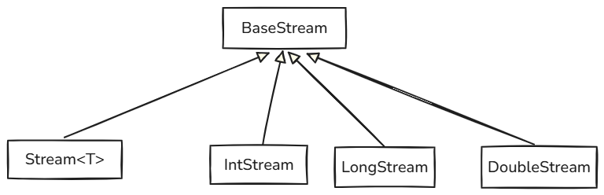

# Stream API

## 1. Stream 基础概念

### 1.1 什么是 Stream?

Stream（流）是 Java 8 引入的核心 API 之一，它提供了一种用于处理 **数据序列** （例如集合、数组或 I/O 资源）的抽象


**关键定义**：

- **抽象概念**：Stream 本身不是一种数据结构，它不存储任何数据

- **计算管道**：它更像一个数据处理管道（Pipeline），数据源（Source）中的元素通过这个管道，并经过一系列计算操作

- **声明式处理**：

  - Stream API 允许您以 **声明式** 的方式定义计算逻辑

    只需要说明 “**要做什么**” （What），而不需要关心 “**如何做**” （How）的实现细节（例如使用 `for` 循环进行迭代）


例如，传统的命令式编程（Imperative）：

```java
List<String> result = new ArrayList<>();
for (String s : sourceList) {
    if (s.startsWith("A")) {
        result.add(s.toLowerCase());
    }
}
```


使用 Stream 的声明式编程（Declarative）：

```java
List<String> result = sourceList.stream()
    .filter(s -> s.startsWith("A"))
    .map(String::toLowerCase)
    .collect(Collectors.toList());
```


### 1.2 Stream 的核心特性

**不存储元素**:Stream 不会存储元素。相反，它通过管道按需计算元素。元素仅在需要时从数据源中获取，并在操作链中传递


**函数式接口**:

- Stream 操作被定义为函数式接口（如 `Predicate`, `Function`, `Consumer`），这使得它们可以完美地与 Lambda 表达式结合使用，使代码更简洁、更具表现力


**惰性执行** 这是 Stream 的一个关键特性。操作分为“中间操作”和“终端操作”

- **中间操作**（如 `filter`, `map`）始终是惰性的。调用它们并不会立即开始处理数据，而是仅仅构建起一个操作链

- **终端操作**（如 `collect`, `forEach`）才是触发器。只有当终端操作被调用时，数据源中的元素才会被真正地遍历，并且所有中间操作会依次被执行

> Stream API 惰性执行的核心目的实际上是为了 **高性能** 和 **高效率**


**一次性消费** 

- Stream 只能被“消费”（即遍历）一次一旦调用了终端操作，该 Stream 就被关闭了

  如果尝试在已关闭的 Stream 上再次调用终端操作，将会抛出 `IllegalStateException`;

  如果需要再次处理，必须从原始数据源重新创建一个新的 Stream


**内部迭代** 

- 与使用 `Iterator` 或 `for-each` 循环的集合（外部迭代，External Iteration）不同，Stream 使用的是内部迭代

  库本身会控制何时、何地以及如何处理元素，开发者只负责提供要执行的函数。这种抽象使得 Stream 库可以在内部进行优化，例如实现并行处理


**支持并行** 

- Stream API 的设计天然支持并行处理。通过调用 `.parallelStream()` 或在已有 Stream 上调用 `.parallel()`，可以轻松地将顺序流转换为并行流

  Stream 库会自动处理数据分片、多核调度和结果合并，而开发者无需编写复杂的多线程代码


### 1.3 Stream 操作分类

一个完整的 Stream 操作链由三部分组成：数据源、零个或多个中间操作以及一个终端操作

```text
数据源 (Source) → 中间操作 (Intermediate) → ... → 中间操作 (Intermediate) → 终端操作 (Terminal)
```


#### a. 数据源 (Source)

- **定义**：Stream 管道的起点。它提供了将要被处理的原始数据序列
- **来源**：
  - **集合**：任何 `java.util.Collection`体系的集合都可以通过 `.stream()` 或 `.parallelStream()` 方法创建 Stream
  - **数组**：使用 `Arrays.stream(array)` 或 `Stream.of(elements)` 创建
  - **I/O 资源**：如 `BufferedReader.lines()` 可为文件的每一行创建一个 Stream
  - **生成函数**：使用 `Stream.generate()` 或 `Stream.iterate()` 创建无限或有限的 Stream
- **特性**：数据源本身通常保持不变（Stream 操作具有非干扰性）


#### b. 中间操作 (Intermediate) 

- **定义**：处理输入 Stream 并返回一个新的 Stream 的操作
- **特性**：
  1. **返回新 Stream**：每个中间操作都会返回一个新的 Stream 实例，允许链式调用
  2. **惰性执行**：如前所述，它们不会立即执行，只是被记录在操作链中
- **常见操作**：`filter()`, `map()`, `flatMap()`, `sorted()`, `distinct()`, `peek()`, `limit()`, `skip()`


#### c. 终端操作 (Terminal)

- **定义**：消费 Stream 元素并产生最终结果或副作用的操作
- **特性**：
  1. **触发计算**：调用终端操作会立即触发整个 Stream 管道的执行（包括所有惰性的中间操作）
  2. **产生结果**：返回一个非 Stream 类型的结果（如 `void`、一个值、一个 `Optional` 或一个集合）
  3. **关闭 Stream**：执行后，Stream 被消费，无法再次使用
- **常见操作**：
  - **短路操作**：`anyMatch()`, `allMatch()`, `noneMatch()`, `findFirst()`, `findAny()`。这类操作可能不需要处理所有元素就能返回结果
  - **非短路操作**：`forEach()`, `collect()`, `reduce()`, `count()`。这类操作通常需要处理 Stream 中的所有元素


### 1.4 Stream 基本接口体系

注：除了`Steam<T>`，

- 为了避免 `int` 到 `Integer`（自动装箱）和 `Integer` 到 `int`（自动拆箱）带来的性能开销，Java Stream API 提供了三种专门的基本类型流：

  - `IntStream` (用于 `int`)

  - `LongStream` (用于 `long`)

  - `DoubleStream` (用于 `double`)




------

## 2. 创建 Stream

创建 Stream 是使用 Stream API 的第一步，它定义了数据源。有多种方式可以从不同的数据源（如集合、数组、文件或生成函数）获取 Stream

### 2.1 从集合 (Collections) 创建

这是最常用的创建方式。`java.util.Collection` 接口及其子接口（如 `List`, `Set`）都提供了 `stream()` 和 `parallelStream()` 方法

```java
// 1. 从 List 创建
List<String> list = Arrays.asList("a", "b", "c");

// 创建一个顺序流 (Sequential Stream)
// 默认情况下，操作将在单个线程中执行
Stream<String> listStream = list.stream();

// 创建一个并行流 (Parallel Stream)
// 操作将可能在多个线程中并发执行，利用多核处理器
Stream<String> parallelListStream = list.parallelStream();

// 2. 从 Set 创建
Set<Integer> set = new HashSet<>(Arrays.asList(1, 2, 3));
Stream<Integer> setStream = set.stream();

// 3. 从 Map 创建
// Map 接口本身不是 Collection，不能直接 .stream()
// 但可以从 Map 的键集(keySet)、值集(values)或条目集(entrySet)创建 Stream
Map<String, Integer> map = new HashMap<>();
map.put("key1", 1);
map.put("key2", 2);

// 3a. 从 EntrySet 创建 (推荐，包含键和值)
Stream<Map.Entry<String, Integer>> entryStream = map.entrySet().stream();

// 3b. 从 KeySet 创建
Stream<String> keyStream = map.keySet().stream();

// 3c. 从 Values Collection 创建
Stream<Integer> valueStream = map.values().stream();
```


### 2.2 从数组 (Arrays) 创建

使用 `java.util.Arrays` 类的静态方法 `stream()` 是从数组创建 Stream 的标准方式

```java
// 1. 从对象数组创建 (T[])
String[] array = {"apple", "banana", "cherry"};
Stream<String> arrayStream = Arrays.stream(array);

// 2. 从基本类型数组创建 (int[], long[], double[])
// 这会创建专门的原始类型 Stream，以避免自动装箱/拆箱的性能开销
int[] intArray = {1, 2, 3, 4, 5};
IntStream intStream = Arrays.stream(intArray); // 得到 IntStream，而非 Stream<Integer>

// 3. 从数组的指定范围创建
// 适用于对象数组和基本类型数组
// 索引 1 (包含) 到 3 (不包含)
Stream<String> subArrayStream = Arrays.stream(array, 1, 3); // 包含 "banana", "cherry"
IntStream subIntStream = Arrays.stream(intArray, 0, 2); // 包含 1, 2
```


### 2.3 通过 Stream 静态方法创建

`Stream` 接口本身提供了几个有用的静态工厂方法

#### 2.3.1 Stream.of()

- **`Stream.of(T... values)`**：使用可变参数（varargs）直接从一组元素创建 Stream
- **`Stream.of(T element)`**：从单个元素创建 Stream

```java
// 1. 从多个元素创建
Stream<String> streamOfElements = Stream.of("a", "b", "c");
Stream<Integer> streamOfInts = Stream.of(1, 2, 3);

// 2. 从单个元素创建
Stream<String> singleElementStream = Stream.of("hello");

// 3. 注意：Stream.of() 与 Arrays.stream() 的区别
// 当参数是对象数组时，两者行为一致（扁平化为元素流）
String[] strArray = {"a", "b"};
Stream<String> s1 = Stream.of(strArray);     // 同 Arrays.stream(strArray)
Stream<String> s2 = Arrays.stream(strArray); // 结果都是 Stream<String>

// !! 陷阱：当参数是基本类型数组时
int[] primitiveArray = {1, 2};
IntStream s3 = Arrays.stream(primitiveArray); // 得到 IntStream，包含元素 1, 2
Stream<int[]> s4 = Stream.of(primitiveArray); // 得到 Stream<int[]>，它只包含 *一个* 元素，即 int[] 数组本身
```


#### 2.3.2 Stream.empty()

创建一个不含任何元素的空 Stream。这在需要返回 Stream 但可能无结果的情况下很有用，可以避免返回 `null` 导致 `NullPointerException`

```java
public Stream<String> getUsers(String role) {
    if (!isValid(role)) {
        return Stream.empty(); // 返回空流，而非 null
    }
    // ... 返回正常 Stream
}

Stream<String> emptyStream = Stream.empty();
```


### 2.4 通过 Stream.builder()

当需要以编程方式（例如在循环或条件语句中）构建 Stream 时，`builder()` 非常有用

```java
Stream.Builder<String> streamBuilder = Stream.builder();

// 链式 .add()
streamBuilder.add("a").add("b");

// 也可以使用 .accept()
if (someCondition) {
    streamBuilder.accept("c");
}

// ... 循环添加
for (int i = 0; i < 3; i++) {
    streamBuilder.add("item" + i);
}

// 构建 Stream
Stream<String> stream = streamBuilder.build();

// stream.forEach(System.out::println);
// 注意：build() 方法只能被调用一次
```


### 2.5 创建无限流

`Stream` 接口提供了两个静态方法来生成“无限”流，即流中的元素是按需计算的，没有固定大小

**警告：** 

- 处理无限流时，**必须** 使用一个短路（short-circuiting）的中间操作（如 `limit()`）或终端操作（如 `findFirst()`），否则流将无限运行，导致程序挂起或 `OutOfMemoryError`

#### a. Stream.iterate() (迭代)

`iterate` 通过重复应用一个函数来创建有序的元素序列

- **`Stream.iterate(T seed, UnaryOperator<T> f)`** 

  (Java 8 风格) 创建一个以 `seed` 为起始，后续元素为 `f(seed)`, `f(f(seed))`, ... 的无限序列

  ```java
  // 0, 2, 4, 6, 8, ...
  Stream<Integer> iterateStream = Stream.iterate(0, n -> n + 2);
  
  // 必须使用 limit() 来获取有限个元素
  List<Integer> firstTenEvens = iterateStream.limit(10).collect(Collectors.toList());
  // (结果: [0, 2, 4, 6, 8, 10, 12, 14, 16, 18])
  ```


- **`Stream.iterate(T seed, Predicate<T> hasNext, UnaryOperator<T> next)`** 

  (Java 9+ 风格) Java 9 引入的重载版本，更像传统的 `for` 循环，它包含一个 `Predicate` ( `hasNext` ) 来决定何时停止迭代

  ```java
  // 效果同 for (int i = 0; i < 20; i = i + 2)
  // 这是一个有限流，不再需要外部的 limit()
  Stream<Integer> finiteIterateStream = Stream.iterate(0, n -> n < 20, n -> n + 2);
  
  // (结果: [0, 2, 4, ..., 18])
  ```


#### b. Stream.generate() (生成)

`generate` 通过重复调用一个 `Supplier<T>` 函数来创建流。它生成的元素之间是独立的（无状态的），不像 `iterate` 那样依赖前一个元素

```java
// 每次调用 .get() 方法
Stream<Double> randomStream = Stream.generate(Math::random);
Stream<String> constantStream = Stream.generate(() -> "hello");

// 同样，必须使用 limit()
List<Double> randoms = randomStream.limit(5).collect(Collectors.toList());
```


### 2.6 创建基本类型流

为了避免 `int` 到 `Integer`（自动装箱）和 `Integer` 到 `int`（自动拆箱）带来的性能开销，Java Stream API 提供了三种专门的基本类型流：

- `IntStream` (用于 `int`)
- `LongStream` (用于 `long`)
- `DoubleStream` (用于 `double`)

这些流提供了如 `sum()`, `average()`, `summaryStatistics()` 等专有操作

```java
// 1. IntStream
// range(startInclusive, endExclusive) - 不包含结束值 5
IntStream intStream1 = IntStream.range(1, 5); // 1, 2, 3, 4

// rangeClosed(startInclusive, endInclusive) - 包含结束值 5
IntStream intStream2 = IntStream.rangeClosed(1, 5); // 1, 2, 3, 4, 5

// 2. LongStream
LongStream longStream = LongStream.rangeClosed(1L, 100L);

// 3. DoubleStream
DoubleStream doubleStream = DoubleStream.of(1.1, 2.2, 3.3);

// 它们可以方便地计算总和
int sum = IntStream.rangeClosed(1, 100).sum(); // 5050
```


### 2.7 从 I/O 资源创建

#### a. 从文件 (Files.lines)

`java.nio.file.Files.lines(Path path)` 方法可以返回一个 `Stream<String>`，其中每个元素是文件中的一行

**重要**：

- `Files.lines` 会打开一个 I/O 资源

  返回的 Stream 实现了 `AutoCloseable` 接口。**必须** 使用 `try-with-resources` 语句来确保流（及其底层的 文件句柄）在操作完成后被正确关闭

```java
import java.nio.file.Files;
import java.nio.file.Paths;
import java.io.IOException;

// ...

// 使用 try-with-resources 确保文件资源被关闭
try (Stream<String> lines = Files.lines(Paths.get("my_file.txt"))) {
    
    lines.filter(line -> line.contains("ERROR"))
         .forEach(System.out::println);

} catch (IOException e) {
    // 处理文件读取异常
    e.printStackTrace();
}
```


#### b. 从字符串 (Chars 和 Split)

```java
// 1. 从 String.chars()
// 返回一个 IntStream，其元素是字符串中每个字符的
// Unicode 码点 (code point) 值
IntStream charStream = "hello".chars();
// charStream.forEach(c -> System.out.println((char)c)); // h, e, l, l, o

// 2. 从正则表达式 (Pattern.splitAsStream)
// 将字符串按正则表达式分割成一个 Stream<String>
Stream<String> wordStream = java.util.regex.Pattern.compile("\\s+")
    .splitAsStream("hello world java stream");
// wordStream.forEach(System.out::println); // hello, world, java, stream
```


------

## 3. 中间操作

中间操作是 Stream 管道的核心组成部分。它们接收一个 Stream，对其进行某种转换或处理，然后返回一个 **新的 Stream**

关键特性：

- **返回新 Stream**：允许操作链式调用（fluent API）

- **惰性执行**：它们不立即执行，只是记录下需要对数据执行哪些步骤。只有当终端操作被调用时，数据才会真正流过整个操作链

  >Stream API  **惰性执行** 的核心目的实际上是为了 **高性能** 和 **高效率**

- **管道节点**：
  - **概念**：Stream 在底层实现上，将每一个中间操作封装为一个**“节点” (Node)**，这些节点像链表一样串联起来，形成流水线
  - **机制**：数据像水流一样依次流经这些节点**（垂直流向）**
    - **无状态节点** (如 `filter`, `map`)：像普通的阀门，数据来了处理完就送走，不记事
    - **有状态节点** (如 `distinct`, `sorted`)：像带有关卡的检查站，内部维护了特定的 **状态容器**（如 Set,Buffer）来记录流经的数据，用于拦截或排序


### 3.1 filter (过滤)

- **定义**：`Stream<T> filter(Predicate<? super T> predicate)`
- **作用**：用于从 Stream 中排除不符合条件的元素
- **参数**：一个 `Predicate<T>` 函数式接口，它接受一个元素 `T`，返回一个 `boolean` 值
- **逻辑**：如果 `predicate` 返回 `true`，元素被保留；如果返回 `false`，元素被丢弃

```java
List<Integer> numbers = Arrays.asList(1, 2, 3, 4, 5, 6, 7, 8, 9, 10);

// 示例 1: 过滤偶数
List<Integer> evenNumbers = numbers.stream()
    .filter(n -> n % 2 == 0) // n -> n % 2 == 0 是一个 Predicate
    .collect(Collectors.toList());
// 结果: [2, 4, 6, 8, 10]

// 示例 2: 链式过滤 (多条件过滤)
// 链式 filter 的效果等同于使用 && (逻辑与)
List<Integer> result = numbers.stream()
    .filter(n -> n % 2 == 0) // 条件1：是偶数
    .filter(n -> n > 5)      // 条件2：大于5
    .collect(Collectors.toList());
// 结果: [6, 8, 10]
```


### 3.2 map (映射 / 转换)

- **定义**：`<R> Stream<R> map(Function<? super T, ? extends R> mapper)`
- **作用**：将 Stream 中的每个元素 `T` 转换为另一种类型（或相同类型）的元素 `R`
- **参数**：一个 `Function<T, R>` 函数式接口，它接受一个元素 `T`，返回一个结果 `R`
- **逻辑**：`map` 操作会用 `mapper` 函数处理每一个元素。输出 Stream 的大小 **等于** 输入 Stream 的大小。它执行的是 **一对一** 的转换

```java
List<String> words = Arrays.asList("hello", "world", "java");

// 示例 1: 转换为大写 (String -> String)
List<String> upperCase = words.stream()
    .map(String::toUpperCase) // s -> s.toUpperCase() 是一个 Function
    .collect(Collectors.toList());
// 结果: ["HELLO", "WORLD", "JAVA"]

// 示例 2: 获取长度 (String -> Integer)
List<Integer> lengths = words.stream()
    .map(String::length)
    .collect(Collectors.toList());
// 结果: [5, 5, 4]

// 示例 3: 对象属性提取 (User -> String)
/* class User {
    private String name;
    private int age;
    // ... getter
}
*/
List<User> users = Arrays.asList(new User("Alice", 25), new User("Bob", 30));
List<String> names = users.stream()
    .map(User::getName) // user -> user.getName()
    .collect(Collectors.toList());
// 结果: ["Alice", "Bob"]
```


### 3.3 flatMap (扁平化映射)

最难理解的操作之一。它用于处理“流中流”的结构

- **定义**：`<R> Stream<R> flatMap(Function<? super T, ? extends Stream<? extends R>> mapper)`
- **作用**：
  - 将 Stream 中的每个元素 T 转换为一个 **新的 `Stream<R>`**，然后按照原有的顺序，将这些新生成的 Stream **首尾相接**（拼接）成一个 **单一的 `Stream<R>`**

- **参数**：一个 `Function<T, Stream<R>>` 函数式接口，它接受一个元素 `T`，必须返回一个 `Stream<R>`
- **逻辑**：
  1. `map` 阶段：对每个元素 `T` 应用 `mapper` 函数，得到一个 `Stream<Stream<R>>`（一个包含多个 Stream 的 Stream）
  2. `flat` 阶段：将这个 `Stream<Stream<R>>` **依次展开**，将其所有内部 Stream 的元素合并成一个 `Stream<R>`

```java
// 示例 1: 扁平化嵌套列表
List<List<Integer>> nestedList = Arrays.asList(
    Arrays.asList(1, 2, 3),
    Arrays.asList(4, 5, 6),
    Arrays.asList(7, 8, 9)
);

// 如果使用 map:
// 错误示范：map 的结果是 Stream<Stream<Integer>>
// Stream<Stream<Integer>> streamOfStreams = nestedList.stream()
//     .map(Collection::stream);

// 使用 flatMap:
// 1. 第一个元素 [1,2,3] -> mapper(list) -> Stream[1,2,3]
// 2. 第二个元素 [4,5,6] -> mapper(list) -> Stream[4,5,6]
// 3. 第三个元素 [7,8,9] -> mapper(list) -> Stream[7,8,9]
// 4. flatMap 将这 3 个 Stream 合并为: Stream[1,2,3,4,5,6,7,8,9]
List<Integer> flatList = nestedList.stream()
    .flatMap(list -> list.stream()) // 或 Collection::stream
    .collect(Collectors.toList());
// 结果: [1, 2, 3, 4, 5, 6, 7, 8, 9]

// 示例 2: 字符串拆分
List<String> sentences = Arrays.asList("hello world", "java stream");

// 1. "hello world" -> mapper(s) -> Arrays.stream(s.split(" ")) -> Stream["hello", "world"]
// 2. "java stream" -> mapper(s) -> Arrays.stream(s.split(" ")) -> Stream["java", "stream"]
// 3. flatMap 合并: Stream["hello", "world", "java", "stream"]
List<String> allWords = sentences.stream()
    .flatMap(sentence -> Arrays.stream(sentence.split(" ")))
    .collect(Collectors.toList());
// F结果: ["hello", "world", "java", "stream"]
```


### 3.4 distinct (去重)

- **定义**：`Stream<T> distinct()`
- **作用**：返回一个由 Stream 中唯一元素组成的 Stream
- **底层原理**：
  - **基于 Set**：虽然 Stream 是流式处理的，但在 `distinct()` **节点内部，维护了一个类似 `HashSet` 的结构**
  - **判重标准**：
    - **基本类型/String**：按值判定
    - **对象类型**：完全依赖 `equals(Object)` 和 `hashCode()`
      - **注意**：如果自定义对象没有重写这两个方法，`distinct` 将失效（因为默认比较的是内存地址）

- **机制**：

  1. **基本类型/String**：按值进行去重
  2. **对象类型**：依赖元素的 `equals(Object)` 和 `hashCode()` 方法。要使 `distinct` 对自定义对象生效，**必须** 正确地重写这两个方法
- **状态 (Stateful)**：
  - `distinct` 是一个**有状态** 的中间操作
  - 普通操作（如 `filter`）是“健忘”的，处理完一个丢一个；
  - `distinct` 必须 **记住** 之前所有通过的元素，才能判断当前元素是否重复
- **关键隐患**：
  1. **内存开销**：因为它要存储所有 **不重复** 的元素。如果处理 1000 万个不重复的数据，内存可能会暴涨
  2. **无限流杀手**：
     - 如果在一个由随机数生成的 **无限流** 上直接调用 `distinct()`，程序会卡死（因为它试图记住无穷无尽的数字，永远无法完成流的构建），或者耗尽内存
  3. **并行流性能差**：在 `parallelStream()` 中，多个线程由于需要维护同一个“去重名单”（Set），会产生大量的同步开销，性能反而可能不如串行


- **代码示例**

```JAVA
// 示例 1: 基本类型去重
List<Integer> numbers = Arrays.asList(1, 2, 2, 3, 3, 3, 4, 5, 5);
List<Integer> distinctNumbers = numbers.stream()
    .distinct()
    .collect(Collectors.toList());
// 结果: [1, 2, 3, 4, 5]

// 示例 2: 对象去重 (⚠️ 必须重写 equals/hashCode，推荐使用 Lombok @Data)
@Data @AllArgsConstructor
class User { String name; int age; }

List<User> users = Arrays.asList(
    new User("Alice", 25),
    new User("Bob", 30),
    new User("Alice", 25) // 内容相同，但如果是 new 出来的，默认地址不同
);

List<User> uniqueUsers = users.stream()
    .distinct() // 因为加了 @Data，这里能正确识别出 Alice 是重复的
    .collect(Collectors.toList());
// 结果: [User("Alice", 25), User("Bob", 30)]
```


### 3.5 sorted (排序)

- **定义**：
  - `Stream<T> sorted()`
  - `Stream<T> sorted(Comparator<? super T> comparator)`
- **作用**：返回一个包含 Stream 中所有元素并按指定顺序排序的新 Stream
- **状态**：`sorted` 也是一个**有状态 (Stateful)** 的中间操作。它需要“看到” Stream 中的所有元素，将它们缓冲起来，完成排序后，再将排好序的元素向下游传递
- **机制**：
  1. **`sorted()` (自然排序)**：
     - 不带参数的版本
     - 要求 Stream 中的元素必须实现了 `java.lang.Comparable` 接口（例如 `Integer`, `String`, `LocalDate`）
     - 如果元素没有实现 `Comparable`，将在运行时抛出 `ClassCastException`
  2. **`sorted(Comparator)` (自定义排序)**：
     - 接受一个 `Comparator` 作为参数，用于定义排序规则
     - `java.util.Comparator` 提供了丰富的静态方法来构建比较器

```JAVA
List<Integer> numbers = Arrays.asList(5, 3, 8, 1, 9, 2);

// 示例 1: 自然排序 (升序)
List<Integer> sorted = numbers.stream()
    .sorted()
    .collect(Collectors.toList());
// 结果: [1, 2, 3, 5, 8, 9]

// 示例 2: 逆序排序 (使用 Comparator)
List<Integer> reverseSorted = numbers.stream()
    .sorted(Comparator.reverseOrder())
    .collect(Collectors.toList());
// 结果: [9, 8, 5, 3, 2, 1]

// 示例 3: 自定义对象排序
List<User> users = Arrays.asList(
    new User("Bob", 30),
    new User("Alice", 25),
    new User("Charlie", 20),
    new User("Bob", 20) // Bob, 20岁
);

// 按年龄升序 (使用 comparing 提取键)
List<User> sortedByAge = users.stream()
    .sorted(Comparator.comparing(User::getAge))
    .collect(Collectors.toList());
// 结果: [User("Charlie", 20), User("Bob", 20), User("Alice", 25), User("Bob", 30)]

// 示例 4: 多条件排序 (年龄升序，如果年龄相同，则按姓名升序)
List<User> multiSorted = users.stream()
    .sorted(
        Comparator.comparing(User::getAge) // 主条件：按年龄
                  .thenComparing(User::getName) // 次条件：按姓名
    )
    .collect(Collectors.toList());
// 结果: [User("Bob", 20), User("Charlie", 20), User("Alice", 25), User("Bob", 30)]
```


### 3.6 peek (查看)

- **定义**：`Stream<T> peek(Consumer<? super T> action)`
- **作用**：返回一个与原 Stream 相同的 Stream，但会为每个元素执行提供的 `Consumer` 操作
- **用途**：`peek` 的主要设计目的是 **调试 (Debugging)**，用于在元素流过管道的某个特定点时查看（“窥视”）元素的状态，而 **不对元素做任何修改**
- **参数**：一个 `Consumer<T>` 函数式接口，它接受一个元素 `T`，没有返回值 (`void`)
- **陷阱 (重要)**：
  1. **惰性执行**：如果 Stream 管道没有终端操作（如 `collect`, `forEach`, `count`），`peek` 中的 `Consumer` **永远不会执行**
  2. **不应修改元素**：`Consumer` 不应该修改 Stream 中元素的状态（即产生副作用），这违反了函数式编程的原则，特别是在并行流中可能导致不可预测的结果

```java
List<String> names = Arrays.asList("Alice", "Bob", "Charlie");

// 错误示例：没有终端操作，peek 不会执行
// names.stream()
//     .peek(System.out::println); // 不会打印任何内容

// 正确示例：用于调试管道
List<Integer> nameLengths = names.stream()
    .peek(s -> System.out.println("1. 原始值: " + s))
    .filter(s -> s.length() > 3)
    .peek(s -> System.out.println("2. 过滤后: " + s))
    .map(String::length)
    .peek(n -> System.out.println("3. 转换后: " + n))
    .collect(Collectors.toList());
/*
输出:
1. 原始值: Alice
2. 过滤后: Alice
3. 转换后: 5
1. 原始值: Bob
1. 原始值: Charlie
2. 过滤后: Charlie
3. 转换后: 7
*/
// 结果: [5, 7]
```


### 3.7 limit (限制数量)

- **定义**：`Stream<T> limit(long maxSize)`
- **作用**：截断 Stream，使其元素数量不超过 `maxSize`
- **特性**：`limit` 是一个**短路 (Short-circuiting)** 的中间操作
  - **短路**意味着它不需要处理 Stream 中的所有元素。一旦达到 `maxSize` 个元素，`limit` 就会立即结束对上游 Stream 的请求
  - 这使得它在处理大型或无限流时至关重要

```java
List<Integer> numbers = Arrays.asList(1, 2, 3, 4, 5, 6, 7, 8, 9, 10);

// 示例 1: 获取前 5 个元素
List<Integer> limited = numbers.stream()
    .limit(5)
    .collect(Collectors.toList());
// 结果: [1, 2, 3, 4, 5]

// 示例 2: 配合无限流使用
// 如果没有 limit()，Stream.iterate() 将无限运行
List<Integer> first10Even = Stream.iterate(0, n -> n + 2)
    .limit(10)
    .collect(Collectors.toList());
// 结果: [0, 2, 4, 6, 8, 10, 12, 14, 16, 18]
```


### 3.8 skip (跳过元素)

- **定义**：`Stream<T> skip(long n)`
- **作用**：丢弃 Stream 中的前 `n` 个元素
- **特性**：`skip` 是一个**有状态 (Stateful)** 的操作。它必须遍历并丢弃掉前 `n` 个元素（或者在有序流中定位到第 `n+1` 个元素），然后才能将其余元素传递给下游

```java
List<Integer> numbers = Arrays.asList(1, 2, 3, 4, 5, 6, 7, 8, 9, 10);

// 示例 1: 跳过前 5 个元素
List<Integer> skipped = numbers.stream()
    .skip(5)
    .collect(Collectors.toList());
// 结果: [6, 7, 8, 9, 10]

// 示例 2: 结合 skip 和 limit 实现分页
int pageSize = 3;   // 每页大小
int pageNumber = 2; // 页码 (假设从 1 开始)

// 计算需要跳过的元素数量
// 第 1 页: (1-1)*3 = 0
// 第 2 页: (2-1)*3 = 3
// 第 3 页: (3-1)*3 = 6
long itemsToSkip = (long)(pageNumber - 1) * pageSize;

List<Integer> pageData = numbers.stream()
    .skip(itemsToSkip)
    .limit(pageSize)
    .collect(Collectors.toList());
// 结果 (第 2 页数据): [4, 5, 6]
```

**操作顺序的重要性**：`filter`, `sorted`, `distinct`, `skip`, `limit` 等操作的顺序会极大影响性能

- 例如，应始终先 `filter` 再 `sorted`，先 `skip` 再 `limit`（如果适用）


### 3.9 `mapToXXX`(映射到基本类型流)

- **定义**：
  - `IntStream mapToInt(ToIntFunction<? super T> mapper)`
  - `LongStream mapToLong(ToLongFunction<? super T> mapper)`
  - `DoubleStream mapToDouble(ToDoubleFunction<? super T> mapper)`
- **作用**：将对象流 `Stream<T>`（例如 `Stream<Integer>`）转换为对应的基本类型流（例如 `IntStream`）
- **优势**：
  1. **性能**：避免了 `Integer`, `Long`, `Double` 等包装类型的自动装箱 (boxing) 和拆箱 (unboxing) 开销
  2. **专用方法**：基本类型流提供了 `Stream<T>` 所没有的专用聚合方法，如 `sum()`, `average()`, `summaryStatistics()`

```java
List<String> stringNumbers = Arrays.asList("1", "2", "3", "4", "5");

// 示例 1: 计算总和
// .map(Integer::parseInt) // 返回 Stream<Integer>
// .sum(); // Stream<Integer> 没有 sum() 方法

// 必须使用 mapToInt
int sum = stringNumbers.stream()
    .mapToInt(Integer::parseInt) // 转换为 IntStream
    .sum();                      // IntStream 有 sum() 方法
// 结果: 15

// 示例 2: 获取汇总统计
// (适用于 IntStream, LongStream, DoubleStream)
IntSummaryStatistics stats = stringNumbers.stream()
    .mapToInt(Integer::parseInt)
    .summaryStatistics();

System.out.println("总和: " + stats.getSum());
System.out.println("平均值: " + stats.getAverage());
System.out.println("最大值: " + stats.getMax());
System.out.println("最小值: " + stats.getMin());
System.out.println("数量: " + stats.getCount());
```


### 3.10 装箱 (boxed)

- **定义**：`Stream<T> boxed()` (定义在 `IntStream`, `LongStream`, `DoubleStream` 接口中)
- **作用**：`mapToInt` 等操作的反向操作
- **逻辑**：将基本类型流中的每个元素（如 `int`）打包成其对应的包装类型（如 `Integer`），并返回一个新的对象流 `Stream<T>`（如 `Stream<Integer>`）
- **用途**：当你需要对基本类型流使用只能用于对象流的操作时（例如 `collect(Collectors.toList())`）

```java
// 示例: 将 IntStream 收集到 List<Integer>
IntStream intStream = IntStream.rangeClosed(1, 5); // 1, 2, 3, 4, 5

// intStream.collect(Collectors.toList()); // 编译错误! collect 是 Stream<T> 的方法

// 必须先 .boxed() 转换回 Stream<Integer>
List<Integer> list = intStream
    .boxed()
    .collect(Collectors.toList());
// 结果: [1, 2, 3, 4, 5]
```


## 4. 终端操作

### 4.0 相关概念

#### a. 简述

终端操作是 Stream 管道的触发器。这些操作会触发整个 Stream 流水线的实际计算，并产生一个最终结果或副作用


#### b. **关键特性**

- **触发计算**：一旦调用终端操作，整个 Stream 管道将开始处理数据
- **消费 Stream**：一个 Stream 只能被一个终端操作消费一次。消费后，该 Stream 将关闭且无法重用
- **产生结果**：它们返回一个非 Stream 的结果（如一个值、一个集合、`void`）或产生副作用（如 `forEach`）


#### c. 垂直处理⭐

- **垂直处理** 是指 Stream 流水线在处理数据时，会**一次只拉取一个元素**，并让这个元素**完整地通过整个处理链**（从第一个中间操作到最后一个中间操作），直到它被终端操作消耗或在中途被丢弃

  然后，系统才会回去拉取**下一个**元素，重复这个过程

  - **垂直处理（Stream 的方式）⭐：**
    - `元素1` -> `filter()` -> `map()` -> `collect()`
    - `元素2` -> `filter()` -> `map()` -> `collect()`
    - `元素3` -> `filter()` -> ...
  - **水平处理（错误的方式）：**
    - `元素1, 2, 3...` -> `filter()` (全部过滤完)
    - `过滤后的元素...` -> `map()` (全部转换完)
    - `转换后的元素...` -> `collect()` (全部收集)

  Stream API 采用的是 **垂直处理** ⭐

- **示例**

  ```java
  public static void main(String[] args) {
      List<String> list = Arrays.asList("a1", "a2", "b1", "c1", "c2");
  
      System.out.println("Stream 开始执行......");
  
      List<String> result = list.stream()
          .filter(s -> {
              System.out.println("--- filter 接收: " + s + " ---");
              boolean startsWithC = s.startsWith("c");
              System.out.println("    filter 结果: " + (startsWithC ? "通过" : "丢弃"));
              return startsWithC;
          })
          .map(s -> {
              System.out.println("    --- map 接收: " + s + " ---"); // 打印接收到的小写
              String upperS = s.toUpperCase();
              System.out.println("        map 转换后: " + upperS); // 打印转换后的大写
              return upperS; // 返回大写
          })
          .collect(Collectors.toList());
  
      System.out.println("Stream 执行完毕。");
      System.out.println("最终结果: " + result);
  }
  ```

  ```java
  Stream 开始执行......
  --- filter 接收: a1 ---
      filter 结果: 丢弃
  --- filter 接收: a2 ---
      filter 结果: 丢弃
  --- filter 接收: b1 ---
      filter 结果: 丢弃
  --- filter 接收: c1 ---
      filter 结果: 通过
      --- map 接收: c1 ---
          map 转换后: C1
  --- filter 接收: c2 ---
      filter 结果: 通过
      --- map 接收: c2 ---
          map 转换后: C2
  Stream 执行完毕。
  最终结果: [C1, C2]
  ```


### 4.1 forEach (遍历)

- **定义**：`void forEach(Consumer<? super T> action)`
- **作用**：对 Stream 中的每个元素执行 `Consumer` 操作
- **用途**：主要用于产生副作用，例如打印到控制台或修改外部集合（不推荐在并行流中这样做）
- **返回**：`void`


### 4.2 forEachOrdered (按序遍历)

- **定义**：`void forEachOrdered(Consumer<? super T> action)`
- **作用**：与 `forEach` 类似，但它 **严格保证** 按照 Stream 的原始顺序（或 `sorted` 后的顺序）处理元素
- **与 forEach 的对比**：
  - 在 **串行流** (Sequential Stream) 中：`forEach` 和 `forEachOrdered` 的行为基本一致
  - 在 **并行流** (Parallel Stream) 中：
    - `forEach`：为了最大化并行效率，会 **打乱顺序** 处理
    - `forEachOrdered`：**强制保持顺序**，但这会牺牲并行性，使其运行效率接近串行流

```java
List<String> list = Arrays.asList("a", "b", "c");

// 示例 1: 串行流遍历 (顺序通常是 a, b, c)
list.stream().forEach(System.out::println);

// 示例 2: 并行流遍历 (顺序不确定，可能是 b, a, c)
list.parallelStream().forEach(System.out::println);

// 示例 3: 并行流按序遍历 (顺序固定为 a, b, c)
list.parallelStream().forEachOrdered(System.out::println);
```


### 4.3 collect (收集)

- **定义**：`<R, A> R collect(Collector<? super T, A, R> collector)`
- **作用**：最通用、最强大的终端操作之一。它使用一个 `Collector` 将 Stream 中的所有元素汇总到一个可变的结果容器中（如 `List`, `Set`, `Map`）
- **`Collectors` 工具类**：`java.util.stream.Collectors` 提供了大量预定义的 `Collector` 实现

```java
List<String> list = Arrays.asList("apple", "banana", "apple", "cherry");

// 示例 1: 收集到 List (允许重复，保持顺序)
List<String> resultList = list.stream()
    .collect(Collectors.toList());
// 结果: ["apple", "banana", "apple", "cherry"]

// 示例 2: 收集到 Set (自动去重，不保证顺序)
Set<String> resultSet = list.stream()
    .collect(Collectors.toSet());
// 结果: ["apple", "banana", "cherry"]

// 示例 3: 收集到 Map
// (注意：key 必须唯一，否则会抛出 IllegalStateException)
// toMap(keyMapper, valueMapper)
Map<String, Integer> map = list.stream()
    .distinct() // 确保 key (s) 是唯一的
    .collect(Collectors.toMap(s -> s, String::length));
// 结果: {"apple"=5, "banana"=6, "cherry"=6}

// 示例 4: 拼接字符串
String joined = list.stream()
    .collect(Collectors.joining(", "));
// 结果: "apple, banana, apple, cherry"

// 示例 5: 收集到数组
String[] array = list.stream().toArray(String[]::new);
// 结果: ["apple", "banana", "apple", "cherry"]
```


### 4.4 reduce (归约)

- **作用**：`reduce` 是一种聚合操作，它将 Stream 中的所有元素反复结合起来，最终产生一个单一的值

- **概念**：它接受一个初始值（可选）和一个二元操作符 `BinaryOperator`（例如 `(a, b) -> a + b`），然后逐步将流中元素“归约”成一个结果

  > 核心思想：拿到流中的第一个元素，和第二个元素结合生成一个新值；再用这个新值和第三个元素结合……直到流结束


`reduce` 有两种主要形式：

- **a. `Optional<T> reduce(BinaryOperator<T> accumulator)`**

  - **特点**：没有初始值

  - **返回**：返回一个 `Optional<T>`，因为如果 Stream 为空，将没有结果

  - **逻辑**：`accumulator` 的第一个参数 `a` 是上一步的归约结果，`b` 是当前元素


- **b. `T reduce(T identity, BinaryOperator<T> accumulator)`**

  - **特点**：提供了一个**初始值 (identity)**

  - **返回**：返回 `T` 类型。如果 Stream 为空，将直接返回 `identity` 初始值

  - **`identity`**：这个初始值必须是 `accumulator` 操作的“幺元”（即 `accumulator(identity, e) == e`），例如加法的 `0` 或乘法的 `1`


```java
List<Integer> numbers = Arrays.asList(1, 2, 3, 4, 5);

// 示例 1: 求和 (使用初始值 0)
// 1. (a=0, b=1) -> 1
// 2. (a=1, b=2) -> 3
// 3. (a=3, b=3) -> 6
// 4. (a=6, b=4) -> 10
// 5. (a=10, b=5) -> 15
int sum = numbers.stream()
    .reduce(0, (a, b) -> a + b); // 或 Integer::sum
// 结果: 15

// 示例 2: 求乘积 (使用初始值 1)
int product = numbers.stream()
    .reduce(1, (a, b) -> a * b);
// 结果: 120 (1*2*3*4*5)

// 示例 3: 求最大值 (不使用初始值)
// 1. (a=1, b=2) -> 2
// 2. (a=2, b=3) -> 3
// 3. (a=3, b=4) -> 4
// 4. (a=4, b=5) -> 5
Optional<Integer> max = numbers.stream()
    .reduce(Integer::max); // (a, b) -> Math.max(a, b)
// 结果: Optional[5]

// 示例 4: 处理空流
Optional<Integer> emptyMax = Stream.<Integer>empty()
    .reduce(Integer::max);
// 结果: Optional.empty

int emptySum = Stream.<Integer>empty()
    .reduce(0, Integer::sum);
// 结果: 0 (返回了初始值)

// 示例 5: 字符串连接
List<String> words = Arrays.asList("Hello", " ", "World");
String sentence = words.stream()
    .reduce("", (a, b) -> a + b); // 或 String::concat
// 结果: "Hello World"
```


### 4.5 count (计数)

- **定义**：`long count()`
- **作用**：返回 Stream 中元素的总数
- **返回**：`long`

```java
List<String> list = Arrays.asList("a", "b", "c", "d", "e");

long count = list.stream().count();
// G结果: 5

// 结合 filter 使用
long evenCount = Arrays.asList(1, 2, 3, 4, 5, 6).stream()
    .filter(n -> n % 2 == 0) // 中间操作
    .count();                // 终端操作
// 结果: 3
```


### 4.6 匹配 (Match) - 短路操作

这类操作用于检查流中的元素是否满足特定谓词（Predicate）。它们都是**短路终端操作**，一旦找到（或无法找到）满足条件的结果，就会立即停止处理后续元素，因此在处理大型流或无限流时效率很高

- `anyMatch(Predicate<T> predicate)`:
  - **作用**: 检查流中是否 **至少有一个** 元素满足谓词
  - **返回**: `boolean`
  - **短路**: 找到第一个匹配项后立即返回 `true`。如果遍历完所有元素都没有找到，返回 `false`
  
  
  
- `allMatch(Predicate<T> predicate)`:
  - **作用**: 检查流中是否 **所有** 元素都满足谓词
  - **返回**: `boolean`
  - **短路**: 找到第一个 **不匹配** 项后立即返回 `false`。如果遍历完所有元素都匹配，返回 `true`
  
  
  
- `noneMatch(Predicate<T> predicate)`:
  - **作用**: 检查流中是否 **所有** 元素都**不**满足谓词
  - **返回**: `boolean`
  - **短路**: 找到第一个 **匹配** 项后立即返回 `false`。如果遍历完所有元素都不匹配，返回 `true`

```java
List<Integer> numbers = Arrays.asList(1, 3, 5, 8, 10);

// anyMatch: 是否有任意一个偶数?
boolean hasEven = numbers.stream()
        .anyMatch(n -> n % 2 == 0); // true (在 8 处停止)

// allMatch: 是否所有元素都大于 0?
boolean allPositive = numbers.stream()
        .allMatch(n -> n > 0); // true

// noneMatch: 是否没有元素小于 0?
boolean noNegative = numbers.stream()
        .noneMatch(n -> n < 0); // true
```


### 4.7 查找 (Find) - 短路操作

用于从流中检索元素。它们通常返回一个 `Optional<T>`，以优雅地处理流为空或找不到元素的情况

- `findFirst()`:

  - **作用**: 返回流中的**第一个**元素
  - **返回**: `Optional<T>`
  - **特性**: 
    - 总是返回第一个元素（如果存在）。在串行流中非常明确
    - **短路**

- `findAny()`:

  - **作用**: 返回流中的**任意一个**元素

  - **返回**: `Optional<T>`

  - **特性**: 

    - 在串行流中，它通常返回第一个元素（但规范不保证）

      在**并行流**中，它被高度优化，会返回最先处理完的线程找到的任意一个元素，性能通常优于 `findFirst`
    
    - **短路**

```java
List<Integer> numbers = Arrays.asList(1, 2, 3, 4, 5);

// 查找第一个大于 2 的数
Optional<Integer> first = numbers.stream()
        .filter(n -> n > 2)
        .findFirst();
// 结果: Optional[3]

// 并行流中查找任意一个大于 2 的数
Optional<Integer> any = numbers.parallelStream()
        .filter(n -> n > 2)
        .findAny();
// 结果: 可能是 Optional[3], Optional[4], 或 Optional[5]
```


### 4.8 最值 (Min / Max)

用于根据提供的 `Comparator` 查找流中的最小或最大元素

- `min(Comparator<T> comparator)`: 返回最小值
- `max(Comparator<T> comparator)`: 返回最大值
- **返回**: `Optional<T>`。如果流为空，返回 `Optional.empty()`
- **注意**: 它们 **不是** 短路操作，因为必须遍历整个流才能确定最值

```java
List<Integer> numbers = Arrays.asList(5, 3, 8, 1, 9, 2);

// 最小值 (Integer 实现了 Comparable, 可用 Integer::compareTo)
Optional<Integer> min = numbers.stream()
        .min(Integer::compareTo);
// 结果: Optional[1]

// 最大值
Optional<Integer> max = numbers.stream()
        .max(Comparator.naturalOrder());
// 结果: Optional[9]

// 查找年龄最小的 User
List<User> users = Arrays.asList(
    new User("Alice", 25),
    new User("Bob", 30),
    new User("Charlie", 20)
);

Optional<User> youngest = users.stream()
        .min(Comparator.comparing(User::getAge));
```


### 4.9 转换为数组 (toArray)

将流中的元素收集到一个数组中

- `Object[] toArray()`:
  - **作用**: 返回一个包含此流元素的 `Object` 数组
  - **缺点**: 无法返回特定类型的数组（如 `String[]`），后续使用可能需要强制类型转换
- `<A> A[] toArray(IntFunction<A[]> generator)`:
  - **作用**: 返回一个包含此流元素的特定类型数组
  - **用法**: 必须提供一个“数组构造器引用”，通常写作 `String[]::new` 或 `n -> new String[n]`。这是创建正确类型和大小数组所必需的

```java
List<String> list = Arrays.asList("a", "b", "c");

// 1. 转 Object[]
Object[] objArray = list.stream().toArray();

// 2. 转 String[] (推荐方式)
String[] strArray = list.stream().toArray(String[]::new);

// 3. 基本类型流转数组
// IntStream, LongStream, DoubleStream 有专用的 toArray()
int[] intArray = IntStream.range(1, 6).toArray();
// 结果: [1, 2, 3, 4, 5]
```


## 5. 收集器 `Collectors`

`Collectors` 是 `java.util.stream.Collector` 接口的实用**工具类**，提供了大量常用的、预先实现好的 `Collector` 实例

- `collect()` 是一个终端操作，它接收一个 `Collector` 作为参数，用于将流中的元素“汇总”到最终的容器或结果中
  - `Collectors` 的 **唯一作用**，就是被用作 `Stream.collect()` 方法的参数，用于指定流应该 **如何被收集和汇总**
  
    > 在别的地方这玩意没用，至少我没见过别的地方有这玩意儿


### 5.1 收集到集合 (Collection 体系)

这是最常见的收集操作，用于将流元素聚合到一个集合中

- `Collectors.toList()`:
  - **作用**: 将元素收集到一个 `List` 中
  - **返回**: `List<T>`
  - **保证**: Java 10 及以后版本保证返回不可修改的 `List`。在此之前，通常返回 `ArrayList`，但不应依赖此具体实现


- `Collectors.toSet()`:
  - **作用**: 将元素收集到一个 `Set` 中，自动去重（基于元素的 `equals` 和 `hashCode`）
  - **返回**: `Set<T>`
  - **保证**: 通常返回 `HashSet`，但不应依赖此具体实现


- `Collectors.toCollection(Supplier<C> collectionFactory)`:
  - **作用**: 允许调用者 **指定** 要使用的具体集合实现
  - **参数**: 一个 `Supplier`（供应者），通常是集合的构造函数引用（如 `LinkedList::new`）
  - **返回**: `C extends Collection<T>` (指定的集合类型)

```java
List<String> list = Arrays.asList("a", "b", "c", "b", "a");

// 1. toList
List<String> resultList = list.stream().collect(Collectors.toList());
// 结果: [a, b, c, b, a]

// 2. toSet (自动去重)
Set<String> resultSet = list.stream().collect(Collectors.toSet());
// 结果: [a, b, c] (顺序不保证)

// 3. toCollection (指定为 LinkedList)
LinkedList<String> linkedList = list.stream()
    .collect(Collectors.toCollection(LinkedList::new));

// 4. toCollection (指定为 TreeSet，自动去重并按自然顺序排序)
TreeSet<String> treeSet = list.stream()
    .collect(Collectors.toCollection(TreeSet::new));
// 结果: [a, b, c] (有序)
```


### 5.2 字符串拼接

专门用于拼接 `Stream<String>`（或其他 `CharSequence`）的收集器

- `Collectors.joining()`:

  - **作用**: 将所有字符串元素连接成一个单一的字符串

  

- `Collectors.joining(CharSequence delimiter)`:

  - **作用**: 使用指定的分隔符连接元素

  

- `Collectors.joining(CharSequence delimiter, CharSequence prefix, CharSequence suffix)`:

  - **作用**: 使用分隔符、前缀和后缀连接元素

```java
List<String> list = Arrays.asList("A", "B", "C", "D");

// 1. 直接拼接
String result1 = list.stream().collect(Collectors.joining());
// 结果: "ABCD"

// 2. 指定分隔符
String result2 = list.stream().collect(Collectors.joining(", "));
// 结果: "A, B, C, D"

// 3. 指定前缀、分隔符、后缀
String result3 = list.stream()
    .collect(Collectors.joining(", ", "[", "]"));
// 结果: "[A, B, C, D]"
```


### 5.3 收集到 `Map` (toMap)

`toMap` 用于将流元素转换为 `Map`。这是一个非常强大但需要小心的操作，特别是要处理 **键冲突**

- 这里在最前面直接说明一点：**`Collectors.toMap` 无论如何都不允许 Value 为 null**


#### 基础转换(2个参数)

- `Collectors.toMap(keyMapper, valueMapper)`

  - **作用**: 最基础的转换。`keyMapper` 提取键，`valueMapper` 提取值
  - **适用场景**: 百分百确定了 **数据源中 Key 是唯一 的，且 Value 不为 null** 的情况下
  - **两大陷阱**:
    1. **重复键**: 如果两个元素生成了相同的键，抛出 `IllegalStateException`
    2. **空值**: 如果 `valueMapper` 映射出的值为 `null`，会抛出 `NullPointerException`（即使目标 Map 支持 null 值，`toMap` 内部实现也不允许）

  ```java
  List<User> users = Arrays.asList(
      new User(1, "Alice"),
      new User(2, "Bob"),
      new User(1, "Alice_New") // ID 重复
  );
  
  // ❌ 陷阱1：重复键导致崩溃
  // users.stream().collect(Collectors.toMap(User::getId, User::getName));
  // 抛出: IllegalStateException: Duplicate key 1
  
  // ❌ 陷阱2：Value 为 null 导致崩溃
  // User badUser = new User(3, null); // 名字为 null
  // Stream.of(badUser).collect(Collectors.toMap(User::getId, User::getName));
  // 抛出: NullPointerException (因为 toMap 内部不允许 value 为 null)
  ```


#### 处理冲突(3个参数)

- `Collectors.toMap(keyMapper, valueMapper, mergeFunction)`

  - **作用**: 安全版本。当发生键冲突时，不抛异常，而是执行 `mergeFunction`
  - **`mergeFunction`**:
    - 类型为 `BinaryOperator<U>`
    - 参数 `(existingValue, replacementValue)`：
      - `existingValue`: Map 中已经存在的那个值（旧值）
      - `replacementValue`: 当前流正在处理的、试图放入 Map 的那个值（新值）
    - **返回值**: 最终要存入 Map 的值

  

  **常见策略代码示例**:

  ```java
  // 数据准备：ID=1 重复
  List<User> users = Arrays.asList(
      new User(1, "Alice", 80),  // 旧值
      new User(2, "Bob", 90),
      new User(1, "Alice_Pro", 95) // 新值，ID冲突
  );
  
  // 策略 A: 保留旧值 (First Wins)
  // 逻辑：遇到 ID 冲突，忽略后面来的，保留最早的
  Map<Integer, User> keepFirst = users.stream()
      .collect(Collectors.toMap(
          User::getId,
          user -> user, // Value 是对象本身
          (existing, replacement) -> existing // 冲突时，返回旧值
      ));
  // 结果 ID=1 的是 Alice (80分)
  
  // 策略 B: 覆盖新值 (Last Wins) —— 最常用
  // 逻辑：遇到 ID 冲突，用后面来的覆盖前面的（常用于更新数据）
  Map<Integer, User> keepLast = users.stream()
      .collect(Collectors.toMap(
          User::getId,
          Function.identity(),
          (existing, replacement) -> replacement // 冲突时，返回新值
      ));
  // 结果 ID=1 的是 Alice_Pro (95分)
  
  // 策略 C: 聚合值 (不仅仅是去重)
  // 逻辑：遇到 ID 冲突，将两个对象的分数相加，或者拼接名字
  Map<Integer, String> scoreHistory = users.stream()
      .collect(Collectors.toMap(
          User::getId,
          User::getName,
          // 冲突时，将名字拼接起来： "Alice, Alice_Pro"
          (oldName, newName) -> oldName + ", " + newName 
      ));
  ```


####  指定 Map 实现 (4个参数)

- `Collectors.toMap(keyMapper, valueMapper, mergeFunction, mapSupplier)`
  - **作用**: **终极版本**。默认 `toMap` 生成的是 `HashMap`（无序），如果你需要结果是有序的（如 `TreeMap` 或 `LinkedHashMap`），必须使用此版本
  - **`mapSupplier`**: 一个返回空 Map 的构造函数引用，例如 `TreeMap::new`
  - 注意：`toMap` 的第三个参数 mergeFunction **千万不能传 null**，即使你确定没有冲突

```java
List<User> users = Arrays.asList(
    new User("Bob", 30),
    new User("Alice", 25),
    new User("Charlie", 20)
);

// 场景 1: 按键排序 (使用 TreeMap)
// 即使流是 Bob -> Alice -> Charlie，结果也会按 A->B->C 排序
TreeMap<String, Integer> sortedMap = users.stream()
    .collect(Collectors.toMap(
        User::getName,
        User::getAge,
        (v1, v2) -> v2, // 哪怕没有冲突，这个参数也不能省
        TreeMap::new    // 指定实现：按 Key 字母排序
    ));
// 结果: {Alice=25, Bob=30, Charlie=20}

// 场景 2: 保持插入顺序 (使用 LinkedHashMap)
// 结果顺序与流的遍历顺序完全一致
LinkedHashMap<String, Integer> orderedMap = users.stream()
    .collect(Collectors.toMap(
        User::getName,
        User::getAge,
        (v1, v2) -> v2,
        LinkedHashMap::new // 指定实现：保持插入顺序
    ));
// 结果: {Bob=30, Alice=25, Charlie=20}
```


### 5.4 分组 (groupingBy)

`groupingBy` 是最强大、最复杂的收集器之一，用于将流中的元素按某种特性（分类器）进行分组，结果是一个 `Map`，对应数据库 SQL 中的 `GROUP BY` 语句

> 它的核心思想是：**“分桶”**。 即根据一个 **分类器 (Classifier)** 把数据分到不同的桶里，然后还可以对每个桶里的数据再做二次处理


#### a. 基础分组(1个参数)

`Collectors.groupingBy(classifier)`

- **作用**: 这是最直观的分组方式。你只需要告诉收集器 **“按什么分”**，它会自动把符合条件的元素放入一个 `List` 中
- **默认行为**: 把符合条件的元素放到一个 `ArrayList` 中
- **返回**: `Map<K, List<T>>`

```java
List<User> users = Arrays.asList(
    new User("Alice", "HR"),
    new User("Bob", "IT"),
    new User("Charlie", "IT")
);

// 需求：按部门分组，列出员工对象
Map<String, List<User>> byDept = users.stream()
    .collect(Collectors.groupingBy(User::getDepartment));

// 结果: 
// {
//   "HR": [AliceObj],
//   "IT": [BobObj, CharlieObj]
// }
```


#### b. 分组与下游收集器(2个参数)

##### S. 2参方法概念

`Collectors.groupingBy(Function<T, K> classifier, Collector<T, A, D> downstream)`:

* **作用**: 按 `classifier` 分组，并对每个组中的元素应用 **下游收集器** （`downstream`），**下游收集器默认情况为 Collectors.toList()**

  > 可以把“下游收集器”理解为：**“数据分到桶里后，要在桶里做什么？”**
  >
  > > 默认情况下，分组后桶里装的是 `List<User>`
  > >
  > > **下游收集器 (Downstream Collector)** 允许我们在把数据放入桶之前，对桶里的数据进行二次处理（如统计、求和、转换）

* **返回**: `Map<K, D>` (D 是下游收集器的结果类型)


##### A. 聚合与统计

不保留具体元素，直接计算每组的统计结果

- **API**:
  - `Collectors.counting()`: 统计数量
  - `Collectors.summingInt/Long/Double(...)`: 求和
  - `Collectors.maxBy/minBy(...)`: 求最值

```JAVA
// 1. 统计每个部门的人数 (返回 Long)
Map<String, Long> countMap = users.stream()
    .collect(Collectors.groupingBy(User::getDepartment, Collectors.counting()));

// 2. 统计每个部门的工资总和 (返回 Integer)
Map<String, Integer> salaryMap = users.stream()
    .collect(Collectors.groupingBy(User::getDepartment, Collectors.summingInt(User::getSalary)));

// 3. 找出每个部门工资最高的员工 (返回 Optional<User>)
Map<String, Optional<User>> maxSalaryMap = users.stream()
    .collect(Collectors.groupingBy(
        User::getDepartment, 
        Collectors.maxBy(Comparator.comparingInt(User::getSalary))
    ));
```


##### B. 转换(`mapping`)

mapping 是 Stream.map 的 **收集器版本**

- **API**: `Collectors.mapping(Function mapper, Collector downstream)`

- **作用**: 将进入收集器的每个元素 `T` 转换为另一种类型 `U`，然后将转换后的元素传递给 **下游收集器** 处理

- **参数**：

  - **Mapper**：Function<T, U>，转换函数（负责 T -> U）
  - **Downstream**：Collector，下游收集器（负责收集 U）

- **逻辑**：

  - **Map 阶段**：对当前组内的每个元素应用 mapper 函数（执行 **一对一** 转换）
  - **Collect 阶段**：将转换后的结果交给 downstream 进行收集

- **场景**: 按部门分组，但我只想要“员工姓名”的列表，而不是整个 User 对象的列表

  ```java
  // 需求：获取每个部门的员工姓名列表
  Map<String, List<String>> namesByDept = users.stream()
      .collect(Collectors.groupingBy(
          User::getDepartment,
          // 下游：先提取名字(String)，再收集成 List
          Collectors.mapping(User::getName, Collectors.toList())
      ));
  // 结果: { "HR": ["Alice"], "IT": ["Bob", "Charlie"] }
  ```


##### C. 过滤(`filtering`)

filtering 是 Stream.filter 的 **收集器版本**。它专门解决“先过滤导致分组 Key 丢失”的痛点

- **API**: `Collectors.filtering(Predicate predicate, Collector downstream)`

- **作用**: 类在元素进入 **下游收集器** 之前进行判断，只有满足条件的元素才会被收集，**不满足的直接丢弃**（但不会影响外层的分组 Key）

- **参数**：

  - **`Predicate`**：判断条件（返回 true 保留，false 丢弃）
  - **`Downstream`**：下游收集器（用于接收被保留的元素）

- **逻辑**：

  1. **Filter 阶段**：对当前组内的每个元素应用 predicate 判断
  2. **Collect 阶段**：如果判断为 true，交给 downstream 收集；如果为 false，则忽略
     - **关键点**：如果某组所有元素都被过滤掉了，下游收集器仍然会执行（收集到一个空容器，如空 List），从而保证该组的 **Key 依然存在**

  

- **痛点解决**:

  - `stream().filter().collect(groupingBy)`: 如果某组所有元素被过滤，该组的 Key 会直接消失
  - `collect(groupingBy(..., filtering))`: 即使某组元素全被过滤，Key 依然保留，Value 为空集合

  

- **示例**

  ```java
  // 需求：统计每个部门“薪水>8000”的员工
  // 假设 HR 部门所有员工薪水都 < 8000
  
  // 方式 1: 使用 filtering (推荐) -> 能看到 HR 部门，列表为空
  Map<String, List<User>> result = users.stream()
      .collect(Collectors.groupingBy(
          User::getDepartment,
          Collectors.filtering(u -> u.getSalary() > 8000, Collectors.toList())
      ));
  // 结果: { "IT": [Bob...], "HR": [] }
  
  // 方式 2: 先 filter 后 group -> HR 部门直接消失
  // Map<String, List<User>> result2 = users.stream()
  //     .filter(u -> u.getSalary() > 8000)
  //     .collect(Collectors.groupingBy(User::getDepartment));
  // 结果: { "IT": [Bob...] }  <-- 丢失了 HR 信息
  ```

  


##### D. 扁平化 (`flatMapping`)

处理嵌套集合（一对多关系）

- **API**: `Collectors.flatMapping(Function<T, Stream<U>> mapper, Collector downstream)`

- **作用**:将分组内的每个元素 T 转换为一个 **`Stream<U>`**，然后将这些流中的元素 **依次展开（铺平）** 后传递给下游收集器

- **参数**:

  1. **Mapper**: 一个函数，接受元素 T，**必须返回一个 `Stream<U>`**
  2. **Downstream**: 下游收集器，用于接收展开后的 U 元素

- **逻辑**:

  1. **Map 阶段**: 对组内的每个元素 T 应用 mapper，得到一堆 `Stream<U>`
  2. **Flat 阶段**: 按照元素原本的顺序，将 Stream 里的内容 **“剥离”** 出来，逐个放入下游容器中（**不会打乱顺序**）

- **场景**: 统计每个部门涉及的所有“标签”

  ```JAVA
  // 数据结构：User 类中包含 List<String> tags
  // Alice (HR) -> ["Recruiting", "Admin"]
  // Bob (IT)   -> ["Coding"]
  // Charlie (IT)-> ["Coding", "Design"]
  
  // 需求：按部门分组，统计该部门下的所有标签 (Set自动去重)
  Map<String, Set<String>> tagsByDept = users.stream()
      .collect(Collectors.groupingBy(
          User::getDepartment,
          // 关键点：这里 mapper 返回的是 Stream，而不是 List
          Collectors.flatMapping(u -> u.getTags().stream(), Collectors.toSet())
      ));
  
  // 结果: 
  // HR -> ["Recruiting", "Admin"]
  // IT -> ["Coding", "Design"]  (注意："Coding" 被去重了，且没有嵌套 List)
  ```

  


##### 用法场景

###### 场景 A: 分组后统计数量

不要拿到 List，而是要拿到由多少人

```java
Map<String, Long> countByDept = users.stream()
    .collect(Collectors.groupingBy(
        User::getDepartment,       // 1. 分类器
        Collectors.counting()      // 2. 下游：统计个数
    ));
// 结果: {HR=1, IT=2}
```


###### 场景 B: 分组后求和/平均

统计每个部门的工资总和

```java
Map<String, Integer> salaryByDept = users.stream()
    .collect(Collectors.groupingBy(
        User::getDepartment,
        Collectors.summingInt(User::getSalary) // 下游：求和
    ));
// 结果: {HR=5000, IT=18000}
```


###### 场景 C: 分组后转换/提取

这是最常用的技巧之一。比如：我按部门分组，但我 **只想要员工的名字列表**，不想要整个 `User` 对象列表

使用 `Collectors.mapping(mapper, downstream)`。

```java
Map<String, List<String>> namesByDept = users.stream()
    .collect(Collectors.groupingBy(
        User::getDepartment,
        // 下游收集器：先提取名字，再收集成 List
        Collectors.mapping(User::getName, Collectors.toList())
    ));
// 结果: {HR=["Alice"], IT=["Bob", "Charlie"]}
```


###### 场景 D: 分组后取最值

找出每个部门工资最高的人

```java
Map<String, Optional<User>> topEarnerByDept = users.stream()
    .collect(Collectors.groupingBy(
        User::getDepartment,
        Collectors.maxBy(Comparator.comparingInt(User::getSalary))
    ));
// 注意：返回的是 Optional，因为理论上那个组可能是空的（虽然在 groupingBy 里不太可能）
```


#### c. 指定收集的 Map 与下游收集器(全参数)

* `Collectors.groupingBy(Function<T, K> classifier, Supplier<M> mapFactory, Collector<T, A, D> downstream)`:
    * **作用**: 允许同时指定 `Map` 和下游收集器

      > 默认的 `groupingBy` 生成的是 `HashMap`，其 Key 是无序的
      >
      > * 如果你希望分组后的结果 **按 Key 排序**（例如按部门名称字母排序，或按日期排序），需要手动指定 Map 的构造工厂
      >

    * **mapFactory**: 通常我们会选择 `TreeMap::new` (自然排序) 或 `LinkedHashMap::new` (保持插入顺序)
    
* **示例**

    ```java
    List<User> users = Arrays.asList(
        new User("Alice", "HR"),
        new User("Bob", "IT"),
        new User("Charlie", "Finance")
    );
    
    // 【场景】：按部门分组统计人数，且 Map 的 Key (部门名) 必须按字母顺序排列
    // 期望顺序: Finance -> HR -> IT
    TreeMap<String, Long> sortedStats = users.stream()
        .collect(Collectors.groupingBy(
            User::getDepartment,    // 1. 分类器
            TreeMap::new,           // 2. Map工厂：指定使用 TreeMap 来存放结果
            Collectors.counting()   // 3. 下游：统计数量 (注意：这里必须提供下游，哪怕只是简单的 toList)
        ));
    
    // 结果 (顺序固定): { "Finance": 1, "HR": 1, "IT": 1 }
    ```

    


#### d. 多级分组

##### 基本概念

`groupingBy` 的下游收集器可以是另一个 `groupingBy`！这允许我们构建多级树状结构

- **逻辑**：先按 A 分桶，在 A 桶里再按 B 分桶


##### 示例

###### 二级分组示例 (Map<K1, Map<K2, List>>)

**需求**：先按 **部门** 分组，在每个部门内部，再按 **性别** 分组

```java
Map<String, Map<String, List<User>>> nestedGroup = users.stream()
    .collect(Collectors.groupingBy(
        User::getDepartment,                    // 第一级 key: 部门
        Collectors.groupingBy(User::getGender)  // 第二级 key: 性别 (作为第一级的下游)
    ));

// 结果结构示意:
// {
//   "IT": {
//      "Male":   [User(Bob), ...],
//      "Female": [User(Kate), ...]
//   },
//   "HR": {
//      "Male":   [...],
//      "Female": [...]
//   }
// }
```


###### 混合多级分组 (Map<K1, Map<K2, Statistic>>)

你甚至可以在第二级分组时，配合其他下游收集器（如 `counting`）

**需求**：按部门分组，统计每个部门内 **男女各有多少人**

```java
Map<String, Map<String, Long>> countByDeptAndGender = users.stream()
    .collect(Collectors.groupingBy(
        User::getDepartment, // 第一级
        Collectors.groupingBy(
            User::getGender,      // 第二级
            Collectors.counting() // 第三层操作：不再收集 List，而是统计数字
        )
    ));

// 结果: 
// { 
//   "IT": {"Male": 5, "Female": 2}, 
//   "HR": {"Male": 1, "Female": 8} 
// }
```


### 5.5 分区

`partitioningBy` 是一种 **特殊的分组**，它专门用于根据谓词（Predicate，返回 `boolean`）将流分为 **两组**：`true` 组和 `false` 组


#### a. 基础分区

`Collectors.partitioningBy(Predicate predicate)`

- **作用**: 根据条件将流切分为两半
- **特性**: 即使流中没有任何元素满足条件，结果 Map 中 **也会包含 `true` 和 `false` 两个键**（对应的 Value 为空列表）。这点比 `groupingBy` 更稳定
- **返回**: `Map<Boolean, List<T>>`

```JAVA
List<Student> students = Arrays.asList(
    new Student("Alice", 85),
    new Student("Bob", 55),
    new Student("Charlie", 90)
);

// 需求：将学生分为“及格”和“不及格”两组
Map<Boolean, List<Student>> result = students.stream()
    .collect(Collectors.partitioningBy(s -> s.getScore() >= 60));

// 结果:
// {
//   false: [Bob],         // 不及格组
//   true:  [Alice, Charlie] // 及格组
// }
```


#### b. 分区 + 下游收集

`Collectors.partitioningBy(predicate, downstream)`

- 和 `groupingBy` 一样，分区也可以结合下游收集器，对分出来的两组数据进行统计或转换

##### 场景 A: 统计两组的数量

```JAVA
// 需求：分别统计及格和不及格的人数
Map<Boolean, Long> countMap = students.stream()
    .collect(Collectors.partitioningBy(
        s -> s.getScore() >= 60,
        Collectors.counting() // 下游：统计个数
    ));
// 结果: { false=1, true=2 }
```


##### 场景 B: 找出两组中最典型的数据

```JAVA
// 需求：分别找出及格组和不及格组中分数的“最高分”
Map<Boolean, Optional<Student>> bestInGroup = students.stream()
    .collect(Collectors.partitioningBy(
        s -> s.getScore() >= 60,
        Collectors.maxBy(Comparator.comparingInt(Student::getScore))
    ));
// 结果: 
// false -> Optional[Bob] (不及格里的最高分，也就是55)
// true  -> Optional[Charlie] (及格里的最高分，90)
```


#### c. 多级分区

你可以把一个分区嵌套在另一个分区里，或者把分组嵌套在分区里。

```JAVA
// 需求：
// 1. 先按“是否及格”分区
// 2. 在及格组/不及格组内部，再按“性别”分组
Map<Boolean, Map<String, List<Student>>> complexMap = students.stream()
    .collect(Collectors.partitioningBy(
        s -> s.getScore() >= 60,                // 第一层：分区
        Collectors.groupingBy(Student::getGender) // 第二层：分组
    ));

// 结果结构:
// {
//   true:  { "Male": [...], "Female": [...] }, // 及格组详单
//   false: { "Male": [...], "Female": [...] }  // 不及格组详单
// }
```


### 5.6 聚合与统计

这些收集器专门用于数学计算和统计，通常用于对流（或分组后的子流）进行聚合计算

#### a. 计数 (counting)

`Collectors.counting()`

- **作用**: 统计元素的数量
- **返回**: `Long`
- **注意**: 如果只是单纯统计流的总数，直接用 `stream.count()` 更好；只有在分组内部统计时，才需要用 `Collectors.counting()`

```JAVA
List<String> items = Arrays.asList("Apple", "Banana", "Apple", "Orange");

// 场景 1: 分组统计 (最常用)
// 需求：统计每种水果出现的次数
Map<String, Long> countByItem = items.stream()
    .collect(Collectors.groupingBy(
        Function.identity(),
        Collectors.counting() // 下游：统计每组个数
    ));
// 结果: {Apple=2, Banana=1, Orange=1}
```


#### b. 求和 (summing)

`Collectors.summingInt(ToIntFunction)` / `summingLong` / `summingDouble`

- **作用**: 对流中元素的某个字段进行累加
- **参数**: 需要提供一个映射函数（Mapper），将对象转换为数字
- **返回**: `Integer` / `Long` / `Double` (注意不是 Optional，空流和为 0)

```java
List<Order> orders = Arrays.asList(
    new Order("IT", 1000),
    new Order("HR", 500),
    new Order("IT", 2000)
);

// 需求：统计每个部门的“总订单金额”
Map<String, Integer> totalAmountByDept = orders.stream()
    .collect(Collectors.groupingBy(
        Order::getDept,
        Collectors.summingInt(Order::getAmount) // 下游：提取 amount 并求和
    ));
// 结果: {HR=500, IT=3000}
```


#### c. 平均值 (averaging)

`Collectors.averagingInt(ToIntFunction)` / `averagingLong` / `averagingDouble`

- **作用**: 计算平均值。
- **返回**: **总是返回 `Double`** (即使你用的是 `averagingInt`)。

```java
// 需求：计算每个部门的“平均订单金额”
Map<String, Double> avgAmountByDept = orders.stream()
    .collect(Collectors.groupingBy(
        Order::getDept,
        Collectors.averagingInt(Order::getAmount)
    ));
// 结果: {HR=500.0, IT=1500.0}
```


#### d. 最值 (max/min)

`Collectors.maxBy(Comparator)` / `Collectors.minBy`

- **作用**: 根据比较器找出最大或最小的元素
- **返回**: `Optional<T>`
- **坑点**: 
  - 为什么是 Optional？因为理论上分组可能为空（虽然 groupingBy 逻辑上不会），或者流本身为空。在作为下游收集器时，取出的值也是 Optional 包装的

```java
// 需求：找出每个部门金额“最高”的那笔订单
Map<String, Optional<Order>> maxOrderByDept = orders.stream()
    .collect(Collectors.groupingBy(
        Order::getDept,
        Collectors.maxBy(Comparator.comparingInt(Order::getAmount))
    ));
// 结果: 
// HR -> Optional[Order(HR, 500)]
// IT -> Optional[Order(IT, 2000)]

// 【进阶技巧】：如果你不想返回 Optional，确定肯定有值，
// 可以配合 collectingAndThen 使用（见 5.8 节）
```


#### e. 一次性全套统计 (summarizing)

`Collectors.summarizingInt(ToIntFunction)` / `summarizingLong` / `summarizingDouble`

- **作用**: 这是个神器！如果你既想要和，又想要平均值，还想要最大最小值，不要流 4 次，用这个一次搞定
- **返回**: `IntSummaryStatistics` 等统计对象

```java
// 需求：一次性获取每个部门的所有统计数据
Map<String, IntSummaryStatistics> statsByDept = orders.stream()
    .collect(Collectors.groupingBy(
        Order::getDept,
        Collectors.summarizingInt(Order::getAmount)
    ));

// 获取结果
IntSummaryStatistics itStats = statsByDept.get("IT");
System.out.println("IT 部门统计:");
System.out.println("数量: " + itStats.getCount()); // 2
System.out.println("总和: " + itStats.getSum());   // 3000
System.out.println("平均: " + itStats.getAverage());// 1500.0
System.out.println("最大: " + itStats.getMax());   // 2000
System.out.println("最小: " + itStats.getMin());   // 1000
```


### 5.7 归约

`Collectors.reducing` 是终端操作 `Stream.reduce` 的 **Collector 版本**。 它主要用于 **多级分组** 或 **下游收集** 中，当你需要自定义复杂的合并逻辑时使用

#### A. 无初始值 (返回 Optional)

`reducing(BinaryOperator<T> op)`

- **场景**: 无法提供默认值，且流可能为空
- **返回**: `Optional<T>`

```java
List<Integer> list = Arrays.asList(1, 2, 3);

// 场景：求乘积 (没有现成的 summingInt 对应乘法，只能用 reducing)
Optional<Integer> product = list.stream()
    .collect(Collectors.reducing((a, b) -> a * b));
// 结果: Optional[6]
```


#### B. 有初始值 (返回 T)

`reducing(T identity, BinaryOperator<T> op)`

- **场景**: 提供一个“基准值”（如求和的0，求积的1），流为空时返回该值
- **返回**: `T` (直接返回具体类型，无 Optional)

```JAVA
// 场景：求和 (带初始值 0)
Integer sum = list.stream()
    .collect(Collectors.reducing(0, (a, b) -> a + b));
// 结果: 6
```


#### C. 映射 + 归约 (Map-Reduce 模式) - ⭐

`reducing(U identity, Function<T, U> mapper, BinaryOperator<U> op)`

- **场景**: 这是一个**组合拳**。它相当于把 `map()` 操作融合到了 `collect` 里面
- **优势**: 语法更简洁，常用于分组的下游
- **逻辑**: 先把元素 `T` 变成 `U`，再用 `identity` 和 `op` 对 `U` 进行归约

```JAVA
List<String> words = Arrays.asList("Java", "Stream", "API");

// 需求：计算所有单词的总字符长度
// 方式 1: 先 map 再 reduce (Stream 操作)
int len1 = words.stream().map(String::length).reduce(0, Integer::sum);

// 方式 2: 使用 reducing 收集器 (一步到位)
Integer len2 = words.stream()
    .collect(Collectors.reducing(
        0,              // 初始值
        String::length, // 映射函数 (T -> U)
        Integer::sum    // 归约函数 (U + U -> U)
    ));
```


#### 实战：作为 groupingBy 的下游

- 这是 `Collectors.reducing` 存在的最大意义。因为你不能在 `groupingBy` 里面调用 `stream.reduce`，必须传入一个 `Collector`

- **场景**：找出每个部门薪水最高的人（但这不仅仅是找人，比如我们想加上一些自定义逻辑）

```JAVA
List<User> users = Arrays.asList(
    new User("Alice", "HR", 5000),
    new User("Bob", "IT", 8000),
    new User("Charlie", "IT", 9000)
);

// 需求：找出每个部门工资最高的员工
// 虽然可以用 Collectors.maxBy，但 reducing 更底层，逻辑更透明
Map<String, Optional<User>> topEarner = users.stream()
    .collect(Collectors.groupingBy(
        User::getDepartment,
        Collectors.reducing((u1, u2) -> u1.getSalary() > u2.getSalary() ? u1 : u2)
    ));
// 结果: {HR=Optional[Alice], IT=Optional[Charlie]}
```


### 5.8 收集后再转换(collectingAndThen)

`collectingAndThen` 是一个 **“二合一”** 的收集器。 它的名字就很直白：**Collecting (先收集) AndThen (然后再做点什么)**

**为什么需要它？** 通常我们用 `Collectors.toList()` 或 `maxBy()` 收集完数据后，得到的结果可能还不是我们最终想要的格式。 比如：

- 你想要一个 **不可修改** 的 List，但 `toList()` 给的是可修改的
- 你想要 **直接拿到对象**，但 `maxBy()` 非要给你包一层 `Optional`

这时，`collectingAndThen` 就能派上用场：它允许你在收集动作完成后，**立刻** 自动执行一个额外的转换函数，一步到位拿到最终结果


#### 核心语法

`Collectors.collectingAndThen(downstream, finisher)`

- **downstream**: 

  - 执行实际收集的收集器（如 `toList`, `groupingBy`, `maxBy`）
  - `Collector<T,A,R>`

  

- **finisher**: 

  - 一个函数 (`Function`)，当 `downstream` 完成后，对结果做最后一次处理
  - `Function<R,RR>`


#### A: 不可变集合

虽然 `toList()` 很方便，但它返回的 `ArrayList` 是可变的。如果你想返回一个 **只读** 的集合，必须用 `collectingAndThen` 包一层。

```JAVA
List<Integer> list = Arrays.asList(1, 2, 3);

// ❌ 普通收集 (可变)
List<Integer> mutable = list.stream().collect(Collectors.toList());
mutable.add(4); // 允许，但这可能不是你想要的

// ✅ 收集后转不可变 (Java 8 写法)
List<Integer> immutable = list.stream()
    .collect(Collectors.collectingAndThen(
        Collectors.toList(),            // 1. 先收集成 List
        Collections::unmodifiableList   // 2. 再包装成不可变 List
    ));
// immutable.add(4); // 抛出 UnsupportedOperationException
```

> **注**: Java 10 引入了 `Collectors.toUnmodifiableList()`，简化了这个场景，但 `collectingAndThen` 的通用性更强（比如转成自定义的不可变结构）


#### B: “剥除” Optional

这是 `collectingAndThen` **最有用** 的场景

- `Collectors.maxBy` 和 `minBy` 总是返回 `Optional<T>`，因为它们考虑到流可能是空的

  但在 **`groupingBy` 的下游**，我们通常能确信分组内肯定有元素（否则就不会创建这个分组），这时带着 `Optional` 就很烦人

**需求**：按部门分组，找出每个部门最高薪水的员工（直接要 `User` 对象，不要 `Optional<User>`）

```JAVA
List<User> users = Arrays.asList(
    new User("Alice", "HR", 5000),
    new User("Bob", "IT", 8000),
    new User("Charlie", "IT", 9000)
);

// 1. 普通写法 (Value 是 Optional，用起来麻烦)
Map<String, Optional<User>> map1 = users.stream()
    .collect(Collectors.groupingBy(
        User::getDepartment,
        Collectors.maxBy(Comparator.comparingInt(User::getSalary))
    ));
// map1.get("IT").get() -> 才能拿到 User

// 2. 进阶写法 (直接拿到 User)
Map<String, User> map2 = users.stream()
    .collect(Collectors.groupingBy(
        User::getDepartment,
        // 包装器开始
        Collectors.collectingAndThen(
            Collectors.maxBy(Comparator.comparingInt(User::getSalary)), // 1. 先找最大 (Optional)
            Optional::get   // 2. 直接从 Optional 取值 (甚至可以用 orElse(null))
        )
    ));
// map2.get("IT") -> 直接就是 User 对象
```


#### C: 统计对象的精简

有时候我们用 `summarizingInt` 统计了一堆数据，但最后只需要其中的某一项（比如平均值），不想把整个 `IntSummaryStatistics` 对象传出去

```JAVA
List<Integer> scores = Arrays.asList(80, 90, 100);

// 需求：直接计算平均分，并四舍五入保留整数 (虽然有 averagingInt，但这里演示复杂转换)
Integer avgScore = scores.stream()
    .collect(Collectors.collectingAndThen(
        Collectors.averagingInt(n -> n),  // 1. 算出平均分 (Double)
        d -> (int) Math.round(d)          // 2. Double 转 Integer (四舍五入)
    ));
// 结果: 90
```


#### D: 自定义集合封装

如果你有一个自定义的类（比如 `Team`），它的构造函数接受一个 `List<User>`。你可以直接在收集时完成这个封装

```JAVA
class Team {
    List<User> members;
    public Team(List<User> members) { this.members = members; }
}

// 需求：按部门分组，直接得到 Team 对象，而不是 List<User>
Map<String, Team> teamsByDept = users.stream()
    .collect(Collectors.groupingBy(
        User::getDepartment,
        Collectors.collectingAndThen(
            Collectors.toList(), // 1. 收集成 List<User>
            Team::new            // 2. new Team(list)
        )
    ));
```


## 6. 实战示例

本章将结合前面所学的操作，演示 Stream 在真实场景中的应用

### 示例 1: 数据过滤和转换

**场景**: 从用户列表中找出年龄大于 25 岁的用户姓名，将姓名转为大写后，收集为列表

*(假设 User 类有 `getName()` 和 `getAge()` 方法)*

```java
List<User> users = Arrays.asList(
    new User("alice", 23),
    new User("bob", 28),
    new User("charlie", 30),
    new User("david", 22)
);

List<String> result = users.stream() 	// 1. 创建 Stream<User>
    .filter(user -> user.getAge() > 25) // 2. 中间操作: 过滤 (User{bob, 28}, User{charlie, 30})
    .map(User::getName)                 // 3. 中间操作: 映射 (Stream<String>: "bob", "charlie")
    .map(String::toUpperCase)           // 4. 中间操作: 映射 (Stream<String>: "BOB", "CHARLIE")
    .collect(Collectors.toList());      // 5. 终端操作: 收集
// 结果: ["BOB", "CHARLIE"]
```

**解析**: 这是一个经典的数据处理管道 (ETL - Extract, Transform, Load)

1. `filter(Predicate<T>)`: 用于筛选出满足条件的元素
2. `map(Function<T, R>)`: 用于元素类型的转换。这里进行了两次转换，第一次从 `User` 对象转为 `String`，第二次从 `String` 转为 `String`（大写）


### 示例 2: 复杂分组统计

**场景**: 统计公司中各个部门的平均工资

*(假设 Employee 类有 `getDepartment()` 和 `getSalary()` (double) 方法)*

```java
List<Employee> employees = Arrays.asList(
    new Employee("Alice", "IT", 8000),
    new Employee("Bob", "IT", 9000),
    new Employee("Charlie", "HR", 7000),
    new Employee("David", "HR", 7500),
    new Employee("Eve", "Finance", 10000)
);

Map<String, Double> avgSalaryByDept = employees.stream() 	// 1. 创建 Stream<Employee>
    .collect(Collectors.groupingBy(    						// 2. 终端操作: 收集 (分组)
        Employee::getDepartment,       						// 2a. 分类器: 按部门 (IT, HR, Finance)
        Collectors.averagingDouble(Employee::getSalary) 	// 2b. 下游收集器: 计算平均工资
    ));
// 结果: {IT=8500.0, HR=7250.0, Finance=10000.0}
```

**解析**: 这是 `Collectors` 强大功能的体现，尤其是 `groupingBy` 与下游收集器的组合

1. `Collectors.groupingBy(Function classifier, Collector downstream)`:
   - `classifier` (分类器) 决定元素进入哪个组（这里是 `Employee::getDepartment`）
   - `downstream` (下游收集器) 决定如何处理分到同一组的元素（这里是 `Collectors.averagingDouble`）


### 示例 3: 扁平化处理 (FlatMap)

**场景**: 从多个订单（每个订单包含一个商品列表）中，获取所有不重复的商品名称，并按字母排序

*(假设 Order 类有 `getItems()` 方法，返回 `List<String>`)*

```java
class Order {
    private List<String> items;
    // 构造函数、getters...
    public Order(List<String> items) { this.items = items; }
    public List<String> getItems() { return items; }
}

List<Order> orders = Arrays.asList(
    new Order(Arrays.asList("Apple", "Banana")),
    new Order(Arrays.asList("Orange", "Grape")),
    new Order(Arrays.asList("Apple", "Watermelon"))
);

List<String> allItems = orders.stream() 		// 1. 创建 Stream<Order>
    .flatMap(order -> order.getItems().stream()) // 2. 中间操作: 扁平化
                                            // Stream<String>: "Apple", "Banana", "Orange", "Grape", "Apple", "Watermelon"
    .distinct()                                  // 3. 中间操作: 去重
                                                 // Stream<String>: "Apple", "Banana", "Orange", "Grape", "Watermelon"
    .sorted()                                    // 4. 中间操作: 排序
                                                 // Stream<String>: "Apple", "Banana", "Grape", "Orange", "Watermelon"
    .collect(Collectors.toList());               // 5. 终端操作: 收集
// 结果: [Apple, Banana, Grape, Orange, Watermelon]
```

**解析**:

1. `flatMap(Function<T, Stream<R>>)` 是处理“流中流”（`Stream<List<String>>`）的关键
2. `map(Order::getItems)` 会得到 `Stream<List<String>>`
3. `flatMap(order -> order.getItems().stream())` 将每个 `List<String>` 转换为 `Stream<String>`，并将这些子流“拍平”合并成一个单一的 `Stream<String>`
4. `distinct()` 和 `sorted()` 是有状态的中间操作


### 示例 4: 多条件排序

**场景**: 按部门升序、工资降序排列员工

*(假设 Employee 类有 `getDepartment()`, `getSalary()` (double) 方法)*

```java
List<Employee> sorted = employees.stream()
    .sorted(Comparator.comparing(Employee::getDepartment) // 1. 主排序: 按部门 (升序)
        .thenComparing( // 2. 次排序:
            Comparator.comparing(Employee::getSalary).reversed() // 2a. 按工资...
                                                               // 2b. ...降序
        ))
    .collect(Collectors.toList());
```

**解析**:

1. `Comparator.comparing(keyExtractor)` 默认按自然顺序（升序）排序
2. `thenComparing(comparator)` 用于在主排序键相同的情况下，应用次要排序规则
3. `.reversed()` 方法会反转 **当前**的 `Comparator` 实例。请注意它被应用在 `comparing(Employee::getSalary)` 上，而不是在 `thenComparing` 之后，这确保了只有工资是降序排列，而部门仍然是升序


### 示例 5: 分页 (Skip / Limit)

**场景**: 实现简单的分页功能，获取第 3 页的数据，每页 10 条

```java
List<Integer> data = IntStream.rangeClosed(1, 100) // 1. 创建 1-100 的 IntStream
    .boxed() // 2. 转为 Stream<Integer>
    .collect(Collectors.toList()); // 3. 收集为 List

int pageSize = 10;
int pageNumber = 3; // 假设页码从 1 开始
// 如果页码从 0 开始, (pageNumber - 1) 应改为 pageNumber
long itemsToSkip = (long)(pageNumber - 1) * pageSize;

List<Integer> page = data.stream()
    .skip(itemsToSkip) // 1. 中间操作: 跳过前 20 个元素
    .limit(pageSize) // 2. 中间操作: 限制最多 10 个元素
    .collect(Collectors.toList()); // 3. 终端操作: 收集
// 结果: [21, 22, 23, 24, 25, 26, 27, 28, 29, 30]
```


**解析**:

1. `skip(n)`: 是一个有状态的中间操作，用于丢弃流的前 n 个元素
2. `limit(n)`: 是一个短路中间操作，用于截断流，使其最多只包含 n 个元素
3. `skip` 和 `limit` 的组合是 Stream 中实现分页的标准且最高效的方式


### 示例 6: 去重并保留特定值 (toMap 技巧)

**场景**: 根据用户 ID (`userId`) 对记录列表进行去重，如果 ID 重复，只保留时间戳 (`timestamp`) 最新的那条记录

*(假设 UserRecord 类有 `getUserId()`, `getTimestamp()` (LocalDateTime) 方法)*

```java
class UserRecord {
    private String userId;
    private LocalDateTime timestamp;
    private String data;
    // 构造函数、getters...
}

List<UserRecord> records = Arrays.asList(
    new UserRecord("001", LocalDateTime.now().minusDays(2), "old data"),
    new UserRecord("002", LocalDateTime.now().minusDays(1), "data 2"),
    new UserRecord("001", LocalDateTime.now(), "new data"),
    new UserRecord("002", LocalDateTime.now(), "new data 2")
);

Map<String, UserRecord> latestRecordsMap = records.stream()
    .collect(Collectors.toMap(
        UserRecord::getUserId, // 1. Key 映射器: 使用 userId 作为 Map 的 key
        record -> record,      // 2. Value 映射器: 使用记录本身作为 Map 的 value
        (existing, replacement) -> // 3. 合并函数 (处理 Key 冲突)
            existing.getTimestamp().isAfter(replacement.getTimestamp())
                ? existing : replacement // 4. 比较时间戳, 保留最新的
    ));

// 如果需要 List 结果:
Collection<UserRecord> latestRecordsList = latestRecordsMap.values();

// 结果 (Map):
// {
//   "001": UserRecord("001", [now], "new data"),
//   "002": UserRecord("002", [now], "new data 2")
// }
```

**解析**: 这是 `Collectors.toMap` 最强大的用法之一

1. `toMap` 尝试将流中的每个元素放入 Map
2. 当遇到重复的 Key 时（例如，第二个 "001" 尝试放入时），它会调用**合并函数** (`mergeFunction`)
3. 合并函数接收两个参数：`existing`（Map 中已存在的值）和 `replacement`（试图放入的新值）
4. 我们通过比较 `timestamp` 来决定保留哪一个，从而实现了“保留最新”的去重逻辑


### 示例 7: 词频统计

**场景**: 统计一段文本中各个单词出现的频率

```java
String text = "hello world hello java world java stream";

// 1. 拆分字符串并创建 Stream
Map<String, Long> wordFrequency = Arrays.stream(text.split(" "))
    .collect(Collectors.groupingBy( // 2. 终端操作: 分组
        word -> word,            // 2a. 分类器: 单词本身
        Collectors.counting()    // 2b. 下游收集器: 统计数量
    ));
// 结果: {hello=2, world=2, java=2, stream=1}

// 3. (可选) 找出出现最多的单词
Optional<Map.Entry<String, Long>> mostFrequent = wordFrequency.entrySet().stream()
    .max(Map.Entry.comparingByValue());
// 结果: Optional[hello=2] (或 java=2, world=2)
```

**解析**:

1. `Arrays.stream(text.split(" "))` 是从数组创建流的便捷方式
2. `Collectors.groupingBy(Function.identity(), Collectors.counting())` 是词频统计的标准用法
   - `Function.identity()` 是 `word -> word` 的简写，表示使用元素自身作为分组的 key
   - `Collectors.counting()` 作为下游收集器，统计每个 key 出现的次数
3. 后续可以对结果 Map 的 `entrySet` 再次创建 Stream，以进行排序或查找最值


### 示例 8: 数据转换和聚合 (mapToDouble)

**场景**: 计算购物车中所有商品的总价（单价 * 数量）

*(假设 CartItem 类有 `getPrice()` (double) 和 `getQuantity()` (int) 方法)*

```java
class CartItem {
    private String name;
    private double price;
    private int quantity;
    // 构造函数、getters...
}

List<CartItem> cart = Arrays.asList(
    new CartItem("Apple", 2.5, 3),   // 7.5
    new CartItem("Banana", 1.5, 5),  // 7.5
    new CartItem("Orange", 3.0, 2)   // 6.0
);

double totalPrice = cart.stream() // 1. 创建 Stream<CartItem>
    // 2. 中间操作: 映射为 DoubleStream
    .mapToDouble(item -> item.getPrice() * item.getQuantity()) 
    // 3. 终端操作: 求和 (DoubleStream 的特有方法)
    .sum(); 
// 结果: 21.0
```

**解析**:

1. `mapToDouble(ToDoubleFunction<T> mapper)`: 这是一个中间操作，将 `Stream<T>`（对象流）转换为 `DoubleStream`（基本类型流）
2. `item -> item.getPrice() * item.getQuantity()` 计算出每个 `CartItem` 的小计
3. 使用 `mapToDouble` 而不是 `map` 的主要优势是：
   - **性能**: 避免了将 `double` 自动装箱为 `Double`
   - **专用方法**: 转换后的 `DoubleStream` 拥有如 `sum()`, `average()`, `summaryStatistics()` 等专用的终端操作
4. `.sum()` 直接返回 `double` 结果。如果使用 `map` 和 `reduce` 会更繁琐：`.map(item -> ...).reduce(0.0, Double::sum)`


### 示例 9: 复杂条件分组

**场景**: 根据学生的分数将其分为 "A", "B", "C", "D" 不同的等级

*(假设 Student 类有 `getName()` 和 `getScore()` (int) 方法)*

```java
class Student {
    private String name;
    private int score;
    // 构造函数、getters...
}

List<Student> students = Arrays.asList(
    new Student("Alice", 95),
    new Student("Bob", 82),
    new Student("Charlie", 67),
    new Student("David", 78)
);

Map<String, List<Student>> gradeGroups = students.stream()
    .collect(Collectors.groupingBy(student -> { // 1. 终端操作: 分组
        // 2. 分类器: 一个复杂的 lambda 块
        int score = student.getScore();
        if (score >= 90) return "A";
        else if (score >= 80) return "B";
        else if (score >= 70) return "C";
        else return "D";
    }));
// 结果: {A=[Student{Alice, 95}], B=[Student{Bob, 82}], C=[Student{David, 78}], D=[Student{Charlie, 67}]}
```

**解析**:

1. `Collectors.groupingBy` 的分类器 (`classifier`) 不仅限于简单的方法引用（如 `User::getDepartment`）
2. 它可以接收一个复杂的 lambda 表达式，只要该 lambda 表达式最终为流中的每个元素返回一个 key（这里是 "A", "B", "C" 或 "D"）


### 示例 10: 复杂对象构建与数据整合

**场景**: 从多个数据源（一个 ID 列表，两个 Map）中拉取信息，构建 `Report` 对象列表，并过滤排序

*(假设 Report 类有 `getId()`, `getName()`, `getScore()` 方法及其构造函数)*

```java
List<Integer> ids = Arrays.asList(1, 2, 3);
Map<Integer, String> names = Map.of(1, "Alice", 2, "Bob", 3, "Charlie");
Map<Integer, Integer> scores = Map.of(1, 95, 2, 88, 3, 92);

class Report {
    private int id;
    private String name;
    private int score;
    // 构造函数、getters...
    public Report(int id, String name, int score) {
        this.id = id; this.name = name; this.score = score;
    }
}

List<Report> reports = ids.stream() // 1. 创建 Stream<Integer>
    .map(id -> new Report( // 2. 中间操作: 映射 (Integer -> Report)
        id,
        names.getOrDefault(id, "Unknown"), // 2a. 从 Map 中安全获取数据
        scores.getOrDefault(id, 0)     // 2b. 从 Map 中安全获取数据
    ))
    .filter(report -> report.getScore() >= 90) // 3. 中间操作: 过滤 (保留 95, 92)
    .sorted(Comparator.comparing(Report::getScore).reversed()) // 4. 中间操作: 排序 (95 在前)
    .collect(Collectors.toList()); // 5. 终端操作: 收集
```

**解析**:

1. 这是一个常见的数据整合（Data Enrichment）场景
2. Stream 管道的起点是 `ids` 列表（`Stream<Integer>`）
3. 核心操作是 `map()`，它使用 `id` 作为主键，从 `names` 和 `scores` 两个 Map 中查找相应信息，并调用构造函数 `new Report(...)` 来创建一个全新的对象
4. `getOrDefault` 是一个健壮的编程实践，防止因 Map 中缺少 key 而导致 `NullPointerException`
5. 后续的 `filter` 和 `sorted` 都是对新创建的 `Report` 对象流进行操作


## 7. 性能优化

Stream API 提供了强大的抽象，但如果不当使用，可能会导致性能问题。以下是几个关键的优化策略。

### 7.1 优先使用基本类型流

**问题**: Java 的泛型（如 `Stream<T>`）必须使用包装类型（如 `Integer`, `Double`），而不是基本类型（`int`, `double`）。在 `Stream<Integer>` 上进行数学运算时，每个 `Integer` 对象都需要被**拆箱**（Unboxing）为 `int`，运算结果的 `int` 又需要被**装箱**（Autoboxing）回 `Integer`

**优化**: 当处理大量 `int`, `long`, `double` 数据时，应优先使用 `IntStream`, `LongStream`, `DoubleStream`

- **避免装箱/拆箱**: 它们直接操作基本类型，没有额外的对象创建和垃圾回收（GC）开销
- **专用方法**: 它们提供了优化的终端操作，如 `sum()`, `average()`, `summaryStatistics()`，这些操作比 `reduce` 更高效

```java
// ❌ 不推荐: 涉及大量的装箱/拆箱
// 1. .boxed() 将 int 装箱为 Integer
// 2. .reduce() 每次调用 Integer::sum 时，涉及两次拆箱和一次装箱
Integer sumBoxed = IntStream.range(1, 1_000_000)
    .boxed() 
    .reduce(0, Integer::sum);

// ✅ 推荐: 完全在基本类型上操作
int sumPrimitive = IntStream.range(1, 1_000_000)
    .sum(); // 高效，无装箱
```


### 7.2 善用短路操作 (Short-circuiting)

**问题**: 某些操作（如 `collect`）必须处理流中的**所有**元素才能得到结果

**优化**: 当您只需要“找到一个”或“判断是否存在”时，应立即使用短路操作。一旦找到满足条件的结果，它们会立即停止遍历，极大提升效率，特别是对于大型或无限流

- **中间操作**: `limit(n)`
- **终端操作**: `findFirst()`, `findAny()`, `anyMatch()`, `allMatch()`, `noneMatch()`

```java
List<Integer> numbers = Arrays.asList(1, 2, 3, 4, 5, 6, 7, 8, 9, 10);

// ❌ 不推荐: 遍历所有元素，创建新列表，然后检查大小
boolean hasEvenBad = numbers.stream()
    .filter(n -> n % 2 == 0)
    .collect(Collectors.toList())
    .size() > 0;

// ✅ 推荐: 在找到第一个偶数 '2' 时立即停止
boolean hasEvenGood = numbers.stream()
    .anyMatch(n -> n % 2 == 0);
```


### 7.3 优化操作顺序

**问题**: Stream 管道中的操作顺序对性能有重大影响

**优化**: 始终遵循“尽早过滤”的原则

1. **`filter` 优先于 `sorted` 或 `map`**: 尽可能早地使用 `filter` 减少流中元素的数量。后续的 `sorted` 或 `map` 操作需要处理的数据就会变少
2. **`limit` 优先于 `filter` (特定情况)**: 如果 `filter` 的成本很高，但您不关心是哪些元素，可以先 `limit` 再 `filter`。但通常 `filter` 在前

```java
List<String> userNames = ... // 假设有一百万个用户名

// ❌ 不推荐: 先对 100 万个元素进行排序，再过滤
List<String> sortedBad = userNames.stream()
    .sorted() // 对 100 万个元素排序
    .filter(name -> name.startsWith("A"))
    .limit(10)
    .collect(Collectors.toList());

// ✅ 推荐: 先过滤，极大减少需要排序的元素
List<String> sortedGood = userNames.stream()
    .filter(name -> name.startsWith("A")) // 1. 先过滤，假设剩 5 万个
    .sorted() // 2. 只对 5 万个元素排序
    .limit(10) // 3. (如果适用) 排序后再取前 10
    .collect(Collectors.toList());
```


### 7.4 谨慎使用并行流 (`.parallel()`)

并行流通过 `ForkJoinPool` 将计算任务拆分到多个 CPU 核心上执行，但这并非没有代价

**适用场景**:

- **CPU 密集型**: 任务主要是计算（如示例中的 `isPrime`），而不是 I/O（如等待数据库或网络）
- **数据量巨大**: 只有数据量足够大，并行化带来的开销（任务拆分、线程调度、结果合并）才能被抵消
- **易于拆分**: 数据源（如 `ArrayList`, `Array`）能被高效地拆分 (`spliterator`)。`LinkedList` 的拆分效率就很差

**注意事项**:

1. **线程开销**: 对于小数据量，串行流（`sequential()`）几乎总是更快
2. **有状态操作**: `distinct()` 和 `sorted()` 在并行流中可能需要昂贵的协调成本
3. **线程安全**: 并行流中的 lambda 表达式必须是线程安全的。如果它们修改了共享状态（如共享的 `List` 或 `Map`），必须使用线程安全的集合或同步机制，否则会导致数据错乱
4. **I/O 密集型**: 如果操作在等待 I/O，并行流反而会因为占满了 `ForkJoinPool` 的线程而导致整体性能下降

```java
// 假设 isPrime 是一个耗时的 CPU 计算函数
private boolean isPrime(long n) {
    if (n <= 1) return false;
    for (long i = 2; i * i <= n; i++) {
        if (n % i == 0) return false;
    }
    return true;
}

// ✅ 适用: CPU 密集型且数据量大
long count = IntStream.range(1, 10_000_000)
    .parallel() // 启用并行
    .filter(n -> isPrime(n))
    .count();
```


### 7.5 避免中断和重建管道

**问题**: 有时会误用终端操作（如 `collect`）在管道中间获取一个临时集合，然后再基于这个集合创建新的 Stream 继续处理。

**优化**: 保持单一的 Stream 管道链。

- **性能损耗**: 每次调用 `collect` 都会强制遍历整个流并创建一个新的中间集合。这破坏了 Stream 的“惰性执行”和“管道融合”优化，导致多次遍历数据。
- **可读性**: 单一的、链式的管道更清晰地表达了完整的数据转换意图。

```
List<Integer> numbers = ...;

// ❌ 不推荐: 两次遍历，创建了不必要的中间 List
List<Integer> temp = numbers.stream()
    .filter(n -> n > 0)
    .collect(Collectors.toList()); // 终端操作: 第一次遍历

List<Integer> result = temp.stream()
    .map(n -> n * 2)
    .collect(Collectors.toList()); // 终端操作: 第二次遍历

// ✅ 推荐: 一次遍历，管道融合
List<Integer> result = numbers.stream()
    .filter(n -> n > 0) // 惰性
    .map(n -> n * 2)    // 惰性
    .collect(Collectors.toList()); // 终端操作: 唯一一次遍历
```

### 7.6 选择专用的收集器

**问题**: 使用通用的 `reduce` 操作可以实现很多功能，但通常不是最高效或最简洁的方式，尤其是对于字符串拼接

**优化**: 优先使用 `Collectors` 中提供的专用收集器

- **`reduce` 拼接字符串**: `reduce("", (a, b) -> a + b)` 在每次连接时都会创建新的 `String` 对象，对于大量字符串，这会导致极差的性能（O(n^2) 复杂度）
- **`Collectors.joining()`**: `joining()` 内部使用 `StringBuilder` 来高效地构建最终的字符串，性能远超 `reduce`

```java
List<String> list = Arrays.asList("a", "b", "c", "d", "e");

// ❌ 低效: 内部创建了多个 String 对象
// "" + "a" -> "a"
// "a" + "b" -> "ab"
// "ab" + "c" -> "abc"
String reduced = list.stream()
    .reduce("", (a, b) -> a + b);

// ✅ 高效: 内部使用 StringBuilder
String joined = list.stream()
    .collect(Collectors.joining());
```


### 7.7 理解惰性执行的优化机制

这不仅是一个特点，也是 Stream 性能的基石

- **管道融合 (Pipeline Fusion)**: 尽管我们写了多个中间操作（如 `filter`, `map`），但 Stream 并不会“一层一层”地执行（即先 `filter` *所有*元素，再 `map` *所有*元素）
- **垂直执行 (Vertical Execution)**: 相反，它会“一个一个”地处理元素。一个元素会尽可能“垂直”地流过整个管道，直到它被某个操作丢弃（如 `filter`）或到达终端

```java
List<Integer> numbers = Arrays.asList(1, 2, 3, 6, 7);

System.out.println("Stream 管道已构建");
Stream<Integer> stream = numbers.stream()
    .filter(n -> {
        System.out.println("filtering: " + n); // 1.
        return n > 5; // 只有 6, 7 通过
    })
    .map(n -> {
        System.out.println("mapping: " + n);   // 2.
        return n * 2;
    });

System.out.println("即将调用终端操作...");
// 只有在调用 collect 时, 管道才开始执行
List<Integer> result = stream.collect(Collectors.toList());
System.out.println("执行完毕. Result: " + result);

/*
输出:
Stream 管道已构建
即将调用终端操作...
filtering: 1
filtering: 2
filtering: 3
filtering: 6
mapping: 6   <-- 元素 6 立即被 map
filtering: 7
mapping: 7   <-- 元素 7 立即被 map
执行完毕. Result: [12, 14]
*/
```

**解析**: 注意输出顺序，不是 `filtering: 1, 2, 3, 6, 7` 然后 `mapping: 6, 7`。 而是 `filtering: 6` 之后**立即** `mapping: 6`

这种机制使得 `limit` 等短路操作成为可能。如果 `map` 操作成本很高，`filter` 就能确保只有必要的元素会进入 `map` 阶段


## 8. 最佳实践

本章总结了在使用 Stream API 时应遵循的核心原则，以编写出更简洁、可读、健壮且高效的代码

### 8.1 拥抱声明式编程

**实践**: 优先使用 Stream API（声明式）来替代传统的指令式循环（Imperative）

- **指令式 (Imperative)**: 关注“如何做”（How）。你需要手动初始化集合、迭代、检查条件、添加元素，并管理所有循环变量
- **声明式 (Declarative)**: 关注“做什么”（What）。你只需要描述你的目标（过滤、映射、收集），Stream API 会处理底层的迭代和执行

```java
List<String> list = ...;

// ❌ 传统方式 (指令式)
// 需要管理 'result' 的创建、突变，以及循环逻辑
List<String> resultLoop = new ArrayList<>();
for (String s : list) {
    if (s.length() > 3) {
        resultLoop.add(s.toUpperCase());
    }
}

// ✅ Stream 方式 (声明式)
// 意图清晰：过滤 -> 映射 -> 收集
List<String> resultStream = list.stream()
    .filter(s -> s.length() > 3)
    .map(String::toUpperCase)
    .collect(Collectors.toList());
```

**解析**: 声明式代码通常更简洁，更易于阅读和维护，因为它隐藏了实现的复杂性，让代码的“意图”更加突出

### 8.2 优先使用方法引用

**实践**: 当 Lambda 表达式的主体只是简单地调用一个已存在的方法时，应使用方法引用

方法引用使代码更加简洁，并能更清晰地传达“使用某个特定函数”的意图

```java
// 1. 静态方法引用
// Lambda:
list.stream().map(s -> String.valueOf(s))
// 方法引用:
list.stream().map(String::valueOf)

// 2. 实例方法引用 (特定对象)
Consumer<String> printer = s -> System.out.println(s);
// 方法引用:
Consumer<String> printer = System.out::println;

// 3. 实例方法引用 (任意对象)
// Lambda:
list.stream().map(s -> s.toUpperCase())
// 方法引用:
list.stream().map(String::toUpperCase)

// 4. 构造函数引用
// Lambda:
list.stream().map(name -> new User(name))
// 方法引用:
list.stream().map(User::new)
```

**解析**: 虽然 Lambda 表达式功能更全，但方法引用在适用时是首选，因为它消除了冗余的参数声明（如 `s -> s...`）。


### 8.3 保持 Lambda 表达式无副作用

**实践**: Stream 管道中的 Lambda 表达式应是无状态的，**绝对避免**修改外部（非 Stream 管道内）的状态或变量

这是函数式编程的核心原则。依赖副作用的代码难以理解、难以维护，并且在并行流中会导致灾难性的后果

```java
List<Integer> numbers = Arrays.asList(1, 2, 3, 6, 7, 8);

// ❌ 严重不推荐: 依赖副作用 (Side Effects)
List<Integer> results = new ArrayList<>();
numbers.stream()
    .filter(n -> n > 5)
    .forEach(n -> results.add(n)); // 副作用: 修改外部 List

// ✅ 推荐: 使用终端操作 (如 collect) 来生成结果
List<Integer> results = numbers.stream()
    .filter(n -> n > 5)
    .collect(Collectors.toList());
```

**解析**: `forEach` 是一个终端操作，但它的主要用途是“消费”元素（如 `System.out::println`），而不是“收集”元素

- **危险**: 如果将上述 `forEach` 示例中的 `.stream()` 切换为 `.parallelStream()`，`results.add(n)` 会产生**竞态条件，导致结果不一致甚至程序崩溃
- **健壮**: `collect(Collectors.toList())` 经过精心设计，可以安全、高效地在并行流中工作。


### 8.4 及时关闭 I/O 资源流

**实践**: 只有那些基于 I/O 资源的 Stream 才需要关闭，并始终使用 `try-with-resources` 语句来确保关闭。

- **无需关闭**: `list.stream()`, `array.stream()`, `Stream.of()`。这些流基于内存中的数据结构，GC 会自动管理它们。
- **必须关闭**: `Files.lines()`, `Files.walk()`, `Files.find()`, `Pattern.splitAsStream()`。这些流持有着底层的**文件句柄**或其他 I/O 资源。

```
// ✅ 必须使用 try-with-resources
// Stream 实现了 AutoCloseable 接口
try (Stream<String> lines = Files.lines(Paths.get("file.txt"))) {
    lines.filter(line -> line.contains("ERROR"))
         .forEach(System.out::println);
} catch (IOException e) {
    e.printStackTrace();
}
```

**解析**: 如果不关闭这些 I/O 流，将导致**资源泄漏**（Resource Leak），最终可能耗尽文件句柄，导致应用程序无法再打开新文件。


### 8.5 合理选择串行或并行

**实践**: 不要盲目使用并行流（`.parallelStream()`）。默认使用串行流，仅在性能分析确认瓶颈在于 CPU 且数据量巨大时才考虑并行。

- **串行 (默认)**: 适用于绝大多数场景，尤其是数据量小、操作简单或 I/O 密集型任务。
- **并行**: 仅适用于 CPU 密集型、数据量巨大、且易于拆分的任务。

**解析**: 并行流的启动和线程协调（使用 `ForkJoinPool`）本身有开销。如第七章“性能优化”所述，不当使用并行流可能导致性能**更差**，并引入线程安全问题。

```
// ✅ 绝大多数情况：串行
List<String> result = list.stream()
    .map(String::toUpperCase)
    .collect(Collectors.toList());

// ✅ 仅在特定场景：并行 (CPU 密集型 + 大数据量)
// (假设 complexComputation 是一个纯计算、耗时的函数)
List<Result> complexResult = largeList.parallelStream()
    .filter(this::complexComputation)
    .collect(Collectors.toList());
```

### 8.6 优雅地处理 Optional

**实践**: 永远不要在未检查 `isPresent()` 的情况下调用 `Optional.get()`。优先使用 `Optional` 提供的声明式 API。

`Optional` 是一个容器，它的设计初衷是为了**避免 `NullPointerException`**。

```
Optional<String> result = list.stream().findFirst();

// ❌ 不推荐: 繁琐且有风险 (如果忘了 if, 就会抛错)
if (result.isPresent()) {
    System.out.println(result.get());
}

// ✅ 推荐: 意图清晰
// 1. 如果存在, 则执行操作
result.ifPresent(System.out::println);

// 2. 如果存在, 则返回值; 否则返回默认值
String value = result.orElse("default");

// 3. 如果存在, 则返回值; 否则执行一个操作并抛出异常
String value = result.orElseThrow(() -> new NoSuchElementException("Not found"));
```

**解析**: 使用 `ifPresent`、`orElse`、`orElseGet`、`orElseThrow` 等方法，可以让你以函数式、声明式的方式处理“可能为空”的情况，代码更健壮、更简洁。

### 8.7 保持链式调用的可读性

**实践**: 对于较长的 Stream 管道，使用换行和缩进来清晰地展示每一步操作。

**解析**: Stream API 的强大之处在于其链式调用，但这不应以牺牲可读性为代价。将每个中间操作或终端操作放在单独的行上，可以极大地提高代码的可维护性，使其读起来像一个“操作配方”。

```
// ❌ 不推荐: 可读性差, 难以调试
List<String> result = users.stream().filter(user -> user.isActive()).filter(user -> user.getAge() > 18).map(User::getName).map(String::toUpperCase).sorted().distinct().collect(Collectors.toList());

// ✅ 推荐: 清晰易读
List<String> result = users.stream()
    .filter(user -> user.isActive())
    .filter(user -> user.getAge() > 18)
    .map(User::getName)
    .map(String::toUpperCase)
    .sorted()
    .distinct()
    .collect(Collectors.toList());
```

### 8.8 理解 Stream 的一次性消费

**实践**: Stream 实例一旦被消费（即调用了终端操作），就不能被重用。如果需要多次使用相同的管道配置，请使用 `Supplier`。

**解析**: Stream 管道就像一个物理的水管，水流过一次后就结束了。

```
List<String> list = Arrays.asList("a", "b", "c");
Stream<String> stream = list.stream();

// 第一次消费: 正常
stream.forEach(System.out::println);

// ❌ 第二次消费: 抛出 IllegalStateException
try {
    long count = stream.count(); // 抛出异常
} catch (IllegalStateException e) {
    System.out.println("异常: " + e.getMessage());
    // "stream has already been operated upon or closed"
}

// ✅ 解决方案: 使用 Supplier 创建新的 Stream
Supplier<Stream<String>> streamSupplier = () -> list.stream();

// 每次调用 .get() 都会创建一个全新的 Stream
streamSupplier.get().forEach(System.out::println);
long count = streamSupplier.get().count(); // 正常工作

System.out.println("Count: " + count);
```


## 9. 常见陷阱

本章总结了在使用 Stream API 时最容易出错的地方。理解这些陷阱有助于避免难以调试的 bug 和意外的性能问题

### 9.1 陷阱一：Stream 只能被消费一次

**问题**: 一个 Stream 实例在调用终端操作后（如 `forEach`, `collect`, `count` 等）会立即关闭。任何尝试重用同一个 Stream 实例的行为都会抛出 `IllegalStateException`

```java
List<String> list = Arrays.asList("a", "b", "c");
Stream<String> stream = list.stream();

// 1. 第一次消费 (正常)
stream.forEach(System.out::println);

// 2. ❌ 第二次消费 (抛出异常)
try {
    long count = stream.count();
} catch (IllegalStateException e) {
    System.err.println("陷阱: " + e.getMessage());
    // "stream has already been operated upon or closed"
}
```

**解决方案**: 如果需要对同一数据源执行多次 Stream 操作，请为每次操作创建新的 Stream。

```java
// ✅ 每次都从源头创建新 Stream
list.stream().forEach(System.out::println);
long count = list.stream().count();

// ✅ 或使用 Supplier
Supplier<Stream<String>> streamSupplier = () -> list.stream();
streamSupplier.get().forEach(System.out::println);
long count = streamSupplier.get().count();
```


### 9.2 陷阱二：并行流中的线程安全问题

**问题**: `parallelStream()` 承诺了高性能，但它要求管道中的所有操作（尤其是 `forEach` 或 `reduce` 中的 lambda）都是**线程安全**的。大多数标准集合（如 `ArrayList`, `HashMap`）**不是** 线程安全的

```java
List<Integer> numbers = IntStream.range(1, 1000).boxed().toList();

// ❌ 严重错误: 线程不安全
// ArrayList 不是线程安全的, results.add() 在多线程中调用会导致
// 竞态条件 (Race Condition)，结果丢失、数组越界或抛出异常。
List<Integer> results = new ArrayList<>();
try {
    numbers.parallelStream()
        .forEach(results::add); // 多个线程同时写入非线程安全的 List
    System.out.println("Size (unreliable): " + results.size()); // 结果通常 < 999
} catch (Exception e) {
    System.err.println("并行写入时出错: " + e);
}
```

**解决方案**: **永远不要**在并行流中依赖有副作用的 `forEach` 来收集结果。始终使用 `collect` 终端操作，它专为并行收集而设计。

```java
// ✅ 正确方式: 使用 `collect`
List<Integer> results = IntStream.range(1, 1000)
    .parallel()
    .boxed()
    .collect(Collectors.toList()); // `collect` 内部会安全地处理并行合并
System.out.println("Size (reliable): " + results.size()); // 结果总是 999
```


### 9.3 陷阱三：在 Stream 操作中修改源集合

**问题**: 在对一个集合创建 Stream 并进行操作时，不能在该 Stream 管道内部（尤其是在 `forEach`, `map` 等操作中）修改该集合自身

这违反了 Stream API 的“非干扰” (non-interference) 原则。大多数 `java.util` 集合在检测到此类并发修改时，会“快速失败”（fail-fast），抛出 `ConcurrentModificationException`

```java
List<String> list = new ArrayList<>(Arrays.asList("a", "b", "c"));

try {
    // ❌ 错误: 在遍历时修改源集合
    list.stream()
        .forEach(s -> {
            if ("b".equals(s)) {
                list.remove(s); // 试图在遍历时移除元素
            }
        });
} catch (ConcurrentModificationException e) {
    System.err.println("陷阱: " + e.getMessage());
}
```

**解决方案**: Stream 的设计初衷是“转换”数据，而不是“修改”数据。应使用 `filter` 来创建所需结果的新集合

```java
// ✅ 正确方式: 过滤并收集到新列表
List<String> newList = list.stream()
    .filter(s -> !"b".equals(s)) // 描述要保留的元素
    .collect(Collectors.toList()); // 收集到新 List
```


### 9.4 陷阱四：无限流忘记使用 `limit`

**问题**: `Stream.iterate` 和 `Stream.generate` 可以创建无限流。如果对一个无限流调用了非短路（non-short-circuiting）的终端操作（如 `forEach`, `collect`, `count`），该操作将永远不会停止，导致程序挂起或内存溢出

```java
// ❌ 错误: 无限循环
// forEach 不是短路操作, 它会尝试遍历所有元素, 但元素是无限的
/*
Stream.iterate(0, n -> n + 1)
    .forEach(System.out::println); // 将无限打印 0, 1, 2, 3...
*/
```

**解决方案**: 在处理无限流时，必须使用**短路操作**（中间操作 `limit` 或终端操作 `findFirst`, `anyMatch` 等）来显式地终止它。

```java
// ✅ 正确方式: 使用 limit 截断流
Stream.iterate(0, n -> n + 1)
    .limit(100) // 截断为 100 个元素
    .forEach(System.out::println); // 现在只会打印 0 到 99

// (Java 9+ 的 iterate 重载版本自带终止条件)
Stream.iterate(0, n -> n < 100, n -> n + 1)
    .forEach(System.out::println);
```


### 9.5 陷阱五：`peek()` 的误用

**问题**: `peek(Consumer<T> action)` 的设计初衷是用于**调试**——在元素流过管道时“窥视”它（例如 `peek(System.out::println)`），它**不应该**被用来修改元素的状态。

虽然 `peek` *可以*技术性地修改对象内部状态（因为它接收一个 `Consumer`），但这是一种严重的“副作用”，违反了 Stream 管道的无状态原则。

```java
// ❌ 严重不推荐: peek 不应该用于修改元素状态
List<User> users = ...;
List<User> modifiedUsers = users.stream()
    .peek(user -> user.setAge(user.getAge() + 1)) // 副作用：修改了原始 users 列表中的对象
    .collect(Collectors.toList());

// ⚠️ 警告: map 中的副作用
// 下面的代码虽然使用了 map，但它仍然在修改原始对象。
// 这在串行流中可能“有效”，但在并行流中是危险的。
List<User> mappedUsers = users.stream()
    .map(user -> {
        user.setAge(user.getAge() + 1); // 仍然是副作用
        return user;
    })
    .collect(Collectors.toList());
```

**解决方案**: `map` 操作的真谛是**转换 (Transformation)**，即返回一个**新的**对象，而不是修改旧的对象。

```java
// ✅ 推荐: 使用 map 返回一个 *新* 对象 (不可变性)
List<User> newUsers = users.stream()
    .map(user -> new User( // 假设 User 有一个拷贝构造函数或类似方法
        user.getName(), 
        user.getAge() + 1, // 使用新的年龄
        user.getDepartment()
    ))
    .collect(Collectors.toList());
```


### 9.6 陷阱六：`groupingBy` 的 Null 键

**问题**: `Collectors.groupingBy(Function classifier)` 使用分类器函数返回的 key 来构建 Map。如果这个 key 为 `null`，`groupingBy` 的默认实现会抛出 `NullPointerException`。

```java
List<User> users = ...; // 假设
users.add(new User("Charlie", 30, null)); // 部门为 null

try {
    // ❌ 当遇到 "Charlie" 时, getDepartment() 返回 null, 抛出 NPE
    Map<String, List<User>> grouped = users.stream()
        .collect(Collectors.groupingBy(User::getDepartment));
} catch (NullPointerException e) {
    System.err.println("陷阱: groupingBy 的 key 不能为 null");
}
```

**解决方案**: 在分类器函数中显式处理 `null` 值，将其映射为一个特定的非 null 键（例如 "Unknown" 或 "N/A"）。

```java
// ✅ 正确方式: 在分类器中处理 null
Map<String, List<User>> grouped = users.stream()
    .collect(Collectors.groupingBy(
        user -> user.getDepartment() == null ? "Unknown" : user.getDepartment()
    ));
// 结果: { ..., "Unknown"=[User{Charlie...}] }
```


### 9.7 陷阱七：不必要的装箱/拆箱

**问题**: 混用基本类型流（`IntStream`）和对象流（`Stream<Integer>`）会导致不必要的性能开销

- `boxed()`: 将 `IntStream` 中的每个 `int` 转换为 `Integer` 对象
- `mapToInt()`: 将 `Stream<Integer>` 中的每个 `Integer` 转换为 `int`

```java
// ❌ 不推荐:
// 1. range(1, 1000000) 创建 IntStream
// 2. boxed() 将 999,999 个 int 装箱为 Integer (创建 999,999 个对象)
// 3. reduce() 每次 Integer::sum 涉及两次拆箱和一次装箱
Stream<Integer> stream = IntStream.range(1, 1000000).boxed();
int sum = stream.reduce(0, Integer::sum);
```

**解决方案**: 始终在基本类型流上执行数学运算。

```java
// ✅ 推荐:
// 整个操作在 IntStream (基本类型) 上完成，无任何装箱/拆箱
int sum = IntStream.range(1, 1000000).sum();
```


### 9.8 陷阱八：为简单操作过度使用 Stream

**问题**: Stream API 非常强大，但并非所有场景都适用。对于非常简单的操作，使用 Stream 可能会使代码更冗长，且性能开销（创建 Stream 实例）反而更高

**解决方案**: 根据“代码清晰度”和“简单性”来判断。

```java
List<String> list = ...;

// ❌ 略显繁琐
String first = list.stream().findFirst().orElse(null);

// ✅ 更简单、直接 (意图更清晰)
String first = list.isEmpty() ? null : list.get(0);


// ------------------------------------
// ❌ 繁琐
boolean hasItem = list.stream().anyMatch(s -> s.equals("target"));

// ✅ 更简单、直接
boolean hasItem = list.contains("target");
```

**解析**: Stream 的优势在于**管道化**的**转换**和**聚合**。如果只是简单的“获取第一个元素”或“检查包含”，直接使用集合的 `get(0)` 或 `contains()` 方法通常更合适


## 附录: 常用操作速查表

| 操作      | 类型 | 用途   | 示例                              |
| --------- | ---- | ------ | --------------------------------- |
| filter    | 中间 | 过滤   | `.filter(x -> x > 0)`             |
| map       | 中间 | 转换   | `.map(String::toUpperCase)`       |
| flatMap   | 中间 | 扁平化 | `.flatMap(Collection::stream)`    |
| distinct  | 中间 | 去重   | `.distinct()`                     |
| sorted    | 中间 | 排序   | `.sorted()`                       |
| limit     | 中间 | 限制   | `.limit(10)`                      |
| skip      | 中间 | 跳过   | `.skip(5)`                        |
| peek      | 中间 | 查看   | `.peek(System.out::println)`      |
|           |      |        |                                   |
| collect   | 终端 | 收集   | `.collect(Collectors.toList())`   |
| forEach   | 终端 | 遍历   | `.forEach(System.out::println)`   |
| reduce    | 终端 | 归约   | `.reduce(0, Integer::sum)`        |
| count     | 终端 | 计数   | `.count()`                        |
| anyMatch  | 终端 | 匹配   | `.anyMatch(x -> x > 0)`           |
| findFirst | 终端 | 查找   | `.findFirst()`                    |
| min/max   | 终端 | 最值   | `.min(Comparator.naturalOrder())` |

------

**Happy Streaming! 🚀**