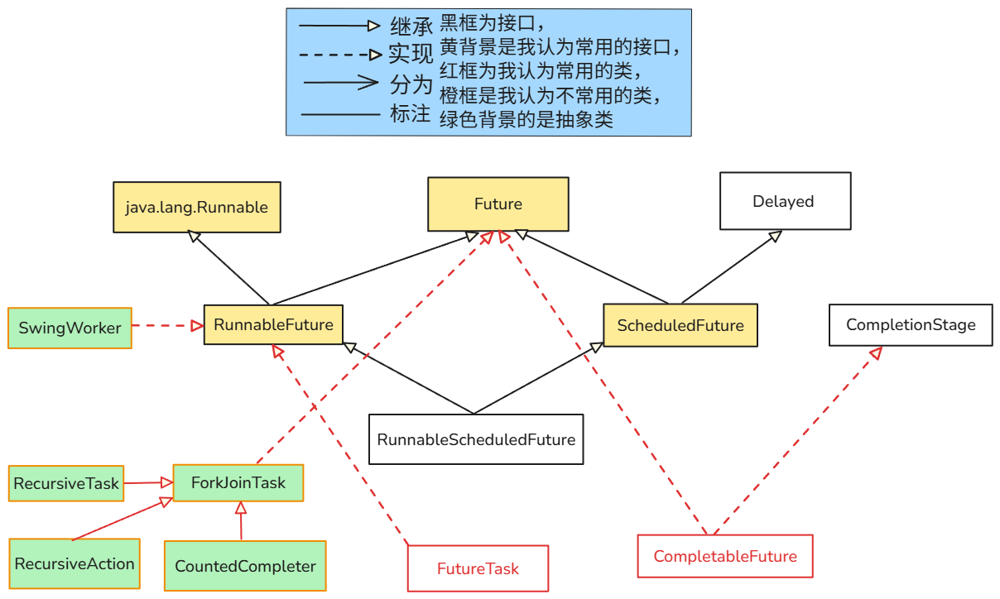

# 多线程

- **`java.lang.Thread`** **类是 Java 对操作系统原生线程的一个封装和抽象**
- **虚拟线程**，这是 Project Loom 项目的核心成果（已在Java 21中正式发布）


## 发展历程

- 在 JDK5 之前，Java程序员写多线程Java代码，是通过**`Thread`** 类 和 **`Runnable`** 接口，以及**`synchronized`** 关键字，**`Object`**类的 **`wait()`**, **`notify()`**, **`notifyAll()`**方法，以及**`volatile`关键字**等实现的

  要想用线程池，得自己实现，当时并没有官方线程池

- **Java 5 (2004年发布)** 
  
  - 这是一个里程碑式的版本，它引入了由并发大师 **Doug Lea** 主导开发的 **`java.util.concurrent`包** (简称**JUC**)
  
    它的主要目的是**简化**并发（多线程）应用程序的开发，提供了比传统的 **`synchronized`** 关键字和 **`wait`**/**`notify`** 方法更高级、更强大、更灵活、更安全的工具，非常强大
  
    这个包是**编写高性能、高可扩展性的并发程序的基石**，是现代 Java 并发开发的最佳实践
  
  - **JUC**包内含丰富的组件，如用于管理线程的**`ExecutorService`**线程池、高性能的**`ConcurrentHashMap`**、以及用于复杂协作的**`CountDownLatch`**和**`Semaphore`**同步器等等等等......
  
  > 当然，并不是有了**`java.util.concurrent`包** ，之前的线程相关类和方法等，就完全被舍弃了，只是应该优先使用**`java.util.concurrent`包** 中的类而已
  >
  > 它并不像 Java 的时间相关类的“替代”关系：Java 8引入新的时间系列API之后，原来的时间相关的API，就被完全取代了


## 进程和线程

- **进程 (Process)**：

  - 进程是**操作系统进行资源分配与隔离/保护的基本单位**；**CPU 的最小调度/运行单位是线程**

  - **线程 在进程的 *资源环境* 里运行**

- **线程 (Thread)**：

  - 线程是进程内的一个执行单元，是CPU调度的最小单位

  - **一个进程可以包含多个线程**，这些**线程共享该进程提供的资源**，

    但每个线程有自己独立的程序计数器、虚拟机栈和本地方法栈以及**线程局部存储**（如 `ThreadLocal` 数据）和自己的寄存器上下文/调度信息等

  - **线程是在进程的 *资源环境* 里运行的**

  - **代码是由 线程 执行的**


- Java 后端代码和 线程与进程的关系理解

  - Java 后端程序运行在一个 **JVM 进程内**，这个**进程中包含了线程执行的时候所需要的各种资源**，**代码就是资源之一**

    当前端有请求发来时，Web 服务器/框架会把该请求**分配给线程池中的某个线程**执行；不过**线程的真正调度与运行是由操作系统负责的**

  - JVM 启动阶段就会有一个**主线程**，然后**`main`方法是被这个主线程执行的**


## 并发和并行

- **并发**：多个任务在**一个**CPU核心上，通过时间片快速切换的方式“同时”运行（宏观上同时，微观上交替）
- **并行**：多个任务在**多个**CPU核心上，真正地同时运行


## 死锁

- 两个或多个线程在执行过程中，因争夺资源而造成的一种互相等待的现象，若无外力干涉，它们将都无法再向下执行

### 示例代码

```java
public class DeadlockExample {
    
    // 创建两个资源对象作为锁
    private static final Object resourceA = new Object();
    private static final Object resourceB = new Object();

    public static void main(String[] args) {
        // 线程A
        Thread threadA = new Thread(() -> {
            synchronized (resourceA) {
                System.out.println(Thread.currentThread().getName() + " 获得了资源A");
                try {
                    // 睡眠一段时间，确保线程B有时间启动并获得资源B
                    Thread.sleep(1000);
                } catch (InterruptedException e) {
                    e.printStackTrace();
                }

                System.out.println(Thread.currentThread().getName() + " 尝试获得资源B...");
                synchronized (resourceB) {
                    System.out.println(Thread.currentThread().getName() + " 获得了资源B");
                }
            }
        }, "线程A");

        // 线程B
        Thread threadB = new Thread(() -> {
            synchronized (resourceB) {
                System.out.println(Thread.currentThread().getName() + " 获得了资源B");
                try {
                    // 睡眠一段时间
                    Thread.sleep(1000);
                } catch (InterruptedException e) {
                    e.printStackTrace();
                }

                System.out.println(Thread.currentThread().getName() + " 尝试获得资源A...");
                synchronized (resourceA) {
                    System.out.println(Thread.currentThread().getName() + " 获得了资源A");
                }
            }
        }, "线程B");

        // 启动线程
        threadA.start();
        threadB.start();
    }
}
```


### 产生死锁的四个必要条件

一个死锁的发生，必须同时满足以下四个条件。只要破坏了其中任意一个，就可以有效避免死锁

1. **互斥条件**
   - **含义**：一个资源在同一时刻只能被一个线程占用。当一个线程已经占用了某个资源，其他任何试图获取该资源的线程都必须等待，直到该资源被释放。这在Java中通常由**`synchronized`**关键字或**`Lock`**对象来保证
2. **请求与保持条件**
   - **含义**：一个线程在已经持有一个资源的情况下，又去请求其他线程持有的资源。在等待新资源的同时，它并不会释放自己已经持有的资源
3. **不可剥夺条件**
   - **含义**：线程已经获得的资源，在未使用完毕之前，不能被其他线程强行剥夺，只能由持有该资源的线程自己主动释放
4. **循环等待条件**
   - **含义**：存在一个线程的资源等待链，形成一个闭环。例如，线程A等待线程B持有的资源，线程B又在等待线程A持有的资源


### 如何预防和避免死锁？

#### **破坏“循环等待”条件（最常用）**

- **方法**：**按顺序获取锁**。规定所有线程都必须按照相同的顺序来请求资源

- **示例**：我们可以规定，所有线程都必须先获取**`resourceA`的锁**，再获取**`resourceB`的锁**

  ```java
  Thread threadB = new Thread(() -> {
      synchronized (resourceA) { // 始终先锁A
          System.out.println(Thread.currentThread().getName() + " 获得了资源A");
          System.out.println(Thread.currentThread().getName() + " 尝试获得资源B...");
          synchronized (resourceB) { // 再锁B
              System.out.println(Thread.currentThread().getName() + " 获得了资源B");
          }
      }
  }, "线程B");
  ```

  - 这样一来，无论哪个线程先运行，它都会尝试先锁住A，成功后再去锁B，不会出现交叉持锁的情况

#### 破坏“请求与保持”条件

- **方法**：**一次性申请所有资源**。线程在运行前，一次性地获取所有需要的资源。如果不能一次性获取，则不占用任何资源
- **缺点**：这种方式会降低资源的利用率，并且很难预先知道所有需要的资源

#### 破坏“不可剥夺”条件

- **方法**：**使用可中断的锁或带超时的锁**。当一个线程在请求资源时被阻塞，如果它持有的某些资源可以被“剥夺”（即主动释放），那么死锁就可以被解开

- **示例**：使用**`java.util.concurrent.locks.Lock`**接口的**`tryLock()`方法**。**`tryLock()`**可以设置一个**超时时间**，如果在指定时间内没有获取到锁，它就会返回**`false`**而不是一直等待。这样线程就可以在获取锁失败后，释放掉自己已经持有的锁，然后稍后再试。

  ```java
  import java.util.concurrent.locks.Lock;
  import java.util.concurrent.locks.ReentrantLock;
  import java.util.concurrent.TimeUnit;
  
  Lock lockA = new ReentrantLock();
  Lock lockB = new ReentrantLock();
  // 在线程中
  if (lockA.tryLock(1, TimeUnit.SECONDS)) {
      try {
          if (lockB.tryLock(1, TimeUnit.SECONDS)) {
              try {
                  // 业务逻辑
              } finally {
                  lockB.unlock();
              }
          }
      } finally {
          lockA.unlock();
      }
  }
  ```


## 生产者-消费者模型

- **生产者-消费者模型**是一个解耦了**数据生产方**和**数据消费方**的**经典并发模型**。
  - **生产者**负责创建数据（或任务），并将其放入一个共享的**缓冲区**中；**消费者**则从这个缓冲区中取出数据并进行处理。

### 模型的三个核心组件

1. **生产者（Producer）**
   - **角色**：数据的创造者。它负责生成数据项，比如读取文件、接收网络请求、创建对象等。
   - **行为**：当缓冲区**未满**时，生产者可以将新的数据项放入缓冲区。当缓冲区**已满**时，生产者必须暂停生产，等待消费者取走数据，为新数据腾出空间。
2. **消费者（Consumer）**
   - **角色**：数据的处理者。它负责从缓冲区取出数据项，并对其进行后续操作，比如数据分析、写入数据库、响应用户请求等。
   - **行为**：当缓冲区**不为空**时，消费者可以从缓冲区取出数据项进行消费。当缓冲区**为空**时，消费者必须暂停消费，等待生产者放入新的数据。
3. **共享缓冲区（Shared Buffer / Bounded Buffer）**
   - **角色**：连接生产者和消费者的桥梁，通常是一个有界（即有固定容量）的队列（Queue）。
   - **作用**：
     - **解耦（Decoupling）**：生产者和消费者不需要直接通信，它们只与缓冲区交互。生产者不关心谁是消费者，消费者也不关心谁是生产者。
     - **平衡速率（Rate Balancing）**：如果生产者的生产速度和消费者的消费速度不匹配（例如，生产者速度快而消费者速度慢），缓冲区可以起到一个“蓄水池”的作用，平滑处理速度上的峰值和低谷，防止数据丢失或系统阻塞。


### Java中的实现方式

#### Java5之前

##### 方式

- **`wait()`, `notify()/notifyAll()` 和 `synchronized`**

  - 这是最经典、最底层的实现方式，**`wait()`, `notify()/notifyAll()` 是 `java.lang.Object` 类的方法**

  - **`synchronized`**：用来保证对共享缓冲区的访问是线程安全的，即同一时刻只有一个线程能操作缓冲区

  - **`wait()`**：当条件不满足时（如缓冲区满时生产者调用，或缓冲区空时消费者调用），调用此方法的线程会释放锁并进入等待状态
    - **`wait()`**: 让**当前线程**释放它所持有的**对象锁**，并进入该对象的“等待集”（wait set）中，进入等待状态
    - **`notify()` / `notifyAll()`**: 唤醒**一个**或**所有**正在该**对象**的“等待集”中等待的线程

  - **`notify()` / `notifyAll()`**：当某个线程改变了条件后（如生产者放入数据后，或消费者取走数据后），调用此方法来唤醒一个（**`notify`**）或所有（**`notifyAll`**）正在等待这个条件的线程

##### 示例

```java
// 共享队列
Queue<Data> queue = new LinkedList<>();
int MAX_SIZE = 10;
Object lock = new Object(); // 同步锁

// 生产者
public void produce(Data data) {
    synchronized(lock) {
        while (queue.size() == MAX_SIZE) {
            try {
                lock.wait(); // 队列满了，生产者等待
            } catch (InterruptedException e) {}
        }
        queue.add(data);
        lock.notifyAll(); // 唤醒可能在等待的消费者
    }
}

// 消费者
public Data consume() {
    synchronized(lock) {
        while (queue.isEmpty()) {
            try {
                lock.wait(); // 队列空了，消费者等待
            } catch (InterruptedException e) {}
        }
        Data data = queue.poll();
        lock.notifyAll(); // 唤醒可能在等待的生产者
        return data;
    }
}
```

- 通常推荐使用**`while`循环**来检查条件（**`while(condition)`**）而不是**`if`**，以防止“虚假唤醒”（Spurious Wakeup）。并且使用**`notifyAll()`通常比`notify()`更安全**，虽然效率稍低


#### Java5 及之后

##### 方式

- **`java.util.concurrent.BlockingQueue`**

- Java 5 引入的并发包**`java.util.concurrent`**极大地简化了并发编程。**`BlockingQueue`**（阻塞队列）接口就是为**生产者-消费者模型**量身定做的。它是一个线程安全的队列，并且内部已经完美地实现了等待/通知机制

  - 当生产者尝试向**已满**的队列中添加元素时（使用 **`put()`** 方法），线程会自动被阻塞，直到队列有空闲空间
  - 当消费者尝试从**空**队列中获取元素时（使用 **`take()`** 方法），线程会自动被阻塞，直到队列中有可用元素

  完全不需要自己编写 **`wait()`, `notify()` 和 `synchronized` 代码**！

##### 示例

```JAVA
import java.util.concurrent.ArrayBlockingQueue;
import java.util.concurrent.BlockingQueue;

public class ProducerConsumerWithBlockingQueue {

    public static void main(String[] args) {
        // 创建一个容量为10的阻塞队列
        BlockingQueue<Integer> sharedQueue = new ArrayBlockingQueue<>(10);

        // 创建生产者线程
        Thread producer = new Thread(() -> {
            try {
                for (int i = 0; i < 100; i++) {
                    System.out.println("生产: " + i);
                    sharedQueue.put(i); // 如果队列满了，put方法会自动阻塞
                    Thread.sleep(100); // 模拟生产耗时
                }
            } catch (InterruptedException e) {
                Thread.currentThread().interrupt();
            }
        });

        // 创建消费者线程
        Thread consumer = new Thread(() -> {
            try {
                while (true) {
                    Integer value = sharedQueue.take(); // 如果队列空了，take方法会自动阻塞
                    System.out.println("----消费: " + value);
                    Thread.sleep(500); // 模拟消费耗时
                }
            } catch (InterruptedException e) {
                Thread.currentThread().interrupt();
            }
        });

        producer.start();
        consumer.start();
    }
}
```

- 在实际开发中，**强烈推荐使用 `BlockingQueue`来实现生产者-消费者模型** 。常用的实现类有 **`ArrayBlockingQueue`**(基于数组的有界队列)和 **`LinkedBlockingQueue`**(基于链表，可配置容量，默认为无界)


## 线程的生命周期

- 线程的生命周期被明确地定义在 **`Thread.State`** 这个枚举类中，总共包含 **6 种状态**
  1. **NEW (新建)**
  2. **RUNNABLE (可运行)**
  3. **BLOCKED (阻塞)**
  4. **WAITING (无限期等待)**
  5. **TIMED_WAITING (限期等待)**
  6. **TERMINATED (终止)**


### NEW(新建)

- **状态描述**：当使用 **`new Thread(...)`** 语句创建了一个线程对象后，但在调用 **`start()`** 方法之前，这个线程就处于 **`NEW`** 状态

- **特征**：此时，线程对象已经在内存中被创建，但操作系统还没有为其分配任何资源，它也还没有开始执行。它只是一个普通的 Java 对象


### RUNNABLE (可运行)

- **状态描述**：这是线程最主要的工作状态。当对线程对象调用 **`start()`** 方法后，它就进入了 **`RUNNABLE`** 状态。
- **特征**：处于 **`RUNNABLE`** 状态的线程，可能正在CPU上**运行 (Running)**，也可能在**就绪队列 (Ready Queue)** 中等待被线程调度器选中来获取CPU时间片。Java 将这两种情况统一称为“可运行”。


### BLOCKED (阻塞)

- **状态描述**：线程因为等待获取一个 **`synchronized`** 内置锁（monitor lock）而暂停运行。
- **特征**：这个状态与锁（特指 **`synchronized`** 的锁）紧密相关。当一个线程试图进入一个被其他线程占用的 **`synchronized`** 代码块或方法时，它就会进入 **`BLOCKED`** 状态，直到那个锁被释放。


### WAITING (无限期等待)

- **状态描述**：线程主动调用了某些方法，使自己进入无限期等待状态，等待被其他线程显式地唤醒。
- **进入条件**：
  - **`Object.wait()`** (无参)
  - **`Thread.join()`** (无参)
  - **`LockSupport.park()`**
- **特征**：进入此状态的线程会释放CPU资源，并且**不会自动醒来**。它必须等待一个特定的“唤醒”信号


### TIMED_WAITING (限期等待)

- **状态描述**：与 **`WAITING`** 类似，但它有等待时间的上限。线程会在指定时间后自动被唤醒
- **进入条件**：调用了带超时参数的方法
  - **`Thread.sleep(long millis)`**
  - **`Object.wait(long millis)`**
  - **`Thread.join(long millis)`**
  - **`LockSupport.parkNanos(long nanos)`** / **`parkUntil(long deadline)`**
- **特征**：它有两种唤醒方式：1. 其他线程发出唤醒信号；2. 等待时间耗尽


### TERMINATED (终止)

- **状态描述**：线程的 **`run()`** 方法执行完毕，或者因为未捕获的异常而退出。这是线程生命周期的最后一个状态
- **特征**：线程已经完成了它的所有工作，被销毁了。一个处于 **`TERMINATED`** 状态的线程无法再次通过 **`start()`** 方法启动，否则会抛出 **`IllegalThreadStateException`**


## 打破时代的联立大理解

- 经常听到说一些话，比如 Java5 之后，将任务提交与执行进行了解耦啊。又比如什么分配`Runnable`和`Callable`任务啊啥的
  - 像这种说法经常见到，在学习的过程中，有时候会对我形成一种冲击，潜意识会觉得很不自然，原因是因为有些地方如果不思考和理解清楚，其实按照通识联立理解的话会有点矛盾，但是一般还发现不了，然后潜意识察觉到了这一点，就会产生那种很奇怪、很不自然的感觉，幸亏我敏锐的捕捉到了这一点，我将在这里把一些奇怪的地方讲清楚

- 我们来说说JDK5之前和JDK5之后对一些事物的看法吧，说完就明白了

  - 首先说一下`Runnable`和`Callable`在后世是被看作了**任务**，在前世`Runnable`被看作一种临时工具吧，用的时候就直接用了。然后前世没有`Callable`

  - JDK 5 之前：任务与执行“紧耦合”

    - 在 JDK 5 之前，我们谈论多线程时，核心角色只有一个：`java.lang.Thread` 类

    - **当时如何看待 `Runnable`？**

      - 在那个时代，`Runnable` 的身份非常单一：
        **它就是 `Thread` 的一个“靶子”或者说“代码容器”**
        当时它本身不被看作一个独立、完整的“任务”，而是依附于 `Thread` 存在
        在当时创建一个线程来执行一段代码，只有两种方式：

        1. **继承 `Thread` 类**：

           ```java
           class MyThread extends Thread { public void run() { ... } }
           ```

        2. **实现 `Runnable` 接口**：

           ```java
           Thread t = new Thread(new MyRunnable()); 
           t.start();
           ```
  
    - 在这个时代，**“任务的定义” (`new MyRunnable()`) 和 “任务的执行方式” (`new Thread(...)`) 被死死地绑定在了一起**
  
      - 当你创建 `Runnable` 实例时，几乎在同一时间，你就必须决定它的执行策略——即为它创建一个全新的、独立的线程
  
        > 弊端：
        >
        > **资源管理困难**：每来一个任务，你就得 `new Thread()`。线程的创建和销毁是有系统开销的。如果任务量巨大，频繁地创建销毁线程会导致性能急剧下降，甚至耗尽系统资源。你无法方便地重用线程
        >
        > **缺乏统一管理和控制**：你创建了一大堆 `Thread` 对象。但如果你想“等待所有任务执行完毕”，或者“获取任务的执行结果”，或者“取消某个任务”，这些操作都非常繁琐。你需要手动调用 `thread.join()`，或者使用复杂的 `wait()` / `notify()` 机制，代码很容易出错
        >
        > **职责不清晰**：业务逻辑（`Runnable` 里做什么）和线程管理策略（如何创建、启动、销毁线程）混杂在了一起
  
  - JDK5之后：任务与执行解耦
  
    - Java 5 引入的 `java.util.concurrent` 包（J.U.C）带来了一场思想上的革命。它引入了三个核心的、解耦的概念
  
      - **任务 (Task)**
  
        - 这就是 `Runnable` 和 `Callable`。他们成为了任务，被正式被视为一个独立的、可执行的工作单元。它们只关心“做什么”，不关心“谁来做”、“怎么做”
  
      - **执行器 (Executor)**
  
        - 这就是 `ExecutorService` 框架。它是专门用来执行任务的。它内部管理着线程（通常是线程池），决定了任务的执行策略（比如用固定数量的线程、可缓存的线程池等）。它只关心“怎么做”，不关心“做什么”
  
      - **未来的结果 (Future)**
  
        - 这是连接任务和结果的桥梁。是当你把一个 `Callable` 任务提交给 `ExecutorService` 时，它会立刻给你一张“提货单” (`Future`)，你可以在未来的某个时间点用它来获取结果
  
        - 我更倾向于把这个`Future`理解为一个表示结果的对象，只不过它会在 **`ExecutorService`** **提交任务后立刻就获取到**，之后**在未来** **`ExecutorService`** 会安排其内部的工作线程，会把那**一个**结果**自动地、异步地** **赋值**到这个**已有的`Future`对象**中去。不过，去调用 **`get()`**时，如果**`ExecutorService`** 还没有把结果放进去，**调用 `get()` 方法的那个线程**会被**阻塞**，会一直**阻塞等待**
  
          >目前其实我感觉这个就和前世的`Runnable`差不多，感觉这个是被创造出来专门表示执行结果的东西，只不过不是立刻出结果，而是去未来获取。名字都是未来，而不考虑在别的地方能不能一眼见名知意的看出来是这里的知识点，我更感觉这只是一个用来利用的东西罢了。
          >
          >前世的`Runnable`被视为纯纯搭配Thread用的，一个表示要做的事的东西而已
  
    - 在这里，代码变成了这样
  
      ```java
      executor.submit(new MyRunnable());
      ```
  
      
  

## Java5 之前的多线程

- 有两种方法可以**创建线程对象**
  - 一种是**继承** **`Thread`** **类**，并**重写 `run()` 方法**
  - 一种是**实现 `Runnable` 接口**，并**实现** **`run()` 方法** 
    - **强烈推荐这种方式**，原因如下：
      - **解耦任务与执行**：**`Runnable`** 关注的是“**要做什么任务**”（What），而 **`Thread`** 类关注的是“**如何去执行任务**”（How）。将任务（**`Runnable`**）与执行者（**`Thread`**）分开，是更优秀的面向对象设计。
      - **避免Java单继承的限制**：Java 类只能继承一个父类。如果你的类已经继承了另一个类，你就无法再继承 **`Thread`** 类了.但无论如何，你都可以实现 **`Runnable` 接口**（因为一个类可以实现多个接口）。
      - **提高代码的灵活性和复用性**：**`Runnable` 实例**可以被多个线程共享和复用。更重要的是，它可以被更高级的并发工具使用，比如 **`ExecutorService`（线程池）**，这是现代Java并发编程的推荐做法。你只需将 **`Runnable` 任务**提交给线程池，而无需手动管理 **`Thread`** 的生命周期。

### `Thread`类

- **线程类**


#### 字段

```java
public static final int MIN_PRIORITY 				// 线程可以具有的最低优先级 (值为 1)。
public static final int NORM_PRIORITY 				// 分配给线程的默认优先级 (值为 5)。
public static final int MAX_PRIORITY 				// 线程可以具有的最高优先级 (值为 10)。
```


#### 构造方法

```java
public 	Thread() 									// 分配一个新的 Thread 对象。
public 	Thread(Runnable target) 		  //分配一个新的Thread对象,使其具有new run方法，该方法执行指定target的run方法
public 	Thread(String name) 						// 分配一个具有指定名称的新的 Thread 对象
public 	Thread(Runnable target, String name) 		// 分配一个新的 Thread 对象，使其具有 new run 方法和指定的名称


public 	Thread(ThreadGroup group, Runnable target)	// 分配一个新的 Thread 对象，使其属于 group 并执行 target
public 	Thread(ThreadGroup group, String name) 		// 分配一个具有指定名称且属于 group 的新的 Thread 对象
public 	Thread(ThreadGroup group, Runnable target, String name)// 分配一个新的 Thread 对象
public 	Thread(ThreadGroup group, Runnable target, String name, long stackSize)
     // 分配一个新的 Thread 对象，以便将 target 作为其运行对象，将指定的 name 作为其名称，属于 group，并具有指定的堆栈大小
public  Thread
    (ThreadGroup group,Runnable target,String name,long stackSize,boolean inheritInheritableThreadLocals)														// (自JDK 9) 分配一个新的 Thread 对象
```


#### 相关方法

```java
public void 			start() 				   // (最核心方法) 使该线程开始执行；Java 虚拟机调用该线程的 run 方法
public void 			run() 
    			   //如果该线程是使用独立的Runnable运行对象构造的，则调用该Runnable对象的run方法;否则,该方法不执行任何操作

public final void 			join() 							// 等待该线程终止
public final void 			join(long millis) 				// 等待该线程终止的时间最长为 millis 毫秒
public final void 			join(long millis, int nanos)	// 等待该线程终止的时间最长为 millis 毫秒 + nanos 纳秒
public final String 		getName() 						// 返回该线程的名称
public final void 			setName(String name) 			// 改变线程名称
public final int 			getPriority() 					// 返回线程的优先级
public final void 			setPriority(int newPriority)	// 更改线程的优先级
public final boolean 		isAlive() 						// 测试线程是否处于活动状态
public final boolean 		isDaemon() 						// 测试该线程是否为守护线程
public final void 			setDaemon(boolean on) 			// 将该线程标记为守护线程或用户线程
public State 				getState() 						// (自JDK 1.5) 返回该线程的状态
public long 				getId() 						// (自JDK 1.5) 返回该线程的标识符
public void 				interrupt() 					// 中断该线程
public boolean 				isInterrupted() 				// 测试线程是否已被中断
public final ThreadGroup 	getThreadGroup() 				// 返回该线程所属的线程组
public StackTraceElement[] 	getStackTrace()					// 返回一个表示该线程堆栈转储的堆栈跟踪元素的数组
public ClassLoader  	getContextClassLoader()				// 返回该线程的上下文 ClassLoader
public void	 			setContextClassLoader(ClassLoader cl)//设置该线程的上下文类加载器
```

```java
public static Thread 	currentThread() 				// 返回对当前正在执行的线程对象的引用
public static void 		yield() 						// 一个暗示，即提示调度器当前线程愿意放弃其当前对处理器的使用
    													// 礼让线程
public static void 		sleep(long millis) 				// 在指定的毫秒数内让当前正在执行的线程休眠（暂停执行）
public static void 		sleep(long millis, int nanos)	// 在指定的毫秒数+纳秒数内让当前正在执行的线程休眠
public static boolean 	interrupted()	 				// 测试当前线程是否已经中断。此方法会清除线程的中断状态
public static boolean 	holdsLock(Object  obj)			//当且仅当当前线程持有指定对象上的监视器锁时，才返回 true
public static int 		activeCount() 					// 返回当前线程的线程组中活动线程的数目
public static void 		dumpStack() 					// 将当前线程的堆栈跟踪打印至标准错误流
public static void 		onSpinWait()					//指示调用者暂时无法进行，直到其他活动的一个或多个操作发生为止
public static int 		enumerate(Thread [] tarray)		//将当前线程的线程组及其子组中的每个活动线程复制到指定的数组中
public static Map <Thread ,StackTraceElement []> 	getAllStackTraces()		//返回所有活动线程的堆栈跟踪映射
public static Thread.UncaughtExceptionHandler  		getDefaultUncaughtExceptionHandler()
    													//返回当线程由于未捕获的异常而突然终止时调用的默认处理程序
public static void 				setDefaultUncaughtExceptionHandler(Thread.UncaughtExceptionHandler eh)
    						//设置当线程由于未捕获的异常而突然终止时调用的默认处理程序，并且没有为该线程定义其他处理程序
public Thread.UncaughtExceptionHandler  			getUncaughtExceptionHandler()
    													//返回当此线程由于未捕获的异常而突然终止时调用的处理程序
public void 					setUncaughtExceptionHandler(Thread.UncaughtExceptionHandler  eh)
    													//设置此线程由于未捕获的异常而突然终止时调用的处理程序
```

```JAVA
protected Object  		clone()		//抛出 CloneNotSupportedException 作为线程无法有意义地克隆。而是构造一个新线程
```


### `Runnable`接口

- 是一个**函数式接口**，里面有一个**`run()`方法**:

  ```java
  package java.lang;
  
  @FunctionalInterface
  public interface Runnable {
      public abstract void run();
  }
  ```

- **`Runnable` 接口**的作用是为那些希望在线程（**`Thread`**）中执行的任务提供一个统一的规范。任何实现了 **`Runnable` 接口**的类的实例都可以被一个 **`Thread` 对象**执行

- **Runnable** **接口最初的核心目的就是为了** **Thread** **类而设计的**，但是**虽然** **`Runnable`** **为** **`Thread`** **而生，但它的设计是如此成功和基础，以至于它已经超越了** **`Thread`** **，成为了整个Java生态系统中“可执行任务”的通用标准**

- **`Runnable` 的 `run()` 方法不能声明抛出受检异常(Checked Exception)。** 


### `ThreadGroup`类

- **`ThreadGroup`** 是Java早期为了方便管理一组线程而设计的类，它允许对线程进行分组并进行一些批量的操作
- 尽管 **`ThreadGroup`** 提供了上述功能，但在现代 Java 开发中，**它基本上被认为是一个过时（甚至可以说是被废弃）的API，强烈不推荐使用**


### `ThreadLocal<T>`类

#### 简述

- 在 Java 开发的时候，当我们在线程内部想**“线程隔离”地存储**数据的时候，就需要使用`ThreadLocal<T>`这个类，

  然后在线程中存储的**数据的类型**呢，我们可以通过这个**泛型`T`**来自定义，例如**`ThreadLocal<String>`**

- 在每个 **`Thread` 类的内部**都有一个名为 **`threadLocals`** 的成员变量，它的类型是 **`ThreadLocal.ThreadLocalMap`**

  - 它的目的只有一个：**充当一个容器或存储区域**，用来存放**专属于这个线程**的所有 `ThreadLocal<T>` 变量的值

    > 可以理解为线程的局部变量，只有它自身能够访问到的变量

  - **`ThreadLocalMap`** 是 `ThreadLocal` 的一个静态内部类，类似于一个**简化的 `HashMap`**
    - 键：`ThreadLocal<T>` 对象**本身** 的 **弱引用**
    - 值：当前线程在该 `ThreadLocal<T>` 上存的那个值，这个值的类型为`ThreadLocal<T>`中的这个`T`


- `ThreadLocal<T>` 类本身，是 Java 设计者提供的**唯一公开的、标准的** 用来 **访问和操作`threadLocals`** 的 API 入口
  - `ThreadLocal<T>` 实例的 `set(T value)` 和 `get()` 方法，就是实际去操作**当前线程**的 `threadLocals`
    - `set(value)`：把 `(this, value)` 存入**当前线程** 的 `threadLocals` 中
    - `get()`：从 **当前线程** 的 `ThreadLocalMap` 里把 `this` 对应的 Value 取出来
    - `remove()`：从 **当前线程** 的 `ThreadLocalMap` 里把 `this` 对应的**整个元素**删除（这是防止内存泄漏的关键）
    - `initialValue()`：受保护的方法，`get()` 首次访问时用于**创建初始值**，默认返回 `null`
    - `withInitial(Supplier<S> supplier)`：
      - 一个**静态方法**，用于创建 `ThreadLocal<T>` 实例，并**指定**一个 Lambda 表达式作为 `initialValue()` 的替代，更推荐使用


#### 构造方法

```java
public ThreadLocal()				//创建一个线程局部变量
```


#### 常见方法

```java
public void 	set(T value)
					//把 (this, value) 存入当前线程的 threadLocals 中
public T 		get()
					//从当前线程的 ThreadLocalMap 里把 this 对应的 value 取出来
    				//如果变量没有为当前线程设置值，它会首先通过调用 initialValue 方法来初始化该值
public void 	remove()
					//从 ThreadLocalMap 中删除 this 对应的那个 (this,value)
					//如果此后当前线程再次调用 get() 方法，它将通过调用其 initialValue() 方法重新初始化其值，
					//除非其值在此期间被 set(T) 方法设置
    		//ThreadLocal 很容易导致内存泄漏，
    		//最佳实践是：当你确定这个线程不再需要这个值时，必须!必须手动调用 remove() 来清理干净!

public static<S> ThreadLocal<S> withInitial(Supplier<? extends S> supplier)
					//现在最推荐的、创建 ThreadLocal 实例的方式
    		//一个静态工厂方法,允许你在创建ThreadLocal对象时,顺便用一个Lambda表达式(就是那个Supplier)来指定“默认值”是什么
    		//示例: ThreadLocal<String> localNew = ThreadLocal.withInitial(() -> "我是默认值");
    
protected T 	initialValue()
    				//返回当前线程在 ThreadLocalMap 中的初始值 , 默认实现返回null
    				//这个方法将在线程第一次通过 get() 方法访问变量时被调用，除非线程之前已经调用了 set(T) 方法
  	  //如果你不希望第一次get()时拿到null(比如你希望拿到一个空的 ArrayList)，你可以自己写个类继承ThreadLocal并重写这个方法
      //但是现在都建议用withInitial，这个方法不建议去继承和重写
```


#### 方法细节

#####  `set(T value)` - 存入值

1. **获取当前线程**：

   - 首先，Java 会找到正在执行这段代码的线程，我们称之为“当前线程”

2. **找到线程的`threadLocals`变量**：

   - 每个线程内部都有一个这个变量，它是`ThreadLocal.ThreadLocalMap`类型的

3. **存入数据**：

   - 如果现在调用set方法的 `ThreadLocal` 对象是 `myThreadLocal`，

     那么 Java 就会将 `(myThreadLocal, value)` 这个键值对存入`threadLocals`中


##### `get()` - 取出值

1. **获取当前线程**：

   - 首先，Java 会找到正在执行这段代码的线程，我们称之为“当前线程”

2. **找到线程的`threadLocals`变量**：

   - 每个线程内部都有一个这个变量，它是 `ThreadLocal.ThreadLocalMap` 类型的

3. **取出数据**：

   - 如果现在调用 `get` 方法的 `ThreadLocal` 对象是 `myThreadLocal`，

     那么 Java 就会用 `myThreadLocal` 作为“键”，从当前线程的 `threadLocals` 中，获取 `myThreadLocal` 这个键所对应的值


##### `remove()` - 移除值

1. **获取当前线程**：

   - 首先，Java 会找到正在执行这段代码的线程，我们称之为“当前线程”

2. **找到线程的`threadLocals`变量**：

   - 每个线程内部都有一个这个变量，它是 `ThreadLocal.ThreadLocalMap` 类型的

3. **移除数据**：

   - 如果现在调用 `remove` 方法的 `ThreadLocal` 对象是 `myThreadLocal`，

     那么 Java 就会用 `myThreadLocal` 作为“键”，将 `(myThreadLocal, value)` 这个键值对从当前线程的 `threadLocals` 中彻底清理掉


#### 关于它的内存泄漏

- `ThreadLocal` 最常被问到的问题就是它可能导致的**内存泄漏**

- 原因

  - 通过前文我们知道，我们在访问和操作当前 `Thread` 的 `threadLocals` 的时候，只能通过 `ThreadLocal<T>` 来进行，而`ThreadLocal<T>`底层又是通过 `this` 这个 key 来进行访问和操作的

    我们又知道，这个 `threadLocals` 中存储的元素的 key 是一个弱引用，会随着 GC 回收后变为 null，但是由于 value 是一个强引用，所以即使这个元素的 key 变为 null，这个 `threadLocals` 中的元素也不会消失，

    又因为访问和操作 `threadLocals` ，只能通过  `ThreadLocal<T>` 来进行，而在 `ThreadLocal<T>` 的底层又是通过 `this` 来进行访问和操作的，

    所以如果 `threadLocals` 不及时在用完后通过 `remove()` 清理元素，等到这个 `ThreadLocal<T>` 被清理了之后，对应元素的 key 会变为 null，我们将无法再对这个元素进行操作和访问，而这个元素也还是会继续 滞留 在 `threadLocals` 中

    这个 key为 null 的元素就还会在`threadLocals`中，且无法再通过 `this` 这个key来访问和操作到了


- 最佳实践

  - **在使用完 `ThreadLocal` 变量后，必须在 `finally` 块中显式调用 `remove()` 方法，以确保 100% 避免内存泄漏**

    - **保证执行：** `finally` 块中的代码**无论 `try` 块中的业务逻辑是否正常完成或抛出异常**，都会被执行

    - **防止泄漏：**

      -  `remove()` 方法会从当前线程的 `threadLocals` 中**移除整个 `Entry`**

        这会解除对 `Value` 的强引用，使其能够被 GC 正常回收


### 创建线程的几种方式

#### 继承`Thread`类创建

- 继承 **`Thread`** 类，重写 **`run()`** 方法

##### 示例

```java
public class MyThread extends Thread {
    @Override
    public void run() {
        for (int i = 0; i < 100; i++) {
            System.out.println(this.getName()+": Hello World");
        }
    }
}
```

```java
public static void main(String[] args) {
    Thread t1 = new MyThread();
    Thread t2 = new MyThread();
    t1.setName("线程1");
    t2.setName("线程2");
    t1.start();
    t2.start();
}
```


#### 实现`Runnable`接口

- 实现 **`Runnable`** 接口的 **`run()`** 方法，将任务实例传递给 **`Thread`类** 的构造函数
- **`Runnable` 的 `run()` 方法不能声明抛出受检异常(Checked Exception)。** 

##### 示例

```java
public class MyRun implements Runnable {
    @Override
    public void run(){
        for (int i = 0; i < 10; i++) {
            System.out.println(Thread.currentThread().getName()+": Hello World");
        }
    }
}
```

```java
public static void main(String[] args) {
    MyRun mr = new MyRun();
    Thread t1 = new Thread(mr);
    Thread t2 = new Thread(mr);
    t1.start();
    t2.start();
}
```


### 一些线程及线程相关的方法操作

#### 用户线程

- 程序的核心，执行主要任务


#### 守护线程

- 一种特殊的后台线程，它的主要任务是为其他用户线程提供服务

- 守护线程不会阻止 JVM (Java 虚拟机) 的退出

  - 换句话说，只要所有的**用户线程**都已经执行完毕，JVM 就会立即退出，而不管是否还有守护线程在运行。守护线程**会被无情地弃**，它们的任务也会被强制中断

  - **最经典的守护线程例子就是 Java 的垃圾回收器。** GC 线程在后台默默地为所有线程清理内存垃圾。如果你的主程序执行完了，JVM 绝不会为了等待 GC 完成一次完整的垃圾回收而迟迟不退出

- 通过 **`Thread`** 类的 **`setDaemon(boolean on)` 方法**可以将一个线程设置为**守护线程**

  - **必须在 `thread.start()` 方法调用之前设置。** 如果线程已经启动，再试图把它设置为守护线程，会抛出 **`IllegalThreadStateException`** 异常。

- 默认情况下，所有线程都是**用户线程**。一个线程的 **`daemon` 属性**会从创建它的父线程那里继承。由于 **`main`** 线程是用户线程，所以你在 **`main` 方法**里创建的线程默认也是用户线程

- **守护线程中的 `finally` 块不保证一定会被执行！**

  - 由于守护线程的生命周期会随着 JVM 的退出而被强行终止，因此，在 **`finally` 块**中进行的资源释放操作（如关闭文件、关闭数据库连接、释放锁等）是**不可靠的**。

- **永远不要在守护线程中执行任何关键的 I/O 操作或需要确保资源被正确清理的逻辑**


#### `yield()`礼让线程

##### 相关概念

- 礼让线程，顾名思义，就是建议当前正在执行的线程主动**“让出”CPU** 的使用权	

  - 它不是一个真实的线程，它是一个操作。这个操作通过调用静态方法 **`Thread.yield()`** 来完成

    当一个线程调用 **`yield()` 方法**时，它实际上是在向**线程调度器** 发出一个**提示**，表达的意思是：

    > “我当前的任务不是很紧急，我愿意暂停一下，你可以先去执行其他与我**同优先级的线程**。当然，如果你找不到其他需要运行的线程，或者你认为我还应该继续运行，那我马上就接着干”
    
    **核心要点：** **`yield()`** 是一个**建议**，而不是一个强制命令。线程调度器**可以采纳这个建议，也可以完全忽略它**

##### 行为特点

- **线程状态变化**：
  - 当线程调用 **`yield()`** 时，它会从**运行中** 状态转换回**就绪** 状态。它并没有进入阻塞或等待状态，因此它会立刻重新参与到 CPU 的竞争中

- **不释放锁**：如果当前线程持有一个锁（例如，它在一个 **`synchronized`** 代码块中），调用 **`yield()`** 方法**不会释放这个锁**。这一点极其重要，因为其他线程即使获得了 CPU 时间，也可能因为无法获取锁而继续等待
- **礼让对象**：理论上，**`yield()`** 是为了让其他具有**相同优先级**的线程有机会运行。但实际效果高度依赖于 JVM 的实现和底层操作系统的调度策略，无法保证。很有可能调度器在巡视一圈后，发现最适合运行的仍然是刚刚调用了 **`yield()`** 的那个线程，于是它会马上继续执行


#### `join()`插入线程

- 它不是一个真实的线程，它是一个操作。通过调用成员方法**`join()`**完成

- **`Thread`**的**`join()` 方法**：作用是**让一个线程等待另一个线程(调用join者)执行完毕**，这个是两个线程之间的操作
- **`join()`** 方法有三个重载的版本，提供了不同程度的灵活性：
  1. **`public final void join()`**
     - 这是最常用的版本
     - 它会**无限期地等待**，直到目标线程(调用join者)执行完毕。如果目标线程永远不结束，那么当前线程也会永远地等待下去
  2. **`public final void join(long millis)`**
     - 这是一个带超时参数的版本
     - 当前线程会等待**最多 `millis` 毫秒**。如果在等待时间内，目标线程执行完毕了，那么当前线程会立刻恢复执行
     - 如果超过了指定的毫秒数，目标线程**仍然没有执行完**，当前线程也会自动恢复执行，不再等待。这可以有效防止无限期的等待
  3. **`public final void join(long millis, int nanos)`**
     - 提供了更精确的超时设置（毫秒 + 纳秒），但使用场景较少。


###  `synchronized` 关键字

- 保证在同一时刻，只有一个线程可以执行被 **`synchronized`** 修饰的代码块或方法
- **`synchronized`** 提供了两种核心的保证
  - 原子性：它能保证一个线程在执行 **`synchronized`** 代码块时，不会被其他线程中断。这个代码块中的所有操作要么全部执行完毕，要么根本不执行，形成一个不可分割的原子操作。例如，像 **`count++`** 这种看似简单的操作，实际上包含了“读取-修改-写入”三个步骤，在没有同步的情况下，多线程执行时可能会出现问题。**`synchronized`** 可以将这三步捆绑成一个原子操作。
  - 可见性：当一个线程释放锁时，JMM（Java内存模型）会强制将该线程在工作内存中修改过的所有共享变量的值刷新回主内存。而当另一个线程获取同一个锁时，JMM会强制将该线程的工作内存置为无效，使其必须从主内存中重新读取共享变量的最新值。这就保证了线程之间对共享变量状态的可见性


#### 锁对象

- **锁对象**，也叫**监视器锁**

  - 在Java中，每个Java对象都内置了一个“监视器(Monitor）”,这个监视器就是一把“锁”,任何对象本身就是一把锁.

  - 当你使用 **`synchronized` **的不同情况：

    - 对于 **`synchronized`** **实例方法**，“锁”就是**当前类的实例对象（`this`）**的锁

    - 对于 **`synchronized`** **静态方法**，“锁”就是**当前类的 Class 对象（例如 `MyClass.class`）**的锁

    - 对于 **`synchronized`** **代码块**，”锁“就是你在括号 **`()`** 里**明确指定的那个对象** 的锁

  - 要保证锁对象一致，如果线程们使用的不是同一把“钥匙”，那就无法实现互斥，锁就失去了意义


#### `synchronized` 的三种使用方式

**`synchronized`** 主要有以下三种用法，它们锁定的对象（我们称之为“监视器锁”或“内置锁”）有所不同

##### 同步实例方法

- 将 **`synchronized`** 关键字放在普通成员方法的返回类型之前

```java
public class MyClass {
    private int count = 0;

    public synchronized void increment() {
        count++;
    }
}
```

- **锁定的是什么？** 当一个线程调用 **`increment()` 方法**时，它获取的是 **当前对象实例（`this`）的锁**
- **效果**： 如果有两个线程同时在同一个 **`MyClass`** 实例上调用 **`increment()`**，只有一个线程能进入该方法，另一个必须等待。 但如果这两个线程分别在 **不同** 的 **`MyClass`** 实例上调用，它们之间不会产生竞争，因为它们获取的是不同对象的锁。


##### 同步静态方法

- 将 **`synchronized`** 关键字放在静态方法的返回类型之前。

```java
public class MyClass {
    private static int staticCount = 0;

    public static synchronized void incrementStatic() {
        staticCount++;
    }
}
```

- **锁定的是什么？** 当一个线程调用 **`incrementStatic()`** 方法时，它获取的是 **当前类的 Class 对象 (`MyClass.class`) 的锁**
- **效果**： 由于一个类在JVM中只有一个 **`Class` 对象**，所以无论有多少个 **`MyClass`** 的实例，或者即使没有实例，只要有线程调用 **`incrementStatic()`**，它们竞争的都是同一个锁。这确保了在任何时候，只有一个线程能执行这个静态同步方法


##### 同步代码块

- 这是最灵活的使用方式。你可以明确指定要锁定哪个对象

```java
public class MyClass {
    private int count = 0;
    private final Object lock = new Object(); // 通常使用一个final的、私有的对象作为锁

    public void performAction() {
        // ... 其他非同步的代码 ...
        synchronized (this) {
            // 这部分代码是同步的，锁定的是当前对象 this
            count++;
        }
        // ... 其他非同步的代码 ...
    }

    public void anotherAction() {
        // ...
        // 使用一个专门的锁对象，可以减小锁的粒度
        synchronized (lock) {
            // 这部分代码是同步的
        }
    }
}
```

- **锁定的是什么？** 同步代码块锁定的对象是在括号 **`()`** 中指定的对象
  - **`synchronized (this)`**：锁定当前对象实例，效果等同于同步实例方法
  - **`synchronized (MyClass.class)`**：锁定类的 **`Class` 对象**，效果等同于同步静态方法
  - **`synchronized (someObject)`**：锁定 **`someObject`** 这个对象。这是一种推荐的做法，因为它能**减小锁的粒度**。只锁定需要同步的代码部分，而不是整个方法，可以提高程序的并发性能


## Java5 及其之后的多线程(JUC)

- 引入了**`java.util.concurrent`包** (简称**JUC**).


### 线程池核心知识

#### 概念

- **线程池**就是一个管理线程的“池子”。它会预先创建一定数量的线程，并将它们保存在池中。当有任务需要执行时，线程池会从池中取出一个空闲的线程来执行任务。任务执行完毕后，线程并不会被销毁，而是会返回池中，等待执行下一个任务


#### 为什么需要线程池

- 如果**没有线程池**，而是直接 **`new Thread()`** 	

  - **资源开销大**：频繁地创建和销毁线程会消耗大量的系统资源（内存、CPU 时间）

  - **性能瓶颈**：无限制地创建线程可能会耗尽系统资源，导致应用程序响应变慢，甚至系统崩溃

  - **缺乏统一管理**：线程是分散的，难以进行统一的管理、监控和调优


#### 线程池的核心优势

- **降低资源消耗**：通过复用已存在的线程，减少了线程创建和销毁的开销。

- **提高响应速度**：任务到达时，无需等待线程创建即可立即执行。

- **提高线程的可管理性**：线程是稀缺资源，如果无限制地创建，不仅会消耗系统资源，还会降低系统的稳定性。线程池可以进行统一的分配、调优和监控。

- **提供更强大的功能**：可以实现定时执行、周期性执行、并发数控制等高级功能。


#### 相关体系

- 线程池核心框架：**`Executor`** 框架
- 个人感觉最重要的接口：**`ExecutorService`**接口，可以用这个接口的变量来引用一个**`ThreadPoolExecutor`**类的对象
- 个人感觉最重要的类：**`ThreadPoolExecutor`**线程池类
- 超级工具类：**`Executors`**


#### 线程池的工作流程

- 当一个新任务通过 **`execute()` 方法**提交时，线程池按以下顺序处理：
  1. 判断当前运行的线程数是否小于 **`corePoolSize`(核心线程数)**。如果是，则立即创建一个新的核心线程来执行任务
  2. 如果不是，则判断 **`workQueue` (任务队列)** 是否已满。如果没满，则将任务放入队列中等待
  3. 如果任务队列也满了则判断当前运行的线程数是否小于 **`maximumPoolSize`(最大线程数)**。如果是，则创建一个新的非核心线程来执行任务
  4. 如果当前线程数已经等于 **`maximumPoolSize`(最大线程数)**，则触发**`RejectedExecutionHandler`(拒绝策略) ** 来处理这个任务


#### 线程池大小的设置建议

##### 相关知识

- **不存在一个“万能”的公式，最佳线程数取决于任务的类型、服务器的硬件配置以及外部依赖。**但是，我们可以遵循一套科学的分析方法和基本准则来找到一个相对最优的解
- 核心的考量点是你的任务属于哪种类型： **CPU 密集型 (CPU-Bound)** 还是 **I/O 密集型 (I/O-Bound)**
  - 

##### **CPU 密集型任务**

- **特点**：任务需要长时间消耗CPU资源，例如视频编码、复杂的数学计算、大数据分析等

##### I/O **密集型任务**

- **特点**：任务大部分时间都在等待IO操作完成（磁盘读写、数据库查询、网络请求），CPU处于空闲状态。这是绝大多数Web应用、微服务中的场景


##### 自定义线程池类`ThreadPoolExecutor`构造方法的七个参数的设置建议

- 见下面`ThreadPoolExecutor`类中说明


### `java.util.concurrent`包体系

- `java.util.concurrent`（简称 JUC）是 Java 语言中处理并发编程的核心工具包，自 Java 5.0 版本引入以来，极大地简化了并发编程的复杂性。它提供了一系列高性能、高可用的并发构建块，使开发者能够更轻松地编写出健壮、可扩展的多线程应用程序。


#### Executors (执行器框架)

- 在**`java.util.concurrent`**包中

- JUC 的核心，负责管理线程和执行任务，将任务提交与执行解耦

##### 体系结构图


##### `Executor`接口

- 是整个框架最基础的接口

```java
package java.util.concurrent;

public interface Executor {    
	void execute(Runnable command);
}
```

- 思想：**将任务的提交与任务的执行解耦。**
  - 开发者只负责创建任务（**`Runnable`** 或 **`Callable`** 对象），然后把它们“提交”给一个执行器。
  - **`Executor`** 负责管理线程，决定何时、何地、用哪个线程来执行这些任务。它可能使用一个新线程，也可能使用一个已经存在的线程（线程池），或者根据配置来排队等待。
- ⭐⭐在实际开发中，我们很少直接使用 **`Executor`** 接口，而是使用它的子接口 **`ExecutorService`**


##### ⭐⭐`ExecutorService`接口

###### 基本概念

- 它不仅具备**`Executor`**的执行任务的能力(**`execute(Runnable)`**), 更重要的是,它增加了对**线程池生命周期管理**和**任务执行结果获取**的支持

  - **生命周期管理**：提供了 **`shutdown()`** 和 **`shutdownNow()`** 方法来平滑地关闭执行器

  - **支持带返回值的任务**：提供了 **`submit()` 方法**，它不仅可以接受 **`Runnable`**，还可以接受 **`Callable`** 任务。**`Callable` 任务**可以有返回值，并且可以抛出异常。

  - **获取任务结果**：**`submit()`** 方法会返回一个 **`Future`** 对象。通过 **`Future`** 对象，你可以在未来的某个时间点获取任务的执行结果、查询任务状态，甚至取消任务。


###### 相关方法

```java
void 			execute(Runnable command) 		
    										// 在未来的某个时间执行给定的命令。命令可以在新线程、池化线程或调用线程中执行
```

```JAVA
void 			shutdown() 	
    			   // 启动一次顺序关闭，在此过程中执行先前提交的任务，但不接受任何新任务。如果已经关闭，调用此方法没有额外效果
List<Runnable> 	shutdownNow() 		   // 尝试停止所有正在执行的活动任务，暂停处理正在等待的任务，并返回等待执行的任务列表
boolean 		isShutdown() 		   // 如果此执行器已关闭，则返回 true
boolean 		isTerminated()	
   		   //如果关闭后所有任务都已完成，则返回true。注意：除非首先调用shutdown或shutdownNow,否则isTerminated永不为true
boolean 		awaitTermination(long timeout, TimeUnit unit) 
    						 // 阻塞直到所有任务在关闭请求后完成执行，或者发生超时，或者当前线程被中断(以先发生者为准)
```

```java
<T> Future<T> 	submit(Callable<T> task) 		//提交一个返回值的任务用于执行,并返回一个表示该任务的待处理结果的Future
<T> Future<T> 	submit(Runnable task, T result) 
    					//提交一个Runnable任务用于执行,并返回一个Future.在成功完成后,该Future的get方法将返回给定的结果
Future<?> 		submit(Runnable task) 
    				//提交一个Runnable任务用于执行,并返回一个表示该任务的Future.该Future的get方法在成功完成后将返回null
```

```java
<T> List<Future<T>> invokeAll(Collection<? extends Callable<T>> tasks)
										// 执行给定的任务集合，当所有任务完成时，返回一个持有其状态和结果的 Future 列表
<T> List<Future<T>> invokeAll(Collection<? extends Callable<T>> tasks, long timeout, TimeUnit unit)
					// 执行给定的任务集合，在给定的超时期内，当所有任务完成或超时后，返回一个持有其状态和结果的 Future 列表
<T> T invokeAny(Collection<? extends Callable<T>> tasks)
										// 执行给定的任务集合，返回任一个成功完成的任务的结果（即没有抛出异常的任务）
<T> T invokeAny(Collection<? extends Callable<T>> tasks, long timeout, TimeUnit unit)
							  // 执行给定的任务集合，在给定的超时期内，返回任一个成功完成的任务的结果(即没有抛出异常的任务)
```


##### ⭐⭐`ThreadPoolExecutor`线程池类

###### 相关概念和参数

- 这是整个**`Executor`**框架中**最核心、最重要**的实现**类**。几乎所有我们说的“线程池”都是指它的实例。**`Executors`** 线程池工厂类创建的大多数线程池，内部都是 **`ThreadPoolExecutor`**。

- 提供了一个功能强大、高度可配置的线程池。它允许你精细地控制线程池的各种行为，它那个构造方法有7个参数。

  >参数：
  >
  >1. **`int corePoolSize`**: **核心线程数**。即使线程处于空闲状态，也会保留在池中的线程数量。这是线程池的“常驻员工”
  >
  >2. **`int maximumPoolSize`**: **最大线程数**。线程池能容纳的最大线程数量。当任务队列满了，并且当前线程数小于最大线程数时，才会创建新线程。这是“常驻员工 + 临时工”的总数
  >
  >3. **`long keepAliveTime`**: **线程存活时间**。当线程池中的线程数量大于 **`corePoolSize`(核心线程数)** 时，如果一个线程空闲时间达到 **`keepAliveTime`**，它就会被终止。这针对的是那些“临时工”
  >
  >4. **`TimeUnit unit`**: **`keepAliveTime` 的时间单位**，如 **`TimeUnit.SECONDS`**, **`TimeUnit.MINUTES`** 等。
  >
  >5. **`BlockingQueue<Runnable> workQueue`**: **任务队列**
  >   - 一个阻塞队列，用于存放等待执行的任务的任务。当所有核心线程都在忙时，新任务会进入这个队列排队。常见的队列:
  >     - **`ArrayBlockingQueue`**：基于数组的有界阻塞队列。
  >     - **`LinkedBlockingQueue`**：基于链表的阻塞队列，默认是无界的，可能导致内存溢出。
  >     - **`SynchronousQueue`**：一个不存储元素的阻塞队列，每个插入操作必须等待一个移除操作。
  >     - **`PriorityBlockingQueue`**：一个支持优先级排序的无界阻塞队列。
  >
  >
  >6. **`ThreadFactory threadFactory`**: **线程工厂**。用于创建新线程的工厂。通过自定义 **`ThreadFactory`**，可以给线程设置有意义的名字等，方便问题排查。**详见下面的 ThreadFactory 接口**
  >
  >7. **`RejectedExecutionHandler handler`**: **拒绝策略**
  >
  >  - 当线程池和任务队列都满了之后，对于新提交的任务，所采取的策略。Java 提供了四种内置策略：
  >
  >    - **`AbortPolicy`** (默认)：直接抛出 **`RejectedExecutionException`** 异常。
  >
  >    - **`CallerRunsPolicy`**：由提交任务的那个线程自己来执行这个任务。
  >
  >    - **`DiscardPolicy`**：直接丢弃这个任务，不作任何处理。
  >
  >    - **`DiscardOldestPolicy`**：丢弃队列中最老的那个任务，然后尝试重新提交当前任务。
  >
  >  - 自定义策略：自己实现 **`RejectedExecutionHandler` 接口**，将拒绝的任务记录到日志、持久化到数据库或消息队列中，以便后续进行补偿处理

- **阿里巴巴的《Java开发手册》**中强制规定，不允许使用 **`Executors`** 来创建线程池，而是要通过 **`ThreadPoolExecutor`线程池类** 的方式创建，这样可以让开发者更加明确线程池的运行规则，规避资源耗尽的风险


###### 七个参数的设置建议

- 我现在的电脑暗影精灵 8 pro的CPU核心数是14，逻辑核心数量（即包含超线程技术虚拟的核心数）是20个

1. `int corePoolSize` (核心线程数)

   - **对于计算密集型任务**：

     - **建议值**：`CPU核心数` 或 `CPU核心数 + 1`。	

     - **原因**：这类任务会把CPU“吃满”。如果线程数远超CPU核心数，线程之间会频繁地进行上下文切换，这会带来额外的开销，反而降低性能。设置成核心数，可以保证CPU的每个核心都在高效运转。`+1` 是为了防止某个线程偶尔因为页面错误或其他原因阻塞时，CPU能有另一个线程顶上。

     - **如何获取CPU核心数**：

       ```JAVA
       int cores = Runtime.getRuntime().availableProcessors();
       ```

       

   - **对于IO密集型任务**：

     - **建议值**：一个远大于CPU核心数的数值。一个经典的（但非绝对的）公式是：

       - ```txt
         CPU核心数 * (1 + 平均等待时间 / 平均计算时间)
         ```

     - **原因**：由于任务大部分时间在等待，CPU是空闲的。我们需要让出CPU给其他可以执行的线程。因此，可以配置更多的线程来提高系统的吞吐量

     - **实践中的建议**：这个公式的`等待时间/计算时间`很难精确测量。在实践中，通常会从一个经验值开始，例如 `CPU核心数 * 2`，然后通过**压力测试**来观察CPU使用率、任务响应时间、下游系统（如数据库）的负载，逐步调整到一个最优值。对于一个典型的8核服务器，处理IO密集型任务的线程池，`corePoolSize` 设置为 `16`, `32` 甚至更高都是很常见的

   

2. `int maximumPoolSize` (最大线程数)

   - **设置建议**：它应该**大于或等于 `corePoolSize`(第一个参数-核心线程数)**。这个值代表了你的系统能承受的**极限负载**

   - **考量因素**：主要取决于你关联的**外部资源**的瓶颈。例如，如果你的数据库连接池最大只有100个连接，那么你设置一个200的最大线程数就没有意义，因为多出来的线程去请求数据库时也只会因为拿不到连接而等待。

   

   - **对于计算密集型任务**：通常可以将 `maximumPoolSize` 设置得与 `corePoolSize` 相等，因为增加更多线程也无益

   - **对于IO密集型任务**：设置一个比 `corePoolSize` 大的值，作为应对突发流量的“缓冲垫”。例如，核心数是20，最大数可以设置为40或50

   

3. `long keepAliveTime`(线程存活时间)

   - 搭配第4个参数  **`TimeUnit unit`(`keepAliveTime` 的时间单位)**  使用
   - **设置建议**：这两个值取决于你的应用**流量的“波峰”和“波谷”间隔**。
     - 如果流量高峰是短暂且频繁的，你可以把存活时间设得长一些（如几分钟），这样就不用频繁地创建和销毁“临时工”线程，节省了系统开销。
     - 如果流量高峰是偶发的，且间隔很长，可以设置得短一些（如30秒到1分钟），以便在空闲时能更快地释放掉多余的资源

   

4. `TimeUnit unit`(`keepAliveTime` 的时间单位)

   - 搭配第3个参数  **`long keepAliveTime`(线程存活时间)**  使用
   - **设置建议**：这两个值取决于你的应用**流量的“波峰”和“波谷”间隔**
     - 如果流量高峰是短暂且频繁的，你可以把存活时间设得长一些（如几分钟），这样就不用频繁地创建和销毁“临时工”线程，节省了系统开销。
     - 如果流量高峰是偶发的，且间隔很长，可以设置得短一些（如30秒到1分钟），以便在空闲时能更快地释放掉多余的资源

   

5. `BlockingQueue<Runnable> workQueue` (任务队列)

   - **强烈建议**：**优先使用有界队列**，它可以有效地防止资源耗尽。

     - **`ArrayBlockingQueue`**：一个**基于数组、先进先出(FIFO)的有界队列**。**创建时必须指定容量**。这是**最常用的选择**。其容量大小需要权衡：
       - **队列过小**：会导致任务很容易被拒绝，触发拒绝策略。
       - **队列过大**：会占用更多内存，并且可能在系统高负载时，导致任务响应时间变长（因为任务在队列中等待了太久）。
       - **设置建议**：根据你的业务能容忍的最大任务积压量来设置，通常从几百到几千开始，通过压测调整。
     - **`LinkedBlockingQueue`**：基于链表的队列。如果不指定容量，它就是**无界的**，这是 `newFixedThreadPool` 的风险所在。**如果使用，请务必在构造时传入容量！** `new LinkedBlockingQueue<>(1000)`。
     - **`SynchronousQueue`**：一个不存储元素的队列。这是 `newCachedThreadPool` 使用的队列。它要求一个任务的插入操作必须等待另一个线程的移除操作。这通常与一个非常大的 `maximumPoolSize` 配合使用，适合处理大量、快速完成的任务。
     - **`PriorityBlockingQueue`**：一个支持优先级的无界队列。如果你的任务有不同的优先级，可以考虑使用它。

     

   

6. `ThreadFactory threadFactory` (线程工厂)

   - **强烈建议**：**一定要自定义！**
     - **目的**：给线程池中的每个线程起一个有意义的名字，例如 `my-order-handler-thread-1`。
     - **好处**：当出现线上问题，你需要打印线程栈（Thread Dump）或查看日志时，一个有意义的线程名可以让你瞬间定位到是哪个业务的线程池出了问题，极大地提高了排查效率。否则，你看到的将是清一色的 `pool-1-thread-1`, `pool-2-thread-5`，难以分辨。
     - **实现**：可以使用Google Guava库的 `ThreadFactoryBuilder`，或者自己实现一个简单的 `ThreadFactory` 接口。

   

7. `RejectedExecutionHandler handler` (拒绝策略)

   - **`AbortPolicy` (默认)**：直接抛出 `RejectedExecutionException` 异常，简单粗暴。调用方需要自己 `try-catch` 来处理。

   - **`CallerRunsPolicy`**：一个非常好的“降级”策略。它不会抛弃任务，也不会抛出异常，而是将任务交由**提交任务的那个线程**自己去执行。例如，一个处理Web请求的Tomcat线程提交任务到线程池，如果线程池满了，这个Tomcat线程就会自己去执行这个耗时任务，导致它暂时无法接收新的Web请求。这起到了一种**反压（Back Pressure）**的作用，自然地减缓了任务提交的速度。

   - **`DiscardPolicy`**：直接把任务丢掉，什么也不做。**非常危险**，只在你可以接受任务丢失的情况下使用。

   - **`DiscardOldestPolicy`**：丢弃队列中最老的那个任务，然后尝试把新任务加入队列。同样有任务丢失的风险。

   - **自定义实现**：你**可以自己实现 `RejectedExecutionHandler` 接口**，将拒绝的任务记录到日志、持久化到数据库或消息队列中，以便后续进行补偿处理。


###### 示例

```java
import java.util.concurrent.*;

public class DetailedThreadPoolExample {

    /**
     * 自定义一个线程工厂，方便给线程命名
     */
    private static class NamedThreadFactory implements ThreadFactory {
        private int count = 0;
        private final String namePrefix = "MyBizPool-thread-";

        @Override
        public Thread newThread(Runnable r) {
            Thread t = new Thread(r, namePrefix + ++count);
            System.out.println("线程工厂创建了一个新线程: " + t.getName());
            return t;
        }
    }

    public static void main(String[] args) {
        System.out.println("当前时间: " + java.time.LocalTime.now());
        System.out.println("CPU核心数: " + Runtime.getRuntime().availableProcessors());

        // 1. 定义线程池的核心参数
        int corePoolSize = 2;       // 核心线程数：2个
        int maximumPoolSize = 5;    // 最大线程数：5个
        long keepAliveTime = 30;    // 非核心线程空闲存活时间：30秒
        TimeUnit unit = TimeUnit.SECONDS;

        // 2. 创建一个有界的工作队列，容量为10
        BlockingQueue<Runnable> workQueue = new ArrayBlockingQueue<>(10);

        // 3. 创建一个自定义的线程工厂
        ThreadFactory threadFactory = new NamedThreadFactory();

        // 4. 定义一个拒绝策略 (CallerRunsPolicy: 由提交任务的线程自己来执行该任务)
        RejectedExecutionHandler rejectionHandler = new ThreadPoolExecutor.CallerRunsPolicy();

        // 5. 使用7个参数的构造函数创建线程池
        System.out.println("--- 准备创建线程池 ---");
        ThreadPoolExecutor threadPool = new ThreadPoolExecutor(
                corePoolSize,
                maximumPoolSize,
                keepAliveTime,
                unit,
                workQueue,
                threadFactory,
                rejectionHandler
        );
        System.out.println("--- 线程池创建完毕 ---");
        System.out.printf("核心线程数: %d, 最大线程数: %d, 队列容量: %d\n\n",
                threadPool.getCorePoolSize(), threadPool.getMaximumPoolSize(), workQueue.size());

        // 模拟提交大量任务，以观察线程池的行为
        // 总任务数(20) > 最大线程数(5) + 队列容量(10)
        try {
            for (int i = 1; i <= 20; i++) {
                final int taskNumber = i;
                System.out.printf("提交任务 %d...\n", taskNumber);
                threadPool.execute(() -> {
                    System.out.printf(">> %s 开始执行任务 %d\n",Thread.currentThread().getName(),taskNumber);
                    try {
                        // 模拟任务执行耗时
                        Thread.sleep(2000);
                    } catch (InterruptedException e) {
                        Thread.currentThread().interrupt();
                    }
                    System.out.printf("<< %s 完成任务 %d\n", Thread.currentThread().getName(), taskNumber);
                });
                // 稍微延时，方便观察输出
                Thread.sleep(100); 
            }
        } catch (InterruptedException e) {
            e.printStackTrace();
        } finally {
            // 在实际应用中，记得在程序退出前关闭线程池
            System.out.println("\n--- 所有任务提交完毕，准备关闭线程池 ---");
            threadPool.shutdown();
        }
    }
}
```


###### 构造方法

```JAVA
public ThreadPoolExecutor(int corePoolSize, int maximumPoolSize, long keepAliveTime, TimeUnit unit, BlockingQueue<Runnable> workQueue)
						// 使用给定的初始参数创建一个新的 ThreadPoolExecutor(5个参数)

public ThreadPoolExecutor(int corePoolSize, int maximumPoolSize, long keepAliveTime, TimeUnit unit, BlockingQueue<Runnable> workQueue, ThreadFactory threadFactory)
						// 使用给定的初始参数和线程工厂创建一个新的 ThreadPoolExecutor(6个参数)

public ThreadPoolExecutor(int corePoolSize, int maximumPoolSize, long keepAliveTime, TimeUnit unit, BlockingQueue<Runnable> workQueue, RejectedExecutionHandler handler)
						// 使用给定的初始参数和拒绝策略处理器创建一个新的 ThreadPoolExecutor(6个参数)

public ThreadPoolExecutor(int corePoolSize, int maximumPoolSize, long keepAliveTime, TimeUnit unit, BlockingQueue<Runnable> workQueue, ThreadFactory threadFactory, RejectedExecutionHandler handler)
						// 使用给定的初始参数、线程工厂和拒绝策略处理器创建一个新的 ThreadPoolExecutor(最全的构造器,7参)
```

###### 方法

```java
<T> Future<T> 	submit(Callable<T> task) 		//提交一个返回值的任务用于执行,并返回一个表示该任务的待处理结果的Future
<T> Future<T> 	submit(Runnable task, T result) 
    					//提交一个Runnable任务用于执行,并返回一个Future.在成功完成后,该Future的get方法将返回给定的结果
Future<?> 		submit(Runnable task) 
    				//提交一个Runnable任务用于执行,并返回一个表示该任务的Future.该Future的get方法在成功完成后将返回null
```

```java
public void 			execute(Runnable command)
    										   //执行command任务.该方法可能会创建一个新线程,或者复用现有线程来执行任务
public void 			setCorePoolSize(int corePoolSize) 			// 设置核心线程数
public int 				getCorePoolSize() 							// 获取核心线程数。
public boolean 			prestartCoreThread() 
    										//启动一个核心线程，使其空闲地等待工作.如果所有核心线程都已启动，则返回false
public int 				prestartAllCoreThreads() 		// 启动所有核心线程,使它们空闲地等待工作.返回实际启动的线程数
public void 			allowCoreThreadTimeOut(boolean value) 
    												  //设置策略:是否允许核心线程在空闲时超时终止(keepAliveTime生效)
public boolean 			allowsCoreThreadTimeOut() 		// 获取策略：是否允许核心线程超时
public void 			setMaximumPoolSize(int maximumPoolSize) 	// 设置最大允许的线程数
public int 				getMaximumPoolSize() 						// 获取最大允许的线程数
public void 			setKeepAliveTime(long time, TimeUnit unit) 	// 设置非核心线程在终止前可以保持空闲的时间
public long 			getKeepAliveTime(TimeUnit unit) 			// 获取非核心线程的空闲存活时间
public void 			setThreadFactory(ThreadFactory threadFactory) 	// 设置用于创建新线程的线程工厂
public ThreadFactory 	getThreadFactory() 								// 获取线程工厂
public void 					setRejectedExecutionHandler(RejectedExecutionHandler handler) 
   																		//设置当任务无法被执行时的拒绝策略处理器
public RejectedExecutionHandler getRejectedExecutionHandler() 			// 获取拒绝策略处理器
public boolean 			awaitTermination(long timeout, TimeUnit  unit)
    							  //阻塞直到所有任务在关闭请求后完成执行，或者发生超时，或者当前线程被中断，以先发生者为准
```

```java
public int 						getPoolSize() 				// 返回线程池中的当前线程数
public int 						getActiveCount() 			// 返回当前正在执行任务的大致线程数
public int 						getLargestPoolSize() 		// 返回线程池曾经达到过的最大线程数
public long 					getTaskCount() 				// 返回计划执行的任务总数的大致值
public long 					getCompletedTaskCount() 	// 返回已完成执行的任务总数的大致值
public BlockingQueue<Runnable> 	getQueue() 					// 返回此执行程序使用的任务队列
public boolean 					remove(Runnable task) 		//如果任务存在于内部队列中,则从中移除此任务(如果尚未开始)
public void 					purge() 					// 尝试从工作队列中移除所有已取消的 Future 任务
```

```java
protected void 		beforeExecute(Thread t, Runnable r)    //在给定线程中执行给定Runnable之前调用的方法.可由子类重写
protected void 		afterExecute(Runnable r, Throwable t) 	// 在给定Runnable执行完毕后调用的方法.可由子类重写
protected void 		terminated() 							//当执行程序终止时调用的方法.默认实现为空.可由子类重写
```

```JAVA
boolean 		isShutdown() 		   // 如果此执行器已关闭，则返回 true
boolean 		isTerminated()	
   		   //如果关闭后所有任务都已完成，则返回true。注意：除非首先调用shutdown或shutdownNow,否则isTerminated永不为true
public boolean 	isTerminating()		//如果此执行程序在shutdown()或shutdownNow()之后正在终止但尚未完全终止,则返回 true
```

```JAVA
List<Runnable> 	shutdownNow() 		   // 尝试停止所有正在执行的活动任务，暂停处理正在等待的任务，并返回等待执行的任务列表
boolean 		isShutdown() 		   // 如果此执行器已关闭，则返回 true
```


##### 特殊接口：`ThreadFactory`接口

- 在 **`java.util.concurrent`** 包中
- 它只有一个方法 **`newThread(Runnable r)`**，作用就是**“生产”一个新的线程**。
  - 当线程池需要创建一个新的工作线程时（无论是核心线程还是非核心线程），它不会直接 **`new Thread()`**，而是调用你提供的 **`ThreadFactory`** 实例的 **`newThread()`** 方法来获取一个新线程
    - 如果你不提供自定义的 **`ThreadFactory`**，**`ThreadPoolExecutor`** 会使用一个默认的工厂 (**`Executors.defaultThreadFactory()`**)。这个默认工厂创建的线程有以下特点：
      - 都是非守护线程 (**`isDaemon() = false`**)。
      - 拥有相同的线程优先级 (**`Thread.NORM_PRIORITY`**)。
      - 线程名字是统一的格式，如 **`pool-1-thread-1`, `pool-1-thread-2`**，缺乏业务辨识度。
      - 当系统出现问题时，比如 CPU 占用率过高、死锁等，你需要通过**日志或线程堆栈 (`jstack`)** 来分析问题。如果所有的线程都叫 **`pool-1-thread-3`**，你很难快速定位到是哪个业务的线程池出了问题。
    - **使用自定义的 `ThreadFactory` 可以解决这个问题，它主要有以下好处：**
      1. **自定义线程名称**：可以为线程池中的每个线程设置有意义的、统一格式的名称。例如，这对于调试和问题排查至关重要
      2. **设置守护线程**：可以将线程设置为守护线程 (**`t.setDaemon(true)`**)。守护线程不会阻止 JVM 的退出。如果线程池执行的都是一些后台的、非关键的任务，可以将其设置为守护线程。
      3. **设置线程优先级**：可以为线程设置不同于默认值的优先级 (**`t.setPriority(priority)`**)。
      4. **设置未捕获异常处理器**：可以为线程设置一个 **`UncaughtExceptionHandler`**，用于处理任务代码中未被捕获的异常，方便统一记录日志。


##### ⭐`Executors`线程池工厂类

- **`Executors`** 是一个非常重要的**工具类**，它扮演着线程池工厂的角色
- 提供一系列静态工厂方法，用于方便地创建各种常见的线程池实例。这让你在大多数情况下，无需手动去构造复杂的 **`ThreadPoolExecutor`**
- 对于大多数应用场景，使用 **`Executors`** 的**工厂方法**是创建线程池最快捷的方式
- 值得注意的是，**阿里巴巴的《Java开发手册》**中强制规定，不允许使用 **`Executors`** 来创建线程池，而是要通过 **`ThreadPoolExecutor`** 的方式，这样可以让开发者更加明确线程池的运行规则，规避资源耗尽的风险

###### 方法

```JAVA
public static ExecutorService newFixedThreadPool(int nThreads)
													// 创建一个可重用固定线程数的线程池。
													// 注意: 内部使用无界的 LinkedBlockingQueue，可能导致内存溢出
public static ExecutorService newFixedThreadPool(int nThreads, ThreadFactory threadFactory)
													// 创建一个可重用固定线程数的线程池，并使用提供的线程工厂创建新线程
public static ExecutorService newWorkStealingPool(int parallelism)
						// 创建一个基于“工作窃取”算法的线程池，并行级别由 parallelism 参数指定 (内部使用 ForkJoinPool)
public static ExecutorService newWorkStealingPool()
													// 创建一个“工作窃取”线程池，使用处理器数量作为其并行级别
public static ExecutorService newSingleThreadExecutor()
													// 创建一个使用单个工作线程的执行器，保证所有任务按顺序执行(FIFO)
													// 注意: 内部同样使用无界的 LinkedBlockingQueue
public static ExecutorService newSingleThreadExecutor(ThreadFactory threadFactory)
													// 创建一个使用单个工作线程的执行器，并使用提供的线程工厂
public static ExecutorService newCachedThreadPool()
													// 创建一个可根据需要创建新线程的线程池，但在可用时将重用旧线程
													//注意: 线程数理论上无限制(Integer.MAX_VALUE)，可能耗尽系统资源
public static ExecutorService newCachedThreadPool(ThreadFactory threadFactory)
													// 创建一个可缓存的线程池，并使用提供的线程工厂
```

```java
public static ScheduledExecutorService newSingleThreadScheduledExecutor()
												// 创建一个单线程的执行器，可以调度命令在给定的延迟后运行，或定期执行
public static ScheduledExecutorService newSingleThreadScheduledExecutor(ThreadFactory threadFactory)
												// 创建一个单线程的定时任务执行器，并使用提供的线程工厂
public static ScheduledExecutorService newScheduledThreadPool(int corePoolSize)
												// 创建一个线程池，可以调度命令在给定的延迟后运行，或定期执行
public static ScheduledExecutorService newScheduledThreadPool(int corePoolSize, ThreadFactory threadFactory)
												// 创建一个定时任务线程池，并使用提供的线程工厂
```

```java
public static ExecutorService unconfigurableExecutorService(ExecutorService executor)
								// 返回一个包装器对象，该对象禁用了所有与配置相关的 public 方法(如 setCorePoolSize 等)
public static ScheduledExecutorService unconfigurableScheduledExecutorService(ScheduledExecutorService executor)
								// 返回一个包装器对象，该对象禁用了所有与配置相关的 public 方法
```

```java
public static ThreadFactory defaultThreadFactory()
													// 返回用于创建新线程的默认线程工厂
public static ThreadFactory privilegedThreadFactory()
										  // 返回一个线程工厂，它创建的线程与创建此工厂的线程在相同的访问控制上下文中运行
public static <T> Callable<T> callable(Runnable task, T result)
											// 返回一个 Callable 对象，它在运行时执行给定的任务并返回给定的结果
public static Callable<Object> callable(Runnable task)
											// 返回一个 Callable 对象，它在运行时执行给定的任务并在成功完成后返回 null
public static Callable<Object> callable(java.security.PrivilegedAction<?> action)
											// 返回一个 Callable 对象，它在运行时执行给定的特权操作并返回其结果
public static Callable<Object> callable(java.security.PrivilegedExceptionAction<?> action)
											// 返回一个 Callable 对象，它在运行时执行给定的特权异常操作并返回其结果
```

###### 常用方法

- **`Executors.newFixedThreadPool(int nThreads)`**:创建一个**固定大小**的线程池
- **`Executors.newCachedThreadPool()`**:创建一个**可缓存**的线程池
- **`Executors.newSingleThreadExecutor()`**:创建一个**单线程**的线程池
- **`Executors.newScheduledThreadPool(int corePoolSize)`**:创建一个支持**定时及周期性**任务执行的线程池


##### `ScheduledExecutorService`接口

- 提供执行**定时任务**和**周期性任务**的能力

##### `ScheduledThreadPoolExecutor`类

- **`ScheduledExecutorService` 接口**的默认和主要实现类


#### Locks(锁)

- 在**`java.util.concurrent.locks`包中**

- 提供了比 **`synchronized` 关键字**更高级、更灵活的**锁**

- 编码时依然要保持锁的唯一

##### 体系结构图


##### `Lock`接口

- **`Lock`** 实现提供比使用 **`synchronized`** 方法和语句可获得的更广泛的锁定操作。
- 与**`synchronized`**的隐式获取和释放锁不同，**`Lock`**接口要求**手动获取和释放锁**。
- 编码时依然要保持锁的唯一
- 这个**`Lock`**创建出来的子类锁(通常是用**`ReentrantLock`**)，就是独一无二的

###### 方法

```java
void 		lock()
								// 获取锁。
								// 如果锁不可用，则当前线程将被禁用以进行线程调度，并处于休眠状态，直到获取该锁。
								// 这是一个阻塞方法。
void 		lockInterruptibly() throws InterruptedException
								// 获取锁，除非当前线程被中断。
								// 如果锁可用，则获取锁并立即返回。
								// 如果锁不可用，则当前线程将阻塞等待，直到发生两件事之一：
								// 1. 锁被当前线程获取。
								// 2. 其他某个线程中断当前线程，此时会抛出 InterruptedException。
boolean 	tryLock()
								// 仅在调用时锁未被另一个线程保持的情况下，才获取该锁。
								// 这是一个非阻塞方法，会立即返回。
								// 如果成功获取锁，则返回 true；否则返回 false。
boolean 	tryLock(long time, TimeUnit unit) throws InterruptedException
								// 如果在给定的等待时间内锁是空闲的，并且当前线程未被中断，则获取锁。
								// 如果在超时前成功获取锁，则返回 true。
								// 如果在超时前未获取到锁，则返回 false。
								// 如果在等待期间线程被中断，则抛出 InterruptedException。
void 		unlock()
								// 释放锁
			//[重要]Lock的实现通常要求unlock操作必须在finally块中执行,以确保即使在受保护的代码块中发生异常,锁也一定会被释放
Condition 	newCondition()
								// 返回绑定到此Lock实例的新的Condition实例
			//Condition提供了类似于Object的监视器方法(wait,notify,notifyAll)的功能,但与Lock结合使用时功能更强大、更灵活
```

###### 示例

```java
import java.util.concurrent.locks.Lock;
import java.util.concurrent.locks.ReentrantLock;

public class LockExample {
    // 1. 定义一个Lock实例（通常作为类的成员变量）
    private final Lock lock = new ReentrantLock();
    private int sharedResource;

    public void performTask() {
        // 2. 获取锁
        lock.lock();
        try {
            // --- 临界区开始 ---
            // 这里的代码在同一时间只允许一个线程执行
            System.out.println(Thread.currentThread().getName() + " is holding the lock.");
            sharedResource++;
            // 模拟一些耗时操作
            Thread.sleep(1000);
            // --- 临界区结束 ---
        } catch (InterruptedException e) {
            // 处理中断异常
            Thread.currentThread().interrupt();
        } finally {
            // 3. 在finally块中释放锁，这是绝对必要的！
            lock.unlock();
            System.out.println(Thread.currentThread().getName() + " has released the lock.");
        }
    }
}
```


##### ⭐`ReentrantLock`类

- **`Lock` 接口**最重要、最常用的一个实现类
- 一个可重入的互斥锁，其基本行为和功能与使用 **`synchronized` 关键字**访问的隐式监视器锁相同，但具有扩展功能

###### 构造方法

```java
public 			ReentrantLock()
						// 创建一个非公平的 ReentrantLock 实例。
public 			ReentrantLock(boolean fair)
						// 创建一个具有给定公平策略的 ReentrantLock 实例。
						// fair=true 表示公平锁，fair=false 表示非公平锁。
```

###### 方法

```java
public void 		lock()
						// 获取锁。如果锁被其他线程持有，则当前线程将阻塞等待。
public void 		lockInterruptibly()
						// 可中断地获取锁。如果当前线程在等待锁的过程中被中断，将抛出 InterruptedException。
public boolean 		tryLock()
						// 尝试非阻塞地获取锁。如果成功获取则返回 true，否则立即返回 false。
public boolean 		tryLock(long timeout, TimeUnit unit)
						// 尝试在给定的时间内获取锁。如果在超时前获取成功，返回 true；否则返回 false。
public void 		unlock()
						// 释放锁。如果当前线程不是锁的持有者，调用此方法会抛出 IllegalMonitorStateException。
						// [重要] 必须在 try-finally 块的 finally 子句中调用此方法，以确保锁总能被释放。
public Condition 	newCondition()
						// 返回一个与此锁绑定的 Condition 实例，用于实现复杂的线程通信。
```

```java
public int 				getHoldCount()
						// 查询当前线程持有此锁的次数（重入计数）
public boolean 			isHeldByCurrentThread()
						// 查询当前线程是否持有此锁
public boolean 			isLocked()
						// 查询此锁是否被任何线程持有
public final boolean 	isFair()
						// 如果此锁是公平锁，则返回 true
public final Thread 	getOwner()
						// 返回当前持有此锁的线程，如果锁未被持有，则返回 null
public final boolean 	hasQueuedThreads()
						// 查询是否有线程正在等待获取此锁
public final int 		getQueueLength()
						// 返回正在等待获取此锁的线程数的估计值
public boolean 			hasQueuedThread(Thread thread)
						// 查询指定的线程是否正在等待获取此锁
public boolean 			hasWaiters(Condition condition)
						// 查询是否有线程正在等待与此锁相关的给定条件
public int 				getWaitQueueLength(Condition condition)
						// 返回正在等待与此锁相关的给定条件的线程数的估计值
protected Collection<Thread> getQueuedThreads()
						// 返回一个包含正在等待获取此锁的线程的集合（受保护方法）
```

```JAVA
protected Collection<Thread> 	getWaitingThreads(Condition  condition)
    					//返回一个集合，其中包含可能正在等待与此锁关联的给定条件的那些线程
public String  					toString()
						//返回标识此锁及其锁定状态的字符串
```


##### `ReadWriteLock`接口

- 在很多应用场景中，共享数据的“读”操作远多于“写”操作。如果对所有操作都使用**`ReentrantLock`**这样的互斥锁，会极大地限制并发性能，因为即使是多个线程同时读取数据（这并不会导致数据不一致）也必须排队。

  **`ReadWriteLock`**（读写锁）接口就是为了解决这个问题而设计的。它内部维护了一对锁：一个**读锁**和一个**写锁**。

  - **读锁（Read Lock）**：共享锁。多个线程可以同时持有读锁，只要没有线程持有写锁。
  - **写锁（Write Lock）**：排他锁或独占锁。当一个线程持有写锁时，其他任何线程（无论是想获取读锁还是写锁）都必须等待。

- 通过使用**`ReadWriteLock`**，可以在保证数据一致性的前提下，极大地提高读取密集型应用的并发性能

###### 方法

```java
Lock 			readLock()
						// 返回用于读取的锁。
						// 只要没有写入者，多个读取者可以同时持有该锁。
Lock 			writeLock()
						// 返回用于写入的锁。
						// 这是一个完全互斥的锁。一旦一个线程获取了写锁，其他任何线程（无论是读还是写）都必须等待它被释放。
```

###### 示例

```java
import java.util.concurrent.locks.ReadWriteLock;
import java.util.concurrent.locks.ReentrantReadWriteLock;
import java.util.concurrent.locks.Lock;

class DataCache {
    private final ReadWriteLock rwLock = new ReentrantReadWriteLock();
    private final Lock readLock = rwLock.readLock();
    private final Lock writeLock = rwLock.writeLock();
    private String data;

    public String readData() {
        readLock.lock(); // 获取读锁
        try {
            // 多个线程可以同时执行这里的代码
            return data;
        } finally {
            readLock.unlock();
        }
    }

    public void writeData(String newData) {
        writeLock.lock(); // 获取写锁
        try {
            // 一次只允许一个线程执行这里的代码
            this.data = newData;
        } finally {
            writeLock.unlock();
        }
    }
}
```


##### `ReentrantReadWriteLock`类

- ReadWriteLock 接口最经典和最常用的实现
- 一个可重入的读写锁实现。它遵循 **`ReadWriteLock`** 接口定义的规则：允许多个读线程同时进入，但写线程是完全互斥的

###### 构造方法

```java
public ReentrantReadWriteLock()
							// 创建一个非公平的 ReentrantReadWriteLock 实例。
public ReentrantReadWriteLock(boolean fair)
							// 创建一个具有给定公平策略的 ReentrantReadWriteLock 实例。
```

###### 方法

```java
public ReentrantReadWriteLock.ReadLock readLock()
						// 返回用于读取的锁。该锁对象实现了 Lock 接口。
public ReentrantReadWriteLock.WriteLock writeLock()
						// 返回用于写入的锁。该锁对象实现了 Lock 接口。
```

```java
public final boolean 	isFair()
						// 如果此锁使用公平排序策略，则返回 true。
public int 				getReadLockCount()
						// 查询当前持有的读锁总数。注意：这不是当前线程持有的读锁数，而是所有线程持有的读锁总和。
public int 				getReadHoldCount()
						// 查询当前线程持有此读锁的重入次数。
public boolean 			isWriteLocked()
						// 查询写锁是否被任何线程持有。
public boolean 			isWriteLockedByCurrentThread()
						// 查询写锁是否被当前线程持有。
public int 				getWriteHoldCount()
						// 查询当前线程持有此写锁的重入次数。
public final boolean 	hasQueuedThreads()
						// 查询是否有任何线程正在等待获取读锁或写锁。
public boolean	 		hasQueuedThread(Thread thread)
						// 查询给定线程是否正在等待获取读锁或写锁。
public final int 		getQueueLength()
						// 返回等待获取读锁或写锁的线程数的估计值。
public boolean 			hasWaiters(Condition condition)
						// 查询是否有线程正在等待与写锁关联的给定条件。
						// 注意：此方法仅与写锁的 Condition 相关。
public int 				getWaitQueueLength(Condition condition)
						// 返回正在等待与写锁关联的给定条件的线程数的估计值。
						// 注意：此方法仅与写锁的 Condition 相关。
public String 			toString()
						// 返回此锁及其状态的字符串表示形式。
```

```java
protected Thread 				getOwner()
						// (您是对的，这是受保护的) 返回当前持有写锁的线程，如果没有则返回 null。
protected Collection<Thread> 	getQueuedReaderThreads()
						// 返回一个集合，其中包含正在等待获取读锁的线程。
protected Collection<Thread> 	getQueuedWriterThreads()
						// 返回一个集合，其中包含正在等待获取写锁的线程。
protected Collection<Thread> 	getQueuedThreads()
						// 返回一个集合，其中包含正在等待获取读锁或写锁的所有线程。
protected Collection <Thread> 	getWaitingThreads(Condition  condition)	
    					// 返回一个集合，其中包含那些可能正在等待与写锁关联的给定条件的线程
```


##### `Condition`接口

- 最经典、最能体现 **`Condition`** 价值的场景，就是**“生产者-消费者”模型**

###### 方法

```java
void 		await()
						// 使当前线程进入等待状态，直到它被唤醒（signalled）或被中断（interrupted）。
						// [重要] 调用此方法时，当前线程必须已经持有与此 Condition 关联的 Lock。
void 		awaitUninterruptibly()
						// 使当前线程进入等待状态，直到它被唤醒。此方法对中断不敏感。
long 		awaitNanos(long nanosTimeout)
						// 使当前线程等待，直到被唤醒、被中断或指定的等待时间过去。
						// 返回一个估计值，表示剩余的纳秒数；如果超时，则返回一个小于等于 0 的值。
boolean 	await(long time, TimeUnit unit)
						// 使当前线程等待，直到被唤醒、被中断或指定的等待时间过去。
						// 如果在方法返回前被唤醒，则返回 true；如果因超时而返回，则返回 false。
boolean 	awaitUntil(Date deadline)
						// 使当前线程等待，直到被唤醒、被中断或到达指定的截止时间。
						// 如果在截止时间前被唤醒，则返回 true；如果因到达截止时间而返回，则返回 false。
    
void 		signal()
						// 唤醒一个正在此 Condition 上等待的线程。
						// 如果有多个线程在等待，则选择其中一个（通常是等待时间最长的）来唤醒。
						// [重要] 调用此方法时，当前线程必须已经持有与此 Condition 关联的 Lock。
void 		signalAll()
						// 唤醒所有正在此 Condition 上等待的线程。
						// 被唤醒的线程将在此方法调用者释放锁之后，开始竞争以获取该锁。
```


#### **并发集合**

- 在**`java.util.concurrent`包**中

- 线程安全的集合类，它们在并发环境下的性能通常远超一些传统集合类

##### 体系结构图


#### 同步协作工具

- 在**`java.util.concurrent`包**中
- 用于协调线程之间复杂交互的辅助类，比 `wait`/`notify` 更强大、更易用

##### 体系结构

##### **`CountDownLatch` (倒数门闩)**

- **作用**: 让一个或多个线程等待，直到其他一组正在执行的操作完成。它像一个一次性的倒计时器。

###### 构造方法

```java
public 		CountDownLatch(int count)
											// 构造一个用给定计数值初始化的 CountDownLatch。
```

###### 方法

```java
public void 		await() 				// 使当前线程一直等待，直到锁存器计数归零，除非线程被中断。
public boolean 		await(long timeout, TimeUnit unit)
											// 使当前线程等待，直到锁存器计数归零，或发生超时，或线程被中断。
											// 如果计数在超时前归零，返回 true；否则返回 false。
public void 		countDown() 			// 将锁存器的计数值减一，如果计数达到零，则释放所有等待的线程。
public long 		getCount() 				// 返回当前计数值。
public String  		toString()				// 返回标识此锁存器及其状态的字符串
```


##### **`CyclicBarrier` (循环栅栏)**

- **作用**: 让一组线程互相等待，直到所有线程都到达一个公共的“栅栏”点，然后大家再一起继续往下执行。它可以被重用。

###### 构造方法

```java
public 			CyclicBarrier(int parties)
						// 创建一个新的 CyclicBarrier，它将在给定数量的参与者（线程）处于等待状态时启动
public 			CyclicBarrier(int parties, Runnable barrierAction)
					//创建一个新的 CyclicBarrier,当所有线程都到达栅栏时.优先执行给定的barrierAction命令,然后释放所有线程
```

###### 方法

```java
public int 			await() 			// 在栅栏处等待，直到所有参与者都调用了此方法
										// 返回当前线程到达栅栏时的到达索引(例如，最后一个到达的线程索引为 0)
public int 			await(long timeout, TimeUnit unit)
										// 在栅栏处等待，直到所有参与者都已在此栅栏上调用 await，或指定的等待时间过去
										// 超时会抛出 TimeoutException
public void 		reset() 	  //将栅栏重置为其初始状态.如果当前有线程正在等待,它们将收到一个BrokenBarrierException
public boolean 		isBroken() 			//查询此栅栏是否处于损坏状态
public int 			getParties() 		// 返回触发此栅栏所需的参与者数量
public int 			getNumberWaiting() 	// 返回当前在栅栏处等待的参与者数量
```


##### **`Semaphore` (信号量)**

- **作用**: 控制能同时访问某个特定资源的线程数量。通过“许可证”的发放和回收来实现。

###### 构造方法

```java
public Semaphore(int permits)						// 创建一个具有给定许可数量和非公平设置的 Semaphore。
public Semaphore(int permits, boolean fair)
													// 创建一个具有给定许可数量和指定公平性设置的 Semaphore。
													// fair=true：等待的线程按 FIFO 顺序获取许可。
```

###### 方法

```java
public void 		acquire() 					// 从此信号量获取一个许可，如果无可用许可则阻塞等待。
public void 		acquire(int permits) 		// 从此信号量获取给定数量的许可，如果无可用许可则阻塞等待。
public void 		acquireUninterruptibly() 	// 从此信号量获取一个许可，此过程不可中断。
public void 		acquireUninterruptibly(int permits)//从此信号量获取给定数量的许可，阻塞直到所有许可可用
public boolean 		tryAcquire() 				// 仅在调用时有可用许可的情况下，才获取一个许可。立即返回true或false
public boolean 		tryAcquire(int permits)		// 仅当调用时所有许可都可用时，才从此信号量获取给定数量的许可
public boolean 		tryAcquire(long timeout, TimeUnit unit)
												// 在给定的等待时间内从此信号量获取一个许可(如果可用)
public boolean 		tryAcquire(int permits, long timeout, TimeUnit unit)
												// 在给定的等待时间内从此信号量获取给定数量的许可。
public void 		release() 					// 释放一个许可，将其返回给信号量。
public void 		release(int permits) 		// 释放给定数量的许可，将其返回给信号量。
public String  		toString()					// 返回标识此信号量及其状态的字符串
public int 			availablePermits() 			// 返回此信号量中当前可用的许可数。
```

```java
public int 						drainPermits() 			// 获取并返回所有立即可用的许可。获取后，可用许可数将变为 0
public boolean 					isFair() 				// 如果此信号量的公平性设置为 true，则返回 true
public final boolean 			hasQueuedThreads() 		// 查询是否有任何线程正在等待获取许可
public final int 				getQueueLength() 		// 返回正在等待获取许可的线程数的估计值
protected Collection<Thread> 	getQueuedThreads()
							// 返回一个集合，其中包含可能正在等待获取许可的线程。这是一个受保护的方法，主要用于自定义同步器
protected void 					reducePermits(int reduction)
											// 按指定的数量减少可用许可。这是一个受保护的方法，可以用来处理“信号”的场景
```


##### **`Phaser` (移相器)**

- **作用**: 一个功能更强大、更灵活的栅栏。它支持动态地增加或减少参与协调的线程数，并把协调过程分为多个阶段（Phase）。

###### 构造方法

```java
public Phaser() 							// 创建一个新的移相器，初始时没有注册的参与者。
public Phaser(int parties) 					// 创建一个新的移相器，具有给定数量的已注册参与者。
public Phaser(Phaser parent) 				// 创建一个具有指定父移相器的新移相器，初始时没有注册的参与者。
public Phaser(Phaser parent, int parties) 	// 创建一个具有指定父移相器和给定注册参与者数量的新移相器。
```

###### 方法

```java
public int 				register() 					// 将一个新的未到达的参与者添加到此移相器。返回当前阶段编号。
public int 				bulkRegister(int parties) 	// 将给定数量的新的未到达参与者添加到此移相器。
public int 				arrive() 		//通知此移相器当前线程已到达，但不等待其他人。返回当前阶段编号或负值(如果已终止)
public int 				arriveAndAwaitAdvance() 	// 通知已到达并阻塞等待，直到本阶段的所有其他参与者也到达。
public int 				arriveAndDeregister() 		// 通知已到达，并从此移相器中注销自己，不等待其他人。
public int 				awaitAdvance(int phase) 	// 等待此移相器的阶段从给定阶段值前进。
public int 				awaitAdvanceInterruptibly(int phase)	// 可中断地等待此移相器的阶段从给定阶段值前进。
public int 				awaitAdvanceInterruptibly(int phase, long timeout, TimeUnit  unit)
public void 			forceTermination() 			// 强制此移相器进入终止状态。
protected boolean 		onAdvance(int phase, int registeredParties)
					// 钩子方法，每次阶段推进时被调用。子类可以重写此方法来执行特定动作。如果此方法返回 true，则移相器将终止
public Phaser  			getParent()					//返回此移相器的父级
public Phaser  			getRoot()					//返回此移相器的根祖先
public final int 		getPhase() 					// 获取当前阶段编号。
public int 				getRegisteredParties() 		// 获取已注册的参与者数量。
public int 				getArrivedParties() 		// 获取在当前阶段已到达的参与者数量。
public int 				getUnarrivedParties() 		// 获取在当前阶段尚未到达的参与者数量。
public boolean 			isTerminated()				//如果此移相器已终止，则返回 true。
public String  			toString()					//返回标识此移相器及其状态的字符串
```


##### **`Exchanger` (交换器)**

- **作用**: 为两个线程提供一个“碰头”的同步点，在这两个线程到达该点后，它们可以安全地交换彼此的数据。

###### 构造方法

```java
public 					Exchanger() 			// 创建一个新的 Exchanger。
```

###### 方法

```java
public V 				exchange(V x) 	// 等待另一个线程到达此交换点，然后将给定的对象传送给该线程，并接收该线程的对象。
public V 				exchange(V x, long timeout, TimeUnit unit)
										// 等待另一个线程到达此交换点（或超时），然后交换数据。
										// 如果在超时前没有其他线程到达，将抛出 TimeoutException。
```


#### 原子变量

- 在**`java.util.concurrent.atomic`包**中
- 通过利用现代CPU提供的CAS（Compare-And-Swap，比较并交换）指令，实现了对单个变量的无锁（lock-free）线程安全操作，通常比使用锁有更高的性能

##### 体系结构

###### 原子化基本类型

- 用于对单个基本数据类型值进行原子操作

  *   **`AtomicBoolean`**: 原子性地更新 `boolean` 值
  *   **`AtomicInteger`**: 原子性地更新 `int` 值	
  *   **`AtomicLong`**: 原子性地更新 `long` 值


###### 原子化引用类型 

- 用于对对象引用进行原子操作

  *   **`AtomicReference<V>`**: 原子性地更新对象引用

  *   **`AtomicStampedReference<V>`**: 在原子性地更新对象引用的同时，还关联一个整数“标记”（stamp）。它可以用来解决经典的ABA问题，因为每次更新不仅要比较值，还要比较标记

  *   **`AtomicMarkableReference<V>`**: 与上面类似，但在更新对象引用的同时，关联一个`boolean`“标记”（mark）。是**`AtomicStampedReference`**的一个简化版，适用于只需要一个“已修改/未修改”或“有效/无效”等布尔状态的场景


###### 原子化数组

- 用于对数组中的某个元素进行原子操作。注意，这保护的是数组元素，而不是数组对象本身

  *   **`AtomicIntegerArray`**: 对`int`类型数组中的元素进行原子操作

  *   **`AtomicLongArray`**: 对`long`类型数组中的元素进行原子操作

  *   **`AtomicReferenceArray<E>`**: 对引用类型数组中的元素进行原子操作


###### 原子化字段更新器

- 这是一个比较特殊的类别。它们本身不持有变量，而是通过反射的方式，为一个现有类的特定 **`volatile`** 字段提供原子操作的能力。这在你无法修改源码（比如来自第三方库的类）或不希望为了一个字段而引入额外原子对象时非常有用。

  *   **`AtomicIntegerFieldUpdater<T>`**: 原子性地更新指定类的指定`volatile int`字段

  *   **`AtomicLongFieldUpdater<T>`**: 原子性地更新指定类的指定`volatile long`字段

  *   **`AtomicReferenceFieldUpdater<T, V>`**: 原子性地更新指定类的指定`volatile`引用类型字段


###### 高性能累加器 (Java 8+)

- 这些是在Java 8中引入的，用于在高并发场景下进行累加计算，性能远超对应的 **`AtomicLong`**/**`AtomicInteger`**。它们通过将一个值分散到多个内部单元（cells）来减少线程竞争

  *   **`LongAdder`**: 专用于`long`类型的累加。在高并发下，多个线程可以更新不同的内部单元，最后通过`sum()`方法将所有单元的值相加得到总和

  *   **`DoubleAdder`**: 专用于`double`类型的累加，原理与`LongAdder`相同

  *   **`LongAccumulator`**: 功能更通用的`LongAdder`。构造时需要提供一个二元函数（比如加、减、乘、取最大值等），然后它会根据这个函数来聚合所有值

  *   **`DoubleAccumulator`**: 功能更通用的`DoubleAdder`，使用`double`类型的二元函数进行聚合


#### 异步计算

- 在**`java.util.concurrent`包**中
- 处理异步操作的结果

##### 体系结构图




##### `Future<V>`接口

- **`Future`** 是整个异步计算模型的**基石**
- 代表一个**异步计算的未来结果**。当你把一个任务（比如一个 **`Callable`**）提交给 **`ExecutorService`** 时，你会立即得到一个 **`Future`** 对象，而任务则在后台线程中执行。
  你可以通过这个 **`Future` 对象** **在稍后的时间点与任务进行交互**。
  不过，去调用 **`get()`**时，如果**`ExecutorService`** 还没有把结果放进去，**调用 `get()` 方法的那个线程**会被**阻塞**，会一直**阻塞等待**
- 它会在 **`ExecutorService`** **提交任务后立刻就获取到**，之后**在未来** **`ExecutorService`** 会安排其内部的工作线程，会把那**一个**结果**自动地、异步地** **赋值**到这个**已有的`Future`对象**中去

###### 方法

```java
boolean 		cancel(boolean mayInterruptIfRunning)
									// 尝试取消此任务的执行。
									// 参数 mayInterruptIfRunning: 如果任务正在运行，是否应该中断执行该任务的线程
									// 如果任务成功取消，则返回 true；否则返回 false
boolean 		isCancelled() 		// 如果此任务在正常完成之前被取消，则返回 true
boolean 		isDone() 			// 如果任务已完成，则返回 true
									// “完成”可能是由于正常终止、异常或取消——在所有这些情况下，此方法都将返回 true
<V> V 			get() 
    								// 等待计算完成，然后获取其结果。这是一个阻塞方法
									// 如果计算被取消，将抛出 CancellationException
									// 如果计算抛出异常，将抛出 ExecutionException
									// 如果当前线程在等待时被中断，将抛出 InterruptedException
<V> V 			get(long timeout, TimeUnit unit) 
    								// 在给定的时间内等待计算完成，然后获取其结果。这也是一个阻塞方法。
									// 如果在指定时间内没有获得结果，将抛出 TimeoutException。
									// 其他可能抛出的异常与 get() 方法相同。
```


##### `RunnableFuture`接口

- 它既是一个可以被线程执行的任务 (Runnable)，又是一个持有计算结果的凭证 (Future)

###### 方法

```java
void 			run() 				// 执行此任务，并将 Future 的结果设置为其计算结果
									// 当此方法执行完毕后，Future 便进入“完成”(Done)状态，get() 方法将不再阻塞
```

```java
boolean 		cancel(boolean mayInterruptIfRunning)
									// 尝试取消此任务的执行。
									// 参数 mayInterruptIfRunning: 如果任务正在运行，是否应该中断执行该任务的线程
									// 如果任务成功取消，则返回 true；否则返回 false
boolean 		isCancelled() 		// 如果此任务在正常完成之前被取消，则返回 true
boolean 		isDone() 			// 如果任务已完成，则返回 true
									// “完成”可能是由于正常终止、异常或取消——在所有这些情况下，此方法都将返回 true
<V> V 			get() 
    								// 等待计算完成，然后获取其结果。这是一个阻塞方法
									// 如果计算被取消，将抛出 CancellationException
									// 如果计算抛出异常，将抛出 ExecutionException
									// 如果当前线程在等待时被中断，将抛出 InterruptedException
<V> V 			get(long timeout, TimeUnit unit) 
    								// 在给定的时间内等待计算完成，然后获取其结果。这也是一个阻塞方法。
									// 如果在指定时间内没有获得结果，将抛出 TimeoutException。
									// 其他可能抛出的异常与 get() 方法相同。
```


##### `ScheduledFuture`接口

- **一个既代表了异步计算结果，又知晓自己何时会被执行的“未来凭证”**

###### 方法

```java
public boolean 	isCancelled()          // 如果任务在正常完成前被取消，则返回 true
public boolean 	isDone()               // 如果任务已完成（正常结束/异常/取消），则返回 true
```

```java
public boolean 	cancel(boolean mayInterruptIfRunning)  
                                      	// 尝试取消任务。若任务未启动或允许中断运行中任务且成功取消，则返回 true
public V      	get()                   
    									// 等待计算完成，然后获取其结果。这是一个阻塞方法
										// 如果计算被取消，将抛出 CancellationException
										// 如果计算抛出异常，将抛出 ExecutionException
										// 如果当前线程在等待时被中断，将抛出 InterruptedException
public V      	get(long timeout, TimeUnit unit)  
                                     	// 在给定的时间内等待计算完成，然后获取其结果。这也是一个阻塞方法。
										// 如果在指定时间内没有获得结果，将抛出 TimeoutException。
										// 其他可能抛出的异常与 get() 方法相同。
```

```java
public long   	getDelay(TimeUnit unit) // 返回任务执行的剩余延迟时间（转换为指定时间单位）
```


##### `FutureTask<V>`类

- **`RunnableFuture`** 接口最重要、最经典的实现类

- 一个可取消的异步计算。它将一个 **`Callable`** 或 **`Runnable`** 对象包装起来，使其同时具备 **`Runnable`** 和 **`Future`** 的特性

###### 构造方法

```java
public FutureTask(Callable<V> callable)				//创建一个 FutureTask，它将在运行时执行给定的 Callable
public FutureTask(Runnable runnable, V result)
    				//创建一个 FutureTask，它将在运行时执行给定的 Runnable，并在此成功完成后返回给定的 result作为其结果
```

###### 方法

```java
public boolean 		isDone()				//如果任务已完成,则返回true.无论是正常终止、异常或取消，此方法都返回true
public boolean 		isCancelled()							// 如果此任务在正常完成之前被取消，则返回 true
public boolean 		cancel(boolean mayInterruptIfRunning)
    							//尝试取消此任务的执行.如果任务正在运行,参数 mayInterruptIfRunning为true将中断该线程
public V 			get()								// 等待计算完成，然后检索其结果。此方法会阻塞直到任务完成
public V 			get(long timeout,TimeUnit unit)		
    									// 在给定的时间内等待计算完成，然后检索其结果。如果超时则抛出 TimeoutException
```

```java
public void 		run()			//将此Future的计算设置为在其Callable或Runnable中运行，除非该Future已被取消
protected void 		done()			// 当任务进入完成状态时（正常或取消）调用的受保护方法。默认实现为空，供子类覆盖
protected void 		set(V v)		// 将此 Future 的结果设置为给定值，除非 Future 已被设置或取消。由 run() 内部调用
protected void 		setException(Throwable t)
    							// 将此 Future 的结果设置为因异常而失败，除非 Future 已被设置或取消。由 run() 内部调用
protected boolean 	runAndReset()	// 执行计算但不设置结果，然后将此 Future 重置为其初始状态，以便重新运行
```

```java
public String 		toString()								// 返回此 FutureTask 的字符串表示形式，包括其完成状态。
```


##### `CompletableFuture<T>`类

- Java 8 中引入，对 **`Future`** 来了**革命性增强**，解决了 **`Future.get()`** 阻塞的痛点
- 提供了**非阻塞**的、**函数式**的、**可组合**的异步编程模型
- **关键接口**：它实现了 **`Future`** 和 **`CompletionStage`** 接口。**`CompletionStage`** 是其强大能力的核心，代表异步计算中的一个阶段，你可以基于这个阶段注册回调函数，形成一个处理流水线。
- **核心优势**：**回调（Callback）机制**。你不再需要调用阻塞的 get() 方法去等待结果，而是可以告诉 **`CompletableFuture`**：“当你计算完成后，请自动用结果去执行这个动作”。

###### 构造方法

```java
public 			CompletableFuture()                                   // 创建一个新的未完成的 CompletableFuture
```

###### 方法

```java
public static <U> CompletableFuture<U> 	supplyAsync(Supplier<U> supplier)
										// 使用 ForkJoinPool.commonPool() 异步执行一个带返回值的任务 (Supplier)
public static <U> CompletableFuture<U> 	supplyAsync(Supplier<U> supplier, Executor executor)
										// 使用指定的线程池 (Executor) 异步执行一个带返回值的任务
public static CompletableFuture<Void> 	runAsync(Runnable runnable)
										// 使用 ForkJoinPool.commonPool() 异步执行一个没有返回值的任务 (Runnable)
public static CompletableFuture<Void> 	runAsync(Runnable runnable, Executor executor)
										// 使用指定的线程池 (Executor) 异步执行一个没有返回值的任务
public static <U> CompletableFuture<U> 	completedFuture(U value)
										// 返回一个已经完成的 CompletableFuture，其结果为给定的 value
```

```java
public T 					get() 
    					//(继承自Future)阻塞等待并获取结果.抛出受检查异常(InterruptedException, ExecutionException)
public T 					get(long timeout, TimeUnit unit) 
    								//(继承自 Future)阻塞等待指定时间并获取结果。抛出受检查异常
public T 					join() 
    								//行为与get()类似,但抛出的是非受检查异常(CompletionException).在流式调用中更方便
public T 					getNow(T valueIfAbsent) 
    								//如果已完成,立即返回结果;否则返回给定的默认值valueIfAbsent.不阻塞
public CompletableFuture<T> orTimeout(long timeout, TimeUnit unit)
									//(Java 9+)如果在指定时间内未完成,则使此Future异常完成并抛出TimeoutException
public CompletableFuture<T> completeOnTimeout(T value, long timeout, TimeUnit unit)
									//(Java 9+)如果在指定时间内未完成,则使用给定的默认值完成此Future
```

```JAVA
//当上一步完成后,将其结果作为输入应用函数fn,返回一个新的包含转换后结果的CompletableFuture
public <U> CompletableFuture<U> thenApply(Function<? super T,? extends U> fn)
public <U> CompletableFuture<U> thenApplyAsync(Function<? super T,? extends U> fn)
public <U> CompletableFuture<U> thenApplyAsync(Function<? super T,? extends U> fn, Executor executor)
```

```java
// 当上一步完成后，消费其结果，不返回新结果
public CompletableFuture<Void> thenAccept(Consumer<? super T> action)
public CompletableFuture<Void> thenAcceptAsync(Consumer<? super T> action)
public CompletableFuture<Void> thenAcceptAsync(Consumer<? super T> action, Executor executor)
```

```java
// 当上一步完成后，执行一个Runnable动作，不关心上一步的结果
public CompletableFuture<Void> thenRun(Runnable action)
public CompletableFuture<Void> thenRunAsync(Runnable action)
public CompletableFuture<Void> thenRunAsync(Runnable action, Executor executor)
```

```java
// 用于连接两个依赖的异步操作.当上一步完成后,将其结果传递给函数fn,fn返回另一个CompletionStage,
//最终结果由这个新的Stage决定.避免了CompletableFuture<CompletableFuture<U>>的嵌套
public <U> CompletableFuture<U> thenCompose(Function<? super T, ? extends CompletionStage<U>> fn)
public <U> CompletableFuture<U> thenComposeAsync(Function<? super T, ? extends CompletionStage<U>> fn)
public <U> CompletableFuture<U> thenComposeAsync(Function<? super T, ? extends CompletionStage<U>> fn, Executor executor)
```

```java
public <U,V> CompletableFuture<V> 	thenCombine(CompletionStage<? extends U> other, BiFunction<? super T,? super U,? extends V> fn)
							// 当此 Future 和 other 都完成后，将两者的结果作为输入应用函数 fn，返回包含新结果的 Future
public<U,V> CompletableFuture<V> 	thenCombineAsync(CompletionStage<? extends U> other,BiFunction<? super T,? super U,? extends V> fn)
public<U, V> CompletableFuture<V> 	thenCombineAsync(CompletionStage<? extends U> other,BiFunction <? super T,? super U,? extends V> fn,Executor executor)
    

public <U> CompletableFuture<Void> 	thenAcceptBoth(CompletionStage<? extends U> other, BiConsumer<? super T, ? super U> action)
							// 当此 Future 和 other 都完成后，消费两者的结果
public<U> CompletableFuture<Void> 	thenAcceptBothAsync(CompletionStage <? extends U> other, BiConsumer <? super T ,? super U> action)
public<U> CompletableFuture<Void> 	thenAcceptBothAsync(CompletionStage <? extends U> other, BiConsumer <? super T ,? super U> action, Executor  executor)
    

public CompletableFuture<Void> 		runAfterBoth(CompletionStage<?> other, Runnable action)
    						// 当此 Future 和 other 都完成后，执行一个 Runnable 动作
public CompletableFuture <Void>		runAfterBothAsync(CompletionStage <?> other, Runnable  action)
public CompletableFuture<Void> runAfterBothAsync(CompletionStage<?> other,Runnable action,Executor executor) 
```

```java
//当此Future或other任一完成后,将其结果作为输入应用函数fn
public <U> CompletableFuture<U> applyToEither(CompletionStage<? extends T> other,Function<? super T, U> fn)
public <U> CompletableFuture<U> applyToEitherAsync(CompletionStage<? extends T> other,Function<? super T ,U> fn)
public <U> CompletableFuture<U> applyToEitherAsync(CompletionStage<? extends T> other,Function<? super T ,U> fn, Executor  executor)
    
//当此Future或other任一完成后,消费其结果
public CompletableFuture<Void> acceptEither(CompletionStage<? extends T> other, Consumer<? super T> action)
public CompletableFuture<Void> acceptEitherAsync(CompletionStage<? extends T>other,Consumer<? super T> action)							
public CompletableFuture<Void> acceptEitherAsync(CompletionStage<? extends T> other,Consumer<? super T> action,Executor executor)
    

public CompletableFuture<Void> runAfterEither(CompletionStage<?> other, Runnable action)
								//当此Future或other任一完成后,执行一个Runnable动作
public CompletableFuture<Void> runAfterEitherAsync(CompletionStage<?> other,Runnable action)
public CompletableFuture<Void> runAfterEitherAsync(CompletionStage<?> other,Runnable action,Executor executor)
```

```java
public static CompletableFuture<Void> 	allOf(CompletableFuture<?>... cfs)
											// 返回一个 Future，它在所有给定的 Future 都完成后完成。返回类型是 Void
public static CompletableFuture<Object> anyOf(CompletableFuture<?>... cfs)
								//返回一个Future,它在任何一个给定的Future完成时完成,其结果是第一个完成的Future的结果
```

```java
//类似于 try-catch。当前面的阶段出现异常时，这个阶段会被触发。
//它提供一个函数 fn，该函数接收异常作为参数，并返回一个备用/默认的结果，从而让整个链条从异常中恢复并继续下去
public CompletableFuture<T> 	exceptionally(Function<Throwable, ? extends T> fn)
    
//(Java 12+)这是exceptionally的"Compose"版本.当恢复操作本身也是一个异步任务时使用.
//恢复函数fn返回的是另一个CompletionStage,而不是直接返回值.这可以避免CompletableFuture<CompletableFuture<T>>这样的嵌套
public CompletableFuture<T> exceptionallyCompose(Function<Throwable, ? extends CompletionStage<T>> fn)
public CompletableFuture<T> exceptionallyComposeAsync(Function<Throwable, ? extends CompletionStage<T>> fn)
public CompletableFuture<T> exceptionallyComposeAsync(Function<Throwable, ? extends CompletionStage<T>> fn, Executor executor)
    
    
//类似于try-catch-finally,但它可以改变结果.无论前一阶段是正常完成还是异常完成,这个阶段总是会被执行.
//它接收两个参数:结果(如果正常完成)和异常(如果异常完成),其中一个必为 null.你可以根据这两个参数返回一个全新的结果.
public <U> CompletableFuture<U> handle(BiFunction<? super T, Throwable, ? extends U> fn)
public <U> CompletableFuture<U> handleAsync(BiFunction<? super T, Throwable, ? extends U> fn)
public <U> CompletableFuture<U> handleAsync(BiFunction<? super T, Throwable, ? extends U> fn, Executor executor)
    

//类似于handle,但它不改变计算结果.无论前一阶段是正常完成还是异常完成,这个阶段总是会被执行.
//它也接收结果和异常作为参数,但它的主要目的是执行一个“副作用”操作(如记录日志),而不会修改从它传递下去的结果.
//返回的CompletableFuture的结果与调用它的CompletableFuture完全相同
public CompletableFuture<T> whenComplete(BiConsumer<? super T, ? super Throwable> action)
public CompletableFuture<T> whenCompleteAsync(BiConsumer<? super T, ? super Throwable> action)
public CompletableFuture<T> whenCompleteAsync(BiConsumer<? super T, ? super Throwable> action, Executor executor)
```

```java
public boolean 				complete(T value) 			//如果尚未完成，则将get()和相关方法返回的值设置为给定的value
public CompletableFuture<T> completeAsync(Supplier<? extends T> supplier)
public CompletableFuture<T> completeAsync(Supplier<? extends T> supplier,Executor  executor)
    
public static<U> CompletionStage<U> completedStage(U value)	
    					//返回一个新的CompletionStage,它已经用给定的值完成并且只支持接口CompletionStage中的那些方法

public boolean 		completeExceptionally(Throwable ex) 	// 如果尚未完成，则使 get() 和相关方法抛出给定的异常
public boolean 		cancel(boolean mayInterruptIfRunning) 	// (继承自 Future) 尝试取消任务
public void 		obtrudeValue(T value)					// 强制设置 Future 的结果值，即使它已经完成了
public void 		obtrudeException(Throwable ex) 			// 强制设置 Future 以异常完成，即使它已经完成了
public boolean 		isDone() 							// (继承自 Future) 查询任务是否完成 (正常、异常或取消)
public boolean 		isCancelled() 						// (继承自 Future) 查询任务是否被取消
public boolean 		isCompletedExceptionally() 			// 查询任务是否因异常而完成
public int 			getNumberOfDependents() 			// 返回依赖于此 Future 的 CompletionStage 的数量的估计值
public CompletableFuture<T> newIncompleteFuture() 
    									//(Java 9+)返回一个新的、不完整的、与当前Future类型相同的CompletableFuture
public CompletableFuture<T> copy() 
    						   	  //(Java 9+)返回一个新的CompletableFuture,它以与此CompletableFuture相同的方式完成
```

```JAVA
public Executor  			defaultExecutor()			//返回用于未指定执行器的异步方法的默认执行器
public static Executor  	delayedExecutor(long delay, TimeUnit  unit)
    							//返回一个新的 Executor，它在给定的延迟（如果为非正数则没有延迟）后将任务提交给默认执行器
public static Executor  	delayedExecutor(long delay, TimeUnit  unit, Executor  executor)
    						   //返回一个新的 Executor，它在给定的延迟后（如果为非正则则不延迟）向给定的基本执行器提交任务
    
public static <U> CompletableFuture <U> 	failedFuture(Throwable  ex)
    							//返回一个新的 CompletableFuture，它已经异常完成并出现给定的异常
public static <U> CompletionStage <U> 		failedStage(Throwable  ex)
    			  //返回一个新的CompletionStage,它已经异常完成并出现给定的异常,并且仅支持接口CompletionStage中的那些方法
```

```JAVA
public CompletionStage<T> 					minimalCompletionStage()	
//返回一个正常完成的新CompletionStage,其正常完成时具有与此CompletableFuture相同的值,
//并且不能独立完成或以接口CompletionStage的方法未定义的方式使用	
    
public CompletableFuture <T > toCompletableFuture()//返回此 CompletableFuture
```


#### 其它类

*   **`TimeUnit`** (枚举): 用于清晰地表示和转换时间单位，是JUC中所有带超时方法的首选参数类型。
*   **`ThreadLocalRandom`**:


### `Callable`接口(任务)

#### 相关概念

- **`Callable`** 也是 Java 并发包 (**`java.util.concurrent`**) 中的，它是一个**接口**，它代表一个可以**返回结果**并且可能**抛出异常**的任务.

- **`Callable`** 的诞生就是为了弥补 **`Runnable`** 的缺点，它看着就和 **`Runnable`** 接口很相似

  - **`Runnable`** 接口有两个主要局限，在很多场景下不够用：

    - **`Runnable` 的 `run()` 方法没有返回值。**

      > 如果你需要在任务执行完毕后获取一个结果（比如计算结果、查询到的数据等），**`Runnable`** 本身是无法直接实现的，通常需要借助共享变量、回调函数等相对复杂的机制。
    
    - **`Runnable` 的 `run()` 方法不能声明抛出受检异常(Checked Exception)。**
    
      > **`run()`** 方法签名中没有 **`throws`** 子句，这意味着你必须在方法内部处理所有受检异常（通过 try-catch），无法将异常抛出给调用者处理，这在某些场景下很不方便


#### 接口原型

- 是一个**函数式接口**，里面有一个**`call()`方法**:

  ```java
  package java.util.concurrent;
  
  @FunctionalInterface
  public interface Callable<V> {
      V call() throws Exception;
  }
  ```

  - `V`：这就是 `call()` 方法的返回值类型
  - `call()`：任务逻辑在这个方法中执行
  - `throws Exception`：表示 `call()` 方法可以向上抛出任何受检异常


#### Java5 之后创建一个线程


### **volatile**关键字

