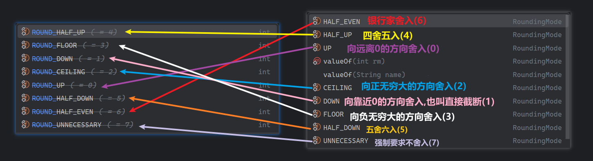

# 常用类库与工具

## String

### 所属包

```java
java.lang
```

### 特点

- 字符串不可变，它们的值在创建后不能被更改
- 虽然 String 的值是不可变的，但是它们可以被共享
- 字符串效果上相当于字符数组( char[] )，但是底层原理是字节数组( byte[] )


### 常用构造方法

| 方法名                               | 说明                                    |
| ------------------------------------ | --------------------------------------- |
| public   String()                    | 创建一个空白字符串对象，不含有任何内容  |
| public   String(String original)     | 根据传入的字符串，创建字符串对象        |
| public   String(char[] chs)          | 根据字符数组的内容，来创建字符串对象    |
| public   String(byte[] bys)          | 根据字节数组的内容，来创建字符串对象    |
| public String(StringBuffer buffer)   | 根据一个StringBuffer对象创建字符串对象  |
| public String(StringBuilder builder) | 根据一个StringBuilder对象创建字符串对象 |


### StringPool(字符串常量池)

- 从JDK7开始,字符串常量池被转移到了堆内存中


### 创建字符串的方式

- 直接`=`创建
- 构造方法创建


#### 最常用的创建字符串的方式

```java
String s = "字符串"
```


#### 两种构造字符串的方式和StringPool的关系

- 通过构造方法创建

  ​	通过下面这种 new的方式创建的字符串对象，会在堆中创建字符串对象，就算多个字符串的内容相同，它们的地址值也不相同


```java
String s = new String("字符串");
```

- 直接`=`方式创建

  ​	以下面这种直接赋值的方式创建的字符串，只要字符序列相同(顺序和大小写)，无论在程序代码中出现几次，JVM 都只会建立一个 String 对象，并在字符串常量池中维护

```java
String s = "字符串";
```


### 字符串拼接的一些细节

- 如果在拼接的时候没有变量，如下面的示例代码，就会触发字符串的优化机制，在编译的时候直接变成最终的结果

```java
String s = "a"+"b"+"c";		---编译--->		String s = "abc";	
```

- 如果有变量
  1. 在JDK8及以前，底层会创建StringBuilder对象,之后append(),最后toString()来进行拼接
  2. 从JDK9开始，底层类似于先预估目标字符串的长度，之后创建字符数组，最后变回字符串的流程


## StringBuilder

- 默认容量:16
- 如果16不够，StringBuilder会扩容：扩容的新容量：**老容量*2+2=34**
- 如果34还不够：如果添加元素之后的容量超出默认扩容的容量的话(超出34)，此时StringBuilder的容量**以实际容量为准**


## StringJoiner

| 构造方法                                | 说明                                                   |
| :-------------------------------------- | ------------------------------------------------------ |
| public StringJoiner(间隔符号)           | 创建一个StringJoiner对象,指定拼接时的间隔符号          |
| public StringJoiner(间隔符号,前缀,后缀) | 创建一个String Joiner对象,指定拼接时的间隔、前缀、后缀 |


## Math

- 是一个帮助我们用于数学计算的工具类

### 一些属性及常用方法

```java
public static final double E					//自然对数的底数
public static final double PI					//圆周率
```


```java
public static int abs(int a)					// 返回参数的绝对值,不过有个小bug
public static int absExact(int a)				// 也是返回参数的绝对值，消除了上面的bug,不过它在JDK15才出来
public static double ceil(double a)				// 返回大于或等于参数的最小整数
public static double floor(double a)			// 返回小于或等于参数的最大整数
public static int round(float a)				// 按照四舍五入返回最接近参数的int类型的值
public static int max(int a,int b)				// 获取两个int值中的较大值
public static int min(int a,int b)				// 获取两个int值中的较小值
public static double pow (double a,double b)	// 计算a的b次幂的值
public static double sqrt(double a)				// 计算a的平方根
public static double cbrt(double a)				// 计算a的立方根
public static double random()					// 返回一个[0.0,1.0)的随机值
```


### abs和absExact方法

#### abs方法存在的小bug

以 `int`类型为例, 取值范围: -2147483648 ~ 2147483647

如果没有正数与负数对应,那么传递负数结果会有误

-2147483648这个数没有正数与之对应, 所以 abs结果产生 bug,返回的还是-2147483648

#### 建议

使用absExact方法的时候，如果传递-2147483648这样的数，会抛出异常


## Arrays

- 操作数组的工具类

### 特点

- 构造方法是私有的，无法从外界获取对象
- 方法都是**`static`**的，通过类名调用

### 常用方法

```java
//将一维数组转成字符串展示，如果是多维数组，展示的是地址值
	//用来处理一维数组，基本类型数组和引用类型数组都可以
	//不能完美处理多维数组,多维数组会是地址值
public static String  toString(Object [] a)
public static String  toString(boolean[] a)
public static String  toString(char[] a)
public static String  toString(byte[] a)
public static String  toString(short[] a)
public static String  toString(int[] a)
public static String  toString(long[] a)
public static String  toString(float[] a)
public static String  toString(double[] a)
    
public static String  deepToString(Object [] a)
    //用来处理引用类型的数组，一维和多维的都可以
    //多维数组或者存储引用数据类型的一维数组都是可以的
    //唯一不可以处理的是存储了基本数据类型的数据的基本类型数组，这种数组一定是一维的
------------------------------------------------------------------------------------------------------------
//比较两个一维数组是否相同，如果是多维数组比较的是内部数组的地址值，通常就都是false
public static boolean 	equals(Object[] a, Object[] a2)
public static boolean 	equals(Object[] a, int aleft, int aright, Object[] b, int bleft, int bright)										//这个是比较数组a中[left,right)和数组b中[left,right)是否相同
				......(都有)
public static <T> boolean equals(T[] a, T[] a2, Comparator <? super T> cmp)
public static <T> boolean equals(T[] a,int aleft,int aright,T[] b,int bleft,int bright,Comparator <? super T> cmp)
public static <T> boolean equals(T[] a, T[] a2, Comparator <? super T> cmp)
public static <T> boolean equals(T[] a, int aFromIndex, int aToIndex, T[] b, int bFromIndex, int bToIndex, Comparator <? super T> cmp)
    
//一维和多维都可以，但是前提是必须是引用类型的数组
public static boolean deepEquals(Object [] a1, Object [] a2)	//如果是多维数组，给多维数组也深深的比较
------------------------------------------------------------------------------------------------------------
//查找第一个不匹配元素的索引，如果长度不一样，就短的那个查完为止
public static int mismatch(Object [] a, Object [] b)
public static int mismatch(Object [] a, int aleft, int aright, Object [] b, int bleft, int bright)
    			......(都有)
public static <T> int mismatch(T[] a, T[] b, Comparator <? super T> cmp)
public static <T> int mismatch(T[] a, int aleft, int aright, T[] b, int bleft, int bright, Comparator <? super T> cmp)
```

```java
public static IntStream  		stream(int[] array)
public static IntStream  		stream(int[] array, int startInclusive, int endExclusive)
public static LongStream  		stream(long[] array)
public static LongStream  		stream(long[] array, int startInclusive, int endExclusive)
public static DoubleStream  	stream(double[] array)
public static DoubleStream  	stream(double[] array, int startInclusive, int endExclusive)
public static <T> Stream <T> 	stream(T[] array)
public static <T> Stream <T> 	stream(T[] array, int startInclusive, int endExclusive)
```

```java
public static <T> List <T> asList(T... a)	//把数组变成一个List集合，底层应该是ArrayList
    
//二分搜索
//查到返回索引，没查到返回 (- 插入点索引 - 1)
	//为什么要 -1 呢，如果返回 -插入点，如果插入点在0的话，-0，就有问题了
public static int 		binarySearch(Object [] a, Object  key)
public static int 		binarySearch(Object [] a, int fromIndex, int toIndex, Object  key)
    			......(没有boolean)
public static <T> int 	binarySearch(T[] a, T key, Comparator <? super T> c)
public static <T> int 	binarySearch(T[] a, int fromIndex, int toIndex, T key, Comparator <? super T> c)

//复制数组，两个参数分别是(原数组,新数组长度),如果新数组长度比老数组大，那么新数组剩余部分将用默认值填充
public static int[] 	copyOf(int[] original, int newLength)
    			......(没有Object)
public static <T> T[] 	 copyOf(T[] original, int newLength)
public static <T, U> T[] copyOf(U[] original, int newLength, Class <? extends T[]> newType)//还指定了新数组类型 

//同样是复制参数，只不过这次加了范围，三个参数分别是(原数组,其实索引,结束索引)
    //这个索引包左不包右，新数组的长度由(to-from)决定
public static int[] 	copyOfRange(int[] original, int from, int to)
    			......(也没有Object)
public static <T> T[] 	copyOfRange(T[] original, int from, int to)
public static <T, U> T[] copyOfRange(U[] original, int from, int to, Class <? extends T[]> newType)
   
//指定值填充
public static void 	fill(int[] a, int val)
public static void 	fill(int[] a, int fromIndex, int toIndex, int val)
    			......(都有)
public static void fill(Object [] a, Object  val)
public static void fill(Object [] a, int fromIndex, int toIndex, Object  val)
    
    
//升序排序(主要用于一维数组，多维数组是内存地址的比较)
public static void sort(int[] a)
public static void sort(int[] a, int fromIndex, int toIndex)
    			......(没有boolean)
public static void sort(Object [] a)
public static void sort(Object [] a, int fromIndex, int toIndex)

public static <T> void sort(T[] a, Comparator <? super T> c)
    //可以写Lambda,通过形参和语句的组合决定升序还是降序 (o1,o2)->return o1-o2;
/*
comparator(o1,o2)的官方定义标准:
Compares its two arguments for order. Returns a negative integer, zero, or a positive integer as the first argument is less than, equal to, or greater than the second.
(中文翻译：比较其两个参数以确定顺序。当第一个参数小于、等于或大于第二个参数时，分别返回负整数、零或正整数)
*/
public static <T> void sort(T[] a, int fromIndex, int toIndex, Comparator <? super T> c)
```


## Collections

- **集合工具类**

### 常用方法

```java
public static <T> boolean 	addAll(Collection <? super T> c, T... elements)	//将所有指定元素添加到指定集合中
public static <T> void 		fill(List <? super T> list, T obj)				//用指定元素替换指定列表的所有元素
public static <T> boolean 	replaceAll(List <T> list, T oldVal, T newVal)//将列表中所有出现的一个指定值替换为另一个
public static <T> void 		copy(List <? super T> dest, List <? extends T> src)
    					//将源列表src的所有元素按顺序覆盖复制到目标列表dest中（从索引0开始覆盖，要求dest长度≥src长度）
    
public static void 				reverse(List <?> list)			//反转指定列表中元素的顺序
public static <T> Comparator<T> reverseOrder()					//将对象默认的升序（如String按字母表顺序）反转成降序
public static <T> Comparator<T> reverseOrder(Comparator<T> cmp) //将自定义比较器cmp的排序规则反向
    
public static void 				shuffle(List <?> list)				//使用默认的随机源随机排列指定的列表
public static void 				shuffle(List <?> list, Random  rnd)	//使用指定的随机源随机排列指定的列表
    
//根据集合元素的自然排序或者比较器进行升序排序
public static <T extends Comparable <? super T>> void 	sort(List <T> list)
public static <T> void 	    							sort(List <T> list, Comparator <? super T> c)
    
public static void swap(List <?> list, int i, int j)		//交换指定列表中指定位置的元素
```

```java
public static <T> int 		binarySearch(List <? extends Comparable <? super T>> list, T key)
    		//在已按自然顺序(元素需实现Comparable)排序的列表中二分查找key，返回索引(找到时)或负数(未找到时暗示插入点)
public static <T> int 		binarySearch(List <? extends T> list, T key, Comparator <? super T> c)
    			//通过指定Comparator在已按该规则排序的列表中二分查找key，返回索引(找到时)或负数(未找到时暗示插入点)
  
//返回给定集合用自然排序或指定比较器比较后的最大元素
public static <T extends Object & Comparable <? super T>> T max(Collection <? extends T> coll)   			public static <T> T 		max(Collection <? extends T> coll, Comparator <? super T> comp)

//返回给定集合用自然排序或指定比较器比较后的最小元素    
public static <T extends Object & Comparable <? super T>> T min(Collection <? extends T> coll)  			public static <T> T 		min(Collection <? extends T> coll, Comparator <? super T> comp)

 
public static int 				frequency(Collection<?> c,Object o) //返回指定集合中等于指定对象的元素数
public static<T> Enumeration<T> enumeration(Collection <T> c)		//返回指定集合的枚举
public static boolean 		disjoint(Collection<?> c1,Collection<?> c2)//如果两个指定的集合没有共同的元素,返回true
    
public static int 				indexOfSubList(List <?> source, List <?> target)
    							//在source列表中查找target子列表第一次出现的起始索引，未找到返回-1(元素必须全部吻合)
public static int 				lastIndexOfSubList(List <?> source, List <?> target)
								//在source列表中查找target子列表最后一次出现的起始索引，未找到返回-1(元素必须全部吻合)
```

```java
public static<T> Iterator<T> 			emptyIterator()				//返回一个不可变的空迭代器
public static<T> ListIterator<T> 		emptyListIterator()			//返回一个空列表迭代器
public static final<T> List<T> 			emptyList()					//返回一个不可变的空列表
public static final<K, V> Map<K,V> 		emptyMap()					//返回一个不可变的空Map
public static final<T> Set<T> 			emptySet()					//返回一个不可变的空Set
public static<T> Enumeration<T> 		emptyEnumeration()			//返回没有元素的枚举

public static final <K, V> NavigableMap <K,V> 	emptyNavigableMap() //返回一个不可变的空navigableMap
public static <E> NavigableSet <E> 				emptyNavigableSet() //返回一个不可变的空NavigableSet
public static final <K, V> SortedMap <K,V> 		emptySortedMap()	//返回一个不可变的空SortedMap
public static <E> SortedSet <E> 				emptySortedSet()	//返回一个不可变的空SortedS
```

```java
public static<T> Collection<T> 	unmodifiableCollection(Collection<? extends T> c)
    															//指定了Collection的不可变的Collection
public static<T> List<T> 		unmodifiableList(List<? extends T> list)//返回指定List的不可变的List
public static<K, V> Map<K,V> 	unmodifiableMap(Map<? extends K,? extends V> m)//返回指定Map的不可变Map
public static<T> Set<T> 		unmodifiableSet(Set<? extends T> s)//返回指定Set的不可变Set

public static<K, V> NavigableMap<K,V> 	unmodifiableNavigableMap(NavigableMap<K,? extends V> m)
    															//返回指定NavigableMap的不可变NavigableMap
public static<T> NavigableSet<T> 		unmodifiableNavigableSet(NavigableSet<T> s)
    															//返回指定NavigableSet的不可变NavigableSet
public static<K, V> SortedMap<K,V> 		unmodifiableSortedMap(SortedMap<K,? extends V> m)
    															//返回指定SortedMap的不可变SortedMap
public static<T> SortedSet<T> 			unmodifiableSortedSet(SortedSet<T> s)
    															//返回指定SortedSet的不可变SortedSet
    
public static <T> Set <T> 		singleton(T o)				//返回一个只包含一个元素o的不可变Set
public static <T> List <T> 		singletonList(T o)			//返回一个只包含一个元素o的不可变List
public static <K, V> Map <K,V> 	singletonMap(K key, V value)//返回一个只包含一个键值对的不可变Map
```

```java
public static <T> Collection <T> synchronizedCollection(Collection <T> c)//返回由指定集合支持的同步（线程安全）集合
public static <T> List <T> 		 synchronizedList(List <T> list)		 //返回由指定列表支持的同步（线程安全）列表
public static <K, V> Map <K,V> 	 synchronizedMap(Map <K,V> m)			//返回由指定map支持的同步（线程安全）映射
public static <T> Set <T> 		 synchronizedSet(Set <T> s)				//返回由指定集支持的同步（线程安全）集

public static <K, V> NavigableMap <K,V> synchronizedNavigableMap(NavigableMap <K,V> m)
    														//返回由指定的可导航map支持的同步（线程安全）可导航map
public static <T> NavigableSet <T> 		synchronizedNavigableSet(NavigableSet <T> s)
    														//返回由指定的可导航集支持的同步（线程安全）可导航集
public static <K, V> SortedMap <K,V> 	synchronizedSortedMap(SortedMap <K,V> m)
    														//返回由指定排序映射支持的同步（线程安全）排序映射
public static <T> NavigableSet <T> 		unmodifiableNavigableSet(NavigableSet <T> s)
    														//返回指定可导航集的 不可修改的视图
```


## System

- 提供 JVM 和操作系统级别的全局工具方法

### 常用方法

```java
public static long currentTimeMillis()			// 获取从时间原点开始,到代码运行时所经过的的毫秒值
public static void exit(int status)				// 终止当前正在运行的Java虚拟机,0表示正常退出,非零表示异常退出(手动)
public static native void arraycopy(Object src,int  srcPos,Object dest,int destPos,int length);//拷贝数组 
									//参数一:数据源,要拷贝的数据从哪个数组而来
									//参数二:从数据源数组的第几个索引开始拷贝
									//参数三:目的地,我要把数据拷贝到哪个数组中
									//参数四:目的地数组用来放数据的起始索引
									//参数五:拷贝的数据的个数
                                //1.如果数据源数组和目的地数组都是基本数据类型,那么两者的类型必须保持一致,否则会报错
								//2.拷贝的时候需要考虑数组的长度,如果目标数组长度不够,也会报错
								//3.如果数据源数组和目的地数组都是引用数据类型,那么子类类型可以赋值给父类类型
						//只设置了源和终的拷贝的元素的个数，没有设置拷贝的数据的结束索引
```


## Runtime

- 与Java运行时环境和操作系统深度交互

### 常用方法

```java
public static Runtime getRuntime()		//当前系统的运行环境对象
public void exit(int status)			//停止虚拟机
```

```java
public int availableProcessors()		//获取CPU的线程数
public long maxMemory()				    //JVM能从系统中获取总内存大小（单位byte）
public long totalMemory()				//JVM已经从系统中获取总内存大小（单位byte）
public long freeMemory()				//JVM剩余内存大小（单位byte）
```

```java
public Process exec(String command) 	//运行cmd命令,参数那里用字符串写cmd命令
```

- 常见命令
  - `notepad`打开windows自带的记事本
  - `shutdown` 关机(这个命令后面要加参数才能运行,后面的参数**要用空格隔开**)
    - `/s`关机,默认是1分钟之后关机
    - `/s /t 时间`(中间有空格),指定关机倒计时秒数
    - `/a`取消关机或重启操作(仅在关机倒计时期间,既关机未开始之前有效)
    - `/r`重启,默认是1分钟之后重启
    - `/r /t 时间`(中间有空格),指定重启倒计时秒数
    - `/c`该参数给关机或重启添加注释,必须搭配`/s`和`/r`一起使用
    - `/f`不提示用户保存什么的,在关机瞬间直接强制关闭所有正在运行的应用程序,必须搭配`/s`和`/r`一起使用


## Object

- Java中的顶级父类

### 常见方法

```java
public String toString()				//返回该对象的字符串表示形式(包名类名@地址值)
public boolean equals(Object obj)		//Object中的equals用来比较两个对象地址值是否相等
    									//如果想要比较属性要自己重写方法
```

**克隆**

```java
protected Object clone()    			//对象克隆(浅克隆)
    									//被克隆的类要实现Cloneable接口,否则报错
    									//这个Cloneable接口是一个标记性接口,不含任何成员,仅做标识使用
    									//得重写clone方法,Object中的clone方法是protected修饰的,不能通过父类对象调用
```

用第三方工具实现**深克隆**(`gosn`)

1. 第三方写得代码导入到项目中

   将`jar包`放到与`src`目录平级的`lib`文件夹下，右键点击后点击`Add as Library`就OK了.

2. 编写代码

   ```java
   //创建对象
   Gson gson = new Gson();
   //把对象 user1 变成一个字符串
   String s = gson.toJson(user1);
   //再把字符串变回对象就可以了
   User user2 = gson.fromJson(s, User.class);
   ```

   

## Objects

- 工具类,提供了一些方法用来操作对象

### 常见方法

```java
public static String toString(Object o) 					// 获取对象的字符串表现形式
public static boolean equals(Object a, Object b)			// 比较两个对象是否相等
    				//方法的底层会判断a是否为null,如果为null,返回false
    				//如果不为null,会用a调用equals()方法
    				//如果a对象的类中重写了equals()方法,那么根据多态和虚方法表,会调用重写的equals()方法
    				//如果a对象的类中没有重写equals()方法,那么就会调用从Object类中继承下去的equals()方法比较地址值
public static boolean isNull(Object obj)					// 判断对象是否为null
public static boolean nonNull(Object obj)					// 判断对象是否不为null
```


## BigInteger

- 和字符串一样,内部记录的值不能发生改变,改变了就是新对象了

### 获取对象的方式

#### 构造方法

```java
public BigInteger(int num, Random rnd) 		//获取随机大整数对象,范围:[0 ~ 2的num次方)	包左不包右
    			//参数一(num):指定范围,范围为 [2~2的num次方)
    			//参数二(rnd):一个Random的对象
public BigInteger(String val) 				//获取用字符串指定的大整数对象,这个字符串必须是整数,否则报错,10.0这种都不行
public BigInteger(String val, int radix) 	//获取指定进制的大整数对象,radix为进制参数,默认十进制
                //参数二是解释第一个参数是几进制的,比如("100",2)表示传入了二进制的100,即十进制的4
    			//参数一中的数字必须要跟参数二的进制吻合,比如参数二是2,参数一中的数字只能由0和1组成
```

#### 静态方法

```java
public static BigInteger valueOf(long val) 	//静态方法获取BigInteger的对象，内部有优化
    										//参数是long类型的,表示范围小一点
                        //内部对常用数字[-16,16]进行了优化,它们对应的BigInteger的对象已经提前在静态代码块中创建好了
```


### 常用方法

```java
public BigInteger 	add(BigInteger val)						//加
public BigInteger 	subtract(BigInteger val)				//减
public BigInteger 	multiply(BigInteger val)				//乘
public BigInteger 	divide(BigInteger val)					//除,结果为商
public BigInteger[] divideAndRemainder(BigInteger val)	 	//除,结果为商和余数
```

```java
public  BigInteger  abs()									//绝对值
public  BigInteger  sqrt()									//平方根(从JDK9开始才有这个方法)
public  BigInteger  pow(int exponent) 						//次幂,这个pow和Math中的不一样,这个只有一个参数
public  BigInteger  max(BigInteger val) 					//返回调用者和参数两个数的较大值的地址值,不创建新的对象
public  BigInteger  min(BigInteger val) 					//返回调用者和参数两个数的较小值的地址值,不创建新的对象
public  int         compareTo(BigInteger val)				//小于返回-1,相等返回0,大于返回1
public  BigInteger  gcd(BigInteger val)						//返回调用者和参数两个数的最大公因数
public  boolean 	equals(Object x) 					    //比较值是否相同  
public  String      toString()								//toString
public  String      toString(int radix)						//将对象所表示的数字转换为radix进制后toString
```

```java
public 	byte 	byteValueExact()		//转为byte 类型整数，超出范围数据会抛出异常
public 	short 	shortValueExact()		//转为short类型整数，超出范围数据会抛出异常
    
public  int  	intValue()				//转为int  类型整数，超出范围数据会溢出
public 	int 	intValueExact()			//转为int  类型整数，超出范围数据会抛出异常
    
public 	long 	longValue()				//转为long 类型整数，超出范围数据会溢出
public 	long 	longValueExact()		//转为long 类型整数，超出范围数据会抛出异常
    
public 	float 	floatValue()			//转为float  类型浮点数
    									//超出范围会显示Float.NEGATIVE_INFINITY或Float.POSITIVE_INFINITY
    									//即负无穷大或正无穷大
public 	double 	doubleValue()			//转为double 类型浮点数
    									//超出范围会显示Double.NEGATIVE_INFINITY或Double.POSITIVE_INFINITY
    									//即负无穷大或正无穷大
```


### 底层存储方式

- `BigInteger`中有一个变量`signum`,它用来表示数据的正负
  - 如果为1，这个数是正数
  - 如果为0，这个数是0
  - 如果为-1，这个数是负数
- `BigInteger`中有一个数组为`mag`,它用来存储数据，存储方式如下


### BigInteger的存储上限

1. **Java 中数组的最大长度：** 数组的最大长度是 `int` 类型的最大值，即 **2147483647**（约 **21 亿**）。
2. **`int` 数组中每个元素能表示的数字：** 每个 `int` 类型的元素能表示的数字范围是 **[-2147483648, 2147483647]**。
3. **`int` 类型的数据长度：** 每个 `int` 类型的数据占 **32 个二进制位**,因此，如果将 `BigInteger` 存储的数据分成**2147483647**个 `int` 数组元素，它能够表示的最大二进制位数是：**32*2147483647=68,719,476,704位(600亿位)**
4. 可以用**2<sup>二进制位数</sup>-1**来算出该二进制数能表示的十进制数的最大值，即**2<sup>68,719,476,704</sup>-1**，也就是**2<sup>600亿</sup>-1**，这个数字已经远远超出了宇宙中的粒子数，甚至超过了宇宙可观测范围的大小


## BigDecimal

### 计算机中的小数

- 对于69.875这个浮点数
  - 正数部分的二进制是01000101
  - 小数部分的二进制是111(3位)

- 对于0.9这个浮点数
  - 正数部分的二进制是0
  - 小数部分的二进制是111001100110011001100110011001100110011001101(45位)
- 对于0.226这个浮点数
  - 正数部分的二进制是0
  - 小数部分的二进制是001110011101101100100010110100001110010101100000010000(55位)

某些浮点数的**小数部分**在二进制表示中**非常长**，由于**尾数部分的位数有限**，会导致**精度损失**

| 类型       | 占用字节数  | 总bit位数     | 尾数部分的位数 |
| ---------- | ----------- | ------------- | -------------- |
| **float**  | **4**个字节 | **32**个bit位 | **23**个bit位  |
| **double** | **8**个字节 | **64**个bit位 | **52**个bit位  |

为了处理不精确的这种情况，`BigDecimal`类横空出世.


### BigDecimal作用

- 用于小数的精确运算
- 用来表示很大的小数


### 获取对象的方式

#### 构造方法

```java
public BigDecimal(double val)		//将double转换为BigDecimal,此构造函数的结果不可预测,double并不精确
public BigDecimal(String val)		//将一个小数的字符串表示形式转换为BigDecimal,这个非常精确,exactly 
public BigDecimal(BigInteger val)	//将 BigInteger 翻译成 BigDecimal	
public BigDecimal(int val)			//将一个int整数转换为BigDecimal
public BigDecimal(long val)			//将一个long整数转换为BigDecimal
```

#### 静态方法

```java
public static BigDecimal valueOf(double val)	//也有可能会出错,别搞
public static BigDecimal valueOf(long   val)	//内部对[0,10]进行了优化,它们对应的BigDecimal的对象已经提前创建好了
```


### 常用方法

```java
public  BigDecimal  add(BigDecimal value)				// 加
public  BigDecimal  subtract(BigDecimal value)			// 减
public  BigDecimal  multiply(BigDecimal value)			// 乘
public  BigDecimal  divide(BigDecimal value)			// 除
    
public  BigDecimal  divide(除数,				   精确位数,  舍入模式(如下图)  )
public  BigDecimal  divide(BigDecimal  divisor, int scale, RoundingMode  roundingMode)
-public BigDecimal  divide(BigDecimal  divisor, int scale, int roundingMode)(已弃用)(上面那个是新品,用上面那个)
```

- 舍入方式(弃用版和新版对应着都有)



```java
public  BigDecimal  abs()								//绝对值
public  BigDecimal  pow(int n)							//次幂,这个pow和Math中的不一样,这个只有一个参数
public  BigDecimal  max(BigDecimal  val)				//返回调用者和参数两个数的较大值的地址值,不创建新的对象
public  BigDecimal  min(BigDecimal  val)				//返回调用者和参数两个数的较小值的地址值,不创建新的对象
public  boolean 	equals(Object x)					//判断值是否相等
public  String      toString()							//toString
```

```java
public  byte	    byteValueExact()				//转为byte类型整数,如果有非零小数部分或超出byte范围会抛出异常
public  short       shortValueExact()				//转为short类型整数,如果有非零小数部分或超出short范围会抛出异常
    
public  int         intValue()						//小数部分全部舍弃,转为int类型整数,超出范围会溢出
public  int         intValueExact()					//转为int类型整数,如果有非零小数部分或超出int范围会抛出异常
    
public  long 		longValue()						//小数部分全部舍弃,转为long类型整数,超出范围会溢出
public  long 		longValueExact()				//转为long类型整数,如果有非零小数部分或超出long范围会抛出异常

public  float		floatValue()					//转为float  类型浮点数
    									//超出范围会显示Float.NEGATIVE_INFINITY或Float.POSITIVE_INFINITY
    									//即负无穷大或正无穷大
    									//也可能会出现下溢
public  double 		doubleValue()					//转为double 类型浮点数
    									//超出范围会显示Double.NEGATIVE_INFINITY或Double.POSITIVE_INFINITY
    									//即负无穷大或正无穷大
    									//也可能会出现下溢
```


### 底层存储方式

- 用一个`BigInteger`对象来表示数字，然后又用一个`int`类型的`scale`来表示小数点右移几位数,比如`BigInteger`类型的数据

  `524456`，`scale`的值为`4`,则最终这个`BigDecimal`的值为`5244.56`.

  >我的理解：
  >
  >既然要表示超级大的数,这个`BigInteger`的对象就完全可以满足这个星球上的需求了，然后是要精度，用`scale`就可以了,但是至于为什么`scale`是`int`类型的，我的想法如下：
  >
  >首先是已经够用了,就比如一帮情况下，不会有小数点向后移`21亿`位的情况
  >
  >其次是我们既然最重要的是确定精度，那小数点后面的数要尽量多一点，要超级超级多，这种情况下给小数点设置一个右移上限
  >
  >第三是可能是为了安全性和效率吧
  >
  >事实上如果有个场景真的需要用到超过这个的，早就不屑于用BigDecimal了


## 正则表达式

- 用来校验字符串是否满足一定的规则

### 语法与构成元素

#### 基本字符匹配

##### 普通字符

- **`a`** 匹配字符串中的字母 "a"

- **`1`** 匹配字符串中的数字 "1"

##### 点号**`.`**

- 匹配除了换行符（**`\n`**）以外的任何字符(不需要加**`\`**进行转义)

```java
"你好".matches("..");		//返回true,两个点正好匹配"你好"两个字
```


#### 字符集和字符范围

##### 方括号 `[]`

- 用于表示字符集，匹配其中的任何**一个**字符
  - **`[abc]`** 匹配 "a"、"b" 或 "c"。
- 一个方括号只代表一个字符

> 我怀疑这个方括号有一个机制，就是把它内部的一些符号进行转义，转义成特殊含义，比如`-`符号,还有`^`符号等


##### 连字符`-`

- 指定字符的范围
  - **`[a-z]`** 匹配所有小写字母
  - **`[A-Z]`** 匹配所有大写字母
  - **`[a-zA-Z]`** 匹配所有字母
  - **`[0-9]`** 匹配所有数字
- 必须用在**`[]`**中，才代表指定范围，否则会被翻译成普通的**`-`**字符

```java
System.out.println("b".matches("a-c"));		//false	没写中括号，-是普通的字符-
System.out.println("a-c".matches("a-c"));	//true	
System.out.println("b".matches("[a-c]"));	//true
System.out.println("a-c".matches("[a-c]"));	//false	写了中括号，-是用来指定范围的，已经不是普通的字符-了
System.out.println("[a-c]".matches("[a-c]"));//false 逆天
```


##### 字符集的否定 `[^]`

- 当 **`^`** 位于**方括号内**的**开头**时，匹配**整个中括号中**不在字符集中的字符，相当于**整个中括号取反**
  - **`[^0-9]`** 匹配任何不是数字的字符
  - **`[^a-z]`** 匹配任何不是小写字母的字符
- 必须用在**`[]`**中，并且必须在**方括号的开头**，才代表**非**，否则会有一系列的匹配开头什么的巴拉巴拉的，一堆麻烦

```java
System.out.println("b".matches("^a"));				//false
System.out.println("^a".matches("^a"));				//false,巴拉巴拉
System.out.println("b".matches("[^a]"));			//true，写了中括号，^代表对整个中括号取反
System.out.println("b".matches("[^[c-d]&&[d-g]]")); //true
```


#### 逻辑运算符

##### 交集`&&`

- 指定两个字符集合的交集
  - **`[a-z&&[def]]`**表示范围`a-z`和范围`def`的交集，即`def`
- 必须写成两个**`&&`**，不能写成一个**`&`**，如果写成一个的话，就代表一个简单的**`&`符号**
- 必须用在**`[]`**中，才代表**交集**，否则会被翻译成普通的**`&&`字符**

```java
System.out.println("c".matches("[a-c]&&[c-e]"));	//false，&&没写到[]里面
System.out.println("c".matches("[a-c&&c-e]"));		//true
System.out.println("c".matches("[[a-c]&&[c-e]]"));	//true
```


##### 或者**`|`**

- 左右匹配其中一个即正确
- 这个写不写到**`[]`**里面都没事，都能解析

```java
System.out.println("a".matches("[a-b]|[c-d]"));		//true
System.out.println("a".matches("[[a-b]|[c-d]]"));	//true
```


#### 转义字符`\`

##### 基本概念

- 转义字符
- 这个不用写到**`[]`**中，就生效

##### 注意点

###### 关于`/`

- 理解方式

> Java有自己的语法规则，正则表达式同样有自己的语法规则，
>
> 我们是先从Java中传递符合正则表达式规范的语法给正则表达式引擎，之后正则表达式引擎再对正则表达式进行解析，
>
> 比如说正则表达式中需要一个`\d`，我们需要将一个`\d`传递给正则表达式，但是在Java程序中你不能直接写`\d`，因为在Java中`\`有特殊含义，我们如果要想把一个单纯的`\`传递给正则表达式，我们在Java中需要写`\\`来进行转义，把带有特殊含义的`\`转成一个普通的字符`\`，所以我们在Java中写`\\d`就把一个普通的`\d`传递给正则表达式引擎了，在正则表达式引擎中，接收到了一个`\d`，由于在正则表达式中，`\`是转义字符，`\d`表示数字，这样字就表示匹配一个数字
>
> 再来说说`\\`，在正则表达式中想要一个`\`，但是因为`\`在正则表达式里面是一个转义字符，没办法直接用，所以得用`\\`来进行转义，将其转义为一个普通的字符`\`，也就是说正则表达式引擎现在需要接收Java中传过来的两个普通字符`\\`,但是在Java中如果想传过去两个普通字符`\\`，肯定不能直接写`\\`,因为Java中`\`是转义字符，`\\`只代表一个普通字符`\`，如果想要两个普通字符，就得写`\\\\`来传递过去两个普通字符

> 正则表达式通常是通过 `String` 类型表示的。`Pattern` 类用于处理和编译正则表达式，`Matcher` 类用于在目标字符串中执行匹配。


#### 预定义字符类

##### 任意字符`.`

-   匹配除了换行符（`\n`）以外的任何字符(不需要加**`\`**进行转义)

##### 数字`\d`

- 匹配任何数字，等价于 `[0-9]`

##### 非数字`\D`

- 匹配任何非数字字符，等价于 `[^0-9]`

##### 字母数字下划线`\w`

- 匹配字母、数字或下划线，等价于 `[A-Za-z0-9_]`

##### 非字母数字下划线`\W`

- 匹配任何非字母数字或下划线字符，等价于 `[^A-Za-z0-9_]`

##### 空白字符`\s`

- 匹配任何空白字符，包括空格、制表符、换行符等

##### 非空白字符`\S`

- 匹配任何非空白字符。


#### 量词(后缀)

##### 零或多`*`

- 匹配**零次或多次**。(**0或多**，**包含1**)
  - `a*` 匹配0个或多个字母 "a"

```java
System.out.println(	"".matches("a*")	);		//一个没有,true
System.out.println(	"a".matches("a*")	);		//只有一个，true
System.out.println(	"aaa".matches("a*")	);		//有多个，true
System.out.println(	"b".matches("a*")	);		//对不上，false
```


##### 一或多`+`

- 匹配**一次或多次**。(**1或多**，**不包括0**，**≥1**)
  - `b+` 匹配一个或多个字母 "b"

```java
System.out.println("".matches("b+"));			//一个没有，false
System.out.println("b".matches("b+"));			//只有一个，true
System.out.println("bbb".matches("b+"));		//有多个，true
System.out.println("c".matches("b+"));			//对不上，false
```


##### 零或一`?`

- 匹配**零次或一次**。(**0或1**，**不包括其它**)
  - `c?` 匹配零个或一个字母 "c"

```java
System.out.println("".matches("c?"));			//一个没有，true
System.out.println("c".matches("c?"));			//只有一个，true
System.out.println("cc".matches("c?"));			//有多个,false
System.out.println("d".matches("c?"));			//对不上，false
```


##### 恰好n`{n}`

- 匹配**恰好 n 次**。(**n**)
  - `d{3}` 匹配连续的三个字母 "d"

```java
System.out.println("".matches("d{2}"));			//一个没有，false
System.out.println("d".matches("d{2}"));		//只有一个，false
System.out.println("dd".matches("d{2}"));		//恰好两个，true
System.out.println("ee".matches("d{2}"));		//对不上，false
```


##### 至少n`{n,}`

- 匹配**至少 n 次**。(**≥n**)
  - `e{2,}` 匹配至少两个字母 "e"

```java
System.out.println("".matches("e{2,}"));		//一个没有,false
System.out.println("e".matches("e{2,}"));		//只有一个，false
System.out.println("ee".matches("e{2,}"));		//恰好两个，true
System.out.println("eeee".matches("e{2,}"));	//有很多个，true
System.out.println("ffff".matches("e{2,}"));	//对不上，false
```


##### n到m{n,m}

- 匹配 **n 到 m 次**。(**≥n且≤m**，**n到m**，**大于等于n且小于等于m**)
  - `f{2,4}` 匹配两个到四个字母 "f"

```java
System.out.println("".matches("f{2,4}"));		//一个没有，false
System.out.println("f".matches("f{2,4}"));		//只有一个，false
System.out.println("ff".matches("f{2,4}"));		//正好两个，true
System.out.println("fff".matches("f{2,4}"));	//三个，true
System.out.println("ffff".matches("f{2,4}"));	//正好四个，true
System.out.println("ffffff".matches("f{2,4}"));	//多个(五个),false
System.out.println("ggg".matches("f{2,4}"));	//对不上，false
```


#### 分组`()`

##### 作用

- 控制匹配范围

- 把一部分划分为一个整体

##### 注意

- 虽然**`()`**和**`[]`**很像，但是不能把分组**`()`**当成**`[]`**使用，像**`-`**和**`^`**以及**`&&`**等这些字符直接写在**`()`**中不起作用，必须写到**`[]`**中才可以

- 在有**`|`**的时候要特别注意分组，别弄混了

- 每组其实是有组号的
  - 以左括号为基准，最左边的是第一组，其次为第二组，以此类推


##### 捕获分组与非捕获分组

###### 捕获分组()

**作用**

- 是将正则表达式中某一部分**匹配到的数据**提取出来，供后续使用，这里提取的是模式匹配到的数据，不是模式本身。
- 一般遇到说 "……一致" 这种话，然后就想到之后用


**引用格式**

- **内部:`\组号`**,但是在Java代码中因为**`\`**的原因，要写**`\\数字`**

- **外部:`$组号`**,通常这个只在**`replaceAll`**和**`replaceFirst`**方法中用


**注意**

- 断言不属于捕获分组
  - 正向先行断言**`(?=)`（不属于）**
  - 负向先行断言**`(?!)`（不属于）**
  - 正向回溯断言**`(?<=)`（不属于）**
  - 负向回溯断言**`(?<!)`（不属于）**

**例子**

```java
String regex1 = "(.).+\\1";		//判断一个字符串的开始字符和结束字符是否一致
sout("a123a".matches(regex1));	//true
sout("a123b".matches(regex1));	//false

String regex2 = "(.+).+\\1";	//判断一个字符串的开始 部分 和结束 部分 是否一致
				//这里的两个.+实际上是贪婪和回溯结合的，底层会自动调整和计算出来
sout("abcd123abcd".matches(regex2));
sout("bcf456bcf".matches(regex2));//true
sout("aaa17891aab".matches(regex2));//false

String regex3 = "((.)\\2*).+\\1";//判断一个字符串的开始部分和结束部分是否一致,开始部分内部每个字符也需要一致
System.out.println("aaaa123aaaa".matches(regex3));
System.out.println("aaab123aaab".matches(regex3));

String s  = "我要学学编编编编程程程程程程";
String newS = s.replaceAll("(.)\\1+", "$1");//把重复的内容替换为单个的
System.out.println(newS);//我要学编程
```


###### 非捕获分组(?:)

**作用**

- 在正则表达式中定义一个分组，但是不进行捕获


**注意**

- 断言在某种程度上也算非捕获分组，因为它们不参与分组，但是还是建议用正统的**`?:`**
  - 正向先行断言**`(?=)`**
  - 负向先行断言**`(?!)`**
  - 正向回溯断言**`(?<=)`**
  - 负向回溯断言**`(?<!)`**


#### 修饰符

##### 定义

- 用于改变正则表达式的匹配行为

##### 常见修饰符

###### `忽略大小写(?i)`

- 忽略大小写
- **`?i`**必须写到**`()`**中，不能拆开

```java
System.out.println("Abc".matches("(?i)abc"));	//true，忽略abc的大小写	
System.out.println("AbC".matches("((?i)ab)c"));	//false,只忽略ab的大小写，但是C写得是大写，不匹配
```


#### 断言

##### 先行断言

- 测试当前位置之后的内容是否符合条件

- 先行断言不会将断言中指定的模式（`pattern`）包含在最终的匹配结果中。它只是检查当前位置后面是否符合该模式，但并不将该模式的内容作为匹配的一部分

  > 我的理解：如果前面的数据已经符合了，打印机会检测这段数据后面符不符合定义的规格，符合的话只会给它前面已经符合的数据做标记，不会给它后面用来检测的数据做标记，这样的话人最终划出来的也是前面符合规定的数据

###### 正向先行断言`(?=)`

**格式**

```java
(?=pattern)
```

- 某个位置后面是否**跟着**指定模式的数据
- 最终数据不包括**`pattern`**中的

- **`?=`**必须写到**`()`**中


###### 负向先行断言`(?!)`

**格式**

```java
(?!pattern)
```

- 某个位置后面是否**没有跟着**指定模式的数据
- 最终数据不包括**`pattern`**中的

- **`?!`**必须写到**`()`**中


##### 回溯断言

- 回溯断言用于测试某个位置前面是否满足某个模式

###### 正向回溯断言`(?<=)`

**格式**

```java
(?<=pattern)
```

- 用于检查一个位置前面是否跟着特定模式

- 最终数据不包括**`pattern`**中的
- **`?<=`**必须写到**`()`**中


###### 负向回溯断言`(?<!)`

**格式**

```java
(?<!pattern)
```

- 用于检查某个位置前面是否**不**跟着特定模式

- 最终数据不包括**`pattern`**中的
- **`?<=`**必须写到**`()`**中


#### 贪婪与非贪婪匹配

##### 贪婪爬取

- 在爬取数据的时候尽可能的多获取数据

##### 贪婪量词

- **`*`**：匹配零个或多个字符

- **`+`**：匹配一个或多个字符
- **`?`**：匹配零个或一个字符
- **`{n,}`**：匹配至少 `n` 个字符
- **`{n,m}`**：匹配至少 `n` 个，但不超过 `m` 个字符
- 等


##### 非贪婪爬取

- 在爬取数据的时候尽可能地少获取数据

##### 非贪婪量词

非贪婪量词通过在量词后面加上 **`?`** 来表示

- **`*?`**：匹配零个或多个字符，但尽可能少地匹配

- **`+?`**：匹配一个或多个字符，但尽可能少地匹配。

- **`??`**：匹配零个或一个字符，但尽可能少地匹配
- **`{n,}`**：匹配至少 `n` 个字符，但尽可能少地匹配
- **`{n,m}?`**：匹配至少 `n` 个，但不超过 `m` 个字符，尽可能少地匹配
- 等


#### **`String`**类中和正则表达式相关的方法

```java
public   boolean   matches(String regex)							//检测字符串与正则表达式是否完全匹配
public   String    replaceAll(String regex, String replacement)		//替换字符串中所有符合正则表达式的部分
public   String[]  split(String regex)								//将字符串按照给定的正则表达式分割成多个子字符串
public   String    replaceFirst(String regex, String replacement)	//替换字符串中第一个符合正则表达式的部分
```


### Pattern类

- 正则表达式的核心类，我理解为正则表达式的引擎

  > 我是把这个正则表达式引擎对象类比理解为了一个别具一格的打印机，这个打印机可以用来对符合规格的数据进行标记

#### 常用方法

- public static Pattern compile(String  regex)

  - 官方解释:它将传入的正则表达式字符串编译成一个 `Pattern` 对象，之后可以使用这个 `Pattern` 对象来执行匹配操作

    >我的理解：可以把compile方法理解成给打印机调数据规格参数，里面的正则表达式参数就是打印机要进行检测标记的规则

- public Matcher matcher(CharSequence input)

  - 官方解释:将正则表达式应用于某个输入字符串，创建一个 `Matcher` 对象，供后续的匹配操作使用

    > 我的理解：我把这个matcher方法理解为打印机对电子数据进行操作，然后遇到事先定义好的符合规则的数据的时候，就做一个标记，参数是要传给打印机的电子版数据


### Matcher

- 正则表达式的一个工具类，用于实现正则表达式的查找、替换、分组提取等功能

  > 人类

#### 常用方法

- public boolean find()

  - 官方解释：在目标字符串中查找与正则表达式匹配的下一个部分，底层会记录起始索引和结束索引+1

    > 我的理解：一个人类在从打印机拿出打印机打印好的有标记的纸之后，自己手动的去从头开始一个一个的去寻找符合标记的所有部分，如果找到，说一声找到了，并且在这段文本左右分别做个标记

- public String group()

  - 官方解释：返回当前匹配的子字符串，也就是正则表达式与目标字符串匹配的部分

    > 我的理解：人类直接划出来那个找到的串


### 通常进行抓取数据的流程

- 实际上和上面写的顺序一样

```java
String s = "假设这里是数据";
String regex = "假设这里是正则表达式定义的规则";
Pattern p = Pattern.compile(regex);	//Pattern中的compile方法
Matcher m = p.matcher(s);	//Pattern中的matcher方法

boolean b = m.find();		//Matcher中的find()方法
String result = m.group();	//Matcher中的group()方法

//但是通常上面两句写成这样
while(m.find){
    String result = m.group();
    sout(result);
}
```


### 网络爬取简单模板

```java
public static void main(String[] args) throws IOException {
        //创建一个URL对象
        URL url = new URL("网址");
        //连接上这个网址
        //细节:保证网络是畅通
        URLConnection conn = url.openConnection();//创建一个对象去读取网络中的数据
        BufferedReader br = new BufferedReader(new InputStreamReader(conn.getInputStream()));
        String line;
        //获取正则表达式的对象pattern
        String regex = "要爬取的数据格式的正则表达式";	
        Pattern pattern = Pattern.compile(regex);
        while ((line = br.readLine()) != null) {//在读取的时候每次读一整行
            //人类拿着打印机处理好的对象，之后人类按照标记去读取当前的这一行信息
            Matcher matcher = pattern.matcher(line);
            while (matcher.find()) {
                System.out.println(matcher.group());
            }
        }
        br.close();
    }
```


## 时间

### 时区


### 关于标准时间

- 以前：使用格林尼治时间我国在东八区，时间要加8，在伦敦0点的时候，我们是8点

- 现在：使用原子钟，中国时间还是要+8，UTC+8

### 一些现实中的时间换算

- 1秒      =  1000毫秒
- 1毫秒  =  1000微秒
- 1微秒  =  1000纳秒


### 对于时间处理操作的两大阶段

#### JDK7及以前

- **JDK7**及以前的时间相关类
  - 混乱
  - 不安全
  - 繁冗
  - 命名不直观
  - 易用性差
  - 许多操作要手动完成，易出错
  - 功能支持有限
- 当时的一些类

| 类名                | 包          | 功能描述                           |
| ------------------- | ----------- | ---------------------------------- |
| `Date`              | `java.util` | 表示具体的日期和时间               |
| `Calendar`          | `java.util` | 提供更灵活的日期和时间操作         |
| `GregorianCalendar` | `java.util` | `Calendar` 的具体实现，支持公历    |
| `TimeZone`          | `java.util` | 表示时区信息                       |
| `SimpleTimeZone`    | `java.util` | 定义自定义时区规则                 |
| `Locale`            | `java.util` | 定义与日期相关的语言和地区信息     |
| `DateFormat`        | `java.text` | 日期格式化和解析                   |
| `SimpleDateFormat`  | `java.text` | 自定义日期和时间格式化和解析       |
| `Date`              | `java.sql`  | 用于 SQL 数据库的 `DATE` 类型      |
| `Time`              | `java.sql`  | 用于 SQL 数据库的 `TIME` 类型      |
| `Timestamp`         | `java.sql`  | 用于 SQL 数据库的 `TIMESTAMP` 类型 |
| `Timer`             | `java.util` | 定时任务管理                       |
| `TimerTask`         | `java.util` | 定时任务的实现                     |


#### JDK8及之后

- **JDK8**及之后的时间相关类
  - 安全
  - 功能丰富
  - 易用性高
  - 分工明确：日期、时间、时区分开处理
  - 功能非常全面

- 这时候的一些类

| **类名**            | **包名**             | **功能描述**                                                 |
| ------------------- | -------------------- | ------------------------------------------------------------ |
| `LocalDate`         | `java.time`          | 只表示日期（年、月、日）。                                   |
| `LocalTime`         | `java.time`          | 只表示时间（时、分、秒、纳秒）。                             |
| `LocalDateTime`     | `java.time`          | 同时表示日期和时间，但不包含时区。                           |
| `Instant`           | `java.time`          | 精确到纳秒的时间戳，用于系统间时间记录。                     |
| `DateTimeFormatter` | `java.time.format`   | 格式化和解析日期时间。                                       |
| `Duration`          | `java.time`          | 时间间隔，精确到秒和纳秒。                                   |
| `Period`            | `java.time`          | 日期间隔，精确到年、月、日。                                 |
| `ChronoUnit`        | `java.time.temporal` | 时间间隔，所有时间单位                                       |
| `ZoneId`            | `java.time`          | 表示时区ID，例如`Asia/Shanghai`。                            |
| `ZoneOffset`        | `java.time`          | 表示时区偏移量（如`+08:00`）。                               |
| `ZonedDateTime`     | `java.time`          | 包含日期、时间和时区。                                       |
| `Clock`             | `java.time`          | 当前时间的访问工具，支持自定义时钟。                         |
| `Year`              | `java.time`          | 表示年份。                                                   |
| `YearMonth`         | `java.time`          | 表示某年的某月。                                             |
| `MonthDay`          | `java.time`          | 表示某月的某日。                                             |
| `Month`             | `java.time`          | 表示月份的枚举类型（如`JANUARY` 到 `DECEMBER`）。            |
| `DayOfWeek`         | `java.time`          | 表示星期几的枚举类型（如`MONDAY` 到 `SUNDAY`）。             |
| `OffsetDateTime`    | `java.time`          | 包含日期、时间和时区偏移量（如`2025-01-22T10:15:30+08:00`）。 |
| `OffsetTime`        | `java.time`          | 包含时间和时区偏移量（如`10:15:30+08:00`）。                 |


### JDK7之前的部分时间类

#### Date

> 个人觉得这个像时间戳，一直在说从时间原点开始的毫秒值

##### 获取对象的方式

```java
public Date()				//创建一个当前时间的对象
public Date(long date)		//根据传入的毫秒值创建对象，这个参数是从1970年1月1日8:00(时差)开始经历的毫秒值
```

##### 一些方法

```java
public long getTime()				//返回此 Date 对象表示的自 1970 年 1 月 1 日 08:00:00 (时区) 以来的毫秒数
public void setTime(long time)		//设置自 1970 年 1 月 1 日 08:00:00 (时区) 以来的毫秒数

public boolean before(Date when)	//测试此日期是否早于指定日期
public boolean after(Date when)		//测试此日期是否在指定日期之后

public int compareTo(Date anotherDate)//比较两个日期，如果调用者日期早,返回-1,如果相等,返回0,如果调用者日期晚,返回1
    
public boolean equals(Object obj)		//判断是否相等
public String  toString()
    
public Instant  toInstant()					//将此 Date 对象转换为 Instant 	JDK 1.8
public static Date from(Instant  instant)	//从 Instant 对象获取 Date 的实例	JDK 1.8
```


#### SimpleDateFormat

> 我理解为对时间进行一堆操作，让其好看或者转化的引擎

- 把**`Date`**类型的时间数据转成自己想要的字符串格式
- 把某种字符串格式的数据转成**`Date`**类型的数据，以便用于计算或其他操作

> 最开始我以为这个只是让时间变得好看的，但是忽略了这种好看的时间应该怎么识别什么的问题

##### 构造方法

```java
public SimpleDateFormat()					//使用默认模式创建一个SimpleDateFormat对象
public SimpleDateFormat(String  pattern)	//使用指定模式创建一个SimpleDateFormat对象
```

##### 一些成员方法及静态方法

```java
public String  toPattern()					//返回当前SimpleDateFormat设置的模式字符串

public boolean equals(Object  obj)
```

##### 父类**`DateFormat`**中的方法

```java
public final String format(Date date)		//将一个日期对象转成指定模式的字符串
public Date  parse(String source)			//将字符串表示的日期时间按照指定的模式解析为 Date 对象,解析出错会报异常
```


##### 模式

| Letter | 日期或时间元素                                       | 示例          |
| ------ | ---------------------------------------------------- | ------------- |
| G      | 纪元标志符                                           | AD            |
| y      | 年份                                                 | 1996; 96      |
| M      | 一年中的第几月                                       | July; Jul; 07 |
| w      | 一年中的第几周                                       | 27            |
| W      | 一个月中的第几周                                     | 2             |
| D      | 一年中的第几天                                       | 189           |
| d      | 一个月中的第几天                                     | 10            |
| H      | 指定时间是几点(二十四小时制)（0-23），比如14点，23点 | 14            |
| k      | 一天中的第几个小时（1-24）                           | 11            |
| h      | 上午/下午的几点(12小时制)（1-12）                    | 12            |
| m      | 指定时间的分钟数（0-59）                             | 30            |
| s      | 指定时间的秒数                                       | 55            |
| S      | 指定时间的毫秒数                                     | 978           |
| E      | 星期几                                               | Tuesday; Tue  |
| u      | 星期几的数字表示                                     | 3             |
| F      | 一个月中的第n个星期几，这个 F 表示的是前面的 n       | 2             |
| a      | 上午/下午标记                                        | PM            |


#### Calendar

- 日历类

##### 获取对象的方式

- 它是一个抽象类，不能直接创建对象，通过**`getInstance()`**方法获取一个它的子类对象

```java
public static Calendar  getInstance()
```

##### 常用方法

```java
public abstract void add(int field, int amount)		//向给定的日历字段添加或减去指定的时间量

public boolean before(Object  when)					//测试此时间是否早于指定时间
public boolean after(Object  when)					//测试此时间是否晚于指定时间
public int compareTo(Calendar  anotherCalendar)     //比较两个日期，调用者早,返回-1,相等,返回0,调用者晚,返回1

public int get(int field)				//返回日历某个字段的值
public final Date  getTime()			//返回表示此 Calendar 的时间值的 Date 对象
public long getTimeInMillis()			//返回此日历时间的毫秒值

public void set(int field, int value)	//将给定的日历字段设置为给定的值
public final void set(int year, int month, int date)//年月日
public final void set(int year, int month, int date, int hourOfDay, int minute)//年月日时分
public final void set(int year, int month, int date, int hourOfDay, int minute, int second)//年月日时分秒
public final void setTime(Date date)	//使用给定的 Date 设置此日历的时间
public void setTimeInMillis(long millis)//根据给定的 long 值设置此 Calendar 的当前时间
   
public boolean equals(Object obj)		//判断是否相等
public String  toString()
```

##### 日历字段

| 字段                            | 说明                                           |
| ------------------------------- | ---------------------------------------------- |
| `Calendar.YEAR`                 | 年份                                           |
| `Calendar.MONTH`                | 月份（注意：从 0 开始，0 表示 1 月）           |
| `Calendar.DAY_OF_MONTH`         | 几号（1-31）                                   |
| `Calendar.DAY_OF_YEAR`          | 一年中的第几天（1-365/366）                    |
| `Calendar.HOUR`                 | 上午/下午的第几个小时（0-11）                  |
| `Calendar.HOUR_OF_DAY`          | 24小时制小时（0-23）                           |
| `Calendar.MINUTE`               | 分钟（0-59）                                   |
| `Calendar.SECOND`               | 秒（0-59）                                     |
| `Calendar.MILLISECOND`          | 毫秒（0-999）                                  |
| `Calendar.DAY_OF_WEEK`          | 星期几（1-7，1为星期天，2为星期一，3为星期二） |
| `Calendar.DAY_OF_WEEK_IN_MONTH` | 一个月中的第n个星期几，这里表示的是前面的 n    |
| `Calendar.WEEK_OF_MONTH`        | 一个月中的第几周（1-5）                        |
| `Calendar.WEEK_OF_YEAR`         | 一年中的第几周（1-52）                         |
| `Calendar.ERA`                  | 纪元（如公元前/公元后）                        |


### JDK8及其之后的一些时间类

#### 基本日期时间类

- 处理不含时区的日期和时间

##### LocalDate

- 仅表示**日期**（**年-月-日**），不包含时间和时区信息

###### 获取对象的方式

**构造方法**

- 在 **`LocalDate`** 类的源码中，构造方法被声明为 **`private`**，外界不能创建对它的对象

**静态方法**

```java
public static LocalDate  now()				//从当前系统获取当前日期
public static LocalDate  now(ZoneId  zone)	//从指定时区的系统时钟获取当前日期,本质表示当前Instant 不同时区显示时间不同
public static LocalDate  of(int year, int month, int dayOfMonth)	//根据年月日获取LocalDate
public static LocalDate  of(int year, Month  month, int dayOfMonth) //还是年月日，不过月的类型不一样
public static LocalDate  ofInstant(Instant  instant, ZoneId  zone)  //从Instant和区域ID获取LocalDate的实例
public static LocalDate  ofYearDay(int year, int dayOfYear)			//根据年份和这一年的第几天获取LocalDate
public static LocalDate  ofEpochDay(long epochDay)					//从1970-01-01一共经过了多少天
```

###### 一些成员方法及静态方法

```java
public LocalDateTime  atStartOfDay()				//转为当天0点的LocalDateTime
public ZonedDateTime  atStartOfDay(ZoneId  zone)	//把这个时间解释为指定时区的这个时间
public LocalDateTime  atTime(int hour, int minute)	//和时分结合起来创建一个 LocalDateTime
public LocalDateTime  atTime(int hour, int minute, int second)//和时分秒结合起来创建一个 LocalDateTime
public LocalDateTime  atTime(int hour, int minute, int second, int nanoOfSecond)
    												//和时分秒纳秒结合起来创建一个 LocalDateTime
public LocalDateTime  atTime(LocalTime  time)		//和LocalTime结合创建一个LocalDateTime
public OffsetDateTime  atTime(OffsetTime  time)		//与偏移时间组合以创建 OffsetDateTime
public int compareTo(ChronoLocalDate  other)		//比较时间线 >正差的天数 <负差的天数 =0

public String  format(DateTimeFormatter  formatter)	//用指定模式格式化这个日期之后返回String
public static LocalDate  parse(CharSequence  text)	//从字符串中获取 LocalDate 的实例
public static LocalDate  parse(CharSequence  text, DateTimeFormatter  formatter)//从字符串中按照指定模式获取
public static LocalDate  from(TemporalAccessor  temporal)//从时间对象中获取 LocalDate 的实例    
    
public int 			get(TemporalField  field)			//获取指定字段的值
public int 			getYear()							//获取年份字段
public int 			getMonthValue()						//获取从 1 到 12 的月份字段
public Month  		getMonth()							//使用 Month 枚举获取月份字段
public int 			getDayOfMonth()						//一个月中的第几天，从 1 到 31
public DayOfWeek  	getDayOfWeek()						//获取星期字段，它是一个枚举 DayOfWeek 
public int 			getDayOfYear()						//一年中的第几天，从 1 到 365，或闰年为 366
    
public boolean 		isBefore(ChronoLocalDate  other)		//检查此日期是否在指定日期之前
public boolean 		isAfter(ChronoLocalDate  other)			//检查此日期是否在指定日期之后
public boolean 		isEqual(ChronoLocalDate  other)			//此日期是否等于指定日期
public boolean 		isLeapYear()							//是否为闰年

public LocalDate  with(TemporalField  field, long newValue)	//将指定字段设置为新值
public LocalDate  withYear(int year)						//更改年份
public LocalDate  withMonth(int month)						//更改月份
public LocalDate  withDayOfMonth(int dayOfMonth)			//更改几号（比如31号）
public LocalDate  withDayOfYear(int dayOfYear)				//更改一年中的天数
    
public  LocalDate  plusYears(long years)				//年
public  LocalDate  plusMonths(long months)				//月
public  LocalDate  plusWeeks(long weeks)				//周
public  LocalDate  plusDays(long days)					//日

public OffsetDateTime  minusYears(long years)			//年
public OffsetDateTime  minusMonths(long months)			//月
public OffsetDateTime  minusWeeks(long weeks)			//周
public OffsetDateTime  minusDays(long days)				//日
        
public long toEpochSecond(LocalTime  time, ZoneOffset  offset)//转成自从时间原点来的秒数,第二个参数表示当前时区
public Period  until(ChronoLocalDate  endDateExclusive) //计算时间间隔，返回一个Period
```


##### LocalTime

- 仅表示**时间**（**时:分:秒.纳秒**），不包含日期和时区信息

###### 获取对象的方式

**构造方法**

- 在 **`LocalTime`** 类的源码中，构造方法被声明为 **`private`**，外界不能创建对它的对象

**静态方法**

```java
public static LocalTime  now()				//从当前系统获取当前日期
public static LocalTime  now(ZoneId  zone)	//从指定时区的系统时钟获取当前日期,本质表示当前Instant 不同时区显示时间不同
public static LocalTime  of(int hour, int minute)//时分
public static LocalTime  of(int hour, int minute, int second)//时分秒
public static LocalTime  of(int hour, int minute, int second, int nanoOfSecond)//时分秒纳秒
public static LocalTime  ofInstant(Instant  instant, ZoneId  zone)//从Instant和区域ID获取LocalTime的实例
public static LocalTime  ofSecondOfDay(long secondOfDay)//用于将一天中的秒数转换为对应的 LocalTime 对象
public static LocalTime  ofNanoOfDay(long nanoOfDay)//从一个纳米级的值中获取 LocalTime 的一个实例
```

###### 一些成员方法及静态方法

```java
public LocalDateTime  atDate(LocalDate  date)		//将这个时间与日期结合起来创建一个 LocalDateTime 
public OffsetTime  atOffset(ZoneOffset  offset)		//时间与偏移量结合起来创建一个 OffsetTime
public int compareTo(LocalTime  other)				//比较时间线 >1 <-1 =0

public String  format(DateTimeFormatter  formatter)	//用指定模式格式化这个日期之后返回String
public static LocalTime  parse(CharSequence  text)	//从字符串中获取 LocalTime 的实例
public static LocalTime  parse(CharSequence  text, DateTimeFormatter  formatter)//从字符串中按照指定模式获取
public static LocalTime  from(TemporalAccessor  temporal)//从时间对象中获取 LocalTime 的实例
    
public int 			get(TemporalField  field)			//获取指定字段的值
public int 			getHour()							//获取一天中的小时字段，从 0 到 23
public int 			getMinute()							//小时的分钟数，从 0 到 59
public int 			getSecond()							//秒，从 0 到 59
public int 			getNano()							//纳秒
    
public boolean 		isBefore(LocalTime  other)		//检查此日期是否在指定日期之前
public boolean 		isAfter(LocalTime  other)			//检查此日期是否在指定日期之后

public LocalTime  with(TemporalField  field, long newValue)	//将指定字段设置为新值
public LocalTime  withHour(int hour)						//更改时
public LocalTime  withMinute(int minute)					//更改分
public LocalTime  withSecond(int second)					//更改秒
public LocalTime  withNano(int nanoOfSecond)				//更改纳秒
    
public LocalTime  plusHours(long hoursToAdd)				//时
public LocalTime  plusMinutes(long minutesToAdd)			//分
public LocalTime  plusSeconds(long secondsToAdd)			//秒
public LocalTime  plusNanos(long nanosToAdd)				//纳秒
    
public OffsetDateTime  minusHours(long hoursToSubtract)			//时
public OffsetDateTime  minusMinutes(long minutesToSubtract)		//分
public OffsetDateTime  minusSeconds(long secondsToSubtract)		//秒
public OffsetDateTime  minusNanos(long nanosToSubtract)			//纳秒
    
public long toEpochSecond(LocalDate  date, ZoneOffset  offset)//转成自从时间原点来的秒数,第二个参数表示当前时区
public int toSecondOfDay()		//将时间提取为一天的秒数
public long toNanoOfDay()		//将时间提取为一天的纳秒
```


##### LocalDateTime

- 表示**日期和时间**（**年-月-日T时:分:秒.纳秒**），不包含时区信息

###### 获取对象的方式

**构造方法**

- 在 **`LocalDateTime`** 类的源码中，构造方法被声明为 **`private`**，外界不能创建对它的对象

**静态方法**

```java
public static LocalDateTime  now()				//从当前系统获取当前日期时间
public static LocalDateTime  now(ZoneId  zone)	//获取指定时区的当前日期时间
public static LocalDateTime  of(int year, int month, int dayOfMonth, int hour, int minute)
public static LocalDateTime  of(int year, int month, int dayOfMonth, int hour, int minute, int second)
public static LocalDateTime  of(int year, int month, int dayOfMonth, int hour, int minute, int second, int 									nanoOfSecond)
public static LocalDateTime  of(int year, Month  month, int dayOfMonth, int hour, int minute)
public static LocalDateTime  of(int year, Month  month, int dayOfMonth, int hour, int minute, int second)
public static LocalDateTime  of(int year, Month  month, int dayOfMonth, int hour, int minute, int second, 									int nanoOfSecond)
public static LocalDateTime  of(LocalDate  date, LocalTime  time)
public static LocalDateTime  ofInstant(Instant  instant, ZoneId  zone)//用一个时间戳和时区ID来表示日期时间
public static LocalDateTime  ofEpochSecond(long epochSecond, int nanoOfSecond, ZoneOffset  offset)
    											//使用从时间原点开始经过指定秒数和纳秒数后，指定时区的日期时间
```

###### 一些成员方法及静态方法

```java
public OffsetDateTime  atOffset(ZoneOffset  offset)	//将此日期时间与偏移量组合以创建 OffsetDateTime
public ZonedDateTime  atZone(ZoneId  zone)		//将此日期时间与时区组合以创建 ZonedDateTime 
public int compareTo(ChronoLocalDateTime <?> other)
    										//比较时间线,比较顺序：年份 → 月份 → 日 → 小时 → 分钟 → 秒 → 纳秒
    										//-早 0同 +迟

public String  format(DateTimeFormatter  formatter)	//用指定模式格式化这个日期之后返回String
public static LocalDateTime  parse(CharSequence  text)	//从字符串中获取 LocalDateTime 的实例
public static LocalDateTime  parse(CharSequence  text, DateTimeFormatter  formatter)//从字符串中按照指定模式获取
public static LocalDateTime  from(TemporalAccessor  temporal)	//从时间对象中获取 LocalDateTime 的实例
    
public int 			get(TemporalField  field)			//获取指定字段的值
public int 			getYear()							//获取年份字段
public int 			getMonthValue()						//获取从 1 到 12 的月份字段
public Month  		getMonth()							//使用 Month 枚举获取月份字段
public int 			getDayOfMonth()						//一个月中的第几天，从 1 到 31
public DayOfWeek  	getDayOfWeek()						//获取星期字段，它是一个枚举 DayOfWeek 
public int 			getDayOfYear()						//一年中的第几天，从 1 到 365，或闰年为 366
public int 			getHour()							//获取一天中的小时字段，从 0 到 23
public int 			getMinute()							//小时的分钟数，从 0 到 59
public int 			getSecond()							//秒，从 0 到 59
public int 			getNano()							//纳秒	
    
public boolean 		isBefore(ChronoLocalDateTime <?>  other)		//检查此日期时间是否在指定时刻之前
public boolean 		isAfter(ChronoLocalDateTime <?>  other)			//检查此日期时间是否在指定时刻之后
public boolean 		isEqual(ChronoLocalDateTime <?>  other)			//检查此日期时间是否等于指定时刻
    
public LocalDateTime  with(TemporalField  field, long newValue)	//将指定字段设置为新值
public LocalDateTime  withYear(int year)						//更改年份
public LocalDateTime  withMonth(int month)						//更改月份
public LocalDateTime  withDayOfMonth(int dayOfMonth)			//更改几号（比如31号）
public LocalDateTime  withDayOfYear(int dayOfYear)				//更改一年中的天数
public LocalDateTime  withHour(int hour)						//更改时
public LocalDateTime  withMinute(int minute)					//更改分
public LocalDateTime  withSecond(int second)					//更改秒
public LocalDateTime  withNano(int nanoOfSecond)				//更改纳秒
public LocalDateTime  withOffsetSameInstant(ZoneOffset  offset)//更改偏移量，确保在这个Instant下,显示时间可能会变
public LocalDateTime  withOffsetSameLocal(ZoneOffset  offset)	//更改偏移量，确保显示时间一样，Instant可能会变
    
public LocalDateTime  plusYears(long years)					//年
public LocalDateTime  plusMonths(long months)				//月
public LocalDateTime  plusWeeks(long weeks)					//周
public LocalDateTime  plusDays(long days)					//日
public LocalDateTime  plusHours(long hours)					//时
public LocalDateTime  plusMinutes(long minutes)				//分
public LocalDateTime  plusSeconds(long seconds)				//秒
public LocalDateTime  plusNanos(long nanos)					//纳秒
    
public LocalDateTime  minusYears(long years)			//年
public LocalDateTime  minusMonths(long months)			//月
public LocalDateTime  minusWeeks(long weeks)			//周
public LocalDateTime  minusDays(long days)				//日
public LocalDateTime  minusHours(long hours)			//时
public LocalDateTime  minusMinutes(long minutes)		//分
public LocalDateTime  minusSeconds(long seconds)		//秒
public LocalDateTime  minusNanos(long nanos)			//纳秒

public LocalDate  	  	toLocalDate()						
public LocalTime  		toLocalTime()
```


#### 带时区的日期时间类

- 处理时区相关的日期时间

##### Java时区的两种表示形式

1. **区域ID**
   - 格式：**区域/城市**
     - **区域**是洲名(七大洲的那个洲)或国家名
       - `Asia/Shanghai`
       - `Europe/Paris`
       - `America/New_York`
2. **时区偏移量**
   - 格式：**`±HH:mm`**
     - `+08:00`、`-05:00`


##### ZoneId

- **时区标识类**，用于表示具体的时区规则（如区域名称或偏移量）

###### 获取对象的方式

**构造方法**

- 该类是一个抽象类，不能直接用构造方法获取对象

**静态方法**

```java
public static ZoneId of(String  zoneId)		//获取一个指定时区对象	参数可以是区域ID，也可以是时区偏移量
```

###### 一些成员方法及静态方法

```java
public  boolean 	equals(Object x)					//判断值是否相等
public  String      toString()							//toString
    
public static Instant  parse(CharSequence  text)		//从文本字符串中获取 Instant 的实例

public static Set <String > getAvailableZoneIds()		//获取Java中支持的所有时区
public abstract String  getId()							//获取该对象指定的时区 ID
public static ZoneId  systemDefault()					//获取系统默认时区
```


##### ZoneOffset

- 用于表示**固定时区偏移量**的类

- **`ZoneId`**类的子类

###### 获取对象的方式

**构造方法**

- Java中**`ZoneOffset`**没有公开的构造方法，它的构造方法是受保护的(**`protected`**)，这意味着我们不能通过它的构造方法来创建它的对象，只能通过时间类中统一规范的**`of...`**静态方法来创建它的对象

**静态方法**

```java
public static ZoneOffset of(String  offsetId)	//获取ZoneOffset的实例,参数必须是时区偏移量，不可以是区域ID
public static ZoneOffset ofHours(int hours)		//使用小时获取ZoneOffset		(8)->  +08:00
public static ZoneOffset ofHoursMinutes(int hours, int minutes)//使用小时和分钟获取ZoneOffset (5,30)-> +05:30
public static ZoneOffset ofHoursMinutesSeconds(int hours,int minutes,int seconds)//时分秒(8,30,15)->+08:30:15
public static ZoneOffset ofTotalSeconds(int totalSeconds)		//使用秒获取ZoneOffset (3600)-> +01:00
```

###### 一些成员方法及静态方法

```java
public  boolean 	equals(Object x)					//判断值是否相等
public  String      toString()							//toString
    
public int compareTo(ZoneOffset other)					//好像有bug我去，我滴妈
public String  getId()									//获取规范化区域偏移 ID
```


##### ZonedDateTime

- 表示**带有时区信息的日期和时间**
- 包含**完整的时区信息**，除了**日期、时间和时区偏移**外，它还包含**时区的 ID**（如 `Europe/Paris`)

###### 获取对象的方式

**构造方法**

- 在 **`ZonedDateTime`** 类的源码中，构造方法被声明为 **`private`**，外界不能创建对它的对象

**静态方法**

```java
public static ZonedDateTime now()				//从本系统中默认时区的系统时钟获取当前日期时间
public static ZonedDateTime now(ZoneId  zone)	//从指定时区的系统时钟获取当前日期时间
    
public static ZonedDateTime of(int year, int month, int dayOfMonth, int hour, int minute, int second, int 								   nanoOfSecond, ZoneId  zone)	//根据年月日时分秒纳秒以及时区获取ZonedDateTime对象
public static ZonedDateTime of(LocalDate  date, LocalTime  time, ZoneId  zone)
    						   //从LocalDate日期,LocalTime时间,以及ZoneId时区中获取 ZonedDateTime 的实例
public static ZonedDateTime of(LocalDateTime  localDateTime, ZoneId  zone)
    							//从LocalDateTime和ZoneId中获取 ZonedDateTime 的实例
public static ZonedDateTime ofInstant(Instant  instant, ZoneId  zone)
    							//从 Instant 和 ZoneId 获得 ZonedDateTime 的实例
public static ZonedDateTime ofLocal(LocalDateTime localDateTime, ZoneId zone, ZoneOffset preferredOffset) 	
    							//根据ZoneId、偏移量(可以为null)以及LocalDateTime获取ZonedDateTime的实例
public static ZonedDateTime ofStrict(LocalDateTime  localDateTime, ZoneOffset  offset, ZoneId  zone)
    							//根据LocalDateTime、偏移量以及时区严格验证以及获取ZonedDateTime实例
```


###### 一些成员方法及静态方法

```java
public  boolean 	equals(Object x)					//判断值是否相等
public  String      toString()							//toString
    
public String  format(DateTimeFormatter  formatter)		//用于将带时区的日期时间对象格式化为指定格式的字符串
public static ZonedDateTime  parse(CharSequence  text)	//从字符串中获取 ZonedDateTime 的实例
public static ZonedDateTime  parse(CharSequence  text, DateTimeFormatter  formatter)//从字符串中按照指定模式获取
    
public int 			get(TemporalField  field)			//获取指定字段的值
public ZoneId  		getZone()							//获取时区，例如“欧洲/巴黎”
public ZoneOffset  	getOffset()							//获取区域偏移量，例如“+01:00”
public int 			getYear()							//获取年份字段
public int 			getMonthValue()						//获取从 1 到 12 的月份字段
public Month  		getMonth()							//使用 Month 枚举获取月份字段
public int 			getDayOfMonth()						//一个月中的第几天，从 1 到 31
public DayOfWeek  	getDayOfWeek()						//获取星期字段，它是一个枚举 DayOfWeek 
public int 			getDayOfYear()						//一年中的第几天，从 1 到 365，或闰年为 366
public int 			getHour()							//获取一天中的小时字段，从 0 到 23
public int 			getMinute()							//小时的分钟数，从 0 到 59
public int 			getSecond()							//秒，从 0 到 59
public int 			getNano()							//纳秒	

public ZonedDateTime  with(TemporalField  field, long newValue)	//将指定字段设置为新值
public ZonedDateTime  withYear(int year)						//更改年份
public ZonedDateTime  withMonth(int month)						//更改月份
public ZonedDateTime  withDayOfMonth(int dayOfMonth)			//更改几号（比如31号）
public ZonedDateTime  withDayOfYear(int dayOfYear)				//更改一年中的天数
public ZonedDateTime  withHour(int hour)						//更改时
public ZonedDateTime  withMinute(int minute)					//更改分
public ZonedDateTime  withSecond(int second)					//更改秒
public ZonedDateTime  withNano(int nanoOfSecond)				//更改纳秒
public ZonedDateTime  withZoneSameInstant(ZoneId  zone) 		//更改时区，确保在这个Instant下,显示时间可能会变
public ZonedDateTime  withZoneSameLocal(ZoneId  zone)			//更改时区，确保显示时间一样，Instant可能会变

public ZonedDateTime  plusYears(long years)				//年
public ZonedDateTime  plusMonths(long months)			//月
public ZonedDateTime  plusWeeks(long weeks)				//周
public ZonedDateTime  plusDays(long days)				//日
public ZonedDateTime  plusHours(long hours)				//时
public ZonedDateTime  plusMinutes(long minutes)			//分
public ZonedDateTime  plusSeconds(long seconds)			//秒
public ZonedDateTime  plusNanos(long nanos)				//纳秒
    
public ZonedDateTime  minusYears(long years)			//年
public ZonedDateTime  minusMonths(long months)			//月
public ZonedDateTime  minusWeeks(long weeks)			//周
public ZonedDateTime  minusDays(long days)				//日
public ZonedDateTime  minusHours(long hours)			//时
public ZonedDateTime  minusMinutes(long minutes)		//分
public ZonedDateTime  minusSeconds(long seconds)		//秒
public ZonedDateTime  minusNanos(long nanos)			//纳秒
    
public LocalDate  	  	toLocalDate()						
public LocalTime  		toLocalTime()
public LocalDateTime  	toLocalDateTime()
public OffsetDateTime   toOffsetDateTime()
```


##### OffsetDateTime

- 表示**带有时区偏移的日期和时间**
- 只包含 **UTC 偏移量**，即时区的偏移（例如 `+02:00`），而没有时区的具体标识符（如 `Europe/Paris`）

> 这个类中的工具方法感觉要比ZonedDateTime中的要多，这个个人感觉可以用来处理不频繁转换时区，而是使用指定时区进行各种操作的带时区的时间

###### 获取对象的方式

**构造方法**

- 在 **`OffsetDateTime`** 类的源码中，构造方法被声明为 **`private`**，外界不能创建对它的对象

**静态方法**

```java
public static OffsetDateTime now()				//从本系统中默认时区的系统时钟获取当前日期时间
public static OffsetDateTime now(ZoneId  zone)	//从指定时区的系统时钟获取当前日期时间
    
public static OffsetDateTime  of(int year, int month, int dayOfMonth, int hour, int minute, int second, int 								nanoOfSecond, ZoneOffset  offset)//年月日时分秒纳秒以及偏移量获取OffsetDateTime
public static OffsetDateTime  of(LocalDate  date, LocalTime  time, ZoneOffset  offset)
    							//从LocalDate日期,LocalTime时间,以及ZoneOffset偏移量中获取 OffsetDateTime 的实例
public static OffsetDateTime  of(LocalDateTime  dateTime, ZoneOffset  offset)
    							//从LocalDateTime和ZoneOffset中获取 OffsetDateTime 的实例
public static OffsetDateTime  ofInstant(Instant  instant, ZoneId  zone)
    							//从 Instant 和 ZoneId 获得 OffsetDateTime 的实例
```


###### 一些成员方法及静态方法

```java
public  boolean 	equals(Object x)					//判断值是否相等
public  String      toString()							//toString
    
public ZonedDateTime  atZoneSameInstant(ZoneId  zone)	//与时区组合以创建 ZonedDateTime
    													//确保在这个Instant下,显示时间可能会变
public ZonedDateTime  atZoneSimilarLocal(ZoneId  zone)	//与时区组合以创建一个 ZonedDateTime 
    													//确保显示时间一样，Instant可能会变
public int compareTo(OffsetDateTime  other)				//比较时间线		>1 <-1 =0

public String  format(DateTimeFormatter  formatter)		//用于将带时区的日期时间对象格式化为指定格式的字符串
public static OffsetDateTime  parse(CharSequence  text) //从字符串中获取 OffsetDateTime 的实例
public static OffsetDateTime  parse(CharSequence  text, DateTimeFormatter  formatter)//从字符串中按照指定模式获取
    
public int 			get(TemporalField  field)			//获取指定字段的值
public ZoneOffset  	getOffset()							//获取区域偏移量，例如“+01:00”
public int 			getYear()							//获取年份字段
public int 			getMonthValue()						//获取从 1 到 12 的月份字段
public Month  		getMonth()							//使用 Month 枚举获取月份字段
public int 			getDayOfMonth()						//一个月中的第几天，从 1 到 31
public DayOfWeek  	getDayOfWeek()						//获取星期字段，它是一个枚举 DayOfWeek 
public int 			getDayOfYear()						//一年中的第几天，从 1 到 365，或闰年为 366
public int 			getHour()							//获取一天中的小时字段，从 0 到 23
public int 			getMinute()							//小时的分钟数，从 0 到 59
public int 			getSecond()							//秒，从 0 到 59
public int 			getNano()							//纳秒	
    
public boolean 		isBefore(OffsetDateTime  other)		//检查此时刻是否在指定时刻之前
public boolean 		isAfter(OffsetDateTime  other)		//检查此时刻是否在指定时刻之后
public boolean 		isEqual(OffsetDateTime  other)		//此时刻是否等于指定时刻
    
public OffsetDateTime  with(TemporalField  field, long newValue)//将指定字段设置为新值
public OffsetDateTime  withYear(int year)						//更改年份
public OffsetDateTime  withMonth(int month)						//更改月份
public OffsetDateTime  withDayOfMonth(int dayOfMonth)			//更改几号（比如31号）
public OffsetDateTime  withDayOfYear(int dayOfYear)				//更改一年中的天数
public OffsetDateTime  withHour(int hour)						//更改时
public OffsetDateTime  withMinute(int minute)					//更改分
public OffsetDateTime  withSecond(int second)					//更改秒
public OffsetDateTime  withNano(int nanoOfSecond)				//更改纳秒
public OffsetDateTime  withOffsetSameInstant(ZoneOffset  offset)//更改偏移量，确保在这个Instant下,显示时间可能会变
public OffsetDateTime  withOffsetSameLocal(ZoneOffset  offset)	//更改偏移量，确保显示时间一样，Instant可能会变
    
public OffsetDateTime  plusYears(long years)				//年
public OffsetDateTime  plusMonths(long months)				//月
public OffsetDateTime  plusWeeks(long weeks)				//周
public OffsetDateTime  plusDays(long days)					//日
public OffsetDateTime  plusHours(long hours)				//时
public OffsetDateTime  plusMinutes(long minutes)			//分
public OffsetDateTime  plusSeconds(long seconds)			//秒
public OffsetDateTime  plusNanos(long nanos)				//纳秒
    
public OffsetDateTime  minusYears(long years)			//年
public OffsetDateTime  minusMonths(long months)			//月
public OffsetDateTime  minusWeeks(long weeks)			//周
public OffsetDateTime  minusDays(long days)				//日
public OffsetDateTime  minusHours(long hours)			//时
public OffsetDateTime  minusMinutes(long minutes)		//分
public OffsetDateTime  minusSeconds(long seconds)		//秒
public OffsetDateTime  minusNanos(long nanos)			//纳秒
    
public Instant  		toInstant()
public long 			toEpochSecond()					//返回从时间原点到该时间点的秒数
public LocalDate  	  	toLocalDate()						
public LocalTime  		toLocalTime()
public LocalDateTime  	toLocalDateTime()
public OffsetDateTime   toOffsetDateTime()
public ZonedDateTime  	toZonedDateTime()				//使用偏移量作为区域 ID 将此日期时间转换为 ZonedDateTime
    													//转化之后并不会指定一个具体的区域ID，还是以当前偏移量为ID
```


#### 时间戳和瞬时类

- 表示时间线上的特定点

##### Instant

###### 获取对象的方式

**构造方法**

- 在 **`Instant`** 类的源码中，构造方法被声明为 **`private`**，外界不能创建对它的对象

**静态方法**

```java
public static Instant now()		//从系统时钟获取当前时刻对象
public static Instant ofEpochMilli(long epochMilli)		//从1970-01-01 00:00:00开始使用 毫秒 获取Instant的实例
public static Instant ofEpochSecond(long epochSecond)	//从970-01-01 00:00:00开始使用 秒 获取Instant的实例
```


###### 一些成员方法及静态方法

```java
public  boolean 	equals(Object x)					//判断值是否相等
public  String      toString()							//toString

public int compareTo(ZoneOffset other)					//按降序将此偏移量与另一个偏移量进行比较 >1 <-1 =0
public ZonedDateTime atZone(ZoneId zone)				//指定时区，然后返回一个ZonedDateTime对象

public long getEpochSecond()							//获取从时间原点到该对象所经历的秒数
    
public boolean isBefore(Instant otherInstant)			//检查此时刻是否在指定时刻之前
public boolean isAfter(Instant otherInstant)			//检查此时刻是否在指定时刻之后

public Instant  plusMillis(long millisToAdd)			//添加指定的持续时间（以毫秒为单位）
public Instant  plusNanos(long nanosToAdd)				//添加指定的的指定持续时间（以纳秒为单位）
public Instant  plusSeconds(long secondsToAdd)			//添加指定的持续时间（以秒为单位）

public Instant minusMillis(long millisToSubtract)		//减去指定的持续时间（以毫秒为单位）
public Instant minusNanos(long nanosToSubtract)			//减去指定的的指定持续时间（以纳秒为单位）
public Instant minusSeconds(long secondsToSubtract)		//减去指定的持续时间（以秒为单位）

public long toEpochMilli()								//转为从时间原点到该对象所经历的毫秒数
```


#### 格式化和解析类

- 日期时间的格式化和解析

##### DateTimeFormatter

###### 获取对象的方式

**构造方法**

- 在 **`DateTimeFormatter`** 类的源码中，构造方法被声明为 **默认**，只能通过**本包**当中的类调用,外界不行

**静态方法**

```java
public static DateTimeFormatter  ofPattern(String  pattern)		//使用指定的模式创建DateTimeFormatter
```

###### 一些成员方法及静态方法

```java
public String  format(TemporalAccessor  temporal)				//参数可理解为时间对象，用来解析成指定模式的字符串
public TemporalAccessor  parse(CharSequence  text)				//完全解析生成时间对象的文本
public TemporalAccessor  parse(CharSequence  text, ParsePosition  position)//使用指定模式解析文本
```

###### 模式

| Letter | 日期或时间元素                                               | 示例          |
| ------ | ------------------------------------------------------------ | ------------- |
| G      | 纪元标志符                                                   | AD            |
| y      | 年份                                                         | 1996; 96      |
| u      | 也是年份，在SimpleDateFormatter中表示星期几的数字表示        | 1996,2024     |
| q      | 季度(SimpleDateFormatter不支持)                              | 1、2、3、4    |
| M      | 月份                                                         | July; Jul; 07 |
| w      | 一年中的第几周                                               | 27            |
| W      | 一个月中的第几周                                             | 2             |
| D      | 一年中的第几天                                               | 189           |
| d      | 一个月中的第几天                                             | 10            |
| H      | 指定时间是几点(二十四小时制)（0-23），比如14点，23点         | 14            |
| k      | 一天中的第几个小时（1-24）                                   | 11            |
| h      | 上午/下午的几点(12小时制)(时钟)（1-12）                      | 12            |
| m      | 指定时间的分钟数（0-59）                                     | 30            |
| s      | 指定时间的秒数                                               | 55            |
| S      | 指定时间的毫秒数                                             | 978           |
| E      | 星期几                                                       | Tuesday; Tue  |
| F      | 一个月中的第n个星期几，这个 F 表示的是前面的 n               | 2             |
| a      | 上午/下午标记                                                | PM            |
| z      | 表示时区的缩写                                               | UTC,GMT       |
| Z      | 表示时区的偏移量                                格式：+hhmm或-hhmm | +02:00        |
| x      | 更标准化的时区偏移格式                     格式：+hh:mm或-hh:mm | +02:00        |
| X      | 小时偏移量                                            格式：+hh或-hh | +08           |
| n      | 表示纳秒数（SimpleDateFormatter不支持纳秒哈哈哈哈哈）        | 59869600      |


#### 时间间隔类

- 表示时间段的差异

##### Duration

- 表示以 **秒和纳秒** 为单位的精确时间间隔
- 支持秒（**`seconds`**）、毫秒（**`millis`**）、纳秒（**`nanos`**）等时间单位

> 我的理解：Duration对应LocalTime，Period对应LocalDate，ChronoUnit对应LocalDateTime

###### 获取对象的方式

**构造方法**

- 在 **`Duration`** 类的源码中，构造方法被声明为 **`private`**，外界不能创建对它的对象

**静态方法**

```java
public static Duration  of(long amount, TemporalUnit  unit)//指定数量(左)的单位(右) (3,ChronoUnit.SECONDS)//3秒
public static Duration  ofDays(long days)	//间隔天
public static Duration  ofHours(long hours)	//时
public static Duration  ofMinutes(long minutes)//分
public static Duration  ofSeconds(long seconds)//秒
public static Duration  ofMillis(long millis)//毫秒
public static Duration  ofSeconds(long seconds, long nanoAdjustment)//秒和纳秒
public static Duration  ofNanos(long nanos)//纳秒
```

###### 一些成员方法及静态方法

```java
public static Duration  between(Temporal  startInclusive, Temporal  endExclusive)
    							//获得一个 Duration 表示两个时间对象之间的持续时间

public long get(TemporalUnit  unit)//获取指定单位的值	ChronoUnit.SECONDS
public List <TemporalUnit > getUnits()//获取此间隔类支持的字符集	只能是秒和纳秒。。。
public long getSeconds()			//秒
public int getNano()				//纳秒

public boolean isNegative()		//判断这个持续时间是不是负数,不包括0
public boolean isZero()			//判断这个持续时间是不是0

public Duration  withSeconds(long seconds)//修改秒
public Duration  withNanos(int nanoOfSecond)//修改纳秒

public Duration  plus(Duration  duration)	//添加一个Duration
public Duration  plus(long amountToAdd, TemporalUnit  unit)//要添加多少右边的字段
public Duration  plusDays(long daysToAdd)		//加天
public Duration  plusHours(long hoursToAdd)		//加时
public Duration  plusMinutes(long minutesToAdd)	//加分钟
public Duration  plusSeconds(long secondsToAdd)	//加秒钟
public Duration  plusMillis(long millisToAdd)	//加毫秒
public Duration  plusNanos(long nanosToAdd)		//加纳秒
    
public Duration  minus(Duration  duration)			//减去一个Duration
public Duration  minus(long amountToAdd, TemporalUnit  unit)//要减去多少右边的字段
public Duration  minusDays(long daysToAdd)			//减天
public Duration  minusHours(long hoursToAdd)		//减时
public Duration  minusMinutes(long minutesToAdd)	//减分钟
public Duration  minusSeconds(long secondsToAdd)	//减秒钟
public Duration  minusMillis(long millisToAdd)		//减毫秒
public Duration  minusNanos(long nanosToAdd)		//减纳秒
    
public Duration  negated()		//取反
public Duration  abs()			//绝对值
```


##### Period

- 表示以 **年、月、日** 为单位的日历间隔
- 支持年（**`years`**）、月（**`months`**）、日（**`days`**）

>我的理解：Duration对应LocalTime，Period对应LocalDate，ChronoUnit对应LocalDateTime

###### 获取对象的方式

**构造方法**

- 在 **`Period`** 类的源码中，构造方法被声明为 **`private`**，外界不能创建对它的对象

**静态方法**

```java
public static Period  of(int years, int months, int days)	//获得指定年、月和日间隔数的Period对象
public static Period  ofDays(int days)						//获得指定间隔天数的 Period 
public static Period  ofMonths(int months)					//获得指定间隔月份数的 Period
public static Period  ofWeeks(int weeks)					//获得指定间隔周数的 Period
public static Period  ofYears(int years)					//获得指定间隔年份数的 Period
```

###### 一些成员方法及静态方法

```java
public static Period  between(LocalDate  startDateInclusive, LocalDate  endDateExclusive)	
    							//获得一个Period，基于两个localDate之间的间隔

public long get(TemporalUnit  unit)//获取指定单位的值	ChronoUnit.YEARS ChronoUnit.YEARS ChronoUnit.DAYS
public List <TemporalUnit > getUnits()//获取此间隔类支持的字符集	只能是年月日。。。
public int getYears()			//获取间隔年
public int getMonths()			//获取间隔月
public int getDays()			//获取间隔日

public boolean isNegative()		//检查年月日是否其中一个为负数
public boolean isZero()			//检查年月日是否全部为0

public Period  withYears(int years)//修改年
public Period  withMonths(int months)//修改月
public Period  withDays(int days)//修改天
    
public Period  plusYears(long yearsToAdd)//加年
public Period  plusMonths(long monthsToAdd)//加月
public Period  plusDays(long daysToAdd)//加天
    
public Period  minusYears(long yearsToSubtract)//减年
public Period  minusMonths(long monthsToSubtract)//减月
public Period  minusDays(long daysToSubtract)//减天


public Period  negated()		//把年月日都取反
public Period  normalized()		//使标准化，比如“1 年 15 个月”的时间段将标准化为“2 年 3 个月”
public Period  multipliedBy(int scalar)//把年月日都乘以某个值
    
public long toTotalMonths()		//获取总月数,年和月都转换为月数并返回,天数不管
    
public long toDays()		//获取此持续时间内的天数
public long toHours()		//获取此持续时间内的小时数
public long toMinutes()		//获取此持续时间内的分钟数
public long toSeconds()		//获取此持续时间内的秒数
public long toMillis()		//获取此持续时间内的毫秒数
public long toNanos()		//获取此持续时间内的纳秒数
    
public long toDaysPart()	//获取持续时间中的天数部分
public int toHoursPart()	//获取持续时间中的小时部分
public int toMinutesPart()	//获取持续时间中的分钟部分
public int toSecondsPart()	//获取持续时间中的秒数部分
public int toMillisPart()	//获取持续时间中的毫秒部分
public int toNanosPart()	//获取持续时间中的纳秒部分
```


##### ChronoUnit

- 一个 **枚举类**，定义了多种时间单位（如天、小时、世纪），用于直接计算两个时间点之间的间隔
- 支持从纳秒到世纪的多级时间单位（如 `DAYS`、`HOURS`、`CENTURIES`）

>我的理解：Duration对应LocalTime，Period对应LocalDate，ChronoUnit对应LocalDateTime

###### 获取对象的方式

- 在 Java 中，**枚举类（Enum Class）可以获取其预定义的枚举常量对象**，但**不能通过 `new` 关键字手动创建新的实例**,**枚举常量**在定义时就是 **`public static final`** 的实例，可以**直接通过类名访问**

###### 枚举常量

| 枚举常量        | 描述                                                     | 是否日历相关 | 支持的常见时间类示例                    |
| :-------------- | :------------------------------------------------------- | :----------- | :-------------------------------------- |
| **`NANOS`**     | 纳秒（1秒 = 1,000,000,000纳秒）                          | ❌            | `LocalTime`, `Instant`, `Duration`      |
| **`MICROS`**    | 微秒（1秒 = 1,000,000微秒）                              | ❌            | `LocalTime`, `Instant`                  |
| **`MILLIS`**    | 毫秒（1秒 = 1,000毫秒）                                  | ❌            | `LocalTime`, `Instant`, `ZonedDateTime` |
| **`SECONDS`**   | 秒                                                       | ❌            | 所有时间类（如`LocalDateTime`）         |
| **`MINUTES`**   | 分钟                                                     | ❌            | 所有时间类                              |
| **`HOURS`**     | 小时                                                     | ❌            | 所有时间类                              |
| **`HALF_DAYS`** | 半日（12小时，通常用于表示AM/PM）                        | ❌            | `LocalTime`, `LocalDateTime`            |
| **`DAYS`**      | 天                                                       | ❌            | `LocalDate`, `LocalDateTime`            |
| **`WEEKS`**     | 周（7天）                                                | ❌            | `LocalDate`, `LocalDateTime`            |
| **`MONTHS`**    | 月（基于日历，长度不固定）                               | ✅            | `LocalDate`, `YearMonth`                |
| **`YEARS`**     | 年（基于日历，不考虑闰年天数）                           | ✅            | `LocalDate`, `Year`                     |
| **`DECADES`**   | 十年（10年）                                             | **✅**        | **`LocalDate`**                         |
| **`CENTURIES`** | 世纪（100年）                                            | ✅            | `LocalDate`                             |
| **`MILLENNIA`** | 千年（1000年）                                           | ✅            | `LocalDate`                             |
| **`ERAS`**      | 时代（如BCE/CE，例如`IsoEras.BCE`和`IsoEras.CE`）        | ✅            | `LocalDate`, `JapaneseDate`等           |
| **`FOREVER`**   | 表示无限大的时间单位（仅用于`Temporal.until`的边界场景） | -            | 无具体实现                              |


###### 一些成员方法及静态方法

```java
public long between(Temporal  temporal1Inclusive, Temporal  temporal2Exclusive)	//时间间隔
    				//两个 Temporal 对象必须支持当前 ChronoUnit,比如LocalDate不可以用MINUTE和SECONDS计算
					//对于月份计算，底层会先计算两个日期的月份差，然后检查结束日期的天数是否大于等于起始日期的天数。							如果是，则月份差为月份数之差；否则，月份差为月份数之差减1
    				//对于年份差：先计算结束年份与起始年份的差值（如 结束年份 - 起始年份）													如果日期的月份和天数在起始日期的同一天或之后，直接返回年份差															如果结束日期的月份和天数在起始日期的之前，则年份差减1（因为不足完整一年）
public static ChronoUnit  valueOf(String  name)		//返回具有指定名称的此类的枚举常量
public static ChronoUnit [] values()				//返回一个数组，其中包含此枚举类的常量，按照它们声明的顺序排列
```


#### 工具和辅助类

- 可能包括其他辅助工具或枚举

