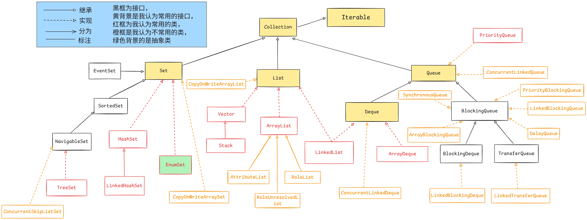

# 集合

- Java集合分为**单列集合**和**双列集合**两类，单列集合的最顶级父接口为**`Collection`**，双列集合的最顶级父接口为**`Map`**

## 类与接口结构图

- 结构图中记载和绘制了所有**关系不是很遥远的接口**
- 以及所有**非抽象类和不是很正常的类**   **之外**的类

### 单列集合**`Collection`**




### 双列集合**`Map`**


## 迭代器

- **不依赖索引**的遍历
- **迭代器的接口**是**`Iterator`**,而接口**`Iterable`**用来**标识这个类是可迭代的**
  - 实现了**`Iterable`**接口，就必须实现一个抽象方法，这个方法会返回一个**迭代器`Iterator`对象**，**毕竟可迭代嘛**
  - 实现了**`Iterator`**接口，就必须实现迭代器类的内部细节，这个类定义了一个**迭代器`Iterator`对象**


### **`Iterable`可迭代**

- 因为接口是契约嘛，实现这个必须重写**`iterator()`**方法返回一个迭代器对象，毕竟你都说了**可迭代**，**这样子我们统一规定了获取迭代器对象的方法名**不更好嘛，内部的细节你根据你自己实现的迭代器类去写着弄

#### `Iterable`接口中的方法

```java
Iterator <T> iterator()								//用于返回一个迭代器Iterator对象
default void forEach(Consumer <? super T> action)	//对 Iterable 的每个元素执行给定的操作，直到处理完所有元素或操作													  //引发异常
default Spliterator <T> spliterator()				
```

- **`Collection`接口** **继承**了**`Iterable`**接口，所以**`Collection`系列的集合**都可以使用**迭代器**遍历，**`Iterable`**要求实现类必须实现**`iterator()`方法**，返回一个**`Iterator`类 迭代器对象**
  - 为什么不继承**`Iterator`接口**，而是继承**`Iterable`接口**，因为一般集合类都是定义的**内部类**来实现 **`Iterator`迭代器**的，集合大体只负责实现**`iterator()`方法**，返回一个**`Iterator`类 迭代器对象**

##### `forEach()`方法

```java
//forEach()方法的方法体如下，Collection接口是直接继承了Iterable的这个默认方法，没有重写
public interface Iterable<T> {
    default void forEach(Consumer<? super T> action) {
        Objects.requireNonNull(action); 
        for (T t : this) {
            action.accept(t); 
        }
    }
}
```

###### 底层

- 底层是**增强`for`循环**，而**增强`for`循环**的底层对于单列集合又是**迭代器**


### **`Iterator`迭代器**

#### 游标

- 在迭代器中，有一个很重要的概念叫**游标**，这个非常重要，游标的定义和概念如下

  - **游标始终指向**"**将要正向被访问的下一个元素**"

    - 刚开始游标指向**第一个元素**，因为**将要正向访问的下一个元素**是**第一个元素**

    - **`hasNext`**的意思是**下一个位置有没有元素**，所以底层是**判断游标的位置(将要正向被访问的下一个元素)有没有元素**

    - **`next`**的意思是**下一个**，当前游标指向的是**将要正向被访问的下一个元素**，游标指向的元素，现在**不能被正向访问**，因为它指的是**将要**被访问的，如果要对这个元素要**进行正向访问**，就要**先把游标下移走了，再慢慢访问**，因为这个元素已经不是**将要正向访问的下一个元素**了，所以**先把游标往下移**，之后返回**游标刚才所指向元素的值**

      **源码如下**

      ```java
      public E next() {
          checkForComodification();
          int i = cursor;
          if (i >= size)
              throw new NoSuchElementException();
          Object[] elementData = ArrayList.this.elementData;
          if (i >= elementData.length)
              throw new ConcurrentModificationException();
          cursor = i + 1;
          return (E) elementData[lastRet = i];
      }
      ```

    - **`previous`**的意思是**上一个**，也就是反向访问，当前游标指向的是**将要正向被访问的下一个元素**，要想访问上一个元素，游标就要**向上走一下**，然后再返回**游标此时指向的值**。

      为什么这个时候，可以访问游标指向的值了呢？

      因为呀，游标指向的元素，是 **如果要正向访问的话**，它指向的是**正向将要**被访问的，这种情况下**正向拒绝访问游标指向的内容**，如果要对这个元素要进行**正向访问**，就要**先把游标下移走了，再慢慢访问**，因为这个元素已经不是**将要正向访问的下一个元素**了，但是如果是我们现在的情境中的**反向访问**，就没有这个限制了，因为它是用来**限制正向**的，反向如果也要限制的话，就很难实现了，毕竟左边的元素**离游标比较远**，实际上代码中已经偷偷体现限制的思想了，故意不用游标的变量哈哈哈

      **源码如下**

      ```java
      public E previous() {
          checkForComodification();
          int i = cursor - 1;
          if (i < 0)
              throw new NoSuchElementException();
          Object[] elementData = ArrayList.this.elementData;
          if (i >= elementData.length)
              throw new ConcurrentModificationException();
          cursor = i;
          return (E) elementData[lastRet = i];
      }
      ```

      

- 迭代器中，只要是**返回值**，返回的都是**游标指向的值(都是先移动游标,再返回值,值可能是游标指向的,也可能是游标刚才指向的)**

  - **`next`** **先把游标往下移**，之后返回**游标刚才所指向元素的值**
  - **`previous`** **先左移游标**，再返回**游标此时指向的值**

- 迭代器遍历完毕，**游标**是不会复位的，必须重新用**`iterator()`**方法获取一个迭代器对象

#### 迭代器接口中的方法

```java
boolean hasNext()			//判断游标的位置(将要被访问的下一个元素)有没有元素
E  next()					//先把游标往下移，之后返回游标刚才所指向元素的值
    
default void remove()		//具体的迭代器实现必须提供具体的实现,如果某个迭代器没有实现remove()，调用时会抛出			  							  //UnsupportedOperationException
    						//默认实现抛出一个 UnsupportedOperationException 实例,并不执行任何其他操作
        //单列集合系列的实现类中的remove()方法删除的是最后一次通过 next() 或 previous()（对于 ListIterator）返回的元 	    //素，而不是游标当前指向的元素，毕竟可能还要用当前游标处理很多别的事，如果直接删除，会出问题，不好

default void forEachRemaining(Consumer <? super E > action)
    						//对每个剩余元素执行给定的操作，直到处理完所有元素或操作引发异常
```

- **不是所有Java集合都直接实现`Iterable`**，但**所有标准集合类的可遍历实例最终都通过继承关系或视图机制确保可迭代性**
  - 就是说不管是**`Collection`**还是**`Map`**，都会间接或者直接的实现**可迭代**，也就是**`Iterable`**，**`Collection`**是直接实现**`Iterable`**,而**`Map`**是通过方法**`keySet()`**、**`values()`**以及**`entrySet()`**实现的，这三个方法的返回值分别是**`Set<K>`**、**`Collection<V>`**、**`Set<Map.Entry<K,V>>`**，他们在**`Map`接口**中的**方法签名**如下

```java
Set<K> keySet()							//Map系列获取键	
Collection<V> values()					//Map系列获取值
Set<Map.Entry<K ,V>> entrySet()			//Map系列获取键值对
```

- **`Collection`接口** **继承**了**`Iterable`**接口，所以**`Collection`系列**的集合都可以使用**迭代器**遍历，**`Iterable`**要求实现类必须实现**`iterator()`方法**，返回一个**`Iterator`类 迭代器对象**
  - 为什么不继承**`Iterator`接口**，而是继承**`Iterable`接口**，因为一般情况下集合类都是定义的**内部类**来实现 **`Iterator`迭代器**的，集合大体只负责实现**`iterator()`方法**，返回一个**`Iterator`类 迭代器对象**


#### 无法直接通过集合的方法添加或删除元素

- 在迭代器（Iterator）运行期间，如果直接通过**`Collection`系列集合**（如 `List`、`Set`、`Map`）的方法添加或删除元素，会导致 **并发修改异常**（**`ConcurrentModificationException`**）。这一设计是出于对数据一致性和迭代安全的保护
  - 要使用迭代器自身的**`remove()`方法**来进行操作
  - 因为**增强`for`**在遍历**`Collection`系列集合类型元素**的时候底层也是迭代器，所以**增强`for`**中也**不允许直接通过集合的方法添加或者删除元素**


##### 迭代器的「快速失败」机制

- Java **`Collection`系列集合**（如 **`ArrayList`**、**`HashSet`**）的迭代器实现了 **快速失败** 机制。当迭代器遍历集合时，如果发现集合的结构（如元素数量、顺序）被外部直接修改（非通过迭代器自身的方法），就会立即抛出 **`ConcurrentModificationException`**。

###### 触发条件

- 直接调用集合的 **`add()`**、**`remove()`** 等方法修改**`Collection`系列集合**结构。
- **另一个线程**并发修改了集合。

###### 底层实现

- **`Collection`系列集合**内部维护一个 **`modCount`**（修改计数器）变量，每次对集合结构修改（增删元素）时，**`modCount`** 自增。

- 迭代器创建对象时，会记录当前的 **`modCount`** 值（内部有一个变量为 **`expectedModCount`**用来记录）

  **底层源码**

  ```java
  int expectedModCount = modCount;
  ```

  - 每次迭代器的 **`next()`** 或 **`remove()`** 操作前，会检查 **`modCount`** 是否等于 **`expectedModCount`**。若不等，则抛出异常。**`has...()`方法**不参与检查的这个行为，唯一的功能是简洁的进行判断是否存在对应元素的

    **底层源码**

    ```java
    final void checkForComodification() {
        if (modCount != expectedModCount)					//差不多都这逻辑
            throw new ConcurrentModificationException();
    }
    ```

    


##### 为什么不允许直接修改集合

###### 数据一致性被破坏

- 迭代器在遍历时需要依赖集合的内部状态（如索引、链表指针）。
- 如果**`Collection`系列集合**结构被外部修改，迭代器的内部指针可能指向无效位置，导致：
  - 遗漏元素（如删除元素后索引错位）。
  - 重复访问元素（如新增元素导致索引跳转）。
  - 访问已删除元素的空指针异常。

###### 设计哲学：明确职责分离

- 迭代器的职责是 **安全遍历** 集合，并允许通过自身方法（如 **`remove()`**）修改集合。
- 集合的职责是管理元素，但 **不负责** 在迭代过程中维护迭代器的状态。


#### 常用子接口

##### `ListIterator`接口

- 是**`Iterator`**的子接口

- 一个列表的迭代器，它允许程序员在任一方向遍历列表，在迭代期间修改列表，并获得迭代器在列表中的当前位置
- 迭代器中，只要是**返回值**，返回的都是**游标指向的值(可能是先移动,再返回;也可能是先返回,再移动. 但是都是游标指向的值)**
  - **`next`**先返回**游标指向的值**，再**向右移动一位**
  - **`previous`**先**左移游标**，再返回**当前游标指向的值**

###### 常用方法

```java
void add(E  e)			//将指定元素插入列表

boolean hasNext()		//如果此list迭代器在向前遍历列表时有更多元素，则返回 true
boolean hasPrevious()	//如果此list迭代器在反向遍历列表时有更多元素，则返回 true
    
E  next()				//先把游标往下移，之后返回游标刚才所指向元素的值
int nextIndex()			//返回调用 next() 返回的元素的索引（如果游标在最后一个元素的右边，则返回列表大小）

E  previous()			//先左移游标，再返回游标此时指向的值
int previousIndex()		//返回调用 previous() 返回的元素的索引（如果右边指向第一个元素，则返回 -1）
  
//每次调用next或previous会记录最后一次访问的元素的位置吧应该?
void remove()			//从列表中删除 next() 或 previous() 返回的最后一个元素（可选操作）。
    					//每次调用 next 或 previous 只能调用一次。
    					//仅当在最后一次调用 next 或 previous 后未调用 add(E) 时才能进行。
void set(E e)			//用指定的元素替换 next() 或 previous() 返回的最后一个元素（可选操作）
    					//仅当在最后一次调用next()或previous()之后既未调用remove()也未调用add(E)时才能进行此调用
```


### 增强**`for`**

#### 基本格式

```java
for(元素的数据类型 变量名: 数组或者单列集合) {
    // 处理element
   		 ......
}
```


#### 底层实现

- 对于**数组**，**增强`for`循环**其实会被编译器转换为**普通的`for`循环**，使用下标来遍历。
- 对于**`Collection`系列集合类**，则是通过**调用`iterator()`方法获取迭代器**，然后**使用`hasNext()`和`next()`方法**进行遍历

#### 注意事项

- 因为**增强`for`**在遍历**`Collection`系列类型元素** 的时候底层也是迭代器，所以**增强`for`**中也**不允许直接通过`Collection`系列的方法添加或者删除元素**

- **增强`for`**循环隐藏了迭代器的显式使用，用户**无法直接访问迭代器对象**。因此，如果用户**需要在遍历过程中删除元素**，应该改用**显式的迭代器遍历方式**，即通过调用集合的**`iterator()`方法**获取迭代器，然后使用**`while`循环**进行遍历，并在需要时调用迭代器的**`remove()`方法**
  - 还有别的方法嘛？有的兄弟，有的。比如
    - Java 8引入的**`Collection.removeIf()`方法**，该方法接受一个**`Predicate`参数**，可以安全地删除符合条件的元素。这种方法内部使用了**迭代器**，并且是**线程安全**的
    - 另外，如果用户使用的是支持并发修改的集合类，如**`CopyOnWriteArrayList`**，那么即使在**增强`for`循环**中删除元素，也**不会抛出异常**。不过，这类集合通常用于读多写少的场景，并且每次修改都会创建底层数组的副本，可能会有性能开销，需要根据具体场景权衡。


## 单列集合**`Collection`**系列

- **存储单个元素**
- **元素独立存在**

### `Collection`接口

#### `Collection`接口的子接口

- **`List`（`Collection`的子接口)**：**有序**、**允许重复**且**支持索引访问**的集合
- **`Set`（`Collection的`子接口)**：不**允许有重复元素**、**通常无序**、**不提供索引访问**的集合
- **`Queue`（`Collection`的子接口)**：管理元素**处理顺序**的集合，通常遵循**先进先出**（FIFO）规则

#### `Collection`接口的一些方法

- **`Collection`**是**最顶级父接口**，里面有一些共性的**抽象方法**，供后面的子接口继承
- 接口中的方法的**权限修饰符**只能是**`public`**或者**`private`**，而**`private`**的方法是不会被继承下去的，所以这些从**API文档**来的**通用的、会继承的**方法都是**`public`**方法
- 这些方法都是**抽象方法**，后面的**单列集合实现类**必须实现这些方法

```java
Iterator<E> iterator()									//Iterable中继承下来的
```

```java
boolean 	add(E e)									//添加某个元素
    													//返回值是boolean的一个重要原因是因为Set可能会添加失败
boolean 	addAll(Collection <? extends E > c)			//将指定集合中的所有元素添加到此集合
    
void 		clear()										//从此集合中移除所有元素
boolean 	remove(Object  o)							//删除第一次出现的某个元素
    													//删除的元素不存在，就会删除失败
boolean 	removeAll(Collection <?> c)					//删除此集合的所有也包含在指定集合中的元素
boolean 	retainAll(Collection <?> c)					//仅保留此集合中包含在指定集合中的元素
    
boolean 	contains(Object  o)							//集合是否包含指定元素
                                            //底层是根据equals方法进行判断的，如果是自定义对象，一定要重写equals方法
boolean 	containsAll(Collection <?> c)				//集合是否包含指定集合中的所有元素

boolean 	isEmpty()									//集合是否为空
    
int 		size()										//返回此集合中的元素数
```

```java
//将集合中的元素复制到一个 Object[] 数组中，数组长度和元素个数相同
Object[] 	toArray()									
    
//将集合中的元素复制到指定类型的数组中，若数组长度足够则复用，否则创建新数组
//数组长度足够(数组长度 >= 集合大小):将元素填充到传入的数组，剩余位置置为 null，之后返回原来的数组
//数组长度不够(数组长度 < 集合大小):创建并返回一个新数组，类型与原数组相同，长度为集合大小
<T> T[] 	toArray(T[] a)								
```

```java
default Stream <E> stream()								//单线程顺序执行，逐个顺序处理元素	
default Stream <E> parallelStream()						//多线程并行执行，将数据拆分成块并行处理	
```

```java
public void forEach(Consumer <? super E > action)	//对Iterable的每个元素执行给定的操作,直到处理完所有元素或引发异常
```


#### `Collection`类型的遍历方式

##### 1.迭代器遍历

###### 示例代码

```java
Iterator<String> it = list.iterator();
while (it.hasNext()) {
    System.out.println(it.next());
}
```


##### 2.增强`for`遍历

- 底层实际上就是**迭代器**

###### 示例代码

```java
for (String s : list) {
	System.out.println(s);
}
```


##### 3.`forEach()`遍历(`Lambda`)

- **`forEach()方法`**的方法体如下，**`Collection`**接口是直接继承了**`Iterable`**中的这个**默认方法**，没有重写
- 底层是**增强`for`循环**，而**增强`for`循环**的底层对于**单列集合**又是**迭代器**

###### 方法体源码

```java
public interface Iterable<T> {
    default void forEach(Consumer<? super T> action) {
        Objects.requireNonNull(action); 
        for (T t : this) {
            action.accept(t); 
        }
    }
}
```

###### 用法示例

**完整版形式**

```java
col.forEach(new Consumer<String>() {
    @Override
    public void accept(String s) {
        System.out.println(s);
    }
});
```

**`lambda`版形式**

```java
col.forEach(s->System.out.println(s));
```


### `List`接口

- **有序**、**允许重复**且**支持索引访问**的集合

#### 子体系中常用的

##### 接口

- 无（不是没有常用的子接口，是没有子接口）

##### 实现类

- **`ArrayList`(`List`接口的实现类)**

  - 基于动态数组实现，支持快速随机访问，增删元素效率较低，非线程安全，适用于频繁查询场景

- **`LinkedList`(`List`接口和`Deque`接口的实现类)**

  - 基于双向链表实现，增删元素（尤其头尾操作）高效，随机访问需遍历链表，支持队列/双端队列操作，非线程安全。

- **`Vector`(`List`接口的实现类)**

  - 线程安全的动态数组实现，方法通过同步（synchronized）保证线程安全，但性能较差，已逐渐被并发集合替代。

    **|**

  - **`Stack`(`Vector`类的子类)**

    - **继承自`Vector`**的线程安全栈，实现后进先出（LIFO）结构，提供`push`、`pop`等方法，因设计耦合性高，现推荐使用`Deque`接口替代。


#### `List`接口的一些常用方法

```java
Iterator<E> 	 iterator()					//Iterable中继承下来的

//List自己定义的，自己定义，供后面的子接口使用，这个系列的都可以用，因为这是规范，Collection中没有是因为还要考虑Set那些
ListIterator<E>  listIterator()				//列表迭代器，自己定义的，返回此list中元素的列表迭代器
ListIterator<E > listIterator(int index)    //返回此list中元素的列表迭代器（以适当的顺序），从列表中的指定位置开始
    										//指定的位置为游标初始指向的值
```

```java
boolean 	add(E  e)									//将指定的元素附加到此list的末尾
void 		add(int index, E  element)					//在此list中的指定位置插入指定元素
boolean 	addAll(Collection <? extends E > c)			//将指定集合中的所有元素附加到此list的末尾
boolean 	addAll(int index, Collection <? extends E > c)//将指定集合中的所有元素插入此list的指定位置

void 		clear()										//从此list中删除所有元素
boolean 	remove(Object  o)							//从此list中删除第一次出现的指定元素
E  			remove(int index)							//删除此list中指定位置的元素
boolean 	removeAll(Collection <?> c)					//从此list中删除指定集合中包含的所有元素
boolean 	retainAll(Collection <?> c)					//仅保留此list中包含在指定集合中的元素
 
E  			set(int index, E  element)					//用指定的元素替换此list中指定位置的元素
    													//返回原来的元素

E  			get(int index)								//返回此list中指定位置的元素

int 		size()										//返回此list中的元素数
int 		indexOf(Object  o)							//返回此list中指定元素第一次出现的索引
int 		lastIndexOf(Object  o)   					//返回此list中指定元素最后一次出现的索引

boolean 	contains(Object  o)							//如果此list包含指定元素，则返回 true
boolean 	containsAll(Collection <?> c)				//如果此list包含指定集合的所有元素，则返回 true

boolean 	isEmpty()									//如果此list不包含任何元素，则返回 true

List<E> 	subList(int fromIndex, int toIndex)			//返回此list中指定的fromIndex(含)和toIndex(不含)之间的部分
 
default void sort(Comparator <? super E> c)			//根据指定的 Comparator 引起的顺序对该列表进行排序
//JDK10出的
static <E> List<E> copyOf(Collection<? extends E> coll)//返回一个不可修改的列表包含给定Collection的元素,按其迭代顺序
```

```java
//将集合中的元素复制到一个 Object[] 数组中，数组长度和元素个数相同
Object[] 	toArray()									
    
//将集合中的元素复制到指定类型的数组中，若数组长度足够则复用，否则创建新数组
//数组长度足够(数组长度 >= 集合大小):将元素填充到传入的数组，剩余位置置为 null，之后返回原来的数组
//数组长度不够(数组长度 < 集合大小):创建并返回一个新数组，类型与原数组相同，长度为集合大小
<T> T[] 	toArray(T[] a)	
```

```java
//JDK9出的
static <E> List <E> of()				//返回包含零个元素的不可修改列表
static <E> List <E> of(E e1)			//返回包含一个元素的不可修改列表
static <E> List <E> of(E e1, E e2)		//返回包含两个元素的不可修改列表
	......
static <E> List <E> of(E e1,E e2,E e3,E e4,E e5,E e6,E e7,E e8,E e9,E e10)//返回包含十个元素的不可修改的列表
static <E> List <E> of(E... elements)	//返回包含任意数量元素的不可修改列表
```

```java
default void forEach(Consumer <? super T > action)	//对Iterable的每个元素执行给定的操作,直到处理完所有元素或引发异常
default Stream <E> 	stream()						
default Stream <E> 	parallelStream()
default <T> T[] 	toArray(IntFunction <T[]> generator) //返回包含此集合中所有元素的数组
```


#### `List`类型的遍历方式

- 除了**`Collection`**类型的遍历方式，还有**`List`类型**自己的遍历方式

##### 1.迭代器遍历

###### 示例代码

```java
Iterator<String> it = list.iterator();
while (it.hasNext()) {
    System.out.println(it.next());
}
```


##### 2.增强`for`遍历

- 底层实际上就是**迭代器**

###### 示例代码

```java
for (String s : list) {
    System.out.println(s);
}
```


##### 3.`forEach()`遍历(`Lambda`)

- **`forEach()方法`**的方法体如下，**`List`接口** 继承了**`Collection`接口**从**`Iterable`**中继承下来的的这个**默认方法**，没有重写
- 底层是**增强`for`循环**，而**增强`for`循环**的底层对于单列集合又是**迭代器**

###### 方法体源码

```java
public interface Iterable<T> {
    default void forEach(Consumer<? super T> action) {
        Objects.requireNonNull(action); 
        for (T t : this) {
            action.accept(t); 
        }
    }
}
```

###### 用法示例

**完整版**

```java
list.forEach(new Consumer<String>() {
    @Override
    public void accept(String s) {
        System.out.println(s);
    }
});
```

**`Lambda`版**

```java
list.forEach(s-> System.out.println(s));
```


##### 4.普通`for`循环遍历

- **`List`**支持**索引访问**，所以可以使用普通**`for`**循环遍历

###### 示例代码

```java
for (int i = 0; i < list.size(); i++) {
	String s = list.get(i);
    System.out.println(s);
}
```


##### 5.列表迭代器遍历

- **`ListIterator`列表迭代器**是**`Iterator`迭代器**的子类
- 迭代器中，只要是**返回值**，返回的都是**游标指向的值(可能是先移动,再返回;也可能是先返回,再移动. 但是都是游标指向的值)**
  - **`next`**先返回**游标指向的值**，再**向右移动一位**
  - **`previous`**先**左移游标**，再返回**当前游标指向的值**

###### 示例代码

```java
ListIterator<String> lit = list.listIterator();
while (lit.hasNext()) {
    String s = lit.next();
    System.out.println(s);
}
```


#### `ArrayList`类

- **有序**、**允许重复**且**支持索引访问**

##### 获取对象的方式

**构造方法**

```java
public ArrayList()								//构造一个初始容量为 10 的空列表
public ArrayList(int initialCapacity)			//构造一个具有指定初始容量的空列表
public ArrayList(Collection <? extends E> c)	//构造一个包含指定集合元素的列表，按照集合迭代器返回元素的顺序
```

##### 常用方法

```java
public boolean 	add(E  e)											//将指定的一个元素附加到此list的末尾
public void 	add(int index, E  element)							//在此list中的指定位置插入指定的一个元素
public boolean  addAll(Collection <? extends E > c)					//将指定集合中的所有元素追加到此list的末尾
public boolean 	addAll(int index, Collection <? extends E > c)		//将指定集合中的所有元素插入此list的指定位置
    
public void 	clear()												//从此list中删除所有元素
public E  		remove(int index)									//移除此list中指定位置的元素
public boolean 	remove(Object  o)									//从此list中移除第一次出现的指定元素
public boolean 	removeAll(Collection <?> c)							//从此list中移除指定集合中包含的所有元素
public boolean 	retainAll(Collection <?> c)							//仅保留此list中包含在指定集合中的元素

public E  		set(int index, E  element)					//用指定的元素替换此list中指定位置的元素
    														//返回原来的元素

public E  		get(int index)							//返回此list中指定位置的元素

public int 		size()									//返回此list中的元素数
public int 		indexOf(Object  o)						//返回此list中指定元素第一次出现的索引，如果不包含，则返回-1
public int 		lastIndexOf(Object  o)					//返回此list中指定元素最后一次出现的索引,如果不包,则返回-1

public boolean 	isEmpty()								//如果此集合不包含任何元素，则返回 true
public boolean 	contains(Object o)						//如果此list包含指定元素，则返回 true
public boolean  containsAll(Collection<?> c)			//如果此list包含指定集合的所有元素，则返回 true
    
public List<E>  subList(int fromIndex, int toIndex)		//返回此list中指定的fromIndex(含)和toIndex(不含)之间的部分
    
public void 	ensureCapacity(int minCapacity)			//增加或者不变容量,确保它至少可以容纳最小容量参数指定的元素数
public void 	trimToSize()							//将此 ArrayList 实例的容量修剪为列表的当前大小
```

```java
//将集合中的元素复制到一个 Object[] 数组中，数组长度和元素个数相同
public Object[] toArray()									
    
//将集合中的元素复制到指定类型的数组中，若数组长度足够则复用，否则创建新数组
//数组长度足够(数组长度 >= 集合大小):将元素填充到传入的数组，剩余位置置为 null，之后返回原来的数组
//数组长度不够(数组长度 < 集合大小):创建并返回一个新数组，类型与原数组相同，长度为集合大小
public<T> T[]   toArray(T[] a)
```

```java
public void forEach(Consumer <? super E > action)	//对Iterable的每个元素执行给定的操作,直到处理完所有元素或引发异常
public Iterator<E> 		iterator()						//以正确的顺序返回此list中元素的迭代器
public ListIterator<E> 	listIterator()					//返回此list中元素的列表迭代器
public ListIterator<E> 	listIterator(int index)			//返回此list中元素的列表迭代器，从列表中的指定位置开始
```

```java
default Stream <E> stream()							//返回以此集合为源的顺序 Stream
default Stream <E> parallelStream()					//返回可能以此集合为源的并行 Stream。此方法允许返回顺序流
```

```java
default <T> T[] toArray(IntFunction <T[]> generator)	//返回包含此集合中所有元素的数组
default void 	sort(Comparator <? super E> c)			//根据指定的 Comparator 引起的顺序对该列表进行排序
```


##### 底层

- 底层是用**数组**存储数据的

###### 扩容机制总概括

- 用**无参构造**创建的**`ArrayList`集合对象**的**初始容量为0**

  而**别的构造方法**创建的**`ArrayList`集合对象**的初始容量为**指定值**或**初始元素的数量**

- **不管用哪个构造方法**创建**`ArrayList`集合对象**，只要集合创建出来的**元素数量为0**

  - 只有用**无参构造**创建的**`ArrayList`集合对象**在**第一次**添加**数量少于10的元素**时，会**把容量扩容为10**，

    如果**添加的数量大于10**，按**照扩容规则**进行扩容

  - **别的构造方法**创建的**`ArrayList`集合对象**都直接按照**扩容规则**进行扩容

- **扩容规则**

  - 如果当前的**容量足够**，也就是**添加元素后还没装满**，**不扩容**
  - **如果必须要扩容了**，判断**最少要添加的容量(就是新元素放进去刚好装满集合的时候集合的容量-原来没放新元素的时候的容量)**是否**大于** **当前`ArrayList`集合的容量的一半(向负无穷大方向舍入)**
    - 如果**大于**，则	**新容量=老容量+至少要添加的容量(就是新元素放进去刚好装满集合的时候集合的容量-原来没放新元素的时候的容量)**	
    - 如果**小于**，则        **新容量=老容量+添加元素前`ArrayList`集合的容量的一半(向负无穷大方向舍入)**


###### 扩容机制底层分析

- 我们已经知道**`ArrayList`**的底层是一个数组，但是它的**容量**是多少呢？**肯定不能是无穷大**，不然太浪费空间了

**`ArrayList`**扩容是要分情况的，这些情况很多，我们结合它的**三个构造方法**和**`add()`添加方法**来概述

- **`ArrayList`的3种构造方法**

  - **`public ArrayList()`空参构造**

    - 利用这个**空参构造直接创建的集合**，其底层数组 **`elementData`** 被初始化为一个 **默认容量空数组（`DEFAULTCAPACITY_EMPTY_ELEMENTDATA`）**

    - 源码如下

      ```java
      public ArrayList() {										//空参构造
          this.elementData = DEFAULTCAPACITY_EMPTY_ELEMENTDATA;	//让底层数组成为默认容量空数组
      }
      ```

  - **`public ArrayList(int initialCapacity)`构造**

    - 根据**表示初始容量的参数**创建**`ArrayList`对象**的构造方法，创建的**`ArrayList`**对象的**容量和参数相同**

    - 源码如下

      ```java
      public ArrayList(int initialCapacity) {
          if (initialCapacity > 0) {						
              this.elementData = new Object[initialCapacity];	//让底层数组成为一个new出来的Object[]类型的数组
          } else if (initialCapacity == 0) {
              this.elementData = EMPTY_ELEMENTDATA;	//空数组EMPTY_ELEMENTDATA,不是默认容量空数组
          } else {
              throw new IllegalArgumentException("Illegal Capacity: "+ initialCapacity);
          }
      }
      ```

  - **`public ArrayList(Collection<? extends E> c)`**

    - 接收一个**单列集合类型**的参数，然后将这些**集合里的元素**放到这个**`ArrayList`**中，构造一个**`ArrayList`**对象

    - 源码如下

      ```java
      public ArrayList(Collection<? extends E> c) {		//接收一个集合类型的参数
          Object[] a = c.toArray();						//将集合c转换为数组a
          if ((size = a.length) != 0) {					//如果集合中元素的数量不为0
              if (c.getClass() == ArrayList.class) {		//检查c的类是否为ArrayList.class
                  elementData = a;						//如果是，直接将a赋值给集合底层的数组
              } else {									//如果c的类型不是ArrayList实例
                  elementData = Arrays.copyOf(a, size, Object[].class);
                  								//将底层数组强转成Object[]类型的,而不只是像上面的a一样只是接收
              }
          } else {								//如果原来的集合中元素为空
              elementData = EMPTY_ELEMENTDATA;	//直接让底层数组等于空数组EMPTY_ELEMENTDATA
          }
      }
      ```

      

- **`ArrayList`的4种`add()`方法**

  - **`public boolean add(E e)`末尾添加一个元素**

    - 底层是调用了**`ArrayList`**中的另一个**`add()`方法**来实现添加逻辑

      即**`ArrayList`**内部的**`private void add(E e, Object[] elementData, int s)`**

    - 源码如下

      ```java
      public boolean add(E e) {
          modCount++;			//该变量用于迭代器的“快速失败机制”			
          					//用于记录列表结构被修改的次数(如添加、删除元素,但修改元素值不算结构修改)
      						//迭代器会检查modCount是否与初始记录的expectedModCount一致。
          					//若不一致，说明列表在迭代过程中被并发修改，抛出 ConcurrentModificationException
          add(e, elementData, size);	//把当前要添加的元素、集合底层存储数据的数组、以及集合当前的容量	
          return true;		//不管怎么样ArrayList都能添加成功
      }
      ```

    - **`private void add(E e, Object[] elementData, int s)`**

      - 内部是调用了**`grow()`方法**进行扩容
      - 源码如下

      ```java
      private void add(E e, Object[] elementData, int s) {
          if (s == elementData.length)//如果当前集合中元素的数量和数组的长度(集合的容量)一样(集合已经满了)
              elementData = grow();	//扩容,因为集合的容量已经满了,还要添加元素，所以就进行扩容
          
          elementData[s] = e;			//集合还有容量,就算原本没有也已经扩了，
          							//现在在底层数组的s索引处(太巧妙了),把e元素放进去
          size = s + 1;				//之后集合的元素个数+1
      }
      ```

      - **`grow()`方法**

        - 该**`grow()`方法**底层又调用了**最终扩容方法`grow()`**进行扩容
        - 源码如下

        ```java
        private Object[] grow() {
            return grow(size + 1);//参数：集合中的元素数+1
            					  //表示添加完当前元素后，集合中的元素个数
        }
        ```

    

  - **`public void add(int index, E element)`指定位置插入一个元素**

    - 底层也同样是使用了**`grow()`方法**进行扩容

      ```java
      public void add(int index, E element) {			//指定了插入的位置和插入的元素
          rangeCheckForAdd(index);					//检查索引是否合法
          modCount++;									//该变量用于迭代器的“快速失败机制”			
          					//用于记录列表结构被修改的次数(如添加、删除元素,但修改元素值不算结构修改)
      						//迭代器会检查modCount是否与初始记录的expectedModCount一致。
          					//若不一致，说明列表在迭代过程中被并发修改，抛出 ConcurrentModificationException
          final int s;								//声明一个final变量s，用于保存当前ArrayList中元素的个数
          Object[] elementData;						//声明一个数组引用，指向当前存储元素的数组
          if ((s = size) == (elementData = this.elementData).length)//检查底层数组的长度和ArrayList中存储的元															   //素个数是否相同，即检查集合是否已满
              
              elementData = grow();					//执行这一句,证明集合已满,grow()进行扩容
      
          System.arraycopy(elementData, index,		
                           elementData, index + 1,
                       	 s - index);	  //这个方法用于将老数组中的元素拷贝到新数组上,并且留下了新元素的插入位置
          elementData[index] = element;	  //将新元素插入
          size = s + 1;					  //将当前ArrayList中的元素数量+1
      }
      ```

    - **`grow()`方法**

      - 该**`grow()`方法**底层又调用了**最终扩容方法`grow()`**进行扩容

      - 源码如下

        ```java
        private Object[] grow() {
            return grow(size + 1);//参数：集合中的元素数+1
            					  //表示添加完当前元素后，集合中的元素个数
        }
        ```

  

  - **`public boolean addAll(Collection<? extends E> c)`一次在末尾添加多个元素**

    - 底层使用**最终扩容方法`grow()`**进行扩容

    - 源码如下

      ```java
      public boolean addAll(Collection<? extends E> c) {
          Object[] a = c.toArray();			//将集合c转为数组
          modCount++;							//该变量用于迭代器的“快速失败机制”			
          					//用于记录列表结构被修改的次数(如添加、删除元素,但修改元素值不算结构修改)
      						//迭代器会检查modCount是否与初始记录的expectedModCount一致。
          					//若不一致，说明列表在迭代过程中被并发修改，抛出 ConcurrentModificationException
          int numNew = a.length;			//获取待添加元素的数量
          if (numNew == 0)				//如果添加的元素为0,则添加失败
              return false;
          Object[] elementData;			//声明一个变量指向底层数组
          final int s;					//声明一个final变量s，用于保存当前ArrayList中元素的个数
          if (numNew > (elementData = this.elementData).length - (s = size))
              			//如果待添加元素数量比数组剩余容量大，触发扩容
              elementData = grow(s + numNew);	//调用最终扩容方法grow(),把新添加元素后ArrayList的元素个数传递过去
          System.arraycopy(a, 0, elementData, s, numNew);//将元素按要求都放到新数组中
          size = s + numNew;					//将元素数量增加到准确的数目
          return true;						//添加成功
      }
      ```

  

  - **`public boolean addAll(int index, Collection<? extends E> c)`一次在指定位置添加多个元素**

    - 底层也使用**最终扩容方法`grow()`**进行扩容底层使用**最终扩容方法`grow()`**进行扩容

    - 源码如下

      ```java
      public boolean addAll(int index, Collection<? extends E> c) {
          rangeCheckForAdd(index);			//检查索引是否合法
          Object[] a = c.toArray();			//将集合c转为数组
          modCount++;							//该变量用于迭代器的“快速失败机制”			
          					//用于记录列表结构被修改的次数(如添加、删除元素,但修改元素值不算结构修改)
      						//迭代器会检查modCount是否与初始记录的expectedModCount一致。
          					//若不一致，说明列表在迭代过程中被并发修改，抛出 ConcurrentModificationException
          int numNew = a.length;			//获取待添加元素的数量
          if (numNew == 0)				//如果添加的元素为0,则添加失败
              return false;
          Object[] elementData;			//声明一个变量指向底层数组
          final int s;					//声明一个final变量s，用于保存当前ArrayList中元素的个数
          if (numNew > (elementData = this.elementData).length - (s = size))
              			//如果待添加元素数量比数组剩余容量大，触发扩容
              elementData = grow(s + numNew);	//调用最终扩容方法grow(),把新添加元素后ArrayList的元素个数传递过去
      
          int numMoved = s - index;		//计算要移动的元素数量
          if (numMoved > 0)				//如果有元素需要移动，
              System.arraycopy(elementData, index,	//把index开始的元素，移动到index+numNew(添加元素的数量)
                               elementData, index + numNew,
                               numMoved);				//一共操作numMoved个数(要移动的元素数量)
          System.arraycopy(a, 0, elementData, index, numNew);//把a中的元素从index开始，赋值numNew个
          size = s + numNew;				//元素个数添加到正确
          return true;					//添加成功
      }
      ```

      


- **最终扩容方法`grow()`**

  - 源码如下

    ```java
    private Object[] grow(int minCapacity) {//参数表示添加完当前元素的元素个数
        int oldCapacity = elementData.length;	//定义一个变量记录之前的老容量
        if(oldCapacity > 0 || elementData!=DEFAULTCAPACITY_EMPTY_ELEMENTDATA){
            //如果集合的容量大于0或者底层数组不是默认容量空数组(DEFAULTCAPACITY_EMPTY_ELEMENTDATA)
            //为什么要这么写呢?听听我的理解:
            	//容量为0的ArrayList对象的内部数组只有两种,
            	//一种是EMPTY_ELEMENTDATA,这种按照扩容规则来
            	//另一种是DEFAULTCAPACITY_EMPTY_ELEMENTDATA,这种扩容时要考虑默认10的情况
            	//容量>0的ArrayList对象的内部数组只有1种，就是new出来的,这种也是按照扩容规则来
            //由于要区分是否需要按默认容量扩容，前半句可能有点冗余
            
            int newCapacity = ArraysSupport.newLength(//这个类用来对数组提供一些底层操作支持
                                       //这个方法用来计算扩容后的数组长度(用于动态扩容)
                	oldCapacity,				//集合原来的容量
                    minCapacity - oldCapacity, 	//理论上最少要新增的容量
                	oldCapacity >> 1      //首选增长量
                                            //老容量右移>>1,就是老容量除以2再向负无穷大方向舍入
                 	);
            return elementData = Arrays.copyOf(elementData, newCapacity);
        } else {//容量为0且数组是默认容量空数组(DEFAULTCAPACITY_EMPTY_ELEMENTDATA)
            return elementData = new Object[Math.max(DEFAULT_CAPACITY, minCapacity)];
        }
    }
    ```

  - 计算新数组长度**`newLength()`**方法

    - 源码如下

      ```java
      public static int newLength(int oldLength, int minGrowth, int prefGrowth) {
          						//oldLength：当前底层数组的容量(oldCapacity)
                              	//minGrowth：理论上最少需要新增的容量，
          							//即 minCapacity - oldCapacity
           							//(例如添加元素后超出当前容量时，需至少扩容到 minCapacity)
       							//prefGrowth:首选增长量,ArrayList中是oldCapacity >> 1
          							//(即当前容量的 50%,如 10 → 15)
          								
          int prefLength = oldLength + Math.max(minGrowth, prefGrowth);
          					//这里判断的原因是可能至少增加的元素比首选增长量大
          					//导致首选增长量还是不够容纳
          if (0 < prefLength && prefLength <= SOFT_MAX_ARRAY_LENGTH) {
              return prefLength;
          } else {
              return hugeLength(oldLength, minGrowth);
          }
      }
      ```


#### `LinkedList`类

- **有序**、**允许重复**且**支持索引访问**

##### 获取对象的方式

**构造方法**

```java
public LinkedList()									//空参构造，构造一个空链表
public LinkedList(Collection <? extends E > c)		//构造一个包含指定集合元素的列表，按照集合迭代器返回元素的顺序
```

##### 常用方法

```java
public boolean 	add(E  e)											//将指定的一个元素附加到此list的末尾
public void 	add(int index, E  element)							//在此list中的指定位置插入指定的一个元素
public boolean  addAll(Collection <? extends E > c)					//将指定集合中的所有元素追加到此list的末尾
public boolean 	addAll(int index, Collection <? extends E > c)		//将指定集合中的所有元素插入此list的指定位置
public void 	addFirst(E  e)										//在此list的开头插入指定的元素
public void 	addLast(E  e)										//将指定的元素附加到此list的末尾

void 			clear()												//从此list中删除所有元素
public E  		remove()											//检索并删除此list的头部（第一个元素）
public E  		remove(int index)									//移除此list中指定位置的元素
public boolean 	remove(Object  o)									//从此list中移除第一次出现的指定元素
public E  		removeFirst()										//从此list中移除并返回第一个元素
public boolean 	removeFirstOccurrence(Object  o)					//删除此list中第一次出现的指定元素
    																//如果列表不包含该元素，则它不变
public E  		removeLast()										//从此list中移除并返回最后一个元素
public boolean 	removeLastOccurrence(Object  o)						//删除此list中最后一次出现的指定元素
    																//如果列表不包含该元素，则它不变
public boolean 	retainAll(Collection <?> c)							//仅保留此list中包含在指定集合中的元素
    
public E  		set(int index, E  element)							//用指定的元素替换此list中指定位置的元素
    																//返回原来的元素
    
public E  		get(int index)										//返回此list中指定位置的元素
public E  		getFirst()											//返回此list中的第一个元素
public E 		getLast()											//返回此list中的最后一个元素
    
public int 		size()												//返回此list中的元素数
public int 		indexOf(Object  o)									//返回此list中指定元素第一次出现的索引
    																//如果此list不包含该元素，则返回 -1
public int 		lastIndexOf(Object  o)					//返回此list中指定元素最后一次出现的索引,如果不包,则返回-1

public boolean 	isEmpty()											//如果此集合不包含任何元素，则返回 true
public boolean 	contains(Object o)									//如果此list包含指定元素，则返回 true
public boolean  containsAll(Collection<?> c)					//如果此list包含指定集合的所有元素，则返回 true
    
public List<E>  subList(int fromIndex, int toIndex)		//返回此list中指定的fromIndex(含)和toIndex(不含)之间的部分
```

```java
//将集合中的元素复制到一个 Object[] 数组中，数组长度和元素个数相同
public Object[] toArray()									
    
//将集合中的元素复制到指定类型的数组中，若数组长度足够则复用，否则创建新数组
//数组长度足够(数组长度 >= 集合大小):将元素填充到传入的数组，剩余位置置为 null，之后返回原来的数组
//数组长度不够(数组长度 < 集合大小):创建并返回一个新数组，类型与原数组相同，长度为集合大小
public<T> T[]   toArray(T[] a)
```

```java
public void 	push(E  e)											//将一个元素推入此list表示的堆栈中
    																//换句话说，将元素插入此list的前面
public E  		pop()												//从此list表示的堆栈中弹出一个元素
    																//换句话说，删除并返回此list的第一个元素

public E  		element()											//检索但不删除此list的头部（第一个元素）
public boolean 	offer(E  e)											//添加指定元素作为此list的尾部（最后一个元素）
public boolean 	offerFirst(E  e)									//在此list的前面插入指定的元素
public boolean 	offerLast(E  e)										//在此list的末尾插入指定的元素
public E  		peek()												//检索但不删除此list的头部（第一个元素）
public E  		peekFirst()								//检索但不删除此list的第一个元素，如果此list为空，则返回null
public E  		peekLast()								//检索但不删除此list的最后一个元素,如果此list为空,则返回null
public E  		poll()												//检索并删除此list的头部（第一个元素）
public E 		pollFirst()								//检索并删除此list的第一个元素，如果此list为空，则返回 null
public E  		pollLast()								//检索并删除此list的最后一个元素,如果此list为空,则返回 null
```

```java
public void forEach(Consumer <? super E > action)	//对Iterable的每个元素执行给定的操作,直到处理完所有元素或引发异常
public Iterator<E> 		iterator()						//以正确的顺序返回此list中元素的迭代器
public ListIterator<E> 	listIterator()					//返回此list中元素的列表迭代器
public ListIterator<E> 	listIterator(int index)			//返回此list中元素的列表迭代器，从列表中的指定位置开始
public Iterator <E> 	descendingIterator()			//以相反的顺序返回此双端队列中元素的迭代器
```

```java
default <T> T[] toArray(IntFunction <T[]> generator)	//返回包含此集合中所有元素的数组
default void 	sort(Comparator <? super E> c)			//根据指定的 Comparator 引起的顺序对该列表进行排序
```

```java
default Stream <E> stream()							//返回以此集合为源的顺序 Stream
default Stream <E> parallelStream()					//返回可能以此集合为源的并行 Stream。此方法允许返回顺序流
```


##### 底层

- 底层是一个**双向链表**


### `Set`接口

- 不**允许有重复元素**、**通常无序**、**不提供索引访问**的集合

#### 子体系中的一些常用

##### 接口

- **`EventSet`**

  - 不常用，没见过

- **`SortedSet`(`Set`接口的子接口)**

  - 有序**`Set`**接口，核心特性是元素按自然顺序（或自定义`Comparator`）自动排序，支持范围查询，需实现类（如**`TreeSet`**）提供具体逻辑。

  - 保证元素唯一性且有序，但未提供直接的导航方法（如查找最近元素）。

    **|**

  - **`	NavigableSet`(`SortedSet`接口的子接口)**

    - 扩展**`SortedSet`**的接口，提供导航方法（如最近元素查找），在有序基础上增强灵活性，是**`TreeSet`**的直接接口

##### 实现类

- **`TreeSet`(`NavigableSet`接口的实现类)**

  - 基于**红黑树**实现**`SortedSet`**的子接口**`NavigableSet`**接口，元素按自然顺序或自定义**`Comparator`**排序
  - 增删查时间复杂度为$O(log n)$，支持高效范围查询和导航操作，但**不保留插入顺序**，非线程安全。

- **`HashSet`(`Set`接口的实现类)**

  - 基于**哈希表**（数组+链表）**直接实现`Set`接口**，元素无序且唯一

  - 增删查平均时间复杂度$O(1)$，性能最优，但遍历顺序不固定，非线程安全。

    **|**

  - **`LinkHashSet`(`HashSet`类的子类)**

    - **继承`HashSet`**，底层通过**哈希表+双向链表**维护元素**插入顺序**（或访问顺序）	

    - 在**`HashSet`**高效性的基础上，提供可预测的迭代顺序，适合需要保留插入/访问顺序的场景，非线程安全。

- **`EnumSet`(`Set`接口的实现类)**

  - 专为**枚举类型**设计的高效集合，内部用位向量（bit vector）实现
  - 内存占用极小，所有操作时间复杂度$O(1)$，线程不安全，仅支持同类型枚举元素。


#### `Set`接口的一些常用方法

```java
Iterator<E> 	 iterator()					//Iterable中继承下来的
```

```java
boolean add(E e)            //如果指定的元素不存在，则将其添加到此集合，返回true                            									//如果此集合已包含该元素，则调用保持集合不变并返回 false
boolean addAll(Collection <? extends E> c)//将指定集合中的所有元素添加到此集合,只要有一个元素在原来的集合中不存在，true                                          //如果都存在，false
void    clear()                             //从此集合中删除所有元素
boolean remove(Object  o)                   //从此集合中删除第一次出现的指定元素
boolean removeAll(Collection <?> c)         //从此集合中删除指定集合中包含的所有元素
boolean retainAll(Collection <?> c)         //仅保留此集合中包含在指定集合中的元素
    
int     size()                              //返回此集合中的元素数
    
boolean contains(Object  o)                         //如果此集合包含指定元素，则返回 true
boolean containsAll(Collection <?> c)               //如果此集合包含指定集合的所有元素，则返回 true    
boolean isEmpty()                               	//如果此集合不包含任何元素，则返回 true
    
Object[]    toArray()                               //返回包含此集合中所有元素的数组
<T> T[]     toArray(T[] a)                          //同上，但返回数组的运行时类型是指定数组的类型

//JDK10出的
static<E> Set<E> copyOf(Collection <? extends E> coll)//返回一个不可修改的列表包含给定Collection的元素,按其迭代顺序
```

```java
//将集合中的元素复制到一个 Object[] 数组中，数组长度和元素个数相同
Object[] 	toArray()									
    
//将集合中的元素复制到指定类型的数组中，若数组长度足够则复用，否则创建新数组
//数组长度足够(数组长度 >= 集合大小):将元素填充到传入的数组，剩余位置置为 null，之后返回原来的数组
//数组长度不够(数组长度 < 集合大小):创建并返回一个新数组，类型与原数组相同，长度为集合大小
<T> T[] 	toArray(T[] a)	
```

```java
//因为Set集合不允许元素重复，所以这些方法的参数中不允许元素重复
static <E> Set <E> of()					//返回包含零个元素的不可修改集合
static <E> Set <E> of(E e1)				//返回包含一个元素的不可修改集合
static <E> Set <E> of(E e1, E e2)		//返回包含两个元素的不可修改集合
	......
static <E> Set <E> of(E e1,E e2,E e3,E e4,E e5,E e6,E e7,E e8,E e9,E e10)//返回包含十个元素的不可修改的列表
static <E> Set <E> of(E... elements)	//返回包含任意数量元素的不可修改集合
```

```java
Iterator <E> iterator()				//返回迭代器对象
default void forEach(Consumer <? super T > action)	//对Iterable的每个元素执行给定的操作,直到处理完所有元素或引发异常
```

```java
default Stream <E> 	stream()						
default Stream <E> 	parallelStream()
```

```java
default <T> T[] 	toArray(IntFunction <T[]> generator) //返回包含此集合中所有元素的数组
```


#### `Set`类型的遍历方式

- 除了**`Collection`**类型的遍历方式相同

##### 1.迭代器遍历

###### 示例代码

```java
Iterator<String> it = set.iterator();
while (it.hasNext()) {
    System.out.println(it.next());
}
```


##### 2.增强`for`遍历

- 底层实际上就是**迭代器**

###### 示例代码

```java
for (String s : set) {
    System.out.println(s);
}
```


##### 3.`forEach()`遍历(`Lambda`)

- **`forEach()方法`**的方法体如下，**`Set`接口** 继承了**`Collection`接口**从**`Iterable`**中继承下来的的这个**默认方法**，没有重写
- 底层是**增强`for`循环**，而**增强`for`循环**的底层对于**单列集合**又是**迭代器**

###### 方法体源码

```java
public interface Iterable<T> {
    default void forEach(Consumer<? super T> action) {
        Objects.requireNonNull(action); 
        for (T t : this) {
            action.accept(t); 
        }
    }
}
```

###### 用法示例

**完整版**

```java
set.forEach(new Consumer<String>() {
    @Override
    public void accept(String s) {
        System.out.println(s);
    }
});
```

**`Lambda`版**

```java
set.forEach(s-> System.out.println(s));
```


#### `HashSet`类

- **无序**、**不允许重复**、**不支持索引访问**
- **去重**是依赖于对象的**`hashCode()`和`equals()`方法**

##### 获取对象的方式

**构造方法**

```java
public HashSet()						//构造一个具有默认初始容量 (16) 和负载因子 (0.75)的空集
public HashSet(Collection<? extends E> c)//使用与指定集合相同的元素构造一个使用默认加载因子 (0.75)
    									//和足以包含指定集合中的元素的初始容量的HashSet
public HashSet(int initialCapacity)		 //使用指定的初始容量和默认加载因子 (0.75) 构造一个新的空集
public HashSet(int initialCapacity, float loadFactor)//使用指定的初始容量和加载因子构造一个新的空集
```

##### 常用方法

```java
public boolean add(E  e)			//如果指定的元素不存在，则将其添加到此集合中
boolean addAll(Collection <? extends E> c)//将指定集合中的所有元素添加到此集合,只要有一个元素在原来的集合中不存在，true
    
public void clear()					//删除所有元素    
public boolean remove(Object  o)	//如果存在，则从此集合中移除指定元素
boolean removeAll(Collection <?> c)         //从此集合中删除指定集合中包含的所有元素
boolean retainAll(Collection <?> c)         //仅保留此集合中包含在指定集合中的元素
    
public int size()					//元素数
    
public boolean isEmpty()			//如果此集合不包含任何元素，则返回 true
    
public boolean contains(Object  o)	//如果此集合包含指定元素，则返回 true
public boolean containsAll(Collection <?> c)//如果此集合包含指定集合中的所有元素
```

```java
//将集合中的元素复制到一个 Object[] 数组中，数组长度和元素个数相同
public Object[] toArray()									
    
//将集合中的元素复制到指定类型的数组中，若数组长度足够则复用，否则创建新数组
//数组长度足够(数组长度 >= 集合大小):将元素填充到传入的数组，剩余位置置为 null，之后返回原来的数组
//数组长度不够(数组长度 < 集合大小):创建并返回一个新数组，类型与原数组相同，长度为集合大小
public<T> T[]   toArray(T[] a)
```

```java
Iterator <E> iterator()				//返回迭代器对象
default void forEach(Consumer <? super T > action)	//对Iterable的每个元素执行给定的操作,直到处理完所有元素或引发异常
```

```java
default Stream <E> 	stream()						
default Stream <E> 	parallelStream()
```

```java
default <T> T[] 	toArray(IntFunction <T[]> generator) //返回包含此集合中所有元素的数组
```

##### 底层

- 底层是**哈希表**，哈希表是一种对于增删改查数据性能都比较好的结构

- **去重**是依赖于对象的**`hashCode()`和`equals()`方法**

- 事实上这个是一个**`HashMap`**......


#### `LinkedHashSet`类

- **有序**、**不允许重复**、**不支持索引访问**
- **`HashSet`**的**子类**

##### 获取对象的方式

**构造方法**

```java
public LinkedHashSet()						//使用默认初始容量 (16) 和加载因子 (0.75) 构造一个新的空链接哈希集
public LinkedHashSet(Collection<? extends E> c)//使用与指定集合相同的元素构造一个新的链接哈希集
public LinkedHashSet(int initialCapacity)		 //使用指定的初始容量和默认加载因子 (0.75) 构造一个新的空链接哈希集	
public LinkedHashSet(int initialCapacity, float loadFactor)//使用指定的初始容量和加载因子构造一个新的空链接哈希集
```

##### 常用方法

```java
public boolean add(E  e)			//如果指定的元素不存在，则将其添加到此集合中
boolean addAll(Collection <? extends E> c)//将指定集合中的所有元素添加到此集合,只要有一个元素在原来的集合中不存在，true
    
public void clear()					//删除所有元素    
public boolean remove(Object  o)	//如果存在，则从此集合中移除指定元素
boolean removeAll(Collection <?> c)         //从此集合中删除指定集合中包含的所有元素
boolean retainAll(Collection <?> c)         //仅保留此集合中包含在指定集合中的元素
    
public int size()					//元素数
    
public boolean isEmpty()			//如果此集合不包含任何元素，则返回 true
    
public boolean contains(Object  o)	//如果此集合包含指定元素，则返回 true
public boolean containsAll(Collection <?> c)//如果此集合包含指定集合中的所有元素
```

```java
//将集合中的元素复制到一个 Object[] 数组中，数组长度和元素个数相同
public Object[] toArray()									
    
//将集合中的元素复制到指定类型的数组中，若数组长度足够则复用，否则创建新数组
//数组长度足够(数组长度 >= 集合大小):将元素填充到传入的数组，剩余位置置为 null，之后返回原来的数组
//数组长度不够(数组长度 < 集合大小):创建并返回一个新数组，类型与原数组相同，长度为集合大小
public<T> T[]   toArray(T[] a)
```

```java
Iterator <E> iterator()				//返回迭代器对象
default void forEach(Consumer <? super T > action)	//对Iterable的每个元素执行给定的操作,直到处理完所有元素或引发异常
```

```java
default Stream <E> 	stream()						
default Stream <E> 	parallelStream()
```

```java
default <T> T[] 	toArray(IntFunction <T[]> generator) //返回包含此集合中所有元素的数组
```


##### 底层

- 底层多了一个双链表机制，记录存储的顺序


- 事实上这个是一个**`LinkedHashMap`**......


#### `TreeSet`类

- **键唯一**、**自定义顺序或自然顺序**、**不允许重复**、**不支持索引访问**

##### 相关知识

- 集合中只能添加实现了**`Comparable`**这个**函数式接口**的元素，
  或者在创建**`TreeSet`集合**的时候**构造方法**中传入**自定义 `Comparator`** **（这样就不用实现`Comparable`了）**，
  因为**`TreeSet`集合**要根据这个**函数式接口**中的**`compareTo()`方法**来进行**默认排序**，
  如果这两个都没有(**`Comparable`**和**`Comparator`**)，运行时会报异常**`ClassCastException`**

  ```java
  public V put(K key, V value) {
      // 如果 comparator(比较器对象) 不为 null，使用 comparator.compare() 比较键
      Comparator<? super K> cmp = comparator;		//看看有没有比较器对象，没有这里就是null
      if (cmp != null) {
          // 通过 cmp.compare(key1, key2) 比较键，不依赖 key.compareTo()
          // ...
      } else {									//如果没有比较器对象，执行下面的代码
          // 若 comparator 为 null，才要求键实现 Comparable
          Comparable<? super K> k = (Comparable<? super K>) key;
          										//如果没有实现Comparable,这里会报ClassCastException
          // ...
      }
  }
  ```

  

- **默认排序规则**

  - 根据元素**内部自己定义的默认规则**进行排序
  - **元素必须实现`Comparable`接口**
  - 是根据要排序的元素的**`compareTo()`方法**比较大小，比如**`String`**、**`Integer`**中的**`compareTo()`方法**等，来进行排序的，用的是**当前元素**的**`compareTo()`方法和返回值**，**负数前面，正数后面，0舍弃(认为已经存在)**

- **自定义排序规则**

  - 在创建**`TreeSet`集合**的时候传入**自定义 `Comparator`**
  - 用的是**`Comparator`中**的**`compare()`方法和返回值**，其中**参数一**是**当前元素**，**负数前面，正数后面，0舍弃(认为已经存在)**

- **排序规则优先级**

  - 如果同时存在 **`Comparable` 实现(使用默认排序规则)**和**传入的 `Comparator`(自定义排序规则)**，**`Comparator`(自定义排序规则) 的规则会覆盖 `Comparable`(默认排序规则)**

##### 获取对象的方式

**构造方法**

```java
public TreeSet()							//构造一个新的空树集，根据其元素的自然顺序进行排序
public TreeSet(Collection <? extends E > c)	//构造一个新的树集，包含指定集合中的元素，按照自然排序它的元素    
public TreeSet(Comparator <? super E > comparator)	//构造一个新的空树集，根据指定的比较器排序
public TreeSet(SortedSet <E > s)			//构造一个包含相同元素并使用与指定排序集相同顺序的新树集
```

##### 常用方法

```java
boolean add(E  e)			//如果指定的元素不存在，则将其添加到此集合中
boolean addAll(Collection <? extends E> c)//将指定集合中的所有元素添加到此集合,只要有一个元素在原来的集合中不存在，true
    
public void clear()					//删除所有元素    
public boolean remove(Object  o)	//如果存在，则从此集合中移除指定元素
boolean removeAll(Collection <?> c)         //从此集合中删除指定集合中包含的所有元素
boolean retainAll(Collection <?> c)         //仅保留此集合中包含在指定集合中的元素

public int size()					//返回此集合中的元素数
    
public boolean isEmpty()			//如果此集合不包含任何元素，则返回 true
    
public boolean contains(Object  o)	//如果此集合包含指定元素，则返回 true
public boolean containsAll(Collection <?> c)//如果此集合包含指定集合中的所有元素
```

```java
//将集合中的元素复制到一个 Object[] 数组中，数组长度和元素个数相同
public Object[] toArray()									
    
//将集合中的元素复制到指定类型的数组中，若数组长度足够则复用，否则创建新数组
//数组长度足够(数组长度 >= 集合大小):将元素填充到传入的数组，剩余位置置为 null，之后返回原来的数组
//数组长度不够(数组长度 < 集合大小):创建并返回一个新数组，类型与原数组相同，长度为集合大小
public<T> T[]   toArray(T[] a)
```

```java
public E  ceiling(E  e)			//返回此集合中大于或等于给定元素的最小元素，如果没有这样的元素，则返回 null
public E  first()				//返回此集合中当前的第一个（最低）元素
public E  last()				//返回此集合中当前的最后一个（最高）元素
public E  floor(E  e)			//返回此集合中≤(小于等于)给定元素的最大元素，如果没有这样的元素，则返回 null
public E  ceiling(E  e)			//返回此集合中≥(大于等于)给定元素的最小元素，如果没有这样的元素，则返回 null
public E  lower(E  e)			//返回此集合中严格小于给定元素的最大元素，如果没有这样的元素，则返回 null
public E  higher(E  e)			//返回此集合中严格大于给定元素的最小元素，如果没有这样的元素，则返回 null
    
public E  pollFirst()			//检索并删除第一个（最低）元素，如果此集合为空，则返回 null
public E  pollLast()			//检索并删除最后一个（最高）元素，如果此集合为空，则返回 null

public Comparator <? super E> comparator()//返回用于对该集合中的元素进行排序的比较器
    										//如果该集合使用其元素的 自然排序，则返回 null
```

```java
public SortedSet <E> headSet(E  toElement)		//返回此集合中元素严格小于 toElement 的部分的视图
public NavigableSet <E> headSet(E  toElement, boolean inclusive)//返回此集合的部分视图
    											//其元素小于(或等于,如果 inclusive 为真)toElement
public NavigableSet <E> descendingSet()	//返回此集合中包含的元素的倒序视图
public SortedSet <E > subSet(E  fromElement, E  toElement)
    									//返回此集合的部分视图，其元素范围从 fromElement（含）到 toElement（不含）
public NavigableSet <E> subSet(E  fromElement, boolean fromInclusive, E  toElement, boolean toInclusive)
        //返回此集合的部分视图，其元素范围从 fromElement 到 toElement
        //如果 fromElement 和 toElement 相等，则返回的集合为空，除非 fromInclusive 和 toInclusive 都为真。
    	//返回的集合受此集合的支持，因此返回集合中的更改会反映在此集合中，反之亦然。
    	//返回的集合支持该集合支持的所有可选集合操作
public SortedSet <E> tailSet(E  fromElement)	//返回此集合中元素大于或等于 fromElement 的部分的视图
public NavigableSet <E > tailSet(E  fromElement, boolean inclusive)
    							//返回此集合的部分视图，其元素大于（或等于，如果 inclusive 为真） fromElement 
```

```java
Iterator <E> iterator()				//返回迭代器对象
public Iterator <E > descendingIterator()//按降序返回此集合中元素的迭代器
default void forEach(Consumer <? super T > action)	//对Iterable的每个元素执行给定的操作,直到处理完所有元素或引发异常
```

```java
default Stream <E> 	stream()						
default Stream <E> 	parallelStream()
```

```java
default <T> T[] 	toArray(IntFunction <T[]> generator) //返回包含此集合中所有元素的数组
```

##### 底层

- 事实上这个是一个**`TreeMap`**......


### `Queue`接口

- **`Queue`**：管理元素**处理顺序**的集合，通常遵循**先进先出**（FIFO）规则

#### 子体系

##### 子接口

- **`Deque`(`Queue`接口的子接口)**

  - **双端队列**：继承自`Queue`，支持**两端插入/删除**（如**`addFirst()`**、**`pollLast()`**），既可模拟队列（FIFO）也可模拟栈（LIFO）。
  - 提供更灵活的元素操作，典型实现如**`LinkedList`**（链表）和**`ArrayDeque`**（动态循环数组）。

- **`BlockingQueue`(`Queue`接口的子接口)**

  - **阻塞队列**：专为多线程设计，提供**线程安全的队列操作**，当队列满/空时，插入/获取操作会**阻塞或超时等待**。

  - 支持生产者-消费者模型，典型实现如**`ArrayBlockingQueue`**、**`LinkedBlockingQueue`**。

    **|**

  - **`BlockingDeque`(`BlockingQueue`接口的子接口)**

    - **双端阻塞队列**：继承**`BlockingQueue`**和**`Deque`**，支持双端操作的线程安全队列，队列满/空时阻塞或超时。
    - 适用于多线程环境下的双端任务调度，典型实现如**`LinkedBlockingDeque`**。

  - **`TransferQueue`(`BlockingQueue`接口的子接口)**

    - 继承**`BlockingQueue`**，提供**生产者等待消费者接收元素**的机制（如**`transfer()`**方法），确保数据直接传递。
    - 适用于严格的生产者-消费者同步场景，典型实现如**`LinkedTransferQueue`**。

##### 实现类

- **`PriorityQueue`(`Queue`接口的实现类)**
  - 基于**堆**（通常为二叉堆）实现的优先级队列，元素按自然顺序（或自定义`Comparator`）自动排序，队头始终为优先级最高（最小/最大）的元素。
  - 非线程安全，不允许**`null`元素**，迭代顺序不保证有序

- **`ArrayDeque`**（**`Deque`接口的实现类**）
  - 基于**动态循环数组**实现**`Deque`**接口，内存连续，头尾操作高效。
  - 插入/删除时间复杂度$O(1)$，性能优于**`LinkedList`**（尤其高频操作），不允许**`null`**元素，非线程安全。
- **`LinkedList`(`List`接口和`Deque`接口的实现类)**
  - 基于双向链表实现，增删元素（尤其头尾操作）高效，随机访问需遍历链表，支持队列/双端队列操作，非线程安全。


## 双列集合`Map`系列

- **存储键值对（`Map.Entry<K,V>`）**
- **键和值之间存在映射关系**
- **所有实现标准`Map`接口的集合类，键（Key）必须是唯一的，值（Value）没有要求**


### 键值对`Map.Entry`接口

- 是**双列集合的最顶级父类接口** **`Map`**中定义的**内部接口**，表示**键值对**

  > 后面的很多键值对的实现什么的，几乎都要实现或遵循或参考这个最顶级的键值对，所以这个就是最权威的键值对

#### `Map.Entey`接口中的一些方法

```java
K  getKey()				//返回键
V  getValue()			//返回值
V  setValue(V  value)	//用指定值替换与此条目对应的值
```

```java
static<K, V> Map.Entry<K,V> copyOf(Map.Entry <? extends K,? extends V> e)
    					//返回给定 Map.Entry 的副本。返回的实例不与任何map相关联
static <K extends Comparable <? super K>, V> Comparator <Map.Entry <K,V>> comparingByKey()
    					//返回一个比较器，该比较器按键的自然顺序比较 Map.Entry
static <K, V> Comparator <Map.Entry <K,V>> comparingByKey(Comparator <? super K> cmp)
    					//返回一个比较器，该比较器使用给定的 Comparator 按键比较 Map.Entry
static <K, V extends Comparable <? super V>> Comparator <Map.Entry <K,V>> comparingByValue()
    					//返回一个比较器，该比较器按值的自然顺序比较 Map.Entry
static <K, V> Comparator <Map.Entry <K,V>> comparingByValue(Comparator <? super V> cmp)
    					//返回一个比较器，该比较器使用给定的 Comparator 按值比较 Map.Entry
```


### `Map`接口

- **键唯一**、**通常无序**、**不提供索引访问**的**双列集合**

- **`Map`**是**最顶级父接口**，里面有一些共性的**抽象方法**，供后面的子接口继承
- 接口中的方法的**权限修饰符**只能是**`public`**或者**`private`**，而**`private`**的方法是不会被继承下去的，所以这些从**API文档**来的**通用的、会继承的**方法都是**`public`**方法
- 这些方法都是**抽象方法**，后面的**双列集合实现类**必须实现这些方法

#### `Map`接口的一些方法

```java
V  			put(K  key, V  value)						//添加元素,键重复会覆盖数据,并返回原来被覆盖的值,不重复null
void 		putAll(Map <? extends K,? extends V> m)		//添加集合
default V  	putIfAbsent(K  key, V  value)				//仅当键不存在时存入键值对，并返回null,存在不存入返回原值

V  			remove(Object  key)							//根据键删除指定元素,返回值
default 	boolean remove(Object  key, Object  value)	//根据键和值删除指定元素

void 		clear()										//清空双列集合
    
default V  		replace(K  key, V  value)				//当键存在时替换旧值并返回旧值,不存在不操作返回null
default boolean replace(K key, V oldValue, V newValue)	
    										//当键存在且值等于oldValue时替换为newValue并返回true，否则返回false
default void 	replaceAll(BiFunction <? super K ,? super V ,? extends V> function)
    										//遍历所有键值对，用函数计算结果替换每个值
```

```java
V  		  	get(Object  key)							//获取某个键对应的值
default V 	getOrDefault(Object  key, V defaultValue) 	//返回指定键对应的值，不存在返回defaultValue
    
int			size()										//Map中键的数量
boolean 	isEmpty()									//是否为空

boolean 	containsKey(Object  key)					//是否包含某个键
boolean 	containsValue(Object  value)				//是否包含某个值
    

static <K, V> Map.Entry <K,V> entry(K k, V v)		//返回指定键跟值的单个Entry
Set<K> 					  	  keySet()				//将所有的key封装到一个Set集合中返回
Set<Map.Entry <K ,V>> 		  entrySet()			//将所有的Entry封装到一个Set集合中返回
Collection<V> 				  values()				//Collection的形式返回所有值
default void 		  		  forEach(BiConsumer <? super K ,? super V > action)	//遍历
```

```java
static<K, V> Map<K,V> copyOf(Map <? extends K,? extends V> map)			//返回包含给定 Map 条目的 不可修改的map
```

```java
//因为Map不允许元素重复，所以这些方法的参数中的键不允许元素重复
static <K, V> Map <K,V> of()						//返回包含零映射的不可修改的Map
static <K, V> Map <K,V> of(K k1, V v1)				//返回包含单个映射的不可修改的Map
static <K, V> Map <K,V> of(K k1, V v1, K k2, V v2)	//返回包含两个映射的不可修改的Map
......
static <K, V> Map <K,V> of(K k1, V v1, K k2, V v2, K k3, V v3, K k4, V v4, K k5, V v5, K k6, V v6, K k7, V v7, K k8, V v8, K k9, V v9, K k10, V v10)		   //返回包含十个映射的不可修改的Map

@SafeVarargs static<K, V> Map<K,V> ofEntries(Map.Entry <? extends K,? extends V>... entries)‘
    												//返回一个不可修改的Map，其中包含从给定条目中提取的键和值
```

```java
default V  merge(K  key, V  value, BiFunction <? super V ,? super V ,? extends V > remappingFunction)
    												//存在时合并新旧值，不存在时存入新值（例：统计累计值）

default V  compute(K  key, BiFunction <? super K,? super V,? extends V> remappingFunction)
    												//强制用函数计算新值（无论键是否存在都要运算）
default V  computeIfAbsent(K  key, Function <? super K ,? extends V> mappingFunction)
    											 	//键不存在时才用函数生成值（经典场景：缓存/延迟加载）
default V  computeIfPresent(K  key, BiFunction <? super K ,? super V ,? extends V > remappingFunction)
  													//仅当键存在时用函数重新计算值（类似有条件compute）
```


#### `Map`接口的遍历方式

##### 遍历键(key)

- **`keySet()`**

- 通过方法 **`keySet()`** 将所有**键(key)**获取到一个**`Set`集合(`Set<K>`)**中，可通过这个**`Set`集合**获取键，可以通过**`get(Object key)`**方法**获取值**
- 可以使用**`Set`类型**的**所有遍历方式**
  - **迭代器**
  - **增强`for`**,底层是**对于`Set`的迭代器**
  - **`forEach`(可Lambda)**，底层是**上面的增强for**


##### 遍历键值对(Entry)

- **`entrySet()`**

- 通过方法 **`entrySet()`** 将所有的**键值对(`Map.Entry`)** 获取到一个**`Set`集合(`Set<Map.Entry <K ,V>>`)** 中，可通过这个**`Set`集合**获取键值对，可通过**键值对`Map.Entry`**中的**`getKey()`**和**`getValue`**方法分别获取**键**和**值**

- 可以使用**`Set`类型**的**所有遍历方式**
  - **迭代器**
  - **增强`for`**,底层是**对于`Set`的迭代器**
  - **`forEach`(可Lambda)**，底层是**上面的增强for**


##### 遍历值(value)

- **`values()`**

- 通过方法**`values()`**将所有的**值(`values`)**获取到一个**`Collection`**中，可以通过这个**`Collection`集合(`Collection<V>`)**获取值，不过**无法反向得到键**
- 可以使用**`Collection`类型**的**所有遍历方式**
  - **迭代器**
  - **增强`for`**,底层是**对于`Collection`的迭代器**
  - **`forEach`(可Lambda)**，底层是**上面的增强for**


##### `forEach()`遍历(Lambda)

- 传递行为，遍历
- 底层是**对`EntrySet()`返回的`Set`集合的增强for（等同于`Set`中的`forEach()`，只不过Set中的元素变成了`Map.Entry`键值对）**
  - 这个**增强for底层又是对于`Set`的迭代器(这个`Set`存储的元素是`Map.Entry`键值对)**


### `HashMap`类

- **键唯一**、**无序**、**不提供索引访问**的**双列集合**
- **去重**是依赖于对象的**`hashCode()`和`equals()`方法**

#### 获取对象的方式

**构造方法**

```java
public HashMap()					//使用默认初始容量 (16) 和默认负载因子 (0.75) 构造一个空的 HashMap
public HashMap(int initialCapacity)	//构造一个具有指定初始容量和默认加载因子 (0.75) 的空 HashMap
public HashMap(int initialCapacity, float loadFactor)	//构造一个具有指定初始容量和加载因子的空HashMap
public HashMap(Map <? extends K ,? extends V> m)	//构造一个新的 HashMap，其映射与指定的 Map 相同。
    								//HashMap 是使用默认加载因子 (0.75) 和足以容纳指定 Map 中的映射的初始容量创建的
```


#### 常用方法

```java
V  			put(K  key, V  value)						//添加元素,键重复会覆盖数据,并返回原来被覆盖的值,不重复null
void 		putAll(Map <? extends K,? extends V> m)		//添加集合
default V  	putIfAbsent(K  key, V  value)				//仅当键不存在时存入键值对，并返回null,存在不存入返回原值

V  			remove(Object  key)							//根据键删除指定元素,返回值
default 	boolean remove(Object  key, Object  value)	//根据键和值删除指定元素

void 		clear()										//清空双列集合
    
default V  		replace(K  key, V  value)				//当键存在时替换旧值并返回旧值,不存在不操作返回null
default boolean replace(K key, V oldValue, V newValue)	
    										//当键存在且值等于oldValue时替换为newValue并返回true，否则返回false
default void 	replaceAll(BiFunction <? super K ,? super V ,? extends V> function)
    										//遍历所有键值对，用函数计算结果替换每个值
```

```java
V  		  	get(Object  key)							//获取某个键对应的值
default V 	getOrDefault(Object  key, V defaultValue) 	//返回指定键对应的值，不存在返回defaultValue
    
int			size()										//Map中键的数量
boolean 	isEmpty()									//是否为空

boolean 	containsKey(Object  key)					//是否包含某个键
boolean 	containsValue(Object  value)				//是否包含某个值
    
Set<K> 					  	  keySet()				//将所有的key封装到一个Set集合中返回
Set<Map.Entry <K ,V>> 		  entrySet()			//将所有的Entry封装到一个Set集合中返回
Collection<V> 				  values()				//Collection的形式返回所有值
default void 		  		  forEach(BiConsumer <? super K ,? super V > action)	//遍历
```

```java
default V  merge(K  key, V  value, BiFunction <? super V ,? super V ,? extends V > remappingFunction)
    												//存在时合并新旧值，不存在时存入新值（例：统计累计值）

default V  compute(K  key, BiFunction <? super K,? super V,? extends V> remappingFunction)
    												//强制用函数计算新值（无论键是否存在都要运算）
default V  computeIfAbsent(K  key, Function <? super K ,? extends V> mappingFunction)
    											 	//键不存在时才用函数生成值（经典场景：缓存/延迟加载）
default V  computeIfPresent(K  key, BiFunction <? super K ,? super V ,? extends V > remappingFunction)
  													//仅当键存在时用函数重新计算值（类似有条件compute）
```


### `LinkedHashMap`类

- **键唯一**、**有序**、**不提供索引访问**的**双列集合**

#### 获取对象的方式

**构造方法**

```java
public LinkedHashMap()						//使用默认初始容量 (16) 和默认负载因子 (0.75) 构造一个空的LinkedHashMap
public LinkedHashMap(int initialCapacity)	//构造一个具有指定初始容量和默认加载因子 (0.75) 的空 LinkedHashMap
public LinkedHashMap(int initialCapacity, float loadFactor)	//构造一个具有指定初始容量和加载因子的空LinkedHashMap
public LinkedHashMap(int initialCapacity, float loadFactor, boolean accessOrder)
    									//构造一个具有指定初始容量、负载因子和排序模式的空 LinkedHashMap 实例
public LinkedHashMap(Map <? extends K ,? extends V> m)	//构造一个新的LinkedHashMap，其映射与指定的 Map 相同。
    								//LinkedHashMap是使用默认加载因子(0.75)和足以容纳指定 Map 中的映射的初始容量创建的
```


#### 常用方法

```java
V  			put(K  key, V  value)						//添加元素,键重复会覆盖数据,并返回原来被覆盖的值,不重复null
void 		putAll(Map <? extends K,? extends V> m)		//添加集合
default V  	putIfAbsent(K  key, V  value)				//仅当键不存在时存入键值对，并返回null,存在不存入返回原值

V  			remove(Object  key)							//根据键删除指定元素,返回值
default 	boolean remove(Object  key, Object  value)	//根据键和值删除指定元素

void 		clear()										//清空双列集合
    
default V  		replace(K  key, V  value)				//当键存在时替换旧值并返回旧值,不存在不操作返回null
default boolean replace(K key, V oldValue, V newValue)	
    										//当键存在且值等于oldValue时替换为newValue并返回true，否则返回false
default void 	replaceAll(BiFunction <? super K ,? super V ,? extends V> function)
    										//遍历所有键值对，用函数计算结果替换每个值
```

```java
V  		  	get(Object  key)							//获取某个键对应的值
default V 	getOrDefault(Object  key, V defaultValue) 	//返回指定键对应的值，不存在返回defaultValue
    
int			size()										//Map中键的数量
boolean 	isEmpty()									//是否为空

boolean 	containsKey(Object  key)					//是否包含某个键
boolean 	containsValue(Object  value)				//是否包含某个值
    
Set<K> 					  	  keySet()				//将所有的key封装到一个Set集合中返回		内部Set
Set<Map.Entry <K ,V>> 		  entrySet()			//将所有的Entry封装到一个Set集合中返回	内部Set
Collection<V> 				  values()				//Collection的形式返回所有值			内部Set
default void 		  		  forEach(BiConsumer <? super K ,? super V > action)	//遍历
```

```java
default V  merge(K  key, V  value, BiFunction <? super V ,? super V ,? extends V > remappingFunction)
    												//存在时合并新旧值，不存在时存入新值（例：统计累计值）

default V  compute(K  key, BiFunction <? super K,? super V,? extends V> remappingFunction)
    												//强制用函数计算新值（无论键是否存在都要运算）
default V  computeIfAbsent(K  key, Function <? super K ,? extends V> mappingFunction)
    											 	//键不存在时才用函数生成值（经典场景：缓存/延迟加载）
default V  computeIfPresent(K  key, BiFunction <? super K ,? super V ,? extends V > remappingFunction)
  													//仅当键存在时用函数重新计算值（类似有条件compute）
```


### `TreeMap`类

- **键唯一**、**自定义顺序或自然顺序**、**不提供索引访问**的**双列集合**

- 集合中只能添加实现了**`Comparable`**这个**函数式接口**的元素，
  或者在创建**`TreeSet`集合**的时候**构造方法**中传入**自定义 `Comparator`** **（这样就不用实现`Comparable`了）**，
  因为**`TreeSet`集合**要根据这个**函数式接口**中的**`compareTo()`方法**来进行**默认排序**，
  如果这两个都没有(**`Comparable`**和**`Comparator`**)，运行时会报异常**`ClassCastException`**

  ```java
  public V put(K key, V value) {
      // 如果 comparator(比较器对象) 不为 null，使用 comparator.compare() 比较键
      Comparator<? super K> cmp = comparator;		//看看有没有比较器对象，没有这里就是null
      if (cmp != null) {
          // 通过 cmp.compare(key1, key2) 比较键，不依赖 key.compareTo()
          // ...
      } else {									//如果没有比较器对象，执行下面的代码
          // 若 comparator 为 null，才要求键实现 Comparable
          Comparable<? super K> k = (Comparable<? super K>) key;
          										//如果没有实现Comparable,这里会报ClassCastException
          // ...
      }
  }
  ```

  

#### 获取对象的方式

**构造方法**

```java
public TreeMap()									//使用其键的自然顺序构造一个新的TreeMap
public TreeMap(Comparator <? super K> comparator)	//构造一个新的TreeMap，根据给定的比较器排序
public TreeMap(Map <? extends K ,? extends V> m)	//构造一个新TreeMap，包含m中所有的元素，使用自然排序compareTo
public TreeMap(SortedMap <K ,? extends V> m)		//构造一个新TreeMap，包含m中所有的元素，
    												//TreeMap会继承参数SortedMap的排序规则
```


#### 常用方法

```java
V  			put(K  key, V  value)						//添加元素,键重复会覆盖数据,并返回原来被覆盖的值,不重复null
void 		putAll(Map <? extends K,? extends V> m)		//添加集合
default V  	putIfAbsent(K  key, V  value)				//仅当键不存在时存入键值对，并返回null,存在不存入返回原值

V  			remove(Object  key)							//根据键删除指定元素,返回值
default 	boolean remove(Object  key, Object  value)	//根据键和值删除指定元素

void 		clear()										//清空双列集合
    
default V  		replace(K  key, V  value)				//当键存在时替换旧值并返回旧值,不存在不操作返回null
default boolean replace(K key, V oldValue, V newValue)	
    										//当键存在且值等于oldValue时替换为newValue并返回true，否则返回false
default void 	replaceAll(BiFunction <? super K ,? super V ,? extends V> function)
    										//遍历所有键值对，用函数计算结果替换每个值
```

```java
V  		  	get(Object  key)							//获取某个键对应的值
default V 	getOrDefault(Object  key, V defaultValue) 	//返回指定键对应的值，不存在返回defaultValue
    
int			size()										//Map中键的数量
boolean 	isEmpty()									//是否为空

boolean 	containsKey(Object  key)					//是否包含某个键
boolean 	containsValue(Object  value)				//是否包含某个值

default void forEach(BiConsumer <? super K ,? super V > action)	//遍历
```

```java
public Comparator <? super K > comparator()	//返回用于排序此map中的键的比较器，如果此map使用其键的自然排序，则返回null
```

```java
Set<K> 					  	  keySet()					//将所有的key封装到一个Set集合中返回
Set<Map.Entry <K ,V>> 		  entrySet()				//将所有的Entry封装到一个Set集合中返回
Collection<V> 				  values()					//Collection的形式返回所有值

public Map.Entry<K,V> 	ceilingEntry(K key) 			// 找「≥key的最小键」的键值对，没有返回null
public K 				ceilingKey(K key)				// 找「≥key的最小键」（只返回键），没有返回null
public Map.Entry<K,V> 	floorEntry(K key) 				// 找「≤key的最大键」的键值对，没有返回null
public K 				floorKey(K key)					// 找「≤key的最大键」（只返回键），没有返回null

public NavigableSet<K> 		descendingKeySet() 			// 返回键集合的逆序版本（从大到小遍历）
public NavigableMap<K,V> 	descendingMap()				// 返回整个Map的逆序视图（键从大到小排序）

public Map.Entry<K,V> 	firstEntry() 					// 返回第一个（最小）键值对，空Map返回null
public K 				firstKey()						// 返回第一个（最小）键，空Map抛NoSuchElementException
public K 				lastKey() 						// 返回最后一个（最大）键，空Map抛异常
public Map.Entry<K,V> 	lastEntry()						// 返回最后一个（最大）键值对，空Map返回null
    
public SortedMap<K,V> 	 headMap(K toKey) 					 //返回键＜toKey的子Map（不包含toKey）
public NavigableMap<K,V> headMap(K toKey, boolean inclusive) //返回键≤toKey(若inclusive=true)或键＜toKey的子Map
public SortedMap<K,V> 	 tailMap(K fromKey) 				 // 返回键≥fromKey的子Map
public NavigableMap<K,V> tailMap(K fromKey, boolean inclusive)//返回键≥fromKey(inclusive=true)或＜toKey的子Map

public Map.Entry<K,V> 	higherEntry(K key) 				// 找「＞key的最小键」的键值对，没有返回null
public K 				higherKey(K key)				// 找「＞key的最小键」（只返回键），没有返回null
public K 				lowerKey(K key) 				// 找「＜key的最大键」，没有返回null
public Map.Entry<K,V> 	lowerEntry(K key)				// 找「＜key的最大键」的键值对，没有返回null

public Map.Entry<K,V> 	pollFirstEntry() 				// 删除并返回第一个（最小）键值对，空Map返回null
public Map.Entry<K,V> 	pollLastEntry()					// 删除并返回最后一个（最大）键值对，空Map返回null

public SortedMap<K,V> 	 subMap(K fromKey, K toKey) 		// 返回键范围在[fromKey, toKey)的子Map(包左不包右)
public NavigableMap<K,V> subMap(K fromKey, boolean fromInclusive, K toKey, boolean toInclusive)
    														// 更灵活的范围：控制是否包含fromKey和toKey

public NavigableSet<K> 	navigableKeySet()				// 返回可导航的键集合（支持floor/ceiling等操作）
```

```java
default V  merge(K  key, V  value, BiFunction <? super V ,? super V ,? extends V > remappingFunction)
    												//存在时合并新旧值，不存在时存入新值（例：统计累计值）

default V  compute(K  key, BiFunction <? super K,? super V,? extends V> remappingFunction)
    												//强制用函数计算新值（无论键是否存在都要运算）
default V  computeIfAbsent(K  key, Function <? super K ,? extends V> mappingFunction)
    											 	//键不存在时才用函数生成值（经典场景：缓存/延迟加载）
default V  computeIfPresent(K  key, BiFunction <? super K ,? super V ,? extends V > remappingFunction)
  													//仅当键存在时用函数重新计算值（类似有条件compute）
```


### `Properties`类

- 是**`Map`**集合体系中**`Hashtable`类**的子类
- 但是这个类的 **核心是文件的输入/输出**，而不是作为一个普通的内存 **`Map`** 来用
- **`Properties`** 类提供了两个独一无二、至关重要的方法：**`load()`** 和 **`store()`**。这两个方法**都必须依赖 I/O 流**。如果没有了 I/O，**`Properties`** 就退化成了一个功能受限的 **`Hashtable`**，其存在的意义就大打折扣了
- **相关笔记详见 I/O流 `Properties`类**


## 不可变集合

- 不可变集合（Immutable Collection）是指**创建后其内容及结构都不能被修改的集合对象**。任何试图改变内容的操作（添加/删除/修改元素）都会立即抛出`UnsupportedOperationException`异常
- 用**静态方法**获取到的并不是我们日常中所常见的某一个如**`ArrayList`**等类，而是**内部的** **专用优化类**
  - 所有**不可变集合**方法**返回的对象**，都是直接实现了 **`List/Set/Map` 等接口**的实例，其继承关系天然满足接口要求，因此可以直接赋值给接口引用

### 获取不可变集合的方式

#### Java1.2+

- 通过**`Collections`工具类**中的**`unmodifiableXxx()`方法(静态方法)或`emptyXxx()`方法(静态方法)以及`singletonXxx()`方法(静态方法)**获取**不可变集合**

- 但是据说用**`unmodifiableXxx()`**这种方法创建的不可变集合**不是很安全**，可以绕着修改不可变集合

- **`Collections`**中的相关方法如下:

  ```java
  public static<T> Iterator<T> 			emptyIterator()				//返回一个不可变的空迭代器
  public static<T> ListIterator<T> 		emptyListIterator()			//返回一个空列表迭代器
  public static final<T> List<T> 			emptyList()					//返回一个不可变的空列表
  public static final<K, V> Map<K,V> 		emptyMap()					//返回一个不可变的空Map
  public static final<T> Set<T> 			emptySet()					//返回一个不可变的空Set
  public static<T> Enumeration<T> 		emptyEnumeration()			//返回没有元素的枚举
  
  public static final <K, V> NavigableMap <K,V> 	emptyNavigableMap() //返回一个不可变的空navigableMap
  public static <E> NavigableSet <E> 				emptyNavigableSet() //返回一个不可变的空NavigableSet
  public static final <K, V> SortedMap <K,V> 		emptySortedMap()	//返回一个不可变的空SortedMap
  public static <E> SortedSet <E> 				emptySortedSet()	//返回一个不可变的空SortedS
  ```

  ```java
  public static<T> Collection<T> 	unmodifiableCollection(Collection<? extends T> c)
      															//指定了Collection的不可变的Collection
  public static<T> List<T> 		unmodifiableList(List<? extends T> list)//返回指定List的不可变的List
  public static<K, V> Map<K,V> 	unmodifiableMap(Map<? extends K,? extends V> m)//返回指定Map的不可变Map
  public static<T> Set<T> 		unmodifiableSet(Set<? extends T> s)//返回指定Set的不可变Set
  
  public static<K, V> NavigableMap<K,V> 	unmodifiableNavigableMap(NavigableMap<K,? extends V> m)
      															//返回指定NavigableMap的不可变NavigableMap
  public static<T> NavigableSet<T> 		unmodifiableNavigableSet(NavigableSet<T> s)
      															//返回指定NavigableSet的不可变NavigableSet
  public static<K, V> SortedMap<K,V> 		unmodifiableSortedMap(SortedMap<K,? extends V> m)
      															//返回指定SortedMap的不可变SortedMap
  public static<T> SortedSet<T> 			unmodifiableSortedSet(SortedSet<T> s)
      															//返回指定SortedSet的不可变SortedSet
      
  public static <T> Set <T> 		singleton(T o)				//返回一个只包含一个元素o的不可变Set
  public static <T> List <T> 		singletonList(T o)			//返回一个只包含一个元素o的不可变List
  public static <K, V> Map <K,V> 	singletonMap(K key, V value)//返回一个只包含一个键值对的不可变Map
  ```


#### Java9+

- 使用**`List/Set/Map` **等接口中的**`ofXxx()`方法(静态方法)**，非常安全

- 相关方法如下：

  ```java
  static <E> List <E> of()				//返回包含零个元素的不可修改列表
  static <E> List <E> of(E e1)			//返回包含一个元素的不可修改列表
  static <E> List <E> of(E e1, E e2)		//返回包含两个元素的不可修改列表
  	......
  static <E> List <E> of(E e1,E e2,E e3,E e4,E e5,E e6,E e7,E e8,E e9,E e10)//返回包含十个元素的不可修改的列表
  static <E> List <E> of(E... elements)	//返回包含任意数量元素的不可修改列表
  ```

  ```java
  //因为Set集合不允许元素重复，所以这些方法的参数中不允许元素重复
  static <E> Set <E> of()					//返回包含零个元素的不可修改集合
  static <E> Set <E> of(E e1)				//返回包含一个元素的不可修改集合
  static <E> Set <E> of(E e1, E e2)		//返回包含两个元素的不可修改集合
  	......
  static <E> Set <E> of(E e1,E e2,E e3,E e4,E e5,E e6,E e7,E e8,E e9,E e10)//返回包含十个元素的不可修改的列表
  static <E> Set <E> of(E... elements)	//返回包含任意数量元素的不可修改集合
  ```

  ```java
  //因为Map不允许元素重复，所以这些方法的参数中的键不允许元素重复
  //Map中参数不像Set和List中一个一个独立，是两个为一对，所以Map的形参中没有那种可变参数
  static <K, V> Map <K,V> of()						//返回包含零映射的不可修改的Map
  static <K, V> Map <K,V> of(K k1, V v1)				//返回包含单个映射的不可修改的Map
  static <K, V> Map <K,V> of(K k1, V v1, K k2, V v2)	//返回包含两个映射的不可修改的Map
  ......
  static <K, V> Map <K,V> of(K k1, V v1, K k2, V v2, K k3, V v3, K k4, V v4, K k5, V v5, K k6, V v6, K k7, V v7, K k8, V v8, K k9, V v9, K k10, V v10)		   //返回包含十个映射的不可修改的Map
  
  @SafeVarargs static<K, V> Map<K,V> ofEntries(Map.Entry <? extends K,? extends V>... entries)‘
      												//返回一个不可修改的Map，其中包含从给定条目中提取的键和值
                  //可变参数本质是数组，所以这里可用Map.Entry类型的数组传入，这个数组可通过集合框架中有参的toArray()给定
  ```


#### JDK10+

##### `copyOf()`

- 使用**`List/Set/Map` **等接口中的**`copyOf()`方法(静态方法)**，也非常安全

- 相关方法如下

  ```java
  static<E> List<E> 		copyOf(Collection<? extends E> coll)//返回一个不可修改的列表包含给定Collection的元素
  static<E> Set<E> 		copyOf(Collection <? extends E> coll)//返回一个不可修改的列表包含给定Collection的元素
  static<K, V> Map<K,V> 	copyOf(Map <? extends K,? extends V> map)	//返回包含给定 Map 条目的 不可修改的 Map
  ```

##### Stream 流式方法

- **`Collectors.toUnmodifiableXxx()`**相关流式方法**(静态方法)**

- 底层**直接或间接调用`List/Set/Map` **等接口中的**`ofXxx()`方法**

- 相关方法如下

  ```java
  public static<T> Collector<T,?,List <T>> 	toUnmodifiableList()	//返回一个不可修改的List包含给定List的元素
  public static<T> Collector<T,?,Set <T>> 	toUnmodifiableSet()		//返回一个不可修改的Set包含给定Set的元素
      
  
  public static<T, K, U> Collector<T,?,Map <K,U>> toUnmodifiableMap(Function<? super T,? extends K> keyMapper,Function<? super T,? extends U> valueMapper)
  //返回一个不可修改的Map,将元素根据指定的键和值映射函数转换为键值对,如果存在键冲突,将直接抛出IllegalStateException
      
  public static<T, K, U> Collector<T,?,Map <K,U>> toUnmodifiableMap(Function<? super T,? extends K> keyMapper,Function<? super T,? extends U> valueMapper,BinaryOperator<U> mergeFunction)
  //返回一个不可修改的Map，允许通过合并函数解决键冲突
  ```


#### JDK16+

- **`Stream`**中的**`toList()`**方法**(成员方法，非静态方法)**

- **只有这一个**，不像之前的还有`toSet()`什么的

- 方法如下

  ```java
  default List <T > toList()			//用于将 Stream 中的元素收集到一个 不可修改的列表 中
  ```

  

#### 第三方库

- 例如**Guava Immutable**
