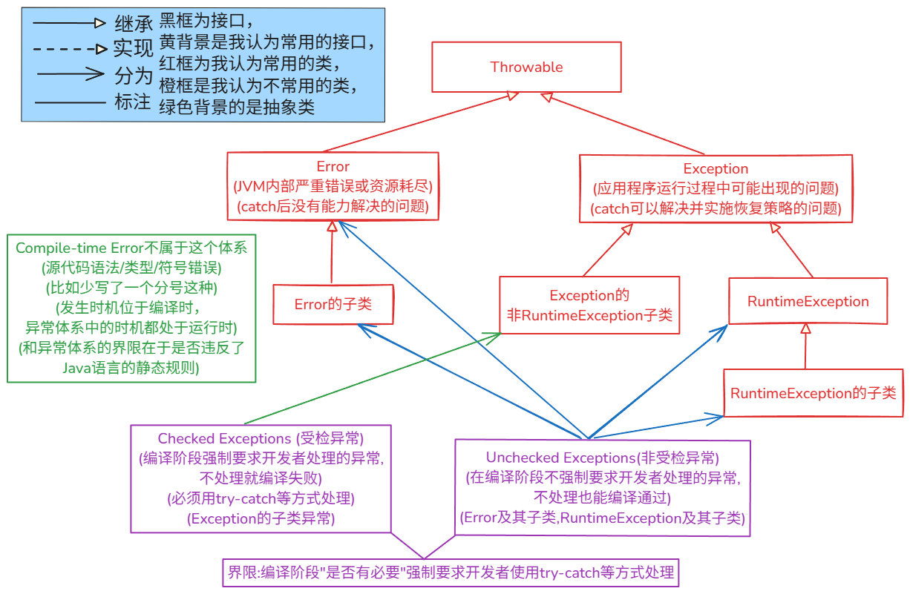

# 异常

## 相关概念与知识

### 概念

- 在 Java 中，**异常**（Exception）是指在程序执行期间发生的中断正常指令流的**事件**。当程序中发生错误或意外情况，导致无法继续正常执行时，系统会创建一个**异常对象**并将其**抛出**（throw）。这个异常对象包含了错误类型、发生位置（堆栈跟踪信息）等信息

### 异常的传播

- 如果程序中出了一个异常，如果不进行处理，这个异常会沿着**调用栈**（Call Stack）向上传播，直到被某个**异常处理器**（Exception Handler）**捕获**（catch）或者最终到达 JVM（Java 虚拟机），导致程序终止

- 流程如下：

  >假设A方法调用B方法,B方法又调用C方法。如果在C方法中遇到了某个异常，
  >
  >JVM(不是编译器)先在C方法中找匹配的 catch 块，看异常是否能够捕获，
  >
  >- 如果C中找到了匹配的catch
  >
  > - 异常就被“捕获”了，之后执行catch(先)和finally(后)中的代码
  >
  >- 如果C中找到了catch，但是不匹配
  >
  > - 如果有finally块，执行完finally块后，继续执行下面没有找到catch的情况
  >
  > - 如果没有finally块，直接执行下面没有找到catch的情况
  >
  >- 如果C中没找到catch
  >
  > - 方法就会终止，JVM 会把方法弹出方法调用栈，然后将这个**异常对象** **“抛”** 给**调用该方法的的方法B**
  >
  > - 之后JVM在B中重复上面的三步，此过程一直沿着**调用栈**向上传递
  >
  >   - 如果异常最终被某个方法的 catch 块捕获，那么程序执行完catch(先)和finally(后)后，将继续执行
  >
  >
  > - 如果异常一直传播到调用栈的**最顶层**（通常是 main 方法或者线程的 run 方法）**仍然没有被捕获**，那么，这些事情会发生：
  >  - **逐层执行 finally 块：**
  >    在异常从调用栈中逐层“弹出”的过程中，**只要一个方法的try块被进入过，那么在JVM退出该方法之前，其对应的finally块必定会被执行**。这个过程会从调用栈的深处向外层依次发生。这是finally块进行资源清理等“善后”工作的关键保证。
  >  - **线程终止：**
  >    当异常传播到栈顶，并且所有该执行的finally块都执行完毕后，由于异常最终没有被任何catch块捕获，**当前线程会立即终止**。
  >    - 线程终止前，JVM的**默认异常处理器**会接管后续工作，它通常会做两件事：
  >      - **打印堆栈跟踪信息 (Stack Trace)：** 将异常的类型、消息以及它在代码中经过的完整路径（包括所有执行过的finally块的位置）打印到标准错误流（**`System.err`**）。
  >    - **JVM进程终止（可能发生）：** 如果被终止的这个线程是最后一个**非守护（non-daemon）线程**，那么整个JVM进程也会随之终止。

### 注意点

- **编译时错误(compile-time Error)不在异常体系中**
  - **源代码语法/类型/符号错误(比如少写了一个`;`这种)**
  - **违反了Java语言的静态规则**

## 异常体系图

- **Error和Exception的界限的关键在于“catch“块在面对这个问题时是否还有意义和能力**
- **Checked Exceptions和Unchecked Exceptions的界限在于编译阶段"是否有必要"强制要求开发者使用try-catch等方式处理**
  - 当然在实际代码编写中也是有要求开发者进行相应的处理的

- **Compile-time Error和异常体系的界限在于是否违反了Java语言的静态规则**



## 异常类

### `Throwable`

#### 获取对象的方式

```java
Throwable()									// 无参构造，创建一个不带详细信息和原因的 Throwable
Throwable(String message)					// 创建一个带有指定详细信息的 Throwable，没有指定原因
Throwable(String message, Throwable cause)	// 创建一个带有指定详细信息和原因的 Throwable
Throwable(Throwable cause)					// 创建一个带有指定原因的Throwable,详细信息默认为 (cause==null?null
    										//:cause.toString())

protected Throwable(String message, Throwable cause, boolean enableSuppression, boolean writableStackTrace)
    // (受保护) 创建一个 Throwable，允许更精细地控制是否启用抑制和是否写入堆栈跟踪
```


#### 一些方法

```java
Throwable     addSuppressed(Throwable exception)//将指定的异常附加到为了传递此异常而被抑制的异常列表中
    											//(通常用于 try-with-resources)
    
Throwable     		fillInStackTrace()		//填充当前执行的堆栈跟踪信息到此Throwable对象中,供后续获取;返回this引用

Throwable     		getCause()	//返回此Throwable的原因(导致此Throwable被抛出的异常),如果原因不存在或未知则返回null
String       		getLocalizedMessage()	//返回此 Throwable 的本地化描述；子类可覆盖此方法以生成特定于语言环境的消息
String        		getMessage()			//返回此 Throwable 的详细信息字符串(通过构造方法设置)
StackTraceElement[] getStackTrace()			//返回一个表示此 Throwable 的堆栈跟踪的 StackTraceElement 数组
final Throwable[]   getSuppressed()			//返回一个包含所有被抑制异常的数组(通常由 try-with-resources 添加)
    
Throwable     initCause(Throwable cause)	//初始化此Throwable的原因;此方法最多只能调用一次;返回 this 引用

void          printStackTrace()				// 将此 Throwable及其回溯(backtrace)信息打印到标准错误流(System.err)
void          printStackTrace(PrintStream s)// 将此 Throwable 及其回溯信息打印到指定的打印流 (PrintStream)
void          printStackTrace(PrintWriter s)// 将此 Throwable 及其回溯信息打印到指定的打印写入器 (PrintWriter)


void          setStackTrace(StackTraceElement[] stackTrace)//设置将由getStackTrace()返回
    													   //并由printStackTrace() 打印的堆栈跟踪元素
String        toString()				//返回此Throwable对象的简短描述字符串(通常是:类名+": "+getMessage())
```


### `Error`

#### 获取对象的方式

```java
Error()											// 无参构造，创建一个不带详细信息和原因的 Error
Error(String message)							// 创建一个带有指定详细信息的 Error，没有指定原因
Error(String message, Throwable cause)			// 创建一个带有指定详细信息和原因的 Error
Error(Throwable cause)			   //创建一个带有指定原因的Error,详细信息默认为(cause==null?null:cause.toString())

protected Error(String message, Throwable cause, boolean enableSuppression, boolean writableStackTrace)
// (受保护) 创建一个 Error，允许更精细地控制是否启用抑制和是否写入堆栈跟踪
```


#### 一些方法

```java
Throwable     addSuppressed(Throwable exception)//将指定的异常附加到为了传递此异常而被抑制的异常列表中
    											//(通常用于 try-with-resources)
    
Throwable     		fillInStackTrace()		//填充当前执行的堆栈跟踪信息到此Throwable对象中,供后续获取;返回this引用

Throwable     		getCause()	//返回此Throwable的原因(导致此Throwable被抛出的异常),如果原因不存在或未知则返回null
String       		getLocalizedMessage()	//返回此 Throwable 的本地化描述；子类可覆盖此方法以生成特定于语言环境的消息
String        		getMessage()			//返回此 Throwable 的详细信息字符串(通过构造方法设置)
StackTraceElement[] getStackTrace()			//返回一个表示此 Throwable 的堆栈跟踪的 StackTraceElement 数组
final Throwable[]   getSuppressed()			//返回一个包含所有被抑制异常的数组(通常由 try-with-resources 添加)
    
Throwable     initCause(Throwable cause)	//初始化此Throwable的原因;此方法最多只能调用一次;返回 this 引用

void          printStackTrace()				// 将此 Throwable及其回溯(backtrace)信息打印到标准错误流(System.err)
void          printStackTrace(PrintStream s)// 将此 Throwable 及其回溯信息打印到指定的打印流 (PrintStream)
void          printStackTrace(PrintWriter s)// 将此 Throwable 及其回溯信息打印到指定的打印写入器 (PrintWriter)


void          setStackTrace(StackTraceElement[] stackTrace)//设置将由getStackTrace()返回
    													   //并由printStackTrace() 打印的堆栈跟踪元素
String        toString()				//返回此Throwable对象的简短描述字符串(通常是:类名+": "+getMessage())
```


### `Exception`

#### 获取对象的方式

```java
Exception()									// 无参构造，创建一个不带详细信息和原因的 Exception
Exception(String message)					// 创建一个带有指定详细信息的 Exception，没有指定原因
Exception(String message, Throwable cause)	// 创建一个带有指定详细信息和原因的 Exception

Exception(Throwable cause)	   //创建一个带有指定原因的Exception,详细信息默认为(cause==null?null:cause.toString())

protected Exception(String message, Throwable cause, boolean enableSuppression, boolean writableStackTrace)
									//(受保护) 创建一个 Exception，允许更精细地控制是否启用抑制和是否写入堆栈跟踪
```

#### 一些方法

```java
Throwable     addSuppressed(Throwable exception)//将指定的异常附加到为了传递此异常而被抑制的异常列表中
    											//(通常用于 try-with-resources)
    
Throwable     		fillInStackTrace()		//填充当前执行的堆栈跟踪信息到此Throwable对象中,供后续获取;返回this引用

Throwable     		getCause()	//返回此Throwable的原因(导致此Throwable被抛出的异常),如果原因不存在或未知则返回null
String       		getLocalizedMessage()	//返回此 Throwable 的本地化描述；子类可覆盖此方法以生成特定于语言环境的消息
String        		getMessage()			//返回此 Throwable 的详细信息字符串(通过构造方法设置)
StackTraceElement[] getStackTrace()			//返回一个表示此 Throwable 的堆栈跟踪的 StackTraceElement 数组
final Throwable[]   getSuppressed()			//返回一个包含所有被抑制异常的数组(通常由 try-with-resources 添加)
    
Throwable     initCause(Throwable cause)	//初始化此Throwable的原因;此方法最多只能调用一次;返回 this 引用

void          printStackTrace()				// 将此 Throwable及其回溯(backtrace)信息打印到标准错误流(System.err)
void          printStackTrace(PrintStream s)// 将此 Throwable 及其回溯信息打印到指定的打印流 (PrintStream)
void          printStackTrace(PrintWriter s)// 将此 Throwable 及其回溯信息打印到指定的打印写入器 (PrintWriter)


void          setStackTrace(StackTraceElement[] stackTrace)//设置将由getStackTrace()返回
    													   //并由printStackTrace() 打印的堆栈跟踪元素
String        toString()				//返回此Throwable对象的简短描述字符串(通常是:类名+": "+getMessage())
```


## 异常的处理方式

### JVM中对异常的默认处理

- **JVM中对异常的默认处理**指的是
  - 当这个**异常的传播过程(详见“异常的传播”)** **到达终点（调用栈顶）而没有被捕获**时，JVM 所采取的**最后行动**
    - 终止当前线程
    - 调用异常对象的 **`printStackTrace()`**方法(e**是实际异常类型**)，将错误信息和堆栈跟踪打印到**标准错误流 (System.err)**
    - 可能导致整个应用程序退出（如果异常发生在主线程或最后一个非守护线程）
    - 注意刚发现异常的时候还是先**传播**，和**前文中的“异常的传播”相同**

### 我们对异常的显式处理

#### `try-catch`

- **`try`**

  - 将**可能抛出异常的代码块** **包裹** 在 **`try` 块**中
  - 如果 **`try`** 块内的代码执行时发生异常，JVM会立即停止执行 **`try`** 块中后续的代码，并查找匹配的 **`catch`** 块

- **`catch`**

  - 用于**捕获并处理特定类型的异常**

  - **可以有多个 `catch` 块**，**按照从上到下的顺序匹配异常类型**

  - **JVM** 会选择**第一个与抛出的异常类型匹配(或者是其父类型)的`catch` 块**来执行

    - **单一类型捕获**

      - 这种情况下的**变量`e`并不是`final`类型的**，**这个设计不安全，并不好，最开始的设计者并没有强制为`final`**

      - **变量 `e`** 的**编译时类型 (Compile-time Type)** 就是 **`catch` 关键字**后面的括号里**明确声明的那个类型**

      - 示例代码

        ```java
         catch (IOException e) { 
             ...
         }
        ```

    - **多类型捕获 (Java 7+)**

      - **这种情况下的变量`e`是`final`类型的**

        > 变量e是**`final`类型**是为了**保证类型安全**
        >
        > 两种捕获情况下**变量e是否为`final`**的情况**并不相同**，原因是因为**一个被设计者设计了**，**一个没被设计**

      - **变量 `e`** 的**编译时类型**是 这**两个(或多个)异常类型**的**最具体的共同父类型 (Most Specific Common Supertype)**

      - 示例代码

        ```java
        catch (IOException | SQLException e) { //使用 | 分隔，变量 e 隐含为 final
            ...
        } 
        ```


#### `finally`

- **`finally` 块**是**可选**的，它通常**跟在`try` 块或最后一个 `catch` 块之后**

- 无论 **`try` 块**中的代码**是否抛出异常**，也无论 **`catch` 块** **是否捕获并处理了异常**(**甚至在 `try` 或 `catch` 中有 `return`语句**），**`finally` 块**中的代码 ***几乎* 总会被执行**。
  - 唯一的例外如下
    - **在 `try` 或 `catch` 中调用了 `System.exit()`**
    - **JVM 崩溃或所在线程被杀死**
  - 当 **JVM** 在 **`try` 或 `catch` 块**中遇到 **`return` 语句**
    - 它**并不会立即终止方法的执行并将控制权返还给调用者**
    - JVM 会**将计算出的返回值（或者对于 `void` 方法，只是一个“准备返回”的标记）临时保存**起来
    - 之后JVM **检查是否存在关联的 `finally` 块**。如果存在，JVM **立即跳转**去执行 **`finally` 块**中的**所有代码**
    - 只有当 **`finally` 块** **执行完毕后(并且 `finally` 块本身没有导致方法“突然完成”，比如上面的“例外”)**，
      JVM **才会取出之前暂存的返回值，并真正地从方法中返回给调用者**
  - **如果在 `try` 或 `catch` 块中遇到 `break` 或 `continue` 语句，并且存在关联的 `finally` 块**
    - **finally** **块中的代码也同样会在** **break** **或** **continue** **实际执行跳转之前被执行**


#### `try-with-resourse`

- 是为了解决 **资源的正确关闭** 的问题的

- JDK 7 **引入**，JDK 9 **锦上添花** 

  - JDK 7 

    - 语法

      ```java
      try (创建需要关闭的资源对象1;创建需要关闭的资源对象2;创建需要关闭的资源对象3;......) {//有点冗余感觉
          ... 
      } catch (...) {
          ... 
      }
      ```

  - JDK 9 

    - 语法

      ```java
      try (已经创建的对象1;已经创建的对象2;已经创建的对象3;......) {
          ... 
      } catch (...) {
          ... 
      }
      ```

    - 改动

      - **如果一个资源变量是** **`final`** **的，**
        **或者是“事实上的 `final`” (即一个变量，虽然没有用 `final` 关键字修饰它，但在初始化之后，引用没被改变过)，**
        **那么你就可以直接把它写在** **`try-with-resources`** **的括号里，而无需重新声明**
      - JDK 9 的改进是**纯粹的语法糖（Syntactic Sugar）**。它没有改变 **`try-with-resources`** 的任何**底层行为**

- 限制：**放进括号里的对象，其所属的类必须实现了** **`java.lang.AutoCloseable`** **接口**

- 作用：

  - **自动调用 `close()`**：当 **`try`** 代码块执行完毕后（无论是正常结束还是因为异常而终止），Java虚拟机会**自动地、保证地**调用括号中所有资源的 **`close()`** 方法。它在背后为你生成了一个完美的 **`finally`** 块。
  - **正确的关闭顺序**：如果你在括号里声明了多个资源，Java会以**与声明顺序相反的顺序**来关闭它们。这完美地遵循了**“后开先关”**的最佳实践。
  - **更强的异常处理**：如果 **`try`** 块和自动的 **`close()`** 方法都抛出了异常，**`try-with-resources`** 会将 **`close()`** 方法的异常**“抑制”**起来，并优先抛出 **`try`** 块里的那个原始异常。你仍然可以通过 **`getSuppressed()`** 方法拿到被抑制的异常，不会丢失任何信息。

- 注意点

  - **如果用了`try-with-resourse`，在`finally`(自己写的或者是自动生成的)之后，`try`括号里写了的，都将被释放**
  - **如果不想发生上一个事，就别用这个语法**


#### `throw`关键字

- 用于在代码中**显式地 抛出 一个异常对象**(必须是 **`Throwable` 或其子类的实例**),抛出后的行为和**前文中“异常的传播“**相同


#### `throws`关键字

- 实际上的作用**只是让Checked Exception(受检异常)在编译时期不报错**，它**把处理交给了调用者**

- 用在**方法签名中**，用于**声明** **该方法可能抛出的受检异常 (Checked Exceptions)**

- 它表明
  - **该方法不处理这些声明的异常**，而是**将处理责任传递给调用者**
  - 调用该方法的代码**要么必须使用 `try-catch` 捕获这些异常**
  - **要么也必须在自己的方法签名中使用 `throws` 声明这些异常（或其父类型）**

- 对于 **非受检异常 (Unchecked Exceptions)**，即 **RuntimeException、Error 及其子类**，可以选择声明，但不是强制性的


## 自定义异常

- 程序员根据自己应用程序的特定需求**创建的异常类**
- 步骤
  - **选择异常父类**
  - **定义异常类**
  - **添加构造方法**
    - **必须**使用 **`super(...)`** 来调用**父类**
      - 原因如下
        - **核心异常状态(一些核心变量)由父类管理**
          - 异常的关键信息，比如**详细消息 (detail message)** 和 **原因 (cause)**，实际上是定义在 **`java.lang.Throwable` 类**中的**私有 (private) 成员变量**
        - **初始化父类私有变量的唯一途径是调用父类构造器**
        - **保证异常行为的一致性**
  - **(可选)添加自定义字段和方法**


