# HTML

## 相关概念

- HTML，全称为**超文本标记语言(HyperText Markup Language)**，是用于创建网页和网络应用程序的标准标记语言。它构成了我们日常浏览的几乎所有网页的骨架，定义了网页内容的结构和含义


## HTML的历史演变

- **起源 (1991-1993):** 由欧洲核子研究中心的物理学家蒂姆·伯纳斯-李(Tim Berners-Lee)发明。最初的 HTML 非常简单，仅包含少数几个用于基本文档结构的标签
- **标准化进程 (1995-1999):** 随着互联网的迅速普及，HTML 的标准化变得至关重要。互联网工程任务组(IETF)和之后成立的万维网联盟(W3C)相继发布了 HTML 2.0、HTML 3.2 和 HTML 4.01 等版本，不断增加新的功能，例如表格、表单和样式表的支持
- **XHTML 的出现 (2000):** W3C 推出了 XHTML(可扩展超文本标记语言)，它是一种更严格、语法更规范的 HTML 版本，要求遵循 XML 的书写规则
- **HTML5 的革命 (2014至今):** 为了适应日益复杂的网络应用需求，网页超文本应用技术工作组(WHATWG)和 W3C 共同推动了 HTML5 的发展。HTML5 引入了大量新特性，例如：
  - **语义化标签:** 如 `<header>`, `<footer>`, `<nav>`, `<article>`, `<section>` 等，使网页结构更加清晰，有利于搜索引擎优化(SEO)和可访问性
  - **多媒体支持:** 内置的 `<audio>` 和 `<video>` 标签，使在网页中嵌入音频和视频变得异常简单，不再需要依赖 Flash 等第三方插件
  - **图形绘制:** 提供了 `<canvas>` 和 SVG 支持，可以直接在浏览器中进行图形绘制和动画制作
  - **更强大的表单:** 新增了多种输入类型(如 email, date, number)和表单验证功能
  - **本地存储:** 提供了 `localStorage` 和 `sessionStorage`，允许网页在用户本地存储数据

目前，HTML5 是现行的标准，并由 WHATWG 以“动态标准”的形式持续维护和发展


## 浏览器如何解析HTML代码

当您在浏览器地址栏输入一个网址并按下回车键后，浏览器会从服务器获取到 HTML 文件。接着，浏览器内部被称为“渲染引擎”的核心组件会开始工作，将这段纯文本的 HTML 代码转换成我们看到的丰富多彩的网页。这个过程大致可以分为以下几个关键步骤：

1. **解析 HTML，构建 DOM 树**
   - **字节流转字符流：** 浏览器首先将从服务器接收到的原始字节数据，根据指定的编码格式转换成字符。
   - **词法分析：** 然后，渲染引擎像一个词法分析器一样，逐一读取这些字符，并将它们识别成一个个有明确含义的“令牌”（Token）。例如，`<html>` 会被识别成一个开始标签令牌，`<p>` 是一个段落标签令牌，“这是一个段落” 会被识别成一个文本令牌，`</p>` 是一个结束标签令牌
   - **语法分析与树构建：** 在生成令牌的同时，浏览器会进行语法分析，并将这些令牌构建成一个树形结构，这就是著名的 **文档对象模型(DOM)**。这个 DOM 树精确地表示了 HTML 文档的结构和内容。每个 HTML 元素、元素的属性以及文本内容都会成为这个树上的一个节点（Node）。`<html>` 是根节点，`<head>` 和 `<body>` 是它的子节点，以此类推，形成一个层次分明的结构。
2. **解析 CSS，构建 CSSOM 树**
   - 在解析 HTML 的过程中，如果遇到 `<link>` 标签引入的外部 CSS 文件，或者 `<style>` 标签内的 CSS，浏览器会立即开始异步下载并解析这些 CSS 代码。
   - 解析 CSS 的过程与解析 HTML 类似，浏览器会将 CSS 规则转换成一个它能理解的结构，这个结构被称为 **CSS 对象模型(CSSOM)**，它也是一个树形结构，它包含了所有元素的样式信息（如颜色、字体大小、边距等）。
3. **合并 DOM 和 CSSOM，构建渲染树**
   - 当 DOM 树和 CSSOM 树都构建完成后，浏览器会将这两棵树合并，创建一个新的树——**渲染树**
   - 渲染树只包含**需要被渲染**的节点。例如，像 `<head>` 这样的非视觉元素，或者通过 `display: none;` 样式隐藏的元素，就不会出现在渲染树中。渲染树上的每个节点都包含了其在页面上的视觉信息（即 DOM 节点的结构和 CSSOM 节点的样式）。
4. **布局**
   - 一旦渲染树构建完成，浏览器就进入“布局”阶段。在这个阶段，浏览器会计算出渲染树中每个节点在屏幕上的确切位置和大小，这个过程也被称为“回流”。浏览器会从渲染树的根节点开始，递归地遍历所有子节点，计算出它们的坐标和尺寸。
5. **绘制**
   - 布局阶段完成后，浏览器知道了所有元素的位置和样式，接下来就进入“绘制”阶段。在这个阶段，渲染引擎会遍历渲染树，调用图形库(如 Skia))将每个节点绘制成屏幕上的实际像素。
6. **合成**
   - 为了提高效率，现代浏览器还会进行“合成”。浏览器会将页面的不同部分(特别是那些有动画或复杂视觉效果的元素)分到不同的图层上。当页面发生变化(如滚动或动画)时，浏览器可能只需要重新绘制和合成少数几个图层，而不需要重新布局和绘制整个页面，从而大大提高了渲染性能。


## HTML的“宽容”

### 极其容错

- HTML5 的设计哲学之一是要**极其容错** . 设计者知道开发者会犯错，所以**浏览器被编写为能够处理“不完整”或“不规范”的 HTML 代码**

  - 即使你忘了写结束标签或嵌套错误啥的，浏览器仍然会尽最大努力去解析和显示页面

  - 各种错误感觉都没事，因为它会努力解析，超级松散

  - 如果你省略了 `<html>`, `<head>`, `<body>` 这些标签，浏览器在解析你的代码并构建 DOM 树（内存中的页面结构）时，会**自动把它们补上**

  - 示例：假设写了这样一个极简的 HTML 文件：

    ```html
    <!DOCTYPE html>
    <title>我的标题</title>
    <p>这是一段话。</p>
    ```

    - 没有写 `<html>`, `<head>`, `<body>`。但是，当浏览器加载这个页面时，它在内存中构建的 DOM 结构实际上是这样

      ```html
      <html>
        <head>
          <title>我的标题</title>
        </head>
        <body>
          <p>这是一段话。</p>
        </body>
      </html>
      ```

### 不区分大小写

- HTML (特指 HTML5) 的标签和属性不区分大小写，和XML不一样


## 浏览器的两种渲染模式

- 标准模式和怪异模式

### **标准模式 (Standards Mode)**

- **触发方式**：在 HTML 文档的开头包含一个正确的、现代的文档类型声明，即 **`<!DOCTYPE html>`**。
- **行为**：浏览器会尽可能地遵循 W3C 和 WHATWG 制定的**最新 Web 标准**来解析 HTML 和渲染 CSS。这意味着页面的布局和行为在不同现代浏览器(如 Chrome, Firefox, Safari)之间会表现得非常一致和可预测。这是我们开发网页时**唯一想要**的模式。

### **怪异模式 (Quirks Mode)**

- **触发方式**：**完全省略文档类型声明**，或者使用一个过时且不正确的声明。
- **行为**：浏览器会“穿越”回上世纪 90 年代末，模拟当时旧浏览器（如 Netscape 4 和 Internet Explorer 5）的非标准行为。这种模式的存在是为了向后兼容那些在 Web 标准确立之前编写的“古老”网页。
- **后果**：在怪异模式下，许多 CSS 属性（尤其是盒模型 `box-model` 的计算方式）会和标准模式下完全不同，导致布局混乱、样式错位。一些现代的 HTML5 和 CSS3 功能也可能无法正常工作。您会发现自己写的代码在一个浏览器里是一个样子，在另一个浏览器里又是另一个样子，陷入无尽的兼容性噩梦。


## HTML中的元数据

- 在HTML的语境下，元数据就是**描述HTML文档自身信息的数据，而不是那些要直接在浏览器窗口中展示给用户看的内容(如段落、图片、标题等)**
- HTML文档中，绝大多数元数据都统一存放在 **`<head>`** 元素内部。`<head>` 元素本身就是元数据的容器，它和它的内容不会被浏览器直接渲染到页面上(除了`<title>`会显示在浏览器标签页上)


## HTML的结构

### HTML的基本骨架示例

```html
<!DOCTYPE html>
<html lang="zh-CN">
<head>
    <meta charset="UTF-8">
    <meta name="viewport" content="width=device-width, initial-scale=1.0">
    <title>网页标题</title>
</head>
<body>

    <!-- 这里是所有用户能看到的内容，比如文字、图片、链接等 -->
    <h1> Hello World </h1>
    <p> This is paragraph </p>

</body>
</html>
```


### 文档类型声明`<!DOCTYPE html>`

- ```html
  <!DOCTYPE html>
  ```

  - 这不是一个 HTML 标签，而是一条指令，用来**触发浏览器的“标准模式”**。它必须位于 HTML 文档的最顶端，用来告诉浏览器这个页面使用的是哪个版本的 HTML 规范。`<!DOCTYPE html>` 明确指出页面遵循的是 **HTML5** 标准

  - **重要性**：如果没有这个声明，浏览器可能会进入**“怪异模式 ”**来渲染页面，这会导致页面显示效果与预期不符。因此，它**至关重要**

  - 历史上的一些别的版本的文档类型声明

    - HTML 4.01 Strict (严格模式)

      - 这是当时最规范的版本，它**不允许**使用任何已经被废弃的表现性标签（如 `<font>`）或框架（frameset）

        ```html
        <!DOCTYPE HTML PUBLIC "-//W3C//DTD HTML 4.01//EN" "http://www.w3.org/TR/html4/strict.dtd">
        ```

    - HTML 4.01 Transitional (过渡模式)

      - 这个版本更“宽容”，它**允许**使用一些旧的、不推荐的标签和属性，以便开发者能从旧的编码习惯平滑过渡到新标准。这是当时最常用的 DOCTYPE

        ```html
        <!DOCTYPE HTML PUBLIC "-//W3C//DTD HTML 4.01 Transitional//EN" "http://www.w3.org/TR/html4/loose.dtd">
        ```

    - XHTML 1.0 Strict (严格的 XHTML)

      - XHTML 是“更严格的 HTML”，它要求代码必须遵循 XML 的语法规则（比如所有标签必须小写且闭合）。

        ```html
        <!DOCTYPE html PUBLIC "-//W3C//DTD XHTML 1.0 Strict//EN" "http://www.w3.org/TR/xhtml1/DTD/xhtml1-strict.dtd">
        ```


### 根元素`<html>`

- 所有元素都被包裹在 `<html>` 和 `</html>` 之间

  - **定义与作用**： `<html>` 元素是文档的顶层容器，它向浏览器声明：“从这里开始，到 `</html>` 结束，里面的所有内容都是一个 HTML 文档”

  - **主要特点**：

    1. **唯一性**：一个 HTML 文档中**只能有一个** `<html>` 元素
    2. **内容**：它内部通常只直接包含两个子元素：一个 `<head>` 元素和个 `<body>` 元素，并且顺序是固定的，`<head>` 在前，`<body>` 在后

  - **常见属性**： 它最重要的属性是 `lang`，用来声明整个网页的主要语言

    - 示例

      ```html
      <html lang="zh-CN">
      ```

      

### 头部元素`<head>`

- HTML文档中，绝大多数**元数据**都统一存放在 **`<head>`** 元素内部。`<head>` 元素本身就是元数据的容器，它和它的内容不会被浏览器直接渲染到页面上（除了**`<title>`**会显示在浏览器标签页上）
  - **定义与作用**： `<head>` 元素是一个容器，用于存放那些“描述HTML文档自身信息的数据”的信息，供浏览器、搜索引擎或其他程序使用
  - **主要特点**：
    1. **唯一性**：一个 HTML 文档中**只能有一个** `<head>` 元素
    2. **不可见性**：它里面的内容（除了 `<title>` 会显示在浏览器标签页上）是幕后工作者，用户在页面上是看不到的。
  - **常见内容**： `<head>` 内部包含了一系列非常关键的标签：
    - `<title>`：**必需**。定义网页的标题，显示在浏览器标签页和收藏夹中。
      - **唯一一个在文档结构层面被强制要求的“内容”标签**，HTML5 规范明确规定，每个 HTML 文档的 `<head>` 部分**必须包含一个 `<title>` 标签**
        - 注意是强制要求的”内容“标签，不是直接说的”标签“，是”内容标签“，不要理解错误而感觉很矛盾，有陷阱
      - **缺少 `<title>` 会导致 HTML 验证失败**。更重要的是，它对用户体验（浏览器标签页没有标题）、收藏夹/书签的显示以及搜索引擎优化（SEO）都至关重要
    - `<meta>`：提供各种元信息。
      - 定义了字符编码。如果不写，浏览器可能会猜错编码，导致页面出现**乱码**（特别是中文内容）。为了确保内容在所有设备上都能被正确解码和显示，这行代码是必须的。它通常建议作为 `<head>` 里的第一个标签，以便浏览器尽早获知编码。
      - 最关键的是 `<meta charset="UTF-8">`（定义字符编码，防止乱码）和 
        `<meta name="viewport" content="width=device-width, initial-scale=1.0">`（为移动设备优化显示）
    - `<link>`：用于**链接外部资源，最常见的就是用它来加载外部的 CSS 样式表文件**
    
      -  `<link>` 标签常用的一些属性
    
      | 属性 (Attribute) | 说明                                                         | 常用值/示例                                                  |
      | ---------------- | ------------------------------------------------------------ | ------------------------------------------------------------ |
      | **`href`**       | **必需属性**。指定被链接的外部资源的路径（URL）。这是告诉浏览器“去哪里找文件” | `style.css`<br>`/assets/css/main.css`<br>`https://fonts.googleapis.com/css?family=Roboto` |
      | **`rel`**        | **必需属性**。定义当前文档与被链接资源之间的**关系 (Relationship)**。这是告诉浏览器“这个文件是用来做什么的” | `stylesheet` (层叠样式表CSS)<br>`icon` (网站图标 Favicon)<br>`preconnect` (性能优化：预连接)<br>`preload` (性能优化：预加载资源)<br>`canonical` (SEO：指定首选 URL) |
      | **`type`**       | 指定被链接资源的MIME 类型。这有助于浏览器识别文件类型        | `text/css` (用于样式表)<br>`image/png` (用于 PNG 图标)       |
      | **`media`**      | 指定该样式表只在满足特定媒体条件时才生效。常用于响应式设计   | `print` (仅在打印时生效)<br>`screen and (max-width: 600px)` (仅在屏幕宽度小于等于600px时生效) |
      | **`sizes`**      | 通常与 `rel="icon"` 配合使用，用来指定图标的尺寸（高x宽）    | `16x16`<br>`32x32`<br>`any` (用于 SVG 等可缩放图标)          |
      | **`as`**         | 与 `rel="preload"` 配合使用，指明需要预加载的内容的类型，让浏览器能更准确地进行优化 | `style`<br>`script`<br>`image`<br>`font`                     |
    - `<style>`：用于**在 HTML 文档内部直接编写 CSS 样式**
    - `<script>`：用于**链接或编写 JavaScript 代码**
    - **`<base>`：基准URL**
      - **作用**：为页面中所有的相对URL（如图片、链接、脚本的路径）指定一个基准URL。
      - 一个文档中最多只能有一个`<base>`元素。
      - **示例**：如果设置了 `<base href="https://www.example.com/assets/">`，那么代码中的 `` 实际会从 `https://www.example.com/assets/image.jpg` 加载


### 主体元素`<body>`

- 网页的“**身体**”和“**舞台**”。它是所有用户最终能在浏览器窗口里看到的全部内容所在的地方
  - **定义与作用**： `<body>` 元素包含了网页的所有可见内容，包括文本、图片、链接、视频、表单等等
  - **主要特点**：
    1. **唯一性**：同样，一个 HTML 文档中**只能有一个** `<body>` 元素
    2. **可见性**：所有你想让用户看到的东西，都必须放在 `<body>` 和 `</body>` 之间
  - **常见内容**： 这里面包含了成百上千种 HTML 标签，几乎所有用于构建内容的标签都在这里使用：
    - **文本类**：`<h1>` (标题), `<p>` (段落)
    - **链接类**：`<a>` (超链接)
    - **媒体类**：`` (图片), `<video>` (视频)
    - **列表类**：`<ul>` (无序列表), `<ol>` (有序列表)
    - **结构类**：`<header>`, `<footer>`, `<nav>`, `<main>`, `<div>` 等
    - **表单类**：`<form>`, `<input>`, `<button>` 等


## HTML标签

### HTML中的标签特性

- XML当中**元素的名字可以任意的进行各种定义**，各种定义元素，**HTML当中，标签通常都是已经定义好的**

  - **每一个标签（如 `<p>`, `<h1>`, ``, `<div>`）都有一个由 W3C/WHATWG 标准规定好的、明确的语义和默认的浏览器行为**

  - 值得一提的是，随着 Web 技术的发展，情况有了一点**有趣的补充**。

    在现代 HTML (HTML5) 中，通过一种叫做 **Web Components** 的技术，开发者现在也**可以**在 HTML 中创建“自定义元素”，
    例如 `<user-profile-card>` 或 `<special-button>`

    但是你必须使用 JavaScript 来定义这个新元素的行为、功能和样式（通常通过 Shadow DOM）。它们是用来创建可复用的、功能完善的**界面组件**的


### 标签的属性的类型

- 好像本质上都是字符串？众说纷纭，不重要......

#### 按照值的类型划分

1. **布尔属性 (Boolean Attributes)**

   - **特点**：存在即为`true`，不存在即为`false`。
   - **示例**：`disabled`, `checked`, `required`, `autoplay`

2. **枚举属性 (Enumerated Attributes)**

   - **特点**：值必须是来自一个固定的、预定义的列表。
   - **示例**：`<input>`的`type`属性 (值如`text`, `password`)；`<a>`的`target`属性 (值如`_blank`, `_self`)

3. **字符串属性 (String Attributes)**

   - **特点**：值可以是任意的文本字符串。这是范围最广的一类。
   - **示例**：`id`, `class`, `title`, `alt`, `placeholder`

   - **从字符串中细分出的常见类型**

     - **URL (或 URI) 属性**
       - **特点**：值必须是一个有效的网址或路径。
       - **示例**：`<a>`的**`href`**属性；``和`<video>`的**`src`**属性；`<form>`的**`action`**属性。

     - **数字属性 (Numeric Attributes)**
       - **特点**：值必须是一个数字（整数或浮点数）。虽然在HTML中它仍然被当作字符串处理，但在逻辑上它代表一个数值。
       - **示例**：`<td>`的**`colspan`**和**`rowspan`**属性；`<input type="number">`的**`min`**, \**`max`\**, 和**`step`**属性。

     - **与CSS相关的属性**
       - **特点**：值是CSS单位或语法。
       - **示例**：``的**`width`**和**`height`**属性（值可以是`100`或`50%`）；`<table>`的**`border`**属性（虽然已不推荐使用）。

     - **事件处理属性 (Event Handler Attributes)**
       - **特点**：值是一段可执行的JavaScript代码。
       - **示例**：**`onclick`**, **`onload`**, **`onmouseover`**。


### HTML`<table>`表格

#### 表格的用途

- HTML `<table>` 标签的**唯一正确用途**是**展示二维的表格化数据**，例如财务报表、课程表、产品规格对比等。

  > **重要原则**：绝对不要使用表格来进行网页的整体布局（这是20年前的老旧做法）。现代网页布局请使用CSS Flexbox或Grid


#### 表格的基础骨架

- 一个最简单的表格由三个核心标签组成：

  - **`<table>`**: 表格的根容器，包裹所有表格内容

  - **`<tr>` (Table Row)**: 定义表格中的**一行**

  - **`<td>` (Table Data)**: 定义一个**单元格**，也叫数据格。它必须被包裹在`<tr>`内部

- **基础结构示例：**

  ```html
  <table>
    <tr>
      <td>单元格 1-1</td>
      <td>单元格 1-2</td>
    </tr>
    <tr>
      <td>单元格 2-1</td>
      <td>单元格 2-2</td>
    </tr>
  </table>
  ```

  


#### 表头单元格：`<th>`

- 为了语义化和可访问性，表格通常需要有表头来描述每一列或每一行的内容

- **`<th>` (Table Header)**: 定义一个**表头单元格**。浏览器默认会将其中的文本**加粗并居中**显示。

- **`<th>` 的重要性：**
  1. **语义化**：它明确告诉浏览器和搜索引擎，“这是标题，不是普通数据”。
  2. **可访问性**：屏幕阅读器会识别出`<th>`，并将它与其对应列或行的数据关联起来，帮助视障用户更好地理解表格内容。

- **示例：**

  ```html
  <table>
    <tr>
      <th>姓名</th>
      <th>年龄</th>
      <th>城市</th>
    </tr>
    <tr>
      <td>张三</td>
      <td>25</td>
      <td>北京</td>
    </tr>
  </table>
  ```

  


#### 结构化分组：`<thead>`, `<tbody>`, `<tfoot>`

- 对于复杂的长表格，我们可以使用这三个标签来对表格的行进行结构化分组，这能带来诸多好处

  - **`<thead>`**: 定义表格的**头部区域**。用于包裹表头的`<tr>`

  - **`<tbody>`**: 定义表格的**主体区域**。用于包裹数据部分的`<tr>`

  - **`<tfoot>`**: 定义表格的**脚部区域**。用于包裹总结性的`<tr>`

- **使用这三个标签的好处：**
  1. **代码清晰**：结构一目了然。
  2. **独立滚动**：当表格很长时，一些浏览器允许`<tbody>`部分独立滚动，而`<thead>`保持可见。
  3. **打印优化**：在打印跨页的长表格时，`<thead>`和`<tfoot>`的内容可以在每一页上重复出现。

- **完整结构示例：**

  ```html
  <table>
    <thead>
      <tr>
        <th>商品</th>
        <th>单价</th>
        <th>数量</th>
      </tr>
    </thead>
    <tbody>
      <tr>
        <td>笔记本电脑</td>
        <td>¥5000</td>
        <td>1</td>
      </tr>
      <tr>
        <td>鼠标</td>
        <td>¥100</td>
        <td>2</td>
      </tr>
    </tbody>
    <tfoot>
      <tr>
        <td>总计</td>
        <td colspan="2">¥5200</td> <!-- colspan将在下一节讲解 -->
      </tr>
    </tfoot>
  </table>
  ```

  


#### 合并单元格：`colspan` 和 `rowspan`

- 这是创建复杂表格布局的关键属性，它们都用在`<td>`或`<th>`标签上

  - **`colspan` (Column Span)**: **跨列合并**。指定一个单元格应该横向跨越多少列

  - **`rowspan` (Row Span)**: **跨行合并**。指定一个单元格应该纵向跨越多少行

- **示例：**

  ```html
  <table border="1" style="width:100%; text-align: center;">
    <tr>
      <th rowspan="2">上午</th>
      <th>第一节</th>
      <td>语文</td>
    </tr>
    <tr>
      <th>第二节</th>
      <td>数学</td>
    </tr>
    <tr>
      <th colspan="3">午休</th>
    </tr>
    <tr>
      <th rowspan="2">下午</th>
      <th>第三节</th>
      <td>英语</td>
    </tr>
    <tr>
      <th>第四节</th>
      <td>体育</td>
    </tr>
  </table>
  ```

  


#### 提升可访问性

##### `<caption>` (表格标题)

- 为表格提供一个正式的标题。它应该是`<table>`标签的**第一个子元素**

~~~html
<table>
  <caption>2024年第一季度销售报告</caption>
  <!-- thead, tbody, tfoot... -->
</table>
~~~

- `<caption>`不仅在视觉上提供了标题，更重要的是，屏幕阅读器会首先读出它，让用户立刻了解整个表格的主题。


##### `<scope>` 属性(明确关联)

- 虽然`<th>`已经提供了语义，但使用`scope`属性可以让表头和单元格的关联更加明确、无歧义

  * `scope="col"`: 放在`<th>`上，表示这个表头是**这一列**的标题。

  * `scope="row"`: 放在`<th>`上，表示这个表头是**这一行**的标题。


```html
<table border="1">
  <caption>学生成绩单</caption>
  <thead>
    <tr>
      <th scope="col">姓名</th>
      <th scope="col">数学</th>
      <th scope="col">英语</th>
    </tr>
  </thead>
  <tbody>
    <tr>
      <th scope="row">张三</th>
      <td>95</td>
      <td>88</td>
    </tr>
    <tr>
      <th scope="row">李四</th>
      <td>92</td>
      <td>91</td>
    </tr>
  </tbody>
</table>
```


#### 使用CSS美化表格

- 默认的HTML表格样式很简陋，我们需要用CSS来美化它

  ```css
  /* 基础样式 */
  table {
    width: 100%;
    border-collapse: collapse; /* 合并边框，这是最重要的属性 */
    font-family: sans-serif;
  }
  
  /* 单元格样式 */
  td, th {
    border: 1px solid #ddd;
    padding: 12px;
    text-align: left;
  }
  
  /* 表头样式 */
  th {
    background-color: #f2f2f2;
    font-weight: bold;
  }
  
  /* 斑马条纹效果 */
  tbody tr:nth-child(even) {
    background-color: #f9f9f9;
  }
  
  /* 鼠标悬停效果 */
  tbody tr:hover {
    background-color: #e9e9e9;
  }
  ```


### HTML`<footer>`标签

#### 核心概念

- `<footer>` 是一个HTML5的**语义化标签**，它定义了其最近的**内容分区（Sectioning Content）祖先**或**根元素（`<body>`）**的“页脚”
  - 简单来说，它代表了一个区域的“底部”或“结尾”部分。这个区域可以是一整张网页，也可以是网页中的一篇文章或一个章节。

####  `<footer>` 里通常放的内容

- `<footer>` 不是一个普通的容器，它应该包含与其所在区域相关的“页脚信息”。常见的内容包括：

  - **版权信息**: 例如 `© 2024 Your Company Name.`

  - **作者信息**: 文章或网站的作者。

  - **联系方式**: 地址、电话、电子邮件（通常与 `<address>` 标签结合使用）。

  - **相关链接**:
    - 服务条款 (Terms of Service)
    - 隐私政策 (Privacy Policy)
    - 网站地图 (Sitemap)
    - 关于我们 (About Us)

  - **“返回顶部”链接**。

  - **相关文档**: 链接到与该部分内容相关的其他页面。


#### `<footer>` 的使用场景

- 这是理解 `<footer>` 最关键的一点：**一个页面可以有多个 `<footer>` 标签**。它的具体含义取决于它被放在了哪里。

##### 1. 页面页脚

- 这是最常见的用法，`<footer>` 作为 `<body>` 的直接子元素，代表整个网页的页脚。

- **代码示例：**

  ```html
  <body>
    <header>...</header>
    <main>
      <!-- 页面主要内容 -->
    </main>
    
    <footer>
      <p>© 2024 公司版权所有</p>
      <p>
        <a href="/about">关于我们</a> | 
        <a href="/contact">联系我们</a>
      </p>
    </footer>
  </body>
  ```

  

##### 2. 文章或章节的页脚

- `<footer>` 也可以被用在 `<article>`, `<section>`, `<aside>`, `<nav>` 等元素内部，作为该特定部分的页脚。

- **代码示例：**

  ```html
  <article>
    <h2>文章标题</h2>
    <p>这是文章的正文内容...</p>
    
    <footer>
      <p>作者：张三</p>
      <p>发布于：2024年8月3日</p>
      <p>标签：<a href="#">HTML</a>, <a href="#">Web开发</a></p>
    </footer>
  </article>
  ```

  

#### 最佳实践与注意事项

1. **语义化优先**：只在需要定义“页脚”概念时使用 `<footer>`，不要把它当作一个普通的 `<div>` 容器来用。
2. **上下文决定含义**：始终记住，`<footer>` 的含义由它的父容器决定。
3. **不要嵌套**：一个 `<footer>` 内部不应该再包含 `<header>` 或另一个 `<footer>` 标签。
4. **与 `<address>` 结合**: 如果页脚中包含联系信息（地址、邮箱、电话等），最好将这些信息包裹在 `<address>` 标签内，语义更佳。

- **示例：**

  ```html
  <footer>
    <address>
      联系邮箱：<a href="mailto:contact@example.com">contact@example.com</a><br>
      地址：XX市XX路123号
    </address>
    <p>© 2024 版权所有</p>
  </footer>
  ```

  


## HTML字符实体

### 相关概念

- **字符实体**是HTML中一种特殊的代码序列，它允许我们在网页上安全、准确地显示那些具有特殊含义或难以直接输入的字符


### 字符实体的两种格式

每一个字符实体都有两种表示方法，它们的效果完全相同。

#### 1. 实体名称

- **格式**：以 `&` 开头，以 `;` 结尾，中间是该字符的一个易于记忆的英文名称。
- **示例**：
  - `<` (lt = less than)
  - `>` (gt = greater than)
  - `©` (copy = copyright)
- **优点**：可读性强，容易记忆。
- **缺点**：并非所有字符都有实体名称，且极少数非常古老的浏览器可能不支持所有名称。

#### 2. 实体编号

- **格式**：以 `&#` 开头，以 `;` 结尾，中间是该字符在 **Unicode字符集** 中的编号。
- **示例**：
  - `<` (小于号的Unicode编号是60)
  - `>` (大于号的Unicode编号是62)
  - `©` (版权符号的Unicode编号是169)
- **优点**：几乎支持所有Unicode字符，兼容性极好。
- **缺点**：可读性差，难以记忆。


### 常见实体

| 显示字符 | 实体名称  | 实体编号  | 描述和用途                                                   |
| :------- | :-------- | :-------- | :----------------------------------------------------------- |
| ` `      | `&nbsp;`  | `&#160;`  | **不换行空格**。用于创建不会被浏览器合并的空格，或防止在两个词之间自动换行。 |
| `<`      | `&lt;`    | `&#60;`   | **小于号**。用于在页面上显示 `<` 符号本身，而不是作为标签的开始。 |
| `>`      | `&gt;`    | `&#62;`   | **大于号**。用于在页面上显示 `>` 符号本身，而不是作为标签的结束。 |
| `&`      | `&amp;`   | `&#38;`   | **与号**。用于在页面上显示 `&` 符号本身，而不是作为实体的开始。 |
| `"`      | `&quot;`  | `&#34;`   | **双引号**。主要用于在HTML属性值内显示双引号。               |
| `'`      | `&apos;`  | `&#39;`   | **单引号**。主要用于在HTML属性值内显示单引号。               |
| `©`      | `&copy;`  | `&#169;`  | **版权符号**。常用于网站页脚。                               |
| `®`      | `&reg;`   | `&#174;`  | **注册商标符号**。                                           |
| `™`      | `&trade;` | `&#8482;` | **商标符号**。                                               |
| `€`      | `&euro;`  | `&#8364;` | **欧元符号**。                                               |
| `£`      | `&pound;` | `&#163;`  | **英镑符号**。                                               |
| `¥`      | `&yen;`   | `&#165;`  | **日元/人民币符号**。                                        |
| `–`      | `&ndash;` | `&#8211;` | **短破折号** (en dash)。通常用于表示范围，如“1–10”。         |
| `—`      | `&mdash;` | `&#8212;` | **长破折号** (em dash)。通常用于分隔句子中的附加思想。       |
| `•`      | `&bull;`  | `&#8226;` | **项目符号点**。可用于自定义列表的样式。                     |


## HTML表单

### 相关概念

- HTML **表单 (Form)** 是一个包含交互式控件的**文档区域**，其主要目的是收集用户输入的数据，并将这些数据发送到服务器进行处理

#### 可提交的表单控件

- 在HTML中，**只有特定的元素**才能作为表单控件来提交其数据。

  - 给其他任何元素（如`<div>`）添加`name`属性都是无效的。可提交的控件包括：

    - **`<input>`**

    - **`<select>`**

    - **`<textarea>`**

    - **`<button>`**

  - name，value键值对


### 表单骨架`<form>` 

- `<form>` 元素是所有表单内容的根容器。它本身在页面上是不可见的，但它定义了数据将如何被打包和发送

  ```html
  <form action="/submit-your-data" method="post">
    <!-- 所有表单控件都放在这里 -->
  </form>
  ```

- 只有被 `<form>` 标签包裹起来的、并且带有 `name` 属性的控件，才构成了一个可以被提交的完整表单


#### `<form>` 的关键属性

- `action`: **必需属性**。指定一个URL，用于接收和处理表单数据的服务器端程序地址。如果留空，数据会提交到当前页面的URL
- `method`: 指定提交数据时使用的HTTP方法。原生HTML的`<form>`标签中的 `method` 属性只原生支持 `GET` 和 `POST`：
  - `get` (默认值): 将表单数据附加在`action` URL的末尾（作为查询字符串），例如 `.../?name=John&age=30`
    - **优点**: 适合提交非敏感、少量的数据（如搜索查询）。可以被收藏和分享
    - **缺点**: 数据长度有限制，且数据在URL中完全可见，不安全
  - `post`: 将表单数据放在HTTP请求的请求体中发送
    - **优点**: 更安全（数据不在URL中可见），没有数据大小限制，可以发送文件。适合提交敏感信息（如密码）或大量数据
    - **缺点**: 请求不能被收藏或分享
- `enctype`: **当使用`post`方法上传文件时必需设置**。它规定了数据在发送到服务器之前应如何编码
  - `application/x-www-form-urlencoded` (默认值): 发送前对所有字符进行编码
  - `multipart/form-data`: **上传文件时必须使用此值**。不对字符编码，允许发送包含文件、非ASCII数据和二进制数据的完整表单
  - `text/plain`: 主要用于调试，只发送数据，不对其进行任何编码

- `novalidate`: 一个布尔属性。如果设置，则关闭浏览器内置的HTML5表单验证功能。
- `target`: 指定在何处显示服务器返回的响应。值同`<a>`标签的`target`（如`_self`, `_blank`）。


### 核心控件详解

#### 1. `<input>`

- `<input>`是表单中最核心的控件，其形态由`type`属性决定


##### 一些通用的`<input>`属性

- `name`: **提交数据的关键**。作为数据的“键”，没有`name`的控件数据不会被提交
- `value`: 控件的初始值。对于`radio`和`checkbox`，这是它们被选中时提交的固定值
- `type`: 决定控件的类型
- `disabled`: 禁用控件。变灰，无法交互，其值**不会**被提交
- `readonly`: 只读。无法修改，但其值**会**被提交
- `placeholder`: 在输入框为空时显示的提示文本


##### `<input>`的一些 `type`值

###### **a. 文本输入类**

- `text`: 普通单行文本
- `password`: 密码输入，内容被遮盖
- `email`: 邮箱地址，浏览器会进行基本格式验证
- `tel`: 电话号码
- `url`: 网址
- `search`: 搜索框，通常样式上会带有清除图标

###### **b. 选择类**

- `checkbox`: 复选框（多选）。同一组应使用相同的`name`和不同的`value`
- `radio`: 单选按钮（多选一）。同一组**必须**使用相同的`name`
  - `checked`属性可用于`checkbox`和`radio`，使其默认被选中

###### **c. 按钮类**

- `submit`: 提交按钮，点击后触发表单提交
- `reset`: 重置按钮，点击后将表单所有控件恢复到初始值
- `button`: 普通按钮，无默认行为，通常配合JavaScript使用
- `image`: 图片提交按钮。可使用`src`属性指定图片路径，点击后会提交图片的坐标值

###### **d. 特殊输入类**

- `number`: 数字输入框。可配合`min`, `max`, `step`属性使用
- `range`: 滑块。同样可使用`min`, `max`, `step`
- `color`: 颜色选择器
- `file`: 文件选择器。**必须**在`enctype="multipart/form-data"`的表单中使用

###### **e. 日期与时间类**

- `date`: 日期选择器 (年/月/日)
- `time`: 时间选择器 (时/分)
- `datetime-local`: 日期和时间选择器
- `month`: 月份选择器 (年/月)
- `week`: 周选择器 (年/周)


#### 2. 长文本`<textarea>`

- 用于输入大段、多行的文本

  ```html
  <textarea name="article" rows="10" cols="50" placeholder="在此输入文章内容..."></textarea>
  ```

  

  - `rows`和`cols`定义其可见尺寸，但用户通常可以拖拽调整

  - 默认值直接写在标签之间


#### 3. 下拉菜单`<select>` 和 `<option>`

- 创建下拉选择列表

  ```HTML
  <select name="city">
    <optgroup label="热门城市">
      <option value="beijing">北京</option>
      <option value="shanghai">上海</option>
    </optgroup>
    <optgroup label="其他城市">
      <option value="chengdu" selected>成都</option>
    </optgroup>
  </select>
  ```

  

  - `<select>`是**容器**，`<option>`是**选项**。

  - `<option>`的**`value`是提交的值**，**标签间的文本是显示的内容**。

  - `selected`属性可**指定默认选中项**。

  - `<optgroup>`可**为选项进行分组**，`label`属性是**分组标题**。

  - 给`<select>`添加`multiple`属性可**允许多选**。


#### 4. 灵活按钮`<button>`

- 比`<input type="submit">`更强大的按钮。

  ```HTML
  <button type="submit" name="action" value="save">
     保存
  </button>
  ```

  

  - **`type`属性决定其行为** (`submit`, `reset`, `button`)

  - **最大优点**：可以在标签内嵌套HTML（如``, `<span>`），实现更丰富的视觉效果

  - 如果设置了`name`和`value`，点击它提交时，其值也会被发送


### 一些其它标签

#### `<label>`

#### 相关概念

- 在HTML中，`<label>` 标签用于为一个表单控件（如 `<input>`, `<select>`, `<textarea>`）定义一个**描述性标题**
  - 它不仅仅是一段普通的文本，它在功能上与对应的表单控件**建立了关联**。这种关联极大地提升了表单的可用性和可访问性

##### 核心优势

###### 提升用户体验

- 当一个 `<label>` 与一个表单控件正确关联后，它会扩大控件的**可点击区域**。用户在点击 `<label>` 的文本时，浏览器会自动将焦点（光标）移动到对应的输入框，或者选中对应的单选/复选框。

  - **这对用户来说意味着：**

    - **更方便**：对于文本框，用户不必精确地点击那个小小的输入框，点击旁边的文字即可开始输入

    - **至关重要**：对于**单选按钮 (radio)** 和**复选框 (checkbox)** 这种点击目标很小的控件，这个功能极大地降低了用户的操作难度，尤其是在移动设备上


###### 提升可访问性

- 这是 `<label>` 最重要的作用，也是它存在的根本原因

  - 对于依赖**屏幕阅读器**的视障用户来说，当他们浏览到一个输入框时，如果没有 `<label>`，屏幕阅读器只能读出“输入框”，用户完全不知道这个输入框是用来做什么的。

    如果使用了 `<label>` 进行关联，屏幕阅读器就能准确地读出：“**用户名，输入框**”或者“**我同意服务条款，复选框**”。这让表单对于所有用户都是可理解和可操作的，体现了Web的包容性。


##### 使用方式

- 建立 `<label>` 与表单控件的关联主要有两种方式

###### 1. 显式关联 - 强烈推荐

- 这是最常用、最健壮、最灵活的方式。它通过 `for` 和 `id` 属性来建立连接

  - 在 `<label>` 标签上使用 `for` 属性。

  - 在对应的表单控件上使用 `id` 属性。

  - 确保 `for` 属性的值和 `id` 属性的值**完全相同**。

- **代码示例：**

  ```html
  <form>
    <label for="username">用户名:</label>
    <input type="text" id="username" name="username">
  
    <br><br>
  
    <input type="checkbox" id="terms" name="terms">
    <label for="terms">我已阅读并同意服务条款</label>
  </form
  ```

- **优点**：

  - 结构清晰，即使 `<label>` 和 `<input>` 在HTML中相隔很远，也能保持关联。

  - 这是最被广泛支持和推荐的做法。


###### 2. 隐式关联

- 这种方式是将表单控件直接包裹在 `<label>` 标签的内部

- **代码示例：**

  ```html
  <form>
    <label>
      用户名:
      <input type="text" name="username">
    </label>
  
    <br><br>
  
    <label>
      <input type="checkbox" name="terms">
      我已阅读并同意服务条款
    </label>
  </form>
  ```

- **优点**：
  - 不需要 `for` 和 `id` 属性，代码看起来少一些

- **缺点**：

  - 一些辅助技术（特别是旧的）对它的支持不如显式关联好

  - 布局灵活性差，因为控件必须在 `<label>` 内部


#### `<fieldset>` 和 `<legend>`

- 当表单内容较多时，使用它们对相关控件进行分组。
  - **`<fieldset>` (字段集)**: 这是一个块级元素，它的唯一作用就是将HTML表单中的**相关控件进行分组**。你可以把它想象成一个“分组框”。
  - **`<legend>` (图例/标题)**: 这个元素必须作为 `<fieldset>` 的**第一个子元素**存在。它的作用是为这个分组框提供一个**标题**。

- 这两个标签总是成对出现，共同为复杂的表单提供清晰的结构和语义。

- `<fieldset>`会创建一个带边框的区域
- `<legend>`是该区域的标题


### 关于数据提交

- **`name`是关键**: 只有设置了`name`属性的**有效表单控件**，其数据才会被提交。

- **键值对形式**: **提交的数据格式为`name=value`**

- **`value`的来源**:

  - **对于文本类输入，`value`是用户实际输入的内容**
  - 对于**选择类（`radio`, `checkbox`, `option`）**，**`value`是预设在`value`属性中的值**

  

- **不会被提交的情况**

  - **没有`name`属性的控件**
  - **被`disabled`的控件**
  - **未被选中的`radio`和`checkbox`**
  - **`<button type="reset">` 和 `<button type="button">`**


# CSS

## 相关概念

- CSS，全称为 **Cascading Style Sheets**（层叠样式表），是一种专门用来定义 HTML 或 XML 文档**样式**的计算机语言

## CSS的出现

- 在没有 CSS 的远古时代，人们曾用 HTML 标签（如 `<font>`, `bgcolor`）来定义样式。这导致 HTML 文件既要负责内容结构，又要负责外观，变得混乱不堪，难以维护。

  CSS 的出现完美地解决了这个问题，它让 HTML 回归其本质——只负责**内容的结构和语义**，而所有关于**外观和样式**的工作都交给 CSS。这就像写一篇文章，Word 文档（HTML）只负责文字内容本身，而排版格式（CSS）则由样式设置来统一管理。

## 语法

### 基本语法

- CSS 的基本语法核心就是**规则集**，**规则集**由一条或多条“**规则（Rule）**”组成。每一条规则都包含两个主要部分：

  - **选择器**：它会“选中”你想要施加样式的 HTML 元素,如下面的`P`

  - **声明块**：包含一条或多条具体的样式“声明”，是所有具体指令的集合。它由一对花括号 `{}` 包裹,示例见下方代码

    - 声明：一个具体的样式指令，它规定了要改变哪个“属性”以及把它设置成什么“值”，例如`color:blue;`

      > 声明之间用分号`;`分隔

      - 属性：希望改变的样式名称。例如`color` (文字颜色)、`font-size` (字体大小)、`background-color` (背景颜色) 等
      - 值：为属性设定的具体参数。**例子**：`blue`、`16px`、`#FFFFFF` 等

      >属性和值用冒号`:`分隔

```css
p {
  color: blue;
  font-size: 16px;
}
```

- 包含选择器在内的CSS规则，只能写在 `<style>` 标签内部，或者是外部的 `.css` 文件中，不能写在 style 属性 中，**`style` 属性内部只能直接写一条或多条“声明语句”**，用分号隔开
- `style` 属性中的样式 永远优先于 HTML属性


### CSS选择器

- CSS中有很多很多的选择器，其中一些如下
- 包含选择器在内的CSS规则，只能写在 `<style>` 标签内部，或者是外部的 `.css` 文件中，不能写在 style 属性 中，**`style` 属性内部只能直接写一条或多条“声明语句”**，用分号隔开

#### 基础选择器

| 选择器名称                    | 语法         | 说明与示例                                                   |
| :---------------------------- | :----------- | :----------------------------------------------------------- |
| **元素选择器** (Element/Type) | **`元素名`** | 选择所有指定类型的 HTML 元素。<br>**示例**：`p { color: grey; }` 会选中页面上所有的 `<p>` 标签。 |
| **类选择器** (Class)          | `.classname` | 选择所有具有指定 `class` 属性的元素。**这是最灵活、最重要的选择器**，一个元素可以有多个类，一个类也可以被多个元素使用。<br>**示例**：`html: <button class="btn btn-primary">` <br> `css: .btn-primary { background-color: blue; }` |
| **ID 选择器** (ID)            | `#idname`    | 选择具有指定 `id` 属性的元素。**在一个 HTML 页面中，ID 的值必须是独一无二的**，因此它通常用于定位唯一的关键元素。<br>**示例**：`html: <div id="main-content">` <br> `css: #main-content { padding: 20px; }` |
| **通用选择器** (Universal)    | **`*`**      | 选择页面上的**所有**元素。通常用于进行样式重置（Reset）。<br>**示例**：`* { box-sizing: border-box; }` 会为所有元素设置盒模型。 |

#### 组合选择器

| 组合方式                            | 语法         | 说明与示例                                                   |
| :---------------------------------- | :----------- | :----------------------------------------------------------- |
| **后代组合** (Descendant)           | `A B` (空格) | 选择 A 元素**内部所有**的 B 元素，无论嵌套多深。<br>**示例**：`article p { line-height: 1.6; }` 会选中 `<article>` 标签内的所有 `<p>`，哪怕 `p` 在 `div` 里。 |
| **子代组合** (Child)                | `A > B`      | 选择作为 A 元素**直接子元素**的 B 元素。只深入一层。<br>**示例**：`ul > li { list-style: none; }` 只会选中作为 `<ul>` 直接子元素的 `<li>`。 |
| **相邻兄弟组合** (Adjacent Sibling) | `A + B`      | 选择**紧跟在 A 元素后面**的那一个兄弟元素 B。<br>**示例**：`h1 + p { margin-top: 0; }` 会选中紧挨着 `<h1>` 的那个 `<p>`，并移除它的上边距。 |
| **通用兄弟组合** (General Sibling)  | `A ~ B`      | 选择在 A 元素**之后出现的所有**兄弟元素 B。<br>**示例**：`h1 ~ p { color: #555; }` 会选中 `<h1>` 后面的所有同级的 `<p>` 元素。 |

#### 属性选择器

| 语法            | 说明                                                         | 示例                                                         |
| :-------------- | :----------------------------------------------------------- | :----------------------------------------------------------- |
| `[attr]`        | 选择所有**拥有 `attr` 属性**的元素。                         | `a[target] { ... }` (选中所有带 `target` 属性的 `<a>` 标签)  |
| `[attr=value]`  | 选择 `attr` 属性值**精确等于 `value`** 的元素。              | `input[type="text"] { ... }` (选中所有文本输入框)            |
| `[attr~=value]` | 选择 `attr` 属性值是一个**以空格分隔的列表**，且**其中包含 `value`** 这个词的元素。 | `p[class~="important"] { ... }` (选中 `class` 为 "text important" 的 `<p>`) |
| `[attr^=value]` | 选择 `attr` 属性值**以 `value` 开头**的元素。                | `a[href^="https://"] { ... }` (选中所有指向安全链接的 `<a>` 标签) |
| `[attr$=value]` | 选择 `attr` 属性值**以 `value` 结尾**的元素。                | `a[href$=".pdf"] { ... }` (选中所有链接到 PDF 文件的 `<a>` 标签) |
| `[attr*=value]` | 选择 `attr` 属性值**包含 `value` 这个子字符串**的元素。      | `a[href*="google"] { ... }` (选中所有 `href` 中包含 "google" 的 `<a>` 标签) |

#### 伪类选择器

| 类别           | 常见伪类                             | 说明                                                         |
| :------------- | :----------------------------------- | :----------------------------------------------------------- |
| **用户行为**   | `:hover` `:active` `:focus`          | 分别定义鼠标悬停、被激活（点击时）、获得焦点时的状态。       |
| **UI 状态**    | `:checked` `:disabled` `:required`   | 用于表单元素，根据其是否被选中、禁用、必填来应用样式。       |
| **结构与位置** | `:first-child` `:last-child`         | 选择作为其父元素的第一个或最后一个子元素的元素。             |
|                | `:nth-child(n)` `:nth-last-child(n)` | 选择其父元素的第 n 个子元素。`n` 可以是数字、`even` (偶数)、`odd` (奇数) 或公式 (如 `2n+1`)。 |
|                | `:first-of-type` `:last-of-type`     | 选择其父元素下，特定类型的第一个或最后一个子元素。           |
|                | `:nth-of-type(n)`                    | 选择其父元素下，特定类型的第 n 个子元素。                    |
|                | `:not(selector)`                     | **逻辑伪类**，选择不匹配 `selector` 的所有元素。例如 `p:not(.intro)`。 |

#### 伪元素选择器

| 伪元素           | 说明                                                         |
| :--------------- | :----------------------------------------------------------- |
| `::before`       | 在元素内容的**前面**插入一个虚拟子元素。必须配合 `content` 属性使用。 |
| `::after`        | 在元素内容的**后面**插入一个虚拟子元素。必须配合 `content` 属性使用。常用于清除浮动等技巧。 |
| `::first-letter` | 选择一个块级元素的第一个字母，常用于制作首字下沉效果。       |
| `::first-line`   | 选择一个块级元素的第一行文本。                               |
| `::marker`       | 选择列表项目（`<li>`）的标记符号（如圆点或数字）。           |
| `::placeholder`  | 选择表单输入框的占位提示文本。                               |
| `::selection`    | 选择用户用鼠标高亮选中的文本部分。                           |


### CSS引用方式

#### 行内样式

- **做法**：直接在 HTML 元素的 `style` **属性**里写样式

- **HTML 文件**:

  ```html
  <p style="color: red; font-size: 20px;">这是一段红色的、20像素大的文字</p>
  ```

- **缺点**：**强烈不推荐**。它严重违背了“内容与表现分离”的原则，难以维护，并且优先级非常高，容易造成样式冲突。只在极少数特殊情况下使用（如 JavaScript 动态修改样式）


#### 内嵌样式

- **做法**：直接在 HTML 文件的 `<head>` 部分，使用 `<style>` 标签，在里面写 CSS 规则。

  - 现代浏览器非常宽容，即使您将 `<style>` 标签放在 `<body>` 中，浏览器**通常也能够正确解析和应用这些样式**
    按照HTML的规范，`<style>` 标签被定义为文档的元数据的一部分，因此它应该位于 `<head>` 区域
    `<head>` 用于存放所有关于文档自身的信息，而不是文档要显示的内容

- **HTML 文件**:

  ```html
  <head>
      <title>我的网页</title>
      <style>
          body {
              background-color: lightblue;
          }
          h1 {
              color: navy;
          }
      </style>
  </head>
  ```

- **缺点**：样式只对当前这一个页面生效，无法被其他页面重用。适用于单个页面的特殊样式。


#### 外联样式(推荐方式)

- 最常用、最推荐的方式。

- **做法**：你把所有的 CSS 规则都写在一个单独的 `.css` 文件里（例如 `style.css`），然后在 HTML 文件的 `<head>` 部分，使用 `<link>` 标签来引入它。

  -  `<link>` 标签在HTML规范中**明确定义为只能存在于 `<head>` 元素中**。它用于定义当前文档与外部资源的关系，是纯粹的元数据，所以它的合法位置只有 `<head>`

    大多数现代浏览器为了兼容性，即使您把 `<link rel="stylesheet" href="...">` 放在 `<body>` 里，它依然会去下载并应用这个CSS文件.

- **HTML 文件 (`index.html`)**:

  ```html
  <head>
      <title>我的网页</title>
      <link rel="stylesheet" href="style.css">
  </head>
  ```

- **CSS 文件 (`style.css`)**:

  ```css
  body {
      font-family: sans-serif;
  }
  p {
      color: green;
  }
  ```

- **优点**：

  - **易于维护**：所有样式集中在一个地方。
  - **可重用**：多个 HTML 页面可以共用同一个 CSS 文件，保证网站风格统一。
  - **性能更好**：浏览器会缓存 CSS 文件，加快页面加载速度。


## CSS的渲染优先级

- CSS 的渲染优先级和**引入方式**、**选择器类型**都有着密切的关系.它们共同构成了一套复杂但逻辑清晰的规则,我们通常称之为 **CSS 层叠**

### 优先级裁决步骤

#### 第 1 步：比较来源与重要性

- 这是**最高级别的判断，拥有绝对的权力**。浏览器首先看样式是从哪里来的，以及是否被标记为“重要”

  - **优先顺序从高到低排列如下：**

    1. **开发者的重要样式**：**开发者写的，且带有 `!important` 标记的样式**

       - **示例**：

         ```css
         p { 
             color: red !important;
         }
         ```

       - **这是开发者能使用的“王炸”，拥有最高权力**

    2. **开发者的普通样式**：开发者在 CSS 文件中写的普通样式

       - 这包括**外联样式** (`<link>`)、**内联样式** (`<style>`) 和**行内样式** (`style="..."`)，优先级高于浏览器的默认样式

    3. **浏览器的默认样式**：浏览器自带的默认样式

       - 例如，链接默认是蓝色，`<h1>` 标签字体比较大等


#### 第 2 步：比较特殊性/优先级

- **这是最核心、最常用的判断规则。** 当第一步无法分出胜负时（比如**两个规则都是开发者写的普通样式**），浏览器就会开始计算**选择器的“分数”**，分数越高的规则胜出。这直接回答了您关于“**和选择器的类型有关吗**”的问题

  - 可以把这个过程想象成一个计分系统

    | 选择器类型               | 分数等级                     | 示例                              |
    | ------------------------ | ---------------------------- | --------------------------------- |
    | **内联样式**             | **最高级（胜过所有选择器）** | `style="color: red;"`             |
    | **ID 选择器**            | **高级** (可记为 1-0-0)      | `#header`                         |
    | **类、属性、伪类选择器** | **中级** (可记为 0-1-0)      | `.btn`, `[type="text"]`, `:hover` |
    | **元素、伪元素选择器**   | **低级** (可记为 0-0-1)      | `div`, `p`, `::before`            |

    - **计分规则：**

      - 浏览器会统计一个选择器里包含了多少个**ID、类、元素**选择器

      - 比较时，**从高级的“ID”开始比较**。只要 ID 数量多，就直接胜出，无论对方有多少个类选择器

      - 如果 ID 数量相同，再比较“类”的数量

      - 如果“类”的数量也相同，最后才比较“元素”的数量

    - **示例：**

      ```html
      <div id="main">
        <p class="text">你好</p>
      </div>
      ```

      ```css
      /* 规则A: 1个ID, 1个元素 -> 分数 (1-0-1) */
      #main p {
        color: blue; 
      }
      
      /* 规则B: 1个类 -> 分数 (0-1-0) */
      .text {
        color: red;
      }
      ```

      - **结果**：`你好` 这段文字会是**蓝色**。因为规则 A 的分数是 (1-0-1)，规则 B 是 (0-1-0)，在比较最高级的 ID 部分时，规则 A (1) 就已经胜过了规则 B (0)

        **注意**：通用选择器 `*` 和组合符 `+`, `>` 等**不增加**优先级分数


#### 第 3 步：比较源次序

- 如果经过前两步的判断，两条规则的**来源、重要性和优先级分数都完全相同**，那么浏览器会启用最后的裁决方法：**“后来者居上”**。

  - **规则**：在代码中**越靠后定义**的规则，优先级越高

    - **示例 1：在同一个文件里**

      ```css
      p { color: blue; }
      p { color: red; } /* 这条会生效，因为p选择器优先级相同，但它在后面 */
      ```

      

    - **示例 2：不同的 CSS 文件**

      ```html
      <link rel="stylesheet" href="base.css"> 
      <link rel="stylesheet" href="main.css"> 
      ```

      - 如果 `base.css` 和 `main.css` 里有两条优先级完全相同的规则来设置同一个元素的颜色，那么 `main.css`（后引入的）里的规则会生效


## CSS中颜色的表示方式

### 1. 颜色关键词

- 这是最简单、最直观的方式，直接使用预定义的颜色英文名称

  - **语法**：`color: red;`

  - **说明**：CSS 定义了超过 140 个标准的颜色名称，包括常见的 `red`, `green`, `blue`, `orange`, `black`, `white`, 以及一些更具体的如 `gold`, `skyblue`, `lightcoral` 等
  - **优点**：可读性强，易于记忆，适合快速测试和简单的颜色定义

  - **缺点**：颜色数量有限，无法表示精确的自定义颜色

- **示例：**

  ```css
  /* 使用颜色关键词 */
  h1 {
    color: steelblue;
  }
  p {
    color: slategray;
  }
  ```

  

### 2. 十六进制表示法 (Hexadecimal / HEX)

- 这是 Web 开发中最常用、最主流的颜色表示法。它通过一个 `#` 号加上 3 位或 6 位十六进制数来表示颜色。

  - **语法**：`#RRGGBB` 或 `#RGB` (简写形式)

  - **说明**：
    - `#RRGGBB` 格式由三组两位十六进制数组成，分别代表红 (Red)、绿 (Green)、蓝 (Blue) 的强度。每组值的范围从 `00` (最弱) 到 `FF` (最强)。
    - **简写形式**：当 R、G、B 三组中，每组的两位数字都相同时(三组必须同时分别相同，例如 `FF`, `66`, `AA`），两位可以简写为一位。例如 `#FF66AA`等同于 `#F6A` 

  - **优点**：精确，通用，几乎所有设计工具都支持，代码紧凑。

  - **缺点**：相比 RGB，可读性稍差，不直接支持透明度（现代浏览器虽支持 `#RRGGBBAA` 格式，但远不如 RGBA 常用）。

- **示例：**	

  ```css
  /* 6位十六进制 */
  .header {
    background-color: #333333; /* 深灰色 */
  }
  
  /* 3位简写形式 (#333 等同于 #333333) */
  .footer {
    background-color: #333; /* 同样是深灰色 */
  }
  
  .title {
    color: #FF6347; /* 番茄色 */
  }
  ```

  

### 3. RGB / RGBA 表示法

- 这种方式通过红(R)、绿(G)、蓝(B)三原色的混合来定义颜色，非常直观，并且其扩展形式 RGBA 可以定义透明度。

  - **语法**：`rgb(R, G, B)` 或 `rgba(R, G, B, A)`

  - **说明**：
    - **R, G, B**：分别代表红、绿、蓝的强度，每个值的范围是 `0` 到 `255` 的整数。
    - **A (Alpha)**：代表颜色的不透明度。值的范围是 `0.0` (完全透明) 到 `1.0` (完全不透明)。`0.5` 即半透明。

  - **优点**：直观易懂（符合光学三原色原理），**支持透明度是其最大的优势**。

  - **缺点**：代码比 HEX 稍长。

- **示例：**

  ```css
  /* RGB - 定义一个纯红色 */
  .error-message {
    color: rgb(255, 0, 0);
  }
  
  /* RGBA - 定义一个半透明的黑色背景，常用于遮罩层 */
  .overlay {
    background-color: rgba(0, 0, 0, 0.6); 
  }
  ```

  

### 4. HSL / HSLA 表示法

这是一种对设计师更友好的颜色表示法，它基于色相(H)、饱和度(S)和亮度(L)来定义颜色。

- **语法**：`hsl(H, S, L)` 或 `hsla(H, S, L, A)`
- **说明**：
  - **H (Hue / 色相)**：代表颜色在色轮上的位置，值的范围是 `0` 到 `360` 的角度。`0` 是红色, `120` 是绿色, `240` 是蓝色。
  - **S (Saturation / 饱和度)**：代表颜色的鲜艳程度，值的范围是 `0%` 到 `100%`。`0%` 是灰色，`100%` 是最鲜艳的颜色。
  - **L (Lightness / 亮度)**：代表颜色的明暗程度，值的范围是 `0%` 到 `100%`。`0%` 是黑色，`50%` 是正常颜色，`100%` 是白色。
  - **A (Alpha)**：与 RGBA 中的透明度含义相同。
- **优点**：**非常适合动态调整颜色**。例如，要创建同一个颜色的不同明暗版本（用于按钮的 hover 状态），只需调整 `L` (亮度) 的值即可，非常方便。
- **缺点**：不如 HEX 和 RGB 普及。

- **示例：**

  ```css
  /* HSL - 定义一个鲜艳的蓝色 */
  .button {
    background-color: hsl(240, 100%, 50%);
  }
  
  /* HSLA - 定义一个半透明的、柔和的绿色 */
  .success-banner {
    background-color: hsla(120, 60%, 70%, 0.5);
  }
  ```


## CSS中的盒子模型

### 一种思想：万物皆为盒

- 在CSS的世界里，每一个HTML元素都可以被看作是一个矩形的**盒子 (Box)**。
  无论是段落 `<p>`、标题 `<h1>`、容器 `<div>` 还是行内元素 `<span>`，它们在页面上都占据一个矩形空间。
  **CSS盒子模型 (Box Model)** 就是一套用来描述这些盒子如何渲染、计算其尺寸以及如何占据空间的规则

### 盒子的四大组成部分

#### 盒子模型区域模型

- 一个标准的盒子由内到外包含四个区域：**内容区(Content Area)、内边距 (Padding)、边框 (Border)、外边距 (Margin)**

  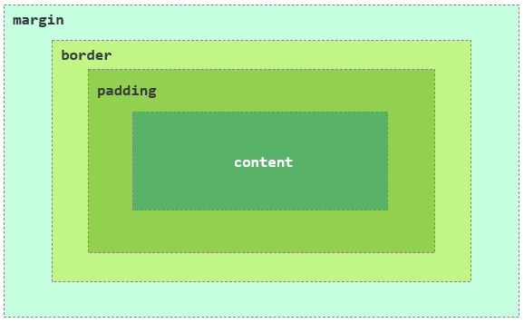


#### 1. 内容区 (Content Area)☆

- **定义**: 盒子的最核心部分，用于显示元素的实际内容，例如文本、图片、视频等。
- **相关CSS属性**:
  - `width`: 定义内容区的宽度。
  - `height`: 定义内容区的高度。
- **注意点**: 对于行内元素（如 `<span>`, `<a>`），直接设置 `width` 和 `height` 是无效的。

#### 2. 内边距 (Padding)

- **定义**: 包裹在内容区之外、边框之内的透明区域。它的主要作用是创建内容与边框之间的空间，防止内容紧贴着边框。
- **相关CSS属性**:
  - `padding-top`, `padding-right`, `padding-bottom`, `padding-left` (分别设置上、右、下、左四个方向的内边距)。
  - **Shorthand (简写)**: `padding`
    - `padding: 10px;` (四个方向均为10px)
    - `padding: 10px 20px;` (上下为10px, 左右为20px)
    - `padding: 10px 20px 30px;` (上为10px, 左右为20px, 下为30px)
    - `padding: 10px 20px 30px 40px;` (上右下左，顺时针)
- **注意点**: `padding` 区域会继承元素的背景颜色或背景图片。

#### 3. 边框 (Border)☆

- **定义**: 包裹在内边距之外的线条，是盒子可见的边界。
- **相关CSS属性**:
  - `border-width`: 边框的宽度。
  - `border-style`: 边框的样式 (如 `solid`, `dashed`, `dotted` 等)。`style` 是必须设置的，否则边框不可见。
  - `border-color`: 边框的颜色。
  - **Shorthand (简写)**: `border`
    - `border: 1px solid black;` (最常用的写法，同时设置宽度、样式和颜色)。
  - 也可以为单边设置: `border-top`, `border-right`, `border-bottom`, `border-left`。
- **额外属性**: `border-radius` 用于创建圆角，可以让盒子不那么“方”。

#### 4. 外边距 (Margin)

- **定义**: 盒子最外层的区域，完全透明。它负责控制当前盒子与其他元素之间的距离。
- **相关CSS属性**:
  - `margin-top`, `margin-right`, `margin-bottom`, `margin-left`
  - **Shorthand (简写)**: `margin` (用法同 `padding`)
- **注意点**:
  - `margin` 不会继承元素的背景色。
  - `margin` 有一个非常重要的特性——**外边距折叠 (Margin Collapsing)**，下面我会细讲


### 两种盒子模型：`box-sizing` 属性

- 我们知道盒子由四个区域组成，而一个元素的总宽度/高度，则是由其采用的**盒子模型**决定的
  - 在CSS中，我们可以通过设置 `box-sizing` 属性，来指定元素究竟使用哪一种盒子模型

#### 1. 标准盒子模型 (`content-box`)

- 这是W3C的标准，也是所有浏览器**默认**的盒子模型。

  - **计算方式**: 设置的 `width` 和 `height` **只应用于内容区 (Content Area)**。`padding` 和 `border` 会在此基础上向外“撑大”整个盒子
  - **内容区的宽度和高度**:`width`、`height`

  - **盒子可见宽度** = `width` + `padding-left` + `padding-right` + `border-left-width` + `border-right-width`

  - **盒子可见高度** = `height` + `padding-top` + `padding-bottom` + `border-top-width` + `border-bottom-width`

  - 示例

    ```css
    .box-standard {
      box-sizing: content-box; /* 默认值 */
      width: 200px;
      height: 100px;
      padding: 20px;
      border: 10px solid red;
      margin: 15px;
    }
    ```

    - 这个盒子的**实际可见宽度**是: `200px (width) + 20px (padding) * 2 + 10px (border) * 2 = 260px`。 这个结果往往不符合直觉，给布局带来了困难


#### 2. 怪异盒子模型 (`border-box`)

- 也称IE盒子模型，但因其直观性，已成为现代Web**开发的首选**

  - **计算方式**: 设置的 `width` 和 `height` **是整个盒子可见部分的总尺寸** (包含了 `border` 和 `padding`)。`padding` 和 `border` 的空间会向内“挤压”内容区的空间。

  - **盒子可见宽度** = `width`

  - **盒子可见高度** = `height`

  - **内容区宽度** = `width` - `padding-left` - `padding-right` - `border-left-width` - `border-right-width`

  - 示例

    ```css
    .box-intuitive {
      box-sizing: border-box;
      width: 200px;
      height: 100px;
      padding: 20px;
      border: 10px solid green;
      margin: 15px;
    }
    ```

    - 这个盒子的**实际可见宽度**就是你设置的 `200px`。布局变得非常可预测！


#### 最佳实践：全局都设置为 `border-box`

- 为了避免混乱和简化布局，强烈建议在所有项目中将所有元素都设置为 `border-box` 模型。

  - 建议将以下代码放在你的CSS文件的最顶部：

    ```css
    /*
      一种更健壮、更推荐的全局设置方式
      它允许你在需要时可以为某个组件单独覆盖 box-sizing
    */
    html {
      box-sizing: border-box;
    }
    
    *, *::before, *::after {
      box-sizing: inherit; /* 所有元素和伪元素都从父元素继承 box-sizing */
    }
    ```

    

### 高级主题与常见陷阱

#### 1. 外边距折叠 (Margin Collapsing)

- 这是一个纯粹发生在**垂直方向**（`margin-top` 和 `margin-bottom`）上的现象。当两个或多个垂直外边距相遇时，它们会合并成一个外边距，合并后的高度等于其中**最大的那个外边距**的值。

**发生折叠的三种情况:**

1. **相邻的兄弟元素**:

   ```html
   <div style="margin-bottom: 20px;"></div>
   <div style="margin-top: 30px;"></div>
   <!-- 它们之间的距离是 30px, 而不是 20 + 30 = 50px -->
   ```

2. **父元素与第一个/最后一个子元素**:

   - 如果父元素**没有** `border-top`、`padding-top` 或 `inline content` 来隔开它和第一个子元素的 `margin-top`，那么它们的 `margin-top` 就会发生折叠。
   - 对 `margin-bottom` 同理。

   ```html
   <div class="parent" style="margin-top: 50px;">
       <div class="child" style="margin-top: 30px;"></div>
   </div>
   <!-- 如果 parent 没有 padding 或 border, 最终 parent 的上外边距表现为 50px -->
   ```

3. **空的块级元素**:

   - 如果一个块级元素**没有** `border`、`padding`、`height` 或 `min-height` 来支撑它，那么它自己的 `margin-top` 和 `margin-bottom` 就会折叠。

   ```html
   <div style="margin-top: 20px; margin-bottom: 30px;"></div>
   <!-- 这个div的高度为0, 其外边距表现为30px -->
   ```

**如何防止外边距折叠？**

- 对于父子元素折叠，可以给父元素设置 `padding-top` 或 `border-top`。
- 让父元素形成**块级格式化上下文 (BFC)**，例如设置 `overflow: hidden;` 或 `display: flow-root;`。
- 使用 Flexbox 或 Grid 布局，在这些现代布局模型中，外边距是不会折叠的。


#### 2. 不同 `display` 类型

- 虽然理论上每个元素都是一个盒子，但这个“盒子”的属性（特别是宽高和垂直方向的边距）能否被设置，完全取决于该元素的 `display` 类型

  - **`display:block` (块级元素)**: 如 **`<div>`, `<p>`, `<h1>`**
    - 可以设置和不可以设置的方面
      - 它们是“标准盒子”，您可以自由设置**内容、内边距、边框、外边距**的所有属性，包括宽度和高度
    - 特点与特性
      - 独占一行。
      - `width`, `height`, `padding`, `border`, `margin` 所有属性都生效。
      - 默认宽度是其父容器的100%。

  - **`display:inline` (行内元素)**: 如 `<span>`, `<a>`, ``
    - 可以设置和不可以设置的方面
      - 是“受限的盒子”
      - **可以设置**：水平方向的 `padding`、`border` 和 `margin`。它们会把左右两边的元素推开。
      - **不可以设置**：`width` 和 `height` 是无效的。
      - **特别注意**：垂直方向的 `margin-top` 和 `margin-bottom` 是**无效**的。而垂直方向的 `padding-top` 和 `padding-bottom` 虽然会撑开元素的背景和边框，但**不会**在布局上推开上下两行的元素，可能会导致内容重叠
    - 特点与特性
      - 不独占一行，与其他行内元素并排。
      - `width` 和 `height` **无效**
      - `margin-top` 和 `margin-bottom` **无效**。
      - `padding-top` 和 `padding-bottom` 虽然会增加背景区域，但**不会**在垂直方向上推开其他元素，可能导致与其他行内容重叠
      - 水平方向的 `padding`, `border`, `margin` 均有效

  - **`display:inline-block`(行内块元素)**
    - 可以设置和不可以设置的方面
      - 这种元素结合了两者的优点，它像行内元素一样可以并排显示，但内部又像块级元素一样，可以设置所有盒模型的属性。
    - 特点与特性
      - 结合了两者的优点
      - 在外部看，它像一个 `inline` 元素，可以和其他元素并排
      - 在内部看，它像一个 `block` 元素，可以设置 `width`, `height`, `margin` 和 `padding` 的所有属性


## CSS中的Flexbox弹性布局

### 核心思想与基本概念

#### 基本概念

- Flexbox是CSS3中引入的**一维布局模型**，它提供了一种更简单、更灵活的方式来**控制容器内项目（盒子）的排列、对齐和空间分配**

- Flexbox中有两个核心概念：
  1. **Flex容器 (Flex Container)**: 应用了 `display: flex` 或 `display: inline-flex` 的父元素
  2. **Flex项目 (Flex Items)**: 在Flexbox的语境中，**“项目” (Flex Item)** 就是指Flex容器（父元素）的**直接子元素**


#### 和CSS盒子模型的关系

- **盒子模型 (`box-sizing`)**: 决定了**一个独立的盒子**是如何计算自己尺寸的
- **Flexbox布局 (`display: flex`)**: 决定了**一个容器里的多个盒子**是如何排列和分布的


#### **FlexBox的作用范围**

- 当您在一个元素上设置 `display: flex;` 时，您就把它变成了一个**Flex容器**。这个容器获得了一套全新的“超能力”（如 `justify-content`, `align-items` 等），但这些能力**只能用来指挥和管理它内部的子元素（Flex项目）**
- Flexbox本身并不提供任何属性来控制该容器**自身**在页面布局中的位置


#### 轴线

- 与传统布局的X/Y轴不同，Flexbox引入了**两个动态的轴线**：

  - **主轴 (Main Axis)**: Flex项目沿着主轴进行排列。它的方向**不固定**，由 `flex-direction` 属性决定。它可以是水平的，也可以是垂直的

  - **交叉轴 (Cross Axis)**: **垂直于主轴的轴线**


### Flex容器的一些属性

- 这些属性设置在父容器上，用于控制其内部所有项目的整体布局

#### 1. `display`

- **启用Flexbox的开关**

  - `display: flex;`: 将元素变为一个**块级**的Flex容器

  - `display: inline-flex;`: 将元素变为一个**行内级**的Flex容器


#### 2. `flex-direction` (主轴方向)

- 最重要的属性之一，它**定义了主轴的方向，决定了项目排列的方向**。

  - `row` (默认值): 主轴为水平方向，从左到右

  - `row-reverse`: 主轴为水平方向，从右到左

  - `column`: 主轴为垂直方向，从上到下

  - `column-reverse`: 主轴为垂直方向，从下到上


#### 3. `flex-wrap` (换行方式)

- 定义了当一行放不下所有项目时，项目是否换行以及如何换行
  - `nowrap` (默认值): 不换行。所有项目会强制挤在同一行内，可能会导致溢出
  - `wrap`: 换行。项目会从上到下，自动换到新的一行
  - `wrap-reverse`: 换行，但方向相反。项目会从下到上，换到新的一行


#### 4. `flex-flow` (方向与换行的简写)

- `flex-direction` 和 `flex-wrap` 的简写形式

  ```css
  /* flex-flow: <flex-direction> <flex-wrap>; */
  .container {
    flex-flow: row wrap; /* 等同于 flex-direction: row; 和 flex-wrap: wrap; */
  }
  ```


#### 5. `justify-content` (主轴对齐方式)

- 定义了项目在**主轴**上的对齐方式。这是实现居中和空间分布的关键

  - `flex-start` (默认值): 沿着主轴起点对齐

  - `flex-end`: 沿着主轴终点对齐

  - `center`: 在主轴上居中对齐

  - `space-between`: 两端对齐。第一个项目在起点，最后一个项目在终点，剩余项目平均分配空间

  - `space-around`: 每个项目两侧的间距相等。所以项目之间的间距会比项目与容器边缘的间距大一倍

  - `space-evenly`: 每个项目之间的间距以及项目与容器边缘的间距都完全相等


#### 6. `align-items` (交叉轴对齐方式 - 单行)

- 定义了项目在**交叉轴**上的对齐方式

  - `stretch` (默认值): 如果项目未设置高度（或宽度，取决于主轴方向），则项目会拉伸以填满整个容器的交叉轴高度

  - `flex-start`: 沿着交叉轴起点对齐

  - `flex-end`: 沿着交叉轴终点对齐

  - `center`: 在交叉轴上居中对齐

  - `baseline`: 项目的第一行文字的基线对齐


#### 7. `align-content` (交叉轴对齐方式 - 多行)

- **仅在有多根轴线时（即 `flex-wrap: wrap`）此属性才生效**。它定义了多根轴线在交叉轴上的对齐方式。你可以把它想象成多行版本的 `justify-content`

  - `stretch` (默认值): 各行会拉伸以占满整个交叉轴空间

  - `flex-start`: 所有行都向交叉轴的起点堆叠

  - `flex-end`: 所有行都向交叉轴的终点堆叠

  - `center`: 所有行都在交叉轴上整体居中

  - `space-between`: 第一行在起点，最后一行在终点，其余行均匀分布

  - `space-around`: 每行两侧的间距相等


### Flex项目的一些属性

- 这些属性设置在子项目上，用于控制单个项目的行为。

#### 1. `order` (排列顺序)

- 允许你改变项目的视觉顺序，而不改变它们在HTML中的顺序。默认值为`0`。数值越小，排列越靠前。可以为负数

  ```css
  .item-1 { order: 2; }
  .item-2 { order: 1; }
  .item-3 { order: 3; }
  /* 显示顺序将是：item-2, item-1, item-3 */
  ```


#### 2. `flex-grow` (放大比例)

定义了当容器存在剩余空间时，项目放大的比例。默认值为`0`，即不放大。

- 如果所有项目的 `flex-grow` 都为`1`，它们将平分剩余空间。
- 如果一个项目的 `flex-grow` 为`2`，其他项目为`1`，那么它将获得比其他项目多一倍的剩余空间。


#### 3. `flex-shrink` (缩小比例)

定义了当容器空间不足时，项目缩小的比例。默认值为`1`，即空间不足时项目会等比例缩小。

- 如果一个项目的 `flex-shrink` 为`0`，则该项目不会缩小。
- 数值越大，缩小的程度越大。


#### 4. `flex-basis` (基准尺寸)

定义了在分配多余空间之前，项目占据的主轴空间。可以把它看作是项目在Flex布局中的“默认宽度”或“默认高度”。

- 默认值为 `auto`，即项目本来的大小。
- 可以设置一个具体的长度值（如`200px`, `50%`）。


#### 5. `flex` (grow, shrink, basis的简写)

- 这是 `flex-grow`, `flex-shrink` 和 `flex-basis` 的简写，**强烈推荐使用此简写属性**

  ```CSS
  /* flex: <flex-grow> <flex-shrink> <flex-basis>; */
  ```

- **常用值:**

  - `flex: 0 1 auto;` (默认值): 不放大，会缩小，基准尺寸为自身大小。

  - `flex: 1;`: 等同于 `flex: 1 1 0%;`。项目会放大和缩小，并忽略其内容尺寸。这是实现**均分布局**的最快方式。

  - `flex: auto;`: 等同于 `flex: 1 1 auto;`。项目会放大和缩小，但基准尺寸是自身大小。

  - `flex: none;`: 等同于 `flex: 0 0 auto;`。项目完全不参与弹性计算，既不放大也不缩小


#### 6. `align-self` (单个项目的交叉轴对齐)

- 允许单个项目覆盖容器的 `align-items` 属性

  - 其值与 `align-items` 完全相同 (`auto`, `stretch`, `flex-start`, `flex-end`, `center`, `baseline`)。

  - `auto` (默认值): 继承父容器的 `align-items` 属性。


### 经典示例用法

#### **完美居中**

```CSS
.container {
  display: flex;
  justify-content: center; /* 主轴居中 */
  align-items: center;    /* 交叉轴居中 */
  height: 100vh;
}
```

#### **导航栏布局**

```CSS
.nav {
  display: flex;
}
.logo {
  margin-right: auto; /* 将logo推到最左边，其余项目推到最右边 */
}
```

#### **等高卡片布局**

```css
.card-container {
  display: flex;
}
.card {
  flex: 1; /* 每张卡片均分宽度，且高度自动拉伸对齐 */
}
```


# 常见标签、属性、渲染声明表

- 标签，属性，声明等太多太多，我也只能简单记录一些常用的？害，就这样了，后面遇到不会的去ai搜就行，就不记录了，爱咋咋，就这样，总之，这是一个大表格

| 常用标签 (及说明)                                            | 常用属性                                                     | 属性常用值 (及说明)                                          | 常见CSS渲染声明 (及作用)                                     |
| :----------------------------------------------------------- | :----------------------------------------------------------- | :----------------------------------------------------------- | :----------------------------------------------------------- |
| **文本内容 (Text Content)**                                  |                                                              |                                                              |                                                              |
| `<h1>`...`<h6>` <br> 定义从1到6级不同重要性的标题。          | `id` <br> `class`                                            | 字符串                                                       | `margin: 0.67em 0; /* 作用：浏览器默认外边距，通常会在CSS重置中设为0。 */` <br> `font-weight: bold; /* 作用：标题默认为粗体。 */` |
| `<p>` <br> 定义一个文本段落。                                | `id` <br> `class`                                            | 字符串                                                       | `margin: 1em 0; /* 作用：浏览器默认外边距，通常只保留下方外边距以分隔段落。 */` <br> `line-height: 1.6; /* 作用：设置一个易于阅读的行高。 */` |
| `<strong>` <br> **语义化标签**：定义内容的重要性，表示非常重要。 | `id` <br> `class`                                            | 字符串                                                       | `font-weight: bold; /* 作用：默认渲染为粗体，以强调其“重要性”。 */` |
| `<b>` <br> **表现性标签**：使文本在视觉上**加粗**，不带有任何额外的重要性。 | `id` <br> `class`                                            | 字符串                                                       | `font-weight: bold; /* 作用：这是它的唯一目的。推荐：若为强调重要性，应使用<strong>；若仅为样式，应使用CSS。 */` |
| `<em>` <br> **语义化标签**：定义需要被强调的文本。           | `id` <br> `class`                                            | 字符串                                                       | `font-style: italic; /* 作用：默认渲染为斜体，以表示“强调”。 */` |
| `<i>` <br> **表现性标签**：使文本在视觉上**倾斜**，通常用于技术术语、外语短语等。 | `id` <br> `class`                                            | 字符串                                                       | `font-style: italic; /* 作用：这是它的唯一目的。推荐：若为表达强调，应使用<em>；若仅为样式，应使用CSS。 */` |
| `<ins>` <br> **语义化标签**：定义新插入的文本。              | `cite` <br> `datetime`                                       | `URL` (指向解释插入原因的文档) <br> `YYYY-MM-DDThh:mm:ssZ` (插入的时间) | `text-decoration: underline; /* 作用：默认渲染为下划线，以表示“插入”。 */` |
| `<u>` <br> **表现性标签**：为文本添加**下划线**。**注意：** 容易与超链接混淆，应谨慎使用。 | `id` <br> `class`                                            | 字符串                                                       | `text-decoration: underline; /* 作用：这是它的唯一目的。 */` |
| `<del>` <br> **语义化标签**：定义已被删除的文本。            | `cite` <br> `datetime`                                       | `URL` (指向解释删除原因的文档) <br> `YYYY-MM-DDThh:mm:ssZ` (删除的时间) | `text-decoration: line-through; /* 作用：默认渲染为删除线，以表示“删除”。 */` |
| `<s>` <br> **表现性标签**：为文本添加**删除线**，表示内容不再准确或相关。 | `id` <br> `class`                                            | 字符串                                                       | `text-decoration: line-through; /* 作用：这是它的唯一目的。 */` |
| `<br>` <br> 插入一个简单的换行符。                           |                                                              |                                                              | `/* 这是一个空标签，无渲染样式。 */`                         |
| `<hr>` <br> 创建一条水平分割线，表示主题性的转变。           |                                                              |                                                              | `border: none; /* 作用：去除默认的立体边框。 */` <br> `height: 1px; /* 作用：设置分割线的高度。 */` <br> `background-color: #ccc; /* 作用：设置分割线的颜色。 */` <br> `margin: 1rem 0; /* 作用：设置分割线上下的间距。 */` |
| **链接与图片 (Links & Images)**                              |                                                              |                                                              |                                                              |
| `<a>` <br> 创建超链接。                                      | `href` <br><br> `target` <br><br> `rel`                      | `URL` (一个有效的网址) <br> `#id` (页面内锚点链接) <br> `mailto:email@example.com` (邮件链接) <br> `_self` (默认，在当前窗口打开) <br> `_blank` (在新标签页中打开) <br> `noopener noreferrer` (安全相关，使用_blank时建议加上) | `text-decoration: none; /* 作用：去除默认的下划线。 */` <br> `color: #007bff; /* 作用：自定义链接颜色。 */` <br> `cursor: pointer; /* 作用：确保鼠标悬浮时为手形。 */` <br> `:hover { text-decoration: underline; } /* 作用：鼠标悬浮时显示下划线，提供反馈。 */` |
| `` <br> 嵌入图像。                                      | `src` <br> `alt` <br> `width` <br> `height` <br> `loading`   | `URL` (必需，图像文件的路径) <br> `文本描述` (必需，图像无法显示时的替代文本) <br> `像素值` <br> `像素值` <br> `lazy` (当图片滚动到视口时再加载，提升性能) | `max-width: 100%; /* 作用：核心响应式样式，使图片宽度不超过其容器。 */` <br> `height: auto; /* 作用：配合max-width，保持图片原始高宽比。 */` <br> `display: block; /* 作用：消除图片因基线对齐在底部产生的几像素空隙。 */` |
| **列表 (Lists)**                                             |                                                              |                                                              |                                                              |
| `<ul>` <br> 定义无序列表。                                   | `id` <br> `class`                                            | 字符串                                                       | `list-style-type: disc; /* 作用：默认的项目符号为实心圆点。 */` <br> `padding-left: 40px; /* 作用：浏览器默认的左内边距，用于显示项目符号。 */` |
| `<ol>` <br> 定义有序列表。                                   | `type` <br><br> `start`                                      | `1` (默认，数字) <br> `A` (大写字母) <br> `a` (小写字母) <br> `I` (大写罗马数字) <br> `i` (小写罗马数字) <br> `数字` (定义列表的起始编号) | `list-style-type: decimal; /* 作用：默认的编号类型为数字。 */` <br> `padding-left: 40px; /* 作用：同上。 */` |
| `<li>` <br> 定义列表中的一个项目。                           | `value`                                                      | `数字` (仅用于`<ol>`，重新设定该项的编号)                    | `margin-bottom: 8px; /* 作用：为列表项之间添加一些垂直间距。 */` |
| **表格 (Tables)**                                            |                                                              |                                                              |                                                              |
| `<table>` <br> 定义一个表格。                                | `id` <br> `class`                                            | 字符串                                                       | `border-collapse: collapse; /* 作用：将单元格边框合并为单一边框，外观更整洁。 */` <br> `width: 100%; /* 作用：使表格宽度自适应其父容器。 */` |
| `<caption>` <br> 定义表格的标题。                            |                                                              | 文本内容                                                     | `padding: 8px; /* 作用：为标题提供内边距。 */` <br> `caption-side: bottom; /* 作用：将标题放在表格底部。 */` <br> `text-align: center; /* 作用：标题居中对齐。 */` |
| `<thead>` `<tbody>` `<tfoot>` <br> 分别定义表格的表头、主体和表尾。 |                                                              |                                                              | `/* 这些标签用于语义化分组，通常通过其子元素(tr, th, td)来应用样式。 */` |
| `<tr>` <br> 定义表格中的一行。                               |                                                              |                                                              | `background-color: #f2f2f2; /* 作用：常用于:nth-child(even)选择器，创建斑马条纹表格。 */` |
| `<th>` <br> 定义一个表头单元格。                             | `scope`                                                      | `col` (该表头作用于一列) <br> `row` (该表头作用于一行)       | `font-weight: bold; /* 作用：表头文字默认为粗体。 */` <br> `background-color: #e9ecef; /* 作用：为表头设置不同的背景色以示区分。 */` |
| `<td>` <br> 定义一个标准数据单元格。                         | `colspan` <br> `rowspan`                                     | `数字` (定义单元格可横跨的列数) <br> `数字` (定义单元格可横跨的行数) | `border: 1px solid #ddd; /* 作用：为每个单元格设置边框。 */` <br> `padding: 8px; /* 作用：为单元格内容提供呼吸空间。 */` |
| **表单 (Forms)**                                             |                                                              |                                                              |                                                              |
| `<form>` <br> 创建一个HTML表单。                             | `action` <br> `method` <br> `enctype`                        | `URL` (表单数据提交的地址) <br> `GET` / `POST` (提交表单所用的HTTP方法) <br> `application/x-www-form-urlencoded` (默认) <br> `multipart/form-data` (上传文件时使用) | `display: flex; /* 作用：常用于组织内部的label和input。 */` <br> `flex-direction: column; /* 作用：将表单元素垂直堆叠。 */` <br> `gap: 15px; /* 作用：在表单元素之间创建统一的间距。 */` |
| `<input>` <br> 创建输入字段。                                | `type` <br><br><br><br> `name` <br> `value` <br> `placeholder` <br> `required` <br> `disabled` | `text` (文本) <br> `password` (密码) <br> `checkbox` (复选框) <br> `radio` (单选按钮) <br> `submit` (提交按钮) <br> `file` (文件上传) <br> `date` (日期选择) <br> `number` (数字输入) <br> `字符串` (必需，提交数据时的键名) <br> `字符串` (输入框的初始值) <br> `文本提示` (输入框中的提示文字) <br> `布尔属性` (设为必填项) <br> `布尔属性` (禁用输入框) | `padding: 10px; /* 作用：增加内边距，让输入框更大、更易用。 */` <br> `border: 1px solid #ccc; /* 作用：自定义边框样式。 */` <br> `border-radius: 5px; /* 作用：创建圆角，使外观更柔和。 */` <br> `font-size: 16px; /* 作用：确保在移动设备上输入时页面不会自动缩放。 */` |
| `<textarea>` <br> 创建一个多行文本输入域。                   | `rows` <br> `cols` <br> `name`                               | `数字` (指定可见的文本行数) <br> `数字` (指定可见的宽度) <br> `字符串` (必需，提交数据时的键名) | `resize: vertical; /* 作用：允许用户垂直调整文本域大小，防止破坏水平布局。 */` <br> `/* 其他样式通常与input保持一致。 */` |
| `<select>` <br> 创建一个下拉列表。                           | `name` <br> `multiple`                                       | `字符串` (必需，提交数据时的键名) <br> `布尔属性` (允许用户选择多个选项) | `/* 外观在不同浏览器中差异较大，通常会使用JS库或复杂的CSS技巧进行美化。 */` |
| `<option>` <br> 定义下拉列表中的一个选项。                   | `value` <br> `selected`                                      | `字符串` (必需，定义发送到服务器的值) <br> `布尔属性` (规定该选项被预先选中) | `/* 无法直接应用复杂样式。 */`                               |
| `<button>` <br> 定义一个可点击的按钮。                       | `type` <br><br> `disabled`                                   | `submit` (默认，提交表单) <br> `reset` (重置表单) <br> `button` (可点击按钮，常配合JS) <br> `布尔属性` (禁用按钮) | `border: none; /* 作用：去除默认边框。 */` <br> `background-color: #007bff; /* 作用：设置背景色。 */` <br> `color: white; /* 作用：设置文字颜色。 */` <br> `padding: 10px 20px; /* 作用：控制按钮的大小和点击区域。 */` <br> `cursor: pointer; /* 作用：鼠标悬浮时显示为手形。 */` |
| **多媒体 (Multimedia)**                                      |                                                              |                                                              |                                                              |
| `<video>` <br> 嵌入视频内容。                                | `src` <br> `controls` <br> `autoplay` <br> `muted` <br> `loop` <br> `poster` | `URL` (视频源路径) <br> `布尔属性` (显示默认播放控件) <br> `布尔属性` (自动播放, 通常需配合muted) <br> `布尔属性` (静音) <br> `布尔属性` (循环播放) <br> `URL` (视频封面图的路径) | `width: 100%; /* 作用：使视频播放器宽度自适应其父容器。 */` <br> `height: auto; /* 作用：保持视频的原始高宽比。 */` |
| `<audio>` <br> 嵌入音频内容。                                | `src` <br> `controls` <br> `autoplay` <br> `muted` <br> `loop` | `URL` (音频源路径) <br> `布尔属性` (显示默认播放控件) <br> `布尔属性` (自动播放) <br> `布尔属性` (静音) <br> `布尔属性` (循环播放) | `width: 100%; /* 作用：使其占满容器宽度，方便布局。 */`      |
| `<source>` <br> 为媒体元素定义多个媒体资源。                 | `src` <br> `type`                                            | `URL` (媒体文件路径) <br> `video/mp4` <br> `audio/mpeg` <br> *作用：浏览器会选择第一个支持的格式进行播放。* | `/* 此标签不可见，无渲染样式。 */`                           |
| **内联框架与脚本 (Iframe & Scripts)**                        |                                                              |                                                              |                                                              |
| `<iframe>` <br> 在当前文档中嵌入另一个文档。                 | `src` <br> `width` <br> `height` <br> `allow`                | `URL` (必需, 要嵌入的页面的URL) <br> `像素值` <br> `像素值` <br> `fullscreen` (允许全屏) | `border: 0; /* 作用：去除浏览器默认给iframe添加的边框。 */`  |
| `<script>` <br> 用于嵌入或引用可执行的客户端脚本。           | `src` <br> `type` <br> `async` <br> `defer`                  | `URL` (外部脚本文件的路径) <br> `text/javascript` (默认) <br> `布尔属性` (异步下载并执行脚本) <br> `布尔属性` (并行下载，在HTML解析完毕后执行) | `/* 此标签不可见，无渲染样式。 */`                           |
| **语义化布局 (Semantic Layout)**                             |                                                              |                                                              |                                                              |
| `<header>` <br> 定义文档或区域的头部。                       |                                                              |                                                              | `display: flex; /* 作用：常用于实现logo和导航的左右对齐布局。 */` <br> `justify-content: space-between;` <br> `align-items: center;` <br> `padding: 1rem;` |
| `<footer>` <br> 定义文档或区域的尾部。                       |                                                              |                                                              | `padding: 1rem;` <br> `background-color: #f8f9fa;` <br> `text-align: center;` |
| `<nav>` <br> 定义导航链接的区域。                            |                                                              |                                                              | `/* 内部的<a>标签通常会设置为 display: inline-block; 和 padding，以增大点击区域。 */` |
| `<main>` <br> 定义文档的主体内容。                           |                                                              |                                                              | `padding: 1rem; /* 作用：设置内边距，使其与边缘有距离。 */`  |
| `<section>` <br> 定义文档中的一个独立部分。                  |                                                              |                                                              | `padding: 2rem 0; /* 作用：设置垂直方向的内边距，用于分隔内容区域。 */` |
| `<article>` <br> 定义一个独立的、自成一体的内容块。          |                                                              |                                                              | `margin-bottom: 2rem; /* 作用：与其他文章或内容块分隔。 */`  |
| `<aside>` <br> 定义与主要内容相关但可独立存在的内容。        |                                                              |                                                              | `width: 300px; /* 作用：常用于定义侧边栏的固定宽度。 */` <br> `padding: 1rem;` <br> `background-color: #f1f1f1;` |

# HTML与CSS的一些属性单位

在网页设计中，单位是量化属性值的标尺。理解不同单位在不同属性下的具体含义，是掌握布局和响应式设计的关键。

## 1. 定义尺寸和距离的属性

这类属性构成了网页的骨架，决定了元素在页面上的空间和位置。

### **`width` 和 `height`**

- **作用**：定义元素的宽度和高度。
- **适用标签**：几乎所有块级元素和部分行内元素，如 `<div>`, `<section>`, ``, `<video>`, `<table>`, `<canvas>` 等。
- **单位详解**：
  - **`px`** (像素)：一个固定的值，不随任何其他元素变化。
    - `width: 300px;` — 元素的宽度固定为300像素。
  - **`%`** (百分比)：相对于其**父元素的内容区域 (content area) 宽度**进行计算。
    - `width: 50%;` — 元素的宽度是其父元素内容区域宽度的一半。这是实现响应式布局的核心。
  - **`vw` / `vh`** (视口宽度/高度)：相对于浏览器可见区域的尺寸。`1vw` 等于视口宽度的1%。
    - `height: 100vh;` — 元素的高度将占满整个屏幕的高度，常用于创建全屏背景或英雄区块。

### **`padding` 和 `margin`**

- **作用**：分别定义元素的内边距（内容与边框的距离）和外边距（元素与其他元素的距离）。
- **适用标签**：所有可见的HTML元素。
- **单位详解**：
  - **`px`**：固定的像素值，用于精确控制间距。
  - **`%`**：这是一个**特殊规则**。无论是水平方向的 `padding-left`/`right` 还是垂直方向的 `padding-top`/`bottom`，百分比都是相对于**父元素的宽度**来计算的。
    - `padding-top: 10%;` — 顶部内边距的值是父元素宽度的10%，而不是高度的10%。
  - **`em`**：相对于**当前元素**的字体大小。
    - `font-size: 16px; padding: 2em;` — 内边距为 `16px * 2 = 32px`。如果只改变 `font-size`，`padding` 会自动缩放。
  - **`rem`** (root em)：相对于**根元素 (`<html>`)** 的字体大小。这是现代响应式设计中**推荐**的间距单位，因为它提供了一个全局统一的基准。

### **`border-width`**

- **作用**：定义元素边框的宽度。
- **适用标签**：所有可见的HTML元素。
- **单位详解**：
  - **`px`**：最常用，用于创建清晰的、固定宽度的边框。
    - `border: 1px solid black;`
  - **`em` / `rem`**：使边框宽度能随字体大小缩放。

### **`top`, `right`, `bottom`, `left`**

- **作用**：在定位布局中（即 `position` 为 `absolute`, `relative`, `fixed`, `sticky` 时），定义元素相对于其定位参考点的偏移距离。
- **适用标签**：所有可定位的元素。
- **单位详解**：
  - **`px` / `rem`**：用于精确定位。
  - **`%`**：相对于其**最近的已定位祖先元素**的尺寸。`left: 50%;` 表示元素的左边缘位于其定位父元素宽度的50%处。

## 2. 定义字体相关的属性

这类属性决定了文本的视觉呈现。

### **`font-size`**

- **作用**：定义字体的大小。
- **适用标签**：所有包含文本的元素。
- **单位详解**：
  - **`px`**：固定的像素大小，简单直接。
  - **`%`**：相对于**父元素**的字体大小。
    - 父元素 `font-size: 20px;`，子元素 `font-size: 120%;`，则子元素的实际字号为24px。
  - **`em`**：相对于**父元素**的字体大小（当用于 `font-size` 属性时，行为与 `%` 类似）。
  - **`rem`**：**强烈推荐**。相对于根元素 (`<html>`) 的字体大小，便于实现整页的字体大小缩放，避免了 `em` 和 `%` 的层层继承计算带来的复杂性。

### **`letter-spacing` 和 `word-spacing`**

- **作用**：分别定义字符间距和单词间距。
- **适用标签**：所有包含文本的元素。
- **单位详解**：
  - **`px`**：精确控制间距。
  - **`em`**：根据当前元素的字体大小按比例调整间距。

### **`line-height`**

- **作用**：定义行与行之间的距离（行高）。
- **适用标签**：所有包含文本的元素。
- **单位详解**：
  - **无单位数值 (推荐)**：`line-height: 1.5;` — 表示行高是当前字体大小的1.5倍。这是最灵活、最推荐的方式，因为它能很好地被子元素继承。
  - **`px`, `rem`, `em`**：`line-height: 24px;` — 设置一个固定的行高。
  - **`%`**：`line-height: 150%;` — 行为与无单位数值类似，但继承时可能会有意外问题，因此不推荐。

## 3. 定义时间的属性

这类属性主要用于CSS动画和过渡效果，为网页增添动态感。

### **`animation-duration` 和 `transition-duration`**

- **作用**：定义一个动画或过渡效果完成所需的时间。
- **适用标签**：所有可以应用动画或过渡的元素。
- **单位详解**：
  - **`s`** (秒)：`transition: 0.5s;`
  - **`ms`** (毫秒)：`transition: 500ms;` (效果同上)

## 4. 布局与变换属性

这类属性用于更现代的布局技术和视觉效果。

### **`border-radius`**

- **作用**：创建元素的圆角。
- **适用标签**：所有可见的HTML元素。
- **单位详解**：
  - **`px` / `rem`**：创建固定大小的圆角。
  - **`%`**：相对于元素自身的尺寸创建圆角。`border-radius: 50%;` 可以轻松创建圆形或椭圆形。

### **`gap`** (或 `grid-gap`, `column-gap`)

- **作用**：在Flexbox和Grid布局中，定义项目之间的间距。
- **适用标签**：设置了 `display: flex` 或 `display: grid` 的容器元素。
- **单位详解**：**`px`**, **`rem`**, **`%`**。`%` 相对于容器的尺寸。

### **`transform`**

- **作用**：对元素进行2D或3D变换（移动、旋转、缩放等），它不影响周围元素的布局。
- **适用标签**：所有可变换的元素 (transformable elements)。
- **函数单位详解**：
  - `translate(x, y)`：移动元素。使用 **`px`**, **`%`** 等距离单位。`%` 相对于元素自身尺寸。
  - `rotate(angle)`：旋转元素。使用 **`deg`** (度) 或 **`turn`** (圈) 等角度单位。
  - `scale(x, y)`：缩放元素。使用**无单位数值** (如 `1.5` 表示放大到1.5倍)。

### **`box-shadow`**

- **作用**：为元素添加阴影效果。
- **适用标签**：几乎所有可见元素。
- **单位详解**：主要使用 **`px`** 来定义水平偏移、垂直偏移、模糊半径和扩散半径。
  - `box-shadow: 10px 5px 5px black;` — (水平偏移 垂直偏移 模糊半径 颜色)


# Web标准

- **Web 标准是一系列由国际组织制定和推荐的、用于创建和解释网页内容的规范和技术指南。** 它的核心目标是确保万维网（World Wide Web）的开放性、互通性和可访问性，让任何人在任何地方、使用任何设备都能顺畅地访问网页内容。

## 一些Web标准技术

### 最核心的三项

1. **HTML (超文本标记语言):** 用于定义网页的**结构和内容**。HTML5 是目前的最新标准。
2. **CSS (层叠样式表):** 用于设定网页的**外观和样式**（如颜色、布局、字体）。CSS3 是目前的通行版本。
3. **JavaScript (ECMAScript):** 用于实现网页的**交互行为和动态功能**。ECMAScript 是其官方标准名称。


### 其它的一些

- **DOM (文档对象模型):** 定义了如何用程序（主要是 JavaScript）去访问和操作 HTML 和 XML 文档的标准接口。
- **WCAG (网页内容无障碍指南):** 提出了一系列建议，旨在让残障人士（如视力、听力或行动不便者）也能无障碍地访问和使用网页内容。
- **SVG (可缩放矢量图形):** 一种基于 XML 的、用于描述二维矢量图形的标准。
- **Unicode:** 定义了全球几乎所有字符的编码标准，确保网页可以正确显示各种语言的文字。


# JavaScript

## 简介

- **JavaScript (简称 JS)** 是一种轻量级的、解释型的、具有头等函数（First-class Functions）的编程语言。它最初是为网页浏览器设计的，用于实现客户端的动态交互效果，但现在也被广泛用于服务器端（Node.js）、移动应用（React Native）、桌面应用（Electron）等领域。

- **主要特点:**

  - **动态类型:** 变量的类型在运行时确定。

  - **基于原型:** 对象通过原型链实现继承。

  - **多范式:** 支持过程式、面向对象（基于原型）和函数式编程风格。

  - **事件驱动:** 大量依赖事件来处理用户交互和异步操作。

- JavaScript是一门弱类型语言
  - “弱类型”是编程语言的一种特性，它指的是**语言会在运算时自动、隐式地转换变量的数据类型**


## ECMAScript(ES)

- ECMAScript（简称 ES）是一份由国际标准组织 **Ecma International** 制定和发布的**脚本语言规范**。它本身不是一门编程语言，而是一份**“说明书”或“蓝图”**，详细规定了一门脚本语言应该具备哪些核心特性。

### ECMAScript 与 JavaScript 的关系

- **标准与实现**的关系

  - **ECMAScript (ES):** 是**标准**。它定义了语法、数据类型、操作符、内置对象和基本功能。

  - **JavaScript:** 是这个标准**最著名、最广泛的实现**。各大浏览器（如 Chrome 的 V8 引擎）和 Node.js 环境都遵循 ECMAScript 标准来开发自己的 JavaScript 解释器。


### 一些重要的版本演进

- ECMAScript 也在不断发展，其版本号标志着 JavaScript 语言功能的演进。

#### ES5 (ECMAScript 5, 2009年)

- 这是**“经典”或“传统”的 JavaScript**。在很长一段时间里，它是所有浏览器都普遍支持的稳定标准，奠定了现代 Web 开发的基础。

  - **核心特性:** `var` 声明、原型链继承、`Array.prototype.forEach`、`JSON.parse` 等

  - **地位:** 它是现代 JavaScript 的基石，也是旧版浏览器兼容性的底线

#### ES6 (ECMAScript 2015)

- **JavaScript 历史上最重要的一次升级**，标志着**“现代 JavaScript”**的开端。由于其变革巨大，人们习惯称之为 **ES6**。
  - **官方名称:** 从这一年起，ECMAScript 决定每年发布一个新版本，ES6 的官方名称是 **ES2015**

- **核心新特性:**
  - `let` 和 `const` 声明
  - 箭头函数 (`=>`)
  - 类 (`class`) 语法糖
  - 模板字符串 (``...${}``)
  - 模块化 (`import` / `export`)
  - 解构赋值
  - Promise
- **地位:** **区分“旧”JS 和“现代”JS 最重要的分水岭。** 目前绝大部分开发都是基于 ES6 及之后的版本。

#### ES2016+ (年度更新)

从 ES2015 开始，ECMAScript 每年都会发布一个小的更新版本，以小步快跑的方式为语言添加新功能。

- **ES2016 (ES7):** 增加了 `Array.prototype.includes()` 和幂运算符 `**`。
- **ES2017 (ES8):** 引入了 `async/await` 语法，极大地改善了异步编程体验。
- **ES2020:** 引入了 `BigInt` 类型，用于处理超大整数。


### 关于日常谈论的版本

- 当我们谈论某个 JS 特性属于哪个版本（如 `const` 属于 ES6）时，我们实际上是在说明这个特性是从哪个版本的“官方说明书”开始被正式采纳的


## 基础语法

### JS 代码的组织与引入

- 在开发中，我们通常需要处理两个层面的问题：
  - 首先是如何将我们的 JS 代码加载到 HTML 页面中，
  - 其次是如何在多个 JS 文件之间组织和共享代码。

#### 1. 只用`<script>`

- 这是将 JavaScript 引入网页的基础。我们使用 `<script>` 标签来告诉浏览器加载并执行脚本。

##### 方式一：内联脚本

- 直接在 HTML 文件中编写 JS 代码，适用于非常简短、仅用于当前页面的逻辑。

```html
<script>
  console.log("这是在 HTML 文件中直接编写的 JS 代码。");
</script>
```

##### 方式二：外部脚本

- 将 JS 代码保存在一个独立的 `.js` 文件中，然后通过 `<script>` 标签的 `src` 属性引入。**这是最常用、最推荐的方式**，因为它能实现代码复用和更好的项目管理。

```html
<script src="path/to/your/script.js"></script>
```

> **重要规则：** 一个 `<script>` 标签要么使用 `src` 引入外部文件，要么包含内联代码，**不能两者兼得**。如果同时存在，浏览器会忽略内联代码，只执行 `src` 引用的文件。
>
> 只要写了`src`属性，内容部分写的所有JS代码就失效了，但是如果写了`type`属性，还可以写代码，这个要分辨清楚，别混淆


#### 2. 模块化:使用 `import`/`export`

- 当项目变大时，将所有代码都放在一个文件里或依赖全局变量是不可行的。**模块化**允许我们将代码分割成独立的、可复用的文件（模块），并明确地在它们之间共享功能。**这是现代 JavaScript 开发的标准。**

##### 工作原理

1. **导出 (`export`)**：在一个模块文件（如 `utils.js`）中，使用 `export` 关键字将你想分享的函数、变量或类暴露给其他文件。
2. **导入 (`import`)**：在另一个模块文件（如 `main.js`）中，使用 `import` 关键字来引入你需要的功能。

##### 示例

- **模块文件: `utils.js`**

```js
// 只导出我们想让外部使用的部分
export function sayHello(name) {
  return `Hello, ${name}!`;
}

export const PI = 3.14;

// 这个函数没有被导出，所以是模块私有的
function privateFunction() {
  console.log("This is private.");
}
```

- **主入口文件: `main.js`**

```js
// 从 './utils.js' 文件中明确地导入我们需要的功能
import { sayHello, PI } from './utils.js';

const message = sayHello("World");
console.log(message);
console.log("The value of PI is: " + PI);

// privateFunction(); // 这会报错，因为它没有被导出
```

##### 在 HTML 中使用模块

- 为了让浏览器能够识别 `import`/`export` 这种模块化语法，你**必须**在引入主入口文件的 `<script>` 标签中添加 `type="module"` 属性。

```html
<!DOCTYPE html>
<html>
<body>
    <!-- 只需要引入主入口文件，并将其类型设置为 "module" -->
    <!-- 浏览器会自动处理依赖关系，加载 import 的其他文件 -->
    <script type="module" src="main.js"></script>
</body>
</html>
```


#### 关于`<script>`的位置与性能

- `<script>` 标签在 HTML 文件中的位置至关重要，它直接影响页面的加载速度和用户体验。主要有两种放置位置：


##### **位置 1:  `<head>` 标签内**

- **传统方式 (不推荐):** 直接将 `<script>` 放在 `<head>` 中会**阻塞渲染 (Render-Blocking)**。浏览器在解析到这个标签时，会暂停解析和渲染页面的所有工作，转而去下载并执行这个脚本。如果脚本很大或网络不佳，用户将长时间面对一个白屏。
- **现代方式 (推荐):** 使用 `defer` 或 `async` 属性。
  - **`<script src="..." defer></script>` (最佳实践):** 这是目前最推荐的方式。它告诉浏览器可以继续解析 HTML，同时在后台异步下载脚本。**脚本会等到整个 HTML 文档都解析完毕后，再按照它们在代码中出现的顺序依次执行**
  - **`<script src="..." async></script>`:** 脚本也会异步下载而不阻塞页面。但它会在**下载完成后立即执行**，这**可能会中断 HTML 的解析**。多个 `async` 脚本的执行顺序是不确定的。它更适合那些完全独立、不依赖其他脚本和页面元素的脚本（例如网站分析工具）


##### **位置 2:  `<body>` 标签底部**

这是另一种非常经典且可靠的性能优化实践，即将 `<script>` 标签放在 `</body>` 结束标签之前

- **优点:**
  1. **避免阻塞:** 浏览器会先完成整个页面的解析和渲染，让用户能第一时间看到网页内容
  2. **DOM 就绪:** 当脚本开始执行时，页面上所有的元素（DOM）都已经加载完毕，脚本可以安全地查找并操作任何元素，不会因元素不存在而报错


### 变量

#### 声明变量的关键字

- 在现代 JavaScript (ES6+) 中，我们主要使用 `let` 和 `const` 来声明变量，而 `var` 已经不推荐使用

##### const

- **`const` (常量):** 

  - 用于声明一个块级作用域的**只读常量**。在**声明时必须立即进行初始化（赋值）**，并且在这之后不能再被重新赋值

  - 如果你尝试**只声明而不赋值**，JavaScript 引擎在读取到这行代码时就**会立即抛出错误**

  - 对于对象或数组，其内部元素可以修改，但引用不能改变。

- 示例

  ```javascript
  const myConstant; // 这行代码会立即抛出 SyntaxError: Missing initializer in const declaration
  myConstant = 100; // 根本不会执行到这一步
  
  const PI = 3.14;
  PI = 3; // 这会抛出错误 TypeError
  
  const person = { name: "Alice" };
  person.name = "Bob"; // 这是允许的
  // person = { name: "Charlie" }; // 这会抛出错误
  ```

  

##### let

- **`let` (变量):** 用于声明一个块级作用域的局部变量。其值可以被修改。

  - 示例

    ```javascript
    let counter = 10;
    counter = 11; // 这是允许的
    ```

    

##### var

- **`var` (旧式变量):** `var` 声明的变量是函数作用域或全局作用域，并且存在**变量提升 (Hoisting)** 的问题，这可能导致一些意外的行为。应避免使用


#### 变量的命名规则

- 变量名以**字母 (a-z, A-Z)**、**数字**、**下划线 (`_`)** 或**美元符号 (`$`)** 组成，且**数字不能开头**
- 不能使用关键字作为变量名


#### 变量提升

- 变量提升是JavaScript 的一个机制，其中变量和函数声明会在代码执行前被“移动”到其作用域的顶部

  - `var` 声明的变量会被提升并初始化为 `undefined`

  - `let` 和 `const` 声明的变量也会被提升，但在赋值之前访问会进入“暂时性死区 (Temporal Dead Zone, TDZ)”，导致 `ReferenceError`

- 函数声明会被完整提升

  ```javascript
  console.log(myVar); // 输出: undefined (因为 var 提升)
  var myVar = 5;
  
  console.log(myLet); // 抛出 ReferenceError (TDZ)
  let myLet = 10;
  ```

  


### 作用域

- 作用域决定了代码中变量和函数的可见性

  - **全局作用域 (Global Scope):** 在所有函数外部声明的变量
  - **函数作用域 (Function Scope):** 在函数内部声明的变量，仅在函数内部可用 (`var`)

  - **块级作用域 (Block Scope):** 在 `{}` 代码块（如 `if` 语句、`for` 循环）中声明的变量，仅在该代码块内部可用 (`let`, `const`)


## 数据类型

- JavaScript 的数据类型分为两类：**原始类型 (Primitive Types)** 和 **对象类型 (Object Type)**


### 原始类型

#### `String`

- 字符串是 JavaScript 中用于表示文本的数据类型。你可以通过多种方式创建字符串

##### 传统字符串

###### 创建方式

- 使用**单引号 (`'`)** 或**双引号 (`"`)** 将文本包裹起来

###### 示例

- **基本用法：**

  ```JavaScript
  let singleQuoteStr = '这是一个单引号字符串。';
  let doubleQuoteStr = "这是一个双引号字符串。";
  ```

- **引号嵌套：** 一种引号可以方便地在另一种引号内嵌套，无需转义。

  ```JavaScript
  let message = "他说：'你好！'"; // 正确
  let reply = '他回答道："很高兴认识你。"'; // 正确
  ```

- **转义字符：** 如果需要在同种引号内使用该引号，或者使用特殊字符（如换行），就需要使用反斜杠 `\` 进行转义。

  ```JavaScript
  let complexStr = '这是一个\'带引号\'的字符串。\n它还会换行。';
  console.log(complexStr);
  // 输出:
  // 这是一个'带引号'的字符串。
  // 它还会换行。
  ```

- **字符串拼接：** 传统方式下，拼接变量和字符串需要使用加号 `+`，当内容复杂时，代码会变得非常混乱且难以阅读。

  ```JavaScript
  const name = "Alice";
  const score = 95;
  const oldMessage = "你好, " + name + "！\n你在本次测试中获得了 " + score + " 分。";
  ```


##### 模板字符串

- 为了解决传统字符串的上述痛点，ES6 引入了模板字符串。**这是现代 JavaScript 中处理字符串的首选方式**

###### 语法

- 使用**反引号 ` ** 来包裹字符串
- 可以在字符串中通过 **`${expression}`** 的语法轻松地**嵌入变量和任何合法的 JS 表达式**


###### 优势

**核心优势：**

- **可读性极高：** 变量和表达式的嵌入非常自然，告别了繁琐的 `+` 号
- **支持多行：** 无需使用 `\n` 即可直接在代码中换行，字符串的格式与输出完全一致


###### 示例

- 使用模板字符串重写上面的拼接示例，代码变得极其清晰：

  ```JavaScript
  const name = "Alice";
  const score = 95;
  
  const newMessage = `你好, ${name}！你在本次测试中获得了 ${score} 分。`;
  ```

  ```javascript
  console.log(newMessage);
  // 输出:
  // 你好, Alice！
  // 你在本次测试中获得了 95 分。
  ```


#### Number (数字)

##### 概念

- `Number` 类型用于表示整数和浮点数（小数）。它是 JavaScript 中进行算术运算的基础


##### 基本用法

```js
let integerNum = 100;
let floatNum = 3.14;
```


##### 特殊值

- `Number` 类型包含几个特殊的数值，用于表示非正常或边界情况。

  - **`NaN` (Not-a-Number):** 表示一个“不是数字”的值。它通常在数学运算失败时出现。

    ```js
    let result = 0 / 0; // NaN
    let invalidNum = parseInt('hello'); // NaN
    ```

    **注意：** `NaN` 是一个非常特殊的值，它不等于任何值，包括它自己。因此，判断一个值是否是 `NaN` 必须使用 `isNaN()` 函数。

    ```js
    console.log(NaN === NaN); // false
    console.log(isNaN(result)); // true
    ```

  - **`Infinity` 和 `-Infinity`:** 分别表示正无穷和负无穷，通常在数字超出 JavaScript 可表示的最大范围或除以零时出现。

    ```js
    let positiveInfinity = 1 / 0; // Infinity
    let negativeInfinity = -1 / 0; // -Infinity
    ```


#### Boolean (布尔)

##### 概念

- `Boolean` 是一个逻辑类型，只有两个值：`true` (真) 和 `false` (假)。它主要用于控制程序流程，如 `if` 条件判断和循环


##### 基本用法

```js
let isStudent = true;
let hasLicense = false;

if (isStudent) {
  console.log("这是一个学生。");
}
```


##### 关于布尔的转化

- 在 JavaScript 中，每个值都可以被转换成 `true` 或 `false`。在**需要布尔值的上下文中**（如 `if` 语句），这种自动转换会发生。

  - **Falsy (假值):** 以下 **6** 个值会被转换为 `false`。

    1. `false`
    2. `0`
    3. `""` (空字符串)
    4. `null`
    5. `undefined`
    6. `NaN`

  - **Truthy (真值):** 除了上面 6 个 Falsy 值以外的**所有其他值**都会被转换为 `true`，包括空数组 `[]` 和空对象 `{}`。

    ```js
    if ([]) {
      console.log("空数组是真值。"); // 这行代码会执行
    }
    ```


#### null

##### 概念

- `null` 是一个特殊的原始值，它有明确的语义：**表示一个被开发者“有意设置”的空值或“无对象”**。当你需要明确地表示一个变量不指向任何对象时，应该使用 `null`

##### 用法和一些特点

- **用法：** 它通常用于初始化一个变量，这个变量稍后可能会持有一个对象，或者用于清空一个对象引用。

  ```js
  let user = null; // 用户尚未登录，其信息为空
  // ... 登录逻辑后 ...
  user = { name: "Alice" };
  ```

- **与 `undefined` 的区别：** `null` 是**开发者主动赋予**的空值，而 `undefined` 通常是 JavaScript 引擎**默认赋予**的。

- **`typeof` 的怪异行为：** 这是一个历史遗留的 bug，`typeof null` 会返回 `"object"`，尽管 `null` 是一个原始类型。

  ```js
  console.log(typeof null); // "object"
  ```


#### undefined

##### 概念

- `undefined` 表示一个变量**已被声明，但尚未被赋值**。它是 JavaScript 中表示“缺少值”的默认状态。


##### 出现场景

1. **变量只声明未赋值：**

   ```js
   let name;
   console.log(name); // undefined
   ```

2. **函数没有返回值：** 如果一个函数没有明确使用 `return` 语句，它会默认返回 `undefined`。

   ```js
   function doNothing() {
     // 没有 return 语句
   }
   console.log(doNothing()); // undefined
   ```

3. **访问不存在的对象属性：**

   ```js
   const person = { name: "Bob" };
   console.log(person.age); // undefined
   ```


#### Symbol (于 ES6/ES2015 中新增)

##### 概念

- `Symbol` 是一种**唯一的、不可变的**原始数据类型。它的主要用途是作为对象属性的键（key），以避免属性名冲突。

##### 特点与用法

- **特性：** 每次调用 `Symbol()` 函数都会创建一个全新的、独一无二的 Symbol 值。

  ```js
  const id1 = Symbol('id');
  const id2 = Symbol('id');
  
  console.log(id1 === id2); // false，即使描述相同，它们也是唯一的
  ```

- **主要用途：** 防止在向一个已有对象添加新属性时，无意中覆盖掉原有的属性。

  ```js
  const user = {
    name: "Charlie"
  };
  
  const secretId = Symbol('userId');
  user[secretId] = 12345;
  
  console.log(user.name); // "Charlie"
  console.log(user[secretId]); // 12345
  // 这个 secretId 属性不会与任何其他名为 'userId' 的字符串属性冲突
  ```


#### BigInt (于 ES2020 中新增)

##### 概念

- `BigInt` 是一种特殊的数字类型，用于表示**任意精度的整数**。它解决了 `Number` 类型无法安全表示超大整数的问题

  - **解决的问题：** JavaScript 的 `Number` 类型有一个最大安全整数 `Number.MAX_SAFE_INTEGER` (即 2^53 - 1)。超过这个值的整数运算可能会不准确。

    ```js
    const maxSafeInt = Number.MAX_SAFE_INTEGER;
    console.log(maxSafeInt + 1 === maxSafeInt + 2); // true，运算结果不准确！
    ```

##### 用法

- **创建方式：** 在整数后面加上一个小写字母 `n`，或者使用 `BigInt()` 函数。

  ```js
  const largeNumber = 9007199254740991n;
  const anotherLargeNumber = BigInt("9007199254740992");
  ```

- **使用 `BigInt` 进行运算：**

  ```js
  const result = largeNumber + 1n; // 9007199254740992n
  console.log(result);
  ```

- **注意：** `BigInt` 和 `Number` 类型不能混合进行算术运算，必须先将它们转换为同一类型。

  ```js
  // console.log(10n + 5); // TypeError: Cannot mix BigInt and other types
  console.log(10n + BigInt(5)); // 15n (正确)
  ```


### 对象类型

#### 概念与特点

- 对象是键值对的集合，是 JavaScript 中最核心的数据结构。
  - **几乎所有 JavaScript 中的复杂结构都是对象，包括数组、函数等**
    - **核心：键值对 (Key-Value Pairs)**
      - **键 (Key):** 通常是一个字符串，用于描述属性的名称。
      - **值 (Value):** 可以是**任何数据类型**，包括数字、字符串、布尔值、数组，甚至是另一个对象或一个函数

- **对象类型是引用类型**，对象类型与原始类型不同，当你将一个对象赋值给另一个变量时，你传递的是该对象的**引用（内存地址）**，而不是一个全新的副本。这意味着修改其中一个变量会影响到另一个。


#### 创建对象

##### 语法

```js
let 对象名 = {
    属性名1: 属性值1,
    属性名2: 属性值2,
    属性名3: 属性值3,
    方法名称: function(形参列表){},
    ......
};
```

##### 示例

```js
const person = {
  // 键 : 值
  name: "张三",          // 值是 String
  age: 30,             // 值是 Number
  isStudent: false,      // 值是 Boolean
  hobbies: ["篮球", "音乐"], // 值是 Array
  address: {             // 值是另一个 Object
    city: "北京",
    street: "人民路1号"
  },
  // 当值是一个函数时，我们称之为“方法” (Method)
  greet: function() {
    console.log("你好, 我的名字是 " + this.name);
  }
};
```


#### 访问对象的属性

- 有两种主要方式来获取或修改对象的值

  1. **点表示法 (Dot Notation):** 这是最常用、最简洁的方式。

     ```js
     console.log(person.name); // 输出 "张三"
     person.age = 31; // 修改 age 属性
     person.greet(); // 调用 greet 方法
     ```

  2. **方括号表示法 (Bracket Notation):** 这种方式更灵活，当属性名是变量或包含特殊字符时必须使用。

     ```js
     console.log(person['name']); // 等同于 person.name
     
     let propertyToAccess = 'hobbies';
     console.log(person[propertyToAccess]); // 输出 ["篮球", "音乐"]
     ```


#### 创建可复用对象

- JavaScript 提供了**创建可复用对象“模板”**的机制。主要有两种方式：
  1. **构造函数 (Constructor Functions)** - 这是比较经典的方式。
  2. **ES6 类 (Classes)** - 这是现代 JavaScript 的推荐方式，语法更像 Java。

##### 方式一：构造函数

- 构造函数本质上就是一个普通的函数，但我们约定用它来“构造”对象。它的特点是：

  - 函数名通常**首字母大写**（例如 `Person`），以作区分

  - 内部使用 `this` 关键字来指向即将被创建的新对象

  - 必须使用 `new` 操作符来调用，才能创建出新对象实例

- **工作流程：** 当你使用 `new Person(...)` 时，JavaScript 在背后做了四件事：
  1. 创建一个全新的空对象 `{}`。
  2. 将这个新对象的 `this` 指向该构造函数。
  3. 执行构造函数内部的代码，为这个新对象添加属性和方法。
  4. 自动返回这个新对象。

**示例：**

```js
// 1. 定义一个 Person 构造函数（对象模板）
function Person(name, age) {
  // this 指向即将被创建的新对象
  this.name = name;
  this.age = age;
  
  this.greet = function() {
    console.log(`你好, 我是 ${this.name}，今年 ${this.age} 岁。`);
  };
}

// 2. 使用 new 关键字，根据模板创建出不同的对象实例
const person1 = new Person("张三", 30);
const person2 = new Person("李四", 25);

// 3. 调用各自的方法
person1.greet(); // 输出: 你好, 我是 张三，今年 30 岁。
person2.greet(); // 输出: 你好, 我是 李四，今年 25 岁。

console.log(person1.name); // "张三"
console.log(person2.name); // "李四"
```

- 只用一份 `Person` 函数代码，就创建出了两个结构相同但数据不同的对象

##### 方式二：ES6 类 (Classes) - 现代推荐方式

- 为了让 JavaScript 的面向对象写法更清晰、更像传统的面向对象语言（如 Java），ES6 引入了 `class` 关键字。

- **`class` 本质上只是构造函数的“语法糖”**，它的底层工作原理和构造函数是一样的，但写法更优雅、更直观。

**示例：**

```js
// 1. 使用 class 关键字定义一个类（对象模板）
class Person {
  // constructor 是一个特殊的方法，用于初始化对象
  constructor(name, age) {
    this.name = name;
    this.age = age;
  }

  // 方法可以直接写在类里面
  greet() {
    console.log(`你好, 我是 ${this.name}，今年 ${this.age} 岁。`);
  }
}

// 2. 使用 new 的方式完全相同
const person1 = new Person("王五", 40);
const person2 = new Person("赵六", 22);

// 3. 调用方法
person1.greet(); // 输出: 你好, 我是 王五，今年 40 岁。
person2.greet(); // 输出: 你好, 我是 赵六，今年 22 岁。
```


#### 创建对象不用箭头函数

- 创建对象的时候，定义这个对象的函数一般不要用箭头函数，否则this会出问题

  - 原因在于 **`this` 关键字的绑定规则不同**：

    - **常规函数 (Regular Function):** `this` 的值取决于**函数是如何被调用的**。当您通过 `object.method()` 的方式调用时，`this` 就指向那个 `object`。

    - **箭头函数 (Arrow Function):** 箭头函数**没有自己的 `this`**。它会像普通变量一样，从它被**定义时所在的作用域**（父级作用域）中去寻找并继承 `this`。


###  `typeof`类型检查运算符

- `typeof` 操作符可以返回一个值的数据类型

  ```javascript
  typeof "hello"   		// "string"
  typeof 123       		// "number"
  typeof true      		// "boolean"
  typeof undefined 		// "undefined"
  typeof {}        		// "object"
  typeof []        		// "object" (数组是特殊的对象)
  typeof function(){} 	// "function" (函数是特殊的对象)
  typeof null      		// "object" (这是一个历史遗留的 bug)
  ```


### `this` 关键字

- `this` 的值在函数被调用时确定，其指向取决于函数的调用方式

  - **全局上下文**: `this` 指向全局对象 (`window` 在浏览器中, `global` 在 Node.js 中)

  - **作为对象方法**: `this` 指向调用该方法的对象

  - **作为普通函数**: `this` 指向全局对象 (在严格模式下是 `undefined`)

  - **箭头函数**: `this` 继承自其父级作用域的 `this` 值

  - **构造函数中**: `this` 指向新创建的实例

  - **`call`, `apply`, `bind`**: 可以显式地设置 `this` 的值


## 数组 (Arrays)

- 数组是一种特殊的对象，用于存储有序的值集合

### 创建数组

```js
// 数组字面量
const fruits = ["Apple", "Banana", "Cherry"];
```

### 一些常用方法

- **修改数组**:
  - `push(item)`: 在末尾添加元素。
  - `pop()`: 移除并返回末尾的元素。
  - `unshift(item)`: 在开头添加元素。
  - `shift()`: 移除并返回开头的元素。
  - `splice(start, deleteCount, item1, ...)`: 添加/删除元素。
- **访问和迭代**:
  - `slice(start, end)`: 返回一个新数组，包含从 `start` 到 `end` (不含) 的元素。
  - `forEach(callback)`: 对每个元素执行 `callback` 函数。
  - `map(callback)`: 创建一个新数组，其结果是该数组中的每个元素都调用一个提供的函数后返回的结果。
  - `filter(callback)`: 创建一个新数组, 其包含通过所提供函数实现的测试的所有元素。
  - `reduce(callback, initialValue)`: 对数组中的每个元素执行一个 "reducer" 函数，将其结果汇总为单个返回值。
  - `find(callback)`: 返回数组中满足提供的测试函数的第一个元素的值。
  - `findIndex(callback)`: 返回数组中满足提供的测试函数的第一个元素的索引。
  - `includes(item)`: 判断数组是否包含某个指定的值。

```js
const numbers = [1, 2, 3, 4, 5];

// map: 每个元素乘以 2
const doubled = numbers.map(num => num * 2); // [2, 4, 6, 8, 10]

// filter: 筛选出偶数
const evens = numbers.filter(num => num % 2 === 0); // [2, 4]

// reduce: 计算总和
const sum = numbers.reduce((total, num) => total + num, 0); // 15
```


## 操作符

- **算术操作符**: `+`, `-`, `*`, `/`, `%` (取模), `**` (幂, ES7)
- **赋值操作符**: `=`, `+=`, `-=`, `*=`, `/=`, `%=`
- **比较操作符**:
  - `==` (等于, 会进行类型转换)
  - `!=` (不等于, 会进行类型转换)
  - `===` (严格等于, 不进行类型转换)
  - `!==` (严格不等于, 不进行类型转换)
  - `>`, `<`, `>=`, `<=`
- **逻辑操作符**: `&&` (与), `||` (或), `!` (非)
- **三元操作符**: `condition ? exprIfTrue : exprIfFalse`

**`==` vs `===` 的重要性**: 始终优先使用 `===` 和 `!==` 进行比较，以避免因类型转换带来的意外结果。

```
"5" == 5;   // true, 因为字符串 "5" 被转换成了数字 5
"5" === 5;  // false, 因为类型不同 (string vs number)
```


## 控制流

### 条件语句

- **`if...else if...else`**

  ```js
  const score = 85;
  if (score >= 90) {
    console.log("优秀");
  } else if (score >= 75) {
    console.log("良好");
  } else {
    console.log("及格");
  }
  ```

- **`switch`**

  ```js
  const day = new Date().getDay();
  switch (day) {
    case 0:
      console.log("星期日");
      break;
    case 6:
      console.log("星期六");
      break;
    default:
      console.log("工作日");
  }
  ```


### 循环语句

- **`for` 循环**:

  ```js
  for (let i = 0; i < 5; i++) {
    console.log(i);
  }
  ```

  

- **`while` 循环**:

  ```js
  let n = 0;
  while (n < 3) {
    n++;
  }
  console.log(n); // 3
  ```

  

- **`do...while` 循环**: 至少执行一次。

  ```js
  let result = '';
  let i = 0;
  do {
    i += 1;
    result += i;
  } while (i < 5);
  console.log(result); // "12345"
  ```

  

- **`for...in`**: 遍历对象的**可枚举属性** (键名)。不推荐用于遍历数组。

  ```js
  const user = { name: 'Alice', age: 25 };
  for (const key in user) {
    console.log(`${key}: ${user[key]}`);
  }
  // 输出:
  // name: Alice
  // age: 25
  ```

- **`for...of` (ES6)**: 遍历**可迭代对象** (如 Array, Map, Set, String) 的值。这是遍历数组的首选方式。

  ```js
  const fruits = ['apple', 'banana', 'cherry'];
  for (const fruit of fruits) {
    console.log(fruit);
  }
  // 输出:
  // apple
  // banana
  // cherry
  ```


## 函数

- 在 JavaScript 中，函数是一段可以被**重复调用**的**代码块**，用于执行特定的任务。函数是 JavaScript 的“一等公民”，这意味着它们可以像任何其他值一样被对待：可以被存储在变量中、作为参数传递给其他函数，也可以作为其他函数的返回值

### 定义函数的方式

- JavaScript 提供了多种定义函数的方式，每种方式都有其特点和适用场景。

#### 1.函数声明

- 这是最常见的定义方式。它使用 `function` 关键字，后跟函数名和参数列表。
  - **特点：** 函数声明存在**函数提升 (Hoisting)**，这意味着你可以在声明它之前就调用它。

- **语法：**

  ```js
  // 可以在声明前调用
  console.log(greet("Alice")); // "Hello, Alice!"
  
  function greet(name) {
    return `Hello, ${name}!`;
  }
  ```


#### 2.函数表达式

- 这种方式是将一个函数（可以是匿名的）赋值给一个变量。
  - **特点：** 函数表达式**不会被提升**。你必须在声明它之后才能调用，这有助于写出更可预测的代码。

- **语法：**

  ```js
  // greet("Bob"); // 这会抛出 TypeError: greet is not a function (或 ReferenceError)
  
  const greet = function(name) {
    return `Hello, ${name}!`;
  };
  
  console.log(greet("Bob")); // "Hello, Bob!"
  ```


#### 3.箭头函数 - ES6+

- 箭头函数是 ES6 引入的一种更简洁的函数写法，它极大地改善了编码体验，尤其是在处理回调函数时。
  - **核心特点：**
    1. **简洁的语法：** 省略了 `function` 关键字和 `return`（当函数体只有一行时）。
    2. **不绑定自己的 `this`：** 箭头函数没有自己的 `this` 值，它会捕获其所在上下文（父作用域）的 `this` 值。这解决了传统函数中 `this` 指向混乱的问题。

- **语法示例：**

  ```js
  // 单行函数体，隐式返回结果
  const add = (a, b) => a + b;
  
  // 多行函数体，需要花括号 {} 和显式的 return
  const subtract = (a, b) => {
    console.log(`正在计算 ${a} - ${b}`);
    return a - b;
  };
  
  // 单个参数时，可以省略括号
  const square = x => x * x;
  ```


#### 4.`new Function()` 构造函数

- 这是一种非常不常用且不推荐的方式，它通过一个字符串来动态创建函数。由于性能和安全问题，应避免使用。

```js
const sum = new Function('a', 'b', 'return a + b');
console.log(sum(2, 6)); // 8
```


### 函数的参数

#### 默认参数 - ES6+

- 你可以为函数的参数指定一个默认值。当调用函数时没有提供该参数，或者提供的值是 `undefined` 时，就会使用这个默认值。

```js
function greet(name = "Guest", message = "Welcome") {
  console.log(`${message}, ${name}!`);
}

greet("Alice", "Hello"); // "Hello, Alice!"
greet("Bob");            // "Welcome, Bob!"
greet();                 // "Welcome, Guest!"
```


#### 剩余参数 - ES6+

- 使用 `...` 语法，可以将一个不定数量的参数表示为一个真正的数组。这在需要处理可变数量参数时非常有用。
  - **规则：** 剩余参数必须是函数参数列表中的**最后一个**。

- **示例：**

  ```js
  function sum(...numbers) {
    // numbers 是一个真正的数组，可以使用所有数组方法
    return numbers.reduce((total, num) => total + num, 0);
  }
  
  console.log(sum(1, 2, 3));         // 6
  console.log(sum(10, 20, 30, 40));  // 100
  ```


#### `arguments` 对象 (旧方式)

- 在 ES6 剩余参数出现之前，所有函数内部都可以访问一个名为 `arguments` 的特殊对象

  - **特点：** `arguments` 是一个**类数组对象 (Array-like object)**，它包含了函数被调用时传入的所有参数。它有 `length` 属性，但**不是真正的数组**，不能使用 `forEach`, `map` 等数组方法。

  - **注意：** **箭头函数中没有 `arguments` 对象。** 在现代 JavaScript 中，应优先使用剩余参数。

```js
function logAll() {
  console.log(arguments); // { '0': 'a', '1': 'b', '2': 'c' }
  for (let i = 0; i < arguments.length; i++) {
    console.log(arguments[i]);
  }
}
logAll('a', 'b', 'c');
```


### 返回值

- 函数通过 `return` 语句来指定其执行后返回的值

- 如果一个函数没有 `return` 语句，或者 `return` 后面没有跟任何值，它会默认返回 `undefined`
- `return` 语句会立即终止函数的执行

```js
function checkAge(age) {
  if (age >= 18) {
    return "成年"; // 满足条件，返回此值并结束函数
  }
  // 如果不满足，函数会继续执行到最后，默认返回 undefined
}

console.log(checkAge(20)); // "成年"
console.log(checkAge(15)); // undefined
```


### 闭包

- 闭包是 JavaScript 的一个核心且强大的**特性**。简单来说，**闭包就是一个函数和它在创建时能访问到的变量（即它的词法作用域）的组合**

- 这意味着，一个函数可以“记住”并持续访问它被创建时所在环境中的变量，即使它已经在那个环境之外被调用执行。

#### 经典示例分解

```js
function makeCounter() {
  let count = 0; // 这是 makeCounter 的局部变量
  
  // 下面这个返回的匿名函数就是一个闭包
  return function() { 
    count++; // 它可以访问并修改 count
    return count;
  };
}

// 1. 创建第一个闭包实例
const counter1 = makeCounter(); 
// makeCounter 执行完毕，但它返回的函数(闭包)含有 count=0

// 2. 调用闭包
console.log(counter1()); // 输出: 1 (将 count 变为 1)
console.log(counter1()); // 输出: 2 (将 count 变为 2)


// 3. 创建第二个、完全独立的闭包实例
const counter2 = makeCounter(); 
// 这一次，makeCounter 重新执行，里面装着一个全新的 count=0

console.log(counter2()); // 输出: 1 (访问的是第二个实例的“背包”)
```


#### 闭包的常见应用场景

1. **数据封装与私有变量** 闭包是实现“私有”变量的常用方式。外部无法直接访问 `count`，只能通过返回的函数来操作它。

   ```JS
   // 在上面的例子中，你无法通过 counter1.count 这样的方式访问到 count 变量，
   // 从而保护了数据的安全性。
   ```

2. **事件处理器和回调函数** 在循环中为元素绑定事件时，闭包尤其有用，可以确保每个事件处理器都引用到正确的变量。

   ```JS
   for (var i = 1; i <= 3; i++) {
     // 使用闭包来捕获每次循环的 i 值
     (function(j) {
       setTimeout(function() {
         console.log(j); // 依次输出 1, 2, 3
       }, j * 1000);
     })(i);
   }
   // 注意：在现代 JS 中，使用 let 声明 i 可以更简单地解决此问题，
   // 因为 let 具有块级作用域，每次循环都会创建一个新的 i。
   ```

3. **函数柯里化** 创建可以接收部分参数的函数。

   ```JS
   function add(x) {
     return function(y) {
       return x + y;
     };
   }
   const add5 = add(5); // add5 是一个闭包，它记住了 x=5
   console.log(add5(3)); // 输出: 8
   ```


#### 注意事项

- **内存消耗**：因为闭包会使其外部函数的变量一直保存在内存中，所以过度使用闭包可能会导致比预期更高的内存消耗。当不再需要闭包时，可以将其引用的变量设置为 `null`，以帮助垃圾回收。


## JS中关于JSON操作的常见方法

- `JSON.stringify(object)`: 将 JavaScript 对象转换为 JSON 字符串
- `JSON.parse(string)`: 将 JSON 字符串解析为 JavaScript 对象

**示例**

```JS
const user = {
  id: 1,
  name: "Leanne Graham",
  email: "Sincere@april.biz"
};

// 转换为 JSON 字符串
const jsonString = JSON.stringify(user);
console.log(jsonString);
// '{"id":1,"name":"Leanne Graham","email":"Sincere@april.biz"}'

// 从 JSON 字符串解析回对象
const parsedUser = JSON.parse(jsonString);
console.log(parsedUser.name); // Leanne Graham
```


## 浏览器对象模型 (BOM)

### 基本概念

- BOM(Browser Object Model) 是浏览器提供的一套用于与浏览器窗口本身进行交互的 API。它不是一个官方标准，但所有现代浏览器都支持其核心部分。BOM 的核心是 `window` 对象，它代表了整个浏览器窗口。


- **DOM vs BOM**:

  - **BOM** 控制**浏览器窗口** (相框)

  - **DOM** 控制**网页内容** (相框里的照片)

  - `document` 对象 (DOM 的入口) 实际上是 `window` 对象的一个属性 (**`window.document`**)


### `window` 对象

- `window` 对象是全局对象，所有全局变量和函数都是它的属性

  - **窗口控制**: `window.open()`, `window.close()`, `window.moveTo()`, `window.resizeTo()`

  - **定时器**:
    - `setTimeout(callback, delay)`: 在指定的延迟后执行一次回调函数。
    - `setInterval(callback, delay)`: 每隔指定的延迟重复执行回调函数。
    - `clearTimeout(id)`, `clearInterval(id)`: 清除定时器。

  - **对话框**: `alert()`, `confirm()`, `prompt()`。


### `location` 对象

- 提供了与当前页面 URL 相关的信息，并可以用于导航

  - `location.href`: 获取或设置当前页面的完整 URL

    ```
    // 获取 URL
    console.log(location.href);
    // 设置 URL (跳转页面)
    location.href = 'https://www.google.com';
    ```


  - `location.reload()`: 重新加载页面


  - `location.protocol`, `location.hostname`, `location.pathname`: 分别获取协议、主机名和路径


###  `history` 对象

- 提供了与浏览器会话历史的交互接口

  - `history.back()`: 后退一步 (相当于点击浏览器后退按钮)

  - `history.forward()`: 前进一步

  - `history.go(number)`: 移动到历史中的特定页面 (例如 `history.go(-2)` 后退两步)


###  `navigator` 对象

- 包含有关浏览器的信息

  - `navigator.userAgent`: 返回浏览器的用户代理字符串，常用于检测浏览器类型和操作系统

  - `navigator.language`: 返回浏览器的主语言

  - `navigator.geolocation`: 提供地理位置 API


### `screen` 对象

- 包含有关用户屏幕的信息

  - `screen.width` / `screen.height`: 屏幕的总宽度/高度

  - `screen.availWidth` / `screen.availHeight`: 屏幕的可用宽度/高度 (减去任务栏等界面特性)


## 文档对象模型 (DOM)

### 基本概念

- **DOM** 是浏览器为 HTML 和 XML 文档提供的一个编程接口（API）。它将整个网页文档解析成一个由**节点（Node）组成的树形结构**，这个结构被称为“DOM 树”。JavaScript 无法直接理解 HTML 的标签，但它可以通过 DOM 这个“翻译官”来动态地访问和修改文档的**内容**、**结构**和**样式**。

  可以把 DOM 想象成一棵家谱树：

  - `<html>` 是根节点（老祖宗）。
  - `<head>` 和 `<body>` 是它的子节点。
  - `<body>` 里的 `<h1>`, `<p>`, `<div>` 等又是 `<body>` 的子节点，以此类推。
  - 每个标签、标签里的文字、甚至标签的属性，都是这棵树上的一个**节点**。
    
  - JavaScript 的任务，就是通过 `document` 这个入口对象，来对这棵树进行增、删、改、查的操作。


### DOM相关的各种操作

#### 1. 选择元素（查询节点）

要操作一个元素，首先要找到它。DOM 提供了多种选择元素的方法。

##### 传统选择方法

- **`document.getElementById('id')`**
  - 通过元素的 `id` 属性选择，这是**最快、最精确**的方法。
  - 返回单个元素对象，如果找不到则返回 `null`。
  - `id` 在整个文档中必须是唯一的。
- **`document.getElementsByTagName('tagName')`**
  - 通过标签名（如 `'p'`, `'div'`）选择。
  - 返回一个**动态的 `HTMLCollection`**（一个类数组对象），包含所有匹配的元素。
- **`document.getElementsByClassName('className')`**
  - 通过类名选择。
  - 同样返回一个**动态的 `HTMLCollection`**。

> **注意：`HTMLCollection` 是动态的** 这意味着如果后续用 JS 增删了符合条件的元素，这个集合会自动更新，无需重新查询。

##### 现代选择方法 (推荐)

现代浏览器支持更强大、更灵活的选择器，它们使用 CSS 选择器语法，功能非常强大。

- **`document.querySelector('selector')`**
  - 使用任何有效的 CSS 选择器（如 `'#main-title'`, `'.list-item'`, `'div p'`) 来查找。
  - 只返回**第一个**匹配的元素，如果找不到则返回 `null`。
  - 这是获取单个元素的**首选现代方法**。
- **`document.querySelectorAll('selector')`**
  - 同样使用 CSS 选择器。
  - 返回一个**静态的 `NodeList`**（一个类数组对象），包含所有匹配的元素。

> **注意：`NodeList` 是静态的** 与 `HTMLCollection` 不同，`NodeList` 是一个快照。如果在查询后，页面上增删了符合条件的元素，这个列表**不会**自动更新。

```js
// 示例
const mainTitle = document.getElementById('main-title');
const firstItem = document.querySelector('.list-item');
const allItems = document.querySelectorAll('.list-item');

// NodeList 可以像数组一样使用 forEach
allItems.forEach(item => {
  console.log(item.textContent);
});
```


#### 2. 修改元素

- 找到元素后，就可以对它进行各种修改。

##### 修改内容

- **`element.textContent`**: 获取或设置元素内的**纯文本内容**。它会自动忽略 HTML 标签，并进行转义，因此是**安全的**。
- **`element.innerHTML`**: 获取或设置元素内的**所有 HTML 内容**。浏览器会解析这里面的 HTML 字符串。
  - **安全警告：** 绝对不要将来自用户输入的内容直接赋给 `innerHTML`，这会导致跨站脚本攻击（XSS）风险。

```js
const heading = document.querySelector('h1');
heading.textContent = '一个安全的新标题';
// heading.innerHTML = '<em>一个带样式的标题</em>';
```


##### 修改属性

- **`element.getAttribute('attrName')`**: 获取一个属性的值。

- **`element.setAttribute('attrName', 'value')`**: 设置或新增一个属性。

- **`element.removeAttribute('attrName')`**: 移除一个属性。

- **直接访问属性**: 对于标准属性（如 `id`, `src`, `href`），可以直接像访问对象属性一样操作。

  ```js
  const link = document.querySelector('a');
  link.href = 'https://www.google.com'; // 直接修改
  link.target = '_blank';
  ```


##### 修改样式

- **`element.style`**: 修改元素的**内联样式**（即 HTML `style` 属性）。属性名需要使用**驼峰命名法**（如 `backgroundColor` 对应 CSS 的 `background-color`）。

  ```
  mainTitle.style.color = 'blue';
  mainTitle.style.fontSize = '24px';
  ```

- **`element.classList` (推荐)**: 这是管理元素类名的最佳方式，它提供了一系列方便的方法，而不是直接操作字符串。

  - `element.classList.add('className')`: 添加类名。
  - `element.classList.remove('className')`: 移除类名。
  - `element.classList.toggle('className')`: 如果类名存在则移除，不存在则添加。
  - `element.classList.contains('className')`: 检查是否存在某个类名。


#### 3. 创建和操纵 DOM 树

- 除了修改现有元素，JS 还能动态地创建、添加和删除元素。

  - **`document.createElement('tagName')`**: 创建一个新的元素节点。

  - **`parentNode.appendChild(childNode)`**: 将一个子节点添加到父节点的**末尾**。

  - **`parentNode.insertBefore(newNode, referenceNode)`**: 在指定的参考子节点**之前**插入一个新节点。

  - **`element.remove()`**: 将元素从 DOM 中移除（现代方法）。

  - **`parentNode.removeChild(childNode)`**: 从父节点中移除一个指定的子节点（传统方法）。

```js
// 完整流程：创建、设置内容、添加到页面
// 1. 创建一个新元素
const newLi = document.createElement('li');

// 2. 设置其内容和属性
newLi.textContent = '新项目';
newLi.classList.add('list-item', 'important');

// 3. 获取父元素
const ul = document.querySelector('ul');

// 4. 将新元素添加到父元素的末尾
ul.appendChild(newLi);
```


#### 4. 事件处理

- 事件是用户在网页上的行为(如点击、滚动)或浏览器自身的状态变化（如页面加载完成）。JavaScript 通过**事件监听器**来响应这些事件

  - **`element.addEventListener(type, listener)`**: 这是**最推荐**的事件绑定方式。
    - **`type`**: 事件类型，是一个字符串（如 `'click'`, `'mouseover'`, `'keydown'`）。
    - **`listener`**: 事件触发时要执行的函数（回调函数）。这个函数会自动接收一个 `event` 对象作为参数。

  - **`event` 对象**: 当事件发生时，浏览器会创建一个 `event` 对象，并将其传递给监听函数。这个对象包含了事件的所有信息。

    - **`event.target`**: 指向**触发事件的那个具体元素**。
    - **`event.preventDefault()`**: 阻止事件的默认行为（例如，阻止点击链接后的页面跳转，或阻止提交按钮后的表单提交）。
    - **`event.stopPropagation()`**: 阻止事件继续向上“冒泡”。

    ```JS
    const button = document.getElementById('myButton');
    
    function handleClick(event) {
      // event 对象包含了事件信息
      console.log('事件类型:', event.type); // 'click'
      console.log('触发事件的元素:', event.target); // <button id="myButton">...</button>
      
      alert('Hello!');
      // event.preventDefault(); // 如果这是一个表单提交按钮，可以阻止表单提交
    }
    
    button.addEventListener('click', handleClick);
    ```

    

- **常见的事件类型:**
  - **鼠标事件:** `click`, `dblclick`, `mousedown`, `mouseup`, `mouseover`, `mouseout`, `mousemove`
  - **键盘事件:** `keydown`, `keyup`, `keypress`
  - **表单事件:** `submit`, `change` (当 `<input>`, `<select>` 值改变时), `input`
  - **焦点事件:** `focus`, `blur`
  - **窗口/文档事件:** `load` (页面所有资源加载完成), `DOMContentLoaded` (DOM 树构建完成)


## 关于事件监听

### 相关概念

- 在 JavaScript 中，**事件 (Event)** 是用户在网页上的行为或浏览器自身状态的变化。例如，用户的一次点击、一次鼠标移动、一次键盘敲击，或者页面加载完成，这些都是事件。

- **事件驱动编程 (Event-Driven Programming)** 是 JavaScript 在浏览器中的核心编程模型。它不是按照代码从上到下的顺序死板地执行，而是**“当某个事件发生时，执行对应的代码”**。


### 事件监听的核心三要素

- **一个完整的事件处理过程由三个核心要素组成**：
  1. **事件目标 (Event Target):** 你要监听谁？也就是事件发生在哪个元素上。例如，一个按钮、一个输入框，甚至是整个 `document` 或 `window`。
  2. **事件类型 (Event Type):** 你要监听什么行为？这是一个描述事件名称的字符串。例如，`'click'` (点击), `'mouseover'` (鼠标移入), `'keydown'` (键盘按下)。
  3. **事件监听器 (Event Listener):** 事件发生后，要做什么事？这是一个函数，当事件被触发时，这个函数就会被调用。它也常被称为**回调函数 (Callback Function)**。


### 常见的事件类型

#### 鼠标事件

- `click`: 单击
- `dblclick`: 双击
- `mousedown`: 鼠标按下
- `mouseup`: 鼠标松开
- `mouseover`: 鼠标移入元素
- `mouseout`: 鼠标移出元素
- `mousemove`: 鼠标在元素上移动

#### **键盘事件**

- `keydown`: 键盘按键按下
- `keyup`: 键盘按键松开
- `keypress`: （已不推荐）按下产生字符的键

#### **表单事件**

- `submit`: 表单提交时在 `<form>` 元素上触发
- `change`: `<input>`, `<select>`, `<textarea>` 的值改变后触发
- `input`: 输入框的值每次发生变化时实时触发

#### **焦点事件**

- `focus`: 元素获得焦点
- `blur`: 元素失去焦点

#### **窗口/文档事件**

- `load`: 页面所有资源（图片、脚本等）都加载完成后在 `window` 上触发
- `DOMContentLoaded`: HTML 文档被完全加载和解析完成后在 `document` 上触发，无需等待样式表、图像等完成加载。
- `resize`: 浏览器窗口大小改变时在 `window` 上触发
- `scroll`: 页面滚动时触发


### 处理事件的方式

- 有多种方式可以将这三要素绑定在一起，但强烈推荐使用现代的 `addEventListener` 方法

#### 方式一：`addEventListener()` (现代最佳实践)

- 这是最强大、最灵活、最推荐的事件绑定方式。

  - **语法:** `eventTarget.addEventListener(eventType, listenerFunction, options);`

    > ```JavaScript
    > 事件源.addEventListener('事件类型', 要执行的函数);
    > ```

  - **核心优势:**
    
    - 可以对**同一个元素**的**同一种事件**绑定**多个不同**的监听器函数，它们会按绑定顺序依次执行。
    - 对事件流有更精细的控制（详见下文的“冒泡与捕获”）。
    - 代码结构清晰，将 HTML 结构与 JavaScript 行为完全分离。

- **示例:**

  ```html
  <button id="myBtn">点我</button>
  ```

  ```js
  const myBtn = document.getElementById('myBtn');
  
  function sayHello() {
    alert('你好！');
  }
  
  function logClick() {
    console.log('按钮被点击了。');
  }
  
  // 为同一个 click 事件绑定两个不同的监听器
  myBtn.addEventListener('click', sayHello);
  myBtn.addEventListener('click', logClick);
  ```

  

#### 方式二：DOM 对象属性 (传统方式)

- 直接将一个函数赋值给事件目标的特定属性（如 `onclick`, `onmouseover`）

  - **语法:** `eventTarget.onclick = listenerFunction;`

  - **缺点:** 对于同一种事件，**只能绑定一个监听器**。如果对 `onclick` 多次赋值，后面的会覆盖前面的。

- **示例:**

  ```js
  const myBtn = document.getElementById('myBtn');
  
  myBtn.onclick = function() {
    console.log('这是第一个处理函数。');
  };
  
  // 下面的赋值会覆盖掉上面的函数
  myBtn.onclick = function() {
    console.log('这是第二个处理函数，第一个不会执行了。');
  };
  ```


#### 方式三：内联 HTML 属性 (过时且不推荐)

- 直接将 JavaScript 代码写在 HTML 标签的事件属性中

  - **语法:** `<button onclick="alert('你好！')">...</button>`

  - **缺点:**
    - 严重违反了**结构与行为分离**的原则，难以维护。
    - 存在安全风险和作用域问题。
    - **在现代前端开发中应完全避免使用。**


### 事件流：冒泡与捕获

- 当你在一个元素上触发事件时（比如点击一个按钮），这个事件并不仅仅发生在该元素上。它会经历一个完整的传播过程，这个过程被称为**事件流 (Event Flow)**

- 事件流分为两个阶段：
  1. **捕获阶段 (Capturing Phase):** 事件从最外层的祖先元素（通常是 `window`）开始，逐级**向下**传播到目标元素
  2. **冒泡阶段 (Bubbling Phase):** 事件从目标元素开始，逐级**向上**传播回最外层的祖先元素

- **默认情况下，所有的事件监听器都在冒泡阶段执行。** 这是最常用、最符合直觉的方式

- **控制事件流:** `addEventListener` 的第三个参数可以控制监听器在哪个阶段执行
  - `addEventListener('click', func, false)` 或不传第三个参数：在**冒泡**阶段执行 (默认)
  - `addEventListener('click', func, true)`：在**捕获**阶段执行


### 深入 `event` 对象

- 当事件监听器函数被调用时，浏览器会自动创建一个 `event` 对象，并将其作为第一个参数传递给该函数。这个对象包含了关于该事件的所有详细信息。

#### `event.target` vs `event.currentTarget`

- **`event.target`**: 指向**真正触发事件的那个最具体的元素**。例如，如果你点击了一个包含文字的按钮，`event.target` 可能指向文字节点，而不是按钮本身。
- **`event.currentTarget`**: 指向**你绑定事件监听器的那个元素**。它始终等于 `this`（在常规函数中）。

#### `event.preventDefault()`

- 此方法用于**阻止事件的默认行为**。这在处理表单和链接时非常有用。

  - **示例:**

    - 阻止链接的跳转：

      ```
      const link = document.querySelector('a');
      link.addEventListener('click', function(event) {
        event.preventDefault(); // 点击链接后不会跳转
        console.log('链接跳转被阻止了。');
      });
      ```

    - 阻止表单的提交：

      ```
      const form = document.querySelector('form');
      form.addEventListener('submit', function(event) {
        event.preventDefault(); // 点击提交按钮后，表单不会提交到服务器
        console.log('表单提交被阻止，可以进行自定义处理。');
      });
      ```

#### `event.stopPropagation()`

- 此方法用于**停止事件在 DOM 树中的进一步传播**（无论是冒泡还是捕获）。
  - **示例:** 如果你在一个子元素和一个父元素上都绑定了点击事件，点击子元素时，默认两个事件都会触发（因为事件会冒泡到父元素）。如果在子元素的监听器中调用 `event.stopPropagation()`，那么父元素的点击事件就不会被触发。


## 异步 JavaScript (Asynchronous JavaScript)

- JavaScript 的核心特点是**单线程 (Single-Threaded)**，这意味着在任何给定时刻，它只能执行一件任务。如果遇到一个耗时很长的操作（比如从服务器请求数据、或者一个复杂的计算），整个程序就会被“卡住”，页面会失去响应，无法处理用户的点击等其他操作。

- 为了解决这个问题，JavaScript 引入了**异步编程**模型。它允许我们将耗时的任务交给浏览器或 Node.js 环境去处理，而主线程可以继续执行后续代码，不会被阻塞。当耗时任务完成后，再通过特定机制通知主线程并执行相应的回调函数。这一切都依赖于 JavaScript 的**事件循环 (Event Loop)** 机制。

### 异步编程的演进

- 随着需求的变化，处理异步操作的方式也在不断进化，主要经历了三个阶段

#### 阶段一：回调函数 (Callbacks)

- 这是最早、最直接的异步处理方式。其核心思想是：**将一个函数 (回调函数) 作为参数传递给另一个异步函数，当异步操作完成后，调用这个回调函数**

- **示例：**

  ```js
  console.log("任务开始");
  
  function fetchData(callback) {
    // 模拟一个耗时 2 秒的网络请求
    setTimeout(() => {
      const data = { user: "张三" };
      callback(null, data); // 任务完成，执行回调, 第一个参数通常留给错误
    }, 2000);
  }
  
  fetchData(function(error, data) {
    if (error) {
      console.error("发生错误:", error);
      return;
    }
    console.log("数据已获取:", data);
  });
  
  console.log("任务已注册，主线程继续执行...");
  ```

- **缺点：回调地狱 (Callback Hell)** 当多个异步操作存在依赖关系时，代码会层层嵌套，形成难以阅读和维护的“回调地狱”，并且错误处理会变得非常繁琐


#### 阶段二：Promise (ES6)

- 为了解决回调地狱的问题，ES6 引入了 `Promise` 对象。Promise 是一个**代表了异步操作最终完成或失败状态的容器**

- **三种状态：**

  1. **Pending (进行中):** 初始状态
  2. **Fulfilled (已成功):** 操作成功完成
  3. **Rejected (已失败):** 操作失败

- **核心优势：链式调用 (`.then`)** Promise 允许使用 `.then()` 和 `.catch()` 方法将嵌套的回调函数拉平，形成优雅的链式调用，极大地提高了代码的可读性和错误处理的便捷性。

- **示例：**

  ```js
  const myPromise = new Promise((resolve, reject) => {
    setTimeout(() => {
      const success = true;
      if (success) {
        resolve({ data: "操作成功!" });
      } else {
        reject(new Error("操作失败!"));
      }
    }, 1000);
  });
  
  myPromise
    .then(result => {
      console.log(result.data); // "操作成功!"
      return "下一个 then 的输入";
    })
    .then(nextResult => {
      console.log(nextResult); // "下一个 then 的输入"
    })
    .catch(error => {
      console.error(error.message); // 捕获链中任何环节的失败
    });
  ```


#### 阶段三：Async/Await (ES7/ES2017)

- `async/await` 是建立在 Promise 之上的**语法糖**。它让我们能够以**看似同步的方式来编写异步代码**，是目前处理异步操作的最佳实践。

  - **`async` 关键字:** 用于声明一个函数是异步的。`async` 函数会隐式地返回一个 Promise。

  - **`await` 关键字:** 只能在 `async` 函数内部使用。它会暂停函数的执行，等待一个 Promise 被解决，然后返回其结果。

  - **示例：**

    ```js
    async function fetchData() {
      console.log("开始获取数据...");
      // 使用 try...catch 可以优雅地处理 await 过程中的错误
      try {
        const response = await fetch('https://api.example.com/data');
        if (!response.ok) {
          throw new Error('网络响应错误');
        }
        const data = await response.json();
        console.log("数据获取成功:", data);
        return data;
      } catch (error) {
        console.error('获取数据失败:', error);
      }
    }
    fetchData();
    ```


### 核心机制：事件循环 (Event Loop)

- JavaScript 之所以能实现异步，其底层依赖于一套被称为“事件循环”的机制

  - **调用栈 (Call Stack):** 一个后进先出（LIFO）的数据结构，用于追踪正在执行的函数。

  - **Web APIs / Node.js APIs:** 由浏览器或 Node.js 环境提供的 API，用于处理耗时操作（如 `setTimeout`, `fetch`）

  - **任务队列 (Task Queue):** 一个先进先出（FIFO）的队列。当 Web API 完成一个异步任务后，会将其对应的回调函数放入这个队列中等待执行

  - **事件循环 (Event Loop):** 它的工作很简单，就是不断地检查**调用栈是否为空**。如果为空，就从任务队列中取出一个任务推入调用栈中执行。这个过程保证了主线程不会被阻塞


## 错误处理

- 错误处理是保证程序健壮性的关键。在 JavaScript 中，我们使用 `try...catch` 语句作为通用的错误捕获机制，但它在处理同步和异步代码时表现不同

### 处理同步错误

- 对于同步代码，`try...catch...finally` 是标准的错误处理方式

  - **`try`**: 包含可能会抛出错误的代码块。	

  - **`catch`**: 如果 `try` 块中发生错误，执行会立即跳转到 `catch` 块，并将错误对象作为参数传入。

  - **`finally`**: 无论是否发生错误，`finally` 块中的代码总会执行，通常用于清理工作

- 示例

  ```js
  try {
    console.log("开始执行...");
    const result = JSON.parse("{'key': 'value'}"); // 无效的 JSON，会抛出错误
    console.log("这一行不会被执行。");
  } catch (error) {
    console.error("捕捉到同步错误:", error.message);
  } finally {
    console.log("清理工作已完成。");
  }
  ```

  

### 异步编程中的错误处理

- 常规的 `try...catch` 语句**无法捕获**在它执行完毕后才发生的异步错误（如传统回调和 Promise 的 `.then`）。因此，异步编程演化出了自己独特的错误处理模式。

  - **回调函数风格:** 通过约定，将 `error` 对象作为回调函数的**第一个参数**。在执行回调时，首先检查该参数是否为 `null`。

    ```js
    fs.readFile('/nonexistent-path', (err, data) => {
      if (err) {
        // 优先处理错误
        console.error("读取文件失败:", err);
        return;
      }
      // 成功后才使用 data
      console.log(data);
    });
    ```

  - **Promise 风格:** 使用 `.catch()` 方法来捕获链式调用中任何一个环节的失败（rejection）。这是 Promise 错误处理的核心。

    ```js
    fetchData()
      .then(processData)
      .then(displayData)
      .catch(error => {
        // 捕获 fetchData, processData, 或 displayData 中任何一个环节的错误
        console.error("整个流程出错了:", error);
      });
    ```

  - **Async/Await 风格 (推荐):** `async/await` 的革命性之处在于，它让我们可以用**同步的 `try...catch` 语法来捕获异步错误**。当 `await` 等待的 Promise 失败时，它会像同步代码一样抛出异常，从而被外层的 `catch` 块捕获。这是目前最直观、最强大的错误处理方式。

    ```js
    async function myFunc() {
      try {
        let result1 = await step1();
        let result2 = await step2(result1); // 如果 step1 或 step2 失败...
        return result2;
      } catch (error) {
        // ...错误就会在这里被捕获
        console.error("异步操作失败:", error);
      }
    }
    ```


# Vue 3

## Vue 3 相关概念

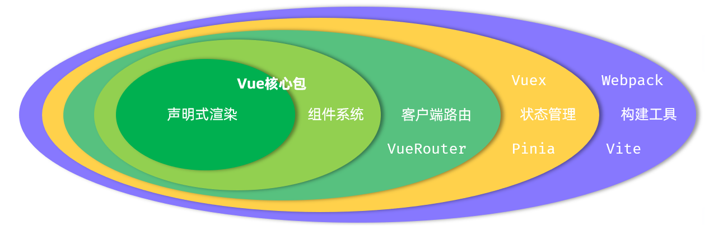

### 什么是 Vue？

- Vue (发音为 /vjuː/，类似于 **view**) 是一款用于**构建用户界面**的**渐进式 JavaScript 框架**

  - **渐进式**：这个概念是 Vue 的核心魅力之一
    - **最轻量级的使用**：你可以像引入 jQuery 一样，只在现有网页的某个 DOM 元素上使用 Vue，来处理表单、渲染动态列表等，而无需重构整个项目
    - **构建完整应用**：当项目变得复杂时，你可以利用 Vue 的核心库，并配合其生态系统中的工具（如路由 `Vue Router`、状态管理 `Pinia`），来构建一个功能完整、高度复杂的单页应用程序 (SPA)

  - **核心理念：数据驱动视图**：这是前端开发的思维转变
    - 在传统开发中，你需要手动操作 DOM（比如 `document.getElementById('...').innerText = ...`）来更新页面。
    - 而在 Vue 中，你只需要关心你的数据（JavaScript 对象），当这些数据发生变化时，Vue 的**响应式系统**会自动侦测到变化，并高效地更新对应的视图（DOM）。
    - 从“如何操作界面”的繁琐工作中解放出来，专注于“管理什么数据”


### 为什么选择 Vue 3？

- 相比于 Vue 2，Vue 3 不仅仅是升级，更是一次全面的革新

  - **性能更强**：
    - **重写虚拟 DOM**：更新性能更高，内存占用更少
    - **编译优化**：Vue 3 的编译器会分析你的模板，找出其中的静态部分（永远不会改变的内容），并将其“提升”到渲染函数之外。这样在每次重新渲染时，就不需要再为这些静态内容创建新的虚拟节点，大大减少了开销
    - **更高效的 Diff 算法**：利用编译时信息，跳过对静态节点的比对

  - **Composition API (组合式 API)**：这是 Vue 3 最具革命性的特性
    - **解决了什么问题**：在 Vue 2 的 Options API 中，一个功能的逻辑（比如数据 `data`、方法 `methods`、计算属性 `computed`、监听器 `watch`）被迫分散在不同的选项块中。当组件变大时，代码的可读性和维护性会急剧下降
    - **如何解决**：Composition API 允许你将相关逻辑组织在一起，形成一个独立的、可复用的“组合函数”(Composable)，让代码像搭积木一样清晰、灵活

  - **更好的 TypeScript 支持**：Vue 3 的源码完全由 TypeScript 重写，其 API 设计对类型推断非常友好。结合 `<script setup>`，你可以获得无与伦比的编码体验和类型安全保障

  - **更小的体积**：得益于其模块化的内部设计，Vue 3 配合现代构建工具（如 Vite）可以实现**摇树优化 (Tree-shaking)**。这意味着如果你没有使用某个功能（比如 `v-show`），它就不会被打包到最终的生产代码中，从而减小了项目的体积


### 引入 Vue 的两种主要方式

- 在开始一个 Vue 项目时，你有两种主要的方式来引入和使用 Vue

#### **方式一：通过构建工具 (推荐)**

- 这是构建大型、专业应用的**标准方式**。我们会使用 `Vite` 这样的现代前端构建工具来创建一个完整的项目

- **优点**：

  - **功能完备**：可以让你使用**单文件组件 (`.vue` 文件)**，将 HTML, JS, CSS 写在同一个文件中，结构清晰

  - **性能优化**：构建工具会自动帮你打包、压缩代码，进行摇树优化，让你的应用加载更快

  - **开发体验好**：享受闪电般的热更新，编写代码几乎可以立即在浏览器中看到效果


- **如何开始**： 打开你的命令行工具，运行以下命令：

  ```cmd
  # 这会启动一个交互式的脚手架，引导你完成项目创建
  npm create vue@latest
  ```

  

#### **方式二：通过 CDN (快速上手)**

- 如果只是想在现有的 HTML 页面中快速尝试 Vue，或者做一个小项目，而不想设置复杂的构建流程，那么通过 **CDN** 是最简单的方式

- **CDN (内容分发网络)** 是一个遍布全球的服务器网络，它能让你快速地获取到 Vue 的 JS 文件

- **优点**：
  - **极其简单**：只需要在 HTML 文件里加一个 `<script>` 标签即可开始
  - **无需安装**：不需要安装 Node.js 或任何复杂的工具


 **Vue 提供了两种不同的“构建版本”文件：**

##### **1. 全局构建版本 (Global Build)**

- **如何引入**：`<script src="https://unpkg.com/vue@3/dist/vue.global.js"></script>`

- **工作方式**：它会在你的页面上创建一个全局的 `Vue` 对象。你需要从这个全局 `Vue` 对象上获取所有功能

- **示例**：

  ```vue
  <script src="https://unpkg.com/vue@3/dist/vue.global.js"></script>
  <script>
    const { createApp } = Vue; // 从全局 Vue 对象中解构
    // ...
  </script>
  ```


##### **2. ES 模块构建版本 (ESM Build)**

- **如何引入**：在 `<script type="module">` 标签内部，使用 `import` 语句

- **工作方式**：这是现代 JavaScript 的标准方式。它不会创建任何全局变量，所有功能都必须通过 `import` 明确地引入到你的脚本中，作用域是独立的

- **示例**：

  ```vue
  <script type="module">
    // 直接从 URL 导入所需函数
    import { createApp } from 'https://unpkg.com/vue@3/dist/vue.esm-browser.js';
    // ...
  </script>
  ```


### Vue 应用的启动与两种 API 风格

- 一个 Vue 应用是如何“启动”的
- 无论你通过哪种方式引入 Vue，应用的启动流程和代码组织风格都是共通的

>我自己的理解：创建一个Vue对象，在Vue对象中定义各种属性和方法，然后让这个Vue对象和某个标签建立联系，就可以在这个标签中访问Vue对象中的各种属性和方法了，目前的暂时理解吧


#### **应用启动流程:`createApp` 与 `mount`**

- 所有 Vue 应用都遵循一个简单的启动流程

##### **创建应用实例**

- 使用 `createApp()` 函数来创建一个 Vue 应用实例。这就像是组装好了一台电脑主机，它包含了所有核心功能，但还没开机

- `createApp()` 是 **Vue 3 中**创建新应用的唯一入口。它的职责是**初始化一个 Vue 应用的核心环境**，并**使用传入的根组件配置对象**来构建应用的起点，最终返回一个可用于进行全局配置和挂载的应用实例对象

- 语法与相关细节

  ```JavaScript
  createApp(rootComponent)
  ```

  - 该函数接收且仅接收一个参数，这个参数必须是一个 **JavaScript 对象**。这个对象在技术上被称为**根组件的选项对象**

    - 传入的这个选项对象，是整个 Vue 应用最顶层组件的“定义”或“蓝图”。`createApp()` 函数依据这份蓝图来构建应用的核心上下文环境。返回的应用实例则是一个拥有多个配置方法的对象，例如 `.mount()`, `.use()`, `.component()` 等，用于对整个应用进行全局配置和启动

      - 在入门案例中，我们直接以内联对象 `{ data() { ... } }` 的形式提供了这个根组件的配置。
        在更复杂的项目中,我们通常会导入一个 `.vue` 文件,比如 `import App from './App.vue'`,然后调用 `createApp(App)`

      

    - `createApp` 的参数对象里面的属性**是有规定的**.不能随便写自己起的属性名,必须使用 Vue 预先定义好的一系列**选项**,规定的部分属性如下:

      - 状态 - 组件的数据

        - **`data`**: 属性必须是一名叫 data() 的函数，返回一个对象。用来存放**组件内部的响应式数据**
        - **`props`**: 用来接收从父组件传递过来的数据

      - 方法 - 组件的行为

        - **`methods`**: 属性必须是一个对象 {}，里面定义了各种函数。通常用来响应用户的事件

          > 在 `methods` 对象里定义的所有函数，Vue 都会巧妙地处理它们的 `this` 指向。在这些函数内部，`this` 会自动指向**当前的组件实例**

        - **`watch`**: 用来“侦听”某个数据的变化，当数据变化时执行特定的操作

      - 计算属性 - 派生状态

        - **`computed`**: 一个对象，用来定义一些需要根据其他数据计算得来的新数据。它带有缓存，性能很好

      - 生命周期钩子 - 在特定时间点执行的函数

        - **`created`**: 组件实例被创建之后立刻调用
        - **`mounted`**: 组件被挂载到页面上之后调用
        - **`updated`**: 组件因为数据变化而更新了页面之后调用
        - **`unmounted`**: 组件被从页面上移除之后调用。 *(还有 `beforeCreate`, `beforeMount`, `beforeUpdate`, `beforeUnmount` 等)*

      - DOM 相关

        - **`template`**: 一个字符串，用来定义组件的 HTML 结构。当你在单文件组件 (`.vue`) 中使用 `<template>` 块时，它会被自动处理，所以你很少需要手动写这个选项

      - 资源

        - **`components`**: 一个对象，用来注册该组件内部需要使用的**子组件**
        - **`directives`**: 用来注册该组件内部需要使用的自定义指令

        

  - **返回值？** 它返回一个是一个拥有多个配置方法的**应用实例 `app`**。这个实例非常重要，它身上挂载了很多用于配置整个应用的方法，比如：

    - `app.mount()`: 挂载应用
    - `app.use()`: 安装插件（比如 Vue Router, Pinia）
    - `app.component()`: 注册全局组件
    - `app.directive()`: 注册全局自定义指令
    - `app.provide()`: 全局提供数据


##### **挂载到页面**

- 我们调用应用实例的 `.mount()` 方法，将这个应用“挂载”到一个 HTML 页面上的具体位置。这就像是把电脑主机连接上显示器，并按下开机键。

- **相关语法**

  ```vue
  app.mount(container)
  ```

  - **`app`**：是由 `createApp()` 创建的应用实例

  - **`container`**：这是挂载的目标容器，它可以是两种类型：

    - **一个 CSS 选择器字符串**：这是最常见的方式，比如 `app.mount('#app')` 或 `app.mount('.my-container')`。Vue 会在内部使用 `document.querySelector()` 来找到这个元素

    - **一个实际的 DOM 元素对象**：你也可以先手动获取 DOM 元素，再传给 `mount()`

      ```JavaScript
      const domElement = document.getElementById('app');
      app.mount(domElement);
      ```

  

- `mount()` 方法的核心职责有两个：

  1. **启动渲染流程**：它会触发 Vue 的渲染器 (Renderer) 开始工作。渲染器会获取根组件 (`App.vue`)，将其模板编译成虚拟DOM，然后根据虚拟 DOM 生成真实的 DOM 节点
  2. **挂载到 DOM 树**：它会将上一步生成的所有真实 DOM 节点，作为一个整体，“挂载”到你指定的容器元素上。通常，这意味着它会**替换掉**容器元素内部原有的所有内容

- 示例

  ```javascript
  import { createApp } from 'vue'
  // 导入你的根组件，通常是 App.vue
  import App from './App.vue'
  
  // 1. 创建应用实例，App 是应用的“蓝图”
  const app = createApp(App)
  
  // (可选) 在这里可以安装插件，如 app.use(router)
  
  // 2. 挂载应用到 id 为 'app' 的元素上
  app.mount('#app')
  ```

  

#### 两种API风格

- Vue 允许你使用两种不同的风格来编写组件的逻辑部分（`<script>` 块）

##### **选项式 API (Options API) - “经典风格”**

- 这是 Vue 2 延续下来的传统风格，非常适合初学者，因为它结构清晰，易于理解。它通过一个包含 `data`, `methods`, `computed` 等选项的配置对象来组织代码。

- **特点**：像在填一张配置表，把数据、方法等分别填入对应的栏目。

- **示例**

  ```js
  // 这是 Options API 的写法
  export default {
    // data 选项：专门存放响应式数据
    // 必须是一个函数，返回一个对象
    data() {
      return {
        message: 'Hello Vue!'
      }
    },
    // methods 选项：专门存放方法
    methods: {
      changeMessage() {
        this.message = 'Message Changed!';
      }
    },
    // mounted 选项：生命周期钩子
    mounted() {
      console.log('Component mounted!');
    }
  }
  ```

  

##### **组合式API(Composition API)-“现代风格”**

- 这是 Vue 3 主推的新风格，特别适合构建大型、复杂的应用。它允许你将相关的逻辑（数据、方法等）组织在一起，而不是按选项类型拆分。

- **特点**：像在写普通的 JavaScript 函数，更自由、更灵活，逻辑更聚合。通常与 `<script setup>` 语法一起使用

- **示例**

  ```vue
  <script setup>
  import { ref, onMounted } from 'vue';
  
  // 直接声明响应式数据
  const message = ref('Hello Vue!');
  
  // 直接声明一个函数
  function changeMessage() {
    message.value = 'Message Changed!';
  }
  
  // 使用 onMounted 生命周期钩子
  onMounted(() => {
    console.log('Component mounted!');
  });
  </script>
  ```

  

**总结**：

- **Options API**：易于上手，代码结构固定。
- **Composition API**：功能更强大，代码组织更灵活，是现代 Vue 开发的主流。
- **你的笔记**：将专注于 **Composition API** 和 `<script setup>`，但现在你已经具备了看懂 Options API 代码的能力，不会再对入门案例感到困惑了。


### Vue快速入门

- “挂载”就是将内存中准备好的 Vue 应用，渲染成真实的、看得见的网页内容，并把它“挂”到 HTML 页面指定位置的过程

```HTML
<!DOCTYPE html>
<html lang="en">
<head>
  <meta charset="UTF-8">
  <meta name="viewport" content="width=device-width, initial-scale=1.0">
  <title>Vue-快速入门</title>
</head>
<body>
  <div id="app">
    {{message}}
  </div>
  
  <script type="module">
    import { createApp } from 'https://unpkg.com/vue@3/dist/vue.esm-browser.js'
    createApp({
      data(){
        return {
          message: 'Hello Vue'
        }
      }
    }).mount('#app')
  </script>
</body>
</html>
```


## 模板语法

### 相关概念

- 模板语法是 Vue 定义的一套特殊规则，用于将数据渲染到 DOM

  - **文本插值 (Text Interpolation)**：最基本的数据输出方式，使用“Mustache”语法（双大括号）。 `<span>Message: {{ msg }}</span>`

  - **属性绑定 (Attribute Binding)**：要动态更新 HTML 元素的属性（如 `src`, `href`, `class`），需要使用 `v-bind` 指令，其简写为一个冒号 (`:`)。 `<div :id="dynamicId"></div>`

  - **使用 JavaScript 表达式**：在所有的数据绑定中（`{{ }}` 和 `v-` 指令），我们都可以使用功能完全的 **单个** JavaScript 表达式。

    ```
    {{ number + 1 }}
    {{ ok ? 'YES' : 'NO' }}
    <div :id="'list-' + id"></div>
    ```


### 常见指令

- 指令是带有 `v-` 前缀的特殊 attribute。它们是 Vue 模板的功能核心，用于将各种行为应用到 DOM 上


#### 属性绑定指令: `v-bind`

- **作用**`v-bind` 是 Vue 中用于**动态绑定** HTML attribute 的核心指令。它的作用是在你的组件数据和元素的属性之间建立一座桥梁，实现数据的单向流动（从数据到视图）


##### 为什么需要 `v-bind`

- 在 Vue 模板中，我们可以用 `{{ }}` (Mustache 语法) 来显示动态文本内容，但这个语法**不能**用在 HTML 属性 (attribute) 上

- **错误的写法：**

  ```vue
  <!-- 这样是无效的！浏览器会把它当作一个普通的字符串 -->
  
  ```

- 为了解决这个问题，Vue 提供了 `v-bind` 指令


##### 核心语法

- `v-bind` 的作用是告诉 Vue：“这个属性的值不是一个固定的字符串，而是一个需要解析的 JavaScript 表达式”
  - **完整语法**： `v-bind:attributeName="expression"`
  
  - **简写**： 由于 `v-bind` 实在太常用了，Vue 为它提供了一个非常方便的简写形式，就是一个冒号 (`:`)
    在实际开发中，你 99% 的时间都应该使用简写。 `:attributeName="expression"`
    - `attributeName`：是你想要绑定的 HTML 属性名，比如 `src`, `href`, `class`, `id` 等
    
    - `expression`：是一个 JavaScript 表达式，它的计算结果将被用作属性的值。这个表达式可以是一个变量、一个三元运算、一个函数调用等


##### 常见用法示例

###### 绑定基本属性

- 这是最直接的用法，将 `data` 中的变量绑定到元素的属性上

```vue
<script setup>
import { ref } from 'vue';

const imageSrc = ref('https://vuejs.org/logo.svg');
const linkUrl = ref('https://cn.vuejs.org');
const elementId = ref('my-unique-element');
</script>

<template>
  <!-- 动态绑定图片地址 -->
  

  <!-- 动态绑定链接地址 -->
  <a :href="linkUrl">Vue 官方文档</a>

  <!-- 动态绑定 id -->
  <p :id="elementId">这是一个段落。</p>
</template>
```


###### 绑定布尔值属性

- 对于像 `disabled` 这样的布尔值属性，Vue 有特殊的处理逻辑：

  - 如果绑定的表达式结果是 `true`，该属性会被**包含**在元素上。	

  - 如果结果是 `false`、`null` 或 `undefined`，该属性会被**移除**。

```vue
<script setup>
import { ref } from 'vue';

const isButtonDisabled = ref(true);
</script>

<template>
  <!-- isButtonDisabled 为 true 时，按钮会被禁用 -->
  <button :disabled="isButtonDisabled">Click me</button>
</template>
```


###### 绑定一个包含多个属性的对象

- 如果你需要一次性绑定多个属性，可以将它们组织成一个对象，然后用不带参数的 `v-bind` 来绑定。

```vue
<script setup>
import { reactive } from 'vue';

const objectOfAttrs = reactive({
  id: 'container',
  class: 'wrapper',
  'data-index': 123 // 对于非标准属性名，需要用引号
});
</script>

<template>
  <!-- 这会展开为 id="container" class="wrapper" data-index="123" -->
  <div v-bind="objectOfAttrs"></div>
</template>
```


##### 特殊用法:绑定Class与Style

- Vue 对 `class` 和 `style` 的绑定进行了极大的增强，让动态控制样式变得非常简单和强大。

###### **动态绑定 `class`**

- `:class` 可以接受字符串、对象或数组。

- **对象语法 (最常用)** 你可以传入一个对象来动态地切换 class。对象的 `key` 是 class 名称，`value` 是一个布尔值，`true` 表示应用该 class，`false` 表示不应用。

  ```vue
  <script setup>
  import { ref, reactive } from 'vue';
  const isActive = ref(true);
  const hasError = ref(false);
  
  const classObject = reactive({
    active: true,
    'text-danger': true // class 名包含特殊字符时用引号
  });
  </script>
  
  <template>
    <!-- 根据单个布尔值切换 -->
    <div :class="{ active: isActive }"></div>
  
    <!-- 绑定多个 class -->
    <div :class="{ active: isActive, 'has-error': hasError }"></div>
  
    <!-- 也可以直接绑定一个 data 中的对象 -->
    <div :class="classObject"></div>
  </template>
  ```


- **数组语法** 你可以传入一个数组来应用一个 class 列表。

  ```vue
  <script setup>
  import { ref } from 'vue';
  const activeClass = ref('active');
  const errorClass = ref('text-danger');
  </script>
  
  <template>
    <!-- 渲染为 class="active text-danger" -->
    <div :class="[activeClass, errorClass]"></div>
  
    <!-- 也可以在数组中使用三元表达式 -->
    <div :class="[isActive ? activeClass : '', errorClass]"></div>
  
    <!-- 数组和对象语法可以混合使用 -->
    <div :class="[{ active: isActive }, errorClass]"></div>
  </template>
  ```


###### **动态绑定 `style`**

- `:style` 也可以接受对象或数组。

- **对象语法** 语法非常直观，就像在写 CSS，但属性名建议使用**驼峰式命名 (camelCase)**，而不是短横线分隔命名 (kebab-case)。

  ```vue
  <script setup>
  import { ref, reactive } from 'vue';
  const activeColor = ref('red');
  const fontSize = ref(30);
  
  const styleObject = reactive({
    color: 'blue',
    fontSize: '20px'
  });
  </script>
  
  <template>
    <!-- 直接内联一个对象 -->
    <div :style="{ color: activeColor, fontSize: fontSize + 'px' }"></div>
  
    <!-- 也可以直接绑定一个 data 中的对象 -->
    <div :style="styleObject"></div>
  </template>
  ```

  

- **数组语法** 你可以将多个样式对象应用到一个元素上。后面的对象会覆盖前面对象中相同的属性。

  ```vue
  <script setup>
  const baseStyles = reactive({ color: 'green', fontSize: '16px' });
  const overridingStyles = reactive({ fontWeight: 'bold' });
  </script>
  
  <template>
    <!-- 最终会合并两个对象的样式 -->
    <div :style="[baseStyles, overridingStyles]"></div>
  </template>
  ```


#### 内容渲染指令: `v-text` & `v-html`

- **`v-text`**
  - **作用**：更新元素的 `textContent`。
  - **说明**：与 `{{ }}` 类似，但它会替换掉元素的**所有**内部内容。
  - **用法**：`<span v-text="msg"></span>`
- **`v-html`**
  - **作用**：更新元素的 `innerHTML`。
  - **注意**：**有安全风险！** 动态渲染任意 HTML 很容易导致 XSS 攻击。请只在内容安全可靠的情况下使用，**绝不要**用于用户提交的内容。
  - **用法**：`<div v-html="rawHtml"></div>`


#### 事件监听指令: `v-on`

- `v-on` 指令是 Vue 用来监听 DOM 事件（如点击、鼠标悬停、键盘输入等）的核心工具，它允许我们在触发事件时执行 JavaScript 代码，从而实现页面的交互功能。

##### 核心语法

- **完整语法**： `v-on:eventName="handler"`
  - **简写 (Shorthand)**： 由于事件监听非常常用，Vue 为 `v-on:` 提供了一个非常方便的简写形式，就是一个 `@` 符号。在实际开发中，我们几乎总是使用简写。 `@eventName="handler"`
    - `eventName`：是你想要监听的 DOM 事件名称，比如 `click`, `mouseover`, `keydown` 等，详见JS事件监听，全部为小写
    - `handler`：是事件被触发时要执行的代码。它可以是一段内联的 JavaScript 表达式，也可以是一个在 `<script>` 中定义的方法名
  - 当 Vue 编译你的模板时，它会把 `@click="f"` 这样的代码转换成去寻找**当前组件实例**上一个名为 `f` 的方法。它不会去组件外面，比如全局的 `window` 对象上寻找。这是一种重要的**封装**机制，保证了组件是独立和可预测的。

##### Vue"白名单"

- 当 Vue 编译你的模板时，它会把 `@click="f"` 这样的代码转换成去寻找**当前组件实例**上一个名为 `f` 的方法。它不会去组件外面，比如全局的 `window` 对象上寻找。这是一种重要的**封装**机制，保证了组件是独立和可预测的。

- 在浏览器环境中，像 `alert`, `console`, `Math`, `Date`, `JSON` 这些都是挂载在全局 `window` 对象上的。Vue 的模板编译器足够智能，它在解析 `@click` 里的表达式时，如果发现一个变量（比如 `alert`）在你的组件实例上找不到，它会再去这个**安全的全局“白名单”**里找一找。
  - Vue 允许的“全局白名单"
    - 出于安全和性能考虑，Vue **不会**让你在模板里访问所有的全局变量（比如 `window.location` 就不行，这可能导致安全问题）。但它开放了一些常用的、被认为是安全的全局 API，包括：
      - `Infinity`
      - `undefined`
      - `NaN`
      - `isFinite`
      - `isNaN`
      - `parseFloat`
      - `parseInt`
      - `decodeURI`
      - `decodeURIComponent`
      - `encodeURI`
      - `encodeURIComponent`
      - `Math`
      - `Number`
      - `Date`
      - `Array`
      - `Object`
      - `Boolean`
      - `String`
      - `RegExp`
      - `Map`
      - `Set`
      - `JSON`
      - `Intl`
      - `console`
      - `alert` (虽然能用，但不推荐在正式项目中使用)


##### 事件处理器的两种方式

###### 方式一：内联事件处理器

- 当逻辑非常简单时，可以直接在模板中编写 JavaScript 语句

```vue
<script setup>
import { ref } from 'vue';

const count = ref(0);
</script>

<template>
  <!-- 每次点击，count 的值会加 1 -->
  <button @click="count++">Add 1</button>
  <p>Count is: {{ count }}</p>
</template>
```


- 在内联处理器中，有时我们需要访问原始的 DOM 事件对象。Vue 提供了一个特殊的变量 `$event` 来实现这一点。

```vue
<!-- 使用特殊的 $event 变量 -->
<button @click="alert(`Event type is: ${$event.type}`)">
  Show Event Info
</button>
```


###### 方式二：方法事件处理器

- 当事件处理逻辑比较复杂时，推荐的方式是在 `<script>` 部分定义一个方法，然后将方法名作为处理器。这是最常用、最规范的做法

```vue
<script setup>
import { ref } from 'vue';

const name = ref('Vue.js');

// 定义一个方法
function greet(event) {
  // 当使用方法处理器时，原始的 DOM 事件对象会自动作为第一个参数传入
  alert(`Hello ${name.value}!`);
  if (event) {
    alert(`Triggered by a ${event.type} event on a <${event.target.tagName}> element.`);
  }
}
</script>

<template>
  <!-- 绑定 greet 方法作为点击事件的处理器 -->
  <button @click="greet">Greet</button>
</template>
```


- **传递自定义参数** 如果你想在调用方法时传递自己的参数，可以直接在模板中调用方法并传入。但请注意，这样做的话，原始的 DOM 事件对象 `$event` 就不会自动传递了，你需要手动传入它。

```vue
<script setup>
function say(message, event) {
  alert(message);
  // 如果需要，可以检查 event 对象
  if (event) {
    event.preventDefault();
  }
}
</script>

<template>
  <!-- 只传递自定义参数 -->
  <button @click="say('hello')">Say hello</button>

  <!-- 同时传递自定义参数和原始 DOM 事件 -->
  <button @click="say('bye', $event)">Say bye</button>
</template>
```


##### 事件修饰符

- 在处理事件时，我们经常需要调用 `event.preventDefault()` 或 `event.stopPropagation()`。为了让模板语法更简洁，Vue 提供了**事件修饰符**，它们是以点 (`.`) 开头的后缀

  - **`.stop`**

    - **作用**：阻止事件继续**冒泡 (bubbling)**。等同于调用 `event.stopPropagation()`
    - **场景**：当你有一个嵌套的点击事件，只想触发内层元素的事件时。

    ```vue
    <!-- 点击按钮时，只会触发 buttonClicked，不会触发 divClicked -->
    <div @click="divClicked">
      <button @click.stop="buttonClicked">Click me</button>
    </div>
    ```

  

  - **`.prevent`**

    - **作用**：阻止元素的**默认行为**。等同于调用 `event.preventDefault()`。
    - **场景**：阻止表单提交后刷新页面，或者阻止 `<a>` 标签的跳转。

    ```vue
    <!-- 点击链接时，只会执行 doSomething 方法，不会跳转页面 -->
    <a href="/some-page" @click.prevent="doSomething">A Link</a>
    ```

  

  - **`.self`**

    - **作用**：只有当事件的触发源 (`event.target`) 是当前元素**自身**时，才会触发处理器。
    - **场景**：避免子元素冒泡上来的事件触发父元素的处理器。

    ```vue
    <!-- 只有直接点击这个 div 的灰色区域才会触发 doThat -->
    <!-- 点击内部的 button 不会触发 -->
    <div @click.self="doThat">
      ...
      <button>Click me</button>
    </div>
    ```

  

  - **`.capture`**
    - **作用**：让事件在**捕获阶段**被处理，而不是默认的冒泡阶段。
    - **说明**：事件的传递分为捕获（从外到内）和冒泡（从内到外）两个阶段。这个修饰符用于高级事件处理，不常用。

  

  - **`.once`**

    - **作用**：绑定的事件处理器最多只会被触发**一次**。

    - **场景**：用于那些只需要执行一次的初始化操作或一次性确认按钮。

      ```vue
      <button @click.once="doOnce">You can only click me once</button>
      ```

      

  - **`.passive`**

    - **作用**：告诉浏览器该事件监听器**不会**调用 `event.preventDefault()`。
    - **场景**：主要用于优化移动端触摸滚动事件 (`touchmove` 和 `wheel`) 的性能，避免浏览器在等待你的 JS 执行完之前就进行滚动，让滚动更流畅。


- **修饰符可以链式调用**，例如 `@click.stop.prevent` 会同时阻止冒泡和默认行为。


##### 按键修饰符

- 在监听键盘事件时，我们常常需要检查特定的按键。Vue 允许为 `v-on` 在监听键盘事件时添加按键修饰符。

  - **常用按键别名**：

    - `.enter`
    - `.tab`
    - `.delete` (捕获“删除”和“退格”键)
    - `.esc`
    - `.space`
    - `.up`, `.down`, `.left`, `.right`

    ```vue
    <!-- 只有在 `key` 是 `Enter` 时才会调用 `submit` -->
    <input @keyup.enter="submit">
    ```

  

  - **系统修饰键**： 可以用来实现组合键触发。

    - `.ctrl`
    - `.alt`
    - `.shift`
    - `.meta` (在 Mac 上是 Command 键 ⌘，在 Windows 上是 Windows 徽标键 ⊞)

    ```vue
    <!-- 当 Ctrl 和 Click 同时按下时才触发 -->
    <div @click.ctrl="doSomething">Do something</div>
    
    <!-- 当 Alt + Enter 被按下时触发 -->
    <input @keyup.alt.enter="clear">
    ```

  

  - **`.exact` 修饰符** `.exact` 修饰符允许你控制触发事件所需的系统修饰符的**精确组合**。

    ```vue
    <!-- 即使 Alt 或 Shift 被一同按下时也会触发 -->
    <button @click.ctrl="onClick">A</button>
    
    <!-- 只有当 Ctrl 被按下而其他系统修饰符没有被按下时才会触发 -->
    <button @click.ctrl.exact="onCtrlClick">A</d>
    ```


#### 双向绑定指令: `v-model`

##### 相关概念

- 为了理解 `v-model`，我们首先要明白“单向数据流”和“双向绑定”的区别。

  - **单向数据流**：数据从组件的 `<script>` 部分流向 `<template>` 视图。我们用 `v-bind` (或 `:`) 来实现。当数据变化时，视图会自动更新。但如果用户在视图中进行了操作（比如在输入框里打字），数据本身不会自动改变。

    ```vue
    <!-- 单向绑定：message 变化时，输入框的值会变 -->
    <!-- 但用户在输入框里打字，message 的值不会变 -->
    <input :value="message">
    ```

  - **双向数据绑定：`v-model` 在单向数据流的基础上，增加了一个方向：从视图流向数据。这意味着，当用户在视图中操作时（如打字），组件的数据也会** **自动更新**


##### `v-model` 的本质

- `v-model` 实际上是一个**语法糖**简洁、更方便的写法，其背后是由 `v-bind` 和 `v-on` 组合而成的

- `v-model` 会根据它所应用的元素类型，自动选择最合适的属性和事件来进行绑定。

  - 对于一个文本输入框，下面两行代码是**完全等价**的

    ~~~vue
    <!-- v-model 的写法 -->
    <input v-model="searchText">
    
    <!-- v-model 的底层实现 -->
    <input
      :value="searchText"
      @input="event => searchText = event.target.value"
    >
    ~~~
    
    - v-model 帮你**自动完成了“绑定 `value` 属性”和“监听 `input` 事件并更新数据”**这两件事。
    
    
    

##### 在不同表单控件上的用法	

- `v-model` 在不同类型的表单元素上会自动使用不同的属性和事件


###### 文本输入
- 这是最常见的用法。
- `<input type="text">` & `<textarea>`
  * **绑定的属性**: `value`
  * **监听的事件**: `input`


```vue
<script setup>
import { ref } from 'vue';
const message = ref('');
</script>

<template>
  <input v-model="message" placeholder="在这里输入...">
  <p>你输入的内容是: {{ message }}</p>
</template>
```

###### **复选框**

- `<input type="checkbox">`

  - **绑定的属性**: `checked`

  - **监听的事件**: `change`


- **单个复选框**：`v-model` 绑定到一个布尔值 (`true` / `false`)

  ```VUE
  <script setup>
  import { ref } from 'vue';
  const agreed = ref(false);
  </script>
  
  <template>
    <input type="checkbox" id="agreement" v-model="agreed">
    <label for="agreement">我同意服务条款: {{ agreed }}</label>
  </template>
  ```

  


- **多个复选框**：`v-model` 绑定到同一个**数组**。当复选框被选中时，它的 `value` 属性值会被添加到数组中；取消选中时，则会从数组中移除

  ```VUE
  <script setup>
  import { ref } from 'vue';
  const checkedHobbies = ref([]); // 必须是数组
  </script>
  
  <template>
    <input type="checkbox" id="reading" value="阅读" v-model="checkedHobbies">
    <label for="reading">阅读</label>
  
    <input type="checkbox" id="coding" value="编程" v-model="checkedHobbies">
    <label for="coding">编程</label>
  
    <p>选中的爱好: {{ checkedHobbies }}</p>
  </template>
  ```

  


###### **单选按钮**

- `<input type="radio">`

  - **绑定的属性**: `checked`

  - **监听的事件**: `change`


- 将多个单选按钮的 `v-model` 绑定到同一个变量上。当用户选择其中一个时，该变量的值就会更新为那个单选按钮的 `value`。

  ```VUE
  <script setup>
  import { ref } from 'vue';
  const gender = ref('');
  </script>
  
  <template>
    <input type="radio" id="male" value="男" v-model="gender">
    <label for="male">男</label>
  
    <input type="radio" id="female" value="女" v-model="gender">
    <label for="female">女</label>
  
    <p>选择的性别: {{ gender }}</p>
  </template>
  ```

  

###### **选择框 (`<select>`)**

- **绑定的属性**: `value`
- **监听的事件**: `change`

**单选**：`v-model` 绑定到一个变量。

```VUE
<script setup>
import { ref } from 'vue';
const selectedCity = ref('');
</script>

<template>
  <select v-model="selectedCity">
    <option disabled value="">请选择</option>
    <option>北京</option>
    <option>上海</option>
    <option>深圳</option>
  </select>
  <p>选择的城市: {{ selectedCity }}</p>
</template>
```


**多选**：在 `<select>` 标签上添加 `multiple` 属性，并将 `v-model` 绑定到一个**数组**。

```VUE
<script setup>
import { ref } from 'vue';
const selectedFruits = ref([]); // 必须是数组
</script>

<template>
  <select v-model="selectedFruits" multiple style="width: 100px;">
    <option>苹果</option>
    <option>香蕉</option>
    <option>橙子</option>
  </select>
  <p>选择的水果: {{ selectedFruits }}</p>
</template>
```


##### `v-model` 的修饰符

- `v-model` 提供了一些有用的修饰符，可以改变其默认行为。

  - **`.lazy`**

    - **默认行为**：`v-model` 在每次 `input` 事件触发后（即用户每次按键）同步数据。
    - **`.lazy` 行为**：改为在 `change` 事件触发后（即输入框失去焦点时）才同步数据。
    - **场景**：当你不想在用户输入过程中频繁触发更新，只关心最终结果时，可以减少不必要的重渲染。

    ```VUE
    <input v-model.lazy="msg">
    ```


  - **`.number`**

    - **作用**：自动将用户的输入值转换为**数字类型**。
    - **注意**：如果输入的值无法被 `parseFloat()` 解析，则返回原始字符串。

    ```VUE
    <input v-model.number="age" type="number">
    ```


  - **`.trim`**

    - **作用**：自动过滤用户输入内容的首尾**空白字符**。
    - **场景**：在处理用户名、密码等输入时非常有用，可以避免用户不小心输入了多余的空格。

    ```VUE
    <input v-model.trim="username">
    ```

- 修饰符可以链式调用，例如 `v-model.lazy.trim`


#### 条件渲染指令

- 在 Vue 中，我们经常需要根据某些条件来决定是否显示一个元素或组件。
  Vue 提供了两种主要的方式来实现条件渲染：**`v-if` 指令族**和 **`v-show` 指令**。
  虽然它们看起来效果相似，但底层的实现原理和性能开销完全不同。

##### `v-if` 指令族

- `v-if`、`v-else-if` 和 `v-else` 组合在一起，形成了一个完整的逻辑判断链，类似于 JavaScript 中的 `if...else if...else` 语句。


###### **核心原理**

- `v-if` 是**“真正”的**条件渲染。当指令的表达式返回 `true` 时，元素及其包含的所有子组件和事件监听器才会被渲染到 DOM 中。当表达式返回 `false` 时，这个元素会**被完全从 DOM 中移除和销毁**。


###### **语法与用法**

- **`v-if`** 用于启动一个条件块。

  ```vue
  <div v-if="isLoggedIn">欢迎回来！</div>
  ```

- **`v-else-if`** 作为 `v-if` 的“else if”块，可以连续使用多个。它必须紧跟在 `v-if` 或另一个 `v-else-if` 元素之后。

  ```vue
  <div v-if="score > 90">优秀</div>
  <div v-else-if="score > 60">及格</div>
  ```

- **`v-else`** 作为 `v-if` 链的“else”块。它**必须**紧跟在 `v-if` 或 `v-else-if` 元素之后。

  ```vue
  <div v-if="score > 90">优秀</div>
  <div v-else-if="score > 60">及格</div>
  <div v-else>不及格</div>
  ```

- **重要规则：必须紧邻** `v-else-if` 和 `v-else` 必须是 `v-if` 或 `v-else-if` 元素的**直接后续兄弟节点**，
  中间不能被任何其他元素或文本隔开，否则它们的逻辑链条会断裂而失效


###### **在 `<template>` 标签上使用**

- 如果你想切换一个包含多个元素的块，可以将 `v-if` 用在一个 `<template>` 标签上。它会作为一个不可见的包裹元素，最终的渲染结果将不包含这个 `<template>` 标签

  ```vue
  <template v-if="isLoggedIn">
    <h1>欢迎回来！</h1>
    <p>这是您的个人主页。</p>
    <button>退出登录</button>
  </template>
  ```

  

##### `v-show` 指令

- `v-show` 是另一种条件性显示元素的方式，但它的工作方式要简单得多

###### **核心原理**

- `v-show` **始终会渲染**元素到 DOM 中，无论初始条件是什么。它只是简单地根据表达式的真假值，切换元素的 CSS `display` 属性。

  - 当值为 `true` 时，`display` 恢复正常

  - 当值为 `false` 时，`display` 会被设置为 `none`


###### **语法与用法**

- `v-show` 的用法很简单，它不支持 `v-else` 或 `v-else-if`

  ```VUE
  <script setup>
  import { ref } from 'vue';
  const isLoading = ref(true);
  </script>
  
  <template>
    <!-- 当 isLoading 为 true 时显示，为 false 时 display: none -->
    <h1 v-show="isLoading">正在加载中...</h1>
  </template>
  ```

- **注意**：`v-show` 不支持在 `<template>` 元素上使用。


##### 二者对比表

| 特性             | `v-if`                                                       | `v-show`                                                     |
| ---------------- | ------------------------------------------------------------ | ------------------------------------------------------------ |
| **实现原理**     | **DOM 操作**：动态地在 DOM 树中添加或移除元素。              | **CSS 切换**：通过修改 `display` 属性来控制元素的显示和隐藏。 |
| **初始渲染开销** | **低**。如果初始条件为 `false`，则什么也不做。               | **高**。无论条件如何，元素总是会被渲染到 DOM 中。            |
| **切换开销**     | **高**。每次切换都需要销毁或重建元素及其子组件，涉及完整的生命周期。 | **低**。只改变 CSS 属性，非常轻量。                          |
| **惰性渲染**     | **是**。只有在条件第一次变为 `true` 时，才会开始渲染。       | **否**。组件始终被渲染。                                     |
| **适用性**       | 支持 `<template>` 标签。                                     | 不支持 `<template>` 标签。                                   |


##### **二者适用场景**

- **使用 `v-if` 的场景**：
  - 当条件在运行时**很少改变**时。例如，根据用户权限决定是否显示某个管理按钮
  - 当条件为 `false` 时，你希望**完全不渲染**任何内容，以节省初始渲染的性能开销
  - 当需要配合 `v-else-if` 和 `v-else` 进行复杂的逻辑判断时
- **使用 `v-show` 的场景**：
  - 当元素需要被**非常频繁地切换**显示和隐藏时。例如，Tab 切换、模态框的显示隐藏等。在这种情况下，`v-show` 的低切换成本会带来更好的性能


#### 列表渲染指令: `v-for`

- **作用**：基于一个数据源（通常是数组或对象），重复地渲染一个元素或模板块。这是构建动态列表、表格和任何重复性 UI 结构的基础
- 语法：
  - `v-for` 的值需要使用一种特殊的 `alias in expression` 形式：
    - **`expression`**：这是要迭代的数据源，可以是一个数组、一个对象，甚至是一个数字。
    - **`alias`**:当前正在迭代的元素的**别名**。你可以把它理解为一个临时变量，它在每次循环中都会被赋予数据源中的一个新值


##### 遍历数组

- 这是 `v-for` 最常见的用法

###### 语法

- 遍历数组时，支持两种语法形式：
  1. 只获取数组元素： `v-for="itemAlias in array"`
  2. 同时获取数组元素和其索引： `v-for="(itemAlias, index) in array"`
- `array`：要迭代的源数组。

- `itemAlias`：你为当前数组元素指定的临时别名。
- `index`：(可选) 当前元素的索引，从 0 开始。


###### 用法

```vue
<script setup>
import { ref } from 'vue';

const items = ref([
  { id: 'a1', message: '学习 Vue' },
  { id: 'b2', message: '学习 JavaScript' }
]);
</script>

<template>
  <!-- 用法一：只获取 item -->
  <ul>
    <li v-for="item in items" :key="item.id">
      {{ item.message }}
    </li>
  </ul>

  <!-- 用法二：同时获取 item 和 index -->
  <ul>
    <li v-for="(item, index) in items" :key="item.id">
      {{ index + 1 }}. {{ item.message }}
    </li>
  </ul>
</template>
```


##### 遍历对象

- `v-for` 也可以用来遍历一个对象的属性

###### 语法

- 遍历对象时，支持三种语法形式：
  1. 只获取属性值 (value)： `v-for="value in object"`
  2. 获取属性值 (value) 和属性名 (key)： `v-for="(value, key) in object"`
  3. 获取属性值 (value)、属性名 (key) 和索引 (index)： `v-for="(value, key, index) in object"`

- **注意**：遍历对象时，是按 `Object.keys()` 的结果顺序进行遍历的，但这个顺序在不同的 JavaScript 引擎中可能不一致


###### 用法

```vue
<script setup>
import { reactive } from 'vue';

const myObject = reactive({
  title: '如何学习 Vue',
  author: 'Evan You',
  publishedAt: '2023-01-01'
});
</script>

<template>
  <!-- 用法一：只获取 value -->
  <div v-for="value in myObject">
    {{ value }}
  </div>

  <!-- 用法二：获取 value 和 key -->
  <div v-for="(value, key) in myObject">
    {{ key }}: {{ value }}
  </div>

  <!-- 用法三：获取 value, key 和 index -->
  <div v-for="(value, key, index) in myObject">
    {{ index }}. {{ key }}: {{ value }}
  </div>
</template>
```

- **注意**：遍历对象时，是按 `Object.keys()` 的结果顺序进行遍历的，但这个顺序在不同的 JavaScript 引擎中可能不一致。


##### 遍历数字

- `v-for` 也可以接受一个整数。在这种情况下，它会把模板重复对应次数，迭代的别名会从 `1` 开始，直到这个整数

###### **语法**

- `v-for="alias in number"`

  - `number`：一个整数。

  - `alias`：迭代的别名，其值会从 `1` 开始，直到 `number`

###### 用法

```vue
<template>
  <!-- 这会渲染出 10 个 span 标签，内容从 1 到 10 -->
  <span v-for="n in 10" :key="n">
    {{ n }} 
  </span>
</template>
```


##### `<template>`上用`v-for`

- **场景**：当你需要为一个**包含多个元素的块**进行循环渲染时。

- **规则**：不能在多个元素上直接写 `v-for`。必须将 `v-for` 用在一个 `<template>` 标签上，它会作为一个不可见的包裹元素。

- **用法示例**：

  ```vue
  <ul>
    <template v-for="item in items" :key="item.id">
      <li>标题：{{ item.message }}</li>
      <li class="divider" role="presentation">---</li>
    </template>
  </ul>
  ```

  

##### `v-for`与`v-if`

###### 相关知识

- **一个重要的性能规则：永远不要在同一个元素上同时使用 `v-if` 和 `v-for`。**

- 因为 `v-for` 的优先级高于 `v-if`，这意味着 `v-if` 会在**每一次**循环中都被执行一次。如果你的列表很长，这会造成巨大的性能浪费

###### **两种正确做法**

1. **过滤源数据 (推荐)**：先用计算属性 `computed` 过滤出真正需要显示的列表，然后再对这个新列表进行 `v-for`。这样 `v-if` 的逻辑只执行一次

   ```vue
   <script setup>
   import { ref, computed } from 'vue';
   
   const todos = ref([
     { id: 1, text: '学习', completed: true },
     { id: 2, text: '工作', completed: false },
     { id: 3, text: '休息', completed: false }
   ]);
   
   const unfinishedTodos = computed(() => {
     return todos.value.filter(todo => !todo.completed);
   });
   </script>
   
   <template>
     <!-- 只循环未完成的待办事项 -->
     <ul>
       <li v-for="todo in unfinishedTodos" :key="todo.id">
         {{ todo.text }}
       </li>
     </ul>
   </template>
   ```

2. **将 `v-if` 移到内部元素**：如果条件判断不适合在 `computed` 中处理，可以把 `v-if` 放在 `v-for` 循环内部的元素上。

   ```vue
   <ul>
     <template v-for="todo in todos" :key="todo.id">
       <li v-if="!todo.completed">
         {{ todo.text }}
       </li>
     </template>
   </ul>
   ```


##### 在组件上使用 `v-for`

- 你可以像在普通元素上一样，直接在自定义组件上使用 `v-for`。这会为你创建多个组件实例。别忘了，此时也需要提供 `key`

```vue
<script setup>
import TodoItem from './TodoItem.vue';
</script>

<template>
  <TodoItem
    v-for="todo in todos"
    :key="todo.id"
    :title="todo.text"
    :is-completed="todo.completed"
  />
</template>
```


##### 关键`:key` 属性

- `key` 是 `v-for` 指令中一个至关重要的特殊 attribute。
  - **`key` 的作用是什么？**
    -  `key` 为每个循环的节点提供了一个**唯一的身份标识**。当 Vue 更新由 `v-for` 渲染的元素列表时，它会使用“就地更新”的策略。提供了 `key` 之后，Vue 就能通过 `key` 精确地识别每个节点，知道哪个节点是移动了，哪个是新增的，哪个是删除了，从而进行最高效、最准确的 DOM 更新，避免状态混乱
  - **`key` 应该是什么？** 
    - `key` 的值必须是**稳定且唯一**的字符串或数字。**最佳实践是使用数据项中自带的唯一 `id`**，例如 `item.id`、`user.uuid` 等
  - **为什么绝对不能用 `index` 作为 `key`？** 
    - 当列表顺序会改变，或者列表项有自己的内部状态（如 `<input>` 的值、组件的 `data`）时，使用 `index` 作 `key` 会导致严重的 bug。因为当列表项被添加或删除时，后面所有项的 `index` 都会改变，这会误导 Vue 的 diff 算法，进行不必要的 DOM 操作，并可能导致状态错位


#### 其他特殊指令

- **`v-slot`**
  - **作用**：用于定义具名插槽或接收作用域插槽的数据。
  - **简写**：`#`
  - **用法**：`<template #header>...</template>`
- **`v-pre`**
  - **作用**：跳过这个元素和它的所有子元素的编译过程。
  - **用法**：`<span v-pre>{{ this will not be compiled }}</span>`
- **`v-once`**
  - **作用**：只渲染元素和组件一次，随后的重新渲染将被跳过，可用于优化性能。
  - **用法**：`<div v-once>This will never change: {{ message }}</div>`


## 响应式核心

### 什么是“响应式”？

这是 **Vue 最核心的魔法**。想象一下，在普通的 JavaScript 中，如果你有一个变量 `let a = 1`，然后你执行 `let b = a + 10`，此时 `b` 是 `11`。但之后，如果你改变 `a` 的值，比如 `a = 2`，`b` 的值**不会**自动更新，它仍然是 `11`。

**响应式**就是要打破这个规则。在 Vue 中，你可以创建一种特殊的“响应式变量”，当这个变量变化时，所有依赖它的地方（比如另一个计算结果，或者页面上的某个部分）都会**自动更新**。

**响应式核心**就是 Vue 提供的一套 API，用于创建和操作这些“活”数据。它主要由三部分组成：

1. **创建响应式状态**：使用 `ref()` 和 `reactive()`
2. **根据状态派生新状态**：使用 `computed()`
3. **在状态变化时执行操作**：使用 `watch()` 和 `watchEffect()`


### 创建响应式状态: `ref()` 与 `reactive()`

- 这是定义“活”数据的两种主要方式。

  - **`ref()`**
    - **作用**：可以把**任何类型**的数据（无论是数字、字符串这样的原始类型，还是对象）变成响应式。
    - **工作原理**：它会将你的数据包装在一个特殊的对象里，你需要通过 `.value` 属性来访问和修改原始数据。
    - **最佳实践**：作为通用规则，**优先使用 `ref()`**。它更灵活，并且在代码重构时，你无需担心数据从对象类型变为原始类型而导致响应式丢失的问题。

  - **`reactive()`**
    - **作用**：**只能**用于将**对象或数组**变成响应式。
    - **工作原理**：它使用 JavaScript 的 Proxy 功能来代理整个对象，让你直接操作对象就能触发响应式更新，无需 `.value`。
    - **限制**：你不能直接替换整个 `reactive` 对象，否则会破坏其响应性。

- **示例：一个简单的个人信息编辑器**

  ```js
  <script setup>
  import { ref, reactive } from 'vue';
  
  // --- 使用 ref ---
  // ref 可以处理任何类型，包括原始类型和对象
  const username = ref('Alice'); // 声明一个响应式的字符串
  const profile = ref({
    age: 25,
    country: 'USA'
  });
  
  function updateUsername() {
    // 访问和修改 ref 需要通过 .value
    username.value = 'Bob';
    profile.value.age = 26;
  }
  
  // --- 使用 reactive ---
  // reactive 只能处理对象类型
  const formState = reactive({
    email: 'test@example.com',
    password: ''
  });
  
  function updateEmail() {
    // 直接修改 reactive 对象的属性即可
    formState.email = 'new@example.com';
  }
  </script>
  
  <template>
    <!-- 在模板中，Vue 会自动为 ref "解包"，所以你不需要写 .value -->
    <p>用户名: {{ username }}</p>
    <p>年龄: {{ profile.age }}</p>
    <button @click="updateUsername">更新用户名和年龄</button>
  
    <hr>
  
    <p>邮箱: {{ formState.email }}</p>
    <button @click="updateEmail">更新邮箱</button>
  </template>
  ```

  

### 派生状态：`computed()` 计算属性

- 当你需要根据一个或多个响应式状态计算出新值时，就应该使用 `computed`
  - **核心优势**：**带缓存**。只要它的依赖没有改变，多次访问计算属性会立即返回之前计算好的结果，而不会重新执行计算函数，从而优化了性能。

- **示例：一个简单的购物车**

  ```js
  <script setup>
  import { ref, computed } from 'vue';
  
  const price = ref(10); // 商品单价
  const quantity = ref(2); // 商品数量
  
  // 定义一个计算属性来计算总价
  const totalPrice = computed(() => {
    // 这个函数只有在 price 或 quantity 变化时才会重新执行
    console.log('计算总价...');
    return price.value * quantity.value;
  });
  </script>
  
  <template>
    <p>单价: ¥{{ price }}</p>
    <p>数量: <input type="number" v-model="quantity"></p>
    <hr>
    <p>总价: ¥{{ totalPrice }}</p>
    <p>总价 (再次访问): ¥{{ totalPrice }}</p> <!-- 不会再次触发计算 -->
  </template>
  ```

  

### 侦听状态变化: `watch()` 与 `watchEffect()`

- 当你需要在某个数据变化时执行“副作用”（比如发起网络请求、手动操作 DOM、或者与第三方库交互）时，就需要用到侦听器。

| 特性         | `watch()`                                        | `watchEffect()`                                  |
| ------------ | ------------------------------------------------ | ------------------------------------------------ |
| **执行时机** | 懒执行，默认仅在依赖变化时执行                   | 立即执行一次，然后依赖变化时再次执行             |
| **依赖源**   | 必须明确指定要侦听的数据源                       | 自动追踪函数体内所有访问到的响应式依赖           |
| **参数**     | 回调函数接收 `(newValue, oldValue)`              | 回调函数不接收参数                               |
| **使用场景** | 需要精确控制侦听目标，或需要访问新旧值进行比较时 | 只需要在依赖变化时执行某个副作用，不在乎具体是谁 |

- **示例：根据用户 ID 获取数据**

  ```js
  <script setup>
  import { ref, watch } from 'vue';
  
  const userId = ref(1);
  const userData = ref(null);
  
  // 使用 watch 精确地侦听 userId 的变化
  watch(userId, async (newId, oldId) => {
    console.log(`User ID 从 ${oldId} 变为 ${newId}`);
    // 当 userId 变化时，发起网络请求
    const response = await fetch(`https://jsonplaceholder.typicode.com/users/${newId}`);
    userData.value = await response.json();
  }, {
    immediate: true // 设置为 true，使得侦听器在初始化时就立即执行一次
  });
  </script>
  
  <template>
    <p>当前用户ID: {{ userId }}</p>
    <button @click="userId++">下一个用户</button>
    
    <div v-if="userData">
      <h3>用户信息:</h3>
      <pre>{{ userData }}</pre>
    </div>
  </template>
  ```

  

### 为什么需要组件化？

**组件化开发**允许你将复杂的 UI 界面拆分成一个个独立的、可复用的“积木块”，每个积木块就是一个**组件**。一个按钮、一个输入框、一张用户资料卡、一个导航栏，都可以是一个组件

**这样做的好处是：**

- **可复用性 (Reusability)**：同一个按钮组件可以在网站的任何地方使用，无需重复编写代码。
- **可维护性 (Maintainability)**：当需要修改某个功能时，你只需要找到对应的组件进行修改，而不会影响到其他部分。
- **代码结构清晰**：整个应用由组件树构成，一目了然。


### 单文件组件 (SFC)

- Vue 通过**单文件组件 (Single-File Component, SFC)** 的形式来组织组件，这是一种以 `.vue` 结尾的文件。SFC 的核心思想是**关注点分离与聚合**

```vue
<!-- Block 1: HTML 结构 -->
<template>
  <div class="card">
    <p>{{ message }}</p>
    <button @click="sayHi">Say Hi</button>
  </div>
</template>

<!-- Block 2: JavaScript 逻辑 -->
<script setup>
import { ref } from 'vue'
const message = ref('这是一个卡片组件')
function sayHi() {
  alert('Hi!')
}
</script>

<!-- Block 3: CSS 样式 -->
<style scoped>
.card {
  padding: 20px;
  border-radius: 8px;
  box-shadow: 0 2px 4px rgba(0,0,0,0.1);
}
/* `scoped` 属性确保这里的样式只作用于当前组件，不会污染全局 */
</style>
```


## 组件通信

- 组件之间不是完全孤立的，它们需要相互通信。Vue 提供了多种通信方式，最核心的是 `props` 和 `events`

### **Props：父组件向子组件传递数据**

- Props 是实现**单向数据流**的关键。数据从父组件流向子组件，子组件**不应该**直接修改 props

- **场景：**

  - **创建一个可定制的警告框组件 `AlertBox.vue`**

    ```js
    <!-- AlertBox.vue (子组件) -->
    <script setup>
    // 使用 defineProps 声明该组件可以接收哪些数据
    const props = defineProps({
      // 定义 type，可以是 'success', 'warning', 'error'
      type: {
        type: String,
        default: 'warning' // 提供一个默认值
      },
      // 定义 message，要显示的消息内容
      message: {
        type: String,
        required: true // 设为必填项
      }
    });
    
    // 根据 type 计算出不同的样式
    const alertClass = computed(() => `alert-${props.type}`);
    </script>
    
    <template>
      <div class="alert" :class="alertClass">
        {{ message }}
      </div>
    </template>
    
    <style scoped>
    .alert { padding: 15px; border-radius: 4px; }
    .alert-success { background-color: #d4edda; color: #155724; }
    .alert-warning { background-color: #fff3cd; color: #856404; }
    .alert-error { background-color: #f8d7da; color: #721c24; }
    </style>
    ```

    

  

  - **在 `App.vue` (父组件) 中使用它：**

    ```vue
    <!-- App.vue (父组件) -->
    <script setup>
    import AlertBox from './AlertBox.vue';
    </script>
    
    <template>
      <h1>我的应用</h1>
      <AlertBox type="success" message="操作成功！" />
      <AlertBox type="error" message="网络连接失败，请重试。" />
      <AlertBox message="这是一个默认的警告信息。" />
    </template>
    ```

    

### **Events：子组件向父组件“喊话”**

- 当子组件内部发生某件事（如用户点击按钮）需要通知父组件时，它可以通过触发一个自定义事件来“喊话”

- **场景：**

  - **为上面的 `AlertBox` 添加一个关闭按钮**

    ```vue
    <!-- AlertBox.vue (子组件) -->
    <script setup>
    // ... (props 定义同上) ...
    
    // 使用 defineEmits 声明该组件会触发哪些事件
    const emit = defineEmits(['close']);
    
    function handleCloseClick() {
      // 触发 close 事件，通知父组件
      emit('close');
    }
    </script>
    
    <template>
      <div class="alert" :class="alertClass">
        <span>{{ message }}</span>
        <button @click="handleCloseClick" class="close-btn">×</button>
      </div>
    </template>
    ```

    

  - **在 `App.vue` (父组件) 中监听事件：**		

    ```vue
    <!-- App.vue (父组件) -->
    <script setup>
    import AlertBox from './AlertBox.vue';
    import { ref } from 'vue';
    
    const isErrorVisible = ref(true);
    
    function hideErrorAlert() {
      isErrorVisible.value = false;
    }
    </script>
    
    <template>
      <h1>我的应用</h1>
      <!-- 使用 v-if 来控制错误提示的显示和隐藏 -->
      <AlertBox 
        v-if="isErrorVisible"
        type="error" 
        message="网络连接失败，请重试。"
        @close="hideErrorAlert" 
      />
    </template>
    ```


### 内容分发：`Slots` 插槽

- 有时，我们希望组件的某一部分内容能由父组件来定义，而不是在子组件内部写死。`Slots` (插槽) 就是为此而生的，它让组件变得像一个“带坑的模板”。

- **场景**

  - **创建一个通用的卡片布局组件 `BaseCard.vue`**

    ```vue
    <!-- BaseCard.vue -->
    <template>
      <div class="card">
        <header class="card-header">
          <!-- 定义一个名为 'header' 的插槽 -->
          <slot name="header">
            <!-- 插槽的默认内容 -->
            <h2>默认标题</h2>
          </slot>
        </header>
        <main class="card-body">
          <!-- 这是一个默认插槽，没有名字 -->
          <slot></slot>
        </main>
      </div>
    </template>
    
    <style scoped>
    .card { border: 1px solid #ccc; border-radius: 8px; }
    .card-header { padding: 10px; border-bottom: 1px solid #ccc; }
    .card-body { padding: 10px; }
    </style>
    ```

    

  - **在父组件中使用并“填坑”：**

    ```vue
    <!-- App.vue -->
    <script setup>
    import BaseCard from './BaseCard.vue';
    </script>
    
    <template>
      <BaseCard>
        <!-- 使用 v-slot 指令（简写为 #）来填充具名插槽 -->
        <template #header>
          <h1>用户资料</h1>
        </template>
    
        <!-- 没有指定名字的内容，会自动填充到默认插槽中 -->
        <p>姓名：张三</p>
        <p>职业：工程师</p>
      </BaseCard>
    
      <BaseCard>
        <!-- 这个卡片没有提供 header 插槽，所以会显示默认标题 -->
        <p>这是另一个卡片的内容。</p>
      </BaseCard>
    </template>
    ```

    

### 跨层级通信：`Provide` / `Inject`

- 当组件嵌套很深，比如 A -> B -> C -> D，如果 A 组件的数据要传递给 D 组件，使用 props 会非常繁琐（需要一层层传递下去），这就是所谓的“Prop 逐级透传 (prop drilling)”。
  - `provide` 和 `inject` 就是为了解决这个问题。祖先组件可以“提供”一个依赖，其所有后代组件都可以“注入”并使用它，无论层级有多深。

- **场景：**

  - **为整个应用提供一个全局的主题（'light' 或 'dark'）**

    - **`App.vue` (祖先组件)**

      ```vue
      <script setup>
      import { ref, provide } from 'vue';
      import DeepChild from './DeepChild.vue';
      
      const theme = ref('light');
      function toggleTheme() {
        theme.value = theme.value === 'light' ? 'dark' : 'light';
      }
      
      // 使用 provide 将 theme 提供给所有后代组件
      // 第一个参数是 key (推荐使用 Symbol 以免冲突)，第二个参数是值
      provide('theme', theme);
      </script>
      
      <template>
        <button @click="toggleTheme">切换主题</button>
        <DeepChild />
      </template>
      ```

      

    - **`DeepChild.vue` (任意深度的后代组件)**

      ```vue
      <script setup>
      import { inject } from 'vue';
      
      // 使用 inject 来获取祖先组件提供的数据
      const theme = inject('theme');
      </script>
      
      <template>
        <!-- 这个 div 的 class 会根据注入的 theme 动态变化 -->
        <div :class="theme">
          <p>我是一个深层嵌套的组件。</p>
          <p>当前主题是: {{ theme }}</p>
        </div>
      </template>
      
      <style>
      .light { background-color: #fff; color: #000; }
      .dark { background-color: #222; color: #fff; }
      </style>
      ```

      


## 生命周期

### 基本概念

- **生命周期钩子 (Lifecycle Hooks)**，就是 Vue 在组件经历这些特定阶段时，提供给我们的**“回调函数”**。它允许我们在组件生命中的关键时刻，执行我们自己的代码。

- **从 `createApp` 开始，经过 `onBeforeMount` -> `onMounted` -> `onBeforeUpdate` -> `onUpdated` -> `onBeforeUnmount` -> `onUnmounted` 的流程)**


### 生命周期图示

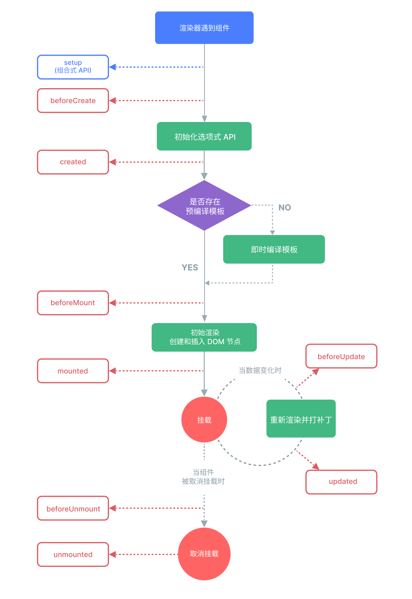


### 生命周期钩子函数

- 一个 Vue 组件从诞生到消亡会经历**四个主要阶段**。我们可以在这些特定阶段通过“钩子函数”来执行代码，以实现各种功能

#### 1. 创建阶段：`setup()`

- 在 Vue 3 的组合式 API 中,**`setup()` 函数本身就承担了组件的创建阶段任务**,它取代了 Vue 2 中的 `beforeCreate` 和 `created` 钩子

  - **调用时机**：在组件实例被创建，`props` 被解析后立即执行。这是所有生命周期钩子中**最早执行**的。

  - **典型用途**：
    - **初始化数据**：使用 `ref` 或 `reactive` 定义组件的响应式状态。
    - **注册方法**：定义处理用户交互的函数。
    - **发起网络请求**：获取组件初次加载所需的数据（也可以在 `onMounted` 中进行）。


#### 2. 挂载阶段：将组件呈现在页面上

- 这个阶段负责将组件的虚拟 DOM 渲染成真实的 DOM 元素，并插入到页面中

##### **`onBeforeMount()`**

- **调用时机**：在组件即将被挂载到 DOM 上时调用。此时，模板已经编译完成，但尚未渲染成真实的 HTML。
- **典型用途**：执行一些在 DOM 渲染前就需要完成的准备工作，但通常用得较少。
- **注意**：在此钩子中，你**无法**访问到真实的 DOM 元素。

##### **`onMounted()`**

- **调用时机**：在组件被成功挂载到 DOM 上之后调用。
- **典型用途**：这是最有用的钩子之一。
  - **执行 DOM 操作**：比如初始化一个需要依赖 DOM 的第三方库（如 ECharts 图表、Swiper 轮播）。
  - **发起网络请求**：如果请求需要依赖 DOM 结构，或者你想确保用户先看到页面骨架再加载数据，这里是最佳位置。
  - **设置定时器或全局事件监听**：比如 `setInterval` 或 `window.addEventListener`。


#### 3. 更新阶段：响应数据变化

- 当组件的响应式数据发生变化，导致视图需要重新渲染时，会进入这个阶段

##### **`onBeforeUpdate()`**

- **调用时机**：在组件即将因为数据变化而更新其 DOM 树之前调用。
- **典型用途**：在 DOM 更新前，获取当前的 DOM 状态。例如，保存聊天窗口的滚动条位置，以便更新后恢复。

##### **`onUpdated()`**

- **调用时机**：在组件因为数据变化而更新其 DOM 树**之后**调用。
- **典型用途**：执行依赖于新 DOM 状态的操作。
- **注意**：**绝对不要**在此钩子内修改组件的状态，这很可能导致无限更新循环！


#### 4. 销毁阶段：清理与告别

- 当组件被从 DOM 中移除时，会进入这个阶段

##### **`onBeforeUnmount()`**

- **调用时机**：在组件实例即将被卸载和销毁之前调用。
- **典型用途**：此时组件实例依然完全可用，可以用于最后的清理准备工作。

##### **`onUnmounted()`**

- **调用时机**：在组件实例被卸载和销毁**之后**调用。
- **典型用途**：执行最后的清理工作，这是至关重要的一步，可以防止内存泄漏。
  - **清除定时器**：`clearInterval()`
  - **移除事件监听器**：`window.removeEventListener()`
  - **清理第三方库实例**


#### 完整生命周期示例

- 下面的例子可以让你在浏览器的控制台中，清晰地看到各个生命周期钩子的触发顺序

```VUE
<!-- LifecycleLogger.vue -->
<script setup>
import {
  ref,
  onBeforeMount,
  onMounted,
  onBeforeUpdate,
  onUpdated,
  onBeforeUnmount,
  onUnmounted
} from 'vue';

const message = ref('Hello, Vue!');

console.log('--- 组件 setup --- (创建阶段)');

onBeforeMount(() => {
  console.log('--- onBeforeMount --- (即将挂载)');
});

onMounted(() => {
  console.log('--- onMounted --- (已挂载)');
});

onBeforeUpdate(() => {
  console.log('--- onBeforeUpdate --- (即将更新)');
});

onUpdated(() => {
  console.log('--- onUpdated --- (已更新)');
});

onBeforeUnmount(() => {
  console.log('--- onBeforeUnmount --- (即将销毁)');
});

onUnmounted(() => {
  console.log('--- onUnmounted --- (已销毁)');
});
</script>

<template>
  <div class="lifecycle-demo">
    <h3>生命周期观察器</h3>
    <p>{{ message }}</p>
    <button @click="message = 'Lifecycle Updated!'">更新消息</button>
  </div>
</template>

<style scoped>
.lifecycle-demo {
  padding: 15px;
  border: 1px solid #42b983;
  border-radius: 8px;
}
</style>
```

- **使用和观察：**
  1. 在一个父组件中引入并使用 `<LifecycleLogger />`。
  2. 打开浏览器控制台，刷新页面，你会看到 `setup`, `onBeforeMount`, `onMounted` 依次被打印。
  3. 点击“更新消息”按钮，你会看到 `onBeforeUpdate`, `onUpdated` 依次被打印。
  4. 在父组件中通过 `v-if` 将 `<LifecycleLogger />` 移除，你会看到 `onBeforeUnmount`, `onUnmounted` 依次被打印。


## Vue 生态系统

### 路由管理

**动态路由**：

```vue
// router.js
const routes = [
  // 动态字段以冒号开始
  { path: '/users/:id', name: 'User', component: UserDetail }
]

// 在组件中获取路由参数
// <script setup>
import { useRoute } from 'vue-router'
const route = useRoute()
const userId = route.params.id // 如果 URL 是 /users/123, userId 就是 '123'
// </script>
```

**导航守卫 (Navigation Guards)**：

```vue
// router.js
router.beforeEach((to, from, next) => {
  // to: 即将要进入的目标 路由对象
  // from: 当前导航正要离开的路由
  // next: 一个必须调用的函数，以“放行”导航
  if (to.name !== 'Login' && !isAuthenticated()) {
    // 如果用户未认证，则重定向到登录页
    next({ name: 'Login' })
  } else {
    // 否则，正常跳转
    next()
  }
})
```


### 状态管理 (Pinia)

Pinia 通过定义 `store` 来集中管理应用的状态。

**定义 Store (`stores/counter.js`)**

```vue
import { defineStore } from 'pinia'
import { ref, computed } from 'vue'

export const useCounterStore = defineStore('counter', () => {
  // State
  const count = ref(0)

  // Getters
  const doubleCount = computed(() => count.value * 2)

  // Actions
  function increment() {
    count.value++
  }

  return { count, doubleCount, increment }
})
```

**在组件中使用 Store**

```vue
<script setup>
import { useCounterStore } from '@/stores/counter'

const counter = useCounterStore()
</script>

<template>
  <p>Count: {{ counter.count }}</p>
  <p>Double Count: {{ counter.doubleCount }}</p>
  <button @click="counter.increment">Increment</button>
</template>
```


### 构建工具 (Vite)

Vite 的速度优势源于它根本性地改变了开发服务器的工作方式。

- **传统构建工具 (Webpack)**：在启动时，必须先遍历整个项目，构建一个完整的依赖图，然后将所有代码打包成一个或多个 bundle，这个过程非常耗时。
- **Vite**：利用了现代浏览器对原生 ES 模块 (ESM) 的支持。它在启动时，只启动一个轻量级的服务器。当浏览器请求某个文件时（如 `main.js`），Vite 才按需编译并提供这个文件。对于文件中的 `import`，浏览器会再次发起 HTTP 请求，Vite 再继续按需处理。这种“按需服务”的方式，使得冷启动速度与项目大小无关，几乎是瞬时的。


# Ajax

## 什么是 Ajax？

- **Ajax** 是 **Asynchronous JavaScript and XML**（异步的 JavaScript 和 XML）的缩写

- 它不是一门独立的编程语言，而是一种**综合了多种既有技术的 Web 开发方法**
  其核心目标是实现**在无需重新加载整个网页的情况下，能够与服务器通信并更新部分网页内容**
  通过在后台与服务器进行少量数据交换，Ajax 可以使网页实现异步更新
  这意味着用户的操作（如滚动、点击其他按钮）不会被网络请求所阻塞，应用可以持续响应

- **同步与异步**

  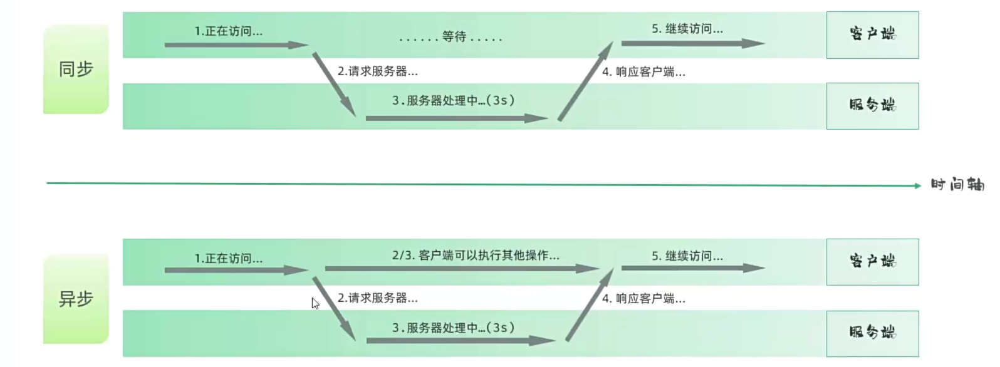

- **核心价值**：**革命性地提升用户体验**
  在 Ajax 出现之前，Web 应用遵循“点击-等待-刷新”的模式
  每次与服务器的交互都意味着整个页面的重载，伴随着短暂的白屏和闪烁，体验非常割裂
  Ajax 通过实现页面的**局部刷新**，让网页应用的行为模式更接近桌面应用：快速、流畅、响应及时，为富客户端应用的兴起铺平了道路


## Ajax 的核心组成技术

- Ajax 并非单一技术，而是以下几种成熟技术的巧妙组合，它们各司其职，协同工作：

  - **HTML/XHTML 和 CSS**：作为信息的载体和外观呈现
    Ajax 从服务器获取原始数据（如 JSON），最终需要通过 JavaScript 操作 DOM，将这些数据渲染成用户可见的 HTML 元素，并用 CSS 进行美化

  

  - **DOM (Document Object Model)**：文档对象模型，是浏览器为 HTML 文档提供的编程接口
    JavaScript 正是通过 DOM API 来动态地查询、创建、修改和删除页面上的元素。这是实现“局部刷新”的直接手段
    常用的 DOM 操作包括 `document.getElementById()`, `document.querySelector()`, `element.innerHTML`, `document.createElement()`, 和 `element.appendChild()`

  

  - **JavaScript**：整个 Ajax 技术的“大脑”和“指挥官”。它负责：
    1. **发起请求**：创建并配置 `XMLHttpRequest` 或 `Fetch` 请求
    2. **处理响应**：监听请求状态，处理服务器返回的数据（如解析 JSON）
    3. **更新页面**：调用 DOM API，将新数据动态地反映到用户界面上

  

  - **`XMLHttpRequest` / `Fetch API`**：这是 Ajax 的通信核心。
    它们是浏览器内置的 Web API（并非 JavaScript 语言本身的一部分），充当了 JavaScript 代码与服务器之间的通信桥梁，
    **允许前端在不刷新页面的情况下发送 HTTP 请求**

  

  - **XML / JSON**：作为客户端和服务器之间传输数据的格式

    - **XML**：是 Ajax 命名中的一部分，在早期被广泛使用。但其语法相对冗长，解析也更耗费资源

      ```xml
      <user>
        <id>1</id>
        <name>张三</name>
      </user>
      ```

    - **JSON**：目前是事实上的标准。它语法简洁，轻量，且与 JavaScript 的对象字面量语法天然兼容，使得解析和生成都极为方便

      ```json
      { "id": 1, "name": "张三" }
      ```


## 关于Ajax的代码书写

- 我个人感觉它的**代码写起来是非常繁琐**的，一般情况下我们会选择会去使用它的一个现代化的、工程化的实现方案 **Axios**

### XHR对象

- `XMLHttpRequest` (简称 XHR) 是实现 Ajax 的传统核心对象。尽管现在有了更现代的 `Fetch API`，但理解 XHR 对于掌握 Ajax 的底层原理、处理兼容性问题以及维护旧项目至关重要

#### 创建 XHR 对象

```js
// 兼容性写法，虽然现代浏览器已不再需要
let xhr;
if (window.XMLHttpRequest) { // 现代浏览器
    xhr = new XMLHttpRequest();
} else { // IE5, IE6
    xhr = new ActiveXObject("Microsoft.XMLHTTP");
}
```

- 在现代开发中，直接使用 `new XMLHttpRequest()` 即可


#### XHR 的重要属性和方法

##### 关键属性

- `onreadystatechange`：一个事件处理程序。每当 `readyState` 属性的值发生变化时，这个函数就会被自动调用。这是处理响应的主要入口
- `readyState`：只读属性，一个 0 到 4 的整数，表示请求的当前状态。
  - `0` (UNSENT)：对象已创建，但 `open()` 未调用。
  - `1` (OPENED)：`open()` 已调用，请求已准备好发送。
  - `2` (HEADERS_RECEIVED)：`send()` 已调用，服务器已返回响应头和状态码。
  - `3` (LOADING)：正在接收响应体，`responseText` 可能已有部分数据。
  - `4` (DONE)：响应接收完毕。此时可以安全地处理完整的响应数据了。
- `status`：只读属性，表示 HTTP 响应的状态码。常用状态码：
  - `200`: OK - 请求成功。
  - `201`: Created - 资源创建成功（常用于 POST/PUT 请求）。
  - `400`: Bad Request - 服务器无法理解客户端的请求。
  - `401`: Unauthorized - 需要身份验证。
  - `403`: Forbidden - 服务器拒绝执行请求。
  - `404`: Not Found - 请求的资源不存在。
  - `500`: Internal Server Error - 服务器内部错误。
- `statusText`：只读属性，状态码的文本描述 (例如 `"OK"`, `"Not Found"`)
- `responseText`：服务器返回的**文本形式**的响应数据。即使是 JSON 数据，在这里也是字符串。
- `responseXML`：如果服务器响应头中 `Content-Type` 是 `text/xml` 或 `application/xml`，此属性将包含一个可解析的 XML 文档对象。


##### 关键方法

- `open(method, url, async, user, password)`：初始化一个请求。
  - `method`: 请求的 HTTP 方法，如 `"GET"`, `"POST"`, `"PUT"`, `"DELETE"`。
  - `url`: 请求的 URL 地址。可以包含查询参数，例如 `api/data?id=123`。
  - `async`: 布尔值，指定是否异步。**强烈建议始终使用 `true`**。同步请求会冻结用户界面，是极差的实践。
- `send(body)`：发送请求。
  - 对于 `GET` 请求，数据通常通过 URL 查询参数传递，`body` 为 `null` 或省略。
  - 对于 `POST` 请求，`body` 是要发送到服务器的数据，如 JSON 字符串、表单数据等。
- `setRequestHeader(header, value)`：设置 HTTP 请求头。必须在 `open()` 之后、`send()` 之前调用。常用于设置 `Content-Type` 或 `Authorization`（身份令牌）。
- `abort()`: 取消当前请求


#### 一个完整的 XHR 请求流程

##### GET 请求示例

```js
// 1. 创建 XMLHttpRequest 对象
const xhr = new XMLHttpRequest();

// 2. 设置 onreadystatechange 事件处理函数，监听状态变化
xhr.onreadystatechange = function() {
    // 确保请求已完成 (readyState === 4)
    if (xhr.readyState === 4) {
        // 并且响应是成功的 (status 在 200-299 之间)
        if (xhr.status >= 200 && xhr.status < 300) {
            // 5. 处理服务器返回的数据
            console.log("请求成功!");
            // 将 JSON 字符串解析为 JavaScript 对象
            const data = JSON.parse(xhr.responseText);
            console.log(data);
            // 更新页面
            document.getElementById('myDiv').textContent = `用户名: ${data.name}`;
        } else {
            // 请求完成但失败（如 404, 500）
            console.error("请求失败，状态码: " + xhr.status);
        }
    }
};

// 3. 初始化请求
xhr.open('GET', 'https://api.example.com/data.json', true);

// 4. 发送请求
xhr.send(null);
```


##### POST 请求示例

```js
const xhr = new XMLHttpRequest();

xhr.onreadystatechange = function() {
    if (xhr.readyState === 4 && xhr.status === 201) { // 201 Created
        console.log("用户创建成功:", JSON.parse(xhr.responseText));
    } else if (xhr.readyState === 4) {
        console.error("创建失败:", xhr.status);
    }
};

xhr.open('POST', 'https://api.example.com/users', true);

// 关键步骤：设置请求头，告诉服务器我们发送的是 JSON
xhr.setRequestHeader('Content-Type', 'application/json;charset=UTF-8');

const newUser = { name: "李四", job: "工程师" };

// 关键步骤：将 JavaScript 对象转换为 JSON 字符串再发送
xhr.send(JSON.stringify(newUser));
```


### Fetch API

- `Fetch API` 是对 `XMLHttpRequest` 的现代、强大的**替代方案**。它基于 **Promise**，完美契合现代 JavaScript 的异步编程模型（尤其是 `async/await`），使得代码更简洁、更具可读性


#### Fetch API 的优势

- **语法简洁优雅**：`fetch()` 方法本身返回一个 Promise，可以非常方便地使用 `.then()` 和 `.catch()` 进行链式调用，告别了 `onreadystatechange` 的回调地狱。
- **基于 Promise**：这是其最大的优势。Promise 对象代表了一个异步操作的最终完成（或失败）及其结果值。这使得异步流程控制变得清晰明了。
- **功能更强大灵活**：它引入了 `Request` 和 `Response` 对象，允许我们对请求和响应的各个方面（如头信息、body、缓存策略）进行更精细的控制。处理 CORS、数据流等也更为简单


#### Fetch API 的基本用法

##### GET 请求示例

```js
// fetch 返回一个 Promise
fetch('https://api.example.com/data.json')
    .then(response => {
        // 第一个 .then() 接收到的是一个 Response 对象
        // 它代表了整个 HTTP 响应，但响应体（body）还未被读取
        console.log('收到响应:', response);
        // 必须检查 response.ok (等价于 status >= 200 && status < 300)
        if (!response.ok) {
            // 如果 HTTP 状态码不是 2xx，则主动抛出错误，以便被 .catch() 捕获
            throw new Error('网络响应错误，状态码: ' + response.status);
        }
        // response.json() 方法读取响应体并将其解析为 JSON
        // 这个方法本身也返回一个 Promise
        return response.json();
    })
    .then(data => {
        // 第二个 .then() 接收到的是上一步解析后的 JSON 数据
        console.log("请求成功，数据:", data);
        // 在这里可以通过 DOM 操作更新页面
    })
    .catch(error => {
        // .catch() 会捕获链条中发生的任何错误，包括网络连接失败或代码执行错误
        console.error('Fetch 操作出现问题:', error);
    });
```


##### `async/await` 语法

- `async/await` 是 Promise 的语法糖，它让异步代码的写法几乎与同步代码无异，极大地提升了可读性。

```js
async function fetchData() {
    try {
        // await 会暂停函数执行，直到 Promise resolve，然后返回结果
        const response = await fetch('https://api.example.com/data.json');

        if (!response.ok) {
            throw new Error(`HTTP 错误! 状态码: ${response.status}`);
        }

        // 再次 await，等待响应体被解析为 JSON
        const data = await response.json();
        console.log("请求成功!", data);
    } catch (error) {
        // 统一处理所有 await 过程中可能出现的错误
        console.error('获取数据失败:', error);
    }
}

// 调用函数
fetchData();
```


##### POST 请求示例

- 使用 `fetch` 发送 `POST` 请求，需要向 `fetch()` 传递第二个参数：一个配置对象

```js
const userData = {
    name: "王五",
    email: "wangwu@example.com"
};

async function createUser(data) {
    try {
        const response = await fetch('https://api.example.com/users', {
            method: 'POST', // 必须指定方法
            headers: {
                // 'Content-Type' 告诉服务器请求体的格式
                'Content-Type': 'application/json',
                // 'Authorization' 头常用于发送认证令牌
                'Authorization': 'Bearer YOUR_API_TOKEN'
            },
            // body 必须是字符串或特定的可流式读取的对象
            body: JSON.stringify(data) // 将 JS 对象转换为 JSON 字符串
        });

        if (!response.ok) {
            throw new Error(`创建用户失败: ${response.status}`);
        }

        const result = await response.json();
        console.log('用户创建成功:', result);
    } catch (error) {
        console.error(error);
    }
}

createUser(userData);
```


## Ajax 的常见应用场景

1. **表单无刷新提交**：用户填写完注册或评论表单后点击提交，页面上出现一个加载动画，数据通过 Ajax 在后台发送。服务器处理后返回结果，页面局部更新提示“提交成功！”或“邮箱已被占用”，整个过程无需页面跳转，体验流畅。
2. **实时搜索/自动补全**：在搜索框中每输入一个字符（或延迟几百毫秒后），通过 Ajax 向服务器发送当前输入内容，服务器返回匹配的建议列表，前端动态生成下拉菜单展示给用户。例如 Google 搜索、电商网站商品搜索。
3. **内容懒加载/无限滚动**：社交媒体（如微博、Twitter）或新闻网站，当用户滚动到页面接近底部时，自动触发 Ajax 请求，加载下一页的内容，并无缝地追加到当前列表末尾，创造出“无限”内容的浏览体验，同时极大地加快了首屏加载速度。
4. **用户名/邮箱可用性校验**：在注册页面，当用户输入完用户名并把光标移开时（`blur` 事件），立即通过 Ajax 向服务器发送该用户名，服务器查询数据库并返回是否可用，前端实时在输入框旁边显示一个对勾或叉号。
5. **仪表盘和数据可视化**：企业后台、监控系统或数据分析平台的仪表盘，会定时（如每30秒）通过 Ajax 请求最新的数据，并动态更新图表（如使用 Chart.js, ECharts），让用户实时掌握业务动态，而无需手动刷新。
6. **实时通信（轮询方式）**：虽然 WebSocket 是现代实时通信的首选，但在一些场景或旧系统中，仍会使用 Ajax 实现**轮询**：客户端每隔几秒钟就向服务器发送一次请求，询问是否有新消息。这是实现早期网页聊天室的经典方法。


## Ajax 的优缺点

### 优点

- **极致的用户体验**：这是 Ajax 最大的价值。通过消除页面刷新，应用响应更快，交互更自然，给用户带来桌面软件般的流畅感
- **减轻服务器负担和带宽消耗**：Ajax 按需请求数据，而不是整个 HTML 页面。这显著减少了服务器的响应数据量，降低了带宽成本，尤其在高并发场景下效果显著
- **促进前后端分离**：Ajax 是前后端分离架构模式的基石。前端团队专注于用户界面和交互逻辑，后端团队专注于数据和业务逻辑，通过一套定义好的 API（如 RESTful API）进行协作。这种模式使得团队可以并行开发，技术栈可以独立演进，同一套后端 API 还可以服务于 Web、iOS、Android 等多个客户端

### 缺点与解决方案

- **对搜索引擎不友好 (历史问题)**：传统搜索引擎爬虫不执行 JavaScript，无法抓取由 Ajax 动态加载的内容。
  - **现代解决方案**：现代搜索引擎（尤其是 Google）已经能够很好地执行 JS 并索引动态内容。
    此外，**服务器端渲染 (SSR)** (如 Next.js, Nuxt.js) 或 **预渲染 (Prerendering)** 等技术可以在构建时或请求时在服务器上生成完整的 HTML 页面，从根本上解决了 SEO 问题。
- **破坏浏览器的“后退”按钮功能**：单纯的 Ajax 更新不会在浏览器历史记录中留下痕迹，用户点击后退按钮会直接跳到上一个实际加载的页面，而不是上一个应用“状态”，这不符合用户预期。
  - **解决方案**：使用 HTML5 的 **History API**。
    通过 `history.pushState()` 和 `history.replaceState()` 方法，可以在不刷新页面的情况下，动态地修改浏览器地址栏的 URL 并管理会话历史记录。当用户点击后退/前进时，会触发 `popstate` 事件，开发者可以监听此事件来加载对应的视图状态。
- **安全问题**：
  - **同源策略 (Same-Origin Policy)**：浏览器的一个核心安全机制，它限制一个源（origin）的文档或脚本如何与来自另一个源的资源进行交互。默认情况下，Ajax 请求只能发送到与当前页面同源（协议、域名、端口号都相同）的 URL。
    - **解决方案**：**CORS (Cross-Origin Resource Sharing)**。
      这是一种 W3C 标准，允许服务器在响应头中添加特定的 `Access-Control-Allow-*` 字段，来声明允许哪些源的客户端跨域访问其资源。
  - **跨站脚本攻击 (XSS)**：攻击者将恶意脚本注入到你的网页中。
    如果 Ajax 获取的数据未经处理就直接用 `innerHTML` 插入到页面，恶意脚本就可能被执行。
    - **解决方案**：对所有来自服务器或用户输入的数据进行严格的**转义**处理。尽量使用 `textContent` 代替 `innerHTML` 来插入纯文本内容。
  - **跨站请求伪造 (CSRF)**：攻击者诱导用户在一个已登录的网站上，在不知情的情况下发送一个恶意的请求（如转账、删除帖子）。
    - **解决方案**：使用 **CSRF Token**。服务器为每个用户会话生成一个唯一的、不可预测的令牌，要求所有状态变更的请求（如 POST, PUT, DELETE）都必须携带此令牌，服务器在处理请求前进行验证。


# Axios

## 什么是 Axios

- **Axios** 是一个**基于 Promise** 的 HTTP 客户端，可用于浏览器和 Node.js 环境。
- 它本质上是对原生 `XMLHttpRequest` (在浏览器中) 和 `http` 模块 (在 Node.js 中) 的一层优雅封装，旨在解决原生 API 在使用上的不便与繁琐

- 可以把它看作是 Ajax 技术的一个现代化、工程化的实现方案。
  如果你觉得直接使用 XHR 的状态码判断和回调函数很繁琐，或者觉得原生 `Fetch API` 的某些默认行为（如对 4xx/5xx 错误不抛出异常，需要手动检查 `response.ok`）不符合直觉，那么 Axios 就是一个完美的解决方案。

- 它为你处理了大量底层的复杂性，让你能用更简洁、更直观、更符合现代 JavaScript 开发习惯（Promise 和 `async/await`）的代码来发送网络请求和处理响应。在 Vue、React 等现代前端框架的生态中，Axios 已成为事实上的标准 HTTP 通信库。

## Axios 的核心特性

- 为什么 Axios 能在众多 HTTP 客户端库中脱颖而出？因为它提供了许多开箱即用的强大功能：

  - **同构性 (Isomorphic)**：一套代码可以在浏览器和 Node.js 后端无缝运行。这对于需要服务器端渲染 (SSR) 或在 Node.js 环境中调用其他微服务的项目来说至关重要。

  - **基于 Promise 的异步 API**：完全拥抱 ES6 Promise 规范，支持所有 Promise 的方法，如 `.then()`, `.catch()`, `.finally()`，并且可以与 `async/await` 语法完美结合，让异步代码写起来如同步般清晰。

  - **自动转换和处理数据**：
    - **请求时**：当你传递一个 JavaScript 对象作为 `data` 时，Axios 会自动将其 `JSON.stringify()` 并设置 `Content-Type` 请求头为 `application/json`。
    - **响应时**：当接收到响应时，如果响应头表明内容是 JSON，Axios 会自动 `JSON.parse()`，让你在 `.then()` 中直接得到一个 JavaScript 对象。

  - **请求和响应拦截器 (Interceptors)**：这是 Axios 最强大的功能之一。它提供了一个在请求发出前和响应到达后全局修改配置和数据的能力。这就像在你的应用和服务器之间设立了两个“关卡”，所有进出的流量都必须经过检查和处理。

  - **请求取消机制**：允许你在请求尚未完成时主动取消它。这在处理快速切换的视图或避免重复请求等场景中非常有用。

  - **客户端支持，防御 XSRF/CSRF**：内置了对跨站请求伪造攻击的防御机制。它会自动读取存储在 cookie 中的 `XSRF-TOKEN` 值，并将其作为 `X-XSRF-TOKEN` 请求头发送出去，与后端框架（如 Laravel, Django）的 CSRF 防护机制轻松集成。

  - **更友好的错误处理**：与 Fetch 不同，任何导致失败的 HTTP 状态码（即非 2xx 范围）都会触发 Promise 的 `reject`，直接进入 `.catch()` 块。这使得错误处理逻辑更集中、更符合大多数开发者的预期。


## 安装与基本用法

### 安装

- **使用 npm 或 yarn (推荐)**

  ```cmd
  # npm
  npm install axios
  
  # yarn
  yarn add axios
  ```

  

- **使用 CDN** 在 HTML 文件中直接引入

  ```html
  <script src="https://cdn.jsdelivr.net/npm/axios/dist/axios.min.js"></script>
  ```

  

### 发送请求

- 在 JavaScript 文件中引入后即可使用

  ```js
  import axios from 'axios'; // 如果使用模块系统
  // 或者 const axios = window.axios; 如果使用 CDN
  ```

  

#### GET 请求 (获取数据)

```js
// 写法一：使用 .then() 处理 Promise
// 附加查询参数
axios.get('https://api.example.com/users', {
    params: {
      ID: 12345
    }
  })
  .then(function (response) {
    console.log(response.data);
    console.log(response.status);
  })
  .catch(function (error) {
    console.error('请求出错:', error);
  });

// 写法二：使用 async/await (现代推荐写法)
async function getUser(userId) {
  try {
    const response = await axios.get(`https://api.example.com/users/${userId}`);
    console.log('用户信息:', response.data);
    return response.data;
  } catch (error) {
    console.error('获取用户失败:', error);
  }
}
getUser(1);
```


#### POST 请求 (提交数据)

```js
async function createUser(userData) {
    try {
        const response = await axios.post('https://api.example.com/users', userData);
        console.log('用户创建成功:', response.data);
    } catch (error) {
        console.error('创建失败:', error);
    }
}

createUser({
  firstName: '张',
  lastName: '三',
  email: 'zhangsan@example.com'
});
```


## Axios 请求方法与配置

### 发起请求的两种主要方式

- Axios 提供了两种发起请求的方式：使用**方法别名**（更简洁）和使用**核心 `axios()` 函数**（更灵活）

#### 方法别名

- 这是最常用、最直观的方式。Axios 为所有常见的 HTTP 方法都提供了别名函数

  - `axios.get(url[, config])`

  - `axios.post(url[, data[, config]])`

  - `axios.put(url[, data[, config]])`

  - `axios.delete(url[, config])`

**示例：**

```js
// GET 请求，配置对象作为第二个参数
axios.get('/users', {
  params: { page: 1 } // 查询参数
})
.then(response => console.log(response.data));

// POST 请求，请求体作为第二个参数，配置对象作为第三个参数
axios.post('/users', {
  firstName: '张',
  lastName: '三'
}, {
  headers: { 'Authorization': 'Bearer YOUR_TOKEN' } // 自定义配置
})
.then(response => console.log(response.data));
```


#### `axios()` 函数

- 所有的方法别名，其内部调用的都是核心的 `axios()` 函数。直接使用这个函数，可以将所有配置都集中在一个对象里，是功能最强大、最灵活的方式

```js
axios({
  method: 'post',
  url: '/users',
  data: {
    firstName: '李',
    lastName: '四'
  }
})
.then(response => console.log(response.data));
```


### 请求配置对象详解

- 无论是使用方法别名中的 `config` 参数，还是直接调用 `axios()`，我们都需要传递一个**配置对象**来告诉 Axios 如何发起请求。这个对象里的属性都是预先规定好的“关键词”

#### A. 请求目标(发到哪里)

| 属性          | 类型     | 作用                                                         |
| ------------- | -------- | ------------------------------------------------------------ |
| **`url`**     | `string` | **(必填)** 请求的服务器地址路径，如 `/users`。               |
| **`baseURL`** | `string` | 设置一个基础 URL，会自动加在 `url` 前面。非常适合统一管理 API 前缀。 |
| **`method`**  | `string` | HTTP 请求方法，如 `'get'`, `'post'`。**默认为 `'get'`**。    |


#### B. 请求内容(带着什么)

| 属性          | 类型     | 作用                                                         |
| ------------- | -------- | ------------------------------------------------------------ |
| **`headers`** | `object` | 设置自定义 HTTP 请求头，如 `Authorization` 用于身份认证。    |
| **`params`**  | `object` | **URL 查询参数**。用于 `GET` 请求，会自动拼接到 URL 末尾（`?key=value`）。 |
| **`data`**    | `any`    | **请求体 (Request Body)**。用于 `POST`, `PUT` 等请求。如果是一个对象，Axios 会自动转为 JSON 字符串。 |

> **关键区别：`params` vs `data`**
>
> - `params` 的内容会显示在浏览器的 **URL 地址栏**上。
> - `data` 的内容放在请求体中，**地址栏上看不到**，更安全，且能发送更复杂的数据。


#### C.行为控制 (怎么发)

| 属性               | 类型     | 作用                                                         |
| ------------------ | -------- | ------------------------------------------------------------ |
| **`timeout`**      | `number` | 请求超时时间（毫秒）。超过此时间，请求将中断并报错。         |
| **`responseType`** | `string` | 期望服务器返回的数据类型。默认为 `'json'`，可选 `'blob'`, `'text'` 等。 |


### 处理并发请求

- 有时我们需要同时发起多个请求，并等待它们全部完成后再统一处理。例如，进入用户中心页面时，需要同时获取用户的基本信息和权限信息


#### 方式一：使用 `Promise.all` (ES6 原生方式，更推荐)

- `Promise.all` 是 JavaScript 的原生方法，可以接收一个由多个 Promise 组成的数组，并返回一个新的 Promise。
  只有当数组中所有的 Promise 都成功后，这个新的 Promise 才会成功，并将所有结果以数组的形式返回。

```JS
function getUserAccount() {
  return axios.get('/user/12345');
}

function getUserPermissions() {
  return axios.get('/user/12345/permissions');
}

async function fetchUserData() {
    try {
        const [account, permissions] = await Promise.all([
            getUserAccount(),
            getUserPermissions()
        ]);
        console.log('账户信息:', account.data);
        console.log('权限信息:', permissions.data);
    } catch (error) {
        console.error('获取用户数据时出错:', error);
    }
}

fetchUserData();
```


#### 方式二：使用 `axios.all` 和 `axios.spread`

- `axios.all` 是 Axios 提供的辅助函数，其功能与 `Promise.all` 类似。
  它通常与 `axios.spread` 配合使用，`spread` 可以将返回的结果数组“展开”为多个独立的参数，让代码更具可读性。

```JS
axios.all([getUserAccount(), getUserPermissions()])
  .then(axios.spread((account, permissions) => {
    // 两个请求现在都执行完了
    console.log('账户信息:', account.data);
    console.log('权限信息:', permissions.data);
  }));
```


### 处理异步响应

- 网络请求是**异步**的。`axios` 函数在执行后，会立即返回一个 **Promise 对象**作为“凭证”，而不是直接返回服务器数据。我们需要通过这个 Promise 来处理请求成功或失败后的结果。

#### 方式一:使用 `.then().catch()`

- 这是处理 Promise 的基础方法，通过链式调用来定义成功和失败的回调函数。

  - **.then(response => { ... })**：当请求**成功**后执行。`response` 是一个包含服务器响应所有信息的对象。

  - **.catch(error => { ... })**：当请求**失败**后执行。`error` 是一个包含错误详细信息的对象。

- **`response` 响应对象的主要属性：**

  - `data`: 服务器返回的**主要数据**（已被 Axios 自动解析）。

  - `status`: HTTP 状态码，如 `200`。

  - `statusText`: 状态文本，如 `'OK'`。

  - `headers`: 响应头。

  - `config`: 本次请求的配置对象。

#### 方式二：使用 `async/await`

- 这是更现代、更推荐的“语法糖”，可以让我们用类似同步代码的风格来编写异步逻辑

  - **`async`**：修饰一个函数，表示其为异步函数。

  - **`await`**：只能用在 `async` 函数内部，它会“等待”一个 Promise 完成，并直接返回其成功的结果。

  - **`try...catch`**：由于 `await` 在 Promise 失败时会抛出错误，因此我们必须使用 `try...catch` 语句来捕获这些错误。


### 综合示例:两种写法对比

- **场景**：获取文章列表第二页，每页 10 篇，并需要登录认证

  ```JS
  // 统一的请求配置
  const authToken = localStorage.getItem('authToken');
  const requestConfig = {
    baseURL: 'https://my-blog-api.com/v1',
    url: '/articles',
    headers: { 'Authorization': `Bearer ${authToken}` },
    params: { page: 2, per_page: 10 },
    timeout: 10000
  };
  ```

  

#### 写法一:`.then().catch()`

```JS
axios(requestConfig)
  .then(response => {
    console.log('成功获取数据:', response.data);
  })
  .catch(error => {
    if (error.response?.status === 401) {
      console.error('认证失败！');
    } else {
      console.error('请求失败:', error.message);
    }
  });
```


#### 写法二:`async/await`

```JS
async function fetchArticles() {
  try {
    const response = await axios(requestConfig);
    console.log('成功获取数据:', response.data);
  } catch (error) {
    if (error.response?.status === 401) {
      console.error('认证失败！');
    } else {
      console.error('请求失败:', error.message);
    }
  }
}

fetchArticles();
```


# Maven

## Maven相关概念

- **Maven** 是一个强大的 **项目管理和构建自动化工具**，主要服务于基于 Java 的项目开发。它由 Apache 软件基金会提供
- Maven 通过**自动化依赖管理**、**一键式项目构建**和**标准化的项目结构**，极大地提高了 Java 项目的开发效率和规范性
  - **依赖管理**：这是 **Maven 最核心、最受欢迎的功能**
    - **过去的方式**：您需要手动去网上下载项目所需的各种 JAR 包(比如 Spring、MyBatis、Jackson 等)，然后手动添加到项目中。如果这些 JAR 包还依赖其他 JAR 包，您还得一个个找，非常痛苦，这就是所谓的“**依赖地狱**”
    - **Maven 的方式**：您只需要在 `pom.xml` 文件里声明您需要哪个库（比如 `spring-boot-starter-web`），Maven 就会**自动分析、下载您需要的所有 JAR 包**以及它们所依赖的包，并管理好它们的版本
  - **项目构建**：
    - Maven 定义了一套标准的**生命周期**
      - 包括**清理 (clean)、编译 (compile)、测试 (test)、打包 (package)、安装 (install)** 等步骤
    - 您只需要执行一个简单的命令，比如 `mvn package`，Maven 就会自动完成从编译源代码、运行单元测试到最终打成一个可执行的 JAR 或 WAR 包的全部流程。这保证了每次构建过程都是一致和可靠的
  - **项目标准化**：
    - Maven 提倡**“约定优于配置”**。它为所有项目提供了一套**标准的目录结构**
      - 例如，**源代码放在 `src/main/java`**，资源文件放在 **`src/main/resources`**，测试代码放在 **`src/test/java`** 
    - 这使得任何开发者都能快速上手一个陌生的 Maven 项目，因为项目的结构都是一样的，降低了学习和维护成本
      - 不管用IDEA还是Eclipse或者别的软件，用Maven开发的结构都一样


## 仓库

- **仓库**是用来存储和分发 Maven 构建产物（Artifacts，主要是 JAR 包）的地方。

  - Maven 的仓库分为三类：

    1. **本地仓库 (Local Repository)**：
       - 位于你自己的计算机上。**默认路径**是 `~/.m2/repository`。
       - 当你第一次构建一个需要某依赖的项目时，Maven 会从远程仓库下载该依赖并存入本地仓库。
       - 之后再有项目需要同一个依赖，Maven 会直接从本地仓库获取，加快构建速度。
       - 你通过 `mvn install` 命令构建的项目也会被安装到本地仓库。
    2. **中央仓库 (Central Repository)**：
       - 由 Maven 官方维护的全球性仓库，包含了绝大多数流行的开源库。
       - 这是 Maven 默认的远程仓库，开箱即用。

    3. **远程仓库 (Remote Repository)**：
       - 除了中央仓库，还可以是其他公共或私有仓库。
       - 例如，公司内部可能会搭建一个私有仓库（如 Nexus, Artifactory），用于存放公司内部的共享库或缓存公共库。
       - 你可以在 `pom.xml` 或 `settings.xml` 中配置额外的远程仓库。


  - **查找依赖的顺序**：本地仓库 -> 远程仓库 -> 中央仓库


## POM

### 基本概念

- **POM (Project Object Model)** 是 Maven 项目的核心。
  - 它是一个名为 `pom.xml` 的文件，位于项目的根目录。
  - Maven 通过读取这个文件来获取项目的所有配置信息，并根据这些信息执行构建任务。


### Super POM

- 每一个 `pom.xml` 文件都隐式地继承自一个 **"Super POM"**。
- 这个 Super POM 包含了所有 Maven 项目的默认配置，比如默认的源码目录、默认的中央仓库地址等。
  这就是为什么一个最简单的 `pom.xml` 只需要很少的几行配置就能工作的原因


### POM文件的结构

- 这个结构肯定不可能全部展示出来，大概展示还是有的

#### 顶部区域

##### 项目坐标

- **项目坐标(GAV)**是 Maven 的核心概念，由以下三个元素组成，它们共同构成了项目在仓库中的唯一地址，用于精确定位一个构件
  - **`<groupId>`**: **组织 ID**。通常是**公司或组织的反向域名**，例如 `org.springframework`、`com.google.guava`。它定义了项目所属的逻辑分组。
  - **`<artifactId>`**: **构件 ID**。通常是**项目的名称**，例如 `spring-core`、`guava`。它在 `groupId` 内部必须是唯一的。
  - **`<version>`**: **版本号**。例如 `1.0.0`、`2.5-SNAPSHOT`。
    - `SNAPSHOT` 后缀表示这是一个“快照”版本，即开发中的不稳定版本。Maven 在构建时会频繁检查远程仓库中是否有更新的快照
    - 没有后缀的通常是稳定的“发布”版本
      - `RELEASE`稳定的发布版本，此后缀可以省略


##### 顶部其它

- 除了 GAV 坐标外，还有两个位于 `pom.xml` 顶层的标签，它们虽然不属于坐标的一部分，但同样是项目的基本定义
  - **`<modelVersion>`**: 指定了当前 POM 模型的版本。对于 Maven 2 和 3，这个值**永远是 `4.0.0`**。它声明了此 `pom.xml` 文件所遵循的语法规范
  - **`<packaging>`**: **打包方式**。它定义了项目的构建产物类型，默认为 `jar`。常见的值还包括：
    - `war`: 用于 Web 应用
    - `pom`: 用于父项目或 BOM (Bill of Materials)，它本身不包含代码，只用于管理依赖和配置
    - `ear`: 用于企业级应用


#### 项目描述信息

- 这部分标签提供了关于项目的描述性信息，主要用于文档生成和信息展示。  
  -  **`<name>`**: 项目的显示名称，通常比 `artifactId` 更具可读性。例如，在生成项目站点时会用到。  
  - **`<description>`**: 一段关于项目的详细描述。 
  -  **`<url>`**: 项目的官方网站地址。
  
  - ......


#### 项目继承 `<parent>`

- 这是实现 Maven **配置复用和集中管理**的关键机制。  
- **作用**: 它主要做的是**继承配置**，包括：
  1. **`dependencyManagement`**: 继承父项目里定义好的所有依赖的版本号。子模块在 `<dependencies>` 里就不用再写版本了。
  2. **`pluginManagement`**: 继承插件的版本和配置。
  3. **`properties`**: 继承自定义的属性，比如 `<spring.version>5.3.22</spring.version>`。
  4. **`repositories`**: 继承仓库地址。
  5. **`dependencies`**: 父模块中的某些依赖也可以被子模块直接继承
- **例子**: Spring Boot 项目通常会继承 `spring-boot-starter-parent`。这个父 POM 提供了大量经过测试和版本兼容的默认配置（如 Java 版本、插件版本）和依赖管理，极大地简化了项目配置
- **`<relativePath>`**: 一个可选标签，用于指定父 POM 在本地文件系统中的相对路径。如果设置为空 (`<relativePath/>`)，Maven 会强制从本地和远程仓库中查找父 POM，这是推荐的做法，可以确保构建的稳定性。


#### 属性定义 `<properties>`

- 这是一个非常实用的标签，用于定义可重用的常量。
- **最佳实践是将所有依赖的版本号和常用配置都定义在这里**

```xml
<properties>
    <!--这个属性告诉 Maven 的编译器插件（maven-compiler-plugin），你的项目源代码是使用 Java 17 的语法规范编写的-->
    <maven.compiler.source>17</maven.compiler.source>

    <!--这个属性告诉编译器，要生成与 Java 17 虚拟机 (JVM) 兼容的字节码（.class 文件）-->
    <maven.compiler.target>17</maven.compiler.target>

    <!--这个属性定义了项目构建时读取源文件（.java、.properties 等）所使用的字符编码格式-->
    <project.build.sourceEncoding>UTF-8</project.build.sourceEncoding>
</properties>
```

- **好处**：

  - **便于维护**：当需要升级依赖版本时，只需修改 `<properties>` 中的一处地方。

  - **保持一致**：确保项目中所有相关的依赖都使用同一个版本。


#### 依赖声明

##### `<dependencies>`

- 这是一个复数标签，它作为所有单个依赖声明 `<dependency>` 的根容器。一个 `pom.xml` 文件中只能有一个 `<dependencies>` 标签


##### `<dependence>`

- `dependency` 意为**“依赖”**，每一个 `<dependency>` 标签都定义了一个具体的第三方库。
- 它通过一组坐标来精确定位 Maven 中央仓库或私有仓库中的某一个构件
- 有很多子标签，如下：


###### 依赖坐标(GAV)

- **`<groupId>` **
- **`<artifactId>` **
- **`<version>` **


###### 依赖范围`<scope>`

- `<scope>` 决定了依赖在 Maven 构建**生命周期中哪些阶段的类路径下可用**。它还影响依赖的传递性

  - 只有 `scope` 为 `compile` 或者 `runtime` 的依赖，才是传递性依赖

- 有以下这些值

  - **`compile` (编译范围)**

    - **描述**: 这是**默认值**。依赖在所有阶段（编译、测试、运行）都可用，并且会被打包到最终的构件中（如 WAR 或可执行 JAR）。此范围的依赖会**传递**给依赖于本项目的其他项目

    - **例子**: `spring-context`, `log4j2-core`

      

  - **`provided` (已提供范围)**

    - **描述**: “已提供”意味着该依赖在**编译和测试时需要**，但在**运行时由外部环境提供**。因此，它不会被打包。它也不会被传递

    - **例子**:

      1. `javax.servlet-api`: 在开发 Web 应用时，编译需要它，但部署到 Tomcat 等 Servlet 容器后，容器自身会提供这个 JAR

      2. `org.projectlombok:lombok`: Lombok 只在编译期通过注解处理器生成代码，运行时完全不需要它

         

  - **`runtime` (运行时范围)**

    - **描述**: 依赖在**编译时不需要**，但在**测试和运行时需要**。它会被打包，并且会传递
    - **例子**: JDBC 驱动程序。你的代码在编译时只依赖标准的 `java.sql.*` 接口，只有在运行时才需要具体的数据库驱动实现（如 `mysql-connector-java`）

    

  - **`test` (测试范围)**

    - **描述**: 依赖**只在测试编译和测试运行阶段可用**，不会被打包，也不会被传递。这是隔离测试代码与主代码依赖的最佳方式。
    - **例子**: `junit`, `mockito`, `spring-boot-starter-test`

    

  - **`system` (系统范围)**
    - **描述**: **已废弃，强烈不推荐使用**。与 `provided` 类似，但需要你通过 `<systemPath>` 标签显式提供 JAR 在本地文件系统中的路径。这破坏了 Maven 的可移植性和自动化依赖管理。
    - **例子**: 依赖一个本地机器上、未发布到任何仓库的私有 JAR


###### 可选依赖`<optional>`

- 核心作用就是**规定自己的哪些依赖不会被传递下去**，如果依赖它的项目需要使用这个依赖，就需要**自己去引入这个依赖**

- 工作机制

  - 假设项目的依赖关系如下：

    ```tex
    Your-Project` -> `Library-A` -> `Library-B
    ```

    - 场景一：正常情况（没有 `<optional>`）
      1. `Library-A` 在它的 `pom.xml` 中正常依赖了 `Library-B`。
      2. 当 `Your-Project` 在自己的 `pom.xml` 中引入 `Library-A` 时，Maven 的传递性依赖机制会**自动地**将 `Library-A` 和 `Library-B` 都下载到你的项目中。

    - 场景二：使用 `<optional>true`
      1. `Library-A` 在它的 `pom.xml` 中，将对 `Library-B` 的依赖标记为 `<optional>true</optional>`。
      2. 现在，当 `Your-Project` 引入 `Library-A` 时，Maven 只会自动下载 `Library-A`，它会**忽略掉**那个被标记为可选的 `Library-B`。
      3. 如果 `Your-Project` 确实需要 `Library-B` 提供的功能，那么就必须在**自己的 `pom.xml` 文件里，显式地、手动地添加对 `Library-B` 的依赖**

- 与 `<scope>provided</scope>` 的区别

  - **`<optional>true</optional>`** 的意思是：“这个依赖**可能需要，也可能不需要**，由使用者自己决定是否添加。”

  - **`<scope>provided</scope>`** 的意思是：“这个依赖**一定需要**，但别打包，因为最终的运行环境（如 Tomcat）会提供它。”


###### 排除依赖

- `<exclusions>`

  - 这是一个容器标签，作用就是包裹一个或多个具体的排除规则`<excludion>`
  - 和`<exclusion>`搭配，唯一目的就是**解决传递性依赖带来的版本冲突问题**
    - 传递性依赖：当你的项目 A 依赖于库 B，而库 B 又依赖于库 C 时，那么 C 就是项目 A 的一个“传递性依赖”

  

- `<exclusion>`

  - **定义要排除哪个依赖**的标签。每一个 `<exclusion>` 标签都代表一个你不想引入的传递性依赖。
    - 它必须包含 `<groupId>` 和 `<artifactId>` 来精确定位要排除的库
      - **这里不需要版本号**,因为它会排除该依赖带来的任何版本的这个库
  - `<exclusions>` 标签的作用域是严格限定在它所在的那个 `<dependency>` 标签内部的
  - 这里排除，在另一个`<dependency>`里面，也能引入完全相同的依赖，不影响
  - 如果一个依赖是“终点依赖”，那么对它使用 `<exclusion>` 标签是没有任何意义和效果的


- 示例

  ```xml
  <dependencies>
      <!-- 引入 Library-A，并排除它带来的 common-lib -->
      <dependency>
          <groupId>com.example</groupId>
          <artifactId>Library-A</artifactId>
          <version>1.0</version>
          <exclusions>
              <exclusion>
                  <!-- 
                      在这里指定要排除的库的坐标。
                      注意：只需要 groupId 和 artifactId，不需要 version！
                      因为我们的目的是排除掉 Library-A 带来的任何版本的 common-lib。
                  -->
                  <groupId>com.example</groupId>
                  <artifactId>common-lib</artifactId>
              </exclusion>
          </exclusions>
      </dependency>
  
      <!-- 正常引入 Library-B -->
      <dependency>
          <groupId>com.example</groupId>
          <artifactId>Library-B</artifactId>
          <version>1.0</version>
      </dependency>
  </dependencies>
  ```

  


###### 其他

- **`<type>` (依赖类型)**

  - **作用**: 指定依赖的类型，默认为 `jar`。其他常见的值包括 `pom` (用于导入 BOM)、`war`、`ejb`、`test-jar` (引入另一个项目的测试代码) 等
  - **例子**: `<type>pom</type>` 与 `<scope>import</scope>` 结合使用

  

- **`<classifier>` (分类符)**

  - **作用**: 进一步区分从同一个 POM 构建出的不同构件。一个项目可以生成多个构件，例如主 JAR、包含源码的 `sources.jar` 和包含 Javadoc 的 `javadoc.jar`。`classifier` 就是用来指定你要的是哪一个。

  - **例子**: 如果你想在项目中引入某个库的源码，可以这样声明：

    ```xml
    <dependency>
      <groupId>org.springframework</groupId>
      <artifactId>spring-core</artifactId>
      <version>5.3.18</version>
      <classifier>sources</classifier>
    </dependency>
    ```

    

#### 依赖管理`<dependencyManagement>`

- 用于**统一管理和约束**整个项目中（尤其是多模块项目中）的依赖版本和范围


##### 此标签下的依赖标签

###### 基本特性

- `<dependencyManagement>`内部也**只有一个`<dependences>`子标签**，但是它和另一个`<dependences>`有很大区别
  - **声明而非引入**: 在 `<dependencyManagement>` 中定义的 `<dependencies>`中的`<dependency>`，**并不会被实际引入**到项目中
    它仅仅是声明：“如果任何模块需要用到这个依赖，那么**应该使用这个版本和这个 scope**”
  - **集中管理**: 它提供了一个中心化的位置，来定义所有依赖项的版本号、范围、排除项等信息

###### 版本号

- 如果子模块在 `<dependencies>` 里**写了依赖的版本号**，那它的版本就是自己定义的版本
- 如果子模块在`<dependencies>`中**没有写依赖的版本号**，
  而`<dependencyManagement>`中写了，那就用`<dependencyManagement>`里面的
- 如果都没写，就报错


###### 子标签

- `<dependencies>`中的`<dependency>`中的子标签这里也都有
  - 特殊的是这里的`<scope>`标签多了一个 `import` 属性
    - **`import` (导入范围)**
      - **描述**: 这是一个特殊的范围，**只能在 `<dependencyManagement>` 部分中使用**。它允许你从另一个 POM 文件中导入所有的 `<dependencyManagement>` 配置。这通常用于导入所谓的 **BOM (Bill of Materials)**，即一个专门用于定义一组相关库版本清单的 POM。
      - **例子**: Spring Boot 和 Spring Cloud 就通过 BOM 来管理庞大的依赖体系


- `<exclusion>`排除依赖

  - 写到这里，作用则是为某个依赖**制定一个全局的、可继承的排除规则**，写到`<dependencies>`里面,则是只有那个项目生效，但是写到这个里面，则是它和所有子项目都生效，当然依赖它的项目不会生效，因为依赖的时候，`<dependencyManagement>`不会被传递，当然如果是子项目，他们也可以自己再引入这个依赖，不影响的
  - 里面的一些特性啥的，还是要参照`<dependency>`中的

  

- `<optional>`可选依赖

  - 在这里面没啥用，挺多余的


#### 构建配置 `<build>`

##### 相关概念

- `<build>` 标签是 `pom.xml` 的核心组成部分之一，它包含了所有与项目构建过程相关的配置。

  - Maven 的构建生命周期（如编译、测试、打包、部署）的所有行为都由这个标签下的配置来定义和控制。

  - 一个典型的 `<build>` 结构如下

    ```xml
    <build>
        <!-- 构建产物的最终名称，默认为 ${project.artifactId}-${project.version} -->
        <finalName>my-app</finalName>
    
        <!-- 构建结果输出目录，默认为 target/ -->
        <directory>${project.basedir}/target</directory>
    
        <!-- 默认执行的 Maven goal，例如，直接运行 mvn 会执行 mvn package -->
        <defaultGoal>package</defaultGoal>
    
        <!-- 源码目录 -->
        <sourceDirectory>src/main/java</sourceDirectory>
        <!-- 测试源码目录 -->
        <testSourceDirectory>src/test/java</testSourceDirectory>
    
        <!-- 主资源文件配置 -->
        <resources>
            ...
        </resources>
        <!-- 测试资源文件配置 -->
        <testResources>
            ...
        </testResources>
    
        <!-- 插件管理 -->
        <pluginManagement>
            <plugins>
                ...
            </plugins>
        </pluginManagement>
    
        <!-- 项目实际使用的插件 -->
        <plugins>
            ...
        </plugins>
    </build>
    ```

- 子标签如下


##### `<finalName>`最终名称

- 定义构建产物（如 `.jar`, `.war` 文件）的最终名称，不包含文件扩展名

  - **默认值**: `${project.artifactId}-${project.version}`

  - **作用**: 自定义一个更简洁或固定的文件名，便于在自动化脚本中引用。例如，设置 `<finalName>my-app</finalName>` 后，生成的包会是 `my-app.jar`


##### `<directory>`输出目录

- 指定所有构建产物的输出目录

  - **默认值**: `${project.basedir}/target`

  - **作用**: 改变默认的 `target` 目录。一般情况下不建议修改，以保持项目结构的标准化


##### `<defaultGoal>`默认

- 定义当在命令行只输入 `mvn` 时，默认执行的生命周期阶段或插件目标
  - **示例**: 如果设置为 `<defaultGoal>install</defaultGoal>`，那么运行 `mvn` 命令的效果等同于 `mvn install`


##### 源码目录

- **`<sourceDirectory>` 和`<testSourceDirectory>`**分别定义项目的主源码和测试源码的存放目录

  - **`<sourceDirectory>` 默认值**: `src/main/java`

  - **`<testSourceDirectory>` 默认值**: `src/test/java`

- **作用**: 这两个标签定义了 Maven 项目的标准目录结构，通常无需修改。


##### 资源文件位置

- **`<resources>` 和`<testResources>`**定义主代码和测试代码所使用的资源文件（非 Java 文件，如 `.properties`, `.xml` 等）的位置和处理方式。这是实现**环境隔离配置**的核心机制。

- **`<resources>` 默认目录**: `src/main/resources`

- **`<testResources>` 默认目录**: `src/test/resources`


###### `<resource>`处理规则

- 在 `<resources>` 或 `<testResources>` 标签内，可以包含一个或多个 `<resource>` 元素，每个元素定义了一组资源文件的处理规则


###### `<directory>`文件目录

- 指定该组资源文件所在的目录


###### `<filtering>`是否启用占位符

- 一个非常重要的配置，用于控制是否启用**占位符替换**

  - **值**: `true` 或 `false`。

  - **作用**: 当设置为 `true` 时，Maven 会在处理资源文件时，扫描其中形如 `${...}` 的占位符，并将其替换为 `pom.xml` 中定义的值。这在管理不同环境（如开发、测试、生产）的配置时极其有用。例如，你可以根据激活的 Profile 来动态改变数据库连接、服务器地址等配置。

  - **高级用法**: 结合 Maven Profiles，可以为不同环境（dev, test, prod）提供不同的属性值，构建时通过 `-P <profile-id>` 命令激活对应配置，实现“一次编码，到处打包”


###### `<includes>` / `<excludes>`

- 用于精确控制哪些文件被包含或排除

  - **`<includes>`**: 定义需要包含的文件模式列表

  - **`<excludes>`**: 定义需要排除的文件模式列表

  

##### 插件管理`<pluginManagement>`

- 这是一个**“插件管理”**容器，与 `<dependencyManagement>` 作用类似。它不直接执行插件，而是用于在父 POM 中**统一声明和管理**所有子模块可能用到的插件的版本和默认配置。

- **核心特点**: 在这里定义的插件**不会被激活**。子模块必须在自己的 `<plugins>` 部分再次引用该插件（只需提供 `groupId` 和 `artifactId`），才会继承这里的配置并使其生效。这是一种“推荐”而非“强制”的机制。
- **主要场景**: 在大型多模块项目中，它扮演着至关重要的角色：
  1. **版本统一**: 确保所有模块使用的 `maven-compiler-plugin`, `maven-surefire-plugin` 等核心插件版本一致，避免因版本不一致导致的构建失败或行为异常
  2. **配置复用**: 将通用的配置（如 Java 编译版本、编码格式）提取到父 POM，子模块只需引用插件即可，无需重复编写大量样板配置
  3. **提升可维护性**: 当需要升级插件版本或修改通用配置时，只需在父 POM 的 `<pluginManagement>` 中修改一处即可，所有子模块自动生效


##### 插件`<plugins>`/`<plugin>`

- `<plugins>` & `<plugin>`

  - 这是 `<build>` 中最核心的部分，因为 Maven 的所有实际工作都由**插件（Plugin）**完成

  - `<plugins>` 标签是所有实际要执行的 `<plugin>` 配置的容器

###### 插件坐标

- `<groupId>`,` <artifactId>`, `<version>`

  - 这三个标签组成了插件的唯一坐标（GAV），用于从仓库中定位并下载插件。

  - 在 `<pluginManagement>` 中管理过的插件，在子模块的 `<plugins>` 中引用时可以省略 `<version>`。

- 日常使用中，引入插件引入这个坐标就行，别的标签都是一些高级标签


###### 插件的其它子标签

- 都不常用，一般定制化才用

  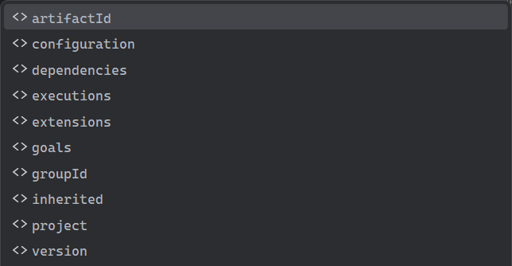


#### 多环境配置 `<profiles>`

- Profile 允许你为不同的环境（如开发 `dev`、测试 `test`、生产 `prod`）定义不同的构建配置

- 你可以通过命令行参数 `-P` 来激活指定的 profile，例如 `mvn package -P prod`。这会使用 `prod` profile 中定义的属性来构建项目


#### 完整POM文件示例

```xml
<?xml version="1.0" encoding="UTF-8"?>
<project xmlns="http://maven.apache.org/POM/4.0.0"
         xmlns:xsi="http://www.w3.org/2001/XMLSchema-instance"
         xsi:schemaLocation="http://maven.apache.org/POM/4.0.0 https://maven.apache.org/xsd/maven-4.0.0.xsd">
    
    <!-- POM 模型版本，对于 Maven 2 和 3 来说，永远是 4.0.0 -->
    <modelVersion>4.0.0</modelVersion>

    <!--
        项目的坐标 (GAV)，在所有 Maven 项目中唯一标识此项目
    -->
    <groupId>com.example.app</groupId>
    <artifactId>my-modern-app</artifactId>
    <version>1.0.0-SNAPSHOT</version>

    <!--
        打包方式。'jar' 表示标准 Java 应用，
				'war' 表示 Web 应用	......
        对于 Spring Boot 2.x+，即使是 Web 应用也推荐使用 'jar'
    -->
    <packaging>jar</packaging>

    
    <!-- 一些项目描述信息 -->
    <name>My Modern Application</name>
    <description>A comprehensive example of a modern pom.xml for a Spring Boot application.</description>
    <url>https://example.com/projects/my-modern-app</url>

    <!--
		父POM:
        为了让 Spring Boot 的父 POM 生效，我们需要在这里声明它。
        父 POM 提供了大量的默认配置，极大地简化了我们的配置。
        它也扮演了 BOM 的角色，管理了大量依赖的版本。
    -->
    <parent>
        <groupId>org.springframework.boot</groupId>
        <artifactId>spring-boot-starter-parent</artifactId>
        <version>2.7.5</version>
        <relativePath/> <!-- 从仓库查找父 POM，而不是从本地相对路径 -->
    </parent>

    
    <!-- 属性定义                                             -->
    <!--
        集中定义项目中使用的各种属性，便于统一管理和修改。
        最佳实践：将 Java 版本、依赖版本、插件版本等都在此定义。
    -->
    <properties>
        <!-- 基础属性 -->
        <project.build.sourceEncoding>UTF-8</project.build.sourceEncoding>
        <project.reporting.outputEncoding>UTF-8</project.reporting.outputEncoding>
        <java.version>17</java.version>

        <!-- 自定义依赖版本 -->
        <lombok.version>1.18.24</lombok.version>
    </properties>

    <!-- 依赖管理     -->
    <!--
        这里只声明依赖的版本和配置，但不实际引入依赖
        主要用于统一管理项目（尤其是多模块项目）的依赖版本
        我们已经继承了 spring-boot-starter-parent，它包含了大量的 dependencyManagement
        这里我们可以添加或覆盖一些自定义的依赖管理
    -->
    <dependencyManagement>
        <dependencies>
            <!-- 示例：在这里统一管理 Lombok 的版本 -->
            <dependency>
                <groupId>org.projectlombok</groupId>
                <artifactId>lombok</artifactId>
                <version>${lombok.version}</version>
            </dependency>
        </dependencies>
    </dependencyManagement>

  
    <!-- 依赖声明 -->
    <!--
        这里是项目实际需要引入的依赖库。
    -->
    <dependencies>
        <!-- Spring Boot Web Starter: 包含了构建 Web 应用所需的一切，如 Spring MVC, Tomcat 等 -->
        <!-- 版本由继承的 spring-boot-starter-parent 管理 -->
        <dependency>
            <groupId>org.springframework.boot</groupId>
            <artifactId>spring-boot-starter-web</artifactId>
        </dependency>

        <!-- Spring Boot Test Starter: 包含了测试所需的一切，如 JUnit 5, Mockito 等 -->
        <!-- scope=test 表示此依赖只在测试时有效，不会被打包到最终的 jar 文件中 -->
        <dependency>
            <groupId>org.springframework.boot</groupId>
            <artifactId>spring-boot-starter-test</artifactId>
            <scope>test</scope>
            <!--
                示例：排除传递性依赖。
                假如我们不想用 JUnit 4，可以从测试启动器中排除它。
                (在现代 Spring Boot 中此操作非必须，仅为演示)
            -->
            <exclusions>
                <exclusion>
                    <groupId>org.junit.vintage</groupId>
                    <artifactId>junit-vintage-engine</artifactId>
                </exclusion>
            </exclusions>
        </dependency>

        <!-- Lombok: 用于简化代码，如自动生成 getter/setter -->
        <!-- scope=provided 表示编译时需要，但运行时由环境提供（在这里，它通过注解处理器工作，运行时不需要）-->
        <dependency>
            <groupId>org.projectlombok</groupId>
            <artifactId>lombok</artifactId>
            <scope>provided</scope>
        </dependency>
    </dependencies>

 
    <!-- 构建配置                                            -->
    <build>
        <!-- 定义最终生成的文件名，不含扩展名 -->
        <finalName>${project.artifactId}-${project.version}</finalName>

        <plugins>
            <!-- Spring Boot Maven 插件：用于将应用打包成一个可执行的 fat jar -->
            <plugin>
                <groupId>org.springframework.boot</groupId>
                <artifactId>spring-boot-maven-plugin</artifactId>
            </plugin>

            <!--
                Maven 编译器插件：虽然父 POM 已配置，但这里可以显式覆盖。
                我们通过 properties 中的 java.version 属性来控制它。
            -->
            <plugin>
                <groupId>org.apache.maven.plugins</groupId>
                <artifactId>maven-compiler-plugin</artifactId>
                <configuration>
                    <source>${java.version}</source>
                    <target>${java.version}</target>
                    <compilerArgs>
                        <arg>-parameters</arg>
                    </compilerArgs>
                </configuration>
            </plugin>
        </plugins>
    </build>


    <!-- 多环境配置 (Profiles)                                               -->
    <!--
        定义不同环境下的特定配置。可以通过 -P 参数激活。
        例如：mvn package -P prod
    -->
    <profiles>
        <!-- 开发环境 (默认激活) -->
        <profile>
            <id>dev</id>
            <activation>
                <activeByDefault>true</activeByDefault>
            </activation>
            <properties>
                <!-- 定义开发环境的数据库连接 -->
                <db.connection.url>jdbc:mysql://localhost:3306/dev_db</db.connection.url>
                <log.level>DEBUG</log.level>
            </properties>
        </profile>

        <!-- 生产环境 -->
        <profile>
            <id>prod</id>
            <properties>
                <!-- 定义生产环境的数据库连接 -->
                <db.connection.url>jdbc:mysql://prod-server:3306/prod_db</db.connection.url>
                <log.level>INFO</log.level>
            </properties>
            <build>
                <plugins>
                    <!-- 示例：在生产环境构建时，可以加入一些额外的插件，如代码混淆、打包源码等 -->
                    <plugin>
                        <groupId>org.apache.maven.plugins</groupId>
                        <artifactId>maven-source-plugin</artifactId>
                        <version>3.2.1</version>
                        <executions>
                            <execution>
                                <id>attach-sources</id>
                                <goals>
                                    <goal>jar-no-fork</goal>
                                </goals>
                            </execution>
                        </executions>
                    </plugin>
                </plugins>
            </build>
        </profile>
    </profiles>

</project>

```


## Maven中项目的继承与依赖传递

- 在 Maven 中，一个项目与其他项目有两种核心关系：**继承 (Inheritance)** 和 **依赖 (Dependency)**。这两种关系下，信息的传递规则是完全不同的。

### 子模块能从父项目继承什么

- 当一个模块在 `<parent>` 标签中指定了一个父 POM 时，它会继承大量来自父项目的配置。这是一种强大的、自上而下的**内部管理机制**。

- **子模块会继承以下主要内容：**

  - **`<dependencyManagement>` (最重要)**
    - 子模块会自动继承父项目“规则手册”中定义的所有依赖的版本、范围 (`scope`) 和排除规则 (`exclusions`)。这是实现多模块版本统一的关键。

  - **`<pluginManagement>`**
    - 与上面类似，子模块会继承父项目对插件版本和默认配置的管理。

  - **`<properties>`**
    - 父项目中定义的所有属性，子模块都可以直接使用（例如 `${java.version}`）。

  - **`<dependencies>`**
    - 父项目中直接声明的依赖，所有子模块都会无条件继承。因此，通常只有当一个依赖是**所有子模块都必须使用**的时候，才会放在父项目的 `<dependencies>` 中。

  - **`<repositories>` 和 `<pluginRepositories>`**
    - 子模块会继承父项目配置的仓库地址，知道该去哪里下载依赖和插件。

  - **部分 `<build>` 配置**
    - 例如 `<sourceDirectory>`, `<outputDirectory>` 等路径配置，以及通过插件管理定义的构建行为。

**一句话总结：子模块几乎继承了父项目的所有管理和配置信息，旨在实现项目内部的高度统一和规范。**


### 依赖它的项目会得到什么

- 当一个完全独立的外部项目（我们称之为 `Consumer-Project`）在它的 `<dependencies>` 中引入你的项目时，它关心的不是你的“家规”，而是你这个“产品”本身包含了什么。

- **`Consumer-Project` 只会获得以下信息：**

  - **传递性依赖 (Transitive Dependencies)**
    - 这是最主要的部分。你的项目所依赖的、并且 `scope` 为 `compile` 或 `runtime` 的库，会被传递给 `Consumer-Project`。
    - **关键**：这个传递过程是根据你的项目发布的 `pom.xml` 中最原始的依赖关系来解析的，它**不会**考虑你在构建自己项目时使用的 `<exclusions>` 规则。

  - **项目坐标 (GAV)**
    - `Consumer-Project` 当然知道你的项目的 `groupId`, `artifactId`, `version`，否则它无法依赖你。

- **外部项目只关心你最终提供了哪些传递性依赖，对你的内部管理规则（如 `<dependencyManagement>`）一无所知**


### 一些绝对不会被传递给外部项目的东西

- **`<dependencyManagement>`**：你的“依赖规则手册”是你自己的事，外部项目有它自己的手册。
- **`<pluginManagement>`**：你的“插件规则手册”也是你自己的事。
- **`<parent>` 信息**：外部项目不关心你的父项目是谁。
- **`<build>` 配置**：外部项目有它自己的构建生命周期和插件配置。
- **`<exclusions>` 规则**：你在 `<dependencies>` 中为自己项目设置的排除规则，对外部项目无效。
- **`test` 和 `provided` 范围的依赖**：这些依赖天生就不会向外传递。


### 对插件的影响

#### 继承 (`<parent>`)

- **会继承插件**

  - 当一个项目通过 `<parent>` 标签继承一个父项目时，它会继承父项目的构建配置，**包括插件**。继承方式主要有两种：

    - **直接继承 (`<build><plugins>`)**
      - **行为**：父项目中在 `<plugins>` 列表里声明的插件，会被所有子项目**无条件继承并激活**。
      - **作用**：强制所有子项目使用统一的构建逻辑，例如统一的 Java 编译器版本 (`maven-compiler-plugin`)。

    - **管理式继承 (`<build><pluginManagement>`)**
      - **行为**：父项目在 `<pluginManagement>` 中声明的插件，仅仅是**定义了插件的版本和默认配置**，并不会被子项目直接激活。
      - **作用**：它是一个“插件清单”，用于统一管理团队所有项目可能用到的插件版本。子项目如果需要使用，必须在自己的 `<plugins>` 中重新声明（只需 groupId 和 artifactId，version 会自动从父项目继承），这样才能激活它。

- **核心目的**：在多个模块间**统一管理和约束**构建行为与插件版本

#### 依赖 (`<dependency>`)

- **绝对不会引入插件**

  - 当一个项目通过 `<dependency>` 标签依赖另一个项目时，它**只会**获取被依赖项目的：
    1. **编译产物**（通常是 `.jar` 文件）。
    2. **传递性依赖**（被依赖项目自己所依赖的库）。

  - 它**绝对不会**继承或受到被依赖项目 `pom.xml` 中配置的任何**构建插件**的影响。

- **核心目的**：为了在**编译或运行时**能够调用另一个项目的代码，而不是复用它的构建过程。构建工具（插件）和代码库（依赖）在 Maven 中是严格分离的概念。


## Maven生命周期

- Maven 的核心思想之一是它为所有项目构建定义了一套标准化的流程，
  这遵循了其著名的“约定优于配置”（Convention over Configuration）原则
  - 这个标准化的流程就是**生命周期（Lifecycle）**

### 生命周期相关概念

- 生命周期本身是一个**抽象的概念**，它是一系列有序的**阶段**的集合。
- 它只定义了“做什么”以及“按什么顺序做”，不关心“谁来做”或“具体怎么做”。

- Maven 本身并不直接执行任何具体操作。它只负责定义“做什么”以及“按什么顺序做”。
  真正干活的，是绑定在这些阶段上的**插件目标**。这种设计使得 Maven 的核心非常轻量，同时又具备极高的扩展性

  

- Maven 共有**三套相互独立的生命周期**：

  1. **`default`**：这是最核心、最主要的生命周期，负责项目的编译、测试、打包、部署等所有核心工作。
     			它是项目从源代码到最终可分发构件的完整生产线。
  2. **`clean`**：一个独立的、简单的生命周期，负责清理项目构建后生成的文件。
                             它的存在是为了确保每一次构建都是在一个干净、无污染的环境中开始的。
  3. **`site`**：负责生成项目的文档和报告站点。
                            它帮助团队共享项目信息，进行代码质量监控

  - 这三套生命周期是**完全独立**的，执行其中一个不会触发另外两个。

    > 例如，执行 `mvn clean` 只会运行 `clean` 生命周期来删除 `target` 目录，并不会触发 `default` 生命周期中的任何编译或打包操作。同样，执行 `mvn package` 也不会自动执行 `clean`


### 核心生命周期：`default`

- 这是我们日常开发中使用最频繁的生命周期。它包含了一系列按严格顺序执行的阶段，确保了项目构建的每一个环节都按部就班。
- 以下是其中最重要、最常用的阶段的详细说明(阶段超级多，只说了常用的)：

1. **`validate` (验证)**

   - **作用**：作为流水线的第一道质检工序，它验证项目是否正确，所有必需的信息是否可用。
     >例如，检查 `pom.xml` 文件本身是否符合语法规范，项目结构是否基本正确。

2. **`compile` (编译)**

   - **作用**：编译项目的**主代码**。它会找到位于 `src/main/java` 目录下的所有 `.java` 源文件，使用 `maven-compiler-plugin` 插件将它们编译成 JVM 可以执行的 `.class` 字节码文件，并默认输出到 `target/classes` 目录

3. **`test` (测试)**

   - **作用**：这是保证代码质量的关键环节。它会先编译位于 `src/test/java` 目录下的**测试代码**（输出到 `target/test-classes`），然后使用 `maven-surefire-plugin` 插件来运行这些测试用例。如果任何一个测试失败，构建过程将默认在此中止
     >这遵循了 Maven 的一个核心原则：**快速失败 (Fail Fast)**。其目的是为了保证软件质量，如果代码连最基本的单元测试都无法通过，说明它存在缺陷。在这种情况下，继续将其打包、发布是毫无意义且非常危险的。因此，测试失败就立即停止，可以确保只有通过了所有质量检查的代码才能进入到构建流程的下一步。

4. **`package` (打包)**

   - **作用**：将之前阶段的产物（编译好的主代码、`src/main/resources` 下的资源文件等）打包成一个可分发的格式。打包的类型由 `pom.xml` 中的 `<packaging>` 标签决定，最常见的是 `jar` 和 `war`。打包好的最终文件会存放在 `target` 目录下

5. **`verify` (验证)**

   - **作用**：这是一个检查点，用于运行任意的检查来验证包是有效的，并符合质量标准。它通常用于执行集成测试，确保各个模块组合在一起后能够正常工作

6. **`install` (安装)**

   - **作用**：将打包好的构件（JAR/WAR）**安装到你的本地 Maven 仓库**。一旦安装成功，你本地电脑上的其他 Maven 项目就可以在 `pom.xml` 中把它作为一个依赖来使用了，这对于多模块项目的本地开发和调试至关重要

7. **`deploy` (部署)**

   - **作用**：这是发布的最后一步。它将最终的包复制到**远程仓库**（如公司内部的 Nexus、Artifactory 或公共的中央仓库），从而分享给团队中的其他开发者或外部用户。执行 `deploy` 意味着你认为这个版本已经准备好被他人使用了

- **关键规则：** 当你执行一个生命周期阶段时，Maven 会**自动按顺序执行**该生命周期中在它**之前的所有阶段**。这是一个强制性的顺序，保证了构建的完整性

  - 例如，执行 `mvn package`，Maven 的实际执行路径是：`validate` → `compile` → `test` → `package`。它确保了只有在代码编译成功并通过所有测试后，才会进行打包

  - 例如，执行 `mvn install`，Maven 会把从 `validate` 到 `install` 的所有阶段都完整地走一遍，确保最终安装到本地仓库的是一个经过完整验证的、可用的包


### 辅助生命周期：`clean` 与 `site`

#### `clean` 生命周期

- 它的目的非常纯粹：清理上一次构建留下的“垃圾”，确保构建环境的纯净

  - **`pre-clean`**: 执行清理前的工作。

  - **`clean`**: **核心阶段**。默认绑定了 `maven-clean-plugin` 的 `clean` 目标，其任务就是删除由 `default` 生命周期生成的所有文件（主要是整个 `target` 目录）。

  - **`post-clean`**: 执行清理后的工作。

- **常用命令**：`mvn clean`。为了确保一次全新的、不受历史构建产物影响的构建，最常见、最安全的组合命令是 `mvn clean install` 或 `mvn clean package`。

####  `site` 生命周期

- 它的目的是为项目自动创建一份专业的文档站点，便于团队沟通和项目交接

  - **`pre-site`**: 执行生成站点前的准备工作。

  - **`site`**: **核心阶段**。使用 `maven-site-plugin` 插件，聚合各种报告和项目信息，生成一个 HTML 站点。

  - **`post-site`**: 执行生成站点后的工作。

  - **`site-deploy`**: 将生成的站点部署到指定的 Web 服务器上。

- 它可以集成的报告非常丰富
  >例如：单元测试报告（Surefire Report）、测试覆盖率报告（JaCoCo）、静态代码分析报告（Checkstyle, PMD）、项目依赖报告等


### 阶段(Phase)vs目标(Goal)

- 这是理解生命周期工作原理的关键，也是 Maven 设计精髓的体现。

  - **阶段（Phase）**：是生命周期中的一个**步骤**或**里程碑**，是抽象的、有顺序的。比如 `compile` 是一个阶段。

  - **目标（Goal）**：是插件提供的一个**具体功能**，是实际执行的任务。比如 `maven-compiler-plugin` 插件提供了 `compile` 这个目标（其完整坐标为 `compiler:compile`），它的唯一功能就是调用 Java 编译器来编译代码。


- **Maven 的工作模式就是将“插件目标”绑定到“生命周期阶段”上。**

  - Maven 已经有了一套非常成熟的默认绑定关系，覆盖了绝大多数构建场景。例如：

    - `compile` 阶段默认绑定了 `compiler:compile` 目标

    - `package` 阶段默认绑定了 `jar:jar` 目标（如果打包类型是 JAR）

    - `test` 阶段默认绑定了 `surefire:test` 目标

  - 当你执行 `mvn compile` 命令时，Maven 会说：“好的，现在进行到了 `compile`（编译）这个阶段，此时的目标应该是 `compiler:compile`（编译器插件的编译功能）。” 于是，它就去调用这个插件目标来完成编译任务。

  - 你也可以在 `pom.xml` 的 `<build>` 部分，通过 `<executions>` 标签将任何插件的任何目标绑定到你希望的任何生命周期阶段上，从而实现高度定制化的构建过程。


## Maven中的一些问题

### 依赖无法正常下载？

- 如图

  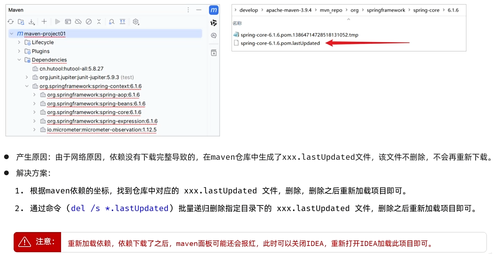


# JUnit 5 

## JUnit相关概念

- **JUnit** 是一个为 Java 语言编写的、开源的**单元测试框架**。它被广泛用于编写和运行可重复的自动化测试

- **单元测试（Unit Testing）** 是指对软件中的最小可测试单元（通常是一个方法或一个类）进行检查和验证。其目的是确保代码的每个部分都按预期工作

- 在 JavaWeb 开发中，你可以用 JUnit 测试：

  - **DAO 层**：数据库的增删改查操作是否正确。

  - **Service 层**：业务逻辑是否符合预期。

  - **工具类**：各种辅助方法的功能是否正常。

  - ...以及任何不直接依赖 Web 容器（如 Tomcat）的独立代码模块。


## JUnit的作用

1. **保证代码质量**：通过测试可以及早发现代码中的 Bug。
2. **让重构更安全**：当你修改或重构现有代码时，只需重新运行测试，就能快速验证是否破坏了原有功能。
3. **提供活文档**：测试用例本身就是代码功能和使用方式的最佳说明文档。
4. **提升开发效率**：相比于启动整个 Web 应用来调试一小段逻辑，单元测试要快得多。
5. **驱动设计（TDD）**：可以采用“测试驱动开发”模式，先写测试再写实现，从而写出更简洁、更易于测试的代码。


## JUnit 5 中的核心注解

- JUnit 5 提供了丰富的注解来满足不同的测试场景

### 注解 `@Test`

- **`@Test` 是基础注解**：它是最基本的测试注解，用于标记一个**标准的、无参数的测试方法**
- **可替代 `@Test` 的注解**：当你使用以下注解时，它们本身就定义了一个测试，因此**不需要**再额外添加 `@Test` 注解
  - `@ParameterizedTest` (参数化测试)
  - `@RepeatedTest` (重复测试)
  - `@TestFactory` (测试工厂)
- **辅助注解**：以下注解用于修饰测试或定义测试的生命周期。它们有的**直接修饰**测试方法（如 `@DisplayName`），有的则**独立标记辅助方法来服务于测试**（如 `@BeforeAll`, `@AfterAll`, `@BeforeEach`, `@AfterEach`）。


### 注解详解

#### 基本测试与生命周期注解

| 注解                       | 说明                                                         | 使用场景                                                     |
| -------------------------- | ------------------------------------------------------------ | ------------------------------------------------------------ |
| **`@Test`**                | 标记一个方法为**测试方法**。这是最核心的注解。               | `public void testAdd() { ... }`                              |
| **`@DisplayName("描述")`** | 为测试类或测试方法提供一个自定义的、更易读的显示名称。       | `@DisplayName("测试加法功能")`                               |
| **`@BeforeEach`**          | 标记一个方法，该方法在**每个** `@Test` 方法运行**之前**执行。 | 初始化测试对象、准备测试数据。                               |
| **`@AfterEach`**           | 标记一个方法，该方法在**每个** `@Test` 方法运行**之后**执行。 | 清理资源、恢复环境。                                         |
| **`@BeforeAll`**           | 标记一个**静态(static)方法，该方法在当前测试类中所有**测试方法运行**之前**执行一次。 | 建立数据库连接、启动昂贵的外部资源。                         |
| **`@AfterAll`**            | 标记一个**静态(static)方法，该方法在当前测试类中所有**测试方法运行**之后**执行一次。 | 关闭数据库连接、释放外部资源。                               |
| **`@Disabled`**            | 暂时**禁用**一个测试类或测试方法。被禁用的测试不会被执行。   | 当某个功能暂时不可用或正在重构时。                           |
| **`@Nested`**              | 用于创建一个**内嵌测试类**，可以将相关的测试分组，使结构更清晰。 | `class UserAuthenticationTests { @Nested class LoginTests { ... } }` |


#### 高级测试注解 (可替代 `@Test`)

| 注解                     | 说明                                               | 备注                                                         |
| ------------------------ | -------------------------------------------------- | ------------------------------------------------------------ |
| **`@RepeatedTest(N)`**   | 重复测试。将一个方法重复执行 N 次。                | **替代 `@Test`**。                                           |
| **`@ParameterizedTest`** | 参数化测试。使用不同的参数多次运行同一个测试方法。 | **替代 `@Test`**。需要与参数源注解（如 `@ValueSource`）配合。 |
| **`@TestFactory`**       | 测试工厂。用于在运行时动态生成测试。               | **替代 `@Test`**。方法必须返回一个动态测试的集合或流。       |


#### 参数源注解 (配合 `@ParameterizedTest` 使用)

| 注解                    | 说明                                                      |
| ----------------------- | --------------------------------------------------------- |
| **`@ValueSource(...)`** | 提供一组简单的字面量值（如 `int`, `String`）。            |
| **`@CsvSource(...)`**   | 提供一组以逗号分隔的值（CSV），可为每次测试提供多个参数。 |


## 断言（Assertions类）

- 断言是测试的灵魂，它用于**验证**代码的行为是否符合预期。如果断言失败，测试就会失败，并给出明确的错误信息

- JUnit 5 的断言方法都位于 `org.junit.jupiter.api.Assertions` 类中，所有方法都是静态的，可以直接导入使用


### 常用断言方法表

| 方法签名                                                     | 描述                                                         |
| ------------------------------------------------------------ | ------------------------------------------------------------ |
| `assertEquals(Object expected, Object actual, String message?)` | 验证**预期值**和**实际值**是否相等（通过 `equals()` 方法比较）。如果不想等，测试失败。这是最常用的断言。 |
| `assertNotEquals(Object unexpected, Object actual, String message?)` | 验证**非预期值**和**实际值**不相等。如果相等，测试失败。     |
| `assertTrue(boolean condition, String message?)`             | 验证提供的条件是否为 `true`。如果为 `false`，测试失败。      |
| `assertFalse(boolean condition, String message?)`            | 验证提供的条件是否为 `false`。如果为 `true`，测试失败。      |
| `assertNull(Object actual, String message?)`                 | 验证对象是否为 `null`。如果不为 `null`，测试失败。           |
| `assertNotNull(Object actual, String message?)`              | 验证对象是否不为 `null`。如果为 `null`，测试失败。           |
| `assertThrows(Class<T> expectedType, Executable executable, String message?)` | 验证执行 `executable` 中的代码块时，是否会抛出 `expectedType` 类型的异常。如果没有抛出或类型不匹配，测试失败。 |
| `assertAll(String heading?, Executable... executables)`      | 分组断言。它会执行所有传入的断言，并**一次性报告所有失败**，而不是在第一个失败时就停止。非常适合用于验证一个对象的多个属性。 |
| `assertTimeout(Duration timeout, Executable executable, String message?)` | 验证某个操作能否在指定的**超时时间**内完成。如果超时，测试失败。 |
| `assertArrayEquals(Object[] expected, Object[] actual, String message?)` | 验证两个**数组**的内容和顺序是否完全相等。**注意**：不能用 `assertEquals` 来比较数组内容，因为它只会比较数组对象的引用地址。 |
| `fail(String message)`                                       | 直接让测试**失败**。通常用在某些不应该被执行到的代码分支中，以确保逻辑的正确性。 |


### 关于 `message?` 参数的说明

- 你可能注意到了断言方法表中的 `String message?`，这里解释一下：

  - **`?` 的含义**：这是一个文档标记，表示该参数是**可选的 (Optional)**。在写代码时**不能**带上问号。JUnit 为绝大多数断言都提供了两个版本（通过方法重载实现）：一个带 `message`，一个不带

  - **`String message` 的作用**：这个参数用于提供一个**自定义的失败信息**。当断言失败时，你写的这条信息会清晰地显示在测试报告中，帮助你快速定位问题。如果测试通过，该信息会被完全忽略

- **示例：**

  ```java
  // 当测试失败时，默认信息比较通用
  assertEquals(5, 4); 
  // -> org.opentest4j.AssertionFailedError: expected: <5> but was: <4>
  
  // 使用自定义信息，错误一目了然
  assertEquals(5, 4, "用户总数计算错误"); 
  // -> org.opentest4j.AssertionFailedError: 用户总数计算错误 ==> expected: <5> but was: <4>
  ```

  

## 在 Maven 项目中使用 JUnit 5

- 在标准的 Maven 项目中集成并使用 JUnit 5，核心是配置 `pom.xml` 文件

### 配置依赖：两种方式

- 可以根据需要选择以下任意一种方式来添加依赖

  - **方式一 (推荐学习)：分开引入 `api` 和 `engine`**

    - 这种方式能更清晰地理解 JUnit 5 的模块化架构

      ```xml
      <dependencies>
          <!-- 编写测试所需的核心API -->
          <dependency>
              <groupId>org.junit.jupiter</groupId>
              <artifactId>junit-jupiter-api</artifactId>
              <version>5.10.2</version>
              <scope>test</scope>
          </dependency>
          <!-- 运行测试所需的引擎 -->
          <dependency>
              <groupId>org.junit.jupiter</groupId>
              <artifactId>junit-jupiter-engine</artifactId>
              <version>5.10.2</version>
              <scope>test</scope>
          </dependency>
      </dependencies>
      ```

      

  - **方式二 (推荐项目)：使用聚合依赖 `junit-jupiter`**

    - 这是一个“全家桶”依赖，它会自动帮你引入 `api`, `engine`, `params` 等最常用的核心组件。这种方式更简洁，能避免手动引入时可能出现的版本不一致问题

      ```xml
      <dependencies>
          <dependency>
              <groupId>org.junit.jupiter</groupId>
              <artifactId>junit-jupiter</artifactId>
              <version>5.10.2</version>
              <scope>test</scope>
          </dependency>
      </dependencies>
      ```

      

### 配置插件：最佳实践

- 无论你用哪种方式添加依赖，**最佳实践**都是在 `build` 中**明确声明** `maven-surefire-plugin`

  ```xml
  <build>
      <plugins>
          <plugin>
              <groupId>org.apache.maven.plugins</groupId>
              <artifactId>maven-surefire-plugin</artifactId>
              <version>3.2.5</version>
          </plugin>
      </plugins>
  </build>
  ```

  

- **为什么建议明确声明插件？**

  - **依赖** 提供了写测试和运行测试的“能力”（如同工具库）

  - **插件** 则是 Maven 在 `test` 阶段真正调用的“执行者”

  - 虽然 Maven 会默认绑定一个 `surefire` 插件，但明确声明是为了将这个默认的测试行为**“显式化”、“固定化”和“可配置化”**，这是保证项目构建稳定、可靠、可复现的关键一步

- **如何选择插件版本？**

  - **追求兼容性，而非版本号一致**：你不需要寻找一个和 JUnit 版本号完全匹配的 `surefire` 版本。

  - **选择现代版本**：`maven-surefire-plugin` 从 `2.22.0` 版本开始就原生支持 JUnit 5。

  - **最佳实践**：选择一个较新的、稳定的版本（如 `3.x` 系列）是最佳实践。它能很好地兼容所有现代的 JUnit 5 版本。


## JUnit 编写规范与要求

### 命名与存放位置 (推荐)

- **测试类命名**：通常是 **`被测试的类名Test`** 或 **`被测试的类名Tests`**。
  - 例如：测试 `UserService` 类，测试类应命名为 `UserServiceTest`。
- **测试方法命名**：推荐采用能够清晰描述测试行为的风格。
  - **`test功能描述()`**：例如 `testLoginWithInvalidPassword()`。
  - **`should_期望行为_when_特定条件()`**：可读性极佳，如 `should_throwException_when_userIdIsNull()`。
- **测试类的存放位置 (约定优于配置)**：
  - **源代码存放于**：`src/main/java`
  - **测试代码存放于**：`src/test/java`
  - 最重要的是，**测试类的包路径应该和被测试类的包路径保持一致**。这能让 Maven 自动识别，并方便测试代码访问被测类的包级私有成员。


### 强制要求 (方法修饰符详解)

- 这些是编写 JUnit 5 测试时必须遵守的规则，特别是关于方法的访问修饰符 (`public`, `private`) 和 `static` 修饰符

  - **访问修饰符 (`public` vs. `private`)**
    - 在老的 **JUnit 4** 中，测试类和测试方法**必须**声明为 `public`。
    - 在 **JUnit 5** 中，这个限制被放宽了。测试方法可以是 `public` 或 **包级私有 (package-private)**（即不写任何访问修饰符）。
    - **但绝不能是 `private`**！因为测试引擎需要从外部调用你的测试方法，`private` 会阻止这种访问，导致测试无法被发现和执行

  - **`static` 修饰符** `static` 的使用与否，完全取决于注解所关联的生命周期

    | 注解                 | `static` 要求        | 为什么？                                         |
    | -------------------- | -------------------- | ------------------------------------------------ |
    | `@BeforeAll`         | ⭐**必须是** `static` | 作用于整个测试类，在任何测试实例创建前执行。     |
    | `@AfterAll`          | ⭐**必须是** `static` | 作用于整个测试类，在所有测试实例销毁后执行。     |
    | `@BeforeEach`        | **不能是** `static`  | 为每个测试实例做准备，需要访问实例级别的成员。   |
    | `@Test`              | **不能是** `static`  | 每个测试都在一个独立的实例上运行。               |
    | `@RepeatedTest`      | **不能是** `static`  | 同 `@Test`，在实例上运行。                       |
    | `@ParameterizedTest` | **不能是** `static`  | 同 `@Test`，在实例上运行。                       |
    | `@AfterEach`         | **不能是** `static`  | 清理每个测试实例的资源，需要访问实例级别的成员。 |

- **其他强制要求**
  - **方法必须返回 `void`**：测试的成功与否由断言决定，不需要返回值
  - **标准 `@Test` 方法不能有参数**：参数化测试（`@ParameterizedTest`）是例外


## 单元测试最佳实践

1. **快**：单元测试应该运行得非常快
2. **独立：测试之间不应有任何依赖关系，可以以任意顺序运行
3. **可重复：每次运行测试都应该得到相同的结果，不受外部环境影响
4. **自我验证**：测试应该能自动判断成功或失败，无需人工检查结果
5. **及时**：测试应该与业务代码一同编写
6. **一个测试只测一件事**：保持测试方法的简单和专注
7. **使用 Mock/Stub 技术**：当测试对象依赖于其他复杂组件（如数据库、网络服务）时，使用 **Mockito** 等框架创建“假”对象来模拟这些依赖，从而实现真正的“单元”隔离


## 为什么 API 和 Engine 是分开的？

- 初次接触时，很多人会觉得奇怪：“为什么编写测试的 `api` 和运行测试的 `engine` 要分成两个依赖？合在一起不是更方便吗？”

  - 这其实是 JUnit 5 最核心的设计思想——**关注点分离（Separation of Concerns）**，它带来了巨大的灵活性和可扩展性

    - **`junit-jupiter-api` (API - 应用程序接口)**
      - **角色**：一套**规范和工具集**，供**开发者**使用。
      - **包含**：`@Test`、`@DisplayName` 等注解和 `assertEquals()` 等断言方法。
      - **目的**：让你能够按照一套稳定的标准来**编写测试**。

    - **`junit-jupiter-engine` (Engine - 引擎)**
      - **角色**：一个**具体的执行者**，供 **Maven、IDE 等工具**使用。
      - **包含**：发现和执行测试的底层逻辑。
      - **目的**：让工具能够**运行你写的测试**。

  - 这种分离的好处在于，JUnit 5 不仅仅是 JUnit 自身的升级，它致力于成为 JVM 上的一个**开放的、统一的测试平台**。其他测试框架（如 Spock）也可以开发自己的 `Engine`，只要它们都接入 JUnit Platform 这个统一的“插座”，我们开发者就能用同样的方式（`mvn test`）来运行所有类型的测试，IDE 也能用同样的方式来展示结果。

  - 这个设计也使得**向后兼容**成为可能：通过引入 `junit-vintage-engine`，JUnit 5 可以无缝运行老的 JUnit 4 测试，极大地便利了项目的升级和迁移


# HTTP协议

## 什么是HTTP协议？

- **HTTP** 的全称是 **HyperText Transfer Protocol**（超文本传输协议）。简单来说，它就是一种规定了**客户端**（比如浏览器或手机App）和**服务器**（你的SpringBoot应用）之间如何沟通和传输数据的规则。它构建在可靠的TCP/IP协议之上，保证了数据的可靠传输。

- 它的核心特点可以总结为几点：

  - **基于客户端-服务器模型**：通信总是由客户端发起请求，服务器进行响应。
  - **简单快速**：协议规定简单，报文格式是人类可读的纯文本（在HTTP/1.1及之前），这在早期极大地简化了开发和调试的难度。开发者甚至可以通过telnet程序手动发送HTTP请求来测试服务器。这种简单性是它得以迅速普及的关键。

  - **无连接**：早期HTTP的设计哲学是“一次请求，一次连接”。服务器处理完客户的请求，并收到客户的应答后，即断开TCP连接。这在早期网络中，获取简单HTML文档的场景下效率很高，可以快速释放服务器资源。
    - **持久连接**：但现代网页包含大量资源（CSS、JS、图片）。如果每获取一个资源都新建一次TCP连接，开销会非常大。因此，HTTP/1.1引入了持久连接作为默认行为，允许在一次TCP连接中处理多个HTTP请求，大大提高了效率。

- **无状态**：这是HTTP一个非常重要的特点。协议对于事务处理没有记忆能力。也就是说，服务器的视角里，每个请求都是完全独立的，它不知道两个连续的请求是否来自同一个用户。
  - **如何解决无状态？** 为了实现需要“记住”用户状态的业务（如购物车、用户登录），Web应用普遍采用 **Cookie** 和 **Session** 技术


## HTTP报文结构

- 客户端发送给服务器的数据叫**请求报文 (Request Message)**，服务器返回给客户端的数据叫**响应报文 (Response Message)**。它们都遵循一个通用的三段式结构：**起始行**、**头部**和**正文**

### HTTP 请求报文

- 这是前端发给后端的，目的是**发起一个动作**

```
[起始行]   POST /api/users HTTP/1.1
[头部]     Host: myapp.com
[头部]     User-Agent: Mozilla/5.0
[头部]     Content-Type: application/json

[正文]     {"name": "New User", "email": "test@example.com"}
```

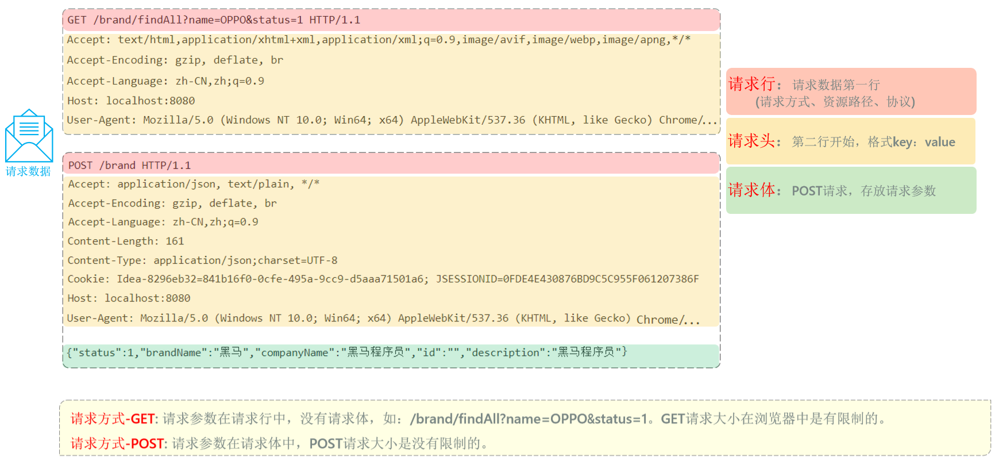

- **起始行 (Request Line)**：顺序固定为 “方法 	URI 	协议版本”
  - **方法 (Method)**：**【选择题】** 必须从官方定义的动词中选择一个
    - `GET`：**最常用**，用于获取资源
    - `POST`：**最常用**，用于创建新资源
    - `PUT`：用于完整更新一个资源
    - `DELETE`：用于删除一个资源
    - `PATCH`：不常用，用于局部更新一个资源
    - `HEAD`：不常用，和GET类似，但只获取响应头，不要正文
  - **URI**：**【填空题】** 由开发者自己定义，指向服务器上的特定资源路径，如 `/api/users/123`
  - **协议版本**：**【选择题】** 通常是 `HTTP/1.1` 或 `HTTP/2`


- **头部 (Headers) - 附加说明(键值对)**：

  - `Host`: **【填空题】** 必须提供，值是服务器的域名，如 `myapp.com`。
  - `Content-Type`: **【选择题】** 如果有正文，则需指明正文格式。
    - `application/json`：**最常用**，表示正文是JSON字符串。
    - `application/x-www-form-urlencoded`：网页表单默认格式。
    - `multipart/form-data`：用于上传文件。
    - `text/plain`：纯文本。
  - `Authorization`: **【填空题】** 用于身份验证，值通常是服务器下发的长字符串（Token），如 `Bearer eyJhbGciOi...`
  - `User-Agent`: **【填空题】** 自动生成，表明客户端的类型，如 `Mozilla/5.0...`

  

- **空行 - 分隔线**：必须有，用于分隔头部和正文


- **正文**


### HTTP 响应报文

- 这是你的 SpringBoot 应用返回给前端的“包裹”，目的是**返回一个结果**

```
[起始行]   HTTP/1.1 201 Created
[头部]     Content-Type: application/json
[头部]     Date: Fri, 08 Aug 2025 08:45:00 GMT

[正文]     {"id": 123, "name": "New User", "email": "test@example.com"}
```

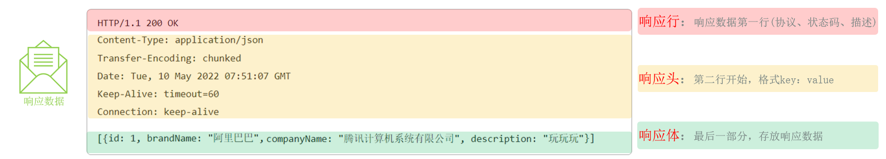

- **起始行 (Status Line)**：顺序固定为 ”协议版本 	状态码 	原因短语“

  - **状态码和原因短语**：**【选择题】** 必须从官方定义的列表中选择。


  - HTTP状态码由三个十进制数字组成，第一个数字定义了响应的类别。总共有五种类型的状态码：

    - **1xx (信息性状态码 - Informational)**

      这类状态码表示服务器已收到请求，客户端应继续发送请求的其余部分或忽略此响应。在日常开发中很少直接处理。

      | 状态码  | 名称                | 描述                                                         |
      | ------- | ------------------- | ------------------------------------------------------------ |
      | **100** | Continue            | 服务器已收到请求头，客户端应继续发送请求体。                 |
      | **101** | Switching Protocols | 服务器根据客户端的请求，正在切换协议。例如，从HTTP切换到WebSocket。 |

    - **2xx (成功状态码 - Success)**

      表示服务器已成功处理了请求。这是我们最希望看到的状态。

      | 状态码  | 名称            | 描述                                                         |
      | ------- | --------------- | ------------------------------------------------------------ |
      | **200** | **OK**          | **最常见的成功状态码。** 表示请求已成功，响应体中包含了请求的资源。 |
      | **201** | **Created**     | 请求成功，并且服务器**创建了一个新的资源**。通常在 `POST` 或 `PUT` 请求后返回。 |
      | **202** | Accepted        | 服务器已接受请求，但尚未处理完成。适用于异步任务，表示请求已进入后台排队。 |
      | **204** | **No Content**  | 服务器成功处理了请求，但**没有返回任何内容**。通常在 `DELETE` 请求成功后返回。 |
      | **206** | Partial Content | 服务器成功处理了部分 `GET` 请求。常用于HTTP分块下载或断点续传。 |

    - **3xx (重定向状态码 - Redirection)**

      表示需要客户端采取进一步的操作才能完成请求。

      | 状态码  | 名称                  | 描述                                                         |
      | ------- | --------------------- | ------------------------------------------------------------ |
      | **301** | **Moved Permanently** | **永久重定向。** 请求的资源已永久移动到新位置。搜索引擎会根据此响应更新其索引。 |
      | **302** | **Found**             | **临时重定向。** 请求的资源临时移动到新位置。搜索引擎不会更新索引。 |
      | **304** | **Not Modified**      | **内容未修改。** 客户端发送了一个带条件的 `GET` 请求（如 `If-None-Match`），服务器发现资源未发生变化，指示客户端可以使用其本地缓存的副本。 |
      | **307** | Temporary Redirect    | 临时重定向。与 `302` 类似，但要求客户端在重定向时**不得改变**原始请求的方法（如 `POST` 仍为 `POST`）。 |
      | **308** | Permanent Redirect    | 永久重定向。与 `301` 类似，但要求客户端在重定向时**不得改变**原始请求的方法。 |

      

    - **4xx (客户端错误状态码 - Client Error)**

      表示客户端的请求有问题。后端开发者需要明确返回这些错误，以便前端进行相应的处理。

      | 状态码  | 名称                   | 描述                                                         |
      | ------- | ---------------------- | ------------------------------------------------------------ |
      | **400** | **Bad Request**        | **请求无效。** 服务器无法理解请求的语法，例如请求参数格式错误、请求体JSON解析失败等。 |
      | **401** | **Unauthorized**       | **未授权。** 请求需要用户认证。表示用户需要登录才能访问。    |
      | **403** | **Forbidden**          | **禁止访问。** 服务器理解请求，但拒绝执行。表示用户**已登录但没有足够权限**访问该资源。 |
      | **404** | **Not Found**          | **未找到。** 服务器上找不到请求的资源。最常见的错误之一，通常是URL拼写错误。 |
      | **405** | Method Not Allowed     | 请求行中指定的请求方法不被允许。例如，对一个只接受 `GET` 的只读资源使用了 `POST` 方法。 |
      | **409** | Conflict               | 请求与服务器当前状态冲突。例如，试图创建一个用户名已存在的用户。 |
      | **415** | Unsupported Media Type | 不支持的媒体类型。服务器无法处理请求附带的媒体格式，例如 `Content-Type` 不正确。 |
      | **429** | Too Many Requests      | 请求过多。客户端在给定时间内发送了太多请求，触发了服务器的限流策略。 |

    

    - **5xx (服务器错误状态码 - Server Error)**

      表示服务器在处理请求的过程中发生了错误。

      | 状态码  | 名称                      | 描述                                                         |
      | ------- | ------------------------- | ------------------------------------------------------------ |
      | **500** | **Internal Server Error** | **服务器内部错误。** 这是一个通用的错误码，表示服务器端代码在执行时遇到了意外情况，但没有更具体的信息。**这是最常见的服务器错误。** |
      | **502** | Bad Gateway               | 坏网关。作为网关或代理的服务器，从上游服务器收到了无效的响应。 |
      | **503** | Service Unavailable       | 服务不可用。服务器当前无法处理请求，通常是由于过载或正在进行维护。这是一个临时状态。 |
      | **504** | Gateway Timeout           | 网关超时。作为网关或代理的服务器，未能及时从上游服务器接收到响应。 |


- **头部 (Headers) - 附加说明(键值对)**：

  - `Content-Type`: **【选择题】** 同请求头，指明响应正文的格式。

  - `Location`: **【填空题】** 配合`201`或`3xx`状态码，值是一个URL，指明新资源的位置或重定向的目标地址。

  - `Set-Cookie`: **【填空题】** 服务器用它来给客户端设置Cookie，值由服务器生成。

  - `Cache-Control`: **【选择题/填空题】** 指示缓存策略。

    - `no-cache`：可缓存，但使用前需到服务器验证。
    - `no-store`：完全不允许缓存。
    - `public` / `private`：区分共享缓存和私有缓存。
    - `max-age=3600`：指明缓存的有效时间（秒）

    

- **空行 - 分隔线**：必须有

  

- **正文**

  

### 关于头部的规则和约定

- HTTP协议为了保证全球互联网的互通性，对头部的定义和使用有一套非常严格的规则，这些规则都定义在官方的 **RFC** 文档中。

  - **官方定义 vs. 自定义**：有官方定义的“普通话”（标准头部），也允许你自己创造一些“方言”（以`X-`开头的自定义头部）。

  - **格式、顺序与必需项**：
    - **格式**：`名称: 值`，名称大小写不敏感，每行以回车换行符（CRLF）结束。
    - **顺序**：**起始行必须是第一行**。但各个头部字段之间的顺序通常不重要。
    - **必需项**：对于请求报文，在HTTP/1.1中，`Host` 头部是**唯一硬性规定必须存在**的。


## HTTP协议与SpringBoot实践

### 概述

- SpringBoot 通过各种**注解**，极大地简化了处理HTTP请求的流程，让程序员能够专注于业务逻辑，而不是手动解析报文字符串

### 示例

```java
// 定义一个处理用户相关请求的RESTful Controller
@RestController
@RequestMapping("/api/users") // 将这个控制器与 "/api/users" 这个资源路径关联
public class UserController {

    // 模拟一个用户数据对象
    public static class User {
        private long id;
        private String name;
        // 省略构造函数、getter和setter...
    }

    /**
     * 处理 GET /api/users/{id} 请求
     * 例如: GET /api/users/123
     */
    @GetMapping("/{id}") // 将方法与 GET 动作 和具体的子资源路径关联
    public ResponseEntity<User> getUserById(@PathVariable Long id) {
        // ... 根据id去数据库查找用户的逻辑 ...
        User user = new User(id, "John Doe");
        return ResponseEntity.ok(user); // 返回 200 OK 和用户信息
    }

    /**
     * 处理 POST /api/users 请求
     * 请求报文的正文(Body)中应包含用户JSON数据
     */
    @PostMapping // 将方法与 POST 动作关联
    public ResponseEntity<User> createUser(@RequestBody User newUser) {
        // ... 将newUser保存到数据库的逻辑 ...
        newUser.setId(123L);
        return new ResponseEntity<>(newUser, HttpStatus.CREATED);
    }
}
```


### 代码与协议的对应关系

简单列举一小些

- `@RestController`: 声明这个类是一个控制器，它的方法返回的是**数据（如JSON）**，而不是视图（如HTML页面）
  SpringBoot 会自动将返回的对象序列化为JSON字符串，并放入**响应正文 (Response Body)**
- `@RequestMapping("/api/users")`: 将控制器映射到HTTP请求的 **URI (资源)** 路径上
- `@GetMapping("/{id}")`: 将方法映射到 **HTTP GET 方法 (动作)**和具体的子资源路径
- `@PathVariable Long id`: 从 **URI 路径**中提取出 `{id}` 的值
- `@PostMapping`: 将方法映射到 **HTTP POST 方法 (动作)**
- `@RequestBody User newUser`: 告诉 SpringBoot，去读取**请求正文 (Request Body)** 中的数据，并将其反序列化成一个 `User` 对象
- `ResponseEntity<User>`: 这是一个强大的工具，让你能完全控制**HTTP响应报文**（包括状态码、头部和正文）

- .......


# Spring Boot

## 核心基础

### 1.Spring Boot 简介

- Spring Boot 是一个基于 Spring 框架的开源 Java 框架，它的设计初衷是为了**简化** Spring 应用的初始搭建以及开发过程。

- **核心思想**: **约定优于配置**

  > **解读**: 框架本身为你预设了一套“最佳实践”的默认配置（即“约定”）
  >
  > >例如，当你引入 Web 开发依赖时，它约定使用 Tomcat 作为服务器，端口为 8080；
  > >它约定从 `static` 目录加载静态资源；
  > >它约定使用 Logback 进行日志记录。
  > >在传统的 Spring (XML) 时代，开发者需要编写大量的 XML 文件来定义 Bean、配置组件、整合框架，这个过程非常繁琐且容易出错。Spring Boot 通过自动配置和起步依赖，将这些“约定”固化下来，让你只需要在**偏离约定**时（例如，想把端口换成 8081，或者想用 Undertow 替换 Tomcat）才需要进行少量配置。
  >
  > 这种思想极大地提升了开发效率，让开发者能更专注于业务逻辑本身。

- **目标**: 极大地简化 Spring 应用的初始搭建、开发、部署和监控过程，让开发者能够“开箱即用”。它致力于提供一种“**有主见的**”开发方式，即为你提供一套**官方推荐的最佳实践组合**

- **四大核心特性**:

  - **自动配置**: 这是 Spring Boot 的魔法核心。它通过检查类路径下的 jar 包来“猜测”你的意图，并自动注册和配置相应的 Bean。例如，当它在类路径中发现 `spring-boot-starter-data-jpa` 和 H2 数据库的驱动时，它会自动为你配置好一个指向 H2 内存数据库的数据源和 JPA 的实体管理器工厂（EntityManagerFactory），你无需编写任何配置代码就能直接开始使用。
  - **起步依赖**: 简化依赖管理，避免“依赖地狱”。它是一系列预定义的依赖描述符（`pom.xml`），你只需要在你的项目中引入一个 `starter`，它就会像一个“全家桶”一样，通过 Maven 的传递性依赖（transitive dependencies）机制，帮你把所有相关的、版本兼容的依赖一次性引入。
  - **Actuator**: 提供生产级的应用监控和管理功能。它通过一系列 HTTP 端点，让你可以在应用运行时，无需侵入业务代码就能检查其健康状况、查看性能指标（如 JVM 内存、CPU 使用率）、管理日志级别、查看 Bean 的加载情况等。这是 DevOps 和微服务监控的关键一环。
  - **嵌入式服务器**: 内置 Tomcat、Jetty 或 Undertow 等服务器，可打包成可执行 JAR 文件直接运行。这意味着你不再需要预先安装和配置一个外部的 Web 服务器，然后把应用打包成 WAR 文件部署上去。你的应用本身就是一个自包含的、可独立运行的程序，这极大地简化了部署流程，也为微服务和容器化架构（如 Docker）铺平了道路。


### 2.控制反转(IoC)与依赖注入(DI)

#### 简述

- 这是整个 Spring 框架的核心思想

  - **控制反转 (IoC - Inversion of Control)**: 一种重要的软件设计思想，用于降低代码模块之间的耦合度。
    - **传统方式**: 对象自己负责创建和管理它所依赖的其他对象。
      例如，`UserService` 需要 `UserRepository`，它就得自己 `new UserRepositoryImpl()`。这种方式下，`UserService` 和 `UserRepositoryImpl` 紧密耦合在了一起。
    - **IoC 方式**: 将创建和管理对象的**控制权**，从程序员的代码中**反转**（转移）到了一个独立的第三方容器（Spring IoC 容器）。
      你不再需要手动 `new` 对象，而是由容器来负责对象的整个生命周期（创建、组装、销毁）。
    - **IoC 容器**: 在 Spring 中，IoC 容器的两个核心接口是 `BeanFactory` 和 `ApplicationContext`。
      `ApplicationContext` 是 `BeanFactory` 的子接口，提供了更完整的功能，如国际化、事件发布等。在 Spring Boot 中，我们打交道的通常都是 `ApplicationContext`。

  - **依赖注入 (DI - Dependency Injection)**: **实现 IoC 的最主要、最具体的技术**。容器知道每个对象需要哪些其他对象（即“依赖”），并自动将这些依赖“注入”到需要它们的对象中。
    DI 的核心好处是**解耦**，让你的类只依赖于接口或抽象，而不是具体的实现，这使得代码**更容易维护和测试**

    > **Spring的自动依赖注入，其本质，就是在IoC容器创建Bean实例的过程中，为这个实例的成员变量进行赋值。**
    >
    > 这个过程发生在组件扫描之后、Bean的实例化阶段。Spring会根据`@Autowired`等注入标记，从容器中查找类型匹配的Bean，并将其“注入”到需要它的地方。
    >
    > 由于创建任何Java对象都**必须通过构造方法**，因此构造方法是依赖注入最核心的入口。当一个类**只有一个构造方法**时，Spring会智能地将其作为唯一的创建方式，并自动解析其参数完成注入，此时`@Autowired`注解便**可以省略**。
    >
    > 然而，当类存在**多个构造方法**时，Spring就无法决策，此时`@Autowired`就成了**必需的指令**，用来明确指定Spring应该使用哪一个构造方法来创建对象。
    >
    > 除了构造方法，依赖也可以通过在Setter方法或字段上添加`@Autowired`来注入，但这发生在对象被构造方法创建**之后**。最终，只有通过这些方式明确请求注入的成员变量才会被Spring自动赋值，开发者可以借此精确控制每个Bean的依赖关系。

  - **只有被Spring IoC容器管理的组件（也就是Bean），才有资格享受容器提供的自动依赖注入服务**


#### DI 的三种主要方式

1. **构造器注入 (Constructor Injection) - 官方最推荐**

   - **方式**: 通过类的构造函数注入依赖。

   - **优点**:

     - **依赖不可变**: 可以将字段声明为 `final`，保证一旦注入就不会被修改，增强了代码的健壮性。
     - **保证依赖完整性**: 在对象创建时，其必需的依赖必须已经准备好，否则无法实例化，避免了在运行时出现 `NullPointerException` 的风险。
     - **易于测试**: 可以轻松地在单元测试中 `new` 一个实例，并传入 Mock 的依赖对象，完全无需启动 Spring 容器。

   - **示例**:

     ```java
     @Service
     public class UserServiceImpl implements UserService {
         private final UserRepository userRepository; // 声明为 final，保证不可变
     
         // 当类只有一个构造函数时，@Autowired 注解可以省略，Spring Boot 会自动使用该构造函数进行注入
         public UserServiceImpl(UserRepository userRepository) {
             this.userRepository = userRepository;
         }
     }
     ```

   - 特点：从 Spring 4.3 版本开始，如果一个类只有一个构造方法，那么 Spring 会自动使用这个构造方法进行依赖注入，无需再显式地使用 `@Autowired` 注解

2. **Setter 注入 (Setter Injection)**

   - **方式**: 通过 `setXXX()` 方法注入依赖

   - **优点**: 比较灵活，允许依赖在对象创建后再注入或变更，适用于**可选依赖**。

   - **缺点**: 无法保证依赖的完整性，可能在运行时才发现依赖未注入。不能使用 `final` 关键字。

   - **示例**:

     ```java
     @Service
     public class UserServiceImpl implements UserService {
         private UserRepository userRepository;
     
         @Autowired
         public void setUserRepository(UserRepository userRepository) {
             this.userRepository = userRepository;
         }
     }
     ```

     

3. **字段注入 (Field Injection)**

   - **方式**: 直接在字段（成员变量）上使用 `@Autowired`

   - **优点**: 代码最简洁，编写方便。

   - **缺点**:

     - **严重不利于单元测试**: 脱离 Spring 容器后，无法为该字段赋值，因为它是 `private` 的，也没有 Setter 方法。
     - **可能隐藏过多的依赖关系**: 容易在一个类里注入过多的依赖，违反单一职责原则。
     - **无法使用 `final`**: 不能保证依赖的不可变性。

   - **示例**:

     ```
     @Service
     public class UserServiceImpl implements UserService {
         @Autowired
         private UserRepository userRepository;
     }
     ```


####  `@Component` 注解

- `@Component` 是 Spring 框架中最基础、最通用的注解之一，它是一切自动化配置和依赖注入的起点。

##### 1. 基本概念

- `@Component` 是一个**类级别**的注解。它的核心作用是向 Spring IoC 容器声明：“**请将这个类标记为一个组件（Bean），并由你来创建和管理它的实例**”

  - Spring 的组件扫描（`@Component`）是用来寻找**具体的类**来创建实例的

- 当 Spring 容器启动时，它会通过**组件扫描**机制，自动发现所有被 `@Component`（及其衍生注解）标记的类，并为它们创建对象（即 Bean），放入容器中统一管理

- 这个过程就是**控制反转(Inversion of Control, IoC)**的核心思想：你不再需要手动 `new` 对象，而是将创建和管理对象的“控制权”交给了 Spring 容器

- **示例**

  ```java
  package com.example.myapp.services;
  
  import org.springframework.stereotype.Component;
  
  @Component
  public class GreeterService {
      public String sayHello() {
          return "Hello from the managed bean!";
      }
  }
  ```

  - 通过添加 `@Component`，`GreeterService` 就成了一个可以被 Spring 发现和管理的 Bean


##### 2. `@Component` 的“衍生注解”

- 为了让代码的职责更清晰，Spring 在 `@Component` 的基础上提供了几个更具语义的**衍生注解（Stereotype Annotations）**。

  - 它们在功能上都继承自 `@Component`，能将类注册为 Bean，但更重要的是，它们能清晰地表达组件在分层架构中所扮演的角色

    - **`@Controller` / `@RestController`**: 用于标注**表现层（Web 层）**的组件。
      - **作用**：专门负责接收和处理前端的 HTTP 请求，调用业务层完成操作，并返回视图或 JSON 数据。
      - **核心特性**：除了标记为 Bean，它还会被 Spring MVC 框架识别为请求处理器，从而能够使用 `@RequestMapping` 等注解进行 URL 映射。

    - **`@Service`**: 用于标注**业务逻辑层**的组件。
      - **作用**：主要用于封装核心业务逻辑，通常会调用一个或多个数据访问层的组件来完成复杂的业务流程。
      - **核心特性**：目前主要用于语义上的区分，让开发者一眼就能看出这是业务逻辑的入口。

    - **`@Repository`**: 用于标注**数据访问层（持久层）**的组件。
      - **作用**：专门负责与数据库进行交互，执行数据的增删改查（CRUD）操作。
      - **核心特性**：除了标记为 Bean，它还能将底层数据访问的特定异常（如 JDBC 的 `SQLException`）自动转译为 Spring 统一的 `DataAccessException` 体系，使上层业务代码无需处理与具体数据库技术耦合的异常。

    - **`@Mapper`**: 用于标注**数据访问层**的接口（在 MyBatis/MyBatis-Plus 环境下）。
      - **来源**：此注解并非来自 Spring，而是来自 MyBatis 框架。
      - **作用**：它告诉 MyBatis，这是一个数据映射接口，MyBatis 会为其动态创建一个代理实现类，并将其作为 Bean 注册到 Spring 容器中。通常需要配合启动类上的 `@MapperScan` 注解一起使用。

  - 最佳实践

    - **优先使用专用注解**：在开发中，应优先使用 `@Controller`, `@Service`, `@Repository` 等专用注解，因为它们不仅能让代码的意图和分层结构一目了然，还能启用框架的特定附加功能。

    - **明确数据访问方式**：如果项目使用 MyBatis，数据访问层的接口应使用 `@Mapper` 注解。如果使用 Spring Data JPA，则通常继承 `JpaRepository` 接口，并用 `@Repository` 标注。

    - **`@Component` 的使用时机**：只有当一个组件不适合明确归入以上任何一层时（例如，一个通用的工具类、配置类、拦截器等），才使用通用的 `@Component` 注解。


#### `@Autowired` 注解

- `@Autowired` 注解是实现**依赖注入(Dependency Injection, DI)**的关键。它的作用是告诉 Spring 容器：“**请自动在这里注入一个匹配的 Bean 实例**”

- 这使得组件之间可以松散地耦合，你不需要在代码中手动创建依赖的对象，一切都由 Spring 负责“装配”

##### 1. 核心概念

- `@Autowired` 可以用在类的成员变量、构造函数或方法上，用于自动装配（注入）IoC 容器中存在的 Bean。
  当 Spring 创建一个 Bean 时，它会检查这个 Bean 是否有被 `@Autowired` 标记的地方，然后去容器中寻找合适的 Bean 并将其注入

##### 2. 三种注入方式

- `@Autowired` 可以用在三个地方，各有优劣


###### 字段注入(Field Injection)

- 这是最简洁、最常见的用法，直接在成员变量上使用

  ```JAVA
  @Service
  public class OrderService {
      @Autowired
      private NotificationService notificationService; // 直接注入
  }
  ```

- **优点**：代码量最少，非常直观

- **缺点**：无法创建不可变（`final`）的依赖。脱离 IoC 容器后，进行单元测试会比较困难（需要通过反射来设置依赖）


###### 构造函数注入(Constructor Injection)

- 在类的构造函数参数上使用。如果类只有一个构造函数，`@Autowired` 注解可以省略

  ```JAVA
  @Service
  public class OrderService {
      private final NotificationService notificationService;
  
      // 当只有一个构造函数时，@Autowired 可省略
      @Autowired
      public OrderService(NotificationService notificationService) {
          this.notificationService = notificationService;
      }
  }
  ```

- **优点**：
  - **推荐方式**：这是 **Spring 官方推荐的注入方式**。
  - **保证依赖可用性**：对象在构造完成时，其所有依赖都已准备就绪。
  - **支持不可变性**：依赖可以被声明为 `final`，增强了代码的健壮性。
  - **测试友好**：不依赖 Spring 容器即可轻松实例化并传入 Mock 对象进行单元测试


###### Setter 方法注入(Setter Injection)

- 在依赖的 Setter 方法上使用

  ```JAVA
  @Service
  public class OrderService {
      private NotificationService notificationService;
  
      @Autowired
      public void setNotificationService(NotificationService notificationService) {
          this.notificationService = notificationService;
      }
  }
  ```

- **优点**：允许依赖在对象创建后被动态地更改或重新注入。
- **缺点**：不如构造函数注入那样能保证依赖的即时可用性。


##### 3. 多个匹配的Bean注入问题

- 这是一个在开发中非常常见的场景：一个接口拥有多个实现类，导致依赖注入时出现歧义。

- **场景示例**：我们系统需要支持邮件和短信两种通知方式。

  ```java
  // 通知服务接口
  public interface NotificationService {
      void send(String message);
  }
  
  // 实现类一：邮件通知
  @Service("emailNotification")
  public class EmailNotificationServiceImpl implements NotificationService {
      // ... 实现细节 ...
  }
  
  // 实现类二：短信通知
  @Service("smsNotification")
  public class SmsNotificationServiceImpl implements NotificationService {
      // ... 实现细节 ...
  }
  ```

- **问题**：如果此时直接注入 `NotificationService`，Spring会因为在容器中找到了多个类型匹配的Bean而无法决策，最终抛出 `NoUniqueBeanDefinitionException` 异常

  - 为了解决这个问题，我们有几种常用方案


###### 方案一:使用`@Primary`指定首选Bean

- 当多个实现中有一个是“主要”或“默认”的选项时，`@Primary` 是最简单的解决方案

  - **作用**：在某个实现类上添加 `@Primary` 注解，告诉Spring当遇到多个候选项时，优先注入这一个

    ```java
    @Service("emailNotification")
    @Primary // 将邮件通知设为首选
    public class EmailNotificationServiceImpl implements NotificationService { ... }
    ```

    - **使用**：现在，其他类可以直接注入 `NotificationService`，无需任何额外注解，Spring会自动选择 `EmailNotificationServiceImpl`。

      ```java
      @Service
      public class CustomerService {
          @Autowired // 无需@Qualifier，因为@Primary已解决歧义
          private NotificationService notificationService; // 这里注入的是EmailNotificationServiceImpl
      
          public void register() {
              notificationService.send("欢迎注册！");
          }
      }
      ```

  - **优点**：对使用者透明，注入代码非常干净

  - **缺点**：不够灵活，一个接口在整个应用中只能有一个首选实现


###### **方案二:使用`@Qualifier`精准指定**

- 当需要灵活地、按需地选择不同实现时，`@Qualifier` 是最佳选择

- **作用**：`@Qualifier` 注解与 `@Autowired` 配合使用，通过**Bean的名称**来精确指定要注入哪一个实例。

  ```JAVA
  @Service
  public class CustomerService {
      @Autowired
      @Qualifier("smsNotification") // 明确指定使用名为 "smsNotification" 的 Bean
      private NotificationService notificationService;
  
      public void register() {
          notificationService.send("您的验证码是: 1234"); // 这里将通过短信发送
      }
  }
  ```

- **优点**：注入哪个实现完全由使用者决定，非常灵活
- **缺点**：注入方的代码需要知道具体的Bean名称，存在一定的耦合


###### **方案三：使用 `@Resource` 按名称注入**

- 这是您提到的另一种重要方式。`@Resource` 是 Java 的 JSR-250 规范中定义的注解，并非 Spring 独有，但 Spring 提供了完美支持。

- **工作原理**: `@Resource` 的注入顺序与 `@Autowired` **完全不同**，它**优先按名称匹配**。

  1. **首先，按名称查找**：它会尝试查找与**字段名**或其 `name` 属性值匹配的 Bean。
  2. **然后，按类型查找**：如果按名称找不到，它会退回到按类型查找。

- **使用方式**:

  - **方式一：利用字段名自动匹配** (推荐)

    ```
    @Service
    public class CustomerService {
        // 字段名 "emailNotification" 直接对应了 Bean 的名字，无需其他注解
        @Resource
        private NotificationService emailNotification;
    
        public void someMethod() {
            emailNotification.send("这是一封邮件通知。");
        }
    }
    ```

  - **方式二：使用 `name` 属性明确指定**

    ```
    @Service
    public class OrderService {
        // 使用 name 属性明确指定要注入 "smsNotification" 这个 Bean
        @Resource(name = "smsNotification")
        private NotificationService notificationService;
    
        public void placeOrder() {
            notificationService.send("您的订单已发货。");
        }
    }
    ```

- **优点**：通常比 `@Autowired` + `@Qualifier` 的组合更简洁，意图更直接。

- **缺点**：由于它不是 Spring 亲生的注解，所以在某些非常特定的 Spring 高级功能（如与 AOP 结合）中，支持可能不如 `@Autowired` 完美


###### **方案四:注入所有实现类的集合(高级用法)**

- 这是一个非常强大且优雅的策略，尤其适用于需要同时执行所有策略的场景

  - **作用**：如果你想一次性获取所有实现了某个接口的Bean，可以直接将注入点声明为一个**单列集合(List)或双列集合(Map)**。Spring会自动将所有匹配的Bean都放入这个集合中。

    - **注入List**：

      ```JAVA
      @Service
      public class OrderService {
          // Spring会找到所有NotificationService的实现类，并将它们的Bean注入到这个List中
          @Autowired
          private List<NotificationService> allNotificationServices;
      
          public void placeOrder() {
              // ... 业务逻辑 ...
              // 遍历并调用所有通知服务
              for (NotificationService service : allNotificationServices) {
                  service.send("您的订单 #12345 已创建！");
              }
          }
      }
      ```

    - **注入Map**： 如果你还想根据Bean的名字来获取特定的实现,可以注入一个Map,其中Key是Bean的名称,Value是Bean的实例

      ```JAVA
      @Service
      public class NotificationManager {
          @Autowired
          private Map<String, NotificationService> serviceMap; // Key: "emailNotification", "smsNotification"
      
          public void sendNotification(String type, String message) {
              NotificationService service = serviceMap.get(type);
              if (service != null) {
                  service.send(message);
              } else {
                  throw new IllegalArgumentException("不支持的通知类型: " + type);
              }
          }
      }
      ```

  - **优点**：扩展性极强。未来如果新增第三种通知方式，只需添加一个新的实现类，使用方的代码**完全不需要修改**，新的通知方式会自动被包含进来。


##### 4. 可选依赖注入

- 默认情况下,`@Autowired` 要求注入的Bean必须存在,否则应用启动会失败.如果你希望某个依赖是**可选的(可以为null)**,有以下两种方式


###### **方式一：使用 `required = false`**

- 这是传统的方式，它告诉Spring如果找不到匹配的Bean，不要抛出异常，直接将`null`注入即可

  ```JAVA
  @Autowired(required = false)
  private OptionalAnalyticsService optionalAnalyticsService; 				// 如果找不到Bean，这里会是null
  ```

- **缺点**：后续使用时必须进行繁琐的`null`检查，否则有`NullPointerException`风险


###### **方式二：使用 `java.util.Optional` (推荐)**

- 这是更现代、更安全的做法。直接将字段声明为 `Optional<T>` 类型，Spring会自动处理

  ```JAVA
  @Autowired
  private Optional<OptionalAnalyticsService> optionalAnalyticsService; 	// 推荐用法
  ```

- **优点**：
  - 如果Bean存在，`optionalAnalyticsService.isPresent()` 返回 `true`
  - 如果Bean不存在，它会是一个空的`Optional`对象 (`Optional.empty()`)，而不是`null`
  - 这强制你使用 `ifPresent()` 或 `orElse()` 等函数式方法来处理，从根本上避免了`NullPointerException`,代码更健壮、更优雅


### 3. 容器中的Bean对象数量

- 容器中**同一个Bean，会创建几个**，取决于 Bean 的**作用域（Scope）**。`@Component` 默认的作用域是**单例（Singleton）**

#### **默认情况：单例**

- **定义**：在整个 Spring IoC 容器的生命周期中，一个类只会**创建一个** Bean 实例
- **行为**：无论这个 Bean 在多少个地方被注入（`@Autowired`），所有地方引用的都是**同一个、唯一的**对象实例
- **结论**：**一个用 `@Component` 标记的类，默认情况下，容器中只会创建一个 Bean 对象**

- **示例**

  ```JAVA
  // MySingletonComponent.java
  @Component
  public class MySingletonComponent {
      public MySingletonComponent() {
          System.out.println("Singleton Bean Created! HashCode: " + this.hashCode());
      }
  }
  
  // SomeService.java
  @Service
  public class SomeService {
      @Autowired
      private MySingletonComponent component1; // 注入点1
  
      @Autowired
      private MySingletonComponent component2; // 注入点2
  
      public void checkInstance() {
          // 输出将证明 component1 和 component2 是同一个对象
          System.out.println("Component 1 HashCode: " + component1.hashCode());
          System.out.println("Component 2 HashCode: " + component2.hashCode());
          System.out.println("Are they the same? " + (component1 == component2)); // true
      }
  }
  ```

  

#### **例外情况：原型**

- 你可以**使用 `@Scope` 注解来改变默认行为，但是内部有别的原因，我用了反正没成功过**

  - 当作用域被设置为 `prototype` 时，**每次请求或注入**这个 Bean，Spring 容器都会创建一个**全新的**实例

  - 容器创建后将其交给请求方，之后便不再管理该 Bean 的完整生命周期（特别是销毁阶段）

  - 示例

    ```java
    import org.springframework.context.annotation.Scope;
    import org.springframework.stereotype.Component;
    
    @Component
    @Scope("prototype")
    public class MyPrototypeComponent {
        public MyPrototypeComponent() {
            System.out.println("Prototype Bean Created! HashCode: " + this.hashCode());
        }
    }
    ```

    - 在这种情况下，`MyPrototypeComponent` 被或请求多少次，就会创建多少个新对象。


#### **`@Scope`作用域总结**

| 作用域                 | 描述                          | 创建时机                               |
| ---------------------- | ----------------------------- | -------------------------------------- |
| **`singleton`** (默认) | 整个应用只有一个实例          | IoC 容器启动时                         |
| **`prototype`**        | 每次请求/注入都创建一个新实例 | 每次被请求或注入时                     |
| `request`              | 每个 HTTP 请求一个实例        | 每个 HTTP 请求开始时 (仅 Web 环境)     |
| `session`              | 每个 HTTP Session 一个实例    | 每个 HTTP Session 创建时 (仅 Web 环境) |


### 4. Bean 的命名规则

- 当 Spring 注册一个 Bean 时，会给它一个名字(ID)

  - **默认名称**：类名的首字母小写。
    - `GreeterService` ====> `greeterService`
    - `UserRepository` ====> `userRepository`

  - **自定义名称**：在注解中直接提供一个字符串值

    - `@Component("myCustomGreeter")`
    - `@Service("mainOrderService")`

    >你可以使用这个名字通过 `ApplicationContext` 来手动获取 Bean:例如`applicationContext.getBean("mainOrderService");`


## 应用的启动与自动化配置

### 启动类与 `@SpringBootApplication` 

- 每个 Spring Boot 应用都有一个带有 `main` 方法的启动类，它是整个应用的**唯一入口**和**配置中心**。其核心是 `@SpringBootApplication` 注解，它是一个组合注解，包含了三个关键功能：
  - **`@ComponentScan` (扫描组件)**: 告诉 Spring 从哪里开始扫描你的类（`@Component`, `@Service` 等）以注册为 Bean。
    - **默认规则**: 默认的扫描路径是该注解所在类**所处的包**及其所有子包。
    - **最佳实践**: 将启动类放在项目的根包下（如 `com.example.myapp`），这样它就能自然地扫描到所有业务代码，无需额外配置。
  - **`@EnableAutoConfiguration` (开启自动配置)**: 这是 Spring Boot 的“魔法”核心。它会根据你项目中引入的 `starter` 依赖，智能地、自动地配置应用所需的各种 Bean。
    - **工作原理**: Spring Boot 会扫描所有依赖包中的 `META-INF/spring/org.springframework.boot.autoconfigure.AutoConfiguration.imports` 文件（旧版本为 `spring.factories`），加载其中定义的自动配置类。这些配置类会根据条件（如 classpath 中是否存在某个类）来决定是否生效。
  - **`@SpringBootConfiguration` (声明为配置类)**: 这本质上就是 `@Configuration` 注解。它允许你在启动类中也通过 `@Bean` 注解来手动定义 Bean，从而将启动类本身也作为一个配置源。


### 关于`SpringApplication.run()` 

- 当你点击运行 `main` 方法时，`SpringApplication.run()` 这行代码背后有一套精密的自动化启动流程。它不仅仅是启动服务器，更是**创建并准备好整个应用运行环境（`ApplicationContext`）**的过程。
- **核心启动步骤分解**:
  1. **创建 `SpringApplication` 实例**: 这是启动流程的第一步，用于初始化应用。
  2. **准备环境 (Environment)**: 创建并配置应用的环境信息，包括加载 `application.properties` 或 `application.yml` 文件中的配置。
  3. **打印 Banner**: 在控制台打印出 Spring 的字符画 Logo。
  4. **创建 `ApplicationContext` (IoC容器)**: 根据应用类型（Web或非Web）创建对应的容器实例，如 `AnnotationConfigServletWebServerApplicationContext`(不用质疑，这个名字就是这么长，不是不小心写到一起了)
  5. **准备 `ApplicationContext`**: 这是最关键的环节之一。
     - 执行**组件扫描**，加载所有用户定义的 Bean（`BeanDefinition`）。
     - 执行**自动配置**，加载所有符合条件的自动配置 Bean。
  6. **刷新 `ApplicationContext`**: 这是 IoC 容器最核心的生命周期阶段。
     - **实例化所有单例 Bean**。
     - **执行依赖注入（DI）**，完成所有 `@Autowired` 的装配。
  7. **启动内嵌服务器**: 如果是 Web 应用，此时会启动内嵌的 Tomcat、Jetty 或 Undertow。
  8. **执行 `Runner`**: 调用所有实现了 `ApplicationRunner` 和 `CommandLineRunner` 接口的 Bean，用于在应用启动后执行一些初始化代码。


### 关于“组件扫描”的深入理解

- **扫描对象**: Spring Boot 扫描的是编译后的类路径（Classpath）下的 **`.class` 文件**，而不是编写的源代码路径下的 `.java` 文件。
  - **为什么？** 因为 JVM 只认识并执行编译好的字节码。当你将项目打包成 JAR 或 WAR 文件进行部署时，里面也只包含 `.class` 文件和资源文件
- **扫描流程**:
  1. **确定扫描范围**: 默认**从 `@ComponentScan` 注解所在的包开始**
  2. **遍历类路径**: 递归地**遍历该包及其所有子包下的每一个 `.class` 文件**
  3. **读取元数据**: 使用 ASM 技术（一种字节码操作库）高效地读取 `.class` 文件的元数据，**检查类头上是否被 `@Component` 或其衍生注解所标记**，而**无需加载整个类**，性能极高
  4. **注册Bean定义**: 一旦识别到组件注解，就为这个类生成一个 `BeanDefinition` 对象（可以理解为 Bean 的“图纸”或“配方”），并将其注册到 IoC 容器中，等待后续的实例化


### 关于`@SpringBootTest`测试

- 在标准的 Spring Boot + Maven 项目结构中，当您运行一个测试，特别是使用了 `@SpringBootTest` 注解的测试类时，Spring Boot 的测试框架会默认加载完整的应用程序上下文。
  - 这意味着它会扫描您在 `src/main/java` 下定义的所有组件，包括 `@Service`, `@Repository`, `@Component`, `@Controller` 等注解的类，并将它们作为 Bean 注册到 IoC 容器中。

- `@SpringBootTest` 注解是关键
  - 这个行为的核心在于 `@SpringBootTest` 注解。当您在测试类上使用这个注解时，它会指示 Spring Boot 启动一个与您实际应用程序几乎相同的环境。它会去寻找您的主启动类（通常是带有 `@SpringBootApplication` 注解的类），并根据其中的配置来初始化整个 Spring 应用上下文。

- `@SpringBootApplication` 注解本身就包含了 `@ComponentScan`，它会默认扫描主启动类所在的包及其所有子包。因此，在测试环境下，这个扫描机制同样会被触发，从而将 `src/main/java` 下的类纳入管理
- 如果**没有** `@SpringBootTest` 注解，Spring Boot 不会自动加载任何应用上下文，因此 `src/main/java` 目录下的类（Beans）也不会被扫描和放入 IoC 容器中。


## 项目构建与结构

### Maven 构建三驾马车

- **父项目 (`spring-boot-starter-parent`)**: 通过 Maven 的**继承**特性，提供了**统一的版本管理**和**默认的插件配置**
- **起步依赖 (Starters)**: 依赖的“工具箱”，主要作用是**聚合依赖**（如 `spring-boot-starter-web`）
- **核心构建插件 (`spring-boot-maven-plugin`)**: 实现“可执行 JAR”这一核心特性的**关键**，负责将项目**重新打包**成 “fat JAR”


### 起步依赖详解

- **`spring-boot-starter-web`**: 这是构建 **Web 应用**（包括网站和 RESTful API）的**一站式解决方案**。它聚合了以下核心功能和依赖：
  - **`spring-boot-starter`**: 所有 `starter` 的基础，引入了自动配置 (`spring-boot-autoconfigure`)、日志 (`spring-boot-starter-logging`) 和 YAML 解析 (`snakeyaml`) 等基础能力。
  - **`spring-boot-starter-json`**: 专门负责 **JSON 数据处理**的工具箱，核心是引入了 **Jackson** 库 (`jackson-databind`)，负责 Java 对象与 JSON 字符串的自动相互转换。
  - **`spring-boot-starter-tomcat`**: 引入**内嵌的 Tomcat Web 服务器**，让你的应用可以独立运行
  - **`spring-web`**: Spring 框架 Web 功能的基础包
  - **`spring-webmvc`**: **Spring MVC 框架**本身，提供了 `DispatcherServlet`、`@RestController` 等所有 Web 开发的核心组件和注解
- **`spring-boot-starter-test`**: 这个依赖为你提供了编写和运行**单元测试**与**集成测试**所需的所有核心工具。它不仅仅是简单地聚合依赖，更是 Spring Boot 提供的**一站式测试解决方案**
  - **强大之处**: 一次性引入 JUnit 5, Mockito, AssertJ, Spring Test 等所有主流测试库，并利用父项目保证了版本**完美兼容**
  - **`<scope>test</scope>`**: 该标签告诉 Maven，此依赖只在**测试阶段**有效，不会被打包到最终的生产环境中


### 资源文件目录 (resources) 与类路径

-  `resources` 目录的工作方式

  - **`resources` 目录**：在 Maven 构建项目时，`src/main/resources` 目录下的**所有内容**，都会被原封不动地**复制**到构建输出目录 `target/classes/` 中
    `target/classes/` 这个目录，通常会被作为应用程序自身类和资源的首要搜索路径，并被添加到Classpath这个列表的最前面
    - 因此，你在 `src/main/resources/application.yml` 编写配置，程序在运行时就能从 `classpath:/application.yml` 加载到它

  - **静态资源加载机制**：Spring Boot 不会扫描类路径根目录下的所有文件作为静态资源
    它只会去几个**预先约定好的特定文件夹**里寻找。这些默认的静态资源位置如下(按优先级顺序）：

    1. `classpath:/META-INF/resources/`
    2. `classpath:/resources/`
    3. `classpath:/static/` (最常用)
    4. `classpath:/public/`

    

  - **实践案例解析**
    - **`src/main/resources/A.html` -> 无法通过 `localhost:8080/A.html` 访问**
      - **原因**: 这个文件被复制到了 `target/classes/A.html`，也就是 `classpath:/A.html`，
        这个位置**不**在 Spring Boot 默认的静态资源查找文件夹列表中，所以访问失败
    - **`src/main/resources/static/B.html` -> 可以通过 `localhost:8080/B.html` 访问**
      - **原因**: 这个文件被复制到了 `target/classes/static/B.html`，也就是 `classpath:/static/B.html`。`classpath:/static/` 是默认的查找路径，所以 Spring Boot 能找到它。**这是存放静态资源最标准、最推荐的做法。**
    - **`src/main/resources/resources/C.html` -> 可以通过 `localhost:8080/C.html` 访问**
      - **原因**: 这个文件被复制到了 `target/classes/resources/C.html`，也就是 `classpath:/resources/C.html`。`classpath:/resources/` 也在默认查找路径列表中，所以也能被找到。
    - ......


## 软件分层与三层架构

### 1. 软件分层架构思想

- 宏观的、指导性的软件设计思想——**分层架构**。**三层架构** 是最分层架构经典、应用最广泛的一种模式

- 三层架构不是一个具体的项目目录结构，而是一种用于组织和划分代码职责的逻辑思想**。**

  - 它的核心目标只有一个：**“解耦”**。通过将一个复杂的系统，按照不同的职责清晰地划分成独立的层次，使得每一层都只关注自己的任务，层与层之间通过清晰的接口进行通信。这样做的好处是巨大的：

    - **高内聚，低耦合**: 层内部的组件联系紧密(高内聚)，而层与层之间的依赖关系变得简单明了(低耦合)

    - **易于维护**: 当某一层的实现需要修改时（例如更换数据库），理论上不会影响到其他层

    - **可扩展性强**: 可以独立地对某一特定层进行扩展或替换

    - **职责清晰**: 便于团队协作，不同的开发者可以专注于不同层次的开发

- Spring 框架提供的各种核心注解，其主要目的之一就是为了帮助开发者能够优雅、高效地实践这种分层思想


### 2. 三层架构详解

- 三层架构将一个复杂的系统，按照职责清晰地划分成三个逻辑层次：表现层、业务逻辑层、数据访问层

#### 表现层

- **职责**:
  - 这是系统与用户直接交互的“门面”。
  - 负责接收用户的请求（例如，用户在网页上点击一个按钮）。
  - 对用户的输入进行初步的、与业务无关的校验（例如，检查用户名格式是否正确）。
  - 调用业务逻辑层来处理请求。
  - 将业务逻辑层返回的结果，以合适的格式（如 JSON 或 HTML 页面）呈现给用户。
- **在 Spring Boot 中**:
  - 这一层通常被称为 **Controller 层**
  - 对应的核心注解是 **`@Controller`** (用于返回视图) 和 **`@RestController`** (用于返回数据)。


#### 业务逻辑层

- **职责**:
  - 这是整个应用的**核心**和“大脑”。
  - 负责处理所有的业务逻辑、规则和计算。例如，“用户注册”、“商品下单”、“计算折扣”等核心功能都在这一层实现。
  - 它承上启下，接收来自表现层的指令，并**编排、协调**数据访问层的操作来完成一个完整的业务流程。一个业务操作可能需要多次调用数据访问层（比如下单操作需要同时扣减库存和创建订单）。
  - **事务管理**是这一层至关重要的职责，确保一个完整的业务操作要么全部成功，要么全部失败。
- **在 Spring Boot 中**:
  - 这一层通常被称为 **Service 层**。
  - 对应的核心注解是 **`@Service`**。


#### 数据访问层

- **职责**:
  - 这一层的职责非常单一和纯粹：只负责和数据存储（通常是数据库）打交道。
  - 负责执行数据的持久化操作，即增 (Create)、删 (Delete)、改 (Update)、查 (Retrieve) (CRUD)。
  - 它将底层的数据库操作（如编写 SQL 语句、处理 JDBC 连接）封装起来，为业务逻辑层提供简单、清晰的数据操作接口。
- **在 Spring Boot 中**:
  - 这一层通常被称为 **DAO (Data Access Object) 层**、**Repository 层** 或 **Mapper 层**。
  - 对应的核心注解是 **`@Repository`** (Spring Data JPA) 或 **`@Mapper`** (MyBatis)


### 3.数据访问层的不同实现:DAO,Mapper,Repository

- 这三个词都与数据访问层有关，但它们代表了不同层次的抽象和技术演进

| 概念           | 抽象级别 | 主要来源         | 在 Spring Boot 中的典型实现                    |
| -------------- | -------- | ---------------- | ---------------------------------------------- |
| **DAO**        | 较低     | 设计模式         | 自己写的 JDBC 实现类                           |
| **Mapper**     | 中等     | MyBatis 框架     | 使用 `@Mapper` 注解的接口，配合 XML 或注解 SQL |
| **Repository** | 更高     | Spring Data 框架 | 继承 `JpaRepository`, `MongoRepository` 等接口 |


#### DAO (Data Access Object)

- **是什么**：**DAO 是一个非常古老和基础的设计模式**，不是一个具体的技术。它的核心思想是创建一个专门的 Java 类/接口，把所有访问数据库的代码（比如获取 JDBC 连接、创建 `PreparedStatement`、执行 SQL 语句、处理 `ResultSet`、关闭资源等）都封装在里面，从而让业务逻辑层（Service）不需要关心具体是怎么操作数据库的，实现了业务逻辑与数据访问逻辑的分离。
- **定位**：**基础设计思想**。它是后面所有数据访问层技术的基础。


#### Mapper (MyBatis 专属)

- **是什么**：**Mapper 是 MyBatis 框架中对 DAO 模式的一种具体实现**。它通过接口和映射文件（或注解）的方式，将数据访问的关注点进一步分离。开发者只需要定义一个 Java 接口（如 `UserMapper`），并在其中声明方法。然后，通过一个 XML 文件或注解的方式，将这个方法和一条具体的 SQL 语句“映射”（map）起来。
- **优点**:
  - **SQL 完全可控**: 开发者可以完全掌控和优化 SQL 语句，这对于复杂的查询和性能调优非常重要。
  - **解耦**: 将 SQL 从 Java 代码中分离出来，便于维护。
- **定位**：**MyBatis 框架下的 DAO 实现**。所以，一个 MyBatis 的 Mapper，本质上就是一个 DAO。


#### Repository (Spring Data专属)

- **是什么**：**Repository 是 Spring Data 框架提供的一个更高层次的抽象**。它借鉴了领域驱动设计（DDD）的思想，目标是让你感觉像在操作一个**内存中的对象集合（Collection）**，而不是在操作数据库。它将数据访问的通用模式（如 CRUD、分页、排序）提升到了一个新的高度
- **优点**:
  - **极致的开发效率**: 只需定义一个接口（如 `UserRepository`）并让它**继承** Spring Data JPA 提供的 `JpaRepository<User, Long>` 接口。然后，你**什么代码都不用写**，就自动拥有了 `save()`、`findById()`、`findAll()`、`deleteById()` 等一大堆强大的方法。
  - **方法命名查询**: 可以根据方法名自动生成查询，比如 `findByUsername(String name)`，无需手写任何 SQL 或 JPQL。
  - **与具体技术解耦**: `Repository` 是一个顶层接口，其下有针对不同数据库的实现（如 `JpaRepository` 对应关系型数据库，`MongoRepository` 对应 MongoDB）。这使得在不同数据存储技术之间切换的成本更低。
- **定位**：**Spring Data 框架下的、更高级、更自动化的数据访问抽象**。

- **一句话总结**: **DAO** 是一个通用的“数据访问对象”概念，而 **Mapper** (MyBatis) 和 **Repository** (Spring Data) 是两大主流框架对 DAO 模式的现代化、高级实现。在现代 Spring Boot 项目中，最常接触的就是 `Repository` 和 `Mapper`


## 表现层 (Web) 开发

> 只要是Controller层中的参数，建议全部写上注解，肯定都有能对应上的

### 1. 表现层概述与 RESTful API 设计风格

- 表现层，在 Spring Boot 中通常指 Controller 层，是整个应用的“门面”。它的核心职责是接收来自客户端（如浏览器、手机 App）的 HTTP 请求，调用业务逻辑层（Service）进行处理，然后将处理结果以适当的格式（通常是 JSON）返回给客户端

- 现代 Web 开发大多遵循 **RESTful (REpresentational State Transfer)** 架构风格来设计 API。
  - **核心原则**:
    - **资源 (Resource)**: 将应用中的所有事物都抽象为“资源”，例如一个用户、一篇博客。
    - **统一资源标识符 (URI)**: 每个资源都有一个唯一的地址，如 `/api/users/123`。URI 中通常只包含名词，不包含动词。
    - **HTTP 方法 (Verb)**: 使用标准的 HTTP 方法来对资源进行操作：
      - `GET`: 获取资源。
      - `POST`: 创建新资源。
      - `PUT`: 完整更新一个已存在的资源。
      - `DELETE`: 删除一个资源。
      - `PATCH`: 部分更新一个已存在的资源。
    - **表现层 (Representation)**: 客户端与服务器之间传递的是资源的某种表现形式，最常见的就是 JSON。
    - **无状态 (Stateless)**: 服务器不保存客户端的会会话状态。每一次请求都应包含所有必要信息。


### 2. 控制器注解：声明一个 Web 处理器

- 声明一个类为 Web 处理器的入口，它决定了整个类的行为模式

  - **`@Controller`**

    - **作用**：声明一个传统的 Spring MVC 控制器。

    - **使用场景**：主要用于**前后端不分离**的项目。方法的返回值通常是一个字符串，代表一个**视图名称**。Spring MVC 会根据这个名称去 `templates` 目录下查找对应的模板（如 Thymeleaf）进行服务器端渲染，最终返回一个完整的 HTML 页面给浏览器。

      ```java
      @Controller
      public class PageController {
          @GetMapping("/welcome")
          public String welcomePage(Model model) {
              model.addAttribute("message", "Hello from the server!");
              // 返回 "welcome"，Spring会去找 templates/welcome.html 文件进行渲染
              return "welcome";
          }
      }
      ```

  

  - **`@RestController`**

    - **作用**：声明一个 RESTful 风格的控制器。它是 `@Controller` + `@ResponseBody` 的组合注解。

    - **使用场景**：**现代前后端分离项目（如 Vue/React + Spring Boot）的首选**。这个注解下的所有方法，返回值都会被自动序列化为 JSON 数据格式，直接返回给前端，而不是去查找视图。

      ```java
      @RestController
      @RequestMapping("/api/users")
      public class UserController {
          @GetMapping("/{id}")
          public User getUserById(@PathVariable Long id) {
              // 直接返回 User 对象，会被自动转换为 JSON
              return new User(id, "Jerry");
          }
      }
      ```


### 3. 请求映射注解：URL 如何找到方法

- 这类注解负责将 HTTP 请求的 URL 映射到具体的 Controller 方法上，是整个路由机制的核心

  - **`@RequestMapping`**
    - **作用**: 最通用的映射注解，可以标记在**类**或**方法**上。
    - **常用属性**:
      - `value` 或 `path`: 指定请求的路径，如 `"/users"`。**标记在类上时，会作为该类下所有方法 URL 的公共前缀**
      - `method`: 指定 HTTP 请求方法，如 `RequestMethod.GET`。
      - `consumes`: 指定请求体的内容类型（Content-Type），如 `"application/json"`。如果前端发送的类型不匹配，请求将被拒绝。
      - `produces`: 指定响应体的内容类型，如 `"application/json;charset=UTF-8"`。

  - **`@GetMapping`, `@PostMapping`, `@PutMapping`, `@DeleteMapping`, `@PatchMapping`**......
    - **作用**: 它们是 `@RequestMapping` 针对不同 HTTP 方法的特化版本，使代码意图更清晰，更符合 RESTful 风格。例如，`@GetMapping("/users")` 等同于 `@RequestMapping(value = "/users", method = RequestMethod.GET)`。


### 4. 请求参数绑定注解

- 这类注解负责从 HTTP 请求的不同部分提取数据，并赋值给你方法的参数，是 Controller 层最常用、最重要的工具

#### 4.1 简单参数 vs 复杂对象

- 这是决定使用哪个注解的关键

  - **简单参数**

    - **定义**：可以很自然地用“**键=值**”的形式在 URL 中表示的单个值。
    - **类型**：Java 的基本类型 (`int`, `long`)、包装类 (`Integer`, `Long`)、`String`、`Date` 等。
    - **来源**：通常来自 **URL 路径** 或 **URL 查询参数**。
    - **接收注解**：**`@PathVariable`**, **`@RequestParam`**。

    

  - **复杂对象**
    - **定义**：通常指一个你自己定义的 Java 类（POJO），它把多个相关的“简单参数”**聚合**在了一起，形成了一个结构化的数据。
    - **类型**：`User` 类, `Order` 类等。
    - **来源**：通常以 **JSON** 格式，存在于 HTTP 请求的**请求体 (Body)** 中。
    - **接收注解**：**必须使用 `@RequestBody`**。


#### 4.2 核心注解详解

##### `@PathVariable`

- **`@PathVariable`**: 从 **URL 路径**中获取值，用于定位唯一资源

  - **`{}` 的作用**：在 `@GetMapping` 等注解的路径中，`{}` 用来定义一个**路径变量占位符**。它表示这部分 URL 是动态变化的，会作为参数传入方法。

  - **场景**: 主要用于 RESTful 风格的 URL，通过唯一标识来获取、更新或删除某个特定资源，如 `GET /users/123`。

  - **代码示例**:

    ```java
    // 路径变量名 {id} 和方法参数名 id 一致，可以直接映射
    @GetMapping("/users/{id}")
    public User getUserById(@PathVariable Long id) {
        // ...
    }
    
    // 如果名称不一致，需要显式指定
    @GetMapping("/orders/{orderId}")
    public Order getOrder(@PathVariable("orderId") Long id) {
        // ...
    }
    ```

  - **核心特性**:

    - 默认情况下，`@PathVariable` 是**必需的** (`required = true`)。因为如果路径变量缺失，URL 本身就无法匹配到这个处理器方法，通常会返回 404 Not Found
  
      


##### `@RequestParam`

> 我感觉这个和什么都不写在某些地方挺像的

- **`@RequestParam`**: 从 **URL 的查询参数**或**表单数据**中获取值。

  - **场景**: 用于实现过滤、排序、分页等功能，这些参数通常是可选的。例如 `GET /users?page=1&size=10&name=zhangsan`

  - **代码示例**:

    ```java
    @GetMapping("/users")
    public Page<User> findUsers(
        // 接收分页参数，如果前端不传，则使用默认值
        @RequestParam(value = "page", defaultValue = "1") int pageNumber,
        @RequestParam(value = "size", defaultValue = "10") int pageSize,
    
        // 接收可选的筛选参数，如果前端不传，name 的值为 null
        @RequestParam(required = false) String name
    ) {
        // ...
    }
    ```

  - **核心特性**:

    - **`value` / `name`**: 指定要绑定的请求参数的名称。这在你**需要绑定的前端参数名（如 `user-id`）与 Java 变量名（如 `userId`）不一致时非常有用**

    - **`required`**: 布尔值，表示该参数是否必须存在。默认为 `true`，如果设为 `false`，当请求中不包含该参数时，绑定的值为 `null`

    - **`defaultValue`**: 字符串，为参数提供一个默认值。如果设置了 `defaultValue`，`required` 属性会自动变为 `false`

    - **接收多个值**: 如果一个参数可能出现多次（如 `?hobbies=coding&hobbies=reading`），可以将其绑定到一个集合或数组上

      ```java
      @GetMapping("/search")
      public Result searchByTags(@RequestParam List<String> hobbies) {
          // hobbies 将会是 ["coding", "reading"]
      }
      ```


##### `@RequestBody`

- **`@RequestBody`**: 从**请求体 (Request Body)** 中读取数据，并将其反序列化为一个“复杂对象”（POJO）

  - **场景**: 主要用于 `POST` 和 `PUT` 请求，当客户端需要发送一个完整的对象数据（通常是 JSON 或 XML 格式）到服务端时，如**新建**或**更新**一个资源

  - **代码示例**:

    ```java
    // Spring MVC 会自动将请求体中的 JSON 字符串转换为 User 对象
    @PostMapping("/users")
    public User createUser(@RequestBody User user) {
        // ...
    }
    ```

  - **核心特性**:

    - **工作原理**: Spring Boot 默认使用 **Jackson** 库作为消息转换器。当它看到 `@RequestBody` 时，就会调用 Jackson 将请求体中的 JSON 字符串自动映射并填充到 `User` 对象的相应字段中。

    - **字段名不匹配**: 如果前端传来的 JSON 中的字段名与后端 POJO 的属性名不一致（例如，JSON 使用下划线 `user_name`，而 Java 使用驼峰 `userName`），可以使用 Jackson 库的 **`@JsonProperty`** 注解来建立映射。

      ```java
      // 前端发送的JSON: { "user_name": "Alice", "user_age": 30 }
      
      // 后端接收的POJO
      public class User {
          @JsonProperty("user_name") // 将JSON的user_name映射到userName属性
          private String userName;
      
          @JsonProperty("user_age") // 将JSON的user_age映射到age属性
          private int age;
      
          // Getters and Setters...
      }
      ```

    - **唯一性**: 一个控制器方法中，**最多只能有一个**被 `@RequestBody` 注解的参数

    - **数据校验**: `@RequestBody` 常常与 `@Valid` 注解结合使用，以触发对传入对象的自动数据校验（基于 JSR 303/380 规范，如 `@NotNull`, `@Size` 等）

      ```java
      // @Valid 会触发对 User 对象中声明的校验规则的检查
      @PostMapping("/users")
      public User createUser(@Valid @RequestBody User user) {
          // 如果校验失败，Spring 会抛出 MethodArgumentNotValidException 异常
      }
      ```


#### 4.3 常见规则

- **规则1：接收 JSON 必须用 `@RequestBody`** 
  如果前端发送的是 `Content-Type: application/json` 的请求，后端**必须**使用 `@RequestBody` 来接收。
  如果不加，Spring 会尝试从 URL 查询参数中匹配字段，最终导致接收到的对象所有字段都为 `null`。
- **规则2：表单提交可以不用 `@RequestBody`** 
  如果前端提交的是传统的 `application/x-www-form-urlencoded` 表单数据（键值对形式），Spring **可以**自动将这些键值对与你的 POJO 对象的字段名进行匹配，此时**可以不加**任何注解。
  **这正是“有时候不写注解也能接收对象”这个印象的来源**。
- **规则3：`@RequestBody` 不能用于接收简单参数** 
  `@RequestBody` 的语义是“**把整个请求体映射到这个参数上**”。
  如果你用它来接收一个简单参数（如 `@RequestBody String username`），它会把整个 JSON 字符串 `{"username":"Tom"}` 赋值给 `username` 变量，而不是你期望的 `"Tom"`


### 输入时间格式化注解@DateTimeFormat

- `@DateTimeFormat` 是 Spring 框架提供的一个注解，其核心作用是**解决“入参”问题**：它负责将前端 HTTP 请求中传来的**字符串**，精确地转换成后端 Java 代码中的**日期时间对象**（如 `Date`, `LocalDate`, `LocalDateTime` 等）。

#### 1. 为什么需要 `@DateTimeFormat`？

- 在 Web 应用中，所有通过 HTTP 协议传输的数据（无论是 URL 参数还是请求体）本质上都是字符串。例如，前端可能传来 `"2025-08-21"` 或 `"2025/08/21 11:30:00"`

- 然而，在 Java 后端，我们希望使用 `LocalDate` 或 `LocalDateTime` 这样的类型化对象来处理日期，以便进行计算、比较和存储。Spring 默认不知道如何将这些格式各异的字符串解析成一个日期对象，此时就需要 `@DateTimeFormat` 来充当“翻译官”，明确告知 Spring 解析时应遵循的格式

#### 2. 如何使用

- `@DateTimeFormat` 最重要的属性是 `pattern`，用来定义日期字符串的格式。它主要应用在以下两种场景：

##### 场景一：用在 Controller 方法的参数上

- 当日期是通过 URL 查询参数 (`?date=...`) 或表单字段传来时，可以直接在方法参数上使用该注解

  ```java
  import org.springframework.format.annotation.DateTimeFormat;
  import org.springframework.web.bind.annotation.GetMapping;
  import org.springframework.web.bind.annotation.RequestParam;
  import org.springframework.web.bind.annotation.RestController;
  import java.time.LocalDate;
  import java.time.LocalDateTime;
  
  @RestController
  public class DateController {
  
      /**
       * 客户端请求: /date?d=2025-08-21
       */
      @GetMapping("/date")
      public String handleDate(
              @RequestParam("d") 
              @DateTimeFormat(pattern = "yyyy-MM-dd") 
              LocalDate date) {
          
          // 此时，date 变量已是 LocalDate 对象，而不是字符串
          return "接收到的日期是: " + date.toString(); 
      }
  
      /**
       * 客户端请求: /datetime?dt=2025-08-21 11:30:55
       */
      @GetMapping("/datetime")
      public String handleDateTime(
              @RequestParam("dt") 
              @DateTimeFormat(pattern = "yyyy-MM-dd HH:mm:ss") 
              LocalDateTime dateTime) {
          
          return "接收到的日期时间是: " + dateTime.toString();
      }
  }
  ```

  

##### 场景二：用在 DTO (数据传输对象) 的字段上

- 当数据是通过请求体（Request Body），例如 JSON 或表单，绑定到一个 Java 对象时，可以将注解直接标注在对象的字段上

- **首先，定义 DTO 类：**

  ```java
  import org.springframework.format.annotation.DateTimeFormat;
  import java.time.LocalDate;
  
  public class OrderDto {
      
      private String orderId;
      
      @DateTimeFormat(pattern = "yyyy-MM-dd")
      private LocalDate deliveryDate;
  
      // Getters and Setters...
  }
  ```

  

- **然后，在 Controller 中使用：**

  ```java
  import org.springframework.web.bind.annotation.PostMapping;
  import org.springframework.web.bind.annotation.RequestBody;
  import org.springframework.web.bind.annotation.RestController;
  
  @RestController
  public class OrderController {
  
      /*
       * 客户端发送 POST 请求，请求体为 JSON:
       * {
       * "orderId": "A123",
       * "deliveryDate": "2025-08-21"
       * }
       */
      @PostMapping("/createOrder")
      public String createOrder(@RequestBody OrderDto orderDto) {
          // Spring 会自动将 "2025-08-21" 字符串转换成 orderDto 中的 deliveryDate 字段
          return "订单创建成功，期望送达日期: " + orderDto.getDeliveryDate();
      }
  }
  ```

  

#### 3. 全局配置

- 如果你项目中的大部分日期格式都是统一的，为了避免在每个地方都写 `@DateTimeFormat` 注解，可以在 `application.properties` 或 `application.yml` 中进行全局配置。

- **`application.properties` 示例:**

  ```properties
  # 全局配置日期格式
  spring.mvc.format.date=yyyy-MM-dd
  # 全局配置日期时间格式
  spring.mvc.format.date-time=yyyy-MM-dd HH:mm:ss
  # 全局配置时间格式
  spring.mvc.format.time=HH:mm:ss
  ```

- 设置全局格式后，对于符合该格式的日期参数，就不再需要单独添加 `@DateTimeFormat` 注解了


### 5. 高级请求与响应封装

#### `ResponseEntity<T>`：精细控制 HTTP 响应 (服务器端常用)

- **是什么**：`ResponseEntity` 是对整个 HTTP **响应**报文的一个完整、面向对象的封装，可以让你**完全、动态地控制**所有响应内容
- **包含内容**：**状态码 (Status Code)**、**响应头 (Headers)** 和 **响应体 (Body)**
- **核心优势**：
  - **灵活性**：可以根据业务逻辑动态决定返回的状态码。
  - **清晰性**：使用**链式调用 (Builder 模式)**，代码可读性极高。
  - **易于测试**：在单元测试中验证返回对象即可。
- **使用场景**：**强烈推荐**在所有需要精细控制响应的 Controller 方法中，将其作为**返回值类型**。


#### `RequestEntity<T>`：封装完整的 HTTP 请求 (客户端常用)

- **是什么**：`ResponseEntity` 的“另一半”，是对整个 HTTP **请求**报文的一个完整封装。

- **主要使用场景**：它的主要舞台**不是在 Controller 中接收请求**，而是在你的应用需要**作为客户端去调用其他服务 API** 时（例如使用 `RestTemplate`）

  > 很多人看到和ResponseEntity对立，就觉得是用来接收请求的，实际上不是


### 6.请求处理流程:从HTTP报文到方法调用

- 这个过程是 **Web 服务器 (Tomcat)** 和 **Web 框架 (Spring MVC)** 协同工作的结果，包括**报文解析**、**路由查找**、**参数解析**、**方法调用**和**响应构建**等步骤。
  1. **Web 服务器接收并解析报文 (Tomcat)**: Tomcat 接收 HTTP 请求文本流，并将其**解析**封装成一个 `HttpServletRequest` 对象和一个空的 `HttpServletResponse` 对象。
  2. **移交给 Spring MVC (`DispatcherServlet`)**: Tomcat 将这对对象移交给 Spring MVC 的**前端控制器** `DispatcherServlet`。
  3. **查询“路由表” (`HandlerMapping`)**: `DispatcherServlet` 根据 `HttpServletRequest` 中的 URL 和方法，查找匹配的 Controller 方法。
  4. **参数解析与方法调用 (`HandlerAdapter` & `ArgumentResolver`)**: `HandlerAdapter` 使用一系列**参数解析器**从 `HttpServletRequest` 对象中“各取所需”（如 `@PathVariable`, `@RequestBody`），准备好所有参数后，最终执行你的 Controller 方法。
  5. **响应处理与返回**: 你的方法返回结果后，Spring MVC 将结果填充到 `HttpServletResponse` 对象中。
  6. **Web 服务器创建并发送报文 (Tomcat)**: `DispatcherServlet` 将填充完毕的 `HttpServletResponse` 对象交还给 Tomcat，由 Tomcat 组装成 HTTP 响应报文并发送


### 7. 全局功能注解

- 这类注解通常用于处理**横切关注点**，即那些会影响到多个 Controller 的通用功能，如异常处理、跨域配置等


#### 7.1 全局异常处理：`@RestControllerAdvice` & `@ExceptionHandler`

- **要解决的问题**：在业务代码中，我们经常会抛出各种异常来表示错误情况（如用户不存在、参数不合法）。如果不加处理，这些异常会直接抛到前端，显示成不友好的错误页面或 JSON。在每个 Controller 方法里都写 `try-catch` 会导致大量重复代码，难以维护。
- **解决方案**：Spring 提供了**全局异常处理器**机制，让你可以在一个地方集中处理所有 Controller 抛出的异常，并返回统一、规范的错误响应
- **核心注解**:
  - **`@RestControllerAdvice`**:
    - **作用**：声明一个类为**全局控制器增强器**。这个类会“监听”所有被 `@RestController` 标记的类。它是 `@ControllerAdvice` + `@ResponseBody` 的组合
    - **`@ControllerAdvice`**: 如果你的项目是返回视图的，则使用这个
  - **`@ExceptionHandler({ExceptionType.class})`**:
    - **作用**：标记在方法上，声明这个方法专门用来处理**指定类型**的异常。当任何一个 Controller 抛出这个类型的异常（或其子类异常）时，请求就会被转发到这个方法来处理。
- **实现步骤**:
  1. 创建一个新的类，例如 `GlobalExceptionHandler`。
  2. 在该类上添加 `@RestControllerAdvice` 注解。
  3. 在类中创建多个方法，每个方法使用 `@ExceptionHandler` 来处理一种或多种特定的异常。
  4. 方法的返回值通常是一个 `ResponseEntity`，这样可以灵活地控制返回的 HTTP 状态码和错误信息体。


- **代码示例**:

  ```JAVA
  // 自定义一个业务异常
  public class BusinessException extends RuntimeException {
      private Integer code;
      public BusinessException(Integer code, String message) {
          super(message);
          this.code = code;
      }
      // getters...
  }
  
  // 定义一个统一的错误响应体
  public class ErrorResponse {
      private Integer code;
      private String message;
      private long timestamp;
      // constructor, getters...
  }
  
  // 全局异常处理器
  @RestControllerAdvice
  public class GlobalExceptionHandler {
  
      // 专门处理自定义的业务异常
      @ExceptionHandler(BusinessException.class)
      public ResponseEntity<ErrorResponse> handleBusinessException(BusinessException ex) {
          ErrorResponse error = new ErrorResponse(ex.getCode(), ex.getMessage(), System.currentTimeMillis());
          // 通常业务异常返回 400 Bad Request
          return new ResponseEntity<>(error, HttpStatus.BAD_REQUEST);
      }
  
      // 处理参数校验异常 (当使用 @Valid 时)
      @ExceptionHandler(MethodArgumentNotValidException.class)
      public ResponseEntity<ErrorResponse> handleValidationException(MethodArgumentNotValidException ex) {
          // 从异常中获取第一个校验失败的信息
          String message = ex.getBindingResult().getAllErrors().get(0).getDefaultMessage();
          ErrorResponse error = new ErrorResponse(400, "参数校验失败: " + message, System.currentTimeMillis());
          return new ResponseEntity<>(error, HttpStatus.BAD_REQUEST);
      }
  
      // 处理所有其他未被捕获的异常（兜底）
      @ExceptionHandler(Exception.class)
      public ResponseEntity<ErrorResponse> handleAllExceptions(Exception ex) {
          // 记录详细的错误日志，方便排查
          // log.error("An unexpected error occurred", ex);
          ErrorResponse error = new ErrorResponse(500, "服务器内部错误，请联系管理员", System.currentTimeMillis());
          // 未知异常返回 500 Internal Server Error
          return new ResponseEntity<>(error, HttpStatus.INTERNAL_SERVER_ERROR);
      }
  }
  ```


#### 7.2 跨域配置：`@CrossOrigin`

- **要解决的问题 (CORS)**：出于安全原因，浏览器默认实行**同源策略**。这意味着，如果你的前端应用（例如运行在 `http://localhost:3000` 的 React 应用）试图通过 JavaScript (Ajax/Fetch) 请求你的后端 API（运行在 `http://localhost:8080`），浏览器会因为**源**（协议、域名、端口）不同而阻止这个请求。这就是**跨域**问题。

- **解决方案**：CORS (Cross-Origin Resource Sharing) 是一种机制，它允许服务器在响应头中添加一些特殊的字段，告诉浏览器：“我允许来自那个不同源的请求”。

- **`@CrossOrigin` 注解**:

  - **作用**: Spring 提供的一个便捷注解，用于在 Controller 层面快速开启 CORS 支持。

  - **使用方式**:

    - **标记在方法上**: 只对当前这一个接口生效。

      ```
      @GetMapping("/api/data")
      @CrossOrigin(origins = "http://localhost:3000")
      public String getData() { ... }
      ```

    - **标记在类上**: 对该 Controller 下的**所有**接口都生效。

      ```
      @RestController
      @RequestMapping("/api/users")
      @CrossOrigin(origins = "http://localhost:3000")
      public class UserController { ... }
      ```

  - **常用属性**:

    - `origins` 或 `value`: 允许跨域访问的源地址，可以是具体地址，也可以是 `"*"`（表示允许所有）。
    - `methods`: 允许的 HTTP 方法，如 `RequestMethod.GET`, `RequestMethod.POST`。
    - `allowedHeaders`: 允许的请求头。
    - `maxAge`: 预检请求（pre-flight request）的缓存时间（秒）。

- **全局配置方式 (更推荐)**: 虽然 `@CrossOrigin` 注解很方便，但在大型项目中，更好的做法是进行**全局统一配置**，而不是在每个 Controller 上都写一遍。这可以通过实现 `WebMvcConfigurer` 接口来完成。

  ```
  @Configuration
  public class WebConfig implements WebMvcConfigurer {
      @Override
      public void addCorsMappings(CorsRegistry registry) {
          registry.addMapping("/api/**") // 对所有 /api/ 开头的路径生效
                  .allowedOrigins("http://localhost:3000", "https://prod.example.com") // 允许多个源
                  .allowedMethods("GET", "POST", "PUT", "DELETE") // 允许的方法
                  .allowedHeaders("*") // 允许所有请求头
                  .allowCredentials(true) // 是否允许携带 cookie
                  .maxAge(3600); // 预检请求的有效期
      }
  }
  ```

  **优点**: 配置集中，易于管理，无需侵入 Controller 代码。


## 业务逻辑层 (Service) 开发

### 1. Service 层的职责与角色

- 业务逻辑层，在 Spring Boot 中通常指 Service 层，是整个三层架构的**核心**。它上承表现层（Controller），下启数据访问层（Repository/Mapper），负责实现应用中**所有复杂的业务功能**。

- 它的核心职责可以细分为以下几点：

  - **封装业务逻辑**: 将复杂的业务规则、计算、流程判断等封装在 Service 方法中。例如，“用户注册”这个业务，不仅仅是简单地向数据库插入一条用户数据，它可能还包括：
    - 检查用户名是否已被占用。
    - 对用户密码进行加密处理。
    - 为新用户生成一个默认的头像。
    - 给新用户发送一封欢迎邮件。
    - 为新用户发放一张新人优惠券。 这些步骤共同构成了一个完整的“注册”业务，都应该被封装在 `UserService` 的一个方法里。

  - **编排与协调**: 一个业务操作往往不是单一的数据库读写，可能需要多次调用数据访问层。Service 层负责协调这些调用，确保它们按正确的顺序和逻辑执行。

  - **事务管理**: 这是 Service 层至关重要的职责。它要保证一个完整的业务操作的**原子性**，即这个操作中的所有数据库改动，要么全部成功，要么在任何一步失败时全部撤销（回滚），以确保数据的一致性。

  - **数据转换与聚合**: Service 层负责将从数据访问层获取的持久化对象（Entity），转换或聚合成表现层需要的数据传输对象（DTO）


### 2. 核心注解：`@Service`

- **作用**: `@Service` 注解的作用非常明确，就是向 Spring IoC 容器声明：“**这个类是业务逻辑层的组件**”

- **与 `@Component` 的关系**:
  - 从技术上讲，`@Service` 是 `@Component` 的一个**特化版本**（语义化注解），就像 `@RestController` 和 `@Repository` 一样。它的核心作用与 `@Component` 相同，都是为了让 Spring 的组件扫描（`@ComponentScan`）能够发现这个类，并将其作为 Bean 实例化后纳入 IoC 容器管理
  - **为什么要用 `@Service` 而不是通用的 `@Component`？**
    1. **语义清晰，提高可读性**: 当开发者看到 `@Service` 注解时，立刻就能明白这个类是用来处理业务逻辑的，而不是一个普通的工具类或控制器。这大大增强了代码的可读性和可维护性。
    2. **便于 AOP 切面定位**: 在使用面向切面编程（AOP）时，可以更容易地创建只针对 Service 层的切面（Pointcut），例如，为所有 Service 方法添加统一的日志记录或性能监控。
    3. **遵循框架约定**: 这是 Spring 框架推荐的最佳实践，遵循约定有助于团队协作和代码规范。

- **最佳实践：面向接口编程** 在实际项目中，通常会为 Service 层创建**一个接口和一个实现类**。

  ```JAVA
  // 接口：定义了业务契约
  public interface UserService {
      UserDto registerUser(RegisterRequest request);
  }
  
  // 实现类：包含了具体的业务逻辑
  @Service
  public class UserServiceImpl implements UserService {
      @Autowired
      private UserRepository userRepository;
      // ...
  
      @Override
      public UserDto registerUser(RegisterRequest request) {
          // ... 具体的注册逻辑 ...
      }
  }
  ```

  - 这样做的好处是，Controller 层依赖的是稳定的 `UserService` 接口，而不是具体的 `UserServiceImpl` 实现，这符合面向对象的设计原则，也极大地便利了单元测试（可以轻松地用一个 Mock 实现来替换真实实现）


### 3. 事务管理核心注解：`@Transactional`

- 这是 Service 层最常用、最重要的注解。

  - 它通过 Spring AOP 技术，为你的方法提供声明式的事务管理能力，让你无需编写任何 `try-catch-finally` 和 `connection.commit/rollback` 这样的模板化代码

  - **作用**: 标记在一个 `public` 方法上时，Spring 会在**方法开始前自动开启一个数据库事务**，在**方法成功结束后自动提交事务**。如果方法执行过程中**抛出任何 `RuntimeException` 或 `Error`，则自动回滚事务**。

  - **最佳实践位置**: **`@Transactional` 注解通常都加在 Service 层的 public 方法上**。因为 Service 层的一个方法往往代表一个完整的业务操作单元，将事务放在这一层，可以确保这整个业务单元要么全部成功，要么全部失败，从而保证数据的一致性


#### `@Transactional` 的常用属性详解

- **`propagation` (事务传播行为)**

  - **作用**: 定义了当一个被 `@Transactional` 标记的方法（外部方法）调用同一个类或不同类中的另一个同样被标记的方法（内部方法）时，事务应该如何传递。
  - **常用值**:
    - `REQUIRED` (默认值): “**加入或创建**”。如果当前已存在事务，则加入该事务；如果不存在，则创建一个新事务。这是最常用的设置，保证了多个 Service 方法在同一个业务流程中能够共享同一个事务。
    - `REQUIRES_NEW`: “**总是创建新的**”。无论当前是否存在事务，都会创建一个全新的、独立的事务。外部事务的回滚不会影响内部事务的提交，反之亦然。**场景**：比如在一个下单操作中，无论下单成功与否，都需要记录一条操作日志到数据库，这时记录日志的方法就可以使用 `REQUIRES_NEW`，以确保日志总能被成功保存。
    - `SUPPORTS`: “**支持但不强制**”。如果当前存在事务，则加入该事务；如果不存在，则以非事务的方式执行。
    - `NOT_SUPPORTED`: “**非事务执行**”。总是以非事务的方式执行，如果当前存在事务，则将其挂起。
    - `NESTED`: “**嵌套事务**”。如果当前存在事务，则在嵌套事务内执行。嵌套事务是外部事务的子事务，它可以独立回滚而不影响外部事务。但如果外部事务回滚，嵌套事务也会回滚。这需要底层数据库支持保存点（Savepoint）特性。

  

- **`isolation` (事务隔离级别)**

  - **作用**: 定义了一个事务可能受其他并发事务影响的程度，用于解决脏读、不可重复读、幻读等问题。
  - **常用值**: `READ_UNCOMMITTED`, `READ_COMMITTED` (大多数数据库的默认级别，如 Oracle, SQL Server), `REPEATABLE_READ` (MySQL 默认), `SERIALIZABLE`。通常使用数据库的默认级别即可，除非有非常特殊的业务需求。


- **`readOnly` (只读事务)**

  - **作用**: 将事务设置为只读模式。

  - **使用场景**: **强烈建议**在所有**只进行查询操作**的 Service 方法上设置为 `readOnly = true`。这会告诉数据库这是一个只读操作，数据库可以为此进行性能优化，例如不记录回滚日志（undo log），这在高并发的读取场景下能显著提升性能。

    ```JAVA
    @Transactional(readOnly = true)
    public User findUserById(Long id) {
        return userRepository.findById(id);
    }
    ```


- **`rollbackFor` 和 `noRollbackFor`**
  - **作用**: 默认情况下，只有 `RuntimeException` 和 `Error` 会触发回滚。如果你希望某些受检异常（Checked Exception，如 `IOException`）也能触发回滚，或者某些运行时异常不触发回滚，就可以使用这两个属性。
  - **示例**: `@Transactional(rollbackFor = Exception.class)` 表示任何 `Exception` 及其子类都会触发回滚。


- **`timeout`**

  - **作用**: 设置事务的超时时间（单位：秒）。如果事务执行时间超过该值，就会被强制回滚。用于防止长时间的数据库操作（如慢查询）拖垮整个系统。

  

### 4. DTO(Data Transfer Object)模式

- **是什么**: DTO 是一个简单的数据传输对象（POJO），它的唯一目的就是在不同层之间（特别是 Service 层和 Controller 层之间）传递数据。它不应该包含任何业务逻辑。

- **为什么需要 (核心)**: 直接将数据库实体（Entity）暴露给表现层是一种非常不好的实践，可能导致：

  - **暴露敏感信息**: Entity 中可能包含密码、创建时间、更新者等不应返回给前端的字段。
  - **API 耦合**: 前端只需要用户的部分信息（如 ID 和昵称），但你返回了整个 Entity，造成数据冗余。如果前端需求变化（比如需要一个新的组合字段），可能需要修改 Entity，这会影响数据库结构。
  - **数据校验污染**: 用于接收前端参数的校验注解（`@NotNull` 等）如果直接写在 Entity 上，会污染持久化对象。

- **最佳实践**: 在 Service 层中，将从数据访问层获取的 Entity 对象，转换成专门用于展示的 DTO 对象，再返回给 Controller。同样，Controller 接收到的请求参数对象也应该是 DTO，然后在 Service 层将其转换为 Entity 再进行持久化。

  ```JAVA
  // 数据库实体 (Entity)
  @Entity
  public class User {
      private Long id;
      private String username;
      private String password; // 敏感字段
      private Date createTime;
  }
  
  // 用于前端展示的 DTO
  public class UserDto {
      private Long id;
      private String username;
  }
  
  // Service 层进行转换
  @Service
  public class UserServiceImpl implements UserService {
      @Transactional(readOnly = true)
      public UserDto getUser(Long id) {
          User user = userRepository.findById(id).orElse(null);
          if (user == null) return null;
  
          // 将 Entity 转换为 DTO，屏蔽敏感信息
          UserDto dto = new UserDto();
          dto.setId(user.getId());
          dto.setUsername(user.getUsername());
          return dto;
      }
  }
  ```


## 数据访问层 (Data Access) 开发

### 1. 数据访问层概述

- 数据访问层，在三层架构中扮演着与数据存储（通常是关系型数据库）直接交互的角色。这一层的职责非常单一和纯粹：**封装所有数据访问的细节，为业务逻辑层（Service）提供简单、清晰的数据操作接口**

- 在 Spring Boot 项目中，这一层通常由 `Repository` 接口（使用 Spring Data JPA）或 `Mapper` 接口（使用 MyBatis）来实现。一个设计良好的数据访问层应该让 Service 层完全不需要关心底层的数据库类型、具体的 SQL 语句或事务的实现细节。


### 2. 数据访问层核心注解

- **`@Repository`**:
  - **作用**: 声明一个类为数据访问层的组件（Bean）。
  - **与 `@Component` 的关系**: 它是 `@Component` 的一个特化版本（语义化注解）。
    - 除了表明组件身份，它还有一个非常重要的额外好处：它能够开启 Spring 的**异常转译**功能。
      - **异常转译 (Exception Translation)**: 当你在数据访问层遇到一个特定于技术的异常时（例如，JPA 抛出的 `PersistenceException`），`@Repository` 注解的 Bean 会通过一个后置处理器，将这个底层异常**转换**为 Spring 统一的数据访问异常体系中的某个异常（如 `DataAccessException` 的子类）。这使得上层的 Service 层可以编写出与具体数据访问技术无关的、更通用的异常处理逻辑。
  - **`@Mapper` (MyBatis 专用)**:
    - **作用**: 标记一个接口为 MyBatis 的 Mapper 接口。当 Spring Boot 启动时，它会自动扫描所有被 `@Mapper` 注解标记的接口，并使用 **JDK 动态代理**技术为它们创建代理实现类，然后将这些代理实例注册为 Bean。这样，你就可以在 Service 层中直接 `@Autowired` 注入这些 Mapper 接口，而无需编写任何实现类。


### 3. MyBatis 核心用法

- MyBatis 提供了对 SQL 的完全控制，主要通过 Mapper 接口和 XML 文件结合的方式工作

- **XML 映射文件**:

  - **作用**: 将 SQL 语句和 Java 代码完全解耦，是维护复杂 SQL 的最佳方式。

  - **核心标签**: `<select>`, `<insert>`, `<update>`, `<delete>`。

  - **动态 SQL**: MyBatis 最强大的功能之一，可以根据传入的参数动态拼接 SQL，避免在 Java 代码中写大量的 `if-else`。

    - `<if test="...">`: 条件判断。
    - `<where>`: 自动处理 `AND` 或 `OR` 的前缀，避免 SQL 语法错误。
    - `<choose>`, `<when>`, `<otherwise>`: 类似于 `switch-case`。
    - `<foreach>`: 遍历集合，常用于 `IN` 查询。

    ```xml
    <!-- UserMapper.xml -->
    <select id="findActiveUsers" resultType="com.example.User">
        SELECT * FROM users
        <where>
            <if test="status != null">
                status = #{status}
            </if>
            <if test="username != null and username != ''">
                AND username LIKE CONCAT('%', #{username}, '%')
            </if>
        </where>
    </select>
    ```

    

- **注解方式**:

  - **作用**: 对于简单的 SQL，可以直接使用注解写在 Mapper 接口的方法上，省去 XML 文件。

  - **核心注解**: `@Select`, `@Insert`, `@Update`, `@Delete`。

  - **缺点**: 对于复杂的动态 SQL，使用注解会让代码变得非常臃肿和难以阅读，此时应优先使用 XML。

    ```java
    @Mapper
    public interface UserMapper {
        @Select("SELECT * FROM users WHERE id = #{id}")
        User findById(Long id);
    }
    ```


## 进阶主题

### 1. 配置管理

- 在实际项目中，将配置信息（如数据库连接、服务器端口、第三方服务密钥等）与代码分离开来是一种至关重要的实践。Spring Boot 提供了极其强大和灵活的配置管理能力。


#### 1.1 多环境配置 (Profiles)

- **要解决的问题**: 在软件开发的完整生命周期中，我们通常有**开发(dev)**、**测试(test)**、**预发布(pre)**、**生产(prod)**等多套环境。这些环境的大部分配置是相同的，但数据库地址、服务器端口、日志级别等少数关键配置又必须不同。如果为每套环境都维护一份完整的配置文件，会导致大量重复和潜在的错误。

- **解决方案**: Spring Profiles 提供了一种优雅的方式来隔离不同环境的配置。你可以将通用配置放在主配置文件中，将差异化配置放在特定环境的配置文件中，然后在启动时激活指定的环境。

- **如何实现**:

  1. **创建主配置文件**: `application.yml` (或 `.properties`)，存放所有环境共享的配置。

     ```yml
     # application.yml
     spring:
       application:
         name: my-awesome-app # 应用名称在所有环境都一样
     server:
       tomcat:
         threads:
           max: 200 # Tomcat 最大线程数在所有环境都一样
     ```

  2. **创建特定环境的配置文件**: 文件名必须遵循 `application-{profile}.yml` 的格式。

     ```yml
     # application-dev.yml (开发环境)
     server:
       port: 8080
     spring:
       datasource:
         url: jdbc:mysql://localhost:3306/dev_db
         username: dev_user
         password: dev_password
     logging:
       level:
         com.example.myapp: DEBUG # 开发时开启 DEBUG 日志
     
     # application-prod.yml (生产环境)
     server:
       port: 80
     spring:
       datasource:
         url: jdbc:mysql://prod-server:3306/prod_db
         username: prod_user
         password: prod_secret_password
     logging:
       level:
         com.example.myapp: INFO # 生产时只记录 INFO 及以上级别日志
     ```

  3. **激活 Profile**: 有多种方式激活，最常用的是在主配置文件中指定。

     ```yml
     # application.yml
     spring:
       profiles:
         active: dev # 激活开发环境配置
     ```

     - 也可以通过命令行参数激活，这种方式优先级更高，常用于 CI/CD 部署：`java -jar my-app.jar --spring.profiles.active=prod`

- **配置加载优先级**: 当一个 Profile被激活时，Spring Boot 会同时加载主配置文件和特定环境的配置文件。如果两个文件中存在相同的配置项，**特定环境的配置会覆盖主配置**。


#### 1.2 配置属性注入

- 将配置加载到应用后，我们需要在代码中获取这些值。Spring Boot 提供了两种主要的注入方式

  - **`@Value("${property.name}")`**

    - **作用**: 将配置文件中的**单个**属性值注入到类的字段中。

    - **优点**: 简单直接，适用于注入少量、零散的配置。

    - **缺点**:

      - 当需要注入的属性过多时，代码会显得冗长且分散。
      - 不支持复杂类型（如 List, Map）的注入。
      - 不支持 JSR-303 数据校验。

    - **示例**:

      ```
      @Value("${server.port}")
      private int port;
      
      // 支持设置默认值，当配置项不存在时使用
      @Value("${myapp.author:Unknown}")
      private String author;
      ```

  - **`@ConfigurationProperties(prefix = "my-app")`**

    - **作用**: 将配置文件中以特定前缀开头的一**组**属性，批量绑定到一个类型安全的 Java Bean 中。

    - **优点 (官方更推荐)**:

      - **类型安全**: 直接映射到强类型的 Java Bean，避免了硬编码的字符串。
      - **结构清晰**: 将相关配置聚合到一个类中，形成一个配置模型，便于管理和复用。
      - **支持复杂类型**: 可以轻松映射 List, Map, 嵌套对象。
      - **强大的 IDE 支持**: 在 `yml` 文件中通常有自动提示和补全。
      - **支持数据校验**: 可以配合 `@Validated` 和 JSR-303 注解（如 `@NotEmpty`, `@Max`）对配置值进行校验，如果配置不合法，应用启动时会直接失败，避免了运行时错误。

    - **如何启用**:

      1. 在你的配置属性类上添加 `@ConfigurationProperties`。
      2. 将这个类声明为一个 Bean（例如，在类上添加 `@Component`），或者在启动类/配置类上使用 `@EnableConfigurationProperties(YourProperties.class)` 来注册它。

    - **示例**:

      ```
      # application.yml
      app:
        info:
          name: My Awesome App
          version: 1.0.0
        security:
          jwt:
            secret: my-super-secret-key-that-is-very-long
            expiration-ms: 86400000 # 24 hours
          cors:
            allowed-origins:
              - http://localhost:3000
              - https://my-frontend.com
      ```java
      // Java Bean
      @ConfigurationProperties(prefix = "app.info")
      @Component
      @Validated // 开启数据校验
      public class AppInfoProperties {
          @NotEmpty // JSR-303 校验注解
          private String name;
          private String version;
          // getters and setters...
      }
      
      @ConfigurationProperties(prefix = "app.security")
      @Component
      public class SecurityProperties {
          private JwtProperties jwt;
          private CorsProperties cors;
          // getters and setters...
      
          public static class JwtProperties {
              private String secret;
              private long expirationMs;
              // getters and setters...
          }
          public static class CorsProperties {
              private List<String> allowedOrigins;
              // getters and setters...
          }
      }
      ```


### 2. 异步与定时任务

#### 2.1 异步任务

- **要解决的问题**: 在一个 Web 应用中，HTTP 请求线程是非常宝贵的资源。如果一个请求需要执行一个耗时很长的操作（如发送邮件、生成复杂报表、调用慢速的第三方 API），主线程就会被长时间阻塞，无法处理其他请求，导致应用吞吐量下降。

- **解决方案**: 将这些耗时操作**异步化**。即，Controller 接收到请求后，将耗时任务提交给一个后台线程池去执行，然后立即返回响应给用户，告诉他“任务已提交，正在处理中”。

- **开启**: 在启动类或任意配置类上添加 **`@EnableAsync`**。

- **`@Async`**:

  - **作用**: 将一个方法的执行变为**异步执行**。当调用这个方法时，Spring 会从一个内部的线程池中获取一个线程来执行该方法，而调用者线程会立即返回，不会等待方法执行完毕。
  - **注意 (AOP 代理)**: `@Async` 的实现依赖于 Spring AOP 代理。这意味着，只有**通过代理对象调用**该方法时，异步才会生效。**在同一个类中，一个普通方法调用本类的 `@Async` 方法（`this.asyncMethod()`）是不会触发异步的**，因为它绕过了代理。
  - **返回值**: `@Async` 方法可以没有返回值 (`void`)，也可以返回一个 `Future` 或 `CompletableFuture` 对象，让调用者可以在未来某个时刻获取执行结果。

- **示例**:

  ```java
  @Service
  public class NotificationService {
      @Async
      public CompletableFuture<String> sendEmail(String to, String content) throws InterruptedException {
          // 模拟耗时的邮件发送操作
          Thread.sleep(5000);
          System.out.println("邮件已发送给: " + to);
          return CompletableFuture.completedFuture("邮件发送成功");
      }
  }
  
  @RestController
  public class OrderController {
      @Autowired
      private NotificationService notificationService;
  
      @PostMapping("/orders")
      public String placeOrder() {
          // ... 下单逻辑 ...
          notificationService.sendEmail("user@example.com", "您的订单已创建");
          return "下单成功，邮件正在发送中！"; // 立即返回，不等待邮件发送
      }
  }
  ```


#### 2.2 定时任务

- **要解决的问题**: 许多应用需要周期性地执行一些任务，例如：每天凌晨清理临时文件、每小时同步一次外部数据、每分钟检查一次系统状态等。

- **解决方案**: Spring 提供了强大的定时任务调度功能，让你只需通过注解就能轻松定义定时任务。

- **开启**: 在启动类或任意配置类上添加 **`@EnableScheduling`**。

- **`@Scheduled`**:

  - **作用**: 标记一个方法为定时任务，Spring 会按照指定的策略周期性地自动调用该方法。
  - **常用属性**:
    - `fixedRate`: **固定速率**。以上一次任务**开始**的时间为起点，等待指定毫秒后执行下一次。如果任务执行时间超过了间隔时间，那么上一个任务结束后，下一个任务会立即执行。
    - `fixedDelay`: **固定延迟**。以上一次任务**结束**的时间为起点，等待指定毫秒后执行下一次。它能保证两次任务执行之间至少有指定的间隔时间。
    - `cron`: **Cron 表达式**，提供了最灵活、最强大的调度能力。它是一个由 6 或 7 个字段组成的字符串，分别代表秒、分、时、日、月、周。
  - **示例**:

  ```java
  @Component
  public class MyTasks {
      // 每5秒执行一次
      @Scheduled(fixedRate = 5000)
      public void checkStatus() {
          System.out.println("Checking status at " + new Date());
      }
  
      // 每天凌晨2点30分执行
      @Scheduled(cron = "0 30 2 * * ?")
      public void generateDailyReport() {
          // ... 生成日报表的逻辑 ...
      }
  }
  ```


### 3. 声明式缓存 (Caching)

- **要解决的问题**: 对于那些不经常变化但查询频繁的数据（如商品分类、配置信息），每次都从数据库中读取会造成不必要的性能开销。

- **解决方案**: **缓存**。将第一次查询的结果存放在速度更快的介质中（如内存或 Redis），后续的相同查询直接从缓存中获取结果，避免了对数据库的访问。Spring 提供了**声明式缓存**，让你只需通过几个注解就能为方法添加缓存逻辑，无需侵入业务代码。

- **开启**: 在启动类或任意配置类上添加 **`@EnableCaching`**。

- **核心注解**:

  - **`@Cacheable`**: 主要用于**查询**操作。方法执行前先根据 `key` 查缓存，如果命中则直接返回缓存结果，**不执行方法**。如果未命中，则执行方法，并将返回值放入缓存。
  - **`@CachePut`**: 主要用于**更新**操作。方法**总是会**被执行，然后将其返回值（通常是更新后的对象）更新到缓存中。它的 `key` 必须与 `@Cacheable` 的 `key` 保持一致。
  - **`@CacheEvict`**: 主要用于**删除**操作。当方法执行时，会从缓存中移除指定 `key` 的数据。`allEntries = true` 属性可以清空整个缓存。

- **常用属性**:

  - `value` 或 `cacheNames`: 指定缓存的名称（可以理解为缓存的命名空间）。
  - `key`: 自定义缓存的 key，支持强大的 **SpEL (Spring Expression Language)** 表达式。例如 `key = "#id"` 表示使用名为 `id` 的方法参数作为 key。
  - `condition`: 满足条件时才缓存。例如 `condition = "#result != null"` 表示只有当方法返回值不为 null 时才缓存。
  - `unless`: 满足条件时**不**缓存。

- **示例**:

  ```java
  @Service
  public class BookService {
      @Cacheable(value = "books", key = "#isbn")
      public Book findBook(String isbn) {
          // ... 模拟从数据库中查询书籍的耗时操作 ...
          return findBookInDB(isbn);
      }
  
      @CachePut(value = "books", key = "#book.isbn")
      public Book updateBook(Book book) {
          // ... 更新数据库中的书籍 ...
          return book;
      }
  
      @CacheEvict(value = "books", key = "#isbn")
      public void deleteBook(String isbn) {
          // ... 从数据库中删除书籍 ...
      }
  }
  ```


### 4. 测试

- **测试类型**:
  - **单元测试**: 针对单个类或方法的测试，不依赖 Spring 容器，速度快。
  - **集成测试**: 测试多个组件协同工作的场景，需要启动 Spring 容器，速度慢但更接近真实环境。
- **核心注解**:
  - **`@SpringBootTest`**: 用于**集成测试**，会加载完整的 Spring 应用上下文，功能最全但启动较慢。
  - **`@WebMvcTest`**: **切片测试**，只加载 Web 层的相关 Bean（如 Controller, Filter），不加载 Service 和 Repository。用于专门测试表现层，可以配合 `MockMvc` 模拟 HTTP 请求。
  - **`@DataJpaTest`**: **切片测试**，只加载数据访问层的相关 Bean。用于专门测试 Repository，默认使用内存数据库并回滚事务。
  - **`@MockBean`**: 在测试中，用一个 Mockito 创建的 Mock 对象替换掉 Spring 容器中的真实 Bean，从而隔离依赖。
    **场景**：在 `@WebMvcTest` 中测试 Controller 时，可以用 `@MockBean` 来模拟 Service 层，使其返回预设的数据，而无需真正执行业务逻辑。


## 配置文件yml

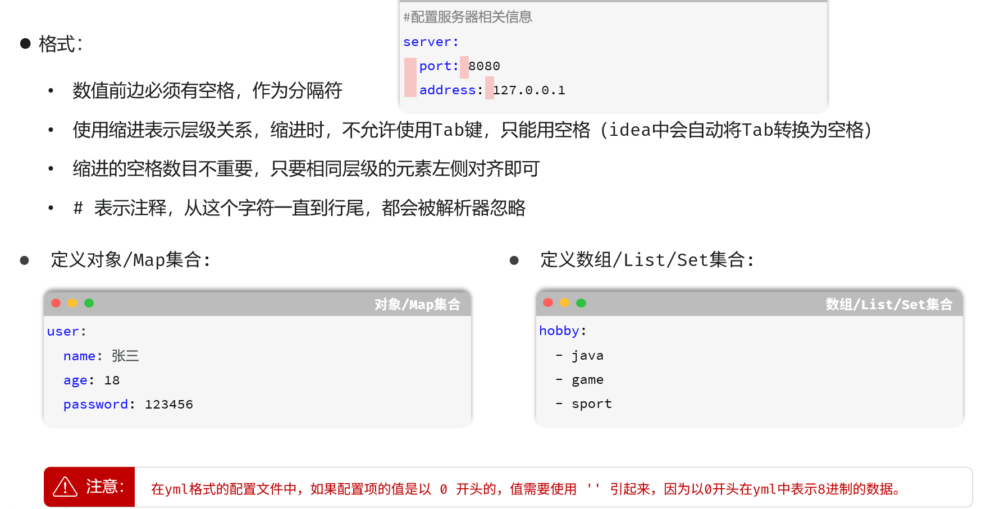


## 全局异常处理器

- 在开发 Web 应用时，后端服务在处理请求的过程中可能会遇到各种预期的或意外的异常。如果没有统一的处理机制，你可能需要在每个 Controller 方法中都使用 `try-catch` 块来捕获异常，这会导致大量重复代码，难以维护。

- **全局异常处理器** 的作用就是将所有 Controller（或其他组件）抛出的异常集中到一个地方进行处理，从而实现：

  - **代码解耦**：将业务逻辑和异常处理逻辑分离。

  - **统一响应**：为客户端（无论是前端页面还是其他服务）返回格式统一的错误信息。

  - **简化开发**：避免在业务代码中编写大量的 `try-catch`。

- 在 SpringBoot 中，实现全局异常处理主要依赖于两个核心注解：
  - `@ControllerAdvice` (或 `@RestControllerAdvice`) 
  -  `@ExceptionHandler`。


### 1. 核心注解

#### `@ControllerAdvice` / `@RestControllerAdvice`

- 可以把这个注解理解为一个“**全局控制器增强器**”。它本身是一个 Spring 的组件 (`@Component`)，但它有一个特殊的使命：**监听并拦截所有被 `@Controller` 注解标记的组件**

- 它的主要作用体现在三个方面：
  1. **全局异常处理 (最常用)**: 捕获所有 Controller 抛出的异常，进行统一处理。
  2. **全局数据绑定**: 使用 `@InitBinder` 注解，为所有 Controller 配置数据预处理规则，如日期格式转换。
  3. **全局数据预设**: 使用 `@ModelAttribute` 注解，在所有 Controller 的 Model 中添加公共数据，如在每个页面都放入当前登录用户的信息

- **`@RestControllerAdvice` vs `@ControllerAdvice`**

  - `@ControllerAdvice`: 基础注解。如果用它来处理异常，并且处理方法需要返回 JSON 数据，那么你需要在方法上额外添加 `@ResponseBody` 注解。

  - `@RestControllerAdvice`: 这是 `@ControllerAdvice` 和 `@ResponseBody` 的组合注解。它告诉 Spring 这个类里的所有方法默认都要返回 JSON/XML 格式的数据。在开发前后端分离的 RESTful API 时，**强烈推荐直接使用 `@RestControllerAdvice`**，这样更简洁。

- **限定作用范围**

  - 默认情况下，`@ControllerAdvice` 会作用于项目中所有的 Controller。你也可以通过其属性来精确控制范围：

    - `basePackages = "com.example.api.controllers"`: 指定只对特定包下的 Controller 生效。

    - `assignableTypes = {UserController.class, OrderController.class}`: 指定只对特定的类生效。

    - `annotations = RestApiController.class`: 指定只对标注了某个特定注解的 Controller 生效。


#### `@ExceptionHandler`

- 这个注解是异常处理的“**执行者**”。它标记在一个方法上，告诉 Spring：“**如果发生了某种类型的异常，就请调用我这个方法来处理**”

- **详细作用**
  1. **指定处理的异常类型**:
     - 可以通过 `value` 属性指定一个或多个异常类，例如 `@ExceptionHandler(value = {IOException.class, SQLException.class})`
     - 如果只处理一种异常，可以简写为 `@ExceptionHandler(CustomException.class)`。
     - **继承关系生效**：如果你定义了一个处理 `RuntimeException` 的方法，那么当 `NullPointerException`（`RuntimeException` 的子类）发生时，也会被这个方法捕获，除非有另一个更精确的、专门处理 `NullPointerException` 的方法。这就是为什么 `@ExceptionHandler(Exception.class)` 能成为“兜底”方案的原因。
  2. **灵活的方法参数**: 被 `@ExceptionHandler` 注解的方法，其参数非常灵活，Spring 会自动注入你需要的对象。最常用的有：
     - **异常对象本身**: `(CustomException ex)`，可以直接获取异常信息。
     - **Web 相关对象**: `(WebRequest request)` 或 `(HttpServletRequest request)`，可以获取当前请求的详细信息，比如 URL、请求头等，这对于日志记录和问题排查非常有用。
  3. **灵活的返回值**: 方法的返回值决定了最终给客户端的响应是什么。
     - `ResponseEntity<T>`: **最推荐的方式**。你可以完全控制响应体（Body）、HTTP 状态码（Status Code）和响应头（Headers）
     - `T` (某个对象): 如果你使用的是 `@RestControllerAdvice`，可以直接返回一个对象，Spring 会自动把它序列化成 JSON，并使用默认的 HTTP 状态码 `200 OK`
     - `ModelAndView`: 在传统的 Spring MVC（非前后端分离）项目中，你可以返回一个 `ModelAndView` 对象，来指定要渲染的错误页面和页面需要的数据


### 2. 工作原理

- 当一个请求到达 Controller 并执行业务逻辑时：
  1. 如果在执行过程中抛出了一个异常。
  2. 该异常没有在当前 Controller 的方法内部被 `try-catch` 捕获。
  3. Spring 的 `DispatcherServlet` 会捕获这个异常，并寻找一个能够处理它的地方。
  4. 它会查找所有被 `@ControllerAdvice` 或 `@RestControllerAdvice` 注解的 Bean。
  5. 在这些 Bean 中，它会寻找被 `@ExceptionHandler` 注解并且能够处理该异常类型（或其父类型）的方法。
  6. 找到匹配的方法后，就会执行该方法，并将方法的返回值作为 HTTP 响应返回给客户端。


### 3. 最佳实践

1. **定义统一的错误响应体**：创建一个标准的错误响应类（如 `ErrorResponse`），包含错误码（code）、错误信息（message）、时间戳（timestamp）等字段，使前端能方便地解析和处理。
2. **按异常类型分级处理**：
   - 为自定义的业务异常（如 `UserNotFoundException`）创建专门的处理方法，返回具体的业务错误码和信息。
   - 为常见的框架异常（如参数校验失败的 `MethodArgumentNotValidException`）创建处理方法，向客户端返回清晰的参数错误提示
   - 最后，提供一个处理 `Exception.class` 的通用方法作为“兜底”，捕获所有未被专门处理的未知异常，防止将敏感的服务器内部错误（如堆栈信息）暴露给客户端。
3. **合理使用 HTTP 状态码**：根据异常的性质返回合适的 HTTP Status Code。
   - `400 Bad Request`：客户端请求错误，如参数校验失败。
   - `401 Unauthorized` / `403 Forbidden`：认证或授权失败。
   - `404 Not Found`：资源未找到。
   - `500 Internal Server Error`：服务器内部未知错误。
4. **记录日志**：在异常处理器中，务必使用日志框架（如 SLF4J + Logback）记录详细的异常信息，特别是对于未知的服务器内部错误，这对于排查问题至关重要。


# MySQL

## 数据库基础与MySQL简介

### 1.什么是数据库？

> 本质就是磁盘的一个文件夹

- **数据库 (Database, DB)** 是一个长期存储于计算机内、有组织的、可共享的数据集合。它的核心是**数据**，但并非简单堆砌，而是以特定结构进行**组织**，以便于高效管理和访问
- **数据库管理系统 (Database Management System, DBMS)** 是位于用户与数据库之间的一层管理软件。所有对数据库的实际操作，如定义数据结构、添加、修改、删除、查询数据，以及控制数据访问权限等，都由 DBMS 统一管理和执行。它确保了数据的**一致性**和**安全性**
  - 我们通常所说的“学习 MySQL”，其本质是学习如何使用 **MySQL 这个 DBMS** 来操作和管理数据


### 2.什么是关系型数据库？

- **关系型数据库 (Relational Database, RDBMS)** 是建立在**关系模型**基础上的数据库。在关系模型中，数据被组织在称为**表**的二维结构中

  - **表 (Table)**：数据存储的基本单位，由行和列组成。每个表在数据库中都有一个唯一的名称，例如 `students` 表
  - **列 (Column / Field)**：表中的一个垂直列，代表一个**字段**。每个列都有明确的数据类型（如 `VARCHAR` 用于字符串，`INT` 用于整数）和名称

  - **行 (Row / Record)**：表中的一个水平行，代表一条**记录**，即一个实体的一组相关数据值

- **核心在于“关系”**：

  - 关系型数据库的强大之处在于能够在不同的表之间建立逻辑关联。这种关联是通过共享的字段（通常是**主键和外键**）来实现的。

- **示例**：

  - **`students` 表** (存储学生基本信息)

    | id (主键) | name |
    | --------- | ---- |
    | 1         | 张三 |
    | 2         | 李四 |

  - **`scores` 表** (存储学生成绩)

    | id   | student_id (外键) | subject | score |
    | ---- | ----------------- | ------- | ----- |
    | 1    | 1                 | 数学    | 95    |
    | 2    | 2                 | 数学    | 88    |
    | 3    | 1                 | 英语    | 92    |

    - 通过 `scores` 表中的 `student_id` 字段，可以关联到 `students` 表中的 `id` 字段。这样，我们就可以将两张表的数据连接起来，查询出“张三的各科成绩”，这就是“关系”的体现


### 3.什么是 SQL？

- **SQL (Structured Query Language, 结构化查询语言)** 是用于与关系型数据库进行通信的**标准编程语言**。它是一种声明式语言，用户只需说明“做什么”，而无需关心“怎么做”

- SQL 的主要功能范畴包括：

  - **数据查询语言 (DQL)**: `SELECT` - 用于从数据库中检索数据。

  - **数据操作语言 (DML)**: `INSERT`, `UPDATE`, `DELETE` - 用于操作表中的数据。

  - **数据定义语言 (DDL)**: `CREATE`, `ALTER`, `DROP` - 用于定义和管理数据库对象，如表、索引等。

  - **数据控制语言 (DCL)**: `GRANT`, `REVOKE` - 用于管理用户权限。


### 4.什么是 MySQL？

- **MySQL** 是一个具体的、开源的关系型数据库管理系统(RDBMS) . 它是目前世界上最受欢迎的数据库之一，尤其在 Web 开发领域

- **核心技术特点**：

  - **RDBMS 实现**：MySQL 是关系模型的一个成熟实现，使用 SQL 作为其标准交互语言。

  - **开源与社区驱动**：其社区版免费，拥有庞大的用户和开发者社区，提供了丰富的文档和技术支持。

  - **高性能**：以其出色的读写性能和响应速度而闻名，并支持通过索引等方式进行性能优化。

  - **跨平台**：可以在多种操作系统上运行，包括 Linux、Windows 和 macOS。

  - **技术栈中的关键角色**：在经典的 Web 技术栈 **LAMP** (Linux + Apache + MySQL + PHP/Python/Perl) 和 **LNMP** (Linux + Nginx + MySQL + PHP/Python/Perl) 中，MySQL 承担着核心的数据存储任务。

- MySQL 是一个你可以实际安装、部署并用于应用程序开发的、功能强大的开源 RDBMS 软件


## SQL核心语法与基础操作

### DDL - 数据定义语言

- **DDL (Data Definition Language)** 用于创建、修改和删除数据库的结构性对象，如数据库、表、索引等。它的操作对象是**结构**，而不是数据本身

#### 数据库级操作

##### **1. 创建数据库**

- **作用**：在 MySQL 服务器上创建一个新的数据库容器

- **语法**：

  ```mysql
  CREATE DATABASE [IF NOT EXISTS] 数据库名 [CHARACTER SET 字符集];
  ```

  - `IF NOT EXISTS` 是一个安全选项，表示只有当该数据库不存在时才执行创建操作，避免因数据库已存在而报错

  - `CHARACTER SET` 用于指定数据库的默认字符集，如 `utf8mb4`，以支持包括 Emoji 在内的多种字符

    > MySQL8版本，创建数据库，如果不设置字符集，默认也是utf8mb4

- **示例**：创建一个名为 `my_school` 的数据库，并指定字符集为 `utf8mb4`

  ```mysql
  CREATE DATABASE IF NOT EXISTS my_school CHARACTER SET utf8mb4;
  ```


##### **2. 查看所有数据库**

- **作用**：列出当前 MySQL 服务器上所有可访问的数据库

  >`SELECT DATABASE();`  ：是**查询当前选中的数据库**，告诉当前的工作位置

- **语法**：

  ```mysql
  SHOW DATABASES;
  ```


##### **3. 选择一个数据库**

- **作用**：指定后续的 SQL 命令将在哪个数据库的上下文中执行。在操作表之前，必须先选择数据库

  > 有些语句不选择数据库没办法执行

- **语法**：

  ```mysql
  USE 数据库名;
  ```

- **示例**：

  ```mysql
  USE my_school;
  ```


##### **4. 删除某个数据库**

- **作用**：永久性地删除一个数据库及其包含的所有表和数据。**此操作不可逆，请极度谨慎使用！**

- **语法**：

  ```mysql
  DROP DATABASE [IF EXISTS] 数据库名;
  ```

- **示例**：

  ```mysql
  DROP DATABASE IF EXISTS my_school;
  ```


#### **表级操作**

##### **1. 创建一个表**

- **作用**：在当前选定的数据库中，根据指定的列名、数据类型和约束来创建一个新表。

- **语法**：

  ```mysql
  CREATE TABLE 表名 (
      列名1 数据类型 [约束条件] [comment 字段1注释],
      列名2 数据类型 [约束条件] [comment 字段2注释],
      ...
      [表级约束]
  )[comment 表注释];
  ```

- **示例**：在 `my_school` 数据库中创建一个 `students` 表。

  ```mysql
  CREATE TABLE students (
      id INT PRIMARY KEY AUTO_INCREMENT,
      student_no VARCHAR(20) NOT NULL UNIQUE,
      name VARCHAR(50) NOT NULL,
      age INT,
      gender CHAR(1) DEFAULT '男',
      enrollment_date DATE
  );
  ```


##### **2. 查看所有表**

- **作用**：列出当前数据库中所有的表。

- **语法**：

  ```mysql
  SHOW TABLES;
  ```


##### **3. 查看某个表的结构**

- **作用**：显示一个表的详细结构，包括所有列的名称、数据类型、是否允许为空（NULL）、键信息（KEY）、默认值（Default）等。

- **语法**：

  ```mysql
  DESCRIBE 表名; -- 或者缩写为 DESC 表名;
  ```

- **示例**：

  ```mysql
  DESC students;
  ```


##### 4. 查看建表语句

- 作用：查看某个表的建表语句

- 语法：

  ```mysql
  show create table 表名;
  ```

- 示例：

  ```mysql
  show create table emp;
  ```

  


##### **5. 修改某个表**

- **作用**：用于修改已存在表的结构。这是一个功能非常强大的命令。

- **语法与示例**：

  - **添加列**

    - **语法**: 

      ```mysql
      ALTER TABLE 表名 ADD COLUMN 新列名 数据类型 [约束];
      ```

    - **示例**:

      ```mysql
      ALTER TABLE students ADD COLUMN email VARCHAR(100) UNIQUE;
      ```

    

  - **修改列定义**

    - **语法**: 

      ```mysql
      ALTER TABLE 表名 MODIFY COLUMN 列名 新数据类型 [新约束];
      ```

    - **示例**:

      ```mysql
      ALTER TABLE students MODIFY COLUMN name VARCHAR(100) NOT NULL;
      ```

    

  - **删除列**

    - **语法**: 

      ```mysql
      ALTER TABLE 表名 DROP COLUMN 列名;
      ```

    - **示例**:

      ```mysql
      ALTER TABLE students DROP COLUMN enrollment_date;
      ```

    

  - **重命名表**

    - **语法**: 

      ```mysql
      ALTER TABLE 旧表名 RENAME TO 新表名;
      ```

    - **示例**:

      ```mysql
      ALTER TABLE students RENAME TO student_info;
      ```

  

  - **重命名并修改列定义	**	

    - **作用**: 用于**重命名一个列**，并且可以**同时修改该列的数据类型和约束**。这是它与 `MODIFY COLUMN` 的最大区别。

    - **语法**:

      ```SQL
      ALTER TABLE 表名 CHANGE COLUMN 旧列名 新列名 新数据类型 [新约束];
      ```

    - **示例**:

      ```SQL
      -- 将 emp 表中的 qq 列重命名为 qq_number，并将其类型改为 VARCHAR(15)，同时添加注释
      ALTER TABLE emp CHANGE COLUMN qq qq_number VARCHAR(15) COMMENT 'QQ号码';
      ```


##### **6. 删除表**

- **作用**：永久性地删除一个表及其所有数据。**此操作同样不可逆，需谨慎！**

- **语法**：

  ```mysql
  DROP TABLE [IF EXISTS] 表名;
  ```


##### **7. 清空表**

- **作用**：快速删除一个表中的所有行，但保留表结构。

- **语法**：

  ```mysql
  TRUNCATE TABLE 表名;
  ```

- **与 `DELETE` 的区别**：`TRUNCATE` 速度更快，不写日志，不可回滚，且会重置自增列（`AUTO_INCREMENT`）的计数器。而 `DELETE` 是一行一行地删，可以回滚


### DML - 数据操作语言

- **DML (Data Manipulation Language)** 用于操作表中的**具体数据记录**，即对表中的行进行增、删、改

#### **1. 插入数据**

- **作用**：向表中添加一行或多行新数据。

- **语法**：

  ```MySQL
  -- 插入单行，并指定列
  INSERT INTO 表名 (列1, 列2, ...) VALUES (值1, 值2, ...);
  
  -- 单行试图全部字段都加入值
  insert into 表名 values (值1, 值2, ...);
  
  -- 插入多行
  INSERT INTO 表名 (列1, 列2, ...) VALUES (值1, 值2, ...), (值A, 值B, ...);
  
  -- 多行试图全部字段都加入值
  insert into 表名 values (值1, 值2, ...), (值1, 值2, ...);
  ```

- **示例**：

  ```mysql
  INSERT INTO students (student_no, name, age, gender) 
  VALUES ('2025001', '王明', 18, '男'), ('2025002', '李莉', 17, '女');
  ```


#### **2. 更新数据**

- **作用**：修改表中已存在记录的某些列的值。

- **语法**：

  ```mysql
  UPDATE 表名 SET 列1 = 新值1, 列2 = 新值2, ... WHERE 条件;
  ```

  > **[极其重要]** `WHERE` 子句用于定位要更新的记录。如果省略 `WHERE` 子句，**将会更新表中的所有行**，这通常是灾难性的。
  >
  > 所以一定不要遗忘了`WHERE`子句

- **示例**：将学号为 `2025001` 的学生的年龄更新为 19。

  ```mysql
  UPDATE students SET age = 19 WHERE student_no = '2025001';
  ```


#### **3. 删除数据**

- **作用**：从表中删除满足条件的记录

- **语法**：

  ```mysql
  DELETE FROM 表名 WHERE 条件;
  ```

  > **[极其重要]** `WHERE` 子句用于定位要删除的记录。如果省略 `WHERE` 子句，**将会删除表中的所有行**

- **示例**：删除学号为 `2025003` 的学生记录

  ```mysql
  DELETE FROM students WHERE student_no = '2025003';
  ```


### DQL - 数据查询语言

- **DQL (Data Query Language)** 用于从表中检索数据，是 SQL 中使用最频繁、功能最丰富的部分

  


#### **1. 基本查询 (SELECT)**

- **作用**：从一个或多个表中查询数据

- **语法**：

  ```mysql
  SELECT 列名1, 列名2, ... FROM 表名;
  ```

  - 使用 `*` 可以代表查询所有列

- **示例**：

  ```mysql
  -- 查询所有学生的所有信息
  SELECT * FROM students;
  
  -- 只查询学生的学号和姓名
  SELECT student_no, name FROM students;
  ```


#### **2. 列别名 (AS)**

- **作用**：在查询结果中，为**列**提供一个临时的、可读性更好的名称。`AS` 关键字可以省略

- **语法**：

  ```mysql
  SELECT 列名 AS 别名 FROM 表名;
  ```

- **示例**：

  ```mysql
  SELECT student_no AS '学号', name AS '姓名' FROM students;
  ```


#### **3. 条件查询 (WHERE)**

##### 基本概念

- **作用**：在 `SELECT`, `UPDATE`, `DELETE` 语句中，通过指定一个或多个条件来过滤出需要操作的记录。只有满足 `WHERE` 子句中所有条件的行才会被返回或影响。

- **语法**：

  ```mysql
  SELECT 列名 FROM 表名 WHERE 条件表达式;
  ```


##### 条件表达式

- **条件表达式**: 条件表达式由**列名、运算符和值组成**。**多个表达式可以通过逻辑运算符组合**


###### **a. 比较运算符**

- 用于比较两个表达式的值。

  - `=`: 等于
  - `!=` 或 `<>`: 不等于
  - `>`: 大于
  - `<`: 小于
  - `>=`: 大于等于
  - `<=`: 小于等于

- **示例**: 查询年龄大于 18 岁的学生

  ```mysql
  SELECT name, age FROM students WHERE age > 18;
  ```


###### **b. 逻辑运算符**

- 用于连接或反转多个条件表达式，以构建更复杂的过滤逻辑。

  - `AND(&&)`: 逻辑与。当所有由 `AND` 连接的条件都为真时，整个条件才为真。
  - `OR(||)`: 逻辑或。当由 `OR` 连接的条件中至少有一个为真时，整个条件就为真。
  - `NOT(!)`: 逻辑非。反转一个条件的布尔值。

- **优先级**: `NOT` > `AND` > `OR`。可以使用括号 `()` 来改变运算优先级。

- **示例**: 查询年龄大于 18 岁 **并且** 性别为 '女' 的学生

  ```mysql
  SELECT * FROM students WHERE age > 18 AND gender = '女';
  ```

- **示例**: 查询年龄大于 20 岁 **或者** 性别为 '男' 的学生

  ```mysql
  SELECT * FROM students WHERE age > 20 OR gender = '男';
  ```


###### **c. 范围运算符**

- `BETWEEN ... AND ...`: 用于检查一个值是否在指定的范围内（包含边界值）。

- **语法**: 

  ```mysql
  字段名(列名) BETWEEN 值1 AND 值2
  ```

  > 注意：这里的值1不能大于值2，等价关系是下面那样

  - **等价于**: 

    ```mysql
    字段名(列名) >= 值1 AND 列名 <= 值2
    ```


- **示例**: 查询分数在 80 到 90 分之间的学生。

  ```mysql
  SELECT name, score FROM students WHERE score BETWEEN 80 AND 90;
  ```


###### **d. 集合运算符**

- `IN (...)`: 用于检查一个值是否匹配列表中的任意一个值。

- `NOT IN (...)`: 用于检查一个值是否**不**匹配列表中的任意一个值。

- **语法**: 

  ```mysql
  字段名(列名) IN (值1, 值2, ...);
  ```

  

- **优点**: 比多个 `OR` 条件更简洁、可读性更高。

- **示例**: 查询学号是 '2025001' 或 '2025002' 的同学。

  ```mysql
  SELECT * FROM students WHERE student_no IN ('2025001', '2025002');
  ```


###### **e. 模糊匹配**

- `LIKE`: 用于在字符串中搜索指定的模式

- **通配符**:

  - `%` (百分号): 代表零个、一个或多个任意字符
  - `_` (下划线): 代表一个任意字符

- **示例**: 查询所有姓“王”的同学。

  ```mysql
  SELECT * FROM students WHERE name LIKE '王%';
  ```

- **示例**: 查询名字是两个字，且第二个字是“明”的同学。

  ```mysql
  SELECT * FROM students WHERE name LIKE '_明';
  ```


###### **f. 空值判断**

- `IS NULL`: 用于检查一个值是否为 `NULL`。

- `IS NOT NULL`: 用于检查一个值是否不为 `NULL`。

- **[极其重要]**: 不能使用比较运算符如 `= NULL` 或 `!= NULL` 来判断空值，因为 `NULL` 是一个特殊的值，它不等于任何值，包括它自己。必须使用 `IS` 或 `IS NOT`

- **示例**: 查询还没有分配邮箱地址的学生。

  ```mysql
  SELECT name FROM students WHERE email IS NULL;
  ```


### DCL - 数据控制语言

- DCL (Data Control Language) 用于定义数据库的访问权限和安全级别，通常由数据库管理员（DBA）使用

  - **授予权限 (GRANT)**：赋予用户或角色对数据库对象的操作权限。

  - **撤销权限 (REVOKE)**：收回已经赋予的权限。


## 常用数据类型

- 在数据库中，为表的每一列选择一个最合适的数据类型至关重要。一个好的选择可以节省存储空间、提升查询效率并保证数据的有效性。

### 数值类型

- 用于存储各种数字，如年龄、价格、数量等

  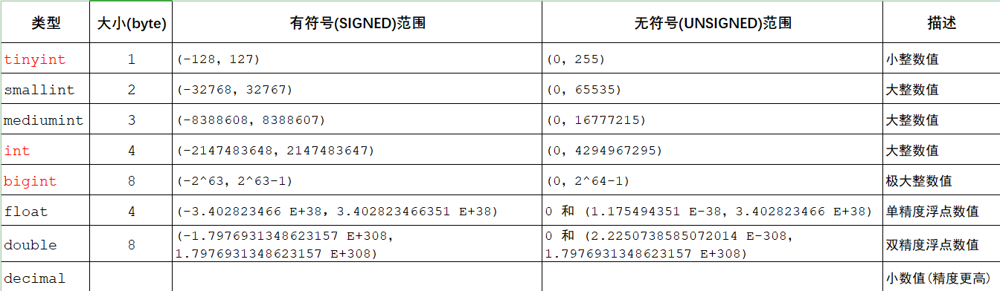


#### **整数类型**

- 用于存储没有小数部分的数字。不同类型的区别在于它们的存储空间和取值范围

  | 类型          | 存储空间 | 有符号范围 (Signed)            | 无符号范围(Unsigned) | 常用场景                                         |
  | ------------- | -------- | ------------------------------ | -------------------- | ------------------------------------------------ |
  | **`TINYINT`** | 1 字节   | -128 到 127                    | 0 到 255             | 存储状态（如 0/1）、年龄、很小的枚举值           |
  | **`INT`**     | 4 字节   | -2147483648 到 2147483647      | 0 到 4294967295      | **最常用的整数类型**，用于ID、计数等             |
  | **`BIGINT`**  | 8 字节   | 约 -9.22 x 10¹⁸ 到 9.22 x 10¹⁸ | 约 0 到 1.84 x 10¹⁹  | 数据量极大的表的主键ID、需要存储非常大整数的场景 |

- **`UNSIGNED` 关键字**：如果确定一列的数值永远不会是负数（如自增ID、年龄），可以将其声明为 `UNSIGNED`（无符号），使其正数存储范围扩大一倍。

  ```mysql
  CREATE TABLE example (
      user_id INT UNSIGNED,
      age TINYINT UNSIGNED
  );
  ```


#### 定点数类型

- 用于需要**精确**小数计算的场景，不会出现浮点数那样的精度误差

- **`DECIMAL(M, D)`**
  - **作用**：以字符串形式存储的精确小数。非常适合用于存储货币、汇率等对精度要求极高的数据。
  - **`M` (Precision)**：总位数（整数部分+小数部分），最大为 65。
  - **`D` (Scale)**：小数部分的位数，最大为 30。
  - **示例**：`price DECIMAL(10, 2)` 可以存储最多 10 位数字，其中 2 位是小数，范围从 `-99999999.99` 到 `99999999.99`。


#### 浮点数类型

- 用于存储近似的小数值，存储空间较小，但可能存在精度损失

  - **`FLOAT`**: 单精度浮点数，占用 4 字节。

  - **`DOUBLE`**: 双精度浮点数，占用 8 字节，精度比 `FLOAT` 更高。

> **何时使用?** 当你不需要精确值，只需要一个大概的数值时（例如科学计算中的平均值），可以使用浮点数。**在涉及金融计算时，应坚决避免使用 `FLOAT` 和 `DOUBLE`，而使用 `DECIMAL`。**


### 字符串类型

- 用于存储文本数据，如姓名、地址、文章内容等

  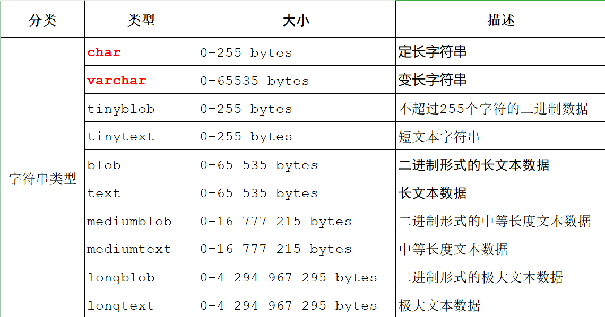


#### `CHAR(N)`

- **作用**：用于存储**固定长度**的字符串。`N` 的范围是 0 到 255

- **`N` 的含义**：`N` 定义了该列的**固定字符长度**。

- **特点**：

  1. **固定空间**：无论实际存储的字符串有多长，它都会占用 `N` 个字符的存储空间。
  2. **自动补全**：如果存入的字符串长度小于 `N`，MySQL 会在右侧用**空格**补全至 `N` 的长度。
  3. **长度约束**：如果试图存入的字符串长度**大于 `N`**，MySQL 会报错并拒绝操作（在严格模式下）。

- **适用场景**：存储长度非常固定的数据，如性别（'男', '女'）、MD5哈希值（32位）、邮政编码等。在这些场景下，它的查询效率通常比 `VARCHAR` 略高

  

#### `VARCHAR(N)`

- **作用**：用于存储**可变长度**的字符串。`N` 的范围是 0 到 65535（理论值，实际受字符集和行大小限制）。
- **`N` 的含义**：`N` 定义了该列所能存储的**最大字符数**，是一个上限约束。
- **特点**：
  1. **可变空间**：存储空间根据字符串的实际长度变化，还会额外使用 1-2 个字节来记录字符串的实际长度。
  2. **长度约束**：如果试图存入的字符串长度**大于 `N`**，MySQL 同样会报错并拒绝操作。
  3. **最常用类型**：这是**最常用**的字符串类型，能有效节省存储空间。
- **适用场景**：存储长度不固定的数据，如用户名、地址、标题等。

- **`TEXT` 类型**
  - **作用**：用于存储非常长的文本数据。
  - **类型系列**：
    - `TINYTEXT`: 最多 255 字符。
    - `TEXT`: 最多 65,535 字符。
    - `MEDIUMTEXT`: 最多 约1600万 字符。
    - `LONGTEXT`: 最多 约42亿 字符。
  - **适用场景**：存储文章内容、用户评论、日志信息等。


#### `CHAR`vs`VARCHAR`

| 特性         | `CHAR(N)`                               | `VARCHAR(N)`                     |
| ------------ | --------------------------------------- | -------------------------------- |
| **长度**     | 固定长度                                | 可变长度                         |
| **空间占用** | 始终为 N 个字符的空间                   | 实际字符长度 + 1/2字节长度开销   |
| **处理方式** | 不足N则用空格填充                       | 按实际长度存储                   |
| **最大长度** | 255                                     | 65,535 (理论值)                  |
| **效率**     | 长度固定，处理速度略快                  | 长度可变，需要计算长度           |
| **选择时机** | **数据长度固定**，如MD5值、手机号、邮编 | **数据长度不固定**，绝大多数场景 |


### 日期和时间类型

- 用于存储时间相关的信息

  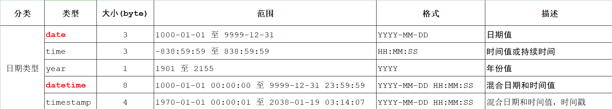

  - **`DATE`**

    - **作用**：只存储日期。

    - **格式**：`'YYYY-MM-DD'`

    - **范围**：`'1000-01-01'` 到 `'9999-12-31'`

    - **适用场景**：生日、注册日期、事件发生日期等。

      

  - **`TIME`**

    - **作用**：只存储时间或时间间隔。

    - **格式**：`'HH:MM:SS'`

    - **范围**：`-838:59:59` 到 `838:59:59`

    - **适用场景**：记录一天的某个时刻，或计算持续时间。

      

  - **`DATETIME`**

    - **作用**：存储日期和时间的组合。

    - **格式**：`'YYYY-MM-DD HH:MM:SS'`

    - **范围**：`'1000-01-01 00:00:00'` 到 `'9999-12-31 23:59:59'`

    - **特点**：存储的值与时区**无关**。数据库里存的是什么，取出来就是什么。

    - **适用场景**：需要精确记录发生时间，且应用不涉及跨时区转换。

      

  - **`TIMESTAMP`**

    - **作用**：也存储日期和时间的组合，但功能更特殊。

    - **范围**：`'1970-01-01 00:00:01'` UTC 到 `'2038-01-19 03:14:07'` UTC。

    - **特点**：

      1. **与时区相关**：存储时，MySQL会将其从当前连接的时区转换为 UTC（世界标准时间）进行存储；检索时，又会从 UTC 转换回当前连接的时区。
      2. **自动更新**：可以将 `TIMESTAMP` 列设置为在行创建或更新时自动记录当前时间。

    - **适用场景**：记录数据的创建时间（`create_time`）和最后修改时间（`update_time`），或需要处理多时区业务的应用。

      

  - **`YEAR`**

    - **作用**：存储年份。
    - **格式**：`YYYY`
    - **范围**：`1901` 到 `2155`。


## 数据完整性:约束与键

- 约束是施加在表列上的规则，用于强制保证数据的完整性。当对表中的数据进行增、删、改操作时，如果违反了约束，数据库将拒绝执行该操作

### 1.`NOT NULL`(非空约束)

- **作用**：确保该列的值**不能为 `NULL`**。

- **目的**：强制字段必须包含一个有效值。`NULL` 表示“未知”或“无值”，在很多业务场景下，关键字段（如姓名、订单号）是不允许为空的

- **语法**：

  ```mysql
  -- 在创建表时定义
  CREATE TABLE 表名 (
      列名 数据类型 NOT NULL
  );
  
  -- 在已存在的表上添加
  ALTER TABLE 表名 MODIFY COLUMN 列名 数据类型 NOT NULL;
  ```

- **示例**：

  ```mysql
  CREATE TABLE employees (
      id INT PRIMARY KEY,
      name VARCHAR(100) NOT NULL, -- 姓名不能为空
      department VARCHAR(50)
  );
  
  -- 下面的插入会成功
  INSERT INTO employees (id, name, department) VALUES (1, '张三', '技术部');
  
  -- 下面的插入会失败，因为 name 违反了 NOT NULL 约束
  INSERT INTO employees (id, department) VALUES (2, '市场部');
  ```


### 2.`UNIQUE`(唯一约束)

- **作用**：确保该列中的所有值都是**唯一的**，没有重复值。

- **目的**：防止业务上需要唯一的数据出现重复，如身份证号、邮箱、用户名等。

- **注意**：一个表中可以有多个 `UNIQUE` 约束的列。`UNIQUE` 约束的列可以包含 `NULL` 值，并且可以包含多个 `NULL` 值（因为 `NULL` 不等于任何值，包括它自己）。

- **语法**：

  ```mysql
  -- 列级约束
  CREATE TABLE 表名 (
      列名 数据类型 UNIQUE
  );
  
  -- 表级约束（可用于定义多列组合的唯一约束）
  CREATE TABLE 表名 (
      列1 数据类型,
      列2 数据类型,
      UNIQUE (列1, 列2)
  );
  ```

- **示例**：

  ```mysql
  CREATE TABLE users (
      id INT PRIMARY KEY,
      username VARCHAR(50) NOT NULL,
      email VARCHAR(100) UNIQUE, -- 邮箱必须唯一
      UNIQUE (username) -- 用户名也必须唯一
  );
  ```


### 3.`PRIMARY KEY`(主键约束)

- **作用**：主键是表中一条记录的**唯一标识符**。

- **特性**：主键约束本质上是 `NOT NULL` 和 `UNIQUE` 的组合。

  1. **唯一性**：主键值必须唯一。
  2. **非空性**：主键值不能为空。

- **重要性**：

  - 每个表**最多只能有一个**主键。
  - 主键是表的核心，是行数据的“身份证号”。
  - 在主键列上，数据库会自动创建一个高效的索引，极大地提升查询速度。

- **语法**：

  ```mysql
  -- 列级约束（单列主键）
  CREATE TABLE 表名 (
      列名 数据类型 PRIMARY KEY
  );
  
  -- 表级约束（用于单列或复合主键）
  CREATE TABLE 表名 (
      列1 数据类型,
      列2 数据类型,
      PRIMARY KEY (列1, 列2) -- 复合主键
  );
  ```

- **示例**：

  ```mysql
  -- 单列主键
  CREATE TABLE products (
      product_id INT PRIMARY KEY,
      product_name VARCHAR(100)
  );
  
  -- 复合主键：由多个列共同组成一个唯一标识
  CREATE TABLE order_items (
      order_id INT,
      product_id INT,
      quantity INT,
      PRIMARY KEY (order_id, product_id) -- 同一个订单中的同一个产品只能有一条记录
  );
  ```


### 4.`FOREIGN KEY`(外键约束)

- **作用**：外键用于在一个表中建立与另一个表主键的关联，以强制实现**参照完整性 (Referential Integrity)**

- **目的**：确保外键列中的值必须在被参照表（父表）的主键列中存在。这可以防止产生无效的关联数据

- **语法**：

  ```mysql
  -- 在创建表时定义
  CREATE TABLE 表名 (
      ...
      [CONSTRAINT 约束名] FOREIGN KEY (本表列名) REFERENCES 父表名(父表主键列名)
  );
  ```

- **示例场景**：一个 `orders`（订单）表，其中有一个 `customer_id` 列。为了确保每个订单都对应一个真实存在的客户，就可以将 `orders.customer_id` 设置为外键，参照 `customers` 表的主键 `id`


- **级联操作 (Cascading Actions)**：可以**在定义外键时**，指定**当父表中的记录被删除或更新时**，**子表中关联的记录应该如何处理**。

  - `ON DELETE ...`

  - `ON UPDATE ...`

  - **可选动作**：

    - `RESTRICT` (默认): 如果存在关联记录，则禁止删除或更新父表记录
    - `CASCADE`: 当父表记录被删除或更新时，自动删除或更新子表中的关联记录
    - `SET NULL`: 当父表记录被删除或更新时，将子表中的外键列设置为 `NULL` (前提是该列允许为 `NULL`)

  - **示例 (带级联删除)**：

    ```MYSQL
    CREATE TABLE order_items (
        item_id INT PRIMARY KEY,
        order_id INT,
        product_info VARCHAR(255),
        FOREIGN KEY (order_id) REFERENCES orders(order_id) ON DELETE CASCADE
    );
    -- 这意味着如果一个订单被删除了，该订单下的所有订单项也会被自动删除。
    ```

    


### 5.`DEFAULT`(默认值约束)

- **作用**：为列提供一个默认值。如果在**插入新记录时没有为该列指定值，数据库会自动使用这个默认值**。

- **语法**：

  ```MYSQL
  CREATE TABLE 表名 (
      列名 数据类型 DEFAULT 默认值
  );
  ```

- **示例**：

  ```MYSQL
  CREATE TABLE employees (
      id INT PRIMARY KEY,
      name VARCHAR(100) NOT NULL,
      status VARCHAR(20) DEFAULT 'active' -- 员工状态默认为 'active'
  );
  
  -- 下面的插入语句中没有提供 status，它将自动设为 'active'
  INSERT INTO employees (id, name) VALUES (3, '李四');
  ```


### 6.`AUTO_INCREMENT` (自增属性)

- **作用**：**这是一个列属性，而不是严格意义上的约束**。它允许在插入新记录时，由数据库自动为该列生成一个唯一的、递增的数值。

- **使用规则**：

  - 通常用于 `INT` 或 `BIGINT` 类型的**主键列**。
  - 一个表只能有一个 `AUTO_INCREMENT` 列。
  - **该列必须被索引（通常是主键）**

- **语法**：

  ```MYSQL
  CREATE TABLE 表名 (
      列名 INT PRIMARY KEY AUTO_INCREMENT
  );
  ```

- **示例**：

  ```MYSQL
  CREATE TABLE categories (
      category_id INT PRIMARY KEY AUTO_INCREMENT,
      category_name VARCHAR(50) NOT NULL
  );
  
  -- 插入时无需为 category_id 指定值
  INSERT INTO categories (category_name) VALUES ('电子产品'); 	-- id 会自动成为 1
  INSERT INTO categories (category_name) VALUES ('图书');     	  -- id 会自动成为 2
  ```


### 7.`CHECK` 约束

- **作用**：为列中的值设置一个必须满足的布尔表达式。如果表达式的结果为 `FALSE`，则数据库会拒绝该值的插入或更新

- **目的**：实现比基础约束更复杂的业务规则校验

- **版本注意**：`CHECK` 约束在 **MySQL 8.0.16** 版本之后才被真正支持和强制执行。在之前的版本中，虽然可以写 `CHECK` 子句，但它会被忽略，不起作用

- **语法**：

  ```MYSQL
  -- 列级约束
  CREATE TABLE 表名 (
      列名 数据类型 CHECK (表达式)
  );
  
  -- 表级约束
  CREATE TABLE 表名 (
      ...
      CONSTRAINT 约束名 CHECK (表达式)
  );
  ```

- **示例**：

  ```MYSQL
  CREATE TABLE products (
      id INT PRIMARY KEY,
      name VARCHAR(100),
      price DECIMAL(10, 2) CHECK (price >= 0), -- 价格必须大于等于0
      gender CHAR(1) CHECK (gender IN ('M', 'F')) -- 性别只能是'M'或'F'
  );
  
  -- 下面的插入会成功
  INSERT INTO products VALUES (1, '手机', 2999.00, 'M');
  -- 下面的插入会失败，因为 price 违反了 CHECK 约束
  INSERT INTO products VALUES (2, '次品', -100.00, 'F');
  -- 下面的插入会失败，因为 gender 违反了 CHECK 约束
  INSERT INTO products VALUES (3, '电脑', 5000.00, 'X');
  ```


## MySQL 常用内置函数

- MySQL 提供了大量功能强大的内置函数，用于处理字符串、数值、日期等各种数据类型。熟练掌握这些函数，可以极大地简化 SQL 查询和数据处理的复杂度。


### 字符串函数

- 这些函数用于操作和处理字符串（`CHAR`, `VARCHAR`, `TEXT` 等类型）数据

| 函数                                        | 说明                                                         | 示例                                                         |
| ------------------------------------------- | ------------------------------------------------------------ | ------------------------------------------------------------ |
| **`CONCAT(str1, str2, ...)`**               | 将多个字符串连接成一个字符串。                               | `SELECT CONCAT('你好', ', ', '世界');` <br>→ '你好, 世界'    |
| **`CONCAT_WS(separator, str1, str2, ...)`** | 使用指定的分隔符将多个字符串连接起来。                       | `SELECT CONCAT_WS('-', '2025', '08', '14');` <br>→ '2025-08-14' |
| **`LENGTH(str)`**                           | 返回字符串占用的**字节数**。                                 | `SELECT LENGTH('你好abc');` <br>→ 9 (在UTF8中)               |
| **`CHAR_LENGTH(str)`**                      | 返回字符串包含的**字符数**。                                 | `SELECT CHAR_LENGTH('你好abc');` <br>→ 5                     |
| **`UPPER(str)` / `UCASE(str)`**             | 将字符串转换为大写。                                         | `SELECT UPPER('Hello');` <br>→ 'HELLO'                       |
| **`LOWER(str)` / `LCASE(str)`**             | 将字符串转换为小写。                                         | `SELECT LOWER('Hello');` <br>→ 'hello'                       |
| **`SUBSTRING(str, pos, len)`**              | 从字符串中截取子字符串。`pos` 从1开始。                      | `SELECT SUBSTRING('你好世界', 3, 2);` <br>→ '世界'           |
| **`REPLACE(str, from_str, to_str)`**        | 在字符串中查找所有 `from_str`，并替换为 `to_str`。           | `SELECT REPLACE('我爱MySQL', '爱', '喜欢');` <br>→ '我喜欢MySQL' |
| **`TRIM(str)`**                             | 去除字符串两端的空格。                                       | `SELECT TRIM('  hello  ');` <br>→ 'hello'                    |
| **`INSTR(str, substr)`**                    | 返回子字符串 `substr` 在字符串 `str` 中首次出现的位置。找不到则返回0。 | `SELECT INSTR('你好世界', '好世');` <br>→ 2                  |


### 数值函数

- 这些函数用于执行各种数学计算

| 函数                         | 说明                                             | 示例                                                 |
| ---------------------------- | ------------------------------------------------ | ---------------------------------------------------- |
| **`ABS(x)`**                 | 返回 x 的绝对值。                                | `SELECT ABS(-10);` <br>→ 10                          |
| **`ROUND(x, d)`**            | 将数值 x 四舍五入到 d 位小数。                   | `SELECT ROUND(3.14159, 2);` <br>→ 3.14               |
| **`CEIL(x)` / `CEILING(x)`** | 向上取整，返回大于或等于 x 的最小整数。          | `SELECT CEIL(3.14);` <br>→ 4                         |
| **`FLOOR(x)`**               | 向下取整，返回小于或等于 x 的最大整数。          | `SELECT FLOOR(3.99);` <br>→ 3                        |
| **`MOD(n, m)`**              | 取模运算，返回 n 除以 m 的余数。                 | `SELECT MOD(10, 3);` <br>→ 1                         |
| **`RAND()`**                 | 生成一个 0 到 1 之间的随机浮点数。               | `SELECT RAND();`                                     |
| **`FORMAT(x, d)`**           | 将数值 x 格式化，保留 d 位小数，并带千位分隔符。 | `SELECT FORMAT(1234567.89, 2);` <br>→ '1,234,567.89' |


### 日期和时间函数

- 这些函数用于处理日期和时间（`DATE`, `DATETIME`, `TIMESTAMP` 等类型）数据

| 函数                                     | 说明                           | 示例                                                         |
| ---------------------------------------- | ------------------------------ | ------------------------------------------------------------ |
| **`NOW()`**                              | 返回当前的日期和时间。         | `SELECT NOW();` <br>→ '2025-08-14 19:43:00'                  |
| **`CURDATE()`**                          | 返回当前的日期。               | `SELECT CURDATE();` <br>→ '2025-08-14'                       |
| **`CURTIME()`**                          | 返回当前的时间。               | `SELECT CURTIME();` <br>→ '19:43:00'                         |
| **`YEAR(date)`**                         | 从日期中提取年份。             | `SELECT YEAR('2025-08-14');` <br>→ 2025                      |
| **`MONTH(date)`**                        | 从日期中提取月份。             | `SELECT MONTH('2025-08-14');` <br>→ 8                        |
| **`DAY(date)`**                          | 从日期中提取天。               | `SELECT DAY('2025-08-14');` <br>→ 14                         |
| **`DATE_FORMAT(date, format)`**          | 将日期按指定格式进行格式化。   | `SELECT DATE_FORMAT(NOW(), '%Y年%m月%d日');` <br>→ '2025年08月14日' |
| **`DATEDIFF(date1, date2)`**             | 计算两个日期之间的天数差。     | `SELECT DATEDIFF('2025-08-20', '2025-08-14');` <br>→ 6       |
| **`DATE_ADD(date, INTERVAL expr unit)`** | 在一个日期上增加一个时间间隔。 | `SELECT DATE_ADD('2025-08-14', INTERVAL 1 MONTH);` <br>→ '2025-09-14' |
| **`DATE_SUB(date, INTERVAL expr unit)`** | 在一个日期上减去一个时间间隔。 | `SELECT DATE_SUB('2025-08-14', INTERVAL 7 DAY);` <br>→ '2025-08-07' |


### 流程控制函数

- 这些函数允许在 SQL 语句中实现条件逻辑

| 函数                   | 说明                                                 | 示例                                                         |
| ---------------------- | ---------------------------------------------------- | ------------------------------------------------------------ |
| **`IF(expr, v1, v2)`** | 如果表达式 `expr` 为真，则返回 `v1`，否则返回 `v2`。 | `SELECT IF(1 > 0, '是', '否');` <br>→ '是'                   |
| **`IFNULL(v1, v2)`**   | 如果 `v1` 不为 `NULL`，则返回 `v1`，否则返回 `v2`。  | `SELECT IFNULL(NULL, '默认值');` <br>→ '默认值'              |
| **`CASE ... END`**     | 标准的 `CASE` 表达式，用于实现更复杂的条件判断。     | `SELECT CASE 'B' WHEN 'A' THEN '优' WHEN 'B' THEN '良' ELSE '中' END;` <br>→ '良' |


### 聚合函数

- 这些函数对一组行的某个列进行计算，并返回一个单一的值，通常与 `GROUP BY` 配合使用

| 函数            | 说明                     |
| --------------- | ------------------------ |
| **`COUNT()`**   | 用于统计行数。           |
| **`SUM(列名)`** | 计算指定列的数值总和。   |
| **`AVG(列名)`** | 计算指定列的数值平均值。 |
| **`MAX(列名)`** | 找出指定列中的最大值。   |
| **`MIN(列名)`** | 找出指定列中的最小值。   |


### 信息函数

- 这些函数用于获取 MySQL 服务器的元数据或状态信息

| 函数                            | 说明                            | 示例                 |
| ------------------------------- | ------------------------------- | -------------------- |
| **`DATABASE()`**                | 返回当前默认数据库的名称。      | `SELECT DATABASE();` |
| **`USER()` / `CURRENT_USER()`** | 返回当前登录用户的账户信息。    | `SELECT USER();`     |
| **`VERSION()`**                 | 返回当前 MySQL 服务器的版本号。 | `SELECT VERSION();`  |


## 高级查询(DQL)

- DQL 的高级功能使得我们能够处理更复杂的查询需求，从数据中提取出更有价值的信息

  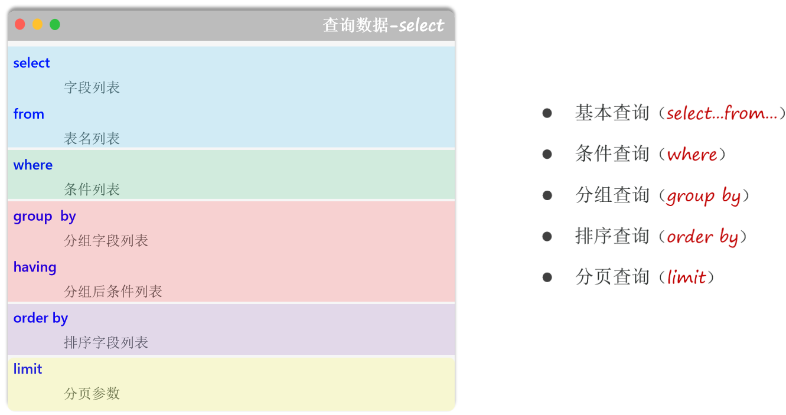

### 1.去除重复行 (`DISTINCT`)

- **作用**：用于从 `SELECT` 查询结果中移除重复的行。它作用于所有指定的列，只有当所有选择的列的值都相同时，才被认为是重复行。

- **语法**：

  ```mysql
  SELECT DISTINCT 列1, 列2, ... FROM 表名;
  ```

- **示例**：查询所有学生所在的班级ID（不重复）。

  ```mysql
  -- 假设 students 表中 class_id 有多个 '1' 和 '2'
  SELECT DISTINCT class_id FROM students;
  -- 结果只会返回 1, 2, NULL 各一次
  ```


### 2.排序与分页 (`ORDER BY`, `LIMIT`)

#### **`ORDER BY` (排序)**

##### 基础概念

- **作用**：用于对查询结果集进行排序

- **语法**：

  ```mysql
  SELECT 列列表 FROM 表名
  [WHERE 条件]
  ORDER BY 排序列1 [ASC|DESC], 排序列2 [ASC|DESC], ...;		-- 这里支持多列排序
  ```

- **关键字**：

  - `ASC` (Ascending): 升序排序，这是**默认值**
  - `DESC` (Descending): 降序排序

- **多列排序**：可以按多个列进行排序。**排序时，会首先按照第一个列排序，当第一个列的值相同时，再按照第二个列排序**，以此类推

- **示例**：

  - 为了演示，我们假设有如下 `students` 表：

    | id   | name | age  | score |
    | :--- | :--- | :--- | :---- |
    | 1    | 张三 | 20   | 85    |
    | 2    | 李四 | 19   | 92    |
    | 3    | 王五 | 20   | 92    |

  ```mysql
  -- 按分数降序排序，如果分数相同，则按年龄升序排序
  SELECT name, score, age FROM students ORDER BY score DESC, age ASC;
  -- 结果: 李四(92, 19), 王五(92, 20), 张三(85, 20)
  ```


##### 排序规则

- `ORDER BY` 子句用于对 `SELECT` 查询返回的结果集进行排序。其排序行为遵循以下核心规则：

###### 1. 按数据类型排序

- **数值类型**
  - 严格按照数值大小进行排序
- **字符串类型**
  - 根据当前数据库或列指定的**字符集排序规则 (Collation)** 进行排序
  - 对于英文字符，通常按字典顺序（A-Z）排序
  - 对于中文字符，通常按拼音或笔画顺序排序，具体取决于排序规则的设置
- **日期和时间类型**
  - 严格按照时间上的先后顺序进行排序（从最早到最晚）

###### 2. 多列排序规则

- 当 `ORDER BY` 后跟有多个列时，排序具有明确的**优先级**。
- 首先完全按照第一个列进行排序。
- 仅当第一个列出现相同值时，才会在这些具有相同值的行内部，应用第二个列的排序规则。
- 以此类推，后续的排序列只在前一排序列的值相等时才生效。

###### 3. `NULL` 值的处理规则

- 在 MySQL 中，`NULL` 被认为是“最小值”。
- 因此，在**升序 (`ASC`)** 排序中，`NULL` 值的行会出现在**最前面**。
- 在**降序 (`DESC`)** 排序中，`NULL` 值的行会出现在**最后面**。

###### 4. 自定义排序规则

- 可以通过流程控制函数（如 `CASE ... END`）或特定函数（如 `FIELD()`）来定义不依赖于数据类型本身的、完全自定义的排序逻辑。


#### **`LIMIT` (限制结果数量/分页)**

- **作用**：用于限制 `SELECT` 语句返回的记录数量。它有两个核心应用场景：获取最上面的N个记录(一般获取前几名?)和实现分页

- **语法**：`LIMIT` 子句接受一个或两个**非负整数参数**

  - **语法一：`LIMIT 数量`**

    - **含义**：从结果集的第 1 行开始，返回最多 `数量` 条记录。

    - **示例**：查询分数最高的 2 位学生。

      ```mysql
      SELECT name, score FROM students ORDER BY score DESC LIMIT 2;
      ```

  - **语法二：`LIMIT 偏移量, 数量`**

    > 我理解的偏移量是离某个地方的距离，比如从3开始，跳过1和2，偏移量就是2

    - **含义**：从结果集的第 `偏移量 + 1` 行开始（**注意：偏移量从 0 开始计数**），返回最多 **`数量`** 条记录

    - **示例**：从第 3 位学生开始，查询 2 位学生的信息（即第3和第4位）

      ```mysql
      SELECT name, score FROM students ORDER BY id LIMIT 2, 2;
      ```

      

- **分页逻辑详解**：这是 `LIMIT` 最常见的用途

  - **场景**：假设一个网站的文章列表，每页需要显示 5 篇文章

  - **已知变量**：

    - `pageSize` (每页数量) = 5
    - `pageNow` (当前页码)

  - **计算偏移量**：

    ```java
    offset = (pageNow - 1) * pageSize
    ```

  - **查询第 1 页 (pageNo = 1)**：

    - `offset = (1 - 1) * 5 = 0`
    - SQL: `SELECT * FROM articles ORDER BY publish_date DESC LIMIT 0, 5;`

  - **查询第 2 页 (pageNo = 2)**：

    - `offset = (2 - 1) * 5 = 5`
    - SQL: `SELECT * FROM articles ORDER BY publish_date DESC LIMIT 5, 5;`

  - **查询第 3 页 (pageNo = 3)**：

    - `offset = (3 - 1) * 5 = 10`
    - SQL: `SELECT * FROM articles ORDER BY publish_date DESC LIMIT 10, 5;`


- **重要提示：`LIMIT` 必须与 `ORDER BY` 配合使用**

  - 如果不使用 `ORDER BY` 对结果进行排序，数据库返回行的顺序是**不确定**的
  - 在一个不确定的顺序上使用 `LIMIT` 进行分页，会导致每次查询时，同一页的数据都可能不同，造成数据错乱
  - **规则**：为了保证分页结果的稳定性和可预测性，**务必**在使用 `LIMIT` 前，先用 `ORDER BY` 对结果进行一个确定的排序（通常是按主键 `id` 或创建时间 `create_time`）

  

### 3.聚合函数与分组

- 聚合函数与分组是 SQL 数据分析与报表生成的核心。它们允许我们将多行数据汇总成单一的统计值，从而揭示数据的整体趋势和特征

#### 聚合函数

- 聚合函数对一组行的某个列进行计算，并返回一个单一的值

- **示例表 (`products` 表)**

  | id   | name | category | price | stock |
  | :--- | :--- | :------- | :---- | :---- |
  | 1    | 手机 | 电子产品 | 5200  | 100   |
  | 2    | 耳机 | 电子产品 | 200   | 300   |
  | 3    | 键盘 | 电子产品 | NULL  | 50    |
  | 4    | 牛奶 | 食品     | 60    | 200   |
  | 5    | 面包 | 食品     | 10    | 500   |


##### **常用聚合函数表**

| 函数 (Function) | 作用                   | 参数类型         | 对NULL的处理                      | 示例                                                         |
| --------------- | ---------------------- | ---------------- | --------------------------------- | ------------------------------------------------------------ |
| **`COUNT()`**   | 用于统计行数           | 任何类型         | `COUNT(*)`不忽略，`COUNT(列)`忽略 | 见下方详解                                                   |
| **`SUM(列名)`** | 计算指定列的数值总和   | 数值类型         | 忽略 `NULL`                       | `SELECT SUM(stock) FROM products;` (结果: 1150)              |
| **`AVG(列名)`** | 计算指定列的数值平均值 | 数值类型         | 忽略 `NULL`                       | `SELECT AVG(price) FROM products;` (结果: (5200+200+60+10)/4 = 1367.5) |
| **`MAX(列名)`** | 找出指定列中的最大值   | 数值/字符串/日期 | 忽略 `NULL`                       | `SELECT MAX(price) FROM products;` (结果: 5200)              |
| **`MIN(列名)`** | 找出指定列中的最小值   | 数值/字符串/日期 | 忽略 `NULL`                       | `SELECT MIN(price) FROM products;` (结果: 10)                |


##### **`COUNT()` 的三种用法详解**

- `COUNT()` 是**最常用但也最容易混淆的聚合函数**，其行为因参数不同而异

  1. **`COUNT(*)`**

     - **作用**：返回表中的**总行数**，无论行中是否包含 `NULL` 值。

     - **示例**：`SELECT COUNT(*) FROM products;` (结果: 5)

     - **最佳实践**：当你只想知道表的总记录数时，这是最推荐、**效率最高**的方式

       - 这个`COUNT(*)`效率高，不像`SELECT *`效率低

       

  2. **`COUNT(列名)`**

     - **作用**：返回指定列中**非 `NULL` 值**的行数。它会忽略所有 `NULL` 值。

     - **示例**：`SELECT COUNT(price) FROM products;` (结果: 4, 因为价格为NULL的键盘被忽略了)

       

  3. **`COUNT(DISTINCT 列名)`**

     - **作用**：返回指定列中**不重复的、非 `NULL` 值**的行数。
     - **示例**：`SELECT COUNT(DISTINCT category) FROM products;` (结果: 2, 因为只有'电子产品'和'食品'两种)


#### 分组

##### `GROUP BY`(分组)

- **作用**：`GROUP BY` 子句通常与聚合函数一起使用，它会根据一个或多个列的值，将结果集中的行分成不同的组，然后对**每个组**分别执行聚合函数

  - **`GROUP BY` 在它的工作过程中，其效果就包含了对分组列的“去重”**

- **语法**:

  ```mysql
  SELECT 列1, 聚合函数(列2)
  FROM 表名
  [WHERE 条件]
  GROUP BY 列1, 列3, ...;
  ```

- **核心规则**：所有**在 `SELECT` 子句中出现的、未被聚合函数包裹的列，都必须出现在 `GROUP BY` 子句中**

  - **原因**：因为 `GROUP BY` 已经**将多行合并为一行(”去重“)**，对于非聚合列，数据库不知道应该显示哪一行的值。通过将其放入 `GROUP BY`，你告诉数据库这些列的值在组内是相同的

- **示例**：

  1. **按类别统计商品数量**

     ```mysql
     SELECT category, COUNT(*) AS product_count
     FROM products
     GROUP BY category;
     ```

     - **结果**

       | category | product_count |
       | :------- | :------------ |
       | 电子产品 | 3             |
       | 食品     | 2             |

  2. **按类别计算平均价格**

     ```mysql
     SELECT category, AVG(price) AS avg_price
     FROM products
     GROUP BY category;
     ```

     - **结果**

       | category | avg_price |
       | :------- | :-------- |
       | 电子产品 | 2700.00   |
       | 食品     | 35.00     |


##### `HAVING` (分组后过滤)

- **作用**：**`WHERE` 子句在分组前过滤原始数据行**，而 **`HAVING` 子句在 `GROUP BY` 之后**，用于**过滤分组后的结果**

- **关键区别**：`HAVING` 的条件中**可以**使用聚合函数，而 `WHERE` **不能**

- **语法**:

  ```mysql
  SELECT 列1, 聚合函数(列2)
  FROM 表名
  GROUP BY 列1
  HAVING 分组条件;
  ```

- **示例**：找出商品数量超过2个的类别。

  ```mysql
  SELECT category, COUNT(*) AS product_count
  FROM products
  GROUP BY category
  HAVING COUNT(*) > 2; -- 或者 HAVING product_count > 2
  ```

  - **结果**

    | category | product_count |
    | :------- | :------------ |
    | 电子产品 | 3             |


##### `WHERE` vs `HAVING` 深度对比

| 对比项             | `WHERE` 子句                       | `HAVING` 子句                    |
| ------------------ | ---------------------------------- | -------------------------------- |
| **执行时机**       | 在 `GROUP BY` 分组**之前**执行     | 在 `GROUP BY` 分组**之后**执行   |
| **作用对象**       | 作用于表中的**原始数据行**         | 作用于 `GROUP BY` 生成的**分组** |
| **能否用聚合函数** | **不能**，因为此时还未进行聚合计算 | **可以**，因为此时聚合计算已完成 |

- **综合示例**：查询 `products` 表中，价格不为空的商品里，平均价格高于1000元的商品类别。

  ```mysql
  SELECT 
      category, 
      AVG(price) AS avg_price
  FROM 
      products
  WHERE 
      price IS NOT NULL   -- 步骤1: 先用 WHERE 过滤掉原始数据中价格为空的行
  GROUP BY 
      category            -- 步骤2: 对过滤后的结果按类别分组
  HAVING 
      AVG(price) > 1000;  -- 步骤3: 对分组后的结果，用 HAVING 筛选出平均价大于1000的组
  ```

  - **结果**:

    | category | avg_price |
    | :------- | :-------- |
    | 电子产品 | 2700.00   |


### 4.多表连接查询 (`JOIN`)

- 连接查询是关系型数据库的核心，它允许我们根据某些关联条件，从两个或多个表中检索数据。连接的本质是根据表与表之间的关系，将它们虚拟地组合成一个更大的数据表，以便进行查询。

  - **示例表**：

    - **students 表**

      | id   | name | class_id |
      | ---- | ---- | -------- |
      | 1    | 张三 | 1        |
      | 2    | 李四 | 1        |
      | 3    | 王五 | 2        |
      | 4    | 赵六 | NULL     |

    - **classes 表**

      | id   | class_name |
      | ---- | ---------- |
      | 1    | 一班       |
      | 2    | 二班       |
      | 3    | 三班       |


#### **`INNER JOIN` (内连接)**

- **作用**：只返回两个表中连接字段相匹配的行。可以理解为取两个表的“交集”。如果一个表中的某行在另一个表中没有匹配的行，那么这行数据就不会出现在结果中

  - 这个`INNER JOIN`可以缩写成`JOIN`
  - 不像`LEFT JOIN`和`RIGHT JOIN`保留左表或右表的所有数据，这个`INNER JOIN`只保留匹配上的数据

- **语法**：

  ```mysql
  SELECT 列列表
  FROM 表1
  INNER JOIN 表2 ON 连接条件;
  	-- "连接条件"是一个返回 TRUE 或 FALSE 的逻辑表达式，例如 s.class_id = c.id
  	-- "INNER" 关键字是可选的，可以直接写成 "JOIN"
  ```

- **示例**：查询所有有班级的学生及其班级名称。

  ```mysql
  SELECT s.name, c.class_name
  FROM students s
  INNER JOIN classes c ON s.class_id = c.id;
  	-- 结果: 张三(一班), 李四(一班), 王五(二班)
  	-- (学生"赵六"因为 class_id 为 NULL，没有匹配到任何班级，所以不会出现在结果中)
  	-- ("三班"因为在 students 表中没有对应的学生，所以也不会出现在结果中)
  ```


#### **`LEFT JOIN` (左连接)**

##### 基本

- **作用**：返回左表（FROM 子句后的第一个表）的**所有行**，以及右表中与连接字段相匹配的行。如果右表中没有匹配项，则结果中右表的列为 `NULL`。它常用于“查找一个表中存在，而另一个表中不存在”的场景

- **语法**：

  ```mysql
  SELECT 列列表
  FROM 左表
  LEFT JOIN 右表 ON 连接条件;
  	-- "连接条件"是一个返回 TRUE 或 FALSE 的逻辑表达式。
  	-- LEFT JOIN 也可以写成 LEFT OUTER JOIN, "OUTER" 关键字是可选的
  ```

  

- **示例 1**：查询所有学生，以及他们对应的班级名称（即使学生没有班级）。

  ```mysql
  SELECT s.name, c.class_name
  FROM students s
  LEFT JOIN classes c ON s.class_id = c.id;
  	-- 结果: 张三(一班), 李四(一班), 王五(二班), 赵六(NULL)
  	-- (左表 students 的所有记录都被返回了，包括没有班级的赵六)
  ```

- **示例 2**：查询哪些学生没有分配班级。

  ```mysql
  SELECT s.name
  FROM students s
  LEFT JOIN classes c ON s.class_id = c.id
  WHERE c.id IS NULL; -- 关键的过滤条件
  	-- 结果: 赵六
  	-- (通过判断右表匹配的列是否为 NULL，可以筛选出左表中独有的记录)
  ```

  

##### **深入理解 LEFT JOIN 的本质**

- 底层逻辑上理解 `LEFT JOIN` ，可以将其看作一个“两步走”的过程，这个过程始于两个表的笛卡尔积（所有可能的行组合）
  - **第一步：执行一次 `INNER JOIN`**
    - 首先，数据库会找出笛卡尔积中所有满足 **`ON` 连接条件**的行。这会得到所有左右表能够成功匹配上的数据。这部分的结果与 `INNER JOIN` 完全相同
  - **第二步：补回左表中“掉队”的行**
    - 接下来，数据库会回头检查**左表**，找出在第一步中**没有**找到任何匹配项的行（未匹配行）
    - 对于每一个未匹配的行，数据库会将其“捞起”，保留左表的数据，并手动将所有来自**右表**的列填充为 `NULL`
    - 最后，将这些补回的行添加到第一步的结果集中，形成最终的 `LEFT JOIN` 结果
- **结论总结**:
  - **`INNER JOIN` 的本质** = **笛卡尔积** + **`ON` 条件过滤**
  - **`LEFT JOIN` 的本质** = **`INNER JOIN` 的结果** + **补回左表未匹配的行并填充 `NULL`**
  - 这个“补回”操作，正是 `LEFT JOIN` 能够保留左表所有行的核心所在

- **关于左表行重复的说明**
  - 左表中的一行**不一定**在结果中只出现一次
  - 如果左表的一行在右表中找到了 **N** 个匹配项 (N > 1)，那么该行在结果中将会被**复制 N 次**，分别与右表的 N 个匹配行组合。


#### **`RIGHT JOIN` (右连接)**

- **作用**：返回右表（`JOIN` 子句后的表）的**所有行**，以及左表中与连接字段相匹配的行。如果左表中没有匹配项，则结果中左表的列为 `NULL`。`RIGHT JOIN` 的逻辑与`LEFT JOIN` 相反。

- **语法**：

  ```mysql
  SELECT 列列表
  FROM 左表
  RIGHT JOIN 右表 ON 连接条件;
  -- "连接条件"是一个返回 TRUE 或 FALSE 的逻辑表达式。
  -- RIGHT JOIN 也可以写成 RIGHT OUTER JOIN, "OUTER" 关键字是可选的
  ```

- **示例 1**：查询所有班级，以及班级里的学生（即使班级里没有学生）。

  ```mysql
  SELECT s.name, c.class_name
  FROM students s
  RIGHT JOIN classes c ON s.class_id = c.id;
  	-- 结果: 张三(一班), 李四(一班), 王五(二班), NULL(三班)
  	-- (右表 classes 的所有记录都被返回了，包括没有学生的三班)
  ```

- **示例 2**：查询哪些班级是“空班”，即没有任何学生。

  ```mysql
  SELECT c.class_name
  FROM students s
  RIGHT JOIN classes c ON s.class_id = c.id
  WHERE s.id IS NULL; -- 关键的过滤条件
    -- 结果: 三班
  ```

  - **事实上**，`RIGHT JOIN` 并不常用，因为任何 `RIGHT JOIN` 都可以通过交换表的位置改写成一个等价的 `LEFT JOIN`
    - 例如，上面的示例 1 等价于`SELECT s.name, c.class_name FROM classes c LEFT JOIN students s ON c.id = s.class_id;`
    - 使用 `LEFT JOIN` 通常更符合阅读习惯


#### **`CROSS JOIN` (交叉连接 / 笛卡尔积)**

- **作用**：返回左表中的每一行与右表中的每一行的所有可能组合。结果集的行数等于左表行数乘以右表行数。它在缺少连接条件时会产生笛卡尔积。

- **语法**：

  ```mysql
  -- 显式语法
  SELECT * FROM 表1 CROSS JOIN 表2;
  
  -- 隐式语法 (旧式写法，不推荐)
  SELECT * FROM 表1, 表2;
  ```

- **注意**：`CROSS JOIN` 一般不带 `ON` 子句。如果带了 `ON` 子句，其效果就等同于 `INNER JOIN`。它在某些特定场景下有用（如生成测试数据、数据初始化等），但要小心使用，因为它可能在表行数较多时产生非常庞大的结果集，消耗大量服务器资源。

- **示例**：将每个学生与每个班级都组合一次。

  ```mysql
  SELECT s.name, c.class_name
  FROM students s
  CROSS JOIN classes c;
    -- 结果会是 4 * 3 = 12 条记录
    -- 张三(一班), 张三(二班), 张三(三班)
    -- 李四(一班), 李四(二班), 李四(三班)
    -- ... 等等
  ```


#### SELF JOIN (自连接)

- **作用**：自连接不是一种新的 `JOIN` 类型，而是一种特殊的用法：**将一个表与它自身进行连接**。这通常用于处理表内具有层级或递归关系的数据。

- **实现**：在 FROM 子句中，必须为同一个表使用两个不同的别名，从而在逻辑上将其视为两个独立的表进行操作。

- **场景**：常用于处理表内具有层级关系的数据，如员工与其经理、商品分类的父子关系、区域的省市关系等。

- **示例**：假设 employees 表有 id, name, manager_id (经理的id，该id也存在于本表的id列中)，查询每个员工及其直属经理的姓名。

  - **employees 示例表**

    | id   | name  | manager_id |
    | ---- | ----- | ---------- |
    | 1    | 老板A | NULL       |
    | 2    | 经理B | 1          |
    | 3    | 员工C | 2          |
    | 4    | 员工D | 2          |

  ```mysql
  SELECT
      e.name AS 员工姓名,
      m.name AS 经理姓名
  FROM
      employees e -- 将表作为"员工表"
  LEFT JOIN -- 使用 LEFT JOIN 以确保没有经理的员工（如老板）也会被列出
      employees m ON e.manager_id = m.id; -- 将同一个表作为"经理表"
  
    -- 结果:
    -- 老板A, NULL
    -- 经理B, 老板A
    -- 员工C, 经理B
    -- 员工D, 经理B
  ```


#### **深入理解 `ON` 连接条件**

- **核心概念**：ON 子句中的条件**并不只局限于等号 =**。它是一个通用的条件表达式，可以使用几乎所有标准的SQL运算符，从而实现更复杂的连接逻辑。

- **可用运算符**：

  - **比较运算符**: `>` (大于), `<` (小于), `>=` (大于等于), `<=` (小于等于), `!=` 或 `<>` (不等于)。
  - **范围运算符**: `BETWEEN ... AND ...`
  - **列表运算符**: `IN`
  - **模式匹配**: `LIKE`
  - **逻辑运算符**: `AND`, `OR`, `NOT` (用于组合多个条件)。

- **连接分类**:

  - **等值连接 (Equi-join)**: 使用 = 作为连接条件，这是最常见的情况，通常用于主外键关联。
  - **非等值连接 (Non-equi-join)**: 使用除 = 之外的运算符进行连接。在处理**范围匹配**、**时间段重叠**等场景时非常强大。

- **非等值连接的实用示例**：

  - **场景1：薪资与等级匹配**
    假设需要根据员工的薪资，为其匹配对应的薪资等级。

    - **employees 表**

      | id   | name | salary |
      | :--- | :--- | :----- |
      | 1    | 张三 | 8500   |
      | 2    | 李四 | 12000  |
      | 3    | 王五 | 4800   |

    - **salary_grades 表**

      | grade | min_salary | max_salary |
      | :---- | :--------- | :--------- |
      | B     | 10000      | 19999      |
      | C     | 5000       | 9999       |
      | D     | 0          | 4999       |

    - **查询**：

      ```mysql
      SELECT
          e.name,
          e.salary,
          g.grade
      FROM
          employees e
      JOIN
          salary_grades g ON e.salary BETWEEN g.min_salary AND g.max_salary;
          -- 或者写成 ON e.salary >= g.min_salary AND e.salary <= g.max_salary
      ```

    - **结果**：

      | name | salary | grade |
      | :--- | :----- | :---- |
      | 张三 | 8500   | C     |
      | 李四 | 12000  | B     |
      | 王五 | 4800   | D     |

    

  - **场景2：使用自连接查找重复项**
    在一个表中查找 id 不同但内容相似的记录。

    - **products 表**

      | id   | product_name |
      | :--- | :----------- |
      | 101  | 苹果手机 12  |
      | 102  | 苹果手机12   |
      | 205  | 三星电视     |

    - **查询**：

      ```mysql
      SELECT
          p1.id AS id_1,
          p1.product_name AS name_1,
          p2.id AS id_2,
          p2.product_name AS name_2
      FROM
          products p1
      JOIN
          products p2 ON p1.product_name = p2.product_name -- 条件1: 名称相同
                      AND p1.id < p2.id; -- 条件2: ID不同，且避免重复匹配
      ```

    - **解释**：`p1.id < p2.id` 这个非等值条件非常关键，它同时实现了两个目的：

      1. **避免自我比较** (`p1.id` 不会等于 `p2.id`)。
      2. **避免结果重复** (如果已有 (101, 102)，就不会再出现 (102, 101))。


### 5.子查询

- **作用**：子查询是嵌套在另一个 SQL 查询（主查询）中的查询。它可以出现在 SELECT、FROM、WHERE 或 HAVING 子句中，为主查询提供数据或作为过滤条件。

- **分类与位置**：

  - **标量子查询**: 返回单个值（一行一列）
    - 常用于 WHERE 和 SELECT 子句中
  - **列子查询**: 返回单列多行
    - 常与 IN、ANY、ALL 操作符一起在 WHERE 子句中使用
  - **行子查询**: 返回单行多列
    - 常用于 WHERE 子句中进行多列值的比较
  - **表子查询**: 返回一个虚拟表（多行多列）
    - 常用于 FROM 子句中，必须给子查询结果指定一个别名

- **示例 1 (标量子查询)**：查询分数比所有学生的平均分要高的学生

  ```mysql
  -- 子查询 (SELECT AVG(score) FROM students) 返回一个单独的平均分数值
  SELECT name, score
  FROM students
  WHERE score > (SELECT AVG(score) FROM students);
  ```

- **示例 2 (列子查询)**：查询与“张三”在同一个班级的所有其他学生。

  ```mysql
  -- 子查询 (SELECT class_id FROM students WHERE name = '张三') 返回 '张三' 所在的班级ID列表
  SELECT name
  FROM students
  WHERE class_id IN (SELECT class_id FROM students WHERE name = '张三')
    AND name <> '张三'; -- 排除张三本人
  ```

- **示例 3 (表子查询)**：查询每个班级的平均分，并将其作为一张虚拟表与学生表连接。

  ```mysql
  -- 子查询部分先计算出每个班级的平均分，形成一个临时表 avg_scores
  SELECT
      s.name,
      s.score,
      avg_s.class_avg_score
  FROM
      students s
  JOIN
      (SELECT class_id, AVG(score) AS class_avg_score FROM students GROUP BY class_id) AS avg_s
  ON
      s.class_id = avg_s.class_id;
  ```

- **相关子查询 (Correlated Subquery)**：

  - 这是一种特殊的子查询，它的执行依赖于主查询。主查询的每一行都会触发子查询执行一次。

  - **示例**：查询每个班级中分数最高的学生。

    ```mysql
    SELECT name, score, class_id
    FROM students s1
    WHERE score = (
        SELECT MAX(score)
        FROM students s2
        WHERE s2.class_id = s1.class_id -- 子查询依赖于主查询的 s1.class_id
    );
    ```

  - **注意**：相关子查询通常效率较低，因为其执行频率很高。在很多情况下，可以通过 `JOIN` 或窗口函数等方式进行优化，以获得更好的性能。


### 6.集合操作 (`UNION`, `UNION ALL`)

- **作用**：用于合并两个或多个 `SELECT` 语句的结果集。当你需要将来自不同表、结构相似的数据纵向拼接在一起时，这个操作非常有用。

- **使用规则**：

  1. 所有 `SELECT` 语句必须拥有**相同数量的列**。
  2. 所有 `SELECT` 语句中对应列的**数据类型必须相似**或可以相互转换。
  3. 每个 `SELECT` 语句中的列的**顺序必须相同**。

- **示例准备**： 为了演示，我们假设有两张表：`students` 表和 `teachers` 表，它们都有一个 `name` 列。

  - **`students` 表** 

    | name |
    | :--- |
    | 张三 |
    | 李四 |
    | 王五 |

  - **`teachers` 表** 

    | name   |
    | :----- |
    | 张三   |
    | 赵老师 |


#### **`UNION` (合并并去重)**

- **作用**：合并结果集，并**自动去除重复的行**。它会进行一次排序和去重操作，因此性能相对较低。

- **语法**：

  ```mysql
  SELECT 列1, 列2 FROM 表1
  UNION
  SELECT 列1, 列2 FROM 表2;
  ```

- **示例**：合并学生和老师的姓名，并去除重复的名字。

  ```mysql
  SELECT name FROM students
  UNION
  SELECT name FROM teachers;
  ```

- **结果分析**： `students` 表有【张三, 李四, 王五】，`teachers` 表有【张三, 赵老师】。`UNION` 会将它们合并为【张三, 李四, 王五, 张三, 赵老师】，然后发现“张三”是重复的，于是将其去除一个。 

  - **最终结果 (4行)**

    | name   |
    | :----- |
    | 张三   |
    | 李四   |
    | 王五   |
    | 赵老师 |


#### **`UNION ALL` (全部合并)**

- **作用**：合并结果集，但**保留所有行，包括重复的行**。它只是简单地将结果拼接在一起，不进行去重，因此效率比 `UNION` 高。

- **语法**：

  ```mysql
  SELECT 列1, 列2 FROM 表1
  UNION ALL
  SELECT 列1, 列2 FROM 表2;
  ```

- **示例**：合并学生和老师的姓名，保留所有记录。

  ```mysql
  SELECT name FROM students
  UNION ALL
  SELECT name FROM teachers;
  ```

- **结果分析**： `UNION ALL` 直接将两个表的结果拼接在一起，不做任何处理。

  - **最终结果 (5行)**

    | name   |
    | :----- |
    | 张三   |
    | 李四   |
    | 王五   |
    | 张三   |
    | 赵老师 |


#### **总结与选择**

- 当你确定合并的结果中没有重复数据，或者你希望保留所有重复数据时，**优先使用 `UNION ALL`**，因为它的性能更好。
- 当你需要一个干净、无重复的合并结果时，使用 `UNION`。


### SQL 逻辑查询执行顺序

- 这是SQL执行顺序，不是代码的书写顺序
  1. **`FROM` / `JOIN`s**: 确定要操作的表，执行连接生成一个虚拟的中间表。
  2. **`WHERE`**: 对上述中间表中的行进行过滤。
  3. **`GROUP BY`**: 将过滤后的行进行分组。
  4. **`HAVING`**: 对分组后的结果进行过滤。
  5. **`SELECT`**: 选择要显示的列，此时可以计算表达式和使用别名。
  6. **`DISTINCT`**: 对 `SELECT` 出来的结果进行去重。
  7. **`ORDER BY`**: 对最终的结果集进行排序。
  8. **`LIMIT`**: 从最终结果集中选取指定的行。

- **关键推论**：

  - `WHERE` 子句在 `SELECT` 之前执行，所以 `WHERE` 中不能使用 `SELECT` 中定义的列别名

  - `ORDER BY` 在 `SELECT` 之后执行，所以 `ORDER BY` 中**可以**使用列别名


## SQL别名(Alias)

### 什么是别名 (Alias)？

- 别名是为数据库中的**表（Table）**或**字段（Column）**提供的一个临时的、可读性更强的名称。它在查询执行期间生效，并不会改变数据库中原始的表名或字段名

### 为什么要使用别名？

1. **提高可读性**：为复杂的表名或计算字段赋予简洁、有意义的名称。
2. **简化查询**：在多表连接（JOIN）时，使用短别名可以大大缩短SQL语句的长度。
3. **区分同名字段**：当连接的多个表中包含相同名称的字段时，必须使用别名来区分。
4. **子查询要求**：在 `FROM` 子句中使用子查询（派生表）时，大多数数据库系统强制要求为其指定别名。


### 表的别名

#### 1. 定义位置

- **只能**在 `FROM` 子句或 `JOIN` 子句中定义

  ```sql
  -- 方式一：使用 AS 关键字 (推荐，更清晰)
  SELECT * FROM employees AS e;
  
  -- 方式二：省略 AS 关键字 (更常见)
  SELECT * FROM employees e JOIN departments d ON e.dept_id = d.id;
  ```

  

#### 2. 核心规则：一旦设定,原名失效

- **一旦在查询中为表指定了别名，那么在该查询的所有地方（`SELECT`, `WHERE`, `GROUP BY` 等），都必须使用这个别名来引用该表。原始表名在该查询的作用域内将无法使用。**

- ##### ✅ 正确示例：

  ```sql
  SELECT
      e.first_name,
      d.department_name
  FROM
      employees AS e
  JOIN
      departments AS d ON e.department_id = d.id
  WHERE
      e.salary > 50000; -- 必须使用别名 e
  ```

- ##### ❌ 错误示例：

  ```sql
  -- 错误！employees 已被别名 e 替代
  SELECT employees.first_name FROM employees AS e;
  ```

  

### 字段/列的别名

#### 1. 定义位置

- **只能**在 `SELECT` 子句中定义

  ```sql
  SELECT
      first_name,
      last_name,
      salary * 12 AS annual_salary, -- 为计算表达式起别名
      CONCAT(first_name, ' ', last_name) AS "Full Name" -- 可使用引号处理含空格的别名
  FROM
      employees;
  ```

  

#### 2. 核心规则：受SQL逻辑执行顺序影响

- 字段别名的可用性取决于它在哪个子句中被**使用**。你**不能**在逻辑上先于 `SELECT` 执行的子句使用字段别名

- **SQL逻辑执行顺序（简化版）：**
  1. `FROM` / `JOIN`
  2. `WHERE`
  3. `GROUP BY`
  4. `HAVING`
  5. **`SELECT`** <-- **字段别名在此处生效**
  6. `ORDER BY`

- ##### ✅ 正确使用 (`ORDER BY`)

  - `ORDER BY` 在 `SELECT` 之后执行，所以它**认识**字段别名

    ```sql
    SELECT
        salary * 12 AS annual_salary
    FROM
        employees
    ORDER BY
        annual_salary DESC; -- 正确！
    ```

    

- ##### ❌ 错误使用 (`WHERE`, `GROUP BY`)

  - `WHERE` 和 `GROUP BY` 在 `SELECT` 之前执行，所以它们**不认识**字段别名

    ```sql
    -- 错误！WHERE 执行时，annual_salary 还不存在
    SELECT
        salary * 12 AS annual_salary
    FROM
        employees
    WHERE
        annual_salary > 60000;
    
    -- 正确的写法是使用原始表达式
    WHERE
        salary * 12 > 60000;
    ```


### 快速总结

| 类别         | 定义位置        | 核心规则                                                  |
| ------------ | --------------- | --------------------------------------------------------- |
| **表别名**   | `FROM` / `JOIN` | 一旦设定，查询中**必须且只能**使用别名，原名失效。        |
| **字段别名** | `SELECT`        | 只能在逻辑执行顺序**靠后**的子句（如 `ORDER BY`）中使用。 |


## 行构造函数

### 1. 是什么？

- 这种 `WHERE (col1, col2) = (val1, val2)` 的写法，被称为 **行构造函数 (Row Constructor)**，有时也叫 **行值表达式**
  - 可以把它理解为一种 **“元组比较”**。它的核心思想是**将多个列的值作为一个不可分割的整体（一行或一个元组）来进行比较**

- **基础示例：** 下面这两种写法在功能上是**完全等价**的

  ```sql
  -- 使用行构造函数
  SELECT * FROM users WHERE (id, name) = (1, 'admin');
  
  -- 使用传统的 AND 连接
  SELECT * FROM users WHERE id = 1 AND name = 'admin';
  ```

  

### 2. 何时使用？

- 虽然两种写法等价，但在不同场景下的使用频率和推荐度是不同的。

#### 场景一：简单的静态值比较 (不常用)

- 对于上面最基础的例子，绝大多数开发者会优先使用 `AND` 的写法。因为它更传统、更直白，符合大多数人的编码习惯。在这种简单场景下，行构造函数的优势并不明显。

#### 场景二：多列 `IN` 查询 (非常推荐)

- 当需要根据多个字段的组合来筛选数据时，行构造函数的优势就体现出来了，代码会变得异常简洁和清晰。

- **推荐写法：**

  ```sql
  -- 查询国家和城市匹配 ('中国', '上海') 或 ('美国', '纽约') 的用户
  SELECT * FROM users
  WHERE (country, city) IN (
      ('中国', '上海'),
      ('美国', '纽约')
  );
  ```

- **替代的复杂写法：**

  ```sql
  SELECT * FROM users
  WHERE (country = '中国' AND city = '上海')
     OR (country = '美国' AND city = '纽约');
  ```

  

- 当组合条件超过两个时，第一种写法的可读性优势会急剧增加


#### 场景三：与返回单行的子查询结合 (非常推荐)

- 这是行构造函数最强大、最优雅的用途。当需要与一个子查询返回的多个列进行匹配时，它是最佳选择。

- **推荐写法：**

  ```sql
  -- 查找和 "张三" 在同一个部门、同一个职位的其他所有员工
  SELECT * FROM employees
  WHERE (department_id, job_id) = (
      SELECT department_id, job_id FROM employees WHERE name = '张三'
  ) AND name != '张三';
  ```

- 这个查询逻辑非常直观，如果不用行构造函数，实现起来会复杂很多


## 索引 (Index)

### 1. 索引的原理与优势

#### **什么是索引？**

- 在数据库中，**索引是一种特殊的数据结构，它存储了表中特定列的值以及指向包含这些值的行的物理地址的指针**。其核心目的就是为了**大幅提高数据查询（SELECT）的速度**。

> 可以把数据库索引想象成一本书的**目录**。如果没有目录，当你想查找某个特定的章节时，你必须从第一页开始逐页翻阅，直到找到为止。这个过程称为**全表扫描 (Full Table Scan)**，在数据量大时，效率极低。
>
> 而目录（索引）则提供了一个快速通道。它将章节标题（索引键）与对应的页码（数据行的物理地址）关联起来。你只需在目录中快速找到目标，然后直接翻到指定页即可。


#### **索引的优势与劣势**

- **优势**:
  1. **极大地加快数据检索速度**：这是索引最主要的好处。
  2. **保证数据唯一性**：通过创建唯一索引，可以保证数据表中每一行数据的唯一性。
  3. **加速表连接**：对用于连接（JOIN）的列创建索引，可以显著提高连接查询的效率。
  4. **加速排序和分组**：对用于 `ORDER BY` 和 `GROUP BY` 的列创建索引，可以减少查询中排序和分组的时间。
- **劣势**:
  1. **占用存储空间**：索引本身也是一个文件，需要占用物理存储空间。
  2. **降低写操作的速度**：当对表中的数据进行增加（`INSERT`）、删除（`DELETE`）和修改（`UPDATE`）时，数据库不仅要保存数据，还需要同步更新索引文件，这会带来额外的性能开销。


### 2. 索引的底层数据结构

- MySQL 索引的实现方式有多种，但最常用、最重要的就是 **B+树 (B+ Tree)**。
- 你不需要深入理解 B+树的每一个实现细节，但需要知道它的核心特性：
  1. **有序性**：B+树中的所有节点都是按索引列的值排序的。
  2. **平衡性**：它是一种平衡树，无论数据量多大，从根节点到任意叶子节点的路径长度都基本相同，这保证了查询性能的稳定性。
  3. **查询效率高**：B+树的结构使得查找、范围查找等操作的效率非常高，时间复杂度为 O(log N)。
- 正是因为 B+树的这些特性，使得数据库可以快速定位到目标数据，避免了全表扫描。


### 3. 索引的类型与创建

#### **3.1 主键索引**

- 一种特殊的唯一索引，不允许有空值。

- 每个表只能有一个主键索引。

- **创建方式**：在创建表时，通过 `PRIMARY KEY` 约束自动创建。

  ```mysql
  -- 在创建表时定义
  CREATE TABLE 表名 (
      id INT PRIMARY KEY,
      ...
  );
  
  -- 在已存在的表上添加
  ALTER TABLE 表名 ADD PRIMARY KEY (id);
  ```


#### **3.2 唯一索引**

- 索引列的值必须唯一，但允许有空值 (`NULL`)。

- **创建方式**：

  ```mysql
  -- 方式一：在创建表时，通过 UNIQUE 约束定义
  CREATE TABLE 表名 (
      列名 数据类型 UNIQUE,
      ...
  );
  
  -- 方式二：在创建表时，通过 UNIQUE INDEX 定义
  CREATE TABLE 表名 (
      ...
      UNIQUE INDEX 索引名 (列名)
  );
  
  -- 方式三：在已存在的表上添加
  CREATE UNIQUE INDEX 索引名 ON 表名 (列名);
  ```


#### **3.3 普通索引**

- 最基本的索引类型，没有任何限制，仅仅是为了加速查询。

- 允许索引列中包含重复值和空值。

- **创建方式**：

  ```mysql
  -- 方式一：在创建表时定义（INDEX 和 KEY 是同义词）
  CREATE TABLE 表名 (
      ...
      INDEX 索引名 (列名),
      KEY 另一个索引名 (另一列)
  );
  
  -- 方式二：在已存在的表上添加
  CREATE INDEX 索引名 ON 表名 (列名);
  ```


#### **3.4 复合索引**

- **定义**：在一个索引中包含多个列。

- **最左前缀原则 (Leftmost Prefix Principle)**：这是复合索引最重要的规则。当创建一个 `(列1, 列2, 列3)` 的复合索引时，它实际上相当于创建了 `(列1)`、`(列1, 列2)`、`(列1, 列2, 列3)` 三个索引。

  - 查询条件使用 `列1`，可以用到索引。
  - 查询条件使用 `列1` 和 `列2`，可以用到索引。
  - 查询条件使用 `列1`、`列2` 和 `列3`，可以用到索引。
  - **但是**，如果查询条件**没有包含最左边的 `列1`**，例如只使用 `列2` 或 `列3`，则无法使用该复合索引。

- **创建方式**：与普通/唯一索引类似，只是在括号内指定多个列。

  ```mysql
  -- 在创建表时定义
  CREATE TABLE 表名 (
      ...
      INDEX 索引名 (列1, 列2)
  );
  
  -- 在已存在的表上添加
  CREATE INDEX 索引名 ON 表名 (列1, 列2);
  ```


#### **3.5. 全文索引**用于在 `CHAR`, `VARCHAR`, `TEXT` 类型的列上进行全文搜索。

- 它使用不同于 B+树的算法，可以高效地搜索文本内容中的关键词，而不是简单的“等于”或“大于”比较

- **创建方式**：

  ```
  -- 在创建表时定义
  CREATE TABLE 表名 (
      ...
      FULLTEXT INDEX 索引名 (列名)
  );
  
  -- 在已存在的表上添加
  CREATE FULLTEXT INDEX 索引名 ON 表名 (列名);
  ```


### 4. 管理索引

#### **查看索引**

- **语法**：

  ```mysql
  SHOW INDEX FROM 表名;
  -- 或者
  SHOW KEYS FROM 表名;
  ```

- 这会列出表上所有索引的详细信息，包括索引名、所在的列、是否唯一等。


#### **删除索引**

- **语法**：

  ```mysql
  DROP INDEX 索引名 ON 表名;
  ```

- **注意**：主键索引不能用 `DROP INDEX` 删除，必须通过 `ALTER TABLE 表名 DROP PRIMARY KEY;` 来删除。


### 5. 索引的最佳实践

#### **何时应该创建索引？**

1. **主键**：必须有索引（自动创建）。
2. **频繁作为 `WHERE` 查询条件的列**：这是最常见的创建索引的理由。
3. **作为 `JOIN` 连接条件的列**：通常是外键列，为其创建索引能极大提升连接效率。
4. **频繁需要 `ORDER BY` 排序的列**：索引本身是有序的，可以利用索引的有序性来避免额外的排序操作。
5. **频繁需要 `GROUP BY` 分组的列**。


#### **何时不应该创建索引？**

1. **表记录太少**：如果一个表只有几百条记录，创建索引的意义不大，全表扫描可能更快。
2. **频繁进行写操作（`INSERT`/`UPDATE`/`DELETE`）的表**：过多的索引会严重降低写操作的性能。
3. **列的“区分度”不高**：例如“性别”列，只有男、女、未知等几个值，大量重复。为这样的列创建索引，效果微乎其微。
4. **很少在查询中使用的列**。


## 事务控制

### 1.什么是事务？

- 在数据库中，**事务 (Transaction)** 是一个**不可分割的、最小的逻辑工作单元**。它由一个或多个 SQL 语句组成，这些语句在逻辑上共同完成一个完整的业务操作
  - 这个工作单元的特点是：**要么所有操作全部成功执行，要么全部失败回滚**，数据库绝对不会停留在中间某个不完整的状态

- **经典示例：银行转账**

  - 假设 A 用户要向 B 用户转账 1000 元。这个业务操作包含两个核心的 SQL 语句：
    1. `UPDATE accounts SET balance = balance - 1000 WHERE user_id = 'A';` (A账户扣款)
    2. `UPDATE accounts SET balance = balance + 1000 WHERE user_id = 'B';` (B账户收款)

  - 事务的作用就是将这两个操作“捆绑”在一起。

    - **如果两个操作都成功**：事务提交 (Commit)，转账完成。

    - **如果在操作1成功后，操作2执行前，系统突然断电或崩溃**：事务会自动回滚 (Rollback)，数据库会撤销操作1（将A的1000元退回），保证A的钱没有平白无故地消失。


### 2.事务的ACID特性

- ACID 是衡量事务可靠性的四个核心特性，是所有关系型数据库都必须遵循的黄金准则。

#### **2.1 原子性 (Atomicity)**

- **定义**：一个事务中的所有操作，要么**全部完成**，要么**全部不完成**，不会结束在中间某个环节。事务是数据库操作的最小单位，不可再分
- **体现**：银行转账中，扣款和收款这两个操作就是一个原子操作。


#### **2.2 一致性 (Consistency)**

- **定义**：事务执行前后，数据库必须从一个**一致性状态**转移到另一个**一致性状态**。
- **体现**：在转账前，A和B账户的总金额为X。转账事务成功后，A和B账户的总金额仍然为X。事务不会凭空创造或销毁数据，保证了业务规则的正确性。


#### **2.3 隔离性 (Isolation)**

- **定义**：当多个事务并发执行时，一个事务的执行不应被其他事务干扰。即一个事务内部的操作及使用的数据对**并发的其他事务是隔离的**，并发执行的各个事务之间不能互相干扰。
- **体现**：当A向B转账时，另一个事务（如查询系统总资产）不应该看到A账户已扣款但B账户还未收款的“中间状态”。它看到的要么是转账前的状态，要么是转账后的状态。


#### **2.4 持久性 (Durability)**

- **定义**：一旦事务被成功提交，它对数据库中数据的改变就是**永久性的**。即使接下来系统发生故障，提交的事务结果也不会丢失。
- **体现**：只要系统提示转账成功，那么这个转账记录就一定被永久地保存下来了，即使服务器立即断电重启，数据也不会丢失。


### 3 事务控制语句 (TCL)

- 在 MySQL 中，默认情况下，每一条 DML 语句（INSERT, UPDATE, DELETE）都是一个独立的事务，执行完后会自动提交。
  要手动控制一个事务的范围，将多个操作捆绑成一个原子单元，我们就需要使用事务控制语言 (TCL)

  - **START TRANSACTION** 或 **BEGIN**

    - **作用**：显式地开启一个新事务。执行此命令后，所有后续的数据库操作都将成为该事务的一部分，直到遇到 COMMIT 或 ROLLBACK

      

  - **COMMIT**

    - **作用**：提交事务。将事务中所有已执行但未保存的操作（如UPDATE的修改）永久地写入数据库的物理存储中，使这些变更对其他会话（或事务）可见。事务成功结束

      

  - **ROLLBACK**

    - **作用**：回滚事务。撤销当前事务中所有未提交的操作，将数据库恢复到执行 START TRANSACTION 命令之前的状态。事务失败结束

      

  - **SAVEPOINT 保存点名**

    - **作用**：在事务中创建一个“保存点”或“检查点”。这在复杂的事务中非常有用，因为它允许你回滚到事务的某个特定点，而不是撤销整个事务的所有操作

      

  - **ROLLBACK TO SAVEPOINT 保存点名**

    - **作用**：可以将事务回滚到指定的保存点。这会撤销该保存点之后的所有操作，但保留保存点之前的操作。注意，执行此操作后，事务并未结束，你仍可以继续执行其他操作，并最终通过 COMMIT 或 ROLLBACK 来结束整个事务

      

- **使用流程示例**：

  ```mysql
  -- 场景：银行转账
  
  -- 1. 开启事务
  START TRANSACTION;
  
  -- 2. 执行一系列不可分割的操作
  -- A账户扣款1000
  UPDATE accounts SET balance = balance - 1000 WHERE user_id = 'A';
  
  -- 在某些复杂场景下，可以设置一个保存点
  SAVEPOINT sp1; -- 创建一个保存点 sp1
  
  -- B账户加款1000
  UPDATE accounts SET balance = balance + 1000 WHERE user_id = 'B';
  
  -- 假设此时发现B账户是无效或被冻结的账户，需要撤销给B加款的操作，
  -- 但A账户的扣款操作需要暂时保留（可能转入一个待处理账户或稍后重试）。
  -- 此时，我们可以回滚到保存点 sp1，而不是整个事务。
  ROLLBACK TO SAVEPOINT sp1; 
  -- 此命令执行后，给B账户加款的操作被撤销了，但A账户扣款的操作依然存在于当前事务中。
  
  -- 3. 最终决定提交或回滚
  -- 如果后续问题解决，可以提交事务中剩余的操作（即A的扣款）
  COMMIT; 
  -- 或者，如果决定整个转账操作完全取消
  -- ROLLBACK;
  ```

  

### 4 并发问题与隔离级别

- 在多用户环境中，为了提升系统性能，数据库允许多个事务同时访问和操作同一份数据，这就是并发。然而，并发执行如果缺乏有效的控制，就可能会引发一些问题，破坏事务的隔离性。

#### **并发事务带来的问题**

1. **脏读 (Dirty Read)**：一个事务（T1）读取到了另一个事务（T2）**修改过但尚未提交**的数据。如果 T2 最终执行了 ROLLBACK，那么 T1 读取到的数据就是临时的、无效的“脏”数据，基于脏数据所做的任何操作都将是错误的。
2. **不可重复读 (Non-Repeatable Read)**：在一个事务（T1）内，两次读取**同一行数据**，但得到的结果不同。这是因为在 T1 两次读取之间，有另一个事务（T2）对这行数据执行了 UPDATE 或 DELETE 操作并**已提交**。重点在于**数据值的变更或行的删除**。
3. **幻读 (Phantom Read)**：在一个事务（T1）内，两次执行**相同的范围查询**（例如 WHERE age > 25），但第二次查询返回了第一次查询没有出现的“幻影”行。这是因为在 T1 两次查询之间，有另一个事务（T2）提交了 INSERT 操作，插入了新的、符合 T1 查询条件的数据行。重点在于**新增了符合条件的行**。


#### **SQL 标准的四种隔离级别**

- 为了解决上述问题，SQL 标准定义了四种隔离级别。这些级别是并发性能与数据一致性之间的权衡，级别越高，数据一致性越好，但并发性能通常越差。

  | 隔离级别                        | 脏读 | 不可重复读 | 幻读 |
  | ------------------------------- | ---- | ---------- | ---- |
  | **Read Uncommitted (读未提交)** | 可能 | 可能       | 可能 |
  | **Read Committed (读已提交)**   | 不会 | 可能       | 可能 |
  | **Repeatable Read (可重复读)**  | 不会 | 不会       | 可能 |
  | **Serializable (串行化)**       | 不会 | 不会       | 不会 |

  - **Read Uncommitted (读未提交)**：最低的隔离级别，允许一个事务读取另一个事务未提交的更改。性能最好，但数据一致性最差

  - **Read Committed (读已提交)**：一个事务只能读取到其他事务已经提交的数据。这是大多数数据库（如 Oracle, SQL Server）的默认隔离级别。它能避免脏读，但不能避免不可重复读和幻读

  - **Repeatable Read (可重复读)**：确保在同一个事务中，多次读取同一行数据的结果是一致的。它能避免脏读和不可重复读，但仍可能出现幻读

  - **Serializable (串行化)**：最高的隔离级别。它通过强制事务串行执行（一个接一个）来避免所有并发问题。性能最差，但能提供最强的数据一致性保证

  - **MySQL (InnoDB) 默认隔离级别**：**Repeatable Read (可重复读)**。值得注意的是，MySQL 的 InnoDB 存储引擎在 Repeatable Read 级别下，通过其独特的多版本并发控制机制和一种称为“间隙锁”的技术，在很大程度上解决了幻读问题。MVCC确保事务看到的是一个一致性的数据快照，而间隙锁会锁定一个查询范围，防止其他事务在这个范围内插入新行。因此，标准的SQL规范认为此级别有幻读问题，但在MySQL InnoDB中，幻读问题得到了有效的抑制。


## 用户与权限管理

- 在生产环境中，数据库通常由多个用户和应用程序共同访问。为了保证数据的安全性和隔离性，必须对每个访问者进行精细的权限控制

### 1.MySQL 用户账户

- 在 MySQL 中，一个用户账户并不仅仅是一个用户名，它是由**用户名 (username)** 和**主机名 (hostname)** 共同组成的，格式为：`'username'@'hostname'`

  - **`username`**：用户的登录名。

  - **`hostname`**：指定了该用户可以从哪个主机或 IP 地址连接到 MySQL 服务器。
    - `localhost`：只允许从服务器本机连接。
    - `192.168.1.100`：只允许从 IP 地址为 `192.168.1.100` 的客户端连接。
    - `%`：一个通配符，表示允许从**任何**主机或 IP 地址连接。

  - 例如，`'webapp'@'192.168.1.100'` 和 `'webapp'@'localhost'` 是两个完全不同的账户

### 2.用户管理

#### **2.1 创建用户**

- **作用**：创建一个新的 MySQL 用户账户。

- **语法**：

  ```mysql
  CREATE USER '用户名'@'主机名' IDENTIFIED BY '密码';
  ```

- **示例**：

  ```mysql
  -- 创建一个只能从本机登录的 app_user 用户
  CREATE USER 'app_user'@'localhost' IDENTIFIED BY 'a_strong_password';
  
  -- 创建一个可以从任何地方登录的 remote_user 用户
  CREATE USER 'remote_user'@'%' IDENTIFIED BY 'another_password';
  ```


#### **2.2 删除用户**

- **作用**：永久删除一个用户账户。

- **语法**：

  ```mysql
  DROP USER '用户名'@'主机名';
  ```


#### **2.3 修改用户**

- **重命名用户 (RENAME USER)**

  ```mysql
  RENAME USER '旧用户名'@'旧主机名' TO '新用户名'@'新主机名';
  ```

- **修改密码 (ALTER USER)** (推荐方式)

  ```mysql
  ALTER USER '用户名'@'主机名' IDENTIFIED BY '新密码';
  ```


### 3. 高级账户安全与资源控制

#### **3.1 认证插件**

- **背景**：MySQL 使用认证插件来验证用户密码。这是一个非常关键的配置，尤其对于应用开发者。

- **常见插件**：

  - `caching_sha2_password`：MySQL 8.0 及以上版本的**默认**认证方式，更安全
  - `mysql_native_password`：MySQL 5.7 及之前版本的默认认证方式

- **常见问题**：很多旧的客户端、驱动程序（如旧版的 JDBC 驱动）可能不支持新的 `caching_sha2_password`，导致连接时报认证错误

- **解决方案**：在创建或修改用户时，明确指定其使用的认证插件

  ```mysql
  -- 创建一个使用旧版认证插件的用户，以兼容老客户端
  CREATE USER 'legacy_user'@'localhost' 
  IDENTIFIED WITH mysql_native_password BY 'password123';
  
  -- 修改已有用户的认证插件和密码
  ALTER USER 'app_user'@'localhost' 
  IDENTIFIED WITH mysql_native_password BY 'new_password';
  ```


#### **3.2 密码安全策略**

- **密码过期策略**：可以强制用户定期更换密码。

  ```mysql
  -- 创建用户时设置密码90天后过期
  CREATE USER 'sec_user'@'localhost' IDENTIFIED BY 'password' PASSWORD EXPIRE INTERVAL 90 DAY;
  
  -- 修改已有用户的密码为永不过期
  ALTER USER 'sec_user'@'localhost' PASSWORD EXPIRE NEVER;
  ```

- **密码强度校验**：MySQL 提供了密码验证组件（`validate_password_component`），可以安装并配置，以强制要求密码必须满足一定的长度、大小写、数字和特殊字符的组合。


#### **3.3 资源限制**

- **作用**：为了防止某个用户滥用数据库资源（例如发起过多查询导致服务器过载），可以对其进行资源使用限制。

- **语法**：在 `CREATE USER` 或 `ALTER USER` 语句后添加 `WITH` 子句。

  ```
  ALTER USER '用户名'@'主机名'
  WITH MAX_QUERIES_PER_HOUR 1000  -- 每小时最多执行1000次查询
       MAX_UPDATES_PER_HOUR 100   -- 每小时最多执行100次更新
       MAX_CONNECTIONS_PER_HOUR 60; -- 每小时最多建立60个连接
  ```


### 4 权限管理

新创建的用户没有任何权限，甚至无法登录。我们需要使用 `GRANT` 和 `REVOKE` 命令来管理其权限。

#### **4.1 授予权限**

- **作用**：赋予用户对数据库对象的操作权限。

- **语法**：

  ```mysql
  GRANT 权限类型 [(列列表)]
  ON 数据库名.表名
  TO '用户名'@'主机名'
  [WITH GRANT OPTION];
  ```

- **常用权限类型**：`SELECT`, `INSERT`, `UPDATE`, `DELETE`, `CREATE`, `ALTER`, `DROP`, `ALL PRIVILEGES`。

- **`WITH GRANT OPTION`**：允许该用户将他自己拥有的权限再授予给其他用户。**请谨慎使用此选项！**


#### **4.2 查看权限**

- **作用**：查看指定用户当前拥有的权限。

- **语法**：

  ```mysql
  SHOW GRANTS FOR '用户名'@'主机名';
  ```


#### **4.3 撤销权限**

- **作用**：收回已经赋予用户的权限。

- **语法**：

  ```mysql
  REVOKE 权限类型
  ON 数据库名.表名
  FROM '用户名'@'主机名';
  ```

- **刷新权限**：在执行 `GRANT` 或 `REVOKE` 后，通常权限会立即生效。如果未生效，可执行 `FLUSH PRIVILEGES;` 来手动重载授权表。


### 5 角色管理(MySQL 8.0+)

- 当用户数量很多时，为每个用户单独授权会变得非常繁琐。MySQL 8.0 引入了**角色**的概念，角色是**权限的集合**
  - **逻辑**：将权限授予角色，再将角色授予用户。这样，修改角色的权限，所有被授予该角色的用户的权限都会自动更新

#### **5.1 创建与删除角色**

- 语法

  ```sql
  CREATE ROLE '角色名1', '角色名2';
  DROP ROLE '角色名';
  ```

  


#### **5.2 给角色授权**

- 语法

  ```sql
  GRANT 权限类型 ON 数据库名.表名 TO '角色名';
  ```

- 示例

  ```sql
  GRANT SELECT ON my_app.* TO 'app_read_only';
  GRANT SELECT, INSERT, UPDATE, DELETE ON my_app.* TO 'app_read_write';
  ```

  


#### **5.3 将角色授予用户**

- 语法

  ```sql
  GRANT '角色名' TO '用户名'@'主机名';
  ```

- 示例

  ```sql
  GRANT 'app_read_only' TO 'user1'@'localhost';
  GRANT 'app_read_write' TO 'user2'@'localhost';
  ```

  

#### **5.4 激活角色与设置默认角色**

- 用户登录后，需要激活角色才能获得其权限。可以设置默认角色，使其在登录时自动激活。


- **语法**：

  ```sql
  SET DEFAULT ROLE '角色名' TO '用户名'@'主机名';
  ```

  

- **示例**：

  ```sql
  SET DEFAULT ROLE 'app_read_write' TO 'user2'@'localhost';
  ```

  

### 6 最佳实践

1. **遵循最小权限原则**：只授予用户完成其工作所必需的最小权限。
2. **为不同应用创建不同用户**：避免多个应用程序共享同一个高权限账户。
3. **限制主机来源**：尽量使用具体的主机名或IP地址，而不是通配符 `%`。
4. **强制密码策略**：使用密码过期和强度校验等策略，提升账户安全性。
5. **使用角色进行批量授权**：当用户职责类似时，优先使用角色来管理权限。
6. **定期审计权限**：定期使用 `SHOW GRANTS` 检查用户权限，移除不再需要的权限。


# MyBatis

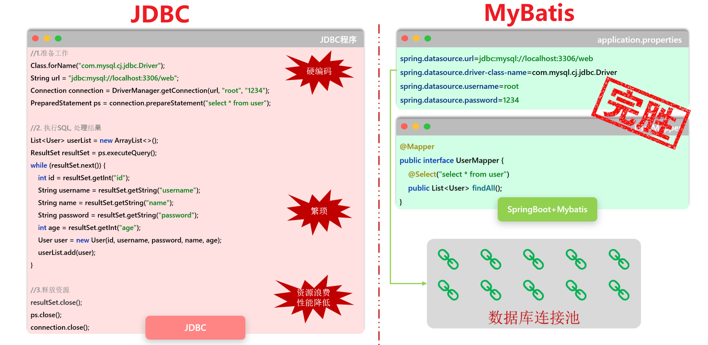

## MyBatis 核心概念

### **1. MyBatis 是什么？**

- 用 Java 代码操作数据库。最原始的方式是使用 JDBC，你需要手动编写大量的模板代码：加载驱动、创建连接、创建 `Statement`、拼装 SQL、执行、处理 `ResultSet`、最后还要在 `finally` 块中小心翼翼地关闭各种资源。

  - 这个过程繁琐、易错，而且 SQL 语句硬编码在 Java 代码里，难以维护。

  - **MyBatis** 就是为了解决这些问题而生的

    - **定位：一个优秀的持久层框架。** 它封装了几乎所有的 JDBC 底层细节，让你不再需要编写那些模板代码。它的核心任务就是帮你管理数据库的增删改查（CRUD）操作。

    - **核心哲学：SQL 与代码解耦。** 这是 MyBatis 最具魅力的特点。它允许你将复杂的 SQL 语句从 Java 代码中抽离出来，统一写在专门的 XML 文件或注解中。这样做的好处是：
      - **SQL 归 SQL，代码归代码**：分工明确，便于维护。数据库管理员（DBA）或 SQL 专家可以专注于优化 SQL，而 Java 开发者可以专注于业务逻辑
      - **SQL 更灵活**：你可以充分利用特定数据库的各种高级特性和函数，编写出**性能极致的 SQL**，而不用受框架的束缚

    - **与 Hibernate/JPA 的对比：半自动化 vs 全自动化**
      - **Hibernate/JPA (全自动 ORM)**: 它们试图完全屏蔽 SQL。你只需要操作 Java 对象（POJO），框架会自动生成 SQL 语句并执行。这在处理简单的 CRUD 时非常高效，但当业务逻辑复杂，需要高度优化的 SQL 时，自动生成的 SQL 往往不尽人意，你可能需要花费很大力气去“告诉”框架如何生成你想要的 SQL。我们称之为“全自动挡汽车”，上手快，但对车辆的精细控制较弱
      - **MyBatis (半自动 ORM)**: MyBatis 不会自动生成 SQL，它要求你**亲自编写 SQL 语句**。它做的，是帮你把 SQL 的执行、参数的设置、结果集的映射这些繁琐工作自动化。我们称之为“手动挡汽车”，你需要自己换挡（写 SQL），但对车辆的动力和行驶轨迹有绝对的控制权

    >**结论**：MyBatis 特别适合那些业务逻辑复杂、对 SQL 性能要求极高、或者希望对数据库有完全控制权的项目，尤其是在互联网应用中


### **2. 核心组件与架构**

- MyBatis 的工作流程就像一条高度协同的工厂流水线。下面是这条流水线上的关键角色：

  1. **`SqlSessionFactoryBuilder` (构建器)**
     - **作用**：读取 MyBatis 的核心配置文件（`mybatis-config.xml`），然后像一个建筑工人一样，根据这份“蓝图”建造出 `SqlSessionFactory` 工厂。
     - **生命周期**：它是一个“一次性”的工具，一旦创建了 `SqlSessionFactory`，它的使命就完成了，可以被垃圾回收。
  2. **`SqlSessionFactory` (工厂)**
     - **作用**：这是 MyBatis 的核心，一个重量级的对象。它的唯一职责就是创建 `SqlSession`。可以把它想象成一个**数据库连接池的管理者**。
     - **生命周期**：一旦被创建，它应该在整个应用的生命周期中都存在。通常我们使用**单例模式**来管理它，即整个应用只创建一个 `SqlSessionFactory` 实例。频繁地创建和销毁它会严重浪费系统资源。

  3. **`SqlSession` (会话)**
     1. **作用**：这是**与数据库进行交互的直接接口**，是 **MyBatis 最核心的 API**。它**封装了所有执行 SQL、提交/回滚事务、获取 Mapper 代理对象的方法**。
     2. **生命周期**：它是一个轻量级的、非线程安全的对象。因此，它的最佳实践是**“用完即关”**。绝不能在多个线程间共享一个 `SqlSession` 实例，也绝不能把它作为类的静态成员或实例成员长期持有。正确的做法是在每次数据库请求开始时创建它，在请求结束后关闭它。

  4. **Mapper (映射器)**
     - **作用**：**由一个 Java 接口和对应的 XML 文件（或注解）组成**。它**负责定义具体的业务方法，以及这个方法应该执行的 SQL 语句和映射规则**。**MyBatis 会在运行时为这个接口生成一个动态代理对象**，当你**调用接口方法时，实际上是这个代理对象在帮你执行 `SqlSession` 的相应操作**
     - **生命周期**：Mapper 代理对象是从 `SqlSession` 中获取的，所以它的生命周期应该和创建它的 `SqlSession` 保持一致

  5. **`Executor` (执行器)**
     - **作用**：`SqlSession` 内部的“发动机”。**所有的 SQL 最终都由 `Executor` 来执行**。它负责**处理参数映射、动态 SQL 解析、缓存查询等底层工作**。开发者一般不直接接触它，但可以通过插件来拦截它的行为，实现像分页、性能监控这样的高级功能。


## **配置文件mybatis-config.xml**

### 基本

- `mybatis-config.xml` 是 MyBatis 的核心配置文件，它包含了影响 MyBatis 行为的全局设置和属性。这个文件的顶层结构是有严格顺序的，如果你不按顺序组织元素，MyBatis 会在解析时报错
- MyBatis 在启动和运行时，会首先读取这个文件，根据里面的指示来配置自己的行为
  - 在**独立使用 MyBatis的时候**：**必须写** `mybatis-config.xml`，否则程序无法运行
  - 在**Mybatis 与 Spring/Spring Boot 集成**：**推荐不写** `mybatis-config.xml`，所有配置都转移到 `application.yml` 或 `application.properties` 文件中，由框架自动完成


### 配置文件中元素顺序与结构图

```
configuration
├── properties
├── settings
├── typeAliases
├── typeHandlers
├── objectFactory
├── objectWrapperFactory
├── reflectorFactory
├── plugins
├── environments
├── databaseIdProvider
└── mappers
```

- 这个配置文件中的具体细节，这里先不说


## Mapper 配置与扫描

- MyBatis 如何关联 Java Mapper 接口与 XML 映射文件
- Spring Boot 环境下如何高效地扫描和注册 Mapper

### 1. Mapper XML 文件的存放位置

- **核心规则**：Mapper XML 文件**必须**存放在 `src/main/resources` 目录下，而不是 `src/main/java` 目录

  > 为了类路径？

- **原因**：这源于标准的项目构建约定
  - `src/main/java`：此目录下的 `.java` 文件会被编译成 `.class` 文件。默认情况下，所有非 `.java` 文件（如 `.xml`）在编译打包时会被**忽略**
  - `src/main/resources`：此目录下的所有文件都被视为**资源文件**，在打包时会被**原样复制**到最终的 classpath（运行时查找路径）中
- **如果放错位置会怎样？** 程序在启动或运行时会因为在 classpath 中找不到 XML 文件而抛出 `IOException` 或 `BindingException (not found)` 异常，根本无法获取到 SQL 语句


### 2. 定位并匹配 XML 文件

- MyBatis 通过两个步骤来将 Java 接口和 XML 文件进行“配对”：**首先找到文件，然后确认内容**

#### 2.1 定位 XML 文件：两种核心方式

##### **方式一:约定优于配置 (默认行为)**

- **规则**：如果你**没有**进行任何相关配置，MyBatis 会启用默认约定。此约定包含两个**必须同时满足**的条件：

  1. 存放 XML 文件的**目录结构**必须和它对应的 Java Mapper 接口的**包结构**完全一致。

  2. XML **文件名**必须和它对应的 Java **接口名**完全一致。

     

- **工作原理**：MyBatis 根据接口的全限定名（如 `com.myapp.mapper.UserMapper`）推断出 XML 文件的**完整 classpath 路径**（包括文件名）。它会在 classpath 中严格寻找一个路径为 `com/myapp/mapper/UserMapper.xml` 的文件。如果文件名或路径有任何不匹配，文件定位就会失败。


##### **方式二:配置文件中明确指定(推荐)**

- **规则**：在 Spring Boot 的 `application.properties` 或 `application.yml` 中，通过 `mybatis.mapper-locations` 属性来明确告知 MyBatis 去哪里寻找 XML 文件

- **为什么这种方式更好？**

  - **解耦**：Java 代码的包结构和资源文件的目录结构不再需要强制绑定，你可以将所有 XML 文件集中存放在一个目录下（如 `resources/mappers/`），使项目结构更清晰。**文件名也可以任意命名**。
  - **明确性**：配置是显式的，任何人都能快速理解 XML 文件的位置。

- **如何配置**：

  - **`application.properties` 示例**：

    ```properties
    # 扫描 classpath 下的 mappers 目录及其所有子目录中的 .xml 文件
    mybatis.mapper-locations=classpath:mappers/**/*.xml
    ```

  - **`application.yml` 示例**：

    ```yaml
    mybatis:
      mapper-locations: classpath:mappers/**/*.xml
    ```

- **通配符详解**:

  - `*` (单个星号): 匹配当前目录下的任意文件或文件夹名。例如 `mappers/*.xml` 只会匹配 `mappers` 目录下的 XML 文件，**不会**进入子目录
  - `**` (两个星号): 匹配**任意层级的子目录**。`mappers/**/*.xml` 的意思就是“`mappers` 目录以及它下面的所有子目录（无论多少层）中，所有以 `.xml` 结尾的文件”。正是这个通配符实现了子目录的递归扫描

  

#### 2.2 内容匹配: namespace 最终校验

- **规则**：无论通过哪种方式找到了 XML 文件，MyBatis 都会进行最后一步校验。XML 文件中 `<mapper>` 标签的 `namespace` 属性值，必须和它对应的 Java Mapper 接口的**全限定名**（包名+类名）**完全一致**
- **目的**：**最终绑定**。这是确保 SQL 语句和正确接口关联的最后一道防线
- **如果 `namespace` 不一致会怎样？** 即使找到了文件，MyBatis 也会认为“文件内容与身份不符”，从而抛出 `BindingException`


### 3. Mapper 接口的扫描与注册

- MyBatis 需要知道去哪里找你的 Java Mapper 接口，并把它们注册到 Spring 容器中

#### 3.1 `@Mapper` vs `@MapperScan`

| 特性         | **@Mapper**                                                  | **@MapperScan**                                              |
| ------------ | ------------------------------------------------------------ | ------------------------------------------------------------ |
| **作用**     | **单个注册**：标记在某一个具体的 Mapper 接口上，使其被 Spring 发现并注册。 | **批量扫描**：指定一个基础包路径，自动扫描该路径下的所有接口并注册为 Mapper。 |
| **使用位置** | 写在**每一个** Mapper 接口的类定义上。                       | 通常写在**主启动类**或一个集中的配置类上。                   |
| **优点**     | 精确控制，简单明了。                                         | **一劳永逸**，只需配置一次，后续新增接口无需任何操作，是**强烈推荐**的做法。 |
| **缺点**     | **繁琐**，每增加一个接口都必须手动添加，容易遗漏。           | （几乎没有）                                                 |


#### 3.2 `@MapperScan` 的使用

- **写在哪里？** 通常写在 Spring Boot 的**主启动类**上（即带有 `@SpringBootApplication` 注解的类）。因为主启动类是应用的入口和配置中心，放在这里可以确保在应用启动的最早期阶段，所有 Mapper 接口都被正确加载。

- **会扫描子包吗？** **是的**。`@MapperScan` 会自动地、递归地扫描你指定的包及其下的**所有子包**，无需手动配置每一个子包路径。

  ```java
  // 只需要指定顶层包，其下的 product、order 等子包都会被自动扫描
  @SpringBootApplication
  @MapperScan("com.myapp.mapper")
  public class MyApplication { ... }
  ```


### 4. 整体工作流程总结

- MyBatis 的自动化配置流程就像一个精确的流水线：
  1. **启动**：Spring Boot 应用启动
  2. **扫描接口**：`@MapperScan` 开始工作，扫描指定包（及其所有子包），找到所有 Mapper 接口（如 `UserMapper.java`），并将它们注册为 Spring Bean
  3. **定位 XML**：当需要执行 `UserMapper` 中的某个方法时，MyBatis 首先会根据 `mybatis.mapper-locations` 的配置去查找 XML 文件。如果该配置不存在，则会回退到使用“**目录结构一致**”的约定去查找
  4. **匹配 Namespace**：MyBatis 打开找到的 `UserMapper.xml`，校验其 `namespace` 是否与 `UserMapper` 接口的**全限定名**完全一致
  5. **执行 SQL**：校验成功后，执行 `id` 匹配的方法所对应的 SQL 语句


## 关于“名字”的关联

### 绑定机制超级澄清

#### 原则：两个独立且方向相反的流程

- 理解MyBatis的关键在于，要将“数据从Java流向数据库”和“数据从数据库流向Java”看作两个完全独立、互不干扰的流程
  1. **数据输出 (Java -> SQL)**：此流程的主角是 `#{}`，它的任务是**从Java参数中取值**。
  2. **数据输入 (SQL -> Java)**：此流程的主角是**结果映射 (Result Mapping)**，它的任务是**将查询结果填充到Java对象中**。

#### 流程一：数据输出 - `#{}` 的世界

> 在这个里面，有些地方需要名字相同，但有些地方又不需要名字相同，我归纳的是不需要和形参名字相同，别的地方就需要相同
>
> > 因为形参可能会变化，但是别的不变的，bro
>
> - **单个简单参数**：不用和某个Java中的变量名字相同，`#{}`也能正确匹配，因为不存在歧义
> - **多个参数**：不用和形参的名字相同，但是要和`@Param`指定的名字相同，因为`#{}`匹配的是 **`@Param`注解指定的名字**，而不是形参变量名
> - **单个对象参数**：MyBatis会忽略该对象的形参名，`#{}`匹配的是对象内部的**属性名**，对象内部的属性名不是形参，所以这里要严格和对象内部的属性名相同

- `#{}` 是一个纯粹的“Java世界”的指令。它的唯一使命就是匹配Java端的变量/属性名，与数据库字段名**没有任何直接关系**


##### 绑定规则详解

###### 1. 单个JavaBean对象参数

这是最常见的情况，例如 `void insert(User user);`

- **`#{}` 匹配对象**：JavaBean的**属性名**。
- **核心逻辑**：MyBatis会忽略方法参数名(`user`)，直接通过Java反射机制，寻找并调用该对象属性对应的`getter`方法。
- **示例**：`#{userName}` 会精确地寻找并调用 `user.getUserName()` 方法来取值。


###### 2. 多个参数

- 必须使用 `@Param` 注解，例如 `void update(@Param("id") int userId, @Param("name") String userName);`

  - **`#{}` 匹配对象**：`@Param("...")` 注解中**指定的名字**。

  - **核心逻辑**：MyBatis会将所有参数放入一个内部Map中，`@Param`指定的名字就是这个Map的键(key)。`#{}`根据这个键来取值。

  - **示例**：`#{name}` 会在内部Map中寻找键为 `"name"` 的项。


###### 3. 单个简单参数

- 这是一个特例，例如 `User findById(Integer userId);`

  - **`#{}` 匹配对象**：理论上可以是**任意名字**，但最佳实践是与**方法参数名**保持一致。

  - **核心逻辑**：因为只有一个参数，MyBatis知道`#{}`指的一定是它，所以能正确匹配。

  - **示例**：`#{id}` 或 `#{userId}` 都能正确匹配到 `userId` 这个参数。

  

##### `#{}` 与数据库字段的连接

- `#{}` 取出的值，与数据库字段的连接，是**通过你在SQL语句中书写的位置来手动建立的**

  ```sql
  -- `#{userName}` 的值，会被放到 `user_name` 列对应的位置上。
  INSERT INTO user (user_name, age) VALUES (#{userName}, #{userAge})
  ```

  


#### 流程二：数据输入 - 结果映射的世界

- 这个流程只在执行 `SELECT` 查询后发生。所有关于命名风格（驼峰、下划线）的自动转换配置，都只在这里生效

##### 匹配规则详解

- 核心是**数据库的字段名**和**Java对象的属性名**之间的匹配

###### 1. 默认情况：严格匹配

- 在不进行任何配置时，数据库返回的**字段名**必须和Java对象的**属性名**完全一致，否则对应属性的值将为`null`

  - **数据库字段**：`user_name`

  - **Java属性**：`private String user_name;` (需要这样才能匹配)


###### 2. 推荐配置：开启驼峰自动映射

- 这是解决命名风格不一致的最佳实践。配置项为 `mapUnderscoreToCamelCase = true`

  - **作用**：自动将数据库中**下划线命名**的字段（如 `user_name`）映射到Java中**驼峰命名**的属性（如 `userName`）

  - **核心逻辑**：MyBatis在拿到数据库返回的列名 `user_name` 后，会自动在内存中将其转换为 `userName`，再去Java对象中寻找对应的`setter`方法（`setUserName()`）


###### 3. 手动方式：SQL别名 或 `<resultMap>`

- 当自动映射无法满足需求时，可以使用手动方式进行精确控制

  - **SQL别名 (`AS`)**：在`SELECT`语句中为字段起一个与Java属性名完全相同的别名。

    ```sql
    SELECT user_name AS userName FROM user;
    ```

  - **`<resultMap>`**：在XML中定义一个详细的映射规则，明确指定哪个数据库字段对应哪个Java属性。这是最强大、最灵活的方式。


### Java中的变量名与`#{}`进行绑定

- MyBatis 中如何将 Mapper 接口方法的参数与 SQL 语句中的 `#{...}` 占位符进行绑定的核心规则
  - `#{}`是在sql语句中用的，在属性中要是涉及到Java属性可以直接写，不用写`#{}`


#### 场景一：单个 POJO 对象参数

- 这是最常见的情况，比如 `update(User user)`

- **核心规则**：当方法只有一个 POJO 对象参数时，MyBatis 会自动将该对象作为属性的来源。在 SQL 中，你应该**直接使用对象的属性名**进行引用

- 单参数的好像在`#{}`中写了东西就行，反正名字去了之后也就那样，还是对不上。这是我从多参去名字对不上推理出来的

  - 既然多参数对不上要用东西标识，凭啥单参数的能对上不用写，如果单参数是用名字对的，那多参数为啥不行。我就说多参数为啥写名字进行比对不行
  - 既然如此，那就单参数是直接进行匹配的，根本没有说名字要相同这种说法，其实也有，我这会儿在乱说，但是写就行，但是为了规范，我们通常喜欢把相关的都写的一模一样，bro

- **正确示例**：

  ```java
  // Mapper 接口方法
  public void update(User user);
  ```

  ```xml
  <!-- SQL 语句 -->
  <update id="update">
    update user set
      username = #{username},		<!-- 这里不可以写user.username -->
      password = #{password}		<!-- 这里不可以写user.password -->
    where
      id = #{id}
  </update>
  ```

  - **解释**：MyBatis 看到 `#{username}`，会自动去 `user` 对象中寻找 `username` 属性，并调用其 `getUsername()` 方法来获取值。

  

- **错误示例**：

  ```xml
  <!-- 错误写法 -->
  <update id="update">
    update user set username = #{user.username} ...
  </update>
  ```

  - **解释**：在这种情况下，MyBatis 会尝试寻找一个名为 `user` 的参数，但因为只有一个参数，MyBatis 不会为其分配一个顶层名称，所以会抛出 `Parameter 'user' not found` 的异常

  

#### 场景二：多个参数

- 当方法参数超过一个时，情况就完全不同了，比如 `update(User user, Long operatorId)`

- **核心规则**：只要方法有多个参数，就**必须**为**每一个参数**使用 `@Param` 注解进行显式命名。这是为了消除参数歧义，因为 Java 在编译后可能会丢失原始的参数名

  - `@Param`注解的详细讲解，见下节

- **正确示例**：

  ```java
  // 必须为每个参数添加 @Param
  public void update(
      @Param("user") User user,
      @Param("operatorId") Long operatorId
  );
  ```

  ```xml
  <!-- SQL 中必须使用 @Param 指定的名称 -->
  <update id="update">
    update user set
      username = #{user.username},  <!-- 通过 'user.' 前缀访问属性-->
      password = #{user.password},
      updated_by = #{operatorId}    <!-- 直接访问另一个参数 -->
    where
      id = #{user.id}
  </update>
  ```

  - **解释**：
    - `@Param("user")` 告诉 MyBatis：“这个 `User` 对象在 SQL 里就叫 `user`”
    - 因此，在 SQL 中访问其属性时，必须使用 `#{user.属性名}` 的形式
    - 对于简单类型的参数 `operatorId`，直接使用 `#{operatorId}` 即可

- **错误示例**：

  ```java
  // 错误：没有使用 @Param 注解
  public void update(User user, Long operatorId);
  ```

  - **解释**：MyBatis 无法区分哪个参数是什么，它只能看到 `arg0` 和 `arg1`。此时，任何尝试通过 `#{user.username}` 或 `#{operatorId}` 进行的绑定都会失败，并抛出 `Parameter not found` 异常。


###  `@Param`注解

- 用于绑定形参和`#{}`的注解

- **核心作用**：在 MyBatis 的 Mapper 接口中，`@Param` 注解专门负责为方法的**形式参数**指定一个明确的名称，以便在 XML 映射文件或注解 SQL 中能够通过 `#{...}` 或 `${...}` 准确地引用它们
- **解决的问题**：它解决了 Java 编译后可能丢失参数名以及当存在多个参数时产生的歧义问题，是确保参数正确传递给 SQL 的关键工具
- 这里先说一个重要的：如果方法的形参是一个对象，`#{...}` 中的名字**必须**和传入的 Java 对象（POJO）中的**属性名**严格保持一致，不然报错，关于多个参数的见下

#### 1. 为什么需要 `@Param`？核心痛点

- **痛点一：参数名丢失**

  - **背景**：在 Java 8 之前，或者编译时没有添加 `-parameters` 编译标志，方法的形参名在编译成 `.class` 文件后会丢失，变成无意义的 `arg0`, `arg1`, `arg2`...
  - **后果**：MyBatis 无法通过反射获取到你编写的真实参数名（如 `userId`），因此它不知道 `#{userId}` 到底对应哪个参数，导致绑定失败。

- **痛点二：多参数歧义**

  - **背景**：当一个 Mapper 方法有多个参数时，即使参数名得以保留，MyBatis 也无法确定哪个 `#{...}` 占位符对应哪个参数。

  - **示例（错误用法）**:

    ```java
    // MyBatis 会抛出异常，因为它不知道 #{username} 是 name 还是 #{password} 是 pwd
    User findByCredentials(String name, String pwd);
    ```

    对应的 SQL:

    ```xml
    <select id="findByCredentials" resultType="User">
      select * from user where username = #{username} and password = #{password}
    </select>
    ```

#### 2. `@Param` 的工作原理与核心用法

- **工作原理**：MyBatis 在处理带有多个参数或使用了 `@Param` 注解的参数时，会创建一个 `Map` 来存放这些参数。

  - `@Param` 注解的值就是这个 `Map` 的 **key**，而方法的参数值就是 **value**。在解析 SQL 时，MyBatis 会根据 `#{key}` 去这个 `Map` 中查找对应的 value

- **代码示例**:

  ```java
  // 使用 @Param 为每个参数命名
  User findByCredentials(
      @Param("username") String name, 
      @Param("password") String pwd
  );
  ```

  - **`@Param("username")`**: 告诉 MyBatis，将参数 `name` 的值放入 Map 中，并将其 key 设置为 "username"。
  - **`@Param("password")`**: 告诉 MyBatis，将参数 `pwd` 的值放入 Map 中，并将其 key 设置为 "password"。
  - 这样，在 SQL 中就可以通过 `#{username}` 和 `#{password}` 精确地取到对应的值。

#### 3. 不同场景下的最佳实践

- **场景一：单个简单参数**

  - **定义**：参数类型为 Java 的基本类型、包装类、`String` 等。

  - **不推荐的做法**（依赖编译配置）：

    ```java
    // 只有在开启 -parameters 编译选项时才可能工作
    void deleteById(Integer id); // SQL: ... where id = #{id}
    ```

  - **推荐的做法**（健壮且清晰）：

    ```java
    // 不依赖任何编译配置，代码意图明确
    void deleteById(@Param("id") Integer userId); // SQL: ... where id = #{id}
    ```

    > **结论**：即使只有一个简单参数，也**推荐使用 `@Param`**，这让你的代码更加健壮，不受环境影响。

- **场景二：多个简单参数**

  - **结论**：**必须使用 `@Param`** 为每一个参数进行命名，否则 MyBatis 会报错。

  - **代码示例**:

    ```java
    List<User> findUsers(
        @Param("status") Integer status,
        @Param("keyword") String nameKeyword
    );
    ```

    ```xml
    <select id="findUsers" resultType="User">
      select * from user
      where status = #{status} and name like concat('%', #{keyword}, '%')
    </select>
    ```

    

- **场景三：单个复杂对象 (POJO)**

  - **结论**：**通常不需要使用 `@Param`**。MyBatis 会自动将对象的属性作为参数。

  - **代码示例**:

    ```java
    // 传入一个 User 对象
    void insertUser(User user);
    ```

    ```xml
    <!--可以直接使用 User 对象的属性名: username, password -->
    <insert id="insertUser">
      insert into user (username, password, create_time)
      values (#{username}, #{password}, #{createTime})
    </insert>
    ```

    > **注意**：SQL 中的 `#{username}` 实际上是 `#{user.username}` 的简写。MyBatis 会自动寻找传入的 POJO 对象中名为 `username` 的 `getter` 方法 (`getUsername()`) 来获取值。

    

- **场景四：混合参数（POJO + 简单参数）**

  - **结论**：**必须为所有参数添加 `@Param` 注解**，包括 POJO 对象，以消除歧义

  - **代码示例**:

    ```java
    void updateUser(
        @Param("user") User user, // 必须为 POJO 命名
        @Param("operatorId") Long adminId // 必须为简单参数命名
    );
    ```

    ```xml
    <update id="updateUser">
      update user
      set
        username = #{user.username},
        password = #{user.password}
      where
        id = #{user.id}
        and updated_by = #{operatorId} -- 引用简单参数
    </update>
    ```

    > **关键**：当为 POJO 添加 `@Param"user")` 后，在 SQL 中必须使用 `对象名.属性名` 的方式（如 `#{user.username}`）来访问其属性。


### Java变量和数据库属性关联

#### 方法1：`AS`起别名

```java
@Select("select id, name, create_time as createTime, update_time as updateTime from dept order by update_time desc;")
```


#### 方法2：全局开启驼峰

```yaml
mybatis:
  configuration:
    map-underscore-to-camel-case: true
```


#### 方法3：resultMap


#### 方法4：`@Results`和`@Result`

- `@Results` 和 `@Result` 是 MyBatis 中用来替代 XML 里 `<resultMap>` 功能的一组注解

##### 核心概念

- 简单来说，这两个注解的关系是：

  - **`@Result`**: 定义**单条**映射规则。精确地告诉 MyBatis：“请将查询结果中的 `column` 字段值，赋给 POJO 对象的 `property` 属性”

  - **`@Results`**: `@Result` 注解的**容器**。当一个查询需要配置多条映射规则时，就必须使用 `@Results` 将它们包裹起来

##### 注解属性详解

###### `@Result` 的核心属性

| 属性名         | 类型       | 描述                                                         |
| -------------- | ---------- | ------------------------------------------------------------ |
| **`property`** | `String`   | **[必需]** Java POJO 中的**属性名** (`userName`)。           |
| **`column`**   | `String`   | **[必需]** 数据库查询结果集中的**列名或别名** ( `user_name`) |
| **`id`**       | `boolean`  | 默认为 `false`。设置为 `true` 表示该属性是**主键**，等同于 XML 中的 `<id>` 标签。标记主键有助于 MyBatis 提升缓存和嵌套查询的性能。 |
| `javaType`     | `Class<?>` | 属性的 Java 类型。通常 MyBatis 能通过反射自动推断，一般无需手动指定。 |
| `jdbcType`     | `JdbcType` | 数据库字段的 JDBC 类型。通常也无需手动指定。                 |

###### `@Results` 的核心属性

| 属性名      | 类型        | 描述                                                         |
| ----------- | ----------- | ------------------------------------------------------------ |
| **`value`** | `@Result[]` | **[必需]** 一个 `@Result` 注解数组，用于存放一条或多条具体的映射规则。 |
| **`id`**    | `String`    | **[可选]** 给这套映射规则起一个唯一的ID名称。设置后，其他的查询方法就可以通过 `@ResultMap("id")` 注解来复用这套规则，避免重复定义。 |


##### 示例

- 假设我们有以下 POJO 和数据库表结构，它们的字段命名风格不一致

###### 1. POJO 类 (`User.java`)

```java
public class User {
    private Integer userId;       // 主键
    private String userName;
    private String userPassword;
    private LocalDateTime createTime;

    // Getters and Setters...
}
```

###### 2. 数据库表 (`user`)

| 字段名        | 类型       |
| ------------- | ---------- |
| `id`          | `int` (PK) |
| `user_name`   | `varchar`  |
| `password`    | `varchar`  |
| `create_time` | `datetime` |

###### 3. Mapper 接口 (`UserMapper.java`)

```java
import org.apache.ibatis.annotations.*;
import java.util.List;

@Mapper
public interface UserMapper {

    /**
     * 使用 @Results 和 @Result 定义一个可复用的结果集映射。
     * 这个映射被命名为 "userResultMap"。
     */
    @Results(id = "userResultMap", value = {
        // 将 'id' 字段映射到 'userId' 属性，并标记为主键
        @Result(property = "userId", column = "id", id = true), 
        
        // 将 'user_name' 字段映射到 'userName' 属性
        @Result(property = "userName", column = "user_name"),
        
        // 将 'password' 字段映射到 'userPassword' 属性 (不规则命名)
        @Result(property = "userPassword", column = "password"),
        
        // 将 'create_time' 字段映射到 'createTime' 属性
        @Result(property = "createTime", column = "create_time")
    })
    @Select("SELECT * FROM user WHERE id = #{id}")
    User findById(Integer id);


    /**
     * 使用 @ResultMap 注解，通过 ID 复用上面定义好的 "userResultMap" 映射规则。
     * 这样就无需再次编写一长串的 @Results 和 @Result。
     */
    @ResultMap("userResultMap")
    @Select("SELECT * FROM user")
    List<User> findAll();
}
```


## Mapper XML 映射文件

- MyBatis 的核心魅力在于它能将 SQL 从业务逻辑中解耦出来，而 Mapper XML 文件正是承载这些 SQL 的核心工作区。
  - Mapper XML文件 精确定义了 **Mapper 接口中的方法如何与具体的 SQL 语句绑定、参数如何传递以及结果如何映射**。


### 文件结构

- 每个 Mapper XML 文件都遵循固定的结构，并与一个 Mapper 接口一一对应


#### 1. XML 声明和 DTD 约束

- 一个标准的 Mapper XML 文件头部如下
  - 它定义了 **XML 版本、编码**以及 MyBatis 的 DTD，用于约束和校验文件格式的正确性

```xml
<?xml version="1.0" encoding="UTF-8" ?>
<!DOCTYPE mapper
        PUBLIC "-//mybatis.org//DTD Mapper 3.0//EN"
        "http://mybatis.org/dtd/mybatis-3-mapper.dtd">
```


#### 2. 根元素 `<mapper>`

- 所有内容都必须包裹在 **`<mapper>` 标签**内

  - **`namespace` (命名空间)**: **这是 `<mapper>` 元素最核心的属性**
    - 它必须被设置为**与之绑定的 Mapper 接口**的**完全限定名**（例如：**`com.example.mapper.UserMapper`**）

  > **工作原理**：
  >
  > - MyBatis 通过 `namespace` 定位到具体的 Mapper 接口
  > - 再通过 SQL 语句标签的 `id`（**必须与接口方法名一致**）来最终确定执行哪条 SQL
  > - 这个 `namespace + id` 的组合是 MyBatis 动态代理机制实现绑定的关键，确保了接口调用能够精确地“导航”到对应的 SQL 语句
  > - 如果找不到匹配项，MyBatis 会抛出 `BindingException`异常


### MyBatis CRUD

- 在 MyBatis 中，`<select>`, `<insert>`, `<update>`, `<delete>` 是定义数据库操作的四大核心标签

#### 1.`<select>` (查询标签)

###### 概念

- `<select>` 是最复杂也是功能最强大的标签，因为它承载了所有数据读取的任务，并且需要处理各种复杂的返回结果


##### 核心属性

- **`id` (必需)**:

  - **作用**: SQL 语句的唯一标识符。

  - **规则**: **必须与 Mapper 接口中对应的方法名完全一致**

    - 这是 MyBatis 通过动态代理将接口方法调用精确绑定到具体 SQL 语句的基石。

      

- **`resultType`**:

  - **作用**: 指定将查询结果的**每一行**映射成的 Java 类型。它启动了 MyBatis 的**自动映射**机制

  - **用法**:

    1. **映射为 JavaBean**: `resultType="com.example.entity.User"` 或 `resultType="User"` (如果配置了别名)。
       - MyBatis 会尝试将列名（如 `user_name`）自动映射到属性名（如 `userName`）
    2. **映射为基本类型**: `resultType="int"`、`resultType="string"` 等。
       - 适用于查询结果只有一列的场景，如 `SELECT COUNT(*) FROM user`
    3. **映射为 Map**: `resultType="map"`。
       - 将每一行结果封装成一个 `Map<String, Object>`，其中 `key` 是列名，`value` 是对应的值

  - **注意**: `resultType` 和 `resultMap` 是**互斥**的，在一个 `<select>` 标签中只能使用其中一个

    

- **`resultMap`**:

  - **作用**: 引用一个预先定义好的 `<resultMap>` 标签的 `id`。它启动了 MyBatis 的**手动映射**机制。

  - **用法**: `resultMap="userBaseResultMap"`。适用于以下场景：

    1. 数据库列名和 Java 属性名不一致，且无法通过驼峰命名自动转换。
    2. 需要进行复杂的**一对一**或**一对多**的关联查询

  - **优先级**: 当 `resultMap` 被指定时，MyBatis 会完全忽略 `resultType` 属性。

    

- **`parameterType` (可选)**:
  - **作用**: 指定传入这条 SQL 语句的参数的 Java 类型。
  - **用法**: `parameterType="com.example.entity.User"` 或 `parameterType="int"`。
  - **为何可选**: MyBatis 拥有强大的类型推断能力，绝大多数情况下可以根据传入的参数自动识别其类型，因此这个属性**通常可以省略**，以保持 XML 的简洁


##### **返回值与接口方法的对应关系**

- Mapper 接口方法的返回值类型决定了 MyBatis 如何处理查询结果：

  - **返回单个对象**: `User findById(int id);`
    - 如果查询返回多行，MyBatis 会抛出 `TooManyResultsException` 异常。

  - **返回对象集合**: `List<User> findAll();`
    - 即使查询结果为空，也会返回一个空的 `List`，而不是 `null`。

  - **返回 Map**: `Map<String, User> findUsersMap();` (需要配合 `@MapKey` 注解)
    - 可以将查询结果列表转换为一个 Map，便于快速查找。

  - **返回 Optional (Java 8+)**: `Optional<User> findById(int id);`
    - 优雅地处理可能为 `null` 的查询结果。

- **示例**

  ```xml
  <!-- 示例1: 使用 resultType 返回一个对象列表 -->
  <select id="findAll" resultType="com.example.entity.User">
      SELECT id, user_name, password FROM user
  </select>
  
  <!-- 示例2: 使用 resultMap 处理复杂的列名不一致问题 -->
  <select id="findUserDetail" resultMap="userResultMap">
      SELECT user_id, user_name, user_pwd FROM user WHERE user_id = #{id}
  </select>
  
  <!-- 示例3: 返回一个简单的计数值 -->
  <select id="countUsers" resultType="int">
      SELECT COUNT(*) FROM user
  </select>
  ```

  


#### 2.`<insert>` (插入标签)

###### 概念与核心属性

- `<insert>` 标签负责向数据库中添加新的记录，除了基本的插入功能，它还提供了强大的主键回填机制


##### **核心属性**

- **`id` (必需)**: 

  - **作用**: SQL 语句的唯一标识符。

  - **规则**: **必须与 Mapper 接口中对应的方法名完全一致**

    - 这是 MyBatis 通过动态代理将接口方法调用精确绑定到具体 SQL 语句的基石

      

- **`parameterType` (可选)**:

  - **作用**: 指定传入这条 SQL 语句的参数的 Java 类型。
  - **用法**: `parameterType="com.example.entity.User"` 或 `parameterType="int"`。
  - **为何可选**: MyBatis 拥有强大的类型推断能力，绝大多数情况下可以根据传入的参数自动识别其类型，因此这个属性**通常可以省略**，以保持 XML 的简洁

  

- **`useGeneratedKeys` (常用)**:

  - **作用**: 设为 `true` 后，会告诉 MyBatis 去获取由数据库内部生成的主键（如 MySQL 的 `AUTO_INCREMENT`）
  - **用法**: `useGeneratedKeys="true"`。**必须和 `keyProperty` 配合使用，但是keyProperty可以配合别的使用**

  

- **`keyProperty` (常用)**:

  - **作用**: 与 `useGeneratedKeys`属性 或 `<selectKey>` 标签配合，指定将获取到的主键值赋给**参数对象**的哪个属性
  - 和`<selectKey>`互斥
  - **用法**: `keyProperty="id"`。假设你传入一个 `User` 对象，MyBatis 在插入成功后，会自动调用 `user.setId(generatedKey)`

  

- **`keyColumn`**:

  - **作用**: （不常用）仅在某些数据库（如 PostgreSQL）需要明确指定主键在哪一列时使用

    

- **`<selectKey>` 子元素**

  - 对于不支持主键自增的数据库（如 Oracle 的序列），或需要在插入前生成主键（如 UUID）的场景，需要使用 `<selectKey>`

  - 和**keyProperty**互斥

    

##### **返回值**

- 默认情况下，`<insert>` 标签执行后，对应的接口方法返回一个 `int` 值，表示**受影响的行数**


##### **示例**

```xml
<!-- 示例1: MySQL 自增主键回填 -->
<insert id="saveUser" parameterType="User" useGeneratedKeys="true" keyProperty="id">
    INSERT INTO user(username, password) VALUES(#{username}, #{password})
</insert>

<!-- 示例2: Oracle 序列获取主键 (插入前) -->
<insert id="saveUserWithSequence" parameterType="User">
    <selectKey keyProperty="id" resultType="long" order="BEFORE">
        SELECT USER_SEQ.NEXTVAL FROM DUAL
    </selectKey>
    INSERT INTO user(id, username, password) VALUES(#{id}, #{username}, #{password})
</insert>
```


##### 主键回填

- 在插入数据后，我们常常需要立即获取新生成的主键值

  - **对于支持主键自增的数据库 (如 MySQL)**:

    ```xml
    <insert id="insertUser" useGeneratedKeys="true" keyProperty="id">
        INSERT INTO user(username, password) VALUES(#{username}, #{password})
    </insert>
    ```

    - `useGeneratedKeys="true"`: 开启获取数据库生成主键的功能。

    - `keyProperty="id"`: 将获取到的主键值，回填到传入的参数对象（比如一个 User 对象）的 `id` 属性中。

      

  - **对于不支持主键自增的数据库 (如 Oracle)**: 需要使用 `<selectKey>` 提前查询主键（如从序列中获取）

    ```xml
    <insert id="insertUser">
        <selectKey keyProperty="id" resultType="int" order="BEFORE">
            SELECT USER_SEQ.NEXTVAL FROM DUAL
        </selectKey>
        INSERT INTO user (id, username) VALUES (#{id}, #{username})
    </insert>
    ```

    - `order="BEFORE"`: 表示在 `INSERT` 语句执行**之前**执行 `<selectKey>` 内的查询。


#### 3.`<update>` (更新标签)

##### 概念

- `<update>` 标签专门用于执行数据的更新操作。它的结构相对简单，核心任务是根据传入的参数修改数据库中已存在的记录


##### **核心属性**

- **`id` (必需)**: SQL 语句的唯一标识符，必须与 Mapper 接口中的方法名完全一致
- **`parameterType` (可选)**: 指定传入参数的 Java 类型。通常可以省略，MyBatis 会自动推断。当参数是一个复杂的对象（如 `User`）时，你可以在 SQL 语句中通过 `#{属性名}` 的方式直接引用对象的属性


##### **返回值**

- 和 `<insert>` 一样，`<update>` 标签执行后，对应的接口方法默认返回一个 `int` 值，这个值表示**该 `UPDATE` 语句实际影响的数据库记录行数**。你可以根据这个返回值来判断更新操作是否成功执行。


##### **示例**

```xml
<!-- 示例: 根据用户ID更新用户名 -->
<!-- 对应的接口方法可以是: int updateUsername(User user); -->
<update id="updateUsername" parameterType="User">
    UPDATE user
    SET username = #{username}
    WHERE id = #{id}
</update>
```


#### 4.`<delete>` (删除标签)

##### 概念

- `<delete>` 标签用于从数据库中删除记录。它的用法和 `<update>` 非常相似，都是执行一个写操作并返回结果


##### **核心属性详解**

- **`id` (必需)**: SQL 语句的唯一标识符，必须与 Mapper 接口中的方法名完全一致。
- **`parameterType` (可选)**: 指定传入参数的 Java 类型。当参数是一个简单类型（如 `int`、`long`）时，在 SQL 语句中可以直接用 `#{任意名称}` 来引用它。


##### **返回值**

- 与 `<update>` 相同，`<delete>` 标签执行后，对应接口方法默认返回一个 `int` 值，表示**该 `DELETE` 语句实际删除的数据库记录行数**


##### **示例**

```xml
<!-- 示例: 根据ID删除用户 -->
<!-- 对应的接口方法可以是: int deleteUserById(int userId); -->
<delete id="deleteUserById" parameterType="int">
    DELETE FROM user WHERE id = #{userId}
</delete>
```


#### 参数处理：`#{}` vs `${}`

#####  1.`#{}`：预编译参数

- **工作原理**: MyBatis 将 `#{}` 处理成 JDBC `PreparedStatement` 中的参数占位符 `?`。参数值是通过 `set` 方法安全设置的，而不是直接拼接到 SQL 语句中。

- **优点**:

  1. **防止 SQL 注入**: 从根本上杜绝了 SQL 注入风险，因为参数值被视为数据，而不是 SQL 指令。
  2. **类型安全**: MyBatis 会自动进行 Java 类型到 JDBC 类型的转换。
  3. **性能更优**: 数据库可以缓存和重用预编译的 SQL 执行计划。

- **示例**:

  ```xml
  <select id="findUserByName" resultType="User">
      SELECT * FROM user WHERE name = #{userName}
  </select>
  ```


##### 2. `${}`：直接字符串替换

- **工作原理**: MyBatis 会将 `${}` 中的变量值**原样**拼接到 SQL 语句中，进行简单的字符串替换

- **风险**:

  1. **SQL 注入**: 如果参数来自用户输入，会产生严重的安全漏洞
  2. **类型问题**: 不会自动进行类型处理，字符串参数可能需要手动加引号

- **正确使用场景**: `#{}` 无法满足需要**动态改变 SQL 结构**的场景，此时必须使用 `${}`

  1. **动态排序**:

     ```xml
     <select id="findAllUsers" resultType="User">
         SELECT * FROM user ORDER BY ${columnName} ${sortDirection}
     </select>
     ```

  2. **动态表名/分表**:

     ```xml
     <select id="findLogs" resultType="Log">
         SELECT * FROM log_${year}
     </select>
     ```

- **安全准则**: **能用 `#{}` 就绝不用 `${}`**。当必须使用 `${}` 时，传入的参数**绝不能**直接来自前端用户输入，必须在后端代码中进行严格的**白名单校验**，确保其值在预期的、安全的可选范围内


### 结果映射

- 当查询结果需要封装成 Java 对象时，MyBatis 提供了两种映射方式：`resultType`和`resultMap`
- 如果字段名不同，还能用`AS`起别名大法


#### 1. `resultType`自动:映射

> 我对这个有偏见，我感觉这个老垃圾了

- `resultType` 是一种“约定优于配置”的体现。你告诉 MyBatis 希望得到哪种类型的 Java 对象，它会**自动**尝试将 SQL 查询结果的列一一映射到该对象的属性上

  

- ##### **适用场景**

  - **简单查询**：查询结果的列名与 Java 对象的属性名能够直接对应（或通过驼峰转换后能够对应）

  - **返回基本类型**：查询结果只有一个值，如 `COUNT(*)`，可以指定 `resultType="int"`

  - **返回 Map**：不创建实体类，直接将每一行结果映射成一个 `Map<String, Object>`，其中 key 是列名，value 是对应的值。指定 `resultType="map"` 或 `resultType="java.util.HashMap"`


- ##### **自动映射规则**

  - MyBatis 遵循以下两条核心规则进行匹配：

    1. **不区分大小写的直接匹配**：数据库列 `USERNAME` 或 `username` 都能成功匹配到 Java 属性 `username`。
    2. **下划线到驼峰的转换**：这是最常用也最重要的规则
       - 当在全局配置中开启 `mapUnderscoreToCamelCase=true`（**Spring Boot 集成下默认开启**）后，数据库列 `user_name` 或 `USER_NAME` 会被自动映射到 Java 属性 `userName`
       - 这个和全局配置有关，和这个 resultType 没关系


- ##### **局限性**

  - 当遇到以下情况时，`resultType` 将无能为力，此时，就需要 `resultMap` 登场：

    - 列名与属性名完全不匹配，且无法通过驼峰规则转换（例如：列 `u_name` vs 属性 `username`）。

    - 需要进行复杂的关联查询，将多张表的结果组装成一个包含其他对象或集合的复杂对象。


#### 2. `resultMap`：强大的手动映射

- `resultMap` 是 MyBatis 中最强大、最重要的元素。我第一次看的JavaWeb网课居然没讲，我要气死，但是没办法，毕竟免费网课
- 它允许你**手动定义**一套精细的映射规则，完全掌控从结果集到 Java 对象的转换过程，应对任何复杂的场景。

- **核心理念**：`resultType` 和 `resultMap` 在同一个 `<select>` 标签中是**互斥**的，二者择一。因为它们代表了两种不同的指令：“**MyBatis，请你自动处理**” vs “**MyBatis，请严格按我定义的规则处理**”

##### 2.1 解决列名与属性名不一致

- 这是 `resultMap` 最基本的用途

  1. **定义 `<resultMap>`**:

     ```xml
     <!-- 
       id: 这个 resultMap 的唯一标识，供 <select> 标签来引用
       type: 目标 Java 对象的完整类名或别名
       autoMapping: (可选) 设为 true 时，MyBatis 会在执行手动映射规则后，
                    再对未明确映射的列进行一次自动映射。非常适用于混合场景
     -->
     <resultMap id="userBaseResultMap" type="com.example.entity.User" autoMapping="true">
         <!-- 
           <id>: 用于映射主键字段。它不仅是映射，更是向 MyBatis 声明了记录的唯一性，
                 这对于缓存优化和避免在关联查询中产生重复主对象至关重要。
         -->
         <id property="id" column="user_id"/><!-- 这个id标签用来弄主键 -->
         
         <!-- 
           <result>: 用于映射除主键外的普通字段。
           property: Java 对象的属性名
           column: 数据库结果集中的列名
           javaType, jdbcType: (可选) 精确指定属性的 Java 类型和列的 JDBC 类型
         -->
         <result property="name" column="user_name"/>	<!-- 用来映射主键外的字段 -->
         <result property="password" column="user_pwd"/>
     </resultMap>
     ```

  2. **在 `<select>` 中引用resultMap**:

     ```xml
     <select id="findUserById" resultMap="userBaseResultMap">
         SELECT user_id, user_name, user_pwd, create_time FROM user WHERE user_id = #{id}
     </select>
     ```

  >*在这个例子中，`user_id`, `user_name`, `user_pwd` 会被手动映射。如果 `autoMapping="true"`，MyBatis 会继续尝试自动映射 `create_time` 到 `createTime` 属性*

  

##### 2.2 关联查询 (一对一 / 一对多)

- `resultMap` 真正强大的地方在于能够优雅地处理关联关系，只需定义好映射规则，MyBatis 就能自动为你组装出复杂的对象图。

  - **`<association>` (一对一关联)** **场景**：查询订单(Order)及其关联的创建者(User)信息

    ```xml
    <resultMap id="orderWithUserMap" type="Order">
        <id property="id" column="order_id"/>
        <result property="orderNo" column="order_no"/>
        
        <!-- 
          使用 association 映射 'user' 属性
          property: 宿主对象(Order)中的属性名 'user'
          javaType: 关联对象(User)的类型
        -->
        <association property="user" javaType="User">
            <id property="id" column="user_id"/>
            <result property="username" column="user_name"/>
        </association>
    </resultMap>
    
    <select id="findOrderById" resultMap="orderWithUserMap">
        SELECT
            o.id as order_id,
            o.order_no,
            u.id as user_id,
            u.username as user_name
        FROM orders o
        JOIN user u ON o.user_id = u.id
        WHERE o.id = #{orderId}
    </select>
    ```

    

  - **`<collection>` (一对多关联)** **场景**：查询用户(User)及其名下的所有订单(Order)列表。

    ```xml
    <resultMap id="userWithOrdersMap" type="User">
        <id property="id" column="user_id"/>
        <result property="username" column="user_name"/>
        
        <!-- 
          使用 collection 映射 'orderList' 属性
          property: 宿主对象(User)中的集合属性名 'orderList'
          ofType: 集合中元素的类型(Order)
        -->
        <collection property="orderList" ofType="Order">
            <id property="id" column="order_id"/>
            <result property="orderNo" column="order_no"/>
        </collection>
    </resultMap>
    
    <select id="findUserWithOrders" resultMap="userWithOrdersMap">
        SELECT
            u.id as user_id,
            u.username as user_name,
            o.id as order_id,
            o.order_no
        FROM user u
        LEFT JOIN orders o ON u.id = o.user_id
        WHERE u.id = #{userId}
    </select>
    ```

    - **关联查询的两种实现方式对比**

      | 实现方式     | 原理                                                         | 优点                               | 缺点                                                         | 适用场景                                                     |
      | ------------ | ------------------------------------------------------------ | ---------------------------------- | ------------------------------------------------------------ | ------------------------------------------------------------ |
      | **嵌套结果** | 一次 `JOIN` 查询，获取所有数据。MyBatis 根据 `resultMap` 的结构在内存中自动组装对象。 | **性能极高**，只有一次数据库交互。 | SQL 语句可能较复杂，可能产生笛卡尔积。                       | **绝大多数关联查询场景的首选和推荐方式。**                   |
      | **嵌套查询** | 主查询执行后，根据主查询的结果，循环执行N次子查询来获取关联数据。 | SQL 语句简单，逻辑清晰。           | **N+1 问题**：1次主查询 + N次子查询，数据库交互频繁，**性能低下**。 | 极少数情况，或必须配合**懒加载(`fetchType="lazy"`)**使用，以延迟子查询的执行。 |


##### 2.3 `<discriminator>` (鉴别器)

- **作用**：根据某个列的值，来决定使用哪一套具体的映射规则，类似于 Java 中的 `switch` 语句。 
- **场景**：假设有一个 `vehicle` 表，其中 `vehicle_type` 列可以是 'CAR' 或 'TRUCK'。我们希望根据这个类型将结果映射到不同的子类 `Car` 或 `Truck`。

```xml
<resultMap id="vehicleResultMap" type="Vehicle">
    <id property="id" column="id"/>
    <result property="brand" column="brand"/>
    <discriminator javaType="string" column="vehicle_type">
        <case value="CAR" resultMap="carResultMap"/>
        <case value="TRUCK" resultMap="truckResultMap"/>
    </discriminator>
</resultMap>

<resultMap id="carResultMap" type="Car" extends="vehicleResultMap">
    <result property="doorCount" column="door_count"/>
</resultMap>

<resultMap id="truckResultMap" type="Truck" extends="vehicleResultMap">
    <result property="payloadCapacity" column="payload_capacity"/>
</resultMap>
```


### 其他高级特性与技巧

#### 二级缓存 (Second-Level Cache)

- MyBatis 的二级缓存是**命名空间 (`namespace`) 级别**的缓存，多个 `SqlSession` 可以共享

  - **`<cache>`**: 在 Mapper XML 中添加此标签即可为当前命名空间开启二级缓存

    ```xml
    <!-- eviction: 回收策略, flushInterval: 刷新间隔(ms), size: 缓存数量, readOnly: 是否只读 -->
    <cache eviction="FIFO" flushInterval="60000" size="512" readOnly="true"/>
    ```

  - **`<cache-ref>`**: 让当前 Mapper 共享另一个 Mapper 的缓存配置。

    ```xml
    <!-- OrderMapper.xml 引用 UserMapper.xml 的缓存 -->
    <cache-ref namespace="com.example.mapper.UserMapper"/>
    ```


#### SQL 片段 (`<sql>` & `<include>`)

- 对于可重用的 SQL 代码块（如查询列名列表），可以使用 `<sql>` 定义，再通过 `<include>` 引用，提高代码的复用性和可维护性。

```xml
<sql id="base_column_list">
    id, username, password, age
</sql>

<select id="selectUserById" resultType="User">
    SELECT <include refid="base_column_list"/>
    FROM user
    WHERE id = #{id}
</select>
```


#### 处理 XML 特殊字符 (`<![CDATA[]]>`)

- 当 SQL 语句中包含 `<`、`>`、`&` 等 XML 特殊字符时，直接书写会导致解析错误。应使用 `CDATA` 区块将其包裹起来

```xml
<select id="getUsersByAge" resultType="User">
    <![CDATA[
        SELECT * FROM user WHERE age > #{minAge} AND age < #{maxAge}
    ]]>
</select>
```


## 动态 SQL

- 动态 SQL 是 MyBatis 最强大、最核心的特性之一。它允许你根据传入的参数或条件，在 XML 映射文件中动态地构建 SQL 语句，从而将复杂的逻辑判断从 Java 代码中解放出来，让 SQL 映射文件承担更多职责，使业务逻辑更纯粹


###  条件判断`<if>` 

- 这是最基础的动态 SQL 标签，功能完全等同于 Java 中的 `if` 语句，用于进行单路条件判断

- **作用**：根据 `test` 属性中的表达式返回值（`true` 或 `false`）来决定是否将标签内的 SQL 片段拼接到最终的 SQL 中
  - **深入 `test` 属性 (OGNL 表达式)**: `test` 属性中的表达式是基于 **OGNL (Object-Graph Navigation Language)** 解析的。这意味着你可以进行丰富的逻辑判断：
    - **访问对象属性**: `test="user != null"`
    - **访问属性值**: `test="username != null and username != ''"`
    - **调用方法**: `test="username.length() > 0"`
    - **访问集合大小**: `test="userList != null and userList.size() > 0"`
    - **布尔值判断**: `test="isActive"` (当 `isActive` 是 `boolean` 类型时)
    - **数值比较**: `test="age > 18"`

- **典型场景：多条件动态查询**

  ```xml
  <!-- 一个有潜在语法问题的例子 -->
  <select id="findActiveUser" resultType="User">
      SELECT * FROM user WHERE
      <if test="username != null and username != ''">
          AND username LIKE #{username}
      </if>
      <if test="status != null">
          AND status = #{status}
      </if>
  </select>
  ```

  - **问题剖析**：如果第一个 `if` 不成立，而第二个 `if` 成立，SQL 会变成 `SELECT * FROM user WHERE AND status = ?`，这会导致语法错误。如果所有 `if` 都不成立，SQL 会变成 `SELECT * FROM user WHERE`，同样是语法错误。为了解决这个问题，MyBatis 提供了更智能的 `<where>` 标签


### `<if>` 标签 `test` 属性揭秘

#### 核心概念：OGNL 表达式

- `<if>` 标签的 `test` 属性值是一个 **OGNL (Object-Graph Navigation Language)** 表达式。
  - MyBatis 会在运行时对这个表达式进行求值，
    - 如果结果为 `true`，则标签内的 SQL 片段会被包含到最终的 SQL 语句中；
    - 如果为 `false`，则被忽略。


##### 场景一：判断单个参数

- 当 Mapper 方法参数为简单类型时，使用 `@Param` 注解指定名称后，可直接在 `test` 中使用该名称。

**示例代码：**

- **Mapper 接口方法**

  ```java
  List<User> findUserByName(@Param("username") String username);
  ```

- **XML 映射**

  ```xml
  <select id="findUserByName" resultType="User">
    SELECT * FROM user WHERE 1=1
    <if test="username != null and username != ''">
      AND username = #{username}
    </if>
  </select>
  ```

**常用判断：**

- `test="username != null"`: 判断参数是否为 null。
- `test="username != ''"`: 判断字符串是否为空字符串。
- **最佳实践:** `test="username != null and username != ''"`，严谨地同时判断 null 和空字符串。


##### 场景二：判断 JavaBean 属性

- 当参数是对象时，可以直接通过 `属性名` 访问其属性并进行判断。

**示例代码：**

- **Mapper 接口方法**

  ```java
  List<User> findUserByCondition(UserQuery query);
  ```

- **XML 映射**

  ```xml
  <select id="findUserByCondition" resultType="User">
    SELECT * FROM user
    <where>
      <if test="username != null and username != ''">
        AND username LIKE #{username}
      </if>
      <if test="status != null">
        AND status = #{status}
      </if>
    </where>
  </select>
  ```

**要点：**

- OGNL 会自动调用属性的 getter 方法，如 `username` 实际上是 `query.getUsername()`。
- 支持调用方法，如 `test="username.length() > 0"`。


#### 要点与注意事项

- **字符串比较:** 字符串字面量需要用**单引号**括起来，例如: `test="userType == 'admin'"`。
- **布尔值判断:** 可以直接写属性名，例如: `test="enabled"` (当 enabled 为 true 时条件成立)。
- **XML特殊字符转义:** 在 XML 中，`<` 和 `>` 是特殊字符，必须进行转义。
  - `<` 应写为 `<` (例如: `test="age < 18"`)
  - `>` 应写为 `>` (例如: `test="age > 60"`)
- **枚举值引用:** 使用 `@` 符号引用静态字段或枚举值，例如: `test="status == @com.example.Status@ACTIVE"`。


### 智能处理前后缀标签

- 这组标签是动态 SQL 的“智能格式化工具”，它们能优雅地解决因条件动态变化而导致的多余 `AND`, `OR` 或逗号等语法问题

#### **`<where>`**

- **作用**：用于解决 `WHERE` 子句的动态拼接问题，规则如下：
  
  - 如果有条件就自动加上where；自动检查所有的and或者or，如果多余就删除

- **使用 `<where>` 改进第一个 `if` 示例**：

  ```xml
  <select id="findActiveUserWithWhere" resultType="User">
      SELECT * FROM user
      <where>
          <if test="username != null and username != ''">
              AND username LIKE #{username}
          </if>
          <if test="status != null">
              AND status = #{status}
          </if>
      </where>
  </select>
  ```

  

#### **`<set>`**

- **作用**：专门用于 `UPDATE` 语句的动态更新。它同样具备两大智能功能：
  1. 如果其包裹的内容**有输出**，它会自动添加 `SET` 关键字
  2. 它会自动**剔除**内容末尾多余的逗号 `,`

- **典型场景：动态更新用户信息**

  ```xml
  <update id="updateUserSelective">
      UPDATE user
      <set>
          <if test="username != null and username != ''">
              username = #{username},
          </if>
          <if test="password != null and password != ''">
              password = #{password},
          </if>
          <if test="age != null and age > 0">
              age = #{age},
          </if>
      </set>
      WHERE id = #{id}
  </update>
  ```

  

#### **`<trim>`**

- **作用**：这是一个更通用、更强大的前后缀处理标签，实际上 `<where>` 和 `<set>` 都是通过 `<trim>` 实现的。
  
  > 它允许你自定义所有格式化规则
  >
  > 事实上就是我的那个疑问，就是`<select>`标签其实也可以自动的生成一个select关键字，如果用`<trim>`的话，这个主要就是为了处理前后缀问题产生的。
  >
  > 像`<where>`这种标签，首先是为了解决处理前后缀这个非常具体且棘手的问题而产生的，而“让SQL语句更规范化”是解决这个问题之后带来的一个必然且美好的结果
  >
  > 当然sql语句已经够好了，有啥不好的，唯一原因就是想更好嘛......
  >
  > 但是也巧妙哈，居然这么完美的就一举两得，一箭双雕了，太美妙了
  >
  > 丑陋的sql，呕
  
  - `prefix`: 在内容前添加指定的前缀。
  - `suffix`: 在内容后添加指定的后缀。
  - `prefixOverrides`: 覆盖（删除）内容开头指定的文本（如 `AND|OR `）。
  - `suffixOverrides`: 覆盖（删除）内容末尾指定的文本（如 `,`）
  
- **使用 `<trim>` 模拟 `<where>` 的功能**：

  ```xml
  <trim prefix="WHERE" prefixOverrides="AND|OR "> ... </trim>
  ```

  

- **使用 `<trim>` 模拟 `<set>` 的功能**：

  ```xml
  <trim prefix="SET" suffixOverrides=","> ... </trim>
  ```


### 分支选择标签

- 这组标签的功能类似于 Java 中的 `switch-case-default` 语句，它确保在多个条件中，**只有一个分支**的 SQL 会被执行，适用于互斥条件的场景

  - **`<choose>`**: 包裹整个分支逻辑的父标签

  - **`<when>`**: 相当于 `case`，可以有多个，按顺序进行判断

  - **`<otherwise>`**: 相当于 `default`，当前面所有 `<when>` 都不满足时执行

- **典型场景：根据不同排序规则查询**

  ```xml
  <select id="findUsersOrdered" resultType="User">
      SELECT * FROM user
      ORDER BY
      <choose>
          <when test="orderBy == 'id'">
              id ASC
          </when>
          <when test="orderBy == 'username'">
              username ASC
          </when>
          <otherwise>
              create_time DESC
          </otherwise>
      </choose>
  </select>
  ```

  


###  遍历集合标签`<foreach>`

- 这是处理集合类型参数（如 `List`, `Set`, `Array` 或 `Map`）的利器

  - 作用：**对一个集合（如`List`, `Set`, `Map`或数组）进行迭代（遍历）**，并根据集合中的元素动态地生成SQL语句的一部分

- 语法

  > 不是根据数据检测哪个是参数名，哪个是开始字符串等的，是根据属性名检测的，所以位置可以随便写

  ```xml
  <foreach collection="参数名称" item="元素别名" 
           index="索引别名" open="开始字符串" separator="分隔符" close="结束字符串">
      #{元素别名.property} ...
  </foreach>
  ```

- **核心属性**：

  - `collection`: **必需**。要迭代的集合参数的名称。当参数是 `List` 时默认为 `list`，是数组时默认为 `array`。
    - **最佳实践是在 Mapper 接口方法中使用 `@Param("ids")` 注解来明确指定名称**。
  - `item`: 当前迭代元素的别名,类似于for(int i:array)中的 i
  - `index`: （可选）当前迭代元素的索引（在 List 和数组中）或键（在 Map 中）。
  - `open`: 在整个循环内容开始前添加的字符串。
  - `close`: 在整个循环内容结束后添加的字符串。
  - `separator`: 在每次迭代之间添加的分隔符。

  

- **典型场景 1：构建 `IN` 子句**

  ```xml
  <!-- 接口方法: List<User> findUsersByIds(@Param("ids") List<Integer> ids); -->
  <select id="findUsersByIds" resultType="User">
      SELECT * FROM user
      WHERE id IN
      <foreach collection="ids" item="id" open="(" close=")" separator=",">
          #{id}
      </foreach>
  </select>
  ```

  

- **典型场景 2：批量插入**

  ```xml
  <!-- 接口方法: int batchInsertUsers(@Param("users") List<User> users); -->
  <insert id="batchInsertUsers">
      INSERT INTO user (username, password)
      VALUES
      <foreach collection="users" item="user" separator=",">
          (#{user.username}, #{user.password})
      </foreach>
  </insert>
  ```

  

### 绑定变量标签`<bind>` 

- **作用**：在 OGNL 表达式中创建一个变量，并将其绑定到当前的上下文中，以便后续在 SQL 语句的其他部分使用。

- **典型场景：安全的模糊查询** 在进行模糊查询时，我们通常需要拼接 `％` 符号。如果使用 `${}` 进行拼接，会带来 SQL 注入的风险。`<bind>` 提供了一种安全的方式。

  ```xml
  <select id="findUsersByUsernameLike" resultType="User">
      <!-- 创建一个名为 _username 的变量，值为 '%'+传入的username+'%' -->
      <bind name="_username" value="'%' + username + '%'"/>
      SELECT * FROM user
      WHERE username LIKE #{_username}
  </select>
  ```

  

### `<sql>` 与 `<include>`

- 在编写复杂的 Mapper XML 文件时，我们经常会遇到需要重复使用的 SQL 片段，例如通用的查询列名、复杂的 `JOIN` 子句或是动态的 `WHERE` 条件。如果每次都复制粘贴，不仅会使 XML 文件变得冗长，更会给后续的维护带来巨大的麻烦——修改一处，就必须同步修改所有引用的地方
  - 为了解决这个问题，MyBatis 提供了 `<sql>` 和 `<include>` 这一对黄金搭档，它们的核心理念是 **DRY (Don't Repeat Yourself)**，旨在最大化地提高 SQL 代码的复用性和可维护性。


#### **`<sql>` (定义SQL片段)**

- **作用**: `<sql>` 标签用于**定义**一个可以被重用的 SQL 代码块。你可以把它想象成在程序中定义一个常量或一个函数，它本身不会被执行，只是作为一个“模板”存在
- **核心属性**:
  - `id` (必需): 这是 SQL 片段的**唯一标识符**。后续的 `<include>` 标签将通过这个 `id` 来找到并引用它
- **内容**: `<sql>` 标签内部可以包含任何有效的 SQL 文本，甚至是其他动态 SQL 标签（如 `<if>`, `<where>` 等）


#### **`<include>` (引用SQL片段)**

- **作用**: `<include>` 标签用于在需要的地方**引用**一个已经用 `<sql>` 定义好的 SQL 片段。当 MyBatis 解析到 `<include>` 标签时，会将其内容替换为对应 `<sql>` 片段的实际内容。
- **核心属性**:
  - `refid` (必需): 指向目标 `<sql>` 片段的 `id`


#### 场景

##### **场景一：重用静态的列名列表**

- 这是最简单也是最常见的用法，可以确保所有查询返回的字段保持一致

  1. **使用 `<sql>` 定义通用的列名**

     ```xml
     <sql id="base_column_list">
         id, username, password, email, status, create_time
     </sql>
     ```

  2. **在查询中通过 `<include>` 引用**

     ```xml
     <select id="findUserById" resultType="User">
         SELECT <include refid="base_column_list"/>
         FROM user
         WHERE id = #{id}
     </select>
     
     <select id="findAllUsers" resultType="User">
         SELECT <include refid="base_column_list"/>
         FROM user
         ORDER BY create_time DESC
     </select>
     ```

     

  **优势**: 当 `user` 表新增或修改字段时，只需修改 `<sql>` 片段一处，所有相关的查询都会自动更新，无需逐一修改。


##### **场景二：重用动态的查询条件**

- 这是 `<sql>` 与动态 SQL 结合的强大用法，可以将复杂的业务查询逻辑封装起来

  1. **在 `<sql>` 中定义动态逻辑**

     ```xml
     <sql id="dynamicUserConditions">
         <if test="username != null and username != ''">
             AND username LIKE #{username}
         </if>
         <if test="status != null">
             AND status = #{status}
         </if>
         <if test="createTimeStart != null">
             AND create_time >= #{createTimeStart}
         </if>
     </sql>
     ```

     

  2. **在不同的查询中 `<include>` 这个动态片段**

     ```xml
     <!-- 查询满足条件的完整用户列表 -->
     <select id="findUsersByConditions" resultType="User">
         SELECT <include refid="base_column_list"/>
         FROM user
         <where>
             <include refid="dynamicUserConditions"/>
         </where>
     </select>
     
     <!-- 查询满足条件的用户的数量 -->
     <select id="countUsersByConditions" resultType="int">
         SELECT count(*)
         FROM user
         <where>
             <include refid="dynamicUserConditions"/>
         </where>
     </select>
     ```

     - **优势**: 复杂的查询逻辑被集中管理。如果业务规则变更（例如，`username` 的查询从 `LIKE` 改为精确匹配 `=`)，只需修改 `<sql>` 片段，所有依赖此逻辑的查询都会同步更新，保证了业务逻辑的一致性

     

#### 向 `<include>` 传递属性

- 在某些更复杂的场景下，我们可能希望引用的 SQL 片段能根据不同的上下文表现出不同的行为，例如引用同一个表时使用不同的别名。MyBatis 允许我们通过 `<property>` 子元素向 `<include>` 传递参数。

1. **在 `<sql>` 片段中使用 `${}` 占位符**

   ```xml
   <sql id="user_columns_with_alias">
       ${alias}.id, ${alias}.username, ${alias}.status
   </sql>
   ```

2. **在 `<include>` 中通过 `<property>` 传递值**

   ```xml
   <select id="findOrderWithUser" resultType="Order">
       SELECT
           o.id as order_id,
           o.order_no,
           <include refid="user_columns_with_alias">
               <property name="alias" value="u"/>
           </include>
       FROM orders o
       LEFT JOIN user u ON o.user_id = u.id
       WHERE o.id = #{orderId}
   </select>
   ```

   - **解析**: 在这个查询中，`<include>` 会被替换为 `u.id, u.username, u.status`。通过这种方式，我们让可重用的 SQL 片段变得更加灵活和强大。


## **注解开发**

- 注解开发是 MyBatis 提供的另一种定义 SQL 映射的方式，它允许你直接在 Mapper 接口的方法上使用注解来编写 SQL 语句，从而替代 XML 文件。这种方式对于简单的 SQL 操作尤其方便，可以减少文件数量，让代码更内聚

- 要启用注解，你需要在 `mybatis-config.xml` 中使用 `<mapper class="...">` 或 `<package name="...">` 的方式注册 Mapper 接口


### **基本注解**

#### 最基本CRUD注解

- 这是最常用的一组注解，分别对应增、删、改、查操作

  - **`@Select`**: 用于定义查询语句。

  - **`@Insert`**: 用于定义插入语句。
    - 插入数据的时候，如果是自增的属性，不建议传递一个值过去，构造方法传值或者是非要传值的话就传null。

  - **`@Update`**: 用于定义更新语句。

  - **`@Delete`**: 用于定义删除语句。

- **关键点**：

  - SQL 语句直接写在注解的括号内

  - 参数的引用方式与 XML 中完全相同，依然使用 `#{}`

  - 对于多参数方法，推荐使用 `@Param` 注解来指定名称


- **示例：使用基本注解实现 User 的 CRUD**

  ```java
  // com/example/mapper/UserMapper.java
  package com.example.mapper;
  
  import com.example.model.User;
  import org.apache.ibatis.annotations.*;
  
  import java.util.List;
  
  public interface UserMapper {
  
      @Select("SELECT * FROM user WHERE id = #{id}")
      User findById(int id);
  
      @Insert("INSERT INTO user(username, password, age) VALUES(#{username}, #{password}, #{age})")
      @Options(useGeneratedKeys = true, keyProperty = "id") // 获取自增主键
      int insert(User user);
  
      // 使用 @SelectKey 获取非自增主键 (例如 Oracle 的序列)
      @Insert("INSERT INTO user(id, username) VALUES(#{id}, #{username})")
      @SelectKey(statement="SELECT USER_SEQ.NEXTVAL FROM DUAL", keyProperty="id", resultType=int.class, before=true)
      int insertWithSequence(User user);
  
      @Update("UPDATE user SET username = #{username}, age = #{age} WHERE id = #{id}")
      int update(User user);
  
      @Delete("DELETE FROM user WHERE id = #{id}")
      int delete(int id);
  }
  ```


#### 主键相关注解

- 在使用MyBatis进行数据库操作时，一个常见的需求是在执行`INSERT`语句后获取新生成的主键ID。
- `@Options`和`@SelectKey`这两个注解就是为了解决这类问题而设计的，但它们的实现机制和适用场景有所不同。


##### `@Options`：利用数据库原生机制

- `@Options` 是 MyBatis 提供的一个注解，它充当一个**“高级配置开关”**，让你能够对紧邻的**单条SQL映射语句**（如 `@Insert`, `@Update`, `@Select`, `@Delete`）进行精细化的、底层的行为控制。

- **核心作用**

  - **开启主键回填**(主键回填只是一个叫法，实际上不一定回填的是主键)：**“获取自动生成列(`AUTO_INCREMENT`)的值”**

  - **配置缓存、超时等**


###### 注解中关键属性

- **`useGeneratedKeys`**: (布尔值 `true`/`false`) **获取“自动生成列”值的总开关**。设置为 `true` 后，MyBatis 会通过 JDBC 驱动尝试在 `INSERT` 执行后，获取由数据库内部生成的值。

  > **注意**：它获取的是**自增列**（如 MySQL 的 `AUTO_INCREMENT`）的值，**不一定**是主键。我们常说的“主键回填”只是最常见的一种应用场景。

- **`keyProperty`**: (字符串) **指定目标**。用于告诉 MyBatis，应该将获取到的自动生成值，赋给传入的 Java 对象的**哪个属性**。

  - 示例：`keyProperty="userId"`，表示将值赋给 `userId` 这个 Java 属性。

- **`keyColumn`**: (字符串，可选) **指定来源**。用于精确告诉 MyBatis，应该从数据库的**哪一列**去获取那个自动生成的值。在以下情况**必须使用**它：

  1. **当数据库的自增列名与 Java 属性名不一致时**。
     - 例如：数据库自增列是 `user_id`，而 Java 属性是 `id`，则需要设置为 `keyColumn="user_id"`。
  2. **当自增列不是主键时**。
     - 例如：`log_id` 是自增列，但主键是 `event_uuid`，此时必须用 `keyColumn="log_id"` 来明确指定需要获取的是 `log_id` 的值。


###### 语法示例

- 假设有一个`User`实体类，并且数据库的`id`字段是自增主键

  - **User实体类 (`User.java`)**

    ```java
    public class User {
        private Integer id;
        private String username;
        // ... getters and setters
    }
    ```

    

  - **Mapper接口 (`UserMapper.java`)**

    ```java
    import org.apache.ibatis.annotations.Insert;
    import org.apache.ibatis.annotations.Options;
    
    public interface UserMapper {
        @Insert("INSERT INTO users(username, password) VALUES(#{username}, #{password})")
        @Options(useGeneratedKeys = true, keyProperty = "id")
        int insertUser(User user);
    }
    ```

    

  - **工作流程**:
    1. `insertUser(user)`方法被调用，传入一个`id`为`null`的`User`对象。
    2. MyBatis执行`INSERT`语句。
    3. 数据库成功插入记录，并为`id`字段生成了一个新的自增值（例如：101）。
    4. 因为`useGeneratedKeys`为`true`，JDBC驱动会捕获这个新生成的ID。
    5. MyBatis根据`keyProperty="id"`，将获取到的ID值（101）设置回传入的`user`对象的`id`属性中。
    6. 方法执行完毕后，你检查原来的`user`对象，会发现`user.getId()`已经不再是`null`，而是`101`。

  

  - **优点**:

    - 简单、直接，配置清晰。

    - 性能好，因为它利用了JDBC驱动的标准功能，通常只有一次网络交互。

  - **缺点**:
    - 强依赖于数据库和JDBC驱动对“返回自增主键”功能的支持。对于不支持自增主键的数据库（如Oracle的序列），此方法不适用


##### `@SelectKey`：“自定义”查键

- `@SelectKey` 注解提供了一种更为灵活的主键生成和回填机制。它允许你在执行主`INSERT`语句的**之前**或**之后**，运行一个独立的查询语句来获取主键

- **核心作用**

  - **执行额外查询**：在主SQL执行前后，运行一个你指定的SQL语句。

  - **手动回填主键**：将这个额外查询的结果，手动赋值给你指定的对象属性。


###### 关键属性

- **`statement`**: 一个字符串数组，包含要执行的SQL查询语句。这就是用来获取主键的SQL。
- **`keyProperty`**: 和`@Options`中一样，指定将查询结果赋给哪个Java对象的哪个属性。
- **`before`**: **核心属性**。一个布尔值，决定`statement`中的SQL在主SQL之前还是之后执行。
  - `before = true`: **先执行`@SelectKey`的查询，再执行主SQL**。适用于需要先从序列（Sequence）或UUID函数获取ID，再将这个ID插入数据库的场景（如Oracle）。
  - `before = false`: **先执行主SQL，再执行`@SelectKey`的查询**。适用于需要通过特定函数（如MySQL的`LAST_INSERT_ID()`）来查询刚刚插入记录的ID的场景。
- **`resultType`**: 指定`statement`查询返回结果的类型。通常是`Integer`, `Long`, `String`等。


### **动态SQL相关注解**

- 对于动态 SQL，注解提供了两种方式：使用 `<script>` 标签（推荐）和使用 `Provider` 类

#### **3.1 使用 `<script>` 标签 (推荐)**

- 对于中等复杂度的动态 SQL，可以直接在注解的 SQL 字符串中使用 `<script>` 标签来包裹动态 SQL 元素，语法和 XML 中完全一样

- **示例：使用 `<script>` 实现动态查询和批量删除**

  ```java
  public interface UserMapper {
  
      // 动态条件查询
      @Select("<script>" +
              "SELECT * FROM user " +
              "<where>" +
              "  <if test='username != null and username != \"\"'>" +
              "    AND username LIKE #{username}" +
              "  </if>" +
              "  <if test='age != null and age > 0'>" +
              "    AND age = #{age}" +
              "  </if>" +
              "</where>" +
              "</script>")
      List<User> findActiveUser(User user);
  
      // 批量删除
      @Delete("<script>" +
              "DELETE FROM user WHERE id IN " +
              "<foreach item='item' collection='ids' open='(' separator=',' close=')'>" +
              "  #{item}" +
              "</foreach>" +
              "</script>")
      int deleteByIds(@Param("ids") List<Integer> idList);
  }
  ```

  


#### **3.2 使用 `Provider` 类 (用于非常复杂的 SQL)**

- 对于极其复杂的动态 SQL，为了保持接口的整洁，可以将其逻辑抽取到一个单独的 `Provider` 类中

  - **`@SelectProvider`**, **`@InsertProvider`**, **`@UpdateProvider`**, **`@DeleteProvider`**:
    - `type`: 指定用于构建 SQL 的 Provider 类的 `Class` 对象。
    - `method`: 指定 Provider 类中具体构建 SQL 的方法名。

- **示例：使用 Provider 实现动态查询**

  1. **创建 SQL Provider 类**

     ```java
     public class UserSqlProvider {
         public String findActiveUser(final User user) {
             return new SQL() {{
                 SELECT("*");
                 FROM("user");
                 if (user.getUsername() != null && !user.getUsername().isEmpty()) {
                     WHERE("username LIKE #{username}");
                 }
             }}.toString();
         }
     }
     ```

  2. **在 Mapper 接口中使用 `@SelectProvider`**

     ```java
     public interface UserMapper {
         @SelectProvider(type = UserSqlProvider.class, method = "findActiveUser")
         List<User> findActiveUserWithProvider(User user);
     }
     ```


## **高级主题**

### **1. 缓存机制 (Cache)**

为了提升查询性能，MyBatis 内置了一套强大的缓存系统，分为一级缓存和二级缓存。

##### **1.1 一级缓存 (Local Cache)**

- **定义**：一级缓存是 **`SqlSession` 级别**的缓存。它是一个内置的、默认开启且无法关闭的缓存。

- **作用域与生命周期**：它的生命周期与 `SqlSession` 完全绑定。在同一个 `SqlSession` 中，执行完全相同的查询，只有第一次会真正查询数据库。

- **缓存失效（清空）的场景**：

  1. 当 `SqlSession` 执行了任何 CUD 操作（`insert`, `update`, `delete`）时。
  2. 手动调用 `sqlSession.clearCache()` 方法。
  3. `SqlSession` 被关闭时。

- **`localCacheScope` 设置**： 默认情况下，一级缓存的作用域是 `SESSION`。但可以通过在 `mybatis-config.xml` 中进行设置，将其作用域降为 `STATEMENT`，这意味着一级缓存仅在单个语句执行期间有效，每次语句执行完毕后都会清空。这实际上禁用了大部分一级缓存的效果。

  ```
  <settings>
      <setting name="localCacheScope" value="STATEMENT"/>
  </settings>
  ```

##### **1.2 二级缓存 (Global Cache)**

- **定义**：二级缓存是 **Mapper 命名空间 (`namespace`) 级别**的缓存，它可以被多个 `SqlSession` 共享。
- **开启与配置**：
  1. 全局开关：`<setting name="cacheEnabled" value="true"/>` (默认值)。
  2. Mapper 配置：在 Mapper XML 中添加 `<cache/>` 标签。
  3. POJO 序列化：所有被缓存的 POJO 类都**必须实现 `java.io.Serializable` 接口**。
- **工作原理**：当一个 `SqlSession` 关闭或提交 (`commit`) 时，它的一级缓存中的数据才会被刷新到二级缓存中。
- **缓存失效的场景**：当任何一个 `SqlSession` 对该 `namespace` 执行了 CUD 操作后，二级缓存会被清空。

##### **1.3 与第三方缓存集成**

MyBatis 允许你通过实现 `Cache` 接口，将二级缓存替换为专业的第三方缓存框架，如 **Redis**、**Ehcache**，以实现分布式缓存。

- **实现方式**：

  1. 引入相应的第三方缓存适配器依赖（如 `mybatis-redis`, `mybatis-ehcache`）。
  2. 在 `<cache>` 标签的 `type` 属性中，指定自定义缓存实现类的完全限定名或别名。

  **示例：集成 Redis 缓存**

  ```
  <!-- 引入 mybatis-redis 依赖后 -->
  <cache type="org.mybatis.caches.redis.RedisCache">
      <property name="host" value="localhost"/>
      <property name="port" value="6379"/>
  </cache>
  ```

##### **1.4 缓存查询顺序**

当一个查询请求到来时，MyBatis 会按照以下顺序查找数据： **二级缓存 -> 一级缓存 -> 数据库**


### **2. 插件开发 (Interceptor)**

插件是 MyBatis 提供的最强大的扩展点，它允许你通过**动态代理**的方式，拦截并修改 MyBatis 核心组件在运行时的行为。

- **可拦截的四大对象**：`Executor`, `StatementHandler`, `ParameterHandler`, `ResultSetHandler`。
- **实现方式**：实现 `Interceptor` 接口，并使用 `@Intercepts` 和 `@Signature` 注解声明要拦截的方法。


### **3. 延迟加载 (Lazy Loading)**

- **定义**：也叫按需加载。当查询一个主对象时，并不会立即加载其关联的子对象，而是在你**第一次真正访问**那个子对象属性时才去查询。
- **开启方式**：
  1. 全局设置 `lazyLoadingEnabled` 为 `true`。
  2. 在 `association` 或 `collection` 标签上使用**嵌套查询**的方式，并可设置 `fetchType="lazy"`。
- **N+1 问题**：延迟加载是引发 "N+1" 问题的常见原因。对于需要同时展示主对象和关联对象的场景，应避免使用延迟加载，而是采用**嵌套结果**的方式。


### **4. 批量操作 (Batch)**

对于大量的 CUD 操作，MyBatis 提供了批量操作模式来优化性能。

- **实现方式 1：使用 `ExecutorType.BATCH`** 这是最高效的方式。通过 `sqlSessionFactory.openSession(ExecutorType.BATCH)` 获取一个特殊模式的 `SqlSession`，它会缓存所有 SQL，并在 `flushStatements()` 被调用时一次性批量发送到数据库。
- **实现方式 2：使用 `foreach` 动态 SQL** 这种方式更通用，尤其适用于支持 `INSERT ... VALUES (...), (...), ...` 语法的数据库。


## **与 Spring Boot 集成**

- 将 MyBatis 与 Spring Boot 集成是目前企业级开发中的最佳实践。
- Spring Boot 遵循“约定大于配置”的原则，提供了强大的自动化配置能力，可以让我们以最少的配置来使用 MyBatis，同时还能无缝地利用 Spring 强大的依赖注入和声明式事务管理功能。

### **第一步：引入核心依赖**

- 你只需要在 `pom.xml` 中引入一个核心的 "starter" 依赖，它会帮你把所有需要的相关包（包括 `mybatis`, `mybatis-spring`, `spring-boot-starter-jdbc` 等）都自动引入

```xml
<dependencies>
    <!-- MyBatis Spring Boot Starter -->
    <dependency>
        <groupId>org.mybatis.spring.boot</groupId>
        <artifactId>mybatis-spring-boot-starter</artifactId>
        <version>2.3.1</version> <!-- 建议使用与你 Spring Boot 版本兼容的较新版本 -->
    </dependency>

    <!-- 数据库驱动 (以 MySQL 为例) -->
    <dependency>
        <groupId>com.mysql</groupId>
        <artifactId>mysql-connector-java</artifactId>
        <scope>runtime</scope>
    </dependency>

    <!-- Spring Boot Web Starter (通常项目都会用到) -->
    <dependency>
        <groupId>org.springframework.boot</groupId>
        <artifactId>spring-boot-starter-web</artifactId>
    </dependency>
</dependencies>
```

- 引入 `mybatis-spring-boot-starter` 后，Spring Boot 会在启动时自动检测到 MyBatis 的存在，并触发一系列的自动化配置


### **第二步：核心配置 (`application.yml`)**

- 你不再需要 `mybatis-config.xml` 文件了！几乎所有的 MyBatis 配置都可以直接在 Spring Boot 的核心配置文件 `application.yml` (或 `application.properties`) 中完成

  ```yaml
  # application.yml
  
  # Spring Boot 数据源配置
  spring:
    datasource:
      url: jdbc:mysql://localhost:3306/your_database?useUnicode=true&characterEncoding=utf-8&serverTimezone=Asia/Shanghai
      username: your_username
      password: your_password
      driver-class-name: com.mysql.cj.jdbc.Driver
  
  # MyBatis 相关配置
  mybatis:
    # 指定 Mapper XML 文件的位置
    # 使用 classpath*: 前缀可以扫描所有 jar 包中的路径
    mapper-locations: classpath:mapper/*.xml
  
    # 指定实体类别名扫描的包路径
    # 这样在 XML 中就可以直接使用类名作为 resultType
    type-aliases-package: com.example.model
  
    # 可以在这里直接配置 MyBatis 的原生 setting
    configuration:
      # 开启下划线到驼峰的自动映射
      map-underscore-to-camel-case: true
      # 配置日志实现为标准输出
      log-impl: org.apache.ibatis.logging.stdout.StdOutImpl
  ```

  - 这个 log-impl 的这个日志配置，配置`org.apache.ibatis.logging.stdout.StdOutImpl`之后，输出示例如下

    ```CMD
    JDBC Connection [HikariProxyConnection@2083220171 wrapping com.mysql.cj.jdbc.ConnectionImpl@11c7a0b4] will not be managed by Spring
    ==>  Preparing: select * from user					
    ==> Parameters: 
    <==    Columns: id, username, password, name, age
    <==        Row: 1, daqiao, 123456, 大乔, 25
    <==        Row: 2, xiaoqiao, 123456, 小乔, 18
    <==        Row: 3, diaochan, 123456, 貂蝉, 24
    <==        Row: 4, lvbu, 123456, 吕布, 28
    <==        Row: 5, zhaoyun, 12345678, 赵云, 27
    <==      Total: 5
    Closing non transactional SqlSession [org.apache.ibatis.session.defaults.DefaultSqlSession@14fc9bd]
    ```

    -  ==> 表示给数据库发送的
    - <==  表示数据库返回的


### **第三步：创建并扫描 Mapper 接口**

- 在 Spring Boot 中，你需要让 Spring 容器知道哪些接口是 MyBatis 的 Mapper，以便为它们创建代理对象并进行管理。有两种主流方式：

#### **方式一：使用 `@Mapper` 注解 (推荐用于少量 Mapper)**

- 直接在你的 Mapper 接口上添加 `@Mapper` 注解。

  ```java
  @Mapper // 告诉 Spring Boot 这是一个 MyBatis 的 Mapper 接口
  public interface UserMapper {
      User findById(Long id);
  }
  ```

  

#### **方式二：使用 `@MapperScan` 注解 (推荐用于大量 Mapper)**

- 在你的 Spring Boot 启动类上，使用 `@MapperScan` 注解来指定一个或多个包路径，Spring Boot 会自动扫描这些包下的所有接口作为 Mapper。

  ```java
  @SpringBootApplication
  @MapperScan("com.example.mapper") // 扫描指定包下的所有 Mapper 接口
  public class MyApplication {
      // ...
  }
  ```

  

### **第四步：在业务层中使用 Mapper**

- 集成完成后，你就可以在你的 Service 层或其他 Spring 组件中，通过标准的依赖注入（`@Autowired`）来直接使用 Mapper 接口了

  ```java
  @Service
  public class UserService {
  
      @Autowired
      private UserMapper userMapper; // 直接注入 Mapper 接口
  
      public User getUserInfo(Long id) {
          return userMapper.findById(id);
      }
  }
  ```

  

### **第五步：声明式事务管理**

- 与 Spring Boot 集成最大的好处之一就是可以无缝使用其强大的声明式事务。你只需要在需要事务的方法上添加 `@Transactional` 注解即可。

  ```java
  @Service
  public class UserService {
      // ...
      @Transactional // 声明式事务
      public void updateUser(User user) {
          // ... 一些更新操作
          // userMapper.update(user);
      }
  }
  ```

- 当这个方法被调用时，Spring 会自动开启一个事务。如果方法成功执行完毕，事务会自动提交；如果方法抛出任何未被捕获的运行时异常，事务会自动回滚。


### **第六步：进阶用法与最佳实践**

#### **6.1 混合使用 XML 与注解**

- 在 Spring Boot 环境中，XML 和注解可以完美地在**同一个 Mapper 接口**中共存

  - **规则**：Spring Boot 会智能地将接口中的注解 SQL 和其同名同路径下 XML 文件中的 SQL 进行合并。

  - **最佳实践**：
    - 对于简单的、静态的 SQL，直接使用 `@Select`, `@Insert` 等注解写在接口方法上。
    - 对于复杂的动态 SQL，在接口中只保留方法签名，将具体的 `<select>`, `<update>` 等标签写在对应的 XML 文件中。

- 这种方式兼顾了注解的便捷性和 XML 的强大性，是实际项目中最灵活、最推荐的用法

  

#### **6.2 保留并加载 `mybatis-config.xml`**

- 虽然 `application.yml` 可以完成绝大多数配置，但在某些特殊场景下（如配置非常复杂的插件、自定义 `ObjectFactory` 或处理遗留项目），你可能仍希望使用传统的 `mybatis-config.xml` 文件

  - **实现方式**：在 `application.yml` 中，通过 `mybatis.config-location` 属性来指定它的位置。

    ```yaml
    mybatis:
      # 指定 mybatis-config.xml 的位置
      config-location: classpath:mybatis-config.xml
      # 注意：即使指定了 config-location，mapper-locations 仍然建议保留，
      # 因为 Spring Boot 的自动扫描更强大。
      mapper-locations: classpath:mapper/*.xml
    ```

- **注意**：一旦指定了 `config-location`，`application.yml` 中 `mybatis.configuration` 节点下的所有配置都将**失效**，MyBatis 会以 `mybatis-config.xml` 中的配置为准。


## MyBatis 的事务管理

### 1 事务的核心基石 (ACID)

- 在讨论 MyBatis 的事务之前，我们必须先回顾一下数据库事务的四大核心特性，即 **ACID**。它们是保证数据可靠性的基石

  1. **原子性 (Atomicity)**：一个事务中的所有操作，要么**全部成功**，要么**全部失败回滚**。事务就像一个不可分割的原子操作，不存在部分成功的状态。例如，银行转账操作，必须同时完成扣款和存款，二者不可分割。
  2. **一致性 (Consistency)**：事务的执行必须使数据库从一个**一致性状态**转变到另一个**一致性状态**。在事务开始之前和事务结束以后，数据库的完整性约束没有被破坏。例如，无论转账多少次，银行所有账户的总金额应该是不变的。
  3. **隔离性 (Isolation)**：当多个事务并发执行时，一个事务的执行不应被其他事务干扰。即一个事务内部的操作及使用的数据对并发的其他事务是隔离的，并发执行的各个事务之间不能互相干扰。
  4. **持久性 (Durability)**：一旦事务被成功提交，它对数据库中数据的改变就是**永久性**的，即使接下来数据库发生故障也不应该对其有任何影响。


### 2 MyBatis 原生事务管理

- 在不与 Spring 等容器框架集成时，MyBatis 自身拥有一套基于 JDBC 的事务管理机制。了解它有助于我们理解 Spring 是如何接管事务的

  - **`Transaction` 接口**：MyBatis 抽象了事务接口，它定义了 `commit()`, `rollback()`, `close()` 等核心方法。

  - **`TransactionFactory`**：这是一个工厂接口，用于创建 `Transaction` 实例。

  - **两种实现**：
    - `JdbcTransaction`：直接使用 JDBC 的 `commit()` 和 `rollback()` 方法来管理事务。
    - `ManagedTransaction`：它从不提交或回滚一个连接，而是将事务的生命周期完全交给容器来管理（例如，在 Java EE 应用服务器中）。

- 在原生用法中，事务的控制是手动的：

  ```java
  SqlSession sqlSession = sqlSessionFactory.openSession(); // 默认开启事务
  try {
      UserMapper userMapper = sqlSession.getMapper(UserMapper.class);
      // 执行一系列数据库操作...
      userMapper.insert(userA);
      userMapper.update(userB);
  
      sqlSession.commit(); // 操作成功，手动提交事务
  } catch (Exception e) {
      sqlSession.rollback(); // 出现异常，手动回滚事务
  } finally {
      sqlSession.close(); // 关闭会话
  }
  ```

- 这种手动管理的方式非常繁琐且容易出错，在现代化的 SpringBoot 开发中，我们几乎**不会**这样使用。


### 3 Spring 声明式事务：现代化的最佳实践

- 当 MyBatis 与 SpringBoot 集成后，我们不再需要关心 `SqlSession` 的开关和事务的手动提交回滚。Spring 通过 **AOP (面向切面编程)** 的方式，提供了一套强大的**声明式事务管理**机制

- 我们只需要在业务方法上添加一个注解——`@Transactional`，Spring 就会自动为这个方法生成一个代理，在方法执行前开启事务，在方法成功结束后提交事务，在方法抛出异常时回滚事务。

  ```java
  @Service
  public class UserServiceImpl implements UserService {
  
      @Autowired
      private UserMapper userMapper;
  
      @Transactional // 声明此方法需要事务管理
      public void transferMoney(Long fromId, Long toId, BigDecimal amount) {
          // 1. 扣款
          userMapper.decreaseBalance(fromId, amount);
  
          // 模拟一个异常
          if (true) {
              throw new RuntimeException("发生未知异常，转账失败！");
          }
  
          // 2. 存款
          userMapper.increaseBalance(toId, amount);
      }
  }
  ```

  - 在这个例子中，因为 `decreaseBalance` 之后抛出了异常，Spring 的事务管理器会捕获到它，并自动执行回滚，`decreaseBalance` 操作对数据库的修改将会被撤销，保证了数据的一致性。

### 4 事务的传播行为

- 当一个事务方法（方法A）调用另一个事务方法（方法B）时，方法B的事务应该如何执行？是加入方法A的现有事务，还是开启一个自己的新事务？这就是**事务的传播行为**所要定义的

  - `@Transactional` 注解的 `propagation` 属性可以设置传播行为，最常用的有：

    - **`REQUIRED`**：**默认值**。如果当前存在事务，则加入该事务；如果当前没有事务，则创建一个新的事务。这是最常见的选择，适用于绝大多数场景。

    - **`REQUIRES_NEW`**：**总是创建一个新的事务**。如果当前存在事务，则将当前事务挂起。新事务与外部事务完全独立，它有自己的隔离级别和锁，互不影响。
      - **适用场景**：希望内部方法的事务提交或回滚，不影响外部方法的事务。例如，一个主业务是下单，其中需要调用一个**必须成功**的日志记录方法。可以将日志记录方法设置为 `REQUIRES_NEW`，这样即使外层的下单业务失败回滚，日志记录的事务也能独立提交成功。
    - **`SUPPORTS`**：如果当前存在事务，则加入该事务；如果当前没有事务，则以非事务的方式继续运行。

    - **`NOT_SUPPORTED`**：以非事务方式运行，如果当前存在事务，则把当前事务挂起。

    - **`NESTED`**：如果当前存在事务，则在嵌套事务内执行。嵌套事务是外部事务的子事务，它依赖于外部事务。如果外部事务回滚，嵌套事务也会回滚。但嵌套事务内部的回滚，不会导致外部事务的回滚。它使用数据库的**保存点（Savepoint）**机制实现。
      - **与 `REQUIRES_NEW` 的区别**：`REQUIRES_NEW` 是一个完全独立的事务，而 `NESTED` 是外部事务的一部分。


### 5 事务的隔离级别

- 隔离性（Isolation）是 ACID 中最复杂的特性。当多个事务并发访问同一份数据时，可能会出现以下问题：

  1. **脏读 (Dirty Read)**：一个事务读取到了另一个事务**尚未提交**的数据。
  2. **不可重复读 (Non-repeatable Read)**：在一个事务内，多次读取同一行数据，结果却不一致。这是因为在读取间隔，有另一个事务提交了对该数据的修改。
  3. **幻读 (Phantom Read)**：在一个事务内，多次执行范围查询（如 `SELECT ... WHERE age > 20`），返回的记录数不一致。这是因为在查询间隔，有另一个事务插入或删除了符合条件的新数据。

- 为了解决这些问题，SQL 标准定义了四种隔离级别，可以通过 `@Transactional` 的 `isolation` 属性设置：

  - **`READ_UNCOMMITTED` (读未提交)**：最低级别，允许脏读、不可重复读和幻读。基本不使用。

  - **`READ_COMMITTED` (读已提交)**：**解决了脏读**。大多数数据库的默认级别（如 Oracle, SQL Server）。

  - **`REPEATABLE_READ` (可重复读)**：**解决了脏读和不可重复读**。MySQL InnoDB 引擎的默认级别。

  - **`SERIALIZABLE` (可串行化)**：最高级别，通过加锁强制事务串行执行，**解决了所有问题**，但性能最差。

- **设置示例**： `@Transactional(isolation = Isolation.READ_COMMITTED)`


### 6 事务的回滚规则

- 默认情况下，Spring 的声明式事务只在遇到 **`RuntimeException` (运行时异常)** 和 **`Error` (错误)** 时才会回滚。对于**受检异常 (Checked Exception)**，它**不会**回滚。

- 这是一个常见的陷阱。例如，如果方法中抛出了 `IOException`，默认情况下事务不会回滚。我们可以通过 `rollbackFor` 和 `noRollbackFor` 属性来定制这个行为。

  - **`rollbackFor`**：指定哪些异常类型需要触发回滚。

    ```java
    // 无论是运行时异常还是受检异常，只要是 Exception 的子类，都回滚
    @Transactional(rollbackFor = Exception.class)
    public void doSomething() throws IOException {
        // ...
        throw new IOException("文件读写错误");
    }
    ```

  - **`noRollbackFor`**：指定哪些异常类型**不**需要触发回滚。

    ```java
    // 即使发生了我们自定义的业务异常，也不要回滚事务
    @Transactional(noRollbackFor = MyBusinessException.class)
    public void doAnotherThing() {
        // ...
        throw new MyBusinessException("这是一个预期的业务状态，无需回滚");
    }
    ```


​	

## **分页插件：PageHelper**

### **1. PageHelper 是什么？**

- **PageHelper** 是一个专门为 MyBatis 设计的、功能强大的第三方物理分页插件。它致力于让开发者在 MyBatis 中实现分页功能变得极其简单。

  - **核心理念**：**非侵入式设计**。你不需要修改任何已有的 Mapper XML 或接口，只需要在你需要分页的查询前，加上一行简单的代码即可

  - **工作原理**：它利用 MyBatis 的**插件接口 (`Interceptor`)**，在运行时自动拦截你即将执行的 SQL 语句。然后，它会智能地根据你的数据库类型，在你原始 SQL 的基础上，动态地拼接上对应数据库的物理分页查询语句（如 MySQL 的 `LIMIT`，Oracle 的 `ROWNUM`）

- **为什么选择它**：
  - **简单易用**：一行代码即可实现分页。
  - **功能强大**：自动进行 `count` 查询，返回丰富的的分页信息。
  - **智能识别**：自动识别数据库方言。
  - **无缝集成**：与 Spring Boot 等主流框架完美集成


### **2. 与 Spring Boot 集成**

- 这是 PageHelper 最常用、最便捷的集成方式

#### **第一步：引入依赖**

- 在 `pom.xml` 中，引入 PageHelper 官方提供的 Spring Boot Starter 依赖

  ```xml
  <dependency>
      <groupId>com.github.pagehelper</groupId>
      <artifactId>pagehelper-spring-boot-starter</artifactId>
      <version>1.4.6</version> <!-- 建议使用较新稳定版 -->
  </dependency>
  ```

- 这个 Starter 会自动帮你引入 `pagehelper` 核心包和相关的自动配置类。


#### **第二步：核心配置 (`application.yml`)**

- 在 `application.yml` 文件中，添加 PageHelper 的相关配置

  ```yaml
  # PageHelper 配置
  pagehelper:
    # 自动识别数据库方言 (默认为 false，建议开启)
    # 开启后，PageHelper 会根据你的数据源自动选择合适的分页方式
    auto-dialect: true
    
    # 在分页合理化参数无效时，默认到第一页
    # 当 pageNum < 1 时，查询第一页；当 pageNum > pages 总页数时，查询最后一页
    reasonable: true
    
    # 为了支持 startPage(Object params) 方法，增加了该参数来配置参数映射
    # params: pageNum=pageNum;pageSize=pageSize;
    support-methods-arguments: true
  ```

  

- **关键配置项详解**：

  - **`auto-dialect`**: (新版本默认为 `true`) 自动识别数据库方言。强烈建议保持开启。如果关闭，则需要手动配置 `helper-dialect` 属性（如 `mysql`, `oracle`）。

  - **`reasonable`**: 分页参数合理化。这是一个非常有用的功能，可以防止用户通过非法页码（如 `-1` 或 `10000`）查询数据，增强了程序的健壮性。

  - **`support-methods-arguments`**: 支持通过 Mapper 接口参数来传递分页参数。


### **3. 核心用法**

- PageHelper 的使用遵循一个非常简单的“三步走”模式


#### **核心三步走**

1. **开启分页**：在你需要分页的 MyBatis 查询方法**之前**，调用 `PageHelper.startPage()` 方法。
2. **执行查询**：**紧接着**执行你的 MyBatis 查询方法。
   1. **`PageHelper.startPage()` 只对紧随其后的“第一个”查询语句生效**

3. **封装结果**：使用 `PageInfo` 对象来包装查询返回的 `List` 结果，以获取完整的分页信息。


#### **代码示例**

- 假设我们有一个 Service 层的方法需要分页查询用户列表


```java
// com/example/service/UserService.java
package com.example.service;

import com.example.mapper.UserMapper;
import com.example.model.User;
import com.github.pagehelper.PageHelper;
import com.github.pagehelper.PageInfo;
import org.springframework.beans.factory.annotation.Autowired;
import org.springframework.stereotype.Service;

import java.util.List;

@Service
public class UserService {

    @Autowired
    private UserMapper userMapper;

    public PageInfo<User> findUsersByPage(int pageNum, int pageSize) {
        // 1. 开启分页 (PageHelper.startPage)
        // 这行代码必须在你需要分页的查询方法之前
        PageHelper.startPage(pageNum, pageSize);

        // 2. 执行查询 (紧跟其后)
        // PageHelper 会自动拦截这个查询，并为其添加分页逻辑
        //PageHelper.startPage() 只对紧随其后的“第一个”查询语句生效
        List<User> userList = userMapper.findAll();

        // 3. 封装结果 (使用 PageInfo 包装)
        // PageInfo 对象包含了非常丰富的分页信息
        PageInfo<User> pageInfo = new PageInfo<>(userList);

        return pageInfo;
    }
}
```


### 4. Page 与 PageInfo

- 在使用 PageHelper 插件时，`Page` 和 `PageInfo` 是两个最核心的概念。

#### 1. `Page<E>` 对象：幕后的真正功臣

- `Page` 对象是 PageHelper **内部**实现分页逻辑的核心，它悄悄地完成了所有繁重的工作。

  - **本质**：`Page<E>` 继承自 `ArrayList<E>`。这意味着，当你执行分页查询后，从 Mapper 层返回的 `List<T>` 对象的**真实类型**其实就是 `Page<T>`。

  - **工作机制**：在你调用 `PageHelper.startPage()` 后，PageHelper 拦截器会执行两条 SQL：一条 `count` 查询和一条分页数据查询。它将这两次查询的结果（总记录数、分页数据列表等）全部打包存储在这个 `Page` 对象中返回。

  - **优点**：由于它本身就是 `List`，所以你的业务代码可以完全无感知地像操作普通 `List` 一样操作它，实现了对业务的**零侵入**。

  - **缺点**：直接在 Service 或 Controller 层使用 `Page` 对象会**导致代码与 PageHelper 插件强耦合**。如果未来更换分页插件，代码将需要大量修改。

- **代码示例：直接使用 `Page` 对象**

  ```java
  // 1. 开启分页
  PageHelper.startPage(2, 5);
  // 2. 执行查询，userList 的真实类型是 Page<User>
  List<User> userList = userMapper.selectByCondition(params);
  
  // 3. 强制类型转换为 Page 对象，以获取分页信息
  Page<User> page = (Page<User>) userList;
  
  // 4. 从 page 对象中获取详细分页数据
  System.out.println("总记录数: " + page.getTotal());
  System.out.println("总页数: " + page.getPages());
  
  // 5. page.size() 获取的是当前页的数据条数，而不是总数
  System.out.println("当前页条数: " + page.size());
  ```

  

#### `Page` 对象常用属性

- `Page` 对象是分页数据的“原始”容器，包含了计算分页所需的所有核心信息。`PageInfo` 中的大部分数据都直接来源于此

  | 属性名       | 类型      | 描述                                                         |
  | ------------ | --------- | ------------------------------------------------------------ |
  | `pageNum`    | `int`     | 当前页码。                                                   |
  | `pageSize`   | `int`     | 每页显示数量。                                               |
  | `total`      | `long`    | **总记录数**。这是通过 `count` SQL 查询得到的。              |
  | `pages`      | `int`     | **总页数**。根据 `total` 和 `pageSize` 计算得出。            |
  | `startRow`   | `long`    | 当前页的起始行号（数据库中的行号，从1开始）。                |
  | `endRow`     | `long`    | 当前页的结束行号。                                           |
  | `reasonable` | `Boolean` | 分页合理化参数。如果 `pageNum` < 1 会查询第一页，> `pages` 会查询最后一页。 |


#### 2. `PageInfo<T>` 对象：优雅的数据封装者

- 为了解决 `Page` 对象的耦合问题，PageHelper 提供了 `PageInfo`。它是专门用于**数据封装**的 DTO (Data Transfer Object)，是你向前端返回分页数据的**最佳选择**。

  - **角色**：`PageInfo` 是一个纯粹的 JavaBean，它的职责就是包装 `Page` 对象，将分页的各项参数以清晰、解耦的方式暴露出来。

  - **创建方式**：通过 `new PageInfo<>(list)` 即可轻松创建。构造函数会自动从 `Page` 对象中提取所有分页信息并赋值给 `PageInfo` 的属性。


#### 3. `PageInfo` 常用属性详解

- 当你用 `new PageInfo<>(list)` 包装了查询结果后，可以从 `pageInfo` 对象中获取以下丰富的属性，轻松构建前端分页组件。

  | 属性名             | 类型      | 描述                                                         |
  | ------------------ | --------- | ------------------------------------------------------------ |
  | **核心数据**       |           |                                                              |
  | `list`             | `List<T>` | **分页后的数据列表**，这是最重要的业务数据。                 |
  | `total`            | `long`    | **总记录数**。根据这个值和 `pageSize` 计算总页数。           |
  | `pages`            | `int`     | **总页数**。                                                 |
  | `pageNum`          | `int`     | **当前页码**，即你传入 `startPage` 的第一个参数。            |
  | `pageSize`         | `int`     | **每页显示数量**，即你传入 `startPage` 的第二个参数。        |
  | `size`             | `int`     | **当前页实际查询到的记录数量**。通常等于 `pageSize`，但最后一页可能小于它。 |
  | **导航判断**       |           |                                                              |
  | `isFirstPage`      | `boolean` | 是否为第一页。                                               |
  | `isLastPage`       | `boolean` | 是否为最后一页。                                             |
  | `hasPreviousPage`  | `boolean` | 是否有前一页。                                               |
  | `hasNextPage`      | `boolean` | 是否有下一页。                                               |
  | **导航页码**       |           |                                                              |
  | `prePage`          | `int`     | **上一页**的页码。如果是第一页，则为 0 或 1 (取决于配置)。   |
  | `nextPage`         | `int`     | **下一页**的页码。如果是最后一页，则为 0 或总页数。          |
  | `navigatePages`    | `int`     | **导航页码显示的数量**。例如，设置为 8，则页面上会显示 8 个页码链接。 |
  | `navigatepageNums` | `int[]`   | **所有导航页码的数组**。例如，`[1, 2, 3, 4, 5]`，前端可以直接遍历这个数组生成页码按钮。 |


#### 4. 数据获取流程全解析

- 了解分页数据的完整生命周期有助于你更深刻地理解 PageHelper 的工作原理

- **数据流向:** `数据库` ---> `Page 对象` ---> `PageInfo 对象`
  1. **第一步：`Page` 对象从数据库获取原始数据**
     - 这个过程由 PageHelper 的 **MyBatis 拦截器** 自动完成。
     - 当你调用被 `PageHelper.startPage()` 标记的查询时，拦截器会向数据库发送**两条 SQL**：
       1. **`COUNT` 查询**：用于获取**总记录数 (`total`)**。
       2. **分页查询** (如 `LIMIT`)：用于获取**当前页的数据列表**。
     - 拦截器将这两次查询的结果，连同你输入的 `pageNum` 和 `pageSize`，全部封装进一个 `Page` 对象中。
  2. **第二步：`PageInfo` 对象封装并加工数据**
     - `PageInfo` 对象本身**不与数据库交互**。
     - 当你执行 `new PageInfo<>(list)` 时，`PageInfo` 的构造函数会执行两个操作：
       - **数据复制**：将 `Page` 对象中的 `total`, `pages`, `pageNum`, `list` 等核心数据**原样复制**过来。
       - **数据加工**：在复制的基础上，进行二次计算，生成方便前端使用的衍生属性，如 `isFirstPage`, `hasNextPage`, `navigatepageNums` 等。


### 5. 最佳实践与分层思想

在标准的 MVC 架构中，推荐的使用流程如下：

1. **Controller 层**：接收前端的分页请求（`pageNum`, `pageSize`），并调用 Service 层的方法。
2. **Service 层**：
   - 调用 `PageHelper.startPage(pageNum, pageSize);`。
   - 调用 Mapper 层的查询方法，得到 `List<T>` (实际是 `Page<T>`)。
   - **立即**将 `List<T>` 包装成 `PageInfo<T>` 对象，即 `new PageInfo<>(list)`。
   - 将 `PageInfo<T>` 对象返回给 Controller 层。
3. **Controller 层**：获取到 Service 返回的 `PageInfo<T>` 对象，将其序列化成 JSON 格式，响应给前端。
4. **前端**：解析 JSON 数据，使用 `list` 渲染数据表格，使用 `total`, `pages`, `navigatepageNums` 等属性渲染分页导航条。


- **线程安全原理 (`ThreadLocal`)** `PageHelper.startPage()` 方法是**线程安全**的。它的原理是使用 `ThreadLocal` 来存储分页参数。当调用 `startPage()` 时，它会将分页信息（如 `pageNum`, `pageSize`）放入当前线程的 `ThreadLocal` 变量中。当紧随其后的 MyBatis 查询被拦截时，插件会从 `ThreadLocal` 中取出这些参数来构建分页 SQL。查询结束后，`ThreadLocal` 中的数据会被自动清除。

- **`startPage()` 必须紧邻查询方法** 由于上述 `ThreadLocal` 的原理，`PageHelper.startPage(pageNum, pageSize)` 调用之后，必须**立即**跟着你的 MyBatis 查询方法。如果在它们之间执行了任何其他数据库操作，PageHelper 可能会被错误地消费，导致分页失败。

  ```java
  // 错误示例
  PageHelper.startPage(1, 10);
  long count = userMapper.countAll(); // 这个查询会消费掉分页设置
  List<User> list = userMapper.findAll(); // 这个查询将不会被分页
  ```

- **不要在 DAO/Mapper 层使用 PageHelper** 分页是业务逻辑的一部分，应该属于 Service 层。不要将 `PageHelper.startPage()` 的调用放在 Mapper 接口或 XML 中。

- **复杂查询的支持** PageHelper 对复杂的 `JOIN` 查询和动态 SQL 提供了良好的支持。它足够智能，能够正确地将分页语句应用到复杂查询上，并生成正确的 `count` 查询。


# 3
