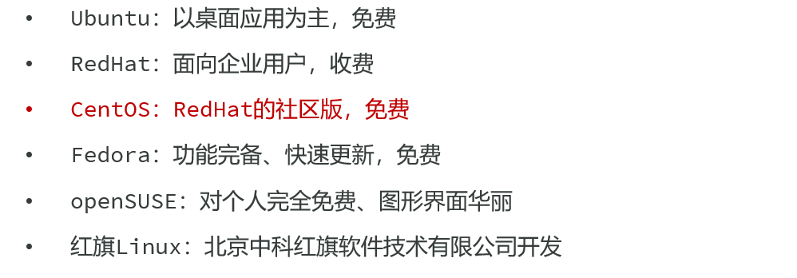

# 初识 Linux 与 Shell

## 什么是 Linux？

- Linux 是一种开源的、免费的操作系统内核。**我们通常说的 Linux 系统，指的是基于 Linux 内核的发行版**，比如 **Ubuntu**、**CentOS**、**Debian** 等

  - 常见Linux系统发行版

    


## 什么是 Shell(终端)

- Shell 是你与 Linux 内核交互的桥梁，它是一个 **命令行解释器**
  - 你输入命令，Shell 解释它，然后让系统执行
    - 我们之后的所有操作，几乎都是在 Shell ( 也常被称为终端或 Terminal ) 中完成的
  - 最常见的 Shell 是 `Bash` (`Bourne Again SHell`)


# Linux 系统安装方式

## 1. 虚拟机安装 (Virtual Machine)

- **方式**：在你的当前操作系统（如 Windows 或 macOS）中，通过虚拟机软件（例如免费的 **VirtualBox** 或商业软件 **VMware**等）创建一个虚拟的硬件环境，然后在这个虚拟环境中安装一个完整、独立的 Linux 系统（例如 Ubuntu Desktop）
- **优点**：
  - **安全隔离**：虚拟机内部的任何操作都像是在一个沙箱里，不会影响你主机系统的稳定性和文件。可以放心大胆地进行各种实验
  - **环境管理便捷**：可以轻松创建、删除和复制多个不同的 Linux 环境
  - **快照功能**：可以在任意时间点为系统创建一个“快照”（备份）。如果后续把系统玩坏了，可以一键恢复到之前的状态，非常方便
  - **体验完整**：可以安装带有图形化桌面的完整 Linux 系统，体验最原生的环境
- **缺点**：
  - **性能损耗**：因为需要虚拟化一层硬件，性能上会比直接安装在物理机上略差，并且会占用较多的内存和硬盘空间
- **适用场景**：
  - **初学者入门**：完美的首选，提供一个零风险的学习环境
  - **软件测试**：需要在不同版本的 Linux 系统中测试软件兼容性的开发者或测试人员


## 2. Windows Subsystem for Linux (WSL)

- 如果你是 Windows 用户，这可能是最高效的选择。

- **方式**：这是微软在 Windows 10 及以上版本中内置的功能。它允许你在 Windows 系统之上，直接运行一个真实的、完整的 Linux 内核和命令行环境，而无需创建重量级的虚拟机。
- **优点**：
  - **无缝集成**：可以直接在 Windows 的 `cmd` 或 `PowerShell` 中启动 Linux (Bash) 环境。两者文件系统可以互通，例如你可以在 Linux 环境中通过 `/mnt/c/` 访问 C 盘文件
  - **轻量高效**：相比传统虚拟机，WSL 的资源占用更少，启动速度极快，几乎是秒开
  - **开发友好**：VS Code 等开发工具与 WSL 有着完美的集成，你可以直接在 Windows 中编写代码，然后在 Linux 环境中编译和运行，体验非常流畅
- **缺点**：
  - **不含图形界面**：默认安装的 WSL 是纯命令行环境（虽然新版 WSLg 已支持运行图形应用，但配置稍复杂）
  - **仅限 Windows**：这是 Windows 平台专属的功能
- **适用场景**：
  - **Windows 开发者**：在 Windows 系统上进行 Linux 后端开发（如 SpringBoot, Node.js, Python 等）的最佳选择


## 3. 使用云服务器 (Cloud Server / VPS)

- 这是最贴近真实生产环境的方式

- **方式**：在云服务提供商（如阿里云、腾讯云、华为云、AWS 等）的网站上购买一台云服务器。服务商会为你预装好你选择的 Linux 系统（通常是 Ubuntu Server 或 CentOS 等不带桌面的服务器版），并提供一个公网 IP 地址。你通过 SSH 客户端（如 PuTTY, Xshell 或系统自带的终端）远程连接上去进行操作
- **优点**：
  - **真实生产环境**：这完全模拟了未来你的应用部署上线的真实环境，让你提前熟悉服务器运维
  - **公网可访问**：部署的应用或网站可以直接通过公网 IP 被任何人访问
  - **无需占用本地资源**：所有计算都在云端完成，对你本地电脑的配置要求很低
  - **稳定可靠**：云服务商提供高可用性的保障
- **缺点**：
  - **成本**：通常需要付费，虽然各大云厂商都为新用户提供了免费试用套餐
  - **纯命令行**：云服务器默认不安装图形界面，所有操作都需要通过命令完成
- **适用场景**：
  - **Web 应用部署**：部署你的 SpringBoot、个人博客等项目的最终选择
  - **学习服务器运维**：希望学习真实服务器配置、安全加固和性能优化的学生和开发者


## 4. 物理机安装 (双系统或单系统)

- 这是一种最彻底、性能最强的方式

- **方式**：直接将 Linux 系统安装在你电脑的物理硬盘上。你可以选择清空整个硬盘只安装 Linux（单系统），或者在保留现有 Windows/macOS 的情况下，划出一部分硬盘空间给 Linux（双系统），每次开机时选择进入哪个系统
- **优点**：
  - **极致性能**：Linux 直接管理和使用电脑硬件，没有任何中间层，可以发挥出硬件的全部性能
- **缺点**：
  - **安装过程复杂**：分区、引导等操作对新手有一定难度，存在误操作导致数据丢失的风险
  - **切换系统不便**：每次切换操作系统都需要重启电脑
  - **硬件兼容性**：部分小众或最新的硬件可能存在驱动不兼容的问题
- **适用场景**：
  - **Linux 爱好者**：希望将 Linux 作为日常主力操作系统的深度用户
  - **特定性能需求**：进行机器学习、大数据计算等对硬件性能要求极高的工作


# 远程连接(SSH 入门)

- 在绝大多数情况下，服务器都存放在遥远的数据机房，我们不可能接触到物理机器。
  - 下面将详细解释什么是远程连接，以及如何通过最主流的 SSH 协议来安全地管理你的远程 Linux 系统


## 1. 什么是远程连接？

- 远程连接，顾名思义，就是通过网络从你本地的电脑（**客户端**）登录并控制一台位于远端的电脑（**服务器**）

- 一旦连接成功，你在本地终端输入的所有命令，都会被实时传送到服务器上执行，执行结果也会被传回并显示在你的屏幕上。整个过程就像你正坐在服务器面前直接操作一样，只不过所有的交互都通过网络完成


## 2. 核心协议：SSH(Scure Shell)

### 概念

- SSH 是目前实现 Linux 远程连接的行业标准，它取代了早期不安全的 Telnet 等协议。SSH 的名字就体现了它的两大核心特性：

  - **Secure (安全)**：这是 SSH 最重要的特点。客户端与服务器之间的所有通信数据，包括你输入的密码、执行的命令和返回的结果，都会经过**严格加密**。这意味着即便有人在网络中窃听了你们的通信流量，他也无法破解出其中的内容。这在公共网络环境中至关重要

  - **Shell (外壳)**：连接成功后，服务器会为你提供一个交互式的命令行界面，也就是 Shell。这让你获得了完全控制服务器的能力，可以执行文件管理、软件安装、进程监控等所有系统级别的操作


### SSH 的工作端口

- 默认情况下，SSH 服务运行在服务器的 **22 端口**。当你发起一个 SSH 连接请求时，你的电脑会默认去连接目标服务器的 22 端口。

  - 出于安全考虑，有经验的系统管理员有时会修改这个默认端口

    > 我记得我当时在进行GitHub有关操作的时候，在我电脑上更改过这个端口


## 3. 如何建立 SSH 连接

- 要建立连接，你需要知道三个基本信息：
  1. **服务器的 IP 地址** (或域名)
  2. **一个有效的用户名**
  3. **对应的密码** 或 **私钥**


### 连接命令

- 最通用的连接命令格式如下：

  ```cmd
  ssh <用户名>@<服务器IP地址或域名>
  ```

  

- **例如：**

  ```cmd
  ssh root@192.168.100.100
  ```

  

- 执行该命令后，系统会提示你输入 `root` 用户的密码。如果是第一次连接该服务器，系统还会询问你是否信任该主机的“指纹”（fingerprint），输入 `yes` 即可。


### 常用 SSH 客户端工具

> 这个工具虽然用来远程连接，但是就算在本地操作也同样建议使用它

- **Windows**：
  - **Windows Terminal / PowerShell / CMD**：现代 Windows 系统已内置 OpenSSH 客户端，可以直接使用 `ssh` 命令
  - **PuTTY**：一个非常经典且免费的 SSH 客户端，界面简单
  - **Xshell**：功能强大的商业软件，对家庭和学校用户免费
  - **FinalShell**：一款集 SSH 终端、图形化文件管理 (SFTP)、服务器状态监控于一体的强大客户端，对个人用户免费。
- **macOS / Linux**：
  - 系统自带的**终端 (Terminal)** 程序就是最直接、最好用的 SSH 客户端


## 4. 两种认证方式：密码 vs 密钥

- SSH 提供了两种验证你身份的方式，以确保只有授权用户才能登录

### a) 密码认证

- 这是最基础、最直观的方式

- **流程**：连接时，你输入用户名和对应的密码，服务器验证通过后就允许登录。
- **优点**：简单直接，容易理解。
- **缺点**：
  - **安全风险**：如果密码设置得过于简单，很容易被黑客通过自动化程序暴力破解。
  - **便利性差**：每次登录都需要手动输入密码，不利于自动化脚本执行。


### b) 密钥认证

- 这是**更安全、更推荐**的方式

- **原理**：
  1. 在**客户端**（你的电脑）上生成一对密钥：一个**私钥 (Private Key)** 和一个**公钥 (Public Key)**
  2. **私钥**必须安全地、绝密地保存在你的电脑上，绝不能泄露
  3. 将**公钥**上传并配置到你希望登录的**服务器**上
- **流程**：
  1. 当你发起 SSH 连接时，服务器会发送一个随机的挑战信息
  2. 你的客户端使用**私钥**对这个挑战信息进行签名计算，然后将结果发回给服务器
  3. 服务器使用之前你存放在它那里的**公钥**来验证这个签名。如果验证成功，就证明你确实是私钥的合法持有者，从而允许你登录，**全程无需输入密码**
- **优点**：
  - **极高的安全性**：密钥通常是一长串非常复杂的字符，几乎不可能被暴力破解。只要你的私钥不泄露，你的服务器就非常安全。
  - **登录便捷**：配置好之后，登录服务器无需再手动输入密码，一键直连。对于需要频繁登录服务器或编写自动化运维脚本的场景，这一点尤为重要。


# 核心命令：文件与目录操作

## 常用命令

| 命令          | 完整写法                | 功能描述                       | 常用示例                                                     |
| ------------- | ----------------------- | ------------------------------ | ------------------------------------------------------------ |
| `pwd`         | print working directory | 显示当前所在的目录路径         | `pwd`                                                        |
| `ls`          | list                    | 列出当前目录下的文件和文件夹   | `ls` (`-l` 详细列表, `-a` 显示隐藏文件)                      |
| `cd`          | change directory        | 切换目录                       | `cd /home`, `cd ..` (返回上级), `cd ~` (回主目录)            |
| `mkdir`       | make directory          | 创建新目录                     | `mkdir my-project`                                           |
| `touch`       | touch                   | 创建一个空文件或更新文件时间戳 | `touch app.log`                                              |
| `cp`          | copy                    | 复制文件或目录                 | `cp source.txt dest.txt`, `cp -r my-dir new-dir`             |
| `mv`          | move                    | 移动或重命名文件/目录          | `mv old.txt new.txt` (重命名), `mv file.txt /tmp` (移动)     |
| `rm`          | remove                  | 删除文件或目录                 | `rm file.txt`, `rm -r old-dir` (**`-r` 递归删除，慎用!**)    |
| `cat`         | concatenate             | 查看文件全部内容（适合小文件） | `cat /etc/hosts`                                             |
| `less`        | less                    | 分页查看文件内容（适合大文件） | `less app.log` (按 `q` 退出)                                 |
| `head`/`tail` | head/tail               | 查看文件的开头/结尾几行        | `tail -n 100 app.log` (看末尾100行), `tail -f app.log` (实时监控) |

- **小技巧**：在终端里，按 `Tab` 键可以自动补全命令和文件名，非常高效！


# Linux 目录结构

- 理解 Linux 的目录结构是掌握 Linux 系统的第一步。与 Windows 系统不同，Linux 系统没有“盘符”（如 C盘、D盘）的概念，而是只有一个统一的树形结构，所有的文件和目录都始于一个根目录 `/`。
  - 这个结构遵循**文件系统层次化标准 (FHS, Filesystem Hierarchy Standard)**，使得在不同的 Linux 发行版中，文件和目录的存放位置都基本一致。

## 一级核心目录详解

### 1. `/` (根目录)

- 所有目录、文件、设备的起点


### 2. `/bin` (Binaries)

- **核心功能**：存放最基本的用户命令（二进制可执行文件）
- **详细说明**：这里包含了所有用户（包括普通用户）都可以使用的、系统正常运行所必需的基础命令，例如 `ls`, `cd`, `cp`, `cat`, `mkdir` 等。这个目录下的命令通常在单用户模式下也可用


### 3. `/sbin` (System Binaries)

- **核心功能**：存放系统管理员使用的管理命令
- **详细说明**：'s' 代表 'System' 或 'Super user'。这里存放的是用于系统管理的命令，如 `ifconfig` (网络配置)、`reboot` (重启系统)、`fdisk` (磁盘分区)。普通用户可以查看但通常无权执行这些命令


### 4. `/etc` (Etcetera) - ⭐

- **核心功能**：存放系统及各种软件的配置文件
- **详细说明**：这是系统中最重要的目录之一。几乎所有安装的服务的配置文件都保存在这里。
  - 作为开发者，未来配置 Nginx、MySQL、Redis、Docker 或你自己的 SpringBoot 应用时，都会频繁地与这个目录下的文件打交道。例如：
    - `/etc/ssh/sshd_config`: SSH 服务配置
    - `/etc/hosts`: 系统主机名与 IP 地址的映射
    - `/etc/passwd`: 用户账户信息


### 5. `/usr`(Unix Software Resource)-⭐

- **核心功能**：存放用户安装的应用程序和文件
- **详细说明**：这是系统中最大的目录之一，可以理解为“用户软件资源库”。通过包管理器（如 `yum`, `apt`）安装的绝大多数软件都位于此
  - `/usr/bin`: 用户安装的、非系统必需的应用程序
  - `/usr/sbin`: 用户安装的、非系统必需的管理程序
  - `/usr/lib`: 应用程序使用的库文件
  - `/usr/local`: **一个非常重要的子目录**。它被设计用来给用户手动安装软件（例如通过编译源码安装），以区别于系统通过包管理器安装的软件，方便管理和卸载


### 6. `/home` (Home)

- **核心功能**：存放普通用户的个人文件（家目录）
- **详细说明**：系统会为每个普通用户（root 除外）在此目录下创建一个以其用户名命名的子目录。
  - 例如，用户 `devuser` 的家目录就是 `/home/devuser`。用户的文档、下载、个人配置（如 `.bashrc`）都存放在这里


### 7. `/root`

- **核心功能**：超级用户 `root` 的家目录
- **详细说明**：这是一个独立的目录，专门供 `root` 用户使用，以区别于普通用户的 `/home` 目录，增强了系统的安全性


### 8. `/var` (Variable) -⭐

- **核心功能**：存放经常变化的文件
- **详细说明**：'var' 代表 'variable'（可变的）。这个目录用于存放内容在系统运行过程中会不断变化的文件。对开发者而言，最重要的子目录是：
  - `/var/log`: **存放所有系统和应用的日志文件**。当你的程序出现问题时，来这里查看日志是定位错误的第一步
  - `/var/lib`: 存放程序运行时需要的数据，如数据库文件
  - `/var/www`: 存放 Apache 或 Nginx 等网页服务器的站点文件


### 9. `/boot`

- **核心功能**：存放系统启动所需的文件
- **详细说明**：包含 Linux 内核 (`vmlinuz`)、引导加载程序 (`GRUB`) 等。**此目录下的文件至关重要，任何误操作都可能导致系统无法启动**


### 10. `/dev` (Devices)

- **核心功能**：存放设备文件
- **详细说明**：在 Linux 中，所有硬件设备（如硬盘、鼠标、键盘、声卡）都被抽象成文件。通过访问这些文件，就可以与硬件设备进行交互


### 11. `/lib` & `/lib64` (Libraries)

- **核心功能**：存放系统最基本的共享库文件
- **详细说明**：存放 `/bin` 和 `/sbin` 目录下的程序运行时所必需的共享库文件。可以类比为 Windows 系统中的 `DLL` 文件


### 12. `/opt` (Optional)

- **核心功能**：存放可选的、第三方大型应用程序
- **详细说明**：这是一个约定俗成的目录，用于安装一些大型的、独立的商业软件，比如 Oracle 数据库、Matlab 等。这些软件会把所有文件都放在 `/opt` 下的一个子目录中，便于管理


### 13. `/tmp` (Temporary)

- **核心功能**：存放临时文件
- **详细说明**：所有用户都有权限在此目录下创建文件。系统重启时，该目录下的内容通常会被清空，因此不要存放任何重要数据


## 目录图示


## 绝对路径与相对路径

在 Linux 系统中，"路径" 是用来指定文件或目录位置的字符串。无论是访问文件、切换目录还是执行程序，你都必须提供一个正确的路径。理解绝对路径和相对路径的区别，是高效使用命令行的基础。

### 1. 绝对路径

- **定义**：从**根目录 (`/`)** 开始的路径

- 它是一个完整、明确、无歧义的路径，详细描述了如何从文件系统的最高层（根目录）一步步找到目标文件或目录。
  - 无论你当前在哪个目录下，一个绝对路径总能指向同一个位置。

- **核心特征**：
  - **必定以 `/` 开头**


- **示例**：

  - `/home/devuser/projects/my-app/pom.xml`
    - 这是一个文件的绝对路径。它清楚地表明：从根目录 `/` 出发，进入 `home` 目录，再进入 `devuser` 目录，以此类推，最终找到 `pom.xml` 文件。

  - `/etc/nginx/nginx.conf`
    - 这是 Nginx 配置文件的绝对路径。

  - `/var/log/`
    - 这是日志目录的绝对路径。


### 2. 相对路径

- **定义**：从**当前工作目录 (Current Working Directory)** 开始的路径
  - 它是一个简短的、相对的路径，描述了从你“现在所在的位置”出发，如何找到目标文件或目录。同一个文件，当你的当前位置不同时，它的相对路径也会不同。

- **核心特征**：

  - **不以 `/` 开头**。

  - 它依赖于几个特殊的符号：
    - `.` (一个点)：代表**当前目录**。
    - `..` (两个点)：代表**上一级目录**（父目录）。

- 示例：`../downloads/linux.iso`


# Shell 核心特性：重定向与管道

- **输出重定向 `>` (覆盖) 和 `>>` (追加)**
  - `>`: **覆盖写入**。将命令的输出结果写入文件，如果文件已存在，则**清空**原内容。
    - `ls -l > file_list.txt`
  - `>>`: **追加写入**。将命令的输出结果添加到文件的**末尾**，保留原有内容。
    - `echo "New log entry" >> app.log`
- **管道 `|`**
  - 这是 Linux 的精髓。它将**前一个命令的输出**，直接作为**后一个命令的输入**，从而将简单的命令组合成强大的工具链。
  - `ps -ef | grep "java"`: `ps -ef` 列出所有进程，管道 `|` 将这个列表送给 `grep`，`grep` 再从中筛选出包含 "java" 的行。


# Linux 常用命令

## 0. 小技巧


## 1. 命令基础与求助

- 先说一说：命令的通用格式和如何寻求帮助

- **命令格式**: 

  ```cmd
  command [options] [arguments]
  command [选项] [参数]
  ```

  - `command`: 命令本身，如 `ls`
  - `[options]`: 选项，用于调整命令的行为，通常以 `-` (短选项) 或 `--` (长选项) 开头，如 `ls -l`。
    - 多个短选项可以合并,如 `ls -al` 等同于 `ls -a -l`
  - `[arguments]`: 参数，指命令要操作的对象，如 `ls /home`

- **获取帮助**:

  - `command --help`: 查看一个命令的简略用法
  - `man command`: (`man` 是 manual 的缩写) 查看一个命令极其详细的说明手册


## 2. 文件与目录管理 (核心)

- 这是最基础、最高频的操作,整合了目录、文件、拷贝移动

### 导航与查看

#### `pwd` 

>Print Working Directory

- 显示当前所在的目录


#### `ls [选项] [目录路径]` 

>List

##### 常用命令

- 列出目录内容 (若不指定目录路径, 该命令则默认显示当前目录)

  - `ls -l`: 显示详细信息 (权限、所有者、大小、修改日期)，这个命令可以简写成`ll`
    - 一个普通的 `ls -l` 命令，默认是**不显示**隐藏文件的，想**显式**隐藏文件，写`ls -al`

  - `ls -a`: 显示所有文件,包括隐藏文件 (以 `.` 开头)

  - `ls -lh`: 以人类可读的格式显示文件大小 (如 `1K`, `23M`)
  - `ls -al` (或 `ls -la`): 这是 `-a` 和 `-l` 的组合，意为“以详细格式列出所有文件（包括隐藏文件）”
    - 也可以写成`ll -a`
    - 这是日常使用中最全面的查看方式之一


##### `ls -l` 输出的信息解释

- 当你执行 `ls -l` 时，你会看到类似下面这样的输出

  ```cmd
  -rw-r--r--. 1 root root 599400444 7月  26 2024 mysql-8.0.30-linux-glibc2.12-x86_64.tar.xz
  ```

- 这行信息包含7个部分，从左到右依次是：

  1. **文件类型与权限**: `-rw-r--r--.`

     - **第1位**: 文件类型。常见的有 `-` (普通文件), `d` (目录), `l` (链接文件)

     - **第2-4位**: 文件**所有者 (Owner)** 的权限。`r` (读), `w` (写), `x` (执行)

     - **第5-7位**: 文件**所属组 (Group)** 的权限

     - **第8-10位**: **其他用户 (Others)** 的权限

     - `.` 或 `+`: 表示 ACL 权限，暂时可以忽略

       

  2. **硬链接数: `1`

     - 表示有多少个文件名指向这个文件。对于目录，这个数字通常表示其包含的子目录数量

       

  3. **所有者: `root`

     - 这个文件或目录属于哪个用户

       

  4. **所属组: `root`

     - 这个文件或目录属于哪个用户组

       

  5. **文件大小: `599400444`

     - 默认单位是字节 (Bytes)。配合 `-h` 选项 (`ls -lh`) 可以更直观地显示 (如 `572M`)

       

  6. **最后修改时间: `7月 26 2024`

     - 文件内容最后一次被修改的时间

       

  7. **文件名: `mysql-8.0.30-linux-glibc2.12-x86_64.tar.xz`

     - 文件或目录的名称


#### `cd [目录路径]`

>Change Directory

- 切换目录

  - `cd /home/user`: 切换到指定目录 (绝对路径)

  - `cd ../project`: 切换到上级目录中的 `project` 目录 (相对路径)

  - `cd ~` 或 `cd`: 返回当前用户的家目录
    - `~` (波浪号) 是一个特殊符号，**在Linux中**代表当前用户的家目录（例如 `/home/your_user` 或 `/root`），非常常用
      - 对于**普通用户**，家目录的默认位置是 `/home/用户名`。所以 `devuser` 的家目录就是 `/home/devuser`
      - 对于**超级用户 `root`**，它的家目录是特别指定的，位置在 `/root`

  - `cd -`: 返回上一次所在的目录
    - 这个 `-` (短横线/减号) 是 `cd` 命令的一个非常实用的特殊快捷方式
    - 在 `cd -` 这个命令里，**`-` 代表“上一次所在的目录”**


### 创建与删除

#### `touch [文件名]` 

- 创建一个空白文件,或更新已有文件的时间戳


#### `mkdir [选项] [目录名]` 

> Make Directory

- **核心功能**：

  - 如果不带任何选项，`mkdir` 会在当前位置或指定路径下创建一个新目录。如果目录已存在，则会报错。

  **常用选项**：

  - `-p, --parents`: **递归创建多层目录**。这是 `mkdir` 最实用、最重要的选项。当目标目录的父目录不存在时，此选项会自动创建所有缺失的父目录
  - `-v, --verbose`: **显示详细过程**。每创建一个目录，都会在终端打印一条信息
  - `-m, --mode=MODE`: **在创建目录的同时设置权限** (如 `-m 755`)

  **示例**：

  - `mkdir project`: 在当前目录下创建 `project` 目录。
  - `mkdir -p /data/logs/nginx`: 递归创建多层目录，即使 `/data` 和 `/data/logs` 不存在。

- **组合使用示例**:

  - `mkdir -pv /data/logs/nginx`: 递归创建 `/data/logs/nginx` 目录，并打印出每个被创建的目录名。
  - `mkdir -p -m 755 /var/www/my_site`: 递归创建网站目录，并设置权限为 `755`。


#### `rm [选项] [文件或目录]` 

> Remove

- **核心警告**: `rm` 命令删除的文件**无法从回收站找回**，操作是**永久性的**

  - 在使用此命令时，特别是配合 `-r` 或 `-f` 选项时，请务必再三确认路径是否正确

- **核心功能**：

  - `rm [文件名]`: 删除一个或多个文件。默认情况下，如果文件是只读的，会提示你是否确认删除

- **常用选项**：

  - `-f, --force`: **强制删除**。忽略不存在的文件，并且从不提示用户。即使文件是只读的，也会被直接删除。
  - `-r, -R, --recursive`: **递归删除**。用于删除目录及其包含的所有内容。要删除一个目录(文件夹)，**必须**使用此选项。
  - `-i`: **交互式删除**。在删除每个文件前都会进行提示，要求你输入 `y` (yes) 或 `n` (no) 来确认。这是一个防止误删的安全选项。
  - `-v, --verbose`: **显示详细过程**。列出每个被删除的文件名。

- **组合使用示例**:

  - `rm -rf [目录名]`: 这是**最常用但也最危险**的组合。意为“强制、递归地删除一个目录，不要有任何提示”。
    - 常用于脚本中清理临时目录，但手动操作时必须极度小心
  - `rm -iv [文件名]`: 一种更安全的手动删除方式。在删除前会进行交互式提问，并显示正在删除的文件名
  - `rm -rf /`: **这是传说中从删库到跑路的命令，它会尝试删除你服务器上的所有文件，永远不要在任何机器上尝试！**

  

- `rmdir [空目录名]` 

  > 删除一个**空**目录


### 复制与移动

#### `cp [选项] [源] [目标]` 

>Copy

-  复制文件或目录

- **核心功能**：
  - **复制文件**: `cp [源文件] [目标文件或目录]`
  - **复制目录**: 必须使用 `-r` 或 `-a` 选项
- **常用选项**：
  - `-r, -R, --recursive`: **递归复制**。
    - 复制目录及其包含的所有内容的**必备选项**
  - `-p, --preserve`: **保留属性**。
    - 在复制时，保留源文件的权限、所有者、时间戳等属性。在备份时非常有用
  - `-v, --verbose`: **显示详细过程**。
    - 显示正在复制的文件名
  - `-i, --interactive`: **交互式**。
    - 在覆盖已存在的目标文件前进行提示，请求用户确认。这是一个很好的安全习惯
  - `-a, --archive`: **归档模式**。
    - 这是一个超级实用的组合选项，相当于 `-dR --preserve=all`（-d 表示复制链接文件本身而不是其指向的内容）。
    - 它被认为是**最能完整保留源目录结构和属性**的复制方式，**强烈推荐在备份目录时使用**
- **示例**：
  - `cp app.log app.log.bak`: 
    - 将 `app.log` 复制一份并命名为 `app.log.bak`，实现简单备份
  - `cp -v main.java /backup/src/`: 
    - 将 `main.java` 复制到指定目录，并显示过程
  - `cp -i config.ini /etc/myapp/`: 
    - 以交互模式复制配置文件，防止意外覆盖
  - `cp -r project/ /data/backup/`: 
    - **递归复制**整个 `project` 目录到 `/data/backup/`
- **组合使用示例**:
  - `cp -rv project/ /data/backup/`: 递归复制整个目录，并显示详细的复制过程。
  - `cp -a /var/www/html /mnt/backups/`: **使用归档模式**，完整地备份网站目录到另一个磁盘，保留所有权限、时间和链接关系。这是最专业的备份方法。


#### `mv [选项][源][目标]` 

>Move

-  移动文件/目录,或对其重命名

- **核心功能 (双重身份)**：

  - **移动 (Move)**: 当 `[目标]` 是一个**已存在的目录**时，`mv` 会将 `[源]` 文件或目录移动到该目录下

    > 如果想移动，目录必须已存在

  - **重命名 (Rename)**: 

    - 当 `[目标]` 是一个**文件名**或**不存在的目录名**时，`mv` 会将 `[源]` 文件或目录重命名为 `[目标]`。
    - 如果 `[源]` 和 `[目标]` 在同一路径下，这就是纯粹的重命名操作。

- **常用选项**：

  - `-i, --interactive`: **交互式**。在覆盖一个已存在的目标文件前进行提示。这是一个很好的安全习惯。
  - `-f, --force`: **强制**。不经提示，直接覆盖已存在的目标文件。
  - `-n, --no-clobber`: **不覆盖**。如果目标文件已存在，则不执行任何操作，也不会提示。
  - `-v, --verbose`: **显示详细过程**。显示每个文件移动或重命名的过程。

- **示例**：

  - `mv app.log /var/log/`
    - **移动文件**到 `/var/log` 目录。
  - `mv project/ /backup/`
    - **移动目录**到 `/backup` 目录。
  - `mv old_name.txt new_name.txt`
    -  **重命名文件**。
  - `mv old_dir new_dir`
    -  **重命名目录**。
  - `mv source.log /var/log/app.log`
    -  **移动并同时重命名**文件。

- **组合使用示例**:

  - `mv -iv *.log ../archived_logs/`: 以交互模式移动所有 `.log` 文件到上级目录的 `archived_logs` 文件夹中，并显示详细过程。


### 查看文件内容

#### `cat [选项] [文件名]...` 

>Concatenate

- 查看、合并文件内容

- **核心功能**：
  - `cat [文件名]`: 将文件的全部内容一次性输出到屏幕上。适合查看内容较少的文件。
  - `cat [文件1] [文件2] > [新文件]`: 将多个文件合并成一个新文件。
- **常用选项**：
  - `-n, --number`: 对所有输出的行进行编号(从1开始)。
  - `-b, --number-nonblank`: 对非空行进行编号 (空行不编号)。
  - `-E, --show-ends`: 在每行末尾显示 `$` 符号,用于观察看不见的行尾空格。
- **组合使用示例**:
  - `cat -n file.txt`: 
    - 查看 `file.txt` 的内容，并在每行前面显示行号。
  - `cat part1.txt part2.txt > full.txt`: 
    - 将 `part1.txt` 和 `part2.txt` 的内容合并，并写入到 `full.txt` 文件中。如果 `full.txt` 已存在，其内容会被**覆盖**。
  - `cat part3.txt >> full.txt`: 
    - 将 `part3.txt` 的内容**追加**到 `full.txt` 文件的末尾。


#### `more[选项][文件名]` 

- 分页查看文件内容（较旧）
  - **核心功能**
    -  `more` 是一个基础的分页器,它允许你一页一页地查看文件,但功能有限,例如**不支持向上翻页**
  - **交互式操作**:
    - `Enter`: 向下滚动一行
    - `Space` (空格键): 向下翻一页
    - `q`或`Ctrl+C`: 退出查看


#### `less [选项][文件名]` 

- 分页查看文件内容,功能比 `more` 更强大 (**推荐**)

  - **核心功能**
    -  `less` 是 `more` 的升级版,名字的由来是 "less is more"
    - 它最显著的优点是**支持自由地向上和向下滚动**,并且在打开大文件时**启动速度极快**,因为它不会一次性读取整个文件

  - **常用选项**:
    - `-N`: 显示行号
    - `-S`: 禁止长行自动换行 (内容会超出屏幕,需使用左右箭头滚动)

  - **交互式操作 (常用)**:
    - `Enter` / `j` / `↓`: 向下滚动一行。
    - `k` / `↑`: 向上滚动一行。
    - `Space` (空格键) / `f`: 向下翻一页。
    - `b`: 向上翻一页。
    - `/关键词`: 向下搜索关键词。
    - `?关键词`: 向上搜索关键词。
    - `n`: 跳转到下一个搜索结果。
    - `N`: 跳转到上一个搜索结果。
    - `g`: 跳转到文件第一行。
    - `G`: 跳转到文件最后一行。
    - `q`: 退出查看。


#### `head [选项] [文件名]`

- 查看文件的前几行

- **核心功能**：默认显示文件的前10行内容，常用于快速预览文件开头，例如查看CSV文件的表头或日志文件的起始部分。
- **常用选项**：
  - `-n <行数>` 或 `-<行数>`: **指定显示的行数**。
    - 这是最常用的选项。例如 `head -n 20 file.txt` 和 `head -20 file.txt` 效果相同，都表示显示前20行。
  - `-c <字节数>`: **指定显示的字节数**。
    - 按字节而不是按行来截取文件开头。
  - `-q, --quiet`: 当查看多个文件时，不显示文件名头部信息。
  - `-v, --verbose`: 当查看多个文件时，总是显示文件名头部信息。
- **示例**：
  - `head /var/log/messages`: 查看系统日志的前10行。
  - `head -n 50 /var/log/messages`: 查看系统日志的前50行。
  - `head -c 1024 data.bin`: 查看二进制文件的前1KB内容。


#### `tail [选项] [文件名]`

- 查看文件的后几行

- **核心功能**：默认显示文件的最后10行内容，是排查问题、查看最新日志的利器。
- **常用选项**：
  - `-n <行数>` 或 `-<行数>`: **指定显示的末尾行数**。
    - 例如 `tail -n 50 file.txt` 表示显示最后50行。
  - `-c <字节数>`: **指定显示的末尾字节数**。
  - `-f, --follow`: **实时监控文件**。
    - 这是 `tail` 命令**最重要、最强大**的功能。
      - 执行后，命令不会退出，而是会持续显示追加到文件末尾的新内容。
      - 常用于实时查看正在增长的日志文件。按 `Ctrl+C` 退出监控。
  - `-F`: 与 `-f` 类似，但更健壮。当监控的文件被重命名或删除后（日志切割场景），它会尝试重新打开同名的新文件继续监控。
- **示例**：
  - `tail /var/log/nginx/access.log`: 查看Nginx访问日志的最后10行。
  - `tail -n 100 /var/log/nginx/error.log`: 查看Nginx错误日志的最后100行。
  - `tail -f /var/log/my_app/app.log`: **实时滚动查看**你的应用日志，这是开发者调试线上问题的必备神技。


## 3. 文本处理与查找

### 文本输出与创建

#### `echo [选项] [字符串...]`

-  在终端显示文本或变量值。

- **核心功能**：这是最基础的输出命令，常用于脚本中打印提示信息，或配合重定向操作来创建和修改文件。
- **常用选项**：
  - `-n`: **不输出末尾的换行符**。输出内容后，光标会停留在同一行末尾。
  - `-e`: **启用转义字符**。使得 `\n` (换行)、`\t` (制表符) 等特殊字符能够被解释和执行，而不是被当作普通字符输出。
- **示例**：
  - `echo "Hello, World"`: 在屏幕上显示 "Hello, World"。
  - `echo $PATH`: 显示环境变量 `PATH` 的值。
  - `echo "New config line" > app.conf`: **覆盖**写入内容到文件。
  - `echo "Another log entry" >> app.log`: **追加**内容到文件末尾。


### 文本查找

- `grep [选项] "关键词" [文件名]` (Global Regular Expression Print): 在文件中搜索包含关键词的行。
  - `grep -i "error" app.log`: 不区分大小写地搜索。
  - `grep -r "TODO" ./src`: 在当前目录及子目录中递归搜索。
  - `ps -ef | grep "java"`: 管道符配合,查找正在运行的 Java 进程。


### 文件查找

- `find [路径] [表达式]` : 按各种条件查找文件。
  - `find / -name "httpd.conf"`: 按文件名查找。
  - `find . -name "*.java"`: 查找当前目录下所有的 `.java` 文件。
  - `find / -type f -size +100M`: 查找大于 100MB 的文件。


### 文本编辑

- `vim [文件名]` : 功能强大但学习曲线陡峭的命令行文本编辑器,是专业人士必备技能。
- `nano [文件名]` : 简单易用的文本编辑器,适合新手。


## 4. 打包与压缩

- 在服务器上传输和备份文件时常用

#### `tar [选项][目标文件名][源文件或目录]` 

> `tar` 命令背后两个核心阶段的工作流：
>
> - 打包->压缩->解压缩->解包
>
> **创建归档文件阶段**：
>
> - **第一步：打包 (Packing)**：把多个文件/目录捆绑成一个 `.tar` 文件。
> - **第二步：压缩 (Compressing)**：把这个 `.tar` 文件变小，成为 `.tar.gz`。
>
> **提取文件阶段** (逆向操作)：
>
> - **第一步：解压缩 (Decompressing)**：先把 `.tar.gz` 文件还原成 `.tar` 文件。
> - **第二步：解包 (Unpacking)**：再从 `.tar` 文件中把所有的原始文件/目录取出来。


-  打包/解包与压缩/解压工具。

- **核心功能与理念**: 
  - `tar` 命令本身只负责**打包**（将多个文件和目录捆绑成一个 `.tar` 文件），而不负责**压缩**
  - 压缩功能是通过调用其他压缩工具（如 `gzip`, `bzip2`）来实现的，这体现在不同的选项上


- **常用选项 (记忆口诀)**: 选项前的 `-` 可以省略。

  - `-c, --create`: **创建**一个新的归档文件
  - `-x, --extract`: 从归档文件中**提取**文件

  

  - `-t, --list`: **列出**归档文件中的内容，但不提取

  

  - `-v, --verbose`: **显示详细过程**。在处理文件时显示文件名
  - `-f, --file=ARCHIVE`: **指定归档文件名**
    - 这个选项**必须**放在**所有选项的最后面**，后面紧跟文件名
    - 当你需要操作一个磁盘文件时，**`-f` 选项**几乎总是**必须写**的

  

  - `-z, --gzip`: 通过 **gzip** 工具进行**压缩/解压**（文件后缀通常为 `.tar.gz` 或 `.tgz`）
  - `-j, --bzip2`: 通过 **bzip2** 工具进行**压缩/解压**（文件后缀通常为 `.tar.bz2`）

  

  - `-C, --directory=DIR`:
    - **指定解压目录**。解压
      - 到指定的 `DIR` 目录而不是当前目录


- **常用组合示例 (打包与压缩)**:

  - `tar -cvf archive.tar /path/to/dir`

    - **仅打包**，不压缩

  - `tar -zcvf archive.tar.gz /path/to/dir`

    - **打包并使用** Gzip **压缩**。这是最常用的压缩方式

  - `tar -jcvf archive.tar.bz2 /path/to/dir`

    - **打包并使用 Bzip2 压缩**。压缩率通常比 Gzip 更高，但耗时更长

    

- **常用组合示例 (查看与解压)**:

  - `tar -tvf archive.tar.gz`
    - **查看** `.tar.gz` 文件内容，不解压

  

  - `tar -xvf archive.tar`
    -  从 `.tar` 文件中**解压**
  - `tar -zxvf archive.tar.gz`
    - 从 `.tar.gz` 文件中**解压**
  - `tar -jxvf archive.tar.bz2`
    - 从 `.tar.bz2` 文件中**解压**
  - `tar -zxvf archive.tar.gz -C /opt/destination`
    -  将文件**解压到指定目录** `/opt/destination`


- **权威示例**

  


#### `zip` / `unzip`

-  用于创建和解压 `.zip` 文件，其最大优势是与 Windows 系统的原生兼容性。

##### **`zip` (压缩)**

- **语法**: `zip [选项] [目标文件名.zip] [源文件/目录]`
- **常用选项**:
  - `-r`: **递归处理**。用于压缩目录，这是**压缩文件夹时必备**的选项。
  - `-q`: 安静模式，不显示压缩过程。
  - `-e`: 加密压缩文件。
  - `-<数字>`: 指定压缩级别，`-1` (最快) 到 `-9` (最佳)。默认为 `-6`。
- **示例**:
  - `zip files.zip file1.txt file2.txt`
    - 将多个文件压缩成 `files.zip`
  - `zip -r project.zip project/`
    - **递归压缩** `project` 目录为 `project.zip`
  - `zip -r -9 latest_code.zip ./src`
    - 以最高级别压缩 `./src` 目录


##### **`unzip` (解压)**

- **语法**: `unzip [选项] [文件名.zip]`
- **常用选项**:
  - `-d [目录]`: **指定解压目录**。将文件解压到指定位置而不是当前目录
  - `-l`: **列出**压缩包内的文件列表，但不解压
  - `-o`: **覆盖**已存在的文件而不进行提示
  - `-q`: 安静模式，不显示解压过程
- **示例**:
  - `unzip project.zip`
    - 将 `project.zip` 解压到当前目录
  - `unzip -l project.zip`
    - 查看 `project.zip` 中包含哪些文件
  - `unzip project.zip -d /opt/projects/`
    - 将 `project.zip` **解压到指定目录** `/opt/projects/`


## 5. 系统、进程与权限管理

这是从“用户”向“管理员”进阶的关键。

### 进程管理

- `ps [选项]` : 查看当前系统中正在运行的进程。
  - `ps -ef` 或 `ps aux`: 两种最常用的查看所有进程的组合。
- `top`: 实时动态地显示系统资源占用和进程排名。
- `kill [信号] [进程ID]` : 终止一个进程。
  - `kill [进程ID]`: 默认使用 TERM 信号,尝试正常终止。
  - `kill -9 [进程ID]`: 使用 KILL 信号,强制杀死一个进程。


### 权限管理

- `chmod [模式] [文件或目录]` (Change Mode): 修改文件或目录的权限。
  - `chmod 755 script.sh`: 使用数字方式授权 (读=4, 写=2, 执行=1)。
  - `chmod +x script.sh`: 为所有用户添加执行权限。
- `chown [用户]:[组] [文件或目录]` (Change Owner): 修改文件或目录的所有者和所属组。
  - `chown user:group file.txt`


### 用户管理与历史

- `sudo [命令]` : 以超级用户 (root) 的身份执行命令。
- `history`: 显示当前用户执行过的历史命令列表。
  - `!n`: 执行历史记录中编号为 `n` 的命令 (例如 `!100`)。
  - `!!`: 重复执行上一条命令。


## 6. 网络命令

对于后端开发者,这些是排查问题的利器。

- `ping [域名或IP]` : 测试与目标主机的网络连通性。
- `ip addr` 或 `ifconfig`: 查看本机的 IP 地址和网络接口信息。
- `ss [选项]`: 查看本机正在监听的网络端口,用于检查服务是否启动成功。
  - `ss -tuln` : 最常用的组合,查看 TCP/UDP 的监听端口。
- `curl [URL]` : 在命令行中发起网络请求,可以用来测试 API 接口。
- `wget [URL]` : 从网络上下载文件。


# 文本编辑器：Vim

- 在服务器上，你无法使用图形化的文本编辑器。`Vim` 是一个强大的命令行文本编辑器，虽然学习曲线陡峭，但一旦掌握，效率极高

- **Vim 的两种主要模式：**
  1. **命令模式 (Command Mode)**：默认进入的模式，用于移动光标、删除文本、复制粘贴等。
  2. **插入模式 (Insert Mode)**：用于输入文本。

- **Vim 生存法则：**

  - `vim filename.txt`：用 Vim 打开文件。

  - 在**命令模式**下，按 `i` 进入**插入模式**，开始编辑文本。

  - 编辑完成后，按 `Esc` 键返回**命令模式**。

  - 在**命令模式**下，输入以下命令并回车：
    - `:w`：保存 (write)
    - `:q`：退出 (quit)
    - `:wq`：保存并退出
    - `:q!`：强制退出（不保存修改）

- 对于初学者，也可以使用更简单的 `nano` 编辑器：`nano filename.txt`，使用 `Ctrl+X` 退出。


# 用户与权限管理

- Linux 是一个多用户系统，权限管理是其安全的基石

## 用户管理

- `whoami`：查看当前登录的用户名
- `sudo`：**S**uper **U**ser **Do**。以管理员（root）权限执行命令。这是非常重要的命令，当你需要安装软件或修改系统配置时会用到
- `su`：切换用户。`su -` 可切换到 root 用户


## 文件权限

使用 `ls -l` 可以看到类似这样的输出： `drwxr-xr-x 2 user group 4096 Sep 1 17:00 my-project`

- **第一部分 `drwxr-xr-x`**：文件类型和权限
  - 第1位 `d`：表示这是一个目录 (directory)。如果是 `-`，则为普通文件
  - 后面9位，每3位一组：
    - `rwx`：**属主 (Owner)** 的权限
    - `r-x`：**属组 (Group)** 的权限
    - `r-x`：**其他人 (Others)** 的权限
  - `r` 代表读 (Read)，`w` 代表写 (Write)，`x` 代表执行 (Execute)
- **`chmod` (Change Mode)**：修改文件权限
  - **数字模式**：`r=4`, `w=2`, `x=1`
    - `chmod 755 script.sh` 意味着:
      - 属主：7 = 4+2+1 (rwx)
      - 属组：5 = 4+0+1 (r-x)
      - 其他人：5 = 4+0+1 (r-x)
  - **符号模式**：`chmod u+x script.sh` (给用户user增加执行权限)
- **`chown` (Change Owner)**：修改文件所有者
  - `sudo chown newUser:newGroup file.txt`


# 进程管理

你的 SpringBoot 应用在 Linux 上就是一个进程

- `ps aux`：查看当前系统所有进程的快照
- `top` / `htop`：动态显示系统进程和资源占用情况 (`htop` 更直观，可能需手动安装 `sudo apt install htop`)
- `kill`：向进程发送信号，通常用于终止进程
  - `kill PID`：温和地终止进程（PID是进程ID）
  - `kill -9 PID`：强制杀死进程
- **后台运行**：
  - `java -jar my-app.jar &`：命令末尾加 `&` 可以让程序在后台运行
  - `jobs`：查看后台运行的任务
  - `fg` / `bg`：将后台任务切换到前台/后台


# 软件包管理

在 Linux 上安装软件通常使用包管理器，而不是去网站下载 `.exe`

- **Ubuntu/Debian (使用 apt)**:
  - `sudo apt update`：更新可用软件包列表
  - `sudo apt install openjdk-17-jdk`：安装 Java 17
  - `sudo apt remove package-name`：卸载软件
  - `sudo apt search keyword`：搜索软件包
- **CentOS/Red Hat (使用 yum/dnf)**:
  - `sudo yum install java-17-openjdk`：安装 Java 17
  - `sudo yum remove package-name`：卸载软件


# 网络工具

对于 Web 开发者，这些命令非常实用

- `ping google.com`：测试与目标的网络连通性
- `ip addr` 或 `ifconfig`：查看本机 IP 地址
- `ss -tlnp`：查看哪些端口正在被监听。检查你的 SpringBoot 应用（如8080端口）是否成功启动
- `curl`：一个强大的命令行工具，用于发送 HTTP 请求
  - `curl http://localhost:8080/api/users`：测试你的 API 接口
- `wget`：从网络上下载文件
  - `wget https://example.com/file.zip`


# Shell 脚本入门

Shell 脚本能将一系列命令组合起来自动执行，是自动化运维的基础。

1. 创建一个文件，例如 `deploy.sh`。
2. 文件第一行通常是 `#!/bin/bash`，指定用哪个 shell 来解释这个脚本。
3. 在下面写上你的命令。

**示例：一个简单的部署脚本 `deploy.sh`**

```
#!/bin/bash

# 定义一个变量
APP_NAME="my-springboot-app.jar"

echo "开始部署..."

# 查找并杀死旧的进程
PID=$(ps aux | grep $APP_NAME | grep -v grep | awk '{print $2}')
if [ -n "$PID" ]; then
  echo "发现旧进程 PID: $PID，正在结束..."
  kill -9 $PID
fi

echo "启动新应用..."
# 后台启动新的 Jar 包，并将日志输出到 app.log
nohup java -jar $APP_NAME > app.log 2>&1 &

echo "部署完成！"
```

1. 给脚本执行权限：`chmod 755 deploy.sh`
2. 执行脚本：`./deploy.sh`


# 效率神器：管道、重定向与搜索

这些是 Linux 命令行的精髓，能让你组合命令完成复杂任务。

- **管道 `|`**：将前一个命令的输出，作为后一个命令的输入。
  - `ps aux | grep java`：找出所有与 java 相关的进程。
- **输出重定向 `>` 和 `>>`**：
  - `>`：将命令输出写入文件（会覆盖原内容）。
    - `ls -l > filelist.txt`
  - `>>`：将命令输出追加到文件末尾。
    - `echo "Error happened at $(date)" >> app.error.log`
- **`grep`**：强大的文本搜索工具。
  - `grep "ERROR" app.log`：在 `app.log` 中搜索包含 "ERROR" 的行。
- **`find`**：在文件系统中查找文件。
  - `find /home -name "*.java"`：在 `/home` 目录下查找所有 `.java` 文件。
- **`tar`**：打包和解包工具。
  - `tar -czvf archive.tar.gz my-project`：将 `my-project` 目录打包并用 gzip 压缩。
  - `tar -xzvf archive.tar.gz`：解压。