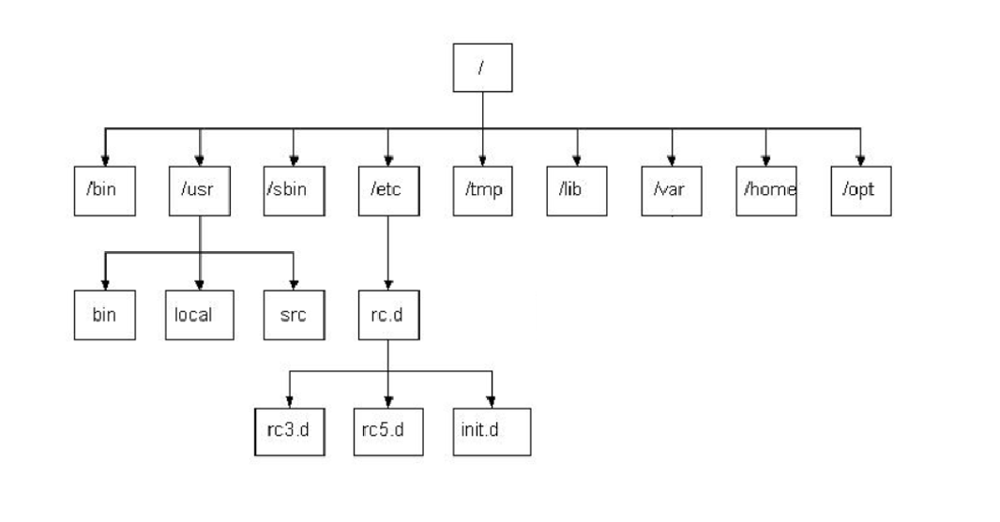
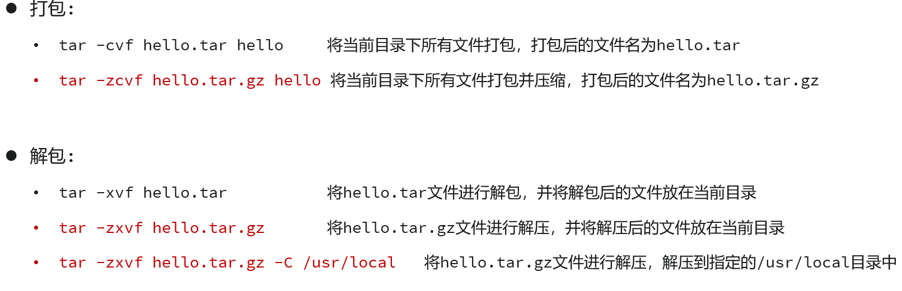
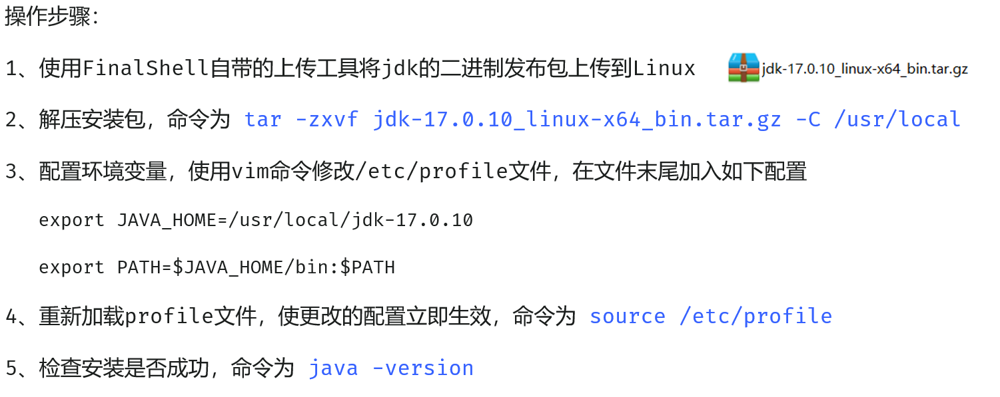
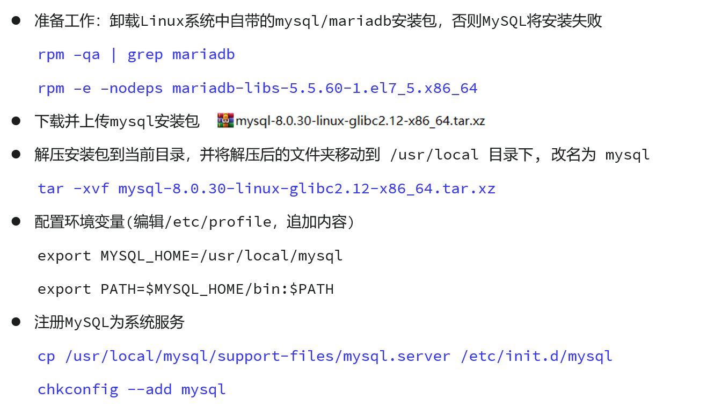
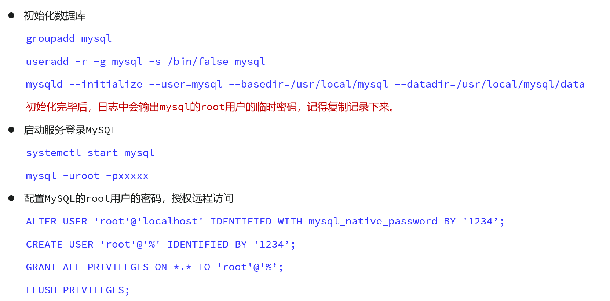

# 初识 Linux 与 Shell

## Linux

- Linux 是一种开源的、免费的操作系统内核。**我们通常说的 Linux 系统，指的是基于 Linux 内核的发行版**

  > 比如 **Ubuntu**、**CentOS**、**Debian** 等


## Shell

- Shell 是你与 Linux 内核交互的桥梁，它是一个 **命令行解释器**，又称为**“Shell解释器”**
  - 它看起来就像 Windows 中的 cmd，当然只是看起来像
  - 最常见的 Shell 是 `Bash` (`Bourne Again SHell`)
  - **在 Linux 中，一个正在运行的 Shell 本身就是一个进程**


# Linux 系统安装方式

## 1. 虚拟机

- **方式**：在你的当前操作系统（如 Windows 或 macOS）中，通过虚拟机软件（例如免费的 **VirtualBox** 或商业软件 **VMware**等）创建一个虚拟的硬件环境，然后在这个虚拟环境中安装一个完整、独立的 Linux 系统
- **优点**：
  - **安全隔离**：虚拟机内部的任何操作都像是在一个沙箱里，不会影响你主机系统的稳定性和文件。可以放心大胆地进行各种实验
  - **环境管理便捷**：可以轻松创建、删除和复制多个不同的 Linux 环境
  - **快照功能**：可以在任意时间点为系统创建一个“快照”（备份）。如果后续把系统玩坏了，可以一键恢复到之前的状态，非常方便
  - **体验完整**：可以安装带有图形化桌面的完整 Linux 系统，体验最原生的环境
- **缺点**：
  - **性能损耗**：因为需要虚拟化一层硬件，性能上会比直接安装在物理机上略差，并且会占用较多的内存和硬盘空间
- **适用场景**：
  - **初学者入门**：完美的首选，提供一个零风险的学习环境
  - **软件测试**：需要在不同版本的 Linux 系统中测试软件兼容性的开发者或测试人员


## 2. WSL

> Windows Subsystem for Linux

- 如果你是 Windows 用户，这可能是最高效的选择。

- **方式**：这是微软在 Windows 10 及以上版本中内置的功能。它允许你在 Windows 系统之上，直接运行一个真实的、完整的 Linux 内核和命令行环境，而无需创建重量级的虚拟机。
- **优点**：
  - **无缝集成**：可以直接在 Windows 的 `cmd` 或 `PowerShell` 中启动 Linux (Bash) 环境。两者文件系统可以互通，例如你可以在 Linux 环境中通过 `/mnt/c/` 访问 C 盘文件
  - **轻量高效**：相比传统虚拟机，WSL 的资源占用更少，启动速度极快，几乎是秒开
  - **开发友好**：VS Code 等开发工具与 WSL 有着完美的集成，你可以直接在 Windows 中编写代码，然后在 Linux 环境中编译和运行，体验非常流畅
- **缺点**：
  - **不含图形界面**：默认安装的 WSL 是纯命令行环境（虽然新版 WSLg 已支持运行图形应用，但配置稍复杂）
  - **仅限 Windows**：这是 Windows 平台专属的功能
- **适用场景**：
  - **Windows 开发者**：在 Windows 系统上进行 Linux 后端开发（如 SpringBoot, Node.js, Python 等）的最佳选择


## 3. 云服务器

- 这是最贴近真实生产环境的方式

- **方式**：在云服务提供商（如阿里云、腾讯云、华为云、AWS 等）的网站上购买一台云服务器。服务商会为你预装好你选择的 Linux 系统（通常是 Ubuntu Server 或 CentOS 等不带桌面的服务器版），并提供一个公网 IP 地址。你通过 SSH 客户端（如 PuTTY, Xshell 或系统自带的终端）远程连接上去进行操作
- **优点**：
  - **真实生产环境**：这完全模拟了未来你的应用部署上线的真实环境，让你提前熟悉服务器运维
  - **公网可访问**：部署的应用或网站可以直接通过公网 IP 被任何人访问
  - **无需占用本地资源**：所有计算都在云端完成，对你本地电脑的配置要求很低
  - **稳定可靠**：云服务商提供高可用性的保障
- **缺点**：
  - **成本**：通常需要付费，虽然各大云厂商都为新用户提供了免费试用套餐
  - **纯命令行**：云服务器默认不安装图形界面，所有操作都需要通过命令完成
- **适用场景**：
  - **Web 应用部署**：部署你的 SpringBoot、个人博客等项目的最终选择
  - **学习服务器运维**：希望学习真实服务器配置、安全加固和性能优化的学生和开发者


## 4. 物理机

>双系统或单系统

- 这是一种最彻底、性能最强的方式

- **方式**：直接将 Linux 系统安装在你电脑的物理硬盘上。你可以选择清空整个硬盘只安装 Linux（单系统），或者在保留现有 Windows/macOS 的情况下，划出一部分硬盘空间给 Linux（双系统），每次开机时选择进入哪个系统
- **优点**：
  - **极致性能**：Linux 直接管理和使用电脑硬件，没有任何中间层，可以发挥出硬件的全部性能
- **缺点**：
  - **安装过程复杂**：分区、引导等操作对新手有一定难度，存在误操作导致数据丢失的风险
  - **切换系统不便**：每次切换操作系统都需要重启电脑
  - **硬件兼容性**：部分小众或最新的硬件可能存在驱动不兼容的问题
- **适用场景**：
  - **Linux 爱好者**：希望将 Linux 作为日常主力操作系统的深度用户
  - **特定性能需求**：进行机器学习、大数据计算等对硬件性能要求极高的工作


# 远程连接 (SSH)

- 在**绝大多数情况下**，服务器都存放在遥远的数据机房，我们不可能接触到物理机器。
  - 下面将详细解释什么是远程连接，以及如何通过最主流的 SSH 协议来安全地管理你的远程 Linux 系统


## 1. 什么是远程连接？

- **远程连接**，顾名思义，就是通过网络从你本地的电脑（**客户端**）登录并控制一台位于远端的电脑（**服务器**）

- 一旦连接成功，你在本地终端输入的所有命令，都会被实时传送到服务器上执行，执行结果也会被传回并显示在你的屏幕上

  > 整个过程就像你正坐在服务器面前直接操作一样，只不过所有的交互都通过网络完成


## 2. 核心协议：SSH

>Scure Shell

### 概念

- SSH 是目前实现 Linux 远程连接的行业标准，它取代了早期不安全的 Telnet 等协议。SSH 的名字就体现了它的两大核心特性：

  - **Secure (安全)**

    这是 SSH 最重要的特点。客户端与服务器之间的所有通信数据，包括你输入的密码、执行的命令和返回的结果，都会经过**严格加密**
  
    这意味着即便有人在网络中窃听了你们的通信流量，他也无法破解出其中的内容。这在公共网络环境中至关重要
  
  - **Shell (外壳)**
  
    连接成功后，服务器会为你提供一个交互式的命令行界面，也就是 Shell
  
    这让你获得了完全控制服务器的能力，可以执行文件管理、软件安装、进程监控等所有系统级别的操作


### SSH 的 工作端口

- 默认情况下，SSH 服务运行在服务器的 **22 端口**。当你发起一个 SSH 连接请求时，你的电脑会默认去连接目标服务器的 22 端口

  - 出于安全考虑，有经验的系统管理员有时会修改这个默认端口

    > 我记得我当时在进行GitHub有关操作的时候，在我电脑上更就改过这个端口


## 3. 如何建立 SSH 连接

- 要建立连接，你需要知道三个基本信息
  1. **服务器的 IP 地址** (或域名)
  2. **一个有效的用户名**
  3. **对应的密码** 或 **私钥**


### 连接命令

- 最通用的连接命令格式如下：

  ```cmd
  ssh <用户名>@<服务器IP地址或域名>
  ```

  

- **例如：**

  ```cmd
  ssh root@192.168.100.100
  ```

  

- 执行该命令后，系统会提示你输入 `root` 用户的密码。如果是第一次连接该服务器，系统还会询问你是否信任该主机的“指纹”（fingerprint），输入 `yes` 即可


### 常用 SSH 客户端工具

> 这个工具虽然用来远程连接，但是就算在本地操作也同样建议使用它

- **Windows**：
  - **Windows Terminal / PowerShell / CMD**：现代 Windows 系统已内置 OpenSSH 客户端，可以直接使用 `ssh` 命令
  - **PuTTY**：一个非常经典且免费的 SSH 客户端，界面简单
  - **Xshell**：功能强大的商业软件，对家庭和学校用户免费
  - **FinalShell**：一款集 SSH 终端、图形化文件管理 (SFTP)、服务器状态监控于一体的强大客户端，对个人用户免费。
- **macOS / Linux**：
  - 系统自带的**终端 (Terminal)** 程序就是最直接、最好用的 SSH 客户端


## 4. 认证方式

- SSH 提供了两种验证你身份的方式，以确保只有授权用户才能登录

### a) 密码认证

- 这是最基础、最直观的方式

- **流程**：连接时，你输入用户名和对应的密码，服务器验证通过后就允许登录。
- **优点**：简单直接，容易理解。
- **缺点**：
  - **安全风险**：如果密码设置得过于简单，很容易被黑客通过自动化程序暴力破解。
  - **便利性差**：每次登录都需要手动输入密码，不利于自动化脚本执行。


### b) 密钥认证

- 这是**更安全、更推荐**的方式

- **原理**：
  1. 在**客户端**（你的电脑）上生成一对密钥：一个**私钥 (Private Key)** 和一个**公钥 (Public Key)**
  2. **私钥**必须安全地、绝密地保存在你的电脑上，绝不能泄露
  3. 将**公钥**上传并配置到你希望登录的**服务器**上
- **流程**：
  1. 当你发起 SSH 连接时，服务器会发送一个随机的挑战信息
  2. 你的客户端使用**私钥**对这个挑战信息进行签名计算，然后将结果发回给服务器
  3. 服务器使用之前你存放在它那里的**公钥**来验证这个签名。如果验证成功，就证明你确实是私钥的合法持有者，从而允许你登录，**全程无需输入密码**
- **优点**：
  - **极高的安全性**：密钥通常是一长串非常复杂的字符，几乎不可能被暴力破解。只要你的私钥不泄露，你的服务器就非常安全。
  - **登录便捷**：配置好之后，登录服务器无需再手动输入密码，一键直连。对于需要频繁登录服务器或编写自动化运维脚本的场景，这一点尤为重要。


# Linux 目录结构

- 理解 Linux 的目录结构是掌握 Linux 系统的第一步。与 Windows 系统不同，Linux 系统没有“盘符”（如 C盘、D盘）的概念，而是只有一个统一的树形结构，所有的文件和目录都始于一个根目录 `/`
  - 这个结构遵循**文件系统层次化标准 (FHS, Filesystem Hierarchy Standard)**，使得在不同的 Linux 发行版中，文件和目录的存放位置都基本一致

## 一级核心目录详解

### 1. `/` (根目录)

- 所有目录、文件、设备的起点


### 2. `/bin` (Binaries)

- **核心功能**：存放最基本的用户命令（二进制可执行文件）
- **详细说明**：这里包含了所有用户（包括普通用户）都可以使用的、系统正常运行所必需的基础命令，例如 `ls`, `cd`, `cp`, `cat`, `mkdir` 等。这个目录下的命令通常在单用户模式下也可用


### 3. `/sbin` (System Binaries)

- **核心功能**：存放系统管理员使用的管理命令
- **详细说明**：'s' 代表 'System' 或 'Super user'。这里存放的是用于系统管理的命令，如 `ifconfig` (网络配置)、`reboot` (重启系统)、`fdisk` (磁盘分区)。普通用户可以查看但通常无权执行这些命令


### 4. `/etc` (Etcetera) - ⭐

- **核心功能**：存放系统及各种软件的配置文件
- **详细说明**：这是系统中最重要的目录之一。几乎所有安装的服务的配置文件都保存在这里。
  - 作为开发者，未来配置 Nginx、MySQL、Redis、Docker 或你自己的 SpringBoot 应用时，都会频繁地与这个目录下的文件打交道。例如：
    - `/etc/ssh/sshd_config`: SSH 服务配置
    - `/etc/hosts`: 系统主机名与 IP 地址的映射
    - `/etc/passwd`: 用户账户信息


### 5. `/usr`(Unix Software Resource)-⭐

- **核心功能**：存放用户安装的应用程序和文件
- **详细说明**：这是系统中最大的目录之一，可以理解为“用户软件资源库”。通过包管理器（如 `yum`, `apt`）安装的绝大多数软件都位于此
  - `/usr/bin`: 用户安装的、非系统必需的应用程序
  - `/usr/sbin`: 用户安装的、非系统必需的管理程序
  - `/usr/lib`: 应用程序使用的库文件
  - `/usr/local`: **一个非常重要的子目录**。它被设计用来给用户手动安装软件（例如通过编译源码安装），以区别于系统通过包管理器安装的软件，方便管理和卸载


### 6. `/home` (Home)

- **核心功能**：存放普通用户的个人文件（家目录）
- **详细说明**：系统会为每个普通用户（root 除外）在此目录下创建一个以其用户名命名的子目录。
  - 例如，用户 `devuser` 的家目录就是 `/home/devuser`。用户的文档、下载、个人配置（如 `.bashrc`）都存放在这里


### 7. `/root`

- **核心功能**：超级用户 `root` 的家目录
- **详细说明**：这是一个独立的目录，专门供 `root` 用户使用，以区别于普通用户的 `/home` 目录，增强了系统的安全性


### 8. `/var` (Variable) -⭐

- **核心功能**：存放经常变化的文件
- **详细说明**：'var' 代表 'variable'（可变的）。这个目录用于存放内容在系统运行过程中会不断变化的文件。对开发者而言，最重要的子目录是：
  - `/var/log`: **存放所有系统和应用的日志文件**。当你的程序出现问题时，来这里查看日志是定位错误的第一步
  - `/var/lib`: 存放程序运行时需要的数据，如数据库文件
  - `/var/www`: 存放 Apache 或 Nginx 等网页服务器的站点文件


### 9. `/boot`

- **核心功能**：存放系统启动所需的文件
- **详细说明**：包含 Linux 内核 (`vmlinuz`)、引导加载程序 (`GRUB`) 等。**此目录下的文件至关重要，任何误操作都可能导致系统无法启动**


### 10. `/dev` (Devices)

- **核心功能**：存放设备文件
- **详细说明**：在 Linux 中，所有硬件设备（如硬盘、鼠标、键盘、声卡）都被抽象成文件。通过访问这些文件，就可以与硬件设备进行交互


### 11. `/lib` & `/lib64` (Libraries)

- **核心功能**：存放系统最基本的共享库文件
- **详细说明**：存放 `/bin` 和 `/sbin` 目录下的程序运行时所必需的共享库文件。可以类比为 Windows 系统中的 `DLL` 文件


### 12. `/opt` (Optional)

- **核心功能**：存放可选的、第三方大型应用程序
- **详细说明**：这是一个约定俗成的目录，用于安装一些大型的、独立的商业软件，比如 Oracle 数据库、Matlab 等。这些软件会把所有文件都放在 `/opt` 下的一个子目录中，便于管理


### 13. `/tmp` (Temporary)

- **核心功能**：存放临时文件
- **详细说明**：所有用户都有权限在此目录下创建文件。系统重启时，该目录下的内容通常会被清空，因此不要存放任何重要数据


## 目录图示




## 绝对路径与相对路径

- 在 Linux 系统中，"路径" 是用来指定文件或目录位置的字符串。无论是访问文件、切换目录还是执行程序，你都必须提供一个正确的路径。理解绝对路径和相对路径的区别，是高效使用命令行的基础。


### 绝对路径

- **定义**：从**根目录 (`/`)** 开始的路径

- 它是一个完整、明确、无歧义的路径，详细描述了如何从文件系统的最高层（根目录）一步步找到目标文件或目录。
  - 无论你当前在哪个目录下，一个绝对路径总能指向同一个位置。

- **核心特征**：
  - **必定以 `/` 开头**


- **示例**：

  - `/home/devuser/projects/my-app/pom.xml`
    - 这是一个文件的绝对路径。它清楚地表明：从根目录 `/` 出发，进入 `home` 目录，再进入 `devuser` 目录，以此类推，最终找到 `pom.xml` 文件。

  - `/etc/nginx/nginx.conf`
    - 这是 Nginx 配置文件的绝对路径。

  - `/var/log/`
    - 这是日志目录的绝对路径。


### 相对路径

- **定义**：从**当前工作目录 (Current Working Directory)** 开始的路径
  - 它是一个简短的、相对的路径，描述了从你“现在所在的位置”出发，如何找到目标文件或目录。同一个文件，当你的当前位置不同时，它的相对路径也会不同。

- **核心特征**：

  - **不以 `/` 开头**。

  - 它依赖于几个特殊的符号：
    - `.` (一个点)：代表**当前目录**。
    - `..` (两个点)：代表**上一级目录**（父目录）。

- 示例：`../downloads/linux.iso`


# Shell 核心特性：重定向与管道

- **输出重定向 `>` (覆盖) 和 `>>` (追加)**
  - `>`: **覆盖写入**。将命令的输出结果写入文件，如果文件已存在，则**清空**原内容
    - `ls -l > file_list.txt`
  - `>>`: **追加写入**。将命令的输出结果添加到文件的**末尾**，保留原有内容
    - `echo "New log entry" >> app.log`
- **管道 `|`**
  - 这是 Linux 的精髓。它将**前一个命令的输出**，直接作为**后一个命令的输入**，从而将简单的命令组合成强大的工具链
  - `ps -ef | grep "java"`: `ps -ef` 列出所有进程，管道 `|` 将这个列表送给 `grep`，`grep` 再从中筛选出包含 "java" 的行


# 常用命令

## 0. 小技巧


## 1. 命令基础与求助

- 先说一说：命令的通用格式和如何寻求帮助

- **命令格式**: 

  ```cmd
  command [options] [arguments]
  command [选项] [参数]
  ```

  - `command`: 命令本身，如 `ls`
  - `[options]`: 选项，用于调整命令的行为，通常以 `-` (短选项) 或 `--` (长选项) 开头，如 `ls -l`。
    - 多个短选项可以合并,如 `ls -al` 等同于 `ls -a -l`
  - `[arguments]`: 参数，指命令要操作的对象，如 `ls /home`

- **获取帮助**:

  - `command --help`: 查看一个命令的简略用法
  - `man command`: (`man` 是 manual 的缩写) 查看一个命令极其详细的说明手册


## 2. 文件与目录管理 (核心)

- 这是最基础、最高频的操作,整合了目录、文件、拷贝移动

### 导航与查看

#### `pwd` 

>Print Working Directory

- 显示当前所在的目录


#### `ls [选项] [目录路径]` 

>List

##### 常用命令

- 列出目录内容 (若不指定目录路径, 该命令则默认显示当前目录)

  - `ls -l`: 显示详细信息 (权限、所有者、大小、修改日期)，这个命令可以简写成`ll`
    - 一个普通的 `ls -l` 命令，默认是**不显示**隐藏文件的，想**显式**隐藏文件，写`ls -al`

  - `ls -a`: 显示所有文件,包括隐藏文件 (以 `.` 开头)

  - `ls -lh`: 以人类可读的格式显示文件大小 (如 `1K`, `23M`)
  - `ls -al` (或 `ls -la`): 这是 `-a` 和 `-l` 的组合，意为“以详细格式列出所有文件（包括隐藏文件）”
    - 也可以写成`ll -a`
    - 这是日常使用中最全面的查看方式之一


##### `ls -l` 输出的信息解释

- 当你执行 `ls -l` 时，你会看到类似下面这样的输出

  ```cmd
  -rw-r--r--. 1 root root 599400444 7月  26 2024 mysql-8.0.30-linux-glibc2.12-x86_64.tar.xz
  ```

- 这行信息包含7个部分，从左到右依次是：

  1. **文件类型与权限**: `-rw-r--r--.`

     - **第1位**: 文件类型。常见的有 `-` (普通文件), `d` (目录), `l` (链接文件)

     - **第2-4位**: 文件**所有者 (Owner)** 的权限。`r` (读), `w` (写), `x` (执行)

       > 一个拥有**执行权限**的文件，通过提供其**完整路径**，可以被系统**尝试执行**。
       >
       > 如果它是二进制程序，系统会直接加载运行；如果它是脚本，系统会根据其第一行的 Shebang (`#!`) 指令，调用相应的**解释器**来执行它。

     - **第5-7位**: 文件**所属组 (Group)** 的权限

     - **第8-10位**: **其他用户 (Others)** 的权限

     - `.` 或 `+`: 表示 ACL 权限，暂时可以忽略

       

  2. **硬链接数**: `1`

     - 表示有多少个文件名指向这个文件。对于目录，这个数字通常表示其包含的子目录数量

       

  3. **所有者**: `root`

     - 这个文件或目录属于哪个用户

       

  4. **所属组**: `root`

     - 这个文件或目录属于哪个用户组

       

  5. **文件大小**: `599400444`

     - 默认单位是字节 (Bytes)。配合 `-h` 选项 (`ls -lh`) 可以更直观地显示 (如 `572M`)

       

  6. **最后修改时间**: `7月 26 2024`

     - 文件内容最后一次被修改的时间

       
  
  7. **文件名**: `mysql-8.0.30-linux-glibc2.12-x86_64.tar.xz`
  
     - 文件或目录的名称


#### `cd [目录路径]`

>Change Directory

- 切换目录

  - `cd /home/user`: 切换到指定目录 (绝对路径)

  - `cd ../project`: 切换到上级目录中的 `project` 目录 (相对路径)

  - `cd ~` 或 `cd`: 返回当前用户的家目录
    - `~` (波浪号) 是一个特殊符号，**在Linux中**代表当前用户的家目录（例如 `/home/your_user` 或 `/root`），非常常用
      - 对于**普通用户**，家目录的默认位置是 `/home/用户名`。所以 `devuser` 的家目录就是 `/home/devuser`
      - 对于**超级用户 `root`**，它的家目录是特别指定的，位置在 `/root`

  - `cd -`: 返回上一次所在的目录
    - 这个 `-` (短横线/减号) 是 `cd` 命令的一个非常实用的特殊快捷方式
    - 在 `cd -` 这个命令里，**`-` 代表“上一次所在的目录”**


### 创建与删除

#### `touch [文件名]` 

- 创建一个空白文件,或更新已有文件的时间戳


#### `mkdir [选项] [目录名]` 

> Make Directory

- **核心功能**：

  - 如果不带任何选项，`mkdir` 会在当前位置或指定路径下创建一个新目录。如果目录已存在，则会报错。

  **常用选项**：

  - `-p, --parents`: **递归创建多层目录**。这是 `mkdir` 最实用、最重要的选项。当目标目录的父目录不存在时，此选项会自动创建所有缺失的父目录
  - `-v, --verbose`: **显示详细过程**。每创建一个目录，都会在终端打印一条信息
  - `-m, --mode=MODE`: **在创建目录的同时设置权限** (如 `-m 755`)

  **示例**：

  - `mkdir project`: 在当前目录下创建 `project` 目录。
  - `mkdir -p /data/logs/nginx`: 递归创建多层目录，即使 `/data` 和 `/data/logs` 不存在。

- **组合使用示例**:

  - `mkdir -pv /data/logs/nginx`: 递归创建 `/data/logs/nginx` 目录，并打印出每个被创建的目录名。
  - `mkdir -p -m 755 /var/www/my_site`: 递归创建网站目录，并设置权限为 `755`。


#### `rm [选项] [文件或目录]` 

> Remove

- **核心警告**: `rm` 命令删除的文件**无法从回收站找回**，操作是**永久性的**

  - 在使用此命令时，特别是配合 `-r` 或 `-f` 选项时，请务必再三确认路径是否正确

- **核心功能**：

  - `rm [文件名]`: 删除一个或多个文件。默认情况下，如果文件是只读的，会提示你是否确认删除

- **常用选项**：

  - `-f, --force`: **强制删除**。忽略不存在的文件，并且从不提示用户。即使文件是只读的，也会被直接删除。
  - `-r, -R, --recursive`: **递归删除**。用于删除目录及其包含的所有内容。要删除一个目录(文件夹)，**必须**使用此选项。
  - `-i`: **交互式删除**。在删除每个文件前都会进行提示，要求你输入 `y` (yes) 或 `n` (no) 来确认。这是一个防止误删的安全选项。
  - `-v, --verbose`: **显示详细过程**。列出每个被删除的文件名。

- **组合使用示例**:

  - `rm -rf [目录名]`: 这是**最常用但也最危险**的组合。意为“强制、递归地删除一个目录，不要有任何提示”。
    - 常用于脚本中清理临时目录，但手动操作时必须极度小心
  - `rm -iv [文件名]`: 一种更安全的手动删除方式。在删除前会进行交互式提问，并显示正在删除的文件名
  - `rm -rf /`: **这是传说中从删库到跑路的命令，它会尝试删除你服务器上的所有文件，永远不要在任何机器上尝试！**

  

- `rmdir [空目录名]` 

  > 删除一个**空**目录


### 复制与移动

#### `cp [选项] [源] [目标]` 

>Copy

-  复制文件或目录

- **核心功能**：
  - **复制文件**: `cp [源文件] [目标文件或目录]`
  - **复制目录**: 必须使用 `-r` 或 `-a` 选项
- **常用选项**：
  - `-r, -R, --recursive`: **递归复制**。
    - 复制目录及其包含的所有内容的**必备选项**
  - `-p, --preserve`: **保留属性**。
    - 在复制时，保留源文件的权限、所有者、时间戳等属性。在备份时非常有用
  - `-v, --verbose`: **显示详细过程**。
    - 显示正在复制的文件名
  - `-i, --interactive`: **交互式**。
    - 在覆盖已存在的目标文件前进行提示，请求用户确认。这是一个很好的安全习惯
  - `-a, --archive`: **归档模式**。
    - 这是一个超级实用的组合选项，相当于 `-dR --preserve=all`（-d 表示复制链接文件本身而不是其指向的内容）。
    - 它被认为是**最能完整保留源目录结构和属性**的复制方式，**强烈推荐在备份目录时使用**
- **示例**：
  - `cp app.log app.log.bak`: 
    - 将 `app.log` 复制一份并命名为 `app.log.bak`，实现简单备份
  - `cp -v main.java /backup/src/`: 
    - 将 `main.java` 复制到指定目录，并显示过程
  - `cp -i config.ini /etc/myapp/`: 
    - 以交互模式复制配置文件，防止意外覆盖
  - `cp -r project/ /data/backup/`: 
    - **递归复制**整个 `project` 目录到 `/data/backup/`
- **组合使用示例**:
  - `cp -rv project/ /data/backup/`: 递归复制整个目录，并显示详细的复制过程。
  - `cp -a /var/www/html /mnt/backups/`: **使用归档模式**，完整地备份网站目录到另一个磁盘，保留所有权限、时间和链接关系。这是最专业的备份方法。


#### `mv [选项][源][目标]` 

>Move

-  移动文件/目录,或对其重命名

- **核心功能 (双重身份)**：

  - **移动 (Move)**: 当 `[目标]` 是一个**已存在的目录**时，`mv` 会将 `[源]` 文件或目录移动到该目录下

    > 如果想移动，目录必须已存在

  - **重命名 (Rename)**: 

    - 当 `[目标]` 是一个**文件名**或**不存在的目录名**时，`mv` 会将 `[源]` 文件或目录重命名为 `[目标]`。
    - 如果 `[源]` 和 `[目标]` 在同一路径下，这就是纯粹的重命名操作。

- **常用选项**：

  - `-i, --interactive`: **交互式**。在覆盖一个已存在的目标文件前进行提示。这是一个很好的安全习惯。
  - `-f, --force`: **强制**。不经提示，直接覆盖已存在的目标文件。
  - `-n, --no-clobber`: **不覆盖**。如果目标文件已存在，则不执行任何操作，也不会提示。
  - `-v, --verbose`: **显示详细过程**。显示每个文件移动或重命名的过程。

- **示例**：

  - `mv app.log /var/log/`
    - **移动文件**到 `/var/log` 目录。
  - `mv project/ /backup/`
    - **移动目录**到 `/backup` 目录。
  - `mv old_name.txt new_name.txt`
    -  **重命名文件**。
  - `mv old_dir new_dir`
    -  **重命名目录**。
  - `mv source.log /var/log/app.log`
    -  **移动并同时重命名**文件。

- **组合使用示例**:

  - `mv -iv *.log ../archived_logs/`: 以交互模式移动所有 `.log` 文件到上级目录的 `archived_logs` 文件夹中，并显示详细过程。


### 查看文件内容

#### `cat [选项] [文件名]...` 

>Concatenate

- 查看、合并文件内容

- **核心功能**：
  - `cat [文件名]`: 将文件的全部内容一次性输出到屏幕上。适合查看内容较少的文件。
  - `cat [文件1] [文件2] > [新文件]`: 将多个文件合并成一个新文件。
- **常用选项**：
  - `-n, --number`: 对所有输出的行进行编号(从1开始)。
  - `-b, --number-nonblank`: 对非空行进行编号 (空行不编号)。
  - `-E, --show-ends`: 在每行末尾显示 `$` 符号,用于观察看不见的行尾空格。
- **组合使用示例**:
  - `cat -n file.txt`: 
    - 查看 `file.txt` 的内容，并在每行前面显示行号。
  - `cat part1.txt part2.txt > full.txt`: 
    - 将 `part1.txt` 和 `part2.txt` 的内容合并，并写入到 `full.txt` 文件中。如果 `full.txt` 已存在，其内容会被**覆盖**。
  - `cat part3.txt >> full.txt`: 
    - 将 `part3.txt` 的内容**追加**到 `full.txt` 文件的末尾。


#### `more[选项][文件名]` 

- 分页查看文件内容（较旧）
  - **核心功能**
    -  `more` 是一个基础的分页器,它允许你一页一页地查看文件,但功能有限,例如**不支持向上翻页**
  - **交互式操作**:
    - `Enter`: 向下滚动一行
    - `Space` (空格键): 向下翻一页
    - `q`或`Ctrl+C`: 退出查看


#### `less [选项][文件名]` 

- 分页查看文件内容,功能比 `more` 更强大 (**推荐**)

  - **核心功能**
    -  `less` 是 `more` 的升级版,名字的由来是 "less is more"
    - 它最显著的优点是**支持自由地向上和向下滚动**,并且在打开大文件时**启动速度极快**,因为它不会一次性读取整个文件

  - **常用选项**:
    - `-N`: 显示行号
    - `-S`: 禁止长行自动换行 (内容会超出屏幕,需使用左右箭头滚动)

  - **交互式操作 (常用)**:
    - `Enter` / `j` / `↓`: 向下滚动一行。
    - `k` / `↑`: 向上滚动一行。
    - `Space` (空格键) / `f`: 向下翻一页。
    - `b`: 向上翻一页。
    - `/关键词`: 向下搜索关键词。
    - `?关键词`: 向上搜索关键词。
    - `n`: 跳转到下一个搜索结果。
    - `N`: 跳转到上一个搜索结果。
    - `g`: 跳转到文件第一行。
    - `G`: 跳转到文件最后一行。
    - `q`: 退出查看。


#### `head [选项] [文件名]`

- 查看文件的前几行

- **核心功能**：默认显示文件的前10行内容，常用于快速预览文件开头，例如查看CSV文件的表头或日志文件的起始部分。
- **常用选项**：
  - `-n <行数>` 或 `-<行数>`: **指定显示的行数**。
    - 这是最常用的选项。例如 `head -n 20 file.txt` 和 `head -20 file.txt` 效果相同，都表示显示前20行。
  - `-c <字节数>`: **指定显示的字节数**。
    - 按字节而不是按行来截取文件开头。
  - `-q, --quiet`: 当查看多个文件时，不显示文件名头部信息。
  - `-v, --verbose`: 当查看多个文件时，总是显示文件名头部信息。
- **示例**：
  - `head /var/log/messages`: 查看系统日志的前10行。
  - `head -n 50 /var/log/messages`: 查看系统日志的前50行。
  - `head -c 1024 data.bin`: 查看二进制文件的前1KB内容。


#### `tail [选项] [文件名]`

- 查看文件的后几行

- **核心功能**：默认显示文件的最后10行内容，是排查问题、查看最新日志的利器。
- **常用选项**：
  - `-n <行数>` 或 `-<行数>`: **指定显示的末尾行数**。
    - 例如 `tail -n 50 file.txt` 表示显示最后50行。
  - `-c <字节数>`: **指定显示的末尾字节数**。
  - `-f, --follow`: **实时监控文件**。
    - 这是 `tail` 命令**最重要、最强大**的功能。
      - 执行后，命令不会退出，而是会持续显示追加到文件末尾的新内容。
      - 常用于实时查看正在增长的日志文件。按 `Ctrl+C` 退出监控。
  - `-F`: 与 `-f` 类似，但更健壮。当监控的文件被重命名或删除后（日志切割场景），它会尝试重新打开同名的新文件继续监控。
- **示例**：
  - `tail /var/log/nginx/access.log`: 查看Nginx访问日志的最后10行。
  - `tail -n 100 /var/log/nginx/error.log`: 查看Nginx错误日志的最后100行。
  - `tail -f /var/log/my_app/app.log`: **实时滚动查看**你的应用日志，这是开发者调试线上问题的必备神技。


## 3. 文本处理与查找

### 文本输出与创建`echo`

#### `echo [选项] [字符串...]`

-  在终端显示文本或变量值。

- **核心功能**：这是最基础的输出命令，常用于脚本中打印提示信息，或配合重定向操作来创建和修改文件。
- **常用选项**：
  - `-n`: **不输出末尾的换行符**。输出内容后，光标会停留在同一行末尾。
  - `-e`: **启用转义字符**。使得 `\n` (换行)、`\t` (制表符) 等特殊字符能够被解释和执行，而不是被当作普通字符输出。
- **示例**：
  - `echo "Hello, World"`: 在屏幕上显示 "Hello, World"。
  - `echo $PATH`: 显示环境变量 `PATH` 的值。
  - `echo "New config line" > app.conf`: **覆盖**写入内容到文件。
  - `echo "Another log entry" >> app.log`: **追加**内容到文件末尾。


### 文本查找`grep`

>Global Regular Expression Print

#### 基本概念

- `grep`是 Linux 中最强大的文本搜索工具之一。它的核心功能是从文件或数据流中，筛选出包含指定“模式”（关键词或正则表达式）的行
  - **通用语法**：`grep [选项] "要查找的模式" [文件名...]`


#### 常用选项

| 选项           | 长选项               | 功能描述                                                     |
| -------------- | -------------------- | ------------------------------------------------------------ |
| **`-i`**       | `--ignore-case`      | **忽略大小写**进行搜索。                                     |
| **`-v`**       | `--invert-match`     | **反向查找**，只显示**不**包含模式的行。                     |
| **`-n`**       | `--line-number`      | 在输出的每一行前**显示行号**。                               |
| **`-r`, `-R`** | `--recursive`        | **递归搜索**。在指定目录及其所有子目录中查找。               |
| **`-w`**       | `--word-regexp`      | **按单词匹配**。确保模式作为一个独立的单词出现，而不是单词的一部分。 |
| **`-c`**       | `--count`            | **只计数，不打印**。显示匹配到的行的总数。                   |
| **`-A N`**     | `--after-context=N`  | 显示匹配行及其**之后**的 N 行。                              |
| **`-B N`**     | `--before-context=N` | 显示匹配行及其**之前**的 N 行。                              |
| **`-C N`**     | `--context=N`        | 显示匹配行及其**前后**各 N 行。                              |


#### 实战示例

1. **基础搜索**：在 `app.log` 文件中查找所有包含 "ERROR" 的行。

   ```sh
   grep "ERROR" app.log
   ```

2. **忽略大小写**：不区分 "error" 的大小写进行搜索。

   ```SH
   grep -i "error" app.log
   ```

3. **递归搜索与显示行号**：在当前目录 `./src` 下的所有文件中查找 "TODO"，并显示行号。

   ```SH
   grep -rn "TODO" ./src
   ```

4. **反向查找**：显示 `config.ini` 文件中所有不以 `#` (注释符) 开头的行。

   ```SH
   grep -v "^#" config.ini
   ```

5. **管道符 (`|`) 配合使用**：`grep` 最强大的用法之一是作为**过滤器**，处理其他命令的输出。

   ```SH
   # 查找正在运行的 Java 进程
   ps -ef | grep "java"
   
   # 查看 Nginx 配置文件，并过滤出所有与 "worker" 相关的配置项
   cat /etc/nginx/nginx.conf | grep "worker"
   ```


### 文件查找`find`

#### 基本概念

- `find` 命令用于在指定的目录层次结构中，根据各种条件（如文件名、大小、修改时间、权限等）来查找文件和目录。
  - **通用语法**：`find [起始路径] [表达式选项] [操作]`


#### 核心表达式选项

| 表达式                  | 功能描述                                                     |
| ----------------------- | ------------------------------------------------------------ |
| **`-name "模式"`**      | 按**文件名**查找。支持通配符，如 `*` (任意字符) 和 `?` (单个字符)。 |
| **`-iname "模式"`**     | 同 `-name`，但**忽略大小写**。                               |
| **`-type [类型]`**      | 按**文件类型**查找。`f` 代表普通文件，`d` 代表目录。         |
| **`-size [+-]N[单位]`** | 按**文件大小**查找                                           |
| **`-mtime [+-]N`**      | 按**修改时间**查找                                           |
| **`-user [用户名]`**    | 按**文件所有者**查找。                                       |
| **`-perm [权限模式]`**  | 按**文件权限**查找。                                         |


#### 强大的 `-exec` 操作

- `-exec` 是 `find` 命令最强大的操作之一，它允许你对每个找到的文件执行一个外部命令。
  - **语法**：`-exec [命令] {} \;`
    - `{}`：一个占位符，代表 `find` 命令找到的当前文件。
    - `\;`：`exec` 命令的结束标记。


#### 实战示例

1. **按名称查找**：在整个系统中查找名为 `httpd.conf` 的文件。

   ```sh
   sudo find / -name "httpd.conf"
   ```

2. **使用通配符**：查找当前目录 (`.`) 及其子目录下所有的 `.java` 文件。

   ```sh
   find . -name "*.java"
   ```

3. **按类型和大小查找**：在 `/var/log` 目录下，查找所有大于 100MB 的普通文件。

   ```sh
   find /var/log -type f -size +100M
   ```

4. **按修改时间查找**：查找在 `/home/user` 目录下，最近7天内被修改过的文件。

   ```sh
   find /home/user -type f -mtime -7
   ```

5. **组合 `-exec` 使用**：查找所有 `.log` 文件，并删除它们。**（这是一个危险操作，请谨慎使用）**

   ```sh
   find . -name "*.log" -exec rm {} \;
   ```

6. **组合查找与权限修改**：查找所有目录并赋予 `755` 权限，查找所有文件并赋予 `644` 权限。

   ```sh
   # 查找目录并修改权限
   find . -type d -exec chmod 755 {} \;
   
   # 查找文件并修改权限
   find . -type f -exec chmod 644 {} \;
   ```


### 文本编辑

- `vim [文件名]` : 功能强大但学习曲线陡峭的命令行文本编辑器,是专业人士必备技能。
- `nano [文件名]` : 简单易用的文本编辑器,适合新手。


## 4. 打包与压缩

- 在服务器上传输和备份文件时常用

#### `tar [选项][目标文件名][源文件或目录]` 

> `tar` 命令背后两个核心阶段的工作流：
>
> - 打包->压缩->解压缩->解包
>
> **创建归档文件阶段**：
>
> - **第一步：打包 (Packing)**：把多个文件/目录捆绑成一个 `.tar` 文件。
> - **第二步：压缩 (Compressing)**：把这个 `.tar` 文件变小，成为 `.tar.gz`。
>
> **提取文件阶段** (逆向操作)：
>
> - **第一步：解压缩 (Decompressing)**：先把 `.tar.gz` 文件还原成 `.tar` 文件。
> - **第二步：解包 (Unpacking)**：再从 `.tar` 文件中把所有的原始文件/目录取出来。


-  打包/解包与压缩/解压工具。

- **核心功能与理念**: 
  - `tar` 命令本身只负责**打包**（将多个文件和目录捆绑成一个 `.tar` 文件），而不负责**压缩**
  - 压缩功能是通过调用其他压缩工具（如 `gzip`, `bzip2`）来实现的，这体现在不同的选项上


- **常用选项 (记忆口诀)**: 选项前的 `-` 可以省略。

  - `-c, --create`: **创建**一个新的归档文件
  - `-x, --extract`: 从归档文件中**提取**文件

  

  - `-t, --list`: **列出**归档文件中的内容，但不提取

  

  - `-v, --verbose`: **显示详细过程**。在处理文件时显示文件名
  - `-f, --file=ARCHIVE`: **指定归档文件名**
    - 这个选项**必须**放在**所有选项的最后面**，后面紧跟文件名
    - 当你需要操作一个磁盘文件时，**`-f` 选项**几乎总是**必须写**的

  

  - `-z, --gzip`: 通过 **gzip** 工具进行**压缩/解压**（文件后缀通常为 `.tar.gz` 或 `.tgz`）
  - `-j, --bzip2`: 通过 **bzip2** 工具进行**压缩/解压**（文件后缀通常为 `.tar.bz2`）

  

  - `-C, --directory=DIR`:
    - **指定解压目录**。解压
      - 到指定的 `DIR` 目录而不是当前目录


- **常用组合示例 (打包与压缩)**:

  - `tar -cvf archive.tar /path/to/dir`

    - **仅打包**，不压缩

  - `tar -zcvf archive.tar.gz /path/to/dir`

    - **打包并使用** Gzip **压缩**。这是最常用的压缩方式

  - `tar -jcvf archive.tar.bz2 /path/to/dir`

    - **打包并使用 Bzip2 压缩**。压缩率通常比 Gzip 更高，但耗时更长

    

- **常用组合示例 (查看与解压)**:

  - `tar -tvf archive.tar.gz`
    - **查看** `.tar.gz` 文件内容，不解压

  

  - `tar -xvf archive.tar`
    -  从 `.tar` 文件中**解压**
  - `tar -zxvf archive.tar.gz`
    - 从 `.tar.gz` 文件中**解压**
  - `tar -jxvf archive.tar.bz2`
    - 从 `.tar.bz2` 文件中**解压**
  - `tar -zxvf archive.tar.gz -C /opt/destination`
    -  将文件**解压到指定目录** `/opt/destination`


- **权威示例**

  


#### `zip` / `unzip`

-  用于创建和解压 `.zip` 文件，其最大优势是与 Windows 系统的原生兼容性。


##### **`zip` (压缩)**

- **语法**: `zip [选项] [目标文件名.zip] [源文件/目录]`
- **常用选项**:
  - `-r`: **递归处理**。用于压缩目录，这是**压缩文件夹时必备**的选项。
  - `-q`: 安静模式，不显示压缩过程。
  - `-e`: 加密压缩文件。
  - `-<数字>`: 指定压缩级别，`-1` (最快) 到 `-9` (最佳)。默认为 `-6`。
- **示例**:
  - `zip files.zip file1.txt file2.txt`
    - 将多个文件压缩成 `files.zip`
  - `zip -r project.zip project/`
    - **递归压缩** `project` 目录为 `project.zip`
  - `zip -r -9 latest_code.zip ./src`
    - 以最高级别压缩 `./src` 目录


##### **`unzip` (解压)**

- **语法**: `unzip [选项] [文件名.zip]`
- **常用选项**:
  - `-d [目录]`: **指定解压目录**。将文件解压到指定位置而不是当前目录
  - `-l`: **列出**压缩包内的文件列表，但不解压
  - `-o`: **覆盖**已存在的文件而不进行提示
  - `-q`: 安静模式，不显示解压过程
- **示例**:
  - `unzip project.zip`
    - 将 `project.zip` 解压到当前目录
  - `unzip -l project.zip`
    - 查看 `project.zip` 中包含哪些文件
  - `unzip project.zip -d /opt/projects/`
    - 将 `project.zip` **解压到指定目录** `/opt/projects/`


## 5. 系统、进程与权限管理

这是从“用户”向“管理员”进阶的关键。

### 进程管理

- `ps [选项]` : 查看当前系统中正在运行的进程。
  - `ps -ef` 或 `ps aux`: 两种最常用的查看所有进程的组合。
- `top`: 实时动态地显示系统资源占用和进程排名。
- `kill [信号] [进程ID]` : 终止一个进程。
  - `kill [进程ID]`: 默认使用 TERM 信号,尝试正常终止。
  - `kill -9 [进程ID]`: 使用 KILL 信号,强制杀死一个进程。


### 权限管理

- `chmod [模式] [文件或目录]` (Change Mode): 修改文件或目录的权限。
  - `chmod 755 script.sh`: 使用数字方式授权 (读=4, 写=2, 执行=1)。
  - `chmod +x script.sh`: 为所有用户添加执行权限。
- `chown [用户]:[组] [文件或目录]` (Change Owner): 修改文件或目录的所有者和所属组。
  - `chown user:group file.txt`


### 用户管理与历史

- `sudo [命令]` : 以超级用户 (root) 的身份执行命令。
- `history`: 显示当前用户执行过的历史命令列表。
  - `!n`: 执行历史记录中编号为 `n` 的命令 (例如 `!100`)。
  - `!!`: 重复执行上一条命令。


## 6. 网络命令

对于后端开发者,这些是排查问题的利器。

- `ping [域名或IP]` : 测试与目标主机的网络连通性。
- `ip addr` 或 `ifconfig`: 查看本机的 IP 地址和网络接口信息。
- `ss [选项]`: 查看本机正在监听的网络端口,用于检查服务是否启动成功。
  - `ss -tuln` : 最常用的组合,查看 TCP/UDP 的监听端口。
- `curl [URL]` : 在命令行中发起网络请求,可以用来测试 API 接口。
- `wget [URL]` : 从网络上下载文件。


# Vim 编辑器 (vi/vim)

- Vim 是从 `vi` 发展出来的一个文本编辑器。在 Linux 服务器环境下，由于没有图形界面，掌握 Vim 这样的命令行编辑器是必备技能。它的最大特点是完全通过键盘操作，并且拥有多种“模式”，一旦熟练，编辑效率极高。


## vi 与 vim 的关系

- 很多初学者会对 `vi` 和 `vim` 感到困惑，其实它们的关系很简单：

  - **vi**: 是 Unix 系统上一个非常古老、经典的文本编辑器，可以看作是“鼻祖”。

  - **Vim**: 意为“被改进的 Vi”，是 `vi` 的一个功能极其强大的升级版。它在 `vi` 的基础上，增加了语法高亮、代码补全、多级撤销、分屏等海量新特性。

- 在当今几乎所有的 Linux 发行版中，**`vim` 已经完全取代了 `vi`**

  通常情况下，系统里会有一个名为 `vi` 的命令，但它仅仅是一个指向 `vim` 的“快捷方式”或“别名”

  所以，当你输入 `vi` 命令时，实际启动的程序就是 `vim`

- **所以我个人认为只需要学习 `vim` 的用法就足够了，它完全兼容 `vi` 的所有操作。反正我也是这样做的，我也想不到什么非要让我用`vi`的地方，滚吧**


## 启动 Vim

- **语法**: `vim [选项] [文件名]`

- **示例**:

  - `vim mynote.txt`: 打开 (或新建) **当前目录下**的 `mynote.txt` 文件

    > 不写路径直接写，是当前目录

  - **使用相对路径**: `vim project/src/main.java` (打开当前目录下 `project/src/` 文件夹中的 `main.java` 文件)

  - **使用绝对路径**: `vim /etc/hosts` (打开系统根目录下的 `/etc/hosts` 文件)

  - **使用家目录快捷方式**: `vim ~/.bashrc` (打开当前用户家目录下的 `.bashrc` 文件)


### Vim 启动选项

- 虽然我们最常用 `vim [文件名]` 来启动 Vim，但它也提供了一些有用的选项，可以在启动时就控制 Vim 的行为。

  这些选项都以 `-` 或 `+` 开头。

  - **`+n`**: **直接跳转到指定行**
    - **语法**: `vim +n [文件名]`
    - **示例**: `vim +50 my_script.py` (打开文件后，光标会直接定位在第 50 行)

  - **`+/pattern`**: **直接跳转到第一个匹配的文本**
    - **语法**: `vim +/pattern [文件名]`
    - **示例**: `vim +/main_function my_app.c` (打开文件后，光标会直接定位在第一个包含 "main_function" 的行)

  - **`-R`**: **只读模式 (Read-only)**
    - **语法**: `vim -R [文件名]`
    - **示例**: `vim -R /etc/hosts` (以只读方式打开系统配置文件，防止意外修改)

  - **`-d`**: **文件比较模式 (Diff mode)**
    - **语法**: `vim -d [文件1] [文件2]` (这等同于 `vimdiff [文件1] [文件2]`)
    - **示例**: `vim -d old_version.txt new_version.txt` (并排打开两个文件，并高亮显示它们之间的差异)

  - **`-o` / `-O`**: **同时打开多个文件 (分屏)**
    - **语法**: `vim -o [文件1] [文件2] ...` (水平分屏)
    - **语法**: `vim -O [文件1] [文件2] ...` (垂直分屏)
    - **示例**: `vim -o index.html style.css` (同时打开两个文件，上下分屏显示)


## Vim 的模式

- “模式”是 Vim 的关键。你不能像在普通编辑器里那样直接打字，而是需要在不同的模式间切换来完成不同任务


### 1. 命令模式 (默认模式)

- 这是 Vim 的默认模式。一打开文件就处于这个模式。此模式下，你**输入的任何按键都会被 Vim 解读为命令**，而不是输入字符

- **常用命令：**

  - **光标移动**
    - `h`, `j`, `k`, `l`: 分别对应左、下、上、右。这是最基础的移动方式
    - `w`: 移动到下一个单词的开头
    - `b`: 移动到上一个单词的开头
    - `gg`: 移动到文件的第一行
    - `G`: 移动到文件的最后一行
    - `0` (数字0): 移动到当前行的行首
    - `$`: 移动到当前行的行尾
    - `:n`: 跳转到第 n 行 (例如 `:5` 跳转到第5行)

  - **删除 (Delete)**
    - `x`: 删除光标所在的单个字符
    - `dw`: 删除从光标开始到下一个单词开头的所有字符 (删除一个单词)
    - `dd`: 删除整行
    - `d$`: 删除从光标到行尾的内容

  - **复制 / 拷贝 (Yank)**
    - `yy`: 复制整行
    - `yw`: 复制一个单词
    - `y$`: 复制从光标到行尾的内容

  - **粘贴 (Paste)**
    - `p`: 将复制或删除的内容粘贴到光标之后

  - **撤销与重做**
    - `u`: 撤销上一步操作 (Undo)
    - `Ctrl + r`: 重做上一步被撤销的操作 (Redo)


### 2. 插入模式

- 这个模式就是用来输入文本的，和我们平时使用的编辑器一样

- **如何进入插入模式：**

  - `i`: 在当前光标**前**插入

  - `a`: 在当前光标**后**追加

  - `o`: 在当前行的**下方**新建一行并进入插入模式

  - `O` (大写): 在当前行的**上方**新建一行并进入插入模式

- **如何退出插入模式：**
  - 按 `Esc` 键，返回到**命令模式**


### 3. 命令行模式

- 在**命令模式下，输入 `:` (冒号) 即可进入命令行模式**。这个模式用于执行保存、退出、搜索、替换等高级命令

- **常用命令：**

  - **保存与退出**
    - `:w`: 保存文件 (Write)
    - `:q`: 退出 Vim (Quit)
    - `:wq`: 保存并退出
    - `:q!`: 强制退出，不保存任何修改

  - **搜索**
    - **语法**: `/<要搜索的关键词>`
    - **示例**: `:/error` (从光标处向下搜索 `error`)
    - **相关操作**:
      - 按 `n` 跳转到下一个匹配项
      - 按 `N` 跳转到上一个匹配项

  - **替换**
    - **语法**: `:[范围]s/<要查找的内容>/<要替换成的内容>/[标志]`
    - **解释**:
      - `[范围]`: `s` 代表替换 (substitute)。范围可以是 `%` (代表整个文件)，也可以是 `1,10` (代表第1到10行)
      - `[标志]`: `g` (代表全局 Global) 表示替换行内的所有匹配项，不加 `g` 则只替换每行的第一个
    - **最常用示例**:
      - `:%s/old/new/g`: 全局替换，将文件中所有的 `old` 替换为 `new`


### 4. 可视模式

- 用于**选中文本块**，方便进行**复制、删除**等操作

- **如何进入可视模式：**

  - 在命令模式下按 **`v`(小写)**: 进入字符可视模式，可以逐字符选择

  - 在命令模式下按 **`V` (大写)**: 进入行可视模式，可以整行选择

- 进入可视模式后，移动光标即可选中文本。选中后，可以执行：

  - `d`: 删除选中的内容

  - `y`: 复制选中的内容

  - `p`: (回到命令模式后) 粘贴内容


## Vim 常用工作流

一个典型的编辑过程如下：

1. 输入`vim filename.txt`  打开或创建文件，进入**命令模式**
2. 使用 `h,j,k,l`, `w`, `b`, `gg`, `G` 等命令移动光标，找到要修改的位置
3. 按 `i` (或 `a`, `o` 等) 进入**插入模式**
4. 输入或修改你的文本内容
5. 修改完成后，按 `Esc` 返回**命令模式**
6. 输入 `:wq` 进入**命令行模式**，保存并退出


# 用户与权限管理

- Linux 是一个多用户、多任务的操作系统，权限系统是保障其安全稳定运行的基石

  每个文件、每个进程都归属于特定的用户和组，系统通过严格的权限控制来决定谁能做什么


### 用户管理

#### `whoami` - 我是谁？

- **功能**：显示当前正在操作终端的用户名
- **语法**：`whoami [选项]`


#### `su` - 切换用户

- **功能**：用于在不同用户账户之间进行切换
- **语法**：`su [选项] [用户名]`
- **核心用法**：
  - `su username`：切换到 `username` 用户，但**不改变当前的工作目录和环境变量**
  - `su -` 或 `su - root`：**完整切换到 root 用户**。这是最推荐的切换到管理员的方式，因为它会同时加载 root 用户的环境变量和配置文件，就像 root 用户直接登录一样
  - `su - username`：完整切换到 `username` 用户


#### `sudo` - 以管理员权限执行 

>Super User Do

- **功能**：允许普通用户临时以 root 用户的权限来执行单条命令，而无需切换整个会话。这比直接切换到 root 更安全、更可控。
- **语法**：`sudo [选项] [要执行的命令]`
- **常用选项**:
  - `-u [用户名]`: 指定以哪个用户的身份执行命令（默认为 root）。例如 `sudo -u www-data [命令]`。
- **示例**：
  - `sudo apt update`：以 root 权限更新软件包列表。
  - `sudo vi /etc/hosts`：以 root 权限编辑系统配置文件。


### 文件权限管理

- 文件权限是 Linux 中最直观的权限体现

#### `ls -l` - 解读权限信息

- 当你执行 `ls -l` 时，你会看到类似下面这样的输出

  ```cmd
  -rw-r--r--. 1 root root 599400444 7月  26 2024 mysql-8.0.30-linux-glibc2.12-x86_64.tar.xz
  ```

- 这行信息包含7个部分，从左到右依次是：

  1. **文件类型与权限**: `-rw-r--r--.`

     - **第1位**: 文件类型。常见的有 `-` (普通文件), `d` (目录), `l` (链接文件)

     - **第2-4位**: 文件**所有者 (Owner)** 的权限。`r` (读), `w` (写), `x` (执行)

       > 一个拥有**执行权限**的文件，通过提供其**完整路径**，可以被系统**尝试执行**。
       >
       > 如果它是二进制程序，系统会直接加载运行；如果它是脚本，系统会根据其第一行的 Shebang (`#!`) 指令，调用相应的**解释器**来执行它。

     - **第5-7位**: 文件**所属组 (Group)** 的权限

     - **第8-10位**: **其他用户 (Others)** 的权限

     - `.` 或 `+`: 表示 ACL 权限，暂时可以忽略


#### `chmod` - 修改权限

>Change Mode

- **功能**：修改文件或目录的访问权限

- **语法**：`chmod [选项] [模式] [文件或目录]`

- **用法详解**：

  1. **数字模式 (最常用)**：

     - `r`=4, `w`=2, `x`=1。将每组的三个权限数字相加

       >`r` (读), `w` (写), `x` (执行)

     - **示例**: `chmod 755 script.sh`

       - 属主: 7 = 4+2+1 -> `rwx` (拥有所有权限)
       - 属组: 5 = 4+0+1 -> `r-x` (可读、可执行，但不可写)
       - 其他: 5 = 4+0+1 -> `r-x` (同上)

  2. **符号模式**：

     - `u` (user/属主), `g` (group/属组), `o` (others/其他), `a` (all/所有)。
     - `+` (增加权限), `-` (移除权限), `=` (设置权限)。
     - **示例**:
       - `chmod u+x script.sh` (为属主**增加**执行权限)
       - `chmod go-w data.txt` (为属组和其它人**移除**写权限)
       - `chmod a+r public.log` (为所有人**增加**读权限)

- **常用选项**:

  - `-R`: 递归修改。对目录及其下的所有文件和子目录应用相同的权限设置。
  - **示例**: `chmod -R 755 my-project/`


#### `chown` - 修改所有者

>Change Owner

- **功能**：修改文件或目录的属主和属组。
- **语法**：`chown [选项] [新属主]:[新属组] [文件或目录]`
- **用法详解**：
  - `chown newUser file.txt`：只修改属主。
  - `chown :newGroup file.txt`：只修改属组。
  - `chown newUser:newGroup file.txt`：同时修改属主和属组。
- **常用选项**:
  - `-R`: 递归修改。
  - **示例**: `sudo chown -R www-data:www-data /var/www/my-site` (将网站目录的所有权递归地赋予给 `www-data` 用户和组，这是 Web 服务器的常见操作)。


# 进程管理

- 在 Linux 中，每一个运行的程序、应用或服务都是一个“进程”。系统为每个进程分配一个唯一的数字标识，即 **进程ID (PID)**

## `ps` - 查看进程快照

>Process Status

- **功能**：显示当前系统进程在某个时间点的状态。
- **语法**：`ps [选项]`
- **常用组合 (二选一即可)**
  1. `ps aux` (BSD 风格):
     - `a`: 显示所有终端的进程。
     - `u`: 以用户为中心，显示更详细的信息。
     - `x`: 显示没有控制终端的进程（例如系统守护进程）。
  2. `ps -ef` (System V 风格):
     - `-e`: 显示所有进程。
     - `-f`: 显示完整格式的列表。
- **输出解读**: `USER`(用户), `PID`(进程ID), `%CPU`(CPU占用), `%MEM`(内存占用), `STAT`(状态), `COMMAND`(命令)。


## `top` / `htop` - 动态监控进程

- **功能**：实时、动态地显示系统资源占用和进程排名
- **语法**：`top [选项]` 或 `htop [选项]`
- **特点**：
  - `top` 是系统自带的，`htop` 是其增强版，显示更美观、操作更友好（可能需要手动安装 `sudo apt install htop`）。
  - 界面会**持续刷新**，默认3秒一次。
  - 在 `top` 界面中，可以按 `P` (大写) 按CPU占用排序，按 `M` 按内存占用排序，按 `q` 退出。


## `kill` - 终止进程

- **功能**：向进程发送一个“信号”，用于控制进程的行为，最常见的是终止它
- **语法**：`kill` [选项/信号]` [PID]`
- **核心用法**：
  - `kill [PID]`：默认发送 15 号信号 (SIGTERM)。这是一个“礼貌”的终止信号，它告诉进程“请自行关闭”，进程可以做一些清理工作后再退出
  - `kill -9 [PID]`：发送 9 号信号 (SIGKILL)。这是一个“强制”信号，会立即杀死进程，进程没有机会做任何清理。**只有在正常 `kill` 无法终止时才使用**
  - `pkill [进程名]`：根据进程名来终止进程，更方便。例如 `pkill java`


## 后台运行

- **`&` (后台运行)**:
  - **功能**: 在命令末尾加上 `&`，可以让命令在后台执行，终端可以立即继续输入其他命令
  - **示例**: `java -jar my-app.jar &`
- **`jobs`**: 查看当前终端会话中，在后台运行的任务列表。
- **`fg` / `bg`**:
  - `fg %[job_number]`: 将后台任务切换到前台运行 (Foreground)
  - `bg %[job_number]`: 让一个暂停的任务在后台继续运行 (Background)
- `nohup` (No Hang **Up)**:
  - **问题**: 使用 `&` 后台运行的进程，在你关闭终端后，该进程也会被系统终止。
  - **解决**: 使用 `nohup` 命令启动程序，可以使进程在终端关闭后继续运行。
  - **示例**: `nohup java -jar my-app.jar &` (通常会把输出重定向到文件: `nohup` java -jar my-app.jar >` app.log 2>&1 &`)


# 软件包管理

> apt & yum/dnf

## 1. 为什么需要包管理器？

- 在 Windows 上，我们习惯于去官网下载 `.exe` 文件然后点击“下一步”安装
  Linux 提供了一套更高效、更安全的模式，其核心是三个概念：

  1. **软件包 (Package)**
  
     一个预先编译好的程序，包含了程序文件、配置信息和元数据（如版本号、依赖关系）

     > 可以把它看作一个 `.zip` 压缩包，但里面的一切都安排得明明白白

  2. **软件仓库 (Repository)**
  
     一个集中的、由官方或社区维护的服务器，存储了成千上万个软件包。
  
     > 可以把它想象成一个巨大的、可信赖的“应用商店”服务器
  
  3. **包管理器 (Package Manager)**
  
     一个命令行工具（如 `apt` 或 `yum`），它扮演着“应用商店客户端”的角色
  
     它负责与软件仓库通信，自动处理软件的搜索、下载、安装、更新、卸载以及最关键的——**依赖关系**
  
     >**什么是依赖关系？** 很多软件需要依赖其他函数库或程序才能运行。例如，一个视频播放器可能需要特定的视频解码库。包管理器会自动分析并安装所有这些“依赖”，您无需手动操心
  
- 这种模式的**巨大优势**在于：

  - **安全**：所有软件都来自经过审核的官方源，极大降低了病毒和恶意软件的风险。

  - **方便**：一条命令即可完成安装、更新或卸载。

  - **稳定**：自动处理复杂的依赖关系，避免了因缺少库文件而导致程序无法运行的问题。


## 2. Debian/Ubuntu 系统：`apt` 命令

- `apt` (Advanced Package Tool) 是 Debian 及其衍生系统（如 Ubuntu, Linux Mint）使用的包管理工具


### 通用语法结构

- `apt` 命令遵循一个通用的语法结构，尽管它的选项和命令结合得更紧密：

  ```sh
  apt [选项] [命令] [参数]
  ```

  - **`apt`**: 包管理器程序本身。

  - **`[选项]`**: 影响 `apt` 整体行为的全局选项，例如 `-y`（自动回答“是”）。

  - **`[命令]`**: **核心部分**，告诉 `apt` 你想执行的具体操作，例如 `update`, `upgrade`, `install`, `remove`, `search`。

  - **`[参数]`**: 针对具体**命令**的参数，通常是包名。


### 更新与升级

- 保持系统更新是维护安全和稳定的第一步。`apt` 的更新流程分为两步：先刷新软件列表，再执行升级。

#### `apt update`

- **功能**：同步您本地的软件包索引，使其与软件仓库的最新状态保持一致。它会告诉您的系统有哪些软件可以安装，以及哪些已安装的软件有新版本可用。**此命令只更新列表，不升级任何软件。**

- **语法**：`sudo apt update`

- **应用场景**：在安装任何新软件或对系统进行升级之前，都必须先运行此命令。这好比进入应用商店前，先下拉刷新一下，确保看到的是最新的内容。

- **示例与输出解读**：

  ```sh
  $ sudo apt update
  Hit:1 [http://archive.ubuntu.com/ubuntu](http://archive.ubuntu.com/ubuntu) jammy InRelease
  Get:2 [http://archive.ubuntu.com/ubuntu](http://archive.ubuntu.com/ubuntu) jammy-updates InRelease [119 kB]
  Get:3 [http://security.ubuntu.com/ubuntu](http://security.ubuntu.com/ubuntu) jammy-security InRelease [116 kB]
  ...
  Fetched 2,634 kB in 2s (1,102 kB/s)
  Reading package lists... Done
  Building dependency tree... Done
  All packages are up to date. 
  # 或者，如果发现有可更新的包:
  # 14 packages can be upgraded. Run 'apt list --upgradable' to see them.
  
  # "Hit" 表示本地列表已是最新，无需下载。
  # "Get" 表示从服务器成功下载了新的列表信息。
  ```


#### `apt upgrade`

- **功能**：根据 `apt update` 获取的最新信息，将您系统上所有已安装的软件包升级到它们的最新版本。

- **语法**：`sudo apt upgrade [选项]`

- **常用选项**：

  - `-y`：对所有交互式提问自动回答“是”，在自动化脚本中或您确信所有升级都安全时使用。

- **标准流程**：

  1. `sudo apt update`  （第一步：刷新列表）
  2. `sudo apt upgrade` （第二步：执行升级）

- **示例与输出解读**：

  ```sh
  $ sudo apt upgrade
  Reading package lists... Done
  Building dependency tree... Done
  Calculating upgrade... Done
  The following packages will be upgraded:
    curl libcurl4 ...
  14 upgraded, 0 newly installed, 0 to remove and 0 not upgraded.
  Need to get 5,310 kB of archives.
  After this operation, 1,234 B of additional disk space will be used.
  Do you want to continue? [Y/n] # 这里会等待您输入 Y 或 n
  ```


### 管理软件包（安装、卸载）

#### `apt install`

- **功能**：安装一个或多个指定的软件包，并**自动处理和安装其所有依赖包**。

- **语法**：`sudo apt install [选项] [包名1] [包名2]...`

- **示例**：

  ```sh
  # 安装 htop 工具
  sudo apt install htop
  
  # 同时安装 curl, vim, git 三个工具，并自动确认
  sudo apt install -y curl vim git
  ```


#### `apt remove`

- **功能**：卸载一个或多个软件包，但**会保留它们的配置文件**。

- **语法**：`sudo apt remove [选项] [包名]...`

- **应用场景**：如果您认为将来可能还会重新安装这个软件，并希望保留之前的配置（例如 Nginx 的站点配置），那么使用 `remove` 是个好主意。

- **示例**：

  ```sh
  sudo apt remove nginx
  ```


#### `apt purge`

- **功能**：**彻底地**卸载一个或多个软件包，**连同其全局配置文件一并删除**。

- **语法**：`sudo apt purge [选项] [包名]...`

- **应用场景**：当您想完全清除一个软件及其所有配置痕迹，不留任何残留时，请使用 `purge`。

- **示例**：

  ```sh
  # 彻底卸载 nginx 及其所有配置文件
  sudo apt purge nginx
  ```


#### `apt autoremove`

- **功能**：自动卸载那些因其他软件的依赖关系而被安装，但现在已不再被任何已安装软件需要的“孤儿”依赖包。

- **语法**：`sudo apt autoremove [选项]`

- **应用场景**：在卸载了一些软件之后，运行此命令可以帮助您清理系统，保持整洁并释放磁盘空间。

- **示例**：

  ```sh
  sudo apt autoremove
  ```


### 查询软件包信息

#### `apt search`

- **功能**：根据您提供的关键词，在软件仓库中所有可用软件包的名称和描述里进行搜索。

- **语法**：`apt search [选项] [关键词]`

- **示例**：

  ```sh
  # 搜索和 "image editor" 相关的软件包
  apt search "image editor"
  
  # 搜索和 redis 相关的软件包
  apt search redis
  ```


#### `apt show`

- **功能**：显示一个指定软件包的详细信息，包括版本号、依赖关系、软件描述、安装大小、来源等。

- **语法**：`apt show [包名]`

- **应用场景**：在安装一个不熟悉的软件前，这是了解其详情的最佳方式。

- **示例与输出解读**：

  ```sh
  $ apt show nginx
  Package: nginx
  Version: 1.18.0-6ubuntu14.3
  Priority: optional
  Section: httpd
  Origin: Ubuntu
  Maintainer: Ubuntu Developers <ubuntu-devel-discuss@lists.ubuntu.com>
  ...
  Depends: nginx-core (= 1.18.0-6ubuntu14.3) | nginx-full (= 1.18.0-6ubuntu14.3) | ...
  Homepage: [http://nginx.net](http://nginx.net)
  Description: small, powerful, scalable web/proxy server
   Nginx ("engine X") is a high-performance web and reverse proxy server
   ...
  ```


#### `apt list`

- **功能**：根据不同的选项列出软件包，是一个非常强大的查询工具。

- **语法**：`apt list [选项]`

- **常用选项与示例**：

  - `--installed`：列出所有**已经安装**在您系统上的软件包。

    ```sh
    # 列出所有已安装的包
    apt list --installed
    
    # 结合 grep，检查系统中是否安装了 vim
    apt list --installed | grep vim
    ```

  - `--upgradable`：列出所有**可以被升级**的软件包。

    ```sh
    apt list --upgradable
    ```

  - **直接跟包名**：查询特定包的状态（是否安装，版本号等）。

    ```sh
    # 查询 htop 的状态
    apt list htop
    # 可能的输出：
    # htop/jammy,now 3.0.5-7build2 amd64 [installed]
    # 这表示 htop 已经安装
    ```


## 3. CentOS/RHEL 系统：`yum` / `dnf` 命令

- `yum` (Yellowdog Updater, Modified) 是 RHEL 及其衍生系统（如 CentOS, Fedora）的传统包管理器。

  在新版本的系统中，它已被 `dnf` (Dandified YUM) 所取代。`dnf` 解决了 `yum` 的一些历史问题，速度更快、依赖解析能力更强。

  **但 `dnf` 的命令与 `yum` 基本兼容**，很多系统上 `yum` 命令实际上是一个指向 `dnf` 的软链接。


### 通用语法结构

- `yum` 命令遵循一个通用的语法结构，理解这个结构有助于掌握其所有功能：

  ```sh
  yum [全局选项] [命令] [命令的参数和选项]
  ```

  - **`yum`**: 包管理器程序本身。

  - **`[全局选项]`**: 影响 `yum` 整体行为的选项，例如 `-y`（自动回答“是”），它可以放在命令（如`install`）之前或之后。

  - **`[命令]`**: **核心部分**，告诉 `yum` 你想执行的具体操作，例如 `install`, `update`, `remove`, `search`。

  - **`[命令的参数和选项]`**: 针对具体**命令**的选项和参数，例如对于 `install` 命令，`nginx` 就是它的参数（包名）。


### 更新与升级

- 保持系统更新是维护安全性和稳定性的重要一环。

#### `yum check-update`

- **功能**：安全地检查您的系统中，有哪些已经安装的软件包在软件仓库中有可用的新版本。**此命令只做检查，不执行任何安装或升级操作**

- **语法**：`sudo yum check-update`

- **应用场景**：在执行大规模升级前，可以先用此命令预览一下将要被更新的软件包列表，做到心中有数。

- **示例与输出解读**：

  ```sh
  $ sudo yum check-update
  
  bind-libs.x86_64              32:9.11.36-3.el8_6.1      updates
  bind-license.noarch           32:9.11.36-3.el8_6.1      updates
  curl.x86_64                   7.61.1-22.el8_6.1         updates
  kernel.x86_64                 4.18.0-372.19.1.el8_6     updates
  kernel-core.x86_64            4.18.0-372.19.1.el8_6     updates
  
  # 输出分为三列：
  # 1. 软件包名称 (Package Name)
  # 2. 可用的新版本号 (New Version)
  # 3. 所在的软件仓库 (Repository)
  ```


#### `yum update`

- **功能**：将系统上一个或所有已安装的软件包升级到仓库中可用的最新版本。它会先同步仓库信息，然后执行升级。

- **语法**：`sudo yum update [选项] [包名]`

- **用法详解**：

  - `sudo yum update`：**升级系统上所有可以升级的软件包**。这是最常用的用法，用于保持整个系统的更新。
  - `sudo yum update nginx`：**只升级指定的 `nginx` 软件包**，而其他软件包保持不变。

- **常用选项**：

  - `-y`：在执行过程中，对所有需要确认的提示（例如“是否确定安装？”）自动回答“是”。这在自动化脚本中非常有用。

- **示例**：

  ```sh
  # 升级所有软件包，并自动确认
  sudo yum update -y
  
  # 只升级 curl 和 vim 这两个包
  sudo yum update curl vim
  ```


### 管理软件包（安装、卸载）

#### `yum install`

- **功能**：从软件仓库中安装一个或多个指定的软件包，并**自动分析并安装所有该软件运行所必需的依赖包**。

- **语法**：`sudo yum install [选项] [包名1] [包名2]...`

- **示例**：

  ```sh
  # 安装 htop 工具，并自动确认
  sudo yum install -y htop
  
  # 同时安装 git 和 tree 这两个常用工具
  sudo yum install git tree
  ```


#### `yum remove`

- **功能**：卸载一个或多个指定的软件包。通常也会一并提示卸载不再被需要的依赖包。

- **语法**：`sudo yum remove [选项] [包名]...`

- **示例**：

  ```sh
  # 卸载 htop
  sudo yum remove htop
  
  # 同时卸载 git 和 tree，并自动确认
  sudo yum remove -y git tree
  ```


#### `yum autoremove`

- **功能**：自动卸载那些最初作为其他软件的依赖而被安装，但现在已没有任何软件需要它们的“孤儿”依赖包。

- **语法**：`sudo yum autoremove [选项]`

- **应用场景**：在您卸载了一些大型软件（如桌面环境）后，执行此命令可以有效地清理系统，释放磁盘空间。

- **示例**：

  ```sh
  sudo yum autoremove
  ```


### 查询软件包信息

#### `yum search`

- **功能**：在软件仓库中根据您提供的关键词，搜索相关的软件包。它会搜索包的名称和描述。

- **语法**：`yum search [选项] [关键词]`

- **示例**：

  ```sh
  # 搜索和 "web server" 相关的软件包
  yum search "web server"
  
  # 搜索和 redis 相关的软件包
  yum search redis
  ```


#### `yum info`

- **功能**：显示一个指定软件包的详细信息，包括它的名称、版本、架构、大小、来源仓库、描述等等

- **语法**：`yum info [选项] [包名]`

- **应用场景**：在安装一个不熟悉的软件前，可以通过此命令了解它的详细情况

- **示例与输出解读**：

  ```sh
  $ yum info nginx
  
  Available Packages
  Name         : nginx
  Version      : 1.14.1
  Release      : 9.module_el8.0.0+184+e34fea82
  Architecture : x86_64
  Size         : 570 k
  Source       : nginx-1.14.1-9.module_el8.0.0+184+e34fea82.src.rpm
  Repository   : appstream
  Summary      : A high performance web server and a reverse proxy server
  URL          : [http://nginx.org/](http://nginx.org/)
  License      : BSD
  Description  : Nginx is a web server and a reverse proxy server for
               : HTTP, SMTP, POP3 and IMAP protocols, with a strong focus
               : on high performance, high concurrency and low memory usage.
  ```


#### `yum list`

- **功能**：根据不同的参数，列出软件包。这是个非常灵活和强大的查询工具。

- **语法**：`yum list [选项] [参数]`

- **常用参数与示例**：

  - **`installed`**：列出所有**已经安装**在系统上的软件包。

    ```sh
    # 列出所有已安装的包
    yum list installed
    
    # 结合 grep 命令，查找已安装的包中是否包含 python3
    yum list installed | grep python3
    ```

  - **`available`**：列出软件仓库中所有**可供安装**的软件包。

    ```sh
    # 列出所有可供安装的包（输出会非常多）
    yum list available
    ```

  - **`updates`**：列出所有**可以被升级**的已安装软件包（`yum check-update` 的别名）。

    ```sh
    yum list updates
    ```

  - **不带参数**：默认列出所有已安装和可安装的包。

    ```sh
    # 查找一个名为 'htop' 的包的状态
    yum list htop
    # 可能的输出：
    # Installed Packages
    # htop.x86_64      3.2.1-1.el8      @epel
    # 这表示 htop 已经安装了
    ```


## 示例

### 安装JDK




### 安装MySQL






# 网络工具

- 对于开发者和系统管理员来说，网络工具是排查连接问题、测试服务的瑞士军刀。

## `ping` - 测试网络连通性

- **功能**：向目标主机发送数据包，并等待响应，以检测网络是否通畅。
- **语法**：`ping [选项] [域名或IP地址]`
- **常用选项**:
  - `-c [次数]`: 指定发送数据包的次数。如果不指定，会一直发送下去，直到按 `Ctrl+C` 停止。
  - **示例**: `ping -c 4 google.com` (向谷歌发送4个数据包)。


## `ip` addr / `ifconfig` - 查看本机IP

- **功能**：显示本机所有网络接口的配置信息，包括 IP 地址、子网掩码等。
- **语法**：`ip [选项] addr` 或 `ifconfig [选项]`
- **注意**：`ip` addr 是新一代 `iproute2` 工具集的一部分，正在逐步取代旧的 `ifconfig`。在一些新的精简系统中，`ifconfig` 可能需要手动安装。


## `ss` - 查看网络连接

>Socket Statistics

- **功能**：一个强大的工具，用于检查系统的网络套接字信息，已取代旧的 `netstat`。
- **语法**：`ss [选项]`
- **最常用组合**: `ss -tlnp`
  - `-t`: 显示 TCP 连接
  - `-l`: 只显示正在**监听 (Listen)** 的端口
  - `-n`: 以数字形式显示端口号，而不是服务名（如显示 `8080` 而不是 `http-alt`）
  - `-p`: 显示使用该端口的进程信息 (PID和进程名)
- **应用场景**：启动一个 SpringBoot 应用后，用 `ss -tlnp | grep 8080` 来确认 8080 端口是否已成功被监听


## `curl` - 发起网络请求

- **功能**：在命令行中发送 HTTP/HTTPS 等网络请求，是测试 API、下载网页内容的强大工具
- **语法**：`curl [选项] [URL]`
- **常用示例**:
  - `curl http://localhost:8080/api/users`: (GET 请求) 测试 API 接口
  - `curl -X POST -H "Content-Type: application/json" -d '{"name":"test"}' http://localhost:8080/api/users`: (POST 请求) 创建新用户
  - `curl -I www.google.com`: 只获取响应头信息


## `wget` - 下载文件

- **功能**：一个简单但强大的命令行下载工具。
- **语法**：`wget [选项] [URL]`
- **常用选项**:
  - `-O [文件名]`: 将下载的内容保存为指定的文件名。
  - `-c`: 断点续传。如果下载中断，再次执行此命令可以接着上次的进度继续下载。
  - **示例**: `wget -c`


# Linux 环境变量

## 1. 什么是环境变量？

- 环境变量可以被看作是 Linux 系统的“全局变量”

  它们是存储在操作系统中的一些`键=值`对，用于告知 Shell 和其他应用程序系统当前的一些配置信息


## 2. 查看环境变量

- 有几个常用命令可以查看环境变量：

### `env` 或 `printenv`

- **功能**：显示当前用户会话的**所有**环境变量。

- **语法**：`env` 或 `printenv`

- **示例输出（部分）**：

  ```sh
  SHELL=/bin/bash
  USER=devuser
  PATH=/usr/local/sbin:/usr/local/bin:/usr/sbin:/usr/bin:/sbin:/bin
  HOME=/home/devuser
  LANG=en_US.UTF-8
  ```


### `echo`

- **功能**：显示**单个**环境变量的值。在使用时，变量名前必须加上 `$` 符号。

- **语法**：`echo $变量名`

- **示例**：

  ```sh
  # 查看 PATH 变量的内容
  echo $PATH
  
  # 查看当前用户的家目录
  echo $HOME
  ```


## 3. 核心环境变量解析

- 虽然环境变量有很多，但以下几个是必须了解的：

  - **`PATH`** **可能是最重要的环境变量**。它是一系列用冒号 (`:`) 分隔的目录路径。当您在终端输入一个命令（如 `ls`）时，Shell 就会在 `PATH` 指定的这些目录里，从左到右依次查找对应的可执行文件。这就是为什么我们不需要输入 `/bin/ls`，而可以直接输入 `ls` 的原因。

  - **`HOME`** 当前用户的**家目录**的绝对路径。例如，`root` 用户的 `HOME` 是 `/root`，普通用户 `devuser` 的 `HOME` 是 `/home/devuser`。`cd ~` 命令就是读取这个变量。

  - **`USER`** 或 **`LOGNAME`** 当前登录用户的用户名。

  - **`SHELL`** 当前用户使用的 Shell 解释器的路径，通常是 `/bin/bash`。

  - **`PWD`** **P**rint **W**orking **D**irectory，当前工作目录的路径。当您使用 `cd` 命令切换目录后，这个变量的值会随之改变。


## 4. 设置环境变量

- 设置环境变量分为“临时设置”和“永久设置”两种。

### 4.1 临时设置 (`export`)

- **功能**：在当前 Shell 会话中创建或修改一个环境变量。

- **语法**：`export 变量名="值"`

- **特点**：这种设置是**临时的**。一旦您关闭当前的终端窗口或退出登录，这个变量就会消失。

- **示例**：

  ```sh
  # 设置一个名为 VERSION 的变量
  export VERSION="1.0"
  
  # 查看它
  echo $VERSION
  # 输出: 1.0
  ```


### 4.2 永久设置（修改配置文件）

- 要让环境变量永久生效，需要将 `export` 命令写入到 Shell 的配置文件中。这样每次登录或打开新终端时，系统都会自动读取这些配置

#### 配置文件的选择

- **`/etc/profile`**

  > `profile` 文件本质上就是一个“命令集合文件”

  - **作用域**：**对系统所有用户生效**。
  - **场景**：当你需要为所有用户配置一个共同的环境变量时，比如手动安装的 `JAVA_HOME`。修改此文件需要 `sudo` 权限。

- **`~/.bash_profile`** 或 **`~/.bash_login`**

  - **作用域**：**只对当前用户生效**。
  - **场景**：当您以**交互式登录**的方式进入系统时（例如，通过 SSH 连接到服务器），系统会读取这个文件。

- **`~/.bashrc`**

  - **作用域**：**只对当前用户生效**。
  - **场景**：当您打开一个新的**非登录式**的终端窗口时（例如，在桌面环境中打开一个新的终端），系统会读取这个文件。为了确保无论何种方式登录都能加载配置，通常会在 `.bash_profile` 中加入一段代码来调用 `.bashrc`

> **最佳实践**：
>
> - 如果是系统级的、所有用户都需要用到的配置（如 `JAVA_HOME`），请修改 `/etc/profile`。
> - 如果是个人用户的、自定义的配置，推荐修改 `~/.bashrc`。


#### 实战：永久设置 `JAVA_HOME`

1. **编辑全局配置文件**：

   ```sh
   sudo vim /etc/profile
   ```

2. **在文件末尾追加配置**：

   ```sh
   # JAVA ENV START
   export JAVA_HOME=/opt/jdk-17.0.4
   export PATH=$JAVA_HOME/bin:$PATH
   # JAVA ENV END
   ```

   这里的 `export PATH=$JAVA_HOME/bin:$PATH` 是一个非常关键的操作。它的意思是：“将新的 Java bin 目录加到现有 PATH 变量的最前面，并用冒号隔开”。这样系统就能找到 `java`、`javac` 等命令了。

3. **让配置立即生效 (`source`)	**

   - **功能**：`source` 命令可以在不重新登录的情况下，立即加载并执行指定配置文件中的命令。

   - **语法**：`source [配置文件路径]`

     > 核心作用是：**在当前的 Shell 会话中，读取并执行指定文件里的命令。**

   - **示例**：

     ```sh
     source /etc/profile
     ```


# Shell 脚本入门

- Shell 脚本是将一系列 Linux 命令、程序和控制语句组合在一个文件中，以实现自动化执行任务的强大工具

  它是 Linux 系统管理员和后端开发者进行自动化运维、部署和管理的基础技能


## Shell 和进程

- **在 Linux 中，一个正在运行的 Shell 本身就是一个进程**

  让我们把您学过的“程序”和“进程”概念结合起来，就能彻底想通这件事：

  1. **Shell 是一个程序**
     - 和 `ls`, `vim`, `java` 一样，Shell（比如我们最常用的 Bash）本身也是一个**程序**。它的可执行文件通常位于 `/bin/bash`。它静静地躺在硬盘上，是一个静态的文件
  2. **运行 Shell，就产生了进程**
     - 当您**打开一个终端窗口**或通过 **SSH 登录**到服务器时，系统为了让您能够输入命令，就会去运行 `/bin/bash` 这个程序。
     - 这个**正在运行中的 `/bin/bash` 程序实例**，就是一个**进程**。它有自己的 PID，有自己独立的内存空间，并且正在等待您的输入

- 有一个命令可以完美地实现“用一个新的 Shell 替换掉当前的 Shell”，那就是 `exec`

  - **命令**：

    ```bash
    exec bash
    ```

    

  - **工作原理**： `exec` 命令的作用是用一个新的进程**替换**掉当前的 Shell 进程。它不会创建子进程，而是直接把当前的 Shell “变身”成一个新的 `bash` 进程。这个新的 `bash` 进程会重新加载配置文件（如 `.bashrc`），从而达到开启一个全新 Shell 的效果


## 两种执行 “命令集合文件” 的方式

- “命令集合文件”（也就是 Shell 脚本）是被一个叫做 **“Shell 解释器” (Shell Interpreter)** 的**程序**来执行的


### 方式一：不使用 `source`

- **执行方式**：这被称为“**执行**”一个脚本
- **背后原理**：当前 Shell 会启动一个**全新的子进程（子 Shell）**，然后在这个隔离的子环境中，从头到尾执行脚本里的所有命令
- **核心区别**：当脚本执行完毕，这个**子 Shell 就会关闭并消失**。它在内部所做的任何环境改动（比如用 `export` 设置的变量）都会随之烟消云散，**完全不会影响**到您原来所在的父 Shell
- **示例**：`./script.sh`


### 方式二：使用 `source`

- **执行方式**：这被称为“**加载**”一个脚本
- **背后原理**：命令**不会**创建新的进程。脚本里的所有命令会**在当前 Shell 进程中**被逐行读取并执行，就好像是您亲手在当前的终端里一行一行输入这些命令一样
- **核心区别**：因为是在当前环境中执行，所以脚本对环境所做的任何修改（比如 `export` 的变量、定义的函数或别名）都会**被保留下来**，在脚本执行结束后依然有效
- **示例**： `source script.sh` 或 `. script.sh`


## 0. `source`命令

>能被当前 Shell 解释器 (比如 Bash) 理解的命令集合文件不一定只有sh文件

- 核心作用是：**在当前的 Shell 会话中，读取并执行“命令集合文件”里的命令**
- `source` 命令有一个完全等价的简写形式，就是一个点 `.`。
  - 所以，`source /etc/profile` 和 `. /etc/profile` 的效果是**一模一样**的


## 1. 基础：创建与执行你的第一个脚本

- 让我们从经典的 "Hello, World!" 开始，了解一个 Shell 脚本从创建到执行的全过程。


### 第1步：创建脚本文件

- 使用 `vim` 或 `touch` 创建一个以 `.sh` 结尾的文件。`.sh` 后缀并非强制，但它是一个通用的约定，能让你和系统一眼就看出这是一个 Shell 脚本

  ```sh
  vim hello_world.sh
  ```

  

### 第2步：编写脚本内容

- 文件第一行必须是 **Shebang**，它指定了运行这个脚本所使用的解释器。

  - `#!/bin/bash`：告诉系统使用 Bash shell 来解释执行此脚本。这是最常用的一种。

  - `#!/bin/sh`：告诉系统使用 Bourne shell (通常是 Bash 的一个兼容链接) 来解释。

  ```sh
  #!/bin/bash
  
  # 这是我的第一个 Shell 脚本
  # echo 命令用于在终端输出文本
  echo "Hello, World!"
  ```


### 第3步：赋予执行权限

- 新创建的脚本文件默认是没有执行权限的，我们需要使用 `chmod` 命令来添加它

  ```SH
  # 使用数字模式
  chmod 755 hello_world.sh
  
  # 或者，使用符号模式（更推荐，意图更清晰）
  # u+x 的意思是为用户(user)增加(+)执行(execute)权限
  chmod u+x hello_world.sh
  ```


### 第4步：执行脚本

- 执行脚本时，你需要告诉系统文件的确切位置。

  - `./`：代表“当前目录”。所以 `./hello_world.sh` 的意思是“执行当前目录下的 hello_world.sh 文件”。

    ```SH
    ./hello_world.sh
    ```

  - **输出结果:**

    ```SHELL
    Hello, World!
    ```

    


## 2. 核心语法

### 2.1 变量

- 变量用于临时存储信息。

  - **定义变量**：`变量名="值"`。**注意：等号两边不能有空格！**

  - **使用变量**：在变量名前加 `$`，推荐用双引号括起来以避免空格等问题，例如 `"$变量名"`。

  - **命名约定**：通常使用全大写字母，用下划线分隔单词，如 `APP_NAME`。

  ```sh
  #!/bin/bash
  
  GREETING="你好"
  USER_NAME="世界"
  
  echo "$GREETING, $USER_NAME!" # 输出: 你好, 世界!
  ```


### 2.2 脚本参数

- 脚本可以在执行时接收外部传入的参数，这让脚本变得更灵活。

  - `$0`：脚本本身的文件名。

  - `$1`, `$2`, ... `$n`：传递给脚本的第1个、第2个...第n个参数。

  - `$#`：传递给脚本的参数总个数。

  - `$*` 和 `$@`：代表所有参数。通常推荐使用 `"$@"`，因为它能更好地处理带空格的参数。

  - `$?`：上一条命令执行后的退出状态码。`0` 代表成功，非 `0` 代表失败。

- **示例 `test_args.sh`:**

  ```sh
  #!/bin/bash
  echo "脚本名称: $0"
  echo "第一个参数: $1"
  echo "第二个参数: $2"
  echo "参数总数: $#"
  echo "所有参数: $@"
  ```

- **执行:**

  ```sh
  ./test_args.sh param1 "hello world"
  ```

- **输出:**

  ```sh
  脚本名称: ./test_args.sh
  第一个参数: param1
  第二个参数: hello world
  参数总数: 2
  所有参数: param1 hello world
  ```

  

### 2.3 流程控制：`if` 条件判断

- `if` 语句用于根据条件是否成立来执行不同的命令。

- **基本语法**：

  ```sh
  if [ 条件判断 ]; then
      # 条件成立时执行的命令
  fi
  ```

- **`if-else` 语法**：

  ```sh
  if [ 条件判断 ]; then
      # 条件成立时执行
  else
      # 条件不成立时执行
  fi
  ```

- **常用条件判断**：

  - **字符串比较**：
    - `[ "$VAR1" = "$VAR2" ]`：两个字符串是否相等。
    - `[ -n "$VAR" ]`：变量 `$VAR` 的长度是否**不为零** (non-zero)。
    - `[ -z "$VAR" ]`：变量 `$VAR` 的长度是否**为零** (zero)。
  - **数字比较**：
    - `-eq` (等于), `-ne` (不等于), `-gt` (大于), `-lt` (小于), `-ge` (大于等于), `-le` (小于等于)。
  - **文件判断**：
    - `-e [文件]` (存在), `-f [文件]` (是普通文件), `-d [目录]` (是目录)。


## 3. 案例：部署脚本 `deploy.sh`

```sh
#!/bin/bash

# 第1部分：定义变量
# 将应用 JAR 包的名字存入变量 APP_NAME，方便后续复用和修改。
APP_NAME="my-springboot-app.jar"

# 第2部分：提供用户反馈
# echo 用于向控制台打印信息，让执行者知道脚本正在做什么。
echo "开始部署..."

# 第3部分：查找并杀死旧进程
# 这是一个命令管道，前一个命令的输出是后一个命令的输入。
# ps aux              -> 列出系统所有进程。
# | grep $APP_NAME    -> 从所有进程中筛选出包含 JAR 包名称的行。
# | grep -v grep      -> 去掉 grep 命令本身的进程，避免误杀。
# | awk '{print $2}'  -> awk 是一个强大的文本处理工具，这里用它来提取第二列，也就是进程ID (PID)。
# 最后，将提取到的 PID 赋值给变量 PID。
PID=$(ps aux | grep $APP_NAME | grep -v grep | awk '{print $2}')

# 第4部分：条件判断
# if [ -n "$PID" ] 的意思是：如果变量 PID 的内容不为空 (即找到了旧进程)...
if [ -n "$PID" ]; then
  # ...那么就打印提示信息，并强制杀死该进程。
  echo "发现旧进程 PID: $PID，正在结束..."
  kill -9 $PID
fi

# 第5部分：启动新应用
echo "启动新应用..."
# nohup ... & -> 这是一个组合，用于在后台安全地启动应用。
# nohup: 保证在你退出终端后，程序还能继续运行 (No Hang Up)。
# java -jar $APP_NAME: 启动 Java 应用。
# > app.log: 将标准输出重定向到 app.log 文件。
# 2>&1: 将标准错误输出也重定向到标准输出（最终都进入 app.log）。
# &: 让命令在后台执行，这样终端就不会被阻塞。
nohup java -jar $APP_NAME > app.log 2>&1 &

# 第6部分：结束反馈
echo "部署完成！"
```


# Linux 防火墙入门

- Linux 不仅拥有防火墙，而且其防火墙系统功能非常强大，是保障服务器安全的第一道防线。Linux 的防火墙由两部分组成：位于内核空间的 `Netfilter` 框架和用于管理规则的用户空间工具。

- 我们主要接触的是用户空间工具。目前最主流的有两种：`firewalld`（主要用于 RHEL/CentOS 系统）和 `UFW`（主要用于 Debian/Ubuntu 系统）


## 1. `firewalld` 

>Firewall Daemon

- `firewalld` 是 RHEL/CentOS 7 及以后版本中默认的防火墙管理工具。它引入了“区域 (zones)”的概念，使得管理网络连接变得更加灵活和直观

### 核心概念：区域 (Zone)

- 一个“区域”是一套预设的规则集。您可以根据服务器所处的网络环境，将网络接口（如网卡 `eth0`）分配到不同的区域，从而快速应用不同的安全策略。

  - **`public` (默认区域)**: 用于您不信任的公共网络。只允许特定的入站连接，拒绝其他所有连接。这是服务器在互联网上的标准配置

  - **`internal`**: 用于公司内部等可信赖的网络环境，比 `public` 更宽松

  - **`dmz` (非军事区)**: 用于隔离的服务器，这些服务器需要对外提供服务，但不能访问内部网络

  - **`trusted`**: 极度信任的环境，允许所有网络连接。**除非有特殊需求，否则不建议使用**

  - **`drop` / `block`**: 用于拒绝连接。`drop` 会直接丢弃数据包（无任何回应），而 `block` 会发送拒绝信息


### `firewalld` 服务管理 (`systemctl`)

- `firewalld` 本身是作为一个系统服务 (daemon) 运行的，因此它的启动、停止和状态管理都通过 `systemctl` 命令来完成。

  - **查看防火墙服务状态**
    - **语法**: `sudo systemctl status firewalld`
    - **作用**: 检查 `firewalld` 服务当前是否正在运行 (`active (running)`)

  

  - **启动/停止/重启防火墙服务**

    - **语法**: `sudo systemctl [start|stop|restart] firewalld`

    - **示例**:

      ```sh
      # 启动防火墙
      sudo systemctl start firewalld
      # 停止防火墙（当前会话生效，重启后会恢复）
      sudo systemctl stop firewalld
      ```

  

  - **设置开机自启（永久启用/关闭）**

    - **语法**: `sudo systemctl [enable|disable] firewalld`

    - **作用**: `enable` 能确保服务器重启后防火墙服务会自动运行，这是标准的安全配置。`disable` 则会禁止防火墙开机自启，实现“永久关闭”。

    - **示例**:

      ```sh
      # 设置防火墙开机自启（推荐）
      sudo systemctl enable firewalld
      
      # 禁止防火墙开机自启（永久关闭，非常不推荐在生产环境中使用）
      sudo systemctl disable firewalld
      ```


### 防火墙规则管理 (`firewall-cmd`)

- `firewall-cmd` 是专门用于配置 `firewalld` 规则的命令行工具。

- **重要提示**：`firewall-cmd` 的规则分为**临时规则**和**永久规则**。

  - **临时规则**：直接执行命令添加的规则，立即生效，但当防火墙服务重启或系统重启后会**丢失**。

  - **永久规则**：在执行命令时加上 `--permanent` 标志。规则不会立即生效，而是写入配置文件，**需要执行 `firewall-cmd --reload` 后才会生效**。这是推荐的配置方式


#### 状态与规则查看

- **查看防火墙运行状态**

  - **语法**: `sudo firewall-cmd --state`
  - **输出**: 如果正常，会显示 `running`。

- **查看当前区域的完整配置**

  - **语法**: `sudo firewall-cmd [--zone=区域名] --list-all`

  - **作用**: 显示指定区域的接口、服务、开放的端口等所有信息。

  - **示例与输出解读**:

    ```sh
    $ sudo firewall-cmd --list-all
    public (active)
      target: default
      interfaces: eth0
      services: cockpit dhcpv6-client ssh http https
      ports: 8080/tcp
      ...
    ```

    - `public (active)`: 表示 `public` 区域是当前活动的。
    - `services`: 列出了所有允许的服务。
    - `ports`: 列出了所有允许的端口。

- **查看已开放的端口**

  - **语法**: `sudo firewall-cmd [--zone=区域名] --list-ports`

  - **作用**: 只列出当前区域明确开放的端口列表，输出更简洁。

  - **示例与输出**:

    ```sh
    $ sudo firewall-cmd --zone=public --list-ports
    8080/tcp 443/tcp 80/tcp
    ```


#### 规则配置

- **重新加载规则**

  - **语法**: `sudo firewall-cmd --reload`
  - **作用**: 应用所有 `--permanent` 规则的改动，使其立即生效。这是修改永久规则后的**必备操作**。

- **端口管理 (开放/关闭)**

  - **语法**: `sudo firewall-cmd [--zone=区域名] [--add-port=端口/协议 | --remove-port=端口/协议] [--permanent]`

  - **示例：永久开放应用的 8080 端口**

    ```sh
    # 1. 添加永久规则
    sudo firewall-cmd --zone=public --add-port=8080/tcp --permanent
    # 成功会返回: success
    
    # 2. 应用更改使其立即生效
    sudo firewall-cmd --reload
    # 成功会返回: success
    
    # 3. 验证一下是否添加成功
    sudo firewall-cmd --zone=public --list-ports
    ```

- **服务管理 (开放/关闭)** 使用服务名比端口号更直观，`firewalld` 预定义了很多常用服务，如 `http` (80), `https` (443), `ssh` (22)。

  - **语法**: `sudo firewall-cmd [--zone=区域名] [--add-service=服务名 | --remove-service=服务名] [--permanent]`

  - **示例：永久开放 http 服务并移除 https 服务**

    ```sh
    # 1. 添加 http 服务的永久规则
    sudo firewall-cmd --zone=public --add-service=http --permanent
    
    # 2. 移除 https 服务的永久规则
    sudo firewall-cmd --zone=public --remove-service=https --permanent
    
    # 3. 一次性应用所有更改
    sudo firewall-cmd --reload
    
    # 4. 验证结果
    sudo firewall-cmd --zone=public --list-services
    ```


## 2. `UFW`

>Uncomplicated Firewall

- `UFW` 是 Ubuntu/Debian 系统中默认的防火墙管理工具。顾名思义，它的设计目标就是“简单”，提供了一个非常易于上手的接口来管理防火墙规则

### 常用命令

#### 2.1 状态管理

- **启用/禁用防火墙**：

  - **语法**：`sudo ufw [enable|disable]`

  - **示例**：

    ```sh
    # 启用防火墙，并设置为开机自启
    sudo ufw enable
    
    # 禁用防火墙
    sudo ufw disable
    ```

  - **警告**：在启用防火墙前，请务必先允许 SSH 连接（`sudo ufw allow ssh`），否则您可能会被锁在服务器外面！

- **查看防火墙状态和规则**：

  - **语法**：`sudo ufw status [verbose|numbered]`

  - **示例**：

    ```sh
    # 查看基本状态
    sudo ufw status
    
    # 查看带编号的详细规则
    sudo ufw status numbered
    ```

#### 2.2 规则管理

`UFW` 的规则添加非常直观。

- **添加规则 (允许/拒绝)**：

  - **语法**：`sudo ufw [allow|deny] [端口号]/[协议]`

  - **语法**：`sudo ufw [allow|deny] [服务名]`

  - **语法**：`sudo ufw [allow|deny] from [IP地址]`

  - **示例**：

    ```sh
    # 允许所有到 80 端口的 TCP 连接
    sudo ufw allow 80/tcp
    
    # 使用服务名（更简单）
    sudo ufw allow http
    
    # 允许来自特定 IP 的所有连接
    sudo ufw allow from 192.168.1.100
    
    # 拒绝所有到 21 端口的连接
    sudo ufw deny 21/tcp
    ```

- **删除规则**：

  - **语法 (按规则内容)**：`sudo ufw delete [allow|deny] [规则]`

  - **语法 (按规则编号)**：`sudo ufw delete [规则编号]`

  - **示例**：

    ```sh
    # 直接按规则内容删除
    sudo ufw delete allow http
    
    # 或者，先用 status numbered 查看规则编号，再按编号删除（更精确）
    sudo ufw status numbered
    # Status: active
    #      To                         Action      From
    #      --                         ------      ----
    # [ 1] 22/tcp                     ALLOW IN    Anywhere
    # [ 2] 80/tcp                     ALLOW IN    Anywhere
    
    # 删除第 2 条规则
    sudo ufw delete 2
    ```


# 一些常用命令表

| 命令          | 完整写法                | 功能描述                       | 常用示例                                                     |
| ------------- | ----------------------- | ------------------------------ | ------------------------------------------------------------ |
| `pwd`         | print working directory | 显示当前所在的目录路径         | `pwd`                                                        |
| `ls`          | list                    | 列出当前目录下的文件和文件夹   | `ls` (`-l` 详细列表, `-a` 显示隐藏文件)                      |
| `cd`          | change directory        | 切换目录                       | `cd /home`, `cd ..` (返回上级), `cd ~` (回主目录)            |
| `mkdir`       | make directory          | 创建新目录                     | `mkdir my-project`                                           |
| `touch`       | touch                   | 创建一个空文件或更新文件时间戳 | `touch app.log`                                              |
| `cp`          | copy                    | 复制文件或目录                 | `cp source.txt dest.txt`, `cp -r my-dir new-dir`             |
| `mv`          | move                    | 移动或重命名文件/目录          | `mv old.txt new.txt` (重命名), `mv file.txt /tmp` (移动)     |
| `rm`          | remove                  | 删除文件或目录                 | `rm file.txt`, `rm -r old-dir` (**`-r` 递归删除，慎用!**)    |
| `cat`         | concatenate             | 查看文件全部内容（适合小文件） | `cat /etc/hosts`                                             |
| `less`        | less                    | 分页查看文件内容（适合大文件） | `less app.log` (按 `q` 退出)                                 |
| `head`/`tail` | head/tail               | 查看文件的开头/结尾几行        | `tail -n 100 app.log` (看末尾100行), `tail -f app.log` (实时监控) |

- **小技巧**：在终端里，按 `Tab` 键可以自动补全命令和文件名，非常高效！