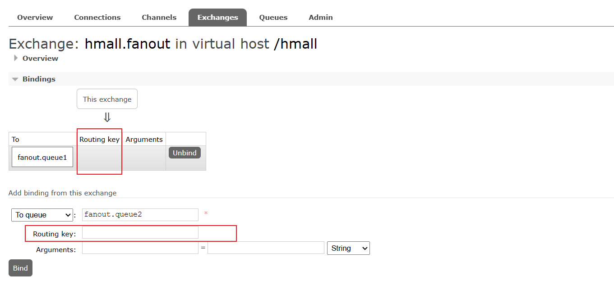
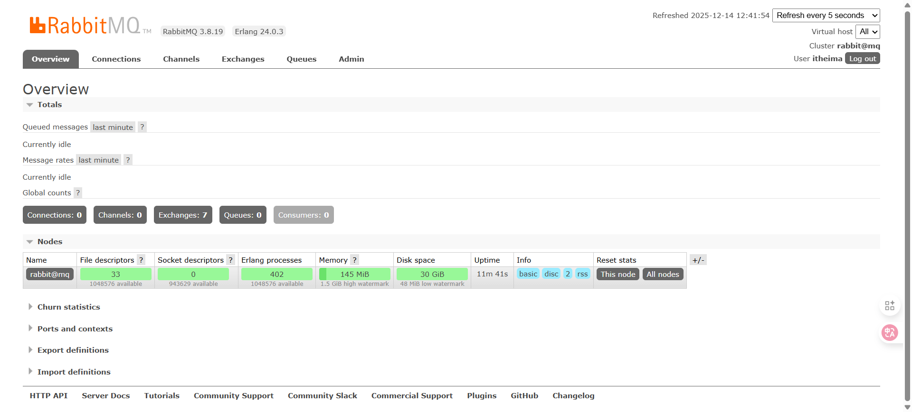
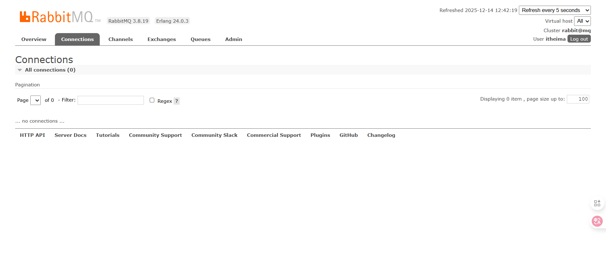
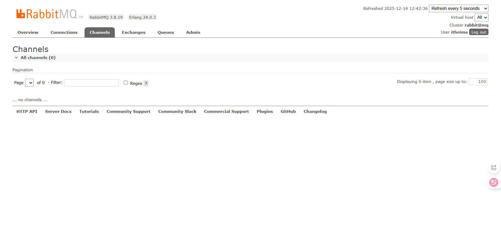
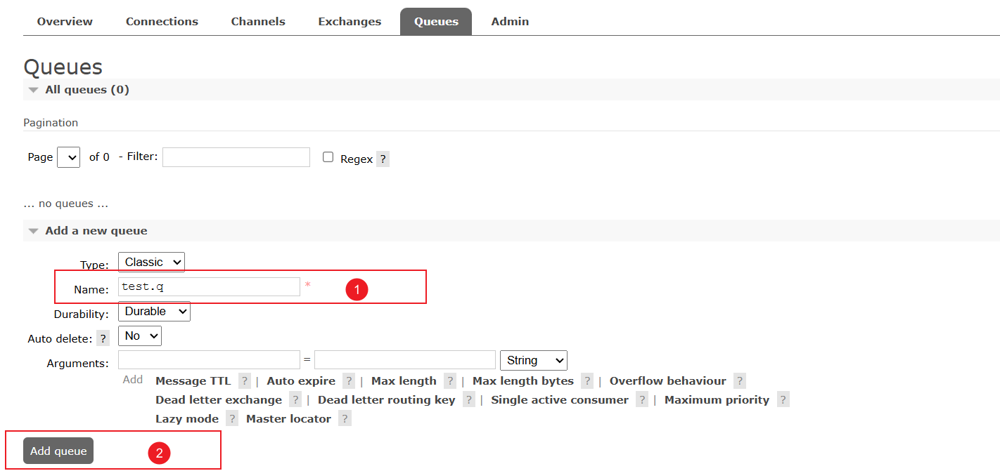
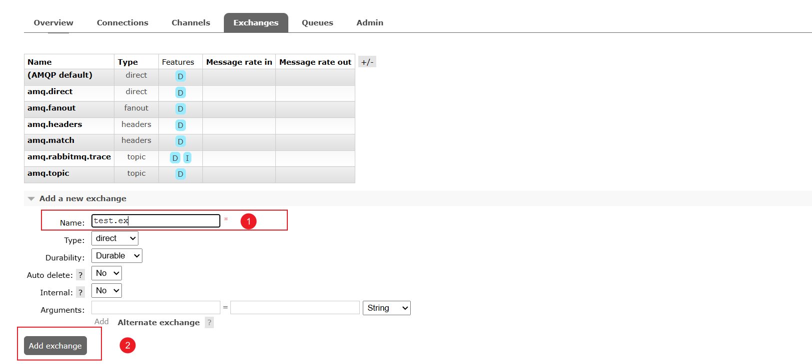
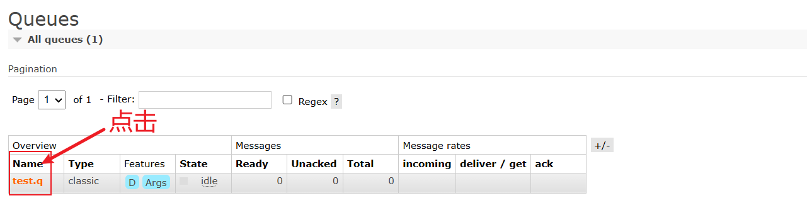
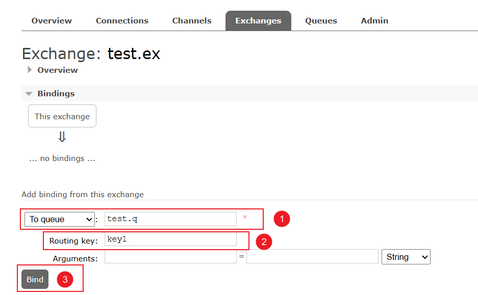
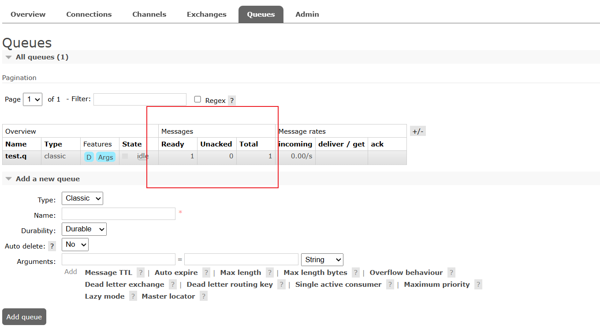
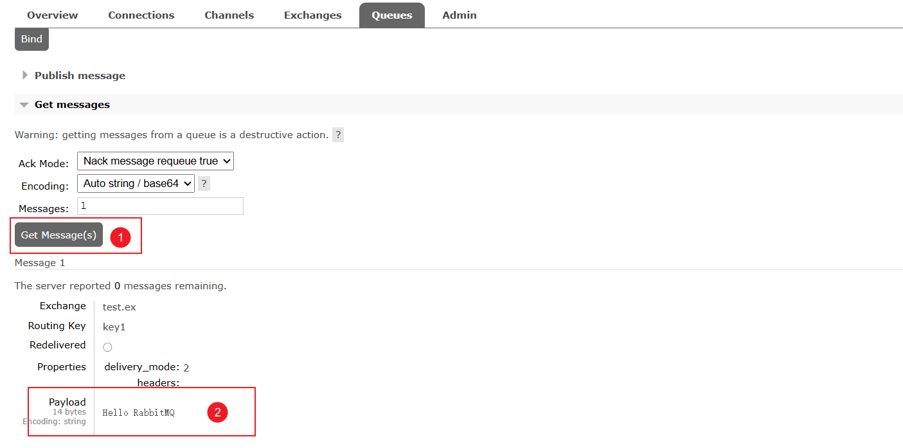

# Rabbit MQ

## 一：核心概念与架构

在写下第一行代码之前，我们必须先从“上帝视角”理解它的运行机制。

- RabbitMQ 是一套基于 **AMQP** 协议构建的复杂路由系统

### 1.1 为什么需要消息中间件

在分布式系统架构中，引入 RabbitMQ 这样重量级的中间件是有代价的。我们必须明确它到底解决了什么核心痛点，才能在技术选型时做出正确判断

- 通常，我们引入 MQ 主要为了解决三个核心问题：**异步处理**、**应用解耦**、**流量削峰**


#### 1. 异步处理

**痛点：** 

- 传统的同步调用会导致响应时间线性叠加

  如果一个核心业务操作需要调用多个下游服务（如发邮件、发短信、入积分），用户必须等待所有操作完成后才能收到响应，体验极差


**场景示例：用户注册** 假设用户注册涉及三个步骤：

1. 写入用户数据库 (50ms)
2. 调用邮件服务发送激活码 (100ms)
3. 调用短信服务发送通知 (100ms)

- **同步模式（串行）：** 总耗时 = 50 + 100 + 100 = **250ms**

- **同步模式（并行/多线程）：** 虽然可以并发，但仍占用线程资源，且需等待最慢的服务返回

- **MQ 异步模式：**

  1. 写入用户数据库 (50ms)
  2. 写入消息队列 (5ms) -> **立即返回给用户**
  3. 邮件服务和短信服务作为消费者，异步从队列读取消息并处理

  - **用户感知耗时：** 约 **55ms**

**价值：** 显著提升系统的吞吐量和用户响应速度


#### 2. 应用解耦

**痛点：** 

- 在微服务架构中，服务之间如果通过 HTTP/RPC 直接调用，会产生强耦合

  如果下游服务宕机或接口变更，上游服务会直接报错或阻塞，导致级联故障


**场景示例：订单系统 -> 库存系统**

- **强耦合：** 用户下单，订单系统直接调用库存系统的 RPC 接口扣减库存

  - *风险：* 如果库存系统升级或宕机，用户无法下单，订单系统崩溃

  

- **MQ 解耦：**

  1. 订单系统：用户下单 -> 写入数据库 -> **发布“订单已创建”消息到 MQ** -> 返回下单成功
  2. 库存系统：订阅该消息 -> 收到消息后执行扣减库存逻辑

  - *优势：* 即使库存系统宕机，订单系统依然可以正常接单。消息会堆积在 MQ 中，待库存系统恢复后，继续消费处理，数据不丢失

**价值：** 提高系统的容错性和可维护性，实现“由于下游不可用导致的非核心业务损失最小化”


#### 3. 流量削峰

**痛点：** 

- 互联网业务中常有突发流量场景（如秒杀、抢购）

  瞬间的高并发请求（如 10,000 QPS）如果直接打到数据库（MySQL 通常只能抗 2,000 QPS 左右），会导致数据库直接挂掉，系统全线崩溃


**场景示例：秒杀活动**

- **无保护：** 10,000 个请求同时涌入 -> DB 宕机
- **MQ 削峰：**
  1. **网关/上游：** 接收 10,000 个请求，全部快速写入 MQ（RabbitMQ 单机吞吐量远高于 DB）
  2. **消费者（下游）：** 根据数据库的实际承受能力（如 1,000 QPS），**定速** 从 MQ 中拉取消息进行处理
  3. **结果：** 此时 MQ 充当了一个巨大的“缓冲区”或“漏斗”。虽然会有大量消息积压，但数据库始终以安全的速度运行

**价值：** 保护后端核心资源不被流量洪峰击垮，以空间（消息积压）换时间


#### 4. 生产避坑指南

引入 MQ 并不是“银弹”，它会带来显著的架构复杂度和风险。在决定使用 RabbitMQ 前，必须清楚以下代价：

1. **系统可用性降低：**
   - 原本是 A -> B，现在是 A -> MQ -> B
   - 如果 MQ 挂了，整个链路就断了。因此，**RabbitMQ 的高可用（HA）集群搭建是生产环境的必选项**（后续章节会讲镜像队列）
2. **系统复杂度大幅提升：**
   - **消息丢失：** 网络抖动导致消息没发出去？消费者处理失败消息丢了？（需要可靠性投递机制）
   - **消息重复：** 网络超时导致重发，A 给 B 转账两次？（需要幂等性设计）
   - **顺序性：** 怎么保证“先创建订单”比“扣减库存”先执行？（需要顺序消费方案）
3. **一致性问题：**
   - A 系统处理完了，B 系统消费失败怎么办？这导致了分布式事务问题（最终一致性）

**总结：** 只有当你的业务确实面临上述三个痛点（异步、解耦、削峰），且你准备好处理上述风险时，才引入 RabbitMQ。不要为了用技术而用技术


### 1.2 RabbitMQ 核心架构⭐

RabbitMQ 是 **AMQP (Advanced Message Queuing Protocol)** 协议的一个开源实现。要理解 RabbitMQ，本质上就是要理解 AMQP 的模型

请务必打破一个传统的思维误区：

- **“生产者直接把消息发给队列，消费者从队列取消息”** **❌ 错！** 
  - 在 RabbitMQ 的设计中，生产者（Producer）**从不** 直接将消息发送到队列（Queue）


#### 1. 核心组件

我们将 RabbitMQ 内部拆解为以下几个关键组件，务必记清楚它们的职责：

##### 1. Virtual Host (虚拟主机)

- **核心概念**：
  - **类比理解**：它之于 RabbitMQ，就像 **Database** 之于 **MySQL**
  - RabbitMQ 本身是一个 Server，而 VHost 是 Server 内部划分出的一个个“迷你 RabbitMQ”
  - 每个 VHost 内部拥有自己独立的 **Exchange**、**Queue**、**Binding** 和 **权限机制**
- **作用：** 
  - **解决命名冲突**：
    - 假设电商组和物流组共用同一个 RabbitMQ 集群
    - 如果没有 VHost，他们如果都想创建一个叫 `order_status` 的队列，就会报错
    - **有了 VHost**：电商组用 `/shop`，物流组用 `/logistics`。哪怕队列重名，也互不干扰，完全隔离
  - **权限控制的边界**：
    - 你可以创建一个用户 `user_shop`，只给他访问 `/shop` 的权限。这样他就绝对无法误删物流组的队列，保障了数据安全
- **生产避坑**：
  - **严禁裸奔**：生产环境 **绝对不要** 使用默认的 `/` (root) 路径存放业务数据
  - **环境隔离**：建议按照环境（如 `/dev`, `/test`, `/prod`）或者按照业务域（如 `/payment`, `/order`）来创建独立的 VHost


##### 2. Exchange —— 核心路由器

- **角色定位：** 核心路由器 (The Router)

  - **1. 概念**：它是消息进入消息中间件后的 **第一个接收站**

    - *注意：在 AMQP 架构中，生产者直接对接 Exchange，而非直接对接 Queue*

      

  - **2. 核心职责**

    - **接收**：接收生产者发送的消息
    - **路由**：根据消息携带的 **路由键 (Routing Key)** 和预定义的 **绑定规则 (Binding)**，通过算法决定将消息投递给哪一个队列，或者同时广播给多个队列

    

  - **3. 关键特性 —— 生产级避坑**

    - **Exchange 不存储消息！**
    - Exchange 本质上是无状态的路由逻辑组件
    - **风险警告**：如果一条消息被发送到了一个 **没有任何队列绑定** 的 Exchange，这条消息将会直接 **丢失**，且默认不会报错
    - *解决方案：生产环境中通常需配置备份交换机或开启消息回退来感知此类路由失败*


##### 3. Queue —— 消息缓冲区

- **角色定位：** 消息最终存储容器

  - **1. 概念** 它是 AMQP 模型中 **唯一** 实际存储消息的数据容器

    - *对比：Exchange 只是负责路由（路标），Queue 才是负责落地存储（仓库）*

    

  - **2. 核心职责**

    - **缓冲**：保存消息，直到消费者连接并准备好接收它
    - **削峰填谷**：作为系统的“蓄水池”，在下游服务处理不过来时，承担消息堆积的压力，保护后端服务

    

  - **3. 关键特性**

    - **队列必须要和交换机绑定**，如果没有绑定，**没有任何消息能进到这个队列里**。队列就会变成一座“孤岛”

      - 你可能会疑惑，你疑惑的原因是因为 RabbitMQ 有一个**“隐形自动绑定”**机制
  
        当你创建一个队列（比如叫 `work.queue`）但 **不手动绑定** 任何交换机时：

        - RabbitMQ 会 **自动** 把它绑定到 **默认交换机 (Default Exchange)** 上
        - **绑定规则**：Routing Key = 队列名字
  
      
  
    - **竞争消费者模式**
  
      - **机制**：如果多个消费者监听 **同一个** 队列，RabbitMQ 默认采用 **轮询** 策略分发消息
      - **结果**：同一条消息 **只会被其中一个** 消费者处理，**绝对不会** 被广播给该队列的所有消费者（除非使用了不同的队列）
      - *应用场景：这是实现服务横向扩展和负载均衡的基础*
  
      
  
    - **持久化机制**
  
      - 消息是存在内存中（速度快但易丢）还是磁盘中（速度慢但安全），取决于以下配置：
        1. **Queue Durable**: 队列元数据是否持久化
        2. **Message DeliveryMode**: 消息内容是否标记为持久化
      - *生产建议：核心业务必须双重持久化，否则重启 MQ 服务会导致数据丢失*


##### 4. Binding —— 路由规则表

> 逻辑上它属于 Exchange 的“路由表”，一个 **Binding** 就是这个路由表中的一条数据
>
> - 它定义了三要素 —— **“源头（Exchange）”** + **“条件（Binding Key）”** + **“去向（目标 Queue）”**
>
> - 唯一作用就是 **把 Exchange和 Queue 关联起来**，并设定 **过滤规则**
>   - 如果后续 **生产者发送的消息** 中的 **Routing Key 匹配这个过滤规则** ，就 **转发一份该消息** 到 **关联起来的这个 Queue**
>   - 如果后续 **生产者发送的消息** 中的 **Routing Key 没有找到匹配的过滤规则**，就直接 **丢掉该消息** 

- **角色定位：** 路由映射关系表

  - **1. 概念**： 它是连接 **Exchange** (交换机) 与 **Queue** (队列) 的 **逻辑桥梁**
    - *本质：它定义了 RabbitMQ 内部的“网络拓扑结构”。如果没有绑定，Exchange 就像一个拔了网线的路由器，收到消息后无法转发*

  

  - **2. 核心职责**

    - **规则定义**：明确告诉 Exchange：“当收到 Routing Key 符合 **路由表中的 Binding 的 Binding Key** 的消息时，请复制一份放入 **该 Queue**”
    - **多对多映射**：
      - 一个 Exchange 可以绑定多个 Queue（实现广播/多播）
      - 一个 Queue 也可以被多个 Exchange 绑定（接收多来源数据）

    

  - **3. 核心难点**

    - **Routing Key vs Binding Key 的区别**

      - **Routing Key (动态指令)**：

        - 来源：由 **生产者** 在发送每一条消息时指定
        - 性质：动态的字符串，例如 `order.create` 或 `user.login`

        

      - **Binding Key (静态规则)**：

        - 来源：在 **绑定** 队列到交换机时指定
        
        - 性质：静态的配置参数，可能是精确匹配（如 `order.create`）也可能是通配符匹配（如 `order.#`）
        
        - 注意：在这个管理的 UI 界面，交换机这里的 Routing Key ，其实就是 Binding Key ，它这个名字写的有问题
        
          


##### 5. Routing Key —— 地址

> 它是 **生产者 **写的: 代表这条消息的“具体内容”或“去向指令”

- **角色定位：** 动态分发指令

  - **1. 概念**： 它是 **生产者** 在 **发送消息时** 附带的一个字符串标识

    - *本质：就像快递包裹上填写的“具体收件地址”。它是消息“头部信息”的一部分*

    

  - **2. 核心作用**

    - **路由依据**：它是 Exchange 进行路由计算的 **输入变量**
    - **匹配过程**：Exchange 接收到消息后，会提取这个 Routing Key，将其与所有绑定的 **Binding Key** 进行比对
      - *完全匹配 (Direct)*：RoutingKey 必须等于 BindingKey
      - *模式匹配 (Topic)*：RoutingKey 符合 BindingKey 的通配符规则（如 `order.*`）

    

  - **3. 生产最佳实践**

    - **层级命名法**

      - 强烈建议使用 **点号 (.)** 分隔的字符串格式
      - **推荐模版**：`<业务域>.<对象>.<动作>`
      - **示例**：
        - `order.payment.success` (订单支付成功)
        - `user.login.failed` (用户登录失败)
        - `stock.item.deducted` (库存扣减)

      

    - **设计哲学**

      - Routing Key 应该代表消息的 **本质特征** 或 **业务意图**
      - 设计良好的 Routing Key 可以让下游消费者灵活地选择订阅“所有订单消息”(`order.#`) 还是只订阅“支付成功消息”(`order.payment.success`)，从而极大提升系统的扩展性


#### 2. 消息流转的标准生命周期

- **Step 1: 发布 (Publish)**
  - **动作**：生产者连接到 RabbitMQ 的具体 **Virtual Host**
  - **核心参数**：
    1. **Payload**：实际的消息体（业务数据）
    2. **Exchange Name**：指定发给哪个交换机
    3. **Routing Key**：指定路由指令（如 `order.created`）


- **Step 2: 路由 (Route)**
  - **动作**：Exchange 收到消息后，扮演“路由器”角色
  - **逻辑**：它读取消息头的 `Routing Key`，并遍历自己内部维护的 **Binding (绑定表)**
  - **匹配算法**：根据交换机类型（Direct/Topic/Fanout）进行精确匹配或模糊匹配


- **Step 3: 投递 (Dispatch)**

  - **场景 A：匹配成功**
    - 消息被写入对应的 **Queue**
    - *注意：如果匹配到了多个 Queue（例如 Fanout 广播），RabbitMQ 会将消息 **复制** 多份，分别放入这些 Queue 中*

  

  - **场景 B：匹配失败 (无路可走)**
    - 如果没有任何 Binding 规则匹配该 Routing Key
    - **结果**：消息默认被 **直接丢弃**，且不会通知生产者
    - *避坑：生产环境通常需开启 `Mandatory` 参数或配置 `Dead Letter Exchange` 来捕获这些“迷路”的消息*

  

- **Step 4: 消费 (Consume)**

  - **动作**：消费者监听 Queue
  - **模式**：
    - **Push (推模式)**：MQ 主动将消息推送给消费者（Spring AMQP 默认）
    - **Pull (拉模式)**：消费者主动轮询拉取（即 `Get` 操作，性能较差，不推荐）


#### 3. 避坑指南：初学者常犯的架构错误

**陷阱一：误以为 Exchange 会存消息**

- **现象：** 生产者发了消息，但消费者还没启动（或队列还没创建绑定），结果消费者启动后收不到之前的消息
- **原因：** Exchange 是无状态的转发器。如果消息到达 Exchange 时没有队列接收它，它就“蒸发”了
- **解决：** 必须先创建 Queue 并 Binding 到 Exchange，然后再发消息。或者使用 `Mandatory` 参数让 MQ 通知你路由失败


**陷阱二：混淆 RoutingKey 与 BindingKey**

- **RoutingKey：** 是 **生产者** 发送消息时带的“动作指令”（例如：`order.create`）
- **BindingKey：** 是 **消费者/管理员** 将队列绑定到 Exchange 时设定的“接收规则”（例如：`order.#`）
- 交换机的作用就是判断：`RoutingKey` 是否符合 `BindingKey` 的规则


**陷阱三：未做持久化**

- **现象：** RabbitMQ 重启后，Exchange 和 Queue 全都不见了，消息也没了
- **解决：** 生产环境必须将 Exchange、Queue、Message 三者都设置为 **Durable（持久化）**（后续 API 章节会讲如何设置）


#### 4. 消息、交换机、队列关系!⭐⭐⭐

**请先记住：它们之间不是物理直连，而是靠“Binding 表”进行逻辑关联的**⭐

##### a. 核心三角关系

请把它们想象成数据库里的三张表：

1. **Producer (生产者)**：**“发信人”**

   - **职责**：在发送代码中 **显式指定** 消息要发给哪个 **Exchange (交换机)**
   - **代码体现**：`rabbitTemplate.convertAndSend("Exchange名字", "RoutingKey", 消息)`

   

2. **Exchange (交换机)**：相当于 **“路由器”**(持有整张路由表)

   - **职责**：接收生产者发来的消息，遍历查询内部维护的路由表中的每一个 **Binding**，转发消息
   - **注意**：它不存储消息（除非是死信队列那种特殊情况的中转），它只是一个运行逻辑的组件

   

3. **Queue (队列)**：相当于 **“存储仓库”**

   - **职责**：落地存储消息，等待消费者来取
   - **地位**：它是完全被动的，不知道消息是从哪个交换机来的，只管收

   

4. **Binding (绑定)**：相当于 “**路由表中的一行记录“**

   - **职责**：它定义了三要素 —— **“源头（Exchange）”** + **“条件（Binding Key）”** + **“去向（目标 Queue）”**
   - **本质**：**一个 Binding = 一行路由规则记录，明确了匹配成功后消息要去哪个队列**
   - **集合概念**：一个 Exchange 内部通常会有成百上千个 Binding，这些 Binding 合在一起，才构成了完整的“路由策略表”


##### 2. Routing Key vs Binding Key

- **Routing Key (路由键)**：

  - **来源**：**生产者** 发送消息时带的
  - **性质**：**动态参数**（就像 SQL 查询里的 `WHERE id = ?` 的那个值）
  - **作用**：用来去 Binding 表里做匹配

  

- **Binding Key (绑定键)**：

  - **来源**：**运维/开发** 在代码里配置的 (`BindingBuilder.with("...")`)。
  - **存储位置**：**存在 Exchange (交换机) 内部，路由表中有非常多的 Binding，Binding 中又有 Binding Key**
  - **性质**：**静态规则**
  - **作用**：定义匹配的条件


**匹配过程文字演示：**

假设 Exchange 内部维护了这样一张 Binding 表：

- **规则1**：Binding Key = `info`，目标队列 -> **Queue A**
- **规则2**：Binding Key = `error`，目标队列 -> **Queue B**
- **规则3**：Binding Key = `error`，目标队列 -> **Queue C**

**场景还原**：生产者执行代码 `convertAndSend("此Exchange", "error", msg)`

1. **定位交换机**：消息首先找到了代码中指定的 **“此Exchange”**
2. **提取钥匙**：Exchange 拿到消息里的 Routing Key —— **`'error'`**
3. **遍历查表**：Exchange 开始遍历自己的 Binding 表：
   - 对比 **规则1** (`info`)：不匹配，跳过
   - 对比 **规则2** (`error`)：**匹配成功！** 查看 Binding 中的目标 -> **复制一份发给 Queue B**
   - 对比 **规则3** (`error`)：**匹配成功！** 查看 Binding 中的目标 -> **复制一份发给 Queue C**
4. **最终结果**：Queue B 和 Queue C 都收到了消息


##### 3. 复杂映射关系详解 (N:M)

很多初学者以为“一个队列只能有一个 Key”，这是错的。它们是完全自由的 **多对多** 关系

| 关系模式               | 绑定配置 (Binding)                                           | 效果                                                         | 典型场景                                 |
| ---------------------- | ------------------------------------------------------------ | ------------------------------------------------------------ | ---------------------------------------- |
| **1 对 1**(精准)       | Exchange A -> `error` -> Queue A                             | **单播**。只有 `error` 消息能进 Queue A                      | 错误日志归档                             |
| **1 对 多**(多重绑定)  | Exchange A -> `info` -> Queue AExchange A -> `warn` -> Queue A | **多名**。Queue A 有两个别名。发 `info` 或 `warn` 它都能收到 | 一个队列处理多种类型的业务               |
| **多 对 1**(广播/多播) | Exchange A -> `pay` -> Queue AExchange A -> `pay` -> Queue B | **群发**。发一条 `pay`，复制两份，A 和 B 各收一份            | 支付成功，同时通知“积分系统”和“短信系统” |


##### 4. 灵魂拷问：如果没绑定会怎样？

- **场景**：你往 Exchange 发了消息，Routing Key 是 `abc`
- **过程**：Exchange 查 Binding 表，发现没有任何一行记录匹配 `abc`
- **结果**：
  - **默认情况**：**直接丢弃 (Drop)**。RabbitMQ 不会帮你暂存，消息瞬间消失
  - **开启 Mandatory**：Exchange 会调用 `ReturnsCallback` 把消息退回给生产者（参考 4.1 节）
  - **配置了备份交换机**：转发给备用交换机


##### 5. 总结

- **生产者** 决定消息发给哪个 **Exchange**
- **Binding** 决定了匹配成功后消息去哪个 **Queue**
- **Routing Key** 是用来在 Binding 表里进行“通关验证”的口令


### 1.3 安装与控制台概览

**3分钟内启动 RabbitMQ**，并学会通过 Management UI 监控核心指标

#### 1. 极速安装

作为开发人员，不要在本地 Windows/Mac 上安装笨重的安装包。我们使用 Docker 一键启动，这也是生产环境容器化部署的标准姿势

**启动命令 (直接复制执行)：**

```bash
docker run -d \
  --name rabbitmq \
  -p 5672:5672 \
  -p 15672:15672 \
  -e RABBITMQ_DEFAULT_USER=admin \
  -e RABBITMQ_DEFAULT_PASS=admin \
  rabbitmq:3-management
```

**关键参数解析：**

- **`rabbitmq:3-management`**：**必须带 `-management` 后缀！** 否则启动后没有 Web 控制台界面
- **`-p 5672:5672`**：**通信端口**。Java 代码连接 MQ 时填这个端口
- **`-p 15672:15672`**：**管理端口**。浏览器访问控制台时用这个端口
- **`-e ..._USER/PASS`**：设置默认账号密码（这里设为 `admin/admin`）

**验证启动：** 打开浏览器访问 `http://localhost:15672`，输入 `admin/admin` 即可登录


#### 2. Management UI 核心面板

登录后，你看到的是 RabbitMQ 的“驾驶舱”。请重点关注以下几个 Tab 页，它们对应了我们之前学的架构组件

##### A. Overview

> **总览 —— 集群健康状态**

- **Totals**:
  - 当前集群的消息总吞吐量（按秒统计），包括生产速率和消费速率
- **Nodes**:
  - 节点的健康状态（CPU、内存、磁盘水位）
  - **生产避坑**：
    - 如果 **Disk space** 爆红（磁盘空间不足），RabbitMQ 会触发 **流控机制**，也就是强行“刹车”，**拒绝接收生产者的新消息**，直到磁盘空间释放

- **图**

  


##### B. Connections & Channels

> **连接与信道 —— 网络层模型**

- **Connections (TCP连接)**：
  
  - **定义**：物理层面的 TCP 长连接
  
  - **现状**：建立 TCP 连接非常消耗资源（三次握手、鉴权）
  
  - **图**
  
    
  
  
  
- **Channels (虚拟信道)**：

  - **定义**：复用在 Connection 之上的“逻辑连接”

  - **最佳实践**：Spring Boot 程序通常只维持 **一个** 长连接，但在内部通过 **多线程创建多个 Channel** 来并发发送/接收消息。这叫 **“多路复用”**

  - **图**

    

##### C. Exchanges (交换机)

- **列表展示**：这里列出了当前 VHost 下所有的交换机

- **默认交换机**：你会发现系统默认创建了一些 `amq.*` 开头的交换机（如 `amq.direct`, `amq.topic`）

  - **建议**：**不要删，也不要直接用**。生产环境请务必自己新建业务专用的交换机，以便于管理和监控

- **图**

  


##### D. Queues (队列)

> **排查问题的核心战场**

点击具体的队列名称，可以查看详情。这里有两个 **至关重要** 的指标:

| 指标        | 含义                                                         | 潜在风险 / 排查方向                                          |
| ----------- | ------------------------------------------------------------ | ------------------------------------------------------------ |
| **Ready**   | **待消费消息数**<br/>消息已安全存入队列，正在等待投递给消费者 | 如果该值持续飙高，说明 **生产速度 > 消费速度**，也就是发生了 **消息积压** <br/>**对策**：需要扩容消费者实例，或优化消费逻辑 |
| **Unacked** | **待确认消息数**。消息已推给消费者，但消费者 **还没回传 ACK** | 如果值很高，说明消费者 **处理太慢**，或者消费者 **卡死/报错** 导致无法提交 ACK<br/>**对策**：检查消费者日志，看是否有死锁或异常未捕获 |
| **Total**   | Ready + Unacked 的总和                                       | 队列当前的总负载                                             |

> **ACK (Acknowledge)** 的意思是 **“确认应答”**,可以把它理解为**“快递签收单”**
>
> - 简单来说，ACK 就是 **“确认收到并处理完成”** 的 **信号**，它是一个被发送给 MQ服务端 的东西，用来表示确认收到东西了


#### 3. 在控制台模拟“发布/订阅”

不写一行代码，先体验一下消息流转：

##### **建队列**

去 `Queues` 页 -> `Add a new queue` -> **Name** 填 `test.q` -> 点击 `Add queue`




##### **建交换机**

去 `Exchanges` 页 -> `Add a new exchange` -> Name 填 `test.ex` -> Type 选 `direct` -> 点击 `Add exchange`




##### **做绑定 (Binding)**

- 点击刚才建的 `test.ex` 进入详情页

  

- 找到 `Bindings` 栏 -> `To queue` 填 `test.q` -> `Routing key` 填 `key1` -> 点击 `Bind`

  


##### **发消息**

- 依然在 `test.ex` 详情页
- 找到 `Publish message` 栏 -> `Routing key` 填 `key1` -> `Payload` 填 `Hello RabbitMQ` -> 点击 `Publish message`


##### **验结果**

- 去 `Queues` 页，你会发现 `test.q` 的 **Ready** 变成了 `1`

  

- 点击 `test.q` -> 展开 `Get messages` -> 点击 `Get Message` -> 你就能看到刚才发的消息了！

  


## 二：消息模型 与 Spring Boot

### 0. 环境与核心组件

#### A. 依赖引入

在 Spring Boot 项目中，我们不再需要像第二阶段那样单独引入 `amqp-client`

- Spring Boot 提供了一个“开箱即用”的 Starter，它不仅包含了客户端驱动，还包含了自动化配置模块

```xml
<dependency>
    <groupId>org.springframework.boot</groupId>
    <artifactId>spring-boot-starter-amqp</artifactId>
    <!-- 
      注意：通常无需指定版本号 (<version>)。
      版本会由 spring-boot-starter-parent 统一管理，
      确保与你的 Spring Boot 版本兼容
    -->
</dependency>
```


#### B. 配置 (`application.yml`)

不要只配 host 和 port，以下是生产环境的标准配置模板：

```yaml
spring:
  rabbitmq:
    # === 1. 基础连接信息 ===
    host: localhost
    port: 5672
    username: admin
    password: admin
    # 关键：生产环境请务必指定具体的 vhost，实现业务隔离
    virtual-host: /order_vhost
    
    # 连接超时设置 (防止网络波动导致长时间阻塞)
    connection-timeout: 10s 
    
    # === 2. CachingConnectionFactory 缓存配置 (性能关键) ===
    # Spring Boot 默认使用 CachingConnectionFactory
    cache:
      connection:
        # 模式：CHANNEL (默认)。缓存 Channel，复用 Connection
        # 只有在极端高并发下才考虑 CONNECTION 模式
        mode: channel 
      channel:
        # 关键：通道缓存数量 (默认 25)
        # 如果你的业务并发很高（如瞬时几百个线程同时发消息），默认值可能不够用，
        # 会导致线程阻塞等待 Channel，建议调大至 50-100
        size: 50 
        # 获取通道的最长等待时间
        checkout-timeout: 5s 

    # === 3. 消息投递可靠性配置 (第四阶段细讲，此处先预留) ===
    # 开启发布确认 (Publisher Confirms)
    publisher-confirm-type: correlated 
    # 开启消息回退 (Publisher Returns)
    publisher-returns: true            

    # === 4. 消费者监听配置 (Listener) ===
    # 这里配置的是 @RabbitListener 的默认行为
    listener:
      simple:
        # 关键：开启手动 ACK (Manual Acknowledge)
        # 对应原生 API 的 autoAck = false
        # 如果不配这一行，默认是自动确认，一旦报错消息就丢了！
        acknowledge-mode: manual       
        
        # 关键：预取数量 (Prefetch Count)
        # 对应原生 API 的 basicQos(1)。实现“能者多劳”和“公平分发”
        prefetch: 1                    
        
        # 关键：并发消费者数量
        # 决定了每个 @RabbitListener 启动时会在后台开几个线程去消费
        # concurrency: 初始线程数
        # max-concurrency: 最大线程数 (自动伸缩)
        concurrency: 5                 
        max-concurrency: 10            
```

**配置核心点解析**

1. **`virtual-host`**:
   - 新手最容易漏掉的配置。如果不配，默认连到 `/`。一定要显式指定，防止连错环境
2. **`cache.channel.size`**:
   - Spring 的 `RabbitTemplate` 发送消息时需要从池子里借一个 `Channel`。如果不调大这个值，高并发发送时这里会成为瓶颈
3. **`acknowledge-mode: manual`**:
   - **这是保命配置**。把它设为 manual，Spring 才会等待你的业务逻辑执行完（或抛出异常）后，自动帮你决定是 Ack 还是 Nack
4. **`concurrency`**:
   - 这是 Spring 封装的黑科技
   - 在原生 API 中，如果你想开启 5 个消费者，你得运行 5 次 `main` 方法或者写 5 个线程
   - 在 Spring 中，只需配置 `concurrency: 5`，Spring 就会自动为同一个队列启动 5 个消费者线程并行处理，吞吐量直接翻倍


#### C. 监听序列化器替换

##### a. 为什么必须换掉默认的序列化器？

Spring AMQP 默认使用的 `SimpleMessageConverter` 基于 JDK 的 `ObjectOutputStream`

- **缺点 1**：生成的消息体是二进制乱码（如 `rO0ABXNy...`），在 RabbitMQ 控制台无法阅读
- **缺点 2**：对非 Java 消费者（如 Python 脚本）完全不可读
- **缺点 3**：容易引发 Java 反序列化安全漏洞

**生产标准**：使用 **JSON** 作为消息的通用载体


##### b. 实战：配置 Jackson 消息转换器

我们需要修改（或新增）配置类，向 Spring 容器注入一个 `MessageConverter` Bean

- Spring Boot 的自动配置机制发现这个 Bean 后，会自动将其注入到 `RabbitTemplate` 中

**修改 `RabbitConfig.java`：**

```JAVA
import org.springframework.amqp.support.converter.Jackson2JsonMessageConverter;
import org.springframework.amqp.support.converter.MessageConverter;
import org.springframework.context.annotation.Bean;
import org.springframework.context.annotation.Configuration;

@Configuration
public class RabbitConfig {

    // ... 之前定义的 Queue, Exchange, Binding 代码保持不变 ...

    /**
     * 核心配置：将消息序列化机制改为 JSON
     * 	1. 发送消息时：RabbitTemplate 会自动把 Java 对象转成 JSON 字符串
     * 	2. 接收消息时：@RabbitListener 会自动把 JSON 字符串转成 Java 对象
     */
    @Bean
    public MessageConverter jsonMessageConverter() {
        return new Jackson2JsonMessageConverter();
    }
}
```


##### c. 依赖检查

`Jackson2JsonMessageConverter` 依赖于 Jackson 核心包。通常 `spring-boot-starter-web` 已经包含了它

如果你是纯后端微服务（没有 Web 模块），可能需要单独引入：

```XML
<dependency>
    <groupId>com.fasterxml.jackson.core</groupId>
    <artifactId>jackson-databind</artifactId>
</dependency>
```


##### d. 效果验证

配置好这个 Bean 后，你可以重新运行 3.2 节的 `sendMapMessage()` 方法

**变化**：

- **以前**：控制台 Payload 是 `\xAC\xED\x00\x05sr...`

- **现在**：控制台 Payload 变成了清晰的 JSON：

  ```
  {"orderId":"1001", "price":99.9, "user":"admin"}
  ```

- **Content-Type**：会自动变为 `application/json`


#### D. ⭐发送神器：`RabbitTemplate`

`RabbitTemplate` 是 Spring AMQP 提供的核心 **发送工具** ，它是 **线程安全** 的，因此你可以在 Service 中放心注入并单例使用

它最大的贡献是将底层复杂的 `basicPublish` 方法封装成了人性化的 `convertAndSend`

##### 1. 核心 API 速查

```JAVA
// 1. 发送到默认交换机 (RoutingKey = 队列名)
// routingKey: 路由键
//    * 由于没指定交换机，默认使用 Default Exchange
//    * 此时 RoutingKey 必须完全等于 目标队列名 才能被收到
// object: 消息体
//    * 你要发的实际业务数据 (String, User, Map 等)
void convertAndSend(String routingKey, Object object);

// 2. 发送到指定交换机 (最常用)
// exchange: 交换机名称
//    * 指定消息要发给哪个交换机 (例如 "boot.order.ex")
// routingKey: 路由键
//    * 交换机根据这个 Key 决定转发给哪个队列 (例如 "order.create")
// object: 消息体
void convertAndSend(String exchange, String routingKey, Object object);

// 前三个参数同上...
// mpp (MessagePostProcessor): 消息后置处理器
//    * 这是一个函数式接口
//    * Spring 在把对象转成 Message 后，发给 RabbitMQ 前，会回调这个接口
//    * 你可以在这里拿到 Message 对象，随意修改它的 Header 和 Properties
void convertAndSend(String exchange, String routingKey, Object object, MessagePostProcessor mpp);
```


##### 2. 生产级代码实战

我们在 `OrderService` 中演示不同场景的发送逻辑

```JAVA
@Service
public class OrderService {

    @Autowired
    private RabbitTemplate rabbitTemplate;

    // 常量定义，防止手抖写错
    private static final String EX_NAME = "hmall.direct";

    /**
     * 场景 A: 发送普通 JSON 消息
     */
    public void sendOrder() {
        Map<String, Object> order = new HashMap<>();
        order.put("id", 1001);
        order.put("price", 99.00);

        // 自动序列化：Map -> JSON String -> byte[]
        rabbitTemplate.convertAndSend(EX_NAME, "order.create", order);
        
        System.out.println("发送成功");
    }

    /**
     * 场景 B: 发送“高级”消息 (MessagePostProcessor)
     * 需求：给消息设置 10秒 过期时间 (TTL)，并携带一个 TraceId 用于链路追踪
     */
    public void sendAdvancedOrder() {
        String msg = "vip order";

        // 第 4 个参数是函数式接口 MessagePostProcessor
        // 它允许你在消息被序列化后、发给 MQ 之前，最后一次修改消息属性
        rabbitTemplate.convertAndSend(EX_NAME, "order.vip", msg, message -> {
            
            // 1. 设置消息属性 (MessageProperties)
            // setExpiration: 设置单条消息 TTL (单位: 毫秒字符串)
            message.getMessageProperties().setExpiration("10000");
            
            // 2. 设置持久化 (Spring 默认就是 PERSISTENT，这里仅作演示)
            message.getMessageProperties().setDeliveryMode(MessageDeliveryMode.PERSISTENT);

            // 3. 设置自定义 Header (透传业务数据)
            message.getMessageProperties().setHeader("trace-id", UUID.randomUUID().toString());
            message.getMessageProperties().setHeader("source", "mobile-app");
            
            // 必须返回修改后的 message 对象
            return message;
        });
        
        System.out.println("高级消息发送成功");
    }
}
```

##### 3. 避坑指南

1. **RoutingKey 写错的后果**：
   - 如果你调用 `convertAndSend("ex", "wrong.key", msg)`
   - **结果**：RabbitMQ 交换机收到消息后，发现找不到匹配的 Binding，会 **直接丢弃** 消息（Silent Drop），且 **不会报错**
   - **对策**：如果业务不允许丢消息，必须开启 `Publisher Returns` 机制（我们在可靠性章节详解）
2. **不要在循环里创建 Template**：
   - 虽然 `RabbitTemplate` 本身很轻量，但它背后的 `Connection` 和 `Channel` 资源很重
   - **禁止**在方法内部 `new RabbitTemplate()`，必须使用 Spring 容器注入的单例对象


#### E. ⭐注解式监听 (`@RabbitListener`)

##### I. `@RabbitListener` 注解 

###### 简述

- **核心定位**：`@RabbitListener` 是 Spring AMQP 提供的核心注解，底层由 **异步消息监听容器 (MessageListenerContainer)** 驱动
- **工作机制**：只要在方法上标记此注解，Spring 启动时就会在后台自动开启独立线程，去 RabbitMQ 拉取并消费消息
- **生效前提**：包含 `@RabbitListener` 方法的类 **必须** 交给 Spring 容器管理（即类上须标注 `@Component`、`@Service` 等注解或用其它方式注册为 Bean），否则监听器绝对不会生效！


###### 通用属性参数 (容器配置)

这些参数用于控制监听器容器的运行状态，属于进阶调优配置

- **`concurrency`** (性能调优)
  - **含义**: 指定当前监听器的 **并发消费者线程数**
  - **优先级**: **高于** `application.yml` 中的全局配置
  - **格式**: `"固定值"` 或 `"初始值-最大值"`
  - **示例**:
    
    ```java
    // 最少启动 5 个线程消费，任务积压时自动扩容到最多 10 个
    @RabbitListener(queues = "high.concurrency.queue", concurrency = "5-10")
    public void listen(String msg) {
        System.out.println("高并发处理：" + msg);
    }
    ```
  
  
  
- **`ackMode`** (覆盖全局确认模式)
  - **含义**: 允许针对当前监听器，局部覆盖 YAML 中的全局 ACK 模式。
  - **可选值**: `"MANUAL"` (手动, 推荐), `"AUTO"` (自动), `"NONE"` (发完即删，极少用)。
  - **示例**:
    ```java
    // 即使全局配了 AUTO，这个监听器也会强制使用 MANUAL 模式
    @RabbitListener(queues = "important.queue", ackMode = "MANUAL")
    public void listenWithManualAck(Message message, Channel channel) {
        // 必须在代码中手动调用 channel.basicAck() 等方法
    }
    ```

  
  
- **`containerFactory`** (高级配置)
  - **含义**: 指定使用的 **消息监听容器工厂** 的 Bean 名称
  - **场景**: 项目中有多种消息处理需求（如：有的队列需要 JSON 转换，有的需要特定拦截器）时，用来精准指定对应的工厂
  - **示例**:
    ```java
    // 假设你在 @Configuration 类里定义了一个名为 "jsonListenerFactory" 的 Bean
    @RabbitListener(queues = "json.queue", containerFactory = "jsonListenerFactory")
    public void listenJson(Map<String, Object> jsonMap) {
        // 使用专门配置了 JSON 反序列化的工厂来处理该队列
    }
    ```


###### 监听目标 配置⭐⭐⭐

> queues vs bindings (核心二选一)

`queues` 和 `bindings` 这两个参数都用于指定监听的目标，语法允许同时写，但 **强烈建议不要混用**。它们的底层逻辑完全不同：


**A. `queues` (只负责监听 —— 规范派)**

- **核心定位**: 适合大型规范化项目。队列、交换机等基础设施统一由 `@Configuration` 配置类管理，消费者“只管干活”，架构职责非常清晰

- **含义**: 指定要监听的队列名称（支持数组，可同时监听多个队列）

- **⚠️注意**: 

  - 这里填写的队列 **必须已经存在** 于 RabbitMQ 中（比如已在 `@Configuration` 配置类中通过 `@Bean` 声明，或手动创建过）！
  - 如果队列不存在，项目启动时会直接报错

- **示例：**

  ```java
  // 监听单个已存在的队列
  @RabbitListener(queues = "boot.order.q")
  public void listenSingle(String msg) {
    System.out.println("收到订单消息：" + msg);
  }
  
  // 同时监听多个已存在的队列
  @RabbitListener(queues = {"q1", "q2"})
  public void listenMultiple(String msg) {
    System.out.println("收到 q1 或 q2 的消息：" + msg);
  }
  ```


**B. `bindings` (连建带绑再监听 —— 懒人派)**

- **核心定位**: 适合小型项目、快速测试，或者消费者逻辑非常独立，不想去写繁杂的 `@Configuration` 配置类时使用

- **效果 (三合一)**: 

  - 容器启动时，Spring 会自动去 MQ 检查：队列有吗？没有我建；交换机有吗？没有我建；绑定关系有吗？没有我绑。最后开始监听

    完全不依赖任何前置配置

- **参数类型(`@QueueBinding`)**

  - `bindings` 属性需要接收一个结构化的嵌套注解：**`@QueueBinding`**（或者它的数组），来指定“队列”，“交换机”，以及“Binding Key”等

  - **注解属性**

    - **`value` (目标队列 `@Queue`)**
      - `name`: 队列名称。如果留空 `""`，MQ 会自动生成一个随机名（通常用于临时队列，比如广播模式下的专属队列）

      - `durable`: 重启后队列是否存活（默认 `true`，持久化）

      - `autoDelete`: 没有消费者连接时是否自动删除（默认 `false`）

      - `exclusive`: 是否为排他队列（默认 `false`）

           

    - **`exchange` (源头交换机 `@Exchange`)**

        - `name`: 交换机名称
        - `type`: 交换机类型
          - 推荐使用 Spring 内置常量，如 `ExchangeTypes.DIRECT`, `ExchangeTypes.TOPIC`, `ExchangeTypes.FANOUT`
        - `delayed`: 是否支持延迟消息（默认 `false`。⚠️**注意：需 MQ 服务端安装了延迟插件才生效**）
        - `ignoreDeclarationExceptions`: 是否忽略声明异常（默认 `false`）
          - 如果交换机已存在但属性（比如 durable）与代码不一致，设为 `true` 可防止项目启动报错

        

    - **`key` (路由规则 `String[]`)**

        - 定义 **Binding Key** (路由键)。支持数组，可同时绑定多个路由规则。例如 `key = {"red", "blue"}` 表示只要是红色或蓝色的消息都接收

        

  - **示例：**

    ```java
    // 1. 自动创建持久化队列 "direct.queue1"
    // 2. 自动创建交换机 "hmall.direct" (直连型)
    // 3. 自动将队列和交换机绑定，路由键为 "red" 和 "blue"
    @RabbitListener(
        bindings = @QueueBinding(
        	value = @Queue(name = "direct.queue1", durable = "true"), 
        	exchange = @Exchange(name = "hmall.direct", type = ExchangeTypes.DIRECT), 
        	key = {"red", "blue"} 
    	)
    )
    public void listenAndDeclare(String msg){
        System.out.println("消费者接收到消息：【" + msg + "】");
    }


##### II. 前置概念：什么是 ACK？(签收单)

在看下面这段生产级消费代码之前，我们必须先了解一个核心概念：**ACK**

**ACK (Acknowledge)** 的意思是 **“确认应答”**，你可以把它完美地理解为生活中的**“快递签收单”**

> 简单来说，ACK 就是 **“确认收到并处理完成”** 的 **信号**，它是一个被发送给 MQ服务端 的东西，用来表示确认收到东西了

- MQ 把消息推送给消费者后，默认会等待这个信号

- 只有 MQ 收到了消费者传回来的 ACK 信号，它才会放心地把这条消息从服务器的硬盘或内存中彻底删除

> **预告：**
> 后续我们会在**【消息可靠性保障】**章节中深度讲解 ACK


##### III. 生产级实战：手动 ACK 订单消费模版

在严谨的业务场景中，为了保证消息绝对不丢失，我们需要配置端和代码端的紧密配合。以下是一个标准的生产级消费者模版：

###### Step 1. 前置检查

在写代码前，请务必确认 `application.yml` 中已配置以下两项参数（除非你在注解里单独指定了 `ackMode`）：

```yaml
spring:
  rabbitmq:
    listener:
      simple:
        acknowledge-mode: manual  # 必须配置！开启手动 ACK 模式，不然后面的代码会有问题
        prefetch: 1               # 关键优化：设置为 1，实现"能者多劳"，防止某些消费者被撑死
```


###### Step 2. 消费者核心代码

处理消息时，必须严格按照获取 Tag -> 执行业务 -> 成功则 ACK -> 失败则 NACK/Reject 的流程编写

```java
import com.rabbitmq.client.Channel;
import org.springframework.amqp.core.Message;
import org.springframework.amqp.rabbit.annotation.RabbitListener;
import org.springframework.stereotype.Component;

import java.io.IOException;
import java.util.Map;

@Component
public class OrderListener {

    /**
     * queues: 监听的队列名 (注意：该队列必须已存在)
     */
    @RabbitListener(queues = "boot.order.q")
    public void listenOrder(Map<String, Object> orderMap, Message message, Channel channel) throws IOException {
        
        // 1. 获取消息的唯一标识 (DeliveryTag)
        // 它是当前 Channel 内单调递增的数字，相当于这封信的"取件码"
        long deliveryTag = message.getMessageProperties().getDeliveryTag();

        try {
            // 2. 执行核心业务逻辑
            System.out.println("收到订单消息：" + orderMap);
            System.out.println("当前处理线程：" + Thread.currentThread().getName());
            
            // 模拟业务异常 (测试拒收机制)
            if (orderMap.get("price") == null) {
                throw new IllegalArgumentException("订单价格不能为空");
            }

            // 3. 业务成功，手动确认 (ACK)
            // 参数1: deliveryTag (取件码)
            // 参数2: multiple (false = 只确认当前这一条, true = 批量确认所有小于当前 tag 的消息)
            channel.basicAck(deliveryTag, false);
            System.out.println("订单处理成功，已正常 ACK");

        } catch (Exception e) {
            System.err.println("业务处理失败: " + e.getMessage());
            
            // 4. 业务异常，拒绝消息 (NACK)
            // 生产环境常见的两种兜底策略：
            
            // 策略 A (不推荐用于代码 Bug): 失败重回队列 (requeue = true)
            // 风险：如果是因为代码逻辑报错，消息会无限循环重试，导致 CPU 飙升并卡死队列！
            // channel.basicNack(deliveryTag, false, true);
            
            // 策略 B (生产极力推荐): 拒绝并丢弃 (requeue = false)
            // 效果：消息会被扔掉。如果该队列绑定了【死信交换机/死信队列(DLX)】，消息会自动流入死信队列，等待人工排查补偿。
            channel.basicNack(deliveryTag, false, false);
        }
    }
}
```


##### IV. 注解方法参数注入

Spring AMQP 底层非常智能，它会利用 **反射机制** 检查 `@RabbitListener` 标注的方法中的形参类型，然后自动注入对应的内容。

它对 **顺序** 没有要求，只对 **参数类型** 有要求，我们只需要知道它支持哪些类型，然后在形参括号中“按需声明”想要的参数类型，Spring 就会自动把对应的值注入


###### 1). 支持的参数类型(最常用)

| 参数类型 / 注解                          | 包路径 (Package)                                   | 注入内容       | 必须性 (手动ACK) | 核心用途                                                     |
| :--------------------------------------- | :------------------------------------------------- | :------------- | :--------------- | :----------------------------------------------------------- |
| **`Channel`**                            | `com.rabbitmq.client`                              | 原生信道对象   | **必须**         | 只有拿到它，才能调用 `basicAck` 或 `basicNack` 执行签收/拒收操作 |
| **`Message`**                            | `org.springframework.amqp.core`                    | 原生消息包装类 | **必须**         | 只有拿到它，才能获取 `DeliveryTag` (快递单号) 等底层元数据   |
| **`Map` / `String`/<br/>`自定义实体类`** | `java.util`/`java.lang` / 业务包                   | 业务数据       | 可选             | Spring 自动调用 Jackson 将 JSON 反序列化为你指定的对象类型   |
| **`@Header("xxx")`**                     | `org.springframework.messaging.handler.annotation` | 指定的消息头   | 可选             | 精准提取某个特定的 Header 值（如：自定义的业务流水号、TraceId 等） |


###### 2). 一些写法组合

根据业务复杂度，你可以灵活组合形参

- **组合 A：生产标准版 (手动 ACK 必备)**

  - **场景**：最通用的写法，既要处理业务对象，又要手动签收。
  - **特点**：直接拿到反序列化后的实体类，开发效率高。

  ```java
  @RabbitListener(queues = "boot.order.q")
  public void handle(Order order, Channel channel, Message message) {
      // order: 自动转换后的业务对象
      // message: 获取 DeliveryTag 等元数据
      // channel: 执行 basicAck/basicNack
  }
  ```


- **组合 B：极致简洁版 (自动 ACK 专用)**

  - **场景**：非核心业务，或者 YAML 中配置了 `acknowledge-mode: auto`
  - **特点**：代码最清爽，完全屏蔽 MQ 底层细节

  ```java
  @RabbitListener(queues = "boot.log.q")
  public void handle(String msg) {
      // 逻辑跑完没报错，Spring 自动帮你签收
      System.out.println("日志内容：" + msg);
  }
  ```


- **组合 C：精准提取版 (使用 `@Header`)**

  - **场景**：只需要某一个特定的 Header（如：消息重试次数、自定义业务 ID）
  - **特点**：语义极其明确，不需要从 `Message` 对象里一层层去 `get`

  ```java
  @RabbitListener(queues = "boot.pay.q")
  public void handle(String payload, 
                     @Header("amqp_deliveryTag") long tag, 
                     @Header("my-biz-id") String bizId, 
                     Channel channel) {
      // 直接拿到 tag 和自定义头，代码非常优雅
      channel.basicAck(tag, false);
  }
  ```


- **组合 D：暴力全拿版 (使用 `@Headers`)**

  - **场景**：需要动态处理大量不确定的 Header 信息
  - **特点**：一次性把所有头信息装进 Map

  ```java
  @RabbitListener(queues = "boot.dynamic.q")
  public void handle(String body, @Headers Map<String, Object> allHeaders) {
      // allHeaders 包含了所有的消息属性和自定义头
      allHeaders.forEach((k, v) -> System.out.println(k + ":" + v));
  }
  ```


- **组合 E：跨平台抽象版 (Spring Messaging)**

  - **场景**：追求代码通用化。如果你希望以后把 MQ 从 RabbitMQ 换成 Kafka 但不改消费者逻辑。
  - **特点**：使用 Spring 框架通用的 `Message` 类，而非 AMQP 专有的。

  ```java
  import org.springframework.messaging.Message; // 注意包名
  
  @RabbitListener(queues = "boot.order.q")
  public void handle(Message<Order> springMsg, Channel channel) {
      Order payload = springMsg.getPayload(); // 业务数据
      long tag = (long) springMsg.getHeaders().get("amqp_deliveryTag"); // 属性
  }
  ```


##### V. ACK 核心 API 与 避坑指南

在 `catch` 块或业务终点，你对异常消息的处理方式直接影响系统的稳定性。

###### 1). 核心 API 辨析表

| **方法名**        | **核心参数**             | **含义 (通俗版)**                                          | **适用场景**                                  |
| ----------------- | ------------------------ | ---------------------------------------------------------- | --------------------------------------------- |
| **`basicAck`**    | `tag, multiple`          | **签收**：顺利拿到快递并拆封，告诉 MQ 这条信可以删了       | **业务逻辑成功执行**                          |
| **`basicNack`**   | `tag, multiple, requeue` | **拒收(强)**：快递坏了或我不在家。支持**批量**拒绝多条消息 | **生产推荐**。处理业务异常或格式错误          |
| **`basicReject`** | `tag, requeue`           | **拒收(弱)**：同上，但**不支持**批量，只能一条条拒         | 早期 API，功能已被 `basicNack` 覆盖，较少使用 |

**参数细节拆解：**

- **`deliveryTag` (long)**: 消息的“取件码”，从 `message.getMessageProperties().getDeliveryTag()` 获取
- **`multiple` (boolean)**:
  - `false`: 只确认当前这一条消息
  - `true`: **批量确认**。所有比当前 `tag` 小的且未确认的消息，都会被一次性签收（慎用）
- **`requeue` (boolean)**:
  - `true`: 消息毁约，重新回到队列头部
  - `false`: 消息直接被丢弃（如果配了死信队列，则会进入死信）


###### 2). 避坑：慎用 requeue (重回队列)

在调用 `basicNack` 或 `basicReject` 时，最后一个参数 `requeue` 的取值决定了异常消息的去向，这也是生产环境发生“雪崩”最常见的原因

- **策略 A：`requeue = true` (慎用：无限重试风暴)**

  - **后果**：消息处理失败后，会被重新放回原队列的**头部**（注意：不是尾部），等待下一次消费
  - **致命风险**：如果报错是因为**代码 Bug**（如：空指针异常、数据库字段长度不足、类型转换错误），消息放回后依然会报错
  - **现象**：程序进入“取出 -> 报错 -> 放回 -> 取出”的死循环。瞬间导致 **CPU 飙升、日志打满、主业务队列被这条死循环消息彻底堵死**
  - **适用场景**：仅用于由于**外部环境波动**导致的临时异常（如：数据库短暂连接超时、网络抖动）

  

- **策略 B：`requeue = false` (推荐：配合死信队列)**

  - **后果**：消息处理失败后不再回到原队列，直接从当前队列删除
  - **最佳实践**：必须配合 **死信交换机 (DLX)** 使用。当 `requeue` 设为 `false` 时，MQ 会自动将该消息投递到死信队列
  - **优势**：**现场保留**。既保证了主队列的畅通，又把有问题的消息隔离出来，方便后续人工排查或定时任务补偿


- **示例**

  ```java
  } catch (Exception e) {
      long tag = message.getMessageProperties().getDeliveryTag();
      
      if (e instanceof MyNetworkException) {
          // 场景：数据库临时断开、网络抖动
          // 处理：requeue = true，让消息回队头稍后重试
          channel.basicNack(tag, false, true); 
      } else {
          // 场景：NullPointerException、业务逻辑报错、非法参数
          // 处理：requeue = false，配合 DLX(死信队列) 丢弃/转移，防止死循环
          channel.basicNack(tag, false, false); 
      }
  }
  ```


###### 3). 其它常见异常：重复签收

- **场景描述**：

  - 你在代码中手动调用了 `channel.basicAck()`，但在 `application.yml` 中忘记配置 `acknowledge-mode: manual`（Spring 默认可能是 `auto`）

- **后果**：

  1. 你手动签收了一次
  2. 方法执行完后，Spring 框架又尝试自动签收一次

- **报错信息**：`IOHolder Exception: Channel closed; related to ... PRECONDITION_FAILED - unknown delivery tag`

- **结局**：Channel 会被 MQ 强制关闭，导致后续消息无法继续消费

- **错误示范：Double ACK 现场**

  ```yaml
  # application.yml
  spring:
    rabbitmq:
      listener:
        simple:
          acknowledge-mode: auto  # 默认是自动
  ```

  ```java
  @RabbitListener(queues = "q1")
  public void handle(Message msg, Channel channel) throws Exception {
      // ...业务逻辑...
      channel.basicAck(msg.getMessageProperties().getDeliveryTag(), false); 
      // 报错：这里手动调了一次，方法执行完 Spring 又会自动调一次！
  }
  ```

- **对策**：开启手动 ACK 后，一定要全局检查配置是否匹配


### 1. 交换机与 Bean 声明

#### A Direct Exchange (直连交换机)

这是 RabbitMQ 默认且最简单的模式，也是我们学习的起点

> 在 RabbitMQ 中，空字符串名称的交换机是一个 **特殊的系统内置交换机**，被称为 **Default Exchange**


##### 1. 概念解析：精准打击

**核心逻辑**：**“完全匹配，一字不差”**

它的规则非常“死板”：

- **发送方**：发送消息时，会在快递单上写一个具体的地址（**Routing Key**，例如 `"error"`）
- **交换机**：它手里有一张路由表（Binding），上面写着：“Routing Key 是 `"error"` 的消息，送给 Queue A”
- **结果**：只有当 **Routing Key** 字符串 **完全等于** 队列绑定的 **Binding Key** 时，消息才会被投递

**场景**：

- 消息 A (Key=`"info"`) ---> 交换机 ---> 没找到 `"info"` 的绑定 ---> **丢弃**
- 消息 B (Key=`"error"`) ---> 交换机 ---> 找到 `"error"` 绑定 ---> **投递给 Queue A**

**适用场景**：

- 只需要简单的点对点通信
- 或者需要根据明确的标识（如日志级别、支付渠道）进行分流


##### 2. Spring Boot 配置实战

在 Spring 中，我们需要用 `@Bean` 把这套“路由规则”注册到容器里

- 在配置类中，我们定义“Exchange”、“Queue” 以及 “Binding”

###### **新建配置类 `DirectConfig.java`**

```java
import org.springframework.amqp.core.*;
import org.springframework.context.annotation.Bean;
import org.springframework.context.annotation.Configuration;

@Configuration
public class DirectConfig {

    // ==========================================
    // 1. 定义队列 (收件箱)
    // ==========================================
    @Bean
    public Queue directErrorQueue() {
        // 【核心 API】new Queue(name, durable, exclusive, autoDelete)
        // 参数1: name (队列名) -> "boot.direct.error"
        // 参数2: durable (持久化) -> true (推荐! 重启后队列还在)
        // 参数3: exclusive (排他性) -> false (推荐! 设为 true 则只有创建它的连接能连，断开即删)
        // 参数4: autoDelete (自动删除) -> false (推荐! 设为 true 则没消费者监听时自动删除)
        return new Queue("boot.direct.error", true, false, false);
        
        // 也可以用 Builder 模式 (更易读)：
        // return QueueBuilder.durable("boot.direct.error").build();
    }

    // ==========================================
    // 2. 定义 Direct 交换机 (分拣中心)
    // ==========================================
    @Bean
    public DirectExchange directExchange() {
        // 【核心 API】new DirectExchange(name, durable, autoDelete)
        // 参数1: name (交换机名) -> "boot.direct.ex"
        // 参数2: durable (持久化) -> true (推荐! 重启后交换机还在)
        // 参数3: autoDelete (自动删除) -> false (推荐! 设为 true 则没有队列绑定时自动删除)
        return new DirectExchange("boot.direct.ex", true, false);
    }

    // ==========================================
    // 3. 定义绑定关系 (路由规则)
    // ==========================================
    @Bean
    public Binding directBinding() {
        // 链式编程逻辑：
        // 1. bind(队列): 指定要绑哪个队列
        // 2. to(交换机): 指定绑到哪个交换机
        // 3. with("key"): 指定 Binding Key (锁芯形状)
        return BindingBuilder.bind(directErrorQueue())
                .to(directExchange())
                .with("error"); // <---【关键】只有 RoutingKey="error" 才能进
    }
}

```


###### 核心 API 参数速查表 (Ref)

不管是 `Queue` 还是 `Exchange`，构造函数里那几个布尔值非常容易搞混，请参考下表：

| 参数名         | 含义         | 生产建议  | 后果说明                                                     |
| -------------- | ------------ | --------- | ------------------------------------------------------------ |
| **Durable**    | **持久化**   | **True**  | 设为 `false`，RabbitMQ 重启后该队列/交换机会 **直接消失**    |
| **Exclusive**  | **排他性**   | **False** | 设为 `true`，则 **只有当前连接** 能访问该队列，且连接断开队列 **立即自删**。通常用于临时队列 |
| **AutoDelete** | **自动删除** | **False** | 设为 `true`，当最后一个消费者断开连接（或最后一个绑定解绑）后，队列/交换机 **立即自删** |


##### 3. 收发代码实战

配置好了结构，我们来看看怎么用代码来触发这个流程

**生产者发送 (精准投递):**

在 Service 中注入 `RabbitTemplate` 发送消息

```java
@Autowired
private RabbitTemplate rabbitTemplate;

public void sendLog() {
    // 1. 指定交换机 (必须与 Config 中定义的一致)
    String exchangeName = "boot.direct.ex";

    // 场景 A：发送 "error" 日志 -> 成功
    // 原因：RoutingKey "error" 与 BindingKey "error" 完全相等
    rabbitTemplate.convertAndSend(exchangeName, "error", "这是报错日志，请查收");
    System.out.println("发送 error 日志成功");

    // 场景 B：发送 "info" 日志 -> 失败 (丢失)
    // 原因：RoutingKey "info" 在 Binding 表里找不到匹配记录
    // 结果：Exchange 收到后直接丢弃 (Drop)
    rabbitTemplate.convertAndSend(exchangeName, "info", "这是普通信息，将被丢弃");
    System.out.println("发送 info 日志成功(但其实丢了)");
}
```

**消费者监听:**

消费者只需要监听队列即可，不需要关心交换机是啥逻辑

```java
@Component
public class DirectListener {

    // queues: 监听的队列名 (对应 Config 中的 queue name)
    @RabbitListener(queues = "boot.direct.error")
    public void receiveError(String msg) {
        System.out.println("【报警服务】收到报错日志：" + msg);
    }
}
```


##### 4. 避坑指南 (Direct 特性)

1. **一字之差，千里之别**
   - 如果你绑定的 Key 是 `"error"`，发送时写成了 `"Error"` (大写) 或者 `"error "` (多个空格)
   - **结果**：匹配失败，消息丢失。Direct 模式是 **区分大小写** 且 **完全匹配** 的
2. **多重绑定 (1对多)**
   - Direct 也可以实现群发，只要你让**多个不同的队列**都绑定**同一个 Key**（比如都绑定 `"error"`）
   - 这样一来，发一条 `"error"` 消息，这几个队列都能收到（类似于广播，但仅限于该 Key）


##### 5. 本节小结

- **Direct** = **`==`** (字符串相等判断)
- 它是最严谨的模式，RoutingKey 必须和 BindingKey 一模一样
- 如果找不到匹配的 Key，消息默认会被 **丢弃**


#### B Fanout Exchange (扇形交换机)

这是 RabbitMQ 中最简单粗暴，但 **性能最好** 的模式

##### 1. 概念解析：全量广播

**核心逻辑**：**“我全都要，无视路由键 (Binding Key)”**

- **发送方**：给代码指定的这个 Fanout 交换机发送消息时，虽然协议要求填 Routing Key，但你可以随便填（通常填空字符串 `""`），因为交换机根本不看
- **交换机**：它像一个 **大喇叭**。只要收到消息，它会立即 **复制（Copy）** 多份，分别投递给 **所有** 绑定到它(就是这个Fanout Exchange)的 **所有** 队列
- **结果**：绑定了多少个队列，就有多少个消费者能收到这条消息


**场景**：

- 生产者发送一条公告：“服务器将在 10 分钟后维护”
- 交换机 Fanout ---> 复制 ---> Queue A (邮件服务) ---> 发邮件
- 交换机 Fanout ---> 复制 ---> Queue B (短信服务) ---> 发短信
- 交换机 Fanout ---> 复制 ---> Queue C (站内信) ---> 弹窗


**适用场景**：

- **系统通知**：用户下单成功，同时通知库存、积分、营销系统
- **实时刷新**：游戏全服公告、股票价格变动推送


##### 2. Spring Boot 配置实战

配置 Fanout 的关键在于 **Binding（绑定）** 环节 —— **不需要指定 Key**

- 广播模式通常意味着 **“一个交换机 -> 多个队列”**。所以我们在配置类里至少要定义两个队列，才能看出广播的效果

###### **新建配置类 `FanoutConfig.java`**

```java
import org.springframework.amqp.core.*;
import org.springframework.context.annotation.Bean;
import org.springframework.context.annotation.Configuration;

@Configuration
public class FanoutConfig {

    // ==========================================
    // 1. 定义队列 (模拟两个下游系统)
    // ==========================================
    
    // 队列 A：模拟邮件服务
    @Bean
    public Queue emailQueue() {
        // 【核心 API】new Queue(name, durable, exclusive, autoDelete)
        // 参数1: name (队列名) -> "boot.fanout.email"
        // 参数2: durable (持久化) -> true (推荐! 重启后队列还在)
        // 参数3: exclusive (排他性) -> false (推荐! 设为 true 则只有创建它的连接能连，断开即删)
        // 参数4: autoDelete (自动删除) -> false (推荐! 设为 true 则没消费者监听时自动删除)
        return new Queue("boot.fanout.email", true, false, false);
    }

    // 队列 B：模拟短信服务
    @Bean
    public Queue smsQueue() {
        // 参数配置同上，生产环境建议保持一致
        return new Queue("boot.fanout.sms", true, false, false);
    }

    // ==========================================
    // 2. 定义 Fanout 交换机 (大喇叭)
    // ==========================================
    
    @Bean
    public FanoutExchange fanoutExchange() {
        // 【核心 API】new FanoutExchange(name, durable, autoDelete)
        // 参数1: name (交换机名) -> "boot.fanout.ex"
        // 参数2: durable (持久化) -> true (推荐! 重启后交换机还在)
        // 参数3: autoDelete (自动删除) -> false (推荐! 设为 true 则没有队列绑定时自动删除)
        return new FanoutExchange("boot.fanout.ex", true, false);
    }

    // ==========================================
    // 3. 定义绑定关系 (插网线)
    // ==========================================
    
    @Bean
    public Binding bindingEmail() {
        // 【关键差异】注意这里没有 .with("key") ！
        // Fanout 模式下，BindingBuilder.bind(q).to(ex) 之后就结束了
        // 语义：只要插上这根网线，Exchange 里的所有消息无脑转发给 Queue
        // 链式编程逻辑：
        // 1. bind(队列): 指定要绑哪个队列
        // 2. to(交换机): 指定绑到哪个交换机
        // 3. with("key"): 指定 Binding Key (锁芯形状)
        return BindingBuilder.bind(emailQueue()).to(fanoutExchange());
    }

    @Bean
    public Binding bindingSms() {
        // 把第二个队列也挂上去
        // 链式编程逻辑：
        // 1. bind(队列): 指定要绑哪个队列
        // 2. to(交换机): 指定绑到哪个交换机
        // 3. with("key"): 指定 Binding Key (锁芯形状)
        return BindingBuilder.bind(smsQueue()).to(fanoutExchange());
    }
}

```


###### 核心 API 参数速查表 (Ref)

不管是 `Queue` 还是 `Exchange`，构造函数里那几个布尔值非常容易搞混，请参考下表：

| 参数名         | 含义         | 生产建议  | 后果说明                                                     |
| -------------- | ------------ | --------- | ------------------------------------------------------------ |
| **Durable**    | **持久化**   | **True**  | 设为 `false`，RabbitMQ 重启后该队列/交换机会 **直接消失**    |
| **Exclusive**  | **排他性**   | **False** | 设为 `true`，则 **只有当前连接** 能访问该队列，且连接断开队列 **立即自删**。通常用于临时队列 |
| **AutoDelete** | **自动删除** | **False** | 设为 `true`，当最后一个消费者断开连接（或最后一个绑定解绑）后，队列/交换机 **立即自删** |


##### 3. 收发代码实战

**生产者发送 (广播):**

```java
@Autowired
private RabbitTemplate rabbitTemplate;

public void sendNotification() {
    String exchangeName = "boot.fanout.ex";
    String msg = "紧急通知：今晚 12 点停机维护！";

    // 【核心细节】RoutingKey 填什么？
    // 虽然协议要求这里必须填一个字符串，但在 Fanout 模式下，
    // 交换机直接无视这个值。
    // 最佳实践：填空字符串 ""。
    // (如果你填了 "abc"，代码不会报错，但也没任何实际意义)
    rabbitTemplate.convertAndSend(exchangeName, "", msg);
    
    System.out.println("广播消息已发出：" + msg);
}
```


**消费者监听 (两个消费者):**

这里我们需要两个监听器，分别监听上面的两个队列，验证是否都能收到

```java
@Component
public class FanoutListener {

    // 消费者 1：监听邮件队列
    @RabbitListener(queues = "boot.fanout.email")
    public void handleEmail(String msg) {
        System.out.println("【邮件服务】收到广播：" + msg);
        // TODO: 调用邮件发送接口...
    }

    // 消费者 2：监听短信队列
    @RabbitListener(queues = "boot.fanout.sms")
    public void handleSms(String msg) {
        System.out.println("【短信服务】收到广播：" + msg);
        // TODO: 调用短信网关...
    }
}
```

**预期运行结果：** 当你调用 `sendNotification()` 一次，控制台会 **同时** 打印出：

- `【邮件服务】收到广播：紧急通知...`
- `【短信服务】收到广播：紧急通知...`


##### 4. 避坑指南 (Fanout 特性)

1. **性能之王**
   - 为什么它最快？因为 Direct 和 Topic 都要在内部执行字符串匹配算法（RoutingKey vs BindingKey），而 Fanout 只需要查一下“我有几个绑定”，然后无脑转发即可
   - 如果你的业务不需要路由过滤，优先选 Fanout
2. **不要试图用 Key 过滤**
   - 很多新手配置了 Fanout，又习惯性地在发送时加了 RoutingKey，指望消费者能过滤。这是徒劳的
   - **Fanout 下，RoutingKey 参数是摆设**


##### 5. 本节小结

- **Fanout** = **广播** (One to Many)
- 配置绑定时，**不需要** `.with()` 指定 Key
- 它是实现 **应用解耦** 的最典型模式（上游发消息，下游随便加消费者，上游完全不知情）


#### C Topic Exchange (主题交换机)

这是 RabbitMQ 的“瑞士军刀”。如果你在设计系统时拿不准用哪个交换机，**选 Topic 准没错**

> 枚举: `ExchangeTypes.TOPIC`
>
> > 示例：
> >
> > ```java
> > exchange = @Exchange(
> >   name = MqConstants.Exchange.ORDER_EXCHANGE,
> >   type = ExchangeTypes.TOPIC
> > ),
> > ```


##### 1. 概念解析：通配符路由

**核心逻辑**：**“模式匹配，模糊路由”**

- **Routing Key 规范**：必须是 **点分字符串** (单词用 `.` 隔开)
  - 推荐格式：`<业务域>.<对象>.<动作>`
  - 例如：`user.login.success`、`order.pay.failed`、`log.app.error`
- **Binding Key 通配符**：
  - **`*` (星号)**：匹配 **正好一个** 单词
    - `*.error` -> 能匹配 `app.error`，**不能** 匹配 `app.user.error`
  - **`#` (井号)**：匹配 **零个或多个** 单词
    - `order.#` -> 能匹配 `order.pay`，也能匹配 `order.pay.success`

**图解算法**： 假设消息的 Routing Key 是 `quick.orange.rabbit`：

| Binding Key                | 结果     | 原因                                         |
| -------------------------- | -------- | -------------------------------------------- |
| `quick.orange.rabbit`      | ✅ 匹配   | 完全匹配 (退化为 Direct)                     |
| `*.orange.*`               | ✅ 匹配   | 中间是 orange，前后各一个单词                |
| `*.*.rabbit`               | ✅ 匹配   | 最后一个单词是 rabbit                        |
| `quick.#`                  | ✅ 匹配   | quick 开头，后面不管有几个单词               |
| `#.rabbit`                 | ✅ 匹配   | rabbit 结尾，前面不管有几个单词              |
| `quick.orange.male.rabbit` | ❌ 不匹配 | `*.orange.*` 无法匹配，因为 `*` 只能占一个坑 |


##### 2. Spring Boot 配置实战

场景模拟：**多级日志系统**。 我们有三个队列，分别关注不同的日志：

1. `allQueue`: 接收所有日志 (`#`)
2. `userQueue`: 只接收用户模块的日志 (`user.#`)
3. `errorQueue`: 接收所有模块的报错日志 (`#.error`)

**新建配置类 `TopicConfig.java`：**

```java
import org.springframework.amqp.core.*;
import org.springframework.context.annotation.Bean;
import org.springframework.context.annotation.Configuration;

@Configuration
public class TopicConfig {

    // ==========================================
    // 1. 定义队列 (准备三个收件箱)
    // ==========================================
    
    // 队列 A：接收所有日志 (海纳百川)
    @Bean 
    public Queue allQueue() { 
        // 【核心 API】new Queue(name, durable, exclusive, autoDelete)
        // 参数1: name (队列名) -> "boot.direct.error"
        // 参数2: durable (持久化) -> true (推荐! 重启后队列还在)
        // 参数3: exclusive (排他性) -> false (推荐! 设为 true 则只有创建它的连接能连，断开即删)
        // 参数4: autoDelete (自动删除) -> false (推荐! 设为 true 则没消费者监听时自动删除)
        return new Queue("boot.topic.all", true, false, false); 
    }
    
    // 队列 B：只接收用户模块的日志 (按业务域过滤)
    @Bean 
    public Queue userQueue() { 
        return new Queue("boot.topic.user", true, false, false); 
    }
    
    // 队列 C：接收所有模块的报错日志 (按级别过滤)
    @Bean 
    public Queue errorQueue() { 
        return new Queue("boot.topic.error", true, false, false); 
    }

    // ==========================================
    // 2. 定义 Topic 交换机 (通配符路由器)
    // ==========================================
    
    @Bean
    public TopicExchange topicExchange() {
        // 【核心 API】new TopicExchange(name, durable, autoDelete)
        // 参数1: name (交换机名) -> "boot.direct.ex"
        // 参数2: durable (持久化) -> true (推荐! 重启后交换机还在)
        // 参数3: autoDelete (自动删除) -> false (推荐! 设为 true 则没有队列绑定时自动删除)
        return new TopicExchange("boot.topic.ex", true, false);
    }

    // ==========================================
    // 3. 定义绑定 (核心通配符规则)
    // ==========================================
    
    // 绑定规则 1: 接收所有 ( # )
    @Bean
    public Binding bindAll() {
        // 规则解释："#" 匹配 0 个或多个单词
        // 效果：只要发给这个交换机，无论 RoutingKey 是什么，都会进这个队列
        // (此时退化为 Fanout 效果)
        return BindingBuilder.bind(allQueue()).to(topicExchange()).with("#");
    }

    // 绑定规则 2: 接收用户模块所有操作 ( user.# )
    @Bean
    public Binding bindUser() {
        // 规则解释：
        // "user" 开头
        // "." 作为分隔符
        // "#" 匹配后面所有内容
        // 匹配：user.login, user.pay.success, user.a.b.c
        // 不匹配：order.user, user (因为#虽然匹配0个词，但格式通常隐含了层级)
        return BindingBuilder.bind(userQueue()).to(topicExchange()).with("user.#");
    }

    // 绑定规则 3: 接收所有模块的报错 ( #.error )
    @Bean
    public Binding bindError() {
        // 规则解释：
        // 前面不管有几个单词 (#)
        // 最后一个单词必须是 error
        // 匹配：user.error, order.pay.error, system.error
        // 不匹配：user.error.info (因为 error 不是最后一个词)
        return BindingBuilder.bind(errorQueue()).to(topicExchange()).with("#.error");
    }
}

```


##### 3. 收发代码实战

**生产者发送 (灵活路由):**

```java
@Autowired
private RabbitTemplate rabbitTemplate;

public void sendTopicLog() {
    String exchange = "boot.topic.ex";

    // 场景 A: 用户登录成功 -> "user.login.info"
    // 路由分析：
    // 1. 匹配 "#" (allQueue) ? -> YES
    // 2. 匹配 "user.#" (userQueue) ? -> YES (user开头)
    // 3. 匹配 "#.error" (errorQueue) ? -> NO (info结尾)
    // 结果：allQueue, userQueue 收到
    rabbitTemplate.convertAndSend(exchange, "user.login.info", "用户张三登录了");

    // 场景 B: 支付服务报错 -> "pay.error"
    // 路由分析：
    // 1. 匹配 "#" ? -> YES
    // 2. 匹配 "user.#" ? -> NO (pay开头)
    // 3. 匹配 "#.error" ? -> YES (error结尾)
    // 结果：allQueue, errorQueue 收到
    rabbitTemplate.convertAndSend(exchange, "pay.error", "支付服务炸了");
    
    // 场景 C: 用户模块报错 -> "user.login.error"
    // 路由分析：
    // 1. 匹配 "#" ? -> YES
    // 2. 匹配 "user.#" ? -> YES (user开头)
    // 3. 匹配 "#.error" ? -> YES (error结尾)
    // 结果：三个队列都收到！
    rabbitTemplate.convertAndSend(exchange, "user.login.error", "用户登录报错");
}
```

**消费者监听:**

```java
@Component
public class TopicListener {

    @RabbitListener(queues = "boot.topic.user")
    public void listenUser(String msg) {
        System.out.println("【用户服务】收到用户相关日志：" + msg);
        // 此时收到的可能是 "user.login.info" 也可能是 "user.login.error"
    }
}
```


##### 4. 避坑指南 (Topic 特性)

1. **Routing Key 格式错误**
   - Topic 交换机要求 Key 必须是单词列表。如果你发的消息 Key 是 `"user_login_info"`（下划线连接），这被视为 **一个单词**
   - 此时 `user.*` 无法匹配它，必须用 `user.#` 或者完全匹配
   - **建议**：始终使用点号 `.` 分隔
2. **效率误区**
   - 虽然 Topic 很强大，但它的路由匹配算法复杂度比 Direct 高
   - 如果你的系统 QPS 极高（十万级），且路由逻辑很简单，请优先使用 Direct。但在 99% 的业务系统中，Topic 的性能损耗可以忽略不计


##### 5. 本节小结

- **Topic** = **`\*` (1个词)** 和 **`#` (N个词)**
- 它是 RabbitMQ 灵活性的集大成者
- **架构建议**：在系统设计初期，即使你觉得只需要 Direct，也建议 **默认使用 Topic 交换机** 。因为一旦业务变复杂，Topic 可以直接扩展，不需要改架构


### 2. 五大消息模型

#### A. 简单队列 (Simple Queue)

这是最基础的模型，也是 **“点对点 (Point-to-Point)”** 通信的雏形

**1. 模型定义**

- **名称含义**：这里的“简单队列”并非 RabbitMQ 中有一种特殊队列叫 SimpleQueue，而是指 **“P -> Q -> C”** 这种最简单的 **1对1** 拓扑结构
- **场景**：系统 A 发送一条指令，系统 B 接收并处理。没有广播，没有复杂的路由


**2. 核心原理：默认交换机 (The Invisible Hand)**

你可能会问：*“不是说消息必须发给交换机吗？为什么在这个模型里，生产者直接发给了队列？”*

- **真相**：AMQP 协议中不存在“直连队列”的操作
- **幕后机制**：
  1. 当我们调用 `convertAndSend("simple.q", msg)` 时，Spring 实际上是把消息发给了 **默认交换机 (Default Exchange)**（名字为空字符串 `""`）
  2. 默认交换机的路由规则是：**“RoutingKey 必须完全等于队列名”**
  3. 所以，我们填写的 `"simple.q"` 既是 **RoutingKey**，也是目标 **队列名**


**3. Spring 实战**

**A. 消费者 (Consumer) —— 队列的“创造者”**

在 Spring Boot 最佳实践中，通常由 **消费者** 负责声明队列。因为消费者依赖这个队列来吃饭，它必须保证队列存在

```java
import org.springframework.amqp.rabbit.annotation.Queue;
import org.springframework.amqp.rabbit.annotation.RabbitListener;
import org.springframework.stereotype.Component;

@Component
public class SimpleConsumer {

    // 【关键】queuesToDeclare
    // 含义：Spring 启动时会去检查 RabbitMQ，如果 "simple.q" 不存在，就自动创建一个持久化队列。
    // 作用：消费者定义了“收件地址”。
    @RabbitListener(queuesToDeclare = @Queue("simple.q"))
    public void listen(String msg) {
        System.out.println("【Simple】收到消息: " + msg);
    }
}
```


**B. 生产者 (Producer) —— 队列的“使用者”**

生产者不需要知道队列是怎么建的，它只需要知道“往哪个地址发”。

```java
@Autowired
private RabbitTemplate rabbitTemplate;

public void sendSimple() {
    // 【关键】这里的字符串必须和消费者注解里的名字一模一样
    // 作用：生产者照着“收件地址”投递。
    String targetQueue = "simple.q"; 
    String msg = "Hello, RabbitMQ!";
    
    // 发送给默认交换机，RoutingKey = "simple.q"
    rabbitTemplate.convertAndSend(targetQueue, msg);
    
    System.out.println("已发送: " + msg);
}
```

**4. 深度释疑：为什么两头都要写 "simple.q"？**

这就像 **寄快递**：

- **消费者**（收件人）在自家门口挂了个信箱，上面写着“No.10086”（声明队列）。
- **生产者**（寄件人）在快递单上填地址“No.10086”（指定 RoutingKey）。
- **RabbitMQ**（邮局）负责比对：只有当快递单上的地址 **等于** 信箱上的号码时，信才能投递成功。

如果两边名字不一致（比如一个写 `simple.q`，一个写 `Simple.q`），就像地址写错了，消息会直接丢弃。


#### B. 工作队列 (Work Queue)

##### a. 模型演进

- **拓扑**：`P -> Queue -> C1, C2...`
- **场景**：当生产者的发送速度远大于消费者的处理速度时，单一消费者处理不过来，导致积压
- **对策**：增加消费者数量进行 **横向扩展**，共同分担队列里的消息


##### b. 分发机制：轮询 vs 公平

| 分发机制     | 描述                                                         | 缺点/优点                                                    | 配置方式                              |
| ------------ | ------------------------------------------------------------ | ------------------------------------------------------------ | ------------------------------------- |
| **轮询分发** | **(是默认行为)** 不管消费者忙不忙，MQ 依次把消息平分给每个消费者。例：C1 拿第 1,3,5 条，C2 拿第 2,4,6 条 | **缺点**：不考虑消费者的实际能力。如果 C1 很慢，C2 很快，会导致 C1 累死，C2 闲死（长尾效应） | `prefetch` 未配置 (默认)              |
| **公平分发** | **(能者多劳)** 消费者告诉 MQ：“我手头这条没处理完（没 Ack）之前，别给我发新的” | **优点**：能者多劳，吞吐量最大化<br />**缺点**：有些许网络交互开销 | `prefetch: 1`<br />(可见前文配置那里) |


##### C. 核心配置 (开启能者多劳)

在原生 API 中，我们需要在每个消费者代码里手动写 `channel.basicQos(1)`，非常繁琐且容易漏写

- 而在 Spring Boot 中，这个配置被简化为了配置文件中的一行全局参数


通过调整 **预取数量 (Prefetch Count)**，我们可以精准控制消费者“一次从 MQ 拿多少任务”,默认情况下是 250 

**配置实战 (`application.yml`)：**

```yaml
spring:
  rabbitmq:
    listener:
      simple:
        # 【关键配置】预取数量
        # 默认值：250 (Spring Boot 默认会预取较多消息，导致轮询的效果)
        # 设置为 1：开启"能者多劳"模式 (Fair Dispatch)
        prefetch: 1
        
        # 【原理深度解析】
        # 1. 为什么是 1？
        #    这意味着消费者告诉 MQ："我内存里最多只能积压 1 条未处理的消息。
        #    在我把这条处理完（回传 ACK）之前，绝对不要给我发第 2 条。"
        # 
        # 2. 效果推演：
        #    - 快消费者：处理完 1 条 -> 发 ACK -> MQ 立刻发新的 -> 始终忙碌
        #    - 慢消费者：处理这 1 条很久 -> 没发 ACK -> MQ 不给新的 -> 慢慢干
        #    最终：任务自动流向了处理能力更强的节点。
```

> **生产经验小贴士**： 
>
> - 虽然 `prefetch: 1` 能保证绝对的公平，但也会频繁触发网络交互（每处理一条都要问 MQ 要一条）。
>
>   如果业务吞吐量极高且每条消息处理极快（毫秒级），可以适当调大这个值（例如 10 或 50），在“公平”和“性能”之间寻找平衡
>
>   但在 **工作队列** 的学习阶段，我们统一设为 **1**
>
> > 并不是 RabbitMQ 可以在“轮询”和“公平”这两种模式之间切换开关，而是因为 Spring Boot 默认给的 Prefetch Count 太大了（250），导致大家都拼命往自己那里囤积消息，结果就变成了轮询的效果


##### D. 代码实战

我们模拟一个标准的“工作队列”场景：发送 10 条消息，让两个处理速度不同的消费者去争抢

**A. 消费者 (模拟能力差异)**

使用 `queuesToDeclare` 属性，让 Spring 自动创建队列。

```java
import org.springframework.amqp.rabbit.annotation.Queue;
import org.springframework.amqp.rabbit.annotation.RabbitListener;
import org.springframework.stereotype.Component;

@Component
public class WorkConsumer {

    // 消费者 1：处理很慢 (模拟沉重业务)
    // queuesToDeclare: 如果队列不存在，自动创建
    @RabbitListener(queuesToDeclare = @Queue("work.q"))
    public void worker1(String msg) throws InterruptedException {
        System.out.println("🐢 慢消费者 收到: " + msg + " [" + java.time.LocalTime.now() + "]");
        Thread.sleep(1000); // 模拟耗时 1秒
    }

    // 消费者 2：处理很快
    @RabbitListener(queuesToDeclare = @Queue("work.q"))
    public void worker2(String msg) throws InterruptedException {
        System.out.println("🐇 快消费者 收到: " + msg + " [" + java.time.LocalTime.now() + "]");
        Thread.sleep(100); // 模拟耗时 0.1秒
    }
}
```

**B. 生产者 (利用 Default Exchange)**

```java
@Autowired
private RabbitTemplate rabbitTemplate;

public void sendWork() {
    String queueName = "work.q";
    // 循环发送 10 条任务
    for (int i = 1; i <= 10; i++) {
        String msg = "任务-" + i;
        
        // 【关键细节】
        // 这里只传了 queueName，没有传交换机 name。
        // 实际上是发送给了默认交换机(AMQP default)，RoutingKey = "work.q"
        rabbitTemplate.convertAndSend(queueName, msg);
        
        System.out.println("已发送: " + msg);
    }
}
```

**C. 预期结果验证**

- **如果不配 `prefetch: 1`**：
  - 任务被 **平均分配** (1,3,5 给慢的; 2,4,6 给快的)
  - **现象**：快消费者早就干完活休息了，慢消费者还在哼哧哼哧地干，整体耗时取决于最慢的那个
- **配置了 `prefetch: 1`**：
  - **现象**：快消费者处理了绝大多数消息 (例如处理了 8 条)，慢消费者只处理了 2 条
  - **结论**：系统整体效率极高，没有空闲资源


#### C. 发布订阅模型 (Fanout Exchange)

**场景**：我们需要实现“一条消息被多个消费者同时收到”。例如：用户注册成功后，既要发短信，又要发邮件，还要送积分

**拓扑结构**：`P -> Exchange (Fanout) -> Queue A, Queue B -> Consumers`

##### a. 模型颠覆：引入交换机 (Exchange)

在之前的“工作队列”中，生产者直接把消息发给队列（其实是发给默认交换机）。而在发布订阅模型中，生产者和消费者之间增加了一个 **中间层** —— **交换机 (Exchange)**

- **生产者 (P)**：只负责把消息扔给交换机，**完全不知道** 消息最终会去哪个队列
- **交换机 (X)**：负责接收消息，并根据规则（Fanout 规则是无脑复制）把消息推送到绑定的队列
- **队列 (Q)**：接收来自交换机的消息

**Fanout 的规则**：**“我全都要”**。 它会忽略 RoutingKey，将收到的所有消息 **复制 (Copy)** 多份，转发给 **所有** 绑定到该交换机的队列


##### b. 新概念：临时队列 (Temporary Queue)

在广播模式下（例如实时日志监控），我们通常面临两个特殊需求：

1. **即时性**：消费者只关心启动后产生的新消息，不关心启动前的历史消息
2. **独立性**：每个消费者都需要一个属于自己的队列，用来接收完整的消息副本


**解决方案**：使用 **临时队列 (Anonymous/Temporary Queue)**

- **特性**：
  1. **随机命名**：队列名由 RabbitMQ 自动生成（如 `amq.gen-JzTY2...`），避免命名冲突
  2. **非持久化**：通常存在内存中，速度快
  3. **排他性**：只能被当前连接访问
  4. **自动删除**：**关键特性！** 当消费者断开连接（Ctrl+C）时，这个队列会自动被 RabbitMQ 删除

> **Spring Boot 差异对比**：
>
> - **原生 API**：需要手动调用 `String qName = channel.queueDeclare().getQueue()`
> - **Spring AMQP**：在注解中声明 `@Queue` 时，如果不指定 `name`，Spring 就会自动创建一个临时队列。我们将在下一节代码中演示


##### c. 代码实战

**A. 消费者 (模拟两个独立的日志系统)**

我们要实现的效果：一个交换机，后面挂两个 **临时队列**

```java
import org.springframework.amqp.core.ExchangeTypes;
import org.springframework.amqp.rabbit.annotation.*;
import org.springframework.stereotype.Component;

@Component
public class FanoutConsumer {

    // === 消费者 1：控制台打印服务 ===
    @RabbitListener(bindings = @QueueBinding(
        // 1. 声明队列：
        //    不指定 name 属性 -> Spring 自动创建临时队列 (随机名 + 排他 + 自动删除)
        value = @Queue, 
        
        // 2. 声明交换机：
        //    指定名字和类型 (Fanout)
        exchange = @Exchange(name = "logs.fanout", type = ExchangeTypes.FANOUT)
    ))
    public void receive1(String msg) {
        System.out.println("【控制台】打印日志: " + msg);
    }

    // === 消费者 2：文件存储服务 ===
    @RabbitListener(bindings = @QueueBinding(
        // 这里的 value = @Queue 也是创建一个新的、独立的临时队列
        // 两个消费者拥有独立的队列，所以都能收到完整的消息副本
        value = @Queue,
        exchange = @Exchange(name = "logs.fanout", type = ExchangeTypes.FANOUT)
    ))
    public void receive2(String msg) {
        System.out.println("【文件系统】写入日志: " + msg);
    }
}
```


**B. 生产者 (广播消息)**

发送端只需要指定发给哪个“大喇叭”（交换机）即可

```java
@Autowired
private RabbitTemplate rabbitTemplate;

public void sendFanout() {
    String exchangeName = "logs.fanout";
    String msg = "System Error: OOM detected!";

    // 【关键细节】
    // 参数1: 交换机名称
    // 参数2: RoutingKey (Fanout 模式下填空字符串 ""，因为填了也没用)
    // 参数3: 消息内容
    rabbitTemplate.convertAndSend(exchangeName, "", msg);
    
    System.out.println("广播消息已发出: " + msg);
}
```


**C. 验证结果**

启动程序，调用发送方法。你会发现两个消费者 **同时** 收到了消息

- 如果停止消费者（Ctrl+C），去 RabbitMQ 控制台看，你会发现那两个随机名字的队列 **自动消失** 了。这就是临时队列的魅力


#### D. 路由模型 (Direct Exchange)

**场景**：我们需要根据消息的“类型”或“级别”进行分发。 例如：日志系统

- 我们希望将 **ERROR** 级别的日志写入磁盘文件（需要持久化）
- 但我们希望将 **ALL** (Error + Info + Warning) 级别的日志都在控制台打印出来
- 如果使用 Fanout，控制台和文件都会收到所有日志，这既浪费磁盘空间，又不符合需求

**拓扑结构**：`P -> Exchange (Direct) -> Queue A (绑定key: error), Queue B (绑定key: info, error...)`


##### a. 核心机制：精确匹配

Direct Exchange 的路由算法非常简单粗暴：**“完全相等”**

- **发送方**：在发送消息时，必须指定一个 **RoutingKey**（比如 "error"）
- **交换机**：检查每一个绑定的队列
- **规则**：如果队列绑定的 **BindingKey** 刚好等于 "error"，就转发进去；否则就忽略


##### b. 关键特性：多重绑定

这是 Direct 模式最灵活的地方。它允许灵活的拓扑组合：

1. **一对多 (像广播)**：
   - 如果不希望过滤，可以让多个队列都绑定同一个 Key (例如都绑定 "update")
   - 此时发一条 "update" 消息，这些队列都能收到
2. **多对一 (像收集器)**：
   - 一个队列可以绑定 **多个不同的 Key**
   - 例如：控制台队列希望接收所有日志，它可以分别绑定 "info"、"warning"、"error"
   - 这样，无论发来的是哪种级别的日志，它都能照单全收


##### c. 代码实战：精准投递与多重绑定

我们模拟日志分发场景：

1. **磁盘写入器**：只关心 `error` 级别的日志（精准匹配）
2. **控制台打印器**：关心 `info`, `warning`, `error` 所有级别的日志（多重绑定）

**A. 消费者 (定义拓扑)**

注意观察 `key` 属性的写法

```java
import org.springframework.amqp.core.ExchangeTypes;
import org.springframework.amqp.rabbit.annotation.*;
import org.springframework.stereotype.Component;

@Component
public class DirectConsumer {

    // === 消费者 1：磁盘写入器 ===
    @RabbitListener(bindings = @QueueBinding(
        value = @Queue(name = "disk.q"), // 自动创建名为 disk.q 的队列
        exchange = @Exchange(name = "logs.direct", type = ExchangeTypes.DIRECT),
        key = {"error"} // 【精准匹配】只接收 routingKey = "error" 的消息
    ))
    public void logToDisk(String msg) {
        System.out.println("💾【磁盘】写入 Error 日志: " + msg);
    }

    // === 消费者 2：控制台打印器 ===
    @RabbitListener(bindings = @QueueBinding(
        value = @Queue(name = "console.q"), 
        exchange = @Exchange(name = "logs.direct", type = ExchangeTypes.DIRECT),
        // 【多重绑定】关键点！
        // 一个队列绑定了 3 个 Key，意味着这 3 种消息它都能收到
        key = {"info", "warning", "error"} 
    ))
    public void logToConsole(String msg) {
        System.out.println("📺【控制台】打印日志: " + msg);
    }
}
```


**B. 生产者 (发送不同级别)**

发送时，第二个参数 `RoutingKey` 决定了消息的去向

```java
@Autowired
private RabbitTemplate rabbitTemplate;

public void sendDirect() {
    String exchange = "logs.direct";

    // 场景 1：发送 Info 日志
    // 路由结果：只有【控制台】能收到
    rabbitTemplate.convertAndSend(exchange, "info", "普通信息：系统启动中...");

    // 场景 2：发送 Error 日志
    // 路由结果：【磁盘】和【控制台】都能收到 (因为它们都绑定了 error)
    rabbitTemplate.convertAndSend(exchange, "error", "严重错误：数据库连接超时！");
    
    // 场景 3：发送 Debug 日志 (未绑定)
    // 路由结果：没有队列绑定 "debug"，消息被直接丢弃 (Lost)
    rabbitTemplate.convertAndSend(exchange, "debug", "调试信息：变量A=1");
}
```

**C. 避坑指南**

1. **Direct 是完全匹配**： 如果你发送的 Key 是 `error.db`，它 **不等于** `error`。 Direct 模式不具备任何模糊匹配能力。如果你想匹配 `error` 开头的所有消息，请看下一节的 Topic 模式
2. **无匹配即丢弃**： 如代码演示的场景 3，如果没有任何队列绑定了 `debug`，这条消息发给交换机后，会因为找不到路而被 **直接丢弃**，MQ 不会报错也不会暂存


#### E. 主题模型 (Topic Exchange)

**场景**：

- 之前的 Direct 模式虽然能区分 `error` 和 `info`，但如果我们想实现更复杂的逻辑呢？
- 例如：**“我只想要所有模块的 error 日志”** 或者 **“我只想要用户模块的所有日志”**
- 这时 Direct 的精准匹配就无能为力了，我们需要 **Topic** 模式的通配符能力

**拓扑结构**：`P -> Exchange (Topic) -> Queue (绑定通配符 Key)`


##### a. 核心规则：点分字符串

在 Topic 模式下，Routing Key 不能随意写，必须满足特定格式：

- 必须是 **由点号 (.) 分隔的单词列表**。
- 推荐格式：`<业务域>.<对象>.<动作>`
- 例如：`user.login.success`、`order.pay.failed`、`sys.cron.1min`


##### b. 通配符：星号 vs 井号

Binding Key 支持两个特殊字符，请务必记清它们的区别：

| 符号            | 含义                     | 记忆口诀     | 例子                                                         |
| --------------- | ------------------------ | ------------ | ------------------------------------------------------------ |
| **`\*` (星号)** | 匹配 **正好一个** 单词   | **“一个坑”** | `*.error` 能匹配 `user.error`，但 **不能** 匹配 `user.login.error` |
| **`#` (井号)**  | 匹配 **零个或多个** 单词 | **“无底洞”** | `user.#` 能匹配 `user.login`，也能匹配 `user.login.success`  |


##### c. 经典算法

假设消息的 Routing Key 是 **`quick.orange.rabbit`**，我们来看看它能匹配哪些 Binding Key：

| Binding Key                | 结果     | 原因分析                                                     |
| -------------------------- | -------- | ------------------------------------------------------------ |
| `quick.orange.rabbit`      | ✅ 匹配   | 完全匹配 (此时退化为 Direct)                                 |
| `*.orange.*`               | ✅ 匹配   | 中间是 orange，前后各占 **一个** 单词                        |
| `*.*.rabbit`               | ✅ 匹配   | 最后一个词是 rabbit，前面占 **两个** 单词                    |
| `quick.#`                  | ✅ 匹配   | quick 开头，后面 **无视** 单词数量                           |
| `#.rabbit`                 | ✅ 匹配   | rabbit 结尾，前面 **无视** 单词数量                          |
| `quick.orange.male.rabbit` | ❌ 不匹配 | `*.orange.*` 无法匹配，因为 `*` 只能匹配 1 个词，这里多了 `male` |

> **总结**：
>
> - 只有 `#` 才是真正的“模糊匹配”
> - 如果 Binding Key 是 `#`，这其实就变成了 **Fanout**（接收所有）
> - 如果 Binding Key 不含任何通配符，这就变成了 **Direct**


### 3. [补充] 两种监听方式对比

对于消息，发送的时候，我们用的都是 `RabbitTemplate`，监听或接收的时候，我们有两种方式，分别是“注解”和“Bean”

- 在前面的章节中，为了演示方便，我们大量使用了 `@RabbitListener(bindings = ...)` 这种注解方式

  但在实际工作中，你还会经常见到另一种写法：**配置类 (@Bean) 方式**

我们需要了解两者的区别，以便在不同场景下做出正确选择

#### A. 方式一：注解声明

- **写法**：直接在消费者监听器上写 `@QueueBinding`
- **特点**：**“我需要什么，我就自己建什么”**
- **优点**：
  - **直观**：消费者代码和拓扑结构在一起，一眼就能看出数据流向
  - **敏捷**：开发速度快，适合微服务架构，消费者对自己的队列有绝对控制权
- **缺点**：
  - 配置分散在各个 Java 类中，难以全局视图化管理


#### B. 方式二：配置类声明

- **写法**：创建一个单独的 `@Configuration` 类，利用 `@Bean` 注册 Queue, Exchange 和 Binding
- **特点**：**“统一规划，集中管理”**
- **优点**：
  - **规范**：所有的队列、交换机定义都在一个文件里，方便运维人员审查和管理
  - **复用**：如果多个消费者需要监听同一个队列，不需要重复声明

**代码实战 (标准模版)：**

```java
import org.springframework.amqp.core.*;
import org.springframework.context.annotation.Bean;
import org.springframework.context.annotation.Configuration;

@Configuration
public class RabbitConfig {

    // 1. 定义队列
    @Bean
    public Queue orderQueue() {
        // durable: true (持久化)
        return new Queue("order.q", true);
    }

    // 2. 定义交换机
    @Bean
    public DirectExchange orderExchange() {
        return new DirectExchange("order.direct");
    }

    // 3. 定义绑定关系
    @Bean
    public Binding orderBinding() {
        return BindingBuilder.bind(orderQueue())
                .to(orderExchange())
                .with("order.create");
    }
}
```

**消费者配合写法：**

如果使用了配置类声明，消费者只需要引用队列名即可：

```java
@Component
public class OrderConsumer {
    // 只需要指定队列名，不需要再写 bindings
    @RabbitListener(queues = "order.q")
    public void listen(String msg) {
        System.out.println("收到订单: " + msg);
    }
}
```

#### C. 选型建议

- **小型/敏捷项目**：推荐 **注解方式**。开发效率第一，代码量少
- **大型/规范项目**：推荐 **配置类方式**。特别是当队列数量庞大，或者需要严格规范命名时，集中管理更安全


## 三：消息可靠性保障

### 3.1 保证消息不丢失

#### 1. 全局概览

不要只盯着某一行代码看，要把视线拉长到整个数据流。一条消息从产生到最终被消费，必须闯过 **三道鬼门关**。任何一关失守，数据就会永久丢失


##### **核心流程与风险点推演**

###### **第一关：[生产端] 发得出去吗？**

> `生产者` --(网络)--> `交换机`

- **风险**：
  1. **连不上**：网络断了、MQ 宕机了（发送端还没连上）
  2. **路由错**：连上了，但 RoutingKey 写错，交换机找不到队列，直接丢弃
- **对策**：**发送者重连** + **发送者确认 (Confirm/Return)**


###### **第二关：[存储端] 存得住吗？**

> `交换机` --(路由)--> `队列` --(写入)--> `磁盘`

- **风险**：
  - RabbitMQ 服务突然崩溃或服务器断电。如果不做配置，内存里的消息会瞬间蒸发
- **对策**：**全链路持久化 (Exchange + Queue + Message)**


###### **第三关：**[消费端] 能成功消费吗？

> `队列` --(推送)--> `消费者`

- **风险**：
  - 消费者刚拿到消息（MQ 认为已送达），还没来得及执行业务逻辑，服务就挂了/报错了
- **对策**：**手动 ACK** + **本地重试** + **死信兜底**


##### 核心对策速查表 (Map)

我们将通过接下来的小节，逐个击破这些风险点。

| 阶段               | 潜在风险          | 核心解决方案 (技术栈)                                        |
| ------------------ | ----------------- | ------------------------------------------------------------ |
| **防线 1：生产端** | 发不出 / 发丢了   | **Publisher Retry** (Spring 重试)<br />**Publisher Confirm** (MQ 回调) |
| **防线 2：存储端** | MQ 宕机丢数据     | **Persistence** (持久化三件套)                               |
| **防线 3：消费端** | 业务报错 / 死循环 | **Manual ACK** (手动确认)<br />**Spring Retry** (本地重试)<br />**MessageRecoverer** (异常转存) |

> **核心原则**：**可靠性是昂贵的**
>
> - 开启上述所有机制会显著降低吞吐量（性能损耗可达 10 倍以上）
>
>   只有核心业务（订单、支付）才建议全开；普通日志收集等业务可以适当“裸奔”以换取高性能


#### 2. 防线 1：生产端可靠性

**核心逻辑推演：**

发送消息并不是一个原子操作，它在物理上分为两个截然不同的阶段。我们需要分别配置机制来保障：

1. **连接阶段**：

   - **问题**：生产者能连上 MQ 吗？（网线断了？MQ 挂了？）
   - **对策**：**发送者重连 (Publisher Retry)**
   - *性质*：这是 **Spring 客户端本地** 的自救机制

   

2. **投递阶段**：

   - **问题**：连上了，但消息真的存入队列了吗？（路由键写错？交换机拒收？）
   - **对策**：**发送者确认 (Confirm / Return)**
   - *性质*：这是 **MQ 服务端** 给出的回执信号


##### 阶段 A. 发送者重连 (Publisher Retry)

> **"连不上咋办！"**

这是 Spring AMQP 提供的 **本地容错机制**

- **默认行为**：如果 RabbitMQ 挂了或者网络断了，Spring 发送消息时会 **立即** 抛出 `AmqpConnectException`，导致业务请求直接报错
- **重试机制**：开启后，Spring 会在本地发起拦截，暂停一小会儿，再次尝试连接，直到耗尽次数


**生产级配置 (`application.yml`)：**

```yaml
spring:
  rabbitmq:
    # 1. 基础连接超时 (配合重试机制使用)
    # 建议设置短一点 (如 1s)，实现"快速失败"，以便立刻触发重试逻辑
    # 如果不配，默认是无限等待或操作系统超时，导致线程卡死更久
    connection-timeout: 1000ms

    # 2. 发送重试配置
    template:
      retry:
        enabled: true            # 【关键】开启发送失败重试
        initial-interval: 1000ms # 初次重试等待时长 (1秒)
        multiplier: 2            # 因子 (指数退避算法：1s -> 2s -> 4s)
        max-attempts: 3          # 最大重试次数 (包含第1次发送)
        max-interval: 10000ms    # 最大等待时长 (防止退避时间过长)
```


**⚠️ 避坑指南**：

- **机制**：Spring 的重试是 **阻塞式 (Blocking)** 的。这意味着 `rabbitTemplate.convertAndSend()` 方法会卡住，直到重试成功或耗尽次数
- **风险推演**：
  - 假设处理一个 HTTP 请求需要发一条 MQ 消息
  - 如果 MQ 宕机，且配置了重试 3 次（每次间隔递增），那么这个 HTTP 线程会 **卡死约 3-5 秒**
  - **高并发场景下**：所有 Tomcat 线程会瞬间被这些“正在重试”的任务占满，导致整个服务对外不可用（雪崩）
- **生产建议**：
  - 对于 **对响应时间敏感** 的业务，**慎用** 此配置，或者把超时设置得很短
  - **兜底策略**：如果 MQ 彻底挂了，不如快速失败 (Fail Fast)，在 catch 块中将消息降级写入本地数据库，后续用定时任务补偿


##### 阶段 B: 发送者确认

> ##### "发丢了咋办!"

如果连接没问题，消息发出去了，我们还需要确认 MQ 内部是否成功接收。MQ 提供了两个精细的回调接口：

- **`ConfirmCallback`**：监控消息 **是否到达交换机**

  - **Ack (成功)**：交换机已收到
  - **Nack (失败)**：交换机不存在、MQ 磁盘满等内部错误

  

- **`ReturnsCallback`**：监控消息 **是否被路由到队列**

  - **Return (退回)**：消息到了交换机，但 RoutingKey 写错了，或者没绑定队列


**步骤 A：开启配置 (`application.yml`)**

```YAML
spring:
  rabbitmq:
    # 1. 开启发布确认 (Confirm) -> 消息到达 Exchange 了吗？
    # simple: 同步确认 (性能差，发一条等一条)
    # correlated: 异步回调确认 (生产标准模式，通过 CorrelationData ID 关联)
    publisher-confirm-type: correlated
    
    # 2. 开启消息回退 (Returns) -> 消息路由到 Queue 了吗？
    publisher-returns: true
    
    # 3. 强制回退 -> 路由失败时必须把消息退回来，而不是直接丢弃
    # 必须配合 ReturnsCallback 使用，否则退回的消息会在日志里报错但无法处理
    template:
      mandatory: true
```


**步骤 B：配置全局回调 (`RabbitConfig.java`)**

我们需要在配置类中初始化 `RabbitTemplate` 的这两个回调函数

```JAVA
import jakarta.annotation.PostConstruct;
import org.springframework.amqp.core.ReturnedMessage;
import org.springframework.amqp.rabbit.connection.CorrelationData;
import org.springframework.amqp.rabbit.core.RabbitTemplate;
import org.springframework.beans.factory.annotation.Autowired;
import org.springframework.context.annotation.Configuration;

@Configuration
public class RabbitConfig {

    @Autowired
    private RabbitTemplate rabbitTemplate;

    @PostConstruct
    public void initRabbitTemplate() {
        
        // =================================================================
        // A. 设置 ConfirmCallback (监控消息是否到达交换机)
        // =================================================================
        rabbitTemplate.setConfirmCallback((CorrelationData correlationData, boolean ack, String cause) -> {
            // 获取我们发送时传的唯一 ID (需要配合发送端代码)
            String msgId = (correlationData != null) ? correlationData.getId() : "Unknown";
            
            if (ack) {
                System.out.println("✅ 消息发送成功 (Ack), ID: " + msgId);
            } else {
                System.err.println("❌ 消息发送失败 (Nack), ID: " + msgId + ", 原因: " + cause);
                // TODO: 核心业务必须在此处处理失败逻辑 
                // (如更新数据库状态为"发送失败"、重发、或人工报警)
            }
        });

        // =================================================================
        // B. 设置 ReturnsCallback (监控消息是否被路由到队列)
        // =================================================================
        // 注意：只有路由失败（如 RoutingKey 写错）时才会触发
        // 如果消息正常入队，这里是不会执行的
        rabbitTemplate.setReturnsCallback((ReturnedMessage returned) -> {
            System.err.println("⚠️ 消息被退回 (Return) !");
            System.err.println("   Exchange: " + returned.getExchange());
            System.err.println("   RoutingKey: " + returned.getRoutingKey());
            System.err.println("   ReplyText: " + returned.getReplyText());
            System.err.println("   Message: " + returned.getMessage());
        });
    }
}
```


**步骤 C：发送端配合 (`CorrelationData`)**

为了在回调中知道是 **哪条消息** 成功或失败了，我们在发送时必须带上“身份证号”

```JAVA
public void sendOrder() {
    // 1. 生成唯一 ID (关联数据)
    // 建议使用业务ID (如 orderId)，方便后续在数据库查状态
    String msgId = UUID.randomUUID().toString();
    
    // 2. 封装成 CorrelationData 对象
    CorrelationData correlationData = new CorrelationData(msgId);

    // 3. 发送消息 (带上 ID)
    // 关键：必须把 correlationData 作为第四个参数传进去
    rabbitTemplate.convertAndSend(
        "boot.order.ex", 
        "order.create", 
        "New Order Data...", 
        correlationData 
    );
    
    System.out.println("发送消息中... ID: " + msgId);
}
```


##### 两套机制对比

| 机制                     | 解决的问题           | 发生时机            | 是谁在干活？               |
| ------------------------ | -------------------- | ------------------- | -------------------------- |
| **发送者重连 (Retry)**   | 连不上 MQ、网络断开  | 发送动作 **开始前** | Spring 框架 (本地阻塞)     |
| **发送者确认 (Confirm)** | 消息发丢了、路由错了 | 发送动作 **完成后** | RabbitMQ 服务端 (异步回调) |

**生产最佳实践**： **两个都要配置**。用 Retry 应对短暂的网络抖动，用 Confirm 确保消息真的存下来了


#### 3. 防线 2: 存储端可靠性

**核心逻辑推演：**

- 消息到达 MQ 后，默认是存在内存中的。为了防止 MQ 宕机导致数据丢失，我们需要把数据写入磁盘。这需要同时满足三个层面的配置，**缺一不可**：
  1. **Exchange (交换机)**：路标必须持久化，否则重启后路标没了，消息没法路由
  2. **Queue (队列)**：仓库必须持久化，否则重启后仓库没了，里面的货也没了
  3. **Message (消息)**：货物本身必须标记为“存盘”，否则即使仓库还在，里面的货也会丢失


##### 1. 交换机持久化

**作用**：保证 RabbitMQ 重启后，交换机的元数据（名称、类型、绑定关系）依然存在

**代码实战 (`RabbitConfig.java`)**：

```java
@Bean
public DirectExchange orderExchange() {
    // 构造函数：new DirectExchange(name, durable, autoDelete)
    // 参数1: name (交换机名称)
    // 参数2: durable = true (持久化：重启后交换机还在)
    // 参数3: autoDelete = false (自动删除：当没有队列绑定时，是否自动删除该交换机。一般设为 false)
    return new DirectExchange("boot.order.ex", true, false);
}
```


##### 2. 队列持久化

**作用**：保证 RabbitMQ 重启后，队列的元数据依然存在

**注意**：队列持久化 **不等于** 消息持久化。它只保证“盒子”不丢，不保证“盒子里的信”不丢

**代码实战 (`RabbitConfig.java`)**：

```java
@Bean
public Queue orderQueue() {
    // 构造函数：new Queue(name, durable, exclusive, autoDelete)
    // 参数1: name (队列名称)
    // 参数2: durable = true (持久化：重启后队列还在)
    // 参数3: exclusive = false (排他性：是否只允许当前连接访问，断开即删。生产环境一般设为 false)
    // 参数4: autoDelete = false (自动删除：当最后一个消费者断开后，是否自动删除队列。生产环境一般设为 false)
    return new Queue("boot.order.q", true, false, false);
    
    // 或者使用 Builder 模式 (推荐写法，语意更清晰，不用背参数顺序)
    // return QueueBuilder.durable("boot.order.q").build();
}
```


##### 3. 消息持久化

**作用**：标记这条消息需要写入磁盘。这是最容易被忽略的一环

- **原生 API**： 需要显式设置 `MessageProperties.PERSISTENT_TEXT_PLAIN`
- **Spring Boot (RabbitTemplate)**：
  - **好消息**：Spring AMQP 的 `RabbitTemplate` 默认发送的消息 **就是持久化的**
  - **原理**：`MessageProperties` 中的 `deliveryMode` 默认被设为 `PERSISTENT (2)`
  - **结论**：只要你用 `convertAndSend` 发送，默认就是安全的，无需额外配置


##### 4. 避坑指南

1. **Queue 属性冲突 (inequivalent arg 'durable')**

   - **场景**：你之前创建了一个 **非持久化** (`durable=false`) 的队列 `boot.order.q`。现在你改了代码，把它变成了 `true`，然后重启项目
   - **结果**：启动报错！RabbitMQ 不允许动态修改已有队列的性质
   - **解决**：去控制台手动 **删除** 该队列，然后重启项目让代码重新创建

   

2. **性能损耗**

   - **原理**：持久化意味着每次收发消息都要涉及磁盘 I/O 操作
   - **影响**：吞吐量通常会比非持久化模式下降一个数量级
   - **建议**：
     - **核心业务**（订单、支付）：必须全链路持久化，数据安全第一
     - **非核心业务**（临时日志、状态采样）：可以关闭持久化 (`durable=false`) 以换取极高的性能


#### 4. 防线 3：消费端可靠性保障

**核心逻辑推演：** 当消费者处理消息失败时（抛出异常），我们需要构建一套严密的防御体系。这套体系通常由 **三级火箭** 组成：

1. **确认机制 (ACK)**：基础通信协议，决定消息是删是留
2. **重试机制 (Retry)**：应用层面的原地自救（Spring 本地重试）
3. **失败策略 (Recovery)**：重试多次无效后的最终兜底方案


##### 第一级：消费者确认机制(ACK)

> **核心防线**：这是防止消息丢失的第一道关卡。MQ 必须等到消费者的“亲笔签名(ACK)”，才会从磁盘/内存中真正删除消息

RabbitMQ 提供了三种确认模式（Auto, Manual, None），但在生产环境中，**Manual (手动)** 模式是保证可靠性的唯一选择

###### 为什么要学 ACK?

您可能在代码里见过 `channel.basicAck()`，也听过“手动确认”

- 简单来说，**ACK (Acknowledge)** 就是消费者告诉 RabbitMQ：“**这封信我收到了，而且处理完了，你可以把备份撕掉了**”


如果不理解 ACK，生产环境很容易出现两个极端问题：

1. **消息丢失**（以为处理了其实没处理）
2. **消息积压/假死**（明明处理了但没告诉 MQ，MQ 以为你没忙完，不再发新消息）


###### ACK的三种模式：谁来发 ACK？
在 Spring Boot 的 `application.yml` 中，`acknowledge-mode` 有三种配置，它决定了到底是谁、在什么时候向 MQ 发送这根“签收单”：

| 模式                 | 谁来发送 ACK？    | 发送时机 (致命考点)                                          | 生产建议                                        |
| :------------------- | :---------------- | :----------------------------------------------------------- | :---------------------------------------------- |
| **`NONE`** (无/自动) | 底层网络通信驱动  | **代码执行前**。消息刚到 TCP 缓冲区，业务代码还没跑，底层就瞬间回复 ACK。如果随后代码报错，消息 **永久丢失** | ❌ 极度危险，仅限无关紧要的日志                  |
| **`AUTO`** (智能)    | Spring 框架 (AOP) | **代码执行后**。方法正常结束 Spring 替你发 Ack；抛出异常 Spring 替你发 Nack | ⚠️ 不推荐，异常没 catch 好容易导致无限死循环重试 |
| **`MANUAL`** (手动)  | **你的业务代码**  | **代码执行后**。由你亲自在逻辑执行完后，显式调用 `channel.basicAck()` | ⭐ **强烈推荐**，最安全可靠，命运掌握在自己手里  |


###### 动作：Ack vs Nack vs Reject

在手动模式(`MANUAL`)下，你手握生杀大权。面对一条消息，你有三种选择：

| 动作 API          | 含义                  | 潜台词               | 后果                                                         |
| ----------------- | --------------------- | -------------------- | ------------------------------------------------------------ |
| **`basicAck`**    | **确认**              | "处理成功，删了吧"   | 消息从 MQ 彻底移除                                           |
| **`basicNack`**   | **否定** (支持批量)   | "处理失败，我不想要" | 配合 `requeue` 参数：<br />1. `true`: 重新排队，发给别人<br />2. `false`: **丢弃** 或 **进死信队列** |
| **`basicReject`** | **拒绝** (不支持批量) | "这一条我不想要"     | 同 Nack，但功能弱一点（历史遗留）                            |


###### 避坑警告：忘记 ACK 会怎样？(消息假死)

这是开启 `MANUAL` 模式后最经典的生产事故：**处理完了业务，但代码里忘了写 `channel.basicAck()`。**

**灾难推演：**

1. MQ 发消息给你，状态标记为 `Unacked`（待确认）
2. 你处理完了，但没吭声
3. MQ 以为你还在忙，加上配置了 `prefetch: 1`（一次只处理一条），MQ **绝对不会**给你发第 2 条消息
4. **消费者假死**：你的 Java 进程还在运行，但再也不接收新任务了
5. **MQ 宕机危机**：因为消息一直处于 `Unacked`，MQ 认为你还没处理完，**永远不会清理这些消息**。随着积压，RabbitMQ 服务器的内存会被这些 Unacked 消息撑爆，最终触发 OOM 导致整个 MQ 集群宕机！

**结论**：一旦开启手动模式，**必须确保所有执行分支（包括 catch 块）最终都有明确的 Ack 或 Nack 回应**


###### 核心 API 辨析与 Requeue 决策

在代码中，我们需要通过 `Channel` 对象来操作消息状态。面对一条消息，你有三种选择：

| **API 方法**      | **含义 (通俗版)**                          | **批量支持?** | **适用场景**                                  |
| ----------------- | ------------------------------------------ | ------------- | --------------------------------------------- |
| **`basicAck`**    | **成功**。业务处理无误，通知 MQ 删除消息。 | ✅ 支持        | 业务逻辑成功执行完后调用                      |
| **`basicNack`**   | **拒收(强)**："处理失败，我不想要"         | ✅ 支持        | **推荐**。处理业务异常或格式错误时调用        |
| **`basicReject`** | **拒收(弱)**："这一条我不想要"             | ❌ 不支持      | 早期 API，功能已被 `basicNack` 覆盖，较少使用 |


**决策：`requeue` (重回队列) 设为 true 还是 false？**

当调用 `basicNack` 或 `basicReject` 拒收消息时，最后一个参数 `requeue` 决定了异常消息的最终命运，这也是生产环境发生“雪崩”最常见的原因：

- **`requeue = true` (重回队列)**

  - **行为**：消息会立即回到队列头部（注意是头部，不是尾部），然后立即再次投递给消费者
  - **风险**：如果是因为代码逻辑 Bug (如空指针) 导致的异常，消息会陷入 **"投递->报错->退回->投递"** 的无限死循环。CPU 瞬间飙升，日志被打爆
  - **结论**：**慎用！** 除非你非常确定是网络抖动且没有重试机制，否则永远设为 `false`

  

- **`requeue = false` (丢弃/死信)**

  - **行为**：消息被从原队列移除
  - **后续**：
    - 如果没配死信队列 (DLX) -> **直接丢失**
    - 如果配了死信队列 -> **进入死信队列**，等待人工处理
  - **结论**：**推荐做法**。配合死信队列，这是最安全的异常处理方式


###### **落地配置(yml)**

```yaml
spring:
  rabbitmq:
    listener:
      simple:
        # 【关键】开启手动确认模式 
        # (默认为 none/auto，报错即丢数据，必须改为 manual)
        acknowledge-mode: manual
        
        # 【配套】预取数量 (能者多劳)
        # 含义：消费者内存中最多只能积压 1 条未 ACK 的消息
        # 作用：防止单条消息处理太慢导致整个消费者阻塞，实现负载均衡
        prefetch: 1
```


###### 手动 ACK 示例

处理消息时，必须严格按照：`获取 Tag -> 执行业务 -> 成功则 ACK -> 失败则 NACK (requeue=false)` 的流程编写

```java
import com.rabbitmq.client.Channel;
import org.springframework.amqp.core.Message;
import org.springframework.amqp.rabbit.annotation.RabbitListener;
import org.springframework.stereotype.Component;

import java.io.IOException;
import java.util.Map;

@Component
public class OrderListener {

    @RabbitListener(queues = "boot.order.q")
    public void listenOrder(Map<String, Object> orderMap, Message message, Channel channel) {
        
        // 1. 获取消息的唯一标识 (DeliveryTag)
        // 它是当前 Channel 内单调递增的数字，相当于这封信的"取件码"
        long deliveryTag = message.getMessageProperties().getDeliveryTag();

        try {
            // 2. 执行核心业务逻辑
            System.out.println("收到订单消息：" + orderMap);
            
            // 模拟业务异常 (测试拒收机制)
            if (orderMap.get("price") == null) {
                throw new IllegalArgumentException("订单价格不能为空");
            }

            // 3. 业务成功，手动确认 (ACK)
            // 参数1: deliveryTag (取件码)
            // 参数2: multiple (false = 只确认当前这一条)
            channel.basicAck(deliveryTag, false);

        } catch (Exception e) {
            System.err.println("业务处理失败: " + e.getMessage());
            
            try {
                // 4. 业务异常，拒绝消息 (NACK)
                // 生产极力推荐策略: 拒绝并丢弃 (requeue = false)
                // 效果：消息会被扔掉。如果该队列绑定了【死信交换机】，消息会自动流入死信队列，等待人工排查。
                channel.basicNack(deliveryTag, false, false);
            } catch (IOException ex) {
                ex.printStackTrace();
            }
        }
    }
}
```


##### 第二级：消费失败重试机制

> **解决痛点**：
>
> - 网络抖动是常态。如果一报错就踢回 MQ (Nack)，MQ 再立刻发给你，你再报错... 这会形成“网络风暴”，打满带宽且毫无意义
> - **核心思想**：关起门来自己解决。在消费者内部通过线程休眠进行重试，**不惊动 MQ**


**1. 原理：AOP 拦截器**

Spring AMQP 利用 AOP（面向切面编程）在你的 `@RabbitListener` 方法外层包裹了一层拦截器

- **正常流程**：MQ -> 拦截器 -> 你的代码(成功) -> 拦截器 -> ACK
- **异常流程**：MQ -> 拦截器 -> 你的代码(报错!) -> **拦截器捕获异常** -> **线程休眠(Sleep)** -> **再次调用你的代码**
- **关键点**：在重试过程中，MQ 以为你还在处理消息（Unacked 状态），完全不知道你内部其实已经失败了好几次


**2. 生产级配置详解**

```yaml
spring:
  rabbitmq:
    listener:
      simple:
        retry:
          enabled: true            # 【总开关】开启消费者本地重试
          
          # 【初次等待】第一次失败后，休息多久再试 (1秒)
          initial-interval: 1000ms 
          
          # 【指数退避】下次休息时间 = 当前休息时间 * 因子
          # 流程：失败 -> 等1s -> 重试 -> 失败 -> 等2s -> 重试 -> 失败 -> 等4s...
          multiplier: 2            
          
          # 【最大重试次数】(注意：这里包含第一次请求！)
          # 设置为 3 意味着：1次正常调用 + 2次重试 = 总共执行 3 次
          max-attempts: 3          
          
          # 【是否有状态】(默认 true)
          # true (无状态): 简单的重试，不涉及事务回滚保持。适合绝大多数业务。
          # false (有状态): 如果你的业务需要带事务的重试（StatefulRetryOperationsInterceptor），才设为 false。
          stateless: true          
```


**3. 为什么不用 requeue=true 实现重试？(对比)**

| 维度         | Spring 本地重试 (推荐)     | MQ Requeue 重试 (不推荐)               |
| ------------ | -------------------------- | -------------------------------------- |
| **发生位置** | 消费者 JVM 内存中          | 消息在 MQ 和消费者之间网络传输         |
| **网络开销** | 零开销                     | **高** (一来一回全是流量)              |
| **CPU 开销** | 低 (线程挂起)              | 中 (涉及序列化/反序列化)               |
| **时间控制** | 精准 (可以休眠 1s, 2s...)  | **无** (Requeue 后立即投递，无法等待)  |
| **适用场景** | 绝大多数业务异常、网络抖动 | 极少使用 (除非结合 TTL 死信做延迟队列) |

**⚠️ 关键**

很多初学者会问：“如果重试了 3 次还是失败，Spring 会怎么办？”

- **答案**：当 `max-attempts` 耗尽，Spring 的拦截器会 **放弃治疗**，将最后一次捕获的异常原样抛出给上一层容器
- **后果**：如果没有下一级防线，容器会根据第一级的配置处理（通常是打印 Error 日志并丢弃消息）
- **下一步**：这就是为什么我们需要配置 **第三级：失败策略 (MessageRecoverer)** 来接盘这些“不可救药”的消息


##### 第三级：失败处理策略

> **解决痛点**：
>
> - 如果 Spring Retry 重试了 3 次还是失败，说明这条消息大概率是“有毒的”（格式错误或代码逻辑 Bug）
>
>   继续重试只会浪费资源，必须把它移走，但不能丢弃

当 Spring Retry 耗尽 `max-attempts` 后，默认行为是打印 Error 日志并丢弃消息。我们需要配置 `MessageRecoverer` 接口来定义更智能的兜底行为


**1. 三种标准策略对比**

| 策略类名 (Recoverer)     | 行为描述                                                   | 优点                                                | 缺点                                  | 推荐       |
| ------------------------ | ---------------------------------------------------------- | --------------------------------------------------- | ------------------------------------- | ---------- |
| **RejectAndDontRequeue** | **(默认)** 直接丢弃消息 (触发 `basicNack(requeue=false)` ) | 简单，配合 DLX 可进死信                             | 无法保留异常原因 (Stack Trace)        | ⭐⭐⭐        |
| **ImmediateRequeue**     | 立即重回队列 (触发 `basicNack(requeue=true)`)              | 无                                                  | **致命！** 会导致无限死循环，CPU 飙升 | ☠️ **严禁** |
| **Republish**            | **转发**。将消息重新发布到专门的 **异常交换机**            | **保留案发现场**。它会将异常堆栈信息写入消息 Header | 配置稍微多一点点                      | ⭐⭐⭐⭐⭐      |


**2. 最佳实践：Republish 方案配置**

这种方案最优雅，它不会阻塞主队列，同时在 Headers 中记录了“为什么失败”

**Step 1: 定义异常交换机和队列** *(在 RabbitConfig 中)*

```java
@Bean public DirectExchange errorExchange() { return new DirectExchange("boot.error.ex"); }
@Bean public Queue errorQueue() { return new Queue("boot.error.q"); }
@Bean public Binding errorBinding() { 
    return BindingBuilder.bind(errorQueue()).to(errorExchange()).with("error"); 
}
```


**Step 2: 配置 Recoverer (重写默认策略)** *(在 RabbitConfig 中)*

```java
@Bean
public MessageRecoverer messageRecoverer(RabbitTemplate rabbitTemplate) {
    // 当重试耗尽后，Spring 自动调用这个方法
    // 核心逻辑：
    // 1. 捕获最终异常
    // 2. 将异常栈信息 (x-exception-stacktrace) 写入消息头
    // 3. 将消息发送到指定的 errorExchange
    return new RepublishMessageRecoverer(rabbitTemplate, "boot.error.ex", "error");
}
```


##### 总结：优雅的消费者全流程

把上述三级保障串联起来，一个健壮的消费者处理流程是这样的：

1. **监听消息**：消费者收到消息，准备执行
2. **本地执行 (Spring Retry)**：
   - *情况 A (成功)*：执行结束 -> Spring 自动发送 `basicAck` -> 流程结束
   - *情况 B (失败)*：抛出异常 -> **触发 Spring Retry (第二级)**
     - 线程休眠 1s -> 重试第 2 次 -> 失败
     - 线程休眠 2s -> 重试第 3 次 -> 失败
     - **次数耗尽** -> 抛出最终异常给 MessageRecoverer
3. **兜底处理 (Message Recoverer)**：
   - Recoverer 捕获异常，提取堆栈信息
   - **转发**：调用 RabbitTemplate 把消息发给 `boot.error.q`
   - **清理**：转发成功后，Recoverer 认为任务“已妥善处理”，**向原队列发送 `basicAck`**
   - *结果*：原队列畅通无阻，坏消息安全躺在错误队列中
4. **人工介入**：
   - 运维/开发人员查看 `boot.error.q`
   - 查看消息头 `x-exception-stacktrace`，定位 Bug 是“空指针”还是“数据库超时”
   - 修复 Bug 后，手动将消息移回主队列重新消费


##### 特殊情况：致命异常

你可能会遇到一种情况：**消息刚收到就报错，不仅没重试，连 Recoverer 好像都没触发，直接就没了**

这通常是因为发生了 **致命异常 (Fatal Exception)**，最典型的就是 `MessageConversionException` (消息转换异常)

- **场景**：生产者发了一个 XML，消费者却在 `@RabbitListener` 里用 JSON 解析；或者 JSON 格式严重错误
- **机制**：
  1. Spring 认为这种错误 **“无论重试多少次都不可能成功”**
  2. 因此，它会 **跳过 Spring Retry**
  3. 默认的容器错误处理器 (`ConditionalRejectingErrorHandler`) 会捕获它，并直接发送 `basicNack(requeue=false)`
- **后果**：
  - 如果队列 **没有** 配置死信交换机 (DLX)，这条消息会 **直接丢失**！
  - 即使配置了 `RepublishMessageRecoverer`，有时也因为异常发生在监听器调用之前而无法拦截
- **对策**：
  - **必须配置死信队列 (DLX)**：这是最底层的保险。无论什么原因导致的 `requeue=false`，只要有 DLX，消息就能保留下来


#### 5. 防线 4：业务幂等性

##### 5.1 什么是幂等性？

**数学定义**：$f(f(x)) = f(x)$。 **通俗解释**：对于同一个业务操作，**无论执行多少次，产生的影响和副作用与执行一次是完全相同的**

- **幂等操作**：
  - `GET /user/1` (查询，多少次都一样)
  - `UPDATE user SET age = 18 WHERE id = 1` (无论执行几次，年龄永远是18)
  - `DELETE FROM user WHERE id = 1` (删一次和删十次，结果都是用户没了)
- **非幂等操作**：
  - `POST /user` (每次都新增一个用户)
  - `UPDATE user SET age = age + 1 WHERE id = 1` (执行两次，年龄就加了2岁)

在 MQ 场景下，我们的目标是：**即使消费者收到了两条完全一样的消息，业务逻辑也只会被执行一次（或者执行多次但不破坏数据）**


##### 5.2 为什么会重复消费？

只要系统稍微复杂一点，重复消费就是 **必然发生** 的，无法完全避免。常见原因：

1. **ACK 丢失**：消费者处理完业务了，正要发 ACK 给 RabbitMQ 时，网络断了。MQ 以为你没处理完，超时后会把消息发给另一个消费者（或等你重启后再发给你）
2. **消费者重启**：在处理过程中消费者宕机，未提交 ACK
3. **失败重试**：这是最常见的。Spring Retry 机制或者 MQ 的 Requeue 机制，本质上就是通过“重复”来换取“可靠”

**结论**：**不要试图去避免重复发送，而应该在消费端解决重复执行的问题**


##### 5.3 实现前提：全局唯一 ID

要防重，首先得知道每条消息的“身份证号”。

**1. 方案 A：使用业务 ID (推荐)**

如果消息体里包含 `order_id`、`payment_id` 等业务唯一标识，直接用它。这是最靠谱的


**2. 方案 B：使用 Message ID (备选)**

如果业务本身没有唯一 ID，可以利用 RabbitMQ 的消息 ID。 Spring AMQP 默认不生成 `message_id`，需要配置 `MessageConverter` 开启自动生成：

```java
@Bean
public MessageConverter messageConverter(){
    Jackson2JsonMessageConverter jjmc = new Jackson2JsonMessageConverter();
    // 【关键】开启 UUID 生成
    jjmc.setCreateMessageIds(true);
    return jjmc;
}
```


##### 5.4 三大落地方案

**1. 方案一：数据库唯一约束 (最强硬)**

利用数据库的主键（Primary Key）或唯一索引（Unique Key）的原子性

- **适用场景**：并发量不高，对数据严谨性要求极高（如金融支付）
- **核心逻辑**：直接插入，利用数据库报错来判断重复

```java
@RabbitListener(queues = "order.queue")
public void listen(OrderMsg msg) {
    try {
        // 尝试插入一张“消息去重表”或者直接插入业务表
        // create table handled_messages ( msg_id varchar(64) primary key );
        jdbcTemplate.update("INSERT INTO handled_messages VALUES (?)", msg.getId());
        
        // 如果上面没报错，说明是第一次，继续执行业务
        processOrder(msg);
        
    } catch (DuplicateKeyException e) {
        // 捕获主键冲突异常
        System.out.println("重复消息，直接忽略: " + msg.getId());
        // 记得要手动 ACK，否则 MQ 会以为失败了又一直发
    }
}
```


**2. 方案二：Redis 分布式锁/原子操作 (高性能)**

利用 Redis 的 `SETNX` (Set if Not Exists) 命令

- **适用场景**：高并发，对性能要求高
- **核心逻辑**：处理前先抢坑位，抢到了就执行，抢不到就说明处理过了

```java
@Autowired
private StringRedisTemplate redisTemplate;

@RabbitListener(queues = "order.queue")
public void listen(OrderMsg msg) {
    String key = "mq:consumed:" + msg.getId();
    
    // 1. SETNX 原子操作
    // 如果 key 不存在，设为 1，返回 true；如果存在，返回 false
    // 这里的 expire 时间要根据业务决定，比如保留 1 天
    Boolean isNew = redisTemplate.opsForValue().setIfAbsent(key, "1", 1, TimeUnit.DAYS);

    if (Boolean.TRUE.equals(isNew)) {
        // 2. 是新消息，执行业务
        try {
            processOrder(msg);
        } catch (Exception e) {
            // 如果业务执行失败，记得删掉 redis key，让重试机制能再次进来
            redisTemplate.delete(key);
            throw e;
        }
    } else {
        // 3. 是重复消息，直接忽略 (Log & Ack)
        System.out.println("Redis判定为重复消息: " + msg.getId());
    }
}
```


**3. 方案三：状态机机制 (业务严谨)**

利用 SQL 的条件更新（Optimistic Locking 思想）

- **适用场景**：业务本身有状态流转（如订单状态：待支付 -> 已支付 -> 已发货）
- **核心逻辑**：更新时带上“前置状态”作为条件

```java
@RabbitListener(queues = "pay.queue")
public void listen(PayMsg msg) {
    // 假设我们要把订单改为“已支付”
    // 只有当前是“未支付”的时候才允许修改
    
    int rows = orderMapper.updateStatus(
        msg.getOrderId(), 
        "PAYED",   // 新状态
        "UNPAID"   // 旧状态 (条件)
    );
    // SQL: UPDATE orders SET status = 'PAYED' WHERE id = ? AND status = 'UNPAID'

    if (rows > 0) {
        System.out.println("业务执行成功");
    } else {
        System.out.println("业务执行失败，可能是重复消费（状态已经被改过了）");
        // 这种情况下也视为消费成功，进行 ACK
    }
}
```


##### 5.5 总结

| 方案             | 优点                             | 缺点                                           | 推荐指数 |
| ---------------- | -------------------------------- | ---------------------------------------------- | -------- |
| **数据库唯一键** | 简单粗暴，无额外依赖，强一致性   | 性能受限于 DB，分库分表下较麻烦                | ⭐⭐⭐⭐     |
| **Redis SETNX**  | 性能极高                         | 引入了额外组件(Redis)，需考虑 Redis 挂了的情况 | ⭐⭐⭐⭐⭐    |
| **状态机 (CAS)** | 完美契合业务逻辑，无额外存储开销 | 仅适用于有状态流转的场景                       | ⭐⭐⭐⭐     |


#### 补充知识: Lazy Queue (惰性队列)

##### 1. 什么是 Lazy Queue？

Lazy Queue 是 RabbitMQ 从 3.6.0 版本引入的一种队列模式

- 它的核心特征是：**尽可能地将消息存储在磁盘上，只有在消费者真正需要消费时，才将消息加载到内存中**

  - **默认队列 (Default/Standard)**：倾向于把消息保存在 **内存** 中以获得最快的速度。只有当内存紧张时，才会把消息换页（Page Out）到磁盘

  - **惰性队列 (Lazy)**：默认就直接把消息写到 **磁盘**，内存里只保留很少量的元数据。


##### 2. 为什么要用它？

在普通队列模式下，如果消费者挂了（Consumer Down）或者生产速度远超消费速度，队列里会积压大量消息

- RabbitMQ 会尝试把这些消息都塞进内存，结果就是：
  1. **OOM (Out of Memory)**：内存爆满，RabbitMQ 进程被杀
  2. **性能剧烈波动**：为了释放内存，RabbitMQ 会强制把内存消息刷到磁盘（Page Out），这个过程会阻塞队列处理，导致性能断崖式下跌

**Lazy Queue 就是为了应对“海量消息堆积”的场景。** 它可以轻松支持数百万甚至数亿条消息的堆积，而不会占用过多的 RAM


##### 3. 如何开启？

通常通过 **Policy (策略)** 或 **队列参数** 来设置

###### 方法 A: 声明队列时指定 (Arguments)

**1. 原生 Java 客户端写法：**

```java
// Java 示例
Map<String, Object> args = new HashMap<String, Object>();
args.put("x-queue-mode", "lazy");
channel.queueDeclare("my_lazy_queue", true, false, false, args);
```


**2. Spring AMQP 写法 (推荐)：**

Spring AMQP 提供了更便捷的 `QueueBuilder`，专门封装了 `.lazy()` 方法。

```java
@Bean
public Queue lazyQueue() {
    return QueueBuilder
        .durable("my_lazy_queue")
        .lazy() // 这一步等同于 .withArgument("x-queue-mode", "lazy")
        .build();
}
```


**3. Spring 注解写法：**

```java
@RabbitListener(queuesToDeclare = @Queue(
    name = "my_lazy_queue",
    arguments = @Argument(name = "x-queue-mode", value = "lazy")
))
public void listen(String msg) {
    // ...
}
```


###### 方法 B: 使用 Policy (推荐，运维侧)

不需要改代码，直接在 管理 UI 上添加队列时在 Arguments 那里点击 Lazy mode 就行


##### 4. 优缺点对比

| 特性           | 普通队列 (Default)    | 惰性队列 (Lazy)     |
| -------------- | --------------------- | ------------------- |
| **存储位置**   | 优先内存              | 优先磁盘            |
| **I/O 开销**   | 低 (除非内存不够)     | 高 (每次都要写盘)   |
| **吞吐量**     | 极高                  | 稍低 (受限于磁盘IO) |
| **抗堆积能力** | 弱 (受内存限制)       | **强** (受磁盘限制) |
| **恢复速度**   | 慢 (重启后需重建索引) | 快 (本来就在磁盘)   |


##### 5. 版本演进 (重要知识点)

RabbitMQ 对这个特性的处理一直在进化，这是一个容易混淆的点：

- **RabbitMQ 3.6.0 之前**：没有 Lazy Queue，堆积消息简直是噩梦

- **RabbitMQ 3.6.0 ~ 3.11**：引入了 `lazy` 模式，需要手动开启

- **RabbitMQ 3.12+ (新版本)**：**这是大变革！** 

  - RabbitMQ 3.12 对 Classic Queue (经典队列) 进行了重写 (CQv2)

    **现在，所有的 Classic Queue 在行为上都默认变得非常像 Lazy Queue 了。** 它们默认就会积极地将消息存入磁盘

  - 在 3.12+ 版本中，`x-queue-mode=lazy` 这个参数虽然还有效，但实际上普通队列的内存管理已经非常高效，二者的界限变得模糊了

    官方现在的建议基本上是：**对于 3.12+，你可能不再需要显式设置 lazy 模式了，因为默认行为已经足够好**


##### 6. 适用场景

1. **削峰填谷**：秒杀场景，流量瞬间进来，消费者慢慢处理。
2. **消费者不可靠**：经常需要维护、重启，或者处理逻辑很慢，导致队列长期有积压。
3. **日志收集**：允许一定的延迟，但绝不允许因为内存爆了而丢数据。


### 3.2 死信队列

> Dead Letter Exchange

#### 1. 什么是死信？

**定义：** 死信 (Dead Letter) 就是“无法被正常消费的消息”

在 RabbitMQ 中，消息并不会无缘无故变成死信，它必须满足以下 **三种情况之一** 才会获得这个身份：

| 触发场景                     | 关键条件                                                     | 备注                                                         |
| ---------------------------- | ------------------------------------------------------------ | ------------------------------------------------------------ |
| **1. 消息被拒绝**            | 消费者调用 `basicNack` 或 `basicReject` 并且 **`requeue = false`** | **最常见**。通常是因为代码处理报错，且不希望无限重试，故意丢弃 |
| **2. 消息过期**(TTL Expired) | 消息在队列中存活的时间 > TTL➕还没被消费                      | 就像牛奶过期了一样。常用于实现 **延迟队列** (Delay Queue)    |
| **3. 队列满了**              | 队列消息数量达到 `x-max-length`➕有新消息进来                 | **“喜新厌旧”**。最早入队的消息(头部)会被挤出去，变成死信     |


#### 2. DLX 架构

**核心概念：** DLX (Dead Letter Exchange) 本质上就是一个 **普通的交换机**（通常是 Direct 类型），没有任何特殊的配置参数

- 它的特殊之处在于：我们是在定义 **正常业务队列** 时，给正常队列添加了一个属性 —— **“如果我有死信，请发给这个交换机”**


**死信流转全过程：**

整个过程像是一次“自动转院”：

1. **正常入队**： 生产者将消息发送给“正常交换机”，消息顺利进入 **“正常业务队列”**
2. **触发死信**： 消息在“正常业务队列”中遭遇不幸（过期 TTL、被消费者 Nack 拒收且不退回、或者被挤出队列）
3. **二次转发 (自动)**： 正常队列不会直接丢弃这条死信，而是根据它身上绑定的配置 (`x-dead-letter-exchange`)，自动将这条消息转发给 **“死信交换机 (DLX)”**
4. **最终归宿**： 死信交换机收到消息后，根据 RoutingKey 将其路由到 **“死信队列”**
5. **后续处理**： 专门的“收尸人”（死信消费者）监听死信队列，负责记录日志、发送报警邮件或进行人工干预


#### 3. 生产级代码实战

我们需要在 `Configuration` 类中定义两套完整的结构：**正常业务结构** 和 **死信备份结构**。

**修改 `RabbitConfig.java`：**

```java
import org.springframework.amqp.core.*;
import org.springframework.context.annotation.Bean;
import org.springframework.context.annotation.Configuration;

@Configuration
public class DlxConfig {

    // ==========================================
    // 1. 先定义死信结构 (垃圾回收站)
    // ==========================================
    // 死信交换机和死信队列，本质上就是普通的交换机和队列，没有任何特殊配置。
    
    @Bean
    public DirectExchange dlxExchange() {
        return new DirectExchange("boot.dlx.ex");
    }

    @Bean
    public Queue dlxQueue() {
        return new Queue("boot.dlx.q");
    }

    @Bean
    public Binding dlxBinding() {
        return BindingBuilder.bind(dlxQueue())
                .to(dlxExchange())
                .with("dlx.key"); // 这里的 RoutingKey 很重要，下面要用到
    }

    // ==========================================
    // 2. 再定义正常业务结构 (指定 DLX)
    // ==========================================
    
    @Bean
    public DirectExchange bizExchange() {
        return new DirectExchange("boot.biz.ex");
    }

    @Bean
    public Queue bizQueue() {
        // 【关键点】：在声明正常队列时，绑定死信交换机
        return QueueBuilder.durable("boot.biz.q")
                // A. 声明：如果有死信，发给谁？(死信交换机名)
                .deadLetterExchange("boot.dlx.ex")
                
                // B. 声明：发过去的时候，用什么暗号？(死信 RoutingKey)
                // 这样死信交换机才能把消息路由到 boot.dlx.q
                .deadLetterRoutingKey("dlx.key")
                
                // (可选) C. 模拟队列满：最大长度设置为 5
                // .maxLength(5) 
                
                // (可选) D. 模拟 TTL：设置过期时间 10秒 (用于延迟队列)
                // .ttl(10000) 
                
                .build();
    }

    @Bean
    public Binding bizBinding() {
        return BindingBuilder.bind(bizQueue())
                .to(bizExchange())
                .with("biz.order");
    }
}
```


#### 4. 消费者配合 (拒收消息)

配置好了死信交换机只是第一步，死信通常是由消费者的 **“拒收行为”** 触发的。 我们需要在监听 **正常业务队列** 的代码中，明确捕获异常并执行 `Nack`

**代码实战：**

```java
import com.rabbitmq.client.Channel;
import org.springframework.amqp.core.Message;
import org.springframework.amqp.rabbit.annotation.RabbitListener;
import org.springframework.stereotype.Component;

import java.io.IOException;

@Component
public class BizConsumer {

    // 监听的是【正常业务队列】
    @RabbitListener(queues = "boot.biz.q") 
    public void listen(String msg, Channel channel, Message message) throws IOException {
        
        // 获取消息的唯一标识 (DeliveryTag)
        long tag = message.getMessageProperties().getDeliveryTag();

        try {
            System.out.println("收到业务消息: " + msg);
            
            // 1. 模拟业务逻辑报错
            if (msg.contains("dead")) {
                throw new RuntimeException("故意报错，触发死信！");
            }
            
            // 2. 正常处理成功，发送 ACK
            channel.basicAck(tag, false);
            
        } catch (Exception e) {
            System.err.println("消费失败，准备将消息打入死信队列...");
            
            // 3. 【关键步骤】拒收消息，并且不重回队列
            // 参数1: tag
            // 参数2: multiple (false)
            // 参数3: requeue (必须为 false，否则会一直重试死循环，进不了 DLX)
            channel.basicNack(tag, false, false);
        }
    }
}
```

**验证流程：**

1. 发送一条消息 `"hello"` -> 控制台打印 "收到业务消息" -> 正常消费
2. 发送一条消息 `"dead"` -> 控制台打印 "消费失败..." -> 执行 `basicNack(requeue=false)`
3. **观察 RabbitMQ 控制台**：
   - `boot.biz.q` 的消息数瞬间变为 0
   - `boot.dlx.q` (死信队列) 的消息数变为 1
   - **结论**：死信流转成功！


#### 5. 避坑指南

死信队列虽然好用，但在实施过程中有两个“地雷”非常容易炸，请务必留意

**1. 队列参数不可变**

这是 RabbitMQ 的一条铁律：**队列一旦被声明 (Declare)，其属性（如 Durable、Arguments 等）就不能被修改**

- **典型场景**： 

  - 你之前已经创建了一个普通的 `boot.biz.q` 并且项目跑得好好的

    今天你修改了 Java 代码，给它加上了 `.deadLetterExchange(...)` 试图绑定死信交换机

- **报错现象**： 

  - 项目启动失败,抛出异常:`PRECONDITION_FAILED - inequivalent arg 'x-dead-letter-exchange' for queue 'boot.biz.q' in vhost '/'`

- **根本原因**： MQ 发现你代码里申请的队列参数（带死信）和服务器上现存的队列参数（不带死信）不一致

- **解决方案**：

  1. **手动删除**：去 RabbitMQ 控制台手动删除旧的 `boot.biz.q`
  2. **自动重建**：重启 Spring Boot 项目，它会发现队列不存在，重新创建一个带死信参数的新队列

  

**2. 死信死循环**

- **危险操作**： 有些同学为了做重试，把死信队列的消息消费后，又转发回了原来的正常业务队列

- **后果**： 如果这条消息依然无法处理（例如代码 bug），它会再次报错 -> 再次进死信 -> 再次转回 -> 再次报错...

  - 形成 **无限死循环**
  - MQ 的 CPU 和 磁盘 I/O 会被瞬间打满
  - 日志文件会以每秒几百兆的速度爆炸增长

- **建议**： 

  - 死信队列主要用于 **人工干预** 或 **存储分析 **

    如果一定要做自动重试，请务必加上 **重试次数计数器**（比如 Header 里加个 count），超过次数必须丢弃或报警


### 3.3 延迟队列

#### 1. 为什么需要延迟队列？

**核心需求：** 在开发中，我们经常遇到这种场景：消息发送出去后，**不希望立即被消费**，而是希望它“沉淀”一段时间（例如 30分钟、10秒）后再投递给消费者

**经典业务场景：**

| 场景             | 描述                                                         | 示例                |
| ---------------- | ------------------------------------------------------------ | ------------------- |
| **订单超时取消** | 用户下单后占用了库存，但一直不付款。需要一个机制在 30 分钟后自动取消订单并回滚库存 | 淘宝/外卖订单倒计时 |
| **失败重试策略** | 第一次调用第三方接口失败了，不要立即重试（可能对方挂了），而是等 1 分钟后再试 | 短信发送失败重试    |
| **定时任务**     | 用户设置“2小时后关闭空调”                                    | 智能家居场景        |


**技术方案对比：**

为什么不用传统的定时任务（如 `@Scheduled` 或 Quartz）轮询数据库来实现？

| 方案              | 实现方式                                                     | 优点                                 | 缺点                                                         |
| ----------------- | ------------------------------------------------------------ | ------------------------------------ | ------------------------------------------------------------ |
| **❌定时任务**     | 每分钟扫描一次数据库：`SELECT * FROM order WHERE time < now-30min` | 逻辑简单，容易理解                   | 1. **数据库压力大**：数据量大时扫表很慢<br />2. **时间不精准**：扫描有间隔，误差较大 |
| **✅ MQ 延迟队列** | 发送一条消息，设置 30分钟后送达                              | **精准触发**，无数据库压力，系统解耦 | 架构稍微复杂一点点                                           |


#### 2. 实现原理：TTL + DLX 组合拳

> **“TTL (过期时间)”** 和 **“DLX (死信交换机)”** 

**核心思路：** 

- RabbitMQ 原生 **并没有** 直接提供“延迟队列”的功能（除非安装插件）

  我们通常利用 **TTL (Time To Live)** 和 **DLX (Dead Letter Exchange)** 的特性来“模拟”出延迟效果

  - **TTL**: 让消息“死”掉（过期）

  - **DLX**: 让死掉的消息“复活”并转发到另一个队列


**架构逻辑图解：**

整个过程分为两个阶段，像是一个“接力赛”：

1. **第一阶段：缓冲**

   - 创建一个 **TTL 队列**（死信队列的前身）
   - **关键点 A**：给这个队列（或消息）设置过期时间（例如 10秒）
   - **关键点 B**：给这个队列配置 **DLX**（指向实际处理业务的交换机）
   - **关键点 C**：**千万不要**给这个队列配置任何消费者！让消息在里面安静地“等死”

   

2. **第二阶段：执行**

   - 消息在 TTL 队列里躺了 10 秒，终于过期了
   - RabbitMQ 把它踢出队列，根据配置转发给 **DLX**
   - DLX 把它路由到 **正常业务队列**
   - 消费者监听业务队列，收到消息。**（此时距离发送刚好过去了 10 秒 -> 达成延迟效果）**


**流程示意：**

```
[生产者] 
   | 发送消息
   v
( TTL 缓冲队列 )  <-- 消息在这里发呆 10s (无消费者)
   |
   | 10s 后过期 (变成死信)
   v
[ DLX 死信交换机 ]
   | 路由转发
   v
( 正常业务队列 )  <-- 消费者在这里监听
   |
   v
[消费者]  <-- 收到消息 (延迟生效!)
```


#### 3. 生产级代码实战

我们要实现的目标：生产者发送一条消息，消费者在 **10秒后** 才能收到并消费

**修改 `RabbitConfig.java`：**

```java
import org.springframework.amqp.core.*;
import org.springframework.context.annotation.Bean;
import org.springframework.context.annotation.Configuration;

@Configuration
public class DelayConfig {

    // ==========================================
    // 1. 定义缓冲部分 (The Waiting Room)
    //    特点：设置 TTL，配置 DLX，无消费者
    // ==========================================
    
    @Bean
    public DirectExchange ttlExchange() {
        return new DirectExchange("boot.ttl.ex");
    }

    @Bean
    public Queue ttlQueue() {
        return QueueBuilder.durable("boot.ttl.q")
                // 【关键 A】：设置死信交换机 (指向实际处理业务的交换机)
                .deadLetterExchange("boot.process.ex")
                
                // 【关键 B】：设置死信 RoutingKey (暗号)
                // 确保消息过期后，能被路由到 boot.process.q
                .deadLetterRoutingKey("process.key")
                
                // 【关键 C】：设置队列统一过期时间 (10000ms = 10s)
                // 意味着：所有进入这个队列的消息，10秒后都会“死”掉
                .ttl(10000) 
                
                .build();
    }

    @Bean
    public Binding ttlBinding() {
        return BindingBuilder.bind(ttlQueue())
                .to(ttlExchange())
                .with("ttl.key");
    }

    // ==========================================
    // 2. 定义业务部分 (The Processing Room)
    //    特点：普通队列，有消费者监听
    // ==========================================
    
    @Bean
    public DirectExchange processExchange() {
        return new DirectExchange("boot.process.ex");
    }

    @Bean
    public Queue processQueue() {
        return new Queue("boot.process.q");
    }

    @Bean
    public Binding processBinding() {
        return BindingBuilder.bind(processQueue())
                .to(processExchange())
                .with("process.key"); // 对应上面的 deadLetterRoutingKey
    }
}
```

**如何使用与验证：**

- **生产者 (Producer)**：
  - 目标：发送给 **缓冲交换机** (`boot.ttl.ex`)
  - RoutingKey: `ttl.key`
  - 代码：`rabbitTemplate.convertAndSend("boot.ttl.ex", "ttl.key", "延迟消息");`
- **消费者 (Consumer)**：
  - 目标：监听 **业务队列** (`boot.process.q`)
  - 代码：`@RabbitListener(queues = "boot.process.q") ...`
- **现象**：
  - 生产者发出消息后，RabbitMQ 控制台可以看到消息在 `boot.ttl.q` 里积压
  - 等待 10 秒。
  - 消息从 `boot.ttl.q` 消失，出现在 `boot.process.q`，随即被消费者打印出来


#### 4. 避坑指南

**一个看似聪明的想法：** 

- 既然我们可以在队列上设置统一的 TTL，那能不能在 **发送消息时** 单独设置每条消息的 TTL 呢？ 

  这样我只需要建**一个**队列，就可以实现不同时间的延迟（比如 A消息 10秒后处理，B消息 5秒后处理）？

**代码尝试：**

```java
// 发送消息 A (TTL = 10秒)
rabbitTemplate.convertAndSend("ex", "key", "Msg A", m -> {
    m.getMessageProperties().setExpiration("10000"); 
    return m;
});

// 发送消息 B (TTL = 5秒)
rabbitTemplate.convertAndSend("ex", "key", "Msg B", m -> {
    m.getMessageProperties().setExpiration("5000"); 
    return m;
});
```


**致命陷阱：队头阻塞 (Head-of-Line Blocking)**

RabbitMQ 的原生队列是一个严格的 FIFO (先进先出) 数据结构。**它只会检查队列头部的第一个消息是否过期**

**惨剧推演：**

1. **00:00** -> 消息 A (TTL=10s) 进队，排在第 1 位
2. **00:01** -> 消息 B (TTL=5s) 进队，排在第 2 位
3. **00:05** -> 此时 B 其实已经过期了，应该被立刻丢给 DLX。**但是！** 因为 A 还在队头堵着（A 还没死），RabbitMQ 根本看不到后面的 B
4. **00:10** -> A 终于过期了，被踢走。RabbitMQ 这才看到 B，发现 B 早已过期，赶紧踢走
5. **结果**：B 本来应该 5秒 后执行，实际上却是等了 10秒 才执行


**结论：**

- **原生 TTL 方案**：
  - **适用**：固定延迟时间（如所有订单都是 30分钟关闭）
  - **禁忌**：**严禁**用于动态/任意延迟时间
- **动态延迟解决方案**：
  - 如果你确实需要“有的 5秒，有的 10分钟”，请使用 RabbitMQ 官方插件：**`rabbitmq_delayed_message_exchange`**
  - **原理**：这个插件不是把消息存在队列里，而是存在 Mnesia 数据库里，到了时间再投递给队列，从而避开了 FIFO 的限制


### 3.4 进阶方案：DelayExchange 插件

#### 1. 它是谁？

`DelayExchange` (全称 `rabbitmq_delayed_message_exchange`) 是 RabbitMQ 官方社区推出的插件

- 它彻底解决了原生 TTL+DLX 方案结构复杂、不支持动态时长的痛点，是处理延迟任务的 **终极方案**


**为什么要用它？**

我们之前学的 **TTL + DLX** 方案有两个明显的缺点：

1. **结构复杂**：为了发个延迟消息，得建两个交换机、两个队列，还得绑定来绑定去，非常麻烦
2. **不支持动态时长**：原生方案因为 FIFO (先进先出) 机制，无法同时处理“有的 5秒，有的 10分钟”的消息（容易发生队头阻塞）


**插件方案的优势：**

- **架构极其简单**：只需要 **1 个交换机 + 1 个队列**（就像普通消息一样）
- **完美支持动态时长**：你想延多久就延多久，消息 A 延 5秒，消息 B 延 10分钟，互不干扰


#### 2. 实现原理

它的工作机制和普通交换机完全不同：

- **自定义交换机类型**：它引入了一种新的交换机类型叫 **`x-delayed-message`**
- **Mnesia 存储**：当消息发送给这种交换机时，它 **不会** 立即投递给队列（所以你在队列里看不到它）。它会把消息 **暂存** 在 RabbitMQ 内部的 Mnesia 数据库中
- **投递机制**：插件内部利用 Erlang Timers 进行计时。等消息的延迟时间到了，交换机才会真正把消息 **投递** 给绑定的队列，消费者此时才能看到并消费


#### 3. 安装插件 (Docker 环境)

由于这是第三方插件，必须手动安装

1. **下载**： 根据你的 MQ 版本下载对应插件 (如 `rabbitmq_delayed_message_exchange-3.8.17.ez`)

   - 下载地址：GitHub Releases

2. **上传**： 我们需要把插件文件放到容器能访问的目录

   - 查看数据卷挂载点：`docker volume inspect mq-plugins`
   - 将 `.ez` 文件上传到该挂载目录（例如 `/var/lib/docker/volumes/mq-plugins/_data`）

3. **激活**： 执行命令启用插件：

   ```bash
   docker exec -it mq rabbitmq-plugins enable rabbitmq_delayed_message_exchange
   ```


#### 4. 代码实战：声明延迟交换机

这里提供两种写法，**推荐使用 Spring Boot 风格的 API**，非常简洁

##### **方式 A：基于 @Bean 配置 (推荐)**

```java
@Configuration
public class DelayConfig {
    
    @Bean
    public DirectExchange delayExchange(){
        return ExchangeBuilder
                .directExchange("delay.direct") // 1. 指定交换机名字
                .delayed()                      // 2. 【关键】设置为延迟交换机
                .durable(true)                  // 3. 持久化
                .build();
    }

    @Bean
    public Queue delayedQueue(){
        return new Queue("delay.queue");
    }
    
    @Bean
    public Binding delayQueueBinding(){
        return BindingBuilder.bind(delayedQueue()).to(delayExchange()).with("delay");
    }
}
```

##### **方式 B：基于注解 (偷懒写法)**

直接在消费者监听器上声明，连 Config 类都省了

```java
@RabbitListener(bindings = @QueueBinding(
        value = @Queue(name = "delay.queue", durable = "true"),
        exchange = @Exchange(name = "delay.direct", delayed = "true"), // 关键：delayed = "true"
        key = "delay"
))
public void listenDelayMessage(String msg){
    log.info("接收到延迟消息：{}", msg);
}
```


#### 5. 代码实战：发送延迟消息

配置好交换机后，发送消息变得异常简单。我们不再需要死信队列那一套复杂的路由逻辑，直接往交换机发消息即可

Spring AMQP 提供了封装好的 API，不需要手动去设置 `x-delay` 头信息，直接调用 `setDelay` 方法更优雅

**代码示例：**

```java
@Autowired
private RabbitTemplate rabbitTemplate;

@Test
public void testDelayMsg() {
    String msg = "Hello Delay Message";
    
    // 1. 发送消息
    // 参数1: 交换机名称 (必须是 x-delayed-message 类型)
    // 参数2: RoutingKey
    // 参数3: 消息内容
    // 参数4: 消息后置处理器 (用于设置属性)
    rabbitTemplate.convertAndSend("delay.direct", "delay", msg, message -> {
        
        // 【关键】直接调用 setDelay 方法 (单位 ms)
        // 底层会自动将其转换为 header 中的 x-delay 属性
        message.getMessageProperties().setDelay(5000); 
        
        return message;
    });
    
    log.info("消息已发送，预计 5秒 后被消费");
}
```


#### 6. 性能警示 (必看)

虽然插件很好用，但 **不要滥用**

**原理缺陷：** 该插件内部是利用 **Erlang Timers** 来实现倒计时的，同时会将消息存储在 Mnesia 数据库（RabbitMQ 自带的轻量级数据库）中

**潜在风险：**

1. **CPU 开销**：如果积压的延迟消息达到 **10万+** 级别，RabbitMQ 需要维护大量的定时器，CPU 和内存占用会显著飙升，可能拖垮整个 Broker
2. **时间误差**：在极高并发下，Erlang Timers 可能会有细微的时间偏差，不像 TTL 那样严格遵循 FIFO

**专家建议：**

- **适用场景**：适合 **短时间 (几秒到几小时)** 且 **高精度** 的延迟任务（如订单超时、重试）
- **不适用场景**：对于延迟时间极长（如 15天、30天）且量大的场景
- **替代方案**：长延迟建议存入 **MySQL**，配合 **定时任务 (XXL-Job)** 扫描，快到期时再推入 MQ，以减轻 MQ 负担


#### 7. 总结对比

| 方案           | 架构复杂度          | 动态时长            | 额外依赖     | 推荐场景                   |
| -------------- | ------------------- | ------------------- | ------------ | -------------------------- |
| **TTL + DLX**  | 高 (双倍设施)       | ❌ 不支持 (队头阻塞) | 无 (原生)    | 固定时长、无安装权限的环境 |
| **Delay 插件** | **低** (像普通队列) | ✅ **完美支持**      | 需要安装插件 | 复杂/动态时长、短时延迟    |


## 四：高级业务场景与分布式难题

### 4.1 消息积压与紧急扩容

#### 1. 事故现场：如何判断积压？

不要等到用户投诉才发现。请死死盯着监控面板（Grafana 或 RabbitMQ UI）：

- **现象 A：消费慢 (Slow Consumer)**
  - `Ready` 持续上涨（例如 10w -> 20w）
  - `Unacked` 有数值且稳定（说明消费者还在干活，只是干得太慢）
  - **结论**：生产速度 > 消费速度。**需要扩容**
- **现象 B：消费死锁**
  - `Ready` 飙升
  - `Unacked` = `prefetch count` * 消费者数量（例如 5个消费者，prefetch=1，则 Unacked 卡在 5 不动）
  - **结论**：消费者拿到消息后卡在半路（比如数据库锁死、外部接口超时未设置），既不 Ack 也不 Nack。**需要重启或修复 Bug**


#### 2. Plan A：常规扩容 (增加并发)

如果仅仅是因为促销活动导致流量激增，且下游数据库（MySQL/Redis）还能扛得住，最快的方法就是 **加消费者线程**

**Spring Boot 极速扩容法：**

不需要改代码，只需要修改 `application.yml` 或在启动命令中覆盖参数：

```yaml
spring:
  rabbitmq:
    listener:
      simple:
        # 初始并发线程数 (默认1) -> 改为 10
        concurrency: 10
        # 最大并发线程数 -> 改为 20
        max-concurrency: 20
        # 预取数量 (关键) -> 适当调大，减少网络交互
        prefetch: 10
```

**操作步骤**：

1. 修改配置
2. 重启服务（或者滚动更新）
3. **效果**：单台机器的处理能力瞬间提升 10-20 倍（前提是 CPU 和 数据库撑得住）


#### 3. Plan B：紧急搬运 (拆库/泄洪)

**场景**： MQ 里积压了 1000 万条消息。即使你把消费者扩容到 100 个，但 **数据库挂了**（MySQL 写入瓶颈）。此时单纯加消费者只会让数据库死得更快

**目标**： 先保证 MQ 不被撑爆（磁盘满导致整个集群宕机），把消息 **先挪出来**，等高峰期过了再慢慢处理

**实战步骤**：

1. **停掉旧消费者**：

   - 防止它们继续轰炸不堪重负的数据库

   

2. **上线“搬运工”消费者 (Dummy Consumer)**：

   - 编写一个 **不做任何业务逻辑** 的消费者
   - **逻辑**：收到消息 -> **不做处理** -> 这里的“处理”是指：
     - 方案一：写入高性能存储（如 Kafka、Redis List、甚至写本地文件）
     - 方案二：如果只是为了测试或不重要数据，直接空跑 Ack
   - **特点**：速度极快（只受网络限制）

   

3. **临时建立新队列 (可选)**：

   - 如果需要后续处理，可以将“搬运工”设计为 **转发器**
   - 搬运工收到消息 -> 轮询转发给 10 个新的临时 Topic/Queue
   - 这相当于把一个大湖的水分流到 10 个小池子里

   

4. **夜间重放**：

   - 等到流量高峰过去，数据库恢复正常
   - 写一个脚本，把刚才缓存在 Redis/Kafka/临时队列里的数据，重新读取出来，按照正常的业务逻辑慢慢消费


#### 4. 预防措施

1. **上线前压测**：
   - 一定要知道你的消费者 **最高 TPS** 是多少
   - *计算公式*：如果是 1000 TPS，面对 10万 QPS 的秒杀，你需要 100 个消费者
2. **设置 TTL (过期丢弃)**：
   - 对于非核心数据（如日志、验证码），设置队列 TTL。如果积压超过 10 分钟没处理，直接丢弃（或进死信），保住 MQ 不死
3. **限流 (QoS Prefetch)**：
   - 再次强调 `prefetch: 1`。防止消费者一次拿太多处理不完，导致消息卡在 Unacked 状态，重启还会导致消息重新入队造成的流量反扑

#### 5. 本节小结

- **积压** = **生产 > 消费**
- **Plan A**：改 `concurrency` 加线程（前提是 DB 能抗）
- **Plan B**：写一个**不操作 DB** 的临时消费者，先把消息从 MQ 挪到 Redis/文件 里存起来，稍后处理
