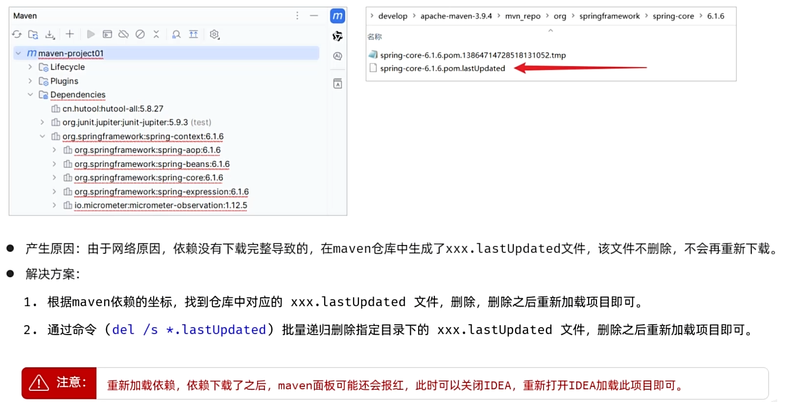

# Maven相关概念

- **Maven** 是一个强大的 **项目管理和构建自动化工具**，主要服务于基于 Java 的项目开发。它由 Apache 软件基金会提供

- Maven 通过**自动化依赖管理**、**一键式项目构建**和**标准化的项目结构**，极大地提高了 Java 项目的开发效率和规范性
  - **依赖管理**：这是 **Maven 最核心、最受欢迎的功能**
    - **过去的方式**：
    
      - 需要手动去网上下载项目所需的各种 JAR 包(比如 Spring、MyBatis、Jackson 等)，然后手动添加到项目中
    
        如果这些 JAR 包还依赖其他 JAR 包，您还得一个个找，非常痛苦，这就是所谓的“**依赖地狱**”
    
    - **Maven 的方式**：
    
      - 您只需要在 `pom.xml` 文件里声明您需要哪个库（比如 `spring-boot-starter-web`），
    
        Maven 就会**自动分析、下载您需要的所有 JAR 包**以及它们所依赖的包，并管理好它们的版本
    
  - **项目构建**：
    - Maven 定义了一套标准的**生命周期**
      - 包括**清理 (clean)、编译 (compile)、测试 (test)、打包 (package)、安装 (install)** 等步骤
    - 您只需要执行一个简单的命令，比如 `mvn package`，Maven 就会自动完成从编译源代码、运行单元测试到最终打成一个可执行的 JAR 或 WAR 包的全部流程。这保证了每次构建过程都是一致和可靠的
    
  - **项目标准化**：
    - Maven 提倡**“约定优于配置”**。它为所有项目提供了一套**标准的目录结构**
      - 例如，**源代码放在 `src/main/java`**，资源文件放在 **`src/main/resources`**，测试代码放在 **`src/test/java`** 
    - 这使得任何开发者都能快速上手一个陌生的 Maven 项目，因为项目的结构都是一样的，降低了学习和维护成本
      - 不管用IDEA还是Eclipse或者别的软件，用Maven开发的结构都一样


# 仓库

- **仓库**是用来存储和分发 Maven 构建产物（Artifacts，主要是 JAR 包）的地方
  - Maven 的仓库分为三类：
  
    1. **本地仓库 (Local Repository)**：
       - 位于你自己的计算机上。**默认路径**是 `~/.m2/repository`
       - 当你第一次构建一个需要某依赖的项目时，Maven 会从远程仓库下载该依赖并存入本地仓库
       - 之后再有项目需要同一个依赖，Maven 会直接从本地仓库获取，加快构建速度
       - 你通过 `mvn install` 命令构建的项目也会被安装到本地仓库
    2. **中央仓库 (Central Repository)**：
       - 由 Maven 官方维护的全球性仓库，包含了绝大多数流行的开源库
       - 这是 Maven 默认的远程仓库，开箱即用
  
    3. **远程仓库 (Remote Repository)**：
       - 除了中央仓库，还可以是其他公共或私有仓库
       - 例如，公司内部可能会搭建一个私有仓库（如 Nexus, Artifactory），用于存放公司内部的共享库或缓存公共库
       - 你可以在 `pom.xml` 或 `settings.xml` 中配置额外的远程仓库


  - **查找依赖的顺序**：本地仓库 -> 远程仓库 -> 中央仓库


# BOM

> Bill of Materials

- **BOM**在 Maven 里指一类**只管“版本对齐”的 POM**
- 作用：给一组相关依赖**统一规定版本**，避免你在每个依赖上都手写 `<version>`

- **引入BOM的方式**：通过 **写入`<dependencyManagement>`** 中的 **`<dependencies>`** 中来引入


# POM文件

## 基本概念

- **POM (Project Object Model)** 是 Maven 项目的核心
  - 它是一个名为 `pom.xml` 的文件，位于项目的根目录
  - Maven 通过读取这个文件来获取项目的所有配置信息，并根据这些信息执行构建任务


## Super POM

- 每一个 `pom.xml` 文件都隐式地继承自一个 **"Super POM"**

- 这个 Super POM 包含了所有 Maven 项目的默认配置，比如默认的源码目录、默认的中央仓库地址等

  这就是为什么一个最简单的 `pom.xml` 只需要很少的几行配置就能工作的原因


## POM文件结构与标签

- 这个结构肯定不可能全部展示出来，大概展示还是有的

### 顶部区域

#### 项目坐标

- **项目坐标(GAV)**是 Maven 的核心概念，由以下三个元素组成，它们共同构成了项目在仓库中的唯一地址，用于精确定位一个构件
  - **`<groupId>`**: **组织 ID**
    - 通常是**公司或组织的反向域名**，例如 `org.springframework`、`com.google.guava`。它定义了项目所属的逻辑分组
  - **`<artifactId>`**: **构件 ID**
    - 通常是**项目的名称**，例如 `spring-core`、`guava`。它在 `groupId` 内部必须是唯一的
  - **`<version>`**: **版本号**
    - 例如 `1.0.0`、`2.5-SNAPSHOT`
      - `SNAPSHOT` 后缀表示这是一个“快照”版本，即开发中的不稳定版本。Maven 在构建时会频繁检查远程仓库中是否有更新的快照
      - 没有后缀的通常是稳定的“发布”版本
        - `RELEASE`稳定的发布版本，此后缀可以省略


#### 顶部其它

- 除了 GAV 坐标外，还有两个位于 `pom.xml` 顶层的标签，它们虽然不属于坐标的一部分，但同样是项目的基本定义
  - **`<modelVersion>`**: 指定了当前 POM 模型的版本。对于 Maven 2 和 3，这个值**永远是 `4.0.0`**。它声明了此 `pom.xml` 文件所遵循的语法规范
  - **`<packaging>`**: **打包方式**。它定义了项目的构建产物类型，默认为 `jar`。常见的值还包括：
    - `war`: 用于 Web 应用
    - `pom`: 用于 **父项目** 或 BOM，**它本身不包含代码，只用于管理依赖和配置**
    - `ear`: 用于企业级应用
    - 详细知识点见后面打包方式的章节


### 项目描述信息

- 这部分标签提供了关于项目的描述性信息，主要用于文档生成和信息展示。  
  -  **`<name>`**: 项目的显示名称，通常比 `artifactId` 更具可读性。例如，在生成项目站点时会用到。  
  -  **`<description>`**: 一段关于项目的详细描述。 
  -  **`<url>`**: 项目的官方网站地址。

  -  ......


### 项目继承 `<parent>`

- 这是实现 Maven **配置复用和集中管理**的关键机制。  
- **作用**: 它主要做的是**继承配置**，包括：
  1. **`dependencyManagement`**: 继承父项目里定义好的所有依赖的版本号。子模块在 `<dependencies>` 里就不用再写版本了。
  2. **`pluginManagement`**: 继承插件的版本和配置。
  3. **`properties`**: 继承自定义的属性，比如 `<spring.version>5.3.22</spring.version>`。
  4. **`repositories`**: 继承仓库地址。
  5. **`dependencies`**: 父模块中的某些依赖也可以被子模块直接继承
- **例子**: Spring Boot 项目通常会继承 `spring-boot-starter-parent`。这个父 POM 提供了大量经过测试和版本兼容的默认配置（如 Java 版本、插件版本）和依赖管理，极大地简化了项目配置


### `<relativePath>`

#### 基本概念

- `<relativePath>` 标签是 Maven 中一个虽然不常用但非常重要的配置项。它专门用在子模块的 `pom.xml` 文件中，位于 `<parent>` 标签内部，用于帮助 Maven 更快、更准确地定位父项目的 `pom.xml` 文件


#### 位置和语法

- `<relativePath>` 标签必须写在 `<parent>` 标签里面，像这样：

  ```xml
  <!-- 在子模块的 pom.xml 中 -->
  <project>
      ...
      <parent>
          <groupId>com.example</groupId>
          <artifactId>my-parent-project</artifactId>
          <version>1.0.0</version>
          
          <!-- ↓↓↓ 就是这个标签 ↓↓↓ -->
          <relativePath>../path/to/parent/pom.xml</relativePath>
      </parent>
      ...
  </project>
  ```

  

#### 核心作用：指定父 POM 的相对路径

- 当 Maven 构建一个子模块时，它首先需要读取其父模块的 `pom.xml` 文件来获取继承的配置。

- Maven 查找父 POM 的顺序如下：

  1. **第一步：检查相对路径**

     - Maven 会首先检查子模块的 `pom.xml` 中是否存在 `<relativePath>` 标签

       - 如果**pom.xml中直接不存在这个标签，连写都没写**

         Maven 会使用一个**默认标签值**：**`../pom.xml`**，之后去查找

         **如果没找到，进行第二步**

         **如果找到了，就直接使用这个文件，直接跳过第二步和第三步**

         

       - 如果**存在但是为空**，即为**`<relativePath></relaticePath>`**或者**`<relaticePath/>`**

         **直接跳到第二步**

         

       - 如果**存在且不为空**

         Maven 会根据这个**路径**去查找父 POM

         **如果没找到，进行第二步**

         **如果找到了，就直接使用这个文件，直接跳过第二步和第三步**

         

  2. **第二步：检查本地仓库**

     - Maven 去**本地 Maven 仓库**中查找父 POM
     - 如果没找到，进行第三步

     

  3. **第三步：检查远程仓库**

     - Maven 尝试从配置的**远程仓库**（如 Maven 中央仓库或公司的私服）下载父 POM


#### `<relativePath>` 的不同用法

##### 1. 默认行为（不写 `<relativePath>`）

- 如果你不写这个标签，Maven 会使用一个**默认值**：`../pom.xml`

- 这意味着 Maven 默认认为你的父项目 `pom.xml` 文件就在当前子模块目录的**上一级目录**中
  这正好符合 Maven 标准的多模块项目布局：

  ```xml
  my-parent-project/
  ├── pom.xml                 <-- 父 POM
  └── my-child-module/
      └── pom.xml             <-- 子 POM，它会默认在 ../pom.xml 找到父 POM
  ```

- **结论：对于标准项目结构，你完全不需要写 `<relativePath>` 标签**


##### 2. 自定义路径（非标准项目结构）

- 假设你的项目结构比较特殊，像下面这样：

  ```xml
  project-root/
  ├── parent/
  │   └── pom.xml             <-- 父 POM
  └── modules/
      └── my-child-module/
          └── pom.xml         <-- 子 POM
  ```

  

- 在这种情况下，子模块的默认 `../pom.xml` 路径是找不到父 POM 的。这时你就必须在子模块的 POM 中明确指定 `<relativePath>`：

  ```xml
  <!-- 在 my-child-module/pom.xml 中 -->
  <parent>
      ...
      <relativePath>../../parent/pom.xml</relativePath>
  </parent>
  ```

  

##### 3. 禁用相对路径查找（设置为空）

- 这是一个非常重要的用法。如果你将 `<relativePath>` 标签设置为空，你就在告诉 Maven：“**不要在本地文件系统按路径查找父 POM，请直接去仓库（本地或远程）里找。**”

  ```xml
  <parent>
      ...
      <relativePath/> <!-- 设置为空 -->
  </parent>
  ```

- **为什么要这样做？**

  - **确保构建的独立性和可复现性**：
    - 这种方式强制要求父项目必须已经被 `mvn install` 到本地仓库了。
      这可以避免子模块意外地构建了一个尚未发布或不稳定的父项目版本，确保了所有开发者和 CI/CD 服务器使用的都是同一个、已经验证过的父 POM 版本

  - **使用外部父项目**：
    - 当你的项目继承一个外部的、非源码在一起的父项目时（例如，继承 `spring-boot-starter-parent`），就应该使用这种方式
      虽然对于 `spring-boot-starter-parent` 这种知名的父项目，Maven 默认就能在仓库中找到，但设置一个空的 `<relativePath/>` 是一种更严谨的做法


### 子项目`<modules>` 与 `<module>`

- 在 Maven 的世界里，`<modules>` 标签是实现 **多模块项目聚合** 的核心

  如果你想通过一条命令就构建整个项目（包含多个子项目），那么你必须理解并使用这个标签

- 这个标签通常与 `<packaging>pom</packaging>` 和 `<parent>` 标签结合使用，共同构成了 Maven 多模块项目的基石


#### 核心作用：聚合

- `<modules>` 标签的唯一作用就是**告诉 Maven 这个项目包含了哪些子模块**

- 当你在一个 `pom.xml` 文件（我们称之为“聚合 POM”或“父 POM”）中执行 Maven 命令时，Maven 会：

  1. 检查是否存在 `<modules>` 标签。
  2. 如果存在，Maven 会读取其中列出的所有 `<module>`。
  3. 然后，Maven 会按照**正确的顺序**（基于模块间的依赖关系自动计算），依次进入每个子模块的目录并执行相同的命令。

  这个过程被称为 **Reactor（反应堆）**。它确保了整个多模块项目能够被作为一个整体来构建、测试和打包


#### 聚合的好处

1. **一键构建所有模块** 
   - 这是最直接、最强大的好处。你只需要在**父项目的根目录**下执行一条命令，比如 `mvn clean install`，Maven 的 **Reactor（反应堆）** 就会自动构建 `<modules>` 标签中列出的所有子模块。你再也不需要手动进入每个子模块的目录去单独执行命令了。
2. **自动处理正确的构建顺序**
   - Maven 的 Reactor 非常智能，它会分析各个子模块之间的依赖关系。如果 `module-B` 依赖于 `module-A`，那么 Reactor 会保证 **总是先构建 `module-A`**，然后再构建 `module-B`。这彻底解决了手动构建时需要时刻关心模块顺序的难题，避免了因顺序错误导致的编译失败。
3. **保证项目整体的一致性** 
   - 通过一次命令构建所有模块，你可以确保整个项目的所有部分都是基于同一份源代码编译出来的，版本是协调一致的。这对于发布和部署至关重要，避免了“一部分是旧代码，一部分是新代码”而导致的各种诡异问题。
4. **简化项目管理和新成员上手** 
   - 对于一个大型项目，聚合功能极大地简化了管理。新团队成员只需要克隆整个项目，执行一条命令，就能将整个环境构建起来，而无需去理解几十个模块之间复杂的依赖关系和构建顺序。
5. **方便执行统一的生命周期任务** 
   - 除了构建，你还可以方便地对所有模块执行其他 Maven 命令。例如：
     - `mvn clean`：清理所有子模块的 `target` 目录。
     - `mvn test`：运行所有子模块的单元测试。
     - `mvn deploy`：将所有子模块的构件部署到远程仓库。

- 总而言之，聚合的核心价值在于**自动化、顺序保证**和**集中控制**，它将一个复杂的多模块项目变成了一个可以轻松管理的整体。


#### 语法和用法

- `<modules>` 标签只在父工程的 `pom.xml` 中使用，并且该 `pom.xml` 的打包方式必须是 `pom`

  ```xml
  <project>
    ...
    <groupId>com.example</groupId>
    <artifactId>my-parent-project</artifactId>
    <version>1.0.0</version>
    <packaging>pom</packaging> <!-- 关键点1: 打包方式必须是 pom -->
  
    <!-- 关键点2: 使用 <modules> 标签来聚合子模块 -->
    <modules>
      <module>my-api-module</module>
      <module>my-service-module</module>
      <module>my-webapp-module</module>
    </modules>
    ...
  </project>
  ```


- **关键点解释**：

  - **`<modules>`**: 这是容器标签，里面可以包含一个或多个 `<module>` 标签。

  - **`<module>`**: 每一个 `<module>` 标签都指向一个子模块。

  - **标签内容**: `<module>` 标签里的内容是**子模块目录相对于当前 `pom.xml` 文件的路径**。

    在上面的例子中，Maven 会期望在与父 `pom.xml` 同级的目录下找到 `my-api-module`、`my-service-module` 和 `my-webapp-module` 这三个文件夹，并且每个文件夹下都有它们自己的 `pom.xml`


#### 示例：一个典型的项目结构

- 假设我们有以下的项目目录结构：

```
my-parent-project/
├── pom.xml                 <-- 父项目的 POM，包含 <modules>
├── my-api-module/
│   └── pom.xml             <-- API 模块的 POM
└── my-service-module/
    └── pom.xml             <-- Service 模块的 POM (它可能依赖 API 模块)
```


##### 1. 父项目的 `pom.xml`

```xml
<!-- my-parent-project/pom.xml -->
<project>
    <modelVersion>4.0.0</modelVersion>
    <groupId>com.example</groupId>
    <artifactId>my-parent-project</artifactId>
    <version>1.0.0</version>
    <packaging>pom</packaging>

    <name>My Parent Project</name>

    <modules>
        <module>my-api-module</module>
        <module>my-service-module</module>
    </modules>
</project>
```


##### 2. 子模块的 `pom.xml`

- 子模块通常会使用 `<parent>` 标签来继承父项目的配置

```xml
<!-- my-parent-project/my-service-module/pom.xml -->
<project>
    <modelVersion>4.0.0</modelVersion>
    
    <!-- 继承父项目的配置 -->
    <parent>
        <groupId>com.example</groupId>
        <artifactId>my-parent-project</artifactId>
        <version>1.0.0</version>
    </parent>
    
    <artifactId>my-service-module</artifactId>
    <packaging>jar</packaging>
    
    <dependencies>
        <!-- 依赖同一个项目中的另一个模块 -->
        <dependency>
            <groupId>com.example</groupId>
            <artifactId>my-api-module</artifactId>
            <version>${project.version}</version> <!-- 使用父项目的版本 -->
        </dependency>
    </dependencies>
</project>
```

- 现在，你只需要在最顶层的 `my-parent-project` 目录下运行一条命令：

```cmd
mvn clean install
```

- Maven 的 Reactor 就会：
  1. 分析出 `my-service-module` 依赖于 `my-api-module`
  2. **首先**，构建 `my-api-module`
  3. **然后**，构建 `my-service-module`
  4. 最后，构建父项目本身


### 属性定义 `<properties>`

- `<properties>` 标签是 Maven `pom.xml` 中一个非常有用的元素，它允许你定义一些可重用的值（属性），然后在整个 POM 文件中通过 `${}` 的语法来引用它们。这大大增强了 POM 文件的可维护性和灵活性。

#### 它的位置和基本语法

- `<properties>` 标签通常直接位于 `<project>` 标签之下。

  ```xml
  <project>
    <modelVersion>4.0.0</modelVersion>
    <groupId>com.example</groupId>
    <artifactId>my-app</artifactId>
    <version>1.0.0</version>
  
    <!-- ↓↓↓ 就是这个标签 ↓↓↓ -->
    <properties>
      <!-- 在这里定义你的属性 -->
      <my.custom.property>some-value</my.custom.property>
      <spring.version>5.3.22</spring.version>
      <project.build.sourceEncoding>UTF-8</project.build.sourceEncoding>
    </properties>
  
    ...
  </project>
  ```

  

#### `<properties>` 的主要用途

##### 1. 统一管理依赖版本

- 这是 `<properties>` 标签最常见、也是最重要的用途。通过将所有依赖的版本号集中定义在 `<properties>` 中，你可以轻松地管理和升级它们

- **示例：**

  ```xml
  <properties>
    <spring.version>5.3.22</spring.version>
    <junit.version>5.8.2</junit.version>
  </properties>
  
  <dependencies>
    <dependency>
      <groupId>org.springframework</groupId>
      <artifactId>spring-context</artifactId>
      <!-- 使用 ${} 语法引用属性 -->
      <version>${spring.version}</version>
    </dependency>
    <dependency>
      <groupId>org.junit.jupiter</groupId>
      <artifactId>junit-jupiter-api</artifactId>
      <version>${junit.version}</version>
      <scope>test</scope>
    </dependency>
  </dependencies>
  ```

- **好处**：当需要升级 Spring 版本时，你只需要修改 `<properties>` 中 `spring.version` 的值一处即可，所有引用该属性的依赖都会自动更新，避免了遗漏和不一致


##### 2. 定义插件配置

- 你可以使用属性来配置插件的行为

  ```xml
  <properties>
      <maven.compiler.source>11</maven.compiler.source>
      <maven.compiler.target>11</maven.compiler.target>
  </properties>
  
  <build>
      <plugins>
          <plugin>
              <groupId>org.apache.maven.plugins</groupId>
              <artifactId>maven-compiler-plugin</artifactId>
              <version>3.8.1</version>
              <configuration>
                  <!-- 引用属性来配置插件 -->
                  <source>${maven.compiler.source}</source>
                  <target>${maven.compiler.target}</target>
              </configuration>
          </plugin>
      </plugins>
  </build>
  ```


##### 3. 定义自定义值

- 你可以定义任何你需要的自定义属性，用于各种目的，比如配置文件中的占位符替换


#### Maven 内置属性

- 除了用户自定义的属性，Maven 还提供了一系列可以直接使用的内置属性。


##### a. 项目属性 (Project Properties)

- 这些属性都以 `project.` 或 `pom.` 为前缀，可以直接引用当前项目 POM 文件中的值。

  - `${project.groupId}` 或 `${pom.groupId}`: 当前项目的 groupId。

    - `${project.artifactId}`: 当前项目的 artifactId。

    - `${project.version}`: 当前项目的 version。

    - `${project.name}`: 当前项目的名称。

    - `${project.basedir}`: 当前项目所在的目录（绝对路径）。

    - `${project.build.directory}`: 构建输出目录，默认为 `target`。

    - `${project.build.finalName}`: 构建产生的最终文件名，默认为 `${project.artifactId}-${project.version}`。

    - `${project.build.sourceDirectory}`: 项目主源码目录，默认为 `src/main/java`。

    - `${project.build.testSourceDirectory}`: 项目测试源码目录，默认为 `src/test/java`。

    - `${project.build.outputDirectory}`: 主代码编译输出目录，默认为 `target/classes`。

    - `${project.build.testOutputDirectory}`: 测试代码编译输出目录，默认为 `target/test-classes`。


##### b. 设置属性 (Settings Properties)

- 这些属性以 `settings.` 为前缀，引用自 Maven 的 `settings.xml` 文件。

  - `${settings.localRepository}`: 本地仓库的路径。

  - `${settings.offline}`: Maven 是否处于离线模式。


##### c. 环境变量属性 (Environment Properties)

- 这些属性以 `env.` 为前缀，可以引用操作系统的环境变量。

  - `${env.JAVA_HOME}`: 获取 `JAVA_HOME` 环境变量的值。

  - `${env.PATH}`: 获取 `PATH` 环境变量的值。
  - `${env.MAVEN_HOME}`: 获取 `MAVEN_HOME` 环境变量的值。


##### d. Java 系统属性 (Java System Properties)

- 所有 Java 的系统属性都可以直接在 Maven 中引用。
  - `${java.version}`: Java 版本。
  - `${java.home}`: Java 安装目录。
  - `${os.name}`: 操作系统名称。
  - `${os.arch}`: 操作系统架构（如 amd64）。
  - `${os.version}`: 操作系统版本。
  - `${file.separator}`: 当前系统的文件分隔符（如 `\` 或 `/`）。
  - `${user.name}`: 当前登录用户的用户名。
  - `${user.home}`: 当前用户的 home 目录。


##### e. 构建时间戳属性

- `${maven.build.timestamp}`: 构建开始时的时间戳（UTC时间）。默认格式是 `yyyy-MM-dd'T'HH:mm:ss'Z'`。

- **如何自定义格式？** 你可以在 `<properties>` 中定义 `maven.build.timestamp.format` 来指定你想要的格式。

  ```xml
  <properties>
    <maven.build.timestamp.format>yyyy-MM-dd HH:mm:ss</maven.build.timestamp.format>
  </properties>
  ```


##### f. 约定俗成的构建属性 (Conventional Build Properties)

- 这些属性虽然不是 Maven 核心内置的，但被许多核心和常用的插件所识别，用来快速控制构建行为，已经成为一种事实上的标准

  - `project.build.sourceEncoding`: 指定项目源代码的编码格式 (例如: UTF-8)，`maven-compiler-plugin` 和 `maven-resources-plugin` 会使用此属性

  - `maven.compiler.source`: 设置 Java 编译器的 `-source` 选项，指定源代码兼容的 Java 版本 (例如: 1.8, 11)

  - `maven.compiler.target`: 设置 Java 编译器的 `-target` 选项，指定生成的字节码兼容的 Java 版本

  - `maven.compiler.release`: (JDK 9+) 一个更现代的选项，可以同时替代 `source` 和 `target`，确保代码不会使用目标 Java 版本中不存在的 API

  - `maven.test.skip`: 如果设置为 `true`，将完全跳过测试代码的编译和执行

  - `maven.install.skip`: 如果设置为 `true`，将跳过 `install` 生命周期阶段

  - `maven.deploy.skip`: 如果设置为 `true`，将跳过 `deploy` 生命周期阶段

  - `maven.javadoc.skip`: 如果设置为 `true`，将跳过 `javadoc` 插件的执行


### 依赖声明

#### `<dependencies>`

- 这是一个复数标签，它作为所有单个依赖声明 `<dependency>` 的根容器。一个 `pom.xml` 文件中只能有一个 `<dependencies>` 标签


#### `<dependence>`

- `dependency` 意为**“依赖”**，每一个 `<dependency>` 标签都定义了一个具体的第三方库。
- 它通过一组坐标来精确定位 Maven 中央仓库或私有仓库中的某一个构件
- 有很多子标签，如下：


##### 依赖坐标(GAV)

- **`<groupId>` **
- **`<artifactId>` **
- **`<version>` **


##### 依赖范围`<scope>`

- `<scope>` 决定了依赖在 Maven 构建**生命周期中哪些阶段的类路径下可用**。它还影响依赖的传递性

  - 只有 `scope` 为 `compile` 或者 `runtime` 的依赖，才是传递性依赖

- 有以下这些值

  - **`compile` (编译范围)**

    - **描述**: 这是**默认值**。依赖在所有阶段（编译、测试、运行）都可用，并且会被打包到最终的构件中（如 WAR 或可执行 JAR）。此范围的依赖会**传递**给依赖于本项目的其他项目

    - **例子**: `spring-context`, `log4j2-core`

      

  - **`provided` (已提供范围)**

    - **描述**: “已提供”意味着该依赖在**编译和测试时需要**，但在**运行时由外部环境提供**。因此，它不会被打包。它也不会被传递

    - **例子**:

      1. `javax.servlet-api`: 在开发 Web 应用时，编译需要它，但部署到 Tomcat 等 Servlet 容器后，容器自身会提供这个 JAR

      2. `org.projectlombok:lombok`: Lombok 只在编译期通过注解处理器生成代码，运行时完全不需要它

         

  - **`runtime` (运行时范围)**

    - **描述**: 依赖在**编译时不需要**，但在**测试和运行时需要**。它会被打包，并且会传递
    - **例子**: JDBC 驱动程序。你的代码在编译时只依赖标准的 `java.sql.*` 接口，只有在运行时才需要具体的数据库驱动实现（如 `mysql-connector-java`）

    

  - **`test` (测试范围)**

    - **描述**: 依赖**只在测试编译和测试运行阶段可用**，不会被打包，也不会被传递。这是隔离测试代码与主代码依赖的最佳方式。
    - **例子**: `junit`, `mockito`, `spring-boot-starter-test`

    

  - **`system` (系统范围)**

    - **描述**: **已废弃，强烈不推荐使用**。与 `provided` 类似，但需要你通过 `<systemPath>` 标签显式提供 JAR 在本地文件系统中的路径。这破坏了 Maven 的可移植性和自动化依赖管理。
    - **例子**: 依赖一个本地机器上、未发布到任何仓库的私有 JAR


##### 可选依赖`<optional>`

- 核心作用就是**规定自己的哪些依赖不会被传递下去**，如果依赖它的项目需要使用这个依赖，就需要**自己去引入这个依赖**

- 工作机制

  - 假设项目的依赖关系如下：

    ```tex
    Your-Project` -> `Library-A` -> `Library-B
    ```

    - 场景一：正常情况（没有 `<optional>`）
      1. `Library-A` 在它的 `pom.xml` 中正常依赖了 `Library-B`。
      2. 当 `Your-Project` 在自己的 `pom.xml` 中引入 `Library-A` 时，Maven 的传递性依赖机制会**自动地**将 `Library-A` 和 `Library-B` 都下载到你的项目中。

    - 场景二：使用 `<optional>true`
      1. `Library-A` 在它的 `pom.xml` 中，将对 `Library-B` 的依赖标记为 `<optional>true</optional>`。
      2. 现在，当 `Your-Project` 引入 `Library-A` 时，Maven 只会自动下载 `Library-A`，它会**忽略掉**那个被标记为可选的 `Library-B`。
      3. 如果 `Your-Project` 确实需要 `Library-B` 提供的功能，那么就必须在**自己的 `pom.xml` 文件里，显式地、手动地添加对 `Library-B` 的依赖**

- 与 `<scope>provided</scope>` 的区别

  - **`<optional>true</optional>`** 的意思是：“这个依赖**可能需要，也可能不需要**，由使用者自己决定是否添加。”

  - **`<scope>provided</scope>`** 的意思是：“这个依赖**一定需要**，但别打包，因为最终的运行环境（如 Tomcat）会提供它。”


##### 排除依赖

- `<exclusions>`

  - 这是一个容器标签，作用就是包裹一个或多个具体的排除规则`<excludion>`
  - 和`<exclusion>`搭配，唯一目的就是**解决传递性依赖带来的版本冲突问题**
    - 传递性依赖：当你的项目 A 依赖于库 B，而库 B 又依赖于库 C 时，那么 C 就是项目 A 的一个“传递性依赖”

  

- `<exclusion>`

  - **定义要排除哪个依赖**的标签。每一个 `<exclusion>` 标签都代表一个你不想引入的传递性依赖。
    - 它必须包含 `<groupId>` 和 `<artifactId>` 来精确定位要排除的库
      - **这里不需要版本号**,因为它会排除该依赖带来的任何版本的这个库
  - `<exclusions>` 标签的作用域是严格限定在它所在的那个 `<dependency>` 标签内部的
  - 这里排除，在另一个`<dependency>`里面，也能引入完全相同的依赖，不影响
  - 如果一个依赖是“终点依赖”，那么对它使用 `<exclusion>` 标签是没有任何意义和效果的


- 示例

  ```xml
  <dependencies>
      <!-- 引入 Library-A，并排除它带来的 common-lib -->
      <dependency>
          <groupId>com.example</groupId>
          <artifactId>Library-A</artifactId>
          <version>1.0</version>
          <exclusions>
              <exclusion>
                  <!-- 
                      在这里指定要排除的库的坐标。
                      注意：只需要 groupId 和 artifactId，不需要 version！
                      因为我们的目的是排除掉 Library-A 带来的任何版本的 common-lib。
                  -->
                  <groupId>com.example</groupId>
                  <artifactId>common-lib</artifactId>
              </exclusion>
          </exclusions>
      </dependency>
  
      <!-- 正常引入 Library-B -->
      <dependency>
          <groupId>com.example</groupId>
          <artifactId>Library-B</artifactId>
          <version>1.0</version>
      </dependency>
  </dependencies>
  ```

  


##### 其他

- **`<type>` (依赖类型)**

  - **作用**: 

    - 指定依赖的类型，默认为 `jar`

      其他常见的值包括 `pom` (用于导入 BOM)、`war`、`ejb`、`test-jar` (引入另一个项目的测试代码) 等

  - **例子**: 

    - `<type>pom</type>` 与 `<scope>import</scope>` 结合使用


- **`<classifier>` (分类符)**

  - **作用**: 

    - 进一步区分从同一个 POM 构建出的不同构件

      一个项目可以生成多个构件，例如主 JAR、包含源码的 `sources.jar` 和包含 Javadoc 的 `javadoc.jar``

      ``classifier` 就是用来指定你要的是哪一个

  - **例子**: 

    - 如果你想在项目中引入某个库的源码，可以这样声明：

      ```xml
      <dependency>
        <groupId>org.springframework</groupId>
        <artifactId>spring-core</artifactId>
        <version>5.3.18</version>
        <classifier>sources</classifier>
      </dependency>
      ```

      

    

### 依赖管理`<dependencyManagement>`

- 用于**统一管理和约束**整个项目中（尤其是多模块项目中）的依赖版本和范围


#### 此标签下的依赖标签

##### 基本特性

- `<dependencyManagement>`内部也**只有一个`<dependences>`子标签**，但是它和另一个`<dependences>`有很大区别
  - **声明而非引入**: 
    - 在 `<dependencyManagement>` 中定义的 `<dependencies>`中的`<dependency>`，**并不会被实际引入**到项目中
      它仅仅是声明：“如果任何模块需要用到这个依赖，那么**应该使用这个版本和这个 scope**”
  - **集中管理**: 
    - 它提供了一个中心化的位置，来定义所有依赖项的版本号、范围、排除项等信息

##### 版本号

- 如果子模块在 `<dependencies>` 里**写了依赖的版本号**，那它的版本就是自己定义的版本
- 如果子模块在`<dependencies>`中**没有写依赖的版本号**，
  而`<dependencyManagement>`中写了，那就用`<dependencyManagement>`里面的
- 如果都没写，就报错


##### 子标签

- `<dependencies>`中的`<dependency>`中的子标签这里也都有
  - 特殊的是这里的`<scope>`标签多了一个 `import` 属性
    - **`import` (导入范围)**
      
      - **描述**: 
      
        - 这是一个特殊的范围，**只能在 `<dependencyManagement>` 部分中使用**
      
          它**允许你从另一个 POM 文件中导入所有的 `<dependencyManagement>` 配置**
      
          > 要是不写这个，它只会“管理了这个 POM 自己”这一个坐标的版本，对它里面的 `<dependencyManagement>` **不会生效**（等于没导入 BOM 内容）
      
          这通常用于导入所谓的 **BOM**，即**一个专门用于定义一组相关库版本清单的 POM**
      
      - **例子**: Spring Cloud 和 Spring Cloud Alibaba


- `<exclusion>`排除依赖

  - 写到这里，作用则是为某个依赖**制定一个全局的、可继承的排除规则**，写到`<dependencies>`里面,则是只有那个项目生效，但是写到这个里面，则是它和所有子项目都生效，当然依赖它的项目不会生效，因为依赖的时候，`<dependencyManagement>`不会被传递，当然如果是子项目，他们也可以自己再引入这个依赖，不影响的
  - 里面的一些特性啥的，还是要参照`<dependency>`中的

  

- `<optional>`可选依赖

  - 在这里面没啥用，挺多余的


### 构建配置 `<build>`

#### 相关概念

- `<build>` 标签是 `pom.xml` 的核心组成部分之一，它包含了所有与项目构建过程相关的配置。

  - Maven 的构建生命周期（如编译、测试、打包、部署）的所有行为都由这个标签下的配置来定义和控制。

  - 一个典型的 `<build>` 结构如下

    ```xml
    <build>
        <!-- 构建产物的最终名称，默认为 ${project.artifactId}-${project.version} -->
        <finalName>my-app</finalName>
    
        <!-- 构建结果输出目录，默认为 target/ -->
        <directory>${project.basedir}/target</directory>
    
        <!-- 默认执行的 Maven goal，例如，直接运行 mvn 会执行 mvn package -->
        <defaultGoal>package</defaultGoal>
    
        <!-- 源码目录 -->
        <sourceDirectory>src/main/java</sourceDirectory>
        <!-- 测试源码目录 -->
        <testSourceDirectory>src/test/java</testSourceDirectory>
    
        <!-- 主资源文件配置 -->
        <resources>
            ...
        </resources>
        <!-- 测试资源文件配置 -->
        <testResources>
            ...
        </testResources>
    
        <!-- 插件管理 -->
        <pluginManagement>
            <plugins>
                ...
            </plugins>
        </pluginManagement>
    
        <!-- 项目实际使用的插件 -->
        <plugins>
            ...
        </plugins>
    </build>
    ```

- 子标签如下


#### `<finalName>`最终名称

- 定义构建产物（如 `.jar`, `.war` 文件）的最终名称，不包含文件扩展名

  - **默认值**: `${project.artifactId}-${project.version}`

  - **作用**: 自定义一个更简洁或固定的文件名，便于在自动化脚本中引用。例如，设置 `<finalName>my-app</finalName>` 后，生成的包会是 `my-app.jar`


#### `<directory>`输出目录

- 指定所有构建产物的输出目录

  - **默认值**: `${project.basedir}/target`

  - **作用**: 改变默认的 `target` 目录。一般情况下不建议修改，以保持项目结构的标准化


#### `<defaultGoal>`默认

- 定义当在命令行只输入 `mvn` 时，默认执行的生命周期阶段或插件目标
  - **示例**: 如果设置为 `<defaultGoal>install</defaultGoal>`，那么运行 `mvn` 命令的效果等同于 `mvn install`


#### 源码目录

- **`<sourceDirectory>` 和`<testSourceDirectory>`**分别定义项目的主源码和测试源码的存放目录

  - **`<sourceDirectory>` 默认值**: `src/main/java`

  - **`<testSourceDirectory>` 默认值**: `src/test/java`

- **作用**: 这两个标签定义了 Maven 项目的标准目录结构，通常无需修改。


#### 资源文件位置

- **`<resources>` 和`<testResources>`**定义主代码和测试代码所使用的资源文件（非 Java 文件，如 `.properties`, `.xml` 等）的位置和处理方式。这是实现**环境隔离配置**的核心机制。

- **`<resources>` 默认目录**: `src/main/resources`

- **`<testResources>` 默认目录**: `src/test/resources`


##### `<resource>`处理规则

- 在 `<resources>` 或 `<testResources>` 标签内，可以包含一个或多个 `<resource>` 元素，每个元素定义了一组资源文件的处理规则


##### `<directory>`文件目录

- 指定该组资源文件所在的目录


##### `<filtering>`是否启用占位符

- 一个非常重要的配置，用于控制是否启用**占位符替换**

  - **值**: `true` 或 `false`。

  - **作用**: 当设置为 `true` 时，Maven 会在处理资源文件时，扫描其中形如 `${...}` 的占位符，并将其替换为 `pom.xml` 中定义的值。这在管理不同环境（如开发、测试、生产）的配置时极其有用。例如，你可以根据激活的 Profile 来动态改变数据库连接、服务器地址等配置。

  - **高级用法**: 结合 Maven Profiles，可以为不同环境（dev, test, prod）提供不同的属性值，构建时通过 `-P <profile-id>` 命令激活对应配置，实现“一次编码，到处打包”


##### `<includes>` / `<excludes>`

- 用于精确控制哪些文件被包含或排除

  - **`<includes>`**: 定义需要包含的文件模式列表

  - **`<excludes>`**: 定义需要排除的文件模式列表

  

#### 插件管理`<pluginManagement>`

- 这是一个**“插件管理”**容器，与 `<dependencyManagement>` 作用类似。它不直接执行插件，而是用于在父 POM 中**统一声明和管理**所有子模块可能用到的插件的版本和默认配置。

- **核心特点**: 在这里定义的插件**不会被激活**。子模块必须在自己的 `<plugins>` 部分再次引用该插件（只需提供 `groupId` 和 `artifactId`），才会继承这里的配置并使其生效。这是一种“推荐”而非“强制”的机制。
- **主要场景**: 在大型多模块项目中，它扮演着至关重要的角色：
  1. **版本统一**: 确保所有模块使用的 `maven-compiler-plugin`, `maven-surefire-plugin` 等核心插件版本一致，避免因版本不一致导致的构建失败或行为异常
  2. **配置复用**: 将通用的配置（如 Java 编译版本、编码格式）提取到父 POM，子模块只需引用插件即可，无需重复编写大量样板配置
  3. **提升可维护性**: 当需要升级插件版本或修改通用配置时，只需在父 POM 的 `<pluginManagement>` 中修改一处即可，所有子模块自动生效


#### 插件`<plugins>`/`<plugin>`

- `<plugins>` & `<plugin>`

  - 这是 `<build>` 中最核心的部分，因为 Maven 的所有实际工作都由**插件（Plugin）**完成

  - `<plugins>` 标签是所有实际要执行的 `<plugin>` 配置的容器

##### 插件坐标

- `<groupId>`,` <artifactId>`, `<version>`
  - 这三个标签组成了插件的唯一坐标（GAV），用于从仓库中定位并下载插件。

  - 在 `<pluginManagement>` 中管理过的插件，在子模块的 `<plugins>` 中引用时可以省略 `<version>`。

- 日常使用中，引入插件引入这个坐标就行，别的标签都是一些高级标签


##### 插件的其它子标签

- 都不常用，一般定制化才用

  


### 多环境配置 `<profiles>`

- Profile 允许你为不同的环境（如开发 `dev`、测试 `test`、生产 `prod`）定义不同的构建配置

- 你可以通过命令行参数 `-P` 来激活指定的 profile，例如 `mvn package -P prod`。这会使用 `prod` profile 中定义的属性来构建项目


### 完整POM文件示例

```xml
<?xml version="1.0" encoding="UTF-8"?>
<project xmlns="http://maven.apache.org/POM/4.0.0"
         xmlns:xsi="http://www.w3.org/2001/XMLSchema-instance"
         xsi:schemaLocation="http://maven.apache.org/POM/4.0.0 https://maven.apache.org/xsd/maven-4.0.0.xsd">
    
    <!-- POM 模型版本，对于 Maven 2 和 3 来说，永远是 4.0.0 -->
    <modelVersion>4.0.0</modelVersion>

    <!--
        项目的坐标 (GAV)，在所有 Maven 项目中唯一标识此项目
    -->
    <groupId>com.example.app</groupId>
    <artifactId>my-modern-app</artifactId>
    <version>1.0.0-SNAPSHOT</version>

    <!--
        打包方式。'jar' 表示标准 Java 应用，
				'war' 表示 Web 应用	......
        对于 Spring Boot 2.x+，即使是 Web 应用也推荐使用 'jar'
    -->
    <packaging>jar</packaging>

    
    <!-- 一些项目描述信息 -->
    <name>My Modern Application</name>
    <description>A comprehensive example of a modern pom.xml for a Spring Boot application.</description>
    <url>https://example.com/projects/my-modern-app</url>

    <!--
		父POM:
        为了让 Spring Boot 的父 POM 生效，我们需要在这里声明它。
        父 POM 提供了大量的默认配置，极大地简化了我们的配置。
        它也扮演了 BOM 的角色，管理了大量依赖的版本。
    -->
    <parent>
        <groupId>org.springframework.boot</groupId>
        <artifactId>spring-boot-starter-parent</artifactId>
        <version>2.7.5</version>
        <relativePath/> <!-- 从仓库查找父 POM，而不是从本地相对路径 -->
    </parent>

    
    <!-- 属性定义                                             -->
    <!--
        集中定义项目中使用的各种属性，便于统一管理和修改。
        最佳实践：将 Java 版本、依赖版本、插件版本等都在此定义。
    -->
    <properties>
        <!-- 基础属性 -->
        <project.build.sourceEncoding>UTF-8</project.build.sourceEncoding>
        <project.reporting.outputEncoding>UTF-8</project.reporting.outputEncoding>
        <java.version>17</java.version>

        <!-- 自定义依赖版本 -->
        <lombok.version>1.18.24</lombok.version>
    </properties>

    <!-- 依赖管理     -->
    <!--
        这里只声明依赖的版本和配置，但不实际引入依赖
        主要用于统一管理项目（尤其是多模块项目）的依赖版本
        我们已经继承了 spring-boot-starter-parent，它包含了大量的 dependencyManagement
        这里我们可以添加或覆盖一些自定义的依赖管理
    -->
    <dependencyManagement>
        <dependencies>
            <!-- 示例：在这里统一管理 Lombok 的版本 -->
            <dependency>
                <groupId>org.projectlombok</groupId>
                <artifactId>lombok</artifactId>
                <version>${lombok.version}</version>
            </dependency>
        </dependencies>
    </dependencyManagement>

  
    <!-- 依赖声明 -->
    <!--
        这里是项目实际需要引入的依赖库。
    -->
    <dependencies>
        <!-- Spring Boot Web Starter: 包含了构建 Web 应用所需的一切，如 Spring MVC, Tomcat 等 -->
        <!-- 版本由继承的 spring-boot-starter-parent 管理 -->
        <dependency>
            <groupId>org.springframework.boot</groupId>
            <artifactId>spring-boot-starter-web</artifactId>
        </dependency>

        <!-- Spring Boot Test Starter: 包含了测试所需的一切，如 JUnit 5, Mockito 等 -->
        <!-- scope=test 表示此依赖只在测试时有效，不会被打包到最终的 jar 文件中 -->
        <dependency>
            <groupId>org.springframework.boot</groupId>
            <artifactId>spring-boot-starter-test</artifactId>
            <scope>test</scope>
            <!--
                示例：排除传递性依赖。
                假如我们不想用 JUnit 4，可以从测试启动器中排除它。
                (在现代 Spring Boot 中此操作非必须，仅为演示)
            -->
            <exclusions>
                <exclusion>
                    <groupId>org.junit.vintage</groupId>
                    <artifactId>junit-vintage-engine</artifactId>
                </exclusion>
            </exclusions>
        </dependency>

        <!-- Lombok: 用于简化代码，如自动生成 getter/setter -->
        <!-- scope=provided 表示编译时需要，但运行时由环境提供（在这里，它通过注解处理器工作，运行时不需要）-->
        <dependency>
            <groupId>org.projectlombok</groupId>
            <artifactId>lombok</artifactId>
            <scope>provided</scope>
        </dependency>
    </dependencies>

 
    <!-- 构建配置                                            -->
    <build>
        <!-- 定义最终生成的文件名，不含扩展名 -->
        <finalName>${project.artifactId}-${project.version}</finalName>

        <plugins>
            <!-- Spring Boot Maven 插件：用于将应用打包成一个可执行的 fat jar -->
            <plugin>
                <groupId>org.springframework.boot</groupId>
                <artifactId>spring-boot-maven-plugin</artifactId>
            </plugin>

            <!--
                Maven 编译器插件：虽然父 POM 已配置，但这里可以显式覆盖。
                我们通过 properties 中的 java.version 属性来控制它。
            -->
            <plugin>
                <groupId>org.apache.maven.plugins</groupId>
                <artifactId>maven-compiler-plugin</artifactId>
                <configuration>
                    <source>${java.version}</source>
                    <target>${java.version}</target>
                    <compilerArgs>
                        <arg>-parameters</arg>
                    </compilerArgs>
                </configuration>
            </plugin>
        </plugins>
    </build>


    <!-- 多环境配置 (Profiles)                                               -->
    <!--
        定义不同环境下的特定配置。可以通过 -P 参数激活。
        例如：mvn package -P prod
    -->
    <profiles>
        <!-- 开发环境 (默认激活) -->
        <profile>
            <id>dev</id>
            <activation>
                <activeByDefault>true</activeByDefault>
            </activation>
            <properties>
                <!-- 定义开发环境的数据库连接 -->
                <db.connection.url>jdbc:mysql://localhost:3306/dev_db</db.connection.url>
                <log.level>DEBUG</log.level>
            </properties>
        </profile>

        <!-- 生产环境 -->
        <profile>
            <id>prod</id>
            <properties>
                <!-- 定义生产环境的数据库连接 -->
                <db.connection.url>jdbc:mysql://prod-server:3306/prod_db</db.connection.url>
                <log.level>INFO</log.level>
            </properties>
            <build>
                <plugins>
                    <!-- 示例：在生产环境构建时，可以加入一些额外的插件，如代码混淆、打包源码等 -->
                    <plugin>
                        <groupId>org.apache.maven.plugins</groupId>
                        <artifactId>maven-source-plugin</artifactId>
                        <version>3.2.1</version>
                        <executions>
                            <execution>
                                <id>attach-sources</id>
                                <goals>
                                    <goal>jar-no-fork</goal>
                                </goals>
                            </execution>
                        </executions>
                    </plugin>
                </plugins>
            </build>
        </profile>
    </profiles>

</project>

```


## 一些问题的解答

### 子项目有`<parent>`但父项目没`<module>`

- 这是一个在理解 Maven 多模块项目时非常经典且重要的问题。它精准地揭示了 **继承** 和 **聚合是两个可以独立工作的不同概念。

- **核心结论：继承依然有效，但聚合将会失效。**
  - 这意味着项目在功能上是“残缺”的，失去了多模块管理的核心优势。

#### 会发生什么？

- 让我们分解来看具体会发生什么：

##### 1. 继承 —— 正常工作 ✅

- **关系**: 子模块通过 `<parent>` 标签指向父模块。
- **效果**: 这个“认亲”关系是单向且有效的。子模块可以成功地从父模块的 `pom.xml` 中继承所有它需要的配置
- **构建行为**: 如果你**单独进入这个子模块的目录**，然后执行 `mvn clean install`，构建**会成功**。因为子模块知道去哪里（父POM）查找它所继承的配置。


##### 2. 聚合 —— 完全失效 ❌

- **关系**: 父模块的 `pom.xml` 中**没有**使用 `<modules>` 标签来包含这个子模块。
- **效果**: 父模块完全“不认识”这个子模块。它不知道这个子模块是它管理的一部分。
- **构建行为**: 如果你在**父模块的根目录**下执行 `mvn clean install`，Maven 的 Reactor（反应堆）**将完全忽略那个子模块**。构建过程只会涉及父模块本身以及在 `<modules>` 中明确列出的其他模块（如果有的话）


#### 带来的实际问题

- 这种“继承但未聚合”的配置会导致以下严重问题：
  1. **失去统一构建的便利性**: 你无法在项目根目录通过一条 `mvn clean install` 命令来构建整个项目。这是多模块项目最核心的优势之一
  2. **需要手动且按序构建**: 你必须先手动 `install` 父项目，然后再去 `install` 子项目。如果项目结构复杂，依赖关系错综复杂，手动维护这个构建顺序将是一场噩梦，并且极易出错。
  3. **项目结构不完整**: 对于其他开发者或者CI/CD工具来说，这个项目是不完整的。它们会按照标准方式从根POM开始构建，从而导致子模块被遗漏，引发各种难以排查的问题。

- **总结**: 在一个健康的多模块项目中，继承（`<parent>`）和聚合（`<modules>`）几乎总是成对出现的，它们共同确保了项目的配置统一性和构建的整体性


# Maven中项目的继承与依赖传递

- 在 Maven 中，一个项目与其他项目有两种核心关系：**继承 (Inheritance)** 和 **依赖 (Dependency)**。这两种关系下，信息的传递规则是完全不同的


## 子项目会从父项目继承哪些配置？

- 当一个 Maven 子项目的 `pom.xml` 文件中使用了 `<parent>` 标签时，它就建立了一个继承关系。这允许子项目重用父项目的配置，从而实现集中管理、减少重复、确保一致性。

- 以下是子项目可以从父项目中继承的主要标签和配置项的详细列表。

### 1. 核心坐标

- 这是最基础的继承

  - **`<groupId>`**: 如果子项目中没有明确定义 `groupId`，它将默认继承父项目的 `groupId`。这是最常见的做法。

  - **`<version>`**: 同样，如果子项目中没有定义 `version`，它将继承父项目的 `version`。这对于确保多模块项目中所有模块版本统一至关重要。

- **注意**：`<artifactId>` **不会被继承**。每个模块都必须有自己唯一的 `artifactId`，它是模块在仓库中的唯一标识符。


### 2. 依赖管理 (`<dependencyManagement>`)

- 这是父 POM 最强大的功能之一

  - **作用**: 父项目在 `<dependencyManagement>` 标签中统一声明依赖的版本号和作用域（scope）。

  - **继承效果**: 子项目在自己的 `<dependencies>` 标签中引入这些依赖时，**只需要提供 `groupId` 和 `artifactId`，无需再写 `<version>` 和 `<scope>`**，Maven 会自动从父项目获取这些信息。

  - **好处**:
    - 确保所有子模块使用的依赖版本都是一致的。
    - 升级依赖时，只需在父 POM 中修改一处即可。


### 3. 插件管理 (`<pluginManagement>`)

- 与 `<dependencyManagement>` 类似，但作用于插件。

  - **作用**: 父项目在 `<build><pluginManagement>` 中统一声明构建插件的版本和配置

  - **继承效果**: 子项目在自己的 `<build><plugins>` 中使用这些插件时，只需提供 `groupId` 和 `artifactId`，无需再指定版本或重复配置

  - **好处**: 统一所有子模块的插件行为和版本，避免不一致性


### 4. 属性 (`<properties>`)

- **作用**: 在父项目的 `<properties>` 标签中定义的属性（例如 `<java.version>11</java.version>`）。
- **继承效果**: 所有子项目都可以直接访问和使用这些属性，就像在自己 POM 中定义的一样，例如通过 `${java.version}` 的形式引用。


### 5. 依赖 (`<dependencies>`)

- **作用**: 父项目中直接在 `<dependencies>` 中声明的依赖。
- **继承效果**: **所有子项目都会自动包含这些依赖**。这适用于那些项目中所有模块都必须使用的通用依赖，例如 `junit`、`lombok` 或者日志框架。


### 6. 仓库配置 (`<repositories>` 和 `<pluginRepositories>`)

- **作用**: 在父项目中配置的远程仓库地址
- **继承效果**: 子项目在下载依赖或插件时，会自动使用父项目中配置的仓库地址。这对于团队内部使用私有仓库（如 Nexus 或 Artifactory）非常有用


### 7. 项目信息和构建配置

子项目还会继承父项目中的大部分元数据和部分构建配置，包括：

- **`<description>`**: 项目描述。
- **`<url>`**: 项目网址。
- **`<organization>`**: 组织信息。
- **`<developers>`**: 开发者列表。
- **`<scm>`**: 源代码管理（如 Git）信息。
- **`<build>`**: `<build>` 标签下的大部分配置，例如 `sourceDirectory`, `outputDirectory` 等，子项目可以覆盖这些默认配置。


## 依赖它的项目会得到什么

- 当一个完全独立的外部项目（我们称之为 `Consumer-Project`）在它的 `<dependencies>` 中引入你的项目时，它关心的不是你的“家规”，而是你这个“产品”本身包含了什么

- **`Consumer-Project` 只会获得以下信息：**

  - **传递性依赖**
    - 这是最主要的部分。你的项目所依赖的、并且 `scope` 为 `compile` 或 `runtime` 的库，会被传递给 `Consumer-Project`。
    - **关键**：这个传递过程是根据你的项目发布的 `pom.xml` 中最原始的依赖关系来解析的，它**不会**考虑你在构建自己项目时使用的 `<exclusions>` 规则

  - **项目坐标 (GAV)**
    - `Consumer-Project` 当然知道你的项目的 `groupId`, `artifactId`, `version`，否则它无法依赖你

- **外部项目只关心你最终提供了哪些传递性依赖，对你的内部管理规则（如 `<dependencyManagement>`）一无所知**


## 一些绝对不会被传递给外部项目的东西

- **`<dependencyManagement>`**：你的“依赖规则手册”是你自己的事，外部项目有它自己的手册。
- **`<pluginManagement>`**：你的“插件规则手册”也是你自己的事。
- **`<parent>` 信息**：外部项目不关心你的父项目是谁。
- **`<build>` 配置**：外部项目有它自己的构建生命周期和插件配置。
- **`<exclusions>` 规则**：你在 `<dependencies>` 中为自己项目设置的排除规则，对外部项目无效。
- **`test` 和 `provided` 范围的依赖**：这些依赖天生就不会向外传递。


## 对插件的影响

### 继承 (`<parent>`)

- **会继承插件**

  - 当一个项目通过 `<parent>` 标签继承一个父项目时，它会继承父项目的构建配置，**包括插件**。继承方式主要有两种：

    - **直接继承 (`<build><plugins>`)**
      - **行为**：父项目中在 `<plugins>` 列表里声明的插件，会被所有子项目**无条件继承并激活**。
      - **作用**：强制所有子项目使用统一的构建逻辑，例如统一的 Java 编译器版本 (`maven-compiler-plugin`)。

    - **管理式继承 (`<build><pluginManagement>`)**
      - **行为**：父项目在 `<pluginManagement>` 中声明的插件，仅仅是**定义了插件的版本和默认配置**，并不会被子项目直接激活。
      - **作用**：它是一个“插件清单”，用于统一管理团队所有项目可能用到的插件版本。子项目如果需要使用，必须在自己的 `<plugins>` 中重新声明（只需 groupId 和 artifactId，version 会自动从父项目继承），这样才能激活它。

- **核心目的**：在多个模块间**统一管理和约束**构建行为与插件版本


### 依赖 (`<dependency>`)

- **绝对不会引入插件**

  - 当一个项目通过 `<dependency>` 标签依赖另一个项目时，它**只会**获取被依赖项目的：
    1. **编译产物**（通常是 `.jar` 文件）。
    2. **传递性依赖**（被依赖项目自己所依赖的库）。

  - 它**绝对不会**继承或受到被依赖项目 `pom.xml` 中配置的任何**构建插件**的影响。

- **核心目的**：为了在**编译或运行时**能够调用另一个项目的代码，而不是复用它的构建过程。构建工具（插件）和代码库（依赖）在 Maven 中是严格分离的概念。


# Maven项目的打包

- 在 Maven 中，打包方式是一个至关重要的核心概念。它不仅决定了你的项目最终会构建成什么类型的产物（例如 `.jar` 或 `.war` 文件），还直接影响了整个构建生命周期（Build Lifecycle）的行为

  ```XML
  <project>
    ...
    <modelVersion>4.0.0</modelVersion>
    <groupId>com.example</groupId>
    <artifactId>my-app</artifactId>
    <version>1.0.0</version>
    
    <!-- ↓↓↓ 就是这个标签 ↓↓↓ -->
    <packaging>jar</packaging> 
    ...
  </project>
  ```


## 打包方式

### 常见的不同打包方式

#### 1. `jar` (默认值)

- 这是最常见也是默认的打包方式。如果你在 `pom.xml` 中不指定 `<packaging>`，Maven 就会默认使用 `jar`。

  - **用途**: 用于构建标准的 Java 类库、工具包或可以独立运行的 Java 应用程序（例如，包含 `main` 方法的 Spring Boot 应用）

  - **产物**: 一个 `.jar` (Java Archive) 文件。这个文件本质上是一个 ZIP 压缩包，包含了编译后的 `.class` 文件、资源文件（如 `application.properties`）以及一个 `META-INF` 目录

  - **构建行为**: Maven 会调用 `maven-compiler-plugin` 来编译 `src/main/java` 下的源代码，然后调用 `maven-jar-plugin` 来将编译后的文件和 `src/main/resources` 下的资源打包成一个 `.jar` 文件


#### 2. `war`

- **用途**: 用于构建 Java Web 应用程序。这种项目最终需要部署到 Web 服务器或 Servlet 容器中（如 Tomcat, Jetty）。
- **产物**: 一个 `.war` (Web Application Archive) 文件。它同样是一个 ZIP 格式的压缩包，但遵循标准的 Web 应用目录结构，例如：
  - `WEB-INF/classes`: 存放编译后的 Java 类。
  - `WEB-INF/lib`: 存放项目依赖的第三方 `.jar` 包。
  - `WEB-INF/web.xml`: Web 应用的部署描述文件（虽然在现代 Spring Boot 应用中可以省略）。
  - 根目录: 存放静态资源，如 HTML, CSS, JavaScript 和 JSP 文件。
- **构建行为**: Maven 会调用 `maven-war-plugin` 来负责打包。这个插件会自动处理依赖，将它们复制到 `WEB-INF/lib` 目录下，并按照标准结构生成 `.war` 文件。


#### 3. `pom`

- 这种打包方式非常特殊。

  - **用途**: 专门用于 **父工程** 或 **聚合工程**。这种项目的唯一目的就是管理和聚合它的子模块

  - **产物**: **不产生任何代码包**。它**唯一的“产物”就是它自身的 `pom.xml` 文件**，这个文件会被安装到本地或远程仓库，供子模块继承

    > 没有代码，只有pom

  - **构建行为**: 当打包方式为 `pom` 时，Maven 不会执行编译、测试或打包代码等操作。它的主要任务是解析 `<modules>` 标签，并按顺序构建其中定义的子模块


#### 4. `ear`

- **用途**: 用于构建企业级应用程序。这通常用在传统的、比较重的 Java EE 项目中。
- **产物**: 一个 `.ear` 文件。它可以看作是一个“包中包”，里面可以包含多个 `.jar` 模块（如 EJB 模块）和 `.war` 模块（Web 模块）
- **构建行为**: Maven 会调用 `maven-ear-plugin` 来将不同的模块组装成一个 `.ear` 文件


### 其他不那么常见的打包方式

- **`maven-plugin`**: 用于开发 Maven 插件本身。产物是一个包含插件逻辑的 `.jar` 文件
- **`ejb`**: 用于构建 EJB (Enterprise JavaBeans) 模块
- **`rar`**: 用于构建 JCA (J2EE Connector Architecture) 的资源适配器


### 打包方式如何影响构建生命周期？

- 这是理解打包方式的关键所在。**Maven 的打包方式决定了在构建生命周期的特定阶段（Phase）会绑定哪些默认的插件目标（Goal）**

- 例如，对于 `package` 这个阶段：

  - 如果 `<packaging>` 是 `jar`，Maven 默认会绑定 `maven-jar-plugin` 的 `jar` 目标。

  - 如果 `<packaging>` 是 `war`，Maven 默认会绑定 `maven-war-plugin` 的 `war` 目标。

  - 如果 `<packaging>` 是 `pom`，Maven 在 `package` 阶段**不会绑定任何默认的打包插件**，因为它不需要生成任何物理包

  正是这种机制，使得 Maven 能够根据你项目的类型，智能地执行正确的构建步骤。


## 父项目和BOM的打包方式

### 核心结论

- 如果一个Maven工程的主要职责是作为其他模块 (子工程) 的 **父工程**，用来管理公共配置和聚合模块，

  那么它的打包方式 **必须** 设置为 `pom`

  ```xml
  <packaging>pom</packaging>
  ```

  - **BOM** 本质上就是一个 **`packaging=pom`** 的 **POM**


### 为什么必须是 `pom`？

- Maven工程有多种打包方式，例如 `jar`（默认）、`war`、`ear` 等

  这些打包方式都意味着该工程在构建后会产出一个对应的文件（如 `.jar` 文件或 `.war` 文件）

- 然而，父工程的职责并不是产出可执行或可部署的代码包。它的主要作用是：
  1. **统一管理依赖版本**：
  
     - 在父工程的 `<dependencyManagement>` 标签中声明所有子模块会用到的依赖及其版本号
  
       这样可以确保所有子模块使用统一的依赖版本，避免版本冲突
  
  2. **统一管理插件配置**：
  
     - 在 `<pluginManagement>` 中统一配置插件，子模块可以继承这些配置
  
  3. **聚合子模块**：
  
     - 通过 `<modules>` 标签，将多个子模块聚合在一起。这样，你只需要在父工程上执行一条Maven命令（如 `mvn clean install`），就可以一次性构建所有的子模块
  
  4. **共享属性**：
  
     - 在父工程中定义的属性（例如 `<properties><spring.version>5.3.0</spring.version></properties>`）可以被所有子模块继承和使用
  
- 因为父工程本身通常不包含任何Java源代码（即没有 `src/main/java` 目录）或资源文件，它只是一个配置文件集合
  如果将其打包方式设置为 `jar`（默认值），Maven会尝试去编译代码并生成一个 JAR 包，这不仅没有意义，而且在没有源代码的情况下可能会导致构建失败或产生一个空的JAR包

- 将打包方式设置为 `pom`，就是在明确地告诉Maven：“这个工程本身不产出任何代码包，它的唯一产出物就是它自己——`pom.xml` 文件，其作用是管理和聚合其他模块。”


### 这是约定还是强制规定？

- 可以明确地说，这更像是一个由 **Maven 软件自身设计所决定的“强制规定”**，而不仅仅是一个最佳实践或约定

#### 规定来源：Maven 自身的设计

- 这个规则的制定者就是 **Maven 工具本身**。Maven 的核心构建逻辑会根据 `<packaging>` 的值来决定执行哪些操作：

  - **当 `<packaging>` 是 `pom` 时**：

    - Maven 知道这个项目的角色是一个聚合器和父模块

      它的核心任务之一就是去解析 `<modules>` 标签，并依次构建其中列出的所有子模块

  - **当 `<packaging>` 是 `jar`, `war` 或其他类型时**：

    - Maven 会认为这是一个标准的、需要产出代码包的模块

      它会执行编译、测试、打包等一系列操作，并且**会完全忽略 `<modules>` 标签**

- 因此，为了使用 Maven 的多模块聚合功能，你必须遵守这个由其软件架构所决定的规则

#### 如果不设置为 `pom` 会发生什么？(常见误区)

- 一个常见的误解是，如果不设置为 `pom`，Maven 会直接报错。实际上，情况可能更糟：**构建过程可能不会报错，但会产生完全错误的结果**
  1. **最关键的后果：聚合功能完全失效**
  
     -  Maven 将会无视 `<modules>` 标签
  
       这意味着，当你在父工程上执行 `mvn clean install` 时，**所有的子模块都不会被构建**
  
       父工程最重要的功能就失效了
  
  2. **父工程被错误地打包** 
  
     - Maven 会尝试将父工程本身打包成一个 `jar` 包（或其他非 `pom` 的类型）
  
       由于父工程通常没有源代码，`maven-jar-plugin` 最终只会生成一个**空的、毫无用处的 `.jar` 文件**，并可能伴随一条警告信息
  
  3. **产生误导性的 `BUILD SUCCESS`**
  
     -  整个构建过程可能最终会显示 `BUILD SUCCESS`，这会让你误以为所有模块都已成功构建
  
       但实际上，你只得到了一个空的 `jar` 包，而所有子模块都被忽略了
  
       这比直接看到构建失败（`BUILD FAILURE`）要危险得多


### 示例

- 假设我们有一个项目 `my-project`，它包含两个子模块：`my-api` 和 `my-service`

#### 1. 父工程的 `pom.xml`

- 注意这里的三个关键点：`packaging`、`dependencyManagement` 和 `modules`

  ```xml
  <?xml version="1.0" encoding="UTF-8"?>
  <project xmlns="[http://maven.apache.org/POM/4.0.0](http://maven.apache.org/POM/4.0.0)"
           xmlns:xsi="[http://www.w3.org/2001/XMLSchema-instance](http://www.w3.org/2001/XMLSchema-instance)"
           xsi:schemaLocation="[http://maven.apache.org/POM/4.0.0](http://maven.apache.org/POM/4.0.0) [http://maven.apache.org/xsd/maven-4.0.0.xsd](http://maven.apache.org/xsd/maven-4.0.0.xsd)">
      <modelVersion>4.0.0</modelVersion>
  
      <groupId>com.example</groupId>
      <artifactId>my-project</artifactId>
      <version>1.0.0-SNAPSHOT</version>
  
      <!-- 1. 明确指定打包方式为 pom，这是激活聚合功能的关键 -->
      <packaging>pom</packaging>
  
      <properties>
          <maven.compiler.source>11</maven.compiler.source>
          <maven.compiler.target>11</maven.compiler.target>
          <spring.boot.version>2.5.4</spring.boot.version>
      </properties>
  
      <!-- 2. 统一管理所有子模块的依赖版本 -->
      <dependencyManagement>
          <dependencies>
              <dependency>
                  <groupId>org.springframework.boot</groupId>
                  <artifactId>spring-boot-dependencies</artifactId>
                  <version>${spring.boot.version}</version>
                  <type>pom</type>
                  <scope>import</scope>
              </dependency>
          </dependencies>
      </dependencyManagement>
  
      <!-- 3. 聚合子模块，执行父工程命令时会作用于所有子模块 -->
      <modules>
          <module>my-api</module>
          <module>my-service</module>
      </modules>
  
  </project>
  ```

  

#### 2. 子模块的 `pom.xml`

- 子模块通过 `<parent>` 标签继承父工程的配置

  ```xml
  <?xml version="1.0" encoding="UTF-8"?>
  <project xmlns="[http://maven.apache.org/POM/4.0.0](http://maven.apache.org/POM/4.0.0)"
           xmlns:xsi="[http://www.w3.org/2001/XMLSchema-instance](http://www.w3.org/2001/XMLSchema-instance)"
           xsi:schemaLocation="[http://maven.apache.org/POM/4.0.0](http://maven.apache.org/POM/4.0.0) [http://maven.apache.org/xsd/maven-4.0.0.xsd](http://maven.apache.org/xsd/maven-4.0.0.xsd)">
      <modelVersion>4.0.0</modelVersion>
  
      <!-- 1. 声明父工程 -->
      <parent>
          <groupId>com.example</groupId>
          <artifactId>my-project</artifactId>
          <version>1.0.0-SNAPSHOT</version>
      </parent>
  
      <!-- 子模块自己的坐标，groupId和version可以从父工程继承 -->
      <artifactId>my-service</artifactId>
      <!-- 这里打包方式是 jar (默认)，因为它是一个包含业务代码的模块 -->
  
      <dependencies>
          <!-- 
              这里我们只需要声明 groupId 和 artifactId，
              version 会自动从父工程的 dependencyManagement 中继承，
              确保版本统一。
          -->
          <dependency>
              <groupId>org.springframework.boot</groupId>
              <artifactId>spring-boot-starter-web</artifactId>
          </dependency>
      </dependencies>
  
  </project>
  ```


# Maven生命周期

- Maven 的核心思想之一是它为所有项目构建定义了一套标准化的流程，这遵循了其著名的“约定优于配置”原则
  - 这个标准化的流程就是**生命周期（Lifecycle）**

## 生命周期相关概念

- 生命周期本身是一个**抽象的概念**，它是一系列有序的**阶段**的集合。

- 它只定义了“做什么”以及“按什么顺序做”，不关心“谁来做”或“具体怎么做”。

- Maven 本身并不直接执行任何具体操作。它只负责定义“做什么”以及“按什么顺序做”。
  真正干活的，是绑定在这些阶段上的**插件目标**。这种设计使得 Maven 的核心非常轻量，同时又具备极高的扩展性

  

- Maven 共有**三套相互独立的生命周期**：

  1. **`default`**：这是最核心、最主要的生命周期，负责项目的编译、测试、打包、部署等所有核心工作。
     	它是项目从源代码到最终可分发构件的完整生产线。
  2. **`clean`**：一个独立的、简单的生命周期，负责清理项目构建后生成的文件。
         它的存在是为了确保每一次构建都是在一个干净、无污染的环境中开始的。
  3. **`site`**：负责生成项目的文档和报告站点。
         它帮助团队共享项目信息，进行代码质量监控

  - 这三套生命周期是**完全独立**的，执行其中一个不会触发另外两个。

    > 例如，执行 `mvn clean` 只会运行 `clean` 生命周期来删除 `target` 目录，并不会触发 `default` 生命周期中的任何编译或打包操作。同样，执行 `mvn package` 也不会自动执行 `clean`


## 核心生命周期：`default`

- 这是我们日常开发中使用最频繁的生命周期。它包含了一系列按严格顺序执行的阶段，确保了项目构建的每一个环节都按部就班。
- 以下是其中最重要、最常用的阶段的详细说明(阶段超级多，只说了常用的)：

1. **`validate` (验证)**

   - **作用**：作为流水线的第一道质检工序，它验证项目是否正确，所有必需的信息是否可用。

     >例如，检查 `pom.xml` 文件本身是否符合语法规范，项目结构是否基本正确。

2. **`compile` (编译)**

   - **作用**：编译项目的**主代码**。它会找到位于 `src/main/java` 目录下的所有 `.java` 源文件，使用 `maven-compiler-plugin` 插件将它们编译成 JVM 可以执行的 `.class` 字节码文件，并默认输出到 `target/classes` 目录

3. **`test` (测试)**

   - **作用**：这是保证代码质量的关键环节。它会先编译位于 `src/test/java` 目录下的**测试代码**（输出到 `target/test-classes`），然后使用 `maven-surefire-plugin` 插件来运行这些测试用例。如果任何一个测试失败，构建过程将默认在此中止

     >这遵循了 Maven 的一个核心原则：**快速失败 (Fail Fast)**。其目的是为了保证软件质量，如果代码连最基本的单元测试都无法通过，说明它存在缺陷。在这种情况下，继续将其打包、发布是毫无意义且非常危险的。因此，测试失败就立即停止，可以确保只有通过了所有质量检查的代码才能进入到构建流程的下一步。

4. **`package` (打包)**

   - **作用**：将之前阶段的产物（编译好的主代码、`src/main/resources` 下的资源文件等）打包成一个可分发的格式。打包的类型由 `pom.xml` 中的 `<packaging>` 标签决定，最常见的是 `jar` 和 `war`。打包好的最终文件会存放在 `target` 目录下

5. **`verify` (验证)**

   - **作用**：这是一个检查点，用于运行任意的检查来验证包是有效的，并符合质量标准。它通常用于执行集成测试，确保各个模块组合在一起后能够正常工作

6. **`install` (安装)**

   - **作用**：将打包好的构件（JAR/WAR）**安装到你的本地 Maven 仓库**。一旦安装成功，你本地电脑上的其他 Maven 项目就可以在 `pom.xml` 中把它作为一个依赖来使用了，这对于多模块项目的本地开发和调试至关重要

7. **`deploy` (部署)**

   - **作用**：这是发布的最后一步。它将最终的包复制到**远程仓库**（如公司内部的 Nexus、Artifactory 或公共的中央仓库），从而分享给团队中的其他开发者或外部用户。执行 `deploy` 意味着你认为这个版本已经准备好被他人使用了

- **关键规则：** 当你执行一个生命周期阶段时，Maven 会**自动按顺序执行**该生命周期中在它**之前的所有阶段**。这是一个强制性的顺序，保证了构建的完整性

  - 例如，执行 `mvn package`，Maven 的实际执行路径是：`validate` → `compile` → `test` → `package`。它确保了只有在代码编译成功并通过所有测试后，才会进行打包

  - 例如，执行 `mvn install`，Maven 会把从 `validate` 到 `install` 的所有阶段都完整地走一遍，确保最终安装到本地仓库的是一个经过完整验证的、可用的包


## 辅助生命周期：`clean` 与 `site`

### `clean` 生命周期

- 它的目的非常纯粹：清理上一次构建留下的“垃圾”，确保构建环境的纯净

  - **`pre-clean`**: 执行清理前的工作。

  - **`clean`**: **核心阶段**。默认绑定了 `maven-clean-plugin` 的 `clean` 目标，其任务就是删除由 `default` 生命周期生成的所有文件（主要是整个 `target` 目录）。

  - **`post-clean`**: 执行清理后的工作。

- **常用命令**：`mvn clean`。为了确保一次全新的、不受历史构建产物影响的构建，最常见、最安全的组合命令是 `mvn clean install` 或 `mvn clean package`。

###  `site` 生命周期

- 它的目的是为项目自动创建一份专业的文档站点，便于团队沟通和项目交接

  - **`pre-site`**: 执行生成站点前的准备工作。

  - **`site`**: **核心阶段**。使用 `maven-site-plugin` 插件，聚合各种报告和项目信息，生成一个 HTML 站点。

  - **`post-site`**: 执行生成站点后的工作。

  - **`site-deploy`**: 将生成的站点部署到指定的 Web 服务器上。

- 它可以集成的报告非常丰富

  >例如：单元测试报告（Surefire Report）、测试覆盖率报告（JaCoCo）、静态代码分析报告（Checkstyle, PMD）、项目依赖报告等


## 阶段(Phase)vs目标(Goal)

- 这是理解生命周期工作原理的关键，也是 Maven 设计精髓的体现。

  - **阶段（Phase）**：是生命周期中的一个**步骤**或**里程碑**，是抽象的、有顺序的。比如 `compile` 是一个阶段。

  - **目标（Goal）**：是插件提供的一个**具体功能**，是实际执行的任务。比如 `maven-compiler-plugin` 插件提供了 `compile` 这个目标（其完整坐标为 `compiler:compile`），它的唯一功能就是调用 Java 编译器来编译代码。


- **Maven 的工作模式就是将“插件目标”绑定到“生命周期阶段”上。**

  - Maven 已经有了一套非常成熟的默认绑定关系，覆盖了绝大多数构建场景。例如：

    - `compile` 阶段默认绑定了 `compiler:compile` 目标

    - `package` 阶段默认绑定了 `jar:jar` 目标（如果打包类型是 JAR）

    - `test` 阶段默认绑定了 `surefire:test` 目标

  - 当你执行 `mvn compile` 命令时，Maven 会说：“好的，现在进行到了 `compile`（编译）这个阶段，此时的目标应该是 `compiler:compile`（编译器插件的编译功能）。” 于是，它就去调用这个插件目标来完成编译任务。

  - 你也可以在 `pom.xml` 的 `<build>` 部分，通过 `<executions>` 标签将任何插件的任何目标绑定到你希望的任何生命周期阶段上，从而实现高度定制化的构建过程。


# Maven中的一些问题

## 依赖无法正常下载？

- 如图

  


# 依赖的分类

- 我对依赖进行了下面的这些分类


## **普通依赖**

- 纯代码库，拿来就用，不依赖外部进程
- 例如一些工具类


## **客户端型依赖**

- 只提供“客户端”，必须连接**外部服务端**才能发挥作用
- 例如：
  - nacos的依赖


## 驱动型依赖

- 例如：MySQL驱动(mysql-connector-java)、JDBC驱动
- 这其实也是"客户端型"，但习惯上叫"驱动"


## **内嵌服务端型依赖**

- 依赖内实现了“服务器”，随你的应用进程启动并监听端口；无需单独安装外部服务
- 例如
  - Web容器：`spring-boot-starter-web`（内嵌 **Tomcat** ...)


## **BOM**

- 严格来说我不知道这个算不算一个依赖，我自己首先就不太认同它是一个依赖，但我还是写到了这里
- 它的定义见前文“BOM”笔记
- 例如
  - `spring-cloud-dependencies`、`spring-cloud-alibaba-dependencies`


## **组合依赖**

- ......
