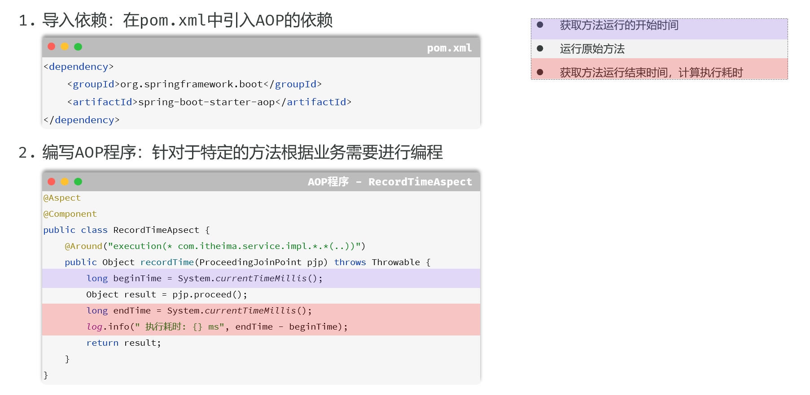

# Spring Boot 简介

- Spring Boot 是一个基于 Spring 框架的开源 Java 框架，它的设计初衷是为了**简化** Spring 应用的初始搭建以及开发过程

- **核心思想**: **约定优于配置**

  > **解读**: 框架本身为你预设了一套“最佳实践”的默认配置（即“约定”）
  >
  > >例如，当你引入 Web 开发依赖时，它约定使用 Tomcat 作为服务器，端口为 8080；
  > >它 **约定** 从 `static` 目录加载静态资源；
  > >它 **约定** 使用 Logback 进行日志记录。
  > >在传统的 Spring (XML) 时代，开发者需要编写大量的 XML 文件来定义 Bean、配置组件、整合框架，这个过程非常繁琐且容易出错。Spring Boot 通过自动配置和起步依赖，将这些“约定”固化下来，让你只需要在**偏离约定**时（例如，想把端口换成 8081，或者想用 Undertow 替换 Tomcat）才需要进行少量配置
  >
  > 这种思想极大地提升了开发效率，让开发者能更专注于业务逻辑本身

- **目标**: 

  - 极大地简化 Spring 应用的初始搭建、开发、部署和监控过程，让开发者能够“开箱即用”

    它致力于提供一种“**有主见的**”开发方式，即为你提供一套**官方推荐的最佳实践组合**

- **四大核心特性**:

  - **自动配置**: 这是 Spring Boot 的魔法核心
    - 它通过检查类路径下的 jar 包来“猜测”你的意图，并自动注册和配置相应的 Bean。例如，当它在类路径中发现 `spring-boot-starter-data-jpa` 和 H2 数据库的驱动时，它会自动为你配置好一个指向 H2 内存数据库的数据源和 JPA 的实体管理器工厂（EntityManagerFactory），你无需编写任何配置代码就能直接开始使用。
  - **起步依赖**: 简化依赖管理，避免“依赖地狱”
    - 它是一系列预定义的依赖描述符（`pom.xml`），你只需要在你的项目中引入一个 `starter`，它就会像一个“全家桶”一样，通过 Maven 的传递性依赖（transitive dependencies）机制，帮你把所有相关的、版本兼容的依赖一次性引入
  - **Actuator**: 提供生产级的应用监控和管理功能
    - 它通过一系列 HTTP 端点，让你可以在应用运行时，无需侵入业务代码就能检查其健康状况、查看性能指标（如 JVM 内存、CPU 使用率）、管理日志级别、查看 Bean 的加载情况等。这是 DevOps 和微服务监控的关键一环
  - **嵌入式服务器**: 内置 Tomcat、Jetty 或 Undertow 等服务器，可打包成可执行 JAR 文件直接运行
    - 这意味着你不再需要预先安装和配置一个外部的 Web 服务器，然后把应用打包成 WAR 文件部署上去。你的应用本身就是一个自包含的、可独立运行的程序，这极大地简化了部署流程，也为微服务和容器化架构（如 Docker）铺平了道路


# 容器与Bean

## 控制反转与依赖注入

> IoC - Inversion of Control 控制反转
>
> DI - Dependency Injection 依赖注入

### 简述

- 这是整个 Spring 框架的核心思想

  - **控制反转 (IoC)** : 一种重要的软件设计思想，用于降低代码模块之间的耦合度

    - **传统方式**:
      
      -  对象自己负责创建和管理它所依赖的其他对象
      
        例如，`UserService` 需要 `UserRepository`，它就得自己 `new UserRepositoryImpl()`
        这种方式下，`UserService` 和 `UserRepositoryImpl` 紧密耦合在了一起
      
    - **IoC 方式**
    
      - 将创建和管理对象的**控制权**，从程序员的代码中**反转**（转移）到了一个独立的第三方容器（Spring IoC 容器）
        你不再需要手动 `new` 对象，而是由容器来负责对象的整个生命周期（创建、组装、销毁）
    
    - **IoC 容器**
    
      - 在 Spring 中，IoC 容器的两个核心接口是 `BeanFactory` 和 `ApplicationContext`
        `ApplicationContext` 是 `BeanFactory` 的子接口，提供了更完整的功能，如国际化、事件发布等。在 Spring Boot 中，我们打交道的通常都是 `ApplicationContext`
    
        > 我见过一种说法，说这个SpringBoot中的IOC容器就是这个`ApplicationContext`，我感觉可信度还挺高的
  
  
  
  - **依赖注入 (DI)** : **实现 IoC 的最主要、最具体的技术**
    
    - 容器知道每个对象需要哪些其他对象（即“依赖”），并自动将这些依赖“注入”到需要它们的对象中
      DI 的核心好处是**解耦**，让你的类只依赖于接口或抽象，而不是具体的实现，这使得代码**更容易维护和测试**
    
      > **Spring的自动依赖注入，其本质，就是在IoC容器创建Bean实例的过程中，为这个实例的成员变量进行赋值**
      >
      > 这个过程发生在组件扫描之后、Bean的实例化阶段。Spring会根据`@Autowired`等注入标记，从容器中查找类型匹配的Bean，并将其“注入”到需要它的地方
      >
      > 由于创建任何Java对象都**必须通过构造方法**，因此构造方法是依赖注入最核心的入口。当一个类**只有一个构造方法**时，Spring会智能地将其作为唯一的创建方式，并自动解析其参数完成注入，此时`@Autowired`注解便**可以省略**
      >
      > 然而，当类存在**多个构造方法**时，Spring就无法决策，此时`@Autowired`就成了**必需的指令**，用来明确指定Spring应该使用哪一个构造方法来创建对象
      >
      > 除了构造方法，依赖也可以通过在Setter方法或字段上添加`@Autowired`来注入，但这发生在对象被构造方法创建**之后**。最终，只有通过这些方式明确请求注入的成员变量才会被Spring自动赋值，开发者可以借此精确控制每个Bean的依赖关系
    
  - **只有被Spring IoC容器管理的组件（也就是Bean），才有资格享受容器提供的自动依赖注入服务**


### DI 的三种主要方式

#### **构造器注入 - 官方最推荐**

> Constructor Injection

- **方式**: 通过类的构造函数注入依赖

- **优点**:

  - **依赖不可变**: 可以将字段声明为 `final`，保证一旦注入就不会被修改，增强了代码的健壮性
  - **保证依赖完整性**: 在对象创建时，其必需的依赖必须已经准备好，否则无法实例化，避免了在运行时出现 `NullPointerException` 的风险
  - **易于测试**: 可以轻松地在单元测试中 `new` 一个实例，并传入 Mock 的依赖对象，完全无需启动 Spring 容器

- **示例**:

  ```java
  @Service
  public class UserServiceImpl implements UserService {
      private final UserRepository userRepository; // 声明为 final，保证不可变
  
      // 当类只有一个构造函数时，@Autowired 注解可以省略，Spring Boot 会自动使用该构造函数进行注入
      public UserServiceImpl(UserRepository userRepository) {
          this.userRepository = userRepository;
      }
  }
  ```

- 特点：从 Spring 4.3 版本开始，如果一个类只有一个构造方法，那么 Spring 会自动使用这个构造方法进行依赖注入，无需再显式地使用 `@Autowired` 注解


#### **Setter 注入**

>Setter Injection

- **方式**: 通过 `setXXX()` 方法注入依赖

- **优点**: 比较灵活，允许依赖在对象创建后再注入或变更，适用于**可选依赖**

- **缺点**: 无法保证依赖的完整性，可能在运行时才发现依赖未注入。不能使用 `final` 关键字

- **示例**:

  ```java
  @Service
  public class UserServiceImpl implements UserService {
      private UserRepository userRepository;
  
      @Autowired
      public void setUserRepository(UserRepository userRepository) {
          this.userRepository = userRepository;
      }
  }
  ```

  

#### **字段注入 - 实际最常用**

> Field Injection

- **方式**: 直接在字段（成员变量）上使用 `@Autowired`

- **优点**: 代码最简洁，编写方便

- **缺点**:

  - **严重不利于单元测试**: 脱离 Spring 容器后，无法为该字段赋值，因为它是 `private` 的，也没有 Setter 方法
  - **可能隐藏过多的依赖关系**: 容易在一个类里注入过多的依赖，违反单一职责原则
  - **无法使用 `final`**: 不能保证依赖的不可变性

- **示例**:

  ```java
  @Service
  public class UserServiceImpl implements UserService {
      @Autowired
      private UserRepository userRepository;
  }
  ```


###  `@Component` 注解

- `@Component` 是 Spring 框架中最基础、最通用的注解之一，它是一切自动化配置和依赖注入的起点

#### 1. 基本概念

- `@Component` 是一个**类级别**的注解

  它的核心作用是向 Spring IoC 容器声明：“**请将这个类标记为一个组件（Bean），并由你来创建和管理它的实例**”

  - Spring 的组件扫描（`@Component`）是用来寻找**具体的类**来创建实例的

- 当 Spring 容器启动时，它会通过**组件扫描**机制，自动发现所有被 `@Component`（及其衍生注解）标记的类，并为它们创建对象（即 Bean），放入容器中统一管理

- 这个过程就是**控制反转(IoC)**的核心思想：你不再需要手动 `new` 对象，而是将创建和管理对象的“控制权”交给了 Spring 容器

- **示例**

  ```java
  package com.example.myapp.services;
  
  import org.springframework.stereotype.Component;
  
  @Component
  public class GreeterService {
      public String sayHello() {
          return "Hello from the managed bean!";
      }
  }
  ```

  - 通过添加 `@Component`，`GreeterService` 就成了一个可以被 Spring 发现和管理的 Bean


#### 2. `@Component` 的“衍生注解”

- 为了让代码的职责更清晰，Spring 在 `@Component` 的基础上提供了几个更具语义的**衍生注解**

  - 它们在功能上都继承自 `@Component`，能将类注册为 Bean，但更重要的是，它们能清晰地表达组件在分层架构中所扮演的角色

    - **`@Controller` / `@RestController`**: 用于标注**表现层(controller)**的组件
      - **作用**：专门负责接收和处理前端的 HTTP 请求，调用业务层完成操作，并返回视图或 JSON 数据
      - **核心特性**：除了标记为 Bean，它还会被 Spring MVC 框架识别为请求处理器，从而能够使用 `@RequestMapping` 等注解进行 URL 映射

    - **`@Service`**: 用于标注**业务逻辑层(service)**的组件
      - **作用**：主要用于封装核心业务逻辑，通常会调用一个或多个数据访问层的组件来完成复杂的业务流程
      - **核心特性**：目前主要用于语义上的区分，让开发者一眼就能看出这是业务逻辑的入口

    - **`@Repository`**: 用于标注**数据访问层(dao/mapper)**的组件
      - **作用**：专门负责与数据库进行交互，执行数据的增删改查（CRUD）操作
      - **核心特性**：除了标记为 Bean，它还能将底层数据访问的特定异常（如 JDBC 的 `SQLException`）自动转译为 Spring 统一的 `DataAccessException` 体系，使上层业务代码无需处理与具体数据库技术耦合的异常

    - **`@Mapper`**: 用于标注**数据访问层**的接口（在 MyBatis/MyBatis-Plus 环境下）
      - **来源**：此注解并非来自 Spring，而是来自 MyBatis 框架
      - **作用**：它告诉 MyBatis，这是一个数据映射接口，MyBatis 会为其动态创建一个代理实现类，并将其作为 Bean 注册到 Spring 容器中。通常需要配合启动类上的 `@MapperScan` 注解一起使用

  - **最佳实践**
- **优先使用专用注解**：在开发中，应优先使用 `@Controller`, `@Service`, `@Repository` 等专用注解，因为它们不仅能让代码的意图和分层结构一目了然，还能启用框架的特定附加功能
  
- **明确数据访问方式**：如果项目使用 MyBatis，数据访问层的接口应使用 `@Mapper` 注解。如果使用 Spring Data JPA，则通常继承 `JpaRepository` 接口，并用 `@Repository` 标注
  
- **`@Component` 的使用时机**：只有当一个组件不适合明确归入以上任何一层时（例如，一个通用的工具类、配置类、拦截器等），才使用通用的 `@Component` 注解


### `@Autowired` 注解

- `@Autowired` 注解是实现**依赖注入(DI)**的关键。它的作用是告诉 Spring 容器：“**请自动在这里注入一个匹配的 Bean 实例**”

- 这使得组件之间可以松散地耦合，你不需要在代码中手动创建依赖的对象，一切都由 Spring 负责“装配”

#### 1. 核心概念

- `@Autowired` 可以用在类的成员变量、构造函数或方法上，用于自动装配（注入）IoC 容器中存在的 Bean
  当 Spring 创建一个 Bean 时，它会检查这个 Bean 是否有被 `@Autowired` 标记的地方，然后去容器中寻找合适的 Bean 并将其注入

#### 2. 三种注入方式

- `@Autowired` 可以用在三个地方，各有优劣


##### 字段注入

- 这是最简洁、最常见的用法，直接在成员变量上使用

  ```JAVA
  @Service
  public class OrderService {
      @Autowired
      private NotificationService notificationService; // 直接注入
  }
  ```

- **优点**：代码量最少，非常直观

- **缺点**：无法创建不可变（`final`）的依赖。脱离 IoC 容器后，进行单元测试会比较困难（需要通过反射来设置依赖）


##### 构造函数注入

- 在类的构造函数参数上使用。如果类只有一个构造函数，`@Autowired` 注解可以省略

  ```JAVA
  @Service
  public class OrderService {
      private final NotificationService notificationService;
  
      // 当只有一个构造函数时，@Autowired 可省略
      @Autowired
      public OrderService(NotificationService notificationService) {
          this.notificationService = notificationService;
      }
  }
  ```

- **优点**：

  - **推荐方式**：这是 **Spring 官方推荐的注入方式**
  - **保证依赖可用性**：对象在构造完成时，其所有依赖都已准备就绪
  - **支持不可变性**：依赖可以被声明为 `final`，增强了代码的健壮性
  - **测试友好**：不依赖 Spring 容器即可轻松实例化并传入 Mock 对象进行单元测试


##### Setter 方法注入

- 在依赖的 Setter 方法上使用

  ```JAVA
  @Service
  public class OrderService {
      private NotificationService notificationService;
  
      @Autowired
      public void setNotificationService(NotificationService notificationService) {
          this.notificationService = notificationService;
      }
  }
  ```

- **优点**：允许依赖在对象创建后被动态地更改或重新注入

- **缺点**：不如构造函数注入那样能保证依赖的即时可用性


#### 3. 多个匹配的Bean注入问题

- 这是一个在开发中非常常见的场景：一个接口拥有多个实现类，导致依赖注入时出现歧义

- **场景示例**：我们系统需要支持邮件和短信两种通知方式

  ```java
  // 通知服务接口
  public interface NotificationService {
      void send(String message);
  }
  
  // 实现类一：邮件通知
  @Service("emailNotification")
  public class EmailNotificationServiceImpl implements NotificationService {
      // ... 实现细节 ...
  }
  
  // 实现类二：短信通知
  @Service("smsNotification")
  public class SmsNotificationServiceImpl implements NotificationService {
      // ... 实现细节 ...
  }
  ```

- **问题**：如果此时直接注入 `NotificationService`，Spring会因为在容器中找到了多个类型匹配的Bean而无法决策，最终抛出 `NoUniqueBeanDefinitionException` 异常

  - 为了解决这个问题，我们有几种常用方案


##### 方案一:使用`@Primary`指定首选Bean

- 当多个实现中有一个是“主要”或“默认”的选项时，`@Primary` 是最简单的解决方案

  - **作用**：在某个实现类上添加 `@Primary` 注解，告诉Spring当遇到多个候选项时，优先注入这一个

    ```java
    @Service("emailNotification")
    @Primary // 将邮件通知设为首选
    public class EmailNotificationServiceImpl implements NotificationService { ... }
    ```

    - **使用**：现在，其他类可以直接注入 `NotificationService`，无需任何额外注解，Spring会自动选择 `EmailNotificationServiceImpl`

      ```java
      @Service
      public class CustomerService {
          @Autowired // 无需@Qualifier，因为@Primary已解决歧义
          private NotificationService notificationService; // 这里注入的是EmailNotificationServiceImpl
      
          public void register() {
              notificationService.send("欢迎注册！");
          }
      }
      ```

  - **优点**：对使用者透明，注入代码非常干净

  - **缺点**：不够灵活，一个接口在整个应用中只能有一个首选实现


##### **方案二:使用`@Qualifier`精准指定**

- 当需要灵活地、按需地选择不同实现时，`@Qualifier` 是最佳选择

- **作用**：`@Qualifier` 注解与 `@Autowired` 配合使用，通过**Bean的名称**来精确指定要注入哪一个实例

  ```JAVA
  @Service
  public class CustomerService {
      @Autowired
      @Qualifier("smsNotification") // 明确指定使用名为 "smsNotification" 的 Bean
      private NotificationService notificationService;
  
      public void register() {
          notificationService.send("您的验证码是: 1234"); // 这里将通过短信发送
      }
  }
  ```

- **优点**：注入哪个实现完全由使用者决定，非常灵活

- **缺点**：注入方的代码需要知道具体的Bean名称，存在一定的耦合


##### **方案三：使用 `@Resource` 按名称注入**

- 这是您提到的另一种重要方式。`@Resource` 是 Java 的 JSR-250 规范中定义的注解，并非 Spring 独有，但 Spring 提供了完美支持

- **工作原理**: `@Resource` 的注入顺序与 `@Autowired` **完全不同**，它**优先按名称匹配**

  1. **首先，按名称查找**：它会尝试查找与**字段名**或其 `name` 属性值匹配的 Bean
  2. **然后，按类型查找**：如果按名称找不到，它会退回到按类型查找

- **使用方式**:

  - **方式一：利用字段名自动匹配** (推荐)

    ```java
    @Service
    public class CustomerService {
        // 字段名 "emailNotification" 直接对应了 Bean 的名字，无需其他注解
        @Resource
        private NotificationService emailNotification;
    
        public void someMethod() {
            emailNotification.send("这是一封邮件通知。");
        }
    }
    ```

  - **方式二：使用 `name` 属性明确指定**

    ```java
    @Service
    public class OrderService {
        // 使用 name 属性明确指定要注入 "smsNotification" 这个 Bean
        @Resource(name = "smsNotification")
        private NotificationService notificationService;
    
        public void placeOrder() {
            notificationService.send("您的订单已发货。");
        }
    }
    ```

- **优点**：通常比 `@Autowired` + `@Qualifier` 的组合更简洁，意图更直接

- **缺点**：由于它不是 Spring 亲生的注解，所以在某些非常特定的 Spring 高级功能（如与 AOP 结合）中，支持可能不如 `@Autowired` 完美


##### **方案四:注入所有实现类的集合(高级用法)**

- 这是一个非常强大且优雅的策略，尤其适用于需要同时执行所有策略的场景

  - **作用**：如果你想一次性获取所有实现了某个接口的Bean，可以直接将注入点声明为一个**单列集合(List)或双列集合(Map)**。Spring会自动将所有匹配的Bean都放入这个集合中

    - **注入List**：

      ```JAVA
      @Service
      public class OrderService {
          // Spring会找到所有NotificationService的实现类，并将它们的Bean注入到这个List中
          @Autowired
          private List<NotificationService> allNotificationServices;
      
          public void placeOrder() {
              // ... 业务逻辑 ...
              // 遍历并调用所有通知服务
              for (NotificationService service : allNotificationServices) {
                  service.send("您的订单 #12345 已创建！");
              }
          }
      }
      ```

    - **注入Map**： 如果你还想根据Bean的名字来获取特定的实现,可以注入一个Map,其中Key是Bean的名称,Value是Bean的实例

      ```JAVA
      @Service
      public class NotificationManager {
          @Autowired
          private Map<String, NotificationService> serviceMap; // Key: "emailNotification", "smsNotification"
      
          public void sendNotification(String type, String message) {
              NotificationService service = serviceMap.get(type);
              if (service != null) {
                  service.send(message);
              } else {
                  throw new IllegalArgumentException("不支持的通知类型: " + type);
              }
          }
      }
      ```

  - **优点**：扩展性极强。未来如果新增第三种通知方式，只需添加一个新的实现类，使用方的代码**完全不需要修改**，新的通知方式会自动被包含进来。


#### 4. 可选依赖注入

- 默认情况下,`@Autowired` 要求注入的Bean必须存在,否则应用启动会失败.如果你希望某个依赖是**可选的(可以为null)**,有以下两种方式


##### **方式一：使用 `required = false`**

- 这是传统的方式，它告诉Spring如果找不到匹配的Bean，不要抛出异常，直接将`null`注入即可

  ```JAVA
  @Autowired(required = false)
  private OptionalAnalyticsService optionalAnalyticsService; 				// 如果找不到Bean，这里会是null
  ```

- **缺点**：后续使用时必须进行繁琐的`null`检查，否则有`NullPointerException`风险


##### **方式二：使用 `java.util.Optional` (推荐)**

- 这是更现代、更安全的做法。直接将字段声明为 `Optional<T>` 类型，Spring会自动处理

  ```JAVA
  @Autowired
  private Optional<OptionalAnalyticsService> optionalAnalyticsService; 	// 推荐用法
  ```

- **优点**：

  - 如果Bean存在，`optionalAnalyticsService.isPresent()` 返回 `true`
  - 如果Bean不存在，它会是一个空的`Optional`对象 (`Optional.empty()`)，而不是`null`
  - 这强制你使用 `ifPresent()` 或 `orElse()` 等函数式方法来处理，从根本上避免了`NullPointerException`,代码更健壮、更优雅


## Bean创建的时机与懒加载

### 默认创建时机

- Spring IoC（控制反转）容器会在**启动时**创建并初始化所有的**单例Bean**
- 对于非单例Bean，例如`prototype` Bean，Spring 容器在启动时只会解析其定义，但不会创建它的实例
  只有当每次通过 `getBean()` 方法请求它，或者它被注入到另一个 Bean 中时，Spring 容器才会创建一个**全新的**实例
  每次请求都会得到一个新对象


### 懒加载`@Lazy`

- 通过使用 `@Lazy` 注解，我们可以告诉容器延迟某个 Bean 的初始化，直到它第一次被实际使用时才创建

#### 为什么需要 `@Lazy`？

- 在某些场景下，延迟加载会更有优势：

  - **加快应用启动速度**：如果某些 Bean 在初始化时需要执行耗时操作（例如，加载大量数据、建立网络连接），并且这些 Bean 在应用启动阶段并不会立即被用到，那么将它们设置为懒加载可以显著缩短应用的启动时间

  - **节省内存资源**：对于那些占用大量内存但又不常被使用的 Bean，懒加载可以避免在应用启动时就为其分配内存，只有在真正需要时才占用资源

  - **解决循环依赖**：在某些复杂的依赖关系中，使用 `@Lazy` 可以作为解决循环依赖问题的一种方法。当 A 依赖 B，同时 B 又依赖 A 时，可以将其中一个依赖项标记为 `@Lazy`，从而打破启动时互相依赖的僵局


#### `@Lazy` 注解的使用

- `@Lazy` 可以用在多种不同的配置场景中


##### a) 用在 `@Component` (及其衍生注解) 上

- 你可以直接将 `@Lazy` 注解放在使用 `@Component`、`@Service`、`@Repository` 或 `@Controller` 注解的类上

- **示例：**

  - 假设我们有一个非常耗时的服务 `HeavyResourceService`

    ```java
    package com.example.lazy.demo;
    
    import org.springframework.stereotype.Service;
    import javax.annotation.PostConstruct;
    
    @Service
    // @Lazy // 取消此行注释以启用懒加载
    public class EagerLoadingService {
    
        public EagerLoadingService() {
            System.out.println("EagerLoadingService: 构造函数被调用！我被立即加载了。");
        }
    
        @PostConstruct
        public void init() {
            System.out.println("EagerLoadingService: 初始化方法完成。");
        }
    
        public String getInfo() {
            return "这是一个立即加载的Bean";
        }
    }
    ```

    ```java
    package com.example.lazy.demo;
    
    import org.springframework.context.annotation.Lazy;
    import org.springframework.stereotype.Service;
    import javax.annotation.PostConstruct;
    
    @Service
    @Lazy // 使用 @Lazy 注解
    public class LazyLoadingService {
    
        public LazyLoadingService() {
            // 当这个 Bean 被懒加载时，应用启动时不会打印这条消息
            System.out.println("LazyLoadingService: 构造函数被调用！我被延迟加载了。");
        }
    
        @PostConstruct
        public void init() {
            System.out.println("LazyLoadingService: 初始化方法完成。");
        }
    
        public String getInfo() {
            return "这是一个懒加载的Bean";
        }
    }
    ```

    

- **运行结果分析：**

  - **不使用 `@Lazy`**：启动应用时，控制台会立刻打印出 `EagerLoadingService` 的构造函数和初始化消息

  - **使用 `@Lazy`**：启动应用时，`LazyLoadingService` 的任何消息都不会被打印。只有当第一次从容器中获取它或它被注入到另一个非懒加载的 Bean 中并被调用时，你才会看到它的构造函数和初始化消息


##### b) 用在 `@Bean` 方法上

- 当你在一个 `@Configuration` 类中使用 `@Bean` 方法来定义 Bean 时，可以将 `@Lazy` 注解直接放在方法上

- **示例：**

  ```java
  package com.example.lazy.demo;
  
  import org.springframework.context.annotation.Bean;
  import org.springframework.context.annotation.Configuration;
  import org.springframework.context.annotation.Lazy;
  
  @Configuration
  public class AppConfig {
  
      @Bean
      @Lazy // 将此 Bean 配置为懒加载
      public LazyBeanFromConfig lazyBean() {
          System.out.println("正在创建 LazyBeanFromConfig...");
          return new LazyBeanFromConfig();
      }
  }
  
  class LazyBeanFromConfig {
      public String getInfo() {
          return "通过 @Bean 方法懒加载的 Bean";
      }
  }
  ```

  

##### c) 用在依赖注入点 `@Autowired` 上

- 你也可以将 `@Lazy` 注解与 `@Autowired` 结合使用，来注入一个代理对象

- **示例：**

  ```java
  package com.example.lazy.demo;
  
  import org.springframework.beans.factory.annotation.Autowired;
  import org.springframework.context.annotation.Lazy;
  import org.springframework.stereotype.Component;
  
  @Component
  public class MyComponent {
  
      private final LazyLoadingService lazyService;
  
      // 即使 LazyLoadingService 本身没有标记 @Lazy
      // 在注入点使用 @Lazy 也会达到懒加载的效果
      @Autowired
      public MyComponent(@Lazy LazyLoadingService lazyService) {
          System.out.println("MyComponent: 构造函数被调用。");
          this.lazyService = lazyService;
      }
  
      public String useLazyService() {
          // 在这里，第一次调用 lazyService 的方法时，才会真正触发它的初始化
          System.out.println("即将首次使用 Lazy Service...");
          return lazyService.getInfo();
      }
  }
  ```

  

- 在这种情况下，Spring 会为 `LazyLoadingService` 注入一个代理对象
  - `MyComponent` 在创建时并不会触发 `LazyLoadingService` 的实际初始化。只有当 `useLazyService()` 方法被调用，代理对象第一次被使用时，真正的 `LazyLoadingService` 实例才会被创建


#### 全局懒加载

- 如果你想让应用程序中所有的 Bean 都默认使用懒加载，可以在主程序类或配置类上使用 `@Lazy` 注解，或者通过配置文件进行设置

- **通过注解：**

  ```java
  import org.springframework.boot.autoconfigure.SpringBootApplication;
  import org.springframework.context.annotation.Lazy;
  
  @SpringBootApplication
  @Lazy // 此处设置全局懒加载，但通常不推荐
  public class LazyApplication {
      // ...
  }
  ```

  

- **通过 `application.properties`:**

  ```properties
  spring.main.lazy-initialization=true
  ```

  

- 设置全局懒加载可以极大地加快启动速度，但它也有缺点：

  - **隐藏配置错误**：错误可能要到运行时才被发现，而不是在启动阶段

  - **首次请求延迟**：对于 Web 应用，第一个处理相关业务的请求可能会因为需要初始化一连串的 Bean 而变得非常慢，影响用户体验

  因此，通常更推荐对特定的、重量级的 Bean 进行局部懒加载，而不是全局设置


## 容器内Bean对象的创建数量与作用域

- 容器中**同一个Bean，会创建几个**，取决于 Bean 的**作用域（Scope）**。`@Component` 默认的作用域是**单例（Singleton）**

### **默认情况：单例`singleton`**

- **定义**：在整个 Spring IoC 容器的生命周期中，一个类只会**创建一个** Bean 实例

- **行为**：无论这个 Bean 在多少个地方被注入（`@Autowired`），所有地方引用的都是**同一个、唯一的**对象实例

- **结论**：**一个用 `@Component` 标记的类，默认情况下，容器中只会创建一个 Bean 对象**

- **示例**

  ```JAVA
  // MySingletonComponent.java
  @Component
  public class MySingletonComponent {
      public MySingletonComponent() {
          System.out.println("Singleton Bean Created! HashCode: " + this.hashCode());
      }
  }
  
  // SomeService.java
  @Service
  public class SomeService {
      @Autowired
      private MySingletonComponent component1; // 注入点1
  
      @Autowired
      private MySingletonComponent component2; // 注入点2
  
      public void checkInstance() {
          // 输出将证明 component1 和 component2 是同一个对象
          System.out.println("Component 1 HashCode: " + component1.hashCode());
          System.out.println("Component 2 HashCode: " + component2.hashCode());
          System.out.println("Are they the same? " + (component1 == component2)); // true
      }
  }
  ```

  

### **例外情况：原型**`prototype`

- 你可以**使用 `@Scope` 注解来改变默认行为，我有时候成功，有时候又不成功，很奇怪**

  - 当作用域被设置为 `prototype` 时，**每次请求或注入**这个 Bean，Spring 容器都会创建一个**全新的**实例

  - 容器创建后将其交给请求方，之后便不再管理该 Bean 的完整生命周期（特别是销毁阶段）

  - 示例

    ```java
    import org.springframework.context.annotation.Scope;
    import org.springframework.stereotype.Component;
    
    @Component
    @Scope("prototype")
    public class MyPrototypeComponent {
        public MyPrototypeComponent() {
            System.out.println("Prototype Bean Created! HashCode: " + this.hashCode());
        }
    }
    ```

    - 在这种情况下，`MyPrototypeComponent` 被或请求多少次，就会创建多少个新对象。


### **`@Scope`作用域总结表格**

| 作用域                 | 描述                          | 创建时机                               |
| ---------------------- | ----------------------------- | -------------------------------------- |
| **`singleton`** (默认) | 整个应用只有一个实例          | IoC 容器启动时                         |
| **`prototype`**        | 每次请求/注入都创建一个新实例 | 每次被请求或注入时                     |
| `request`              | 每个 HTTP 请求一个实例        | 每个 HTTP 请求开始时 (仅 Web 环境)     |
| `session`              | 每个 HTTP Session 一个实例    | 每个 HTTP Session 创建时 (仅 Web 环境) |


## Bean 的命名规则

- 当 Spring 注册一个 Bean 时，会给它一个名字(ID)

  - **默认名称**：类名的首字母小写。

    - `GreeterService` ====> `greeterService`
    - `UserRepository` ====> `userRepository`

  - **自定义名称**：在注解中直接提供一个字符串值

    - `@Component("myCustomGreeter")`
    - `@Service("mainOrderService")`

    >你可以使用这个名字通过 `ApplicationContext` 来手动获取 Bean:例如`applicationContext.getBean("mainOrderService");`


# 项目构建与结构

## Maven 构建项目

- **父项目 (`spring-boot-starter-parent`)**: 通过 Maven 的**继承**特性，提供了**统一的版本管理**和**默认的插件配置**
- **起步依赖 (Starters)**: 依赖的“工具箱”，主要作用是**聚合依赖**（如 `spring-boot-starter-web`）
- **核心构建插件 (`spring-boot-maven-plugin`)**: 实现“可执行 JAR”这一核心特性的**关键**，负责将项目**重新打包**成 “fat JAR”


## 起步依赖详解

- **`spring-boot-starter-web`**: 这是构建 **Web 应用**（包括网站和 RESTful API）的**一站式解决方案**。它聚合了以下核心功能和依赖：
  - **`spring-boot-starter`**: 所有 `starter` 的基础，引入了自动配置 (`spring-boot-autoconfigure`)、日志 (`spring-boot-starter-logging`) 和 YAML 解析 (`snakeyaml`) 等基础能力。
  - **`spring-boot-starter-json`**: 专门负责 **JSON 数据处理**的工具箱，核心是引入了 **Jackson** 库 (`jackson-databind`)，负责 Java 对象与 JSON 字符串的自动相互转换。
  - **`spring-boot-starter-tomcat`**: 引入**内嵌的 Tomcat Web 服务器**，让你的应用可以独立运行
  - **`spring-web`**: Spring 框架 Web 功能的基础包
  - **`spring-webmvc`**: **Spring MVC 框架**本身，提供了 `DispatcherServlet`、`@RestController` 等所有 Web 开发的核心组件和注解
- **`spring-boot-starter-test`**: 这个依赖为你提供了编写和运行**单元测试**与**集成测试**所需的所有核心工具。它不仅仅是简单地聚合依赖，更是 Spring Boot 提供的**一站式测试解决方案**
  - **强大之处**: 一次性引入 JUnit 5, Mockito, AssertJ, Spring Test 等所有主流测试库，并利用父项目保证了版本**完美兼容**
  - **`<scope>test</scope>`**: 该标签告诉 Maven，此依赖只在**测试阶段**有效，不会被打包到最终的生产环境中


## 资源文件目录 (resources) 与类路径

- `resources` 目录的工作方式

  - **`resources` 目录**：在 Maven 构建项目时，`src/main/resources` 目录下的**所有内容**，都会被原封不动地**复制**到构建输出目录 `target/classes/` 中
    `target/classes/` 这个目录，通常会被作为应用程序自身类和资源的首要搜索路径，并被添加到Classpath这个列表的最前面

    - 因此，你在 `src/main/resources/application.yml` 编写配置，程序在运行时就能从 `classpath:/application.yml` 加载到它

  - **静态资源加载机制**：Spring Boot 不会扫描类路径根目录下的所有文件作为静态资源
    它只会去几个**预先约定好的特定文件夹**里寻找。这些默认的静态资源位置如下(按优先级顺序）：

    1. `classpath:/META-INF/resources/`
    2. `classpath:/resources/`
    3. `classpath:/static/` (最常用)
    4. `classpath:/public/`

    

  - **实践案例解析**

    - **`src/main/resources/A.html` -> 无法通过 `localhost:8080/A.html` 访问**
      - **原因**: 这个文件被复制到了 `target/classes/A.html`，也就是 `classpath:/A.html`，
        这个位置**不**在 Spring Boot 默认的静态资源查找文件夹列表中，所以访问失败
    - **`src/main/resources/static/B.html` -> 可以通过 `localhost:8080/B.html` 访问**
      - **原因**: 这个文件被复制到了 `target/classes/static/B.html`，也就是 `classpath:/static/B.html`。`classpath:/static/` 是默认的查找路径，所以 Spring Boot 能找到它。**这是存放静态资源最标准、最推荐的做法。**
    - **`src/main/resources/resources/C.html` -> 可以通过 `localhost:8080/C.html` 访问**
      - **原因**: 这个文件被复制到了 `target/classes/resources/C.html`，也就是 `classpath:/resources/C.html`。`classpath:/resources/` 也在默认查找路径列表中，所以也能被找到。
    - ......


# 三层架构

## 1. 软件分层架构思想

- 宏观的、指导性的软件设计思想——**分层架构**。**三层架构** 是最分层架构经典、应用最广泛的一种模式

- 三层架构不是一个具体的项目目录结构，而是一种用于组织和划分代码职责的逻辑思想

  - 它的核心目标只有一个：**“解耦”**。通过将一个复杂的系统，按照不同的职责清晰地划分成独立的层次，使得每一层都只关注自己的任务，层与层之间通过清晰的接口进行通信。这样做的好处是巨大的：

    - **高内聚，低耦合**: 层内部的组件联系紧密(高内聚)，而层与层之间的依赖关系变得简单明了(低耦合)

    - **易于维护**: 当某一层的实现需要修改时（例如更换数据库），理论上不会影响到其他层

    - **可扩展性强**: 可以独立地对某一特定层进行扩展或替换

    - **职责清晰**: 便于团队协作，不同的开发者可以专注于不同层次的开发

- Spring 框架提供的各种核心注解，其主要目的之一就是为了帮助开发者能够优雅、高效地实践这种分层思想


## 2. 三层架构详解

- 三层架构将一个复杂的系统，按照职责清晰地划分成三个逻辑层次：表现层、业务逻辑层、数据访问层

### 表现层

- **职责**:
  - 这是系统与用户直接交互的“门面”
  - 负责接收用户的请求（例如，用户在网页上点击一个按钮）
  - 对用户的输入进行初步的、与业务无关的校验（例如，检查用户名格式是否正确）
  - 调用业务逻辑层来处理请求
  - 将业务逻辑层返回的结果，以合适的格式（如 JSON 或 HTML 页面）呈现给用户
- **在 Spring Boot 中**:
  - 这一层通常被称为 **Controller 层**
  - 对应的核心注解是 **`@Controller`** (用于返回视图) 和 **`@RestController`** (用于返回数据)。


### 业务逻辑层

- **职责**:
  - 这是整个应用的**核心**和“大脑”
  - 负责处理所有的业务逻辑、规则和计算。例如，“用户注册”、“商品下单”、“计算折扣”等核心功能都在这一层实现
  - 它承上启下，接收来自表现层的指令，并**编排、协调**数据访问层的操作来完成一个完整的业务流程。一个业务操作可能需要多次调用数据访问层（比如下单操作需要同时扣减库存和创建订单）
  - **事务管理**是这一层至关重要的职责，确保一个完整的业务操作要么全部成功，要么全部失败
- **在 Spring Boot 中**:
  - 这一层通常被称为 **Service 层**
  - 对应的核心注解是 **`@Service`**


### 数据访问层

- **职责**:
  - 这一层的职责非常单一和纯粹：只负责和数据存储（通常是数据库）打交道
  - 负责执行数据的持久化操作，即增 (Create)、删 (Delete)、改 (Update)、查 (Retrieve) (CRUD)
  - 它将底层的数据库操作（如编写 SQL 语句、处理 JDBC 连接）封装起来，为业务逻辑层提供简单、清晰的数据操作接口
- **在 Spring Boot 中**:
  - 这一层通常被称为 **DAO (Data Access Object) 层**、**Repository 层** 或 **Mapper 层**
  - 对应的核心注解是 **`@Repository`** (Spring Data JPA) 或 **`@Mapper`** (MyBatis)


## 3.数据访问层的不同实现

- 数据访问层的不同实现:**DAO,Mapper,Repository**

  - 这三个词都与数据访问层有关，但它们代表了不同层次的抽象和技术演进

    | 概念           | 抽象级别 | 主要来源         | 在 Spring Boot 中的典型实现                    |
    | -------------- | -------- | ---------------- | ---------------------------------------------- |
    | **DAO**        | 较低     | 设计模式         | 自己写的 JDBC 实现类                           |
    | **Mapper**     | 中等     | MyBatis 框架     | 使用 `@Mapper` 注解的接口，配合 XML 或注解 SQL |
    | **Repository** | 更高     | Spring Data 框架 | 继承 `JpaRepository`, `MongoRepository` 等接口 |


### DAO

- **是什么**：**DAO(Data Access Object) 是一个非常古老和基础的设计模式**，不是一个具体的技术。它的核心思想是创建一个专门的 Java 类/接口，把所有访问数据库的代码（比如获取 JDBC 连接、创建 `PreparedStatement`、执行 SQL 语句、处理 `ResultSet`、关闭资源等）都封装在里面，从而让业务逻辑层（Service）不需要关心具体是怎么操作数据库的，实现了业务逻辑与数据访问逻辑的分离
- **定位**：**基础设计思想**。它是后面所有数据访问层技术的基础


### Mapper (MyBatis)

- **是什么**：**Mapper 是 MyBatis 框架中对 DAO 模式的一种具体实现**。它通过接口和映射文件（或注解）的方式，将数据访问的关注点进一步分离。开发者只需要定义一个 Java 接口（如 `UserMapper`），并在其中声明方法。然后，通过一个 XML 文件或注解的方式，将这个方法和一条具体的 SQL 语句“映射”（map）起来
- **优点**:
  - **SQL 完全可控**: 开发者可以完全掌控和优化 SQL 语句，这对于复杂的查询和性能调优非常重要
  - **解耦**: 将 SQL 从 Java 代码中分离出来，便于维护。
- **定位**：**MyBatis 框架下的 DAO 实现**。所以，一个 MyBatis 的 Mapper，本质上就是一个 DAO


### Repository (Spring Data专属)

- **是什么**：**Repository 是 Spring Data 框架提供的一个更高层次的抽象**。它借鉴了领域驱动设计（DDD）的思想，目标是让你感觉像在操作一个**内存中的对象集合（Collection）**，而不是在操作数据库。它将数据访问的通用模式（如 CRUD、分页、排序）提升到了一个新的高度
- **优点**:
  - **极致的开发效率**: 只需定义一个接口（如 `UserRepository`）并让它**继承** Spring Data JPA 提供的 `JpaRepository<User, Long>` 接口。然后，你**什么代码都不用写**，就自动拥有了 `save()`、`findById()`、`findAll()`、`deleteById()` 等一大堆强大的方法
  - **方法命名查询**: 可以根据方法名自动生成查询，比如 `findByUsername(String name)`，无需手写任何 SQL 或 JPQL
  - **与具体技术解耦**: `Repository` 是一个顶层接口，其下有针对不同数据库的实现（如 `JpaRepository` 对应关系型数据库，`MongoRepository` 对应 MongoDB）。这使得在不同数据存储技术之间切换的成本更低
- **定位**：**Spring Data 框架下的、更高级、更自动化的数据访问抽象**

- **一句话总结**: **DAO** 是一个通用的“数据访问对象”概念，而 **Mapper** (MyBatis) 和 **Repository** (Spring Data) 是两大主流框架对 DAO 模式的现代化、高级实现。在现代 Spring Boot 项目中，最常接触的就是 `Repository` 和 `Mapper`


# 控制层开发 (controller层)

> 只要是Controller层中的参数，建议全部写上注解，肯定都有能对应上的

## 0. 概述

- 表现层，在 Spring Boot 中通常指 Controller 层，是整个应用的“门面”

  它的核心职责是接收来自客户端（如浏览器、手机 App）的 HTTP 请求，调用业务逻辑层（Service）进行处理，然后将处理结果以适当的格式（通常是 JSON）返回给客户端


## 1. RESTful API 设计风格

- 现代 Web 开发大多遵循 **RESTful (REpresentational State Transfer)** 架构风格来设计 API
  - **核心原则**:
    - **资源**: 将应用中的所有事物都抽象为“资源”，例如一个用户、一篇博客
    - **统一资源标识符**: 每个资源都有一个唯一的地址，如 `/api/users/123`。URI 中通常**只包含名词，不包含动词**
    - **HTTP 方法**: 使用标准的 HTTP 方法来对资源进行操作：
      - `GET`: 获取资源
      - `POST`: 创建新资源
      - `PUT`: 完整更新一个已存在的资源
      - `DELETE`: 删除一个资源
      - `PATCH`: 部分更新一个已存在的资源
    - **表现层**: 客户端与服务器之间传递的是资源的某种表现形式，最常见的就是 JSON
    - **无状态**: 服务器不保存客户端的会会话状态。每一次请求都应包含所有必要信息


## 2. 声明控制器 注解

- 声明一个类为 Web 处理器的入口，它决定了整个类的行为模式

  - **`@Controller`**

    - **作用**：声明一个传统的 Spring MVC 控制器

    - **使用场景**：

      - 主要用于**前后端不分离**的项目。方法的返回值通常是一个字符串，代表一个**视图名称**
      
        Spring MVC 会根据这个名称去 `templates` 目录下查找对应的模板（如 Thymeleaf）进行服务器端渲染，最终返回一个完整的 HTML 页面给浏览器
      
        ```java
        @Controller
        public class PageController {
            @GetMapping("/welcome")
            public String welcomePage(Model model) {
                model.addAttribute("message", "Hello from the server!");
                // 返回 "welcome"，Spring会去找 templates/welcome.html 文件进行渲染
                return "welcome";
            }
        }
        ```
      
        

  

  - **`@RestController`**
  
    - **作用**：声明一个 RESTful 风格的控制器。它是 `@Controller` + `@ResponseBody` 的组合注解
  
    - **使用场景**：
  
      - **现代前后端分离项目（如 Vue/React + Spring Boot）的首选**
      
        这个注解下的所有方法，返回值都会被自动序列化为 JSON 数据格式，直接返回给前端，而不是去查找视图
      
        ```java
        @RestController
        @RequestMapping("/api/users")
        public class UserController {
            @GetMapping("/{id}")
            public User getUserById(@PathVariable Long id) {
                // 直接返回 User 对象，会被自动转换为 JSON
                return new User(id, "Jerry");
            }
        }
        ```
      
        


## 3. 请求映射 注解

- 这类注解负责将 HTTP 请求的 URL 映射到具体的 Controller 方法上，是整个路由机制的核心

  - **`@RequestMapping`**
    - **作用**: 最通用的映射注解，可以标记在**类**或**方法**上
    
    - **常用属性**:
      - `value` 或 `path`
      
        - 指定请求的路径，如 `"/users"`
      
          **标记在类上时，会作为该类下所有方法 URL 的公共前缀**
      
      - `method`
      
        > 如果要指定这个的话，建议直接使用对应前缀的注解
      
        - 指定 HTTP 请求方法，如 `RequestMethod.GET`
      
      - `consumes`
      
        - 指定请求体的内容类型，如 `"application/json"`。如果前端发送的类型不匹配，请求将被拒绝
      
      - `produces`
      
        - 指定响应体的内容类型，如 `"application/json;charset=UTF-8"`
  
  
  
  - **`@GetMapping`, `@PostMapping`, `@PutMapping`, `@DeleteMapping`, `@PatchMapping`**......
  
    - **作用**
  
      - 它们是 `@RequestMapping` 针对不同 HTTP 方法的特化版本，使代码意图更清晰，更符合 RESTful 风格
  
        例如，`@GetMapping("/users")` 等同于 `@RequestMapping(value = "/users", method = RequestMethod.GET)`


## 4. 绑定参数相关注解

- 这类注解负责从 HTTP 请求的不同部分提取数据，并赋值给你方法的参数，是 Controller 层最常用、最重要的工具

### 4.1 简单参数与复杂参数

#### 简单参数

- Spring MVC 的默认绑定模式
- **定义**：
  - 指的是那些 Spring **可以直接从请求中提取“键值对”，并将这个键值对的值 (一个 String) 转换为目标类型的参数**
- **主要来源**：
  - URL 查询参数 (`?id=123`)
  - URL 路径变量 (`/users/123`)
  - 请求头字段 (`User-Agent: ...`)
  - Cookie 值
  - `application/x-www-form-urlencoded` 的表单数据
- **对应注解**：
  - `@RequestParam`
  - `@PathVariable`
  - `@RequestHeader`
  - `@CookieValue`
- **处理机制**：
  - Spring 使用一个叫做 `ConversionService` (类型转换服务) 的东西。它内置了很多转换器，比如：
    - `String` -> `Integer` (把 `"123"` 转成 `123`)
    - `String` -> `LocalDate` (把 `"2025-10-27"` 转成 `LocalDate` 对象)
    - `String` -> `boolean` (把 `"true"` 转成 `true`)


#### 复杂参数

- **定义**：

  - 通常指那些**结构化**的数据，

    比如一个完整的 Java 对象 (POJO)、一个列表 (`List`) 或 `Map`。这些数据无法用一个简单的“键值对”来描述

- **主要来源**：

  - **HTTP 请求体**

- **数据格式**：

  - `application/json`
  - `application/xml`

- **对应注解**：

  - `@RequestBody`

- **处理机制**：

  - Spring 必须使用 `HttpMessageConverter` (HTTP 消息转换器)

    > 例如，
    >
    > - `MappingJackson2HttpMessageConverter`会读取**整个** JSON 请求体（比如 `{"name":"test","age":30}`），
    >
    >   然后调用 Jackson 库将其**反序列化 (Deserialize)** 为一个 `User` 对象


### 4.2 常见注解

#### `@RequestParam`

##### 基本概念

- 把 **请求参数** 绑定到 controller层 的方法参数上

  > 请求参数包括：
  >
  > - **URL 查询参数**：例如 `GET /search?q=test` 中的 `q`
  >
  > - **表单数据**：`POST` 请求中 `application/x-www-form-urlencoded` 格式的表单体内容
  >
  > - **Multipart 请求中的部件**：
  >
  >   - `multipart/form-data` 请求中的表单字段，
  >
  >     文件也可用 `@RequestParam MultipartFile file`  (当然也可用`@RequestPart`进行绑定)


##### 注解属性

###### `value` 和 `name`

- 这两个属性互为别名 (`@AliasFor`)，作用完全相同：**用来指定 `@RequestParam` 要绑定的请求参数名**

  > 如果方法参数名与请求参数名完全一致，可以省略 `name`/`value`

  - **`value` (String)**：`@AliasFor("name")`，是 `name` 的别名，也是默认属性

  - **`name` (String)**：`@AliasFor("value")`，要绑定的请求参数的名称

- 用法示例

  - 普通用法

    ```java
    // 示例: 从 /search?query=java&page 提取参数	"query"和"page" 是请求中的参数名
    @GetMapping("/search")
    public String search(
        @RequestParam(name = "query") String q,
        @RequestParam(value = "page") Integer pageNumber
    ) {
        // controller方法体
    }
    ```

  - 快捷用法(省略`name`/`value`)

    ```java
    // 如果方法参数名与请求参数名完全一致，可以省略 name/value
    @GetMapping("/search")
    public String search(String query,Integer page) {
        // controller方法体
    }
    ```


###### `required`

- **`required` (boolean)**：**用来声明这个请求参数是不是必传**

- **默认值**：`true`

- **行为**：

  - `true` ：

    - 如果**请求中缺少该参数**，将抛出一个异常，导致请求失败

    - 如果**参数出现但是类型不匹配**，会抛异常

    - 如果**参数出现但为空串**（`?q=`）→ 视为“已提供”，不会因 `required=true` 报错；

      但是**若目标类型不接受空值**（如基本类型或数字转换），**可能**会触发绑定/转换异常

  - `false` ：

    - 如果**请求参数中有这个参数名并且类型能对上**，正常赋值，不会抛异常

    - 如果**请求参数中有这个参数名但是类型不匹配**，会抛异常

    - 如果**请求参数中有这个参数名,但为空串**（`?q=`）→ 也会先得到空值并进行绑定；

      但是**若目标类型不接受空值**（如基本类型或数字转换），就会触发绑定/转换异常

    - 如果**请求参数中缺少该参数名**，

      Spring 就会为该 controller 中的方法形参绑定 `null`或 `Optional.empty()`，不会出错

      但是**若目标类型不接受空值**（如基本类型或数字转换），就会触发绑定/转换异常

    - **注意**：

      - 如果 `required = false`，方法参数建议使用包装类型 (如 `Integer`, `String`) 或 `Optional`，而不建议使用基本类型 (如 `int`, `boolean`)，因为基本类型无法接收 `null` ，类型不匹配会出现异常，所以推荐都用包装类型

- 用法示例

  ```java
  // 示例：sort 参数是可选的
  @GetMapping("/list")
  public String list(
      @RequestParam(name = "sort", required = false) String sortOrder
  ) {
      // 如果 URL 是 /list，sortOrder 将是 null
      // 如果 URL 是 /list?sort=asc，sortOrder 将是 "asc"
  }
  ```

  


###### `defaultValue`

- **`defaultValue` (String)**：

  - 作用：

    - **用来给 `@RequestParam` 提供一个**后备值**：**

      当请求里**没有这个参数**，或**参数值是空串**（例如 `?q=`）时，就**用你给的默认值来绑定**

- **默认值**：`ValueConstants.DEFAULT_NONE` (一个内部常量，表示**"没有默认值"**)

- **行为**：

  - **只有显式提供了`defaultValue`，这个提供默认值的机制才会生效**

  - 当**请求中未提供该参数**，或者该参数的值是**空字符串** ( `?page=`) 时，将使用此 `defaultValue`
  - **重要**：**只要提供了 `defaultValue`，`required` 属性就会被隐式地设为 `false`**

- 示例

  ```java
  // 示例：为 page 和 size 提供默认值
  @GetMapping("/products")
  public String getProducts(
      @RequestParam(name = "page", defaultValue = "1") int page,
      @RequestParam(name = "size", defaultValue = "10") int size
  ) {
      // 如果 URL 是 /products
      // page = 1, size = 10
  
      // 如果 URL 是 /products?page=3
      // page = 3, size = 10
  
      // 如果 URL 是 /products?page=
      // page = 1 (因为空字符串也会触发默认值)
  }
  ```


##### 特殊：无注解情况

- 当一个 Controller 方法的形参是**"简单类型"** 且 **没有加任何注解**时，

  Spring 会 **默认将其视为 `@RequestParam(required=false)`**


##### 特殊：绑定到 Map

###### 简述

- `@RequestParam` 作用于 `Map` 类型时，有两种截然不同的行为，这完全取决于您**是否指定了 `name` (或 `value`) 属性**


###### 不指定 `name` — 收集所有参数

- 这是最常见的 `Map` 用法

  如果 controller层 的方法参数类型是 `Map<String, String>` 或 `MultiValueMap<String, String>`，
  并且您**没有指定 `name` 属性**，Spring 会将**所有**的请求参数都填充到这个 Map 中

  - **`Map<String, String>` (常用)**

    - **用途**：接收所有请求参数

    - **注意**：如果一个请求参数名有多个值 (如`?tag=a&tag=b`)，`Map` 通常**只会保留一个值**；若**需多值请用 `MultiValueMap`**

    - **示例**：接收所有查询参数

      ```JAVA
      @GetMapping("/filter")
      public String filter(@RequestParam Map<String, String> allParams) {
          
          // 如果请求是 /filter?brand=apple&color=red&stock=true
          // allParams 将包含：
          // { "brand": "apple", "color": "red", "stock": "true" }
          
          return allParams.toString();
      }
      ```

      

  - **`MultiValueMap<String, String>` (处理重复键)**

    - **用途**：专门用于处理一个请求参数名对应多个值的情况

    - **示例**：处理同名参数

      ```java
      @GetMapping("/tags")
      public String filterTags(@RequestParam MultiValueMap<String, String> allParams) {
          
          // 如果请求是 /tags?tag=java&tag=spring
          // allParams 将包含：
          // { "tag": ["java", "spring"] } (注意：值是一个 List)
      }
      ```


###### 指定 `name` — 转换单个参数值

- 这是一个不那么常见、但完全不同的用法

  如果您**指定了 `name` 属性** (如 `@RequestParam("criteria")`)，Spring 的行为会完全改变：

  1. 它只查找 `name` 指定的那**一个**参数 (如 `criteria`)
  2. 它获取该参数的**值** (这个值通常是一个 `String`)	
  3. 它尝试使用 Spring 的**类型转换系统** 将这**一个字符串值**转换成一个 `Map`

- **这和 `@RequestBody` 使用 Jackson (HttpMessageConverter) 的机制完全不同**。`@RequestParam` 依赖的是 `ConversionService`

- 如果没有注册一个自定义的 `Converter<String, Map>` 来告诉 Spring 如何将一个（比如 JSON 格式的）字符串解析成 Map，那么这个绑定**默认是会失败的**

- 示例：将单个字符串参数 *尝试* 转换为 Map (需要自定义转换器)

  - 创建自定义转换器示例

    ```java
    /**
     * 这是一个自定义转换器，用于将 String (JSON格式) 转换为 Map<String, Object>
     * @Component 注解让 Spring 自动扫描并注册它
     * 如果您不想使用@Component，或者想要更精细地控制配置，您可以创建一个@Configuration类并实现WebMvcConfigurer
     */
    @Component
    public class StringToJsonMapConverter implements Converter<String, Map<String, Object>> {
        // 注入 Jackson 的 ObjectMapper 来解析 JSON
        private final ObjectMapper objectMapper = new ObjectMapper();
    
        @Override
        public Map<String, Object> convert(String source) {
            if (source == null || source.isEmpty()) {
                return Collections.emptyMap();
            }
            try {
                // 使用 TypeReference 来指定我们想要一个 Map
                return objectMapper.readValue(source, new TypeReference<Map<String, Object>>() {});
            } catch (JsonProcessingException e) {
                // 在实际应用中，这里应该有更健壮的异常处理
                // e.printStackTrace();
                // 返回空 Map 或抛出一个自定义异常
                return Collections.emptyMap();
            }
        }
    }
    ```

  - 将单个字符串参数 *尝试* 转换为 Map

    ```java
    @GetMapping("/search")
    public String search(
        @RequestParam("criteria") Map<String, String> criteriaMap
    ) {
        // 这个方法期望一个 名为"criteria" 的参数...
        // ...且 Spring 会尝试将该参数的 值 (一个字符串) 转换为 Map
        
        // 假设请求是:
        // /search?criteria={"brand":"apple","minPrice":1000}
        
        // 重要：与 @RequestBody 不同，Spring 不会自动使用 Jackson 
        // (HttpMessageConverter) 来解析这个查询参数字符串
        
        // 相反，Spring 会查找一个注册在 ConversionService 中的
        // Converter<String, Map>。
        
        // 如果-没有-注册 这样的自定义转换器，
        // Spring 无法将 "{\"brand\":...}" 字符串转为 Map，
        // 请求将失败 (通常是 400 Bad Request，
        // 伴随 MethodArgumentTypeMismatchException)。
        
        return criteriaMap.toString();
    }
    ```

​	

#### `@PathVariable`

##### 基本概念

- `@PathVariable` 是一个参数注解，用于将方法参数绑定到请求 URI 模板中的变量

  这是实现 RESTful 风格 API (如 `/users/{id}`) 的核心注解

- **数据来源：** URL 路径的一部分

- **`{}` 的作用**：`{}` 用来定义一个**路径变量占位符**。它表示这部分 URL 是动态变化的，会作为参数传入方法


##### 注解属性

###### `name`和`value`

> 如果路径参数名与controller中的方法参数名完全一致时，可以省略 `name`/`value`

- 这两个属性互为别名 (`@AliasFor`)，作用完全相同：**用来指定 `@PathVariable` 要绑定的路径变量的名称**

- **`value` (String)**：`@AliasFor("name")`，是 `name` 的别名，默认值为空字符串`""`

- **`name` (String)**：`@AliasFor("value")`，是`value`的别名，默认值为空字符串`""`


###### `required`

- **`required` (boolean)**：**用来声明这个路径变量是否必须存在于 URL 路径 中**

- **默认值**：`true`

- **行为**：

  - `true` (默认):

    - **核心行为**：请求路径必须匹配包含 `{variable}` 的模式
      - 如果请求 URL **不包含**该路径片段 , 直接返回404
      - 如果 URL **匹配了但类型转换失败**(例如, `/api/users/abc` 但参数是 `Long id`) , 将抛出异常

  - `false`:

    - **核心行为**：

      - 这**并不**意味着路径变量可以随意省略

        它主要用于一个方法**同时匹配“带变量 / 不带变量”的多个 URL 模式**（一个包含 `{var}`，一个不包含）的情况

        > 如`@GetMapping(value = {"/employees", "/employees/{dept}"})`

      - **当请求匹配到** ***不含*** **变量的路径时** (例如 `/employees`):

        - `department` 参数将被赋值为 `null` (或 `Optional.empty()`)

      - **当请求匹配到** ***包含*** **变量的路径时** (例如 `/employees/sales`):

        - `department` 参数被正常赋值 (例如 "sales")
        - 如果此时**类型不匹配，会抛出异常**

      - 注意⭐：

        - `required=false` **不会**让缺少路径段的请求“自动匹配”到带变量的模板；

          **必须**显式提供一个**不含变量**的映射模式，命中它后参数才会是 `null/Optional.empty()`

          > 啥意思，意思就是说：
          >
          > - 如果`required=false`，但是你没有定义不带变量的映射，只定义了一个带变量的映射，
          >
          >   例如你只定义了`/users/{id}`，没有定义`/users`，在这种情况下，
          >
          >   尽管你写了 `required=false`，但是此时如果你请求访问不带变量的路径，即这个 `/users` 路径，
          >
          >   是访问不到的
          >
          >   `required=false` 并不会改变路由的匹配规则

          

    - **使用场景**:

      ```java
      // 案例：同时匹配 /employees 和 /employees/sales
      @GetMapping(value = {"/employees", "/employees/{dept}"})
      public String getEmployees(
          @PathVariable(name = "dept", required = false) String department
      ) {
          // ...
      }
      ```

  - **注意**:

    - 由于 `required=false` 的主要场景是允许路径变量为 `null` (当它在 URL 中根本不存在时)，

      因此强烈建议**方法参数使用包装类型** (如 `String`, `Long`) 或 `Optional`，

      **避免使用基本类型** (如 `int`, `boolean`)，因为基本类型无法接收 `null` 值，会导致在匹配 *不含* 变量的路径时出错

##### 特殊：绑定到 Map

###### 简述

- `@PathVariable` 作用于 `Map` 类型时，行为非常单一且直接，

  它的**唯一行为**就是：**收集所有匹配到的 URI 路径变量**


###### 核心用法 — 收集所有路径变量

- 只要方法参数类型是 `Map<String, String>`，Spring 就会将**所有**在 URI 模板中匹配到的变量名和值填充到这个 Map 中

- **`Map<String, String>`**

  - **用途**：在一个方法中接收所有（多个）路径变量

  - **示例**：接收所有路径变量

    ```java
    @GetMapping("/api/store/{storeId}/product/{productId}")
    public String getProductDetails(
        @PathVariable Map<String, String> allPathVariables
    ) {
        // 如果请求是 /api/store/S101/product/P500
        // allPathVariables 将会是:
        // { "storeId": "S101", "productId": "P500" }
    
        String store = allPathVariables.get("storeId");
        String product = allPathVariables.get("productId");
        return "Store: " + store + ", Product: " + product;
    }
    ```


#### `@RequestHeader`

- ##### 基本概念

  - 把 **请求头 (Header)** 中的值绑定到 controller 层的方法参数上

    > 请求头是 HTTP 请求的一部分，用来传递关于请求或客户端的附加信息，
    >
    > > 例如：
    > >
    > > -  **`User-Agent`**：发起请求的客户端（如浏览器、App）信息
    > > -  **`Accept`**：客户端希望接收的数据类型（如 `application/json`） 
    > > -  **`Authorization`**：用于身份认证的令牌 (Token) 
    > > -  **`Referer`**：请求来源页面的 URL  
    > > - **自定义请求头**：例如 `X-Custom-Flag`


##### 核心属性

##### 注解属性

###### `value` 和 `name`

- 这两个属性互为别名 (`@AliasFor`)，作用完全相同：**用来指定 `@RequestHeader` 要绑定的请求头字段名称**

> - 请求头的名称是大小写不敏感的，例如 `name = "User-Agent"` 同样可以匹配到 `user-agent` 这个请求头  
>
> - 由于很多请求头名称包含连字符 (`-`)，这在 Java 中是非法的变量名（例如 `User-Agent`），
>
>   因此 `name`/`value` 属性几乎总是必需的
>
>   > 为啥突然冒出来这样一句话：是因为别的注解如果`name`或者`value`和controller的方法形参名相同，就可以省略这俩属性了

-  **`value` (String)**：`@AliasFor("name")`，是 `name` 的别名，也是默认属性

-  **`name` (String)**：`@AliasFor("value")`，要绑定的请求头的名称

- 用法示例

  -  普通用法

    ```java
    // 示例: 从请求头中提取 "User-Agent" 和 "Accept-Language"   
    @GetMapping("/headers")   
    public String getHeaders(
        @RequestHeader(name = "User-Agent") String userAgent,
        @RequestHeader(value = "Accept-Language") String lang){
        // controller方法体
    }   
    ```

    

  -  快捷用法(省略`name`/`value`)

    ```java
    // 仅当方法参数名与请求头名称完全一致时才可省略   
    // (这在请求头中很少见，因为不推荐使用不含连字符的自定义头)  
    @GetMapping("/custom-header")   
    public String getCustomHeader(@RequestHeader String correlationId) {     
        // 仅当请求头名称为 "correlationId" (大小写不敏感) 时才能绑定   
    }
    ```

    

###### `required`

- **`required` (boolean)**：**用来声明这个请求头是不是必传**

- **默认值**：`true`

- **行为**：

  - `true` ：

    - 如果**请求中缺少该请求头**，将抛出一个异常，导致请求失败(400)

  - `false` ：

    - 如果**请求中缺少该请求头**，Spring 就会为该 controller 中的方法形参绑定 `null` 或 `Optional.empty()`，不会出错

      - **注意**：

        - 如果 `required = false`，方法参数建议使用包装类型 (如 `String`, `Integer`) 或 `Optional`，

          而不建议使用基本类型 (如 `int`)，因为基本类型无法接收 `null`

        - 如果请求头**存在但值为空** (例如 `X-Empty-Header:`)，这**不算“缺少”**

          它将被绑定为空字符串 `""`，并且**不会**因为 `required=true` 而报错，也**不会**被 `null` 覆盖

        - 用法示例

          ```java
          // 示例：X-Debug-Flag 是可选的
          @GetMapping("/debug")
          public String debug(
              @RequestHeader(name = "X-Debug-Flag", required = false)String debugFlag){    
           // 如果请求中没有 X-Debug-Flag 头，     debugFlag 将是 null    
           // 如果请求中有  "X-Debug-Flag: true"，debugFlag 将是 "true"    
           // 如果请求中有  "X-Debug-Flag: "，    debugFlag 将是 "" (空字符串)  
          }
          ```


###### `defaultValue`

- **`defaultValue` (String)**：

- 作用：

  - **用来给 `@RequestHeader` 提供一个**后备值**：**    仅当请求里**没有这个请求头**时，就**用你给的默认值来绑定**

  - **默认值** : `ValueConstants.DEFAULT_NONE` (一个内部常量，表示**"没有默认值"**)

  - **行为**：

    - **重要**：**只要提供了 `defaultValue`，`required` 属性就会被隐式地设为 `false`**  

    - `defaultValue` **仅**在请求头**未提供** 时生效

      如果请求头**存在但值为空** (例如 `X-Client-Version:`)，`defaultValue` **不会**生效，参数将被绑定为**空字符串 `""`**

- 示例

  ```JAVA
  // 示例：为 X-Client-Version 提供默认值  
  @GetMapping("/version")  public String getClientVersion(
      @RequestHeader(name = "X-Client-Version", defaultValue = "1.0.0") String version) {    
      // 如果请求没有  X-Client-Version 头       version = "1.0.0"      
      // 如果请求有   "X-Client-Version: 1.5.0"  version = "1.5.0"      
      // 如果请求有 "X-Client-Version:" (空值)    
      // version = "" (空字符串, *不是* "1.0.0")  
  }
  ```


##### 特殊 : 绑定到 Map 或 HttpHeaders

###### 简述

- 与 `@RequestParam` 不同，`@RequestHeader` 在绑定 `Map` 类型时，其行为不区分 `name` 属性是否存在

- 根据 Spring 官方文档，只要方法参数是 `Map<String, String>`、`MultiValueMap<String, String>` 或 `HttpHeaders` 类型，

  `@RequestHeader` 就会将 **所有** 的请求头字段及其值填充到该参数中


###### `Map<String, String>` (常用)

- **用途**：接收所有的请求头字段

- **注意**：

  - 在 Map 中对 key 的查找大小写不敏感，外观通常保留原始大小写，不要太过于依赖固定的小写形式
  - 如果一个请求头字段有多个值 (例如 `Accept` 头)，`Map` 通常**只会保留第一个值**
  - 如果需要所有值，请使用 `MultiValueMap` 或 `HttpHeaders`

- **示例**：

  - 接收所有请求头

    ```java
    @GetMapping("/all-headers-map")  
    public String getAllHeaders(@RequestHeader Map<String, String> allHeaders) {        
    // 如果请求头包含:    
        // User-Agent: curl/7.64.1    
        // Accept: text/plain, application/json        
    // allHeaders (key 通常会转为小写) 将包含：    
           //{ 
        	  //"user-agent": "curl/7.64.1",    
              //"accept": "text/plain" (注意：只保留了第一个值)
    		//}        
        return allHeaders.toString();
    }
    ```


###### `MultiValueMap<String, String>` (处理多值)

- **用途**：专门用于处理一个请求头字段名对应多个值的情况

- **行为**： `MultiValueMap` 会将同一个请求头字段的所有值收集到一个 `List<String>` 中

- **示例**：

  - 处理多值 `Accept` 头

    ```java
    @GetMapping("/all-headers-multimap")  
    public String getAllHeadersMulti(@RequestHeader MultiValueMap<String, String> allHeaders) {        
        	// 如果请求头包含:    
        		// User-Agent: curl/7.64.1    
        		// Accept: text/plain, application/json        
        		// allHeaders (key 通常会转为小写) 将包含：    
        		// {
        			//"user-agent": ["curl/7.64.1"],    
        			//  "accept": ["text/plain", "application/json"] 
        		//}        
    	return allHeaders.toString();  
    }
    ```


###### `HttpHeaders` (推荐)

- **用途**：

  - 这是 Spring 提供的专用类，用于封装所有 HTTP 头

    它本质上是一个 `MultiValueMap`，但提供了更多类型安全和便捷的方法

    > 如 `getAccept()`, `getContentType()`, `getFirst()`, `toSingleValueMap()`

- **行为**：这是在 Spring 中处理请求头的**最佳实践**

- **示例**：

  - 使用 `HttpHeaders` 对象

    ```java
    import org.springframework.http.HttpHeaders;    
    @GetMapping("/all-headers-object")  
    public String getAllHeadersObject(@RequestHeader HttpHeaders headers) {        
        // 1. 直接获取特定头 (大小写不敏感)    
        String userAgent = headers.getFirst("User-Agent"); 	// "curl/7.64.1"        
        // 2. 获取多值头 (返回 List)    
        List<String> accept = headers.get("Accept"); 		// ["text/plain", "application/json"]        
        // 3. 使用便捷方法 (返回 MediaType 对象)    
        List<MediaType> mediaTypes = headers.getAccept();        
        // 4. 转为单值 Map (同 Map<String, String>)    
        Map<String, String> map = headers.toSingleValueMap();        
        return "User-Agent: " + userAgent;  
    }
    ```


#### `@RequestBody`

##### 基本概念

- 把 **请求体(Request Body)** 绑定到 controller 层的方法参数上

-  **核心机制**

  -  `@RequestBody` 告诉 Spring 读取**完整的**请求体数据（例如，一个 JSON 字符串）

    Spring 会检查请求的 `Content-Type` 请求头（例如 `application/json`） 

    然后，它会选择一个注册的 `HttpMessageConverter`（例如 `MappingJackson2HttpMessageConverter`）  

    该转换器负责将请求体**反序列化** 为方法参数指定的 Java 对象（例如一个 `User` POJO） 

    - **适用场景**：最常用于接收 `application/json` 或 `application/xml` 格式的数据  
    - **重要实践**：可以配合 `@Valid` 注解，在数据绑定后自动触发 JSR 303 校验


##### 注解属性

###### `required`

- **`required` (boolean)**：**用来声明请求体 (body) 是不是必传的**

- **默认值**：`true`

- **行为**：

  -  `true` ：
    -   如果**请求中没有请求体**，Spring 将抛出一个异常 (通常是 `HttpMessageNotReadableException`)，导致请求失败

  - `false` ：

    -   如果**请求中没有请求体**，Spring 会为该 controller 的方法形参绑定 `null`，而不会抛出异常   

      - **注意**：

        - 如果请求体**存在**，但是是**空内容**，或者是一个 JSON `null` 值，这**不**算“缺少请求体”

          在这些情况下，`HttpMessageConverter` 仍然会尝试反序列化，反序列化的结果可能是 `null`或一个空对象，

          > `HttpMessageConverter`（HTTP 消息转换器）是 Spring MVC 中的一个核心接口，
          >
          > - 它的主要职责是：**在原始的 HTTP 请求/响应体 (Body) 和 Java 对象 (Object) 之间进行双向转换**
          > - 关于 SpringBoot 默认的 HttpMessageConverter (HTTP 消息转换器)，详见后面的笔记⭐

          这取决于具体的转换器和目标类型，但**不会**因为 `required=true` 而报错

- 用法示例

  ```java
  // 示例：User 对象是必需的  
  @PostMapping("/users")  
  public ResponseEntity<User> createUser(@RequestBody(required = true) User user) {    
      // 如果请求没有 body，将失败 (400)    // ...  
  }
  ```

  ```java
  // 示例：UpdatePayload 是可选的  
  @PatchMapping("/profile")  
  public ResponseEntity<Profile> updateProfile(@RequestBody(required = false) UpdatePayload payload) {    // 如果请求没有 body，payload 将是 null    
  	if (payload == null) {      
  		// 没有提供更新，可以直接返回      
  		return ResponseEntity.ok().build();
  	}    
      // ...  
  }
  ```


##### 默认的 `HttpMessageConverter`

- Spring Boot 默认注册的 `HttpMessageConverter` 列表**不是固定不变的**


**`MappingJackson2HttpMessageConverter` (JSON 处理)**

- **触发条件**：当 Classpath 中存在 Jackson 2 库 (`jackson-databind`) 时

- **默认依赖**：`spring-boot-starter-web` **默认就包含了 `jackson-databind`**

- **作    用**： 

  -  **(读)** 处理 `Content-Type: application/json` 的请求，将其反序列化为 `@RequestBody` 绑定的 Java POJO

  - **(写)** 

    - 将 `@ResponseBody` 或 `@RestController` 方法返回的 Java POJO 序列化为 JSON 字符串，

      并设置 `Content-Type: application/json`

- **重要性**：**这是现代 Web 应用中最重要的转换器** ，99% 的 JSON 交互都是它在工作


 **`ByteArrayHttpMessageConverter` (原始字节)**

- **触发条件**：默认总是注册
- **默认依赖**：无需额外依赖
- **作    用**：
  - **(读)** 处理 `application/octet-stream` 或其他二进制类型，将其读入 `@RequestBody byte[]`
  - **(写)** 将 `byte[]` 类型的返回值作为原始字节流写回响应


 **`StringHttpMessageConverter` (纯文本)**

- **触发条件**：默认总是注册
- **默认依赖**：无需额外依赖
- **作    用**：
  - **(读)** 处理 `text/plain` 类型的请求，将其读入 `@RequestBody String`
  -  **(写)** 将 `String` 类型的返回值作为纯文本写回响应


**`FormHttpMessageConverter` (表单数据)**


**......**


### 4.3 常见规则

- **规则1：`@RequestBody` 不能用于接收简单参数** 

  - `@RequestBody` 的语义是“**把整个请求体映射到这个参数上**”

    如果你用它来接收一个简单参数（如 `@RequestBody String username`），它会把整个 JSON 字符串 `{"username":"Tom"}` 赋值给 `username` 变量，而不是你期望的 `"Tom"`

- **规则2：接收 JSON 必须用 `@RequestBody`** 
  
  - 如果前端发送的是 `Content-Type: application/json` 的请求，后端**必须**使用 `@RequestBody` 来接收
  
    如果不加，Spring 会尝试从 URL 查询参数中匹配字段，最终导致接收到的对象所有字段都为 `null`
  
- **规则3：表单提交可以不用 `@RequestBody`** 

  - 如果前端提交的是传统的 `application/x-www-form-urlencoded` 表单数据（键值对形式），Spring **可以**自动将这些键值对与你的 POJO 对象的字段名进行匹配，此时**可以不加**任何注解

    **这正是“有时候不写注解也能接收对象”这个印象的来源**


## 5. 请求时间格式化注解

- `@DateTimeFormat`

- `@DateTimeFormat` 是 Spring 框架提供的一个注解，其核心作用是**解决“入参”问题**：它负责将前端 HTTP 请求中传来的**字符串**，精确地转换成后端 Java 代码中的**日期时间对象**（如 `Date`, `LocalDate`, `LocalDateTime` 等）

### 1. 为什么需要

- 在 Web 应用中，所有通过 HTTP 协议传输的数据（无论是 URL 参数还是请求体）本质上都是字符串。例如，前端可能传来 `"2025-08-21"` 或 `"2025/08/21 11:30:00"`

- 然而，在 Java 后端，我们希望使用 `LocalDate` 或 `LocalDateTime` 这样的类型化对象来处理日期，以便进行计算、比较和存储。Spring 默认不知道如何将这些格式各异的字符串解析成一个日期对象，此时就需要 `@DateTimeFormat` 来充当“翻译官”，明确告知 Spring 解析时应遵循的格式

### 2. 如何使用

- `@DateTimeFormat` 最重要的属性是 `pattern`，用来定义日期字符串的格式。它主要应用在以下两种场景：

#### 场景一：用在 Controller 方法的参数上

- 当日期是通过 URL 查询参数 (`?date=...`) 或表单字段传来时，可以直接在方法参数上使用该注解

  ```java
  import org.springframework.format.annotation.DateTimeFormat;
  import org.springframework.web.bind.annotation.GetMapping;
  import org.springframework.web.bind.annotation.RequestParam;
  import org.springframework.web.bind.annotation.RestController;
  import java.time.LocalDate;
  import java.time.LocalDateTime;
  
  @RestController
  public class DateController {
  
      /**
       * 客户端请求: /date?d=2025-08-21
       */
      @GetMapping("/date")
      public String handleDate(
              @RequestParam("d") 
              @DateTimeFormat(pattern = "yyyy-MM-dd") 
              LocalDate date) {
          
          // 此时，date 变量已是 LocalDate 对象，而不是字符串
          return "接收到的日期是: " + date.toString(); 
      }
  
      /**
       * 客户端请求: /datetime?dt=2025-08-21 11:30:55
       */
      @GetMapping("/datetime")
      public String handleDateTime(
              @RequestParam("dt") 
              @DateTimeFormat(pattern = "yyyy-MM-dd HH:mm:ss") 
              LocalDateTime dateTime) {
          
          return "接收到的日期时间是: " + dateTime.toString();
      }
  }
  ```

  

#### 场景二：用在 DTO (数据传输对象) 的字段上

- 当数据是通过请求体，例如 JSON 或表单，绑定到一个 Java 对象时，可以将注解直接标注在对象的字段上

- **首先，定义 DTO 类：**

  ```java
  import org.springframework.format.annotation.DateTimeFormat;
  import java.time.LocalDate;
  
  public class OrderDto {
      
      private String orderId;
      
      @DateTimeFormat(pattern = "yyyy-MM-dd")
      private LocalDate deliveryDate;
  
      // Getters and Setters...
  }
  ```

  

- **然后，在 Controller 中使用：**

  ```java
  import org.springframework.web.bind.annotation.PostMapping;
  import org.springframework.web.bind.annotation.RequestBody;
  import org.springframework.web.bind.annotation.RestController;
  
  @RestController
  public class OrderController {
  
      /*
       * 客户端发送 POST 请求，请求体为 JSON:
       * {
       * "orderId": "A123",
       * "deliveryDate": "2025-08-21"
       * }
       */
      @PostMapping("/createOrder")
      public String createOrder(@RequestBody OrderDto orderDto) {
          // Spring 会自动将 "2025-08-21" 字符串转换成 orderDto 中的 deliveryDate 字段
          return "订单创建成功，期望送达日期: " + orderDto.getDeliveryDate();
      }
  }
  ```

  

### 3. 全局配置

- 如果你项目中的大部分日期格式都是统一的，为了避免在每个地方都写 `@DateTimeFormat` 注解，可以在 `application.properties` 或 `application.yml` 中进行全局配置。

- **`application.properties` 示例:**

  ```properties
  # 全局配置日期格式
  spring.mvc.format.date=yyyy-MM-dd
  # 全局配置日期时间格式
  spring.mvc.format.date-time=yyyy-MM-dd HH:mm:ss
  # 全局配置时间格式
  spring.mvc.format.time=HH:mm:ss
  ```

- 设置全局格式后，对于符合该格式的日期参数，就不再需要单独添加 `@DateTimeFormat` 注解了


## 6. 对请求与响应进行封装

- 下面的这两个是**Spring提供的**，通常不太常用

### `ResponseEntity<T>`：精细控制 HTTP 响应 (服务器端常用)

- **是什么**：`ResponseEntity` 是对整个 HTTP **响应**报文的一个完整、面向对象的封装，可以让你**完全、动态地控制**所有响应内容
- **包含内容**：**状态码 (Status Code)**、**响应头 (Headers)** 和 **响应体 (Body)**
- **核心优势**：
  - **灵活性**：可以根据业务逻辑动态决定返回的状态码。
  - **清晰性**：使用**链式调用 (Builder 模式)**，代码可读性极高。
  - **易于测试**：在单元测试中验证返回对象即可。
- **使用场景**：**强烈推荐**在所有需要精细控制响应的 Controller 方法中，将其作为**返回值类型**。


### `RequestEntity<T>`：封装完整的 HTTP 请求 (客户端常用)

- **是什么**：`ResponseEntity` 的“另一半”，是对整个 HTTP **请求**报文的一个完整封装。

- **主要使用场景**：它的主要舞台**不是在 Controller 中接收请求**，而是在你的应用需要**作为客户端去调用其他服务 API** 时（例如使用 `RestTemplate`）

  > 很多人看到和ResponseEntity对立，就觉得是用来接收请求的，实际上不是


## 7. 请求处理流程:从HTTP报文到方法调用

- 这个过程是 **Web 服务器 (Tomcat)** 和 **Web 框架 (Spring MVC)** 协同工作的结果，包括**报文解析**、**路由查找**、**参数解析**、**方法调用**和**响应构建**等步骤
  1. **Web 服务器接收并解析报文 (Tomcat)**: 
     - Tomcat 接收 HTTP 请求文本流，并将其**解析**封装成一个 `HttpServletRequest` 对象和一个空的 `HttpServletResponse` 对象
  2. **移交给 Spring MVC (`DispatcherServlet`)**: 
     - Tomcat 将这对对象移交给 Spring MVC 的**前端控制器** `DispatcherServlet`。
  3. **查询“路由表” (`HandlerMapping`)**: 
     - `DispatcherServlet` 根据 `HttpServletRequest` 中的 URL 和方法，查找匹配的 Controller 方法。
  4. **参数解析与方法调用 (`HandlerAdapter` & `ArgumentResolver`)**: 
     - `HandlerAdapter` 使用一系列**参数解析器**从 `HttpServletRequest` 对象中“各取所需”（如 `@PathVariable`, `@RequestBody`），准备好所有参数后，最终执行你的 Controller 方法。
  5. **响应处理与返回**: 
     - 你的方法返回结果后，Spring MVC 将结果填充到 `HttpServletResponse` 对象中。
  6. **Web 服务器创建并发送报文 (Tomcat)**: 
     - `DispatcherServlet` 将填充完毕的 `HttpServletResponse` 对象交还给 Tomcat，由 Tomcat 组装成 HTTP 响应报文并发送


# 业务逻辑层开发 (service)

## 1. Service 层的职责与角色

- 业务逻辑层，在 Spring Boot 中通常指 Service 层，是整个三层架构的**核心**

  它上承表现层(Controller)，下启数据访问层(Repository/Mapper)，负责实现应用中**所有复杂的业务功能**

- 它的核心职责可以细分为以下几点：

  - **封装业务逻辑**: 
    
    - 将复杂的业务规则、计算、流程判断等封装在 Service 方法中
    
      - 例如，“用户注册”这个业务，不仅仅是简单地向数据库插入一条用户数据，它可能还包括：
    
        >  下面这些步骤共同构成了一个完整的“注册”业务，都应该被封装在 `UserService` 的一个方法里
    
        - 检查用户名是否已被占用
        - 对用户密码进行加密处理
        - 为新用户生成一个默认的头像
        - 给新用户发送一封欢迎邮件
        - 为新用户发放一张新人优惠券
    
  - **编排与协调**
  
    - 一个业务操作往往不是单一的数据库读写，可能需要多次调用数据访问层
  
      Service 层负责协调这些调用，确保它们按正确的顺序和逻辑执行
  
  - **事务管理**
  
    -  这是 Service 层至关重要的职责
  
      它要保证一个完整的业务操作的**原子性**，即这个操作中的所有数据库改动，要么全部成功，要么在任何一步失败时全部撤销（回滚），以确保数据的一致性
  
  - **数据转换与聚合**
  
    - Service 层负责将从数据访问层获取的持久化对象（Entity），转换或聚合成表现层需要的数据传输对象（DTO）


## 2. 核心注解：`@Service`

- **作用**: `@Service` 注解的作用非常明确，就是向 Spring IoC 容器声明：“**这个类是业务逻辑层的组件**”

- **与 `@Component` 的关系**:

  - 从技术上讲，`@Service` 是 `@Component` 的一个**特化版本**(语义化注解)

    它的核心作用与 `@Component` 相同，都是为了让 Spring 的组件扫描（`@ComponentScan`）能够发现这个类，并将其作为 Bean 实例化后纳入 IoC 容器管理

  - **为什么要用 `@Service` 而不是通用的 `@Component`？**
    
    1. **语义清晰，提高可读性**
    
       - 当开发者看到 `@Service` 注解时，立刻就能明白这个类是用来处理业务逻辑的，而不是一个普通的工具类或控制器
    
         这大大增强了代码的可读性和可维护性
    
    2. **便于 AOP 切面定位**
    
       - 在使用面向切面编程(AOP)时，可以更容易地创建只针对 Service 层的切面
    
         例如，为所有 Service 方法添加统一的日志记录或性能监控
    
    3. **遵循框架约定**
    
       - 这是 Spring 框架推荐的最佳实践，遵循约定有助于团队协作和代码规范

  

- **最佳实践：面向接口编程**

  - 在实际项目中，通常会为 Service 层创建**一个接口和一个实现类**
  
    ```JAVA
    // 接口：定义了业务契约
    public interface UserService {
        UserDto registerUser(RegisterRequest request);
    }
    ```
  
    ```JAVA
    // 实现类：包含了具体的业务逻辑
    @Service
    public class UserServiceImpl implements UserService {
        @Autowired
        private UserRepository userRepository;
        // ...
    
        @Override
        public UserDto registerUser(RegisterRequest request) {
            // ... 具体的注册逻辑 ...
        }
    }
    ```
  
  - 这样做的好处是，Controller 层依赖的是稳定的 `UserService` 接口，而不是具体的 `UserServiceImpl` 实现，这符合面向对象的设计原则，也极大地便利了单元测试


## 3. 事务管理

- 在 Spring Boot 与 MyBatis 等集成后，我们无需再手动管理 `SqlSession` 的开关及事务的提交与回滚
  - Spring 框架通过 **AOP (面向切面编程)** 为我们提供了一套强大且便捷的**声明式事务管理**机制。其核心就是 `@Transactional` 注解

### 3.1 `@Transactional` 注解

#### 基本

- `@Transactional` 是 Spring 声明式事务的基石。
  
  当我们将此注解应用于一个 public 方法时，Spring AOP 会为该类生成一个代理对象。当调用这个方法时，实际执行的是代理对象的逻辑：
  
  1. **事务开启**：在目标方法执行前，代理对象会开启一个数据库事务
  2. **业务执行**：执行目标方法中的业务代码
  3. **事务提交/回滚**：
     - 如果方法正常执行完毕（没有抛出异常），代理对象会**提交**事务
     - 如果方法抛出 **`RuntimeException`** 或 **`Error`**，代理对象会**回滚**事务
     - 如果方法抛出**受检异常 (Checked Exception)**，默认**不回滚**事务
  
- 事务回滚影响的是**数据库操作**，它会撤销已经执行的 SQL 语句，别的不怎么影响，当然在这范围内的所有SQL语句都会回滚！

- @Transactional注解不能写到私有方法上

  > 因为 Spring 的事务（`@Transactional`）是基于 AOP 代理实现的，而代理对象无法拦截到私有方法的调用


#### 基础代码示例

```java
@Service
public class UserServiceImpl implements UserService {

    @Autowired
    private UserMapper userMapper;

    // 声明此方法需要事务管理
    @Transactional
    public void transferMoney(Long fromId, Long toId, BigDecimal amount) {
        // 1. 扣款
        userMapper.decreaseBalance(fromId, amount);

        // 模拟一个运行时异常
        if (true) {
            throw new RuntimeException("数据库连接中断，转账失败！");
        }

        // 2. 存款 (这行代码不会被执行)
        userMapper.increaseBalance(toId, amount);
    }
}
```

- 在这个例子中，由于 `decreaseBalance` 操作后抛出了 `RuntimeException`，Spring 的事务管理器会捕获它并自动执行回滚

  因此，`decreaseBalance` 对数据库的修改将被撤销，保证了账户资金的一致性


### 3.2 核心属性详解

- `@Transactional` 注解提供了丰富的属性，以满足各种复杂的业务场景


#### 1. 事务传播行为属性

##### 什么是事务传播？

- 在复杂的业务中，一个服务方法（比如 `serviceA.methodA()`）的执行过程中，常常会调用另一个服务方法（`serviceB.methodB()`）
  - 如果这两个方法都配置了事务，那么 `methodB` 的事务应该如何与 `methodA` 的事务协同工作呢？
    - 是应该加入 `methodA` 已有的事务，还是开启一个自己的新事务？或者是非事务执行？


- **事务传播行为**就是用来定义和控制这种场景下事务如何传递、交互的规则

  - **事务传播行为**通过**`@Transactional`中的`propagation`**属性定义

  - 示例

    ```java
    @Transactional(propagation = Propagation.REQUIRES_NEW)  
    ```

    

##### 七种事务传播行为属性

###### 默认与最常用: `REQUIRED`

- **定义**: 如果当前存在一个事务，则加入该事务；如果当前没有事务，则创建一个新事务

- **解读**: 

  - 这是 Spring **默认**的传播行为，也是最常用的一种

    它保证了方法总是在一个事务内执行。外部方法和内部方法在同一个事务中，要么一起成功提交，要么一起失败回滚

- **适用场景**

  - 绝大多数需要数据库事务的业务场景，如经典的转账操作，`addMoney()` 和 `reduceMoney()` 必须在同一个事务中


###### 创建独立事务: `REQUIRES_NEW`

- **定义**: **无论当前是否存在事务，总是创建一个全新的、独立的事务**。如果外部已存在事务，则将外部事务**挂起**，直到新事务执行完毕

  > 这个属性指定的是**自身的行为**，**不是它内部调用的别的方法等的行为**，
  >
  > 内部的别的方法等使用的规则是它们自己的 propagation属性定义的行为

- **解读**: `REQUIRES_NEW` 创建的事务是一个完全独立的单元，它有自己的隔离级别、锁和生命周期。它的提交或回滚**不会**影响到外部事务

- **适用场景**:

  - **日志记录**: 主业务（如创建订单）无论成功与否，都需要记录一条操作日志到数据库。日志记录操作就可以设置为 `REQUIRES_NEW`，这样即使订单创建失败回滚，日志也能成功保存
  - **独立任务**: 在一个复杂的业务流程中，某个子任务需要独立提交，不受主流程失败的影响


###### 其他传播行为

- **`NESTED`**:如果当前存在事务，则在一个**嵌套事务**中执行。如果当前没有事务，其行为等同于 `REQUIRED`
- **`SUPPORTS`**: 如果当前存在事务，则加入该事务；如果当前没有事务，则以**非事务**的方式继续运行。主要用于查询或只读操作
- **`NOT_SUPPORTED`**: 以**非事务**方式运行，如果当前存在事务，则将当前事务挂起
- **`MANDATORY`**: 强制要求当前**必须存在**一个事务，否则直接抛出异常
- **`NEVER`**: 强制要求当前**不能存在**事务，否则直接抛出异常


#### 2. 事务隔离级别 (`isolation`)

- 定义了**多个并发事务之间数据的可见性**。隔离级别越高，数据一致性越好，但并发性能越差


- **并发事务可能导致的问题**：
  
  1. **脏读 (Dirty Read)**: 一个事务读取到另一个事务**未提交**的数据
  2. **不可重复读 (Non-repeatable Read)**: 同一事务内，多次读取**同一行**数据，结果不一致（因为期间被其他事务修改并提交）
  3. **幻读 (Phantom Read)**: 同一事务内，多次执行**范围查询**，返回的记录数不一致（因为期间被其他事务插入或删除）
  
- **四种标准隔离级别**：
  - `READ_UNCOMMITTED` (读未提交): 允许以上所有问题，性能最好，基本不用
  
  - `READ_COMMITTED` (读已提交): **解决了脏读**。大多数数据库（如 Oracle, SQL Server）的默认级别
  
    > 根据一些蛛丝马迹，我猜测这个是最常用的......
  
  - `REPEATABLE_READ` (可重复读): **解决了脏读和不可重复读**。MySQL InnoDB 引擎的默认级别。InnoDB 通过 MVCC 在一定程度上解决了幻读
  
  - `SERIALIZABLE` (可串行化): **解决所有问题**。通过加锁强制事务串行执行，性能最差
  
- **设置示例**

  ```java
  @Transactional(isolation = Isolation.READ_COMMITTED)
  ```


#### 3. 回滚规则属性

- 精细化控制哪些异常会触发事务回滚

- **`@Transactional`的默认规则**: 仅在 `RuntimeException` 和 `Error` 发生时回滚


##### `rollbackFor`属性

- **`rollbackFor`**: 指定一个或多个异常类，当这些异常（或其子类异常）抛出时，**触发回滚**

  >`rollbackFor` 的作用是**在默认规则的基础上，追加新的回滚规则**，**而不是替换掉默认规则**

  ```java
  // 即使是 IOException (受检异常)，也触发回滚
  @Transactional(rollbackFor = Exception.class)
  public void processFile() throws IOException {
      // ...
      throw new IOException("文件读写错误");
  }
  ```


##### `noRollbackFor`属性

- **`noRollbackFor`**: 指定一个或多个异常类，当这些异常抛出时，**不触发回滚**

  >`noRollbackFor`的作用是在**默认应该回滚的情况下，指定某些异常不回滚**

  ```java
  // 当发生自定义的库存不足异常时，不回滚，允许程序继续处理
  @Transactional(noRollbackFor = InsufficientStockException.class)
  public void placeOrder() {
      // ...
      throw new InsufficientStockException("库存不足，但无需回滚其他操作");
  }
  ```


#### 4. 其他属性

- **`readOnly` (boolean)**
  
  - 将事务设置为只读。可以帮助数据库进行查询优化，并防止意外的写操作。建议在所有查询方法上都开启此属性
  
    - **示例**:
  
      ```java
      @Transactional(readOnly = true)
      ```
  
- **`timeout` (int)**: 设置事务的超时时间(秒)。如果事务执行时间超过该值，将被强制回滚


### 3.3 `@Transactional` 失效场景及原因

1. **应用在非 `public` 方法上**

   - **原因**

     - Spring AOP 的代理机制决定了它只能代理 `public` 方法。

       `protected`, `private` 或 `default` 访问权限的方法上的 `@Transactional` 注解将不会生效

   

2. **方法内部调用 (this 调用)**

   - **原因**

     - 当一个类的方法 `A()` 调用同一个类的另一个方法 `B()`（`B`上有`@Transactional`注解）时，这个调用是通过 `this` 引用直接发生的，而不是通过 Spring 的代理对象。

       因此，AOP 切面无法拦截到对 `B()` 的调用，事务也就不会生效

   - **解决方案**:

     - 注入自己代理对象调用
     - 使用 `AopContext.currentProxy()` 获取当前代理对象来调用
     - 将事务方法移到另一个 Bean 中，通过依赖注入调用

   

3. **异常被 `try-catch` 捕获且没有重新抛出**

   - **原因**

     - Spring AOP 依赖于捕获从方法中**抛出**的异常来决定是否回滚

       如果在方法内部将异常 `catch` 掉了，并且没有在 `catch` 块中重新抛出，AOP 切面就感知不到异常的发生，事务会正常提交

       ```java
       @Transactional
       public void wrongCatch() {
           try {
               // ... 发生异常
               throw new RuntimeException("出错了");
           } catch (Exception e) {
               // 异常被"吃掉"了，没有重新抛出
               log.error("发生异常，但不影响事务提交");
           }
           // 这里会正常提交事务
       }
       ```


4. **数据库引擎不支持事务**

   - **原因**

     - 例如，MySQL 的 MyISAM 存储引擎就不支持事务。如果表使用了该引擎，`@Transactional` 注解自然无效。

       需要确保使用支持事务的引擎，如 InnoDB

   

5. **`propagation` 配置错误**

   - **原因**
     - 如果一个需要事务的方法（如 `save`）被一个配置为 `NOT_SUPPORTED` 或 `NEVER` 的外部方法调用，那么 `save` 方法的事务将不会开启

   

6. **事务方法中 `try-finally` 的陷阱**

   - **问题描述**

     - 在一个事务方法中，如果 `try` 块发生异常，即使 `finally` 块中的代码（如记录日志）被执行，其数据库操作也会被一同回滚

   - **原因**

     - `finally` 块仍然在 `save` 方法的事务边界之内。当 `try` 块的异常将整个事务标记为“仅回滚”（rollback-only）状态时，`finally` 块中的数据库操作会加入这个注定要失败的事务，因此也被回滚
   
   - **解决方案**
   
     - 如果希望 `finally` 中的操作（如日志记录）必须成功，需要让它在一个**新的、独立的事务**中运行
   
       这可以通过为日志方法配置 `Propagation.REQUIRES_NEW` 实现
   
       ```java
       // LogServiceImpl.java
       @Service
       public class LogServiceImpl implements LogService {
           @Transactional(propagation = Propagation.REQUIRES_NEW)
           public void recordLog() {
               // ... 记录日志的数据库操作
           }
       }
       ```
   
       
   
     

### 3.4 事务管理的日志配置

```yml
logging:
  level:
    # 将 Spring 框架的事务管理日志级别设置为 DEBUG
    # 这会输出事务的创建、提交、回滚等关键信息
    org.springframework.transaction: DEBUG
    
    # 如果需要更详细的信息（例如事务同步、资源绑定等），可以设置为 TRACE
    # org.springframework.transaction: TRACE

    # 有时查看数据源相关的日志也很有帮助
    # org.springframework.jdbc.datasource: DEBUG
```


### 3.5 最佳实践

1. **注解位置：首选实现类，可用于类级别，避免用于接口**
   - **首选位置 - 实现类的方法上**：这是最精确、最清晰的用法，明确地为需要事务的 `public` 方法开启事务管理

   - **类级别注解 - 提供默认配置**

     - 当 `@Transactional` 放在一个类上时，它会为该类中**所有 `public` 方法**设置一个统一的事务规则

       如果某个方法需要特殊的规则（如只读），可以在该方法上再次使用 `@Transactional` 注解，**方法级的配置会覆盖类级的配置**。这对于批量配置写操作事务非常方便

   - **应避免的位置 - 接口上**：虽然技术上可行，但强烈不推荐

     - **破坏接口纯粹性**：
       - 事务管理属于**实现细节**，不应该污染作为“契约”的接口定义
     - **代理失效风险**：
       - Spring Boot 默认使用 CGLIB 代理，它会忽略接口上的注解，只识别实现类上的注解，这可能导致事务在不经意间失效

2. **明确职责**: 事务注解应只用于业务逻辑层（Service 层）

3. **粒度控制**: 

   - 尽量缩小事务的范围，避免在事务中包含耗时操作（如 RPC 远程调用、大量计算），以减少数据库锁的持有时间，提高并发性能

4. **善用 `readOnly`**: 对于所有只读的查询操作，都应该添加 `@Transactional(readOnly = true)`，这能提升查询效率

5. **注意回滚规则**: 明确你的方法可能抛出的异常类型，并使用 `rollbackFor` 妥善处理受检异常的回滚场景


# 数据访问层开发 (dao/mapper)

## 1. 数据访问层概述

- 数据访问层，在三层架构中扮演着与数据存储（通常是关系型数据库）直接交互的角色

  这一层的职责非常单一和纯粹：**封装所有数据访问的细节，为业务逻辑层(Service)提供简单、清晰的数据操作接口**

- 在 Spring Boot 项目中，这一层通常由 `Repository` 接口 (使用 Spring Data JPA) 或 `Mapper` 接口（使用 MyBatis）来实现

  一个设计良好的数据访问层应该让 Service 层完全不需要关心底层的数据库类型、具体的 SQL 语句或事务的实现细节


## 2. 数据访问层核心注解

- **`@Repository`**:
  - **作用**: 声明一个类为数据访问层的组件（Bean）
  
  - **与 `@Component` 的关系**: 它是 `@Component` 的一个**特化版本**
  
    - 除了表明组件身份，它还有一个非常重要的额外好处：它能够开启 Spring 的**异常转译**功能
      - **异常转译 (Exception Translation)**: 
  
        - 当你在数据访问层遇到一个特定于技术的异常时（例如，JPA 抛出的 `PersistenceException`）
  
          `@Repository` 注解的 Bean 会通过一个后置处理器，将这个底层异常**转换**为 Spring 统一的数据访问异常体系中的某个异常 (如 `DataAccessException` 的子类)
  
          这使得上层的 Service 层可以编写出与具体数据访问技术无关的、更通用的异常处理逻辑
  
  
  
  - **`@Mapper` (MyBatis 专用)**:
  
    - **作用**
  
      - 标记一个接口为 MyBatis 的 Mapper 接口
  
        当 Spring Boot 启动时，它会自动扫描所有被 `@Mapper` 注解标记的接口，并使用 **JDK 动态代理**技术为它们创建代理实现类，然后将这些代理实例注册为 Bean
  
        这样，你就可以在 Service 层中直接 `@Autowired` 注入这些 Mapper 接口，而无需编写任何实现类


## 3. MyBatis 核心用法

- MyBatis 提供了对 SQL 的完全控制，主要通过 Mapper 接口和 XML 文件结合的方式工作

- **XML 映射文件**:

  - **作用**: 将 SQL 语句和 Java 代码完全解耦，是维护复杂 SQL 的最佳方式。

  - **核心标签**: `<select>`, `<insert>`, `<update>`, `<delete>`。

  - **动态 SQL**: MyBatis 最强大的功能之一，可以根据传入的参数动态拼接 SQL，避免在 Java 代码中写大量的 `if-else`。

    - `<if test="...">`: 条件判断。
    - `<where>`: 自动处理 `AND` 或 `OR` 的前缀，避免 SQL 语法错误。
    - `<choose>`, `<when>`, `<otherwise>`: 类似于 `switch-case`。
    - `<foreach>`: 遍历集合，常用于 `IN` 查询。

    ```xml
    <!-- UserMapper.xml -->
    <select id="findActiveUsers" resultType="com.example.User">
        SELECT * FROM users
        <where>
            <if test="status != null">
                status = #{status}
            </if>
            <if test="username != null and username != ''">
                AND username LIKE CONCAT('%', #{username}, '%')
            </if>
        </where>
    </select>
    ```

    

- **注解方式**:

  - **作用**: 对于简单的 SQL，可以直接使用注解写在 Mapper 接口的方法上，省去 XML 文件。

  - **核心注解**: `@Select`, `@Insert`, `@Update`, `@Delete`。

  - **缺点**: 对于复杂的动态 SQL，使用注解会让代码变得非常臃肿和难以阅读，此时应优先使用 XML。

    ```java
    @Mapper
    public interface UserMapper {
        @Select("SELECT * FROM users WHERE id = #{id}")
        User findById(Long id);
    }
    ```


# 进阶主题

## 1. 配置管理

- 在实际项目中，将配置信息（如数据库连接、服务器端口、第三方服务密钥等）与代码分离开来是一种至关重要的实践。Spring Boot 提供了极其强大和灵活的配置管理能力


### 1.1 多环境配置 (Profiles)

- **要解决的问题**: 在软件开发的完整生命周期中，我们通常有**开发(dev)**、**测试(test)**、**预发布(pre)**、**生产(prod)**等多套环境。这些环境的大部分配置是相同的，但数据库地址、服务器端口、日志级别等少数关键配置又必须不同。如果为每套环境都维护一份完整的配置文件，会导致大量重复和潜在的错误。

- **解决方案**: Spring Profiles 提供了一种优雅的方式来隔离不同环境的配置。你可以将通用配置放在主配置文件中，将差异化配置放在特定环境的配置文件中，然后在启动时激活指定的环境。

- **如何实现**:

  1. **创建主配置文件**: `application.yml` (或 `.properties`)，存放所有环境共享的配置。

     ```yml
     # application.yml
     spring:
       application:
         name: my-awesome-app # 应用名称在所有环境都一样
     server:
       tomcat:
         threads:
           max: 200 # Tomcat 最大线程数在所有环境都一样
     ```

  2. **创建特定环境的配置文件**: 文件名必须遵循 `application-{profile}.yml` 的格式。

     ```yml
     # application-dev.yml (开发环境)
     server:
       port: 8080
     spring:
       datasource:
         url: jdbc:mysql://localhost:3306/dev_db
         username: dev_user
         password: dev_password
     logging:
       level:
         com.example.myapp: DEBUG # 开发时开启 DEBUG 日志
     
     # application-prod.yml (生产环境)
     server:
       port: 80
     spring:
       datasource:
         url: jdbc:mysql://prod-server:3306/prod_db
         username: prod_user
         password: prod_secret_password
     logging:
       level:
         com.example.myapp: INFO # 生产时只记录 INFO 及以上级别日志
     ```

  3. **激活 Profile**: 有多种方式激活，最常用的是在主配置文件中指定。

     ```yml
     # application.yml
     spring:
       profiles:
         active: dev # 激活开发环境配置
     ```

     - 也可以通过命令行参数激活，这种方式优先级更高，常用于 CI/CD 部署：`java -jar my-app.jar --spring.profiles.active=prod`

- **配置加载优先级**: 当一个 Profile被激活时，Spring Boot 会同时加载主配置文件和特定环境的配置文件。如果两个文件中存在相同的配置项，**特定环境的配置会覆盖主配置**。


### 1.2 配置属性注入

- 将配置加载到应用后，我们需要在代码中获取这些值。Spring Boot 提供了两种主要的注入方式

  - **`@Value("${property.name}")`**

    - **作用**: 将配置文件中的**单个**属性值注入到类的字段中。

    - **优点**: 简单直接，适用于注入少量、零散的配置。

    - **缺点**:

      - 当需要注入的属性过多时，代码会显得冗长且分散。
      - 不支持复杂类型（如 List, Map）的注入。
      - 不支持 JSR-303 数据校验。

    - **示例**:

      ```
      @Value("${server.port}")
      private int port;
      
      // 支持设置默认值，当配置项不存在时使用
      @Value("${myapp.author:Unknown}")
      private String author;
      ```

  - **`@ConfigurationProperties(prefix = "my-app")`**

    - **作用**: 将配置文件中以特定前缀开头的一**组**属性，批量绑定到一个类型安全的 Java Bean 中。

    - **优点 (官方更推荐)**:

      - **类型安全**: 直接映射到强类型的 Java Bean，避免了硬编码的字符串。
      - **结构清晰**: 将相关配置聚合到一个类中，形成一个配置模型，便于管理和复用。
      - **支持复杂类型**: 可以轻松映射 List, Map, 嵌套对象。
      - **强大的 IDE 支持**: 在 `yml` 文件中通常有自动提示和补全。
      - **支持数据校验**: 可以配合 `@Validated` 和 JSR-303 注解（如 `@NotEmpty`, `@Max`）对配置值进行校验，如果配置不合法，应用启动时会直接失败，避免了运行时错误。

    - **如何启用**:

      1. 在你的配置属性类上添加 `@ConfigurationProperties`。
      2. 将这个类声明为一个 Bean（例如，在类上添加 `@Component`），或者在启动类/配置类上使用 `@EnableConfigurationProperties(YourProperties.class)` 来注册它。

    - **示例**:

      ```
      # application.yml
      app:
        info:
          name: My Awesome App
          version: 1.0.0
        security:
          jwt:
            secret: my-super-secret-key-that-is-very-long
            expiration-ms: 86400000 # 24 hours
          cors:
            allowed-origins:
              - http://localhost:3000
              - https://my-frontend.com
      ```java
      // Java Bean
      @ConfigurationProperties(prefix = "app.info")
      @Component
      @Validated // 开启数据校验
      public class AppInfoProperties {
          @NotEmpty // JSR-303 校验注解
          private String name;
          private String version;
          // getters and setters...
      }
      
      @ConfigurationProperties(prefix = "app.security")
      @Component
      public class SecurityProperties {
          private JwtProperties jwt;
          private CorsProperties cors;
          // getters and setters...
      
          public static class JwtProperties {
              private String secret;
              private long expirationMs;
              // getters and setters...
          }
          public static class CorsProperties {
              private List<String> allowedOrigins;
              // getters and setters...
          }
      }
      ```


## 2. 异步与定时任务

### 2.1 异步任务

- **要解决的问题**: 在一个 Web 应用中，HTTP 请求线程是非常宝贵的资源。如果一个请求需要执行一个耗时很长的操作（如发送邮件、生成复杂报表、调用慢速的第三方 API），主线程就会被长时间阻塞，无法处理其他请求，导致应用吞吐量下降。

- **解决方案**: 将这些耗时操作**异步化**。即，Controller 接收到请求后，将耗时任务提交给一个后台线程池去执行，然后立即返回响应给用户，告诉他“任务已提交，正在处理中”。

- **开启**: 在启动类或任意配置类上添加 **`@EnableAsync`**。

- **`@Async`**:

  - **作用**: 将一个方法的执行变为**异步执行**。当调用这个方法时，Spring 会从一个内部的线程池中获取一个线程来执行该方法，而调用者线程会立即返回，不会等待方法执行完毕。
  - **注意 (AOP 代理)**: `@Async` 的实现依赖于 Spring AOP 代理。这意味着，只有**通过代理对象调用**该方法时，异步才会生效。**在同一个类中，一个普通方法调用本类的 `@Async` 方法（`this.asyncMethod()`）是不会触发异步的**，因为它绕过了代理。
  - **返回值**: `@Async` 方法可以没有返回值 (`void`)，也可以返回一个 `Future` 或 `CompletableFuture` 对象，让调用者可以在未来某个时刻获取执行结果。

- **示例**:

  ```java
  @Service
  public class NotificationService {
      @Async
      public CompletableFuture<String> sendEmail(String to, String content) throws InterruptedException {
          // 模拟耗时的邮件发送操作
          Thread.sleep(5000);
          System.out.println("邮件已发送给: " + to);
          return CompletableFuture.completedFuture("邮件发送成功");
      }
  }
  
  @RestController
  public class OrderController {
      @Autowired
      private NotificationService notificationService;
  
      @PostMapping("/orders")
      public String placeOrder() {
          // ... 下单逻辑 ...
          notificationService.sendEmail("user@example.com", "您的订单已创建");
          return "下单成功，邮件正在发送中！"; // 立即返回，不等待邮件发送
      }
  }
  ```


### 2.2 定时任务

- **要解决的问题**: 许多应用需要周期性地执行一些任务，例如：每天凌晨清理临时文件、每小时同步一次外部数据、每分钟检查一次系统状态等。

- **解决方案**: Spring 提供了强大的定时任务调度功能，让你只需通过注解就能轻松定义定时任务。

- **开启**: 在启动类或任意配置类上添加 **`@EnableScheduling`**。

- **`@Scheduled`**:

  - **作用**: 标记一个方法为定时任务，Spring 会按照指定的策略周期性地自动调用该方法。
  - **常用属性**:
    - `fixedRate`: **固定速率**。以上一次任务**开始**的时间为起点，等待指定毫秒后执行下一次。如果任务执行时间超过了间隔时间，那么上一个任务结束后，下一个任务会立即执行。
    - `fixedDelay`: **固定延迟**。以上一次任务**结束**的时间为起点，等待指定毫秒后执行下一次。它能保证两次任务执行之间至少有指定的间隔时间。
    - `cron`: **Cron 表达式**，提供了最灵活、最强大的调度能力。它是一个由 6 或 7 个字段组成的字符串，分别代表秒、分、时、日、月、周。
  - **示例**:

  ```java
  @Component
  public class MyTasks {
      // 每5秒执行一次
      @Scheduled(fixedRate = 5000)
      public void checkStatus() {
          System.out.println("Checking status at " + new Date());
      }
  
      // 每天凌晨2点30分执行
      @Scheduled(cron = "0 30 2 * * ?")
      public void generateDailyReport() {
          // ... 生成日报表的逻辑 ...
      }
  }
  ```


## 3. 测试

- **测试类型**:
  - **单元测试**: 针对单个类或方法的测试，不依赖 Spring 容器，速度快。
  - **集成测试**: 测试多个组件协同工作的场景，需要启动 Spring 容器，速度慢但更接近真实环境。
- **核心注解**:
  - **`@SpringBootTest`**: 用于**集成测试**，会加载完整的 Spring 应用上下文，功能最全但启动较慢。
  - **`@WebMvcTest`**: **切片测试**，只加载 Web 层的相关 Bean（如 Controller, Filter），不加载 Service 和 Repository。用于专门测试表现层，可以配合 `MockMvc` 模拟 HTTP 请求。
  - **`@DataJpaTest`**: **切片测试**，只加载数据访问层的相关 Bean。用于专门测试 Repository，默认使用内存数据库并回滚事务。
  - **`@MockBean`**: 在测试中，用一个 Mockito 创建的 Mock 对象替换掉 Spring 容器中的真实 Bean，从而隔离依赖。
    **场景**：在 `@WebMvcTest` 中测试 Controller 时，可以用 `@MockBean` 来模拟 Service 层，使其返回预设的数据，而无需真正执行业务逻辑。


# AOP

## 非常好的理解方式

**AOP感觉非常不好理解，好，我搞了一个非常牛逼的理解**

> 其实最主要的是先理解怎么切，概念中总是提到的“横切”，“纵切“什么的：
>
> 首先明确一点：我们的三层架构的项目是纵向的，然后最上面是controller，中间是 service，最下面是 mapper
>
> 之后再说一点，在这个纵向排列的流程中，有很多地方都可以进行“切”，也就是可以进行“侵入”，也就是可以进行插入代码，
> 这些所有可以切的地方，我们称之为”连接点“
>
> 然后我们具体在哪些地方切呢？总不能所有可以“切”(可以插代码)的地方都“切“(插代码)吧，那我们就要“筛选“了，怎么“筛选”呢，“筛选规则”是什么？
> 这里的这个“筛选规则”我们就称之为“切点”
>
> 筛选完成之后，我门在那些”筛选之后的连接点“上，要写我们的代码，这些代码，我们称为“通知”
>
> 因为“连接点”是一个客观的，已经存在的东西，他们已经存在于原始的代码长河中了
> 我们现在的新东西是什么？我们的新东西是我们创建的“筛选规则”（切点）和我们写的要执行的“代码”（通知）
> 那这两样东西在哪？
> 当然在代码中啊，我们会基于什么职责啊、封装啊、模块化啊啥的思想，最后选择使用一个 Java类 把他们放到一起，
> 这个 Java类(通常就是一个被 `@Aspect` 注解的 Java 类) 我们称为“切面”
>
>
> 那这个“连接点”原来在哪个类中呢？哦好像是某个业务逻辑类，这个原始业务逻辑类的实例对象我们叫他“目标对象”，以前我们在三层架构中就是用这个对象进行调用业务逻辑层的方法的
>
> 我们现在要自然而然，顺利成章的使用这些新功能("通知")和原来的功能("原来的代码逻辑")结合到一起的豪华功能，
> 那我们就要进行“织入”，即把他们进行组合，形成一个具有新的代码逻辑的对象
>
> 这个对象是什么？我们称之为 AOP 代理！


## AOP 概念

### 基本概念

- AOP 是一种编程思想，它允许程序员对**横切关注点**进行模块化
  - **”横切关注点“**就是那些**分散在系统各个模块中，但又不属于任何一个模块核心业务功能的通用功能**
  - 换句话说，就是将那些与核心业务逻辑无关，但又散布在多个业务模块中的代码（如日志、安全、事务）抽取出来，形成一个独立的“切面”，再在需要的时候动态地“织入”到业务逻辑中


- **核心优势**：

  - **降低模块间耦合度**：业务代码只需关注自身逻辑，无需关心通用功能的实现

  - **提高代码复用性**：通用的功能（如日志）只需写一次，即可应用到任何需要的地方

  - **增强代码可维护性**：修改通用功能时，只需修改切面代码，无需改动大量业务代码


### 术语详解

#### 1. 切面 (Aspect)

- **是什么**

  - 一个模块，它封装了特定的横切关注点（比如日志、事务、权限）。可以把它想象成一个“功能插件包”
  - 上面是专业化的术语概念，**实际上它就是一个”切点“和”通知“组成的 Java 类，没啥难理解的**

- **深入理解**：

  - 切面是 **“做什么”** 和 **“在哪里做”** 的结合体
    - **做什么**：
      - 由**通知 (Advice)** 来定义，即具体要执行的通用功能代码
    - **在哪里做**：
      - 由**切点 (Pointcut)** 来定义，即在哪些方法的什么时机来执行

- **在 Spring 中**：

  - **是一个带有 `@Aspect` 注解的 Java 类**。这个类本身就是一个高度内聚的模块，专门负责处理一个特定的通用功能

    > 不能神略这个注解：`@Aspect` 是一个标记注解，它告诉 Spring 的 AOP 框架，需要解析这个类中定义的切点（Pointcut）和通知（Advice，如 `@Before`, `@After`, `@Around` 等

    - **注意**：这个切面类要加上`@Component`注解，把它交给SpringBoot管理


#### 2. 连接点 (JoinPoint)

- **是什么**：
  - 程序执行过程中的一个**可以被拦截的特定时间点或位置**
  - 可以“切”的所有地方的集合
- **深入理解**：
  - 理论上，程序中处处是连接点。比如：
    - 方法的调用或执行(**Spring AOP 主要支持的类型**)
    - 字段的读取或修改
    - 构造函数的调用
    - 异常的抛出
- **在 Spring 中**：
  - 为了保持简单和高效，Spring AOP **只支持方法执行连接点**
    - 也就是说，你只能在你的业务方法**执行时**动态地织入代码，不能在读取某个字段时做文章
    - 这已经能满足绝大多数应用场景


#### 3. 切点 (Pointcut)

- **是什么**：

  - 一个**筛选规则**，它精确地定义了切面将在哪些连接点上生效
  - 用来“筛选”连接点

- **深入理解**：

  - 如果说连接点是程序里所有方法的集合，那么切点就是你的**“筛选条件”**（就像 SQL 的 `WHERE` 子句），用来筛选出你想要增强的那些方法
  - 这个筛选规则通常用一段表达式来描述

- 为什么变奇怪了

  - 从中文的字面意思上看，“连接**点**”和“切**点**”都带一个“点”，理应都是指某个具体的位置。但 AOP 的定义却偏偏不是这样

    这个术语是从英文 **Pointcut** 直接翻译过来的
    在英文里，它是一个复合词，我们可以理解为 **"a specification for a cut"**，即**“一个关于‘切’的定义或规范”**
    它描述不是一个**静态的位置**
    而**连接点**在英文中是 **Join Point**，描述的就是一个**静态的位置**

    但翻译成中文后，因为**“点”**这个静态位置的概念，引起了混淆，**所以感觉哎呀名字差不多怎么变得这么奇怪**

- **在 Spring 中**：

  - 使用 AspectJ 的切点表达式语言来定义，例如 `execution(* com.example.service.*.*(..))`


#### 4. 通知 (Advice)

- **是什么**：
  - 在切面所指定的切点上**具体要执行的代码**
  - 自己写的切点上执行的代码
- **深入理解**：
  - 通知就是切面这个“功能插件包”里**真正的业务逻辑**。它定义了你要织入的代码到底是什么，比如“打印一行日志”、“开启一个事务”或者“校验用户权限”
- **在 Spring 中**：
  - 通常是切面类中的一个方法，并使用 `@Before`, `@After`, `@Around` 等注解来标识它的执行时机
  - 切面类中负责执行具体逻辑的“通知方法”（`@Before`, `@Around` 等），推荐使用 `private` 修饰符


#### 5. 目标对象 (Target Object)

- **是什么**：
  - 被一个或多个切面所“通知”的对象，也就是包含我们核心业务逻辑的那个原始对象
  - 原来代码所处类的实例对象
- **深入理解**：
  - 这是你亲手编写的、最纯粹的业务类，比如 `UserServiceImpl`
    它本身并不知道 AOP 的存在，只专注于自己的业务
    AOP 要做的就是不修改它的源码，但又能给它增加新功能


#### 6. AOP 代理 (AOP Proxy)

- **是什么**：
  - AOP 框架在运行时创建的一个**代理对象**，用于实现切面逻辑
  - 也就是”织入“操作产生的结果对象
- **深入理解**：
  - 既然不能修改目标对象的源码，那如何给它增加功能呢？
    答案就是创建一个“替身”——代理对象
    这个代理对象对外表现得和目标对象一模一样，但内部却动了手脚
    当外部代码调用代理对象的方法时，代理对象会先执行切面中的通知代码，然后再去调用原始目标对象的方法
    我们与之交互的，实际上是这个代理
- **在 Spring 中**：
  - Spring AOP 默认使用两种代理技术：
    - **JDK 动态代理**：如果目标对象**实现了接口**，Spring 就使用 JDK 自带的动态代理技术来创建代理。代理对象和目标对象都实现相同的接口
    - **CGLIB 代理**：如果目标对象**没有实现接口**，Spring 就使用 CGLIB 这个第三方库，通过**创建目标对象的子类**来作为代理


#### 7. 织入 (Weaving)

- **是什么**：
  - 将切面应用到目标对象上，从而**创建出 AOP 代理对象的这个过程**
  - 合并原来逻辑和新逻辑的过程
- **深入理解**：
  - “织入”是一个动词，描述的是把“切面”这个功能插件安装到“目标对象”身上，最终生成“AOP 代理”的整个动作
- **织入的几种时机**：
  - **编译时织入**：在代码编译成 `.class` 文件时就把切面代码嵌进去
  - **类加载时织入**：在 JVM 加载 `.class` 文件时进行增强
  - **运行时织入**：在程序运行期间，当需要用到 Bean 时才动态地创建代理对象
    - **Spring AOP 采用的就是这种方式**，这也是最灵活的方式


## AOP 中的通知类型

- Spring AOP 提供了 5 种通知类型，它们定义了你的代码在连接点（方法执行）的哪个时刻被触发


### 1. `@Before` (前置通知)

- **执行时机**：在目标方法**执行之前**执行

- **特点**：

  - 无法阻止目标方法的执行（除非它自己抛出异常）
  - 可以获取到目标方法的参数信息

- **应用场景**：参数校验、权限检查、日志记录等

- 示例

  ```JAVA
  @Before("execution(* com.example.service.CalculatorService.add(..))")
  public void logBefore(JoinPoint joinPoint) {
      // 获取方法签名
      String methodName = joinPoint.getSignature().getName();
      // 获取参数
      Object[] args = joinPoint.getArgs();
      System.out.println("【@Before 前置通知】：" + methodName + " 方法即将执行，参数为：" + Arrays.toString(args));
  }
  ```

  


### 2. `@AfterReturning` (返知)

- **执行时机**：在目标方法**成功执行并返回结果之后**执行。如果方法抛出异常，则不会执行

  - 唯一有可能不运行的也只有这个和另外一个After开头的注解

- **特点**：

  - 可以获取到方法的返回值

- **应用场景**：记录方法返回值日志、对返回值进行二次处理等

- 示例

  ```JAVA
  // returning = "result" 指定将返回值注入到名为 result 的参数中
  @AfterReturning(
      value = "execution(* com.example.service.CalculatorService.add(..))",
      returning = "result"
  )
  public void logAfterReturning(JoinPoint joinPoint, Object result) {
      String methodName = joinPoint.getSignature().getName();
      System.out.println("【@AfterReturning 返回通知】：" + methodName + " 方法成功执行，返回值为：" + result);
  }
  ```


### 3. `@AfterThrowing` (异常通知)

- **执行时机**：在目标方法**抛出异常之后**执行。如果方法正常返回，则不会执行

  - 唯一有可能不运行的也只有这个和另外一个After开头的注解

- **特点**：

  - 可以获取到抛出的异常对象

- **应用场景**：记录异常日志、发送异常警报、进行事务回滚等

- 示例

  ```JAVA
  // throwing = "exception" 指定将抛出的异常注入到名为 exception 的参数中
  @AfterThrowing(
      value = "execution(* com.example.service.CalculatorService.add(..))",
      throwing = "exception"
  )
  public void logAfterThrowing(JoinPoint joinPoint, Exception exception) {
      String methodName = joinPoint.getSignature().getName();
      System.out.println("【@AfterThrowing 异常通知】：" + methodName + " 方法抛出异常，异常信息为：" + exception.getMessage());
  }
  ```


### 4. `@After` (后置通知)

- **执行时机**：**无论**目标方法是正常返回还是抛出异常，它**总是**在目标方法执行之后执行

  - 另外的那两个After开头的注解都在这个注解之前运行，并且唯一有可能不运行的也只有它们二者

- **特点**：

  - 类似于 `try-catch-finally` 语句中的 `finally` 块
  - 无法获取到方法的返回值或异常信息，因为它不知道方法是成功还是失败

- **应用场景**：释放资源、关闭连接等最终清理工作

- 示例

  ```JAVA
  @After("execution(* com.example.service.CalculatorService.add(..))")
  public void logAfter(JoinPoint joinPoint) {
      String methodName = joinPoint.getSignature().getName();
      System.out.println("【@After 后置通知】：" + methodName + " 方法最终执行完毕。");
  }
  ```


### 5. `@Around` (环绕通知)

#### 基本概念

- **执行时机**：**包裹**在目标方法调用的前后，是所有通知类型中功能最强大的

- **特点**：

  - 可以自由地在目标方法执行前后添加逻辑
  - 可以决定目标方法**是否执行**、**何时执行**
  - 可以**改变**目标方法的**参数**和**返回值**
  - 必须手动调用 `ProceedingJoinPoint.proceed()` 来执行目标方法
    - **`proceed()` 方法是 `@Around` 环绕通知独有的、至高无上的特权。** 这种设计是 AOP 框架为了保证逻辑清晰和功能划分而刻意为之的
      - 这个方法在别的注解标注的方法中无法使用
    - 如果 `@Around` 通知中没有调用 `proceed()` 方法，那么：
      - 不仅是目标方法本身，**包括 `@Before`、`@After`、`@AfterReturning` 和 `@AfterThrowing` 在内的所有其他通知，都将不会被执行**

- **应用场景**：性能监控、事务管理、缓存等

- 示例

  ```JAVA
  @Around("execution(* com.example.service.CalculatorService.add(..))")
  public Object measureExecutionTime(ProceedingJoinPoint pjp) throws Throwable {
      System.out.println("【@Around 环绕通知】 - 进入方法");
      long startTime = System.currentTimeMillis();
  
      // 手动调用目标方法
      Object result = pjp.proceed();
  
      long endTime = System.currentTimeMillis();
      System.out.println("【@Around 环绕通知】 - 退出方法");
      System.out.println("方法执行耗时: " + (endTime - startTime) + "ms");
  
      // 可以修改返回值
      // return (Integer)result * 2;
      return result;
  }
  ```


#### @Around 的“前后包裹”

- 一个常见的误区如下：

  - 既然 `@Around` 环绕通知的功能覆盖了目标方法执行的“之前”和“之后”，那么这个通知方法本身是不是会被执行两次？

    - **答案是否定的。@Around 通知方法从始至终只会被完整地调用一次。**

    - 它之所以能实现“前后包裹”的效果，其核心机制是**“流程暂停与恢复”**，而不是“重复执行”。我们可以把 `@Around` 方法的执行过程理解为一个包含了“暂停点”的线性流程


##### 核心枢纽：`pjp.proceed()`

- `@Around` 通知的“魔法”完全来自于 `ProceedingJoinPoint` 接口中的 `proceed()` 方法。这个方法扮演了**“流程暂停与移交控制器”**的角色.

- 当程序执行到 `pjp.proceed()` 这一行时，`@Around` 方法并不会立即结束，而是会像按下了“暂停键”一样，将CPU的执行权暂时“借给”内部的调用链（包括 `@Before` 通知和目标方法等）


##### 执行流程分解

- 我们可以将一个 `@Around` 通知的完整生命周期分解为以下几个步骤：
  1. **进入通知**：
     - 外部调用触发，程序执行流**第一次**进入 `@Around` 通知方法的内部
  2. **执行“前置”逻辑**：
     - 在 `pjp.proceed()` **之前**的所有代码被顺序执行。这里就是我们实现自定义“前置功能”的地方
  3. **暂停并移交控制权**：
     - 程序执行到 `pjp.proceed()`。
     - 此时，`@Around` 方法的执行流**在此处暂停**，并将控制权移交给下一环（通常是 `@Before` 通知，然后是目标方法）
       - 此处的顺序详见”通知的执行顺序“小节
  4. **等待内部流程执行完毕**：
     - `@Around` 方法会静静地等待，直到被它调用的内部流程（包括目标方法、`@After` 等）全部执行结束
  5. **恢复并继续执行**：
     - 当内部流程执行完毕后，控制权会**返回**到 `pjp.proceed()` 被调用的地方
     - 程序就像按下了“继续播放”键，开始执行 `pjp.proceed()` **之后**的所有代码。这里就是我们实现自定义“后置功能”的地方
  6. **退出通知**：
     - `@Around` 方法的所有代码执行完毕，将最终结果返回给调用方，整个 AOP 流程结束


##### 代码与流程的对应关系

```java
@Around("yourPointcut()")
public Object aroundAdviceExample(ProceedingJoinPoint pjp) throws Throwable {
    
    // 步骤 1 & 2: 进入通知，执行“前置”逻辑
    System.out.println("--- @Around: 前置逻辑开始 ---");
    long startTime = System.currentTimeMillis();

    // 步骤 3 & 4: 在此暂停，移交控制权并等待
    Object result = pjp.proceed(); 

    // 步骤 5: 内部流程结束，恢复执行“后置”逻辑
    long endTime = System.currentTimeMillis();
    System.out.println("--- @Around: 后置逻辑开始, 耗时: " + (endTime - startTime) + "ms ---");

    // 步骤 6: 退出通知，返回结果
    return result;
}
```

- 通过这个流程分解，我们可以清晰地看到，`@Around` 方法的实现方式是**“包裹”**和**“暂停/恢复”**，而不是“执行两次”
  - 它以一个更强大、更灵活的方式，实现了对目标方法调用的完全控制


### 通知的执行顺序

- 理解五种通知（Advice）的执行顺序是掌握 AOP 的关键。我们可以把整个调用过程想象成一个“洋葱模型”或者“俄罗斯套娃”，`@Around` 是最外层，目标方法的执行在最核心


- 整个调用链的核心枢纽是 `@Around` 通知中的 `ProceedingJoinPoint.proceed()` 方法，它就像一个“开关”，负责将执行权传递给下一层


#### 场景一：目标方法正常执行

- 在这种情况下，整个调用链会像一个完美的 V 形，顺利地“进去”再“出来”


##### 1. 图解调用流程

- 我们可以把执行流程想象成一个层层包裹的结构：

  ```CMD
  +-----------------------------------------------------------------------------+
  | @Around (环绕通知) - Part 1: proceed() 之前                                   |
  |                                                                             |
  |   +-------------------------------------------------------------------------+
  |   | @Before (前置通知)                                                       |
  |   |                                                                         |
  |   |   +---------------------------------------------------------------------+
  |   |   |                                                                     |
  |   |   |                  目标方法执行 (Target Method)                         |
  |   |   |                                                                     |
  |   |   +---------------------------------------------------------------------+
  |   |                                                                         |
  |   +-------------------------------------------------------------------------+
  |                                                                             |
  |   (这里是 proceed() 方法返回的地方)                                             |
  |                                                                             |
  |   +-------------------------------------------------------------------------+
  |   | @AfterReturning (返回通知)                                               |
  |   +-------------------------------------------------------------------------+
  |                                                                             |
  |   +-------------------------------------------------------------------------+
  |   | @After (后置通知) - finally 块                                            |
  |   +-------------------------------------------------------------------------+
  |                                                                             |
  | @Around (环绕通知) - Part 2: proceed() 之后                                   |
  |                                                                             |
  +-----------------------------------------------------------------------------+
  ```

  

##### 2. 详细步骤分解

1. **进入最外层**: 调用开始，首先进入 `@Around` 环绕通知的前半部分（`proceed()` 之前）。
2. **向内执行**: `@Around` 执行 `pjp.proceed()`，将控制权交给下一层。
3. **执行前置**: `@Before` 前置通知被触发。
4. **执行核心**: `@Before` 执行完毕，轮到**目标方法** (`CalculatorService.add()`) 执行。
5. **核心执行完毕**: 目标方法成功计算出结果并 `return`。
6. **向外返回 (成功路径)**:
   - 首先，`@AfterReturning` 返回通知被触发，因为方法是**正常返回**的。
   - 然后，`@After` 后置通知被触发，因为它总会执行（类似 `finally`）。
7. **回到最外层**: 执行权返回到 `@Around` 通知中 `pjp.proceed()` 的下一行代码，`@Around` 的后半部分得以执行。
8. **调用结束**: `@Around` 返回最终结果。


##### 3. 最终输出顺序

```CMD
【@Around 环绕通知】 - 进入方法
【@Before 前置通知】：add 方法即将执行...
正在执行核心业务逻辑：add 方法...
【@Around 环绕通知】 - 退出方法 (在 proceed() 之后)
【@AfterReturning 返回通知】：add 方法成功执行，返回值为...
【@After 后置通知】：add 方法最终执行完毕。
```


#### 场景二：目标方法抛出异常

- 当目标方法内部出现异常时，调用链会“抄近路”直接进入异常处理路径


##### 1. 图解调用流程

```CMD
+-----------------------------------------------------------------------------+
| @Around (环绕通知) - try-catch 块                                             |
|                                                                             |
|   try {                                                                     |
|       // proceed() 之前的代码执行
|                                                                             |
|       +---------------------------------------------------------------------+
|       | @Before (前置通知)                                                   |
|       |                                                                     |
|       |   +-----------------------------------------------------------------+
|       |   |                                                                 |
|       |   |            目标方法执行 (Target Method) -> 抛出异常!               |
|       |   |                                                                 |
|       |   +-----------------------------------------------------------------+
|       |                                                                     |
|       // @Around 的后半部分 和 @AfterReturning 都不会被执行了！
|       |                                                                     |
|   } catch (Exception e) {                                                   |
|       // 异常被 AOP 框架捕获                                                  |
|   } finally {                                                               |
|       // 无论如何都会执行                                                      |
|   }                                                                         |
|                                                                             |
|   +-------------------------------------------------------------------------+
|   | @AfterThrowing (异常通知)                                                |
|   +-------------------------------------------------------------------------+
|                                                                             |
|   +-------------------------------------------------------------------------+
|   | @After (后置通知) - finally 块                                            |
|   +-------------------------------------------------------------------------+
|                                                                             |
+-----------------------------------------------------------------------------+
```


##### 2. 详细步骤分解

1. **进入最外层**: 同上，首先进入 `@Around` 环绕通知的前半部分。
2. **向内执行**: `@Around` 执行 `pjp.proceed()`。
3. **执行前置**: `@Before` 前置通知被触发。
4. **执行核心**: `@Before` 执行完毕，**目标方法**开始执行。
5. **异常发生**: 目标方法在执行过程中**抛出了一个异常**。
6. **进入异常路径**:
   - 异常被抛出后，AOP 框架会捕获它。
   - `@AfterReturning` **不会**被执行，因为它只在**成功返回**时触发。
   - `@Around` 中 `pjp.proceed()` 后面的代码也**不会**被执行。
   - `@AfterThrowing` 异常通知被触发，因为有异常发生。
   - 最后，`@After` 后置通知依然会被触发，因为它保证了**总会执行**。
7. **异常冒泡**: 如果 `@AfterThrowing` 或 `@Around` 没有捕获并处理掉这个异常，它会继续向外抛出，最终导致调用失败。


##### 3. 最终输出顺序

```CMD
【@Around 环绕通知】 - 进入方法
【@Before 前置通知】：add 方法即将执行...
正在执行核心业务逻辑：add 方法...
【@AfterThrowing 异常通知】：add 方法抛出异常，异常信息为...
【@After 后置通知】：add 方法最终执行完毕。
(程序向上抛出未捕获的异常)
```


### 多切面匹配执行顺序

- 当一个目标方法（连接点）同时被多个切面（Aspect）的切点表达式匹配中时，这些切面都会被应用到该方法上。
  - 那么，它们的执行顺序是怎样的呢？


#### 默认行为：顺序不确定

- 如果你没有为这些切面指定任何执行顺序，那么它们之间的**执行顺序是未定义的**。
  - 这个顺序可能会依赖于编译器的编译顺序、类的加载顺序等不可靠的因素。在生产环境中，**依赖于默认顺序是非常危险的**，我们必须显式地控制它
    - 比如说有一种说法中的默认顺序说是根据**类的字母顺序**定义的，这是巧合罢了，因为Spring官方从来没这样承认过


#### 解决方案：定义优先级

- 为了解决顺序问题，Spring 提供了**优先级**机制。

  - 你可以为每个切面定义一个优先级，Spring AOP 会根据这个优先级来决定它们的执行顺序。

  - **核心规则：优先级数值越小，优先级越高。**
    - 也就是说，`@Order(1)` 的切面会比 `@Order(10)` 的切面**先执行**。


#### 如何定义优先级：`@Order` 注解 (推荐方式)

- `@Order` 注解是控制切面顺序最常用、最直接的方式。你只需要将这个注解添加到你的切面类上即可。

- **示例场景**：假设我们有一个 `UserService` 的 `createUser()` 方法，它同时被 `LoggingAspect` (日志切面) 和 `SecurityAspect` (安全切面) 匹配。我们希望**先进行安全检查，再记录日志**。

  - **步骤1：创建两个切面，并使用 `@Order` 定义优先级**

    ```java
    // SecurityAspect.java - 安全切面
    @Aspect
    @Component
    @Order(1) // 优先级为 1，最高
    public class SecurityAspect {
    
        @Before("execution(* com.example.service.UserService.createUser(..))")
        public void checkSecurity() {
            System.out.println("--- [SecurityAspect @Order(1)] --- 安全检查通过。");
        }
    }
    ```

    ```java
    // LoggingAspect.java - 日志切面
    @Aspect
    @Component
    @Order(2) // 优先级为 2，较低
    public class LoggingAspect {
    
        @Before("execution(* com.example.service.UserService.createUser(..))")
        public void logBefore() {
            System.out.println("--- [LoggingAspect @Order(2)] --- 准备记录方法入参日志...");
        }
    
        @After("execution(* com.example.service.UserService.createUser(..))")
        public void logAfter() {
            System.out.println("--- [LoggingAspect @Order(2)] --- 方法执行完毕，记录结束日志。");
        }
    }
    ```


#### 执行顺序的“洋葱模型”

- 当多个切面应用到一个方法时，它们的执行就像一个“洋葱模型”或者“俄罗斯套娃”。**优先级越高的切面，在越外层**。

- 这意味着：
  1. **对于 `@Before` (前置通知)**：
     - 优先级高的 (`@Order(1)`) 先执行。
  2. **对于 `@After`, `@AfterReturning`, `@AfterThrowing` (后置通知)**：
     - 优先级高的 (`@Order(1)`) **后执行**。
     - 这很好理解：因为外层的切面最后才退出。是吗？乱定义的记住就行，叽里咕噜说什么呢

- **【@Around 的情况】** 
  - 如果两个切面都是 `@Around`，那么 `@Order(1)` 的 `proceed()` 方法会包裹住 `@Order(2)` 的 `proceed()` 方法，形成一个清晰的嵌套调用链


#### 备选方案：实现 `Ordered` 接口

- 除了 `@Order` 注解，你还可以让你的切面类实现 `org.springframework.core.Ordered` 接口，并重写 `getOrder()` 方法。效果和 `@Order` 注解完全一样

  ```java
  @Aspect
  @Component
  public class SecurityAspect implements Ordered {
  
      @Override
      public int getOrder() {
          return 1; // 返回优先级数值
      }
  
      // ... 通知代码
  }
  ```


## 切点表达式

> 用切入点表达式`@Pointcut`

- **切点表达式(Pointcut Expression)**是AOP的核心,它就像一套强大的“查询语言”,用来精确地筛选出我们想要增强的“连接点”(即方法)
  - 在 Spring AOP 中，我们主要使用 AspectJ 的切点表达式语法
  - 建议**基于接口**描述切入点表达式


### 通配符

- 在 AspectJ 的切点表达式中，通配符至关重要
  - 通配符使表达式具备了强大的灵活性和模式匹配能力，让我们可以通过简洁的模式来捕获一批目标方法

- 最核心、最常用的通配符有两个：

  1. **`*` (星号)**: 代表**一个**任意元素。
  2. **`..` (双点号)**: 代表**零个或多个**任意元素。

  - 它们的具体含义会根据其所在的位置而变化


#### `*` (星号)

- `*` 可以看作是单个词的占位符。它可以用在返回值、包名、类名、方法名或单个参数上

##### 1. 用在【返回值类型】上

- `*` 代表匹配任意类型的返回值。这是最常见的用法

  ```java
  // 匹配所有返回值类型为任意类型的方法
  execution(* com.example.service.UserService.*(..))
  ```

  

##### 2. 用在【包名、类名、方法名】上

- `*` 代表匹配名称中的一个任意部分

  ```java
  // 匹配 com.example.service 包下的所有类
  execution(* com.example.service.*.*(..))
  //                           ^-- 这里的*代表任意类名
  
  // 匹配 com.example.service.UserService 类中所有以 "find" 开头的方法
  execution(* com.example.service.UserService.find*(..))
  //                                         ^-- 这里的*代表find后面的任意字符
  
  // 匹配 com.example 包下，所有以 "Service" 结尾的类
  execution(* com.example.*Service.*(..))
  //                      ^-- 这里的*代表Service前面的任意字符
  ```

  

##### 3. 用在【参数列表】上

- `*` 代表匹配**一个任意类型**的参数

  ```java
  // 匹配只有一个参数，且参数类型为任意类型的方法
  execution(* com.example.service.UserService.*(*))
  
  // 匹配有两个参数，第一个是 Long，第二个是任意类型的方法
  execution(* com.example.service.UserService.*(java.lang.Long, *))
  ```

- **注意**: `(*)` 和 `(..)` 是完全不同的。`(*)` 强制要求方法**必须有且仅有一个参数**，而 `(..)` 则没有这个限制
  - `(*,*)`表示**有且仅有两个参数**，以此类推


#### `..` (双点号)

- `..` 更强大，它可以代表一连串的元素，通常用在包名和参数列表中

##### 1. 用在【包名】上

- `..` 代表当前包及其**所有子包**

  ```java
  // 匹配 com.example 包及其所有子包（如 com.example.service, com.example.controller）下的所有类的所有方法
  execution(* com.example..*.*(..))
  //                     ^-- 这里的..代表 com.example 包下的多级子包
  ```

  - 这是项目中最常用的写法之一，可以一次性覆盖整个业务逻辑层


##### 2. 用在【参数列表】上

- `..` 代表匹配**零个或任意多个、任意类型**的参数

  ```java
  // 匹配 com.example.service.UserService 类中所有方法，无论参数是什么
  execution(* com.example.service.UserService.*(..))
  //                                         ^-- 这里的..代表任意参数列表，包括无参
  
  // 匹配第一个参数为 Long，后面可以有任意个其他参数的方法
  execution(* com.example.service.UserService.*(java.lang.Long, ..))
  ```


### ⭐`execution()`:最常用的表达式

- `execution()` 是功能最强大、使用最广泛的表达式，它能精确到方法的每一个细节


#### 语法结构

```cmd
execution( [修饰符] 返回值类型 [包名.类名.]方法名(参数列表) [throws 异常] )
```

- 方括号 `[]` 中的部分是可选的


#### 语法详解

```cmd
execution( [修饰符] 返回值类型 [包名.类名.]方法名(参数列表) [throws 异常] )
```

- **`修饰符` (可选)**:

  - **作用**: 用来限定方法的访问权限，如 `public`, `protected`, `private`。
  - **通配符**: 通常我们不关心方法的具体修饰符，所以会省略这部分，或者使用 `*` 来代表任意修饰符。
  - **示例**: `execution(public * *(..))` 只匹配 `public` 方法。而 `execution(* *(..))` 则匹配所有 `public`, `protected`, `private` 方法，因此 `*` 更常用。

  

- **`返回值类型` (必选)**:

  - **作用**: 限定方法的返回值类型。可以是具体类型如 `String`, `int`，也可以是 `void`。

  - **通配符**: `*` 是这里的关键，它代表**任意返回值类型**。

  - **示例**: `execution(String com.example..*.*(..))` 只匹配返回 `String` 的方法。而 `execution(* com.example..*.*(..))` 匹配所有返回值类型的方法。

    

- **`包名.类名.` (可选)**:

  - **作用**: 这是定位方法所在位置的核心部分。

  - **通配符**:

    - `*`: 可以匹配包、类名中的一个部分。例如 `com.example.service.*` 匹配 `service` 包下的所有类。
    - `..`: 这是最强大的通配符，代表“当前包及其所有子包”。例如 `com.example..` 会匹配 `com.example` 包、`com.example.service` 包、`com.example.service.impl` 包等等。

  - **示例**:

    - `com.example.service.UserService`: 精确到 `UserService` 类。

    - `com.example.service.*`: `service` 包下的所有类。

    - `com.example..*`: `com.example` 包及其所有子包下的所有类。

      

- **`方法名` (必选)**:

  - **作用**: 限定方法的名称。

  - **通配符**: `*` 同样适用。

    - `*`: 匹配所有方法名。
    - `set*`: 匹配所有以 `set` 开头的方法名 (如 `setName`, `setAge`)。
    - `*User*`: 匹配所有包含 `User` 字符串的方法名 (如 `findUserById`, `deleteUser`)。

  - **示例**: `execution(* *..UserService.find*(..))` 匹配 `UserService` 中所有以 `find` 开头的方法。

    

- **`参数列表` (必选)**:

  - **作用**: 这是区分重载方法（同名但参数不同）的关键。

  - **通配符**:

    - `()`: 匹配一个无参数的方法。
    - `(..)`: 匹配任意数量、任意类型的参数。这是**最常用**的。
    - `(*)`: 匹配只有一个参数的方法，参数类型不限。
    - `(String, ..)`: 匹配至少有一个参数，且第一个参数类型是 `String` 的方法。
    - `(.., String)`: 匹配至少有一个参数，且最后一个参数类型是 `String` 的方法。

  - **示例**: `execution(* *..*.*(..))` 匹配所有方法，不关心参数。`execution(* *..*.*(Long))` 只匹配只有一个 `Long` 类型参数的方法。

    

- **`异常` (可选)**:

  - **作用**: 限定方法声明中 `throws` 的异常类型。
  - **说明**: 这个部分很少使用，通常我们不通过方法签名中的异常来筛选方法，所以基本上都会省略。


#### 常用示例

```JAVA
// 1. 拦截任意公共方法的执行
@Pointcut("execution(public * *(..))")

// 2. 拦截 com.example.service 包下 CalculatorService 类中的所有方法
@Pointcut("execution(* com.example.service.CalculatorService.*(..))")

// 3. 拦截 com.example.service 包下的所有类的所有方法
// 第一个 * 代表任意返回值类型
// 第二个 * 代表包下的所有类
// 第三个 * 代表类中的所有方法
@Pointcut("execution(* com.example.service.*.*(..))")

// 4. 拦截 com.example.service 包以及其所有子包下的所有类的所有方法
// `..` 用在包名后，表示当前包和所有子包
@Pointcut("execution(* com.example.service..*.*(..))")

// 5. 拦截所有名字以 "find" 开头的方法
@Pointcut("execution(* *..*.find*(..))")

// 6. 拦截所有只有一个参数，且该参数类型为 Long 的方法
@Pointcut("execution(* *..*.*(Long))")

// 7. 拦截第一个参数为 Long，后面可以有任意数量、任意类型参数的方法
@Pointcut("execution(* *..*.*(Long, ..))")
```


### `within()`：按类型精准定位

- `within()` 指示符的核心作用是**按类型筛选连接点**。
  - 它会匹配指定类或接口中的**所有**方法。
  - 可以把它理解为**“只要是在这个类里面定义的方法，我都要”**。


#### 语法详解

- `within()` 的表达式内只需要**填写类型的全限定名**，同样支持 `*` 和 `..` 通配符

  - **`within(com.example.service.UserServiceImpl)`**:

    - **含义**: 匹配 `UserServiceImpl` 这个类中定义的所有方法。

    - **注意**: 如果 `UserServiceImpl` 继承了父类，那么父类中定义的方法**不会**被 `within()` 匹配到。它只关心当前类本身

      

  - **`within(com.example.service.\*)`**:

    - **含义**: 匹配 `com.example.service` 包下的所有类（不含子包）中的所有方法

      

  - **`within(com.example.service..\*)`**:

    - **含义**: 匹配 `com.example.service` 包**以及其所有子包**下的所有类中的所有方法


#### `within()` vs `execution()` 

- **筛选粒度**:
  - **`within()`**: 作用于 **类/类型** 级别。
  - **`execution()`**: 作用于 **方法** 级别，更加精细。
- **筛选能力**:
  - **`within()`**: 只能筛选到**某个类**，无法关心方法细节。
  - **`execution()`**: 能筛选到方法的**返回值、修饰符、方法名、参数**等一切细节。
- **继承性**:
  - **`within()`**: 不匹配父类中定义的方法，只关心当前类。
  - **`execution()`**: 可以匹配到子类继承或重写的方法。


#### **总结**

- 如果你想对某个或某些类下的**所有方法**都一视同仁地进行增强，用 `within()` 更简洁；
- 如果你需要更精細的控制，比如只增强某个类下返回值为 `String` 的 `find*` 方法，那就必须用 `execution()`


### ⭐`@annotation()`：按注解优雅筛选

- `@annotation()` 是一个极其优雅且实用的指示符。
  - 它让你能够**只匹配那些被特定注解标记的方法**。这完美地实现了“约定优于配置”的思想，让 AOP 的应用更加灵活和解耦
  - 这种方式的好处是，未来如果你有新的方法需要记录日志，只需要给它标上注解即可，切面代码完全不需要改动
    - 这个非常好了我感觉，因为这个非常灵活，一定程度上能简化组合表达式


#### 语法详解

- 表达式内填写**注解类型的全限定名**。
  - **`@annotation(com.example.aop.MyLog)`**:
    - **含义**: 匹配任何一个被 `@com.example.aop.MyLog` 这个注解所标记的方法。


#### 典型使用流程 (黄金三步)

1. **第一步：自定义一个注解**

   - 这个注解将作为我们的“标记”，告诉 AOP：“凡是看到我的地方，你都要过来工作”。

     ```java
     // 定义一个注解，用于标记需要记录日志的方法
     @Target(ElementType.METHOD) // 表示这个注解只能用在方法上
     @Retention(RetentionPolicy.RUNTIME) // 确保 AOP 在运行时能读到这个注解
     public @interface ActionLog {
         String description() default ""; // 还可以定义一些属性，比如操作描述
     }
     ```

     

2. **第二步：在业务方法上使用注解**

   - 在你需要增强的业务方法上，像贴标签一样，把注解贴上去。

     ```java
     @Service
     public class UserServiceImpl implements UserService {
     
         @ActionLog(description = "创建新用户")
         @Override
         public void createUser(User user) {
             System.out.println("核心业务：正在创建用户 " + user.getName());
         }
     
         // 这个方法没有注解，所以不会被 AOP 匹配到
         @Override
         public User findUserById(Long id) {
             return new User("张三");
         }
     }
     ```

     

3. **第三步：编写切点和通知**

   - 切点表达式直接指向我们自定义的注解。

     ```java
     @Aspect
     @Component
     public class LogAspect {
     
         // 切点表达式精确匹配 @ActionLog 注解
         @Pointcut("@annotation(com.example.aop.ActionLog)")
         public void actionLogPointcut() {}
     
         @Before("actionLogPointcut()")
         public void logBefore(JoinPoint joinPoint) {
             // 还可以通过 JoinPoint 获取注解的详细信息
             System.out.println("【日志注解AOP】：方法即将执行...");
         }
     }
     ```

     

   - 这种方式的好处是，未来如果你有新的方法需要记录日志，只需要给它贴上 `@ActionLog` 标签即可，切面代码完全不需要改动


### `bean()`：按 Bean 名称直接锁定

- `bean()` 是 Spring AOP 特有的一个指示符，它允许你**根据 Bean 在 Spring 容器中的 ID 或 name 来进行匹配**。
  - 当你想对某个特定的 Bean 实例的所有方法进行增强时，它非常有用


#### 语法详解

- 表达式内填写 Bean 的名称，支持 `*` 通配符

  - **`bean("userServiceImpl")`**:
    - **含义**: 匹配 Spring 容器中 ID 为 `userServiceImpl` 的那个 Bean 的所有方法。

  - **`bean("*ServiceImpl")`**:
    - **含义**: 匹配 Spring 容器中所有以 `ServiceImpl` 结尾的 Bean 的所有方法。

  - **`bean("user*")`**:
    - **含义**: 匹配所有以 `user` 开头的 Bean 的所有方法。


#### 适用场景

- 当你明确知道某个 Bean 的名称，并且想对它进行整体增强时，`bean()` 是最直接的方式。
  - 例如，对所有 `ServiceImpl` 结尾的实现类进行统一的事务管理或日志记录。


### 组合表达式：构建强大的逻辑规则

- AOP 允许你像写代码里的 `if` 判断一样，使用逻辑运算符来组合多个切点表达式，从而构建出更复杂、更精确的筛选规则。


#### `@PointCut`注解


- 如果使用了public修饰符，在别的类中引用的方式通常是**类的全限定名 + 方法名**
  - 例如 `com.example.aop.SystemPointcuts.inServiceLayer()`
- `@Pointcut` 依附于一个空方法之上，这个**方法名**就成了切点的**名字**
- 一旦你定义了一个命名切点，就可以在同一个切面类的任何通知中，通过**方法名 + `()`** 的形式来引用它


#### 逻辑运算符

- **`&&` 或 `and`**: **与**操作，表示两个条件必须同时满足。
- **`||` 或 `or`**: **或**操作，表示两个条件满足任意一个即可。
- **`!` 或 `not`**: **非**操作，表示排除符合该条件的连接点。


#### 最佳实践：使用命名切点进行组合

- 为了让代码更清晰、更易于维护和复用，强烈推荐先定义独立的、有明确名称的切点，然后再对这些命名切点进行组合。

  ```java
  @Aspect
  @Component
  public class SecurityAspect {
  
      // 规则1：定义一个切点，匹配所有 Service 层的公共方法
      @Pointcut("within(com.example.service..*) && execution(public * *(..))")
      public void allServicePublicMethods() {}
  
      // 规则2：定义一个切点，匹配所有 find 或 get 开头的方法
      @Pointcut("execution(* find*(..)) || execution(* get*(..))")
      public void findOrGetMethods() {}
  
      // 规则3：定义一个切点，匹配更新操作的方法
      @Pointcut("execution(* update*(..)) || execution(* save*(..))")
      public void updateMethods() {}
  
      // 组合A：对所有查询方法，不进行任何操作 (仅为示例)
      @Before("allServicePublicMethods() && findOrGetMethods()")
      public void doNothingForFind() {
          // ...
      }
  
      // 组合B：对所有非查询的更新方法，进行权限检查
      @Before("allServicePublicMethods() && !findOrGetMethods() && updateMethods()")
      public void checkPermission() {
          System.out.println("【权限AOP】：正在检查更新权限...");
      }
  }
  ```

  

- 通过这种方式，你的切面逻辑会变得像搭积木一样清晰，每个切点的职责单一，组合起来却能实现非常强大的功能


## 在 Spring Boot 中使用 AOP

### 步骤



### 注意点

- 父工程已经管理了aop依赖的版本，所以可以不指定
- 要加上`@Component`注解


### AOP 核心接口

- 在 Spring AOP 的世界里，所有的“通知 (Advice)”代码都不是孤立执行的，它们需要一种机制来与当前被拦截的方法（即“连接点”）进行交互。
  - `JoinPoint` 和 `ProceedingJoinPoint` 就是 AOP 框架提供的、用于实现这种交互的“信使”和“控制器”
  
    > 这两个是“通知”最常用的形参，也许还有别的，但是我都懒得再去了解了，用这俩就能实现几乎99%的了
    >
    > 通过他俩，再通过他俩的父类或者子类，就可以进行一系列的操作


#### `JoinPoint`

##### 基础概念

- 可以把 `JoinPoint` 想象成一个**“事件报告”**
- 当某个切点被成功匹配，AOP 框架就会自动生成一份关于当前连接点(被拦截的方法）的详细报告，并将其作为参数传递给你的通知方法
  - 你**只能读取**这份报告，无法用它来干预方法的执行

- **适用范围**：
  - 所有通知类型 (`@Before`, `@After`, `@AfterReturning`, `@AfterThrowing`, `@Around`) 都可以接收 `JoinPoint` 参数


##### 核心方法

- `Object[] getArgs()`: 获取方法调用时的**参数**数组
- `Signature getSignature()`: 获取方法的**签名**，从中可以得到方法名、类名等
- `Object getTarget()`: 获取**目标对象**（你写的原始业务类实例）
- `Object getThis()`: 获取**AOP代理对象**（Spring生成的增强版对象）


##### 使用场景

- `JoinPoint` 最适合用于那些**只观察、不干预**的场景，比如：

  - **日志记录**：在 `@Before` 通知中，使用 `getArgs()` 和 `getSignature()` 记录方法的入参和名称

  - **监控**：在 `@After` 通知中，记录哪个方法被调用了一次

  - **数据审计**：在 `@AfterReturning` 中，记录方法的返回值


**示例代码：**

```java
@Aspect
@Component
public class LoggingAspect {

    @Before("execution(* com.example.service.*.*(..))")
    public void logBeforeExecution(JoinPoint joinPoint) {
        // 从“事件报告”中读取信息
        Signature signature = joinPoint.getSignature();
        Object[] args = joinPoint.getArgs();

        System.out.println("观察到方法即将执行: "
            + signature.getDeclaringTypeName() + "." + signature.getName()
            + ", 参数为: " + Arrays.toString(args));
    }
}
```


#### `ProceedingJoinPoint`

##### 基础概念

- `ProceedingJoinPoint` 是 `JoinPoint` 的**超集**（子接口），它继承了 `JoinPoint` 的所有信息读取能力
  - 但最重要的是，它额外获得了一个**至高无上的权力**——通过 `proceed()` 方法**手动控制目标方法的执行**

- **适用范围**：**仅限于 `@Around` 环绕通知**，其它类只能用`JoinPoint`
  - 这是因为只有环绕通知才具有在目标方法执行前后都插入逻辑，并且能控制其是否执行的能力


##### `proceed()` 方法

- **`proceed()` 方法是 `@Around` 环绕通知独有的、至高无上的特权。** 这种设计是 AOP 框架为了保证逻辑清晰和功能划分而刻意为之的
  - 这个方法在别的注解标注的方法中无法使用


###### 为什么返回值是 `Object`

**答案：为了具备最大的通用性**

- AOP 框架的设计者面临一个挑战：`@Around` 通知可能被应用到**任何**方法上，这些方法的返回值类型千差万别，可能是 `String`、`Integer`、`List<User>`，甚至是基本类型 `int`、`boolean`，也可能是 `void`（无返回值）

  - 如何设计一个 `proceed()` 方法，使其能够**统一地代表所有这些可能性**？

    - `Object` 是 Java 世界里所有引用类型的根。

      - 如果原始方法返回 `String`，`proceed()` 就返回一个 `String` 对象，可以向上转型为 `Object`。

      - 如果原始方法返回 `List<User>`，`proceed()` 就返回一个 `List` 对象，也可以向上转型为 `Object`。

      - 如果原始方法返回基本类型，如 `int`，Java 的**自动装箱机制**会将其转换为对应的包装类 `Integer`，`Integer` 同样是 `Object` 的子类。

  - 因此，将 `proceed()` 的返回值设计为 `Object`，是唯一能够**以不变应万变**、兼容所有返回类型的优雅方案。


###### 原始方法的返回值是 `void` 咋办

- 当 `proceed()` 执行一个返回值为 `void` 的目标方法时，它会**返回 `null`**

- 这是 `void` 在 Java 对象世界中的一种逻辑映射

  - `void` 本身代表“没有返回值”，而在引用类型中，`null` 代表“没有指向任何对象”

  - 因此，在你的 `@Around` 通知代码中，你需要遵守一个原则

    - **你的环绕通知方法的返回值，必须与原始方法的返回值兼容**

      - 如果原始方法返回 `String`，你的环绕通知理论上也应该返回一个 `String`（或者 `null`）

      - **如果原始方法返回 `void`，你的环绕通知方法也应该声明为 `void`，或者返回 `null`**


- **示例代码：**

  ```java
  // 目标方法
  @Service
  public class MailService {
      // 这是一个 void 方法
      public void sendEmail(String to, String content) {
          System.out.println("--- 核心业务: 正在发送邮件给 " + to + " ---");
      }
  }
  
  // 切面
  @Aspect
  @Component
  public class MailAspect {
      
      // 注意：环绕通知的返回值类型最好也声明为 Object
      @Around("execution(* com.example.service.MailService.sendEmail(..))")
      public Object aroundSendEmail(ProceedingJoinPoint pjp) throws Throwable {
          System.out.println("【环绕通知-前】准备发送邮件...");
  
          // 调用 proceed() 执行 void 方法
          Object result = pjp.proceed();
  
          // 此时，result 的值是 null
          System.out.println("proceed() 方法的返回值: " + result); // 输出: null
  
          System.out.println("【环绕通知-后】邮件发送流程结束。");
  
          // 因为原始方法是 void，这里应该返回 null 或者将通知方法声明为 void
          return result; // 即 return null;
      }
  }
  ```


#### 关于灵活地强转

##### 类型

```java
[ JoinPoint ] (你的入口)
    |
    |  // 1. 获取签名 (最有用)
    +--> .getSignature()  返回  [ org.aspectj.lang.Signature ] (顶层父接口)
            |
            +-- (强转为) --> [ org.aspectj.lang.reflect.MethodSignature ]  (方法签名)
            |                   |
            |                   +--> .getMethod()  返回  [ java.lang.reflect.Method ] (JDK 反射)
            |                   |
            |                   +--> .getParameterNames()  返回  String[]
            |
            +-- (强转为) --> [ org.aspectj.lang.reflect.ConstructorSignature ] (构造函数签名)
            |                   |
            |                   +--> .getConstructor()  返回  [ java.lang.reflect.Constructor ] (JDK 反射)
            |
            +-- (强转为) --> [ org.aspectj.lang.reflect.FieldSignature ] (字段签名)
                                |
                                +--> .getField()  返回  [ java.lang.reflect.Field ] (JDK 反射)

    |
    |  // 2. 获取参数
    +--> .getArgs()       返回  [ Object[] ] (方法参数数组)
            |
            +--> args[0], args[1]... (你代码里的 entity = args[0] 就来自这里)

    |
    |  // 3. 获取目标对象 (被代理的原始对象)
    +--> .getTarget()     返回  [ Object ] (例如：UserMapperImpl 实例)

    |
    |  // 4. 获取代理对象
    +--> .getThis()       返回  [ Object ] (Spring AOP 创建的代理对象实例)

    |
    |  // 5. 获取源码位置 (不常用)
    +--> .getSourceLocation() 返回 [ org.aspectj.lang.SourceLocation ] (类名、行号等)
```


##### 示例代码

```java
@Before("autoFillPointCut()")
public void autoFill(JoinPoint joinPoint){
    log.info("开始进行字段的自动填充......");
    //获取到当前被拦截的方法上的数据库操作类型
    MethodSignature signature = (MethodSignature)joinPoint.getSignature();		//方法签名对象
    AutoFill autoFill = signature.getMethod().getAnnotation(AutoFill.class);	//方法上的注解对象
    OperationType operationType = autoFill.value();								//获得数据库操作类型

    //获取到当前被拦截的方法的参数 -- 实体对象
    Object[] args = joinPoint.getArgs();

    if (args==null||args.length==0){
        return;
    }
    Object entity = args[0];

    //准备赋值的数据
    LocalDateTime now = LocalDateTime.now();
    Long currentId = BaseContext.getCurrentId();
    
    //......赋值
}
```


# 全局异常处理器

> Global Exception Handler

## 0. 概述

### 为什么需要它

- 在构建健壮的 Web 应用时，优雅地处理异常是至关重要的一环

  后端服务在处理请求时，无论是预期的业务逻辑错误还是意外的系统故障，都可能导致异常

  如果没有一个统一的机制，我们可能需要在每个 Controller 方法中嵌入 `try-catch` 逻辑，这不仅导致代码冗余、难以维护，还会让业务逻辑与错误处理逻辑高度耦合

  **全局异常处理器**正是为此而生的解决方案。它采用面向切面编程(AOP)的思想,将所有Controller抛出的异常集中到一处进行统一处理

### **核心优势**

- **彻底解耦**：将业务代码从繁琐的异常处理中解放出来，让开发者专注于核心业务逻辑

- **统一响应**：为客户端（前端、移动端或其他微服务）提供格式统一、语义清晰的错误响应，提升 API 的专业性和易用性

- **简化开发**：避免在代码中重复编写 `try-catch` 块，提高开发效率和代码的可读性


### 它的注解

- 在 SpringBoot 中，实现这一优雅机制的核心是两个注解：`@RestControllerAdvice` 和 `@ExceptionHandler`


## 1. 注解

### `@RestControllerAdvice`注解

#### 基本概念

- 你可以将 `@RestControllerAdvice` 理解为一个“**全局控制器增强器**”。它是一个特殊的 Spring 组件（`@Component`），其使命是**监听并拦截所有被 `@Controller` 注解标记的组件**。当这些组件中抛出未被捕获的异常时，它就会介入

  - **`@RestControllerAdvice` vs `@ControllerAdvice`**

    - `@ControllerAdvice`：是基础注解

      - 如果使用它，并且希望异常处理方法返回 JSON 数据，那么需要在方法上额外添加 `@ResponseBody` 注解

    - `@RestControllerAdvice`：这是 `@ControllerAdvice` 和 `@ResponseBody` 的组合体

      - 它默认该类中所有方法的返回值都将被序列化为 JSON 或 XML 格式
      - 在开发前后端分离的 RESTful API 时，**强烈推荐直接使用 `@RestControllerAdvice`**，代码更简洁

      

#### **通过属性限定作用范围** 

- 默认情况下，`@RestControllerAdvice` 会作用于项目中所有的 Controller

  但在大型项目中，你可能希望进行更精细的控制。可以通过其属性来限定作用范围：
  
  | 属性                     | 类型         | 说明                                                         | 示例                                                         |
  | ------------------------ | ------------ | ------------------------------------------------------------ | ------------------------------------------------------------ |
  | `value` / `basePackages` | `String[]`   | **最常用**。指定要扫描的基础包路径。`value` 是 `basePackages` 的别名。 | `@RestControllerAdvice("com.app.controllers")`               |
  | `basePackageClasses`     | `Class<?>[]` | 类型安全的方式。指定某个类所在的包作为扫描路径。             | `@RestControllerAdvice(basePackageClasses = ApiController.class)` |
  | `assignableTypes`        | `Class<?>[]` | 精确指定一个或多个 Controller 类。                           | `@RestControllerAdvice(assignableTypes = {UserCtl.class, OrderCtl.class})` |
  | `annotations`            | `Class<?>[]` | 指定增强器只对标注了特定注解的 Controller 生效。             | `@RestControllerAdvice(annotations = RestApi.class)`         |


### `@ExceptionHandler`注解

#### 基本概念

- 如果说 `@RestControllerAdvice` 搭建了舞台，那么 `@ExceptionHandler` 就是舞台上的主角

  - 它被标记在一个方法上，向 Spring 声明：“**如果发生了特定类型的异常，请调用我这个方法来处理”**
  - 这个方法可不强制要求`public`哦，但是建议写成`public`


#### 通过属性精确匹配异常类型

- `@ExceptionHandler` 的核心属性是 `value`，它是一个 `Class<? extends Throwable>[]` 数组，用于指定该方法能处理的一种或多种异常类型

  - 当只处理一种异常时，可以省略 `value` 属性名，直接写异常类，如 `@ExceptionHandler(CustomException.class)`

    >这种方式我不喜欢，数组就数组，还给我省略`{}`，服了

  - 当需要处理多种异常时，使用数组形式，如 `@ExceptionHandler({IOException.class, SQLException.class})`

    > 我喜欢这种方式，不管是单个还是多个，我都喜欢这个


#### 声明的方式

- **显式声明 (推荐)**

  - `@ExceptionHandler(BusinessException.class)` 或 `@ExceptionHandler({IOException.class, SQLException.class})`

    这是最清晰、可读性最高的方式

- **隐式推断**：

  - 如果注解不指定任何属性，Spring 会自动检查该方法的参数列表，并使用找到的异常类型作为要处理的异常
    例如，一个参数为 `(BusinessException ex)` 的方法会被自动注册为 `BusinessException` 的处理器

    ```java
    // 下面两种写法完全等价
    @ExceptionHandler(BusinessException.class)
    public Result handle(BusinessException ex) { /* ... */ }
    
    @ExceptionHandler
    public Result handle(BusinessException ex) { /* ... */ }
    ```


#### 方法匹配原则

- **匹配原则：越精确越优先**

  - Spring 在寻找处理方法时，会遵循继承链

    >例如，一个 `NullPointerException` 既可以被 `@ExceptionHandler(NullPointerException.class)` 捕获，
    >
    >也可以被其父类 `@ExceptionHandler(RuntimeException.class)` 捕获
    >
    >Spring **永远会选择最具体、继承关系最近的那个**
    >
    >因此，我们可以放心地定义一个 `@ExceptionHandler(Exception.class)` 作为处理所有未被特定捕获的异常的“兜底”方案

- **重要：避免处理器冲突** 
  - 如果 Spring 在启动时发现，对于同一个异常类型，存在多个**同样精确**的处理器（例如，在两个不同的 `@RestControllerAdvice` 类中都定义了对 `BusinessException.class` 的处理），这会被视为一种配置冲突
    
    Spring 无法在运行时决定使用哪一个，因此会直接抛出 `IllegalStateException`，导致**应用启动失败**
    必须通过限定 `@RestControllerAdvice` 的作用范围等方式，确保对任一异常只有一个明确的处理器


#### **参数注入**

> 实际上就是通过形参把捕获到的具体的那个注解对象传递过来
>
> **被 `@ExceptionHandler` 注解的方法**中，唯一注入异常等别的相关参数的方式，只有通过方法的形参来注入这一种方法

- **被 `@ExceptionHandler` 注解的方法**中，唯一注入异常等别的相关参数的方式，只有通过方法的形参来注入这一种方法

-  **被 `@ExceptionHandler` 注解的方法**，其**参数列表非常灵活**
  - Spring 会在调用该方法时，**根据参数类型**自动注入所需的对象

##### **注入异常对象本身**

- 这是最核心的注入。通过在方法参数中声明异常类型，你可以直接获取被捕获的异常实例

  ```java
  @ExceptionHandler(BusinessException.class)
  public ResponseEntity<ErrorResponse> handle(BusinessException ex) {
      // 'ex' 就是被捕获的 BusinessException 对象
      String message = ex.getMessage();
      // ...
  }
  ```

  

- **重要规则：参数类型兼容性** 方法参数中声明的异常类型，必须是 `@ExceptionHandler` 所捕获异常的**本身或其父类**

  - **正确示例 (父类接收)**:

    ```java
    @ExceptionHandler(BusinessException.class)
    public ResponseEntity<ErrorResponse> handle(RuntimeException ex) { // 假设 BusinessException 继承自 RuntimeException
        // 可行，因为可以用父类引用指向子类对象
    }
    ```

  - **错误示例 (不相关或子类接收)**:

    ```java
    @ExceptionHandler(RuntimeException.class)
    public ResponseEntity<ErrorResponse> handle(BusinessException ex) {
        // 错误！如果捕获的是 NullPointerException，Spring 无法将其转换为 BusinessException
    }
    ```

> **最佳实践**：**强烈建议方法参数中的异常类型与 `@ExceptionHandler` 中声明的类型保持完全一致**


##### **注入其它Web相关对象** 

- 除了异常本身，你还可以注入其他 Web 上下文相关的对象，以便在处理异常时获取更多信息：
  - `HttpServletRequest` / `WebRequest`: 获取当前请求的 URI、请求头、参数等，对于记录详细日志和问题排查至关重要
  - `HttpServletResponse`: 允许你直接操作响应对象（不常用，通过 `ResponseEntity` 更方便）
  - `Model`: 在返回 `ModelAndView` 的场景下，可以向模型添加数据


#### **方法的返回值** 

- 方法的返回值决定了最终发送给客户端的 HTTP 响应
  - **自定义**：通常在项目中会返回一个 Result
  - **`ResponseEntity<T>`**：这是功能最强大的返回类型
    你可以完全控制响应体（Body）、HTTP 状态码（Status Code）和响应头(Headers),是构建专业REST API的首选
  - **普通对象 `T`**：结合 `@RestControllerAdvice`，可以直接返回一个 DTO 对象
    Spring 会自动将其序列化为 JSON，并默认使用 `200 OK` 作为 HTTP 状态码(可以通过 `@ResponseStatus` 注解修改)
  - `ModelAndView`：在传统的、非前后端分离的 Spring MVC 项目中，可以返回此对象来跳转到一个特定的错误页面


## 2. 工作原理解析

- 当一个 HTTP 请求进入你的应用后，异常处理的流程如下：
  1. 请求到达 `DispatcherServlet`，并被路由到相应的 Controller 方法
  2. Controller 方法在执行业务逻辑时，抛出了一个异常
  3. 该异常没有在方法内部被 `try-catch` 块捕获
  4. 异常被抛出到 `DispatcherServlet`
  5. `DispatcherServlet` 会在其 `HandlerExceptionResolver` 列表中查找能够处理该异常的解析器
  6. `ExceptionHandlerExceptionResolver` 解析器会扫描所有被 `@ControllerAdvice` / `@RestControllerAdvice` 注解的 Bean
  7. 在这些 Bean 中，它会寻找一个被 `@ExceptionHandler` 注解，并且其类型与当前抛出的异常**最匹配**的方法
  8. 一旦找到匹配的方法，就执行该方法
  9. 方法的返回值被处理并构建成一个 `HttpServletResponse`，最终返回给客户端


## 3. 实战代码示例

- 下面是一个结构清晰、符合生产标准的全局异常处理器示例

**第一步：定义统一的错误响应体 DTO**

```java
// ErrorResponse.java
public class ErrorResponse {
    private int status;
    private String message;
    private long timestamp;
    // ... getter and setter
}
```

**第二步：创建全局异常处理器**

```java
// GlobalExceptionHandler.java
import org.springframework.http.HttpStatus;
import org.springframework.http.ResponseEntity;
import org.springframework.web.bind.MethodArgumentNotValidException;
import org.springframework.web.bind.annotation.ExceptionHandler;
import org.springframework.web.bind.annotation.RestControllerAdvice;
import javax.servlet.http.HttpServletRequest;

@RestControllerAdvice
public class GlobalExceptionHandler {

    /**
     * 处理自定义的业务异常
     */
    @ExceptionHandler(value = BusinessException.class)
    public ResponseEntity<ErrorResponse> handleBusinessException(BusinessException ex, HttpServletRequest request) {
        ErrorResponse errorResponse = new ErrorResponse();
        errorResponse.setStatus(ex.getCode());
        errorResponse.setMessage(ex.getMessage());
        errorResponse.setTimestamp(System.currentTimeMillis());
        
        // 假设业务异常是客户端请求问题，返回 400
        return new ResponseEntity<>(errorResponse, HttpStatus.BAD_REQUEST);
    }

    /**
     * 处理 @Valid 注解校验失败的异常
     */
    @ExceptionHandler(MethodArgumentNotValidException.class)
    public ResponseEntity<ErrorResponse> handleValidationExceptions(MethodArgumentNotValidException ex) {
        ErrorResponse errorResponse = new ErrorResponse();
        errorResponse.setStatus(HttpStatus.BAD_REQUEST.value());
        // 从异常中提取第一个校验错误信息
        String message = ex.getBindingResult().getAllErrors().get(0).getDefaultMessage();
        errorResponse.setMessage(message);
        errorResponse.setTimestamp(System.currentTimeMillis());

        return new ResponseEntity<>(errorResponse, HttpStatus.BAD_REQUEST);
    }

    /**
     * 兜底处理所有其他未被捕获的异常
     */
    @ExceptionHandler(Exception.class)
    public ResponseEntity<ErrorResponse> handleAllExceptions(Exception ex, HttpServletRequest request) {
        // 对于未知的服务器内部错误，记录详细的错误日志
        // log.error("Unhandled exception occurred at path: {}", request.getRequestURI(), ex);

        ErrorResponse errorResponse = new ErrorResponse();
        errorResponse.setStatus(HttpStatus.INTERNAL_SERVER_ERROR.value());
        errorResponse.setMessage("服务器内部错误，请联系管理员");
        errorResponse.setTimestamp(System.currentTimeMillis());

        return new ResponseEntity<>(errorResponse, HttpStatus.INTERNAL_SERVER_ERROR);
    }
}
```


# 配置类相关

## 核心思想

- ”配置”：本质上都是在做同一件事：**用不同的方式告诉 Spring 容器如何创建、配置和管理这些 Bean**


## `@Configuration` 和 `@Bean`

- 这是最核心、最基础的配置方式，**完全用 Java 代码来定义 Bean**

### `@Configuration`

- `@Configuration`：是一个类级别的注解
  - `@Configuration` 首先是一个 `@Component`，所以它会把被注解的类本身注册为一个 Bean
  - 它向 Spring 表明：**“我这个类是专门用来定义 Bean 的配置中心，请特殊处理我！”**
  - 特殊情况：
    - 没有返回值 (`void`) 的方法会怎么样？
      - 会直接报错
      - Spring 容器在启动时会检查所有 `@Bean` 方法，它期望这些方法能返回一个对象来注册为 Bean。如果一个 `@Bean` 方法的返回类型是 `void`，Spring 会认为这是一个无效的 Bean 定义，并在启动阶段抛出异常
    - 返回值是基本数据类型会怎么样？
      - **可以，但不常见**
      - Spring 会将这个基本数据类型**自动装箱**成对应的**包装类**，并将其注册为一个 Bean
    - 返回值是 `null` 会怎么样？
      - **这个 Bean 将不会被创建和注册**


### `@Bean`

> 有一个非常常见的用处：就是利用它可以让IOC容器管理一个第三方的对象，因为你没办法在第三方的类代码中加`@Component`注解

- `@Bean`：是一个方法级别的注解

  - 它必须存在于一个被`@Configuration`注解或者`@Component`等注解标记，或者是被`@Import`导入的类中，否则**会被忽略**

  - 它**用在方法上**，这个方法的**返回值**就会被注册为一个 Bean，**默认的 Bean 名字就是方法名**，可以用这个注解的属性给这个bean起名字

    > Bean，说白了，就是一个由 Spring 容器（IoC Container）负责创建、管理和维护的 Java 对象

  - `@Bean` 方法是由 Spring **自动调用**的，不需要手动调用它们。如果一个 `@Bean` 方法带有**参数**，Spring 会自动把这些参数看作是该 Bean 的依赖项，并从容器中寻找匹配的 Bean **自动注入**

    

  - **进阶知识：`@Bean` 方法可以重载吗？**

    - 答案是**可以，但不推荐直接使用**，因为它会造成歧义

      - 如果你定义了多个同名但参数不同的 `@Bean` 方法，Spring 会为每一个都创建一个 Bean，但它们的**默认 Bean 名字都是相同的方法名**。这在**进行依赖注入时，会导致 Spring 不知道该选择哪一个，从而抛出 `NoUniqueBeanDefinitionException` 异常**

      - **最佳实践**：如果你确实需要根据不同参数创建同类型的多个 Bean，**必须为它们指定唯一的名字**

      - 示例
  
        ```JAVA
        @Configuration
        public class MultiBeanConfig {
        	// 正确做法：为每个重载方法指定唯一的名字
        	@Bean("defaultDataSource")
        	public DataSource dataSource() {
            	// 创建一个默认的数据源
            	return new DataSource("default_url");
        	}
        	
        	@Bean("customDataSource")
        	public DataSource dataSource(String url) {
            	// 根据传入的 url (需要容器中存在一个 String 类型的 Bean) 创建数据源
            	return new DataSource(url);
        	}
        }
        ```
  
        - 这样，你就可以通过  `@Qualifier` 或 `Resource()` 来精确注入你需要的那个 Bean 了
  


### `@Configuration`和`@Bean`的联立

* 如果**只在方法上使用`@Bean`，而没有在类上写明`@Configuration`**，会怎么样？
    - **前提：** 首先，**包含`@Bean`方法的类必须先被Spring容器“发现”**。Spring不会自动扫描所有文件，一个类被发现主要通过两种方式：
      
      - **1. 组件扫描 (`@ComponentScan`)**: 类上必须有`@Component`、`@Service`、`@Configuration`等构造型注解。**如果一个类没有任何注解，组件扫描会直接忽略它**
      - **2. 显式导入 (`@Import`)**: 强制Spring处理一个类，无论它是否有注解
      
    - 在这个前提下，如果一个被“发现”的类**包含`@Bean`方法**但**没有`@Configuration`注解**，`@Bean`会以“精简模式”生效
      - **完全模式 (Full Mode) - 使用 `@Configuration`** 
        
        - 当一个类被标记为 `@Configuration` 时，Spring 容器会使用 CGLIB 技术为这个类创建一个代理子类
          
          当你在配置类内部的不同`@Bean`方法之间进行调用时（例如，`serviceA()`调用`serviceB()`），实际上调用的是这个代理对象的方法
          
          >我似乎没见过这个内部调用的例子，密码的
          
          - 如果容器中已存在目标Bean，代理会直接返回容器中已有的那个**单例（Singleton）**实例
          - 如果不存在，它才会执行方法体，创建一个新的实例，注册到容器中，然后返回
          - **效果**：确保了在配置类内部，`@Bean`之间的依赖引用永远是容器管理的同一个单例实例，保证了依赖关系的正确性
        
      - **精简模式 (Lite Mode) - 在被发现的非`@Configuration`类中使用** 
        - 如果一个被Spring“发现”的类没有`@Configuration`标记（例如，它是一个被扫描到的`@Component`类，或被`@Import`的普通类），Spring不会为它创建CGLIB代理
          - Spring依然会执行这个类中的`@Bean`方法，并将返回的**第一个实例**注册到容器中
          
            但是，如果你在这个类内部，从一个`@Bean`方法去调用另一个`@Bean`方法，这就和调用一个普通的Java方法完全一样了
          
            > 我似乎没见过这个内部调用的例子，密码的
          
          - **效果**：这种内部调用会**创建一个全新的、未被Spring容器管理的普通Java对象**，而不是去获取容器中的单例Bean。这会破坏Bean的单例性，并可能导致严重的依赖注入问题


### 示例代码

```JAVA
import org.springframework.context.annotation.Bean;
import org.springframework.context.annotation.Configuration;

@Configuration	//定义了@Configuration
public class ComputerConfig {

    // 定义一个名为 "cpu" 的 Bean (@Bean)
    @Bean
    public CPU cpu() {
        // 方法体里是你创建和初始化这个对象的逻辑
        return new IntelCPU("i9-13900K");
    }

    // 定义一个名为 "memory" 的 Bean
    @Bean
    public Memory memory() {
        return new KingstonMemory("DDR5 64GB");
    }

    // 定义一个 "computer" Bean，它依赖其他的 Bean
    @Bean
    public Computer computer(CPU cpu, Memory memory) {
        // Spring 会自动将上面定义的 cpu 和 memory Bean 注入进来
        return new Computer(cpu, memory);
    }
}

// (下面是示例用的简单类)
interface CPU { String model(); }
class IntelCPU implements CPU {
    private String model;
    public IntelCPU(String model) { this.model = model; }
    public String model() { return model; }
}

interface Memory { String spec(); }
class KingstonMemory implements Memory {
    private String spec;
    public KingstonMemory(String spec) { this.spec = spec; }
    public String spec() { return spec; }
}

class Computer {
    private CPU cpu;
    private Memory memory;
    public Computer(CPU cpu, Memory memory) {
        this.cpu = cpu;
        this.memory = memory;
        System.out.println("电脑组装完成! CPU: " + cpu.model() + ", 内存: " + memory.spec());
    }
}
```

- **总结：`@Configuration` + `@Bean` 是 Spring 中最基础、功能最强大的 Bean 定义方式。它允许你用代码的全部能力来控制 Bean 的创建过程**


## 配置文件

- **配置文件**的核心作用是：**将易变的配置值从代码中分离出来**

- SpringBoot 默认支持两种格式：

  - **`application.properties`** (键值对格式)

    ```properties
    server.port=8080
    app.name=My Awesome App
    app.author=Gemini
    ```

  - **`application.yml`** (YAML, 层级格式，更推荐)

    ```yaml
    server:
      port: 8080
    app:
      name: My Awesome App
      author: Gemini
    ```


## `@Value` 读取单个参数

### 知识点

- 现在我们有了配置文件，**怎么把里面的值读到代码里呢**？`@Value` 就是最直接的方式

  - **`@Value("${配置项的key}`**：**【读取单个参数】**

    - 它可以注入**单个**配置值到**类的指定字段**上
    - `$` 符号表示“这是一个占位符，请从配置文件里找”
    - 可以提供默认值，格式为 **`@Value("${配置项的key:默认值}")`**

  - **`@Value` 不强制配置文件中的属性名和类中的属性名保持一致。**

    > 它们是完全独立的，`@Value` 只关心你写在 `"${...}"` 里面的那个**键 (key)**

  - 如果 `@Value` 中的属性没找到，并且你**没有提供默认值**，那么你的 **Spring Boot 应用在启动时会直接失败并报错**

    > 这是一种“快速失败”的设计机制，目的是为了防止因为缺少必要的配置而导致程序在运行时出现更隐蔽的问题

  - 赋值步骤

    - **第一步：对象实例化 (Java 做的事)** 当 Spring 创建这个类的对象时，首先会执行 Java 自身的初始化逻辑。在这个阶段，`private String myVar = "初始值";` 这行代码会被执行，此时变量 `myVar` 的值确实是 "初始值"
    - **第二步：属性注入 (Spring 做的事)** 对象创建好之后，Spring 会接管过来，开始处理像 `@Value`、`@Autowired` 这样的注解。当它看到 `@Value` 时，它会去配置文件里找到对应的值，然后**覆盖**掉 `myVar` 变量当前的值


### 示例

- **示例代码：** 假设 `application.properties` 中有：

  ```properties
  app.name=My Awesome App
  app.version=1.0.0
  ```

  ```java
  import org.springframework.beans.factory.annotation.Value;
  import org.springframework.stereotype.Component;
  
  @Component
  public class AppInfoService {
      // 1. 从配置文件读取 app.name 的值
      @Value("${app.name}")
      private String appName;
  
      // 2. 读取 app.version 的值
      @Value("${app.version}")
      private String appVersion;
  
      // 3. 读取一个可能不存在的值，并提供默认值 "default-author"
      @Value("${app.author:default-author}")
      private String appAuthor;
  
      public void printAppInfo() {
          System.out.println("App Name: " + appName);
          System.out.println("App Version: " + appVersion);
          System.out.println("App Author: " + appAuthor);
      }
  }

- **总结：`@Value` 简单直接，适合注入零散的、少量的配置项**


## `@ConfigurationProperties` 批量读取

### 知识点

- 如果你的配置项非常多，而且有层级关系，比如数据库连接池的配置：

  ```yaml
  db:  # <--- 这就是前缀
    url: jdbc:mysql://localhost:3306/mydb
    username: root
    password: root
    pool:
      max-size: 10 		# 注意这里是短横线命名 (kebab-case)
      min-idle: 2
  ```

  - 用 `@Value` 一个一个去注入会非常繁琐且容易出错。这时，**`@ConfigurationProperties`** 就派上用场了

    - **`@ConfigurationProperties(prefix = "前缀")`**：**【批量参数映射】**

      - **路径要写对**

      - Spring Boot 会**自动**将**配置文件中**这个**前缀**下面的所有属性，绑定到你**这个注解所在的类的同名字段上**

        > 这里必须同名，这个注解的核心设计就是依赖于“同名”这个约定

      - 要使用这个注解，**必须**要让它被 IoC 容器管理，否则 `@ConfigurationProperties` 注解不会生效(甚至报错，密码的)

        > `@ConfigurationProperties` 的所有功能，比如读取配置文件、绑定属性等，都是 Spring 框架在管理 Bean 的生命周期时提供的。
        >
        > 如果你只是一个普通的、自己 `new` 出来的 Java 对象，Spring 根本“看”不到它，自然也不会为它处理任何注解

      - 这个注解作用的类可不像`@Configuration`作用的类一样会被IOC容器管理，这个类要想被IOC容器管理，要自己实现

    

### 各种问题

- 如果**没有在配置文件中找到这个前缀**会怎么样？
  - 应用会**正常启动，不会报错**。


- 如果**配置文件里有些多余的键，在类里找不到对应的属性**会怎么样？
  - Spring Boot 会**忽略掉那些多余的键**，也**不会报错**


- 如果**类中有些多余的属性，在配置文件里找不到对应的键**会怎么样？
  - 应用会正常启动，不会报错。**类中多余的属性会保持其在 Java 中的初始值。**


- 这个注解是用来给属性赋值的吗？

  - 是的，完全**正确！**
  - 它做的事情就是：
    1. 找到指定前缀 (`prefix`) 下的所有配置项
    2. 找到目标 Java 类里的所有字段（属性）
    3. 把**能匹配上的配置项的值**，**通过调用 `setter` 方法或者直接操作字段的方式，赋给同名的属性**

  

- 赋值是在什么时候？

  - 赋值发生在 Spring 容器**创建并初始化这个 Bean 的过程当中**
    具体来说，Spring 会先调用这个类的构造函数**创建一个“空白”对象**，**然后**再把从配置文件里读到的值，通过 `setter` 方法一个个“填”进去

  

- 获取到的对象的值一定是配置文件中的吗？

  1. **如果你是从 Spring 容器中获取这个对象（Bean）**，比如通过 `@Autowired` 注入，那么你拿到的**一定**是已经赋好值的对象。因为 **Spring 保证了只有当一个 Bean 完全初始化（包括属性赋值）之后，才会把它交给其他需要它的地方使用**
  2. **如果你是自己手动 `new` 这个对象**，比如 `DatabaseProperties props = new DatabaseProperties();`，那么这个对象**不会**被赋值。因为这个 `new` 的过程完全脱离了 Spring 容器的管理，`@ConfigurationProperties` 注解自然也不会生效


### **示例代码**

- **第一步：创建配置属性类** 这个类不需要是 Bean，只需要有字段和对应的 `get/set` 方法

  ```JAVA
  import org.springframework.boot.context.properties.ConfigurationProperties;
  import org.springframework.stereotype.Component;
  
  // 1. @Component 让这个类成为一个 Bean，从而 Spring 可以管理它
  // 2. @ConfigurationProperties 告诉 Spring，将配置文件中 "db" 开头的属性绑定到这个类的字段上
  @Component
  @ConfigurationProperties(prefix = "db")
  public class DatabaseProperties {
  
      private String url;
      private String username;
      private String password;
      private Pool pool = new Pool(); // 注意要初始化内部对象
  
      // 内部静态类，对应 yaml 中的 pool
      public static class Pool {
          private int maxSize;
          private int minIdle;
          // Getters and Setters for maxSize, minIdle...
          public int getMaxSize() { return maxSize; }
          public void setMaxSize(int maxSize) { this.maxSize = maxSize; }
          public int getMinIdle() { return minIdle; }
          public void setMinIdle(int minIdle) { this.minIdle = minIdle; }
      }
  
      // Getters and Setters 方法
      public String getUrl() { return url; }
      public void setUrl(String url) { this.url = url; }
      public String getUsername() { return username; }
      public void setUsername(String username) { this.username = username; }
      public String getPassword() { return password; }
      public void setPassword(String password) { this.password = password; }
      public Pool getPool() { return pool; }
      public void setPool(Pool pool) { this.pool = pool; }
  }
  ```

  > **提示**：让 Spring Boot 知道这个属性类的存在有两种常见方式：
  >
  > 1. 直接在属性类上加 `@Component` (如上例，最简单)。
  > 2. 在你的 `@Configuration` 类上加 `@EnableConfigurationProperties(DatabaseProperties.class)`。


- **第二步：在其他地方使用这个配置对象**

  ```JAVA
  import org.springframework.beans.factory.annotation.Autowired;
  import org.springframework.stereotype.Service;
  
  @Service
  public class DatabaseService {
  
      private final DatabaseProperties dbProps;
  
      // 直接注入整个配置对象
      @Autowired
      public DatabaseService(DatabaseProperties dbProps) {
          this.dbProps = dbProps;
      }
  
      public void connect() {
          System.out.println("Connecting to DB with URL: " + dbProps.getUrl());
          System.out.println("Username: " + dbProps.getUsername());
          System.out.println("Max Pool Size: " + dbProps.getPool().getMaxSize());
      }
  }
  ```

  - **总结：`@ConfigurationProperties` 是现代 Spring Boot 开发的推荐方式。它提供了类型安全、结构清晰、易于维护的配置绑定，完胜 `@Value`**


# 关于代码测试

## `@SpringBootTest`

- 在标准的 Spring Boot + Maven 项目结构中，当您运行一个测试，特别是使用了 `@SpringBootTest` 注解的测试类时，Spring Boot 的测试框架会默认加载完整的应用程序上下文
  - 这意味着它会扫描您在 `src/main/java` 下定义的所有组件，包括 `@Service`, `@Repository`, `@Component`, `@Controller` 等注解的类，并将它们作为 Bean 注册到 IoC 容器中

- `@SpringBootTest` 注解是关键
  - 这个行为的核心在于 `@SpringBootTest` 注解。当您在测试类上使用这个注解时，它会指示 Spring Boot 启动一个与您实际应用程序几乎相同的环境。它会去寻找您的主启动类（通常是带有 `@SpringBootApplication` 注解的类），并根据其中的配置来初始化整个 Spring 应用上下文

- `@SpringBootApplication` 注解本身就包含了 `@ComponentScan`，它会默认扫描主启动类所在的包及其所有子包。因此，在测试环境下，这个扫描机制同样会被触发，从而将 `src/main/java` 下的类纳入管理
- 如果**没有** `@SpringBootTest` 注解，Spring Boot 不会自动加载任何应用上下文，因此 `src/main/java` 目录下的类（Beans）也不会被扫描和放入 IoC 容器中


# 应用启动与自动化配置

## 启动类

- 每个 Spring Boot 应用都有一个带有 `main` 方法的启动类，它是整个应用的**唯一入口**和**配置中心**

  其核心是 `@SpringBootApplication` 注解


### `@SpringBootApplication`

- 每个 Spring Boot 应用都有一个带有 `main` 方法的启动类，它是整个应用的**唯一入口**和**配置中心**

  其核心是 `@SpringBootApplication` 注解，它实际上是一个**复合注解**，主要由以下三个注解组成：

  - **`@ComponentScan` (扫描组件)**:
    -  告诉 Spring 从哪里开始扫描你的类（`@Component`, `@Service` 等）以注册为 Bean
      - **默认规则**：默认的扫描路径是该注解所在类**所处的包**及其所有子包
      - **最佳实践**：
        - 将启动类放在项目的根包下(如 `com.example.myapp`)，这样它就能自然地扫描到所有业务代码，无需额外配置

  
  
  
  - **`@SpringBootConfiguration` (声明为配置类)**
  
    - 这本质上就是 `@Configuration` 注解
  
      它允许你在启动类中也通过 `@Bean` 注解来手动定义 Bean，从而将启动类本身也作为一个配置源
      
      

  - **`@EnableAutoConfiguration` (开启自动配置)**: 

    - 这是 Spring Boot 的**“魔法”核心**。它会根据你项目中引入的 `starter` 依赖，智能地、自动地配置应用所需的各种 Bean

      - **工作原理**: 

        - Spring Boot 会扫描所有依赖包中的
          `META-INF/spring/org.springframework.boot.autoconfigure.AutoConfiguration.imports` 文件（旧版本为 `spring.factories`），加载其中定义的自动配置类
  
        - 这些配置类会根据条件（如 classpath 中是否存在某个类）来决定是否生效


### `SpringApplication.run()`方法

- 当你点击运行 `main` 方法时，`SpringApplication.run()` 这行代码背后有一套精密的自动化启动流程

  它不仅仅是启动服务器，更是**创建并准备好整个应用运行环境（`ApplicationContext`）**的过程

- **核心启动步骤分解**:

  1. **创建 `SpringApplication` 实例**: 这是启动流程的第一步，用于初始化应用
  2. **准备环境**: 创建并配置应用的环境信息，包括加载 `application.properties` 或 `application.yml` 文件中的配置
  3. **打印 Banner**: 在控制台打印出 Spring 的字符画 Logo
  4. **创建 `ApplicationContext` (IoC容器)**: 根据应用类型（Web或非Web）创建对应的容器实例，如 `AnnotationConfigServletWebServerApplicationContext`(不用质疑，这个名字就是这么长，不是不小心写到一起了)
  5. **准备 `ApplicationContext`**: 这是最关键的环节之一
     - 执行**组件扫描**，加载所有用户定义的 Bean（`BeanDefinition`）
     - 执行**自动配置**，加载所有符合条件的自动配置 Bean
  6. **刷新 `ApplicationContext`**: 
     - 这是 IoC 容器最核心的生命周期阶段
       - **实例化所有单例 Bean**
       - **执行依赖注入（DI）**，完成所有 `@Autowired` 的装配
  7. **启动内嵌服务器**
     - 如果是 Web 应用，此时会启动内嵌的 Tomcat、Jetty 或 Undertow
  8. **执行 `Runner`**
     - 调用所有实现了 `ApplicationRunner` 和 `CommandLineRunner` 接口的 Bean，用于在应用启动后执行一些初始化代码


## 关于组件扫描

### **扫描对象**

- Spring Boot 扫描的是编译后的类路径（Classpath）下的 **`.class` 文件**，而不是编写的源代码路径下的 `.java` 文件

- **为什么？**

   因为 JVM 只认识并执行编译好的字节码。当你将项目打包成 JAR 或 WAR 文件进行部署时，里面也只包含 `.class` 文件和资源文件

### **扫描流程**

1. **确定扫描范围**: 默认**从 `@ComponentScan` 注解所在的包开始**
2. **遍历类路径**: 递归地**遍历该包及其所有子包下的每一个 `.class` 文件**
3. **读取元数据**: 使用 ASM 技术（一种字节码操作库）高效地读取 `.class` 文件的元数据，**检查类头上是否被 `@Component` 或其衍生注解所标记**，而**无需加载整个类**，性能极高
4. **注册Bean定义**: 一旦识别到组件注解，就为这个类生成一个 `BeanDefinition` 对象（可以理解为 Bean 的“图纸”或“配方”），并将其注册到 IoC 容器中，等待后续的实例化


## 关于扫描导入IOC

### `@ComponentScan`注解

> 用于组件扫描的注解

#### 1. `@ComponentScan` 是什么？

- `@ComponentScan` 是 Spring 框架中用于配置组件扫描的核心注解

  它的唯一职责就是告诉 Spring **从哪些包中去寻找和发现被特定注解（如 `@Component`, `@Service`, `@Repository`, `@Controller` 等）标记的类，并将它们自动注册为 Spring IoC 容器中的 Bean**

- **当不带任何参数使用时，它会扫描该注解所在的类所在的包以及其下的所有子包**

  > 一旦你为 `@ComponentScan` (或者通过 `@SpringBootApplication` 间接使用时) 提供了任何自定义扫描参数（如 `basePackages`），那么它的默认扫描行为就会被完全覆盖

- 在 Spring Boot 项目中，我们通常在主启动类上看到的 `@SpringBootApplication` 注解，其内部就已经包含了 `@ComponentScan`

  这也是为什么 Spring Boot 能够“自动”发现我们项目中的组件，实现了约定优于配置的核心理念


#### 2. 注解的放置位置

- `@ComponentScan` 注解并非可以随意放置在任何类上，它必须用在**配置类**上才能生效

- 一个类通常通过以下注解被识别为配置类：

  - **`@Configuration`**: 这是最标准的用法。Spring 会将任何标记了 `@Configuration` 的类作为 Bean 定义和应用配置的来源

  - **`@SpringBootApplication`**: 在 Spring Boot 应用中，主启动类上的这个注解是最佳放置位置，因为它本身已经包含了 `@Configuration`

- **为什么必须放在配置类上？**

  - Spring 容器在启动时，会首先加载这些“配置类”，然后解析它们上面的元数据（注解）来决定如何构建应用上下文

    如果 `@ComponentScan` 被放在一个普通的组件（如 `@Service` 类）上，Spring 在初始化阶段不会将其视为配置源，因此该注解会被完全忽略，不会触发任何扫描行为


#### 3. 核心属性详解

- `@ComponentScan` 提供了多个属性，让我们能够灵活地定制扫描行为

- **当不带任何参数使用时，它会扫描该注解所在的类所在的包以及其下的所有子包**

  > 一旦你为 `@ComponentScan` (或者通过 `@SpringBootApplication` 间接使用时) 提供了任何自定义扫描参数（如 `basePackages`），那么它的默认扫描行为就会被完全覆盖

##### 3.1. `basePackages` (或 `value`)

- 这是最常用的属性，用于明确指定一个或多个需要扫描的基础包路径。`value` 是 `basePackages` 的别名

  - **类型**: `String[]` (字符串数组)

  - **作用**: 定义扫描的起始包。Spring 会递归扫描这些包及其所有子包

- **示例：**

  ```java
  // 扫描单个包
  @ComponentScan(basePackages = "com.example.myapp.service")
  
  // 同时扫描多个包
  @ComponentScan(basePackages = {"com.example.myapp.service", "com.example.another.util"})
  
  // 使用 value 别名
  @ComponentScan("com.example.myapp") // 等同于 basePackages = "com.example.myapp"
  public class AppConfig {
      // ...
  }
  ```


##### 3.2. `basePackageClasses` (推荐方式)

- `basePackageClasses` 属性的作用就是告诉 Spring 去扫描您所指定的**那个类所在的包**，以及那个包下面的所有子包

- 为了解决 `basePackages` 的类型安全问题，Spring 提供了 `basePackageClasses` 属性

  - **类型**: `Class<?>[]` (Class 对象数组)

  - **作用**: 指定一个或多个类或接口。Spring 会扫描这些指定的类所在的包

- **示例：** 假设 `UserService` 在 `com.example.myapp.service` 包下，`SomeUtil` 在 `com.example.another.util` 包下

  ```java
  import com.example.myapp.service.UserService;
  import com.example.another.util.SomeUtil;
  
  @ComponentScan(basePackageClasses = {UserService.class, SomeUtil.class})
  public class AppConfig {
      // ...
  }
  ```

- 上面的配置会告诉 Spring 去扫描 `com.example.myapp.service` 和 `com.example.another.util` 这两个包


##### 3.3. 类型安全详解：`basePackages` vs `basePackageClasses`

- “类型安全”是理解 `basePackageClasses` 优势的关键。其核心区别在于**错误是在编译时还是运行时被发现**

- **`basePackages` (非类型安全)**
  - **问题**: 它接收的是一个**普通字符串**
    - 编译器无法验证这个字符串是否对应一个真实存在的包。如果你拼写错误（例如 `"com.example.servise"`），或者在重构时忘记修改这个字符串，代码依然能正常编译
  - **后果**: 错误只会在**运行时**暴露
    - 当 Spring Boot 启动时，它会因为找不到指定的包路径而无法加载 Bean，最终导致应用启动失败或抛出 `NoSuchBeanDefinitionException`
- **`basePackageClasses` (类型安全)**
  - **优势**: 它接收的是一个**真实的 Class 对象引用**
    - 编译器必须确保这个类是存在的，并且 `import` 语句是正确的
  - **后果**: 任何由于拼写错误、类被删除或包被重命名导致的问题，都会在**编译时**就立刻报错
    - 你可以在编码阶段就发现并修复问题，避免了运行时错误的风险

- 总而言之，`basePackageClasses` 将包路径的配置与真实的代码结构绑定在一起，利用编译器的检查机制来保证配置的正确性，因此更加健壮和易于维护


#### 4. 强大的扫描过滤器

- `@ComponentScan` 允许我们通过过滤器（Filter）来更精细地控制哪些类应该被注册，哪些应该被忽略。这通过 `includeFilters` 和 `excludeFilters` 两个属性实现
  - 每个过滤器都由 `type` (过滤类型) 和 `classes` (或 `pattern` 等) 组成


##### 4.1. 过滤类型 (`type`)

- `ANNOTATION`: 根据注解进行过滤。`classes` 属性指定注解类
- `ASSIGNABLE_TYPE`: 根据指定的类或接口进行过滤。`classes` 属性指定类或接口，所有是其子类或实现类的组件都会被匹配
- `REGEX`: 根据类名的**完全限定名**进行正则表达式匹配。`pattern` 属性指定正则表达式
- `ASPECTJ`: 根据 AspectJ 表达式进行匹配（不常用）
- `CUSTOM`: 使用自定义的 `TypeFilter` 实现类，允许最灵活的过滤逻辑


##### 4.2. `excludeFilters`

- 用于在扫描过程中排除掉符合条件的组件

  - **示例：扫描所有组件，但排除所有 Controller**

    ```java
    import org.springframework.stereotype.Controller;
    import org.springframework.context.annotation.FilterType;
    import org.springframework.context.annotation.ComponentScan.Filter;
    
    @ComponentScan(
        basePackages = "com.example.myapp",
        excludeFilters = @Filter(
            type = FilterType.ANNOTATION, 
            classes = Controller.class
        )
    )
    public class AppConfig {
        // ...
    }
    ```


##### 4.3. `includeFilters`与`useDefaultFilters`

- `includeFilters` 用于在默认扫描规则之外，额外引入组件。但它的行为依赖于 `useDefaultFilters` 属性
  - `useDefaultFilters`: 布尔值，默认为 `true`。
    - **`true` (默认)**: Spring 会首先执行默认的扫描规则（寻找 `@Component` 等），然后再应用你定义的 `includeFilters` 和 `excludeFilters`。
    - **`false`**: Spring **完全禁用**默认的扫描规则。此时，只有被 `includeFilters` 明确指定的组件才会被注册。

- **场景1：默认扫描 + 额外包含** （这种情况较少见，因为你可以直接给目标类加上 `@Component` 注解）

- **场景2：禁用默认，只扫描指定组件（白名单模式）** 这个场景非常有用。例如，我们只想扫描那些实现了 `SpecialService` 接口的类，忽略其他所有带 `@Component` 或 `@Service` 的类。

```java
// 假设有一个接口
// public interface SpecialService {}

@ComponentScan(
    basePackages = "com.example.myapp",
    // 只包含实现了 SpecialService 接口的类
    includeFilters = @Filter(
        type = FilterType.ASSIGNABLE_TYPE, 
        classes = SpecialService.class
    ),
    // 必须禁用默认过滤器，否则其他 @Service 也会被扫进去
    useDefaultFilters = false
)
public class AppConfig {
    // ...
}
```


#### 5. 其他常用属性

- `lazyInit`: 类型为 `boolean`。如果设置为 `true`，所有被扫描到的 Bean 都会被配置为**懒加载**，即在第一次被使用时才创建实例
- `nameGenerator`: 类型为 `Class<? extends BeanNameGenerator>`。允许你提供一个自定义的 Bean 名称生成器，来覆盖 Spring 默认的命名策略（类名首字母小写）


### `@Import` 注解

#### 0. `@Import` 简述

- `@Import` 注解是 Spring 框架提供的一个功能强大且灵活的工具，用于**精确地、显式地**将一个或多个类的定义导入到当前的 Spring IoC 容器中

- 与 `@ComponentScan` 自动扫描整个包路径不同，`@Import` 允许我们手动指定需要注册为 Bean 的类，从而实现更精细化的配置管理。它通常与 `@Configuration` 注解一起使用在配置类上


#### 1. 注解的特点

- 被 `@Import` 注解直接导入的普通类，无论它自己身上有没有 `@Component`、`@Service` 等注解，都会被 Spring IoC 容器注册为一个 Bean 并进行管理

  > 但是啊，如果被导入的类是我自己写的，那我一定会在被导入的类上手动的加上 `@Component`等注解


#### 2. 注解的放置位置

- 与 `@ComponentScan` 类似，`@Import` 注解也不能随意放置。它必须用在**配置类**上才能生效

  > 上面这个只是为了它的核心意义啥的从而产生的一种说辞，实际上：
  >
  > - **`@Import`可以被放置在任何被 Spring 容器管理的组件类上，并且能够生效**

- 一个类被识别为配置类，通常是通过以下注解：

  - **`@Configuration`**
    - 这是最标准的用法。任何被 `@Configuration` 标记的类都会被 Spring 作为配置源来处理

  - **`@SpringBootApplication`**
    - 在 Spring Boot 应用中，主启动类上的这个注解是最佳位置，因为它本身已经包含了 `@Configuration`

  - 可能还会有其它的，但是肯定都不太好，依照上面两个就行了

  > 说到底还是`@Configuration`注解

- **为什么必须如此？**

  - `@Import` 的作用是向 Spring 容器“导入”更多的配置或 Bean 定义，这个动作本身就是一种配置行为

    Spring 容器在启动时，会先寻找并加载这些“配置类”，然后解析它们上面的注解（如 `@Import`）来决定如何构建整个应用上下文

    如果你把 `@Import` 放在一个普通的 `@Service` 或 POJO 类上，Spring 只会把它当作一个普通的 Bean 来创建，而不会去处理它上面的 `@Import` 注解，导致该注解被完全忽略


#### 3. `@Import` 的三种核心用法

- `@Import` 注解主要有三种用法，每一种都有其独特的应用场景

##### 用法一：直接导入普通的 Bean 类

- 这是最直接的用法。你可以导入任何一个普通的 Java 类，Spring 会为这个类创建一个 Bean 实例

- **示例：**

  - 假设我们有一个普通的工具类 `MyUtil`：

    ```java
    // 这是一个普通的类，没有 @Component 或其他注解
    //但是就算没有那些注解，我们使用@Import之后，也可以把它注册为一个 Bean 并使用IOC进行管理
    public class MyUtil {
        public void doSomething() {
            System.out.println("Doing something useful...");
        }
    }
    ```

    

  - 现在，我们可以在配置类中使用 `@Import` 将它注册为一个 Bean：

    ```java
    @Configuration
    @Import(MyUtil.class)
    public class AppConfig {
        // ...
    }
    ```

    

  - **效果**

    - Spring 容器中现在就有了一个名为 `myUtil` 的 Bean（默认使用类名首字母小写命名）

      你可以像注入其他任何 Bean 一样注入并使用它

      这种方式**常用于导入那些我们无法修改源码（因此无法添加 `@Component` 注解）的第三方库中的类**

      > 如果被导入的类是我自己写的，我一定会在被导入的类上手动的加上 `@Component`等注解


##### 用法二：导入其他配置类 (`@Configuration`)

- `@Import` 可以用来聚合多个配置类，这在大型项目中进行模块化配置时非常有用

- **示例：**

  - 假设我们有两个独立的配置模块：一个是数据库配置，另一个是缓存配置

    ```java
    @Configuration
    public class DatabaseConfig {
        @Bean
        public DataSource dataSource() {
            // ... 返回一个数据源 Bean
            return new SomeDataSource();
        }
    }
    ```

    ```java
    @Configuration
    public class CacheConfig {
        @Bean
        public CacheManager cacheManager() {
            // ... 返回一个缓存管理器 Bean
            return new SomeCacheManager();
        }
    }
    ```

    

  - 现在，我们可以创建一个主配置类，将这两个模块化的配置导入进来：

    ```java
    @Configuration
    @Import({DatabaseConfig.class, CacheConfig.class})
    public class MainAppConfig {
        // 这个主配置类现在聚合了数据库和缓存的所有配置
    }
    ```

    

- **效果**：当 Spring 加载 `MainAppConfig` 时，它会一并处理 `DatabaseConfig` 和 `CacheConfig` 中定义的所有 `@Bean`，将它们全部注册到容器中


##### 用法三：导入 `ImportSelector` 的实现类

- 这是 `@Import` 最强大和最灵活的用法。`ImportSelector` 是一个接口，它允许你根据条件**动态地、批量地**决定要导入哪些类的配置

- `ImportSelector` 接口只有一个方法 `selectImports()`，它返回一个字符串数组，其中包含要导入的类的完全限定名

- **示例：**

  - 假设我们想根据一个配置开关来决定是否启用某个功能（例如 `FeatureService`）

    - 首先，创建 `ImportSelector` 的实现：

      ```java
      import org.springframework.context.annotation.ImportSelector;
      import org.springframework.core.type.AnnotationMetadata;
      
      public class MyFeatureSelector implements ImportSelector {
      
          @Override
          public String[] selectImports(AnnotationMetadata importingClassMetadata) {
              // 在这里可以编写复杂的逻辑，例如读取配置文件、检查环境变量等
              boolean featureEnabled = 
                  Boolean.parseBoolean(System.getProperty("feature.enabled", "false"));
              
              if (featureEnabled) {
                  // 如果开关为 true，则导入 FeatureService
                  return new String[]{"com.example.myapp.service.FeatureService"};
              } else {
                  // 否则，不导入任何东西
                  return new String[0];
              }
          }
      }
      ```

      

    - 然后，在配置类中使用它：

      ```java
      @Configuration
      @Import(MyFeatureSelector.class)
      public class AppConfig {
          // ...
      }
      ```

      

  - **效果**：

    - 当应用启动时，如果 JVM 参数中设置了 `-Dfeature.enabled=true`，那么 `FeatureService` 就会被注册为 Bean

      否则，它就不会被注册

      Spring Boot 中大量的 `@Enable...` 系列注解（如 `@EnableAsync`, `@EnableCaching`）底层就是通过这种机制实现的


#### 4. 常见场景

1. **常规业务组件**

   - 对于你自己的业务代码（如 Service, Controller, Repository），优先使用 `@ComponentScan`，因为它更自动化，符合 Spring Boot 的约定

     > 如果被导入的类是我自己写的，我一定会在被导入的类上手动的加上 `@Component`等注解

2. **模块化配置**

   - 当你想将配置拆分到多个 `@Configuration` 文件中时，使用 `@Import` 来聚合它们是一个非常好的实践

3. **第三方库集成**

   - 当你需要将一个没有 Spring 注解的第三方类注册为 Bean 时，`@Import` 是一个简洁的选择

4. **动态与条件化配置**

   - 当你需要根据外部条件（如配置文件、环境变量）来决定是否加载某些 Bean 或配置时，`@Import` 结合 `ImportSelector` 是实现此功能的标准且强大的方式


### `@Import` vs `@ComponentScan`表格

- 虽然两者都用于注册 Bean，但它们的设计理念和使用场景截然不同

  | 特性         | `@ComponentScan`                                           | `@Import`                                                    |
  | ------------ | ---------------------------------------------------------- | ------------------------------------------------------------ |
  | **工作方式** | **自动扫描**：基于包路径进行广泛扫描                       | **显式指定**：精确导入一个或多个具体的类                     |
  | **粒度**     | **粗粒度**：一次性扫描整个包和子包                         | **细粒度**：只导入你明确列出的类                             |
  | **配置方式** | **约定优于配置**：<br />扫描所有带 `@Component` 等注解的类 | **配置化**：所有要导入的组件都需要在 `@Import` 中声明        |
  | **灵活性**   | 较低。可以通过过滤器进行一些控制                           | **极高**。特别是配合 `ImportSelector`，可以实现动态、条件化的配置 |
  | **典型场景** | 项目内部业务组件的自动发现                                 | 模块化配置、第三方库集成、动态功能开关                       |


### `@Enable...`注解

- 它背后隐藏的逻辑是：

  - **通过一个简单的注解，利用 Spring 框架底层的 `@Import` 功能，导入一个或多个预先定义好的配置类 (`@Configuration`)，**
    **从而将相关的 Bean 批量注册到 Spring IoC 容器中**

  > 常见的第三方库里面就好像是定义了这个注解，用来将相关的 Bean 进行注入
  >
  > 一般把第三方库里面提供的这个注解，引入到SpringBoot项目中的配置类中就可以了，我见的多的是放到项目的主启动类上
  >
  > > 我这边的灵光一闪的思考是：
  > > 第三方类写好那些东西，让我们直接和一个特殊的“接口”交互就可以把相关的东西给引入进来，然后它们内部怎么写呢？其实就是通过@Import啊啥的，其实我们也可以直接这样弄，但是我们稍微高调一点，不要太底层，我们来把那些东西直接调过来引入就行，不要太倾向于底层，说不定这个灵光一闪就是某种设计风格和模式，哈哈哈
  >
  > > 其实我感觉甚至都不需要我们自己来引入，可能会自动地通过某种东西来引入，目前还没学到，但是我已经想到了，就是导入依赖后，通过某种东西，来进行检测，之后直接把这些东西自动引入，我们甚至都不需要再去疯狂写那些相关的细节方面的东西.....
  > >
  > > emmm，果然目前还是不够熟悉，思考得好模糊，哈哈哈哈


## 自动配置

- 实现它的注解是**`@EnableAutoConfiguration`**，这绝对是 Spring Boot 中最核心、最具魔力的注解之一

### `@EnableAutoConfiguration`

#### 本质

- `@EnableAutoConfiguration` 注解本身并不复杂

  其最关键的部分在于它使用了 `@Import` 注解来导入一个非常重要的类：**`AutoConfigurationImportSelector`**

  **注解源码如下**

  ```java
  @Target({ElementType.TYPE})
  @Retention(RetentionPolicy.RUNTIME)
  @Documented
  @Inherited
  @AutoConfigurationPackage // 另一个辅助注解，用于确定扫描包的范围
  @Import({AutoConfigurationImportSelector.class}) // <-- 关键点在这里！
  public @interface EnableAutoConfiguration {
      // ...
  }
  ```

  而 **`AutoConfigurationImportSelector`** 这个类，顾名思义，它的核心职责就是**选择并导入**需要生效的自动配置类


#### `AutoConfigurationImportSelector`类

##### 本质

- 一个特殊的 `ImportSelector`

  `AutoConfigurationImportSelector` 类实现了 Spring 框架的 `ImportSelector` 接口

  - `ImportSelector` 接口中只有一个核心方法：`selectImports()`

    当 Spring 容器在处理 `@Configuration` 类时，如果发现 `@Import` 注解导入了一个 `ImportSelector` 的实现类，它就会调用这个实现类的 `selectImports()` 方法，并期望该方法返回一个**字符串数组**，数组内容就是**需要被导入的配置类的全限定名**


##### 核心工作流程

- `AutoConfigurationImportSelector` 的 `selectImports` 方法内部逻辑严谨，可以概括为以下几个关键步骤：


###### **第一步：获取所有候选的自动配置类**

- 这一步的目标是**找到所有可能用到的自动配置类**

  Spring Boot 并不会去扫描你项目里的所有类来寻找配置
  这样做效率太低，而且容易出错
  相反，它依赖于一个**“约定”**，即**所有可用的自动配置类都必须在某个约定的文件里进行注册**

  

  - **A. 传统机制 (Spring Boot 2.7 之前): `META-INF/spring.factories`**

    - 在早期版本中，`spring.factories` 文件是 Spring Boot 服务发现的基石

      - **文件位置**

        - 这个文件位于所有 Spring Boot Starter 或 `autoconfigure` 包的 `META-INF/` 目录下

        最核心的一个就在 `spring-boot-autoconfigure-{version}.jar` 包里

      - **文件格式**

        - 这是一个标准的 Java Properties 文件，采用 `Key=Value` 的格式

          `Value` 可以是多个，用逗号 `,` 分隔

      - **关键的 Key**
        - 对于自动配置功能，`AutoConfigurationImportSelector` 只关心一个特定的 Key：`org.springframework.boot.autoconfigure.EnableAutoConfiguration`

      - **`spring.factories` 文件内容示例：**

        ```properties
        # Auto Configure
        org.springframework.boot.autoconfigure.EnableAutoConfiguration=\
        org.springframework.boot.autoconfigure.aop.AopAutoConfiguration,\
        org.springframework.boot.autoconfigure.amqp.RabbitAutoConfiguration,\
        org.springframework.boot.autoconfigure.batch.BatchAutoConfiguration,\
        org.springframework.boot.autoconfigure.cache.CacheAutoConfiguration,\
        org.springframework.boot.autoconfigure.jdbc.DataSourceAutoConfiguration,\
        org.springframework.boot.autoconfigure.web.servlet.WebMvcAutoConfiguration
        # ... 还有一百多个类名
        ```

        

    - **加载过程**:
      1. `AutoConfigurationImportSelector` 内部会使用一个名为 `SpringFactoriesLoader` 的工具类
      2. `SpringFactoriesLoader.loadFactoryNames()` 方法被调用，并传入关键的 Key (`EnableAutoConfiguration.class.getName()`)
      3. `SpringFactoriesLoader` 会扫描整个应用的 classpath，找出**所有** JAR 包中的 `META-INF/spring.factories` 文件
      4. 它会解析每一个找到的 `spring.factories` 文件，读取 `org.springframework.boot.autoconfigure.EnableAutoConfiguration` 这个 Key 下面的所有类名
      5. 最后，它会将从**所有**文件中找到的类名合并成一个大的列表，并**去除重复项**

  

  - **B. 现代机制 (Spring Boot 2.7 及之后)**

    **`META-INF/spring/org.springframework.boot.autoconfigure.AutoConfiguration.imports`**

    - 为了提升性能，Spring Boot 2.7 引入了一种新的、更简洁的机制来专门加载自动配置类

      - **文件位置**:
        
        - `META-INF/spring/org.springframework.boot.autoconfigure.AutoConfiguration.imports`
        
      - **文件格式**: 
        -  这是一个纯文本文件
        - 不再有 Key-Value 格式，而是**每一行就是一个完整的自动配置类的全限定名**。注释以 `#` 开头
      
      - **`.imports` 文件内容示例：**
      
        ```properties
        # Auto-configuration Imports
        org.springframework.boot.autoconfigure.aop.AopAutoConfiguration
        org.springframework.boot.autoconfigure.amqp.RabbitAutoConfiguration
        org.springframework.boot.autoconfigure.batch.BatchAutoConfiguration
        org.springframework.boot.autoconfigure.cache.CacheAutoConfiguration
        org.springframework.boot.autoconfigure.jdbc.DataSourceAutoConfiguration
        org.springframework.boot.autoconfigure.web.servlet.WebMvcAutoConfiguration
        # ...
        ```
    
    
    
    - **加载过程**:
      1. 这个过程不再需要解析复杂的 Properties 文件，只需要逐行读取文件内容即可，性能更高
      2. Spring Boot 依然会扫描 classpath 下所有 JAR 包中该路径下的 `.imports` 文件
      3. 同样，它会把所有找到的类名合并成一个列表并去重
      4. 为了向后兼容，如果新版 Spring Boot 在 `.imports` 文件中没有找到内容，它仍然会去检查旧的 `spring.factories` 文件


- **第一步结果**：
  - 这一步会得到一个包含上百个自动配置类全限定名的巨大列表。它里面包含了很多当前项目并不需要的配置


###### **第二步：移除被排除的配置类**

- 这一步是**检查并移除 开发者明确指定 要禁用的自动配置**


- 两种核心的排除方式

  - Spring Boot 提供了两种灵活的方式来指定排除项，它们的效果是完全相同的

    - **方式一：通过注解属性 (`exclude` / `excludeName`)**

      - 这是在代码层面进行排除，直观且具有高可读性

        你可以在主启动类的 `@SpringBootApplication` 注解（或者直接在 `@EnableAutoConfiguration` 注解上）设置 `exclude` 或 `excludeName` 属性

        - `exclude`：

          - 接收一个 `Class<?>` 类型的数组，需要直接引用配置类的 `.class` 文件
          - 这是类型安全的方式，推荐首选

          - **示例：禁用数据源和 Redis 的自动配置**

            ```java
            import org.springframework.boot.autoconfigure.SpringBootApplication;
            import org.springframework.boot.autoconfigure.data.redis.RedisAutoConfiguration;
            import org.springframework.boot.autoconfigure.jdbc.DataSourceAutoConfiguration;
            
            @SpringBootApplication(exclude = {DataSourceAutoConfiguration.class, RedisAutoConfiguration.class})
            public class MyApplication {
                public static void main(String[] args) {
                    SpringApplication.run(MyApplication.class, args);
                }
            }
            ```

        - `excludeName`：

          - 接收一个 `String[]` 类型的数组，需要填写配置类的全限定名字符串
          - 当无法直接引用类（比如避免循环依赖或类不在当前模块的直接依赖中）时使用

          - **示例：**

            ```java
            @SpringBootApplication(excludeName = {
                "org.springframework.boot.autoconfigure.jdbc.DataSourceAutoConfiguration",
                "org.springframework.boot.autoconfigure.data.redis.RedisAutoConfiguration"
            })
            public class MyApplication { ... }
            ```

    

    - **方式二：通过配置文件 (`spring.autoconfigure.exclude`)**	

      - 这是在配置层面进行排除，优点是不需要修改代码，可以根据不同的环境（dev, prod）配置不同的排除项

        - **文件**: `application.properties` 或 `application.yml`

        - **属性**: `spring.autoconfigure.exclude`

        - **值**: 一个或多个自动配置类的全限定名，用逗号分隔

        - **`application.properties` 示例：**

          ```properties
          # 禁用数据源和Redis的自动配置
          spring.autoconfigure.exclude=
          org.springframework.boot.autoconfigure.jdbc.DataSourceAutoConfiguration,
          org.springframework.boot.autoconfigure.data.redis.RedisAutoConfiguration
          ```


- **内部执行过程**

  - 在 `selectImports` 方法内部，它会执行以下操作：
    1. **获取注解排除项**：通过 `AnnotationMetadata` (描述了主启动类上的注解信息)，读取 `exclude` 和 `excludeName` 属性中的类列表
    2. **获取配置排除项**：从 Spring 的 `Environment` 对象中，读取 `spring.autoconfigure.exclude` 属性的值
    3. **合并排除列表**：将从上述两个来源获取到的所有要排除的类名合并成一个 `Set<String>` 集合
    4. **执行排除**：遍历第一步收集到的庞大“候选人”清单（`List<String>`），并从中移除所有出现在这个“排除列表”中的类

  - **执行**：`AutoConfigurationImportSelector` 会获取这些排除项，并从第一步得到的庞大候选清单中将它们精确地移除


###### **第三步：智能过滤与排序**

- 执行智能过滤，并对所有候选配置进行精确排序

- 智能过滤

  - 除了第二步中**由开发者定义的“硬性排除”**，

    Spring Boot 还提供了一套更灵活、更具编程性的过滤机制——**`AutoConfigurationImportFilter`**

    这允许框架或高级用户根据复杂的逻辑动态地过滤掉某些配置

    - `AutoConfigurationImportFilter`

      - **它的角色**

        - 这是一个标准的 SPI (Service Provider Interface) 接口，它定义了一套“过滤器”的规范

          任何实现了这个接口的类，都能参与到自动配置的筛选流程中

          这提供了一个极佳的扩展点，允许框架或高级用户根据自定义的复杂逻辑来动态过滤配置

      - **核心方法**

        - 该接口的核心方法是 `match()`，它接收**所有当前候选的**自动配置类名数组，然后返回一个等长的**布尔数组**

          数组中每个位置的 `true` 或 `false`，就代表对应位置的那个自动配置类是通过了该过滤器的检查，还是应该被淘汰

          ```java
          boolean[] match(
              String[] autoConfigurationClasses, 
              AutoConfigurationMetadata autoConfigurationMetadata
          );
          ```

      

      - **如何被发现**

        - 与自动配置类本身一样

          `AutoConfigurationImportFilter` 的实现类也是通过 `spring.factories` 文件被 Spring Boot 发现和加载的

          框架会查找所有 JAR 包中 `spring.factories` 文件里以 `org.springframework.boot.autoconfigure.AutoConfigurationImportFilter` 为 Key 的条目

  

  - **核心内置过滤器：精准高效的 `OnClass` 预检查**

    - Spring Boot 内部提供了一个最重要的 **`AutoConfigurationImportFilter` 实现**，它专门用于**预检查 `@ConditionalOnClass` 注解**

    - **工作方式**
      1. **直接读取注解元数据**：
         - 它不会去完整地解析 `Condition`，而是直接读取每个**候选配置类上 `@ConditionalOnClass` 注解中**填写的类名字符串
      2. **尝试加载类**：
         - 拿到这些类名字符串后，它会立即尝试使用应用的类加载器去加载它们
      3. **快速失败**：
         - 如果在加载过程中，任何一个类抛出了 `ClassNotFoundException` 或 `NoClassDefFoundError`，就意味着这个 `@ConditionalOnClass` 条件**必然不满足**
      4. **做出裁决**：
         - 一旦检测到失败，`match()` 方法就会在该配置类对应的位置上标记为 `false`，从而在第一时间将其淘汰

    - **优化**

      - 如果一个自动配置类依赖的某个关键类（例如 `DataSourceAutoConfiguration` 依赖 `javax.sql.DataSource`）在 classpath 中根本不存在，那么这个配置类最终**一定**不会生效

        与其等到后面昂贵的条件评估阶段再处理，不如现在就将它从候选清单中移除


- **顺序编排**

  - 自动配置类之间常常存在依赖关系。如果加载顺序不正确，应用就会启动失败

    - Spring Boot 提供了两个核心的排序注解：

      - **`@AutoConfigureAfter({Class...})`**: 指定当前自动配置类必须在**指定的配置类之后**加载。这是最常用的方式

        ```JAVA
        @Configuration
        @AutoConfigureAfter({DataSourceAutoConfiguration.class}) // 我必须在数据源配置好之后运行
        public class JdbcTemplateAutoConfiguration { ... }
        ```

      - **`@AutoConfigureBefore({Class...})`**: 指定当前自动配置类必须在**指定的配置类之前**加载

        ```JAVA
        @Configuration
        @AutoConfigureBefore({TransactionManagerAutoConfiguration.class}) // 我必须在事务管理器配置前运行
        public class JtaAutoConfiguration { ... }
        ```


###### **第四步：发布事件并返回最终列表**

- **发布 `AutoConfigurationImportEvent` 事件**

  在返回最终列表之前，`AutoConfigurationImportSelector` 会做一件很有意义的事：发布一个 `AutoConfigurationImportEvent` 事件

  - **什么是事件发布?** 

    - 这是 Spring 框架核心的观察者模式实现

      一个组件（发布者）可以发布一个事件，其他任何对这个事件感兴趣的组件（监听器）都可以接收并处理这个事件，而发布者和监听者之间没有直接的代码耦合

  - **`AutoConfigurationImportEvent` 包含了什么?** 

    - 这个事件对象里封装了本次自动配置筛选过程的所有关键信息：
      - **导入的配置列表 (`List<String> getCandidateConfigurations()`)**
        - 最终被 `AutoConfigurationImportSelector` 确定要导入的、经过排序的自动配置类清单
      - **排除的配置集合 (`Set<String> getExclusions()`)**
        - 在第二步中，被开发者明确排除掉的自动配置类集合

  - **为什么要发布这个事件？——为可观测性服务** 

    - 这个事件的主要目的是为了**监控和调试**。它为我们打开了一个观察自动配置过程的窗口

      - **Spring Boot Actuator**: 

        - Actuator 端点 `/conditions` 的数据来源之一就是这个事件

          当你访问这个端点查看自动配置报告时，看到的“匹配的”（positiveMatches）和“不匹配的”（negativeMatches / exclusions）部分信息，就是通过监听这个事件及后续的条件评估结果来收集和展示的

      - **诊断工具**

        - 开发人员可以编写自己的 `ApplicationListener` 来监听这个事件，从而在应用启动时打印出详细的自动配置导入日志，这在排查复杂的自动配置问题时非常有用


- **返回最终列表：交付工作成果**

  发布完事件后，`AutoConfigurationImportSelector` 就来到了它最核心的终点——执行 `selectImports` 方法的 `return` 语句

  - **返回类型**: 
    - `selectImports` 方法的签名要求返回一个 `String[]` (字符串数组)。因此，它会将已经处理好的 `List<String>` 转换为一个字符串数组
  - **交付给谁?**
    - 这个数组会被返回给 Spring 容器的**配置类解析器 (`ConfigurationClassParser`)**。这是工作流程的正式交接


- **`AutoConfigurationImportSelector` 的使命完成**

  一旦 `selectImports` 方法返回，`AutoConfigurationImportSelector` 的所有工作就全部结束了


##### 涉及到的`@Conditional`注解

###### 注解本身

- 这个注解本身并不常用，然后它是一个父注解，派生出了大量的子注解

- **作用**：
  - 它告诉 Spring，只有在满足**某个特定条件**时，才应该加载被它标记的组件（比如一个 `@Configuration` 类或一个 `@Bean` 方法）

- **使用**：

  > 一个非常重要的限制是：**`@Conditional` 系列注解只有放在 Spring 进行 Bean 注册决策的地方才会生效**
  >
  > - **有效位置**：
  >
  >   1. **类级别** (如 `@Configuration`, `@Component` 等)
  >   2. **`@Bean` 方法级别**
  >
  > - **无效位置**：
  >
  >   - 将 `@Conditional` 注解放到**任何非 `@Bean` 的普通方法或类上**是**无效的**
  >
  >     这样做**不会导致编译或运行时错误**，但 Spring 框架会**完全忽略**它，注解所期望的条件判断逻辑将不会执行
  >
  > - **原因**：
  >
  >   - Spring 的条件评估发生在容器启动时**扫描和注册 Bean 的阶段**
  >
  >     它只关心一个类是否应该被注册，或者一个 `@Bean` 方法是否应该被执行以创建 Bean。对于一个已经注册的 Bean 内部的普通方法，Spring 不会再去评估其上的条件注解
  >
  > 因此，为了避免逻辑混乱和潜在的错误，请始终只在**类**和 **`@Bean` 方法**上使用这些注解

  - **放在类上**

    - 当注解用在 `@Configuration` 类上时，如果条件不满足，该配置类下的**所有** `@Bean` 方法、`@Import` 指令等都将不会被处理
    - 当注解用在普通组件类(如 `@Component`, `@Service`)上时，如果条件不满足，这个组件**不会被扫描和注册**到 Spring 容器中

    ```JAVA
    // 示例：放在 @Configuration 类上
    @Configuration
    @ConditionalOnProperty(name = "module.enabled", havingValue = "true")
    public class MyModuleConfig {
    
        @Bean // 如果 module.enabled 不为 true，这个 Bean 不会被创建
        public MyService myService() { /* ... */ }
    
        @Bean // 这个 Bean 也不会被创建
        public AnotherService anotherService() { /* ... */ }
    }
    ```

  

  - **放在方法上**

    - 当注解用在 `@Bean` 方法上时，只会影响**这一个 Bean**的创建

      如果条件不满足，只有这个方法定义的 Bean 不会被注册，而同一个配置类中的其他 Bean 不受影响

    ```JAVA
    // 示例：放在 @Bean 方法上
    @Configuration
    public class MyServicesConfig {
    
        @Bean
        @ConditionalOnProperty(name = "feature.a.enabled", havingValue = "true")
        public FeatureAService featureAService() {
            // 只有当 feature.a.enabled=true 时，这个 Bean 才会被创建
            return new FeatureAService();
        }
    
        @Bean // 这个 Bean 的创建不受上面条件的影响
        public CommonService commonService() {
            return new CommonService();
        }
    }
    ```


###### `@Conditional`家族

- 下面是这个家族中最重要、最常用的成员：

  | 注解                               | 功能描述                                                     | 经典用例                                                     |
  | ---------------------------------- | ------------------------------------------------------------ | ------------------------------------------------------------ |
  | **`@ConditionalOnClass`**          | **类路径条件**：<br />检查当前应用的 Classpath（类路径）下是否存在指定的类。这是最基础、最常用的条件 | 只有当 `javax.sql.DataSource` 这个类存在时（意味着引入了 JDBC 相关依赖），`DataSourceAutoConfiguration` 才可能生效 |
  | **`@ConditionalOnMissingClass`**   | **类路径条件**：<br />与上面相反，检查 Classpath 下**不**存在指定的类时，条件才成立 |                                                              |
  | **`@ConditionalOnBean`**           | **Bean 存在条件**：<br />检查 Spring IoC 容器中是否已经存在指定类型的 Bean | `JdbcTemplateAutoConfiguration` 需要在容器中已存在一个 `DataSource` 类型的 Bean 之后，才能为自己进行配置 |
  | **`@ConditionalOnMissingBean`**    | **Bean 缺失条件**：<br />与上面相反，检查容器中**不**存在指定类型的 Bean 时，条件才成立<br />**这是实现“用户配置优先”的关键** | 如果用户**没有**自己定义一个 `DataSource` 类型的 Bean，`DataSourceAutoConfiguration` 才会提供一个默认的 Hikari 数据源 |
  | **`@ConditionalOnProperty`**       | **属性条件**：<br />检查 `application.properties/yml` 配置文件中是否存在某个属性，或者属性的值是否等于期望值。这使得我们可以通过配置来开关功能 | `@ConditionalOnProperty(prefix = "spring.jpa", name = "open-in-view", havingValue = "true")` |
  | **`@ConditionalOnWebApplication`** | **Web 应用条件**：<br />判断当前应用是否是一个 Web 应用（例如，是否存在 Spring MVC 的 `DispatcherServlet`） | `WebMvcAutoConfiguration` (Web MVC 的自动配置) 只应该在 Web 应用环境下生效 |
  | **`@ConditionalOnResource`**       | **资源条件**：<br />检查 Classpath 下是否存在指定的资源文件  | 当 classpath 下存在 `templates/index.html` 文件时，激活某个视图解析器配置 |
  | **`@ConditionalOnExpression`**     | **SpEL 表达式条件**：<br />提供最大的灵活性，允许基于 Spring Expression Language (SpEL) 的计算结果来判断条件是否成立 | `@ConditionalOnExpression("${spring.security.enabled:true} and ${spring.user.roles.contains('ADMIN')}")` |


## `starter`

### 关于`starter`

#### 核心理念

- 核心理念还是**约定优于配置**


#### 本质

- **`starter`本质上是一个特殊的依赖**，当你将一个 Starter 添加到你的项目中时：
  - **会传递性地引入所有必需的库，帮你解决了版本兼容和依赖管理的烦恼**
  - **会根据默认的最佳实践来配置这些库，无需关心繁琐的配置细节**


- 这里有一个需要辨析的地方：

  - 并不是说只有`starter`依赖，才能被 SpringBoot 自动配置，普通依赖也未尝不可哈

    > 莫名其妙的很容易就联想了上去，服了


#### 命名规范

> 注意：**spring-boot-starter** 这个字符串，始终是连在一起的，老是容易想偏，觉得某个字符串会插入中间，这肯定不行

- **官方**的 starter 遵循 **`spring-boot-starter-{模块名}`** 的格式，例如 **`spring-boot-starter-web`**

  > 也就是说 **spring-boot-starter** 这个字符串 **在前面**

- **自定义**的 starter ，**官方建议**的命名规范是 **`{模块名}-spring-boot-starter`**，例如 **`mybatis-spring-boot-starter`**

  > 也就是说 **spring-boot-starter** 这个字符串 **在后面**


### 自定义`starter`

- 后面会补的


# Spring MVC 自定义配置

## 概述

- 在 Spring Boot 项目中，`spring-boot-starter-web` 依赖提供了一个强大的 `WebMvcAutoConfiguration`（MVC 自动配置）功能

  - 这个自动配置已经为我们预设了绝大多数 Spring MVC 的常用功能，例如：

    - 注册默认的 `HttpMessageConverter` (消息转换器)，用于处理 JSON (通常是 Jackson)

    - 配置默认的静态资源目录（如 `classpath:/static/`, `classpath:/public/` 等）

    - 配置默认的视图解析器

    - ...等等

    在绝大多数情况下，这些自动配置能很好地工作

    - 但是，在实际开发中，我们可能会对此进行调整，
      - 可能是**在此基础上 添加** 我们自己的特定逻辑
      - 或者 **完全替换** 掉 它的默认设置


## 常见场景

- 添加自定义拦截器（`HandlerInterceptor`），用于实现登录校验、权限控制
- 添加或扩展消息转换器（`HttpMessageConverter`），例如配置全局日期格式化
- 添加自定义的静态资源映射（`ResourceHandler`）
- 配置全局跨域（CORS）
- 添加自定义的参数解析器（`HandlerMethodArgumentResolver`）


## 实现自定义配置的三种方式

### 实现 `WebMvcConfigurer` 接口

- 这是在 Spring Boot 中进行 Spring MVC 自定义配置的 **首选方式** 和 **推荐方式**

#### 核心定义

- `WebMvcConfigurer` 是 `org.springframework.web.servlet.config.annotation` 包下的一个接口

- 在 Spring Boot 出现之前，它主要与 `@EnableWebMvc` 配合使用

  但在 Spring Boot 环境下，它扮演了更重要的角色：**作为 Spring Boot `WebMvcAutoConfiguration`（自动配置）的扩展点**


#### 核心作用与原理

- **作用**：允许开发者在**保留 Spring Boot MVC 自动配置**的前提下，添加自己额外的 MVC 配置
- **工作原理**：
  1. Spring Boot 的 `WebMvcAutoConfiguration` 会在启动时自动生效，配置好所有默认的 MVC 功能
  2. 同时，`WebMvcAutoConfiguration` 会自动检测 Spring 容器中所有实现了 `WebMvcConfigurer` 接口的 Bean
  3. 它会遍历这些 Bean，并调用它们所实现的接口方法（例如 `addInterceptors`），将这些自定义配置应用到 Spring MVC 的配置中
- **结论**：实现 `WebMvcConfigurer` 是一种**“定制”**或**“扩展”**的行为，它**不会**导致 Spring Boot 的自动配置失效


#### 常用方法

- `WebMvcConfigurer` 接口提供了大量 `default` 方法，我们只需要按需重写即可

  | 方法名                                                       | 功能描述                                                     |
  | ------------------------------------------------------------ | ------------------------------------------------------------ |
  | `addInterceptors(InterceptorRegistry registry)`              | 注册自定义拦截器 (`HandlerInterceptor`)                      |
  | `extendMessageConverters(List<HttpMessageConverter<?>> converters)` | 扩展（非覆盖）已有的消息转换器列表                           |
  | `addResourceHandlers(ResourceHandlerRegistry registry)`      | 添加自定义的静态资源处理器                                   |
  | `addCorsMappings(CorsRegistry registry)`                     | 注册全局 CROS 跨域配置                                       |
  | `addArgumentResolvers(List<HandlerMethodArgumentResolver> resolvers)` | 注册自定义的方法参数解析器                                   |
  | `addViewControllers(ViewControllerRegistry registry)`        | 添加简易的、无需 Controller 处理的视图跳转                   |
  | `configureMessageConverters(List<HttpMessageConverter<?>> converters)` | **(慎用)** 覆盖默认的消息转换器<br />通常使用 `extendMessageConverters` 更好 |


#### 示例

- 以下是一个典型的配置类，用于注册一个拦截器和扩展消息转换器

  ```java
  import org.springframework.beans.factory.annotation.Autowired;
  import org.springframework.context.annotation.Configuration;
  import org.springframework.http.converter.HttpMessageConverter;
  import org.springframework.http.converter.json.MappingJackson2HttpMessageConverter;
  import org.springframework.web.servlet.config.annotation.InterceptorRegistry;
  import org.springframework.web.servlet.config.annotation.WebMvcConfigurer;
  
  import java.util.List;
  
  @Configuration
  public class WebMvcConfig implements WebMvcConfigurer {
  
      // 假设这是我们自定义的登录拦截器
      @Autowired
      private LoginInterceptor loginInterceptor;
  
      // 假设这是我们自定义的Jackson对象映射器（用于配置日期格式等）
      @Autowired
      private JacksonObjectMapper jacksonObjectMapper;
  
      /**
       * 1. 注册自定义拦截器
       */
      @Override
      public void addInterceptors(InterceptorRegistry registry) {
          registry.addInterceptor(loginInterceptor)
                  .addPathPatterns("/api/**") // 拦截所有 /api/ 开头的路径
                  .excludePathPatterns("/api/login", "/api/register"); // 排除登录和注册
      }
  
      /**
       * 2. 扩展消息转换器
       * (注意：Spring Boot 默认已经配好了 Jackson，这里是“扩展”它，比如修改它的行为)
       */
      @Override
      public void extendMessageConverters(List<HttpMessageConverter<?>> converters) {
          // 创建一个新的 Jackson 消息转换器
          MappingJackson2HttpMessageConverter converter = new MappingJackson2HttpMessageConverter();
  
          // 为它设置我们自定义的 ObjectMapper (例如配置了日期格式)
          converter.setObjectMapper(jacksonObjectMapper);
  
          // 将我们的转换器添加到列表的第0位，
          // 这样 Spring MVC 会优先使用它来处理 JSON
          converters.add(0, converter);
      }
  
      // 还可以重写 addResourceHandlers, addCorsMappings 等其他方法...
  }
  ```


### 使用 `@EnableWebMvc` 注解

- 这是一种**“全面接管”** Spring MVC 配置的方式。在 Spring Boot 环境中，它**不被推荐**使用，因为它会**禁用** Spring Boot 的 MVC 自动配置

#### 核心定义

- `@EnableWebMvc` 是 `org.springframework.web.servlet.config.annotation` 包下的一个注解

- 它的主要作用是**显式地启用 Spring MVC**

  在非 Spring Boot 的传统 Spring 项目中，这个注解是必须添加的，用来启动 Spring MVC 的一系列默认配置


#### 核心作用与原理

- **作用**：启用 Spring MVC 的核心配置支持
- **工作原理**：
  1. `@EnableWebMvc` 注解会通过 `@Import` 导入一个关键的配置类：`DelegatingWebMvcConfiguration`
  2. `DelegatingWebMvcConfiguration` 这个类又**继承**了 `WebMvcConfigurationSupport`
  3. 因此，一旦使用了 `@EnableWebMvc`，Spring 容器中就**必然会存在一个 `WebMvcConfigurationSupport` 类型的 Bean**（即 `DelegatingWebMvcConfiguration`）


#### 在 SpringBoot 环境下的严重影响

- Spring Boot 的自动配置类 `WebMvcAutoConfiguration` 上有一个关键的条件注解：

  ```java
  @ConditionalOnMissingBean(WebMvcConfigurationSupport.class)
  ```

  - 这个注解的含义是：“只有当容器中**缺少** `WebMvcConfigurationSupport` 类型的 Bean 时，我才生效”

    - 当你添加 `@EnableWebMvc` 注解时：

      1. `@EnableWebMvc` 向容器中注册了 `DelegatingWebMvcConfiguration`

      2. `DelegatingWebMvcConfiguration` 是 `WebMvcConfigurationSupport` 的子类

      3. `WebMvcAutoConfiguration` 在进行条件检查时，**发现**了 `WebMvcConfigurationSupport` 类型的 Bean

      4. 导致 `@ConditionalOnMissingBean` 条件**不成立**

      5. **最终结果：`WebMvcAutoConfiguration`（Spring Boot 的 MVC 自动配置）被完全禁用**

         - 一旦 `WebMvcAutoConfiguration` 被禁用，Spring Boot 为你提供的所有默认 MVC 配置都会消失，包括：

           - 默认的静态资源处理器（访问 `static` 目录等功能失效）
           - 默认的 `HttpMessageConverter`（例如，Controller 返回对象无法自动转换为 JSON）
           - `spring.mvc` 相关的 `application.properties` 配置（如日期格式化）也会失效
           - ...等等

           你必须手动配置所有你需要的功能


#### 使用场景

- **传统 Spring 项目**：必须使用，用于启用 MVC

- **Spring Boot 项目**：**强烈不推荐**

- **唯一的例外**：

  - 你是一个高级用户，你**故意**不想要 Spring Boot 的任何自动配置，希望从零开始“全面接管”和手动搭建所有 Spring MVC 配置

    在这种情况下，你可以使用它


#### 常见的错误用法

- 开发者有时会错误地将 `@EnableWebMvc` 和 `WebMvcConfigurer` 一起使用

  ```java
  @Configuration
  @EnableWebMvc // 1. 这个注解禁用了 Spring Boot 自动配置
  public class WebMvcConfig implements WebMvcConfigurer { // 2. 这个接口依然可以用来定制
  
      // ... 各种重写方法
  
      // 3. 但此时你必须手动添加所有内容，
      // 比如，如果不加这个，连 /static 目录都访问不了
      @Override
      public void addResourceHandlers(ResourceHandlerRegistry registry) {
          registry.addResourceHandler("/static/**")
                  .addResourceLocations("classpath:/static/");
      }
  
      // 4. 你还必须手动添加消息转换器，否则 Controller 无法返回 JSON
      @Override
      public void configureMessageConverters(List<HttpMessageConverter<?>> converters) {
          converters.add(new MappingJackson2HttpMessageConverter());
      }
  }
  ```


### 继承`WebMvcConfigurationSupport`类

- 这同样是一种**“全面接管”** Spring MVC 配置的方式

  它与使用 `@EnableWebMvc` 注解所达到的效果**几乎完全相同**，都会**禁用** Spring Boot 的 MVC 自动配置


#### 核心定义

- `WebMvcConfigurationSupport` 是 `org.springframework.web.servlet.config.annotation` 包下的一个核心类

- 它是 Spring MVC Java-config 配置的**中枢**

  它提供了大量可供子类重写的方法，用于配置 Spring MVC 的各种组件

  > 例如 `addInterceptors`（添加拦截器）、`addResourceHandlers`（添加资源处理器）等等


####  核心作用与原理

- **作用**：为 Spring MVC 配置提供一个基础模板类，允许子类通过重写方法来提供具体的配置

- **工作原理**：

  - `@EnableWebMvc` 注解的工作原理就是导入了 `DelegatingWebMvcConfiguration`，

    而 `DelegatingWebMvcConfiguration` 正是继承了 `WebMvcConfigurationSupport`

    - 当我们**不使用** `@EnableWebMvc`，而是选择**直接继承** `WebMvcConfigurationSupport` 时，其原理更加直接


####  在 SpringBoot 环境下的影响

- 与 `@EnableWebMvc` 导致的结果一致

  ```java
  @Configuration // 1. 将这个类声明为 Spring 配置 Bean
  public class WebMvcConfig extends WebMvcConfigurationSupport { // 2. 继承 WebMvcConfigurationSupport
      // ...
  }
  ```

  1. 当 Spring Boot 启动时，它会扫描到 `WebMvcConfig` 这个配置类

  2. 由于 `WebMvcConfig` 继承了 `WebMvcConfigurationSupport`，因此 Spring 容器会创建一个 `WebMvcConfig` 的 Bean，这个 Bean **同时也是 `WebMvcConfigurationSupport` 类型**

  3. 此时，`WebMvcAutoConfiguration`（自动配置）上的条件注解 `@ConditionalOnMissingBean(WebMvcConfigurationSupport.class)` 开始检查

  4. 它在容器中**发现**了 `WebMvcConfigurationSupport` 类型的 Bean（就是你定义的 `WebMvcConfig`）

  5. 导致 `@ConditionalOnMissingBean` 条件**不成立**

  6. **最终结果：`WebMvcAutoConfiguration`（Spring Boot 的 MVC 自动配置）被完全禁用**

     - 一旦 `WebMvcAutoConfiguration` 被禁用，所有 Spring Boot 提供的 MVC 默认配置都会消失

       你**必须**在你的 `WebMvcConfig` 子类中，手动重写所有必要的方法，来配置你需要的功能，否则它们将无法工作


## 自定义配置的内容

### 消息转换器`HttpMessageConverter`

#### 概述

- `HttpMessageConverter` (HTTP 消息转换器) 是 Spring MVC 框架中的一个核心接口

  - 它的主要职责是**转换** HTTP 请求体和响应体的数据

  - **读取（反序列化）**：

    - 当一个 HTTP 请求到达时（例如 `POST` 或 `PUT`），

      如果请求体是 JSON 格式，`HttpMessageConverter` 会负责**将这个 JSON 字符串转换成一个 Java 对象**

      > 例如 `@RequestBody User user`

  - **写入（序列化）**：

    - 当一个 Controller 方法返回一个 Java 对象时，

      > 例如 `@RestController` 下的方法

      `HttpMessageConverter` 会负责将这个 Java 对象**转换**成一个 HTTP 响应体

      > 例如 JSON 字符串

- Spring MVC 会注册**多种** `HttpMessageConverter` 来处理不同的数据格式（如 JSON、XML、纯文本、字节流等）


#### `MappingJackson2HttpMessageConverter`

##### 概述

- `MappingJackson2HttpMessageConverter` 是 `HttpMessageConverter` 接口的一个**具体实现类**
- **它的唯一职责就是负责 Java 对象和 JSON 格式数据之间的相互转换**
  - 它在内部依赖一个名为 `ObjectMapper` (来自 `Jackson` 库) 的核心组件来执行实际的 JSON 序列化和反序列化工作的


##### Spring Boot 默认行为

- 在 Spring Boot 环境下，只要你引入了 `spring-boot-starter-web` 依赖（它包含了 `jackson-databind`），

  你**不需要做任何配置**，就可以直接在 Controller 中使用 `@RequestBody` 接收 JSON，或者直接返回 Java 对象来生成 JSON 响应

- Spring Boot 的 `WebMvcAutoConfiguration` 会**自动**为你完成以下工作：

  1. **自动注册**：Spring Boot 会**自动**将 `MappingJackson2HttpMessageConverter` 注册到 Spring MVC 的转换器列表中
  2. **自动配置 `ObjectMapper`**：Spring Boot 会**自动**在容器中配置并注册一个 `ObjectMapper` Bean
  3. **智能的默认设置**：
     - 这个默认的 `ObjectMapper` 已经预先配置好了一些功能，例如：
       - 自动忽略 Java 对象中未知的 JSON 字段（防止反序列化失败）
       - 正确处理 `java.time` 包下的日期/时间类型（如 `LocalDate`, `LocalDateTime`），将它们序列化为标准 ISO 格式（例如 `"2025-10-28T15:30:00"`）


##### 我们的“定制”

###### 概述

- 尽管默认配置很好用，但在某些场景下我们仍需要“定制”它，最常见的需求是：**统一全局的日期时间格式**

  > 例如，默认的 `LocalDateTime` 格式是 `"2025-10-28T15:30:00"`，但你的项目可能要求所有接口返回的格式都是 `"2025-10-28 15:30:00"` (没有 'T')


###### 步骤1：定义自己的JSON消息转换器类

- 为了实现全局的 JSON 格式定制（例如日期格式化），我们首先需要创建一个类，这个类继承自 Jackson 库的核心处理器`ObjectMapper`

  - 通过继承，我们可以复用 `ObjectMapper` 的所有默认功能，并在构造函数中添加我们自己的定制逻辑

- 示例：此类用于定义全局的 `LocalDateTime` 格式为 `yyyy-MM-dd HH:mm:ss`

  ```java
  import com.fasterxml.jackson.databind.ObjectMapper;
  import com.fasterxml.jackson.databind.module.SimpleModule;
  import com.fasterxml.jackson.datatype.jsr310.JavaTimeModule;
  import com.fasterxml.jackson.datatype.jsr310.deser.LocalDateTimeDeserializer;
  import com.fasterxml.jackson.datatype.jsr310.ser.LocalDateTimeSerializer;
  
  import java.time.LocalDateTime;
  import java.time.format.DateTimeFormatter;
  
  /**
   * 自定义 Jackson ObjectMapper，用于设置全局的日期时间格式
   * 继承自 ObjectMapper
   */
  public class JacksonObjectMapper extends ObjectMapper {
  
      //定义默认的日期时间格式
      public static final String DEFAULT_DATE_TIME_FORMAT = "yyyy-MM-dd HH:mm:ss";
  
      public JacksonObjectMapper() {
          // 调用父类构造函数
          super();
          
          // 1. 创建 JavaTimeModule，用于处理 Java 8 的日期时间
          JavaTimeModule javaTimeModule = new JavaTimeModule();
  
          // 2. 定义序列化器和反序列化器
          DateTimeFormatter formatter = DateTimeFormatter.ofPattern(DEFAULT_DATE_TIME_FORMAT);
          LocalDateTimeSerializer serializer = new LocalDateTimeSerializer(formatter);
          LocalDateTimeDeserializer deserializer = new LocalDateTimeDeserializer(formatter);
  
          // 3. 将 LocalDateTime 的序列化器和反序列化器注册到 Module 中
          javaTimeModule.addSerializer(LocalDateTime.class, serializer);
          javaTimeModule.addDeserializer(LocalDateTime.class, deserializer);
          
          // 4. 将该 Module 注册到 ObjectMapper
          this.registerModule(javaTimeModule);
      }
  }
  ```

  


###### 步骤2：选择一种定制方式

- 定义好 `JacksonObjectMapper` 类之后，我们需要在 Spring MVC 的自定义配置类（一个实现了 `WebMvcConfigurer` 接口或使用了其它方式的类）中来应用它

  - **方式1(推荐方式)**：**提供一个自定义的 `ObjectMapper` Bean**

    - 需要在配置类中，将你自定义的 `JacksonObjectMapper` 注册为一个 `@Bean`

      Spring Boot 的 `WebMvcAutoConfiguration`（自动配置）会检测到这个 Bean，并**自动用它**来配置**默认的** `MappingJackson2HttpMessageConverter`

    - 代码示例：

      ```java
      import com.sky.json.JacksonObjectMapper;
      import org.springframework.context.annotation.Bean;
      import org.springframework.context.annotation.Configuration;
      import org.springframework.web.servlet.config.annotation.WebMvcConfigurer;
      
      @Configuration
      public class WebMvcConfig implements WebMvcConfigurer {
      
          // ... (其他配置，例如拦截器) ...
      
          /**
           * 通过 @Bean 注册一个自定义的 ObjectMapper。
           * Spring Boot 会自动使用这个 Bean 来配置默认的 Jackson 转换器。
           */
          @Bean
          public ObjectMapper jacksonObjectMapper() {
              return new JacksonObjectMapper();
          }
          
          // 注意：使用这种方式时，我们不需要重写 extendMessageConverters 方法。
      }
      ```

  - **方式2：使用 `extendMessageConverters` 手动添加**

    - 这种方式是**手动添加**一个**新的**、**高优先级**的消息转换器实例，而不是配置 Spring Boot 默认的转换器

    - 代码示例

      ```java
      import com.sky.json.JacksonObjectMapper;
      import org.springframework.context.annotation.Configuration;
      import org.springframework.http.converter.HttpMessageConverter;
      import org.springframework.http.converter.json.MappingJackson2HttpMessageConverter;
      import org.springframework.web.servlet.config.annotation.WebMvcConfigurer;
      import java.util.List;
      
      @Configuration
      public class WebMvcConfig implements WebMvcConfigurer {
      
          // ... (其他配置，例如拦截器) ...
      
          /**
           * 扩展 Spring MVC 的消息转换器 (手动添加)
           *
           * @param converters the list of configured converters to extend
           */
          @Override
          public void extendMessageConverters(List<HttpMessageConverter<?>> converters) {
              // 1. 创建一个新的 MappingJackson2HttpMessageConverter 实例
              MappingJackson2HttpMessageConverter converter = new MappingJackson2HttpMessageConverter();
      
              // 2. 为它设置我们自定义的 ObjectMapper
              converter.setObjectMapper(new JacksonObjectMapper());
      
              // 3. 将这个自定义的转换器添加到列表的 *最前面* (索引 0)
              //    这样 Spring MVC 会优先使用它来处理 JSON
              converters.add(0, converter);
          }
      }
      ```

      - `converters.add(0, converter)`表示把 `converter` 这个元素添加到列表的**指定索引**位置，索引 `0` 就是**最前面**

        > 注意：这里必须是0
        >
        > - 当你进入 `extendMessageConverters` 方法时，`converters` **并不是空的**，它**已经**有 Jackson 转换器了，
        >
        >   使用 `0` 的原因是为了确保Spring MVC 在寻找 JSON 处理器时，我们的自定义转换器能被**优先寻找和使用**


### 自定义拦截器

- 见笔记"coding-journey\安全验证相关\Interceptor(拦截器).md"


# Spring Boot 配置文件

## 配置文件类型

Spring Boot 支持多种配置文件格式：

### 1. Properties 格式

`properties` 文件是 Java 传统的键值对配置文件格式

```properties
# application.properties
server.port=8080
spring.application.name=my-app
spring.datasource.url=jdbc:mysql://localhost:3306/mydb
spring.datasource.username=root
spring.datasource.password=password
```

**特点：**

- **语法：** 采用 `key=value` 的键值对格式

- **扁平结构：** 

  - 所有的配置项本质上都是平级的

    当配置项增多时，必须依赖较长的前缀 (如 `spring.datasource.url`) 来组织逻辑，导致可读性下降和配置冗余

- **简单直观：** 

  - 语法简单，易于上手

- **编码：** 

  - 传统上，`.properties` 文件默认使用 `ISO 8859-1` 编码

    如果需要存储非 ASCII 字符（如中文），需要进行转义，不过现代的 IDE（如 IntelliJ IDEA）通常会自动处理这个问题


### 2. YAML 格式（推荐）

YAML (YAML Ain't Markup Language) 是一种以数据为中心的标记语言，专注于可读性

它是一种**通用的数据序列化语言**，就像 JSON 或 XML 一样，早在 Spring Boot 流行之前就已经存在了（YAML 首次发布于 2001 年）

```yaml
# application.yml
server:
  port: 8080

spring:
  application:
    name: my-app
  datasource:
    url: jdbc:mysql://localhost:3306/mydb
    username: root
    password: password
```

**特点：**

- **层次结构 (推荐)：** 

  - YAML 通过**缩进**来表示数据的层级关系。这与 Java 中配置对象的结构高度一致，使其非常清晰易读

- **语法**：

  -  使用 `key: value` 格式。**注意冒号 `:` 后面必须跟一个空格**

- **严格缩进：** 

  - 这是 YAML 的核心，也是常见的错误来源
    - **必须使用空格进行缩进，不能使用 Tab 键**
    - 缩进的空格数量不固定，但同一层级的元素必须左对齐

- **数据类型：** 

  - 原生支持丰富的数据类型，如：

    - **Map (对象)：** 如上例中的 `spring.datasource`

    - **List (数组/列表)：** 使用 `-` 加空格表示，例如

      ```yaml
      spring:
        profiles:
          include:
            - dev
            - db
      ```

- **编码：** 
  - 默认使用 `UTF-8` 编码，对中文等非拉丁字符支持非常友好
- **可读性高：** 
  - 避免了 `properties` 文件中大量重复的前缀，配置结构一目了然


### 3. YAML vs Properties 对比

| 特性               | Properties                               | YAML                                |
| ------------------ | ---------------------------------------- | ----------------------------------- |
| **基本语法**       | `key=value` (键值对)                     | `key: value` (键值对，冒号后有空格) |
| **层次结构**       | 不支持 (扁平结构)                        | **支持 (通过缩进)**                 |
| **可读性**         | 较低 (配置复杂时)                        | **非常高**                          |
| **数据结构(列表)** | 复杂 (如 `my.list[0]=a`, `my.list[1]=b`) | 简单 (使用 `- `)                    |
| **数据结构(Map)**  | 复杂 (通过前缀模拟)                      | 简单 (通过缩进)                     |
| **默认编码**       | `ISO 8859-1` (需注意中文)                | `UTF-8` (推荐)                      |

除非项目极其简单或有历史遗留问题，否则**强烈推荐使用 YAML (`.yml`)** 作为 Spring Boot 的配置文件格式


### 4. YAML 特性：多文档

YAML 允许在一个物理文件中包含多个逻辑"文档"，文档之间使用三个连字符 (`---`) 分隔

在 Spring Boot 中，此特性最常用于**按 Profile (环境) 划分配置**

```yaml
# 在一个文件中定义多个 profile

# --- 第一个文档：定义激活的 profile ---
spring:
  profiles:
    active: dev # 激活 'dev' 环境

---

# --- 第二个文档：dev 环境的配置 ---
spring:
  config:
    activate:
      on-profile: dev # 明确此文档属于 dev
server:
  port: 8080 # 开发环境端口
logging:
  level:
    root: debug

---

# --- 第三个文档：prod 环境的配置 ---
spring:
  config:
    activate:
      on-profile: prod # 明确此文档属于 prod
server:
  port: 80 # 生产环境端口
logging:
  level:
    root: warn
```

------


## 配置文件命名规范

### 1. 基本命名规则

Spring Boot 启动时，会默认从 `src/main/resources` 目录下查找并加载名为 `application` 的配置文件

它会识别以下两种格式（如果两者都存在，`.properties` 的优先级高于 `.yml`）

```
application.properties
application.yml(或 application.yaml)
```

这个文件通常被称为 **主配置文件** 或 **公共配置文件** ，其中包含所有环境通用的配置项


### 2. 多环境配置命名规则

"Profile" 是 Spring 提供的一种环境隔离机制，允许你为不同的环境（如开发、测试、生产）定义不同的配置

Spring Boot 约定使用 `application-{profile}` 的格式来命名特定环境的配置文件

```
项目根目录/
├── src/main/resources/
│   ├── application.yml         	# 1. 主配置文件（所有环境共用）
│   ├── application-dev.yml       	# 2. 开发环境配置
│   ├── application-test.yml      	# 3. 测试环境配置
│   ├── application-staging.yml   	# 4. 预发布/准生产环境
│   └── application-prod.yml      	# 5. 生产环境
```

**加载逻辑：** 当一个 Profile (例如 `dev`)被激活时，Spring Boot 会**先加载 `application.yml`**，**然后再加载 `application-dev.yml`**

**覆盖规则：** 

- 如果 `application-dev.yml` 中有和 `application.yml` 中相同的配置项，

  `application-dev.yml` 中的值会覆盖 `application.yml` 中的值，

  这确保了公共配置的通用性和特定环境配置的优先性


### 3. Profile 命名建议

清晰、一致的 Profile 命名是良好实践的开端。

| Profile 名称 | 建议用途       | 详细说明                                                     |
| ------------ | -------------- | ------------------------------------------------------------ |
| `dev`        | **开发环境**   | 团队成员本地开发时使用，通常连接本地或开发数据库             |
| `test`       | **测试环境**   | 部署到测试服务器，供 QA 团队进行功能和集成测试               |
| `staging`    | **预发布环境** | "准生产"环境。配置应尽可能与生产环境一致，用于上线前的最后验证 |
| `prod`       | **生产环境**   | 应用程序对外的正式运行环境，配置最严格，安全性最高           |
| `local`      | **个人本地**   | 可选。用于覆盖 `dev` 配置，满足个人开发习惯。此文件**不应提交**到 Git 等版本控制系统 |


### 4. 自定义配置文件命名

在特殊情况下，你可以通过 `spring.config.name` 属性来改变默认的 `application` 文件名。

```
# 启动时指定
java -jar app.jar --spring.config.name=myapp
```

Spring Boot 此时将会查找 `myapp.properties` 或 `myapp.yml` 作为主配置文件，
并且 Profile 文件的命名规则也会随之变为 `myapp-{profile}.yml`


## 多环境配置

### 1. 方式一：独立的 Profile 文件 (推荐)

这是企业开发中**最推荐**的方式，因为它提供了最佳的隔离性和可维护性

**`application.yml` (公共配置)**

```yaml
# 所有环境通用的配置
spring:
  application:
    name: my-cool-service

# 日志配置（所有环境的默认级别）
logging:
  level:
    root: INFO
    com.myapp: INFO # 默认只显示 INFO

# 示例：一个所有环境都需要的特性开关
feature:
  some-toggle: true
```


**`application-dev.yml` (开发环境)**

```yaml
# dev 环境的特定配置
server:
  port: 8080 # 开发环境使用 8080 端口

spring:
  datasource:
    url: jdbc:mysql://localhost:3306/dev_db
    username: dev_user
    password: dev_pass

# 覆盖公共配置：开发时需要更详细的日志
logging:
  level:
    com.myapp: DEBUG # 覆盖 com.myapp 的日志级别为 DEBUG
```


**`application-prod.yml` (生产环境)**

```yaml
# prod 环境的特定配置
server:
  port: 80 # 生产环境使用 80 端口

spring:
  datasource:
    url: jdbc:mysql://prod-db-server:3306/prod_db
    username: prod_user
    # 安全实践：从不硬编码生产密码，而是使用环境变量或配置中心
    password: ${DB_PROD_PASSWORD} 

# 覆盖公共配置：生产环境日志级别
logging:
  level:
    root: WARN # 生产环境根日志级别设为 WARN
    com.myapp: WARN
```


### 2. 方式二：单文件多 Profile (多文档 YAML)

利用 YAML 的多文档特性 (`---`)，可以在一个 `application.yml` 文件中定义所有环境

> 这个看着都麻烦的要死

```yaml
# application.yml

# --- 文档 1: 公共配置 ---
spring:
  application:
    name: my-service
  # 在此定义默认激活的 profile，但此设置优先级很低
  profiles:
    active: dev 

---
# --- 文档 2: dev 环境 ---
spring:
  config:
    activate:
      on-profile: dev # (推荐) Spring Boot 2.4+ 的激活方式
      
server:
  port: 8080
logging:
  level:
    com.myapp: DEBUG

---
# --- 文档 3: prod 环境 ---
spring:
  config:
    activate:
      on-profile: prod
      
server:
  port: 80
logging:
  level:
    com.myapp: WARN
```

**适用场景：** 此方式适用于个人项目或配置非常简单的微服务

 **缺点：** 在大型项目中，所有环境配置挤在一个文件里，容易造成混淆、修改冲突，不便于管理


### 3. 激活 Profile 的方式及优先级

有多种方式可以激活一个或多个 Profile，了解它们的**优先级**至关重要：

**优先级排序 (由高到低)：**

1. **命令行参数** (最高)
2. **环境变量**
3. **IDE 启动配置** (其原理通常是设置命令行参数或环境变量)
4. **配置文件** (`application.yml` 中的 `spring.profiles.active`) (最低)


#### **a. 配置文件中指定 (最低优先级)** 

- 此方式常用于设置**默认**环境（如 `dev`），便于开发人员直接在 IDE 中"Run"应用

```yaml
# application.yml
spring:
  profiles:
    active: dev
```


#### b**. IDE 配置 (例如 IntelliJ IDEA)** 

- 在 "Run/Debug Configurations" 中，找到 "Active profiles" 字段并填入 `prod`

  这在运行时会被 IDEA 转换为命令行参数或环境变量，优先级高于配置文件

```
# IDEA Run Configuration
Active profiles: prod
```


#### **c. 环境变量**

在部署时（如 Docker）最常用的方式

```bash
# Linux / macOS
export SPRING_PROFILES_ACTIVE=prod
java -jar app.jar

# Windows
set SPRING_PROFILES_ACTIVE=prod
java -jar app.jar
```


#### **d. 命令行参数 (最高优先级)**

最终覆盖所有其他设置的方式，非常适合临时测试或在CI/CD脚本中明确指定环境

```bash
java -jar app.jar --spring.profiles.active=prod
```


### 4. 多 Profile 同时激活

Spring Boot 允许同时激活多个 Profile，使用逗号分隔。 这常用于将**环境配置 (Environment)** 与**功能配置 (Feature)** 分离

**示例：** 假设你除了 `dev` 和 `prod` 环境，还有 `mysql` 和 `redis` 两个功能 Profile

```bash
# 激活生产环境，并同时启用 mysql 和 redis 的配置
java -jar app.jar --spring.profiles.active=prod,mysql,redis
```


**加载顺序与覆盖：**

1. `application.yml` (最先加载)
2. `application-prod.yml`
3. `application-mysql.yml`
4. `application-redis.yml` (最后加载)


**覆盖规则：** **后加载的 Profile 会覆盖先加载的 Profile** 中的同名配置

> 例如：如果 `application-redis.yml` 中也定义了 `server.port`，它将覆盖 `application-prod.yml` 中的设置


------


## 配置文件加载优先级

Spring Boot 从多个位置加载配置，理解这个优先级顺序对于排查配置问题至关重要

**核心原则：**

1. **高优先级覆盖低优先级**
2. **外部配置（Jar 包外）** 优先级高于 **内部配置（Jar 包内）**


### 1. 配置文件加载位置 (由高到低)

Spring Boot 会从以下位置查找 `application.yml` 和 `application-{profile}.yml` 文件，**排在前面的会覆盖排在后面的**：

1. **Jar 包同级的 `/config` 目录** (最高)
   - `file:./config/application.yml`
2. **Jar 包同级目录**
   - `file:./application.yml`
3. **classpath (包内) 的 `/config` 目录**
   - `classpath:/config/application.yml`
4. **classpath (包内) 的根目录** (最低)
   - `classpath:/application.yml` (即 `src/main/resources/application.yml`)

**部署实践：** 

- 利用这个特性，可以将 `application.yml` 打包在 Jar 中作为默认配置，

  在服务器上，**只需在 Jar 包同级创建 `config/` 目录并放入生产环境的 `application-prod.yml`**，即可自动覆盖包内配置，实现部署


### 2. 完整配置加载顺序 (由高到低)

这是一个完整点的、开发人员最常遇到的配置源优先级列表（**高优先级覆盖低优先级**）：

| 优先级        | 类别                | 配置源                        | 示例                                                    |
| ------------- | ------------------- | ----------------------------- | ------------------------------------------------------- |
| **1 (最高)**  | 开发/测试           | **Devtools 全局设置**         | `~/.spring-boot-devtools.properties`                    |
| 2             | 开发/测试           | **@TestPropertySource**       | 测试类上的注解                                          |
| 3             | 外部配置            | **命令行参数**                | `java -jar app.jar --server.port=9090`                  |
| 4             | 外部配置            | **SPRING_APPLICATION_JSON**   | `export SPRING_APPLICATION_JSON='{"server.port":9090}'` |
| 5             | 外部配置            | **Java 系统属性**             | `java -Dserver.port=9090 -jar app.jar`                  |
| 6             | 外部配置            | **操作系统环境变量**          | `export SERVER_PORT=9090`                               |
| 7             | **应用配置 (包外)** | **Jar 包外部**的 Profile 配置 | `file:./config/application-prod.yml`                    |
| 8             | **应用配置 (包外)** | **Jar 包外部**的公共配置      | `file:./config/application.yml`                         |
| 9             | **应用配置 (包内)** | **Jar 包内部**的 Profile 配置 | `classpath:/application-prod.yml`                       |
| 10            | **应用配置 (包内)** | **Jar 包内部**的公共配置      | `classpath:/application.yml`                            |
| 11 **(最低)** | 默认配置            | **@PropertySource**           | ` @PropertySource("classpath:custom.properties")`       |
| 12 **(更低)** | 默认配置            | **默认属性**                  | `SpringApplication.setDefaultProperties`                |

**关键点：**

- **命令行 (第 3) 优先级极高**，几乎可以覆盖所有文件配置
- **环境变量 (第 6) 优先级高于配置文件 (第 7-10)**，这是 Docker 和 K8s 部署中注入配置的标准方式
- **Profile 配置 (第 7, 9)** 总是**高于**公共配置 (第 8, 10)


### 3. 优先级覆盖实战示例

假设我们有以下配置：

**1. `src/main/resources/application.yml` (包内公共配置 - 优先级 10)**

```yaml
app:
  name: MyApp
  version: 1.0.0
  timeout: 30
```


**2. `src/main/resources/application-prod.yml` (包内 Profile 配置 - 优先级 9)**

```yaml
app:
  timeout: 60 # 覆盖 30
```


**3. 启动命令 (命令行 - 优先级 3)**

```bash
java -jar app.jar --spring.profiles.active=prod --app.timeout=90
```


**最终生效的配置：**

- `app.name`: "MyApp" (来自 `application.yml`，未被覆盖)

- `app.version`: "1.0.0" (来自 `application.yml`，未被覆盖)

- `app.timeout`: **90**

  - `application.yml` 的 `30` (优先级 10)

    被 `application-prod.yml` 的 `60` (优先级 9) 覆盖

    最终被**命令行**的 `90` (优先级 3) 覆盖


------

## 配置文件位置

Spring Boot 默认会自动从多个标准位置查找配置文件。同时，它也提供了强大的机制来S自定义位置或导入特定的配置文件


### 1. 默认配置文件加载位置

Spring Boot 默认会从以下4个位置查找 `application.properties` 或 `application.yml` 文件


**核心原则：**

1. **外部配置（Jar 包外）** 优先级高于 **内部配置（Jar 包内）**
2. `/config` 目录 优先级高于 同级根目录


**加载优先级 (由高到低)：**

1. **Jar 包同级的 `/config` 目录** (最高)
   - `file:./config/`
   - **用途：** 部署时**最推荐**的配置位置。将 `application-prod.yml` 放在这里，即可覆盖 Jar 包内所有配置，无需修改 Jar 包
2. **Jar 包同级目录**
   - `file:./`
   - **用途：** 部署时也很常用，但将配置和 Jar 包混在一起，不如 `/config` 目录清晰
3. **classpath (包内) 的 `/config` 目录**
   - `classpath:/config/`
   - **用途：** 在项目中 `src/main/resources/config/` 目录下，用于存放打包到 Jar 内部的默认配置
4. **classpath (包内) 的根目录** (最低)
   - `classpath:/`
   - **用途：** 即 `src/main/resources/` 目录。这是最常见的默认配置存放位置


### 2. 自定义配置文件位置

当默认位置不满足需求时（例如，配置被统一存放在 `/etc/myapp/`），可以使用以下属性**在启动时**指定位置

**注意：** 这两个属性本身也是配置项，因此必须通过**命令行参数**、**环境变量**或**Java 系统属性**等高优先级的方式来设置


#### 方式一：`spring.config.location` (替换默认)

此属性会**完全替换**掉上面的 4 个默认加载位置。Spring Boot 将**只**从你指定的位置查找配置

```bash
# 启动时指定，Spring Boot 将只查找这两个位置
java -jar app.jar \
  --spring.config.location=classpath:/custom-config/,file:/etc/myapp/
```

- **注意：** 必须显式指定目录（以 `/` 结尾）或文件路径
- **用途：** 安全性要求高，希望严格控制配置来源，防止从默认位置意外加载配置


#### 方式二：`spring.config.additional-location` (添加补充)

此属性会在 4 个默认位置的**基础上**，**额外添加**新的查找位置

```bash
# 在保留默认位置的同时，增加 /opt/config/ 作为新的查找点
java -jar app.jar \
  --spring.config.additional-location=file:/opt/config/
```

- **优先级：** 额外添加的位置，其优先级**低于** `spring.config.location`，但**高于**所有默认位置
- **用途：** 绝大多数自定义位置的场景，既保留了默认规则的灵活性，又增加了自定义能力


### 3. 导入额外配置文件 (spring.config.import)

#### 基本概念

这是 **Spring Boot 2.4+** 引入的**现代化、最推荐**的配置组合方式。它允许你在 `application.yml` 内部，主动声明导入其他配置文件

```yaml
# application.yml
server:
  port: 8080

# 声明导入其他配置文件
spring:
  config:
    import:
      - classpath:modules/database.yml  # 导入 classpath 下的配置
      - file:/etc/myapp/global.yml      # 导入服务器绝对路径的配置
      - "optional:file:./local-override.yml" # (推荐) 导入可选配置

app:
  feature:
    default-toggle: true
```


#### 导入规则与优先级

1. **`optional:` (可选导入)**

   - 这是一个**非常重要**的前缀

   - **不加 `optional:`**：

     - 如果 `file:/etc/myapp/global.yml` 文件不存在，**应用启动会失败**

   - **加上 `optional:`**：

     - 如果 `file:./local-override.yml` 文件不存在，Spring Boot 会忽略它并**正常启动**

       这对于开发人员本地覆盖配置（`local-override.yml` 不提交到 Git）非常有用

   

2. **导入的优先级 (核心)**

   - **`spring.config.import` 导入的配置，其优先级高于声明它的文件**

     换言之，**“被导入的” 覆盖 “导入者”**


**示例：**

假设 `application.yml` (如上) 和 `database.yml` 内容如下：

```yaml
# database.yml
server:
  port: 9090 # 试图覆盖 port
spring:
  datasource:
    url: jdbc:mysql://localhost:3306/mydb
```


**最终生效的配置：**

- `server.port`: **9090**

  > 来自 `database.yml`，它被 `application.yml` 导入，所以 `database.yml` 的优先级更高，覆盖了 `application.yml` 的 `8080`

- `spring.datasource.url`: `jdbc:mysql://localhost:3306/mydb`

  > 来自 `database.yml`

- `app.feature.default-toggle`: `true`

  > 来自 `application.yml`

这种设计允许你将 `application.yml` 作为主入口，然后 `import` 数据库、Redis、MQ 等专项配置，而被导入的专项配置（如 `database.yml`）可以反过来覆盖主入口的（如 `server.port`）配置，非常灵活


## 配置属性绑定

将配置文件中的属性注入到 Spring 容器的 Bean 中，主要有两种方式：`@Value` 和 `@ConfigurationProperties`


### 1. 使用 @Value 注解 (逐个注入)

`@Value` 是 Spring 框架提供的注解，适用于从配置文件中注入**单个**、**简单**的属性值

```java
import org.springframework.beans.factory.annotation.Value;
import org.springframework.stereotype.Component;

@Component
public class MyComponent {

    // 1. 注入
    @Value("${app.name}")
    private String appName;

    // 2. 注入时提供默认值
    // 格式为: ${property.name:default_value}
    @Value("${app.timeout:30}") // 如果 app.timeout 未配置, 默认值为 30
    private int timeout;

    @Value("${app.enabled:true}")
    private boolean enabled;
    
    // 3. 支持 SpEL (Spring Expression Language)
    @Value("#{systemProperties['user.home']}") // 注入系统属性 user.home
    private String userHome;
}
```

**`@Value` 的缺点：**

- **配置分散：** 当需要注入大量配置时，`@Value` 注解会分散在代码的各个类中，难以维护
- **类型安全较弱：** 本质上是字符串注入，再由 Spring 转换类型
- **不支持复杂结构：** 无法方便地将一个 YAML 树（如 `spring.datasource`）直接注入到一个对象中
- **无松散绑定：** 属性名必须精确匹配 (`app.max-connections` 无法注入到 `maxConnections` 字段)


### 2. 使用 @ConfigurationProperties (推荐)

这是 Spring Boot **最推荐**的配置绑定方式

它提供了类型安全、结构化的方式，将配置文件中的**一组**属性（一个"树"）完整地映射到一个 Java 对象 (POJO) 上

**示例**：

**`application.yml` 配置文件：**

```yaml
app:
  name: MyApp
  version: 1.0.0
  timeout: 30
  max-connections: 100 # kebab-case (短横线)
  features:
    - feature-a
    - feature-b
  database:
    host: localhost
    port: 3306
```


**`AppProperties.java` 配置类：**

```java
import org.springframework.boot.context.properties.ConfigurationProperties;
import org.springframework.stereotype.Component;
import java.util.List;

@Component
@ConfigurationProperties(prefix = "app") // 1. 绑定 "app" 前缀下的所有属性
public class AppProperties {

    private String name;
    private String version;
    private int timeout;
    
    // 2. 核心特性：松散绑定 (Loose Binding)
    // YAML 中的 'max-connections' 会自动映射到 Java 中的 'maxConnections'
    private int maxConnections; 
    
    // 3. 绑定 List
    private List<String> features;
    
    // 4. 绑定嵌套对象 (Nested Class)
    private Database database;

    // 必须提供 Getters 和 Setters 
    // (或者使用 @Data / @Getter / @Setter)
    
    public String getName() { return name; }
    public void setName(String name) { this.name = name; }
    // ... 其他 getters/setters ...
    public int getMaxConnections() { return maxConnections; }
    public void setMaxConnections(int maxConnections) { this.maxConnections = maxConnections; }
    public List<String> getFeatures() { return features; }
    public void setFeatures(List<String> features) { this.features = features; }
    public Database getDatabase() { return database; }
    public void setDatabase(Database database) { this.database = database; }

    // 5. 静态内部类用于嵌套绑定
    public static class Database {
        private String host;
        private int port;
        
        // ... Getters and Setters ...
        public String getHost() { return host; }
        public void setHost(String host) { this.host = host; }
        public int getPort() { return port; }
        public void setPort(int port) { this.port = port; }
    }
}
```


### `@Value` vs `@ConfigurationProperties`

| 特性         | `@Value("${property.name}")`    | `@ConfigurationProperties(prefix="app")` |
| ------------ | ------------------------------- | ---------------------------------------- |
| **用途**     | 注入**单个**值                  | 绑定**一组**结构化属性 (对象)            |
| **松散绑定** | **不支持**                      | **支持** (核心优势)                      |
| **复杂结构** | 不支持 (如 List, Map, 嵌套对象) | **支持**                                 |
| **类型安全** | 较低 (基于字符串)               | 高 (基于 POJO)                           |
| **验证**     | 不支持                          | **支持** (配合 `@Validated`)             |
| **推荐场景** | 注入单个、简单的值              | **加载所有业务配置**                     |


### 3. 配置属性验证

在启动时自动校验配置是否合法，是保证应用健壮性的重要手段

Spring Boot 允许在 `@ConfigurationProperties` 类上使用 JSR 303 (`javax.validation`) 注解

```JAVA
import org.springframework.boot.context.properties.ConfigurationProperties;
import org.springframework.stereotype.Component;
import org.springframework.validation.annotation.Validated;
import javax.validation.constraints.Email;
import javax.validation.constraints.Max;
import javax.validation.constraints.Min;
import javax.validation.constraints.NotBlank;
// 注意: 如果使用 Spring Boot 3+, 依赖包变为 jakarta.validation.constraints.*

@Component
@ConfigurationProperties(prefix = "app")
@Validated // 1. 开启验证
public class AppProperties {

    @NotBlank // 2. name 属性不能为空
    private String name;

    @Min(value = 1, message = "超时时间至少为1秒") // 3. 最小值
    @Max(value = 300, message = "超时时间不能超过300秒") // 4. 最大值
    private int timeout;

    @Email // 5. 必须符合 Email 格式
    private String adminEmail;

    // ... Getters and Setters ...
}
```

**重要：** 如果验证失败（例如 `app.name` 未配置），**应用程序将启动失败**，并抛出 `ConfigurationPropertiesInvalidException`，明确告知哪个配置项出了问题。这是一种"快速失败" (Fail-Fast) 的好策略


## 占位符

### 1. 属性占位符 - `${...}`

`${...}` 语法是 Spring 中用于**属性占位符解析** 的标准

**它的本质是：在运行时查找一个“键”，并替换为对应的“值”**

> 之前的观念中，只是肤浅的觉得，这个用来引用另一个东西，没想到它还和这些加载顺序等有关联


#### A. `${...}` 的查找范围 (按优先级)

当你写下 `${app.password}` 时，Spring Boot 会在一个**有序**的环境属性列表中**从高到低**查找这个 `app.password` 键：

1. **命令行参数** (`java -jar app.jar --app.password=...`)
2. **Java 系统属性** (`java -Dapp.password=... -jar app.jar`)
3. **操作系统环境变量** (`export APP_PASSWORD=...`)
4. **Jar 包外部的配置文件** (`config/application-prod.yml`)
5. **Jar 包内部的配置文件** (`application-prod.yml`)
6. ...等等 (完整的列表请参见“加载优先级”章节)

Spring Boot 会使用它找到的**第一个非空值**


#### B. `${...}` 的典型用法

##### **用法一：引用环境变量/系统属性 (最常用)**

⭐这是实现生产环境配置安全注入的**标准方式**

**示例**

**a. 配置文件**

```yaml
# application-prod.yml
spring:
  datasource:
    # 从不硬编码密码，而是引用一个占位符
    username: ${DB_USER}
    password: ${DB_PASSWORD}
```

**b. 启动命令 (K8s / Docker / Shell 脚本):**

```bash
# 注入环境变量
export DB_USER="prod_db_user"
export DB_PASSWORD="a_very_secret_password"

# 启动应用
java -jar my-app.jar --spring.profiles.active=prod
```

**c.工作流程**：

1.  应用启动
2. 加载 `application-prod.yml`
3. 看到 `${DB_PASSWORD}`
4. 搜索属性源
5. 在“操作系统环境变量”中找到 `DB_PASSWORD`
6. 将其值 `a_very_secret_password` 注入


##### **用法二：提供默认值 (增强健壮性)**

使用冒号 `:` 来提供一个默认值，以防占位符未在任何地方被定义

**语法：** `${property.name:default_value}`

```yaml
# application.yml
app:
  # 如果环境变量或命令行中设置了 APP_TIMEOUT，则使用它
  # 否则，默认使用 3000 毫秒
  timeout: ${APP_TIMEOUT:3000}
  
  # 默认值也可以是空
  greeting: ${APP_GREETING:}
```


##### **用法三：引用其他配置属性 (自引用)**

在配置文件内部，一个属性可以引用另一个已定义的属性

```yaml
# application.yml
app:
  name: MyCoolApp
  version: 1.2.0
  # 引用本文件中的 app.name 和 app.version
  description: "${app.name} version ${app.version} (running on port ${server.port})"

server:
  port: 8080
```

**最终：** `app.description` 的值会是 `"MyCoolApp version 1.2.0 (running on port 8080)"`


### 2. Spring 表达式语言 (SpEL) - `#{...}`

`#{...}` 语法代表 **SpEL (Spring Expression Language)**

- **它的本质是：一个强大的“表达式计算引擎”**

-  它不是简单的“键值替换”，而是可以执行代码逻辑、进行数学运算、调用方法、访问 Bean 等


#### 1. 能否在 `application.yml` 中使用

**答案：通常不能**

- Spring Boot 在解析 `application.yml` 文件时，**并不会**将 `#{...}` 视为 SpEL 表达式来执行

  它会把 `#{...}` 当作一个普通的字符串值


#### 2. ⭐搭配`@Value` 注解

SpEL 的主要使用场景是在 Java 代码的 `@Value` 注解中，用于**在注入时进行动态计算**

```java
import org.springframework.beans.factory.annotation.Value;
import org.springframework.stereotype.Component;

@Component
public class MySpelComponent {

    // 1. 注入另一个 Bean 的属性
    @Value("#{someOtherBean.someProperty}")
    private String otherBeanProperty;

    // 2. 调用静态方法
    @Value("#{T(java.lang.Math).random() * 100.0}")
    private double randomNumber;

    // 3. 访问系统属性 (等同于 @Value("${user.home}"))
    @Value("#{systemProperties['user.home']}")
    private String userHome;

    // 4. 逻辑运算
    @Value("#{100 > 50}") // 结果为 true
    private boolean isTrue;
}
```


### 3. `#{...}` 和 `${...}` 的组合使用

在 `@Value` 注解中，你可以将它们组合起来，实现"有条件"的 SpEL 计算或"有条件"的属性注入

```java
// 示例1: 将 SpEL 作为默认值
// 尝试查找属性 'app.default-path'，如果找不到，
// 则执行 SpEL 表达式，使用 'user.home' 属性
@Value("${app.default-path:#{systemProperties['user.home']}}")
private String path;

// 示例2: 在 SpEL 中使用属性
// 执行 SpEL 表达式，但表达式内部引用了一个配置属性
// 假设 app.max-value=100
@Value("#{T(java.lang.Math).min(${app.max-value}, 200)}")
private int minValue; // 结果会是 100
```


## 最佳实践

### 1. 结构与组织

核心思想：**按“环境”分离，按“功能”组织**

#### a. 用 `application-{profile}.yml` 环境隔离

这是最基本、最重要的实践

```
src/main/resources/
├── application.yml         # (1) 主配置 (所有环境的"默认值")
├── application-dev.yml       # (2) 开发环境
├── application-test.yml      # (3) 测试环境
└── application-prod.yml      # (4) 生产环境
```


#### b. 用`local`配置文件并将其`gitignore`

团队开发时，每个人本地的数据库密码、端口可能都不同

1. 在 `application-dev.yml` 中激活 `local` (可选)：

   ```yaml
   # application-dev.yml
   spring:
     profiles:
       include: local # 尝试包含 'local' profile
   ```

2. 创建 `application-local.yml` (**此文件不提交到 Git**):

   ```yaml
   # application-local.yml
   server:
     port: 8081 # 覆盖 dev 的 8080
   spring:
     datasource:
       password: my-local-password # 覆盖 dev 的密码
   ```

3. 配置 `.gitignore`：

   ```
   # 忽略所有本地配置文件
   application-local.yml
   application-*.local.yml
   ```

**好处：** 团队共享 `dev` 配置，同时允许个人本地覆盖，且不会将个人密码提交到代码库


#### c. 用 `spring.config.import` 按功能拆分配置

当 `application.yml` 变得过大时（例如超过300行），按功能模块拆分它

**不要**把所有配置都堆在一个文件里，**推荐**的结构：

```
src/main/resources/
├── application.yml           # (1) 主入口
└── config/                   # (2) 统一存放模块配置
    ├── database.yml
    ├── redis.yml
    └── mq.yml
```


**`application.yml` (主入口):**

```yaml
spring:
  application:
    name: my-service
  
  # (3) 使用 import 导入其他配置模块
  config:
    import:
      - "classpath:config/database.yml"
      - "classpath:config/redis.yml"
      - "classpath:config/mq.yml"
      - "optional:classpath:config/custom.yml" # optional: 文件不存在也不报错

# ... 其他公共配置 ...
```


**`config/database.yml` (功能模块):**

```yaml
spring:
  datasource:
    url: jdbc:mysql://...
    ...
  jpa:
    show-sql: false
```

**好处：** 主文件保持清晰，配置按“高内聚”原则组织，职责分明


#### d. 使用 "Profile 组" 简化激活

当激活一个环境需要同时激活多个配置（如 `mysql`, `redis`）时，使用 `group`

```yaml
# application.yml
spring:
  profiles:
    group:
      # "dev" 组会自动激活 dev, mysql, redis
      dev: dev,mysql,redis
      
      # "test" 组
      test: test,mysql,redis
      
      # "prod" 组
      prod: prod,mysql,redis,monitor
```

**启动时：** `java -jar app.jar --spring.profiles.active=dev` **实际激活的：** `dev`, `mysql`, `redis`


### 2. 安全与环境

不同环境的配置目标截然不同：`dev` 要易于调试，`prod` 要绝对安全

#### a. 绝不硬编码敏感信息

**❌ 错误做法 (严禁)：**

```yaml
# application-prod.yml
spring:
  datasource:
    password: admin123
```

**✅ 推荐做法 1：使用环境变量占位符**

```yaml
# application-prod.yml
spring:
  datasource:
    password: ${DB_PASSWORD} # 从环境变量 DB_PASSWORD 读取
```

**✅ 推荐做法 2：使用加密 (Jasypt)**

```yaml
# application-prod.yml
spring:
  datasource:
    password: ENC(Z20g3sA+bBqA8YSPR5f7v...) # 加密后的密文
jasypt:
  encryptor:
    password: ${JASYPT_PASSWORD} # 解密密钥也从环境变量读取
```


#### b. 优化 `dev` (开发) 环境体验

`dev` 环境的目标是 **效率** 和 **透明度**

```yaml
# application-dev.yml
server:
  port: 8080

# 开启开发者工具, 实现热重载
spring:
  devtools:
    restart:
      enabled: true
  
  # 开启 SQL 日志并格式化
  jpa:
    show-sql: true
    properties:
      hibernate:
        format_sql: true

# 开启详细日志
logging:
  level:
    com.myapp: DEBUG
    org.hibernate.SQL: DEBUG
    org.hibernate.type.descriptor.sql.BasicBinder: TRACE # (看SQL参数)
```


#### c. 强化 `prod` (生产) 环境配置

`prod` 环境的目标是**安全**、**性能**和**最少信息泄露**

```yaml
# application-prod.yml
server:
  port: 80
  # 关闭错误堆栈, 防御性编程
  error:
    include-stacktrace: never
    include-message: never # Spring Boot 3.x 默认为 always, 建议改为 never

# 禁用开发者工具
spring:
  devtools:
    restart:
      enabled: false

# 关闭 SQL 日志
spring:
  jpa:
    show-sql: false

# 保持精简的日志, 默认 WARN, 业务 INFO
logging:
  level:
    root: WARN
    com.myapp: INFO
```


### 3. 属性绑定 

#### 优先使用 `@ConfigurationProperties`

**❌ 不推荐 (除非只注入一个值)：**

```java
@Component
public class MyService {
    @Value("${app.name}")
    private String name;
    @Value("${app.timeout}")
    private int timeout;
    @Value("${app.enabled}")
    private boolean enabled;
}
```

**✅ 强烈推荐：**

```java
@ConfigurationProperties(prefix = "app")
// @Validated // 开启验证
public class AppProperties {
    // @NotBlank
    private String name;
    // @Min(1)
    private int timeout;
    private boolean enabled;
    
    // Getters and Setters...
}
```

**为什么？**

1. **类型安全：** 自动绑定，包括 `List`, `Map` 和**嵌套对象**
2. **配置集中：** 所有 `app` 相关的配置都在一个类中，而不是分散在 `N` 个 `@Value` 中
3. **松散绑定：** `app.max-connections` (YML) 能自动映射到 `maxConnections` (Java)
4. **支持验证：** 配合 `@Validated` 和 JSR 303 注解，实现“快速失败”
5. **IDE 支持：** IDE (如 IDEA) 对 `@ConfigurationProperties` 的支持远好于 `@Value`


### 4. 可维护性

#### a. 编写清晰的注释 (尤其是“为什么”)

在 YML 中，`#` 是你的朋友

```yaml
# application.yml
app:
  # 超时时间 (单位: 秒)
  # - 订单服务 (order-service) 依赖此值
  # - 默认 30s, 因为 P99 响应时间是 28s
  timeout: 30

  # 缓存过期时间 (单位: 分钟)
  # - 设置为 60, 与 Redis 的全局 TTL 保持一致
  cache-ttl: 60
```

**注释不仅要说明“是什么”，更要说明“为什么是这个值”或“谁依赖它”**


#### b. 自动化配置文档

不要手动编写一个文档搞这个东西，因为**它总会过时**

**正确做法：** 使用 `spring-boot-configuration-processor`

1. **添加依赖 (Maven):**

   ```xml
   <dependency>
       <groupId>org.springframework.boot</groupId>
       <artifactId>spring-boot-configuration-processor</artifactId>
       <optional>true</optional> <!-- 设为 optional, 它只在编译时需要 -->
   </dependency>
   ```

2. **为你的 `AppProperties` 添加 Javadoc:**

   ```java
   @ConfigurationProperties(prefix = "app")
   public class AppProperties {
   
       /**
        * 应用程序的全局超时时间 (单位: 秒)
        * 默认值: 30
        */
       private int timeout = 30;
   
       /**
        * 最大活跃连接数
        */
       private int maxConnections;
   
       // ... Getters and Setters ...
   }
   ```

**好处：**

1. **IDE 自动提示：** 在 `application.yml` 中输入 `app.timeout` 时，IDE 会**自动显示你的 Javadoc 注释**
2. **元数据：** 编译时，它会自动在 `target/classes/META-INF/` 中生成 `spring-configuration-metadata.json` 文件
3. **文档化：** 这个 `json` 文件就是你所有配置的“活文档”，可以被其他工具（如 Spring Cloud）消费，或用于生成文档页面


## 自定义属性

在 Spring Boot 中，除了使用 `server.port`、`spring.datasource.url` 这类 Spring 官方预定义的配置外，我们更需要定义**属于自己业务**的配置

### 1. 什么是自定义属性？

**自定义属性**（Custom Properties）是指由我们应用程序开发者自己定义的，用于控制业务逻辑的配置项

例如，你的应用可能需要配置一个第三方 API 的密钥、一个业务超时时间、或一个功能开关

**在 `application.yml` 中定义：**

```yaml
# "myapp" 就是我们自定义的顶层命名空间
myapp:
  feature-toggle:
    # 一个业务功能开关
    enable-new-payment: true
  
  # 嵌套的配置
  api-client:
    # 业务超时时间
    timeout: 500ms
    # 最大重试次数
    max-retries: 3
    
  # 列表/数组
  admin-users:
    - admin
    - manager
    
  # Map
  priority-mapping:
    high: 1
    medium: 5
    low: 10
```


### 2. 核心：命名规范与“松散绑定”

Spring Boot 如何将配置文件中的 `myapp.api-client.max-retries` 映射到 Java 类的 `maxRetries` 字段？

这就是通过 **松散绑定 (Relaxed Binding)** 机制实现的


#### 2.1. 命名规范 (Kebab-Case)

**最佳实践：** 在 `.yml` 或 `.properties` 配置文件中，**始终使用 `kebab-case` (小写字母 + 短横线) 格式**

- **✅ 推荐 (kebab-case):**
  - `myapp.api-client.max-retries`
  - `myapp.feature-toggle.enable-new-payment`
- **❌ 不推荐 (尽管也能用):**
  - `myapp.apiClient.maxRetries` (camelCase)
  - `myapp.api_client.max_retries` (snake_case)
  - `MYAPP_API_CLIENT_MAX_RETRIES` (UPPER_CASE - 这种格式是为“环境变量”准备的)


**为什么推荐 `kebab-case`?**

1. **可读性高：** `enable-new-payment` 比 `enablenewpayment` 或 `enableNewPayment` 在 YAML 中更易读
2. **标准统一：** Spring Boot 自身的配置（如 `spring.datasource.max-active`）就是 `kebab-case`


#### 2.2. 松散绑定的映射规则

**松散绑定** 意味着 Spring Boot 非常智能，它会自动尝试多种命名变体，将它们全部映射到**同一个 Java 字段**

**Java 端的字段名 (必须是 camelCase)：**

```java
@ConfigurationProperties(prefix = "myapp.api-client")
public class ApiClientProperties {
    
    // Java 侧必须是驼峰命名
    private int maxRetries;
    
    // ...
    public void setMaxRetries(int maxRetries) {
        this.maxRetries = maxRetries;
    }
}
```


**配置文件端的属性名 (松散绑定)：**

以下**所有**写法，Spring Boot 都能正确地绑定到 `maxRetries` 字段：

```yaml
# 1. Kebab-case (✅ 推荐)
myapp:
  api-client:
    max-retries: 3

# 2. camelCase (不推荐, 但有效)
myapp:
  api-client:
    maxRetries: 3

# 3. snake_case (不推荐, 但有效)
myapp:
  api-client:
    max_retries: 3

# 4. 环境变量格式 (用于系统环境)
# 如果你设置了环境变量 MYAPP_API-CLIENT_MAX-RETRIES=3
# 或者 MYAPP_API_CLIENT_MAX_RETRIES=3 (下划线)
# 或者 MYAPP_APICLIENT_MAXRETRIES=3
# 它们也能被正确绑定。
```

**总结：**

- **配置 (YML) 中：** 统一使用 `kebab-case`
- **Java (类) 中：** 统一使用 `camelCase`
- **不用担心：** 松散绑定机制会处理好它们之间的映射


### 3. 自定义属性的常用类型

Spring Boot 不仅能注入 `String` 和 `int`，还能自动转换更复杂的数据类型


#### 3.0. 数据类型基础⭐

##### YAML 原生数据类型

YAML是一种以数据为中心、人类可读的数据序列化语言。它的原生数据模型非常简单，主要由三种核心结构组成：

1. **Mappings (映射)**
2. **Sequences (序列)**
3. **Scalars (标量)**

下表是这些原生类型的说明

| 核心类型 | YAML 术语    | 描述                                                      | YAML 示例 (块格式 - Block Style)                            | YAML 示例 (流格式 - Flow Style)                |
| -------- | ------------ | --------------------------------------------------------- | ----------------------------------------------------------- | ---------------------------------------------- |
| **映射** | **Mapping**  | 表示一个无序的 **键值对集合**。<br />类似于 Java 的 `Map` | `name: John Doe` <br />`age: 30`  <br />`is_student: false` | `{name: John Doe, age: 30, is_student: false}` |
| **序列** | **Sequence** | 表示一个有序的 **值的列表**<br />类似于 Java 的 `List`    | `- apple` <br /> `- banana`  <br />`- cherry`               | `[apple, banana, cherry]`                      |
| **标量** | **Scalar**   | 表示**单个的值**<br />这是 YAML 中最基本的数据单元        | `key: Hello, world!`  <br />*（见下方标量表）*              | `key: "A scalar value"`                        |

**标量表**

“标量”是 YAML 对 **字符串、数字、布尔值、空值** 的统一称呼。YAML 的解析器会自动尝试识别这些标量的具体类型

| 标量子类型           | YAML 示例                                                    | 描述                                         |
| -------------------- | ------------------------------------------------------------ | -------------------------------------------- |
| **字符串 (String)**  | `key: Hello World`  `key: "Hello World"`  `key: 'Hello World'` | 绝大多数标量都会被解析为字符串               |
| **数字 (Number)**    | `key: 123` (整数)  `key: 45.67` (浮点数)                     |                                              |
| **布尔值 (Boolean)** | `key: true`  `key: false`                                    | 也支持 `on` / `off`, `yes` / `no` (但不推荐) |
| **空值 (Null)**      | `key: null`  `key: ~`                                        | `~` (波浪号) 是 `null` 的标准简写            |

**关键点：**

- 在 YAML 看来，`"30s"` 和 `"10MB"` **都是普通的字符串 (String)**
- YAML **不认识** `Duration` 或 `DataSize`
- 是 Spring Boot（或其他框架）**获取**了这个字符串，并**在框架内部**将其**转换**为 Java 的 `Duration` 或 `DataSize` 对象


##### Spring 的自动类型转换

Spring Boot 借助于其强大的类型转换服务，可以将 `application.yml` 中的原生类型自动转换为 Java 代码中需要的各种目标类型


下表总结了在 `application.yml` 中定义自定义属性时，Spring Boot 支持转换的常用类型

| 类型分类          | 具体类型 (Java)                          | YAML 示例 (application.yml)        | 说明 / 备注                                                  |
| ----------------- | ---------------------------------------- | ---------------------------------- | ------------------------------------------------------------ |
| **字符串**        | `String`                                 | `name: "My App"`                   | 最基本的字符串                                               |
| **布尔/字符**     | `boolean` / `Boolean`                    | `enabled: true`                    | 支持 `true`, `false`, `on`, `off`, `yes`, `no`               |
|                   | `char` / `Character`                     | `delimiter: ','`                   | **必须是单个字符**<br />`""` (空) 或 `"abc"` (多个) 将导致启动失败 |
| **数字 (整数)**   | `byte` / `Byte`                          | `priority: 1`                      | 8位整数                                                      |
|                   | `short` / `Short`                        | `port: 8080`                       | 16位整数                                                     |
|                   | `int` / `Integer`                        | `thread-pool: 10`                  | 32位整数                                                     |
|                   | `long` / `Long`                          | `max-size: 100000`                 | 64位整数                                                     |
| **数字 (浮点)**   | `float` / `Float`                        | `rate: 0.75`                       | 32位浮点数                                                   |
|                   | `double` / `Double`                      | `threshold: 12.345`                | 64位浮点数                                                   |
| **数字 (高精度)** | `java.math.BigInteger`                   | `large-number: 123...`             | 任意精度的整数                                               |
|                   | `java.math.BigDecimal`                   | `price: 199.99`                    | 任意精度的十进制数，**(推荐)** 用于金融计算                  |
| **枚举**          | `Enum`                                   | `log-level: DEBUG`                 | 自动按名称匹配 Java `Enum`<br />支持 `kebab-case` (如 `log-level`) 自动转 `UPPER_CASE` (如 `DEBUG`) |
| **日期与时间**    | `java.time.Duration`                     | `timeout: 30s`                     | **(推荐)** 带单位的时间<br />支持 `ns`, `us`, `ms`, `s`, `m`, `h`, `d` |
|                   | `java.time.Period`                       | `billing-cycle: P1M`               | **(推荐)** ISO-8601 格式的日期周期。`"P1M"` = 1个月, `"P2Y3D"` = 2年零3天 |
|                   | `java.time.LocalDate`                    | `start-date: 2025-01-20`           | ISO 日期 (年-月-日)                                          |
|                   | `java.time.LocalDateTime`                | `start-time: 2025-01-20T15:30:00`  | ISO 日期时间 (无时区)                                        |
|                   | `java.time.ZonedDateTime`                | `zoned-time: 2025...`              | 完整的 ISO 日期时间，带时区                                  |
|                   | `java.time.Instant`                      | `last-updated: 2025...`            | UTC 时间戳                                                   |
|                   | `java.util.Date`                         | `legacy-date: 2025/01/20 15:30`    | (不推荐) 依然支持，但不推荐使用旧版 `Date` 类                |
| **Spring 特色**   | `org.springframework.util.unit.DataSize` | `max-file-size: 10MB`              | **(推荐)** 带单位的容量<br />支持 `B`, `KB`, `MB`, `GB`, `TB` |
|                   | `org.springframework.core.io.Resource`   | `config-file: classpath:my.json`   | 自动加载为资源<br />支持 `classpath:`, `file:`, `http:` 等前缀 |
|                   | `java.nio.charset.Charset`               | `encoding: UTF-8`                  | 自动转换为字符集对象                                         |
| **网络与标识**    | `java.net.InetAddress`                   | `host: 192.168.1.1`                | 自动解析 IP 地址或主机名                                     |
|                   | `java.net.URI`                           | `api-url: https://api.example.com` |                                                              |
|                   | `java.net.URL`                           | `homepage: http://example.com`     |                                                              |
|                   | `java.util.UUID`                         | `session-id: a...`                 | 自动绑定 UUID 字符串                                         |
|                   | `java.util.Locale`                       | `language: zh_CN`                  | 自动绑定 `Locale` 对象 (如 `en_US`, `zh_CN`)                 |
| **集合与数组**    | `List<T>`                                |                                    | `T` 可以是此表格中任意类型                                   |
|                   | `Set<T>`                                 |                                    | 同 `List`，自动处理重复                                      |
|                   | `T[]` (数组)                             |                                    | 也支持 `servers: server1,server2` (逗号分隔的字符串) 自动转列表/数组 |
|                   | `Map<K, V>`                              |                                    | `K` 和 `V` 都可以是任意支持的类型                            |
| **嵌套对象**      | `POJO` (自定义类)                        |                                    | `@ConfigurationProperties` 最强大的功能<br />Spring 会递归地绑定所有嵌套属性 |


#### 3.1. 基本类型

这是最常见的绑定，包括 `String`, `int`, `boolean` 等

**`application.yml` 示例：**

```yaml
myapp:
  name: MyService
  enabled: true
  # 注意：YML 中推荐使用 kebab-case (短横线)
  max-size: 100
```


**`Java` 绑定类：**

```java
import org.springframework.boot.context.properties.ConfigurationProperties;
import org.springframework.stereotype.Component;

@Component
@ConfigurationProperties(prefix = "myapp")
public class AppProperties {

    private String name;
    private boolean enabled;
    
    // 关键特性：松散绑定 (Loose Binding)
    // YAML 中的 'max-size' 会被自动转换并注入到
    // Java 中的 'maxSize' (驼峰命名) 字段上。
    private int maxSize;

    // Getters and Setters...
    public String getName() {
        return name;
    }

    public void setName(String name) {
        this.name = name;
    }

    public boolean isEnabled() {
        return enabled;
    }

    public void setEnabled(boolean enabled) {
        this.enabled = enabled;
    }

    public int getMaxSize() {
        return maxSize;
    }

    public void setMaxSize(int maxSize) {
        this.maxSize = maxSize;
    }
}
```


#### 3.2. 时间与容量

**强烈推荐 **使用 类 `Duration` 与 `DataSize`，它们能自动解析带单位的配置，Spring Boot 会自动完成从 `String` (如 "30s") 到 `Duration` 对象的转换

**`application.yml` 示例：**

```YAML
myapp:
  # 时间 (Duration)
  timeout: 500ms # 500毫秒 (ns, us, ms, s, m, h, d)
  cache-ttl: 30m   # 30分钟
  
  # 容量 (DataSize)
  max-file-size: 10MB # 10 Megabytes (B, KB, MB, GB, TB)
  buffer-size: 512KB
```


**`Java` 绑定类 (AppProperties.java)：**

```JAVA
import org.springframework.boot.context.properties.ConfigurationProperties;
import org.springframework.stereotype.Component;
import org.springframework.util.unit.DataSize;
import java.time.Duration;

@Component
@ConfigurationProperties(prefix = "myapp")
public class AppProperties {

    // 使用 java.time.Duration
    private Duration timeout;
    private Duration cacheTtl;

    // 使用 org.springframework.util.unit.DataSize
    private DataSize maxFileSize;
    private DataSize bufferSize;

    // Getters and Setters...
    public Duration getTimeout() {
        return timeout;
    }

    public void setTimeout(Duration timeout) {
        this.timeout = timeout;
    }

    public Duration getCacheTtl() {
        return cacheTtl;
    }

    public void setCacheTtl(Duration cacheTtl) {
        this.cacheTtl = cacheTtl;
    }

    public DataSize getMaxFileSize() {
        return maxFileSize;
    }

    public void setMaxFileSize(DataSize maxFileSize) {
        this.maxFileSize = maxFileSize;
    }

    public DataSize getBufferSize() {
        return bufferSize;
    }

    public void setBufferSize(DataSize bufferSize) {
        this.bufferSize = bufferSize;
    }
}
```

**好处：** 不再需要 `timeout-in-ms=500` 或 `max-file-size-in-bytes=10485760` 这样既不直观又容易出错的命名，配置的可读性大大提高


#### 3.3. 列表 (List / Array)

Spring Boot 可以非常方便地将 YML 中的列表或逗号分隔的字符串绑定到 Java 的 `List` 或 `String[]` (数组)。

**`application.yml` 示例：**

```yaml
myapp:
  # 语法一：标准 YAML 列表 (块格式)
  # (推荐) 这是最清晰、可读性最高的方式
  admin-users:
    - admin
    - manager
  
  # 语法二：逗号分隔的字符串 (Shorthand)
  # (可选) Spring Boot 会自动将这个字符串切割为列表
  # 也可以写成一行
  backup-hosts: host1,host2,host3
  
  # 语法三：YAML 行内数组 (Flow Style)
  # (不常用) 功能上等同于语法一
  enabled-features: [feature-a, feature-b]
```


**`Java` 绑定类：**

```java
import org.springframework.boot.context.properties.ConfigurationProperties;
import org.springframework.stereotype.Component;
import java.util.List;

@Component
@ConfigurationProperties(prefix = "myapp")
public class AppProperties {

    // 绑定到 List<String> (最常用)
    private List<String> adminUsers;
    
    // 绑定到 String[] 数组
    private String[] backupHosts;
    
    private List<String> enabledFeatures;

    // Getters and Setters...
    public List<String> getAdminUsers() {
        return adminUsers;
    }

    public void setAdminUsers(List<String> adminUsers) {
        this.adminUsers = adminUsers;
    }

    public String[] getBackupHosts() {
        return backupHosts;
    }

    public void setBackupHosts(String[] backupHosts) {
        this.backupHosts = backupHosts;
    }

    public List<String> getEnabledFeatures() {
        return enabledFeatures;
    }

    public void setEnabledFeatures(List<String> enabledFeatures) {
        this.enabledFeatures = enabledFeatures;
    }
}
```


#### 3.4. 键值对 (Map)

Spring Boot 可以将 YML 中的嵌套键值对结构，非常灵活地绑定到 Java 的 `Map` 类型

**`application.yml` 示例：**

```yaml
myapp:
  # 语法一：标准 YAML 嵌套 (推荐)
  # 适用于 Key 为 String, Value 为简单类型或 Object 的 Map
  headers:
    user-agent: "my-app/1.0"
    x-request-id: "default-uuid"
    
  # 语法二：YAML 行内 Map (Flow Style)
  # 比较紧凑，适合简单 Map
  error-codes: { 404: "Not Found", 500: "Server Error" }
```


**`Java` 绑定类 (AppProperties.java)：**

```java
import org.springframework.boot.context.properties.ConfigurationProperties;
import org.springframework.stereotype.Component;
import java.util.Map;

@Component
@ConfigurationProperties(prefix = "myapp")
public class AppProperties {

    // 绑定到 Map<String, String>
    // 'headers' 下的所有键值对都会被装入这个 Map
    private Map<String, String> headers;
    
    // 绑定到 Map<Integer, String>
    // Spring 会自动将 YML 的 Key "404" 转换为 Integer 404
    private Map<Integer, String> errorCodes;

    // Getters and Setters...
    public Map<String, String> getHeaders() {
        return headers;
    }

    public void setHeaders(Map<String, String> headers) {
        this.headers = headers;
    }

    public Map<Integer, String> getErrorCodes() {
        return errorCodes;
    }

    public void setErrorCodes(Map<Integer, String> errorCodes) {
        this.errorCodes = errorCodes;
    }
}
```

**说明：**

 Map 绑定非常强大

`Map` 的 `Value` 甚至可以是 `List` 或者另一个 `Map`，但如果结构变得这么复杂，更推荐的做法是使用下一小节的**嵌套对象 (POJO)**


#### 3.5. 嵌套对象

这是 `@ConfigurationProperties` **最强大、最推荐**的用法

它允许你将 YML 中复杂的树状结构**映射**到一个类型安全的 Java POJO 上


**`application.yml` 示例：**

YML 中的层级结构 (`myapp` -> `database` -> `host`)：

```yaml
myapp:
  database:
    host: localhost
    port: 3306
  redis:
    host: localhost
    port: 6379
```


**`Java` 绑定类：**

上面 YAML 中的层级结构会 **自动递归** 地映射到 Java 中的类嵌套 ( `AppProperties` -> `Database` -> `host` )：

```java
import org.springframework.boot.context.properties.ConfigurationProperties;
import org.springframework.stereotype.Component;

@Component
@ConfigurationProperties(prefix = "myapp")
public class AppProperties {
    
    // 'myapp.database.*' 会被绑定到这个 Database 实例
    private Database database;
    
    // 'myapp.redis.*' 会被绑定到这个 Redis 实例
    private Redis redis;
    
    // --- Getters and Setters for AppProperties ---
    public Database getDatabase() {
        return database;
    }
    public void setDatabase(Database database) {
        this.database = database;
    }
    public Redis getRedis() {
        return redis;
    }
    public void setRedis(Redis redis) {
        this.redis = redis;
    }

    // --- 嵌套类定义 ---

    // 必须是 public static class (或者定义在外部的独立 public class)
    public static class Database {
        private String host;
        private int port;
        
        // ... Getters and Setters for Database ...
        public String getHost() { return host; }
        public void setHost(String host) { this.host = host; }
        public int getPort() { return port; }
        public void setPort(int port) { this.port = port; }
    }
    
    public static class Redis {
        private String host;
        private int port;
        
        // ... Getters and Setters for Redis ...
        public String getHost() { return host; }
        public void setHost(String host) { this.host = host; }
        public int getPort() { return port; }
        public void setPort(int port) { this.port = port; }
    }
}
```


**为什么优于 `Map`？**

- **类型安全：** `database.port` 必须是 `int`，如果是 `"hello"` 则启动失败。`Map<String, String>` 无法做到
- **代码清晰：** `appProperties.getDatabase().getHost()` 远比 `appProperties.getMap().get("database.host")` 更清晰、更健壮
- **IDE 智能提示：** IDE (如 IDEA) 能完美识别这种绑定，提供强大的代码补全和 YML 校验


### 4. 自定义属性最佳实践

#### 4.1. **使用 统一的 prefix**

**✅ 推荐：** 将你所有的自定义属性都放在一个唯一的、顶层的命名空间下，例如 `myapp:` 或 `acme:` (公司名)

**❌ 避免：** 直接在根路径定义 `timeout: 30s`，这极易与 Spring 内部或其他第三方库的 `timeout` 属性冲突


#### 4.2. 不应该在官方命名空间下添加自定义属性

- 一个常见的问题是：“我能否在 `spring.datasource` 下添加我自己的 `my-flag: true` 属性？”

  - **答案是：技术上可行，但实践中“绝对禁止”这样做**

       * 技术上：
            * Spring Boot 的绑定器在绑定 `spring.datasource` 到官方的 `DataSourceProperties` 类时，会忽略它不认识的 `my-flag` 属性，所以程序不会报错


       * **实践中 (为什么禁止)：**
            
            1. 命名空间污染: 
            
               - `spring.*`, `server.*` 是 Spring Boot 的“保留领地”
            
                 将你的配置放入其中，就像把个人文件随意丢进系统的 `C:\Windows` 目录，会造成严重混乱
            
            2. **混淆与维护困难: 
            
               - 其他开发者(或几个月后的自己)看到 `spring.datasource.my-flag` 时，
            
                 会误以为它是官方配置，在查阅官方文档无果后，会浪费大量时间并感到困惑
            
            3. 未来冲突:
            
               - 假设你定义了 `spring.datasource.my-pool-name`，万一 Spring Boot 未来的版本 *真的* 增加了一个同名官方属性，你的应用在升级后可能会立刻启动失败或出现不可预料的行为

-   **正确的边界：** 官方的归官方 (`spring.*`)，你自己的归你自己 (`myapp.*`)


#### 4.3. 使用 `spring-boot-configuration-processor`

- 我们在“最佳实践”章节中提过，但在这里要再次强调

- 只要在 `pom.xml` 中添加了这个依赖，

  当你编译项目时，它会**自动读取**你的 `@ConfigurationProperties` 类 (如 `MyAppProperties`)

- **好处：** 

  - 在 `application.yml` 中输入 `myapp.` 时，

    IDE (如 IDEA) 会**自动提示** `database`、`redis`、`timeout` 等所有你定义的属性，并**显示 Javadoc 注释**

    这能极大地提升开发效率

  ```XML
  <!-- pom.xml -->
  <dependency>
      <groupId>org.springframework.boot</groupId>
      <artifactId>spring-boot-configuration-processor</artifactId>
      <optional>true</optional>
  </dependency>
  ```


## 附录：常用配置参考

### 1. Server (服务器) 配置

`server.*` 前缀用于配置嵌入式的 Web 服务器（默认为 Tomcat）

```yaml
server:
  # 服务器监听的端口号
  port: 8080
  
  servlet:
    # 应用程序的上下文路径 (Context Path)
    # 例如设置为 /api, 则所有访问路径都变为 /api/...
    context-path: /api
    
    # Session 超时时间
    session:
      timeout: 30m # 30分钟 (s, m, h)
      
  # 启用 GZIP 压缩以优化响应
  compression:
    enabled: true
    min-response-size: 2048 # 最小压缩大小 (2KB)
    mime-types: 
      - application/json
      - text/css
      - application/javascript

  # Tomcat 特定配置 (如果使用 Undertow 或 Jetty 则前缀不同)
  tomcat:
    # Tomcat 工作线程池的最大线程数
    threads:
      max: 200 # 默认 200
      min-spare: 10 # 最小空闲线程数, 默认 10
      
    # 最大连接数 (Tomcat 接受和处理的并发连接总数)
    max-connections: 8192
    
    # "等待队列"长度。当所有工作线程都在忙时, 新来的连接进入此队列。
    # 队列满了之后, 新连接将被拒绝。
    accept-count: 100
```


### 2. DataSource (数据源) 配置

`spring.datasource.*` 前缀用于配置数据库连接池。Spring Boot 默认使用 **HikariCP** (性能最佳)

```yaml
spring:
  datasource:
    # 数据库连接 URL
    # 建议: (1) 区分 dev 和 prod (2) 生产环境使用 ${...} 占位符
    url: jdbc:mysql://localhost:3306/mydb?useUnicode=true&characterEncoding=utf8&serverTimezone=GMT+8
    
    # 数据库用户名
    username: root # 生产环境使用 ${DB_USER}
    
    # 数据库密码
    password: password # 生产环境使用 ${DB_PASSWORD}
    
    # 驱动程序类名
    # Spring Boot 2.x+ 可以根据 JDBC URL 自动推断, 通常无需手动配置
    # driver-class-name: com.mysql.cj.jdbc.Driver
    
    # --- HikariCP 连接池详细配置 ---
    # 更多配置请查阅 HikariCP 官方文档
    hikari:
      # 连接池名称
      pool-name: MyHikariCP
      
      # 最小空闲连接数
      # 建议: 设置为与 maximum-pool-size 相同的值, 以获得最佳性能 (避免连接的创建和销毁)
      minimum-idle: 10
      
      # 最大连接池大小 (包括空闲和活动连接)
      # 建议: 根据数据库Tops和服务器资源来定, 不是越大越好。
      maximum-pool-size: 10
      
      # 连接超时时间 (ms)
      # 客户端等待连接池分配连接的最大时长。
      connection-timeout: 30000 # 30秒
      
      # 空闲连接超时时间 (ms)
      # 仅在 minimum-idle < maximum-pool-size 时有效。
      idle-timeout: 600000 # 10分钟
      
      # 最大连接生命周期 (ms)
      # 建议: 设置一个比数据库 'wait_timeout' 稍短的值, 避免脏连接。
      max-lifetime: 1800000 # 30分钟
      
      # 验证连接是否有效的查询 (如果驱动不支持 JDBC4, 才需要配置)
      # connection-test-query: SELECT 1
```


### 3. Redis 配置

`spring.redis.*` (Boot 2.x) 或 `spring.data.redis.*` (Boot 3.x) 用于配置 Redis

```yaml
spring:
  # Spring Boot 3.x+ 已统一到 'spring.data.redis.*'
  # data:
  #   redis:
  
  # Spring Boot 2.x (仍然可用)
  redis:
    # Redis 服务器地址
    host: localhost
    
    # Redis 服务器端口
    port: 6379
    
    # Redis 密码 (如果没有密码, 保持为空)
    password: # 生产环境使用 ${REDIS_PASSWORD}
    
    # 数据库索引 (0-15)
    database: 0
    
    # 连接超时时间 (ms)
    timeout: 3000
    
    # --- Lettuce 连接池配置 (Spring Boot 默认的 Redis 客户端) ---
    lettuce:
      pool:
        # 最大连接数 (活动+空闲)
        max-active: 8
        
        # 最大空闲连接数
        max-idle: 8
        
        # 最小空闲连接数
        min-idle: 0
        
        # 连接池耗尽时, 等待获取连接的最大时长 (ms)
        # -1ms 表示无限等待 (不推荐)
        max-wait: 1000ms
```


### 4. Logging (日志) 配置

`logging.*` 前缀用于配置日志（Spring Boot 默认使用 Logback）

```yaml
logging:
  # --- 1. 日志级别 ---
  level:
    # 'root' 是所有日志的兜底级别
    root: INFO
    
    # 为特定包设置更详细的级别 (例如: 调试自己的应用)
    com.myapp.service: DEBUG
    
    # (dev 环境常用) 查看 SQL 语句和参数
    org.hibernate.SQL: DEBUG
    org.hibernate.type.descriptor.sql.BasicBinder: TRACE

  # --- 2. 日志格式 (Pattern) ---
  pattern:
    # 控制台输出的格式
    # %d: 日期 | %thread: 线程 | %-5level: 级别 | %logger{36}: Logger名 | %msg: 消息 | %n: 换行
    console: "%d{yyyy-MM-dd HH:mm:ss.SSS} [%thread] %-5level %logger{36} - %msg%n"
    
    # 文件输出的格式 (如果未指定, 默认使用 console 的格式)
    file: "%d{yyyy-MM-dd HH:mm:ss.SSS} [%thread] %-5level %logger{36} - %msg%n"

  # --- 3. 日志文件 (File) ---
  file:
    # (A) 指定日志文件的全路径 (例如: /var/log/app.log)
    # name: logs/application.log
    
    # (B) 指定日志文件的存储目录 (文件名默认为 spring.log)
    # path: logs/
    
    # 注意: 'name' 和 'path' 只能二选一

  # --- 4. 日志滚动 (Rolling) ---
  logback:
    rollingpolicy:
      # 日志文件的最大大小 (例如: 10MB)
      max-file-size: 10MB
      
      # 保留日志文件的最大历史数量 (例如: 30天)
      max-history: 30
      
      # 日志文件名格式 (例如: application.2025-09-17.0.log)
      file-name-pattern: ${LOG_FILE:-logs/application}.%d{yyyy-MM-dd}.%i.log
```


#  `#{}` 和 `${}` 表达式

## 概述

Spring 框架提供了两种核心的表达式语法，它们服务于不同的目的：

> 这两个是Spring自己做出来的哦

- **`${...}`：属性占位符**

  > Property Placeholder

  - **核心用途：** 

    - 用于从外部配置文件、环境变量、系统属性中注入*值*

  - **特点：** 

    - 静态解析

      在 Spring 容器启动时进行解析和替换，一旦替换完成，值在运行时通常是固定的


- **`#{...}`：SpEL 表达式**

  > Spring Expression Language

  - **核心用途：** 
    - 提供一种强大、动态的表达式语言，用于在运行时执行计算、访问 Bean 的属性/方法、进行逻辑判断等
  - **特点：** 
    - 动态评估。可以在运行时根据应用的当前状态动态计算结果


------

## 1. `${}` - 属性占位符

### 1.1 基本概念

**用途：**

-  `${}` 语法的核心目的是实现**配置外部化**

  它充当一个“占位符”，用于从 Spring Environment（环境）中获取属性值

  这个 Environment 统一了所有可用的配置来源，包括 `application.properties`/`application.yml` 文件、操作系统环境变量等

**解析时机：** 

- 严格来说，它在 **Spring 容器启动时** (静态) 被解析

  Spring Boot 启动时会加载所有配置源，构建一个统一的 `Environment`

  然后，在 Bean 定义被处理和实例化之前，`PropertySourcesPlaceholderConfigurer`（或 Spring Boot 的自动配置变体）会扫描 Bean 定义中的 `${...}` 占位符，并用 `Environment` 中的实际值替换它们

**处理器：**`PropertySourcesPlaceholderConfigurer` (在 Spring Boot 中通常是自动配置的)


### 1.2 语法格式

```java
// 基本用法：从配置源中查找 'property.name' 键对应的值
${property.name}

// 带默认值：如果 'property.name' 不存在或为空，则使用 'defaultValue'
${property.name:defaultValue}
```


### 1.3 配置文件示例

**application.properties:**

```properties
# 应用配置
app.name=MySpringApp
app.version=2.0.1
app.author=张三

# 数据库配置
db.host=localhost
db.port=3306
db.username=root
db.password=123456
```

**application.yml:**

```yaml
app:
  name: MySpringApp
  version: 2.0.1
  author: 张三

db:
  host: localhost
  port: 3306
  username: root
  password: 123456
```


### 1.4 使用示例

#### a. 在 `@Value` 注解中使用

这是 `${}` 最常见的用例，用于将单个配置值注入到 Bean 的字段中

```java
@Component
public class AppConfig {
    
    // 基本用法：直接注入 'app.name' 属性
    @Value("${app.name}")
    private String appName;
    
    @Value("${app.version}")
    private String version;
    
    // 带默认值：如果配置中未找到 'app.timeout'，'timeout' 字段将被设为 60
    // 这对于可选配置项非常有用，能防止因缺少配置导致启动失败
    @Value("${app.timeout:60}")
    private int timeout;
    
    @Value("${app.description:这是默认描述}")
    private String description;
    
    // 自动类型转换：
    // Spring 会自动将从配置文件中读取的字符串 "3306" 转换为 int 类型
    @Value("${db.port}")
    private int dbPort;
    
    // 包装类型同样支持
    @Value("${server.max-connections:100}")
    private Integer maxConnections;
}

```


#### b. 在 XML 配置中使用

在现代 Spring Boot 应用中已不常见，但在维护旧项目或理解 Spring 历史时有用

```xml
<beans>
    <!-- 启用属性占位符解析，并指定配置文件位置 -->
    <context:property-placeholder location="classpath:application.properties"/>
    
    <!-- 在 Bean 定义中使用占位符 -->
    <bean id="dataSource" class="com.zaxxer.hikari.HikariDataSource">
        <property name="jdbcUrl" value="jdbc:mysql://${db.host}:${db.port}/mydb"/>
        <property name="username" value="${db.username}"/>
        <property name="password" value="${db.password}"/>
    </bean>
</beans>

```


#### c. 在 `@ConfigurationProperties` 中使用

**重要澄清**：`@ConfigurationProperties` 本身*不*使用 `${...}` 语法来绑定属性

- **`@ConfigurationProperties`**：

  - 使用**类型安全**的**批量绑定**

    它通过 `prefix`（前缀）将配置文件中*一组*相关的属性（例如所有以 `app` 开头的属性）自动映射并绑定到一个 POJO 类的字段上

    Spring Boot 会自动处理 驼峰命名 和 烤串命名 (kebab-case, 即 `app.version`) 之间的转换

    这是 Spring Boot 推荐的、用于管理结构化配置的方式

- **`@Value` + `${}`**：用于注入**单个**值

```java
@Component
// 告诉 Spring Boot 查找以 "app" 为前缀的配置项
@ConfigurationProperties(prefix = "app") 
public class AppProperties {
    
    // "app.name" 会被自动绑定到 'name' 字段
    private String name;
    
    // "app.version" 会被自动绑定到 'version' 字段
    private String version;
    
    // "app.author" 会被自动绑定到 'author' 字段
    private String author;
    
    // Getters and Setters...
}
```

虽然它们都从同一个 `Environment` 读取配置，但实现机制和用例完全不同


### 1.5 高级用法

#### a. 系统属性和环境变量

你可以通过环境变量覆盖 `application.properties` 中的默认值

```java
@Component
public class SystemConfig {

    // 获取 Java Home 目录 (JVM 系统属性)
    @Value("${java.home}")
    private String javaHome;

    // 获取当前操作系统用户名 (JVM 系统属性)
    @Value("${user.name}")
    private String userName;

    // 获取操作系统的 PATH 环境变量 (环境变量)
    // 注意：在 Spring 中，环境变量的 'PATH' 和 'path' 都能被识别
    @Value("${PATH}")
    private String pathVariable;
}
```


#### b. 多环境配置

Spring Profiles 允许你定义多套配置（如 `dev`, `test`, `prod`）。`${}` 会根据当前激活的 profile 自动选择正确的属性值

```properties
# application.properties
# 激活 'dev' 环境
spring.profiles.active=dev
```

```properties
# application-dev.properties
db.host=localhost-dev-db
db.port=3306
```

```properties
# application-prod.properties
db.host=prod-database.mycompany.com
db.port=3306
```

```JAVA
// 在 AppConfig 类中
@Value("${db.host}")
private String dbHost; 
// 当 'dev' profile 激活时, dbHost 会被注入 "localhost-dev-db"
// 当 'prod' profile 激活时, dbHost 会被注入 "prod-database.mycompany.com"
```

------


## 2. `#{}` - SpEL 表达式

### 2.1 基本概念

**用途：**  

- Spring Expression Language (SpEL) 是一个功能强大的**表达式语言**

  它不仅仅是像 `${}` 那样的值替换，而是一种用于在*运行时*查询和操作对象图的动态语言

**解析时机：**

- **运行时**

  SpEL 表达式是在 Spring 应用*运行期间*被评估的

  > 例如，当一个方法被调用时（如 `@Cacheable`），或者当一个 Bean 被创建并需要注入依赖时（如 `@Value`），SpEL 会动态计算表达式的值
  >
  > 这与 `${}` 在*启动时*就被固定的特性形成鲜明对比

**功能：**

- SpEL 提供了极其丰富的功能，远超简单的属性占位符：
  - 执行字面量、算术、逻辑和关系运算
  - 访问 Spring 容器中其他 Bean 的属性和方法
  - 进行条件判断（三元运算符）
  - 操作集合（List, Map）、进行投影 (Projection) 和选择 (Selection)
  - 调用静态方法或实例化对象
  - 在 Spring Security、Spring Caching 等模块中用于定义动态规则


### 2.2 语法格式

```java
// 表达式必须包含在 #{} 中
#{expression}
```


### 2.3 基本用法示例

#### a. 字面量表达式

SpEL 支持 Java 中的基本数据类型

```java
@Component
public class SpELDemo {
    
    // 数字字面量
    @Value("#{100}")
    private int number; // 100
    
    // 字符串字面量 (注意：必须使用单引号 '...' )
    @Value("#{'Hello Spring'}")
    private String greeting; // "Hello Spring"
    
    // 布尔字面量
    @Value("#{true}")
    private boolean flag; // true
    
    // null 值
    @Value("#{null}")
    private String nullValue; // null
    
    // 科学计数法
    @Value("#{1.0e3}")
    private double sciNumber; // 1000.0
}
```


#### b. 算术运算

SpEL 支持所有标准的数学运算符

```java
@Component
public class MathOperations {
    
    @Value("#{10 + 20}")
    private int sum; // 30
    
    @Value("#{100 - 50}")
    private int difference; // 50
    
    @Value("#{5 * 6}")
    private int product; // 30
    
    @Value("#{100 / 4}")
    private int quotient; // 25
    
    @Value("#{10 % 3}")
    private int remainder; // 1
    
    // 幂运算
    @Value("#{2 ^ 3}")
    private int power; // 8
}
```


#### c.关系运算符

支持标准的关系比较符，包括文本形式（`eq`, `ne`, `lt`, `gt`, `le`, `ge`）

```java
@Component
public class ComparisonDemo {
    
    @Value("#{10 > 5}")
    private boolean greater; // true
    
    @Value("#{10 < 5}")
    private boolean less; // false
    
    @Value("#{10 >= 10}")
    private boolean greaterOrEqual; // true
    
    // 文本形式 'eq' (等于)
    @Value("#{'hello' eq 'hello'}")
    private boolean equal; // true
    
    // 符号形式 '!=' (不等于)
    @Value("#{10 != 5}")
    private boolean notEqual; // true
}
```


#### d. 逻辑运算符

支持 `and`, `or`, `not` 关键字，也支持 `&&`, `||`, `!`。推荐使用关键字以提高可读性

```java
@Component
public class LogicalDemo {
    
    @Value("#{true and false}")
    private boolean andResult; // false
    
    @Value("#{true or false}")
    private boolean orResult; // true
    
    @Value("#{!true}")
    private boolean notResult; // false
    
    // 组合使用
    @Value("#{10 > 5 and 20 < 30}")
    private boolean combined; // true
}
```


#### e. 三元运算符

- **标准三元运算:**  `condition ? true_value : false_value`

- **Elvis 运算符 (Elvis Operator):**  `value ?: default_value`

  > 这是三元运算符的一种简写，用于在 `value` 不为 `null` 时返回 `value`，在 `value` 为 `null` 时返回 `default_value`

```java
@Component
public class TernaryDemo {
    
    // 标准三元运算
    @Value("#{10 > 5 ? '大于' : '小于'}")
    private String result; // "大于"
    
    // 假设 someBean 是容器中的另一个 Bean
    @Value("#{someBean.value > 100 ? 'HIGH' : 'LOW'}")
    private String level;
    
    // Elvis 运算符：
    // 如果 someBean.name 不为 null，则使用 someBean.name
    // 如果 someBean.name 为 null，则使用 'Default Name'
    @Value("#{someBean.name ?: 'Default Name'}")
    private String name;
}
```


### 2.4 访问 Bean 和属性

这是 SpEL 最强大的功能之一：与 Spring 容器的上下文进行交互


#### a. 访问其他 Bean

SpEL 可以通过 Bean 的 ID (即在 `@Component` 或 `@Bean` 中指定的名称) 来引用 Spring 容器中的任何其他 Bean

```java
@Component("userService") // Bean ID 是 "userService"
public class UserService {
    public int getUserCount() {
        return 100;
    }
    
    public String getSystemName() {
        return "User Management System";
    }
}

```

```java
@Component
public class AppConfig {
    
    // 通过 Bean ID 'userService' 调用其 'getUserCount' 方法
    @Value("#{userService.getUserCount()}")
    private int userCount; // 100
    
    // 访问 'userService' 的 'systemName' 属性 (实际是调用 getSystemName())
    @Value("#{userService.systemName}")
    private String systemName; // "User Management System"
}
```


#### b. 访问 Bean 的属性

SpEL 遵循 JavaBean 规范，`bean.property` 语法会尝试调用 `bean.getProperty()` (对于 `getAppName` 则是 `bean.appName`)

```java
@Component("appProperties")
public class AppProperties {
    private String appName = "MyApp";
    private int maxUsers = 1000;
    
    // Getters and Setters...
    public String getAppName() { return appName; }
    public int getMaxUsers() { return maxUsers; }
}
```

```java
@Component
public class AppConfig {
    
    // 访问 'appProperties' Bean 的 'appName' 属性
    // SpEL 会自动查找并调用 getAppName()
    @Value("#{appProperties.appName}")
    private String name; // "MyApp"
    
    @Value("#{appProperties.maxUsers}")
    private int maxUsers; // 1000
}
```


#### c. 访问系统属性和环境变量

SpEL 提供了两个预定义的变量来访问 JVM 系统属性和操作系统环境变量：

- `systemProperties`:  访问所有 `System.getProperties()`
- `systemEnvironment`:  访问所有 `System.getenv()`


**与 `${}` 的对比：**

- `${user.home}`: 是*属性占位符*，由 `PropertySourcesPlaceholderConfigurer` 在启动时*直接*从 `Environment` 中解析替换

- `#{systemProperties['user.home']}`: 

  - 是 *SpEL 表达式*，在运行时访问 `systemProperties` 这个 *SpEL 变量*，功能上等价，但机制不同

    SpEL 方式更灵活，可以用于更复杂的表达式中

```java
@Component
public class SystemInfoConfig {
    
    // 访问系统属性
    @Value("#{systemProperties['user.home']}")
    private String userHome;
    
    @Value("#{systemProperties['java.version']}")
    private String javaVersion;
    
    // 访问环境变量
    @Value("#{systemEnvironment['PATH']}")
    private String path;
    
    @Value("#{systemEnvironment['JAVA_HOME']}")
    private String javaHome; // 假设环境变量中设置了 JAVA_HOME
}
```


### 2.5 集合操作

SpEL 使用标准 Java 语法访问集合元素

#### a. 访问 List

```java
@Component("listBean") // 增加 Bean ID 方便引用
public class ListBean {
    private List<String> colors = Arrays.asList("红", "绿", "蓝");
    
    public List<String> getColors() {
        return colors;
    }
}
```

```java
@Component
public class ColorConfig {
    
    // 访问 List 元素 (索引从 0 开始)
    @Value("#{listBean.colors[0]}")
    private String firstColor; // "红"
    
    // 获取 List 大小 (调用 size() 方法)
    @Value("#{listBean.colors.size()}")
    private int colorCount; // 3
    
    // 调用 List 的 contains 方法
    @Value("#{listBean.colors.contains('红')}")
    private boolean hasRed; // true
}
```


#### b. 访问 Map

```java
@Component("mapBean") // 增加 Bean ID 方便引用
public class MapBean {
    private Map<String, String> config = new HashMap<>();
    
    public MapBean() {
        config.put("name", "MyApp");
        config.put("version", "1.0");
    }
    
    public Map<String, String> getConfig() {
        return config;
    }
}
```

```java
@Component
public class MapConfig {
    
    // 访问 Map 值 (使用键，键是字符串时需加单引号)
    @Value("#{mapBean.config['name']}")
    private String appName;
    
    // 访问 Map 值的另一种语法 (如果 key 符合 Java 变量名规范)
    @Value("#{mapBean.config.version}")
    private String version;
    
    // 调用 Map 的 containsKey 方法
    @Value("#{mapBean.config.containsKey('name')}")
    private boolean hasName; // true
}
```


### 2.6 方法调用

SpEL 允许调用 `public` 方法，包括实例方法和静态方法


#### a. 实例方法调用

可以直接在字面量或对象引用上调用方法

```java
@Component
public class StringOperations {
    
    // 在字符串字面量上调用实例方法
    @Value("#{'hello'.toUpperCase()}")
    private String upper; // "HELLO"
    
    @Value("#{'WORLD'.toLowerCase()}")
    private String lower; // "world"
    
    @Value("#{'hello world'.substring(0, 5)}")
    private String sub; // "hello"
    
    @Value("#{'hello world'.replace('world', 'Spring')}")
    private String replaced; // "hello Spring"
    
    // 也可以在 Bean 引用上调用 (如 2.4 所示)
    @Value("#{userService.getUserCount()}")
    private int userCount;
}
```


#### b. 静态方法和静态字段调用

调用静态方法或访问静态字段**必须**使用 `T(Type)` 运算符

**`T(Type)` 运算符：**

- 它的作用是获取一个类的 `java.lang.Class` 对象

  `T(java.lang.Math)` 就等同于 `java.lang.Math.class`。一旦获取了 `Class` 对象，就可以访问其 `static` 成员

```java
@Component
public class StaticMethodDemo {
    
    // === 静态方法调用 ===
    
    // T(java.lang.Math) 获取 Math 类的 Class 对象
    @Value("#{T(java.lang.Math).random()}")
    private double random;
    
    @Value("#{T(java.lang.Math).abs(-100)}")
    private int absolute; // 100
    
    @Value("#{T(java.lang.System).currentTimeMillis()}")
    private long timestamp;
    
    // === 静态字段访问 ===
    
    @Value("#{T(java.lang.Integer).MAX_VALUE}")
    private int maxInt;
    
    @Value("#{T(java.lang.Boolean).TRUE}")
    private boolean trueValue;
}
```


### 2.7 组合使用 `${}` 和 `#{}`

这是 Spring 中一个非常重要且容易混淆的知识点

**核心规则：先解析 `${}`，再解析 `#{}`**

当 Spring 遇到一个包含 `#{}` 的 `@Value` 注解时，它的处理流程如下：

1. **启动时（占位符解析）：** 

   - Spring 的 `PropertySourcesPlaceholderConfigurer` **首先**扫描表达式字符串，查找 `${...}` 占位符

2. **值替换：** 

   - 它会用配置文件 (`application.properties` 等) 中的*字面量值*替换掉所有的 `${...}`

3. **运行时（SpEL 解析）：** 

   - 在 Bean 实例化并注入该字段时，`#{...}` SpEL 解析器才开始工作

     此时，它拿到的是一个*已经被 `${}` 替换过*的最终表达式字符串，然后执行该 SpEL 表达式

```java
// 假设 application.properties 中有:
// app.name=MyTestApp
// server.timeout=30
// app.enabled=true
// db.username=root
// db.host=localhost

@Component
public class CombinedUsage {
    
    // 示例 1: 字符串操作
    // 1. (启动时) `${app.name}` 被替换为 "MyTestApp"
    // 2. (运行时) SpEL 表达式变为 `#{'MyTestApp'.toUpperCase()}`
    // 3. (运行时) SpEL 计算结果为 "MYTESTAPP"
    @Value("#{'${app.name}'.toUpperCase()}")
    private String upperAppName;

    // 示例 2: 数学运算
    // 1. (启动时) `${server.timeout}` 被替换为 "30"
    // 2. (运行时) SpEL 表达式变为 `#{30 * 1000}` (Spring 自动类型转换)
    // 3. (运行时) SpEL 计算结果为 30000
    @Value("#{${server.timeout} * 1000}")
    private long timeoutMillis;
    
    // 示例 3: 字符串拼接
    // 1. (启动时) `${db.username}` -> "root", `${db.host}` -> "localhost"
    // 2. (运行时) SpEL 表达式变为 `#{'root' + '@' + 'localhost'}`
    // 3. (运行时) SpEL 计算结果为 "root@localhost"
    @Value("#{'${db.username}' + '@' + '${db.host}'}")
    private String dbConnection;
    
    // 示例 4: 逻辑判断
    // 1. (启动时) `${app.enabled}` -> "true", `${app.name}` -> "MyTestApp"
    // 2. (运行时) SpEL 表达式变为 `#{true ? 'MyTestApp' : 'Disabled'}`
    // 3. (运行时) SpEL 计算结果为 "MyTestApp"
    @Value("#{${app.enabled} ? '${app.name}' : 'Disabled'}")
    private String status;
}
```


### 2.8 安全导航运算符（?.）

**用途：** 自动检查 `null` 值，用于在访问属性或方法时避免 `NullPointerException` (NPE)

- `object?.property`: 如果 `object` 为 `null`，整个表达式直接返回 `null`，而不是抛出 NPE
- `object?.method()`: 如果 `object` 为 `null`，整个表达式直接返回 `null`

```JAVA
@Component
public class SafeNavigationDemo {
    
    // 假设 'someBean' 存在于 Spring 容器中，但它可能是 null
    // 或者 'someBean.address' 可能是 null
    
    // 1. 安全访问属性
    // 如果 someBean 为 null，name 被设为 null (而不是抛出 NPE)
    @Value("#{someBean?.name}")
    private String name;
    
    // 2. 链式安全访问
    // 如果 someBean 为 null，或者 someBean.address 为 null，
    // city 都会被设为 null
    @Value("#{someBean?.address?.city}")
    private String city;
    
    // 3. 结合 Elvis 运算符 (?:)
    // 如果 someBean 为 null，或 name 为 null，
    // SpEL 会使用 'Unknown' 作为默认值
    @Value("#{someBean?.name ?: 'Unknown'}")
    private String safeName;
}
```


### 2.9 SpEL 在框架中的应用

`@Value` 只是 SpEL 的一个应用场景。SpEL 的真正威力体现在它为 Spring 框架（如 Caching, Security）提供了**运行时动态决策**的能力

#### a. 在 `@Cacheable` 等缓存注解中使用

SpEL 在 Spring Caching 中至关重要，它用于动态生成缓存 Key、有条件地执行缓存

在缓存注解的 SpEL 上下文中，你可以直接通过 `#` 符号访问方法参数

```JAVA
@Service
public class UserService {
    
    // key = "#id": 动态使用 'id' 方法参数作为缓存的 key。
    // 这会将 key "users::1", "users::2" 等存入 'users' 缓存空间。
    @Cacheable(value = "users", key = "#id")
    public User getUserById(Long id) {
        return userRepository.findById(id);
    }
    
    // condition = "#age > 18": 只有当 'age' 参数大于 18 时，才执行缓存。
    // SpEL 表达式的结果必须为布尔值。
    @Cacheable(value = "users", condition = "#age > 18")
    public List<User> getAdultUsers(int age) {
        return userRepository.findByAgeGreaterThan(age);
    }
    
    // 组合使用: #root 对象是一个 SpEL 内置变量，
    // 提供了丰富的元数据，如 #root.methodName, #root.target (目标对象), #root.args (参数数组)
    // 这个 key 会被解析为 "getUser_1", "getUser_2" 等。
    @Cacheable(value = "users", key = "#root.methodName + '_' + #id")
    public User getUser(Long id) {
        return userRepository.findById(id);
    }
}
```


#### b. 在 Spring Security 中使用

SpEL 是 Spring Security 方法级安全的核心。它用于定义复杂的访问控制规则

```JAVA
// 只有 "ADMIN" 角色的用户才能调用此方法
@PreAuthorize("hasRole('ADMIN')")
public void deleteUser(Long id) {
    // ...
}

// 只有当方法参数 'username' 与当前登录用户的 'username' 相同时才允许调用
// 'authentication.name' 是 Security 提供的 SpEL 变量
@PreAuthorize("#username == authentication.name")
public UserProfile getProfile(String username) {
    // ...
}

// 在方法执行后进行权限检查
// 只有当返回的 Order 对象的 'owner' 是当前登录用户时，才返回结果
@PostAuthorize("returnObject.owner == authentication.name")
public Order getOrder(Long orderId) {
    // ...
}
```


## 3. `#{}` 与 `${}` 核心对比

| 特性           | `${}` (属性占位符)                                           | `#{}` (SpEL 表达式)                                          |
| -------------- | ------------------------------------------------------------ | ------------------------------------------------------------ |
| **核心用途**   | **值注入**：<br />从 `Environment` (配置文件/系统属性) 中获取*字面量值* | **动态计算**：在*运行时*执行逻辑、运算、方法调用             |
| **解析时机**   | **启动时 (静态)**：在 Spring 容器启动、Bean 实例化之前       | **运行时 (动态)**：在 Bean 实例化后、方法调用时，或每次表达式被评估时 |
| **功能复杂度** | 简单值替换，没有执行能力                                     | 完整的表达式语言，可执行复杂逻辑                             |
| **支持运算**   | ❌ 否                                                         | ✅ 是 (算术 `+ - * /`、逻辑 `and or`、关系 `== > <`)          |
| **方法调用**   | ❌ 否                                                         | ✅ 是 (例如 `#{'hello'.toUpperCase()}`, `#{T(Math).random()}`) |
| **访问 Bean**  | ❌ 否 (解析时 Bean 尚未准备好)                                | ✅ 是 (例如 `#{myBean.myMethod()}`)                           |
| **默认值语法** | `${property:defaultValue}`                                   | `#{value ?: defaultValue}` (Elvis 运算符)                    |
| **组合使用**   | `#{...${property}...}` (先解析 `${}`，再解析 `#{}`)          | (同左)                                                       |
| **典型场景**   | 注入数据库 URL、用户名、密码、端口号、应用配置               | 缓存 Key (`@Cacheable`)、安全约束 (`@PreAuthorize`)、条件装配 (`@ConditionalOnExpression`) |
| **使用频率**   | **极高** (所有应用配置的基础)                                | **中等** (用于需要动态决策的特定场景)                        |
| **错误后果**   | 找不到属性且无默认值，会导致**应用启动失败**                 | 表达式语法错误或运行时异常 (如 NPE)，会导致**运行时失败**    |


## 4. 最佳实践

### 4.1 什么时候用 `${}`

**核心原则：用于静态配置**

当你的目的是从 `application.properties`、`application.yml`、环境变量或系统属性中**注入一个固定的值**时，*总是*应该使用 `${}`

✅ **最佳场景：**

- **数据库连接：** `${spring.datasource.url}`, `${spring.datasource.username}`
- **应用配置：** `${server.port}`, `${app.version}`
- **开关控制：** `${feature.toggle.new-ui}`
- **多环境配置：** 依赖 Spring Profiles 自动加载不同环境的 `${}` 值

**简单记：** 凡是配置在 `.properties` 或 `.yml` 里的值，99% 的情况都应该用 `${}` 来读取


### 4.2 什么时候用 `#{}`

**核心原则：用于动态决策和运行时逻辑**

当注入的值**不是固定**的，而是需要**在运行时计算**、**依赖其他 Bean** 或**包含逻辑判断**时，才应该使用 `#{}`

✅ **最佳场景：**

- **缓存注解 (`@Cacheable`, `@CacheEvict`)：** 

  - 动态生成 `key` (`key = "#userId"`) 或设置 `condition` (`condition = "#result != null"`)

    

- **安全注解 (`@PreAuthorize`, `@PostAuthorize`)：** 

  - 定义复杂的安全规则 (`@PreAuthorize("hasRole('ADMIN') or #username == authentication.name")`)

    

- **条件装配 (`@ConditionalOnExpression`)：** 

  - 根据一个 SpEL 表达式的结果来决定是否创建 Bean (`@ConditionalOnExpression("${feature.toggle.new-ui} == true")`)

    

- **调用其他 Bean：** 

  - 注入时需要依赖另一个 Bean 的方法或属性 (`@Value("#{otherBean.getSomeValue()}"`)

    

- **简单运算：** 

  - 需要对配置值进行二次计算时 (`@Value("#{${server.timeout} * 1000}")`)


### 4.3 常见错误与陷阱

#### 错误 1：混淆 `${}` 和 `#{}` 的使用场景

这是最常见的错误。`#{}` **不是**用来读取配置文件的！

```JAVA
// ❌ 灾难性错误：
// Spring 会认为你要查找一个名为 'app' 的 Bean，
// 然后访问该 Bean 的 'name' 属性 (app.getName())。
// 结果：通常会因为找不到 'app' Bean 而抛出异常。
@Value("#{app.name}")
private String name;

// ✅ 正确：
// Spring 会在 Environment 中查找 'app.name' 这个配置键。
@Value("${app.name}")
private String name;
```


#### 错误 2：`${}` 属性不存在且未设默认值

```JAVA
// ❌ 脆弱的做法：
// 如果 'some.property' 在所有配置源中都不存在，
// Spring 容器在启动时会抛出 'IllegalArgumentException: Could not resolve placeholder'
// 导致应用启动失败。
@Value("${some.property}")
private String value;

// ✅ 安全做法：
// 提供一个默认值。如果找不到 'some.property'，value 会被设为 "defaultValue"。
@Value("${some.property:defaultValue}")
private String value;
```


#### 错误 3：`#{}` 访问的 Bean 或属性为 null

```JAVA
// ❌ 风险做法：
// 如果 'someBean' 在 Spring 容器中不存在，会抛出 'SpelEvaluationException'
// 或者，如果 'someBean' 存在，但 'someBean.getValue()' 返回 null，
// 而你又对它进行链式调用 (如 #{someBean.value.toString()})，会抛出 NullPointerException
@Value("#{someBean.value}")
private String value;

// ✅ 安全做法 (使用安全导航 ?. 和 Elvis 运算符 ?:)
// 1. 如果 someBean 为 null，'someBean?.value' 返回 null
// 2. 然后 Elvis 运算符 '?:' 检查到 null，使用 'default' 作为最终值
@Value("#{someBean?.value ?: 'default'}")
private String value;
```


#### 错误 4：`#{}` 字符串字面量未使用单引号

```JAVA
// ❌ 错误：
// SpEL 会认为 'hello' 是一个 Bean 或变量名，从而导致解析失败。
@Value("#{hello.toUpperCase()}")
private String value;

// ✅ 正确：
// SpEL 中的字符串字面量必须用单引号 '...' 包裹。
@Value("#{'hello'.toUpperCase()}")
private String value;
```


#### 错误 5：试图在 `${}` 中执行逻辑

```JAVA
// ❌ 错误：
// ${} 只是纯文本替换，它不具备计算能力。
// 这会试图查找一个字面量键为 'app.timeout + 1000' 的配置。
@Value("${app.timeout + 1000}")
private long value;

// ✅ 正确 (组合使用)：
// 1. ${app.timeout} 先被替换为配置值 (如 "30")
// 2. SpEL 运行时计算 #{30 + 1000}
@Value("#{${app.timeout} + 1000}")
private long value;
```


## 5. 实战示例

在下面展示 `${}` 和 `#{}` 在真实 Spring 项目中的典型应用场景

### 示例 1：`${}` 的核心场景 - 静态配置注入

这是 `${}` 最主要、最正确的用法：从配置文件中读取静态值，以实现配置与代码的分离

```java
/* * 假设 application.properties 中有:
 * spring.datasource.primary.url=jdbc:mysql://host1:3306/db_primary
 * spring.datasource.secondary.url=jdbc:mysql://host2:3306/db_secondary
 */

@Configuration
public class DataSourceConfig {
    
    // 使用 ${} 读取主数据源 URL
    @Value("${spring.datasource.primary.url}")
    private String primaryUrl;
    
    // 使用 ${} 读取备数据源 URL
    @Value("${spring.datasource.secondary.url}")
    private String secondaryUrl;
    
    @Bean
    @Primary
    public DataSource primaryDataSource() {
        // 将注入的静态值用于构建 Bean
        return DataSourceBuilder.create()
            .url(primaryUrl)
            // .username(...) .password(...) 也可以用 ${} 注入
            .build();
    }
    
    @Bean
    public DataSource secondaryDataSource() {
        return DataSourceBuilder.create()
            .url(secondaryUrl)
            .build();
    }
}
```

**说明：** 在这个场景中，**严禁**使用 `#{}` , `@ConfigurationProperties` 是处理此类配置的更优替代方案，但底层原理与 `${}` 一致


### 示例 2：`#{}` 的核心场景 - 动态决策与逻辑

这是 `#{}` (SpEL) 的主要用途：在运行时执行逻辑判断，通常会结合 `${}` 提供的配置值

```java
/* * 假设 application.properties 中有:
 * feature.advanced.enabled=true
 * app.env=prod
 * feature.cache.enabled=true
 */

@Component
public class FeatureConfig {
    
    // 场景：根据配置文件的布尔值，动态决定 featureMode 字符串
    // 1. (启动时) ${feature.advanced.enabled} 被替换为 "true"
    // 2. (运行时) SpEL 执行 #{true ? 'Advanced' : 'Basic'}
    @Value("#{${feature.advanced.enabled} ? 'Advanced' : 'Basic'}")
    private String featureMode; // 结果为 "Advanced"
    
    // 场景：组合多个配置值进行复杂的 'and' 逻辑判断
    // 1. (启动时) ${app.env} -> "prod", ${feature.cache.enabled} -> "true"
    // 2. (运行时) SpEL 执行 #{'prod' == 'prod' and true ? 'Redis' : 'Memory'}
    // 3. SpEL 计算 (true and true) ? 'Redis' : 'Memory'
    @Value("#{'${app.env}' == 'prod' and ${feature.cache.enabled} ? 'Redis' : 'Memory'}")
    private String cacheType; // 结果为 "Redis"
}
```

**说明：** 这种场景必须使用 `#{}`，因为 `${}` 本身不具备 `? :` 三元运算或 `and` 逻辑运算的能力


### 示例 3：`#{}` 的核心场景 - 运行时计算

这是 `#{}` (SpEL) 的另一个用途：利用 `T()` 运算符或数学运算，对配置值进行二次加工

```java
/* * 假设 application.properties 中有:
 * app.timeout.seconds=30
 */

@Component
public class TimeConfig {
    
    // 1. 直接注入配置值 (静态)
    @Value("${app.timeout.seconds}")
    private int timeoutSeconds; // 30
    
    // 2. 将配置值转换为毫秒 (动态计算)
    // 1. (启动时) ${app.timeout.seconds} -> "30"
    // 2. (运行时) SpEL 执行 #{30 * 1000}
    @Value("#{${app.timeout.seconds} * 1000}")
    private long timeoutMillis; // 30000
    
    // 3. 动态计算"此时"的到期时间 (动态计算 + 静态方法调用)
    // 1. (启动时) ${app.timeout.seconds} -> "30"
    // 2. (运行时) SpEL 执行 #{T(java.lang.System).currentTimeMillis() + 30 * 1000}
    // T() 用于调用静态方法
    @Value("#{T(java.lang.System).currentTimeMillis() + ${app.timeout.seconds} * 1000}")
    private long expiryTime; // 结果为当前时间戳 + 30000 毫秒
}
```

**说明：** 

- `expiryTime` 这样的值是**动态的**，它在 Bean **被创建和注入时**才被计算

  这与 `timeoutMillis` 不同，`timeoutMillis` 的计算结果虽然依赖配置，但最终值 (30000) 是固定的
