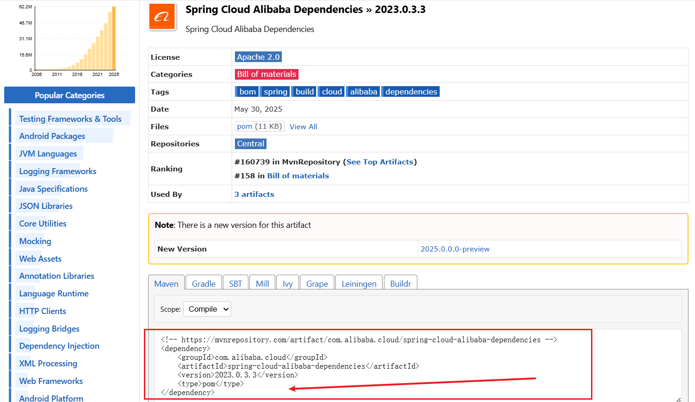
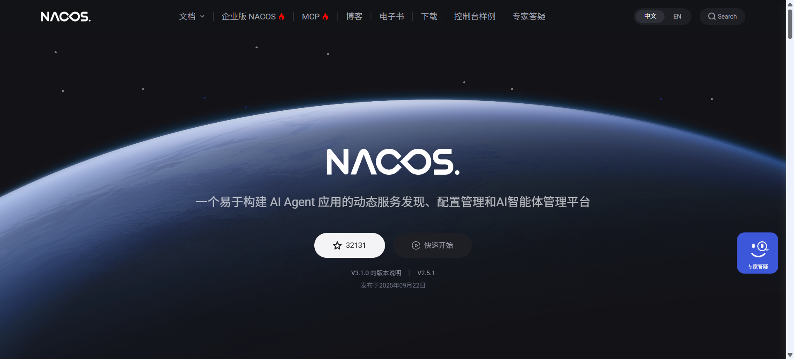

# 微服务

> 先说一个比较有意思的点：**微服务架构天生支持用多种编程语言开发同一个项目的不同部分**

## 概念

**微服务**是一种**软件架构风格**，它将一个大型复杂应用，拆分为一组**小型的、松散耦合的、可独立部署的服务的集合**


## 理解

### 概念理解

对于初学者，一个 **“服务” **就可以理解为**一个独立运行的、只专注于做一件特定业务的小项目**

- 整个系统**不再是一个庞大的单体项目**，而是由许多**独立的“小项目”**  **协同工作**  来提供完整的业务能力

> 其实吧，要是需要说说“项目”和“服务”的区别
>
> - **“项目”** 更倾向于**物理静态层面**，比如代码文件夹什么的
> - **“服务”** 更倾向于**灵动层面**，比如进行啊，ing(英语中的进行时)啊，叽里咕噜什么什么的


### 举例理解

**在以前的单体架构里**

- 整个电商网站是一个巨大的“项目”

  用户管理、商品展示、下订单、支付所有功能都混在一个代码库里，打包成一个程序运行


**而在微服务架构里**：我们会按业务边界进行拆分：

- **用户服务**
  - 一个独立的**项目/应用**
  - **单一职责**：只处理用户相关的业务（注册、登录、资料修改等）
  - **数据隔离**：有自己独立的数据库，只存放用户信息
  - **可独立部署**：可以随时更新上线，而不影响商品或订单功能

- **商品服务**
  
  - 另一个独立的**项目/应用**
  - **单一职责**：只管理商品信息（上下架、价格、库存等）
  - **数据隔离**：有自己的数据库
  
- **订单服务**：

  - 又一个独立的**项目/应用**

  - **单一职责**：只负责处理订单流程

  - **通过API通信**：

    - 当它需要用户信息时（比如获取收货地址），

      它不会直接访问用户数据库，而是通过网络去**调用“用户服务”提供的API**，

      说：“请把 ID 为 123 的用户信息告诉我”


## 单体VS微服务

### 以前的单体架构

**单体架构**：

- 将应用程序的所有功能都打包在一个单元中

  > 比如一个电商网站，用户管理、商品管理、订单处理、支付功能等所有模块都在同一个代码库里，最终部署为单个可执行文件或 Web 应用

- **优点**：开发简单，易于测试和部署

- **缺点**：

  - 随着功能增多，代码库变得臃肿，难以维护；
  - 技术栈单一，无法灵活选择；
  - 任何微小的修改都需要重新部署整个应用；
  - 可扩展性差，只能整体扩展，造成资源浪费


### 全新的微服务架构

#### 核心特性

- **服务组件化**：每个微服务都是一个可独立替换和升级的组件

- **围绕业务能力组织**：
  - 团队不再按技术分层（如前端、后端、数据库团队），而是围绕业务功能组建跨职能团队
  - 例如，一个“订单团队”会负责所有与订单相关的服务

- **去中心化治理**：
  - 每个服务团队可以自由选择最适合其业务场景的技术栈（编程语言、数据库、框架等），不受限于其他服务

- **去中心化数据管理**：
  - 每个服务通常有自己独立的数据库
  - 这避免了单体应用中“一库天下”的模式，保证了服务的自治性，但也带来了数据一致性的挑战

- **基础设施自动化**：微服务架构的复杂性要求高度自动化的持续集成（CI）和持续部署（CD）流程，以及强大的运维监控体系

- **高容错性设计**：

  - 在分布式系统中，任何服务调用都可能失败

    因此，架构设计必须考虑到服务故障、网络延迟等问题，并具备服务降级、熔断等机制，以确保一个服务的失败不会导致整个系统崩溃


#### 微服务的挑战与缺点

- **分布式系统复杂性**：开发人员需要处理网络延迟、服务间通信、数据一致性、容错等分布式系统固有的问题

- **运维开销**：

  - 需要部署、管理、监控大量的服务实例，这对自动化运维（DevOps）能力提出了极高的要求

    你需要强大的服务发现、配置管理、日志聚合、监控告警等工具

- **数据一致性**：
  - 跨多个服务的事务处理变得非常复杂。通常需要采用最终一致性和Saga模式等方案来解决，这比传统的 ACID 事务更难实现

- **测试复杂性**：
  - 对单个服务的测试很简单，但进行跨服务的端到端集成测试则非常困难

- **服务间的依赖管理**：需要仔细管理服务之间的调用关系和版本兼容性，避免出现循环依赖或版本冲突


## 微服务解决方案

微服务解决方案有很多，但是 **Spring Cloud** 毫无疑问是 **Java 生态中最主流、最全面**的**微服务解决方案**


# Spring Cloud

## 基本概念

Spring Cloud 并非一个单一的技术，它也并不是一个框架，而是 **Spring官方 提供的一整套完整的微服务解决方案**


## 组件

**“组件”** 是 Spring Cloud 中的一部分，它是 Spring Cloud 中 **某个特定领域的解决方案**


## BOM 引入

- 这里使用 **BOM** 对 **Spring Cloud 生态依赖**进行**统一版本管理**，**消除版本冲突风险**

  引入具体依赖时**不再填写 `<version>`**，版本将 **由 BOM 自动对齐**为**经过验证的兼容组合**

- 记得 BOM 要引入到 `<dependencyManagement>` 中哦，不要直接把 BOM 放到引入依赖的地方了，也就是 `<dependencies>` 那边

- 引入示例

  ```xml
  <dependencyManagement>
    	<dependencies>
      	<dependency>
        		<groupId>org.springframework.cloud</groupId>
        		<artifactId>spring-cloud-dependencies</artifactId>
        		<version>2024.0.2</version>
        		<type>pom</type>
        		<scope>import</scope>
      	</dependency>
  	</dependencies>
  </dependencyManagement>
  ```

  - 注意这里一定要加上 **`<scope> import </scope>`**

- **对于版本的选择**

  - 先以你的 **Spring Boot 版本**为锚点 → 选对应的 **Spring Cloud 版本**（看官方兼容表）

  - 再选与该 **Spring Cloud 版本**匹配的 **Spring Cloud Alibaba (SCA) 版本**

    > 这个见下文中 Spring Cloud Alibaba 中的 “BOM 引入“


# Spring Cloud Alibaba

> 背景：
>
> - 早期的 Spring Cloud 生态主要依赖 Netflix OSS 全家桶，如 Eureka、Ribbon、Hystrix 等，但这些组件后来陆续停止维护。与此同时，阿里巴巴基于其在分布式系统的实践经验推出了 Spring Cloud Alibaba，为微服务架构提供了性能更高、功能更完善的替代方案。随着 Netflix 体系逐步退出主流，Spring Cloud Alibaba 成为了社区中广泛采用的方案之一。

## 基本概念

前面我们说过：

**Spring Cloud** 是 **Spring官方 提供的 一整套完整的微服务解决方案**

而 **Spring Cloud Alibaba** 则是**这套** **解决“方案”** 的 一套 **功能强大、性能卓越的 “具体方案实现”**

> Spring Cloud Alibaba 是对 Spring Cloud 体系在国内场景的增强实现，兼容 Spring Cloud 的标准接口，同时提供更多阿里云生态的集成能力


**理解**

> 就相当于对于一道数学题，
>
> - Spring Cloud 可类比于老师给的一个**解决方案**，比如：“这道题**要用一元二次方程来解**“
>
>   > 这里给的只是**解决方案**，并没有给**具体的方案实现**，
>   >
>   > 也就是说它并没有强制你必须用“配方法”或“因式分解法”这种 **具体的方案实现方式** 来一步一步地算
>   >
>   > 你可以自己根据这个**解决方案**，也就是 **“要用一元二次方程来解”** 这个**解决方案**，
>   >
>   > 来自行决定用什么样的 **具体的实现方案** 来解，比如“配方法”或“因式分解法”
>
> - 而 Spring Cloud Alibaba 就相当于一种非常强大，并且各方面都超级优秀的**“具体方案实现”**，
>
>   比如公式 $$x = \frac{-b \pm \sqrt{b^2-4ac}}{2a}$$ (假设在本案例中这是当前的最优选之一，假设它在本案例中远比“配方法”和“因式分解法”等要更好) 
>
>   使用这个公式可以非常完美地解决这个数学题，这个公式就是一个**强大并且卓越的 “具体的方案实现”**
>
>   > 这个公式也并没有违反 **“要用一元二次方程来解”** 的这个 **Spring Cloud “解决方案”**


## 组件

前面我们说过：**“组件”**是 Spring Cloud 中 **某个特定领域的解决方案**

而**”Spring Cloud Alibaba 的组件“** 则是 **这个** **特定领域的 解决 “方案”** 的 **功能强大、性能卓越的 “具体方案实现”**


**理解**

> 可去参考 Spring Cloud Alibaba 的 “基本概念” 中的 “理解” 去进行理解


## BOM 引入

- 这里使用 **BOM** 对 **Spring Cloud Alibaba生态依赖**进行**统一版本管理**，**消除版本冲突风险**

  引入具体依赖时**不再填写 `<version>`**，版本将 **由 BOM 自动对齐**为**经过验证的兼容组合**

- 记得 BOM 要引入到 `<dependencyManagement>` 中哦，不要直接把 BOM 放到引入依赖的地方了，也就是 `<dependencies>` 那边

- 引入示例

  ```xml
  <dependencyManagement>
    	<dependencies>
  		<dependency>
        		<groupId>com.alibaba.cloud</groupId>
        		<artifactId>spring-cloud-alibaba-dependencies</artifactId>
        		<version>2023.0.3.3</version>
        		<type>pom</type>
        		<scope>import</scope>	<!-- ⭐ 这里注意一定要写 -->
  		</dependency>
      </dependencies>
  </dependencyManagement>
  ```

  - ⭐注意这里一定要加上**`<scope> import </scope>`**，这里 **MVN Repository** 的网站里面没有写，我真服了，图片证据如下👇

    


- **对于版本的选择**

  - 先以你的 **Spring Boot 版本**为锚点 → 选对应的 **Spring Cloud 版本**（看官方兼容表）

  - 再选与该 **Spring Cloud 版本**匹配的 **Spring Cloud Alibaba (SCA) 版本**

    > 这个见前文中 Spring Cloud 中的 “BOM 引入“

  


# 组件

## 服务治理

### Nacos

> 名字来源：**Na**ming 和 **Co**nfiguration **S**ervice



#### 简介

##### 概述

官网：https://nacos.io/

**Nacos** 是阿里巴巴开源的一个 **动态服务发现、配置管理和服务管理平台**

在 **Spring Cloud Alibaba** 生态中，Nacos 是默认的 **注册中心** 和 **配置中心**


##### 功能

功能概括下来，就下面这**两个**

1. **服务注册与发现	**

   > 模块：**Naming Module（注册中心）**

2. **配置管理**

   > 这个在非微服务项目中也可以使用哦
   >
   > 配置实时更新，实时生效，还有一堆好处，超级好

   > 模块： **Config Module（配置中心）**


##### 背景

> 在现代微服务架构中，应用被拆分为众多独立的服务，例如订单服务、支付服务、用户服务等
>
> 随着系统的不断扩展，这些服务的实例数量、部署节点以及网络地址（IP 和端口）会因为 **弹性伸缩、故障转移、版本发布** 等操作而频繁动态变化
>
> 与此同时，系统中每个服务都依赖大量的配置项（如数据库连接、限流规则、功能开关等），这些配置还需要根据不同环境（开发、测试、生产）进行**隔离与切换**，这使得服务管理和配置维护变得愈加复杂
>
> **Nacos** 的诞生，正是为了 **优雅地解决微服务体系中 “服务动态注册与发现” 以及 “配置集中化管理” 这两大核心难题**


#### 核心概念

---

##### 服务注册与发现相关概念

###### **服务**

>Service

- 作用：表示一个对外提供功能的模块

- 举例：用户服务、订单服务、库存服务等

- 说明：
  - 在 Nacos 中，每个服务会注册自己的名字（Service Name）， 方便其他服务通过服务名发现并调用它


###### **服务实例**

> Service Instance

- 作用：

  - 提供该服务的**具体运行节点**
  - 一个服务往往有多个实例，用来实现**负载均衡和高可用**

- 举例：

  - `user-service` 可能有以下三个实例：

    ```makefile
    192.168.1.10:8080  
    192.168.1.11:8080  
    192.168.1.12:8080
    ```

---

##### 配置管理相关概念

###### **命名空间**

> Namespace

- 作用：

  - 用于**环境级别或租户级别的隔离**
  - 不同的命名空间下，可以存在相同的 `Group` 和 `Data ID`，互不影响

- 举例：

  - 在开发环境（dev）、测试环境（test）、生产环境（prod）中，

    同一个配置文件名 `application.yaml` 可以同时存在，但内容不同


###### **分组**

> Group

- 作用：
  - 在**同一个命名空间**下，用来对**配置文件**进行**逻辑分组**管理
  - 默认分组名是 `DEFAULT_GROUP`
- 举例：
  - 可以按照项目、模块或业务类型来区分，比如：
    - `order-group`（订单相关配置）
    - `user-group`（用户相关配置）


###### **数据 ID**

> Data ID

- 作用：
  - 是 Nacos 中 **组织配置的最小单位**，**一般对应一个配置文件**

- 举例：

  - `user-service.yaml`

  - `application-prod.properties`

- 说明：
  -  程序启动时会通过 `Data ID` 去拉取配置内容

---

#### 服务注册与发现

> 注册中心

##### 为什么需要?

在微服务架构中，一个完整的应用被拆分为多个独立的服务，这些服务部署在不同的进程或服务器上

这就带来了一个核心问题：**服务之间如何互相找到对方并进行通信 ？**

- 在传统的单体应用或者服务数量固定的情况下，我们可以在配置文件中硬编码服务的 IP 地址和端口

- 但是微服务**肯定不行**

  - 在微服务架构中，服务的数量和运行位置经常会发生变化：
    - 系统扩容时，可能新增多个实例
    - 某个实例宕机或重启后，**IP 地址可能改变**
    - 服务升级发布时，旧版本下线、新版本上线，**端口号也可能不同**
    - **......**

  - 如果我们在配置文件中 **手动写死每个服务的 IP 和端口** ，那每次变动都要去修改配置、重新部署，**非常麻烦，而且极容易出错**

所以，为了解决 **服务实例动态变化导致的调用不稳定问题**，

我们 **引入** 一个统一的机制，用来  **自动注册服务实例并提供动态发现能力**

这个机制就是 **服务注册与发现**

- **Naming Module（注册中心）** 负责实现这个机制

> ⭐emmmm...,说的还是有点书面，可能有点不好get，简单来说的话，可以把它理解成：他的核心职责是 **“维护一张动态的 IP端口 地址表”**
>
> - 然后这句：**自动注册服务实例并提供动态发现能力**，可以这样理解：
>   - **自动注册服务实例**：**自动记录上线服务的 IP**
>   - **动态发现能力**：**实时查询 IP 列表**

---

##### 工作原理

- **服务注册与发现** 的工作流程主要围绕三个核心动作：**服务注册**、**健康检查** 和 **服务发现(订阅与更新)**

###### 服务注册

1. 当一个**服务提供者**（例如 `user-service` 的某个实例）启动时，会向 **Nacos Server** 发起注册请求，携带关键信息：

   - **服务名**：如 `user-service`（通常来源于 `spring.application.name`）。
   - **IP 地址**：实例所在的服务器 IP
   - **端口号**：实例监听的端口
   - **元数据（metadata）**：如 `version`、`region`、`cluster`、`weight` 等

   

2. **Nacos Server** 收到注册请求后，会将这些信息记录在一个内部的服务**注册表**中


###### 健康检查

为了确保注册表中的服务实例都是“可用的”，Nacos Server 会与已注册的服务实例之间会维护健康状态，是一种“心跳”机制
- **临时实例（默认实例）**
  - 会 **周期性发送心跳**（默认间隔为数秒，可配置）
  - 若在**超时时间窗口**内未收到心跳，Nacos 会将实例标记为不健康
  - 继续超时则**自动摘除**，避免被调用到坏节点
- **持久实例**
  - 不依赖心跳自动过期，适合由外部/人工流程控制健康与上下线

具体心跳间隔与超时阈值为**可配置项**，不同版本/环境可能不同


###### 服务发现

- 当一个**服务消费者**（如 `order-service`）需要调用 `user-service`：

  1. 它向 Nacos Server 发起请求，来查询 `user-service` 的 **健康实例列表**

  2. `order-service` 会将获取到的实例列表 **缓存到本地** 以提高性能，避免每次调用都去查询 Nacos

  3. 同时，`order-service` 通过客户端 SDK **订阅** `user-service` 的实例变更

     当实例增删或状态变化时，Nacos Server 会**通知客户端**，`order-service` 的本地监听器收到事件后**更新本地缓存**（客户端也会定期刷新以兜底）

- **选择具体哪个实例** 进行调用由 **客户端侧的负载均衡组件** 决定（例如 OpenFeign + Spring Cloud LoadBalancer 的轮询/权重/同机房优先等策略），**Nacos 只负责提供健康实例列表**


#### 动态配置管理

##### 为什么需要？

- 在传统的开发模式中，我们通常将配置信息（如数据库连接、线程池大小、功能开关等）写在项目本地的配置文件中，例如 `application.properties` 或 `application.yml`

  这种方式简单直接，但在微服务架构下会暴露出一系列痛点：

  - **静态性与硬编码**：
    - 配置被打包在代码中。一旦需要修改配置，就必须经历“修改 → 重新打包 → 部署 → 重启服务”的流程，效率低下，且无法应对紧急的线上变更需求
  - **环境管理复杂**：
    - 一套代码需要部署到开发、测试、生产等多个环境中，每个环境的配置都不同。管理这些不同版本的配置文件非常繁琐，且容易出错
  - **管理不集中**：
    - 配置分散在各个微服务项目中，无法统一审计与治理；服务越多，配置管理成本越高
  - **无法实时生效**：
    - 对需要根据线上负载动态调整的参数（如熔断阈值、限流规则），传统方式做不到实时变更

- 所以，为了解决 **配置分散、变更低效、难以及时生效** 的问题，我们**引入**了**动态配置管理**，

  它能够在 **不重启应用** 的前提下**将配置 动态 下发到各服务实例**，并支持**多环境隔离、版本管理、灰度发布与回滚......**

  **Config Module（配置中心）** 负责实现这个机制


##### 核心能力

- Nacos 支持将**大部分易变配置**从应用中剥离，集中存放在 Nacos Server 上统一治理（保留少量启动级配置用于定位与引导）

  为解决传统方式的痛点，提供以下能力：

  - **集中管理（UI + OpenAPI/SDK）**：
    - 在控制台统一维护各服务/各环境配置，也可通过 OpenAPI 接口接入流水线与自动化流程

  - **动态刷新（热更新）**：
    - 客户端订阅配置变更，配置发布后可**无需重启**使部分配置实时生效（通常需 `@RefreshScope` 或相应刷新机制；个别资源类参数仍可能需要重建/重启）

  - **多维组织与环境隔离**：
    - 通过 **Namespace / Group / Data ID** 管理配置，dev/test/prod 等环境相互隔离；可结合标签/元数据做更细粒度划分

  - **版本管理与回滚**：
    - 每次发布形成历史版本，出现问题可一键回滚到稳定版本，降低变更风险

  - **灰度发布**：
    - 支持按实例/集群/标签**定向下发**配置，验证无误后再全量发布，提升发布安全性与可控性

  - **权限与审计**：
    - 支持权限控制与变更审计，记录“谁在何时改了什么”，满足合规与追溯需求

  - **客户端容灾**：
    - 客户端保留**本地快照/最后一次有效配置**，在短时网络异常或服务端不可达时仍可按既往配置运行（降级）


##### 动态刷新的原理:长轮询

1. **首次拉取**
   - 客户端（微服务）启动后，从 Nacos Server 拉取**自己关心的配置项**（按 namespace/group/dataId），并写入本地缓存与快照
   - 若首启时服务端不可达，客户端可优先使用**本地快照（最后一次有效配置）**启动
2. **建立长轮询（或订阅通道）**
   1. 拉取成功后，客户端会发起**监听请求**，这个请求携带当前各配置项的 **MD5 列表（按 *namespace/group/dataId* 维度）**
   2. 服务端比较 MD5：
      - 若有不一致（表示有变更），**立即返回变更的 dataId 列表**；
      - 若一致，则将请求**挂起等待**直到有变更或超时（例如默认约 30s，可配置），随后客户端会**立刻重发**下一次监听请求（形成持续订阅）
   3. 在 Nacos 2.x，通知通道也可能通过 **gRPC** 实现，但语义与长轮询一致：**变更发生 → 客户端被唤醒**
3. **服务端变更**
   - 当你在控制台或 OpenAPI 发布了配置，服务端会记录新版本并**唤醒相关监听**（与该配置匹配的订阅者）
4. **变更响应与增量拉取**
   - 客户端收到**“哪些配置发生了变化”的响应**后，**仅对这些 dataId 再次发起拉取**，获取最新内容
5. **本地更新与再次监听**
   1. 客户端拿到最新配置后，更新内存中的配置值，并触发应用侧的**刷新流程**（如 `@RefreshScope` Bean 重建、`@ConfigurationProperties` 重新绑定等）
   2. 之后立即 **发起新的监听请求**，继续订阅后续的变更（或保持 gRPC 订阅通道）
6. **容灾（快照）**
   - 客户端保留本地**快照文件**，用来兜底。当服务器暂不可达或网络抖动时，可临时使用快照中的“最后一次有效配置”以保证服务可用


#### 如何引入

##### 1. 引入依赖

- 我们先需要明白一点，那就是 nacos 的依赖，是**“客户端型依赖**”，也就是它只提供“客户端”，必须连接**外部服务端**才能发挥作用

- nacos 的依赖有两个，我们按需引入，这里的**版本号我们不写**，我们**由前文中引入的BOM进行管理**

  - **”服务注册与发现“**依赖：

    - `spring-cloud-starter-alibaba-nacos-discovery`

      ```xml
      <dependency>
          <groupId>com.alibaba.cloud</groupId>
          <artifactId>spring-cloud-starter-alibaba-nacos-discovery</artifactId>
      </dependency>
      ```

      

  - **”配置管理”**依赖：

    - `spring-cloud-starter-alibaba-nacos-config`

      ```xml
      <dependency>
          <groupId>com.alibaba.cloud</groupId>
          <artifactId>spring-cloud-starter-alibaba-nacos-config</artifactId>
      </dependency>
      ```


##### 2. 安装部署启动 Nacos Server

###### 概述

- 我们前面说了，Nacos 的依赖属于**“客户端型依赖”**，它必须连接**外部服务端**才能发挥作用，所以我们还需要**对服务端进行安装**

- 安装方式这里只说两种，**Docker 安装** 和 **Windows 安装**，因为我目前的电脑是 Windows 哈哈哈


###### 两种模式：单机与集群

- **单机模式**

  > 适合：个人学习、功能开发、本地测试

  - 这是 Nacos 的基础运行模式，所有数据都存在单个 Nacos 实例中

    它 **默认使用内置嵌入式数据库（Apache Derby）**，开箱即用、启动最快

    > 这个是默认行为，不过它也**支持改成外部 MySQL**（改 `application.properties`），便于后续平滑迁移到集群


- **集群模式**

  > 生产环境、准生产环境、任何对可用性有要求的场景

  - 在生产环境中，为了保证高可用，通常会部署至少3个 Nacos 节点组成一个集群

    这些节点之间会同步数据，通常接入一个 **外部、共享的数据库（常用 MySQL）**做统一持久化存储，这是官方生产指引

    > Nacos 2.x 也支持 **集群内置存储（embedded storage）**，无需 MySQL，但需要显式配置，**不作为主流生产做法**


###### Windows 版

- **前提**：
  
  - 确保已经安装好了 Java 8 或 以上的 JDK，并配置好了 `JAVA_HOME` 环境变量
  - 下载一个 Nacos Server，大多数团队现在用 Nacos 2.x，稳妥一点选 `2.2.3` 比较好
  
- **⭐单机模式**

  1. 打开 `cmd` 之后进入 `nacos\bin`
  2. 执行命令

     ```cmd
     # -m standalone 参数明确告诉 Nacos 以单机模式启动
     startup.cmd -m standalone
     ```
     
     > nacos 默认是以集群模式启动的，但是如果没有进行配置集群，是会报错的，
     >
     > 所以在本地开发时，我们需要手动添加 `-m standalone` 参数，**显式** 指定以 **单机模式** 启动
  3. 执行命令后会展示弹窗
  
  4. 启动日志滚动完成后，浏览器中进入上一步弹窗中显式的网址，进入nacos控制台
  
     - **默认用户名**：`nacos`
     - **默认密码**：`nacos`
  
  5. **如何关闭服务**：在同一个 `cmd` 窗口中按 `Ctrl+C`，或者新开一个 `cmd` 窗口进入 `nacos\bin` 目录，执行 `shutdown.cmd`


- **⭐集群模式**

  > 前提：**需要一个可用的 MySQL 数据库 (5.7+ 版本)**

  - **数据库初始化**
    1. 在 MySQL 中创建一个专门给 Nacos 使用的数据库，例如 `nacos_config`
    2. 找到 Nacos 解压目录下的 `conf/nacos-mysql.sql` 文件
    3. 将这个 SQL 脚本在 `nacos_config` 数据库中执行，这会创建 Nacos 所需的全部数据表

  
  
  - **修改 Nacos 配置文件**
  
    所有参与集群的 Nacos 节点都需要修改此文件，将其从默认的嵌入式数据库切换为外部 MySQL
  
    - 打开 `nacos\conf\application.properties`
  
    - 找到 `Count of DB` 部分，取消注释并修改如下配置：
  
      ```properties
      # 开启外部数据库支持
      spring.datasource.platform=mysql
      
      # 配置数据库数量
      db.num=1
      
      # 配置数据库连接信息 (请根据实际情况修改 url, user, password)
      # 注意：连接地址后的参数通常是必需的，尤其是时区和字符集
      db.url.0=jdbc:mysql://127.0.0.1:3306/nacos_config?characterEncoding=utf8&connectTimeout=1000&socketTimeout=3000&autoReconnect=true&useUnicode=true&useSSL=false&serverTimezone=UTC
      db.user.0=root
      db.password.0=123456
      ```
  
  
  
  - **配置集群节点列表**
  
    在 `nacos\conf` 目录下找到 `cluster.conf.example`,将其重命名为 `cluster.conf`
  
    > `cluster.conf`:**静态列表**。每一个 Nacos 节点启动时，都会读取这个文件, 让 Nacos 服务端彼此“看见”对方
  
    编辑该文件，配置所有节点的 **IP:Port** (每行一个)
  
    > **重要提示**：
    >
    > 在本地模拟集群时，Nacos 内部通信通常要求使用**真实 IP**
    >
    > 请避免使用 `127.0.0.1` 或 `localhost`，请通过 `ipconfig` 查询本机局域网 IP（例如 `192.168.x.x`）
  
    ```conf
    # 格式：IP:端口
    192.168.31.200:8848
    192.168.31.200:8858
    192.168.31.200:8868
    ```
  
  
  
  - **部署多节点实例**
  
    > 即使是集群模式，Nacos 本身也是一个独立的 Java 进程。在 Windows 本地模拟时，我们需要复制 3 份 Nacos 文件夹来代表 3 个服务器
  
    1. 将配置好 `application.properties` 和 `cluster.conf` 的 `nacos` 文件夹完整复制三份
    2. 分别重命名文件夹为 `nacos-8848`, `nacos-8858`, `nacos-8868` 以示区分
    3. **关键步骤**：修改后两个文件夹中 `conf/application.properties` 的 `server.port` 属性，防止端口冲突
       - `nacos-8848` 文件夹：保持 `server.port=8848`
       - `nacos-8858` 文件夹：修改为 `server.port=8858`
       - `nacos-8868` 文件夹：修改为 `server.port=8868`
  
    
  
  - **启动集群**
  
    - 分别进入三个文件夹的 `bin` 目录
  
    - 打开 `cmd`，执行启动命令：
  
      > 注意：此时**不需要** `-m standalone` 参数，因为 Nacos 默认就是以集群模式启动
  
      ```cmd
      startup.cmd
      ```
  
    - 观察三个窗口的日志，当看到 `Nacos started successfully in cluster mode.` 即表示该节点启动成功
  
  
  
  - **验证与使用**
    - 访问任意一个节点的控制台（如 `http://192.168.31.200:8848/nacos`）。
    - 在左侧菜单栏点击 **“集群管理” -> “节点列表”**。
    - 此时应该能看到 3 个节点的信息（IP和端口），且状态栏均显示为 `UP`


###### Docker 版

- 前提：Docker 已安装并启动

- **单机模式**

  - 输入下面的命令。这条命令会**基于镜像创建并启动一个容器**；如果本机**还没有**这个镜像，Docker 会**先自动拉取**它

    ```bash
    docker run -d \
    --name nacos-standalone \
    -e MODE=standalone \
    -p 8848:8848 \
    -p 9848:9848 \
    -p 9849:9849 \
    nacos/nacos-server:v2.2.3
    ```

  - **命令参数解析**：

    - `-e MODE=standalone`：**核心参数**
      - 明确指定以“单机模式”启动。如果不写，Nacos 镜像默认以集群模式启动，在没有配置集群的情况下会报错退出
    - `-p 8848:8848`：主端口，用于 HTTP 协议（控制台页面、OpenAPI）
    - `-p 9848:9848`：**Nacos 2.x 新增**，用于客户端 gRPC 通信（必须映射）
    - `-p 9849:9849`：**Nacos 2.x 新增**，用于节点间 gRPC 通信（必须映射）

    

  - **查看运行状态**：

    - 查看日志：`docker logs -f nacos-standalone`
    - 当看到日志输出 `Nacos started successfully in stand alone mode` 时，即表示启动成功。
    - 访问地址：`http://localhost:8848/nacos` (账号密码默认均为 `nacos`)


- **集群模式**
  - 前提：准备好一个可用的 **MySQL (5.7+)** 数据库（可以是容器内的，也可以是外部的），并已导入 `nacos-mysql.sql`


#### 如何使用

⭐按照之前所说，先引入依赖

##### A. 服务注册与发现

**核心目标**：通过配置和注解，使 Spring Boot 应用在启动时自动向 Nacos Server 发起注册请求，上报自身的 IP、端口和服务名称

###### **1.修改配置文件 (`application.yml`)**

Nacos 客户端必须知道两件事：**我是谁（服务名）** 和 **我要向谁汇报（服务端地址）**

```yaml
server:
  port: 8081 # 当前服务的端口

spring:
  application:
    name: order-service # 【关键】服务名称。这是 Nacos 区分不同微服务的唯一标识
  cloud:
    nacos:
      discovery:
        # Nacos Server 地址
        # 如果是单机，写 IP:8848
        # 如果是集群，写 IP1:8848,IP2:8858,IP3:8868
        server-addr: 127.0.0.1:8848
```


###### **2.开启客户端功能**

在 Spring Boot 的启动类上添加注解，显式声明开启服务发现功能

> *注：在 Spring Cloud Alibaba 的部分新版本中，此注解已变为可选（Auto-Configuration 会自动生效），但建议显式添加以保证语义清晰*

```java
import org.springframework.boot.SpringApplication;
import org.springframework.boot.autoconfigure.SpringBootApplication;
import org.springframework.cloud.client.discovery.EnableDiscoveryClient;

@SpringBootApplication
@EnableDiscoveryClient // 【关键】开启服务发现与注册客户端
public class OrderApplication {
    public static void main(String[] args) {
        SpringApplication.run(OrderApplication.class, args);
    }
}
```


###### **3.启动与验证**

1. 启动该 Spring Boot 项目
2. 观察 IDEA 控制台日志，若出现 `[REGISTER-SERVICE] ... register service order-service success` 字样，说明客户端注册逻辑执行成功
3. 打开浏览器访问 Nacos 控制台（如 `http://127.0.0.1:8848/nacos`）
4. 点击左侧菜单 **“服务管理” -> “服务列表”**
5. 若列表中出现了 `order-service`，且 **“实例数”** 显示为 1，**“健康实例数”** 显示为 1，即表示注册成功


###### **4.服务发现 (即：服务间调用)**

当服务注册成功后，其他微服务可以通过 Nacos 获取该服务的 IP 列表进行调用。 *(此处仅展示最基础的 RestTemplate 整合方式)*

```java
@Bean
@LoadBalanced // 【关键】让 RestTemplate 具备通过“服务名”查找 IP 的能力（集成 Ribbon/LoadBalancer）
public RestTemplate restTemplate() {
    return new RestTemplate();
}

// 使用代码：
// 直接使用服务名 "order-service" 代替具体的 "IP:端口"
// restTemplate.getForObject("http://order-service/orders/1", String.class);
```


##### B. 动态配置管理

**核心目标**：将微服务的配置（如数据库连接、业务开关等）从本地代码中剥离，托管到 Nacos Server，并实现配置修改后服务**无需重启即可实时生效**（热更新）

###### **1.新建引导配置文件 (`bootstrap.yml`)**

**重要原则**：

- Nacos 配置中心的初始化必须发生在 Spring Boot 启动的 **引导阶段**

  因此，必须使用优先级高于 `application.yml` 的 `bootstrap.yml` 文件来配置 Nacos Server 地址

在 `src/main/resources` 目录下新建 `bootstrap.yml`：

```yaml
spring:
  application:
    name: order-service # 【关键】服务名称，对应 Nacos 配置 DataId 的前缀
  profiles:
    active: dev # 【关键】当前环境，对应 Nacos 配置 DataId 的后缀
  cloud:
    nacos:
      config:
        server-addr: 127.0.0.1:8848 # Nacos Server 地址
        file-extension: yaml # 指定配置文件格式 (yaml/properties)
```


###### **2.在 Nacos 控制台创建配置**

Nacos 客户端在启动时，会根据 `bootstrap.yml` 中的信息，按照特定的 **公式** 去 Nacos Server 寻找对应的配置文件

1. **Data ID 匹配规则 (公式)**： `${spring.application.name}-${spring.profiles.active}.${file-extension}`

   - 按照上述 `bootstrap.yml` 的配置，完整 Data ID 为：`order-service-dev.yaml`

2. **创建步骤**：

   - 进入 Nacos 控制台 -> **配置管理** -> **配置列表**

   - 点击右上角 **“+”** 号

   - **Data ID**: 输入 `order-service-dev.yaml`

   - **配置内容**: 输入测试配置，例如：

     ```
     order:
       timeout: 3000
       auto-confirm: false
     ```

   - 点击 **“发布”**


###### **3.代码读取与热更新**

为了验证配置是否加载成功，以及修改后是否能自动刷新，我们需要使用 `@RefreshScope` 注解

```java
import org.springframework.beans.factory.annotation.Value;
import org.springframework.cloud.context.config.annotation.RefreshScope;
import org.springframework.web.bind.annotation.GetMapping;
import org.springframework.web.bind.annotation.RestController;

@RestController
@RefreshScope // 【核心】此注解赋予该类“动态刷新”的能力。当 Nacos 配置变更时，该类中的属性会被重新注入
public class ConfigController {

    @Value("${order.timeout}") // 读取 Nacos 中配置的 order.timeout 属性
    private String orderTimeout;

    @GetMapping("/config/timeout")
    public String getTimeout() {
        return "当前订单超时时间: " + orderTimeout;
    }
}
```


###### **4.验证热更新流程**

1. **启动服务**：

   - 启动 Spring Boot 应用，观察日志，

     若看到 `Located property source: [BootstrapPropertySource {name='bootstrapProperties-order-service-dev.yaml'}]`，

     说明成功加载了 Nacos 配置

2. **首次访问**：访问接口 `/config/timeout`，返回 `3000`

3. **修改配置**：在 Nacos 控制台中，将 `order.timeout` 的值修改为 `6000`，并点击发布

4. **再次访问**：**不重启服务**，直接再次访问接口

5. **结果验证**：若返回 `6000`，则说明动态配置管理及热更新功能生效


## 服务调用

- 这里讨论的服务调用特指 **“同步调用”**（关于 **“异步调用”**，见后文“消息队列”章节）

- **核心认知**：无论是何种类型的调用，微服务的调用 **一定是通过”网络"进行调用的** ，这区别于我们以前的单体架构的那种代码风格

  > 在单体应用中（比如一个巨大的 Spring Boot 项目），当你需要调用另一个模块的功能时，你只需要引入对象，之后用对象直接调用就行
  >
  > 比如：
  >
  > ```java
  > @Autowired
  > private UserService userService;
  > 
  > ......
  >     
  > userService.getUserById(1);
  > ```
  >
  > 但是微服务中，`OrderService`（订单服务）和 `UserService`（用户服务）可能部署在不同的机器里，它们不仅内存不共享，甚至可能相隔十万八千里
  >
  > 你就需要使用一系列的手段，通过网络，进行调用另一个服务中的东西，麻烦死了，这里就不给示例了
  >
  > 其实本质上就是 **写一段代码，模拟浏览器发送一个 HTTP 请求** 嘛

  但是用原生方式进行网络调用实在太麻烦了，为了简化开发，屏蔽底层繁琐的 HTTP 通信细节，Spring Cloud 引入了 OpenFeign 等组件，方便我们开发


### OpenFeign

> Feign 读音: [feɪn]

#### 4核心定义

OpenFeign 是一个 **声明式** 的 Web Service 客户端。它的主要作用是简化 HTTP API 客户端的开发过程

- OpenFeign 能够让你像调用本地 Java 方法一样，调用远程的 HTTP API

  > **补充理解**：你只需要定义一个接口，并在上面加点注解告诉它“发给谁”和“发什么”，剩下的脏活累活（建连接、拼参数、解析结果）OpenFeign 全包了

- OpenFeign还默认集成了 **客户端负载均衡器**（Spring Cloud LoadBalancer），它还会默认的帮你实现负载均衡


#### 快速入门

在 Spring Cloud 环境下，集成 OpenFeign 非常简单，核心流程只需要三步：**引入依赖 -> 开启注解 -> 定义接口**


##### 1. 引入依赖

在项目的 `pom.xml` 中添加 OpenFeign 的起步依赖

```xml
<dependency>
    <groupId>org.springframework.cloud</groupId>
    <artifactId>spring-cloud-starter-openfeign</artifactId>
</dependency>
```

如果后面报错显式没有loadbalancer，就把这个也加上，默认其实是已经集成了的

```xml
<dependency>
    <groupId>org.springframework.cloud</groupId>
    <artifactId>spring-cloud-starter-loadbalancer</artifactId>
</dependency>
```


##### 2. 开启功能

在 Spring Boot 的 **启动类** 上添加 `@EnableFeignClients` 注解

- 这个注解的作用是告诉 Spring 容器：“启动时请扫描项目中所有的 `@FeignClient` 接口，并为它们创建代理对象”

```java
@SpringBootApplication
@EnableFeignClients // <--- 关键注解：开启 Feign 扫描
public class MyApplication {
    public static void main(String[] args) {
        SpringApplication.run(MyApplication.class, args);
    }
}
```


##### 3. 定义客户端接口 (Interface)

创建一个 Java 接口，并使用 `@FeignClient` 注解标记它

```java
// name: 指定要调用的远程服务名称（对应注册中心，如 Nacos/Eureka 里的服务名）
// 注意：不需要写 http://localhost:8080，OpenFeign 会自动通过负载均衡查找服务 IP
@FeignClient(name = "user-service") 
public interface UserClient {

    // 声明要调用的具体 API 路径和方法
    // 这里的 @GetMapping 是 Spring MVC 的标准注解，完全兼容
    @GetMapping("/users/{id}")
    UserDTO getUserById(@PathVariable("id") Long id);
}
```

- 关于这里我有几点要说：

  - OpenFeign 是通过 HTTP 协议沟通的，而不是 Java 语言沟通的，不一定要和另一个服务中的方法签名完全相同，

    有很多注意点，这里详见后面的笔记“关于定义接口”


##### 4. 在业务中使用

完成以上三步后，OpenFeign 已经在 Spring 容器中生成了 `UserClient` 的代理 Bean

你可以在任何 Service 或 Controller 中通过 `@Autowired` 注入并直接使用

```java
@Service
public class OrderService {

    @Autowired
    private UserClient userClient; // 注入接口

    public void createOrder(Long userId) {
        // 像调用本地方法一样调用远程服务
        UserDTO user = userClient.getUserById(userId);
        
        System.out.println("查询到的用户信息: " + user.getName());
    }
}
```


#### OpenFeign接口的定义与管理

##### 1. 核心原则：HTTP 契约 > Java 语法

OpenFeign 只关心 HTTP 协议层面的“对上”，不关心 Java 语法层面的“对上”


###### a. 必须“一模一样”的地方 (HTTP 契约)

这些地方如果不对，请求一定发不出去，或者服务端收不到参数

1. **URL 路径**：`@GetMapping("/users/{id}")` 里的路径必须和服务端完全一致
2. **HTTP 方法**：服务端是 POST，你就必须用 `@PostMapping`
3. **参数注解的 Key**：
   - **错误写法**：`@RequestParam String name` （在 OpenFeign 中，必须指定别名！）
   - **正确写法**：`@RequestParam("name") String name`
   - **原因**：Java 编译后可能会丢失参数名信息，OpenFeign 需要你显式告诉它这个参数在 HTTP URL 里叫什么名字


###### b. 建议“保持一致”的地方 (最佳实践)

虽然技术上允许不一样，但为了 **可读性** 和 **维护性** ，我们强烈建议保持一致

1. **Java 方法名**：
   - 服务端：`public User queryUserById(Long id)`
   - 客户端：`public UserDTO getUser(Long id)` (技术上可行)
   - **最佳实践**：客户端最好也叫 `queryUserById`。这样排查日志时，两边能迅速对应上
2. **DTO 类名**：
   - 服务端：`UserEntity`
   - 客户端：`UserDTO`
   - **最佳实践**：类名可以不同（因为服务端通常混用数据库实体，客户端只想要数据对象），但 **字段名** （JSON key）必须完全一致


##### 2. 避坑

###### 陷阱一：GET 请求变成了 POST?

**场景**：你要调用一个 GET 接口，参数是对象

```java
// 错误写法
@GetMapping("/users/search")
User findUser(UserSearchDTO searchParam); 
```

- **结果**：OpenFeign 会强制把这个请求变成 **POST**！

- **原因**：
  - 如果参数没有加注解，OpenFeign 默认把它当作 Request Body 处理，而 GET 请求通常不带 Body
  - **解决**：加上 `@SpringQueryMap`（如果是对象）或者用 `@RequestParam`


###### 陷阱二：路径参数报错

**场景**：

```java
// 错误写法
@GetMapping("/users/{id}")
User getUser(@PathVariable Long id);
```

- **结果**：
  - 报错 `PathVariable annotation was empty on param 0`
- **解决**：必须指定 value，即 `@PathVariable("id")`。Spring MVC Controller 里或许有时可以省，但 OpenFeign 里 **别省**


###### 陷阱三：返回值接不住

- **场景**：
  - 服务端返回了 `{ "data": { "name": "..." }, "code": 200 }`，但你的接口返回值定义的是 `UserDTO`（直接对应 data 内部结构）
  - **结果**：反序列化失败，或者字段全为 null
- **解决**：看清服务端返回的最外层结构。如果服务端包了一层 `Result<T>`，你的 Feign 接口返回值也必须是 `Result<UserDTO>`


##### 一些最佳实践总结

针对你问的“怎么写最好”，以下是经过实战检验的标准姿势：

1. **复制粘贴是美德**： 
   - 不要凭空手写 Feign 接口
   - 打开服务端的 Controller 代码，把方法签名复制过来，然后把复杂的实体类改成你的 DTO，把 `@RequestBody` 等注解保留
2. **注解显式化**： 
   - 永远明确写出 `@RequestParam("xx")` 和 `@PathVariable("xx")` 中的名字，不要依赖编译器的参数名推断
3. **保持简洁**： 
   - Feign 接口只保留需要的字段。如果服务端返回一个包含 50 个字段的 User 对象，而你只需要 `name` 和 `phone`，你的 DTO 里就只写这两个字段。这不会报错，反而能减少内存消耗


##### ※ 接口管理策略

###### 1. 核心问题

在大型微服务架构中，会有几十甚至上百个服务互相调用。比如 `Order-Service` 需要调用 `User-Service`

- **难道 `UserClient` 这个 Feign 接口代码，每个服务都要写一个一模一样的，然后如果原来的逻辑变了之后，再每一个都修改？**
  - 对于这个接口定义的问题，其实业界主要有两种解决方案：
    1. **调用方自己写**
    2. **服务方提供 Jar 包**

###### 2. 模式一：调用方自己写

这是最原始、也最松散的模式


**a. 工作流程**

1. **用户服务** 开发人员写好 Controller 接口，并发布 Swagger 文档
2. **订单服务** 开发人员打开文档，把需要的接口（如 `getUserById`）手动抄写到自己的项目里，定义为 Feign 接口
3. **支付服务** 开发人员也打开文档，把自己需要的接口手动抄写一遍


**b.优缺点分析**

| 维度     | 说明                                                         |
| -------- | ------------------------------------------------------------ |
| **优点** | **完全解耦**。调用方和服务方互不依赖，服务方随便改代码（只要 核心调用点 不变），调用方不用升级 Jar 包 |
| **优点** | **按需定义**。服务方有 100 个接口，我只需要其中 2 个，我就只写这两个，清爽干净 |
| **缺点** | **重复劳动**。如果有 10 个服务都要查用户，这段代码就被抄了 10 遍 |
| **缺点** | **维护成本高**。一旦服务方修改了 URL 或参数名，这 10 个调用方必须一个个去改代码，容易漏改导致线上故障 |


###### 3. 模式二：发布方写公共 API 模块

这是目前大型互联网公司（如阿里、美团等）最主流的做法

**核心理念**：即使项目文件夹不在一起，通过 **Maven 私服** 将它们连接起来


**a. 工程结构设计**

服务方（User-Service）的项目结构不再是一个单体模块，而是拆分为 **父工程 + 子模块**

```
user-service-project (父工程)
├── user-api (子模块 / JAR)
│   ├── com.example.user.api.UserFeignClient.java  (Feign 接口定义)
│   └── com.example.user.dto.UserDTO.java          (传输对象定义)
│   └── (这个模块会被推送到公司 Maven 私服)
|
└── user-server (子模块 / Application)
    ├── com.example.user.controller.UserController.java (Controller 实现)
    └── com.example.user.service.UserService.java       (业务逻辑)
```

- 注意，调用方是没有这个 `user-api` 模块的，他们只能通过 maven 引入，调用方他们只有他们自己的 `api` 模块，比如 `order-api`


**b. 跨仓库协作流程**

假设 `User-Service` 和 `Order-Service` 是两个完全独立的 Git 仓库，物理隔离。它们通过 **Maven 私服** 联系

- **核心流向图：**

  ```
  [User-Service 开发者]                 [Order-Service 开发者]
         |                                       |
     (git push)                              (git pull)
         ↓                                       ↓
  [Git 仓库 A (源码)]                     [Git 仓库 B (源码)]
         |                                       |
         |                                 (读取 pom.xml 依赖)  
         ↓                                       ↓
  [ 公司 Maven 私服]  <-------- (自动下载 Jar 包)
         ↑
  (存放 user-api-1.0.jar)
  ```


- **详细步骤：**

  1. **发布方动作**：

     - `User-Service` 开发完接口后，

       将编译好的 `user-api.jar` 被上传到公司的 Maven 私服

       - 注意：源码依然在 Git 里，私服里只有编译后的 class 文件

  2. **消费方动作**：

     - `Order-Service` 不需要知道对方源码在哪里，只需要在 `pom.xml` 里写上坐标
     - **结果**：Maven 自动从私服下载 jar 包到本地仓库，你的代码就可以 `import` 对方的类了

     ```xml
     <!-- 订单服务 (Git 仓库 B) 的 pom.xml -->
     <dependency>
         <groupId>com.example</groupId>
         <artifactId>user-api</artifactId> <!-- 引用的是 Nexus 里的 jar -->
         <version>1.0.0</version>
     </dependency>
     ```


**c. API 变更与版本迭代**

- 当**用户服务**新增了接口（例如 `updateUser`）或修改了 DTO 字段时，**必须**遵循以下更新流程：
  1. **服务端升级版本**： 在 `user-api` 模块中修改代码后，必须修改 `pom.xml` 中的版本号
     - *开发阶段*：使用快照版，如 `1.0.1-SNAPSHOT`（允许频繁覆盖）
     - *发布阶段*：使用正式版，如 `1.0.1`（Maven 私服通常禁止覆盖已存在的正式版）
  2. **服务端重新发布**： 再次执行 `mvn deploy`。这会将新版本 `user-api-1.0.1.jar` 推送到私服
  3. **客户端升级依赖**： `Order-Service` 的开发人员收到通知，在自己的 `pom.xml` 中将版本号修改为 `1.0.1`，Maven 会自动下载新包

> **注意**：如果服务端只改了代码却 **没有** 改版本号（且不是 SNAPSHOT），客户端 Maven 可能会因为本地缓存而拉取不到最新的代码


**c. 优缺点分析**

| 维度     | 说明                                                         |
| -------- | ------------------------------------------------------------ |
| **优点** | **开发效率极高**。调用方通过 Maven 引入即可使用，一行代码都不用写 |
| **优点** | **契约统一**。所有调用方使用的都是同一份代码，避免了手动抄写错误（如参数名拼错） |
| **缺点** | **强耦合**。调用方强依赖了服务方的 Jar 包                    |
| **风险** | **依赖冲突**。如果 `user-api` 引用了 `fastjson 1.0`，而调用方项目用的是 `fastjson 2.0`，可能会发生 Jar 包冲突 |


#### 连接池性能优化

##### 1. 为什么默认配置性能差？

在未做任何配置时，OpenFeign 使用的是 JDK 原生的 `java.net.HttpURLConnection` 来发送 HTTP 请求

###### a. 短连接机制

- **HttpURLConnection** 是基于“短连接”的
  - 这意味着每一次 HTTP 请求（比如调用一次 `getUserById`），都会完整地经历以下过程：
    - 建立 TCP 连接（三次握手） 🤝
    - 传输数据 📦
    - 断开 TCP 连接（四次挥手） 👋

###### b. 性能瓶颈

- 在高并发场景下（例如每秒几千次调用），这种机制会带来两个严重问题：
  1. **时间损耗**：TCP 握手和挥手的时间可能比实际传输数据的时间还要长
  2. **资源耗尽**：频繁创建和销毁连接会占用大量操作系统端口，甚至导致“端口耗尽”错误


##### 2. 解决方案：引入连接池

为了解决上述问题，我们需要将底层的 HTTP 客户端替换为支持 **连接池（Connection Pool）** 的组件


**推荐组件**

业界主流的两个替代方案是：

- **Apache HttpClient (HttpClient 5)**：老牌、稳定、功能丰富
- **OkHttp**：轻量级、性能优异，Android 和微服务中都很常用

**连接池的好处**：

- **长连接**：建立一次 TCP 连接后不立即断开，后续请求复用该连接
- **减少开销**：省去了握手和挥手的时间，显著降低延迟


##### 3. 优化步骤

下面以 **Apache HttpClient 5** 为例，演示如何替换默认客户端

###### 1. 引入依赖

在 `pom.xml` 中添加 `feign-hc5` 依赖。这个 jar 包的作用是把 OpenFeign 的请求转发给 Apache HttpClient 执行

```xml
<dependency>
    <groupId>io.github.openfeign</groupId>
    <artifactId>feign-hc5</artifactId>
</dependency>
```


###### 2. 修改 YAML 配置

在 `application.yml` 中开启 HttpClient 功能

```yaml
# 方案 A：Spring Boot 3.x + Spring Cloud 2022.x (新版标准)
# 专门针对 HttpClient 5 的配置
spring:
  cloud:
    openfeign:
      httpclient:
        hc5:
          enabled: true

# 方案 B：Spring Boot 2.x 或 编译器报错时的通用配置
# 这是旧版本或通用的全局开关
feign:
  httpclient:
    enabled: true
```

> **注意**：方案 B (`feign.httpclient.enabled: true`) 在很多版本中是通用的。如果你的项目中引入了 `feign-hc5` 包且配置了该项，OpenFeign 通常也会自动识别并启用 HttpClient


###### 3. 连接池参数调优 (可选)

虽然开启 `enabled: true` 后已经有了默认连接池，但在高并发下通常需要调整默认参数（默认值通常较小）

你可以在 YAML 中直接配置（Spring Cloud 2022+ 新版支持），或者通过 Java Config 配置 `CloseableHttpClient` Bean

**YAML 配置示例（简单版）：**

```yaml
feign:
  httpclient:
  	enabled: true
    max-connections: 200           # 连接池最大连接数（默认可能只有 50，建议调大）
    max-connections-per-route: 50  # 每个路由（目标域名）的最大连接数
```

> - `max-connections`：整个连接池最多能存多少个连接（比如你同时调 10 个不同的服务，总共加起来不能超过这个数）
> - `max-connections-per-route`：对 **同一个服务**（例如 `user-service`）最多能同时建立多少个连接


##### 4. 验证是否生效

如何确认 OpenFeign 真的切换到了 HttpClient？

1. **看日志**：启动时，Spring Boot 的控制台通常会打印 `HttpClient` 相关的 Bean 初始化日志
2. **Debug**：在代码中断点调试 `FeignClient` 的调用处，深入查看 `Client` 接口的实现类
   - **优化前**：实现类是 `Client.Default`
   - **优化后**：实现类是 `ApacheHttp5Client`


#### 日志与超时

##### 1. 为什么需要日志配置

默认情况下，OpenFeign 是“沉默”的

哪怕你请求失败了，或者参数传错了，控制台也不会打印具体的 HTTP 请求细节（比如 URL 是什么、Header 里有没有 Token）

为了能看清 OpenFeign 到底发了什么，我们需要 **手动开启日志**


##### **2. 四个日志级别 (Logger.Level)**

OpenFeign 定义了四种详细程度，由 `feign.Logger.Level` 枚举控制。你需要根据不同的环境选择合适的级别

| 级别        | 描述                                         | 适用场景                                     |
| ----------- | -------------------------------------------- | -------------------------------------------- |
| **NONE**    | 不记录任何日志（**默认值**）                 | **生产环境** (追求极致性能，减少 IO 开销)    |
| **BASIC**   | 仅记录请求方法、URL、响应状态码及执行时间    | **生产环境推荐** (仅用于监控慢请求)          |
| **HEADERS** | 在 BASIC 基础上，额外记录请求和响应的 Header | 调试 Token、Cookie 或自定义头缺失问题        |
| **FULL**    | 记录请求和响应的 Header、Body 和元数据       | **开发环境推荐** (调试 Bug 时看参数和响应体) |


##### 3. 核心原理：双层控制机制

要让日志显示在控制台，必须 **同时满足** 以下两个维度的配置。

OpenFeign 的日志输出依赖于底层日志框架（SLF4J）的 **DEBUG 级别**，因此存在两层控制：

**a. 第一层：OpenFeign `Logger.Level`（决定生成日志的详细程度）**

- 该配置控制 OpenFeign 在运行时是否记录请求细节（如 URL、Header、Body）
- **关键点**：OpenFeign 记录的所有日志，在底层都会被标记为 `DEBUG` 级别


**b. 第二层：Spring Boot `logging.level`（决定是否输出日志）**

- 该配置控制 Spring Boot（SLF4J/Logback）允许输出的日志最低级别
- Spring Boot 默认级别是 `INFO`，会拦截并丢弃所有 `DEBUG` 级别的消息
- **结论**：即使 OpenFeign 生成了详细日志（FULL），如果 Spring Boot 的日志级别未放行 `DEBUG`，控制台依然什么都不会显示


##### 4. 配置步骤

###### 第一步：设置日志详细度

你需要向 Spring 容器注入一个 `Logger.Level` Bean，明确指定 OpenFeign 生成日志的详细程度

```java
@Configuration
public class FeignConfig {

    @Bean
    Logger.Level feignLoggerLevel() {
        // 开发环境建议用 FULL，看清楚每一个字段，生产环境不建议用，会消耗大量 CPU 和 磁盘 IO，导致吞吐量急剧下降
        return Logger.Level.FULL; 
    }

}
```


###### 第二步：开启 DEBUG 输出

你需要显式配置 Spring Boot 日志系统，将 **OpenFeign 接口所在包** 的日志级别设置为 `DEBUG`，以允许底层输出

```yaml
logging:
  level:
    # ⚠️ 核心坑点：必须精确到 Feign 接口所在的包名
    # 假设你的 UserClient 定义在 com.example.project.client 包下
    com.example.project.client: DEBUG
```

> **检查方法**：启动项目发起调用。如果控制台看到了类似 `[UserClient#getUser] ---> GET http://...` 的日志，说明配置成功


## API网关

### Gateway

#### 1. 为什么需要网关?

在微服务架构中，后端服务往往会被拆分成多个微小的服务（如订单服务、用户服务、库存服务）。如果没有网关，客户端（App、Web、小程序）需要直接与各个微服务进行交互，会产生严重的耦合与安全隐患。

网关主要解决以下四个核心问题：

- **统一接入**
  - **问题**：后端服务（如订单、用户、库存）的IP和端口可能动态变化，且数量众多
  - **解决**：客户端只需连接唯一的网关地址，由网关根据路由规则反向代理到具体的后端服务
- **解耦与抽象**
  - **问题**：客户端（Web/Mobile）往往需要根据业务聚合多个服务的数据，直接调用会导致客户端逻辑复杂
  - **解决**：网关屏蔽了后端微服务的拆分细节，客户端无需感知微服务的具体存在
- **横切关注点统一处理**
  - **问题**：鉴权（Auth）、限流（Rate Limiting）、日志（Logging）、跨域（CORS）是每个服务都需要的通用逻辑。如果在每个微服务中重复实现，会导致代码冗余且维护困难
  - **解决**：将这些逻辑下沉到网关层统一实现（AOP思想），微服务只需专注于业务逻辑
- **安全防护**
  - **问题**：核心业务接口直接暴露在公网极其危险
  - **解决**：网关作为隔离层，隐藏内部服务架构，仅暴露必要的API

**Spring Cloud Gateway** 的出现就是为了解决这些问题。它是整个微服务系统的 **统一入口**，负责接收所有请求，并根据规则转发到目标服务


#### 2. 架构与技术栈

Spring Cloud Gateway 是 Spring 官方推出的第二代网关框架，其底层架构与传统Servlet容器有本质区别


##### a. 核心技术栈组成

Spring Cloud Gateway 的高性能源于其底层的 **响应式编程**模型。它的技术栈由下至上包含：

- **Netty**：底层网络通信框架。不同于 Tomcat 的“一线程一请求”同步阻塞模型，Netty 基于 NIO（非阻塞 I/O），能够使用少量线程处理海量并发连接
- **Project Reactor**：Spring 的反应式编程库，实现了 Reactive Streams 规范，提供了 `Mono` 和 `Flux` 异步序列流
- **Spring WebFlux**：Spring 5.0 推出的非阻塞 Web 框架，它是 Gateway 的运行基础


##### b. 阻塞与非阻塞的区别（技术原理）

- **传统架构 (Spring MVC)**：

  - 基于 **Servlet API**

    当请求进入时，线程会被阻塞，直到业务处理完成（如等待数据库查询）。在高并发下，线程池容易耗尽，导致系统崩溃

- **Gateway 架构**：

  - 基于 **WebFlux**

    采用**异步非阻塞**模型。当涉及 I/O 操作时，线程不会等待，而是通过回调或事件驱动机制处理后续逻辑

    这使得 Gateway 能够以极低的资源消耗处理高吞吐量请求


##### c. 环境搭建与依赖管理

###### 核心依赖坐标

在构建网关服务时，核心依赖为 `spring-cloud-starter-gateway`


###### **依赖说明**

| Group ID                    | Artifact ID                    | 作用                                                         |
| --------------------------- | ------------------------------ | ------------------------------------------------------------ |
| `org.springframework.cloud` | `spring-cloud-starter-gateway` | 引入 Gateway 核心功能，自动包含 `spring-boot-starter-webflux` 和 `Netty` |


###### **Maven 坐标**

```xml
<dependencies>
    <!-- Gateway 核心依赖 -->
    <dependency>
        <groupId>org.springframework.cloud</groupId>
        <artifactId>spring-cloud-starter-gateway</artifactId>
    </dependency>
    
    <!-- 服务注册中心依赖（Gateway 通常配合 Nacos 或 Eureka 等使用） -->
    <dependency>
        <groupId>com.alibaba.cloud</groupId>
        <artifactId>spring-cloud-starter-alibaba-nacos-discovery</artifactId>
    </dependency>
</dependencies>
```


##### d. Servlet 与 WebFlux 的兼容性冲突

###### **1. 场景描述**

- 你创建了一个新的 Spring Boot 模块作为网关，习惯性地引入了 `spring-boot-starter-web`，或者你的父工程（Parent POM）默认引入了该依赖


###### 2. 异常现象

启动应用时，当项目中存在依赖冲突时，会抛出如下异常：

```cmd
Description:
Spring MVC found on classpath, which is incompatible with Spring Cloud Gateway.

Action:
Please include spring-boot-starter-webflux or remove spring-boot-starter-web.
```


###### 3. 根本原因

Spring Cloud Gateway 基于 **WebFlux**，而 `spring-boot-starter-web` 基于 **Spring MVC**。 这两者在同一个应用中是 **互斥** 的，不能共存

> Spring Boot 在启动时会进行自动配置
>
> 如果 Classpath 中检测到 `spring-boot-starter-web`，它会尝试初始化 Servlet 容器（Tomcat）
> 而 Gateway 强依赖于 WebFlux 环境，**两者无法在同一个 Spring Boot 应用中共存**


###### 4. 解决方式

在 Gateway 模块的 `pom.xml` 中，**绝对不要**引入 `spring-boot-starter-web`

如果你的父工程为了方便统一管理，全局引入了 `spring-boot-starter-web`，那么你必须在 Gateway 模块中 **显式地** 将其 **排除**

```xml
<dependency>
    <groupId>org.springframework.boot</groupId>
    <artifactId>spring-boot-starter-web</artifactId>
    <!-- 显式排除导致冲突的传递依赖 -->
    <exclusions>
        <!-- 1. 排除内嵌的 Tomcat 容器 -->
        <exclusion>
            <groupId>org.springframework.boot</groupId>
            <artifactId>spring-boot-starter-tomcat</artifactId>
        </exclusion>
        <!-- 2. 排除 Spring MVC 框架 -->
        <exclusion>
            <groupId>org.springframework.web</groupId>
            <artifactId>spring-webmvc</artifactId>
        </exclusion>
    </exclusions>
</dependency>
```


#### 3. 核心概念

Spring Cloud Gateway 的处理流程完全围绕着 **“路由”** 这一核心概念构建，最重要的三个术语：**路由、断言、过滤器**


$$\text{Route (路由)} = \text{ID (唯一标识)} + \text{URI (目的地)} + \underbrace{\text{Predicates (断言集合)}}_{\text{判断条件}} + \underbrace{\text{Filters (过滤器集合)}}_{\text{处理逻辑}}$$


##### a. Route (路由)

这是网关的基本构建模块。本质上就是一条 **“转发规则”**

- 一个路由由以下几部分组成：

  - **ID**：路由的唯一标识符（String类型）。建议使用具有业务含义的名称（如 `order_service_route`），便于日志追踪和管理

  - **URI**：请求最终要被转发到的目标地址
    - **Http 方式**：`http://localhost:8080` (直接指向特定地址)
  
    - **LoadBalancer 方式**：`lb://service-name` (指向服务注册中心的服务名，启用负载均衡)
  
  - **Predicate (断言)**：一组匹配规则（比如：路径是 `/order` 开头的请求才转发）
  
  - **Filter (过滤器)**：在请求发送前或响应返回后，对数据进行修改的处理链


##### b. Predicate (断言)

> 一定在路由内部

###### 技术定义

- Predicate 是 Java 8 `java.util.function.Predicate<T>` 的一种实现

  在 Gateway 中，输入参数 `T` 是 `ServerWebExchange`（封装了 HTTP 请求和响应的上下文对象）

  - **接口定义(简化版)**:

    ```java
    @FunctionalInterface
    public interface Predicate<T> {
        // 评估输入参数，返回 true (匹配) 或 false (不匹配)
        boolean test(T t);
    }
    ```


###### 作用与行为

- **匹配逻辑**：开发人员通过 Predicate 匹配 HTTP 请求的各种属性（Request Path, Method, Header, Host, Cookie, Query Param 等）
- **逻辑组合**：一个路由可以定义多个 Predicate，它们之间默认是 **AND (逻辑与)** 的关系。只有当所有断言都返回 `true` 时，该路由才会被匹配


###### 常用断言工厂

Spring Cloud Gateway 内置了许多工厂类来生成断言，以下是开发中最常用的几种：

| 断言工厂   | 说明                 | 示例配置                                           |
| ---------- | -------------------- | -------------------------------------------------- |
| **Path**   | 匹配请求路径         | `- Path=/order/**`                                 |
| **Method** | 匹配 HTTP 方法       | `- Method=GET,POST`                                |
| **After**  | 在指定时间之后       | `- After=2025-01-01T00:00:00+08:00[Asia/Shanghai]` |
| **Header** | 匹配请求头(支持正则) | `- Header=X-Request-Id, \d+`                       |
| **Query**  | 匹配请求参数         | `- Query=token` (是否有token参数)                  |


##### c. Filter (过滤器)

###### 技术定义

- Filter 是 Gateway 处理请求和响应的核心逻辑组件

  - **作用**：在请求被路由之前（Pre）或之后（Post）修改请求和响应

  - **场景**：添加请求头、记录日志、鉴权、限流等


###### 生命周期

从逻辑上我们将其分为两个阶段：

1. **Pre Filter (前置处理)**：

   - **执行时机**：请求被路由匹配成功后，发送给目标服务 **之前**

   - **常见作用**：参数校验、权限校验、流量监控、日志埋点、修改请求头

     

2. **Post Filter (后置处理)**：

   - **执行时机**：目标服务处理完毕，响应返回给网关 **之后**，再返回给客户端之前
   - **常见作用**：修改响应头、修改响应体、统计请求耗时、统一异常处理


###### 过滤器分类

- **GatewayFilter (局部过滤器)**：只作用于当前配置的 **特定路由**
- **GlobalFilter (全局过滤器)**：不需要在配置文件中显式配置，作用于 **所有路由**（如全局鉴权、全局LoadBalancer）


##### ee. 配置方式

- 配置 Gateway 有两种主流方式：**YAML 配置文件**（常用）和 **Java Fluent API**（灵活，适合动态配置）

###### 方式一：YAML 配置（推荐，声明式）

这是最直观的配置方式，易于阅读和维护

```yaml
spring:
  cloud:
    gateway:
      routes:
        - id: payment_route               # 1. 路由 ID
          uri: http://localhost:8001      # 2. 目标 URI
          predicates:                     # 3. 断言集合 (AND关系)
            - Path=/payment/** # 匹配路径
            - Method=GET                  # 且必须是 GET 请求
          filters:                        # 4. 过滤器集合
            - AddRequestHeader=X-Source, Gateway # 添加请求头
            - StripPrefix=1               # 去除路径前缀的第一部分
```


###### 方式二：Java Fluent API（编程式）

这种方式通常用于需要根据代码逻辑动态构建路由的场景

**核心类：`RouteLocatorBuilder`**

- **作用**：用于构建 `RouteLocator` Bean，定义路由规则
- **常用方法**：
  - `routes()`: 开始构建路由流
  - `route(id, fn)`: 定义单个路由，`fn` 是一个函数式接口，用于配置 Predicate 和 Filter
  - `path(String)`: 定义路径断言
  - `uri(String)`: 定义目标 URI
  - `filters(fn)`: 定义过滤器链

**代码示例：**

```java
@Configuration
public class GatewayConfig {

    @Bean
    public RouteLocator customRouteLocator(RouteLocatorBuilder builder) {
        return builder.routes()
            .route("code_route", r -> r
                // 1. 断言：匹配路径 /guonei
                .path("/guonei")
                // 2. 过滤器：添加参数 name=test
                .filters(f -> f.addRequestParameter("name", "test"))
                // 3. 目标 URI
                .uri("[http://news.baidu.com/guonei](http://news.baidu.com/guonei)")
            )
            .build();
    }
}
```


#### 4. 快速上手：Hello World

- 我们通过一个简单的需求来体验 Gateway 的配置：**当用户访问网关的 `/guonei` 路径时，自动跳转到百度新闻国内版**

##### 方式一：YAML 配置（推荐，生产主流）

在 Spring Cloud 开发中，**约定大于配置**。我们首选 `application.yml` 来管理路由，因为它支持动态刷新，且运维人员无需修改代码即可调整规则

**配置示例：**

```yaml
server:
  port: 9527 # 网关服务端口

spring:
  cloud:
    gateway:
      routes:
        - id: baidu_news_route           # 1. 路由 ID (唯一标识)
          uri: [http://news.baidu.com](http://news.baidu.com)     # 2. 目标 URI (最终要去的地方)
          predicates:
            - Path=/guonei/** 				# 3. 断言 (匹配规则)
```

**测试效果：** 访问 `http://localhost:9527/guonei`，网关会匹配到 `baidu_news_route`，并将请求转发给百度新闻。


##### 方式二：Java Fluent API（编程式）

虽然 YAML 是主流，但在某些需要 **动态构建路由** 或 **复杂逻辑判断** 的场景下，Java API 非常有用

**核心类：`RouteLocatorBuilder`** Spring Boot 会自动注入这个构建器，可以通过链式调用来定义路由

**代码示例：**

```java
@Configuration
public class GatewayConfig {

    /**
     * 编程式路由配置
     * @param builder 由 Spring 容器自动注入
     * @return RouteLocator 路由规则定位器
     */
    @Bean
    public RouteLocator customRouteLocator(RouteLocatorBuilder builder) {
        return builder.routes()
            // 定义一条路由，ID 为 "path_route_baidu"
            .route("path_route_baidu", r -> r
                // 1. 断言：路径匹配 /guonei
                .path("/guonei")
                // 2. 目标：转发地址
                .uri("[http://news.baidu.com/guonei](http://news.baidu.com/guonei)")
            )
            // .route(...) 可以继续链式添加其他路由
            .build();
    }
}
```

**实战建议**：初学者请专注掌握 **YAML 配置**。Java API 通常用于开发自定义的路由管理后台


#### 5. 路由断言

在 Spring Cloud Gateway 中，**Predicate (断言)** 是决定请求“去向”的核心判断逻辑

- 在 YAML 配置中，`predicates` 下面的每一行（如 `- Path=/abc`）其实都对应着一个 Spring 内置的 **Factory 类**

  它们负责提取 HTTP 请求的各种属性（如发送时间、Cookie、Header、Host 等），并与配置的规则进行匹配


##### a. 核心逻辑：逻辑与 (AND)

一个路由可以配置多个断言，它们之间默认是 **AND (逻辑与)** 的关系

> **规则**：只有当配置的 **所有** 断言都返回 `True` 时，该路由才算匹配成功，请求才会被转发

如果任何一个断言失败，网关会忽略该路由，继续尝试匹配列表中的下一个路由


##### b. 时间类断言

这类断言通常用于 **秒杀**、**预售**、**维护期** 或 **限时活动** 等对时间敏感的场景

| 断言类型    | 作用                       | 场景示例                                   |
| ----------- | -------------------------- | ------------------------------------------ |
| **After**   | 在指定时间 **之后** 生效   | 2025年双11零点开始抢购，之前的请求会被拒绝 |
| **Before**  | 在指定时间 **之前** 生效   | 优惠券领取截止时间，过期后路由失效         |
| **Between** | 在指定时间段 **之间** 生效 | 仅在活动期间（如 1号到 3号）开放入口       |


**YAML 配置示例：**

```yaml
predicates:
  # 只有在 2025年1月1日 凌晨1点之后，这个接口才通
  - After=2025-01-01T01:00:00.000+08:00[Asia/Shanghai]
```


**🚨 预警：时间格式**

Gateway 对配置中的时间字符串格式要求极其严格，必须遵循 **Java 8 ZonedDateTime (ISO-8601)** 标准，包含时区信息

- ❌ **错误写法**：`2025-01-01 01:00:00` (常见错误，启动直接报错)
- ✅ **正确写法**：`2025-01-01T01:00:00.000+08:00[Asia/Shanghai]`

**最佳实践：如何获取这个字符串？** 千万不要手写！请运行下面这段简单的 Java 代码，复制控制台的输出结果：

```java
public class TimeUtils {
    public static void main(String[] args) {
        // 获取当前时区的标准格式时间字符串
        System.out.println(java.time.ZonedDateTime.now());
        // 输出示例：2023-11-23T15:30:11.456+08:00[Asia/Shanghai]
    }
}
```


##### c. 请求属性类断言

这类断言用于提取 HTTP 请求的特征进行精细化路由，常用于 **灰度发布 (Canary Release)**、**API 版本控制** 或 **特定来源限制**

| 断言工厂   | 说明           | 示例配置                                        |
| ---------- | -------------- | ----------------------------------------------- |
| **Header** | 检查请求头     | `- Header=X-Request-Id, \d+` (Value 必须是数字) |
| **Cookie** | 检查 Cookie    | `- Cookie=userType, vip` (必须包含 vip cookie)  |
| **Method** | 检查 HTTP 方法 | `- Method=GET,POST` (限制请求动作)              |
| **Host**   | 检查 Host 域名 | `- Host=**.baidu.com` (支持 Ant 风格通配符)     |


**🚨 陷阱预警：正则匹配**

`Header` 和 `Cookie` 断言接收两个参数：`key` 和 `regexp` (正则表达式)

- **场景**：你想匹配 Header 中 `X-Name` 包含 "admin" 的请求
- **错误配置**：`- Header=X-Name, admin`
  - *原因*：这表示值必须**完全等于** "admin"
- **正确配置**：`- Header=X-Name, .*admin.*`
  - *原因*：第二个参数是正则，`.*` 表示匹配任意字符


##### d. 参数类断言

用于检查 URL 中的查询参数

**YAML 配置示例：**

```yaml
predicates:
  # 1. 简单匹配：请求必须包含名为 token 的参数 (例如 /api?token=123)
  - Query=token
  
  # 2. 值匹配：参数值必须满足正则表达式
  # 要求：token 参数的值必须以 jwt 开头
  # - Query=token, jwt.*
```


##### ee. 实战演练：组合拳

假设我们有一个“新版本内测服务”，准入规则极其严格，必须 **同时满足** 以下 3 点：

1. **时间限制**：必须在 2024 年之后
2. **路径限制**：访问路径以 `/beta` 开头
3. **身份限制**：请求头必须携带 `X-Beta-Test: true`

**Application.yml 完整配置：**

```yaml
spring:
  cloud:
    gateway:
      routes:
        - id: beta_service_route
          uri: http://localhost:8088
          predicates:
            # 多个断言同时存在，必须全部满足 (AND 关系)
            - Path=/beta/**
            - After=2024-01-01T00:00:00.000+08:00[Asia/Shanghai]
            - Header=X-Beta-Test, true
```

**测试结果分析：**

- **场景 A**：`curl http://gateway/beta/api`

  - **结果**：❌ **404 Not Found**
  - **原因**：虽然路径和时间满足，但缺少必要的 Header，断言链匹配失败

  

- **场景 B**：`curl -H "X-Beta-Test: true" http://gateway/beta/api`

  - **结果**：✅ **200 OK**
  - **原因**：所有条件均满足，请求成功转发至 `localhost:8088`


#### 6. 过滤器与自定义逻辑

在 Spring Cloud Gateway 中，**Filter (过滤器)** 负责对请求和响应进行“加工”。所有的过滤器都遵循 **责任链模式**，请求在链条中依次传递

##### a. 过滤器的生命周期

虽然在代码层面是一个链条，但在逻辑上，我们通常将过滤器分为两个阶段：

- **Pre (前置处理)**：
  - **时机**：请求被路由匹配成功，但转发给下游服务 **之前**
  - **作用**：参数校验、鉴权 (Auth)、限流、修改请求头、重写路径
- **Post (后置处理)**：
  - **时机**：下游微服务返回响应 **之后**，网关将响应发回给客户端之前
  - **作用**：修改响应头、统计接口耗时、统一异常处理、日志记录


##### b. 内置过滤器

Spring Cloud Gateway 内置了 30 多种过滤器工厂，用于通过 YAML 配置快速修改请求。其中最常用的是 **Header 处理** 和 **Path 处理**

###### 请求头处理

用于向发送给微服务的请求中追加特定的 Header（例如来源标识）

**YAML 配置：**

```yaml
filters:
  # 格式：AddRequestHeader=Key, Value
  - AddRequestHeader=X-Request-Source, Gateway
```


###### 路径处理 (StripPrefix)⭐

这是微服务网关中最常用的过滤器，也是初学者最容易踩坑的地方

- **场景**：前端为了区分服务，请求地址通常包含服务名前缀（如 `/order-service/create`），但后端微服务的真实接口路径往往不包含该前缀（如 `/create`）
- **作用**：在转发前，从请求路径中 **截断** 指定数量的层级


**原理图解：**

假设配置为 `StripPrefix=1`：

| 客户端请求 Path | 过滤器操作             | 最终转发给微服务的 Path |
| --------------- | ---------------------- | ----------------------- |
| `/order/create` | 去掉第 1 层 (`/order`) | `/create`               |
| `/a/b/c`        | 去掉第 1 层 (`/a`)     | `/b/c`                  |

**配置实战：**

```yaml
spring:
  cloud:
    gateway:
      routes:
        - id: order_route
          uri: http://localhost:8002
          predicates:
            # 1. 匹配以 /order-service 开头的路径
            - Path=/order-service/**
          filters:
            # 2. 截断第 1 层前缀，否则微服务会报 404
            - StripPrefix=1
```

**🚨 巨坑预警：** `StripPrefix` 是按 **"/" 分隔的层级** 计数的，不是按字符数

- 如果配置 `StripPrefix=2`，访问 `/a/b/c` 会变成 `/c`
- 如果路径层级不够切（例如访问 `/a` 却配置了 `StripPrefix=2`），通常会导致转发异常


##### c. 自定义全局过滤器

- 虽然 YAML 配置方便，但复杂的业务逻辑（如 **统一鉴权**、**黑名单校验**）必须通过 Java 代码实现

- 要实现一个全局过滤器，必须实现 `GlobalFilter` 和 `Ordered` 这两个接口


###### `GlobalFilter` 接口

```java
public interface GlobalFilter {
    /**
     * @param exchange  网关上下文（包含 Request 和 Response）
     * @param chain     过滤器链（用于放行请求到下一个环节）
     * @return Mono<Void>  代表一个异步任务
     */
    Mono<Void> filter(ServerWebExchange exchange, GatewayFilterChain chain);
}
```

**关键对象说明：**

1. **`ServerWebExchange`**：这是 WebFlux 的核心容器，替代了 Servlet 中的 `HttpServletRequest` 和 `HttpServletResponse`
   - 获取请求：`exchange.getRequest()`
   - 获取响应：`exchange.getResponse()`
   - 共享数据：`exchange.getAttributes()` (用于在过滤器之间传递数据)
2. **`Mono<Void>`**：Reactor 编程模型的返回值。网关是 **异步非阻塞** 的，这个返回值告诉框架：“我的任务还没做完（或者做完了）”，框架会订阅这个任务


###### `Ordered` 接口

```java
public interface Ordered {
    int getOrder();
}
```

- **作用**：决定过滤器的执行顺序
- **规则**：数字越 **小**，优先级越 **高**
  - **Pre 阶段**：Order 小的先执行
  - **Post 阶段**：Order 小的后执行（类似于栈的“先进后出”）


###### 实战场景1：统一鉴权过滤器

**场景**：在请求转发给微服务之前，拦截所有请求，检查 Header 中是否包含合法的 Token

```java
@Component
public class AuthGlobalFilter implements GlobalFilter, Ordered {

    @Override
    public Mono<Void> filter(ServerWebExchange exchange, GatewayFilterChain chain) {
        // 1. 获取 Request 对象
        ServerHttpRequest request = exchange.getRequest();

        // 2. 获取 Header 中的 Token
        String token = request.getHeaders().getFirst("Authorization");

        // 3. 校验逻辑 (模拟)
        if (token == null || token.isEmpty()) {
            System.out.println("❌ 鉴权失败：未携带 Token");
            
            // 4. 拒绝请求逻辑
            ServerHttpResponse response = exchange.getResponse();
            response.setStatusCode(HttpStatus.UNAUTHORIZED); // 设置 401 状态码
            
            // 5. 【关键】直接结束请求，不再向下传递
            return response.setComplete();
        }

        // 6. 放行逻辑
        System.out.println("✅ 鉴权成功");
        // 将请求交给链条中的下一个过滤器
        return chain.filter(exchange);
    }

    @Override
    public int getOrder() {
        // 设置为 -1，保证在大多数系统过滤器之前执行
        return -1;
    }
}
```


###### 实战场景2：接口耗时统计

- **场景**：我们需要统计每个请求从进入网关到微服务返回响应，总共花费了多少时间，并打印日志。这就需要用到 **Post（后置）** 逻辑

- **难点**：WebFlux 中没有显式的 "return" 后的代码块，必须使用 `.then()` 方法

**代码实现：**

```java
@Component
public class ExecutionTimeFilter implements GlobalFilter, Ordered {

    @Override
    public Mono<Void> filter(ServerWebExchange exchange, GatewayFilterChain chain) {
        // --- Pre 阶段 (请求发出去之前) ---
        
        // 1. 记录开始时间
        long startTime = System.currentTimeMillis();
        
        // 2. 放行，并定义 "回来之后" 要做的事
        return chain.filter(exchange).then(
            // --- Post 阶段 (微服务响应回来之后) ---
            Mono.fromRunnable(() -> {
                long endTime = System.currentTimeMillis();
                long executeTime = endTime - startTime;
                
                // 获取请求路径
                String path = exchange.getRequest().getURI().getPath();
                
                System.out.println("📊 接口 [" + path + "] 耗时: " + executeTime + "ms");
            })
        );
    }

    @Override
    public int getOrder() {
        // 这里的 Order 设定很有讲究
        // Order 越小，Pre 越先执行，Post 越后执行
        // 放在最外层包裹，才能统计到最完整的耗时
        return -100;
    }
}
```

**原理图解 (责任链的回调)：**

```
Filter A (Order -100) -> Pre逻辑: 记录开始时间
    Filter B (Order -1) -> Pre逻辑: 鉴权
        ... 转发给微服务 ...
    Filter B (Order -1) -> Post逻辑 (无)
Filter A (Order -100) -> Post逻辑: 计算结束时间 (then)
```


###### 实际开发中的“巨坑”指南

**坑一：千万别用 Thread.sleep()**

- **错误示范**：

  ```java
  // ❌ 绝对禁止！！
  Thread.sleep(1000); 
  ```


- **后果**：

  - Spring Cloud Gateway 底层是 Netty，默认只有 CPU 核数个线程（IO 线程）

    如果你让线程睡眠，整个网关的处理能力会瞬间归零，所有请求都会卡死

    

- **正确做法**：如果需要模拟延迟，使用 Reactor 的 API：

  ```java
  // ✅ 正确做法
  return Mono.delay(Duration.ofSeconds(1)).then(chain.filter(exchange));
  ```


**坑二：DataBuffer 的读写问题**

- 如果你想在过滤器中 **读取 Request Body（请求体）** 或 **修改 Response Body（响应体）**，这在 WebFlux 中非常复杂

  - 因为 Body 是数据流（Flux），可能分多次传输

    一旦你读取了流，流就断了，后续的服务就读不到了

- **最佳实践**：尽量避免在全局过滤器中读取 Body。如果必须读取（如验签），建议使用 Spring Cloud Gateway 提供的高级工厂 `ModifyRequestBodyGatewayFilterFactory`，不要自己手写


**坑三：Order 的优先级冲突**

- 如果你发现鉴权过滤器没生效，或者 Header 没加上，检查一下 `getOrder()` 的返回值
- 系统内置的过滤器 Order 通常在 `0` 到 `20000` 之间，或者非常小
- **建议**：自定义的安全类过滤器，Order 设为负数（如 -1, -10），确保最先执行


#### 7. 微服务整合与动态路由

在之前的章节中，我们的路由配置是写死 IP 的（如 `http://localhost:8001`）

- 这种 **静态路由** 在微服务架构中是不可接受的，因为微服务的 IP 是动态变化的，且会有多个实例

  我们将让 Gateway 与 **Nacos** 整合，实现基于服务名的 **动态路由** 和 **负载均衡**


##### a. 核心架构：LB 协议与负载均衡

Gateway 提供了一个特殊的协议头：**`lb://` (Load Balance)**

- **旧写法**：`http://localhost:8001` (直连，单点，死板)
- **新写法**：`lb://product-service` (走注册中心，负载均衡，灵活)


**工作原理**： 当 Gateway 解析到 `lb://` 开头时，它会调用内置的 `LoadBalancerClient`：

1. 去注册中心（Nacos）查找 `product-service` 的所有健康实例列表
2. 根据算法（默认轮询）选择一个实例 IP
3. 将请求转发过去


##### b. 环境搭建与依赖陷阱

要使用动态路由，必须引入服务发现组件和负载均衡器

引入依赖 (pom.xml)

**🚨 巨坑预警：Missing LoadBalancer** 

- 从 Spring Cloud 2020 (Ilford) 版本开始，官方移除了 `Ribbon`

- 如果你只引入了 Nacos，启动时不会报错，但访问 `lb://` 时会报 `503 Service Unavailable` 或 `Unable to find instance`

**最佳实践:手动显式引入 LoadBalancer：**

```xml
<dependencies>
    <!-- 1. Nacos 服务发现 -->
    <dependency>
        <groupId>com.alibaba.cloud</groupId>
        <artifactId>spring-cloud-starter-alibaba-nacos-discovery</artifactId>
    </dependency>

    <!-- 2. 【关键】Spring Cloud 负载均衡器 (替代 Ribbon) -->
    <dependency>
        <groupId>org.springframework.cloud</groupId>
        <artifactId>spring-cloud-starter-loadbalancer</artifactId>
    </dependency>
</dependencies>
```


##### c. 实战：手动配置动态路由 (推荐)

这是生产环境最常用的模式：**明确定义路由规则，但目标地址使用服务名**

```yaml
spring:
  cloud:
    nacos:
      discovery:
        server-addr: localhost:8848 # Nacos 地址
    gateway:
      routes:
        - id: product_route
          # 【核心】使用 lb 协议 + 服务名称
          uri: lb://product-service
          predicates:
            # 匹配路径
            - Path=/product/**
```

**效果**：访问 http://gateway:9527/product/1 -> 负载均衡转发 -> http://192.168.1.5:8081/product/1


##### d. 关键伴侣：StripPrefix 过滤器

###### 问题

在微服务整合中，有一个问题几乎人人都会遇到：**路径不一致**

- **网关暴露的路径**：为了区分不同服务，我们通常加上前缀，如 `/product-service/api/xxx`
- **微服务真实路径**：微服务内部通常不包含这个服务名前缀，而是直接 `/api/xxx`

这时必须使用 **`StripPrefix`** 过滤器


###### 原理图解

配置 `StripPrefix=1` 表示：**在转发之前，去掉路径的第一层**

| 客户端请求 URL         | 配置            | 转发给微服务的 URL | 结果                   |
| ---------------------- | --------------- | ------------------ | ---------------------- |
| `/product/get`         | 无              | `/product/get`     | ✅ (如果微服务有此接口) |
| `/product-service/get` | `StripPrefix=1` | `/get`             | ✅ (去掉了前缀)         |
| `/api/v1/product/get`  | `StripPrefix=2` | `/product/get`     | ✅ (去掉了两层)         |


###### 完整配置示例

```yaml
spring:
  cloud:
    gateway:
      routes:
        - id: order_route
          uri: lb://order-service
          predicates:
            # 前端访问路径，带上了服务名作为前缀
            - Path=/order-service/**
          filters:
            # 【重要】截断第 1 层前缀 (/order-service)，只把后面的转发给微服务
            - StripPrefix=1
```


##### e. DiscoveryLocator (自动路由)

Spring Cloud Gateway 提供了一种“偷懒”模式，可以 **一行路由都不写**，自动根据 Nacos 里的服务名为所有服务创建路由

###### 开启配置

```yaml
spring:
  cloud:
    gateway:
      discovery:
        locator:
          enabled: true # 开启自动路由
          lower-case-service-id: true # 强制将服务名转为小写 (推荐开启)
```


###### 访问规则

开启后，网关会自动创建规则：`Path=/服务名/**` -> `lb://服务名`

- **访问地址**：`http://gateway-ip:port/服务名/接口路径`
- 例如：`http://localhost:9527/order-service/create`


###### 为什么生产环境不推荐？

1. **URL 丑陋**：必须暴露内部服务名给前端
2. **不可控**：无法针对某个服务单独配置限流、重试或特殊的过滤器
3. **命名冲突**：如果服务名和服务里的接口路径冲突，容易导致 404

> **结论**：**建议使用“手动配置路由 + lb 协议”的模式**，虽然麻烦一点，但控制力最强


##### f. 实际开发中的“巨坑”指南

###### 坑一：服务名的大小写敏感

- **现象**：Nacos 里显示服务名是 `Product-Service` (大写)，你在路由里写 `lb://product-service` (小写)，结果报 503
- **原因**：Gateway 对服务名匹配有时非常严格
- **最佳实践**：所有微服务的 `spring.application.name` **统一使用小写中划线格式** (kebab-case)，如 `order-service`, `user-center`


###### 坑二：`lb://` 不能用于 Predicate

- **错误想法**：我想判断如果请求要去 `order-service`，就拦截它
- **纠正**：`lb://` 只是一个 **URI 协议**，只能写在 `uri:` 字段里。断言（Predicate）只能判断 HTTP 请求本身（路径、Header等），无法判断“目标服务是谁”


###### 坑三：StripPrefix 切多了

- **现象**：配置了 `StripPrefix=1`，访问 `/test`，结果报 404 或 500
- **原因**：`/test` 只有一层。切掉一层后变成了“空字符串”或 `/`
- **解决**：确保请求路径的层级数 > StripPrefix 的数值


#### 10. 高级特性（跨域配置与限流）

##### a. 跨域配置 (CORS)

###### 为什么需要 CORS？

- 在前后端分离架构中，前端通常运行在 `localhost:8080`，而网关运行在 `localhost:9527`
- 当浏览器发现前端试图向不同端口（或域名）的后端发起请求时，出于安全考虑，会默认拦截响应
- 这就是 **跨域资源共享 (Cross-Origin Resource Sharing)** 问题


###### 解决方案

- 在微服务架构中，**最佳实践** 是：**只在网关层配置 CORS，后端微服务不需要做任何处理** 
- 如果网关配置了 CORS，下游微服务也配置了 CORS，浏览器会报“重复的 Access-Control-Allow-Origin”错误


###### YAML 配置方式 (推荐)

Spring Cloud Gateway 提供了非常简单的全局 CORS 配置，直接修改 `application.yml` 即可

```yaml
spring:
  cloud:
    gateway:
      # 全局跨域配置
      globalcors:
        cors-configurations:
          '[/**]': # 匹配所有请求
            allowedOrigins: "*" # 允许所有的源 (生产环境建议指定具体域名，如 [https://my-app.com](https://my-app.com))
            # allowedOriginPatterns: "*" # 如果 Spring Boot 版本较高，可能需要用这个代替 allowedOrigins
            allowedMethods: # 允许的 HTTP 方法
              - GET
              - POST
              - PUT
              - DELETE
              - OPTIONS
            allowedHeaders: "*" # 允许所有的请求头
            allowCredentials: true # 允许携带 Cookie
            maxAge: 3600 # 预检请求(OPTIONS)的缓存时间，单位秒
```


##### b. 请求限流

###### 核心原理：令牌桶算法

Gateway 内置了基于 Redis 的限流过滤器 `RequestRateLimiter`。它使用的是 **令牌桶算法**：

1. **桶**：系统有一个存放令牌的容器
2. **放令牌**：系统以固定的速率往桶里放入令牌（比如每秒放 10 个）
3. **拿令牌**：请求进来时，必须从桶里拿走一个令牌才能被处理
4. **结果**：如果桶空了（令牌拿完了），请求就会被拒绝（HTTP 429 Too Many Requests）


###### 环境准备

限流依赖 **Redis** 来存储令牌桶的状态。请确保 `pom.xml` 中引入了 Redis 响应式依赖：

```xml
<dependency>
    <groupId>org.springframework.boot</groupId>
    <artifactId>spring-boot-starter-data-redis-reactive</artifactId>
</dependency>
```


###### 第一步：定义限流规则

我们需要告诉网关：**按什么维度来限流？** 是按 IP 限流？还是按用户 ID 限流？还是按接口 URL 限流？

这就需要编写一个 `KeyResolver` 的 Bean

**Java 代码示例 (按 IP 限流)**：

```java
@Configuration
public class RateLimitConfig {

    /**
     * 按请求 IP 限流
     * 返回的 String 就是 Redis 中的 Key
     */
    @Bean
    public KeyResolver ipKeyResolver() {
        return exchange -> {
            // 获取请求的 HostAddress (IP)
            String ip = exchange.getRequest().getRemoteAddress().getAddress().getHostAddress();
            System.out.println("限流检测 IP: " + ip);
            return Mono.just(ip);
        };
    }
    
    // 如果想按用户 ID 限流 (假设参数中有 userId)
    /*
    @Bean
    public KeyResolver userKeyResolver() {
        return exchange -> Mono.just(exchange.getRequest().getQueryParams().getFirst("userId"));
    }
    */
}
```


###### 第二步：配置 YAML

在具体的路由中，应用 `RequestRateLimiter` 过滤器

```yaml
spring:
  redis:
    host: localhost
    port: 6379
    database: 0

  cloud:
    gateway:
      routes:
        - id: rate_limit_route
          uri: lb://cloud-payment-service
          predicates:
            - Path=/payment/limit/**
          filters:
            - name: RequestRateLimiter
              args:
                # 1. 引用我们在 JavaConfig 中定义的 Bean 名称
                key-resolver: "#{@ipKeyResolver}"
                # 2. 令牌填充速率 (每秒放多少个令牌) -> 限制平均 QPS
                redis-rate-limiter.replenishRate: 1
                # 3. 令牌桶容量 (允许在一秒内突发的最大请求数)
                redis-rate-limiter.burstCapacity: 10
                # 4. 每个请求消耗多少个令牌 (默认为 1)
                redis-rate-limiter.requestedTokens: 1
```

**配置解读**：

- `replenishRate: 1`：每秒产生 1 个令牌。这意味着稳态下，每秒只能通过 1 个请求
- `burstCapacity: 10`：桶最大能存 10 个令牌。这意味着如果前几秒没有请求，桶满了，下一秒突然来了 10 个请求，这 10 个都能瞬间通过（突发流量）。第 11 个会被拒绝


###### 测试效果

1. 启动 Redis
2. 快速刷新访问 `http://localhost:9527/payment/limit/test`
3. **结果**：正常情况下返回 200。当你刷新速度极快（超过 1次/秒）时，网关会返回 **HTTP 429 Too Many Requests**


## 负载均衡

LoadBalancer


## 流量治理与容错

Sentinel 


## 分布式事务

seata


## 消息队列

mq


Dubbo？