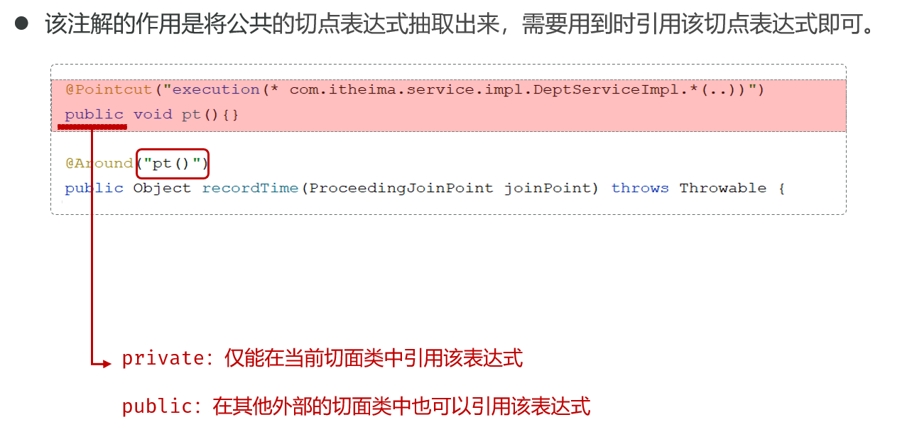
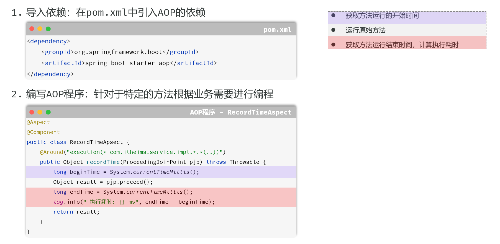

# 核心基础

## 1.Spring Boot 简介

- Spring Boot 是一个基于 Spring 框架的开源 Java 框架，它的设计初衷是为了**简化** Spring 应用的初始搭建以及开发过程。

- **核心思想**: **约定优于配置**

  > **解读**: 框架本身为你预设了一套“最佳实践”的默认配置（即“约定”）
  >
  > >例如，当你引入 Web 开发依赖时，它约定使用 Tomcat 作为服务器，端口为 8080；
  > >它约定从 `static` 目录加载静态资源；
  > >它约定使用 Logback 进行日志记录。
  > >在传统的 Spring (XML) 时代，开发者需要编写大量的 XML 文件来定义 Bean、配置组件、整合框架，这个过程非常繁琐且容易出错。Spring Boot 通过自动配置和起步依赖，将这些“约定”固化下来，让你只需要在**偏离约定**时（例如，想把端口换成 8081，或者想用 Undertow 替换 Tomcat）才需要进行少量配置。
  >
  > 这种思想极大地提升了开发效率，让开发者能更专注于业务逻辑本身。

- **目标**: 极大地简化 Spring 应用的初始搭建、开发、部署和监控过程，让开发者能够“开箱即用”。它致力于提供一种“**有主见的**”开发方式，即为你提供一套**官方推荐的最佳实践组合**

- **四大核心特性**:

  - **自动配置**: 这是 Spring Boot 的魔法核心。它通过检查类路径下的 jar 包来“猜测”你的意图，并自动注册和配置相应的 Bean。例如，当它在类路径中发现 `spring-boot-starter-data-jpa` 和 H2 数据库的驱动时，它会自动为你配置好一个指向 H2 内存数据库的数据源和 JPA 的实体管理器工厂（EntityManagerFactory），你无需编写任何配置代码就能直接开始使用。
  - **起步依赖**: 简化依赖管理，避免“依赖地狱”。它是一系列预定义的依赖描述符（`pom.xml`），你只需要在你的项目中引入一个 `starter`，它就会像一个“全家桶”一样，通过 Maven 的传递性依赖（transitive dependencies）机制，帮你把所有相关的、版本兼容的依赖一次性引入。
  - **Actuator**: 提供生产级的应用监控和管理功能。它通过一系列 HTTP 端点，让你可以在应用运行时，无需侵入业务代码就能检查其健康状况、查看性能指标（如 JVM 内存、CPU 使用率）、管理日志级别、查看 Bean 的加载情况等。这是 DevOps 和微服务监控的关键一环。
  - **嵌入式服务器**: 内置 Tomcat、Jetty 或 Undertow 等服务器，可打包成可执行 JAR 文件直接运行。这意味着你不再需要预先安装和配置一个外部的 Web 服务器，然后把应用打包成 WAR 文件部署上去。你的应用本身就是一个自包含的、可独立运行的程序，这极大地简化了部署流程，也为微服务和容器化架构（如 Docker）铺平了道路。


## 2.控制反转(IoC)与依赖注入(DI)

### 简述

- 这是整个 Spring 框架的核心思想

  - **控制反转 (IoC - Inversion of Control)**: 一种重要的软件设计思想，用于降低代码模块之间的耦合度。

    - **传统方式**: 对象自己负责创建和管理它所依赖的其他对象。
      例如，`UserService` 需要 `UserRepository`，它就得自己 `new UserRepositoryImpl()`。这种方式下，`UserService` 和 `UserRepositoryImpl` 紧密耦合在了一起。
    - **IoC 方式**: 将创建和管理对象的**控制权**，从程序员的代码中**反转**（转移）到了一个独立的第三方容器（Spring IoC 容器）。
      你不再需要手动 `new` 对象，而是由容器来负责对象的整个生命周期（创建、组装、销毁）。
    - **IoC 容器**: 在 Spring 中，IoC 容器的两个核心接口是 `BeanFactory` 和 `ApplicationContext`。
      `ApplicationContext` 是 `BeanFactory` 的子接口，提供了更完整的功能，如国际化、事件发布等。在 Spring Boot 中，我们打交道的通常都是 `ApplicationContext`。

  - **依赖注入 (DI - Dependency Injection)**: **实现 IoC 的最主要、最具体的技术**。容器知道每个对象需要哪些其他对象（即“依赖”），并自动将这些依赖“注入”到需要它们的对象中。
    DI 的核心好处是**解耦**，让你的类只依赖于接口或抽象，而不是具体的实现，这使得代码**更容易维护和测试**

    > **Spring的自动依赖注入，其本质，就是在IoC容器创建Bean实例的过程中，为这个实例的成员变量进行赋值。**
    >
    > 这个过程发生在组件扫描之后、Bean的实例化阶段。Spring会根据`@Autowired`等注入标记，从容器中查找类型匹配的Bean，并将其“注入”到需要它的地方。
    >
    > 由于创建任何Java对象都**必须通过构造方法**，因此构造方法是依赖注入最核心的入口。当一个类**只有一个构造方法**时，Spring会智能地将其作为唯一的创建方式，并自动解析其参数完成注入，此时`@Autowired`注解便**可以省略**。
    >
    > 然而，当类存在**多个构造方法**时，Spring就无法决策，此时`@Autowired`就成了**必需的指令**，用来明确指定Spring应该使用哪一个构造方法来创建对象。
    >
    > 除了构造方法，依赖也可以通过在Setter方法或字段上添加`@Autowired`来注入，但这发生在对象被构造方法创建**之后**。最终，只有通过这些方式明确请求注入的成员变量才会被Spring自动赋值，开发者可以借此精确控制每个Bean的依赖关系。

  - **只有被Spring IoC容器管理的组件（也就是Bean），才有资格享受容器提供的自动依赖注入服务**


### DI 的三种主要方式

1. **构造器注入 (Constructor Injection) - 官方最推荐**

   - **方式**: 通过类的构造函数注入依赖。

   - **优点**:

     - **依赖不可变**: 可以将字段声明为 `final`，保证一旦注入就不会被修改，增强了代码的健壮性。
     - **保证依赖完整性**: 在对象创建时，其必需的依赖必须已经准备好，否则无法实例化，避免了在运行时出现 `NullPointerException` 的风险。
     - **易于测试**: 可以轻松地在单元测试中 `new` 一个实例，并传入 Mock 的依赖对象，完全无需启动 Spring 容器。

   - **示例**:

     ```java
     @Service
     public class UserServiceImpl implements UserService {
         private final UserRepository userRepository; // 声明为 final，保证不可变
     
         // 当类只有一个构造函数时，@Autowired 注解可以省略，Spring Boot 会自动使用该构造函数进行注入
         public UserServiceImpl(UserRepository userRepository) {
             this.userRepository = userRepository;
         }
     }
     ```

   - 特点：从 Spring 4.3 版本开始，如果一个类只有一个构造方法，那么 Spring 会自动使用这个构造方法进行依赖注入，无需再显式地使用 `@Autowired` 注解

2. **Setter 注入 (Setter Injection)**

   - **方式**: 通过 `setXXX()` 方法注入依赖

   - **优点**: 比较灵活，允许依赖在对象创建后再注入或变更，适用于**可选依赖**。

   - **缺点**: 无法保证依赖的完整性，可能在运行时才发现依赖未注入。不能使用 `final` 关键字。

   - **示例**:

     ```java
     @Service
     public class UserServiceImpl implements UserService {
         private UserRepository userRepository;
     
         @Autowired
         public void setUserRepository(UserRepository userRepository) {
             this.userRepository = userRepository;
         }
     }
     ```

     

3. **字段注入 (Field Injection)**

   - **方式**: 直接在字段（成员变量）上使用 `@Autowired`

   - **优点**: 代码最简洁，编写方便。

   - **缺点**:

     - **严重不利于单元测试**: 脱离 Spring 容器后，无法为该字段赋值，因为它是 `private` 的，也没有 Setter 方法。
     - **可能隐藏过多的依赖关系**: 容易在一个类里注入过多的依赖，违反单一职责原则。
     - **无法使用 `final`**: 不能保证依赖的不可变性。

   - **示例**:

     ```
     @Service
     public class UserServiceImpl implements UserService {
         @Autowired
         private UserRepository userRepository;
     }
     ```


###  `@Component` 注解

- `@Component` 是 Spring 框架中最基础、最通用的注解之一，它是一切自动化配置和依赖注入的起点。

#### 1. 基本概念

- `@Component` 是一个**类级别**的注解。它的核心作用是向 Spring IoC 容器声明：“**请将这个类标记为一个组件（Bean），并由你来创建和管理它的实例**”

  - Spring 的组件扫描（`@Component`）是用来寻找**具体的类**来创建实例的

- 当 Spring 容器启动时，它会通过**组件扫描**机制，自动发现所有被 `@Component`（及其衍生注解）标记的类，并为它们创建对象（即 Bean），放入容器中统一管理

- 这个过程就是**控制反转(Inversion of Control, IoC)**的核心思想：你不再需要手动 `new` 对象，而是将创建和管理对象的“控制权”交给了 Spring 容器

- **示例**

  ```java
  package com.example.myapp.services;
  
  import org.springframework.stereotype.Component;
  
  @Component
  public class GreeterService {
      public String sayHello() {
          return "Hello from the managed bean!";
      }
  }
  ```

  - 通过添加 `@Component`，`GreeterService` 就成了一个可以被 Spring 发现和管理的 Bean


#### 2. `@Component` 的“衍生注解”

- 为了让代码的职责更清晰，Spring 在 `@Component` 的基础上提供了几个更具语义的**衍生注解（Stereotype Annotations）**。

  - 它们在功能上都继承自 `@Component`，能将类注册为 Bean，但更重要的是，它们能清晰地表达组件在分层架构中所扮演的角色

    - **`@Controller` / `@RestController`**: 用于标注**表现层（Web 层）**的组件。
      - **作用**：专门负责接收和处理前端的 HTTP 请求，调用业务层完成操作，并返回视图或 JSON 数据。
      - **核心特性**：除了标记为 Bean，它还会被 Spring MVC 框架识别为请求处理器，从而能够使用 `@RequestMapping` 等注解进行 URL 映射。

    - **`@Service`**: 用于标注**业务逻辑层**的组件。
      - **作用**：主要用于封装核心业务逻辑，通常会调用一个或多个数据访问层的组件来完成复杂的业务流程。
      - **核心特性**：目前主要用于语义上的区分，让开发者一眼就能看出这是业务逻辑的入口。

    - **`@Repository`**: 用于标注**数据访问层（持久层）**的组件。
      - **作用**：专门负责与数据库进行交互，执行数据的增删改查（CRUD）操作。
      - **核心特性**：除了标记为 Bean，它还能将底层数据访问的特定异常（如 JDBC 的 `SQLException`）自动转译为 Spring 统一的 `DataAccessException` 体系，使上层业务代码无需处理与具体数据库技术耦合的异常。

    - **`@Mapper`**: 用于标注**数据访问层**的接口（在 MyBatis/MyBatis-Plus 环境下）。
      - **来源**：此注解并非来自 Spring，而是来自 MyBatis 框架。
      - **作用**：它告诉 MyBatis，这是一个数据映射接口，MyBatis 会为其动态创建一个代理实现类，并将其作为 Bean 注册到 Spring 容器中。通常需要配合启动类上的 `@MapperScan` 注解一起使用。

  - 最佳实践

    - **优先使用专用注解**：在开发中，应优先使用 `@Controller`, `@Service`, `@Repository` 等专用注解，因为它们不仅能让代码的意图和分层结构一目了然，还能启用框架的特定附加功能。

    - **明确数据访问方式**：如果项目使用 MyBatis，数据访问层的接口应使用 `@Mapper` 注解。如果使用 Spring Data JPA，则通常继承 `JpaRepository` 接口，并用 `@Repository` 标注。

    - **`@Component` 的使用时机**：只有当一个组件不适合明确归入以上任何一层时（例如，一个通用的工具类、配置类、拦截器等），才使用通用的 `@Component` 注解。


### `@Autowired` 注解

- `@Autowired` 注解是实现**依赖注入(Dependency Injection, DI)**的关键。它的作用是告诉 Spring 容器：“**请自动在这里注入一个匹配的 Bean 实例**”

- 这使得组件之间可以松散地耦合，你不需要在代码中手动创建依赖的对象，一切都由 Spring 负责“装配”

#### 1. 核心概念

- `@Autowired` 可以用在类的成员变量、构造函数或方法上，用于自动装配（注入）IoC 容器中存在的 Bean。
  当 Spring 创建一个 Bean 时，它会检查这个 Bean 是否有被 `@Autowired` 标记的地方，然后去容器中寻找合适的 Bean 并将其注入

#### 2. 三种注入方式

- `@Autowired` 可以用在三个地方，各有优劣


##### 字段注入

- 这是最简洁、最常见的用法，直接在成员变量上使用

  ```JAVA
  @Service
  public class OrderService {
      @Autowired
      private NotificationService notificationService; // 直接注入
  }
  ```

- **优点**：代码量最少，非常直观

- **缺点**：无法创建不可变（`final`）的依赖。脱离 IoC 容器后，进行单元测试会比较困难（需要通过反射来设置依赖）


##### 构造函数注入

- 在类的构造函数参数上使用。如果类只有一个构造函数，`@Autowired` 注解可以省略

  ```JAVA
  @Service
  public class OrderService {
      private final NotificationService notificationService;
  
      // 当只有一个构造函数时，@Autowired 可省略
      @Autowired
      public OrderService(NotificationService notificationService) {
          this.notificationService = notificationService;
      }
  }
  ```

- **优点**：

  - **推荐方式**：这是 **Spring 官方推荐的注入方式**。
  - **保证依赖可用性**：对象在构造完成时，其所有依赖都已准备就绪。
  - **支持不可变性**：依赖可以被声明为 `final`，增强了代码的健壮性。
  - **测试友好**：不依赖 Spring 容器即可轻松实例化并传入 Mock 对象进行单元测试


##### Setter 方法注入

- 在依赖的 Setter 方法上使用

  ```JAVA
  @Service
  public class OrderService {
      private NotificationService notificationService;
  
      @Autowired
      public void setNotificationService(NotificationService notificationService) {
          this.notificationService = notificationService;
      }
  }
  ```

- **优点**：允许依赖在对象创建后被动态地更改或重新注入。

- **缺点**：不如构造函数注入那样能保证依赖的即时可用性。


#### 3. 多个匹配的Bean注入问题

- 这是一个在开发中非常常见的场景：一个接口拥有多个实现类，导致依赖注入时出现歧义。

- **场景示例**：我们系统需要支持邮件和短信两种通知方式。

  ```java
  // 通知服务接口
  public interface NotificationService {
      void send(String message);
  }
  
  // 实现类一：邮件通知
  @Service("emailNotification")
  public class EmailNotificationServiceImpl implements NotificationService {
      // ... 实现细节 ...
  }
  
  // 实现类二：短信通知
  @Service("smsNotification")
  public class SmsNotificationServiceImpl implements NotificationService {
      // ... 实现细节 ...
  }
  ```

- **问题**：如果此时直接注入 `NotificationService`，Spring会因为在容器中找到了多个类型匹配的Bean而无法决策，最终抛出 `NoUniqueBeanDefinitionException` 异常

  - 为了解决这个问题，我们有几种常用方案


##### 方案一:使用`@Primary`指定首选Bean

- 当多个实现中有一个是“主要”或“默认”的选项时，`@Primary` 是最简单的解决方案

  - **作用**：在某个实现类上添加 `@Primary` 注解，告诉Spring当遇到多个候选项时，优先注入这一个

    ```java
    @Service("emailNotification")
    @Primary // 将邮件通知设为首选
    public class EmailNotificationServiceImpl implements NotificationService { ... }
    ```

    - **使用**：现在，其他类可以直接注入 `NotificationService`，无需任何额外注解，Spring会自动选择 `EmailNotificationServiceImpl`。

      ```java
      @Service
      public class CustomerService {
          @Autowired // 无需@Qualifier，因为@Primary已解决歧义
          private NotificationService notificationService; // 这里注入的是EmailNotificationServiceImpl
      
          public void register() {
              notificationService.send("欢迎注册！");
          }
      }
      ```

  - **优点**：对使用者透明，注入代码非常干净

  - **缺点**：不够灵活，一个接口在整个应用中只能有一个首选实现


##### **方案二:使用`@Qualifier`精准指定**

- 当需要灵活地、按需地选择不同实现时，`@Qualifier` 是最佳选择

- **作用**：`@Qualifier` 注解与 `@Autowired` 配合使用，通过**Bean的名称**来精确指定要注入哪一个实例。

  ```JAVA
  @Service
  public class CustomerService {
      @Autowired
      @Qualifier("smsNotification") // 明确指定使用名为 "smsNotification" 的 Bean
      private NotificationService notificationService;
  
      public void register() {
          notificationService.send("您的验证码是: 1234"); // 这里将通过短信发送
      }
  }
  ```

- **优点**：注入哪个实现完全由使用者决定，非常灵活

- **缺点**：注入方的代码需要知道具体的Bean名称，存在一定的耦合


##### **方案三：使用 `@Resource` 按名称注入**

- 这是您提到的另一种重要方式。`@Resource` 是 Java 的 JSR-250 规范中定义的注解，并非 Spring 独有，但 Spring 提供了完美支持。

- **工作原理**: `@Resource` 的注入顺序与 `@Autowired` **完全不同**，它**优先按名称匹配**。

  1. **首先，按名称查找**：它会尝试查找与**字段名**或其 `name` 属性值匹配的 Bean。
  2. **然后，按类型查找**：如果按名称找不到，它会退回到按类型查找。

- **使用方式**:

  - **方式一：利用字段名自动匹配** (推荐)

    ```java
    @Service
    public class CustomerService {
        // 字段名 "emailNotification" 直接对应了 Bean 的名字，无需其他注解
        @Resource
        private NotificationService emailNotification;
    
        public void someMethod() {
            emailNotification.send("这是一封邮件通知。");
        }
    }
    ```

  - **方式二：使用 `name` 属性明确指定**

    ```java
    @Service
    public class OrderService {
        // 使用 name 属性明确指定要注入 "smsNotification" 这个 Bean
        @Resource(name = "smsNotification")
        private NotificationService notificationService;
    
        public void placeOrder() {
            notificationService.send("您的订单已发货。");
        }
    }
    ```

- **优点**：通常比 `@Autowired` + `@Qualifier` 的组合更简洁，意图更直接。

- **缺点**：由于它不是 Spring 亲生的注解，所以在某些非常特定的 Spring 高级功能（如与 AOP 结合）中，支持可能不如 `@Autowired` 完美


##### **方案四:注入所有实现类的集合(高级用法)**

- 这是一个非常强大且优雅的策略，尤其适用于需要同时执行所有策略的场景

  - **作用**：如果你想一次性获取所有实现了某个接口的Bean，可以直接将注入点声明为一个**单列集合(List)或双列集合(Map)**。Spring会自动将所有匹配的Bean都放入这个集合中。

    - **注入List**：

      ```JAVA
      @Service
      public class OrderService {
          // Spring会找到所有NotificationService的实现类，并将它们的Bean注入到这个List中
          @Autowired
          private List<NotificationService> allNotificationServices;
      
          public void placeOrder() {
              // ... 业务逻辑 ...
              // 遍历并调用所有通知服务
              for (NotificationService service : allNotificationServices) {
                  service.send("您的订单 #12345 已创建！");
              }
          }
      }
      ```

    - **注入Map**： 如果你还想根据Bean的名字来获取特定的实现,可以注入一个Map,其中Key是Bean的名称,Value是Bean的实例

      ```JAVA
      @Service
      public class NotificationManager {
          @Autowired
          private Map<String, NotificationService> serviceMap; // Key: "emailNotification", "smsNotification"
      
          public void sendNotification(String type, String message) {
              NotificationService service = serviceMap.get(type);
              if (service != null) {
                  service.send(message);
              } else {
                  throw new IllegalArgumentException("不支持的通知类型: " + type);
              }
          }
      }
      ```

  - **优点**：扩展性极强。未来如果新增第三种通知方式，只需添加一个新的实现类，使用方的代码**完全不需要修改**，新的通知方式会自动被包含进来。


#### 4. 可选依赖注入

- 默认情况下,`@Autowired` 要求注入的Bean必须存在,否则应用启动会失败.如果你希望某个依赖是**可选的(可以为null)**,有以下两种方式


##### **方式一：使用 `required = false`**

- 这是传统的方式，它告诉Spring如果找不到匹配的Bean，不要抛出异常，直接将`null`注入即可

  ```JAVA
  @Autowired(required = false)
  private OptionalAnalyticsService optionalAnalyticsService; 				// 如果找不到Bean，这里会是null
  ```

- **缺点**：后续使用时必须进行繁琐的`null`检查，否则有`NullPointerException`风险


##### **方式二：使用 `java.util.Optional` (推荐)**

- 这是更现代、更安全的做法。直接将字段声明为 `Optional<T>` 类型，Spring会自动处理

  ```JAVA
  @Autowired
  private Optional<OptionalAnalyticsService> optionalAnalyticsService; 	// 推荐用法
  ```

- **优点**：

  - 如果Bean存在，`optionalAnalyticsService.isPresent()` 返回 `true`
  - 如果Bean不存在，它会是一个空的`Optional`对象 (`Optional.empty()`)，而不是`null`
  - 这强制你使用 `ifPresent()` 或 `orElse()` 等函数式方法来处理，从根本上避免了`NullPointerException`,代码更健壮、更优雅


## 3. 容器中的Bean对象数量

- 容器中**同一个Bean，会创建几个**，取决于 Bean 的**作用域（Scope）**。`@Component` 默认的作用域是**单例（Singleton）**

### **默认情况：单例**

- **定义**：在整个 Spring IoC 容器的生命周期中，一个类只会**创建一个** Bean 实例

- **行为**：无论这个 Bean 在多少个地方被注入（`@Autowired`），所有地方引用的都是**同一个、唯一的**对象实例

- **结论**：**一个用 `@Component` 标记的类，默认情况下，容器中只会创建一个 Bean 对象**

- **示例**

  ```JAVA
  // MySingletonComponent.java
  @Component
  public class MySingletonComponent {
      public MySingletonComponent() {
          System.out.println("Singleton Bean Created! HashCode: " + this.hashCode());
      }
  }
  
  // SomeService.java
  @Service
  public class SomeService {
      @Autowired
      private MySingletonComponent component1; // 注入点1
  
      @Autowired
      private MySingletonComponent component2; // 注入点2
  
      public void checkInstance() {
          // 输出将证明 component1 和 component2 是同一个对象
          System.out.println("Component 1 HashCode: " + component1.hashCode());
          System.out.println("Component 2 HashCode: " + component2.hashCode());
          System.out.println("Are they the same? " + (component1 == component2)); // true
      }
  }
  ```

  

### **例外情况：原型**

- 你可以**使用 `@Scope` 注解来改变默认行为，但是内部有别的原因，我用了反正没成功过**

  - 当作用域被设置为 `prototype` 时，**每次请求或注入**这个 Bean，Spring 容器都会创建一个**全新的**实例

  - 容器创建后将其交给请求方，之后便不再管理该 Bean 的完整生命周期（特别是销毁阶段）

  - 示例

    ```java
    import org.springframework.context.annotation.Scope;
    import org.springframework.stereotype.Component;
    
    @Component
    @Scope("prototype")
    public class MyPrototypeComponent {
        public MyPrototypeComponent() {
            System.out.println("Prototype Bean Created! HashCode: " + this.hashCode());
        }
    }
    ```

    - 在这种情况下，`MyPrototypeComponent` 被或请求多少次，就会创建多少个新对象。


### **`@Scope`作用域总结**

| 作用域                 | 描述                          | 创建时机                               |
| ---------------------- | ----------------------------- | -------------------------------------- |
| **`singleton`** (默认) | 整个应用只有一个实例          | IoC 容器启动时                         |
| **`prototype`**        | 每次请求/注入都创建一个新实例 | 每次被请求或注入时                     |
| `request`              | 每个 HTTP 请求一个实例        | 每个 HTTP 请求开始时 (仅 Web 环境)     |
| `session`              | 每个 HTTP Session 一个实例    | 每个 HTTP Session 创建时 (仅 Web 环境) |


## 4. Bean 的命名规则

- 当 Spring 注册一个 Bean 时，会给它一个名字(ID)

  - **默认名称**：类名的首字母小写。

    - `GreeterService` ====> `greeterService`
    - `UserRepository` ====> `userRepository`

  - **自定义名称**：在注解中直接提供一个字符串值

    - `@Component("myCustomGreeter")`
    - `@Service("mainOrderService")`

    >你可以使用这个名字通过 `ApplicationContext` 来手动获取 Bean:例如`applicationContext.getBean("mainOrderService");`


# 应用的启动与自动化配置

## 启动类与`@SpringBootApplication`

- 每个 Spring Boot 应用都有一个带有 `main` 方法的启动类，它是整个应用的**唯一入口**和**配置中心**。其核心是 `@SpringBootApplication` 注解，它是一个组合注解，包含了三个关键功能：
  - **`@ComponentScan` (扫描组件)**: 告诉 Spring 从哪里开始扫描你的类（`@Component`, `@Service` 等）以注册为 Bean。
    - **默认规则**: 默认的扫描路径是该注解所在类**所处的包**及其所有子包。
    - **最佳实践**: 将启动类放在项目的根包下（如 `com.example.myapp`），这样它就能自然地扫描到所有业务代码，无需额外配置。
  - **`@EnableAutoConfiguration` (开启自动配置)**: 这是 Spring Boot 的“魔法”核心。它会根据你项目中引入的 `starter` 依赖，智能地、自动地配置应用所需的各种 Bean。
    - **工作原理**: Spring Boot 会扫描所有依赖包中的 `META-INF/spring/org.springframework.boot.autoconfigure.AutoConfiguration.imports` 文件（旧版本为 `spring.factories`），加载其中定义的自动配置类。这些配置类会根据条件（如 classpath 中是否存在某个类）来决定是否生效。
  - **`@SpringBootConfiguration` (声明为配置类)**: 这本质上就是 `@Configuration` 注解。它允许你在启动类中也通过 `@Bean` 注解来手动定义 Bean，从而将启动类本身也作为一个配置源。


## `SpringApplication.run()`方法

- 当你点击运行 `main` 方法时，`SpringApplication.run()` 这行代码背后有一套精密的自动化启动流程。它不仅仅是启动服务器，更是**创建并准备好整个应用运行环境（`ApplicationContext`）**的过程。
- **核心启动步骤分解**:
  1. **创建 `SpringApplication` 实例**: 这是启动流程的第一步，用于初始化应用。
  2. **准备环境 (Environment)**: 创建并配置应用的环境信息，包括加载 `application.properties` 或 `application.yml` 文件中的配置。
  3. **打印 Banner**: 在控制台打印出 Spring 的字符画 Logo。
  4. **创建 `ApplicationContext` (IoC容器)**: 根据应用类型（Web或非Web）创建对应的容器实例，如 `AnnotationConfigServletWebServerApplicationContext`(不用质疑，这个名字就是这么长，不是不小心写到一起了)
  5. **准备 `ApplicationContext`**: 这是最关键的环节之一。
     - 执行**组件扫描**，加载所有用户定义的 Bean（`BeanDefinition`）。
     - 执行**自动配置**，加载所有符合条件的自动配置 Bean。
  6. **刷新 `ApplicationContext`**: 这是 IoC 容器最核心的生命周期阶段。
     - **实例化所有单例 Bean**。
     - **执行依赖注入（DI）**，完成所有 `@Autowired` 的装配。
  7. **启动内嵌服务器**: 如果是 Web 应用，此时会启动内嵌的 Tomcat、Jetty 或 Undertow。
  8. **执行 `Runner`**: 调用所有实现了 `ApplicationRunner` 和 `CommandLineRunner` 接口的 Bean，用于在应用启动后执行一些初始化代码。


## 关于“组件扫描”的深入理解

- **扫描对象**: Spring Boot 扫描的是编译后的类路径（Classpath）下的 **`.class` 文件**，而不是编写的源代码路径下的 `.java` 文件。
  - **为什么？** 因为 JVM 只认识并执行编译好的字节码。当你将项目打包成 JAR 或 WAR 文件进行部署时，里面也只包含 `.class` 文件和资源文件
- **扫描流程**:
  1. **确定扫描范围**: 默认**从 `@ComponentScan` 注解所在的包开始**
  2. **遍历类路径**: 递归地**遍历该包及其所有子包下的每一个 `.class` 文件**
  3. **读取元数据**: 使用 ASM 技术（一种字节码操作库）高效地读取 `.class` 文件的元数据，**检查类头上是否被 `@Component` 或其衍生注解所标记**，而**无需加载整个类**，性能极高
  4. **注册Bean定义**: 一旦识别到组件注解，就为这个类生成一个 `BeanDefinition` 对象（可以理解为 Bean 的“图纸”或“配方”），并将其注册到 IoC 容器中，等待后续的实例化


## 关于`@SpringBootTest`测试

- 在标准的 Spring Boot + Maven 项目结构中，当您运行一个测试，特别是使用了 `@SpringBootTest` 注解的测试类时，Spring Boot 的测试框架会默认加载完整的应用程序上下文。
  - 这意味着它会扫描您在 `src/main/java` 下定义的所有组件，包括 `@Service`, `@Repository`, `@Component`, `@Controller` 等注解的类，并将它们作为 Bean 注册到 IoC 容器中。

- `@SpringBootTest` 注解是关键
  - 这个行为的核心在于 `@SpringBootTest` 注解。当您在测试类上使用这个注解时，它会指示 Spring Boot 启动一个与您实际应用程序几乎相同的环境。它会去寻找您的主启动类（通常是带有 `@SpringBootApplication` 注解的类），并根据其中的配置来初始化整个 Spring 应用上下文。

- `@SpringBootApplication` 注解本身就包含了 `@ComponentScan`，它会默认扫描主启动类所在的包及其所有子包。因此，在测试环境下，这个扫描机制同样会被触发，从而将 `src/main/java` 下的类纳入管理
- 如果**没有** `@SpringBootTest` 注解，Spring Boot 不会自动加载任何应用上下文，因此 `src/main/java` 目录下的类（Beans）也不会被扫描和放入 IoC 容器中。


# 项目构建与结构

## Maven 构建项目

- **父项目 (`spring-boot-starter-parent`)**: 通过 Maven 的**继承**特性，提供了**统一的版本管理**和**默认的插件配置**
- **起步依赖 (Starters)**: 依赖的“工具箱”，主要作用是**聚合依赖**（如 `spring-boot-starter-web`）
- **核心构建插件 (`spring-boot-maven-plugin`)**: 实现“可执行 JAR”这一核心特性的**关键**，负责将项目**重新打包**成 “fat JAR”


## 起步依赖详解

- **`spring-boot-starter-web`**: 这是构建 **Web 应用**（包括网站和 RESTful API）的**一站式解决方案**。它聚合了以下核心功能和依赖：
  - **`spring-boot-starter`**: 所有 `starter` 的基础，引入了自动配置 (`spring-boot-autoconfigure`)、日志 (`spring-boot-starter-logging`) 和 YAML 解析 (`snakeyaml`) 等基础能力。
  - **`spring-boot-starter-json`**: 专门负责 **JSON 数据处理**的工具箱，核心是引入了 **Jackson** 库 (`jackson-databind`)，负责 Java 对象与 JSON 字符串的自动相互转换。
  - **`spring-boot-starter-tomcat`**: 引入**内嵌的 Tomcat Web 服务器**，让你的应用可以独立运行
  - **`spring-web`**: Spring 框架 Web 功能的基础包
  - **`spring-webmvc`**: **Spring MVC 框架**本身，提供了 `DispatcherServlet`、`@RestController` 等所有 Web 开发的核心组件和注解
- **`spring-boot-starter-test`**: 这个依赖为你提供了编写和运行**单元测试**与**集成测试**所需的所有核心工具。它不仅仅是简单地聚合依赖，更是 Spring Boot 提供的**一站式测试解决方案**
  - **强大之处**: 一次性引入 JUnit 5, Mockito, AssertJ, Spring Test 等所有主流测试库，并利用父项目保证了版本**完美兼容**
  - **`<scope>test</scope>`**: 该标签告诉 Maven，此依赖只在**测试阶段**有效，不会被打包到最终的生产环境中


## 资源文件目录 (resources) 与类路径

- `resources` 目录的工作方式

  - **`resources` 目录**：在 Maven 构建项目时，`src/main/resources` 目录下的**所有内容**，都会被原封不动地**复制**到构建输出目录 `target/classes/` 中
    `target/classes/` 这个目录，通常会被作为应用程序自身类和资源的首要搜索路径，并被添加到Classpath这个列表的最前面

    - 因此，你在 `src/main/resources/application.yml` 编写配置，程序在运行时就能从 `classpath:/application.yml` 加载到它

  - **静态资源加载机制**：Spring Boot 不会扫描类路径根目录下的所有文件作为静态资源
    它只会去几个**预先约定好的特定文件夹**里寻找。这些默认的静态资源位置如下(按优先级顺序）：

    1. `classpath:/META-INF/resources/`
    2. `classpath:/resources/`
    3. `classpath:/static/` (最常用)
    4. `classpath:/public/`

    

  - **实践案例解析**

    - **`src/main/resources/A.html` -> 无法通过 `localhost:8080/A.html` 访问**
      - **原因**: 这个文件被复制到了 `target/classes/A.html`，也就是 `classpath:/A.html`，
        这个位置**不**在 Spring Boot 默认的静态资源查找文件夹列表中，所以访问失败
    - **`src/main/resources/static/B.html` -> 可以通过 `localhost:8080/B.html` 访问**
      - **原因**: 这个文件被复制到了 `target/classes/static/B.html`，也就是 `classpath:/static/B.html`。`classpath:/static/` 是默认的查找路径，所以 Spring Boot 能找到它。**这是存放静态资源最标准、最推荐的做法。**
    - **`src/main/resources/resources/C.html` -> 可以通过 `localhost:8080/C.html` 访问**
      - **原因**: 这个文件被复制到了 `target/classes/resources/C.html`，也就是 `classpath:/resources/C.html`。`classpath:/resources/` 也在默认查找路径列表中，所以也能被找到。
    - ......


# 软件分层与三层架构

## 1. 软件分层架构思想

- 宏观的、指导性的软件设计思想——**分层架构**。**三层架构** 是最分层架构经典、应用最广泛的一种模式

- 三层架构不是一个具体的项目目录结构，而是一种用于组织和划分代码职责的逻辑思想**。**

  - 它的核心目标只有一个：**“解耦”**。通过将一个复杂的系统，按照不同的职责清晰地划分成独立的层次，使得每一层都只关注自己的任务，层与层之间通过清晰的接口进行通信。这样做的好处是巨大的：

    - **高内聚，低耦合**: 层内部的组件联系紧密(高内聚)，而层与层之间的依赖关系变得简单明了(低耦合)

    - **易于维护**: 当某一层的实现需要修改时（例如更换数据库），理论上不会影响到其他层

    - **可扩展性强**: 可以独立地对某一特定层进行扩展或替换

    - **职责清晰**: 便于团队协作，不同的开发者可以专注于不同层次的开发

- Spring 框架提供的各种核心注解，其主要目的之一就是为了帮助开发者能够优雅、高效地实践这种分层思想


## 2. 三层架构详解

- 三层架构将一个复杂的系统，按照职责清晰地划分成三个逻辑层次：表现层、业务逻辑层、数据访问层

### 表现层

- **职责**:
  - 这是系统与用户直接交互的“门面”。
  - 负责接收用户的请求（例如，用户在网页上点击一个按钮）。
  - 对用户的输入进行初步的、与业务无关的校验（例如，检查用户名格式是否正确）。
  - 调用业务逻辑层来处理请求。
  - 将业务逻辑层返回的结果，以合适的格式（如 JSON 或 HTML 页面）呈现给用户。
- **在 Spring Boot 中**:
  - 这一层通常被称为 **Controller 层**
  - 对应的核心注解是 **`@Controller`** (用于返回视图) 和 **`@RestController`** (用于返回数据)。


### 业务逻辑层

- **职责**:
  - 这是整个应用的**核心**和“大脑”。
  - 负责处理所有的业务逻辑、规则和计算。例如，“用户注册”、“商品下单”、“计算折扣”等核心功能都在这一层实现。
  - 它承上启下，接收来自表现层的指令，并**编排、协调**数据访问层的操作来完成一个完整的业务流程。一个业务操作可能需要多次调用数据访问层（比如下单操作需要同时扣减库存和创建订单）。
  - **事务管理**是这一层至关重要的职责，确保一个完整的业务操作要么全部成功，要么全部失败。
- **在 Spring Boot 中**:
  - 这一层通常被称为 **Service 层**。
  - 对应的核心注解是 **`@Service`**。


### 数据访问层

- **职责**:
  - 这一层的职责非常单一和纯粹：只负责和数据存储（通常是数据库）打交道。
  - 负责执行数据的持久化操作，即增 (Create)、删 (Delete)、改 (Update)、查 (Retrieve) (CRUD)。
  - 它将底层的数据库操作（如编写 SQL 语句、处理 JDBC 连接）封装起来，为业务逻辑层提供简单、清晰的数据操作接口。
- **在 Spring Boot 中**:
  - 这一层通常被称为 **DAO (Data Access Object) 层**、**Repository 层** 或 **Mapper 层**。
  - 对应的核心注解是 **`@Repository`** (Spring Data JPA) 或 **`@Mapper`** (MyBatis)


## 3.数据访问层的不同实现

- 数据访问层的不同实现:**DAO,Mapper,Repository**

  - 这三个词都与数据访问层有关，但它们代表了不同层次的抽象和技术演进

    | 概念           | 抽象级别 | 主要来源         | 在 Spring Boot 中的典型实现                    |
    | -------------- | -------- | ---------------- | ---------------------------------------------- |
    | **DAO**        | 较低     | 设计模式         | 自己写的 JDBC 实现类                           |
    | **Mapper**     | 中等     | MyBatis 框架     | 使用 `@Mapper` 注解的接口，配合 XML 或注解 SQL |
    | **Repository** | 更高     | Spring Data 框架 | 继承 `JpaRepository`, `MongoRepository` 等接口 |


### DAO

- **是什么**：**DAO(Data Access Object) 是一个非常古老和基础的设计模式**，不是一个具体的技术。它的核心思想是创建一个专门的 Java 类/接口，把所有访问数据库的代码（比如获取 JDBC 连接、创建 `PreparedStatement`、执行 SQL 语句、处理 `ResultSet`、关闭资源等）都封装在里面，从而让业务逻辑层（Service）不需要关心具体是怎么操作数据库的，实现了业务逻辑与数据访问逻辑的分离。
- **定位**：**基础设计思想**。它是后面所有数据访问层技术的基础。


### Mapper (MyBatis)

- **是什么**：**Mapper 是 MyBatis 框架中对 DAO 模式的一种具体实现**。它通过接口和映射文件（或注解）的方式，将数据访问的关注点进一步分离。开发者只需要定义一个 Java 接口（如 `UserMapper`），并在其中声明方法。然后，通过一个 XML 文件或注解的方式，将这个方法和一条具体的 SQL 语句“映射”（map）起来。
- **优点**:
  - **SQL 完全可控**: 开发者可以完全掌控和优化 SQL 语句，这对于复杂的查询和性能调优非常重要。
  - **解耦**: 将 SQL 从 Java 代码中分离出来，便于维护。
- **定位**：**MyBatis 框架下的 DAO 实现**。所以，一个 MyBatis 的 Mapper，本质上就是一个 DAO。


### Repository (Spring Data专属)

- **是什么**：**Repository 是 Spring Data 框架提供的一个更高层次的抽象**。它借鉴了领域驱动设计（DDD）的思想，目标是让你感觉像在操作一个**内存中的对象集合（Collection）**，而不是在操作数据库。它将数据访问的通用模式（如 CRUD、分页、排序）提升到了一个新的高度
- **优点**:
  - **极致的开发效率**: 只需定义一个接口（如 `UserRepository`）并让它**继承** Spring Data JPA 提供的 `JpaRepository<User, Long>` 接口。然后，你**什么代码都不用写**，就自动拥有了 `save()`、`findById()`、`findAll()`、`deleteById()` 等一大堆强大的方法。
  - **方法命名查询**: 可以根据方法名自动生成查询，比如 `findByUsername(String name)`，无需手写任何 SQL 或 JPQL。
  - **与具体技术解耦**: `Repository` 是一个顶层接口，其下有针对不同数据库的实现（如 `JpaRepository` 对应关系型数据库，`MongoRepository` 对应 MongoDB）。这使得在不同数据存储技术之间切换的成本更低。
- **定位**：**Spring Data 框架下的、更高级、更自动化的数据访问抽象**。

- **一句话总结**: **DAO** 是一个通用的“数据访问对象”概念，而 **Mapper** (MyBatis) 和 **Repository** (Spring Data) 是两大主流框架对 DAO 模式的现代化、高级实现。在现代 Spring Boot 项目中，最常接触的就是 `Repository` 和 `Mapper`


# 表现层开发

> 只要是Controller层中的参数，建议全部写上注解，肯定都有能对应上的

## 1. 表现层概述与 RESTful API 设计风格

- 表现层，在 Spring Boot 中通常指 Controller 层，是整个应用的“门面”。它的核心职责是接收来自客户端（如浏览器、手机 App）的 HTTP 请求，调用业务逻辑层（Service）进行处理，然后将处理结果以适当的格式（通常是 JSON）返回给客户端

- 现代 Web 开发大多遵循 **RESTful (REpresentational State Transfer)** 架构风格来设计 API。
  - **核心原则**:
    - **资源 (Resource)**: 将应用中的所有事物都抽象为“资源”，例如一个用户、一篇博客。
    - **统一资源标识符 (URI)**: 每个资源都有一个唯一的地址，如 `/api/users/123`。URI 中通常只包含名词，不包含动词。
    - **HTTP 方法 (Verb)**: 使用标准的 HTTP 方法来对资源进行操作：
      - `GET`: 获取资源。
      - `POST`: 创建新资源。
      - `PUT`: 完整更新一个已存在的资源。
      - `DELETE`: 删除一个资源。
      - `PATCH`: 部分更新一个已存在的资源。
    - **表现层 (Representation)**: 客户端与服务器之间传递的是资源的某种表现形式，最常见的就是 JSON。
    - **无状态 (Stateless)**: 服务器不保存客户端的会会话状态。每一次请求都应包含所有必要信息。


## 2. 控制器注解：声明一个 Web 处理器

- 声明一个类为 Web 处理器的入口，它决定了整个类的行为模式

  - **`@Controller`**

    - **作用**：声明一个传统的 Spring MVC 控制器。

    - **使用场景**：主要用于**前后端不分离**的项目。方法的返回值通常是一个字符串，代表一个**视图名称**。Spring MVC 会根据这个名称去 `templates` 目录下查找对应的模板（如 Thymeleaf）进行服务器端渲染，最终返回一个完整的 HTML 页面给浏览器。

      ```java
      @Controller
      public class PageController {
          @GetMapping("/welcome")
          public String welcomePage(Model model) {
              model.addAttribute("message", "Hello from the server!");
              // 返回 "welcome"，Spring会去找 templates/welcome.html 文件进行渲染
              return "welcome";
          }
      }
      ```

  

  - **`@RestController`**

    - **作用**：声明一个 RESTful 风格的控制器。它是 `@Controller` + `@ResponseBody` 的组合注解。

    - **使用场景**：**现代前后端分离项目（如 Vue/React + Spring Boot）的首选**。这个注解下的所有方法，返回值都会被自动序列化为 JSON 数据格式，直接返回给前端，而不是去查找视图。

      ```java
      @RestController
      @RequestMapping("/api/users")
      public class UserController {
          @GetMapping("/{id}")
          public User getUserById(@PathVariable Long id) {
              // 直接返回 User 对象，会被自动转换为 JSON
              return new User(id, "Jerry");
          }
      }
      ```


## 3. 请求映射注解：URL 如何找到方法

- 这类注解负责将 HTTP 请求的 URL 映射到具体的 Controller 方法上，是整个路由机制的核心

  - **`@RequestMapping`**
    - **作用**: 最通用的映射注解，可以标记在**类**或**方法**上。
    - **常用属性**:
      - `value` 或 `path`: 指定请求的路径，如 `"/users"`。**标记在类上时，会作为该类下所有方法 URL 的公共前缀**
      - `method`: 指定 HTTP 请求方法，如 `RequestMethod.GET`。
      - `consumes`: 指定请求体的内容类型（Content-Type），如 `"application/json"`。如果前端发送的类型不匹配，请求将被拒绝。
      - `produces`: 指定响应体的内容类型，如 `"application/json;charset=UTF-8"`。

  - **`@GetMapping`, `@PostMapping`, `@PutMapping`, `@DeleteMapping`, `@PatchMapping`**......
    - **作用**: 它们是 `@RequestMapping` 针对不同 HTTP 方法的特化版本，使代码意图更清晰，更符合 RESTful 风格。例如，`@GetMapping("/users")` 等同于 `@RequestMapping(value = "/users", method = RequestMethod.GET)`。


## 4. 请求参数绑定注解

- 这类注解负责从 HTTP 请求的不同部分提取数据，并赋值给你方法的参数，是 Controller 层最常用、最重要的工具

### 4.1 简单参数 vs 复杂对象

- 这是决定使用哪个注解的关键

  - **简单参数**

    - **定义**：可以很自然地用“**键=值**”的形式在 URL 中表示的单个值。
    - **类型**：Java 的基本类型 (`int`, `long`)、包装类 (`Integer`, `Long`)、`String`、`Date` 等。
    - **来源**：通常来自 **URL 路径** 或 **URL 查询参数**。
    - **接收注解**：**`@PathVariable`**, **`@RequestParam`**。

    

  - **复杂对象**

    - **定义**：通常指一个你自己定义的 Java 类（POJO），它把多个相关的“简单参数”**聚合**在了一起，形成了一个结构化的数据。
    - **类型**：`User` 类, `Order` 类等。
    - **来源**：通常以 **JSON** 格式，存在于 HTTP 请求的**请求体 (Body)** 中。
    - **接收注解**：**必须使用 `@RequestBody`**。


### 4.2 核心注解详解

#### `@PathVariable`

- **`@PathVariable`**: 从 **URL 路径**中获取值，用于定位唯一资源

  - **`{}` 的作用**：在 `@GetMapping` 等注解的路径中，`{}` 用来定义一个**路径变量占位符**。它表示这部分 URL 是动态变化的，会作为参数传入方法。

  - **场景**: 主要用于 RESTful 风格的 URL，通过唯一标识来获取、更新或删除某个特定资源，如 `GET /users/123`。

  - **代码示例**:

    ```java
    // 路径变量名 {id} 和方法参数名 id 一致，可以直接映射
    @GetMapping("/users/{id}")
    public User getUserById(@PathVariable Long id) {
        // ...
    }
    
    // 如果名称不一致，需要显式指定
    @GetMapping("/orders/{orderId}")
    public Order getOrder(@PathVariable("orderId") Long id) {
        // ...
    }
    ```

  - **核心特性**:

    - 默认情况下，`@PathVariable` 是**必需的** (`required = true`)。因为如果路径变量缺失，URL 本身就无法匹配到这个处理器方法，通常会返回 404 Not Found

      


#### `@RequestParam`

> 我感觉这个和什么都不写在某些地方挺像的

- **`@RequestParam`**: 从 **URL 的查询参数**或**表单数据**中获取值。

  - **场景**: 用于实现过滤、排序、分页等功能，这些参数通常是可选的。例如 `GET /users?page=1&size=10&name=zhangsan`

  - **代码示例**:

    ```java
    @GetMapping("/users")
    public Page<User> findUsers(
        // 接收分页参数，如果前端不传，则使用默认值
        @RequestParam(value = "page", defaultValue = "1") int pageNumber,
        @RequestParam(value = "size", defaultValue = "10") int pageSize,
    
        // 接收可选的筛选参数，如果前端不传，name 的值为 null
        @RequestParam(required = false) String name
    ) {
        // ...
    }
    ```

  - **核心特性**:

    - **`value` / `name`**: 指定要绑定的请求参数的名称。这在你**需要绑定的前端参数名（如 `user-id`）与 Java 变量名（如 `userId`）不一致时非常有用**

    - **`required`**: 布尔值，表示该参数是否必须存在。默认为 `true`，如果设为 `false`，当请求中不包含该参数时，绑定的值为 `null`

    - **`defaultValue`**: 字符串，为参数提供一个默认值。如果设置了 `defaultValue`，`required` 属性会自动变为 `false`

    - **接收多个值**: 如果一个参数可能出现多次（如 `?hobbies=coding&hobbies=reading`），可以将其绑定到一个集合或数组上

      ```java
      @GetMapping("/search")
      public Result searchByTags(@RequestParam List<String> hobbies) {
          // hobbies 将会是 ["coding", "reading"]
      }
      ```


#### `@RequestBody`

- **`@RequestBody`**: 从**请求体 (Request Body)** 中读取数据，并将其反序列化为一个“复杂对象”（POJO）

  - **场景**: 主要用于 `POST` 和 `PUT` 请求，当客户端需要发送一个完整的对象数据（通常是 JSON 或 XML 格式）到服务端时，如**新建**或**更新**一个资源

  - **代码示例**:

    ```java
    // Spring MVC 会自动将请求体中的 JSON 字符串转换为 User 对象
    @PostMapping("/users")
    public User createUser(@RequestBody User user) {
        // ...
    }
    ```

  - **核心特性**:

    - **工作原理**: Spring Boot 默认使用 **Jackson** 库作为消息转换器。当它看到 `@RequestBody` 时，就会调用 Jackson 将请求体中的 JSON 字符串自动映射并填充到 `User` 对象的相应字段中。

    - **字段名不匹配**: 如果前端传来的 JSON 中的字段名与后端 POJO 的属性名不一致（例如，JSON 使用下划线 `user_name`，而 Java 使用驼峰 `userName`），可以使用 Jackson 库的 **`@JsonProperty`** 注解来建立映射。

      ```java
      // 前端发送的JSON: { "user_name": "Alice", "user_age": 30 }
      
      // 后端接收的POJO
      public class User {
          @JsonProperty("user_name") // 将JSON的user_name映射到userName属性
          private String userName;
      
          @JsonProperty("user_age") // 将JSON的user_age映射到age属性
          private int age;
      
          // Getters and Setters...
      }
      ```

    - **唯一性**: 一个控制器方法中，**最多只能有一个**被 `@RequestBody` 注解的参数

    - **数据校验**: `@RequestBody` 常常与 `@Valid` 注解结合使用，以触发对传入对象的自动数据校验（基于 JSR 303/380 规范，如 `@NotNull`, `@Size` 等）

      ```java
      // @Valid 会触发对 User 对象中声明的校验规则的检查
      @PostMapping("/users")
      public User createUser(@Valid @RequestBody User user) {
          // 如果校验失败，Spring 会抛出 MethodArgumentNotValidException 异常
      }
      ```


### 4.3 常见规则

- **规则1：接收 JSON 必须用 `@RequestBody`** 
  如果前端发送的是 `Content-Type: application/json` 的请求，后端**必须**使用 `@RequestBody` 来接收。
  如果不加，Spring 会尝试从 URL 查询参数中匹配字段，最终导致接收到的对象所有字段都为 `null`。
- **规则2：表单提交可以不用 `@RequestBody`** 
  如果前端提交的是传统的 `application/x-www-form-urlencoded` 表单数据（键值对形式），Spring **可以**自动将这些键值对与你的 POJO 对象的字段名进行匹配，此时**可以不加**任何注解。
  **这正是“有时候不写注解也能接收对象”这个印象的来源**。
- **规则3：`@RequestBody` 不能用于接收简单参数** 
  `@RequestBody` 的语义是“**把整个请求体映射到这个参数上**”。
  如果你用它来接收一个简单参数（如 `@RequestBody String username`），它会把整个 JSON 字符串 `{"username":"Tom"}` 赋值给 `username` 变量，而不是你期望的 `"Tom"`


## 5. 请求时间格式化注解@DateTimeFormat

- `@DateTimeFormat` 是 Spring 框架提供的一个注解，其核心作用是**解决“入参”问题**：它负责将前端 HTTP 请求中传来的**字符串**，精确地转换成后端 Java 代码中的**日期时间对象**（如 `Date`, `LocalDate`, `LocalDateTime` 等）。

### 1. 为什么需要 `@DateTimeFormat`？

- 在 Web 应用中，所有通过 HTTP 协议传输的数据（无论是 URL 参数还是请求体）本质上都是字符串。例如，前端可能传来 `"2025-08-21"` 或 `"2025/08/21 11:30:00"`

- 然而，在 Java 后端，我们希望使用 `LocalDate` 或 `LocalDateTime` 这样的类型化对象来处理日期，以便进行计算、比较和存储。Spring 默认不知道如何将这些格式各异的字符串解析成一个日期对象，此时就需要 `@DateTimeFormat` 来充当“翻译官”，明确告知 Spring 解析时应遵循的格式

### 2. 如何使用

- `@DateTimeFormat` 最重要的属性是 `pattern`，用来定义日期字符串的格式。它主要应用在以下两种场景：

#### 场景一：用在 Controller 方法的参数上

- 当日期是通过 URL 查询参数 (`?date=...`) 或表单字段传来时，可以直接在方法参数上使用该注解

  ```java
  import org.springframework.format.annotation.DateTimeFormat;
  import org.springframework.web.bind.annotation.GetMapping;
  import org.springframework.web.bind.annotation.RequestParam;
  import org.springframework.web.bind.annotation.RestController;
  import java.time.LocalDate;
  import java.time.LocalDateTime;
  
  @RestController
  public class DateController {
  
      /**
       * 客户端请求: /date?d=2025-08-21
       */
      @GetMapping("/date")
      public String handleDate(
              @RequestParam("d") 
              @DateTimeFormat(pattern = "yyyy-MM-dd") 
              LocalDate date) {
          
          // 此时，date 变量已是 LocalDate 对象，而不是字符串
          return "接收到的日期是: " + date.toString(); 
      }
  
      /**
       * 客户端请求: /datetime?dt=2025-08-21 11:30:55
       */
      @GetMapping("/datetime")
      public String handleDateTime(
              @RequestParam("dt") 
              @DateTimeFormat(pattern = "yyyy-MM-dd HH:mm:ss") 
              LocalDateTime dateTime) {
          
          return "接收到的日期时间是: " + dateTime.toString();
      }
  }
  ```

  

#### 场景二：用在 DTO (数据传输对象) 的字段上

- 当数据是通过请求体（Request Body），例如 JSON 或表单，绑定到一个 Java 对象时，可以将注解直接标注在对象的字段上

- **首先，定义 DTO 类：**

  ```java
  import org.springframework.format.annotation.DateTimeFormat;
  import java.time.LocalDate;
  
  public class OrderDto {
      
      private String orderId;
      
      @DateTimeFormat(pattern = "yyyy-MM-dd")
      private LocalDate deliveryDate;
  
      // Getters and Setters...
  }
  ```

  

- **然后，在 Controller 中使用：**

  ```java
  import org.springframework.web.bind.annotation.PostMapping;
  import org.springframework.web.bind.annotation.RequestBody;
  import org.springframework.web.bind.annotation.RestController;
  
  @RestController
  public class OrderController {
  
      /*
       * 客户端发送 POST 请求，请求体为 JSON:
       * {
       * "orderId": "A123",
       * "deliveryDate": "2025-08-21"
       * }
       */
      @PostMapping("/createOrder")
      public String createOrder(@RequestBody OrderDto orderDto) {
          // Spring 会自动将 "2025-08-21" 字符串转换成 orderDto 中的 deliveryDate 字段
          return "订单创建成功，期望送达日期: " + orderDto.getDeliveryDate();
      }
  }
  ```

  

### 3. 全局配置

- 如果你项目中的大部分日期格式都是统一的，为了避免在每个地方都写 `@DateTimeFormat` 注解，可以在 `application.properties` 或 `application.yml` 中进行全局配置。

- **`application.properties` 示例:**

  ```properties
  # 全局配置日期格式
  spring.mvc.format.date=yyyy-MM-dd
  # 全局配置日期时间格式
  spring.mvc.format.date-time=yyyy-MM-dd HH:mm:ss
  # 全局配置时间格式
  spring.mvc.format.time=HH:mm:ss
  ```

- 设置全局格式后，对于符合该格式的日期参数，就不再需要单独添加 `@DateTimeFormat` 注解了


## 5. 请求与响应封装

- 下面的这两个是**Spring提供的**，通常不太常用

### `ResponseEntity<T>`：精细控制 HTTP 响应 (服务器端常用)

- **是什么**：`ResponseEntity` 是对整个 HTTP **响应**报文的一个完整、面向对象的封装，可以让你**完全、动态地控制**所有响应内容
- **包含内容**：**状态码 (Status Code)**、**响应头 (Headers)** 和 **响应体 (Body)**
- **核心优势**：
  - **灵活性**：可以根据业务逻辑动态决定返回的状态码。
  - **清晰性**：使用**链式调用 (Builder 模式)**，代码可读性极高。
  - **易于测试**：在单元测试中验证返回对象即可。
- **使用场景**：**强烈推荐**在所有需要精细控制响应的 Controller 方法中，将其作为**返回值类型**。


### `RequestEntity<T>`：封装完整的 HTTP 请求 (客户端常用)

- **是什么**：`ResponseEntity` 的“另一半”，是对整个 HTTP **请求**报文的一个完整封装。

- **主要使用场景**：它的主要舞台**不是在 Controller 中接收请求**，而是在你的应用需要**作为客户端去调用其他服务 API** 时（例如使用 `RestTemplate`）

  > 很多人看到和ResponseEntity对立，就觉得是用来接收请求的，实际上不是


## 6.请求处理流程:从HTTP报文到方法调用

- 这个过程是 **Web 服务器 (Tomcat)** 和 **Web 框架 (Spring MVC)** 协同工作的结果，包括**报文解析**、**路由查找**、**参数解析**、**方法调用**和**响应构建**等步骤。
  1. **Web 服务器接收并解析报文 (Tomcat)**: Tomcat 接收 HTTP 请求文本流，并将其**解析**封装成一个 `HttpServletRequest` 对象和一个空的 `HttpServletResponse` 对象。
  2. **移交给 Spring MVC (`DispatcherServlet`)**: Tomcat 将这对对象移交给 Spring MVC 的**前端控制器** `DispatcherServlet`。
  3. **查询“路由表” (`HandlerMapping`)**: `DispatcherServlet` 根据 `HttpServletRequest` 中的 URL 和方法，查找匹配的 Controller 方法。
  4. **参数解析与方法调用 (`HandlerAdapter` & `ArgumentResolver`)**: `HandlerAdapter` 使用一系列**参数解析器**从 `HttpServletRequest` 对象中“各取所需”（如 `@PathVariable`, `@RequestBody`），准备好所有参数后，最终执行你的 Controller 方法。
  5. **响应处理与返回**: 你的方法返回结果后，Spring MVC 将结果填充到 `HttpServletResponse` 对象中。
  6. **Web 服务器创建并发送报文 (Tomcat)**: `DispatcherServlet` 将填充完毕的 `HttpServletResponse` 对象交还给 Tomcat，由 Tomcat 组装成 HTTP 响应报文并发送


## 7. 全局功能注解

- 这类注解通常用于处理**横切关注点**，即那些会影响到多个 Controller 的通用功能，如异常处理、跨域配置等


### 7.1 全局异常处理：`@RestControllerAdvice` & `@ExceptionHandler`

- **要解决的问题**：在业务代码中，我们经常会抛出各种异常来表示错误情况（如用户不存在、参数不合法）。如果不加处理，这些异常会直接抛到前端，显示成不友好的错误页面或 JSON。在每个 Controller 方法里都写 `try-catch` 会导致大量重复代码，难以维护。
- **解决方案**：Spring 提供了**全局异常处理器**机制，让你可以在一个地方集中处理所有 Controller 抛出的异常，并返回统一、规范的错误响应
- **核心注解**:
  - **`@RestControllerAdvice`**:
    - **作用**：声明一个类为**全局控制器增强器**。这个类会“监听”所有被 `@RestController` 标记的类。它是 `@ControllerAdvice` + `@ResponseBody` 的组合
    - **`@ControllerAdvice`**: 如果你的项目是返回视图的，则使用这个
  - **`@ExceptionHandler({ExceptionType.class})`**:
    - **作用**：标记在方法上，声明这个方法专门用来处理**指定类型**的异常。当任何一个 Controller 抛出这个类型的异常（或其子类异常）时，请求就会被转发到这个方法来处理。
- **实现步骤**:
  1. 创建一个新的类，例如 `GlobalExceptionHandler`。
  2. 在该类上添加 `@RestControllerAdvice` 注解。
  3. 在类中创建多个方法，每个方法使用 `@ExceptionHandler` 来处理一种或多种特定的异常。
  4. 方法的返回值通常是一个 `ResponseEntity`，这样可以灵活地控制返回的 HTTP 状态码和错误信息体。


- **代码示例**:

  ```JAVA
  // 自定义一个业务异常
  public class BusinessException extends RuntimeException {
      private Integer code;
      public BusinessException(Integer code, String message) {
          super(message);
          this.code = code;
      }
      // getters...
  }
  
  // 定义一个统一的错误响应体
  public class ErrorResponse {
      private Integer code;
      private String message;
      private long timestamp;
      // constructor, getters...
  }
  
  // 全局异常处理器
  @RestControllerAdvice
  public class GlobalExceptionHandler {
  
      // 专门处理自定义的业务异常
      @ExceptionHandler(BusinessException.class)
      public ResponseEntity<ErrorResponse> handleBusinessException(BusinessException ex) {
          ErrorResponse error = new ErrorResponse(ex.getCode(), ex.getMessage(), System.currentTimeMillis());
          // 通常业务异常返回 400 Bad Request
          return new ResponseEntity<>(error, HttpStatus.BAD_REQUEST);
      }
  
      // 处理参数校验异常 (当使用 @Valid 时)
      @ExceptionHandler(MethodArgumentNotValidException.class)
      public ResponseEntity<ErrorResponse> handleValidationException(MethodArgumentNotValidException ex) {
          // 从异常中获取第一个校验失败的信息
          String message = ex.getBindingResult().getAllErrors().get(0).getDefaultMessage();
          ErrorResponse error = new ErrorResponse(400, "参数校验失败: " + message, System.currentTimeMillis());
          return new ResponseEntity<>(error, HttpStatus.BAD_REQUEST);
      }
  
      // 处理所有其他未被捕获的异常（兜底）
      @ExceptionHandler(Exception.class)
      public ResponseEntity<ErrorResponse> handleAllExceptions(Exception ex) {
          // 记录详细的错误日志，方便排查
          // log.error("An unexpected error occurred", ex);
          ErrorResponse error = new ErrorResponse(500, "服务器内部错误，请联系管理员", System.currentTimeMillis());
          // 未知异常返回 500 Internal Server Error
          return new ResponseEntity<>(error, HttpStatus.INTERNAL_SERVER_ERROR);
      }
  }
  ```


### 7.2 跨域配置：`@CrossOrigin`

- **要解决的问题 (CORS)**：出于安全原因，浏览器默认实行**同源策略**。这意味着，如果你的前端应用（例如运行在 `http://localhost:3000` 的 React 应用）试图通过 JavaScript (Ajax/Fetch) 请求你的后端 API（运行在 `http://localhost:8080`），浏览器会因为**源**（协议、域名、端口）不同而阻止这个请求。这就是**跨域**问题。

- **解决方案**：CORS (Cross-Origin Resource Sharing) 是一种机制，它允许服务器在响应头中添加一些特殊的字段，告诉浏览器：“我允许来自那个不同源的请求”。

- **`@CrossOrigin` 注解**:

  - **作用**: Spring 提供的一个便捷注解，用于在 Controller 层面快速开启 CORS 支持。

  - **使用方式**:

    - **标记在方法上**: 只对当前这一个接口生效。

      ```
      @GetMapping("/api/data")
      @CrossOrigin(origins = "http://localhost:3000")
      public String getData() { ... }
      ```

    - **标记在类上**: 对该 Controller 下的**所有**接口都生效。

      ```
      @RestController
      @RequestMapping("/api/users")
      @CrossOrigin(origins = "http://localhost:3000")
      public class UserController { ... }
      ```

  - **常用属性**:

    - `origins` 或 `value`: 允许跨域访问的源地址，可以是具体地址，也可以是 `"*"`（表示允许所有）。
    - `methods`: 允许的 HTTP 方法，如 `RequestMethod.GET`, `RequestMethod.POST`。
    - `allowedHeaders`: 允许的请求头。
    - `maxAge`: 预检请求（pre-flight request）的缓存时间（秒）。

- **全局配置方式 (更推荐)**: 虽然 `@CrossOrigin` 注解很方便，但在大型项目中，更好的做法是进行**全局统一配置**，而不是在每个 Controller 上都写一遍。这可以通过实现 `WebMvcConfigurer` 接口来完成。

  ```java
  @Configuration
  public class WebConfig implements WebMvcConfigurer {
      @Override
      public void addCorsMappings(CorsRegistry registry) {
          registry.addMapping("/api/**") // 对所有 /api/ 开头的路径生效
                  .allowedOrigins("http://localhost:3000", "https://prod.example.com") // 允许多个源
                  .allowedMethods("GET", "POST", "PUT", "DELETE") // 允许的方法
                  .allowedHeaders("*") // 允许所有请求头
                  .allowCredentials(true) // 是否允许携带 cookie
                  .maxAge(3600); // 预检请求的有效期
      }
  }
  ```

  **优点**: 配置集中，易于管理，无需侵入 Controller 代码。


# 业务逻辑层开发

## 1. Service 层的职责与角色

- 业务逻辑层，在 Spring Boot 中通常指 Service 层，是整个三层架构的**核心**。它上承表现层（Controller），下启数据访问层（Repository/Mapper），负责实现应用中**所有复杂的业务功能**。

- 它的核心职责可以细分为以下几点：

  - **封装业务逻辑**: 将复杂的业务规则、计算、流程判断等封装在 Service 方法中。例如，“用户注册”这个业务，不仅仅是简单地向数据库插入一条用户数据，它可能还包括：
    - 检查用户名是否已被占用。
    - 对用户密码进行加密处理。
    - 为新用户生成一个默认的头像。
    - 给新用户发送一封欢迎邮件。
    - 为新用户发放一张新人优惠券。 这些步骤共同构成了一个完整的“注册”业务，都应该被封装在 `UserService` 的一个方法里。

  - **编排与协调**: 一个业务操作往往不是单一的数据库读写，可能需要多次调用数据访问层。Service 层负责协调这些调用，确保它们按正确的顺序和逻辑执行。

  - **事务管理**: 这是 Service 层至关重要的职责。它要保证一个完整的业务操作的**原子性**，即这个操作中的所有数据库改动，要么全部成功，要么在任何一步失败时全部撤销（回滚），以确保数据的一致性。

  - **数据转换与聚合**: Service 层负责将从数据访问层获取的持久化对象（Entity），转换或聚合成表现层需要的数据传输对象（DTO）


## 2. 核心注解：`@Service`

- **作用**: `@Service` 注解的作用非常明确，就是向 Spring IoC 容器声明：“**这个类是业务逻辑层的组件**”

- **与 `@Component` 的关系**:

  - 从技术上讲，`@Service` 是 `@Component` 的一个**特化版本**（语义化注解），就像 `@RestController` 和 `@Repository` 一样。它的核心作用与 `@Component` 相同，都是为了让 Spring 的组件扫描（`@ComponentScan`）能够发现这个类，并将其作为 Bean 实例化后纳入 IoC 容器管理
  - **为什么要用 `@Service` 而不是通用的 `@Component`？**
    1. **语义清晰，提高可读性**: 当开发者看到 `@Service` 注解时，立刻就能明白这个类是用来处理业务逻辑的，而不是一个普通的工具类或控制器。这大大增强了代码的可读性和可维护性。
    2. **便于 AOP 切面定位**: 在使用面向切面编程（AOP）时，可以更容易地创建只针对 Service 层的切面（Pointcut），例如，为所有 Service 方法添加统一的日志记录或性能监控。
    3. **遵循框架约定**: 这是 Spring 框架推荐的最佳实践，遵循约定有助于团队协作和代码规范。

- **最佳实践：面向接口编程** 在实际项目中，通常会为 Service 层创建**一个接口和一个实现类**。

  ```JAVA
  // 接口：定义了业务契约
  public interface UserService {
      UserDto registerUser(RegisterRequest request);
  }
  
  // 实现类：包含了具体的业务逻辑
  @Service
  public class UserServiceImpl implements UserService {
      @Autowired
      private UserRepository userRepository;
      // ...
  
      @Override
      public UserDto registerUser(RegisterRequest request) {
          // ... 具体的注册逻辑 ...
      }
  }
  ```

  - 这样做的好处是，Controller 层依赖的是稳定的 `UserService` 接口，而不是具体的 `UserServiceImpl` 实现，这符合面向对象的设计原则，也极大地便利了单元测试（可以轻松地用一个 Mock 实现来替换真实实现）


## 3. 事务管理

- 在 Spring Boot 与 MyBatis（或 JPA）集成后，我们无需再手动管理 `SqlSession` 的开关及事务的提交与回滚。
  - Spring 框架通过 **AOP (面向切面编程)** 为我们提供了一套强大且便捷的**声明式事务管理**机制。其核心就是 `@Transactional` 注解

### 3.1 `@Transactional` 注解

#### 基本

- `@Transactional` 是 Spring 声明式事务的基石。当我们将此注解应用于一个 public 方法时，Spring AOP 会为该类生成一个代理对象。当调用这个方法时，实际执行的是代理对象的逻辑：
  1. **事务开启**：在目标方法执行前，代理对象会开启一个数据库事务。
  2. **业务执行**：执行目标方法中的业务代码。
  3. **事务提交/回滚**：
     - 如果方法正常执行完毕（没有抛出异常），代理对象会**提交**事务。
     - 如果方法抛出 **`RuntimeException`** 或 **`Error`**，代理对象会**回滚**事务。
     - 如果方法抛出**受检异常 (Checked Exception)**，默认**不回滚**事务。

- 事务回滚影响的是**数据库操作**，它会撤销已经执行的 SQL 语句，别的不怎么影响，当然在这范围内的所有SQL语句都会回滚！

#### 基础代码示例

```java
@Service
public class UserServiceImpl implements UserService {

    @Autowired
    private UserMapper userMapper;

    // 声明此方法需要事务管理
    @Transactional
    public void transferMoney(Long fromId, Long toId, BigDecimal amount) {
        // 1. 扣款
        userMapper.decreaseBalance(fromId, amount);

        // 模拟一个运行时异常
        if (true) {
            throw new RuntimeException("数据库连接中断，转账失败！");
        }

        // 2. 存款 (这行代码不会被执行)
        userMapper.increaseBalance(toId, amount);
    }
}
```

在这个例子中，由于 `decreaseBalance` 操作后抛出了 `RuntimeException`，Spring 的事务管理器会捕获它并自动执行回滚。因此，`decreaseBalance` 对数据库的修改将被撤销，保证了账户资金的一致性。


### 3.2 核心属性详解

- `@Transactional` 注解提供了丰富的属性，以满足各种复杂的业务场景

#### 1. 事务传播行为属性

##### 什么是事务传播？

- 在复杂的业务中，一个服务方法（比如 `serviceA.methodA()`）的执行过程中，常常会调用另一个服务方法（`serviceB.methodB()`）。如果这两个方法都配置了事务，那么 `methodB` 的事务应该如何与 `methodA` 的事务协同工作呢？
  - 是应该加入 `methodA` 已有的事务，还是开启一个自己的新事务？或者是非事务执行？

- **事务传播行为**就是用来定义和控制这种场景下事务如何传递、交互的规则

  - **事务传播行为**通过**`@Transactional`中的`propagation`**属性定义

  - 示例

    ```java
    @Transactional(propagation = Propagation.REQUIRES_NEW)  
    ```

    

##### 七种事务传播行为属性

###### 默认与最常用: `REQUIRED`

- **定义**: 如果当前存在一个事务，则加入该事务；如果当前没有事务，则创建一个新事务。
- **解读**: 这是 Spring **默认**的传播行为，也是最常用的一种。它保证了方法总是在一个事务内执行。外部方法和内部方法在同一个事务中，要么一起成功提交，要么一起失败回滚。
- **适用场景**: 绝大多数需要数据库事务的业务场景，如经典的转账操作，`addMoney()` 和 `reduceMoney()` 必须在同一个事务中。


###### 创建独立事务: `REQUIRES_NEW`

- **定义**: **无论当前是否存在事务，总是创建一个全新的、独立的事务**。如果外部已存在事务，则将外部事务**挂起**，直到新事务执行完毕

  > 这个属性指定的是自身的行为，不是它内部调用的别的方法等的行为，内部的别的方法等使用的规则是它们自己的propagation属性定义的行为

- **解读**: `REQUIRES_NEW` 创建的事务是一个完全独立的单元，它有自己的隔离级别、锁和生命周期。它的提交或回滚**不会**影响到外部事务

- **适用场景**:

  - **日志记录**: 主业务（如创建订单）无论成功与否，都需要记录一条操作日志到数据库。日志记录操作就可以设置为 `REQUIRES_NEW`，这样即使订单创建失败回滚，日志也能成功保存。
  - **独立任务**: 在一个复杂的业务流程中，某个子任务需要独立提交，不受主流程失败的影响。


###### 其他传播行为

- **`NESTED`**:如果当前存在事务，则在一个**嵌套事务**中执行。如果当前没有事务，其行为等同于 `REQUIRED`。
- **`SUPPORTS`**: 如果当前存在事务，则加入该事务；如果当前没有事务，则以**非事务**的方式继续运行。主要用于查询或只读操作。
- **`NOT_SUPPORTED`**: 以**非事务**方式运行，如果当前存在事务，则将当前事务挂起。
- **`MANDATORY`**: 强制要求当前**必须存在**一个事务，否则直接抛出异常。
- **`NEVER`**: 强制要求当前**不能存在**事务，否则直接抛出异常。


#### 2. 事务隔离级别 (`isolation`)

定义了多个并发事务之间数据的可见性。隔离级别越高，数据一致性越好，但并发性能越差。

- **并发事务可能导致的问题**：
  1. **脏读 (Dirty Read)**: 一个事务读取到另一个事务**未提交**的数据。
  2. **不可重复读 (Non-repeatable Read)**: 同一事务内，多次读取**同一行**数据，结果不一致（因为期间被其他事务修改并提交）。
  3. **幻读 (Phantom Read)**: 同一事务内，多次执行**范围查询**，返回的记录数不一致（因为期间被其他事务插入或删除）。
- **四种标准隔离级别**：
  - `READ_UNCOMMITTED` (读未提交): 允许以上所有问题，性能最好，基本不用。
  - `READ_COMMITTED` (读已提交): **解决了脏读**。大多数数据库（如 Oracle, SQL Server）的默认级别。
  - `REPEATABLE_READ` (可重复读): **解决了脏读和不可重复读**。MySQL InnoDB 引擎的默认级别。InnoDB 通过 MVCC 在一定程度上解决了幻读。
  - `SERIALIZABLE` (可串行化): **解决所有问题**。通过加锁强制事务串行执行，性能最差。
- **设置示例**: `@Transactional(isolation = Isolation.READ_COMMITTED)`


#### 3. 回滚规则属性

- 精细化控制哪些异常会触发事务回滚

- **`@Transactional`的默认规则**: 仅在 `RuntimeException` 和 `Error` 发生时回滚。


##### `rollbackFor`属性

- **`rollbackFor`**: 指定一个或多个异常类，当这些异常（或其子类异常）抛出时，**触发回滚**。

  >`rollbackFor` 的作用是**在默认规则的基础上，追加新的回滚规则**，**而不是替换掉默认规则**

  ```java
  // 即使是 IOException (受检异常)，也触发回滚
  @Transactional(rollbackFor = Exception.class)
  public void processFile() throws IOException {
      // ...
      throw new IOException("文件读写错误");
  }
  ```

##### `noRollbackFor`属性

- **`noRollbackFor`**: 指定一个或多个异常类，当这些异常抛出时，**不触发回滚**

  >`noRollbackFor`的作用是在**默认应该回滚的情况下，指定某些异常不回滚**

  ```java
  // 当发生自定义的库存不足异常时，不回滚，允许程序继续处理
  @Transactional(noRollbackFor = InsufficientStockException.class)
  public void placeOrder() {
      // ...
      throw new InsufficientStockException("库存不足，但无需回滚其他操作");
  }
  ```


#### 4. 其他属性

- **`readOnly` (boolean)**: 将事务设置为只读。可以帮助数据库进行查询优化，并防止意外的写操作。建议在所有查询方法上都开启此属性。
  - **示例**: `@Transactional(readOnly = true)`
- **`timeout` (int)**: 设置事务的超时时间（秒）。如果事务执行时间超过该值，将被强制回滚。


### 3.3 `@Transactional` 失效场景及原因

1. **应用在非 `public` 方法上**

   - **原因**: Spring AOP 的代理机制决定了它只能代理 `public` 方法。`protected`, `private` 或 `default` 访问权限的方法上的 `@Transactional` 注解将不会生效。

2. **方法内部调用 (this 调用)**

   - **原因**: 当一个类的方法 `A()` 调用同一个类的另一个方法 `B()`（`B`上有`@Transactional`注解）时，这个调用是通过 `this` 引用直接发生的，而不是通过 Spring 的代理对象。因此，AOP 切面无法拦截到对 `B()` 的调用，事务也就不会生效。
   - **解决方案**:
     - 注入自己代理对象调用。
     - 使用 `AopContext.currentProxy()` 获取当前代理对象来调用。
     - 将事务方法移到另一个 Bean 中，通过依赖注入调用。

3. **异常被 `try-catch` 捕获且没有重新抛出**

   - **原因**: Spring AOP 依赖于捕获从方法中**抛出**的异常来决定是否回滚。如果在方法内部将异常 `catch` 掉了，并且没有在 `catch` 块中重新抛出，AOP 切面就感知不到异常的发生，事务会正常提交。

   ```java
   @Transactional
   public void wrongCatch() {
       try {
           // ... 发生异常
           throw new RuntimeException("出错了");
       } catch (Exception e) {
           // 异常被"吃掉"了，没有重新抛出
           log.error("发生异常，但不影响事务提交");
       }
       // 这里会正常提交事务
   }
   ```

4. **数据库引擎不支持事务**

   - **原因**: 例如，MySQL 的 MyISAM 存储引擎就不支持事务。如果表使用了该引擎，`@Transactional` 注解自然无效。需要确保使用支持事务的引擎，如 InnoDB。

5. **`propagation` 配置错误**

   - **原因**: 如果一个需要事务的方法（如 `save`）被一个配置为 `NOT_SUPPORTED` 或 `NEVER` 的外部方法调用，那么 `save` 方法的事务将不会开启。

6. **事务方法中 `try-finally` 的陷阱**

   - **问题描述**: 在一个事务方法中，如果 `try` 块发生异常，即使 `finally` 块中的代码（如记录日志）被执行，其数据库操作也会被一同回滚。

   - **原因**: `finally` 块仍然在 `save` 方法的事务边界之内。当 `try` 块的异常将整个事务标记为“仅回滚”（rollback-only）状态时，`finally` 块中的数据库操作会加入这个注定要失败的事务，因此也被回滚。

   - **解决方案**: 如果希望 `finally` 中的操作（如日志记录）必须成功，需要让它在一个**新的、独立的事务**中运行。这可以通过为日志方法配置 `Propagation.REQUIRES_NEW` 实现。

     ```java
     // LogServiceImpl.java
     @Service
     public class LogServiceImpl implements LogService {
         @Transactional(propagation = Propagation.REQUIRES_NEW)
         public void recordLog() {
             // ... 记录日志的数据库操作
         }
     }
     ```

     

### 3.4 事务管理的日志配置

```yml
logging:
  level:
    # 将 Spring 框架的事务管理日志级别设置为 DEBUG
    # 这会输出事务的创建、提交、回滚等关键信息
    org.springframework.transaction: DEBUG
    
    # 如果需要更详细的信息（例如事务同步、资源绑定等），可以设置为 TRACE
    # org.springframework.transaction: TRACE

    # 有时查看数据源相关的日志也很有帮助
    # org.springframework.jdbc.datasource: DEBUG
```


### 3.5 最佳实践

1. **注解位置：首选实现类，可用于类级别，避免用于接口**
   - **首选位置 - 实现类的方法上**：这是最精确、最清晰的用法，明确地为需要事务的 `public` 方法开启事务管理。
   - **类级别注解 - 提供默认配置**：当 `@Transactional` 放在一个类上时，它会为该类中**所有 `public` 方法**设置一个统一的事务规则。如果某个方法需要特殊的规则（如只读），可以在该方法上再次使用 `@Transactional` 注解，**方法级的配置会覆盖类级的配置**。这对于批量配置写操作事务非常方便。
   - **应避免的位置 - 接口上**：虽然技术上可行，但强烈不推荐。
     - **破坏接口纯粹性**：事务管理属于**实现细节**，不应该污染作为“契约”的接口定义。
     - **代理失效风险**：Spring Boot 默认使用 CGLIB 代理，它会忽略接口上的注解，只识别实现类上的注解，这可能导致事务在不经意间失效。
2. **明确职责**: 事务注解应只用于业务逻辑层（Service 层），不应滥用在 Controller 或 DAO 层。
3. **粒度控制**: 尽量缩小事务的范围，避免在事务中包含耗时操作（如 RPC 远程调用、大量计算），以减少数据库锁的持有时间，提高并发性能。
4. **善用 `readOnly`**: 对于所有只读的查询操作，都应该添加 `@Transactional(readOnly = true)`，这能提升查询效率。
5. **注意回滚规则**: 明确你的方法可能抛出的异常类型，并使用 `rollbackFor` 妥善处理受检异常的回滚场景。


## 4. DTO模式

- **是什么**: DTO(Data Transfer Object) 是一个简单的数据传输对象（POJO），它的唯一目的就是在不同层之间（特别是 Service 层和 Controller 层之间）传递数据。它不应该包含任何业务逻辑。

- **为什么需要 (核心)**: 直接将数据库实体（Entity）暴露给表现层是一种非常不好的实践，可能导致：

  - **暴露敏感信息**: Entity 中可能包含密码、创建时间、更新者等不应返回给前端的字段。
  - **API 耦合**: 前端只需要用户的部分信息（如 ID 和昵称），但你返回了整个 Entity，造成数据冗余。如果前端需求变化（比如需要一个新的组合字段），可能需要修改 Entity，这会影响数据库结构。
  - **数据校验污染**: 用于接收前端参数的校验注解（`@NotNull` 等）如果直接写在 Entity 上，会污染持久化对象。

- **最佳实践**: 在 Service 层中，将从数据访问层获取的 Entity 对象，转换成专门用于展示的 DTO 对象，再返回给 Controller。同样，Controller 接收到的请求参数对象也应该是 DTO，然后在 Service 层将其转换为 Entity 再进行持久化。

  ```JAVA
  // 数据库实体 (Entity)
  @Entity
  public class User {
      private Long id;
      private String username;
      private String password; // 敏感字段
      private Date createTime;
  }
  
  // 用于前端展示的 DTO
  public class UserDto {
      private Long id;
      private String username;
  }
  
  // Service 层进行转换
  @Service
  public class UserServiceImpl implements UserService {
      @Transactional(readOnly = true)
      public UserDto getUser(Long id) {
          User user = userRepository.findById(id).orElse(null);
          if (user == null) return null;
  
          // 将 Entity 转换为 DTO，屏蔽敏感信息
          UserDto dto = new UserDto();
          dto.setId(user.getId());
          dto.setUsername(user.getUsername());
          return dto;
      }
  }
  ```


# 数据访问层开发

## 1. 数据访问层概述

- 数据访问层，在三层架构中扮演着与数据存储（通常是关系型数据库）直接交互的角色。这一层的职责非常单一和纯粹：**封装所有数据访问的细节，为业务逻辑层（Service）提供简单、清晰的数据操作接口**

- 在 Spring Boot 项目中，这一层通常由 `Repository` 接口（使用 Spring Data JPA）或 `Mapper` 接口（使用 MyBatis）来实现。一个设计良好的数据访问层应该让 Service 层完全不需要关心底层的数据库类型、具体的 SQL 语句或事务的实现细节。


## 2. 数据访问层核心注解

- **`@Repository`**:
  - **作用**: 声明一个类为数据访问层的组件（Bean）。
  - **与 `@Component` 的关系**: 它是 `@Component` 的一个特化版本（语义化注解）。
    - 除了表明组件身份，它还有一个非常重要的额外好处：它能够开启 Spring 的**异常转译**功能。
      - **异常转译 (Exception Translation)**: 当你在数据访问层遇到一个特定于技术的异常时（例如，JPA 抛出的 `PersistenceException`），`@Repository` 注解的 Bean 会通过一个后置处理器，将这个底层异常**转换**为 Spring 统一的数据访问异常体系中的某个异常（如 `DataAccessException` 的子类）。这使得上层的 Service 层可以编写出与具体数据访问技术无关的、更通用的异常处理逻辑。
  - **`@Mapper` (MyBatis 专用)**:
    - **作用**: 标记一个接口为 MyBatis 的 Mapper 接口。当 Spring Boot 启动时，它会自动扫描所有被 `@Mapper` 注解标记的接口，并使用 **JDK 动态代理**技术为它们创建代理实现类，然后将这些代理实例注册为 Bean。这样，你就可以在 Service 层中直接 `@Autowired` 注入这些 Mapper 接口，而无需编写任何实现类。


## 3. MyBatis 核心用法

- MyBatis 提供了对 SQL 的完全控制，主要通过 Mapper 接口和 XML 文件结合的方式工作

- **XML 映射文件**:

  - **作用**: 将 SQL 语句和 Java 代码完全解耦，是维护复杂 SQL 的最佳方式。

  - **核心标签**: `<select>`, `<insert>`, `<update>`, `<delete>`。

  - **动态 SQL**: MyBatis 最强大的功能之一，可以根据传入的参数动态拼接 SQL，避免在 Java 代码中写大量的 `if-else`。

    - `<if test="...">`: 条件判断。
    - `<where>`: 自动处理 `AND` 或 `OR` 的前缀，避免 SQL 语法错误。
    - `<choose>`, `<when>`, `<otherwise>`: 类似于 `switch-case`。
    - `<foreach>`: 遍历集合，常用于 `IN` 查询。

    ```xml
    <!-- UserMapper.xml -->
    <select id="findActiveUsers" resultType="com.example.User">
        SELECT * FROM users
        <where>
            <if test="status != null">
                status = #{status}
            </if>
            <if test="username != null and username != ''">
                AND username LIKE CONCAT('%', #{username}, '%')
            </if>
        </where>
    </select>
    ```

    

- **注解方式**:

  - **作用**: 对于简单的 SQL，可以直接使用注解写在 Mapper 接口的方法上，省去 XML 文件。

  - **核心注解**: `@Select`, `@Insert`, `@Update`, `@Delete`。

  - **缺点**: 对于复杂的动态 SQL，使用注解会让代码变得非常臃肿和难以阅读，此时应优先使用 XML。

    ```java
    @Mapper
    public interface UserMapper {
        @Select("SELECT * FROM users WHERE id = #{id}")
        User findById(Long id);
    }
    ```


# 进阶主题

## 1. 配置管理

- 在实际项目中，将配置信息（如数据库连接、服务器端口、第三方服务密钥等）与代码分离开来是一种至关重要的实践。Spring Boot 提供了极其强大和灵活的配置管理能力。


### 1.1 多环境配置 (Profiles)

- **要解决的问题**: 在软件开发的完整生命周期中，我们通常有**开发(dev)**、**测试(test)**、**预发布(pre)**、**生产(prod)**等多套环境。这些环境的大部分配置是相同的，但数据库地址、服务器端口、日志级别等少数关键配置又必须不同。如果为每套环境都维护一份完整的配置文件，会导致大量重复和潜在的错误。

- **解决方案**: Spring Profiles 提供了一种优雅的方式来隔离不同环境的配置。你可以将通用配置放在主配置文件中，将差异化配置放在特定环境的配置文件中，然后在启动时激活指定的环境。

- **如何实现**:

  1. **创建主配置文件**: `application.yml` (或 `.properties`)，存放所有环境共享的配置。

     ```yml
     # application.yml
     spring:
       application:
         name: my-awesome-app # 应用名称在所有环境都一样
     server:
       tomcat:
         threads:
           max: 200 # Tomcat 最大线程数在所有环境都一样
     ```

  2. **创建特定环境的配置文件**: 文件名必须遵循 `application-{profile}.yml` 的格式。

     ```yml
     # application-dev.yml (开发环境)
     server:
       port: 8080
     spring:
       datasource:
         url: jdbc:mysql://localhost:3306/dev_db
         username: dev_user
         password: dev_password
     logging:
       level:
         com.example.myapp: DEBUG # 开发时开启 DEBUG 日志
     
     # application-prod.yml (生产环境)
     server:
       port: 80
     spring:
       datasource:
         url: jdbc:mysql://prod-server:3306/prod_db
         username: prod_user
         password: prod_secret_password
     logging:
       level:
         com.example.myapp: INFO # 生产时只记录 INFO 及以上级别日志
     ```

  3. **激活 Profile**: 有多种方式激活，最常用的是在主配置文件中指定。

     ```yml
     # application.yml
     spring:
       profiles:
         active: dev # 激活开发环境配置
     ```

     - 也可以通过命令行参数激活，这种方式优先级更高，常用于 CI/CD 部署：`java -jar my-app.jar --spring.profiles.active=prod`

- **配置加载优先级**: 当一个 Profile被激活时，Spring Boot 会同时加载主配置文件和特定环境的配置文件。如果两个文件中存在相同的配置项，**特定环境的配置会覆盖主配置**。


### 1.2 配置属性注入

- 将配置加载到应用后，我们需要在代码中获取这些值。Spring Boot 提供了两种主要的注入方式

  - **`@Value("${property.name}")`**

    - **作用**: 将配置文件中的**单个**属性值注入到类的字段中。

    - **优点**: 简单直接，适用于注入少量、零散的配置。

    - **缺点**:

      - 当需要注入的属性过多时，代码会显得冗长且分散。
      - 不支持复杂类型（如 List, Map）的注入。
      - 不支持 JSR-303 数据校验。

    - **示例**:

      ```
      @Value("${server.port}")
      private int port;
      
      // 支持设置默认值，当配置项不存在时使用
      @Value("${myapp.author:Unknown}")
      private String author;
      ```

  - **`@ConfigurationProperties(prefix = "my-app")`**

    - **作用**: 将配置文件中以特定前缀开头的一**组**属性，批量绑定到一个类型安全的 Java Bean 中。

    - **优点 (官方更推荐)**:

      - **类型安全**: 直接映射到强类型的 Java Bean，避免了硬编码的字符串。
      - **结构清晰**: 将相关配置聚合到一个类中，形成一个配置模型，便于管理和复用。
      - **支持复杂类型**: 可以轻松映射 List, Map, 嵌套对象。
      - **强大的 IDE 支持**: 在 `yml` 文件中通常有自动提示和补全。
      - **支持数据校验**: 可以配合 `@Validated` 和 JSR-303 注解（如 `@NotEmpty`, `@Max`）对配置值进行校验，如果配置不合法，应用启动时会直接失败，避免了运行时错误。

    - **如何启用**:

      1. 在你的配置属性类上添加 `@ConfigurationProperties`。
      2. 将这个类声明为一个 Bean（例如，在类上添加 `@Component`），或者在启动类/配置类上使用 `@EnableConfigurationProperties(YourProperties.class)` 来注册它。

    - **示例**:

      ```
      # application.yml
      app:
        info:
          name: My Awesome App
          version: 1.0.0
        security:
          jwt:
            secret: my-super-secret-key-that-is-very-long
            expiration-ms: 86400000 # 24 hours
          cors:
            allowed-origins:
              - http://localhost:3000
              - https://my-frontend.com
      ```java
      // Java Bean
      @ConfigurationProperties(prefix = "app.info")
      @Component
      @Validated // 开启数据校验
      public class AppInfoProperties {
          @NotEmpty // JSR-303 校验注解
          private String name;
          private String version;
          // getters and setters...
      }
      
      @ConfigurationProperties(prefix = "app.security")
      @Component
      public class SecurityProperties {
          private JwtProperties jwt;
          private CorsProperties cors;
          // getters and setters...
      
          public static class JwtProperties {
              private String secret;
              private long expirationMs;
              // getters and setters...
          }
          public static class CorsProperties {
              private List<String> allowedOrigins;
              // getters and setters...
          }
      }
      ```


## 2. 异步与定时任务

### 2.1 异步任务

- **要解决的问题**: 在一个 Web 应用中，HTTP 请求线程是非常宝贵的资源。如果一个请求需要执行一个耗时很长的操作（如发送邮件、生成复杂报表、调用慢速的第三方 API），主线程就会被长时间阻塞，无法处理其他请求，导致应用吞吐量下降。

- **解决方案**: 将这些耗时操作**异步化**。即，Controller 接收到请求后，将耗时任务提交给一个后台线程池去执行，然后立即返回响应给用户，告诉他“任务已提交，正在处理中”。

- **开启**: 在启动类或任意配置类上添加 **`@EnableAsync`**。

- **`@Async`**:

  - **作用**: 将一个方法的执行变为**异步执行**。当调用这个方法时，Spring 会从一个内部的线程池中获取一个线程来执行该方法，而调用者线程会立即返回，不会等待方法执行完毕。
  - **注意 (AOP 代理)**: `@Async` 的实现依赖于 Spring AOP 代理。这意味着，只有**通过代理对象调用**该方法时，异步才会生效。**在同一个类中，一个普通方法调用本类的 `@Async` 方法（`this.asyncMethod()`）是不会触发异步的**，因为它绕过了代理。
  - **返回值**: `@Async` 方法可以没有返回值 (`void`)，也可以返回一个 `Future` 或 `CompletableFuture` 对象，让调用者可以在未来某个时刻获取执行结果。

- **示例**:

  ```java
  @Service
  public class NotificationService {
      @Async
      public CompletableFuture<String> sendEmail(String to, String content) throws InterruptedException {
          // 模拟耗时的邮件发送操作
          Thread.sleep(5000);
          System.out.println("邮件已发送给: " + to);
          return CompletableFuture.completedFuture("邮件发送成功");
      }
  }
  
  @RestController
  public class OrderController {
      @Autowired
      private NotificationService notificationService;
  
      @PostMapping("/orders")
      public String placeOrder() {
          // ... 下单逻辑 ...
          notificationService.sendEmail("user@example.com", "您的订单已创建");
          return "下单成功，邮件正在发送中！"; // 立即返回，不等待邮件发送
      }
  }
  ```


### 2.2 定时任务

- **要解决的问题**: 许多应用需要周期性地执行一些任务，例如：每天凌晨清理临时文件、每小时同步一次外部数据、每分钟检查一次系统状态等。

- **解决方案**: Spring 提供了强大的定时任务调度功能，让你只需通过注解就能轻松定义定时任务。

- **开启**: 在启动类或任意配置类上添加 **`@EnableScheduling`**。

- **`@Scheduled`**:

  - **作用**: 标记一个方法为定时任务，Spring 会按照指定的策略周期性地自动调用该方法。
  - **常用属性**:
    - `fixedRate`: **固定速率**。以上一次任务**开始**的时间为起点，等待指定毫秒后执行下一次。如果任务执行时间超过了间隔时间，那么上一个任务结束后，下一个任务会立即执行。
    - `fixedDelay`: **固定延迟**。以上一次任务**结束**的时间为起点，等待指定毫秒后执行下一次。它能保证两次任务执行之间至少有指定的间隔时间。
    - `cron`: **Cron 表达式**，提供了最灵活、最强大的调度能力。它是一个由 6 或 7 个字段组成的字符串，分别代表秒、分、时、日、月、周。
  - **示例**:

  ```java
  @Component
  public class MyTasks {
      // 每5秒执行一次
      @Scheduled(fixedRate = 5000)
      public void checkStatus() {
          System.out.println("Checking status at " + new Date());
      }
  
      // 每天凌晨2点30分执行
      @Scheduled(cron = "0 30 2 * * ?")
      public void generateDailyReport() {
          // ... 生成日报表的逻辑 ...
      }
  }
  ```


## 3. 声明式缓存 (Caching)

- **要解决的问题**: 对于那些不经常变化但查询频繁的数据（如商品分类、配置信息），每次都从数据库中读取会造成不必要的性能开销。

- **解决方案**: **缓存**。将第一次查询的结果存放在速度更快的介质中（如内存或 Redis），后续的相同查询直接从缓存中获取结果，避免了对数据库的访问。Spring 提供了**声明式缓存**，让你只需通过几个注解就能为方法添加缓存逻辑，无需侵入业务代码。

- **开启**: 在启动类或任意配置类上添加 **`@EnableCaching`**。

- **核心注解**:

  - **`@Cacheable`**: 主要用于**查询**操作。方法执行前先根据 `key` 查缓存，如果命中则直接返回缓存结果，**不执行方法**。如果未命中，则执行方法，并将返回值放入缓存。
  - **`@CachePut`**: 主要用于**更新**操作。方法**总是会**被执行，然后将其返回值（通常是更新后的对象）更新到缓存中。它的 `key` 必须与 `@Cacheable` 的 `key` 保持一致。
  - **`@CacheEvict`**: 主要用于**删除**操作。当方法执行时，会从缓存中移除指定 `key` 的数据。`allEntries = true` 属性可以清空整个缓存。

- **常用属性**:

  - `value` 或 `cacheNames`: 指定缓存的名称（可以理解为缓存的命名空间）。
  - `key`: 自定义缓存的 key，支持强大的 **SpEL (Spring Expression Language)** 表达式。例如 `key = "#id"` 表示使用名为 `id` 的方法参数作为 key。
  - `condition`: 满足条件时才缓存。例如 `condition = "#result != null"` 表示只有当方法返回值不为 null 时才缓存。
  - `unless`: 满足条件时**不**缓存。

- **示例**:

  ```java
  @Service
  public class BookService {
      @Cacheable(value = "books", key = "#isbn")
      public Book findBook(String isbn) {
          // ... 模拟从数据库中查询书籍的耗时操作 ...
          return findBookInDB(isbn);
      }
  
      @CachePut(value = "books", key = "#book.isbn")
      public Book updateBook(Book book) {
          // ... 更新数据库中的书籍 ...
          return book;
      }
  
      @CacheEvict(value = "books", key = "#isbn")
      public void deleteBook(String isbn) {
          // ... 从数据库中删除书籍 ...
      }
  }
  ```


## 4. 测试

- **测试类型**:
  - **单元测试**: 针对单个类或方法的测试，不依赖 Spring 容器，速度快。
  - **集成测试**: 测试多个组件协同工作的场景，需要启动 Spring 容器，速度慢但更接近真实环境。
- **核心注解**:
  - **`@SpringBootTest`**: 用于**集成测试**，会加载完整的 Spring 应用上下文，功能最全但启动较慢。
  - **`@WebMvcTest`**: **切片测试**，只加载 Web 层的相关 Bean（如 Controller, Filter），不加载 Service 和 Repository。用于专门测试表现层，可以配合 `MockMvc` 模拟 HTTP 请求。
  - **`@DataJpaTest`**: **切片测试**，只加载数据访问层的相关 Bean。用于专门测试 Repository，默认使用内存数据库并回滚事务。
  - **`@MockBean`**: 在测试中，用一个 Mockito 创建的 Mock 对象替换掉 Spring 容器中的真实 Bean，从而隔离依赖。
    **场景**：在 `@WebMvcTest` 中测试 Controller 时，可以用 `@MockBean` 来模拟 Service 层，使其返回预设的数据，而无需真正执行业务逻辑。


# AOP

## 好理解

**AOP感觉非常不好理解，好，我们现在来写一个牛逼的理解**

> 其实最主要的是先理解怎么切，概念中总是提到的“横切”，“纵切“什么的：
>
> 首先明确一点：我们的三层架构的项目是纵向的，然后最上面是controller，中间是service，最下面是mapper
>
> 之后再说一点，在这个纵向排列的流程中，有很多地方都可以进行“切”，也就是“侵入”，也就是插入某些代码，
> 这些所有可以切的地方，我们称之为”连接点“。
>
> 然后我们具体在哪些地方切呢？总不能所有可以“切”的地方都“切“吧，那我们就要“筛选“了，怎么“筛选”呢，“筛选规则”是什么？
> 这里的这个“筛选规则”我们就称之为“切点”
>
> 筛选完成之后，我门在那些”筛选之后的连接点“上，要写我们的代码，这些代码，我们称为“通知”
>
> 因为“连接点”是一个客观的，已经存在的东西，他们已经存在于原始的代码长河中了
> 我们现在的新东西是什么？我们的新东西是我们创建的“筛选规则”（切点）和我们写的要执行的“代码”（通知）
> 那这两样东西在哪？
> 当然在代码中啊，我们会基于什么职责啊、封装啊、模块化啊啥的思想，最后选择使用一个 Java类 把他们放到一起，
> 这个 Java类(通常就是一个被 `@Aspect` 注解的 Java 类) 我们称为“切面”
>
>
> 那这个“连接点”原来在哪个类中呢？哦好像是某个业务逻辑类，这个原始业务逻辑类的实例对象我们叫他“目标对象”，以前我们在三层架构中就是用这个对象进行调用业务逻辑层的方法的
>
> 我们现在要自然而然，顺利成章的使用这些新功能("通知")和原来的功能("原来的代码逻辑")结合到一起的豪华功能，
> 那我们就要进行“织入”，即把他们进行组合，形成一个具有新的代码逻辑的对象
>
> 这个对象是什么？我们称之为 AOP 代理！


## AOP 概念

### 基本概念

- AOP 是一种编程思想，它允许程序员对**横切关注点(Cross-Cutting Concerns)**进行模块化。
  - **”横切关注点“**就是那些**分散在系统各个模块中，但又不属于任何一个模块核心业务功能的通用功能**
  - 换句话说，就是将那些与核心业务逻辑无关，但又散布在多个业务模块中的代码（如日志、安全、事务）抽取出来，形成一个独立的“切面”，再在需要的时候动态地“织入”到业务逻辑中


- **核心优势**：

  - **降低模块间耦合度**：业务代码只需关注自身逻辑，无需关心通用功能的实现

  - **提高代码复用性**：通用的功能（如日志）只需写一次，即可应用到任何需要的地方

  - **增强代码可维护性**：修改通用功能时，只需修改切面代码，无需改动大量业务代码


### 术语详解

#### 1. 切面 (Aspect)

- **是什么**

  - 一个模块，它封装了特定的横切关注点（比如日志、事务、权限）。可以把它想象成一个“功能插件包”
  - 上面是专业化的术语概念，**实际上它就是一个”切点“和”通知“组成的 Java 类，没啥难理解的**

- **深入理解**：

  - 切面是 **“做什么”** 和 **“在哪里做”** 的结合体
    - **做什么**：
      - 由**通知 (Advice)** 来定义，即具体要执行的通用功能代码
    - **在哪里做**：
      - 由**切点 (Pointcut)** 来定义，即在哪些方法的什么时机来执行

- **在 Spring 中**：

  - **是一个带有 `@Aspect` 注解的 Java 类**。这个类本身就是一个高度内聚的模块，专门负责处理一个特定的通用功能

    > 不能神略这个注解：`@Aspect` 是一个标记注解，它告诉 Spring 的 AOP 框架，需要解析这个类中定义的切点（Pointcut）和通知（Advice，如 `@Before`, `@After`, `@Around` 等

    - **注意**：这个切面类要加上`@Component`注解，把它交给SpringBoot管理


#### 2. 连接点 (JoinPoint)

- **是什么**：
  - 程序执行过程中的一个**可以被拦截的特定时间点或位置**
  - 可以“切”的所有地方的集合
- **深入理解**：
  - 理论上，程序中处处是连接点。比如：
    - 方法的调用或执行(**Spring AOP 主要支持的类型**)
    - 字段的读取或修改
    - 构造函数的调用
    - 异常的抛出
- **在 Spring 中**：
  - 为了保持简单和高效，Spring AOP **只支持方法执行连接点**
    - 也就是说，你只能在你的业务方法**执行时**动态地织入代码，不能在读取某个字段时做文章
    - 这已经能满足绝大多数应用场景


#### 3. 切点 (Pointcut)

- **是什么**：

  - 一个**筛选规则**，它精确地定义了切面将在哪些连接点上生效
  - 用来“筛选”连接点

- **深入理解**：

  - 如果说连接点是程序里所有方法的集合，那么切点就是你的**“筛选条件”**（就像 SQL 的 `WHERE` 子句），用来筛选出你想要增强的那些方法。
  - 这个筛选规则通常用一段表达式来描述

- 为什么变奇怪了

  - 从中文的字面意思上看，“连接**点**”和“切**点**”都带一个“点”，理应都是指某个具体的位置。但 AOP 的定义却偏偏不是这样

    这个术语是从英文 **Pointcut** 直接翻译过来的
    在英文里，它是一个复合词，我们可以理解为 **"a specification for a cut"**，即**“一个关于‘切’的定义或规范”**
    它描述不是一个**静态的位置**
    而**连接点**在英文中是 **Join Point**，描述的就是一个**静态的位置**

    但翻译成中文后，因为**“点”**这个静态位置的概念，引起了混淆，**所以感觉哎呀名字差不多怎么变得这么奇怪**

- **在 Spring 中**：

  - 使用 AspectJ 的切点表达式语言来定义，例如 `execution(* com.example.service.*.*(..))`


#### 4. 通知 (Advice)

- **是什么**：
  - 在切面所指定的切点上**具体要执行的代码**
  - 自己写的切点上执行的代码
- **深入理解**：
  - 通知就是切面这个“功能插件包”里**真正的业务逻辑**。它定义了你要织入的代码到底是什么，比如“打印一行日志”、“开启一个事务”或者“校验用户权限”
- **在 Spring 中**：
  - 通常是切面类中的一个方法，并使用 `@Before`, `@After`, `@Around` 等注解来标识它的执行时机
  - 切面类中负责执行具体逻辑的“通知方法”（`@Before`, `@Around` 等），推荐使用 `private` 修饰符


#### 5. 目标对象 (Target Object)

- **是什么**：
  - 被一个或多个切面所“通知”的对象，也就是包含我们核心业务逻辑的那个原始对象
  - 原来代码所处类的实例对象
- **深入理解**：
  - 这是你亲手编写的、最纯粹的业务类，比如 `UserServiceImpl`。
    它本身并不知道 AOP 的存在，只专注于自己的业务。
    AOP 要做的就是不修改它的源码，但又能给它增加新功能


#### 6. AOP 代理 (AOP Proxy)

- **是什么**：
  - AOP 框架在运行时创建的一个**代理对象**，用于实现切面逻辑。
  - 也就是”织入“操作产生的结果对象
- **深入理解**：
  - 既然不能修改目标对象的源码，那如何给它增加功能呢？
    答案就是创建一个“替身”——代理对象。
    这个代理对象对外表现得和目标对象一模一样，但内部却动了手脚。
    当外部代码调用代理对象的方法时，代理对象会先执行切面中的通知代码，然后再去调用原始目标对象的方法。
    我们与之交互的，实际上是这个代理。
- **在 Spring 中**：
  - Spring AOP 默认使用两种代理技术：
    - **JDK 动态代理**：如果目标对象**实现了接口**，Spring 就使用 JDK 自带的动态代理技术来创建代理。代理对象和目标对象都实现相同的接口
    - **CGLIB 代理**：如果目标对象**没有实现接口**，Spring 就使用 CGLIB 这个第三方库，通过**创建目标对象的子类**来作为代理


#### 7. 织入 (Weaving)

- **是什么**：
  - 将切面应用到目标对象上，从而**创建出 AOP 代理对象的这个过程**
  - 合并原来逻辑和新逻辑的过程
- **深入理解**：
  - “织入”是一个动词，描述的是把“切面”这个功能插件安装到“目标对象”身上，最终生成“AOP 代理”的整个动作
- **织入的几种时机**：
  - **编译时织入**：在代码编译成 `.class` 文件时就把切面代码嵌进去。
  - **类加载时织入**：在 JVM 加载 `.class` 文件时进行增强。
  - **运行时织入**：在程序运行期间，当需要用到 Bean 时才动态地创建代理对象。
    - **Spring AOP 采用的就是这种方式**，这也是最灵活的方式


## AOP 中的通知类型

- Spring AOP 提供了 5 种通知类型，它们定义了你的代码在连接点（方法执行）的哪个时刻被触发


### 1. `@Before` (前置通知)

- **执行时机**：在目标方法**执行之前**执行

- **特点**：

  - 无法阻止目标方法的执行（除非它自己抛出异常）
  - 可以获取到目标方法的参数信息

- **应用场景**：参数校验、权限检查、日志记录等

- 示例

  ```JAVA
  @Before("execution(* com.example.service.CalculatorService.add(..))")
  public void logBefore(JoinPoint joinPoint) {
      // 获取方法签名
      String methodName = joinPoint.getSignature().getName();
      // 获取参数
      Object[] args = joinPoint.getArgs();
      System.out.println("【@Before 前置通知】：" + methodName + " 方法即将执行，参数为：" + Arrays.toString(args));
  }
  ```

  


### 2. `@AfterReturning` (返知)

- **执行时机**：在目标方法**成功执行并返回结果之后**执行。如果方法抛出异常，则不会执行。

  - 唯一有可能不运行的也只有这个和另外一个After开头的注解

- **特点**：

  - 可以获取到方法的返回值。

- **应用场景**：记录方法返回值日志、对返回值进行二次处理等。

- 示例

  ```JAVA
  // returning = "result" 指定将返回值注入到名为 result 的参数中
  @AfterReturning(
      value = "execution(* com.example.service.CalculatorService.add(..))",
      returning = "result"
  )
  public void logAfterReturning(JoinPoint joinPoint, Object result) {
      String methodName = joinPoint.getSignature().getName();
      System.out.println("【@AfterReturning 返回通知】：" + methodName + " 方法成功执行，返回值为：" + result);
  }
  ```


### 3. `@AfterThrowing` (异常通知)

- **执行时机**：在目标方法**抛出异常之后**执行。如果方法正常返回，则不会执行。

  - 唯一有可能不运行的也只有这个和另外一个After开头的注解

- **特点**：

  - 可以获取到抛出的异常对象。

- **应用场景**：记录异常日志、发送异常警报、进行事务回滚等。

- 示例

  ```JAVA
  // throwing = "exception" 指定将抛出的异常注入到名为 exception 的参数中
  @AfterThrowing(
      value = "execution(* com.example.service.CalculatorService.add(..))",
      throwing = "exception"
  )
  public void logAfterThrowing(JoinPoint joinPoint, Exception exception) {
      String methodName = joinPoint.getSignature().getName();
      System.out.println("【@AfterThrowing 异常通知】：" + methodName + " 方法抛出异常，异常信息为：" + exception.getMessage());
  }
  ```

  


### 4. `@After` (后置通知)

- **执行时机**：**无论**目标方法是正常返回还是抛出异常，它**总是**在目标方法执行之后执行

  - 另外的那两个After开头的注解都在这个注解之前运行，并且唯一有可能不运行的也只有它们二者

- **特点**：

  - 类似于 `try-catch-finally` 语句中的 `finally` 块
  - 无法获取到方法的返回值或异常信息，因为它不知道方法是成功还是失败

- **应用场景**：释放资源、关闭连接等最终清理工作。

- 示例

  ```JAVA
  @After("execution(* com.example.service.CalculatorService.add(..))")
  public void logAfter(JoinPoint joinPoint) {
      String methodName = joinPoint.getSignature().getName();
      System.out.println("【@After 后置通知】：" + methodName + " 方法最终执行完毕。");
  }
  ```

  


### 5. `@Around` (环绕通知)

#### 基本概念

- **执行时机**：**包裹**在目标方法调用的前后，是所有通知类型中功能最强大的

- **特点**：

  - 可以自由地在目标方法执行前后添加逻辑
  - 可以决定目标方法**是否执行**、**何时执行**
  - 可以**改变**目标方法的**参数**和**返回值**
  - 必须手动调用 `ProceedingJoinPoint.proceed()` 来执行目标方法
    - **`proceed()` 方法是 `@Around` 环绕通知独有的、至高无上的特权。** 这种设计是 AOP 框架为了保证逻辑清晰和功能划分而刻意为之的
      - 这个方法在别的注解标注的方法中无法使用
    - 如果 `@Around` 通知中没有调用 `proceed()` 方法，那么：
      - 不仅是目标方法本身，**包括 `@Before`、`@After`、`@AfterReturning` 和 `@AfterThrowing` 在内的所有其他通知，都将不会被执行**

- **应用场景**：性能监控、事务管理、缓存等

- 示例

  ```JAVA
  @Around("execution(* com.example.service.CalculatorService.add(..))")
  public Object measureExecutionTime(ProceedingJoinPoint pjp) throws Throwable {
      System.out.println("【@Around 环绕通知】 - 进入方法");
      long startTime = System.currentTimeMillis();
  
      // 手动调用目标方法
      Object result = pjp.proceed();
  
      long endTime = System.currentTimeMillis();
      System.out.println("【@Around 环绕通知】 - 退出方法");
      System.out.println("方法执行耗时: " + (endTime - startTime) + "ms");
  
      // 可以修改返回值
      // return (Integer)result * 2;
      return result;
  }
  ```


#### @Around 的“前后包裹”

- 一个常见的误区如下：

  - 既然 `@Around` 环绕通知的功能覆盖了目标方法执行的“之前”和“之后”，那么这个通知方法本身是不是会被执行两次？

    - **答案是否定的。@Around 通知方法从始至终只会被完整地调用一次。**

    - 它之所以能实现“前后包裹”的效果，其核心机制是**“流程暂停与恢复”**，而不是“重复执行”。我们可以把 `@Around` 方法的执行过程理解为一个包含了“暂停点”的线性流程


##### 核心枢纽：`pjp.proceed()`

- `@Around` 通知的“魔法”完全来自于 `ProceedingJoinPoint` 接口中的 `proceed()` 方法。这个方法扮演了**“流程暂停与移交控制器”**的角色.

- 当程序执行到 `pjp.proceed()` 这一行时，`@Around` 方法并不会立即结束，而是会像按下了“暂停键”一样，将CPU的执行权暂时“借给”内部的调用链（包括 `@Before` 通知和目标方法等）


##### 执行流程分解

- 我们可以将一个 `@Around` 通知的完整生命周期分解为以下几个步骤：
  1. **进入通知**：
     - 外部调用触发，程序执行流**第一次**进入 `@Around` 通知方法的内部。
  2. **执行“前置”逻辑**：
     - 在 `pjp.proceed()` **之前**的所有代码被顺序执行。这里就是我们实现自定义“前置功能”的地方。
  3. **暂停并移交控制权**：
     - 程序执行到 `pjp.proceed()`。
     - 此时，`@Around` 方法的执行流**在此处暂停**，并将控制权移交给下一环（通常是 `@Before` 通知，然后是目标方法）
       - 此处的顺序详见”通知的执行顺序“小节
  4. **等待内部流程执行完毕**：
     - `@Around` 方法会静静地等待，直到被它调用的内部流程（包括目标方法、`@After` 等）全部执行结束。
  5. **恢复并继续执行**：
     - 当内部流程执行完毕后，控制权会**返回**到 `pjp.proceed()` 被调用的地方。
     - 程序就像按下了“继续播放”键，开始执行 `pjp.proceed()` **之后**的所有代码。这里就是我们实现自定义“后置功能”的地方。
  6. **退出通知**：
     - `@Around` 方法的所有代码执行完毕，将最终结果返回给调用方，整个 AOP 流程结束。


##### 代码与流程的对应关系

```java
@Around("yourPointcut()")
public Object aroundAdviceExample(ProceedingJoinPoint pjp) throws Throwable {
    
    // 步骤 1 & 2: 进入通知，执行“前置”逻辑
    System.out.println("--- @Around: 前置逻辑开始 ---");
    long startTime = System.currentTimeMillis();

    // 步骤 3 & 4: 在此暂停，移交控制权并等待
    Object result = pjp.proceed(); 

    // 步骤 5: 内部流程结束，恢复执行“后置”逻辑
    long endTime = System.currentTimeMillis();
    System.out.println("--- @Around: 后置逻辑开始, 耗时: " + (endTime - startTime) + "ms ---");

    // 步骤 6: 退出通知，返回结果
    return result;
}
```

- 通过这个流程分解，我们可以清晰地看到，`@Around` 方法的实现方式是**“包裹”**和**“暂停/恢复”**，而不是“执行两次”。
  - 它以一个更强大、更灵活的方式，实现了对目标方法调用的完全控制。


### 通知的执行顺序

- 理解五种通知（Advice）的执行顺序是掌握 AOP 的关键。我们可以把整个调用过程想象成一个“洋葱模型”或者“俄罗斯套娃”，`@Around` 是最外层，目标方法的执行在最核心


- 整个调用链的核心枢纽是 `@Around` 通知中的 `ProceedingJoinPoint.proceed()` 方法，它就像一个“开关”，负责将执行权传递给下一层


#### 场景一：目标方法正常执行

- 在这种情况下，整个调用链会像一个完美的 V 形，顺利地“进去”再“出来”


##### 1. 图解调用流程

- 我们可以把执行流程想象成一个层层包裹的结构：

  ```CMD
  +-----------------------------------------------------------------------------+
  | @Around (环绕通知) - Part 1: proceed() 之前                                   |
  |                                                                             |
  |   +-------------------------------------------------------------------------+
  |   | @Before (前置通知)                                                       |
  |   |                                                                         |
  |   |   +---------------------------------------------------------------------+
  |   |   |                                                                     |
  |   |   |                  目标方法执行 (Target Method)                         |
  |   |   |                                                                     |
  |   |   +---------------------------------------------------------------------+
  |   |                                                                         |
  |   +-------------------------------------------------------------------------+
  |                                                                             |
  |   (这里是 proceed() 方法返回的地方)                                             |
  |                                                                             |
  |   +-------------------------------------------------------------------------+
  |   | @AfterReturning (返回通知)                                               |
  |   +-------------------------------------------------------------------------+
  |                                                                             |
  |   +-------------------------------------------------------------------------+
  |   | @After (后置通知) - finally 块                                            |
  |   +-------------------------------------------------------------------------+
  |                                                                             |
  | @Around (环绕通知) - Part 2: proceed() 之后                                   |
  |                                                                             |
  +-----------------------------------------------------------------------------+
  ```

  

##### 2. 详细步骤分解

1. **进入最外层**: 调用开始，首先进入 `@Around` 环绕通知的前半部分（`proceed()` 之前）。
2. **向内执行**: `@Around` 执行 `pjp.proceed()`，将控制权交给下一层。
3. **执行前置**: `@Before` 前置通知被触发。
4. **执行核心**: `@Before` 执行完毕，轮到**目标方法** (`CalculatorService.add()`) 执行。
5. **核心执行完毕**: 目标方法成功计算出结果并 `return`。
6. **向外返回 (成功路径)**:
   - 首先，`@AfterReturning` 返回通知被触发，因为方法是**正常返回**的。
   - 然后，`@After` 后置通知被触发，因为它总会执行（类似 `finally`）。
7. **回到最外层**: 执行权返回到 `@Around` 通知中 `pjp.proceed()` 的下一行代码，`@Around` 的后半部分得以执行。
8. **调用结束**: `@Around` 返回最终结果。


##### 3. 最终输出顺序

```CMD
【@Around 环绕通知】 - 进入方法
【@Before 前置通知】：add 方法即将执行...
正在执行核心业务逻辑：add 方法...
【@Around 环绕通知】 - 退出方法 (在 proceed() 之后)
【@AfterReturning 返回通知】：add 方法成功执行，返回值为...
【@After 后置通知】：add 方法最终执行完毕。
```


#### 场景二：目标方法抛出异常

- 当目标方法内部出现异常时，调用链会“抄近路”直接进入异常处理路径


##### 1. 图解调用流程

```CMD
+-----------------------------------------------------------------------------+
| @Around (环绕通知) - try-catch 块                                             |
|                                                                             |
|   try {                                                                     |
|       // proceed() 之前的代码执行
|                                                                             |
|       +---------------------------------------------------------------------+
|       | @Before (前置通知)                                                   |
|       |                                                                     |
|       |   +-----------------------------------------------------------------+
|       |   |                                                                 |
|       |   |            目标方法执行 (Target Method) -> 抛出异常!               |
|       |   |                                                                 |
|       |   +-----------------------------------------------------------------+
|       |                                                                     |
|       // @Around 的后半部分 和 @AfterReturning 都不会被执行了！
|       |                                                                     |
|   } catch (Exception e) {                                                   |
|       // 异常被 AOP 框架捕获                                                  |
|   } finally {                                                               |
|       // 无论如何都会执行                                                      |
|   }                                                                         |
|                                                                             |
|   +-------------------------------------------------------------------------+
|   | @AfterThrowing (异常通知)                                                |
|   +-------------------------------------------------------------------------+
|                                                                             |
|   +-------------------------------------------------------------------------+
|   | @After (后置通知) - finally 块                                            |
|   +-------------------------------------------------------------------------+
|                                                                             |
+-----------------------------------------------------------------------------+
```


##### 2. 详细步骤分解

1. **进入最外层**: 同上，首先进入 `@Around` 环绕通知的前半部分。
2. **向内执行**: `@Around` 执行 `pjp.proceed()`。
3. **执行前置**: `@Before` 前置通知被触发。
4. **执行核心**: `@Before` 执行完毕，**目标方法**开始执行。
5. **异常发生**: 目标方法在执行过程中**抛出了一个异常**。
6. **进入异常路径**:
   - 异常被抛出后，AOP 框架会捕获它。
   - `@AfterReturning` **不会**被执行，因为它只在**成功返回**时触发。
   - `@Around` 中 `pjp.proceed()` 后面的代码也**不会**被执行。
   - `@AfterThrowing` 异常通知被触发，因为有异常发生。
   - 最后，`@After` 后置通知依然会被触发，因为它保证了**总会执行**。
7. **异常冒泡**: 如果 `@AfterThrowing` 或 `@Around` 没有捕获并处理掉这个异常，它会继续向外抛出，最终导致调用失败。


##### 3. 最终输出顺序

```CMD
【@Around 环绕通知】 - 进入方法
【@Before 前置通知】：add 方法即将执行...
正在执行核心业务逻辑：add 方法...
【@AfterThrowing 异常通知】：add 方法抛出异常，异常信息为...
【@After 后置通知】：add 方法最终执行完毕。
(程序向上抛出未捕获的异常)
```


### 多切面匹配执行顺序

- 当一个目标方法（连接点）同时被多个切面（Aspect）的切点表达式匹配中时，这些切面都会被应用到该方法上。
  - 那么，它们的执行顺序是怎样的呢？


#### 默认行为：顺序不确定

- 如果你没有为这些切面指定任何执行顺序，那么它们之间的**执行顺序是未定义的**。
  - 这个顺序可能会依赖于编译器的编译顺序、类的加载顺序等不可靠的因素。在生产环境中，**依赖于默认顺序是非常危险的**，我们必须显式地控制它
    - 比如说有一种说法中的默认顺序说是根据**类的字母顺序**定义的，这是巧合罢了，因为Spring官方从来没这样承认过


#### 解决方案：定义优先级

- 为了解决顺序问题，Spring 提供了**优先级**机制。

  - 你可以为每个切面定义一个优先级，Spring AOP 会根据这个优先级来决定它们的执行顺序。

  - **核心规则：优先级数值越小，优先级越高。**
    - 也就是说，`@Order(1)` 的切面会比 `@Order(10)` 的切面**先执行**。


#### 如何定义优先级：`@Order` 注解 (推荐方式)

- `@Order` 注解是控制切面顺序最常用、最直接的方式。你只需要将这个注解添加到你的切面类上即可。

- **示例场景**：假设我们有一个 `UserService` 的 `createUser()` 方法，它同时被 `LoggingAspect` (日志切面) 和 `SecurityAspect` (安全切面) 匹配。我们希望**先进行安全检查，再记录日志**。

  - **步骤1：创建两个切面，并使用 `@Order` 定义优先级**

    ```java
    // SecurityAspect.java - 安全切面
    @Aspect
    @Component
    @Order(1) // 优先级为 1，最高
    public class SecurityAspect {
    
        @Before("execution(* com.example.service.UserService.createUser(..))")
        public void checkSecurity() {
            System.out.println("--- [SecurityAspect @Order(1)] --- 安全检查通过。");
        }
    }
    ```

    ```java
    // LoggingAspect.java - 日志切面
    @Aspect
    @Component
    @Order(2) // 优先级为 2，较低
    public class LoggingAspect {
    
        @Before("execution(* com.example.service.UserService.createUser(..))")
        public void logBefore() {
            System.out.println("--- [LoggingAspect @Order(2)] --- 准备记录方法入参日志...");
        }
    
        @After("execution(* com.example.service.UserService.createUser(..))")
        public void logAfter() {
            System.out.println("--- [LoggingAspect @Order(2)] --- 方法执行完毕，记录结束日志。");
        }
    }
    ```


#### 执行顺序的“洋葱模型”

- 当多个切面应用到一个方法时，它们的执行就像一个“洋葱模型”或者“俄罗斯套娃”。**优先级越高的切面，在越外层**。

- 这意味着：
  1. **对于 `@Before` (前置通知)**：
     - 优先级高的 (`@Order(1)`) 先执行。
  2. **对于 `@After`, `@AfterReturning`, `@AfterThrowing` (后置通知)**：
     - 优先级高的 (`@Order(1)`) **后执行**。
     - 这很好理解：因为外层的切面最后才退出。是吗？乱定义的记住就行，叽里咕噜说什么呢

- **【@Around 的情况】** 
  - 如果两个切面都是 `@Around`，那么 `@Order(1)` 的 `proceed()` 方法会包裹住 `@Order(2)` 的 `proceed()` 方法，形成一个清晰的嵌套调用链


#### 备选方案：实现 `Ordered` 接口

- 除了 `@Order` 注解，你还可以让你的切面类实现 `org.springframework.core.Ordered` 接口，并重写 `getOrder()` 方法。效果和 `@Order` 注解完全一样

  ```java
  @Aspect
  @Component
  public class SecurityAspect implements Ordered {
  
      @Override
      public int getOrder() {
          return 1; // 返回优先级数值
      }
  
      // ... 通知代码
  }
  ```


## 切点表达式

- **切点表达式(Pointcut Expression)**是AOP的核心,它就像一套强大的“查询语言”,用来精确地筛选出我们想要增强的“连接点”(即方法)
  - 在 Spring AOP 中，我们主要使用 AspectJ 的切点表达式语法
  - 建议**基于接口**描述切入点表达式


### 通配符

- 在 AspectJ 的切点表达式中，通配符至关重要
  - 通配符使表达式具备了强大的灵活性和模式匹配能力，让我们可以通过简洁的模式来捕获一批目标方法

- 最核心、最常用的通配符有两个：

  1. **`*` (星号)**: 代表**一个**任意元素。
  2. **`..` (双点号)**: 代表**零个或多个**任意元素。

  - 它们的具体含义会根据其所在的位置而变化


#### `*` (星号)

- `*` 可以看作是单个词的占位符。它可以用在返回值、包名、类名、方法名或单个参数上

##### 1. 用在【返回值类型】上

- `*` 代表匹配任意类型的返回值。这是最常见的用法

  ```java
  // 匹配所有返回值类型为任意类型的方法
  execution(* com.example.service.UserService.*(..))
  ```

  

##### 2. 用在【包名、类名、方法名】上

- `*` 代表匹配名称中的一个任意部分

  ```java
  // 匹配 com.example.service 包下的所有类
  execution(* com.example.service.*.*(..))
  //                           ^-- 这里的*代表任意类名
  
  // 匹配 com.example.service.UserService 类中所有以 "find" 开头的方法
  execution(* com.example.service.UserService.find*(..))
  //                                         ^-- 这里的*代表find后面的任意字符
  
  // 匹配 com.example 包下，所有以 "Service" 结尾的类
  execution(* com.example.*Service.*(..))
  //                      ^-- 这里的*代表Service前面的任意字符
  ```

  

##### 3. 用在【参数列表】上

- `*` 代表匹配**一个任意类型**的参数

  ```java
  // 匹配只有一个参数，且参数类型为任意类型的方法
  execution(* com.example.service.UserService.*(*))
  
  // 匹配有两个参数，第一个是 Long，第二个是任意类型的方法
  execution(* com.example.service.UserService.*(java.lang.Long, *))
  ```

- **注意**: `(*)` 和 `(..)` 是完全不同的。`(*)` 强制要求方法**必须有且仅有一个参数**，而 `(..)` 则没有这个限制
  - `(*,*)`表示**有且仅有两个参数**，以此类推


#### `..` (双点号)

- `..` 更强大，它可以代表一连串的元素，通常用在包名和参数列表中

##### 1. 用在【包名】上

- `..` 代表当前包及其**所有子包**

  ```java
  // 匹配 com.example 包及其所有子包（如 com.example.service, com.example.controller）下的所有类的所有方法
  execution(* com.example..*.*(..))
  //                     ^-- 这里的..代表 com.example 包下的多级子包
  ```

  - 这是项目中最常用的写法之一，可以一次性覆盖整个业务逻辑层


##### 2. 用在【参数列表】上

- `..` 代表匹配**零个或任意多个、任意类型**的参数

  ```java
  // 匹配 com.example.service.UserService 类中所有方法，无论参数是什么
  execution(* com.example.service.UserService.*(..))
  //                                         ^-- 这里的..代表任意参数列表，包括无参
  
  // 匹配第一个参数为 Long，后面可以有任意个其他参数的方法
  execution(* com.example.service.UserService.*(java.lang.Long, ..))
  ```


### `execution()`:最常用的表达式

- `execution()` 是功能最强大、使用最广泛的表达式，它能精确到方法的每一个细节


#### 语法结构

```cmd
execution( [修饰符] 返回值类型 [包名.类名.]方法名(参数列表) [throws 异常] )
```

- 方括号 `[]` 中的部分是可选的


#### 语法详解

```cmd
execution( [修饰符] 返回值类型 [包名.类名.]方法名(参数列表) [throws 异常] )
```

- **`修饰符` (可选)**:

  - **作用**: 用来限定方法的访问权限，如 `public`, `protected`, `private`。
  - **通配符**: 通常我们不关心方法的具体修饰符，所以会省略这部分，或者使用 `*` 来代表任意修饰符。
  - **示例**: `execution(public * *(..))` 只匹配 `public` 方法。而 `execution(* *(..))` 则匹配所有 `public`, `protected`, `private` 方法，因此 `*` 更常用。

  

- **`返回值类型` (必选)**:

  - **作用**: 限定方法的返回值类型。可以是具体类型如 `String`, `int`，也可以是 `void`。

  - **通配符**: `*` 是这里的关键，它代表**任意返回值类型**。

  - **示例**: `execution(String com.example..*.*(..))` 只匹配返回 `String` 的方法。而 `execution(* com.example..*.*(..))` 匹配所有返回值类型的方法。

    

- **`包名.类名.` (可选)**:

  - **作用**: 这是定位方法所在位置的核心部分。

  - **通配符**:

    - `*`: 可以匹配包、类名中的一个部分。例如 `com.example.service.*` 匹配 `service` 包下的所有类。
    - `..`: 这是最强大的通配符，代表“当前包及其所有子包”。例如 `com.example..` 会匹配 `com.example` 包、`com.example.service` 包、`com.example.service.impl` 包等等。

  - **示例**:

    - `com.example.service.UserService`: 精确到 `UserService` 类。

    - `com.example.service.*`: `service` 包下的所有类。

    - `com.example..*`: `com.example` 包及其所有子包下的所有类。

      

- **`方法名` (必选)**:

  - **作用**: 限定方法的名称。

  - **通配符**: `*` 同样适用。

    - `*`: 匹配所有方法名。
    - `set*`: 匹配所有以 `set` 开头的方法名 (如 `setName`, `setAge`)。
    - `*User*`: 匹配所有包含 `User` 字符串的方法名 (如 `findUserById`, `deleteUser`)。

  - **示例**: `execution(* *..UserService.find*(..))` 匹配 `UserService` 中所有以 `find` 开头的方法。

    

- **`参数列表` (必选)**:

  - **作用**: 这是区分重载方法（同名但参数不同）的关键。

  - **通配符**:

    - `()`: 匹配一个无参数的方法。
    - `(..)`: 匹配任意数量、任意类型的参数。这是**最常用**的。
    - `(*)`: 匹配只有一个参数的方法，参数类型不限。
    - `(String, ..)`: 匹配至少有一个参数，且第一个参数类型是 `String` 的方法。
    - `(.., String)`: 匹配至少有一个参数，且最后一个参数类型是 `String` 的方法。

  - **示例**: `execution(* *..*.*(..))` 匹配所有方法，不关心参数。`execution(* *..*.*(Long))` 只匹配只有一个 `Long` 类型参数的方法。

    

- **`异常` (可选)**:

  - **作用**: 限定方法声明中 `throws` 的异常类型。
  - **说明**: 这个部分很少使用，通常我们不通过方法签名中的异常来筛选方法，所以基本上都会省略。


#### 常用示例

```JAVA
// 1. 拦截任意公共方法的执行
@Pointcut("execution(public * *(..))")

// 2. 拦截 com.example.service 包下 CalculatorService 类中的所有方法
@Pointcut("execution(* com.example.service.CalculatorService.*(..))")

// 3. 拦截 com.example.service 包下的所有类的所有方法
// 第一个 * 代表任意返回值类型
// 第二个 * 代表包下的所有类
// 第三个 * 代表类中的所有方法
@Pointcut("execution(* com.example.service.*.*(..))")

// 4. 拦截 com.example.service 包以及其所有子包下的所有类的所有方法
// `..` 用在包名后，表示当前包和所有子包
@Pointcut("execution(* com.example.service..*.*(..))")

// 5. 拦截所有名字以 "find" 开头的方法
@Pointcut("execution(* *..*.find*(..))")

// 6. 拦截所有只有一个参数，且该参数类型为 Long 的方法
@Pointcut("execution(* *..*.*(Long))")

// 7. 拦截第一个参数为 Long，后面可以有任意数量、任意类型参数的方法
@Pointcut("execution(* *..*.*(Long, ..))")
```


### `within()`：按类型精准定位

- `within()` 指示符的核心作用是**按类型筛选连接点**。
  - 它会匹配指定类或接口中的**所有**方法。
  - 可以把它理解为**“只要是在这个类里面定义的方法，我都要”**。


#### 语法详解

- `within()` 的表达式内只需要**填写类型的全限定名**，同样支持 `*` 和 `..` 通配符

  - **`within(com.example.service.UserServiceImpl)`**:

    - **含义**: 匹配 `UserServiceImpl` 这个类中定义的所有方法。

    - **注意**: 如果 `UserServiceImpl` 继承了父类，那么父类中定义的方法**不会**被 `within()` 匹配到。它只关心当前类本身

      

  - **`within(com.example.service.\*)`**:

    - **含义**: 匹配 `com.example.service` 包下的所有类（不含子包）中的所有方法

      

  - **`within(com.example.service..\*)`**:

    - **含义**: 匹配 `com.example.service` 包**以及其所有子包**下的所有类中的所有方法


#### `within()` vs `execution()` 

- **筛选粒度**:
  - **`within()`**: 作用于 **类/类型** 级别。
  - **`execution()`**: 作用于 **方法** 级别，更加精细。
- **筛选能力**:
  - **`within()`**: 只能筛选到**某个类**，无法关心方法细节。
  - **`execution()`**: 能筛选到方法的**返回值、修饰符、方法名、参数**等一切细节。
- **继承性**:
  - **`within()`**: 不匹配父类中定义的方法，只关心当前类。
  - **`execution()`**: 可以匹配到子类继承或重写的方法。


#### **总结**

- 如果你想对某个或某些类下的**所有方法**都一视同仁地进行增强，用 `within()` 更简洁；
- 如果你需要更精細的控制，比如只增强某个类下返回值为 `String` 的 `find*` 方法，那就必须用 `execution()`


### `@annotation()`：按注解优雅筛选

- `@annotation()` 是一个极其优雅且实用的指示符。
  - 它让你能够**只匹配那些被特定注解标记的方法**。这完美地实现了“约定优于配置”的思想，让 AOP 的应用更加灵活和解耦
  - 这种方式的好处是，未来如果你有新的方法需要记录日志，只需要给它标上注解即可，切面代码完全不需要改动
    - 这个非常好了我感觉，因为这个非常灵活，一定程度上能简化组合表达式


#### 语法详解

- 表达式内填写**注解类型的全限定名**。
  - **`@annotation(com.example.aop.MyLog)`**:
    - **含义**: 匹配任何一个被 `@com.example.aop.MyLog` 这个注解所标记的方法。


#### 典型使用流程 (黄金三步)

1. **第一步：自定义一个注解**

   - 这个注解将作为我们的“标记”，告诉 AOP：“凡是看到我的地方，你都要过来工作”。

     ```java
     // 定义一个注解，用于标记需要记录日志的方法
     @Target(ElementType.METHOD) // 表示这个注解只能用在方法上
     @Retention(RetentionPolicy.RUNTIME) // 确保 AOP 在运行时能读到这个注解
     public @interface ActionLog {
         String description() default ""; // 还可以定义一些属性，比如操作描述
     }
     ```

     

2. **第二步：在业务方法上使用注解**

   - 在你需要增强的业务方法上，像贴标签一样，把注解贴上去。

     ```java
     @Service
     public class UserServiceImpl implements UserService {
     
         @ActionLog(description = "创建新用户")
         @Override
         public void createUser(User user) {
             System.out.println("核心业务：正在创建用户 " + user.getName());
         }
     
         // 这个方法没有注解，所以不会被 AOP 匹配到
         @Override
         public User findUserById(Long id) {
             return new User("张三");
         }
     }
     ```

     

3. **第三步：编写切点和通知**

   - 切点表达式直接指向我们自定义的注解。

     ```java
     @Aspect
     @Component
     public class LogAspect {
     
         // 切点表达式精确匹配 @ActionLog 注解
         @Pointcut("@annotation(com.example.aop.ActionLog)")
         public void actionLogPointcut() {}
     
         @Before("actionLogPointcut()")
         public void logBefore(JoinPoint joinPoint) {
             // 还可以通过 JoinPoint 获取注解的详细信息
             System.out.println("【日志注解AOP】：方法即将执行...");
         }
     }
     ```

     

   - 这种方式的好处是，未来如果你有新的方法需要记录日志，只需要给它贴上 `@ActionLog` 标签即可，切面代码完全不需要改动


### `bean()`：按 Bean 名称直接锁定

- `bean()` 是 Spring AOP 特有的一个指示符，它允许你**根据 Bean 在 Spring 容器中的 ID 或 name 来进行匹配**。
  - 当你想对某个特定的 Bean 实例的所有方法进行增强时，它非常有用


#### 语法详解

- 表达式内填写 Bean 的名称，支持 `*` 通配符

  - **`bean("userServiceImpl")`**:
    - **含义**: 匹配 Spring 容器中 ID 为 `userServiceImpl` 的那个 Bean 的所有方法。

  - **`bean("*ServiceImpl")`**:
    - **含义**: 匹配 Spring 容器中所有以 `ServiceImpl` 结尾的 Bean 的所有方法。

  - **`bean("user*")`**:
    - **含义**: 匹配所有以 `user` 开头的 Bean 的所有方法。


#### 适用场景

- 当你明确知道某个 Bean 的名称，并且想对它进行整体增强时，`bean()` 是最直接的方式。
  - 例如，对所有 `ServiceImpl` 结尾的实现类进行统一的事务管理或日志记录。


### 组合表达式：构建强大的逻辑规则

- AOP 允许你像写代码里的 `if` 判断一样，使用逻辑运算符来组合多个切点表达式，从而构建出更复杂、更精确的筛选规则。


#### `@PointCut`注解



- 如果使用了public修饰符，在别的类中引用的方式通常是**类的全限定名 + 方法名**
  - 例如 `com.example.aop.SystemPointcuts.inServiceLayer()`
- `@Pointcut` 依附于一个空方法之上，这个**方法名**就成了切点的**名字**
- 一旦你定义了一个命名切点，就可以在同一个切面类的任何通知中，通过**方法名 + `()`** 的形式来引用它


#### 逻辑运算符

- **`&&` 或 `and`**: **与**操作，表示两个条件必须同时满足。
- **`||` 或 `or`**: **或**操作，表示两个条件满足任意一个即可。
- **`!` 或 `not`**: **非**操作，表示排除符合该条件的连接点。


#### 最佳实践：使用命名切点进行组合

- 为了让代码更清晰、更易于维护和复用，强烈推荐先定义独立的、有明确名称的切点，然后再对这些命名切点进行组合。

  ```java
  @Aspect
  @Component
  public class SecurityAspect {
  
      // 规则1：定义一个切点，匹配所有 Service 层的公共方法
      @Pointcut("within(com.example.service..*) && execution(public * *(..))")
      public void allServicePublicMethods() {}
  
      // 规则2：定义一个切点，匹配所有 find 或 get 开头的方法
      @Pointcut("execution(* find*(..)) || execution(* get*(..))")
      public void findOrGetMethods() {}
  
      // 规则3：定义一个切点，匹配更新操作的方法
      @Pointcut("execution(* update*(..)) || execution(* save*(..))")
      public void updateMethods() {}
  
      // 组合A：对所有查询方法，不进行任何操作 (仅为示例)
      @Before("allServicePublicMethods() && findOrGetMethods()")
      public void doNothingForFind() {
          // ...
      }
  
      // 组合B：对所有非查询的更新方法，进行权限检查
      @Before("allServicePublicMethods() && !findOrGetMethods() && updateMethods()")
      public void checkPermission() {
          System.out.println("【权限AOP】：正在检查更新权限...");
      }
  }
  ```

  

- 通过这种方式，你的切面逻辑会变得像搭积木一样清晰，每个切点的职责单一，组合起来却能实现非常强大的功能


## 在 Spring Boot 中使用 AOP

### 步骤



### 注意点

- 夫工程已经管理了aop依赖的版本，所以可以不指定
- 要加上`@Component`注解


### AOP 核心接口

- 在 Spring AOP 的世界里，所有的“通知 (Advice)”代码都不是孤立执行的，它们需要一种机制来与当前被拦截的方法（即“连接点”）进行交互。
  - `JoinPoint` 和 `ProceedingJoinPoint` 就是 AOP 框架提供的、用于实现这种交互的“信使”和“控制器”。


#### `JoinPoint`

##### 基础概念

- 可以把 `JoinPoint` 想象成一个**“事件报告”**。
- 当某个切点被成功匹配，AOP 框架就会自动生成一份关于当前连接点的详细报告，并将其作为参数传递给你的通知方法。
  - 你**只能读取**这份报告，无法用它来干预方法的执行。

- **适用范围**：所有通知类型 (`@Before`, `@After`, `@AfterReturning`, `@AfterThrowing`, `@Around`) 都可以接收 `JoinPoint` 参数


##### 核心方法

- `Object[] getArgs()`: 获取方法调用时的**参数**数组
- `Signature getSignature()`: 获取方法的**签名**，从中可以得到方法名、类名等
- `Object getTarget()`: 获取**目标对象**（你写的原始业务类实例）
- `Object getThis()`: 获取**AOP代理对象**（Spring生成的增强版对象）


##### 使用场景

- `JoinPoint` 最适合用于那些**只观察、不干预**的场景，比如：

  - **日志记录**：在 `@Before` 通知中，使用 `getArgs()` 和 `getSignature()` 记录方法的入参和名称。

  - **监控**：在 `@After` 通知中，记录哪个方法被调用了一次。

  - **数据审计**：在 `@AfterReturning` 中，记录方法的返回值。


**示例代码：**

```
@Aspect
@Component
public class LoggingAspect {

    @Before("execution(* com.example.service.*.*(..))")
    public void logBeforeExecution(JoinPoint joinPoint) {
        // 从“事件报告”中读取信息
        Signature signature = joinPoint.getSignature();
        Object[] args = joinPoint.getArgs();

        System.out.println("观察到方法即将执行: "
            + signature.getDeclaringTypeName() + "." + signature.getName()
            + ", 参数为: " + Arrays.toString(args));
    }
}
```


#### `ProceedingJoinPoint`

##### 基础概念

- `ProceedingJoinPoint` 是 `JoinPoint` 的**超集**（子接口），它继承了 `JoinPoint` 的所有信息读取能力
  - 但最重要的是，它额外获得了一个**至高无上的权力**——通过 `proceed()` 方法**手动控制目标方法的执行**

- **适用范围**：**仅限于 `@Around` 环绕通知**，其它类只能用`JoinPoint`
  - 这是因为只有环绕通知才具有在目标方法执行前后都插入逻辑，并且能控制其是否执行的能力。


##### `proceed()` 方法

- **`proceed()` 方法是 `@Around` 环绕通知独有的、至高无上的特权。** 这种设计是 AOP 框架为了保证逻辑清晰和功能划分而刻意为之的
  - 这个方法在别的注解标注的方法中无法使用


###### 为什么返回值是 `Object`

**答案：为了具备最大的通用性。**

- AOP 框架的设计者面临一个挑战：`@Around` 通知可能被应用到**任何**方法上，这些方法的返回值类型千差万别，可能是 `String`、`Integer`、`List<User>`，甚至是基本类型 `int`、`boolean`，也可能是 `void`（无返回值）

  - 如何设计一个 `proceed()` 方法，使其能够**统一地代表所有这些可能性**？

    - `Object` 是 Java 世界里所有引用类型的根。

      - 如果原始方法返回 `String`，`proceed()` 就返回一个 `String` 对象，可以向上转型为 `Object`。

      - 如果原始方法返回 `List<User>`，`proceed()` 就返回一个 `List` 对象，也可以向上转型为 `Object`。

      - 如果原始方法返回基本类型，如 `int`，Java 的**自动装箱机制**会将其转换为对应的包装类 `Integer`，`Integer` 同样是 `Object` 的子类。

  - 因此，将 `proceed()` 的返回值设计为 `Object`，是唯一能够**以不变应万变**、兼容所有返回类型的优雅方案。


###### 原始方法的返回值是 `void` 咋办

- 当 `proceed()` 执行一个返回值为 `void` 的目标方法时，它会**返回 `null`**

- 这是 `void` 在 Java 对象世界中的一种逻辑映射。

  - `void` 本身代表“没有返回值”，而在引用类型中，`null` 代表“没有指向任何对象”

  - 因此，在你的 `@Around` 通知代码中，你需要遵守一个原则

    - **你的环绕通知方法的返回值，必须与原始方法的返回值兼容**

      - 如果原始方法返回 `String`，你的环绕通知理论上也应该返回一个 `String`（或者 `null`）。

      - **如果原始方法返回 `void`，你的环绕通知方法也应该声明为 `void`，或者返回 `null`。**


- **示例代码：**

  ```java
  // 目标方法
  @Service
  public class MailService {
      // 这是一个 void 方法
      public void sendEmail(String to, String content) {
          System.out.println("--- 核心业务: 正在发送邮件给 " + to + " ---");
      }
  }
  
  // 切面
  @Aspect
  @Component
  public class MailAspect {
      
      // 注意：环绕通知的返回值类型最好也声明为 Object
      @Around("execution(* com.example.service.MailService.sendEmail(..))")
      public Object aroundSendEmail(ProceedingJoinPoint pjp) throws Throwable {
          System.out.println("【环绕通知-前】准备发送邮件...");
  
          // 调用 proceed() 执行 void 方法
          Object result = pjp.proceed();
  
          // 此时，result 的值是 null
          System.out.println("proceed() 方法的返回值: " + result); // 输出: null
  
          System.out.println("【环绕通知-后】邮件发送流程结束。");
  
          // 因为原始方法是 void，这里应该返回 null 或者将通知方法声明为 void
          return result; // 即 return null;
      }
  }
  ```


# 全局异常处理器

- 在构建健壮的 Web 应用时，优雅地处理异常是至关重要的一环。后端服务在处理请求时，无论是预期的业务逻辑错误还是意外的系统故障，都可能导致异常。如果没有一个统一的机制，我们可能需要在每个 Controller 方法中嵌入 `try-catch` 逻辑，这不仅导致代码冗余、难以维护，还会让业务逻辑与错误处理逻辑高度耦合

- **全局异常处理器（Global Exception Handler）** 正是为此而生的解决方案。它采用面向切面编程（AOP）的思想，将所有 Controller 抛出的异常集中到一处进行统一处理

- **核心优势：**

  - **彻底解耦**：将业务代码从繁琐的异常处理中解放出来，让开发者专注于核心业务逻辑

  - **统一响应**：为客户端（前端、移动端或其他微服务）提供格式统一、语义清晰的错误响应，提升 API 的专业性和易用性

  - **简化开发**：避免在代码中重复编写 `try-catch` 块，提高开发效率和代码的可读性

- 在 SpringBoot 中，实现这一优雅机制的核心是两个注解：`@RestControllerAdvice` 和 `@ExceptionHandler`。

## 1. 核心组件剖析

### `@RestControllerAdvice`注解

#### 基本概念

- 你可以将 `@RestControllerAdvice` 理解为一个“**全局控制器增强器**”。它是一个特殊的 Spring 组件（`@Component`），其使命是**监听并拦截所有被 `@Controller` 注解标记的组件**。当这些组件中抛出未被捕获的异常时，它就会介入。

  - **`@RestControllerAdvice` vs `@ControllerAdvice`**

    - `@ControllerAdvice`：是基础注解。

      - 如果使用它，并且希望异常处理方法返回 JSON 数据，那么需要在方法上额外添加 `@ResponseBody` 注解。

    - `@RestControllerAdvice`：这是 `@ControllerAdvice` 和 `@ResponseBody` 的组合体。

      - 它默认该类中所有方法的返回值都将被序列化为 JSON 或 XML 格式。
      - 在开发前后端分离的 RESTful API 时，**强烈推荐直接使用 `@RestControllerAdvice`**，代码更简洁

      

#### **通过属性限定作用范围** 

- 默认情况下，`@RestControllerAdvice` 会作用于项目中所有的 Controller。但在大型项目中，你可能希望进行更精细的控制。可以通过其属性来限定作用范围：

  | 属性                     | 类型         | 说明                                                         | 示例                                                         |
  | ------------------------ | ------------ | ------------------------------------------------------------ | ------------------------------------------------------------ |
  | `value` / `basePackages` | `String[]`   | **最常用**。指定要扫描的基础包路径。`value` 是 `basePackages` 的别名。 | `@RestControllerAdvice("com.app.controllers")`               |
  | `basePackageClasses`     | `Class<?>[]` | 类型安全的方式。指定某个类所在的包作为扫描路径。             | `@RestControllerAdvice(basePackageClasses = ApiController.class)` |
  | `assignableTypes`        | `Class<?>[]` | 精确指定一个或多个 Controller 类。                           | `@RestControllerAdvice(assignableTypes = {UserCtl.class, OrderCtl.class})` |
  | `annotations`            | `Class<?>[]` | 指定增强器只对标注了特定注解的 Controller 生效。             | `@RestControllerAdvice(annotations = RestApi.class)`         |


### `@ExceptionHandler`注解

#### 基本概念

- 如果说 `@RestControllerAdvice` 搭建了舞台，那么 `@ExceptionHandler` 就是舞台上的主角。

  - 它被标记在一个方法上，向 Spring 声明：“**如果发生了特定类型的异常，请调用我这个方法来处理。**”
  - 这个方法可不强制要求`public`哦，但是建议写成`public`

  

#### 通过属性精确匹配异常类型

- `@ExceptionHandler` 的核心属性是 `value`，它是一个 `Class<? extends Throwable>[]` 数组，用于指定该方法能处理的一种或多种异常类型

  - 当只处理一种异常时，可以省略 `value` 属性名，直接写异常类，如 `@ExceptionHandler(CustomException.class)`

    >这种方式我不喜欢，数组就数组，还给我省略，服了

  - 当需要处理多种异常时，使用数组形式，如 `@ExceptionHandler({IOException.class, SQLException.class})`

    > 我喜欢这种方式


#### 声明的方式

- **显式声明 (推荐)**：`@ExceptionHandler(BusinessException.class)` 或 `@ExceptionHandler({IOException.class, SQLException.class})`。这是最清晰、可读性最高的方式。

- **隐式推断**：如果注解不指定任何属性（`@ExceptionHandler`），Spring 会自动检查该方法的参数列表，并使用找到的异常类型作为要处理的异常
  例如，一个参数为 `(BusinessException ex)` 的方法会被自动注册为 `BusinessException` 的处理器

  ```java
  // 下面两种写法完全等价
  @ExceptionHandler(BusinessException.class)
  public void handle(BusinessException ex) { /* ... */ }
  
  @ExceptionHandler
  public void handle(BusinessException ex) { /* ... */ }
  ```


#### 方法匹配原则

- **匹配原则：越精确越优先**。

  - Spring 在寻找处理方法时，会遵循继承链。

    >例如，一个 `NullPointerException` 既可以被 `@ExceptionHandler(NullPointerException.class)` 捕获，
    >
    >也可以被其父类 `@ExceptionHandler(RuntimeException.class)` 捕获
    >
    >Spring **永远会选择最具体、继承关系最近的那个**
    >
    >因此，我们可以放心地定义一个 `@ExceptionHandler(Exception.class)` 作为处理所有未被特定捕获的异常的“兜底”方案

- **重要：避免处理器冲突** 
  - 如果 Spring 在启动时发现，对于同一个异常类型，存在多个**同样精确**的处理器（例如，在两个不同的 `@RestControllerAdvice` 类中都定义了对 `BusinessException.class` 的处理），这会被视为一种配置冲突。
    Spring 无法在运行时决定使用哪一个，因此会直接抛出 `IllegalStateException`，导致**应用启动失败**。
    必须通过限定 `@RestControllerAdvice` 的作用范围等方式，确保对任一异常只有一个明确的处理器。


#### **参数注入**

> 实际上就是通过形参把捕获到的具体的那个注解对象传递过来
>
> **被 `@ExceptionHandler` 注解的方法**中，唯一注入异常等别的相关参数的方式，只有通过方法的形参来注入这一种方法

- **被 `@ExceptionHandler` 注解的方法**中，唯一注入异常等别的相关参数的方式，只有通过方法的形参来注入这一种方法

-  **被 `@ExceptionHandler` 注解的方法**，其**参数列表非常灵活**
  - Spring 会在调用该方法时，**根据参数类型**自动注入所需的对象

##### **注入异常对象本身**

- 这是最核心的注入。通过在方法参数中声明异常类型，你可以直接获取被捕获的异常实例

  ```java
  @ExceptionHandler(BusinessException.class)
  public ResponseEntity<ErrorResponse> handle(BusinessException ex) {
      // 'ex' 就是被捕获的 BusinessException 对象
      String message = ex.getMessage();
      // ...
  }
  ```

  

- **重要规则：参数类型兼容性** 方法参数中声明的异常类型，必须是 `@ExceptionHandler` 所捕获异常的**本身或其父类**

  - **正确示例 (父类接收)**:

    ```java
    @ExceptionHandler(BusinessException.class)
    public ResponseEntity<ErrorResponse> handle(RuntimeException ex) { // 假设 BusinessException 继承自 RuntimeException
        // 可行，因为可以用父类引用指向子类对象
    }
    ```

  - **错误示例 (不相关或子类接收)**:

    ```java
    @ExceptionHandler(RuntimeException.class)
    public ResponseEntity<ErrorResponse> handle(BusinessException ex) {
        // 错误！如果捕获的是 NullPointerException，Spring 无法将其转换为 BusinessException
    }
    ```

> **最佳实践**：**强烈建议方法参数中的异常类型与 `@ExceptionHandler` 中声明的类型保持完全一致**


##### **注入其它Web相关对象** 

- 除了异常本身，你还可以注入其他 Web 上下文相关的对象，以便在处理异常时获取更多信息：
  - `HttpServletRequest` / `WebRequest`: 获取当前请求的 URI、请求头、参数等，对于记录详细日志和问题排查至关重要。
  - `HttpServletResponse`: 允许你直接操作响应对象（不常用，通过 `ResponseEntity` 更方便）。
  - `Model`: 在返回 `ModelAndView` 的场景下，可以向模型添加数据。


#### **方法的返回值** 

- 方法的返回值决定了最终发送给客户端的 HTTP 响应
  - **自定义**
  - **`ResponseEntity<T>` (最推荐)**：这是功能最强大的返回类型
    你可以完全控制响应体（Body）、HTTP 状态码（Status Code）和响应头(Headers),是构建专业REST API的首选
  - **普通对象 `T`**：结合 `@RestControllerAdvice`，可以直接返回一个 DTO 对象
    Spring 会自动将其序列化为 JSON，并默认使用 `200 OK` 作为 HTTP 状态码(可以通过 `@ResponseStatus` 注解修改)
  - `ModelAndView`：在传统的、非前后端分离的 Spring MVC 项目中，可以返回此对象来跳转到一个特定的错误页面


## 2. 工作原理解析

- 当一个 HTTP 请求进入你的应用后，异常处理的流程如下：
  1. 请求到达 `DispatcherServlet`，并被路由到相应的 Controller 方法
  2. Controller 方法在执行业务逻辑时，抛出了一个异常
  3. 该异常没有在方法内部被 `try-catch` 块捕获
  4. 异常被抛出到 `DispatcherServlet`
  5. `DispatcherServlet` 会在其 `HandlerExceptionResolver` 列表中查找能够处理该异常的解析器
  6. `ExceptionHandlerExceptionResolver` 解析器会扫描所有被 `@ControllerAdvice` / `@RestControllerAdvice` 注解的 Bean
  7. 在这些 Bean 中，它会寻找一个被 `@ExceptionHandler` 注解，并且其类型与当前抛出的异常**最匹配**的方法
  8. 一旦找到匹配的方法，就执行该方法
  9. 方法的返回值被处理并构建成一个 `HttpServletResponse`，最终返回给客户端


## 3. 实战代码示例

- 下面是一个结构清晰、符合生产标准的全局异常处理器示例

**第一步：定义统一的错误响应体 DTO**

```java
// ErrorResponse.java
public class ErrorResponse {
    private int status;
    private String message;
    private long timestamp;
    // ... getter and setter
}
```

**第二步：创建全局异常处理器**

```java
// GlobalExceptionHandler.java
import org.springframework.http.HttpStatus;
import org.springframework.http.ResponseEntity;
import org.springframework.web.bind.MethodArgumentNotValidException;
import org.springframework.web.bind.annotation.ExceptionHandler;
import org.springframework.web.bind.annotation.RestControllerAdvice;
import javax.servlet.http.HttpServletRequest;

@RestControllerAdvice
public class GlobalExceptionHandler {

    /**
     * 处理自定义的业务异常
     */
    @ExceptionHandler(value = BusinessException.class)
    public ResponseEntity<ErrorResponse> handleBusinessException(BusinessException ex, HttpServletRequest request) {
        ErrorResponse errorResponse = new ErrorResponse();
        errorResponse.setStatus(ex.getCode());
        errorResponse.setMessage(ex.getMessage());
        errorResponse.setTimestamp(System.currentTimeMillis());
        
        // 假设业务异常是客户端请求问题，返回 400
        return new ResponseEntity<>(errorResponse, HttpStatus.BAD_REQUEST);
    }

    /**
     * 处理 @Valid 注解校验失败的异常
     */
    @ExceptionHandler(MethodArgumentNotValidException.class)
    public ResponseEntity<ErrorResponse> handleValidationExceptions(MethodArgumentNotValidException ex) {
        ErrorResponse errorResponse = new ErrorResponse();
        errorResponse.setStatus(HttpStatus.BAD_REQUEST.value());
        // 从异常中提取第一个校验错误信息
        String message = ex.getBindingResult().getAllErrors().get(0).getDefaultMessage();
        errorResponse.setMessage(message);
        errorResponse.setTimestamp(System.currentTimeMillis());

        return new ResponseEntity<>(errorResponse, HttpStatus.BAD_REQUEST);
    }

    /**
     * 兜底处理所有其他未被捕获的异常
     */
    @ExceptionHandler(Exception.class)
    public ResponseEntity<ErrorResponse> handleAllExceptions(Exception ex, HttpServletRequest request) {
        // 对于未知的服务器内部错误，记录详细的错误日志
        // log.error("Unhandled exception occurred at path: {}", request.getRequestURI(), ex);

        ErrorResponse errorResponse = new ErrorResponse();
        errorResponse.setStatus(HttpStatus.INTERNAL_SERVER_ERROR.value());
        errorResponse.setMessage("服务器内部错误，请联系管理员");
        errorResponse.setTimestamp(System.currentTimeMillis());

        return new ResponseEntity<>(errorResponse, HttpStatus.INTERNAL_SERVER_ERROR);
    }
}
```


# 配置

## 核心思想

- ”配置”：本质上都是在做同一件事：**用不同的方式告诉 Spring 容器如何创建、配置和管理这些 Bean**。


## `@Configuration` 和 `@Bean`

- 这是最核心、最基础的配置方式，**完全用 Java 代码来定义 Bean**

### `@Configuration`

- `@Configuration`：
  - `@Configuration` 首先是一个 `@Component`，所以它会把被注解的类本身注册为一个 Bean
  - 除此之外，它还有一个特殊的功能：它会告诉 Spring 容器，**这个类是一个“Bean 工厂”**，请检查**它内部所有被 `@Bean` 注解的方法**，并**将这些方法的返回值也注册为新的 Bean**
    - 特殊情况：
      - 没有返回值 (`void`) 的方法会怎么样？
        - 会直接报错
        - Spring 容器在启动时会检查所有 `@Bean` 方法，它期望这些方法能返回一个对象来注册为 Bean。如果一个 `@Bean` 方法的返回类型是 `void`，Spring 会认为这是一个无效的 Bean 定义，并在启动阶段抛出异常
      - 返回值是基本数据类型会怎么样？
        - **可以，但不常见**
        - Spring 会将这个基本数据类型**自动装箱**成对应的**包装类**，并将其注册为一个 Bean
      - 返回值是 `null` 会怎么样？
        - **这个 Bean 将不会被创建和注册**


### `@Bean`

- `@Bean`：

  - 它**用在方法上**，这个方法的**返回值**就会被注册为一个 Bean，**默认的 Bean 名字就是方法名**

    > Bean，说白了，就是一个由 Spring 容器（IoC Container）负责创建、管理和维护的 Java 对象

  - **进阶知识：`@Bean` 方法可以重载吗？**

    - 答案是**可以，但不推荐直接使用**，因为它会造成歧义。

      - 如果你定义了多个同名但参数不同的 `@Bean` 方法，Spring 会为每一个都创建一个 Bean，但它们的**默认 Bean 名字都是相同的方法名**。这在**进行依赖注入时，会导致 Spring 不知道该选择哪一个，从而抛出 `NoUniqueBeanDefinitionException` 异常**。

      - **最佳实践**：如果你确实需要根据不同参数创建同类型的多个 Bean，**必须为它们指定唯一的名字**。

      - 示例

        ```JAVA
        @Configuration
        public class MultiBeanConfig {
        	// 正确做法：为每个重载方法指定唯一的名字
        	@Bean("defaultDataSource")
        	public DataSource dataSource() {
            	// 创建一个默认的数据源
            	return new DataSource("default_url");
        	}
        	
        	@Bean("customDataSource")
        	public DataSource dataSource(String url) {
            	// 根据传入的 url (需要容器中存在一个 String 类型的 Bean) 创建数据源
            	return new DataSource(url);
        	}
        }
        ```

        - 这样，你就可以通过  `@Qualifier` 或 `Resource()` 来精确注入你需要的那个 Bean 了


### 示例代码

```JAVA
import org.springframework.context.annotation.Bean;
import org.springframework.context.annotation.Configuration;

@Configuration	//定义了@Configuration
public class ComputerConfig {

    // 定义一个名为 "cpu" 的 Bean (@Bean)
    @Bean
    public CPU cpu() {
        // 方法体里是你创建和初始化这个对象的逻辑
        return new IntelCPU("i9-13900K");
    }

    // 定义一个名为 "memory" 的 Bean
    @Bean
    public Memory memory() {
        return new KingstonMemory("DDR5 64GB");
    }

    // 定义一个 "computer" Bean，它依赖其他的 Bean
    @Bean
    public Computer computer(CPU cpu, Memory memory) {
        // Spring 会自动将上面定义的 cpu 和 memory Bean 注入进来
        return new Computer(cpu, memory);
    }
}

// (下面是示例用的简单类)
interface CPU { String model(); }
class IntelCPU implements CPU {
    private String model;
    public IntelCPU(String model) { this.model = model; }
    public String model() { return model; }
}

interface Memory { String spec(); }
class KingstonMemory implements Memory {
    private String spec;
    public KingstonMemory(String spec) { this.spec = spec; }
    public String spec() { return spec; }
}

class Computer {
    private CPU cpu;
    private Memory memory;
    public Computer(CPU cpu, Memory memory) {
        this.cpu = cpu;
        this.memory = memory;
        System.out.println("电脑组装完成! CPU: " + cpu.model() + ", 内存: " + memory.spec());
    }
}
```

- **总结：`@Configuration` + `@Bean` 是 Spring 中最基础、功能最强大的 Bean 定义方式。它允许你用代码的全部能力来控制 Bean 的创建过程**


## 配置文件

- **配置文件**的核心作用是：**将易变的配置值从代码中分离出来**。

- SpringBoot 默认支持两种格式：

  - **`application.properties`** (键值对格式)

    ```properties
    server.port=8080
    app.name=My Awesome App
    app.author=Gemini
    ```

  - **`application.yml`** (YAML, 层级格式，更推荐)

    ```yaml
    server:
      port: 8080
    app:
      name: My Awesome App
      author: Gemini
    ```


## `@Value` 读取单个参数

### 知识点

- 现在我们有了配置文件，怎么把里面的值读到代码里呢？`@Value` 就是最直接的方式

  - **`@Value("${配置项的key}`**：**【读取单个参数】**

    - 它可以注入**单个**配置值到**类的指定字段**上
    - `$` 符号表示“这是一个占位符，请从配置文件里找”
    - 可以提供默认值，格式为 **`@Value("${配置项的key:默认值}")`**

  - **`@Value` 不强制配置文件中的属性名和类中的属性名保持一致。**

    > 它们是完全独立的，`@Value` 只关心你写在 `"${...}"` 里面的那个**键 (key)**。

  - 如果 `@Value` 中的属性没找到，并且你**没有提供默认值**，那么你的 **Spring Boot 应用在启动时会直接失败并报错**

    > 这是一种“快速失败”的设计机制，目的是为了防止因为缺少必要的配置而导致程序在运行时出现更隐蔽的问题

  - 赋值步骤

    - **第一步：对象实例化 (Java 做的事)** 当 Spring 创建这个类的对象时，首先会执行 Java 自身的初始化逻辑。在这个阶段，`private String myVar = "初始值";` 这行代码会被执行，此时变量 `myVar` 的值确实是 "初始值"。
    - **第二步：属性注入 (Spring 做的事)** 对象创建好之后，Spring 会接管过来，开始处理像 `@Value`、`@Autowired` 这样的注解。当它看到 `@Value` 时，它会去配置文件里找到对应的值，然后**覆盖**掉 `myVar` 变量当前的值。


### 示例

- **示例代码：** 假设 `application.properties` 中有：

  ```properties
  app.name=My Awesome App
  app.version=1.0.0
  ```

  ```java
  import org.springframework.beans.factory.annotation.Value;
  import org.springframework.stereotype.Component;
  
  @Component
  public class AppInfoService {
      // 1. 从配置文件读取 app.name 的值
      @Value("${app.name}")
      private String appName;
  
      // 2. 读取 app.version 的值
      @Value("${app.version}")
      private String appVersion;
  
      // 3. 读取一个可能不存在的值，并提供默认值 "default-author"
      @Value("${app.author:default-author}")
      private String appAuthor;
  
      public void printAppInfo() {
          System.out.println("App Name: " + appName);
          System.out.println("App Version: " + appVersion);
          System.out.println("App Author: " + appAuthor);
      }
  }

- **总结：`@Value` 简单直接，适合注入零散的、少量的配置项**


## `@ConfigurationProperties` 批量读取

### 知识点

- 如果你的配置项非常多，而且有层级关系，比如数据库连接池的配置：

  ```yaml
  db:  # <--- 这就是前缀
    url: jdbc:mysql://localhost:3306/mydb
    username: root
    password: root
    pool:
      max-size: 10 		# 注意这里是短横线命名 (kebab-case)
      min-idle: 2
  ```

  - 用 `@Value` 一个一个去注入会非常繁琐且容易出错。这时，**`@ConfigurationProperties`** 就派上用场了

    - **`@ConfigurationProperties(prefix = "前缀")`**：**【批量参数映射】**

      - **路径要写对**

      - Spring Boot 会**自动**将**配置文件中**这个**前缀**下面的所有属性，绑定到你**这个注解所在的类的同名字段上**

        > 这里必须同名，这个注解的核心设计就是依赖于“同名”这个约定

      - 要使用这个注解，**必须**要让它被 IoC 容器管理，否则 `@ConfigurationProperties` 注解不会生效(甚至报错，密码的)

        > `@ConfigurationProperties` 的所有功能，比如读取配置文件、绑定属性等，都是 Spring 框架在管理 Bean 的生命周期时提供的。
        >
        > 如果你只是一个普通的、自己 `new` 出来的 Java 对象，Spring 根本“看”不到它，自然也不会为它处理任何注解

      - 这个注解作用的类可不像`@Configuration`作用的类一样会被IOC容器管理，这个类要想被IOC容器管理，要自己实现

    

### 各种问题

- 如果**没有在配置文件中找到这个前缀**会怎么样？
  - 应用会**正常启动，不会报错**。


- 如果**配置文件里有些多余的键，在类里找不到对应的属性**会怎么样？
  - Spring Boot 会**忽略掉那些多余的键**，也**不会报错**


- 如果**类中有些多余的属性，在配置文件里找不到对应的键**会怎么样？
  - 应用会正常启动，不会报错。**类中多余的属性会保持其在 Java 中的初始值。**


- 这个注解是用来给属性赋值的吗？

  - 是的，完全**正确！**
  - 它做的事情就是：
    1. 找到指定前缀 (`prefix`) 下的所有配置项
    2. 找到目标 Java 类里的所有字段（属性）
    3. 把**能匹配上的配置项的值**，**通过调用 `setter` 方法或者直接操作字段的方式，赋给同名的属性**

  

- 赋值是在什么时候？

  - 赋值发生在 Spring 容器**创建并初始化这个 Bean 的过程当中**
    具体来说，Spring 会先调用这个类的构造函数**创建一个“空白”对象**，**然后**再把从配置文件里读到的值，通过 `setter` 方法一个个“填”进去

  

- 获取到的对象的值一定是配置文件中的吗？

  1. **如果你是从 Spring 容器中获取这个对象（Bean）**，比如通过 `@Autowired` 注入，那么你拿到的**一定**是已经赋好值的对象。因为 **Spring 保证了只有当一个 Bean 完全初始化（包括属性赋值）之后，才会把它交给其他需要它的地方使用**
  2. **如果你是自己手动 `new` 这个对象**，比如 `DatabaseProperties props = new DatabaseProperties();`，那么这个对象**不会**被赋值。因为这个 `new` 的过程完全脱离了 Spring 容器的管理，`@ConfigurationProperties` 注解自然也不会生效


### **示例代码**

- **第一步：创建配置属性类** 这个类不需要是 Bean，只需要有字段和对应的 `get/set` 方。

  ```JAVA
  import org.springframework.boot.context.properties.ConfigurationProperties;
  import org.springframework.stereotype.Component;
  
  // 1. @Component 让这个类成为一个 Bean，从而 Spring 可以管理它
  // 2. @ConfigurationProperties 告诉 Spring，将配置文件中 "db" 开头的属性绑定到这个类的字段上
  @Component
  @ConfigurationProperties(prefix = "db")
  public class DatabaseProperties {
  
      private String url;
      private String username;
      private String password;
      private Pool pool = new Pool(); // 注意要初始化内部对象
  
      // 内部静态类，对应 yaml 中的 pool
      public static class Pool {
          private int maxSize;
          private int minIdle;
          // Getters and Setters for maxSize, minIdle...
          public int getMaxSize() { return maxSize; }
          public void setMaxSize(int maxSize) { this.maxSize = maxSize; }
          public int getMinIdle() { return minIdle; }
          public void setMinIdle(int minIdle) { this.minIdle = minIdle; }
      }
  
      // Getters and Setters 方法
      public String getUrl() { return url; }
      public void setUrl(String url) { this.url = url; }
      public String getUsername() { return username; }
      public void setUsername(String username) { this.username = username; }
      public String getPassword() { return password; }
      public void setPassword(String password) { this.password = password; }
      public Pool getPool() { return pool; }
      public void setPool(Pool pool) { this.pool = pool; }
  }
  ```

  > **提示**：让 Spring Boot 知道这个属性类的存在有两种常见方式：
  >
  > 1. 直接在属性类上加 `@Component` (如上例，最简单)。
  > 2. 在你的 `@Configuration` 类上加 `@EnableConfigurationProperties(DatabaseProperties.class)`。


- **第二步：在其他地方使用这个配置对象**

  ```JAVA
  import org.springframework.beans.factory.annotation.Autowired;
  import org.springframework.stereotype.Service;
  
  @Service
  public class DatabaseService {
  
      private final DatabaseProperties dbProps;
  
      // 直接注入整个配置对象
      @Autowired
      public DatabaseService(DatabaseProperties dbProps) {
          this.dbProps = dbProps;
      }
  
      public void connect() {
          System.out.println("Connecting to DB with URL: " + dbProps.getUrl());
          System.out.println("Username: " + dbProps.getUsername());
          System.out.println("Max Pool Size: " + dbProps.getPool().getMaxSize());
      }
  }
  ```

  - **总结：`@ConfigurationProperties` 是现代 Spring Boot 开发的推荐方式。它提供了类型安全、结构清晰、易于维护的配置绑定，完胜 `@Value`**


