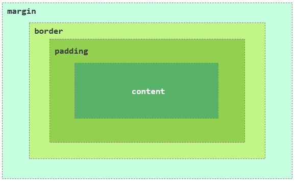
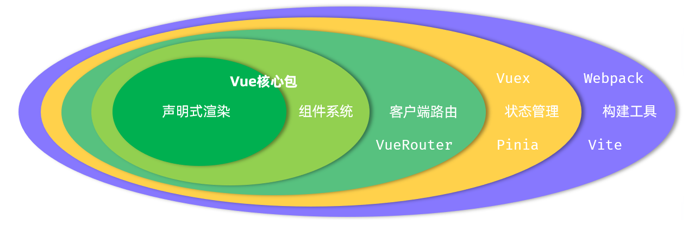
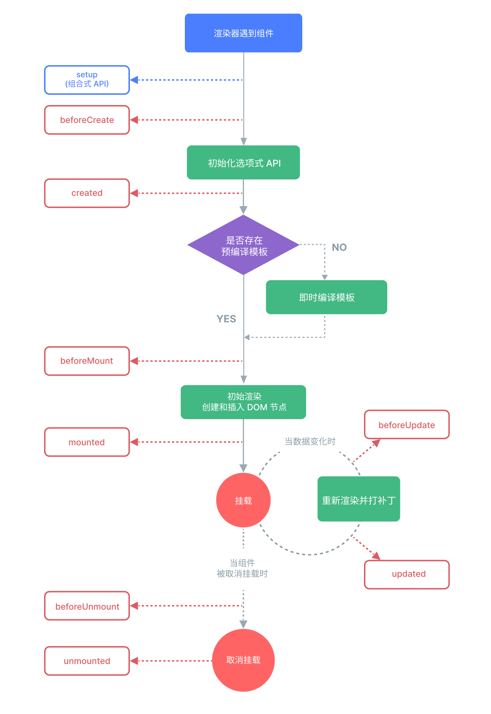
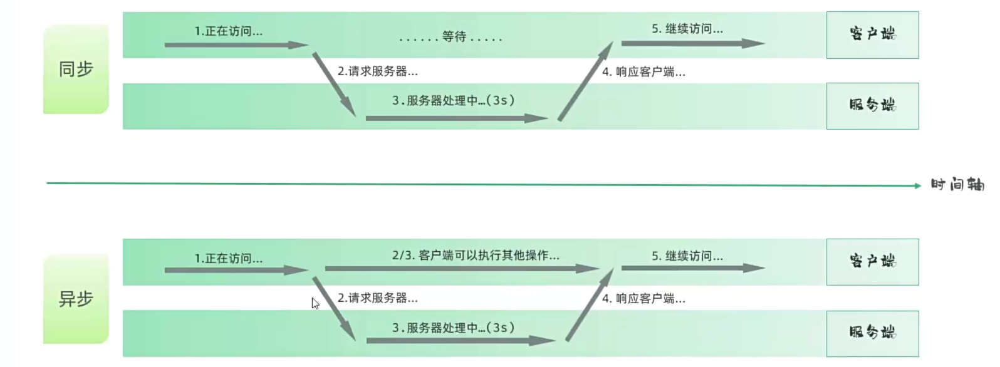

# HTML

## 相关概念

- HTML，全称为**超文本标记语言(HyperText Markup Language)**，是用于创建网页和网络应用程序的标准标记语言。它构成了我们日常浏览的几乎所有网页的骨架，定义了网页内容的结构和含义


## HTML的历史演变

- **起源 (1991-1993):** 由欧洲核子研究中心的物理学家蒂姆·伯纳斯-李(Tim Berners-Lee)发明。最初的 HTML 非常简单，仅包含少数几个用于基本文档结构的标签
- **标准化进程 (1995-1999):** 随着互联网的迅速普及，HTML 的标准化变得至关重要。互联网工程任务组(IETF)和之后成立的万维网联盟(W3C)相继发布了 HTML 2.0、HTML 3.2 和 HTML 4.01 等版本，不断增加新的功能，例如表格、表单和样式表的支持
- **XHTML 的出现 (2000):** W3C 推出了 XHTML(可扩展超文本标记语言)，它是一种更严格、语法更规范的 HTML 版本，要求遵循 XML 的书写规则
- **HTML5 的革命 (2014至今):** 为了适应日益复杂的网络应用需求，网页超文本应用技术工作组(WHATWG)和 W3C 共同推动了 HTML5 的发展。HTML5 引入了大量新特性，例如：
  - **语义化标签:** 如 `<header>`, `<footer>`, `<nav>`, `<article>`, `<section>` 等，使网页结构更加清晰，有利于搜索引擎优化(SEO)和可访问性
  - **多媒体支持:** 内置的 `<audio>` 和 `<video>` 标签，使在网页中嵌入音频和视频变得异常简单，不再需要依赖 Flash 等第三方插件
  - **图形绘制:** 提供了 `<canvas>` 和 SVG 支持，可以直接在浏览器中进行图形绘制和动画制作
  - **更强大的表单:** 新增了多种输入类型(如 email, date, number)和表单验证功能
  - **本地存储:** 提供了 `localStorage` 和 `sessionStorage`，允许网页在用户本地存储数据

目前，HTML5 是现行的标准，并由 WHATWG 以“动态标准”的形式持续维护和发展


## 浏览器如何解析HTML代码

当您在浏览器地址栏输入一个网址并按下回车键后，浏览器会从服务器获取到 HTML 文件。接着，浏览器内部被称为“渲染引擎”的核心组件会开始工作，将这段纯文本的 HTML 代码转换成我们看到的丰富多彩的网页。这个过程大致可以分为以下几个关键步骤：

1. **解析 HTML，构建 DOM 树**
   - **字节流转字符流：** 浏览器首先将从服务器接收到的原始字节数据，根据指定的编码格式转换成字符。
   - **词法分析：** 然后，渲染引擎像一个词法分析器一样，逐一读取这些字符，并将它们识别成一个个有明确含义的“令牌”（Token）。例如，`<html>` 会被识别成一个开始标签令牌，`<p>` 是一个段落标签令牌，“这是一个段落” 会被识别成一个文本令牌，`</p>` 是一个结束标签令牌
   - **语法分析与树构建：** 在生成令牌的同时，浏览器会进行语法分析，并将这些令牌构建成一个树形结构，这就是著名的 **文档对象模型(DOM)**。这个 DOM 树精确地表示了 HTML 文档的结构和内容。每个 HTML 元素、元素的属性以及文本内容都会成为这个树上的一个节点（Node）。`<html>` 是根节点，`<head>` 和 `<body>` 是它的子节点，以此类推，形成一个层次分明的结构。
2. **解析 CSS，构建 CSSOM 树**
   - 在解析 HTML 的过程中，如果遇到 `<link>` 标签引入的外部 CSS 文件，或者 `<style>` 标签内的 CSS，浏览器会立即开始异步下载并解析这些 CSS 代码。
   - 解析 CSS 的过程与解析 HTML 类似，浏览器会将 CSS 规则转换成一个它能理解的结构，这个结构被称为 **CSS 对象模型(CSSOM)**，它也是一个树形结构，它包含了所有元素的样式信息（如颜色、字体大小、边距等）。
3. **合并 DOM 和 CSSOM，构建渲染树**
   - 当 DOM 树和 CSSOM 树都构建完成后，浏览器会将这两棵树合并，创建一个新的树——**渲染树**
   - 渲染树只包含**需要被渲染**的节点。例如，像 `<head>` 这样的非视觉元素，或者通过 `display: none;` 样式隐藏的元素，就不会出现在渲染树中。渲染树上的每个节点都包含了其在页面上的视觉信息（即 DOM 节点的结构和 CSSOM 节点的样式）。
4. **布局**
   - 一旦渲染树构建完成，浏览器就进入“布局”阶段。在这个阶段，浏览器会计算出渲染树中每个节点在屏幕上的确切位置和大小，这个过程也被称为“回流”。浏览器会从渲染树的根节点开始，递归地遍历所有子节点，计算出它们的坐标和尺寸。
5. **绘制**
   - 布局阶段完成后，浏览器知道了所有元素的位置和样式，接下来就进入“绘制”阶段。在这个阶段，渲染引擎会遍历渲染树，调用图形库(如 Skia))将每个节点绘制成屏幕上的实际像素。
6. **合成**
   - 为了提高效率，现代浏览器还会进行“合成”。浏览器会将页面的不同部分(特别是那些有动画或复杂视觉效果的元素)分到不同的图层上。当页面发生变化(如滚动或动画)时，浏览器可能只需要重新绘制和合成少数几个图层，而不需要重新布局和绘制整个页面，从而大大提高了渲染性能。


## HTML的“宽容”

### 极其容错

- HTML5 的设计哲学之一是要**极其容错** . 设计者知道开发者会犯错，所以**浏览器被编写为能够处理“不完整”或“不规范”的 HTML 代码**

  - 即使你忘了写结束标签或嵌套错误啥的，浏览器仍然会尽最大努力去解析和显示页面

  - 各种错误感觉都没事，因为它会努力解析，超级松散

  - 如果你省略了 `<html>`, `<head>`, `<body>` 这些标签，浏览器在解析你的代码并构建 DOM 树（内存中的页面结构）时，会**自动把它们补上**

  - 示例：假设写了这样一个极简的 HTML 文件：

    ```html
    <!DOCTYPE html>
    <title>我的标题</title>
    <p>这是一段话。</p>
    ```

    - 没有写 `<html>`, `<head>`, `<body>`。但是，当浏览器加载这个页面时，它在内存中构建的 DOM 结构实际上是这样

      ```html
      <html>
        <head>
          <title>我的标题</title>
        </head>
        <body>
          <p>这是一段话</p>
        </body>
      </html>
      ```

### 不区分大小写

- HTML (特指 HTML5) 的标签和属性不区分大小写，和XML不一样


## 浏览器的两种渲染模式

- 标准模式和怪异模式

### **标准模式 (Standards Mode)**

- **触发方式**：在 HTML 文档的开头包含一个正确的、现代的文档类型声明，即 **`<!DOCTYPE html>`**。
- **行为**：浏览器会尽可能地遵循 W3C 和 WHATWG 制定的**最新 Web 标准**来解析 HTML 和渲染 CSS。这意味着页面的布局和行为在不同现代浏览器(如 Chrome, Firefox, Safari)之间会表现得非常一致和可预测。这是我们开发网页时**唯一想要**的模式。

### **怪异模式 (Quirks Mode)**

- **触发方式**：**完全省略文档类型声明**，或者使用一个过时且不正确的声明。
- **行为**：浏览器会“穿越”回上世纪 90 年代末，模拟当时旧浏览器（如 Netscape 4 和 Internet Explorer 5）的非标准行为。这种模式的存在是为了向后兼容那些在 Web 标准确立之前编写的“古老”网页。
- **后果**：在怪异模式下，许多 CSS 属性（尤其是盒模型 `box-model` 的计算方式）会和标准模式下完全不同，导致布局混乱、样式错位。一些现代的 HTML5 和 CSS3 功能也可能无法正常工作。您会发现自己写的代码在一个浏览器里是一个样子，在另一个浏览器里又是另一个样子，陷入无尽的兼容性噩梦。


## HTML中的元数据

- 在HTML的语境下，元数据就是**描述HTML文档自身信息的数据，而不是那些要直接在浏览器窗口中展示给用户看的内容(如段落、图片、标题等)**
- HTML文档中，绝大多数元数据都统一存放在 **`<head>`** 元素内部。`<head>` 元素本身就是元数据的容器，它和它的内容不会被浏览器直接渲染到页面上(除了`<title>`会显示在浏览器标签页上)


## HTML的结构

### HTML的基本骨架示例

```html
<!DOCTYPE html>
<html lang="zh-CN">
<head>
    <meta charset="UTF-8">
    <meta name="viewport" content="width=device-width, initial-scale=1.0">
    <title>网页标题</title>
</head>
<body>

    <!-- 这里是所有用户能看到的内容，比如文字、图片、链接等 -->
    <h1> Hello World </h1>
    <p> This is paragraph </p>

</body>
</html>
```


### 文档类型声明`<!DOCTYPE html>`

- ```html
  <!DOCTYPE html>
  ```

  - 这不是一个 HTML 标签，而是一条指令，用来**触发浏览器的“标准模式”**。它必须位于 HTML 文档的最顶端，用来告诉浏览器这个页面使用的是哪个版本的 HTML 规范。`<!DOCTYPE html>` 明确指出页面遵循的是 **HTML5** 标准

  - **重要性**：如果没有这个声明，浏览器可能会进入**“怪异模式 ”**来渲染页面，这会导致页面显示效果与预期不符。因此，它**至关重要**

  - 历史上的一些别的版本的文档类型声明

    - HTML 4.01 Strict (严格模式)

      - 这是当时最规范的版本，它**不允许**使用任何已经被废弃的表现性标签（如 `<font>`）或框架（frameset）

        ```html
        <!DOCTYPE HTML PUBLIC "-//W3C//DTD HTML 4.01//EN" "http://www.w3.org/TR/html4/strict.dtd">
        ```

    - HTML 4.01 Transitional (过渡模式)

      - 这个版本更“宽容”，它**允许**使用一些旧的、不推荐的标签和属性，以便开发者能从旧的编码习惯平滑过渡到新标准。这是当时最常用的 DOCTYPE

        ```html
        <!DOCTYPE HTML PUBLIC "-//W3C//DTD HTML 4.01 Transitional//EN" "http://www.w3.org/TR/html4/loose.dtd">
        ```

    - XHTML 1.0 Strict (严格的 XHTML)

      - XHTML 是“更严格的 HTML”，它要求代码必须遵循 XML 的语法规则（比如所有标签必须小写且闭合）。

        ```html
        <!DOCTYPE html PUBLIC "-//W3C//DTD XHTML 1.0 Strict//EN" "http://www.w3.org/TR/xhtml1/DTD/xhtml1-strict.dtd">
        ```


### 根元素`<html>`

- 所有元素都被包裹在 `<html>` 和 `</html>` 之间

  - **定义与作用**： `<html>` 元素是文档的顶层容器，它向浏览器声明：“从这里开始，到 `</html>` 结束，里面的所有内容都是一个 HTML 文档”

  - **主要特点**：

    1. **唯一性**：一个 HTML 文档中**只能有一个** `<html>` 元素
    2. **内容**：它内部通常只直接包含两个子元素：一个 `<head>` 元素和个 `<body>` 元素，并且顺序是固定的，`<head>` 在前，`<body>` 在后

  - **常见属性**： 它最重要的属性是 `lang`，用来声明整个网页的主要语言

    - 示例

      ```html
      <html lang="zh-CN">
      ```

      

### 头部元素`<head>`

- HTML文档中，绝大多数**元数据**都统一存放在 **`<head>`** 元素内部。`<head>` 元素本身就是元数据的容器，它和它的内容不会被浏览器直接渲染到页面上（除了**`<title>`**会显示在浏览器标签页上）
  - **定义与作用**： `<head>` 元素是一个容器，用于存放那些“描述HTML文档自身信息的数据”的信息，供浏览器、搜索引擎或其他程序使用
  - **主要特点**：
    1. **唯一性**：一个 HTML 文档中**只能有一个** `<head>` 元素
    2. **不可见性**：它里面的内容（除了 `<title>` 会显示在浏览器标签页上）是幕后工作者，用户在页面上是看不到的。
  - **常见内容**： `<head>` 内部包含了一系列非常关键的标签：
    - `<title>`：**必需**。定义网页的标题，显示在浏览器标签页和收藏夹中。
      - **唯一一个在文档结构层面被强制要求的“内容”标签**，HTML5 规范明确规定，每个 HTML 文档的 `<head>` 部分**必须包含一个 `<title>` 标签**
        - 注意是强制要求的”内容“标签，不是直接说的”标签“，是”内容标签“，不要理解错误而感觉很矛盾，有陷阱
      - **缺少 `<title>` 会导致 HTML 验证失败**。更重要的是，它对用户体验（浏览器标签页没有标题）、收藏夹/书签的显示以及搜索引擎优化（SEO）都至关重要
    - `<meta>`：提供各种元信息。
      - 定义了字符编码。如果不写，浏览器可能会猜错编码，导致页面出现**乱码**（特别是中文内容）。为了确保内容在所有设备上都能被正确解码和显示，这行代码是必须的。它通常建议作为 `<head>` 里的第一个标签，以便浏览器尽早获知编码。
      - 最关键的是 `<meta charset="UTF-8">`（定义字符编码，防止乱码）和 
        `<meta name="viewport" content="width=device-width, initial-scale=1.0">`（为移动设备优化显示）
    - `<link>`：用于**链接外部资源，最常见的就是用它来加载外部的 CSS 样式表文件**
    
      -  `<link>` 标签常用的一些属性
    
      | 属性 (Attribute) | 说明                                                         | 常用值/示例                                                  |
      | ---------------- | ------------------------------------------------------------ | ------------------------------------------------------------ |
      | **`href`**       | **必需属性**。指定被链接的外部资源的路径（URL）。这是告诉浏览器“去哪里找文件” | `style.css`<br>`/assets/css/main.css`<br>`https://fonts.googleapis.com/css?family=Roboto` |
      | **`rel`**        | **必需属性**。定义当前文档与被链接资源之间的**关系 (Relationship)**。这是告诉浏览器“这个文件是用来做什么的” | `stylesheet` (层叠样式表CSS)<br>`icon` (网站图标 Favicon)<br>`preconnect` (性能优化：预连接)<br>`preload` (性能优化：预加载资源)<br>`canonical` (SEO：指定首选 URL) |
      | **`type`**       | 指定被链接资源的MIME 类型。这有助于浏览器识别文件类型        | `text/css` (用于样式表)<br>`image/png` (用于 PNG 图标)       |
      | **`media`**      | 指定该样式表只在满足特定媒体条件时才生效。常用于响应式设计   | `print` (仅在打印时生效)<br>`screen and (max-width: 600px)` (仅在屏幕宽度小于等于600px时生效) |
      | **`sizes`**      | 通常与 `rel="icon"` 配合使用，用来指定图标的尺寸（高x宽）    | `16x16`<br>`32x32`<br>`any` (用于 SVG 等可缩放图标)          |
      | **`as`**         | 与 `rel="preload"` 配合使用，指明需要预加载的内容的类型，让浏览器能更准确地进行优化 | `style`<br>`script`<br>`image`<br>`font`                     |
    - `<style>`：用于**在 HTML 文档内部直接编写 CSS 样式**
    - `<script>`：用于**链接或编写 JavaScript 代码**
    - **`<base>`：基准URL**
      - **作用**：为页面中所有的相对URL（如图片、链接、脚本的路径）指定一个基准URL。
      - 一个文档中最多只能有一个`<base>`元素。
      - **示例**：如果设置了 `<base href="https://www.example.com/assets/">`，那么代码中的 `` 实际会从 `https://www.example.com/assets/image.jpg` 加载


### 主体元素`<body>`

- 网页的“**身体**”和“**舞台**”。它是所有用户最终能在浏览器窗口里看到的全部内容所在的地方
  - **定义与作用**： `<body>` 元素包含了网页的所有可见内容，包括文本、图片、链接、视频、表单等等
  - **主要特点**：
    1. **唯一性**：同样，一个 HTML 文档中**只能有一个** `<body>` 元素
    2. **可见性**：所有你想让用户看到的东西，都必须放在 `<body>` 和 `</body>` 之间
  - **常见内容**： 这里面包含了成百上千种 HTML 标签，几乎所有用于构建内容的标签都在这里使用：
    - **文本类**：`<h1>` (标题), `<p>` (段落)
    - **链接类**：`<a>` (超链接)
    - **媒体类**：`` (图片), `<video>` (视频)
    - **列表类**：`<ul>` (无序列表), `<ol>` (有序列表)
    - **结构类**：`<header>`, `<footer>`, `<nav>`, `<main>`, `<div>` 等
    - **表单类**：`<form>`, `<input>`, `<button>` 等


## HTML标签

### HTML中的标签特性

- XML当中**元素的名字可以任意的进行各种定义**，各种定义元素，**HTML当中，标签通常都是已经定义好的**

  - **每一个标签（如 `<p>`, `<h1>`, ``, `<div>`）都有一个由 W3C/WHATWG 标准规定好的、明确的语义和默认的浏览器行为**

  - 值得一提的是，随着 Web 技术的发展，情况有了一点**有趣的补充**。

    在现代 HTML (HTML5) 中，通过一种叫做 **Web Components** 的技术，开发者现在也**可以**在 HTML 中创建“自定义元素”，
    例如 `<user-profile-card>` 或 `<special-button>`

    但是你必须使用 JavaScript 来定义这个新元素的行为、功能和样式（通常通过 Shadow DOM）。它们是用来创建可复用的、功能完善的**界面组件**的


### 标签的属性的类型

- 好像本质上都是字符串？众说纷纭，不重要......

#### 按照值的类型划分

1. **布尔属性 (Boolean Attributes)**

   - **特点**：存在即为`true`，不存在即为`false`。
   - **示例**：`disabled`, `checked`, `required`, `autoplay`

2. **枚举属性 (Enumerated Attributes)**

   - **特点**：值必须是来自一个固定的、预定义的列表。
   - **示例**：`<input>`的`type`属性 (值如`text`, `password`)；`<a>`的`target`属性 (值如`_blank`, `_self`)

3. **字符串属性 (String Attributes)**

   - **特点**：值可以是任意的文本字符串。这是范围最广的一类。
   - **示例**：`id`, `class`, `title`, `alt`, `placeholder`

   - **从字符串中细分出的常见类型**

     - **URL (或 URI) 属性**
       - **特点**：值必须是一个有效的网址或路径。
       - **示例**：`<a>`的**`href`**属性；``和`<video>`的**`src`**属性；`<form>`的**`action`**属性。

     - **数字属性 (Numeric Attributes)**
       - **特点**：值必须是一个数字（整数或浮点数）。虽然在HTML中它仍然被当作字符串处理，但在逻辑上它代表一个数值。
       - **示例**：`<td>`的**`colspan`**和**`rowspan`**属性；`<input type="number">`的**`min`**, \**`max`\**, 和**`step`**属性。

     - **与CSS相关的属性**
       - **特点**：值是CSS单位或语法。
       - **示例**：``的**`width`**和**`height`**属性（值可以是`100`或`50%`）；`<table>`的**`border`**属性（虽然已不推荐使用）。

     - **事件处理属性 (Event Handler Attributes)**
       - **特点**：值是一段可执行的JavaScript代码。
       - **示例**：**`onclick`**, **`onload`**, **`onmouseover`**。


### HTML`<table>`表格

#### 表格的用途

- HTML `<table>` 标签的**唯一正确用途**是**展示二维的表格化数据**，例如财务报表、课程表、产品规格对比等。

  > **重要原则**：绝对不要使用表格来进行网页的整体布局（这是20年前的老旧做法）。现代网页布局请使用CSS Flexbox或Grid


#### 表格的基础骨架

- 一个最简单的表格由三个核心标签组成：

  - **`<table>`**: 表格的根容器，包裹所有表格内容

  - **`<tr>` (Table Row)**: 定义表格中的**一行**

  - **`<td>` (Table Data)**: 定义一个**单元格**，也叫数据格。它必须被包裹在`<tr>`内部

- **基础结构示例：**

  ```html
  <table>
    <tr>
      <td>单元格 1-1</td>
      <td>单元格 1-2</td>
    </tr>
    <tr>
      <td>单元格 2-1</td>
      <td>单元格 2-2</td>
    </tr>
  </table>
  ```

  


#### 表头单元格：`<th>`

- 为了语义化和可访问性，表格通常需要有表头来描述每一列或每一行的内容

- **`<th>` (Table Header)**: 定义一个**表头单元格**。浏览器默认会将其中的文本**加粗并居中**显示。

- **`<th>` 的重要性：**
  1. **语义化**：它明确告诉浏览器和搜索引擎，“这是标题，不是普通数据”。
  2. **可访问性**：屏幕阅读器会识别出`<th>`，并将它与其对应列或行的数据关联起来，帮助视障用户更好地理解表格内容。

- **示例：**

  ```html
  <table>
    <tr>
      <th>姓名</th>
      <th>年龄</th>
      <th>城市</th>
    </tr>
    <tr>
      <td>张三</td>
      <td>25</td>
      <td>北京</td>
    </tr>
  </table>
  ```

  


#### 结构化分组：`<thead>`, `<tbody>`, `<tfoot>`

- 对于复杂的长表格，我们可以使用这三个标签来对表格的行进行结构化分组，这能带来诸多好处

  - **`<thead>`**: 定义表格的**头部区域**。用于包裹表头的`<tr>`

  - **`<tbody>`**: 定义表格的**主体区域**。用于包裹数据部分的`<tr>`

  - **`<tfoot>`**: 定义表格的**脚部区域**。用于包裹总结性的`<tr>`

- **使用这三个标签的好处：**
  1. **代码清晰**：结构一目了然。
  2. **独立滚动**：当表格很长时，一些浏览器允许`<tbody>`部分独立滚动，而`<thead>`保持可见。
  3. **打印优化**：在打印跨页的长表格时，`<thead>`和`<tfoot>`的内容可以在每一页上重复出现。

- **完整结构示例：**

  ```html
  <table>
    <thead>
      <tr>
        <th>商品</th>
        <th>单价</th>
        <th>数量</th>
      </tr>
    </thead>
    <tbody>
      <tr>
        <td>笔记本电脑</td>
        <td>¥5000</td>
        <td>1</td>
      </tr>
      <tr>
        <td>鼠标</td>
        <td>¥100</td>
        <td>2</td>
      </tr>
    </tbody>
    <tfoot>
      <tr>
        <td>总计</td>
        <td colspan="2">¥5200</td> <!-- colspan将在下一节讲解 -->
      </tr>
    </tfoot>
  </table>
  ```

  


#### 合并单元格：`colspan` 和 `rowspan`

- 这是创建复杂表格布局的关键属性，它们都用在`<td>`或`<th>`标签上

  - **`colspan` (Column Span)**: **跨列合并**。指定一个单元格应该横向跨越多少列

  - **`rowspan` (Row Span)**: **跨行合并**。指定一个单元格应该纵向跨越多少行

- **示例：**

  ```html
  <table border="1" style="width:100%; text-align: center;">
    <tr>
      <th rowspan="2">上午</th>
      <th>第一节</th>
      <td>语文</td>
    </tr>
    <tr>
      <th>第二节</th>
      <td>数学</td>
    </tr>
    <tr>
      <th colspan="3">午休</th>
    </tr>
    <tr>
      <th rowspan="2">下午</th>
      <th>第三节</th>
      <td>英语</td>
    </tr>
    <tr>
      <th>第四节</th>
      <td>体育</td>
    </tr>
  </table>
  ```

  


#### 提升可访问性

##### `<caption>` (表格标题)

- 为表格提供一个正式的标题。它应该是`<table>`标签的**第一个子元素**

~~~html
<table>
  <caption>2024年第一季度销售报告</caption>
  <!-- thead, tbody, tfoot... -->
</table>
~~~

- `<caption>`不仅在视觉上提供了标题，更重要的是，屏幕阅读器会首先读出它，让用户立刻了解整个表格的主题。


##### `<scope>` 属性(明确关联)

- 虽然`<th>`已经提供了语义，但使用`scope`属性可以让表头和单元格的关联更加明确、无歧义

  * `scope="col"`: 放在`<th>`上，表示这个表头是**这一列**的标题。

  * `scope="row"`: 放在`<th>`上，表示这个表头是**这一行**的标题。


```html
<table border="1">
  <caption>学生成绩单</caption>
  <thead>
    <tr>
      <th scope="col">姓名</th>
      <th scope="col">数学</th>
      <th scope="col">英语</th>
    </tr>
  </thead>
  <tbody>
    <tr>
      <th scope="row">张三</th>
      <td>95</td>
      <td>88</td>
    </tr>
    <tr>
      <th scope="row">李四</th>
      <td>92</td>
      <td>91</td>
    </tr>
  </tbody>
</table>
```


#### 使用CSS美化表格

- 默认的HTML表格样式很简陋，我们需要用CSS来美化它

  ```css
  /* 基础样式 */
  table {
    width: 100%;
    border-collapse: collapse; /* 合并边框，这是最重要的属性 */
    font-family: sans-serif;
  }
  
  /* 单元格样式 */
  td, th {
    border: 1px solid #ddd;
    padding: 12px;
    text-align: left;
  }
  
  /* 表头样式 */
  th {
    background-color: #f2f2f2;
    font-weight: bold;
  }
  
  /* 斑马条纹效果 */
  tbody tr:nth-child(even) {
    background-color: #f9f9f9;
  }
  
  /* 鼠标悬停效果 */
  tbody tr:hover {
    background-color: #e9e9e9;
  }
  ```


### HTML`<footer>`标签

#### 核心概念

- `<footer>` 是一个HTML5的**语义化标签**，它定义了其最近的**内容分区（Sectioning Content）祖先**或**根元素（`<body>`）**的“页脚”
  - 简单来说，它代表了一个区域的“底部”或“结尾”部分。这个区域可以是一整张网页，也可以是网页中的一篇文章或一个章节。

####  `<footer>` 里通常放的内容

- `<footer>` 不是一个普通的容器，它应该包含与其所在区域相关的“页脚信息”。常见的内容包括：

  - **版权信息**: 例如 `© 2024 Your Company Name.`

  - **作者信息**: 文章或网站的作者。

  - **联系方式**: 地址、电话、电子邮件（通常与 `<address>` 标签结合使用）。

  - **相关链接**:
    - 服务条款 (Terms of Service)
    - 隐私政策 (Privacy Policy)
    - 网站地图 (Sitemap)
    - 关于我们 (About Us)

  - **“返回顶部”链接**。

  - **相关文档**: 链接到与该部分内容相关的其他页面。


#### `<footer>` 的使用场景

- 这是理解 `<footer>` 最关键的一点：**一个页面可以有多个 `<footer>` 标签**。它的具体含义取决于它被放在了哪里。

##### 1. 页面页脚

- 这是最常见的用法，`<footer>` 作为 `<body>` 的直接子元素，代表整个网页的页脚。

- **代码示例：**

  ```html
  <body>
    <header>...</header>
    <main>
      <!-- 页面主要内容 -->
    </main>
    
    <footer>
      <p>© 2024 公司版权所有</p>
      <p>
        <a href="/about">关于我们</a> | 
        <a href="/contact">联系我们</a>
      </p>
    </footer>
  </body>
  ```

  

##### 2. 文章或章节的页脚

- `<footer>` 也可以被用在 `<article>`, `<section>`, `<aside>`, `<nav>` 等元素内部，作为该特定部分的页脚。

- **代码示例：**

  ```html
  <article>
    <h2>文章标题</h2>
    <p>这是文章的正文内容...</p>
    
    <footer>
      <p>作者：张三</p>
      <p>发布于：2024年8月3日</p>
      <p>标签：<a href="#">HTML</a>, <a href="#">Web开发</a></p>
    </footer>
  </article>
  ```

  

#### 最佳实践与注意事项

1. **语义化优先**：只在需要定义“页脚”概念时使用 `<footer>`，不要把它当作一个普通的 `<div>` 容器来用。
2. **上下文决定含义**：始终记住，`<footer>` 的含义由它的父容器决定。
3. **不要嵌套**：一个 `<footer>` 内部不应该再包含 `<header>` 或另一个 `<footer>` 标签。
4. **与 `<address>` 结合**: 如果页脚中包含联系信息（地址、邮箱、电话等），最好将这些信息包裹在 `<address>` 标签内，语义更佳。

- **示例：**

  ```html
  <footer>
    <address>
      联系邮箱：<a href="mailto:contact@example.com">contact@example.com</a><br>
      地址：XX市XX路123号
    </address>
    <p>© 2024 版权所有</p>
  </footer>
  ```

  


## HTML字符实体

### 相关概念

- **字符实体**是HTML中一种特殊的代码序列，它允许我们在网页上安全、准确地显示那些具有特殊含义或难以直接输入的字符


### 字符实体的两种格式

每一个字符实体都有两种表示方法，它们的效果完全相同。

#### 1. 实体名称

- **格式**：以 `&` 开头，以 `;` 结尾，中间是该字符的一个易于记忆的英文名称。
- **示例**：
  - `<` (lt = less than)
  - `>` (gt = greater than)
  - `©` (copy = copyright)
- **优点**：可读性强，容易记忆。
- **缺点**：并非所有字符都有实体名称，且极少数非常古老的浏览器可能不支持所有名称。

#### 2. 实体编号

- **格式**：以 `&#` 开头，以 `;` 结尾，中间是该字符在 **Unicode字符集** 中的编号。
- **示例**：
  - `<` (小于号的Unicode编号是60)
  - `>` (大于号的Unicode编号是62)
  - `©` (版权符号的Unicode编号是169)
- **优点**：几乎支持所有Unicode字符，兼容性极好。
- **缺点**：可读性差，难以记忆。


### 常见实体

| 显示字符 | 实体名称  | 实体编号  | 描述和用途                                                   |
| :------- | :-------- | :-------- | :----------------------------------------------------------- |
| ` `      | `&nbsp;`  | `&#160;`  | **不换行空格**。用于创建不会被浏览器合并的空格，或防止在两个词之间自动换行。 |
| `<`      | `&lt;`    | `&#60;`   | **小于号**。用于在页面上显示 `<` 符号本身，而不是作为标签的开始。 |
| `>`      | `&gt;`    | `&#62;`   | **大于号**。用于在页面上显示 `>` 符号本身，而不是作为标签的结束。 |
| `&`      | `&amp;`   | `&#38;`   | **与号**。用于在页面上显示 `&` 符号本身，而不是作为实体的开始。 |
| `"`      | `&quot;`  | `&#34;`   | **双引号**。主要用于在HTML属性值内显示双引号。               |
| `'`      | `&apos;`  | `&#39;`   | **单引号**。主要用于在HTML属性值内显示单引号。               |
| `©`      | `&copy;`  | `&#169;`  | **版权符号**。常用于网站页脚。                               |
| `®`      | `&reg;`   | `&#174;`  | **注册商标符号**。                                           |
| `™`      | `&trade;` | `&#8482;` | **商标符号**。                                               |
| `€`      | `&euro;`  | `&#8364;` | **欧元符号**。                                               |
| `£`      | `&pound;` | `&#163;`  | **英镑符号**。                                               |
| `¥`      | `&yen;`   | `&#165;`  | **日元/人民币符号**。                                        |
| `–`      | `&ndash;` | `&#8211;` | **短破折号** (en dash)。通常用于表示范围，如“1–10”。         |
| `—`      | `&mdash;` | `&#8212;` | **长破折号** (em dash)。通常用于分隔句子中的附加思想。       |
| `•`      | `&bull;`  | `&#8226;` | **项目符号点**。可用于自定义列表的样式。                     |


## HTML表单

### 相关概念

- HTML **表单 (Form)** 是一个包含交互式控件的**文档区域**，其主要目的是收集用户输入的数据，并将这些数据发送到服务器进行处理

#### 可提交的表单控件

- 在HTML中，**只有特定的元素**才能作为表单控件来提交其数据。

  - 给其他任何元素（如`<div>`）添加`name`属性都是无效的。可提交的控件包括：

    - **`<input>`**

    - **`<select>`**

    - **`<textarea>`**

    - **`<button>`**

  - name，value键值对


### 表单骨架`<form>` 

- `<form>` 元素是所有表单内容的根容器。它本身在页面上是不可见的，但它定义了数据将如何被打包和发送

  ```html
  <form action="/submit-your-data" method="post">
    <!-- 所有表单控件都放在这里 -->
  </form>
  ```

- 只有被 `<form>` 标签包裹起来的、并且带有 `name` 属性的控件，才构成了一个可以被提交的完整表单


#### `<form>` 的关键属性

- `action`: **必需属性**。指定一个URL，用于接收和处理表单数据的服务器端程序地址。如果留空，数据会提交到当前页面的URL
- `method`: 指定提交数据时使用的HTTP方法。原生HTML的`<form>`标签中的 `method` 属性只原生支持 `GET` 和 `POST`：
  - `get` (默认值): 将表单数据附加在`action` URL的末尾（作为查询字符串），例如 `.../?name=John&age=30`
    - **优点**: 适合提交非敏感、少量的数据（如搜索查询）。可以被收藏和分享
    - **缺点**: 数据长度有限制，且数据在URL中完全可见，不安全
  - `post`: 将表单数据放在HTTP请求的请求体中发送
    - **优点**: 更安全（数据不在URL中可见），没有数据大小限制，可以发送文件。适合提交敏感信息（如密码）或大量数据
    - **缺点**: 请求不能被收藏或分享
- `enctype`: **当使用`post`方法上传文件时必需设置**。它规定了数据在发送到服务器之前应如何编码
  - `application/x-www-form-urlencoded` (默认值): 发送前对所有字符进行编码
  - `multipart/form-data`: **上传文件时必须使用此值**。不对字符编码，允许发送包含文件、非ASCII数据和二进制数据的完整表单
  - `text/plain`: 主要用于调试，只发送数据，不对其进行任何编码

- `novalidate`: 一个布尔属性。如果设置，则关闭浏览器内置的HTML5表单验证功能。
- `target`: 指定在何处显示服务器返回的响应。值同`<a>`标签的`target`（如`_self`, `_blank`）。


### 核心控件详解

#### 1. `<input>`

- `<input>`是表单中最核心的控件，其形态由`type`属性决定


##### 一些通用的`<input>`属性

- `name`: **提交数据的关键**。作为数据的“键”，没有`name`的控件数据不会被提交
- `value`: 控件的初始值。对于`radio`和`checkbox`，这是它们被选中时提交的固定值
- `type`: 决定控件的类型
- `disabled`: 禁用控件。变灰，无法交互，其值**不会**被提交
- `readonly`: 只读。无法修改，但其值**会**被提交
- `placeholder`: 在输入框为空时显示的提示文本


##### `<input>`的一些 `type`值

###### **a. 文本输入类**

- `text`: 普通单行文本
- `password`: 密码输入，内容被遮盖
- `email`: 邮箱地址，浏览器会进行基本格式验证
- `tel`: 电话号码
- `url`: 网址
- `search`: 搜索框，通常样式上会带有清除图标

###### **b. 选择类**

- `checkbox`: 复选框（多选）。同一组应使用相同的`name`和不同的`value`
- `radio`: 单选按钮（多选一）。同一组**必须**使用相同的`name`
  - `checked`属性可用于`checkbox`和`radio`，使其默认被选中

###### **c. 按钮类**

- `submit`: 提交按钮，点击后触发表单提交
- `reset`: 重置按钮，点击后将表单所有控件恢复到初始值
- `button`: 普通按钮，无默认行为，通常配合JavaScript使用
- `image`: 图片提交按钮。可使用`src`属性指定图片路径，点击后会提交图片的坐标值

###### **d. 特殊输入类**

- `number`: 数字输入框。可配合`min`, `max`, `step`属性使用
- `range`: 滑块。同样可使用`min`, `max`, `step`
- `color`: 颜色选择器
- `file`: 文件选择器。**必须**在`enctype="multipart/form-data"`的表单中使用

###### **e. 日期与时间类**

- `date`: 日期选择器 (年/月/日)
- `time`: 时间选择器 (时/分)
- `datetime-local`: 日期和时间选择器
- `month`: 月份选择器 (年/月)
- `week`: 周选择器 (年/周)


#### 2. 长文本`<textarea>`

- 用于输入大段、多行的文本

  ```html
  <textarea name="article" rows="10" cols="50" placeholder="在此输入文章内容..."></textarea>
  ```

  

  - `rows`和`cols`定义其可见尺寸，但用户通常可以拖拽调整

  - 默认值直接写在标签之间


#### 3. 下拉菜单`<select>` 和 `<option>`

- 创建下拉选择列表

  ```HTML
  <select name="city">
    <optgroup label="热门城市">
      <option value="beijing">北京</option>
      <option value="shanghai">上海</option>
    </optgroup>
    <optgroup label="其他城市">
      <option value="chengdu" selected>成都</option>
    </optgroup>
  </select>
  ```

  

  - `<select>`是**容器**，`<option>`是**选项**。

  - `<option>`的**`value`是提交的值**，**标签间的文本是显示的内容**。

  - `selected`属性可**指定默认选中项**。

  - `<optgroup>`可**为选项进行分组**，`label`属性是**分组标题**。

  - 给`<select>`添加`multiple`属性可**允许多选**。


#### 4. 灵活按钮`<button>`

- 比`<input type="submit">`更强大的按钮。

  ```HTML
  <button type="submit" name="action" value="save">
     保存
  </button>
  ```

  

  - **`type`属性决定其行为** (`submit`, `reset`, `button`)

  - **最大优点**：可以在标签内嵌套HTML（如``, `<span>`），实现更丰富的视觉效果

  - 如果设置了`name`和`value`，点击它提交时，其值也会被发送


### 一些其它标签

#### `<label>`

#### 相关概念

- 在HTML中，`<label>` 标签用于为一个表单控件（如 `<input>`, `<select>`, `<textarea>`）定义一个**描述性标题**
  - 它不仅仅是一段普通的文本，它在功能上与对应的表单控件**建立了关联**。这种关联极大地提升了表单的可用性和可访问性

##### 核心优势

###### 提升用户体验

- 当一个 `<label>` 与一个表单控件正确关联后，它会扩大控件的**可点击区域**。用户在点击 `<label>` 的文本时，浏览器会自动将焦点（光标）移动到对应的输入框，或者选中对应的单选/复选框。

  - **这对用户来说意味着：**

    - **更方便**：对于文本框，用户不必精确地点击那个小小的输入框，点击旁边的文字即可开始输入

    - **至关重要**：对于**单选按钮 (radio)** 和**复选框 (checkbox)** 这种点击目标很小的控件，这个功能极大地降低了用户的操作难度，尤其是在移动设备上


###### 提升可访问性

- 这是 `<label>` 最重要的作用，也是它存在的根本原因

  - 对于依赖**屏幕阅读器**的视障用户来说，当他们浏览到一个输入框时，如果没有 `<label>`，屏幕阅读器只能读出“输入框”，用户完全不知道这个输入框是用来做什么的。

    如果使用了 `<label>` 进行关联，屏幕阅读器就能准确地读出：“**用户名，输入框**”或者“**我同意服务条款，复选框**”。这让表单对于所有用户都是可理解和可操作的，体现了Web的包容性。


##### 使用方式

- 建立 `<label>` 与表单控件的关联主要有两种方式

###### 1. 显式关联 - 强烈推荐

- 这是最常用、最健壮、最灵活的方式。它通过 `for` 和 `id` 属性来建立连接

  - 在 `<label>` 标签上使用 `for` 属性。

  - 在对应的表单控件上使用 `id` 属性。

  - 确保 `for` 属性的值和 `id` 属性的值**完全相同**。

- **代码示例：**

  ```html
  <form>
    <label for="username">用户名:</label>
    <input type="text" id="username" name="username">
  
    <br><br>
  
    <input type="checkbox" id="terms" name="terms">
    <label for="terms">我已阅读并同意服务条款</label>
  </form
  ```

- **优点**：

  - 结构清晰，即使 `<label>` 和 `<input>` 在HTML中相隔很远，也能保持关联。

  - 这是最被广泛支持和推荐的做法。


###### 2. 隐式关联

- 这种方式是将表单控件直接包裹在 `<label>` 标签的内部

- **代码示例：**

  ```html
  <form>
    <label>
      用户名:
      <input type="text" name="username">
    </label>
  
    <br><br>
  
    <label>
      <input type="checkbox" name="terms">
      我已阅读并同意服务条款
    </label>
  </form>
  ```

- **优点**：
  - 不需要 `for` 和 `id` 属性，代码看起来少一些

- **缺点**：

  - 一些辅助技术（特别是旧的）对它的支持不如显式关联好

  - 布局灵活性差，因为控件必须在 `<label>` 内部


#### `<fieldset>` 和 `<legend>`

- 当表单内容较多时，使用它们对相关控件进行分组。
  - **`<fieldset>` (字段集)**: 这是一个块级元素，它的唯一作用就是将HTML表单中的**相关控件进行分组**。你可以把它想象成一个“分组框”。
  - **`<legend>` (图例/标题)**: 这个元素必须作为 `<fieldset>` 的**第一个子元素**存在。它的作用是为这个分组框提供一个**标题**。

- 这两个标签总是成对出现，共同为复杂的表单提供清晰的结构和语义。

- `<fieldset>`会创建一个带边框的区域
- `<legend>`是该区域的标题


### 关于数据提交

- **`name`是关键**: 只有设置了`name`属性的**有效表单控件**，其数据才会被提交。

- **键值对形式**: **提交的数据格式为`name=value`**

- **`value`的来源**:

  - **对于文本类输入，`value`是用户实际输入的内容**
  - 对于**选择类（`radio`, `checkbox`, `option`）**，**`value`是预设在`value`属性中的值**

  

- **不会被提交的情况**

  - **没有`name`属性的控件**
  - **被`disabled`的控件**
  - **未被选中的`radio`和`checkbox`**
  - **`<button type="reset">` 和 `<button type="button">`**


# CSS

## 相关概念

- CSS，全称为 **Cascading Style Sheets**（层叠样式表），是一种专门用来定义 HTML 或 XML 文档**样式**的计算机语言

## CSS的出现

- 在没有 CSS 的远古时代，人们曾用 HTML 标签（如 `<font>`, `bgcolor`）来定义样式。这导致 HTML 文件既要负责内容结构，又要负责外观，变得混乱不堪，难以维护。

  CSS 的出现完美地解决了这个问题，它让 HTML 回归其本质——只负责**内容的结构和语义**，而所有关于**外观和样式**的工作都交给 CSS。这就像写一篇文章，Word 文档（HTML）只负责文字内容本身，而排版格式（CSS）则由样式设置来统一管理。

## 语法

### 基本语法

- CSS 的基本语法核心就是**规则集**，**规则集**由一条或多条“**规则（Rule）**”组成。每一条规则都包含两个主要部分：

  - **选择器**：它会“选中”你想要施加样式的 HTML 元素,如下面的`P`

  - **声明块**：包含一条或多条具体的样式“声明”，是所有具体指令的集合。它由一对花括号 `{}` 包裹,示例见下方代码

    - 声明：一个具体的样式指令，它规定了要改变哪个“属性”以及把它设置成什么“值”，例如`color:blue;`

      > 声明之间用分号`;`分隔

      - 属性：希望改变的样式名称。例如`color` (文字颜色)、`font-size` (字体大小)、`background-color` (背景颜色) 等
      - 值：为属性设定的具体参数。**例子**：`blue`、`16px`、`#FFFFFF` 等

      >属性和值用冒号`:`分隔

```css
p {
  color: blue;
  font-size: 16px;
}
```

- 包含选择器在内的CSS规则，只能写在 `<style>` 标签内部，或者是外部的 `.css` 文件中，不能写在 style 属性 中，**`style` 属性内部只能直接写一条或多条“声明语句”**，用分号隔开
- `style` 属性中的样式 永远优先于 HTML属性


### CSS选择器

- CSS中有很多很多的选择器，其中一些如下
- 包含选择器在内的CSS规则，只能写在 `<style>` 标签内部，或者是外部的 `.css` 文件中，不能写在 style 属性 中，**`style` 属性内部只能直接写一条或多条“声明语句”**，用分号隔开

#### 基础选择器

| 选择器名称                    | 语法         | 说明与示例                                                   |
| :---------------------------- | :----------- | :----------------------------------------------------------- |
| **元素选择器** (Element/Type) | **`元素名`** | 选择所有指定类型的 HTML 元素。<br>**示例**：`p { color: grey; }` 会选中页面上所有的 `<p>` 标签。 |
| **类选择器** (Class)          | `.classname` | 选择所有具有指定 `class` 属性的元素。**这是最灵活、最重要的选择器**，一个元素可以有多个类，一个类也可以被多个元素使用。<br>**示例**：`html: <button class="btn btn-primary">` <br> `css: .btn-primary { background-color: blue; }` |
| **ID 选择器** (ID)            | `#idname`    | 选择具有指定 `id` 属性的元素。**在一个 HTML 页面中，ID 的值必须是独一无二的**，因此它通常用于定位唯一的关键元素。<br>**示例**：`html: <div id="main-content">` <br> `css: #main-content { padding: 20px; }` |
| **通用选择器** (Universal)    | **`*`**      | 选择页面上的**所有**元素。通常用于进行样式重置（Reset）。<br>**示例**：`* { box-sizing: border-box; }` 会为所有元素设置盒模型。 |

#### 组合选择器

| 组合方式                            | 语法         | 说明与示例                                                   |
| :---------------------------------- | :----------- | :----------------------------------------------------------- |
| **后代组合** (Descendant)           | `A B` (空格) | 选择 A 元素**内部所有**的 B 元素，无论嵌套多深。<br>**示例**：`article p { line-height: 1.6; }` 会选中 `<article>` 标签内的所有 `<p>`，哪怕 `p` 在 `div` 里。 |
| **子代组合** (Child)                | `A > B`      | 选择作为 A 元素**直接子元素**的 B 元素。只深入一层。<br>**示例**：`ul > li { list-style: none; }` 只会选中作为 `<ul>` 直接子元素的 `<li>`。 |
| **相邻兄弟组合** (Adjacent Sibling) | `A + B`      | 选择**紧跟在 A 元素后面**的那一个兄弟元素 B。<br>**示例**：`h1 + p { margin-top: 0; }` 会选中紧挨着 `<h1>` 的那个 `<p>`，并移除它的上边距。 |
| **通用兄弟组合** (General Sibling)  | `A ~ B`      | 选择在 A 元素**之后出现的所有**兄弟元素 B。<br>**示例**：`h1 ~ p { color: #555; }` 会选中 `<h1>` 后面的所有同级的 `<p>` 元素。 |

#### 属性选择器

| 语法            | 说明                                                         | 示例                                                         |
| :-------------- | :----------------------------------------------------------- | :----------------------------------------------------------- |
| `[attr]`        | 选择所有**拥有 `attr` 属性**的元素。                         | `a[target] { ... }` (选中所有带 `target` 属性的 `<a>` 标签)  |
| `[attr=value]`  | 选择 `attr` 属性值**精确等于 `value`** 的元素。              | `input[type="text"] { ... }` (选中所有文本输入框)            |
| `[attr~=value]` | 选择 `attr` 属性值是一个**以空格分隔的列表**，且**其中包含 `value`** 这个词的元素。 | `p[class~="important"] { ... }` (选中 `class` 为 "text important" 的 `<p>`) |
| `[attr^=value]` | 选择 `attr` 属性值**以 `value` 开头**的元素。                | `a[href^="https://"] { ... }` (选中所有指向安全链接的 `<a>` 标签) |
| `[attr$=value]` | 选择 `attr` 属性值**以 `value` 结尾**的元素。                | `a[href$=".pdf"] { ... }` (选中所有链接到 PDF 文件的 `<a>` 标签) |
| `[attr*=value]` | 选择 `attr` 属性值**包含 `value` 这个子字符串**的元素。      | `a[href*="google"] { ... }` (选中所有 `href` 中包含 "google" 的 `<a>` 标签) |

#### 伪类选择器

| 类别           | 常见伪类                             | 说明                                                         |
| :------------- | :----------------------------------- | :----------------------------------------------------------- |
| **用户行为**   | `:hover` `:active` `:focus`          | 分别定义鼠标悬停、被激活（点击时）、获得焦点时的状态。       |
| **UI 状态**    | `:checked` `:disabled` `:required`   | 用于表单元素，根据其是否被选中、禁用、必填来应用样式。       |
| **结构与位置** | `:first-child` `:last-child`         | 选择作为其父元素的第一个或最后一个子元素的元素。             |
|                | `:nth-child(n)` `:nth-last-child(n)` | 选择其父元素的第 n 个子元素。`n` 可以是数字、`even` (偶数)、`odd` (奇数) 或公式 (如 `2n+1`)。 |
|                | `:first-of-type` `:last-of-type`     | 选择其父元素下，特定类型的第一个或最后一个子元素。           |
|                | `:nth-of-type(n)`                    | 选择其父元素下，特定类型的第 n 个子元素。                    |
|                | `:not(selector)`                     | **逻辑伪类**，选择不匹配 `selector` 的所有元素。例如 `p:not(.intro)`。 |

#### 伪元素选择器

| 伪元素           | 说明                                                         |
| :--------------- | :----------------------------------------------------------- |
| `::before`       | 在元素内容的**前面**插入一个虚拟子元素。必须配合 `content` 属性使用。 |
| `::after`        | 在元素内容的**后面**插入一个虚拟子元素。必须配合 `content` 属性使用。常用于清除浮动等技巧。 |
| `::first-letter` | 选择一个块级元素的第一个字母，常用于制作首字下沉效果。       |
| `::first-line`   | 选择一个块级元素的第一行文本。                               |
| `::marker`       | 选择列表项目（`<li>`）的标记符号（如圆点或数字）。           |
| `::placeholder`  | 选择表单输入框的占位提示文本。                               |
| `::selection`    | 选择用户用鼠标高亮选中的文本部分。                           |


### CSS引用方式

#### 行内样式

- **做法**：直接在 HTML 元素的 `style` **属性**里写样式

- **HTML 文件**:

  ```html
  <p style="color: red; font-size: 20px;">这是一段红色的、20像素大的文字</p>
  ```

- **缺点**：**强烈不推荐**。它严重违背了“内容与表现分离”的原则，难以维护，并且优先级非常高，容易造成样式冲突。只在极少数特殊情况下使用（如 JavaScript 动态修改样式）


#### 内嵌样式

- **做法**：直接在 HTML 文件的 `<head>` 部分，使用 `<style>` 标签，在里面写 CSS 规则。

  - 现代浏览器非常宽容，即使您将 `<style>` 标签放在 `<body>` 中，浏览器**通常也能够正确解析和应用这些样式**
    按照HTML的规范，`<style>` 标签被定义为文档的元数据的一部分，因此它应该位于 `<head>` 区域
    `<head>` 用于存放所有关于文档自身的信息，而不是文档要显示的内容

- **HTML 文件**:

  ```html
  <head>
      <title>我的网页</title>
      <style>
          body {
              background-color: lightblue;
          }
          h1 {
              color: navy;
          }
      </style>
  </head>
  ```

- **缺点**：样式只对当前这一个页面生效，无法被其他页面重用。适用于单个页面的特殊样式。


#### 外联样式(推荐方式)

- 最常用、最推荐的方式。

- **做法**：你把所有的 CSS 规则都写在一个单独的 `.css` 文件里（例如 `style.css`），然后在 HTML 文件的 `<head>` 部分，使用 `<link>` 标签来引入它。

  -  `<link>` 标签在HTML规范中**明确定义为只能存在于 `<head>` 元素中**。它用于定义当前文档与外部资源的关系，是纯粹的元数据，所以它的合法位置只有 `<head>`

    大多数现代浏览器为了兼容性，即使您把 `<link rel="stylesheet" href="...">` 放在 `<body>` 里，它依然会去下载并应用这个CSS文件.

- **HTML 文件 (`index.html`)**:

  ```html
  <head>
      <title>我的网页</title>
      <link rel="stylesheet" href="style.css">
  </head>
  ```

- **CSS 文件 (`style.css`)**:

  ```css
  body {
      font-family: sans-serif;
  }
  p {
      color: green;
  }
  ```

- **优点**：

  - **易于维护**：所有样式集中在一个地方。
  - **可重用**：多个 HTML 页面可以共用同一个 CSS 文件，保证网站风格统一。
  - **性能更好**：浏览器会缓存 CSS 文件，加快页面加载速度。


## CSS的渲染优先级

- CSS 的渲染优先级和**引入方式**、**选择器类型**都有着密切的关系.它们共同构成了一套复杂但逻辑清晰的规则,我们通常称之为 **CSS 层叠**

### 优先级裁决步骤

#### 第 1 步：比较来源与重要性

- 这是**最高级别的判断，拥有绝对的权力**。浏览器首先看样式是从哪里来的，以及是否被标记为“重要”

  - **优先顺序从高到低排列如下：**

    1. **开发者的重要样式**：**开发者写的，且带有 `!important` 标记的样式**

       - **示例**：

         ```css
         p { 
             color: red !important;
         }
         ```

       - **这是开发者能使用的“王炸”，拥有最高权力**

    2. **开发者的普通样式**：开发者在 CSS 文件中写的普通样式

       - 这包括**外联样式** (`<link>`)、**内联样式** (`<style>`) 和**行内样式** (`style="..."`)，优先级高于浏览器的默认样式

    3. **浏览器的默认样式**：浏览器自带的默认样式

       - 例如，链接默认是蓝色，`<h1>` 标签字体比较大等


#### 第 2 步：比较特殊性/优先级

- **这是最核心、最常用的判断规则。** 当第一步无法分出胜负时（比如**两个规则都是开发者写的普通样式**），浏览器就会开始计算**选择器的“分数”**，分数越高的规则胜出。这直接回答了您关于“**和选择器的类型有关吗**”的问题

  - 可以把这个过程想象成一个计分系统

    | 选择器类型               | 分数等级                     | 示例                              |
    | ------------------------ | ---------------------------- | --------------------------------- |
    | **内联样式**             | **最高级（胜过所有选择器）** | `style="color: red;"`             |
    | **ID 选择器**            | **高级** (可记为 1-0-0)      | `#header`                         |
    | **类、属性、伪类选择器** | **中级** (可记为 0-1-0)      | `.btn`, `[type="text"]`, `:hover` |
    | **元素、伪元素选择器**   | **低级** (可记为 0-0-1)      | `div`, `p`, `::before`            |

    - **计分规则：**

      - 浏览器会统计一个选择器里包含了多少个**ID、类、元素**选择器

      - 比较时，**从高级的“ID”开始比较**。只要 ID 数量多，就直接胜出，无论对方有多少个类选择器

      - 如果 ID 数量相同，再比较“类”的数量

      - 如果“类”的数量也相同，最后才比较“元素”的数量

    - **示例：**

      ```html
      <div id="main">
        <p class="text">你好</p>
      </div>
      ```

      ```css
      /* 规则A: 1个ID, 1个元素 -> 分数 (1-0-1) */
      #main p {
        color: blue; 
      }
      
      /* 规则B: 1个类 -> 分数 (0-1-0) */
      .text {
        color: red;
      }
      ```

      - **结果**：`你好` 这段文字会是**蓝色**。因为规则 A 的分数是 (1-0-1)，规则 B 是 (0-1-0)，在比较最高级的 ID 部分时，规则 A (1) 就已经胜过了规则 B (0)

        **注意**：通用选择器 `*` 和组合符 `+`, `>` 等**不增加**优先级分数


#### 第 3 步：比较源次序

- 如果经过前两步的判断，两条规则的**来源、重要性和优先级分数都完全相同**，那么浏览器会启用最后的裁决方法：**“后来者居上”**。

  - **规则**：在代码中**越靠后定义**的规则，优先级越高

    - **示例 1：在同一个文件里**

      ```css
      p { color: blue; }
      p { color: red; } /* 这条会生效，因为p选择器优先级相同，但它在后面 */
      ```

      

    - **示例 2：不同的 CSS 文件**

      ```html
      <link rel="stylesheet" href="base.css"> 
      <link rel="stylesheet" href="main.css"> 
      ```

      - 如果 `base.css` 和 `main.css` 里有两条优先级完全相同的规则来设置同一个元素的颜色，那么 `main.css`（后引入的）里的规则会生效


## CSS中颜色的表示方式

### 1. 颜色关键词

- 这是最简单、最直观的方式，直接使用预定义的颜色英文名称

  - **语法**：`color: red;`

  - **说明**：CSS 定义了超过 140 个标准的颜色名称，包括常见的 `red`, `green`, `blue`, `orange`, `black`, `white`, 以及一些更具体的如 `gold`, `skyblue`, `lightcoral` 等
  - **优点**：可读性强，易于记忆，适合快速测试和简单的颜色定义

  - **缺点**：颜色数量有限，无法表示精确的自定义颜色

- **示例：**

  ```css
  /* 使用颜色关键词 */
  h1 {
    color: steelblue;
  }
  p {
    color: slategray;
  }
  ```

  

### 2. 十六进制表示法 (Hexadecimal / HEX)

- 这是 Web 开发中最常用、最主流的颜色表示法。它通过一个 `#` 号加上 3 位或 6 位十六进制数来表示颜色。

  - **语法**：`#RRGGBB` 或 `#RGB` (简写形式)

  - **说明**：
    - `#RRGGBB` 格式由三组两位十六进制数组成，分别代表红 (Red)、绿 (Green)、蓝 (Blue) 的强度。每组值的范围从 `00` (最弱) 到 `FF` (最强)。
    - **简写形式**：当 R、G、B 三组中，每组的两位数字都相同时(三组必须同时分别相同，例如 `FF`, `66`, `AA`），两位可以简写为一位。例如 `#FF66AA`等同于 `#F6A` 

  - **优点**：精确，通用，几乎所有设计工具都支持，代码紧凑。

  - **缺点**：相比 RGB，可读性稍差，不直接支持透明度（现代浏览器虽支持 `#RRGGBBAA` 格式，但远不如 RGBA 常用）。

- **示例：**	

  ```css
  /* 6位十六进制 */
  .header {
    background-color: #333333; /* 深灰色 */
  }
  
  /* 3位简写形式 (#333 等同于 #333333) */
  .footer {
    background-color: #333; /* 同样是深灰色 */
  }
  
  .title {
    color: #FF6347; /* 番茄色 */
  }
  ```

  

### 3. RGB / RGBA 表示法

- 这种方式通过红(R)、绿(G)、蓝(B)三原色的混合来定义颜色，非常直观，并且其扩展形式 RGBA 可以定义透明度。

  - **语法**：`rgb(R, G, B)` 或 `rgba(R, G, B, A)`

  - **说明**：
    - **R, G, B**：分别代表红、绿、蓝的强度，每个值的范围是 `0` 到 `255` 的整数。
    - **A (Alpha)**：代表颜色的不透明度。值的范围是 `0.0` (完全透明) 到 `1.0` (完全不透明)。`0.5` 即半透明。

  - **优点**：直观易懂（符合光学三原色原理），**支持透明度是其最大的优势**。

  - **缺点**：代码比 HEX 稍长。

- **示例：**

  ```css
  /* RGB - 定义一个纯红色 */
  .error-message {
    color: rgb(255, 0, 0);
  }
  
  /* RGBA - 定义一个半透明的黑色背景，常用于遮罩层 */
  .overlay {
    background-color: rgba(0, 0, 0, 0.6); 
  }
  ```

  

### 4. HSL / HSLA 表示法

这是一种对设计师更友好的颜色表示法，它基于色相(H)、饱和度(S)和亮度(L)来定义颜色。

- **语法**：`hsl(H, S, L)` 或 `hsla(H, S, L, A)`
- **说明**：
  - **H (Hue / 色相)**：代表颜色在色轮上的位置，值的范围是 `0` 到 `360` 的角度。`0` 是红色, `120` 是绿色, `240` 是蓝色。
  - **S (Saturation / 饱和度)**：代表颜色的鲜艳程度，值的范围是 `0%` 到 `100%`。`0%` 是灰色，`100%` 是最鲜艳的颜色。
  - **L (Lightness / 亮度)**：代表颜色的明暗程度，值的范围是 `0%` 到 `100%`。`0%` 是黑色，`50%` 是正常颜色，`100%` 是白色。
  - **A (Alpha)**：与 RGBA 中的透明度含义相同。
- **优点**：**非常适合动态调整颜色**。例如，要创建同一个颜色的不同明暗版本（用于按钮的 hover 状态），只需调整 `L` (亮度) 的值即可，非常方便。
- **缺点**：不如 HEX 和 RGB 普及。

- **示例：**

  ```css
  /* HSL - 定义一个鲜艳的蓝色 */
  .button {
    background-color: hsl(240, 100%, 50%);
  }
  
  /* HSLA - 定义一个半透明的、柔和的绿色 */
  .success-banner {
    background-color: hsla(120, 60%, 70%, 0.5);
  }
  ```


## CSS中的盒子模型

### 一种思想：万物皆为盒

- 在CSS的世界里，每一个HTML元素都可以被看作是一个矩形的**盒子 (Box)**。
  无论是段落 `<p>`、标题 `<h1>`、容器 `<div>` 还是行内元素 `<span>`，它们在页面上都占据一个矩形空间。
  **CSS盒子模型 (Box Model)** 就是一套用来描述这些盒子如何渲染、计算其尺寸以及如何占据空间的规则

### 盒子的四大组成部分

#### 盒子模型区域模型

- 一个标准的盒子由内到外包含四个区域：**内容区(Content Area)、内边距 (Padding)、边框 (Border)、外边距 (Margin)**

  


#### 1. 内容区 (Content Area)☆

- **定义**: 盒子的最核心部分，用于显示元素的实际内容，例如文本、图片、视频等。
- **相关CSS属性**:
  - `width`: 定义内容区的宽度。
  - `height`: 定义内容区的高度。
- **注意点**: 对于行内元素（如 `<span>`, `<a>`），直接设置 `width` 和 `height` 是无效的。

#### 2. 内边距 (Padding)

- **定义**: 包裹在内容区之外、边框之内的透明区域。它的主要作用是创建内容与边框之间的空间，防止内容紧贴着边框。
- **相关CSS属性**:
  - `padding-top`, `padding-right`, `padding-bottom`, `padding-left` (分别设置上、右、下、左四个方向的内边距)。
  - **Shorthand (简写)**: `padding`
    - `padding: 10px;` (四个方向均为10px)
    - `padding: 10px 20px;` (上下为10px, 左右为20px)
    - `padding: 10px 20px 30px;` (上为10px, 左右为20px, 下为30px)
    - `padding: 10px 20px 30px 40px;` (上右下左，顺时针)
- **注意点**: `padding` 区域会继承元素的背景颜色或背景图片。

#### 3. 边框 (Border)☆

- **定义**: 包裹在内边距之外的线条，是盒子可见的边界。
- **相关CSS属性**:
  - `border-width`: 边框的宽度。
  - `border-style`: 边框的样式 (如 `solid`, `dashed`, `dotted` 等)。`style` 是必须设置的，否则边框不可见。
  - `border-color`: 边框的颜色。
  - **Shorthand (简写)**: `border`
    - `border: 1px solid black;` (最常用的写法，同时设置宽度、样式和颜色)。
  - 也可以为单边设置: `border-top`, `border-right`, `border-bottom`, `border-left`。
- **额外属性**: `border-radius` 用于创建圆角，可以让盒子不那么“方”。

#### 4. 外边距 (Margin)

- **定义**: 盒子最外层的区域，完全透明。它负责控制当前盒子与其他元素之间的距离。
- **相关CSS属性**:
  - `margin-top`, `margin-right`, `margin-bottom`, `margin-left`
  - **Shorthand (简写)**: `margin` (用法同 `padding`)
- **注意点**:
  - `margin` 不会继承元素的背景色。
  - `margin` 有一个非常重要的特性——**外边距折叠 (Margin Collapsing)**，下面我会细讲


### 两种盒子模型：`box-sizing` 属性

- 我们知道盒子由四个区域组成，而一个元素的总宽度/高度，则是由其采用的**盒子模型**决定的
  - 在CSS中，我们可以通过设置 `box-sizing` 属性，来指定元素究竟使用哪一种盒子模型

#### 1. 标准盒子模型 (`content-box`)

- 这是W3C的标准，也是所有浏览器**默认**的盒子模型。

  - **计算方式**: 设置的 `width` 和 `height` **只应用于内容区 (Content Area)**。`padding` 和 `border` 会在此基础上向外“撑大”整个盒子
  - **内容区的宽度和高度**:`width`、`height`

  - **盒子可见宽度** = `width` + `padding-left` + `padding-right` + `border-left-width` + `border-right-width`

  - **盒子可见高度** = `height` + `padding-top` + `padding-bottom` + `border-top-width` + `border-bottom-width`

  - 示例

    ```css
    .box-standard {
      box-sizing: content-box; /* 默认值 */
      width: 200px;
      height: 100px;
      padding: 20px;
      border: 10px solid red;
      margin: 15px;
    }
    ```

    - 这个盒子的**实际可见宽度**是: `200px (width) + 20px (padding) * 2 + 10px (border) * 2 = 260px`。 这个结果往往不符合直觉，给布局带来了困难


#### 2. 怪异盒子模型 (`border-box`)

- 也称IE盒子模型，但因其直观性，已成为现代Web**开发的首选**

  - **计算方式**: 设置的 `width` 和 `height` **是整个盒子可见部分的总尺寸** (包含了 `border` 和 `padding`)。`padding` 和 `border` 的空间会向内“挤压”内容区的空间。

  - **盒子可见宽度** = `width`

  - **盒子可见高度** = `height`

  - **内容区宽度** = `width` - `padding-left` - `padding-right` - `border-left-width` - `border-right-width`

  - 示例

    ```css
    .box-intuitive {
      box-sizing: border-box;
      width: 200px;
      height: 100px;
      padding: 20px;
      border: 10px solid green;
      margin: 15px;
    }
    ```

    - 这个盒子的**实际可见宽度**就是你设置的 `200px`。布局变得非常可预测！


#### 最佳实践：全局都设置为 `border-box`

- 为了避免混乱和简化布局，强烈建议在所有项目中将所有元素都设置为 `border-box` 模型。

  - 建议将以下代码放在你的CSS文件的最顶部：

    ```css
    /*
      一种更健壮、更推荐的全局设置方式
      它允许你在需要时可以为某个组件单独覆盖 box-sizing
    */
    html {
      box-sizing: border-box;
    }
    
    *, *::before, *::after {
      box-sizing: inherit; /* 所有元素和伪元素都从父元素继承 box-sizing */
    }
    ```

    

### 高级主题与常见陷阱

#### 1. 外边距折叠 (Margin Collapsing)

- 这是一个纯粹发生在**垂直方向**（`margin-top` 和 `margin-bottom`）上的现象。当两个或多个垂直外边距相遇时，它们会合并成一个外边距，合并后的高度等于其中**最大的那个外边距**的值。

**发生折叠的三种情况:**

1. **相邻的兄弟元素**:

   ```html
   <div style="margin-bottom: 20px;"></div>
   <div style="margin-top: 30px;"></div>
   <!-- 它们之间的距离是 30px, 而不是 20 + 30 = 50px -->
   ```

2. **父元素与第一个/最后一个子元素**:

   - 如果父元素**没有** `border-top`、`padding-top` 或 `inline content` 来隔开它和第一个子元素的 `margin-top`，那么它们的 `margin-top` 就会发生折叠。
   - 对 `margin-bottom` 同理。

   ```html
   <div class="parent" style="margin-top: 50px;">
       <div class="child" style="margin-top: 30px;"></div>
   </div>
   <!-- 如果 parent 没有 padding 或 border, 最终 parent 的上外边距表现为 50px -->
   ```

3. **空的块级元素**:

   - 如果一个块级元素**没有** `border`、`padding`、`height` 或 `min-height` 来支撑它，那么它自己的 `margin-top` 和 `margin-bottom` 就会折叠。

   ```html
   <div style="margin-top: 20px; margin-bottom: 30px;"></div>
   <!-- 这个div的高度为0, 其外边距表现为30px -->
   ```

**如何防止外边距折叠？**

- 对于父子元素折叠，可以给父元素设置 `padding-top` 或 `border-top`。
- 让父元素形成**块级格式化上下文 (BFC)**，例如设置 `overflow: hidden;` 或 `display: flow-root;`。
- 使用 Flexbox 或 Grid 布局，在这些现代布局模型中，外边距是不会折叠的。


#### 2. 不同 `display` 类型

- 虽然理论上每个元素都是一个盒子，但这个“盒子”的属性（特别是宽高和垂直方向的边距）能否被设置，完全取决于该元素的 `display` 类型

  - **`display:block` (块级元素)**: 如 **`<div>`, `<p>`, `<h1>`**
    - 可以设置和不可以设置的方面
      - 它们是“标准盒子”，您可以自由设置**内容、内边距、边框、外边距**的所有属性，包括宽度和高度
    - 特点与特性
      - 独占一行。
      - `width`, `height`, `padding`, `border`, `margin` 所有属性都生效。
      - 默认宽度是其父容器的100%。

  - **`display:inline` (行内元素)**: 如 `<span>`, `<a>`, ``
    - 可以设置和不可以设置的方面
      - 是“受限的盒子”
      - **可以设置**：水平方向的 `padding`、`border` 和 `margin`。它们会把左右两边的元素推开。
      - **不可以设置**：`width` 和 `height` 是无效的。
      - **特别注意**：垂直方向的 `margin-top` 和 `margin-bottom` 是**无效**的。而垂直方向的 `padding-top` 和 `padding-bottom` 虽然会撑开元素的背景和边框，但**不会**在布局上推开上下两行的元素，可能会导致内容重叠
    - 特点与特性
      - 不独占一行，与其他行内元素并排。
      - `width` 和 `height` **无效**
      - `margin-top` 和 `margin-bottom` **无效**。
      - `padding-top` 和 `padding-bottom` 虽然会增加背景区域，但**不会**在垂直方向上推开其他元素，可能导致与其他行内容重叠
      - 水平方向的 `padding`, `border`, `margin` 均有效

  - **`display:inline-block`(行内块元素)**
    - 可以设置和不可以设置的方面
      - 这种元素结合了两者的优点，它像行内元素一样可以并排显示，但内部又像块级元素一样，可以设置所有盒模型的属性。
    - 特点与特性
      - 结合了两者的优点
      - 在外部看，它像一个 `inline` 元素，可以和其他元素并排
      - 在内部看，它像一个 `block` 元素，可以设置 `width`, `height`, `margin` 和 `padding` 的所有属性


## CSS中的Flexbox弹性布局

### 核心思想与基本概念

#### 基本概念

- Flexbox是CSS3中引入的**一维布局模型**，它提供了一种更简单、更灵活的方式来**控制容器内项目（盒子）的排列、对齐和空间分配**

- Flexbox中有两个核心概念：
  1. **Flex容器 (Flex Container)**: 应用了 `display: flex` 或 `display: inline-flex` 的父元素
  2. **Flex项目 (Flex Items)**: 在Flexbox的语境中，**“项目” (Flex Item)** 就是指Flex容器（父元素）的**直接子元素**


#### 和CSS盒子模型的关系

- **盒子模型 (`box-sizing`)**: 决定了**一个独立的盒子**是如何计算自己尺寸的
- **Flexbox布局 (`display: flex`)**: 决定了**一个容器里的多个盒子**是如何排列和分布的


#### **FlexBox的作用范围**

- 当您在一个元素上设置 `display: flex;` 时，您就把它变成了一个**Flex容器**。这个容器获得了一套全新的“超能力”（如 `justify-content`, `align-items` 等），但这些能力**只能用来指挥和管理它内部的子元素（Flex项目）**
- Flexbox本身并不提供任何属性来控制该容器**自身**在页面布局中的位置


#### 轴线

- 与传统布局的X/Y轴不同，Flexbox引入了**两个动态的轴线**：

  - **主轴 (Main Axis)**: Flex项目沿着主轴进行排列。它的方向**不固定**，由 `flex-direction` 属性决定。它可以是水平的，也可以是垂直的

  - **交叉轴 (Cross Axis)**: **垂直于主轴的轴线**


### Flex容器的一些属性

- 这些属性设置在父容器上，用于控制其内部所有项目的整体布局

#### 1. `display`

- **启用Flexbox的开关**

  - `display: flex;`: 将元素变为一个**块级**的Flex容器

  - `display: inline-flex;`: 将元素变为一个**行内级**的Flex容器


#### 2. `flex-direction` (主轴方向)

- 最重要的属性之一，它**定义了主轴的方向，决定了项目排列的方向**。

  - `row` (默认值): 主轴为水平方向，从左到右

  - `row-reverse`: 主轴为水平方向，从右到左

  - `column`: 主轴为垂直方向，从上到下

  - `column-reverse`: 主轴为垂直方向，从下到上


#### 3. `flex-wrap` (换行方式)

- 定义了当一行放不下所有项目时，项目是否换行以及如何换行
  - `nowrap` (默认值): 不换行。所有项目会强制挤在同一行内，可能会导致溢出
  - `wrap`: 换行。项目会从上到下，自动换到新的一行
  - `wrap-reverse`: 换行，但方向相反。项目会从下到上，换到新的一行


#### 4. `flex-flow` (方向与换行的简写)

- `flex-direction` 和 `flex-wrap` 的简写形式

  ```css
  /* flex-flow: <flex-direction> <flex-wrap>; */
  .container {
    flex-flow: row wrap; /* 等同于 flex-direction: row; 和 flex-wrap: wrap; */
  }
  ```


#### 5. `justify-content` (主轴对齐方式)

- 定义了项目在**主轴**上的对齐方式。这是实现居中和空间分布的关键

  - `flex-start` (默认值): 沿着主轴起点对齐

  - `flex-end`: 沿着主轴终点对齐

  - `center`: 在主轴上居中对齐

  - `space-between`: 两端对齐。第一个项目在起点，最后一个项目在终点，剩余项目平均分配空间

  - `space-around`: 每个项目两侧的间距相等。所以项目之间的间距会比项目与容器边缘的间距大一倍

  - `space-evenly`: 每个项目之间的间距以及项目与容器边缘的间距都完全相等


#### 6. `align-items` (交叉轴对齐方式 - 单行)

- 定义了项目在**交叉轴**上的对齐方式

  - `stretch` (默认值): 如果项目未设置高度（或宽度，取决于主轴方向），则项目会拉伸以填满整个容器的交叉轴高度

  - `flex-start`: 沿着交叉轴起点对齐

  - `flex-end`: 沿着交叉轴终点对齐

  - `center`: 在交叉轴上居中对齐

  - `baseline`: 项目的第一行文字的基线对齐


#### 7. `align-content` (交叉轴对齐方式 - 多行)

- **仅在有多根轴线时（即 `flex-wrap: wrap`）此属性才生效**。它定义了多根轴线在交叉轴上的对齐方式。你可以把它想象成多行版本的 `justify-content`

  - `stretch` (默认值): 各行会拉伸以占满整个交叉轴空间

  - `flex-start`: 所有行都向交叉轴的起点堆叠

  - `flex-end`: 所有行都向交叉轴的终点堆叠

  - `center`: 所有行都在交叉轴上整体居中

  - `space-between`: 第一行在起点，最后一行在终点，其余行均匀分布

  - `space-around`: 每行两侧的间距相等


### Flex项目的一些属性

- 这些属性设置在子项目上，用于控制单个项目的行为。

#### 1. `order` (排列顺序)

- 允许你改变项目的视觉顺序，而不改变它们在HTML中的顺序。默认值为`0`。数值越小，排列越靠前。可以为负数

  ```css
  .item-1 { order: 2; }
  .item-2 { order: 1; }
  .item-3 { order: 3; }
  /* 显示顺序将是：item-2, item-1, item-3 */
  ```


#### 2. `flex-grow` (放大比例)

定义了当容器存在剩余空间时，项目放大的比例。默认值为`0`，即不放大。

- 如果所有项目的 `flex-grow` 都为`1`，它们将平分剩余空间。
- 如果一个项目的 `flex-grow` 为`2`，其他项目为`1`，那么它将获得比其他项目多一倍的剩余空间。


#### 3. `flex-shrink` (缩小比例)

定义了当容器空间不足时，项目缩小的比例。默认值为`1`，即空间不足时项目会等比例缩小。

- 如果一个项目的 `flex-shrink` 为`0`，则该项目不会缩小。
- 数值越大，缩小的程度越大。


#### 4. `flex-basis` (基准尺寸)

定义了在分配多余空间之前，项目占据的主轴空间。可以把它看作是项目在Flex布局中的“默认宽度”或“默认高度”。

- 默认值为 `auto`，即项目本来的大小。
- 可以设置一个具体的长度值（如`200px`, `50%`）。


#### 5. `flex` (grow, shrink, basis的简写)

- 这是 `flex-grow`, `flex-shrink` 和 `flex-basis` 的简写，**强烈推荐使用此简写属性**

  ```CSS
  /* flex: <flex-grow> <flex-shrink> <flex-basis>; */
  ```

- **常用值:**

  - `flex: 0 1 auto;` (默认值): 不放大，会缩小，基准尺寸为自身大小。

  - `flex: 1;`: 等同于 `flex: 1 1 0%;`。项目会放大和缩小，并忽略其内容尺寸。这是实现**均分布局**的最快方式。

  - `flex: auto;`: 等同于 `flex: 1 1 auto;`。项目会放大和缩小，但基准尺寸是自身大小。

  - `flex: none;`: 等同于 `flex: 0 0 auto;`。项目完全不参与弹性计算，既不放大也不缩小


#### 6. `align-self` (单个项目的交叉轴对齐)

- 允许单个项目覆盖容器的 `align-items` 属性

  - 其值与 `align-items` 完全相同 (`auto`, `stretch`, `flex-start`, `flex-end`, `center`, `baseline`)。

  - `auto` (默认值): 继承父容器的 `align-items` 属性。


### 经典示例用法

#### **完美居中**

```CSS
.container {
  display: flex;
  justify-content: center; /* 主轴居中 */
  align-items: center;    /* 交叉轴居中 */
  height: 100vh;
}
```

#### **导航栏布局**

```CSS
.nav {
  display: flex;
}
.logo {
  margin-right: auto; /* 将logo推到最左边，其余项目推到最右边 */
}
```

#### **等高卡片布局**

```css
.card-container {
  display: flex;
}
.card {
  flex: 1; /* 每张卡片均分宽度，且高度自动拉伸对齐 */
}
```


# 常见标签、属性、渲染声明表

- 标签，属性，声明等太多太多，我也只能简单记录一些常用的？害，就这样了，后面遇到不会的去ai搜就行，就不记录了，爱咋咋，就这样，总之，这是一个大表格

| 常用标签 (及说明)                                            | 常用属性                                                     | 属性常用值 (及说明)                                          | 常见CSS渲染声明 (及作用)                                     |
| :----------------------------------------------------------- | :----------------------------------------------------------- | :----------------------------------------------------------- | :----------------------------------------------------------- |
| **文本内容 (Text Content)**                                  |                                                              |                                                              |                                                              |
| `<h1>`...`<h6>` <br> 定义从1到6级不同重要性的标题。          | `id` <br> `class`                                            | 字符串                                                       | `margin: 0.67em 0; /* 作用：浏览器默认外边距，通常会在CSS重置中设为0。 */` <br> `font-weight: bold; /* 作用：标题默认为粗体。 */` |
| `<p>` <br> 定义一个文本段落。                                | `id` <br> `class`                                            | 字符串                                                       | `margin: 1em 0; /* 作用：浏览器默认外边距，通常只保留下方外边距以分隔段落。 */` <br> `line-height: 1.6; /* 作用：设置一个易于阅读的行高。 */` |
| `<strong>` <br> **语义化标签**：定义内容的重要性，表示非常重要。 | `id` <br> `class`                                            | 字符串                                                       | `font-weight: bold; /* 作用：默认渲染为粗体，以强调其“重要性”。 */` |
| `<b>` <br> **表现性标签**：使文本在视觉上**加粗**，不带有任何额外的重要性。 | `id` <br> `class`                                            | 字符串                                                       | `font-weight: bold; /* 作用：这是它的唯一目的。推荐：若为强调重要性，应使用<strong>；若仅为样式，应使用CSS。 */` |
| `<em>` <br> **语义化标签**：定义需要被强调的文本。           | `id` <br> `class`                                            | 字符串                                                       | `font-style: italic; /* 作用：默认渲染为斜体，以表示“强调”。 */` |
| `<i>` <br> **表现性标签**：使文本在视觉上**倾斜**，通常用于技术术语、外语短语等。 | `id` <br> `class`                                            | 字符串                                                       | `font-style: italic; /* 作用：这是它的唯一目的。推荐：若为表达强调，应使用<em>；若仅为样式，应使用CSS。 */` |
| `<ins>` <br> **语义化标签**：定义新插入的文本。              | `cite` <br> `datetime`                                       | `URL` (指向解释插入原因的文档) <br> `YYYY-MM-DDThh:mm:ssZ` (插入的时间) | `text-decoration: underline; /* 作用：默认渲染为下划线，以表示“插入”。 */` |
| `<u>` <br> **表现性标签**：为文本添加**下划线**。**注意：** 容易与超链接混淆，应谨慎使用。 | `id` <br> `class`                                            | 字符串                                                       | `text-decoration: underline; /* 作用：这是它的唯一目的。 */` |
| `<del>` <br> **语义化标签**：定义已被删除的文本。            | `cite` <br> `datetime`                                       | `URL` (指向解释删除原因的文档) <br> `YYYY-MM-DDThh:mm:ssZ` (删除的时间) | `text-decoration: line-through; /* 作用：默认渲染为删除线，以表示“删除”。 */` |
| `<s>` <br> **表现性标签**：为文本添加**删除线**，表示内容不再准确或相关。 | `id` <br> `class`                                            | 字符串                                                       | `text-decoration: line-through; /* 作用：这是它的唯一目的。 */` |
| `<br>` <br> 插入一个简单的换行符。                           |                                                              |                                                              | `/* 这是一个空标签，无渲染样式。 */`                         |
| `<hr>` <br> 创建一条水平分割线，表示主题性的转变。           |                                                              |                                                              | `border: none; /* 作用：去除默认的立体边框。 */` <br> `height: 1px; /* 作用：设置分割线的高度。 */` <br> `background-color: #ccc; /* 作用：设置分割线的颜色。 */` <br> `margin: 1rem 0; /* 作用：设置分割线上下的间距。 */` |
| **链接与图片 (Links & Images)**                              |                                                              |                                                              |                                                              |
| `<a>` <br> 创建超链接。                                      | `href` <br><br> `target` <br><br> `rel`                      | `URL` (一个有效的网址) <br> `#id` (页面内锚点链接) <br> `mailto:email@example.com` (邮件链接) <br> `_self` (默认，在当前窗口打开) <br> `_blank` (在新标签页中打开) <br> `noopener noreferrer` (安全相关，使用_blank时建议加上) | `text-decoration: none; /* 作用：去除默认的下划线。 */` <br> `color: #007bff; /* 作用：自定义链接颜色。 */` <br> `cursor: pointer; /* 作用：确保鼠标悬浮时为手形。 */` <br> `:hover { text-decoration: underline; } /* 作用：鼠标悬浮时显示下划线，提供反馈。 */` |
| `` <br> 嵌入图像。                                      | `src` <br> `alt` <br> `width` <br> `height` <br> `loading`   | `URL` (必需，图像文件的路径) <br> `文本描述` (必需，图像无法显示时的替代文本) <br> `像素值` <br> `像素值` <br> `lazy` (当图片滚动到视口时再加载，提升性能) | `max-width: 100%; /* 作用：核心响应式样式，使图片宽度不超过其容器。 */` <br> `height: auto; /* 作用：配合max-width，保持图片原始高宽比。 */` <br> `display: block; /* 作用：消除图片因基线对齐在底部产生的几像素空隙。 */` |
| **列表 (Lists)**                                             |                                                              |                                                              |                                                              |
| `<ul>` <br> 定义无序列表。                                   | `id` <br> `class`                                            | 字符串                                                       | `list-style-type: disc; /* 作用：默认的项目符号为实心圆点。 */` <br> `padding-left: 40px; /* 作用：浏览器默认的左内边距，用于显示项目符号。 */` |
| `<ol>` <br> 定义有序列表。                                   | `type` <br><br> `start`                                      | `1` (默认，数字) <br> `A` (大写字母) <br> `a` (小写字母) <br> `I` (大写罗马数字) <br> `i` (小写罗马数字) <br> `数字` (定义列表的起始编号) | `list-style-type: decimal; /* 作用：默认的编号类型为数字。 */` <br> `padding-left: 40px; /* 作用：同上。 */` |
| `<li>` <br> 定义列表中的一个项目。                           | `value`                                                      | `数字` (仅用于`<ol>`，重新设定该项的编号)                    | `margin-bottom: 8px; /* 作用：为列表项之间添加一些垂直间距。 */` |
| **表格 (Tables)**                                            |                                                              |                                                              |                                                              |
| `<table>` <br> 定义一个表格。                                | `id` <br> `class`                                            | 字符串                                                       | `border-collapse: collapse; /* 作用：将单元格边框合并为单一边框，外观更整洁。 */` <br> `width: 100%; /* 作用：使表格宽度自适应其父容器。 */` |
| `<caption>` <br> 定义表格的标题。                            |                                                              | 文本内容                                                     | `padding: 8px; /* 作用：为标题提供内边距。 */` <br> `caption-side: bottom; /* 作用：将标题放在表格底部。 */` <br> `text-align: center; /* 作用：标题居中对齐。 */` |
| `<thead>` `<tbody>` `<tfoot>` <br> 分别定义表格的表头、主体和表尾。 |                                                              |                                                              | `/* 这些标签用于语义化分组，通常通过其子元素(tr, th, td)来应用样式。 */` |
| `<tr>` <br> 定义表格中的一行。                               |                                                              |                                                              | `background-color: #f2f2f2; /* 作用：常用于:nth-child(even)选择器，创建斑马条纹表格。 */` |
| `<th>` <br> 定义一个表头单元格。                             | `scope`                                                      | `col` (该表头作用于一列) <br> `row` (该表头作用于一行)       | `font-weight: bold; /* 作用：表头文字默认为粗体。 */` <br> `background-color: #e9ecef; /* 作用：为表头设置不同的背景色以示区分。 */` |
| `<td>` <br> 定义一个标准数据单元格。                         | `colspan` <br> `rowspan`                                     | `数字` (定义单元格可横跨的列数) <br> `数字` (定义单元格可横跨的行数) | `border: 1px solid #ddd; /* 作用：为每个单元格设置边框。 */` <br> `padding: 8px; /* 作用：为单元格内容提供呼吸空间。 */` |
| **表单 (Forms)**                                             |                                                              |                                                              |                                                              |
| `<form>` <br> 创建一个HTML表单。                             | `action` <br> `method` <br> `enctype`                        | `URL` (表单数据提交的地址) <br> `GET` / `POST` (提交表单所用的HTTP方法) <br> `application/x-www-form-urlencoded` (默认) <br> `multipart/form-data` (上传文件时使用) | `display: flex; /* 作用：常用于组织内部的label和input。 */` <br> `flex-direction: column; /* 作用：将表单元素垂直堆叠。 */` <br> `gap: 15px; /* 作用：在表单元素之间创建统一的间距。 */` |
| `<input>` <br> 创建输入字段。                                | `type` <br><br><br><br> `name` <br> `value` <br> `placeholder` <br> `required` <br> `disabled` | `text` (文本) <br> `password` (密码) <br> `checkbox` (复选框) <br> `radio` (单选按钮) <br> `submit` (提交按钮) <br> `file` (文件上传) <br> `date` (日期选择) <br> `number` (数字输入) <br> `字符串` (必需，提交数据时的键名) <br> `字符串` (输入框的初始值) <br> `文本提示` (输入框中的提示文字) <br> `布尔属性` (设为必填项) <br> `布尔属性` (禁用输入框) | `padding: 10px; /* 作用：增加内边距，让输入框更大、更易用。 */` <br> `border: 1px solid #ccc; /* 作用：自定义边框样式。 */` <br> `border-radius: 5px; /* 作用：创建圆角，使外观更柔和。 */` <br> `font-size: 16px; /* 作用：确保在移动设备上输入时页面不会自动缩放。 */` |
| `<textarea>` <br> 创建一个多行文本输入域。                   | `rows` <br> `cols` <br> `name`                               | `数字` (指定可见的文本行数) <br> `数字` (指定可见的宽度) <br> `字符串` (必需，提交数据时的键名) | `resize: vertical; /* 作用：允许用户垂直调整文本域大小，防止破坏水平布局。 */` <br> `/* 其他样式通常与input保持一致。 */` |
| `<select>` <br> 创建一个下拉列表。                           | `name` <br> `multiple`                                       | `字符串` (必需，提交数据时的键名) <br> `布尔属性` (允许用户选择多个选项) | `/* 外观在不同浏览器中差异较大，通常会使用JS库或复杂的CSS技巧进行美化。 */` |
| `<option>` <br> 定义下拉列表中的一个选项。                   | `value` <br> `selected`                                      | `字符串` (必需，定义发送到服务器的值) <br> `布尔属性` (规定该选项被预先选中) | `/* 无法直接应用复杂样式。 */`                               |
| `<button>` <br> 定义一个可点击的按钮。                       | `type` <br><br> `disabled`                                   | `submit` (默认，提交表单) <br> `reset` (重置表单) <br> `button` (可点击按钮，常配合JS) <br> `布尔属性` (禁用按钮) | `border: none; /* 作用：去除默认边框。 */` <br> `background-color: #007bff; /* 作用：设置背景色。 */` <br> `color: white; /* 作用：设置文字颜色。 */` <br> `padding: 10px 20px; /* 作用：控制按钮的大小和点击区域。 */` <br> `cursor: pointer; /* 作用：鼠标悬浮时显示为手形。 */` |
| **多媒体 (Multimedia)**                                      |                                                              |                                                              |                                                              |
| `<video>` <br> 嵌入视频内容。                                | `src` <br> `controls` <br> `autoplay` <br> `muted` <br> `loop` <br> `poster` | `URL` (视频源路径) <br> `布尔属性` (显示默认播放控件) <br> `布尔属性` (自动播放, 通常需配合muted) <br> `布尔属性` (静音) <br> `布尔属性` (循环播放) <br> `URL` (视频封面图的路径) | `width: 100%; /* 作用：使视频播放器宽度自适应其父容器。 */` <br> `height: auto; /* 作用：保持视频的原始高宽比。 */` |
| `<audio>` <br> 嵌入音频内容。                                | `src` <br> `controls` <br> `autoplay` <br> `muted` <br> `loop` | `URL` (音频源路径) <br> `布尔属性` (显示默认播放控件) <br> `布尔属性` (自动播放) <br> `布尔属性` (静音) <br> `布尔属性` (循环播放) | `width: 100%; /* 作用：使其占满容器宽度，方便布局。 */`      |
| `<source>` <br> 为媒体元素定义多个媒体资源。                 | `src` <br> `type`                                            | `URL` (媒体文件路径) <br> `video/mp4` <br> `audio/mpeg` <br> *作用：浏览器会选择第一个支持的格式进行播放。* | `/* 此标签不可见，无渲染样式。 */`                           |
| **内联框架与脚本 (Iframe & Scripts)**                        |                                                              |                                                              |                                                              |
| `<iframe>` <br> 在当前文档中嵌入另一个文档。                 | `src` <br> `width` <br> `height` <br> `allow`                | `URL` (必需, 要嵌入的页面的URL) <br> `像素值` <br> `像素值` <br> `fullscreen` (允许全屏) | `border: 0; /* 作用：去除浏览器默认给iframe添加的边框。 */`  |
| `<script>` <br> 用于嵌入或引用可执行的客户端脚本。           | `src` <br> `type` <br> `async` <br> `defer`                  | `URL` (外部脚本文件的路径) <br> `text/javascript` (默认) <br> `布尔属性` (异步下载并执行脚本) <br> `布尔属性` (并行下载，在HTML解析完毕后执行) | `/* 此标签不可见，无渲染样式。 */`                           |
| **语义化布局 (Semantic Layout)**                             |                                                              |                                                              |                                                              |
| `<header>` <br> 定义文档或区域的头部。                       |                                                              |                                                              | `display: flex; /* 作用：常用于实现logo和导航的左右对齐布局。 */` <br> `justify-content: space-between;` <br> `align-items: center;` <br> `padding: 1rem;` |
| `<footer>` <br> 定义文档或区域的尾部。                       |                                                              |                                                              | `padding: 1rem;` <br> `background-color: #f8f9fa;` <br> `text-align: center;` |
| `<nav>` <br> 定义导航链接的区域。                            |                                                              |                                                              | `/* 内部的<a>标签通常会设置为 display: inline-block; 和 padding，以增大点击区域。 */` |
| `<main>` <br> 定义文档的主体内容。                           |                                                              |                                                              | `padding: 1rem; /* 作用：设置内边距，使其与边缘有距离。 */`  |
| `<section>` <br> 定义文档中的一个独立部分。                  |                                                              |                                                              | `padding: 2rem 0; /* 作用：设置垂直方向的内边距，用于分隔内容区域。 */` |
| `<article>` <br> 定义一个独立的、自成一体的内容块。          |                                                              |                                                              | `margin-bottom: 2rem; /* 作用：与其他文章或内容块分隔。 */`  |
| `<aside>` <br> 定义与主要内容相关但可独立存在的内容。        |                                                              |                                                              | `width: 300px; /* 作用：常用于定义侧边栏的固定宽度。 */` <br> `padding: 1rem;` <br> `background-color: #f1f1f1;` |

# HTML与CSS的一些属性单位

在网页设计中，单位是量化属性值的标尺。理解不同单位在不同属性下的具体含义，是掌握布局和响应式设计的关键。

## 1. 定义尺寸和距离的属性

这类属性构成了网页的骨架，决定了元素在页面上的空间和位置。

### **`width` 和 `height`**

- **作用**：定义元素的宽度和高度。
- **适用标签**：几乎所有块级元素和部分行内元素，如 `<div>`, `<section>`, ``, `<video>`, `<table>`, `<canvas>` 等。
- **单位详解**：
  - **`px`** (像素)：一个固定的值，不随任何其他元素变化。
    - `width: 300px;` — 元素的宽度固定为300像素。
  - **`%`** (百分比)：相对于其**父元素的内容区域 (content area) 宽度**进行计算。
    - `width: 50%;` — 元素的宽度是其父元素内容区域宽度的一半。这是实现响应式布局的核心。
  - **`vw` / `vh`** (视口宽度/高度)：相对于浏览器可见区域的尺寸。`1vw` 等于视口宽度的1%。
    - `height: 100vh;` — 元素的高度将占满整个屏幕的高度，常用于创建全屏背景或英雄区块。

### **`padding` 和 `margin`**

- **作用**：分别定义元素的内边距（内容与边框的距离）和外边距（元素与其他元素的距离）。
- **适用标签**：所有可见的HTML元素。
- **单位详解**：
  - **`px`**：固定的像素值，用于精确控制间距。
  - **`%`**：这是一个**特殊规则**。无论是水平方向的 `padding-left`/`right` 还是垂直方向的 `padding-top`/`bottom`，百分比都是相对于**父元素的宽度**来计算的。
    - `padding-top: 10%;` — 顶部内边距的值是父元素宽度的10%，而不是高度的10%。
  - **`em`**：相对于**当前元素**的字体大小。
    - `font-size: 16px; padding: 2em;` — 内边距为 `16px * 2 = 32px`。如果只改变 `font-size`，`padding` 会自动缩放。
  - **`rem`** (root em)：相对于**根元素 (`<html>`)** 的字体大小。这是现代响应式设计中**推荐**的间距单位，因为它提供了一个全局统一的基准。

### **`border-width`**

- **作用**：定义元素边框的宽度。
- **适用标签**：所有可见的HTML元素。
- **单位详解**：
  - **`px`**：最常用，用于创建清晰的、固定宽度的边框。
    - `border: 1px solid black;`
  - **`em` / `rem`**：使边框宽度能随字体大小缩放。

### **`top`, `right`, `bottom`, `left`**

- **作用**：在定位布局中（即 `position` 为 `absolute`, `relative`, `fixed`, `sticky` 时），定义元素相对于其定位参考点的偏移距离。
- **适用标签**：所有可定位的元素。
- **单位详解**：
  - **`px` / `rem`**：用于精确定位。
  - **`%`**：相对于其**最近的已定位祖先元素**的尺寸。`left: 50%;` 表示元素的左边缘位于其定位父元素宽度的50%处。

## 2. 定义字体相关的属性

这类属性决定了文本的视觉呈现。

### **`font-size`**

- **作用**：定义字体的大小。
- **适用标签**：所有包含文本的元素。
- **单位详解**：
  - **`px`**：固定的像素大小，简单直接。
  - **`%`**：相对于**父元素**的字体大小。
    - 父元素 `font-size: 20px;`，子元素 `font-size: 120%;`，则子元素的实际字号为24px。
  - **`em`**：相对于**父元素**的字体大小（当用于 `font-size` 属性时，行为与 `%` 类似）。
  - **`rem`**：**强烈推荐**。相对于根元素 (`<html>`) 的字体大小，便于实现整页的字体大小缩放，避免了 `em` 和 `%` 的层层继承计算带来的复杂性。

### **`letter-spacing` 和 `word-spacing`**

- **作用**：分别定义字符间距和单词间距。
- **适用标签**：所有包含文本的元素。
- **单位详解**：
  - **`px`**：精确控制间距。
  - **`em`**：根据当前元素的字体大小按比例调整间距。

### **`line-height`**

- **作用**：定义行与行之间的距离（行高）。
- **适用标签**：所有包含文本的元素。
- **单位详解**：
  - **无单位数值 (推荐)**：`line-height: 1.5;` — 表示行高是当前字体大小的1.5倍。这是最灵活、最推荐的方式，因为它能很好地被子元素继承。
  - **`px`, `rem`, `em`**：`line-height: 24px;` — 设置一个固定的行高。
  - **`%`**：`line-height: 150%;` — 行为与无单位数值类似，但继承时可能会有意外问题，因此不推荐。

## 3. 定义时间的属性

这类属性主要用于CSS动画和过渡效果，为网页增添动态感。

### **`animation-duration` 和 `transition-duration`**

- **作用**：定义一个动画或过渡效果完成所需的时间。
- **适用标签**：所有可以应用动画或过渡的元素。
- **单位详解**：
  - **`s`** (秒)：`transition: 0.5s;`
  - **`ms`** (毫秒)：`transition: 500ms;` (效果同上)

## 4. 布局与变换属性

这类属性用于更现代的布局技术和视觉效果。

### **`border-radius`**

- **作用**：创建元素的圆角。
- **适用标签**：所有可见的HTML元素。
- **单位详解**：
  - **`px` / `rem`**：创建固定大小的圆角。
  - **`%`**：相对于元素自身的尺寸创建圆角。`border-radius: 50%;` 可以轻松创建圆形或椭圆形。

### **`gap`** (或 `grid-gap`, `column-gap`)

- **作用**：在Flexbox和Grid布局中，定义项目之间的间距。
- **适用标签**：设置了 `display: flex` 或 `display: grid` 的容器元素。
- **单位详解**：**`px`**, **`rem`**, **`%`**。`%` 相对于容器的尺寸。

### **`transform`**

- **作用**：对元素进行2D或3D变换（移动、旋转、缩放等），它不影响周围元素的布局。
- **适用标签**：所有可变换的元素 (transformable elements)。
- **函数单位详解**：
  - `translate(x, y)`：移动元素。使用 **`px`**, **`%`** 等距离单位。`%` 相对于元素自身尺寸。
  - `rotate(angle)`：旋转元素。使用 **`deg`** (度) 或 **`turn`** (圈) 等角度单位。
  - `scale(x, y)`：缩放元素。使用**无单位数值** (如 `1.5` 表示放大到1.5倍)。

### **`box-shadow`**

- **作用**：为元素添加阴影效果。
- **适用标签**：几乎所有可见元素。
- **单位详解**：主要使用 **`px`** 来定义水平偏移、垂直偏移、模糊半径和扩散半径。
  - `box-shadow: 10px 5px 5px black;` — (水平偏移 垂直偏移 模糊半径 颜色)


# Web标准

- **Web 标准是一系列由国际组织制定和推荐的、用于创建和解释网页内容的规范和技术指南。** 它的核心目标是确保万维网（World Wide Web）的开放性、互通性和可访问性，让任何人在任何地方、使用任何设备都能顺畅地访问网页内容。

## 一些Web标准技术

### 最核心的三项

1. **HTML (超文本标记语言):** 用于定义网页的**结构和内容**。HTML5 是目前的最新标准。
2. **CSS (层叠样式表):** 用于设定网页的**外观和样式**（如颜色、布局、字体）。CSS3 是目前的通行版本。
3. **JavaScript (ECMAScript):** 用于实现网页的**交互行为和动态功能**。ECMAScript 是其官方标准名称。


### 其它的一些

- **DOM (文档对象模型):** 定义了如何用程序（主要是 JavaScript）去访问和操作 HTML 和 XML 文档的标准接口。
- **WCAG (网页内容无障碍指南):** 提出了一系列建议，旨在让残障人士（如视力、听力或行动不便者）也能无障碍地访问和使用网页内容。
- **SVG (可缩放矢量图形):** 一种基于 XML 的、用于描述二维矢量图形的标准。
- **Unicode:** 定义了全球几乎所有字符的编码标准，确保网页可以正确显示各种语言的文字。


# JavaScript

## 简介

- **JavaScript (简称 JS)** 是一种轻量级的、解释型的、具有头等函数（First-class Functions）的编程语言。它最初是为网页浏览器设计的，用于实现客户端的动态交互效果，但现在也被广泛用于服务器端（Node.js）、移动应用（React Native）、桌面应用（Electron）等领域。

- **主要特点:**

  - **动态类型:** 变量的类型在运行时确定。

  - **基于原型:** 对象通过原型链实现继承。

  - **多范式:** 支持过程式、面向对象（基于原型）和函数式编程风格。

  - **事件驱动:** 大量依赖事件来处理用户交互和异步操作。

- JavaScript是一门弱类型语言
  - “弱类型”是编程语言的一种特性，它指的是**语言会在运算时自动、隐式地转换变量的数据类型**


## ECMAScript(ES)

- ECMAScript（简称 ES）是一份由国际标准组织 **Ecma International** 制定和发布的**脚本语言规范**。它本身不是一门编程语言，而是一份**“说明书”或“蓝图”**，详细规定了一门脚本语言应该具备哪些核心特性。

### ECMAScript 与 JavaScript 的关系

- **标准与实现**的关系

  - **ECMAScript (ES):** 是**标准**。它定义了语法、数据类型、操作符、内置对象和基本功能。

  - **JavaScript:** 是这个标准**最著名、最广泛的实现**。各大浏览器（如 Chrome 的 V8 引擎）和 Node.js 环境都遵循 ECMAScript 标准来开发自己的 JavaScript 解释器。


### 一些重要的版本演进

- ECMAScript 也在不断发展，其版本号标志着 JavaScript 语言功能的演进。

#### ES5 (ECMAScript 5, 2009年)

- 这是**“经典”或“传统”的 JavaScript**。在很长一段时间里，它是所有浏览器都普遍支持的稳定标准，奠定了现代 Web 开发的基础。

  - **核心特性:** `var` 声明、原型链继承、`Array.prototype.forEach`、`JSON.parse` 等

  - **地位:** 它是现代 JavaScript 的基石，也是旧版浏览器兼容性的底线

#### ES6 (ECMAScript 2015)

- **JavaScript 历史上最重要的一次升级**，标志着**“现代 JavaScript”**的开端。由于其变革巨大，人们习惯称之为 **ES6**。
  - **官方名称:** 从这一年起，ECMAScript 决定每年发布一个新版本，ES6 的官方名称是 **ES2015**

- **核心新特性:**
  - `let` 和 `const` 声明
  - 箭头函数 (`=>`)
  - 类 (`class`) 语法糖
  - 模板字符串 (``...${}``)
  - 模块化 (`import` / `export`)
  - 解构赋值
  - Promise
- **地位:** **区分“旧”JS 和“现代”JS 最重要的分水岭。** 目前绝大部分开发都是基于 ES6 及之后的版本。

#### ES2016+ (年度更新)

从 ES2015 开始，ECMAScript 每年都会发布一个小的更新版本，以小步快跑的方式为语言添加新功能。

- **ES2016 (ES7):** 增加了 `Array.prototype.includes()` 和幂运算符 `**`。
- **ES2017 (ES8):** 引入了 `async/await` 语法，极大地改善了异步编程体验。
- **ES2020:** 引入了 `BigInt` 类型，用于处理超大整数。


### 关于日常谈论的版本

- 当我们谈论某个 JS 特性属于哪个版本（如 `const` 属于 ES6）时，我们实际上是在说明这个特性是从哪个版本的“官方说明书”开始被正式采纳的


## 基础语法

### JS 代码的组织与引入

- 在开发中，我们通常需要处理两个层面的问题：
  - 首先是如何将我们的 JS 代码加载到 HTML 页面中，
  - 其次是如何在多个 JS 文件之间组织和共享代码。

#### 1. 只用`<script>`

- 这是将 JavaScript 引入网页的基础。我们使用 `<script>` 标签来告诉浏览器加载并执行脚本。

##### 方式一：内联脚本

- 直接在 HTML 文件中编写 JS 代码，适用于非常简短、仅用于当前页面的逻辑。

```html
<script>
  console.log("这是在 HTML 文件中直接编写的 JS 代码。");
</script>
```

##### 方式二：外部脚本

- 将 JS 代码保存在一个独立的 `.js` 文件中，然后通过 `<script>` 标签的 `src` 属性引入。**这是最常用、最推荐的方式**，因为它能实现代码复用和更好的项目管理。

```html
<script src="path/to/your/script.js"></script>
```

> **重要规则：** 一个 `<script>` 标签要么使用 `src` 引入外部文件，要么包含内联代码，**不能两者兼得**。如果同时存在，浏览器会忽略内联代码，只执行 `src` 引用的文件。
>
> 只要写了`src`属性，内容部分写的所有JS代码就失效了，但是如果写了`type`属性，还可以写代码，这个要分辨清楚，别混淆


#### 2. 模块化:使用 `import`/`export`

- 当项目变大时，将所有代码都放在一个文件里或依赖全局变量是不可行的。**模块化**允许我们将代码分割成独立的、可复用的文件（模块），并明确地在它们之间共享功能。**这是现代 JavaScript 开发的标准。**

##### 工作原理

1. **导出 (`export`)**：在一个模块文件（如 `utils.js`）中，使用 `export` 关键字将你想分享的函数、变量或类暴露给其他文件。
2. **导入 (`import`)**：在另一个模块文件（如 `main.js`）中，使用 `import` 关键字来引入你需要的功能。

##### 示例

- **模块文件: `utils.js`**

```js
// 只导出我们想让外部使用的部分
export function sayHello(name) {
  return `Hello, ${name}!`;
}

export const PI = 3.14;

// 这个函数没有被导出，所以是模块私有的
function privateFunction() {
  console.log("This is private.");
}
```

- **主入口文件: `main.js`**

```js
// 从 './utils.js' 文件中明确地导入我们需要的功能
import { sayHello, PI } from './utils.js';

const message = sayHello("World");
console.log(message);
console.log("The value of PI is: " + PI);

// privateFunction(); // 这会报错，因为它没有被导出
```

##### 在 HTML 中使用模块

- 为了让浏览器能够识别 `import`/`export` 这种模块化语法，你**必须**在引入主入口文件的 `<script>` 标签中添加 `type="module"` 属性。

```html
<!DOCTYPE html>
<html>
<body>
    <!-- 只需要引入主入口文件，并将其类型设置为 "module" -->
    <!-- 浏览器会自动处理依赖关系，加载 import 的其他文件 -->
    <script type="module" src="main.js"></script>
</body>
</html>
```


#### 关于`<script>`的位置与性能

- `<script>` 标签在 HTML 文件中的位置至关重要，它直接影响页面的加载速度和用户体验。主要有两种放置位置：


##### **位置 1:  `<head>` 标签内**

- **传统方式 (不推荐):** 直接将 `<script>` 放在 `<head>` 中会**阻塞渲染 (Render-Blocking)**。浏览器在解析到这个标签时，会暂停解析和渲染页面的所有工作，转而去下载并执行这个脚本。如果脚本很大或网络不佳，用户将长时间面对一个白屏。
- **现代方式 (推荐):** 使用 `defer` 或 `async` 属性。
  - **`<script src="..." defer></script>` (最佳实践):** 这是目前最推荐的方式。它告诉浏览器可以继续解析 HTML，同时在后台异步下载脚本。**脚本会等到整个 HTML 文档都解析完毕后，再按照它们在代码中出现的顺序依次执行**
  - **`<script src="..." async></script>`:** 脚本也会异步下载而不阻塞页面。但它会在**下载完成后立即执行**，这**可能会中断 HTML 的解析**。多个 `async` 脚本的执行顺序是不确定的。它更适合那些完全独立、不依赖其他脚本和页面元素的脚本（例如网站分析工具）


##### **位置 2:  `<body>` 标签底部**

这是另一种非常经典且可靠的性能优化实践，即将 `<script>` 标签放在 `</body>` 结束标签之前

- **优点:**
  1. **避免阻塞:** 浏览器会先完成整个页面的解析和渲染，让用户能第一时间看到网页内容
  2. **DOM 就绪:** 当脚本开始执行时，页面上所有的元素（DOM）都已经加载完毕，脚本可以安全地查找并操作任何元素，不会因元素不存在而报错


### 变量

#### 声明变量的关键字

- 在现代 JavaScript (ES6+) 中，我们主要使用 `let` 和 `const` 来声明变量，而 `var` 已经不推荐使用

##### const

- **`const` (常量):** 

  - 用于声明一个块级作用域的**只读常量**。在**声明时必须立即进行初始化（赋值）**，并且在这之后不能再被重新赋值

  - 如果你尝试**只声明而不赋值**，JavaScript 引擎在读取到这行代码时就**会立即抛出错误**

  - 对于对象或数组，其内部元素可以修改，但引用不能改变。

- 示例

  ```javascript
  const myConstant; // 这行代码会立即抛出 SyntaxError: Missing initializer in const declaration
  myConstant = 100; // 根本不会执行到这一步
  
  const PI = 3.14;
  PI = 3; // 这会抛出错误 TypeError
  
  const person = { name: "Alice" };
  person.name = "Bob"; // 这是允许的
  // person = { name: "Charlie" }; // 这会抛出错误
  ```

  

##### let

- **`let` (变量):** 用于声明一个块级作用域的局部变量。其值可以被修改。

  - 示例

    ```javascript
    let counter = 10;
    counter = 11; // 这是允许的
    ```

    

##### var

- **`var` (旧式变量):** `var` 声明的变量是函数作用域或全局作用域，并且存在**变量提升 (Hoisting)** 的问题，这可能导致一些意外的行为。应避免使用


#### 变量的命名规则

- 变量名以**字母 (a-z, A-Z)**、**数字**、**下划线 (`_`)** 或**美元符号 (`$`)** 组成，且**数字不能开头**
- 不能使用关键字作为变量名


#### 变量提升

- 变量提升是JavaScript 的一个机制，其中变量和函数声明会在代码执行前被“移动”到其作用域的顶部

  - `var` 声明的变量会被提升并初始化为 `undefined`

  - `let` 和 `const` 声明的变量也会被提升，但在赋值之前访问会进入“暂时性死区 (Temporal Dead Zone, TDZ)”，导致 `ReferenceError`

- 函数声明会被完整提升

  ```javascript
  console.log(myVar); // 输出: undefined (因为 var 提升)
  var myVar = 5;
  
  console.log(myLet); // 抛出 ReferenceError (TDZ)
  let myLet = 10;
  ```

  


### 作用域

- 作用域决定了代码中变量和函数的可见性

  - **全局作用域 (Global Scope):** 在所有函数外部声明的变量
  - **函数作用域 (Function Scope):** 在函数内部声明的变量，仅在函数内部可用 (`var`)

  - **块级作用域 (Block Scope):** 在 `{}` 代码块（如 `if` 语句、`for` 循环）中声明的变量，仅在该代码块内部可用 (`let`, `const`)


## 数据类型

- JavaScript 的数据类型分为两类：**原始类型 (Primitive Types)** 和 **对象类型 (Object Type)**


### 原始类型

#### `String`

- 字符串是 JavaScript 中用于表示文本的数据类型。你可以通过多种方式创建字符串

##### 传统字符串

###### 创建方式

- 使用**单引号 (`'`)** 或**双引号 (`"`)** 将文本包裹起来

###### 示例

- **基本用法：**

  ```JavaScript
  let singleQuoteStr = '这是一个单引号字符串。';
  let doubleQuoteStr = "这是一个双引号字符串。";
  ```

- **引号嵌套：** 一种引号可以方便地在另一种引号内嵌套，无需转义。

  ```JavaScript
  let message = "他说：'你好！'"; // 正确
  let reply = '他回答道："很高兴认识你。"'; // 正确
  ```

- **转义字符：** 如果需要在同种引号内使用该引号，或者使用特殊字符（如换行），就需要使用反斜杠 `\` 进行转义。

  ```JavaScript
  let complexStr = '这是一个\'带引号\'的字符串。\n它还会换行。';
  console.log(complexStr);
  // 输出:
  // 这是一个'带引号'的字符串。
  // 它还会换行。
  ```

- **字符串拼接：** 传统方式下，拼接变量和字符串需要使用加号 `+`，当内容复杂时，代码会变得非常混乱且难以阅读。

  ```JavaScript
  const name = "Alice";
  const score = 95;
  const oldMessage = "你好, " + name + "！\n你在本次测试中获得了 " + score + " 分。";
  ```


##### 模板字符串

- 为了解决传统字符串的上述痛点，ES6 引入了模板字符串。**这是现代 JavaScript 中处理字符串的首选方式**

###### 语法

- 使用**反引号 ` ** 来包裹字符串
- 可以在字符串中通过 **`${expression}`** 的语法轻松地**嵌入变量和任何合法的 JS 表达式**


###### 优势

**核心优势：**

- **可读性极高：** 变量和表达式的嵌入非常自然，告别了繁琐的 `+` 号
- **支持多行：** 无需使用 `\n` 即可直接在代码中换行，字符串的格式与输出完全一致


###### 示例

- 使用模板字符串重写上面的拼接示例，代码变得极其清晰：

  ```JavaScript
  const name = "Alice";
  const score = 95;
  
  const newMessage = `你好, ${name}！你在本次测试中获得了 ${score} 分。`;
  ```

  ```javascript
  console.log(newMessage);
  // 输出:
  // 你好, Alice！
  // 你在本次测试中获得了 95 分。
  ```


#### Number (数字)

##### 概念

- `Number` 类型用于表示整数和浮点数（小数）。它是 JavaScript 中进行算术运算的基础


##### 基本用法

```js
let integerNum = 100;
let floatNum = 3.14;
```


##### 特殊值

- `Number` 类型包含几个特殊的数值，用于表示非正常或边界情况。

  - **`NaN` (Not-a-Number):** 表示一个“不是数字”的值。它通常在数学运算失败时出现。

    ```js
    let result = 0 / 0; // NaN
    let invalidNum = parseInt('hello'); // NaN
    ```

    **注意：** `NaN` 是一个非常特殊的值，它不等于任何值，包括它自己。因此，判断一个值是否是 `NaN` 必须使用 `isNaN()` 函数。

    ```js
    console.log(NaN === NaN); // false
    console.log(isNaN(result)); // true
    ```

  - **`Infinity` 和 `-Infinity`:** 分别表示正无穷和负无穷，通常在数字超出 JavaScript 可表示的最大范围或除以零时出现。

    ```js
    let positiveInfinity = 1 / 0; // Infinity
    let negativeInfinity = -1 / 0; // -Infinity
    ```


#### Boolean (布尔)

##### 概念

- `Boolean` 是一个逻辑类型，只有两个值：`true` (真) 和 `false` (假)。它主要用于控制程序流程，如 `if` 条件判断和循环


##### 基本用法

```js
let isStudent = true;
let hasLicense = false;

if (isStudent) {
  console.log("这是一个学生。");
}
```


##### 关于布尔的转化

- 在 JavaScript 中，每个值都可以被转换成 `true` 或 `false`。在**需要布尔值的上下文中**（如 `if` 语句），这种自动转换会发生。

  - **Falsy (假值):** 以下 **6** 个值会被转换为 `false`。

    1. `false`
    2. `0`
    3. `""` (空字符串)
    4. `null`
    5. `undefined`
    6. `NaN`

  - **Truthy (真值):** 除了上面 6 个 Falsy 值以外的**所有其他值**都会被转换为 `true`，包括空数组 `[]` 和空对象 `{}`。

    ```js
    if ([]) {
      console.log("空数组是真值。"); // 这行代码会执行
    }
    ```


#### null

##### 概念

- `null` 是一个特殊的原始值，它有明确的语义：**表示一个被开发者“有意设置”的空值或“无对象”**。当你需要明确地表示一个变量不指向任何对象时，应该使用 `null`

##### 用法和一些特点

- **用法：** 它通常用于初始化一个变量，这个变量稍后可能会持有一个对象，或者用于清空一个对象引用。

  ```js
  let user = null; // 用户尚未登录，其信息为空
  // ... 登录逻辑后 ...
  user = { name: "Alice" };
  ```

- **与 `undefined` 的区别：** `null` 是**开发者主动赋予**的空值，而 `undefined` 通常是 JavaScript 引擎**默认赋予**的。

- **`typeof` 的怪异行为：** 这是一个历史遗留的 bug，`typeof null` 会返回 `"object"`，尽管 `null` 是一个原始类型。

  ```js
  console.log(typeof null); // "object"
  ```


#### undefined

##### 概念

- `undefined` 表示一个变量**已被声明，但尚未被赋值**。它是 JavaScript 中表示“缺少值”的默认状态。


##### 出现场景

1. **变量只声明未赋值：**

   ```js
   let name;
   console.log(name); // undefined
   ```

2. **函数没有返回值：** 如果一个函数没有明确使用 `return` 语句，它会默认返回 `undefined`。

   ```js
   function doNothing() {
     // 没有 return 语句
   }
   console.log(doNothing()); // undefined
   ```

3. **访问不存在的对象属性：**

   ```js
   const person = { name: "Bob" };
   console.log(person.age); // undefined
   ```


#### Symbol (于 ES6/ES2015 中新增)

##### 概念

- `Symbol` 是一种**唯一的、不可变的**原始数据类型。它的主要用途是作为对象属性的键（key），以避免属性名冲突。

##### 特点与用法

- **特性：** 每次调用 `Symbol()` 函数都会创建一个全新的、独一无二的 Symbol 值。

  ```js
  const id1 = Symbol('id');
  const id2 = Symbol('id');
  
  console.log(id1 === id2); // false，即使描述相同，它们也是唯一的
  ```

- **主要用途：** 防止在向一个已有对象添加新属性时，无意中覆盖掉原有的属性。

  ```js
  const user = {
    name: "Charlie"
  };
  
  const secretId = Symbol('userId');
  user[secretId] = 12345;
  
  console.log(user.name); // "Charlie"
  console.log(user[secretId]); // 12345
  // 这个 secretId 属性不会与任何其他名为 'userId' 的字符串属性冲突
  ```


#### BigInt (于 ES2020 中新增)

##### 概念

- `BigInt` 是一种特殊的数字类型，用于表示**任意精度的整数**。它解决了 `Number` 类型无法安全表示超大整数的问题

  - **解决的问题：** JavaScript 的 `Number` 类型有一个最大安全整数 `Number.MAX_SAFE_INTEGER` (即 2^53 - 1)。超过这个值的整数运算可能会不准确。

    ```js
    const maxSafeInt = Number.MAX_SAFE_INTEGER;
    console.log(maxSafeInt + 1 === maxSafeInt + 2); // true，运算结果不准确！
    ```

##### 用法

- **创建方式：** 在整数后面加上一个小写字母 `n`，或者使用 `BigInt()` 函数。

  ```js
  const largeNumber = 9007199254740991n;
  const anotherLargeNumber = BigInt("9007199254740992");
  ```

- **使用 `BigInt` 进行运算：**

  ```js
  const result = largeNumber + 1n; // 9007199254740992n
  console.log(result);
  ```

- **注意：** `BigInt` 和 `Number` 类型不能混合进行算术运算，必须先将它们转换为同一类型。

  ```js
  // console.log(10n + 5); // TypeError: Cannot mix BigInt and other types
  console.log(10n + BigInt(5)); // 15n (正确)
  ```


### 对象类型

#### 概念与特点

- 对象是键值对的集合，是 JavaScript 中最核心的数据结构。
  - **几乎所有 JavaScript 中的复杂结构都是对象，包括数组、函数等**
    - **核心：键值对 (Key-Value Pairs)**
      - **键 (Key):** 通常是一个字符串，用于描述属性的名称。
      - **值 (Value):** 可以是**任何数据类型**，包括数字、字符串、布尔值、数组，甚至是另一个对象或一个函数

- **对象类型是引用类型**，对象类型与原始类型不同，当你将一个对象赋值给另一个变量时，你传递的是该对象的**引用（内存地址）**，而不是一个全新的副本。这意味着修改其中一个变量会影响到另一个。


#### 创建对象

##### 语法

```js
let 对象名 = {
    属性名1: 属性值1,
    属性名2: 属性值2,
    属性名3: 属性值3,
    方法名称: function(形参列表){},
    ......
};
```

##### 示例

```js
const person = {
  // 键 : 值
  name: "张三",          // 值是 String
  age: 30,             // 值是 Number
  isStudent: false,      // 值是 Boolean
  hobbies: ["篮球", "音乐"], // 值是 Array
  address: {             // 值是另一个 Object
    city: "北京",
    street: "人民路1号"
  },
  // 当值是一个函数时，我们称之为“方法” (Method)
  greet: function() {
    console.log("你好, 我的名字是 " + this.name);
  }
};
```


#### 访问对象的属性

- 有两种主要方式来获取或修改对象的值

  1. **点表示法 (Dot Notation):** 这是最常用、最简洁的方式。

     ```js
     console.log(person.name); // 输出 "张三"
     person.age = 31; // 修改 age 属性
     person.greet(); // 调用 greet 方法
     ```

  2. **方括号表示法 (Bracket Notation):** 这种方式更灵活，当属性名是变量或包含特殊字符时必须使用。

     ```js
     console.log(person['name']); // 等同于 person.name
     
     let propertyToAccess = 'hobbies';
     console.log(person[propertyToAccess]); // 输出 ["篮球", "音乐"]
     ```


#### 创建可复用对象

- JavaScript 提供了**创建可复用对象“模板”**的机制。主要有两种方式：
  1. **构造函数 (Constructor Functions)** - 这是比较经典的方式。
  2. **ES6 类 (Classes)** - 这是现代 JavaScript 的推荐方式，语法更像 Java。

##### 方式一：构造函数

- 构造函数本质上就是一个普通的函数，但我们约定用它来“构造”对象。它的特点是：

  - 函数名通常**首字母大写**（例如 `Person`），以作区分

  - 内部使用 `this` 关键字来指向即将被创建的新对象

  - 必须使用 `new` 操作符来调用，才能创建出新对象实例

- **工作流程：** 当你使用 `new Person(...)` 时，JavaScript 在背后做了四件事：
  1. 创建一个全新的空对象 `{}`。
  2. 将这个新对象的 `this` 指向该构造函数。
  3. 执行构造函数内部的代码，为这个新对象添加属性和方法。
  4. 自动返回这个新对象。

**示例：**

```js
// 1. 定义一个 Person 构造函数（对象模板）
function Person(name, age) {
  // this 指向即将被创建的新对象
  this.name = name;
  this.age = age;
  
  this.greet = function() {
    console.log(`你好, 我是 ${this.name}，今年 ${this.age} 岁。`);
  };
}

// 2. 使用 new 关键字，根据模板创建出不同的对象实例
const person1 = new Person("张三", 30);
const person2 = new Person("李四", 25);

// 3. 调用各自的方法
person1.greet(); // 输出: 你好, 我是 张三，今年 30 岁。
person2.greet(); // 输出: 你好, 我是 李四，今年 25 岁。

console.log(person1.name); // "张三"
console.log(person2.name); // "李四"
```

- 只用一份 `Person` 函数代码，就创建出了两个结构相同但数据不同的对象

##### 方式二：ES6 类 (Classes) - 现代推荐方式

- 为了让 JavaScript 的面向对象写法更清晰、更像传统的面向对象语言（如 Java），ES6 引入了 `class` 关键字。

- **`class` 本质上只是构造函数的“语法糖”**，它的底层工作原理和构造函数是一样的，但写法更优雅、更直观。

**示例：**

```js
// 1. 使用 class 关键字定义一个类（对象模板）
class Person {
  // constructor 是一个特殊的方法，用于初始化对象
  constructor(name, age) {
    this.name = name;
    this.age = age;
  }

  // 方法可以直接写在类里面
  greet() {
    console.log(`你好, 我是 ${this.name}，今年 ${this.age} 岁。`);
  }
}

// 2. 使用 new 的方式完全相同
const person1 = new Person("王五", 40);
const person2 = new Person("赵六", 22);

// 3. 调用方法
person1.greet(); // 输出: 你好, 我是 王五，今年 40 岁。
person2.greet(); // 输出: 你好, 我是 赵六，今年 22 岁。
```


#### 创建对象不用箭头函数

- 创建对象的时候，定义这个对象的函数一般不要用箭头函数，否则this会出问题

  - 原因在于 **`this` 关键字的绑定规则不同**：

    - **常规函数 (Regular Function):** `this` 的值取决于**函数是如何被调用的**。当您通过 `object.method()` 的方式调用时，`this` 就指向那个 `object`。

    - **箭头函数 (Arrow Function):** 箭头函数**没有自己的 `this`**。它会像普通变量一样，从它被**定义时所在的作用域**（父级作用域）中去寻找并继承 `this`。


###  `typeof`类型检查运算符

- `typeof` 操作符可以返回一个值的数据类型

  ```javascript
  typeof "hello"   		// "string"
  typeof 123       		// "number"
  typeof true      		// "boolean"
  typeof undefined 		// "undefined"
  typeof {}        		// "object"
  typeof []        		// "object" (数组是特殊的对象)
  typeof function(){} 	// "function" (函数是特殊的对象)
  typeof null      		// "object" (这是一个历史遗留的 bug)
  ```


### `this` 关键字

- `this` 的值在函数被调用时确定，其指向取决于函数的调用方式

  - **全局上下文**: `this` 指向全局对象 (`window` 在浏览器中, `global` 在 Node.js 中)

  - **作为对象方法**: `this` 指向调用该方法的对象

  - **作为普通函数**: `this` 指向全局对象 (在严格模式下是 `undefined`)

  - **箭头函数**: `this` 继承自其父级作用域的 `this` 值

  - **构造函数中**: `this` 指向新创建的实例

  - **`call`, `apply`, `bind`**: 可以显式地设置 `this` 的值


## 数组 (Arrays)

- 数组是一种特殊的对象，用于存储有序的值集合

### 创建数组

```js
// 数组字面量
const fruits = ["Apple", "Banana", "Cherry"];
```

### 一些常用方法

- **修改数组**:
  - `push(item)`: 在末尾添加元素。
  - `pop()`: 移除并返回末尾的元素。
  - `unshift(item)`: 在开头添加元素。
  - `shift()`: 移除并返回开头的元素。
  - `splice(start, deleteCount, item1, ...)`: 添加/删除元素。
- **访问和迭代**:
  - `slice(start, end)`: 返回一个新数组，包含从 `start` 到 `end` (不含) 的元素。
  - `forEach(callback)`: 对每个元素执行 `callback` 函数。
  - `map(callback)`: 创建一个新数组，其结果是该数组中的每个元素都调用一个提供的函数后返回的结果。
  - `filter(callback)`: 创建一个新数组, 其包含通过所提供函数实现的测试的所有元素。
  - `reduce(callback, initialValue)`: 对数组中的每个元素执行一个 "reducer" 函数，将其结果汇总为单个返回值。
  - `find(callback)`: 返回数组中满足提供的测试函数的第一个元素的值。
  - `findIndex(callback)`: 返回数组中满足提供的测试函数的第一个元素的索引。
  - `includes(item)`: 判断数组是否包含某个指定的值。

```js
const numbers = [1, 2, 3, 4, 5];

// map: 每个元素乘以 2
const doubled = numbers.map(num => num * 2); // [2, 4, 6, 8, 10]

// filter: 筛选出偶数
const evens = numbers.filter(num => num % 2 === 0); // [2, 4]

// reduce: 计算总和
const sum = numbers.reduce((total, num) => total + num, 0); // 15
```


## 操作符

- **算术操作符**: `+`, `-`, `*`, `/`, `%` (取模), `**` (幂, ES7)
- **赋值操作符**: `=`, `+=`, `-=`, `*=`, `/=`, `%=`
- **比较操作符**:
  - `==` (等于, 会进行类型转换)
  - `!=` (不等于, 会进行类型转换)
  - `===` (严格等于, 不进行类型转换)
  - `!==` (严格不等于, 不进行类型转换)
  - `>`, `<`, `>=`, `<=`
- **逻辑操作符**: `&&` (与), `||` (或), `!` (非)
- **三元操作符**: `condition ? exprIfTrue : exprIfFalse`

**`==` vs `===` 的重要性**: 始终优先使用 `===` 和 `!==` 进行比较，以避免因类型转换带来的意外结果。

```
"5" == 5;   // true, 因为字符串 "5" 被转换成了数字 5
"5" === 5;  // false, 因为类型不同 (string vs number)
```


## 控制流

### 条件语句

- **`if...else if...else`**

  ```js
  const score = 85;
  if (score >= 90) {
    console.log("优秀");
  } else if (score >= 75) {
    console.log("良好");
  } else {
    console.log("及格");
  }
  ```

- **`switch`**

  ```js
  const day = new Date().getDay();
  switch (day) {
    case 0:
      console.log("星期日");
      break;
    case 6:
      console.log("星期六");
      break;
    default:
      console.log("工作日");
  }
  ```


### 循环语句

- **`for` 循环**:

  ```js
  for (let i = 0; i < 5; i++) {
    console.log(i);
  }
  ```

  

- **`while` 循环**:

  ```js
  let n = 0;
  while (n < 3) {
    n++;
  }
  console.log(n); // 3
  ```

  

- **`do...while` 循环**: 至少执行一次。

  ```js
  let result = '';
  let i = 0;
  do {
    i += 1;
    result += i;
  } while (i < 5);
  console.log(result); // "12345"
  ```

  

- **`for...in`**: 遍历对象的**可枚举属性** (键名)。不推荐用于遍历数组。

  ```js
  const user = { name: 'Alice', age: 25 };
  for (const key in user) {
    console.log(`${key}: ${user[key]}`);
  }
  // 输出:
  // name: Alice
  // age: 25
  ```

- **`for...of` (ES6)**: 遍历**可迭代对象** (如 Array, Map, Set, String) 的值。这是遍历数组的首选方式。

  ```js
  const fruits = ['apple', 'banana', 'cherry'];
  for (const fruit of fruits) {
    console.log(fruit);
  }
  // 输出:
  // apple
  // banana
  // cherry
  ```


## 函数

- 在 JavaScript 中，函数是一段可以被**重复调用**的**代码块**，用于执行特定的任务。函数是 JavaScript 的“一等公民”，这意味着它们可以像任何其他值一样被对待：可以被存储在变量中、作为参数传递给其他函数，也可以作为其他函数的返回值

### 定义函数的方式

- JavaScript 提供了多种定义函数的方式，每种方式都有其特点和适用场景。

#### 1.函数声明

- 这是最常见的定义方式。它使用 `function` 关键字，后跟函数名和参数列表。
  - **特点：** 函数声明存在**函数提升 (Hoisting)**，这意味着你可以在声明它之前就调用它。

- **语法：**

  ```js
  // 可以在声明前调用
  console.log(greet("Alice")); // "Hello, Alice!"
  
  function greet(name) {
    return `Hello, ${name}!`;
  }
  ```


#### 2.函数表达式

- 这种方式是将一个函数（可以是匿名的）赋值给一个变量。
  - **特点：** 函数表达式**不会被提升**。你必须在声明它之后才能调用，这有助于写出更可预测的代码。

- **语法：**

  ```js
  // greet("Bob"); // 这会抛出 TypeError: greet is not a function (或 ReferenceError)
  
  const greet = function(name) {
    return `Hello, ${name}!`;
  };
  
  console.log(greet("Bob")); // "Hello, Bob!"
  ```


#### 3.箭头函数 - ES6+

- 箭头函数是 ES6 引入的一种更简洁的函数写法，它极大地改善了编码体验，尤其是在处理回调函数时。
  - **核心特点：**
    1. **简洁的语法：** 省略了 `function` 关键字和 `return`（当函数体只有一行时）。
    2. **不绑定自己的 `this`：** 箭头函数没有自己的 `this` 值，它会捕获其所在上下文（父作用域）的 `this` 值。这解决了传统函数中 `this` 指向混乱的问题。

- **语法示例：**

  ```js
  // 单行函数体，隐式返回结果
  const add = (a, b) => a + b;
  
  // 多行函数体，需要花括号 {} 和显式的 return
  const subtract = (a, b) => {
    console.log(`正在计算 ${a} - ${b}`);
    return a - b;
  };
  
  // 单个参数时，可以省略括号
  const square = x => x * x;
  ```


#### 4.`new Function()` 构造函数

- 这是一种非常不常用且不推荐的方式，它通过一个字符串来动态创建函数。由于性能和安全问题，应避免使用。

```js
const sum = new Function('a', 'b', 'return a + b');
console.log(sum(2, 6)); // 8
```


### 函数的参数

#### 默认参数 - ES6+

- 你可以为函数的参数指定一个默认值。当调用函数时没有提供该参数，或者提供的值是 `undefined` 时，就会使用这个默认值。

```js
function greet(name = "Guest", message = "Welcome") {
  console.log(`${message}, ${name}!`);
}

greet("Alice", "Hello"); // "Hello, Alice!"
greet("Bob");            // "Welcome, Bob!"
greet();                 // "Welcome, Guest!"
```


#### 剩余参数 - ES6+

- 使用 `...` 语法，可以将一个不定数量的参数表示为一个真正的数组。这在需要处理可变数量参数时非常有用。
  - **规则：** 剩余参数必须是函数参数列表中的**最后一个**。

- **示例：**

  ```js
  function sum(...numbers) {
    // numbers 是一个真正的数组，可以使用所有数组方法
    return numbers.reduce((total, num) => total + num, 0);
  }
  
  console.log(sum(1, 2, 3));         // 6
  console.log(sum(10, 20, 30, 40));  // 100
  ```


#### `arguments` 对象 (旧方式)

- 在 ES6 剩余参数出现之前，所有函数内部都可以访问一个名为 `arguments` 的特殊对象

  - **特点：** `arguments` 是一个**类数组对象 (Array-like object)**，它包含了函数被调用时传入的所有参数。它有 `length` 属性，但**不是真正的数组**，不能使用 `forEach`, `map` 等数组方法。

  - **注意：** **箭头函数中没有 `arguments` 对象。** 在现代 JavaScript 中，应优先使用剩余参数。

```js
function logAll() {
  console.log(arguments); // { '0': 'a', '1': 'b', '2': 'c' }
  for (let i = 0; i < arguments.length; i++) {
    console.log(arguments[i]);
  }
}
logAll('a', 'b', 'c');
```


### 返回值

- 函数通过 `return` 语句来指定其执行后返回的值

- 如果一个函数没有 `return` 语句，或者 `return` 后面没有跟任何值，它会默认返回 `undefined`
- `return` 语句会立即终止函数的执行

```js
function checkAge(age) {
  if (age >= 18) {
    return "成年"; // 满足条件，返回此值并结束函数
  }
  // 如果不满足，函数会继续执行到最后，默认返回 undefined
}

console.log(checkAge(20)); // "成年"
console.log(checkAge(15)); // undefined
```


### 闭包

- 闭包是 JavaScript 的一个核心且强大的**特性**。简单来说，**闭包就是一个函数和它在创建时能访问到的变量（即它的词法作用域）的组合**

- 这意味着，一个函数可以“记住”并持续访问它被创建时所在环境中的变量，即使它已经在那个环境之外被调用执行。

#### 经典示例分解

```js
function makeCounter() {
  let count = 0; // 这是 makeCounter 的局部变量
  
  // 下面这个返回的匿名函数就是一个闭包
  return function() { 
    count++; // 它可以访问并修改 count
    return count;
  };
}

// 1. 创建第一个闭包实例
const counter1 = makeCounter(); 
// makeCounter 执行完毕，但它返回的函数(闭包)含有 count=0

// 2. 调用闭包
console.log(counter1()); // 输出: 1 (将 count 变为 1)
console.log(counter1()); // 输出: 2 (将 count 变为 2)


// 3. 创建第二个、完全独立的闭包实例
const counter2 = makeCounter(); 
// 这一次，makeCounter 重新执行，里面装着一个全新的 count=0

console.log(counter2()); // 输出: 1 (访问的是第二个实例的“背包”)
```


#### 闭包的常见应用场景

1. **数据封装与私有变量** 闭包是实现“私有”变量的常用方式。外部无法直接访问 `count`，只能通过返回的函数来操作它。

   ```JS
   // 在上面的例子中，你无法通过 counter1.count 这样的方式访问到 count 变量，
   // 从而保护了数据的安全性。
   ```

2. **事件处理器和回调函数** 在循环中为元素绑定事件时，闭包尤其有用，可以确保每个事件处理器都引用到正确的变量。

   ```JS
   for (var i = 1; i <= 3; i++) {
     // 使用闭包来捕获每次循环的 i 值
     (function(j) {
       setTimeout(function() {
         console.log(j); // 依次输出 1, 2, 3
       }, j * 1000);
     })(i);
   }
   // 注意：在现代 JS 中，使用 let 声明 i 可以更简单地解决此问题，
   // 因为 let 具有块级作用域，每次循环都会创建一个新的 i。
   ```

3. **函数柯里化** 创建可以接收部分参数的函数。

   ```JS
   function add(x) {
     return function(y) {
       return x + y;
     };
   }
   const add5 = add(5); // add5 是一个闭包，它记住了 x=5
   console.log(add5(3)); // 输出: 8
   ```


#### 注意事项

- **内存消耗**：因为闭包会使其外部函数的变量一直保存在内存中，所以过度使用闭包可能会导致比预期更高的内存消耗。当不再需要闭包时，可以将其引用的变量设置为 `null`，以帮助垃圾回收。


## JS中关于JSON操作的常见方法

- `JSON.stringify(object)`: 将 JavaScript 对象转换为 JSON 字符串
- `JSON.parse(string)`: 将 JSON 字符串解析为 JavaScript 对象

**示例**

```JS
const user = {
  id: 1,
  name: "Leanne Graham",
  email: "Sincere@april.biz"
};

// 转换为 JSON 字符串
const jsonString = JSON.stringify(user);
console.log(jsonString);
// '{"id":1,"name":"Leanne Graham","email":"Sincere@april.biz"}'

// 从 JSON 字符串解析回对象
const parsedUser = JSON.parse(jsonString);
console.log(parsedUser.name); // Leanne Graham
```


## 浏览器对象模型 (BOM)

### 基本概念

- BOM(Browser Object Model) 是浏览器提供的一套用于与浏览器窗口本身进行交互的 API。它不是一个官方标准，但所有现代浏览器都支持其核心部分。BOM 的核心是 `window` 对象，它代表了整个浏览器窗口。


- **DOM vs BOM**:

  - **BOM** 控制**浏览器窗口** (相框)

  - **DOM** 控制**网页内容** (相框里的照片)

  - `document` 对象 (DOM 的入口) 实际上是 `window` 对象的一个属性 (**`window.document`**)


### `window` 对象

- `window` 对象是全局对象，所有全局变量和函数都是它的属性

  - **窗口控制**: `window.open()`, `window.close()`, `window.moveTo()`, `window.resizeTo()`

  - **定时器**:
    - `setTimeout(callback, delay)`: 在指定的延迟后执行一次回调函数。
    - `setInterval(callback, delay)`: 每隔指定的延迟重复执行回调函数。
    - `clearTimeout(id)`, `clearInterval(id)`: 清除定时器。

  - **对话框**: `alert()`, `confirm()`, `prompt()`。


### `location` 对象

- 提供了与当前页面 URL 相关的信息，并可以用于导航

  - `location.href`: 获取或设置当前页面的完整 URL

    ```
    // 获取 URL
    console.log(location.href);
    // 设置 URL (跳转页面)
    location.href = 'https://www.google.com';
    ```


  - `location.reload()`: 重新加载页面


  - `location.protocol`, `location.hostname`, `location.pathname`: 分别获取协议、主机名和路径


###  `history` 对象

- 提供了与浏览器会话历史的交互接口

  - `history.back()`: 后退一步 (相当于点击浏览器后退按钮)

  - `history.forward()`: 前进一步

  - `history.go(number)`: 移动到历史中的特定页面 (例如 `history.go(-2)` 后退两步)


###  `navigator` 对象

- 包含有关浏览器的信息

  - `navigator.userAgent`: 返回浏览器的用户代理字符串，常用于检测浏览器类型和操作系统

  - `navigator.language`: 返回浏览器的主语言

  - `navigator.geolocation`: 提供地理位置 API


### `screen` 对象

- 包含有关用户屏幕的信息

  - `screen.width` / `screen.height`: 屏幕的总宽度/高度

  - `screen.availWidth` / `screen.availHeight`: 屏幕的可用宽度/高度 (减去任务栏等界面特性)


## 文档对象模型 (DOM)

### 基本概念

- **DOM** 是浏览器为 HTML 和 XML 文档提供的一个编程接口（API）。它将整个网页文档解析成一个由**节点（Node）组成的树形结构**，这个结构被称为“DOM 树”。JavaScript 无法直接理解 HTML 的标签，但它可以通过 DOM 这个“翻译官”来动态地访问和修改文档的**内容**、**结构**和**样式**。

  可以把 DOM 想象成一棵家谱树：

  - `<html>` 是根节点（老祖宗）。
  - `<head>` 和 `<body>` 是它的子节点。
  - `<body>` 里的 `<h1>`, `<p>`, `<div>` 等又是 `<body>` 的子节点，以此类推。
  - 每个标签、标签里的文字、甚至标签的属性，都是这棵树上的一个**节点**。
    
  - JavaScript 的任务，就是通过 `document` 这个入口对象，来对这棵树进行增、删、改、查的操作。


### DOM相关的各种操作

#### 1. 选择元素（查询节点）

要操作一个元素，首先要找到它。DOM 提供了多种选择元素的方法。

##### 传统选择方法

- **`document.getElementById('id')`**
  - 通过元素的 `id` 属性选择，这是**最快、最精确**的方法。
  - 返回单个元素对象，如果找不到则返回 `null`。
  - `id` 在整个文档中必须是唯一的。
- **`document.getElementsByTagName('tagName')`**
  - 通过标签名（如 `'p'`, `'div'`）选择。
  - 返回一个**动态的 `HTMLCollection`**（一个类数组对象），包含所有匹配的元素。
- **`document.getElementsByClassName('className')`**
  - 通过类名选择。
  - 同样返回一个**动态的 `HTMLCollection`**。

> **注意：`HTMLCollection` 是动态的** 这意味着如果后续用 JS 增删了符合条件的元素，这个集合会自动更新，无需重新查询。

##### 现代选择方法 (推荐)

现代浏览器支持更强大、更灵活的选择器，它们使用 CSS 选择器语法，功能非常强大。

- **`document.querySelector('selector')`**
  - 使用任何有效的 CSS 选择器（如 `'#main-title'`, `'.list-item'`, `'div p'`) 来查找。
  - 只返回**第一个**匹配的元素，如果找不到则返回 `null`。
  - 这是获取单个元素的**首选现代方法**。
- **`document.querySelectorAll('selector')`**
  - 同样使用 CSS 选择器。
  - 返回一个**静态的 `NodeList`**（一个类数组对象），包含所有匹配的元素。

> **注意：`NodeList` 是静态的** 与 `HTMLCollection` 不同，`NodeList` 是一个快照。如果在查询后，页面上增删了符合条件的元素，这个列表**不会**自动更新。

```js
// 示例
const mainTitle = document.getElementById('main-title');
const firstItem = document.querySelector('.list-item');
const allItems = document.querySelectorAll('.list-item');

// NodeList 可以像数组一样使用 forEach
allItems.forEach(item => {
  console.log(item.textContent);
});
```


#### 2. 修改元素

- 找到元素后，就可以对它进行各种修改。

##### 修改内容

- **`element.textContent`**: 获取或设置元素内的**纯文本内容**。它会自动忽略 HTML 标签，并进行转义，因此是**安全的**。
- **`element.innerHTML`**: 获取或设置元素内的**所有 HTML 内容**。浏览器会解析这里面的 HTML 字符串。
  - **安全警告：** 绝对不要将来自用户输入的内容直接赋给 `innerHTML`，这会导致跨站脚本攻击（XSS）风险。

```js
const heading = document.querySelector('h1');
heading.textContent = '一个安全的新标题';
// heading.innerHTML = '<em>一个带样式的标题</em>';
```


##### 修改属性

- **`element.getAttribute('attrName')`**: 获取一个属性的值。

- **`element.setAttribute('attrName', 'value')`**: 设置或新增一个属性。

- **`element.removeAttribute('attrName')`**: 移除一个属性。

- **直接访问属性**: 对于标准属性（如 `id`, `src`, `href`），可以直接像访问对象属性一样操作。

  ```js
  const link = document.querySelector('a');
  link.href = 'https://www.google.com'; // 直接修改
  link.target = '_blank';
  ```


##### 修改样式

- **`element.style`**: 修改元素的**内联样式**（即 HTML `style` 属性）。属性名需要使用**驼峰命名法**（如 `backgroundColor` 对应 CSS 的 `background-color`）。

  ```
  mainTitle.style.color = 'blue';
  mainTitle.style.fontSize = '24px';
  ```

- **`element.classList` (推荐)**: 这是管理元素类名的最佳方式，它提供了一系列方便的方法，而不是直接操作字符串。

  - `element.classList.add('className')`: 添加类名。
  - `element.classList.remove('className')`: 移除类名。
  - `element.classList.toggle('className')`: 如果类名存在则移除，不存在则添加。
  - `element.classList.contains('className')`: 检查是否存在某个类名。


#### 3. 创建和操纵 DOM 树

- 除了修改现有元素，JS 还能动态地创建、添加和删除元素。

  - **`document.createElement('tagName')`**: 创建一个新的元素节点。

  - **`parentNode.appendChild(childNode)`**: 将一个子节点添加到父节点的**末尾**。

  - **`parentNode.insertBefore(newNode, referenceNode)`**: 在指定的参考子节点**之前**插入一个新节点。

  - **`element.remove()`**: 将元素从 DOM 中移除（现代方法）。

  - **`parentNode.removeChild(childNode)`**: 从父节点中移除一个指定的子节点（传统方法）。

```js
// 完整流程：创建、设置内容、添加到页面
// 1. 创建一个新元素
const newLi = document.createElement('li');

// 2. 设置其内容和属性
newLi.textContent = '新项目';
newLi.classList.add('list-item', 'important');

// 3. 获取父元素
const ul = document.querySelector('ul');

// 4. 将新元素添加到父元素的末尾
ul.appendChild(newLi);
```


#### 4. 事件处理

- 事件是用户在网页上的行为(如点击、滚动)或浏览器自身的状态变化（如页面加载完成）。JavaScript 通过**事件监听器**来响应这些事件

  - **`element.addEventListener(type, listener)`**: 这是**最推荐**的事件绑定方式。
    - **`type`**: 事件类型，是一个字符串（如 `'click'`, `'mouseover'`, `'keydown'`）。
    - **`listener`**: 事件触发时要执行的函数（回调函数）。这个函数会自动接收一个 `event` 对象作为参数。

  - **`event` 对象**: 当事件发生时，浏览器会创建一个 `event` 对象，并将其传递给监听函数。这个对象包含了事件的所有信息。

    - **`event.target`**: 指向**触发事件的那个具体元素**。
    - **`event.preventDefault()`**: 阻止事件的默认行为（例如，阻止点击链接后的页面跳转，或阻止提交按钮后的表单提交）。
    - **`event.stopPropagation()`**: 阻止事件继续向上“冒泡”。

    ```JS
    const button = document.getElementById('myButton');
    
    function handleClick(event) {
      // event 对象包含了事件信息
      console.log('事件类型:', event.type); // 'click'
      console.log('触发事件的元素:', event.target); // <button id="myButton">...</button>
      
      alert('Hello!');
      // event.preventDefault(); // 如果这是一个表单提交按钮，可以阻止表单提交
    }
    
    button.addEventListener('click', handleClick);
    ```

    

- **常见的事件类型:**
  - **鼠标事件:** `click`, `dblclick`, `mousedown`, `mouseup`, `mouseover`, `mouseout`, `mousemove`
  - **键盘事件:** `keydown`, `keyup`, `keypress`
  - **表单事件:** `submit`, `change` (当 `<input>`, `<select>` 值改变时), `input`
  - **焦点事件:** `focus`, `blur`
  - **窗口/文档事件:** `load` (页面所有资源加载完成), `DOMContentLoaded` (DOM 树构建完成)


## 关于事件监听

### 相关概念

- 在 JavaScript 中，**事件 (Event)** 是用户在网页上的行为或浏览器自身状态的变化。例如，用户的一次点击、一次鼠标移动、一次键盘敲击，或者页面加载完成，这些都是事件。

- **事件驱动编程 (Event-Driven Programming)** 是 JavaScript 在浏览器中的核心编程模型。它不是按照代码从上到下的顺序死板地执行，而是**“当某个事件发生时，执行对应的代码”**。


### 事件监听的核心三要素

- **一个完整的事件处理过程由三个核心要素组成**：
  1. **事件目标 (Event Target):** 你要监听谁？也就是事件发生在哪个元素上。例如，一个按钮、一个输入框，甚至是整个 `document` 或 `window`。
  2. **事件类型 (Event Type):** 你要监听什么行为？这是一个描述事件名称的字符串。例如，`'click'` (点击), `'mouseover'` (鼠标移入), `'keydown'` (键盘按下)。
  3. **事件监听器 (Event Listener):** 事件发生后，要做什么事？这是一个函数，当事件被触发时，这个函数就会被调用。它也常被称为**回调函数 (Callback Function)**。


### 常见的事件类型

#### 鼠标事件

- `click`: 单击
- `dblclick`: 双击
- `mousedown`: 鼠标按下
- `mouseup`: 鼠标松开
- `mouseover`: 鼠标移入元素
- `mouseout`: 鼠标移出元素
- `mousemove`: 鼠标在元素上移动

#### **键盘事件**

- `keydown`: 键盘按键按下
- `keyup`: 键盘按键松开
- `keypress`: （已不推荐）按下产生字符的键

#### **表单事件**

- `submit`: 表单提交时在 `<form>` 元素上触发
- `change`: `<input>`, `<select>`, `<textarea>` 的值改变后触发
- `input`: 输入框的值每次发生变化时实时触发

#### **焦点事件**

- `focus`: 元素获得焦点
- `blur`: 元素失去焦点

#### **窗口/文档事件**

- `load`: 页面所有资源（图片、脚本等）都加载完成后在 `window` 上触发
- `DOMContentLoaded`: HTML 文档被完全加载和解析完成后在 `document` 上触发，无需等待样式表、图像等完成加载。
- `resize`: 浏览器窗口大小改变时在 `window` 上触发
- `scroll`: 页面滚动时触发


### 处理事件的方式

- 有多种方式可以将这三要素绑定在一起，但强烈推荐使用现代的 `addEventListener` 方法

#### 方式一：`addEventListener()` (现代最佳实践)

- 这是最强大、最灵活、最推荐的事件绑定方式。

  - **语法:** `eventTarget.addEventListener(eventType, listenerFunction, options);`

    > ```JavaScript
    > 事件源.addEventListener('事件类型', 要执行的函数);
    > ```

  - **核心优势:**
    
    - 可以对**同一个元素**的**同一种事件**绑定**多个不同**的监听器函数，它们会按绑定顺序依次执行。
    - 对事件流有更精细的控制（详见下文的“冒泡与捕获”）。
    - 代码结构清晰，将 HTML 结构与 JavaScript 行为完全分离。

- **示例:**

  ```html
  <button id="myBtn">点我</button>
  ```

  ```js
  const myBtn = document.getElementById('myBtn');
  
  function sayHello() {
    alert('你好！');
  }
  
  function logClick() {
    console.log('按钮被点击了。');
  }
  
  // 为同一个 click 事件绑定两个不同的监听器
  myBtn.addEventListener('click', sayHello);
  myBtn.addEventListener('click', logClick);
  ```

  

#### 方式二：DOM 对象属性 (传统方式)

- 直接将一个函数赋值给事件目标的特定属性（如 `onclick`, `onmouseover`）

  - **语法:** `eventTarget.onclick = listenerFunction;`

  - **缺点:** 对于同一种事件，**只能绑定一个监听器**。如果对 `onclick` 多次赋值，后面的会覆盖前面的。

- **示例:**

  ```js
  const myBtn = document.getElementById('myBtn');
  
  myBtn.onclick = function() {
    console.log('这是第一个处理函数。');
  };
  
  // 下面的赋值会覆盖掉上面的函数
  myBtn.onclick = function() {
    console.log('这是第二个处理函数，第一个不会执行了。');
  };
  ```


#### 方式三：内联 HTML 属性 (过时且不推荐)

- 直接将 JavaScript 代码写在 HTML 标签的事件属性中

  - **语法:** `<button onclick="alert('你好！')">...</button>`

  - **缺点:**
    - 严重违反了**结构与行为分离**的原则，难以维护。
    - 存在安全风险和作用域问题。
    - **在现代前端开发中应完全避免使用。**


### 事件流：冒泡与捕获

- 当你在一个元素上触发事件时（比如点击一个按钮），这个事件并不仅仅发生在该元素上。它会经历一个完整的传播过程，这个过程被称为**事件流 (Event Flow)**

- 事件流分为两个阶段：
  1. **捕获阶段 (Capturing Phase):** 事件从最外层的祖先元素（通常是 `window`）开始，逐级**向下**传播到目标元素
  2. **冒泡阶段 (Bubbling Phase):** 事件从目标元素开始，逐级**向上**传播回最外层的祖先元素

- **默认情况下，所有的事件监听器都在冒泡阶段执行。** 这是最常用、最符合直觉的方式

- **控制事件流:** `addEventListener` 的第三个参数可以控制监听器在哪个阶段执行
  - `addEventListener('click', func, false)` 或不传第三个参数：在**冒泡**阶段执行 (默认)
  - `addEventListener('click', func, true)`：在**捕获**阶段执行


### 深入 `event` 对象

- 当事件监听器函数被调用时，浏览器会自动创建一个 `event` 对象，并将其作为第一个参数传递给该函数。这个对象包含了关于该事件的所有详细信息。

#### `event.target` vs `event.currentTarget`

- **`event.target`**: 指向**真正触发事件的那个最具体的元素**。例如，如果你点击了一个包含文字的按钮，`event.target` 可能指向文字节点，而不是按钮本身。
- **`event.currentTarget`**: 指向**你绑定事件监听器的那个元素**。它始终等于 `this`（在常规函数中）。

#### `event.preventDefault()`

- 此方法用于**阻止事件的默认行为**。这在处理表单和链接时非常有用。

  - **示例:**

    - 阻止链接的跳转：

      ```
      const link = document.querySelector('a');
      link.addEventListener('click', function(event) {
        event.preventDefault(); // 点击链接后不会跳转
        console.log('链接跳转被阻止了。');
      });
      ```

    - 阻止表单的提交：

      ```
      const form = document.querySelector('form');
      form.addEventListener('submit', function(event) {
        event.preventDefault(); // 点击提交按钮后，表单不会提交到服务器
        console.log('表单提交被阻止，可以进行自定义处理。');
      });
      ```

#### `event.stopPropagation()`

- 此方法用于**停止事件在 DOM 树中的进一步传播**（无论是冒泡还是捕获）。
  - **示例:** 如果你在一个子元素和一个父元素上都绑定了点击事件，点击子元素时，默认两个事件都会触发（因为事件会冒泡到父元素）。如果在子元素的监听器中调用 `event.stopPropagation()`，那么父元素的点击事件就不会被触发。


## 异步 JavaScript (Asynchronous JavaScript)

- JavaScript 的核心特点是**单线程 (Single-Threaded)**，这意味着在任何给定时刻，它只能执行一件任务。如果遇到一个耗时很长的操作（比如从服务器请求数据、或者一个复杂的计算），整个程序就会被“卡住”，页面会失去响应，无法处理用户的点击等其他操作。

- 为了解决这个问题，JavaScript 引入了**异步编程**模型。它允许我们将耗时的任务交给浏览器或 Node.js 环境去处理，而主线程可以继续执行后续代码，不会被阻塞。当耗时任务完成后，再通过特定机制通知主线程并执行相应的回调函数。这一切都依赖于 JavaScript 的**事件循环 (Event Loop)** 机制。

### 异步编程的演进

- 随着需求的变化，处理异步操作的方式也在不断进化，主要经历了三个阶段

#### 阶段一：回调函数 (Callbacks)

- 这是最早、最直接的异步处理方式。其核心思想是：**将一个函数 (回调函数) 作为参数传递给另一个异步函数，当异步操作完成后，调用这个回调函数**

- **示例：**

  ```js
  console.log("任务开始");
  
  function fetchData(callback) {
    // 模拟一个耗时 2 秒的网络请求
    setTimeout(() => {
      const data = { user: "张三" };
      callback(null, data); // 任务完成，执行回调, 第一个参数通常留给错误
    }, 2000);
  }
  
  fetchData(function(error, data) {
    if (error) {
      console.error("发生错误:", error);
      return;
    }
    console.log("数据已获取:", data);
  });
  
  console.log("任务已注册，主线程继续执行...");
  ```

- **缺点：回调地狱 (Callback Hell)** 当多个异步操作存在依赖关系时，代码会层层嵌套，形成难以阅读和维护的“回调地狱”，并且错误处理会变得非常繁琐


#### 阶段二：Promise (ES6)

- 为了解决回调地狱的问题，ES6 引入了 `Promise` 对象。Promise 是一个**代表了异步操作最终完成或失败状态的容器**

- **三种状态：**

  1. **Pending (进行中):** 初始状态
  2. **Fulfilled (已成功):** 操作成功完成
  3. **Rejected (已失败):** 操作失败

- **核心优势：链式调用 (`.then`)** Promise 允许使用 `.then()` 和 `.catch()` 方法将嵌套的回调函数拉平，形成优雅的链式调用，极大地提高了代码的可读性和错误处理的便捷性。

- **示例：**

  ```js
  const myPromise = new Promise((resolve, reject) => {
    setTimeout(() => {
      const success = true;
      if (success) {
        resolve({ data: "操作成功!" });
      } else {
        reject(new Error("操作失败!"));
      }
    }, 1000);
  });
  
  myPromise
    .then(result => {
      console.log(result.data); // "操作成功!"
      return "下一个 then 的输入";
    })
    .then(nextResult => {
      console.log(nextResult); // "下一个 then 的输入"
    })
    .catch(error => {
      console.error(error.message); // 捕获链中任何环节的失败
    });
  ```


#### 阶段三：Async/Await (ES7/ES2017)

- `async/await` 是建立在 Promise 之上的**语法糖**。它让我们能够以**看似同步的方式来编写异步代码**，是目前处理异步操作的最佳实践。

  - **`async` 关键字:** 用于声明一个函数是异步的。`async` 函数会隐式地返回一个 Promise。

  - **`await` 关键字:** 只能在 `async` 函数内部使用。它会暂停函数的执行，等待一个 Promise 被解决，然后返回其结果。

  - **示例：**

    ```js
    async function fetchData() {
      console.log("开始获取数据...");
      // 使用 try...catch 可以优雅地处理 await 过程中的错误
      try {
        const response = await fetch('https://api.example.com/data');
        if (!response.ok) {
          throw new Error('网络响应错误');
        }
        const data = await response.json();
        console.log("数据获取成功:", data);
        return data;
      } catch (error) {
        console.error('获取数据失败:', error);
      }
    }
    fetchData();
    ```


### 核心机制：事件循环 (Event Loop)

- JavaScript 之所以能实现异步，其底层依赖于一套被称为“事件循环”的机制

  - **调用栈 (Call Stack):** 一个后进先出（LIFO）的数据结构，用于追踪正在执行的函数。

  - **Web APIs / Node.js APIs:** 由浏览器或 Node.js 环境提供的 API，用于处理耗时操作（如 `setTimeout`, `fetch`）

  - **任务队列 (Task Queue):** 一个先进先出（FIFO）的队列。当 Web API 完成一个异步任务后，会将其对应的回调函数放入这个队列中等待执行

  - **事件循环 (Event Loop):** 它的工作很简单，就是不断地检查**调用栈是否为空**。如果为空，就从任务队列中取出一个任务推入调用栈中执行。这个过程保证了主线程不会被阻塞


## 错误处理

- 错误处理是保证程序健壮性的关键。在 JavaScript 中，我们使用 `try...catch` 语句作为通用的错误捕获机制，但它在处理同步和异步代码时表现不同

### 处理同步错误

- 对于同步代码，`try...catch...finally` 是标准的错误处理方式

  - **`try`**: 包含可能会抛出错误的代码块。	

  - **`catch`**: 如果 `try` 块中发生错误，执行会立即跳转到 `catch` 块，并将错误对象作为参数传入。

  - **`finally`**: 无论是否发生错误，`finally` 块中的代码总会执行，通常用于清理工作

- 示例

  ```js
  try {
    console.log("开始执行...");
    const result = JSON.parse("{'key': 'value'}"); // 无效的 JSON，会抛出错误
    console.log("这一行不会被执行。");
  } catch (error) {
    console.error("捕捉到同步错误:", error.message);
  } finally {
    console.log("清理工作已完成。");
  }
  ```

  

### 异步编程中的错误处理

- 常规的 `try...catch` 语句**无法捕获**在它执行完毕后才发生的异步错误（如传统回调和 Promise 的 `.then`）。因此，异步编程演化出了自己独特的错误处理模式。

  - **回调函数风格:** 通过约定，将 `error` 对象作为回调函数的**第一个参数**。在执行回调时，首先检查该参数是否为 `null`。

    ```js
    fs.readFile('/nonexistent-path', (err, data) => {
      if (err) {
        // 优先处理错误
        console.error("读取文件失败:", err);
        return;
      }
      // 成功后才使用 data
      console.log(data);
    });
    ```

  - **Promise 风格:** 使用 `.catch()` 方法来捕获链式调用中任何一个环节的失败（rejection）。这是 Promise 错误处理的核心。

    ```js
    fetchData()
      .then(processData)
      .then(displayData)
      .catch(error => {
        // 捕获 fetchData, processData, 或 displayData 中任何一个环节的错误
        console.error("整个流程出错了:", error);
      });
    ```

  - **Async/Await 风格 (推荐):** `async/await` 的革命性之处在于，它让我们可以用**同步的 `try...catch` 语法来捕获异步错误**。当 `await` 等待的 Promise 失败时，它会像同步代码一样抛出异常，从而被外层的 `catch` 块捕获。这是目前最直观、最强大的错误处理方式。

    ```js
    async function myFunc() {
      try {
        let result1 = await step1();
        let result2 = await step2(result1); // 如果 step1 或 step2 失败...
        return result2;
      } catch (error) {
        // ...错误就会在这里被捕获
        console.error("异步操作失败:", error);
      }
    }
    ```


# Vue 3

## Vue 3 相关概念



### 什么是 Vue？

- Vue (发音为 /vjuː/，类似于 **view**) 是一款用于**构建用户界面**的**渐进式 JavaScript 框架**

  - **渐进式**：这个概念是 Vue 的核心魅力之一
    - **最轻量级的使用**：你可以像引入 jQuery 一样，只在现有网页的某个 DOM 元素上使用 Vue，来处理表单、渲染动态列表等，而无需重构整个项目
    - **构建完整应用**：当项目变得复杂时，你可以利用 Vue 的核心库，并配合其生态系统中的工具（如路由 `Vue Router`、状态管理 `Pinia`），来构建一个功能完整、高度复杂的单页应用程序 (SPA)

  - **核心理念：数据驱动视图**：这是前端开发的思维转变
    - 在传统开发中，你需要手动操作 DOM（比如 `document.getElementById('...').innerText = ...`）来更新页面。
    - 而在 Vue 中，你只需要关心你的数据（JavaScript 对象），当这些数据发生变化时，Vue 的**响应式系统**会自动侦测到变化，并高效地更新对应的视图（DOM）。
    - 从“如何操作界面”的繁琐工作中解放出来，专注于“管理什么数据”


### 为什么选择 Vue 3？

- 相比于 Vue 2，Vue 3 不仅仅是升级，更是一次全面的革新

  - **性能更强**：
    - **重写虚拟 DOM**：更新性能更高，内存占用更少
    - **编译优化**：Vue 3 的编译器会分析你的模板，找出其中的静态部分（永远不会改变的内容），并将其“提升”到渲染函数之外。这样在每次重新渲染时，就不需要再为这些静态内容创建新的虚拟节点，大大减少了开销
    - **更高效的 Diff 算法**：利用编译时信息，跳过对静态节点的比对

  - **Composition API (组合式 API)**：这是 Vue 3 最具革命性的特性
    - **解决了什么问题**：在 Vue 2 的 Options API 中，一个功能的逻辑（比如数据 `data`、方法 `methods`、计算属性 `computed`、监听器 `watch`）被迫分散在不同的选项块中。当组件变大时，代码的可读性和维护性会急剧下降
    - **如何解决**：Composition API 允许你将相关逻辑组织在一起，形成一个独立的、可复用的“组合函数”(Composable)，让代码像搭积木一样清晰、灵活

  - **更好的 TypeScript 支持**：Vue 3 的源码完全由 TypeScript 重写，其 API 设计对类型推断非常友好。结合 `<script setup>`，你可以获得无与伦比的编码体验和类型安全保障

  - **更小的体积**：得益于其模块化的内部设计，Vue 3 配合现代构建工具（如 Vite）可以实现**摇树优化 (Tree-shaking)**。这意味着如果你没有使用某个功能（比如 `v-show`），它就不会被打包到最终的生产代码中，从而减小了项目的体积


### 引入 Vue 的两种主要方式

- 在开始一个 Vue 项目时，你有两种主要的方式来引入和使用 Vue

#### **方式一：通过构建工具 (推荐)**

- 这是构建大型、专业应用的**标准方式**。我们会使用 `Vite` 这样的现代前端构建工具来创建一个完整的项目

- **优点**：

  - **功能完备**：可以让你使用**单文件组件 (`.vue` 文件)**，将 HTML, JS, CSS 写在同一个文件中，结构清晰

  - **性能优化**：构建工具会自动帮你打包、压缩代码，进行摇树优化，让你的应用加载更快

  - **开发体验好**：享受闪电般的热更新，编写代码几乎可以立即在浏览器中看到效果


- **如何开始**： 打开你的命令行工具，运行以下命令：

  ```cmd
  # 这会启动一个交互式的脚手架，引导你完成项目创建
  npm create vue@latest
  ```

  

#### **方式二：通过 CDN (快速上手)**

- 如果只是想在现有的 HTML 页面中快速尝试 Vue，或者做一个小项目，而不想设置复杂的构建流程，那么通过 **CDN** 是最简单的方式

- **CDN (内容分发网络)** 是一个遍布全球的服务器网络，它能让你快速地获取到 Vue 的 JS 文件

- **优点**：
  - **极其简单**：只需要在 HTML 文件里加一个 `<script>` 标签即可开始
  - **无需安装**：不需要安装 Node.js 或任何复杂的工具


 **Vue 提供了两种不同的“构建版本”文件：**

##### **1. 全局构建版本 (Global Build)**

- **如何引入**：`<script src="https://unpkg.com/vue@3/dist/vue.global.js"></script>`

- **工作方式**：它会在你的页面上创建一个全局的 `Vue` 对象。你需要从这个全局 `Vue` 对象上获取所有功能

- **示例**：

  ```vue
  <script src="https://unpkg.com/vue@3/dist/vue.global.js"></script>
  <script>
    const { createApp } = Vue; // 从全局 Vue 对象中解构
    // ...
  </script>
  ```


##### **2. ES 模块构建版本 (ESM Build)**

- **如何引入**：在 `<script type="module">` 标签内部，使用 `import` 语句

- **工作方式**：这是现代 JavaScript 的标准方式。它不会创建任何全局变量，所有功能都必须通过 `import` 明确地引入到你的脚本中，作用域是独立的

- **示例**：

  ```vue
  <script type="module">
    // 直接从 URL 导入所需函数
    import { createApp } from 'https://unpkg.com/vue@3/dist/vue.esm-browser.js';
    // ...
  </script>
  ```


### Vue 应用的启动与两种 API 风格

- 一个 Vue 应用是如何“启动”的
- 无论你通过哪种方式引入 Vue，应用的启动流程和代码组织风格都是共通的

>我自己的理解：创建一个Vue对象，在Vue对象中定义各种属性和方法，然后让这个Vue对象和某个标签建立联系，就可以在这个标签中访问Vue对象中的各种属性和方法了，目前的暂时理解吧


#### **应用启动流程:`createApp` 与 `mount`**

- 所有 Vue 应用都遵循一个简单的启动流程

##### **创建应用实例**

- 使用 `createApp()` 函数来创建一个 Vue 应用实例。这就像是组装好了一台电脑主机，它包含了所有核心功能，但还没开机

- `createApp()` 是 **Vue 3 中**创建新应用的唯一入口。它的职责是**初始化一个 Vue 应用的核心环境**，并**使用传入的根组件配置对象**来构建应用的起点，最终返回一个可用于进行全局配置和挂载的应用实例对象

- 语法与相关细节

  ```JavaScript
  createApp(rootComponent)
  ```

  - 该函数接收且仅接收一个参数，这个参数必须是一个 **JavaScript 对象**。这个对象在技术上被称为**根组件的选项对象**

    - 传入的这个选项对象，是整个 Vue 应用最顶层组件的“定义”或“蓝图”。`createApp()` 函数依据这份蓝图来构建应用的核心上下文环境。返回的应用实例则是一个拥有多个配置方法的对象，例如 `.mount()`, `.use()`, `.component()` 等，用于对整个应用进行全局配置和启动

      - 在入门案例中，我们直接以内联对象 `{ data() { ... } }` 的形式提供了这个根组件的配置。
        在更复杂的项目中,我们通常会导入一个 `.vue` 文件,比如 `import App from './App.vue'`,然后调用 `createApp(App)`

      

    - `createApp` 的参数对象里面的属性**是有规定的**.不能随便写自己起的属性名,必须使用 Vue 预先定义好的一系列**选项**,规定的部分属性如下:

      - 状态 - 组件的数据

        - **`data`**: 属性必须是一名叫 data() 的函数，返回一个对象。用来存放**组件内部的响应式数据**
        - **`props`**: 用来接收从父组件传递过来的数据

      - 方法 - 组件的行为

        - **`methods`**: 属性必须是一个对象 {}，里面定义了各种函数。通常用来响应用户的事件

          > 在 `methods` 对象里定义的所有函数，Vue 都会巧妙地处理它们的 `this` 指向。在这些函数内部，`this` 会自动指向**当前的组件实例**

        - **`watch`**: 用来“侦听”某个数据的变化，当数据变化时执行特定的操作

      - 计算属性 - 派生状态

        - **`computed`**: 一个对象，用来定义一些需要根据其他数据计算得来的新数据。它带有缓存，性能很好

      - 生命周期钩子 - 在特定时间点执行的函数

        - **`created`**: 组件实例被创建之后立刻调用
        - **`mounted`**: 组件被挂载到页面上之后调用
        - **`updated`**: 组件因为数据变化而更新了页面之后调用
        - **`unmounted`**: 组件被从页面上移除之后调用。 *(还有 `beforeCreate`, `beforeMount`, `beforeUpdate`, `beforeUnmount` 等)*

      - DOM 相关

        - **`template`**: 一个字符串，用来定义组件的 HTML 结构。当你在单文件组件 (`.vue`) 中使用 `<template>` 块时，它会被自动处理，所以你很少需要手动写这个选项

      - 资源

        - **`components`**: 一个对象，用来注册该组件内部需要使用的**子组件**
        - **`directives`**: 用来注册该组件内部需要使用的自定义指令

        

  - **返回值？** 它返回一个是一个拥有多个配置方法的**应用实例 `app`**。这个实例非常重要，它身上挂载了很多用于配置整个应用的方法，比如：

    - `app.mount()`: 挂载应用
    - `app.use()`: 安装插件（比如 Vue Router, Pinia）
    - `app.component()`: 注册全局组件
    - `app.directive()`: 注册全局自定义指令
    - `app.provide()`: 全局提供数据


##### **挂载到页面**

- 我们调用应用实例的 `.mount()` 方法，将这个应用“挂载”到一个 HTML 页面上的具体位置。这就像是把电脑主机连接上显示器，并按下开机键。

- **相关语法**

  ```vue
  app.mount(container)
  ```

  - **`app`**：是由 `createApp()` 创建的应用实例

  - **`container`**：这是挂载的目标容器，它可以是两种类型：

    - **一个 CSS 选择器字符串**：这是最常见的方式，比如 `app.mount('#app')` 或 `app.mount('.my-container')`。Vue 会在内部使用 `document.querySelector()` 来找到这个元素

    - **一个实际的 DOM 元素对象**：你也可以先手动获取 DOM 元素，再传给 `mount()`

      ```JavaScript
      const domElement = document.getElementById('app');
      app.mount(domElement);
      ```

  

- `mount()` 方法的核心职责有两个：

  1. **启动渲染流程**：它会触发 Vue 的渲染器 (Renderer) 开始工作。渲染器会获取根组件 (`App.vue`)，将其模板编译成虚拟DOM，然后根据虚拟 DOM 生成真实的 DOM 节点
  2. **挂载到 DOM 树**：它会将上一步生成的所有真实 DOM 节点，作为一个整体，“挂载”到你指定的容器元素上。通常，这意味着它会**替换掉**容器元素内部原有的所有内容

- 示例

  ```javascript
  import { createApp } from 'vue'
  // 导入你的根组件，通常是 App.vue
  import App from './App.vue'
  
  // 1. 创建应用实例，App 是应用的“蓝图”
  const app = createApp(App)
  
  // (可选) 在这里可以安装插件，如 app.use(router)
  
  // 2. 挂载应用到 id 为 'app' 的元素上
  app.mount('#app')
  ```

  

#### 两种API风格

- Vue 允许你使用两种不同的风格来编写组件的逻辑部分（`<script>` 块）

##### **选项式 API (Options API) - “经典风格”**

- 这是 Vue 2 延续下来的传统风格，非常适合初学者，因为它结构清晰，易于理解。它通过一个包含 `data`, `methods`, `computed` 等选项的配置对象来组织代码。

- **特点**：像在填一张配置表，把数据、方法等分别填入对应的栏目。

- **示例**

  ```js
  // 这是 Options API 的写法
  export default {
    // data 选项：专门存放响应式数据
    // 必须是一个函数，返回一个对象
    data() {
      return {
        message: 'Hello Vue!'
      }
    },
    // methods 选项：专门存放方法
    methods: {
      changeMessage() {
        this.message = 'Message Changed!';
      }
    },
    // mounted 选项：生命周期钩子
    mounted() {
      console.log('Component mounted!');
    }
  }
  ```

  

##### **组合式API(Composition API)-“现代风格”**

- 这是 Vue 3 主推的新风格，特别适合构建大型、复杂的应用。它允许你将相关的逻辑（数据、方法等）组织在一起，而不是按选项类型拆分。

- **特点**：像在写普通的 JavaScript 函数，更自由、更灵活，逻辑更聚合。通常与 `<script setup>` 语法一起使用

- **示例**

  ```vue
  <script setup>
  import { ref, onMounted } from 'vue';
  
  // 直接声明响应式数据
  const message = ref('Hello Vue!');
  
  // 直接声明一个函数
  function changeMessage() {
    message.value = 'Message Changed!';
  }
  
  // 使用 onMounted 生命周期钩子
  onMounted(() => {
    console.log('Component mounted!');
  });
  </script>
  ```

  

**总结**：

- **Options API**：易于上手，代码结构固定。
- **Composition API**：功能更强大，代码组织更灵活，是现代 Vue 开发的主流。
- **你的笔记**：将专注于 **Composition API** 和 `<script setup>`，但现在你已经具备了看懂 Options API 代码的能力，不会再对入门案例感到困惑了。


### Vue快速入门

- “挂载”就是将内存中准备好的 Vue 应用，渲染成真实的、看得见的网页内容，并把它“挂”到 HTML 页面指定位置的过程

```HTML
<!DOCTYPE html>
<html lang="en">
<head>
  <meta charset="UTF-8">
  <meta name="viewport" content="width=device-width, initial-scale=1.0">
  <title>Vue-快速入门</title>
</head>
<body>
  <div id="app">
    {{message}}
  </div>
  
  <script type="module">
    import { createApp } from 'https://unpkg.com/vue@3/dist/vue.esm-browser.js'
    createApp({
      data(){
        return {
          message: 'Hello Vue'
        }
      }
    }).mount('#app')
  </script>
</body>
</html>
```


## 模板语法

### 相关概念

- 模板语法是 Vue 定义的一套特殊规则，用于将数据渲染到 DOM

  - **文本插值 (Text Interpolation)**：最基本的数据输出方式，使用“Mustache”语法（双大括号）。 `<span>Message: {{ msg }}</span>`

  - **属性绑定 (Attribute Binding)**：要动态更新 HTML 元素的属性（如 `src`, `href`, `class`），需要使用 `v-bind` 指令，其简写为一个冒号 (`:`)。 `<div :id="dynamicId"></div>`

  - **使用 JavaScript 表达式**：在所有的数据绑定中（`{{ }}` 和 `v-` 指令），我们都可以使用功能完全的 **单个** JavaScript 表达式。

    ```
    {{ number + 1 }}
    {{ ok ? 'YES' : 'NO' }}
    <div :id="'list-' + id"></div>
    ```


### 常见指令

- 指令是带有 `v-` 前缀的特殊 attribute。它们是 Vue 模板的功能核心，用于将各种行为应用到 DOM 上


#### 属性绑定指令: `v-bind`

- **作用**`v-bind` 是 Vue 中用于**动态绑定** HTML attribute 的核心指令。它的作用是在你的组件数据和元素的属性之间建立一座桥梁，实现数据的单向流动（从数据到视图）


##### 为什么需要 `v-bind`

- 在 Vue 模板中，我们可以用 `{{ }}` (Mustache 语法) 来显示动态文本内容，但这个语法**不能**用在 HTML 属性 (attribute) 上

- **错误的写法：**

  ```vue
  <!-- 这样是无效的！浏览器会把它当作一个普通的字符串 -->
  
  ```

- 为了解决这个问题，Vue 提供了 `v-bind` 指令


##### 核心语法

- `v-bind` 的作用是告诉 Vue：“这个属性的值不是一个固定的字符串，而是一个需要解析的 JavaScript 表达式”
  - **完整语法**： `v-bind:attributeName="expression"`
  
  - **简写**： 由于 `v-bind` 实在太常用了，Vue 为它提供了一个非常方便的简写形式，就是一个冒号 (`:`)
    在实际开发中，你 99% 的时间都应该使用简写。 `:attributeName="expression"`
    - `attributeName`：是你想要绑定的 HTML 属性名，比如 `src`, `href`, `class`, `id` 等
    
    - `expression`：是一个 JavaScript 表达式，它的计算结果将被用作属性的值。这个表达式可以是一个变量、一个三元运算、一个函数调用等


##### 常见用法示例

###### 绑定基本属性

- 这是最直接的用法，将 `data` 中的变量绑定到元素的属性上

```vue
<script setup>
import { ref } from 'vue';

const imageSrc = ref('https://vuejs.org/logo.svg');
const linkUrl = ref('https://cn.vuejs.org');
const elementId = ref('my-unique-element');
</script>

<template>
  <!-- 动态绑定图片地址 -->
  

  <!-- 动态绑定链接地址 -->
  <a :href="linkUrl">Vue 官方文档</a>

  <!-- 动态绑定 id -->
  <p :id="elementId">这是一个段落。</p>
</template>
```


###### 绑定布尔值属性

- 对于像 `disabled` 这样的布尔值属性，Vue 有特殊的处理逻辑：

  - 如果绑定的表达式结果是 `true`，该属性会被**包含**在元素上。	

  - 如果结果是 `false`、`null` 或 `undefined`，该属性会被**移除**。

```vue
<script setup>
import { ref } from 'vue';

const isButtonDisabled = ref(true);
</script>

<template>
  <!-- isButtonDisabled 为 true 时，按钮会被禁用 -->
  <button :disabled="isButtonDisabled">Click me</button>
</template>
```


###### 绑定一个包含多个属性的对象

- 如果你需要一次性绑定多个属性，可以将它们组织成一个对象，然后用不带参数的 `v-bind` 来绑定。

```vue
<script setup>
import { reactive } from 'vue';

const objectOfAttrs = reactive({
  id: 'container',
  class: 'wrapper',
  'data-index': 123 // 对于非标准属性名，需要用引号
});
</script>

<template>
  <!-- 这会展开为 id="container" class="wrapper" data-index="123" -->
  <div v-bind="objectOfAttrs"></div>
</template>
```


##### 特殊用法:绑定Class与Style

- Vue 对 `class` 和 `style` 的绑定进行了极大的增强，让动态控制样式变得非常简单和强大。

###### **动态绑定 `class`**

- `:class` 可以接受字符串、对象或数组。

- **对象语法 (最常用)** 你可以传入一个对象来动态地切换 class。对象的 `key` 是 class 名称，`value` 是一个布尔值，`true` 表示应用该 class，`false` 表示不应用。

  ```vue
  <script setup>
  import { ref, reactive } from 'vue';
  const isActive = ref(true);
  const hasError = ref(false);
  
  const classObject = reactive({
    active: true,
    'text-danger': true // class 名包含特殊字符时用引号
  });
  </script>
  
  <template>
    <!-- 根据单个布尔值切换 -->
    <div :class="{ active: isActive }"></div>
  
    <!-- 绑定多个 class -->
    <div :class="{ active: isActive, 'has-error': hasError }"></div>
  
    <!-- 也可以直接绑定一个 data 中的对象 -->
    <div :class="classObject"></div>
  </template>
  ```


- **数组语法** 你可以传入一个数组来应用一个 class 列表。

  ```vue
  <script setup>
  import { ref } from 'vue';
  const activeClass = ref('active');
  const errorClass = ref('text-danger');
  </script>
  
  <template>
    <!-- 渲染为 class="active text-danger" -->
    <div :class="[activeClass, errorClass]"></div>
  
    <!-- 也可以在数组中使用三元表达式 -->
    <div :class="[isActive ? activeClass : '', errorClass]"></div>
  
    <!-- 数组和对象语法可以混合使用 -->
    <div :class="[{ active: isActive }, errorClass]"></div>
  </template>
  ```


###### **动态绑定 `style`**

- `:style` 也可以接受对象或数组。

- **对象语法** 语法非常直观，就像在写 CSS，但属性名建议使用**驼峰式命名 (camelCase)**，而不是短横线分隔命名 (kebab-case)。

  ```vue
  <script setup>
  import { ref, reactive } from 'vue';
  const activeColor = ref('red');
  const fontSize = ref(30);
  
  const styleObject = reactive({
    color: 'blue',
    fontSize: '20px'
  });
  </script>
  
  <template>
    <!-- 直接内联一个对象 -->
    <div :style="{ color: activeColor, fontSize: fontSize + 'px' }"></div>
  
    <!-- 也可以直接绑定一个 data 中的对象 -->
    <div :style="styleObject"></div>
  </template>
  ```

  

- **数组语法** 你可以将多个样式对象应用到一个元素上。后面的对象会覆盖前面对象中相同的属性。

  ```vue
  <script setup>
  const baseStyles = reactive({ color: 'green', fontSize: '16px' });
  const overridingStyles = reactive({ fontWeight: 'bold' });
  </script>
  
  <template>
    <!-- 最终会合并两个对象的样式 -->
    <div :style="[baseStyles, overridingStyles]"></div>
  </template>
  ```


#### 内容渲染指令: `v-text` & `v-html`

- **`v-text`**
  - **作用**：更新元素的 `textContent`。
  - **说明**：与 `{{ }}` 类似，但它会替换掉元素的**所有**内部内容。
  - **用法**：`<span v-text="msg"></span>`
- **`v-html`**
  - **作用**：更新元素的 `innerHTML`。
  - **注意**：**有安全风险！** 动态渲染任意 HTML 很容易导致 XSS 攻击。请只在内容安全可靠的情况下使用，**绝不要**用于用户提交的内容。
  - **用法**：`<div v-html="rawHtml"></div>`


#### 事件监听指令: `v-on`

- `v-on` 指令是 Vue 用来监听 DOM 事件（如点击、鼠标悬停、键盘输入等）的核心工具，它允许我们在触发事件时执行 JavaScript 代码，从而实现页面的交互功能。

##### 核心语法

- **完整语法**： `v-on:eventName="handler"`
  - **简写 (Shorthand)**： 由于事件监听非常常用，Vue 为 `v-on:` 提供了一个非常方便的简写形式，就是一个 `@` 符号。在实际开发中，我们几乎总是使用简写。 `@eventName="handler"`
    - `eventName`：是你想要监听的 DOM 事件名称，比如 `click`, `mouseover`, `keydown` 等，详见JS事件监听，全部为小写
    - `handler`：是事件被触发时要执行的代码。它可以是一段内联的 JavaScript 表达式，也可以是一个在 `<script>` 中定义的方法名
  - 当 Vue 编译你的模板时，它会把 `@click="f"` 这样的代码转换成去寻找**当前组件实例**上一个名为 `f` 的方法。它不会去组件外面，比如全局的 `window` 对象上寻找。这是一种重要的**封装**机制，保证了组件是独立和可预测的。

##### Vue"白名单"

- 当 Vue 编译你的模板时，它会把 `@click="f"` 这样的代码转换成去寻找**当前组件实例**上一个名为 `f` 的方法。它不会去组件外面，比如全局的 `window` 对象上寻找。这是一种重要的**封装**机制，保证了组件是独立和可预测的。

- 在浏览器环境中，像 `alert`, `console`, `Math`, `Date`, `JSON` 这些都是挂载在全局 `window` 对象上的。Vue 的模板编译器足够智能，它在解析 `@click` 里的表达式时，如果发现一个变量（比如 `alert`）在你的组件实例上找不到，它会再去这个**安全的全局“白名单”**里找一找。
  - Vue 允许的“全局白名单"
    - 出于安全和性能考虑，Vue **不会**让你在模板里访问所有的全局变量（比如 `window.location` 就不行，这可能导致安全问题）。但它开放了一些常用的、被认为是安全的全局 API，包括：
      - `Infinity`
      - `undefined`
      - `NaN`
      - `isFinite`
      - `isNaN`
      - `parseFloat`
      - `parseInt`
      - `decodeURI`
      - `decodeURIComponent`
      - `encodeURI`
      - `encodeURIComponent`
      - `Math`
      - `Number`
      - `Date`
      - `Array`
      - `Object`
      - `Boolean`
      - `String`
      - `RegExp`
      - `Map`
      - `Set`
      - `JSON`
      - `Intl`
      - `console`
      - `alert` (虽然能用，但不推荐在正式项目中使用)


##### 事件处理器的两种方式

###### 方式一：内联事件处理器

- 当逻辑非常简单时，可以直接在模板中编写 JavaScript 语句

```vue
<script setup>
import { ref } from 'vue';

const count = ref(0);
</script>

<template>
  <!-- 每次点击，count 的值会加 1 -->
  <button @click="count++">Add 1</button>
  <p>Count is: {{ count }}</p>
</template>
```


- 在内联处理器中，有时我们需要访问原始的 DOM 事件对象。Vue 提供了一个特殊的变量 `$event` 来实现这一点。

```vue
<!-- 使用特殊的 $event 变量 -->
<button @click="alert(`Event type is: ${$event.type}`)">
  Show Event Info
</button>
```


###### 方式二：方法事件处理器

- 当事件处理逻辑比较复杂时，推荐的方式是在 `<script>` 部分定义一个方法，然后将方法名作为处理器。这是最常用、最规范的做法

```vue
<script setup>
import { ref } from 'vue';

const name = ref('Vue.js');

// 定义一个方法
function greet(event) {
  // 当使用方法处理器时，原始的 DOM 事件对象会自动作为第一个参数传入
  alert(`Hello ${name.value}!`);
  if (event) {
    alert(`Triggered by a ${event.type} event on a <${event.target.tagName}> element.`);
  }
}
</script>

<template>
  <!-- 绑定 greet 方法作为点击事件的处理器 -->
  <button @click="greet">Greet</button>
</template>
```


- **传递自定义参数** 如果你想在调用方法时传递自己的参数，可以直接在模板中调用方法并传入。但请注意，这样做的话，原始的 DOM 事件对象 `$event` 就不会自动传递了，你需要手动传入它。

```vue
<script setup>
function say(message, event) {
  alert(message);
  // 如果需要，可以检查 event 对象
  if (event) {
    event.preventDefault();
  }
}
</script>

<template>
  <!-- 只传递自定义参数 -->
  <button @click="say('hello')">Say hello</button>

  <!-- 同时传递自定义参数和原始 DOM 事件 -->
  <button @click="say('bye', $event)">Say bye</button>
</template>
```


##### 事件修饰符

- 在处理事件时，我们经常需要调用 `event.preventDefault()` 或 `event.stopPropagation()`。为了让模板语法更简洁，Vue 提供了**事件修饰符**，它们是以点 (`.`) 开头的后缀

  - **`.stop`**

    - **作用**：阻止事件继续**冒泡 (bubbling)**。等同于调用 `event.stopPropagation()`
    - **场景**：当你有一个嵌套的点击事件，只想触发内层元素的事件时。

    ```vue
    <!-- 点击按钮时，只会触发 buttonClicked，不会触发 divClicked -->
    <div @click="divClicked">
      <button @click.stop="buttonClicked">Click me</button>
    </div>
    ```

  

  - **`.prevent`**

    - **作用**：阻止元素的**默认行为**。等同于调用 `event.preventDefault()`。
    - **场景**：阻止表单提交后刷新页面，或者阻止 `<a>` 标签的跳转。

    ```vue
    <!-- 点击链接时，只会执行 doSomething 方法，不会跳转页面 -->
    <a href="/some-page" @click.prevent="doSomething">A Link</a>
    ```

  

  - **`.self`**

    - **作用**：只有当事件的触发源 (`event.target`) 是当前元素**自身**时，才会触发处理器。
    - **场景**：避免子元素冒泡上来的事件触发父元素的处理器。

    ```vue
    <!-- 只有直接点击这个 div 的灰色区域才会触发 doThat -->
    <!-- 点击内部的 button 不会触发 -->
    <div @click.self="doThat">
      ...
      <button>Click me</button>
    </div>
    ```

  

  - **`.capture`**
    - **作用**：让事件在**捕获阶段**被处理，而不是默认的冒泡阶段。
    - **说明**：事件的传递分为捕获（从外到内）和冒泡（从内到外）两个阶段。这个修饰符用于高级事件处理，不常用。

  

  - **`.once`**

    - **作用**：绑定的事件处理器最多只会被触发**一次**。

    - **场景**：用于那些只需要执行一次的初始化操作或一次性确认按钮。

      ```vue
      <button @click.once="doOnce">You can only click me once</button>
      ```

      

  - **`.passive`**

    - **作用**：告诉浏览器该事件监听器**不会**调用 `event.preventDefault()`。
    - **场景**：主要用于优化移动端触摸滚动事件 (`touchmove` 和 `wheel`) 的性能，避免浏览器在等待你的 JS 执行完之前就进行滚动，让滚动更流畅。


- **修饰符可以链式调用**，例如 `@click.stop.prevent` 会同时阻止冒泡和默认行为。


##### 按键修饰符

- 在监听键盘事件时，我们常常需要检查特定的按键。Vue 允许为 `v-on` 在监听键盘事件时添加按键修饰符。

  - **常用按键别名**：

    - `.enter`
    - `.tab`
    - `.delete` (捕获“删除”和“退格”键)
    - `.esc`
    - `.space`
    - `.up`, `.down`, `.left`, `.right`

    ```vue
    <!-- 只有在 `key` 是 `Enter` 时才会调用 `submit` -->
    <input @keyup.enter="submit">
    ```

  

  - **系统修饰键**： 可以用来实现组合键触发。

    - `.ctrl`
    - `.alt`
    - `.shift`
    - `.meta` (在 Mac 上是 Command 键 ⌘，在 Windows 上是 Windows 徽标键 ⊞)

    ```vue
    <!-- 当 Ctrl 和 Click 同时按下时才触发 -->
    <div @click.ctrl="doSomething">Do something</div>
    
    <!-- 当 Alt + Enter 被按下时触发 -->
    <input @keyup.alt.enter="clear">
    ```

  

  - **`.exact` 修饰符** `.exact` 修饰符允许你控制触发事件所需的系统修饰符的**精确组合**。

    ```vue
    <!-- 即使 Alt 或 Shift 被一同按下时也会触发 -->
    <button @click.ctrl="onClick">A</button>
    
    <!-- 只有当 Ctrl 被按下而其他系统修饰符没有被按下时才会触发 -->
    <button @click.ctrl.exact="onCtrlClick">A</d>
    ```


#### 双向绑定指令: `v-model`

##### 相关概念

- 为了理解 `v-model`，我们首先要明白“单向数据流”和“双向绑定”的区别。

  - **单向数据流**：数据从组件的 `<script>` 部分流向 `<template>` 视图。我们用 `v-bind` (或 `:`) 来实现。当数据变化时，视图会自动更新。但如果用户在视图中进行了操作（比如在输入框里打字），数据本身不会自动改变。

    ```vue
    <!-- 单向绑定：message 变化时，输入框的值会变 -->
    <!-- 但用户在输入框里打字，message 的值不会变 -->
    <input :value="message">
    ```

  - **双向数据绑定：`v-model` 在单向数据流的基础上，增加了一个方向：从视图流向数据。这意味着，当用户在视图中操作时（如打字），组件的数据也会** **自动更新**


##### `v-model` 的本质

- `v-model` 实际上是一个**语法糖**简洁、更方便的写法，其背后是由 `v-bind` 和 `v-on` 组合而成的

- `v-model` 会根据它所应用的元素类型，自动选择最合适的属性和事件来进行绑定。

  - 对于一个文本输入框，下面两行代码是**完全等价**的

    ~~~vue
    <!-- v-model 的写法 -->
    <input v-model="searchText">
    
    <!-- v-model 的底层实现 -->
    <input
      :value="searchText"
      @input="event => searchText = event.target.value"
    >
    ~~~
    
    - v-model 帮你**自动完成了“绑定 `value` 属性”和“监听 `input` 事件并更新数据”**这两件事。
    
    
    

##### 在不同表单控件上的用法	

- `v-model` 在不同类型的表单元素上会自动使用不同的属性和事件


###### 文本输入
- 这是最常见的用法。
- `<input type="text">` & `<textarea>`
  * **绑定的属性**: `value`
  * **监听的事件**: `input`


```vue
<script setup>
import { ref } from 'vue';
const message = ref('');
</script>

<template>
  <input v-model="message" placeholder="在这里输入...">
  <p>你输入的内容是: {{ message }}</p>
</template>
```

###### **复选框**

- `<input type="checkbox">`

  - **绑定的属性**: `checked`

  - **监听的事件**: `change`


- **单个复选框**：`v-model` 绑定到一个布尔值 (`true` / `false`)

  ```VUE
  <script setup>
  import { ref } from 'vue';
  const agreed = ref(false);
  </script>
  
  <template>
    <input type="checkbox" id="agreement" v-model="agreed">
    <label for="agreement">我同意服务条款: {{ agreed }}</label>
  </template>
  ```

  


- **多个复选框**：`v-model` 绑定到同一个**数组**。当复选框被选中时，它的 `value` 属性值会被添加到数组中；取消选中时，则会从数组中移除

  ```VUE
  <script setup>
  import { ref } from 'vue';
  const checkedHobbies = ref([]); // 必须是数组
  </script>
  
  <template>
    <input type="checkbox" id="reading" value="阅读" v-model="checkedHobbies">
    <label for="reading">阅读</label>
  
    <input type="checkbox" id="coding" value="编程" v-model="checkedHobbies">
    <label for="coding">编程</label>
  
    <p>选中的爱好: {{ checkedHobbies }}</p>
  </template>
  ```

  


###### **单选按钮**

- `<input type="radio">`

  - **绑定的属性**: `checked`

  - **监听的事件**: `change`


- 将多个单选按钮的 `v-model` 绑定到同一个变量上。当用户选择其中一个时，该变量的值就会更新为那个单选按钮的 `value`。

  ```VUE
  <script setup>
  import { ref } from 'vue';
  const gender = ref('');
  </script>
  
  <template>
    <input type="radio" id="male" value="男" v-model="gender">
    <label for="male">男</label>
  
    <input type="radio" id="female" value="女" v-model="gender">
    <label for="female">女</label>
  
    <p>选择的性别: {{ gender }}</p>
  </template>
  ```

  

###### **选择框 (`<select>`)**

- **绑定的属性**: `value`
- **监听的事件**: `change`

**单选**：`v-model` 绑定到一个变量。

```VUE
<script setup>
import { ref } from 'vue';
const selectedCity = ref('');
</script>

<template>
  <select v-model="selectedCity">
    <option disabled value="">请选择</option>
    <option>北京</option>
    <option>上海</option>
    <option>深圳</option>
  </select>
  <p>选择的城市: {{ selectedCity }}</p>
</template>
```


**多选**：在 `<select>` 标签上添加 `multiple` 属性，并将 `v-model` 绑定到一个**数组**。

```VUE
<script setup>
import { ref } from 'vue';
const selectedFruits = ref([]); // 必须是数组
</script>

<template>
  <select v-model="selectedFruits" multiple style="width: 100px;">
    <option>苹果</option>
    <option>香蕉</option>
    <option>橙子</option>
  </select>
  <p>选择的水果: {{ selectedFruits }}</p>
</template>
```


##### `v-model` 的修饰符

- `v-model` 提供了一些有用的修饰符，可以改变其默认行为。

  - **`.lazy`**

    - **默认行为**：`v-model` 在每次 `input` 事件触发后（即用户每次按键）同步数据。
    - **`.lazy` 行为**：改为在 `change` 事件触发后（即输入框失去焦点时）才同步数据。
    - **场景**：当你不想在用户输入过程中频繁触发更新，只关心最终结果时，可以减少不必要的重渲染。

    ```VUE
    <input v-model.lazy="msg">
    ```


  - **`.number`**

    - **作用**：自动将用户的输入值转换为**数字类型**。
    - **注意**：如果输入的值无法被 `parseFloat()` 解析，则返回原始字符串。

    ```VUE
    <input v-model.number="age" type="number">
    ```


  - **`.trim`**

    - **作用**：自动过滤用户输入内容的首尾**空白字符**。
    - **场景**：在处理用户名、密码等输入时非常有用，可以避免用户不小心输入了多余的空格。

    ```VUE
    <input v-model.trim="username">
    ```

- 修饰符可以链式调用，例如 `v-model.lazy.trim`


#### 条件渲染指令

- 在 Vue 中，我们经常需要根据某些条件来决定是否显示一个元素或组件。
  Vue 提供了两种主要的方式来实现条件渲染：**`v-if` 指令族**和 **`v-show` 指令**。
  虽然它们看起来效果相似，但底层的实现原理和性能开销完全不同。

##### `v-if` 指令族

- `v-if`、`v-else-if` 和 `v-else` 组合在一起，形成了一个完整的逻辑判断链，类似于 JavaScript 中的 `if...else if...else` 语句。


###### **核心原理**

- `v-if` 是**“真正”的**条件渲染。当指令的表达式返回 `true` 时，元素及其包含的所有子组件和事件监听器才会被渲染到 DOM 中。当表达式返回 `false` 时，这个元素会**被完全从 DOM 中移除和销毁**。


###### **语法与用法**

- **`v-if`** 用于启动一个条件块。

  ```vue
  <div v-if="isLoggedIn">欢迎回来！</div>
  ```

- **`v-else-if`** 作为 `v-if` 的“else if”块，可以连续使用多个。它必须紧跟在 `v-if` 或另一个 `v-else-if` 元素之后。

  ```vue
  <div v-if="score > 90">优秀</div>
  <div v-else-if="score > 60">及格</div>
  ```

- **`v-else`** 作为 `v-if` 链的“else”块。它**必须**紧跟在 `v-if` 或 `v-else-if` 元素之后。

  ```vue
  <div v-if="score > 90">优秀</div>
  <div v-else-if="score > 60">及格</div>
  <div v-else>不及格</div>
  ```

- **重要规则：必须紧邻** `v-else-if` 和 `v-else` 必须是 `v-if` 或 `v-else-if` 元素的**直接后续兄弟节点**，
  中间不能被任何其他元素或文本隔开，否则它们的逻辑链条会断裂而失效


###### **在 `<template>` 标签上使用**

- 如果你想切换一个包含多个元素的块，可以将 `v-if` 用在一个 `<template>` 标签上。它会作为一个不可见的包裹元素，最终的渲染结果将不包含这个 `<template>` 标签

  ```vue
  <template v-if="isLoggedIn">
    <h1>欢迎回来！</h1>
    <p>这是您的个人主页。</p>
    <button>退出登录</button>
  </template>
  ```

  

##### `v-show` 指令

- `v-show` 是另一种条件性显示元素的方式，但它的工作方式要简单得多

###### **核心原理**

- `v-show` **始终会渲染**元素到 DOM 中，无论初始条件是什么。它只是简单地根据表达式的真假值，切换元素的 CSS `display` 属性。

  - 当值为 `true` 时，`display` 恢复正常

  - 当值为 `false` 时，`display` 会被设置为 `none`


###### **语法与用法**

- `v-show` 的用法很简单，它不支持 `v-else` 或 `v-else-if`

  ```VUE
  <script setup>
  import { ref } from 'vue';
  const isLoading = ref(true);
  </script>
  
  <template>
    <!-- 当 isLoading 为 true 时显示，为 false 时 display: none -->
    <h1 v-show="isLoading">正在加载中...</h1>
  </template>
  ```

- **注意**：`v-show` 不支持在 `<template>` 元素上使用。


##### 二者对比表

| 特性             | `v-if`                                                       | `v-show`                                                     |
| ---------------- | ------------------------------------------------------------ | ------------------------------------------------------------ |
| **实现原理**     | **DOM 操作**：动态地在 DOM 树中添加或移除元素。              | **CSS 切换**：通过修改 `display` 属性来控制元素的显示和隐藏。 |
| **初始渲染开销** | **低**。如果初始条件为 `false`，则什么也不做。               | **高**。无论条件如何，元素总是会被渲染到 DOM 中。            |
| **切换开销**     | **高**。每次切换都需要销毁或重建元素及其子组件，涉及完整的生命周期。 | **低**。只改变 CSS 属性，非常轻量。                          |
| **惰性渲染**     | **是**。只有在条件第一次变为 `true` 时，才会开始渲染。       | **否**。组件始终被渲染。                                     |
| **适用性**       | 支持 `<template>` 标签。                                     | 不支持 `<template>` 标签。                                   |


##### **二者适用场景**

- **使用 `v-if` 的场景**：
  - 当条件在运行时**很少改变**时。例如，根据用户权限决定是否显示某个管理按钮
  - 当条件为 `false` 时，你希望**完全不渲染**任何内容，以节省初始渲染的性能开销
  - 当需要配合 `v-else-if` 和 `v-else` 进行复杂的逻辑判断时
- **使用 `v-show` 的场景**：
  - 当元素需要被**非常频繁地切换**显示和隐藏时。例如，Tab 切换、模态框的显示隐藏等。在这种情况下，`v-show` 的低切换成本会带来更好的性能


#### 列表渲染指令: `v-for`

- **作用**：基于一个数据源（通常是数组或对象），重复地渲染一个元素或模板块。这是构建动态列表、表格和任何重复性 UI 结构的基础
- 语法：
  - `v-for` 的值需要使用一种特殊的 `alias in expression` 形式：
    - **`expression`**：这是要迭代的数据源，可以是一个数组、一个对象，甚至是一个数字。
    - **`alias`**:当前正在迭代的元素的**别名**。你可以把它理解为一个临时变量，它在每次循环中都会被赋予数据源中的一个新值


##### 遍历数组

- 这是 `v-for` 最常见的用法

###### 语法

- 遍历数组时，支持两种语法形式：
  1. 只获取数组元素： `v-for="itemAlias in array"`
  2. 同时获取数组元素和其索引： `v-for="(itemAlias, index) in array"`
- `array`：要迭代的源数组。

- `itemAlias`：你为当前数组元素指定的临时别名。
- `index`：(可选) 当前元素的索引，从 0 开始。


###### 用法

```vue
<script setup>
import { ref } from 'vue';

const items = ref([
  { id: 'a1', message: '学习 Vue' },
  { id: 'b2', message: '学习 JavaScript' }
]);
</script>

<template>
  <!-- 用法一：只获取 item -->
  <ul>
    <li v-for="item in items" :key="item.id">
      {{ item.message }}
    </li>
  </ul>

  <!-- 用法二：同时获取 item 和 index -->
  <ul>
    <li v-for="(item, index) in items" :key="item.id">
      {{ index + 1 }}. {{ item.message }}
    </li>
  </ul>
</template>
```


##### 遍历对象

- `v-for` 也可以用来遍历一个对象的属性

###### 语法

- 遍历对象时，支持三种语法形式：
  1. 只获取属性值 (value)： `v-for="value in object"`
  2. 获取属性值 (value) 和属性名 (key)： `v-for="(value, key) in object"`
  3. 获取属性值 (value)、属性名 (key) 和索引 (index)： `v-for="(value, key, index) in object"`

- **注意**：遍历对象时，是按 `Object.keys()` 的结果顺序进行遍历的，但这个顺序在不同的 JavaScript 引擎中可能不一致


###### 用法

```vue
<script setup>
import { reactive } from 'vue';

const myObject = reactive({
  title: '如何学习 Vue',
  author: 'Evan You',
  publishedAt: '2023-01-01'
});
</script>

<template>
  <!-- 用法一：只获取 value -->
  <div v-for="value in myObject">
    {{ value }}
  </div>

  <!-- 用法二：获取 value 和 key -->
  <div v-for="(value, key) in myObject">
    {{ key }}: {{ value }}
  </div>

  <!-- 用法三：获取 value, key 和 index -->
  <div v-for="(value, key, index) in myObject">
    {{ index }}. {{ key }}: {{ value }}
  </div>
</template>
```

- **注意**：遍历对象时，是按 `Object.keys()` 的结果顺序进行遍历的，但这个顺序在不同的 JavaScript 引擎中可能不一致。


##### 遍历数字

- `v-for` 也可以接受一个整数。在这种情况下，它会把模板重复对应次数，迭代的别名会从 `1` 开始，直到这个整数

###### **语法**

- `v-for="alias in number"`

  - `number`：一个整数。

  - `alias`：迭代的别名，其值会从 `1` 开始，直到 `number`

###### 用法

```vue
<template>
  <!-- 这会渲染出 10 个 span 标签，内容从 1 到 10 -->
  <span v-for="n in 10" :key="n">
    {{ n }} 
  </span>
</template>
```


##### `<template>`上用`v-for`

- **场景**：当你需要为一个**包含多个元素的块**进行循环渲染时。

- **规则**：不能在多个元素上直接写 `v-for`。必须将 `v-for` 用在一个 `<template>` 标签上，它会作为一个不可见的包裹元素。

- **用法示例**：

  ```vue
  <ul>
    <template v-for="item in items" :key="item.id">
      <li>标题：{{ item.message }}</li>
      <li class="divider" role="presentation">---</li>
    </template>
  </ul>
  ```

  

##### `v-for`与`v-if`

###### 相关知识

- **一个重要的性能规则：永远不要在同一个元素上同时使用 `v-if` 和 `v-for`。**

- 因为 `v-for` 的优先级高于 `v-if`，这意味着 `v-if` 会在**每一次**循环中都被执行一次。如果你的列表很长，这会造成巨大的性能浪费

###### **两种正确做法**

1. **过滤源数据 (推荐)**：先用计算属性 `computed` 过滤出真正需要显示的列表，然后再对这个新列表进行 `v-for`。这样 `v-if` 的逻辑只执行一次

   ```vue
   <script setup>
   import { ref, computed } from 'vue';
   
   const todos = ref([
     { id: 1, text: '学习', completed: true },
     { id: 2, text: '工作', completed: false },
     { id: 3, text: '休息', completed: false }
   ]);
   
   const unfinishedTodos = computed(() => {
     return todos.value.filter(todo => !todo.completed);
   });
   </script>
   
   <template>
     <!-- 只循环未完成的待办事项 -->
     <ul>
       <li v-for="todo in unfinishedTodos" :key="todo.id">
         {{ todo.text }}
       </li>
     </ul>
   </template>
   ```

2. **将 `v-if` 移到内部元素**：如果条件判断不适合在 `computed` 中处理，可以把 `v-if` 放在 `v-for` 循环内部的元素上。

   ```vue
   <ul>
     <template v-for="todo in todos" :key="todo.id">
       <li v-if="!todo.completed">
         {{ todo.text }}
       </li>
     </template>
   </ul>
   ```


##### 在组件上使用 `v-for`

- 你可以像在普通元素上一样，直接在自定义组件上使用 `v-for`。这会为你创建多个组件实例。别忘了，此时也需要提供 `key`

```vue
<script setup>
import TodoItem from './TodoItem.vue';
</script>

<template>
  <TodoItem
    v-for="todo in todos"
    :key="todo.id"
    :title="todo.text"
    :is-completed="todo.completed"
  />
</template>
```


##### 关键`:key` 属性

- `key` 是 `v-for` 指令中一个至关重要的特殊 attribute。
  - **`key` 的作用是什么？**
    -  `key` 为每个循环的节点提供了一个**唯一的身份标识**。当 Vue 更新由 `v-for` 渲染的元素列表时，它会使用“就地更新”的策略。提供了 `key` 之后，Vue 就能通过 `key` 精确地识别每个节点，知道哪个节点是移动了，哪个是新增的，哪个是删除了，从而进行最高效、最准确的 DOM 更新，避免状态混乱
  - **`key` 应该是什么？** 
    - `key` 的值必须是**稳定且唯一**的字符串或数字。**最佳实践是使用数据项中自带的唯一 `id`**，例如 `item.id`、`user.uuid` 等
  - **为什么绝对不能用 `index` 作为 `key`？** 
    - 当列表顺序会改变，或者列表项有自己的内部状态（如 `<input>` 的值、组件的 `data`）时，使用 `index` 作 `key` 会导致严重的 bug。因为当列表项被添加或删除时，后面所有项的 `index` 都会改变，这会误导 Vue 的 diff 算法，进行不必要的 DOM 操作，并可能导致状态错位


#### 其他特殊指令

- **`v-slot`**
  - **作用**：用于定义具名插槽或接收作用域插槽的数据。
  - **简写**：`#`
  - **用法**：`<template #header>...</template>`
- **`v-pre`**
  - **作用**：跳过这个元素和它的所有子元素的编译过程。
  - **用法**：`<span v-pre>{{ this will not be compiled }}</span>`
- **`v-once`**
  - **作用**：只渲染元素和组件一次，随后的重新渲染将被跳过，可用于优化性能。
  - **用法**：`<div v-once>This will never change: {{ message }}</div>`


## 响应式核心

### 什么是“响应式”？

这是 **Vue 最核心的魔法**。想象一下，在普通的 JavaScript 中，如果你有一个变量 `let a = 1`，然后你执行 `let b = a + 10`，此时 `b` 是 `11`。但之后，如果你改变 `a` 的值，比如 `a = 2`，`b` 的值**不会**自动更新，它仍然是 `11`。

**响应式**就是要打破这个规则。在 Vue 中，你可以创建一种特殊的“响应式变量”，当这个变量变化时，所有依赖它的地方（比如另一个计算结果，或者页面上的某个部分）都会**自动更新**。

**响应式核心**就是 Vue 提供的一套 API，用于创建和操作这些“活”数据。它主要由三部分组成：

1. **创建响应式状态**：使用 `ref()` 和 `reactive()`
2. **根据状态派生新状态**：使用 `computed()`
3. **在状态变化时执行操作**：使用 `watch()` 和 `watchEffect()`


### 创建响应式状态: `ref()` 与 `reactive()`

- 这是定义“活”数据的两种主要方式。

  - **`ref()`**
    - **作用**：可以把**任何类型**的数据（无论是数字、字符串这样的原始类型，还是对象）变成响应式。
    - **工作原理**：它会将你的数据包装在一个特殊的对象里，你需要通过 `.value` 属性来访问和修改原始数据。
    - **最佳实践**：作为通用规则，**优先使用 `ref()`**。它更灵活，并且在代码重构时，你无需担心数据从对象类型变为原始类型而导致响应式丢失的问题。

  - **`reactive()`**
    - **作用**：**只能**用于将**对象或数组**变成响应式。
    - **工作原理**：它使用 JavaScript 的 Proxy 功能来代理整个对象，让你直接操作对象就能触发响应式更新，无需 `.value`。
    - **限制**：你不能直接替换整个 `reactive` 对象，否则会破坏其响应性。

- **示例：一个简单的个人信息编辑器**

  ```js
  <script setup>
  import { ref, reactive } from 'vue';
  
  // --- 使用 ref ---
  // ref 可以处理任何类型，包括原始类型和对象
  const username = ref('Alice'); // 声明一个响应式的字符串
  const profile = ref({
    age: 25,
    country: 'USA'
  });
  
  function updateUsername() {
    // 访问和修改 ref 需要通过 .value
    username.value = 'Bob';
    profile.value.age = 26;
  }
  
  // --- 使用 reactive ---
  // reactive 只能处理对象类型
  const formState = reactive({
    email: 'test@example.com',
    password: ''
  });
  
  function updateEmail() {
    // 直接修改 reactive 对象的属性即可
    formState.email = 'new@example.com';
  }
  </script>
  
  <template>
    <!-- 在模板中，Vue 会自动为 ref "解包"，所以你不需要写 .value -->
    <p>用户名: {{ username }}</p>
    <p>年龄: {{ profile.age }}</p>
    <button @click="updateUsername">更新用户名和年龄</button>
  
    <hr>
  
    <p>邮箱: {{ formState.email }}</p>
    <button @click="updateEmail">更新邮箱</button>
  </template>
  ```

  

### 派生状态：`computed()` 计算属性

- 当你需要根据一个或多个响应式状态计算出新值时，就应该使用 `computed`
  - **核心优势**：**带缓存**。只要它的依赖没有改变，多次访问计算属性会立即返回之前计算好的结果，而不会重新执行计算函数，从而优化了性能。

- **示例：一个简单的购物车**

  ```js
  <script setup>
  import { ref, computed } from 'vue';
  
  const price = ref(10); // 商品单价
  const quantity = ref(2); // 商品数量
  
  // 定义一个计算属性来计算总价
  const totalPrice = computed(() => {
    // 这个函数只有在 price 或 quantity 变化时才会重新执行
    console.log('计算总价...');
    return price.value * quantity.value;
  });
  </script>
  
  <template>
    <p>单价: ¥{{ price }}</p>
    <p>数量: <input type="number" v-model="quantity"></p>
    <hr>
    <p>总价: ¥{{ totalPrice }}</p>
    <p>总价 (再次访问): ¥{{ totalPrice }}</p> <!-- 不会再次触发计算 -->
  </template>
  ```

  

### 侦听状态变化: `watch()` 与 `watchEffect()`

- 当你需要在某个数据变化时执行“副作用”（比如发起网络请求、手动操作 DOM、或者与第三方库交互）时，就需要用到侦听器。

| 特性         | `watch()`                                        | `watchEffect()`                                  |
| ------------ | ------------------------------------------------ | ------------------------------------------------ |
| **执行时机** | 懒执行，默认仅在依赖变化时执行                   | 立即执行一次，然后依赖变化时再次执行             |
| **依赖源**   | 必须明确指定要侦听的数据源                       | 自动追踪函数体内所有访问到的响应式依赖           |
| **参数**     | 回调函数接收 `(newValue, oldValue)`              | 回调函数不接收参数                               |
| **使用场景** | 需要精确控制侦听目标，或需要访问新旧值进行比较时 | 只需要在依赖变化时执行某个副作用，不在乎具体是谁 |

- **示例：根据用户 ID 获取数据**

  ```js
  <script setup>
  import { ref, watch } from 'vue';
  
  const userId = ref(1);
  const userData = ref(null);
  
  // 使用 watch 精确地侦听 userId 的变化
  watch(userId, async (newId, oldId) => {
    console.log(`User ID 从 ${oldId} 变为 ${newId}`);
    // 当 userId 变化时，发起网络请求
    const response = await fetch(`https://jsonplaceholder.typicode.com/users/${newId}`);
    userData.value = await response.json();
  }, {
    immediate: true // 设置为 true，使得侦听器在初始化时就立即执行一次
  });
  </script>
  
  <template>
    <p>当前用户ID: {{ userId }}</p>
    <button @click="userId++">下一个用户</button>
    
    <div v-if="userData">
      <h3>用户信息:</h3>
      <pre>{{ userData }}</pre>
    </div>
  </template>
  ```

  

### 为什么需要组件化？

**组件化开发**允许你将复杂的 UI 界面拆分成一个个独立的、可复用的“积木块”，每个积木块就是一个**组件**。一个按钮、一个输入框、一张用户资料卡、一个导航栏，都可以是一个组件

**这样做的好处是：**

- **可复用性 (Reusability)**：同一个按钮组件可以在网站的任何地方使用，无需重复编写代码。
- **可维护性 (Maintainability)**：当需要修改某个功能时，你只需要找到对应的组件进行修改，而不会影响到其他部分。
- **代码结构清晰**：整个应用由组件树构成，一目了然。


### 单文件组件 (SFC)

- Vue 通过**单文件组件 (Single-File Component, SFC)** 的形式来组织组件，这是一种以 `.vue` 结尾的文件。SFC 的核心思想是**关注点分离与聚合**

```vue
<!-- Block 1: HTML 结构 -->
<template>
  <div class="card">
    <p>{{ message }}</p>
    <button @click="sayHi">Say Hi</button>
  </div>
</template>

<!-- Block 2: JavaScript 逻辑 -->
<script setup>
import { ref } from 'vue'
const message = ref('这是一个卡片组件')
function sayHi() {
  alert('Hi!')
}
</script>

<!-- Block 3: CSS 样式 -->
<style scoped>
.card {
  padding: 20px;
  border-radius: 8px;
  box-shadow: 0 2px 4px rgba(0,0,0,0.1);
}
/* `scoped` 属性确保这里的样式只作用于当前组件，不会污染全局 */
</style>
```


## 组件通信

- 组件之间不是完全孤立的，它们需要相互通信。Vue 提供了多种通信方式，最核心的是 `props` 和 `events`

### **Props：父组件向子组件传递数据**

- Props 是实现**单向数据流**的关键。数据从父组件流向子组件，子组件**不应该**直接修改 props

- **场景：**

  - **创建一个可定制的警告框组件 `AlertBox.vue`**

    ```js
    <!-- AlertBox.vue (子组件) -->
    <script setup>
    // 使用 defineProps 声明该组件可以接收哪些数据
    const props = defineProps({
      // 定义 type，可以是 'success', 'warning', 'error'
      type: {
        type: String,
        default: 'warning' // 提供一个默认值
      },
      // 定义 message，要显示的消息内容
      message: {
        type: String,
        required: true // 设为必填项
      }
    });
    
    // 根据 type 计算出不同的样式
    const alertClass = computed(() => `alert-${props.type}`);
    </script>
    
    <template>
      <div class="alert" :class="alertClass">
        {{ message }}
      </div>
    </template>
    
    <style scoped>
    .alert { padding: 15px; border-radius: 4px; }
    .alert-success { background-color: #d4edda; color: #155724; }
    .alert-warning { background-color: #fff3cd; color: #856404; }
    .alert-error { background-color: #f8d7da; color: #721c24; }
    </style>
    ```

    

  

  - **在 `App.vue` (父组件) 中使用它：**

    ```vue
    <!-- App.vue (父组件) -->
    <script setup>
    import AlertBox from './AlertBox.vue';
    </script>
    
    <template>
      <h1>我的应用</h1>
      <AlertBox type="success" message="操作成功！" />
      <AlertBox type="error" message="网络连接失败，请重试。" />
      <AlertBox message="这是一个默认的警告信息。" />
    </template>
    ```

    

### **Events：子组件向父组件“喊话”**

- 当子组件内部发生某件事（如用户点击按钮）需要通知父组件时，它可以通过触发一个自定义事件来“喊话”

- **场景：**

  - **为上面的 `AlertBox` 添加一个关闭按钮**

    ```vue
    <!-- AlertBox.vue (子组件) -->
    <script setup>
    // ... (props 定义同上) ...
    
    // 使用 defineEmits 声明该组件会触发哪些事件
    const emit = defineEmits(['close']);
    
    function handleCloseClick() {
      // 触发 close 事件，通知父组件
      emit('close');
    }
    </script>
    
    <template>
      <div class="alert" :class="alertClass">
        <span>{{ message }}</span>
        <button @click="handleCloseClick" class="close-btn">×</button>
      </div>
    </template>
    ```

    

  - **在 `App.vue` (父组件) 中监听事件：**		

    ```vue
    <!-- App.vue (父组件) -->
    <script setup>
    import AlertBox from './AlertBox.vue';
    import { ref } from 'vue';
    
    const isErrorVisible = ref(true);
    
    function hideErrorAlert() {
      isErrorVisible.value = false;
    }
    </script>
    
    <template>
      <h1>我的应用</h1>
      <!-- 使用 v-if 来控制错误提示的显示和隐藏 -->
      <AlertBox 
        v-if="isErrorVisible"
        type="error" 
        message="网络连接失败，请重试。"
        @close="hideErrorAlert" 
      />
    </template>
    ```


### 内容分发：`Slots` 插槽

- 有时，我们希望组件的某一部分内容能由父组件来定义，而不是在子组件内部写死。`Slots` (插槽) 就是为此而生的，它让组件变得像一个“带坑的模板”。

- **场景**

  - **创建一个通用的卡片布局组件 `BaseCard.vue`**

    ```vue
    <!-- BaseCard.vue -->
    <template>
      <div class="card">
        <header class="card-header">
          <!-- 定义一个名为 'header' 的插槽 -->
          <slot name="header">
            <!-- 插槽的默认内容 -->
            <h2>默认标题</h2>
          </slot>
        </header>
        <main class="card-body">
          <!-- 这是一个默认插槽，没有名字 -->
          <slot></slot>
        </main>
      </div>
    </template>
    
    <style scoped>
    .card { border: 1px solid #ccc; border-radius: 8px; }
    .card-header { padding: 10px; border-bottom: 1px solid #ccc; }
    .card-body { padding: 10px; }
    </style>
    ```

    

  - **在父组件中使用并“填坑”：**

    ```vue
    <!-- App.vue -->
    <script setup>
    import BaseCard from './BaseCard.vue';
    </script>
    
    <template>
      <BaseCard>
        <!-- 使用 v-slot 指令（简写为 #）来填充具名插槽 -->
        <template #header>
          <h1>用户资料</h1>
        </template>
    
        <!-- 没有指定名字的内容，会自动填充到默认插槽中 -->
        <p>姓名：张三</p>
        <p>职业：工程师</p>
      </BaseCard>
    
      <BaseCard>
        <!-- 这个卡片没有提供 header 插槽，所以会显示默认标题 -->
        <p>这是另一个卡片的内容。</p>
      </BaseCard>
    </template>
    ```

    

### 跨层级通信：`Provide` / `Inject`

- 当组件嵌套很深，比如 A -> B -> C -> D，如果 A 组件的数据要传递给 D 组件，使用 props 会非常繁琐（需要一层层传递下去），这就是所谓的“Prop 逐级透传 (prop drilling)”。
  - `provide` 和 `inject` 就是为了解决这个问题。祖先组件可以“提供”一个依赖，其所有后代组件都可以“注入”并使用它，无论层级有多深。

- **场景：**

  - **为整个应用提供一个全局的主题（'light' 或 'dark'）**

    - **`App.vue` (祖先组件)**

      ```vue
      <script setup>
      import { ref, provide } from 'vue';
      import DeepChild from './DeepChild.vue';
      
      const theme = ref('light');
      function toggleTheme() {
        theme.value = theme.value === 'light' ? 'dark' : 'light';
      }
      
      // 使用 provide 将 theme 提供给所有后代组件
      // 第一个参数是 key (推荐使用 Symbol 以免冲突)，第二个参数是值
      provide('theme', theme);
      </script>
      
      <template>
        <button @click="toggleTheme">切换主题</button>
        <DeepChild />
      </template>
      ```

      

    - **`DeepChild.vue` (任意深度的后代组件)**

      ```vue
      <script setup>
      import { inject } from 'vue';
      
      // 使用 inject 来获取祖先组件提供的数据
      const theme = inject('theme');
      </script>
      
      <template>
        <!-- 这个 div 的 class 会根据注入的 theme 动态变化 -->
        <div :class="theme">
          <p>我是一个深层嵌套的组件。</p>
          <p>当前主题是: {{ theme }}</p>
        </div>
      </template>
      
      <style>
      .light { background-color: #fff; color: #000; }
      .dark { background-color: #222; color: #fff; }
      </style>
      ```

      


## 生命周期

### 基本概念

- **生命周期钩子 (Lifecycle Hooks)**，就是 Vue 在组件经历这些特定阶段时，提供给我们的**“回调函数”**。它允许我们在组件生命中的关键时刻，执行我们自己的代码。

- **从 `createApp` 开始，经过 `onBeforeMount` -> `onMounted` -> `onBeforeUpdate` -> `onUpdated` -> `onBeforeUnmount` -> `onUnmounted` 的流程)**


### 生命周期图示




### 生命周期钩子函数

- 一个 Vue 组件从诞生到消亡会经历**四个主要阶段**。我们可以在这些特定阶段通过“钩子函数”来执行代码，以实现各种功能

#### 1. 创建阶段：`setup()`

- 在 Vue 3 的组合式 API 中,**`setup()` 函数本身就承担了组件的创建阶段任务**,它取代了 Vue 2 中的 `beforeCreate` 和 `created` 钩子

  - **调用时机**：在组件实例被创建，`props` 被解析后立即执行。这是所有生命周期钩子中**最早执行**的。

  - **典型用途**：
    - **初始化数据**：使用 `ref` 或 `reactive` 定义组件的响应式状态。
    - **注册方法**：定义处理用户交互的函数。
    - **发起网络请求**：获取组件初次加载所需的数据（也可以在 `onMounted` 中进行）。


#### 2. 挂载阶段：将组件呈现在页面上

- 这个阶段负责将组件的虚拟 DOM 渲染成真实的 DOM 元素，并插入到页面中

##### **`onBeforeMount()`**

- **调用时机**：在组件即将被挂载到 DOM 上时调用。此时，模板已经编译完成，但尚未渲染成真实的 HTML。
- **典型用途**：执行一些在 DOM 渲染前就需要完成的准备工作，但通常用得较少。
- **注意**：在此钩子中，你**无法**访问到真实的 DOM 元素。

##### **`onMounted()`**

- **调用时机**：在组件被成功挂载到 DOM 上之后调用。
- **典型用途**：这是最有用的钩子之一。
  - **执行 DOM 操作**：比如初始化一个需要依赖 DOM 的第三方库（如 ECharts 图表、Swiper 轮播）。
  - **发起网络请求**：如果请求需要依赖 DOM 结构，或者你想确保用户先看到页面骨架再加载数据，这里是最佳位置。
  - **设置定时器或全局事件监听**：比如 `setInterval` 或 `window.addEventListener`。


#### 3. 更新阶段：响应数据变化

- 当组件的响应式数据发生变化，导致视图需要重新渲染时，会进入这个阶段

##### **`onBeforeUpdate()`**

- **调用时机**：在组件即将因为数据变化而更新其 DOM 树之前调用。
- **典型用途**：在 DOM 更新前，获取当前的 DOM 状态。例如，保存聊天窗口的滚动条位置，以便更新后恢复。

##### **`onUpdated()`**

- **调用时机**：在组件因为数据变化而更新其 DOM 树**之后**调用。
- **典型用途**：执行依赖于新 DOM 状态的操作。
- **注意**：**绝对不要**在此钩子内修改组件的状态，这很可能导致无限更新循环！


#### 4. 销毁阶段：清理与告别

- 当组件被从 DOM 中移除时，会进入这个阶段

##### **`onBeforeUnmount()`**

- **调用时机**：在组件实例即将被卸载和销毁之前调用。
- **典型用途**：此时组件实例依然完全可用，可以用于最后的清理准备工作。

##### **`onUnmounted()`**

- **调用时机**：在组件实例被卸载和销毁**之后**调用。
- **典型用途**：执行最后的清理工作，这是至关重要的一步，可以防止内存泄漏。
  - **清除定时器**：`clearInterval()`
  - **移除事件监听器**：`window.removeEventListener()`
  - **清理第三方库实例**


#### 完整生命周期示例

- 下面的例子可以让你在浏览器的控制台中，清晰地看到各个生命周期钩子的触发顺序

```VUE
<!-- LifecycleLogger.vue -->
<script setup>
import {
  ref,
  onBeforeMount,
  onMounted,
  onBeforeUpdate,
  onUpdated,
  onBeforeUnmount,
  onUnmounted
} from 'vue';

const message = ref('Hello, Vue!');

console.log('--- 组件 setup --- (创建阶段)');

onBeforeMount(() => {
  console.log('--- onBeforeMount --- (即将挂载)');
});

onMounted(() => {
  console.log('--- onMounted --- (已挂载)');
});

onBeforeUpdate(() => {
  console.log('--- onBeforeUpdate --- (即将更新)');
});

onUpdated(() => {
  console.log('--- onUpdated --- (已更新)');
});

onBeforeUnmount(() => {
  console.log('--- onBeforeUnmount --- (即将销毁)');
});

onUnmounted(() => {
  console.log('--- onUnmounted --- (已销毁)');
});
</script>

<template>
  <div class="lifecycle-demo">
    <h3>生命周期观察器</h3>
    <p>{{ message }}</p>
    <button @click="message = 'Lifecycle Updated!'">更新消息</button>
  </div>
</template>

<style scoped>
.lifecycle-demo {
  padding: 15px;
  border: 1px solid #42b983;
  border-radius: 8px;
}
</style>
```

- **使用和观察：**
  1. 在一个父组件中引入并使用 `<LifecycleLogger />`。
  2. 打开浏览器控制台，刷新页面，你会看到 `setup`, `onBeforeMount`, `onMounted` 依次被打印。
  3. 点击“更新消息”按钮，你会看到 `onBeforeUpdate`, `onUpdated` 依次被打印。
  4. 在父组件中通过 `v-if` 将 `<LifecycleLogger />` 移除，你会看到 `onBeforeUnmount`, `onUnmounted` 依次被打印。


## Vue 生态系统

### 路由管理

**动态路由**：

```vue
// router.js
const routes = [
  // 动态字段以冒号开始
  { path: '/users/:id', name: 'User', component: UserDetail }
]

// 在组件中获取路由参数
// <script setup>
import { useRoute } from 'vue-router'
const route = useRoute()
const userId = route.params.id // 如果 URL 是 /users/123, userId 就是 '123'
// </script>
```

**导航守卫 (Navigation Guards)**：

```vue
// router.js
router.beforeEach((to, from, next) => {
  // to: 即将要进入的目标 路由对象
  // from: 当前导航正要离开的路由
  // next: 一个必须调用的函数，以“放行”导航
  if (to.name !== 'Login' && !isAuthenticated()) {
    // 如果用户未认证，则重定向到登录页
    next({ name: 'Login' })
  } else {
    // 否则，正常跳转
    next()
  }
})
```


### 状态管理 (Pinia)

Pinia 通过定义 `store` 来集中管理应用的状态。

**定义 Store (`stores/counter.js`)**

```vue
import { defineStore } from 'pinia'
import { ref, computed } from 'vue'

export const useCounterStore = defineStore('counter', () => {
  // State
  const count = ref(0)

  // Getters
  const doubleCount = computed(() => count.value * 2)

  // Actions
  function increment() {
    count.value++
  }

  return { count, doubleCount, increment }
})
```

**在组件中使用 Store**

```vue
<script setup>
import { useCounterStore } from '@/stores/counter'

const counter = useCounterStore()
</script>

<template>
  <p>Count: {{ counter.count }}</p>
  <p>Double Count: {{ counter.doubleCount }}</p>
  <button @click="counter.increment">Increment</button>
</template>
```


### 构建工具 (Vite)

Vite 的速度优势源于它根本性地改变了开发服务器的工作方式。

- **传统构建工具 (Webpack)**：在启动时，必须先遍历整个项目，构建一个完整的依赖图，然后将所有代码打包成一个或多个 bundle，这个过程非常耗时。
- **Vite**：利用了现代浏览器对原生 ES 模块 (ESM) 的支持。它在启动时，只启动一个轻量级的服务器。当浏览器请求某个文件时（如 `main.js`），Vite 才按需编译并提供这个文件。对于文件中的 `import`，浏览器会再次发起 HTTP 请求，Vite 再继续按需处理。这种“按需服务”的方式，使得冷启动速度与项目大小无关，几乎是瞬时的。


# Ajax

## 什么是 Ajax？

- **Ajax** 是 **Asynchronous JavaScript and XML**（异步的 JavaScript 和 XML）的缩写

- 它不是一门独立的编程语言，而是一种**综合了多种既有技术的 Web 开发方法**
  其核心目标是实现**在无需重新加载整个网页的情况下，能够与服务器通信并更新部分网页内容**
  通过在后台与服务器进行少量数据交换，Ajax 可以使网页实现异步更新
  这意味着用户的操作（如滚动、点击其他按钮）不会被网络请求所阻塞，应用可以持续响应

- **同步与异步**

  

- **核心价值**：**革命性地提升用户体验**
  在 Ajax 出现之前，Web 应用遵循“点击-等待-刷新”的模式
  每次与服务器的交互都意味着整个页面的重载，伴随着短暂的白屏和闪烁，体验非常割裂
  Ajax 通过实现页面的**局部刷新**，让网页应用的行为模式更接近桌面应用：快速、流畅、响应及时，为富客户端应用的兴起铺平了道路


## Ajax 的核心组成技术

- Ajax 并非单一技术，而是以下几种成熟技术的巧妙组合，它们各司其职，协同工作：

  - **HTML/XHTML 和 CSS**：作为信息的载体和外观呈现
    Ajax 从服务器获取原始数据（如 JSON），最终需要通过 JavaScript 操作 DOM，将这些数据渲染成用户可见的 HTML 元素，并用 CSS 进行美化

  

  - **DOM (Document Object Model)**：文档对象模型，是浏览器为 HTML 文档提供的编程接口
    JavaScript 正是通过 DOM API 来动态地查询、创建、修改和删除页面上的元素。这是实现“局部刷新”的直接手段
    常用的 DOM 操作包括 `document.getElementById()`, `document.querySelector()`, `element.innerHTML`, `document.createElement()`, 和 `element.appendChild()`

  

  - **JavaScript**：整个 Ajax 技术的“大脑”和“指挥官”。它负责：
    1. **发起请求**：创建并配置 `XMLHttpRequest` 或 `Fetch` 请求
    2. **处理响应**：监听请求状态，处理服务器返回的数据（如解析 JSON）
    3. **更新页面**：调用 DOM API，将新数据动态地反映到用户界面上

  

  - **`XMLHttpRequest` / `Fetch API`**：这是 Ajax 的通信核心。
    它们是浏览器内置的 Web API（并非 JavaScript 语言本身的一部分），充当了 JavaScript 代码与服务器之间的通信桥梁，
    **允许前端在不刷新页面的情况下发送 HTTP 请求**

  

  - **XML / JSON**：作为客户端和服务器之间传输数据的格式

    - **XML**：是 Ajax 命名中的一部分，在早期被广泛使用。但其语法相对冗长，解析也更耗费资源

      ```xml
      <user>
        <id>1</id>
        <name>张三</name>
      </user>
      ```

    - **JSON**：目前是事实上的标准。它语法简洁，轻量，且与 JavaScript 的对象字面量语法天然兼容，使得解析和生成都极为方便

      ```json
      { "id": 1, "name": "张三" }
      ```


## 关于Ajax的代码书写

- 我个人感觉它的**代码写起来是非常繁琐**的，一般情况下我们会选择会去使用它的一个现代化的、工程化的实现方案 **Axios**

### XHR对象

- `XMLHttpRequest` (简称 XHR) 是实现 Ajax 的传统核心对象。尽管现在有了更现代的 `Fetch API`，但理解 XHR 对于掌握 Ajax 的底层原理、处理兼容性问题以及维护旧项目至关重要

#### 创建 XHR 对象

```js
// 兼容性写法，虽然现代浏览器已不再需要
let xhr;
if (window.XMLHttpRequest) { // 现代浏览器
    xhr = new XMLHttpRequest();
} else { // IE5, IE6
    xhr = new ActiveXObject("Microsoft.XMLHTTP");
}
```

- 在现代开发中，直接使用 `new XMLHttpRequest()` 即可


#### XHR 的重要属性和方法

##### 关键属性

- `onreadystatechange`：一个事件处理程序。每当 `readyState` 属性的值发生变化时，这个函数就会被自动调用。这是处理响应的主要入口
- `readyState`：只读属性，一个 0 到 4 的整数，表示请求的当前状态。
  - `0` (UNSENT)：对象已创建，但 `open()` 未调用。
  - `1` (OPENED)：`open()` 已调用，请求已准备好发送。
  - `2` (HEADERS_RECEIVED)：`send()` 已调用，服务器已返回响应头和状态码。
  - `3` (LOADING)：正在接收响应体，`responseText` 可能已有部分数据。
  - `4` (DONE)：响应接收完毕。此时可以安全地处理完整的响应数据了。
- `status`：只读属性，表示 HTTP 响应的状态码。常用状态码：
  - `200`: OK - 请求成功。
  - `201`: Created - 资源创建成功（常用于 POST/PUT 请求）。
  - `400`: Bad Request - 服务器无法理解客户端的请求。
  - `401`: Unauthorized - 需要身份验证。
  - `403`: Forbidden - 服务器拒绝执行请求。
  - `404`: Not Found - 请求的资源不存在。
  - `500`: Internal Server Error - 服务器内部错误。
- `statusText`：只读属性，状态码的文本描述 (例如 `"OK"`, `"Not Found"`)
- `responseText`：服务器返回的**文本形式**的响应数据。即使是 JSON 数据，在这里也是字符串。
- `responseXML`：如果服务器响应头中 `Content-Type` 是 `text/xml` 或 `application/xml`，此属性将包含一个可解析的 XML 文档对象。


##### 关键方法

- `open(method, url, async, user, password)`：初始化一个请求。
  - `method`: 请求的 HTTP 方法，如 `"GET"`, `"POST"`, `"PUT"`, `"DELETE"`。
  - `url`: 请求的 URL 地址。可以包含查询参数，例如 `api/data?id=123`。
  - `async`: 布尔值，指定是否异步。**强烈建议始终使用 `true`**。同步请求会冻结用户界面，是极差的实践。
- `send(body)`：发送请求。
  - 对于 `GET` 请求，数据通常通过 URL 查询参数传递，`body` 为 `null` 或省略。
  - 对于 `POST` 请求，`body` 是要发送到服务器的数据，如 JSON 字符串、表单数据等。
- `setRequestHeader(header, value)`：设置 HTTP 请求头。必须在 `open()` 之后、`send()` 之前调用。常用于设置 `Content-Type` 或 `Authorization`（身份令牌）。
- `abort()`: 取消当前请求


#### 一个完整的 XHR 请求流程

##### GET 请求示例

```js
// 1. 创建 XMLHttpRequest 对象
const xhr = new XMLHttpRequest();

// 2. 设置 onreadystatechange 事件处理函数，监听状态变化
xhr.onreadystatechange = function() {
    // 确保请求已完成 (readyState === 4)
    if (xhr.readyState === 4) {
        // 并且响应是成功的 (status 在 200-299 之间)
        if (xhr.status >= 200 && xhr.status < 300) {
            // 5. 处理服务器返回的数据
            console.log("请求成功!");
            // 将 JSON 字符串解析为 JavaScript 对象
            const data = JSON.parse(xhr.responseText);
            console.log(data);
            // 更新页面
            document.getElementById('myDiv').textContent = `用户名: ${data.name}`;
        } else {
            // 请求完成但失败（如 404, 500）
            console.error("请求失败，状态码: " + xhr.status);
        }
    }
};

// 3. 初始化请求
xhr.open('GET', 'https://api.example.com/data.json', true);

// 4. 发送请求
xhr.send(null);
```


##### POST 请求示例

```js
const xhr = new XMLHttpRequest();

xhr.onreadystatechange = function() {
    if (xhr.readyState === 4 && xhr.status === 201) { // 201 Created
        console.log("用户创建成功:", JSON.parse(xhr.responseText));
    } else if (xhr.readyState === 4) {
        console.error("创建失败:", xhr.status);
    }
};

xhr.open('POST', 'https://api.example.com/users', true);

// 关键步骤：设置请求头，告诉服务器我们发送的是 JSON
xhr.setRequestHeader('Content-Type', 'application/json;charset=UTF-8');

const newUser = { name: "李四", job: "工程师" };

// 关键步骤：将 JavaScript 对象转换为 JSON 字符串再发送
xhr.send(JSON.stringify(newUser));
```


### Fetch API

- `Fetch API` 是对 `XMLHttpRequest` 的现代、强大的**替代方案**。它基于 **Promise**，完美契合现代 JavaScript 的异步编程模型（尤其是 `async/await`），使得代码更简洁、更具可读性


#### Fetch API 的优势

- **语法简洁优雅**：`fetch()` 方法本身返回一个 Promise，可以非常方便地使用 `.then()` 和 `.catch()` 进行链式调用，告别了 `onreadystatechange` 的回调地狱。
- **基于 Promise**：这是其最大的优势。Promise 对象代表了一个异步操作的最终完成（或失败）及其结果值。这使得异步流程控制变得清晰明了。
- **功能更强大灵活**：它引入了 `Request` 和 `Response` 对象，允许我们对请求和响应的各个方面（如头信息、body、缓存策略）进行更精细的控制。处理 CORS、数据流等也更为简单


#### Fetch API 的基本用法

##### GET 请求示例

```js
// fetch 返回一个 Promise
fetch('https://api.example.com/data.json')
    .then(response => {
        // 第一个 .then() 接收到的是一个 Response 对象
        // 它代表了整个 HTTP 响应，但响应体（body）还未被读取
        console.log('收到响应:', response);
        // 必须检查 response.ok (等价于 status >= 200 && status < 300)
        if (!response.ok) {
            // 如果 HTTP 状态码不是 2xx，则主动抛出错误，以便被 .catch() 捕获
            throw new Error('网络响应错误，状态码: ' + response.status);
        }
        // response.json() 方法读取响应体并将其解析为 JSON
        // 这个方法本身也返回一个 Promise
        return response.json();
    })
    .then(data => {
        // 第二个 .then() 接收到的是上一步解析后的 JSON 数据
        console.log("请求成功，数据:", data);
        // 在这里可以通过 DOM 操作更新页面
    })
    .catch(error => {
        // .catch() 会捕获链条中发生的任何错误，包括网络连接失败或代码执行错误
        console.error('Fetch 操作出现问题:', error);
    });
```


##### `async/await` 语法

- `async/await` 是 Promise 的语法糖，它让异步代码的写法几乎与同步代码无异，极大地提升了可读性。

```js
async function fetchData() {
    try {
        // await 会暂停函数执行，直到 Promise resolve，然后返回结果
        const response = await fetch('https://api.example.com/data.json');

        if (!response.ok) {
            throw new Error(`HTTP 错误! 状态码: ${response.status}`);
        }

        // 再次 await，等待响应体被解析为 JSON
        const data = await response.json();
        console.log("请求成功!", data);
    } catch (error) {
        // 统一处理所有 await 过程中可能出现的错误
        console.error('获取数据失败:', error);
    }
}

// 调用函数
fetchData();
```


##### POST 请求示例

- 使用 `fetch` 发送 `POST` 请求，需要向 `fetch()` 传递第二个参数：一个配置对象

```js
const userData = {
    name: "王五",
    email: "wangwu@example.com"
};

async function createUser(data) {
    try {
        const response = await fetch('https://api.example.com/users', {
            method: 'POST', // 必须指定方法
            headers: {
                // 'Content-Type' 告诉服务器请求体的格式
                'Content-Type': 'application/json',
                // 'Authorization' 头常用于发送认证令牌
                'Authorization': 'Bearer YOUR_API_TOKEN'
            },
            // body 必须是字符串或特定的可流式读取的对象
            body: JSON.stringify(data) // 将 JS 对象转换为 JSON 字符串
        });

        if (!response.ok) {
            throw new Error(`创建用户失败: ${response.status}`);
        }

        const result = await response.json();
        console.log('用户创建成功:', result);
    } catch (error) {
        console.error(error);
    }
}

createUser(userData);
```


## Ajax 的常见应用场景

1. **表单无刷新提交**：用户填写完注册或评论表单后点击提交，页面上出现一个加载动画，数据通过 Ajax 在后台发送。服务器处理后返回结果，页面局部更新提示“提交成功！”或“邮箱已被占用”，整个过程无需页面跳转，体验流畅。
2. **实时搜索/自动补全**：在搜索框中每输入一个字符（或延迟几百毫秒后），通过 Ajax 向服务器发送当前输入内容，服务器返回匹配的建议列表，前端动态生成下拉菜单展示给用户。例如 Google 搜索、电商网站商品搜索。
3. **内容懒加载/无限滚动**：社交媒体（如微博、Twitter）或新闻网站，当用户滚动到页面接近底部时，自动触发 Ajax 请求，加载下一页的内容，并无缝地追加到当前列表末尾，创造出“无限”内容的浏览体验，同时极大地加快了首屏加载速度。
4. **用户名/邮箱可用性校验**：在注册页面，当用户输入完用户名并把光标移开时（`blur` 事件），立即通过 Ajax 向服务器发送该用户名，服务器查询数据库并返回是否可用，前端实时在输入框旁边显示一个对勾或叉号。
5. **仪表盘和数据可视化**：企业后台、监控系统或数据分析平台的仪表盘，会定时（如每30秒）通过 Ajax 请求最新的数据，并动态更新图表（如使用 Chart.js, ECharts），让用户实时掌握业务动态，而无需手动刷新。
6. **实时通信（轮询方式）**：虽然 WebSocket 是现代实时通信的首选，但在一些场景或旧系统中，仍会使用 Ajax 实现**轮询**：客户端每隔几秒钟就向服务器发送一次请求，询问是否有新消息。这是实现早期网页聊天室的经典方法。


## Ajax 的优缺点

### 优点

- **极致的用户体验**：这是 Ajax 最大的价值。通过消除页面刷新，应用响应更快，交互更自然，给用户带来桌面软件般的流畅感
- **减轻服务器负担和带宽消耗**：Ajax 按需请求数据，而不是整个 HTML 页面。这显著减少了服务器的响应数据量，降低了带宽成本，尤其在高并发场景下效果显著
- **促进前后端分离**：Ajax 是前后端分离架构模式的基石。前端团队专注于用户界面和交互逻辑，后端团队专注于数据和业务逻辑，通过一套定义好的 API（如 RESTful API）进行协作。这种模式使得团队可以并行开发，技术栈可以独立演进，同一套后端 API 还可以服务于 Web、iOS、Android 等多个客户端

### 缺点与解决方案

- **对搜索引擎不友好 (历史问题)**：传统搜索引擎爬虫不执行 JavaScript，无法抓取由 Ajax 动态加载的内容。
  - **现代解决方案**：现代搜索引擎（尤其是 Google）已经能够很好地执行 JS 并索引动态内容。
    此外，**服务器端渲染 (SSR)** (如 Next.js, Nuxt.js) 或 **预渲染 (Prerendering)** 等技术可以在构建时或请求时在服务器上生成完整的 HTML 页面，从根本上解决了 SEO 问题。
- **破坏浏览器的“后退”按钮功能**：单纯的 Ajax 更新不会在浏览器历史记录中留下痕迹，用户点击后退按钮会直接跳到上一个实际加载的页面，而不是上一个应用“状态”，这不符合用户预期。
  - **解决方案**：使用 HTML5 的 **History API**。
    通过 `history.pushState()` 和 `history.replaceState()` 方法，可以在不刷新页面的情况下，动态地修改浏览器地址栏的 URL 并管理会话历史记录。当用户点击后退/前进时，会触发 `popstate` 事件，开发者可以监听此事件来加载对应的视图状态。
- **安全问题**：
  - **同源策略 (Same-Origin Policy)**：浏览器的一个核心安全机制，它限制一个源（origin）的文档或脚本如何与来自另一个源的资源进行交互。默认情况下，Ajax 请求只能发送到与当前页面同源（协议、域名、端口号都相同）的 URL。
    - **解决方案**：**CORS (Cross-Origin Resource Sharing)**。
      这是一种 W3C 标准，允许服务器在响应头中添加特定的 `Access-Control-Allow-*` 字段，来声明允许哪些源的客户端跨域访问其资源。
  - **跨站脚本攻击 (XSS)**：攻击者将恶意脚本注入到你的网页中。
    如果 Ajax 获取的数据未经处理就直接用 `innerHTML` 插入到页面，恶意脚本就可能被执行。
    - **解决方案**：对所有来自服务器或用户输入的数据进行严格的**转义**处理。尽量使用 `textContent` 代替 `innerHTML` 来插入纯文本内容。
  - **跨站请求伪造 (CSRF)**：攻击者诱导用户在一个已登录的网站上，在不知情的情况下发送一个恶意的请求（如转账、删除帖子）。
    - **解决方案**：使用 **CSRF Token**。服务器为每个用户会话生成一个唯一的、不可预测的令牌，要求所有状态变更的请求（如 POST, PUT, DELETE）都必须携带此令牌，服务器在处理请求前进行验证。


# Axios

## 什么是 Axios

- **Axios** 是一个**基于 Promise** 的 HTTP 客户端，可用于浏览器和 Node.js 环境。
- 它本质上是对原生 `XMLHttpRequest` (在浏览器中) 和 `http` 模块 (在 Node.js 中) 的一层优雅封装，旨在解决原生 API 在使用上的不便与繁琐

- 可以把它看作是 Ajax 技术的一个现代化、工程化的实现方案。
  如果你觉得直接使用 XHR 的状态码判断和回调函数很繁琐，或者觉得原生 `Fetch API` 的某些默认行为（如对 4xx/5xx 错误不抛出异常，需要手动检查 `response.ok`）不符合直觉，那么 Axios 就是一个完美的解决方案。

- 它为你处理了大量底层的复杂性，让你能用更简洁、更直观、更符合现代 JavaScript 开发习惯（Promise 和 `async/await`）的代码来发送网络请求和处理响应。在 Vue、React 等现代前端框架的生态中，Axios 已成为事实上的标准 HTTP 通信库。

## Axios 的核心特性

- 为什么 Axios 能在众多 HTTP 客户端库中脱颖而出？因为它提供了许多开箱即用的强大功能：

  - **同构性 (Isomorphic)**：一套代码可以在浏览器和 Node.js 后端无缝运行。这对于需要服务器端渲染 (SSR) 或在 Node.js 环境中调用其他微服务的项目来说至关重要。

  - **基于 Promise 的异步 API**：完全拥抱 ES6 Promise 规范，支持所有 Promise 的方法，如 `.then()`, `.catch()`, `.finally()`，并且可以与 `async/await` 语法完美结合，让异步代码写起来如同步般清晰。

  - **自动转换和处理数据**：
    - **请求时**：当你传递一个 JavaScript 对象作为 `data` 时，Axios 会自动将其 `JSON.stringify()` 并设置 `Content-Type` 请求头为 `application/json`。
    - **响应时**：当接收到响应时，如果响应头表明内容是 JSON，Axios 会自动 `JSON.parse()`，让你在 `.then()` 中直接得到一个 JavaScript 对象。

  - **请求和响应拦截器 (Interceptors)**：这是 Axios 最强大的功能之一。它提供了一个在请求发出前和响应到达后全局修改配置和数据的能力。这就像在你的应用和服务器之间设立了两个“关卡”，所有进出的流量都必须经过检查和处理。

  - **请求取消机制**：允许你在请求尚未完成时主动取消它。这在处理快速切换的视图或避免重复请求等场景中非常有用。

  - **客户端支持，防御 XSRF/CSRF**：内置了对跨站请求伪造攻击的防御机制。它会自动读取存储在 cookie 中的 `XSRF-TOKEN` 值，并将其作为 `X-XSRF-TOKEN` 请求头发送出去，与后端框架（如 Laravel, Django）的 CSRF 防护机制轻松集成。

  - **更友好的错误处理**：与 Fetch 不同，任何导致失败的 HTTP 状态码（即非 2xx 范围）都会触发 Promise 的 `reject`，直接进入 `.catch()` 块。这使得错误处理逻辑更集中、更符合大多数开发者的预期。


## 安装与基本用法

### 安装

- **使用 npm 或 yarn (推荐)**

  ```cmd
  # npm
  npm install axios
  
  # yarn
  yarn add axios
  ```

  

- **使用 CDN** 在 HTML 文件中直接引入

  ```html
  <script src="https://cdn.jsdelivr.net/npm/axios/dist/axios.min.js"></script>
  ```

  

### 发送请求

- 在 JavaScript 文件中引入后即可使用

  ```js
  import axios from 'axios'; // 如果使用模块系统
  // 或者 const axios = window.axios; 如果使用 CDN
  ```

  

#### GET 请求 (获取数据)

```js
// 写法一：使用 .then() 处理 Promise
// 附加查询参数
axios.get('https://api.example.com/users', {
    params: {
      ID: 12345
    }
  })
  .then(function (response) {
    console.log(response.data);
    console.log(response.status);
  })
  .catch(function (error) {
    console.error('请求出错:', error);
  });

// 写法二：使用 async/await (现代推荐写法)
async function getUser(userId) {
  try {
    const response = await axios.get(`https://api.example.com/users/${userId}`);
    console.log('用户信息:', response.data);
    return response.data;
  } catch (error) {
    console.error('获取用户失败:', error);
  }
}
getUser(1);
```


#### POST 请求 (提交数据)

```js
async function createUser(userData) {
    try {
        const response = await axios.post('https://api.example.com/users', userData);
        console.log('用户创建成功:', response.data);
    } catch (error) {
        console.error('创建失败:', error);
    }
}

createUser({
  firstName: '张',
  lastName: '三',
  email: 'zhangsan@example.com'
});
```


## Axios 请求方法与配置

### 发起请求的两种主要方式

- Axios 提供了两种发起请求的方式：使用**方法别名**（更简洁）和使用**核心 `axios()` 函数**（更灵活）

#### 方法别名

- 这是最常用、最直观的方式。Axios 为所有常见的 HTTP 方法都提供了别名函数

  - `axios.get(url[, config])`

  - `axios.post(url[, data[, config]])`

  - `axios.put(url[, data[, config]])`

  - `axios.delete(url[, config])`

**示例：**

```js
// GET 请求，配置对象作为第二个参数
axios.get('/users', {
  params: { page: 1 } // 查询参数
})
.then(response => console.log(response.data));

// POST 请求，请求体作为第二个参数，配置对象作为第三个参数
axios.post('/users', {
  firstName: '张',
  lastName: '三'
}, {
  headers: { 'Authorization': 'Bearer YOUR_TOKEN' } // 自定义配置
})
.then(response => console.log(response.data));
```


#### `axios()` 函数

- 所有的方法别名，其内部调用的都是核心的 `axios()` 函数。直接使用这个函数，可以将所有配置都集中在一个对象里，是功能最强大、最灵活的方式

```js
axios({
  method: 'post',
  url: '/users',
  data: {
    firstName: '李',
    lastName: '四'
  }
})
.then(response => console.log(response.data));
```


### 请求配置对象详解

- 无论是使用方法别名中的 `config` 参数，还是直接调用 `axios()`，我们都需要传递一个**配置对象**来告诉 Axios 如何发起请求。这个对象里的属性都是预先规定好的“关键词”

#### A. 请求目标(发到哪里)

| 属性          | 类型     | 作用                                                         |
| ------------- | -------- | ------------------------------------------------------------ |
| **`url`**     | `string` | **(必填)** 请求的服务器地址路径，如 `/users`。               |
| **`baseURL`** | `string` | 设置一个基础 URL，会自动加在 `url` 前面。非常适合统一管理 API 前缀。 |
| **`method`**  | `string` | HTTP 请求方法，如 `'get'`, `'post'`。**默认为 `'get'`**。    |


#### B. 请求内容(带着什么)

| 属性          | 类型     | 作用                                                         |
| ------------- | -------- | ------------------------------------------------------------ |
| **`headers`** | `object` | 设置自定义 HTTP 请求头，如 `Authorization` 用于身份认证。    |
| **`params`**  | `object` | **URL 查询参数**。用于 `GET` 请求，会自动拼接到 URL 末尾（`?key=value`）。 |
| **`data`**    | `any`    | **请求体 (Request Body)**。用于 `POST`, `PUT` 等请求。如果是一个对象，Axios 会自动转为 JSON 字符串。 |

> **关键区别：`params` vs `data`**
>
> - `params` 的内容会显示在浏览器的 **URL 地址栏**上。
> - `data` 的内容放在请求体中，**地址栏上看不到**，更安全，且能发送更复杂的数据。


#### C.行为控制 (怎么发)

| 属性               | 类型     | 作用                                                         |
| ------------------ | -------- | ------------------------------------------------------------ |
| **`timeout`**      | `number` | 请求超时时间（毫秒）。超过此时间，请求将中断并报错。         |
| **`responseType`** | `string` | 期望服务器返回的数据类型。默认为 `'json'`，可选 `'blob'`, `'text'` 等。 |


### 处理并发请求

- 有时我们需要同时发起多个请求，并等待它们全部完成后再统一处理。例如，进入用户中心页面时，需要同时获取用户的基本信息和权限信息


#### 方式一：使用 `Promise.all` (ES6 原生方式，更推荐)

- `Promise.all` 是 JavaScript 的原生方法，可以接收一个由多个 Promise 组成的数组，并返回一个新的 Promise。
  只有当数组中所有的 Promise 都成功后，这个新的 Promise 才会成功，并将所有结果以数组的形式返回。

```JS
function getUserAccount() {
  return axios.get('/user/12345');
}

function getUserPermissions() {
  return axios.get('/user/12345/permissions');
}

async function fetchUserData() {
    try {
        const [account, permissions] = await Promise.all([
            getUserAccount(),
            getUserPermissions()
        ]);
        console.log('账户信息:', account.data);
        console.log('权限信息:', permissions.data);
    } catch (error) {
        console.error('获取用户数据时出错:', error);
    }
}

fetchUserData();
```


#### 方式二：使用 `axios.all` 和 `axios.spread`

- `axios.all` 是 Axios 提供的辅助函数，其功能与 `Promise.all` 类似。
  它通常与 `axios.spread` 配合使用，`spread` 可以将返回的结果数组“展开”为多个独立的参数，让代码更具可读性。

```JS
axios.all([getUserAccount(), getUserPermissions()])
  .then(axios.spread((account, permissions) => {
    // 两个请求现在都执行完了
    console.log('账户信息:', account.data);
    console.log('权限信息:', permissions.data);
  }));
```


### 处理异步响应

- 网络请求是**异步**的。`axios` 函数在执行后，会立即返回一个 **Promise 对象**作为“凭证”，而不是直接返回服务器数据。我们需要通过这个 Promise 来处理请求成功或失败后的结果。

#### 方式一:使用 `.then().catch()`

- 这是处理 Promise 的基础方法，通过链式调用来定义成功和失败的回调函数。

  - **.then(response => { ... })**：当请求**成功**后执行。`response` 是一个包含服务器响应所有信息的对象。

  - **.catch(error => { ... })**：当请求**失败**后执行。`error` 是一个包含错误详细信息的对象。

- **`response` 响应对象的主要属性：**

  - `data`: 服务器返回的**主要数据**（已被 Axios 自动解析）。

  - `status`: HTTP 状态码，如 `200`。

  - `statusText`: 状态文本，如 `'OK'`。

  - `headers`: 响应头。

  - `config`: 本次请求的配置对象。

#### 方式二：使用 `async/await`

- 这是更现代、更推荐的“语法糖”，可以让我们用类似同步代码的风格来编写异步逻辑

  - **`async`**：修饰一个函数，表示其为异步函数。

  - **`await`**：只能用在 `async` 函数内部，它会“等待”一个 Promise 完成，并直接返回其成功的结果。

  - **`try...catch`**：由于 `await` 在 Promise 失败时会抛出错误，因此我们必须使用 `try...catch` 语句来捕获这些错误。


### 综合示例:两种写法对比

- **场景**：获取文章列表第二页，每页 10 篇，并需要登录认证

  ```JS
  // 统一的请求配置
  const authToken = localStorage.getItem('authToken');
  const requestConfig = {
    baseURL: 'https://my-blog-api.com/v1',
    url: '/articles',
    headers: { 'Authorization': `Bearer ${authToken}` },
    params: { page: 2, per_page: 10 },
    timeout: 10000
  };
  ```

  

#### 写法一:`.then().catch()`

```JS
axios(requestConfig)
  .then(response => {
    console.log('成功获取数据:', response.data);
  })
  .catch(error => {
    if (error.response?.status === 401) {
      console.error('认证失败！');
    } else {
      console.error('请求失败:', error.message);
    }
  });
```


#### 写法二:`async/await`

```JS
async function fetchArticles() {
  try {
    const response = await axios(requestConfig);
    console.log('成功获取数据:', response.data);
  } catch (error) {
    if (error.response?.status === 401) {
      console.error('认证失败！');
    } else {
      console.error('请求失败:', error.message);
    }
  }
}

fetchArticles();
```


