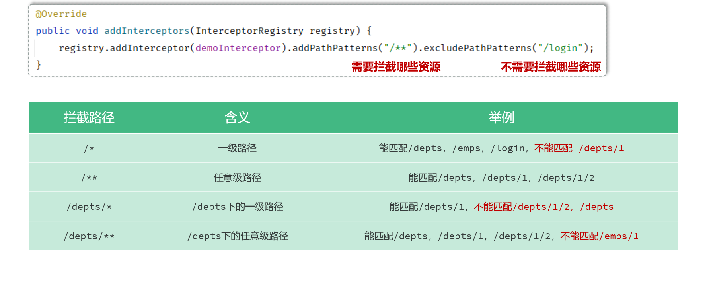

# 什么是拦截器 (Interceptor)？

- 在Spring Boot (或 Spring MVC) 中，**拦截器(Interceptor)** 是一种强大的机制，它允许你在 **请求处理过程** 的特定点插入自定义逻辑

- 它主要用于实现一些与具体业务逻辑无关的 **横切关注点**，例如：

  - **用户认证**：检查用户是否登录

  - **权限校验**：验证用户是否有权限访问某个资源

  - **日志记录**：记录请求的详细信息，如 IP、URL、耗时等

  - **性能监控**：统计方法的执行时间

  - **数据预处理**：在请求到达 Controller 前，对请求数据进行统一处理


# 核心 : `HandlerInterceptor` 接口方法

## 0. 概述

- 要创建一个拦截器，你需要实现 `HandlerInterceptor` 接口。这个接口定义了三个核心方法，它们构成了拦截器的生命周期：

  >在前后端分离项目中，**`preHandle` 和 `afterCompletion` 方法依然非常有用，而 `postHandle` 方法基本就没用武之地了，但是不代表它不会运行，只是在作用和意义方面，不太大了**

  ```java
  public interface HandlerInterceptor {
  	default boolean preHandle(HttpServletRequest request, 
                                HttpServletResponse response, 
                                Object handler) throws Exception {return true;}
  
  	default void postHandle(HttpServletRequest request, 
                              HttpServletResponse response, 
                              Object handler,@Nullable ModelAndView modelAndView) throws Exception{}
  
  	default void afterCompletion(HttpServletRequest request, 
                                   HttpServletResponse response, 
                                   Object handler,@Nullable Exception ex) throws Exception{}
  }
  ```

  

## 1.`preHandle(...)`

- **方法签名**: 

  ```java
  boolean preHandle(HttpServletRequest request, HttpServletResponse response, Object handler)
  ```

- **执行时机**: 在 **Controller 方法执行之前** 被调用

- **作用与特点**: 这是最重要的方法

  - **返回 `true` 表示放行**，请求会继续流向下一个拦截器或 Controller
  - **返回 `false` 表示拦截**，请求处理流程中断，不会再执行后续的拦截器和 Controller 方法。你可以通过 `response` 对象向客户端返回任何信息


## 2. `postHandle(...)`

- **方法签名**: 

  ```java
  void postHandle
      (HttpServletRequest request, HttpServletResponse response, Object handler, ModelAndView modelAndView)
  ```

- **执行时机**: 在 **Controller 方法执行之后，视图渲染之前** 被调用

  >在前后端分离项目中，**`preHandle` 和 `afterCompletion` 方法依然非常有用，而 `postHandle` 方法基本就没用武之地了，但是不代表它不会运行，只是在作用和意义方面，不太大了**

  - 在**前后端分离项目中**，`postHandle` 方法会在 **Controller 方法成功执行之后**，并且在 **JSON 响应被写入并发送给前端之前**运行

- **作用与特点**: 

  - 只有在 `preHandle` 方法返回 `true` 时才会执行
  - 你可以在这里修改 `ModelAndView` 对象，比如向视图中添加一些公共数据
  - 如果 Controller 抛出异常，此方法**不会**执行


## 3. `afterCompletion(...)`

- **方法签名**:

  ```java
  void afterCompletion
  	(HttpServletRequest request, HttpServletResponse response, Object handler, Exception ex)
  ```

- **执行时机**: 

  - 在**前后端分离项目中**，**`afterCompletion` 方法**会在**整个请求处理完毕，并且 JSON 响应已经完全发送给前端之后**运行

- **作用与特点**: 

  - 无论 Controller 是否抛出异常，只要 `preHandle` 返回 `true`，此方法**总是会执行**
  - 主要用于资源清理工作，比如记录日志、性能监控等
  - `ex` 参数包含了 Controller 抛出的异常信息（如果没有异常则为 `null`）


# 在 Spring Boot 中使用拦截器

- 使用拦截器只需两步：**创建拦截器** 和 **注册拦截器**

## 步骤一：创建自定义拦截器

- 创建一个类并实现 `HandlerInterceptor` 接口
  - 强烈推荐在实现这个接口的类上面，加上**`@Component`**
    - 核心原因是：**为了让拦截器能使用依赖注入（DI）**

- 拦截器是自己调用的
  - 当一个请求进来时，Spring MVC 框架的**`DispatcherServlet`**（你可以理解为总调度员）会自动在正确的时间点去调用你写好的 `preHandle`、`postHandle` 和 `afterCompletion` 方法。你永远不需要手动去调用它们


## 步骤二：注册拦截器

### 概念

- 创建一个配置类，实现 `WebMvcConfigurer` 接口，并重写 `addInterceptors` 方法来注册我们刚刚创建的拦截器
  - **`addInterceptors` 方法**的主要作用是，把你创建好的拦截器（比如 `LoginInterceptor`）**正式登记到 Spring MVC 的系统中**，告诉系统：
    1. **要用哪个拦截器**：通过 `registry.addInterceptor(loginInterceptor)` 来指定
    2. **这个拦截器要去拦截哪些网址**：通过 `.addPathPatterns(...)` 来设置拦截规则，这个括号里的参数是路径
    3. **有没有例外，哪些网址不需要它管**：通过 `.excludePathPatterns(...)` 来设置放行规则
- 这个配置类如果不使用`@Configuration`或者`@Component`注解，拦截器就会失效，原因如下：
  - Spring Boot 会自动寻找容器中所有**实现了 `WebMvcConfigurer` 接口的 Bean**，然后**依次调用它们内部的方法（比如 `addInterceptors`）来完成配置**

- `.addPathPatterns(...)`方法和`.excludePathPatterns(...)`方法常见**拦截路径**设置

  


### 示例

#### 1. 创建 `WebMvcConfig.java` 文件

- 我们通常会把这个配置类放在一个 `config` 包里

#### 2. 编写代码

```java
/**
 * Spring MVC 配置类
 * * @Configuration 注解：
 * 告诉 Spring Boot 这是一个配置类，项目启动时需要加载它
 */
@Configuration
public class WebMvcConfig implements WebMvcConfigurer {

    // 使用 @Autowired 将我们自己创建的拦截器 Bean 注入进来
    @Autowired
    private LoginInterceptor loginInterceptor;

    /**
     * 重写 addInterceptors 方法，将拦截器注册到拦截器链中
     * @param registry 拦截器注册表，用于添加和配置拦截器
     */
    @Override
    public void addInterceptors(InterceptorRegistry registry) {
        // 使用 registry.addInterceptor() 方法注册拦截器
        registry.addInterceptor(loginInterceptor)
                // 使用 .addPathPatterns() 方法指定需要拦截的路径规则
                // "/**" 表示拦截所有路径
                .addPathPatterns("/api/**") 
                
                // 使用 .excludePathPatterns() 方法指定需要排除的路径规则
                // 通常用于放行登录、注册等公共接口
                .excludePathPatterns(
                    "/api/auth/login", 
                    "/api/auth/register",
                    "/swagger-ui/**", // 放行 Swagger UI 资源
                    "/v3/api-docs/**"  // 放行 OpenAPI v3 文档
                );
    }
}
```


# 应用场景

## 用户登录状态检查示例

- 这是拦截器最经典的应用场景
  - 在 `preHandle` 中检查 Session 或 Token，如果不存在则拦截并重定向到登录页

- 创建自定义拦截器

```java
@Component
public class LoginInterceptor implements HandlerInterceptor {

    @Override
    public boolean preHandle(HttpServletRequest request, 
                             HttpServletResponse response, 
                             Object handler) throws Exception {
        
        //1.获取请求头中的token，里面是JWT令牌字符串
        String token = request.getHeader("token");

        //2.判断token是否存在, 如果不存在, 说明用户没有登录, 返回错误信息(响应401状态码)
        if (token == null || token.isEmpty()){
            log.info("令牌为空, 响应401");
            response.setStatus(HttpServletResponse.SC_UNAUTHORIZED);
            return false;
        }

        //3.如果token存在, 校验令牌, 如果校验失败 -> 返回错误信息(响应401状态码)
        try {
            JwtUtils.parseToken(token);
        } catch (Exception e) {
            log.info("令牌非法, 响应401");
            response.setStatus(HttpServletResponse.SC_UNAUTHORIZED);
            return false;
        }

        //4.校验通过
        log.info("令牌合法，放行");
        return true;
    }
}
```


**注册此拦截器：**

```java
// 在 WebMvcConfig.java 中
@Autowired
private LoginInterceptor loginInterceptor;

@Override
public void addInterceptors(InterceptorRegistry registry) {
    registry.addInterceptor(loginInterceptor)
            .addPathPatterns("/**") // 拦截所有
            .excludePathPatterns("/login", "/doLogin", "/css/**", "/js/**"); // 排除登录相关路径和静态资源
}
```

