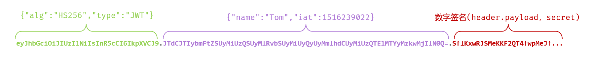

# 1. 什么是 JWT ?

- JWT (JSON Web Token) 是一个开放标准，它定义了一种紧凑且自包含的方式，用于在各方之间安全地传输信息。这些信息会经过数字签名，因此可以被验证和信任
- 它是为了解决传统认证机制 (Session-Cookie) 在新的技术架构下面临的严峻挑战而出现的


- **核心特点：**

  - **紧凑:** JWT 的体积很小，可以通过 URL、POST 参数或者 HTTP Header 发送

  - **自包含:** JWT 的载荷（Payload）部分包含了所有需要的信息（例如用户信息、权限等），避免了多次查询数据库

  - **安全:** JWT 可以被签名（例如使用 HMAC 算法）或加密，以保证其完整性和保密性。服务器可以通过验证签名来确认 Token 未被篡改


- 在 Web 开发中，JWT 最常见的应用场景就是**身份认证**。
  - 一旦用户登录成功，服务器就会生成一个 JWT 并返回给客户端。客户端在后续的每次请求中，都需要携带这个 JWT，服务器通过验证 JWT 来确认用户的身份


# 2. JWT 的组成部分

- 一个标准的 JWT 是**由两个 `.` 分隔成三个部分的一长串字符串**
  - 这三个部分分别是：
    1. **Header (头部)**
    2. **Payload (载荷)**
    3. **Signature (签名)**
- **示例**




## 第一部分：Header (头部)

- Header 部分描述了 JWT 的元数据，它本身是一个 JSON 对象，通常包含两个字段：

  - `typ` (Type): 令牌的类型。对于 JWT 来说，这个值固定为 `JWT`。它明确地告诉使用者这是一个 JWT

  - `alg` (Algorithm): 使用的签名算法。这个字段至关重要，它指定了生成签名（第三部分）所使用的算法，接收方需要使用相同的算法来验证签名

  - **常见的签名算法包括：**

    - **HMAC 算法 (对称加密):**
      - `HS256`: HMAC using SHA-256 (最常用)
      - `HS384`: HMAC using SHA-384
      - `HS512`: HMAC using SHA-512

    - **RSA 算法 (非对称加密):**
      - `RS256`: RSA Signature with SHA-256
      - `RS384`: RSA Signature with SHA-384
      - `RS512`: RSA Signature with SHA-512

    - **ECDSA 算法 (非对称加密):**
      - `ES256`, `ES384`, `ES512`

- **编码过程：**

  - 这个 JSON 对象会经过 **Base64Url** 编码，形成 JWT 的第一部分。Base64Url 是一种对特殊 URL 字符友好的 Base64 变体。

  - **示例：**

    ```json
    {
      "alg": "HS256",
      "type": "JWT"
    }
    ```

    - 将上述 JSON 对象进行 Base64Url 编码后，就得到了 JWT 的第一部分： `eyJhbGciOiJIUzI1NiIsInR5cCI6IkpXVCJ9`


## 第二部分：Payload (载荷)

- Payload 部分是 JWT 的核心，用于存放实际需要传输的数据。
  - 这些数据被称为**声明 (Claims)**。声明是关于一个实体（通常是用户）和附加元数据的陈述


### **声明的三种类型**

1. **Registered Claims (注册声明):** 

   - 这些是预定义的一组声明，虽然不是强制要求使用的，但官方推荐使用它们来确保互操作性。

     - `iss` (Issuer): 令牌的签发者。例如，`https://api.example.com`。
     - `sub` (Subject): 令牌的主题，通常是用户的唯一标识符 (ID)。这是 Payload 中最重要的字段之一。
     - `aud` (Audience): 令牌的接收方。指定该 JWT 是为哪个服务或应用准备的。
     - `exp` (Expiration Time): 过期时间戳。这是一个 Unix 时间戳，表示令牌在此时间之后将不再被接受。这是**必须**包含的字段，用于保证安全性。
       - 根据 JWT 的官方规范 ([RFC 7519](https://www.google.com/search?q=https://tools.ietf.org/html/rfc7519%23section-2&authuser=1))，时间戳 (`exp`, `iat`, `nbf`) 存储的应该是从 `1970-01-01 00:00:00 UTC` 到现在的 **秒数 (seconds)**，并且这个值必须是整数
     - `nbf` (Not Before): 生效时间戳。表示令牌在此时间之前是无效的。
     - `iat` (Issued At): 签发时间戳。表示令牌是何时被创建的。
     - `jti` (JWT ID): JWT 的唯一标识符。可用于防止 JWT 被重复使用（一次性令牌）

     

2. **Public Claims (公共声明):** 

   - 这类声明可以由使用者自由定义，但为了避免与现有或未来的声明冲突，应该在 [IANA JSON Web Token Registry](https://www.google.com/search?q=https://www.iana.org/assignments/json-web-token/json-web-token.xhtml) 中注册，或者使用包含命名空间的 URI 来定义，例如 `https://example.com/is_admin: true`。

   

3. **Private Claims (私有声明):** 这是在通信双方（例如，你的后端服务和前端应用）之间共享的自定义声明，既不是注册声明也不是公共声明。你可以根据业务需求添加任何信息

   > 这个就是我们在代码里自定义的

   - `username`: 用户名
   - `roles`: 用户角色数组，如 `["ADMIN", "EDITOR"]`
   - `userId`: 用户的数字 ID
   - `department`: 用户所属部门

   

### **安全提示**

- Payload 默认是不加密的，仅仅是经过了 Base64Url 编码。

  - 这意味着任何人只要拿到你的 JWT，都可以解码并读取其中的内容

    >从严格意义上来讲，任何到达了浏览器（客户端）的数据，都应该被假定为是“公开”的，而不是“秘密”的
    >
    >所以 JWT 中不可以放任何隐秘的信息
    >
    >尽管这是很安全的 JWT，但是仍然非常暴露

  - **因此，绝对不要在 Payload 中存放任何敏感信息，例如用户的密码、身份证号等**

- **示例：**	

  - 一个包含注册声明和私有声明的 Payload：

    ```json
    {
      "sub": "user123",
      "username": "Alice",
      "roles": ["USER", "VIEWER"],
      "iss": "my-auth-server",
      "iat": 1662541800,
      "exp": 1662545400
    }
    ```

  - 经过 Base64Url 编码后，它将成为 JWT 的第二部分


## 第三部分：Signature (签名)

> 这个是理解的根本，为什么：因为坏人无法更改这个签名，因为这个签名是服务器端根据只有服务器端知道的密钥计算出来的，坏人不知道密钥，所以他算不出来
>
> 我之前理解的时候忽略了密钥无法伪造这个特点，其实更准确的说是忽略了比对的过程是拿着重新计算出来的签名和传过来的 JWT中无法被更改的签名进行对比这一点，实际也忘记了服务器端会指定密钥这件事，当时一直把注意力聚焦到 JWT 暴漏在前端的前两个部分，然后一直疑惑不解为啥能加密，能验证，为啥改了前端的 JWT ，后端却能知道，思维当时有点局限，注意力集中到了某些轻度的点
> 
>
> > 我当时一直在疑惑，诶？不是根据前两个计算的吗啊啊啊啊，但是后端又没有保存前面的两个部分，前面的两个部分再计算一次为啥能查出被伪造了，当时一直很疑惑，现在了然了

- 签名部分是 JWT 安全性的基石。它的作用是验证消息的发送者身份，并确保消息在传输过程中没有被篡改

### **签名的生成过程**

1. 准备数据

   - 将经过 Base64Url 编码的 Header 和经过 Base64Url 编码的 Payload 用一个 `.` 连接起来，形成一个字符串。
      `encodedHeader + "." + encodedPayload`

2. 选择密钥

   - 使用一个**密钥 (Secret)**。**这个密钥只有服务器知道**

     - **密钥的安全性：**

       这个 `secret` **必须被严格保存在服务器端**，绝对不能泄露给客户端或任何第三方。如果密钥泄露，攻击者就可以伪造任何有效的 JWT，从而冒充任意用户身份，这将导致严重的安全漏洞。

3. 进行签名

   - 使用在 Header 中指定的签名算法 (`alg`)，对第一步生成的字符串和第二步的密钥进行加密计算，生成最终的签名

- **公式（以 HS256 为例）：**

  ```java
  Signature = HMACSHA256(
    base64UrlEncode(header) + "." + base64UrlEncode(payload),
    secret
  )
  ```


### **如何验证签名**

1. **接收并拆分 JWT** 

   - 服务器从客户端的请求中（比如 HTTP 的 `Authorization` 头部）拿到 JWT 字符串。然后，它会用 `.` 将这个字符串拆分成三个部分：

     - `encodedHeader` (编码后的头部)

     - `encodedPayload` (编码后的载荷)

     - `signature` (原始签名)

       

2. **准备重新计算签名所需材料** 

   - 服务器现在手上有三样东西：

     - 从第一步得到的 `encodedHeader` 和 `encodedPayload`

     - 存储在服务器自己内部、**绝不外传的密钥 (Secret)**

     - 从 `encodedHeader` 解码后可以知道当初使用的签名算法（比如 `HS256`）

       

3. **重新计算签名** 

   - 服务器会完全按照文档中“签名的生成过程”的公式，用手上的材料自己算一遍签名：

     - 首先，把 `encodedHeader` 和 `encodedPayload` 用 `.` 拼接起来： `encodedHeader + "." + encodedPayload`

     - 然后，用这个拼接好的字符串和自己的**密钥**，通过 `HS256` 算法进行计算，得出一个**新的签名**

       

4. **进行比对** 

   - 这是最关键的一步。服务器会比较：

     - **第一步**从 JWT 中拆分出来的**原始签名**

     - **第三步**自己刚刚计算出来的**新签名**

   

5. **得出结论**

   - 如果两个签名**完全一致**，验证通过！服务器就确认了这个 JWT 是由自己签发的，并且内容没有被任何人篡改过。然后它会继续检查 Payload 里的过期时间 `exp` 等信息

   - 如果两个签名**不一致**，验证失败！服务器会认为这个 JWT 是伪造的或被篡改过的，会立即拒绝这个请求，通常会返回一个 `401 Unauthorized` 的错误


# 3. JWT 的工作流程

1. **用户登录：** 用户使用用户名和密码发起登录请求。

2. **服务器验证：** 服务器验证用户的凭据是否正确。

3. **生成 JWT：** 如果验证通过，服务器会创建一个包含用户标识和权限信息的 Payload，然后用一个密钥生成签名，最终组装成一个完整的 JWT。

4. **返回 JWT：** 服务器将生成的 JWT 返回给客户端。

5. **客户端存储：** 客户端（例如浏览器）收到 JWT 后，通常会将其存储在 `localStorage`、`sessionStorage` 或 HTTP Header (`Authorization`) 中。

6. **后续请求：** 在之后的每一次请求中，客户端都需要将 JWT 附加到请求中，最常见的方式是放在 HTTP Header 的 `Authorization` 字段里，并使用 `Bearer` 方案：

   ```
   Authorization: Bearer <token>
   ```

7. **服务器验证请求：** 服务器收到请求后，会从 Header 中获取 JWT。然后使用**相同的密钥**验证 JWT 的签名。

   - 如果签名验证通过，服务器就可以信任这个 JWT，并从中解析出用户信息，执行相应的操作。
   - 如果签名验证失败，或者 JWT 已过期，服务器会拒绝该请求，返回 `401 Unauthorized` 或 `403 Forbidden` 错误。


# 4. JWT 的优缺点

## 优点

- **无状态与可扩展性:**
  - 服务器端不需要存储 Session 信息。用户的状态信息完全包含在 JWT 中。
  - 这使得应用非常容易扩展。任何一台服务器只要拥有相同的密钥，就能处理用户的请求，非常适合分布式系统和微服务架构。
- **解耦:**
  - 后端服务和认证服务可以解耦。只要能验证 JWT 的签名，任何服务都可以信任这个请求。
- **性能：**
  - 由于 Payload 中可以包含用户信息，减少了频繁查询数据库获取用户信息的需要。
- **适用于多客户端:**
  - JWT 不依赖于 Cookie，因此在 Web、移动端（iOS, Android）等不同平台上都能很好地工作。


## 缺点

- **Token 体积较大：** 如果在 Payload 中存放过多信息，会导致 JWT 体积增大，增加网络传输的开销。
- **无法主动失效:**
  - 一旦 JWT 签发，在它过期之前都会有效。服务器无法主动使其失效。
  - **解决方案：**
    1. **设置较短的过期时间：** 这是最简单的方式，但会影响用户体验（需要频繁登录）。
    2. **维护一个黑名单：** 在服务器端（例如用 Redis）维护一个已失效的 JWT 列表。每次收到请求时，先检查 JWT 是否在黑名单中。
- **安全性依赖于密钥：** 签名的密钥一旦泄露，攻击者就可以伪造任意的 JWT，后果非常严重。必须妥善保管密钥。
- **续签问题:**
  - 为了平衡安全性和用户体验，通常会使用**双 Token 机制**：
    - **Access Token:** 过期时间很短（例如 15 分钟），用于访问受保护的资源。
    - **Refresh Token:** 过期时间很长（例如 7 天），专门用于在 Access Token 过期后获取新的 Access Token。Refresh Token 只在请求新 Token 时才发送，并且需要安全地存储。


# 5. 在 Spring Boot 中使用 JWT

## 第一步：添加依赖

首先，在你的 `pom.xml` 文件中添加 JWT 相关的库，这里推荐使用 `jjwt`。

```xml
<!-- Java JWT: 一个用于创建和解析JWT的库 -->
<dependency>
    <groupId>io.jsonwebtoken</groupId>
    <artifactId>jjwt-api</artifactId>
    <version>0.11.5</version>
</dependency>
<dependency>
    <groupId>io.jsonwebtoken</groupId>
    <artifactId>jjwt-impl</artifactId>
    <version>0.11.5</version>
    <scope>runtime</scope>
</dependency>
<dependency>
    <groupId>io.jsonwebtoken</groupId>
    <artifactId>jjwt-jackson</artifactId>
    <version>0.11.5</version>
    <scope>runtime</scope>
</dependency>
```


## 第二步：创建 JWT 工具类 (JwtUtils)

- 创建一个工具类来封装 JWT 的生成和解析逻辑。这个类是整个认证功能的核心

  - **生成 Token:** 提供一个方法，接收用户信息（如用户ID），设置过期时间，并使用密钥签名生成 JWT 字符串

  - **解析 Token:** 提供一个方法，接收 JWT 字符串，使用相同的密钥来验证签名。如果验证成功，则返回解析出的信息；如果失败（如签名错误、Token 过期），则抛出异常


## 第三步：创建登录接口

- 在你的 Controller 中创建一个用于用户登录的接口（例如 `/login`）
  1. 接收用户的用户名和密码
  2. 去数据库或其他地方验证凭据是否正确
  3. 如果验证成功，调用 `JwtUtils` 工具类为该用户生成一个 JWT
  4. 将生成的 JWT 返回给前端


## 第四步：过滤器拦截器相关......


