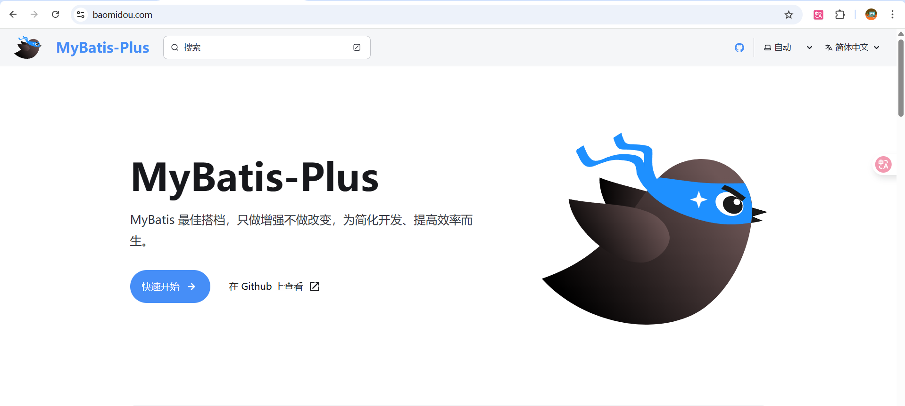
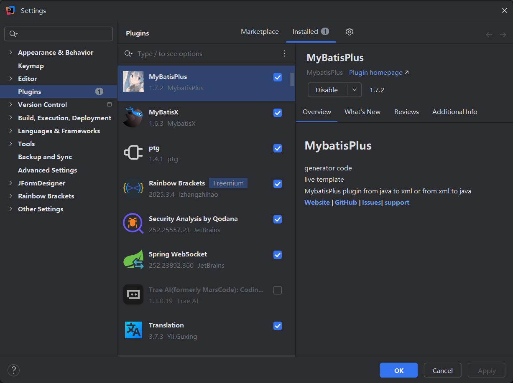
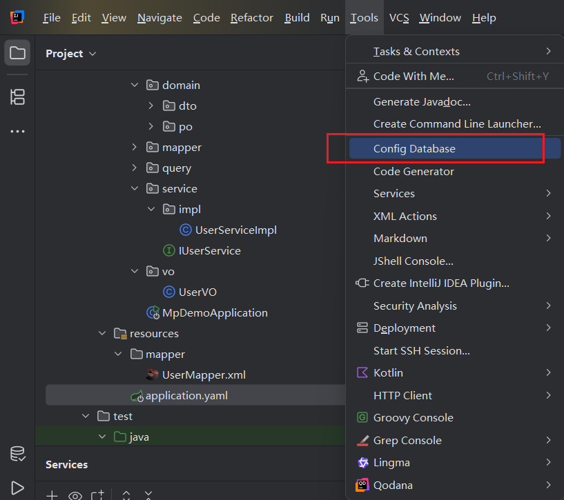
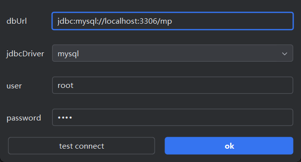
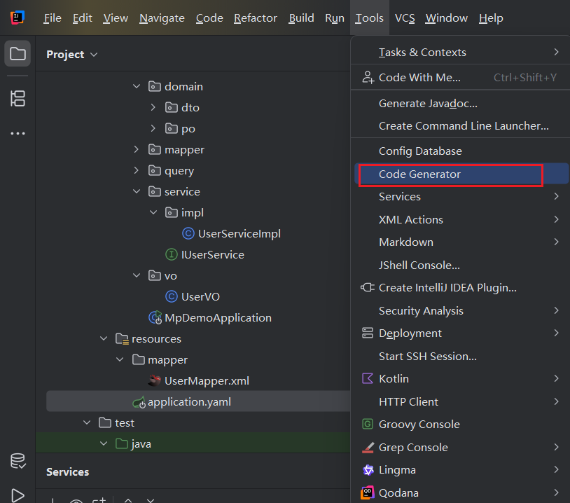
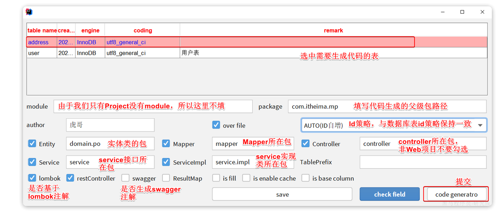

# MybatisPlus

## 一. 基础起步

### 1. MyBatis-Plus 简介

#### 1.1 什么是 MyBatis-Plus？
MyBatis-Plus (简称 MP) 是一个 MyBatis 的增强工具，

- 其核心理念是：**在 MyBatis 的基础上只做增强不做改变**，为简化开发、提高效率而生。

它并非为了取代 MyBatis，而是作为 MyBatis 的得力助手协同工作

 


#### 1.2 为什么选择 MyBatis-Plus？

* **开发效率倍增**：内置了强大的通用 CRUD 功能。对于单表的增删改查，几乎无需编写任何 SQL
* **完全无侵入**：100% 兼容 MyBatis 原生功能。引入 MP 依赖后，依然可以毫无障碍地使用原生 MyBatis 编写 XML 绑定 SQL 语句
* **生态功能完备**：内置开箱即用的高级功能，如逻辑删除、乐观锁、代码生成器、防全表更新等
    
    > **替代第三方插件**：引入 MP 后即可弃用 `PageHelper`，因为 MP 原生内置了更为强大的分页插件
* **社区支持成熟**：官方文档详尽，国内社区活跃度极高，踩坑成本低

> **💡 架构最佳实践：两框架优势互补**
> * **单表操作**：充分利用 MP 提供的通用接口（`BaseMapper`/`IService`）和条件构造器（`Wrapper`），实现零 SQL 极速开发
> * **复杂关联操作**：
>   * 遇到无法自动生成的复杂业务逻辑（如多表 JOIN 关联查询、复杂的聚合统计），果断回归 MyBatis 原生的 XML 或 `@Select` 注解方式自定义 SQL


#### 1.3 核心特性一览

* **通用 CRUD**：内置 `BaseMapper` 和 `IService` 接口，高度封装绝大部分单表操作。
* **条件构造器 (Wrapper)**：以类型安全、面向对象的方式构建复杂的 `WHERE` 查询条件，避免手写 SQL 的繁琐与拼写错误。
* **主键生成策略**：内置支持多种主键策略（自增、UUID），并默认集成适用于分布式场景的雪花算法（Snowflake）。
* **扩展插件机制**：通过拦截器机制，无缝提供物理分页、乐观锁、性能分析、动态表名（水平分表）等高级能力。
* **代码生成器**：支持一键生成 Entity、Mapper、Service、Controller 基础代码，快速搭建业务模块。


### 2. 快速入门 (Spring Boot)

#### 第 1 步：环境准备

- **JDK**：8 或更高版本
- **构建工具**：Maven 3.5+ 或 Gradle 6+
- **数据库**：MySQL 5.7+


#### 第 2 步：引入依赖

在 Spring Boot 项目中，强烈建议直接引入 `starter` 依赖，它不仅包含了 MyBatis-Plus 的核心功能，还额外提供了自动装配（AutoConfiguration）

- **针对 Spring Boot 2.x：**

  ```xml
  <dependency>
      <groupId>com.baomidou</groupId>
      <artifactId>mybatis-plus-boot-starter</artifactId>
      <version>3.5.14</version>
  </dependency>
  ```

  

- **针对 Spring Boot 3.x：**

  ```xml
  <dependency>
      <groupId>com.baomidou</groupId>
      <artifactId>mybatis-plus-spring-boot3-starter</artifactId>
      <version>3.5.14</version>
  </dependency>
  ```


#### 第 3 步：启动类配置

要让 Spring 容器接管 Mapper 接口，需要在主启动类（或配置类）上添加 `@MapperScan` 注解，指定 Mapper 接口所在的包路径

> 可以使用`@Mapper` ，也可以使用`@MapperScan`，这两个注解的作用在 **Mybatis 的笔记中都有讲**，这里用后者
>
> - `@MapperScan`这个注解的作用是：指定一个基础包路径，自动扫描该路径下的所有接口并注册为 Mapper

```java
import org.mybatis.spring.annotation.MapperScan;
import org.springframework.boot.SpringApplication;
import org.springframework.boot.autoconfigure.SpringBootApplication;

@SpringBootApplication
// 指定顶层包，其下的子包都会被自动扫描并注册为 Mapper Bean
@MapperScan("com.myapp.mapper")
public class MyApplication {
    public static void main(String[] args) {
        SpringApplication.run(MyApplication.class, args);
    }
}
```


#### 第 4 步：创建数据库表与实体类

**a. 准备数据库表 (`user`)**

```sql
CREATE DATABASE IF NOT EXISTS mp_demo;
USE mp_demo;

DROP TABLE IF EXISTS user;

CREATE TABLE user (
    id BIGINT PRIMARY KEY COMMENT '主键ID, 雪花算法生成',
    name VARCHAR(30) NULL DEFAULT NULL COMMENT '姓名',
    age INT(11) NULL DEFAULT NULL COMMENT '年龄',
    email VARCHAR(50) NULL DEFAULT NULL COMMENT '邮箱'
);
```


**b. 编写实体类 (`User.java`)**

```java
@Data
@TableName("user") // 将该类与数据库中的 "user" 表进行映射
public class User {

    // 声明主键，并指定策略为雪花算法 (MP 会在插入时自动生成全局唯一 ID)
    @TableId(type = IdType.ASSIGN_ID)
    private Long id;

    // 其他字段会自动按 驼峰命名法 与数据库的 下划线命名法 进行映射 (如 userName -> user_name)
    private String name;
    private Integer age;
    private String email;
}
```


#### 第 5 步：创建 Mapper 接口

创建实体类对应的 Mapper 接口，并**继承 `BaseMapper<T>`**

```java
// 这是一个接口，而不是类
public interface UserMapper extends BaseMapper<User> {
    // 关键点：这个接口只需要继承 BaseMapper<User> 即可
    // 不需要写任何方法，就已经免费获得了十几二十个强大的 CRUD 方法！
    // 泛型 <User> 指定了这个 Mapper 是专门操作 User 实体类（即 user 表）的。
}
```


#### 第 6 步：编写并运行测试

在 Spring Boot 测试类中注入 `UserMapper`，验证基础功能

```java
@SpringBootTest
class UserMapperTests {

    @Autowired
    private UserMapper userMapper;

    @Test
    void testSelectList() {
        System.out.println("----- 测试查询所有用户 ------");
        // 参数为 null 表示没有任何查询条件 (WHERE)，即全表查询
        List<User> userList = userMapper.selectList(null);
        userList.forEach(System.out::println);
    }
    
    @Test
    void testInsert() {
        System.out.println("----- 测试插入用户 ------");
        User user = new User();
        user.setName("Jack");
        user.setAge(20);
        user.setEmail("jack@mp.com");
        
        // 调用 insert 方法
        int result = userMapper.insert(user);
        System.out.println("受影响的行数: " + result);
        
        // 核心特性验证：插入后获取自动生成的 ID
        System.out.println("回填后的用户 ID: " + user.getId());
    }

    @Test
    void testSelectById() {
        System.out.println("----- 测试根据 ID 查询用户 ------");
        User user = userMapper.selectById(1L);
        System.out.println("查询到的用户: " + user);
    }
}
```

> **💡 核心特性提示：**
>
> - **主键 ID 自动回填** 
>
>   在执行 `insert()` 操作时，无论是使用雪花算法还是数据库自增策略，MyBatis-Plus 都会在数据成功插入数据库后，**自动将生成的主键 ID 回填到传入的实体对象中**
>
>   因此，在 `insert()` 执行完毕后，可以直接调用 `user.getId()` 获取新数据的 ID，无需再发一次查询请求


### 3. 核心配置项 (`application.yml`)

在 Spring Boot 项目中，MyBatis-Plus 的配置主要集中在 `application.yml`（或 `application.properties`）文件中的 `mybatis-plus.*` 前缀下

合理的配置能极大提升开发效率，并避免潜在的运行时错误

#### 3.1 基础配置 (路径与扫描)

基础配置主要用于指定 XML 映射文件、实体类以及枚举类的位置

```yaml
mybatis-plus:
  # 1. Mapper XML 文件位置
  # 作用: 指定 MyBatis 的 XML Mapper 文件的存放位置。这是整合 MyBatis 必不可少的配置。
  # 格式: 使用 Ant 风格的路径匹配，`classpath*:` 代表扫描所有类路径。
  # 示例: 扫描 resources/mapper 目录下及其所有子目录下的 .xml 文件。
  mapper-locations: classpath*:/mapper/**/*.xml

  # 2. 实体类别名扫描包
  # 作用: 指定实体类（Entity/POJO）所在的包。
  # 好处: 配置后，在 XML 文件中可以直接使用类名（如 `User`）作为 `resultType`，而无需写完整的包路径（如 `com.myapp.entity.User`）。
  type-aliases-package: com.myapp.entity

  # 3. 枚举类扫描包
  # 作用: 如果实体类中使用了自定义枚举类型，需配置此项。MP 会自动将数据库中的值与枚举实例进行转换（需配合 @EnumValue 注解）。
  type-enums-package: com.myapp.enums

  # 4. 启动时检查配置
  # 作用: 在项目启动时，检查 `mapper-locations` 指定的路径下是否存在 XML 文件。
  # 建议: 开发环境下建议开启（`true`），若路径配置错误会立即报错，方便及早发现问题。
  check-config-location: true
```


#### 3.2 全局策略配置 (`global-config`)

`global-config` 用于定义 MyBatis-Plus 的全局行为，尤其是 `db-config` 子项，它直接影响实体类与数据库表的映射关系

```yaml
mybatis-plus:
  global-config:
    # 1. 关闭启动 Banner
    # 功能: MP 启动时默认会在控制台打印一个漂亮的 Banner。如果你不希望看到它，可以设置为 false。
    banner: false

    # 2. 数据库相关配置 (db-config)
    # 这是 global-config 中最重要的一部分，用于定义表与实体类的映射关系和主键策略。
    db-config:
      # (1) 主键生成策略 (IdType)
      # 功能: 定义实体类主键的生成方式。
      # 可选值:
      #   - AUTO: 数据库ID自增。依赖数据库的自增策略，如 MySQL 的 `AUTO_INCREMENT`。
      #   - NONE: 无状态，用户手动设置ID。
      #   - INPUT: 用户手动设置ID，与 NONE 类似，但插入前会判断 ID 是否为空。
      #   - ASSIGN_ID: 分配ID（默认值）。当主键类型为 Long 或 String 时，MP 会使用雪花算法（Snowflake）自动生成一个全局唯一的ID。
      #   - ASSIGN_UUID: 分配 UUID。主键类型为 String 时，生成 UUID。
      id-type: assign_id

      # (2) 表名前缀
      # 功能: 如果你的数据库表都有一个共同的前缀（如 `tbl_`），配置此项后，MP 会在生成 SQL 时自动为你处理。
      # 示例: 实体类 `User` 默认会映射到 `user` 表。如果配置了 `table-prefix: tbl_`，则会映射到 `tbl_user` 表。
      # 注意: 反过来，如果表名为 `tbl_user`，实体类名为 `User`，则不需要配置此项，MP 会自动识别。这个配置主要用于代码生成器或特定场景。
      table-prefix: tbl_

      # (3) 逻辑删除字段名 (推荐使用)
      # 功能: 指定用于逻辑删除的字段名。配置后，调用 MP 的 `delete` 方法时，会变成执行 `UPDATE` 语句来修改该字段的值。
      # 示例: `logic-delete-field: deleted`
      logic-delete-field: deleted # 实体类中的字段名

      # (4) 逻辑删除字段值为 '已删除'
      # 功能: 定义逻辑删除时，字段被设置成什么值代表“已删除”。默认为 1。
      logic-delete-value: 1

      # (5) 逻辑删除字段值为 '未删除'
      # 功能: 定义什么值代表“未删除”。默认为 0。
      logic-not-delete-value: 0
```


#### 3.3 MyBatis 原生配置 (`configuration`)

由于 MyBatis-Plus 是在 MyBatis 基础上的增强，所有 MyBatis 的原生配置项在这里依然适用

```yaml
mybatis-plus:
  configuration:
    # 1. 开启驼峰命名自动映射
    # 功能: 这是 MyBatis 一个非常实用的功能。开启后，它会自动将数据库中下划线命名的列（如 `user_name`）映射到 Java 实体类中的驼峰命名属性（如 `userName`）。
    # 建议: 强烈建议开启（`true`）。
    map-underscore-to-camel-case: true

    # 2. 配置 SQL 日志打印
    # 功能: 在开发和调试阶段，我们通常希望在控制台看到 MP 执行的 SQL 语句、参数和返回结果。
    # 常用值: `org.apache.ibatis.logging.stdout.StdOutImpl`，表示使用标准输出来打印日志。
    # 生产环境: 在生产环境中，应关闭此功能或将其对接专业的日志框架（如 Log4j2, Slf4j）。
    log-impl: org.apache.ibatis.logging.stdout.StdOutImpl

    # 3. 开启/关闭一级/二级缓存
    # 功能: 控制 MyBatis 的缓存机制。
    # - cache-enabled: 全局性地开启或关闭二级缓存。默认为 true。
    # - local-cache-scope: 控制一级缓存的范围。SESSION（默认）或 STATEMENT。
    cache-enabled: false

    # 4. 其他原生配置...
    # Mybatis 的其他配置项，如 `default-statement-timeout`, `default-fetch-size` 等都可以放在这里。
```


#### 3.4 完整配置模板参考

在实际项目中，可以将上述配置综合起来。这是一个典型的 `application.yml` 配置模板：

```yaml
# 服务器端口
server:
  port: 8080

# Spring 数据库连接配置
spring:
  datasource:
    driver-class-name: com.mysql.cj.jdbc.Driver
    url: jdbc:mysql://localhost:3306/your_database?serverTimezone=UTC
    username: root
    password: your_password

# MyBatis-Plus 配置
mybatis-plus:
  # XML 文件位置
  mapper-locations: classpath*:/mapper/**/*.xml
  # 实体类别名扫描
  type-aliases-package: com.yourcompany.project.entity
  # 枚举类扫描
  type-enums-package: com.yourcompany.project.enums
  # 启动时检查 XML 位置
  check-config-location: true

  # 全局策略配置
  global-config:
    # 关闭 Banner
    banner: false
    # 数据库相关配置
    db-config:
      # 主键策略：使用雪花算法生成ID
      id-type: assign_id
      # 表名前缀
      table-prefix: tbl_
      # 逻辑删除字段
      logic-delete-field: is_deleted

  # MyBatis 原生配置
  configuration:
    # 开启驼峰命名转换
    map-underscore-to-camel-case: true
    # 开发环境打印 SQL
    log-impl: org.apache.ibatis.logging.stdout.StdOutImpl
```


## 二. 实体映射与注解

MyBatis-Plus 的核心优势之一是基于实体类与数据库表的自动映射。当类名与表名不符合默认转换规则，或需要明确主键生成策略时，需要通过注解进行显式配置

### 1. 表名与主键注解

#### 1.1 表名映射 (`@TableName`)

- **作用**：指定实体类对应的数据库物理表名
- **默认规则**：实体类名首字母小写，并从驼峰命名法转换为下划线命名法（例如 `UserInfo` 默认映射为 `user_info` 表）
- **使用场景**：
  - 表名与实体类名不符合默认转换规则（例如数据库表名为 `t_user`，而实体类名为 `User`）
  - 配置了全局 `table-prefix`，但个别表不需要该前缀时

```java
// 强制将 User 实体类映射到数据库中的 t_user 表
@TableName("t_user")
public class User {
    // ...
}
```


#### 1.2 主键映射 (`@TableId`)

- **作用**：标识实体类中的主键字段，并可指定主键的生成策略
- **使用场景**：
  - 当数据库的主键字段名 **不叫 `id`** 时（例如叫 `user_id`），必须使用此注解来明确指定主键
  - 当你需要指定 **当前表的主键生成策略** ,以覆盖全局默认配置


**常用属性**：

- `value`: 指定数据库表中的主键列名。如果属性名和列名符合驼峰-下划线规则，可以省略

- `type`: 指定主键的生成策略，这是一个非常重要的属性，其值为 `IdType` 枚举

  - **`IdType` 主键策略详解**：

    | `IdType`枚举值 | 解释                                                         | 数据库要求                                                   |
    | -------------- | ------------------------------------------------------------ | ------------------------------------------------------------ |
    | `ASSIGN_ID`    | **（默认值）雪花算法**<br/>MP 在插入数据时会自动生成一个全局唯一的 19 位 Long 型 ID | 字段类型建议为 `BIGINT`                                      |
    | `AUTO`⭐        | **数据库ID自增**<br />依赖数据库自身的自增策略               | 数据库表的主键字段必须设置为自增（如 MySQL 的 `AUTO_INCREMENT`） |
    | `INPUT`        | **用户手动输入**<br />在插入数据前，需要开发者自己手动为该字段 `set` 一个值 | 无特殊要求                                                   |
    | `ASSIGN_UUID`  | **UUID**<br />MP 在插入时会自动生成一个 32 位的 UUID 字符串  | 字段类型建议为 `VARCHAR(32)` 或 `CHAR(32)`                   |
    | `NONE`         | **无状态**<br />表示未设置主键策略，跟随全局配置             | -                                                            |

  > 这里的默认`type`策略是雪花算法
  >
  > **注意：策略冲突陷阱** 
  >
  > - 如果在 `@TableId` 中将策略指定为 `IdType.ASSIGN_ID`（雪花算法），但数据库表中该主键列又设置了自增（`AUTO_INCREMENT`）：
  >
  >   - **最终结果**：以 MyBatis-Plus 的代码设置为准。数据库自增机制不会生效，实际插入的数据 ID 将是 MP 生成的 19 位雪花算法数值。
  >
  >   - **最佳实践**：开发中必须保证代码中指定的生成策略与数据库表结构的实际设定保持完全一致，避免产生预期外的主键值。


- **代码示例**

  ```java
  @TableName("t_user")
  public class User {
  
      // 场景一：主键字段不叫 'id'，且使用雪花算法
      @TableId(value = "user_id", type = IdType.ASSIGN_ID)
      private Long userId;
  
      // 场景二：主键字段叫 'id'，但使用数据库自增策略
      @TableId(type = IdType.AUTO)
      private Long id;
  
      // ...
  }
  ```


### 2. 字段映射注解

#### 2.1 `@TableField`

`@TableField` 用于处理实体类中 **非主键字段与数据库表列之间的映射关系** ，是 MyBatis-Plus 中应用最广泛、功能最丰富的字段级配置注解

- **核心属性**：
  - `value`：指定数据库表中的实际物理列名
  - `exist`: 布尔值
    - `true` (默认) 表示该属性是数据库表中的字段
    - `false` 表示该属性不是数据库字段，MP 在底层构建 SQL 时将完全忽略此属性
  - `fill`: 字段自动填充策略，值为 `FieldFill` 枚举
    - `DEFAULT`: 默认不处理
    - `INSERT`: 插入时填充
    - `UPDATE`: 更新时填充
    - `INSERT_UPDATE`: 插入和更新时都填充


- **典型应用场景**：

  1. **命名规则不匹配**：

     - 当 Java 属性名与数据库列名不符合 **“驼峰命名转下划线”** 的默认规则时，需显式指定列名

  2. **排除非数据库字段**：

     - 实体类中常包含一些仅用于前端接收参数或业务逻辑计算的临时属性（如 `confirmPassword`、联表查询的额外展示字段等），

       必须通过 `exist = false` 将其声明为非数据库字段，否则会导致 SQL 执行时报“未知列”错误

  3. **处理布尔类型 `is` 前缀**：

     - 根据框架默认处理逻辑，布尔类型变量(`boolean`,非`Boolean`)若以 `is` 开头（例如 `isVip`），

       MyBatis-Plus 默认会剥离 `is` 前缀去匹配数据库列名（即寻找 `vip` 列）,

       若数据库实际列名严格定义为 `is_vip`，则必须通过此注解进行强制映射

  4. **规避 SQL 关键字冲突**：

     - 若属性名对应数据库的系统保留关键字（如`order`,`desc`,`select`），需使用该注解并通过数据库相应的转义字符（如 MySQL 的反引号 ```）包裹列名

  5. **字段自动填充配置**：

     - 结合 `fill` 属性，配合自定义的 `MetaObjectHandler` 拦截器，实现诸如`create_time`、`update_time`等公共审计字段的自动赋值（详见高级特性章节）


- **代码示例**：

  ```JAVA
  @TableName("t_user")
  public class User {
  
      // 场景 1：命名规则不匹配
      @TableField("pwd")
      private String password;
  
      // 场景 2：排除非数据库字段，持久化时完全忽略
      @TableField(exist = false)
      private String confirmPassword;
  
      // 场景 3：处理布尔类型的 is 前缀问题
      // 数据库实际列名为 is_vip，若不加此注解，MP 会默认寻找 vip 列
      @TableField("is_vip")
      private boolean isVip;
  
      // 场景 4：规避 SQL 关键字冲突（以 MySQL 为例使用反引号）
      @TableField("`order`")
      private Integer orderNum;
  
      // 场景 5：配置自动填充策略（插入时自动填充当前时间）
      @TableField(fill = FieldFill.INSERT)
      private LocalDateTime createTime;
  
      // 配置自动填充策略（插入和更新时均自动填充当前时间）
      @TableField(fill = FieldFill.INSERT_UPDATE)
      private LocalDateTime updateTime;
  }
  ```


### 3. 特殊功能注解

在常规的表名、字段名映射之外，MyBatis-Plus 提供了一些针对特定高级业务场景的注解，用于处理枚举类型序列化或精细化控制底层拦截器行为


#### 3.1 枚举处理 (`@EnumValue`)

- **作用**：专门用于处理 **枚举类型** 的字段,写到枚举类中，**指定** 将枚举对象中的哪一个具体 **属性** 值持久化到数据库中

- **背景与痛点**：

  - 默认情况下，MyBatis 会将枚举的 `name()`（例如 `"MALE"`、`"FEMALE"`）或 `ordinal()`（索引值）存入数据库

    而在实际业务设计中，数据库通常使用特定的整型代码（如 `0`, `1`）或自定义字符串记录状态

    若不进行干预，会导致数据库存储内容与预期不符或引发类型转换异常。

- **工作机制**：

  - 将 `@EnumValue` 注解标记在枚举类中需要持久化到数据库的字段上

    MyBatis-Plus 在执行 SQL 操作时，会自动提取该字段的值进行入库，并在查询出库时反向映射回相应的枚举实例


- **代码示例**：

  - **步骤一：定义枚举并标记注解**

    ```JAVA
    public enum GenderEnum {
        MALE(1, "男"),
        FEMALE(0, "女");
    
        // 核心配置：MP 序列化/反序列化时，将严格以该 code 字段的值为准
        @EnumValue 
        private final int code;
        
        private final String desc;
    
        GenderEnum(int code, String desc) {
            this.code = code;
            this.desc = desc;
        }
    }
    ```

    

  - **步骤二：在实体类中直接使用枚举类型**

    ```java
    @Data
    @TableName("t_user")
    public class User {
        private Long id;
        private String name;
        
        // 插入数据时若 gender = GenderEnum.MALE，数据库实际写入整型值 1
        // 查询数据时若数据库读出整型值 1，MP 会自动封装为 GenderEnum.MALE 对象
        private GenderEnum gender; 
    }
    ```

​	**效果**：当你保存一个 `User` 对象，且其 `gender` 属性为 `GenderEnum.MALE` 时，数据库中存入的值将是 `1`，而不是 `"MALE"`


#### 3.2 绕过拦截器 (`@InterceptorIgnore`)

- **作用**：用于在 Mapper 接口的具体方法级别进行精细化控制，临时屏蔽（忽略）某些已配置的全局拦截器插件

- **核心属性**：

  - `tenantLine`：是否忽略多租户插件（`"true"`/`"false"`，默认为空）
  - `illegalSql`：是否忽略非法 SQL 检查插件
  - `blockAttack`：是否忽略防全表更新与删除插件

- **典型应用场景**：

  - 最典型的应用是 **多租户隔离**

    假设系统全局配置了多租户插件，所有的查询 SQL 在底层都会被自动追加 `WHERE tenant_id = ?`。但某些跨租户的“超级管理员”业务接口需要获取全表总记录时，必须通过该注解临时绕过租户插件的限制

- **代码示例**：

  ```JAVA
  public interface UserMapper extends BaseMapper<User> {
  
      // 默认行为：受多租户插件管控，生成的 SQL 自动追加 tenant_id 条件
      // 只能查到当前请求上下文中租户的数据
      List<User> selectAllInCurrentTenant();
  
      // 特殊行为：通过注解显式声明忽略多租户插件
      // 生成的 SQL 不会追加 tenant_id 条件，从而实现跨租户全量查询
      @InterceptorIgnore(tenantLine = "true") 
      List<User> selectAllAcrossTenants();
      
      // 组合忽略：同时忽略多租户和防全表更新插件
      @InterceptorIgnore(tenantLine = "true", blockAttack = "true")
      int deleteAllData();
  }
  ```


## 三. 核心操作API

MyBatis-Plus 提供了完善的单表 CRUD API 体系。

其核心目的在于最大化消除重复的 SQL 编写工作。我们将从底层的 Mapper 接口、上层的 Service 封装以及静态工具类三个维度进行剖析

> 注：本章所有的 Wrapper 相关的东西，详见第四章


### 1. BaseMapper 接口

`BaseMapper<T>` 是 MyBatis-Plus 整个框架的数据访问基石

- 它是一个泛型接口，预定义了针对单表的基础 CRUD 方法。开发者只需让自定义的 Mapper 接口继承它，即可获得基础的数据操作能力

- **`<T>` (泛型)**: 这是一个类型参数，代表你要操作的 表示你要操作的数据库表的那个 **实体类**

  > 指定泛型:
  >
  > - 当你创建自己的 Mapper 接口并继承 `BaseMapper<XXX>` 时，MyBatis-Plus 框架就会在运行时知道，
  >
  >   这个 Mapper 的所有方法和操作都是针对 `XXX` **所对应的数据库表** 进行的


#### 1.1 底层实现原理

`BaseMapper` 能够实现“零 SQL”操作，并非通过预置庞大的 XML 文件，而是依赖于底层的 **`SqlInjector` (SQL 注入器)** 机制

其核心工作流程发生在 Spring Boot 项目的启动阶段：

1. **类型提取**：

   - 项目启动时，框架会扫描所有继承了 `BaseMapper<T>` 的接口，并提取出泛型 `<T>` 对应的实体类 `Class`

     （注：如果未指定泛型，程序在启动阶段将直接报错，因为框架无法确定操作的具体表）

2. **元数据解析**：

   - 框架通过反射机制读取该实体类上的所有 MyBatis-Plus 映射注解（如 `@TableName`、`@TableId`、`@TableField`），

     建立 Java 对象与数据库物理表结构的元数据映射关系

3. **动态生成**：

   - 基于上述映射关系，框架在内存中动态拼装出 `insert`、`deleteById`、`updateById`、`selectList` 等标准 CRUD 方法的 SQL 语句

4. **注入内存**：

   - 最后，将动态生成的 SQL 语句注册到 MyBatis 的核心配置对象（`Configuration`）中，使其与 Mapper 接口的具体方法进行绑定


通过上述机制，开发者在调用如 `userMapper.selectById(1L)` 时，实际上执行的是框架在应用启动期就已经智能构建并缓存好的 SQL 语句


#### 1.2 快速使用

使用 `BaseMapper` 的核心在于通过接口继承与泛型指定，将具体的实体类与 MyBatis-Plus 的底层通用 CRUD 能力进行绑定


**典型应用步骤：**

**第一步：定义 Mapper 接口并继承 `BaseMapper`**

- 创建一个接口继承 `BaseMapper`，并**必须在泛型中指定需要操作的实体类**。接口内部无需定义任何方法签名，即可直接拥有针对该表的基础 CRUD 能力

  ```java
  // 1. 使用 @Mapper 注解将该接口注册为 Spring 容器中的 Bean
  // (若在启动类上配置了 @MapperScan，此处可省略)
  @Mapper 
  // 2. 继承 BaseMapper，泛型 <User> 明确告知 MP 当前 Mapper 负责操作 User 实体类对应的表
  public interface UserMapper extends BaseMapper<User> {
      
      // 接口主体保持为空即可
      // 若有超出单表 CRUD 范畴的复杂需求 (如多表 JOIN)，可在此处手写方法声明，并配合 XML 编写原生 SQL
  }
  ```


**第二步：在业务层注入并调用**

- 将定义好的 Mapper 接口通过 Spring 的依赖注入机制（如 `@Autowired` 或构造器注入）引入到 Service、Controller 或测试类中，直接调用继承而来的标准方法

  ```java
  @Service
  public class UserServiceImpl implements UserService {
  
      @Autowired
      private UserMapper userMapper;
  
      public void demonstrateMapperUsage() {
          // 1. 调用继承的 insert 方法 (执行插入操作)
          User user = new User();
          user.setName("Alice");
          user.setAge(24);
          userMapper.insert(user); // MP 会自动处理主键生成与 SQL 拼装
  
          // 2. 调用继承的 selectById 方法 (执行主键查询操作)
          User selectedUser = userMapper.selectById(1L);
          System.out.println(selectedUser.getName());
      }
  }
  ```


#### 1.3 核心方法

`BaseMapper` 接口提供了完善的单表基础数据访问方法。理解这些方法的参数、返回值含义及其触发的底层 SQL 行为，是规范开发的前提

##### 3.1 增

###### `insert`

- **`int insert(T entity)`**

  - **作用**：插入一条记录

  - **返回值含义**：返回受影响的行数。若插入成功，通常返回 `1`

  - **核心机制解析：**

    - **主键自动回填**： 

      MyBatis-Plus 在执行插入操作后，会自动将生成的主键(无论是数据库自增 ID，还是通过雪花算法生成的全局唯一ID)反向赋值给传入的`entity`对象

      开发者在执行完 `insert` 后，可直接通过实体对象的 Getter 方法获取新生成的主键

    - **非空（Not Null）插入策略**： 

      在构建 `INSERT` 语句时，MyBatis-Plus 默认只会将 `entity` 中 **非 `null`** 的属性拼接到 SQL 中

      若业务上未对某个字段赋值（即为 `null`），该字段将不会出现在 SQL 语句中，此时该列的值将由数据库的默认值规则决定

      如果该字段在数据库中是 `NOT NULL` 且通常没有默认值，数据库会因违反完整性约束而 **拒绝执行**，并抛出一个 SQL 异常，Spring 框架通常会将其包装为 `DataIntegrityViolationException` 或类似的 `SQLException`，导致程序中断

  - **示例**：

    ```java
    // 1. 构造实体对象
    User user = new User();
    user.setName("Alice");
    user.setAge(24);
    // 注意：未设置 email 字段，其值为 null
    
    // 2. 执行插入操作
    int rows = userMapper.insert(user);
    
    // 3. 验证执行结果与主键回填
    System.out.println("受影响的行数：" + rows);
    // 执行插入后，框架已自动将生成的 ID 填充回 user 对象
    System.out.println("新插入数据的主键 ID：" + user.getId());
    ```

    - **底层生成的 SQL：**

      ```sql
      -- email 字段为 null，因此并未包含在 SQL 语句中
      INSERT INTO user (id, name, age) VALUES (?, ?, ?)
      ```


##### 3.2 删

###### `deleteById`

- **`int deleteById(Serializable id)`**

  - **作用**：根据主键 ID 删除一条记录

  - **返回值**：返回受影响的行数。若记录存在且删除成功，返回 `1`；若记录不存在，返回 `0`

  - **核心机制与底层 SQL：**

    - **物理删除（默认）**： 直接从数据库物理表中移除该行数据。 生成的 SQL：`DELETE FROM table_name WHERE id = ?`

    - **逻辑删除（配置生效）**： 

      - 若实体类配置了 `@TableLogic` 逻辑删除注解，该操作将在底层被框架自动转换为更新操作

        生成的 SQL：`UPDATE table_name SET deleted = 1 WHERE id = ? AND deleted = 0`

  - **代码示例：**

    ```java
    // 删除 ID 为 1 的用户
    int rows = userMapper.deleteById(1L);
    System.out.println("成功删除的行数：" + rows);
    ```


###### `deleteByIds`

- `int deleteByIds(@Param(Constants.COLL) Collection<?> idList);`
- **作用**：根据主键 ID 列表，批量删除多条记录
- **参数说明**：接受一个实现了 `Collection` 接口的集合（如 `List` 或 `Set`）。**注意：传入的集合不能为空**
- **返回值**：返回受影响的总行数

- **核心机制与底层 SQL：** 

  该方法在底层利用了 SQL 的 `IN` 关键字来实现批量操作，相比于在 `for` 循环中逐条调用 `deleteById`，其网络和数据库解析开销大幅降低

  - **物理删除（默认）**： 生成的 SQL：`DELETE FROM table_name WHERE id IN (?, ?, ?)`

  - **逻辑删除（配置生效）**： 生成的 SQL：`UPDATE table_name SET deleted = 1 WHERE id IN (?, ?, ?) AND deleted = 0`

- **代码示例：**

  ```java
  // 准备待删除的主键列表
  List<Long> idsToDelete = Arrays.asList(1L, 2L, 3L);
  
  // 执行批量删除
  int rows = userMapper.deleteByIds(idsToDelete);
  System.out.println("批量删除影响的行数：" + rows);
  ```


###### `deleteByMap`

- **`int deleteByMap(Map<String, Object> columnMap)`**

  - **作用**：根据 `Map` 构建的条件删除记录。Map 的 `key` 是数据库物理列名，`value` 是条件值。多个 `key-value` 之间是 `AND` 关系

  - **返回值**：返回受影响的行数

  - **核心机制与底层 SQL：**

    - 适用场景：当查询条件均为简单的等值匹配（`=`），且不想为此专门创建一个 `Wrapper` 对象时，使用 `Map` 传递参数更为轻量
    - **物理/逻辑删除**：同样受 `@TableLogic` 注解管控

  - **示例**

    ```java
    // 构建删除条件：删除 name = 'Tom' 并且 age = 28 的记录
    Map<String, Object> conditionMap = new HashMap<>();
    // 注意：此处的 key 必须是数据库列名
    conditionMap.put("name", "Tom");
    conditionMap.put("age", 28);
    
    int rows = userMapper.deleteByMap(conditionMap);
    System.out.println("按 Map 条件删除的行数：" + rows);
    ```

    **底层生成的 SQL：**

    ```sql
    -- 物理删除情况下
    DELETE FROM table_name WHERE name = ? AND age = ?
    ```


###### `delete`

- **`int delete(Wrapper<T> queryWrapper)`**

  - **作用**：根据条件构造器 `Wrapper` (见第四章)构建的复杂条件删除记录。这是最灵活的删除方式

  - **返回值**：返回受影响的行数

  - **核心机制与底层 SQL：** 这是 MyBatis-Plus 提供的最强大、最灵活的删除方式，支持各种比较运算符（`>`、`<`、`LIKE`、`IN` 等）以及复杂的嵌套逻辑

  - **安全警示（防全表删除）：** 

    - 如果传入的 `queryWrapper` 为 `null`，或者是一个没有任何条件设置的空 `Wrapper`，该方法将生成不带 `WHERE` 子句的 SQL，从而导致**全表数据被清空**

      **最佳实践**：强烈建议在项目配置中全局开启 `BlockAttackInnerInterceptor`（防全表更新与删除插件），从底层拦截此类危险操作

  - **示例**：删除年龄大于 35 岁的用户

    ```java
    // 需求：删除年龄大于 35 岁，且状态为 0 的用户
    LambdaQueryWrapper<User> wrapper = new LambdaQueryWrapper<>();
    wrapper.gt(User::getAge, 35)
           .eq(User::getStatus, 0);
    
    int rows = userMapper.delete(wrapper);
    System.out.println("按 Wrapper 条件删除的行数：" + rows);
    ```

    **底层生成的 SQL：**

    ```sql
    -- 逻辑删除情况下
    UPDATE table_name SET deleted = 1 WHERE age > ? AND status = ? AND deleted = 0
    ```


##### 3.3 改

> BaseMapper 没有 批量更新的方

###### `updateById`

- **`int updateById(T entity)`**

  - **作用**：根据主键 ID 更新记录

  - **参数说明**：

    - `entity` 对象中**必须包含主键 ID 的值**，否则框架无法构建 `WHERE` 子句

  - **返回值**：返回受影响的行数。若记录存在且更新成功，返回 `1`

  - **核心特性：动态 SQL **⭐

    - MP 默认采用 **“判空更新”** 策略：只有 `entity` 中 **非 `null`** 的属性，才会被生成到 SQL 的 `SET` 语句中
    - **优势**：避免将数据库中已有的值错误地覆盖为 `null`
    - **劣势**：如果业务真的需要把某个字段更新为 `null`，这个方法默认做不到（需要配合 `@TableField(updateStrategy = ...)` 或使用 Wrapper）

    

  - **代码示例**：

    ```java
    User user = new User();
    // 必须设置主键 ID，作为 WHERE 条件
    user.setId(1L);      
    // 设置需要修改的值，作为 SET 内容
    user.setAge(25);     
    // 未赋值的 name 字段默认为 null，将被框架自动忽略
    
    int rows = userMapper.updateById(user);
    System.out.println("按 ID 更新的行数：" + rows);
    ```

    **底层生成的 SQL：**

    ```sql
    -- name 字段没有出现在 SQL 中，数据库中的原数据保持不变
    UPDATE user SET age = ? WHERE id = ?
    ```


###### `update`

- **`int update(T entity, Wrapper<T> updateWrapper)`**

  - **作用**：根据传入的 `entity` 对象构建 `SET` 子句，根据 `updateWrapper` 构建 `WHERE` 子句，执行通用更新操作

  - **返回值**：返回受影响的行数

  - **参数详解**： 这是一个“组合模式”方法，两个参数共同决定了 SQL 的样子

    - **`entity` (SET 数据源)**：

      - 用于生成 SQL 的 `SET` 部分
      - 同样遵循 **“非空更新”** 原则：只有非 null 的字段才会被 set
      - **如果传 `null`**：表示 `SET` 部分完全由 `updateWrapper` 来决定（推荐做法）

      

    - **`updateWrapper` (WHERE 条件源 + 额外 SET)**：

      - 主要用于生成 SQL 的 `WHERE` 部分，也可以通过 `.set()` 方法补充或覆盖 `SET` 部分的内容

      

    - **❓ 疑问：如果字段冲突了会怎样？** 

      如果 `entity.setAge(10)` 且 `wrapper.set(User::getAge, 20)`，即二者都制定了同一个字段：

      1. **SQL 现象**：MP 会将两者生成的 SQL **直接拼接**，不会互相覆盖或报错。 生成的 SQL 类似：`UPDATE user SET age=10, age=20 WHERE ...`
      2. **执行结果**：大多数数据库（如 MySQL）遵循“**后覆盖前**”原则。由于 Wrapper 的 SQL 片段通常追加在 Entity 之后，所以最终值通常是 **20**
      3. **结论**：这是**严重不规范**的 SQL 写法，虽然能跑通，但逻辑极其混乱，**绝对禁止**！


  

  

  -  **致命陷阱：主键覆盖事故** 

    - 当采用“混合模式”（即同时传入非空的 `entity` 和 `wrapper`）时，存在极高的逻辑风险：

      如果 `entity` 对象中不慎包含了主键 ID 的值，MyBatis-Plus 会将其视作一个普通的待更新字段，强行拼接到 `SET` 子句中

    

  - **常见用法场景**：

    **场景 A：混合模式 (Entity + Wrapper)** 

    > ⚠️ **不推荐使用**，除非你非常清楚自己在做什么❗

    用 Entity 定死要改的值，用 Wrapper 圈定要改的人

    ```java
    User user = new User();
    user.setAge(20); 
    
    LambdaUpdateWrapper<User> wrapper = new LambdaUpdateWrapper<>();
    wrapper.like(User::getName, "王"); 
    
    // SQL: UPDATE user SET age=20 WHERE name LIKE '王%'
    userMapper.update(user, wrapper);
    ```

    > **❌ 风险警告**：
    >
    > - 如果在 `user` 对象中不小心设置了 ID（例如 `user.setId(1)`），而 Wrapper 是针对其他人的条件，会导致 **ID 被修改**，引发严重数据事故。
    >
    >   **建议尽量避免这种写法**

    

    

    **场景 B：纯 Wrapper 更新 (Entity 传 null)** *✅ **最佳实践**，逻辑清晰且安全*

    ```java
    LambdaUpdateWrapper<User> wrapper = new LambdaUpdateWrapper<>();
    wrapper.set(User::getEmail, "test@baomidou.com") // 明确指定 SET
           .eq(User::getName, "Jack");               // 明确指定 WHERE
    
    // entity 传 null，全靠 wrapper
    userMapper.update(null, wrapper);
    ```

  - **⚠️ 危险操作警示**： 如果 `updateWrapper` 传入 `null` 或一个空的 Wrapper，且没有配置防全表更新插件：

    > **后果**：生成不带 `WHERE` 的 SQL (`UPDATE user SET ...`)，导致**全表数据被修改**！


##### 3.4 查

###### `selectById`

- **`T selectById(Serializable id)`**

  - **作用**：根据主键 ID 精确查询记录

  - **返回值**：若找到则返回实体对象，未找到返回 `null`

  - **示例**：

    ```java
    User user = userMapper.selectById(1L);
    if (user != null) {
        System.out.println("查询到单条数据：" + user.getName());
    }
    ```

    


###### `selectBatchIds`

- **`List<T> selectBatchIds(Collection<? extends Serializable> idList)`**

  - **作用**：根据主键 ID 集合，批量查询多条记录

  - **返回值**：返回符合条件的实体列表，若全部未找到则返回空列表（`empty list`，而非 `null`）

  - **示例**：

    ```java
    List<Long> idList = Arrays.asList(1L, 2L, 3L);
    List<User> users = userMapper.selectBatchIds(idList);
    System.out.println("批量查询到的条数：" + users.size());
    ```


###### `selectOne`

- **`T selectOne(Wrapper<T> queryWrapper)`**

  - **作用**：根据 `Wrapper` 构造的过滤条件，查询 **唯一** 的一条记录

  - **注意**：此方法要求查询结果 **必须唯一**（或不存在），**如果查询到多条记录，会抛出异常**

  - **返回值**：若找到一条则返回该实体对象，若未找到返回 `null`

  - **示例**：

    ```java
    LambdaQueryWrapper<User> wrapper = new LambdaQueryWrapper<>();
    
    // 场景 1：通过唯一标识查询（安全）
    wrapper.eq(User::getUsername, "admin");
    User adminUser = userMapper.selectOne(wrapper);
    
    // 场景 2：非唯一条件查询（需追加 LIMIT 防护）
    LambdaQueryWrapper<User> safeWrapper = new LambdaQueryWrapper<>();
    safeWrapper.eq(User::getDepartment, "研发部")
               .last("LIMIT 1"); // 强制只取一条，防止抛出异常
    
    User firstDev = userMapper.selectOne(safeWrapper);
    ```

    **底层生成的 SQL：**

    ```sql
    -- 场景 2 生成的 SQL
    SELECT id, name, department FROM user WHERE department = ? LIMIT 1
    ```


###### `selectCount`

- **`Long selectCount(Wrapper<T> queryWrapper)`**

  - **作用**：根据 `Wrapper` 构造的过滤条件，统计符合条件的记录总数

  - **返回值**：返回记录数（`Long` 类型）。若无符合条件的记录，返回 `0`

  - **核心机制与底层 SQL：** 

    - 框架会自动将原本的 `SELECT *` 替换为 `SELECT COUNT(*)`。该方法常用于数据存在性校验或分页前的总数统计，且同样受逻辑删除机制约束

  - **示例**:

    ```java
    // 需求：统计年龄大于 18 岁且状态正常的有效用户数
    LambdaQueryWrapper<User> wrapper = new LambdaQueryWrapper<>();
    wrapper.gt(User::getAge, 18)
           .eq(User::getStatus, 1);
    
    Long count = userMapper.selectCount(wrapper);
    System.out.println("符合条件的用户总数：" + count);
    ```

    **底层生成的 SQL：**

    ```sql
    SELECT COUNT(*) FROM user WHERE age > ? AND status = ? AND deleted = 0
    ```


###### `selectList`

- **`List<T> selectList(Wrapper<T> queryWrapper)`**

  - **作用**：根据 `Wrapper` 构造的过滤条件，查询所有符合条件的记录列表。感觉这是最常用的查询方法

  - **参数说明**：若传入 `null`，则表示没有任何过滤条件，将执行**全表查询**

  - **返回值**：

    - 返回实体对象列表（`List<T>`）。若未查询到数据，将返回空列表（`empty list`），**绝不会返回 `null`**，因此业务层无需对该返回值进行 `null` 校验

  - **示例**：

    ```java
    // 需求：查询所有名字中包含 "张" 的用户，并按年龄降序排列
    LambdaQueryWrapper<User> wrapper = new LambdaQueryWrapper<>();
    wrapper.like(User::getName, "张")
           .orderByDesc(User::getAge);
    
    List<User> userList = userMapper.selectList(wrapper);
    
    // 由于 MP 保证不返回 null，可直接安全调用集合方法
    if (userList.isEmpty()) {
        System.out.println("未查询到相关用户");
    } else {
        userList.forEach(user -> System.out.println(user.getName()));
    }
    ```

    **底层生成的 SQL：**

    ```sql
    SELECT id, name, age, status FROM user WHERE name LIKE ? AND deleted = 0 ORDER BY age DESC
    ```


###### `selectPage`

- **`IPage<T> selectPage(IPage<T> page, Wrapper<T> queryWrapper)`**

  - **作用**：根据 `Wrapper` 构造的过滤条件，执行物理分页查询

  - **前置要求**：

    - **必须在 Spring 容器中配置了 `MybatisPlusInterceptor` 并且添加了 `PaginationInnerInterceptor` 插件**，

      否则该方法将退化为全表查询（忽略分页参数）

  - **返回值**：

    - 返回传入的 `IPage` 实现类对象（通常为 `Page<T>`），

      其中已自动回填了 `records`（当前页数据列表）、`total`（总记录数）和 `pages`（总页数）等元数据

  - **核心机制与底层 SQL：** 

    - 分页插件会在 SQL 执行前拦截请求，自动生成两条 SQL：
      1. 一条 `SELECT COUNT(*)` 用于统计符合条件的总行数
      2. 一条带有分页后缀（如 MySQL 的 `LIMIT ?, ?`）的查询语句用于获取当前页数据

  - **示例**：

    ```java
    // 1. 初始化分页参数：查询第 2 页，每页显示 10 条数据
    Page<User> pageParam = new Page<>(2, 10);
    
    // 2. 构造查询条件
    LambdaQueryWrapper<User> wrapper = new LambdaQueryWrapper<>();
    wrapper.eq(User::getStatus, 1)
           .orderByDesc(User::getCreateTime);
    
    // 3. 执行查询（结果会直接回填到 pageParam 对象中）
    userMapper.selectPage(pageParam, wrapper);
    
    // 4. 获取并使用分页结果
    System.out.println("总记录数：" + pageParam.getTotal());
    System.out.println("总页数：" + pageParam.getPages());
    List<User> records = pageParam.getRecords();
    ```


###### `selectMaps`(Map)

- `List<Map<String, Object>> selectMaps(Wrapper<T> queryWrapper);`

- **作用**：

  - 根据 `Wrapper` 条件查询，将每一行记录映射为一个 `Map<String, Object>`，最后返回 Map 的集合

    Map 的 `key` 为数据库列名，`value` 为对应的值

- **核心适用场景**：

  1. **实体类无法承载结果**：当查询涉及聚合函数（如 `SUM()`, `MAX()`, `COUNT()`）且实体类中没有对应的属性来接收这些动态字段时
  2. **极简局部查询**：仅通过 `.select("id", "name")` 查询两三个字段，不想实例化臃肿的实体对象，也不想专门为此创建一个新的 DTO 类

- **代码示例：**

  ```JAVA
  // 需求：按部门分组，统计每个部门的人数和平均年龄
  QueryWrapper<User> wrapper = new QueryWrapper<>();
  // 显式指定 SELECT 列和聚合函数
  wrapper.select("department", "COUNT(id) AS user_count", "AVG(age) AS avg_age")
         .groupBy("department")
         .having("user_count > {0}", 5); // 仅筛选人数大于 5 的部门
  
  // 使用 selectMaps 接收无法映射到 User 实体类的聚合结果
  List<Map<String, Object>> mapList = userMapper.selectMaps(wrapper);
  
  for (Map<String, Object> map : mapList) {
      System.out.println("部门：" + map.get("department"));
      System.out.println("人数：" + map.get("user_count"));
      System.out.println("平均年龄：" + map.get("avg_age"));
  }
  ```

  **底层生成的 SQL：**

  ```SQL
  SELECT department, COUNT(id) AS user_count, AVG(age) AS avg_age 
  FROM user 
  WHERE deleted = 0 
  GROUP BY department 
  HAVING user_count > ?
  ```


### 2. IService 接口

MyBatis-Plus 提供了一套顶层的 Service 接口封装 —— `IService<T>` 及其默认实现类 `ServiceImpl<M, T>`


#### 2.1 核心概念与底层逻辑

`IService<T>` 是 MyBatis-Plus 提供的一套顶层 Service 接口封装。

- 相比于 `BaseMapper`，它不仅包含了基础的 CRUD 操作，还进一步提供了更为丰富的批处理能力、链式 API 操作，

  并且在方法返回值上进行了布尔值（`boolean`）的包装，更贴合业务层面的逻辑判断


##### A. 泛型与实现类 (`ServiceImpl<M, T>`)

- 在使用 MyBatis-Plus 的业务层时，标准的开发规范分为两步：

  1. **定义接口**：继承 `IService<T>`，其中 `<T>` 代表数据库表对应的实体类。这可以使得该接口直接具备了 MP 提供的所有通用 Service 方法

     ```java
     public interface IUserService extends IService<User> {
         // 可以在此处定义 IUserService 特有的复杂业务逻辑方法
         // 例如：void registerUserWithRole(User user, Long roleId);
     }
     ```

     

  2. **编写实现类**：实现类继承 `ServiceImpl<M, T>`，同时实现自定义的业务接口

     ```java
     @Service
     public class UserServiceImpl extends ServiceImpl<UserMapper, User> implements IUserService {
         
         // 继承 ServiceImpl 后，自动获得了 list(), save(), update(), remove() 等海量通用方法
         // 且可以直接使用内部注入好的 this.baseMapper 进行 Mapper 层操作
     
         /* @Override
         public void registerUserWithRole(User user, Long roleId) {
             // 1. 调用继承来的 save 方法保存用户 (底层实际调用了 baseMapper.insert)
             this.save(user); 
             // 2. 处理角色关联逻辑...
         }
         */
     }
     ```

  

- `ServiceImpl<M, T>` 的两个泛型参数具有严格的定义：

  - **`M` (Mapper 接口)**：指代继承了 `BaseMapper<T>` 的自定义 Mapper 接口（例如 `UserMapper`）

  - **`T` (实体类)**：指代数据库表对应的 Java 实体类（例如 `User`）


- **接口与实现的解耦：**

  - `IService<T>` 中定义了海量的方法声明（如 `save`、`removeById`、`updateBatchById` 等）

    而 `ServiceImpl<M, T>` 作为官方提供的默认实现类，**已经帮你把这些方法的所有具体底层逻辑都写好了**

    这意味着，只要你的业务实现类继承了 `ServiceImpl`，就有了所有的单表业务级 CRUD 能力，无需自己再去重写任何通用方法的实现逻辑


**源码层面揭秘：** 

- 在 `ServiceImpl` 的底层源码中，框架利用泛型 `M` 自动注入了对应的 Mapper 实例，

  那些默认写好的方法，底层全都是通过代理给这个被注入的 Mapper 来执行的：

  ```java
  public class ServiceImpl<M extends BaseMapper<T>, T> implements IService<T> {
      // 框架自动完成依赖注入，子类无需再手动 @Autowired
      @Autowired
      protected M baseMapper;
      
      // 返回被注入的 Mapper 实例
      public M getBaseMapper() {
          return this.baseMapper;
      }
      
      // 底层自带的实现逻辑示例：所有的操作最终都委托给了 baseMapper
      @Override
      public boolean save(T entity) {
          return retBool(baseMapper.insert(entity));
      }
  }
  
  ```


##### B. 底层桥梁：`getBaseMapper()`

`getBaseMapper()` 是 Service 层下沉调用 Mapper 层的核心通道

- 由于 `ServiceImpl` 已经为我们自动注入了 `baseMapper`，

  在开发复杂的业务逻辑时，如果需要调用 Mapper 接口中 **自定义的原生方法**（例如手写在 XML 中的复杂 SQL），

  无需在 Service 中重新使用 `@Autowired` 声明 Mapper，直接调用 `this.getBaseMapper()` 即可


##### C. 实战性能调优：批处理参数

`IService` 层相比 `BaseMapper` 最大的增强之一是提供了 `saveBatch` 等批量操作方法

**性能调优关键**：

- 若使用 MySQL 数据库，默认的 JDBC 驱动并不支持真正的批量执行，而是将其转化为多条单条的 `INSERT` 语句

  为激活真正的批处理能力（重写 `Statement` 从而极大地提升插入效率），

  最好在 `application.yml` 的数据库连接 URL 尾部追加 `rewriteBatchedStatements=true` 参数

  ```yaml
  spring:
    datasource:
      # 追加 rewriteBatchedStatements=true 以开启真正的批处理优化
      url: jdbc:mysql://localhost:3306/mp_demo?characterEncoding=utf-8&rewriteBatchedStatements=true
  ```


#### 2.2 常用方法

`IService` 接口的方法在命名上与 `BaseMapper` 有所区分（例如用 `save` 代替 `insert`，用 `remove` 代替 `delete`），

并且所有涉及到数据变更的方法，均统一返回 `boolean` 类型，以便于业务层直接进行逻辑判断


##### 1. 增或改

###### `save`

- **`boolean save(T entity)`**

- **功能**: 插入一条记录

- **参数**:

  - `entity`: 实体对象

- **底层逻辑**：

  - 直接委托给 `BaseMapper.insert(entity)` 执行

    执行完毕后，通过框架内置的 `SqlHelper.retBool()` 方法，判断受影响的行数是否大于 0。若大于 0 则返回 `true`，否则返回 `false`

- **主键**: MP 会根据实体配置的主键策略（如 IdType.ASSIGN_ID）自动填充主键值，插入成功后，生成的 ID 会自动回填到 `entity` 对象中

- **示例**:

  ```java
  User user = new User();
  user.setName("Jack");
  user.setAge(28);
  
  // Service 层直接返回布尔值，便于业务判断
  boolean success = userService.save(user);
  if (success) {
      System.out.println("用户保存成功，新 ID：" + user.getId());
  }
  ```


###### `saveBatch`

- **方法签名**：

  - **`boolean saveBatch(Collection<T> entityList)`**（默认 `batchSize` 为 1000）

  - **`boolean saveBatch(Collection<T> entityList, int batchSize);`**

- **功能**: 批量插入多条记录

- **参数说明**：

  - `entityList`：待插入的实体对象集合。

  - `batchSize`：

    - **分批提交数量**

      为防止单次拼装的 SQL 语句过长导致数据库拒绝执行（如 MySQL 的 `max_allowed_packet` 限制），或引发应用层 OOM，

      框架会将大集合按照 `batchSize` 进行切割，分批次向数据库提交

- **说明**: 底层会优化为一条 SQL（根据数据库类型而定），性能远高于循环调用 `save` 方法。

- **示例**:

  ```java
  // 准备 5000 条测试数据
  List<User> userList = new ArrayList<>();
  for (int i = 0; i < 5000; i++) {
      User user = new User();
      user.setName("TestUser_" + i);
      userList.add(user);
  }
  
  // 执行批量插入，每 500 条作为一批提交给数据库
  boolean success = userService.saveBatch(userList, 500);
  ```


###### `saveOrUpdate`

- **`boolean saveOrUpdate(T entity)`**

- **功能**: 根据传入实体对象的主键 ID 判断执行插入还是更新操作

- **参数**:

  - `entity`: 实体对象

- **底层逻辑**： 

  - 框架在执行该方法时，会首先提取 `entity` 中的主键值：
    1. **主键为空 (null 或空字符串)**：直接判定为新数据，调用 `BaseMapper.insert(entity)`
    2. **主键非空**：框架会先向数据库发起一次 `SELECT` 查询，检查该 ID 对应的记录是否存在
       - 若记录存在：调用 `BaseMapper.updateById(entity)` 执行更新
       - 若记录不存在：调用 `BaseMapper.insert(entity)` 执行插入

- **性能与并发注意点：** 

  - 由于在主键非空的情况下，该方法会触发“先查后写”的操作（多执行了一条 `SELECT` 语句），

    在极端高并发环境下，可能会因为竞态条件导致主键冲突（并发插入相同的、原本不存在的 ID）

    若对性能要求极高且需要并发保证，建议在 Mapper XML 中手写原生 `ON DUPLICATE KEY UPDATE`

- **示例**:

  ```java
  // 场景 1：无主键，执行插入
  User newUser = new User();
  newUser.setName("Alice");
  userService.saveOrUpdate(newUser); 
  // 底层 SQL: INSERT INTO user (name) VALUES ('Alice')
  
  // 场景 2：有主键，执行更新（假设数据库中存在 ID=1 的记录）
  User existingUser = new User();
  existingUser.setId(1L);
  existingUser.setAge(30);
  userService.saveOrUpdate(existingUser); 
  // 底层 SQL: 
  // 1. SELECT id FROM user WHERE id = 1
  // 2. UPDATE user SET age = 30 WHERE id = 1
  ```


###### `saveOrUpdateBatch`

- **方法签名**

  - `boolean saveOrUpdateBatch(Collection<T> entityList);` （默认 `batchSize` 为 1000）

  - `boolean saveOrUpdateBatch(Collection<T> entityList, int batchSize);`

- **功能**: 对实体集合进行批量保存或更新操作

- **参数说明**：同 `saveBatch`，支持自定义 `batchSize` 控制分批提交的数量

- **底层逻辑：** 

  - 框架会遍历传入的 `entityList`，对每一个实体对象进行主键判定（判定逻辑同 `saveOrUpdate`）

    内部会将需要插入的数据和需要更新的数据分别收集，然后统一调用底层的批量插入和批量更新机制（依赖于 JDBC 的 `executeBatch`）

- **示例**:

  ```java
  List<User> list = new ArrayList<>();
  
  // 1. 新增数据（无 ID）
  User u1 = new User();
  u1.setName("User_A");
  list.add(u1);
  
  // 2. 更新数据（携带存在的 ID）
  User u2 = new User();
  u2.setId(2L);
  u2.setName("User_B_Updated");
  list.add(u2);
  
  // 执行批量保存或更新
  boolean success = userService.saveOrUpdateBatch(list);
  ```


##### 2. 删

与 Mapper 层的 `delete` 方法对应，Service 层的所有删除方法均统一命名为 `remove`，并且返回值全部为 `boolean`，

通过底层判断受影响的行数是否大于 0 来决定返回结果


###### `removeById` 与 `removeXXXByIds`

- **方法签名**：
  - `boolean removeById(Serializable id);`
  - `boolean removeByIds(Collection<? extends Serializable> idList);`
  - `boolean removeBatchByIds(Collection<?> idList, int batchSize);`

- **功能**: 根据主键 ID 或 ID 集合删除记录

- **参数说明**：

  - `removeBatchByIds` 提供了一个额外的 `batchSize` 参数

    当需要删除的 ID 数量极大（例如超过数万个）时，直接使用 `removeByIds` 构建的 `IN (?, ?, ...)` 语句会极其庞大，可能超出数据库 `max_allowed_packet` 的限制

    `removeBatchByIds` 在底层会将大集合切分为多个批次分段执行删除，从而保证系统的稳定性

- **代码示例**:

  ```java
  // 1. 根据单个 ID 删除
  boolean isRemoved = userService.removeById(1L);
  if (isRemoved) {
      System.out.println("成功删除 ID 为 1 的记录");
  }
  
  // 2. 批量 ID 删除
  List<Long> ids = Arrays.asList(2L, 3L, 4L);
  userService.removeByIds(ids);
  
  // 3. 超大数据量分批删除（每批 1000 个）
  List<Long> massiveIds = getMassiveIds(); // 假设这里有 50000 个 ID
  userService.removeBatchByIds(massiveIds, 1000); 
  ```


###### `remove`

- **`boolean remove(Wrapper<T> queryWrapper)`**

- **功能**: 根据 `Wrapper` (见第四章)构造的复杂过滤条件删除对应的记录

- **底层逻辑**：直接委托给 `BaseMapper.delete(queryWrapper)` 执行

- **核心安全防御机制：** 

  - 该方法具有极高的危险性

    如果业务层传递的 `queryWrapper` 为 `null` 或没有任何条件（即空 Wrapper），

    底层将直接生成 `DELETE FROM table`（物理删除）或 `UPDATE table SET deleted = 1`（逻辑删除）的全表操作 SQL

- **防御规范**： 

  - 建议在全局拦截器配置中启用 `BlockAttackInnerInterceptor` 插件

    当检测到无 `WHERE` 条件的删除语句时，该插件会直接抛出 `MybatisPlusException` 异常，中断执行

- **示例**:

  ```java
  // 需求：删除所有年龄小于 18 岁，或者账号状态为已注销 (status = -1) 的用户
  LambdaQueryWrapper<User> wrapper = new LambdaQueryWrapper<>();
  wrapper.lt(User::getAge, 18)
         .or()
         .eq(User::getStatus, -1);
  
  boolean success = userService.remove(wrapper);
  ```


##### 3. 改

Service 层的更新方法同样统一返回 `boolean`。除了提供基础的按 ID 更新，它还极大地简化了批量更新和条件更新的调用姿势

###### `updateById`

- **`boolean updateById(T entity)`**

- **功能**: 根据传入实体对象的主键 ID 进行更新

- **参数**:

  - **`entity`**：实体对象。**必须包含主键 ID**，否则无法确定更新哪一行

- **核心特性：动态 SQL**

  - MP 默认采用 **“判空更新”** 策略：只有 `entity` 中 **非 `null`** 的属性，才会被生成到 SQL 的 `SET` 语句中
  - **优势**：避免将数据库中已有的值错误地覆盖为 `null`
  - **劣势**：如果业务真的需要把某个字段更新为 `null`，这个方法默认做不到（需要配合 `@TableField(updateStrategy = ...)` 或使用 Wrapper）

- **底层逻辑**：直接委托给 `BaseMapper.updateById(entity)`。同样遵循**“判空更新”**策略（只更新非 `null` 字段）

- **示例**:

  ```java
  User user = new User();
  user.setId(1L);
  user.setStatus(0); // 仅更新 status 字段
  
  boolean success = userService.updateById(user);
  ```

  **生成的 SQL**： `UPDATE user SET age=25 WHERE id=1` *(注意：name 字段没有出现在 SQL 中，原数据保持不变)*


###### `updateBatchById`

- **方法签名**
  - `boolean updateBatchById(Collection<T> entityList);` （默认 `batchSize` 为 1000）
  - `boolean updateBatchById(Collection<T> entityList, int batchSize);`

- **功能**: 根据 ID 批量更新多条记录

- **核心优势**：

  - 在 `BaseMapper` 原生接口中，由于 SQL 语法的限制，并没有直接提供基于不同 ID 更新不同字段的批量方法

    `IService` 通过 JDBC 层的 `executeBatch` 实现了这一功能，极大地简化了业务代码

- **示例**:

  ```java
  List<User> updateList = new ArrayList<>();
  
  User u1 = new User();
  u1.setId(1L);
  u1.setAge(20);
  updateList.add(u1);
  
  User u2 = new User();
  u2.setId(2L);
  u2.setAge(30);
  updateList.add(u2);
  
  // 底层分批次发送批量更新指令
  userService.updateBatchById(updateList);
  ```


###### `update(Wrapper)`

- **`default boolean update(Wrapper<T> updateWrapper)`**

- **功能**: 根据 Wrapper 条件(见第四章)直接更新

- **参数**:

  - **`updateWrapper`**: 实体对象封装操作类，用于设置 `SET` 字段和 `WHERE` 条件

- **底层逻辑**：这是一个默认方法（`default`），其底层等价于调用了 `update(null, updateWrapper)`。它强制将实体对象置为 `null`

- **安全性解析**：

  - 这是 Service 层中最安全的非主键更新方式

    由于它彻底隔绝了实体对象的介入，避免了因为 Entity 中意外携带主键 ID 而导致的主键被恶意覆盖的风险

    所有的 `SET` 赋值和 `WHERE` 过滤都在 `Wrapper` 内部显式声明

- **示例**:

  ```java
  // 需求：将研发部所有员工的状态修改为 1
  LambdaUpdateWrapper<User> updateWrapper = new LambdaUpdateWrapper<>();
  // 显式声明 SET 子句
  updateWrapper.set(User::getStatus, 1)        
               // 显式声明 WHERE 子句
               .eq(User::getDepartment, "研发部"); 
  
  // 执行纯 Wrapper 更新
  boolean success = userService.update(updateWrapper);
  ```


###### `update(Entity, Wrapper)`

- **`boolean update(T entity, Wrapper<T> updateWrapper)`**
- **作用**：根据 `entity` 对象构建 `SET` 子句，根据 `updateWrapper` 构建 `WHERE` 条件，共同执行更新操作
- **参数**:

  - **`entity`**: 用于生成 `SET` 语句（仅更新非空字段）。如果传 `null`，则 `SET` 部分完全由 Wrapper 决定。
  - **`updateWrapper`**: 用于生成 `WHERE` 条件（也可以通过 `.set()` 补充 `SET` 内容）
- **不建议使用“混合模式”** 
  - 和 BaseMapper 一样，虽然这个方法支持同时传两个参数，但 **强烈不建议** 这样做（即 `entity` 存数据，`wrapper` 存条件）
    - **风险**：如果 `entity` 中不小心包含了 ID，而 `wrapper` 指向了其他记录，会导致 **ID 被恶意修改** 或 **主键冲突**


- **✅ 最佳实践**

  始终将第一个参数传 `null`，将所有的 `SET` 和 `WHERE` 逻辑都收敛在 `Wrapper` 中

  ```java
  // ✅ 推荐做法：entity 传 null
  userService.update(null, new LambdaUpdateWrapper<User>()
      .eq(User::getId, 1L)
      .set(User::getAge, 30));
  ```


- **代码示例(演示语法,不推荐)**

  ```java
  // 1. 准备实体数据（作为 SET 数据源）
  User data = new User();
  data.setAge(25);
  // ⚠️ 警告：在此模式下，绝对不要执行 data.setId(...) 操作
  
  // 2. 准备更新条件（作为 WHERE 数据源）
  LambdaUpdateWrapper<User> wrapper = new LambdaUpdateWrapper<>();
  wrapper.eq(User::getDepartment, "测试部");
  
  // 3. 执行混合更新
  boolean success = userService.update(data, wrapper);
  ```

  **底层生成的 SQL：**

  ```sql
  UPDATE user SET age = 25 WHERE department = '测试部' AND deleted = 0
  ```


##### 4. 查

在 Service 层中，查询单条数据通常以 `get` 开头，查询多条数据以 `list` 或 `page` 开头


###### `getById` 和 `listByIds`

- **方法签名**
  - `T getById(Serializable id);`
  - `List<T> listByIds(Collection<? extends Serializable> idList);` （注：批量主键查询在 Service 层命名为 `listByIds`）

- **功能**: 根据主键 ID 精确查询单条记录或批量查询

- **底层逻辑**：

  - 直接委托给 `BaseMapper.selectById(id)` 或 `selectBatchIds(idList)`
  - **未查到结果** 时，单条查询返回 `null`，批量查询返回空集合

- **返回**: 找到则返回实体对象，否则返回 `null`

- **代码示例：**

  ```java
  // 1. 查询单个用户
  User user = userService.getById(1L);
  
  // 2. 批量查询用户
  List<Long> ids = Arrays.asList(1L, 2L, 3L);
  List<User> userList = userService.listByIds(ids);
  ```


###### `getOne`

- **方法签名**

  - `T getOne(Wrapper<T> queryWrapper);` （默认查出多条时抛出异常）
  - `T getOne(Wrapper<T> queryWrapper, boolean throwEx);`

- **作用**：根据 `Wrapper` 构造的条件查询唯一的一条记录

- **参数**:

  - `queryWrapper`: 查询条件

  - **`throwEx`**：布尔值，决定当查询结果存在多条时的处理策略

    - **`throwEx = true`（默认行为）**： 

      - 如果底层查询出多条记录，将抛出 `MybatisPlusException` 异常，中断业务执行。适用于严格要求数据唯一性的场景

    - **`throwEx = false`（安全降级）**： 

      - 如果底层查询出多条记录，框架 **不会抛出异常**，

        而是在控制台打印一条警告日志（`Warn: execute Method There are  results.`），

        并自动从结果集中抽取 **第一条** 数据返回给调用方

- **最佳实践**： 

  - 在非唯一索引条件（如通过状态、类型等普通字段）进行单条查询时，为了保证生产环境的高可用，避免因脏数据导致系统大面积报错，

    **强烈建议显式传入 `throwEx = false`**，或者在 `Wrapper` 末尾追加 `last("LIMIT 1")`

- **示例**:

  ```java
  LambdaQueryWrapper<User> wrapper = new LambdaQueryWrapper<>();
  wrapper.eq(User::getDepartment, "研发部");
  
  // 场景 1：危险调用。如果研发部有多人，将直接抛出异常导致 500 错误
  // User dev = userService.getOne(wrapper); 
  
  // 场景 2：安全调用。如果有多人，仅警告并返回第一个查询到的对象
  User safeDev = userService.getOne(wrapper, false);
  
  if (safeDev != null) {
      System.out.println("获取到一名研发部员工：" + safeDev.getName());
  }
  ```

  **底层生成的 SQL：** 无论是哪种 `throwEx` 策略，底层最初生成的 SQL 是一样的。`throwEx=false` 是在 Java 内存层面对多条结果集进行的兜底处理

  ```sql
  SELECT id, name, department FROM user WHERE department = '研发部' AND deleted = 0
  ```


###### `list`

- **方法签名**：
  - `List<T> list(Wrapper<T> queryWrapper);` （基础列表查询）
  - `List<Map<String, Object>> listMaps(Wrapper<T> queryWrapper);` （Map 集合查询）
  - `List<Object> listObjs(Wrapper<T> queryWrapper);` （单列对象集合查询）

- **作用**：根据 `Wrapper` (见第4章)构造的条件查询多条记录

- **底层逻辑**：

  - 分别委托给 `BaseMapper` 对应的 `selectList`、`selectMaps` 和 `selectObjs` 方法

    同样地，未查询到数据时统一返回空集合（Empty List），**不会返回 `null`**

- **核心应用场景与性能优化：**

  1. **`list`**：最常用的全字段（或 `Wrapper` 指定字段）实体集合查询

  2. **`listMaps`**：适用于 `GROUP BY` 聚合统计等无法映射到原实体类的场景

  3. **`listObjs` (性能利器)**： 

     - 该方法在底层只会提取结果集中的 **第一列** 数据

       当业务仅仅需要获取符合条件的某一列集合（例如：查询某个部门下所有用户的 ID 列表）时，使用 `listObjs` 配合 `Wrapper.select("id")`，能够避免框架将结果封装为完整的实体对象，极大地节省了内存和 CPU 开销

- **示例**:

  ```java
  // 场景 1：普通列表查询
  LambdaQueryWrapper<User> wrapper = new LambdaQueryWrapper<>();
  wrapper.eq(User::getStatus, 1);
  List<User> activeUsers = userService.list(wrapper);
  
  // 场景 2：极致性能提取单列（例如提取所有正常状态用户的 ID 集合）
  LambdaQueryWrapper<User> idWrapper = new LambdaQueryWrapper<>();
  idWrapper.select(User::getId)
           .eq(User::getStatus, 1);
  
  // listObjs 返回的是 Object 集合，通常需要强转或配合流处理
  List<Object> objIds = userService.listObjs(idWrapper);
  // 转换为明确类型的 List<Long>
  List<Long> userIds = objIds.stream()
                             .map(id -> (Long) id)
                             .collect(Collectors.toList());
  ```


###### `count`

- **方法签名**：
  - `long count();` （无条件统计，统计全表）
  - `long count(Wrapper<T> queryWrapper);` （条件统计）

- **作用**：根据 `Wrapper` 构造的过滤条件，统计符合条件的记录总数

- **参数**:

  - `queryWrapper`: 查询条件，如果为 `null` 则统计全表

- **底层逻辑**：

  - 直接委托给 `BaseMapper.selectCount(queryWrapper)` 执行

    注意，由于返回值是基本数据类型 `long`，因此绝不会发生空指针异常，若未查到符合条件的记录，直接返回 `0`

- **注意**

  - 当调用无参的 `count()` 或传入 `null` 时，虽然是统计全表，但**依然会受到 `@TableLogic` 逻辑删除注解的约束**

    这意味着它统计出来的仅仅是“未被删除”的有效数据总数

- **示例**:

  ```java
  // 场景 1：统计系统中所有有效用户的总数（自动过滤已逻辑删除的记录）
  long totalUsers = userService.count();
  System.out.println("系统总用户数：" + totalUsers);
  
  // 场景 2：按业务条件统计（例如统计状态为 1，且年龄大于 18 岁的用户）
  LambdaQueryWrapper<User> wrapper = new LambdaQueryWrapper<>();
  wrapper.eq(User::getStatus, 1)
         .gt(User::getAge, 18);
  
  long validUserCount = userService.count(wrapper);
  System.out.println("符合条件的有效用户数：" + validUserCount);
  ```

  **底层生成的 SQL：**

  ```sql
  -- 场景 2 生成的 SQL
  SELECT COUNT(*) FROM user WHERE status = 1 AND age > 18 AND deleted = 0
  ```


###### `page`

- **方法签名**：
  - `<E extends IPage<T>> E page(E page, Wrapper<T> queryWrapper);` （基础实体分页）
  - `<E extends IPage<Map<String, Object>>> E pageMaps(E page, Wrapper<T> queryWrapper);` （Map 集合分页）

- **功能**: 根据 `Wrapper` 条件执行物理分页查询

- **前置要求**：与 Mapper 层分页一样，**必须配置分页拦截器插件**

- **参数**:

  - `page`: 分页请求参数对象，包含当前页码 `current` 和每页数量 `size`
  - `queryWrapper`: 查询条件

- **返回**: 

  - 返回**传入的 `IPage` 实例**

    Service 层的 `page` 方法是对 `BaseMapper.selectPage` 的等价封装，其主要目的是为了保持 Service 层 API 命名的统一性

- **示例**:

  ```java
  // 1. 构造分页参数：查询第 1 页，每页 20 条
  Page<User> pageRequest = new Page<>(1, 20);
  
  // 2. 构造查询条件
  LambdaQueryWrapper<User> wrapper = new LambdaQueryWrapper<>();
  wrapper.like(User::getName, "王")
         .orderByDesc(User::getCreateTime);
  
  // 3. 执行 Service 层分页方法
  IPage<User> userPage = userService.page(pageRequest, wrapper);
  
  // 4. 解析结果
  System.out.println("符合条件的总数：" + userPage.getTotal());
  List<User> records = userPage.getRecords();
  ```

  **底层生成的 SQL：**

  ```sql
  -- 1. 先执行 COUNT 统计
  SELECT COUNT(*) FROM user WHERE name LIKE '%王%' AND deleted = 0
  
  -- 2. 再执行 LIMIT 查询
  SELECT id, name, age, create_time FROM user 
  WHERE name LIKE '%王%' AND deleted = 0 
  ORDER BY create_time DESC 
  LIMIT 0, 20
  ```


#### 2.3 链式调用

在传统的 MyBatis-Plus 开发模式中，执行一次带有条件的数据库操作通常需要两个步骤：

- 首先实例化一个 `Wrapper` 对象并拼接条件，然后再将该对象作为参数传递给 Mapper 或 Service 的执行方法
  - 为了进一步简化代码编写，`IService` 接口引入了链式调用（Chain）API，将 **条件构造** 与 **执行触发** 无缝融合在一起，实现了代码的流式编写


##### A. lambdaQuery()

###### 基本概念

- **核心对象**：调用 `service.lambdaQuery()` 时，框架底层会实例化并返回一个 `LambdaQueryChainWrapper` 对象

- **条件拼装完全一致**：

  - 该对象内部的方法签名与普通的 `LambdaQueryWrapper` **完全一样**

    你可以毫无学习成本地使用 `.eq()`, `.like()`, `.in()`, `.orderByDesc()` 等所有你熟悉的条件构造方法

- **作用机制**：

  - 通过流式调用的方式不断叠加查询条件，最后通过调用“终端方法（Terminal Method）”来终结链条，触发真正的 SQL 执行


###### **核心终端方法（执行收尾）**

在完成条件的拼接后，必须调用以下终端方法之一来获取最终结果。MyBatis-Plus 为其配备了极其丰富的结果集接收方式：

1. **获取单条与多条实体**：

   - `list()`：获取符合条件的结果集列表 `List<T>`。未查到返回空集合
   - `one()`：获取符合条件的单条记录 `T`。查出多条默认抛出异常
   - `oneOpt()`：获取单条记录并封装为 `Optional<T>`，极大地增强了防范空指针的能力与代码的优雅度

   

2. **统计与存在性判定**：

   - `count()`：获取符合条件的总记录数 `long`
   - `exists()`：判断是否存在符合条件的记录，返回 `boolean`。在底层，它通常会通过追加 `LIMIT 1` 来优化查询，性能远高于 `count() > 0`

   

3. **分页与高阶投影查询**：

   - `page(IPage<T> page)`：执行物理分页查询并返回结果
   - `listMaps()`：返回 `List<Map<String, Object>>`，适用于使用聚合函数或未查全字段的场景
   - `listObjs()`：返回 `List<Object>`，仅提取查询结果的**第一列**
   - `pageMaps(IPage<Map<String, Object>> page)`：将分页结果集以 Map 形式返回


###### **代码示例**

```java
// ==================== 传统写法 vs 链式写法 ====================
/* 传统写法：
LambdaQueryWrapper<User> wrapper = new LambdaQueryWrapper<>();
wrapper.eq(User::getStatus, 1).like(User::getName, "张");
List<User> list = userService.list(wrapper);
*/

// ==================== 链式调用实战 ====================

// 场景 1：基础列表查询 (一步到位)
List<User> activeUsers = userService.lambdaQuery()
        .eq(User::getStatus, 1)
        .like(User::getName, "张")
        .list(); // 终端方法 list() 触发执行

// 场景 2：防空指针的单条查询
userService.lambdaQuery()
        .eq(User::getUsername, "admin")
        .oneOpt() // 返回 Optional<User>
        .ifPresent(user -> System.out.println("管理员：" + user.getName()));

// 场景 3：高效的存在性判定 (替代 count > 0)
boolean hasBannedUser = userService.lambdaQuery()
        .eq(User::getStatus, -1)
        .exists(); // 只要查到 1 条即刻返回 true，性能极高

// 场景 4：投影查询配合单列提取
// 需求：提取所有测试部员工的 ID 列表
List<Object> testDeptIds = userService.lambdaQuery()
        .select(User::getId)
        .eq(User::getDepartment, "测试部")
        .listObjs(); // 仅提取第一列，拒绝封装臃肿实体
```


##### B. lambdaUpdateWrapper()

###### 基本概念

- 与查询类似，在 Service 层执行条件更新或条件删除时，使用 `lambdaUpdate()` 可以彻底告别臃肿的 `Wrapper` 对象声明，让代码如丝般顺滑

  - **核心对象**：调用 `service.lambdaUpdate()` 时，底层返回 `LambdaUpdateChainWrapper` 对象

  - **作用机制**：通过流式 API 拼接 `SET` 赋值子句与 `WHERE` 过滤条件，最后调用终端方法触发执行


###### **核心终端方法（执行收尾）**

`lambdaUpdate()` 的终端方法主要分为两类：更新（Update）和 删除（Remove）

1. **执行更新操作**：

   - `update()`：**【最常用、最安全】** 无实体更新
     - 完全依赖链式调用中通过 `.set()` 配置的字段和值进行更新。等价于 `mapper.update(null, wrapper)`
   - `update(T entity)`：实体混合更新
     - 以传入的 `entity` 作为 `SET` 数据源，链式拼接的条件作为 `WHERE` 数据源。（注意：依然要警惕 `entity` 中携带 ID 导致的主键覆盖风险）

2. **执行删除操作（隐藏神技）**：

   - `remove()`：根据链式拼接的 `WHERE` 条件，执行删除操作

     很多人不知道 `lambdaUpdate` 还可以用来做删除，这是 MyBatis-Plus 官方推荐的最优雅的条件删除写法！


###### **代码示例**

```java
// ==================== 场景 1：链式纯条件更新 ====================
// 需求：将所有状态为 0（离职）的研发部员工，部门修改为 "归档部"，账号设为禁用(-1)

/* 传统写法：
LambdaUpdateWrapper<User> wrapper = new LambdaUpdateWrapper<>();
wrapper.set(User::getDepartment, "归档部")
       .set(User::getStatus, -1)
       .eq(User::getDepartment, "研发部")
       .eq(User::getStatus, 0);
userService.update(wrapper);
*/

// 极致优雅的链式写法：
boolean isUpdated = userService.lambdaUpdate()
        .set(User::getDepartment, "归档部")  // 拼接 SET
        .set(User::getStatus, -1)
        .eq(User::getDepartment, "研发部")  // 拼接 WHERE
        .eq(User::getStatus, 0)
        .update();                        // 终端方法：触发更新

// 底层 SQL：UPDATE user SET department = '归档部', status = -1 WHERE department = '研发部' AND status = 0

// ==================== 场景 2：链式条件删除 ====================
// 需求：删除创建时间在 2020 年之前，并且未激活的测试账号

boolean isDeleted = userService.lambdaUpdate()
        .lt(User::getCreateTime, LocalDateTime.of(2020, 1, 1, 0, 0))
        .eq(User::getStatus, 0)
        .likeRight(User::getUsername, "test_") // 匹配 test_ 开头的账号
        .remove();                           // 终端方法：触发删除

// 底层 SQL：DELETE FROM user WHERE create_time < ? AND status = 0 AND username LIKE 'test_%'
```


###### **防坑警示**

**防止漏写终端方法**

- 在使用链式调用时，新手最容易犯的错误就是 **忘记写最后的 `.update()` 或 `.list()` 等终端方法**

  如果代码写成 `userService.lambdaUpdate().set(...).eq(...)` 就结束了，

  这仅仅是在内存中构造了一个 Wrapper 对象，**SQL 绝对不会发给数据库执行！** 必须以动作方法收尾


### 3. 静态工具类 Db

在实际企业级开发中，跨业务模块的数据交互非常频繁

MyBatis-Plus 提供的静态工具类 `Db` 允许开发者在不注入任何 `Mapper` 或 `IService` 的前提下，直接通过静态方法对实体类进行 CRUD 操作


#### 3.1 核心优势与应用场景

- **破除循环依赖**：

  - 在复杂的业务场景中，Service 层的互相调用极易导致 Spring 的循环依赖问题（如 `UserService` 注入 `OrderService`，反之亦然）

    使用 `Db` 工具类可以直接越过 Service 层对目标实体表进行操作，彻底打破类之间的强耦合

- **免注入调用**：非常适用于在非 Spring Bean 管理的普通工具类、拦截器（Interceptor）或过滤器（Filter）中执行数据库交互

- **API 一致性**：`Db` 类的内部方法命名与参数设计与 `IService` 高度一致，开发者基本可以实现零学习成本切换


#### 3.2 底层运行机制与前提要求

- **类型路由机制**：

  - 诸如 `Db.save(entity)` 这类操作，将数据存入哪张表完全由传入对象的 `Class` 类型决定。`Db` 内部会根据该 `Class` 解析出对应的表元数据

- **⭐强制要求（“免注入”绝不等于“免 Mapper”）**： 

  - 这往往是使用 `Db` 类最容易踩坑的地方。虽然代码表面上没有注入 Mapper，但 `Db` 的底层逻辑依然是从 Spring 容器中动态获取与该实体类绑定的 `BaseMapper` 实现类来执行 SQL。

  - **结论**：即使只打算使用 `Db` 类操作某张表，**项目中也必须为该实体类显式创建一个继承了 `BaseMapper<T>` 的接口，并确保其被 Spring 扫描注册**

    否则，调用 `Db` 的任何方法都将在运行时抛出异常


#### 3.3 基础 CRUD 方法

`Db` 类提供了几乎所有与 `IService` 同名的 CRUD 方法。但在使用语法上，它需要依靠参数来获取实体类的元数据

##### A. 增与存

在执行插入操作时，由于我们直接将实体对象（或实体集合）作为参数传递给了 `Db`，

框架内部可以通过 `entity.getClass()` 自动提取出 `Class` 甚至 `TableInfo` 映射信息，因此 **这部分方法通常不需要显式传入 `Class` 参数**


###### `save`

- **方法签名**：`public static <T> boolean save(T entity)`

- **作用**：单条插入。直接将实体对象保存到数据库对应的表中

- **底层路由机制**：

  - `Db` 工具类接收到 `entity` 后，会解析其 `Class` 类型，然后去 Spring 容器中动态寻找对应的 `BaseMapper<T>` 实例（比如找到 `UserMapper`），

    最后通过代理执行 `insert` 操作

- **代码示例：**

  ```java
  // 在任何没有注入 UserService 的地方（例如某个通用的 Util 类中）
  User user = new User();
  user.setName("Alice_Db");
  user.setAge(25);
  
  // 直接使用静态方法保存，极其简便
  boolean success = Db.save(user);
  if (success) {
      System.out.println("静态插入成功，自动回填 ID：" + user.getId());
  }
  ```


###### `saveBatch`

- **方法签名**：

  - `public static <T> boolean saveBatch(Collection<T> entityList)`
  - `public static <T> boolean saveBatch(Collection<T> entityList, int batchSize)`

- **作用**：批量插入

- **参数说明**：

  `batchSize` 分批提交

  - **分批提交数量**

    为防止单次拼装的 SQL 语句过长导致数据库拒绝执行（如 MySQL 的 `max_allowed_packet` 限制），或引发应用层 OOM，

    框架会将大集合按照 `batchSize` 进行切割，分批次向数据库提交

- **防坑提示**：

  - 传入的 `entityList` **绝对不能为空集合**，否则内部在尝试获取 `list.get(0).getClass()` 时可能会引发异常

    框架需要提取集合中元素的类型来定位具体的 Mapper

- **代码示例：**

  ```JAVA
  List<User> list = new ArrayList<>();
  for (int i = 0; i < 1000; i++) {
      User u = new User();
      u.setName("BatchUser_" + i);
      list.add(u);
  }
  
  // 静态分批插入，每 500 条一批
  boolean success = Db.saveBatch(list, 500);
  System.out.println("批量静态插入完成状态：" + success);
  ```

  

##### B. 删

在使用 `Db` 进行删除或按 ID 查询时，我们会面临一个核心问题：

- 如果仅仅传入一个主键 ID（例如 `1L`），由于 Java 基本类型和包装类的泛型擦除，框架**根本无法知道这个 ID 属于哪张表**

  因此，在这类方法中，我们 **必须显式地传入 `Entity.class`**，作为寻址底层 Mapper 的“导航坐标”


###### `removeById`

- **方法签名**：`public static <T> boolean removeById(Serializable id, Class<T> entityClass)`
- **作用**：根据主键 ID 删除单条记录
- **参数解析**：
  - `id`：待删除记录的主键值
  - `entityClass`：实体类的 `Class` 对象（例如 `User.class`）。`Db` 工具类会拿着这个 `Class` 去 Spring 容器中找对应的 Mapper 来执行删除

- **代码示例：**

  ```JAVA
  // 场景：在订单服务的某个深层 Util 类中，需要直接删除一个作废的用户，但不想注入 UserService
  Long userIdToDelete = 1001L;
  
  // ⚠️ 注意第二个参数：必须明确告诉 Db，我们要删的是 User 表的数据
  boolean isRemoved = Db.removeById(userIdToDelete, User.class);
  
  if (isRemoved) {
      System.out.println("跨服务静态删除用户成功！");
  }
  ```


###### `removeByIds`

- **方法签名**：`public static <T> boolean removeByIds(Collection<?> idList, Class<T> entityClass)`

- **作用**：根据主键 ID 集合，批量删除多条记录

- **参数解析**：

  - 与单条删除同理，尽管传入了 `idList`，但集合里装的仅仅是 `Long` 或 `String` 类型的主键，依然无法推断出表结构，

    所以 `entityClass` 参数绝对不能省略

- **底层逻辑与优势：** 

  同 `IService` 的批量删除一样，底层会转换为 `DELETE FROM table WHERE id IN (?, ?, ?)`。使用 `Db` 的优势在于，代码极度清爽，随处可用

- **代码示例：**

  ```JAVA
  List<Long> blacklistedUserIds = Arrays.asList(2001L, 2002L, 2003L);
  
  // 静态批量删除
  boolean success = Db.removeByIds(blacklistedUserIds, User.class);
  System.out.println("批量静态删除状态：" + success);
  ```


##### C. 改

与“增与存”类似，当我们按实体对象去更新记录时，由于参数本身就是具体的实体实例，`Db` 能够自动提取其元数据，因此 **不需要** 显式传入 `Class` 参数


###### `updateById`

- **方法签名**：`public static <T> boolean updateById(T entity)`
- **作用**：根据传入实体对象的主键 ID 更新该记录
- **参数解析**：
  - 传入的 `entity` 必须包含非空的主键 ID 字段。它完全复用了底层 Mapper 的逻辑，遵循**“判空更新”**策略（仅将非 `null` 的字段拼接到 `SET` 子句中）

- **代码示例：**

  ```java
  // 场景：在一个没有被 Spring 容器托管的普通工具类，或者定时任务中
  User userToUpdate = new User();
  userToUpdate.setId(1001L);
  userToUpdate.setStatus(-1); // 封禁该用户
  
  // 静态更新，无需传 User.class，框架通过 userToUpdate.getClass() 自动识别目标表
  boolean success = Db.updateById(userToUpdate);
  if (success) {
      System.out.println("非 Spring 托管类中静态更新成功！");
  }
  ```


##### D. 查

到了查询操作，我们再次回到了无论是按 ID 查询，还是无条件的列表全查，参数中都没有携带任何实体对象（仅有基础类型的 ID 或干脆无参），

此时 **必须** 显式传入 `Class<T>`

###### getById

- **方法签名**：`public static <T> T getById(Serializable id, Class<T> entityClass)`
- **作用**：根据主键 ID 精确查询单条记录
- **参数解析**：
  - `id`：待查询记录的主键值
  - `entityClass`：用于告知框架去查询哪张数据库表，同时也是告诉框架把查询到的数据行封装成什么 Java 类型并返回

- **代码示例：**

  ```java
  // 场景：在登录拦截器 (Interceptor) 中，根据请求头携带的 Token 解析出的 userId 获取用户信息
  Long currentUserId = 1001L;
  
  // ⚠️ 必须传入 User.class，明确指定表和返回类型
  // 如果数据库中不存在该 ID，将返回 null
  User currentUser = Db.getById(currentUserId, User.class);
  
  if (currentUser != null) {
      System.out.println("拦截器静态获取用户信息成功：" + currentUser.getName());
  }
  ```


#### 3.4 链式调用

`Db` 类的静态链式调用是 MyBatis-Plus 3.x 引入的最具颠覆性的特性之一

- 它在完全保留了 `IService` 链式调用（如 `eq`, `like`, `list`）优雅语法的优势上，彻底打破了 Spring 容器中 Service 层相互注入的壁垒


##### `Db.lambdaquery(Class<T>)`

###### 基本概念

- 这是静态流式查询的入口

  由于 `Db` 是一个没有泛型状态的静态类，

  在使用它的链式 API 时，**必须在起手式中传入目标实体类的 `Class` 对象**，框架才能知道你接下来拼接的条件是针对哪张表的

- **核心价值**：在任意类中（尤其是非 Spring 托管类或为了避免循环依赖的 Service 中），只需一行代码即可完成跨表的复杂条件查询
- **语法结构**：`Db.lambdaQuery(Entity.class)` + `条件拼接 (.eq, .in, etc.)` + `终端方法 (.list, .one, .count, etc.)`


###### **实战场景**

- 假设我们在开发 `OrderServiceImpl`（订单服务），需要根据订单关联的 `userId` 查询出对应的用户名。

  在传统的开发模式中，我们必须在 `OrderServiceImpl` 中通过 `@Autowired` 注入 `UserService`。

  当系统越来越复杂时，这种交叉注入极易引发 Spring 的“循环依赖”启动报错

  - 使用 `Db.lambdaQuery()`，代码将变得极其优雅且安全：

    ```java
    @Service
    public class OrderServiceImpl extends ServiceImpl<OrderMapper, Order> implements IOrderService {
    
        @Override
        public OrderDetailVO getOrderDetail(Long orderId) {
            // 1. 获取本表订单数据（使用 IService 自身的 this.getById）
            Order order = this.getById(orderId);
            if (order == null) {
                return null;
            }
    
            // 2. 获取关联的用户名（使用 Db 静态跨表查询，无需注入 UserService）
            // 这里必须传入 User.class，告诉 Db 去找 user 表
            Optional<User> userOpt = Db.lambdaQuery(User.class)
                    .select(User::getName)       // 性能优化：仅查询 name 字段
                    .eq(User::getId, order.getUserId()) // 拼接条件
                    .oneOpt();                   // 终端方法：获取单条并封装为 Optional
    
            // 3. 组装 VO 返回
            OrderDetailVO vo = new OrderDetailVO();
            vo.setOrderId(order.getId());
            vo.setAmount(order.getAmount());
            // 优雅处理跨表查询结果
            userOpt.ifPresent(user -> vo.setUserName(user.getName()));
    
            return vo;
        }
    }
    ```


###### **常用终端方法** 

与 `IService.lambdaQuery()` 完全一致，必须以终端方法收尾，SQL 才会被真正执行：

- `.list()`: 返回 `List<T>`
- `.oneOpt()`: 返回 `Optional<T>`，强烈推荐用于单条查询
- `.count()`: 返回符合条件的总数
- `.exists()`: 判断记录是否存在，底层优化为 `LIMIT 1`


##### ``Db.lambdaUpdate(Class<T>)``

###### 基本概念

与查询对应，`Db.lambdaUpdate(Class<T>)` 是静态流式数据变更的入口。它不仅能执行极其安全的**纯条件更新**，还隐藏了一个非常实用的神技——**静态条件删除**

- **核心价值**：

  - 在无状态的工具类或边缘组件中，无需注入任何 Service 或 Mapper，直接通过 `Class` 导航并完成复杂的批量更新与删除操作

    彻底规避了 `entity` 对象中夹带主键导致的意外覆盖风险

- **语法结构**：`Db.lambdaUpdate(Entity.class)` + `赋值 (.set) / 条件 (.eq, .le, etc.)` + `终端方法 (.update, .remove)`


###### 实战场景

**1：**

假设我们在开发一个电商系统，需要编写一个全局的 Spring Task 定时任务：

- 每隔一小时，扫描一遍 `Order` 表，将所有未支付且创建时间超过 24 小时的订单状态修改为“已取消（-1）”

  在传统的定时任务类中，我们往往需要注入 `IOrderService`。但如果使用 `Db`，整个逻辑可以浓缩为极致优雅的一行代码：

  ```java
  @Component
  public class OrderTimeoutTask {
  
      // 传统方式需要 @Autowired private IOrderService orderService;
  
      @Scheduled(cron = "0 0 * * * ?")
      public void cancelTimeoutOrders() {
          // 计算 24 小时前的时间节点
          LocalDateTime deadline = LocalDateTime.now().minusHours(24);
  
          // 静态链式调用：直接通过 Order.class 找到表并执行更新
          boolean success = Db.lambdaUpdate(Order.class)
                  .set(Order::getStatus, -1)                      // 赋值：修改状态为 -1
                  .set(Order::getRemark, "超时未支付，系统自动取消") // 赋值：追加备注
                  .eq(Order::getStatus, 0)                        // 条件：当前状态为未支付(0)
                  .le(Order::getCreateTime, deadline)             // 条件：创建时间 <= deadline
                  .update();                                      // 终端方法触发更新
  
          System.out.println("定时取消超时订单任务执行完毕，状态：" + success);
      }
  }
  ```


**2：**

- 很多人认为 `lambdaUpdate` 只能用来做 `update`，其实它的底层 `UpdateWrapper` 同样可以作为 `DELETE` 语句的 `WHERE` 条件载体。

  配合终端方法 `.remove()`，我们可以极其方便地进行静态删除

- 例如，在系统的初始化脚本或某个清理缓存的工具类中，清理一周前的非活跃系统操作日志：

  ```yaml
  public class SysLogCleanerUtil {
  
      public static void cleanOldLogs() {
          LocalDateTime oneWeekAgo = LocalDateTime.now().minusDays(7);
  
          // 使用 Db 静态调用进行条件删除
          boolean isCleaned = Db.lambdaUpdate(SysLog.class)
                  .le(SysLog::getLogTime, oneWeekAgo) // 条件：日志时间在 7 天前
                  .eq(SysLog::getIsImportant, 0)      // 条件：且不是重要日志
                  .remove();                          // 终端方法触发删除 (DELETE FROM sys_log WHERE ...)
  
          System.out.println("清理历史过期日志完毕：" + isCleaned);
      }
  }
  ```


#### 3.5 典型代码示例

由于是静态方法，大多数读取类操作需要显式传入实体类的 `Class` 对象，以便 `Db` 能够定位到具体的 `BaseMapper`

```java
import com.baomidou.mybatisplus.extension.toolkit.Db;
import com.example.entity.User;
import java.util.List;

public class CrossModuleService {

    public void demonstrateDbUsage() {
        
        // 1. 插入操作：直接传入实体对象，框架根据对象的类型自动路由表
        User user = new User();
        user.setName("Tom");
        user.setAge(28);
        Db.save(user);

        // 2. 根据 ID 查询：必须显式传入目标实体的 Class 类型
        User foundUser = Db.getById(1L, User.class);
        
        // 3. 批量查询
        List<User> userList = Db.list(User.class);

        // 4. 结合 Lambda 链式调用：复杂操作的终极形态
        // 注意入口方法必须声明 Class 类型
        List<User> youngUsers = Db.lambdaQuery(User.class)
                                  .lt(User::getAge, 30)
                                  .list();
                                  
        Db.lambdaUpdate(User.class)
          .set(User::getStatus, 0)
          .eq(User::getDepartment, "IT")
          .update();
    }
}
```


### 4. 三个 API 选型指南

在 MyBatis-Plus 的开发体系中，`BaseMapper`、`IService` 和 `Db` 三者互为补充，共同构成了完整的数据操作矩阵。

合理选型不仅能提高代码的可维护性，还能有效规避 Spring 容器常见的依赖陷阱


##### A. 核心差异对比

| 特性             | BaseMapper                           | IService                                    | Db (静态工具类)                        |
| ---------------- | ------------------------------------ | ------------------------------------------- | -------------------------------------- |
| **层级定位**     | 属于持久层（Mapper），是最底层的基石 | 属于业务层（Service），是对 Mapper 的封装   | 属于工具类，是免注入的静态操作入口     |
| **操作粒度**     | 专注于基础 CRUD，无业务逻辑          | 包含基础 CRUD，并支持复杂的批处理和业务封装 | 提供与 IService 对等的 API 能力        |
| **依赖方式**     | 必须通过 `@Autowired` 或构造器注入   | 必须通过 `@Autowired` 或构造器注入          | **静态调用，无需手动注入**             |
| **循环依赖风险** | 低                                   | **高**（Service 间互相引用时极易产生）      | **极低**（通过静态方法调用打破依赖链） |
| **批处理能力**   | 弱（原生 MyBatis 的批量操作较繁琐）  | 强（内置高效的 `saveBatch` 等方法）         | 强（支持与 IService 一致的批量接口）   |


##### B. 最佳适用场景建议

根据项目架构规范与实战经验，建议遵循以下选型逻辑：

1. **BaseMapper：自定义 SQL 的阵地**

   - 当通用的 CRUD 无法满足需求，需要手写原生 SQL 或在 XML 中编写复杂的关联查询（JOIN）时，应直接在继承了 `BaseMapper` 的自定义接口中定义方法
   - **原则**：它是所有操作的底层实现，是自定义 SQL 的唯一承载者

   

2. **IService：标准业务的主战场**

   - 适用于标准的 Spring 三层架构（Controller -> Service -> Mapper）
   - **原则**：本实体类的核心增删改查逻辑、涉及事务控制（`@Transactional`）的业务逻辑，应优先使用 `IService` 及其实现类
   - 场景：处理包含 `saveBatch`、`saveOrUpdate` 等需要事务或批量操作的本类单表业务

   

3. **Db：跨类调用与解耦利器**

   - **解耦场景**：
     - 当需要在 `OrderService` 中简单地操作 `User` 表，且为了避免 `OrderService` 与 `UserService` 产生循环依赖时，直接使用 `Db.lambdaQuery(User.class)`
   - **非 Bean 环境**：
     - 在拦截器、过滤器、监听器或普通 Utility 工具类中，由于这些类可能未受 Spring 容器管理，使用 `Db` 类可以免去获取 Bean 的复杂过程
   - **原则**：**“本类单表用 IService，跨类操作用 Db”** 是保持代码整洁的高效策略


##### C. 选型总结

- **关系本质**：`IService` 底层调用 `BaseMapper`，`Db` 底层同样动态调用 `BaseMapper`

- **开发建议**：

  - 始终为每个实体类创建对应的 `Mapper` 接口（继承 `BaseMapper`）

    对于日常开发，推荐深度结合 `IService` 与 `Db` 类，前者负责沉淀业务逻辑，后者负责灵活的跨模块数据调度，从而构建出松耦合、易维护的代码结构


## 四. 条件构造器与高阶查询

在实际业务开发中，绝大多数 SQL 操作都带有复杂的 `WHERE` 筛选、`ORDER BY` 排序或 `GROUP BY` 分组逻辑

MyBatis-Plus 通过 `Wrapper` 体系，允许开发者以面向对象的方式安全、优雅地构建动态 SQL 片段


### 1. Wrapper 体系脉络

`Wrapper` 的核心使命是消灭硬编码的字符串 SQL 片段，通过 Java 代码构建 `WHERE` 子句

#### 1.1 继承关系简介

MyBatis-Plus 的条件构造器形成了一个清晰的继承体系：

- **`Wrapper`**：顶层抽象类
  - **`AbstractWrapper`**：用于 SQL 比较、条件拼接的基类
    - **`QueryWrapper`**：用于封装查询条件，支持指定查询字段
    - **`UpdateWrapper`**：用于封装更新条件，支持手动设置 `SET` 片段
    - **`LambdaQueryWrapper`**：`QueryWrapper` 的 Lambda 语法实现，具备类型安全特性
    - **`LambdaUpdateWrapper`**：`UpdateWrapper` 的 Lambda 语法实现，具备类型安全特性


#### 1.2 两种实现风格的对比

在构建条件时，开发者通常面临“String 风格”与“Lambda 风格”的选择


##### A. String 风格 (`QueryWrapper` / `UpdateWrapper`)

使用数据库物理列名的字符串进行条件拼接

- **示例**：`wrapper.eq("user_name", "Tom");`
- **缺点**：
  - **非类型安全**：列名作为“魔术字符串”硬编码，若出现拼写错误，编译器无法识别，仅在运行时报错
  - **重构成本高**：当数据库字段名发生变更时，IDE 无法通过重构功能自动更新代码中的字符串
  - **可读性差**：大量字符串拼接降低了代码的优雅度


##### B. Lambda 风格 (`LambdaQueryWrapper` / `LambdaUpdateWrapper`)

使用实体类的 **方法引用** (`Method Reference`) 代替字符串列名

- **示例**：`wrapper.eq(User::getName, "Tom");`
- **优势（强烈推荐使用）**：
  1. **编译时安全**：若引用的方法名或属性名写错，代码将无法通过编译，消灭了大量的低级 SQL 错误
  2. **重构友好**：利用 IDE 的重构功能修改实体类属性名时，所有相关的 Lambda 引用会自动同步更新
  3. **屏蔽底层细节**：开发者只需关注 Java 实体类模型，无需记忆数据库底层的下划线命名规则


#### 1.3 开发建议

在企业级项目中，应 **强制弃用** String 风格的构造器，全面拥抱 **Lambda 风格**

- 除非涉及极其特殊、且无法通过 Lambda 表达的动态列名场景，否则不应在代码中出现硬编码的列名字符串


### 2. LambdaQueryWrapper

`LambdaQueryWrapper` 主要用于构建 `SELECT` 语句中的 `WHERE` 条件。所有操作均始于创建一个该类的实例，并通过泛型指定其关联的实体类

```java
// 初始化查询构造器
LambdaQueryWrapper<User> wrapper = new LambdaQueryWrapper<>();
```


#### 2.1 比较运算符

比较运算符是构建 SQL 条件的基础，用于实现数值、日期或字符串的精确匹配与范围筛选

##### A. 等值比较(`=` `!=`)

- **`eq(R column, Object val)`**：等于 (`=`)

  - 用于匹配字段值与给定参数完全相等的情况

  

- **`ne(R column, Object val)`**：不等于 (`<>` / `!=`)

  - 用于筛选字段值与给定参数不相等的记录


**代码示例：**

```java
// SQL: SELECT * FROM user WHERE name = 'Jone'
wrapper.eq(User::getName, "Jone");

// SQL: SELECT * FROM user WHERE age <> 25
wrapper.ne(User::getAge, 25);
```


##### B. 范围比较(`>` `>=` `<` `<=`)

范围运算符主要用于处理数值大小比较或时间先后顺序的筛选

- **`gt(R column, Object val)`**：大于 (`>`)
- **`ge(R column, Object val)`**：大于等于 (`>=`)
- **`lt(R column, Object val)`**：小于 (`<`)
- **`le(R column, Object val)`**：小于等于 (`<=`)

**代码示例：**

```java
// 查询年龄大于 20 岁的用户
// SQL: SELECT * FROM user WHERE age > 20
wrapper.gt(User::getAge, 20);

// 查询注册时间在 2023 年以后的用户
// SQL: SELECT * FROM user WHERE create_time >= '2023-01-01 00:00:00'
wrapper.ge(User::getCreateTime, "2023-01-01 00:00:00");
```


#### 2.2 范围与模糊匹配

在处理数值区间、日期范围或字符串关键字搜索时，MyBatis-Plus 提供了直观的链式方法来构建对应的 SQL 片段

##### A. 区间查询 (between)

用于判断字段值是否处于一个 **闭区间** 内

- **`between(R column, Object val1, Object val2)`**：对应 SQL 中的 `BETWEEN val1 AND val2`
- **`notBetween(R column, Object val1, Object val2)`**：对应 SQL 中的 `NOT BETWEEN val1 AND val2`

**代码示例：**

```java
// 查询年龄在 20 到 30 岁之间的用户 (包含 20 和 30)
// SQL: SELECT * FROM user WHERE age BETWEEN 20 AND 30
wrapper.between(User::getAge, 20, 30);
```


##### B. 模糊匹配 (Like)

`like` 系列方法用于处理字符串的模糊搜索，框架会自动处理百分号 (`%`) 的拼接

- **`like(R column, Object val)`**：全模糊查询，对应 `LIKE '%值%'`
- **`notLike(R column, Object val)`**：不包含查询，对应 `NOT LIKE '%值%'`
- **`likeLeft(R column, Object val)`**：左模糊查询，对应 `LIKE '%值'`
- **`likeRight(R column, Object val)`**：右模糊查询，对应 `LIKE '值%'`

**代码示例：**

```JAVA
// 查询邮箱包含 "@gmail.com" 的用户
// SQL: SELECT * FROM user WHERE email LIKE '%@gmail.com%'
wrapper.like(User::getEmail, "@gmail.com");

// 查询姓 "张" 的用户 (右模糊，性能通常优于全模糊，可利用索引)
// SQL: SELECT * FROM user WHERE name LIKE '张%'
wrapper.likeRight(User::getName, "张");
```


##### C. 进阶模糊匹配

如果标准的 `like` 方法无法满足需求（例如需要使用下划线 `_` 匹配单个字符），可以在 `like` 方法中手动拼接通配符(例如 `_` 和 `%`)

**代码示例：**

```JAVA
// 查询名字为 "张某"（两个字）的用户
// SQL: SELECT * FROM user WHERE name LIKE '张_'
wrapper.like(User::getName, "张_");
```


#### 2.3 集合与空值判断

在处理多值匹配或数据库 `NULL` 状态检索时，MyBatis-Plus 提供了专门的 API 用于构建对应的 SQL 逻辑


##### A. 集合包含 (IN)

用于判断字段值是否在指定的集合范围内

- **`in(R column, Collection<?> coll)`**：对应 SQL 中的 `IN (v1, v2, ...)`
- **`notIn(R column, Collection<?> coll)`**：对应 SQL 中的 `NOT IN (v1, v2, ...)`


**代码示例：**

```java
// 查询 ID 在 1, 2, 3 列表中的用户
// SQL: SELECT * FROM user WHERE id IN (1, 2, 3)
List<Long> idList = Arrays.asList(1L, 2L, 3L);
wrapper.in(User::getId, idList);
```

> **提示：空集合处理** 
>
> - 若传入的 `Collection` 为空，MyBatis-Plus 会智能处理，生成 `1=2` 这种永远为假的条件，从而防止因 `IN ()` 语法错误导致的全表查询或 SQL 异常

> **注意点**：
>
> - 关系型数据库中的表，在没有 `ORDER BY` 子句的情况下，其返回的行顺序是 ***不确定*** 的
>
>   数据库的查询优化器会选择它认为最高效的方式来检索数据（比如按照主键索引、全表扫描等），这个顺序几乎（或完全）*不* 可能是你传入 `IN` 子句的顺序


##### B. 空值判定 (Null)

用于检索字段是否被显式标记为 `NULL` 或 `NOT NULL`

- **`isNull(R column)`**：对应 SQL 中的 `IS NULL`
- **`isNotNull(R column)`**：对应 SQL 中的 `IS NOT NULL`


**代码示例：**

```java
// 查询邮箱地址为空的用户
// SQL: SELECT * FROM user WHERE email IS NULL
wrapper.isNull(User::getEmail);

// 查询已经绑定了手机号的用户
// SQL: SELECT * FROM user WHERE phone IS NOT NULL
wrapper.isNotNull(User::getPhone);
```


#### 2.4 排序与字段筛选

在获取数据时，除了过滤行（WHERE），通常还需要控制结果的排列顺序以及返回的列数。MyBatis-Plus 提供了直观的方法来处理 `ORDER BY` 和 `SELECT` 子句


##### A. 排序控制 (Order By)

用于指定查询结果的升序或降序排列

- **`orderByAsc(R... columns)`**：按指定字段进行升序排序
- **`orderByDesc(R... columns)`**：按指定字段进行降序排序
- **`orderBy(boolean condition, boolean isAsc, R... columns)`**：根据条件动态决定排序方向


**核心特性：**

1. **多字段排序**：支持传入多个字段。调用的先后顺序决定了排序的优先级（先调用的字段优先级更高）
2. **链式调用**：可通过多次链式调用实现复杂的排序逻辑


**代码示例：**

```java
// 需求：优先按年龄降序排列，如果年龄相同，则按 ID 升序排列
// SQL: SELECT * FROM user ORDER BY age DESC, id ASC
wrapper.orderByDesc(User::getAge)
       .orderByAsc(User::getId);
```


##### B. 字段筛选 (Select)

默认情况下，MyBatis-Plus 会查询实体类对应的所有字段（即 `SELECT *`）。为了提升查询性能并减少网络传输数据量，可以使用 `select` 方法指定查询字段

- **`select(R... columns)`**：接收一个或多个方法引用，精确指定要查询的列
- **`select(Predicate<TableFieldInfo> predicate)`**：通过 Lambda 表达式动态过滤字段（例如排除某些特定列）

**代码示例：**

```java
// 仅查询用户的 ID、姓名和邮箱
// SQL: SELECT id, name, email FROM user ...
wrapper.select(User::getId, User::getName, User::getEmail);

// 进阶：排除敏感字段（如密码和删除标记）
// wrapper.select(tableFieldInfo -> 
//    !tableFieldInfo.getProperty().equals("password") && 
//    !tableFieldInfo.getProperty().equals("deleted")
// );
```

> **重要警示：主键丢失风险** 
>
> - 如果你在使用 `select()` 方法指定字段时漏掉了主键 ID，而查询出的实体对象后续需要用于 `updateById()` 等依赖主键的操作，会导致更新失败（因为对象中 ID 为 `null`）
>
>   **最佳实践：在使用 `select` 时，应始终包含主键字段**


#### 2.5 高级 SQL 片段拼接

当标准的 Lambda API（如 `eq`、`like` 等）无法满足复杂的数据库特定函数调用或特殊的 SQL 后缀需求时，MyBatis-Plus 提供了 `apply` 和 `last` 作为灵活的补充手段


##### A. 原生 SQL 拼接 (`apply`)

- **作用**：在 `WHERE` 条件中直接拼接一段原生的 SQL 片段
- **核心特性**：支持 **参数化占位符**。通过 `{index}` 的方式引用后续参数，由框架负责预编译处理，从而有效防止 SQL 注入风险
- **应用场景**：调用数据库特有的函数（如日期格式化、地理位置计算等）


**代码示例：**

```java
// 需求：查询创建日期为 2023-01-15 的记录
// 使用数据库函数 DATE_FORMAT 处理字段
// SQL: SELECT * FROM user WHERE DATE_FORMAT(create_time, '%Y-%m-%d') = '2023-01-15'
wrapper.apply("DATE_FORMAT(create_time, '%Y-%m-%d') = {0}", "2023-01-15");
```


##### B. 结尾 SQL 拼接 (`last`)

- **作用**：在生成的完整 SQL 语句末尾直接无条件拼接一段字符串
- **约束**：**该方法只能调用一次**，多次调用只有最后一次生效
- **风险提示**：该方法直接拼接字符串，**不进行预编译处理**，存在 SQL 注入风险。请务必确保拼接的内容不是由前端直接传入的非法字符


**代码示例：**

```java
// 场景 1：强制追加 LIMIT（在某些不方便使用分页插件的特殊查询中）
// SQL: SELECT * FROM user WHERE status = 1 LIMIT 1
wrapper.eq(User::getStatus, 1).last("LIMIT 1");

// 场景 2：存在性判定优化
// 需求：只查询 ID 字段并限制返回 1 条，用于判断记录是否存在
// SQL: SELECT id FROM user WHERE name = '张三' LIMIT 1
wrapper.select(User::getId)
       .eq(User::getName, "张三")
       .last("LIMIT 1");
```


### 3. LambdaUpdateWrapper

`LambdaUpdateWrapper` 是 MyBatis-Plus 提供的一个用于构建 `UPDATE` 语句的类型安全包装器

- 与主要用于筛选数据的 `LambdaQueryWrapper` 不同，其核心职责是定义 **数据变更（SET 子句）并限定变更范围（WHERE 子句）**


#### 3.1 变更定义 (set 方法)

在执行更新操作时，`set` 方法是 `LambdaUpdateWrapper` 最核心的 API，用于指定哪些列需要被修改为哪些新值

- **`set(R column, Object val)`**：设置指定字段的新值

- **执行机制**：

  - **显式赋值**：与 `updateById` 这种“判空更新”不同，使用 `set` 方法指定的字段会强制出现在 SQL 的 `SET` 子句中

  - **支持置空**：

    - 如果调用 `.set(User::getEmail, null)`，MyBatis-Plus 将会生成 `SET email = NULL`

      这解决了 `entity` 模式下无法将字段更新为 `null` 的痛点

- **代码示例**：

```java
// 初始化更新构造器
LambdaUpdateWrapper<User> updateWrapper = new LambdaUpdateWrapper<>();

// 1. 定义变更 (SET 子句)
// 链式调用设置多个字段
updateWrapper.set(User::getAge, 30)
             .set(User::getStatus, "LOCKED");

// 2. 定义范围 (WHERE 子句)
// 所有的筛选 API (eq, gt, like 等) 在此处均通用
updateWrapper.eq(User::getName, "Tom");

// 3. 执行更新
// 推荐第一个参数传 null，以完全依赖 wrapper 定义的变更内容
userMapper.update(null, updateWrapper);
```


#### 3.2 原子更新 (setSql 方法)

在处理涉及数值计算的更新场景（如“余额扣减”、“库存减少”、“点击量增加”）时，

- 如果先查询出当前值，在 Java 代码中计算后再更新回去，在高并发环境下极易产生“丢失更新”问题

- `setSql` 方法允许直接在 SQL 的 `SET` 子句中编写原生表达式，实现数据库层面的原子操作


**`setSql(String sql)`**：在 `SET` 片段中追加原生 SQL 语句

- **应用场景**：

  - **数值累加/累减**：如 `score = score + 10`
  - **字段间互操作**：如 `total_amount = price * quantity`
  - **调用数据库函数**：如 `update_time = NOW()`

- **代码示例**：

  ```java
  LambdaUpdateWrapper<User> updateWrapper = new LambdaUpdateWrapper<>();
  
  // 需求：实现账户余额扣减 100 元的原子操作
  // 生成的 SQL 片段：SET balance = balance - 100
  updateWrapper.setSql("balance = balance - 100")
               .eq(User::getId, 1L)
               .ge(User::getBalance, 100); // 增加 WHERE 条件：余额必须大于等于 100
  
  // 执行更新
  userMapper.update(null, updateWrapper);
  ```


> **安全警示：SQL 注入风险** 与 `apply` 方法不同，`setSql` 并不支持占位符预编译处理。它会将传入的字符串**原封不动**地拼接到 SQL 语句中
>
> - **风险**：如果 `setSql` 内部拼接了来自前端或不受信任渠道输入的变量，将面临严重的 SQL 注入风险
> - **最佳实践**：仅在 `setSql` 中编写固定的业务逻辑表达式。若必须包含动态变量，请确保变量已在 Java 层经过严格的类型校验或脱敏处理


#### 3.3 更新执行规范

构建好 `LambdaUpdateWrapper` 后，需要通过 `BaseMapper` 或 `IService` 提供的 `update` 方法来触发最终的数据库操作

- 执行时参数的传递方式直接决定了生成的 `SET` 子句内容


##### A. 通过 BaseMapper 执行更新

`BaseMapper` 的 `update` 方法签名如下： `int update(T entity, Wrapper<T> updateWrapper);`

- **参数 1：`entity` (实体对象数据源)**

  - 用于填充 `SET` 子句中 **未被 `updateWrapper` 显式指定** 的字段
  - 遵循“非空更新”策略：仅实体中非 `null` 的属性会出现在 SQL 中

  

- **参数 2：`updateWrapper` (条件与变更源)**

  - 提供 `WHERE` 子句
  - 提供通过 `.set()` 或 `.setSql()` 显式指定的 `SET` 子句内容


**最佳实践建议：** 为保证逻辑的可预测性并规避主键误修改风险，推荐使用 **纯 Wrapper 模式** 执行更新，即第一个参数传入 `null`

```java
// 推荐写法：完全通过 Wrapper 控制变更与范围
LambdaUpdateWrapper<User> wrapper = new LambdaUpdateWrapper<>();
wrapper.set(User::getStatus, 1)      // SET status = 1
       .eq(User::getId, 100L);       // WHERE id = 100

userMapper.update(null, wrapper);
```


##### B. 通过 IService 执行更新

在 Service 层，MyBatis-Plus 提供了一个便捷的重载方法： `boolean update(Wrapper<T> updateWrapper);`

- 该方法等同于调用 `update(null, updateWrapper)`
- 在 Service 层中，直接传递 `LambdaUpdateWrapper` 即可完成更新，语法更为简洁

```java
// Service 层简洁写法
userService.update(new LambdaUpdateWrapper<User>()
    .set(User::getAge, 18)
    .eq(User::getName, "张三"));
```


##### C. 更新执行逻辑对照表

| 执行模式            | 参数传递            | SET 子句来源                        | WHERE 子句来源       | 适用场景                                                     |
| ------------------- | ------------------- | ----------------------------------- | -------------------- | ------------------------------------------------------------ |
| **纯 Wrapper 模式** | `(null, wrapper)`   | 仅限 `wrapper.set()`                | `wrapper` 的筛选条件 | **首选模式**。逻辑清晰，支持字段置空，无主键覆盖风险         |
| **混合模式**        | `(entity, wrapper)` | `entity` 非空字段 + `wrapper.set()` | `wrapper` 的筛选条件 | 需同时使用对象赋值与显式 `set`（如 `setSql`）时。需警惕 `entity` 中的 ID 冲突。 |
| **错误示范**        | `(entity, null)`    | `entity` 非空字段                   | **无（全表更新）**   | **绝对禁止使用**。会导致全表数据被错误修改                   |

> **防御性编程：全表更新保护** 
>
> - 为防止因代码逻辑漏洞（如传入了空的 Wrapper）导致的全表更新事故，建议在项目中配置 `BlockAttackInnerInterceptor`（防全表更新与删除插件）
>
>   配置后，若生成的 SQL 不带 `WHERE` 条件，插件会直接拦截并抛出异常


### 4. 复杂逻辑与优先级控制 (进阶篇)

在构建复杂的 `WHERE` 子句时，逻辑运算符（`AND`、`OR`）的结合顺序决定了查询的最终结果。MyBatis-Plus 提供了嵌套构造器来显式控制 SQL 的括号优先级

#### 4.1 逻辑连接 (AND 与 OR)

- **默认逻辑 (AND)**：在 `Wrapper` 中，连续调用的多个条件方法（如 `eq().gt().like()`）默认使用 `AND` 进行连接
- **显式连接 (or)**：调用 `.or()` 方法会改变其 **后紧跟** 的一个条件的连接方式，将其从默认的 `AND` 变为 `OR`


**代码示例：**

```java
// 需求：查询年龄小于 18 岁，或者邮箱为空的用户
// SQL: SELECT * FROM user WHERE age < 18 OR email IS NULL
wrapper.lt(User::getAge, 18)
       .or()
       .isNull(User::getEmail);
```

> **注意**：单纯调用 `.or()` 并不产生括号，它仅改变连接符。若涉及多个逻辑混合，必须配合嵌套方法使用


#### 4.2 嵌套逻辑与括号控制

当 SQL 逻辑呈现为 `A AND (B OR C)` 或 `A OR (B AND C)` 时，必须使用 Lambda 表达式（Consumer）来生成对应的括号

##### A. 嵌套 AND (`and(Consumer)`) ⭐

- **作用**：在当前位置生成 `AND (...)`。括号内部的条件由 Consumer 定义
- **重要性**：它是解决逻辑优先级最常用的方法，可以确保括号内的条件作为一个整体参与逻辑运算

**代码示例：**

```java
// 需求：名字是 "张三" 且 (年龄大于 18 或 邮箱为空)
// SQL: SELECT * FROM user WHERE name = '张三' AND (age > 18 OR email IS NULL)
wrapper.eq(User::getName, "张三")
       .and(i -> i.gt(User::getAge, 18).or().isNull(User::getEmail));
```


##### B. 嵌套 OR (`or(Consumer)`)

- **作用**：在当前位置生成 `OR (...)`
- **场景**：当需要将一组条件作为 `OR` 的一部分整体处理时使用

**代码示例：**

```java
// 需求：状态为正常 (1)，或者是 (管理员账号且部门是 IT)
// SQL: SELECT * FROM user WHERE status = 1 OR (name = 'admin' AND dept = 'IT')
wrapper.eq(User::getStatus, 1)
       .or(i -> i.eq(User::getName, "admin").eq(User::getDept, "IT"));
```


##### C. 通用嵌套 (`nested(Consumer)`)

- **说明**：功能与 `and(Consumer)` 基本一致，即生成一对括号 `(...)`
- **最佳实践**：在现代版本中，推荐优先使用语义更明确的 `and(i -> ...)` 或 `or(i -> ...)`。`nested` 可作为一种通用的逻辑分段手段保留在工具箱中


### 5. 动态条件拼接

在实际业务场景（如后台管理系统的搜索列表）中，前端传来的查询参数往往是不确定的

- 传统开发模式下，需要在 Service 层编写大量的 `if` 判断来决定是否拼接某个 SQL 条件。MyBatis-Plus 通过 `condition` 参数彻底简化了这一流程


#### 5.1 `condition` 参数详解

MyBatis-Plus 的 `Wrapper` 体系中，几乎所有的条件构造方法（如 `eq`、`like`、`gt` 等）都存在一个重载版本，其第一个参数为 `boolean condition`

- **工作机制**：当且仅当 `condition` 的计算结果为 `true` 时，该条件才会被最终拼接到生成的 SQL 语句中；若为 `false`，则该行代码会被直接跳过
- **核心优势**：通过将“逻辑判断”与“条件声明”合二为一，消灭了冗余的分支语句，使代码呈流式展现


##### A. 代码风格对比

**传统写法（冗长且存在防御性判断）：**

```java
public List<User> search(UserQueryParam param) {
    LambdaQueryWrapper<User> wrapper = new LambdaQueryWrapper<>();
    
    // 每一个字段都需要手动判断非空
    if (StringUtils.isNotBlank(param.getName())) {
        wrapper.like(User::getName, param.getName());
    }
    if (param.getMinAge() != null) {
        wrapper.ge(User::getAge, param.getMinAge());
    }
    if (param.getMaxAge() != null) {
        wrapper.le(User::getAge, param.getMaxAge());
    }
    
    return userMapper.selectList(wrapper);
}
```


**优雅写法（利用 `condition` 参数）：**

```java
public List<User> search(UserQueryParam param) {
    LambdaQueryWrapper<User> wrapper = new LambdaQueryWrapper<>();

    // 将判断逻辑直接作为第一个参数传入
    wrapper.like(StringUtils.isNotBlank(param.getName()), User::getName, param.getName())
           .ge(param.getMinAge() != null, User::getAge, param.getMinAge())
           .le(param.getMaxAge() != null, User::getAge, param.getMaxAge());

    return userMapper.selectList(wrapper);
}
```


##### B. 适用场景建议

1. **多条件搜索**：针对后台管理系统中的组合查询，可以极大地减少代码行数
2. **动态排序**：在排序方法中应用，根据前端传入的排序字段名动态开启对应的 `ORDER BY`
3. **空集合防误杀**：在 `in` 查询中，通过判断集合非空（`CollUtil.isNotEmpty(ids)`）来避免生成错误的 SQL 片段


### 6. 链式调用：最简便的终极形态

除了手动创建 `LambdaQueryWrapper` 并将其传入 Mapper 方法外，MP 的`IService`（及实现类 `ServiceImpl`）还提供了一套更加流式的 API 入口：

- `lambdaQuery()` 和 `lambdaUpdate()`

  这种方式将条件的构建与执行收敛在一个链式表达式中


#### 6.1 `lambdaQuery()`

`lambdaQuery()` 返回的是 `LambdaQueryChainWrapper` 对象。它集成了所有 `LambdaQueryWrapper` 的条件方法，并增加了直接触发执行的“收尾”方法

- **语法入口**：在 Service 实现类内部直接调用 `this.lambdaQuery()`，或在外部通过 Service 实例调用
- **常用收尾方法**：
  - **`list()`**：获取符合条件的列表
  - **`one()`**：获取单条记录（若存在多条会抛出异常）
  - **`page(IPage<T> page)`**：执行分页查询
  - **`count()`**：统计符合条件的数量
  - **`exists()`**：判定是否存在符合条件的记录

- **代码示例**：

  ```java
  // 传统方式：创建 Wrapper -> 调用方法
  // LambdaQueryWrapper<User> wrapper = new LambdaQueryWrapper<>();
  // wrapper.eq(User::getStatus, 1);
  // List<User> users = userService.list(wrapper);
  
  // 链式调用：一步到位，语义更连贯
  List<User> users = userService.lambdaQuery()
      .eq(User::getStatus, 1)
      .gt(User::getAge, 18)
      .like(User::getName, "张")
      .list();
  ```


#### 6.2 `lambdaUpdate()` 详解

`lambdaUpdate()` 返回的是 `LambdaUpdateChainWrapper` 对象，专门用于执行 `UPDATE` 或 `DELETE` 操作

- **常用收尾方法**：

  - **`update()`**：执行更新操作（对应 `SET ... WHERE ...`）
  - **`remove()`**：执行删除操作（根据当前链式构建的条件进行删除）

- **代码示例**：

  ```java
  // 需求：将研发部所有状态为 0 的员工状态改为 1
  boolean success = userService.lambdaUpdate()
      .set(User::getStatus, 1)
      .eq(User::getDepartment, "研发部")
      .eq(User::getStatus, 0)
      .update();
  
  // 需求：删除所有未激活且超过 30 天未登录的用户
  userService.lambdaUpdate()
      .eq(User::getStatus, "INACTIVE")
      .lt(User::getLastLoginTime, LocalDateTime.now().minusDays(30))
      .remove();
  ```


#### 6.3 选型建议：手动 Wrapper vs 链式调用

虽然链式调用语法极度简洁，但在实际开发中需根据场景选择：

1. **优先使用链式调用 (`lambdaQuery/Update`)**：

   - 绝大多数 Service 层内部的简单查询与更新
   - 代码可读性要求高，且不需要复用查询条件的场景

   

2. **选择手动构造 Wrapper (`new LambdaQueryWrapper`)**：

   - **需要复用条件**：同一个 Wrapper 对象需要传递给多个不同的方法使用
   - **分页查询参数传递**：虽然链式支持 `.page()`，但在某些复杂的层级传递中，显式的 `Wrapper` 对象更易于作为参数传递给 Mapper 接口
   - **Db 工具类调用**：在非 Service 环境（如静态工具类）中，通常优先使用 `Db.lambdaQuery(User.class)`


#### 6.4 语法对照总结

| 特性         | 手动 LambdaWrapper                  | 链式调用 (ChainWrapper)             |
| ------------ | ----------------------------------- | ----------------------------------- |
| **创建方式** | `new LambdaQueryWrapper<>()`        | `service.lambdaQuery()`             |
| **执行方式** | 需配合 `mapper.selectList(wrapper)` | 直接调用 `.list()` / `.update()` 等 |
| **代码量**   | 较多（需定义变量、手动传参）        | 极少（流式操作）                    |
| **适用层级** | Mapper 层、通用工具类               | Service 业务层                      |


## 五. 核心高级特性

MyBatis-Plus 通过插件与增强机制，为开发者提供了大量开箱即用的高级功能，旨在解决常见的业务通用需求

### 1. 自动填充机制 (MetaObjectHandler)

自动填充功能允许在执行 `INSERT` 或 `UPDATE` 操作时，由框架统一为特定字段自动赋值，从而消灭业务层中冗余的审计字段赋值代码


#### 1.1 核心价值

在传统的 MyBatis 或早期开发模式中，几乎每一个业务实体类都包含一些通用的审计字段

> 例如 `create_time`（创建时间）、`update_time`（更新时间）、`create_by`（创建人 ID）等

- **痛点回归：繁琐且易错的手动赋值** 

  在没有自动填充之前，我们的 Service 层代码往往充斥着这种防御性代码：

  ```java
  public void saveUser(User user) {
      user.setCreateTime(LocalDateTime.now());
      user.setUpdateTime(LocalDateTime.now());
      user.setCreateBy(SecurityUtils.getCurrentUserId()); // 每次都要手动获取上下文
      userMapper.insert(user);
  }
  ```

  这种做法不仅 **代码冗余**（每个 Service 都要写一遍），而且 **容易遗漏** 。一旦忘记 `set`，数据库中就会出现关键审计信息缺失的脏数据


- **核心理念：基于拦截器的全局统一处理** 

  MyBatis-Plus 的自动填充机制本质上是提供了一个 **全局拦截切面**

  > **核心逻辑：** 
  >
  > - 你不再需要在业务逻辑中关心这些“辅助字段”
  >
  >   你只需要在实体类上打好“标记”，并定义一套“填充规则”，MP 就会在执行 SQL 的那一刻，自动把正确的值填充进对象中

- **优势总结：**

  1. **代码解耦**：业务逻辑只关注业务数据，审计逻辑交由框架处理
  2. **全局统一**：全系统的填充逻辑（如时间精度、创建人获取方式）在一处配置，处处生效
  3. **零侵入**：不需要修改现有的 SQL 语句，只需配置好处理器即可


#### 1.2 快速上手：三步走标准流程

实现自动填充功能不需要复杂的配置，只需遵循以下三个标准步骤即可完成

- **第 1 步：实体类字段标记 (`@TableField`)** 

  在实体类中，通过 `@TableField` 注解的 `fill` 属性告知 MyBatis-Plus 哪些字段需要自动填充，以及在什么时候填充

  ```java
  @Data
  public class User {
      private Long id;
      private String name;
  
      // 插入数据时自动填充
      @TableField(fill = FieldFill.INSERT)
      private LocalDateTime createTime;
  
      // 插入和更新数据时均自动填充
      @TableField(fill = FieldFill.INSERT_UPDATE)
      private LocalDateTime updateTime;
  }
  ```

  > **FieldFill 枚举值说明：**
  >
  > - `DEFAULT`：默认不处理。
  > - `INSERT`：仅在执行插入操作时填充。
  > - `UPDATE`：仅在执行更新操作时填充。
  > - `INSERT_UPDATE`：插入和更新时均触发填充。


- **第 2 步：创建元数据处理器 (`MetaObjectHandler`)** 

  你需要创建一个类来实现 `MetaObjectHandler` 接口，并重写其中的 **填充逻辑方法**

  ```java
  public class MyMetaObjectHandler implements MetaObjectHandler {
  
      @Override
      public void insertFill(MetaObject metaObject) {
          // 填充创建时间：参数依次为 (元数据对象, 实体属性名, 属性类型, 填充值)
          this.strictInsertFill(metaObject, "createTime", LocalDateTime.class, LocalDateTime.now());
          this.strictInsertFill(metaObject, "updateTime", LocalDateTime.class, LocalDateTime.now());
      }
  
      @Override
      public void updateFill(MetaObject metaObject) {
          // 填充更新时间
          this.strictUpdateFill(metaObject, "updateTime", LocalDateTime.class, LocalDateTime.now());
      }
  }
  ```


- **第 3 步：注册为 Spring Bean (`@Component`)** 

  MyBatis-Plus 会在启动时自动寻找容器中 `MetaObjectHandler` 类型的 Bean。因此，最关键的操作是给你的实现类加上 `@Component` 注解

  ```java
  @Component // 必须添加此注解，确保被 Spring 扫描并识别
  public class MyMetaObjectHandler implements MetaObjectHandler {
      // ... 实现代码
  }
  ```

完成这三步后，当你调用 `userMapper.insert(user)` 或 `userService.updateById(user)` 时，对应的字段就会被框架自动赋值


**步骤 2：创建元数据处理器类**

创建一个类实现 `MetaObjectHandler` 接口，并注入到 Spring 容器中

```java
@Component
public class MyMetaObjectHandler implements MetaObjectHandler {

    /**
     * 插入时的填充策略
     */
    @Override
    public void insertFill(MetaObject metaObject) {
        // 使用推荐的 strict 方法：若实体类中该字段已有值，则不覆盖；若为 null，则填充
        this.strictInsertFill(metaObject, "createTime", LocalDateTime.class, LocalDateTime.now());
        this.strictInsertFill(metaObject, "updateTime", LocalDateTime.class, LocalDateTime.now());
        
        // 实际开发中通常从 SecurityContext 等上下文获取当前用户 ID
        this.strictInsertFill(metaObject, "createBy", Long.class, 1L); 
    }

    /**
     * 更新时的填充策略
     */
    @Override
    public void updateFill(MetaObject metaObject) {
        // 更新操作时，通常只填充更新时间
        this.strictUpdateFill(metaObject, "updateTime", LocalDateTime.class, LocalDateTime.now());
    }
}
```


#### 1.3 `MetaObjectHandler` 接口

`MetaObjectHandler` 是一个由 MyBatis-Plus 提供的公共接口

- 它的职责是：**在 MyBatis-Plus 执行内置的 插入或更新 操作时，提供一个统一的入口，让我们能够介入并修改即将持久化到数据库的实体对象的属性值**

```java
public interface MetaObjectHandler {

    /**
     * 插入操作的填充策略
     * @param metaObject 元数据对象
     */
    void insertFill(MetaObject metaObject);

    /**
     * 更新操作的填充策略
     * @param metaObject 元数据对象
     */
    void updateFill(MetaObject metaObject);
}

```


#### 1.4 参数 `MetaObject`

##### A. 为什么是 MetaObject 而不是实体类？

在 `MetaObjectHandler` 的方法签名中，参数是 `MetaObject` 而不是具体的实体类（如 `User`），这背后有深刻的设计考量

- **痛点：直接操作实体的局限性** 

  如果你在处理器中拿到的直接是 `User` 对象，通常会面临以下困境：

  1. **强转困境**：处理器通常是全局通用的。如果项目中有 100 个实体类，不可能写 100 个 `if (entity instanceof User)` 吗？
  2. **反射泥潭**：如果你想通过反射调用 `setCreateTime`，你需要处理极其繁琐的异常捕捉、方法查找、权限修改等逻辑
  3. **空指针风险**：直接操作对象时，你需要频繁地判空

  

- **解法：MetaObject 的“万能钥匙”作用** 

  `MetaObject` 是 MyBatis 提供的一个**增强版反射工具**

  - **解耦**：它不关心你的对象到底是 `User` 还是 `Order`。它把对象看作一个“属性集合”
  - **封装**：它帮你把所有肮脏、复杂的反射代码（`getClass().getDeclaredMethod(...)` 等）全部封装在内部
  - **安全**：它会自动处理属性是否存在、属性是否可写等边界问题，让你的填充逻辑变得极其纯粹


##### B. MetaObject 的核心能力与常用 API

`MetaObject` 提供了直接操作对象属性的底层接口，其核心优势在于能够通过字符串路径动态访问属性，并自动处理中间层的空值校验及反射调用

- **属性存在性判断相关 API** 

  在尝试填充一个字段之前，通常需要先确认该实体类中是否定义了该字段，以防止反射异常

  - `hasSetter(String name)`：检查目标对象是否包含指定属性的 Setter 方法

    ```java
    // 只有当实体类中定义了 updateTime 且有 setUpdateTime 方法时才执行
    if (metaObject.hasSetter("updateTime")) {
        // 执行填充逻辑
    }
    ```

    

  - `hasGetter(String name)`：检查目标对象是否包含指定属性的 Getter 方法

    ```java
    // 在填充逻辑前，可能需要先通过 Getter 获取旧值进行逻辑判断
    if (metaObject.hasGetter("status")) {
        Object status = metaObject.getValue("status");
    }
    
    ```


- **属性读写相关 API** 

  这是 `MetaObjectHandler` 中最核心的两个方法，它们通过属性名字符串直接操作对象内存

  - `getValue(String name)`：获取指定属性的值。返回类型为 `Object`

    ```java
    // 获取当前实体的版本号字段值
    Object version = metaObject.getValue("version");
    if (version == null) {
        // 如果版本号为空，则执行初始化赋值
    }
    ```

  

  - `setValue(String name, Object value)`：为指定属性设置新值。如果属性类型不匹配，可能会抛出异常

    ```java
    // 强制设置更新时间，不经过 strictFill 的逻辑校验
    metaObject.setValue("updateTime", LocalDateTime.now());
    ```

  

  

- **嵌套路径解析** 

  `MetaObject` 支持通过“点”式语法（Dot Notation）, 可以跨越对象层级进行操作

  - **机制**：若实体结构为 `User -> AuditInfo -> operator`，可直接使用 `setValue("auditInfo.operator", "ADMIN_SYSTEM")`

  - **代码示例**：

    ```java
    // 假设实体类 User 内部组合了 AuditInfo 对象，AuditInfo 内部有 operator 属性
    // 即使不直接操作 AuditInfo 对象，也可以直接跨层级填充
    if (metaObject.hasSetter("auditInfo.operator")) {
        metaObject.setValue("auditInfo.operator", "ADMIN_SYSTEM");
    }
    ```

  

- **获取原始对象** 

  在某些极其复杂的业务场景下，如果 `MetaObject` 的 API 无法满足需求，可以取回被包装的原始实体实例

  - **`getOriginalObject()`** 获取当前被 `MetaObject` 包装的原始 Java 对象

    ```java
    // 取回原始对象进行强转，调用实体类中定义的非标准业务方法
    Object original = metaObject.getOriginalObject();
    if (original instanceof User) {
        User user = (User) original;
        // 调用 User 实体类中自定义的非 Setter 业务逻辑
        user.calculateSomething();
    }
    ```


- **代码实战示例** 

  在自定义 `MetaObjectHandler` 中，除了使用 MP 封装的 `strict` 方法，也可以直接利用 `metaObject` 进行逻辑判断：

  ```java
  @Override
  public void insertFill(MetaObject metaObject) {
      // 判断实体类中是否存在该属性，且当前值是否为空
      if (metaObject.hasSetter("createTime") && metaObject.getValue("createTime") == null) {
          metaObject.setValue("createTime", LocalDateTime.now());
      }
  }
  ```


##### C. 自动传递机制 

- 当你执行 `save(user)` 时，MyBatis-Plus 的拦截器会介入：
  1. **捕获对象**：拦截器拿到你传入的 `user` 实体
  2. **对象包装**：利用 MyBatis 内部的 `SystemMetaObject.forObject(user)` 将其包装成一个 `MetaObject` 实例
  3. **回调 Handler**：将这个包装好的 `MetaObject` 传递给你的 `insertFill` 方法


#### 1.5 填充策略对比

##### A. 最智能安全：strictXXXFill (推荐)

`strictInsertFill` 和 `strictUpdateFill` 是 MyBatis-Plus 官方最推荐的填充方法。它们的设计核心在于“按需填充”，能够有效保护业务层手动设置的数据

- **核心行为：先检查，后填充** 

  该系列方法在执行填充动作前，会先利用 `metaObject` 检查目标实体对象中对应的属性值：

  - **属性值为 `null`**：执行填充逻辑，将预设值注入对象
  - **属性值不为 `null`**：**跳过填充**，保留开发者在业务代码中手动设置的值

- **方法语法** 

  在 `MetaObjectHandler` 实现类中直接通过 `this` 调用：

  ```java
  // 插入填充
  this.strictInsertFill(metaObject, "属性名", 属性类型.class, 填充值);
  
  // 更新填充
  this.strictUpdateFill(metaObject, "属性名", 属性类型.class, 填充值);
  ```


- **实战应用示例** 

  业务要求：默认情况下自动记录创建时间，但如果是在数据迁移场景下手动指定了创建时间，则以手动指定的为准

  **1. 业务代码层：**

  ```java
  User user = new User();
  user.setName("数据迁移用户");
  // 手动设置时间，模拟特殊业务需求
  user.setCreateTime(LocalDateTime.of(2020, 1, 1, 0, 0)); // createTime 这个属性现在不是 null 了
  userService.save(user); 
  ```

  

  **2. 处理器层：**

  ```java
  @Override
  public void insertFill(MetaObject metaObject) {
      // 由于上面手动设置了 createTime，此处 strictInsertFill 会检测到 非 null，从而放弃填充当前时间
      this.strictInsertFill(metaObject, "createTime", LocalDateTime.class, LocalDateTime.now()); 
  }
  ```


- **选型理由**
  1. **尊重业务特例**：它允许开发者在特定场景下覆盖全局的自动填充规则，而不需要修改全局配置
  2. **类型安全**：方法要求显式传入 `Class` 类型，减少了因类型不匹配导致的运行时异常
  3. **性能平稳**：内部逻辑经过高度优化，空值检查的开销微乎其微


##### B. 最直接强制：setFieldValByName

`setFieldValByName` 是 MyBatis-Plus 提供的另一种填充方式。与 `strict` 策略相比，它表现得更为“强硬”，不进行任何前置检查

- **核心行为：强制覆盖** 

  - 该方法不关心实体对象中目标属性的当前值。无论该属性是 `null` 还是已经存在特定值，`setFieldValByName` 都会将其 **直接覆盖** 为指定的新值

- **方法语法**

  > **注意**：该方法的参数顺序与 `strictXXXFill` 不同，`metaObject` 是最后一个参数

  ```java
  // 在 MetaObjectHandler 实现类中使用
  this.setFieldValByName("属性名", 填充值, metaObject);
  ```


- **实战应用示例** 

  假设业务逻辑要求：无论开发者是否手动设置了更新时间，系统必须以服务器拦截到的时间为准，以确保审计数据的绝对真实性

  **1. 业务代码层：**

  ```java
  User user = new User();
  user.setId(1L);
  // 开发者试图手动伪造更新时间
  user.setUpdateTime(LocalDateTime.of(1999, 1, 1, 0, 0)); 
  userService.updateById(user);
  ```

  

  **2. 处理器层：**

  ```java
  @Override
  public void updateFill(MetaObject metaObject) {
      // 强制覆盖：即便上面手动设置了时间，此处依然会将其修改为最新的系统时间
      this.setFieldValByName("updateTime", LocalDateTime.now(), metaObject); 
  }
  ```


- **风险提示与选型建议**
  1. **吞掉业务赋值**：这是该方法最大的风险。如果业务层有特殊的非自动化赋值需求，使用此方法会导致这些手动赋值失效
  2. **逻辑霸权**：它建立在“审计逻辑高于业务逻辑”的假设上
  3. **适用场景**：仅建议用于那些 **绝对不允许业务层干预** 的字段，如：系统强制版本号、内部审计流水号、强制性的更新时间戳等

> **对比：** 如果希望“有值则不填”，选 `strictXXXFill`；如果希望“有值也得改”，选 `setFieldValByName`


##### C. 策略驱动：fillStrategy

`fillStrategy` 是一个偏向底层的填充方法，它的执行逻辑并不像前两者那样固定，而是完全遵循 MyBatis-Plus 的 **全局字段验证策略**

- **核心行为：遵循全局配置** 

  `fillStrategy` 的填充行为取决于你在 `application.yml` 中对 `field-strategy` 的设定

  它会根据配置的等级来决定在何种状态下执行填充，以及是否执行覆盖


- **全局策略的影响** 

  MyBatis-Plus 提供了几种全局策略，它们直接影响 `fillStrategy` 的表现：

  - **`NOT_NULL` (默认)**：仅在字段值为 `null` 时填充。此时其行为与 `strictXXXFill` 基本一致
  - **`IGNORED`**：忽略任何检查，总是执行填充。此时其行为与 `setFieldValByName` 基本一致
  - **`NOT_EMPTY`**：仅在字段为 `null` 或空字符串时执行填充

  

- **方法语法** 

  在 `MetaObjectHandler` 实现类中通过 `this` 调用：

  ```java
  // 参数依次为 (元数据对象, 属性名, 填充值)
  this.fillStrategy(metaObject, "属性名", 填充值);
  ```


- **配置与代码联动示例** 

  若在配置文件中修改了全局策略：

  ```yaml
  mybatis-plus:
    global-config:
      db-config:
        # 将插入策略设为忽略检查
        insert-strategy: ignored 
  ```

  则处理器中的 `fillStrategy` 将变为强制覆盖模式：

  ```java
  @Override
  public void insertFill(MetaObject metaObject) {
      // 由于全局策略为 ignored，即便实体中已手动设置了 createTime，此处依然会强制覆盖
      this.fillStrategy(metaObject, "createTime", LocalDateTime.now());
  }
  ```


- **选型建议：适用场景**
  1. **配置化需求**：当你希望整个项目的填充行为能够通过修改 `yml` 配置文件灵活切换，而不需要改动 Java 代码逻辑时
  2. **通用组件开发**：如果你在开发一个底层的通用模块，使用 `fillStrategy` 可以让最终的使用者通过配置来决定填充的严格程度
  3. **注意**：在常规业务开发中，为了代码的直观性和可维护性，**建议优先使用语义明确的 `strictXXXFill`**，除非有明确的全局策略配置需求


#### 1.6 `MetaObjectHandler` 中的方法

##### A. insertFill：触发时机与职责

`insertFill(MetaObject metaObject)` 方法专门用于处理数据“从无到有”的过程，即在执行数据库插入指令前对实体对象进行预处理

- **核心触发时机** 

  该方法仅在调用 MyBatis-Plus 内置的 **插入类方法** 时被触发。常见的触发入口包括：

  - **Mapper 层**：`baseMapper.insert(entity)`
  - **Service 层**：`service.save(entity)`
  - **批处理操作**：`service.saveBatch(entityList)`。在批处理模式下，框架会遍历集合，对每一个实体对象分别调用一次 `insertFill`

  

- **方法职责范围** 

  `insertFill` 的职责是为那些在实体类中被标记为以下两种填充策略的字段提供初始值：

  - `FieldFill.INSERT`：如 `createTime`、`createBy`、`version`（初始版本号）
  - `FieldFill.INSERT_UPDATE`：如 `updateTime`、`updateBy`


- **实战规范示例** 

  在编写 `insertFill` 时，应同时初始化“创建”和“更新”相关的审计字段，确保数据在初次落库时完整

  ```java
  @Override
  public void insertFill(MetaObject metaObject) {
      LocalDateTime now = LocalDateTime.now();
  
      // 1. 填充创建类字段
      this.strictInsertFill(metaObject, "createTime", LocalDateTime.class, now);
  
      // 2. 同时填充更新类字段（保证初次插入时 update_time 不为 null）
      this.strictInsertFill(metaObject, "updateTime", LocalDateTime.class, now);
  
      // 3. 填充逻辑删除标识（若有需求）
      this.strictInsertFill(metaObject, "deleted", Integer.class, 0);
  }
  ```


- **重要约束**

  - **显式调用限制**：

    如果你在代码中直接使用原生 MyBatis 的 `@Insert` 注解或在 XML 中手写 `<insert>` 标签，MyBatis-Plus 的 `insertFill` **不会** 被触发

  - **主键策略影响**：

    填充逻辑执行时，主键（如雪花算法 ID）可能尚未生成或回填到 `MetaObject` 中，因此不建议在填充处理器中依赖主键值


##### B. updateFill：触发时机与职责

`updateFill(MetaObject metaObject)` 专注于数据的“状态变更”过程。它的核心任务是在执行更新指令前，刷新该记录的审计信息

- **核心触发时机** 

  该方法在执行 MyBatis-Plus 内置的 **更新类方法** 时被触发。常见的触发入口包括：

  - **Mapper 层**：`baseMapper.updateById(entity)`、`baseMapper.update(entity, wrapper)`
  - **Service 层**：`service.updateById(entity)`、`service.update(wrapper)`
  - **判定操作**：`service.saveOrUpdate(entity)`。当 ID 存在且框架判定执行的是更新逻辑时，会触发此方法

  

- **方法职责范围** 

  `updateFill` 仅负责处理那些在实体类中被标记为更新相关的字段：

  - `FieldFill.UPDATE`：如 `updateBy`
  - `FieldFill.INSERT_UPDATE`：如 `updateTime`（通常建议将修改时间设为双向填充，以确保插入和修改时都能记录时间）

  

- **核心禁忌：严禁触碰创建字段** 

  在编写 `updateFill` 逻辑时，**绝对不要** 尝试去填充 `createTime` 或 `createBy`

  - **原因**：审计数据的核心价值在于其原始追溯性。如果更新操作错误地覆盖了创建时间，该条数据的原始来源信息将彻底丢失，这在数据审计中属于严重事故

  

- **实战规范示例**

  ```java
  @Override
  public void updateFill(MetaObject metaObject) {
      // 更新时通常只关心修改时间
      // 使用 strictUpdateFill 保证：如果业务层手动设置了 updateTime，则保留手动值
      this.strictUpdateFill(metaObject, "updateTime", LocalDateTime.class, LocalDateTime.now());
  
      // 填充修改人 ID
      // Long currentUserId = SecurityUtils.getUserId();
      // this.strictUpdateFill(metaObject, "updateBy", Long.class, currentUserId);
  }
  ```


- **重要补充：纯 Wrapper 更新的限制**

  - **关键点**：

    如果你直接使用 `LambdaUpdateWrapper.set(User::getAge, 18)` 而不传入实体对象（即 `update(null, wrapper)`），自动填充机制将**无法生效**

  - **原理**：

    自动填充是基于“实体对象”的拦截增强。如果没有实体对象实例，拦截器就无法通过 `MetaObject` 找到 `@TableField` 注解标记的“洞”去填充数据


#### 1.7 运行原理：拦截器插件机制

MyBatis-Plus 的自动填充并非某种神秘的黑盒逻辑，它本质上是利用了 MyBatis 提供的插件（Interceptor）机制，在执行数据库操作的特定阶段进行“拦截”处理

- **A. 拦截 SQL：插件的切入点** 

  MyBatis 提供了一个标准的插件接口，允许开发者拦截四大核心对象（Executor, ParameterHandler, ResultSetHandler, StatementHandler）

  MyBatis-Plus 内置了一个强大的 `MybatisPlusInterceptor`。

  当你执行 `insert` 或 `update` 操作时，这个拦截器会捕获到即将执行的 SQL 命令和对应的实体参数


- **B. 注解扫描与元数据解析** 

  在拦截器捕获到实体对象后，框架并不会盲目地填充所有字段，而是进行以下两个步骤的精准识别：

  1. **类信息解析**：通过反射检查该实体类上是否有 MyBatis-Plus 的映射信息
  2. **注解匹配**：扫描实体类中带有 `@TableField(fill = ...)` 注解的字段
     - 如果是插入操作，筛选出标记为 `INSERT` 或 `INSERT_UPDATE` 的字段
     - 如果是更新操作，筛选出标记为 `UPDATE` 或 `INSERT_UPDATE` 的字段


- **C. 动态填充与 SQL 构建流程** 

  在 SQL 真正发送到数据库执行前，会自动触发以下流程：

  1. **回调处理器**：拦截器调用你注册到 Spring 容器中的 `MetaObjectHandler` 实现类
  2. **对象修改**：你的 `insertFill` 或 `updateFill` 方法通过 `MetaObject` 参数，动态修改了内存中实体对象的属性值
  3. **最终 SQL 构建**：MyBatis 开始构建最终的 SQL 语句。此时，它获取到的是 **已经被你的处理器修改过的** 实体对象。因此，最终生成的 `INSERT INTO ...` 或 `UPDATE ... SET` 语句中就包含了这些自动生成的值

  

- **D. 全局视图：自动填充的生命周期**

  1. **触发**：调用 `userService.save(user)`
  2. **拦截**：`MybatisPlusInterceptor` 捕获到 User 对象
  3. **识别**：发现 User 类中有 `createTime` 标记了 `FieldFill.INSERT`
  4. **执行**：调用 `MyMetaObjectHandler.insertFill`，将 `createTime` 设为当前时间
  5. **持久化**：MyBatis 生成 SQL 并将包含 `create_time` 的数据写入数据库

> **核心要点：** 
>
> 自动填充发生在 **SQL 预编译之前**，它直接修改了内存中的 Java 对象。这意味着在方法执行完毕后，你不仅在数据库里看到了新数据，原本传入方法的 `entity` 对象里的属性也已经被填上了值


### 2. 逻辑删除 (@TableLogic)

在生产环境中，出于数据审计和误操作恢复的考虑，通常不建议直接使用 `DELETE` 语句从数据库物理抹除数据

- MyBatis-Plus 提供的逻辑删除功能，可以将所有的删除操作自动转换为更新操作，并在查询时自动过滤


#### 2.1 核心概念

- **物理删除**：直接执行 `DELETE` 语句，数据从磁盘中彻底清除
- **逻辑删除**：执行 `UPDATE` 语句，将指定的“删除标记字段”设置为代表“已删除”的值


#### 2.2 注解级配置：`@TableLogic`

通过在实体类属性上添加 `@TableLogic` 注解，可以针对单个字段开启逻辑删除，并灵活定义状态值

- **常用属性**：
  - **`value`**：指定“未删除”时的初始值（默认值为 `"0"`）
  - **`delval`**：指定执行删除操作后，字段被更新成的“已删除”值（默认值为 `"1"`）

- **代码示例：**

  ```java
  @Data
  public class User {
      private Long id;
      private String name;
  
      /**
       * 标记为逻辑删除字段
       * value = "0"：表示数据库中 0 代表数据正常
       * delval = "1"：表示执行删除后，该字段会被更新为 1
       */
      @TableLogic(value = "0", delval = "1")
      private Integer deleted;
  }
  ```


#### 2.3 全局配置 (推荐)

在企业级开发中，通常全表采用统一的逻辑删除规范（例如字段名都叫 `deleted`，值都是 `0` 和 `1`）

- 此时在 `application.yml` 中进行全局配置最为高效，可以省略每个实体类上的注解属性

```yaml
mybatis-plus:
  global-config:
    db-config:
      # 逻辑删除的实体字段名 (实体类中的属性名)
      logic-delete-field: deleted 
      # 逻辑删除值 (当执行删除操作时，字段被设置为此值)
      logic-delete-value: 1
      # 逻辑未删除值 (正常状态下字段的值)
      logic-not-delete-value: 0
```

- **注意**：`logic-delete-field` 对应的是**实体类中的属性名**，而不是数据库中的列名。当然，通常我们会让它们保持一致

> **优先级说明**：如果同时存在全局配置和注解配置，**注解配置（`@TableLogic` 中的属性）的优先级高于全局配置**


#### 2.4 工作机制

开启逻辑删除后，MyBatis-Plus 内置的 CRUD 方法会自动改变其 SQL 生成行为：

1. **删除操作变更新**：

   - 调用 `deleteById(id)` 时，SQL 由 `DELETE FROM user WHERE id = ?`
   - **变为**：`UPDATE user SET deleted = 1 WHERE id = ? AND deleted = 0`

   

2. **查询操作加过滤**：

   - 调用 `selectList()` 或 `selectById()` 时，框架会自动在 `WHERE` 子句末尾追加过滤条件。
   - **变为**：`SELECT ... FROM user WHERE ... AND deleted = 0`


#### 2.5 如何查询“被删除”的数据

##### A. 概念和用法

- 在某些特殊场景下（如管理员的回收站功能），我们确实需要查询那些被逻辑删除的数据
- 由于 MP 会自动帮你过滤掉它们，你**需要自己编写 SQL 来实现**


##### B. 方法

###### 方法 1

- 通过`@Select`注解自己在Mapper接口上编写SQL语句


###### 方法 2

- 在 Mapper 的 XML 文件中自己编写SQL语句


###### 方法 3

- 自定义混合(MP和手写SQL混合)查询


##### C. 疑问解答

- **问题**：

  形如代码`service.lambdaQuery().eq(User::getDeleted, 1)` 能查到数据吗？(注意是手动指定了 delete = 1 (已删除))

  - **回答**：**不能**，这样是查不到任何数据的

    - 会先生成一个Wrapper，当MP准备根据这个 `Wrapper` 生成最终的SQL语句去数据库执行时，逻辑删除的SQL拦截器启动了

    - 这个拦截器的工作非常“执着”，它的规则是：

      只要发现是针对 `user` 这张表（已配置逻辑删除的表）的 `SELECT` 查询，

      它就 **必须** 在 `WHERE` 子句的末尾追加上 `AND deleted = 0` （这里的 `0` 是全局配置或默认的“未删除”值）

    - 这个追加动作是 **强制且自动** 的，它不关心你的 `Wrapper` 中已经定义了什么条件

    - 最终发送给数据库的SQL语句是：

      ```sql
      SELECT id, name, age, deleted 
      FROM user 
      WHERE deleted = 1 AND deleted = 0
      ```

    - 数据库在执行这条SQL时，会发现 `WHERE` 子句中存在一个逻辑矛盾：`deleted` 字段在同一行数据里，不可能 **同时** 等于 `1` **又**等于 `0`

    - 由于这个条件永远无法被满足，数据库找不到任何符合条件的数据，因此返回了一个空的结果集


#### 2.6 注意事项与避坑

1. **自定义 SQL 无法自动感知**：

   - 逻辑删除插件仅对 MyBatis-Plus 的 **内置 CRUD 方法** 生效

     如果你在 XML 中手写原生 SQL，框架 **不会** 自动帮你拼接 `deleted = 0`。此时必须在 SQL 语句中手动维护逻辑删除状态

2. **唯一索引冲突陷阱**：

   - **痛点**：若用户账号字段设有唯一索引，当账号 `admin` 被逻辑删除（`deleted=1`）后，新用户再次注册 `admin` 仍会触发唯一索引冲突
   - **对策**：建议将 `deleted` 字段也纳入唯一索引（复合索引），或在删除时将 `deleted` 更新为当前时间戳或主键 ID 值

3. **数据清理建议**：

   - 逻辑删除会导致数据库数据“只增不减”

     建议定期将 `deleted = 1` 且超过一定期限（如一年）的历史数据迁移到归档表，并执行物理删除，以维护主表性能


### 3. 分页

#### A. 辨析 `Page` 类

在 MyBatis-Plus 环境下开发时，处理分页逻辑的第一步就是确保“导对包”

- Java 生态中有多个名为 `Page` 的类，它们所属的框架不同，底层实现原理也完全不兼容

  - **MyBatis-Plus 专属 Page**
    - **全限定名**：`com.baomidou.mybatisplus.extension.plugins.pagination.Page`
    - **地位**：它是 MP 分页拦截器唯一能识别的分页模型，实现了 `IPage` 接口
    - **特点**：**既是配置又是容器**。在执行前，你通过它配置“当前页、页大小”；执行后，它负责带回“总条数、记录列表”

  

- **常见其它的`Page`类**

  | 框架            | 类全限定名                             | 分页原理                        | 与 MP 的兼容性                   |
  | --------------- | -------------------------------------- | ------------------------------- | -------------------------------- |
  | **PageHelper**  | `com.github.pagehelper.Page`           | 基于 `ThreadLocal` 传递分页参数 | **不兼容**（无法触发 MP 拦截器） |
  | **Spring Data** | `org.springframework.data.domain.Page` | JPA 规范，由 Repository 转换    | **不兼容**                       |


- **核心风险：为什么不能导错包？** 

  MyBatis-Plus 的分页插件（拦截器）在运行时会扫描 Mapper 方法的参数

  - **逻辑**：只有当它发现参数类型是 `IPage`（或其实现类 `Page`）时，才会动态改写 SQL 增加 `LIMIT` 片段

  - **后果**：

    - 如果你误用了 `PageHelper` 的 Page 类，拦截器会因为无法识别该类型而直接跳过

      结果就是：**SQL 不会增加 LIMIT，程序会执行全表查询**，并可能导致内存溢出

  

- **避坑指南：强制导包检查** 

  在编写 Service 或 Mapper 时，务必检查 `import` 语句：

  ```JAVA
  // ✅ 正确：使用 MP 提供的 Page
  import com.baomidou.mybatisplus.extension.plugins.pagination.Page;
  
  // ❌ 错误：会导致 MP 分页插件失效
  import com.github.pagehelper.Page;
  ```


#### B. 核心配置：拦截器注入与 DbType

MyBatis-Plus 的分页功能是基于插件机制实现的。

- 要使分页生效，必须在 Spring Boot 配置类中显式注册 `MybatisPlusInterceptor` 并在其内部添加分页拦截器

- **标准配置流程** 

  在配置类（通常带有 `@Configuration` 注解）中定义拦截器 Bean

  ```java
  @Configuration
  public class MybatisPlusConfig {
      /**
       * 添加分页插件
       */
      @Bean
      public MybatisPlusInterceptor mybatisPlusInterceptor() {
          // 1. 定义 Mybatis-Plus 拦截器主容器
          MybatisPlusInterceptor interceptor = new MybatisPlusInterceptor();
  
          // 2. 创建具体的分页拦截器
          // 参数指定数据库类型，MP 会根据该类型生成对应数据库的分页 SQL
          PaginationInnerInterceptor paginationInterceptor = new PaginationInnerInterceptor(DbType.MYSQL);
  
          // 3. 将分页拦截器添加到主容器中
          interceptor.addInnerInterceptor(paginationInterceptor);
          return interceptor;
      }
  }
  ```


- **核心参数：DbType (数据库方言)**
  - **作用**：不同的数据库执行分页的语法各不相同（如 MySQL 使用 `LIMIT`，Oracle 使用 `ROWNUM` 或 `FETCH`）
  - **必要性**：虽然 MP 尝试自动识别数据库类型，但**显式指定 `DbType` 是最佳实践**。这能确保插件在复杂的数据库环境下 100% 生成正确的物理分页语句


- **关键安全设置：setMaxLimit (防止 OOM)** 

  在配置分页插件时，建议设置单页查询的最大限制

  - **场景**：防止前端恶意篡改请求参数（例如将 `size` 设为 1,000,000），导致一次性查询过多数据造成内存溢出

  - **示例**：

    ```java
    // 设置单页最多查询 1000 条数据，超出的部分会被自动重置为 1000
    paginationInterceptor.setMaxLimit(1000L);
    ```


- **配置失效的后果** 

  如果没有配置上述拦截器，虽然调用 `userMapper.selectPage(page, null)` 在代码层面不会报错，但会出现以下现象：

  1. **SQL 层面**：控制台打印的 SQL 语句末尾没有 `LIMIT` 子句
  2. **结果层面**：`page.getRecords()` 会返回数据库中的 **全表数据**
  3. **性能层面**：数据量大时，查询速度极慢，且无法实现真正的分页效果

> **核心要点：** 
>
> - 拦截器是分页功能的“引擎”。
>
>   如果你发现分页代码运行正常却带回了所有数据，请检查 `MybatisPlusInterceptor` 是否已成功注册为 Spring Bean，并且是否正确添加了 `PaginationInnerInterceptor`


#### C. 运行原理：物理分页 vs 内存分页

理解 MyBatis-Plus 分页插件的价值，关键在于理解其“物理分页”的工作机制，以及它如何从根本上规避传统“内存分页”的性能陷阱

- **内存分页 (RowBounds) 的弊端** 

  MyBatis 原生提供的 `RowBounds` 分页属于 **逻辑分页**（或称内存分页）

  - **机制**：它会将满足 `WHERE` 条件的所有数据全量查询到 JVM 内存中，然后再根据 `offset` 和 `limit` 在内存中进行结果截取
  - **危害**：当表数据达到百万级甚至千万级时，全量加载会瞬间耗尽服务器内存（OOM），并产生巨大的网络 I/O 开销，导致系统崩溃


- **物理分页 (MP 插件) 的优势** 

  MyBatis-Plus 的分页插件实现的是真正的 **物理分页**

  - **机制**：它直接改写即将执行的 SQL 语句。根据你配置的数据库类型（如 MySQL），在原始 SQL 末尾动态追加对应的分页后缀（如 `LIMIT ?, ?`）
  - **效果**：数据库只返回当前页所需的少量记录。这种方式极大减轻了数据库压力和网络负载，是生产环境的唯一标准


- **执行逻辑深度拆解** 

  当你调用分页方法时，拦截器会经历以下核心步骤：

  1. **参数识别**：拦截器拦截到 `Executor.query` 方法，检查方法参数中是否包含 `IPage` 类型的对象

     

  2. **Count 查询自动生成**：

     - 插件会自动分析原始 SQL，将其改写为一条统计总数的 `SELECT COUNT(*)` 语句
     - **执行统计**：先执行这条 Count SQL，并将结果填回 `IPage` 对象的 `total` 属性中

     

  3. **原始 SQL 改写**：

     - 插件根据 `IPage` 中的 `current`（当前页）和 `size`（每页大小）计算出偏移量
     - **追加后缀**：将原始 SQL 包裹或追加分页关键字
     - **示例 (MySQL)**：`SELECT * FROM user` -> `SELECT * FROM user LIMIT 0, 10`

     

  4. **结果返回**：数据库仅返回 10 条数据，插件将其封装进 `IPage` 的 `records` 属性中


- **自动 Count 的智能优化** 

  为了提高性能，MP 的分页插件在生成 `COUNT` 语句时会尝试进行“智能裁剪”：

  - **移除 ORDER BY**：统计总数不需要排序，插件会自动移除原 SQL 中的 `ORDER BY` 以提升执行效率
  - **移除不必要的 JOIN**：如果检测到 `LEFT JOIN` 不影响最终的条数计算，插件也会尝试将其移除（该功能默认开启）


#### D. `IPage` 接口与 `Page` 类

##### IPage 接口

`IPage<T>` 是 MyBatis-Plus 分页功能的核心抽象接口。在 MP 的设计哲学中，它既是分页查询的**“请求协议”**，也是查询结果的**“通用载体”**


###### **核心定位：标准的分页模型** 

`IPage` 定义了一个标准的分页模型应该具备哪些基本能力（如：获取当前页、每页大小、总记录数等）

- **输入角色**：在发起查询前，你通过该接口告知插件：“我需要第几页，每页要多少条”
- **输出角色**：查询结束后，插件会将“总记录数”、“总页数”以及“当前页的数据列表”回填到该接口的实现类中


###### **常用核心方法** 

`IPage` 接口提供了一系列方法用于管理分页数据：

| 方法名                        | 说明                                               |
| ----------------------------- | -------------------------------------------------- |
| **`List<T> getRecords()`**    | 获取当前页的具体数据列表                           |
| **`long getTotal()`**         | 获取符合条件的总记录数                             |
| **`long getPages()`**         | 获取总页数（由插件根据 Total 和 Size 自动计算）    |
| **`long getSize()`**          | 获取每页显示的记录条数                             |
| **`long getCurrent()`**       | 获取当前页码（从 1 开始）                          |
| **`setSearchCount(boolean)`** | 设置是否进行 Count 统计（设为 `false` 可提升性能） |


###### **关键特性：数据转换** 

在实际开发中，我们经常需要将查询出的 `IPage<Entity>` 转换为 `IPage<VO>` 返回给前端。`IPage` 提供了一个极其优雅的 `convert` 方法：

- **作用**：保留原有的分页元数据（total, current, size），仅对内部的 `records` 列表进行类型转换

- **示例**：

  ```JAVA
  // 1. 查询得到实体的分页对象
  IPage<User> userPage = userMapper.selectPage(new Page<>(1, 10), null);
  
  // 2. 转换为 VO 分页对象
  IPage<UserVO> voPage = userPage.convert(user -> {
      UserVO vo = new UserVO();
      BeanUtils.copyProperties(user, vo); // 属性拷贝
      return vo;
  });
  ```


###### **高级控制方法**

- **`optimizeCountSql()`**：是否优化 Count SQL。开启后，插件会尝试移除不影响计数结果的 `JOIN` 或 `ORDER BY` 片段
- **`orders()`**：获取分页对象中携带的排序信息（`OrderItem` 列表），拦截器会据此生成 `ORDER BY` 子句


##### Page 实现类

`Page<T>` 是 `IPage<T>` 接口最标准、最常用的实现类。在实际开发中，我们几乎所有的分页操作都是通过 `new Page<>()` 开始的

###### **对象定位：既是配置器，又是容器** 

- **存储入参配置**：
  - 在查询执行前，用于封装当前页码 (`current`)、单页数据量 (`size`) 以及排序规则 (`orders`) 等物理分页所需的控制参数
- **存储结果**：
  - 在查询执行后，该实例将被插件自动回填，存储总记录数 (`total`)、计算后的总页数 (`pages`) 以及当前页的数据记录 (`records`)


###### **构造方法**

在 MyBatis-Plus 中，`Page<T>` 的实例化不仅仅是传入两个数字那么简单

- 通过不同的构造函数和内置属性配置，我们可以根据业务场景在“精确统计”和“极致性能”之间进行权衡


**1. 基础模式：标准分页请求**

这是最通用的构造方式，适用于 90% 的后台管理系统查询场景

- **语法**：`new Page<>(long current, long size)`
- **核心参数**：
  - `current`：当前页码。**注意**：MyBatis-Plus 默认从 `1` 开始。如果传入小于 1 的值，拦截器通常会将其视为 1
  - `size`：每页显示条数
- **执行行为**：
  1. 首先触发一条 `COUNT(*)` 语句统计总数
  2. 接着触发一条 `LIMIT ?, ?` 语句获取当前页数据


**2. 性能模式：按需统计总数**

在处理海量数据（如亿级日志表）或瀑布流（类似抖音、小红书）场景时，统计总条数的操作往往比查询数据本身更耗时

- **语法**：`new Page<>(long current, long size, boolean isSearchCount)`
- **核心参数**：
  - `isSearchCount`：**是否进行总数查询**
- **应用场景**：
  - **瀑布流/无限滚动**：用户不需要知道“总共有多少页”，只需要知道“有没有下一页”。此时设置 `isSearchCount = false` 可节省一次昂贵的聚合查询
  - **导出大数据量**：在导出逻辑中，我们只需要按批次拉取数据，完全不需要 Count
- **执行效果**：
  - 拦截器将直接跳过 Count SQL
  - 返回的 `IPage` 对象中 `total` 属性将固定为 `0`，`pages` 也为 `0`


###### 核心API

当物理分页查询执行完毕后，MyBatis-Plus 的分页拦截器会自动将从数据库获取的“元数据（统计信息）”与“业务记录”回填至 `Page` 对象中

- 开发者无需手动解析结果集，直接通过以下 API 即可获取分页全貌


**Page 核心方法**

- 以下表格汇总了 `Page` 对象中最常用的属性访问与控制方法

  | 方法名                     | 返回类型  | 功能描述与技术细节                                           |
  | -------------------------- | --------- | ------------------------------------------------------------ |
  | **`getRecords()`**         | `List<T>` | **获取结果集**：返回当前页查出的数据列表                     |
  | **`getTotal()`**           | `long`    | **获取总记录数**：数据库中符合筛选条件的总行数               |
  | **`getPages()`**           | `long`    | **获取总页数**：由插件根据 `total` / `size` 向上取整计算得出 |
  | **`getCurrent()`**         | `long`    | **获取当前页码**：返回当前查询请求的页码索引（从 1 开始）    |
  | **`getSize()`**            | `long`    | **获取页大小**：返回当前查询请求的单页限制条数               |
  | **`hasNext()`**            | `boolean` | **是否存在下一页**：逻辑判定当前页是否为最后一页             |
  | **`hasPrevious()`**        | `boolean` | **是否存在上一页**：逻辑判定当前页是否为第一页               |
  | **`setSearchCount(bool)`** | `void`    | **设置统计开关**：在运行期动态决定是否触发 `COUNT(*)` SQL    |


##### `Page` 中动态排序控制

在物理分页中，排序逻辑通常与分页请求深度绑定

- MyBatis-Plus 通过 `OrderItem` 类，允许开发者将排序规则直接封装在 `Page` 对象中，由分页拦截器统一解析并生成 SQL 中的 `ORDER BY` 子句


###### a. OrderItem 核心结构

`OrderItem` 是一个简单的 POJO 类，代表了一个最小单位的排序规则。其核心属性包括：

- **column (String)**：需要排序的字段
- **asc (boolean)**：排序方向。`true` 代表升序（ASC），`false` 代表降序（DESC）

**常用静态构造方法：**

```JAVA
OrderItem.asc("column_name");  // 生成 ASC 排序项
OrderItem.desc("column_name"); // 生成 DESC 排序项
```


###### b. 传“数据库列名”

这是初学者最容易混淆的地方：

- 在 `Wrapper` 中我们习惯使用 `User::getName`（Lambda 形式），但在 `OrderItem` 中，参数是一个 **字符串**，且必须是 **数据库真实的列名**
  - **现象描述**： 若实体类属性为 `userName`，数据库列名为 `user_name`：
    - ✅ **正确**：`OrderItem.asc("user_name")`
    - ❌ **错误**：`OrderItem.asc("userName")` —— 这会导致 SQL 执行异常，提示 `Unknown column 'userName'`。

- **深度原因分析**：

  1. **解析时机不同**：`Wrapper` 的 Lambda 解析是在构建 Wrapper 对象时通过序列化机制完成的

  2. **解耦设计**：`Page` 对象往往被设计为通用的传输载体（如 `PageDTO`），它在经过网络序列化传输后，会丢失 Lambda 的元数据信息

  3. **拦截器机制**：

     - 分页拦截器在改写 SQL 时，是直接提取 `OrderItem` 中的字符串拼接到 SQL 末尾

       它不再具备“属性名 -> 列名”的二次转换能力，因此要求传入的内容必须是“数据库原生识别的字符”


###### c. 多字段排序：addOrder 链式顺序影响

`Page` 对象支持多字段排序。通过连续调用 `addOrder` 方法，可以构建复杂的排序逻辑

- **顺序规则**：生成的 SQL `ORDER BY` 子句中，字段出现的顺序与 `addOrder` 的调用顺序 **完全一致**

- **示例代码**：

  ```JAVA
  Page<User> page = new Page<>(1, 10);
  // 第一优先级：按状态降序
  page.addOrder(OrderItem.desc("status"));
  // 第二优先级：按创建时间降序
  page.addOrder(OrderItem.desc("create_time"));
  // 第三优先级：按 ID 升序
  page.addOrder(OrderItem.asc("id"));
  ```

- **最终生成的 SQL 片段**： `ORDER BY status DESC, create_time DESC, id ASC`


###### d. 动态排序的实战场景 (前端交互)

在实际的 Web 开发中，排序字段往往由前端表格表头点击产生

```JAVA
// 前端传参：sortField="user_age", isAsc=false
public IPage<User> list(String sortField, boolean isAsc) {
    Page<User> page = new Page<>(1, 10);
    if (StringUtils.hasText(sortField)) {
        // 根据前端传参动态构建排序规则
        OrderItem orderItem = isAsc ? OrderItem.asc(sortField) : OrderItem.desc(sortField);
        page.addOrder(orderItem);
    }
    return userMapper.selectPage(page, null);
}
```


#### E. 分页实战：多层级 API 调用

在 MyBatis-Plus 中，分页操作被深度集成到了各个逻辑层。开发者可以根据业务复杂程度，选择最合适的调用方式


##### Mapper 层分页调用

这是最基础的分页方式，直接通过 `BaseMapper` 提供的内置方法实现

- **核心方法**：`selectPage(IPage<T> page, Wrapper<T> queryWrapper)`

- **实现机制**：该方法要求传入一个 `IPage` 实例作为第一个参数。分页拦截器会识别该参数并执行物理分页改写

- **代码示例**：

  ```java
  @Autowired
  private UserMapper userMapper;
  
  public void mapperPageDemo() {
      // 1. 初始化分页配置（第 1 页，每页 10 条）
      Page<User> page = new Page<>(1, 10);
  
      // 2. 构建查询条件
      LambdaQueryWrapper<User> wrapper = new LambdaQueryWrapper<>();
      wrapper.like(User::getName, "张");
  
      // 3. 执行查询（注意：返回结果即为传入的 page 实例）
      userMapper.selectPage(page, wrapper);
  
      // 4. 获取分页结果
      System.out.println("总条数：" + page.getTotal());
      List<User> records = page.getRecords();
  }
  ```


##### Service 层分页调用

`IService` 接口对分页进行了进一步封装，使得在业务层调用更加语义化

- **核心方法**：`page(IPage<T> page, Wrapper<T> queryWrapper)`

- **特点**：方法签名与 Mapper 层类似，但返回值为 `IPage<T>`，更符合 Service 层接口的设计规范

- **代码示例**：

  ```java
  public IPage<User> getUserPage(int current, int size, String name) {
      // 构建分页参数
      Page<User> page = new Page<>(current, size);
  
      // 构建业务条件
      LambdaQueryWrapper<User> wrapper = new LambdaQueryWrapper<User>()
              .like(StringUtils.hasText(name), User::getName, name);
  
      // 调用 IService 提供的 page 方法
      return userService.page(page, wrapper);
  }
  ```


##### Lambda 链式分页调用 (推荐 ⭐)

这是目前最流行、代码最精简的调用方式。它将条件构造与分页触发完整地串联在一起，极大地提升了代码的可读性

- **核心逻辑**：利用 `lambdaQuery()` 开启链式调用，最后以 `.page(page)` 结尾

- **代码示例**：

  ```java
  public IPage<User> getUserPageSmart(int current, int size) {
      // 仅需一行代码即可完成：条件构建 + 分页触发 + 结果承载
      return userService.lambdaQuery()
              .like(User::getName, "王")
              .ge(User::getAge, 18)
              .page(new Page<>(current, size));
  }
  ```

- **实战规范建议**

  1. **参数透传**：在 Controller 层接收分页参数（如 `current`, `size`）后，应立即封装为 `Page` 对象传递给 Service 层
  2. **默认值保护**：在构造 `Page` 前，建议对前端传入的 `size` 进行校验（如：`size = Math.min(size, 100)`），防止因单页数据量过大导致系统压垮
  3. **排序一致性**：若业务对展示顺序有严格要求，建议在分页对象中通过 `addOrder` 明确指定排序规则，防止数据库在分页时因排序不稳定导致的数据跳行或重复


#### F. 自定义 SQL 分页：XML 模式规范

当业务逻辑涉及复杂的多表关联查询（Join）或复杂的聚合统计时，内置的 `selectPage` 可能无法满足需求

- 此时，我们需要在 Mapper 接口中自定义方法并在 XML 中编写 SQL


##### a. 核心原则：第一个参数必须是 IPage

MyBatis-Plus 的分页拦截器在执行前会检查 Mapper 方法的参数

- **强制规范**：自定义分页查询方法的 **第一个参数** 必须是 `IPage<T>` 类型
- **识别逻辑**：只有第一个参数是 `IPage` 时，拦截器才会将其提取出来，用于计算分页参数并改写 SQL


##### b. XML 编写禁忌：严禁手动编写 LIMIT

在手写 XML SQL 时，开发者往往习惯性地写出 `LIMIT ?, ?`，但在 MyBatis-Plus 中这是错误的

- **错误做法**：在 XML 中手动拼接分页关键字。这会导致 SQL 重复，报错或结果不准

- **正确做法**：

  - 只编写基础的查询逻辑（`SELECT`, `FROM`, `JOIN`, `WHERE`, `GROUP BY`）

    分页拦截器会自动在 SQL 执行前，根据你传入的 `IPage` 对象动态追加对应数据库的分页后缀


##### c. 实战示例：多表关联分页

假设我们需要查询用户列表，并关联查询其所属部门名称：

**1. 定义 Mapper 接口：**

```JAVA
public interface UserMapper extends BaseMapper<User> {
    /**
     * 自定义关联查询分页
     * @param page 分页配置（必须作为第一个参数）
     * @param userQuery 业务查询参数
     * @return 分页结果载体
     */
    IPage<UserVO> selectUserPage(IPage<UserVO> page, @Param("query") UserQuery userQuery);
}
```

**2. 编写 XML 映射文件：**

```XML
<select id="selectUserPage" resultType="com.example.vo.UserVO">
    SELECT 
        u.*, 
        d.name AS deptName 
    FROM t_user u
    LEFT JOIN t_dept d ON u.dept_id = d.id
    <where>
        <if test="query.name != null and query.name != ''">
            AND u.name LIKE CONCAT('%', #{query.name}, '%')
        </if>
    </where>
    <!-- ⚠️ 注意：此处绝对不要写 LIMIT 语句 -->
</select>
```


#### G. 结果集转换：Entity 到 VO 的优雅过渡

在分层架构中，直接将数据库实体返回给前端通常被视为一种反模式

- 出于安全性（屏蔽密码、逻辑删除标识）和业务需求（关联展示名称、脱敏）的考虑，我们需要将查询结果转换为 `VO`（View Object）或 `DTO`


##### 1. 核心痛点：分页元数据的丢失

如果手动处理转换，开发者往往会写出如下代码：

```java
// 1. 查询 Entity 分页
IPage<User> userPage = userMapper.selectPage(new Page<>(1, 10), null);
// 2. 提取数据并转换
List<UserVO> voList = userPage.getRecords().stream().map(this::toVO).collect(Collectors.toList());
// 3. 问题：总条数、总页数、当前页等元数据如何传递给前端？
```

如果直接返回 `voList`，前端将失去分页控制能力(总条数，总页数啥的没了)


##### 2. 官方解法：IPage.convert() 方法

MyBatis-Plus 的 `IPage` 接口内置了 `convert` 方法，专门用于处理此类场景

- **机制**：

  - 它会创建一个新的分页对象，将原始分页对象中的 `total`、`size`、`current`、`orders` 等元数据完整克隆，

    同时利用你提供的 Lambda 表达式对 `records` 列表进行批量转换

  

- **代码示例（标准转换流程）：**

  ```java
  public IPage<UserVO> getUserVOPage(Page<User> page) {
      // 1. 执行数据库查询，得到 IPage<User>
      IPage<User> userPage = userService.page(page);
  
      // 2. 调用 convert 进行平滑转换
      return userPage.convert(user -> {
          UserVO vo = new UserVO();
          // 使用 BeanUtils 或手动赋值
          BeanUtils.copyProperties(user, vo);
          // 可以在此处进行额外的业务处理，例如脱敏
          vo.setPhone(maskPhone(user.getPhone()));
          return vo;
      });
  }
  ```


##### 3. 进阶：配合 MapStruct 或其他工具

如果项目中使用 MapStruct 等高性能转换工具，代码可以更加简洁：

```java
@Autowired
private UserConverter userConverter; // MapStruct 转换器

public IPage<UserVO> getUserPageWithMapStruct(Page<User> page) {
    IPage<User> userPage = userService.page(page);
    // 直接传入转换器的映射方法引用
    return userPage.convert(userConverter::toVO);
}
```


##### 4. 架构规范：转换逻辑应该放在哪一层？

- **Service 层（推荐）**：
  - Service 负责业务逻辑编排。在 Service 中完成从 Entity 到 VO 的转换，可以确保返回给 Controller 的数据是“开箱即用”且安全的
- **不建议在 Mapper 层转换**：Mapper 应保持纯粹的数据库访问职责，只负责返回原始数据


#### H. 分页安全与性能优化

分页功能在提升用户体验的同时，也可能成为系统的安全隐患或性能瓶颈。本节介绍如何通过 MyBatis-Plus 的进阶特性进行加固与优化

##### 1. 安全防范：设置单页最大限制

在 Web 环境下，分页参数通常由前端传入。若不加限制，恶意用户可能通过修改请求参数（如 `size=1000000`）触发超大数据量的查询，导致 JVM 内存溢出

- **解决方案**：在分页拦截器配置中设置 `maxLimit`
- **执行效果**：当传入的 `size` 超过该值时，插件会自动将其重置为 `maxLimit`

```java
@Bean
public MybatisPlusInterceptor mybatisPlusInterceptor() {
    MybatisPlusInterceptor interceptor = new MybatisPlusInterceptor();
    PaginationInnerInterceptor paginationInterceptor = new PaginationInnerInterceptor(DbType.MYSQL);
    
    // 设置单页分页上限为 500 条
    paginationInterceptor.setMaxLimit(500L);
    
    interceptor.addInnerInterceptor(paginationInterceptor);
    return interceptor;
}
```


##### 2. 性能优化：关闭总数统计

MyBatis-Plus 分页默认会执行两次 SQL：一次 `COUNT` 统计总数，一次 `LIMIT` 查询数据。但在某些场景下，统计总数是非常昂贵的

- **适用场景**：

  - **瀑布流加载**：如短视频、社交动态，用户只需关心“有没有下一页”，无需知道“总共有多少页”
  - **大数据量表统计**：当表数据量达到千万级，`COUNT(*)` 即使有索引也会变得极慢

- **操作方式**：

  ```java
  // 在构造 Page 对象时，将第三个参数设为 false
  Page<User> page = new Page<>(1, 10, false);
  // 或者手动设置
  page.setSearchCount(false);
  ```

- **效果**：SQL 执时将跳过 `COUNT` 环节，`page.getTotal()` 结果将返回 `0`


##### 3. SQL 优化：Count SQL 智能裁剪

MyBatis-Plus 的分页插件内置了 `optimizeCountSql` 功能（默认开启）

- **原理**：在生成统计总数的 SQL 时，插件会自动分析原 SQL，并尝试剔除那些不影响条数统计的片段：
  - **移除 ORDER BY**：计数不需要排序，移除可提升数据库执行效率
  - **移除无用的 LEFT JOIN**：如果关联表只是为了查询某些展示列，而在 `WHERE` 中没有引用这些列，插件会尝试将其移除
- **示例**：
  - **原 SQL**：`SELECT u.*, d.name FROM t_user u LEFT JOIN t_dept d ON u.dept_id = d.id ORDER BY u.age`
  - **智能 Count SQL**：`SELECT COUNT(*) FROM t_user u` （自动去除了 Join 和 Order By）


##### 4. 深度分页优化建议 (Limit 偏移量过大)

当分页偏移量非常大时（如 `LIMIT 1000000, 10`），数据库性能会急剧下降，因为 MySQL 需要扫描并丢弃前一百万行

- **优化对策**：
  1. **产品设计规避**：禁止跳页查询，只允许点击“下一页”（通过 ID 过滤：`WHERE id > last_id LIMIT 10`）
  2. **子查询覆盖索引**：先通过索引查出 ID 列表，再回表查询具体记录。在 MP 中，这通常需要手写 XML 实现


### 4. 乐观锁插件 (@Version)

在多用户并发编辑同一条数据的场景下（如“库存扣减”或“配置修改”），

如果两个线程同时读取了原始数据并尝试修改，后提交的请求可能会覆盖掉先提交的修改，导致“丢失更新”

乐观锁通过版本号（Version）机制，确保同一时间只有一个修改请求能成功


#### A 乐观锁工作原理

乐观锁假设冲突发生的概率较低，因此在操作时不加锁，仅在执行更新时进行检查：

1. **读取**：查询数据时，连同 `version` 字段一起读出
2. **校验并更新**：执行更新时，SQL 语句会自动变为 `SET version = version + 1 WHERE id = ? AND version = {旧版本号}`
3. **判定**：如果版本号未变，更新成功（影响行数为 1）；如果版本号已被其他线程修改，更新将失败（影响行数为 0）


#### B 快速上手

**步骤 1：数据库增加版本号字段** 在表中增加一个整型字段，通常命名为 `version`，默认值设为 `1`

**步骤 2：实体类字段标注** 在对应的实体类属性上添加 `@Version` 注解

```java
@Data
public class User {
    private Long id;
    private String name;

    /**
     * 乐观锁版本号
     */
    @Version
    private Integer version;
}
```


**步骤 3：配置类注册插件** 乐观锁必须在 MyBatis-Plus 的插件链中显式注册才能生效

```java
@Configuration
public class MyBatisPlusConfig {
    @Bean
    public MyBatisPlusInterceptor myBatisPlusInterceptor() {
        MyBatisPlusInterceptor interceptor = new MyBatisPlusInterceptor();
        // 注册乐观锁插件
        interceptor.addInnerInterceptor(new OptimisticLockerInnerInterceptor());
        return interceptor;
    }
}
```


#### C 实战用法示例

执行乐观锁更新时，**必须保证实体对象中包含当前最新的 `version` 值**

```java
public void testOptimisticLock() {
    // 1. 先查询出一条记录（此时 user 对象包含 version = 1）
    User user = userMapper.selectById(1L);
    
    // 2. 修改业务字段
    user.setName("新名字");
    
    // 3. 执行更新
    // 框架会自动拼接：UPDATE user SET name='新名字', version=2 WHERE id=1 AND version=1
    int result = userMapper.updateById(user);
    
    if (result == 0) {
        // 更新失败，说明数据已被他人修改
        throw new BusinessException("数据已被修改，请刷新重试");
    }
}
```


#### D 核心限制与注意事项（⭐避坑指南）

使用乐观锁插件时，必须遵循以下约束，否则插件将不会生效：

1. **仅支持部分更新方法**：
   - **生效**：`updateById(entity)` 和 `update(entity, wrapper)`。
   - **不生效**：`update(wrapper)`（即第一个参数传 `null` 的纯 Wrapper 模式）。因为插件需要从 `entity` 对象中提取版本号
2. **必须包含版本号值**：如果传入的实体类对象中 `version` 属性为 `null`，MyBatis-Plus 将执行普通的更新逻辑，不带版本号校验
3. **不支持手动 setSql**：如果在 `UpdateWrapper` 中手动使用了 `setSql("version = ...")`，可能会与插件自动生成的 SQL 冲突
4. **复用对象风险**：
   - 在同一个方法内多次更新同一个对象时，记得及时获取 `updateById` 后的新对象，或手动维护对象的 `version` 增长，否则后续更新会因版本号落后而失败


1. 


### 5. 防全表更新与删除插件

> BlockAttackInnerInterceptor

在生产环境中，最严重的数据事故莫过于因代码逻辑漏洞（如查询条件对象为 `null`）导致执行了不带 `WHERE` 子句的 `UPDATE` 或 `DELETE` 语句，从而造成全表数据被错误修改或清空

MyBatis-Plus 提供的 `BlockAttackInnerInterceptor` 插件旨在从底层拦截此类危险操作


#### 5.1 核心作用

该插件会分析即将执行的更新与删除 SQL 语句：

- **拦截逻辑**：如果该 SQL 语句**不包含 `WHERE` 条件**，插件将直接阻止其执行，并抛出异常
- **防护范围**：
  - `UPDATE` 语句（防止全表字段更新）
  - `DELETE` 语句（防止全表物理/逻辑删除）


#### 5.2 快速上手 (配置步骤)

该插件同样需要注册到 MyBatis-Plus 的拦截器链中才能生效

```java
@Configuration
public class MyBatisPlusConfig {

    @Bean
    public MyBatisPlusInterceptor myBatisPlusInterceptor() {
        MyBatisPlusInterceptor interceptor = new MyBatisPlusInterceptor();
        
        // 注册防全表更新与删除插件
        // 建议将该插件放在拦截器链的末尾或靠近末尾的位置
        interceptor.addInnerInterceptor(new BlockAttackInnerInterceptor());
        
        return interceptor;
    }
}
```


#### 5.3 触发效果示例

一旦配置了该插件，以下危险代码在运行时将无法通过：

```java
// 危险操作：不带任何条件的更新
// 若此处 lambdaUpdate 没有拼接 eq/gt 等条件
userService.lambdaUpdate()
           .set(User::getStatus, 0)
           .update(); 

// 运行结果：
// 插件会拦截此操作，并抛出 com.baomidou.mybatisplus.core.exceptions.MybatisPlusException: 
// Has undergone batch update/delete, please check the request.
```


#### 5.4 进阶：如何合法地执行全表操作？

在某些极少数的特殊业务场景中（如系统重置、历史数据归档后的全表清空），确实需要执行全表更新或删除。此时可以通过以下两种方式绕过拦截：

1. **拼接“永远为真”的条件 (不推荐)**：

   - 例如 `wrapper.ne("1", "2")`。虽然能绕过插件，但会增加数据库解析负担，且属于“黑产级”写法，不建议使用

2. **使用 `@InterceptorIgnore` 注解 (推荐)**：

   - 在对应的 Mapper 方法上使用该注解，并将 `blockAttack` 属性设置为 `"true"`，即可临时关闭该方法的防攻击校验

   ```java
   public interface UserMapper extends BaseMapper<User> {
   
       // 显式声明该方法忽略防全表攻击插件的检查
       @InterceptorIgnore(blockAttack = "true")
       int deleteAllUsers();
   }
   ```


#### 5.5 开发建议

- **环境隔离**：强烈建议在**所有生产环境、预发布环境、测试环境**中强制开启此插件

- **防护边界**：

  - 该插件属于“马后炮”式防御。虽然它能拦截无 `WHERE` 条件的语句，但无法拦截逻辑错误的条件（例如原本想删 1 条却删了 100 条）

    因此，严谨的代码审查与单元测试依然是数据安全的第一防线


### 6. 多租户插件

> TenantLineInnerInterceptor

在 SaaS 架构中，多租户逻辑通常要求每一张业务表都包含一个租户 ID 字段

- MyBatis-Plus 的多租户插件可以拦截执行的 SQL，并自动在 `WHERE` 子句中追加 `tenant_id = 'xxx'` 条件，同时在 `INSERT` 时自动填充该字段


#### 6.1 核心原理

- **SQL 注入**：插件会解析 SQL 语法树（基于 JSqlParser），在执行查询、更新、删除时自动追加租户过滤条件
- **无侵入性**：开发者在编写业务代码或手写 SQL 时，无需手动处理租户 ID，插件会自动处理


#### 6.2 快速上手 (配置步骤)

实现多租户功能需要定义租户信息的提取规则，并将其注册到插件链中

**步骤 1：实现 `TenantLineHandler` 接口**

该接口用于定义租户字段名以及如何获取当前的租户 ID

```JAVA
public class MyTenantHandler implements TenantLineHandler {

    /**
     * 获取当前的租户 ID
     * 实际开发中通常从 ThreadLocal、Session 或 Token 中获取
     */
    @Override
    public Expression getTenantId() {
        // 假设当前登录用户的租户 ID 为 1
        return new LongValue(1);
    }

    /**
     * 获取数据库中的租户字段名
     * 默认为 "tenant_id"
     */
    @Override
    public String getTenantIdColumn() {
        return "tenant_id";
    }

    /**
     * 过滤表：哪些表不需要自动拼接租户条件
     * 例如：系统公告表、角色权限表等公用数据表
     */
    @Override
    public boolean ignoreTable(String tableName) {
        return "sys_announcement".equalsIgnoreCase(tableName);
    }
}
```


**步骤 2：注册拦截器**

```JAVA
@Configuration
public class MyBatisPlusConfig {

    @Bean
    public MyBatisPlusInterceptor myBatisPlusInterceptor() {
        MyBatisPlusInterceptor interceptor = new MyBatisPlusInterceptor();
        
        // 注册多租户插件
        interceptor.addInnerInterceptor(new TenantLineInnerInterceptor(new MyTenantHandler()));
        
        return interceptor;
    }
}
```


#### 6.3 效果演示

一旦配置完成，原本简单的 SQL 会在底层发生变化：

- **查询/更新/删除**：
  - 原始代码：`userService.getById(1L)`
  - 实际 SQL：`SELECT ... FROM user WHERE id = 1 AND tenant_id = 1`
- **插入**：
  - 原始代码：`userMapper.insert(user)`
  - 实际 SQL：`INSERT INTO user (name, ..., tenant_id) VALUES ('Tom', ..., 1)`


#### 6.4 进阶：如何忽略租户检查？

在某些场景（如系统超级管理员查询全平台数据）下，需要临时关闭多租户过滤

1. **Mapper 级别忽略**：使用 `@InterceptorIgnore(tenantLine = "true")`

   ```
   @InterceptorIgnore(tenantLine = "true")
   List<User> selectAllAcrossTenants();
   ```

2. **代码级动态忽略**：通过 `TenantHelper` 手动声明

   ```
   // 临时忽略当前线程的租户检查
   TenantHelper.ignore(() -> {
       return userMapper.selectList(null);
   });
   ```


#### 6.5 注意事项与避坑

1. **JSqlParser 限制**：

   - 多租户插件依赖于 SQL 解析器。如果手写的 SQL 过于复杂（如存在极其复杂的嵌套子查询或非标准语法），解析器可能会报错或注入位置不准确。

2. **关联查询 (JOIN) 的处理**：

   - 在执行多表关联查询时，插件会尝试为 **JOIN 的每一张表** 都追加租户条件。

     务必确保所有参与 JOIN 的表都包含对应的租户字段，或者在 `ignoreTable` 中排除掉不需要过滤的表。

3. **手动填充干扰**：

   - 如果同时使用了 `MetaObjectHandler` 进行租户字段的自动填充，可能会与多租户插件产生冲突（因为插件也会尝试在插入时设置值）

     建议在插入时完全交给多租户插件处理，或者在填充逻辑中增加判断

4. **Mapper 方法参数**：

   - 如果在自定义 Mapper 方法中使用了 `@Param` 传递参数，且该参数参与了复杂的 SQL 拼接，需留意插件是否能正确识别其作用域


### 7. 动态表名插件

>DynamicTableNameInnerInterceptor

在实际的企业级应用中，面对日志、订单、赛季积分榜等随时间或业务周期无限增长的数据，

我们通常会采用**“水平分表”**策略（例如将 `points_board` 表拆分为 `points_board_s1`, `points_board_s2`）

MyBatis-Plus 提供的动态表名插件，可以在不修改任何原有单表 CRUD 代码（如 `save()`, `list()`）的前提下，

在 SQL 执行的最后一刻，动态地将逻辑表名替换为真实的物理表名


#### 7.1 核心工作原理

该插件的底层基石是 **JSqlParser**（一个强大的 SQL 解析工具）。它通过拦截 MyBatis 的执行链路，修改 SQL 的抽象语法树（AST）来实现表名的动态替换

以调用 `userMapper.selectList(null)` 为例，完整的底层运作流程如下：

1. **生成原始 SQL**：MyBatis-Plus 按照常规流程，生成基于实体类映射的原始 SQL： `SELECT id, user_id, points FROM points_board`

2. **插件拦截与解析**：

   - `DynamicTableNameInnerInterceptor` 拦截到这条即将执行的 SQL，并使用 JSqlParser 将其解析为语法树，提取出其中的表名 `points_board`

3. **匹配替换规则**：插件拿着 `points_board` 去查找你预先配置的表名处理器字典（`Map<String, TableNameHandler>`）

4. **回调处理器获取新表名**：

   - 如果匹配命中，插件会调用你自定义的 `TableNameHandler.dynamicTableName(sql, tableName)` 方法

     在这个方法里，插件会拿到你实时指定的物理表名（例如 `points_board_s1`）

5. **改写 SQL 并放行**：

   - 插件将语法树中的原表名替换为新表名，重新生成最终的 SQL 语句： `SELECT id, user_id, points FROM points_board_s1` 

     最后，将这条改写后的 SQL 交给数据库执行

> **核心设计理念：** 
>
> - 这种设计的最大魅力在于**“业务侵入性为零”**。
>
>   你的 Service 层和 Mapper 层代码依然只关心单纯的 `PointsBoard` 实体类，
>
>   根本不需要知道底层已经被拆成了几十张表，所有的“脏活累活”都在 SQL 发送前的最后一秒被拦截器处理掉了


#### 7.2 快速上手

实现动态表名通常需要三个组件的配合：一个用于在线程内传递表名的**上下文容器**，一个用于配置规则的**拦截器**，以及在**业务层**的调度调用


##### **步骤 1：创建线程安全的上下文容器** 

在 Web 请求中，为了保证多线程并发时表名不串号，常使用 `ThreadLocal` 来存储当前请求所需的物理表名

```java
public class TableInfoContext {
    // 存储当前线程的动态表名
    private static final ThreadLocal<String> TL = new ThreadLocal<>();

    public static void setInfo(String info) {
        TL.set(info);
    }

    public static String getInfo() {
        return TL.get();
    }

    public static void remove() {
        TL.remove();
    }
}
```


##### **步骤 2：注册动态表名拦截器**

在配置拦截器时，我们需要组装四个核心的底层组件。理解它们各自的职责是掌握该插件的关键：

- **组件 1：主拦截器链 (`MyBatisPlusInterceptor`)** 

  - 这是 MyBatis-Plus 的核心拦截器容器

    MP 提供的所有增强功能（如分页、乐观锁、动态表名等）底层皆基于内部拦截器（`InnerInterceptor`），

    它们必须被注册到这个主容器中方可介入 MyBatis 的 SQL 执行生命周期

  

- **组件 2：动态表名插件 (`DynamicTableNameInnerInterceptor`)** 

  - 这是专门用于处理动态表名的内部拦截器实现类。它负责在 SQL 预编译前解析抽象语法树（AST），并触发后续的表名替换逻辑

  

- **组件 3：表名处理字典 (`Map<String, TableNameHandler>`)** 

  - 这是一个映射表，用于精确配置哪些表需要被动态替换
    - `Key`（键）：需要被拦截的 **逻辑表名**（例如 `"points_board"`）
    - `Value`（值）：对应的 **表名处理器**（`TableNameHandler`）

  

- **组件 4：表名处理器 (`TableNameHandler`)** 

  - 这是一个函数式接口

    当插件解析到 SQL 中包含字典里配置的逻辑表名时，便会回调此接口的 `dynamicTableName(sql, tableName)` 方法

    开发者需在此处编写逻辑，通常是结合上下文（如 `ThreadLocal`）计算并返回最终要发送给数据库的 **物理表名**


在 MyBatis-Plus 的配置类中，将动态表名拦截器加入到主拦截器链中，并设定替换规则

```java
@Configuration
public class MyBatisConfiguration {

    @Bean
    public MyBatisPlusInterceptor myBatisPlusInterceptor() {
        // 1. 创建 MyBatis-Plus 主拦截器
        MyBatisPlusInterceptor interceptor = new MyBatisPlusInterceptor();
        
        // 2. 创建动态表名内部拦截器实例
        DynamicTableNameInnerInterceptor dynamicTableNameInnerInterceptor = new DynamicTableNameInnerInterceptor();
        
        // 3. 配置逻辑表名与处理器的映射关系
        // key：需要被拦截的 逻辑表名
        // value：对应的 表名处理器 (sql,tableName)-> dynamicTableName
        Map<String, TableNameHandler> tableNameHandlerMap = new HashMap<>(1);
        
        // 4. 定义具体的表名替换逻辑：针对 "points_board" 表
        // 
        tableNameHandlerMap.put("points_board", (sql, tableName) -> {
            // 从当前线程上下文中获取预设的物理表名 (如 "points_board_s1")
            String dynamicTableName = TableInfoContext.getInfo();
            
            // 若上下文中存在值，则返回物理表名进行 AST 替换；若为空，则返回原逻辑表名放行
            return dynamicTableName != null ? dynamicTableName : tableName;
        });
        
        // 5. 将映射规则注入到动态表名插件中
        dynamicTableNameInnerInterceptor.setTableNameHandlerMap(tableNameHandlerMap);
        
        // 6. 将动态表名插件注册到主拦截器链中
        	// 【注意】若系统中同时存在分页插件(PaginationInnerInterceptor)，
        	//  强烈建议将动态表名插件添加在分页插件之前，以确保分页生成的 COUNT 语句能正确替换表名
        interceptor.addInnerInterceptor(dynamicTableNameInnerInterceptor);
        
        return interceptor;
    }
}

```


##### **步骤 3：在业务代码中使用**

在 Service 层执行数据库操作前后，设置并清除动态表名

```java
public void savePointsToCurrentSeason(PointsBoard pointsBoard, String season) {
    // 1. 组装实际的物理表名，例如 "points_board_s1"
    String targetTableName = "points_board_" + season;
    
    try {
        // 2. 将表名放入当前线程的上下文
        TableInfoContext.setInfo(targetTableName);
        
        // 3. 正常调用 MP 的 API（底层会自动将 SQL 里的 points_board 替换为 points_board_s1）
        this.save(pointsBoard); 
        
    } finally {
        // 4. 【致命考点】操作完成后，必须清除 ThreadLocal！
        TableInfoContext.remove();
    }
}
```


#### 7.3 避坑指南

1. **内存泄漏与线程污染 (ThreadLocal.remove)**：

   - Tomcat 等 Web 容器使用的是**线程池**。一个 HTTP 请求处理完毕后，线程不会被销毁，而是还给线程池供下一个请求复用

   - 如果你在业务逻辑执行完后忘记调用 `TableInfoContext.remove()`，

     那么下一个拿到这个线程的用户请求，**会莫名其妙地读写到上一个用户的表里去（数据串号）**，甚至引发内存泄漏（OOM）

   - **绝对规范**：`ThreadLocal` 的 `set` 操作必须配合 `try-finally` 结构，将 `remove` 放在 `finally` 块中确保绝对执行

   

2. **拦截器顺序极其重要**：

   - 官方强烈建议：`DynamicTableNameInnerInterceptor` 必须放在 `PaginationInnerInterceptor`（分页插件）等**可能改变 SQL 结构的插件之前**。

     如果顺序错了，可能会导致分页查询的 `COUNT` 语句无法正确替换表名

     如果动态表名插件排在分页插件**之后**，会导致分页插件在生成 `COUNT` 语句时，拿到的是还没有被替换过的原逻辑表名（如 `points_board`），

     从而导致错误

     ```java
     // ✅ 正确顺序
     interceptor.addInnerInterceptor(dynamicTableNameInnerInterceptor); // 先替换表名
     interceptor.addInnerInterceptor(new PaginationInnerInterceptor(DbType.MYSQL)); // 再处理分页
     ```

     

   

3. **异步线程失效问题**：

   - 如果你在 Service 中开启了一个新的线程（比如 `@Async` 或 `CompletableFuture`）去执行数据库操作，新的线程是 **拿不到** 父线程 `ThreadLocal` 里的值的

     - **原理分析**： `ThreadLocal` 顾名思义是“线程本地变量”，它的值是绑定在**当前线程**上的。父线程中 set 的值，子线程（异步线程）是根本拿不到的

     - **解法**：

       在创建子线程时，需要手动将 `TableInfoContext.getInfo()` 的值提取出来，并在子线程内部重新 `set` 进去；

       或者使用阿里的 `TransmittableThreadLocal`


## 六. 回归 Mybatis

### 1. 自定义 SQL 规范

虽然 MP 的 `Wrapper` 能够处理绝大多数单表逻辑，但在真实的生产环境下，我们必须明确一套“回归原生”的界限，以保证代码的可读性和数据库的执行效率

#### A. 核心选型原则：何时该离开 Wrapper？

在进行方案设计时，建议遵循以下“三优先”原则来决定是否需要回归原生 MyBatis（XML 或 `@Select` 注解）：

- **原则 1：多表关联查询优先回归**

  - **现状**：MP 官方并不推荐在 `Wrapper` 中强行处理 `JOIN`。虽然可以通过自定义 SQL 片段强行实现，但代码会变得极其晦涩
  - **建议**：只要涉及 **3 张及以上表的关联**，或者包含复杂的 `LEFT JOIN` / `INNER JOIN`，直接回归 XML。这样可以在 SQL 工具中直观调试

  

- **原则 2：复杂聚合统计优先回归**

  - **现状**：

    - 涉及 `GROUP BY`、`HAVING` 以及大量的数据库内置函数（如 `SUM(IF(...))`、`JSON_EXTRACT` 等）时，

      用 Java 代码去拼装 SQL 会导致逻辑散落在各处

  - **建议**：这类逻辑通常是报表或核心统计，将完整的 SQL 维护在 XML 中，更有利于进行索引优化

  

- **原则 3：性能极限优化优先回归**

  - **现状**：MP 自动生成的 SQL 是通用的。在某些极端场景下，我们需要使用特定数据库的特殊语法（如 MySQL 的 `FORCE INDEX`，或者复杂的子查询优化）
  - **建议**：需要对执行计划进行精细控制时，手写原生 SQL 是唯一选择

> **💡 架构共识：**
>
> - **单表简单业务**：100% 使用 MyBatis-Plus (LambdaQuery)
> - **复杂关联查询**：100% 使用 MyBatis 原生 XML。 这种“分而治之”的思路，既能享受 MP 的快，又能保留 MyBatis 的灵


#### B. 自定义 SQL 的标准实现流程（XML 篇）

当 `Wrapper` 无法满足需求时，回归 XML 映射文件是处理复杂多表关联查询（Join）的标准做法。在 MyBatis-Plus 中使用 XML，需遵循以下标准化流程：

##### 1. 在 Mapper 接口中声明方法

首先，在继承了 `BaseMapper<T>` 的接口中定义你的业务查询方法。即使是自定义方法，依然可以利用 MP 的实体类作为返回值或参数

```java
public interface UserMapper extends BaseMapper<User> {
    /**
     * 查询用户详细信息（包含部门名、角色列表等关联信息）
     * @param userId 用户ID
     * @return 自定义的 DTO 或 VO 对象
     */
    UserDetailVO selectUserDetail(@Param("userId") Long userId);
}
```


##### 2. 创建并配置 XML 映射文件

在 `resources/mapper` 目录下创建对应的 XML 文件

- **命名规范**：建议与 Mapper 接口同名，例如 `UserMapper.xml`
- **Namespace**：必须指向 Mapper 接口的全类名

```java
<?xml version="1.0" encoding="UTF-8"?>
<!DOCTYPE mapper PUBLIC "-//mybatis.org//DTD Mapper 3.0//EN" 
"[http://mybatis.org/dtd/mybatis-3-0.dtd](http://mybatis.org/dtd/mybatis-3-0.dtd)">

<mapper namespace="com.myapp.mapper.UserMapper">

    <!-- 复杂的多表关联查询 -->
    <select id="selectUserDetail" resultType="com.myapp.vo.UserDetailVO">
        SELECT 
            u.*, 
            d.name AS deptName,
            r.role_name AS roleName
        FROM t_user u
        LEFT JOIN t_dept d ON u.dept_id = d.id
        LEFT JOIN t_user_role ur ON u.id = ur.user_id
        LEFT JOIN t_role r ON ur.role_id = r.id
        WHERE u.id = #{userId}
    </select>
</mapper>
```


##### 3. 核心配置要点 (yml)

为了让 Spring 找到这些 XML 文件，必须在 `application.yml` 中正确配置扫描路径

```yaml
mybatis-plus:
  # 必须配置，否则无法解析自定义的 XML SQL
  mapper-locations: classpath*:/mapper/**/*.xml
  # 配置别名包，这样 XML 中 resultType 可以直接写类名
  type-aliases-package: com.myapp.entity,com.myapp.vo
```


##### 4. 为什么选择 XML 而非注解？

虽然简单的自定义 SQL 可以使用 `@Select` 注解，但对于复杂查询，推荐使用 XML：

- **SQL 与 Java 解耦**：复杂的 SQL 往往很长，写在注解中会极大地破坏 Java 代码的可读性
- **动态 SQL 优势**：XML 提供的 `<if>`、`<where>`、`<foreach>` 等标签在处理动态多条件查询时比注解拼接字符串要优雅且安全得多
- **IDE 支持**：现代 IDE（如 IntelliJ IDEA）对 XML 中的 SQL 提供了极佳的语法高亮、自动补全和参数检查功能

> **实战建议：** 在编写 XML SQL 时，尽量不要使用 `SELECT *`。显式列出所需的字段名不仅能提高查询效率，还能有效避免多表关联时产生的字段重名覆盖问题


### 2. 原生 SQL 结合 Wrapper

> ${ew.customSqlSegment}

在实际开发中，经常会遇到“主体 SQL 很复杂（涉及多表 Join），但过滤条件却很动态”的场景

- MyBatis-Plus 提供了一个强大的占位符 `${ew.customSqlSegment}`，可以将 `Wrapper` 构建的条件直接注入到原生 SQL 中


#### A. 核心价值：两全其美

- **痛点**：在 XML 中手写大量的 `<if test="...">` 来拼装动态 `WHERE` 条件非常繁琐且易出错
- **解法**：用 XML 处理复杂的 `FROM` 和 `JOIN` 部分，用 `LambdaQueryWrapper` 在 Java 代码中优雅地构建过滤逻辑，最后将两者无缝合并


#### B. 在 Mapper 接口中定义方法

必须在参数中使用 `@Param(Constants.WRAPPER)` 注解，并传入 `Wrapper` 对象。通常建议将参数名指定为 `ew`（Entity Wrapper 的缩写）

```java
import com.baomidou.mybatisplus.core.conditions.query.QueryWrapper;
import com.baomidou.mybatisplus.core.toolkit.Constants;

public interface UserMapper extends BaseMapper<User> {
    /**
     * 自定义关联查询，并动态拼接 Wrapper 条件
     * 注意：Constants.WRAPPER 的值就是 "ew"
     */
    List<UserVO> selectUserWithWrapper(@Param(Constants.WRAPPER) Wrapper<User> queryWrapper);
}
```


#### C. 在 XML 中使用占位符

在 XML 的 SQL 语句中，使用 `${ew.customSqlSegment}`。这个占位符会自动生成 `WHERE ...` 以及 `ORDER BY ...` 等片段

```xml
<select id="selectUserWithWrapper" resultType="com.myapp.vo.UserVO">
    SELECT 
        u.*, d.name AS deptName 
    FROM t_user u
    LEFT JOIN t_dept d ON u.dept_id = d.id
    
    /* 关键点：此处不需要写 WHERE 关键字，ew.customSqlSegment 会自动包含 WHERE */
    ${ew.customSqlSegment}
    
</select>
```


#### D. 在注解中使用 (@Select)

同样的逻辑也可以应用在注解开发中：

```java
@Select("SELECT u.*, d.name FROM t_user u LEFT JOIN t_dept d ON u.dept_id = d.id ${ew.customSqlSegment}")
List<UserVO> selectByAnnotation(@Param(Constants.WRAPPER) Wrapper<User> wrapper);
```


#### E. 关键注意事项

1. **自动包含 WHERE**：

   - `${ew.customSqlSegment}` 生成的内容自带 `WHERE` 关键字

     如果你的原生 SQL 中已经写了 `WHERE`，请改用 `${ew.sqlSegment}`（不带 WHERE）

2. **ew 关键字**：在 XML 中引用时，必须使用 `ew`，因为这是 MP 内部默认的标识符

3. **安全性**：虽然使用了 `${}`，但 MP 内部会对 `Wrapper` 中的参数进行预编译处理，因此依然是 **SQL 注入安全** 的

4. **局限性**：

   - 该功能主要用于拼接 `WHERE`、`ORDER BY` 和 `GROUP BY`

     它无法自动处理关联表（Join）中重名属性的歧义，因此在 `Wrapper` 中指定列名时，建议带上表别名，例如 `wrapper.eq("u.status", 1)`

> **黄金组合：** “复杂 Join 逻辑放在 XML” + “变幻莫测的搜索条件放在 Wrapper” = 极高的开发效率 + 极低的代码维护成本


### 3. 执行 DDL 语句与动态建表

在某些特殊业务场景下（如按赛季生成独立的积分榜、按月分表保存日志等），我们需要在代码运行期间动态地创建数据库物理表

- MyBatis-Plus 的通用 Mapper 主要针对 DML（增删改查）操作，

  面对修改数据库结构的 DDL（数据定义语言）操作时，我们必须回归 MyBatis 原生 XML 的怀抱


#### A. 核心场景：动态分表

以“学霸天梯榜”为例，为了保证查询效率并实现历史数据的隔离，每个赛季都需要一张独立的积分表（如 `points_board_s1`, `points_board_s2`）

- 我们可以通过在 Service 中调用 Mapper 方法，并将表名作为参数传入，配合 XML 执行 `CREATE TABLE` 语句


#### B. 代码实战

**1. 业务层调用 (Service)** 

在 Service 中拼接好动态表名，并通过 `getBaseMapper()` 调用底层建表方法：

```java
// 假设 season 变量为 "s1"
String season = "s1";
String tableName = "points_board_" + season;

// 直接调用 Mapper 中定义的建表方法
this.getBaseMapper().createPointsBoardTable(tableName);
```


**2. Mapper 接口声明** 

在继承了 `BaseMapper` 的自定义接口中，声明该方法：

```java
public interface PointsBoardMapper extends BaseMapper<PointsBoard> {
    /**
     * 动态创建赛季积分榜表
     * @param tableName 动态生成的表名
     */
    void createPointsBoardTable(@Param("tableName") String tableName);
}
```


**3. XML 映射文件编写** 

在对应的 XML 文件中，编写建表语句：

```xml
<!-- 注意：MyBatis 没有专门的 create 标签，使用 insert 或 update 标签均可执行 DDL 语句 -->
<insert id="createPointsBoardTable">
    CREATE TABLE `${tableName}`
    (
        `id`      BIGINT NOT NULL AUTO_INCREMENT COMMENT '榜单id',
        `user_id` BIGINT NOT NULL COMMENT '学生id',
        `points`  INT    NOT NULL COMMENT '积分值',
        PRIMARY KEY (`id`) USING BTREE,
        INDEX `idx_user_id` (`user_id`) USING BTREE
    )
        COMMENT ='学霸天梯榜'
        COLLATE = 'utf8mb4_0900_ai_ci'
        ENGINE = InnoDB
        ROW_FORMAT = DYNAMIC
</insert>
```


#### C. 一些指南 

1. **必须使用 `${}`，严禁使用 `#{}`**：

   - 这是动态建表最容易踩坑的地方！

     MyBatis 的 `#{}` 是预编译参数（PreparedStatement），

     它会在 SQL 拼接时自动给变量加上单引号（变成 `CREATE TABLE 'points_board_s1'`），这会导致严重的 SQL 语法错误

   - 凡是表名、列名等数据库元数据，**必须**使用 `${}` 进行纯字符串拼接

   

2. **严防 SQL 注入**：

   - 既然使用了 `${}` 字符串拼接，就意味着放弃了预编译的保护

   - **安全规范**：

     - 传入 `${tableName}` 的变量（如上述的 `season`）必须是后端代码严格控制、校验过的合法参数（例如通过白名单或正则校验）

       **绝对不能**直接将前端传入的未校验字符串作为表名拼接进去，否则极易引发 SQL 注入攻击

   

3. **XML 标签的选择**：

   - 原生的 MyBatis 并没有 `<create>` 这种专门用于 DDL 的标签。

     在执行建表（CREATE）、清空表（TRUNCATE）或修改表结构（ALTER）时，

     借用 `<insert>` 或 `<update>` 标签都可以完美执行，框架底层并不会加以限制


## 七. 避坑指南

### 1. 底层对`Entity::getXXX`的处理

在 MyBatis-Plus 的 Lambda 构造器中，我们习惯写 `wrapper.eq(User::getName, "张三")`

- 这里最神奇的地方在于：`User::getName` 本质上是一个函数式接口，MP 是如何通过它拿到 "name" 或 "user_name" 这个字符串的？

  > 简答：通过反射获取出来了方法名，之后转换为了字段名


#### 1. 核心媒介：SFunction 接口

MyBatis-Plus 定义了一个关键的函数式接口 `SFunction`

- **定义**：`public interface SFunction<T, R> extends Function<T, R>, Serializable { ... }`
- **关键点**：它继承了 `Serializable`。在 Java 中，只有继承了序列化接口的 Lambda 表达式，才允许在运行时被“反向剖析”


#### 2. 序列化背后的“魔法”：writeReplace

当一个 Lambda 表达式被声明为可序列化（即实现了 `Serializable`）时，Java 编译器会在生成的内部类中插入一个名为 `writeReplace` 的方法

- **机制**：当该对象被序列化时，`writeReplace` 会返回一个 `java.lang.invoke.SerializedLambda` 对象
- **内容**：这个 `SerializedLambda` 对象包含了该 Lambda 的所有元数据，包括：
  - **实现类**：`com.example.entity.User`
  - **实现方法名**：`getName`
  - **方法签名**：`()Ljava/lang/String;`


#### 3. MP 的解析流程

MyBatis-Plus 通过底层工具类（如 `LambdaUtils`），在运行时模拟了这一过程：

1. **获取 SerializedLambda**：通过反射强制调用 Lambda 表达式对象的 `writeReplace` 方法
2. **提取方法名**：从 `SerializedLambda` 中调用 `getImplMethodName()`，得到字符串 `"getName"`
3. **属性转换**：
   - 去除 `get` 或 `is` 前缀
   - 将首字母转为小写
   - 最终得到属性名 `"name"`


#### 4. 为什么要绕这么一大圈？

- **类型安全**：如果你写 `wrapper.eq("name_error", "张三")`，编译器不会报错，但 Lambda 写法在编译期就能发现错误
- **重构友好**：如果你在 IDE 中重命名了实体类的 `name` 字段，所有的 `User::getName` 都会被自动更新，而字符串写法会导致代码失效

> **核心要点：** 
>
> - Lambda 方法引用在 MP 里不仅仅是一个函数，它更像是一个“带有自我描述能力的属性指针”
>
>   这种设计利用了 Java 的高级反射与序列化特性，将原本死板的字符串操作变成了灵活的、类型安全的对象操作


### 2. null 值的更新策略与防坑

在 MyBatis-Plus 的默认行为中，执行更新操作时，实体类中值为 `null` 的字段会被直接忽略

- 这种设计初衷是为了防止在“部分更新”时误将数据库中已有的数据覆盖为空，但在需要“清空字段”的场景下，这便成了一个障碍


##### A. 默认机制：判空更新

> FieldStrategy.NOT_NULL

MyBatis-Plus 对字段的更新采取了策略控制，默认策略是 `NOT_NULL`

- **执行逻辑**：在构建 SQL 的 `SET` 子句时，框架会检查实体对象的属性。只有 `field != null` 的属性才会被拼接到 SQL 中

- **示例**：

  ```java
  User user = new User();
  user.setId(1L);
  user.setEmail(null); // 意图清空邮箱
  userMapper.updateById(user); 
  // 最终生成的 SQL：UPDATE t_user SET id = 1 WHERE id = 1
  // email 字段在 SQL 中完全消失了
  ```


##### B. 解决方案一：局部注解控制 (推荐)

如果你希望某个特定字段能够支持“置空”操作，可以在实体类的属性上使用 `@TableField` 注解修改更新策略

- **策略选择**：将 `updateStrategy` 设置为 `FieldStrategy.IGNORED`（忽略判断，始终更新）

- **代码示例**：

  ```java
  @Data
  public class User {
      private Long id;
  
      // 核心配置：更新时忽略判空检查
      @TableField(updateStrategy = FieldStrategy.IGNORED)
      private String email;
  }
  ```

  配置后，即使 `email` 为 `null`，生成的 SQL 也会包含 `SET email = NULL`


##### C. 解决方案二：全局配置 (慎用)

你也可以在 `application.yml` 中全局修改所有字段的更新策略

- **配置方式**：

  ```yaml
  mybatis-plus:
    global-config:
      db-config:
        # 默认为 not_null，改为 ignored 则全局关闭判空检查
        update-strategy: ignored 
  ```

- **风险提示**：**极度不推荐在生产环境开启全局忽略**

  - 这会导致所有的 `updateById` 操作都变成“全量覆盖”，如果前端传参不完整，会导致数据库中大量数据被意外清空


##### D. 解决方案三：用Wrapper强制置空(灵活)

如果你不想修改实体类策略，只想在某个特定的业务逻辑里清空字段，使用 `LambdaUpdateWrapper` 是最安全、最灵活的选择

- **实现原理**：`Wrapper` 的 `.set()` 方法不受实体类 `FieldStrategy` 策略的限制

- **代码示例**：

  ```java
  userService.lambdaUpdate()
             .set(User::getEmail, null) // 显式强制置空
             .eq(User::getId, 1L)
             .update();
  ```


### 3. update 方法的主键覆盖陷阱

在 MP 中，`update(T entity, Wrapper<T> updateWrapper)` 是一个功能极强的“混合模式”方法

- 然而，如果使用不当，它会产生一种极具破坏性的行为：**修改数据的主键 ID**


##### A. 陷阱复现：当 Entity 碰上 Wrapper

假设你原本想更新 `id=2` 的用户年龄，但你传入的实体对象中意外携带了 `id=1`

- **危险代码示例**：

  ```java
  // 1. 准备要更新的数据 (SET 部分)
  User data = new User();
  data.setId(1L);   // ⚠️ 隐患：对象里携带了 ID
  data.setAge(25);
  
  // 2. 准备更新条件 (WHERE 部分)
  LambdaUpdateWrapper<User> wrapper = new LambdaUpdateWrapper<>();
  wrapper.eq(User::getId, 2L); // 目标是更新 ID 为 2 的记录
  
  // 3. 执行更新
  userMapper.update(data, wrapper);
  ```

- **最终生成的 SQL**：

  ```sql
  UPDATE t_user SET id = 1, age = 25 WHERE id = 2
  ```

- **后果**：

  - 数据库会将原 ID 为 2 的记录的主键 **强行修改** 为 1

    如果 ID 1 已存在，会报主键冲突错误；如果 ID 1 不存在，则会产生一条逻辑混乱的数据，导致后续业务关联全部失效


##### B. 深度分析：为什么会覆盖？

MyBatis-Plus 在执行 `update(entity, wrapper)` 时的逻辑是：

1. **WHERE 子句**：完全由 `wrapper` 决定
2. **SET 子句**：由 `entity` 的非空属性 **叠加** `wrapper.set()` 的内容

在 MP 的底层逻辑中，它并不会因为 `id` 是主键就特殊对待。只要 `entity` 中的 `id` 属性不为 `null`，它就会被视作一个普通的待更新字段，拼接到 `SET` 子句中


##### C. 避坑准则

为了彻底杜绝此类事故，建议在开发中遵循以下优先级规范：

- **方案一：纯 Wrapper 模式 (最推荐 ⭐⭐⭐)** 

  执行更新时，第一个参数永远传 `null`。将所有的更新逻辑（SET）和筛选逻辑（WHERE）全部写在 `UpdateWrapper` 中

  ```java
  userService.lambdaUpdate()
             .set(User::getAge, 25)
             .eq(User::getId, 2L)
             .update(); // 安全：绝对不会触碰 ID
  ```


- **方案二：手动置空 ID** 

  如果必须使用 `entity` 传值（例如实体中字段太多，不想一个个 `.set()`），在传入 `update` 方法前，显式地将 ID 设为 `null`

  ```java
  data.setId(null); // 强制置空，确保 ID 不出现在 SET 子句中
  userMapper.update(data, wrapper);
  ```


##### D. 延伸思考：updateById 为何安全？

你可能会问：为什么 `updateById(entity)` 不会有这个风险？ 

因为 `updateById` 的逻辑是：

- 从 `entity` 中提取 ID 作为 `WHERE` 条件，剩余字段作为 `SET` 内容

  由于 ID 已经在 `WHERE` 里了，MP 会自动在生成的 `SET` 子句中排除掉主键字段，因此它是安全的

> **核心感悟：** 
>
> - 在使用 `update(entity, wrapper)` 时，请务必保持高度警惕
>   - **“第一个参数传 null”**不仅是代码整洁的要求，更是保护数据库主键不被意外篡改的最后一道防火墙


## 八. 效率工具

### 1.自动生成代码

#### 步骤

##### a. 安装插件




##### b. 点击



##### c. 填写



##### d. 再点击



##### e. 再填写



