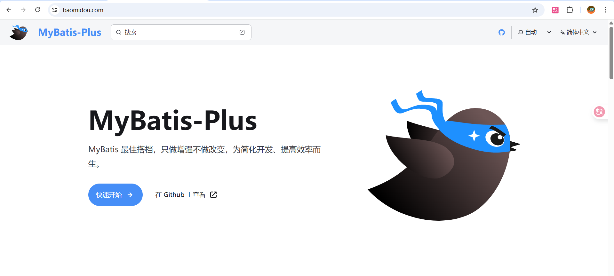
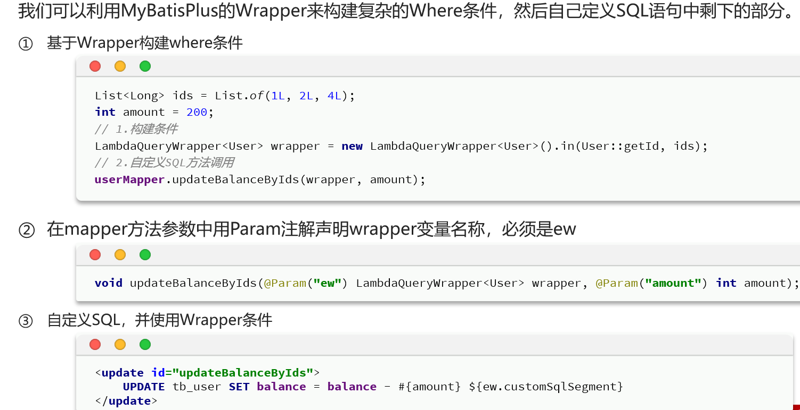
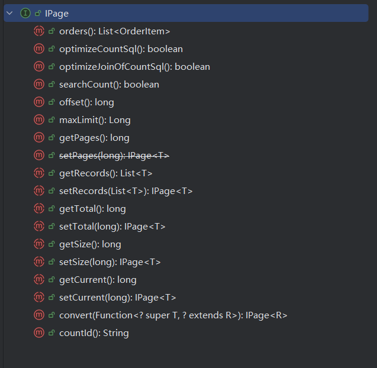
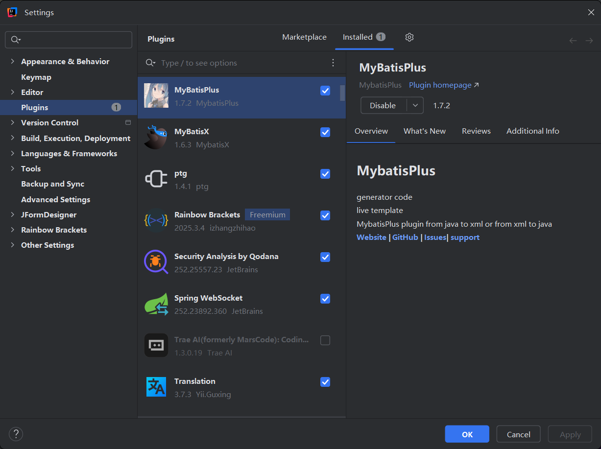
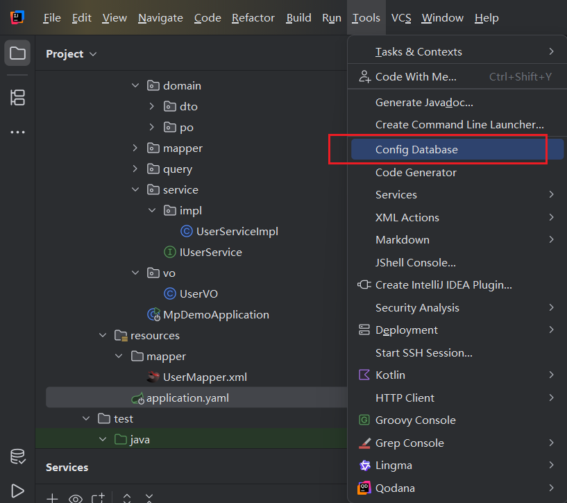
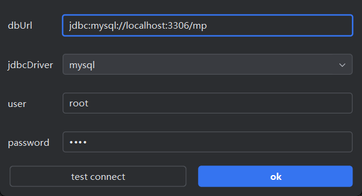
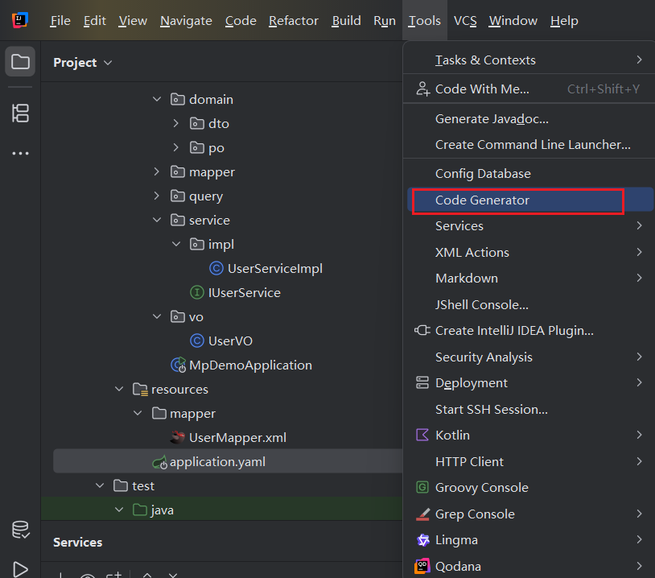
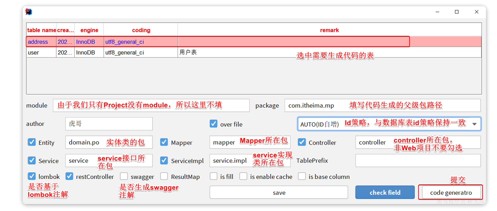

# MyBatis-Plus 简介

## 1. 什么是 MyBatis-Plus？

- MyBatis-Plus (简称 MP) 是一个 MyBatis 的增强工具，在 MyBatis 的基础上**只做增强不做改变**，为简化开发、提高效率而生。它不是要取代 MyBatis，而是作为 MyBatis 的得力助手

  


## 2. 为什么选择 MyBatis-Plus？

- **开发效率翻倍**：内置了强大的 CRUD 功能，对于**单表的增删改查**，你甚至不需要编写一行 SQL

  > 对于**几乎所有单表操作，我们充分利用框架提供的通用接口和条件构造器以实现零 SQL 开发**
  >
  > 而当遇到**无法自动生成的复杂业务逻辑，特别是多表关联查询时，则回归 MyBatis 原生的 XML 方式来自定义 SQL**
  >
  > 这正是两框架优势互补的最佳体现

- **无侵入性**：完全兼容 MyBatis 的原生功能。你可以在项目中混合使用 MP 的功能和 MyBatis 的原生 XML 写法

  > 只引入 MyBatis-Plus 依赖，你不仅可以使用 MyBatis-Plus 带来的所有便捷功能，还能像以前一样，毫无障碍地使用 MyBatis 的全部原生功能，包括编写 XML 来绑定 SQL 语句

- **功能强大**：提供了诸如逻辑删除、乐观锁、代码生成器、分页插件、性能分析等一系列开箱即用的高级功能

  > 使用了 MyBatis-Plus 之后，就完全不需要再使用 PageHelper 这种分页插件了，因为它内置分页功能
  >
  > 原先的 MyBatis ，还要搭配 PageHelper 来使用

- **社区活跃**：文档清晰，社区支持良好，遇到问题容易找到解决方案


## 3. 核心特性一览

- **通用 CRUD**：内置 `BaseMapper` 和 `IService`，封装了绝大部分单表操作
- **条件构造器**：通过 `Wrapper` 以面向对象的方式构建复杂的查询条件，避免手写 SQL 的繁琐和易错
- **主键生成**：支持多种主键策略，如自增、UUID、以及分布式场景下的雪花算法
- **插件扩展**：通过插件机制提供了分页、乐观锁、性能分析、多租户等高级功能
- **代码生成**：强大的代码生成器，可以一键生成 Entity, Mapper, Service, Controller 代码


# 快速入门

> Spring Boot + MyBatis-Plus

## 第 1 步：环境准备

- **JDK 8 或更高版本**
- **Maven 3.5+ 或 Gradle 6+**
- **MySQL 5.7+**


## 第 2 步：引入 MP 的依赖

- SpringBoot项目建议引入的依赖

  >不仅包含了 MyBatis-Plus 的所有核心功能，还额外提供了**自动配置**

  - **SpringBoot 2**

    ```xml
    <dependency>
        <groupId>com.baomidou</groupId>
        <artifactId>mybatis-plus-boot-starter</artifactId>
        <version>3.5.14</version>
    </dependency>
    ```

  - **SpringBoot 3**

    ```xml
    <dependency>
        <groupId>com.baomidou</groupId>
        <artifactId>mybatis-plus-spring-boot3-starter</artifactId>
        <version>3.5.14</version>
    </dependency>
    ```


- 一个**纯粹依赖**

  > 这是 MyBatis-Plus 的纯粹的功能包。在**非 Spring Boot 环境**下使用它，需要大量手动配置。

  ```xml
  <dependency>
      <groupId>com.baomidou</groupId>
      <artifactId>mybatis-plus</artifactId>
      <version>3.5.14</version>
  </dependency>
  ```


## 第 3 步：进行核心配置

### 3.1 配置文件 `application.yml`

- 写一些配置信息，详见**“配置项相关”**笔记


### 3.2 启动类配置

- 在主启动类上添加 `@MapperScan` 注解

  > Java Mapper 接口 需要 注册到 Spring 容器中
  >
  > 可以使用`@Mapper` ，也可以使用`@MapperScan`，这两个注解的作用在 **Mybatis 的笔记中都有讲**，这里用后者
  >
  > `@MapperScan`这个注解的作用是：指定一个基础包路径，自动扫描该路径下的所有接口并注册为 Mapper

  ```java
  // 只需要指定顶层包，其下的子包都会被自动扫描
  @SpringBootApplication
  @MapperScan("com.myapp.mapper")
  public class MyApplication { ... }
  ```


## 第 4 步：创建数据库表和实体类

### 4.1 数据库表

- 在 MySQL 数据库中创建一张 `user` 表，示例如下

  ```sql
  -- 创建数据库（如果不存在）
  CREATE DATABASE IF NOT EXISTS mp_demo;
  USE mp_demo;
  
  -- 删除已存在的 user 表（方便重复测试）
  DROP TABLE IF EXISTS user;
  
  -- 创建 user 表
  CREATE TABLE user (
      id BIGINT PRIMARY KEY COMMENT '主键ID, 雪花算法生成',
      name VARCHAR(30) NULL DEFAULT NULL COMMENT '姓名',
      age INT(11) NULL DEFAULT NULL COMMENT '年龄',
      email VARCHAR(50) NULL DEFAULT NULL COMMENT '邮箱'
  );
  ```


### 4.2 实体类 `User.java`

- 对应这张数据库表的 Java实体类

  ```java
  @Data
  @TableName("user")		// @TableName("user") 注解用于将这个类与数据库中的 "user" 表进行映射
  public class User {
  
      // @TableId 注解用于声明这是主键字段
      // type = IdType.ASSIGN_ID 表示主键策略为雪花算法，MP 会在插入时自动生成一个全局唯一的 ID
      @TableId(type = IdType.ASSIGN_ID)
      private Long id;
  
      // 其他字段会自动按驼峰命名法与数据库的下划线命名法进行映射（如 email -> email）
      private String name;
      private Integer age;
      private String email;
  }
  ```


## 第 5 步：创建 Mapper 接口

- 创建 Mapper 接口 `UserMapper.java`

  ```JAVA
  // 这是一个接口，而不是类
  public interface UserMapper extends BaseMapper<User> {
      // 关键点：这个接口只需要继承 BaseMapper<User> 即可
      // 不需要写任何方法，就已经免费获得了十几二十个强大的 CRUD 方法！
      // 泛型 <User> 指定了这个 Mapper 是专门操作 User 实体类（即 user 表）的。
  }
  ```

- `BaseMapper` 是 MP 的核心之一，它内置了所有常用的单表 CRUD 功能


## 第 6 步：编写和运行测试

- 编写测试用例

  ```java
  @SpringBootTest // 声明这是一个 Spring Boot 测试类
  class DemoMpApplicationTests {
  
      // 使用 @Autowired 自动注入 UserMapper 的实例
      @Autowired
      private UserMapper userMapper;
  
      @Test
      void testSelectList() {
          System.out.println("----- 测试查询所有用户 ------");
          // 调用继承自 BaseMapper 的 selectList 方法
          // 参数为 null 表示没有任何查询条件，即查询所有
          List<User> userList = userMapper.selectList(null);
          // 断言 userList 不为空 (这是一个好的测试习惯)
          // Assertions.assertNotNull(userList);
          userList.forEach(System.out::println);
      }
      
      @Test
      void testInsert() {
          System.out.println("----- 测试插入用户 ------");
          User user = new User();
          user.setName("Jack");
          user.setAge(20);
          user.setEmail("jack@mp.com");
          
          // 调用 insert 方法
          int result = userMapper.insert(user);
          System.out.println("插入结果 (影响行数): " + result);
          
          // 最神奇的地方：插入成功后，MP 会自动将生成的 ID 回填到 user 对象中！
          System.out.println("回填后的用户 ID: " + user.getId());
      }
  
      @Test
      void testSelectById() {
          System.out.println("----- 测试根据 ID 查询用户 ------");
          // 假设我们知道一个用户的 ID，比如 1L
          User user = userMapper.selectById(1L);
          System.out.println("查询到的用户: " + user);
      }
  }
  ```

  

# 注解

## 1. 表名映射注解⭐

### `@TableName`

- **作用**：用于指定**实体类**对应的**数据库表名**

- **使用场景**：当你的**表名**与**实体类名**不一致，或者不符合 MP 的驼峰命名到下划线命名的转换规则时，必须使用此注解

  - **MP 默认规则**：类名 `UserInfo` -> 表名 `user_info`
  - **不符合规则示例**：类名 `User` -> 表名 `t_user`

- **常用属性**：

  - `value`: 用于指定数据库表名。

- **代码示例**：

  ```java
  // 假设数据库中的表名叫 t_user
  @TableName("t_user")
  public class User {
      // ...
  }
  ```


## 2. 主键注解⭐

### `@TableId`

- **作用**：用于标识实体类中的主键字段

- **使用场景**：

  1. 当你的主键字段名**不叫 `id`** 时（例如叫 `user_id`），必须使用此注解来明确指定主键
  2. 当你需要指定**主键生成策略**时

- **常用属性**：

  - `value`: 指定数据库表中的主键列名。如果属性名和列名符合驼峰-下划线规则，可以省略

  - `type`: 指定主键的生成策略，这是一个非常重要的属性，其值为 `IdType` 枚举

    - **`IdType` 主键策略详解**：

      | `IdType`枚举值 | 解释                                                         | 数据库要求                                                   |
      | -------------- | ------------------------------------------------------------ | ------------------------------------------------------------ |
      | `ASSIGN_ID`    | **（默认值）雪花算法**。MP 在插入数据时会自动生成一个全局唯一的 19 位 Long 型 ID | 字段类型建议为 `BIGINT`                                      |
      | `AUTO`⭐        | **数据库ID自增**。依赖数据库自身的自增策略                   | 数据库表的主键字段必须设置为自增（如 MySQL 的 `AUTO_INCREMENT`） |
      | `INPUT`        | **用户手动输入**。在插入数据前，需要开发者自己手动为该字段 `set` 一个值 | 无特殊要求                                                   |
      | `ASSIGN_UUID`  | **UUID**。MP 在插入时会自动生成一个 32 位的 UUID 字符串      | 字段类型建议为 `VARCHAR(32)` 或 `CHAR(32)`                   |
      | `NONE`         | **无状态**。表示未设置主键策略，跟随全局配置                 | -                                                            |

    > 这里的默认`type`策略是雪花算法
    >
    > 如果这里设置了ID使用雪花算法生成，而数据库中设置了ID自增，会怎么样？
    >
    > - 最终的结果是：**以My-Batis-Plus设置为准，数据库的 `id` 自增将不会生效。**
    > - 所以要在开发中保证二者策略相同


- **代码示例**：

  ```java
  @TableName("t_user")
  public class User {
  
      // 场景一：主键字段不叫 'id'，且使用雪花算法
      @TableId(value = "user_id", type = IdType.ASSIGN_ID)
      private Long userId;
  
      // 场景二：主键字段叫 'id'，但使用数据库自增策略
      @TableId(type = IdType.AUTO)
      private Long id;
  
      // ...
  }
  ```


## 3. 字段映射注解⭐

### `@TableField`

- **作用**：这是功能最丰富的字段注解，用于指定**非主键字段与数据库表列的映射关系**

  > 我认为不管怎么样都把这个写上最好

- 但是呀，如果使用了这个注解之后，还想对”已经被逻辑删除“的数据进行操作，就只能**手写sql语句**了，因为MP提供的方法都会避开这些已经”被删除“的数据

- **使用场景**：

  1. 当**属性名**和**列名**不符合驼峰 -下划线转换规则时

  2. 当实体类中的某个属性**不是数据库表的字段**时，需要忽略它(`exist`)

  3. 当需要实现**自动填充**功能时（如 `create_time`, `update_time`）

  4. 成员变量以 is 开头并且是布尔值

     > 默认情况下，MyBatis-Plus会“吃掉”这个 `is` 前缀，并尝试映射到没有 `is` 的列名
     >
     > 如果不写这个注解映射，就对应不上了

  5. 当实体类的属性名与SQL关键字（如 `order`, `group`, `key`, `desc`, `user`, `select` 等）冲突时


- **常用属性**：
  - `value`: 指定数据库表中的列名
  - `exist`: 布尔值
    - `true` (默认) 表示该属性是数据库表中的字段
    - `false` 表示该属性不是数据库字段，MP 在执行任何 SQL 操作时都会忽略它
  - `fill`: 字段自动填充策略，值为 `FieldFill` 枚举
    - `DEFAULT`: 默认不处理
    - `INSERT`: 插入时填充
    - `UPDATE`: 更新时填充
    - `INSERT_UPDATE`: 插入和更新时都填充


- **代码示例**：

  ```java
  @TableName("t_user")
  public class User {
  
      @TableId(value = "user_id", type = IdType.ASSIGN_ID)
      private Long userId;
  
      // 场景一：属性名 userName 映射到数据库列 user_name (其实这个符合默认规则，可以不写)
      @TableField("user_name")
      private String userName;
  
      // 场景二：属性名 password 映射到数据库列 pwd
      @TableField("pwd")
      private String password;
  
      // 场景三：此属性是业务逻辑需要，但数据库中没有 `extra_info` 这一列，必须忽略
      @TableField(exist = false)
      private String extraInfo;
  
      // 场景四：配置自动填充，在插入时自动填充创建时间
      @TableField(fill = FieldFill.INSERT)
      private LocalDateTime createTime;
  
      // 场景五：在插入和更新时都自动填充更新时间
      @TableField(fill = FieldFill.INSERT_UPDATE)
      private LocalDateTime updateTime;
  }
  ```

  > **注意**：自动填充需要配合自定义的 `MetaObjectHandler` 实现类才能生效


### 自动填充

#### 步骤1：标记

- 首先，需要在实体类中，告诉MyBatis-Plus哪些字段是需要被自动填充的。我们使用 `@TableField(fill = ...)` 注解实现


#### 步骤2：创建元数据处理器

##### A. `MetaObjectHandler`接口

- 需要创建一个类，实现 **`MetaObjectHandler` 接口**

  - `MetaObjectHandler` 是一个由 MyBatis-Plus 提供的公共接口。

    它的职责是：**在 MyBatis-Plus 执行内置的 插入或更新 操作时，提供一个统一的入口，让我们能够介入并修改即将持久化到数据库的实体对象（Entity）的属性值**

    ```java
    public interface MetaObjectHandler {
    
        /**
         * 插入操作的填充策略
         * @param metaObject 元数据对象
         */
        void insertFill(MetaObject metaObject);
    
        /**
         * 更新操作的填充策略
         * @param metaObject 元数据对象
         */
        void updateFill(MetaObject metaObject);
    }
    
    ```


##### B. 神奇的参数：`MetaObject`

- **`MetaObject`** 是 MyBatis 框架自身提供的一个**超级强大的工具类**

  可以把它想象成一个“增强版”的实体对象

  它封装了**原始实体对象**（比如 `User` 对象），并提供了一套非常易用的 API，让你能够**通过反射动态地、安全地读取和设置对象的属性值**，而无需关心复杂的反射细节

- **`MetaObject` 的核心能力**

  **屏蔽反射细节**：你不需要编写 `user.getClass().getMethod("setCreateTime", ...)` 这样复杂的反射代码

  **智能属性解析**：它可以处理复杂的属性路径，比如 `user.department.name`

  **优雅的 API**：提供了如 `getValue(String name)` 和 `setValue(String name, Object value)` 这样的方法来操作属性

- **自动传递**

  在我们的 Handler 中，MyBatis-Plus 会自动将你正在操作的实体对象（如 `new User()`）包装成一个 `MetaObject` 实例，然后传递给 `insertFill` 或 `updateFill` 方法，让你进行操作


##### 填充方法

- 在实现 `MetaObjectHandler` 接口时，选择正确的填充方法至关重要。这些方法是 MyBatis-Plus 在 `MetaObjectHandler` 的默认实现中提供的便捷工具，它们封装了不同的填充策略

###### 最智能安全:`strictXXXFill` (推荐)

>`strictInsertFill(metaObject, "java属性名", 属性类型.class, "要填充的值")`
>
>`strictUpdateFill(metaObject, "java属性名", 属性类型.class, "要填充的值")`

- 这是 MyBatis-Plus 官方最推荐使用的方法，也是最符合大多数业务场景的

- 核心行为：**先检查，后填充**

  **`strictXXXFill` 方法**在尝试填充值之前，会**先检查你传入的实体对象中，该属性的当前值是否为 `null`**

  - **如果属性值为 `null`**：它会为你设置新的填充值
  - **如果属性值不为 `null`**：它会**跳过填充**，保留你手动设置的值


- **语法**

  ```java
  // 在 insertFill 方法中
  this.strictInsertFill(metaObject, "java属性名", 属性类型.class, "要填充的值");
  
  // 在 updateFill 方法中
  this.strictUpdateFill(metaObject, "java属性名", 属性类型.class, "要填充的值");
  ```


- **示例场景**

  ```java
  User user = new User();
  user.setName("test-user");
  // 业务上有一个特殊需求，需要手动指定创建时间
  user.setCreateTime(LocalDateTime.of(2020, 1, 1, 0, 0)); 
  userService.save(user); // 调用插入
  ```

  ```java
  @Override
  public void insertFill(MetaObject metaObject) {
      // 尝试为 createTime 填充当前时间
      this.strictInsertFill(metaObject, "createTime", LocalDateTime.class, LocalDateTime.now()); 
  }
  ```


###### 最直接强制`setFieldValByName`

>`setFieldValByName("java属性名", "要填充的值", metaObject)`

- 这个方法表现得非常“暴力”，它不进行任何检查，直接设置属性值。

- 核心行为：强制覆盖

  - 无论实体对象中属性的当前值是什么（`null` 或非 `null`），`setFieldValByName` 都会用你提供的新值将其覆盖

  - 语法

    ```JAVA
    this.setFieldValByName("java属性名", "要填充的值", metaObject);
    ```

    > **注意**：参数顺序与 `strict...Fill` 不同，`metaObject` 是最后一个参数


- **示例场景**

  ```JAVA
  User user = new User();
  user.setName("test-user");
  user.setCreateTime(LocalDateTime.of(2020, 1, 1, 0, 0)); 
  userService.save(user);
  ```

  ```JAVA
  @Override
  public void insertFill(MetaObject metaObject) {
      // 强制为 createTime 填充当前时间
      this.setFieldValByName("createTime", LocalDateTime.now(), metaObject); 
  }
  ```


###### 策略驱动`fillStrategy`

> `fillStrategy(metaObject, "java属性名", "要填充的值")`

- 这是一个更**偏向底层的、由全局配置驱动**的方法

- 核心行为：遵循**全局填充策略**

  - `fillStrategy` 方法的行为取决于你在 MyBatis-Plus 全局配置中设置的 `field-strategy`

    MyBatis-Plus 提供了几种策略，如：

    - `IGNORED`：总是填充

    - `NOT_NULL`：仅在字段值为 `null` 时填充 (默认行为)

    - `NOT_EMPTY`：仅在字段为 `null` 或空字符串时填充

  - 默认情况下，全局策略与 `strictXXXFill` 的行为一致（`NOT_NULL`），即有值则不覆盖


- 语法

```JAVA
this.fillStrategy(metaObject, "java属性名", "要填充的值");
```


##### C. 方法1`insertFill`

>`insertFill(MetaObject metaObject)`

###### 1. 触发时机

- 当且仅当你调用 MyBatis-Plus `BaseMapper` 中**内置的插入相关方法**时，此方法才会被触发

  > 毕竟它也不知道你的插入方法都有哪些？

- 常见的触发方法包括：

  - `mapper.insert(entity)`

  - `service.save(entity)`

  - `service.saveBatch(entities)` (会对集合中的每个 entity 触发一次)


###### 2. 核心职责

- 为那些**被 `@TableField(fill = FieldFill.INSERT)` 或 `@TableField(fill = FieldFill.INSERT_UPDATE)` 注解标记的字段**，提供具体的填充值


###### 3. 示例

```java
@Override
public void insertFill(MetaObject metaObject) {
    // 1. 获取要填充的字段名 (Java 属性名)
    String createTimeField = "createTime";
    String updateTimeField = "updateTime";
    String createByField = "createBy";
    
    // 2. 准备要填充的值
    LocalDateTime now = LocalDateTime.now();
    String currentUser = "default-user"; // 实际应从用户上下文获取
    
    // 3. 执行填充操作 (使用 MP 推荐的 strict 方法)
    // this.strictInsertFill(元数据对象, 属性名, 属性类型, 填充值);
    
    // 为 createTime 字段填充当前时间
    this.strictInsertFill(metaObject, createTimeField, LocalDateTime.class, now); 
    
    // 为 updateTime 字段填充当前时间
    this.strictInsertFill(metaObject, updateTimeField, LocalDateTime.class, now); 
    
    // 为 createBy 字段填充当前用户
    this.strictInsertFill(metaObject, createByField, String.class, currentUser);
}
```


##### D. 方法2`updateFill`

> `updateFill(MetaObject metaObject)`

###### 1.触发时机

- 当且仅当你调用 MyBatis-Plus `BaseMapper` 中**内置的更新相关方法**时，此方法才会被触发
- 常见的触发方法包括：
  - `mapper.updateById(entity)`
  - `mapper.update(entity, wrapper)`
  - `service.updateById(entity)`
  - `service.update(wrapper)`
  - `service.updateBatchById(entities)` (会对集合中的每个 entity 触发一次)


###### 2.核心职责

- 为那些**被 `@TableField(fill = FieldFill.UPDATE)` 或 `@TableField(fill = FieldFill.INSERT_UPDATE)` 注解标记的字段**，提供具体的填充值


###### 3.示例

```JAVA
@Override
public void updateFill(MetaObject metaObject) {
    // 更新时，通常我们只关心 `updateTime` 或 `updateBy` 这类字段。
    // `createTime` 和 `createBy` 在插入后就不应该再改变了。
    
    // 1. 获取要填充的字段名
    String updateTimeField = "updateTime";
    
    // 2. 准备要填充的值
    LocalDateTime now = LocalDateTime.now();
    
    // 3. 执行填充操作
    // this.strictUpdateFill(元数据对象, 属性名, 属性类型, 填充值);
    this.strictUpdateFill(metaObject, updateTimeField, LocalDateTime.class, now);
}

```


#### 步骤3：声明

- MyBatis-Plus 会在启动时自动寻找容器中 `MetaObjectHandler` 类型的 Bean。
  - 因此，最简单的方式就是给你的处理器实现类加上 `@Component` 注解，并确保它能被 Spring Boot 的组件扫描 (`@ComponentScan`) 扫描到


#### 工作原理

- 这个功能是基于MyBatis的**插件（Interceptor）机制**实现的
  1. **拦截SQL**：MyBatis-Plus 内置了一个强大的 `MybatisPlusInterceptor`。当你执行 `userMapper.insert(user)` 或 `userMapper.updateById(user)` 时，这个拦截器会拦截即将执行的SQL操作
  2. **分析对象**：在SQL语句真正被构建之前，拦截器会拿到你传入的实体对象（比如 `user` 对象）
  3. **调用Handler**：拦截器会检查这个 `user` 对象的类，扫描其中是否有被 `@TableField(fill = ...)` 注解标记的字段
     - 如果这是一个 `insert` 操作，它会找到所有标记为 `INSERT` 或 `INSERT_UPDATE` 的字段。
     - 然后，它会调用你注册的 `MyMetaObjectHandler` 中的 `insertFill` 方法。
  4. **修改对象**：你的 `insertFill` 方法通过 `metaObject` 修改了 `user` 对象的 `createTime`、`updateTime` 等属性的值。
  5. **构建SQL**：MyBatis-Plus 使用**已经被你的Handler修改过的** `user` 对象来最终构建 `INSERT` SQL 语句。此时，`create_time` 等字段已经有了值。
  6. **执行SQL**：最后，这条包含了自动填充值的完整SQL被发送到数据库执行。


## 4. 逻辑功能注解

### `@TableLogic`

- **作用**：用于实现**逻辑删除**

- **使用场景**：在需要“假删除”的业务场景中，删除操作实际上是执行 `UPDATE`，修改一个表示删除状态的字段

- **常用属性**：

  - `value`: 未删除时的值（默认 `"0"`）
  - `delval`: 已删除时的值（默认 `"1"`）

- **工作机制**：

  - 当你对标记了 `@TableLogic` 的实体执行**删除**操作时，MP 会自动将 `DELETE` 语句转换为 `UPDATE ... SET deleted = 1 WHERE ...`
  - 当你执行**查询**操作时，MP 会自动在 `WHERE` 条件中追加 `AND deleted = 0`，确保你查不到已逻辑删除的数据

- **代码示例**：

  ```java
  public class User {
      // ...
  
      // 标记 deleted 字段为逻辑删除字段
      // 0 表示未删除，1 表示已删除
      @TableLogic
      private Integer deleted;
  }
  ```


### `@Version`

- **作用**：用于实现**乐观锁**

- **使用场景**：在高并发场景下，防止更新操作时数据被覆盖

- **工作机制**：

  - 当你执行**更新**操作时，MP 会在 `WHERE` 条件中追加版本号的判断，例如 `UPDATE ... SET ..., version = version + 1 WHERE id = ? AND version = ?`
  - 如果 `WHERE` 条件中的 `version` 与数据库中的不一致（说明数据已被其他线程修改），则本次更新失败

- **代码示例**：

  ```java
  public class User {
      // ...
  
      // 标记 version 字段为乐观锁版本号字段
      @Version
      private Integer version;
  }
  ```

  > **注意**：使用乐观锁插件需要先配置 `MybatisPlusInterceptor`


## 5. 高级与特殊场景注解

### `@EnumValue`

- **作用**：专门用于处理**枚举类型**的字段，指定将枚举中的哪个属性值存入数据库

- **使用场景**：默认情况下，MP 会将枚举的 `name()` (即枚举项的名称) 存入数据库。当你希望存入的是枚举内部定义的某个特定值（如 `code`）时，就必须使用此注解

- **工作机制**：在枚举类中，将此注解标记在你希望存入数据库的属性上

- **代码示例**：

  **步骤一：定义枚举类，并使用 `@EnumValue`**

  ```java
  public enum GenderEnum {
      MALE(1, "男"),
      FEMALE(0, "女");
  
      @EnumValue // 关键注解：标记 code 属性是存入数据库的值
      private final int code;
  
      private final String desc;
  
      GenderEnum(int code, String desc) {
          this.code = code;
          this.desc = desc;
      }
  }
  ```

  **步骤二：在实体类中直接使用该枚举**

  ```java
  @Data
  public class User {
      private Long id;
      private String name;
      // 数据库中 gender 字段的类型是 int 或 tinyint
      private GenderEnum gender; 
  }
  ```

  **效果**：当你保存一个 `User` 对象，且其 `gender` 属性为 `GenderEnum.MALE` 时，数据库中存入的值将是 `1`，而不是 `"MALE"`

### `@InterceptorIgnore`

- **作用**：用于精细化地控制某个 Mapper 方法**临时忽略**已配置的某些拦截器插件

- **使用场景**：最典型的场景是**多租户**。假设你全局配置了多租户插件（所有查询自动附加 `WHERE tenant_id = ?`），但现在需要一个“超级管理员”功能，该功能需要查询出所有租户的数据，此时就需要临时绕过多租户插件的限制

- **常用属性**：

  - `tenantLine`: 值为 `"true"` 时，忽略多租户插件
  - `illegalSql`: 值为 `"true"` 时，忽略非法SQL检查插件
  - `blockAttack`: 值为 `"true"` 时，忽略防止全表更新与删除插件

- **代码示例**：

  **在 Mapper 接口的方法上添加注解**

  ```
  public interface UserMapper extends BaseMapper<User> {
  
      // 这个方法会受到多租户插件的影响，只能查到当前租户的用户
      List<User> selectAllInCurrentTenant();
  
      // 关键注解：通过 @InterceptorIgnore 暂时禁用了多租户插件
      // 这个方法可以查询到数据库中所有租户的用户信息
      @InterceptorIgnore(tenantLine = "true") 
      List<User> selectAllAcrossTenants();
  }
  ```


## 5. 综合示例

```java
package com.example.entity;

import com.baomidou.mybatisplus.annotation.*;
import lombok.Data;
import java.time.LocalDateTime;

/**
 * 用户实体类
 */
@Data
@TableName("t_user") // 指定表名为 t_user
public class User {

    /**
     * 主键
     * - value 指定了数据库主键列名为 user_id
     * - type 指定了主键生成策略为雪花算法
     */
    @TableId(value = "user_id", type = IdType.ASSIGN_ID)
    private Long id;

    /**
     * 用户名
     * - value 指定了数据库列名为 user_name
     */
    @TableField("user_name")
    private String name;

    /**
     * 年龄
     */
    private Integer age;

    /**
     * 邮箱
     */
    private String email;

    /**
     * 创建时间
     * - fill = FieldFill.INSERT 表示在插入数据时，自动填充此字段
     */
    @TableField(fill = FieldFill.INSERT)
    private LocalDateTime createTime;

    /**
     * 更新时间
     * - fill = FieldFill.INSERT_UPDATE 表示在插入和更新数据时，都自动填充此字段
     */
    @TableField(fill = FieldFill.INSERT_UPDATE)
    private LocalDateTime updateTime;

    /**
     * 乐观锁版本号
     */
    @Version
    private Integer version;

    /**
     * 逻辑删除标记 (0: 未删除, 1: 已删除)
     */
    @TableLogic
    private Integer deleted;

    /**
     * 确认密码 (业务字段)
     * - exist = false 表示此字段在数据库 t_user 表中不存在，MP 会完全忽略它
     */
    @TableField(exist = false)
    private String confirmPassword;
}
```


# Wrapper 条件构造器

> 以前最开始想着所有的一切都用Wrapper解决
>
> 后来成为了分组之外的用Wrapper解决
>
> 现在好像成为了只用Wrapper解决where问题？可能不会这么做。
>
> 现在好像直接调用service就行了？

- MyBatis-Plus (MP) 的核心功能
- 是一个以**面向对象**的方式**安全、优雅地构建动态 SQL 查询条件**的强大工具


## 1. 为什么需要 `Wrapper`？

- 在实际开发中，我们很少执行“查询所有”这样的操作。绝大多数 SQL 都带有 `WHERE` 条件、`ORDER BY` 排序、`GROUP BY` 分组等

  - `Wrapper` 的使命就是用 Java 代码来直观、安全地构造这些部分

  - 示例

    - 传统方式

      ```java
      String sql = "SELECT * FROM user WHERE age > " + age + " AND name LIKE '%" + name + "%'";
      ```

    - Wrapper 方式

      ```java
      wrapper.gt(User::getAge, age).like(User::getName, name);
      ```


## 2. `Wrapper` 的两种实现风格

- **`Wrapper`**的两种实现风格为：**Lambda 与 String**，**强烈推荐始终使用 Lambda 风格**

  > 建议完全忘记String风格，完全接纳Lambda风格

### String 风格

- **`XXXWrapper`** (字符串风格, **极其不推荐**)

  > **`QueryWrapper` / `UpdateWrapper`**

  - 使用**字符串**作为列名，例如 `wrapper.eq("user_name", "Tom")`

  - **缺点**：

    - 列名是“魔术字符串”，如果写错（例如写成 `"user_nama"`），编译器无法发现，只能在运行时报错

      > “魔术字符串” (Magic String) 是一个编程术语，用来形容在代码中**直接硬编码的、没有明确上下文解释的字符串字面量**

    - 并且，如果将来数据库列名变更，代码维护起来将是一场噩梦


### Lambda 风格

- `LambdaXXXWrapper`(Lambda 风格, **极其强烈推荐**)

  > **`LambdaQueryWrapper` / `LambdaUpdateWrapper`** 

  - 使用 **Lambda 方法引用** (`Method Reference`) 作为列名，例如 `wrapper.eq(User::getName, "Tom")`

  - **优点**：
    1. **编译时安全**：如果你引用的方法 `User::getName` 不存在或写错了，代码根本无法通过编译
    2. **重构友好**：当你在 `User` 类中重命名 `name` 属性时，IDE 会自动更新所有 `User::getName` 的引用
    3. **代码更优雅**：可读性更高，无需担心列名与属性名的转换问题


## 3. `LambdaQueryWrapper`

> **`LambdaQueryWrapper`** = `SELECT` 子句构建器 + **`WHERE` 子句构建器** + `ORDER BY` 构建器
>
> 我认为很多方法都是where，然后剩余的都是会特殊说明的
>
> 笔记中似乎缺乏分组和having，这俩的话，当成例外，手写sql吧


### `WHERE`

- 这些方法用于构建 `WHERE` 后面的各种条件。默认情况下，多个条件之间使用 `AND` 连接

- 所有操作都始于创建一个 `LambdaQueryWrapper` 实例,并通过泛型指定其操作的实体类

  ```java
  // 创建一个针对 User 实体的查询构造器
  LambdaQueryWrapper<User> wrapper = new LambdaQueryWrapper<>();
  ```


#### a. 等值与不等值比较

- 这是最基础的条件,用于构建 `WHERE` 子句中的 `=` 和 `!=` 判断

##### 等于`=`

- `eq(R column, Object val)`: 等于 (`=`)

  > equal

##### 不等于`!=`

- `ne(R column, Object val)`: 不等于 (`<>`/`!=`)

  > not equal

##### 示例

```java
// SQL: SELECT * FROM user WHERE name = 'Jone'
wrapper.eq(User::getName, "Jone");

// SQL: SELECT * FROM user WHERE age != 25
wrapper.ne(User::getAge, 25);
```


#### b. 范围比较

##### `>` `>=` `<`  `<=`

- 用于处理数值、日期等类型的范围查询

  - `gt(R column, Object val)`: 大于 (`>`)

    > greater than

  - `ge(R column, Object val)`: 大于等于 (`>=`)

    > greater than or equal to

  - `lt(R column, Object val)`: 小于 (`<`)

    > less than

  - `le(R column, Object val)`: 小于等于 (`<=`)

    > less than or equal to

  ```java
  // SQL: SELECT * FROM user WHERE age > 20
  wrapper.gt(User::getAge, 20);
  
  // SQL: SELECT * FROM user WHERE create_time >= '2023-01-01 00:00:00'
  wrapper.ge(User::getCreateTime, "2023-01-01 00:00:00");
  ```


##### `between` 与 `notBetween`

- 用于判断字段值是否在某个**闭区间**内

  - `between(R column, Object val1, Object val2)`: 		`BETWEEN val1 AND val2`
  - `notBetween(R column, Object val1, Object val2)`:	   `NOT BETWEEN val1 AND val2`

  ```java
  // SQL: SELECT * FROM user WHERE age BETWEEN 20 AND 30
  wrapper.between(User::getAge, 20, 30);
  ```


#### c. 模糊查询 (`LIKE`)

##### `like`

- `like` 系列方法是处理模糊搜索的关键

  - `like(R column, Object val)`: 全模糊查询 `LIKE '%值%'`

    > **我喜欢这个**

  - `likeLeft(R column, Object val)`: 左模糊 `LIKE '%值'`

    > 我不太喜欢这个，如果可以的话，我以后都不会用这个

  - `likeRight(R column, Object val)`: 右模糊 `LIKE '值%'`

    > 我不太喜欢这个，如果可以的话，我以后都不会用这个

  ```java
  // SQL: SELECT * FROM user WHERE email LIKE '%@163.com'
  wrapper.likeLeft(User::getEmail, "@163.com");
  ```


- **高级用法**：`like()` 方法非常灵活,您可以通过手动拼接 `_` 和 `%` 来实现任意复杂的模糊匹配

  ```java
  // 需求: 查询名字为 "张三"、"张四"、"张五"... 的用户
  // SQL: SELECT * FROM user WHERE name LIKE '张_'
  wrapper.like(User::getName, "张_");
  ```

  

#### d. `IN` 与 `NULL`

##### `IN` 查询

- 用于判断字段值是否在给定的集合内

  - `in(R column, Collection<?> coll)`: `IN (...)`

    > in

  - `notIn(R column, Collection<?> coll)`: `NOT IN (...)`

    > not in

  ```java
  // SQL: SELECT * FROM user WHERE id IN (1, 2, 3, 4)
  wrapper.in(User::getId, Arrays.asList(1L, 2L, 3L, 4L));
  
  // 如果集合为空,MP 智能处理,会生成 1=2 这种永远为 false 的条件,防止全表查询。
  ```


- **注意点**：

  - 关系型数据库中的表，在没有 `ORDER BY` 子句的情况下，其返回的行顺序是 ***不确定*** 的。

    数据库的查询优化器会选择它认为最高效的方式来检索数据（比如按照主键索引、全表扫描等），这个顺序几乎（或完全）*不* 可能是你传入 `IN` 子句的顺序


##### `NULL` 判断

- `isNull(R column)`: `IS NULL`

  > is null

- `isNotNull(R column)`: `IS NOT NULL`

  > is not null

```java
// SQL: SELECT * FROM user WHERE email IS NULL
wrapper.isNull(User::getEmail);
```


#### e. 逻辑连接

- 默认情况下,所有条件都由 `AND` 连接

##### `or()`

- 用于在两个条件之间插入 `OR`

  > 因为本质上我感觉不过是拼装sql，这个`or()`方法也只对两侧生效

  ```java
  // SQL: SELECT * FROM user WHERE age < 18 OR email IS NULL
  wrapper.lt(User::getAge, 18).or().isNull(User::getEmail);
  ```

  

##### `nested()` (嵌套查询)

- `nested(Consumer<LambdaQueryWrapper<T>> consumer)`

- `nested()` 方法接受一个 Lambda 表达式作为参数，它会在 SQL 中生成一对括号 `()`，并将 Lambda 表达式中定义的所有条件包裹在其中

```java
// 需求: 查询 (年龄大于25 并且 名字中包含"张") 或者 (邮箱不为空) 的用户
// SQL: SELECT * FROM user WHERE (age > 25 AND name LIKE '%张%') OR email IS NOT NULL

wrapper.nested(w -> w.gt(User::getAge, 25).like(User::getName, "张"))
       .or()
       .isNotNull(User::getEmail);
```


#### f. 结果集控制

##### `apply()`

- `apply(String applySql, Object... values)`
- `apply()` 方法可以让你**在 `WHERE` 条件中拼接原生 SQL 片段**。**它能有效防止 SQL 注入**

  - 拼接的 原生SQL 在 `WHERE` 子句中的位置，就由它在你代码链式调用中的位置决定
  - 第一个参数 `applySql` 之后的**所有参数（也就是 `Object... values`）**，都是用来**安全地替换 `applySql` 字符串中的占位符**的

  ```java
  // 在 Service 层或业务代码中调用
  // 查询年龄大于25岁，并且姓名不为空的用户
  // 其中，数据库函数 'DATE_FORMAT(create_time, '%Y-%m-%d') = '2023-01-15'' 是自定义的
  
  QueryWrapper<User> wrapper = new QueryWrapper<>();
  wrapper.gt("age", 25)
         .isNotNull("name")
         .apply("DATE_FORMAT(create_time, '%Y-%m-%d') = {0}", "2023-01-15");
  
  List<User> users = userMapper.selectList(wrapper);
  ```

  


##### `last()` (SQL 拼接)

- `last(String lastSql)`

- 一个“最终手段”,可以在生成的 SQL 语句末尾直接拼接任何您想要的字符串。**请谨慎使用,因为它可能导致 SQL 注入风险**

  ```java
  // 需求：只查询一条记录 (在某些数据库中比 selectOne 性能更好)
  // SQL: SELECT * FROM user LIMIT 1
  wrapper.last("LIMIT 1");
  ```


### `ORDER BY`

- 排序是数据库查询的常见需求，`Wrapper` 提供了非常直观的链式调用来实现复杂的排序逻辑

  - `orderByAsc(R column)`: 按指定字段升序排序

  - `orderByDesc(R column)`: 按指定字段降序排序

  - `orderBy(boolean condition, boolean isAsc, R column)`

    > 这里这个`boolean isAsc`和别的不太一样

    - 动态排序，可以根据条件决定是否应用此排序规则，以及是升序还是降序

- **核心特性：**

  - **链式调用与优先级**: 支持通过链式调用实现多字段排序。调用的**先后顺序**决定了排序的优先级。先调用的字段优先级更高。

  - **动态排序**: 每个排序方法都有一个接受 `boolean condition` 的重载版本，允许你根据业务逻辑动态添加排序条件。

- **示例：多字段排序**

  ```java
  // 需求：优先按年龄降序，如果年龄相同，再按ID升序
  // SQL: ... ORDER BY age DESC, id ASC
  wrapper.orderByDesc(User::getAge)  // 第一排序条件
         .orderByAsc(User::getId);   // 第二排序条件
  ```

- **示例：动态排序**

  ```java
  // 假设前端传入一个排序参数 sortField
  String sortField = "age";
  boolean isAsc = true;
  
  // 动态决定排序字段和方式
  wrapper.orderBy(sortField != null, isAsc, "age".equals(sortField) ? User::getAge : User::getId);
  ```

  

### `SELECT`

#### `select()` (指定查询字段)

- 在默认情况下，MyBatis-Plus 会查询实体类对应的所有字段，这等同于 `SELECT *`

  为了获得最佳性能和最少的数据传输，我们应该只查询必要的字段。`select()` 方法正是为此而生

  - `select(R... columns)`: 接收一个或多个方法引用，精确指定要查询的字段

  - `select(Predicate<TableFieldInfo> predicate)`: 一个更高级的用法，可以通过 Lambda 表达式动态地过滤字段。例如，可以用来排除某些特定字段

- **核心特性与最佳实践：**

  - **性能提升**: 避免查询不需要的大字段（如 `TEXT`, `BLOB`）或冗余字段，可以显著减少网络 I/O 和内存占用

  - **重要陷阱**: 如果你使用 `select()` 指定了部分字段，而查询出的实体对象后续需要用于 `updateById` 等更新操作，**请务必确保 `select()` 中包含了主键字段**！否则更新操作将因为找不到主键而失败

- **示例：指定查询字段**

  ```java
  // 只查询用户的 ID, name, age 三个字段
  // SQL: SELECT id, name, age FROM user WHERE ...
  wrapper.select(User::getId, User::getName, User::getAge);
  ```

  

- **示例：使用 Predicate 排除字段**

  ```java
  // 查询除了 "password" 和 "deleted" 之外的所有字段
  wrapper.select(tableFieldInfo -> 
      !tableFieldInfo.getProperty().equals("password") && 
      !tableFieldInfo.getProperty().equals("deleted")
  );
  ```


## 4. `LambdaUpdateWrapper` 

>**`LambdaUpdateWrapper`** = `SET` 子句构建器 + **`WHERE` 子句构建器**
>
>我认为很多方法都是where，然后剩余的都是会特殊说明的

- `LambdaUpdateWrapper` 的构建分为两部分：**`SET` 部分（要更新什么）** 和 **`WHERE` 部分（更新哪些）**


### `SET`

- 这是 `LambdaUpdateWrapper` 独有的方法

  - **`set(R column, Object val)`**: 设置某个字段的值。这是最核心、最常用的方法。

    - 示例

      ```java
      LambdaUpdateWrapper<User> updateWrapper = new LambdaUpdateWrapper<>();
      
      // SET 部分：链式调用，设置多个字段
      updateWrapper.set(User::getAge, 30)
                   .set(User::getStatus, "已锁定");
      
      // WHERE 部分
      updateWrapper.eq(User::getName, "Tom");
      
      // 执行更新
      userMapper.update(null, updateWrapper);
      ```

      

  - **`setSql(String sql)`**: 设置 SQL 表达式。这是一个非常强大但也需要谨慎使用的功能。

    > 我补要用这个

    - 它可以让你写出 `SET score = score + 10` 这样的语句。
    - **注意**：`setSql` 中的内容不会被转义，如果拼接了用户输入，会有 SQL 注入风险。


### `WHERE`

- 这部分的方法与 `LambdaQueryWrapper` **完全通用**


### 执行更新

- 构建好 `UpdateWrapper` 后，需要通过 `BaseMapper` 的 `update` 方法来执行

  ```java
  // update 方法签名
  int update(T entity, Wrapper<T> updateWrapper);
  ```

- **`entity`**: 

  - 这个参数用于填充 `SET` 子句中**未被 `updateWrapper` 指定**的字段值

    在大多数只使用 `updateWrapper` 来指定 `SET` 内容的场景下，**这个参数应传入 `null`**

- **`updateWrapper`**: 传入我们构建好的 `LambdaUpdateWrapper` 实例。

- **标准用法：**

  ```java
  // 推荐！明确使用 wrapper 来定义 SET 和 WHERE
  // 第一个参数传 null，避免 entity 中的值意外覆盖 set 的设置
  userMapper.update(null, updateWrapper);
  ```


## 动态条件 (`condition`)⭐

- `Wrapper` 的大多数条件方法（如 `eq`, `like`, `gt`, `orderBy` 等）都有一个重载形式，其第一个参数是 **`boolean condition`**

  **只有当 `condition` 的计算结果为 `true` 时，这个条件才会最终拼接到 SQL 语句中**

- 这个特性可以彻底消灭 Service 层中大量 `if (obj != null && obj.getProperty() != null) { ... }` 这样的防御性代码，让代码变得极其简洁和流畅

- **示例：一个用户搜索功能**

  - 假设前端传来一个包含多个可能为空的搜索条件的 `UserQueryParam` 对象

    - **传统写法 (冗长且笨拙):**

      ```java
      LambdaQueryWrapper<User> wrapper = new LambdaQueryWrapper<>();
      if (StringUtils.isNotBlank(param.getName())) {
          wrapper.like(User::getName, param.getName());
      }
      if (param.getMinAge() != null) {	//如果不为null......
          wrapper.ge(User::getAge, param.getMinAge());
      }
      if (param.getMaxAge() != null) {
          wrapper.le(User::getAge, param.getMaxAge());
      }
      // ... 可能还有十几个 if 判断
      ```

      

    - **使用 `condition` 的优雅写法:**

      ```java
      public List<User> search(UserQueryParam param) {
          LambdaQueryWrapper<User> wrapper = new LambdaQueryWrapper<>();
      
          // 只有当 param.getName() 不为空时，name LIKE 条件才会生效
          wrapper.like(StringUtils.isNotBlank(param.getName()), User::getName, param.getName());
      
          // 只有当 param.getMinAge() 不为 null 时，age >= 条件才会生效
          wrapper.ge(param.getMinAge() != null, User::getAge, param.getMinAge());
          
          // 只有当 param.getMaxAge() 不为 null 时，age <= 条件才会生效
          wrapper.le(param.getMaxAge() != null, User::getAge, param.getMaxAge());
      
          return userMapper.selectList(wrapper);
      }
      ```


# 自定义SQL规范？




# `BaseMapper`接口

> 其实到后面，这个几乎我个人而言几乎用不到了。
>
> 基本上就是当一个东西到达mapper层的时候，基本上就要手搓原生SQL了，我不喜欢Wrapper结合原生SQL一起用
>
> 这里我说的用不到，是指我不会用这个去搓一个sql，但是肯定 Mapper 还是要引入的，毕竟底层都是它

- `BaseMapper` 是 MyBatis-Plus 框架的基石
- 一个内置的、高度通用的数据访问接口（Mapper接口），预定义了大量针对单表的、开箱即用的 CRUD（增删改查）方法
- 开发者只需要让自己的 Mapper 接口继承 `BaseMapper`，就能立即拥有这些强大的功能，从而**无需编写任何基础的 SQL 语句**，极大地提升了开发效率

  > 上面所说的这个就是自定义Mapper，
  >
  > 自定义 `Mapper`（例如 `XxxMapper extends BaseMapper<Xxx>`）**最核心的作用**就是把 `BaseMapper<T>` 的泛型 **T 具体化为你的实体类 `Xxx`**。这样 MyBatis-Plus 才能针对 你的数据库表实体类`Xxx` 生成通用 CRUD
  >
  > 这个`XxxMapper` 需要被 `@Mapper`/`@MapperScan` 注册成 Bean


## 1. 基本概念

- `BaseMapper` 是一个泛型接口，其定义为 `public interface BaseMapper<T>`

  - **`<T>` (泛型)**: 这是一个类型参数，代表你要操作的 表示你要操作的数据库表的那个 **实体类**

  - **核心作用**:
    - 当你创建自己的 Mapper 接口并继承 `BaseMapper<User>` 时，MyBatis-Plus 框架就会在运行时知道，这个 Mapper 的所有操作都是针对 `User` 实体类所对应的数据库表进行的

  - **工作流程：**
    1. 定义一个 `XXXMapper` 接口
    2. 让它继承 `BaseMapper<XXX>`
    3. MP 框架自动为 `XXXMapper` 注入所有预定义的 CRUD 方法，并且所有这些方法的操作对象都已锁定为 `user` 表


## 2. 如何使用

- 使用 `BaseMapper` 非常简单，只需两步：

  - **第一步：创建实体类对应的 Mapper 接口，并继承 `BaseMapper`**

    ```java
    package com.example.mapper;
    
    import com.baomidou.mybatisplus.core.mapper.BaseMapper;
    import com.example.entity.User;
    import org.apache.ibatis.annotations.Mapper;
    
    // 1. 推荐使用 @Mapper 注解将接口标识为 Mybatis 的 Mapper
    @Mapper 
    // 2. 继承 BaseMapper，并通过泛型 <User> 指定其操作的实体类
    public interface UserMapper extends BaseMapper<User> {
        // 这里是空白的！
        // 但它已经拥有了所有常用的 CRUD 功能
        // 当然，你也可以在这里定义自己的、需要手写 SQL 的复杂查询方法
    }
    ```

    

  - **第二步：在 Service 或测试类中注入并使用**

    ```java
    @Service
    public class UserServiceImpl implements UserService {
    
        @Autowired
        private UserMapper userMapper; // 直接注入
    
        public void test() {
            // 使用继承来的 insert 方法
            User user = new User();
            user.setName("Alice");
            user.setAge(24);
            userMapper.insert(user);
    
            // 使用继承来的 selectById 方法
            User selectedUser = userMapper.selectById(1L);
            System.out.println(selectedUser);
        }
    }
    ```


## 3. 常用方法

### 3.1 增

> 返回值`int`代表受影响的行数

#### `insert`

- **`int insert(T entity)`**

  - **作用**：插入一条记录

  - **说明**：

    - 实体对象 `entity` 中所有**非 `null`** 的属性都会被作为插入字段。

      主键会根据你设置的策略（如雪花算法、自增）自动生成或回填

  - **示例**：`userMapper.insert(user)`

> 如果插入数据的时候，数据库中规定not null的字段被插入了null，会怎么样?
>
> - 操作会失败，错误将由数据库抛出。
>
>   **MyBatis-Plus 的行为**：在执行 `insert` 时，它会**忽略**掉您设为 `null` 的那个字段，不将其拼接到最终的 SQL 语句中
>
>   **数据库的反应**：数据库收到的是一条**缺少**了某个必填（`NOT NULL`）字段值的 `INSERT` 指令
>
>   **最终结果**：由于该字段在数据库中是 `NOT NULL` 且通常没有默认值，数据库会因违反完整性约束而**拒绝执行**，并抛出一个 SQL 异常，Spring 框架通常会将其包装为 `DataIntegrityViolationException` 或类似的 `SQLException`，导致程序中断


#### `insertOrUpdate`


### 3.2 删

> 返回值`int`代表受影响的行数

#### `deleteById`

- **`int deleteById(Serializable id)`**
  - **作用**：根据主键 ID 删除一条记录
  - **示例**：**`userMapper.deleteById(1L);`**


#### `deleteByIds`

- **`int deleteByIds(@Param(Constants.COLL) Collection<?> idList)`**
  - **作用**：根据主键 ID 列表，批量删除多条记录
  - **示例**：`userMapper.deleteByIds(Arrays.asList(1L, 2L, 3L));`


#### `deleteByMap`

- **`int deleteByMap(Map<String, Object> columnMap)`**

  > 这个我认为可以用于不用注解而是只用条件删除的情形

  - **作用**：根据 `Map` 构建的条件删除记录。Map 的 `key` 是数据库列名，`value` 是条件值。多个 `key-value` 之间是 `AND` 关系

  - **示例**：删除 `name = 'Tom'` 并且 `age = 28` 的用户

    ```java
    Map<String, Object> map = new HashMap<>();
    map.put("name", "Tom");
    map.put("age", 28);
    userMapper.deleteByMap(map);
    ```


#### `delete`

- **`int delete(Wrapper<T> queryWrapper)`**

  - **作用**：根据条件构造器 `Wrapper` 构建的复杂条件删除记录。这是最灵活的删除方式

  - **示例**：删除年龄大于 35 岁的用户

    ```java
    LambdaQueryWrapper<User> wrapper = new LambdaQueryWrapper<>();
    wrapper.gt(User::getAge, 35);
    userMapper.delete(wrapper);
    ```


### 3.3 改

#### `updateById`

- **`int updateById(T entity)`**
  - **作用**：根据主键 ID 更新记录
  - **说明**：只会更新 `entity` 中**非 `null`** 的属性值。这是 MP 的默认更新策略，可以防止误更新
  - **示例**：`userMapper.updateById(user);`


#### `update`

- **`int update(T entity, Wrapper<T> updateWrapper)`**

  - **作用**：根据 **`Wrapper`** 构建的条件，更新 **`entity`** 中指定的字段

  - **示例**：将所有姓“王”的用户的年龄更新为 20 岁

    ```java
    User user = new User(); // 要更新的字段值
    user.setAge(20);
    
    LambdaUpdateWrapper<User> wrapper = new LambdaUpdateWrapper<>();
    wrapper.like(User::getName, "王%"); // 更新条件
    
    userMapper.update(user, wrapper);
    ```


### 3.4 查

#### `selectById`

- **`T selectById(Serializable id)`**
  - **作用**：根据主键 ID 查询一条记录
  - **示例**：`User user = userMapper.selectById(1L);`


#### `selectBatchIds`

- **`List<T> selectBatchIds(Collection<? extends Serializable> idList)`**
  - **作用**：根据主键 ID 列表，批量查询多条记录
  - **示例**：`List<User> users = userMapper.selectBatchIds(Arrays.asList(1L, 2L));`


#### `selectOne`

- **`T selectOne(Wrapper<T> queryWrapper)`**

  - **作用**：根据 `Wrapper` 条件查询一条记录

  - **注意**：此方法要求查询结果**必须唯一**（或不存在），**如果查询到多条记录，会抛出异常**

  - **示例**：查询名叫 “Jack” 的唯一用户

    ```java
    LambdaQueryWrapper<User> wrapper = new LambdaQueryWrapper<>();
    wrapper.eq(User::getName, "Jack");
    User jack = userMapper.selectOne(wrapper);
    ```


#### `selectCount`

- **`Long selectCount(Wrapper<T> queryWrapper)`**

  - **作用**：根据 `Wrapper` 条件查询记录总数

  - **示例**：查询年龄大于 18 岁的用户数量

    ```java
    LambdaQueryWrapper<User> wrapper = new LambdaQueryWrapper<>();
    wrapper.gt(User::getAge, 18);
    Long count = userMapper.selectCount(wrapper);
    ```


#### `selectList`

- **`List<T> selectList(Wrapper<T> queryWrapper)`**

  - **作用**：根据 `Wrapper` 条件查询记录列表。这是最常用的查询方法

  - **示例**：查询所有用户，并按年龄降序排序

    ```java
    LambdaQueryWrapper<User> wrapper = new LambdaQueryWrapper<>();
    wrapper.orderByDesc(User::getAge);
    List<User> users = userMapper.selectList(wrapper);
    ```


#### `selectPage`

- **`IPage<T> selectPage(IPage<T> page, Wrapper<T> queryWrapper)`**

  - **作用**：执行分页查询

  - **说明**：需要先配置分页插件 `MybatisPlusInterceptor`。

  - **示例**：查询第二页，每页 5 条数据

    ```java
    Page<User> page = new Page<>(2, 5);
    userMapper.selectPage(page, null);
    List<User> records = page.getRecords(); // 当前页数据
    long total = page.getTotal(); 			// 总记录数
    ```


## 4. 实现原理

- `BaseMapper` 并非通过传统的 XML 文件实现。它的“魔法”来源于 MyBatis-Plus 的**`SqlInjector` (SQL 注入器)**

- 在 Spring Boot 项目启动时，`SqlInjector` 会：

  1. 扫描所有继承了 `BaseMapper` 的接口 (如 `UserMapper`)

  2. 通过泛型 `<User>` 获取到实体类 `User.class`

     > 如果 `BaseMapper` 没写泛型，程序会在编译阶段就直接报错，无法启动

  3. 通过**反射**读取 `User` 类的所有注解（如 `@TableName`, `@TableId`, `@TableField`）

     > 如果关联到的实体类没有使用 `@TableName` 关联表会怎么样？
     >
     > - 程序不会报错，但会按照“默认约定”去查找数据库表。如果约定不匹配，所有数据库操作将在运行时失败
     >
     >   > **MP 的默认约定**：
     >   >
     >   > 当你没有使用 `@TableName` 注解时，MyBatis-Plus 不会抛出异常
     >   >
     >   > 相反，它会启用一套默认的命名映射规则：**将实体类的类名从驼峰命名法（CamelCase）转换为下划线命名法（snake_case）作为表名**

  4. 根据这些实体类的元信息，**动态地生成** `insert`, `deleteById` 等标准方法的 SQL 语句

  5. 将这些动态生成的 SQL **“注入”** 到 MyBatis 的内存中，与 `UserMapper` 的方法关联起来

- 这样，当你调用 `userMapper.selectById(1L)` 时，实际上是在执行一条由 MP 框架在启动时为你智能生成并准备好的 SQL 语句


# `IService`接口⭐

- `IService<T>` 是 MyBatis-Plus 提供的一个**通用 Service 层接口**

- `ServiceImpl<M, T>` 是 `IService` 的官方默认实现类，已经帮你做好了所有通用方法

  - `M` 代表 Mapper 接口的类型 (`UserMapper`)

    > 这是你**自定义并继承了 `BaseMapper<T>` 的 Mapper**，写这个可以知道底层调用的哪个Mapper中的方法
    >
    > > `ServiceImpl` 内部有一个名为 `baseMapper` 的成员变量 (`protected M baseMapper;`)
    > >
    > > 它会通过 Spring 自动注入你传入的 `M` 类型（也就是 `UserMapper`）的实例
    > >
    > > **`ServiceImpl` 中所有方法的底层，最终都是通过调用这个 `baseMapper` 实例的对应方法来完成数据库操作的**
    > >
    > >  例如，调用 `userService.save(user)`，其内部实际执行的是 `baseMapper.insert(user)`

  - `T` 代表实体类的类型 (`User`)

    > 指定数据库表所对应的entity类

- 在使用里面的批处理添加数据的时候，在配置文件中jdbc的url后面添加参数`&rewriteBatchedStatements=true`

  > 据说是重写批处理的`statement`语句，这样子会更快
  >
  > 


## 使用步骤

- **创建 Service 接口**

  - 创建自己的 Service 接口，并让它继承 `IService<T>`

    > 这是为了controller层能基于接口就直接调用`ServiceImpl<M, T>` 实现类中的所有方法

    ```java
    // src/main/java/com/myapp/service/IUserService.java
    import com.baomidou.mybatisplus.extension.service.IService;
    import com.myapp.entity.User;
    
    public interface IUserService extends IService<User> {
        // 未来可以在这里定义 UserService 特有的业务方法
        // 例如：void register(User user, String role);
    }
    ```

  - 创建实现类，让它**继承 MP 提供的 `ServiceImpl<M, T>` 实现类**，并**实现你自己的 Service 接口**

    > 继承MP中的方法，然后实现自己的Service业务接口方法

    ```java
    @Service
    public class UserServiceImpl extends ServiceImpl<UserMapper, User> implements IUserService {
        
        // 继承 ServiceImpl 后，你自动拥有了大量的通用业务方法
        // 例如: getById, list, page, save, update, remove, saveBatch...
    
        // 在这里实现 IUserService 中定义的自定义业务方法
        /*
        @Override
        public void register(User user, String role) {
            // 1. 调用 baseMapper (父类中已注入) 保存用户信息
            this.save(user); 
            // 2. 处理角色信息...
        }
        */
    }
    ```


## 常用方法

### 1. 插入操作

#### `save`

- **`boolean save(T entity)`**

- **功能**: 插入一条记录。

- **参数**:

  - `entity`: 实体对象。

- **说明**: MP 会根据实体配置的主键策略（如 IdType.ASSIGN_ID）自动填充主键值。

- **示例**:

  ```java
  User user = new User();
  user.setName("张三");
  user.setAge(25);
  boolean success = userService.save(user); // 成功返回 true
  // 此时 user 对象的 id 字段已经被自动填充
  System.out.println("新用户的ID为: " + user.getId()); 
  ```


#### `saveBatch`

- **`boolean saveBatch(Collection<T> entityList)`**

- **功能**: 批量插入。

- **参数**:

  - `entityList`: 实体对象集合。

- **说明**: 底层会优化为一条 SQL（根据数据库类型而定），性能远高于循环调用 `save` 方法。

- **示例**:

  ```java
  List<User> userList = new ArrayList<>();
  userList.add(new User("李四", 30));
  userList.add(new User("王五", 28));
  boolean success = userService.saveBatch(userList);
  ```


#### `saveOrUpdate`

- **`boolean saveOrUpdate(T entity)`**

- **功能**: 保存或更新。

- **参数**:

  - `entity`: 实体对象。

- **说明**: 根据实体对象的主键 `id` 是否存在来判断是执行 `insert` 还是 `update` 操作。如果 `id` 为 `null` 或在数据库中不存在，则插入；否则，更新。

- **示例**:

  ```java
  // 场景1: 新增
  User newUser = new User("赵六", 40);
  userService.saveOrUpdate(newUser); // ID为null，执行插入
  
  // 场景2: 更新
  User existingUser = userService.getById(1L); // 假设ID为1的用户存在
  existingUser.setAge(41);
  userService.saveOrUpdate(existingUser); // ID存在，执行更新
  ```


#### `saveOrUpdateBatch`

- **`boolean saveOrUpdateBatch(Collection<T> entityList)`**

- **功能**: 批量保存或更新。

- **参数**:

  - `entityList`: 实体对象集合。

- **说明**: 遍历集合，对每个实体执行 `saveOrUpdate` 逻辑。

- **示例**:

  ```java
  List<User> list = ... ; // 集合中可能包含新用户和已有用户
  userService.saveOrUpdateBatch(list);
  ```


### 2. 删除操作

#### `removeById`

- **`boolean removeById(Serializable id)`**

- **功能**: 根据主键 ID 删除。

- **参数**:

  - `id`: 主键值。

- **示例**:

  ```java
  boolean success = userService.removeById(1001L);
  ```


#### `removeByIds`

- **`boolean removeByIds(Collection<? extends Serializable> idList)`**

- **功能**: 根据主键 ID 列表批量删除。

- **参数**:

  - `idList`: 主键 ID 的集合。

- **示例**:

  ```java
  List<Long> ids = Arrays.asList(1002L, 1003L, 1004L);
  boolean success = userService.removeByIds(ids);
  ```


#### `removeBatchByIds`

- **`boolean removeBatchByIds(Collection<?> list)`**


#### `remove`

- **`boolean remove(Wrapper<T> queryWrapper)`**

- **功能**: 根据条件构造器 `Wrapper` 删除。

- **参数**:

  - `queryWrapper`: 查询条件构造器，用于指定删除条件。

- **说明**: **这是一个危险操作**，如果 `Wrapper` 为空，会删除全表数据！请务必谨慎使用。

- **示例**:

  ```java
  // 删除所有年龄小于 18 岁的用户
  QueryWrapper<User> wrapper = new QueryWrapper<>();
  wrapper.lt("age", 18);
  boolean success = userService.remove(wrapper);
  ```


### 3. 更新操作

#### `updateById`

- **`boolean updateById(T entity)`**

- **功能**: 根据主键 ID 更新。

- **参数**:

  - `entity`: 要更新的实体对象，ID 字段必须有值。

- **说明**: 只会更新实体中**非 null** 的字段。

- **示例**:

  ```java
  User user = new User();
  user.setId(1001L); // 指定要更新的记录ID
  user.setEmail("new.email@example.com"); // 只更新email字段
  boolean success = userService.updateById(user);
  ```


#### `update`

- **`boolean update(Wrapper<T> updateWrapper)`**

  > 好像有点问题，没有这个方法

- **功能**: 根据 `Wrapper` 条件批量更新。

- **参数**:

  - `updateWrapper`: 更新条件构造器，可以同时包含 `SET` 更新内容和 `WHERE` 条件。

- **示例**:

  ```java
  // 将所有'研发部'的员工年龄增加 1
  UpdateWrapper<User> wrapper = new UpdateWrapper<>();
  wrapper.eq("department", "研发部")
         .setSql("age = age + 1");
  boolean success = userService.update(wrapper);
  ```


#### `updateBatchById`

- `boolean updateBatchById(Collection<T> entityList)`

- **功能**: 根据 ID 批量更新。

- **参数**:

  - `entityList`: 包含 ID 的实体集合。

- **示例**:

  ```java
  List<User> usersToUpdate = ...; // 获取需要更新的用户列表
  boolean success = userService.updateBatchById(usersToUpdate);
  ```


### 4. 查询操作

#### `getById`

- **`T getById(Serializable id)`**

- **功能**: 根据主键 ID 查询。

- **参数**:

  - `id`: 主键值。

- **返回**: 找到则返回实体对象，否则返回 `null`。

- **示例**:

  ```java
  User user = userService.getById(1L);
  ```


#### `getOne`

- **`T getOne(Wrapper<T> queryWrapper)`**

- **功能**: 根据 `Wrapper` 条件查询一条记录。

- **参数**:

  - `queryWrapper`: 查询条件。

- **说明**: 如果查询结果有多条，会抛出异常。推荐用于查询结果唯一的情况（如根据用户名、邮箱查询）。

- **示例**:

  ```java
  QueryWrapper<User> wrapper = new QueryWrapper<>();
  wrapper.eq("username", "admin");
  User admin = userService.getOne(wrapper);
  ```


#### `list`

- **`List<T> list(Wrapper<T> queryWrapper)`**

- **功能**: 根据 `Wrapper` 条件查询列表。

- **参数**:

  - `queryWrapper`: 查询条件，如果为 `null` 则查询全部。

- **示例**:

  ```java
  // 查询所有年龄大于 25 岁且名字中包含 "张" 的用户
  QueryWrapper<User> wrapper = new QueryWrapper<>();
  wrapper.gt("age", 25).like("name", "张");
  List<User> userList = userService.list(wrapper);
  ```


#### `count`

- **`long count(Wrapper<T> queryWrapper)`**

- **功能**: 根据 `Wrapper` 条件查询总记录数。

- **参数**:

  - `queryWrapper`: 查询条件，如果为 `null` 则统计全表。

- **示例**:

  ```java
  // 统计年龄大于30的用户数量
  QueryWrapper<User> wrapper = new QueryWrapper<>();
  wrapper.gt("age", 30);
  long total = userService.count(wrapper);
  ```


#### `page`

- **`IPage<T> page(IPage<T> page, Wrapper<T> queryWrapper)`**

- **功能**: 分页查询。

- **参数**:

  - `page`: 分页请求参数对象，包含当前页码 `current` 和每页数量 `size`
  - `queryWrapper`: 查询条件

- **返回**: `IPage` 对象，包含了分页数据列表、总记录数、总页数等信息

- **示例**:

  ```java
  // 查询第 2 页，每页 5 条，年龄大于 20 的用户
  Page<User> pageInfo = new Page<>(2, 5);
  QueryWrapper<User> wrapper = new QueryWrapper<>();
  wrapper.gt("age", 20);
  
  IPage<User> userPage = userService.page(pageInfo, wrapper);
  
  System.out.println("总记录数: " + userPage.getTotal());
  System.out.println("当前页数据: " + userPage.getRecords());
  ```


# 更简便的形式⭐⭐

>这种我喜欢写到service层，然后`Wrapper`相关的我喜欢写到mapper层
>
>- `lambdaQuery()` 
>- `lambdaUpdate()`

- 在 MyBatis-Plus 中，除了使用 `LambdaXXXWrapper` 对象来构建查询条件，`IService` 接口还提供了一套更为优雅和安全的链式调用方法，入口就是 `lambdaQuery()` 和 `lambdaUpdate()`。强烈推荐在项目中使用这种方式
- `lambdaQuery()` 和 `lambdaUpdate()` 是 `IService` 接口（由其实现类 `ServiceImpl` 提供）的两个方法，它们分别返回一个 `LambdaQueryChainWrapper` 和 `LambdaUpdateChainWrapper` 对象
  - **`lambdaQuery()`**: 用于发起一个**类型安全**的链式**查询**操作
  - **`lambdaUpdate()`**: 用于发起一个**类型安全**的链式**更新**或**删除**操作

> 可以把 `lambdaQuery()` 和`lambdaUpdate()`不太严谨的理解为**显式创建 `LambdaxxxWrapper` 对象的一个更方便、更流畅的快捷方式**
>
> 它们在构建查询条件的能力上是**完全等价的**
>
> `LambdaXXXWrapper` 中所有的方法在 `lambdaXXX()` 返回的链式对象中也都能使用，具体的方法去IDEA中看

- 这个非常好，还能在后面链式地继续跟上很多方法，比如`list()`等收尾方法，直接把想要的数据查出来。建议**尽量都用这个**
  - 如果要更新数据，记得在`lambdaUpdate()`的最后加上`update()`
  
  - 具体都有哪些收尾方法，可以去IDEA中点点找找
  
    - 比如`one()`啊，`count()`啊啥的
    - 又比如`update()`啥的
  
  - 分页传参数的时候，注意不能传递**`lambdaQuery()`**，传递那就只能选择第二选择**`LambdaQueryWrapper`了**
  
    但是，可以在**`lambdaQuery()`的最后直接使用`page()`进行收尾**⭐⭐⭐直接传都不用传，嘻嘻


# 一些问题与注意点

## 1

```java
lambdaUpdate().set(User::getBalance,remainBalance)
                .set(remainBalance==0,User::getStatus,2)
                .eq(User::getId,id);
```

- 这里的`::getXX`，底层其实是通过反射进行了操作，获取了字段等，并不是说底层疯狂调用方法啥的


## 2

- 像这种代码

  ```java
  lambdaQuery().select(ImApprovalTemplateGroup::getSortNum).list();
  ```

  只查一个字段的，返回值是什么？难道也是完整对象？

  - **答案**

    返回值**仍然是 `List<ImApprovalTemplateGroup>`**，也就是一个**【完整对象】的列表**

    但是，**这些对象里的字段，只有 `sortNum` (以及主键字段) 是有值的，其他字段（如 `name`, `createTime` 等）都会是 `null`**

    - 如果我只想要那个字段的 `List` 怎么办？

      - 方法一：使用 `listMaps()`，使用 `listMaps` 返回 `List<Map<String, Object>>`，然后自己提取
      - 方法二：使用 `listObjs()`，如果你**确定只查询一个字段**，`listObjs` 是最方便的。它会返回一个 `List<Object>`，但列表里装的就是你查询的那个字段的值

      > 我也不知道怎么说，怪怪的，实战中再积累吧，有些东西没法做出笔记


# 静态工具类 `Db`⭐

> 后来我变了，我变得几乎所有的操作都用这玩意搞，我嘞个豆

- 这个是一个静态工具类，可以使用内部的静态方法来调用方法，实现对数据的增删改查

- 所有方法都是静态的，可以直接通过 `Db.` 调用，无需注入

- 方法和**`IService`**中的方法基本相同, 可以直接尝试调用, 不需要额外的学习成本, 只不过很多方法需要上传一个 **`Class`对象** 来指定**要操作的实体/表**

- 这个非常大的一个好处是可以解决**`service`层的某些场景下的循环依赖**，对于我自己而言，

  我喜欢**本类单表使用`IService`，其他类多表使用`Db`**

  > 骗你的，实际上后来不管本类还是其他类，我都用`Db.`

- `Db.save()` 存入哪张表，完全由您传入的那个 Java 对象的类定义来决定，`entity`嘛
  **如果没有在数据库中找到对应的表**，那么程序会**抛出异常，整个操作会失败，数据不会被存入任何地方**
  
- ⭐这里有**非常重要**的一点，我曾经在这里吃过非常大的亏：

  `Db`虽然是静态工具类，可以免注入，但是它不能 “免 Mapper”

  但是**本质上底层还是去调用的 `BaseMapper` 中的方法实现的**，**`IService` 的默认实现也是调 `BaseMapper`**

  无论用 `Db.*`、`IService` 还是别的什么，底层都是 `BaseMapper`

  因此，无论如何，项目中**必须**为每一个需要操作的**实体类**创建一个**对应的 `Mapper` 接口**，**并被扫描为 Bean**

  否则一切的 CRUD 将无法执行

- 我喜欢优先调用现有的方法，没有方法的话我再进行链式构造 sql 语句

- 好吧，我目前又开始犹豫到底要不要用`Db`了，因为好像缺点挺大的，有点道心破碎，感觉还是使用`IService`+`BaseMapper`比较好，因为`Db`有缺点


# 配置项

## 1. 核心配置

>`mybatis-plus.*`

- 这些是直接在 `mybatis-plus` 下的基础配置，用于指定关键文件的位置和行为。

  ```yaml
  mybatis-plus:
    # 1. Mapper XML 文件位置
    # 功能: 指定 Mybatis 的 XML Mapper 文件的存放位置。这是整合 Mybatis 必不可少的配置。
    # 格式: 使用 Ant 风格的路径匹配，`classpath:` 代表资源根目录。
    # 示例: `classpath:/mapper/**/*.xml` 会扫描 resources/mapper 目录下以及其所有子目录下的 .xml 文件。
    mapper-locations: classpath*:/mapper/**/*.xml
  
    # 2. 实体类别名扫描包
    # 功能: 指定实体类（Entity/POJO）所在的包。配置后，在 XML 文件中就可以直接使用类名作为别名，而无需写完整的包路径。
    # 示例: 配置为 `com.myapp.entity` 后, 在 XML 中可以直接写 `resultType="User"` 而不是 `resultType="com.myapp.entity.User"`。
    type-aliases-package: com.myapp.entity
  
    # 3. 枚举类扫描包
    # 功能: 如果你在实体类中使用了自定义枚举类型，并且希望 MP 能正确处理，就需要配置此项。MP 会自动将数据库中的值与枚举实例进行转换。
    type-enums-package: com.myapp.enums
  
    # 4. 启动时检查配置
    # 功能: 在项目启动时，检查 `mapper-locations` 指定的路径下是否存在 XML 文件。如果不存在，则会报错。
    # 建议: 开发环境下建议开启（`true`），可以及早发现路径配置错误。
    check-config-location: true
  ```

  

## 2. 全局策略配置

> `mybatis-plus.global-config`

- `global-config` 用于定义 MP 的全局行为和数据库相关策略，影响范围是整个应用

  ```yaml
  mybatis-plus:
    global-config:
      # 1. 关闭启动 Banner
      # 功能: MP 启动时默认会在控制台打印一个漂亮的 Banner。如果你不希望看到它，可以设置为 false。
      banner: false
  
      # 2. 数据库相关配置 (db-config)
      # 这是 global-config 中最重要的一部分，用于定义表与实体类的映射关系和主键策略。
      db-config:
        # (1) 主键生成策略 (IdType)
        # 功能: 定义实体类主键的生成方式。
        # 可选值:
        #   - AUTO: 数据库ID自增。依赖数据库的自增策略，如 MySQL 的 `AUTO_INCREMENT`。
        #   - NONE: 无状态，用户手动设置ID。
        #   - INPUT: 用户手动设置ID，与 NONE 类似，但插入前会判断 ID 是否为空。
        #   - ASSIGN_ID: 分配ID（默认值）。当主键类型为 Long 或 String 时，MP 会使用雪花算法（Snowflake）自动生成一个全局唯一的ID。
        #   - ASSIGN_UUID: 分配 UUID。主键类型为 String 时，生成 UUID。
        id-type: assign_id
  
        # (2) 表名前缀
        # 功能: 如果你的数据库表都有一个共同的前缀（如 `tbl_`），配置此项后，MP 会在生成 SQL 时自动为你处理。
        # 示例: 实体类 `User` 默认会映射到 `user` 表。如果配置了 `table-prefix: tbl_`，则会映射到 `tbl_user` 表。
        # 注意: 反过来，如果表名为 `tbl_user`，实体类名为 `User`，则不需要配置此项，MP 会自动识别。这个配置主要用于代码生成器或特定场景。
        table-prefix: tbl_
  
        # (3) 逻辑删除字段名 (推荐使用)
        # 功能: 指定用于逻辑删除的字段名。配置后，调用 MP 的 `delete` 方法时，会变成执行 `UPDATE` 语句来修改该字段的值。
        # 示例: `logic-delete-field: deleted`
        logic-delete-field: deleted # 实体类中的字段名
  
        # (4) 逻辑删除字段值为 '已删除'
        # 功能: 定义逻辑删除时，字段被设置成什么值代表“已删除”。默认为 1。
        logic-delete-value: 1
  
        # (5) 逻辑删除字段值为 '未删除'
        # 功能: 定义什么值代表“未删除”。默认为 0。
        logic-not-delete-value: 0
  ```

  

## 3. MyBatis 原生配置

> `mybatis-plus.configuration`

- MP 本质上是对 MyBatis 的增强，所以 MyBatis 的原生配置项依然有效。这些配置项被统一放在 `configuration` 键下

  ```yaml
  mybatis-plus:
    configuration:
      # 1. 开启驼峰命名自动映射
      # 功能: 这是 MyBatis 一个非常实用的功能。开启后，它会自动将数据库中下划线命名的列（如 `user_name`）映射到 Java 实体类中的驼峰命名属性（如 `userName`）。
      # 建议: 强烈建议开启（`true`）。
      map-underscore-to-camel-case: true
  
      # 2. 配置 SQL 日志打印
      # 功能: 在开发和调试阶段，我们通常希望在控制台看到 MP 执行的 SQL 语句、参数和返回结果。
      # 常用值: `org.apache.ibatis.logging.stdout.StdOutImpl`，表示使用标准输出来打印日志。
      # 生产环境: 在生产环境中，应关闭此功能或将其对接专业的日志框架（如 Log4j2, Slf4j）。
      log-impl: org.apache.ibatis.logging.stdout.StdOutImpl
  
      # 3. 开启/关闭一级/二级缓存
      # 功能: 控制 MyBatis 的缓存机制。
      # - cache-enabled: 全局性地开启或关闭二级缓存。默认为 true。
      # - local-cache-scope: 控制一级缓存的范围。SESSION（默认）或 STATEMENT。
      cache-enabled: false
  
      # 4. 其他原生配置...
      # Mybatis 的其他配置项，如 `default-statement-timeout`, `default-fetch-size` 等都可以放在这里。
  ```


## 完整的示例

- 下面是一个综合了一些常用配置的 `application.yml` 示例

  ```yaml
  # 服务器端口
  server:
    port: 8080
  
  # Spring 数据库连接配置
  spring:
    datasource:
      driver-class-name: com.mysql.cj.jdbc.Driver
      url: jdbc:mysql://localhost:3306/your_database?serverTimezone=UTC
      username: root
      password: your_password
  
  # MyBatis-Plus 配置
  mybatis-plus:
    # XML 文件位置
    mapper-locations: classpath*:/mapper/**/*.xml
    # 实体类别名扫描
    type-aliases-package: com.yourcompany.project.entity
    # 枚举类扫描
    type-enums-package: com.yourcompany.project.enums
    # 启动时检查 XML 位置
    check-config-location: true
  
    # 全局策略配置
    global-config:
      # 关闭 Banner
      banner: false
      # 数据库相关配置
      db-config:
        # 主键策略：使用雪花算法生成ID
        id-type: assign_id
        # 表名前缀
        table-prefix: tbl_
        # 逻辑删除字段
        logic-delete-field: is_deleted
  
    # MyBatis 原生配置
    configuration:
      # 开启驼峰命名转换
      map-underscore-to-camel-case: true
      # 开发环境打印 SQL
      log-impl: org.apache.ibatis.logging.stdout.StdOutImpl
  ```


# 逻辑删除

## 概念

- **并不真正从数据库中删除数据，而是通过一个特定的字段来“标记”这条数据为已删除状态**

- 删除实际上就是更新(`UPDATE`)这个字段嘛

- 在经过下面的引入之后，MP 会在底层自动为程序员处理 SQL。开发者在编写业务代码时，几乎感觉不到逻辑删除的存在

  > 也就是说不用特意写代码，去匹配那个逻辑字段


## 引入方式

### yml 配置

```yaml
mybatis-plus:
  global-config:
    db-config:
      # 逻辑删除的实体字段名 (实体类中的属性名)
      logic-delete-field: deleted 
      # 逻辑删除值 (当执行删除操作时，字段被设置为此值)
      logic-delete-value: 1
      # 逻辑未删除值 (正常状态下字段的值)
      logic-not-delete-value: 0
```

- **注意**：`logic-delete-field` 对应的是**实体类中的属性名**，而不是数据库中的列名。当然，通常我们会让它们保持一致


### 注解`@TableLogic`

#### 基本概念

- **作用**：告诉 MyBatis-Plus 框架，这个字段是用来判断数据行是否“有效”的。当 MP 自动生成 SQL 时，会特别关照这个字段。
- **位置**：该注解只能用于实体类的属性上

```java
@Data
@TableName("user")
public class User {
    private Long id;
    private String name;
    private Integer age;
    
    // 逻辑删除字段
    @TableLogic
    private Integer deleted; 
}
```

- **配置优先级**：**`@TableLogic` 注解的优先级高于 yml 全局配置**。你也可以在注解中指定值，以覆盖全局配置，适用于个别表有特殊逻辑删除规则的场景


#### 注解的参数

- **`@TableLogic`** 提供了两个核心属性，用于自定义“未删除”和“已删除”状态的值

  - **`value()`**:
    - **含义**：逻辑**未删除**的值。
    - **默认值**：**`"0"`**

  - **`delval()`**:
    - **含义**：逻辑**已删除**的值。
    - **默认值**：**`"1"`**

- 默认情况下，MP 认为 **`0` 是未删除，`1` 是已删除**。如果你的数据库设计不遵循这个约定，就可以通过这两个属性进行自定义


## 如何查询“被删除”的数据？

### 概念和用法

- 在某些特殊场景下（如管理员的回收站功能），我们确实需要查询那些被逻辑删除的数据
- 由于 MP 会自动帮你过滤掉它们，你**需要自己编写 SQL 来实现**


### 方法

#### 方法一

- 通过`@Select`注解自己在Mapper接口上编写SQL语句


#### 方法二

- 在 Mapper 的 XML 文件中编写SQL语句


#### 方法三

- 见笔记中章节“自定义SQL规范”


### 疑问解答

- **问题**：形如代码`service.lambdaQuery().eq(User::getDeleted, 1)` 能查到数据吗？

  - **回答**：不能，这样是查不到任何数据的，最终会得到一个空列表

    - 会先生成一个Wrapper，当MP准备根据这个 `Wrapper` 生成最终的SQL语句去数据库执行时，逻辑删除的SQL拦截器启动了

    - 这个拦截器的工作非常“执着”，它的规则是：

      只要发现是针对 `user` 这张表（已配置逻辑删除的表）的 `SELECT` 查询，它就**必须**在 `WHERE` 子句的末尾追加上 `AND deleted = 0` （这里的 `0` 是全局配置或默认的“未删除”值）

    - 这个追加动作是**强制且自动**的，它不关心你的 `Wrapper` 中已经定义了什么条件

    - 最终发送给数据库的SQL语句是：

      ```sql
      SELECT id, name, age, deleted 
      FROM user 
      WHERE deleted = 1 AND deleted = 0
      ```

    - 数据库在执行这条SQL时，会发现 `WHERE` 子句中存在一个逻辑矛盾：`deleted` 字段在同一行数据里，不可能**同时**等于 `1` **又**等于 `0`

    - 由于这个条件永远无法被满足，数据库找不到任何符合条件的数据，因此返回了一个空的结果集


# MP分页

## 基本概念

- **核心思想**：通过拦截器自动在你的 SQL 后面拼接上分页语句

  > 你只需要在代码中传入分页参数（查询第几页、每页多少条），
  > MP 的分页插件会拦截即将执行的 SQL 语句，
  > 根据你传入的分页参数和数据库类型，自动在原始 SQL 的末尾追加上对应的物理分页语句，从而实现物理分页


## 使用步骤

### 1. 配置拦截器

#### 配置步骤

- 使用分页插件的第一步，也是最关键的一步，就是**将其作为拦截器配置到 Mybatis 的执行流程中**

- 在SpringBoot中，通常会创建一个 `MybatisPlusConfig` 配置类

  ```java
  @Configuration
  public class MybatisPlusConfig {
      /**
       * 添加分页插件
       */
      @Bean
      public MybatisPlusInterceptor mybatisPlusInterceptor() {
          // 1. 定义 Mybatis-Plus 拦截器
          MybatisPlusInterceptor interceptor = new MybatisPlusInterceptor();
          // 2. 添加具体的分页拦截器
          // 参数指定数据库类型，MP 会自动识别，也可不传
          interceptor.addInnerInterceptor(new PaginationInnerInterceptor(DbType.MYSQL)); 
          return interceptor;
      }
  }
  ```

  - 必须使用 `@Bean` 将 `MybatisPlusInterceptor` 注入到 Spring 容器中


#### 拦截器相关类

##### **`MybatisPlusInterceptor`**

-  可理解为一个**插件容器**，我们还可以添加其它插件，以及进行更精细的配置


##### **`PaginationInnerInterceptor`**

###### 概念

-  是**分页插件**的核心实现类

-  构造函数中的 **`DbType.MYSQL` 用于指定数据库类型**，Mybatis-Plus 会根据这个类型生成正确的分页语句

-  在大多数情况下，MP 也能自动检测，但显式指定是最佳实践


###### 方法

**`setDbType(DbType dbType)`**

- **作用**: 指定数据库类型。这是最重要的配置之一，因为不同的数据库分页语法不同
- **说明**: 虽然 MP 在很多情况下能自动检测，但**强烈建议显式指定**，以保证 100% 的准确性
- **示例**: `paginationInterceptor.setDbType(DbType.POSTGRE_SQL);`


**`setMaxLimit(Long maxLimit)`**

- **作用**: 设置单页查询的最大条数限制。
- **说明**: 这是一个至关重要的**安全配置**。如果前端允许用户自定义**每页条数**，可能会有恶意用户传入一个非常大的值（如 100000），导致一次性查询过多数据，引发数据库压力剧增和应用内存溢出。
  设置 `maxLimit` 后，即使用户传入的 `pageSize` 超过此限制，插件也只会按 `maxLimit` 的值来查询
- **默认值**: `500L`
- **特殊值**: 设置为 `-1` 表示不限制
- **示例**: `paginationInterceptor.setMaxLimit(2000L); // 限制单页最多查询 2000 条`


**`setOverflow(boolean overflow)`**

- **作用**: 当用户请求的页码超出总页数范围时，如何处理
- **`false` (默认值)**: 继续按请求的页码查询，此时会返回一个空的数据列表
- **`true`**: 不会查询数据库，而是直接返回第一页的数据
- **场景**: 某些业务场景下，当用户翻到不存在的页时，希望友好地展示第一页内容，就可以将此项设为 `true`
- **示例**: `paginationInterceptor.setOverflow(true);`


### 2. 书写代码

#### 方法1: 使用已经存在的接口或类

- 相关接口或类见下面笔记**“3.相关类或接口”**
- **代码示例**


#### 方法2: 自定义SQL(XML)

##### 概念

- MP 的分页能力**无缝支持**你在 XML 中编写的复杂 SQL
- **规则**：
  MP 的分页拦截器会判断 Mapper 方法的**第一个参数**是否为 `IPage` 类型。
  如果是，它就会自动对该方法对应的 SQL 进行分页处理

##### **步骤**

- **第一步：在 Mapper 接口中定义方法**

  - 方法的第一个参数必须是 `IPage` 类型
  - 返回值类型也必须是 `IPage` 类型
  - 其他参数使用 `@Param` 注解正常传递

  ```java
  // UserMapper.java
  public interface UserMapper extends BaseMapper<User> {
  
      /**
       * 自定义多表分页查询
       * @param page 分页参数，MP会识别并拦截
       * @param deptName 业务查询参数
       * @return
       */
      IPage<UserVO> selectUserWithDeptPage(IPage<UserVO> page, @Param("deptName") String deptName);
  }
  ```

- **第二步：在 Mapper XML 中编写业务 SQL**

  - **注意**：你只需要编写核心的业务查询逻辑，**千万不要手动写 `LIMIT` 或其他分页相关的语句**！

    ```xml
    <!-- UserMapper.xml -->
    <select id="selectUserWithDeptPage" resultType="com.example.vo.UserVO">
        SELECT
            u.id,
            u.name,
            u.age,
            d.name as deptName
        FROM
            user u
        LEFT JOIN
            department d ON u.dept_id = d.id
        WHERE
            d.name LIKE CONCAT('%', #{deptName}, '%')
        ORDER BY
            u.create_time DESC
        -- 这里不需要写 LIMIT，分页拦截器会自动添加
    </select>
    ```

    

- **第三步：在 Service 中调用**

  - 调用方式与标准分页完全一样

    ```java
    // UserServiceImpl.java
    @Autowired
    private UserMapper userMapper;
    
    public IPage<UserVO> findCustomUsers(int pageNum, int pageSize, String deptName) {
        // 1. 创建 Page 对象，注意泛型是你的返回值类型 UserVO
        Page<UserVO> pageRequest = new Page<>(pageNum, pageSize);
        
        // 2. 调用自定义的 Mapper 方法
        IPage<UserVO> pageResult = userMapper.selectUserWithDeptPage(pageRequest, deptName);
        
        return pageResult;
    }	
    ```

    - MP 会**自动将 XML 中的 SQL 改装成一条 `COUNT` SQL 和一条物理分页 SQL**，功能强大且对开发者透明


### 3. 相关类或接口

> 笔记仅供参考，实际上很多方法要去编译器中看哦

- 分页传参数的时候，不能传递**`lambdaQuery()`**

#### `IPage<T>`

##### 基本概念

- `IPage<T>` 是 MP 分页功能的核心抽象，它是一个**接口**。它的主要职责是**定义一个标准的分页模型应该具备哪些能力**
- 它**既作为输入，又作为输出**
  - **发起分页查询前**，告诉 MyBatisPlus “我想要什么样的数据”
  - **分页查询执行后**，从返回的 `IPage` 对象中获取查询结果


##### 方法



###### 核心分页数据 (最常用)

```java
IPage<T> 	setSize(long size) 						// 设置每页显示的条数 (Page Size)。
IPage<T> 	setCurrent(long current) 				// 设置当前页码。
List<T> 	getRecords() 							// 获取当前页的数据列表，是分页查询最重要的结果之一。
long 		getTotal() 								// 获取总记录数，用于前端计算总页数。
long 		getSize() 								// 获取每页显示的条数 (获取查询时使用的 Size)。
long 		getCurrent()  							// 获取当前页码 (获取查询时使用的 Current)。
long 		getPages() 								// 获取总页数，这个值由MP根据 total 和 size 自动计算得出。
```


###### 实用工具方法

```java
IPage<R> convert(Function<? super T, ? extends R> func)
    //类型转换方法  
```

- 它可以将 `IPage<T>` 方便地转换为 `IPage<R>`。
  最常见的场景是将分页查询出的实体对象列表，转换为视图对象或数据传输对象列表，同时保留所有的分页信息


**`convert` 方法使用示例：**

- 假设你查询出了 `Page<User>`，但只想返回不包含密码等敏感信息的 `UserVO` 给前端

  ```java
  // 1. Service层查询得到 Page<User>
  Page<User> userPage = userService.page(new Page<>(1, 10));
  
  // 2. 使用 convert 方法进行转换
  // 定义将一个User对象转为一个UserVO对象
  IPage<UserVO> userVoPage = userPage.convert(user -> {
      UserVO vo = new UserVO();
      vo.setUsername(user.getUsername());
      vo.setNickname(user.getNickname());
      // 其他属性的转换...
      return vo;
  });
  ```


###### 排序与高级/内部控制方法

```java
List<OrderItem> 	orders()
    						// 获取排序信息列表，MP会根据此列表生成 ORDER BY 子句
    						// OrderItem 对象包含了要排序的字段名和排序方式（升序/降序）
    						// 可以在 Page 对象上直接添加排序规则
boolean 			searchCount()
    						// 是否进行 COUNT 查询，默认为 true。如果不关心总记录数，可设为 false 以提升性能。
    					//如果你在某些场景下只关心当前页的数据,而不需要总记录数(例如“加载更多”的功能可以),将它设置为false
							// 这样分页插件会跳过执行 SELECT COUNT(*) 这条SQL，从而提升性能
boolean 			optimizeCountSql()
    						//是否优化COUNT SQL,默认为true.开启后,MP会尝试简化COUNT语句,例如移除ORDER BY子句
boolean 			optimizeJoinOfCountSql()
    						//是否优化JOIN查询的COUNT SQL,默认为true.开启后会尝试简化COUNT语句,提升JOIN查询的计数性能
long 				offset()
   	 						//获取分页偏移量，值为 (current - 1) * size，由MP内部用于拼接LIMIT子句
String 				countId()
   							//设置执行 COUNT 查询时使用的列，默认为 COUNT(*)
    						//在某些数据库和场景下，COUNT(主键) 可能比 COUNT(*) 性能稍好
Long 				maxLimit()
    						// 获取最大分页大小限制，防止前端传入过大的size值
    						// 这是一个保护机制，用于防止前端传入一个过大的size值(如size=999999),导致查询缓慢或内存溢出
    						// 可以在分页插件中配置全局的 maxLimit
```


#### `Page<T>`⭐

##### 基本概念

- `Page<T>` 是 `IPage<T>` 接口最常用、最标准的**实现类**。我们日常开发中 `new` 的就是它

- 它**既是配置，又是容器**

  > 具体的信息即需要这个带进去配置，又需要这个带东西出来


##### 对象创建方法

###### 构造方法

```java
Page()
    // 无参构造函数。创建一个默认的 Page 对象 (current=1, size=10)
Page(long current, long size)
    // 最常用的构造函数。直接指定“当前页码”和“每页条数”
Page(long current, long size, long total)
    // 在创建时就指定了 total (总数)。这在手动构建分页对象的场景下有用，
    // 但在常规数据库查询中不常用，因为 total 是由MP查询后回填的
Page(long current, long size, boolean isSearchCount)
    // 在创建时就指定是否需要执行 COUNT 查询
    // 例如: new Page<>(1, 10, false) 表示查询第一页10条，但不需要知道总共有多少条
Page(long current, long size, long total, boolean isSearchCount)
```

###### 静态工厂方法

```java
static <T> Page<T> 		of(long current, long size)
    // 等价于 new Page<>(current, size)
static <T> Page<T> 		of(long current, long size, long total)
    // 等价于 new Page<>(current, size, total)
static <T> Page<T> 		of(long current, long size, boolean isSearchCount)
    // 等价于 new Page<>(current, size, isSearchCount)
```


##### 常用方法

###### 基本方法

- 同**`IPage<T>`**


###### 排序相关方法

```java
Page<T> addOrder(OrderItem... items)
    // 添加一个或多个排序条件。这是最灵活、最常用的排序方法。
    // 示例：page.addOrder(OrderItem.desc("create_time"), OrderItem.asc("id"));
    // 这会生成 SQL: ORDER BY create_time DESC, id ASC

Page<T> addOrder(List<OrderItem> items)
    // 功能同上，只是接收一个 OrderItem 的列表

void removeOrder(Predicate<OrderItem> predicate)
    // 根据条件移除排序项。这是一个高级功能，用于动态修改排序逻辑
    // 示例：移除对 "create_time" 字段的排序
    // page.removeOrder(item -> item.getColumn().equals("create_time"));

void setOrders(List<OrderItem> items)
    // 直接设置全新的排序列表，会覆盖掉之前所有已添加的排序条件
    // addOrder 是“追加”，setOrders 是“覆盖”
```


###### 用于前端展示逻辑

```java
boolean hasPrevious()
    // 是否存在上一页。如果 current > 1，则返回 true
boolean hasNext()
    // 是否存在下一页。如果当前页不是最后一页，则返回 true
    // MP会根据 total 和 size 计算出总页数，然后判断 current 是否小于总页数
```


#### `PageDTO`

- `PageDTO<T>`更是直接继承了`Page<T>`类，但它的定位是**纯粹的数据传输对象**

  ```java
  public class PageDTO<T> extends Page<T>{...}
  ```


#### `IService<T>`

- 对于分页，它默认提供了两个核心方法

  ```JAVA
  page(IPage<T> page, Wrapper<T> queryWrapper)
      	//这是最常用的分页方法。它根据传入的分页请求对象 (page) 和查询条件 (queryWrapper) 来进行分页查询
  ```

  ```JAVA
  page(IPage<T> page)
  		//这是一个重载方法，是上面那个方法的简化版，它等同于 page(page, null)，用于无条件的分页查询（查询所有数据的分页）
  ```


#### `ServiceImpl<M, T>`

- 同上，很多都是`IService`中的
- 不想写了，方法去IDEA中找


#### `Db`静态类

- 不想写了，方法去IDEA中找去吧
- 大差不差感觉其实


#### `BaseMapper<T>`

- 与分页直接相关的核心方法

  ```java
  <E extends IPage<T>> E selectPage(E page, Wrapper<T> queryWrapper)
  				//这是所有自动分页功能的入口
      			//它接收一个IPage类型的分页对象和一个Wrapper条件构造器，然后返回一个被填充了查询结果的 IPage 对象
  ```

  ```java
  default <P extends IPage<Map<String, Object>>> P selectMapsPage(P page, @Param(Constants.WRAPPER) Wrapper<T> queryWrapper)
      			//selectMaps 查询的结果不会被封装成实体对象，而是将每一行数据封装成一个 Map。
      			//Map 的 key 是数据库的列名（或别名），value 是对应的值
  ```


#### `OrderItem`

- 简单来说，**一个 `OrderItem` 对象就代表一个 `ORDER BY` 的排序条件**

- 我不太喜欢在这里给写这个，因为这个里面，要写**”字符串形式的数据库列名”**

- 它的用法就是指定按照哪个列的升序还是降序排序

  ```java
  page.addOrder(new OrderItem("create_time", false)); // false 表示 DESC
  ```

  ```java
  page.addOrder(OrderItem.asc("id"));
  ```

  ```java
  page.addOrder(OrderItem.desc("create_time"));
  ```

- ⭐通常 true 是升序


# 自动生成代码

## 步骤

### 1. 安装插件




### 2.点击



### 3.填写



### 4.再点击



### 5.再填写



