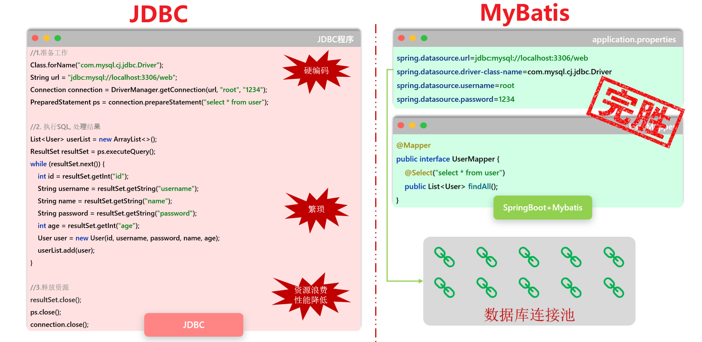

# MyBatis 核心概念

## **1. MyBatis 是什么？**

- 用 Java 代码操作数据库。最原始的方式是使用 JDBC，你需要手动编写大量的模板代码：加载驱动、创建连接、创建 `Statement`、拼装 SQL、执行、处理 `ResultSet`、最后还要在 `finally` 块中小心翼翼地关闭各种资源。

  - 这个过程繁琐、易错，而且 SQL 语句硬编码在 Java 代码里，难以维护。

  - **MyBatis** 就是为了解决这些问题而生的

    - **定位：一个优秀的持久层框架。** 它封装了几乎所有的 JDBC 底层细节，让你不再需要编写那些模板代码。它的核心任务就是帮你管理数据库的增删改查（CRUD）操作。

    - **核心哲学：SQL 与代码解耦。** 这是 MyBatis 最具魅力的特点。它允许你将复杂的 SQL 语句从 Java 代码中抽离出来，统一写在专门的 XML 文件或注解中。这样做的好处是：
      - **SQL 归 SQL，代码归代码**：分工明确，便于维护。数据库管理员（DBA）或 SQL 专家可以专注于优化 SQL，而 Java 开发者可以专注于业务逻辑
      - **SQL 更灵活**：你可以充分利用特定数据库的各种高级特性和函数，编写出**性能极致的 SQL**，而不用受框架的束缚

    - **与 Hibernate/JPA 的对比：半自动化 vs 全自动化**
      - **Hibernate/JPA (全自动 ORM)**: 它们试图完全屏蔽 SQL。你只需要操作 Java 对象（POJO），框架会自动生成 SQL 语句并执行。这在处理简单的 CRUD 时非常高效，但当业务逻辑复杂，需要高度优化的 SQL 时，自动生成的 SQL 往往不尽人意，你可能需要花费很大力气去“告诉”框架如何生成你想要的 SQL。我们称之为“全自动挡汽车”，上手快，但对车辆的精细控制较弱
      - **MyBatis (半自动 ORM)**: MyBatis 不会自动生成 SQL，它要求你**亲自编写 SQL 语句**。它做的，是帮你把 SQL 的执行、参数的设置、结果集的映射这些繁琐工作自动化。我们称之为“手动挡汽车”，你需要自己换挡（写 SQL），但对车辆的动力和行驶轨迹有绝对的控制权

    >**结论**：MyBatis 特别适合那些业务逻辑复杂、对 SQL 性能要求极高、或者希望对数据库有完全控制权的项目，尤其是在互联网应用中


## **2. 核心组件与架构**

- MyBatis 的工作流程就像一条高度协同的工厂流水线。下面是这条流水线上的关键角色：

  1. **`SqlSessionFactoryBuilder` (构建器)**
     - **作用**：读取 MyBatis 的核心配置文件（`mybatis-config.xml`），然后像一个建筑工人一样，根据这份“蓝图”建造出 `SqlSessionFactory` 工厂。
     - **生命周期**：它是一个“一次性”的工具，一旦创建了 `SqlSessionFactory`，它的使命就完成了，可以被垃圾回收。
  2. **`SqlSessionFactory` (工厂)**
     - **作用**：这是 MyBatis 的核心，一个重量级的对象。它的唯一职责就是创建 `SqlSession`。可以把它想象成一个**数据库连接池的管理者**。
     - **生命周期**：一旦被创建，它应该在整个应用的生命周期中都存在。通常我们使用**单例模式**来管理它，即整个应用只创建一个 `SqlSessionFactory` 实例。频繁地创建和销毁它会严重浪费系统资源。

  3. **`SqlSession` (会话)**
     1. **作用**：这是**与数据库进行交互的直接接口**，是 **MyBatis 最核心的 API**。它**封装了所有执行 SQL、提交/回滚事务、获取 Mapper 代理对象的方法**。
     2. **生命周期**：它是一个轻量级的、非线程安全的对象。因此，它的最佳实践是**“用完即关”**。绝不能在多个线程间共享一个 `SqlSession` 实例，也绝不能把它作为类的静态成员或实例成员长期持有。正确的做法是在每次数据库请求开始时创建它，在请求结束后关闭它。

  4. **Mapper (映射器)**
     - **作用**：**由一个 Java 接口和对应的 XML 文件（或注解）组成**。它**负责定义具体的业务方法，以及这个方法应该执行的 SQL 语句和映射规则**。**MyBatis 会在运行时为这个接口生成一个动态代理对象**，当你**调用接口方法时，实际上是这个代理对象在帮你执行 `SqlSession` 的相应操作**
     - **生命周期**：Mapper 代理对象是从 `SqlSession` 中获取的，所以它的生命周期应该和创建它的 `SqlSession` 保持一致

  5. **`Executor` (执行器)**
     - **作用**：`SqlSession` 内部的“发动机”。**所有的 SQL 最终都由 `Executor` 来执行**。它负责**处理参数映射、动态 SQL 解析、缓存查询等底层工作**。开发者一般不直接接触它，但可以通过插件来拦截它的行为，实现像分页、性能监控这样的高级功能。


## 3.与JDBC的对比图




# **配置文件mybatis-config.xml**

## 基本

- `mybatis-config.xml` 是 MyBatis 的核心配置文件，它包含了影响 MyBatis 行为的全局设置和属性。这个文件的顶层结构是有严格顺序的，如果你不按顺序组织元素，MyBatis 会在解析时报错
- MyBatis 在启动和运行时，会首先读取这个文件，根据里面的指示来配置自己的行为
  - 在**独立使用 MyBatis的时候**：**必须写** `mybatis-config.xml`，否则程序无法运行
  - 在**Mybatis 与 Spring/Spring Boot 集成**：**推荐不写** `mybatis-config.xml`，所有配置都转移到 `application.yml` 或 `application.properties` 文件中，由框架自动完成


## 配置文件中元素顺序与结构图

```
configuration
├── properties
├── settings
├── typeAliases
├── typeHandlers
├── objectFactory
├── objectWrapperFactory
├── reflectorFactory
├── plugins
├── environments
├── databaseIdProvider
└── mappers
```

- 这个配置文件中的具体细节，这里先不说


# Mapper 配置与扫描

- MyBatis 如何关联 Java Mapper 接口与 XML 映射文件
- Spring Boot 环境下如何高效地扫描和注册 Mapper

## 1. Mapper XML 文件的存放位置

- **核心规则**：Mapper XML 文件**必须**存放在 `src/main/resources` 目录下，而不是 `src/main/java` 目录

  > 为了类路径？

- **原因**：这源于标准的项目构建约定

  - `src/main/java`：此目录下的 `.java` 文件会被编译成 `.class` 文件。默认情况下，所有非 `.java` 文件（如 `.xml`）在编译打包时会被**忽略**
  - `src/main/resources`：此目录下的所有文件都被视为**资源文件**，在打包时会被**原样复制**到最终的 classpath（运行时查找路径）中

- **如果放错位置会怎样？** 程序在启动或运行时会因为在 classpath 中找不到 XML 文件而抛出 `IOException` 或 `BindingException (not found)` 异常，根本无法获取到 SQL 语句


## 2. 定位并匹配 XML 文件

- MyBatis 通过两个步骤来将 Java 接口和 XML 文件进行“配对”：**首先找到文件，然后确认内容**

### 2.1 定位 XML 文件：两种核心方式

#### **方式一:约定优于配置 (默认行为)**

- **规则**：如果你**没有**进行任何相关配置，MyBatis 会启用默认约定。此约定包含两个**必须同时满足**的条件：

  1. 存放 XML 文件的**目录结构**必须和它对应的 Java Mapper 接口的**包结构**完全一致。

  2. XML **文件名**必须和它对应的 Java **接口名**完全一致。

     

- **工作原理**：MyBatis 根据接口的全限定名（如 `com.myapp.mapper.UserMapper`）推断出 XML 文件的**完整 classpath 路径**（包括文件名）。它会在 classpath 中严格寻找一个路径为 `com/myapp/mapper/UserMapper.xml` 的文件。如果文件名或路径有任何不匹配，文件定位就会失败。


#### **方式二:配置文件中明确指定(推荐)**

- **规则**：在 Spring Boot 的 `application.properties` 或 `application.yml` 中，通过 `mybatis.mapper-locations` 属性来明确告知 MyBatis 去哪里寻找 XML 文件

- **为什么这种方式更好？**

  - **解耦**：Java 代码的包结构和资源文件的目录结构不再需要强制绑定，你可以将所有 XML 文件集中存放在一个目录下（如 `resources/mappers/`），使项目结构更清晰。**文件名也可以任意命名**。
  - **明确性**：配置是显式的，任何人都能快速理解 XML 文件的位置。

- **如何配置**：

  - **`application.properties` 示例**：

    ```properties
    # 扫描 classpath 下的 mappers 目录及其所有子目录中的 .xml 文件
    mybatis.mapper-locations=classpath:mappers/**/*.xml
    ```

  - **`application.yml` 示例**：

    ```yaml
    mybatis:
      mapper-locations: classpath:mappers/**/*.xml
    ```

- **通配符详解**:

  - `*` (单个星号): 匹配当前目录下的任意文件或文件夹名。例如 `mappers/*.xml` 只会匹配 `mappers` 目录下的 XML 文件，**不会**进入子目录
  - `**` (两个星号): 匹配**任意层级的子目录**。`mappers/**/*.xml` 的意思就是“`mappers` 目录以及它下面的所有子目录（无论多少层）中，所有以 `.xml` 结尾的文件”。正是这个通配符实现了子目录的递归扫描

  

### 2.2 内容匹配: namespace 最终校验

- **规则**：无论通过哪种方式找到了 XML 文件，MyBatis 都会进行最后一步校验。XML 文件中 `<mapper>` 标签的 `namespace` 属性值，必须和它对应的 Java Mapper 接口的**全限定名**（包名+类名）**完全一致**
- **目的**：**最终绑定**。这是确保 SQL 语句和正确接口关联的最后一道防线
- **如果 `namespace` 不一致会怎样？** 即使找到了文件，MyBatis 也会认为“文件内容与身份不符”，从而抛出 `BindingException`


## 3. Mapper 接口的扫描与注册

- MyBatis 需要知道去哪里找你的 Java Mapper 接口，并把它们注册到 Spring 容器中

### 3.1 `@Mapper` vs `@MapperScan`

| 特性         | **@Mapper**                                                  | **@MapperScan**                                              |
| ------------ | ------------------------------------------------------------ | ------------------------------------------------------------ |
| **作用**     | **单个注册**：标记在某一个具体的 Mapper 接口上，使其被 Spring 发现并注册。 | **批量扫描**：指定一个基础包路径，自动扫描该路径下的所有接口并注册为 Mapper。 |
| **使用位置** | 写在**每一个** Mapper 接口的类定义上。                       | 通常写在**主启动类**或一个集中的配置类上。                   |
| **优点**     | 精确控制，简单明了。                                         | **一劳永逸**，只需配置一次，后续新增接口无需任何操作，是**强烈推荐**的做法。 |
| **缺点**     | **繁琐**，每增加一个接口都必须手动添加，容易遗漏。           | （几乎没有）                                                 |


### 3.2 `@MapperScan` 的使用

- **写在哪里？** 通常写在 Spring Boot 的**主启动类**上（即带有 `@SpringBootApplication` 注解的类）。因为主启动类是应用的入口和配置中心，放在这里可以确保在应用启动的最早期阶段，所有 Mapper 接口都被正确加载。

- **会扫描子包吗？** **是的**。`@MapperScan` 会自动地、递归地扫描你指定的包及其下的**所有子包**，无需手动配置每一个子包路径。

  ```java
  // 只需要指定顶层包，其下的 product、order 等子包都会被自动扫描
  @SpringBootApplication
  @MapperScan("com.myapp.mapper")
  public class MyApplication { ... }
  ```


## 4. 整体工作流程总结

- MyBatis 的自动化配置流程就像一个精确的流水线：
  1. **启动**：Spring Boot 应用启动
  2. **扫描接口**：`@MapperScan` 开始工作，扫描指定包（及其所有子包），找到所有 Mapper 接口（如 `UserMapper.java`），并将它们注册为 Spring Bean
  3. **定位 XML**：当需要执行 `UserMapper` 中的某个方法时，MyBatis 首先会根据 `mybatis.mapper-locations` 的配置去查找 XML 文件。如果该配置不存在，则会回退到使用“**目录结构一致**”的约定去查找
  4. **匹配 Namespace**：MyBatis 打开找到的 `UserMapper.xml`，校验其 `namespace` 是否与 `UserMapper` 接口的**全限定名**完全一致
  5. **执行 SQL**：校验成功后，执行 `id` 匹配的方法所对应的 SQL 语句


# 关于“名字”的关联

## 绑定机制超级澄清

### 原则：两个独立且方向相反的流程

- 理解MyBatis的关键在于，要将“数据从Java流向数据库”和“数据从数据库流向Java”看作两个完全独立、互不干扰的流程
  1. **数据输出 (Java -> SQL)**：此流程的主角是 `#{}`，它的任务是**从Java参数中取值**。
  2. **数据输入 (SQL -> Java)**：此流程的主角是**结果映射 (Result Mapping)**，它的任务是**将查询结果填充到Java对象中**。

### 流程一：数据输出 - `#{}` 的世界

> 在这个里面，有些地方需要名字相同，但有些地方又不需要名字相同，我归纳的是不需要和形参名字相同，别的地方就需要相同
>
> > 因为形参可能会变化，但是别的不变的，bro
>
> - **单个简单参数**：不用和某个Java中的变量名字相同，`#{}`也能正确匹配，因为不存在歧义
> - **多个参数**：不用和形参的名字相同，但是要和`@Param`指定的名字相同，因为`#{}`匹配的是 **`@Param`注解指定的名字**，而不是形参变量名
> - **单个对象参数**：MyBatis会忽略该对象的形参名，`#{}`匹配的是对象内部的**属性名**，对象内部的属性名不是形参，所以这里要严格和对象内部的属性名相同

- `#{}` 是一个纯粹的“Java世界”的指令。它的唯一使命就是匹配Java端的变量/属性名，与数据库字段名**没有任何直接关系**


#### 绑定规则详解

##### 1. 单个JavaBean对象参数

这是最常见的情况，例如 `void insert(User user);`

- **`#{}` 匹配对象**：JavaBean的**属性名**。
- **核心逻辑**：MyBatis会忽略方法参数名(`user`)，直接通过Java反射机制，寻找并调用该对象属性对应的`getter`方法。
- **示例**：`#{userName}` 会精确地寻找并调用 `user.getUserName()` 方法来取值。


##### 2. 多个参数

- 必须使用 `@Param` 注解，例如 `void update(@Param("id") int userId, @Param("name") String userName);`

  - **`#{}` 匹配对象**：`@Param("...")` 注解中**指定的名字**。

  - **核心逻辑**：MyBatis会将所有参数放入一个内部Map中，`@Param`指定的名字就是这个Map的键(key)。`#{}`根据这个键来取值。

  - **示例**：`#{name}` 会在内部Map中寻找键为 `"name"` 的项。


##### 3. 单个简单参数

- 这是一个特例，例如 `User findById(Integer userId);`

  - **`#{}` 匹配对象**：理论上可以是**任意名字**，但最佳实践是与**方法参数名**保持一致。

  - **核心逻辑**：因为只有一个参数，MyBatis知道`#{}`指的一定是它，所以能正确匹配。

  - **示例**：`#{id}` 或 `#{userId}` 都能正确匹配到 `userId` 这个参数。

  

#### `#{}` 与数据库字段的连接

- `#{}` 取出的值，与数据库字段的连接，是**通过你在SQL语句中书写的位置来手动建立的**

  ```sql
  -- `#{userName}` 的值，会被放到 `user_name` 列对应的位置上。
  INSERT INTO user (user_name, age) VALUES (#{userName}, #{userAge})
  ```

  


### 流程二：数据输入 - 结果映射的世界

- 这个流程只在执行 `SELECT` 查询后发生。所有关于命名风格（驼峰、下划线）的自动转换配置，都只在这里生效

#### 匹配规则详解

- 核心是**数据库的字段名**和**Java对象的属性名**之间的匹配

##### 1. 默认情况：严格匹配

- 在不进行任何配置时，数据库返回的**字段名**必须和Java对象的**属性名**完全一致，否则对应属性的值将为`null`

  - **数据库字段**：`user_name`

  - **Java属性**：`private String user_name;` (需要这样才能匹配)


##### 2. 推荐配置：开启驼峰自动映射

- 这是解决命名风格不一致的最佳实践。配置项为 `mapUnderscoreToCamelCase = true`

  - **作用**：自动将数据库中**下划线命名**的字段（如 `user_name`）映射到Java中**驼峰命名**的属性（如 `userName`）

  - **核心逻辑**：MyBatis在拿到数据库返回的列名 `user_name` 后，会自动在内存中将其转换为 `userName`，再去Java对象中寻找对应的`setter`方法（`setUserName()`）


##### 3. 手动方式：SQL别名 或 `<resultMap>`

- 当自动映射无法满足需求时，可以使用手动方式进行精确控制

  - **SQL别名 (`AS`)**：在`SELECT`语句中为字段起一个与Java属性名完全相同的别名。

    ```sql
    SELECT user_name AS userName FROM user;
    ```

  - **`<resultMap>`**：在XML中定义一个详细的映射规则，明确指定哪个数据库字段对应哪个Java属性。这是最强大、最灵活的方式。


## Java中的变量名与`#{}`进行绑定

- MyBatis 中如何将 Mapper 接口方法的参数与 SQL 语句中的 `#{...}` 占位符进行绑定的核心规则
  - `#{}`是在sql语句中用的，在属性中要是涉及到Java属性可以直接写，不用写`#{}`


### 场景一：单个 POJO 对象参数

- 这是最常见的情况，比如 `update(User user)`

- **核心规则**：当方法只有一个 POJO 对象参数时，MyBatis 会自动将该对象作为属性的来源。在 SQL 中，你应该**直接使用对象的属性名**进行引用

- 单参数的好像在`#{}`中写了东西就行，反正名字去了之后也就那样，还是对不上。这是我从多参去名字对不上推理出来的

  - 既然多参数对不上要用东西标识，凭啥单参数的能对上不用写，如果单参数是用名字对的，那多参数为啥不行。我就说多参数为啥写名字进行比对不行
  - 既然如此，那就单参数是直接进行匹配的，根本没有说名字要相同这种说法，其实也有，我这会儿在乱说，但是写就行，但是为了规范，我们通常喜欢把相关的都写的一模一样，bro

- **正确示例**：

  ```java
  // Mapper 接口方法
  public void update(User user);
  ```

  ```xml
  <!-- SQL 语句 -->
  <update id="update">
    update user set
      username = #{username},		<!-- 这里不可以写user.username -->
      password = #{password}		<!-- 这里不可以写user.password -->
    where
      id = #{id}
  </update>
  ```

  - **解释**：MyBatis 看到 `#{username}`，会自动去 `user` 对象中寻找 `username` 属性，并调用其 `getUsername()` 方法来获取值。

  

- **错误示例**：

  ```xml
  <!-- 错误写法 -->
  <update id="update">
    update user set username = #{user.username} ...
  </update>
  ```

  - **解释**：在这种情况下，MyBatis 会尝试寻找一个名为 `user` 的参数，但因为只有一个参数，MyBatis 不会为其分配一个顶层名称，所以会抛出 `Parameter 'user' not found` 的异常

  

### 场景二：多个参数

- 当方法参数超过一个时，情况就完全不同了，比如 `update(User user, Long operatorId)`

- **核心规则**：只要方法有多个参数，就**必须**为**每一个参数**使用 `@Param` 注解进行显式命名。这是为了消除参数歧义，因为 Java 在编译后可能会丢失原始的参数名

  - `@Param`注解的详细讲解，见下节

- **正确示例**：

  ```java
  // 必须为每个参数添加 @Param
  public void update(
      @Param("user") User user,
      @Param("operatorId") Long operatorId
  );
  ```

  ```xml
  <!-- SQL 中必须使用 @Param 指定的名称 -->
  <update id="update">
    update user set
      username = #{user.username},  <!-- 通过 'user.' 前缀访问属性-->
      password = #{user.password},
      updated_by = #{operatorId}    <!-- 直接访问另一个参数 -->
    where
      id = #{user.id}
  </update>
  ```

  - **解释**：
    - `@Param("user")` 告诉 MyBatis：“这个 `User` 对象在 SQL 里就叫 `user`”
    - 因此，在 SQL 中访问其属性时，必须使用 `#{user.属性名}` 的形式
    - 对于简单类型的参数 `operatorId`，直接使用 `#{operatorId}` 即可

- **错误示例**：

  ```java
  // 错误：没有使用 @Param 注解
  public void update(User user, Long operatorId);
  ```

  - **解释**：MyBatis 无法区分哪个参数是什么，它只能看到 `arg0` 和 `arg1`。此时，任何尝试通过 `#{user.username}` 或 `#{operatorId}` 进行的绑定都会失败，并抛出 `Parameter not found` 异常。


##  `@Param`注解

- 用于绑定形参和`#{}`的注解

- **核心作用**：在 MyBatis 的 Mapper 接口中，`@Param` 注解专门负责为方法的**形式参数**指定一个明确的名称，以便在 XML 映射文件或注解 SQL 中能够通过 `#{...}` 或 `${...}` 准确地引用它们
- **解决的问题**：它解决了 Java 编译后可能丢失参数名以及当存在多个参数时产生的歧义问题，是确保参数正确传递给 SQL 的关键工具
- 这里先说一个重要的：如果方法的形参是一个对象，`#{...}` 中的名字**必须**和传入的 Java 对象（POJO）中的**属性名**严格保持一致，不然报错，关于多个参数的见下

### 1. 为什么需要 `@Param`？核心痛点

- **痛点一：参数名丢失**

  - **背景**：在 Java 8 之前，或者编译时没有添加 `-parameters` 编译标志，方法的形参名在编译成 `.class` 文件后会丢失，变成无意义的 `arg0`, `arg1`, `arg2`...
  - **后果**：MyBatis 无法通过反射获取到你编写的真实参数名（如 `userId`），因此它不知道 `#{userId}` 到底对应哪个参数，导致绑定失败。

- **痛点二：多参数歧义**

  - **背景**：当一个 Mapper 方法有多个参数时，即使参数名得以保留，MyBatis 也无法确定哪个 `#{...}` 占位符对应哪个参数。

  - **示例（错误用法）**:

    ```java
    // MyBatis 会抛出异常，因为它不知道 #{username} 是 name 还是 #{password} 是 pwd
    User findByCredentials(String name, String pwd);
    ```

    对应的 SQL:

    ```xml
    <select id="findByCredentials" resultType="User">
      select * from user where username = #{username} and password = #{password}
    </select>
    ```

### 2. `@Param` 的工作原理与核心用法

- **工作原理**：MyBatis 在处理带有多个参数或使用了 `@Param` 注解的参数时，会创建一个 `Map` 来存放这些参数。

  - `@Param` 注解的值就是这个 `Map` 的 **key**，而方法的参数值就是 **value**。在解析 SQL 时，MyBatis 会根据 `#{key}` 去这个 `Map` 中查找对应的 value

- **代码示例**:

  ```java
  // 使用 @Param 为每个参数命名
  User findByCredentials(
      @Param("username") String name, 
      @Param("password") String pwd
  );
  ```

  - **`@Param("username")`**: 告诉 MyBatis，将参数 `name` 的值放入 Map 中，并将其 key 设置为 "username"。
  - **`@Param("password")`**: 告诉 MyBatis，将参数 `pwd` 的值放入 Map 中，并将其 key 设置为 "password"。
  - 这样，在 SQL 中就可以通过 `#{username}` 和 `#{password}` 精确地取到对应的值。

### 3. 不同场景下的最佳实践

- **场景一：单个简单参数**

  - **定义**：参数类型为 Java 的基本类型、包装类、`String` 等。

  - **不推荐的做法**（依赖编译配置）：

    ```java
    // 只有在开启 -parameters 编译选项时才可能工作
    void deleteById(Integer id); // SQL: ... where id = #{id}
    ```

  - **推荐的做法**（健壮且清晰）：

    ```java
    // 不依赖任何编译配置，代码意图明确
    void deleteById(@Param("id") Integer userId); // SQL: ... where id = #{id}
    ```

    > **结论**：即使只有一个简单参数，也**推荐使用 `@Param`**，这让你的代码更加健壮，不受环境影响。

- **场景二：多个简单参数**

  - **结论**：**必须使用 `@Param`** 为每一个参数进行命名，否则 MyBatis 会报错。

  - **代码示例**:

    ```java
    List<User> findUsers(
        @Param("status") Integer status,
        @Param("keyword") String nameKeyword
    );
    ```

    ```xml
    <select id="findUsers" resultType="User">
      select * from user
      where status = #{status} and name like concat('%', #{keyword}, '%')
    </select>
    ```

    

- **场景三：单个复杂对象 (POJO)**

  - **结论**：**通常不需要使用 `@Param`**。MyBatis 会自动将对象的属性作为参数。

  - **代码示例**:

    ```java
    // 传入一个 User 对象
    void insertUser(User user);
    ```

    ```xml
    <!--可以直接使用 User 对象的属性名: username, password -->
    <insert id="insertUser">
      insert into user (username, password, create_time)
      values (#{username}, #{password}, #{createTime})
    </insert>
    ```

    > **注意**：SQL 中的 `#{username}` 实际上是 `#{user.username}` 的简写。MyBatis 会自动寻找传入的 POJO 对象中名为 `username` 的 `getter` 方法 (`getUsername()`) 来获取值。

    

- **场景四：混合参数（POJO + 简单参数）**

  - **结论**：**必须为所有参数添加 `@Param` 注解**，包括 POJO 对象，以消除歧义

  - **代码示例**:

    ```java
    void updateUser(
        @Param("user") User user, // 必须为 POJO 命名
        @Param("operatorId") Long adminId // 必须为简单参数命名
    );
    ```

    ```xml
    <update id="updateUser">
      update user
      set
        username = #{user.username},
        password = #{user.password}
      where
        id = #{user.id}
        and updated_by = #{operatorId} -- 引用简单参数
    </update>
    ```

    > **关键**：当为 POJO 添加 `@Param"user")` 后，在 SQL 中必须使用 `对象名.属性名` 的方式（如 `#{user.username}`）来访问其属性。


## Java变量和数据库属性关联

### 方法1：`AS`起别名

```java
@Select("select id, name, create_time as createTime, update_time as updateTime from dept order by update_time desc;")
```


### 方法2：全局开启驼峰

```yaml
mybatis:
  configuration:
    map-underscore-to-camel-case: true
```


### 方法3：resultMap


### 方法4：`@Results`和`@Result`

- `@Results` 和 `@Result` 是 MyBatis 中用来替代 XML 里 `<resultMap>` 功能的一组注解

#### 核心概念

- 简单来说，这两个注解的关系是：

  - **`@Result`**: 定义**单条**映射规则。精确地告诉 MyBatis：“请将查询结果中的 `column` 字段值，赋给 POJO 对象的 `property` 属性”

  - **`@Results`**: `@Result` 注解的**容器**。当一个查询需要配置多条映射规则时，就必须使用 `@Results` 将它们包裹起来

#### 注解属性详解

##### `@Result` 的核心属性

| 属性名         | 类型       | 描述                                                         |
| -------------- | ---------- | ------------------------------------------------------------ |
| **`property`** | `String`   | **[必需]** Java POJO 中的**属性名** (`userName`)。           |
| **`column`**   | `String`   | **[必需]** 数据库查询结果集中的**列名或别名** ( `user_name`) |
| **`id`**       | `boolean`  | 默认为 `false`。设置为 `true` 表示该属性是**主键**，等同于 XML 中的 `<id>` 标签。标记主键有助于 MyBatis 提升缓存和嵌套查询的性能。 |
| `javaType`     | `Class<?>` | 属性的 Java 类型。通常 MyBatis 能通过反射自动推断，一般无需手动指定。 |
| `jdbcType`     | `JdbcType` | 数据库字段的 JDBC 类型。通常也无需手动指定。                 |

##### `@Results` 的核心属性

| 属性名      | 类型        | 描述                                                         |
| ----------- | ----------- | ------------------------------------------------------------ |
| **`value`** | `@Result[]` | **[必需]** 一个 `@Result` 注解数组，用于存放一条或多条具体的映射规则。 |
| **`id`**    | `String`    | **[可选]** 给这套映射规则起一个唯一的ID名称。设置后，其他的查询方法就可以通过 `@ResultMap("id")` 注解来复用这套规则，避免重复定义。 |


#### 示例

- 假设我们有以下 POJO 和数据库表结构，它们的字段命名风格不一致

##### 1. POJO 类 (`User.java`)

```java
public class User {
    private Integer userId;       // 主键
    private String userName;
    private String userPassword;
    private LocalDateTime createTime;

    // Getters and Setters...
}
```

##### 2. 数据库表 (`user`)

| 字段名        | 类型       |
| ------------- | ---------- |
| `id`          | `int` (PK) |
| `user_name`   | `varchar`  |
| `password`    | `varchar`  |
| `create_time` | `datetime` |

##### 3. Mapper 接口 (`UserMapper.java`)

```java
import org.apache.ibatis.annotations.*;
import java.util.List;

@Mapper
public interface UserMapper {

    /**
     * 使用 @Results 和 @Result 定义一个可复用的结果集映射。
     * 这个映射被命名为 "userResultMap"。
     */
    @Results(id = "userResultMap", value = {
        // 将 'id' 字段映射到 'userId' 属性，并标记为主键
        @Result(property = "userId", column = "id", id = true), 
        
        // 将 'user_name' 字段映射到 'userName' 属性
        @Result(property = "userName", column = "user_name"),
        
        // 将 'password' 字段映射到 'userPassword' 属性 (不规则命名)
        @Result(property = "userPassword", column = "password"),
        
        // 将 'create_time' 字段映射到 'createTime' 属性
        @Result(property = "createTime", column = "create_time")
    })
    @Select("SELECT * FROM user WHERE id = #{id}")
    User findById(Integer id);


    /**
     * 使用 @ResultMap 注解，通过 ID 复用上面定义好的 "userResultMap" 映射规则。
     * 这样就无需再次编写一长串的 @Results 和 @Result。
     */
    @ResultMap("userResultMap")
    @Select("SELECT * FROM user")
    List<User> findAll();
}
```


# MyBatis查询后在Java中的返回类型

## `resultType` 和`resultMap`

- 在 MyBatis 中，XML 映射文件里的 `resultType` (或 `resultMap`) 属性，其作用是**定义单行记录的封装类型**。
  - 它并不决定整个查询结果最终的集合形态


## 默认返回类型规则

- MyBatis 根据 SQL 查询返回的**记录行数**以及 Mapper 接口方法的**返回类型签名**，智能地决定最终返回什么

  1. **当查询结果为单行或零行时：**

     - **默认行为**：返回一个**单个对象**。

     - **类型**：这个对象的类型就是你在 `resultType` 中指定的类型（如 `User`, `Map<String, Object>`, `Integer` 等）。

     - **注意**：如果查询结果为零行，MyBatis 会返回 `null`。为了避免空指针异常，推荐使用 Java 8 的 `Optional<T>` 来包装返回类型。

       ```java
       // 推荐做法
       Optional<User> findById(int id);
       ```

     

  2. **当查询结果为多行时：**

     - **默认行为**：返回一个 `java.util.List` 集合。

     - **集合内容**：这个 `List` 中包含的每一个元素，都是一个根据 `resultType` 封装好的 Java 对象。

     - **示例**：

       ```java
       // Mapper 接口方法
       List<User> findAll();
       ```

       ```xml
       <select id="findAll" resultType="com.example.User">
         SELECT * FROM user;
       </select>
       ```

       - 在这里，`resultType` 告诉 MyBatis 每一行都是一个 `User` 对象，而方法签名 `List<User>` 告诉 MyBatis 把这些 `User` 对象装进一个 `List` 里再返回


## 如何更改默认的集合类型

- 如果你不想要默认的 `List`，**只需直接修改 Mapper 接口方法的返回类型签名**。MyBatis 会自动适应

  - **改为 `Set`**：如果你需要一个不含重复元素的集合。

    - **前提**：POJO 类（如 `User`）必须正确重写 `equals()` 和 `hashCode()` 方法。

    - **示例**：

      ```java
      Set<User> findUniqueUsers();
      ```

  

  - **改为数组 `[]`**：如果你需要一个数组。

    - **示例**：

      ```java
      User[] findAllAsArray();
      ```

  

  - **改为 `Map`**：如果你需要一个方便通过键查找的 `Map`。

    - **前提**：必须配合 `@MapKey` 注解来指定用哪个属性作为键。

    - **示例**：

      ```java
      @MapKey("id")
      Map<Integer, User> findAllAsMap();
      ```


## 常见返回类型

| 查询结果行数   | Mapper 方法返回类型  | 最终返回结果                                               |
| :------------- | :------------------- | :--------------------------------------------------------- |
| **单行或零行** | `User`               | 单个 `User` 对象或 `null`                                  |
| **单行或零行** | `Optional<User>`     | 包含 `User` 的 `Optional` 或 `Optional.empty()`            |
| **多行**       | `List<User>` (默认)  | 包含多个 `User` 对象的 `List`                              |
| **多行**       | `Set<User>`          | 包含多个 `User` 对象的 `Set` (需重写 `equals`/`hashCode`)  |
| **多行**       | `User[]`             | 包含多个 `User` 对象的数组                                 |
| **多行**       | `Map<Integer, User>` | 以 `id` 为键，`User` 对象为值的 `Map` (需 `@MapKey("id")`) |
| **多行**       | `Collection<User>`   | 包含多个 `User` 对象的 `Collection` (通常是 `ArrayList`)   |


# Mapper XML详解

- MyBatis 的核心魅力在于它能将 SQL 从业务逻辑中解耦出来，而 Mapper XML 文件正是承载这些 SQL 的核心工作区。
  - Mapper XML文件 精确定义了 **Mapper 接口中的方法如何与具体的 SQL 语句绑定、参数如何传递以及结果如何映射**。


## 基本结构

- 每个 Mapper XML 文件都遵循固定的结构，并与一个 Mapper 接口一一对应


### 1. XML 声明和 DTD 约束

- 一个标准的 Mapper XML 文件头部如下
  - 它定义了 **XML 版本、编码**以及 MyBatis 的 DTD，用于约束和校验文件格式的正确性

```xml
<?xml version="1.0" encoding="UTF-8" ?>
<!DOCTYPE mapper
        PUBLIC "-//mybatis.org//DTD Mapper 3.0//EN"
        "http://mybatis.org/dtd/mybatis-3-mapper.dtd">
```


### 2. 根元素 `<mapper>`

- 所有内容都必须包裹在 **`<mapper>` 标签**内

  - **`namespace` (命名空间)**: **这是 `<mapper>` 元素最核心的属性**
    - 它必须被设置为**与之绑定的 Mapper 接口**的**完全限定名**（例如：**`com.example.mapper.UserMapper`**）

  > **工作原理**：
  >
  > - MyBatis 通过 `namespace` 定位到具体的 Mapper 接口
  > - 再通过 SQL 语句标签的 `id`（**必须与接口方法名一致**）来最终确定执行哪条 SQL
  > - 这个 `namespace + id` 的组合是 MyBatis 动态代理机制实现绑定的关键，确保了接口调用能够精确地“导航”到对应的 SQL 语句
  > - 如果找不到匹配项，MyBatis 会抛出 `BindingException`异常


### 3. 根元素中的内容

- 根元素内部定义了SQL语句、结果映射、缓存等关键信息


## CRUD标签

- 在 MyBatis 中，`<select>`, `<insert>`, `<update>`, `<delete>` 是定义数据库操作的四大核心标签

### `<select>` (查询标签)

#### 概念

- `<select>` 是最复杂也是功能最强大的标签，因为它承载了所有数据读取的任务，并且需要处理各种复杂的返回结果


#### 核心属性

- **`id` (必需)**:

  - **作用**: SQL 语句的唯一标识符。

  - **规则**: **必须与 Mapper 接口中对应的方法名完全一致**

    - 这是 MyBatis 通过动态代理将接口方法调用精确绑定到具体 SQL 语句的基石。

      

- **`resultType`**:

  - **作用**: 指定将查询结果的**每一行**映射成的 Java 类型。它启动了 MyBatis 的**自动映射**机制

  - **用法**:

    1. **映射为 JavaBean**: `resultType="com.example.entity.User"` 或 `resultType="User"` (如果配置了别名)。
       - MyBatis 会尝试将列名（如 `user_name`）自动映射到属性名（如 `userName`）
    2. **映射为基本类型**: `resultType="int"`、`resultType="string"` 等。
       - 适用于查询结果只有一列的场景，如 `SELECT COUNT(*) FROM user`
    3. **映射为 Map**: `resultType="map"`。
       - 将每一行结果封装成一个 `Map<String, Object>`，其中 `key` 是列名，`value` 是对应的值

  - **注意**: `resultType` 和 `resultMap` 是**互斥**的，在一个 `<select>` 标签中只能使用其中一个

    

- **`resultMap`**:

  - **作用**: 引用一个预先定义好的 `<resultMap>` 标签的 `id`。它启动了 MyBatis 的**手动映射**机制。

  - **用法**: `resultMap="userBaseResultMap"`。适用于以下场景：

    1. 数据库列名和 Java 属性名不一致，且无法通过驼峰命名自动转换。
    2. 需要进行复杂的**一对一**或**一对多**的关联查询

  - **优先级**: 当 `resultMap` 被指定时，MyBatis 会完全忽略 `resultType` 属性。

    

- **`parameterType` (可选)**:

  - **作用**: 指定传入这条 SQL 语句的参数的 Java 类型。
  - **用法**: `parameterType="com.example.entity.User"` 或 `parameterType="int"`。
  - **为何可选**: MyBatis 拥有强大的类型推断能力，绝大多数情况下可以根据传入的参数自动识别其类型，因此这个属性**通常可以省略**，以保持 XML 的简洁


#### **返回值与接口方法的对应关系**

- Mapper 接口方法的返回值类型决定了 MyBatis 如何处理查询结果：

  - **返回单个对象**: `User findById(int id);`
    - 如果查询返回多行，MyBatis 会抛出 `TooManyResultsException` 异常。

  - **返回对象集合**: `List<User> findAll();`
    - 即使查询结果为空，也会返回一个空的 `List`，而不是 `null`。

  - **返回 Map**: `Map<String, User> findUsersMap();` (需要配合 `@MapKey` 注解)
    - 可以将查询结果列表转换为一个 Map，便于快速查找。

  - **返回 Optional (Java 8+)**: `Optional<User> findById(int id);`
    - 优雅地处理可能为 `null` 的查询结果。

- **示例**

  ```xml
  <!-- 示例1: 使用 resultType 返回一个对象列表 -->
  <select id="findAll" resultType="com.example.entity.User">
      SELECT id, user_name, password FROM user
  </select>
  
  <!-- 示例2: 使用 resultMap 处理复杂的列名不一致问题 -->
  <select id="findUserDetail" resultMap="userResultMap">
      SELECT user_id, user_name, user_pwd FROM user WHERE user_id = #{id}
  </select>
  
  <!-- 示例3: 返回一个简单的计数值 -->
  <select id="countUsers" resultType="int">
      SELECT COUNT(*) FROM user
  </select>
  ```

  


### `<insert>` (插入标签)

#### 概念与核心属性

- `<insert>` 标签负责向数据库中添加新的记录，除了基本的插入功能，它还提供了强大的主键回填机制


#### **核心属性**

- **`id` (必需)**: 

  - **作用**: SQL 语句的唯一标识符。

  - **规则**: **必须与 Mapper 接口中对应的方法名完全一致**

    - 这是 MyBatis 通过动态代理将接口方法调用精确绑定到具体 SQL 语句的基石

      

- **`parameterType` (可选)**:

  - **作用**: 指定传入这条 SQL 语句的参数的 Java 类型。
  - **用法**: `parameterType="com.example.entity.User"` 或 `parameterType="int"`。
  - **为何可选**: MyBatis 拥有强大的类型推断能力，绝大多数情况下可以根据传入的参数自动识别其类型，因此这个属性**通常可以省略**，以保持 XML 的简洁

  

- **`useGeneratedKeys` (常用)**:

  - **作用**: 设为 `true` 后，会告诉 MyBatis 去获取由数据库内部生成的主键（如 MySQL 的 `AUTO_INCREMENT`）
  - **用法**: `useGeneratedKeys="true"`。**必须和 `keyProperty` 配合使用，但是keyProperty可以配合别的使用**

  

- **`keyProperty` (常用)**:

  - **作用**: 与 `useGeneratedKeys`属性 或 `<selectKey>` 标签配合，指定将获取到的主键值赋给**参数对象**的哪个属性
  - 和`<selectKey>`互斥
  - **用法**: `keyProperty="id"`。假设你传入一个 `User` 对象，MyBatis 在插入成功后，会自动调用 `user.setId(generatedKey)`

  

- **`keyColumn`**:

  - **作用**: （不常用）仅在某些数据库（如 PostgreSQL）需要明确指定主键在哪一列时使用

    

- **`<selectKey>` 子元素**

  - 对于不支持主键自增的数据库（如 Oracle 的序列），或需要在插入前生成主键（如 UUID）的场景，需要使用 `<selectKey>`

  - 和**keyProperty**互斥

    

#### **返回值**

- 默认情况下，`<insert>` 标签执行后，对应的接口方法返回一个 `int` 值，表示**受影响的行数**


#### **示例**

```xml
<!-- 示例1: MySQL 自增主键回填 -->
<insert id="saveUser" parameterType="User" useGeneratedKeys="true" keyProperty="id">
    INSERT INTO user(username, password) VALUES(#{username}, #{password})
</insert>

<!-- 示例2: Oracle 序列获取主键 (插入前) -->
<insert id="saveUserWithSequence" parameterType="User">
    <selectKey keyProperty="id" resultType="long" order="BEFORE">
        SELECT USER_SEQ.NEXTVAL FROM DUAL
    </selectKey>
    INSERT INTO user(id, username, password) VALUES(#{id}, #{username}, #{password})
</insert>
```


#### 主键回填

- 在插入数据后，我们常常需要立即获取新生成的主键值

  - **对于支持主键自增的数据库 (如 MySQL)**:

    ```xml
    <insert id="insertUser" useGeneratedKeys="true" keyProperty="id">
        INSERT INTO user(username, password) VALUES(#{username}, #{password})
    </insert>
    ```

    - `useGeneratedKeys="true"`: 开启获取数据库生成主键的功能。

    - `keyProperty="id"`: 将获取到的主键值，回填到传入的参数对象（比如一个 User 对象）的 `id` 属性中。

      

  - **对于不支持主键自增的数据库 (如 Oracle)**: 需要使用 `<selectKey>` 提前查询主键（如从序列中获取）

    ```xml
    <insert id="insertUser">
        <selectKey keyProperty="id" resultType="int" order="BEFORE">
            SELECT USER_SEQ.NEXTVAL FROM DUAL
        </selectKey>
        INSERT INTO user (id, username) VALUES (#{id}, #{username})
    </insert>
    ```

    - `order="BEFORE"`: 表示在 `INSERT` 语句执行**之前**执行 `<selectKey>` 内的查询。


### `<update>` (更新标签)

#### 概念

- `<update>` 标签专门用于执行数据的更新操作。它的结构相对简单，核心任务是根据传入的参数修改数据库中已存在的记录


#### **核心属性**

- **`id` (必需)**: SQL 语句的唯一标识符，必须与 Mapper 接口中的方法名完全一致
- **`parameterType` (可选)**: 指定传入参数的 Java 类型。通常可以省略，MyBatis 会自动推断。当参数是一个复杂的对象（如 `User`）时，你可以在 SQL 语句中通过 `#{属性名}` 的方式直接引用对象的属性


#### **返回值**

- 和 `<insert>` 一样，`<update>` 标签执行后，对应的接口方法默认返回一个 `int` 值，这个值表示**该 `UPDATE` 语句实际影响的数据库记录行数**。你可以根据这个返回值来判断更新操作是否成功执行。


#### **示例**

```xml
<!-- 示例: 根据用户ID更新用户名 -->
<!-- 对应的接口方法可以是: int updateUsername(User user); -->
<update id="updateUsername" parameterType="User">
    UPDATE user
    SET username = #{username}
    WHERE id = #{id}
</update>
```


### `<delete>` (删除标签)

#### 概念

- `<delete>` 标签用于从数据库中删除记录。它的用法和 `<update>` 非常相似，都是执行一个写操作并返回结果


#### **核心属性详解**

- **`id` (必需)**: SQL 语句的唯一标识符，必须与 Mapper 接口中的方法名完全一致。
- **`parameterType` (可选)**: 指定传入参数的 Java 类型。当参数是一个简单类型（如 `int`、`long`）时，在 SQL 语句中可以直接用 `#{任意名称}` 来引用它。


#### **返回值**

- 与 `<update>` 相同，`<delete>` 标签执行后，对应接口方法默认返回一个 `int` 值，表示**该 `DELETE` 语句实际删除的数据库记录行数**


#### **示例**

```xml
<!-- 示例: 根据ID删除用户 -->
<!-- 对应的接口方法可以是: int deleteUserById(int userId); -->
<delete id="deleteUserById" parameterType="int">
    DELETE FROM user WHERE id = #{userId}
</delete>
```


### 参数的处理：`#{}` vs `${}`

####  1.`#{}`：预编译参数

- **工作原理**: MyBatis 将 `#{}` 处理成 JDBC `PreparedStatement` 中的参数占位符 `?`。参数值是通过 `set` 方法安全设置的，而不是直接拼接到 SQL 语句中。

- **优点**:

  1. **防止 SQL 注入**: 从根本上杜绝了 SQL 注入风险，因为参数值被视为数据，而不是 SQL 指令。
  2. **类型安全**: MyBatis 会自动进行 Java 类型到 JDBC 类型的转换。
  3. **性能更优**: 数据库可以缓存和重用预编译的 SQL 执行计划。

- **示例**:

  ```xml
  <select id="findUserByName" resultType="User">
      SELECT * FROM user WHERE name = #{userName}
  </select>
  ```


#### 2. `${}`：直接字符串替换

- **工作原理**: MyBatis 会将 `${}` 中的变量值**原样**拼接到 SQL 语句中，进行简单的字符串替换

- **风险**:

  1. **SQL 注入**: 如果参数来自用户输入，会产生严重的安全漏洞
  2. **类型问题**: 不会自动进行类型处理，字符串参数可能需要手动加引号

- **正确使用场景**: `#{}` 无法满足需要**动态改变 SQL 结构**的场景，此时必须使用 `${}`

  1. **动态排序**:

     ```xml
     <select id="findAllUsers" resultType="User">
         SELECT * FROM user ORDER BY ${columnName} ${sortDirection}
     </select>
     ```

  2. **动态表名/分表**:

     ```xml
     <select id="findLogs" resultType="Log">
         SELECT * FROM log_${year}
     </select>
     ```

- **安全准则**: **能用 `#{}` 就绝不用 `${}`**。当必须使用 `${}` 时，传入的参数**绝不能**直接来自前端用户输入，必须在后端代码中进行严格的**白名单校验**，确保其值在预期的、安全的可选范围内


## 结果映射

- 当查询结果需要封装成 Java 对象时，MyBatis 提供了两种映射方式：`resultType`和`resultMap`
- 如果字段名不同，还能用`AS`起别名大法
- MyBatis Mapper 方法的返回值其实主要就是这几类
  - **单个对象**、**对象集合**、**`void`**、以及**表示影响行数的整数**


### 1. `resultType`自动:映射

> 我对这个有偏见，我感觉这个老垃圾了，我不喜欢

#### 概述

- `resultType` 的工作原理非常直接：它尝试**将查询结果集中每一列的名称(这里不是数据库中的,是查询结果集中的)**，与目标 Java 对象中**属性的名称**进行匹配，如果匹配成功，就**调用该属性的 `setter` 方法进行赋值**。

- 它的使命是处理简单、直接的映射场景，无需手动配置


#### `resultType` 的两大核心阶段

- 整个自动化流程可以清晰地分为“匹配”和“封装”两个阶段

##### 1. 匹配阶段：如何找到对应的属性？

- 当 MyBatis 从数据库获取到一行数据后，它会遍历这一行的每一列。对于每一列，它会按照以下顺序（优先级从高到低）去寻找 POJO 中对应的属性：

  1. **寻找完全同名的属性**

     - MyBatis 会**先拿列名（例如 `user_name`）直接去POJO里找一个一模一样的属性名**。这个匹配过程**不区分大小写**

  2. **下划线到驼峰的自动转换 (推荐开启)**

     - 如果在 SpringBoot 全局配置文件中设置了 

       ```yaml
       mybatis:
         configuration:
           map-underscore-to-camel-case: true
       ```

       - MyBatis会自动将数据库列名的下划线命名法（如 `user_name`）转换成 Java 的驼峰命名法（`userName`），然后再去 POJO 中寻找匹配的属性

     - 这是**最推荐的实践方式**，因为它能让数据库和 Java 代码各自保持自己的命名规范，实现解耦

  3. **SQL 别名的最高优先级**	

     - 如果在 SQL 查询中为列指定了别名（`AS`），那么 MyBatis 将**只使用这个别名**来进行匹配，而忽略原始的列名

     - 例如 `SELECT user_name as name FROM user`，MyBatis 就会拿着 `name` 去 POJO 中寻找 `name` 属性

- **如果匹配失败会怎样？**

  - 如果某一列在POJO中找不到对应的属性，MyBatis 会**静默地忽略**这一列的数据，不会报错

  - 反之,如果POJO中的某个属性在查询结果中找不到对应的列,那么这个属性的值将是`null`(或基本类型的默认值，如 `int` 的 `0`)


##### 2. 封装阶段：如何创建和填充对象？

- 当匹配成功后，MyBatis 就开始创建并填充你的 Java 对象

1. **实例化对象 (依赖无参构造)**
   - MyBatis 会通过**反射**机制，调用你在 `resultType` 中指定的那个类的**无参构造函数**来创建一个新的实例（例如 `new User()`）
   - **关键前提**：POJO**必须**有一个**公共的、无参数的构造方法**，否则 MyBatis 在运行时会因无法创建对象而抛出异常
2. **调用 Setter 方法赋值**
   - 对于每一个成功匹配上的“列-属性”对，MyBatis 会找到该属性对应的 `setter` 方法（例如，`userName` 属性对应 `setUserName(...)` 方法）
   - 然后，它会从数据库结果集中取出列的值，并调用这个 `setter` 方法，将值赋给对象的属性。MyBatis 会自动处理大部分基础的 JDBC 类型和 Java 类型之间的转换


#### 特殊情况：返回值是集合

- 当 Mapper 接口方法的返回值是集合类型，并且你使用的是 `resultType` 来指定集合中元素的类型时，MyBatis 会采用“一行一对象”的基本映射策略。然而，最终返回的集合类型不同，其内部处理和最终结果也会有所差异。

##### 返回值是 `List`

- 这是最常见也是最直接的情况
  1. **创建空列表**：在处理结果集之前，MyBatis 会先创建一个空的 `ArrayList` 实例，用于存放最终的结果。
  2. **循环处理每一行**：MyBatis 会遍历数据库返回的结果集 (`ResultSet`)，对每一行数据重复执行“创建对象 -> 属性匹配 -> 封装数据”的全过程。
     - 处理第 1 行 -> 创建一个 `User` 对象并填充数据。
     - 处理第 2 行 -> 创建**另一个**新的 `User` 对象并填充数据。
     - 以此类推...
  3. **添加到列表中**：每成功创建一个对象，MyBatis 都会把它 `add` 到第一步创建的那个 `ArrayList` 中。
  4. **返回列表**：当结果集的所有行都被处理完毕后，MyBatis 返回这个已经装满了对象的 `List`。即使查询结果中有多行数据完全相同，`List` 也会包含所有行对应的对象，不会去重。


##### 返回值是 `Set`

- 返回 `Set` 的主要目的是利用其元素唯一的特性进行自动去重。
  1. **创建空集合**：MyBatis 会先创建一个空的 `HashSet` 实例。
  2. **循环处理每一行**：处理逻辑与 `List` 完全相同，依然是为每一行创建一个新的对象。
  3. **添加到集合中（关键区别）**：当 MyBatis 尝试将新创建的对象 `add` 到 `Set` 中时，`Set` 的特性会生效。它会根据对象的 `equals()` 和 `hashCode()` 方法来判断该对象是否已存在于集合中。
     - 如果对象已存在，则**不会**将其添加进去。
     - 如果对象不存在，则添加成功。
  4. **返回集合**：最终返回一个包含了所有**不重复**对象的 `Set`。要使其正常工作，你必须在 `resultType` 指定的类（如 `User`）中正确地重写 `equals()` 和 `hashCode()` 方法。


##### 返回值是 `Map`

- 返回 `Map` 是一种特殊情况，用于需要通过唯一键快速查找对象的场景。直接在 XML 中指定 `resultType` 是不够的

  1. **需要 `@MapKey` 注解**：你必须在 Mapper 接口的方法上添加 `@MapKey("propertyName")` 注解，其中 `propertyName` 是 Java 对象中某个属性的名称，该属性对应的值将作为 Map 的 Key

     ```java
     @MapKey("id") // 使用 User 对象的 id 属性作为 Map 的 key
     Map<Long, User> findAllUsersAsMap();
     ```

  2. **创建空映射**：MyBatis 会先创建一个空的 `HashMap`

  3. **循环处理每一行**： 

     - a. 为每一行创建一个 `resultType` 指定的对象（作为 Map 的 Value）
     - b. 从这个新创建的对象中，获取 `@MapKey` 注解指定的属性值（如 `user.getId()`），作为 Map 的 Key
     - c. 将 `(Key, Value)` 这个键值对 `put` 到 Map 

  4. **返回映射**：返回最终的 `Map`。如果结果集中有多行的 Key 是相同的，后处理的行会**覆盖**先处理的行。


#### 总结与弊端

- **优点**：`resultType` 配置简单，对于单表查询且命名规范的场景非常高效
- **核心弊端**：它只能进行**扁平化**的自动映射，无法处理列名与属性名不匹配的复杂情况，更无法组装带有嵌套对象（如一对一、一对多）的复杂 Java 对象

- 当 `resultType` 的能力达到上限时，就是功能更强大、更灵活的 `<resultMap>` 发挥作用的时候了。


### 2. `resultMap`映射

#### 核心概念：`resultMap` 是什么？

- `resultMap` 是 MyBatis 中最强大、最重要的元素
  - 当数据库表的列名与 Java 对象的属性名不一致，或需要处理复杂的关联查询（如一对一、一对多）时，`resultMap` 提供了手动的、精细化的映射策略，让你完全掌控从 JDBC `ResultSet` 到 Java 对象的转换过

- **`resultMap` vs `resultType`**

  - 这是理解 `resultMap` 的关键。在一个 `<select>` 标签中，它们是**互斥**的,

    - **`resultType` (自动映射)**：你告诉 MyBatis “这是目标对象的类型，请**自动**尝试将列名（或别名）映射到同名的属性上”。这适用于简单、直接的映射场景

    - **`resultMap` (手动映射)**：你告诉 MyBatis “请**严格按照**我预先定义好的、名为 `xxx` 的这套规则，来将查询结果映射到目标对象上”。这适用于所有复杂场景

  

####  解决列名与属性名不匹配

-  `resultMap` 最基础也最常见的应用场景

##### 2.1 定义 `<resultMap>`

- 首先，你需要定义一个 `<resultMap>` 元素，它包含了所有的映射规则

  - **`<resultMap>` 标签属性**:

    - `id`: 必需，这个 `resultMap` 的唯一标识，供 `<select>` 等标签引用

    - `type`: 必需，目标 Java 对象的完整类名或已注册的别名

      >`type` 属性告诉 MyBatis：“**当我从数据库查出每一行数据时，我应该创建哪个 Java 类的实例来存放这些数据？**

    - `autoMapping`: (可选, 默认为 `false` 的行为在不同版本中有差异，建议显式设置)

      - 设为 `true` 时，MyBatis 会在执行完所有明确的 `<id>` 和 `<result>` 手动映射后，**继续对未映射的列进行自动映射**。这在只有少数几个字段不匹配的场景下非常方便。
      - 设为 `false` 时，MyBatis **只会**处理你在 `resultMap` 中明确定义的映射。

  

  - **`<resultMap>`的子标签**:

    - **`<id>`**: 用于映射**主键**字段。它不仅是数据映射，更是向 MyBatis 声明了记录的唯一标识。这对于后续的缓存优化、嵌套查询避免对象重复至关重要

      - `property`: Java 对象的属性名

      - `column`: 数据库结果集中的列名

        

    - **`<result>`**: 用于映射除主键外的普通字段

      - `property`: Java 对象的属性名
      - `column`: 数据库结果集中的列名
      - `javaType`, `jdbcType`: (可选) 精确指定属性的 Java 类型和列的 JDBC 类型，通常 MyBatis 能自动推断，但在处理特殊类型（如 `BLOB`, `CLOB`, 枚举等）时需要指定

    

    - 这里的`<id>`和`<result>`不要混用，不然可能会引发严重的问题

##### 2.2 示例

- 假设有 `User` 类和 `user` 表：

  ```java
  // Java Pojo
  public class User {
      private Long id;
      private String name;
      private String password;
      private Date createTime;
      // getters and setters...
  }
  ```

  ```sql
  -- Database Table
  CREATE TABLE user (
      user_id BIGINT PRIMARY KEY,
      user_name VARCHAR(50),
      user_pwd VARCHAR(50),
      create_time DATETIME
  );
  ```

  

- **XML Mapper 配置:**

  ```xml
  <!-- 1. 定义一个详细的 resultMap -->
  <resultMap id="userBaseResultMap" type="com.example.entity.User" autoMapping="true">
      <!-- 使用 <id> 映射主键，提升性能和准确性 -->
      <id property="id" column="user_id"/>
      
      <!-- 使用 <result> 映射普通字段 -->
      <result property="name" column="user_name"/>
      <result property="password" column="user_pwd"/>
      
      <!-- 
        注意：因为 autoMapping="true"，这里的 create_time 列会自动映射到 createTime 属性，
        无需再写 <result property="createTime" column="create_time"/>。
        如果 autoMapping="false"，则必须手动添加该行映射。
      -->
  </resultMap>
  
  <!-- 2. 在查询语句中通过 resultMap 属性引用它 -->
  <select id="findUserById" resultMap="userBaseResultMap">
      SELECT user_id, user_name, user_pwd, create_time 
      FROM user 
      WHERE user_id = #{id}
  </select>
  ```


#### `resultMap`容错与错误处理

- 当 `resultMap` 中的 `property` (Java属性) 或 `column` (数据库列) 出现不匹配时，MyBatis 的处理方式是不同的

##### 情况一：`column` 在 SQL 查询结果中不存在

- **行为：会忽略，不报错。**

- 这是一个非常灵活的特性，允许你复用 `resultMap`。

  - **表现**：如果在 `<result>` 中指定的 `column` 在 `SELECT` 语句返回的结果集中不存在，MyBatis 会跳过这个映射。

  - **结果**：对应的 Java 属性 (`property`) 将不会被赋值，保留其类型的默认值（对象为 `null`，原始类型为 `0` 或 `false`）。


##### 情况二：`property` 在 Java 对象中不存在

- **行为：会报错。**

- 这被认为是一个配置错误，MyBatis 会在启动或运行时“快速失败”（Fail-fast）。

  - **表现**：如果在 `<result>` 中指定的 `property` 在 `resultMap` 的 `type` 指定的 Java 类中不存在（即没有该字段或对应的 setter 方法），MyBatis 会在尝试赋值时失败。

  - **结果**：MyBatis 会抛出一个异常（通常是 `ReflectionException`），明确指出在 Java 类中找不到该属性。


##### 情况三：多个 `<result>` 指向同一个 `column`

- **行为：允许，不报错。**

  - 这是一个合法的特性，允许将同一个数据库列的值赋给多个不同的 Java 属性。

    - **表现**：MyBatis 会按顺序处理 `resultMap` 中的每一个映射规则。

    - **结果**：所有指向这个 `column` 的 `property` 都会被赋予相同的值。


##### 情况四：多个 `<result>` 指向同一个 `property`

- **行为：不报错，但后面的映射会覆盖前面的。**

- 这种情况通常是一个配置错误，但 MyBatis 遵循“**最后一个为准**”（Last one wins）的原则。

  - **表现**：MyBatis 依然是按顺序处理 `resultMap` 中的映射规则，并执行每一次赋值操作。

  - **结果**：该 `property` 的最终值，将是 `resultMap` 中**最后一个**指向它的 `<result>` 标签所映射的 `column` 的值。


####  处理关联查询

- `resultMap` 真正强大的地方在于能够优雅地处理对象间的关联关系，自动组装出复杂的对象图

##### 0. 解决的问题

- 当我们使用 `JOIN` 查询时，数据库返回的是一个“扁平化”的二维表结果。

  - 例如，查询订单及其用户，结果集中的每一行都同时包含了订单和用户的字段

    | order_id | order_no | user_id | user_name |
    | -------- | -------- | ------- | --------- |
    | 101      | SN202301 | 1       | zhangsan  |


- 但我们的 Java 对象模型通常是“结构化”或“嵌套”的：一个 `Order` 对象内部包含一个 `User` 对象。

  ```java
  class Order {
      private Long id;
      private String orderNo;
      private User user; // 嵌套的 User 对象
  }
  ```

  

- `<association>` 和 `<collection>` 的使命：

  - 搭建一座桥梁，告诉 MyBatis 如何将这个扁平的结果集，智能地组装成我们想要的嵌套对象结构


##### 1. `<association>`

- 处理“一对一”或“多对一”关联

- `<association>` 用于映射一个嵌套的 Java 对象属性。换句话说，当你的主对象中包含**另一个单一的对象**时（如 `Order` 包含一个 `User`），就使用它

###### 1.1 概念解析

- `<association>` 标签定义了一个“对象属性”的映射规则。
  - 告诉MyBatis：“结果集中的这几列数据,不属于主对象,而是应该用来创建一个新的子对象,并把它设置给主对象的某个属性”


###### 1.2 关键属性

- **`property`**: **必需**。指定宿主对象（如 `Order`）中嵌套对象属性的名称。例如，`property="user"`。
- **`javaType`**: **必需**。指定这个嵌套对象的完整类名或别名。
  - 例如，`javaType="com.example.entity.User"` 或 `javaType="User"`。它告诉 MyBatis 应该 `new` 一个什么类型的对象


###### 1.3 常用子元素

- `<association>` 标签内部的子元素，定义了**如何构建这个嵌套对象**（例如 `User` 对象）的规则。它们与 `resultMap` 根标签下的子元素几乎完全相同

  - **`<id>`**: 用于将结果集中的列映射到嵌套对象的**主键**属性。

  - **`<result>`**: 用于将结果集中的普通列映射到嵌套对象的**普通**属性。

  - **`<constructor>`**: 用于将列数据注入到嵌套对象的**构造方法**中，实现构造器注入。
    - **`<idArg>`**: 构造方法中用于主键的参数。
    - **`<arg>`**: 构造方法中的普通参数。
  - **`<association>`**: 用于处理更深层次的嵌套关系，即嵌套对象内部还包含另一个对象（一对一）。
  - **`<collection>`**: 用于处理嵌套对象内部包含一个集合属性（一对多）的场景。

  - **`<discriminator>`**: 鉴别器，用于处理更复杂的继承关系映射（例如，一个 `Payment` 属性可能是 `CreditCardPayment` 或 `BankTransferPayment` 类型）。


###### 1.4 工作原理解析

- 当 MyBatis 处理查询结果时：
  1. 它首先根据 `resultMap` 的 `type` 属性创建一个主对象实例（例如 `new Order()`）。
  2. 接着，它处理主对象的普通字段映射（`<id>` 和 `<result>`）。
  3. 当遇到 `<association property="user" ...>` 时，它会：
     -  a. 根据 `javaType="User"` 创建一个子对象实例（`new User()`）。 
     - b. 进入 `<association>` 的内部，按照其内部定义的 `<id>` 和 `<result>` 规则，从结果集中取出 `user_id`, `user_name` 等列，填充到这个新的 `User` 对象中。
     - c. 最后，调用主对象的 `setUser(User user)` 方法，将填充好的 `User` 对象设置进去。


###### 1.5 完整示例

- **Java 对象**:

  ```JAVA
  public class Order {
      private Long id;
      private String orderNo;
      private User user; // 关联的 User 对象
      // getters and setters...
  }
  public class User {
      private Long id;
      private String name;
      // getters and setters...
  }
  ```

- **XML Mapper 配置**:

  ```xml
  <resultMap id="orderWithUserMap" type="Order">
      <!-- 映射 Order 自身的基础属性 -->
      <id property="id" column="order_id"/>
      <result property="orderNo" column="order_no"/>
  
      <!-- 定义如何映射嵌套的 'user' 属性 -->
      <association property="user" javaType="User">
          <!-- 这里是构建 User 对象的规则 -->
          <id property="id" column="user_id"/>
          <result property="name" column="user_name"/>
      </association>
  </resultMap>
  
  <select id="findOrderById" resultMap="orderWithUserMap">
      SELECT
          o.id as order_id,
          o.order_no,
          u.id as user_id,
          u.name as user_name
      FROM orders o
      JOIN user u ON o.user_id = u.id
      WHERE o.id = #{orderId}
  </select>
  ```


##### 2. `<collection>`

- **处理“一对多”关联**

- `<collection>` 用于映射一个集合类型的属性（如 `List`, `Set`）
  - 当你的主对象中包含**一个对象的集合**时（如 `User` 包含一个 `List<Order>`），就使用它


###### 2.1 概念解析

- `<collection>` 标签定义了一个“集合属性”的映射规则。它解决了 `JOIN` 查询带来的数据冗余（笛卡尔积）问题，能智能地将多行结果归并到同一个主对象的集合属性中


###### 2.2 关键属性

- **`property`**: **必需**。指定宿主对象（如 `User`）中集合属性的名称。例如，`property="orderList"`。
- **`ofType`**: **必需**。指定这个**集合中所包含元素的类型**的完整类名或别名。注意它和 `javaType` 的区别，`ofType` 指的是 `List<Order>` 中的 `Order` 类型


###### 2.3 常用子元素

- `<collection>` 标签内部的子元素，定义了**如何构建集合中每一个元素对象**（例如 `Order` 对象）的规则。其子元素与 `<association>` 完全一致

  - **`<id>`**: 映射集合元素的**主键**属性。

  - **`<result>`**: 映射集合元素的**普通**属性。

  - **`<constructor>`**: 用于将列数据注入到集合元素的**构造方法**中。
  - **`<association>`**: 用于映射集合中每个元素内部包含的“一对一”嵌套对象。
  - **`<collection>`**: 用于映射集合中每个元素内部更深层次的“一对多”集合属性（虽然不常见，但支持）。

  - **`<discriminator>`**: 鉴别器，用于处理集合中可能存在的不同子类型元素。


###### 2.4 工作原理解析

- 当 MyBatis 处理一对多查询的结果集时（通常会有多行属于同一个主对象）：

  1. **处理第一行**:
     - a. 根据主 `resultMap` 的 `<id>`（例如 `user_id`）判断这是一个新的主对象。
     - b. 创建主对象实例（`new User()`）并填充其基础属性。 
     - c. 创建一个新的集合实例（`new ArrayList<Order>()`）并赋给 `orderList` 属性。 
     - d. 根据 `<collection>` 内部的规则，创建第一个集合元素（`new Order()`），填充数据，并将其添加到 `orderList` 中。
  2. **处理后续行**
     - a. MyBatis 会再次检查主 `resultMap` 的 `<id>` 值。如果 `user_id` 与上一行相同，它**不会**创建新的 `User` 对象。 
     - b. 它会直接复用上一步创建的 `User` 对象。 
     - c. 然后根据 `<collection>` 内部的规则，创建新的 `Order` 对象，填充数据，并将其添加到**已存在**的 `orderList` 集合中。
  3. 这个过程会一直持续，直到遇到一个 `user_id` 不同的新行，才会重复步骤1。

  >**核心**：主 `resultMap` 中的 `<id>` 标签是 MyBatis 能否正确识别和归并对象的关键。


###### 2.5 完整示例

- **Java 对象**:

  ```java
  public class User {
      private Long id;
      private String name;
      private List<Order> orderList; // 关联的 Order 集合
      // getters and setters...
  }
  public class Order {
      private Long id;
      private String orderNo;
      // getters and setters...
  }
  ```

- **XML Mapper 配置**:

  ```xml
  <resultMap id="userWithOrdersMap" type="User">
      <!-- 映射 User 自身的基础属性 -->
      <!-- 这个 <id> 至关重要，用于识别是否是同一个 User -->
      <id property="id" column="user_id"/>
      <result property="name" column="user_name"/>
  
      <!-- 定义如何映射 'orderList' 集合属性 -->
      <collection property="orderList" ofType="Order">
          <!-- 这里是构建 Order 对象并添加到 List 中的规则 -->
          <id property="id" column="order_id"/>
          <result property="orderNo" column="order_no"/>
      </collection>
  </resultMap>
  
  <select id="findUserWithOrders" resultMap="userWithOrdersMap">
      SELECT
          u.id as user_id,
          u.name as user_name,
          o.id as order_id,
          o.order_no
      FROM user u
      LEFT JOIN orders o ON u.id = o.user_id
      WHERE u.id = #{userId}
  </select>
  ```


## 其他特性与技巧

### 二级缓存

- MyBatis 的二级缓存是**命名空间 (`namespace`) 级别**的缓存，多个 `SqlSession` 可以共享

  - **`<cache>`**: 在 Mapper XML 中添加此标签即可为当前命名空间开启二级缓存

    ```xml
    <!-- eviction: 回收策略, flushInterval: 刷新间隔(ms), size: 缓存数量, readOnly: 是否只读 -->
    <cache eviction="FIFO" flushInterval="60000" size="512" readOnly="true"/>
    ```

  - **`<cache-ref>`**: 让当前 Mapper 共享另一个 Mapper 的缓存配置。

    ```xml
    <!-- OrderMapper.xml 引用 UserMapper.xml 的缓存 -->
    <cache-ref namespace="com.example.mapper.UserMapper"/>
    ```


### 处理特殊字符 (`<![CDATA[]]>`)

- 当 SQL 语句中包含 `<`、`>`、`&` 等 XML 特殊字符时，直接书写会导致解析错误。应使用 `CDATA` 区块将其包裹起来

```xml
<select id="getUsersByAge" resultType="User">
    <![CDATA[
        SELECT * FROM user WHERE age > #{minAge} AND age < #{maxAge}
    ]]>
</select>
```


# 动态 SQL

- 动态 SQL 是 MyBatis 最强大、最核心的特性之一。它允许你根据传入的参数或条件，在 XML 映射文件中动态地构建 SQL 语句，从而将复杂的逻辑判断从 Java 代码中解放出来，让 SQL 映射文件承担更多职责，使业务逻辑更纯粹


##  条件判断`<if>` 

- 这是最基础的动态 SQL 标签，功能完全等同于 Java 中的 `if` 语句，用于进行单路条件判断

- **作用**：根据 `test` 属性中的表达式返回值（`true` 或 `false`）来决定是否将标签内的 SQL 片段拼接到最终的 SQL 中

  - **深入 `test` 属性 (OGNL 表达式)**: `test` 属性中的表达式是基于 **OGNL (Object-Graph Navigation Language)** 解析的。这意味着你可以进行丰富的逻辑判断：
    - **访问对象属性**: `test="user != null"`
    - **访问属性值**: `test="username != null and username != ''"`
    - **调用方法**: `test="username.length() > 0"`
    - **访问集合大小**: `test="userList != null and userList.size() > 0"`
    - **布尔值判断**: `test="isActive"` (当 `isActive` 是 `boolean` 类型时)
    - **数值比较**: `test="age > 18"`

- **典型场景：多条件动态查询**

  ```xml
  <!-- 一个有潜在语法问题的例子 -->
  <select id="findActiveUser" resultType="User">
      SELECT * FROM user WHERE
      <if test="username != null and username != ''">
          AND username LIKE #{username}
      </if>
      <if test="status != null">
          AND status = #{status}
      </if>
  </select>
  ```

  - **问题剖析**：如果第一个 `if` 不成立，而第二个 `if` 成立，SQL 会变成 `SELECT * FROM user WHERE AND status = ?`，这会导致语法错误。如果所有 `if` 都不成立，SQL 会变成 `SELECT * FROM user WHERE`，同样是语法错误。为了解决这个问题，MyBatis 提供了更智能的 `<where>` 标签


## `<if>` 标签 `test` 属性揭秘

### 核心概念：OGNL 表达式

- `<if>` 标签的 `test` 属性值是一个 **OGNL (Object-Graph Navigation Language)** 表达式。
  - MyBatis 会在运行时对这个表达式进行求值，
    - 如果结果为 `true`，则标签内的 SQL 片段会被包含到最终的 SQL 语句中；
    - 如果为 `false`，则被忽略。


#### 场景一：判断单个参数

- 当 Mapper 方法参数为简单类型时，使用 `@Param` 注解指定名称后，可直接在 `test` 中使用该名称。

**示例代码：**

- **Mapper 接口方法**

  ```java
  List<User> findUserByName(@Param("username") String username);
  ```

- **XML 映射**

  ```xml
  <select id="findUserByName" resultType="User">
    SELECT * FROM user WHERE 1=1
    <if test="username != null and username != ''">
      AND username = #{username}
    </if>
  </select>
  ```

**常用判断：**

- `test="username != null"`: 判断参数是否为 null。
- `test="username != ''"`: 判断字符串是否为空字符串。
- **最佳实践:** `test="username != null and username != ''"`，严谨地同时判断 null 和空字符串。


#### 场景二：判断 JavaBean 属性

- 当参数是对象时，可以直接通过 `属性名` 访问其属性并进行判断。

**示例代码：**

- **Mapper 接口方法**

  ```java
  List<User> findUserByCondition(UserQuery query);
  ```

- **XML 映射**

  ```xml
  <select id="findUserByCondition" resultType="User">
    SELECT * FROM user
    <where>
      <if test="username != null and username != ''">
        AND username LIKE #{username}
      </if>
      <if test="status != null">
        AND status = #{status}
      </if>
    </where>
  </select>
  ```

**要点：**

- OGNL 会自动调用属性的 getter 方法，如 `username` 实际上是 `query.getUsername()`。
- 支持调用方法，如 `test="username.length() > 0"`。


### 要点与注意事项

- **字符串比较:** 字符串字面量需要用**单引号**括起来，例如: `test="userType == 'admin'"`。
- **布尔值判断:** 可以直接写属性名，例如: `test="enabled"` (当 enabled 为 true 时条件成立)。
- **XML特殊字符转义:** 在 XML 中，`<` 和 `>` 是特殊字符，必须进行转义。
  - `<` 应写为 `<` (例如: `test="age < 18"`)
  - `>` 应写为 `>` (例如: `test="age > 60"`)
- **枚举值引用:** 使用 `@` 符号引用静态字段或枚举值，例如: `test="status == @com.example.Status@ACTIVE"`。


## 智能处理前后缀标签

- 这组标签是动态 SQL 的“智能格式化工具”，它们能优雅地解决因条件动态变化而导致的多余 `AND`, `OR` 或逗号等语法问题

### **`<where>`**

- **作用**：用于解决 `WHERE` 子句的动态拼接问题，规则如下：

  - 如果有条件就自动加上where；自动检查所有的and或者or，如果多余就删除

- **使用 `<where>` 改进第一个 `if` 示例**：

  ```xml
  <select id="findActiveUserWithWhere" resultType="User">
      SELECT * FROM user
      <where>
          <if test="username != null and username != ''">
              AND username LIKE #{username}
          </if>
          <if test="status != null">
              AND status = #{status}
          </if>
      </where>
  </select>
  ```

  

### **`<set>`**

- **作用**：专门用于 `UPDATE` 语句的动态更新。它同样具备两大智能功能：

  1. 如果其包裹的内容**有输出**，它会自动添加 `SET` 关键字

  2. 它会自动**剔除**内容末尾多余的逗号 `,`

     >**`<set>` 去除的是它所包裹内容中，最终生成的 SQL 语句末尾多余的逗号，跟这个逗号是不是在 `<if>` 标签里啊什么什么的完全无关。**

- **典型场景：动态更新用户信息**

  ```xml
  <update id="updateUserSelective">
      UPDATE user
      <set>
          <if test="username != null and username != ''">
              username = #{username},
          </if>
          <if test="password != null and password != ''">
              password = #{password},
          </if>
          <if test="age != null and age > 0">
              age = #{age},
          </if>
      </set>
      WHERE id = #{id}
  </update>
  ```

  

### **`<trim>`**

- **作用**：这是一个更通用、更强大的前后缀处理标签，实际上 `<where>` 和 `<set>` 都是通过 `<trim>` 实现的。

  > 它允许你自定义所有格式化规则
  >
  > 事实上就是我的那个疑问，就是`<select>`标签其实也可以自动的生成一个select关键字，如果用`<trim>`的话，这个主要就是为了处理前后缀问题产生的。
  >
  > 像`<where>`这种标签，首先是为了解决处理前后缀这个非常具体且棘手的问题而产生的，而“让SQL语句更规范化”是解决这个问题之后带来的一个必然且美好的结果
  >
  > 当然sql语句已经够好了，有啥不好的，唯一原因就是想更好嘛......
  >
  > 但是也巧妙哈，居然这么完美的就一举两得，一箭双雕了，太美妙了
  >
  > 丑陋的sql，呕

  - `prefix`: 在内容前添加指定的前缀。
  - `suffix`: 在内容后添加指定的后缀。
  - `prefixOverrides`: 覆盖（删除）内容开头指定的文本（如 `AND|OR `）。
  - `suffixOverrides`: 覆盖（删除）内容末尾指定的文本（如 `,`）

- **使用 `<trim>` 模拟 `<where>` 的功能**：

  ```xml
  <trim prefix="WHERE" prefixOverrides="AND|OR "> ... </trim>
  ```

  

- **使用 `<trim>` 模拟 `<set>` 的功能**：

  ```xml
  <trim prefix="SET" suffixOverrides=","> ... </trim>
  ```


## 分支选择标签

- 这组标签的功能类似于 Java 中的 `switch-case-default` 语句，它确保在多个条件中，**只有一个分支**的 SQL 会被执行，适用于互斥条件的场景

  - **`<choose>`**: 包裹整个分支逻辑的父标签

  - **`<when>`**: 相当于 `case`，可以有多个，按顺序进行判断

  - **`<otherwise>`**: 相当于 `default`，当前面所有 `<when>` 都不满足时执行

- **典型场景：根据不同排序规则查询**

  ```xml
  <select id="findUsersOrdered" resultType="User">
      SELECT * FROM user
      ORDER BY
      <choose>
          <when test="orderBy == 'id'">
              id ASC
          </when>
          <when test="orderBy == 'username'">
              username ASC
          </when>
          <otherwise>
              create_time DESC
          </otherwise>
      </choose>
  </select>
  ```

  


##  遍历集合标签`<foreach>`

- 这是处理集合类型参数（如 `List`, `Set`, `Array` 或 `Map`）的利器

  - 作用：**对一个集合（如`List`, `Set`, `Map`或数组）进行迭代（遍历）**，并根据集合中的元素动态地生成SQL语句的一部分

- 语法

  > 不是根据数据检测哪个是参数名，哪个是开始字符串等的，是根据属性名检测的，所以位置可以随便写

  ```xml
  <foreach collection="参数名称" item="元素别名" 
           index="索引别名" open="开始字符串" separator="分隔符" close="结束字符串">
      #{元素别名.property} ...
  </foreach>
  ```

- **核心属性**：

  - `collection`: **必需**。要迭代的集合参数的名称。当参数是 `List` 时默认为 `list`，是数组时默认为 `array`。
    - **最佳实践是在 Mapper 接口方法中使用 `@Param("ids")` 注解来明确指定名称**。
  - `item`: 当前迭代元素的别名,类似于for(int i:array)中的 i
  - `index`: （可选）当前迭代元素的索引（在 List 和数组中）或键（在 Map 中）。
  - `open`: 在整个循环内容开始前添加的字符串。
  - `close`: 在整个循环内容结束后添加的字符串。
  - `separator`: 在每次迭代之间添加的分隔符。

  

- **典型场景 1：构建 `IN` 子句**

  ```xml
  <!-- 接口方法: List<User> findUsersByIds(@Param("ids") List<Integer> ids); -->
  <select id="findUsersByIds" resultType="User">
      SELECT * FROM user
      WHERE id IN
      <foreach collection="ids" item="id" open="(" close=")" separator=",">
          #{id}
      </foreach>
  </select>
  ```

  

- **典型场景 2：批量插入**

  ```xml
  <!-- 接口方法: int batchInsertUsers(@Param("users") List<User> users); -->
  <insert id="batchInsertUsers">
      INSERT INTO user (username, password)
      VALUES
      <foreach collection="users" item="user" separator=",">
          (#{user.username}, #{user.password})
      </foreach>
  </insert>
  ```

  

## 绑定变量标签`<bind>` 

- **作用**：在 OGNL 表达式中创建一个变量，并将其绑定到当前的上下文中，以便后续在 SQL 语句的其他部分使用。

- **典型场景：安全的模糊查询** 在进行模糊查询时，我们通常需要拼接 `％` 符号。如果使用 `${}` 进行拼接，会带来 SQL 注入的风险。`<bind>` 提供了一种安全的方式。

  ```xml
  <select id="findUsersByUsernameLike" resultType="User">
      <!-- 创建一个名为 _username 的变量，值为 '%'+传入的username+'%' -->
      <bind name="_username" value="'%' + username + '%'"/>
      SELECT * FROM user
      WHERE username LIKE #{_username}
  </select>
  ```

  

## `<sql>` 与 `<include>`

- 在编写复杂的 Mapper XML 文件时，我们经常会遇到需要重复使用的 SQL 片段，例如通用的查询列名、复杂的 `JOIN` 子句或是动态的 `WHERE` 条件。如果每次都复制粘贴，不仅会使 XML 文件变得冗长，更会给后续的维护带来巨大的麻烦——修改一处，就必须同步修改所有引用的地方
  - 为了解决这个问题，MyBatis 提供了 `<sql>` 和 `<include>` 这一对黄金搭档，它们的核心理念是 **DRY (Don't Repeat Yourself)**，旨在最大化地提高 SQL 代码的复用性和可维护性。


### **`<sql>` (定义SQL片段)**

- **作用**: `<sql>` 标签用于**定义**一个可以被重用的 SQL 代码块。你可以把它想象成在程序中定义一个常量或一个函数，它本身不会被执行，只是作为一个“模板”存在
- **核心属性**:
  - `id` (必需): 这是 SQL 片段的**唯一标识符**。后续的 `<include>` 标签将通过这个 `id` 来找到并引用它
- **内容**: `<sql>` 标签内部可以包含任何有效的 SQL 文本，甚至是其他动态 SQL 标签（如 `<if>`, `<where>` 等）


### **`<include>` (引用SQL片段)**

- **作用**: `<include>` 标签用于在需要的地方**引用**一个已经用 `<sql>` 定义好的 SQL 片段。当 MyBatis 解析到 `<include>` 标签时，会将其内容替换为对应 `<sql>` 片段的实际内容。
- **核心属性**:
  - `refid` (必需): 指向目标 `<sql>` 片段的 `id`


### 场景示例

##### **场景一：重用静态的列名列表**

- 这是最简单也是最常见的用法，可以确保所有查询返回的字段保持一致

  1. **使用 `<sql>` 定义通用的列名**

     ```xml
     <sql id="base_column_list">
         id, username, password, email, status, create_time
     </sql>
     ```

  2. **在查询中通过 `<include>` 引用**

     ```xml
     <select id="findUserById" resultType="User">
         SELECT <include refid="base_column_list"/>
         FROM user
         WHERE id = #{id}
     </select>
     
     <select id="findAllUsers" resultType="User">
         SELECT <include refid="base_column_list"/>
         FROM user
         ORDER BY create_time DESC
     </select>
     ```

     

  **优势**: 当 `user` 表新增或修改字段时，只需修改 `<sql>` 片段一处，所有相关的查询都会自动更新，无需逐一修改。


##### **场景二：重用动态的查询条件**

- 这是 `<sql>` 与动态 SQL 结合的强大用法，可以将复杂的业务查询逻辑封装起来

  1. **在 `<sql>` 中定义动态逻辑**

     ```xml
     <sql id="dynamicUserConditions">
         <if test="username != null and username != ''">
             AND username LIKE #{username}
         </if>
         <if test="status != null">
             AND status = #{status}
         </if>
         <if test="createTimeStart != null">
             AND create_time >= #{createTimeStart}
         </if>
     </sql>
     ```

     

  2. **在不同的查询中 `<include>` 这个动态片段**

     ```xml
     <!-- 查询满足条件的完整用户列表 -->
     <select id="findUsersByConditions" resultType="User">
         SELECT <include refid="base_column_list"/>
         FROM user
         <where>
             <include refid="dynamicUserConditions"/>
         </where>
     </select>
     
     <!-- 查询满足条件的用户的数量 -->
     <select id="countUsersByConditions" resultType="int">
         SELECT count(*)
         FROM user
         <where>
             <include refid="dynamicUserConditions"/>
         </where>
     </select>
     ```

     - **优势**: 复杂的查询逻辑被集中管理。如果业务规则变更（例如，`username` 的查询从 `LIKE` 改为精确匹配 `=`)，只需修改 `<sql>` 片段，所有依赖此逻辑的查询都会同步更新，保证了业务逻辑的一致性

     

# 注解相关

- 注解开发是 MyBatis 提供的另一种定义 SQL 映射的方式，它允许你直接在 Mapper 接口的方法上使用注解来编写 SQL 语句，从而替代 XML 文件。这种方式对于简单的 SQL 操作尤其方便，可以减少文件数量，让代码更内聚

- 要启用注解，你需要在 `mybatis-config.xml` 中使用 `<mapper class="...">` 或 `<package name="...">` 的方式注册 Mapper 接口


## **基本注解**

### 最基本CRUD注解

- 这是最常用的一组注解，分别对应增、删、改、查操作

  - **`@Select`**: 用于定义查询语句。

  - **`@Insert`**: 用于定义插入语句。
    - 插入数据的时候，如果是自增的属性，不建议传递一个值过去，构造方法传值或者是非要传值的话就传null。

  - **`@Update`**: 用于定义更新语句。

  - **`@Delete`**: 用于定义删除语句。

- **关键点**：

  - SQL 语句直接写在注解的括号内

  - 参数的引用方式与 XML 中完全相同，依然使用 `#{}`

  - 对于多参数方法，推荐使用 `@Param` 注解来指定名称


- **示例：使用基本注解实现 User 的 CRUD**

  ```java
  // com/example/mapper/UserMapper.java
  package com.example.mapper;
  
  import com.example.model.User;
  import org.apache.ibatis.annotations.*;
  
  import java.util.List;
  
  public interface UserMapper {
  
      @Select("SELECT * FROM user WHERE id = #{id}")
      User findById(int id);
  
      @Insert("INSERT INTO user(username, password, age) VALUES(#{username}, #{password}, #{age})")
      @Options(useGeneratedKeys = true, keyProperty = "id") // 获取自增主键
      int insert(User user);
  
      // 使用 @SelectKey 获取非自增主键 (例如 Oracle 的序列)
      @Insert("INSERT INTO user(id, username) VALUES(#{id}, #{username})")
      @SelectKey(statement="SELECT USER_SEQ.NEXTVAL FROM DUAL", keyProperty="id", resultType=int.class, before=true)
      int insertWithSequence(User user);
  
      @Update("UPDATE user SET username = #{username}, age = #{age} WHERE id = #{id}")
      int update(User user);
  
      @Delete("DELETE FROM user WHERE id = #{id}")
      int delete(int id);
  }
  ```


### “查键”相关注解

- 在使用MyBatis进行数据库操作时，一个常见的需求是在执行`INSERT`语句后获取新生成的主键ID。
- `@Options`和`@SelectKey`这两个注解就是为了解决这类问题而设计的，但它们的实现机制和适用场景有所不同。


#### `@Options`：利用数据库原生机制

- `@Options` 是 MyBatis 提供的一个注解，它充当一个**“高级配置开关”**，让你能够对紧邻的**单条SQL映射语句**（如 `@Insert`, `@Update`, `@Select`, `@Delete`）进行精细化的、底层的行为控制。

- **核心作用**

  - **开启主键回填**(主键回填只是一个叫法，实际上不一定回填的是主键)：**“获取自动生成列(`AUTO_INCREMENT`)的值”**

  - **配置缓存、超时等**


##### 注解中关键属性

- **`useGeneratedKeys`**: (布尔值 `true`/`false`) **获取“自动生成列”值的总开关**。设置为 `true` 后，MyBatis 会通过 JDBC 驱动尝试在 `INSERT` 执行后，获取由数据库内部生成的值。

  > **注意**：它获取的是**自增列**（如 MySQL 的 `AUTO_INCREMENT`）的值，**不一定**是主键。我们常说的“主键回填”只是最常见的一种应用场景。

- **`keyProperty`**: (字符串) **指定目标**。用于告诉 MyBatis，应该将获取到的自动生成值，赋给传入的 Java 对象的**哪个属性**。

  - 示例：`keyProperty="userId"`，表示将值赋给 `userId` 这个 Java 属性。

- **`keyColumn`**: (字符串，可选) **指定来源**。用于精确告诉 MyBatis，应该从数据库的**哪一列**去获取那个自动生成的值。在以下情况**必须使用**它：

  1. **当数据库的自增列名与 Java 属性名不一致时**。
     - 例如：数据库自增列是 `user_id`，而 Java 属性是 `id`，则需要设置为 `keyColumn="user_id"`。
  2. **当自增列不是主键时**。
     - 例如：`log_id` 是自增列，但主键是 `event_uuid`，此时必须用 `keyColumn="log_id"` 来明确指定需要获取的是 `log_id` 的值。


##### 语法示例

- 假设有一个`User`实体类，并且数据库的`id`字段是自增主键

  - **User实体类 (`User.java`)**

    ```java
    public class User {
        private Integer id;
        private String username;
        // ... getters and setters
    }
    ```

    

  - **Mapper接口 (`UserMapper.java`)**

    ```java
    import org.apache.ibatis.annotations.Insert;
    import org.apache.ibatis.annotations.Options;
    
    public interface UserMapper {
        @Insert("INSERT INTO users(username, password) VALUES(#{username}, #{password})")
        @Options(useGeneratedKeys = true, keyProperty = "id")
        int insertUser(User user);
    }
    ```

    

  - **工作流程**:

    1. `insertUser(user)`方法被调用，传入一个`id`为`null`的`User`对象。
    2. MyBatis执行`INSERT`语句。
    3. 数据库成功插入记录，并为`id`字段生成了一个新的自增值（例如：101）。
    4. 因为`useGeneratedKeys`为`true`，JDBC驱动会捕获这个新生成的ID。
    5. MyBatis根据`keyProperty="id"`，将获取到的ID值（101）设置回传入的`user`对象的`id`属性中。
    6. 方法执行完毕后，你检查原来的`user`对象，会发现`user.getId()`已经不再是`null`，而是`101`。

  

  - **优点**:

    - 简单、直接，配置清晰。

    - 性能好，因为它利用了JDBC驱动的标准功能，通常只有一次网络交互。

  - **缺点**:
    - 强依赖于数据库和JDBC驱动对“返回自增主键”功能的支持。对于不支持自增主键的数据库（如Oracle的序列），此方法不适用


#### `@SelectKey`：“自定义”查键

- `@SelectKey` 注解提供了一种更为灵活的主键生成和回填机制。它允许你在执行主`INSERT`语句的**之前**或**之后**，运行一个独立的查询语句来获取主键

- **核心作用**

  - **执行额外查询**：在主SQL执行前后，运行一个你指定的SQL语句。

  - **手动回填主键**：将这个额外查询的结果，手动赋值给你指定的对象属性。


##### 关键属性

- **`statement`**: 一个字符串数组，包含要执行的SQL查询语句。这就是用来获取主键的SQL。
- **`keyProperty`**: 和`@Options`中一样，指定将查询结果赋给哪个Java对象的哪个属性。
- **`before`**: **核心属性**。一个布尔值，决定`statement`中的SQL在主SQL之前还是之后执行。
  - `before = true`: **先执行`@SelectKey`的查询，再执行主SQL**。适用于需要先从序列（Sequence）或UUID函数获取ID，再将这个ID插入数据库的场景（如Oracle）。
  - `before = false`: **先执行主SQL，再执行`@SelectKey`的查询**。适用于需要通过特定函数（如MySQL的`LAST_INSERT_ID()`）来查询刚刚插入记录的ID的场景。
- **`resultType`**: 指定`statement`查询返回结果的类型。通常是`Integer`, `Long`, `String`等。


### @MapKey

#### 核心定义

- `@MapKey` 是 MyBatis 框架提供的一个注解，它的唯一功能是**充当一个数据结构转换器**。

- 它能将一个原本应该返回 `List`(列表)的查询结果，自动转换成一个 `Map`（键值对集合）结构，极大地方便了后续的数据查找和处理


#### 作用

- `@MapKey` 的作用可以概括为一句话：**指定结果列表中的某个字段作为 `Map` 的键（Key）**


#### 工作原理

1. **执行查询**：MyBatis 首先执行你的 SQL 语句，从数据库获取一个结果列表（`List`）。
   - *例如，一个 `List<User>`，其中每个 `User` 对象都有 `id`, `name`, `email` 等属性。*
2. **遍历列表**：MyBatis 内部会遍历这个 `List` 中的每一个对象。
3. **提取键值**：对于每一个对象，它会找到你在 `@MapKey` 注解中指定的那个属性（例如 `@MapKey("id")`），将该属性的值作为新 `Map` 的 **键**
4. **封装对象**：原始的、完整的那个对象，则成为这个键所对应的 **值**。
5. **返回 `Map`**：最终，整个 `List` 被转换成一个 `Map` 并返回


**示例：**

- 假设 SQL 查询返回的 `List` 如下：

  ```json
  [
      { "id": 101, "name": "Alice", "role": "Admin" },
      { "id": 108, "name": "Bob",   "role": "User"  },
      { "id": 215, "name": "Carol", "role": "User"  }
  ]
  ```

- 如果在 Mapper 方法上添加 `@MapKey("id")`，最终得到的结果将是这个 `Map`：

  ```json
  {
      "101": { "id": 101, "name": "Alice", "role": "Admin" },
      "108": { "id": 108, "name": "Bob",   "role": "User"  },
      "215": { "id": 215, "name": "Carol", "role": "User"  }
  }
  ```


#### **关键语法与注意事项**

##### 知识点

- 使用 `@MapKey` 时，最重要的一点是：**Mapper 接口方法的返回类型必须是 `Map`**。

  - **注解**：`@MapKey("Java对象中准备作为键的属性名")`

  - **返回类型**：`Map<KeyType, ValueType>`

- 其中：

  - `KeyType` 是你指定的键的类型（如 `Integer`, `Long`, `String`）。

  - `ValueType` 是原始列表中每个元素的类型（如 `User`, `Map<String, Object>`）。


##### 示例

- **正确示例：**

  ```java
  // 使用 User 对象的 id (假设是 Long 类型) 作为 Key
  @MapKey("id")
  Map<Long, User> findAllUsersAsMap();
  ```

  

- **错误示例：**

  ```java
  // 错误！返回类型不能是 List
  @MapKey("id")
  List<User> findAllUsersAsMap();
  ```


#### 特殊情况

- 如果是在 XML 中使用 `resultType="java.util.Map"` 时，这里产生的 `Map` 对象的键是 **SQL 查询结果中的列名**，值是**这个列属性对应的值**


## **动态SQL相关注解**

- 对于动态 SQL，注解提供了两种方式：使用 `<script>` 标签（推荐）和使用 `Provider` 类

### 使用 `<script>` 标签 (推荐)

- 对于中等复杂度的动态 SQL，可以直接在注解的 SQL 字符串中使用 `<script>` 标签来包裹动态 SQL 元素，语法和 XML 中完全一样

- **示例：使用 `<script>` 实现动态查询和批量删除**

  ```java
  public interface UserMapper {
  
      // 动态条件查询
      @Select("<script>" +
              "SELECT * FROM user " +
              "<where>" +
              "  <if test='username != null and username != \"\"'>" +
              "    AND username LIKE #{username}" +
              "  </if>" +
              "  <if test='age != null and age > 0'>" +
              "    AND age = #{age}" +
              "  </if>" +
              "</where>" +
              "</script>")
      List<User> findActiveUser(User user);
  
      // 批量删除
      @Delete("<script>" +
              "DELETE FROM user WHERE id IN " +
              "<foreach item='item' collection='ids' open='(' separator=',' close=')'>" +
              "  #{item}" +
              "</foreach>" +
              "</script>")
      int deleteByIds(@Param("ids") List<Integer> idList);
  }
  ```

  


### 使用 `Provider` 类(非常复杂的SQL)

- 对于极其复杂的动态 SQL，为了保持接口的整洁，可以将其逻辑抽取到一个单独的 `Provider` 类中

  - **`@SelectProvider`**, **`@InsertProvider`**, **`@UpdateProvider`**, **`@DeleteProvider`**:
    - `type`: 指定用于构建 SQL 的 Provider 类的 `Class` 对象。
    - `method`: 指定 Provider 类中具体构建 SQL 的方法名。

- **示例：使用 Provider 实现动态查询**

  1. **创建 SQL Provider 类**

     ```java
     public class UserSqlProvider {
         public String findActiveUser(final User user) {
             return new SQL() {{
                 SELECT("*");
                 FROM("user");
                 if (user.getUsername() != null && !user.getUsername().isEmpty()) {
                     WHERE("username LIKE #{username}");
                 }
             }}.toString();
         }
     }
     ```

  2. **在 Mapper 接口中使用 `@SelectProvider`**

     ```java
     public interface UserMapper {
         @SelectProvider(type = UserSqlProvider.class, method = "findActiveUser")
         List<User> findActiveUserWithProvider(User user);
     }
     ```


# **高级主题**

## **1. 缓存机制**

为了提升查询性能，MyBatis 内置了一套强大的缓存系统，分为一级缓存和二级缓存。

### **1.1 一级缓存**

- **定义**：一级缓存是 **`SqlSession` 级别**的缓存。它是一个内置的、默认开启且无法关闭的缓存。

- **作用域与生命周期**：它的生命周期与 `SqlSession` 完全绑定。在同一个 `SqlSession` 中，执行完全相同的查询，只有第一次会真正查询数据库。

- **缓存失效（清空）的场景**：

  1. 当 `SqlSession` 执行了任何 CUD 操作（`insert`, `update`, `delete`）时。
  2. 手动调用 `sqlSession.clearCache()` 方法。
  3. `SqlSession` 被关闭时。

- **`localCacheScope` 设置**： 默认情况下，一级缓存的作用域是 `SESSION`。但可以通过在 `mybatis-config.xml` 中进行设置，将其作用域降为 `STATEMENT`，这意味着一级缓存仅在单个语句执行期间有效，每次语句执行完毕后都会清空。这实际上禁用了大部分一级缓存的效果。

  ```
  <settings>
      <setting name="localCacheScope" value="STATEMENT"/>
  </settings>
  ```

### **1.2 二级缓存**

- **定义**：二级缓存是 **Mapper 命名空间 (`namespace`) 级别**的缓存，它可以被多个 `SqlSession` 共享。
- **开启与配置**：
  1. 全局开关：`<setting name="cacheEnabled" value="true"/>` (默认值)。
  2. Mapper 配置：在 Mapper XML 中添加 `<cache/>` 标签。
  3. POJO 序列化：所有被缓存的 POJO 类都**必须实现 `java.io.Serializable` 接口**。
- **工作原理**：当一个 `SqlSession` 关闭或提交 (`commit`) 时，它的一级缓存中的数据才会被刷新到二级缓存中。
- **缓存失效的场景**：当任何一个 `SqlSession` 对该 `namespace` 执行了 CUD 操作后，二级缓存会被清空。

### **1.3 与第三方缓存集成**

MyBatis 允许你通过实现 `Cache` 接口，将二级缓存替换为专业的第三方缓存框架，如 **Redis**、**Ehcache**，以实现分布式缓存。

- **实现方式**：

  1. 引入相应的第三方缓存适配器依赖（如 `mybatis-redis`, `mybatis-ehcache`）。
  2. 在 `<cache>` 标签的 `type` 属性中，指定自定义缓存实现类的完全限定名或别名。

  **示例：集成 Redis 缓存**

  ```
  <!-- 引入 mybatis-redis 依赖后 -->
  <cache type="org.mybatis.caches.redis.RedisCache">
      <property name="host" value="localhost"/>
      <property name="port" value="6379"/>
  </cache>
  ```

### **1.4 缓存查询顺序**

当一个查询请求到来时，MyBatis 会按照以下顺序查找数据： **二级缓存 -> 一级缓存 -> 数据库**


## **2. 插件开发**

插件是 MyBatis 提供的最强大的扩展点，它允许你通过**动态代理**的方式，拦截并修改 MyBatis 核心组件在运行时的行为。

- **可拦截的四大对象**：`Executor`, `StatementHandler`, `ParameterHandler`, `ResultSetHandler`。
- **实现方式**：实现 `Interceptor` 接口，并使用 `@Intercepts` 和 `@Signature` 注解声明要拦截的方法。


## **3. 延迟加载**

- **定义**：也叫按需加载。当查询一个主对象时，并不会立即加载其关联的子对象，而是在你**第一次真正访问**那个子对象属性时才去查询。
- **开启方式**：
  1. 全局设置 `lazyLoadingEnabled` 为 `true`。
  2. 在 `association` 或 `collection` 标签上使用**嵌套查询**的方式，并可设置 `fetchType="lazy"`。
- **N+1 问题**：延迟加载是引发 "N+1" 问题的常见原因。对于需要同时展示主对象和关联对象的场景，应避免使用延迟加载，而是采用**嵌套结果**的方式。


## **4. 批量操作**

对于大量的 CUD 操作，MyBatis 提供了批量操作模式来优化性能。

- **实现方式 1：使用 `ExecutorType.BATCH`** 这是最高效的方式。通过 `sqlSessionFactory.openSession(ExecutorType.BATCH)` 获取一个特殊模式的 `SqlSession`，它会缓存所有 SQL，并在 `flushStatements()` 被调用时一次性批量发送到数据库。
- **实现方式 2：使用 `foreach` 动态 SQL** 这种方式更通用，尤其适用于支持 `INSERT ... VALUES (...), (...), ...` 语法的数据库。


# Spring Boot 集成MyBatis

- 将 MyBatis 与 Spring Boot 集成是目前企业级开发中的最佳实践。
- Spring Boot 遵循“约定大于配置”的原则，提供了强大的自动化配置能力，可以让我们以最少的配置来使用 MyBatis，同时还能无缝地利用 Spring 强大的依赖注入和声明式事务管理功能。

## **第一步：引入核心依赖**

- 你只需要在 `pom.xml` 中引入一个核心的 "starter" 依赖，它会帮你把所有需要的相关包（包括 `mybatis`, `mybatis-spring`, `spring-boot-starter-jdbc` 等）都自动引入

```xml
<dependencies>
    <!-- MyBatis Spring Boot Starter -->
    <dependency>
        <groupId>org.mybatis.spring.boot</groupId>
        <artifactId>mybatis-spring-boot-starter</artifactId>
        <version>2.3.1</version> <!-- 建议使用与你 Spring Boot 版本兼容的较新版本 -->
    </dependency>

    <!-- 数据库驱动 (以 MySQL 为例) -->
    <dependency>
        <groupId>com.mysql</groupId>
        <artifactId>mysql-connector-java</artifactId>
        <scope>runtime</scope>
    </dependency>

    <!-- Spring Boot Web Starter (通常项目都会用到) -->
    <dependency>
        <groupId>org.springframework.boot</groupId>
        <artifactId>spring-boot-starter-web</artifactId>
    </dependency>
</dependencies>
```

- 引入 `mybatis-spring-boot-starter` 后，Spring Boot 会在启动时自动检测到 MyBatis 的存在，并触发一系列的自动化配置


## **第二步：核心配置 (`application.yml`)**

- 你不再需要 `mybatis-config.xml` 文件了！几乎所有的 MyBatis 配置都可以直接在 Spring Boot 的核心配置文件 `application.yml` (或 `application.properties`) 中完成

  ```yaml
  # application.yml
  
  # Spring Boot 数据源配置
  spring:
    datasource:
      url: jdbc:mysql://localhost:3306/your_database?useUnicode=true&characterEncoding=utf-8&serverTimezone=Asia/Shanghai
      username: your_username
      password: your_password
      driver-class-name: com.mysql.cj.jdbc.Driver
  
  # MyBatis 相关配置
  mybatis:
    # 指定 Mapper XML 文件的位置
    # 使用 classpath*: 前缀可以扫描所有 jar 包中的路径
    mapper-locations: classpath:mapper/*.xml
  
    # 指定实体类别名扫描的包路径
    # 这样在 XML 中就可以直接使用类名作为 resultType
    type-aliases-package: com.example.model
  
    # 可以在这里直接配置 MyBatis 的原生 setting
    configuration:
      # 开启下划线到驼峰的自动映射
      map-underscore-to-camel-case: true
      # 配置日志实现为标准输出
      log-impl: org.apache.ibatis.logging.stdout.StdOutImpl
  ```

  - 这个 log-impl 的这个日志配置，配置`org.apache.ibatis.logging.stdout.StdOutImpl`之后，输出示例如下

    ```CMD
    JDBC Connection [HikariProxyConnection@2083220171 wrapping com.mysql.cj.jdbc.ConnectionImpl@11c7a0b4] will not be managed by Spring
    ==>  Preparing: select * from user					
    ==> Parameters: 
    <==    Columns: id, username, password, name, age
    <==        Row: 1, daqiao, 123456, 大乔, 25
    <==        Row: 2, xiaoqiao, 123456, 小乔, 18
    <==        Row: 3, diaochan, 123456, 貂蝉, 24
    <==        Row: 4, lvbu, 123456, 吕布, 28
    <==        Row: 5, zhaoyun, 12345678, 赵云, 27
    <==      Total: 5
    Closing non transactional SqlSession [org.apache.ibatis.session.defaults.DefaultSqlSession@14fc9bd]
    ```

    -  ==> 表示给数据库发送的
    -  <==  表示数据库返回的


## **第三步：创建并扫描 Mapper 接口**

- 在 Spring Boot 中，你需要让 Spring 容器知道哪些接口是 MyBatis 的 Mapper，以便为它们创建代理对象并进行管理。有两种主流方式：

### **方式一：使用 `@Mapper` 注解 (推荐用于少量 Mapper)**

- 直接在你的 Mapper 接口上添加 `@Mapper` 注解。

  ```java
  @Mapper // 告诉 Spring Boot 这是一个 MyBatis 的 Mapper 接口
  public interface UserMapper {
      User findById(Long id);
  }
  ```

  

### **方式二：使用 `@MapperScan` 注解 (推荐用于大量 Mapper)**

- 在你的 Spring Boot 启动类上，使用 `@MapperScan` 注解来指定一个或多个包路径，Spring Boot 会自动扫描这些包下的所有接口作为 Mapper。

  ```java
  @SpringBootApplication
  @MapperScan("com.example.mapper") // 扫描指定包下的所有 Mapper 接口
  public class MyApplication {
      // ...
  }
  ```

  

## **第四步：在业务层中使用 Mapper**

- 集成完成后，你就可以在你的 Service 层或其他 Spring 组件中，通过标准的依赖注入（`@Autowired`）来直接使用 Mapper 接口了

  ```java
  @Service
  public class UserService {
  
      @Autowired
      private UserMapper userMapper; // 直接注入 Mapper 接口
  
      public User getUserInfo(Long id) {
          return userMapper.findById(id);
      }
  }
  ```

  

## **第五步：声明式事务管理**

- 与 Spring Boot 集成最大的好处之一就是可以无缝使用其强大的声明式事务。你只需要在需要事务的方法上添加 `@Transactional` 注解即可。

  ```java
  @Service
  public class UserService {
      // ...
      @Transactional // 声明式事务
      public void updateUser(User user) {
          // ... 一些更新操作
          // userMapper.update(user);
      }
  }
  ```

- 当这个方法被调用时，Spring 会自动开启一个事务。如果方法成功执行完毕，事务会自动提交；如果方法抛出任何未被捕获的运行时异常，事务会自动回滚。


## **第六步：进阶用法与最佳实践**

### **混合使用 XML 与注解**

- 在 Spring Boot 环境中，XML 和注解可以完美地在**同一个 Mapper 接口**中共存

  - **规则**：Spring Boot 会智能地将接口中的注解 SQL 和其同名同路径下 XML 文件中的 SQL 进行合并。

  - **最佳实践**：
    - 对于简单的、静态的 SQL，直接使用 `@Select`, `@Insert` 等注解写在接口方法上。
    - 对于复杂的动态 SQL，在接口中只保留方法签名，将具体的 `<select>`, `<update>` 等标签写在对应的 XML 文件中。

- 这种方式兼顾了注解的便捷性和 XML 的强大性，是实际项目中最灵活、最推荐的用法

  

### **保留并加载 `mybatis-config.xml`**

- 虽然 `application.yml` 可以完成绝大多数配置，但在某些特殊场景下（如配置非常复杂的插件、自定义 `ObjectFactory` 或处理遗留项目），你可能仍希望使用传统的 `mybatis-config.xml` 文件

  - **实现方式**：在 `application.yml` 中，通过 `mybatis.config-location` 属性来指定它的位置。

    ```yaml
    mybatis:
      # 指定 mybatis-config.xml 的位置
      config-location: classpath:mybatis-config.xml
      # 注意：即使指定了 config-location，mapper-locations 仍然建议保留，
      # 因为 Spring Boot 的自动扫描更强大。
      mapper-locations: classpath:mapper/*.xml
    ```

- **注意**：一旦指定了 `config-location`，`application.yml` 中 `mybatis.configuration` 节点下的所有配置都将**失效**，MyBatis 会以 `mybatis-config.xml` 中的配置为准。


# **分页插件：PageHelper**

## **1. PageHelper 是什么？**

- **PageHelper** 是一个专门为 MyBatis 设计的、功能强大的第三方物理分页插件。它致力于让开发者在 MyBatis 中实现分页功能变得极其简单。

  - **核心理念**：**非侵入式设计**。你不需要修改任何已有的 Mapper XML 或接口，只需要在你需要分页的查询前，加上一行简单的代码即可

  - **工作原理**：它利用 MyBatis 的**插件接口 (`Interceptor`)**，在运行时自动拦截你即将执行的 SQL 语句。然后，它会智能地根据你的数据库类型，在你原始 SQL 的基础上，动态地拼接上对应数据库的物理分页查询语句（如 MySQL 的 `LIMIT`，Oracle 的 `ROWNUM`）

- **为什么选择它**：
  - **简单易用**：一行代码即可实现分页。
  - **功能强大**：自动进行 `count` 查询，返回丰富的的分页信息。
  - **智能识别**：自动识别数据库方言。
  - **无缝集成**：与 Spring Boot 等主流框架完美集成


## **2. 与 Spring Boot 集成**

- 这是 PageHelper 最常用、最便捷的集成方式

### **第一步：引入依赖**

- 在 `pom.xml` 中，引入 PageHelper 官方提供的 Spring Boot Starter 依赖

  ```xml
  <dependency>
      <groupId>com.github.pagehelper</groupId>
      <artifactId>pagehelper-spring-boot-starter</artifactId>
      <version>1.4.6</version> <!-- 建议使用较新稳定版 -->
  </dependency>
  ```

- 这个 Starter 会自动帮你引入 `pagehelper` 核心包和相关的自动配置类。


### **第二步：核心配置 (`application.yml`)**

- 在 `application.yml` 文件中，添加 PageHelper 的相关配置

  ```yaml
  # PageHelper 配置
  pagehelper:
    # 自动识别数据库方言 (默认为 false，建议开启)
    # 开启后，PageHelper 会根据你的数据源自动选择合适的分页方式
    auto-dialect: true
    
    # 在分页合理化参数无效时，默认到第一页
    # 当 pageNum < 1 时，查询第一页；当 pageNum > pages 总页数时，查询最后一页
    reasonable: true
    
    # 为了支持 startPage(Object params) 方法，增加了该参数来配置参数映射
    # params: pageNum=pageNum;pageSize=pageSize;
    support-methods-arguments: true
  ```

  

- **关键配置项详解**：

  - **`auto-dialect`**: (新版本默认为 `true`) 自动识别数据库方言。强烈建议保持开启。如果关闭，则需要手动配置 `helper-dialect` 属性（如 `mysql`, `oracle`）。

  - **`reasonable`**: 分页参数合理化。这是一个非常有用的功能，可以防止用户通过非法页码（如 `-1` 或 `10000`）查询数据，增强了程序的健壮性。

  - **`support-methods-arguments`**: 支持通过 Mapper 接口参数来传递分页参数。


## **3. 核心用法**

- PageHelper 的使用遵循一个非常简单的“三步走”模式


### **核心三步走**

1. **开启分页**：在你需要分页的 MyBatis 查询方法**之前**，调用 `PageHelper.startPage()` 方法。
2. **执行查询**：**紧接着**执行你的 MyBatis 查询方法。
   1. **`PageHelper.startPage()` 只对紧随其后的“第一个”查询语句生效**

3. **封装结果**：使用 `PageInfo` 对象来包装查询返回的 `List` 结果，以获取完整的分页信息。


### **代码示例**

- 假设我们有一个 Service 层的方法需要分页查询用户列表


```java
// com/example/service/UserService.java
package com.example.service;

import com.example.mapper.UserMapper;
import com.example.model.User;
import com.github.pagehelper.PageHelper;
import com.github.pagehelper.PageInfo;
import org.springframework.beans.factory.annotation.Autowired;
import org.springframework.stereotype.Service;

import java.util.List;

@Service
public class UserService {

    @Autowired
    private UserMapper userMapper;

    public PageInfo<User> findUsersByPage(int pageNum, int pageSize) {
        // 1. 开启分页 (PageHelper.startPage)
        // 这行代码必须在你需要分页的查询方法之前
        PageHelper.startPage(pageNum, pageSize);

        // 2. 执行查询 (紧跟其后)
        // PageHelper 会自动拦截这个查询，并为其添加分页逻辑
        //PageHelper.startPage() 只对紧随其后的“第一个”查询语句生效
        List<User> userList = userMapper.findAll();

        // 3. 封装结果 (使用 PageInfo 包装)
        // PageInfo 对象包含了非常丰富的分页信息
        PageInfo<User> pageInfo = new PageInfo<>(userList);

        return pageInfo;
    }
}
```


## 4. Page 与 PageInfo

- 在使用 PageHelper 插件时，`Page` 和 `PageInfo` 是两个最核心的概念。

### 1. `Page<E>` 对象

#### 基本

- `Page` 对象是 PageHelper **内部**实现分页逻辑的核心，它悄悄地完成了所有繁重的工作。

  - **本质**：`Page<E>` 继承自 `ArrayList<E>`。这意味着，当你执行分页查询后，从 Mapper 层返回的 `List<T>` 对象的**真实类型**其实就是 `Page<T>`。

  - **工作机制**：在你调用 `PageHelper.startPage()` 后，PageHelper 拦截器会执行两条 SQL：一条 `count` 查询和一条分页数据查询。它将这两次查询的结果（总记录数、分页数据列表等）全部打包存储在这个 `Page` 对象中返回。

  - **优点**：由于它本身就是 `List`，所以你的业务代码可以完全无感知地像操作普通 `List` 一样操作它，实现了对业务的**零侵入**。

  - **缺点**：直接在 Service 或 Controller 层使用 `Page` 对象会**导致代码与 PageHelper 插件强耦合**。如果未来更换分页插件，代码将需要大量修改。

- **代码示例：直接使用 `Page` 对象**

  ```java
  // 1. 开启分页
  PageHelper.startPage(2, 5);
  // 2. 执行查询，userList 的真实类型是 Page<User>
  List<User> userList = userMapper.selectByCondition(params);
  
  // 3. 强制类型转换为 Page 对象，以获取分页信息
  Page<User> page = (Page<User>) userList;
  
  // 4. 从 page 对象中获取详细分页数据
  System.out.println("总记录数: " + page.getTotal());
  System.out.println("总页数: " + page.getPages());
  
  // 5. page.size() 获取的是当前页的数据条数，而不是总数
  System.out.println("当前页条数: " + page.size());
  ```

  

#### 常用属性

- `Page` 对象是分页数据的“原始”容器，包含了计算分页所需的所有核心信息。`PageInfo` 中的大部分数据都直接来源于此

  | 属性名       | 类型      | 描述                                                         |
  | ------------ | --------- | ------------------------------------------------------------ |
  | `pageNum`    | `int`     | 当前页码。                                                   |
  | `pageSize`   | `int`     | 每页显示数量。                                               |
  | `total`      | `long`    | **总记录数**。这是通过 `count` SQL 查询得到的。              |
  | `pages`      | `int`     | **总页数**。根据 `total` 和 `pageSize` 计算得出。            |
  | `startRow`   | `long`    | 当前页的起始行号（数据库中的行号，从1开始）。                |
  | `endRow`     | `long`    | 当前页的结束行号。                                           |
  | `reasonable` | `Boolean` | 分页合理化参数。如果 `pageNum` < 1 会查询第一页，> `pages` 会查询最后一页。 |


### 2. `PageInfo<T>` 对象

#### 基本

- 为了解决 `Page` 对象的耦合问题，PageHelper 提供了 `PageInfo`。它是专门用于**数据封装**的 DTO (Data Transfer Object)，是你向前端返回分页数据的**最佳选择**。

  - **角色**：`PageInfo` 是一个纯粹的 JavaBean，它的职责就是包装 `Page` 对象，将分页的各项参数以清晰、解耦的方式暴露出来。

  - **创建方式**：通过 `new PageInfo<>(list)` 即可轻松创建。构造函数会自动从 `Page` 对象中提取所有分页信息并赋值给 `PageInfo` 的属性。


#### `PageInfo` 常用属性详解

- 当你用 `new PageInfo<>(list)` 包装了查询结果后，可以从 `pageInfo` 对象中获取以下丰富的属性，轻松构建前端分页组件。

  | 属性名             | 类型      | 描述                                                         |
  | ------------------ | --------- | ------------------------------------------------------------ |
  | **核心数据**       |           |                                                              |
  | `list`             | `List<T>` | **分页后的数据列表**，这是最重要的业务数据。                 |
  | `total`            | `long`    | **总记录数**。根据这个值和 `pageSize` 计算总页数。           |
  | `pages`            | `int`     | **总页数**。                                                 |
  | `pageNum`          | `int`     | **当前页码**，即你传入 `startPage` 的第一个参数。            |
  | `pageSize`         | `int`     | **每页显示数量**，即你传入 `startPage` 的第二个参数。        |
  | `size`             | `int`     | **当前页实际查询到的记录数量**。通常等于 `pageSize`，但最后一页可能小于它。 |
  | **导航判断**       |           |                                                              |
  | `isFirstPage`      | `boolean` | 是否为第一页。                                               |
  | `isLastPage`       | `boolean` | 是否为最后一页。                                             |
  | `hasPreviousPage`  | `boolean` | 是否有前一页。                                               |
  | `hasNextPage`      | `boolean` | 是否有下一页。                                               |
  | **导航页码**       |           |                                                              |
  | `prePage`          | `int`     | **上一页**的页码。如果是第一页，则为 0 或 1 (取决于配置)。   |
  | `nextPage`         | `int`     | **下一页**的页码。如果是最后一页，则为 0 或总页数。          |
  | `navigatePages`    | `int`     | **导航页码显示的数量**。例如，设置为 8，则页面上会显示 8 个页码链接。 |
  | `navigatepageNums` | `int[]`   | **所有导航页码的数组**。例如，`[1, 2, 3, 4, 5]`，前端可以直接遍历这个数组生成页码按钮。 |


### 3 数据获取流程全解析

- 了解分页数据的完整生命周期有助于你更深刻地理解 PageHelper 的工作原理

- **数据流向:** `数据库` ---> `Page 对象` ---> `PageInfo 对象`
  1. **第一步：`Page` 对象从数据库获取原始数据**
     - 这个过程由 PageHelper 的 **MyBatis 拦截器** 自动完成。
     - 当你调用被 `PageHelper.startPage()` 标记的查询时，拦截器会向数据库发送**两条 SQL**：
       1. **`COUNT` 查询**：用于获取**总记录数 (`total`)**。
       2. **分页查询** (如 `LIMIT`)：用于获取**当前页的数据列表**。
     - 拦截器将这两次查询的结果，连同你输入的 `pageNum` 和 `pageSize`，全部封装进一个 `Page` 对象中。
  2. **第二步：`PageInfo` 对象封装并加工数据**
     - `PageInfo` 对象本身**不与数据库交互**。
     - 当你执行 `new PageInfo<>(list)` 时，`PageInfo` 的构造函数会执行两个操作：
       - **数据复制**：将 `Page` 对象中的 `total`, `pages`, `pageNum`, `list` 等核心数据**原样复制**过来。
       - **数据加工**：在复制的基础上，进行二次计算，生成方便前端使用的衍生属性，如 `isFirstPage`, `hasNextPage`, `navigatepageNums` 等。


### 4. 最佳实践与分层思想

在标准的 MVC 架构中，推荐的使用流程如下：

1. **Controller 层**：接收前端的分页请求（`pageNum`, `pageSize`），并调用 Service 层的方法。
2. **Service 层**：
   - 调用 `PageHelper.startPage(pageNum, pageSize);`。
   - 调用 Mapper 层的查询方法，得到 `List<T>` (实际是 `Page<T>`)。
   - **立即**将 `List<T>` 包装成 `PageInfo<T>` 对象，即 `new PageInfo<>(list)`。
   - 将 `PageInfo<T>` 对象返回给 Controller 层。
3. **Controller 层**：获取到 Service 返回的 `PageInfo<T>` 对象，将其序列化成 JSON 格式，响应给前端。
4. **前端**：解析 JSON 数据，使用 `list` 渲染数据表格，使用 `total`, `pages`, `navigatepageNums` 等属性渲染分页导航条。


- **线程安全原理 (`ThreadLocal`)** `PageHelper.startPage()` 方法是**线程安全**的。它的原理是使用 `ThreadLocal` 来存储分页参数。当调用 `startPage()` 时，它会将分页信息（如 `pageNum`, `pageSize`）放入当前线程的 `ThreadLocal` 变量中。当紧随其后的 MyBatis 查询被拦截时，插件会从 `ThreadLocal` 中取出这些参数来构建分页 SQL。查询结束后，`ThreadLocal` 中的数据会被自动清除。

- **`startPage()` 必须紧邻查询方法** 由于上述 `ThreadLocal` 的原理，`PageHelper.startPage(pageNum, pageSize)` 调用之后，必须**立即**跟着你的 MyBatis 查询方法。如果在它们之间执行了任何其他数据库操作，PageHelper 可能会被错误地消费，导致分页失败。

  ```java
  // 错误示例
  PageHelper.startPage(1, 10);
  long count = userMapper.countAll(); // 这个查询会消费掉分页设置
  List<User> list = userMapper.findAll(); // 这个查询将不会被分页
  ```

- **不要在 DAO/Mapper 层使用 PageHelper** 分页是业务逻辑的一部分，应该属于 Service 层。不要将 `PageHelper.startPage()` 的调用放在 Mapper 接口或 XML 中。

- **复杂查询的支持** PageHelper 对复杂的 `JOIN` 查询和动态 SQL 提供了良好的支持。它足够智能，能够正确地将分页语句应用到复杂查询上，并生成正确的 `count` 查询。


