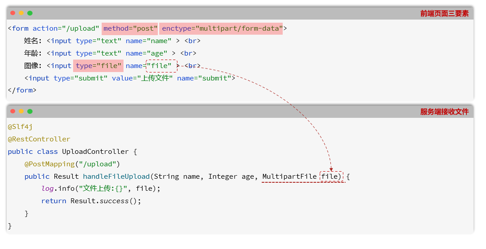

# 结合SpringBoot进行文件传输

- 文件传输是 Web 开发中的常见需求，主要分为 **上传**（客户端到服务器）和 **下载**（服务器到客户端）两个场景。核心是利用 HTTP 协议进行数据交换



## ⏫ 文件上传 (前端-> 后端)

- **目标**：用户在浏览器选择本地文件，将其发送并保存到服务器指定位置。

- **核心协议**：HTTP POST 请求

  - `Content-Type`设置为 `multipart/form-data`

    >`Content-Type`：用来告诉客户端服务器发送过来的数据到底是什么类型)

    - 这个的设置是有多种方式的，比如`FormDate`(JS设置方式)和`enctype`(HTML属性设置方式)，下面的笔记中都有提


### 1. 前端

前端负责构建一个包含文件信息的特殊表单请求。

- **HTML 结构**: 使用 `<input type="file">` 标签让用户能够选择文件。

  ```html
  <input type="file" id="fileUploader">
  <button onclick="upload()">上传</button>
  ```

- **JavaScript 逻辑 (现代异步方式)**:

  1. 获取用户选择的文件对象。

  2. 创建一个 `FormData` 对象，它能模拟表单数据的提交，特别适合用于发送文件。

  3. 将文件对象 `append` (追加) 到 `FormData` 实例中。**关键**：这里的 `key` (例如 "file") 必须与后端接收参数的名称一致。

  4. 使用 `fetch` 或 `axios` 发送 POST 请求，将 `FormData` 实例作为请求体 (`body`)。浏览器会自动设置正确的 `Content-Type: multipart/form-data` 和 `boundary`。

     ```js
     async function upload() {
         const uploader = document.getElementById('fileUploader');
         const file = uploader.files[0];
         if (!file) {
             alert("请先选择文件！");
             return;
         }
     
         // 1. 创建 FormData 对象
         const formData = new FormData();
         // 2. 追加文件，key为 "file"
         formData.append('file', file);
     
         // 3. 发送请求
         try {
             const response = await fetch('/api/upload', {
                 method: 'POST',
                 body: formData, // 无需手动设置 Content-Type
             });
             const result = await response.text();
             console.log(result);
             alert("上传成功！");
         } catch (error) {
             console.error("上传失败:", error);
             alert("上传失败！");
         }
     }
     ```

     

  **补充知识：`enctype` vs `Content-Type` 的关系**

  你可能会听到两种说法：设置 `enctype` 和设置 `Content-Type`。它们其实是因果关系：

  - **`enctype="multipart/form-data"` (原因 - HTML指令)**: 当使用传统的HTML `<form>` 标签同步提交文件时，**必须**在 `<form>` 标签上设置此属性。它告诉浏览器：“这个表单包含文件，请用`multipart/form-data`格式编码后再发送。”

    ```html
    <form action="/api/upload" method="post" enctype="multipart/form-data">
      <input type="file" name="file">
      <button type="submit">传统方式上传</button>
    </form>
    ```

  - **`Content-Type: multipart/form-data` (结果 - HTTP请求头)**: 浏览器收到 `enctype` 指令后，或是在JavaScript中使用 `FormData` 对象时，它会在实际发送的HTTP请求中，自动添加这个请求头。

  在笔记的JS示例中，我们使用 `FormData`，浏览器会自动处理这一切，所以我们**无需手动设置** `Content-Type`。总而言之，`enctype` 是给浏览器的指令，`Content-Type` 是浏览器执行指令后在HTTP请求中附加的结果。

  

### 2. 后端

后端需要配置一个接口来接收 `multipart/form-data` 请求并处理文件数据。

- **Controller 接口**:

  1. 使用 `@PostMapping` 注解定义一个处理 POST 请求的端点。

  2. 使用 `@RequestParam("file")` 注解来接收文件。**参数类型为 `MultipartFile`**(Spring提供)，Spring 会自动将请求中的文件数据封装到这个对象里。`@RequestParam` 的值 ("file") 必须与前端 `FormData` 的 `key` 匹配。

  3. `MultipartFile` 对象提供了获取文件名 (`getOriginalFilename()`)、文件大小 (`getSize()`)、输入流 (`getInputStream()`) 等多种方法

     >**`getOriginalFilename()`**：获取的是**文件本身的名字**
     >
     >**`getName()`**：获取的是**表单里 `<input>` 标签的名字**

  4. 最简单的方法是使用 **`transferTo(dest)`** 将上传的文件直接保存到服务器的目标文件路径

     > 我起初以为这个路径中最后的名字必须要和原文件的名字相同才能成功，结果并不是，这个是直接写了一个目标路径，直接到那个目标路径，如果重名直接覆盖

- **Java 代码示例**:

  ```java
  import org.springframework.web.bind.annotation.PostMapping;
  import org.springframework.web.bind.annotation.RequestParam;
  import org.springframework.web.bind.annotation.RestController;
  import org.springframework.web.multipart.MultipartFile;
  import java.io.File;
  import java.io.IOException;
  import java.nio.file.Paths;
  
  @RestController
  public class FileUploadController {
  
      // 定义文件存储的根目录
      private final String UPLOAD_DIR = "/data/uploads/";
  
      @PostMapping("/api/upload")
      public String handleFileUpload(@RequestParam("file") MultipartFile file) {
          if (file.isEmpty()) {
              return "上传失败：文件为空。";
          }
  
          try {
              // 确保上传目录存在
              File uploadDir = new File(UPLOAD_DIR);
              if (!uploadDir.exists()) {
                  uploadDir.mkdirs();
              }
  
              // 构建目标文件路径
              String fileName = file.getOriginalFilename();
              File dest = new File(UPLOAD_DIR + fileName);
  
              // 保存文件
              file.transferTo(dest);
  
              return "文件上传成功，路径: " + dest.getAbsolutePath();
  
          } catch (IOException e) {
              e.printStackTrace();
              return "文件上传失败: " + e.getMessage();
          }
      }
  }
  ```

  

- **配置与常见问题：文件大小限制**

  - 如果你在上传文件时遇到 `org.springframework.web.multipart.MaxUploadSizeExceededException` 异常，这意味着上传的文件大小超过了Spring Boot的默认限制

    - **解决方案**是在 `application.properties` 文件中明确指定文件大小限制。通常需要同时配置以下两个属性：

      ```properties
      # application.properties
      
      # 设置单个文件的最大大小，例如50MB
      spring.servlet.multipart.max-file-size=50MB
      
      # 设置单次请求的总最大大小（如果一次上传多个文件），例如50MB
      spring.servlet.multipart.max-request-size=50MB
      ```

      

      - **这两个配置项的区别：**

        - `spring.servlet.multipart.max-file-size`: **限制单个文件的最大尺寸**。
          - 默认值为 `1MB`

        - `spring.servlet.multipart.max-request-size`: **限制单次HTTP请求的总大小**。
          - 这包括了所有上传的文件以及其他表单文本数据。
          - 默认值为 `10MB`


### 良好实践

#### 文件名唯一

- 为了让保存的文件的文件名唯一，我们通常会采用UUID生成唯一的文件名，用时间作为文件夹路径


## ⏬ 文件下载 (后端-> 前端)

**目标**：用户点击链接或按钮，浏览器从服务器获取文件并提示用户保存。

**核心协议**：HTTP GET 请求，后端设置特殊的 **响应头 (Headers)** 来告诉浏览器如何处理响应体。


### 1. 后端

后端负责读取文件资源，并将其作为响应流返回。

- **Controller 接口**:

  1. 使用 `@GetMapping` 定义一个下载端点，通常会接受一个文件名或文件ID作为路径变量。
  2. 根据传入的标识符，定位到服务器上的物理文件。
  3. 将文件封装成一个 `Resource` 对象（例如 `UrlResource` 或 `ByteArrayResource`）。
  4. 构建一个 `ResponseEntity<Resource>` 作为返回值。这是控制响应状态码、响应头和响应体的关键。
  5. **设置关键的响应头**:
     - `Content-Type`: `application/octet-stream`，这是一个通用的二进制MIME类型，告诉浏览器这是一个需要下载的二进制文件。
     - `Content-Disposition`: `attachment; filename="your-file-name.ext"`，这是最重要的头。`attachment` 指示浏览器触发下载动作，而不是试图在页面内展示它。`filename` 指定了下载时默认保存的文件名。

- **Java 代码示例**:

  ```java
  import org.springframework.core.io.Resource;
  import org.springframework.core.io.UrlResource;
  import org.springframework.http.HttpHeaders;
  import org.springframework.http.MediaType;
  import org.springframework.http.ResponseEntity;
  import org.springframework.web.bind.annotation.GetMapping;
  import org.springframework.web.bind.annotation.PathVariable;
  import org.springframework.web.bind.annotation.RestController;
  import java.net.MalformedURLException;
  import java.nio.file.Path;
  import java.nio.file.Paths;
  
  @RestController
  public class FileDownloadController {
  
      private final Path fileStorageLocation = Paths.get("/data/uploads/").toAbsolutePath().normalize();
  
      @GetMapping("/api/download/{fileName:.+}")
      public ResponseEntity<Resource> downloadFile(@PathVariable String fileName) {
          try {
              Path filePath = this.fileStorageLocation.resolve(fileName).normalize();
              Resource resource = new UrlResource(filePath.toUri());
  
              if (!resource.exists()) {
                  // 如果文件不存在，可以返回 404
                  return ResponseEntity.notFound().build();
              }
  
              // 设置响应头
              return ResponseEntity.ok()
                  .contentType(MediaType.APPLICATION_OCTET_STREAM)
                  .header(HttpHeaders.CONTENT_DISPOSITION, "attachment; filename=\"" + resource.getFilename() + "\"")
                  .body(resource);
  
          } catch (MalformedURLException ex) {
              return ResponseEntity.badRequest().build();
          }
      }
  }
  ```


### 2. 前端

前端负责触发下载动作。

- **方法一：简单的 `<a>` 标签 (最常用)** 直接将下载链接指向后端的API端点。添加 `download` 属性可以增强浏览器兼容性，并可以指定一个不同于原始链接的文件名。

  ```html
  <a href="/api/download/report.pdf" download="年度报告.pdf">下载年度报告</a>
  ```

- **方法二：JavaScript 动态触发 (适用于需要鉴权或动态生成文件的场景)**

  1. 使用 `fetch` 请求后端的下载API。
  2. 获取响应 (`response`) 后，调用 `.blob()` 方法将其转换为 Blob (二进制大对象)。
  3. 使用 `URL.createObjectURL(blob)` 为这个 Blob 在内存中创建一个临时的 URL。
  4. 动态创建一个 `<a>` 标签，将其 `href` 设置为这个临时 URL，并设置 `download` 属性为期望的文件名。
  5. 用代码模拟点击这个 `<a>` 标签 (`a.click()`) 来触发下载。
  6. 下载完成后，通过 `URL.revokeObjectURL(url)` 释放内存。

  ```js
  async function downloadFile(fileName) {
      try {
          const response = await fetch(`/api/download/${fileName}`);
          if (!response.ok) throw new Error('文件下载失败');
  
          const blob = await response.blob();
          const url = window.URL.createObjectURL(blob);
  
          const a = document.createElement('a');
          a.style.display = 'none';
          a.href = url;
          a.download = fileName; // 设置下载的文件名
  
          document.body.appendChild(a);
          a.click();
  
          // 清理
          window.URL.revokeObjectURL(url);
          document.body.removeChild(a);
  
      } catch (error) {
          console.error(error);
          alert(error.message);
      }
  }
  ```

