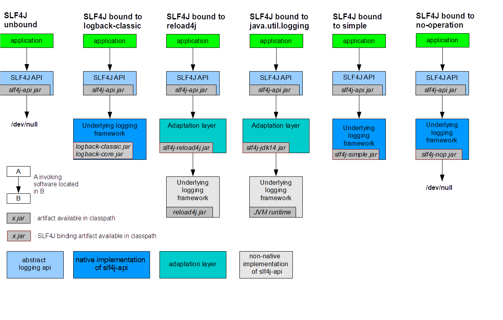
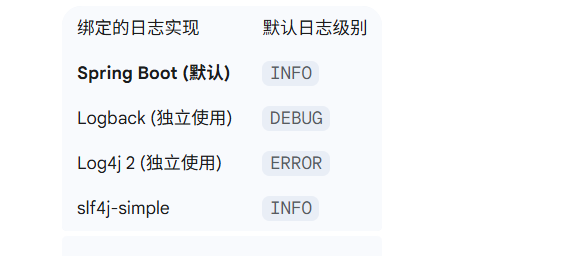

# Java日志框架概述

Java世界中，有众多**日志框架** 可供我们使用。它们共同构成了一个复杂但有序的生态系统。

理解这个生态的关键在于区分两类角色：

- **日志门面 (Logging Facade)**：定义一套标准的API接口，是应用程序应该直接依赖的“规范”
  - **代表**：**SLF4J**
- **日志实现 (Logging Implementation)**：负责真正执行日志记录工作的框架
  - **代表**：**Logback**, **Log4j 2**, **Log4j 1**, **JUL** 等

Java开发崇尚“面向门面编程”，即代码依赖于SLF4J，而具体的实现（如Logback）可以在部署时灵活替换


# 《日志共和国编年史》

> 为了更好地理解这些框架之间的关系，这里编写了一个映射现实的小说故事来回顾这段波澜壮阔的历史


## 序章：手工作坊时代

​	在大陆的早期，日志的记录方式全凭手工作坊式的自觉。工匠们（开发者）普遍使用一种名为 **`System.out.println`** 的古老工具
​	它就像一支**鹅毛笔，简单易得，人人会用**
​	然而，随着城镇规模的扩张和贸易的繁荣，这种手工作坊的弊端暴露无遗：**档案记录杂乱无章，无法分类归档，无法控制记录的详略，更无法在不中断城镇运作的情况下进行调整**
​	整个大陆的档案系统，亟需一场**工业革命**


## 第一卷：第一次工业革命：Log4j印刷机的轰鸣

**核心技术：Log4j 1 (第一代印刷机)** 	**关键人物：Ceki Gülcü  (伟大的发明家)**

​	就在此时，一位名叫**Ceki Gülcü**的伟大发明家，在**Apache**这家享誉大陆的科技协会中，发明了第一台真正意义上的自动化印刷机——**Log4j**

- 这台机器彻底改变了档案记录的方式，它拥有一套完整的生产线：

  - **Logger (信息采集器)**：负责从城镇的各个角落收集需要记录的信息	

  - **Appender (输出终端)**：负责将信息印刷到不同的媒介上，可以是报纸（控制台）、档案册（文件），甚至是公告牌（数据库）

  - **Layout (排版系统)**：负责设定统一的印刷格式，让档案清晰、规范

​	Log4j印刷机的出现，标志着日志记录进入了**工业化时代**。它的强大与灵活性，迅速被大陆各地的城镇所采纳。**Log4j 1**，作为这场革命的先驱，成为了那个时代无可争议的技术标杆


## 第二卷：官僚主义的泥潭与皇家法令

**相关体系：JCL (低效的中央档案局) & JUL (空洞的皇家法令)**

Log4j 1虽好，但它将“设计图纸”（API）和“机器本身”（实现）捆绑在一起，不够开放

> **什么是“API与实现绑定”？(Log4j 1的方式)**
>
> - 简单来说，就是**应用程序代码，直接“认识”并“依赖”了那个具体的日志框架本身**
>
>   - 示例
>
>     ```java
>     // 注意这里的 import 语句
>     import org.apache.log4j.Logger;
>             
>     public class MyOldService {
>         // 这里直接从 Log4j 的类获取 Logger 实例
>         private static final Logger logger = Logger.getLogger(MyOldService.class);
>             
>         public void doSomething() {
>             // 调用 Log4j Logger 的方法
>             logger.info("这是一个使用 Log4j 1 的日志");
>         }
>     }
>     ```
>
>     - **问题出在哪里？**
>
>       1. **代码被“锁死”了**：请看 `import org.apache.log4j.Logger;` 这一行。它意味着 `MyOldService` 这个类，从出生起就和 `log4j.jar` 这个具体的实现包“锁死”在了一起。
>       2. **更换成本极高**：
>          - 现在，假设您想把日志系统从 Log4j 1 换成更现代的 Logback 。您会发现这是一场灾难。因为您必须：
>            1. 找到项目中所有类似 `MyOldService` 的文件
>            2. 手动把 `import org.apache.log4j.Logger;` 改成 `import ch.qos.logback.classic.Logger;` (Logback的类)
>            3. 可能还要修改获取 Logger 的方式
>            4. 在一个大型项目中，这涉及到成百上千个文件的修改，工作量巨大且极易出错
>     
>     - **什么是“API与实现分离”？(SLF4J的方式)**
>     
>       - 现在，我们来看一下 **遵循SLF4J“共和国标准”的代码** 是什么样的：
>     
>         ```java
>         // 注意这里的 import 语句，它来自 SLF4J 标准
>         import org.slf4j.Logger;
>         import org.slf4j.LoggerFactory;
>                         
>         public class MyNewService {
>             // 通过 SLF4J 这个“国家标准”的工厂来获取 Logger 实例
>             private static final Logger logger = LoggerFactory.getLogger(MyNewService.class);
>                         
>             public void doSomething() {
>                 // 调用 SLF4J Logger 的方法
>                 logger.info("这是一个使用 SLF4J 标准的日志");
>             }
>         }
>         ```
>     
>         - **区别在哪里？**
>           1. **代码面向“标准”**：请看 `import org.slf4j.Logger;`。`MyNewService` 这个类，它只认识SLF4J这个“国家标准”，它根本**不知道、也不关心**背后到底是哪个“印务局”（Logback还是Log4j 2）在干活
>           2. **更换极其灵活**：现在，如果您想把日志系统从Logback换成Log4j 2，您需要做什么呢？
>              - **一行代码都不用改！**
>              - 您只需要在您的项目配置文件（如Maven的`pom.xml`）里，把Logback的依赖包换成Log4j 2的依赖包

​	大陆上也有其他小作坊在尝试制造自己的记录工具

​	为了统一管理，Apache协会成立了一个“中央档案局”——**JCL (Jakarta Commons Logging)**

​	JCL的本意是建立一个统一的调度中心，无论你用的是Log4j还是别的什么机器，都到我这里来登记，我帮你下达印刷指令

​	然而，这个档案局的规章制度极其繁琐，办事流程又异常复杂。它在运行时通过一套神秘的“官员巡查”机制（复杂的类加载）来寻找具体的印刷机。在结构复杂的巨型都市（如Tomcat等Web容器）里，官员们常常迷路或找错机器，引发各种混乱的“行政事故”（类加载异常），让管理者不胜其烦

​	与此同时，**Java大陆的“皇室” （Sun/Oracle）**也颁布了一套**“皇家档案记录法”**——**JUL (java.util.logging)**，并将其作为大陆的基础法规

​	这套法规出身高贵，无需任何额外支持。可惜，它**条款简单，功能有限**，远不如身经百战的Log4j印刷机来得实用。因此，尽管是官方正统，JUL始终未能真正普及，沦为一纸空文

​	JCL的低效和JUL的无力，让整个大陆都在期盼一个更科学、更现代的标准化体系


## 第三卷：共和国的诞生：SLF4J国家标准

**核心：SLF4J (国家标准) & Logback (中央印务局)** **关键人物：Ceki Gülcü (依旧是他，这次化身为了标准制定者)**

​	此时，那位伟大的发明家**Ceki Gülcü**，在离开Apache协会后，已成为一位深思熟虑的架构宗师。他洞悉了过往所有体系的弊病，带着一个划时代的构想，宣告了“日志共和国”的诞生

​	他没有再造一台更复杂的机器，而是颁布了一部共和国的根本大法——**SLF4J (Simple Logging Facade for Java) 国家标准**

- 这部标准的核心思想，振聋发聩：**“标准与实现必须分离！”**

  - **SLF4J** 本身就是这部标准，它只定义了最清晰、最简单的“信息记录接口”，它不生产任何实体机器。共和国所有的应用程序，都应该遵循这套统一标准进行开发

  - **Logback**：为了完美践行SLF4J标准，Ceki宗师亲自督造并成立了共和国的“**中央印务局**”——**Logback**。这家机构是SLF4J标准的**原生、模范实现**。它的生产线（代码）彻底革新了Log4j 1的陈旧设计，**性能更卓越、配置更灵活、设计更现代化**。作为共和国的“样板工厂”，Logback与SLF4J标准无缝对接，协同工作效率极高，成为了新时代的典范

​	SLF4J标准的稳定可靠（静态绑定）彻底解决了JCL的行政混乱

​	更妙的是，它还培养了一批“外交特使”——**桥接包**。这些特使（如`jcl-over-slf4j`）能完美模仿旧官僚机构的语言和行为，将发给旧体系的指令，和平地转交给SLF4J标准委员会，最终由Logback等现代化机构来执行。至此，共和国用智慧实现了大陆日志体系的统一


## 第四卷：新工业巨头：Log4j 2的崛起

**核心技术：Log4j 2 (新一代工业巨头)** **关键人物：Apache Software Foundation (锐意进取的科技协会)**

​	眼看SLF4J共和国的标准化运动如火如荼，Apache协会不甘落后。他们决心放下昔日的荣耀，集结顶尖人才，将Log4j 1的旧工厂彻底拆除，在一片废墟上建立起了一座崭新的、技术力惊人的工业巨头——**Log4j 2**

​	Log4j 2与它的前辈除了名字，已是云泥之别

- 它是一家装备了未来科技的超级工厂，拥有两大核心技术：
  1. **异步生产线 (Async Loggers)**：能以超高效率处理海量信息，对主程序的运行几乎不产生任何阻塞
  2. **无废料工艺 (Garbage-free)**：在生产过程中能避免产生临时性的内存废料，极大地减轻了城市的环境压力（GC）

​	这位强大的新巨头，不仅拥有自己一套更先进、更丰富的“企业内部标准”（自有API），也同样拥护并兼容SLF4J国家标准，愿意承接来自共和国的订单

​	自此，大陆的日志产业形成了两大主流选择：**SLF4J标准 + Logback中央印务局**的官方标配组合，以及**SLF4J标准 + Log4j 2超级工厂**的高性能组合


## 番外：历史的守护者与世外桃源

**相关体系：Reload4j (历史档案馆修复员) & tinylog (自给自足的田园社区)**

- 在共和国的繁荣年代，历史的印记与别样的生活方式依然并存

  - **Reload4j**：Log4j 1的旧印刷机虽已停产，但许多历史悠久的图书馆（遗留系统）仍在使用。当一场名为“Log4Shell”的大火（安全漏洞）威胁到这些珍贵档案时，一群社区志愿者挺身而出，成立了Reload4j项目。他们如同历史档案馆的修复员，不改变旧机器的结构，只为其更换老化的零件、加固防火墙，守护着这些珍贵的历史遗产

  - **tinylog**：并非所有人都向往大都市的工业化生活。在大陆的某个角落，有一个名为**tinylog**的田园社区。这里的人们崇尚极简主义，他们使用的工具小巧而高效，自给自足，无需依赖共和国复杂的标准化基础设施。他们选择不接入SLF4J标准，正是为了保持这份独特的、纯粹的宁静


## 尾声：共和国的基石

​	如今的日志共和国，秩序井然。一部无形的宪法已成为所有建设者（开发者）的共识：

​	**“面向标准(SLF4J)设计，而非面向机器(实现)制造。”**

​	这便是日志共和国演进史留给我们的宝贵财富。它告诉我们，依赖于一个稳定、开放的标准，才能构建出灵活、健壮、面向未来的伟大工程


# 日志框架现代推荐

- **黄金组合**：**SLF4J (门面) + Logback (实现)**
  - 这是最稳定、最常用、**社区支持最广泛**的组合，适用于绝大多数项目。**Spring Boot默认就采用此组合**
- **性能组合**：**SLF4J (门面) + Log4j 2 (实现)**
  - 当**应用对高吞吐量、低延迟有极致要求时（如金融、电商高并发场景）**，推荐使用此组合，并开启其强大的异步日志功能
- **统一管理**：善用SLF4J的**桥接包**（如`jcl-over-slf4j`），将项目中其他第三方库使用的旧日志框架，统一桥接到SLF4J进行管理


# 日志级别

## 1. 核心概念：为什么需要日志级别？

- 在软件开发和运维中，日志是追踪程序行为、诊断问题和监控系统状态的关键工具。但是，并非所有日志信息都同等重要

  - **开发时**，我们需要极其详细的信息来调试代码，比如每个方法的入参、出参、循环中变量的值

  - **生产环境**，我们只关心关键的运行状态和错误信息。如果记录所有细节，日志文件会迅速膨胀，不仅浪费磁盘空间，还会淹没真正有用的警告和错误，导致问题排查效率低下

- **日志级别（Logging Level）** 就是为了解决这个问题而设计的 **过滤器**。它为每一条日志信息赋予一个“重要性等级”，允许我们通过简单的配置，来精确控制在不同环境下应该输出哪些日志，而无需修改任何代码

- **核心作用：**

  - **控制输出粒度**：在开发、测试、生产环境中灵活切换日志的详细程度

  - **提升系统性能**：在生产环境关闭不必要的低级别日志（如 `DEBUG`），减少因日志I/O操作带来的性能损耗。

  - **快速定位问题**：在高优先级的日志（如 `ERROR`）中快速找到问题根源

    

## 2. 通用日志级别(优先级由低到高)

- 不同的日志框架（Log4j2, Logback 等）都遵循一套相似的级别体系

  | 级别      | 优先级 | 何时使用？（场景与目的）                                     | 示例                                                         |
  | --------- | ------ | ------------------------------------------------------------ | ------------------------------------------------------------ |
  | **TRACE** | 最低   | **追踪细节**：用于输出比 `DEBUG` 更细致的流程信息。通常只在需要深入诊断特定、复杂问题时短暂开启 | `进入了 for 循环的第 i 次迭代，值为...`、`方法开始执行，参数 a=X, b=Y` |
  | **DEBUG** | 低     | **开发调试**：记录用于帮助开发者调试程序的详细信息。这是开发阶段最常用的级别 | `从数据库查询到用户数据: {...}`、`发送的HTTP请求头: {...}`、`计算出的中间变量值是...` |
  | **INFO**  | 中     | **关键信息**：记录程序运行过程中的 **重要事件** 或 **里程碑**，帮助运维人员了解系统的整体运行状态 | `应用程序启动成功，监听端口8080`、`用户 [用户名] 登录成功`、`订单 [订单号] 已成功创建` |
  | **WARN**  | 较高   | **潜在问题**：记录非预期的、可能存在潜在风险的情况，但程序 **仍能继续正常工作**。需要引起注意 | `某个API接口响应缓慢`、`配置文件中缺少某个可选配置，将使用默认值`、`缓存命中率低于预期阈值` |
  | **ERROR** | 高     | **运行时错误**：记录发生了 **影响功能正常使用的错误**，但整个应用还未崩溃。需要立即关注和处理 | `数据库连接失败`、`处理消息时发生空指针异常`、`无法读取必要的配置文件，导致模块加载失败` |
  | **FATAL** | 最高   | **致命错误**：记录导致 **整个应用程序崩溃或无法恢复** 的灾难性错误。一旦发生，程序通常会立即终止 | `JVM 内存溢出 (OutOfMemoryError)`、`关键组件初始化失败，应用无法启动` |


## 3. 级别的过滤规则

- 日志框架的过滤规则非常简单：**只输出级别大于或等于当前设定级别的日志**

  - 假设你在日志配置文件中，将 `com.myapp` 包的日志级别设置为 `INFO`：

    Logger Level = INFO

  - 那么

    | 尝试记录的日志级别  | 是否会输出？ | 原因             |
    | ------------------- | ------------ | ---------------- |
    | `logger.trace(...)` | **否** ❌     | `TRACE` < `INFO` |
    | `logger.debug(...)` | **否** ❌     | `DEBUG` < `INFO` |
    | `logger.info(...)`  | **是** ✅     | `INFO` >= `INFO` |
    | `logger.warn(...)`  | **是** ✅     | `WARN` > `INFO`  |
    | `logger.error(...)` | **是** ✅     | `ERROR` > `INFO` |


## 4. 最佳实践与代码示例

### 如何选择合适的级别？

- **开发环境**：通常设置为 `DEBUG`，以便获取最详细的调试信息
- **测试环境**：可以设置为 `INFO` 或 `DEBUG`，取决于测试需求
- **生产环境**：**强烈建议** 设置为 `INFO` 或 `WARN`。这样既能监控系统状态，又能避免日志泛滥，同时还能确保所有错误都被记录下来


### 代码示例 (使用 SLF4J API)

```java
import org.slf4j.Logger;
import org.slf4j.LoggerFactory;

public class PaymentService {

    // 1. 获取一个 Logger 实例
    private static final Logger logger = LoggerFactory.getLogger(PaymentService.class);

    public void processPayment(String orderId, double amount) {
        // TRACE: 记录非常详细的流程，用于深度调试
        logger.trace("Entering processPayment method for orderId: {} with amount: {}", orderId, amount);

        if (orderId == null || orderId.trim().isEmpty()) {
            // WARN: 记录潜在问题，但不影响主流程
            logger.warn("Payment processing attempted with an invalid orderId.");
            return;
        }

        // DEBUG: 记录开发调试所需的过程信息
        logger.debug("Attempting to lock order {} for payment processing.", orderId);

        try {
            // ... 模拟支付逻辑 ...
            if (amount < 0) {
                throw new IllegalArgumentException("Payment amount cannot be negative.");
            }
            Thread.sleep(50); // 模拟耗时操作

            // INFO: 记录关键的业务里程碑
            logger.info("Payment for order {} of amount {} completed successfully.", orderId, amount);

        } catch (IllegalArgumentException e) {
            // ERROR: 记录可预见的、影响功能的错误
            logger.error("Invalid payment amount for order {}. Details: {}", orderId, e.getMessage());
        } catch (Exception e) {
            // ERROR: 记录意外的、导致功能失败的通用错误
            // 注意：通常会把异常对象 e 作为最后一个参数传入，日志框架会自动打印堆栈信息
            logger.error("An unexpected error occurred while processing payment for order: {}", orderId, e);
        }
    }
}
```


# SLF4J

## SLF4J 是什么？

- **SLF4J** 的全称是 **Simple Logging Facade for Java**（Java 简单日志门面）

  - 它**不是**一个具体的日志实现框架，而是一个**抽象层**或**门面 (Facade)**。它的核心使命是为各种不同的日志实现（如 Logback, Log4j 2, JUL 等）提供一个统一、简单的API接口

    > 类似于接口

- **核心思想：面向接口编程**

  - SLF4J 将Java日志体系清晰地划分为两层：

    - **API 层 (门面)**：你的应用程序代码应该只依赖于 SLF4J 的 API (`slf4j-api.jar`)。

    - **实现层 (绑定)**：在项目运行时，你可以插入任何一个具体的日志实现框架（如 `logback-classic.jar`）。

  - 这种设计实现了应用程序与具体日志框架的**解耦 (Decoupling)**，提供了极大的灵活性


## 选择 SLF4J 的原因

- 使用SLF4J作为日志门面，已经成为现代Java开发的“事实标准”，因为它带来了四大核心优势：

  - **统一日志体系**： 在一个复杂的项目中，你可能会依赖多个第三方库，而这些库可能使用了不同的日志框架。SLF4J通过**桥接包 ** 可以将所有这些日志的输出重定向到你选择的唯一实现上，从而实现统一管理

  - **灵活性与可插拔性**： 由于你的代码只依赖于SLF4J的API，你可以随时更换底层的日志实现（比如从 Logback 切换到 Log4j 2 ），而**无需修改任何一行应用程序代码**。只需要在项目依赖中更换相应的JAR包即可

- **性能优势：参数化日志**： SLF4J 提供了**占位符 `{}` 语法**，这是它最受欢迎的特性之一

  ```java
  // 不推荐的方式：无论日志级别是否开启，都会进行字符串拼接
  logger.debug("Processing user " + userId + " for order " + orderId);
  
  // 推荐的方式：只有在DEBUG级别开启时，才会真正进行字符串格式化
  logger.debug("Processing user {} for order {}", userId, orderId);
  ```

  - 使用占位符可以避免不必要的字符串对象创建和拼接，在高频日志场景下能显著提升性能

- **可靠性**： 

  - SLF4J采用**静态绑定**机制。在应用程序启动时，它会去**类路径下寻找一个具体的日志实现绑定**。如果找不到，会明确地打印警告信息。这比JCL在运行时动态查找的复杂机制要稳定和可靠得多


## 绑定机制



## 核心组件

- SLF4J的生态主要由三类JAR包构成：

  - **API/门面 (`slf4j-api.jar`)** 这是核心的接口包，包含了`org.slf4j.Logger`、`org.slf4j.LoggerFactory`等核心类。
    **项目代码应该只依赖于这个包**

  - **绑定包** 是连接SLF4J门面和具体日志实现的“胶水”或“驱动”。**在一个项目中，有且只能有一个绑定包**
    - `logback-classic.jar`：**推荐**。连接到 **Logback**，是SLF4J的原生实现
    - `log4j-slf4j-impl.jar`：**推荐**。连接到 **Log4j 2**
    - `slf4j-log4j12.jar`：连接到旧的 **Log4j 1.x**（不推荐在新项目中使用）
    - `slf4j-jdk14.jar`：连接到JDK自带的 **java.util.logging (JUL)**
    - `slf4j-simple.jar`：一个极简实现，将日志输出到控制台
    - `slf4j-nop.jar`：一个“无操作”实现，会丢弃所有日志

  - **桥接包 (Bridges)** 这是SLF4J统一江湖的利器。它的作用是**拦截**其他日志框架的API调用，并将其**重定向**到SLF4J
    - `jcl-over-slf4j.jar`：拦截 **JCL** 的调用
    - `log4j-over-slf4j.jar`：拦截 **Log4j 1.x** 的调用
    - `jul-to-slf4j.jar`：拦截 **JUL** 的调用


## `org.slf4j.LoggerFactory`

- `LoggerFactory`是一个**工具类**，它的所有方法都是静态的
- 它的核心职责是**创建和管理`Logger`实例**，并作为SLF4J与具体日志实现绑定的**唯一入口点**

### 核心职责与工作原理

- **生产`Logger`实例** 

  - 这是它最直接、最明显的功能。通过调用其静态方法`getLogger()`，你可以为你的类获取一个专属的`Logger`对象

    ```java
    // 传入Class对象，这是最推荐的方式
    Logger logger = LoggerFactory.getLogger(MyService.class);
    
    // 也可以传入一个自定义的字符串名称
    Logger paymentLogger = LoggerFactory.getLogger("payment.module");
    ```

    - 传入`Class`对象的好处是，`Logger`的名称会自动设置为该类的完全限定名（如`com.mycompany.MyService`），这在配置日志输出时非常方便，可以对不同包或类的日志级别进行精细控制。	


- **执行绑定 (The Binder)** 这是`LoggerFactory`在幕后最重要的工作。当你**第一次**调用`getLogger()`时，它会触发SLF4J的**绑定过程**：
- 它会扫描项目的**类路径 (Classpath)**
  
- 寻找一个名为`org/slf4j/impl/StaticLoggerBinder.class`的特定文件
  
- 这个文件只存在于**SLF4J绑定包**中（如`logback-classic.jar`或`log4j-slf4j-impl.jar`）
  
- 一旦找到，`LoggerFactory`就会加载这个`StaticLoggerBinder`类，并由它返回一个具体的`ILoggerFactory`实现（比如Logback的`LoggerContext`）
  
- 此后，所有`Logger`的创建工作都将委托给这个具体的工厂来完成
  
- 这个过程只在第一次调用时发生，后续调用会直接使用已建立的绑定关系，效率非常高。


## 使用方法与代码

### 获取 Logger 实例

- 推荐在每个类中创建一个私有、静态、`final`的`Logger`实例

  ```java
  import org.slf4j.Logger;
  import org.slf4j.LoggerFactory;
  
  public class MyService {
      private static final Logger logger = LoggerFactory.getLogger(MyService.class);
      // ...
  }
  ```

  


### 不同的日志级别



- SLF4J支持五个标准的日志级别，从低到高依次是：

  - **TRACE** < **DEBUG** < **INFO** < **WARN** < **ERROR**

    ```java
    logger.trace("A TRACE message."); 	// 最详细的追踪信息
    logger.debug("A DEBUG message."); 	// 用于开发调试
    logger.info("An INFO message.");  	// 关键的业务流程信息
    logger.warn("A WARN message.");   	// 潜在的问题或警告
    logger.error("An ERROR message."); 	// 发生了错误
    ```

    

### 使用参数化日志

- 使用`{}`占位符能提高性能，是因为它实现了**“懒加载”或“延迟计算”**，避免了在日志级别未开启时，进行不必要的字符串拼接和对象创建

  ```java
  String user = "Alice";
  int age = 30;
  String city = "Wonderland";
  
  // 使用占位符 {}
  logger.info("User {} is {} years old and lives in {}.", user, age, city);
  ```


### 记录异常信息

- 当记录异常时，应将`Throwable`对象作为**最后一个参数**传入，它**不对应**任何`{}`占位符

  ```java
  try {
      // ... some code that throws exception
  } catch (Exception e) {
      // 正确用法：异常信息会以堆栈跟踪的形式被完整记录
      logger.error("An error occurred while processing the request for user {}", user, e);
  }
  ```

  


## Mapped Diagnostic Context (MDC)

- **MDC** 是SLF4J提供的一个强大功能，它允许你将一些上下文信息（如用户ID、请求ID、会话ID等）放入一个与**当前线程绑定**的Map中。这些信息可以在日志输出时被自动打印出来，极大地便利了分布式系统中的日志追踪和问题排查


### 使用方法

```java
import org.slf4j.MDC;

// 在请求处理开始时，放入上下文信息
MDC.put("requestId", "req-12345");
MDC.put("userId", "user-alice");

try {
    logger.info("User service started.");
    // ... 业务逻辑 ...
    logger.info("User service finished.");
} finally {
    // 在请求处理结束时，务必清空 MDC，防止内存泄漏和信息污染
    MDC.clear();
}
```


### 配置输出

- 你需要在**具体的日志实现**（如Logback）的配置文件中，通过 `%X{key}` 的方式来指定输出MDC中的信息

  - 例如，在Logback的`logback.xml`中：

    ```java
    <pattern>%d{HH:mm:ss.SSS} [%thread] %-5level %logger{36} [ReqID: %X{requestId}, User: %X{userId}] - %msg%n</pattern>
    ```

  - 输出的日志就会像这样： `14:30:00.123 [main] INFO  c.e.MyService [ReqID: req-12345, User: user-alice] - User service started.`


# Logback

## Logback 是什么？

- **Logback** 是一个强大、成熟的**日志实现 (Logging Implementation)** 框架。它由SLF4J的创始人Ceki Gülcü设计，被视为**Log4j 1.x的继任者**

- **核心定位：SLF4J的原生实现**

- Logback 与 SLF4J 是天作之合

  - 它的核心`Logger`类直接实现了SLF4J的`Logger`接口，因此当它们配合使用时，不存在任何额外的转换开销，性能和集成度都是最佳的

    > **Spring Boot默认就采用 `SLF4J + Logback` 这套黄金组合**
  


## Logback 的核心优势

- **原生实现SLF4J**：与SLF4J无缝集成，零性能损耗
- **卓越的性能**：经过深度优化，比Log4j 1.x更快，内存占用更低
- **自动重载配置**：当配置文件被修改后，Logback可以自动重新加载，无需重启应用程序，这在生产环境中调试非常方便
- **强大的过滤功能**：可以基于各种条件（如日志级别、MDC内容、时间等）对日志进行精细过滤
- **丰富的特性**：
  - **日志归档与压缩**：能自动按时间或大小滚动日志文件，并对旧文件进行压缩
  - **SiftingAppender**：一个非常强大的Appender，可以根据MDC中的值动态地将日志分离到不同的文件中（例如，为每个用户生成一个单独的日志文件）
  - **条件化配置**：支持在配置文件中使用`if-then-else`逻辑，实现更灵活的配置


## Logback 的核心架构

- Logback主要由三个核心组件构成，这与经典的日志框架设计一脉相承：

  - **`Logger` (日志记录器)**
    - **作用**：负责**发起**日志记录请求
    - **特性**：`Logger`是分层的，并且有继承关系。例如，名为`com.mycompany.service`的Logger会继承其父级`com.mycompany`的配置。所有Logger最终都继承自**root logger**

  - **`Appender` (输出目的地)**
    - **作用**：负责**写入**日志。它决定了日志最终被发送到哪里
    - **常见Appender**：
      - **`ConsoleAppender`**：输出到控制台 (`System.out`或`System.err`)
      - **`FileAppender`**：输出到单个文件
      - **`RollingFileAppender`**：**最常用**的Appender，可以根据策略滚动日志文件，例如按天或按文件大小

  - **`Encoder` (格式化器)**
    - **作用**：负责将日志事件**格式化**成字符串，并将其转换为字节流写入到输出介质
    - **常见Encoder**：
      - **`PatternLayoutEncoder`**：**最常用**的Encoder，允许你通过一个灵活的模式字符串来定义日志的输出格式

- 这三者的关系是：`Logger`产生日志事件，`Appender`将事件写入目的地，而`Encoder`在此过程中负责格式化。一个`Logger`可以关联多个`Appender`


## 配置文件 `logback.xml`

- Logback主要通过XML文件进行配置。它会按以下顺序在类路径下查找配置文件：

  1. `logback-test.xml` (主要用于测试环境)
  2. `logback.groovy` (使用Groovy脚本配置)
  3. `logback.xml` (最常用的XML配置)

  - 如果都找不到，Logback会默认配置一个`ConsoleAppender`。


###  `logback.xml` 示例

- 这是一个非常典型的**生产级`logback.xml`配置**，包含了控制台输出和文件滚动输出

```xml
<?xml version="1.0" encoding="UTF-8"?>
<configuration scan="true" scanPeriod="30 seconds">

    <!-- 定义变量，方便复用 -->
    <property name="LOG_PATTERN" value="%d{yyyy-MM-dd HH:mm:ss.SSS} [%thread] %-5level %logger{36} - %msg%n" />
    <property name="LOG_PATH" value="./logs" />

    <!-- 1. 控制台Appender (ConsoleAppender) -->
    <appender name="CONSOLE" class="ch.qos.logback.core.ConsoleAppender">
        <encoder>
            <pattern>${LOG_PATTERN}</pattern>
            <charset>UTF-8</charset>
        </encoder>
    </appender>

    <!-- 2. 文件滚动Appender (RollingFileAppender) -->
    <appender name="FILE" class="ch.qos.logback.core.rolling.RollingFileAppender">
        <!-- 当前日志文件的路径和名称 -->
        <file>${LOG_PATH}/application.log</file>

        <!-- 滚动策略：基于时间的滚动 -->
        <rollingPolicy class="ch.qos.logback.core.rolling.TimeBasedRollingPolicy">
            <!-- 归档文件的命名模式 -->
            <fileNamePattern>${LOG_PATH}/application-%d{yyyy-MM-dd}.%i.log</fileNamePattern>
            <!-- 保留30天的日志文件 -->
            <maxHistory>30</maxHistory>
            <!-- 当单个文件大小超过10MB时，在当天内进行滚动（%i会自动递增） -->
            <timeBasedFileNamingAndTriggeringPolicy class="ch.qos.logback.core.rolling.SizeAndTimeBasedFNATP">
                <maxFileSize>10MB</maxFileSize>
            </timeBasedFileNamingAndTriggeringPolicy>
        </rollingPolicy>

        <encoder>
            <pattern>${LOG_PATTERN}</pattern>
            <charset>UTF-8</charset>
        </encoder>
    </appender>

    <!-- 3. 配置具体的Logger -->
    <!-- 为特定的包设置日志级别，这里将com.mycompany的日志级别设为DEBUG -->
    <logger name="com.mycompany" level="DEBUG" additivity="false">
        <appender-ref ref="CONSOLE" />
        <appender-ref ref="FILE" />
    </logger>

    <!-- 4. 配置根Logger (root) -->
    <root level="INFO">
        <appender-ref ref="CONSOLE" />
        <appender-ref ref="FILE" />
    </root>

</configuration>
```


### 配置文件关键点解释

- **`<configuration>`**：根节点。`scan="true"`表示开启自动重载
- **`<property>`**：定义变量
- **`<appender>`**：定义一个输出目的地。`name`属性是其唯一标识，`class`属性指定其类型
- **`<encoder>`与`<pattern>`**：定义日志格式。常用格式化字符：
  - `%d`: 日期
  - `%thread`: 线程名
  - `%-5level`: 日志级别，左对齐，占5个字符
  - `%logger{36}`: Logger名称，最长36个字符
  - `%msg` 或 `%message`: 日志消息
  - `%n`: 换行符
  - `%X{key}`: 输出MDC中指定key的值
- **`<logger>`**：
  - 为某个具体的包或类配置日志。`level`指定级别，`additivity="false"`表示日志不再向上传递给父级Logger，避免重复打印

- **`<root>`**：根Logger，是所有Logger的祖先。它必须有一个`level`属性


### 解密:Logback如何处理它的XML

#### 如何处理

- 这个过程的“魔法”发生在Logback框架的**内部代码**中
  1. **启动与发现**：当你的应用程序（例如一个Spring Boot应用）启动时，Logback的库代码会被加载和初始化。它内部有一个叫做 `ContextInitializer` 的类，这个类的任务就是在你的项目**classpath（类路径）**下查找它认识的配置文件。它会按顺序寻找 `logback-test.xml`，然后是 `logback.groovy`，最后是 `logback.xml`
  2. **使用专用的解析器**：当 `ContextInitializer` 找到了 `logback.xml` 文件后，它**不会**使用一个通用的、什么都不知道的XML解析器来读取它。相反，它会启动一个专门为解析Logback配置而生的内部引擎，这个引擎叫做 **Joran**
  3. **Joran：内置的“Schema”**：Joran解析器就是关键。你可以把它想象成一个**硬编码了Logback配置规则的程序**
     - 当Joran读到 `<configuration>` 标签时，它知道这是根元素
     - 当它读到 `<appender>` 标签时，它会立刻查找 `name` 和 `class` 属性，因为它内部的 `AppenderAction` 代码就是这么写的。
     - 当它读到 `<logger>` 标签时，它知道需要一个 `name` 属性和一个 `level` 属性
     - 如果你写了一个它不认识的标签，比如 `<my-random-tag>`，Joran会立刻在控制台打印一个警告或错误，因为它内部的规则集（可以看作是“内置的Schema”）里没有定义这个标签的处理逻辑

- 所以，**是什么引用的它呢？**
  - 是**Logback框架本身**。Schema（规则）没有定义在外部的XSD文件中，而是直接**实现在了Logback的Java代码里**。框架在解析自己的配置文件时，同时完成了验证


#### Logback的XSD文件的用处

- 虽然Logback运行时不需要XSD文件，但Logback官方**确实提供了一个XSD文件**（名为 `joran.xsd`）

  - 这个XSD文件的主要目的**不是为了让Logback框架在运行时使用**，而是为了**方便开发者（也就是我们）**

  - 它的作用在于：
    1. **IDE支持（自动补全和错误提示）**：这 是它最重要的用途。当你在IDE（如IntelliJ IDEA或Eclipse）中打开 `logback.xml` 时，IDE可以检测到这是一个Logback配置文件（或者你手动关联 `joran.xsd`），然后它就会根据XSD文件的定义，为你提供：
       - **代码自动补全**：你输入 `<`，IDE就会提示你可以用的标签有 `appender`, `logger`, `root` 等
       - **属性提示**：在你写 `<appender` 时，它会提示你可用的属性有 `name` 和 `class`
       - **实时错误检查**：如果你把 `appender` 错写成 `apender`，IDE会立刻画出红线，告诉你这个标签无效
    2. **外部验证**：你也可以用这个XSD文件，配合我们之前提到的命令行工具（如`xmllint`）在持续集成（CI）流程中对你的配置文件进行有效性检查，确保没有人提交了格式错误的配置


## 与 Spring Boot 集成

- Spring Boot对Logback提供了完美的自动配置支持

  - **默认配置文件**：Spring Boot会优先加载名为`logback-spring.xml`的配置文件

  - **`<springProfile>`标签**：可以在`logback-spring.xml`中使用这个强大的标签，为不同的环境（如`dev`, `test`, `prod`）配置不同的日志行为

    ```xml
    <!-- 只在dev或test环境生效的Appender -->
    <springProfile name="dev, test">
        <appender name="DEV_CONSOLE" class="ch.qos.logback.core.ConsoleAppender">
            <!-- ... -->
        </appender>
        <root level="DEBUG">
            <appender-ref ref="DEV_CONSOLE" />
        </root>
    </springProfile>
    
    <!-- 只在prod环境生效的Appender -->
    <springProfile name="prod">
        <appender name="PROD_FILE" class="ch.qos.logback.core.rolling.RollingFileAppender">
            <!-- ... -->
        </appender>
        <root level="INFO">
            <appender-ref ref="PROD_FILE" />
        </root>
    </springProfile>
    ```


# Log4j 2

## Log4j 2 是什么？

- **Log4j 2** 是 Apache 基金会对经典的 **Log4j 1.x 的一次彻底重构和升级**。它与前代除了名字，几乎没有任何共同代码，是一个为现代多核、高并发系统设计的全新高性能日志框架

- **核心定位：高性能的日志实现**
  - Log4j 2 不仅仅是一个日志实现，它也拥有自己的一套功能强大的API。虽然它完全可以作为SLF4J的后端实现，但直接使用其原生API可以解锁更多高级功能

- **主要特点**：

  - **性能怪兽**：其核心优势在于强大的**异步日志**能力，吞吐量远超其他日志框架

  - **插件化架构**：极其灵活，几乎所有组件（Appender, Layout, Filter等）都可以通过插件进行扩展

  - **无垃圾日志**：在特定配置下，可以避免或显著减少日志记录过程中创建临时对象，降低GC压力

## Log4j 2 的核心优势

- **超高性能**：通过其**异步Logger**，可以在不阻塞应用主线程的情况下处理日志，极大地提升了应用在高负载下的响应速度
- **可靠性**：不像Log4j 1.x，它在配置出现问题时不会静默失败，而是会打印出详细的错误信息
- **自动重载配置**：与Logback类似，可以监控配置文件并在发生变化时自动应用，无需重启
- **强大的过滤机制**：可以在日志被处理的各个阶段进行过滤，控制非常精细
- **现代化的API**：支持Java 8的Lambda表达式进行懒加载日志，API设计更丰富


## Log4j 2 的核心架构

- Log4j 2的架构同样遵循经典模式，但组件更加清晰和强大：

  - **`Logger` (日志记录器)**
    - 负责创建日志事件（LogEvent）并将其传递给Appender。同样具有分层和继承的特性

  - **`Appender` (输出目的地)**
    - 负责将日志事件发送到最终目的地
    - **常见Appender**：
      - `ConsoleAppender`：输出到控制台
      - `FileAppender`：输出到文件
      - `RollingFileAppender`：**最常用**，根据策略滚动日志文件
      - `AsyncAppender`：将日志事件放入队列，由一个独立的线程来写入目标Appender，是一种简单的异步方式

  - **`Layout` (布局)**
    - 负责将日志事件格式化成字符串。
    - **常见Layout**：
      - `PatternLayout`：**最常用**，通过模式字符串定义输出格式。

  - **`Filter` (过滤器)**
    - 一个非常强大的组件，可以在日志事件被处理前进行拦截和过滤，决定是否放行。过滤器可以配置在全局、Logger或Appender等多个层面


## 配置文件 `log4j2.xml`

- Log4j 2支持多种配置格式（XML, JSO, YAML, Properties），其中XML是最常用和功能最全的。它会在类路径下查找名为`log4j2.xml`的配置文件

### `log4j2.xml` 示例

- 这是一个典型的`log4j2.xml`配置，包含了控制台和文件滚动输出

  ```xml
  <?xml version="1.0" encoding="UTF-8"?>
  <!-- status用于设置Log4j2内部日志的级别。monitorInterval表示自动重载配置的间隔，单位是秒 -->
  <Configuration status="WARN" monitorInterval="30">
  
      <!-- 定义属性，方便复用 -->
      <Properties>
          <Property name="LOG_PATTERN">
              %d{yyyy-MM-dd HH:mm:ss.SSS} [%t] %-5level %logger{36} - %msg%n
          </Property>
          <Property name="LOG_PATH">./logs</Property>
      </Properties>
  
      <!-- 1. 定义Appenders -->
      <Appenders>
          <!-- 控制台Appender -->
          <Console name="Console" target="SYSTEM_OUT">
              <PatternLayout pattern="${LOG_PATTERN}"/>
          </Console>
  
          <!-- 文件滚动Appender -->
          <RollingFile name="File" fileName="${LOG_PATH}/application.log"
                       filePattern="${LOG_PATH}/application-%d{yyyy-MM-dd}-%i.log">
              <PatternLayout pattern="${LOG_PATTERN}"/>
              <Policies>
                  <!-- 按时间滚动：每天创建一个新文件 -->
                  <TimeBasedTriggeringPolicy />
                  <!-- 按大小滚动：当文件大小超过10MB时滚动 -->
                  <SizeBasedTriggeringPolicy size="10 MB"/>
              </Policies>
              <!-- 最多保留30个归档文件 -->
              <DefaultRolloverStrategy max="30"/>
          </RollingFile>
      </Appenders>
  
      <!-- 2. 定义Loggers -->
      <Loggers>
          <!-- 为特定的包设置日志级别 -->
          <Logger name="com.mycompany" level="debug" additivity="false">
              <AppenderRef ref="Console"/>
              <AppenderRef ref="File"/>
          </Logger>
  
          <!-- 根Logger -->
          <Root level="info">
              <AppenderRef ref="Console"/>
              <AppenderRef ref="File"/>
          </Root>
      </Loggers>
  
  </Configuration>
  ```
  
  

### 配置文件关键点解释

- **`<Configuration>`**：根节点。`status`控制Log4j2自身日志的输出级别
- **`<Properties>`**：定义变量
- **`<Appenders>`**：所有Appender的容器
- **`<Loggers>`**：所有Logger配置的容器
- **`<Logger>`**：配置具体的Logger。`name`是包名或类名，`level`是级别，`additivity="false"`作用与Logback中相同，避免日志重复传递
- **`<Root>`**：根Logger的配置
- **`<PatternLayout>`**：格式化模式与Logback非常相似，但也有细微差别（如线程名是`%t`）


## 异步日志：Log4j 2 的王牌特性

- 这是Log4j 2区别于其他框架的核心优势。它提供两种主要的异步模式：

### 异步Appender (`AsyncAppender`)

- **工作方式**：将一个或多个普通的Appender包装起来。日志事件被快速地放入一个内存队列（`BlockingQueue`），然后由一个独立的后台线程从队列中取出并发送给被包装的Appender

- **优点**：配置简单，能提升一定的性能

- **缺点**：只是在I/O写入阶段实现了异步，日志事件的创建等前端操作仍然在应用主线程中，性能提升有限

  ```xml
  <Appenders>
      <!-- 将RollingFile包装成异步 -->
      <Async name="AsyncFile">
          <AppenderRef ref="File"/>
      </Async>
  </Appenders>
  <Root level="info">
      <AppenderRef ref="AsyncFile"/>
  </Root>
  ```

  

### 异步Logger

- **工作方式**：这是**性能最高**的模式。它从根源上改变了日志的处理方式。所有Logger都变成异步的，应用线程调用`logger.info()`时，只是将日志事件的“数据”放入一个高性能的无锁队列（`LMAX Disruptor`）中，然后立即返回。一个独立的后台线程负责从队列中消费数据，并完成日志事件的创建和后续所有处理
- **优点**：极大地降低了日志对应用主线程的性能影响，吞吐量可达Logback的10倍以上
- **如何开启**：
  1. 在项目中添加`disruptor`的依赖
  2. 在JVM启动参数中设置系统属性：`-Dlog4j2.contextSelector=org.apache.logging.log4j.core.async.AsyncLoggerContextSelector`

- **结论：如果选择Log4j 2是为了性能，那么一定要使用“异步Logger”模式**


## 6. 与 Spring Boot 集成

- Spring Boot同样支持Log4j 2

  - **切换方法**：在`spring-boot-starter`或`spring-boot-starter-web`中排除`spring-boot-starter-logging`，然后引入`spring-boot-starter-log4j2`

  - **配置文件**：Spring Boot会自动加载类路径下的`log4j2-spring.xml`或`log4j2.xml`

  - **环境隔离**：在`log4j2-spring.xml`中，可以使用`<SpringProfile>`标签来实现不同环境的配置隔离，用法与Logback中完全相同

​	


# 日常写代码

- 无论您背后选择哪个日志实现（Logback, Log4j 2等），在Java代码中的写法是**完全一样**的
- 只需要和SLF4J这个门面打交道


## 第一步：在项目中配置依赖

- **唯一**需要做出选择的地方。通过在项目的构建配置文件（如Maven的`pom.xml`）中添加依赖，来告诉SLF4J要绑定哪个日志实现

  - **最经典的组合：SLF4J + Logback**

    - 您只需要在`pom.xml`中加入这两个依赖：

      ```xml
      <dependencies>
          <!-- 1. SLF4J 标准 API (您的代码依赖它) -->
          <dependency>
              <groupId>org.slf4j</groupId>
              <artifactId>slf4j-api</artifactId>
              <version>2.0.13</version>
          </dependency>
      
          <!-- 2. Logback 的绑定和实现 (一个包搞定所有) -->
          <dependency>
              <groupId>ch.qos.logback</groupId>
              <artifactId>logback-classic</artifactId>
              <version>1.5.6</version>
          </dependency>
      </dependencies>
      ```

  - **SLF4J+Log4j2**

    - pom中的依赖

      ```xml
      <dependencies>
          <!-- 1. SLF4J 标准 API (您的代码依赖它) -->
          <dependency>
              <groupId>org.slf4j</groupId>
              <artifactId>slf4j-api</artifactId>
              <version>2.0.13</version>
          </dependency>
      
          <!-- 2. Log4j 2 的核心实现 (引擎) -->
          <dependency>
              <groupId>org.apache.logging.log4j</groupId>
              <artifactId>log4j-core</artifactId>
              <version>2.23.1</version>
          </dependency>
      
          <!-- 3. SLF4J 到 Log4j 2 的绑定包 (桥梁) -->
          <dependency>
              <groupId>org.apache.logging.log4j</groupId>
              <artifactId>log4j-slf4j-impl</artifactId>
              <version>2.23.1</version>
          </dependency>
      </dependencies>
      ```

    

  - 配置好依赖后，SLF4J就会自动和Logback绑定


## 第二步：在Java代码中编写日志

- 在Java类中，只需要做两件事：
  1. 通过`LoggerFactory`获取一个`Logger`实例
  2. 使用这个`logger`实例来记录日志

- **代码示例：**

  ```java
  // 1. 导入SLF4J的两个核心类
  import org.slf4j.Logger;
  import org.slf4j.LoggerFactory;
  
  public class UserService {
  
      // 2. 在类的顶部，获取一个私有、静态、final的Logger实例
      //    几乎是所有Java类中使用日志的标准写法
      private static final Logger logger = LoggerFactory.getLogger(UserService.class);
  
      public void registerUser(String username, String password) {
          // 3. 在需要的地方，使用logger实例记录日志
          
          // 使用占位符 {} 来提高性能
          logger.info("开始为用户 {} 创建账户...", username);
  
          if (username == null || username.isEmpty()) {
              logger.warn("警告：尝试注册一个空的用户名。");
              return;
          }
  
          try {
              // ... 执行用户注册的业务逻辑 ...
              // 模拟数据库操作
              Thread.sleep(100); 
  
              logger.info("用户 {} 的账户已成功创建！🎉", username);
  
          } catch (Exception e) {
              // 记录异常时，把异常对象作为最后一个参数传入
              logger.error("为用户 {} 注册时发生严重错误！", username, e);
          }
      }
  }
  ```


# Lombok @Slf4j 注解

## 1. 核心问题：繁琐的样板代码

- 在每一个需要记录日志的 Java 类中，我们都**必须**手动编写一段几乎完全相同的“样板代码”来获取一个 `Logger` 实例：

```java
import org.slf4j.Logger;
import org.slf4j.LoggerFactory;

public class UserService {

    // 每个类都要重复写这一行，非常繁琐！
    private static final Logger logger = LoggerFactory.getLogger(UserService.class);

    public void findUserById(String id) {
        // 使用 logger 记录日志
        logger.info("正在查找用户，ID: {}", id);
        // ...
    }
}
```

- 这段代码不仅重复，而且在复制粘贴时很容易忘记修改 `getLogger()` 中的类名，从而导致日志输出的类源不正确


## 2. 解决方案：`@Slf4j` 注解

- `@Slf4j` 是 **Lombok** 库提供的一个注解。它的唯一作用就是**在编译期间，自动帮你生成上面那行样板代码**

- 通过使用它，你的代码可以变得极其简洁：

  ```java
  import lombok.extern.slf4j.Slf4j;
  
  @Slf4j // 只需在类上加上这个注解
  public class UserService {
  
      public void findUserById(String id) {
          // 你可以直接使用一个名为 `logger` 的变量，就像你已经声明过它一样
          logger.info("正在查找用户，ID: {}", id);
          // ...
      }
  }
  ```

  

### 它是如何工作的？

- Lombok 是一个**编译时注解处理器**。当你编译项目时，Lombok 会介入，扫描所有带其注解的类（如 `@Slf4j`），并根据注解的规则修改类的字节码（`.class` 文件）

- 对于 `@Slf4j`，它会在字节码中自动添加一个名为 `logger` 的 `private static final` 字段。因此，虽然你在源代码（`.java` 文件）中看不到这个字段，但它在编译后的代码中是真实存在的，所以你可以直接使用它


## 3. 如何使用？

- 要让 `@Slf4j` 生效，你需要做两件事：

### 第一步：添加项目依赖

在你的项目构建工具中（如 Maven 或 Gradle），添加 Lombok 依赖

**Maven (`pom.xml`)**

```xml
<dependencies>
    <dependency>
        <groupId>org.projectlombok</groupId>
        <artifactId>lombok</artifactId>
        <version>1.18.30</version> <!-- 使用最新版本 -->
        <scope>provided</scope>
    </dependency>
</dependencies>
```

> **注意**：`scope` 设置为 `provided` 是因为 Lombok 只在编译期需要，运行时并不需要它的库


### 第二步：安装 IDE 插件

- 这是**至关重要**的一步。因为你的源代码中并没有 `logger` 变量的声明，如果不安装插件，你的 IDE（如 IntelliJ IDEA 或 Eclipse）会认为 `logger` 是一个未定义的变量，从而满屏报错

  - **IntelliJ IDEA**: `File` -> `Settings` -> `Plugins` -> 搜索 `Lombok` 并安装

  - **Eclipse**: 可以从 Lombok 官网下载 `lombok.jar` 并运行它来自动安装

- 安装插件后，IDE 就能理解 `@Slf4j` 的作用，不再报错，并能为你提供代码补全等支持


## 4.一些遇到的情况

- 如果使用了Lombok中的这个注解，但是没有引入日志依赖，会报错
- 如果有多个日志框架的绑定（比如同时有 Logback 和 Log4j 的实现），**不会抛出异常**，而是会在控制台打印出一条非常明确的**警告信息**，告诉你发现了多个绑定。之后在打印警告之后，SLF4J 会**随意选择一个**它找到的日志框架来使用。具体哪一个，是不可预测的