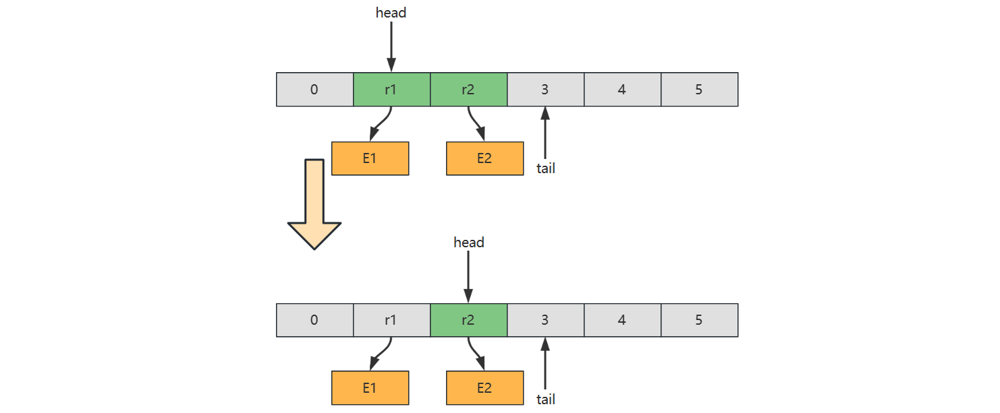

# 数组

## 习题

### 合并有序数组-Leetcode 88

#### 题目链接

[合并两个有序数组](https://leetcode.cn/problems/merge-sorted-array/)

#### 方法1


# 链表

## 链表的定义

### 定义

- 在计算机科学中，链表是数据元素的线性集合，其每个元素都指向下一个元素，元素存储上并不连续

  > In computer science, a **linked list** is a linear collection of data elements whose order is not given by their physical placement in memory. Instead, each element points to the next. 

### 我的一些胡思乱想

> 之前想着为啥不能只有一个Node类，而是要再建立一个单独的链表类，感觉重复且模糊，我觉得这种想法可能来自于我以前做算法题和不系统的学习数据结构，导致了我有这种想法，实际上如果不分开的话，Node类中如果设置一堆方法，可能会导致严重的错误，并且我感觉浪费内存啥的，毕竟每一个节点都是一个Node对象，如果每一个节点中都有操作别的节点生死的权利，会很不好，也很冗余，当然一些算法水题中可以这样写，用效率随便写写得了，然后是如果node中只定义int和next，是正确的，想着在另一个地方放一个又一个的方法，专门用来操纵一个又一个的Node，是不现实的，毕竟你不能在方法中定义方法，只能在类中定义方法，所有的方法都是在类中的，所以还是要创建一个类似于SingleLinkedList的类，这样的话不还是一样嘛，并且还没有体系性，感觉很乱，与其这样，不如结合面向对象，直接放一起，弄一个链表的大一统结构，用来彻底操作链表，不更好嘛，good，感谢DeepSeek


## 哨兵

- 链表中的哨兵节点（Sentinel Node/Dummy Node）是**一种简化链表操作的设计技巧**，用于解决链表操作中常见的边界条件问题。它的核心作用是**消除对头节点和空链表的特殊判断**，让代码更简洁、更统一


## 各类链表

### 单向不循环链表

- 单向链表，每个元素只知道其下一个元素是谁，头尾节点互相不知道


#### 无哨兵版

##### 基本结构

```java
public class SinglyLinkedList { 
    private Node head; // 头部节点
    private static class Node { // 节点类（静态内部类）
        int value;
        Node next;
        public Node(int value, Node next) {//构造方法，参数为值和指向下一个元素的指针
            this.value = value;
            this.next = next;
        }
    }
}
```

* Node 定义为内部类，是为了对外**隐藏**实现细节，没必要让类的使用者关心 Node 结构
* 定义为 static 内部类，是因为 Node **不需要**与**外部类**相关，它**很独立**

##### 头部添加元素

###### 初始版

```java
public void addHead(int value){
    if(head=null){	//链表为空的情况
        head = new Node(value,null);
    }else{			//链表中已经有其它节点了								
        head = new Node(value,head);
    }     
}
```

###### 简化版

```java
public void addHead(int value){								
    head = new Node(value,head);   //直接这样就够了
}
```

##### 获取最后一个`Node`(内用)

```java
private Node findLast(){						//找到最后一个元素
    if(head==null){//空链表
        return null;
    }
    Node p;
    for(p=head;p.next!=null;p=p.next){}
    return p;
}
```

##### 尾部添加元素

```java
public void addLast(int value){					//将元素添加到最后
    Node last = findLast();
    if(last==null){
        addHead(value);
    }else{
        last.next = new Node(value,null);			
    }
}
```

##### 内部根据索引获取对应`Node`(内用)

```java
private Node findNode(int index){			
    int i = 0;
    for(Node p=head;p!=null;p=p.next,i++){
        if(i==index){
            return p;
        }
    }
    return null;        //没找到
}
```

##### 查找指定索引的元素

```java
public int get(int index){				//获取指定索引处的元素
    Node node = findNode(index);
    if(node==null){
        throw new IllegalArgumentException(String.format("index [%d] 不合法%n",index));
    }
    return node.value;
}
```

##### 插入元素到指定索引处

```java
public void insert(int value,int index){	//将元素插入到指定索引处
	if(index==0){
        addHead(value);
        return;
    }
    Node prev = findNode(index-1);
    if(prev==null){
        throw new IllegalArgumentException(String.format("index [%d] 不合法%n",index));
    }else{
        prev.next = new Node(value,prev.next);
    }
}
```

##### 删除第一个节点

```java
public void removeFirst(){
    if(head==null){
        System.out.println("链表为空,无法删除第一个元素");
        return;
    }
    head = head.next;
}
```

##### 删除指定索引的节点

```java
public void remove(int index){
    if(index==0){
        removeFirst();
        return;
    }
    Node prev = findNode(index - 1);
    if (prev==null){
        System.out.println("索引非法");
        return;
    }
    Node removed = prev.next;
    if(removed==null){
        System.out.println("索引非法");
        return;
    }
    prev.next = removed.next;
}
```


#### 带哨兵版

##### 基本结构

```java
public class SinglyLinkedList { 
    private Node head = new Node(999,null); //哨兵节点,只是占个位置，虽然在第一位，但是逻辑上把它处理成不是第一位的就行
    private static class Node { // 节点类（静态内部类）
        int value;
        Node next;
        public Node(int value, Node next) {//构造方法，参数为值和指向下一个元素的指针
            this.value = value;
            this.next = next;
        }
    }
}
```

* Node 定义为内部类，是为了对外**隐藏**实现细节，没必要让类的使用者关心 Node 结构
* 定义为 static 内部类，是因为 Node **不需要**与**外部类**相关，它**很独立**

##### 头部添加元素

###### 方式1

```java
public void addHead(int value){
    head.next = new Node(value,head.next);
}
```

###### 方式2

```java
public void addHead(int value){
    insert(0,value);
}
```

##### 获取最后一个`Node`

```java
private Node findLast(){
    Node p;
    for(p=head;p.next!=null;p=p.next){}
    return p;
}
```

##### 尾部添加元素

```java
public void addLast(int value){
    Node last = findLast();
    last.next = new Node(value,null);
}
```

##### 内部根据索引获取对应`Node`(内用)

```java
private Node findNode(int index){			
    int i = -1;
    for(Node p=head;p!=null;p=p.next,i++){
        if(i==index){
            return p;
        }
    }
    return null;        //没找到
}
```

##### 查找指定索引的元素

```java
public int get(int index){
    Node node = findNode(index);
    if(node==null){
        throw new IllegalArgumentException(String.format("index [%d] 不合法%n",index));
    }
    return node.value;
}
```

##### 插入元素到指定索引处

```java
public void insert(int value,int index){
    Node prev = findNode(index-1);
    if(prev==null){
        sout("找不到，索引有问题");
        return;
    }
    prev.next = new Node(value,prev.next);
}
```

##### 删除第一个节点

###### 方式1

```java
public void removeFirst(){
    if(head.next==null){
        return;
    }
    head.next = head.next.next;
}
```

###### 方式2

```java
public void removeFirst(){
    remove(0);
}
```

##### 删除指定索引的节点

```java
public void remove(int index){
    Node prev = findNode(index - 1);
    if (prev==null){
        System.out.println("索引非法");
    }
    Node removed = prev.next;
    if(removed==null){
        System.out.println("索引非法");
    }
    prev.next = removed.next;
}
```


### 双向不循环链表

- 双向链表，每个元素知道其上一个元素和下一个元素，但是头节点和尾节点互相不知道


#### 带哨兵版

##### 内部根据索引获取对应`Node`(内用)

```java
private Node findNode(int index){
    int i = -1;
    for(Node p=headS;p!=tailS;p=p.next,i++){
        if(i==index){
            return p;
        }
    }
    return null;
}
```

##### 根据索引位置插入值

```java
public void insert(int index,int value){
    Node prev = findNode(index-1);
    if(prev==null){
        System.out.println("索引有问题");
        return;
    }
    Node next = prev.next;
    Node inserted = new Node(prev, value, next);
    prev.next = inserted;
    next.prev = inserted;
}
```

##### 头部添加元素

```java
public void addHead(int value){
    insert(0, value);
}
```

##### 删除指定索引的元素

```java
public void remove(int index){
    Node prev = findNode(index - 1);
    if (prev==null){
        System.out.println("索引有问题");
        return;
    }
    Node removed = prev.next;
    Node next = removed.next;
    prev.next = next;
    next.prev = prev;
}
```

##### 删除第一个节点

```java
public void removeHead(){
    remove(0);
}
```

##### 尾部添加元素

```java
public void addLast(int value){
    Node last = tailS.prev;
    Node added = new Node(last,value,tailS);
    last.next = added;
    tailS.prev = added;
}
```

##### 尾部删除元素

```java
public void removeLast(){
    Node removed = tailS.prev;
    if(removed==headS){
        System.out.println("链表为空");
    }
    Node prev = removed.prev;
    prev.next = tailS;
    tailS.prev = prev;
}
```


### 单向循环链表

- 每个节点只有指向**下一个节点的指针**，**尾节点指向头节点**形成**单向闭环**


### 双向循环链表

- 每个节点包含**前驱和后继**指针，**头尾节点相连**形成**双向闭环**


#### 带哨兵版

##### 头部添加元素

```java
public void addHead(int value){
    Node a = sentinel;
    Node b = sentinel.next;
    Node added = new Node(a, value, b);
    a.next=added;
    b.prev=added;
}
```

##### 尾部添加元素

```java
public void addLast(int value){
    Node a = sentinel.prev;
    Node b = sentinel;
    Node added = new Node(a, value, b);
    a.next=added;
    b.prev=added;
}
```

##### 删除第一个元素

```java
public void removeHead(){
    Node removed = sentinel.next;
    Node a = removed.prev;
    Node b = removed.next;
    a.next=b;
    b.prev=a;
}
```

##### 删除最后一个元素

```java
public void removeLast(){
    Node removed = sentinel.prev;
    Node a = removed.next;
    Node b = removed.prev;
    a.next=b;
    b.prev=a;
}
```

##### 根据值查找对应节点(内用)

```java
private Node findByValue(int value){
    Node p = sentinel.next;
    while (p!=sentinel){
        if(p.value==value){
            return p;
        }
        p=p.next;
    }
    return null;
}
```

##### 根据值删除对应元素

```java
public void removeByValue(int value){
	Node removed = findByValue(value);
    if(removed==null){
        System.out.println("没有这个元素");
        return;
    }
    Node a = removed.prev;
    Node b = removed.next;
    a.next=b;
    b.prev=a;
}
```


## 递归遍历

```java
public void recursion(Node current){//针对某个节点要进行的操作
    if(current==null){
        return;
    }
    System.out.println(current.value);		//这句和下面那句如果交换，就是倒序打印
    recursion(current.next);
}

public void newLoop(){
    recursion(head.next);
}
```


## 性能

### 随机访问的性能

#### 时间复杂度

- $O(n)$


### 插入的性能

#### 时间复杂度

##### 插入到起始位置

- $O(1)$

##### 插入到结束位置

- 如果已知 tail 尾节点 $O(1)$
- 如果不知道 tail 尾节点是 $O(n)$

##### 插入到中间位置

* 根据 index 查找时间 + $O(1)$ = $O(n)+O(1)=O(n)$

  > 先查找再插入嘛	


## 习题

### 反转单向链表-LeetCode206

#### **题目链接**

[206. 反转链表](https://leetcode.cn/problems/reverse-linked-list/)

#### 方法1

造一个新链表，从**旧链表**依次拿到每个节点，创建新节点添加至**新链表头部(addHead)**，完成后新链表即是倒序的

```java
public ListNode reverseList(ListNode o1) {
    ListNode n1 = null;         //新链表的第一个节点
    ListNode p = o1;
    while (p != null) {
        n1 = new ListNode(p.val,n1);
        p=p.next;
    }
    return n1;
}
```


#### 方法2

与**方法1**类似，构造一个新链表，从**旧链表头部**移除节点，添加到**新链表头部**，完成后新链表即是倒序的，区别在于原题目未提供节点外层的容器类，这里提供一个，另外一个区别是并不去构造新节点

```java
class Solution {
    static class List{
        ListNode head;                          //原来的头节点

        public List(ListNode head) {
            this.head = head;
        }

        public void addFirst(ListNode first){       //first是新链表的头节点
            first.next = head;
            head = first;
        }

        public ListNode removeFirst(){
            ListNode first = head;
            if(first!=null){
                head = first.next;
            }
            return first;
        }
    }

    public ListNode reverseList(ListNode head) {
        List list1 = new List(head);
        List list2 = new List(null);
        while(true){
            ListNode first = list1.removeFirst();
            if(first==null){
                break;
            }
            list2.addFirst(first);
        }
        return list2.head;
    }
}
```


#### 方法3

递归，在**递归时**让 $5 \rightarrow 4$，$4 \rightarrow 3$ ...

```java
public ListNode reverseList(ListNode p) {
    if (p==null||p.next==null){
        return p;       //通过递归找到了最后的节点
    }
    ListNode last = reverseList(p.next);
    p.next.next = p;
    p.next = null;
    return last;
}
```


#### 方法4

从链表每次拿到第二个节点，将其从链表断开，插入头部，直至它为 null 结束

1. 设置指针 o1(旧链表的头)、n1(新链表的头)、o2(旧链表第二个元素)，分别指向第一，第一，第二节点

$\frac{n1 \ o1}{1} \rightarrow \frac{o2}{2} \rightarrow 3 \rightarrow 4 \rightarrow 5 \rightarrow null$

2. 将 o2 节点从链表断开，即 o1 节点指向第三节点

$ \frac{n1 \ o1}{1} \rightarrow 3 \rightarrow 4 \rightarrow 5 \rightarrow null$ ，$\frac{o2}{2}$

3. o2 节点链入链表头部，即

$\frac{o2}{2} \rightarrow \frac{n1 \ o1}{1} \rightarrow 3 \rightarrow 4 \rightarrow 5 \rightarrow null$

4. n1 指向 o2

$\frac{n1 \ o2}{2} \rightarrow \frac{o1}{1} \rightarrow 3 \rightarrow 4 \rightarrow 5 \rightarrow null$

5. o2 指向 o1 的下一个节点，即

$\frac{n1}{2} \rightarrow \frac{o1}{1} \rightarrow \frac{o2}{3} \rightarrow 4 \rightarrow 5 \rightarrow null$

6. 重复以上 $2\sim5$ 步，直到 o2 指向 null

7. 还应当考虑边界条件，即链表中不满两个元素时，无需走以上逻辑

```java
public ListNode reverseList(ListNode o1) {
    if (o1 == null){
        return o1;
    }
    ListNode o2 = o1.next;
    ListNode n1 = o1;
    while (o2!=null){
        o1.next = o2.next;
        o2.next = n1;
        n1 = o2;
        o2=o1.next;
    }
    return n1;
}
```


#### 方法5

把链表分成**两部分**，思路就是不断从**链表2的头**，往**链表1的头**搬移，n1 指向 null，代表**新链表**一开始没有元素，o1 指向**原链表**的首节点

```java
public ListNode reverseList(ListNode o1) {
    ListNode n1 = null;
    while(o1!=null){
        ListNode o2 = o1.next;
        o1.next=n1;
        n1 = o1;
        o1 = o2;
    }
    return n1;
}
```


### 根据值删除节点-Leetcode 203

#### 题目链接

[[203. 移除链表元素](https://leetcode.cn/problems/remove-linked-list-elements/)]

#### 方法1

引入**哨兵**， **p1** 前一个元素， **p2** 后一个元素

**原版**

```java
public ListNode removeElements(ListNode head, int val) {
    ListNode s = new ListNode(999,head);
    s = head;
    ListNode p1 = s;
    ListNode p2 = s.next;
    while(p2!=null){
        if(p2.val == val){
            p1.next = p2.next;
            p2 = p2.next;
        }else{
            p1=p1.next;
            p2=p2.next;
        }
    }
    return s.next;
}
```

**修改版**

```java
public ListNode removeElements(ListNode head, int val) {
    ListNode s = new ListNode(999, head);
    ListNode p1 = s;
    ListNode p2;
    while ((p2 = p1.next) != null) {
        if (p2.val == val) {
            p1.next = p2.next;
        } else {
            p1 = p1.next;
        }
    }
    return s.next;
}
```


#### 方法2

**递归**

```java
public ListNode removeElements(ListNode p, int val) {
    if(p==null){
        return null;
    }
    if(p.val == val){
        return removeElements(p.next,val);
    }else{
        p.next = removeElements(p.next,val);
        return p;
    }
}
```


### 删除倒数节点-Leetcode 19

#### 题目链接

[删除链表的倒数第 N 个结点](https://leetcode.cn/problems/remove-nth-node-from-end-of-list/)


#### 方法1

**递归**

```java
class Solution{
	public ListNode removeNthFromEnd(ListNode head, int n) {
        ListNode s = new ListNode(9999);
        s.next = head;
        recursion(s,n);
        return s.next;
    }

    private int recursion(ListNode p,int n){
        if(p==null){
            return 0;
        }
        int nth = recursion(p.next, n);     //下一个节点的倒数位置
        if(nth==n){
            p.next = p.next.next;
        }
        return nth+1;
    }
}
```


#### 方法2

**两个指针p1,p2**

```java
public ListNode removeNthFromEnd(ListNode head, int n) {
    ListNode s = new ListNode(9999, head);
    ListNode p1 = s;
    ListNode p2 = s;
    for (int i = 0; i < n + 1; i++) {
        p2 = p2.next;
    }
    while (p2 != null) {
        p1 = p1.next;
        p2 = p2.next;
    }
    p1.next = p1.next.next;
    return s.next;
}
```


### 有序链表去重(留一个)-Leetcode 83

#### 题目链接

[删除排序链表中的重复元素](https://leetcode.cn/problems/remove-duplicates-from-sorted-list/)

#### 方法1

p1和p2

```java
public ListNode deleteDuplicates(ListNode head) {
    //当节点数<2的时候
    if(head==null||head.next==null){
        return head;
    }
    //节点数>=2的时候
    ListNode p1 = head;
    ListNode p2;
    while((p2=p1.next)!=null){
        if(p1.val==p2.val){
            //相等删除p2
            p1.next=p2.next;
        }else {
            p1 = p1.next;
        }
    }
    return head;
}
```


#### 方法2

**递归**

```java
public ListNode deleteDuplicates(ListNode p) {
    if(p == null||p.next==null){
        return p;
    }
    if(p.val == p.next.val){
        return deleteDuplicates(p.next);
    }else{
        p.next = deleteDuplicates(p.next);
        return p;
    }
}
```


### 有序链表去重(全去)-Leetcode 82

#### 题目链接

[82. 删除排序链表中的重复元素 II](https://leetcode.cn/problems/remove-duplicates-from-sorted-list-ii/)

#### 方法1

**递归**

```java
public ListNode deleteDuplicates(ListNode p) {
    if(p==null || p.next==null){
        return p;
    }
    if(p.val == p.next.val){
        ListNode x = p.next.next;
        while(x!=null&&x.val == p.val){
                x = x.next;
        }
         return deleteDuplicates(x);   //就是与 p 取值不同的节点
    }else{
        p.next = deleteDuplicates(p.next);
        return p;
    }
}
```


#### 方法2

**p1,p2,p3**

```java
public ListNode deleteDuplicates(ListNode head) {
    if(head == null || head.next == null) return head;
    ListNode s = new ListNode(-1,head);
    ListNode p1 = s;
    ListNode p2,p3;
    while((p2=p1.next)!=null && (p3=p2.next)!=null){
        if(p2.val == p3.val){
            while((p3=p3.next)!=null && p3.val == p2.val){}
            //p3找到了不重复的值
            p1.next = p3;
        }else{
            p1=p1.next;
        }
    }
    return s.next;
}
```


### 合并有序链表-LeetCode 21

#### 题目链接

[合并两个有序链表](https://leetcode.cn/problems/merge-two-sorted-lists/)

#### 方法1

p1p2

```java
public ListNode mergeTwoLists(ListNode p1, ListNode p2) {
    ListNode s = new ListNode(-1,null);
    ListNode p = s;
    while(p1!=null&&p2!=null){
        if(p1.val<p2.val){
            p.next = p1;
            p1 = p1.next;
        }else{
            p.next = p2;
            p2 = p2.next;
        }
        p = p.next;
    }
    if(p1!=null){
        p.next = p1;
    }
    if(p2!=null){
        p.next = p2;
    }
    return s.next;
}
```


#### 方法2

**递归**

```java
public ListNode mergeTwoLists(ListNode p1, ListNode p2) {
    if(p1==null||p2==null){
        return p1==null?p2:p1;
    }
    if(p1.val<p2.val){
        p1.next = mergeTwoLists(p1.next,p2);
        return p1;
    }else{
        p2.next = mergeTwoLists(p1,p2.next);
        return p2;
    }
}
```


### 合并多个有序链表-Leetcode 23

#### 题目链接

[合并 K 个升序链表](https://leetcode.cn/problems/merge-k-sorted-lists/)

#### 方法1

```java
class Solution{
	public ListNode mergeKLists(ListNode[] lists) {
        if(lists.length==0){
            return null;
        }
        return split(lists,0,lists.length-1);
    }

    //返回合并后的链表
    public ListNode split(ListNode[] lists,int i,int j){
        if(i==j){
            return lists[i];
        }
        int m = (i+j)>>>1;
        ListNode left = split(lists, i, m);
        ListNode right = split(lists, m + 1, j);
        return mergeTwoLists(left,right);
    }

    public ListNode mergeTwoLists(ListNode p1, ListNode p2) {
        ListNode s = new ListNode(-1,null);
        ListNode p = s;
        while(p1!=null&&p2!=null){
            if(p1.val<p2.val){
                p.next = p1;
                p1 = p1.next;
            }else{
                p.next = p2;
                p2 = p2.next;
            }
            p = p.next;
        }
        if(p1!=null){
            p.next = p1;
        }
        if(p2!=null){
            p.next = p2;
        }
        return s.next;
    }
}
```


### 查找链表中间节点-Leetcode 876

#### 题目链接

[链表的中间结点](https://leetcode.cn/problems/middle-of-the-linked-list/)

#### 方法1

**快慢指针法**

```java
public ListNode middleNode(ListNode head) {
    ListNode p1 = head, p2 = head;
    while(p2!=null&&p2.next!=null){
        p1 = p1.next;
        p2 = p2.next.next;
    }
    return p1;
}
```


### 回文链表-Leetcode 234

#### 题目链接

[回文链表](https://leetcode.cn/problems/palindrome-linked-list/)

#### 方法1

快慢指针逆转比较

```java
class Solution{
    public boolean isPalindrome(ListNode head) {
        ListNode middle = middle(head);
        ListNode newHead = reverse(middle);
        while(newHead!=null){
            if(newHead.val!=head.val){
                return false;
            }
            newHead=newHead.next;
            head=head.next;
        }
        return true;
    }

    private ListNode reverse(ListNode o1){      //参数：旧链表头部
        ListNode n1 = null;                     //新链表头部先为null
        while(o1!=null){                        //如果o1旧链表还有元素
            ListNode o2 = o1.next;              //先把第二个元素存一下
            o1.next = n1;                       //要去掉的节点的下一个为n1
            n1 = o1;                            //新链表为n1
            o1 = o2;                            //继续
        }
        return n1;
    }

    private ListNode middle(ListNode head){
        ListNode p1 = head;     //慢指针,从头指针开始则偏右
        ListNode p2 = head;
        while(p2!=null && p2.next!=null){
            p1 = p1.next;
            p2 = p2.next.next;
        }
        return p1;
    }
}
```


#### 方法2

方法1的优化

```java
public boolean isPalindrome(ListNode head) {
    ListNode p1 = head;     //慢指针,从头指针开始则偏右
    ListNode p2 = head;     //快指针
    ListNode n1 = null;     //新链表的头
    ListNode o1 = head;     //旧头
    while(p2!=null && p2.next!=null){
        p1 = p1.next;
        p2 = p2.next.next;

        //反转链表的代码
        o1.next = n1;
        n1 = o1;
        o1 = p1;
    }

    if(p2!=null){
        p1 = p1.next;
    }

    while(n1!=null){
        if(n1.val!=p1.val){
            return false;
        }
        n1=n1.next;
        p1=p1.next;
    }
    return true;
}
```


### 环形链表-Leetcode 141

#### 题目链接

[141. 环形链表](https://leetcode.cn/problems/linked-list-cycle/)

#### 分析

本题以及下题，实际是 Floyd's Tortoise and Hare Algorithm （Floyd 龟兔赛跑算法）[^15]

> 除了 Floyd 判环算法外，还有其它的判环算法，详见 https://en.wikipedia.org/wiki/Cycle_detection


**如果链表上存在环，那么在环上以不同速度前进的两个指针必定会在某个时刻相遇**

算法分为两个阶段

**阶段1(判断是否存在环)**

* 龟一次走一步，兔子一次走两步
* 当兔子能走到终点(null)时，不存在环
* 当兔子能追上龟时，可以判断存在环

**阶段2(判断环的入口)**

- 它们在环的某处相遇，找环的入口

* 兔子一次走两步，龟一次走一步，第一次会在某处相遇
* 从它们第一次相遇开始，龟回到起点，兔子保持相遇点不变
* 龟和兔子此时一次都走一步
* 当再次相遇时，地点就是环的入口(a=c+n圈，只要再走a步，就一定能走到起点)

为什么呢？

* 设起点到入口走 a 步（本例是 7），绕环一圈长度为 b（本例是 5），
* 那么**从起点开始，走 a + 绕环 n 圈，都能找到环入口**
* 第一次相遇时
  * 兔走了 a + 绕环 n 圈（本例 2 圈） + k，k 是它们相遇距环入口位置（本例 3，不重要）
  * 龟走了 a + 绕环 n 圈（本例 0 圈） + k，当然它绕的圈数比兔少
  * 兔走的距离是龟的两倍，所以**龟走的** = 兔走的 - 龟走的 = **绕环 n 圈**
* 而前面分析过，如果走 a + 绕环 n 圈，都能找到环入口，因此从相遇点开始，再走 a 步，就是环入口

#### 方法1

```java
public boolean hasCycle(ListNode head) {
    ListNode h = head;  //兔子
    ListNode t = head;  //乌龟
    while(h!=null&&h.next!=null){
        t = t.next;
        h = h.next.next;
        if(t==h){
            return true;
        }
    }
    return false;
}
```


### 环形链表-Leetcode 142

#### 题目链接

[ 环形链表 II](https://leetcode.cn/problems/linked-list-cycle-ii/)

#### 方法1

```java
public ListNode detectCycle(ListNode head) {
    ListNode h = head;  //兔子
    ListNode t = head;  //乌龟
    while(h!=null&&h.next!=null){
        t = t.next;
        h = h.next.next;
        if(t==h){
            //进入第二阶段
            t = head;
            while(t!=h){
                t = t.next;
                h = h.next;
            }
            return t;
        }
    }
    return null;
}
```


# 递归


# 队列

## 概述

计算机科学中，queue 是以**顺序**的方式维护的一组数据集合，在**一端添加数据**，从**另一端移除数据**。习惯来说，添加的一端称为**尾**，移除的一端称为**头**，就如同生活中的排队买商品

> In computer science, a **queue** is a collection of entities that are maintained in a sequence and can be modified by  the addition of entities at one end of the sequence and the removal of  entities from the other end of the sequence

## 基础接口

```java
public interface Queue<E> {

    /**
     * 向队列尾插入值
     * @param value 待插入值
     * @return 插入成功返回 true, 插入失败返回 false
     */
    boolean offer(E value);

    /**
     * 从对列头获取值, 并移除
     * @return 如果队列非空返回对头值, 否则返回 null
     */
    E poll();

    /**
     * 从对列头获取值, 不移除
     * @return 如果队列非空返回对头值, 否则返回 null
     */
    E peek();

    /**
     * 检查队列是否为空
     * @return 空返回 true, 否则返回 false
     */
    boolean isEmpty();

    /**
     * 检查队列是否已满
     * @return 满返回 true, 否则返回 false
     */
    boolean isFull();
}
```

## 队列的实现

### 用链表实现

#### 图示


#### 代码

```java
public class LinkedListQueue<E> implements Queue<E>, Iterable<E> {

    private static class Node<E> {
        E value;
        Node next;


        public Node(E value, Node<E> next) {
            this.value = value;
            this.next = next;
        }
    }

    Node<E> head = new Node<>(null, null);
    Node<E> tail = head;
    private int size;   //节点数
    private int capacity = Integer.MAX_VALUE;


    {
        tail.next = head;
    }
    public LinkedListQueue() {}

    public LinkedListQueue(int capacity) {
        this.capacity = capacity;
    }

    @Override
    public boolean offer(E value) {
        if (isFull()) {
            return false;
        }
        Node<E> added = new Node<>(value, head);
        tail.next = added;
        tail = added;
        size++;
        return true;
    }

    @Override
    public E poll() {
        if(isEmpty()){
            return null;
        }
        Node<E> first = head.next;
        head.next = first.next;
        if(first == tail){
            tail = head;
        }
        size--;
        return first.value;
    }

    @Override
    public E peek() {
        if(isEmpty()){
            return null;
        }
        return (E)head.next.value;
    }

    @Override
    public boolean isEmpty() {
        return head==tail;
    }

    @Override
    public boolean isFull() {
        if(size==capacity){
            return true;
        }
        return false;
    }

    @Override
    public Iterator<E> iterator() {
        return new Iterator<E>() {
            Node<E> p = head.next;

            @Override
            public boolean hasNext() {
                return p!=head;
            }

            @Override
            public E next() {
                E value = p.value;
                p = p.next;
                return value;
            }
        };
    }
}
```


### 用环形数组实现

- 通过逻辑控制让它像一个环，实际上它还是一个普通线性数组

##### 优点

1. 对比普通数组，起点和终点更为自由，不用考虑数据移动
2. “环”意味着不会存在【越界】问题
3. 数组性能更佳
4. 环形数组比较适合实现有界队列、RingBuffer 等

##### 图示


##### 下标计算

例如，数组长度是 5，当前位置是 3 ，向前走 2 步，此时下标为 $(3 + 2)\%5 = 0$


$$
(cur + step) \% length
$$


* cur 当前指针位置
* step 前进步数
* length 数组长度

> 注意：
>
> * 如果 step = 1，也就是一次走一步，可以在 >= length 时重置为 0 即可


##### 判断空


##### 判断满


满之后的策略可以根据业务需求决定

* 例如我们要实现的环形队列，满之后就拒绝入队


#### 代码实现

##### 实现一

- 用head和tail判断空满

```java
public class ArrayQueue1<E> implements Queue<E>, Iterable<E> {

    private E[] array;
    private int head = 0;
    private int tail = 0;

    public ArrayQueue1(int capacity) {
        array = (E[]) new Object[capacity + 1];
    }

    @Override
    public boolean offer(E value) {
        if (isFull()) {
            return false;
        }
        array[tail] = value;
        tail = (tail + 1) % array.length;
        return false;
    }

    @Override
    public E poll() {
        if (isEmpty()) {
            return null;
        }
        E value = array[head];
        head = (head + 1) % array.length;
        return value;
    }

    @Override
    public E peek() {
        if (isEmpty()) {
            return null;
        }
        return array[head];
    }

    @Override
    public boolean isEmpty() {
        return head == tail;
    }

    @Override
    public boolean isFull() {
        return (tail + 1) % array.length == head;
    }

    @Override
    public Iterator<E> iterator() {
        return new Iterator<E>() {
            int p = head;

            @Override
            public boolean hasNext() {
                return p != tail;
            }

            @Override
            public E next() {
                E value = array[p];
                p = (p + 1) % array.length;
                return value;
            }
        };
    }
}
```

##### 实现二

- 引入size判断空满

```java
public class ArrayQueue2<E> implements Queue<E>, Iterable<E> {
    
    private E[] array;
    private int head = 0;
    private int tail = 0;
    private int size = 0;   //元素个数

    public ArrayQueue2(int capacity) {
        array = (E[]) new Object[capacity];
    }

    @Override
    public boolean offer(E value) {
        if (isFull()) {
            return false;
        }
        array[tail] = value;
        tail = (tail + 1) % array.length;
        size++;
        return false;
    }

    @Override
    public E poll() {
        if (isEmpty()) {
            return null;
        }
        E value = array[head];
        head = (head + 1) % array.length;
        size--;
        return value;
    }

    @Override
    public E peek() {
        if (isEmpty()) {
            return null;
        }
        return array[head];
    }

    @Override
    public boolean isEmpty() {
        return size == 0;
    }

    @Override
    public boolean isFull() {
        return size == array.length;
    }

    @Override
    public Iterator<E> iterator() {
        return new Iterator<E>() {
            int p = head;
            int count = 0;

            @Override
            public boolean hasNext() {
                return count < size;
            }

            @Override
            public E next() {
                E value = array[p];
                p = (p + 1) % array.length;
                count++;
                return value;
            }
        };
    }
}
```

### 关于垃圾回收

- 数组实现中，如果存储的是**基本类型**，那么**无需考虑内存释放**，例如


- **但如果存储的是**引用类型，应当**设置该位置的引用为 `null`**，**以便内存及时释放**




## 一些别的队列

### 双端队列(Deque)

#### 概述和一些知识点

- **双端队列（Deque）**是一种 **线性数据结构**，它**与普通队列（Queue）和栈（Stack）类似**，但**更加灵活**
- Java 中 **`LinkedList`** 即为典型**双端队列**实现，不过它同时实现了 **`Queue`** 接口，也提供了**栈的 `push`  `pop` 等方法**
- **Deque 是 Double-Ended Queue 的缩写**
- **主要特点**
  - **允许在队列的两端（前端 Front 和后端 Rear）进行元素的插入（enqueue）和删除（dequeue）操作**


- **双端队列**中一些**方法的命名**

  - 不同语言，操作双端队列的**方法命名**有所不同，见下表

    | 操作         | Java       | JavaScript | C++        | leetCode 641 |
    | ------------ | ---------- | ---------- | ---------- | ------------ |
    | **尾部插入** | offerLast  | push       | push_back  | insertLast   |
    | **头部插入** | offerFirst | unshift    | push_front | insertFront  |
    | **尾部移除** | pollLast   | pop        | pop_back   | deleteLast   |
    | **头部移除** | pollFirst  | shift      | pop_front  | deleteFront  |
    | **尾部获取** | peekLast   | at(-1)     | back       | getRear      |
    | **头部获取** | peekFirst  | at(0)      | front      | getFront     |

    

#### 基础接口

```java
public interface Deque<E> {

    boolean offerFirst(E e);

    boolean offerLast(E e);

    E pollFirst();

    E pollLast();

    E peekFirst();

    E peekLast();
    
    boolean isEmpty();

    boolean isFull();
}
```


#### 用双向链表实现双端队列

```java
import java.util.Iterator;

public class LinkedListDeque<E> implements Deque<E>,Iterable<E>{
    @Override
    public Iterator<E> iterator() {
        return new Iterator<>() {
            Node<E> p = sentinel.next;

            @Override
            public boolean hasNext() {
                return p != sentinel;
            }

            @Override
            public E next() {
                E value = p.value;
                p = p.next;
                return value;
            }
        };
    }

    static class Node<E>{
        Node<E> next;
        E value;
        Node<E> prev;

        public Node(Node<E> prev, E value, Node<E> next){
            this.prev=prev;
            this.value=value;
            this.next=next;
        }
    }

    int capacity;
    int size;
    Node<E> sentinel = new Node<E>(null,null,null);
    public LinkedListDeque(int capacity){
        this.capacity=capacity;
        sentinel.next = sentinel;
        sentinel.prev = sentinel;
    }

    @Override
    public boolean offerFirst(E e) {
        if(isFull()){
            return false;
        }
        Node<E> a = sentinel;
        Node<E> b = sentinel.next;
        Node<E> added = new Node<>(a,e,b);
        a.next = added;
        b.prev = added;
        size++;
        return true;
    }

    @Override
    public boolean offerLast(E e) {
        if(isFull()){
            return false;
        }
        Node<E> a = sentinel.prev;
        Node<E> b = sentinel;
        Node<E> added = new Node<>(a, e, b);
        a.next = added;
        b.prev = added;
        size++;
        return true;
    }

    @Override
    public E pollFirst() {
        if(isEmpty()){
            return null;
        }
        Node<E> a = sentinel;
        Node<E> removed = sentinel.next;
        Node<E> b = removed.next;
        a.next = b;
        b.prev = a;
        size--;
        return removed.value;
    }

    @Override
    public E pollLast() {
        if(isEmpty()){
            return null;
        }
        Node<E> b = sentinel;
        Node<E> removed = sentinel.prev;
        Node<E> a = removed.prev;
        a.next = b;
        b.prev = a;
        size--;
        return removed.value;
    }

    @Override
    public E peekFirst() {
        if(isEmpty()){
            return null;
        }
        return sentinel.next.value;
    }

    @Override
    public E peekLast() {
        if(isEmpty()){
            return null;
        }
        return sentinel.prev.value;
    }


    @Override
    public boolean isEmpty() {
        return size==0;
    }

    @Override
    public boolean isFull() {
        return size==capacity;
    }
}
```


#### 用循环数组实现双端队列

```java
public class ArrayDeque1<E> implements Deque<E>, Iterable<E> {

    static int inc(int i,int length){
        if(i+1>=length){
            return 0;
        }
        return i+1;
    }

    static int dec(int i,int length){
        if(i-1<0){
            return length-1;
        }
        return i-1;
    }

    E[] array;
    int head;
    int tail;

    public ArrayDeque1(int capacity){
        array = (E[]) new Object[capacity+1];
    }

    @Override
    public boolean offerFirst(E e) {
        if(isFull()){
            return false;
        }
        head = dec(head, array.length);
        array[head] = e;
        return true;
    }

    @Override
    public boolean offerLast(E e) {
        if(isFull()){
            return false;
        }
        array[tail] = e;
        tail = inc(tail,array.length);
        return true;
    }

    @Override
    public E pollFirst() {
        if(isEmpty()){
            return null;
        }
        E e = array[head];
        array[head] = null;
        head = inc(head, array.length);
        return e;
    }

    @Override
    public E pollLast() {
        if(isEmpty()){
            return null;
        }
        tail = dec(tail, array.length);
        E e = array[tail];
        array[tail] = null;
        return e;
    }

    @Override
    public E peekFirst() {
        if (isEmpty()){
            return null;
        }
        return array[head];
    }

    @Override
    public E peekLast() {
        if (isEmpty()){
            return null;
        }
        return array[dec(tail, array.length)];
    }

    @Override
    public boolean isEmpty() {
        return head == tail;
    }

    @Override
    public boolean isFull() {
        if(tail > head){
            return tail-head == array.length-1;
        }else if(tail<head){
            return head-tail == 1;
        }else{
            return false;
        }
    }

    @Override
    public Iterator<E> iterator() {
        return new Iterator<E>() {
            int p = head;
            @Override
            public boolean hasNext() {
                return p!=tail;
            }

            @Override
            public E next() {
                E e = array[p];
                p=inc(p,array.length);
                return e;
            }
        };
    }
}
```


## 习题

### 二叉树层序遍历-Leetcode 102

#### 题目链接

[102. 二叉树的层序遍历](https://leetcode.cn/problems/binary-tree-level-order-traversal/)

#### 方法1

c1第一层元素个数，c2下一层元素个数

```java
public List<List<Integer>> levelOrder(TreeNode root) {
    LinkedList<TreeNode> queue = new LinkedList<>();
    List<List<Integer>> result = new ArrayList<>();
    if (root == null) {
        return result;
    }
    queue.offer(root);
    int c1 = 1;
    while(!queue.isEmpty()) {
        int c2 = 0;
        List<Integer> level = new ArrayList<>();
        for(int i = 0; i < c1; i++) {
            TreeNode n = queue.poll();
            level.add(n.val);
            if(n.left != null) {
                queue.offer(n.left);
                c2++;
            }
            if(n.right != null) {
                queue.offer(n.right);
                c2++;
            }
        }
        result.add(level);
        c1 = c2;
    }
    return result;
}
```


### 二叉树的锯齿形层序遍历-Leetcode 103

#### 题目链接

[103. 二叉树的锯齿形层序遍历](https://leetcode.cn/problems/binary-tree-zigzag-level-order-traversal/)

#### 方法1

```java
public List<List<Integer>> zigzagLevelOrder(TreeNode root) {
    LinkedList<TreeNode> queue = new LinkedList<>();
    List<List<Integer>> result = new ArrayList<>();
    if (root == null) {
        return result;
    }
    queue.offer(root);
    int c1 = 1;
    boolean isOdd = true;//刚开始是奇数层
    while(!queue.isEmpty()) {
        int c2 = 0;
        LinkedList<Integer> level = new LinkedList<>();    //保存每一层的结果
        for(int i = 0; i < c1; i++) {
            TreeNode n = queue.poll();

            if(isOdd){
                level.addLast(n.val);
            }else{
                level.addFirst(n.val);
            }
            if(n.left != null) {
                queue.offer(n.left);
                c2++;
            }
            if(n.right != null) {
                queue.offer(n.right);
                c2++;
            }
        }
        isOdd = !isOdd;
        result.add(level);
        c1 = c2;
    }
    return result;
}
```


# 栈

## 概述

计算机科学中，**stack** 是一种线性的数据结构，只能在其一端添加数据和移除数据。习惯来说，这一端称之为**栈顶**，另一端不能操作数据的称之为**栈底**，就如同生活中的一摞书，先进后出

## 基础接口

```java
public interface Stack<E> {
    /**
     * 向栈顶压入元素
     * @param value 待压入值
     * @return 压入成功返回 true, 否则返回 false
     */
    boolean push(E value);

    /**
     * 从栈顶弹出元素
     * @return 栈非空返回栈顶元素, 栈为空返回 null
     */
    E pop();

    /**
     * 返回栈顶元素, 不弹出
     * @return 栈非空返回栈顶元素, 栈为空返回 null
     */
    E peek();

    /**
     * 判断栈是否为空
     * @return 空返回 true, 否则返回 false
     */
    boolean isEmpty();

    /**
     * 判断栈是否已满
     * @return 满返回 true, 否则返回 false
     */
    boolean isFull();
}
```


## 用链表实现

```java
public class LinkedListStack<E> implements Stack<E>,Iterable<E>{

    private int capacity;
    private int size;
    private Node<E> head = new Node<>(null,null);

    public LinkedListStack(int capacity) {
        this.capacity = capacity;
    }

    static class Node<E> {
        E value;
        Node<E> next;

        public Node(E value, Node<E> next) {
            this.value = value;
            this.next = next;
        }
    }

    @Override
    public boolean push(E value) {
        if(isFull()){
            return false;
        }
        head.next = new Node<>(value, head.next);
        size++;
        return true;
    }

    @Override
    public E pop() {
        if(isEmpty()){
            return null;
        }
        Node<E> first = head.next;
        head.next = first.next;
        size--;
        return first.value;
    }

    @Override
    public E peek() {
        if(isEmpty()){
            return null;
        }
        Node<E> first = head.next;
        return first.value;
    }

    @Override
    public boolean isEmpty() {
        return head.next == null||size==0;
    }

    @Override
    public boolean isFull() {
        return size==capacity;
    }

    @Override
    public Iterator<E> iterator() {
        return new Iterator<E>() {
            Node<E> p = head.next;
            @Override
            public boolean hasNext() {
                return p!=null;
            }

            @Override
            public E next() {
                E value = p.value;
                p = p.next;
                return value;
            }
        };
    }
}

```


## 用数组实现

```java
public class ArrayStack<E> implements Stack<E>,Iterable<E>{

    private E[] array;
    private int top;        //栈顶指针

    public ArrayStack(int capacity) {
        array = (E[]) new Object[capacity];
    }

    @Override
    public boolean push(E value) {
        if(isFull()){
            return false;
        }
        array[top++]=value;
        return false;
    }

    @Override
    public E pop() {
        if(isEmpty()){
            return null;
        }
        return array[--top];
    }

    @Override
    public E peek() {
        if(isEmpty()){
            return null;
        }
        return array[top-1];
    }

    @Override
    public boolean isEmpty() {
        return top==0;
    }

    @Override
    public boolean isFull() {
        return top==array.length;
    }

    @Override
    public Iterator<E> iterator() {
        return new Iterator<E>() {
            int p = top;
            @Override
            public boolean hasNext() {
                return p>0;
            }
            @Override
            public E next() {
                return array[--p];
            }
        };
    }
}
```


## 习题

### 有效的括号-Leetcode 20

#### 题目链接

[有效的括号](https://leetcode.cn/problems/valid-parentheses/)

#### 方法1

```java
public boolean isValid(String s) {
    ArrayStack<Character> stack = new ArrayStack<>(s.length());
    for(int i=0; i<s.length(); i++){
        char c = s.charAt(i);
        if(c=='('){
            stack.push(')');
        }else if(c=='['){
            stack.push(']');
        }else if(c=='{'){
            stack.push('}');
        }else{
            if((!stack.isEmpty())&&c==stack.peek()){
                stack.pop();
            }else{
                return false;
            }
        }
    }
    return stack.isEmpty();
}
```


### 后缀表达式求值-Leetcode 150

- 这种表达式据说对计算机啥的有优势

#### 题目链接

[逆波兰表达式求值](https://leetcode.cn/problems/evaluate-reverse-polish-notation/)

#### 方法1

```java
public int evalRPN(String[] tokens) {
    LinkedList<Integer> stack = new LinkedList<>();
    for (String token : tokens) {
        switch (token){
            case "+" :
                Integer a2 = stack.pop();
                Integer a1 = stack.pop();
                stack.push(a1 + a2);
                break;
            case "-" :
                Integer b2 = stack.pop();
                Integer b1 = stack.pop();
                stack.push(b1 - b2);
                break;
            case "*" :
                Integer c2 = stack.pop();
                Integer c1 = stack.pop();
                stack.push(c1 * c2);
                break;
            case "/" :
                Integer d2 = stack.pop();
                Integer d1 = stack.pop();
                stack.push(d1 / d2);
                break;
            default  :
                stack.push(Integer.parseInt(token));
                break;
        }
    }
    return stack.pop();
}
```


### 中缀表达式转后缀表达式

#### 方法1

```java
public class InfixToSuffix {
    static int priority(char c) {
        switch (c) {
            case '(':return 0;
            case '*':
            case '/':
                return 2;
            case '+':
            case '-':
                return 1;
            default:
                throw new IllegalArgumentException("不合法的运算符" + c);
        }
    }

    static String infixToSuffix(String exp) {
        LinkedList<Character> stack = new LinkedList<>();
        StringBuilder sb = new StringBuilder(exp.length());

        for (int i = 0; i < exp.length(); i++) {
            char c = exp.charAt(i);
            switch (c){
                case '+':
                case '-':
                case '*':
                case '/':
                    if (stack.isEmpty()){
                        stack.push(c);
                    }else{
                        if(priority(c)>priority(stack.peek())){
                            stack.push(c);
                        }else{
                            while(!stack.isEmpty()&&priority(stack.peek())>=priority(c)){
                                sb.append(stack.pop());
                            }
                            stack.push(c);
                        }
                    }
                    break;
                case '(':
                    stack.push(c);
                    break;
                case ')':
                    while(!stack.isEmpty()&&stack.peek()!='('){
                        sb.append(stack.pop());
                    }
                    stack.pop();
                    break;
                default:
                    sb.append(c);
            }
        }
        while(!stack.isEmpty()){
            sb.append(stack.pop());
        }
        return sb.toString();
    }

}
```


### 双栈模拟队列-Leetcode 232

#### 题目链接

[用栈实现队列](https://leetcode.cn/problems/implement-queue-using-stacks/)

#### 方法1

为方便用LinkedList替代了一下栈，但是思路是对的

```java
class MyQueue {
    LinkedList<Integer> s1 = new LinkedList<>();
    LinkedList<Integer> s2 = new LinkedList<>();

    public MyQueue() {

    }

    public void push(int x) {
        s2.push(x);
    }

    public int pop() {
        if(s1.isEmpty()){
            while(!s2.isEmpty()){
                s1.push(s2.pop());
            }
        }
        return s1.pop();
    }

    public int peek() {
        if (s1.isEmpty()){
            while(!s2.isEmpty()){
                s1.push(s2.pop());
            }
        }
        return s1.peek();
    }

    public boolean empty() {
        return s1.isEmpty() && s2.isEmpty();
    }
}
```


### 单队列模拟栈-Leetcode 225

#### 题目链接

[用队列实现栈](https://leetcode.cn/problems/implement-stack-using-queues/)

#### 方法1

```java
class MyStack {
    public MyStack() {
        
    }
    LinkedList<Integer> queue = new LinkedList<>();
    private int size = 0;
    public void push(int x) {
        queue.offer(x);
        for (int i = 0; i < size; i++) {
            queue.offer(queue.poll());
        }
        size++;
    }
    
    public int pop() {
        size--;
        return queue.poll();
    }
    
    public int top() {
        return queue.peek();
    }
    
    public boolean empty() {
        return queue.isEmpty();
    }
}
```

