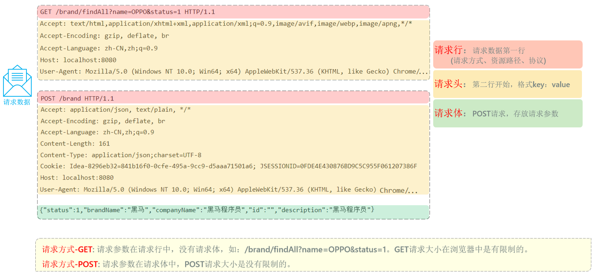

# 什么是HTTP协议？

- **HTTP** 的全称是 **HyperText Transfer Protocol**（超文本传输协议）。简单来说，它就是一种规定了**客户端**（比如浏览器或手机App）和**服务器**（你的SpringBoot应用）之间如何沟通和传输数据的规则。它构建在可靠的TCP/IP协议之上，保证了数据的可靠传输

- 它的核心特点可以总结为几点：

  - **基于客户端-服务器模型**：通信总是由客户端发起请求，服务器进行响应。
  - **简单快速**：协议规定简单，报文格式是人类可读的纯文本（在HTTP/1.1及之前），这在早期极大地简化了开发和调试的难度。开发者甚至可以通过telnet程序手动发送HTTP请求来测试服务器。这种简单性是它得以迅速普及的关键。

  - **无连接**：早期HTTP的设计哲学是“一次请求，一次连接”。服务器处理完客户的请求，并收到客户的应答后，即断开TCP连接。这在早期网络中，获取简单HTML文档的场景下效率很高，可以快速释放服务器资源。
    - **持久连接**：但现代网页包含大量资源（CSS、JS、图片）。如果每获取一个资源都新建一次TCP连接，开销会非常大。因此，HTTP/1.1引入了持久连接作为默认行为，允许在一次TCP连接中处理多个HTTP请求，大大提高了效率。

- **无状态**：这是HTTP一个非常重要的特点。协议对于事务处理没有记忆能力。也就是说，服务器的视角里，每个请求都是完全独立的，它不知道两个连续的请求是否来自同一个用户。
  - **如何解决无状态？** 为了实现需要“记住”用户状态的业务（如购物车、用户登录），Web应用普遍采用 **Cookie** 和 **Session** 技术


# HTTP报文结构

- 客户端发送给服务器的数据叫**请求报文 (Request Message)**，服务器返回给客户端的数据叫**响应报文 (Response Message)**。它们都遵循一个通用的三段式结构：**起始行**、**头部**和**正文**

## HTTP 请求报文

- 这是前端发给后端的，目的是**发起一个动作**

```
[起始行]   POST /api/users HTTP/1.1
[头部]     Host: myapp.com
[头部]     User-Agent: Mozilla/5.0
[头部]     Content-Type: application/json

[正文]     {"name": "New User", "email": "test@example.com"}
```



- **起始行 (Request Line)**：顺序固定为 “方法 	URI 	协议版本”
  - **方法 (Method)**：**【选择题】** 必须从官方定义的动词中选择一个
    - `GET`：**最常用**，用于获取资源
    - `POST`：**最常用**，用于创建新资源
    - `PUT`：用于完整更新一个资源
    - `DELETE`：用于删除一个资源
    - `PATCH`：不常用，用于局部更新一个资源
    - `HEAD`：不常用，和GET类似，但只获取响应头，不要正文
  - **URI**：**【填空题】** 由开发者自己定义，指向服务器上的特定资源路径，如 `/api/users/123`
  - **协议版本**：**【选择题】** 通常是 `HTTP/1.1` 或 `HTTP/2`


- **头部 (Headers) - 附加说明(键值对)**：

  - `Host`: **【填空题】** 必须提供，值是服务器的域名，如 `myapp.com`。
  - `Content-Type`: **【选择题】** 如果有正文，则需指明正文格式。
    - `application/json`：**最常用**，表示正文是JSON字符串。
    - `application/x-www-form-urlencoded`：网页表单默认格式。
    - `multipart/form-data`：用于上传文件。
    - `text/plain`：纯文本。
  - `Authorization`: **【填空题】** 用于身份验证，值通常是服务器下发的长字符串（Token），如 `Bearer eyJhbGciOi...`
  - `User-Agent`: **【填空题】** 自动生成，表明客户端的类型，如 `Mozilla/5.0...`

  

- **空行 - 分隔线**：必须有，用于分隔头部和正文


- **正文**


## HTTP 响应报文

- 这是你的 SpringBoot 应用返回给前端的“包裹”，目的是**返回一个结果**

```
[起始行]   HTTP/1.1 201 Created
[头部]     Content-Type: application/json
[头部]     Date: Fri, 08 Aug 2025 08:45:00 GMT

[正文]     {"id": 123, "name": "New User", "email": "test@example.com"}
```


- **起始行 (Status Line)**：顺序固定为 ”协议版本 	状态码 	原因短语“

  - **状态码和原因短语**：**【选择题】** 必须从官方定义的列表中选择。


  - HTTP状态码由三个十进制数字组成，第一个数字定义了响应的类别。总共有五种类型的状态码：

    - **1xx (信息性状态码 - Informational)**

      这类状态码表示服务器已收到请求，客户端应继续发送请求的其余部分或忽略此响应。在日常开发中很少直接处理。

      | 状态码  | 名称                | 描述                                                         |
      | ------- | ------------------- | ------------------------------------------------------------ |
      | **100** | Continue            | 服务器已收到请求头，客户端应继续发送请求体。                 |
      | **101** | Switching Protocols | 服务器根据客户端的请求，正在切换协议。例如，从HTTP切换到WebSocket。 |

    - **2xx (成功状态码 - Success)**

      表示服务器已成功处理了请求。这是我们最希望看到的状态。

      | 状态码  | 名称            | 描述                                                         |
      | ------- | --------------- | ------------------------------------------------------------ |
      | **200** | **OK**          | **最常见的成功状态码。** 表示请求已成功，响应体中包含了请求的资源。 |
      | **201** | **Created**     | 请求成功，并且服务器**创建了一个新的资源**。通常在 `POST` 或 `PUT` 请求后返回。 |
      | **202** | Accepted        | 服务器已接受请求，但尚未处理完成。适用于异步任务，表示请求已进入后台排队。 |
      | **204** | **No Content**  | 服务器成功处理了请求，但**没有返回任何内容**。通常在 `DELETE` 请求成功后返回。 |
      | **206** | Partial Content | 服务器成功处理了部分 `GET` 请求。常用于HTTP分块下载或断点续传。 |

    - **3xx (重定向状态码 - Redirection)**

      表示需要客户端采取进一步的操作才能完成请求。

      | 状态码  | 名称                  | 描述                                                         |
      | ------- | --------------------- | ------------------------------------------------------------ |
      | **301** | **Moved Permanently** | **永久重定向。** 请求的资源已永久移动到新位置。搜索引擎会根据此响应更新其索引。 |
      | **302** | **Found**             | **临时重定向。** 请求的资源临时移动到新位置。搜索引擎不会更新索引。 |
      | **304** | **Not Modified**      | **内容未修改。** 客户端发送了一个带条件的 `GET` 请求（如 `If-None-Match`），服务器发现资源未发生变化，指示客户端可以使用其本地缓存的副本。 |
      | **307** | Temporary Redirect    | 临时重定向。与 `302` 类似，但要求客户端在重定向时**不得改变**原始请求的方法（如 `POST` 仍为 `POST`）。 |
      | **308** | Permanent Redirect    | 永久重定向。与 `301` 类似，但要求客户端在重定向时**不得改变**原始请求的方法。 |

      

    - **4xx (客户端错误状态码 - Client Error)**

      表示客户端的请求有问题。后端开发者需要明确返回这些错误，以便前端进行相应的处理。

      | 状态码  | 名称                   | 描述                                                         |
      | ------- | ---------------------- | ------------------------------------------------------------ |
      | **400** | **Bad Request**        | **请求无效。** 服务器无法理解请求的语法，例如请求参数格式错误、请求体JSON解析失败等。 |
      | **401** | **Unauthorized**       | **未授权。** 请求需要用户认证。表示用户需要登录才能访问。    |
      | **403** | **Forbidden**          | **禁止访问。** 服务器理解请求，但拒绝执行。表示用户**已登录但没有足够权限**访问该资源。 |
      | **404** | **Not Found**          | **未找到。** 服务器上找不到请求的资源。最常见的错误之一，通常是URL拼写错误。 |
      | **405** | Method Not Allowed     | 请求行中指定的请求方法不被允许。例如，对一个只接受 `GET` 的只读资源使用了 `POST` 方法。 |
      | **409** | Conflict               | 请求与服务器当前状态冲突。例如，试图创建一个用户名已存在的用户。 |
      | **415** | Unsupported Media Type | 不支持的媒体类型。服务器无法处理请求附带的媒体格式，例如 `Content-Type` 不正确。 |
      | **429** | Too Many Requests      | 请求过多。客户端在给定时间内发送了太多请求，触发了服务器的限流策略。 |

    

    - **5xx (服务器错误状态码 - Server Error)**

      表示服务器在处理请求的过程中发生了错误。

      | 状态码  | 名称                      | 描述                                                         |
      | ------- | ------------------------- | ------------------------------------------------------------ |
      | **500** | **Internal Server Error** | **服务器内部错误。** 这是一个通用的错误码，表示服务器端代码在执行时遇到了意外情况，但没有更具体的信息。**这是最常见的服务器错误。** |
      | **502** | Bad Gateway               | 坏网关。作为网关或代理的服务器，从上游服务器收到了无效的响应。 |
      | **503** | Service Unavailable       | 服务不可用。服务器当前无法处理请求，通常是由于过载或正在进行维护。这是一个临时状态。 |
      | **504** | Gateway Timeout           | 网关超时。作为网关或代理的服务器，未能及时从上游服务器接收到响应。 |


- **头部 (Headers) - 附加说明(键值对)**：

  - `Content-Type`: **【选择题】** 同请求头，指明响应正文的格式。

  - `Location`: **【填空题】** 配合`201`或`3xx`状态码，值是一个URL，指明新资源的位置或重定向的目标地址。

  - `Set-Cookie`: **【填空题】** 服务器用它来给客户端设置Cookie，值由服务器生成。

  - `Cache-Control`: **【选择题/填空题】** 指示缓存策略。

    - `no-cache`：可缓存，但使用前需到服务器验证。
    - `no-store`：完全不允许缓存。
    - `public` / `private`：区分共享缓存和私有缓存。
    - `max-age=3600`：指明缓存的有效时间（秒）

    

- **空行 - 分隔线**：必须有

  

- **正文**

  

## 关于头部的规则和约定

- HTTP协议为了保证全球互联网的互通性，对头部的定义和使用有一套非常严格的规则，这些规则都定义在官方的 **RFC** 文档中。

  - **官方定义 vs. 自定义**：有官方定义的“普通话”（标准头部），也允许你自己创造一些“方言”（以`X-`开头的自定义头部）。

  - **格式、顺序与必需项**：
    - **格式**：`名称: 值`，名称大小写不敏感，每行以回车换行符（CRLF）结束。
    - **顺序**：**起始行必须是第一行**。但各个头部字段之间的顺序通常不重要。
    - **必需项**：对于请求报文，在HTTP/1.1中，`Host` 头部是**唯一硬性规定必须存在**的。


# HTTP协议与SpringBoot实践

## 概述

- SpringBoot 通过各种**注解**，极大地简化了处理HTTP请求的流程，让程序员能够专注于业务逻辑，而不是手动解析报文字符串

## 示例

```java
// 定义一个处理用户相关请求的RESTful Controller
@RestController
@RequestMapping("/api/users") // 将这个控制器与 "/api/users" 这个资源路径关联
public class UserController {

    // 模拟一个用户数据对象
    public static class User {
        private long id;
        private String name;
        // 省略构造函数、getter和setter...
    }

    /**
     * 处理 GET /api/users/{id} 请求
     * 例如: GET /api/users/123
     */
    @GetMapping("/{id}") // 将方法与 GET 动作 和具体的子资源路径关联
    public ResponseEntity<User> getUserById(@PathVariable Long id) {
        // ... 根据id去数据库查找用户的逻辑 ...
        User user = new User(id, "John Doe");
        return ResponseEntity.ok(user); // 返回 200 OK 和用户信息
    }

    /**
     * 处理 POST /api/users 请求
     * 请求报文的正文(Body)中应包含用户JSON数据
     */
    @PostMapping // 将方法与 POST 动作关联
    public ResponseEntity<User> createUser(@RequestBody User newUser) {
        // ... 将newUser保存到数据库的逻辑 ...
        newUser.setId(123L);
        return new ResponseEntity<>(newUser, HttpStatus.CREATED);
    }
}
```


## 代码与协议的对应关系

简单列举一小些

- `@RestController`: 声明这个类是一个控制器，它的方法返回的是**数据（如JSON）**，而不是视图（如HTML页面）
  SpringBoot 会自动将返回的对象序列化为JSON字符串，并放入**响应正文 (Response Body)**
- `@RequestMapping("/api/users")`: 将控制器映射到HTTP请求的 **URI (资源)** 路径上
- `@GetMapping("/{id}")`: 将方法映射到 **HTTP GET 方法 (动作)**和具体的子资源路径
- `@PathVariable Long id`: 从 **URI 路径**中提取出 `{id}` 的值
- `@PostMapping`: 将方法映射到 **HTTP POST 方法 (动作)**
- `@RequestBody User newUser`: 告诉 SpringBoot，去读取**请求正文 (Request Body)** 中的数据，并将其反序列化成一个 `User` 对象
- `ResponseEntity<User>`: 这是一个强大的工具，让你能完全控制**HTTP响应报文**（包括状态码、头部和正文）

- .......