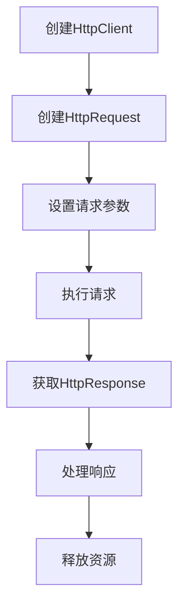

# Apache HttpClient 完全指南

## 目录

- [1. Apache HttpClient 概述](https://claude.ai/chat/d821468f-fe60-4ffb-b27b-b963b9a62b49#1-apache-httpclient-概述)
- [2. 核心概念与组件](https://claude.ai/chat/d821468f-fe60-4ffb-b27b-b963b9a62b49#2-核心概念与组件)
- [3. Spring Boot 集成](https://claude.ai/chat/d821468f-fe60-4ffb-b27b-b963b9a62b49#3-spring-boot-集成)
- [4. 基础使用](https://claude.ai/chat/d821468f-fe60-4ffb-b27b-b963b9a62b49#4-基础使用)
- [5. 高级特性](https://claude.ai/chat/d821468f-fe60-4ffb-b27b-b963b9a62b49#5-高级特性)
- [6. 连接池管理](https://claude.ai/chat/d821468f-fe60-4ffb-b27b-b963b9a62b49#6-连接池管理)
- [7. 请求与响应处理](https://claude.ai/chat/d821468f-fe60-4ffb-b27b-b963b9a62b49#7-请求与响应处理)
- [8. 认证与安全](https://claude.ai/chat/d821468f-fe60-4ffb-b27b-b963b9a62b49#8-认证与安全)
- [9. 性能优化](https://claude.ai/chat/d821468f-fe60-4ffb-b27b-b963b9a62b49#9-性能优化)
- [10. 错误处理与重试机制](https://claude.ai/chat/d821468f-fe60-4ffb-b27b-b963b9a62b49#10-错误处理与重试机制)
- [11. 与RestTemplate的对比](https://claude.ai/chat/d821468f-fe60-4ffb-b27b-b963b9a62b49#11-与resttemplate的对比)
- [12. 实战案例](https://claude.ai/chat/d821468f-fe60-4ffb-b27b-b963b9a62b49#12-实战案例)
- [13. 常见问题与解决方案](https://claude.ai/chat/d821468f-fe60-4ffb-b27b-b963b9a62b49#13-常见问题与解决方案)

## 1. Apache HttpClient 概述

### 1.1 什么是Apache HttpClient

Apache HttpClient是Apache软件基金会开发的一个功能丰富的HTTP客户端库，用于在Java应用程序中发送HTTP请求和处理HTTP响应。

### 1.2 主要特性

- **协议支持**: HTTP/1.0, HTTP/1.1, HTTP/2
- **连接管理**: 连接池、持久连接、连接复用
- **认证机制**: Basic、Digest、NTLM、Kerberos等
- **代理支持**: HTTP代理、SOCKS代理
- **Cookie管理**: 自动处理Cookie
- **重试机制**: 可配置的请求重试
- **超时控制**: 连接超时、读取超时
- **SSL/TLS支持**: HTTPS连接
- **异步请求**: 支持异步HTTP请求
- **请求/响应拦截器**: 可自定义拦截器链

### 1.3 版本说明

```xml
<!-- HttpClient 5.x (最新版本) -->
<dependency>
    <groupId>org.apache.httpcomponents.client5</groupId>
    <artifactId>httpclient5</artifactId>
    <version>5.3</version>
</dependency>

<!-- HttpClient 4.x (广泛使用) -->
<dependency>
    <groupId>org.apache.httpcomponents</groupId>
    <artifactId>httpclient</artifactId>
    <version>4.5.14</version>
</dependency>
```

## 2. 核心概念与组件

### 2.1 核心类结构

```java
// 核心接口和类的层次结构
CloseableHttpClient        // HTTP客户端主类
├── HttpClientBuilder      // 客户端构建器
├── HttpClients           // 工厂类
└── DefaultHttpClient     // 默认实现（已废弃）

HttpRequest               // HTTP请求接口
├── HttpGet              // GET请求
├── HttpPost             // POST请求
├── HttpPut              // PUT请求
├── HttpDelete           // DELETE请求
├── HttpPatch            // PATCH请求
└── HttpHead             // HEAD请求

HttpResponse              // HTTP响应接口
├── StatusLine           // 状态行
├── HttpEntity           // 响应实体
└── Header[]             // 响应头

HttpEntity                // HTTP实体
├── StringEntity         // 字符串实体
├── ByteArrayEntity      // 字节数组实体
├── FileEntity           // 文件实体
├── InputStreamEntity    // 输入流实体
└── MultipartEntity      // 多部分实体
```

### 2.2 请求执行流程



### 2.3 关键组件说明

#### 2.3.1 HttpClient

```java
// HttpClient是执行HTTP请求的主要入口
public interface HttpClient {
    HttpResponse execute(HttpUriRequest request) throws IOException;
    HttpResponse execute(HttpHost target, HttpRequest request) throws IOException;
    <T> T execute(HttpUriRequest request, ResponseHandler<T> handler) throws IOException;
}
```

#### 2.3.2 RequestConfig

```java
// 请求配置
RequestConfig config = RequestConfig.custom()
    .setConnectTimeout(5000)           // 连接超时
    .setSocketTimeout(5000)             // 读取超时
    .setConnectionRequestTimeout(5000)  // 从连接池获取连接的超时
    .setRedirectsEnabled(true)          // 是否允许重定向
    .setMaxRedirects(3)                 // 最大重定向次数
    .build();
```

#### 2.3.3 HttpClientContext

```java
// HTTP上下文，用于在请求间共享状态
HttpClientContext context = HttpClientContext.create();
context.setCookieStore(cookieStore);
context.setCredentialsProvider(credentialsProvider);
```

## 3. Spring Boot 集成

### 3.1 Maven依赖配置

```xml
<dependencies>
    <!-- Spring Boot Starter Web -->
    <dependency>
        <groupId>org.springframework.boot</groupId>
        <artifactId>spring-boot-starter-web</artifactId>
    </dependency>
    
    <!-- Apache HttpClient -->
    <dependency>
        <groupId>org.apache.httpcomponents</groupId>
        <artifactId>httpclient</artifactId>
    </dependency>
    
    <!-- 连接池管理 -->
    <dependency>
        <groupId>org.apache.httpcomponents</groupId>
        <artifactId>httpclient-cache</artifactId>
    </dependency>
    
    <!-- 异步客户端 -->
    <dependency>
        <groupId>org.apache.httpcomponents</groupId>
        <artifactId>httpasyncclient</artifactId>
    </dependency>
</dependencies>
```

### 3.2 配置类实现

```java
@Configuration
public class HttpClientConfig {
    
    @Value("${http.client.connection.timeout:5000}")
    private int connectionTimeout;
    
    @Value("${http.client.socket.timeout:5000}")
    private int socketTimeout;
    
    @Value("${http.client.connection.request.timeout:5000}")
    private int connectionRequestTimeout;
    
    @Value("${http.client.max.total:200}")
    private int maxTotal;
    
    @Value("${http.client.max.per.route:20}")
    private int maxPerRoute;
    
    /**
     * 连接池管理器
     */
    @Bean
    public PoolingHttpClientConnectionManager connectionManager() {
        PoolingHttpClientConnectionManager manager = new PoolingHttpClientConnectionManager();
        manager.setMaxTotal(maxTotal);                    // 最大连接数
        manager.setDefaultMaxPerRoute(maxPerRoute);       // 每个路由的最大连接数
        manager.setValidateAfterInactivity(2000);        // 空闲连接验证时间
        return manager;
    }
    
    /**
     * 请求配置
     */
    @Bean
    public RequestConfig requestConfig() {
        return RequestConfig.custom()
                .setConnectTimeout(connectionTimeout)
                .setSocketTimeout(socketTimeout)
                .setConnectionRequestTimeout(connectionRequestTimeout)
                .build();
    }
    
    /**
     * HttpClient构建器
     */
    @Bean
    public HttpClientBuilder httpClientBuilder(
            PoolingHttpClientConnectionManager connectionManager,
            RequestConfig requestConfig) {
        return HttpClients.custom()
                .setConnectionManager(connectionManager)
                .setDefaultRequestConfig(requestConfig)
                .setKeepAliveStrategy(new DefaultConnectionKeepAliveStrategy())
                .setRetryHandler(new DefaultHttpRequestRetryHandler(3, true));
    }
    
    /**
     * HttpClient实例
     */
    @Bean
    public CloseableHttpClient httpClient(HttpClientBuilder builder) {
        return builder.build();
    }
    
    /**
     * RestTemplate集成HttpClient
     */
    @Bean
    public RestTemplate restTemplate(CloseableHttpClient httpClient) {
        HttpComponentsClientHttpRequestFactory factory = 
            new HttpComponentsClientHttpRequestFactory(httpClient);
        return new RestTemplate(factory);
    }
}
```

### 3.3 配置文件(application.yml)

```yaml
http:
  client:
    connection:
      timeout: 5000           # 连接超时(毫秒)
      request:
        timeout: 5000         # 请求超时(毫秒)
    socket:
      timeout: 30000          # Socket超时(毫秒)
    max:
      total: 200              # 最大连接数
      per:
        route: 20             # 每个路由最大连接数
    retry:
      count: 3                # 重试次数
      enabled: true           # 是否启用重试
    keep-alive:
      duration: 60000         # 连接保持时间(毫秒)
    proxy:
      host: proxy.example.com
      port: 8080
      enabled: false
```

## 4. 基础使用

### 4.1 GET请求

```java
@Service
public class HttpClientService {
    
    @Autowired
    private CloseableHttpClient httpClient;
    
    /**
     * 简单GET请求
     */
    public String doGet(String url) throws IOException {
        HttpGet httpGet = new HttpGet(url);
        
        try (CloseableHttpResponse response = httpClient.execute(httpGet)) {
            HttpEntity entity = response.getEntity();
            if (entity != null) {
                return EntityUtils.toString(entity, StandardCharsets.UTF_8);
            }
        }
        return null;
    }
    
    /**
     * 带参数的GET请求
     */
    public String doGetWithParams(String url, Map<String, String> params) throws IOException, URISyntaxException {
        URIBuilder builder = new URIBuilder(url);
        
        // 添加参数
        for (Map.Entry<String, String> entry : params.entrySet()) {
            builder.addParameter(entry.getKey(), entry.getValue());
        }
        
        HttpGet httpGet = new HttpGet(builder.build());
        
        // 添加请求头
        httpGet.addHeader("User-Agent", "Mozilla/5.0");
        httpGet.addHeader("Accept", "application/json");
        
        try (CloseableHttpResponse response = httpClient.execute(httpGet)) {
            int statusCode = response.getStatusLine().getStatusCode();
            
            if (statusCode == HttpStatus.SC_OK) {
                HttpEntity entity = response.getEntity();
                return EntityUtils.toString(entity, StandardCharsets.UTF_8);
            } else {
                throw new RuntimeException("HTTP GET请求失败，状态码: " + statusCode);
            }
        }
    }
}
```

### 4.2 POST请求

```java
/**
 * POST请求 - JSON数据
 */
public String doPostJson(String url, Object data) throws IOException {
    HttpPost httpPost = new HttpPost(url);
    
    // 设置请求头
    httpPost.setHeader("Content-Type", "application/json;charset=UTF-8");
    httpPost.setHeader("Accept", "application/json");
    
    // 设置请求体
    String jsonString = new ObjectMapper().writeValueAsString(data);
    StringEntity entity = new StringEntity(jsonString, ContentType.APPLICATION_JSON);
    httpPost.setEntity(entity);
    
    try (CloseableHttpResponse response = httpClient.execute(httpPost)) {
        HttpEntity responseEntity = response.getEntity();
        if (responseEntity != null) {
            return EntityUtils.toString(responseEntity, StandardCharsets.UTF_8);
        }
    }
    return null;
}

/**
 * POST请求 - 表单数据
 */
public String doPostForm(String url, Map<String, String> params) throws IOException {
    HttpPost httpPost = new HttpPost(url);
    
    // 构建表单参数
    List<NameValuePair> formParams = new ArrayList<>();
    for (Map.Entry<String, String> entry : params.entrySet()) {
        formParams.add(new BasicNameValuePair(entry.getKey(), entry.getValue()));
    }
    
    UrlEncodedFormEntity entity = new UrlEncodedFormEntity(formParams, StandardCharsets.UTF_8);
    httpPost.setEntity(entity);
    
    try (CloseableHttpResponse response = httpClient.execute(httpPost)) {
        return EntityUtils.toString(response.getEntity(), StandardCharsets.UTF_8);
    }
}

/**
 * POST请求 - 文件上传
 */
public String doPostFile(String url, File file, Map<String, String> params) throws IOException {
    HttpPost httpPost = new HttpPost(url);
    
    // 构建多部分实体
    MultipartEntityBuilder builder = MultipartEntityBuilder.create();
    builder.setMode(HttpMultipartMode.BROWSER_COMPATIBLE);
    
    // 添加文件
    builder.addBinaryBody("file", file, ContentType.DEFAULT_BINARY, file.getName());
    
    // 添加其他参数
    for (Map.Entry<String, String> entry : params.entrySet()) {
        builder.addTextBody(entry.getKey(), entry.getValue(), 
            ContentType.create("text/plain", StandardCharsets.UTF_8));
    }
    
    HttpEntity entity = builder.build();
    httpPost.setEntity(entity);
    
    try (CloseableHttpResponse response = httpClient.execute(httpPost)) {
        return EntityUtils.toString(response.getEntity(), StandardCharsets.UTF_8);
    }
}
```

### 4.3 PUT和DELETE请求

```java
/**
 * PUT请求
 */
public String doPut(String url, Object data) throws IOException {
    HttpPut httpPut = new HttpPut(url);
    
    httpPut.setHeader("Content-Type", "application/json;charset=UTF-8");
    
    String jsonString = new ObjectMapper().writeValueAsString(data);
    StringEntity entity = new StringEntity(jsonString, ContentType.APPLICATION_JSON);
    httpPut.setEntity(entity);
    
    try (CloseableHttpResponse response = httpClient.execute(httpPut)) {
        return EntityUtils.toString(response.getEntity(), StandardCharsets.UTF_8);
    }
}

/**
 * DELETE请求
 */
public String doDelete(String url) throws IOException {
    HttpDelete httpDelete = new HttpDelete(url);
    
    try (CloseableHttpResponse response = httpClient.execute(httpDelete)) {
        int statusCode = response.getStatusLine().getStatusCode();
        if (statusCode == HttpStatus.SC_OK || statusCode == HttpStatus.SC_NO_CONTENT) {
            return "删除成功";
        } else {
            throw new RuntimeException("删除失败，状态码: " + statusCode);
        }
    }
}
```

## 5. 高级特性

### 5.1 请求拦截器

```java
@Component
public class CustomHttpRequestInterceptor implements HttpRequestInterceptor {
    
    @Override
    public void process(HttpRequest request, HttpContext context) throws HttpException, IOException {
        // 添加通用请求头
        request.addHeader("X-Request-Id", UUID.randomUUID().toString());
        request.addHeader("X-Timestamp", String.valueOf(System.currentTimeMillis()));
        
        // 记录请求日志
        if (request instanceof HttpEntityEnclosingRequest) {
            HttpEntity entity = ((HttpEntityEnclosingRequest) request).getEntity();
            if (entity != null) {
                String content = EntityUtils.toString(entity);
                log.info("Request Body: {}", content);
            }
        }
    }
}

// 配置拦截器
@Bean
public CloseableHttpClient httpClientWithInterceptor() {
    return HttpClients.custom()
            .addInterceptorFirst(new CustomHttpRequestInterceptor())
            .addInterceptorLast(new CustomHttpResponseInterceptor())
            .build();
}
```

### 5.2 响应拦截器

```java
@Component
public class CustomHttpResponseInterceptor implements HttpResponseInterceptor {
    
    @Override
    public void process(HttpResponse response, HttpContext context) throws HttpException, IOException {
        // 获取响应状态
        int statusCode = response.getStatusLine().getStatusCode();
        
        // 记录响应时间
        Long startTime = (Long) context.getAttribute("request.start.time");
        if (startTime != null) {
            long duration = System.currentTimeMillis() - startTime;
            log.info("Request duration: {} ms", duration);
        }
        
        // 处理特定状态码
        if (statusCode >= 400) {
            log.error("HTTP Error: {}", statusCode);
        }
    }
}
```

### 5.3 自定义响应处理器

```java
/**
 * 泛型响应处理器
 */
public class JsonResponseHandler<T> implements ResponseHandler<T> {
    
    private final Class<T> responseClass;
    private final ObjectMapper objectMapper;
    
    public JsonResponseHandler(Class<T> responseClass) {
        this.responseClass = responseClass;
        this.objectMapper = new ObjectMapper();
    }
    
    @Override
    public T handleResponse(HttpResponse response) throws IOException {
        int status = response.getStatusLine().getStatusCode();
        
        if (status >= 200 && status < 300) {
            HttpEntity entity = response.getEntity();
            if (entity != null) {
                String json = EntityUtils.toString(entity, StandardCharsets.UTF_8);
                return objectMapper.readValue(json, responseClass);
            }
            return null;
        } else {
            throw new ClientProtocolException("Unexpected response status: " + status);
        }
    }
}

// 使用示例
public User getUser(String url) throws IOException {
    HttpGet httpGet = new HttpGet(url);
    return httpClient.execute(httpGet, new JsonResponseHandler<>(User.class));
}
```

### 5.4 异步请求

```java
@Configuration
public class AsyncHttpClientConfig {
    
    @Bean
    public CloseableHttpAsyncClient asyncHttpClient() {
        return HttpAsyncClients.custom()
                .setMaxConnTotal(100)
                .setMaxConnPerRoute(10)
                .build();
    }
}

@Service
public class AsyncHttpService {
    
    @Autowired
    private CloseableHttpAsyncClient asyncHttpClient;
    
    @PostConstruct
    public void init() {
        asyncHttpClient.start();
    }
    
    @PreDestroy
    public void destroy() throws IOException {
        asyncHttpClient.close();
    }
    
    /**
     * 异步GET请求
     */
    public CompletableFuture<String> doGetAsync(String url) {
        CompletableFuture<String> future = new CompletableFuture<>();
        
        HttpGet request = new HttpGet(url);
        asyncHttpClient.execute(request, new FutureCallback<HttpResponse>() {
            
            @Override
            public void completed(HttpResponse response) {
                try {
                    String result = EntityUtils.toString(response.getEntity());
                    future.complete(result);
                } catch (IOException e) {
                    future.completeExceptionally(e);
                }
            }
            
            @Override
            public void failed(Exception ex) {
                future.completeExceptionally(ex);
            }
            
            @Override
            public void cancelled() {
                future.cancel(true);
            }
        });
        
        return future;
    }
    
    /**
     * 批量异步请求
     */
    public List<CompletableFuture<String>> doBatchAsync(List<String> urls) {
        return urls.stream()
                .map(this::doGetAsync)
                .collect(Collectors.toList());
    }
}
```

## 6. 连接池管理

### 6.1 连接池配置详解

```java
@Component
public class HttpConnectionPoolManager {
    
    private final PoolingHttpClientConnectionManager connectionManager;
    private final ScheduledExecutorService scheduler = Executors.newScheduledThreadPool(1);
    
    public HttpConnectionPoolManager() {
        // 创建连接池管理器
        connectionManager = new PoolingHttpClientConnectionManager();
        
        // 设置最大连接数
        connectionManager.setMaxTotal(200);
        
        // 设置每个路由的最大连接数
        connectionManager.setDefaultMaxPerRoute(20);
        
        // 设置特定路由的最大连接数
        HttpHost httpHost = new HttpHost("api.example.com", 80);
        connectionManager.setMaxPerRoute(new HttpRoute(httpHost), 50);
        
        // 设置socket配置
        SocketConfig socketConfig = SocketConfig.custom()
                .setTcpNoDelay(true)           // 禁用Nagle算法
                .setSoTimeout(5000)             // Socket超时
                .setSoKeepAlive(true)           // 保持连接
                .build();
        connectionManager.setDefaultSocketConfig(socketConfig);
        
        // 启动定时清理任务
        startIdleConnectionMonitor();
    }
    
    /**
     * 定时清理空闲连接
     */
    private void startIdleConnectionMonitor() {
        scheduler.scheduleWithFixedDelay(() -> {
            // 关闭过期连接
            connectionManager.closeExpiredConnections();
            
            // 关闭空闲超过30秒的连接
            connectionManager.closeIdleConnections(30, TimeUnit.SECONDS);
            
            // 打印连接池状态
            logPoolStats();
        }, 30, 30, TimeUnit.SECONDS);
    }
    
    /**
     * 获取连接池状态
     */
    public PoolStats getPoolStats() {
        return connectionManager.getTotalStats();
    }
    
    /**
     * 打印连接池状态
     */
    private void logPoolStats() {
        PoolStats stats = connectionManager.getTotalStats();
        log.info("连接池状态 - 总连接数: {}, 空闲连接: {}, 等待连接: {}", 
                stats.getLeased() + stats.getAvailable(),
                stats.getAvailable(),
                stats.getPending());
    }
    
    @PreDestroy
    public void shutdown() {
        scheduler.shutdown();
        connectionManager.close();
    }
}
```

### 6.2 连接池监控

```java
@RestController
@RequestMapping("/http-pool")
public class HttpPoolMonitorController {
    
    @Autowired
    private PoolingHttpClientConnectionManager connectionManager;
    
    /**
     * 获取连接池详细状态
     */
    @GetMapping("/stats")
    public Map<String, Object> getPoolStats() {
        Map<String, Object> stats = new HashMap<>();
        
        PoolStats totalStats = connectionManager.getTotalStats();
        stats.put("total", Map.of(
            "leased", totalStats.getLeased(),
            "pending", totalStats.getPending(),
            "available", totalStats.getAvailable(),
            "max", totalStats.getMax()
        ));
        
        // 获取每个路由的统计信息
        Map<String, Map<String, Object>> routeStats = new HashMap<>();
        connectionManager.getRoutes().forEach(route -> {
            PoolStats routeStat = connectionManager.getStats(route);
            routeStats.put(route.toString(), Map.of(
                "leased", routeStat.getLeased(),
                "pending", routeStat.getPending(),
                "available", routeStat.getAvailable(),
                "max", routeStat.getMax()
            ));
        });
        stats.put("routes", routeStats);
        
        return stats;
    }
    
    /**
     * 清理连接池
     */
    @PostMapping("/clean")
    public String cleanPool() {
        connectionManager.closeExpiredConnections();
        connectionManager.closeIdleConnections(0, TimeUnit.SECONDS);
        return "连接池清理完成";
    }
}
```

## 7. 请求与响应处理

### 7.1 自定义请求实体

```java
/**
 * 自定义JSON实体
 */
public class CustomJsonEntity extends AbstractHttpEntity {
    
    private final Object object;
    private final ObjectMapper objectMapper;
    
    public CustomJsonEntity(Object object) {
        this.object = object;
        this.objectMapper = new ObjectMapper();
        setContentType("application/json; charset=UTF-8");
    }
    
    @Override
    public boolean isRepeatable() {
        return true;
    }
    
    @Override
    public long getContentLength() {
        return -1;
    }
    
    @Override
    public InputStream getContent() throws IOException {
        String json = objectMapper.writeValueAsString(object);
        return new ByteArrayInputStream(json.getBytes(StandardCharsets.UTF_8));
    }
    
    @Override
    public void writeTo(OutputStream outstream) throws IOException {
        objectMapper.writeValue(outstream, object);
    }
    
    @Override
    public boolean isStreaming() {
        return false;
    }
}
```

### 7.2 流式响应处理

```java
/**
 * 处理大文件下载
 */
public void downloadLargeFile(String url, String targetPath) throws IOException {
    HttpGet httpGet = new HttpGet(url);
    
    try (CloseableHttpResponse response = httpClient.execute(httpGet)) {
        HttpEntity entity = response.getEntity();
        
        if (entity != null) {
            // 获取文件大小
            long contentLength = entity.getContentLength();
            log.info("文件大小: {} bytes", contentLength);
            
            // 流式写入文件
            try (InputStream inputStream = entity.getContent();
                 OutputStream outputStream = new FileOutputStream(targetPath)) {
                
                byte[] buffer = new byte[8192];
                int bytesRead;
                long totalBytesRead = 0;
                
                while ((bytesRead = inputStream.read(buffer)) != -1) {
                    outputStream.write(buffer, 0, bytesRead);
                    totalBytesRead += bytesRead;
                    
                    // 打印下载进度
                    if (contentLength > 0) {
                        int progress = (int) ((totalBytesRead * 100) / contentLength);
                        log.debug("下载进度: {}%", progress);
                    }
                }
            }
        }
    }
}

/**
 * 处理响应流
 */
public void processResponseStream(String url, Consumer<String> lineProcessor) throws IOException {
    HttpGet httpGet = new HttpGet(url);
    
    try (CloseableHttpResponse response = httpClient.execute(httpGet)) {
        HttpEntity entity = response.getEntity();
        
        if (entity != null) {
            try (BufferedReader reader = new BufferedReader(
                    new InputStreamReader(entity.getContent(), StandardCharsets.UTF_8))) {
                
                String line;
                while ((line = reader.readLine()) != null) {
                    lineProcessor.accept(line);
                }
            }
        }
    }
}
```

### 7.3 响应缓存

```java
@Configuration
public class CachingHttpClientConfig {
    
    @Bean
    public CloseableHttpClient cachingHttpClient() {
        CacheConfig cacheConfig = CacheConfig.custom()
                .setMaxCacheEntries(1000)
                .setMaxObjectSize(8192)
                .build();
        
        return CachingHttpClients.custom()
                .setCacheConfig(cacheConfig)
                .build();
    }
}
```

## 8. 认证与安全

### 8.1 Basic认证

```java
/**
 * Basic认证配置
 */
public class BasicAuthConfig {
    
    public CloseableHttpClient createBasicAuthClient(String username, String password) {
        CredentialsProvider credentialsProvider = new BasicCredentialsProvider();
        credentialsProvider.setCredentials(
                AuthScope.ANY,
                new UsernamePasswordCredentials(username, password)
        );
        
        return HttpClients.custom()
                .setDefaultCredentialsProvider(credentialsProvider)
                .build();
    }
    
    /**
     * 使用Basic认证发送请求
     */
    public String doGetWithBasicAuth(String url, String username, String password) throws IOException {
        HttpGet httpGet = new HttpGet(url);
        
        // 方式1: 手动添加认证头
        String auth = username + ":" + password;
        String encodedAuth = Base64.getEncoder().encodeToString(auth.getBytes(StandardCharsets.UTF_8));
        httpGet.setHeader("Authorization", "Basic " + encodedAuth);
        
        try (CloseableHttpResponse response = httpClient.execute(httpGet)) {
            return EntityUtils.toString(response.getEntity());
        }
    }
}
```

### 8.2 Bearer Token认证

```java
/**
 * Bearer Token认证
 */
public class BearerTokenAuth {
    
    public String doGetWithBearerToken(String url, String token) throws IOException {
        HttpGet httpGet = new HttpGet(url);
        httpGet.setHeader("Authorization", "Bearer " + token);
        
        try (CloseableHttpResponse response = httpClient.execute(httpGet)) {
            return EntityUtils.toString(response.getEntity());
        }
    }
    
    /**
     * OAuth2认证流程
     */
    public String getOAuth2Token(String tokenUrl, String clientId, String clientSecret) throws IOException {
        HttpPost httpPost = new HttpPost(tokenUrl);
        
        // 设置认证参数
        List<NameValuePair> params = Arrays.asList(
            new BasicNameValuePair("grant_type", "client_credentials"),
            new BasicNameValuePair("client_id", clientId),
            new BasicNameValuePair("client_secret", clientSecret)
        );
        
        httpPost.setEntity(new UrlEncodedFormEntity(params));
        
        try (CloseableHttpResponse response = httpClient.execute(httpPost)) {
            String json = EntityUtils.toString(response.getEntity());
            JsonNode node = new ObjectMapper().readTree(json);
            return node.get("access_token").asText();
        }
    }
}
```

### 8.3 SSL/TLS配置

```java
/**
 * SSL配置
 */
@Configuration
public class SSLConfig {
    
    /**
     * 信任所有证书（仅用于测试环境）
     */
    public CloseableHttpClient createTrustAllClient() throws Exception {
        SSLContext sslContext = SSLContexts.custom()
                .loadTrustMaterial(null, new TrustAllStrategy())
                .build();
        
        SSLConnectionSocketFactory sslSocketFactory = new SSLConnectionSocketFactory(
                sslContext,
                NoopHostnameVerifier.INSTANCE
        );
        
        return HttpClients.custom()
                .setSSLSocketFactory(sslSocketFactory)
                .build();
    }
    
    /**
     * 使用自定义证书
     */
    public CloseableHttpClient createCustomSSLClient(String keystorePath, String password) throws Exception {
        KeyStore keyStore = KeyStore.getInstance("JKS");
        try (FileInputStream instream = new FileInputStream(keystorePath)) {
            keyStore.load(instream, password.toCharArray());
        }
        
        SSLContext sslContext = SSLContexts.custom()
                .loadKeyMaterial(keyStore, password.toCharArray())
                .loadTrustMaterial(keyStore, new TrustSelfSignedStrategy())
                .build();
        
        SSLConnectionSocketFactory sslSocketFactory = new SSLConnectionSocketFactory(
                sslContext,
                new String[] { "TLSv1.2", "TLSv1.3" },
                null,
                SSLConnectionSocketFactory.getDefaultHostnameVerifier()
        );
        
        return HttpClients.custom()
                .setSSLSocketFactory(sslSocketFactory)
                .build();
    }
}

/**
 * 信任所有证书策略
 */
class TrustAllStrategy implements TrustStrategy {
    @Override
    public boolean isTrusted(X509Certificate[] chain, String authType) {
        return true;
    }
}
```

## 9. 性能优化

### 9.1 连接复用

```java
/**
 * 连接复用策略
 */
public class ConnectionReuseStrategy {
    
    @Bean
    public ConnectionKeepAliveStrategy keepAliveStrategy() {
        return new DefaultConnectionKeepAliveStrategy() {
            @Override
            public long getKeepAliveDuration(HttpResponse response, HttpContext context) {
                long keepAlive = super.getKeepAliveDuration(response, context);
                
                // 如果服务器没有指定keep-alive时间，默认30秒
                if (keepAlive == -1) {
                    keepAlive = 30 * 1000;
                }
                
                return keepAlive;
            }
        };
    }
}
```

### 9.2 压缩处理

```java
/**
 * GZIP压缩处理
 */
public class GzipConfig {
    
    @Bean
    public CloseableHttpClient gzipEnabledClient() {
        return HttpClients.custom()
                .addInterceptorFirst(new HttpRequestInterceptor() {
                    @Override
                    public void process(HttpRequest request, HttpContext context) {
                        // 请求压缩
                        if (!request.containsHeader("Accept-Encoding")) {
                            request.addHeader("Accept-Encoding", "gzip");
                        }
                    }
                })
                .addInterceptorFirst(new HttpResponseInterceptor() {
                    @Override
                    public void process(HttpResponse response, HttpContext context) {
                        HttpEntity entity = response.getEntity();
                        if (entity != null) {
                            Header ceHeader = entity.getContentEncoding();
                            if (ceHeader != null) {
                                HeaderElement[] codecs = ceHeader.getElements();
                                for (HeaderElement codec : codecs) {
                                    if (codec.getName().equalsIgnoreCase("gzip")) {
                                        response.setEntity(new GzipDecompressingEntity(entity));
                                        return;
                                    }
                                }
                            }
                        }
                    }
                })
                .build();
    }
}
```

### 9.3 批量请求优化

```java
/**
 * 批量请求处理器
 */
@Service
public class BatchRequestService {
    
    @Autowired
    private CloseableHttpClient httpClient;
    
    /**
     * 并发批量请求
     */
    public List<String> executeBatchRequests(List<String> urls, int concurrency) {
        ExecutorService executor = Executors.newFixedThreadPool(concurrency);
        List<Future<String>> futures = new ArrayList<>();
        
        for (String url : urls) {
            Future<String> future = executor.submit(() -> {
                try {
                    return doGet(url);
                } catch (IOException e) {
                    log.error("请求失败: {}", url, e);
                    return null;
                }
            });
            futures.add(future);
        }
        
        List<String> results = new ArrayList<>();
        for (Future<String> future : futures) {
            try {
                results.add(future.get(30, TimeUnit.SECONDS));
            } catch (Exception e) {
                log.error("获取结果失败", e);
                results.add(null);
            }
        }
        
        executor.shutdown();
        return results;
    }
    
    /**
     * HTTP/2 多路复用
     */
    public List<String> executeHttp2Multiplexing(List<String> urls) throws Exception {
        // HTTP/2 客户端配置
        final IOReactorConfig ioConfig = IOReactorConfig.custom()
                .setSoTimeout(30000)
                .build();
        
        final H2Config h2Config = H2Config.custom()
                .setPushEnabled(false)
                .build();
        
        CloseableHttpAsyncClient client = HttpAsyncClients.custom()
                .setIOReactorConfig(ioConfig)
                .setH2Config(h2Config)
                .build();
        
        client.start();
        
        List<Future<HttpResponse>> futures = urls.stream()
                .map(url -> client.execute(new HttpGet(url), null))
                .collect(Collectors.toList());
        
        List<String> results = new ArrayList<>();
        for (Future<HttpResponse> future : futures) {
            HttpResponse response = future.get();
            results.add(EntityUtils.toString(response.getEntity()));
        }
        
        client.close();
        return results;
    }
}
```

## 10. 错误处理与重试机制

### 10.1 自定义重试处理器

```java
/**
 * 自定义重试处理器
 */
public class CustomRetryHandler implements HttpRequestRetryHandler {
    
    private final int maxRetries;
    private final Set<Class<? extends IOException>> retryableExceptions;
    
    public CustomRetryHandler(int maxRetries) {
        this.maxRetries = maxRetries;
        this.retryableExceptions = new HashSet<>();
        this.retryableExceptions.add(ConnectTimeoutException.class);
        this.retryableExceptions.add(SocketTimeoutException.class);
        this.retryableExceptions.add(NoHttpResponseException.class);
    }
    
    @Override
    public boolean retryRequest(IOException exception, int executionCount, HttpContext context) {
        // 超过最大重试次数
        if (executionCount >= maxRetries) {
            log.error("已达到最大重试次数: {}", maxRetries);
            return false;
        }
        
        // 判断是否可重试的异常
        if (retryableExceptions.contains(exception.getClass())) {
            log.info("发生可重试异常: {}, 执行第{}次重试", exception.getClass().getName(), executionCount);
            return true;
        }
        
        // 判断请求是否幂等
        HttpClientContext clientContext = HttpClientContext.adapt(context);
        HttpRequest request = clientContext.getRequest();
        boolean idempotent = !(request instanceof HttpEntityEnclosingRequest);
        
        if (idempotent) {
            log.info("幂等请求，执行第{}次重试", executionCount);
            return true;
        }
        
        return false;
    }
}

/**
 * 指数退避重试策略
 */
public class ExponentialBackoffRetryStrategy implements ServiceUnavailableRetryStrategy {
    
    private final int maxRetries;
    private final long initialInterval;
    
    public ExponentialBackoffRetryStrategy(int maxRetries, long initialInterval) {
        this.maxRetries = maxRetries;
        this.initialInterval = initialInterval;
    }
    
    @Override
    public boolean retryRequest(HttpResponse response, int executionCount, HttpContext context) {
        return executionCount <= maxRetries && 
               response.getStatusLine().getStatusCode() >= 500;
    }
    
    @Override
    public long getRetryInterval() {
        return initialInterval * (long) Math.pow(2, executionCount - 1);
    }
}
```

### 10.2 异常处理

```java
/**
 * 全局异常处理
 */
@Component
public class HttpClientExceptionHandler {
    
    /**
     * 执行请求并处理异常
     */
    public <T> T executeWithExceptionHandling(
            Supplier<T> requestSupplier, 
            String operation) {
        
        try {
            return requestSupplier.get();
        } catch (ConnectTimeoutException e) {
            log.error("{} - 连接超时: {}", operation, e.getMessage());
            throw new HttpClientException("连接超时，请稍后重试", e);
        } catch (SocketTimeoutException e) {
            log.error("{} - 读取超时: {}", operation, e.getMessage());
            throw new HttpClientException("读取数据超时", e);
        } catch (NoHttpResponseException e) {
            log.error("{} - 服务器无响应: {}", operation, e.getMessage());
            throw new HttpClientException("服务器无响应", e);
        } catch (HttpHostConnectException e) {
            log.error("{} - 无法连接到主机: {}", operation, e.getMessage());
            throw new HttpClientException("无法连接到服务器", e);
        } catch (ClientProtocolException e) {
            log.error("{} - 协议错误: {}", operation, e.getMessage());
            throw new HttpClientException("HTTP协议错误", e);
        } catch (IOException e) {
            log.error("{} - IO异常: {}", operation, e.getMessage());
            throw new HttpClientException("网络通信异常", e);
        } catch (Exception e) {
            log.error("{} - 未知异常: {}", operation, e.getMessage());
            throw new HttpClientException("请求处理失败", e);
        }
    }
}

/**
 * 自定义HttpClient异常
 */
public class HttpClientException extends RuntimeException {
    
    private final int statusCode;
    private final String responseBody;
    
    public HttpClientException(String message) {
        super(message);
        this.statusCode = -1;
        this.responseBody = null;
    }
    
    public HttpClientException(String message, Throwable cause) {
        super(message, cause);
        this.statusCode = -1;
        this.responseBody = null;
    }
    
    public HttpClientException(String message, int statusCode, String responseBody) {
        super(message);
        this.statusCode = statusCode;
        this.responseBody = responseBody;
    }
    
    // Getters
}
```

### 10.3 熔断器集成

```java
/**
 * 集成Hystrix熔断器
 */
@Component
public class HttpClientWithCircuitBreaker {
    
    @Autowired
    private CloseableHttpClient httpClient;
    
    @HystrixCommand(
        fallbackMethod = "fallbackGet",
        commandProperties = {
            @HystrixProperty(name = "execution.isolation.thread.timeoutInMilliseconds", value = "5000"),
            @HystrixProperty(name = "circuitBreaker.requestVolumeThreshold", value = "10"),
            @HystrixProperty(name = "circuitBreaker.errorThresholdPercentage", value = "50"),
            @HystrixProperty(name = "circuitBreaker.sleepWindowInMilliseconds", value = "10000")
        }
    )
    public String doGetWithCircuitBreaker(String url) throws IOException {
        HttpGet httpGet = new HttpGet(url);
        try (CloseableHttpResponse response = httpClient.execute(httpGet)) {
            return EntityUtils.toString(response.getEntity());
        }
    }
    
    /**
     * 降级方法
     */
    public String fallbackGet(String url) {
        log.warn("熔断器触发，返回降级响应: {}", url);
        return "{\"status\": \"fallback\", \"message\": \"服务暂时不可用\"}";
    }
}
```

## 11. 与RestTemplate的对比

### 11.1 特性对比

| 特性           | HttpClient         | RestTemplate                         |
| -------------- | ------------------ | ------------------------------------ |
| **复杂度**     | 较高，需要更多配置 | 简单，开箱即用                       |
| **灵活性**     | 高，可定制性强     | 中等，封装程度高                     |
| **连接池管理** | 完全控制           | 自动管理                             |
| **拦截器**     | 原生支持           | 需要通过ClientHttpRequestInterceptor |
| **异步支持**   | 原生支持           | 需要AsyncRestTemplate                |
| **流式处理**   | 支持               | 有限支持                             |
| **性能**       | 更高（细粒度控制） | 一般                                 |
| **Spring集成** | 需要手动配置       | 原生集成                             |
| **错误处理**   | 需要手动处理       | 自动处理                             |
| **类型转换**   | 手动转换           | 自动转换                             |

### 11.2 使用场景选择

**使用HttpClient的场景：**

- 需要细粒度的连接池控制
- 需要自定义SSL/TLS配置
- 需要处理大文件上传/下载
- 需要复杂的认证机制
- 需要最佳性能
- 需要处理非标准HTTP协议

**使用RestTemplate的场景：**

- 简单的REST API调用
- Spring Boot微服务间通信
- 需要快速开发
- 标准的JSON/XML数据交换
- 不需要特殊的连接管理

### 11.3 RestTemplate使用HttpClient

```java
@Configuration
public class RestTemplateConfig {
    
    @Bean
    public RestTemplate restTemplate(CloseableHttpClient httpClient) {
        // 使用HttpClient作为RestTemplate的底层实现
        HttpComponentsClientHttpRequestFactory factory = 
            new HttpComponentsClientHttpRequestFactory(httpClient);
        
        RestTemplate restTemplate = new RestTemplate(factory);
        
        // 添加消息转换器
        restTemplate.getMessageConverters().add(new MappingJackson2HttpMessageConverter());
        
        // 添加拦截器
        restTemplate.getInterceptors().add(new LoggingInterceptor());
        
        return restTemplate;
    }
}
```

## 12. 实战案例

### 12.1 完整的HTTP客户端封装

```java
@Component
@Slf4j
public class HttpClientWrapper {
    
    private final CloseableHttpClient httpClient;
    private final ObjectMapper objectMapper;
    
    public HttpClientWrapper(CloseableHttpClient httpClient) {
        this.httpClient = httpClient;
        this.objectMapper = new ObjectMapper();
    }
    
    /**
     * 通用请求方法
     */
    public <T> ApiResponse<T> execute(HttpRequestBase request, Class<T> responseClass) {
        long startTime = System.currentTimeMillis();
        String requestId = UUID.randomUUID().toString();
        
        // 添加请求ID
        request.addHeader("X-Request-Id", requestId);
        
        try {
            log.info("发送请求 [{}]: {} {}", requestId, request.getMethod(), request.getURI());
            
            try (CloseableHttpResponse response = httpClient.execute(request)) {
                int statusCode = response.getStatusLine().getStatusCode();
                String responseBody = EntityUtils.toString(response.getEntity(), StandardCharsets.UTF_8);
                
                long duration = System.currentTimeMillis() - startTime;
                log.info("请求完成 [{}]: 状态码={}, 耗时={}ms", requestId, statusCode, duration);
                
                if (statusCode >= 200 && statusCode < 300) {
                    T data = objectMapper.readValue(responseBody, responseClass);
                    return ApiResponse.success(data);
                } else {
                    return ApiResponse.error(statusCode, responseBody);
                }
            }
        } catch (Exception e) {
            log.error("请求失败 [{}]: {}", requestId, e.getMessage(), e);
            return ApiResponse.error(-1, e.getMessage());
        }
    }
    
    /**
     * GET请求
     */
    public <T> ApiResponse<T> get(String url, Map<String, String> params, 
                                   Map<String, String> headers, Class<T> responseClass) {
        try {
            URIBuilder builder = new URIBuilder(url);
            if (params != null) {
                params.forEach(builder::addParameter);
            }
            
            HttpGet httpGet = new HttpGet(builder.build());
            if (headers != null) {
                headers.forEach(httpGet::addHeader);
            }
            
            return execute(httpGet, responseClass);
        } catch (URISyntaxException e) {
            return ApiResponse.error(-1, "URL格式错误: " + e.getMessage());
        }
    }
    
    /**
     * POST请求
     */
    public <T> ApiResponse<T> post(String url, Object body, 
                                    Map<String, String> headers, Class<T> responseClass) {
        HttpPost httpPost = new HttpPost(url);
        
        if (headers != null) {
            headers.forEach(httpPost::addHeader);
        }
        
        if (body != null) {
            try {
                String jsonBody = objectMapper.writeValueAsString(body);
                httpPost.setEntity(new StringEntity(jsonBody, ContentType.APPLICATION_JSON));
            } catch (JsonProcessingException e) {
                return ApiResponse.error(-1, "JSON序列化失败: " + e.getMessage());
            }
        }
        
        return execute(httpPost, responseClass);
    }
}

/**
 * 统一响应包装
 */
@Data
@Builder
public class ApiResponse<T> {
    private boolean success;
    private int code;
    private String message;
    private T data;
    
    public static <T> ApiResponse<T> success(T data) {
        return ApiResponse.<T>builder()
                .success(true)
                .code(200)
                .data(data)
                .build();
    }
    
    public static <T> ApiResponse<T> error(int code, String message) {
        return ApiResponse.<T>builder()
                .success(false)
                .code(code)
                .message(message)
                .build();
    }
}
```

### 12.2 微服务调用客户端

```java
/**
 * 微服务调用客户端
 */
@Component
public class MicroserviceClient {
    
    private final HttpClientWrapper httpClient;
    private final ServiceDiscovery serviceDiscovery;
    
    /**
     * 调用微服务
     */
    public <T> T callService(String serviceName, String path, 
                             HttpMethod method, Object body, Class<T> responseClass) {
        
        // 服务发现
        String serviceUrl = serviceDiscovery.getServiceUrl(serviceName);
        String fullUrl = serviceUrl + path;
        
        // 添加追踪头
        Map<String, String> headers = new HashMap<>();
        headers.put("X-Trace-Id", MDC.get("traceId"));
        headers.put("X-Span-Id", UUID.randomUUID().toString());
        
        ApiResponse<T> response;
        switch (method) {
            case GET:
                response = httpClient.get(fullUrl, null, headers, responseClass);
                break;
            case POST:
                response = httpClient.post(fullUrl, body, headers, responseClass);
                break;
            default:
                throw new UnsupportedOperationException("不支持的HTTP方法: " + method);
        }
        
        if (response.isSuccess()) {
            return response.getData();
        } else {
            throw new ServiceCallException(serviceName, response.getMessage());
        }
    }
}
```

### 12.3 API网关客户端

```java
/**
 * API网关客户端
 */
@Component
public class ApiGatewayClient {
    
    @Value("${api.gateway.url}")
    private String gatewayUrl;
    
    @Value("${api.gateway.key}")
    private String apiKey;
    
    private final HttpClientWrapper httpClient;
    
    /**
     * 通过网关调用API
     */
    public <T> T callApi(String api, Map<String, Object> params, Class<T> responseClass) {
        Map<String, String> headers = new HashMap<>();
        headers.put("X-API-Key", apiKey);
        headers.put("Content-Type", "application/json");
        
        String url = gatewayUrl + "/api/" + api;
        
        ApiResponse<T> response = httpClient.post(url, params, headers, responseClass);
        
        if (response.isSuccess()) {
            return response.getData();
        } else {
            throw new ApiException(response.getCode(), response.getMessage());
        }
    }
    
    /**
     * 批量API调用
     */
    public Map<String, Object> batchCall(List<ApiCall> apiCalls) {
        Map<String, Object> batchRequest = new HashMap<>();
        batchRequest.put("batch", apiCalls);
        
        return callApi("batch", batchRequest, Map.class);
    }
    
    @Data
    @Builder
    public static class ApiCall {
        private String api;
        private Map<String, Object> params;
        private String method;
    }
}
```

## 13. 常见问题与解决方案

### 13.1 连接泄露问题

**问题描述：** 连接池耗尽，无法获取新连接

**解决方案：**

```java
// 确保正确关闭响应
try (CloseableHttpResponse response = httpClient.execute(request)) {
    // 处理响应
    EntityUtils.consume(response.getEntity()); // 确保消费实体
}

// 或者使用ResponseHandler
httpClient.execute(request, response -> {
    try {
        // 处理响应
        return EntityUtils.toString(response.getEntity());
    } finally {
        EntityUtils.consume(response.getEntity());
    }
});
```

### 13.2 连接超时设置不生效

**问题描述：** 设置了超时时间但不起作用

**解决方案：**

```java
// 确保在正确的层级设置超时
RequestConfig requestConfig = RequestConfig.custom()
    .setConnectTimeout(5000)        // 连接超时
    .setSocketTimeout(5000)          // Socket超时
    .setConnectionRequestTimeout(5000) // 从池中获取连接的超时
    .build();

// 方式1: 全局设置
HttpClients.custom()
    .setDefaultRequestConfig(requestConfig)
    .build();

// 方式2: 请求级别设置
HttpGet httpGet = new HttpGet(url);
httpGet.setConfig(requestConfig);
```

### 13.3 中文乱码问题

**问题描述：** 响应中的中文显示为乱码

**解决方案：**

```java
// 指定正确的字符编码
String result = EntityUtils.toString(response.getEntity(), StandardCharsets.UTF_8);

// 发送请求时设置编码
StringEntity entity = new StringEntity(jsonString, ContentType.APPLICATION_JSON);
// 或
StringEntity entity = new StringEntity(jsonString, "UTF-8");
entity.setContentType("application/json;charset=UTF-8");
```

### 13.4 SSL证书验证失败

**问题描述：** HTTPS请求时证书验证失败

**解决方案：**

```java
// 开发环境：信任所有证书（生产环境不推荐）
SSLContext sslContext = SSLContexts.custom()
    .loadTrustMaterial(null, (chain, authType) -> true)
    .build();

CloseableHttpClient httpClient = HttpClients.custom()
    .setSSLContext(sslContext)
    .setSSLHostnameVerifier(NoopHostnameVerifier.INSTANCE)
    .build();
```

### 13.5 大文件上传内存溢出

**问题描述：** 上传大文件时出现OutOfMemoryError

**解决方案：**

```java
// 使用流式上传
File file = new File("large-file.zip");
InputStreamEntity entity = new InputStreamEntity(
    new FileInputStream(file), 
    file.length(), 
    ContentType.APPLICATION_OCTET_STREAM
);
entity.setChunked(true); // 启用分块传输

HttpPost httpPost = new HttpPost(url);
httpPost.setEntity(entity);
```

### 13.6 连接池配置建议

```java
/**
 * 生产环境推荐配置
 */
@Configuration
public class ProductionHttpClientConfig {
    
    @Bean
    public PoolingHttpClientConnectionManager connectionManager() {
        PoolingHttpClientConnectionManager manager = 
            new PoolingHttpClientConnectionManager();
        
        // 根据实际并发量调整
        manager.setMaxTotal(500);           // 最大连接数
        manager.setDefaultMaxPerRoute(50);  // 每个路由最大连接数
        
        // 设置连接验证
        manager.setValidateAfterInactivity(2000);
        
        return manager;
    }
    
    @Bean
    public RequestConfig requestConfig() {
        return RequestConfig.custom()
            .setConnectTimeout(3000)        // 3秒连接超时
            .setSocketTimeout(10000)        // 10秒读取超时
            .setConnectionRequestTimeout(1000) // 1秒获取连接超时
            .build();
    }
}
```

### 13.7 监控和日志

```java
/**
 * HTTP客户端监控
 */
@Component
public class HttpClientMonitor {
    
    @Autowired
    private MeterRegistry meterRegistry;
    
    public void recordRequest(String method, String url, long duration, int statusCode) {
        // 记录请求指标
        meterRegistry.timer("http.client.requests", 
            "method", method,
            "uri", extractPath(url),
            "status", String.valueOf(statusCode))
            .record(duration, TimeUnit.MILLISECONDS);
        
        // 记录状态码分布
        meterRegistry.counter("http.client.status", 
            "code", String.valueOf(statusCode))
            .increment();
    }
    
    private String extractPath(String url) {
        try {
            return new URL(url).getPath();
        } catch (MalformedURLException e) {
            return "unknown";
        }
    }
}
```